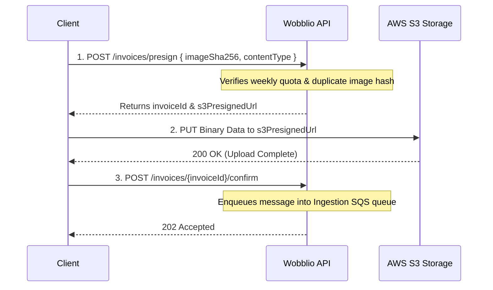

# API Integration Guide

This guide explains how other teams, modules, or external client applications integrate with the Wobblio backend services.

---

## 1. Authentication & Security

All API routes—with the exception of waitlist status and anonymous event tracking—are protected by Amazon Cognito User Pools.

### Authorization Header
To integrate, client applications must include the user's JWT identity token in the `Authorization` header of all requests:
```http
Authorization: Bearer <Cognito_JWT_ID_Token>
```
* **Authentication Scheme:** HTTP Bearer format.
* **Token Validation:** Token validity and signature checks are performed automatically at the API Gateway level before requests are proxied to the backend handlers.

---

## 2. Ingestion Flow (Uploading Receipts)

If another team is building a client (e.g. Mobile App or browser extension) that uploads receipts, they must follow a **3-step transaction-safe upload lifecycle**:



### Step 1: Pre-Register & Get Presigned URL
* **Endpoint:** `POST /invoices/presign`
* **JSON Payload:**
  ```json
  {
    "imageSha256": "4a5e3f...", // 64-char hex string
    "contentType": "image/jpeg",  // OR "application/pdf" (PDFs require Premium)
    "householdId": null,          // Optional household sharing id
    "lat": 52.3676,               // Optional latitude coordinate
    "lon": 4.9041                 // Optional longitude coordinate
  }
  ```
* **Response (201 Created):**
  ```json
  {
    "invoiceId": "d3b07384d...",
    "imageS3Key": "uploads/d3b07...",
    "presignedUrl": "https://wobblio-uploads-prod.s3.amazonaws.com/..."
  }
  ```
* **Fails on:** `429 Too Many Requests` (Quota exceeded) or `409 Conflict` (SHA-256 duplicate).

### Step 2: Upload Binary directly to S3
Perform a standard `PUT` request containing the binary image bytes directly to the `presignedUrl` returned in Step 1. Ensure `Content-Type` matches what was pre-registered.

### Step 3: Enqueue for Processing
* **Endpoint:** `POST /invoices/{invoiceId}/confirm`
* **Response (202 Accepted):**
  ```json
  { "status": "accepted", "invoiceId": "..." }
  ```
This enqueues the processing job in the SQS queue, starting the asynchronous AI vision parser.

---

## 3. Querying Price Intelligence

Other teams can fetch crowdsourced price metrics and comparison data:

### Fetching Price Comparisons
* **Endpoint:** `GET /price-trends/comparison?products=<id,id,...>&country=NL&region=NL-NB`
* **Query Parameters:**
  * `products`: A comma-separated list of product UUIDs.
  * `country`: 2-letter country code.
  * `region`: Region sub-code.
* **Access Rules:**
  * **Premium/Tester/Admin:** Receives two series: the global, de-identified price trends (aggregated across all region scans) and the tenant's personal history.
  * **Standard (Free):** Only receives their personal purchase history (no public trend overlay is provided).

---

## 4. Public Reference Lookups

Public endpoints used to prefill UI controls during onboarding or configuration:
* **Categories:** `GET /reference/categories` — Lists the static 2-level product categories taxonomy.
* **Regions:** `GET /reference/regions?country=NL` — Returns the list of active geographic subdivisions for the queried country.
