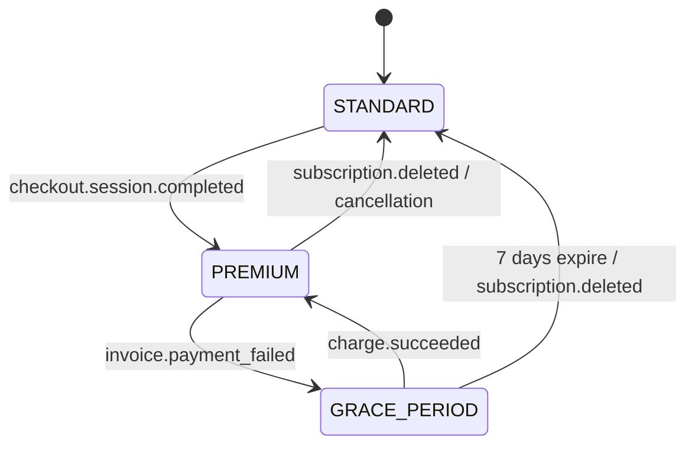

# Stripe Billing & Subscription Integration

Wobblio handles user monetization using Stripe Checkout and Stripe Billing Portal integrations. This document specifies the webhook processing rules, transactional role updates, and audit logging compliance.

---

## 1. Web-Only Billing Channel Routing

To avoid the 15–30% mobile app store fees, subscriptions are handled strictly through a **web-only channel**:
* **Mobile deep-linking:** The mobile Flutter client never hosts in-app purchase dialogs. Instead, it deep-links users directly to the Stripe Checkout page hosted on the web application.
* **Support links:** Plan management buttons on mobile redirect to the Stripe Customer Billing Portal URL generated by the backend API.

---

## 2. Webhook Ingestion & S3 Archiving Pipeline

Stripe webhooks drive subscription activations, updates, and cancellations. Since webhook delivery is asynchronous and at-least-once, ingestion is designed to be idempotent and audit-logged:

```
  Stripe Webhook Event ──► Verify Signature ──► Archive Raw JSON to S3
                                                     │
                                                     ▼
  Idempotent DB Upsert ◄── Set app.bypass_rls ◄── Fetch tenant_id by customer_id
  (payment_transaction)
```

1. **Verify Signature:** The webhook handler API Gateway endpoint validates the event's Stripe signature using the stage webhook secret.
2. **Archive Raw Event JSON:** Before modifying the database, the raw event JSON is saved to S3 at:
   `s3://wobblio-billing-archive-{stage}/{year}/{month}/{event_id}.json`
   - *Retention:* S3 lifecycle rules migrate these objects to **Glacier Instant Retrieval** after 90 days. These files serve as the immutable system audit trail.
3. **Idempotency Check:** The webhook handler fetches the user record via `stripe_customer_id` (using the session `app.bypass_rls` toggle to query across RLS boundaries).
4. **Write Transaction:** The handler upserts a row to `payment_transaction` containing:
   - `stripe_event_id` (VARCHAR UNIQUE) — Enforces database-level idempotency on event redeliveries.
   - `user_id_opaque` — User ID hash (which survives GDPR deletion).
   - `type` (ENUM: `SUBSCRIPTION_CREATED`, `RENEWAL`, `CANCELLATION`, `PAYMENT_SUCCEEDED`, `PAYMENT_FAILED`, `REFUND`).
   - `amount` & `currency`.
   - `occurred_at`.

---

## 3. Subscription Role States & Transitions

The database matches OIDC logins to four core roles: `STANDARD`, `PREMIUM`, `TESTER`, and `ADMIN`. Webhook events drive role transitions:



### 3.1 checkout.session.completed
* **Action:** Upgrades the user account to `PREMIUM`.
* **Waitlist Bypass:** If the user is currently waitlisted (`app_user.status = 'STATUS_WAITLIST'`), the upgrade clears the waitlist status, flips them to `ACTIVE` in both Cognito User attributes and the RDS database profile, and unlocks their API access.

### 3.2 customer.subscription.deleted
* **Action:** Downgrades the target user to `STANDARD`.
* **Cleanup:** Revokes indirect premium from any members associated with the user's household, and resets their weekly upload counters to the Standard caps on the next calendar boundary.

### 3.3 invoice.payment_failed (7-Day Grace Period)
* **Heuristic:** Payment failures do not trigger an immediate downgrade. Instead, the user profile enters a **7-day Grace Period**.
* **Behavior:** The user retains full Premium capabilities. The web and mobile apps display a warning banner: *"Payment failed. Please update your card details to prevent service interruption."*
* **Resolution:** If a subsequent retry succeeds (`charge.succeeded`), the grace state is cleared. If the 7-day window expires without a successful charge, the webhook handler downgrades the account to `STANDARD`.
