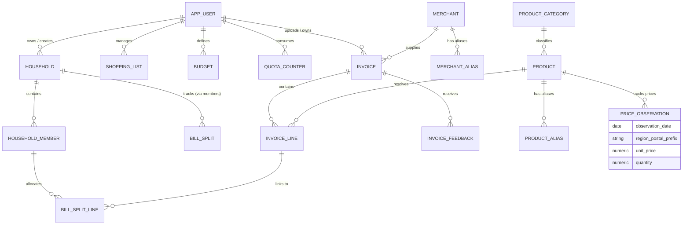

# Database Schema & Entities

Wobblio organizes its database layer into **Tenant-Scoped Tables** isolated using PostgreSQL Row-Level Security (RLS) and **Global (RLS-Exempt) Tables** containing shared catalog details and crowdsourced market indices.

---

## 1. Entity Relationship Diagram



---

## 2. Tenant-Scoped Entities (RLS Enforced)

All tables below enable Row-Level Security and filter on the session parameter `app.current_tenant_id`. For personal tables, the tenant is the `user_id`. For household-pooled features, the tenant maps to the `household_id`.

### 2.1 app_user
Represents the individual user account and billing tier status.
```sql
CREATE TYPE user_role AS ENUM ('STANDARD', 'PREMIUM', 'TESTER', 'ADMIN');
CREATE TYPE user_status AS ENUM ('ACTIVE', 'STATUS_WAITLIST', 'DELETED');

CREATE TABLE app_user (
    id UUID PRIMARY KEY DEFAULT gen_random_uuid(),
    cognito_sub VARCHAR(255) UNIQUE NOT NULL,
    email VARCHAR(255) NOT NULL,
    role user_role NOT NULL DEFAULT 'STANDARD',
    status user_status NOT NULL DEFAULT 'STATUS_WAITLIST',
    country_code VARCHAR(2) NOT NULL DEFAULT 'NL',
    language VARCHAR(5) NOT NULL DEFAULT 'nl',
    home_currency VARCHAR(3) NOT NULL DEFAULT 'EUR',
    region_code VARCHAR(10) NOT NULL, -- First 2 characters of postal code (e.g. '52')
    price_contribution_optout BOOLEAN NOT NULL DEFAULT false,
    stripe_customer_id VARCHAR(255) NULL,
    created_at TIMESTAMPTZ NOT NULL DEFAULT clock_timestamp()
);

-- RLS Policy: Users can only see their own profile, unless app.bypass_rls = 'true'
ALTER TABLE app_user ENABLE ROW LEVEL SECURITY;
CREATE POLICY user_tenant_isolation ON app_user
  USING (
    id = current_setting('app.current_tenant_id', true)::uuid
    OR current_setting('app.bypass_rls', true) = 'true'
  );
```

### 2.2 household & household_member
Defines shared household groupings and member associations.
```sql
CREATE TABLE household (
    id UUID PRIMARY KEY DEFAULT gen_random_uuid(),
    owner_user_id UUID NOT NULL REFERENCES app_user(id) ON DELETE CASCADE,
    name VARCHAR(255) NOT NULL, -- AES-GCM Encrypted household name
    created_at TIMESTAMPTZ NOT NULL DEFAULT clock_timestamp()
);

CREATE TABLE household_member (
    household_id UUID NOT NULL REFERENCES household(id) ON DELETE CASCADE,
    user_id UUID NOT NULL REFERENCES app_user(id) ON DELETE CASCADE,
    joined_at TIMESTAMPTZ NOT NULL DEFAULT clock_timestamp(),
    PRIMARY KEY (household_id, user_id)
);

-- RLS Policies: Isolated to members of the household
ALTER TABLE household ENABLE ROW LEVEL SECURITY;
CREATE POLICY household_isolation ON household
  USING (
    id IN (SELECT household_id FROM household_member WHERE user_id = current_setting('app.current_tenant_id', true)::uuid)
    OR current_setting('app.bypass_rls', true) = 'true'
  );

ALTER TABLE household_member ENABLE ROW LEVEL SECURITY;
CREATE POLICY member_isolation ON household_member
  USING (
    household_id IN (SELECT household_id FROM household_member WHERE user_id = current_setting('app.current_tenant_id', true)::uuid)
    OR current_setting('app.bypass_rls', true) = 'true'
  );
```

### 2.3 invoice & invoice_line
Stores structured receipt metrics extracted from S3 images.
```sql
CREATE TYPE invoice_status AS ENUM ('PROCESSING', 'NEEDS_REVIEW', 'PARSED', 'FAILED_PROCESSING', 'SUSPECTED_DUPLICATE', 'DISCARDED');

CREATE TABLE invoice (
    id UUID PRIMARY KEY DEFAULT gen_random_uuid(),
    tenant_id UUID NOT NULL, -- Either user_id or household_id depending on the scope
    household_id UUID NULL REFERENCES household(id) ON DELETE SET NULL,
    uploaded_by_user_id UUID NOT NULL REFERENCES app_user(id),
    merchant_id UUID NULL, -- References global merchant (nullable if provisional)
    status invoice_status NOT NULL DEFAULT 'PROCESSING',
    transaction_date DATE NOT NULL,
    currency VARCHAR(3) NOT NULL DEFAULT 'EUR',
    total NUMERIC(12, 4) NOT NULL,
    total_home_currency NUMERIC(12, 4) NOT NULL,
    fx_rate_used NUMERIC(12, 6) NOT NULL DEFAULT 1.000000,
    category_id UUID NOT NULL, -- References global category
    image_s3_key VARCHAR(512) NOT NULL,
    image_sha256 VARCHAR(64) NOT NULL, -- SHA-256 hash of receipt image
    search_tags VARCHAR(100)[] NOT NULL DEFAULT '{}',
    created_at TIMESTAMPTZ NOT NULL DEFAULT clock_timestamp()
);

CREATE TABLE invoice_line (
    id UUID PRIMARY KEY DEFAULT gen_random_uuid(),
    invoice_id UUID NOT NULL REFERENCES invoice(id) ON DELETE CASCADE,
    raw_text VARCHAR(512) NOT NULL,
    product_id UUID NULL, -- References global product (nullable if provisional/unresolved)
    category_id UUID NOT NULL, -- References global category
    quantity NUMERIC(10, 3) NOT NULL DEFAULT 1.000,
    pack_quantity NUMERIC(10, 3) NULL,
    base_unit VARCHAR(10) NULL, -- 'KG', 'L', 'PIECE'
    unit_price NUMERIC(12, 4) NOT NULL,
    normalized_unit_price NUMERIC(12, 4) NOT NULL,
    line_total NUMERIC(12, 4) NOT NULL,
    is_discount BOOLEAN NOT NULL DEFAULT false,
    is_deposit_or_fee BOOLEAN NOT NULL DEFAULT false,
    confidence NUMERIC(5, 2) NOT NULL DEFAULT 1.00
);

-- Indexes for performance
CREATE INDEX idx_invoice_tenant ON invoice(tenant_id);
CREATE INDEX idx_invoice_tags ON invoice USING GIN(search_tags);
CREATE INDEX idx_invoice_sha256 ON invoice(image_sha256);
CREATE INDEX idx_line_invoice ON invoice_line(invoice_id);

-- RLS Isolation
ALTER TABLE invoice ENABLE ROW LEVEL SECURITY;
CREATE POLICY invoice_tenant_isolation ON invoice
  USING (
    tenant_id = current_setting('app.current_tenant_id', true)::uuid
    OR current_setting('app.bypass_rls', true) = 'true'
  );

ALTER TABLE invoice_line ENABLE ROW LEVEL SECURITY;
CREATE POLICY line_tenant_isolation ON invoice_line
  USING (
    invoice_id IN (SELECT id FROM invoice WHERE tenant_id = current_setting('app.current_tenant_id', true)::uuid)
    OR current_setting('app.bypass_rls', true) = 'true'
  );
```

### 2.4 quota_counter
Tracks tenant credits consumed during the current week start.
```sql
CREATE TYPE quota_counter_type AS ENUM ('CREDITS', 'HOUSEHOLD_CREDITS');

CREATE TABLE quota_counter (
    tenant_id UUID NOT NULL,
    counter quota_counter_type NOT NULL DEFAULT 'CREDITS',
    week_start DATE NOT NULL,
    used INT NOT NULL DEFAULT 0,
    PRIMARY KEY (tenant_id, counter, week_start),
    CONSTRAINT used_non_negative CHECK (used >= 0)
);

ALTER TABLE quota_counter ENABLE ROW LEVEL SECURITY;
CREATE POLICY quota_tenant_isolation ON quota_counter
  USING (
    tenant_id = current_setting('app.current_tenant_id', true)::uuid
    OR current_setting('app.bypass_rls', true) = 'true'
  );
```

---

## 3. Global Entities (RLS Exempt)

These tables contain shared catalog details, trigram search configurations, and regional markets indexes.

### 3.1 merchant & merchant_alias
Stores canonical merchant definitions and alias mappings.
```sql
CREATE TYPE entity_status AS ENUM ('PROVISIONAL', 'ACTIVE');

CREATE TABLE merchant (
    id UUID PRIMARY KEY DEFAULT gen_random_uuid(),
    name VARCHAR(255) NOT NULL,
    default_category_id UUID NOT NULL,
    status entity_status NOT NULL DEFAULT 'PROVISIONAL',
    created_at TIMESTAMPTZ NOT NULL DEFAULT clock_timestamp()
);

CREATE TABLE merchant_alias (
    id UUID PRIMARY KEY DEFAULT gen_random_uuid(),
    merchant_id UUID NOT NULL REFERENCES merchant(id) ON DELETE CASCADE,
    alias_normalized VARCHAR(255) UNIQUE NOT NULL,
    vat_id VARCHAR(50) NULL
);

-- Trigram index for fuzzy alias searching
CREATE INDEX idx_merchant_alias_trgm ON merchant_alias USING GIST (alias_normalized gist_trgm_ops);
```

### 3.2 product & product_alias
Contains products and vectors to enable catalog lookups.
```sql
CREATE TABLE product (
    id UUID PRIMARY KEY DEFAULT gen_random_uuid(),
    category_id UUID NOT NULL,
    brand VARCHAR(255) NOT NULL,
    display_name VARCHAR(255) NOT NULL,
    embedding VECTOR(512) NOT NULL, -- 512-dimensional Titan Text Embeddings V2
    status entity_status NOT NULL DEFAULT 'PROVISIONAL',
    created_at TIMESTAMPTZ NOT NULL DEFAULT clock_timestamp()
);

CREATE TABLE product_alias (
    id UUID PRIMARY KEY DEFAULT gen_random_uuid(),
    product_id UUID NOT NULL REFERENCES product(id) ON DELETE CASCADE,
    merchant_id UUID NOT NULL REFERENCES merchant(id) ON DELETE CASCADE,
    raw_name_normalized VARCHAR(512) NOT NULL,
    UNIQUE (merchant_id, raw_name_normalized)
);

-- pgvector HNSW index for cosine distance similarity
CREATE INDEX idx_product_embedding_hnsw ON product USING HNSW (embedding vector_cosine_ops)
  WITH (m = 16, ef_construction = 64);

-- Trigram index for product text fallback matching
CREATE INDEX idx_product_name_trgm ON product USING GIST ((brand || ' ' || display_name) gist_trgm_ops);
```

### 3.3 price_observation
Tracks crowdsourced price entries without any user pointers.
```sql
CREATE TABLE price_observation (
    id UUID PRIMARY KEY DEFAULT gen_random_uuid(),
    product_id UUID NOT NULL REFERENCES product(id) ON DELETE CASCADE,
    merchant_id UUID NOT NULL REFERENCES merchant(id) ON DELETE CASCADE,
    observation_date DATE NOT NULL,
    unit_price NUMERIC(12, 4) NOT NULL,
    quantity NUMERIC(10, 3) NOT NULL DEFAULT 1.000,
    normalized_unit_price NUMERIC(12, 4) NOT NULL,
    region_postal_prefix VARCHAR(2) NOT NULL, -- E.g. '52' or '10' (first 2 chars of zip)
    quarantined BOOLEAN NOT NULL DEFAULT false,
    contributor_trust_at_write SMALLINT NOT NULL DEFAULT 50, -- Truncated trust score 0-100
    CONSTRAINT check_trust_bounds CHECK (contributor_trust_at_write BETWEEN 0 AND 100)
);

-- Index observations to speed up regional price comparisons
CREATE INDEX idx_price_lookup ON price_observation(product_id, region_postal_prefix, observation_date)
  WHERE (quarantined = false);
```

### 3.4 payment_transaction
Audited Stripe subscription billing records.
```sql
CREATE TYPE transaction_type AS ENUM ('SUBSCRIPTION_CREATED', 'RENEWAL', 'CANCELLATION', 'PAYMENT_SUCCEEDED', 'PAYMENT_FAILED', 'REFUND');

CREATE TABLE payment_transaction (
    id UUID PRIMARY KEY DEFAULT gen_random_uuid(),
    stripe_event_id VARCHAR(255) UNIQUE NOT NULL, -- Webhook idempotency key
    user_id_opaque VARCHAR(64) NOT NULL, -- SHA-256 hashed user reference (retained after user delete)
    type transaction_type NOT NULL,
    amount INT NOT NULL, -- Value in cents
    currency VARCHAR(3) NOT NULL DEFAULT 'EUR',
    occurred_at TIMESTAMPTZ NOT NULL
);
```

---

## 4. Encryption & GDPR Boundaries

### 4.1 Application-Level Encryption (KMS Envelope)
To protect personal identifiable information (PII) while ensuring database indexes and aggregations remain fast and queryable, field-level encryption is strictly isolated. 

We use **AES-GCM-256** (with AWS KMS Customer Managed Keys) on a narrow, explicit list of text columns. The database never sees the plaintext for:
1. **`household.name`**: User-defined name of the household space.
2. **`bill_split_line.participant_name_enc`**: Names of friends/family added for splits.
3. **`data_request.export_s3_key`**: S3 location of exported GDPR zip packages.
4. **`invoice_feedback.comment_enc`**: Direct comments submitted by tenants.
5. **Invite Tokens**: Tokens used to join households at rest.

Financial metrics (totals, unit prices), dates, and canonical catalog names are **never** encrypted. This permits fuzzy searches, category spend aggregation, and region-based pricing indexes without decrypting data server-side.

### 4.2 De-identification Boundary (Price Observations)
By design, the crowdsourced `price_observation` layer contains **no connection** to the contributing user, household, or specific invoice transaction. 
* Personal invoice rows link to products and merchants.
* The `price_observation` store receives a copy of these rows, but strips the `invoice_id`, `tenant_id`, `uploaded_by_user_id`, and `created_at` fields.
* Dates are truncated to calendar-day precision, and locations are truncated to the first 2 characters of the postal code subdivision (e.g. `52` instead of `5231 BA`).
* This isolation prevents re-identification, meaning the crowdsourced database remains GDPR-compliant even if a contributing user deletes their account (as the price data contains zero personal information).
