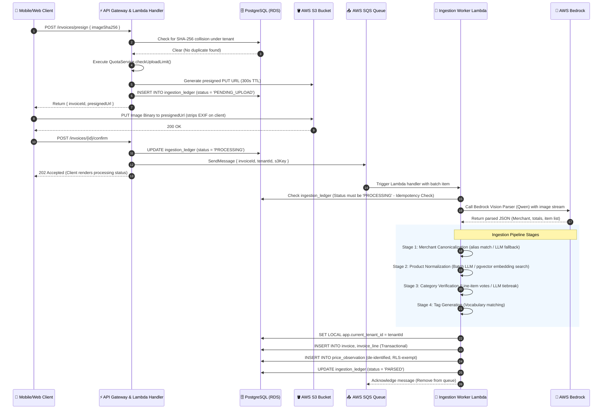

# Low Level Design (LLD)

This document specifies the low-level design patterns of Wobblio, including service dependencies, the step-by-step invoice upload lifecycle, and structured error handling.

---

## 1. Service, Port, and Adapter Mappings

Wobblio strictly enforces the dependency inversion principle. Core services orchestrate business invariants using Ports (TypeScript interfaces). Infrastructure adapters implement these ports:

```
    ┌──────────────────────────┐
    │     API/SQS Handlers     │
    └─────────────┬────────────┘
                  │ calls
                  ▼
    ┌──────────────────────────┐
    │   Domain Services        │ (e.g. QuotaService, ConfirmService)
    └─────────────┬────────────┘
                  │ references
                  ▼
    ┌──────────────────────────┐
    │   Ports (Interfaces)     │ (e.g. IQuotaRepository, IS3FileStorage)
    └──────────────────────────┘
                  ▲
                  │ implements
    ┌──────────────────────────┐
    │  Infrastructure Adapters │ (e.g. PostgresQuotaRepositoryAdapter)
    └──────────────────────────┘
```

Below is a mapping of the primary services, their port requirements, and their concrete adapters:

| Domain Service | Required Ports (Interfaces) | Concrete Infrastructure Adapter |
|---|---|---|
| **`QuotaService`** | `IQuotaRepository` | `PostgresQuotaRepositoryAdapter` |
| **`ConfirmService`** | `IInvoiceRepository`, `IIngestionQueue` | `PostgresInvoiceRepositoryAdapter`, `SqsIngestionQueueAdapter` |
| **`PresignService`** | `IS3FileStorage`, `IInvoiceRepository` | `S3FileStorageAdapter`, `PostgresInvoiceRepositoryAdapter` |
| **`VisionParseService`** | `IBedrockConverse` | `BedrockConverseAdapter` |
| **`ProfileService`** | `IAppUserRepository` | `PostgresAppUserRepositoryAdapter` |
| **`BillingService`** | `IBillingGateway` | `StripeGatewayAdapter` |
| **`SplitRouteOptimizer`** | `IPriceObservationStore` | `PostgresPriceObservationStoreAdapter` |

---

## 2. Sequential Invoice Processing Workflow

The diagram below illustrates the exact low-level execution path for processing a receipt from initial client action to SQS queue worker ingestion and final price observation emission.



---

## 3. Domain Error Mapping & HTTP Status Codes

To prevent infrastructure details or raw SQL exceptions from leaking to client interfaces, adapters catch SDK errors and map them to explicit domain errors. These errors propagate through the service layers to the API Gateway Lambda handler, where they are mapped to standard HTTP status codes:

```
  AWS SDK/Postgres Exception ──► Caught by Adapter ──► Mapped to Domain Error
                                                               │
                                                               ▼ Propagated
  HTTP Status Code Response  ◄── Mapped by Handler  ◄── Caught by Lambda API
```

### Domain Error Catalog & Response Codes

| Domain Error | Trigger Scenario | HTTP Status Code | Response Payload |
|---|---|---|---|
| `DuplicateInvoiceError` | The upload's SHA-256 hash matches an invoice already uploaded by this tenant. | `409 Conflict` | `{ "error": "duplicate_invoice" }` |
| `QuotaExceededError` | Tenant has consumed their weekly scan allotment (e.g. 3/week for Free, 10/week for Premium). | `429 Too Many Requests` | `{ "error": "quota_exceeded" }` |
| `AiSpendCapExceededError` | The tenant's daily AI transaction cost exceeds the soft limits set in SSM parameters. | `429 Too Many Requests` | `{ "error": "ai_limit_reached" }` |
| `UserNotFoundError` | Cognito sub value is valid, but the user profile does not exist in the database. | `404 Not Found` | `{ "error": "user_not_found" }` |
| `UserDeletedError` | User account is present in the database but marked with `status = 'DELETED'`. | `410 Gone` | `{ "error": "account_deactivated" }` |
| `HouseholdNotFoundError` | The requested shared household pool is missing or has been dissolved. | `404 Not Found` | `{ "error": "household_not_found" }` |
| `InvalidBillingStateError` | User tries to access Premium actions (e.g., split-route optimizer) with a Standard plan. | `400 Bad Request` | `{ "error": "subscription_required" }` |
| `StaleUploadError` | Confirm is requested on an upload whose presigned URL has expired ($>300$ seconds). | `409 Conflict` | `{ "error": "upload_timeout" }` |
