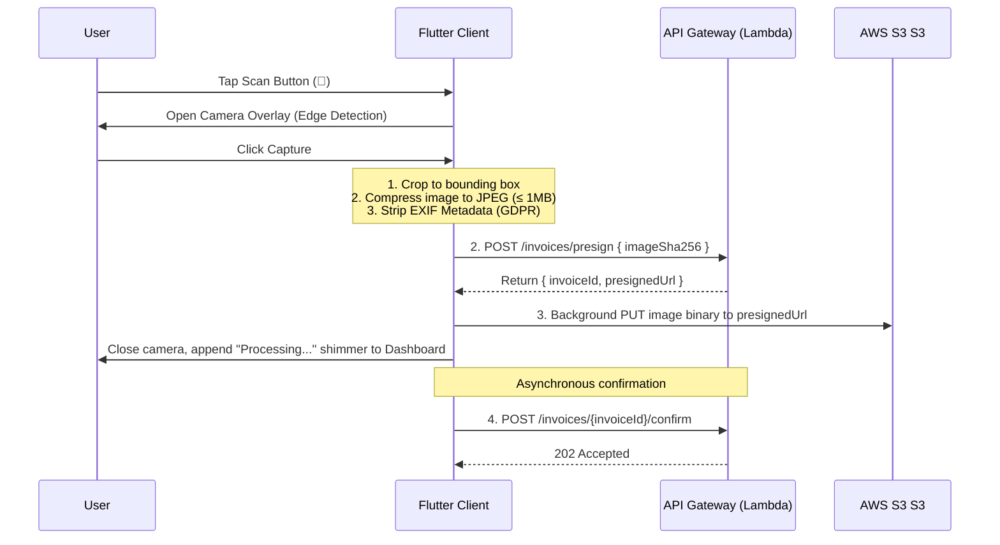

# Mobile Client Architecture (Flutter)

Wobblio's mobile client is built using Flutter (targeting iOS and Android) and acts as the primary capture tool. It prioritizes offline usability, rapid image preprocessing, and a seamless capture-to-dashboard workflow.

---

## 1. Directory & Navigation Structure

The mobile client is organized into a four-tab bottom navigation frame, with a dominant, raised central floating action button (FAB) for receipt scanning:

```
    ┌──────────────────────────────────────────────┐
    │                 App Header                   │
    ├──────────────────────────────────────────────┤
    │                                              │
    │                                              │
    │                 TAB CONTENT                  │
    │                                              │
    │                                              │
    ├───────────────────┬───────┬──────────────────┤
    │  [ ]     [ ]      │ ( 📸 )│   [ ]     [ ]    │
    │  Home   Lists     │  Scan │ Insights Profile │
    └───────────────────┴───────┴──────────────────┘
```

1. **Home (Dashboard):** Showcases the current month's spending card, remaining weekly scan quotas (e.g. `7/10 scans`), budget progress bars (Premium-only), and a scrolling list of recent uploads with status pills (`Processing`, `Needs Review`, `Parsed`).
2. **Lists (Shopping Lists):** Active shopping lists that support offline checklist management. Includes the Premium *Optimize Route* action.
3. **Insights (Analytics):** High-level donut charts of monthly spending and the Weekly AI Savings Advisor card. (Deep analytical charts redirect to the web console).
4. **Profile (Settings):** Plan settings, billing portal redirect links, and regional/currency selections.
5. **Scan (Central FAB):** Raises the full-screen camera modal instantly.

---

## 2. Ingestion Prep & Background Upload Flow

To ensure the user is never blocked by network latency or AI processing times, the mobile client executes a client-side optimization and background handshake flow:



### GDPR Metadata Stripping
Before uploading any image bytes, the Flutter client **must** decode and re-encode the image to strip EXIF data (GPS coordinates, camera IDs, timestamps). This ensures that no raw location or device footprints are transmitted, fulfilling GDPR minimization principles before data leaves the device.

---

## 3. Offline Mode & Local Synchronization

Shopping lists must remain operational in environments with poor cellular service (e.g. supermarket basement stores).
* **Storage:** Local state is persisted in an encrypted SQLite database on-device (via `drift` or `sqflite`).
* **Synchronization Resolver:**
  * Changes made offline are marked with an on-device `updated_at` timestamp.
  * When connectivity is restored, the client pushes local updates to `POST /lists/{id}/items` and pulls remote lists.
  * A **Last-Write-Wins (LWW)** resolution policy resolves conflicts on item checkboxes and quantities.
* **Optimized Routing Caching:** Optimized routes computed by the backend split-route engine are cached offline so they can be navigated during shopping even with no internet connection.

---

## 4. Mobile Key Workflows

### 4.1 The Split-Review Screen
If a receipt lands in `NEEDS_REVIEW` due to low-confidence OCR or category mismatches, the user is presented with a split layout:
* **Top Half:** A zoomable, pannable image viewer displaying the uploaded receipt.
* **Bottom Half:** A scrollable form containing the parsed fields.
* **Field Autocomplete:** When modifying a merchant or line-item product name, typing triggers a search-as-you-type query against `/products` or `/merchants`. Selecting a canonical product auto-completes the base unit and category.
* **Submission:** Saving updates the invoice on the server and pushes alias adjustments.

### 4.2 Proportional Bill Splitter
* **Line Selection:** User taps line items to allocate them to specific contacts.
* **Unit Stepper:** For shared dishes/drinks, a fraction stepper allows allocating halves or thirds (e.g., `0.33` to User A, `0.67` to User B).
* **Tax Allocation:** Taxes, tips, and service fees are calculated proportionally based on the sum of each user's specific items relative to the raw subtotal.
* **WhatsApp Share:** A copy button formats the split results into a formatted, WhatsApp-friendly text block:
  ```text
  🍽️ Bill Split Summary - [Merchant]
  ---------------------------------
  John: €14.50 (Burger + 0.5 Beer)
  Sarah: €18.20 (Salad + Dessert + 0.5 Beer)
  ---------------------------------
  Tax & Tip scaled proportionally.
  Settle up at: [Link]
  ```
