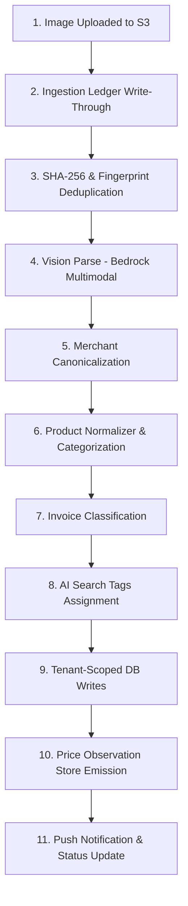

# Receipt Ingestion Pipeline

The core product path of Wobblio is driven by an asynchronous SQS consumer Lambda. It processes uploaded receipt images into structured, categorized, and de-identified financial transactions. 

The worker implements this pipeline in the following exact order:



## Ingestion Steps

### 1. Ingestion Ledger (Transport Idempotency)
The worker's first step is executing:
```sql
INSERT INTO ingestion_ledger (s3_key, tenant_id, status, attempt_count)
VALUES ($1, $2, 'PROCESSING', 1)
ON CONFLICT (s3_key) DO NOTHING;
```
If the key already exists (due to SQS at-least-once redeliveries), the consumer short-circuits. All subsequent writes run inside the same transaction, making the worker resume cleanly after midpoint crashes.

### 2. Content Deduplication
* **SHA-256 Check (Exact Dup):** If the image's SHA-256 hash already exists under the same tenant, the upload is immediately rejected without consuming AI tokens. If a hash collision occurs *cross-tenant*, the upload is accepted (printed duplicates are possible) but flags the user accounts as a cluster for trust validation.
* **Fuzzy Fingerprint Check:** After parsing, the fingerprint `(merchant_id, transaction_date, total, line_count)` is matched within the tenant's scope. A hit flags the invoice as `SUSPECTED_DUPLICATE`, prompting the user to confirm or discard.

### 3. Vision Parse
The image is passed to a multimodal Bedrock model (using SSM `/wobblio/config/models/vision_parser`).
* The model must respond in a strict JSON format containing raw merchant info, total, taxes, currency, and line items.
* If JSON validation fails, the worker retries once, echoing the validation errors back to the model. If it fails a second time, the message routes to the Dead Letter Queue (DLQ).

### 4. Merchant Canonicalization
Converts unstructured receipt headers into a single merchant identity:
1. **Direct Identifier Match:** If a VAT or business registration number is parsed, it queries `merchant_alias.vat_id` (authoritative).
2. **Exact Alias Match:** Checks the normalized raw string against `merchant_alias.alias_normalized`.
3. **Fuzzy Trigram Match:** Cosine/trigram similarity via `pg_trgm` on aliases. Similarity must be $\ge 0.65$ with a $\ge 0.15$ margin over the runner-up. Confirmed matches write a new `AUTO_FUZZY` alias.
4. **LLM Fallback:** Under `/wobblio/config/models/auxiliary` (Haiku-class), the model is prompted with the raw merchant details and 5 brand-level candidates.
5. **Provisional Entry:** Genuinely new merchants are inserted with `status = 'PROVISIONAL'` (visible only to the contributing tenant).

### 5. Product Normalization & Categorization
Standardizes raw item description strings (e.g. `AH BIO HALFV MELK 1L` $\rightarrow$ `Albert Heijn Biologisch Halfvolle Melk 1L`):
1. **Exact Alias Match:** Scopes match to normalized raw text per merchant (highly repeated grocery purchases match here).
2. **Batch LLM Expansion:** Unmatched lines are batched in a single LLM call. The model expands abbreviations and extracts brands, names, categories, and unit sizes.
3. **Embedding search:** Cosine similarity via `pgvector` HNSW indexes over product display embeddings. Accept similarity $\ge 0.92$. A similarity of $0.85\text{–}0.92$ tags the line as `LOW_CONFIDENCE`, and $< 0.85$ inserts a `PROVISIONAL` product.
4. **Derived Unit Prices:** Computes unit prices in `KG`, `L`, or `PIECE`. Incomplete sizes are excluded from comparisons.

### 6. Invoice Classification
Assigns one macro-category to the invoice for reporting and budgets. Resolved in order:
1. **Merchant Prior:** Default merchant category.
2. **Line Item Vote:** Category with the highest share of spend.
3. **LLM Tiebreak:** Auxiliary model resolves only when the prior and line votes conflict and no single category exceeds 50%.

### 7. Tag Generation
Enriches the invoice with up to 3 filtering tags:
* Uses a deterministic check against a fixed vocabulary (`TAG_VOCABULARY`).
* Piggybacks on the Product Expansion LLM call if the call runs, avoiding extra model costs.

### 8. Tenant Database Writes
Inserts `invoice` and `invoice_line` records within the transaction.

### 9. Price Observation Emission
Sends de-identified price facts to the `price_observation` table (RLS-exempt, no tenant identifier, day-granular dates, first 2 digits of postal code).

### 10. Notification & Status Resolution
Triggers a push notification and flips the invoice to its terminal status (e.g. `PARSED`, `NEEDS_REVIEW`, or `SUSPECTED_DUPLICATE`).

---

## Invoice Status & Quality Evaluation

The terminal status of an invoice is determined dynamically by evaluating several parser indicators against a set of strict confidence thresholds.

### 1. Confidence Thresholds
The domain logic defines these constant thresholds:
* **Vision Minimum (`visionMin`):** `0.7` — Minimum OCR confidence score from the Bedrock parser.
* **Embedding Match Accept (`embeddingAccept`):** `0.92` — Match similarity cutoff to auto-adopt an existing product.
* **Embedding Match Low (`embeddingLow`):** `0.85` — Band below which a product is considered provisional.
* **Fuzzy Merchant Margin (`fuzzyMatchMargin`):** `0.15` — Required delta between trigram match winner and runner-up.
* **Arithmetic Tolerance:** Total must reconcile with line items within `0.05 EUR` (`arithmeticAbsEur`) or `1%` (`arithmeticPct`).

### 2. Status Decision Matrix (`decideStatus`)
The worker passes the parser results through the status decision tree:
1. **`SUSPECTED_DUPLICATE`:** Triggered if a fuzzy fingerprint twin is found (same total, date, merchant, and line count under the tenant's scope).
2. **`NEEDS_REVIEW`:** Triggered if:
   * Vision parser confidence falls below `0.7`.
   * Line totals do not reconcile mathematically with the invoice total.
   * Any line item resolves to a low-confidence product ($0.85 \le \text{similarity} < 0.92$).
   * The merchant resolves below threshold (meaning a new provisional merchant is created).
3. **`PARSED`:** Triggered when all confidence and arithmetic checks pass.

---

## Feedback & Review Flywheel (User-in-the-Loop)

Ingestion is designed as a continuous improvement loop, incorporating human corrections to train and stabilize catalog indexes.

### 1. The Review Screen
If an invoice lands in `NEEDS_REVIEW` (or is marked `SUSPECTED_DUPLICATE`), it appears on the client dashboard. The user is presented with the receipt image side-by-side with the editable parsed fields:
* Correcting a merchant or product updates/inserts a `USER_CONFIRMED` alias in the catalog tables.
* Re-saving updates the invoice status to `PARSED` and immediately updates the associated observations in the `price_observation` store, upgrading their quality flag to `USER_CONFIRMED`.

### 2. Accuracy Verdicts
After review, users can submit an accuracy verdict:
* **UP / DOWN:** Recorded via `RecordFeedbackService` in the `invoice_feedback` table.
* **KPI telemetry:** The system tracks the ratio of `DOWN` verdicts as an early-warning signal for prompt regression, feeding the `kpi_daily` rollup metrics.

