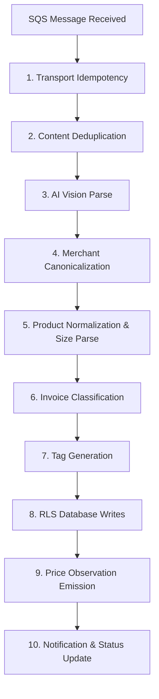

# Receipt Ingestion Pipeline, Heuristics, & Edge Cases

The receipt ingestion pipeline is the data processing core of Wobblio. It converts unstructured physical receipt images into clean, structured, and comparable financial records while building a crowdsourced, de-identified regional market price index.

---

## 1. Pipeline Overview

The pipeline executes as an asynchronous AWS SQS consumer. The worker processes messages in the following exact order:



---

## 2. Ingestion Steps, Heuristics, & Code Logic

### Stage 1: Transport Idempotency
* **Heuristic:** To prevent processing the same receipt multiple times due to SQS at-least-once delivery, the worker immediately logs the S3 file key.
* **SQL Logic:**
  ```sql
  INSERT INTO ingestion_ledger (s3_key, tenant_id, status, attempt_count)
  VALUES ($1, $2, 'PROCESSING', 1)
  ON CONFLICT (s3_key) DO NOTHING;
  ```
* **Edge Case:** If the write returns a conflict (meaning the key was already registered), the container short-circuits. All subsequent pipeline writes are grouped in a single PostgreSQL transaction tied to this ledger record, enabling clean rollbacks on mid-run crashes.

### Stage 2: Content Deduplication
Wobblio runs two independent deduplication checks to save LLM token costs and protect index integrity:
1. **Exact Duplicate (SHA-256):** The SHA-256 hash of the uploaded image bytes is checked against the tenant's existing invoices. If a match is found, the upload is rejected immediately at the API boundary, incurring zero AI costs.
   - *Cross-Tenant Collision Edge Case:* If the same hash matches across *different* tenants, the upload is accepted (as identical printed receipts can exist). However, it flags the associated accounts as a cluster for trust auditing and voids catalog promotion quorums (§6.2).
2. **Fuzzy Duplicate (Fingerprint Match):** After AI parsing, the worker generates a fingerprint tuple: `(merchant_id, transaction_date, total, line_count)`. It queries the tenant's historical records. If a matching tuple is found, the invoice status is marked as `SUSPECTED_DUPLICATE`.
   - *Edge Case:* The receipt is shown on the review screen, and the user must manually confirm or discard it. Confirmed duplicates are saved but do not emit price observations and do not consume weekly quotas.

### Stage 3: AI Vision Parse (Bedrock Qwen)
* **Heuristic:** The worker sends the compressed image to a multimodal Bedrock model (SSM `/wobblio/config/models/vision_parser`). The prompt requires a strict JSON payload conforming to the receipt schema (raw merchant, totals, tax arrays, and itemized lines with quantities and unit prices).
* **Edge Case (Schema Failures):** If the model's response fails JSON schema validation, the worker catches the error and retries once, echoing the validation errors back to the model. If the second attempt fails, the message is routed to the Dead Letter Queue (DLQ).
* **Edge Case (Arithmetic Sanity Checks):** The worker calculates:
  $$\sum(\text{Line Total}) - \text{Discounts} \approx \text{Invoice Total}$$
  If the sum differs from the printed total by more than **€0.05** or **1%**, the invoice is flagged as `NEEDS_REVIEW` rather than rejected. This is because receipts legitimately contain deposit refunds (`STATIEGELD` in NL), merchant loyalty discounts, or roundings.

### Stage 4: Merchant Canonicalization
* **Heuristic:** Wobblio maps raw receipt text to a single canonical `merchant_id` (brand-level) and `branch_id` (branch-specific store details).
* **Resolution Ladder (Cheapest first):**
  1. *Normalization:* uppercase raw string, Unicode-fold, strip legal abbreviations (`B.V.`, `GmbH`, `LTD`), collapse whitespaces, and extract store numbers or city names (e.g. `AH 1325 EINDHOVEN` $\rightarrow$ brand alias: `AH`, store number: `1325`, city: `EINDHOVEN`).
  2. *VAT ID Match:* If a VAT registration number was parsed, Wobblio queries `merchant_alias.vat_id`. Matches here are authoritative and short-circuit further matching.
  3. *Exact Alias Match:* Queries the normalized brand name against the `merchant_alias` table for the user's country code.
  4. *Fuzzy Match (pg_trgm):* Performs a trigram similarity search. A match is accepted if similarity is $\ge 0.65$ **and** there is a margin of $\ge 0.15$ over the runner-up. The matched variant is added as an `AUTO_FUZZY` alias to accelerate future matches.
  5. *LLM Fallback:* Prompts a Haiku auxiliary model with the raw merchant details and 10 nearest fuzzy candidates. If still unresolved, it inserts a new merchant marked `status = 'PROVISIONAL'`.
  6. *User Override:* User corrections on the review screen write a `USER_CONFIRMED` alias which outranks automatic matching on future receipts.

### Stage 5: Product Normalization & Size Parse
* **Heuristic:** Standardizes truncated receipt strings (e.g., `AH BIO HALFV MELK 1L` $\rightarrow$ `Albert Heijn Biologisch Halfvolle Melk 1L`).
* **Resolution Steps:**
  1. *Merchant-Scoped Alias Match:* Looks up the exact normalized raw line text within the merchant's alias map. Since supermarket item strings are highly stable, this resolves the vast majority of steady-state items.
  2. *Batch LLM Expansion (Haiku):* All unresolved lines are passed to Haiku in **one single batch call** (saving token overhead vs. per-line calls). The model extracts the brand, clean name, variant details, pack sizes, base units, and tags deposit fees. The prompt includes the resolved merchant brand to resolve store brands (e.g., `AH` prefix is resolved as Albert Heijn's private label).
  3. *Embedding Vector Search (Titan V2):* Embeds the expanded string and runs a `pgvector` cosine similarity search over products in the same category.
     - Similarity $\ge 0.92$: Auto-assigns the canonical `product_id`.
     - Similarity $0.85\text{–}0.92$: Assigns the candidate but flags the line as `LOW_CONFIDENCE` (surfaced in amber on the review screen).
     - Similarity $< 0.85$: Creates a `PROVISIONAL` product.
* **Unit-Price Normalization (Heuristic):**
  The parser extracts the printed unit size and normalizes quantities to a comparable base unit (`KG`, `L`, or `PIECE`):
  - *Multipacks:* `6X33CL` is parsed as $6 \times 0.33\text{ L} = 1.98\text{ L}$.
  - *By-Weight:* Scales using the raw decimal weight printed on the receipt.
  - *Normal Calculation:*
    $$\text{Normalized Unit Price} = \frac{\text{Line Total}}{\text{Quantity} \times \text{Pack Size Base Units}}$$
  - *Edge Case (Unparseable Sizes):* If the size cannot be parsed, the line item is kept on the user's invoice, but the worker **skips emitting a price observation**. A smaller, clean price index is favored over a large, noisy one.

### Stage 6: Invoice Classification
* **Heuristic:** The invoice is assigned one macro-category for budgeting.
* **Priority order:**
  1. *Merchant Prior:* Defaults to the merchant's standard category (e.g. a Kruidvat receipt defaults to "Personal Care & Pharmacy").
  2. *Line-Item Vote:* The category carrying the highest overall spend share on the receipt.
  3. *LLM Tiebreak:* Triggered only if the prior and the line vote conflict, and no single category represents $>50\%$ of the spend.

### Stage 7: Tag Generation
* **Heuristic:** Assigns up to 3 filter tags (e.g. `weekly-groceries`, `bbq`, `dining-out`) from a fixed vocabulary stored in SSM.
* **Cost Minimization Rule:** Tagging runs deterministically based on spend categories and merchant matches (e.g., $\ge 60\%$ spend in Groceries implies `weekly-groceries`). If the batch LLM expansion in Stage 5 runs, the prompt piggybacks on that call to request tag recommendations, avoiding a dedicated model call.

### Stage 8: RLS Database Writes
* **Logic:** The worker sets the PostgreSQL tenant transaction context:
  ```sql
  SET LOCAL app.current_tenant_id = '<uuid>';
  ```
  It then writes the `invoice` and `invoice_line` records inside the transaction. RLS guarantees that other users cannot access these rows.

### Stage 9: Price Observation Emission
* **Heuristic:** Emits de-identified pricing facts to the shared, RLS-exempt `price_observation` table.
* **PII Stripping (GDPR Edge Case):**
  To prevent re-identification, the database:
  - Strips `invoice_id`, `tenant_id`, and `uploaded_by_user_id`.
  - Truncates postal codes to the first 2 characters (e.g. `52` instead of `5231 BA`).
  - Truncates times to date-only precision.

---

## 3. Catalog Integrity & Anti-Poisoning Constraints

Because the price index is crowdsourced, Wobblio implements four layers of defensive heuristics to prevent malicious database pollution:

| Defense Layer | Heuristic / Constraint | Purpose / Action |
|---|---|---|
| **Layer 1: Provisional Quarantine** | Automatically created merchants and products are marked as `PROVISIONAL` and are globally quarantined. | **Creators:** Can search and see these items immediately in their budgets and shopping lists.<br>**Other Users:** These items are invisible in their autocomplete searches or charts. |
| **Layer 1a: Sybil-Resistant Quorum** | Provisional items are promoted to `ACTIVE` only after independent corroboration. | **Quorum Rules:** Must be confirmed by $\ge 3$ distinct eligible tenants, $\ge 2$ user review overrides, or manual admin approval.<br>**Eligibility:** Tenant account must be $\ge 7$ days old, have $\ge 5$ parsed receipts, and have unique device/IP hashes. Collisions void quorums. |
| **Layer 2: Price Plausibility Bands** | Before saving a price observation, it is statistically verified. | **Action:** Prices must fall within $[\text{median} / 4, \text{median} \times 4]$ of the 90-day regional median for that product. Outliers are quarantined. Quantity caps (e.g. line quantity $\le 200$) filter out OCR scanner glitches. |
| **Layer 3: Tenant Trust Scores** | A hidden trust score ($0\text{–}100$) is calculated nightly for every tenant. | **Action:** Scores increase with account age and review confirmations. Score decreases with quarantine violations. Users with scores $<10$ contribute quarantined observations only. |
| **Layer 4: Velocity Limits** | Caps provisional creations per tenant per day. | **Action:** Limits tenants to $\le 10$ new merchants and $\le 60$ new products daily, bounding the blast radius of spam accounts. |
