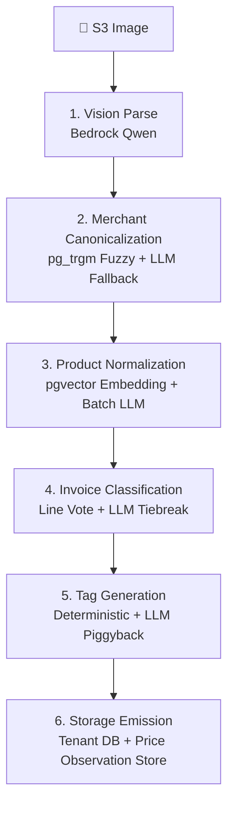
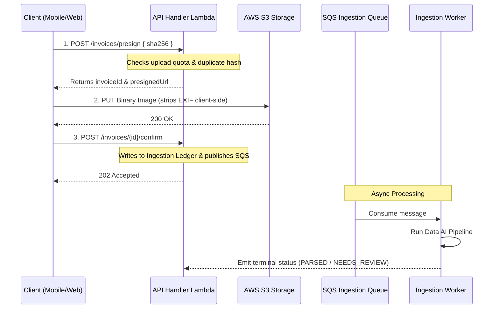

# Wobblio Master Project Explanation & Guide

This master guide provides a comprehensive overview of the Wobblio platform, mapping directly to each core product and engineering domain.

---

## 1. Explain the Project

**Wobblio** is a cloud-native, personal fiscal management utility designed to make expense tracking and shopping optimization effortless and highly accurate. The application lets users photograph physical receipts, invoices, or bills and converts them into structured financial data.

Unlike competitors, Wobblio does not depend on bank feeds. Instead, it extracts exact line items, quantities, and unit sizes. Furthermore, every parsed receipt contributes anonymized price observations to a crowdsourced regional price database. As the community grows, Wobblio aggregates this data into an independent local market price index that powers anti-inflation shopping recommendations.

---

## 2. Main Features

* **Zero Manual Entry AI Capture:** Snap photos of receipts; the AI vision pipeline extracts merchant details, transaction dates, tax, totals, and itemized lines. An interactive review screen allows quick verification.
* **Anti-Inflation Price Engine:** Tracks real prices actually paid by users in specific regions over time (including in-store promotions) rather than scraped web prices.
* **Smart Route Shopping Lists:** When splitting a shopping list across multiple nearby stores (e.g. Albert Heijn and Jumbo) yields savings above a user-defined threshold, Wobblio partitions the list into store-specific sections.
* **Proportional Bill Splitting:** Users can assign receipt lines or fractions of items to contacts. Taxes, tips, and fees are automatically scaled proportionally, and the summary is formatted for WhatsApp.
* **Cross-Border Currency Harmonization:** Converts foreign transactions using historical exchange rates active on the invoice date.

---

## 3. Main Entities

Wobblio's relational data model is divided into tenant-scoped entities (isolated using PostgreSQL Row-Level Security) and global shared catalog entities:

* **Tenant-Scoped Entities:**
  * `AppUser`: Represents the user profile, home currency, language, active plan tier, and Stripe customer linkage.
  * `Household` & `HouseholdMember`: Manages shared household groups and pooled weekly upload quotas.
  * `Invoice` & `InvoiceLine`: The main receipt data, tax entries, totals, and itemized breakdown.
  * `ShoppingList` & `ShoppingListItem`: Check-off lists managed by the user or household.
  * `Budget`: Budget limits set on a total, category, or member basis with 85% and 100% notification triggers.
  * `BillSplit` & `BillSplitLine`: Stores how receipt lines are divided among contacts.
  * `QuotaCounter`: Tracks standard and household weekly upload limits.
  * `IngestionLedger`: An idempotency ledger preventing duplicate SQS processing.
* **Global Shared Entities (No RLS):**
  * `Merchant` & `MerchantAlias`: Canonical store brands and their common abbreviations.
  * `Product` & `ProductAlias`: Canonical items with metadata (unit size, category) and their merchant-specific abbreviations.
  * `PriceObservation`: The crowdsourced, de-identified registry of unit-prices.
  * `FxRate`: Historical exchange rates.
  * `PaymentTransaction`: 7-year audit record of Stripe checkout events.

---

## 4. Data AI Pipeline

The Ingestion Worker Lambda processes receipt images through a sequential multi-stage AI pipeline:

1. **Vision Parse (Bedrock Qwen):** Extracts raw text, totals, and line items. If output is invalid, retries once with validation errors.
2. **Merchant Canonicalization:** Matches the raw merchant header using VAT registrations, exact aliases, or trigram similarity (`pg_trgm`). Falls back to a Haiku auxiliary LLM, creating a `PROVISIONAL` merchant if new.
3. **Product Normalization:** Maps lines to canonical product IDs. Matches merchant-scoped aliases first, batches remaining lines in a single Haiku LLM call, and queries product embeddings (`pgvector`) using a $0.92$ similarity threshold.
4. **Invoice Classification:** Assigns a macro-category using a default merchant category, line-item spend votes, and an LLM tiebreak if votes conflict.
5. **Tag Generation:** Enriches the invoice with up to 3 filter tags (e.g. brand, seasonal) using deterministic name matching.
6. **Storage Emission:** Emits tenant-scoped invoice records and de-identified price facts.

---

## 5. How We Process an Invoice

Ingestion relies on a **3-step transaction-safe upload lifecycle**:

1. **Pre-Registration:** Client requests a presigned URL. The system validates the tenant's remaining weekly upload quota and checks for existing SHA-256 hashes under that tenant to prevent duplicates. It writes `PENDING_UPLOAD` to the ledger.
2. **Binary Upload:** Client uploads the JPEG (compressed to $\le 1$MB, EXIF data stripped) directly to S3.
3. **Confirmation & Enqueue:** Client confirms the upload. API Gateway writes `PROCESSING` to the ledger and pushes a job to SQS. The client dashboard immediately renders a "Processing" shimmer.
4. **Async Ingestion:** The SQS consumer worker picks up the job, performs an idempotency check, executes the Data AI Pipeline, updates the database, and sends a push notification.

---

## 6. Use Cases

* **Weekly Budget Tracking:** Users upload receipts; Wobblio automatically catalogs costs and deducts items from weekly categories.
* **Smart Shopping split:** A user compiles a shopping list of 15 items. Wobblio queries regional medians and partitions the list to recommend a route: buy 8 items at Albert Heijn and 7 items at Lidl to save €7.40.
* **Proportional Bill Splitting:** Friends share a receipt. They tap items to assign shares (e.g., half a pizza to User A, half to User B). The app scales taxes/tips proportionally and exports a summary direct to WhatsApp.
* **Regional Price Comparison:** A user searches for "organic eggs" to view personal historical purchase costs plotted against the regional market price trend.

---

## 7. Marketing

Wobblio employs a B2C freemium funnel:
* **Standard (Free) Tier:** Limited to 3 uploads/week and basic dashboard aggregates. Free users build the product's competitive moat by seeding the Price Observation Store with anonymized data.
* **Premium Tier (€2.50/mo or €25/yr):** Unlocks 10 personal uploads/week, household sharing (+20 pooled uploads/week), split-route optimization, and the Weekly AI Savings Advisor.
* **Waitlist Line-Jumping:** If free user slots are full, new users are waitlisted. Purchasing a Premium subscription instantly clears waitlist blocks, incentivizing conversion.
* **Stripe Routing Rule:** To bypass the 15–30% mobile app store commission, subscriptions are sold **only** via Stripe Checkout on the web app. Mobile apps deep-link to the web upgrade flow.

---

## 8. Operations

* **Local Sandbox:** Runs on a LocalStack configuration (S3, SQS) and Dockerized PostgreSQL.
* **Migrations:** Managed via `node-pg-migrate` and deployed via stateless CDK deployment pipelines.
* **Waitlist Management:** Cognito pre-signup Lambda compares live users against `max_free_users_cap` using atomic counters.
* **Observability:** Nightly Logs Insights rollups aggregate AI tokens, costs, durations, and quota blocks into the `kpi_daily` database table to track metrics cheaply.

---

## 9. Deployment

* **CDK Stacks:** Separated into `WobblioStatefulStack` (VPC, RDS PostgreSQL, S3, Cognito) and `WobblioAppStack` (Lambdas, API Gateway, SQS, Alarms).
* **Environments:** `local` (LocalStack), `dev` (logical suffix schemas on dev database), and `prod` (production database schema, real Stripe hooks).
* **CI/CD Pipelines:**
  * **PR Gate:** Runs compilation, linting, Vitest unit tests, Hexagonal Architecture validation, and security auditing scripts on every pull request.
  * **Promotion Gate:** Deploys automatically to `dev` upon merge to `main`. Halts for human smoke testing and verification, then promotes changes to `prod` upon approval.

---

## 10. Mobile

* **Framework:** Built with **Flutter** targeting iOS and Android.
* **Layout:** Bottom tab bar (Home, Lists, Insights, Profile) with a raised center floating action button (📸) for instant scanning.
* **Image prep:** Captures the image, detects edges, crops, compresses to a JPEG under 1MB, and strips EXIF tags client-side.
* **Offline Caching:** Active lists are stored locally in an encrypted SQLite database. Edits synchronize back using a Last-Write-Wins (LWW) resolution policy.

---

## 11. Database

* **Engine:** PostgreSQL 15 running on an RDS `db.t3.micro` instance.
* **Extensions:**
  * `pgvector`: Manages 512-dimensional Titan V2 product embeddings for similarity searches.
  * `pg_trgm`: Powers trigram-based fuzzy string matching for merchant and product canonicalization.
* **Tenancy:** Strictly enforced Row-Level Security (RLS) policies matching the session variable:
  `SET LOCAL app.current_tenant_id = '<uuid>';`
* **Exemptions:** The Price Observation Store is RLS-exempt and contains no user, household, or invoice identifiers.

---

## 12. Low Level Design (LLDD)

* **Architecture Pattern:** Clean Ports & Adapters (Hexagonal Architecture). Core services have no knowledge of external APIs or database drivers.
* **Directory Mirroring:** Features are mirrored across directories:
  * Service: `src/core/services/ingestion/ConfirmService.ts`
  * Port: `src/core/ports/ingestion/IIngestionQueue.ts`
  * Adapter: `src/infrastructure/adapters/ingestion/SqsIngestionQueueAdapter.ts`
* **Error Propagation:** Infrastructure errors are caught in the Adapters, mapped to specific Domain Errors (e.g. `QuotaExceededError`), and thrown inward to Core services. API Handlers map these to HTTP response codes.

---

## 13. Architecture

* **Golden Rule:** Dependencies must point inward (`src/core/` $\rightarrow$ `src/infrastructure/` imports are blocked). This boundary is validated by an automated checker on every PR.
* **Clean Code Metrics:** Functions must stay focused and under 20 lines of code. Happy paths are left-aligned using guard clauses (max 2 levels of nesting).
* **Separation of Concerns:** Orchestration logic (Domain Services) is decoupled from pure business invariants (Domain Entities).

---

## 14. Deployment Components

* **OpenNext:** Wraps and bundles the Next.js webapp and admin console into serverless Lambda and CloudFront edge paths.
* **API Gateway (v2):** Manages user routing and Cognito authentication.
* **Lambda Fleet:** Capped at **25 concurrent connections** to protect the database.
* **Ingestion SQS Queue:** Decouples ingestion. Worker concurrency is capped at **5**.
* **AWS S3:** Houses compressed receipt images and exported GDPR ZIP bundles.

---

## 15. AWS Integration

* **AWS Bedrock Converse:** Serves as the AI core, routing prompts to vision (Qwen), auxiliary (Haiku), and embedding (Titan V2) models.
* **AWS KMS:** Encrypts PII fields (notes, invite tokens, contact names) using AES-GCM envelope encryption.
* **SES & SNS:**SES handles waitlist notification emails; SNS dispatches push alerts and DLQ operations alarms.
* **EventBridge Schedules:** Invokes crons to reset weekly quotas, fetch daily FX exchange rates, and run the Weekly AI Advisor.

---

## 16. Observability & Security

* **Alarms Inventory:** Alerts on SQS DLQ messages, database connection spikes ($>60$), CPU credit exhaust, and Daily DOWN-verdict ratios ($>20\%$).
* **GDPR Compliance:** Implements a two-phase account deletion (30-day grace soft-lock to hard purge). Payment transactions are kept 7 years for tax compliance with user IDs replaced by anonymized audit tokens.
