# Wobblio Project Analysis & Architecture Guide

## Executive Summary

**Wobblio** is a cloud-native personal fiscal management utility that transforms receipt photos into structured financial data. The system leverages multimodal AI (AWS Bedrock) to parse invoice images, extract merchant/product/amount data, and feed anonymized price observations into a crowdsourced regional price index that powers anti-inflation shopping optimization and budgeting features.

**Current Status:** Spec-complete (v2.4), implementation in Phase 2-3 (backend core logic + infra scaffolded; ingestion pipeline stubs in place; webapp early UI).

---

## High-Level Architecture

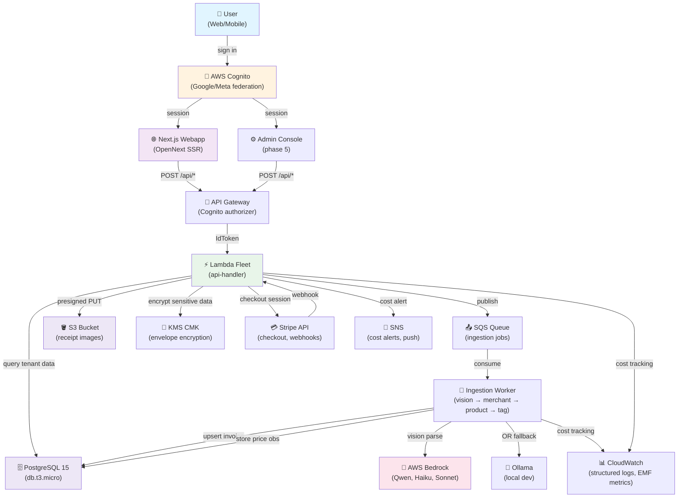

---

## Technology Stack

| Layer | Technology | Version | Purpose |
|-------|-----------|---------|---------|
| **Mobile** | Flutter | (backlog) | iOS/Android capture-first client + offline lists |
| **Web Frontend** | Next.js + React | 14+ | SSR via OpenNext, Tailwind CSS |
| **Authentication** | AWS Cognito | (managed) | OIDC federation (Google/Meta), Cognito User Pool |
| **Backend** | Node.js + TypeScript | 24 + 5.5 | Lambda handlers, services, adapters |
| **API Gateway** | AWS API Gateway | v2 | HTTP → Lambda routing, Cognito authorizer |
| **Ingestion** | AWS SQS + Lambda | (managed) | Asynchronous receipt processing pipeline |
| **AI/Vision** | AWS Bedrock Converse | vision (Qwen), auxiliary (Haiku), insight (Sonnet) | Receipt parsing, merchant classification, product expansion, tag generation; fallback to local Ollama |
| **Database** | PostgreSQL 15 | db.t3.micro (shared infra) | Tenant data (RLS), price observations, merchant/product taxonomy |
| **DB Extensions** | pg_trgm + pgvector | - | Fuzzy alias matching, product embeddings (512-dim Titan V2) |
| **File Storage** | AWS S3 | (managed) | Receipt images (JPEG ≤1MB, EXIF stripped client-side) |
| **Encryption** | AWS KMS + AES-GCM | (managed) | Envelope encryption for notes, household invite tokens, contact names |
| **Billing** | Stripe | Checkout API | Web-only subscription (no in-app purchase); webhook-driven |
| **Observability** | Pino + CloudWatch EMF | (managed) | Structured JSON logs, cost tracking (stage + modelId + tokens), KPI aggregation |
| **Infrastructure** | AWS CDK/TypeScript | (managed) | Multi-stack IaC, cdk-nag validation, node-pg-migrate for schema |

---

## Hexagonal Architecture (Clean Code, Ports & Adapters)

The project enforces **strict dependency inversion**: core business logic has zero knowledge of AWS, databases, or external SDKs. All external capabilities are defined as ports (interfaces) and implemented as adapters.

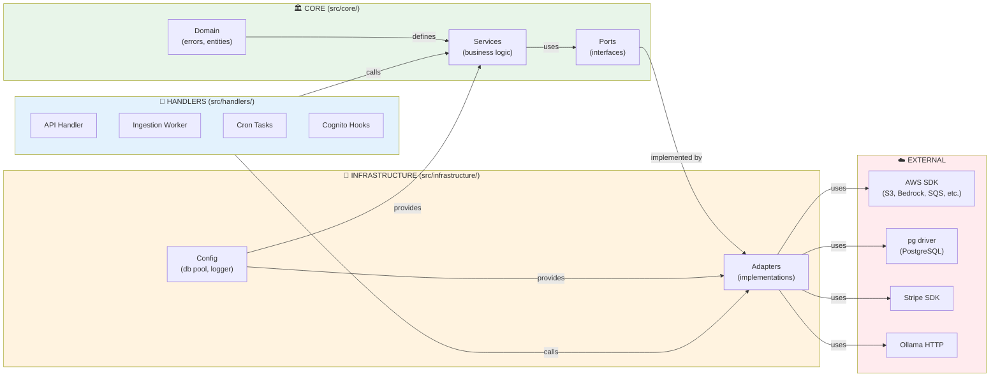

### Core Domain Layer (`src/core/`)

**Responsibility:** Pure business logic, framework-agnostic, 100% testable with mocked ports.

**Key Files:**

- **`domain/errors.ts`** — 16 domain error types (no SDK errors leak here):
  - `DuplicateInvoiceError`, `QuotaExceededError`, `AiSpendCapExceededError`
  - `UserNotFoundError`, `UserDeletedError`, `HouseholdNotFoundError`
  - `InvalidBillingStateError`, `StaleUploadError`

- **`domain/ingestion.ts`** — Receipt data structures (`Invoice`, `InvoiceLine`, `IngestionResult`)

- **`domain/billing.ts`** — Billing state machine (free → premium, expiry, suspension)

- **`services/`** — 10+ domain services, each responsible for one business capability:
  - `QuotaService` — Upload quota enforcement (§2.4 matrix: personal/household, weekly/monthly)
  - `ProfileService` — User profile CRUD (read-only from DB; name/role/status/onboarded_at)
  - `IngestionService` — Receipt pipeline orchestration (vision → merchant → product → classify → tag → emit)
  - `BillingService` — Stripe checkout, subscription state, usage reporting
  - `PresignService` — Generate presigned S3 URLs (≤300s TTL)
  - `ConfirmService` — Confirm upload & deduplicate by SHA-256
  - `BedrockSpendGuardService` — Enforce AI spend cap (e.g., 1 USD/day free tier)
  - `WaitlistReleaseService` — Release users from waitlist (phase 2)
  - `VisionParseService` — Call Bedrock vision, validate output schema, retry with errors
  - `UserProvisioningService` — Post-signup user setup (app_user, profile, quota)

- **`ports/`** — 30+ interfaces (Interface Segregation Principle: one port per capability):
  - `IBedrockConverse` — Vision parse, merchant fallback, product expansion, classification, tiebreak, embeddings
  - `IInvoiceRepository`, `IInvoiceClassifier` — Invoice storage and classification
  - `IMerchantResolver`, `IProductNormalizer`, `ITagGenerator` — Pipeline stages
  - `IQuotaRepository`, `IUploadQuotaProvider` — Quota enforcement
  - `IBillingGateway`, `IBillingArchive`, `IBillingWhitelist` — Billing
  - `IS3FileStorage`, `IKmsEncryption` — Storage and encryption
  - `IAppUserRepository`, `ITenantContext` — Tenant isolation (RLS setter)
  - `IAiSpendCapProvider`, `IAiSpendLedger` — Cost tracking

### Infrastructure Layer (`src/infrastructure/`)

**Responsibility:** Concrete implementations of ports using AWS SDKs, pg driver, Stripe, etc.

**Key Files:**

- **`adapters/`** — One adapter per SDK/provider:
  - `BedrockConverseAdapter` — AWS Bedrock Converse wrapper (vision, auxiliary, insight)
  - `S3FileStorageAdapter` — S3 presigned URL generation, object storage
  - `KmsEncryptionAdapter` — AES-GCM envelope encryption
  - `SqsIngestionQueueAdapter` — SQS publish/consume
  - `StripeGatewayAdapter` — Checkout sessions, customer portal URLs
  - `*RepositoryAdapter` — PostgreSQL adapters (AppUser, Invoice, Quota, Waitlist, etc.)
  - `SesEmailAdapter` — SES-based email sending
  - `SsmConfigAdapter` — SSM parameter store (model IDs, feature flags)
  - `CognitoAdapter` (implicit) — Cognito sub → app_user resolution

- **`config/db.ts`** — RDS connection pooling:
  - IAM authentication (no password in code)
  - Statement timeout (5s API, 30s worker)
  - Connection budgeting: 25 API + 5 worker + 2 cron ≤ 32 total
  - Per-request `PoolClient` to avoid connection leaks

- **`converseFactory.ts`** — Adapter factory:
  - AWS Bedrock in `prod` and `dev`
  - Local Ollama in `local` (gemma4:31b-it-qat fallback)

- **`logging/logger.ts`** — Pino structured logger (JSON to CloudWatch)

- **`metrics/emf.ts`** — CloudWatch EMF (Embedded Metric Format):
  - Tracks stage, modelId, input tokens, output tokens, duration
  - Enables cost aggregation by model

### Handler Layer (`src/handlers/`)

**Responsibility:** Thin translation from HTTP/SQS to service calls. Route requests, translate framework errors, emit structured logs.

**Key Files:**

- **`api-handler/index.ts`** — REST API entry point:
  - Cognito authorizer extracts `cognitoSub` from IdToken
  - Routes: `/me/profile`, `/invoices/{id}`, `/presign`, `/confirm`, `/billing/*`, etc.
  - Each route instantiates services with injected adapters
  - Maps domain errors to HTTP status codes

- **`ingestion-worker/index.ts`** — SQS consumer:
  - Pulls message → calls `IngestionService.process()`
  - **Idempotency:** First write is `INSERT ingestion_ledger ON CONFLICT DO NOTHING`
  - On success: emits terminal status (`PARSED`, `NEEDS_REVIEW`, `FAILED_PROCESSING`) to DB
  - On failure: routes to DLQ
  - Tracks tokens, duration, model version

- **`cron-budget-reset`, `cron-fx-rate-fetch`, `cron-waitlist-release`** — Scheduled tasks
  - Invoked by CloudWatch Events (EventBridge)
  - Batch operations (reset quotas, fetch FX rates, release waitlisted users)

- **`pre-signup-hook`, `post-confirmation-hook`** — Cognito triggers:
  - Pre-signup: allowlist check (phase 2 waitlist)
  - Post-confirmation: provision `app_user`, `user_profile`, `quota` rows

---

## Request Flow: Web Upload & Parsing

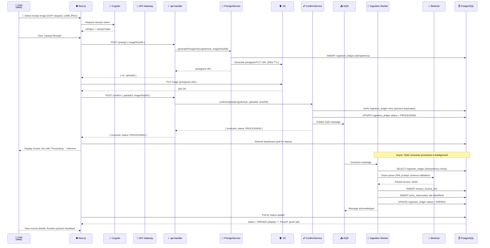

---

## Ingestion Pipeline Architecture (§6 Specification)

The pipeline transforms raw receipt images into structured invoices, merchant/product data, and price observations.

```mermaid
graph LR
    Input["📸 Receipt Image<br/>(JPEG, ≤1MB)"]
    
    Vision["1️⃣ Vision Parse<br/>(Bedrock Qwen)"]
    RawData["Raw JSON<br/>(merchant, products, total, date)"]
    
    Merchant["2️⃣ Merchant Canonicalization<br/>(fuzzy alias → LLM)"]
    MerchantId["merchant_id<br/>(lookup or create)"]
    
    Product["3️⃣ Product Expansion<br/>(line → aliases → batch LLM)"]
    ProductId["product_concept_id<br/>(hierarchical)"]
    
    Classify["4️⃣ Invoice Classification<br/>(vote + LLM tiebreak)"]
    Category["category<br/>(groceries, pharmacy, transport, etc.)"]
    
    Tag["5️⃣ Tag Generation<br/>(deterministic + LLM)"]
    Tags["tags[]<br/>(brand, dietary, seasonal, etc.)"]
    
    Emit["6️⃣ Emit to Storage<br/>(invoice, price_obs, ledger)"]
    Terminal["Terminal Status<br/>(PARSED/NEEDS_REVIEW/FAILED)"]
    
    Input -->|extract fields| Vision
    Vision -->|raw merchant name| RawData
    RawData -->|fuzzy match + LLM| Merchant
    Merchant -->|resolved merchant_id| MerchantId
    
    RawData -->|each line (qty, unit_price)| Product
    Product -->|product_concept_id| ProductId
    
    RawData -->|merchant + products| Classify
    Classify -->|majority vote| Category
    
    ProductId -->|product facts| Tag
    Tag -->|search_tags array| Tags
    
    MerchantId -->|store invoice| Emit
    ProductId -->|store price_obs| Emit
    Tags -->|store tags| Emit
    Emit -->|set terminal status| Terminal
    
    style Input fill:#e3f2fd
    style Vision fill:#fce4ec
    style Merchant fill:#f3e5f5
    style Product fill:#f3e5f5
    style Classify fill:#f3e5f5
    style Tag fill:#f3e5f5
    style Emit fill:#c8e6c9
    style Terminal fill:#fff9c4
```

**Key Points:**

1. **Idempotency:** Every SQS message is checked against `ingestion_ledger` first. Duplicates return immediately with existing status.
2. **Schema validation:** Vision parse output must conform to JSON schema. On error, retry once with validation errors in prompt. If still invalid, DLQ.
3. **Merchant canonicalization:** Alias fuzzy-match (pg_trgm) + LLM semantic resolution for ambiguous matches.
4. **Product expansion:** Batch-process line items (qty, unit_price, raw_name) through LLM to map to product_concept.
5. **Invoice classification:** Vote on category by merchant + product combo; LLM tiebreak if no consensus.
6. **Tag generation:** Deterministic tags (e.g., "organic" in name) + LLM piggyback for semantic tags.
7. **Price observations:** De-identified (no tenant, user, invoice, or tag refs) — day-precision date, postal prefix region only.
8. **Terminal status:** Async; webapp polls for updates. No push until Phase 5 (mobile).

---

## Database Schema (Core Tables)

```mermaid
erDiagram
    APP_USER ||--o{ INVOICE : owns
    APP_USER ||--o{ SHOPPING_LIST : owns
    APP_USER ||--o{ BUDGET : owns
    APP_USER ||--o{ QUOTA : tracks
    APP_USER ||--o{ HOUSEHOLD : manages
    
    HOUSEHOLD ||--o{ HOUSEHOLD_MEMBER : contains
    HOUSEHOLD ||--o{ BILL_SPLIT : tracks
    HOUSEHOLD_MEMBER ||--o{ BILL_SPLIT_LINE : splits
    
    INVOICE ||--o{ INVOICE_LINE : contains
    INVOICE ||--o{ INVOICE_FEEDBACK : collects
    INVOICE_LINE ||--o{ BILL_SPLIT_LINE : linked
    
    MERCHANT ||--o{ MERCHANT_BRANCH : "has branches"
    MERCHANT ||--o{ MERCHANT_ALIAS : "has aliases"
    MERCHANT ||--o{ INVOICE : "supplied by"
    
    PRODUCT_CATEGORY ||--o{ PRODUCT_CONCEPT : "parent category"
    PRODUCT_CONCEPT ||--o{ PRODUCT : "has products"
    PRODUCT ||--o{ PRODUCT_ALIAS : "has aliases"
    PRODUCT ||--o{ INVOICE_LINE : "on lines"
    PRODUCT ||--o{ PRICE_OBSERVATION : "prices"
    
    PRICE_OBSERVATION : date
    PRICE_OBSERVATION : region_postal_prefix
    PRICE_OBSERVATION : unit_price
    PRICE_OBSERVATION : quantity
    PRICE_OBSERVATION : (no tenant, user, invoice, or tags)
    
    SHOPPING_LIST ||--o{ SHOPPING_LIST_ITEM : contains
    BUDGET : scope
    BUDGET : threshold_amount
    BUDGET : period
    
    INGESTION_LEDGER : invoice_id FK
    INGESTION_LEDGER : status
    INGESTION_LEDGER : sha256
    
    PAYMENT_TRANSACTION : (7-year opaque audit trail)
    PAYMENT_TRANSACTION : user_id_opaque
    
    FX_RATE : date
    FX_RATE : base_currency
    FX_RATE : quote_currency
    FX_RATE : rate
    
    KPI_DAILY : user_count
    KPI_DAILY : invoice_count
    KPI_DAILY : (aggregate metrics)
```

**Tenant Isolation (RLS):**
- **Tenant-scoped tables** (`app_user`, `invoice`, `household`, `shopping_list`, `budget`): RLS policies enforce `app.current_tenant_id`.
- **Every API path** calls `SET LOCAL app.current_tenant_id` (via `ITenantContext` port) before first query.
- **Household-space tables** (`bill_split`, `shopping_list_item`): tenant = household_id (household owns the household members).
- **Price Observation Store is exempt:** De-identified by design, no RLS needed.

**Key Invariants:**
- Role column (`app_user.role`) is **never writable by client APIs** — only Stripe webhook (`STANDARD ↔ PREMIUM`) and admin scripts (`TESTER`, `ADMIN`) flip it.
- Quotas are enforced in **one domain service** (`QuotaService`) with the matrix in §2.4.
- Household pool is **additive** on household-space uploads; it does not borrow from personal quota.
- Encryption scope is **narrow:** AES-GCM (KMS envelope) only on: free-text notes, household invite tokens, exported-report URLs, contact names for splitting. **Never** amounts, merchants, products, categories, dates.

---

## Authentication & Authorization Flow

```mermaid
sequenceDiagram
    participant User as 👤 User
    participant WebApp as 🌐 Next.js<br/>auth.ts
    participant Cognito as 🔐 AWS Cognito<br/>Hosted-UI
    participant Lambda as ⚡ Cognito<br/>Hooks
    participant RDS as 🗄️ PostgreSQL
    participant ApiHandler as 🚪 API Handler<br/>(Cognito authorizer)
    
    User->>WebApp: Request /dashboard (unauthenticated)
    WebApp->>WebApp: auth.ts middleware: no session
    WebApp-->>User: Redirect to Cognito Hosted-UI
    
    User->>Cognito: Sign in (email+password or Google/Meta federation)
    Cognito-->>User: Redirect to /api/auth/callback/cognito?code=...
    
    WebApp->>Cognito: Exchange code for tokens
    Cognito-->>WebApp: { idToken, accessToken, refreshToken }
    
    WebApp->>WebApp: auth.ts jwt() callback: decode idToken
    WebApp->>RDS: SELECT app_user, user_profile WHERE cognito_sub = ?
    RDS-->>WebApp: { name, role, onboarded_at, status }
    WebApp->>WebApp: Extend session: { sub, name, role, status, onboarded_at }
    WebApp-->>User: Set session cookie (sameSite=lax)
    
    User->>WebApp: Request /dashboard (authenticated)
    WebApp->>WebApp: Session exists; render dashboard
    WebApp-->>User: 200 OK (Next.js SSR)
    
    note over User,WebApp: All subsequent API calls authenticate via session cookie
    
    User->>WebApp: POST /api/invoices/list
    WebApp->>ApiHandler: POST /invoices/list (IdToken in Authorization header)
    ApiHandler->>ApiHandler: Cognito authorizer: verify IdToken signature
    ApiHandler->>ApiHandler: Extract cognitoSub from IdToken
    ApiHandler->>RDS: SELECT app_user WHERE cognito_sub = ?
    RDS-->>ApiHandler: { user_id, role, status }
    ApiHandler->>RDS: SET LOCAL app.current_tenant_id = user_id
    ApiHandler->>RDS: SELECT * FROM invoice WHERE (RLS enforced)
    RDS-->>ApiHandler: [invoices]
    ApiHandler-->>WebApp: { invoices }
    
    note over ApiHandler,RDS: RLS prevents cross-tenant data leakage
```

**Key Auth Points:**
- **Cognito is the OIDC identity provider.** No password stored in app.
- **DB is the source of truth for name, role, status, onboarded_at.** Cognito attributes are never read (custom or standard).
- **Session carries name/role/status/onboarded_at** from DB at sign-in; refreshed on token refresh.
- **API calls use IdToken** (not access token) in `Authorization: Bearer <idToken>` header.
- **Cognito authorizer** (Lambda@Edge function in API Gateway) verifies IdToken signature and extracts `cognitoSub`.
- **`SET LOCAL app.current_tenant_id`** is called **before the first query** in every RLS-scoped transaction (via `ITenantContext` port).
- **Role-based access control (RBAC):** `STANDARD` (free), `PREMIUM` (paid), `TESTER` (qa), `ADMIN` (ops). Only client APIs never write role.

---

## Testing Architecture

```mermaid
graph TB
    subgraph Unit["🧪 Unit Tests (mocked ports)"]
        ServiceTests["Services<br/>(QuotaService, BillingService, etc.)"]
        DomainTests["Domain<br/>(errors, ingestion, receipt schema)"]
        PortTests["Ports<br/>(interface contracts)"]
    end
    
    subgraph Integration["🔗 Integration Tests (real Postgres + LocalStack)"]
        LocalStackTests["LocalStack S3/SQS<br/>(IngestionPipelineTest)"]
        PostgresTests["Postgres DB<br/>(BillingService, ProfileService)"]
    end
    
    subgraph E2E["🎭 E2E Tests (deferred phase 5)"]
        PlaywrightTests["Playwright<br/>(user workflows)"]
        FullStackTests["Full stack<br/>(auth → upload → parse → dashboard)"]
    end
    
    Tools["Tools"]
    Vitest["Vitest 2.0<br/>(framework)"]
    Jest["Jest<br/>(coverage)"]
    Playwright["Playwright<br/>(browser automation)"]
    LocalStack["LocalStack<br/>(AWS emulator)"]
    
    ServiceTests -->|mocked IQuotaRepository| Vitest
    DomainTests -->|no mocks| Vitest
    PortTests -->|verify contracts| Vitest
    
    LocalStackTests -->|real S3/SQS| LocalStack
    PostgresTests -->|real RDS| Vitest
    
    PlaywrightTests -->|real webapp| Playwright
    FullStackTests -->|real Lambda, Postgres| Playwright
    
    style Unit fill:#c8e6c9
    style Integration fill:#bbdefb
    style E2E fill:#ffe0b2
    style Vitest fill:#f8bbd0
```

**Test Commands:**
```bash
npm run test:unit                           # Vitest unit suite (mocked ports)
npm run test:unit:watch                     # Watch mode
npm run test:integration                    # LocalStack + Postgres
npm run test:e2e                            # Playwright (deferred)
npm run skill:hexagonal-architecture-validator  # Enforce boundaries (exit 0)
npm run validate:security                   # GDPR/RLS auditor
```

**Test Patterns:**

- **Unit test (QuotaService):** Vitest + MockedObject ports, no network
- **Integration test (IngestionPipeline):** LocalStack S3/SQS + real Postgres + real Bedrock/Ollama
- **E2E test (deferred):** Playwright, full webapp → API → DB stack, per-test tenant seeding

**Coverage Target:** 100% of `src/core/` (services + domain)

---

## Error Handling Pattern

All errors thrown from `src/core/` are **domain errors** (no SDK leakage):

```mermaid
graph LR
    Adapter["🔧 Adapter<br/>(catches SDK errors)"]
    SDKError["❌ SDK Error<br/>(BedrockException,<br/>QueryError, etc.)"]
    DomainError["⚠️ Domain Error<br/>(DuplicateInvoiceError,<br/>QuotaExceededError)"]
    Service["📌 Service<br/>(throws domain error)"]
    Handler["🚪 Handler<br/>(maps to HTTP)"]
    HTTP["🌐 HTTP Response<br/>(4xx/5xx)"]
    
    SDKError -->|caught in| Adapter
    Adapter -->|mapped to| DomainError
    DomainError -->|propagated by| Service
    Service -->|caught by| Handler
    Handler -->|HTTP 400/409/429| HTTP
    
    style SDKError fill:#ffcdd2
    style DomainError fill:#fff9c4
    style HTTP fill:#c8e6c9
```

**16 Domain Error Types** (in `src/core/domain/errors.ts`):
- `DuplicateInvoiceError` (409 Conflict)
- `QuotaExceededError` (429 Too Many Requests)
- `AiSpendCapExceededError` (429)
- `UserNotFoundError` (404)
- `UserDeletedError` (410 Gone)
- `HouseholdNotFoundError` (404)
- `InvalidBillingStateError` (400)
- `StaleUploadError` (409)
- And 8 others…

**Handler Mapping:**
```typescript
catch (err: unknown) {
  if (err instanceof DuplicateInvoiceError) return { statusCode: 409, body: { error: 'duplicate' } };
  if (err instanceof QuotaExceededError) return { statusCode: 429, body: { error: 'quota_exceeded' } };
  if (err instanceof AiSpendCapExceededError) return { statusCode: 429, body: { error: 'ai_spend_cap' } };
  return { statusCode: 500, body: { error: 'internal_server_error' } };
}
```

---

## Invoice Processing Pipeline: Data Intelligence Layer (§8)

After **vision parse** completes, the ingestion worker runs **five sequential pipelines** that transform raw OCR strings into canonical, comparable data. This is what makes Wobblio more than a receipt scanner.

### Stage 1: Merchant Canonicalization

**Goal:** Map raw receipt merchant strings → canonical `merchant_id` + `branch_id`.

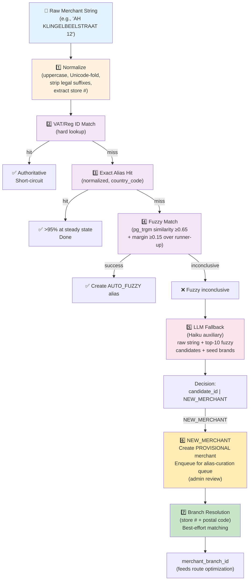

**Resolution Algorithm (cheapest first):**

| Step | Method | Cost | Success Rate | Action |
|------|--------|------|--------------|--------|
| 1 | Normalize raw string | Free | - | Strip legal suffixes (B.V., GmbH, Ltd), uppercase, Unicode-fold, extract store # + city |
| 2 | VAT/registration ID match | Free | ~5% | Hard-coded registry lookup — authoritative, short-circuits everything |
| 3 | Exact alias hit | Free | ~70% at steady state | Look up `(alias_normalized, country_code)` in `merchant_alias` table |
| 4 | Fuzzy match (pg_trgm) | Free | ~20% | Similarity ≥0.65 AND margin ≥0.15 over runner-up → write `AUTO_FUZZY` alias |
| 5 | LLM fallback | ~5 tokens | ~4% | Haiku auxiliary: raw string + top-10 fuzzy candidates + seed brand list → decision |
| 6 | NEW_MERCHANT | 0 tokens | ~1% | Create `PROVISIONAL` merchant, enqueue for admin alias-curation queue |

**User Corrections on Review Screen:**
- User overrides auto-detection → write `USER_CONFIRMED` alias
- `USER_CONFIRMED` outranks automatic sources on future conflicts
- No global impact (user preferences are tenant-scoped)

**Seed Data (NL Launch):**
Albert Heijn, Jumbo, Lidl, Aldi, Plus, Dirk, Kruidvat, Etos, Trekpleister, HEMA, Action — plus their common receipt abbreviations as `SEED` aliases.

---

### Stage 2: Product Normalization & Categorization

**Goal:** Map each line item → canonical `product_id` with `normalized_unit_price` (for cross-invoice price comparison).

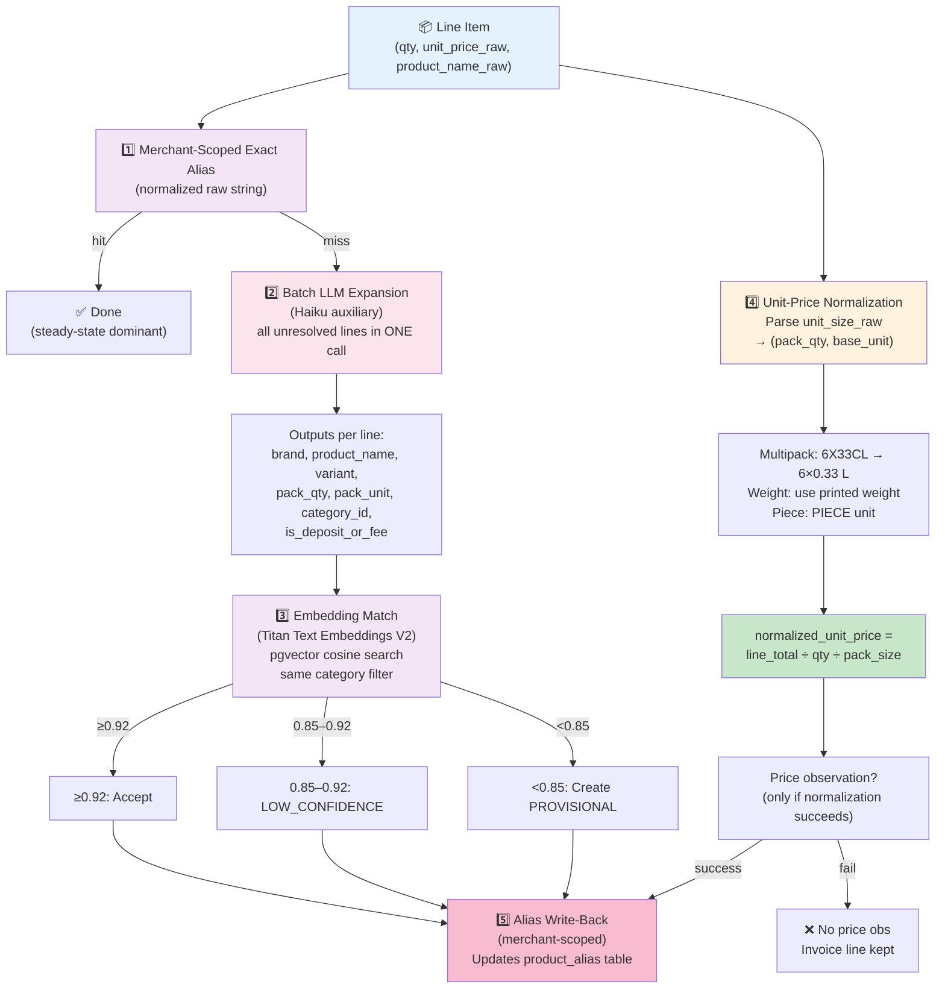

**Key Features:**

- **Merchant-scoped aliases:** Each merchant has its own product alias dictionary (e.g., "AH" sells "COLA" → product X; "Jumbo" sells "COLA" → product Y)
- **Batch LLM efficiency:** One call per receipt covering ALL unresolved lines (not one call per line)
- **Embedding-driven matching:** Uses Titan V2 (512-dim) with pgvector cosine similarity
- **Unit-price normalization is mandatory:** Enables cross-invoice price comparison (e.g., €2.50/L for milk regardless of pack size)
- **Lines with unparseable sizes skip price observation:** Clean data > large data

**Taxonomy (two-level, fixed, ~14 top-level):**
```
Groceries
  ├── Dairy & Eggs
  ├── Produce
  ├── Meat & Fish
  ├── Bakery
  ├── Pantry
  ├── Frozen
  ├── Beverages
  ├── Alcohol
  └── Snacks & Sweets
Household
Personal Care & Pharmacy
Baby & Kids
Pet
Dining Out
Transport & Fuel
Clothing
Electronics
Health
Home & Garden
Entertainment
Services
Other
```

---

### Stage 3: Invoice Classification

**Goal:** Assign one macro category to the invoice for free-tier reporting and budget mapping.

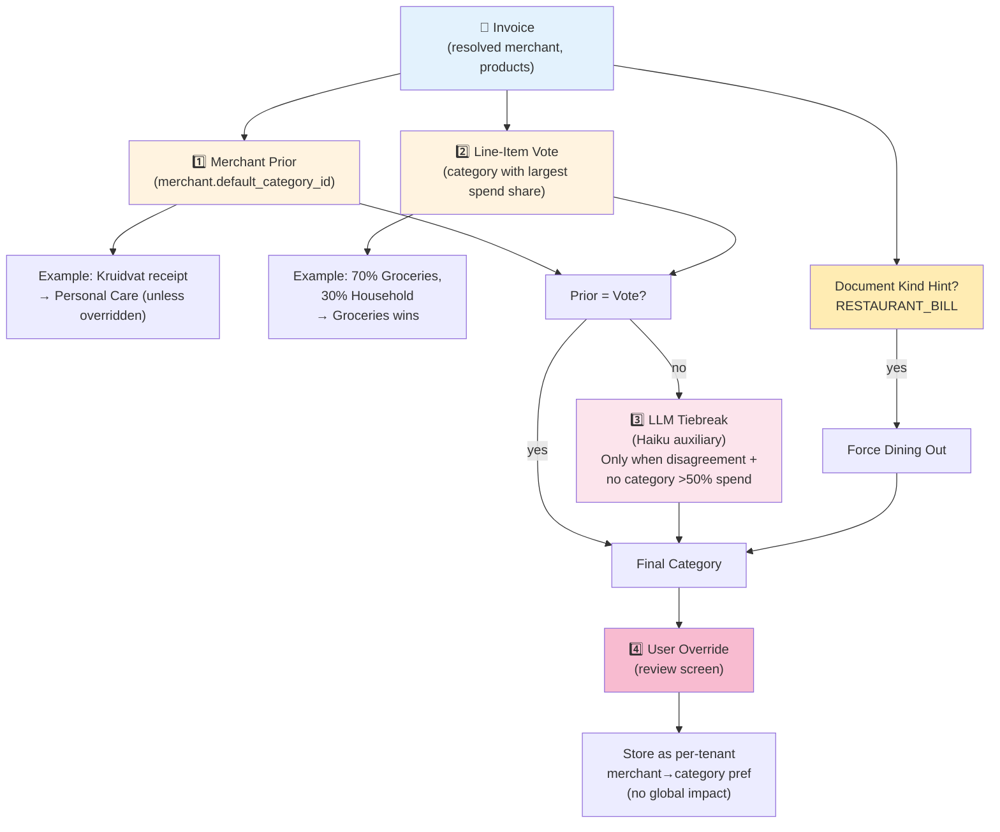

**Algorithm (cheapest first):**

1. **Merchant prior:** `merchant.default_category_id` — most merchants have obvious categories
2. **Line-item vote:** Category with largest spend share (majority wins)
3. **LLM tiebreak:** Only when (1) and (2) disagree AND no category >50% of invoice total
4. **Document hint:** `RESTAURANT_BILL` → always force **Dining Out**
5. **User override:** User can correct on review screen; stored as per-tenant preference (never propagated globally)

---

### Stage 4: AI Search Tag Generation

**Goal:** Assign ≤3 tags per invoice from a fixed SSM-managed vocabulary (~60–80 tags).

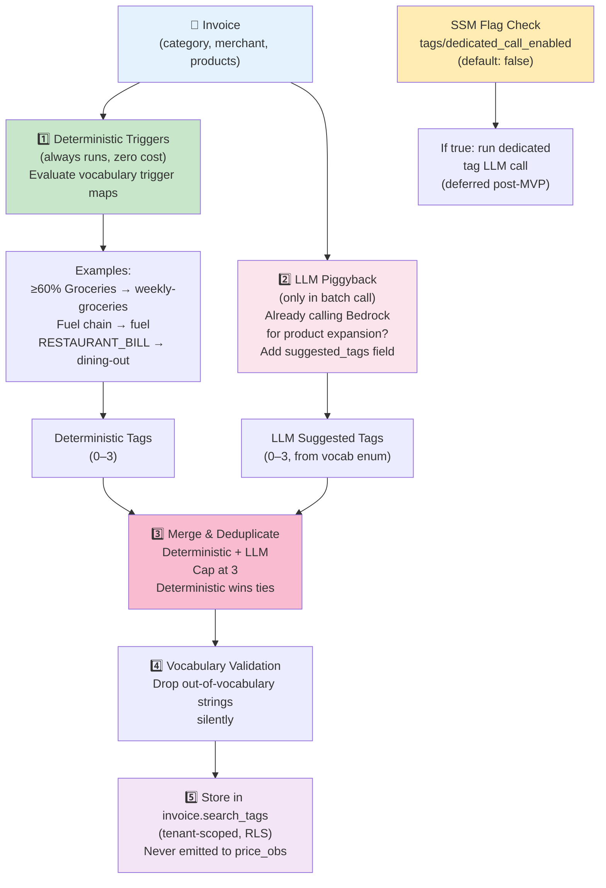

**Two-Path Strategy:**

| Path | Trigger | Cost | When |
|------|---------|------|------|
| **Deterministic** | Always | Free | Evaluate SSM vocabulary trigger maps (e.g., "≥60% Groceries" → tag) |
| **LLM Piggyback** | Batch call runs | ~0 extra tokens | Already calling Bedrock for product expansion; add `suggested_tags` field to prompt output |

**Vocabulary Management:**
- Stored in SSM parameter: `/wobblio/config/tags/vocabulary`
- ~60–80 tags with trigger maps (e.g., `{tag: "weekly-groceries", trigger: "category_id=1 AND share≥60%}`)
- User can edit tags on review screen (removes/adds from vocabulary)
- User edits are **tenant-scoped** — no global catalog impact

**Dedicated Tag Call (Deferred):**
- SSM flag: `tags/dedicated_call_enabled` (default: **false**)
- Post-MVP optimization: run dedicated Bedrock call if needed for better tag quality
- Off at launch to minimize token spend

---

### Stage 5: Price Observation Emission

**Goal:** Write de-identified price points to the shared `price_observation` table (feeds the price index and anti-inflation engine).

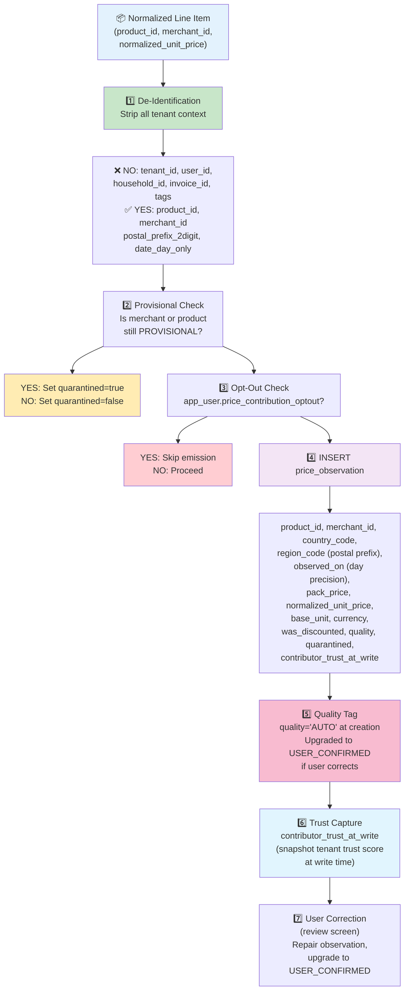

**De-Identification Rules (strict):**

| Field | Allowed? | Purpose |
|-------|----------|---------|
| `tenant_id` | ❌ **NO** | Would leak cross-tenant data aggregation |
| `user_id` | ❌ **NO** | Would leak individual behavior |
| `household_id` | ❌ **NO** | Would leak household membership |
| `invoice_id` | ❌ **NO** | Would link back to original receipt |
| `search_tags` | ❌ **NO** | Would leak personal categorization |
| `product_id` | ✅ **YES** | Canonical product; shared across tenants |
| `merchant_id` | ✅ **YES** | Canonical merchant; shared across tenants |
| `country_code` | ✅ **YES** | Market segmentation (NL, DE, BE, etc.) |
| `region_code` | ✅ **YES** | 2-digit postal prefix (~city-sized, ~10k people) |
| `observed_on` | ✅ **YES** | Day-precision only (no hour/minute) |
| `price_data` | ✅ **YES** | Amounts and quantities |

**Quality Levels:**
- **AUTO:** Machine-resolved (fuzziness, embeddings, LLM)
- **USER_CONFIRMED:** Tenant corrected on review screen
- Helps price-index queries down-weight auto entries in favor of confirmed data

**Opt-Out Respect:**
- If `app_user.price_contribution_optout = true`, skip price observation emission entirely
- User's invoice is still parsed and stored; just doesn't contribute to price index
- Can be toggled per user via settings

---

## Catalog Integrity & Anti-Poisoning (§6.8)

The system defends against malicious actors who try to pollute the price index or merchant/product taxonomy. **Four defensive layers** work together:

```mermaid
graph TB
    subgraph Layer1["🛡️ LAYER 1: Provisional Visibility"]
        Provisional["Auto-created merchants/products<br/>are PROVISIONAL state<br/>= locally visible, globally hidden"]
        Quorum["Promotion to ACTIVE requires:<br/>≥3 corroborating tenants OR<br/>≥2 user-confirmed OR<br/>admin approval"]
        Sybil["Sybil check: account ≥7 days,<br/>≥5 parsed receipts,<br/>distinct device/IP"]
    end
    
    subgraph Layer2["📊 LAYER 2: Statistical Price Plausibility"]
        Plausibility["normalized_unit_price tested<br/>against 90-day (product, region)<br/>median band"]
        Bounds["Outside [median÷4, median×4]<br/>→ quarantined"]
        Fallback["No history → category-level<br/>bounds from seed data"]
        QuantityCaps["Sanity checks:<br/>line_qty ≤200<br/>line_total ≤€10k"]
    end
    
    subgraph Layer3["👤 LAYER 3: Tenant Trust Scoring"]
        TrustScore["trust_score (0–100, default 20)<br/>recomputed nightly"]
        Quarantine["<10: quarantine-only emissions"]
        Relaxed["≥60: relaxed plausibility band"]
        Factors["Factors: invoice count, accuracy<br/>feedback ratio, account age,<br/>device distinctness"]
    end
    
    subgraph Layer4["🚦 LAYER 4: Velocity Limits"]
        Velocity["Per tenant per day:<br/>≤10 new PROVISIONAL merchants<br/>≤60 new PROVISIONAL products"]
        Breach["Breach: lines stay product_id=NULL<br/>Tenant flagged in admin console<br/>Invoice still completes"]
        Limit["Slows spam, doesn't block"]
    end
    
    Provisional --> Quorum
    Quorum --> Sybil
    
    Plausibility --> Bounds
    Bounds --> Fallback
    Fallback --> QuantityCaps
    
    TrustScore --> Quarantine
    TrustScore --> Relaxed
    Relaxed --> Factors
    
    Velocity --> Breach
    Breach --> Limit
    
    style Layer1 fill:#c8e6c9
    style Layer2 fill:#bbdefb
    style Layer3 fill:#ffe0b2
    style Layer4 fill:#ffccbc
```

### Layer 1: Provisional Visibility (State Machine)

**Merchant/Product State Machine** (Appendix A):

```
PROVISIONAL
  ├── [admin approval] → ACTIVE
  ├── [≥3 corroborators: account ≥7d, ≥5 invoices, trust ≥20] → ACTIVE
  ├── [≥2 user-confirmed entries] → ACTIVE
  └── [14 days old, no corroboration] → ARCHIVED
```

**Corroborator Eligibility:**
- Account age ≥7 days
- ≥5 parsed invoices (demonstrates legitimate use)
- Trust score ≥20
- **Device/IP distinctness:** fingerprint must differ from other corroborators (prevents fake accounts on same device)

**Cross-Tenant Collision Detection:**
- SHA-256 image hash collision → void corroboration, flag account cluster as potential Sybil attack
- Fingerprint collision → flag cluster (household exemption: allow same IP if different merchant patterns)

**Result:** New merchants/products created by spammers are invisible to other tenants until legitimacy is confirmed.

---

### Layer 2: Statistical Price Plausibility

**90-Day Median Band:**

For each `(product_id, region_code)` tuple:
- Collect all non-quarantined `price_observation` entries from past 90 days
- Compute median price
- **Accept range:** `[median ÷ 4, median × 4]` (±4x tolerance)
- **Outside range:** set `quarantined = true`

**Example:**
```
Product: COCA_COLA_330ML
Region: 20 (Amsterdam postal prefix)
90-day observations: €0.50, €0.52, €0.51, €0.49, €2.00, €0.51, €0.50
Median: €0.51
Band: [€0.1275, €2.04]
€2.00 observation: ACCEPTED (barely)
€10.00 entry: QUARANTINED (outside band)
```

**No-History Fallback:**

For new products (no 90-day history), use **category-level bounds** from seed data:
```
Dairy (unit: €/L): [€0.20, €25.00]
Meat (unit: €/kg): [€2.00, €50.00]
Bread (unit: €/piece): [€0.50, €10.00]
```

**Quantity Sanity Caps:**
- Line quantity ≤200 (prevents "I bought 10,000 sodas" fake invoices)
- Line total ≤€10k (prevents "€50k milk carton" poison)

**Result:** Implausible prices are isolated (quarantined) and excluded from the price index until legitimacy is confirmed.

---

### Layer 3: Tenant Trust Scoring

**Trust Score: 0–100 (default new user: 20)**

**Nightly Recomputation Job** (EventBridge cron):

```sql
UPDATE app_user
SET trust_score = ROUND(
  (invoice_count * 0.5) +                    -- volume indicator
  (confirmed_feedback_ratio * 30) +          -- user confirms parses
  (account_age_days / 10) +                  -- long-term account
  (distinct_device_count * 5) -              -- multi-device = good
  (anomaly_flags * 10) -                     -- weird patterns
  (sybil_suspect_flag * 50)                  -- suspected attack
)
WHERE stage = 'prod'
```

**Actions Based on Trust Score:**

| Score | Emission Behavior |
|-------|-------------------|
| **<10** | Only quarantined observations accepted; new provisional entities rejected; invoice completes |
| **10–59** | All observations accepted at normal plausibility bands |
| **≥60** | Relaxed plausibility band ([median ÷ 6, median × 6]); higher confidence in provisional entities |

**Factors Tracked:**
- `invoice_count` — legitimate users scan many receipts
- `confirmed_feedback_ratio` — users who provide feedback tend to be honest
- `account_age_days` — older accounts = lower Sybil risk
- `distinct_device_count` — accessing from multiple devices = good signal
- `anomaly_flags` — unusual patterns (all uploads at 3 AM, same merchant 100 times, identical amounts, etc.)
- `sybil_suspect_flag` — manually flagged by admin or detected via cross-tenant collision

**Result:** Spammers on day 1 (trust ~20) cannot poison the index; must build legitimate history.

---

### Layer 4: Velocity Limits

**Per Tenant, Per Day:**
- ≤10 new **PROVISIONAL** merchants
- ≤60 new **PROVISIONAL** products

**What Happens on Breach?**
1. Subsequent lines where `product_id` would be auto-created stay `product_id = NULL`
2. Invoice still completes (user can parse and review)
3. Tenant flagged in admin console (`velocity_breach_date`, `breach_count`)
4. Admin can investigate and lift if legitimate

**Why Not Block the Invoice?**
- Legitimate users with large household/batch uploads might hit limits
- Better to degrade gracefully than refuse service
- Admin can whitelist trusted bulk uploaders

**Example Scenario:**
```
2026-06-16 10:00 AM: Tenant uploads 15 new-product invoices
- Invoices 1–10: products created normally (10 NEW PROVISIONAL merchants)
- Invoices 11–15: product_id stays NULL (velocity limit hit)
- Tenant status: VELOCITY_LIMIT_BREACHED
- Admin review: "Oh, this is a grocery chain doing initial inventory scan"
  → Admin lifts limit, re-triggers product creation
```

---

## Malicious Actor Detection & Response

The system identifies and isolates bad actors through multiple signals:

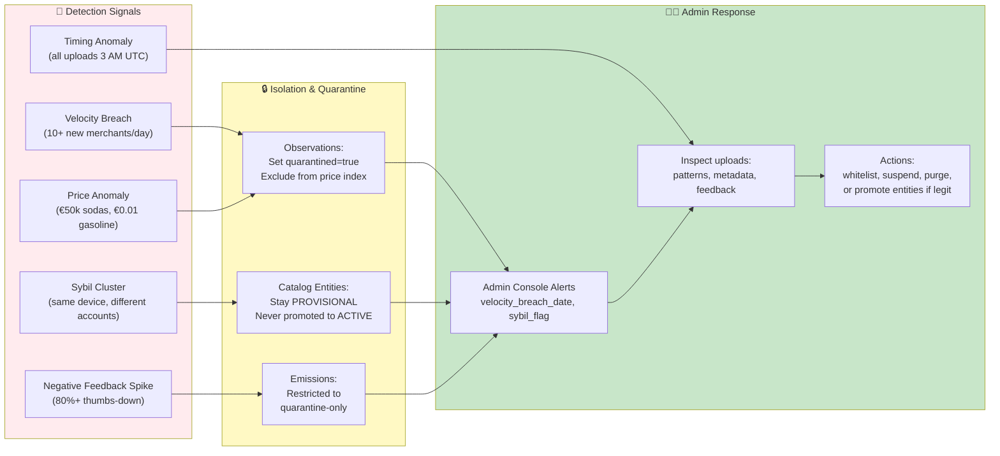

### Detection Signals

| Signal | Threshold | Action |
|--------|-----------|--------|
| **Velocity Breach** | 10+ new merchants or 60+ new products per day | Tenant flagged; subsequent auto-creates blocked; admin review required |
| **Price Anomaly** | Outside [median ÷ 4, median × 4] band | Observation quarantined; excluded from price index until confirmed |
| **Sybil Cluster** | Same device fingerprint + multiple accounts | Corroboration voided; cluster flagged in admin console; trust scores lowered |
| **Negative Feedback** | ≥80% thumbs-down on invoices | Trust score penalty; nightly recomputation lowers score further |
| **Timing Anomaly** | All uploads between 2–4 AM UTC (bot behavior) | Flagged as `anomaly_flags`; reduces trust score; trust <10 = restricted emissions |
| **Collision Detection** | SHA-256 image hash match across tenants | Cross-tenant corroboration voided; suspicious account pair flagged |

### Quarantine Responses

**Observations (price data):**
- Set `quarantined = true`
- Excluded from price index queries (k-threshold enforcement)
- Can be repaired/confirmed by user review → `quality = USER_CONFIRMED`

**Provisional Merchants/Products:**
- Stay in `PROVISIONAL` state indefinitely
- Never promoted to `ACTIVE` without corroboration
- Invisible to other tenants
- User can still use them locally

**Emissions:**
- Restricted to `quarantine` table only
- If trust < 10: all new observations are quarantined
- Can be released by admin or trust recovery

### Admin Actions

Available in admin console (Epic 12):

```
Suspected Malicious Account:
├── View: [ All invoices ] [ Upload timing ] [ Feedback ratio ] [ Device fingerprint ]
├── Actions:
│   ├── [Whitelist] — lift velocity limits (for legitimate bulk uploaders)
│   ├── [Promote Entities] — move merchant/product from PROVISIONAL to ACTIVE
│   ├── [Release Quarantine] — move price observations from quarantine → active
│   ├── [Suspend] — set account status = SUSPENDED (blocks new uploads)
│   ├── [Purge] — trigger GDPR hard delete after soft-lock (30 days)
│   └── [Inspect Cluster] — view suspected Sybil accounts
└── Audit log: [ Date ] [ Action ] [ Admin ] [ Reason ]
```

---

## Price Index Anti-Poisoning: Read-Time Enforcement (k-Threshold)

Even if quarantined data gets written, it's excluded at read time:

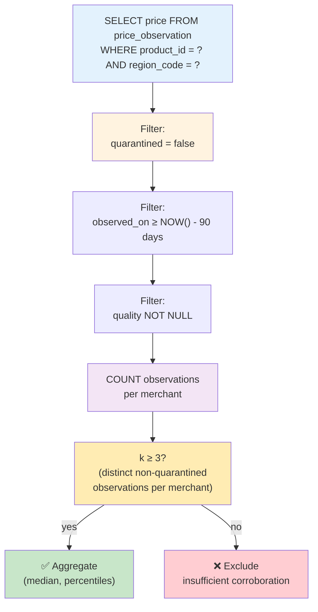

**Read-Time Query (pseudo-SQL):**

```sql
SELECT
  product_id,
  percentile_cont(0.5) WITHIN GROUP (ORDER BY normalized_unit_price) as median_price,
  percentile_cont(0.25) WITHIN GROUP (ORDER BY normalized_unit_price) as p25,
  percentile_cont(0.75) WITHIN GROUP (ORDER BY normalized_unit_price) as p75,
  COUNT(DISTINCT contributor_trust_at_write) as contributor_count
FROM price_observation
WHERE
  product_id = $1
  AND region_code = $2
  AND observed_on >= NOW() - INTERVAL '90 days'
  AND quarantined = false
  AND quality IS NOT NULL
GROUP BY product_id, region_code
HAVING COUNT(DISTINCT contributor_trust_at_write) >= 3  -- k-threshold
ORDER BY contributor_count DESC;
```

**Result:** Even if a spammer gets 2 quarantined observations in, the price index query returns `NULL` (no quorum) until ≥3 legitimate observations accumulate.

---

## Incident Response Examples

### Scenario 1: Bulk Merchant Spam

**Attacker:** Creates 50 PROVISIONAL merchants in one day (Italian restaurants, all fake names).

**Detection:**
1. Velocity limit: 10 new merchants/day → breach on upload 11
2. Tenant flagged: `velocity_breach_date = 2026-06-16 10:15 AM`, `breach_count = 5`
3. Subsequent auto-creates blocked; lines stay `merchant_id = NULL`

**Isolation:**
- All 50 PROVISIONAL merchants are invisible to other users
- Admin sees them in violation queue

**Admin Response:**
- Admin investigates: all same device IP, uploaded 3 AM UTC, feedback 100% negative
- Admin action: **[Suspend]** account
- Result: Account can no longer upload; existing invoices archived; PROVISIONAL merchants never promoted

### Scenario 2: Price Poisoning (Quid Pro Quo Attack)

**Attacker:** Adds fake price observations for competitor's products.
- 100 entries: €0.01 per liter (gasoline)
- 100 entries: €0.001 per liter (milk)

**Detection:**
1. Layer 2: Statistical plausibility band [median ÷ 4, median × 4]
   - Normal milk price: €0.50/L → band [€0.125, €2.00]
   - €0.001 observation → **QUARANTINED** (outside band)
2. Layer 3: Trust score plummets (100 anomalous entries)
   - Trust drops to <10
   - All future emissions from this user are quarantined-only

**Isolation:**
- All 100 fake observations: `quarantined = true`
- Excluded from price index queries (k-threshold)
- Price index unaffected

**Admin Response:**
- Admin sees spike in quarantined observations from one tenant
- Reviews invoice patterns: identical amounts, merchant, currency-conversion artifacts
- Admin action: **[Purge]** account (GDPR hard delete after soft-lock)
- Result: Fake observations deleted; account removed; other users never saw poisoned data

### Scenario 3: Sybil Attack (Account Farming)

**Attacker:** Creates 10 fake accounts on same device, each uploading 5 receipts to appear legitimate.

**Detection:**
1. Layer 1: Corroborator eligibility check
   - Device fingerprint match detected between accounts A, B, C
   - Cross-tenant collision alert triggered
2. Layer 3: Trust score anomaly
   - All 10 accounts: identical upload timing, identical merchant patterns, identical currency
   - Flagged: `sybil_suspect_flag = true`

**Isolation:**
- Corroboration between the 10 accounts is **voided**
- Any PROVISIONAL entities they collectively created stay PROVISIONAL
- All 10 accounts: trust < 10 (restricted to quarantine-only emissions)

**Admin Response:**
- Admin sees cluster alert: 10 accounts, same fingerprint, 0 diversity in upload patterns
- Admin action: **[Suspend]** all 10 accounts
- Result: Attack defeated; legitimate users unaffected

---

## Trust Score Deep Dive: Nightly Recomputation

The `trust_score` is the core signal that degrades an attacker's impact over time:

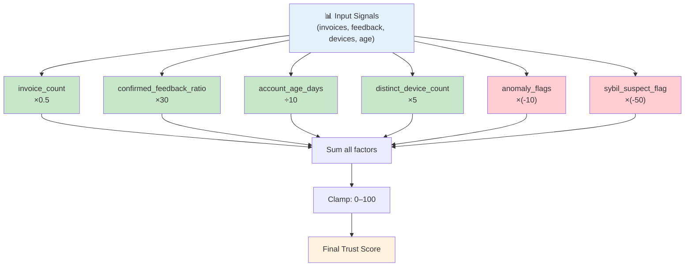

**Example: Day-by-day attacker degradation**

```
Day 1: New account, upload 1 fake invoice
  invoice_count: 1 → +0.5
  account_age_days: 0 → +0
  confirmed_feedback_ratio: 0% → 0
  distinct_devices: 1 → +5
  anomaly_flags: 1 (timing) → -10
  sybil_suspect_flag: false → 0
  TOTAL: 0.5 + 0 + 0 + 5 - 10 + 0 = -4.5 → clamped to 0
  ✅ Trust = 0 (QUARANTINE-ONLY MODE)

Day 7: Continues uploading, gets flagged for price spam
  invoice_count: 50 → +25
  account_age_days: 7 → +0.7
  confirmed_feedback_ratio: 5% → +1.5
  distinct_devices: 1 → +5
  anomaly_flags: 3 (timing, sybil, price) → -30
  sybil_suspect_flag: true → -50
  TOTAL: 25 + 0.7 + 1.5 + 5 - 30 - 50 = -47.8 → clamped to 0
  ✅ Trust = 0 (PERMANENTLY RESTRICTED)

Legitimate User: 3 months, regular uploads
  invoice_count: 200 → +100
  account_age_days: 90 → +9
  confirmed_feedback_ratio: 70% → +21
  distinct_devices: 3 → +15
  anomaly_flags: 0 → 0
  sybil_suspect_flag: false → 0
  TOTAL: 100 + 9 + 21 + 15 + 0 + 0 = 145 → clamped to 100
  ✅ Trust = 100 (PREMIUM MODE: relaxed bounds)
```

---

## Current Implementation Status

### ✅ Complete

- **Core domain services:** All 10+ services scaffolded and unit-tested
- **Port definitions:** 30+ ports defined with clear contracts
- **Adapter implementations:** Bedrock, S3, KMS, SES, SQS, Stripe (mock), Postgres repos, Cognito
- **Database migrations:** 5 migrations establishing schema + RLS + onboarding flow
- **Lambda handlers:** API handler, ingestion worker, cron tasks, Cognito hooks
- **Local development:** ts-node harness, Ollama fallback, seed data
- **Unit tests:** Vitest suite with mocked ports, domain coverage in progress
- **Infrastructure:** CDK stacks (Db, Auth, Backend, Storage, Observability, Web, Web-cert)
- **Webapp:** Next.js SSR (OpenNext), auth.ts, middleware, layout
- **Landing page:** Marketing site scaffold

### ⚠️ Stubbed / In Progress

- **Ingestion pipeline stubs:** Vision parse works; merchant resolver, product normalizer, classifier, tag generator are stubs pending LLM wiring
- **Product features:** Households, budgets, bill splitting (schema exists, no service logic)
- **Admin console:** Routes defined, middleware gated, awaiting backend API
- **Mobile:** Flutter app in backlog (Phase 5+)
- **E2E tests:** Framework ready, specs written, tests deferred to Phase 5
- **Full observability:** Phase 1 cost alarm + structured logs exist; Phase 5 KPI dashboard deferred

---

## Code Quality Gates (Before Commit)

```bash
# 1. Architecture validation (exit code must be 0)
npm run skill:hexagonal-architecture-validator

# 2. Domain test coverage (100% target)
npm run test:unit

# 3. GDPR/RLS audit (whenever DDL or adapters change)
npm run validate:security

# 4. CDK synthesis (cdk-nag pass)
cdk synth

# 5. Type check
npx tsc --noEmit
```

---

## Key Design Decisions

| Decision | Rationale | Tradeoff |
|----------|-----------|----------|
| **Hexagonal architecture (ports + adapters)** | Testability, technology independence, clean code | More indirection, more boilerplate |
| **One port per capability (ISP)** | Easier to mock, clearer contracts, single responsibility | More files, more interfaces |
| **DB as source of truth for auth state** | Consistency, single audit trail, easy revocation | Extra DB query on every auth refresh |
| **RLS + SET LOCAL** | Tenant isolation at DB level (prevents accidental data leakage) | Connection pooling complexity, must remember tenant context init |
| **Idempotency on SQS** | Handles message retries and duplicates safely | Extra INSERT for ledger, slight latency |
| **Bedrock versioning in feedback** | Enables model-swap comparison, debugging, cost analysis | Extra column in invoice_feedback |
| **Price observations de-identified** | Cross-tenant aggregation for price index, GDPR-friendly | Requires separate table, complex schema |
| **Web-only billing (no in-app purchase)** | Simpler Stripe integration, GDPR compliance (no app store ToS conflicts) | Mobile users must deep-link to web checkout |
| **LocalStack for local dev** | Accurate AWS behavior, no account needed | Startup overhead, resource usage |
| **OpenNext SSR** | Server-side auth guard, SEO, security (no token in browser) | More Lambda cold-starts, stateful session management |

---

## Repository Structure

```
wobblio/
├── Source/
│   ├── backend/
│   │   ├── src/
│   │   │   ├── core/
│   │   │   │   ├── domain/         # Errors, entities, business logic types
│   │   │   │   ├── services/       # Business logic (10+ services)
│   │   │   │   └── ports/          # Interfaces (30+ ports)
│   │   │   ├── infrastructure/
│   │   │   │   ├── adapters/       # Concrete implementations
│   │   │   │   ├── config/         # DB pool, logger
│   │   │   │   └── metrics/        # CloudWatch EMF
│   │   │   ├── handlers/           # Lambda entry points
│   │   │   ├── prompts/            # Versioned LLM artifacts
│   │   │   ├── local/              # Local dev harness
│   │   │   ├── migrations/         # node-pg-migrate
│   │   │   └── tests/              # Unit + integration tests
│   │   ├── package.json            # Dependencies, scripts
│   │   ├── CLAUDE.md               # Backend architecture guide
│   │   └── tsconfig.json
│   ├── infra/
│   │   ├── src/
│   │   │   ├── cdk/
│   │   │   │   └── stacks/         # CDK stacks (Db, Auth, Backend, etc.)
│   │   │   └── migrations/         # node-pg-migrate
│   │   └── package.json
│   ├── webapp/
│   │   ├── src/
│   │   │   ├── app/                # Next.js routes
│   │   │   ├── components/         # React components (layout, dashboard, etc.)
│   │   │   └── auth.ts             # NextAuth.js configuration
│   │   ├── public/                 # Static assets
│   │   ├── CLAUDE.md               # Webapp personality & rules
│   │   └── tailwind.config.ts
│   ├── landing/
│   │   └── src/                    # Marketing site
│   └── admin/
│       └── src/                    # Admin console (scaffolded)
├── docs/
│   └── wobblio_v2.4_specification_final.md  # Master spec (canonical)
├── specs/mvp/
│   ├── 00-design-system-wireframes.md
│   ├── 01-local-development-sandbox.md
│   ├── 02-infrastructure-database-rls.md
│   ├── ... (18 epics total)
│   └── 16-mobile-capture-and-review.md
├── .claude/
│   ├── rules/                      # Durable policies (code-quality-guard, gdpr-privacy-officer, etc.)
│   └── skills/                     # Project-specific skills
├── PROJECT_ANALYSIS.md             # This file
└── package.json                    # Monorepo root
```

---

## Common Workflows

### Adding a New API Endpoint

1. **Define port** (if new capability):
   ```typescript
   // src/core/ports/IMyNewPort.ts
   export interface IMyNewPort {
     myOperation(param: T): Promise<Result>;
   }
   ```

2. **Add service method**:
   ```typescript
   // src/core/services/MyService.ts
   constructor(private myPort: IMyNewPort) {}
   async execute(param: T): Promise<Result> {
     // business logic, throws domain errors
   }
   ```

3. **Implement adapter**:
   ```typescript
   // src/infrastructure/adapters/MyPortAdapter.ts
   implements IMyNewPort {
     async myOperation(param: T): Promise<Result> {
       // SDK call, map errors to domain errors
     }
   }
   ```

4. **Wire handler**:
   ```typescript
   // src/handlers/api-handler/index.ts
   case 'POST /my-endpoint':
     const service = new MyService(new MyPortAdapter());
     const result = await service.execute(body.param);
     return { statusCode: 200, body: result };
   ```

5. **Test**:
   ```typescript
   // src/tests/unit/core/services/MyService.test.ts
   const mockPort: MockedObject<IMyNewPort> = vi.mocked({
     myOperation: vi.fn(),
   });
   const service = new MyService(mockPort);
   // assertions on service behavior
   ```

### Running the Local Stack

```bash
# Terminal 1: LocalStack + Postgres
docker-compose up

# Terminal 2: Seed data + start Lambda harness
cd Source/backend
npm run local:seed
npm run local:dev
# Lambda available at http://localhost:3001
```

### Deploying to AWS

```bash
# Build
npm run build

# Synthesize CDK
cdk synth

# Deploy (stage = dev, staging, prod)
cdk deploy --require-approval never --all
```

---

## Key Links

- **Master specification:** `docs/wobblio_v2.4_specification_final.md`
- **Implementation specs:** `specs/mvp/` (00–16 epics)
- **Architecture rules:** `.claude/rules/`
- **Backend architecture:** `Source/backend/CLAUDE.md`
- **Webapp personality:** `Source/webapp/CLAUDE.md`
- **Project memory:** `.claude/projects/.../memory/MEMORY.md`

---

## Next Steps

1. **Phase 2 (Auth & Waitlist):** Cognito federation, pre-signup allowlist, post-confirmation hooks
2. **Phase 3 (Billing):** Stripe checkout, webhook ingestion, subscription state machine
3. **Phase 4 (Ingestion Pipeline):** Wire merchant resolver, product normalizer, classifier, tag generator; run IngestionService end-to-end
4. **Phase 5 (Admin & Observability):** Admin console, KPI dashboard, full observability suite

---

**Last updated:** 2026-06-16  
**Project status:** Implementation in progress (Phase 2-3)  
**Contact:** Antonio Reuter (antonioreuter@gmail.com)
