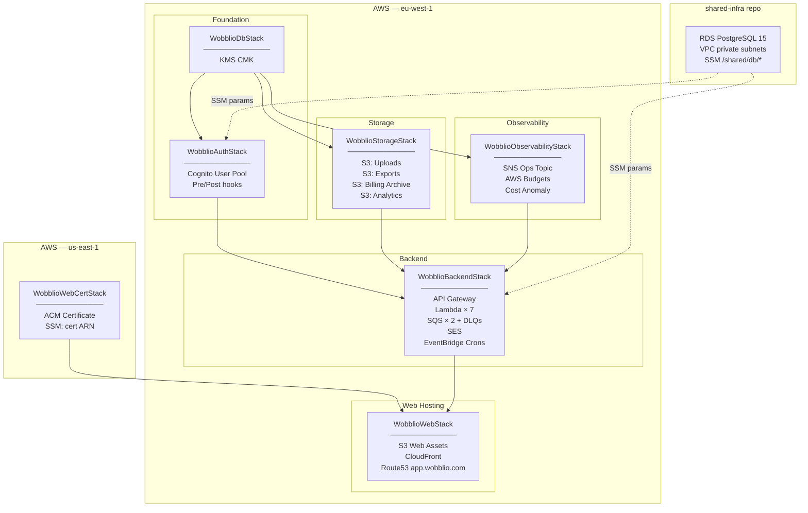

# Wobblio Infrastructure

CDK stacks, database migrations, and local development seeds for the Wobblio backend.

## Stack Overview

| Stack | Region | Key Resources |
|-------|--------|--------------|
| `WobblioDbStack` | eu-west-1 | KMS CMK (application-layer envelope encryption) |
| `WobblioAuthStack` | eu-west-1 | Cognito User Pool, mobile + web clients, pre/post-signup hooks |
| `WobblioStorageStack` | eu-west-1 | S3: uploads, exports, billing archive, analytics |
| `WobblioObservabilityStack` | eu-west-1 | SNS ops topic, AWS Budgets (€30/mo), Cost Anomaly Detection |
| `WobblioBackendStack` | eu-west-1 | API Gateway, 7 Lambda handlers, SQS queues, SES, EventBridge crons |
| `WobblioWebCertStack` | **us-east-1** | ACM certificate for `app.wobblio.com` (CloudFront requirement) |
| `WobblioWebStack` | eu-west-1 | S3 static assets, CloudFront distribution, Route53 `app.wobblio.com` |
| `WobblioLocalBootstrapStack` | local only | LocalStack mock: S3, SQS, SSM params, Secrets Manager |

## Deployment Diagram



## Deploy Order

Stacks must be deployed in dependency order. `cdk deploy --all` handles this automatically.

```
WobblioDbStack
  ├── WobblioAuthStack
  ├── WobblioStorageStack
  └── WobblioObservabilityStack
        ↓
  WobblioBackendStack
        ↓
  WobblioWebCertStack (parallel, us-east-1)
        ↓
  WobblioWebStack
```

## Commands

### Local development (→ dev AWS)

Local development connects directly to the dev AWS environment. No Docker required.

```bash
# First-time setup: fill .env.local with dev credentials (see .env.local.template)
make setup && make deploy

# Run migrations against dev RDS
make migrate
```

See `scripts/local-dev/local-development.md` for the full guide.

### Deploy to AWS

```bash
# Full deploy
npm run cdk:deploy:dev     # deploy all stacks to dev
npm run cdk:deploy:prod    # deploy all stacks to prod (requires broadening approval)

# Targeted single-stack deploys (STAGE env var defaults to dev)
npm run cdk:deploy:storage       # WobblioStorageStack
npm run cdk:deploy:observability # WobblioObservabilityStack
npm run cdk:deploy:backend       # WobblioBackendStack
npm run cdk:deploy:web           # WobblioWebStack

# Diff before deploy
STAGE=prod npm run cdk:diff
```

### Migrations

```bash
npm run migrate:up         # apply pending migrations
npm run migrate:down       # roll back last migration
npm run migrate:create -- --name my-migration   # scaffold new migration file
```

## Cross-Stack Resource Sharing

| Resource | Origin | Consumer | Mechanism |
|----------|--------|----------|-----------|
| KMS key | `WobblioDbStack` | StorageStack, AuthStack, BackendStack | CDK prop (direct ref) |
| Cognito User Pool | `WobblioAuthStack` | BackendStack | CDK prop (direct ref) |
| S3 bucket refs | `WobblioStorageStack` | BackendStack | CDK prop → auto CFN export/import |
| SNS ops topic ARN | `WobblioObservabilityStack` | Future alarm wiring | CFN export `wobblio-{stage}-ops-topic-arn` |
| ACM cert ARN | `WobblioWebCertStack` (us-east-1) | WebStack (eu-west-1) | SSM param + `AwsCustomResource` cross-region read |
| DB connection | `shared-infra` repo | AuthStack, BackendStack | SSM params `/shared/db/*` |

## Production Notes

- **S3 RETAIN buckets** (`uploads`, `billing-archive`, `analytics`): moving them to a new stack requires `cdk import` — do not delete and recreate.
- **Cron rules** (`BudgetResetCron`, `FxRateFetchCron`, `WaitlistReleaseCron`): disabled in `dev` stage; only active in `prod`.
- **SNS mobile push** (FCM, APNs): cannot be managed by CloudFormation — provision via AWS CLI and store ARNs in SSM (see comment in `WobblioBackendStack.ts`).
