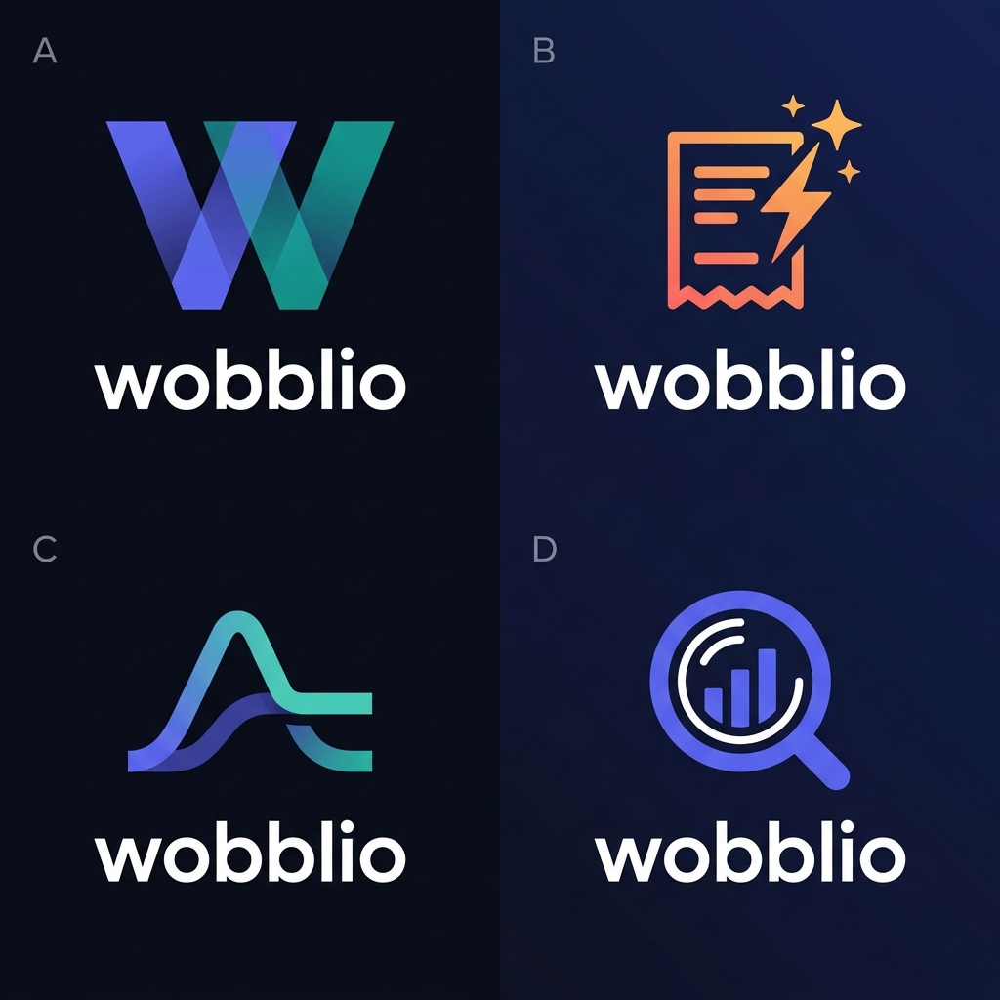
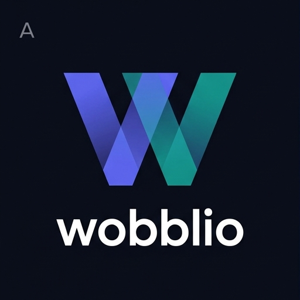
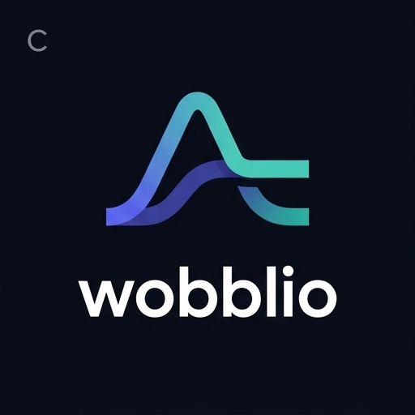
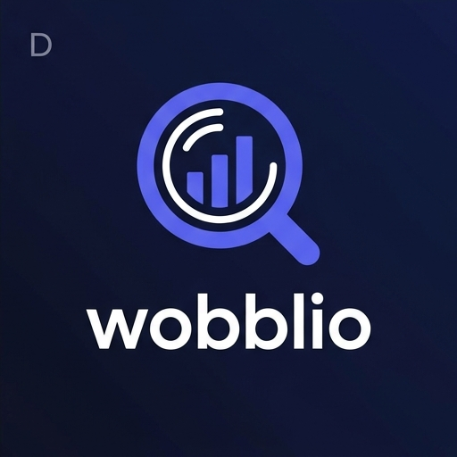

# Wobblio Logo Shortlist (A, C, D)

Three concepts shortlisted for friend review. Share this document or view the images in the `assets/` folder.

---

## Concept Overview Sheet

---

## Option A — Gradient W Mark
**Concept:** Geometric letterform **W** built from two overlapping indigo → teal scanner beams. Recognizable, premium tech.

**Feeling:** Like Notion, Linear, or Vercel — confident and clean.

---

## Option C — Price Wave Crest *(currently live in prototype)*
**Concept:** Two overlapping smooth curve lines (indigo to teal) that rise, peak, and cross to form a central loop.

**Feeling:** Unique, concept-driven, instantly communicates the product's value. Like a fintech meets consumer brand.

---

## Option D — Lens + Bar Chart
**Concept:** Magnifying glass containing a mini bar chart — analysis, discovery, price intelligence. Electric indigo monochrome.

**Feeling:** Strong fintech/analytics positioning. Like a Bloomberg or Robinhood product.

---

> **Currently implemented:** Option C in the prototype. Let us know what your friends think and we can switch to another option at any time.
