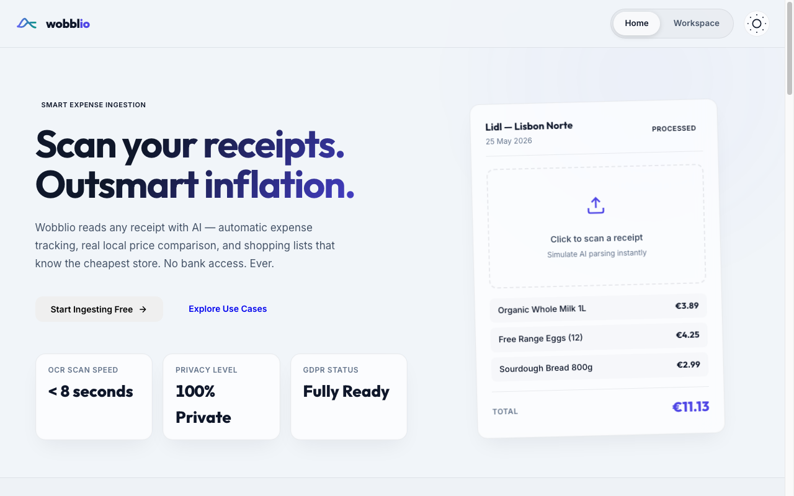
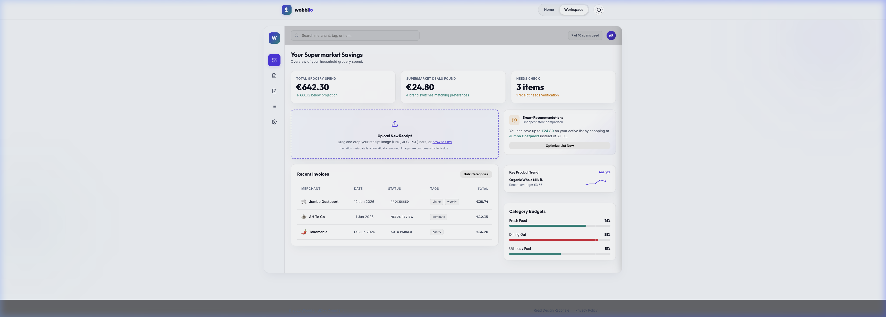
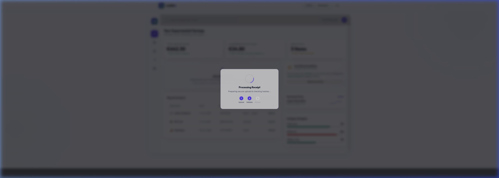
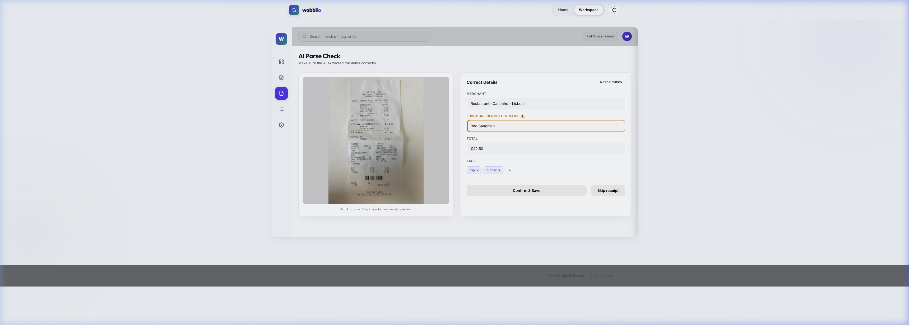
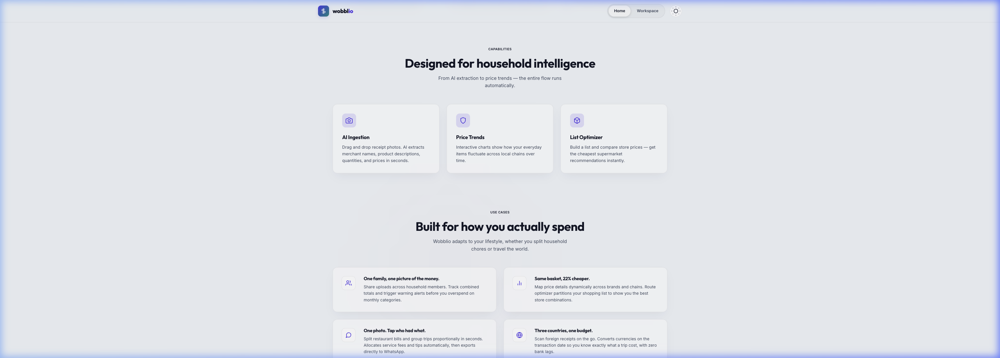

# Wobblio "Obsidian Aurora" UI Handover & Implementation Specification

This document provides a complete specification for migrating the **Obsidian Aurora** high-fidelity design prototype from the HTML/CSS workspace into the Next.js production codebase located in `Source/webapp`. It is structured to serve as a direct prompt/specification for an AI coding assistant to implement the layout, styling variables, merchant iconography, and interactive state components.

## 0. Visual Layout References

Here are the key high-fidelity mockups of the prototype for reference when building the UI:

### 0.1 Marketing Landing Page


### 0.2 Application Workspace & Dashboard Layout


### 0.3 Fullscreen Ingestion Stepper & Parse Verification Drawer



---

## 1. Core Visual Design System ("Obsidian Aurora")

The application uses a premium, dark-first glassmorphism layout, with a Solar Light mode option. All styles should be implemented using Tailwind CSS v4 variables mapped inside `src/app/globals.css`.

### 1.1 Palette Variables (Tailwind CSS v4 `@theme`)
Add these custom variables to the `@theme` block in [globals.css](file:///Users/antonioreuter/repositories/projects/wobblio/Source/webapp/src/app/globals.css):

```css
@theme {
  /* Obsidian Aurora Design System */
  --color-deep-space: #090c15;
  --color-obsidian-glass: rgba(17, 22, 39, 0.72);
  --color-solar-glass-bg: #f1f5f9;
  --color-light-glass-surface: rgba(255, 255, 255, 0.75);
  
  /* Accents */
  --color-electric-indigo: #6366f1;
  --color-aurora-teal: #0d9488;
  --color-sunset-coral: #f43f5e;
  --color-warm-amber: #f59e0b;
  --color-star-white: #f8fafc;
  --color-slate-space: #94a3b8;
  
  /* Glass Borders and Shadows */
  --color-glass-border: rgba(255, 255, 255, 0.08);
  --color-glass-border-light: rgba(15, 23, 74, 0.08);
  --shadow-premium-glow: 0 0 25px 3px rgba(99, 102, 241, 0.15);
}
```

### 1.2 Glassmorphism Utility
Apply these classes to card components:
- **Dark Mode Card:** `bg-[var(--color-obsidian-glass)] border border-[var(--color-glass-border)] backdrop-blur-[20px] rounded-[12px] shadow-lg`
- **Light Mode Card:** `bg-[var(--color-light-glass-surface)] border border-[var(--color-glass-border-light)] backdrop-blur-[20px] rounded-[12px] shadow-md`

### 1.3 Mobile Responsiveness & Breakpoints
To ensure optimal usability across all devices (especially since scanning receipts and managing shopping lists are core mobile-first actions), the UI must strictly adhere to a mobile-first responsive strategy:
- **Tailwind Breakpoints:**
  - Mobile: `< 768px` (default Tailwind styles)
  - Tablet: `>= 768px` (`md:`)
  - Desktop: `>= 1024px` (`lg:`)
  - Wide Desktop: `>= 1280px` (`xl:`)
- **Fluid Layouts:** Avoid fixed pixel widths for major containers. Use responsive grid layouts (e.g. `grid-cols-1 md:grid-cols-2 lg:grid-cols-3`) and flex wrapping.
- **Touch Targets:** All interactive mobile elements (checkmarks, increment/decrement buttons, toggles, navigation tabs) must have a minimum target size of `44x44px` to prevent accidental clicks while on the go.

---

## 2. Brand Identity & Logo Component

The brand logo is a **double-loop crossover wave** (Option C from concepts) — visually communicating "outsmarting inflation" with overlapping curves. One curve sweeps high to form a peak (inflation), while the second curve loops below it to rise and fall smoothly, crossing paths. The gradient runs indigo → teal left-to-right. The logo does not use any background gradient wrapper box.

### Visual Reference


Create the brand logo as a reusable React component in `src/components/ui/logo.tsx`:

```tsx
import React from 'react'

export function WobblioLogo({ className = "h-6 w-6" }: { className?: string }) {
  return (
    <svg
      className={className}
      viewBox="0 0 48 32"
      fill="none"
      strokeLinecap="round"
      strokeLinejoin="round"
      aria-label="Wobblio"
    >
      <defs>
        <linearGradient id="wob-logo-gradient" x1="0%" y1="0%" x2="100%" y2="0%">
          <stop offset="0%" stopColor="#6366F1" />
          <stop offset="100%" stopColor="#0D9488" />
        </linearGradient>
      </defs>
      {/* Top wave: rises to peak, drops, and goes horizontal */}
      <path
        d="M 6 22 C 10 22, 14 6, 20 6 C 24 6, 26 18, 32 14 L 42 14"
        stroke="url(#wob-logo-gradient)"
        strokeWidth={3.5}
      />
      {/* Bottom wave: flat, curves up to peak, drops, and goes horizontal */}
      <path
        d="M 6 22 C 10 22, 15 26, 20 20 C 23 16, 26 12, 30 16 C 33 19, 36 24, 42 24"
        stroke="url(#wob-logo-gradient)"
        strokeWidth={3.5}
      />
    </svg>
  )
}
```

### Wordmark Accent
In the navigation header and landing page, the wordmark reads `wobbl` in white / `io` in electric indigo (`#6366F1`):

```tsx
<span className="font-semibold text-star-white">
  wobbl<span className="text-electric-indigo">io</span>
</span>
```

---

## 3. Rebranding copy & Landing Page Use Cases

The landing page copy should be revised to transition Wobblio from grocery-only to global expense scanning.

### 3.1 Headline Revisions
- **Page Title:** `Wobblio — Scan receipts. Outsmart inflation.`
- **Hero Title:** `Scan your receipts. Outsmart inflation.`
- **Hero Description:** `Wobblio reads any receipt worldwide with AI — automatic expense breakdown, real local price comparison, and shopping lists that locate the cheapest store. No bank connection required. Ever.`

### 3.2 6-Persona Use Case Cards
Re-arrange `src/components/marketing/persona-grid` into a responsive grid. On mobile viewports, display as a single-column stack (`grid-cols-1`), transitioning to 2 columns on tablet (`md:grid-cols-2`), and a 3-column grid on desktop (`lg:grid-cols-3`) with Lucide icons.

### Visual Reference


| Persona | Card Headline | Scenario / Subline Hook | Features / Description | Lucide Icon |
| :--- | :--- | :--- | :--- | :--- |
| **P1: Traveler** | Three countries, one budget | "Every receipt converted on the day you paid — not when the bank felt like it." | Converts foreign receipts on transaction date, eliminating credit card settlement lag. | `Globe` |
| **P2: Family CFO** | One family, one picture | "Household allocation pool keeps everyone on track." | Merges multiple uploads into a shared monthly quota pool with custom categories. | `Users` |
| **P3: Student** | Same basket, 22% cheaper | "Discover invisible leaks and split house costs." | Shows cost disparities between adjacent stores and supports WhatsApp split shares. | `GraduationCap` |
| **P4: Inflation Hunter**| Inflation is personal | "Your personal price engine tells the real story." | Tracks actual price trends of items you buy, bypassing generalized public indices. | `TrendingUp` |
| **P5: Friend Group** | One photo. Tap who had what. | "Fair group split — including service and tip — in 30 seconds." | Vision extraction maps proportional bills. Exports direct WhatsApp charge sheets. | `Split` |
| **P6: Border Shopper**| Cross-Border Check | "Is the drive across the border still worth it?" | Tracks tax and grocery price differentials between bordering countries. | `MapPin` |

---

## 4. Premium Lucide Merchant Iconography

All emojis representing merchants must be replaced by a `lucide-react` icon container with a specific styled circular background matching the merchant's branding color.

Create a helper mapping component `src/components/ui/merchant-icon.tsx`:

```tsx
import React from 'react'
import { 
  ShoppingBag, 
  ShoppingCart, 
  Tag, 
  Coins, 
  Coffee, 
  Flame, 
  UtensilsCrossed, 
  Receipt 
} from 'lucide-react'

const merchantConfigs: Record<string, { icon: React.ComponentType<any>; color: string; initials: string }> = {
  "albert heijn": { icon: ShoppingBag, color: "bg-[#00a1e2] text-white", initials: "AH" },
  "albert heijn xl": { icon: ShoppingBag, color: "bg-[#00a1e2] text-white", initials: "AH" },
  "ah to go": { icon: Coffee, color: "bg-[#00a1e2] text-white", initials: "AH" },
  "jumbo": { icon: ShoppingCart, color: "bg-[#f59e0b] text-[#0f172a]", initials: "J" },
  "jumbo oostpoort": { icon: ShoppingCart, color: "bg-[#f59e0b] text-[#0f172a]", initials: "J" },
  "dirk": { icon: Tag, color: "bg-[#ef4444] text-white", initials: "D" },
  "dirk van den broek": { icon: Tag, color: "bg-[#ef4444] text-white", initials: "D" },
  "lidl": { icon: Coins, color: "bg-[#8b5cf6] text-white", initials: "L" },
  "tokomania": { icon: Flame, color: "bg-[#10b981] text-white", initials: "TK" },
  "restaurante cantinho": { icon: UtensilsCrossed, color: "bg-[#be123c] text-white", initials: "RC" }
}

export function MerchantIcon({ merchantName, className = "h-8 w-8 text-xs" }: { merchantName: string; className?: string }) {
  const normName = merchantName.toLowerCase().trim()
  
  // Find match by exact match or startsWith
  const key = Object.keys(merchantConfigs).find(k => normName.startsWith(k))
  const config = key ? merchantConfigs[key] : { icon: Receipt, color: "bg-slate-500 text-white", initials: "?" }
  
  const IconComponent = config.icon

  return (
    <div className={`flex items-center justify-center rounded-[8px] font-bold ${config.color} ${className}`} title={merchantName}>
      <IconComponent className="h-[55%] w-[55%] stroke-[2]" />
    </div>
  )
}
```

---

## 5. Responsive Navigation & Sidebar Expansion

Expand [left-nav.tsx](file:///Users/antonioreuter/repositories/projects/wobblio/Source/webapp/src/components/ui/left-nav/left-nav.tsx) and [layout.tsx](file:///Users/antonioreuter/repositories/projects/wobblio/Source/webapp/src/app/%28app%29/layout.tsx) to support the full 9 tabs while adapting layout structures dynamically based on viewport width:

- **Desktop Layout:** Render the full 9 tabs inside a fixed, collapsible sidebar on the left side of the screen (`hidden lg:flex`).
- **Mobile & Tablet Layout:** Hide the default sidebar on smaller viewports (`lg:hidden`). Implement:
  1. A fixed bottom navigation bar (`fixed bottom-0 left-0 right-0 z-50 bg-[var(--color-obsidian-glass)] border-t border-[var(--color-glass-border)] backdrop-blur-[20px] flex justify-around py-2`) containing quick-access icons and labels for core daily actions: `dashboard`, `invoices`, `lists`, and `settings`.
  2. A "More" menu button in the bottom navigation bar that opens a slide-over mobile drawer or sheet menu showing the remaining routes: `review`, `reports`, `budgets`, `household`, and `admin`.

```typescript
type NavPage =
  | 'dashboard'
  | 'invoices'
  | 'review'
  | 'reports'
  | 'lists'
  | 'budgets'
  | 'household'
  | 'settings'
  | 'admin'
```
Ensure all pages are mapped in the sidebar items array using their corresponding Lucide icons:
- `dashboard` -> `LayoutDashboard`
- `invoices` -> `ReceiptText`
- `review` -> `CheckSquare` (Awaiting Check)
- `reports` -> `LineChart` (Price Trends)
- `lists` -> `ShoppingCart` (Shopping Lists)
- `budgets` -> `Wallet` (Category Budgets)
- `household` -> `Users` (Household Sync)
- `settings` -> `Settings` (Settings & GDPR)
- `admin` -> `Terminal` (Developer Console)

---

## 6. Workspace Interactivity specifications

The layout must transition between views inside `src/app/(app)/layout.tsx` using Client State, or implement corresponding subdirectories inside `src/app/(app)/`. The specific UI components must support the following client-side interactive modules:

### 6.1 Sandbox controls & RLS Bypass Warning Banner
Create a local sandbox control bar in `src/components/ui/top-bar/sandbox-bar.tsx` or mount directly inside `TopBar`:
- **State:** `isRlsEnforced` (boolean, defaults to `true`).
- **Toggle Button:** Shows `gpp_good` shield icon in green with text "RLS: Enforced" when true. Toggling sets it to false, turning the shield icon red with text "RLS: Bypassed".
- **Mobile Adaptation:** The sandbox bar and its controls must stack or fit cleanly within the header on mobile viewports. On narrow screens, the RLS toggle button should hide its text and show only the visual shield icon with proper accessibility labels.
- **Database Warning Banner:** When RLS is bypassed, displays a warning alert below the header:
  `"PostgreSQL tenant separation bypass warning: Current query attempted accessing data from user ID usr_9a4f210e. Operation blocked by RLS policies."`
- **Banner Close Button:** Hides the banner on click.
- **Reload Seed Data Button:** Clears all user-added items, restores initial checklist values, and deletes any simulated review receipt from memory.

### 6.2 Interactive Shopping List Builder & Cost Optimizer (`lists/page.tsx`)
Create an interactive screen representing the shopping checklist:
- **Responsive Workspace Layout:** On desktop viewports, display a two-column grid where the checklist builder is on the left and the store cost comparison side card is on the right. On mobile devices, wrap these into a single column (`flex-col`), displaying the checklist builder on top and the comparison card directly below it.
- **Starter checklist items:**
  1. *Organic Whole Milk 1L* (Qty: 2, checked: false)
  2. *Organic Avocados* (Qty: 3, checked: true)
  3. *Sourdough Bread 800g* (Qty: 1, checked: false)
- **Autocomplete Input:** Users search products from the vocabulary: `["Organic Whole Milk 1L", "Organic Avocados", "Fairtrade Bananas", "Jasmine Rice 5kg", "Eggs 12-pack", "Sourdough Bread 800g", "Bulk Coffee Beans 1kg", "Premium Soy Sauce 500ml", "Red Sangria 1L"]`. Clicking a suggestion inserts it with quantity 1.
- **Adjustments:** Allow quantity increment/decrement (+/-) and deletion.
- **Store Cost Comparison:** In a side card, show the total basket cost calculated against a pricing matrix:
  - *Albert Heijn XL:* `Milk: €1.25, Avocados: €1.49, Bananas: €1.99, Rice: €13.50, Eggs: €3.49, Bread: €2.80, Coffee: €19.50, Soy: €4.50, Sangria: €5.50`
  - *Jumbo Oostpoort:* `Milk: €1.19, Avocados: €1.59, Bananas: €1.89, Rice: €12.99, Eggs: €3.19, Bread: €2.60, Coffee: €18.90, Soy: €4.20, Sangria: €4.99`
  - *Dirk van den Broek:* `Milk: €1.09, Avocados: €1.29, Bananas: €1.79, Rice: €12.50, Eggs: €2.99, Bread: €2.45, Coffee: €17.99, Soy: €3.99, Sangria: €4.50`
- **Dynamic Sorting:** The retailer list must sort in real-time by total basket price ascending. The cheapest store displays a prominent badge: `🏆 Cheapest Basket`.
- **Route Savings Banner:** If a price difference exists between the cheapest and most expensive store, display: `💡 Splitting between stores saves your household €X.XX!`

### 6.3 Historical Price Trends SVG Graph (`reports/page.tsx`)
Build a report generator comparing retailer prices:
- **Responsive Layout:** Stack the control selectors (Search, Retailer Checkboxes, Time Periods) vertically on mobile to maximize horizontal space for the SVG graph. Switch to a row/flex layout on tablet and desktop.
- **Search Selector:** Autocomplete matches the product list (defaults to `Organic Whole Milk 1L`).
- **Retailer Filter Checks:** Checkboxes for Albert Heijn, Jumbo, Dirk, and Lidl (defaults to all checked).
- **Time periods:** Buttons for 30d, 90d, 180d, 1y (defaults to 90d).
- **SVG Line Chart Renderer:** An inline SVG draws the historical prices. Points are calculated deterministically using a sine wave function based on the product name string and modifiers. The SVG must scale dynamically to fit its parent container (`w-full aspect-[4/3] md:aspect-[2/1]`) and automatically scale down/re-position chart text labels for mobile viewports.
- **Guide & Tooltip:** Moving the mouse over the SVG renders a vertical dashed guide line snapping to the nearest date coordinate. Displays a tooltip positioned at the pointer containing all active prices on that date, sorted lowest-to-highest with a trophy icon next to the cheapest store.

### 6.4 GDPR Governance settings Panel (`settings/page.tsx`)
Implement mock handles for the settings sliders and actions:
- **Price Contribution opt-out:** Toggling "Contribute to Price Index" displays a toast stating that anonymous observations will no longer feed the index.
- **Article 20 Data Export:** Clicking "Export My Data" disables the button, cycles text through `"Compiling index..."` and `"Downloading ZIP..."`, and alerts: `"GDPR Data Portability export compiled! Check your browser downloads for wobblio-export-usr_9a4f210e.zip."`
- **Article 17 Account Purge:** Clicking "Delete My Account" prompts a double warning alert, disables the profile, logs a deletion timeline request, and redirects the user to the landing page.

### 6.5 Fullscreen Ingestion Stepper & Parse Verification Drawer
The UI must support the receipt ingestion and validation flow:
- **Fullscreen Ingestion Stepper:** A modal overlay that guides the user through uploading a receipt and waiting for the AI parsing process. On desktop, this centers in a glassmorphism modal box. On mobile viewports, the stepper should be fullscreen to maximize space for touch interactions and camera uploads.
- **Parse Verification Drawer:** Displays extracted receipt items and confidence scores for user validation.
  - **Desktop Layout:** Slides in as a side drawer panel from the right edge, occupying roughly 400px of screen width.
  - **Mobile Layout:** Slides up from the bottom of the screen as a bottom sheet (occupying 85% to 95% of screen height) with a swipe-to-dismiss handle and sticky action buttons at the bottom for easy thumb access.

---

## 7. Verification Steps

Once implemented by the agent:
1. Ensure `npm run dev` builds the Next.js workspace without type errors.
2. Verify that clicking sidebar tabs updates the visible panels and handles active styles.
3. Test lists additions and check if store costs rearrange correctly.
4. Hover over the price trends chart and ensure coordinates are tracked and tooltips render correctly.
5. Trigger the RLS toggle to verify the warning banner overlays properly.
