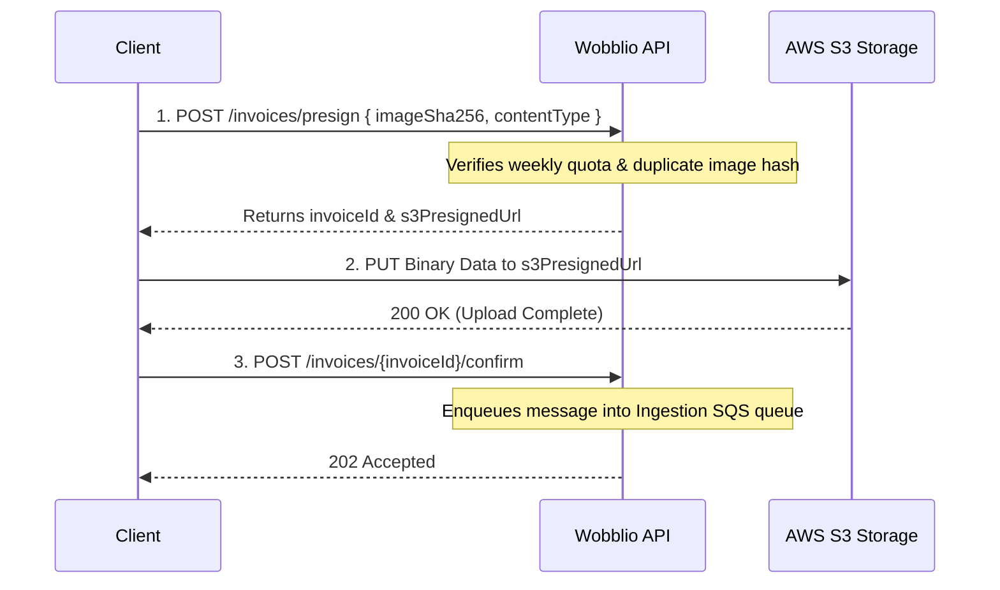
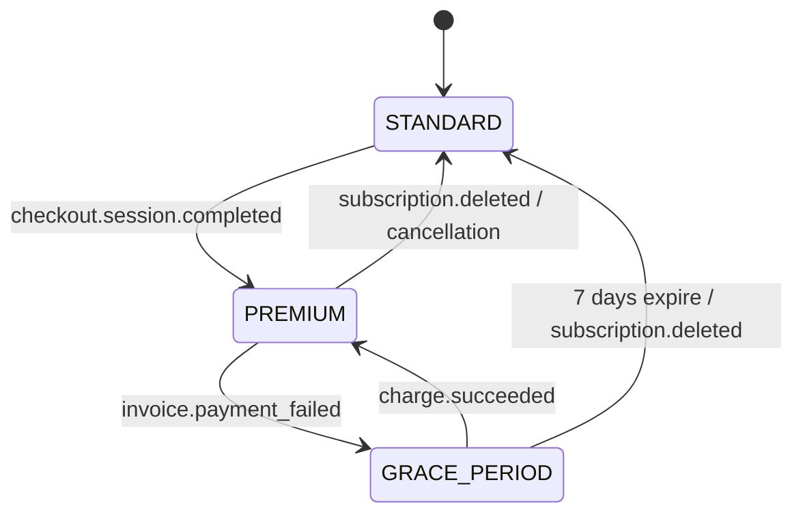
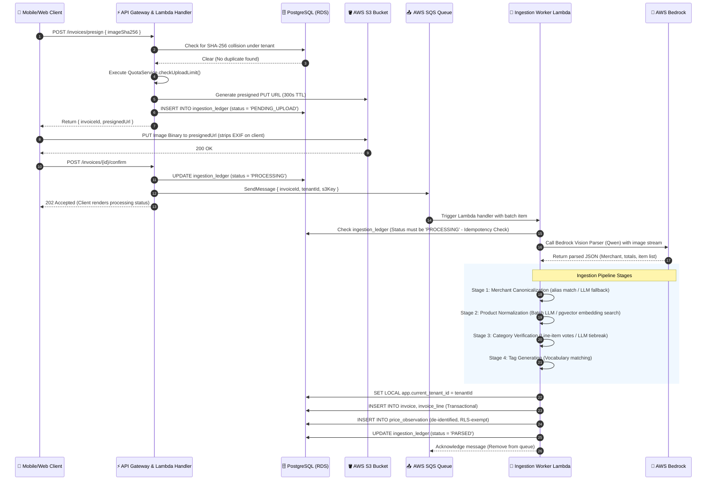
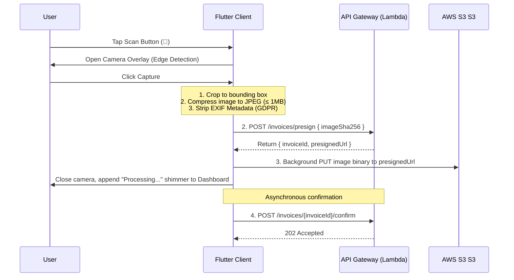
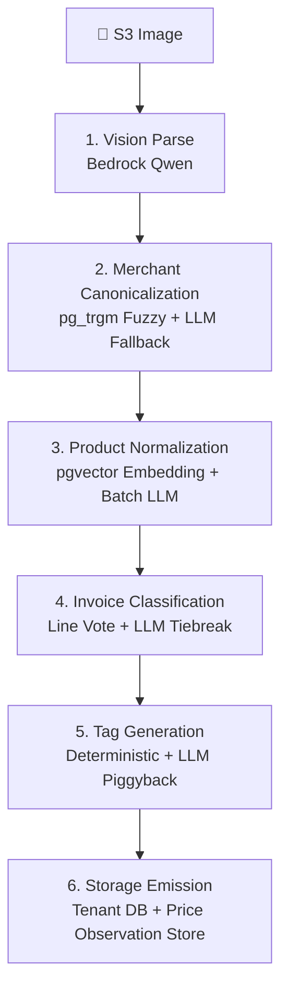
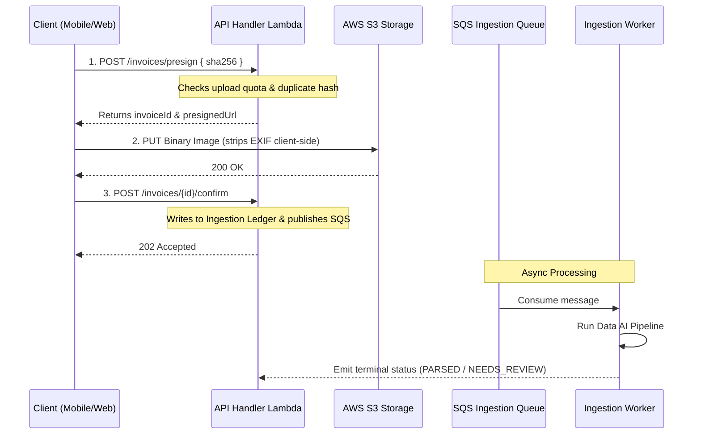
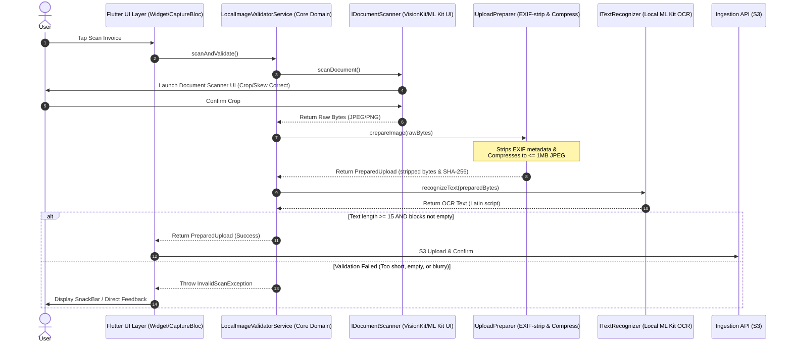
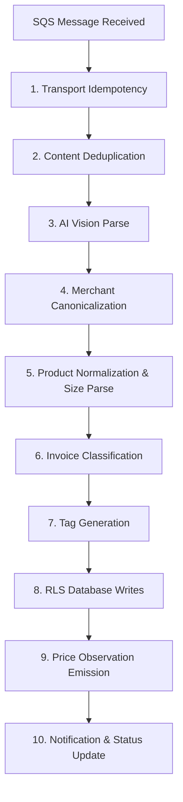

This file is a merged representation of a subset of the codebase, containing specifically included files and files not matching ignore patterns, combined into a single document by Repomix.

# File Summary

## Purpose
This file contains a packed representation of a subset of the repository's contents that is considered the most important context.
It is designed to be easily consumable by AI systems for analysis, code review,
or other automated processes.

## File Format
The content is organized as follows:
1. This summary section
2. Repository information
3. Directory structure
4. Repository files (if enabled)
5. Multiple file entries, each consisting of:
  a. A header with the file path (## File: path/to/file)
  b. The full contents of the file in a code block

## Usage Guidelines
- This file should be treated as read-only. Any changes should be made to the
  original repository files, not this packed version.
- When processing this file, use the file path to distinguish
  between different files in the repository.
- Be aware that this file may contain sensitive information. Handle it with
  the same level of security as you would the original repository.

## Notes
- Some files may have been excluded based on .gitignore rules and Repomix's configuration
- Binary files are not included in this packed representation. Please refer to the Repository Structure section for a complete list of file paths, including binary files
- Only files matching these patterns are included: .okf/**/*.md, docs/**/*.md, specs/**/*.md, CLAUDE.md
- Files matching these patterns are excluded: **/node_modules/**, **/package-lock.json, **/yarn.lock, **/pnpm-lock.yaml, **/bun.lockb, repomix-output.*, repopack-output.*, **/.next/**, **/dist/**, **/build/**, **/out/**, **/.open-next/**, **/cdk.out/**, **/.serverless/**, **/.esbuild/**, **/.localstack/**, **/.playwright-cache/**, **/playwright-report/**, **/test-results/**, **/coverage/**, **/.nyc_output/**, **/.vscode/**, **/.idea/**, **/.DS_Store, **/local/**, **/.env*.local, **/.env.production, **/.env, **/*.pem, **/*.keystore, **/*.p12, **/*.png, **/*.jpg, **/*.jpeg, **/*.gif, **/*.svg, **/*.webp, **/*.ico, **/*.pdf, **/*.zip, **/*.tar.gz, **/*.mp4, **/*.mp3, **/*.wav
- Files matching patterns in .gitignore are excluded
- Files matching default ignore patterns are excluded
- Long base64 data strings (e.g., data:image/png;base64,...) have been truncated to reduce token count
- Files are sorted by Git change count (files with more changes are at the bottom)

# Directory Structure
```
.okf/
  architecture/
    api-integration.md
    billing-integration.md
    database-multi-tenancy.md
    database-schema.md
    deployment.md
    endpoints-components.md
    environments.md
    gdpr-compliance.md
    low-level-design.md
    mobile-client.md
    overview.md
    tech-stack.md
  features/
    price-engine.md
    quota-limits.md
    weekly-advisor.md
  pipelines/
    ingestion-pipeline.md
  runbooks/
    ops-manual.md
    testing-strategy.md
    troubleshooting.md
  index.md
  log.md
  project-explanation.md
  project-overview.md
docs/
  amendments/
    2026-06-17-weekly-advisor-tier-and-concurrency.md
    2026-06-21-merchant-branch-removal-and-resolution-hardening.md
    2026-06-22-product-catalog-cleanup.md
    2026-06-22-remove-ai-spend-cap.md
  deferred/
    weekly-advisor-batch-inference.md
  runbooks/
    dev-migration-refresh.md
  runbook.md
  waitlist-page-implementation-plan.md
  wobblio_v2.4_specification_final.md
specs/
  fixes/
    00-audit-report.md
    00-project-knowledge.md
    01-invariant-amendments.md
    02-docs-truth-realignment.md
    03-admin-incident-workflows.md
    04-admin-safety-rails.md
    05-mobile-parity-roadmap.md
  mvp/
    05-billing-stripe/
      05a-real-stripe-gateway.md
    07-core-ingestion-pipeline/
      07a-spec-realignment.md
      07b-feedback-capture-completion.md
      07c-web-correction-parity.md
    10-budgets-shopping-lists-optimizer/
      10a-budgets.md
      10b-shopping-lists.md
      10c-split-route-optimizer.md
      10d-weekly-savings-advisor.md
    11-splitting-fx-reporting/
      11-00-handoff.md
      11a-fx-pipeline.md
      11b-bill-splitting-backend.md
      11c-bill-splitting-web-ui.md
      11d-reporting-endpoints.md
    12-admin-console/
      12a-admin-foundation.md
      12b-admin-waitlist.md
      12c-admin-config-models.md
      12d-admin-dlq.md
      12e-admin-curation.md
      12f-admin-analytics.md
      12g-admin-deployment.md
    13-security-controls/
      13a-posture-realignment-and-hardening.md
    14-gdpr-data-lifecycle/
      00-handoff.md
      14a-consent-price-optout.md
      14b-data-export.md
      14c-deletion-phase1.md
      14d-deletion-phase2.md
      14e-processor-inventory-privacy-policy.md
    16-mobile/
      16-00-handoff.md
      16a-mobile-foundation.md
      16b-mobile-auth.md
      16c-mobile-capture.md
      16d-mobile-dashboard-feedback.md
      16e-mobile-review.md
      16f-push-delivery-backend.md
      16g-push-client.md
      16h-merchant-tag-edits.md
    17-mobile-redesign/
      17-00-handoff.md
      17a-design-system-foundation.md
      17b-onboarding-auth-reskin.md
      17c-capture-reskin.md
      17d-dashboard-reskin.md
      17e-review-reskin.md
    18-mobile-navigation-and-lists/
      18-00-handoff.md
      18a-bottom-tab-shell.md
      18b-history-invoice-detail.md
      18c-shopping-list.md
      18d-budgets.md
      18e-reports.md
      18f-account.md
      18g-notifications.md
      18h-split-bill.md
    19-mobile-2a-full/
      19-00-handoff.md
      19-01-screen-review.md
    admin-console/
      00-access-control-routing-audit.md
      01-cdk-hosting-waf.md
      02-ssm-parameter-editor.md
      03-model-swap-matrix.md
      04-waitlist-panel.md
      05-dlq-panel.md
      06-alias-curation-queue.md
      07-ai-spend-dashboard.md
      08-kpi-dashboard.md
      09-admin-spec-consolidation.md
      README.md
    draft/
      abuse-handling-and-fair-warning.md
      multilingual-localization.md
    00-design-system-wireframes.md
    01-local-development-sandbox.md
    02-infrastructure-database-rls.md
    02b-deployment-hosting.md
    03-observability-foundation.md
    04-authentication-waitlist.md
    05-billing-stripe.md
    06-landing-page-marketing.md
    07-core-ingestion-pipeline.md
    08-data-intelligence-layer.md
    09-households.md
    10-budgets-shopping-lists-optimizer.md
    11-bill-splitting-fx-reporting.md
    12-admin-console.md
    13-security-controls.md
    14-gdpr-data-lifecycle.md
    15-observability-kpis-analytics.md
    16-mobile-capture-and-review.md
    17-mobile-redesign.md
    18-mobile-navigation-and-lists.md
    README.md
  non-functional/
    01-data-ai-pipeline/
      00-handoff.md
      01-ingestion-telemetry.md
      02-agentic-pipeline-stack.md
      03-strands-agent-worker.md
      04-dynamic-queue-routing.md
      05-admin-pipeline-toggle.md
      06-kpi-pipeline-comparison.md
      07-pipeline-evaluation-harness.md
      08-pdf-cost-truth.md
      README.md
    02-weekly-usage-limits/
      00-handoff.md
      01-credit-core.md
      02-ui-copy.md
      03-system-fault-quarantine.md
      04-household-carryover.md
      05-churn-detection.md
      06-presign-upload-validation.md
      07-operator-reprocess-on-behalf.md
      08-debug-sample-gdpr.md
      README.md
    00-implement-di.md
    01-data-ai-pipeline.md
    02-weekly-usage-limits.md
    03-mobile-local-image-validation.md
  price-trends-revamp/
    00-handoff.md
    01-revert-manual-size-editor.md
    02-remove-deposit-inference.md
    03-compare-mode-toggle.md
    04-search-merchant-signal.md
CLAUDE.md
```

# Files

## File: docs/amendments/2026-06-17-weekly-advisor-tier-and-concurrency.md
````markdown
# Spec amendment — Weekly AI advisor: model tier + execution shape

**Date:** 2026-06-17
**Status:** adopted
**Amends:** §B.5 (Weekly AI savings advisor), Appendix B model-assignment table, §10 (EventBridge crons)
**Branch:** `fix/ingestion-pipeline-iam-and-robustness`

## What changed

### 1. Model tier: `insight` → `auxiliary`

The spec (§B.5 and the Appendix B model-assignment table) assigns the weekly advisor to
the **`insight`** role (Sonnet-class), justified by "customer-facing prose where tone
errors cost trust" and "weekly-per-premium volume makes the unit cost irrelevant."

The advisor now resolves **`/wobblio/config/models/auxiliary`** (Haiku-class) instead.

**Rationale.** The advisor prompt is heavily constrained: it consumes only a small,
pre-aggregated `<facts>` XML document (no raw receipts), is capped at 120 words / 300
output tokens, temperature 0.4, and forbids any reasoning beyond restating supplied
numbers. This is squarely an auxiliary-tier extraction/summarisation task, not open-ended
generation. Moving to the Haiku-class tier roughly halves token cost with no meaningful
quality risk for this prompt shape. The model id remains an opaque, hot-swappable SSM
value, so this can be reverted by pointing the cron back at `…/models/insight` without a
code change (the swap-comparison flow via `prompt_version` still applies).

The Appendix B table row for B.5 should read role `auxiliary` (Haiku-class).

### 2. Execution: sequential loop → bounded concurrency

The original implementation iterated eligible tenants sequentially in a single cron
Lambda, which risked the 30s timeout and produced silent partial completions as the
cohort grew. The cron now fans out one Bedrock call per eligible tenant through a
**bounded promise pool (`MAX_CONCURRENCY = 8`)**, and the Lambda timeout is raised to a
**300s safety net** (`makeLambda(..., timeoutSeconds)`). Per-tenant failures remain
isolated (a single tenant's error never aborts the cohort). Single-tenant isolation and
the `<facts>`-only prompt are unchanged, so tenant data boundaries are intact.

### 3. Batch Inference — deferred, not adopted

The reviewed plan proposed re-architecting onto **Bedrock Batch Inference**
(`CreateModelInvocationJob`). Verification (2026-06-17) found a hard **≥100-record
minimum** per job (some models effectively ≥1,000). Against the enforced capacity
envelope (~10k registered, ~4k MAU, premium a fraction of that), a single weekly run of
PREMIUM + ACTIVE + invoiced-this-week tenants will not reach 100 for the foreseeable
future, so a batch-primary design would never fire. Batch is therefore **deferred** until
the eligible cohort approaches that floor. The bounded-concurrency on-demand path above is
the primary (and currently only) path. The deferred design is captured in
`docs/deferred/weekly-advisor-batch-inference.md`.

## Invariants unaffected

Tenant isolation (one single-tenant prompt per record), prompt-injection mitigations
(`<facts>` XML separators, all values escaped), `prompt_version` recording, and the
"model ids are opaque SSM values" rule all hold.
````

## File: docs/deferred/weekly-advisor-batch-inference.md
````markdown
# Deferred design — Weekly advisor on Bedrock Batch Inference

**Status:** deferred (not implemented)
**Owner trigger:** revisit when the weekly eligible cohort approaches **100 tenants**
**Supersedes:** the current bounded-concurrency on-demand path only when the trigger is met
**Related:** `docs/amendments/2026-06-17-weekly-advisor-tier-and-concurrency.md`

## Why this is deferred

`CreateModelInvocationJob` requires **≥100 records per job** (some models effectively
≥1,000), and jobs below the floor fail hard. The weekly advisor cohort (PREMIUM + ACTIVE +
≥1 parsed invoice this week) stays well under 100 at the enforced capacity envelope, so a
batch job would never be submittable today. The on-demand bounded-concurrency path
(`MAX_CONCURRENCY = 8`, 300s Lambda) is correct and cheap at this scale. Build the batch
path only once weekly runs regularly approach the record floor.

Per `code-quality-guard` (YAGNI / Rule-of-Three), do **not** introduce the
`IAdvisorBatchJobs` port, its adapter, or the batch infrastructure until the trigger is
real — this document is the spec to implement against at that point.

## When to implement (entry criteria)

- A typical weekly `list_advisor_eligible_tenants(week_start)` count is consistently
  **≥ `BATCH_MIN_RECORDS`** (set `BATCH_MIN_RECORDS = 100`, sourced from SSM
  `/wobblio/config/advisor/batch_min_records`).
- Confirm the live `…/models/auxiliary` id supports `CreateModelInvocationJob` in the
  active Region (EU routing via inference profile / cross-Region from `eu-west-1`).

## Target architecture

`WeeklyAdvisorService.run(today)` gathers facts for all eligible tenants (DB only) and
builds one record per tenant (`recordId = tenantId`, `content = buildFactsXml(facts)`).

- **If `records.length >= BATCH_MIN_RECORDS`** → submit a batch job, persist an
  `advisor_batch_job(job_id, week_start)` row, and return. Completion is async (below).
- **Else** → the existing bounded-concurrency on-demand path with direct `save`
  (also the dev / local / STAGE=local Ollama path). This branch stays forever as the
  small-cohort/fallback path.

Crons are prod-only; local/dev always take the on-demand branch.

### Domain / ports (hexagonal — SDK only in adapters)

New port `core/ports/ai/IAdvisorBatchJobs.ts`:

```ts
export interface AdvisorBatchRecord { recordId: string; content: string; }
export interface IAdvisorBatchJobs {
  submit(jobName: string, records: AdvisorBatchRecord[]): Promise<string /* jobId */>;
  readResults(jobId: string): Promise<AdvisorBatchRecord[]>;
}
```

Adapter `infrastructure/adapters/ai/AdvisorBatchJobsAdapter.ts`:
- Writes one-record-per-tenant **JSONL** to the batch S3 input prefix.
- Calls `CreateModelInvocationJob` (input/output S3 URIs + Bedrock batch **service role**).
- `readResults(jobId)` reads the S3 output JSONL on completion.
- The `@aws-sdk/*` imports live **only** here.

### Service

- `recordId = tenantId`, `content = buildFactsXml(facts)` (single-tenant prompt — isolation
  preserved exactly as today).
- Persist `advisor_batch_job(job_id, week_start, submitted_at)` after submit.

### Completion handler

New `handlers/advisor-batch-complete/index.ts`, triggered by an **EventBridge rule** on
*Bedrock Batch Inference Job State Change → Completed*:
1. Look up `week_start` from `advisor_batch_job` by `job_id`.
2. `readResults(jobId)`.
3. `clampWords(content, 120)` and `save_weekly_advisor(tenantId, week_start, body)` per record.

### Migration (edit `20260616103000_weekly_advisor.ts` in place while it is still untracked;
otherwise a new migration)

- Add table `advisor_batch_job (job_id TEXT PRIMARY KEY, week_start DATE NOT NULL,
  submitted_at TIMESTAMPTZ NOT NULL DEFAULT now())`.
- If completion runs cross-tenant, add a `save`/`get` SECURITY DEFINER pair mirroring the
  existing advisor functions (no RLS tenant context on the cron path).

### CDK (`Source/infra/src/cdk/stacks/WobblioBackendStack.ts`)

- New `advisor-batch-complete` Lambda (300s via the existing `timeoutSeconds` arg on
  `makeLambda`) + EventBridge rule for the Bedrock batch-completed event.
- New S3 bucket (or dedicated prefix) for batch I/O: block public access, KMS, enforce SSL.
- IAM (least privilege):
  - **Bedrock batch service role** (Bedrock-assumed): scoped S3 read/write on the batch
    bucket only.
  - **Orchestrator** (`cron-weekly-advisor`): `bedrock:CreateModelInvocationJob` +
    `iam:PassRole` (the service role) + S3 put on the batch input prefix +
    `…/models/auxiliary` + `…/advisor/batch_min_records` SSM read.
  - **Completion Lambda**: `bedrock:GetModelInvocationJob` + S3 get on the output prefix +
    DB secret / SSM read.
- Mirror the existing advisor block's cdk-nag suppressions.
- Keep the weekly `WeeklyAdvisorCron` schedule on the orchestrator.

## Tests to add

- `WeeklyAdvisorService.test.ts`: batch path (mocked `IAdvisorBatchJobs`) when cohort ≥
  `BATCH_MIN_RECORDS`; on-demand concurrency path when below.
- CDK assertion for the new Lambda + EventBridge rule + batch bucket.

## Guardrails preserved

One single-tenant record per tenant (no cross-tenant prompt leakage); `<facts>` XML
separators with escaped values; `prompt_version` recorded; model ids stay opaque SSM
values; tags never enter the Price Observation Store (advisor never touches it).
````

## File: docs/waitlist-page-implementation-plan.md
````markdown
# Waitlist Page — Implementation Plan (deferred)

> Status: **planned, not implemented.** Captured for later pickup.
> Decisions locked with product owner:
> - **Position framing:** approximate count ("X people waiting"), **no** per-user FIFO endpoint.
> - **Premium-skip CTA:** **deferred** until billing/checkout (Epic 05) is wired in the webapp.
> - **Scope of this doc:** the `/waitlist` page + the minimal data plumbing it needs. The deeper
>   "make the waitlist trigger for real" provisioning fix is documented separately below as a
>   **known blocker**, since without it no real user reaches `WAITLIST` status.

Spec references: v2.4 §2.5 (waitlist guardrail), §13.2 / `specs/mvp/06-landing-page-marketing.md`
(dynamic CTA + waitlist screen), `specs/mvp/04-authentication-waitlist.md` (flow).

---

## Context / why

The landing hero CTA flips to **"Join the priority waitlist"** when the free-user cap is reached
(`landing-page-view.tsx:270-272`) and links to `/waitlist`. **That route does not exist** — a true
cap state currently 404s. This plan builds the `WaitlistScreen` the CTA points at.

Related fix already shipped: `WaitlistStatusDbAdapter` now reads `free_user_count` (not
`waitlist_count`), so `GET /waitlist/status` correctly reports `waitlistActive` at the right time.

---

## 1. Backend — expose the approximate waiting count

The page shows "X people waiting", so `GET /waitlist/status` must also return the current
waitlist size. Today it returns only `{ waitlistActive }`.

**Files:**
- `Source/backend/src/core/ports/IWaitlistStatusPort.ts`
  Change the port to return both fields:
  ```ts
  export interface WaitlistStatus {
    waitlistActive: boolean;
    waitingCount: number;
  }
  export interface IWaitlistStatusPort {
    getStatus(): Promise<WaitlistStatus>;
  }
  ```
- `Source/backend/src/infrastructure/adapters/WaitlistStatusDbAdapter.ts`
  Read both counters in one query and derive both fields. Reuse the existing key constants/pattern:
  ```sql
  SELECT name, value FROM system_counter
  WHERE name IN ('free_user_count', 'waitlist_count')
  ```
  - `waitlistActive` = `free_user_count >= maxFreeUsers` (unchanged semantics)
  - `waitingCount`   = `waitlist_count` (the already-waitlisted total — the approximate "ahead of you")
- `Source/backend/src/handlers/waitlist-status/index.ts`
  `buildWaitlistStatusResponse` returns `{ waitlistActive, waitingCount }`; keep the existing
  `Cache-Control: public, s-maxage=300, stale-while-revalidate=60` header.

**Tests to update/add:**
- `Source/backend/src/tests/unit/infrastructure/adapters/WaitlistStatusDbAdapter.test.ts`
  (already exists) — extend to assert both counters are read and `waitingCount` is returned;
  cover the missing-row → `0` case.
- `Source/backend/src/tests/unit/handlers/waitlist-status.test.ts` — update the port mock to
  `getStatus()` and assert the body now includes `waitingCount`.

No migration change — both counter rows already exist
(`20260611152000_initial_schema.ts:450` seeds `free_user_count`,
`20260611170000_auth_rls_helpers.ts:6` seeds `waitlist_count`).

> Note: `waitingCount` is "good enough" social proof, not a per-user rank. The spec's literal
> "N ahead of *you*" requires the user's FIFO position; that's intentionally **out of scope**
> per the locked decision.

---

## 2. Frontend hook — surface the count

**File:** `Source/webapp/src/hooks/use-waitlist-status/use-waitlist-status.ts`

Extend the hook to also return `waitingCount`:
- Add `const [waitingCount, setWaitingCount] = useState<number>(0)`.
- In the `.then`, `setWaitingCount(Number(data.waitingCount ?? 0))`.
- Return `{ waitlistActive, waitingCount, loading }`.
- Keep all existing fallbacks (missing base URL / fetch reject → `waitlistActive=false`, count `0`).

**Test:** `use-waitlist-status.test.ts` — extend the resolved-state test to assert
`waitingCount` parses from the mocked response; keep the fallback tests green.

---

## 3. Frontend — the `/waitlist` route

**New files:**
- `Source/webapp/src/app/(auth)/waitlist/page.tsx` — server component, page shell.
- `Source/webapp/src/app/(auth)/waitlist/waitlist-view.tsx` — `'use client'` component that
  calls `useWaitlistStatus()` and renders the screen.

Place it under the **`(auth)` route group** so it reuses the existing `auth-screen` / `auth-card`
/ `glass` layout (mirror `(auth)/register/page.tsx`). It is a public route (no auth guard) —
the hero links unauthenticated visitors here.

**Page composition (reuse `src/components/ds/`):**
- `WobblioLogo size={30} withWordmark` brand header (as in register page).
- Title: **"You're on the priority list."**
- Subline using the count: when `waitingCount > 0` →
  *"You're in good company — {waitingCount.toLocaleString('nl-NL')} people are waiting."*
  When `0` (or `loading`) → neutral copy: *"We'll email you the moment your spot opens."*
  Use `AnimatedNumber` for the count for polish.
- A short "what happens next" list (3 items): we email you when a slot frees up (FIFO) ·
  nothing to do in the meantime · your place is saved.
- **Premium-skip CTA: DEFERRED.** Do **not** render a Stripe link yet. Leave a clearly marked
  placeholder comment referencing Epic 05 so it's a one-line addition later, e.g.:
  ```tsx
  {/* TODO(Epic 05 billing): "Skip the line — go Premium" CTA → Stripe Checkout */}
  ```
- Secondary action: `Link href="/login"` ("Already have access? Sign in") and a back-to-home link.
- Footer legal line identical to register page (`ShieldCheck` + RLS/GDPR/EU-hosted).

**Conventions to honor (webapp CLAUDE.md DoD):**
- Dark-mode parity via Tailwind `dark:` (no runtime theme swap).
- `data-testid` on the key nodes: `waitlist-screen`, `waitlist-count`, `waitlist-signin-link`.
- Responsive down to 768px (375px for marketing-adjacent screens per spec).
- WCAG AA contrast; keyboard-navigable links.

**Analytics:** the hero already emits `waitlist_join` on click (`landing-page-view.tsx:276`).
Optionally emit a `waitlist_view` event on mount via `useAnalytics().track` for funnel symmetry
(Epic 15 KPI). Low priority.

---

## 4. KNOWN BLOCKER (separate task, not in this page's scope)

**Provisioning never sets `WAITLIST` status.** `Source/webapp/src/lib/provision-user.ts:22`
hardcodes `'ACTIVE'` and never consults the cap/counter, so cap-exhausted signups still become
`ACTIVE`. The correct gating logic already exists server-side in
`Source/backend/src/core/services/UserProvisioningService.ts` (`capProvider` + `counter.tryClaimSlot`).

To make the waitlist functionally real (users actually landing on `/waitlist` after signup), the
webapp provisioning path (`provision-user.ts`, called from `src/auth.ts` and
`src/app/(auth)/actions.ts`) must either:
- call the backend provisioning service/endpoint, or
- replicate the cap check by calling `provision_new_user` with `WAITLIST` when
  `free_user_count >= cap` (mirroring `UserProvisioningService.provisionUser`), then redirect a
  `WAITLIST`-status user to `/waitlist` after login/confirm.

Until this is done, `/waitlist` is reachable only via the public hero CTA and shows the
informational screen, but no authenticated user is ever forced onto it.

---

## 5. Verification

Backend (`Source/backend/`):
- `npm run test:unit` — updated adapter + handler tests green.
- `npm run skill:hexagonal-architecture-validator` — exit 0.

Webapp (`Source/webapp/`):
- `npm run test:unit` — hook test green.
- `npm run lint` / `npm run build`.
- Manual: with `NEXT_PUBLIC_API_BASE_URL` pointed at a stack where `free_user_count >= cap`,
  load `/` → hero CTA reads "Join the priority waitlist" → click → `/waitlist` renders with the
  count. Toggle the counter below cap → CTA reverts to "Start ingesting free".

---

## File checklist

| Action | Path |
|---|---|
| edit | `Source/backend/src/core/ports/IWaitlistStatusPort.ts` |
| edit | `Source/backend/src/infrastructure/adapters/WaitlistStatusDbAdapter.ts` |
| edit | `Source/backend/src/handlers/waitlist-status/index.ts` |
| edit | `Source/backend/src/tests/unit/infrastructure/adapters/WaitlistStatusDbAdapter.test.ts` |
| edit | `Source/backend/src/tests/unit/handlers/waitlist-status.test.ts` |
| edit | `Source/webapp/src/hooks/use-waitlist-status/use-waitlist-status.ts` |
| edit | `Source/webapp/src/hooks/use-waitlist-status/use-waitlist-status.test.ts` |
| new  | `Source/webapp/src/app/(auth)/waitlist/page.tsx` |
| new  | `Source/webapp/src/app/(auth)/waitlist/waitlist-view.tsx` |
| (blocker, separate task) | `Source/webapp/src/lib/provision-user.ts` + callers |
````

## File: specs/mvp/draft/abuse-handling-and-fair-warning.md
````markdown
# Draft — Abuse Handling & Fair-Warning Escalation

**Status:** draft / parked. Not implemented in Epic 08. To be folded into the admin-console
epic (12). Captures the agreed escalation model for users who repeatedly submit faulty
invoices or attempt to poison the catalog / price index.

## Goal

Detect and stop catalog/price-index poisoning while being **fair and transparent** to the
user at every step. The user must always know their standing before any hard action.

## Detection (deterministic, continuous)

Ties into the deferred §6.8 anti-poisoning layers (statistical plausibility, nightly
trust-score cron, velocity limits, Sybil/collision flags). These deterministic signals do
the **continuous** gating — they run on every submission / nightly, with no LLM in the loop.
Signals: repeated faulty/low-confidence submissions, cross-tenant hash collisions, price
outliers vs. category bounds, abnormal submission velocity, Sybil-cluster correlation.

## Escalation ladder (fair, transparent)

1. **In-app warning each time** bad submissions are detected — explain what was wrong.
2. **Repeated warnings** → explicitly inform the user that continued bad practice will lead
   to a block. Never silent.
3. **Reversible enforcement:** IP block via **AWS WAF** (new infra). May be automated at
   high confidence in a later phase.
4. **Irreversible enforcement:** account deletion — **requires admin approval** (GDPR +
   irreversibility). Stays human-approved much longer than IP blocks.

## LLM-as-judge (advisory only, preselected cases)

The model does **not** process every event. Only when a user crosses the
**deletion-consideration threshold** does an evaluator run — **once, on that one case** — to
analyze it and produce a structured recommendation for the admin. This keeps cost trivial
(a handful of calls, not a stream) and places the model exactly where human judgment is
about to be applied.

- Reuse the existing **`auxiliary`** model role (SSM `/wobblio/config/models/auxiliary`,
  `IBedrockConverse` + `BedrockSpendGuardService`; Bedrock id `anthropic.claude-haiku-4-5`).
- Constrained JSON output `{ recommendation, confidence, summary, signals_cited }`,
  temperature 0, retry-once-on-schema-failure (reuse `callJsonWithRetry`).
- **Advisory only** — never the sole arbiter of a block or deletion.

## Admin console surface (Epic 12)

- Flagged/abusive users list with their warning history.
- The judge's recommendation + rationale + cited signals.
- Block (WAF) / delete (human-approved) actions, with audit trail.

## New infra implied

- AWS WAF IP-block rule set, wired to an admin action + (later) automated high-confidence path.
- A warning-history / standing store per tenant (extends `tenant_trust` / a new table).

## Dependencies

- §6.8 Layers 2–4 (deferred follow-up to Epic 08) must land first for the deterministic
  signals this builds on.
````

## File: specs/mvp/draft/multilingual-localization.md
````markdown
# Draft — Multilingual & Localization

**Status:** draft / parked. Not implemented in Epic 08. Captures the decision to keep
catalog identifiers language-neutral while deferring localized *display*.

## Problem

Wobblio targets multiple countries/languages (NL launch; roadmap incl. BR, US, DE, FR,
IT, PT, ES, CA, GB, AT, DK, CN). Several user-facing strings are currently English-only
or NL-only:

- **Tag display names** — `tagVocabulary.ts` carries `displayNameEn` / `displayNameNl`;
  there is no general per-locale resolution.
- **Category names** — `product_category` has `name` + `name_nl`; other locales absent.
- **Region/country names** — `country` / `country_subdivision` store a single English name.
- **General UI copy** — not externalized into a translation catalog.

## Non-negotiable already decided

**Identifiers stay language-neutral.** Tag keys are slugs (`weekly-groceries`), category
ids are slugs (`cat-groceries`), region codes are ISO 3166-2 (`NL-NB`). Only *display*
strings are localized. This keeps the price index, triggers, and joins locale-independent
and is the precedent set by the existing `name` / `name_nl` columns.

## Candidate approaches (to evaluate later)

1. **Per-locale columns** (extend `name_nl` → `name_de`, …). Simple reads, schema churn
   per language, doesn't scale to 13+ locales.
2. **Translation table** (`(entity_type, entity_id, locale, text)`) — one normalized table
   for categories/tags/regions. Scales, needs a join or a cached lookup at read time.
3. **In-process i18n catalog** (JSON bundles per locale, keyed by slug) for tags +
   categories + UI copy; DB stays slug-only. Mirrors the bundled `tagVocabulary` artifact;
   no DB read-path cost. Region/country display names could ship from the same bundles or
   stay in the reference tables.

Leaning toward (3) for tags/categories/UI (bundled, no read-path cost) + reference-table
English names as the fallback, but defer the decision.

## Out of scope here

- RTL languages, pluralization rules, number/currency formatting beyond `tabular-nums`
  (the webapp already formats currency per the design system).
- Translating user-generated content (free-text notes).

## When to pick this up

Alongside the first non-NL/EN market launch, or when the admin console needs to display
localized catalog labels.
````

## File: specs/mvp/00-design-system-wireframes.md
````markdown
# 00 — Design System & Wireframes

**Epic 1 | Phase 0 | Blocks all client work**

## Overview

Shared design system and screen wireframes produced with **Google Stitch** (AI-driven screen generation), used as the visual brief for both Flutter (mobile) and Next.js (web) implementation. Must be completed before any client feature work begins.

**Stitch workflow (not Figma):** design tokens are defined once as a Stitch design system (`create_design_system` / `create_design_system_from_design_md`); individual screens are generated from descriptive text prompts (`generate_screen_from_text`) rather than drawn by hand. The generated screens serve as the authoritative visual specification — implementation matches them, not the other way around.

## Dependencies

None — this is the root dependency.

## Design System Tokens

**Personality:** calm, precise, financial-grade trust with consumer warmth. Numbers are the protagonist; UI recedes.

**Colors (Tailwind theme):**
- Light: background `#FFFFFF`, surface `#F8FAFC`, text `#0F172A`, muted `#64748B`
- Dark: background `#0B0F19`, surface `#111827`, text `#F1F5F9`, muted `#94A3B8`
- Brand accent: `#0D9488` (teal/emerald — savings/positive signal)
- Semantic: green `#16A34A` (under budget/saving), amber `#D97706` (85% alert/low confidence), red `#DC2626` (breach/failed parse)
- Rule: never encode meaning in color alone — always pair with icon or label

**Typography:**
- One sans family: Inter (or comparable)
- Tight tracking on numerals; **tabular-nums everywhere money appears**
- Scale: 30/24/20 headings, 16 body, 14 secondary, 12 captions
- Currency amounts right-aligned in all tables

**Spacing & Shape:**
- 4px base grid; card radius 12; button radius 8
- 1px hairline borders (light mode); elevation-by-surface-tone (dark mode)
- Iconography: Lucide-class minimalist line icons, 1.5px stroke

## Mobile Layout (Flutter)

- Bottom tab bar: Home, Lists, Insights, Profile
- **Center-docked floating Scan button** raised above bar — capture is the core action
- Home: top bar with month selector + quota chip (`7/10 scans`), MTD stat card, budget bars (premium), recent invoices list
- Capture flow: full-screen camera → auto-crop preview → upload → return to Home with Processing row
- Review screen: vertically split (zoomable receipt photo top / parsed fields bottom); low-confidence fields highlighted amber; tap-to-fix bottom sheet; tag chip row; single `Confirm` button
- Lists: offline check-off support; `Optimize route` action (premium) with store-grouped sections
- Insights: category donut, budget status, weekly advisor card; hand-off CTA to web app
- Bill split: entry from any parsed restaurant bill; tap lines to assign to name chips; WhatsApp summary export

## Web Layout (Next.js)

- Sticky left nav (collapsible to icons at <1280px): Dashboard, Invoices, Reports, Shopping Lists, Budgets, Household, Settings, Admin (ADMIN only)
- Top bar: global search (invoices by tag/merchant/product), quota indicator, theme toggle, avatar menu
- Main content: max-width 1440, 12-column grid
- Collapsible right inspection drawer opens on row click (invoice detail, line items, photo) without losing list context
- Dashboard: stat-card row, spend-over-time area chart + category breakdown, recent invoices table
- Reports: 3-product/6-month comparison chart; merchant drill-down
- Invoices: dense table with saved filters, tag filter chips, `NEEDS_REVIEW` banner queue, bulk re-categorize
- Admin console: parameter editor (SSM), model-swap matrix, waitlist panel, DLQ panel, alias-curation queue, AI-spend dashboard

## Component Inventory (Stitch)

- Stat card (label, big number, delta chip)
- Data table (sticky header, right-aligned numerics, row drill chevron)
- Category chip
- Confidence badge (dot + label: confirmed / auto / low)
- Budget progress bar with 85% tick mark
- Price-history sparkline
- Store-comparison bar group
- List item row with checkbox
- Photo-capture frame overlay
- Review side-by-side panel
- Empty-state pattern (every data-driven view; always state what action fills them)
- Waitlist screen with position + "skip the line — go Premium" CTA
- Parse-review screen (mobile + web drawer version)
- Upgrade/checkout flow
- Admin DLQ + alias-curation panels
- Tag chip row + add-tag vocabulary picker

## Accessibility & Responsive Rules

- WCAG AA contrast in both themes
- Full keyboard navigation on tables and review drawer
- All charts accompanied by data-table toggles
- Web usable at 768px (tables collapse to card lists)

---

## Checklist

### Design Tokens & System
- [ ] Create Stitch design system: primary color `#0D9488`, Inter font, `ROUND_TWELVE`, light + dark modes, with full `designMd` capturing semantic colors and typographic rules
- [ ] Mirror tokens into Tailwind theme config (implementation artifact — must match the Stitch design system)
- [ ] Configure Inter with tabular-nums variant for currency display in Tailwind
- [ ] Document spacing scale (4px base grid) and border-radius tokens
- [ ] Define semantic color usage rules (color + icon/label pairs for accessibility)
- [ ] Create Lucide icon selection list for app use

### Mobile Wireframes (Flutter) — generate in Stitch with `deviceType: MOBILE`
- [ ] Home screen: month selector, quota chip, stat card, budget bars, recent invoices list
- [ ] Capture flow: camera view with edge-guide overlay, auto-crop preview, upload progress
- [ ] Review screen: split layout (photo top, fields bottom), low-confidence highlights, tag chip row, Confirm button
- [ ] Lists screen: active lists, list detail with offline check-off, route-optimize result view
- [ ] Insights screen: category donut, budget bars, weekly advisor card, web hand-off CTA
- [ ] Bill split screen: line-item assignment, fraction stepper, WhatsApp export sheet
- [ ] Profile/Settings screen: quota display, plan info, household membership
- [ ] Waitlist screen: position, skip-the-line CTA
- [ ] Push notification deep-link targets (invoice, review screen)

### Web Wireframes (Next.js) — generate in Stitch with `deviceType: DESKTOP`
- [ ] Frame: sticky left nav (collapsible), top bar with search/quota/theme/avatar, main content area, right inspection drawer
- [ ] Dashboard: stat-card row, spend-over-time area chart, category breakdown, recent invoices table
- [ ] Invoices page: dense table, saved filters, tag filter chips, NEEDS_REVIEW banner
- [ ] Review drawer: side-by-side photo + fields, tag chip row, corrections flow
- [ ] Reports page: comparison chart (3-product/6-month), merchant drill-down
- [ ] Shopping Lists page: list management, route-optimizer result
- [ ] Budgets page: budget definitions, progress bars, alert status
- [ ] Household page: member management, upload pool status
- [ ] Settings page: plan management, privacy controls (price contribution opt-out), data export/deletion
- [ ] Upgrade/checkout flow: pricing table (monthly vs annual), Stripe redirect
- [ ] Admin console: SSM param editor, model-swap matrix, waitlist panel, DLQ panel, alias-curation queue, AI-spend dashboard, KPI page

### Shared Component Specs
- [ ] Stat card component
- [ ] Data table component with sticky header and numeric alignment
- [ ] Confidence badge component (confirmed / auto / low)
- [ ] Budget progress bar with 85% threshold marker
- [ ] Empty-state pattern for all data-driven views
- [ ] Tag chip and vocabulary picker
- [ ] Category chip
````

## File: specs/mvp/01-local-development-sandbox.md
````markdown
# 01 — Local Development Sandbox

**Epic 2 | Phase 1 | Blocks all local development**

## Overview

A fully self-contained local development environment using LocalStack (AWS emulation) and a Dockerized PostgreSQL instance. Developers can run the full stack locally without AWS credentials or real infrastructure costs.

## Dependencies

- [00 — Design System & Wireframes](./00-design-system-wireframes.md) (loose — can start in parallel)

## Scope

- `docker-compose.yml` with LocalStack + PostgreSQL
- `deploy-local.sh` deployment script
- Local CDK synthesis targeting LocalStack endpoints
- Seeded test data for merchant aliases and product taxonomy
- Environment variable management for the `local` target

## Environment Strategy

Three environments, all sharing the same RDS node:
- `local` — LocalStack + dockerized PostgreSQL
- `dev` — logical DB/schema on shared RDS, `-dev` resource suffix
- `prod` — logical DB/schema on shared RDS, `-prod` resource suffix

Stripe webhook secret and price IDs live in Secrets Manager per environment.

## Services Emulated by LocalStack

- S3 (receipt image uploads, exports bucket, billing archive)
- SQS (ingestion queue + DLQ)
- Lambda
- API Gateway
- SNS (push notifications)
- SES (email)
- SSM Parameter Store (model IDs, caps, thresholds)
- Secrets Manager (DB secret, Stripe secrets)
- Bedrock (mock stubs for vision/auxiliary/embedder calls)
- EventBridge (cron triggers)
- KMS (encryption key for field-level encryption)

---

## Checklist

### Docker Compose Setup
- [ ] PostgreSQL service with health check and persistent volume
- [ ] LocalStack service with the required service list (`S3,SQS,LAMBDA,API_GW,SNS,SES,SSM,SECRETSMANAGER,EVENTS,KMS`)
- [ ] Network definition so Lambda containers can reach PostgreSQL
- [ ] `.env.local` template with all required variables

### Deployment Script (`deploy-local.sh`)
- [ ] Bootstrap CDK against LocalStack endpoint
- [ ] Synthesize and deploy all stacks targeting LocalStack
- [ ] Run database migrations against the local PostgreSQL instance
- [ ] Seed SSM parameters: model IDs, quota caps, routing thresholds, tag vocabulary
- [ ] Seed merchant aliases for NL launch chains (Albert Heijn, Jumbo, Lidl, Aldi, Plus, Dirk, Kruidvat, Etos, Trekpleister, HEMA, Action)
- [ ] Seed product taxonomy (two-level, ~14 top-level categories)
- [ ] Seed tag vocabulary (~60–80 tags with trigger maps) into SSM

### CDK Local Configuration
- [ ] Environment detection — `local` target routes all AWS SDK calls to LocalStack endpoints
- [ ] cdk-nag bypasses that are safe for local (not for dev/prod)
- [ ] Separate `cdk.context.json` entries for `local` vs `dev`/`prod`

### Bedrock Mock
- [ ] Vision parse mock returning a valid JSON schema response
- [ ] Auxiliary model mock returning merchant/product/tag expansion stubs
- [ ] Embedder mock returning a deterministic 512-dim vector
- [ ] Configurable error injection for testing DLQ paths

### Developer Experience
- [ ] `README` with one-command startup: `docker-compose up && ./deploy-local.sh`
- [ ] `make` targets (or equivalent) for: start, stop, reset, seed, logs
- [ ] Hot-reload for Lambda functions in local mode
- [ ] Local Cognito substitute (or Cognito local) for auth testing
````

## File: specs/mvp/03-observability-foundation.md
````markdown
# 03 — Observability Foundation (Minimal Slice)

**Epic 14 (Phase 1 slice) | Phase 1 | Must precede the first AI call**

## Overview

The minimal observability slice that must exist before any feature work begins. Observability is cheapest to wire up on an empty system, and the cost alarm must predate the first Bedrock call. The full observability platform (dashboard, alarm inventory, KPI system) ships in Phase 5 — this spec covers only the bootstrap.

## Dependencies

- [02 — Infrastructure, Database & RLS](./02-infrastructure-database-rls.md)

## What Ships in This Phase

1. Structured logging (JSON via Embedded Metric Format) on all Lambda functions
2. AWS Budgets alarm at €100/month threshold
3. Bedrock token metrics (input tokens, output tokens, model role, stage) emitted via EMF
4. SNS ops topic with email subscription

## What is Deferred to Phase 5

Full CloudWatch dashboard, all alarm definitions, business KPI aggregation, Athena analytics, payment analytics.

## Structured Logging Conventions

All Lambda logs emitted as JSON (Embedded Metric Format for metrics, plain JSON for logs):

```json
{
  "_aws": { "Timestamp": ..., "CloudWatchMetrics": [...] },
  "service": "ingestion-worker",
  "tenantId": "...",
  "stage": "PRODUCT_NORMALIZATION",
  "modelId": "...",
  "promptVersion": "v1",
  "inputTokens": 1024,
  "outputTokens": 256,
  "durationMs": 1234,
  "level": "INFO"
}
```

Required fields on every log line: `service`, `level`, `requestId` (from Lambda context).

## Bedrock Token Metric Dimensions

Every Bedrock call emits these CloudWatch custom metrics via EMF:
- `Stage` (VISION_PARSE, MERCHANT_FALLBACK, PRODUCT_EXPANSION, CLASSIFICATION_TIEBREAK, WEEKLY_ADVISOR, EMBEDDING)
- `ModelId` (opaque SSM value)
- `InputTokens`, `OutputTokens` (per-call)
- `EstimatedCost` (derived from token counts × per-token rate)

These feed the `ai_spend_ledger` table and the per-tenant daily spend cap enforcement.

## SNS Ops Topic

One SNS topic per environment: `wobblio-ops-{env}`. Email subscription on creation. Chat-webhook subscriber can be added later without architecture change. All alarms route to this topic.

## AWS Budgets

- Monthly budget: €100
- Alert thresholds: 50%, 80%, 100%
- Notification: email (can route to SNS ops topic via action)
- Cost Anomaly Detection (free): alert on anomaly >€10

---

## Checklist

### Structured Logging
- [ ] JSON logging library configured in Lambda runtime (Node.js: `pino` or equivalent)
- [ ] Lambda wrapper that adds `requestId`, `service`, `level` to every log line
- [ ] EMF metric emission helper for custom CloudWatch metrics
- [ ] Log retention set to 30 days hot on all log groups (S3 archive lifecycle thereafter)

### Bedrock Token Tracking
- [ ] `BedrockCallMetrics` helper: wraps every Converse API call, captures input/output tokens
- [ ] Emits EMF metric with dimensions: Stage, ModelId, InputTokens, OutputTokens
- [ ] Writes to `ai_spend_ledger` table: `(tenant_id, date, model_role, input_tokens, output_tokens, est_cost)`
- [ ] Per-tenant daily spend soft cap: read from SSM `/wobblio/config/ai/daily_spend_cap`; log warning + skip call if exceeded

### SNS Ops Topic
- [ ] Create `wobblio-ops-{env}` SNS topic in `WobblioAppStack`
- [ ] Email subscription: ops email address from SSM parameter
- [ ] Export topic ARN as CDK output for use by future alarm definitions

### AWS Budgets
- [ ] Monthly budget €100 in CDK (via `aws-budgets` L1 construct)
- [ ] Alert at 50%, 80%, 100% of forecasted spend
- [ ] Notification action: email to ops address
- [ ] Cost Anomaly Detection monitor targeting the Wobblio AWS account/tags
- [ ] Anomaly alert threshold: >€10

### SSM Parameter Bootstrap
- [ ] `/wobblio/config/models/vision_parser` — initial model ID
- [ ] `/wobblio/config/models/auxiliary` — initial model ID
- [ ] `/wobblio/config/models/embedder` — `amazon.titan-embed-text-v2:0`
- [ ] `/wobblio/config/models/insight` — initial model ID
- [ ] `/wobblio/config/ai/daily_spend_cap` — initial daily per-tenant cap (e.g., €0.10)
- [ ] `/wobblio/config/capacity/max_free_users_cap` — initial cap (e.g., 5000)
- [ ] `/wobblio/config/routing/min_split_saving` — `5.00`
- [ ] `/wobblio/config/routing/max_stores` — `3`
- [ ] `/wobblio/config/tags/vocabulary` — JSON array of tag definitions
- [ ] `/wobblio/config/tags/dedicated_call_enabled` — `false`
- [ ] All prompt version references (one per Appendix B operation)
````

## File: specs/mvp/06-landing-page-marketing.md
````markdown
# 06 — Landing Page & Marketing Site

**Epic 5 | Phase 3 | Required for public launch**

## Overview

Single-page Next.js marketing site with a dynamic waitlist-aware CTA, designed to convert visitors to signups. Content and personas are fully specified in Section 13 of the v2.4 spec.

## Dependencies

- [00 — Design System & Wireframes](./00-design-system-wireframes.md)
- [04 — Authentication & Waitlist](./04-authentication-waitlist.md) (for dynamic CTA state)
- [05 — Billing & Stripe](./05-billing-stripe.md) (for pricing table and checkout link)

## Page Sections (in order)

### 1. Hero
- Headline: **"Scan your receipts. Outsmart inflation."** (preferred) or "Your receipts already know where your money goes."
- Subline: "Wobblio reads any receipt with AI — automatic expense tracking, real local price comparison, and shopping lists that know the cheapest store. No bank access. Ever."
- Primary CTA: `Start free` / Secondary: `Sign in`
- Visual: phone mockup mid-scan with parsed line items animating out of receipt

**Dynamic waitlist state:** when `max_free_users_cap` is reached:
- Primary CTA → `Join the priority waitlist`
- Add social proof framing: "2,140 people ahead of you — or skip the line with Premium"
- API call to check waitlist state client-side (cached, 5-min TTL)

### 2. Trust Strip
Three claims with icons:
- "No bank connection required"
- "GDPR-compliant, EU-hosted, delete everything anytime"
- "Your data stays yours — only anonymous price points are shared."

### 3. How It Works (3 steps)
1. 📸 *Snap* — photograph any receipt, even crumpled thermal paper
2. ✨ *Done* — AI extracts every item, price, and store in seconds; you just confirm (microcopy: "Spot a mistake? One tap fixes it — and Wobblio learns.")
3. 📊 *Save* — budgets fill themselves, prices get compared, lists get smarter

### 4. Persona Feature Grid (4 cards — subset of 6 personas)
- **Families** — shared household + alerts ("One family, one picture of the money. Alerts before the budget breaks — not a post-mortem after.")
- **Smart shoppers** — price engine + route splitting ("Same basket, two streets apart, 22% cheaper. Your receipts knew — now you do.")
- **Friends** — bill splitting → WhatsApp ("One photo. Tap who had what. Fair split — including the tip — in your group chat in 30 seconds.")
- **Travelers** — multi-currency ("Three countries, one budget. Every receipt converted on the day you paid — not the day your bank felt like it.")

### 5. Price Engine Showcase
Full-width section showing the Anti-Inflation Price Engine differentiator:
- Static 6-month price chart of one relatable product across two named-look stores
- Caption: "Real prices from real receipts in your area — including the in-store promos no website lists."
- Honest badge: "Comparisons unlock as your area's data grows — every scan makes it smarter."

### 6. Pricing Table
Two columns: Free vs Premium:
- Annual (€25/yr) visually pre-selected; "2 months free" badge
- Monthly (€2.50/mo) shown as alternative
- Free column: honest (3 scans/week, 3 lists, basic reports)
- Premium column: households, budgets & alerts, bill splitting, price comparison & route optimizer, multi-currency, weekly AI savings advisor
- Footnote: "Cancel anytime. Subscriptions are handled on the web — no app-store markup baked into your price."

### 7. FAQ (6 questions)
1. Is my financial data safe? (RLS, encryption, EU hosting, no bank link)
2. What happens to my receipts? (images deleted after 18 months, parsed data until account deletion)
3. What's this "community price index"? (anonymous price points only — product, store, region, date; never who, never full basket)
4. Does it work with receipts from any store/country? (yes — AI reading, not store integrations)
5. Can I export or delete everything? (one-tap export, full deletion, GDPR Art. 17/20)
6. Why is there a waitlist? (capacity guardrail — Premium skips the line)

### 8. Final CTA + Footer
- Repeat hero CTA
- Footer: privacy policy, terms, imprint, contact, language switcher (NL/EN at launch)

## Funnel Tracking

The page emits events for KPI conversion funnel:
- Hero CTA click
- Pricing view
- Signup start
- Signup complete
- Waitlist join

Events wire into `kpi_daily` (conversion KPI top-of-funnel denominator, Epic 15).

---

## Checklist

### Page Structure
- [ ] Single-page Next.js marketing site (App Router or Pages — consistent with the web app)
- [ ] Mobile-responsive down to 375px
- [ ] Dark/light mode support per design system
- [ ] Language switcher: NL/EN (i18n setup with `next-intl` or equivalent)
- [ ] `next/head` with proper SEO meta tags (title, description, og:image)

### Hero Section
- [ ] Headline + subline copy
- [ ] Primary and secondary CTA buttons
- [ ] Phone mockup visual (static or CSS animation)
- [ ] Dynamic waitlist CTA: API call to `GET /waitlist/status` (public endpoint, no auth)
- [ ] Cache waitlist state client-side for 5 minutes to avoid per-pageload API calls
- [ ] Smooth transition between normal CTA and waitlist CTA states

### Trust Strip
- [ ] Three claim items with icons
- [ ] Positioned prominently below hero fold

### How It Works
- [ ] 3-step visual layout with icons
- [ ] Microcopy on step 2

### Persona Grid
- [ ] 4-card grid (responsive: 2×2 on desktop, 1-col on mobile)
- [ ] Each card: persona-voice headline, 2-line scenario, one feature screenshot/illustration

### Price Engine Showcase
- [ ] Full-width section with static chart illustration
- [ ] Honest data-freshness badge

### Pricing Table
- [ ] Two-column layout (Free vs Premium)
- [ ] Annual plan visually pre-selected with "2 months free" badge
- [ ] Feature rows with checkmarks
- [ ] CTAs linking to signup or Stripe checkout
- [ ] Footnote about web-only subscription

### FAQ
- [ ] 6 FAQ items with expand/collapse interaction
- [ ] Covers: security, receipt retention, price index privacy, coverage, export/delete, waitlist

### Footer
- [ ] Links: privacy policy, terms of service, imprint, contact
- [ ] Language switcher
- [ ] App store badges (deferred if apps not yet published)

### Performance & SEO
- [ ] Lighthouse score ≥90 on mobile
- [ ] Open Graph image generated (receipt-to-parsed-data visual)
- [ ] Schema.org structured data (SoftwareApplication)
- [ ] Sitemap.xml

### Analytics & Funnel Tracking
- [ ] `GET /waitlist/status` public Lambda endpoint (returns `{ waitlistActive: bool, position: null | number }`)
- [ ] Client-side event emission for: hero_cta_click, pricing_view, signup_start, signup_complete, waitlist_join
- [ ] Events sent to analytics endpoint that writes to `kpi_daily` via async SQS message (not blocking page interaction)
````

## File: specs/mvp/07-core-ingestion-pipeline.md
````markdown
# 07 — Core Ingestion Pipeline

**Epic 6 | Phase 3 | The product's core value delivery**

## Overview

The end-to-end receipt ingestion pipeline: presigned S3 upload → SQS → worker Lambda executing the full 5-stage data-intelligence pipeline → review screen on both clients. The quality flywheel (review screen + feedback) must ship with the worker — not later.

## Dependencies

- [02 — Infrastructure, Database & RLS](./02-infrastructure-database-rls.md)
- [03 — Observability Foundation](./03-observability-foundation.md)
- [04 — Authentication & Waitlist](./04-authentication-waitlist.md)
- [08 — Data Intelligence Layer](./08-data-intelligence-layer.md) (runs in the same worker)

## Pipeline Architecture

```
Client (web; mobile capture/review deferred — see 16-mobile-capture-and-review.md)
  → compress image client-side
  → POST /invoices/presign (check quota, return presigned URL + invoice_id)
  → PUT to S3 presigned URL
  → POST /invoices/{id}/confirm (verify S3 object via HEAD, then enqueue SQS message)
  → return to dashboard with PROCESSING row

confirm endpoint → SQS ingestion queue (payload: invoice_id, tenant_id, s3_key; maxConcurrency 5)
  → ingestion worker Lambda:
      1. Idempotency: INSERT ingestion_ledger ON CONFLICT DO NOTHING
      2. Deduplication (image hash + fuzzy fingerprint)
      3. Vision parse (Bedrock, B.1)
      4. Merchant canonicalization (§6.2)
      5. Product normalization & categorization (§6.3)
      6. Invoice classification (§6.4)
      7. Tag generation (§6.10)
      8. Write tenant tables (invoice, invoice_line) — RLS
      9. Emit price observations (anonymized, no RLS)
      10. Push notification on completion
```

## Invoice Status State Machine

```
PROCESSING → NEEDS_REVIEW (any stage below confidence threshold)
           → PARSED (all stages above threshold)
           → FAILED_PROCESSING → DLQ (after 3 SQS attempts)
           → SUSPECTED_DUPLICATE (fuzzy fingerprint match)
           → DISCARDED (user confirms duplicate or deletes)
```

## Presign URL Flow

`POST /invoices/presign`:
- Enforces personal upload quota (or household quota if `household_id` provided)
- Creates `invoice` row with `status=PROCESSING` (inside a transaction with `app.current_tenant_id` set — RLS)
- Returns presigned S3 PUT URL (**≤300s / 5-min expiry**, per hard invariant #10) + `invoice_id`
- Client compresses image to ≤1MB JPEG before upload
- Does **not** write `ingestion_ledger` — that row is written by the worker as its first action (transport idempotency). `ingestion_ledger` is keyed on the S3 object key; a presign-time insert would make every worker delivery short-circuit as a duplicate.

`POST /invoices/{id}/confirm`:
- Verifies S3 object exists (HEAD request); if missing or stale (>300s past presign, URL expired) → `410 Gone`, client re-initiates presign
- Enqueues message directly to the SQS ingest queue (`invoice_id`, `tenant_id`, `s3_key`) — there is **no** S3 `ObjectCreated` notification
- Returns `202 Accepted`

## Deduplication (Two Layers)

**Layer 1 — Exact hash:** SHA-256 of uploaded bytes, unique per tenant. Same photo uploaded twice → reject at confirm time, "already scanned" response, zero AI tokens.

Cross-tenant SHA-256 check: collision across unrelated accounts → invoice not rejected (printed duplicates can exist), but catalog corroboration voided + cluster flagged.

**Layer 2 — Fuzzy fingerprint:** after parsing, check `(merchant_id, transaction_date, total, line_count)` per tenant. Match → mark `SUSPECTED_DUPLICATE`, review screen prompts user to confirm or discard.

Confirmed duplicates: emit no price observations, do not consume quota.

## Worker Contract (SQS Consumer)

- First action: `INSERT ingestion_ledger ... ON CONFLICT DO NOTHING` (transport idempotency); `rowCount === 0` → duplicate delivery, short-circuit
- Set `app.current_tenant_id` (from the SQS message) before any tenant-scoped write — RLS
- All downstream writes inside one transaction keyed to ledger row
- Partial batch failure: `ReportBatchItemFailures` so one poisoned message doesn't recycle batch
- maxReceiveCount 3 → DLQ
- Per-stage CloudWatch metrics (duration, tokens, cost) via EMF
- Per-tenant daily AI spend cap enforced (SSM parameter, `ai_spend_ledger` write)

## Confidence Thresholds and NEEDS_REVIEW Triggers

Any of the following → invoice moves to `NEEDS_REVIEW`:
- Vision parse confidence < 0.7
- Arithmetic sanity check fails (Σ line_totals vs. receipt total >€0.05 or >1%)
- Merchant resolved with confidence < threshold (fuzzy match margin < 0.15, or LLM confidence < 0.7)
- Any product line in the 0.85–0.92 embedding similarity band (`LOW_CONFIDENCE`)
- Fuzzy duplicate fingerprint match (`SUSPECTED_DUPLICATE` — separate status)

## Review Screen Requirements

**Web (Next.js):**
- Right inspection drawer: side-by-side photo + fields
- `NEEDS_REVIEW` rows surfaced in a banner queue at top of Invoices page
- Correction capabilities: merchant/date/total tap-to-fix, line-item edit, tag chip row

> **Mobile (Flutter) review screen is deferred to `16-mobile-capture-and-review.md`.**

## Completion Status & Notifications

After the worker completes it writes the terminal status (`PARSED` / `NEEDS_REVIEW` / `FAILED_PROCESSING`) to the `invoice` row; web clients surface it via dashboard refresh.

> **Push notifications (SNS FCM/APNs, `POST /me/device-token`, device-token storage & pruning, deep-links) are deferred to `16-mobile-capture-and-review.md`** — they only matter once the mobile client exists.

## User Feedback (Thumbs Up/Down)

After invoice reaches `PARSED` (or after review confirmation):
- Web: thumbs-up/down on invoice row / drawer
- Thumbs-down: opens 3-chip reason picker (`Wrong items`, `Wrong merchant/total`, `Other`) + optional free-text + shortcut to correction screen
- Stored in `invoice_feedback` with `model_ids_snapshot` (model IDs + prompt versions)
- Feeds: KPI aggregation, trust scoring, DOWN-ratio alarm, evaluation set

> Mobile feedback affordance is deferred to `16-mobile-capture-and-review.md`.

---

## Checklist

### Presign & Upload
- [ ] `POST /invoices/presign` endpoint: quota check, `invoice` row creation (no ledger write), S3 presigned PUT URL (≤300s)
- [ ] `POST /invoices/{id}/confirm` endpoint: S3 HEAD check, enqueue SQS message directly (no S3 `ObjectCreated` notification)
- [ ] Client-side image compression (≤1MB JPEG) in Next.js (Flutter deferred — see 16)
- [ ] Multi-page receipt support: multiple images uploaded for one `invoice_id`

### Ingestion Worker Lambda
- [ ] SQS event source mapping: `maxConcurrency: 5`, `ReportBatchItemFailures: true`
- [ ] Transport idempotency: `INSERT ingestion_ledger ON CONFLICT DO NOTHING`
- [ ] Full pipeline execution in sequence (see pipeline order above)
- [ ] Single DB transaction per ingestion run wrapping all writes
- [ ] Partial batch failure response on exceptions
- [ ] DLQ routing after 3 failures (maxReceiveCount: 3)

### Deduplication
- [ ] SHA-256 image hash stored at presign time in `invoice.image_sha256`
- [ ] Cross-tenant SHA-256 collision check (hash only, no content crossing tenant boundary)
- [ ] Fuzzy fingerprint check: `(merchant_id, transaction_date, total, line_count)` per tenant scope
- [ ] `SUSPECTED_DUPLICATE` status + review screen prompt
- [ ] Confirmed duplicate: no price observation emitted, quota refunded

### Vision Parse (Stage 1 — see also Epic 08)
- [ ] Bedrock Converse API call with vision_parser model (SSM-configured)
- [ ] JSON schema validation (zod or ajv)
- [ ] Retry once with validation errors appended to prompt on failure
- [ ] Arithmetic sanity check: Σ line_totals reconciles with total within €0.05 or 1%
- [ ] Route to DLQ on second failure
- [ ] `parse_confidence` stored on invoice; <0.7 → `NEEDS_REVIEW`

### Invoice Status Updates
- [ ] Status transitions: PROCESSING → PARSED / NEEDS_REVIEW / FAILED_PROCESSING / SUSPECTED_DUPLICATE
- [ ] All status-update writes within the ingestion transaction
- [ ] Worker writes terminal status to the `invoice` row on completion

### Review Screen — Web (Next.js)
- [ ] Collapsible right inspection drawer on Invoices page
- [ ] Side-by-side photo + fields
- [ ] `NEEDS_REVIEW` banner queue at top of Invoices table
- [ ] Correction capabilities: merchant/date/total/line-item edits
- [ ] Tag chip row with removable chips and vocabulary picker (§6.10.4)

### User Feedback (Web)
- [ ] Thumbs up/down affordance on invoice row/drawer
- [ ] Thumbs-down: 3-chip reason picker + optional free-text
- [ ] Shortcut to correction screen from thumbs-down flow
- [ ] `invoice_feedback` write with `model_ids_snapshot` (model IDs + prompt versions)

### Invoice List / Dashboard (Web)
- [ ] Dashboard recent invoices list: merchant avatar, merchant name, date, total, status pill
- [ ] Status pill: `Processing...` shimmer, `Needs review` amber tap-target, `Parsed` green
- [ ] Capture flow returns to dashboard immediately with Processing row (don't wait for parse)

### Tag Filter — Web (see §6.10.6)
- [ ] Tag filter chips on Invoices page alongside saved filters
- [ ] Filter query: `search_tags && ARRAY[...]` (any-of) backed by GIN index
- [ ] Free-tier: filter within 2-month window; premium: full history

> **Deferred to `16-mobile-capture-and-review.md`:** push notifications (SNS FCM/APNs, `POST /me/device-token`, device-token storage & pruning), the Flutter review screen, mobile feedback, mobile dashboard/pull-to-refresh, and the mobile tag-filter chip row.
````

## File: specs/mvp/08-data-intelligence-layer.md
````markdown
# 08 — Data Intelligence Layer

**Epic 15 | Phase 3 | Runs inside the ingestion worker; required for flagship features**

## Overview

Five sequential pipelines running inside the SQS ingestion worker after vision parse. These pipelines are what make Wobblio more than a receipt scanner: they convert raw OCR strings into structured, canonical, comparable data that powers the price engine and route optimizer.

## Dependencies

- [02 — Infrastructure, Database & RLS](./02-infrastructure-database-rls.md) (pg_trgm, pgvector extensions, global tables)
- [03 — Observability Foundation](./03-observability-foundation.md) (Bedrock call metrics)
- [07 — Core Ingestion Pipeline](./07-core-ingestion-pipeline.md) (worker context)

## Pipeline Sequence (after vision parse)

```
Deduplication → Merchant Canonicalization → Product Normalization →
Invoice Classification → Tag Generation → Write tenant tables → Emit price observations
```

---

## Stage 1: Merchant Canonicalization (§6.2)

**Goal:** map raw receipt merchant strings to canonical `merchant_id` + `branch_id`.

**Resolution algorithm:**
1. Normalize raw string: uppercase, Unicode-fold, strip legal suffixes (B.V., GmbH, Ltd), collapse whitespace, extract store number and city into separate fields
2. Hard VAT/registration ID match → authoritative, short-circuits everything
3. Exact alias hit on `(alias_normalized, country_code)` → done (>95% of traffic at steady state)
4. Fuzzy match: `pg_trgm` similarity ≥ 0.65 AND margin ≥ 0.15 over runner-up → accept, write `AUTO_FUZZY` alias
5. LLM fallback (Haiku-class auxiliary): prompt with raw merchant block + top-10 fuzzy candidates + seed brand list; output: `{decision: candidate_id|NEW_MERCHANT, brand_name, confidence}`
6. `NEW_MERCHANT` → create `PROVISIONAL` merchant row; enters admin alias-curation queue

**User corrections** on review screen → write `USER_CONFIRMED` alias (outranks automatic sources on conflicts).

**Branch resolution:** best-effort; store number + postal code map to `merchant_branch`. Unmatched branches created provisionally. Branch-level data only feeds route optimization.

**Seed data required (NL launch):** Albert Heijn, Jumbo, Lidl, Aldi, Plus, Dirk, Kruidvat, Etos, Trekpleister, HEMA, Action + their common receipt abbreviations as `SEED` aliases.

---

## Stage 2: Product Normalization & Categorization (§6.3)

**Goal:** map each line item to a canonical `product_id` with `normalized_unit_price`.

**Resolution algorithm (per line item):**
1. Merchant-scoped exact alias hit on normalized raw string → done (steady-state dominant path)
2. Batch LLM expansion (Haiku-class auxiliary): one call per receipt covering all unresolved lines — expand abbreviations, emit `{brand, product_name, variant, pack_quantity, pack_unit, category_id, is_deposit_or_fee}`; prompt includes resolved merchant brand (house-brand disambiguation) + country language hint
3. Embedding match: embed `brand | product_name | variant | pack | category_id` → pgvector cosine search (same category filter); accept ≥0.92; create `PROVISIONAL` product below 0.85; flag `LOW_CONFIDENCE` in 0.85–0.92 band
4. Alias write-back: every resolution writes/updates `product_alias` (merchant-scoped) → next hit goes through step 1

**Unit-price normalization (mandatory for comparisons):**
Parse `unit_size_raw` → `(pack_quantity, base_unit)`:
- Multipack: `6X33CL` → 6 × 0.33 = 1.98 L
- Weight-priced: use printed weight
- Piece goods: `PIECE`

`normalized_unit_price = line_total ÷ quantity ÷ pack_size_base_units`

Lines where size cannot be parsed → no price observation (invoice line kept, observation excluded — clean data beats large data).

**Taxonomy (fixed, two-level, ~14 top-level categories):**
Groceries → (Dairy & Eggs, Produce, Meat & Fish, Bakery, Pantry, Frozen, Beverages, Alcohol, Snacks & Sweets), Household, Personal Care & Pharmacy, Baby & Kids, Pet, Dining Out, Transport & Fuel, Clothing, Electronics, Health, Home & Garden, Entertainment, Services, Other.

---

## Stage 3: Invoice Classification (§6.4)

**Goal:** assign one macro category to the invoice for free-tier reporting and budget mapping.

**Algorithm (cheapest first):**
1. Merchant prior: `merchant.default_category_id` (Kruidvat receipt → Personal Care unless evidence says otherwise)
2. Line-item vote: category with the largest spend share
3. LLM tiebreak (Haiku-class auxiliary): only when (1) and (2) disagree AND no category exceeds 50% of spend

`document_kind_hint=RESTAURANT_BILL` → always forces Dining Out.

User can override on review screen → stored as per-tenant merchant→category preference (no global impact).

---

## Stage 4: AI Search Tag Generation (§6.10)

**Goal:** assign ≤3 tags per invoice from a fixed SSM-managed vocabulary.

**Two paths (merged, max 3 tags):**
1. **Deterministic prior (always runs, zero cost):** evaluate vocabulary trigger maps against resolved invoice (category spend shares + canonical merchant). Example: ≥60% Groceries → `weekly-groceries`; fuel chain merchant → `fuel`; `RESTAURANT_BILL` → `dining-out`.
2. **LLM piggyback (only when batch expansion call already runs):** `suggested_tags` field added to the product expansion prompt output (Appendix B.3); model picks 0–3 tags from vocabulary enum. Out-of-vocabulary strings silently dropped.

Tags are tenant-scoped (RLS), never emitted to Price Observation Store. User can edit tags on review screen (removes/adds from vocabulary). User edits update nothing global.

Dedicated tag call (SSM flag `tags/dedicated_call_enabled`, default **false**) — off at launch.

---

## Stage 5: Price Observation Emission (§6.5)

**Goal:** write de-identified price points to the shared `price_observation` table.

**De-identification rules:**
- No tenant ID, user ID, household ID, or invoice reference
- Region coarsened to 2-digit postal prefix (~city-sized)
- Day-granular date only

**Written per line item** (only when unit-price normalization succeeds):
```sql
INSERT INTO price_observation
  (product_id, merchant_id, country_code, region_code, observed_on,
   pack_price, normalized_unit_price, base_unit, currency, was_discounted,
   quality, quarantined, contributor_trust_at_write)
VALUES (...)
```

`quality='AUTO'` on creation; upgraded to `USER_CONFIRMED` when user corrects via review screen.

**Catalog integrity (§6.8):** provisional merchants/products → observations written with `quarantined=true`. Read-time k-threshold (≥3 distinct non-quarantined observations per cell) enforced in comparison queries.

**Price contribution opt-out:** if `app_user.price_contribution_optout = true`, skip emission for this tenant.

---

## Catalog Integrity & Anti-Poisoning (§6.8)

**Four layers:**

**Layer 1 — Provisional visibility:** auto-created merchants/products are globally hidden but fully functional for their creator. Promotion to ACTIVE requires corroboration quorum (≥3 eligible distinct tenants, or ≥2 user-confirmed, or admin approval). See Appendix A state machine.

**Layer 1a — Sybil resistance:** eligible corroborator = account ≥7 days, ≥5 parsed receipts, trust ≥20, distinct device/IP signature from other corroborators. Cross-tenant SHA-256 collision or fingerprint collision → void corroboration, flag cluster.

**Layer 2 — Statistical price plausibility:** normalized unit price tested against 90-day median for (product, region): outside [median÷4, median×4] → quarantined. No history → category-level bounds. Quantity caps: line quantity ≤200, line total ≤€10k.

**Layer 3 — Tenant trust scoring:** `trust_score` (0–100, default 20), recomputed nightly. Below 10: quarantine-only contributions. Above 60: relaxed plausibility band. Internal only, never displayed.

**Layer 4 — Velocity limits (SSM):** 10 new provisional merchants / 60 new provisional products per tenant per day. Breach: lines stay `product_id NULL`, tenant flagged in admin console. Does not block user's invoice.

---

## Checklist

### Seed Data
- [ ] NL merchant seed: load Albert Heijn, Jumbo, Lidl, Aldi, Plus, Dirk, Kruidvat, Etos, Trekpleister, HEMA, Action + receipt abbreviations as `SEED` aliases
- [ ] Product taxonomy: load two-level taxonomy (~14 top-level categories) into `product_category`
- [ ] Tag vocabulary: load ~60–80 tags with trigger maps into SSM `/wobblio/config/tags/vocabulary`
- [ ] Category-level price plausibility bounds table (e.g., Dairy: 0.20–25 €/L)
- [ ] Quantity sanity caps (max line quantity, max line total per category class)

### Merchant Canonicalization
- [ ] String normalization function (uppercase, Unicode fold, strip legal suffixes, extract store number + city)
- [ ] VAT/registration ID lookup in `merchant_alias.vat_id`
- [ ] Exact alias lookup on `(alias_normalized, country_code)` with `match_count` increment
- [ ] Fuzzy match: `pg_trgm` similarity query (accept ≥0.65 AND margin ≥0.15 over runner-up)
- [ ] LLM fallback (B.2 prompt): fires only when all previous steps fail
- [ ] `NEW_MERCHANT` flow: create `PROVISIONAL` merchant, enqueue for alias-curation queue
- [ ] `AUTO_FUZZY` alias write-back on fuzzy match
- [ ] User correction → `USER_CONFIRMED` alias write (from review screen)
- [ ] Branch resolution: best-effort store number + postal code matching
- [ ] Cross-tenant SHA-256 collision → void corroboration + flag account cluster

### Product Normalization
- [ ] Merchant-scoped exact alias lookup + `match_count` increment
- [ ] Batch LLM expansion (B.3 prompt): all unresolved lines in one call, returns `suggested_tags` too
- [ ] `is_deposit_or_fee` flagging: exclude from product matching, keep on invoice
- [ ] Embedding generation: Titan Text Embeddings V2, 512-dim, input format from B.6
- [ ] pgvector cosine search with category filter; thresholds: ≥0.92 accept, 0.85–0.92 LOW_CONFIDENCE, <0.85 create PROVISIONAL product
- [ ] `product_alias` write-back on every resolution (merchant-scoped)
- [ ] Unit-price normalization: parse `unit_size_raw` → `(pack_quantity, base_unit)`, compute `normalized_unit_price`
- [ ] Skip price observation for lines where size parsing fails
- [ ] GTIN capture field on `product` for future barcode scan mode

### Invoice Classification
- [ ] Merchant prior lookup (`merchant.default_category_id`)
- [ ] Line-item vote: category with largest spend share
- [ ] LLM tiebreak (B.4 prompt): only when prior + vote disagree AND no category >50%
- [ ] `RESTAURANT_BILL` → force Dining Out
- [ ] User override: store as per-tenant merchant→category preference, no global update

### Search Tag Generation
- [ ] Deterministic trigger map evaluation (category spend shares + canonical merchant)
- [ ] LLM piggyback: extract `suggested_tags` from B.3 prompt output (already running)
- [ ] Vocabulary validation: drop out-of-vocabulary strings silently
- [ ] Merge deterministic + LLM tags, deduplicate, cap at 3 (deterministic wins ties)
- [ ] SSM flag check for dedicated tag call (off at launch)
- [ ] Tag write to `invoice.search_tags` within ingestion transaction

### Price Observation Emission
- [ ] De-identification: strip tenant/user/household/invoice references
- [ ] Region coarsening to 2-digit postal prefix
- [ ] Day-granular date only
- [ ] `price_contribution_optout` check before emission
- [ ] Quarantine flag for PROVISIONAL merchant/product observations
- [ ] Contributor trust score captured at write time
- [ ] User correction on review screen → repair observation, upgrade to `USER_CONFIRMED`

### Catalog Integrity
- [ ] Promotion quorum check: count eligible corroborators for PROVISIONAL entity
- [ ] Eligibility criteria enforcement (account age, history, trust score, device/IP distinctness)
- [ ] Cross-tenant image hash collision detection → void corroboration + flag cluster
- [ ] Cross-tenant fingerprint collision detection (household exemption)
- [ ] Statistical plausibility filter: median ×/÷ 4 band check, category fallback bounds
- [ ] Tenant trust score nightly recomputation job (EventBridge cron)
- [ ] Velocity limit enforcement per tenant per day (10 merchants, 60 products)
- [ ] k-threshold (k≥3) enforcement in all price observation read queries

### LLM Prompt Contracts (Appendix B)
- [ ] B.1 Vision parse prompt: versioned file `/prompts/vision-parse/v1.txt`
- [ ] B.2 Merchant fallback prompt: versioned file `/prompts/merchant-fallback/v1.txt`
- [ ] B.3 Product expansion + tags prompt: versioned file `/prompts/product-expansion/v1.txt`
- [ ] B.4 Classification tiebreak prompt: versioned file `/prompts/classification-tiebreak/v1.txt`
- [ ] All prompts: temperature 0, per-request max_tokens ceiling, "JSON only" closing instruction
- [ ] Retry-once with validation errors on JSON schema failure
- [ ] `prompt_version` recorded in `invoice_feedback.model_ids_snapshot`
````

## File: specs/mvp/11-bill-splitting-fx-reporting.md
````markdown
# 11 — Bill Splitting, FX & Reporting

**Epic 9 | Phase 4 | Premium reporting and social sharing features**

## Overview

Proportional bill splitting with WhatsApp export, multi-currency harmonization using ECB daily FX rates, and the full reporting suite including the 3-product/6-month price comparison chart.

## Dependencies

- [04 — Authentication & Waitlist](./04-authentication-waitlist.md)
- [07 — Core Ingestion Pipeline](./07-core-ingestion-pipeline.md)
- [08 — Data Intelligence Layer](./08-data-intelligence-layer.md) (price observations for comparison chart)
- [09 — Households](./09-households.md) (household reporting context)

---

## Bill Splitting (Premium)

### Splitting Rules

- Entry point: any parsed invoice (typically `document_kind_hint=RESTAURANT_BILL`, but works on any)
- Assign whole line items or fractional units to named participants
- Taxes, tips, and service fees: **allocated proportionally to subtotal shares** — never recomputed from rates
- The splitter operates on receipt-printed totals at all times (correct across jurisdictions with mixed-rate line items — e.g., NL 9%/21% BTW)
- WhatsApp-ready summary export

### Data Model

```sql
bill_split      (id, invoice_id, created_at)
bill_split_line (split_id, line_id, participant_name_enc, fraction NUMERIC)
```

`participant_name_enc` is KMS-encrypted (field-level encryption, §7.5).

### Proportional Fee Allocation Formula

For participant P:
```
P_subtotal = Σ (line_total × fraction) for all lines assigned to P
P_share = P_subtotal / total_items_subtotal
P_fees = (taxes + tips + service_fees_as_printed) × P_share
P_total = P_subtotal + P_fees
```

All inputs from the parsed invoice — never re-derived from rates.

### WhatsApp Export Format

```
🧾 [Merchant] — [Date]

[Name]: €12.50
  • [Item 1] ×1 — €9.00
  • [Item 2] ×0.5 — €3.50
  + fees: €0.80
  Total: €13.30

[Name 2]: €8.20
  ...

Total: €34.00
```

---

## FX Pipeline (Multi-Currency)

### ECB Daily Reference Rates

Source: ECB free API (no key required, stable). Fetched by `fx-rates-daily` EventBridge cron Lambda.

- Fetch previous day's rates at 00:00 UTC
- Store in `fx_rate(date, base='EUR', quote, rate)` table
- On failure: retry 3x, then log alarm + fall back to previous day's stored rate

### Invoice Currency Harmonization

At ingestion time:
- If `invoice.currency == user.home_currency`: no conversion needed
- Otherwise: look up `fx_rate` for `(transaction_date, invoice.currency → home_currency)`
- Store `invoice.total_home_currency` and `invoice.fx_rate_used`
- Fallback if no rate for exact date: use latest available rate before transaction date

All reports, budgets, and comparisons use `total_home_currency`. The transaction-date FX rate is preserved forever in `fx_rate_used` — historical comparisons remain honest as rates change.

---

## Reporting Suite

### Free Tier

- Totals by top-level category for the current and previous month only
- No drill-down, no history beyond 2 months
- Tag filtering within 2-month window

### Premium Reporting

All views use `total_home_currency` for cross-currency comparisons.

**Dashboard:**
- MTD spend vs. last month delta
- Spend-over-time area chart (30/90/365 days)
- Category breakdown (donut chart)
- Budget health summary

**Merchant Drill-Down:**
- Pick a merchant → all products purchased there
- Filterable by category
- Personal price-trend sparklines per product

**3-Product / 6-Month Comparison Chart (the flagship):**
- User selects up to 3 products (autocomplete, PREMIUM)
- Shows weekly median `normalized_unit_price` per merchant per region over trailing 26 weeks
- Current-merchant line emphasized
- Discounted observations rendered as distinct markers (promo prices are signal, not noise)
- Stale cells (no observation in 60 days) greyed with age label
- k≥3 threshold: cells with fewer than 3 distinct observations not rendered
- Data sourced exclusively from `price_observation` (never from other tenants' invoices)

**Personal Price History:**
- Available from day 1 for any product the user has scanned (even PROVISIONAL products)
- "You paid €1.39 — 8% more than last month"

---

## Checklist

### FX Pipeline
- [ ] `fx-rates-daily` EventBridge cron Lambda (runs daily at 00:00 UTC)
- [ ] Fetch ECB daily reference rates for all major currencies
- [ ] Upsert into `fx_rate(date, base, quote, rate)` table
- [ ] Fallback: if fetch fails, use previous day's stored rate + CloudWatch alarm
- [ ] Invoice ingestion: lookup FX rate, store `total_home_currency` and `fx_rate_used`
- [ ] Fallback in ingestion: use latest available rate before transaction date

### Bill Splitting Endpoints
- [ ] `POST /invoices/{id}/splits` — create split session for an invoice
- [ ] `GET /invoices/{id}/splits/{split_id}` — get current split state
- [ ] `PATCH /invoices/{id}/splits/{split_id}/lines/{line_id}` — assign line to participant + fraction
- [ ] `DELETE /invoices/{id}/splits/{split_id}/lines/{line_id}/assignment` — remove assignment
- [ ] `GET /invoices/{id}/splits/{split_id}/summary` — compute totals per participant

### Proportional Fee Calculation
- [ ] Server-side: compute `P_share` and `P_fees` for each participant from printed totals
- [ ] Handle tip, service fee, multiple tax lines as separate fee buckets (all proportional)
- [ ] Edge case: 100% assignment of a line to one participant (fraction = 1.0)
- [ ] Edge case: fractional split (e.g., starter shared by 3 people, fraction = 1/3 each)

### WhatsApp Export
- [ ] `GET /invoices/{id}/splits/{split_id}/whatsapp` — returns formatted text
- [ ] Format: emoji header, per-participant breakdown with line items + fees + total
- [ ] Mobile: native Share sheet with pre-populated WhatsApp message
- [ ] Web: copy-to-clipboard button

### Bill Split UI (Mobile)
- [ ] Entry from parsed invoice card
- [ ] Participant name chips (add/remove)
- [ ] Line-item list with assignment tap (tap line → assign to chip / fraction stepper)
- [ ] Fee breakdown shown proportionally
- [ ] WhatsApp export button with pre-filled summary

### Bill Split UI (Web)
- [ ] Right drawer or dedicated view from invoice
- [ ] Same participant chips + line assignment UX
- [ ] WhatsApp export button

### Reporting Endpoints
- [ ] `GET /reports/overview?period=MTD|30D|90D|YTD` — spend summary (top-level categories)
- [ ] `GET /reports/categories?period=...&category_id=...` — drill-down by category (PREMIUM)
- [ ] `GET /reports/merchants/{merchant_id}?period=...` — merchant drill-down with product list (PREMIUM)
- [ ] `GET /reports/comparison?product_ids=...&region=...` — 3-product/6-month chart data (PREMIUM, max 3 products)
- [ ] All reporting endpoints enforce tier gating (STANDARD: 2-month max, top-level categories only)

### Price Comparison Query
- [ ] Weekly median `normalized_unit_price` per merchant per region (trailing 26 weeks)
- [ ] k≥3 threshold enforced: suppress cells with <3 distinct non-quarantined observations
- [ ] Staleness: cells with no observation in 60 days → grey flag in response
- [ ] Discounted observations: separate field/flag (not blended into median)
- [ ] STANDARD users: endpoint returns 403 for comparison queries

### Personal Price History
- [ ] Available for all scanned products (including PROVISIONAL, from user's own invoices)
- [ ] "First purchase — we'll track this for you" message for single-observation products
- [ ] % change vs. last scan of same product

### Reporting UI (Web)
- [ ] Dashboard: stat-card row, spend-over-time area chart, category donut
- [ ] Reports page: product selector (max 3 autocomplete), comparison chart with merchant lines
- [ ] Discount markers on comparison chart
- [ ] Data-table toggle for every chart (accessibility)
- [ ] Stale cell greying with age label
- [ ] Merchant drill-down: product list with sparklines

### Reporting UI (Mobile)
- [ ] Insights tab: category donut, budget status, weekly advisor card
- [ ] Hand-off CTA to web app for deep analysis
- [ ] Merchant drill-down: basic view on mobile (full version on web)
````

## File: specs/mvp/13-security-controls.md
````markdown
# 13 — Security Controls

**Epic 11 | Phase 5 (continuous from Phase 1) | Day-0 security posture**

## Overview

Day-0 security controls verified by `cdk-nag` from Phase 1 onward. This epic is continuous — cdk-nag gates every deploy and security controls are wired into the CDK stacks from the beginning, not added at the end.

## Dependencies

- [02 — Infrastructure, Database & RLS](./02-infrastructure-database-rls.md) (all infrastructure)
- [04 — Authentication & Waitlist](./04-authentication-waitlist.md)

## Security Controls

### Network (Default VPC, Hardened SGs)

- Lambda functions in the default VPC (no custom VPC needed at launch cost)
- RDS security group: inbound port 5432 allowed **only from the Lambda security group**
- Lambda security group: outbound HTTPS (443) to AWS services + Bedrock; no inbound
- No public access to RDS (public accessibility: false)
- All traffic to Bedrock over VPC endpoint or AWS backbone (not public internet where possible)

### Database

- IAM token authentication only (no password-based connections)
- TLS enforced on all RDS connections (`sslmode=require`)
- Storage-level encryption: KMS-managed key (enabled at RDS creation)
- CPU Unlimited: OFF (runaway query protection)
- Automated backups: 7-day retention
- RLS enforced on all tenant tables via `SET LOCAL app.current_tenant_id`

### Lambda & API Gateway

- JWT authorizer on all non-public API Gateway routes
- WAF (basic managed rules) on API Gateway stage
- No Lambda function URLs exposed (only via API Gateway)
- API Gateway throttling: 1000 RPS burst, 500 RPS steady per stage (adjust via SSM)
- Lambda execution roles: least-privilege IAM policies (no `*` permissions)
- Lambda VPC configuration: in the same VPC as RDS, security group rules as above
- Lambda environment variables: no secrets in env vars; all secrets from Secrets Manager at runtime

### Secrets Management

- DB secret: Secrets Manager (auto-rotation every 30 days)
- Stripe webhook secret: Secrets Manager per environment
- Stripe API key: Secrets Manager per environment
- KMS CMK: managed by AWS KMS, key rotation enabled
- No hardcoded secrets in code or CDK constructs

### S3 Buckets

- All buckets: `BlockPublicAcls: true`, `BlockPublicPolicy: true`, `IgnorePublicAcls: true`, `RestrictPublicBuckets: true`
- Uploads bucket: presigned URL access only (no public read)
- Server-side encryption: SSE-S3 minimum; SSE-KMS for billing archive
- Access logging enabled on exports bucket (GDPR audit trail)
- Versioning enabled on billing archive bucket

### cdk-nag Configuration

Rules applied from synthesis gating:
- `AwsSolutions-IAM4`: no AWS managed policies with `*` actions
- `AwsSolutions-IAM5`: no wildcards in IAM resource ARNs
- `AwsSolutions-L1`: Lambda runtime must be current/maintained version
- `AwsSolutions-RDS2`: RDS storage encryption required
- `AwsSolutions-RDS6`: RDS IAM auth required
- `AwsSolutions-RDS10`: RDS deletion protection (prod only)
- `AwsSolutions-S1`: S3 server access logging (exports bucket)
- `AwsSolutions-APIG4`: API Gateway must have authorizer
- `AwsSolutions-COG1`: Cognito user pool must have password policy
- `AwsSolutions-COG2`: Cognito user pool MFA (required for ADMIN users)

### Application Security

- Input validation at all API boundaries (zod schema validation)
- SQL injection: parameterized queries only (never string interpolation in SQL)
- XSS: Next.js default CSP; sanitize any user-provided HTML
- CSRF: SameSite cookies; Stripe webhook signature verification
- Rate limiting: API Gateway throttling + per-user quota enforcement
- Cognito pre-signup Lambda protects against account enumeration

### KMS Field-Level Encryption (Narrow Scope)

Applied only to (§7.5):
- `bill_split_line.participant_name_enc`
- `invoice_feedback.comment_enc`
- `data_request.export_s3_key`
- Household invite tokens at rest
- Personal notes (if implemented)

NOT applied to: amounts, merchants, products, categories, dates (these are protected by RLS + storage encryption + IAM).

---

## Checklist

### Network & VPC
- [ ] Lambda security group: outbound HTTPS only; no inbound
- [ ] RDS security group: inbound port 5432 from Lambda SG only; no other inbound
- [ ] No public RDS access (`PubliclyAccessible: false` in CDK)
- [ ] Bedrock endpoint: use VPC endpoint if available in launch region, else AWS backbone

### RDS Security
- [ ] IAM token authentication enabled on RDS instance
- [ ] Lambda IAM role has `rds-db:connect` permission (specific DB user)
- [ ] TLS enforced: `sslmode=require` in all connection strings
- [ ] Storage encryption: KMS-managed key
- [ ] Automated backups: 7-day retention
- [ ] Deletion protection: enabled in prod stack
- [ ] CPU Unlimited: disabled

### Lambda Security
- [ ] Lambda execution roles: per-function-group, least-privilege
- [ ] API handler role: access to RDS (IAM token), SSM (reads), Secrets Manager (DB secret), SQS (send)
- [ ] Ingestion worker role: access to RDS, S3 (read uploads), SQS (consume + DLQ), Bedrock (invoke), SSM
- [ ] Cron roles: access to RDS, SSM, SNS (publish), SES (send), SQS (send)
- [ ] No `*` in any IAM resource ARN (cdk-nag AwsSolutions-IAM5)
- [ ] No AWS managed `*` policies (cdk-nag AwsSolutions-IAM4)

### API Gateway Security
- [ ] JWT authorizer on all routes except: `GET /waitlist/status`, Stripe webhook endpoint, public auth routes
- [ ] WAF WebACL attached to API Gateway stage: managed rules (AWSManagedRulesCommonRuleSet, AWSManagedRulesAmazonIpReputationList)
- [ ] API Gateway throttling: configure burst and steady-state limits
- [ ] No Lambda function URLs exposed publicly

### S3 Security
- [ ] All buckets: public access block enabled on all four settings
- [ ] Presigned URL expiry: 30 minutes for upload URLs
- [ ] Server-side encryption: SSE-KMS for billing archive; SSE-S3 minimum for others
- [ ] Access logging on exports bucket
- [ ] Versioning on billing archive bucket

### Secrets Management
- [ ] DB secret in Secrets Manager with auto-rotation
- [ ] Stripe secrets in Secrets Manager per environment
- [ ] No secrets in Lambda environment variables
- [ ] KMS CMK: key rotation enabled annually
- [ ] CDK: Secrets Manager references not inlined at synth time

### cdk-nag Integration
- [ ] `cdk-nag` added as a CDK aspect to all stacks from Phase 1
- [ ] CI pipeline: `cdk synth` must pass cdk-nag with zero errors before any `cdk deploy`
- [ ] Suppressions documented with justification in CDK code for any necessary nag rule suppressions
- [ ] Rules list above applied to all stacks

### Application-Level Security
- [ ] All API inputs validated with zod (or equivalent) — schema defined for every endpoint
- [ ] Parameterized queries only — no string interpolation in SQL
- [ ] Content Security Policy headers on Next.js web app
- [ ] Stripe webhook signature verification (every webhook request)
- [ ] Cognito: password policy configured (min 8 chars, complexity)
- [ ] MFA: optional for STANDARD/PREMIUM; required for ADMIN (cdk-nag COG2)
- [ ] CORS: API Gateway CORS configured for web app origin only (not `*`)

### KMS Encryption Implementation
- [ ] Envelope encryption helper: generate data key from CMK, encrypt field, store encrypted data key + ciphertext
- [ ] Decrypt helper: decrypt data key with CMK, decrypt field
- [ ] Applied to: `participant_name_enc`, `comment_enc`, `export_s3_key`, household invite tokens
- [ ] Key rotation: CMK annual rotation enabled; re-encryption of existing data on rotation (or use data key versioning)
````

## File: .okf/architecture/api-integration.md
````markdown
---
type: Integration Specification
title: API Integration Guide
description: Details on how external systems or other teams authenticate and interact with Wobblio API endpoints.
tags: [api, integration, openapi, endpoints, authorization]
timestamp: 2026-06-24T09:04:00Z
---

# API Integration Guide

This guide explains how other teams, modules, or external client applications integrate with the Wobblio backend services.

---

## 1. Authentication & Security

All API routes—with the exception of waitlist status and anonymous event tracking—are protected by Amazon Cognito User Pools.

### Authorization Header
To integrate, client applications must include the user's JWT identity token in the `Authorization` header of all requests:
```http
Authorization: Bearer <Cognito_JWT_ID_Token>
```
* **Authentication Scheme:** HTTP Bearer format.
* **Token Validation:** Token validity and signature checks are performed automatically at the API Gateway level before requests are proxied to the backend handlers.

---

## 2. Ingestion Flow (Uploading Receipts)

If another team is building a client (e.g. Mobile App or browser extension) that uploads receipts, they must follow a **3-step transaction-safe upload lifecycle**:



### Step 1: Pre-Register & Get Presigned URL
* **Endpoint:** `POST /invoices/presign`
* **JSON Payload:**
  ```json
  {
    "imageSha256": "4a5e3f...", // 64-char hex string
    "contentType": "image/jpeg",  // OR "application/pdf" (PDFs require Premium)
    "householdId": null,          // Optional household sharing id
    "lat": 52.3676,               // Optional latitude coordinate
    "lon": 4.9041                 // Optional longitude coordinate
  }
  ```
* **Response (201 Created):**
  ```json
  {
    "invoiceId": "d3b07384d...",
    "imageS3Key": "uploads/d3b07...",
    "presignedUrl": "https://wobblio-uploads-prod.s3.amazonaws.com/..."
  }
  ```
* **Fails on:** `429 Too Many Requests` (Quota exceeded) or `409 Conflict` (SHA-256 duplicate).

### Step 2: Upload Binary directly to S3
Perform a standard `PUT` request containing the binary image bytes directly to the `presignedUrl` returned in Step 1. Ensure `Content-Type` matches what was pre-registered.

### Step 3: Enqueue for Processing
* **Endpoint:** `POST /invoices/{invoiceId}/confirm`
* **Response (202 Accepted):**
  ```json
  { "status": "accepted", "invoiceId": "..." }
  ```
This enqueues the processing job in the SQS queue, starting the asynchronous AI vision parser.

---

## 3. Querying Price Intelligence

Other teams can fetch crowdsourced price metrics and comparison data:

### Fetching Price Comparisons
* **Endpoint:** `GET /price-trends/comparison?products=<id,id,...>&country=NL&region=NL-NB`
* **Query Parameters:**
  * `products`: A comma-separated list of product UUIDs.
  * `country`: 2-letter country code.
  * `region`: Region sub-code.
* **Access Rules:**
  * **Premium/Tester/Admin:** Receives two series: the global, de-identified price trends (aggregated across all region scans) and the tenant's personal history.
  * **Standard (Free):** Only receives their personal purchase history (no public trend overlay is provided).

---

## 4. Public Reference Lookups

Public endpoints used to prefill UI controls during onboarding or configuration:
* **Categories:** `GET /reference/categories` — Lists the static 2-level product categories taxonomy.
* **Regions:** `GET /reference/regions?country=NL` — Returns the list of active geographic subdivisions for the queried country.
````

## File: .okf/architecture/billing-integration.md
````markdown
---
type: Integration Specification
title: Stripe Billing & Subscription Integration
description: Explains the Stripe Checkout integration, webhook processing pipeline, raw event S3 archiving, role transition states, and payment grace periods.
tags: [billing, stripe, webhook, subscriptions, licensing]
timestamp: 2026-06-30T23:02:00Z
---

# Stripe Billing & Subscription Integration

Wobblio handles user monetization using Stripe Checkout and Stripe Billing Portal integrations. This document specifies the webhook processing rules, transactional role updates, and audit logging compliance.

---

## 1. Web-Only Billing Channel Routing

To avoid the 15–30% mobile app store fees, subscriptions are handled strictly through a **web-only channel**:
* **Mobile deep-linking:** The mobile Flutter client never hosts in-app purchase dialogs. Instead, it deep-links users directly to the Stripe Checkout page hosted on the web application.
* **Support links:** Plan management buttons on mobile redirect to the Stripe Customer Billing Portal URL generated by the backend API.

---

## 2. Webhook Ingestion & S3 Archiving Pipeline

Stripe webhooks drive subscription activations, updates, and cancellations. Since webhook delivery is asynchronous and at-least-once, ingestion is designed to be idempotent and audit-logged:

```
  Stripe Webhook Event ──► Verify Signature ──► Archive Raw JSON to S3
                                                     │
                                                     ▼
  Idempotent DB Upsert ◄── Set app.bypass_rls ◄── Fetch tenant_id by customer_id
  (payment_transaction)
```

1. **Verify Signature:** The webhook handler API Gateway endpoint validates the event's Stripe signature using the stage webhook secret.
2. **Archive Raw Event JSON:** Before modifying the database, the raw event JSON is saved to S3 at:
   `s3://wobblio-billing-archive-{stage}/{year}/{month}/{event_id}.json`
   - *Retention:* S3 lifecycle rules migrate these objects to **Glacier Instant Retrieval** after 90 days. These files serve as the immutable system audit trail.
3. **Idempotency Check:** The webhook handler fetches the user record via `stripe_customer_id` (using the session `app.bypass_rls` toggle to query across RLS boundaries).
4. **Write Transaction:** The handler upserts a row to `payment_transaction` containing:
   - `stripe_event_id` (VARCHAR UNIQUE) — Enforces database-level idempotency on event redeliveries.
   - `user_id_opaque` — User ID hash (which survives GDPR deletion).
   - `type` (ENUM: `SUBSCRIPTION_CREATED`, `RENEWAL`, `CANCELLATION`, `PAYMENT_SUCCEEDED`, `PAYMENT_FAILED`, `REFUND`).
   - `amount` & `currency`.
   - `occurred_at`.

---

## 3. Subscription Role States & Transitions

The database matches OIDC logins to four core roles: `STANDARD`, `PREMIUM`, `TESTER`, and `ADMIN`. Webhook events drive role transitions:



### 3.1 checkout.session.completed
* **Action:** Upgrades the user account to `PREMIUM`.
* **Waitlist Bypass:** If the user is currently waitlisted (`app_user.status = 'STATUS_WAITLIST'`), the upgrade clears the waitlist status, flips them to `ACTIVE` in both Cognito User attributes and the RDS database profile, and unlocks their API access.

### 3.2 customer.subscription.deleted
* **Action:** Downgrades the target user to `STANDARD`.
* **Cleanup:** Revokes indirect premium from any members associated with the user's household, and resets their weekly upload counters to the Standard caps on the next calendar boundary.

### 3.3 invoice.payment_failed (7-Day Grace Period)
* **Heuristic:** Payment failures do not trigger an immediate downgrade. Instead, the user profile enters a **7-day Grace Period**.
* **Behavior:** The user retains full Premium capabilities. The web and mobile apps display a warning banner: *"Payment failed. Please update your card details to prevent service interruption."*
* **Resolution:** If a subsequent retry succeeds (`charge.succeeded`), the grace state is cleared. If the 7-day window expires without a successful charge, the webhook handler downgrades the account to `STANDARD`.
````

## File: .okf/architecture/database-multi-tenancy.md
````markdown
---
type: Database Reference
title: Database Multi-Tenancy & Schema Structure
description: Row-Level Security isolation, connection pooling constraints, and schema changes.
tags: [database, postgres, rls, security]
timestamp: 2026-06-23T21:53:00Z
---

# Database Multi-Tenancy & Schema Structure

Wobblio shares a single PostgreSQL database instance (`db.t3.micro`) using Row-Level Security (RLS) policies to ensure strict tenant isolation, alongside RLS-exempt tables for global crowdsourced price data.

## 1. Row-Level Security (RLS) Isolation

Every tenant-scoped table is RLS-protected. The isolation policy filters rows using a PostgreSQL session variable:
```sql
ALTER TABLE invoice ENABLE ROW LEVEL SECURITY;
CREATE POLICY tenant_isolation ON invoice
  USING (tenant_id = current_setting('app.current_tenant_id', true)::uuid);
```

### Handler Rule
Every API Lambda handler must execute the tenant setting **before** performing any query inside the transaction:
```sql
SET LOCAL app.current_tenant_id = '<uuid>';
```
This is managed centrally through the `ITenantContext` port. Handlers set the context, and database adapters consume it. Raw, direct `pg` queries bypassing this port are prohibited.

## 2. Decoupled Catalog & RLS-Exempt Tables

To support crowdsourced local price comparisons and the split-route shopping optimizer, Wobblio maintains a global, RLS-exempt layer. The following tables **do not enable RLS** and are readable by all tenants:
* `merchant`, `merchant_alias`
* `product_category`, `product`, `product_alias`
* `price_observation` (The de-identified price registry)
* `fx_rate` (Exchange rates)
* `system_counter` (Atomic waitlist/user capacity registry)
* `migration_ledger`
* `limits` (Quota overrides for testing/admin roles)
* `tenant_trust` (Tenant reputation/trust weights)
* `payment_transaction` (Auditing Stripe events)
* `kpi_daily` (Daily aggregated analytics metrics)
* `admin_audit_log`

## 3. Verified Schema Drops (June 2026 Updates)

To keep the database lean and enforce YAGNI, several table schemas present in older specifications were deprecated and dropped via migrations:
1. **`merchant_branch`:** Dropped on 2026-06-21. Location-based routing was deferred. Prices and optimizations are aggregated at brand+region rather than branches.
2. **`product_concept`:** Dropped on 2026-06-22. General product concepts grouping brands (e.g. "organic semi-skimmed milk") were deferred to Phase 2.
3. **`ai_spend_ledger`:** Dropped on 2026-06-22. The daily AI-spend cap logic was removed; weekly upload quotas enforce cost boundaries instead.
4. **`tenant_signature`:** Dropped on 2026-06-22. Device and IP hashing constraints were consolidated.

## 4. Connection Management & db.t3.micro Limits

Wobblio operates on a restricted database connection budget. A standard `db.t3.micro` instance supports a ceiling of roughly 85-90 connections. Unbounded Lambda execution will exhaust this pool.

### Concurrency Rules
* **Reserved Concurrency Ceilings:**
  * API Handlers: `api-handlers` is capped at a maximum concurrency of **25**.
  * Ingestion Worker: SQS worker concurrency is limited to **5** (`maxConcurrency`).
  * Cron Lambdas: Trailing cron handlers are capped at **2**.
* **Pooling:** One database pool is created lazily per warm Lambda container and reused.
* **IAM Authentication:** IAM token authentication is used to connect, with tokens refreshed every 10 minutes to avoid the 15-minute expiration window.
* **Statement Timeouts:** Strict safety timeouts are set: `5s` statement timeout for API operations, and `30s` for background ingestion jobs.
* **Scaling Up:** Concurrency caps must not be raised without provisioning an RDS Proxy.
````

## File: .okf/architecture/deployment.md
````markdown
---
type: Infrastructure Reference
title: Cloud Infrastructure & Deployment
description: AWS architecture mapping, CDK stack divisions, lambda concurrency envelope, and CI/CD pipelines.
tags: [infrastructure, deployment, aws, cdk, cicd]
timestamp: 2026-06-30T22:53:00Z
---

# Cloud Infrastructure & Deployment

Wobblio is designed as a cloud-native, serverless architecture deployed on AWS. Infrastructure is provisioned via the AWS Cloud Development Kit (CDK) in TypeScript and strictly enforces boundary security and cost containment.

---

## 1. AWS Component Architecture

```
                             ┌───────────────┐
                             │ Next.js Web   │ (OpenNext SSR)
                             └───────┬───────┘
                                     │
                                     ▼
                       ┌───────────────────────────┐
                       │    AWS API Gateway (v2)   │
                       └─────────────┬─────────────┘
                                     │
                                     ▼
  ┌───────────────┐    ┌───────────────────────────┐    ┌───────────────┐
  │  AWS Cognito  │◄───┤    Lambda API Handlers    ├───►│  Stripe API   │
  │  User Pool    │    │ (api-handler concurrency) │    │  (Monetize)   │
  └───────────────┘    └─────────────┬─────────────┘    └───────────────┘
                                     ├────────────────────────┐
                                     ▼                        ▼
  ┌───────────────┐    ┌───────────────────────────┐    ┌───────────────┐
  │  AWS S3       │◄───┤    RDS PostgreSQL 15      │◄───┤  AWS KMS CMK  │
  │  Receipts     │    │  (RLS tenant isolation)   │    │  (Encryption) │
  └───────┬───────┘    └─────────────▲─────────────┘    └───────────────┘
          │ S3 Upload                │ Write
          ▼                          │
  ┌───────────────┐    ┌─────────────┴─────────────┐
  │  AWS SQS      │───►│ Ingestion Worker Lambda   │───► AWS Bedrock Converse
  │ Ingestion Q   │    │  (concurrency limited)    │    (Vision OCR / Models)
  └───────────────┘    └───────────────────────────┘
```

* **Next.js Web Frontend:** Managed via OpenNext and deployed as serverless edge functions.
* **AWS Cognito:** Handles OIDC identity federation (Google/Meta) and credentials. Pre-signup hooks handle capacity limits and waitlisting.
* **AWS API Gateway:** Proxies user traffic using a Cognito JWT authorizer, applying WAF-lite filtering and request rate throttling.
* **Lambda Fleet:** Modular API handlers execute business logic. Communication is strictly directed inward through hexagonal ports.
* **AWS SQS:** Decouples the image ingestion workers. Uploads are placed directly onto the SQS queue via API confirmation. If a processing error occurs 3 times, the message is routed to the Dead Letter Queue (DLQ).
* **AWS Bedrock Converse API:** Connects to model endpoints (`Qwen` for vision parsing, `Haiku` for auxiliary resolution, `Titan V2` for product embeddings).
* **RDS PostgreSQL:** Shared relational database running PostgreSQL 15 on a single instance (`db.t3.micro`). Uses `pgvector` for similarity queries and `pg_trgm` for trigram string matching.
* **AWS KMS:** Manages customer-controlled keys (CMK) for envelope AES-GCM encryption of personal data fields.

---

## 2. CDK Stack Separation

To prevent application updates from impacting critical persistence stores, the infrastructure is split into two independent CDK packages:
1. **Stateful Stack (`WobblioStatefulStack`):** Provisions persistent resources. This includes the VPC, RDS database instance, S3 upload/export buckets, Cognito User Pools, and KMS key rings. It is rarely updated, and has deletion protection enabled.
2. **Application Stack (`WobblioAppStack`):** Provisions stateless components. This includes the Lambda functions, SQS queues, EventBridge schedules, API Gateway configurations, CloudWatch alarms, and SNS topics. It is deployed frequently through CI/CD pipelines.

---

## 3. Concurrency Limits & Connection Budgeting

Because the database operates on a resource-constrained `db.t3.micro` instance, it supports a maximum connection ceiling of **90 connections**. Runaway concurrent Lambda containers would easily overwhelm the pool.

The system enforces strict concurrency envelopes:
* **API Fleet Handlers (`api-handlers`):** Capped at a maximum reserved concurrency of **25**.
* **Ingestion Worker Lambda:** SQS trigger concurrency is limited to **5** (`maxConcurrency`).
* **Cron Lambdas:** Scheduled EventBridge tasks are capped at a maximum of **2** concurrent invocations.
* **Database Pooling:** One pool client is initialized per Lambda container, reusing connection objects across invocations. Statement execution timeouts are set at `5s` for interactive API paths, and `30s` for background worker tasks.

### Concurrency Escalation Ladder
* **Step 1:** If p95 api concurrency sustains $>20$ for a week, provision an **RDS Proxy** (approx. €11/month) to handle connection pooling before raising any caps.
* **Step 2:** If CPU credits are exhausted, upgrade the RDS instance to a `db.t4g.small` (Graviton-based, approx. €26/month).

---

## 4. Environment Architecture

* **`local`:** Runs on LocalStack (emulating S3/SQS) and dockerized PostgreSQL (`docker-compose.yml`) for rapid desktop unit testing.
* **`dev`:** Suffixes resource names with `-dev` on AWS, leveraging logical database schemas on the shared RDS database node. Uses sandbox Stripe credentials.
* **`prod`:** The live application stack. Connects to the primary DB schema. Production Stripe webhooks trigger role updates, and CloudWatch alarms route alerts to the operations team.

---

## 5. CI/CD Pipeline Strategy

```
  [Developer Branch] ──► Create PR ──► [Gated PR Pipeline] (Validates codebase)
                                                 │
                                                 ▼ Merge to Main
                                       [Dev Deploy Pipeline] (Auto deploys to Dev)
                                                 │
                                                 ▼
                                        [Human Approval Gate]
                                                 │
                                                 ▼ Approved
                                       [Prod Deploy Pipeline] (Promotes to Prod)
```

### 5.1 Gated PR Pipeline (Pre-Merge)
Runs on every Pull Request targetting the `main` branch. All steps must succeed (exit code `0`) before a merge is permitted:
1. **Linter & Typecheck:** `npm run lint` and `npm run typecheck`.
2. **Hexagonal Boundaries Audit:** `npm run skill:hexagonal-architecture-validator` verifies that core domain services never import infrastructure or SDK dependencies.
3. **GDPR & Security Audit:** `npm run validate:security` scans SQL queries and S3 configs for RLS compliance and GDPR metadata leaks.
4. **Unit Tests:** Executes Vitest suite with mocked ports (`npm run test:unit`) targeting 100% core domain coverage.

### 5.2 Deploy & Promotion Pipeline
1. **Dev Deployment:** Triggered automatically upon merge to `main`. Builds resources and deploys the Application Stack to the `dev` environment.
2. **Integration Testing:** Runs tests against LocalStack and dev PostgreSQL schemas.
3. **Approval Gate:** The pipeline halts and requests explicit engineering/product sign-off.
4. **Prod Deployment:** Upon approval, CDK deploys the application code changes to the production AWS account, updating Lambda code in place without database downtime.
````

## File: .okf/architecture/endpoints-components.md
````markdown
---
type: Reference Manual
title: API Endpoints, Core Components, & Observability
description: Comprehensive specifications for API routing paths, Hexagonal modular families, and CloudWatch metrics/alarms telemetry.
tags: [openapi, architecture, components, observability, monitoring]
timestamp: 2026-06-24T09:05:00Z
---

# API Endpoints, Core Components, & Observability

This manual provides the technical specifications for Wobblio's API endpoints, the responsibilities of each Hexagonal module, and the observability design.

---

## 1. API Endpoints Catalog

Wobblio exposes public routes, protected user routes (requiring Cognito JWT in `Authorization`), and restricted administrative routes (requiring the `ADMIN` role).

### 1.1 Public Routes (No Auth Required)
* **`GET /waitlist/status`**
  * *Purpose:* Checks if the free-user cap has been reached. Used by the landing page to dynamically render either the "Sign Up" or "Join Waitlist" call to action.
  * *Cache:* Publicly cached via API Gateway headers (`s-maxage=300, stale-while-revalidate=60`).
* **`POST /analytics/events`**
  * *Purpose:* Receives anonymous marketing funnel events (e.g. `hero_cta_click`, `pricing_view`) and enqueues them into SQS for nightly rollup.

### 1.2 User Profile & Account Paths (`/me/*`)
* **`GET /me/profile`** / **`PUT /me/profile`**
  * *Purpose:* Fetches or updates user profile metadata (country, region, language, home currency, and GDPR consents).
  * *Gating:* Accessible to waitlisted users to allow onboarding completion.
* **`GET /me/usage`**
  * *Purpose:* Returns quota consumption (scans used, cap, remaining, or unlimited).
* **`GET /me/advisor`**
  * *Purpose:* Returns the active weekly advisor card text (null if none generated for the current week).
* **`GET /me/stats/top-merchant`**
  * *Purpose:* Fetches the merchant brand where the user spent the most money during the current calendar month.

### 1.3 Invoices & Capture Paths (`/invoices/*`)
* **`GET /invoices`**
  * *Purpose:* Lists the trailing 100 invoices uploaded by the tenant.
* **`GET /invoices/{invoiceId}`**
  * *Purpose:* Fetches detailed invoice data, including itemized lines, and returns a 5-minute S3 presigned image GET URL.
* **`DELETE /invoices/{invoiceId}`**
  * *Purpose:* Deletes the invoice and raw S3 file. Fails with `409` if the ingestion worker is still processing the file.
* **`POST /invoices/presign`**
  * *Purpose:* Pre-registers the scan and returns a presigned S3 PUT URL. Verifies weekly uploads quota and SHA-256 duplicate image hashes.
* **`POST /invoices/{invoiceId}/confirm`**
  * *Purpose:* Enqueues the processing job in the SQS queue to kick off the ingestion pipeline.
* **`PUT /invoices/{invoiceId}/location`**
  * *Purpose:* Confirms the purchase location. If mapped to active regions, it releases observations to the de-identified price store.
* **`POST /invoices/{invoiceId}/share`**
  * *Purpose:* Generates an unguessable 7-day magic URL (`/r/{token}`) to view the receipt.
* **`POST /invoices/{invoiceId}/feedback`**
  * *Purpose:* Submits a parse feedback rating (`verdict: 'UP' | 'DOWN'`).

### 1.4 Budgets Paths (`/budgets/*`)
* **`GET /budgets`** / **`POST /budgets`**
  * *Purpose:* Lists active budgets or creates a new budget (scoped to `TOTAL`, `CATEGORY`, or `MEMBER`). Evaluates and fires budget threshold alerts immediately upon creation/modification.
* **`PATCH /budgets/{id}`** / **`DELETE /budgets/{id}`**
  * *Purpose:* Updates the amount/period of a budget or deletes a budget.

### 1.5 Shopping Lists & Optimization Paths (`/lists/*`)
* **`GET /lists`** / **`POST /lists`**
  * *Purpose:* Lists active shopping lists or creates a new one.
* **`GET /lists/{id}`** / **`DELETE /lists/{id}`**
  * *Purpose:* Fetches list details or deletes the list.
* **`POST /lists/{id}/items`** / **`PUT /lists/{id}/items/{itemId}`**
  * *Purpose:* Adds items to the shopping list, or marks them checked/unchecked.
* **`POST /lists/{id}/optimize`**
  * *Purpose:* Runs the split-route shopping optimizer on the shopping list, outputting expected costs and store assignments.

### 1.6 Catalog & Price Indexes Paths
* **`GET /products`**
  * *Purpose:* Typeahead search (auto-complete) against the active product catalog.
* **`GET /price-trends/comparison`**
  * *Purpose:* Returns price trends for selected products. Emits both personal averages and regional market averages (market average restricted to premium accounts).
* **`GET /reference/categories`** / **`GET /reference/regions`**
  * *Purpose:* Returns the static categories taxonomy and country subdivisions.

### 1.7 Administration Paths (`/admin/*` — ADMIN Role Required)
* **`GET /admin/kpis`**
  * *Purpose:* Queries rolled-up business metrics from `kpi_daily` for dashboards.
* **`GET /admin/curation/provisional`**
  * *Purpose:* Returns lists of provisional products and merchants pending curation.
* **`POST /admin/curation/approve`** / **`POST /admin/curation/reject`** / **`POST /admin/curation/merge`**
  * *Purpose:* Manually curates catalogs (activates, deactivates, or merges duplicates).
* **`GET /admin/dlq`** / **`POST /admin/dlq/replay`**
  * *Purpose:* Lists and replays SQS Dead Letter Queue messages.

---

## 2. Core Application Components

Under Hexagonal architecture, Wobblio is modularized into **12 core families** that implement the business logic and port bindings:

```text
Source/backend/src/core/services/
├── identity/          # Manages user accounts, Cognito federations, and onboarding.
├── ingestion/         # Drives the S3 upload lifecycle, presign, confirmation, and SQS queue routing.
├── data-intelligence/ # Normalizes receipts: resolves merchants (trigram/LLM), expands products (LLM),
│                      # matches vector embeddings (pgvector), and writes to the price store.
├── budgets/           # Manages budgets and triggers push notifications at 85% / 100% caps.
├── households/        # Manages shared household pools, invites, and pooled quotas.
├── lists/             # Manages active shopping lists.
├── notifications/     # Dispatches email alerts (via SES) and push notification cards.
├── optimizer/         # Computes greedy split-route lists partitioning.
├── quota/             # Checks and increments standard and household weekly scan quotas.
├── waitlist/          # Enforces the waitlist gate and drives FIFO cohort releases.
├── observability/     # Generates daily rollups and KPI rollups from Log Insights.
└── billing/           # Connects to Stripe Checkout and handles webhooks.
```

---

## 3. Observability & Monitoring

Wobblio implements a decoupled, low-cost observability system designed for serverless environments.

### 3.1 Live Built-in AWS Metrics
The Operations Dashboard (`wobblio-{stage}-ops`) monitors active service state using AWS native namespaces:
* **Lambda:** Invocation counts, error rates, concurrent executions, and throttles.
* **API Gateway:** 5xx error rate, invocation count, and p99 integration latency.
* **RDS PostgreSQL:** DB connections, CPU utilization, and **CPU credit balance** (crucial for detecting t3 burst exhaustion).
* **SQS:** Ingestion SQS queue age of the oldest message and DLQ message count.

### 3.2 Log-Derived Metrics & Rolling Rollups
To avoid expensive custom CloudWatch metrics (e.g. EMF), Wobblio writes JSON-structured metadata logs. A nightly EventBridge cron Lambda (`cron-ingestion-metrics-rollup` at `02:00 UTC`) runs Logs Insights queries on these logs, saving the results to `kpi_daily`:
* **Telemetry logs:**
  * Ingestion Timing: `ingestion timing` logs `status`, `totalMs`, `workerMs`, and `queueWaitMs`.
  * AI Tokens & Costs: `event: bedrock_usage` logs model role, prompt version, input/output tokens, and cost.
  * Quota Blocks: `event: quota_block` logs whenever a user hits their weekly upload ceiling.

### 3.3 Active Alerts Inventory
All alarms route to the SNS topic `wobblio-ops-{stage}`, sending notifications to operator emails:
* **DLQ Alarm:** Triggers immediately if any message enters the DLQ for more than 5 minutes.
* **Down-Ratio Alarm:** Triggers if users submit $>20\%$ `DOWN` verdicts on parsed receipts daily (with a minimum of 10 votes, filtering out noise).
* **DB Connection Alarm:** Triggers if database connections exceed `60` (of $\approx 85$).
* **RDS Credit Alarm:** Triggers if CPU credit balance falls below `50` credits.
* **Cost Alarms:** Evaluated via AWS Budgets and Cost Anomaly Detection (alerts on deviations $> \text{€}10/\text{day}$).
````

## File: .okf/architecture/environments.md
````markdown
---
type: Infrastructure Reference
title: Target Environments (Local, Dev, Prod)
description: Tech stack configuration, authentication, billing integration, database access, and deployment differences across development stages.
tags: [infrastructure, environment, localstack, dev, prod, stripe, cognito]
timestamp: 2026-06-30T22:57:00Z
---

# Target Environments (Local, Dev, Prod)

Wobblio operates across three distinct execution environments: **Local**, **Development (dev)**, and **Production (prod)**. This document specifies the configuration, database isolation, billing credentials, authentication, and deployment rules for each environment.

---

## 1. Environment Comparison Matrix

| Attribute | Local (`local`) | Development (`dev`) | Production (`prod`) |
|---|---|---|---|
| **Hosting Model** | Developer local machine | AWS Serverless Stack (`-dev` suffix) | AWS Serverless Stack (`-prod` suffix) |
| **Database** | Docker PostgreSQL 15 + pgvector | Shared RDS `db.t3.micro` (`wobblio_dev` schema) | Shared RDS `db.t3.micro` (`wobblio_prod` schema) |
| **AWS Emulator** | LocalStack 3 (S3, SQS, SSM) | None (Real AWS Services) | None (Real AWS Services) |
| **Cognito User Pool** | Local mock or Cognito-local | AWS Cognito Dev User Pool | AWS Cognito Prod User Pool |
| **Stripe Billing** | Stripe CLI webhook forwarding | Stripe Test Mode | Stripe Live Mode |
| **Bedrock API** | Local Ollama (Gemma fallback) | Real Bedrock (Lower-cost models) | Real Bedrock (Production-grade models) |
| **SSL/DNS** | `localhost` | `dev.wobblio.com` (ACM certificate) | `wobblio.com` (ACM certificate) |
| **Observability** | Console stdout / local logs | Dev CloudWatch (Basic logs) | Production CloudWatch + SNS Alarms |

---

## 2. Environment Details

### 2.1 Local Sandbox Environment (`local`)
Designed to allow full desktop development without internet access or running up cloud-provider costs.

* **Tech Stack Containers:**
  - **Database:** Runs in a Docker container (`pgvector/pgvector:pg15`) on `localhost:5432`.
  - **AWS Emulator:** LocalStack 3 emulates S3 buckets, SQS queues, SSM, and Secrets Manager on `http://localhost:4566`.
  - **Auth:** Cognito-local container emulates Cognito JWT signatures, allowing local client tokens.
* **Billing Setup:**
  - Stripe CLI listens in webhook forwarding mode:
    ```bash
    stripe listen --forward-to localhost:3001/api/billing/webhook
    ```
  - Loaded with Stripe test price IDs and mock webhook secrets.
* **AI Model Fallback:**
  - Bedrock API calls are routed to a local Ollama service (`http://localhost:11434`) running the lightweight `gemma:2b` or `qwen2:7b` models, serving as free OCR and canonicalization mock fallbacks.
* **Configuration:** Environment variables are loaded from `.env.local` (populated from `.env.local.template` during `make setup`).

---

### 2.2 Development Environment (`dev`)
The logical preview staging area deployed to AWS. It is used to test CDK stack changes, run integration test cycles, and preview features.

* **CDK Suffixing:**
  - App resources are suffix-tagged as `WobblioAppStack-dev` and `WobblioStatefulStack-dev`.
* **Database Isolation:**
  - Shares the `db.t3.micro` PostgreSQL database node with the production environment to minimize monthly baseline costs.
  - Segmented strictly using a dedicated PostgreSQL logical schema named `wobblio_dev` with dev-specific RLS policies.
* **Auth & Federation:**
  - Deploys a dedicated Cognito Dev User Pool.
  - Linked to developer-restricted Google/Meta API credentials for test federation logins.
* **Stripe Test Integration:**
  - Operations use Stripe **Test Mode**. Stripe API test credentials and webhook keys are securely fetched from AWS Secrets Manager.
  - Test-tier prices are loaded into the database quota mapping.
* **Routing & SSL:**
  - DNS resolved to `dev.wobblio.com`. AWS Route53 points to the CloudFront distribution, and AWS ACM manages the SSL/HTTPS certificate.

---

### 2.3 Production Environment (`prod`)
The high-security, live environment serving actual customers.

* **CDK Suffixing:**
  - Resources are grouped under `WobblioAppStack-prod` and `WobblioStatefulStack-prod`.
* **Database Security:**
  - Uses the `wobblio_prod` schema on RDS PostgreSQL.
  - RDS storage-level encryption is enabled.
  - Security Groups are locked down: only Lambdas in the application security group can connect to the database.
* **Stripe Live Integration:**
  - Configured with Stripe **Live Mode** keys.
  - Emits real payment charges, utilizes live Stripe tax modules, and directs users to the real Stripe Customer Portal. Webhook verification checks signatures strictly.
* **OIDC Identity Federation:**
  - Production Cognito User Pool using verified Google and Meta production client secrets.
* **Bedrock & SSM Pointers:**
  - Routes prompts to Bedrock production endpoints.
  - SSM parameter matrices (`/wobblio/config/models/vision_parser`, `/wobblio/config/models/embedder`) track production model IDs, allowing live, zero-downtime model upgrades.
* **Observability & Budgets:**
  - Full operations dashboard (`wobblio-prod-ops`).
  - Active AWS Budgets alarms configured at €100/month limit.
  - Active SNS topic (`wobblio-ops-prod`) alerts operator emails on SQS DLQ, CPU credit exhaustion, or p95 latency breaches.
* **Routing & SSL:**
  - DNS resolves to the primary apex domain `wobblio.com` and `www.wobblio.com`.

---

## 3. Configuration Management

Environment settings must never be hard-coded.
- Secret tokens (DB passwords, Stripe secret keys, client secrets) live in **AWS Secrets Manager** under `{stage}/wobblio/secrets`.
- Non-secret system parameters (model IDs, quota limits, waitlist caps) live in **AWS SSM Parameter Store** under `/wobblio/{stage}/config/`.
- Handlers fetch settings at runtime using the `IConfigProvider` port, ensuring code packages remain identical and portable across environments.
````

## File: .okf/architecture/low-level-design.md
````markdown
---
type: Architecture Reference
title: Low Level Design (LLD)
description: Decoupled service-to-port mappings, step-by-step invoice processing flow, and domain error maps.
tags: [architecture, lld, domain, design, errors]
timestamp: 2026-06-30T22:54:00Z
---

# Low Level Design (LLD)

This document specifies the low-level design patterns of Wobblio, including service dependencies, the step-by-step invoice upload lifecycle, and structured error handling.

---

## 1. Service, Port, and Adapter Mappings

Wobblio strictly enforces the dependency inversion principle. Core services orchestrate business invariants using Ports (TypeScript interfaces). Infrastructure adapters implement these ports:

```
    ┌──────────────────────────┐
    │     API/SQS Handlers     │
    └─────────────┬────────────┘
                  │ calls
                  ▼
    ┌──────────────────────────┐
    │   Domain Services        │ (e.g. QuotaService, ConfirmService)
    └─────────────┬────────────┘
                  │ references
                  ▼
    ┌──────────────────────────┐
    │   Ports (Interfaces)     │ (e.g. IQuotaRepository, IS3FileStorage)
    └──────────────────────────┘
                  ▲
                  │ implements
    ┌──────────────────────────┐
    │  Infrastructure Adapters │ (e.g. PostgresQuotaRepositoryAdapter)
    └──────────────────────────┘
```

Below is a mapping of the primary services, their port requirements, and their concrete adapters:

| Domain Service | Required Ports (Interfaces) | Concrete Infrastructure Adapter |
|---|---|---|
| **`QuotaService`** | `IQuotaRepository` | `PostgresQuotaRepositoryAdapter` |
| **`ConfirmService`** | `IInvoiceRepository`, `IIngestionQueue` | `PostgresInvoiceRepositoryAdapter`, `SqsIngestionQueueAdapter` |
| **`PresignService`** | `IS3FileStorage`, `IInvoiceRepository` | `S3FileStorageAdapter`, `PostgresInvoiceRepositoryAdapter` |
| **`VisionParseService`** | `IBedrockConverse` | `BedrockConverseAdapter` |
| **`ProfileService`** | `IAppUserRepository` | `PostgresAppUserRepositoryAdapter` |
| **`BillingService`** | `IBillingGateway` | `StripeGatewayAdapter` |
| **`SplitRouteOptimizer`** | `IPriceObservationStore` | `PostgresPriceObservationStoreAdapter` |

---

## 2. Sequential Invoice Processing Workflow

The diagram below illustrates the exact low-level execution path for processing a receipt from initial client action to SQS queue worker ingestion and final price observation emission.



---

## 3. Domain Error Mapping & HTTP Status Codes

To prevent infrastructure details or raw SQL exceptions from leaking to client interfaces, adapters catch SDK errors and map them to explicit domain errors. These errors propagate through the service layers to the API Gateway Lambda handler, where they are mapped to standard HTTP status codes:

```
  AWS SDK/Postgres Exception ──► Caught by Adapter ──► Mapped to Domain Error
                                                               │
                                                               ▼ Propagated
  HTTP Status Code Response  ◄── Mapped by Handler  ◄── Caught by Lambda API
```

### Domain Error Catalog & Response Codes

| Domain Error | Trigger Scenario | HTTP Status Code | Response Payload |
|---|---|---|---|
| `DuplicateInvoiceError` | The upload's SHA-256 hash matches an invoice already uploaded by this tenant. | `409 Conflict` | `{ "error": "duplicate_invoice" }` |
| `QuotaExceededError` | Tenant has consumed their weekly scan allotment (e.g. 3/week for Free, 10/week for Premium). | `429 Too Many Requests` | `{ "error": "quota_exceeded" }` |
| `AiSpendCapExceededError` | The tenant's daily AI transaction cost exceeds the soft limits set in SSM parameters. | `429 Too Many Requests` | `{ "error": "ai_limit_reached" }` |
| `UserNotFoundError` | Cognito sub value is valid, but the user profile does not exist in the database. | `404 Not Found` | `{ "error": "user_not_found" }` |
| `UserDeletedError` | User account is present in the database but marked with `status = 'DELETED'`. | `410 Gone` | `{ "error": "account_deactivated" }` |
| `HouseholdNotFoundError` | The requested shared household pool is missing or has been dissolved. | `404 Not Found` | `{ "error": "household_not_found" }` |
| `InvalidBillingStateError` | User tries to access Premium actions (e.g., split-route optimizer) with a Standard plan. | `400 Bad Request` | `{ "error": "subscription_required" }` |
| `StaleUploadError` | Confirm is requested on an upload whose presigned URL has expired ($>300$ seconds). | `409 Conflict` | `{ "error": "upload_timeout" }` |
````

## File: .okf/architecture/mobile-client.md
````markdown
---
type: Client Reference
title: Mobile Client Architecture (Flutter)
description: Capture-first mobile app layouts, client-side image optimization, offline caching, and review workflows.
tags: [mobile, client, flutter, offline, camera]
timestamp: 2026-06-30T22:52:00Z
---

# Mobile Client Architecture (Flutter)

Wobblio's mobile client is built using Flutter (targeting iOS and Android) and acts as the primary capture tool. It prioritizes offline usability, rapid image preprocessing, and a seamless capture-to-dashboard workflow.

---

## 1. Directory & Navigation Structure

The mobile client is organized into a four-tab bottom navigation frame, with a dominant, raised central floating action button (FAB) for receipt scanning:

```
    ┌──────────────────────────────────────────────┐
    │                 App Header                   │
    ├──────────────────────────────────────────────┤
    │                                              │
    │                                              │
    │                 TAB CONTENT                  │
    │                                              │
    │                                              │
    ├───────────────────┬───────┬──────────────────┤
    │  [ ]     [ ]      │ ( 📸 )│   [ ]     [ ]    │
    │  Home   Lists     │  Scan │ Insights Profile │
    └───────────────────┴───────┴──────────────────┘
```

1. **Home (Dashboard):** Showcases the current month's spending card, remaining weekly scan quotas (e.g. `7/10 scans`), budget progress bars (Premium-only), and a scrolling list of recent uploads with status pills (`Processing`, `Needs Review`, `Parsed`).
2. **Lists (Shopping Lists):** Active shopping lists that support offline checklist management. Includes the Premium *Optimize Route* action.
3. **Insights (Analytics):** High-level donut charts of monthly spending and the Weekly AI Savings Advisor card. (Deep analytical charts redirect to the web console).
4. **Profile (Settings):** Plan settings, billing portal redirect links, and regional/currency selections.
5. **Scan (Central FAB):** Raises the full-screen camera modal instantly.

---

## 2. Ingestion Prep & Background Upload Flow

To ensure the user is never blocked by network latency or AI processing times, the mobile client executes a client-side optimization and background handshake flow:



### GDPR Metadata Stripping
Before uploading any image bytes, the Flutter client **must** decode and re-encode the image to strip EXIF data (GPS coordinates, camera IDs, timestamps). This ensures that no raw location or device footprints are transmitted, fulfilling GDPR minimization principles before data leaves the device.

---

## 3. Offline Mode & Local Synchronization

Shopping lists must remain operational in environments with poor cellular service (e.g. supermarket basement stores).
* **Storage:** Local state is persisted in an encrypted SQLite database on-device (via `drift` or `sqflite`).
* **Synchronization Resolver:**
  * Changes made offline are marked with an on-device `updated_at` timestamp.
  * When connectivity is restored, the client pushes local updates to `POST /lists/{id}/items` and pulls remote lists.
  * A **Last-Write-Wins (LWW)** resolution policy resolves conflicts on item checkboxes and quantities.
* **Optimized Routing Caching:** Optimized routes computed by the backend split-route engine are cached offline so they can be navigated during shopping even with no internet connection.

---

## 4. Mobile Key Workflows

### 4.1 The Split-Review Screen
If a receipt lands in `NEEDS_REVIEW` due to low-confidence OCR or category mismatches, the user is presented with a split layout:
* **Top Half:** A zoomable, pannable image viewer displaying the uploaded receipt.
* **Bottom Half:** A scrollable form containing the parsed fields.
* **Field Autocomplete:** When modifying a merchant or line-item product name, typing triggers a search-as-you-type query against `/products` or `/merchants`. Selecting a canonical product auto-completes the base unit and category.
* **Submission:** Saving updates the invoice on the server and pushes alias adjustments.

### 4.2 Proportional Bill Splitter
* **Line Selection:** User taps line items to allocate them to specific contacts.
* **Unit Stepper:** For shared dishes/drinks, a fraction stepper allows allocating halves or thirds (e.g., `0.33` to User A, `0.67` to User B).
* **Tax Allocation:** Taxes, tips, and service fees are calculated proportionally based on the sum of each user's specific items relative to the raw subtotal.
* **WhatsApp Share:** A copy button formats the split results into a formatted, WhatsApp-friendly text block:
  ```text
  🍽️ Bill Split Summary - [Merchant]
  ---------------------------------
  John: €14.50 (Burger + 0.5 Beer)
  Sarah: €18.20 (Salad + Dessert + 0.5 Beer)
  ---------------------------------
  Tax & Tip scaled proportionally.
  Settle up at: [Link]
  ```
````

## File: .okf/architecture/overview.md
````markdown
---
type: Architecture Reference
title: Hexagonal Architecture & Conventions
description: The ports & adapters structural design and clean code constraints of the Wobblio backend.
tags: [architecture, typescript, backend]
timestamp: 2026-06-23T21:52:00Z
---

# Hexagonal Architecture & Conventions

The Wobblio backend is structured using the Hexagonal Architecture (Ports and Adapters) pattern, implemented as a fleet of Node.js/TypeScript Lambdas managed via the AWS Cloud Development Kit (CDK).

## 1. Directory Structure

All source code resides in the `Source/backend/src/` directory, split into three decoupled layers:

```text
Source/backend/src/
├── core/
│   ├── domain/         # Entities, value objects, domain errors, and pure invariants
│   ├── ports/          # Typescript interfaces defining infrastructure requirements (ISP-compliant)
│   └── services/       # Core business logic services orchestrating domain & ports
├── infrastructure/
│   ├── adapters/       # Concrete adapters implementing the ports (DB, Cognito, Stripe, Bedrock, S3)
│   └── config/         # Environment variables and AWS SSM configuration loaders
├── handlers/           # Thin AWS Lambda entry points (translate API Gateway/SQS → core invocation)
└── prompts/            # Versioned LLM prompt XML templates (referencing Appendix B contracts)
```

## 2. Inward Dependency rule

* **The Golden Rule:** The domain and services layer (`src/core/`) must remain entirely isolated. It **must never** import from `src/infrastructure/`, or directly import third-party SDKs (`@aws-sdk/*`, `stripe`, `pg`, etc.).
* **Boundary Validation:** This rule is strictly enforced by the architecture validator on every build:
  ```bash
  npm run skill:hexagonal-architecture-validator
  ```
  An exit code of `0` is required for all CI/CD passes and PR merges.

## 3. Mirroring & Modularization

Directories inside `services/`, `ports/`, and `adapters/` are organized into **mirrored feature subfolders**:
* `identity/`
* `ingestion/`
* `data-intelligence/`
* `ai/`
* `billing/`
* `quota/`
* `waitlist/`
* `notifications/`
* `security/`

For example:
* Service: `core/services/ingestion/IngestionService.ts`
* Port: `core/ports/ingestion/IInvoiceRepository.ts`
* Adapter: `infrastructure/adapters/ingestion/InvoiceRepositoryAdapter.ts`

## 4. Clean Code constraints

* **Single Responsibility:** Functions must focus on one single task, keeping their length ideally under 20 lines of code.
* **Fail Fast:** Use guard clauses and return early to keep the happy path left-aligned. Avoid nesting blocks more than 2 levels deep.
* **Error Handling:** Infrastructure-specific exceptions are caught by the Adapters, mapped to specific Domain Errors (e.g. `UserNotFoundError`, `DuplicateInvoiceError`), and thrown to the core. Core services must never leak raw SDK errors.
````

## File: .okf/architecture/tech-stack.md
````markdown
---
type: Architecture Reference
title: Technology Stack & Rationales
description: Detailed catalog of technologies, versions, configuration roles, and architectural rationales for backend, frontend, database, mobile, and AI layers.
tags: [architecture, tech-stack, nodejs, postgres, bedrock, flutter, nextjs]
timestamp: 2026-06-30T22:59:00Z
---

# Technology Stack & Rationales

Wobblio uses a cloud-native, serverless stack designed for cost containment, scalability, and strict tenant isolation. This document explains the technologies, versions, and architectural decisions behind each layer of the application.

---

## 1. Web & Mobile Frontend Layers

### 1.1 Web App Command Center (Next.js 14+ & Tailwind CSS)
* **Role:** Serves as the primary user command center (dense reports, comparison charts, billing portal) and administrative console.
* **Architecture:** Deployed as serverless functions using **OpenNext** to wrap Next.js Server-Side Rendering (SSR) and assets for CloudFront and Lambda.
* **Styling:** Styled using **Tailwind CSS** with native dark mode toggling. It utilizes **tabular numerals** (`font-variant-numeric: tabular-nums`) across all financial tables to guarantee clean visual alignment of currency values.

### 1.2 Mobile Client (Flutter & Dart)
* **Role:** The primary "capture-first" client for scanning receipts, managing shopping lists offline, and splitting restaurant bills.
* **Architecture:** Uses a bottom-navigation model with a central, raised floating action button (FAB) triggering the camera.
* **Local Storage:** Leverages an encrypted local SQLite database (via **Drift/Sqflite**) to support offline shopping checklist updates and checkoffs with a Last-Write-Wins (LWW) conflict resolution algorithm.
* **GDPR Prep:** Performs on-device image cropping, compresses raw captures to JPEGs $\le 1$MB, and strips EXIF metadata (GPS location, camera footprints) on-device before uploading to S3.

---

## 2. Serverless Backend & IaC Layers

### 2.1 Backend Fleet (Node.js 24 & TypeScript 5.5)
* **Role:** Runs the API Gateway endpoints (Lambda fleet), SQS background workers, and scheduled crons.
* **TypeScript compilation:** Strict compiler mode enforces Clean Code boundaries. The codebase implements Hexagonal Ports & Adapters; the compiler and validator check that core business services have no direct dependencies on AWS SDKs, Postgres libraries, or external APIs.

### 2.2 Infrastructure as Code (AWS CDK & TypeScript)
* **Role:** Manages all cloud resources via programmatic stacks.
* **Stack Divisions:** Separated into `WobblioStatefulStack` (VPC, RDS Postgres, S3 buckets, Cognito User Pools, and KMS key rings) and `WobblioAppStack` (Lambda functions, API Gateway, SQS queues, EventBridge crons, and alarms).
* **Validation Gating:** The CDK compilation outputs are audited via **cdk-nag** to block deployment of open subnets, wildcards, or unencrypted storage.

---

## 3. Database Layer (PostgreSQL 15 on RDS db.t3.micro)

Wobblio avoids expensive dedicated database licenses and specialized vector storage by concentrating its data layer on PostgreSQL 15 with key extensions:

* **pgvector:** Used to store and query 512-dimensional titan product embeddings. Leverages HNSW indexing to support fast cosine similarity checks directly inside SQL queries without incurring the cost of a standalone vector database.
* **pg_trgm:** Enables trigram-based fuzzy string matching. This is used in merchant and product canonicalization to resolve OCR receipt text against catalog aliases.
* **Row-Level Security (RLS):** Isolates tenant-scoped rows using a session variable:
  ```sql
  CREATE POLICY tenant_isolation ON invoice
    USING (tenant_id = current_setting('app.current_tenant_id', true)::uuid);
  ```
  Every Lambda API handler executes `SET LOCAL app.current_tenant_id` before querying.

---

## 4. Artificial Intelligence & Vision (AWS Bedrock Converse API)

AI operations are handled via AWS Bedrock Converse APIs. Model selection is handled dynamically using pointers stored in AWS SSM Parameter Store:

* **Vision Parser (SSM `/wobblio/config/models/vision_parser`):** Typically mapped to **Qwen-class** multimodal models to extract JSON fields from compressed receipt images.
* **Auxiliary Resolver (SSM `/wobblio/config/models/auxiliary`):** Mapped to **Haiku-class** models to handle low-cost canonicalization fallbacks, category tiebreaks, and tag generation.
* **Embedding Model (SSM `/wobblio/config/models/embedder`):** Mapped to **Titan Text Embeddings V2** (configured to output 512 dimensions) to generate vector embeddings for catalog matching.
* **Insights Generator (SSM `/wobblio/config/models/insights`):** Mapped to **Sonnet-class** models for compiling the Weekly AI Savings Advisor aggregates.

---

## 5. Security, Identity, & Billing integrations

* **AWS Cognito:** Handles authentication, federation with Google and Meta, OIDC JWT generation, and token refresh operations. Custom pre-signup hooks enforce waitlists and free-tier caps before account creation.
* **AWS KMS:** Manages customer keys used for AES-GCM envelope encryption. This is applied strictly to high-PII text fields: free-text personal notes, household invite tokens, exported-report URLs, and split participant names.
* **Stripe Checkout & Customer Portal:** Handles B2C monetization. Subscriptions are billed on the web app only. Stripe webhooks (`checkout.session.completed`, etc.) handle plan transitions. Events are archived as raw JSON in S3 for auditing.

---

## 6. Observability, Logging, & Testing

* **Pino Logger:** Outputs structured JSON logging directly to stdout, which is aggregated by AWS CloudWatch.
* **Logs Insights:** Avoids expensive custom CloudWatch metrics by using a nightly EventBridge cron (`cron-ingestion-metrics-rollup`) to run Log Insights queries, rolling up daily tokens, costs, durations, and quota blocks into `kpi_daily`.
* **Vitest 2.0:** Runs the backend unit test suite, utilizing mock adapters to run tests with zero network dependencies.
* **LocalStack:** Serves as the local AWS environment emulator.
````

## File: .okf/features/price-engine.md
````markdown
---
type: Feature Specification
title: Anti-Inflation Price Engine & Split-Route Optimizer
description: The de-identified price observation store, unit-price normalization, and greedy split-route list optimization.
tags: [features, price-engine, optimizer, math]
timestamp: 2026-06-23T21:55:00Z
---

# Anti-Inflation Price Engine & Split-Route Optimizer

The core value proposition of Wobblio rests on turning unstructured receipt captures into a regional, crowdsourced price index. This index powers both historical price trends and the shopping route optimizer.

## 1. The Price Observation Store

To gather price data across tenants without compromising privacy or violating database Row-Level Security (RLS), Wobblio uses a completely separate, un-isolated table:

```sql
CREATE TABLE price_observation (
  id                        UUID              PRIMARY KEY,
  product_id                UUID              NOT NULL REFERENCES product(id),
  merchant_id               UUID              NOT NULL REFERENCES merchant(id),
  country_code              CHAR(2)           NOT NULL,
  region_code               TEXT              NOT NULL, -- First 2 digits of postal code (coarsened)
  observed_on               DATE              NOT NULL, -- Day-precision only
  pack_price                NUMERIC(10,4)     NOT NULL,
  normalized_unit_price     NUMERIC(10,4)     NOT NULL,
  base_unit                 product_base_unit NOT NULL, -- KG, L, PIECE
  currency                  CHAR(3)           NOT NULL,
  was_discounted            BOOLEAN           NOT NULL DEFAULT false,
  quality                   price_obs_quality NOT NULL DEFAULT 'AUTO',
  quarantined               BOOL              NOT NULL DEFAULT false,
  contributor_trust_at_write SMALLINT         NOT NULL  -- Copied from tenant reputation
);
```

### De-identification Rules
* **Coarsening:** Geography is reduced to regional postal prefixes; dates are daily-granular (removing timestamps).
* **Isolation:** The table contains no columns pointing to the user, household, or source invoice.
* **Privacy:** A $k$-threshold is applied at query time. The comparison charts only render a merchant/product/region data point if $\ge 3$ distinct observations exist in the window.

## 2. Unit-Price Normalization

Comparisons require that unit sizes normalize into a standard base metric (`KG`, `L`, or `PIECE`):
1. **Printed Size Parsing:** Multipacks are multiplied (e.g. `6X33CL` $\rightarrow$ `1.98 L`). Weight-priced items capture the raw weight (e.g., `0.482 KG`).
2. **Standardization:**
   $$\text{Normalized Unit Price} = \frac{\text{Line Total}}{\text{Quantity} \times \text{Pack Size Base Units}}$$
3. **Mismatches:** If sizes cannot be parsed, no price observation is emitted. Comparisons never cross different base units.

## 3. Split-Route Shopping Optimizer

The split-route optimizer partitions a shopping list among local stores to maximize savings:

1. **Price Matrix Construction:** Built by querying `price_observation` for the product IDs on the shopping list against candidate merchants in the user's region.
2. **Single-Store Baseline:** Computes the total cost of buying everything at a single store (using the user's historical average price to fill missing cells).
3. **Unconstrained Minimum:** The sum of the lowest price for each item across all candidate stores.
4. **Partition Heuristic:** If the unconstrained minimum saves more than a threshold set in SSM (`/wobblio/config/routing/min_split_saving`, default $\text{€}5.00$) over the baseline:
   * Greedily split the list into at most **3** stores.
   * If a sub-list's marginal saving falls below $\text{€}1.50$, merge it back into the primary store's list.
5. **Output:** Per-store sub-lists with line expected prices, expected total savings, and data confidence (observation count and age).

## 4. Catalog Curation & The Quorum Promotion System

To protect the shared product/merchant catalogs and the price index from malicious pollution or spam, Wobblio enforces a **quarantine-by-default** model. Provisional data is only promoted to the public global view after meeting strict verification criteria.

### 1. Provisional Visibility (Quarantine)
When a merchant or product is auto-created by the ingestion worker, it is assigned a `PROVISIONAL` status:
* **Quarantined Observations:** Any price observations written to `price_observation` for a provisional entity are marked `quarantined = true` and are excluded from the global comparison engine.
* **Pre-Quorum Serving:** Because raw receipt scans are saved in RLS-protected tenant tables, the contributing user can view, list, and budget with their own provisional items immediately. Their personal history page bypasses the quorum checks entirely, ensuring immediate utility.

### 2. Sybil-Gated Promotion Quorum
A provisional entity transitions to `ACTIVE` (making it visible globally and un-quarantining its observations) only through:
1. **Manual Admin Curation:** Approval via the Admin Console curation queue.
2. **Organic Quorum Promotion:** Gathering corroboration scans from $\ge 3$ distinct **eligible corroborators** (or $\ge 2$ user-confirmed aliases).

### 3. Eligible Corroborator Rules
To prevent Sybil attacks (where a malicious user creates multiple accounts to artificially promote items), a tenant is counted as an eligible corroborator only if they satisfy:
* **Account Age:** The account must be $\ge 7$ days old.
* **Activity:** The tenant must have $\ge 5$ successfully parsed invoices.
* **Reputational Trust:** The tenant's trust score (stored in `tenant_trust`) must be $\ge 30$ (default is 20; low-trust quarantine floor is 10).
* **Device/Network Signature:** The salted hash of the device identifier and IP prefix captured during receipt upload must be unique. Multiple accounts on a single phone or local network only count as one corroboration.

### 4. Coordinated Collusion Detectors
Two automated detectors run during ingestion to intercept coordinated attacks, voiding corroboration and flagging the account cluster for admin review:
* **Cross-Tenant Image-Hash Collision:** The same image SHA-256 uploaded by multiple distinct tenants (honest users never share raw photo bytes).
* **Cross-Tenant Fingerprint Collision:** The same parsed values `(merchant, date, total)` uploaded by multiple *new* accounts in a short time frame (receipt recycling). *Note: household members sharing receipts are exempt.*

### 5. Gate 2: Read-Time $k$-Threshold
Even after a product and merchant are promoted to `ACTIVE` (and their price observations are un-quarantined), a coarse region-cell must still satisfy **Gate 2**:
* The Anti-Inflation engine only displays a price in comparisons or splits if there are **$k \ge 3$** distinct observations within the regional postal prefix in the trailing window. This prevents individual shoppers in low-density areas from being re-identified by their public price footprint.
````

## File: .okf/features/weekly-advisor.md
````markdown
---
type: Feature Specification
title: Weekly AI Savings Advisor
description: Execution model, model tier mappings, database schema, and storage constraints of the advisor.
tags: [features, weekly-advisor, cron, bedrock]
timestamp: 2026-06-23T21:56:00Z
---

# Weekly AI Savings Advisor

The Weekly AI Savings Advisor runs as an EventBridge cron job that generates custom savings recommendations for premium users based on their spending and regional price anomalies.

## 1. Eligible Tenant Selection

To optimize costs and avoid executing prompts on inactive accounts, the advisor cron selects candidates using a dedicated DB function (`list_advisor_eligible_tenants`):
* Must be a `PREMIUM` subscriber with an `ACTIVE` status.
* Must have uploaded at least one invoice that successfully parsed (`PARSED` or `NEEDS_REVIEW`) during the current calendar week.

## 2. Model Assignment & Mappings

* **SSM Indirection:** The model identifier is loaded from SSM (`/wobblio/config/models/auxiliary`). It is hot-swappable and can be changed without code changes.
* **Tier Adjustment:** While older specifications assigned the advisor to the `insight` tier (Sonnet-class), the advisor now executes on the **`auxiliary`** tier (Haiku-class).
* **Rationale:** The prompt is heavily constrained (capped at 120 words / 300 output tokens, temperature 0.4) and consumes a pre-aggregated XML `<facts>` block rather than raw receipts. This is an extraction and summarization task suitable for the faster and cheaper auxiliary model.

## 3. Execution & Concurrency Shape

The advisor cron executes via a bounded concurrency model to ensure execution is fast and doesn't time out:

* **Bounded Concurrency:** The cron processes eligible tenants concurrently using a promise pool capped at **`MAX_CONCURRENCY = 8`**.
* **Safety Timeout:** The Lambda's timeout is configured at **300 seconds** to act as a fallback safety net.
* **Failure Isolation:** Bedrock invocation failures are isolated; an exception during one tenant's advisor generation does not abort the cohort run.
* **Deferred Batch Inference:** Bedrock Batch Inference (`CreateModelInvocationJob`) was evaluated but deferred. Bedrock batch jobs enforce a minimum threshold of 100 records per job. Given Wobblio's early capacity envelope (~4k MAU, with premium users as a subset), batch inference would fail to meet the minimum batch size floor and is deferred to Phase 2.

## 4. Database Schema & Storage Constraints

The advisor recommendations are saved to the `weekly_advisor` table:

```sql
CREATE TABLE weekly_advisor (
  tenant_id    UUID        PRIMARY KEY REFERENCES app_user(id),
  week_start   DATE        NOT NULL,
  body         TEXT        NOT NULL,
  generated_at TIMESTAMPTZ NOT NULL DEFAULT now()
);
```

### Key Storage Constraints
* **Latest Only:** The table uses `tenant_id` as the `PRIMARY KEY`. Handlers save recommendations via an `ON CONFLICT (tenant_id) DO UPDATE` query. This means **only the latest weekly recommendation is retained** per user.
* **Historical Retention Discrepancy:** While the backlog (`PENDENCIAS.md`) requests retaining the last 4 months of weekly advisor recommendations, the current database schema does not support historical tracking. Supporting history would require migrating `weekly_advisor` to a composite primary key of `(tenant_id, week_start)`.
````

## File: .okf/runbooks/ops-manual.md
````markdown
---
type: Operations Guide
title: Operations Manual & Administrative Runbook
description: Guidelines for local development sandbox setup, deployment workflows, admin console capabilities, and observability monitoring.
tags: [operations, runbooks, localstack, monitoring, admin-console]
timestamp: 2026-06-23T22:23:00Z
---

# Operations Manual & Administrative Runbook

This operations guide defines the procedures for local development, administrative tasks, deployment pipelines, and observability monitoring for Wobblio.

---

## 1. Local Development Sandbox

Local development operates entirely on-device, emulating AWS compute and storage services without incurring AWS costs.

### Tech Stack Emulators
* **LocalStack 3:** Emulates S3, SQS, SSM, and Secrets Manager on `http://localhost:4566`.
* **PostgreSQL 15 + pgvector:** Runs in Docker (`pgvector/pgvector:pg15`) on `localhost:5432`.
* **Webapp:** Next.js development server runs on `http://localhost:3000`.
* **Backend API:** Express/Local Node server runs on `http://localhost:3001`.

### Local Sandbox Lifecycle Commands
```bash
make setup      # Creates symlinks and copies config/local.env -> .env.local
make bootstrap  # Initializes Docker containers, applies migrations, seeds parameters & catalogs
make deploy     # Light rebuild: boots Docker, deploys bootstrap CDK to LocalStack, runs migrations
```

### Database Migrations (node-pg-migrate)
Database migrations live in `Source/infra/src/migrations/`.
* **Apply Migrations:** `npm run migrate:up` (runs within `Source/infra`).
* **Rollback Migration:** `npm run migrate:down` (reverts the last migration).
* **Create Migration:** `npm run migrate:create -- --name my-migration-name`.

---

## 2. Admin Console Capabilities

The Admin Console provides central control over waitlists, queues, and catalog curation.

### 2.1 Catalog Curation Queue
Auto-created products and merchants reside in `PROVISIONAL` status and must be moderated before global publication:
* **The Listing Criteria:** The curation screen fetches provisional lists via the database functions `admin_provisional_merchants()` and `admin_provisional_products()`. 
* **Prioritization:** The queue is sorted by `tenant_count DESC` (number of tenants waiting on the item) followed by `observation_count DESC` (corroborating scans).
* **Actions:**
  * **Approve:** Sets status to `ACTIVE`. Any quarantined observations in `price_observation` are immediately un-quarantined and enter the comparison index.
  * **Reject:** Sets status to `INACTIVE` (permanently hiding it).
  * **Merge:** Merges a provisional duplicate into a canonical seed. Retargets the associated `merchant_alias` / `product_alias` and `price_observation` rows to the target canonical ID, then marks the source entity `INACTIVE`.

### 2.2 Waitlist Release Mechanism
Waitlist limits are governed by the SSM parameter `max_free_users_cap`:
* A pre-signup Cognito hook compares active standard users against this cap.
* When the administrator increases the cap, the waitlist cron/operator job releases users in FIFO order:
  * Atomic counter claims: Slots are claimed atomically using `tryClaimSlot(cap)` to prevent race conditions.
  * Release command triggers: Promoted users are flipped from `STATUS_WAITLIST` to `ACTIVE` in Cognito/DB, and welcome emails are sent via Amazon SES.

### 2.3 DLQ Panel & Replay
The Dead Letter Queue (DLQ) panel in the Admin Console allows operators to inspect and replay messages that failed processing (e.g. vision parser failures or JSON validation retries).

---

## 3. Application Observability & Monitoring

Wobblio relies on a low-cost, log-derived telemetry model rather than continuous custom metric publishing.

### 3.1 Log-Derived Telemetry
Per-stage telemetry is outputted as plain structured logs in CloudWatch:
* **Inference Tracking:** `event: bedrock_usage` logs model role, prompt version, input/output tokens, and cost.
* **Ingestion Metrics:** `ingestion timing` logs `status`, `totalMs`, `workerMs`, and `queueWaitMs`.
* **Abuse Control:** `event: quota_block` logs tenant blocks.
* **Daily Aggregation Cron:** A nightly EventBridge cron Lambda (`cron-ingestion-metrics-rollup`) runs Logs Insights queries to aggregate the prior day's logs and writes the results into `kpi_daily`.

### 3.2 Alarm Inventory
All alerts route to the SNS ops topic (`wobblio-ops-{env}`). Key alarms include:

| Area | Metric/Condition | Threshold |
|---|---|---|
| Ingestion | DLQ queue depth | $>0$ messages for 5 mins |
| Ingestion | `FAILED_PROCESSING` rate | $>5\%$ of daily ingestions |
| Quality | Feedback `DOWN` ratio | $>20\%$ daily (min 10 votes) |
| Quality | Schema-validation retry rate | $>10\%$ daily |
| RDS | CPU credit balance (t3 credit metric) | $<50$ credits |
| RDS | Connection count | $>60$ of $\approx 85$ max |
| Cost | AWS Budgets | $50\% / 80\% / 100\%$ of €100/mo cap |
````

## File: .okf/runbooks/testing-strategy.md
````markdown
---
type: Operations Guide
title: Testing Strategy & Scenarios
description: Architectural test levels (Unit, Integration, E2E, Validation Stacks) and step-by-step verification scenarios for core business invariants.
tags: [operations, runbooks, testing, qa, vitest, playwright]
timestamp: 2026-06-30T23:30:00Z
---

# Testing Strategy & Scenarios

Wobblio employs a layered testing strategy to ensure that core business logic, database isolation boundaries, external API integrations, and user interfaces remain correct, reliable, and decoupled.

---

## 1. Test Levels & Tooling

```
  ┌────────────────────────────────────────────────────────┐
  │         E2E Tests (Playwright / Browser Automation)     │
  ├────────────────────────────────────────────────────────┤
  │    Integration Tests (LocalStack / Postgres Adapters)  │
  ├────────────────────────────────────────────────────────┤
  │      Unit Tests (Vitest 2.0 / Mock-Isolated Ports)     │
  └────────────────────────────────────────────────────────┘
```

### 1.1 Unit Tests (Vitest 2.0)
* **Scope:** 100% of the core domain layer (`src/core/services/` and `src/core/domain/`).
* **Isolation:** The domain layer is strictly isolated. All Ports (TypeScript interfaces) are stubbed or mocked entirely. Unit tests do not perform database connections, S3 uploads, or AWS Bedrock calls.
* **Command:** `npm run test:unit`

### 1.2 Integration Tests (Postgres + LocalStack)
* **Scope:** Concrete adapters (`src/infrastructure/adapters/`) and database repository implementations.
* **Sandbox:** Executes locally using Dockerized PostgreSQL and LocalStack (simulating S3, SQS, and SSM) to avoid AWS charges.
* **Focus:** Confirms database triggers, RLS policies, vector similarity queries, and SQS queue consumer transitions.
* **Command:** `npm run test:integration`

### 1.3 End-to-End (E2E) Tests (Playwright)
* **Scope:** Full-stack user workflows (Auth $\rightarrow$ Capture $\rightarrow$ Ingestion worker $\rightarrow$ Dashboard updates).
* **Execution:** Playwright automates standard browser actions. Tests run against the local staging stack, using test-tenant data seeded before each scenario and mocking external Stripe webhooks. Uses `data-testid` properties to target DOM elements.
* **Command:** `npm run test:e2e`

---

## 2. Main Test Case Scenarios

### Scenario A: Quota & Credit Soft-Cap Enforcement
Verifies that AI credits are monitored correctly without blocking the processing of the user's final weekly invoice.
* **Setup:**
  - Create a `STANDARD` tenant with a weekly cap of 30,000 credits.
  - Set parameter `/config/quotas/average_tokens_per_invoice` to 10,000.
* **Test Sequence:**
  1. **Upload 1 (Under Cap):** Set current usage to 0 credits. Request a presigned URL (`POST /invoices/presign`). Verify it returns a valid URL.
  2. **Upload 2 (Under Cap):** Simulate ingestion consumption of 25,000 credits. Current usage is now 25,000. Request a second presigned URL. Verify it is **approved** (since `25,000 < 30,000` is true, verifying the soft-cap allowance).
  3. **Ingest (Over Cap):** Ingestion worker processes the second receipt and consumes 10,000 credits. DB increments the usage to 35,000 credits.
  4. **Upload 3 (Over Cap Block):** Request a third presigned URL. Verify the API rejects the request immediately with a `429 QuotaExceededError`.
  5. **Failure Refund Check:** Set usage back to 25,000. Request upload (approved). Force ingestion worker to fail processing. Verify that **zero credits are charged** and the user's counter remains at 25,000.

---

### Scenario B: Household Quotas & Membership Transitions
Ensures credits are conserved and never generated/destroyed when users enter, leave, or dissolve households mid-week.
* **Setup:**
  - Create Owner (Premium, `50,000 / 100,000` credits used).
  - Create Member (Standard, `20,000 / 30,000` credits used).
* **Test Sequence:**
  1. **Member Joins:** Owner creates a household and Member joins.
     - *Assert:* `HOUSEHOLD_CREDITS` pool is initialized to `50,000` (Owner's usage). Cap is `150,000` (Household cap).
     - *Assert:* Member's personal usage counter is set aside (`20,000`), not merged. Member uploads now count against the household pool.
  2. **In-Household Upload:** Member uploads a receipt that consumes 15,000 credits.
     - *Assert:* `HOUSEHOLD_CREDITS` increments to `65,000`. Member's set-aside personal counter remains at `20,000`.
  3. **Member Leaves:** Member leaves the household.
     - *Assert:* Member's personal counter resumes at `20,000 / 30,000` (Standard cap restored).
     - *Assert:* Household pool remains at `65,000` (credits spent stay in the owner's pool).
  4. **Household Dissolution:** Owner dissolves the household.
     - *Assert:* Owner's personal counter becomes `65,000 / 100,000` (computed as `GREATEST(50,000 personal, 65,000 household)`).
  5. **Anti-Exploitation Churn Block:** Attempt to make a user join/leave a household 4 times within a single calendar week.
     - *Assert:* The 4th join attempt must throw a `HouseholdChurnLimitError` and emit a warning log.

---

### Scenario C: Ingestion Pipeline & Arithmetic Sanity
Verifies raw OCR conversion, deduplication, and quality fallback flags.
* **Test Sequence:**
  1. **Schema Failures:** Pass an unparseable, malformed JSON string from the mock Bedrock parser.
     - *Assert:* The ingestion worker retries the parsing call exactly once. If it fails again, the message is routed to the DLQ.
  2. **Arithmetic Mismatches:** Set line items sum to €10.00 and the invoice total to €15.00.
     - *Assert:* The mismatch ($>€0.05$) triggers status `NEEDS_REVIEW`.
  3. **Exact Duplicates:** Upload an image with a SHA-256 hash matching an existing invoice under the same tenant.
     - *Assert:* The upload is blocked at the presign step with a `409 Conflict`.
  4. **Fuzzy Duplicates:** Upload a receipt from a different angle (new SHA-256) but matching `(merchant_id, transaction_date, total, line_count)`.
     - *Assert:* Ingestion worker saves the record but flags status as `SUSPECTED_DUPLICATE` (requiring user confirmation). No price observations are emitted.

---

### Scenario D: Catalog Quarantine & Price Plausibility
Tests protection layers against catalog poisoning.
* **Test Sequence:**
  1. **Provisional Isolation:** Upload an invoice containing a new product.
     - *Assert:* Product is created with status `PROVISIONAL`.
     - *Assert:* The contributing tenant can see and query this product immediately (e.g. in lists).
     - *Assert:* Other tenants cannot search for or view this product in autocomplete.
  2. **Promotion Quorum:** Seed observations for the provisional product from 3 distinct *eligible* tenants.
     - *Assert:* Product status is promoted to `ACTIVE`, and it becomes globally visible.
  3. **Sybil Resistance:** Seed observations from 3 accounts sharing the same device/IP signature.
     - *Assert:* Quorum verification rejects the promotion.
  4. **Price Plausibility:** Attempt to emit a price observation of €50.00 for a product with a 90-day regional median of €2.00.
     - *Assert:* The €50.00 observation ($> \text{median} \times 4$) is flagged as `quarantined = true` and is excluded from aggregate indexes.

---

### Scenario E: GDPR Data Lifecycle
Verifies compliance with Article 17 (erasure) and Article 20 (portability).
* **Test Sequence:**
  1. **Data Export:** Trigger `POST /me/export`.
     - *Assert:* An SQS export event is generated.
     - *Assert:* A ZIP archive is generated containing CSV tables and raw receipt images, saved in the exports bucket with a 7-day TTL.
  2. **Two-Phase Deletion:** Trigger `DELETE /me/profile`.
     - *Assert:* Account status is flipped to `DELETED`, and Cognito access is revoked.
     - *Assert:* After 30 days, the purge worker hard-deletes all RDS tenant rows and S3 image objects.
     - *Assert:* Anonymized price observations are preserved in the shared store.
     - *Assert:* Payment transaction entries are retained for 7 years, but the `user_id` is replaced with an opaque token.

---

### Scenario F: Stripe Webhook Ingest
Verifies transactional payment hooks.
* **Test Sequence:**
  1. **Duplicate Webhooks:** Send two identical webhook event payloads (`checkout.session.completed`) with the same event ID.
     - *Assert:* The first event upgrades the user to `PREMIUM`. The second event is rejected silently by the database's unique event ID constraint (ensuring idempotency).
  2. **Payment Failure Grace Period:** Trigger `invoice.payment_failed` on a Premium account.
     - *Assert:* Account status transitions to a payment failure grace state.
     - *Assert:* User retains Premium access for 7 days, and a card update banner is displayed.
     - *Assert:* If unpaid after 7 days, the cron worker downgrades the role to `STANDARD`.

---

## 3. Code Quality Assurance & cdk-nag Compliance

Wobblio enforces automated quality gates and structural constraints during linting, compiling, and cloud resource synthesis to guarantee codebase hygiene and security.

### 3.1 Static Code Quality Gates
* **Hexagonal Architecture Validator:** A custom static analysis script (`npm run skill:hexagonal-architecture-validator`) scans TypeScript imports. It blocks dependency leaks pointing from `src/core/` services to outer infrastructure layers (adapters, handlers, or raw AWS SDKs). Violations cause local checks and GitHub Actions CI pipelines to fail.
* **Security & GDPR Leak Auditor:** Runs static check queries (`npm run validate:security`) verifying that database definitions enforce Row-Level Security (RLS) policies and that no high-PII data fields leak outside the KMS envelope encryption boundaries.
* **Strict Type Safety:** TypeScript compiler flags (`strict: true`, `noImplicitAny: true`) are enforced in the shared `tsconfig.json` to prevent runtime regressions and force explicit domain interfaces.

### 3.2 Infrastructure Security Audits via cdk-nag
To prevent cloud misconfigurations and check compliance against security frameworks, Wobblio integrates **cdk-nag** (using AWS Solutions rulesets) directly into the AWS CDK synthesis pipeline:
* **Synthesis Hook:** When running `npm run cdk:synth` (during local deployment or CI validation checks), the `cdk-nag` aspect runs automatically over all stacks.
* **Enforced Controls:**
  - Blocks deployment of S3 buckets without explicit Server-Side Encryption (SSE) or public access blocks.
  - Flags wildcard permissions (`*` action or `*` resource) on IAM policies.
  - Ensures Cognito user pools require strict password complexity settings.
  - Validates that Lambdas inside VPCs are not mapped to public subnets.
* **Violation Strategy:** Any warning or error thrown by `cdk-nag` immediately aborts the synthesis process and halts the deployment pipeline.
* **Suppression Rule Invariant:** If a warning represents an acceptable risk (e.g. an S3 bucket used for public assets that requires read permissions), the developer must write a targeted suppression block directly in the CDK stack with a detailed justification parameter:
  ```typescript
  NagSuppressions.addResourceSuppressions(myBucket, [
    {
      id: 'AwsSolutions-S2',
      reason: 'This bucket is explicitly designed to host public web application assets (images, logos) and thus public read access is required.'
    }
  ]);
  ```
````

## File: .okf/runbooks/troubleshooting.md
````markdown
---
type: Operations Guide
title: Troubleshooting & Validation Guide
description: Troubleshooting matrices for local development, AWS cloud deployment issues, SQS DLQ redrive, and pre-deployment validation checklists.
tags: [operations, runbooks, troubleshooting, debugging, localstack]
timestamp: 2026-06-30T22:57:00Z
---

# Troubleshooting & Validation Guide

This guide details the troubleshooting procedures for local and deployed Wobblio components, along with the automated checks that must pass before code is merged or shipped.

---

## 1. Local Sandbox Troubleshooting

The following checklist addresses common setup and runtime issues encountered while running the local emulated environment (`local` stage via Docker and LocalStack):

| Symptom / Error | Cause | Resolution |
|---|---|---|
| `Docker is not running` | Docker daemon is stopped. | Start Docker Desktop, verify it is responsive, and retry the build command. |
| LocalStack health check fails | Port `4566` is in use by another local service. | Identify the blocking process: `lsof -i :4566` or `netstat -vanp tcp | grep 4566`. Stop it and run `docker compose logs localstack`. |
| Postgres health check fails | Port `5432` is in use (e.g. by a native local PostgreSQL service). | Stop the local Postgres daemon or modify the mapping inside `docker-compose.yml` to a different host port. |
| `cdklocal: command not found` | The LocalStack CDK wrapper command is missing. | Run `npm install` inside the `Source/infra` directory to restore local node modules. |
| `migrate:up` connection errors | The PostgreSQL container is running, but the database port is not ready. | Verify Postgres status: `docker compose ps postgres`. Check logs via `docker compose logs postgres`. |
| SSM config parameters not found | The bootstrap CDK stacks were not deployed to LocalStack. | Re-run `make deploy` (which executes the `WobblioLocalBootstrapStack` target to seed parameters). |
| `.env.local` missing or out of sync | `make setup` was not run, or `config/local.env` was updated. | Re-run `make setup` to merge template environment variables into `.env.local`. |

---

## 2. AWS Cloud Deployment Troubleshooting

The following matrix identifies common infrastructure failures when deploying to the `dev` or `prod` stages on AWS:

| Symptom / Error | Cause | Resolution |
|---|---|---|
| `HostedZone not found` during CDK synth | The required `wobblio.com` Route53 hosted zone is missing from the AWS account. | Create the hosted zone manually: `aws route53 create-hosted-zone --name wobblio.com --caller-reference $(date +%s)` |
| ACM certificate stuck in `PENDING_VALIDATION` | DNS verification CNAME records generated by AWS Certificate Manager have not propagated. | Check the AWS Route53 console to ensure CNAME verification records exist. Propagation can take up to 30 minutes. |
| `Parameter /shared/db/wobblio/secret-arn not found` | The application has not been registered on the shared RDS database node. | Run the onboarding script from the shared infrastructure stack: `./scripts/onboard-app.sh wobblio wobblio_prod` |
| Lambda `ECONNREFUSED` or timeout to RDS | The Lambda's Security Group or subnet routing is misconfigured. | Verify the `/shared/db/wobblio` secret ARN. Confirm the shared RDS SG permits inbound traffic from the application Lambda Security Group on port `5432`. |
| CloudFront returns `403 Forbidden` on web app pages | The S3 Origin Access Control (OAC) policy has become stale. | Re-deploy the NextJS web stack: `cdk deploy WobblioWebStack-${STAGE}` (forces CDK to recreate bucket policy attachments). |
| `migrate:up` fails: `role wobblio_app does not exist` | Database onboarding scripts were not run on the database node. | Re-run `./scripts/onboard-app.sh wobblio wobblio_${STAGE}` to provision database users. |
| `CREATE EXTENSION "vector"` fails | PostgreSQL server is below version `15.2` or migrations are executing under the wrong user role. | Confirm RDS engine version: `SHOW server_version;`. Schema migrations must be run as the superuser (`postgres`) rather than the restricted `wobblio_app` user. |
| `AWS credentials not valid` | The local AWS profile is missing or session credentials have expired. | Re-authenticate or configure the default profile: `aws configure --profile reuterAdmin` |
| `cdk deploy` fails with `cdk-nag` errors | Infrastructure configuration violates the required security policies. | Inspect the cdk-nag logs in the build output. Fix the violation or add an explicit suppression rule inside the CDK stack if the risk is accepted. |
| Cognito federated login fails | Social identity secrets (Google/Meta) are missing or misconfigured in the user pool. | Access the Cognito Console for the target stage, verify federation credentials, and check callback URL mappings. |

---

## 3. Ingestion & SQS DLQ Troubleshooting

When receipt uploads stall or fail, check the SQS Dead Letter Queue (DLQ):
* **DLQ Alert:** Triggers immediately if any message is routed to the DLQ for more than 5 minutes.
* **Troubleshooting Steps:**
  1. Go to the Admin Console (`/admin/dlq`) or use AWS CloudWatch Log Groups for the Ingestion Worker.
  2. Inspect the failed payloads and stack traces. Common failures include:
     - **Bedrock schema failures:** Multimodal parser returned invalid JSON that failed the JSON schema check twice.
     - **Database write timeout:** Database connection limit was reached.
  3. Resolve the issue (e.g. adjust vision parser prompts in parameter store, or restart blocked DB connections).
  4. Use the Admin Console DLQ Panel to click **Replay** (or run the CDK redrive CLI command), pushing the messages back to the primary ingestion queue.

---

## 4. Pre-Deployment Validation Checklist

Before merging a PR or deploying code to the logical AWS environments, the developer **must** execute the following commands locally inside `Source/backend/` and `Source/infra/`:

```bash
# 1. Verify Hexagonal boundaries (must exit with 0)
cd Source/backend
npm run skill:hexagonal-architecture-validator

# 2. Run unit tests and maintain 100% core domain coverage
npm run test:unit

# 3. Audit RLS, S3 permissions, and GDPR leaks (run on schema changes)
npm run validate:security

# 4. Check for CDK-nag compliance (run in infra folder)
cd ../infra
STAGE=dev npm run cdk:synth
```
````

## File: .okf/project-explanation.md
````markdown
---
type: Reference Manual
title: Wobblio Master Project Explanation & Guide
description: Consolidated project manual covering features, entities, AI pipelines, use cases, marketing, operations, database, LLDD, architecture, and AWS deployment components.
tags: [product, architecture, pipeline, database, deployment, mobile, lldd, aws]
timestamp: 2026-06-30T22:53:00Z
---

# Wobblio Master Project Explanation & Guide

This master guide provides a comprehensive overview of the Wobblio platform, mapping directly to each core product and engineering domain.

---

## 1. Explain the Project

**Wobblio** is a cloud-native, personal fiscal management utility designed to make expense tracking and shopping optimization effortless and highly accurate. The application lets users photograph physical receipts, invoices, or bills and converts them into structured financial data.

Unlike competitors, Wobblio does not depend on bank feeds. Instead, it extracts exact line items, quantities, and unit sizes. Furthermore, every parsed receipt contributes anonymized price observations to a crowdsourced regional price database. As the community grows, Wobblio aggregates this data into an independent local market price index that powers anti-inflation shopping recommendations.

---

## 2. Main Features

* **Zero Manual Entry AI Capture:** Snap photos of receipts; the AI vision pipeline extracts merchant details, transaction dates, tax, totals, and itemized lines. An interactive review screen allows quick verification.
* **Anti-Inflation Price Engine:** Tracks real prices actually paid by users in specific regions over time (including in-store promotions) rather than scraped web prices.
* **Smart Route Shopping Lists:** When splitting a shopping list across multiple nearby stores (e.g. Albert Heijn and Jumbo) yields savings above a user-defined threshold, Wobblio partitions the list into store-specific sections.
* **Proportional Bill Splitting:** Users can assign receipt lines or fractions of items to contacts. Taxes, tips, and fees are automatically scaled proportionally, and the summary is formatted for WhatsApp.
* **Cross-Border Currency Harmonization:** Converts foreign transactions using historical exchange rates active on the invoice date.

---

## 3. Main Entities

Wobblio's relational data model is divided into tenant-scoped entities (isolated using PostgreSQL Row-Level Security) and global shared catalog entities:

* **Tenant-Scoped Entities:**
  * `AppUser`: Represents the user profile, home currency, language, active plan tier, and Stripe customer linkage.
  * `Household` & `HouseholdMember`: Manages shared household groups and pooled weekly upload quotas.
  * `Invoice` & `InvoiceLine`: The main receipt data, tax entries, totals, and itemized breakdown.
  * `ShoppingList` & `ShoppingListItem`: Check-off lists managed by the user or household.
  * `Budget`: Budget limits set on a total, category, or member basis with 85% and 100% notification triggers.
  * `BillSplit` & `BillSplitLine`: Stores how receipt lines are divided among contacts.
  * `QuotaCounter`: Tracks standard and household weekly upload limits.
  * `IngestionLedger`: An idempotency ledger preventing duplicate SQS processing.
* **Global Shared Entities (No RLS):**
  * `Merchant` & `MerchantAlias`: Canonical store brands and their common abbreviations.
  * `Product` & `ProductAlias`: Canonical items with metadata (unit size, category) and their merchant-specific abbreviations.
  * `PriceObservation`: The crowdsourced, de-identified registry of unit-prices.
  * `FxRate`: Historical exchange rates.
  * `PaymentTransaction`: 7-year audit record of Stripe checkout events.

---

## 4. Data AI Pipeline

The Ingestion Worker Lambda processes receipt images through a sequential multi-stage AI pipeline:



1. **Vision Parse (Bedrock Qwen):** Extracts raw text, totals, and line items. If output is invalid, retries once with validation errors.
2. **Merchant Canonicalization:** Matches the raw merchant header using VAT registrations, exact aliases, or trigram similarity (`pg_trgm`). Falls back to a Haiku auxiliary LLM, creating a `PROVISIONAL` merchant if new.
3. **Product Normalization:** Maps lines to canonical product IDs. Matches merchant-scoped aliases first, batches remaining lines in a single Haiku LLM call, and queries product embeddings (`pgvector`) using a $0.92$ similarity threshold.
4. **Invoice Classification:** Assigns a macro-category using a default merchant category, line-item spend votes, and an LLM tiebreak if votes conflict.
5. **Tag Generation:** Enriches the invoice with up to 3 filter tags (e.g. brand, seasonal) using deterministic name matching.
6. **Storage Emission:** Emits tenant-scoped invoice records and de-identified price facts.

---

## 5. How We Process an Invoice

Ingestion relies on a **3-step transaction-safe upload lifecycle**:



1. **Pre-Registration:** Client requests a presigned URL. The system validates the tenant's remaining weekly upload quota and checks for existing SHA-256 hashes under that tenant to prevent duplicates. It writes `PENDING_UPLOAD` to the ledger.
2. **Binary Upload:** Client uploads the JPEG (compressed to $\le 1$MB, EXIF data stripped) directly to S3.
3. **Confirmation & Enqueue:** Client confirms the upload. API Gateway writes `PROCESSING` to the ledger and pushes a job to SQS. The client dashboard immediately renders a "Processing" shimmer.
4. **Async Ingestion:** The SQS consumer worker picks up the job, performs an idempotency check, executes the Data AI Pipeline, updates the database, and sends a push notification.

---

## 6. Use Cases

* **Weekly Budget Tracking:** Users upload receipts; Wobblio automatically catalogs costs and deducts items from weekly categories.
* **Smart Shopping split:** A user compiles a shopping list of 15 items. Wobblio queries regional medians and partitions the list to recommend a route: buy 8 items at Albert Heijn and 7 items at Lidl to save €7.40.
* **Proportional Bill Splitting:** Friends share a receipt. They tap items to assign shares (e.g., half a pizza to User A, half to User B). The app scales taxes/tips proportionally and exports a summary direct to WhatsApp.
* **Regional Price Comparison:** A user searches for "organic eggs" to view personal historical purchase costs plotted against the regional market price trend.

---

## 7. Marketing

Wobblio employs a B2C freemium funnel:
* **Standard (Free) Tier:** Limited to 3 uploads/week and basic dashboard aggregates. Free users build the product's competitive moat by seeding the Price Observation Store with anonymized data.
* **Premium Tier (€2.50/mo or €25/yr):** Unlocks 10 personal uploads/week, household sharing (+20 pooled uploads/week), split-route optimization, and the Weekly AI Savings Advisor.
* **Waitlist Line-Jumping:** If free user slots are full, new users are waitlisted. Purchasing a Premium subscription instantly clears waitlist blocks, incentivizing conversion.
* **Stripe Routing Rule:** To bypass the 15–30% mobile app store commission, subscriptions are sold **only** via Stripe Checkout on the web app. Mobile apps deep-link to the web upgrade flow.

---

## 8. Operations

* **Local Sandbox:** Runs on a LocalStack configuration (S3, SQS) and Dockerized PostgreSQL.
* **Migrations:** Managed via `node-pg-migrate` and deployed via stateless CDK deployment pipelines.
* **Waitlist Management:** Cognito pre-signup Lambda compares live users against `max_free_users_cap` using atomic counters.
* **Observability:** Nightly Logs Insights rollups aggregate AI tokens, costs, durations, and quota blocks into the `kpi_daily` database table to track metrics cheaply.

---

## 9. Deployment

* **CDK Stacks:** Separated into `WobblioStatefulStack` (VPC, RDS PostgreSQL, S3, Cognito) and `WobblioAppStack` (Lambdas, API Gateway, SQS, Alarms).
* **Environments:** `local` (LocalStack), `dev` (logical suffix schemas on dev database), and `prod` (production database schema, real Stripe hooks).
* **CI/CD Pipelines:**
  * **PR Gate:** Runs compilation, linting, Vitest unit tests, Hexagonal Architecture validation, and security auditing scripts on every pull request.
  * **Promotion Gate:** Deploys automatically to `dev` upon merge to `main`. Halts for human smoke testing and verification, then promotes changes to `prod` upon approval.

---

## 10. Mobile

* **Framework:** Built with **Flutter** targeting iOS and Android.
* **Layout:** Bottom tab bar (Home, Lists, Insights, Profile) with a raised center floating action button (📸) for instant scanning.
* **Image prep:** Captures the image, detects edges, crops, compresses to a JPEG under 1MB, and strips EXIF tags client-side.
* **Offline Caching:** Active lists are stored locally in an encrypted SQLite database. Edits synchronize back using a Last-Write-Wins (LWW) resolution policy.

---

## 11. Database

* **Engine:** PostgreSQL 15 running on an RDS `db.t3.micro` instance.
* **Extensions:**
  * `pgvector`: Manages 512-dimensional Titan V2 product embeddings for similarity searches.
  * `pg_trgm`: Powers trigram-based fuzzy string matching for merchant and product canonicalization.
* **Tenancy:** Strictly enforced Row-Level Security (RLS) policies matching the session variable:
  `SET LOCAL app.current_tenant_id = '<uuid>';`
* **Exemptions:** The Price Observation Store is RLS-exempt and contains no user, household, or invoice identifiers.

---

## 12. Low Level Design (LLDD)

* **Architecture Pattern:** Clean Ports & Adapters (Hexagonal Architecture). Core services have no knowledge of external APIs or database drivers.
* **Directory Mirroring:** Features are mirrored across directories:
  * Service: `src/core/services/ingestion/ConfirmService.ts`
  * Port: `src/core/ports/ingestion/IIngestionQueue.ts`
  * Adapter: `src/infrastructure/adapters/ingestion/SqsIngestionQueueAdapter.ts`
* **Error Propagation:** Infrastructure errors are caught in the Adapters, mapped to specific Domain Errors (e.g. `QuotaExceededError`), and thrown inward to Core services. API Handlers map these to HTTP response codes.

---

## 13. Architecture

* **Golden Rule:** Dependencies must point inward (`src/core/` $\rightarrow$ `src/infrastructure/` imports are blocked). This boundary is validated by an automated checker on every PR.
* **Clean Code Metrics:** Functions must stay focused and under 20 lines of code. Happy paths are left-aligned using guard clauses (max 2 levels of nesting).
* **Separation of Concerns:** Orchestration logic (Domain Services) is decoupled from pure business invariants (Domain Entities).

---

## 14. Deployment Components

* **OpenNext:** Wraps and bundles the Next.js webapp and admin console into serverless Lambda and CloudFront edge paths.
* **API Gateway (v2):** Manages user routing and Cognito authentication.
* **Lambda Fleet:** Capped at **25 concurrent connections** to protect the database.
* **Ingestion SQS Queue:** Decouples ingestion. Worker concurrency is capped at **5**.
* **AWS S3:** Houses compressed receipt images and exported GDPR ZIP bundles.

---

## 15. AWS Integration

* **AWS Bedrock Converse:** Serves as the AI core, routing prompts to vision (Qwen), auxiliary (Haiku), and embedding (Titan V2) models.
* **AWS KMS:** Encrypts PII fields (notes, invite tokens, contact names) using AES-GCM envelope encryption.
* **SES & SNS:**SES handles waitlist notification emails; SNS dispatches push alerts and DLQ operations alarms.
* **EventBridge Schedules:** Invokes crons to reset weekly quotas, fetch daily FX exchange rates, and run the Weekly AI Advisor.

---

## 16. Observability & Security

* **Alarms Inventory:** Alerts on SQS DLQ messages, database connection spikes ($>60$), CPU credit exhaust, and Daily DOWN-verdict ratios ($>20\%$).
* **GDPR Compliance:** Implements a two-phase account deletion (30-day grace soft-lock to hard purge). Payment transactions are kept 7 years for tax compliance with user IDs replaced by anonymized audit tokens.
````

## File: .okf/project-overview.md
````markdown
---
type: Reference Manual
title: Project Overview, Features & Use Cases
description: Explains Wobblio's vision, core features, business model, and operational use cases.
tags: [product, features, business-model, use-cases]
timestamp: 2026-06-30T22:50:00Z
---

# Project Overview, Features & Use Cases

Wobblio is a cloud-native personal fiscal management utility designed to make receipt tracking, expense analysis, and shopping optimization effortless and highly accurate.

---

## 1. Project Vision

Wobblio converts photographed physical receipts, invoices, and restaurant bills into structured, classified, long-lived financial data. 

Unlike traditional expense tracking apps, Wobblio does not depend on fragile, permission-heavy bank feeds. Instead, it leverages advanced multimodal AI (AWS Bedrock) to parse images and reconstruct line items down to the exact unit size and cost.

Furthermore, every parsed receipt contributes anonymized price points to a regional price database. As users scan receipts, Wobblio aggregates this data into a crowdsourced local market price index. This independent index powers anti-inflation shopping list optimizations and budget forecasts that bank-feed competitors cannot reproduce.

---

## 2. Main Features

* **Zero Manual Entry AI Capture:** Photograph any receipt worldwide. The vision pipeline automatically extracts merchant, transaction date, line items, quantities, unit sizes, taxes, and totals into structured data. A simple, interactive review page lets users verify the details and provides feedback to keep the parsing models aligned.
* **Anti-Inflation Price Engine:** Wobblio tracks what users actually pay for products, per store, over time. It captures real shelf prices and in-store promotions in the local region rather than relying on scraped web prices (which often omit localized discounts).
* **Smart Route Shopping Lists:** When the price engine identifies that splitting a shopping list across multiple nearby stores (e.g., Albert Heijn and Lidl) saves more than a user-defined threshold, it splits the list into store-specific check-off lists and calculates the savings.
* **Proportional Bill Splitting:** Users can assign whole line items or fractions of items to different contacts (e.g., splitting a shared meal). Taxes, tips, and service fees scale proportionally to each person's subtotal. The split exports as a clean, copy-pasteable WhatsApp summary.
* **Cross-Border Currency Harmonization:** Receipts from foreign travel are automatically converted into the user’s home currency using the exchange rate active on the transaction date, ensuring historical comparisons remain accurate.

---

## 3. Core Use Cases

### 3.1 Personal Expense Tracking & Budgeting
* **Scenario:** A user wants to track their weekly grocery and household spending without typing line items.
* **Flow:** The user snaps photos of their weekly shopping receipts. The system categorizes the invoice, logs the items, and updates category-specific budget progress bars. The user receives alerts at 85% and 100% of their set budgets.

### 3.2 Crowdsourced Price Checks
* **Scenario:** A user is shopping for semi-skimmed milk and wants to know if they are paying a fair price.
* **Flow:** The user searches for the product concept. Wobblio displays a comparison chart containing the user's historical purchase prices plotted alongside the regional median price trend for that exact product over the last six months.

### 3.3 Shopping List Optimization (Split-Route)
* **Scenario:** A household has a shopping list of 15 items and wants to minimize cost.
* **Flow:** The user initiates "Optimize Route". The optimization service queries the Price Observation Store, maps the list items to nearby merchants, and partitions the list. It presents a route recommendation: *"Buy items 1-8 at Store A and items 9-15 at Store B to save €8.40."*

### 3.4 Proportional Bill Splitting
* **Scenario:** A group of friends finishes dinner and wants to split a long, complex bill.
* **Flow:** The user uploads the receipt. Once parsed, they assign specific lines (drinks, appetizers) to individual people and split the shared main dishes. The app applies the tax and tip fractions to each person’s subtotal and provides a copyable summary text for WhatsApp.

---

## 4. Marketing, Monetization & Billing

Wobblio employs a **Freemium B2C subscription** model. Standard (free) users are not dead weight; their receipt uploads provide the anonymized price data that seeds the regional market index, building the product’s competitive moat. Premium users pay for the advanced intelligence layers.

### 4.1 Plan Tiers
* **Standard (Free):** 3 invoice uploads/week, 3 active shopping lists, reporting limited to top-level totals for the current and previous month, single currency, no household sharing, and no route optimization.
* **Premium (€2.50/month or €25/year):** 10 uploads/week personal quota, 10 active lists, household sharing (up to 5 members, +20 uploads/week pooled quota), alerts, bill splitting, currency harmonization, split-route optimizer, and the Weekly AI Savings Advisor.

### 4.2 Web-Only Billing Routing Rule (Sales Channel)
Subscriptions are sold **only** via Stripe Checkout on the web application. The mobile apps do not offer in-app purchases. Instead, they deep-link users to the web upgrade flow or display a neutral plan-management notice. This ensures Wobblio bypasses the 15–30% mobile app store commission, preserving operating margins at this competitive price point.
````

## File: docs/amendments/2026-06-21-merchant-branch-removal-and-resolution-hardening.md
````markdown
# Spec amendment — Merchant identity: drop branch level + harden resolution

**Date:** 2026-06-21
**Status:** adopted
**Amends:** §6.2 (merchant canonicalization), §6.5.3 (split-route optimizer — clarification only)
**Branch:** `fix/merchant-resolution-and-branch-removal`

## What changed

### 1. Two-level identity dropped: remove `merchant_branch`

§6.2 specifies a two-level merchant identity — **brand** (`merchant`) and **branch**
(`merchant_branch`, store #1325 / Eindhoven) — stating "prices are compared at brand level
within a region, while route optimization cares about branches," and that branch resolution
is "best-effort ... Branch-level data only feeds route optimization."

**`merchant_branch` and all `branch_id` references are removed.**

**Rationale.** The branch level is consumed by nothing in the implemented system:

- `price_observation` has **no `branch_id`** — observations are keyed
  `product × merchant × region_code × country`. The Anti-Inflation Price Engine and all
  drill-downs aggregate at brand+region.
- The split-route optimizer (§6.5.3, Epic 8/10) operates on **merchants within a region**,
  not branches: "build the price matrix product × candidate **merchants**", output is
  per-merchant sub-lists. It never reads `geo_point` or any branch row; geographic
  turn-by-turn routing was never designed.
- The resolver returns `branchId: null` on every LLM/provisional path and **no code ever
  inserts a `merchant_branch` row**, so the table has always been empty. `invoice.branch_id`
  and `merchant_alias.branch_id` are likewise always null.
- Zero webapp/admin references.

The "branches feed route optimization" sentence in §6.2 was aspirational. Carrying empty
schema + dead passthrough adds resolver complexity with no consumer (YAGNI). If
store-specific geo routing is ever scoped, branch identity can be reintroduced as a new
migration; nothing about removing it now blocks that.

§6.5.3 is unchanged in behavior — this amendment only records that the optimizer is, and
always was, merchant+region (not branch) granular.

### 2. Resolution hardening: brand-level candidates + dedup constraint

§6.2 step 1 mandates normalizing the raw string and stripping trailing store numbers / city
names into separate captured fields (`AH 1325 EINDHOVEN → key "AH"`). In practice the vision
model intermittently over-captures the header into `merchant_raw`
(`"Albert Heijn XL Eindhoven Winkelcentrum Woensel"`). The normalized blob then misses the
exact alias and trigram-fuzzy alias search, and the LLM fallback was handed **only the
(empty) fuzzy candidate list** — so it could not see that a seeded "Albert Heijn" exists,
returned `is_new=true`, and created a **duplicate PROVISIONAL/AUTO merchant** alongside the
ACTIVE seed. Duplicates split price observations across phantom merchant ids, re-infer a
`default_category_id` the seed already knew, and pollute `merchant_alias` with the raw blob.

The following behavior is adopted (no spec contradiction — this implements §6.2 intent):

- **Brand-level candidates.** When exact + fuzzy-alias both miss, the resolver gathers
  candidates by trigram similarity against `merchant.brand_name` and supplies them to the
  merchant-fallback LLM, so it can match an existing brand instead of declaring a new one.
  This is country-agnostic and avoids brittle city/store-token stripping.
- **Clean alias write-back.** On resolving to an existing merchant, the alias persisted is
  the resolved merchant's normalized **brand** form, never the raw receipt blob — so repeat
  receipts hard-hit cheaply and `merchant_alias` stops bloating per store/city.
- **Duplicate prevention.** `merchant` gains `UNIQUE(brand_name, country_code)`, preceded by
  a one-time migration consolidating existing brand-name duplicates into the canonical
  (SEED/ACTIVE-preferred) merchant. `createProvisionalMerchant` becomes
  `INSERT ... ON CONFLICT (brand_name, country_code) DO NOTHING RETURNING id` with a
  select-existing fallback, so a late/racing path reuses rather than duplicates.

The resolved merchant's `default_category_id` is read from the catalog
(`getDefaultCategory`, already wired into the classifier prior); the LLM
`default_category_id` proposal now only fires for genuinely-new merchants.

This supersedes the reactive `20260621140000_merge_duplicate_seed_merchants` migration,
which cleaned duplicates at the alias-collision level only and did not prevent recurrence.
````

## File: docs/amendments/2026-06-22-product-catalog-cleanup.md
````markdown
# Spec amendment — Product catalog cleanup: promo-free identity, populated brand, drop concept

**Date:** 2026-06-22
**Status:** adopted
**Amends:** §6.3 (product normalization), §12.1 R-5 (product_concept decision)
**Branch:** `fix/merchant-resolution-and-branch-removal`

## What changed

### 1. `display_name` is promo-free product identity

§6.3 defines a canonical product as "brand + product + variant + pack size" and the
product-expansion stage builds `display_name` from the receipt line. The prompt only asked
for "a concise canonical product name", so promotion/discount/multibuy text survived into
identity — e.g. a line `"Discount 1+1 Lucovitaal"` produced `display_name = "Discount 1+1
Lucovitaal"`. Because `ProductNormalizer` embeds `display_name`, the promo text polluted the
vector, the line failed to match the clean product, and a new PROVISIONAL product was
spawned per promo variant — fragmenting the catalog.

The expansion prompt now requires `display_name` to be the product identity only, excluding
promotion text (`Discount`, `Korting`, `Bonus`, `Actie`, `Aanbieding`, `1+1`, `2e halve
prijs`, `2=1`, percent/multi-buy markers). The discount is already represented separately
(`IngestionService` sets `isDiscount = lineTotal < 0` and remaps the line to a discount
category), so promo text never belonged in product identity. Prompt version bumped
`product-expansion/v2 → v3`.

### 2. `product.brand` is now populated

`product.brand` existed in the schema (§6.3) but the LLM expansion never returned it and the
write path omitted it, so it was always NULL despite being read by product search. The
expansion output now carries an isolated `brand` (e.g. `"Lucovitaal"`, or null when
unbranded/unknown) and it is persisted on product creation. `display_name` continues to read
"brand + product + size" for display and embedding; `brand` is the separable field for
search/filtering. No schema migration is required (the column already exists).

### 3. `product_concept` + `product.concept_id` removed

§12.1 R-5 decided "`product_concept`: schema ships, UI does not (phase 2)." The table and the
`product.concept_id` FK have never been written or read — zero rows, zero code references.
Carrying dead scaffolding with an unused FK is removed now (YAGNI). When the phase-2
concept-level feature ("cheapest place to buy milk", §6.3 / §6.5.3) is built, the concept
table and FK are reintroduced as a forward migration. This reverses R-5 for these two
objects only; the two-level identity model remains the documented phase-2 target.

### 4. `product_alias.match_count` + `last_seen_at` dropped

`writeAlias` inserts with `WHERE NOT EXISTS` and no `ON CONFLICT`, so `match_count` was
always `1` and `last_seen_at` was write-once; nothing reads either. Both columns are dropped.
(`product_alias.merchant_id` and `source` remain — they are used.) If alias confidence /
§6.8 quorum needs counters later, they return with the feature that consumes them.

Existing PROVISIONAL products with polluted names / fragmented embeddings are left in place
(fix-forward only); they age out or are superseded as clean ingestions accumulate.
````

## File: docs/amendments/2026-06-22-remove-ai-spend-cap.md
````markdown
# Spec amendment — Remove the AI daily-spend cap and ai_spend_ledger

**Date:** 2026-06-22
**Status:** adopted
**Amends:** §2.4 (quotas), §6 ingestion pipeline (AI spend guard), §7.x telemetry
**Branch:** `fix/merchant-resolution-and-branch-removal`

## What changed

The per-tenant daily AI-spend cap (`BedrockSpendGuardService` + `ai_spend_ledger` +
SSM `/wobblio/config/ai/daily_spend_cap`) is **removed**. The business control for AI cost is
the **weekly invoice quota** (§2.4), already enforced in one place
(`QuotaService.reserveUpload`, invariant #6).

## Why

- The cap was a **single global SSM value**. Raising it to unblock one legitimate tenant
  raised it for every tenant — it could not be tuned per customer, so it was the wrong knob.
- When it fired it failed **silently**: the Bedrock call threw, the invoice was retried 3×
  and sent to the DLQ, left stuck in PROCESSING with no message to the user — bad UX for a
  limit the customer cannot see.
- The product is billed on **invoices scanned**, not AI usage. The invoice quota already
  bounds how much work (and therefore AI cost) a tenant can drive per week.
- The ledger only ever read **today's** total for the cap check; all historical rows were
  dead weight on an ever-growing table.

## Replacement

- **No replacement cap.** Quota is the sole upload control.
- **Abuse visibility via logs.** When an upload is rejected for hitting the weekly quota, the
  API handler emits a structured `event: quota_block` log (tenant, quota type, used, cap,
  week). Frequency in CloudWatch surfaces repeat abusers. If abuse becomes material, a
  smarter mechanism can be designed then.

## Telemetry is unaffected

Per-call token usage is logged by `BedrockConverseAdapter` (`event: bedrock_usage`),
independent of the ledger, and rolled into `kpi_daily`. Removing the ledger loses no AI-cost
visibility.

## Mechanical impact

- Deleted: `BedrockSpendGuardService`, `IAiSpendLedger`, `IAiSpendCapProvider`,
  `AiSpendLedgerAdapter`, `SsmSpendCapAdapter`, `AiSpendCapExceededError`.
- The four AI callers (`VisionParseService`, `MerchantResolver`, `ProductNormalizer`,
  `InvoiceClassifier`) now depend on `IBedrockConverse` directly; the `tenantId` parameter
  they carried solely to feed the cap is dropped from their methods and ports.
- `ai_spend_ledger` table dropped (migration).
- `/wobblio/config/ai/daily_spend_cap` removed from bootstrap/seed/config.
````

## File: docs/wobblio_v2.4_specification_final.md
````markdown
# PROJECT WOBBLIO — REVISED ENGINEERING & PRODUCT SPECIFICATION (v2.4)

**Status:** Implementation-ready. This document supersedes all prior versions (v1–v2.3). It incorporates the full review of the original specification: business model corrections, resolved inconsistencies, the previously missing data-intelligence layer (merchant canonicalization, product normalization, classification, price comparison), the corrected architecture, a revised epic backlog, and UI layout guidelines.

---

## SECTION 0 — REVIEW SUMMARY & DECISIONS LOG

This section records what was reviewed, what was found, and what changed. Everything after Section 0 is the corrected specification itself.

### 0.1 Verdict on the original document

The architectural skeleton of v1 is sound and is retained: hexagonal (ports & adapters) topology, fully serverless AWS stack provisioned via CDK in TypeScript, presigned-URL upload to S3 with SQS-decoupled asynchronous AI parsing, PostgreSQL with Row-Level Security for tenant isolation, SSM Parameter Store for runtime model configuration, and a strict low-cost posture (single burstable RDS instance, default VPC with hardened security groups, IAM token authentication, KMS-backed field encryption).

The product vision is also retained: AI receipt capture as the data acquisition mechanism, and a crowdsourced local price intelligence layer as the differentiating asset. The two flagship features — the Anti-Inflation Price Engine and the Split-Route Shopping Optimizer — are what make Wobblio more than "another expense tracker," and the entire revised specification is organized to make those two features actually buildable.

### 0.2 Critical findings and their resolutions

**Finding 1 — Missing payments implementation.** The financial model assumed Stripe fees, but no epic implemented billing. *Resolution:* New Epic 12 (Section 9) specifies Stripe Checkout + Billing with webhook-driven tier transitions, integrated with the waitlist bypass flow.

**Finding 2 — Mobile in-app purchase economics ignored.** Selling the subscription inside the iOS/Android apps incurs a 15–30% platform commission, not Stripe's ~3%. *Resolution:* Subscriptions are sold exclusively through the web checkout (Stripe). The mobile apps deep-link to the web upgrade page where store policies permit, and otherwise display a neutral "manage your plan on the web" screen. The financial model (Section 3) now carries this assumption explicitly.

**Finding 3 — Fixed payment fee destroys monthly-plan margin.** €0.25 fixed fee on a €2.50 charge is 10% before the percentage fee. *Resolution:* An annual plan (€25/year, "2 months free") becomes the promoted default. Monthly remains available. The model shows both.

**Finding 4 — Unrealistic 20% premium conversion.** Freemium B2C utilities convert at 2–5%. *Resolution:* The pro-forma now models a 4% base case, a 10% optimistic case, and retains the original 20% only as a stretch scenario. Break-even analysis added.

**Finding 5 — RLS multi-tenancy contradicts the crowdsourced price engine.** RLS prevents any tenant from reading other tenants' rows, yet price comparison requires cross-tenant aggregation. *Resolution:* Section 6.5 introduces the **Price Observation Store** — an anonymized, tenant-stripped table populated by the ingestion pipeline, exempt from RLS, keyed only by canonical product, canonical merchant, region, and date. Personal invoice data remains fully isolated; only de-identified price points cross the tenant boundary.

**Finding 6 — The data-intelligence layer did not exist.** No specification for merchant canonicalization, product normalization, categorization, unit-price normalization, or deduplication — all prerequisites for the flagship features. *Resolution:* Section 6 (the largest new section) specifies all five pipelines end to end, including data model, algorithms, LLM prompt contracts, confidence thresholds, and human-in-the-loop correction.

**Finding 7 — Quota inconsistencies.** Household pool (20/week for ≤5 members) was lower than the sum of individual premium quotas (10/week each); free reporting was described inconsistently ("invoice types" vs. categories). *Resolution:* Quota matrix unified in Section 2.4. Household pooling rule defined: the household pool is **additive on top of** personal quotas for personal invoices; invoices uploaded *into the household space* draw from the pool. Free reporting defined as "totals by top-level category, current and previous month only."

**Finding 8 — Lambda ↔ RDS connection exhaustion.** db.t3.micro allows roughly 80–90 connections; unbounded Lambda concurrency will exhaust them, and per-invocation IAM token generation adds latency. *Resolution:* Section 7.3 mandates reserved/provisioned concurrency ceilings per function, a shared connection-reuse pattern (one connection per warm container, lazy IAM token refresh before the 15-minute expiry), and names RDS Proxy as the designated scale-up step when sustained concurrency exceeds the safe ceiling — a budgeted, deliberate upgrade rather than a day-0 cost.

**Finding 9 — No idempotency or deduplication.** SQS is at-least-once; users re-photograph the same receipt; both silently corrupt budgets and the price store. *Resolution:* Section 6.6 specifies idempotency keys on the consumer and a two-layer duplicate detector (exact image hash + fuzzy invoice fingerprint).

**Finding 10 — No GDPR/data-lifecycle epic despite a "data sovereignty" pitch.** *Resolution:* New Epic 13 covers consent, export (Art. 20), erasure (Art. 17) including the de-identification boundary with the price store, retention schedules, and processor inventory.

**Finding 11 — No observability or cost-control epic despite explicit fear of runaway token costs.** *Resolution:* New Epic 14 covers structured logging, tracing, CloudWatch alarms, AWS Budgets alerts, per-model token metering, and a per-tenant AI spend ledger.

**Finding 12 — Minor corrections.** Bedrock model identifiers are treated as opaque SSM values (the named models will age; the admin console swaps them live — this is already well designed, keep it). The 85%/100% budget alert needed a definition of which date attributes spend to a budget period: **the invoice's transaction date**, falling back to upload date when unparseable. Backdated invoices that land in a closed period do not re-fire alerts.

### 0.3 What was explicitly kept unchanged

Single-tier premium pricing at €2.50/month (with the new annual option), the four-role hierarchy, the waitlist capacity guardrail, Cognito with Google/Meta federation, Flutter mobile + Next.js web split, LocalStack development sandbox, CDK multi-stack isolation, cdk-nag synthesis gating, RLS enforcement pattern via `SET LOCAL`, KMS application-level field encryption (with a narrowed field list — see 7.5), and the Day-0 public-subnet guardrails.

### 0.4 Changelog v2.0 → v2.1 (review remarks incorporated)

**R-1 Catalog poisoning.** The shared merchant/product catalog and price store are now protected by a four-layer integrity model: provisional-visibility quarantine, statistical price plausibility filtering, per-tenant trust scoring, and entity-creation velocity limits — §6.8 (new).

**R-2 Cost ceiling on t3.micro.** All instance references corrected from t4g.micro to the actually-running **db.t3.micro**. A new explicit capacity envelope (§7.3.1) states the user/throughput limits the current hardware supports, wires those limits into the SSM caps, and defines a three-step scaling ladder requiring zero architectural change.

**R-3 User feedback loop.** Thumbs-up/down on every processed invoice, persisted, fed into quality KPIs, trust scoring, and de-identified model-evaluation sets — §6.9 (new).

**R-4 GDPR export & deletion.** Epic 13 amended: exports are fully asynchronous (SQS worker → ZIP in a dedicated S3 exports bucket → push/email notification → 7-day presigned download URL); deletion is a two-phase workflow (immediate soft-lock, 30-day hard purge) retaining only legally required audit and tax records.

**R-5 Open decisions resolved.** Every item previously left open in the final section is now decided under the stated constraints (minimal budget, managed/serverless, minimal ops, incremental scale) — §12.1.

**R-6 Monitoring from day one.** Epic 14 expanded into a concrete dashboard and alarm inventory covering ingestion, OCR, Lambda, SQS, API Gateway, RDS, S3, auth, and export jobs, all routed to an SNS ops topic with email delivery — §11.1.

**R-7 Business KPIs.** A full KPI catalog (user, subscription, invoice, operational) with a low-cost implementation: nightly aggregation into a `kpi_daily` table, admin dashboard charts, and monthly Parquet export to S3 for Athena trend analysis — §11.2.

**v2.2 — Catalog-integrity review round.** Three clarifications/fixes to §6.8 following review: (1) quarantine is explicitly a property of the global layer only — the contributing user's invoice is never held, never `PENDING`, and their own lists, budgets, reports, and personal price history work from the first observation; (2) the promotion quorum is now Sybil-resistant: corroborators must meet eligibility criteria (account age, activity, trust, distinct device/network signatures), and cross-tenant image-hash or fingerprint collisions void corroboration and flag the account cluster; (3) an explicit statement of the bounded blast radius if all defenses are somehow beaten. Cross-tenant hash checking added to §6.6.

**v2.3 — Decision-model documentation & marketing brief.** (1) The catalog promotion/quarantine decision model is now formally documented as **Appendix A**: a state machine, a single-page decision table, and seven worked scenario examples covering the honest long tail, organic promotion, the 3-fake-accounts attack, the funded attacker, households, OCR garbage, and price outliers — the canonical reference so the rationale is never lost. (2) New **Section 13**: six marketing personas with pains, hooks, and feature mapping, plus a complete landing-page content brief (sections, copy direction, headline candidates, FAQ, dynamic waitlist behavior) feeding Epic 5.1 directly.

**R-8 Payment transaction storage.** Epic 12 amended: every Stripe lifecycle event is normalized into a `payment_transaction` table and the raw webhook payload archived to S3 (Athena-queryable), giving reconciliation, auditing, and MRR/churn reporting without touching the production write path — §11.3.

**v2.4 — AI-generated search tags & prompt contract appendix.** (1) New **§6.10**: the existing `invoice.search_tags` column is upgraded from a manual/search affordance into AI-generated filtering metadata — the pipeline assigns up to 3 tags per invoice from a fixed, SSM-managed vocabulary, deterministic-first with an LLM piggyback path that adds zero extra model calls; tags are tenant-scoped (RLS), user-editable on the review screen, exposed as filter chips in both clients, and deliberately excluded from the Price Observation Store. (2) New **Appendix B**: the LLM prompt contracts that §0.2 Finding 6 promised are now written out verbatim — one contract per model operation (vision parse, merchant fallback, product expansion + tags, classification tiebreak, weekly advisor, embedder input format) with the model role, suggested initial model, token ceilings, temperature, and output schema for each, plus a model-assignment table. Prompts are versioned artifacts in the repo; `prompt_version` is added to `invoice_feedback.model_ids_snapshot`. (3) Minor touch-points: §8 schema annotation + GIN index on `search_tags`, Epic 6/15 amendments, §10 UI filter-chip and tag-edit notes.

---

## SECTION 1 — PRODUCT DEFINITION

### 1.1 Vision

Wobblio is a cloud-native personal fiscal management utility that converts photographed receipts, invoices, and restaurant bills into structured, classified, long-lived financial data using multimodal AI — with zero manual entry and no dependency on bank feeds. Because every parsed receipt contributes anonymized price points to a regional price database, Wobblio compounds into an independent, crowdsourced local market price index that no bank-feed competitor can replicate. That index powers the three differentiating capabilities: historical cross-vendor price comparison, automatic shopping-list splitting across stores for maximum savings, and proactive budget protection.

### 1.2 Core capabilities (sales pitch)

**Zero Manual Entry AI Capture.** Photograph any receipt worldwide; the vision pipeline extracts merchant, date, line items, quantities, unit sizes, taxes, and totals into structured data automatically, with a one-screen review step that doubles as the model's training signal.

**The Anti-Inflation Price Engine.** Wobblio tracks what *you and your region* actually paid, per product, per store, over time — real shelf prices from real receipts, not scraped web prices that ignore in-store promotions.

**Smart Route Shopping Lists.** When the historical price data shows that splitting a shopping list across two or three nearby stores saves more than a configurable threshold, Wobblio partitions the list into store-specific sub-lists and quantifies the saving.

**Proportional Bill Splitting.** Tag whole line items or fractional units to contacts; taxes, tips, and service fees scale proportionally to each person's subtotal; the result exports as a clean WhatsApp-ready summary.

**Cross-Border Currency Harmonization.** Foreign receipts normalize into the user's home currency using the exchange rate of the transaction date, preserving honest historical comparisons for travelers.

### 1.3 Form-factor allocation

**Mobile (Flutter, iOS + Android):** capture-first. Camera flow, push alerts, offline-cached shopping lists with on-device check-off, item split-tagging, lightweight dashboards. Payloads are slimmed for cellular transport.

**Web (Next.js + Tailwind):** the command center. Dense historical tables, multi-level drill-downs, household administration, the 3-product/6-month comparison charts, budget configuration, data export, and the admin console.

---

## SECTION 2 — BUSINESS MODEL & MONETIZATION

### 2.1 Model

Freemium B2C subscription. The free tier exists to (a) let users evaluate the capture quality, and (b) seed the price-observation store with data — free users are not dead weight; their receipts build the moat. The premium tier sells the *intelligence* on top of that data: households, budgets with alerts, bill splitting, comparison analytics, route optimization, and the weekly AI advisor.

### 2.2 Plans and pricing

**Standard (Free):** 3 invoice uploads/week, 3 active shopping lists, reporting limited to totals by top-level category for the current and previous month, single currency, no household, no alerts, no split-route optimizer, no bill splitting.

**Premium — €2.50/month or €25/year (promoted default, "2 months free"):** 10 uploads/week personal quota, 10 active lists, household creation (≤5 members, +20 uploads/week pooled household quota), budgets with 85%/100% alerts, matrix bill splitting, multi-currency harmonization, full reporting suite, split-route optimizer, weekly AI savings advisor.

Annual is promoted everywhere the upgrade is offered because the €0.25 fixed payment fee is incurred once per year instead of twelve times, lifting net margin per subscriber by roughly 9 percentage points, and because annual prepayment effectively eliminates month-2 churn.

**Sales channel rule (binding):** subscriptions are sold *only* via Stripe Checkout on the web app. Mobile apps never present an in-app purchase; they deep-link to the web upgrade flow where store rules allow, otherwise they show a neutral plan-management notice. This avoids the 15–30% app-store commission that would otherwise consume the entire margin at this price point.

### 2.3 Role hierarchy

Four database-level classifications, unchanged from v1:

1. `STANDARD` — free users, core caps apply.
2. `PREMIUM` — full feature suite, premium caps apply.
3. `TESTER` — created only via internal scripts; bypasses public caps; quotas read from an admin-configurable limits table.
4. `ADMIN` — created only via direct backend manipulation; RBAC clearance for the admin console; effectively uncapped for verification work.

Role escalation through any client-facing API is impossible by construction: the role column is never writable by any application-exposed mutation; it changes only via the Stripe webhook handler (`STANDARD` ↔ `PREMIUM`) or operator scripts (`TESTER`, `ADMIN`).

### 2.4 Unified quota matrix (resolves v1 inconsistencies)

| Quota | STANDARD | PREMIUM | TESTER | ADMIN |
|---|---|---|---|---|
| Personal uploads / week | 3 | 10 | per limits table | unlimited |
| Household membership | join only | create + join | per limits table | unlimited |
| Household pooled uploads / week | — | 20 per household (additive, drawn only by uploads into the household space) | per limits table | unlimited |
| Active shopping lists | 3 | 10 | per limits table | unlimited |
| Reporting depth | top-level categories, 2 months | full drill-down, full history | full | full |
| Products in comparison chart | — | 3 | per limits table | unlimited |
| Budget definitions | — | 10 | per limits table | unlimited |

Pooling rule, stated once and enforced in one domain service: an upload targeted at a household draws from the household pool of 20/week; an upload targeted at the personal space draws from the personal quota. Neither borrows from the other. A household of five premium members therefore has 5×10 personal + 20 pooled = 70 theoretical weekly uploads, which is intentional: heavy households are the best data contributors.

### 2.5 Waitlist guardrail

Unchanged mechanism, with the flow now fully specified end to end:

1. A Cognito pre-signup Lambda compares the live count of `STANDARD` users (maintained as a single atomically-incremented counter row, not a `COUNT(*)` scan, to avoid race conditions and table scans) against SSM `max_free_users_cap`.
2. Over cap → the account is still created in Cognito but flagged `STATUS_WAITLIST` in custom attributes and the profile row; all functional endpoints return `423 Locked` with a waitlist payload; the client renders the waitlist screen with position and a "skip the line — go Premium" CTA.
3. The CTA leads to Stripe Checkout. The `checkout.session.completed` webhook flips the user to `PREMIUM`, clears `STATUS_WAITLIST`, and unlocks the account in the same transaction. Payment is therefore the bypass, and it works because billing (Epic 12) exists.
4. When the admin raises the cap, a release job promotes waitlisted accounts in FIFO order and emails them via SES.

---

## SECTION 3 — PRO FORMA FINANCIAL MODEL (CORRECTED)

All scenarios: 10,000 registered users, 40% monthly activity rate, prices include 21% blended EU VAT, Stripe EEA card pricing approximated at 1.5% + €0.25 (the v1 model used the 2.9% non-EEA rate; the corrected model keeps a conservative blended 2.2% + €0.25), 70% of premium on annual billing (amortized monthly), 30% monthly billing.

| Line | Stretch: 20% premium (v1 case) | Optimistic: 10% | **Base: 4%** |
|---|---|---|---|
| Premium subscribers | 2,000 | 1,000 | 400 |
| Gross revenue / month | €5,000.00 | €2,500.00 | €1,000.00 |
| VAT (21% out of gross) | −€867.77 | −€433.88 | −€173.55 |
| Payment fees (blended, annual-weighted) | −€152.00 | −€76.00 | −€30.40 |
| AWS baseline (RDS €14 + compute/storage/traffic €55) | −€69.00 | −€69.00 | −€69.00 |
| GenAI inference (scales with *all* active users, not premium) | −€131.70 | −€131.70 | −€131.70 |
| **Net operating cash flow / month** | **≈ €3,779** | **≈ €1,789** | **≈ €595** |

Key structural observations the v1 model hid: AI and infrastructure costs scale with total active users (free users scan too — that is the point), while revenue scales only with premium count, so the conversion rate is the entire business. Break-even sits at roughly 130–150 premium subscribers (~1.4% conversion at 10k users). The €0.25 fixed fee on monthly billing consumes 10% of a €2.50 charge, which is why the annual plan is promoted; at 70% annual mix the blended fee burden drops from ~12.9% to ~3.0% of gross. Free-tier AI cost per free active user is ≈ €0.018/month (3 scans/week ceiling, Qwen-class vision pricing) — cheap enough that free users are profitable as data contributors, but it justifies keeping the cap and the waitlist guardrail.

Costs deliberately excluded and to be tracked as they materialize: Apple/Google developer accounts (€99/yr + $25 one-off), domain/email, Stripe billing portal (free tier sufficient), marketing (assumed organic at this stage), and the future RDS Proxy upgrade (~€11/month when triggered by Finding 8's concurrency threshold).

---

## SECTION 4 — REQUIREMENTS REVIEW: GAP & INCONSISTENCY REGISTER

A compact register of every gap or inconsistency found in v1, each with its disposition. Items marked ✦ are resolved in detail elsewhere in this document.

| # | Issue in v1 | Severity | Disposition |
|---|---|---|---|
| G-01 | No billing/subscription epic despite revenue model | Blocker | ✦ Epic 12 (Stripe Checkout + webhooks) |
| G-02 | In-app purchase commissions unmodeled | Blocker | Web-only checkout rule (§2.2) |
| G-03 | RLS isolation vs. cross-tenant price engine contradiction | Blocker | ✦ Price Observation Store (§6.5) |
| G-04 | No merchant canonicalization spec | Blocker | ✦ §6.2 |
| G-05 | No product normalization/categorization spec | Blocker | ✦ §6.3 |
| G-06 | No invoice classification spec | Major | ✦ §6.4 |
| G-07 | No duplicate detection (re-uploaded receipts corrupt budgets & price data) | Major | ✦ §6.6 |
| G-08 | No SQS idempotency (at-least-once redelivery double-processes) | Major | ✦ §6.6 / §7.4 |
| G-09 | No user-correction loop for OCR/parse errors | Major | ✦ §6.7 review screen + alias feedback |
| G-10 | Household pool (20/wk) vs. individual quotas incoherent | Major | Unified matrix + pooling rule (§2.4) |
| G-11 | Free reporting described inconsistently | Minor | Defined: top-level categories, 2 months (§2.4) |
| G-12 | Lambda ↔ t3.micro connection exhaustion; IAM-token latency | Major | ✦ §7.3 concurrency ceilings + pooling pattern |
| G-13 | No GDPR/data-lifecycle workstream despite sovereignty pitch | Major | ✦ Epic 13 |
| G-14 | No observability/cost-alarm workstream despite token-cost fears | Major | ✦ Epic 14 |
| G-15 | Budget-period attribution of backdated invoices undefined | Minor | Transaction-date attribution rule (§0.2 F-12) |
| G-16 | App-level encryption scope undefined (over-encrypting kills queryability) | Major | ✦ Narrowed field list (§7.5) |
| G-17 | Unit-price normalization absent (€/kg vs €/piece comparisons invalid) | Blocker for price engine | ✦ §6.3.4 |
| G-18 | Waitlist "paid bypass" flow had no payment mechanism | Major | §2.5 flow, depends on Epic 12 |
| G-19 | Race condition in pre-signup user counting | Minor | Atomic counter row (§2.5) |
| G-20 | DLQ existed but no replay/inspection tooling | Minor | Admin console DLQ panel (Epic 10 amendment) |
| G-21 | Model names (Claude 3.5, Qwen) will age | Minor | Already mitigated by SSM indirection; treat IDs as opaque config |
| G-22 | Per-country tax variance (e.g., NL 9%/21% BTW lines) unhandled in splitting | Minor | Splitter operates on receipt-printed tax totals, never recomputes rates (§5, Epic 9 amendment) |
| G-23 | No account deletion ↔ price-store interaction defined | Major | De-identification boundary (§6.5.4, Epic 13) |
| G-24 | Cold-start problem of crowdsourced price data unaddressed | Strategic | Mitigations in §6.5.5 |
| G-25 | Shared catalog & price store open to poisoning by malicious/low-quality uploads | Blocker for price engine | ✦ §6.8 quarantine + trust scoring |
| G-26 | No post-processing user feedback signal (quality KPI blind spot) | Major | ✦ §6.9 thumbs feedback |
| G-27 | GDPR export/deletion lacked an asynchronous, scalable workflow | Major | Epic 13 amendment (§9) |
| G-28 | Payment events not persisted for audit/reconciliation | Major | Epic 12 amendment + §11.3 |
| G-29 | No business-KPI collection or analytics layer | Major | ✦ §11.2 |
| G-30 | Capacity limits never tied to the actual db.t3.micro instance | Major | ✦ §7.3.1 capacity envelope |

---

## SECTION 5 — FEATURE SET (CONSOLIDATED, WITH AMENDMENTS)

The v1 feature inventory is preserved; this section lists only the deltas so the v1 epic content remains usable.

**New features added:** subscription billing & customer portal (Epic 12); GDPR data lifecycle (Epic 13); observability & cost governance (Epic 14); data-intelligence pipelines as first-class backend features (Epic 15, detailed in §6); parse-review/correction screen in both clients (amends Epic 6); DLQ inspection and replay panel plus alias-curation queue in the admin console (amends Epic 10); AI-generated search tags for invoice filtering (§6.10, amends Epics 6 and 15).

**Amended behaviors:** bill splitting uses tax/fee totals as printed on the receipt and allocates them proportionally to subtotal shares — it never re-derives tax rates, which keeps it correct across jurisdictions with mixed-rate line items (G-22). Budget accumulators attribute spend by transaction date with upload-date fallback (G-15). The comparison chart and route optimizer read exclusively from the Price Observation Store, never from other tenants' invoices (G-03).

**Explicitly deferred (out of scope for v2 build):** bank-feed import, barcode scanning as a capture mode (kept in mind for product matching — see §6.3.6), browser extension, B2B/accounting exports, and any social/leaderboard mechanics.


---

## SECTION 6 — THE DATA-INTELLIGENCE LAYER (NEW — CORE OF THIS REVISION)

This section is the heart of the revision. Everything Wobblio promises beyond bookkeeping depends on turning messy thermal-printer strings like `AH BIO HALFV MELK 1L 1,39 B` into the statement "Albert Heijn, Eindhoven region, sold 1L of organic semi-skimmed milk for €1.39/L on 2026-06-08." Five pipelines achieve this; they run in sequence inside the SQS ingestion worker after the vision model produces raw JSON.

```
 Receipt image (S3)
        │
        ▼
 ┌─────────────────────┐
 │ 1. VISION PARSE      │  Qwen-class multimodal model → raw structured JSON
 │    (raw extraction)  │  merchant block, date, currency, line items, taxes, total
 └─────────┬───────────┘
           ▼
 ┌─────────────────────┐
 │ 2. DEDUPLICATION     │  image hash + invoice fingerprint  → reject / flag
 └─────────┬───────────┘
           ▼
 ┌─────────────────────┐
 │ 3. MERCHANT          │  alias table → trigram fuzzy → LLM fallback
 │    CANONICALIZATION  │  → canonical merchant_id + region
 └─────────┬───────────┘
           ▼
 ┌─────────────────────┐
 │ 4. PRODUCT           │  per line item: expansion (LLM) → embedding match
 │    NORMALIZATION &   │  → canonical product_id, category, normalized
 │    CATEGORIZATION    │    unit price (€/kg, €/L, €/piece)
 └─────────┬───────────┘
           ▼
 ┌─────────────────────┐
 │ 5. INVOICE           │  merchant-prior + line-item vote + LLM tiebreak
 │    CLASSIFICATION    │  → invoice macro-category
 └─────────┬───────────┘
           ├──────────────► tenant tables (RLS-protected): invoice, line items
           └──────────────► PRICE OBSERVATION STORE (anonymized, no RLS)
```

The user-facing contract: parsing is asynchronous; the dashboard card shows `PROCESSING → NEEDS_REVIEW | PARSED | FAILED_PROCESSING`. `NEEDS_REVIEW` fires when any pipeline stage falls below its confidence threshold (§6.7). After stage 5, a zero-cost enrichment step assigns up to 3 search tags to the invoice (§6.10); the LLM prompt contracts for every model call in this pipeline are written out in Appendix B.

### 6.1 Vision parse contract

The vision model receives the (client-compressed) image plus a strict instruction to emit only JSON conforming to this schema; the worker validates with a JSON-schema validator and retries once with the validation errors echoed back before routing to the DLQ.

```json
{
  "merchant_block": { "raw_name": "string", "raw_address": "string|null",
                      "vat_or_registration_id": "string|null", "phone": "string|null" },
  "transaction":    { "date": "YYYY-MM-DD|null", "time": "HH:MM|null",
                      "currency": "ISO-4217|null", "total": "decimal",
                      "taxes": [ { "rate_label": "string", "amount": "decimal" } ],
                      "service_fee": "decimal|null", "tip": "decimal|null" },
  "line_items": [   { "raw_text": "string", "quantity": "decimal|null",
                      "unit_size_raw": "string|null", "unit_price": "decimal|null",
                      "line_total": "decimal", "discount_flag": "boolean" } ],
  "document_kind_hint": "RECEIPT|INVOICE|RESTAURANT_BILL|OTHER",
  "parse_confidence": "0.0-1.0"
}
```

Arithmetic sanity check after parse: Σ(line_total) − discounts must reconcile with `total` within €0.05 or 1%; failure lowers confidence and triggers `NEEDS_REVIEW` rather than rejection (receipts legitimately contain deposit refunds, rounding lines, and loyalty discounts).

### 6.2 Merchant canonicalization (seller normalization)

**Problem.** The same seller appears as `AH 1325 EINDHOVEN`, `ALBERT HEIJN 1325`, `Albert Heijn B.V.`, or `AH to go CS`. Price comparison, merchant drill-downs, and classification priors all require a single canonical identity, ideally at two levels: the **brand** (Albert Heijn) and the **branch** (store #1325, Eindhoven) — prices are compared at brand level within a region, while route optimization cares about branches.

**Data model.**

```sql
merchant            (id, brand_name, country_code, default_category_id,
                     website, created_via ENUM('SEED','AUTO','ADMIN'), status)
merchant_branch     (id, merchant_id, branch_label, address, city, postal_code,
                     geo_point NULL, external_store_number NULL)
merchant_alias      (id, merchant_id, branch_id NULL, alias_normalized TEXT,
                     vat_id NULL, match_count INT, last_seen_at,
                     source ENUM('SEED','AUTO_FUZZY','AUTO_LLM','USER_CONFIRMED','ADMIN'))
-- unique index on (alias_normalized, country_code); pg_trgm GIN index on alias_normalized
```

**Resolution algorithm (per receipt):**

1. **Normalize the raw string:** uppercase, Unicode-fold, strip legal suffixes (`B.V.`, `GMBH`, `S.A.`, `LTD`), collapse whitespace, strip trailing store numbers and city names into separate captured fields (`AH 1325 EINDHOVEN` → alias key `AH`, store_number `1325`, city `EINDHOVEN`).
2. **Hard identifier match:** if the receipt printed a VAT/registration ID (very common on EU receipts), look it up directly in `merchant_alias.vat_id` — this is authoritative and short-circuits everything.
3. **Exact alias hit** on `(alias_normalized, country_code)` → done. This will serve >95% of traffic at steady state because aliases accumulate.
4. **Fuzzy match:** `pg_trgm` similarity against existing aliases within the user's country, accept at similarity ≥ 0.65 **and** a ≥0.15 margin over the runner-up; record the matched variant as a new `AUTO_FUZZY` alias so step 3 catches it next time.
5. **LLM fallback (auxiliary model, Haiku-class):** prompt contains the raw merchant block plus the top-10 fuzzy candidates and the country's seed brand list; the model must answer with either a candidate ID or `NEW_MERCHANT` plus a cleaned brand name. `NEW_MERCHANT` creates a `status='PROVISIONAL'` merchant row.
6. **Curation:** provisional merchants and low-margin matches enter the admin alias-curation queue (Epic 10 amendment). Users can also correct the merchant on the review screen; a user correction writes a `USER_CONFIRMED` alias, which outranks automatic sources on future conflicts.

**Seeding.** Before launch, load the top grocery/drugstore/fuel chains per launch country (for NL: Albert Heijn, Jumbo, Lidl, Aldi, Plus, Dirk, Kruidvat, Etos, Trekpleister, HEMA, Action, …) with their common receipt abbreviations as `SEED` aliases. A half-day of manual work per country that removes the cold-start error rate where it matters most.

**Branch resolution** is best-effort: store number and/or postal code from the receipt map to `merchant_branch`; unmatched branches are created provisionally. Branch-level data only feeds route optimization; nothing else depends on it, so its accuracy can mature gradually.

### 6.3 Product normalization & categorization

**Problem.** Receipt line items are truncated, abbreviated, brand-prefixed, multi-language strings: `AH BIO HALFV MELK 1L`, `JUMB ROOMBOTER ONGEZ 250G`, `COCA COLA ZERO 6X33CL`. To compare prices, two different strings for the same underlying product must converge on one `product_id`, and quantities must normalize to a comparable unit price.

**Two-level identity model.** A **canonical product** is brand + product + variant + pack size (`Albert Heijn Biologisch Halfvolle Melk 1L`). A **product concept** sits above it (`semi-skimmed milk, organic`) and groups competing brands; price comparison across *stores* works at product level (exact repurchase), while "cheapest place to buy milk" suggestions work at concept level. Concepts are optional metadata at launch; products are mandatory.

**Data model.**

```sql
product_category   (id, parent_id NULL, name, level SMALLINT)        -- 2-level taxonomy
product_concept    (id, name, category_id)                            -- optional, phase 2
product            (id, concept_id NULL, category_id, brand TEXT NULL,
                    display_name, base_unit ENUM('KG','L','PIECE'),
                    pack_size_base_units NUMERIC NULL,                -- e.g. 0.25 for 250g
                    embedding vector(1024),                           -- pgvector
                    created_via, status)
product_alias      (id, product_id, alias_normalized, merchant_id NULL,  -- aliases are often
                    match_count, source, last_seen_at)                   -- merchant-specific
-- pgvector HNSW index on product.embedding; trgm index on product_alias.alias_normalized
```

**Taxonomy.** A fixed, two-level, Wobblio-owned taxonomy (~14 top-level × ~6–10 sub each): Groceries→(Dairy & Eggs, Produce, Meat & Fish, Bakery, Pantry, Frozen, Beverages, Alcohol, Snacks & Sweets), Household, Personal Care & Pharmacy, Baby & Kids, Pet, Dining Out, Transport & Fuel, Clothing, Electronics, Health, Home & Garden, Entertainment, Services, Other. Fixed taxonomies keep LLM classification constrained (the model selects from an enum, never invents labels), keep reports stable over time, and map cleanly to budget categories. GS1 GPC was considered and rejected for launch: too deep, licensing friction, poor fit for restaurant lines.

**Resolution algorithm (per line item):**

1. **Merchant-scoped exact alias hit** on the normalized raw string (most receipt strings are stable per chain — `AH BIO HALFV MELK 1L` is printed identically every time) → done. Steady-state hit rate will dominate.
2. **Batch LLM expansion** (auxiliary model, one call per receipt, all unresolved lines together): expand abbreviations and emit structured fields per line — `{brand, product_name, variant, pack_quantity, pack_unit, category_id from enum, is_deposit_or_fee}`. The prompt includes the resolved merchant brand (which disambiguates house brands: `AH` prefix at Albert Heijn means the house brand) and the country language hint. Deposit lines (`STATIEGELD`), bag fees, and discount lines are flagged and excluded from product matching but kept on the invoice.
3. **Embedding match:** embed `brand + product_name + variant + pack` (Bedrock Titan/Cohere-class embedding model, also SSM-configured as `/wobblio/config/models/embedder`) and run pgvector cosine search filtered to the same category. Accept at similarity ≥ 0.92; create a new `PROVISIONAL` product below 0.85; the 0.85–0.92 band attaches the *best* candidate but flags the line `LOW_CONFIDENCE` for the review screen.
4. **Alias write-back:** every resolution writes/updates a merchant-scoped `product_alias`, so step 1 absorbs the traffic and LLM cost decays over time. This is the central cost-control property of the whole design: per-line LLM spend trends toward zero on repeat purchases, which is exactly the purchase pattern of groceries.
5. **User corrections** on the review screen (reassign product, fix size, fix category) write `USER_CONFIRMED` aliases and immediately repair the derived price observation.

**6.3.4 Unit-price normalization (G-17 — mandatory for any comparison).** Parse `unit_size_raw` (`1L`, `6X33CL`, `250G`, `PER KG 0.482 KG`) into `(pack_quantity, base_unit)`: multipack multiplication (6×33cl = 1.98 L), weight-priced items use the printed weight, piece goods fall back to `PIECE`. Normalized unit price = line_total ÷ quantity ÷ pack_size_base_units. Every price observation stores both the paid pack price and the normalized €/kg | €/L | €/piece figure; comparisons always use the normalized figure and never compare across different base units. Lines where size cannot be parsed produce **no** price observation (they still appear on the user's invoice) — a smaller, clean price dataset beats a larger, polluted one.

**6.3.6 Future accelerant:** when a receipt prints EAN/GTIN codes (some chains do), capture them into `product.gtin` — they are globally unique and make matching trivial. Also the hook for a later barcode-scan capture mode.

### 6.4 Invoice classification

Each invoice gets one macro category for free-tier reporting and budget mapping. Three signals, cheapest first: (1) **merchant prior** — `merchant.default_category_id` (a Kruidvat receipt is Personal Care & Pharmacy unless evidence says otherwise); (2) **line-item vote** — the category carrying the largest share of spend on the invoice; (3) **LLM tiebreak** (auxiliary model) only when (1) and (2) disagree *and* no single category exceeds 50% of spend. `document_kind_hint=RESTAURANT_BILL` forces Dining Out. The user can override on the review screen; overrides update nothing global (a personal reclassification is not evidence about the merchant) but are remembered as a per-tenant merchant→category preference.

### 6.5 The Price Observation Store & cross-store comparison engine (G-03)

**The architectural resolution.** Tenant data stays under RLS, untouched. At the end of successful ingestion, the worker emits *de-identified* price points into a separate table that carries **no tenant, user, household, or invoice reference** and is exempt from RLS:

```sql
price_observation  (id, product_id, merchant_id, country_code,
                    region_code,             -- coarse: first 2 digits of postal code
                    observed_on DATE,        -- transaction date, day precision only
                    pack_price NUMERIC, normalized_unit_price NUMERIC,
                    base_unit, currency, was_discounted BOOLEAN,
                    quality ENUM('AUTO','USER_CONFIRMED'))
-- index (product_id, merchant_id, region_code, observed_on)
-- NO foreign key to invoice or tenant — deliberate
```

De-identification rules: region is coarsened to a ~city-sized postal prefix; time is day-granular; there is deliberately no key path back to the contributing user, which is also what makes account erasure clean (§6.5.4). Aggregation queries additionally apply a k-threshold at read time (suppress a merchant/product/region cell unless ≥3 distinct observations exist in the window) so a lone shopper in a small region cannot be re-identified through the comparison UI.

**6.5.1 Comparison query (Premium reporting, the 3-product/6-month chart).** For each selected product: weekly median `normalized_unit_price` per merchant per region over the trailing 26 weeks, current-merchant line emphasized, discounted observations rendered as distinct markers rather than blended into the median (promo prices are signal, but a different signal).

**6.5.2 "Cheapest store" resolution for a product:** latest 28-day median per merchant within the user's region; require ≥3 observations per merchant cell; stale cells (no observation in 60 days) are shown greyed with their age. Honesty about data freshness is a feature: crowdsourced data is sparse at the edges and the UI must never pretend otherwise.

**6.5.3 Split-route optimizer (Epic 8.4, now buildable).** Input: a shopping list resolved to product_ids (list items autocomplete against the product table; free-text items that match nothing are simply excluded from optimization and assigned to the primary store). Algorithm: (1) build the price matrix product × candidate merchants (merchants with sufficient regional data); (2) compute the single-best-store baseline = min over merchants of Σ best-known prices with missing cells filled by the user's historical average for that product; (3) compute the unconstrained minimum = Σ per-product minima; (4) if unconstrained_min saves more than the SSM threshold (`/wobblio/config/routing/min_split_saving`, default €5.00) versus baseline, partition greedily into at most `max_stores` (default 3) sub-lists, merging any sub-list whose marginal saving is below €1.50 into the main store. Output: per-store sub-lists with line-level expected prices, total expected saving, and per-line confidence (observation count + age). This is deliberately a heuristic, not an optimization-perfect solver — with ≤3 stores and honest confidence labeling, greedy is indistinguishable from optimal for the user and trivially debuggable for you.

**6.5.4 Erasure boundary (G-23, feeds Epic 13).** Account deletion removes all tenant rows (invoices, items, lists, budgets, households where owner, Cognito identity). Price observations persist because they were never personal data after de-identification — this is documented in the privacy policy in exactly those terms. A user-facing toggle "don't contribute my prices to the anonymous price index" (default on, off switchable) suppresses emission for that tenant going forward; this preserves trust without offering retroactive deletion of unattributable rows, which would be technically meaningless anyway.

**6.5.5 Cold-start mitigations (G-24).** The comparison features degrade gracefully rather than block: (a) the user's *own* price history per product is always available from day 1 and is independently valuable ("you paid 12% more for this than last month"); (b) regional comparison unlocks visually as density grows, with the UI stating "2 stores tracked in your area — scan more receipts to unlock comparisons" — turning the gap into a contribution motivator; (c) launch marketing concentrates on one metro area to reach density quickly rather than spreading thin; (d) seed the store with a few weeks of founder/tester scanning across the launch city's main chains.

### 6.6 Deduplication & idempotency (G-07, G-08)

**Layer 1 — transport idempotency:** the SQS consumer's first action is `INSERT ... ON CONFLICT DO NOTHING` of the S3 object key into `ingestion_ledger(s3_key, status, attempt_count)`; a duplicate delivery short-circuits. All downstream writes for one ingestion run inside one transaction keyed to that ledger row, so redelivery after a mid-run crash resumes cleanly rather than double-writing.

**Layer 2 — content duplicates:** (a) exact: SHA-256 of the uploaded bytes, unique per tenant — the same photo uploaded twice is rejected at presign-confirmation time with a friendly "already scanned" response, costing zero AI tokens; the same hash is *also* checked cross-tenant (hash-only, no content crosses the tenant boundary): a collision across unrelated accounts is not rejected (printed duplicates can legitimately exist) but voids catalog corroboration and flags the cluster per §6.8 Layer 1a; (b) fuzzy: after parsing, the fingerprint `(merchant_id, transaction_date, total, line_count)` is checked per tenant scope; a hit marks the new invoice `SUSPECTED_DUPLICATE` and the review screen asks the user to confirm or discard — re-photographing yesterday's receipt from a different angle defeats the hash but not the fingerprint. Confirmed duplicates emit no price observations and do not consume quota.

### 6.7 The review screen & human-in-the-loop quality flywheel (G-09)

After parsing, invoices with any low-confidence stage (or fuzzy-duplicate suspicion) land in `NEEDS_REVIEW`; all others go straight to `PARSED` with an unobtrusive "check & correct" affordance. The mobile review screen shows the receipt photo and parsed fields side-by-side; tap-to-fix on merchant, date, total, any line's product/size/price; one confirm button. Every correction feeds the alias tables (§6.2 step 6, §6.3 step 5), repairs derived price observations, and upgrades them to `quality='USER_CONFIRMED'`. This loop is what turns parsing from a static cost into a system that gets cheaper and more accurate with every active user — treat the review UX with the same seriousness as the capture UX.


---

### 6.8 Catalog integrity & anti-poisoning (R-1, G-25)

The global merchant/product catalog and the price observation store are shared assets; a single malicious or careless tenant must not be able to pollute them. Four layers, cheapest first, all enforceable inside the existing ingestion worker and existing tables (no new infrastructure):

**Layer 1 — Provisional visibility (quarantine by default).** Every merchant or product created automatically (`created_via='AUTO'`, `status='PROVISIONAL'`) is globally hidden but **fully functional for its creator**. This boundary must be understood precisely, because it determines the user experience for the entire long tail of rare products:

*What the contributing user experiences — nothing is held.* The invoice completes normally (`PARSED`, never a quarantine-related pending state); every line item is visible immediately; totals flow into budgets and reports in the same ingestion transaction; the provisional product appears in the user's own autocomplete and can be added to their shopping lists; and their **personal price trend for that product works from the very first observation** ("you paid €1.39 — 8% more than last month"). Quarantine is a property of the *global* layer, never of the user's own data. Concretely: shopping-list autocomplete searches `ACTIVE` global products **∪ the tenant's own provisional products**; personal trend charts read the tenant's own invoice lines, which RLS already scopes correctly.

*What other users experience.* The entity is absent from their autocomplete, comparison charts, and the route optimizer, and its price observations carry `quarantined=true`, excluded from aggregate reads. For a product seen on exactly one invoice this withholds almost nothing real: a single observation could never satisfy the k≥3 read threshold (§6.5) anyway, so no cross-store comparison or regional trend was possible regardless of moderation. For rare products, **data density — not quarantine — is and always was the binding constraint**; quarantine adds no practical delay to the features users can perceive.

**Promotion to `ACTIVE`** happens when any of: the entity has been independently resolved from receipts of ≥3 distinct *eligible* tenants (eligibility defined in Layer 1a); ≥2 distinct eligible tenants have user-confirmed it on the review screen; or an admin approves it in the curation queue (the queue sorts provisional entities by how many tenants are waiting on them, so genuinely popular new products surface first). Independent corroboration is the cheapest possible moderation workforce — real products get scanned by many unrelated people, fake ones don't.

**Layer 1a — Sybil resistance of the promotion quorum.** "Three distinct tenants" is trivially defeated by three fake accounts, so corroboration is gated, not merely counted. A tenant is an **eligible corroborator** only if: account age ≥ 7 days; ≥ 5 successfully parsed receipts; trust score not below the default; and a device/network signature (salted hash of device identifier + IP prefix captured at upload) distinct from every other corroborator of the same entity — three accounts on one phone count as one. Additionally, two collusion detectors void corroboration outright and flag the account cluster for admin review: (a) **cross-tenant image-hash collision** — the same SHA-256 arriving from multiple accounts means one photo recycled across accounts, which honest users essentially never produce; (b) **cross-tenant fingerprint collision** — the same (merchant, transaction date, total) from multiple *new* accounts within a short window, the signature of one fabricated receipt re-photographed. Household members legitimately share receipts, so household co-membership exempts detector (b). Eligibility raises the attack cost from "three signups" to "weeks of maintaining genuinely active accounts across distinct devices and networks with distinct fabricated photos."

*Bounded blast radius even if all of that is paid for:* the attacker's prize is one fake product in autocomplete whose observations still pass the plausibility bands (Layer 2), still need k≥3 to render anywhere, are still trust-weighted (Layer 3) — and a single admin action in the curation queue purges the entity with a cascade delete of its observations. The defense target is making the attack cost exceed any conceivable payoff, which for a consumer receipt app is the correct bar; cryptographic impossibility is not. The complete decision model — state machine, decision table, and worked scenarios — is documented in **Appendix A** and is the canonical reference for this subsystem.

**Layer 2 — Statistical price plausibility.** Before a price observation is written, its normalized unit price is tested against the trailing 90-day median for (product, region): values outside [median ÷ 4, median × 4] are quarantined, not rejected (legitimate extremes exist; quarantine preserves them for review). When no product history exists, category-level bounds apply (maintained as a small static table, e.g. Dairy 0.20–25 €/L). Quantity sanity caps (line quantity ≤ 200, line total ≤ €10,000 for grocery-class categories) catch OCR misreads and deliberate manipulation alike — misreads being by far the more common case, which is why this filter pays for itself in data quality even with zero attackers.

**Layer 3 — Tenant trust scoring.** A `trust_score` (0–100, default 20) per tenant, recomputed nightly: points added for account age, confirmed reviews, thumbs-up feedback (§6.9), premium status, and entities the tenant created that were later corroborated by others; points removed for quarantine hits, confirmed duplicates, and entities rejected in curation. Observations are weighted by contributor trust in aggregate queries; tenants below 10 contribute quarantined-only; tenants above 60 get a relaxed plausibility band. The score is internal — never displayed — to avoid gamification.

**Layer 4 — Velocity limits.** New-entity creation is capped per tenant per day (default 10 new provisional merchants, 60 new provisional products, SSM-tunable); breaching the cap doesn't block the user's invoice (lines simply stay unmatched, `product_id NULL`) but flags the tenant in the admin console. Combined with the existing upload quotas, this bounds the worst-case poisoning blast radius of any single account to a handful of quarantined, never-served rows.

The k-threshold at read time (§6.5, ≥3 distinct observations per served cell) remains the final backstop: even a promoted entity needs corroborated price data before any other user ever sees a number derived from it.

### 6.9 User feedback loop (R-3, G-26)

After an invoice reaches `PARSED` (or the user completes a review), both clients show an unobtrusive thumbs-up / thumbs-down affordance on the invoice card. One tap, optional follow-up: a thumbs-down opens a three-chip reason picker (`Wrong items`, `Wrong merchant/total`, `Other`) plus an optional free-text note, and offers a shortcut into the correction screen.

```sql
invoice_feedback (id, invoice_id, tenant_id, verdict ENUM('UP','DOWN'),
                  reason ENUM('ITEMS','MERCHANT_TOTAL','OTHER') NULL,
                  comment_enc TEXT NULL, model_ids_snapshot JSONB, created_at)
```

`model_ids_snapshot` records which vision/auxiliary/embedder models — and, as of v2.4, which prompt versions (Appendix B.0) — produced the parse, so quality can be compared across model swaps — this is what makes the admin console's live model-swap matrix *measurable* rather than vibes-based. Feedback feeds four consumers: the daily KPI aggregation (§11.2: feedback ratio as the OCR-quality proxy); trust scoring (§6.8, Layer 3); an alarm (§11.1) when the daily DOWN-ratio breaches threshold — the earliest detector of a bad model swap or an upstream model regression; and a de-identified evaluation set, where DOWN-rated invoices (image + parsed JSON, tenant reference stripped, free-text comments excluded) enter the curation queue to become regression test cases for prompt and model changes.

### 6.10 AI-generated search tags (v2.4 — invoice filtering metadata)

**Purpose.** Each invoice receives **up to 3 tags** — short, human-readable labels like `weekly-groceries`, `bbq`, `back-to-school`, `road-trip`, `household-supplies` — that customers use to filter and search their invoice history. Tags answer a different question than the category taxonomy: the category says *what kind of spend this is* (Groceries → Dairy), the tag says *what this purchase was for*. The `invoice.search_tags TEXT[]` column and the top-bar "search by tag" affordance already exist in the v2.3 schema and web layout; this section specifies how the pipeline populates them.

**6.10.1 Fixed vocabulary, not free text.** Tags are selected from a curated, fixed vocabulary (~60–80 tags at launch, per launch country, stored as an SSM parameter `/wobblio/config/tags/vocabulary` so it is admin-editable live, like every other tunable). This mirrors the taxonomy design rule in §6.3: a constrained vocabulary means the model selects from an enum and never invents labels, filtering converges (`bbq` and `barbecue` can never coexist as distinct tags), the UI can render a stable chip set, and there is zero moderation surface for model-invented strings. Each vocabulary entry carries: `tag_key` (stable, lowercase-kebab), localized display names, and a **deterministic trigger map** — a list of `(category_id, min_spend_share)` pairs and/or merchant brands that imply the tag.

**6.10.2 Generation: deterministic first, LLM as a free rider.** Consistent with the cost philosophy of §6.3 (per-line LLM spend trends toward zero on repeat purchases), tag generation must not introduce a model call on the steady-state path, where a fully alias-resolved receipt is processed with **no** LLM invocation at all. Two paths, merged:

1. **Deterministic prior (always runs, zero cost).** After classification (stage 5), evaluate the vocabulary's trigger maps against the resolved invoice: category spend shares and the canonical merchant. Example rules: ≥60% spend in Groceries sub-categories → `weekly-groceries`; merchant brand is a fuel chain → `fuel`; `document_kind_hint=RESTAURANT_BILL` → `dining-out`. Matching tags are ranked by spend share; the top 3 are assigned.
2. **LLM piggyback (only when a model call happens anyway).** Whenever the batch expansion call of §6.3 step 2 runs (i.e., the receipt contained unresolved lines), its output contract is extended with one invoice-level field, `suggested_tags` (Appendix B.3) — the model picks 0–3 tags from the vocabulary, which is embedded in the prompt as an enum. Suggested tags are validated against the vocabulary (out-of-vocabulary strings are silently dropped — never stored, never surfaced), merged with the deterministic set, deduplicated, and capped at 3 with deterministic tags winning ties. Marginal cost: a few dozen output tokens on a call that was being paid for regardless.

An SSM flag (`/wobblio/config/tags/dedicated_call_enabled`, default **false**) can enable a dedicated auxiliary-model tag call for fully-aliased receipts if product experience later shows deterministic-only tags are too thin; it is off at launch because it would be the only per-invoice LLM cost that never decays.

**6.10.3 Storage, tenancy, and the privacy boundary.** Tags are written to `invoice.search_tags` inside the same ingestion transaction as everything else — a **tenant table under RLS**. Tags must **never** be emitted to the Price Observation Store: the store is deliberately keyed only by canonical product, merchant, region, and date (§6.5), and attaching behavioral labels like `road-trip` or `baby` to observations would re-open exactly the re-identification surface the de-identification rules closed. This is a hard rule, enforced by the emission code path simply having no tag parameter, and is restated in the Epic 13 privacy-policy text.

**6.10.4 User editing and the quality loop.** The review screen (§6.7) gains a tag row: current tags as removable chips plus an "add tag" picker over the vocabulary (search-as-you-type, same pattern as the product picker). User edits are authoritative and, like the category overrides of §6.4, update **nothing global** — a personal tag is not evidence about the merchant or product. Edits are however counted in `kpi_daily` (tag-edit rate, the quality proxy for this feature; a high edit rate on a specific tag is the signal to tune its trigger map).

**6.10.5 Confidence behavior.** Tags are decorative metadata, not financial data: uncertain tags are simply **omitted** — a tag never triggers `NEEDS_REVIEW`, never blocks `PARSED`, and an invoice with zero tags is a perfectly valid outcome. A wrong total matters; a missing tag does not.

**6.10.6 Filtering UX and indexing.** Both clients expose tags as filter chips: web on the Invoices table (alongside saved filters) and in the top-bar global search; mobile as a horizontally scrolling chip row above the recent-invoices list. Queries use PostgreSQL array operators (`search_tags && ARRAY[...]` for any-of, `@>` for all-of) backed by a **GIN index** on `invoice.search_tags` — cheap, standard, and already supported by the installed extensions (no new infrastructure, consistent with §6.8's constraint). Free-tier users get tag filtering within their 2-month reporting window; premium gets it across full history — the tag feature itself is not premium-gated, because tags on free-tier invoices increase perceived capture quality, which is what the free tier exists to demonstrate (§2.1).

**Decision recorded — invoice-level, not product-level, at launch.** Tags could alternatively live on the canonical `product` row ("everything organic"), but that would make them shared catalog data subject to Appendix A's provisional/quarantine machinery and a poisoning surface per §6.8. Invoice-level tags are private, cheap, and ship with the current schema unchanged. Product-level tags are explicitly deferred and, if ever built, must route through the same promotion gates as any other shared catalog attribute.

---

## SECTION 7 — ARCHITECTURE (REVIEWED & REVISED)

### 7.1 High-level system design

```
                         ┌───────────────────────── CLIENTS ─────────────────────────┐
                         │  Flutter (iOS/Android)            Next.js Web + Admin     │
                         └───────┬───────────────────────────────────┬───────────────┘
                                 │ JWT (Cognito)                     │
                                 ▼                                   ▼
        ┌─────────────┐   ┌──────────────────────────────────────────────────┐   ┌─────────────┐
        │ AWS Cognito  │◄──┤        Amazon API Gateway (REST, single API)     ├──►│ Stripe       │
        │ +Google/Meta │   │        JWT authorizer · throttling · WAF-lite    │   │ Checkout +   │
        │ pre-signup λ │   └───────────────┬──────────────────────────────────┘   │ webhooks ────┼──► billing λ
        └─────────────┘                    ▼                                       └─────────────┘
                              ┌──────────────────────────┐
                              │  Lambda fleet (AWS SDK v3)│  hexagonal core: domain + ports
                              │  api-* handlers           │  reserved-concurrency capped
                              └───────┬─────────┬────────┘
              presigned PUT           │         │ SET LOCAL app.current_tenant_id
   Client ───────────────► S3 ◄───────┘         ▼
   (compressed image)      │            ┌──────────────────┐         ┌──────────────────────┐
                           │ S3 event   │ RDS PostgreSQL    │         │ SSM Parameter Store   │
                           ▼            │ db.t3.micro       │         │ model ids · caps ·    │
                      ┌─────────┐       │ RLS tenant tables │◄────────│ thresholds (admin-    │
                      │   SQS    │       │ + price_observat. │  reads  │ editable, live)       │
                      │ ingest  ─┼─DLQ   │ + pgvector,pg_trgm│         └──────────────────────┘
                      └────┬────┘       └──────────────────┘
                           ▼                     ▲
                  ┌──────────────────┐           │ writes (tenant + price store)
                  │ ingestion worker │───────────┘
                  │ λ: parse→dedupe→ │──────► AWS Bedrock Converse API
                  │ merchant→product │        vision_parser / auxiliary / embedder / insight
                  │ →classify→emit   │
                  └──────────────────┘
   EventBridge crons: budget-recycler · fx-rates-daily · weekly-advisor · waitlist-release
   Notifications: SNS (push) · SES (email)        Observability: CloudWatch + AWS Budgets alarms
```

### 7.2 What the review confirmed

The hexagonal layering, CDK stack separation (independent stateful DB stack vs. fast-moving app stacks), LocalStack-based local sandbox, presigned-URL upload path, SQS decoupling with DLQ, RLS-with-`SET LOCAL` tenancy, cdk-nag gating, and Day-0 public-subnet guardrails (security-group whittling to the Lambda SG only, IAM token auth, KMS field encryption) are all retained as specified in v1. Two PostgreSQL extensions are added to the database stack: `pg_trgm` (merchant/product fuzzy matching) and `pgvector` (product embeddings) — both supported on RDS PostgreSQL and free, replacing what would otherwise be a dedicated vector database line item.

### 7.3 Connection management (G-12 fix)

Reserved concurrency caps per function group: api-handlers pool ≤ 25 concurrent, ingestion worker ≤ 5 (SQS `maxConcurrency`), crons ≤ 2 — keeping worst-case connections ≈ 32, safely under t3.micro's ~85 ceiling with headroom for migrations and admin sessions. One connection per warm Lambda container, created lazily, with IAM auth tokens regenerated when older than 10 minutes (tokens live 15). Statement timeout 5s on api paths, 30s on workers. The named scale-up trigger: when p95 API concurrency exceeds 20 for a sustained week, add RDS Proxy (~€11/month) before raising any concurrency cap — the decision is pre-made so future-you doesn't improvise under load.

### 7.3.1 Explicit capacity envelope on db.t3.micro (R-2, G-30)

The current instance (db.t3.micro: 2 burstable vCPU, 1 GiB RAM, ~85 usable connections, 20 GiB gp3) is the binding constraint, and the system is explicitly sized to it rather than to aspiration. **Designed envelope:** 10,000 registered users, ~4,000 MAU, ~3,000 invoice ingestions/day sustained (≈2 effective ingestion-worker concurrency at ~5 s of DB work per receipt — well inside the §7.3 cap of 5), API p95 under 300 ms at ≤25 concurrent handlers. The envelope is *enforced*, not hoped for: `max_free_users_cap` defaults to 5,000 and the waitlist guardrail (§2.5) is precisely the mechanism that keeps load inside the envelope — capacity management and growth control are the same feature. CPU-credit exhaustion is the t3-specific failure mode, so the credit-balance alarm (§11.1) is mandatory and Unlimited mode stays **off**: a runaway query should alarm, not silently bill.

**Scaling ladder (each step is configuration, not architecture):** Step 1, at sustained API concurrency >20 — add RDS Proxy (~€11/mo). Step 2, at sustained CPU >60% or chronic credit pressure — modify the instance to db.t4g.small (~€26/mo; Graviton is also ~10% cheaper per unit, a minutes-of-downtime change made safe by the DB living in its own CDK stack). Step 3, at read-heavy reporting load — add one read replica and point the reporting adapter's read port at it (the hexagonal port split makes this a driven-adapter config change). Nothing in the schema, the workers, or the clients changes at any step — that is the payoff of the decoupled DB stack and the ports-and-adapters discipline.

### 7.4 Ingestion worker contract

Single SQS consumer Lambda implementing §6's pipeline with per-stage timing/cost metrics emitted to CloudWatch (`Stage`, `ModelId`, `InputTokens`, `OutputTokens` dimensions). Partial-batch failure responses (`ReportBatchItemFailures`) so one poisoned message doesn't recycle a whole batch; maxReceiveCount 3 → DLQ; the admin DLQ panel can inspect payloads and replay after a fix. All Bedrock calls carry a per-request token ceiling and the worker enforces a per-tenant daily AI-spend soft cap read from SSM (G-14's runaway-cost defense at the blast-radius level, complementing the account-level AWS Budgets alarm).

### 7.5 Encryption scope (G-16 fix)

Application-level AES-GCM-256 (KMS CMK, envelope pattern) applies to a narrow, named field list: free-text personal notes, household invite tokens at rest, exported-report URLs, and any user-entered contact names used in bill splitting. It deliberately does **not** apply to amounts, merchants, products, categories, or dates — encrypting those would destroy every aggregate query, index, and report in the product while protecting data that is meaningless without the (already access-controlled) tenant linkage. Defense for the financial rows themselves is RLS + storage-level RDS encryption + IAM auth + the SG whittle, which is proportionate to the threat model of a solo-operated consumer app.

### 7.6 Environments

`local` (LocalStack + dockerized PostgreSQL via `docker-compose.yml` + `deploy-local.sh`), `dev` and `prod` as logical databases/schemas on the shared RDS node with `-dev`/`-prod` resource suffixing and cascaded tags, exactly as v1 specified. One addition: the Stripe webhook secret and price IDs differ per environment and live in Secrets Manager alongside the DB secret coupling already described.

---

## SECTION 8 — DATA MODEL (CORE TABLES)

Tenant-scoped tables (RLS enforced via `app.current_tenant_id`; tenant = the user, or the household for household-space rows):

```
app_user            (id, cognito_sub UNIQUE, email, role ENUM(STANDARD,PREMIUM,TESTER,ADMIN),
                     status ENUM(ACTIVE,STATUS_WAITLIST,DELETED), country_code, language,
                     home_currency, region_code, price_contribution_optout BOOL DEFAULT false,
                     stripe_customer_id NULL, created_at)
household           (id, owner_user_id, name, created_at)
household_member    (household_id, user_id, joined_at, PRIMARY KEY(household_id,user_id))
invoice             (id, tenant_id, household_id NULL, uploaded_by_user_id,
                     merchant_id NULL, branch_id NULL, status ENUM(PROCESSING,NEEDS_REVIEW,
                     PARSED,FAILED_PROCESSING,SUSPECTED_DUPLICATE,DISCARDED),
                     transaction_date, currency, total, total_home_currency,
                     fx_rate_used NULL, category_id, image_s3_key, image_sha256,
                     search_tags TEXT[],          -- §6.10: ≤3 vocabulary tags, GIN-indexed
                     created_at)
invoice_line        (id, invoice_id, raw_text, product_id NULL, category_id,
                     quantity, pack_quantity NULL, base_unit NULL,
                     unit_price NULL, normalized_unit_price NULL, line_total,
                     is_discount BOOL, is_deposit_or_fee BOOL, confidence NUMERIC)
shopping_list       (id, tenant_id, name, is_active BOOL, created_at, completed_at NULL)
shopping_list_item  (id, list_id, free_text, product_id NULL, checked BOOL, position)
budget              (id, tenant_id, scope ENUM(TOTAL,CATEGORY,MEMBER), category_id NULL,
                     member_user_id NULL, amount, period ENUM(WEEK,MONTH),
                     accumulated, alert_85_fired BOOL, alert_100_fired BOOL, cycle_start)
bill_split          (id, invoice_id, created_at)  + bill_split_line(split_id, line_id,
                     participant_name_enc, fraction NUMERIC)
quota_counter       (tenant_id, counter ENUM(UPLOADS,HOUSEHOLD_UPLOADS), week_start, used,
                     PRIMARY KEY(tenant_id,counter,week_start))
ingestion_ledger    (s3_key PRIMARY KEY, tenant_id, status, attempt_count, created_at)
invoice_feedback    (id, invoice_id, tenant_id, verdict, reason NULL, comment_enc NULL,
                     model_ids_snapshot JSONB, created_at)                      -- §6.9
data_request        (id, tenant_id, kind ENUM(EXPORT,DELETION), status,
                     export_s3_key NULL, requested_at, completed_at NULL)       -- Epic 13
```

Global (no RLS): `merchant`, `merchant_branch`, `merchant_alias`, `product_category`, `product_concept`, `product`, `product_alias`, `price_observation` (§6), `fx_rate(date, base, quote, rate)`, `system_counter(name, value)` for the atomic free-user count, `migration_ledger`, `limits(role_or_user_ref, quota_name, value)` for tester/admin quota overrides, `ai_spend_ledger(tenant_id, date, model_role, input_tokens, output_tokens, est_cost)`, `tenant_trust(tenant_id, trust_score, recomputed_at)`, `payment_transaction(id, user_id, stripe_event_id UNIQUE, type ENUM(SUBSCRIPTION_CREATED, RENEWAL, CANCELLATION, PAYMENT_SUCCEEDED, PAYMENT_FAILED, REFUND), amount, currency, plan ENUM(MONTHLY,ANNUAL), occurred_at, raw_payload_s3_key)` (§11.3), and `kpi_daily(metric_date, metric_name, value NUMERIC, dimensions JSONB NULL, PRIMARY KEY(metric_date, metric_name, dimensions))` (§11.2). Price observations gain `quarantined BOOL DEFAULT false` and a `contributor_trust_at_write SMALLINT` weighting column (§6.8); merchants and products already carry the `status`/`created_via` columns the quarantine model relies on.

---

## SECTION 9 — REVISED EPIC BACKLOG

Epics 1–11 from v1 remain valid with the amendments noted; Epics 12–15 are new. Revised dependency order for sprint planning:

**Phase 0 — Epic 1:** Google Stitch wireframes & design system (amended: add the parse-review screen, waitlist screen, upgrade/checkout flow, and admin DLQ + alias-curation panels to the screen inventory; layout guidelines in §10 of this document are the brief).

**Phase 1 — Epic 2:** LocalStack sandbox, unchanged. **Epic 3:** CDK stacks, migrations, RLS — amended to install `pg_trgm` + `pgvector` and create the global (non-RLS) intelligence tables. **Epic 14 (pulled forward, minimal slice):** structured logging, AWS Budgets alarm at €100/month, Bedrock token metrics, and the SNS ops topic — observability is cheapest to add before features exist, and the cost alarm must predate the first AI call. The full dashboard/alarm inventory and the KPI platform that Epic 14 grows into are specified in Section 11; the nightly KPI aggregation job ships in Phase 4 once there is data worth aggregating.

**Phase 2 — Epic 4:** Cognito, federation, roles, quotas, waitlist (amended: atomic counter; quota matrix §2.4). **Epic 12 (new): Billing.** Stripe Checkout (monthly + annual prices), customer portal for self-service cancel/card-update, webhook handler (`checkout.session.completed`, `customer.subscription.updated/deleted`, `invoice.payment_failed`) driving role transitions with a 7-day grace state on payment failure, waitlist-bypass integration, and EU VAT handled via Stripe Tax. No invoicing UI of our own — Stripe's portal is the portal. **Transaction persistence (R-8, G-28):** the webhook handler verifies the Stripe signature, archives the raw event JSON to `s3://wobblio-billing-archive-{env}/yyyy/mm/{event_id}.json` (lifecycle: Glacier Instant Retrieval after 90 days), then upserts a normalized row into `payment_transaction` keyed on `stripe_event_id` — the unique key makes webhook redelivery naturally idempotent. Captured event types: subscription created, renewal, cancellation, payment success, payment failure, refund. The table drives MRR, churn, and conversion KPIs (§11.2) and day-to-day reconciliation; the S3 archive is the immutable audit record and is queryable ad hoc via Athena (§11.3) without ever touching the production database. Tax-relevant transaction records are retained 7 years irrespective of account deletion (Epic 13).

**Phase 3 — Epic 5:** landing page + client shells (landing-page content, copy direction, and section inventory specified in §13.2). **Epic 6:** dashboard + ingestion — substantially amended: the worker now implements the full §6 pipeline, the review screen ships as part of this epic (not later — the quality flywheel must spin from the first real user), dedup/idempotency land here, and tag generation (§6.10) ships with the worker plus the tag chip row on the review screen and the invoice-list filter chips. **Epic 15 (new): Data-intelligence foundation** runs inside/alongside Epic 6: seed data for merchants per launch country, taxonomy load, tag vocabulary load with deterministic trigger maps (§6.10.1), embedding model wiring, alias tables, price-observation emission, k-threshold read API.

**Phase 4 — Epic 7:** households (amended pooling rule). **Epic 8:** budgets, alerts, shopping lists, split-route optimizer (now implementable against §6.5.3; transaction-date budget attribution). **Epic 9:** bill splitting (printed-tax allocation rule), FX pipeline, reporting (comparison chart reads price-observation aggregates).

**Phase 5 — Epic 10:** admin console — amended to add the DLQ inspect/replay panel, alias-curation queue, AI-spend dashboard fed by `ai_spend_ledger`, and the existing SSM parameter + model-swap matrix. **Epic 11:** Day-0 security controls (continuous, verified by cdk-nag from Phase 1 onward). **Epic 13 (new): GDPR & data lifecycle:** consent capture at signup, privacy policy reflecting §6.5.4's de-identification boundary, retention schedule (original receipt images deleted from S3 after 18 months, parsed data retained until account deletion), and processor inventory (AWS, Stripe, Bedrock model providers). **Asynchronous data export (R-4, Art. 20):** `POST /me/export` inserts a `data_request(kind=EXPORT)` row and enqueues an SQS message; a dedicated export worker streams every tenant-scoped table to JSON + CSV, bundles a ZIP (including original receipt images still within retention), writes it to a dedicated, access-logged exports bucket under `{tenant_id}/{request_id}.zip`, marks the request complete, and notifies via push (SNS) and email (SES); the download endpoint returns a presigned URL valid 7 days, after which an S3 lifecycle rule deletes the object. One export request per tenant per 24h. **Two-phase account deletion (Art. 17):** phase 1, immediate on request — account status `DELETED`, Cognito tokens revoked and sign-in disabled, account invisible, household memberships detached; phase 2, after a 30-day grace window (cancel-by-signing-in is offered once during phase 1) — a purge worker hard-deletes all tenant rows, S3 images, and the Cognito identity. What survives, by design and stated in the policy: anonymized price observations (never personal data after de-identification, §6.5.4), `payment_transaction` rows retained 7 years under tax law with the user reference replaced by an opaque audit token, and a one-row deletion audit stub (hashed identifier + dates) proving the erasure was performed. Epic 13 must complete **before public launch**, not before development.

---

## SECTION 10 — UI / LAYOUT GUIDELINES (DESIGN BRIEF — NO IMPLEMENTATION)

### 10.1 Design system

**Personality:** calm, precise, financial-grade trust with consumer warmth — closer to a well-made banking app than a gamified coupon app. Numbers are the protagonist; the UI recedes.

**Color tokens (Tailwind theme):** Light: background `#FFFFFF`, surface `#F8FAFC`, text `#0F172A`, muted `#64748B`. Dark: background `#0B0F19`, surface `#111827`, text `#F1F5F9`, muted `#94A3B8`. One brand accent (suggest a confident teal/emerald family, e.g. `#0D9488`, signaling "savings/positive") used for primary actions and savings deltas; semantic colors: green `#16A34A` (under budget / saving), amber `#D97706` (85% alert, low confidence), red `#DC2626` (breach, failed parse). Never encode meaning in color alone — pair with icon or label (accessibility). Native `dark:` variant switching per v1.

**Typography:** one sans family (Inter or comparable), tight tracking on numerals, **tabular numerals (`font-variant-numeric: tabular-nums`) everywhere money appears** — this single rule does more for perceived quality in a finance app than any illustration. Scale: 30/24/20 headings, 16 body, 14 secondary, 12 captions. Currency amounts right-aligned in all tables.

**Spacing & shape:** 4px base grid; cards radius 12, buttons radius 8; 1px hairline borders in light mode, elevation-by-surface-tone in dark mode (avoid heavy shadows on `#0B0F19`). Minimalist line iconography (Lucide-class), 1.5px stroke.

**Component inventory to specify in Stitch:** stat card (label, big number, delta chip), data table (sticky header, right-aligned numerics, row drill chevron), category chip, confidence badge (dot + label: confirmed/auto/low), budget progress bar with 85% tick mark, price-history sparkline, store-comparison bar group, list item row with checkbox, photo-capture frame overlay, review side-by-side panel, empty-state pattern (every data-driven view needs one because of cold start — empty states always state *what action fills them*).

### 10.2 Mobile layout (Flutter)

**Navigation:** bottom tab bar with four tabs — Home, Lists, Insights, Profile — plus a **center-docked floating Scan button (📸)** raised above the bar: capture is the product's core action and must be reachable with one thumb from anywhere.

**Home (dashboard):** top app bar with month selector and quota chip (`7/10 scans`); then a month-to-date stat card; budget bars (premium); a "recent invoices" list where each row shows merchant logo-letter avatar, merchant, date, total, and a status pill (`Processing…` shimmer, `Needs review` amber tap-target, `Parsed`). Pull-to-refresh.

**Capture flow:** full-screen camera with receipt edge-guide overlay and torch toggle → auto-crop preview with retake/add-page (multi-page receipts) → on-device compression → upload with progress → immediately return the user to Home with the new `Processing` row; never make the user wait on parsing. Push notification on completion deep-links to the invoice or review screen.

**Review screen (critical UX):** vertically split — zoomable receipt photo on top, parsed fields below; low-confidence fields pre-highlighted amber; tapping a line opens a bottom sheet to fix product (search-as-you-type against the product table), size, or price; a tag row with removable chips and an add-tag picker over the fixed vocabulary (§6.10.4); single sticky `Confirm` button. Target: a clean receipt confirms in one tap, a messy one in under 30 seconds.

**Lists:** active lists with item counts; list detail supports offline check-off (local encrypted cache, sync on reconnect, last-write-wins per item); the `Optimize route` action (premium) renders the sub-list partition as store-grouped sections with the savings headline (“Save €7.40 across 2 stores”) and a WhatsApp share button per v1. **Insights:** mobile gets the read-only essentials — category donut, budget status, weekly advisor card — and a "open the web app for deep analysis" hand-off. **Bill split:** entry from any parsed restaurant bill; tap lines to assign to named chips; fraction stepper for shared items; proportional fees applied automatically; WhatsApp-formatted summary share sheet.

### 10.3 Web layout (Next.js)

**Frame:** sticky left vertical navigation (collapsible to icons at <1280px): Dashboard, Invoices, Reports, Shopping Lists, Budgets, Household, Settings, and Admin (visible only to `ADMIN`). Top bar: global search (invoices by tag/merchant/product), environment-agnostic quota indicator, theme toggle, avatar menu. Main content area max-width 1440 with a 12-column grid. A **collapsible right inspection drawer** (per v1) opens on row click anywhere — invoice detail, line items, original photo — without losing list context.

**Dashboard:** stat-card row (MTD spend, vs. last month delta, budget health, scans remaining); below, two-thirds/one-third split: spend-over-time area chart left, category breakdown right; recent invoices table full-width beneath.

**Reports (premium showcase):** the 3-product/6-month comparison view — product multi-select (max 3) with autocomplete, region label, one line per merchant per product with weekly-median points, discount markers, and confidence/staleness greying per §6.5.2; merchant drill-down view: pick a merchant → every product purchased there, filterable by category, with personal-price-trend sparklines.

**Invoices:** dense table (date, merchant, category, items, total, status), saved filters, tag filter chips (§6.10.6), bulk re-categorize; `NEEDS_REVIEW` rows surfaced in a banner queue. Review on web mirrors the mobile side-by-side pattern in the right drawer, including the tag chip row.

**Admin console (`/admin/*`, middleware-gated 403 per v1):** parameter editor bound to SSM (caps, thresholds, routing minimum), model-swap matrix (vision/auxiliary/embedder/insight roles, current model id, swap with confirmation), waitlist panel (count, cap, release button), DLQ panel (message inspector + replay), alias-curation queue (provisional merchants/products with approve/merge/reject), AI-spend dashboard (tokens & € by model role and day).

**Responsive & accessibility ground rules:** web must remain usable at 768px (tables collapse to card lists); WCAG AA contrast in both themes; full keyboard navigation on tables and the review drawer; all charts accompanied by data-table toggles.

---

## SECTION 11 — OBSERVABILITY, KPIs & ANALYTICS PLATFORM (R-6, R-7, R-8)

### 11.1 Monitoring & alerting (Epic 14, full inventory)

One CloudWatch dashboard per environment (`wobblio-{env}-ops`) and one SNS ops topic with an email subscription (a chat-webhook subscriber can be added later at zero architectural cost). Custom metrics are emitted via Embedded Metric Format from the existing structured logs — no metric-publishing code paths, no extra agents, and CloudWatch stays comfortably inside the budget because the custom-metric count is small and fixed.

| Area | Metric / condition | Alarm threshold (initial) |
|---|---|---|
| Ingestion | DLQ depth | > 0 for 5 min |
| Ingestion | Oldest message age, ingest queue | > 15 min |
| Ingestion | `FAILED_PROCESSING` rate | > 5% of daily ingestions |
| OCR / parse quality | Schema-validation retry rate | > 10% daily |
| OCR / parse quality | Feedback DOWN-ratio (§6.9) | > 20% daily, min 10 votes |
| Lambda | Errors per function group | > 1% over 15 min |
| Lambda | Throttles | > 0 sustained 15 min |
| API Gateway | 5xx rate | > 1% over 15 min |
| API Gateway | p99 latency | > 2 s over 15 min |
| RDS | CPU credit balance (t3-specific) | < 50 credits |
| RDS | Connections | > 60 of ~85 |
| RDS | Free storage | < 4 GiB |
| RDS | CPU utilization | > 60% sustained 1 h (scaling-ladder trigger, §7.3.1) |
| S3 / upload path | Presign-confirmed uploads with no ledger row after 30 min | > 0 |
| Auth | Cognito sign-in failure spike | > 5× 7-day baseline |
| Billing | Webhook handler errors | > 0 |
| GDPR | Export/purge job failures | > 0 |
| Cost | AWS Budgets | 50% / 80% / 100% of €100/mo |
| Cost | Cost Anomaly Detection (free) | any anomaly > €10 |
| Cost | `ai_spend_ledger` daily total | > SSM daily AI budget |

Tracing: AWS X-Ray active on API handlers and the ingestion worker only (sampled 10%) — enough to chase a latency regression across the API→SQS→worker→Bedrock chain without paying for full-fleet tracing. Log retention 30 days hot, archived to S3 thereafter.

### 11.2 Business KPI catalog & implementation (R-7, G-29)

**Implementation principle:** one nightly EventBridge cron Lambda computes all KPIs in a single pass and upserts them into `kpi_daily(metric_date, metric_name, value, dimensions)` — KPIs are read from this table, never computed live against production tables, so the admin dashboard costs one indexed read regardless of data volume. Weekly/monthly figures are roll-ups over `kpi_daily`, computed in the same job. On the first of each month, the job additionally exports the previous month's rows (plus a snapshot of `payment_transaction`) as Parquet to `s3://wobblio-analytics-{env}/kpi/yyyy/mm/`, where a Glue table definition makes the full history queryable in Athena for pennies — long-term trend analysis without ever growing the production database or running BI infrastructure. DAU/MAU source: `app_user.last_active_at`, updated at most once per hour per user by the API authorizer path (a throttled write, not a per-request write).

| Group | KPIs (all daily-grained in `kpi_daily`; weekly/monthly as roll-ups) | Source |
|---|---|---|
| Users | new registrations; total registered; DAU; MAU; waitlist size | `app_user`, counter rows |
| Subscription | new premium subs; total premium; conversion rate (premium ÷ registered); churn rate (cancellations ÷ active subs); **MRR** (active monthly plans × €2.50 + annual × €25⁄12) | `payment_transaction`, `app_user.role` |
| Invoices | total scanned (cumulative + per day); average invoices per active user; parse success rate (PARSED ÷ ingested); OCR success proxy = 1 − schema-retry rate; feedback score (UP ÷ total votes); needs-review rate; duplicate-detection rate; tag-edit rate (§6.10.4) | `invoice`, `ingestion_ledger`, `invoice_feedback` |
| Operational | average processing time per invoice (ledger created→completed); **cost per processed invoice** (day's `ai_spend_ledger` ÷ ingestions); export requests; deletion requests; quarantined-observation rate (§6.8 health) | `ingestion_ledger`, `ai_spend_ledger`, `data_request`, `price_observation` |

The admin console's KPI page (Epic 10 amendment) renders the table above as stat cards + 90-day sparklines, with a date-range picker reading `kpi_daily` directly.

### 11.3 Payment analytics & reconciliation (R-8)

`payment_transaction` (schema in §8) is the operational source of truth for revenue KPIs and support lookups; the S3 webhook archive is the immutable audit trail. A Glue/Athena external table over the archive enables ad-hoc financial queries (refund analysis, failed-payment cohorts, fee reconciliation against Stripe payout reports) with zero standing infrastructure and zero load on RDS. Monthly close procedure (manual, 10 minutes): compare Stripe's payout report against `SELECT` totals from `payment_transaction` for the month; any mismatch means a webhook was missed — replay it from the Stripe dashboard, idempotency makes the replay safe.

---

## SECTION 12 — RESOLVED DECISIONS & RISK REGISTER

### 12.1 Decisions (previously open, now made — R-5)

Per the stated constraints (minimal budget, managed/serverless, minimal ops, incremental scale), the defaults are now commitments: **Embedding model:** Amazon Titan Text Embeddings V2 at **512 dimensions** (halves pgvector storage and index size versus 1024 with negligible matching loss at this corpus size; the `product.embedding` column is `vector(512)`, and the model remains SSM-swappable — a future swap requires re-embedding the product table, a one-off batch job). **Launch market:** Netherlands, single metro (Eindhoven region) to reach price-data density fast; merchant seed list is the NL chain set from §6.2. **FX rates:** ECB daily reference rates (free, no key, stable), fetched by the daily cron with previous-day fallback. **Push delivery:** SNS mobile push with platform applications for FCM (Android) and APNs (iOS); device tokens stored per user, pruned on delivery failure. **`product_concept`:** schema ships, UI does not (phase 2). **Database engine for everything:** PostgreSQL — no DynamoDB tables despite the monitoring remark's mention; one datastore is the single biggest ops-simplicity win available, and every access pattern here is relational. **Analytics stack:** `kpi_daily` + S3 Parquet + Athena (§11.2); no Redshift, no QuickSight, no third-party analytics until a real need is demonstrated. **Infrastructure-as-code stays CDK/TypeScript; no Terraform mixing.** **Webhook/event archive lifecycle:** S3 Standard → Glacier IR at 90 days → retain 7 years.

### 12.2 Risk register

**(R1) Conversion risk** — the model lives or dies on free→premium conversion; the upgrade funnel is instrumented from day 1 (§11.2 conversion KPI) and the 4% base case is the plan, not the floor. **(R2) Parse-quality risk** — if review friction is high, users churn before contributing data; the review screen, feedback loop, and alias flywheel are the mitigation and deserve disproportionate polish, with the DOWN-ratio alarm as the early-warning system. **(R3) Data-density risk** — comparison features under-deliver in sparse regions; mitigations in §6.5.5, single-metro launch (§12.1), and per-user price history keeps the product valuable independently. **(R4) Catalog-integrity risk** — a poisoned price index would destroy the product's core trust claim; §6.8's quarantine-by-default posture means the failure mode is "new entities surface to *others* slowly" — the contributor's own experience is untouched — which is survivable, rather than "users see garbage," which is not; the Sybil-gated quorum (Layer 1a) prices coordinated fake-account attacks above any plausible payoff. **(R5) Capacity risk** — the t3.micro envelope is enforced by the waitlist cap and watched by the credit-balance alarm; the scaling ladder (§7.3.1) pre-decides every upgrade. **(R6) Solo-operator risk** — every component is managed, serverless, and alarm-instrumented precisely so the system degrades loudly rather than silently while you sleep.

---

## SECTION 13 — MARKETING USE CASES & LANDING PAGE BRIEF (NEW)

### 13.1 Personas & use cases

Six personas, each with the pain, the "Wobblio moment" (the scene marketing should dramatize), the features that deliver it, and a hook line the marketing team can adapt. All hooks share one positioning spine: **"Your receipts already contain the answers — Wobblio reads them."** Wobblio never asks for bank access, which is both a privacy promise and a differentiator worth repeating in every asset.

**P1 — The budget traveler.** *Pain:* spending abroad in three currencies, no idea what the trip actually cost until the credit-card statement lands weeks later; bank apps convert at today's rate, not the day they paid. *Wobblio moment:* photographing a Lisbon restaurant bill at the table and seeing it land in their home-currency trip budget instantly, converted at that day's rate. *Features:* AI capture, multi-currency harmonization with transaction-date FX, budgets with 85% alerts, offline lists. *Hook:* **"Three countries, one budget. Every receipt converted on the day you paid — not the day your bank felt like it."**

**P2 — The household CFO (families keeping costs under control).** *Pain:* two adults shopping in parallel, no shared picture, "who bought what and where did the grocery money go" arguments at month-end. *Wobblio moment:* both partners scan as they shop; the shared household dashboard shows the real burn rate mid-month, and the 85% alert fires *before* the budget breaks, not after. *Features:* household sync (≤5 members, pooled uploads, per-member attribution), category budgets with alerts, merchant drill-downs. *Hook:* **"One family, one picture of the money. Alerts before the budget breaks — not a post-mortem after."**

**P3 — The student.** *Pain:* fixed monthly money, invisible leaks (snacks, delivery, that one expensive supermarket next to campus), splitting everything with housemates. *Wobblio moment:* discovering they pay 22% more for the identical basket at the convenience store next door versus the supermarket two streets over — and splitting the house's cleaning-supplies receipt in two taps. *Features:* price comparison, cheapest-store resolution, bill splitting with WhatsApp export, free tier that's genuinely usable (3 scans/week covers a student's shopping). *Hook:* **"Same basket, two streets apart, 22% cheaper. Your receipts knew — now you do."**

**P4 — The inflation-conscious shopper / deal hunter.** *Pain:* "everything got more expensive" is a feeling, not data; store loyalty apps show their own prices only and never the competitor's. *Wobblio moment:* the 6-month price chart showing their coffee brand creeping +14% at their usual store while staying flat at the competitor — and the route optimizer splitting their list across both for a quantified saving. *Features:* the Anti-Inflation Price Engine (real shelf prices from real receipts, including promos no website lists), 3-product/6-month comparison, split-route lists with savings headline. *Hook:* **"Inflation is personal. See exactly which store raised which price — and shop around with proof."**

**P5 — The friend group (dinners, trips, shared everything).** *Pain:* the after-dinner spreadsheet ritual; "I didn't have wine"; tips and service fees split evenly even when orders weren't. *Wobblio moment:* one photo of the bill, tap names onto lines, fractional split on the shared starter, taxes and tip scaled proportionally automatically, summary dropped into the group chat in WhatsApp-ready format. *Features:* matrix bill splitting, proportional fee allocation (printed totals, never recomputed — correct in every country), WhatsApp export. *Hook:* **"One photo. Tap who had what. Fair split — including the tip — in your group chat in 30 seconds."**

**P6 — The border shopper / expat.** *Pain (highly relevant to the Eindhoven launch metro):* living near the NL–BE–DE border where the same products differ meaningfully across the line, with no tool that compares actual paid prices across countries and currencies. *Wobblio moment:* seeing that their monthly German drugstore run genuinely saves €23 — or that it stopped being worth the drive. *Features:* multi-currency, cross-border price history, regional comparison. *Hook:* **"Is the drive across the border still worth it? Your receipts know the real answer."**

**Messaging guardrails for all assets:** never promise prices Wobblio hasn't observed (the product itself labels data freshness and confidence — marketing must not overclaim what the cold-start §6.5.5 honesty UX then undercuts); never imply bank access or web scraping; the privacy line is always concrete: "your receipts stay yours — only anonymous price points, never your identity, feed the community price index."

### 13.2 Landing page brief (feeds Epic 5.1; design system per §10.1)

Single-page Next.js marketing site; calm financial-trust aesthetic; one accent color reserved for CTAs and savings figures; tabular numerals on every number shown. Section order and content:

**1. Hero (above the fold).** Headline candidates, in order of preference: (a) **"Scan your receipts. Outsmart inflation."** (b) "Your receipts already know where your money goes." (c) "Stop typing expenses. Start photographing them." Subline: "Wobblio reads any receipt with AI — automatic expense tracking, real local price comparison, and shopping lists that know the cheapest store. No bank access. Ever." Primary CTA `Start free`, secondary `Sign in`. Visual: a phone mockup mid-scan with the parsed line items animating out of the receipt — the capture-to-data transformation *is* the product demo. **Dynamic waitlist state (per Epic 5.1.2):** when `max_free_users_cap` is reached, the primary CTA swaps to `Join the priority waitlist` with live position framing ("2,140 people ahead of you — or skip the line with Premium"), turning the capacity guardrail into social proof.

**2. Trust strip.** Three short claims with icons: "No bank connection required" · "GDPR-compliant, EU-hosted, delete everything anytime" · "Your data stays yours — only anonymous price points are shared." This sits high deliberately: the no-bank-access promise removes the single biggest signup objection in fintech-adjacent products.

**3. How it works (3 steps).** 📸 *Snap* — photograph any receipt, even crumpled thermal paper. ✨ *Done* — AI extracts every item, price, and store in seconds; you just confirm. 📊 *Save* — budgets fill themselves, prices get compared, lists get smarter. Microcopy under step 2: "Spot a mistake? One tap fixes it — and Wobblio learns."

**4. Persona feature grid (the §13.1 six, condensed to four cards to avoid choice overload):** Families (shared household + alerts), Smart shoppers (price engine + route splitting), Friends (bill splitting → WhatsApp), Travelers (multi-currency). Each card: persona-voice headline, two-line scenario, one feature screenshot. P6 border-shopper messaging is used in regional/social campaigns rather than the global page.

**5. Price engine showcase (the differentiator gets its own full-width section).** An interactive-looking (static is fine at launch) 6-month price chart of one relatable product across two named-look stores, with the caption: "Real prices from real receipts in your area — including the in-store promos no website lists." Honest badge: "Comparisons unlock as your area's data grows — every scan makes it smarter." This converts the cold-start limitation into a community-contribution narrative instead of hiding it.

**6. Pricing table.** Two columns, Free vs Premium (€2.50/mo or **€25/yr — 2 months free**, annual visually preselected). Free column is honest and usable (3 scans/week, 3 lists, basic reports) — an obviously crippled free tier suppresses signups and the free tier's real job is seeding the price index. Premium rows: households, budgets & alerts, bill splitting, price comparison & route optimizer, multi-currency, weekly AI savings advisor. Footnote: "Cancel anytime. Subscriptions are handled on the web — no app-store markup baked into your price."

**7. FAQ (objection handling, 6 questions).** Is my financial data safe? (RLS isolation, encryption, EU hosting, no bank link) · What happens to my receipts? (images deleted after 18 months, parsed data yours until you delete it) · What's this "community price index"? (anonymous price points only — product, store, region, date; never who, never the full basket) · Does it work with receipts from any store/country? (yes — AI reading, not store integrations) · Can I export or delete everything? (one-tap export, full deletion, GDPR Art. 17/20) · Why is there a waitlist? (we grow within capacity so the experience stays fast — Premium skips the line).

**8. Final CTA + footer.** Repeat hero CTA; footer with privacy policy, terms, imprint, contact, language switcher (NL/EN at launch).

**Measurement (wires into §11.2):** the page emits funnel events (hero CTA click, pricing view, signup start/complete, waitlist join) so the conversion KPI has a top-of-funnel denominator from day one.

---

## APPENDIX A — CATALOG PROMOTION DECISION MODEL (CANONICAL REFERENCE)

This appendix is the single authoritative description of how new merchants/products enter the global catalog and how their price observations become visible. If any future change conflicts with this appendix, this appendix wins until explicitly amended. Implements §6.8; examples are normative.

### A.1 The two independent gates

A price ever shown to a non-contributing user has passed **two independent gates**, and forgetting that there are two is the most likely future confusion:

**Gate 1 — Entity promotion (per merchant/product):** `PROVISIONAL → ACTIVE`. Controls whether the entity exists in *other users'* autocomplete, charts, and the optimizer.

**Gate 2 — Observation serving (per aggregate cell, at read time):** k ≥ 3 distinct non-quarantined observations per (product, merchant, region, window), trust-weighted. Controls whether any *number* renders.

Consequence worth memorizing: **promotion alone never shows a price.** Even a fully promoted entity renders no comparison until Gate 2 is independently satisfied. This is why holding rare entities at Gate 1 costs users almost nothing — Gate 2 was always going to hold them anyway.

### A.2 Entity state machine

```
                              ┌────────────────────────────────────────────┐
                              │   eligible-corroborator quorum reached:     │
                              │   ≥3 distinct eligible tenants resolved it, │
                              │   or ≥2 eligible tenants user-confirmed it, │
                              │   or admin approves in curation queue       │
                              ▼                                            │
   receipt creates entity ──► PROVISIONAL ──────────────────────────► ACTIVE
   (creator-visible only,         │                                      │
    fully functional for          │ admin rejects / merges            admin purge
    the creator)                  ▼                                      ▼
                              REJECTED (aliases retargeted          PURGED (cascade-deletes
                              to the correct entity where           its price observations)
                              it was a duplicate/typo)
```

**Eligible corroborator (all four required):** account ≥ 7 days old · ≥ 5 successfully parsed receipts · trust score ≥ default (20) · device/IP-prefix signature distinct from every other corroborator of this entity. **Corroboration voided + cluster flagged when:** identical image SHA-256 across accounts, or identical (merchant, date, total) fingerprint across new accounts within a short window (household co-members exempt from the fingerprint rule).

### A.3 Quick decision table

| Event | Contributing user sees | Everyone else sees | System action |
|---|---|---|---|
| Receipt contains unknown product | Invoice `PARSED` immediately; item on invoice, in own autocomplete/lists; personal trend live | Nothing | Entity `PROVISIONAL`; observation `quarantined` |
| 2nd–3rd *eligible* tenant scans same product | Same as above | Nothing yet | Corroboration count rises; promotion at quorum |
| Quorum reached | No change | Product in autocomplete/charts/optimizer | `ACTIVE`; observations un-quarantine; **numbers still need k≥3 (Gate 2)** |
| Same photo from 2 accounts | Both invoices work normally | Nothing | Corroboration voided; cluster flagged to admin |
| Price wildly off median (×4 band) | Their invoice keeps *their* price as printed | Excluded from aggregates | Observation quarantined; trust −; curation review |
| User fixes a parse on review screen | Corrected immediately | Improves data quality | `USER_CONFIRMED` alias; observation upgraded |
| Admin purges fake entity | Their invoice lines fall back to raw text (`product_id NULL`) | Entity gone | Cascade delete of observations; creator trust − |

### A.4 Worked scenarios (normative examples)

**Scenario 1 — the honest long tail (your "one invoice, one item" question).** A user in Veldhoven scans a receipt from a Korean specialty grocery containing gochujang paste nobody else has ever scanned. *Outcome:* invoice `PARSED` instantly; the paste appears on their invoice, in their lists, in their personal trend ("first purchase — we'll track this for you"). Globally: provisional, invisible to others. Is anything real withheld? No — with one observation, Gate 2 could never render a comparison anyway. If the shop's other customers join later, corroboration promotes it organically; if not, it remains a perfectly functional private catalog entry forever. **There is no user-facing "pending" state in this story at any point.**

**Scenario 2 — organic promotion.** Lidl launches a new protein pudding; within ten days, six unrelated Eindhoven users (all aged, active accounts, distinct devices) scan it. *Outcome:* quorum reached around scan three; entity `ACTIVE`; by scan six, Gate 2's k≥3 is also satisfied and the price renders in comparisons region-wide. Total moderation effort: zero.

**Scenario 3 — the 3-fake-accounts attack (your question).** An attacker registers three accounts today and uploads the same fabricated receipt photo featuring "MiracleJuice €1.00" to each. *Outcome:* all three accounts fail every eligibility criterion (age 0 days, 0 prior receipts); identical SHA-256 across accounts voids corroboration anyway and flags the trio as a cluster in the admin console. Corroboration count: **zero**. The entity sits provisional, visible only inside the attacker's own accounts; its observations are quarantined twice over. Nothing reaches any real user.

**Scenario 4 — the funded attacker.** Same attacker, but patient: three accounts warmed for two weeks with five real grocery receipts each, on three devices across three networks, then three *distinct* fabricated photos of the fake product at a real merchant. *Outcome:* promotion may succeed. What they win: one fake product in autocomplete. Its €1.00 price must still pass Layer-2 plausibility (no history → category bounds; a plausible fake price is, definitionally, not very damaging), Gate 2 still demands k≥3, observations are trust-weighted, and the velocity/cluster heuristics plus the curation queue's anomaly view make it discoverable. One admin click purges it with cascade. *Recorded cost-benefit judgment:* two weeks of multi-device account farming to briefly plant one plausible price is an attack without a payoff; we defend to the proportionate bar, not the cryptographic one. Revisit if the price index ever gains commercial weight (e.g., merchants citing it).

**Scenario 5 — the household non-attack.** Two spouses in one household both scan the same Jumbo receipt (one photographed it, one got the reprint). *Outcome:* fingerprint collision detected but household co-membership exempts it; the second invoice is flagged `SUSPECTED_DUPLICATE` per §6.6 for *their own ledger hygiene* (don't double-count the budget), and they resolve it with one tap. No cluster flag, no trust penalty.

**Scenario 6 — OCR garbage.** A crumpled receipt yields the line `KSJ##FLK 0,89`, low confidence, no embedding match → provisional product with a garbage name, creator-only. *Outcome:* user opens the review screen (this invoice is `NEEDS_REVIEW` on confidence grounds — note: confidence, **not** quarantine, is what produces review states), reassigns the line to the real product; `USER_CONFIRMED` alias written, garbage entity left to be swept by a periodic job that hard-deletes provisional entities with zero references after 90 days. Catalog stays clean without anyone moderating garbage.

**Scenario 7 — the fat-finger price.** OCR reads milk at €13.90 instead of €1.39. *Outcome:* observation fails the ×4 median band → quarantined; the user's own invoice still shows €13.90 *as printed* (their ledger mirrors their receipt; if it's wrong they fix it in review, which also repairs the observation); aggregates never ingest the outlier. This filter fires far more often on OCR errors than on attackers — that's by design and is why it pays for itself immediately.

### A.5 Parameters (all SSM-tunable, initial values)

Promotion quorum 3 (confirmed-quorum 2) · corroborator age ≥ 7 days · corroborator history ≥ 5 parsed receipts · trust default 20, quarantine-only floor < 10, relaxed-band threshold > 60 · plausibility band median ×/÷ 4 (90-day window) · Gate-2 k = 3, staleness 60 days · velocity caps 10 merchants / 60 products per tenant-day · orphan-entity sweep 90 days.

---

## APPENDIX B — LLM PROMPT CONTRACTS & MODEL ASSIGNMENT (v2.4)

This appendix writes out the prompt contracts that §6 references, one per model operation. Prompts are **versioned artifacts in the repository** (`/prompts/{operation}/v{N}.txt`), loaded at worker cold-start; the active prompt version per operation is recorded alongside the model id in `invoice_feedback.model_ids_snapshot`, so the §6.9 evaluation set can attribute a regression to a prompt change as precisely as to a model swap. Treat the prompt texts below as the **v1 contracts**: the field names, enums, and output schemas are binding; the wording may be tuned (with a version bump) as evaluation data accumulates.

### B.0 Conventions (apply to every contract)

All calls go through the Bedrock Converse API (§7.1) with `temperature 0`, a per-request `max_tokens` ceiling from the table in B.7, and the per-tenant daily AI-spend soft cap of §7.4. Every prompt that expects structured output ends with the same closing instruction: *"Respond with only the JSON object. No markdown fences, no preamble, no explanation."* The worker validates output against a JSON-schema validator; on failure it retries **once** with the validation errors appended to the prompt (`Your previous response failed validation: {errors}. Emit corrected JSON only.`); a second failure routes the message per its stage's failure policy (vision parse → DLQ; merchant fallback → create provisional from the normalized raw string; expansion → lines fall through to embedding match on the raw string; classification tiebreak → merchant prior wins; tags → no tags). Model identifiers are **opaque SSM values** (G-21): the "suggested initial model" column in B.7 is a launch-day commitment, not a hard-coded dependency — the admin console's model-swap matrix changes any of them live, and the §6.9 DOWN-ratio alarm is the canary for a bad swap.

### B.1 Vision parse (stage 1, §6.1) — model role `vision_parser`

One call per receipt image (multi-page receipts: all pages in one multimodal message). Input: the client-compressed image(s) plus this system prompt:

```
You are a receipt and invoice parsing engine. You receive one or more photographs
of a single purchase document (store receipt, invoice, or restaurant bill) and
extract its contents into JSON.

Rules:
- Transcribe exactly what is printed. Never invent, infer, or "correct" values.
  If a field is not printed or not legible, use null.
- Amounts use "." as the decimal separator regardless of the printed locale.
- The date must be converted to YYYY-MM-DD. If the printed date is ambiguous
  (e.g. 03/04/05), prefer the order conventional for the document language and
  lower your parse_confidence.
- Every printed line that represents a purchased item, a deposit (e.g.
  STATIEGELD), a fee, or a discount becomes one entry in line_items, in printed
  order. Set discount_flag true for discount/refund lines (negative amounts).
- Do not compute totals yourself; report the printed total.
- parse_confidence reflects legibility and completeness: 1.0 = crisp and fully
  parsed, below 0.7 = significant uncertainty.

Output JSON schema:
{schema from §6.1, injected verbatim}

Respond with only the JSON object. No markdown fences, no preamble, no explanation.
```

The §6.1 arithmetic sanity check runs *after* the call in worker code — never delegated to the model.

### B.2 Merchant resolution fallback (§6.2 step 5) — model role `auxiliary`

Fires only when normalization, VAT lookup, exact alias, and fuzzy match have all failed — a shrinking fraction of traffic. Input is text-only:

```
You identify which merchant issued a receipt, for country {country_code}.

Receipt merchant block (raw OCR):
{raw_name} | {raw_address} | VAT: {vat_or_registration_id} | {phone}

Candidate merchants (from fuzzy matching, best first):
{id_1}: {brand_name_1} — known aliases: {aliases…}
… (up to 10)

Known national brands not in the candidates: {seed_brand_list}

Decide:
- If the receipt clearly belongs to one candidate, return its id.
- If it clearly belongs to a known national brand missing from the candidates,
  or to no known merchant at all, return "NEW_MERCHANT" with a cleaned brand
  name: proper capitalization, no legal suffixes (B.V., GmbH, Ltd), no store
  numbers, no city names.
- Never guess between two plausible candidates: if torn, return "NEW_MERCHANT"
  with your best cleaned name and confidence below 0.7 — a provisional duplicate
  is cheap to merge (Appendix A), a wrong merge is expensive.

Output JSON schema:
{"decision": "<candidate_id>|NEW_MERCHANT",
 "brand_name": "string|null",          // required when NEW_MERCHANT
 "confidence": 0.0-1.0}

Respond with only the JSON object. No markdown fences, no preamble, no explanation.
```

Confidence below the §6.7 threshold marks the invoice's merchant field for the review screen; `NEW_MERCHANT` creates a `PROVISIONAL` row per Appendix A.

### B.3 Product batch expansion + tag suggestion (§6.3 step 2, §6.10.2) — model role `auxiliary`

One call per receipt covering **all** lines that missed the merchant-scoped alias table; on fully-aliased receipts this call does not happen, and neither does any tag-suggestion cost (the deterministic path of §6.10.2 still runs). The tag vocabulary is injected as an enum; the model may use at most 3.

```
You expand abbreviated receipt line items from {merchant_brand} ({country_code},
language hint: {language}) into structured product data.

Context: "{merchant_brand}" house-brand prefixes (e.g. "AH" at Albert Heijn,
"JUMB" at Jumbo) denote the store's own brand.

Categories (choose category_id from this list only):
{two_level_taxonomy_with_ids}

Lines to expand:
{index}: "{raw_text}" | qty: {quantity} | size: {unit_size_raw} | total: {line_total}
…

Rules per line:
- Expand abbreviations into full words in the product's own language
  ("HALFV MELK" → "Halfvolle Melk"). Do not translate.
- brand: the product's brand if identifiable (house brand counts), else null.
- pack_quantity + pack_unit: parse from the size field or the text
  ("6X33CL" → 6, "33CL"). Null when absent.
- is_deposit_or_fee: true for deposits (STATIEGELD/PFAND), bag fees, service
  charges, and discount/refund lines — these get category_id null.
- Never invent a more specific product than the text supports.

Invoice-level tags: from the allowed list below, choose 0–3 tags that describe
what this purchase was for, judged from the merchant and the full set of lines.
Choose a tag only when it clearly applies; zero tags is a normal answer.
Allowed tags: {tag_vocabulary_keys}

Output JSON schema:
{"lines": [{"index": int, "brand": "string|null", "product_name": "string",
            "variant": "string|null", "pack_quantity": "decimal|null",
            "pack_unit": "string|null", "category_id": "string|null",
            "is_deposit_or_fee": bool}],
 "suggested_tags": ["tag_key", … max 3]}

Respond with only the JSON object. No markdown fences, no preamble, no explanation.
```

Worker-side: `suggested_tags` entries not present in the vocabulary are dropped silently (§6.10.2); expanded lines proceed to the embedding match of §6.3 step 3.

### B.4 Invoice classification tiebreak (§6.4) — model role `auxiliary`

Fires only when the merchant prior and the line-item vote disagree *and* no category exceeds 50% of spend — by design a rare call.

```
Assign one top-level category to this purchase.

Merchant: {merchant_brand} (default category: {merchant_prior_category})
Line summary (category: share of spend):
{category_a}: {pct}%
{category_b}: {pct}%
…
Document kind: {document_kind_hint}

Choose exactly one category_id from: {top_level_taxonomy_with_ids}

Output JSON schema: {"category_id": "string", "confidence": 0.0-1.0}

Respond with only the JSON object. No markdown fences, no preamble, no explanation.
```

### B.5 Weekly AI savings advisor (Epic 8 feature, §2.2) — model role `insight`

One call per premium user per week (EventBridge cron, §7.1), so volume is tiny and quality dominates cost — hence the mid-tier model class. The prompt receives **pre-aggregated, worker-computed numbers only** — never raw invoices, never other tenants' data, and never an instruction to compute arithmetic (the model narrates; the worker calculates):

```
You are Wobblio's weekly savings advisor. Write a short, friendly, concrete
weekly note for a user in {region_label}, in {language}. Use only the facts
below; never invent prices, stores, or products. Mention at most 3 findings,
the most valuable first. Plain text, max 120 words, no greetings, no emoji,
no financial advice beyond grocery shopping.

Facts (computed by the system, trustworthy):
- spend_this_week: {x} vs last_week: {y} ({delta_pct}%)
- budget_status: {per-budget remaining list}
- price_findings: [{product, your_price, cheapest_regional_price,
                    cheapest_merchant, observation_count}, …]   // k≥3 already enforced
- split_route_estimate: {saving, store_count} | null

Respond with only the note text.
```

The k≥3 read threshold and staleness rules of §6.5 are applied *before* facts enter the prompt — the model can never leak what the read layer would suppress.

### B.6 Embedder (§6.3 step 3) — model role `embedder` (not a prompt)

Embedding models take a string, not instructions. The binding contract is the **input formatting**, which must be byte-identical between index-time (writing `product.embedding`) and query-time, or similarity scores silently degrade:

```
{brand|""} | {product_name} | {variant|""} | {pack_quantity}{pack_unit|""} | {category_id}
```

Lowercased, single-space normalized, fields joined with `" | "`, absent fields as empty strings (separators kept so field positions stay stable). Model committed in §12.1: Amazon Titan Text Embeddings V2 at 512 dimensions; a swap requires the one-off re-embedding batch job noted there.

### B.7 Model assignment table

| # | Operation | Model role (SSM `/wobblio/config/models/…`) | Suggested initial model (opaque, swappable — G-21) | Why this class | max_tokens (out) | Frequency at steady state |
|---|---|---|---|---|---|---|
| B.1 | Vision parse | `vision_parser` | Qwen-class multimodal VLM on Bedrock (the cost driver of §3's €0.018/free-user figure); a Haiku-class multimodal model is the named swap candidate if parse quality alarms | Strong OCR-style extraction at the lowest per-image price; quality measurable via §6.9 before/after any swap | 4096 | Every ingestion |
| B.2 | Merchant fallback | `auxiliary` | Cheapest current Haiku-class small model on Bedrock | Constrained selection task over ≤10 candidates; smallest viable model | 256 | Rare and decaying (alias absorption, §6.2) |
| B.3 | Product expansion + tags | `auxiliary` (same as B.2) | Cheapest current Haiku-class small model on Bedrock | Structured expansion against a fixed enum; batched per receipt; cost decays with alias coverage (§6.3 step 4) | 2048 | Only receipts with unresolved lines |
| B.4 | Classification tiebreak | `auxiliary` (same) | Cheapest current Haiku-class small model on Bedrock | Single enum pick; fires only on prior/vote disagreement | 128 | Rare |
| B.5 | Weekly advisor | `insight` | Sonnet-class mid-tier model on Bedrock | Customer-facing prose where tone errors cost trust; weekly-per-premium volume makes the unit cost irrelevant | 512 | 1 × premium user × week |
| B.6 | Embedding | `embedder` | Amazon Titan Text Embeddings V2, 512-dim (committed, §12.1) | Decided in §12.1; pgvector storage halved at this corpus size | n/a | Unresolved lines + product creation |

One auxiliary role serves B.2–B.4 deliberately: a single small-model dependency to monitor, one swap cell in the admin matrix, and one line in `ai_spend_ledger` per concern. Per-stage `Stage`/`ModelId`/token metrics (§7.4) plus `prompt_version` in the feedback snapshot (§6.9) make every row of this table independently measurable — which is the precondition the model-swap matrix needs to stay *measurable rather than vibes-based*.

---

*End of specification (v2.4). Everything above is buildable in the order of Section 9 starting today; Phase 0–1 require no further product decisions — every previously open item is resolved in §12.1.*
````

## File: specs/fixes/00-audit-report.md
````markdown
# Wobblio Full-Project Audit — 2026-07-02

Source of truth for this audit: `specs/` (intent) + `Source/` (behavior); the v2.4 doc is
historical. Detail lives in the linked fix specs; this file is the index.

**Working-tree note:** the uncommitted changes are legitimate in-flight work, not drift — three
coherent efforts: Epic 14 GDPR (14a consent-optout + 14b export: worker, queue, SES notice, routes),
NF-01 agentic stage instrumentation + admin stage-health panel, and mobile 18a–18f. Caveat: the
unit suite passes (849/849) but the **99% branch-coverage gate currently fails** (98.35%,
`BillSplitService.ts:60`) — the tree is red on one validation gate.

## Hard-invariant verification (CLAUDE.md #1–#12)

Verified enforced: **#1** (`app.current_tenant_id` GUC, `TenantContextAdapter.ts:10`, fail-closed
guard `config/db.ts`, non-owner NOBYPASSRLS role) · **#2** (`price_observation` schema has no
tenant/user/invoice/household column) · **#3** (validator exit 0) · **#4** (zero purchase code in
mobile) · **#7** (`ingestion_ledger` ON CONFLICT DO NOTHING first write; same-tenant SHA-256 reject
at confirm) · **#8** (k≥3 `HAVING` + `quarantined = false` in `PriceTrendQueryAdapter.ts:49,63`) ·
**#9** (share/invite tokens + split participant names KMS-encrypted; caveat under 07b) · **#10**
(`MAX_TTL_SECONDS = 300` clamp, `S3FileStorageAdapter.ts:12`) · **#12** (XML-tagged prompts +
`callJsonWithRetry` one-retry-with-errors → DLQ).
Not holding as written: **#5, #6** (text stale → [Fix 01](./01-invariant-amendments.md)) · **#11**
(deletion 14c/14d not implemented — export/retention are; highest open compliance item).

## Findings by epic

- **Meta/docs** — [DRIFT] Both CLAUDE.md files claim pre-implementation status; README status
  table wrong on ~10 epics (07 "Next" though shipped; 17/18 absent); README+02b claim static-export
  hosting vs OpenNext SSR reality; GDPR rule names wrong GUC (`app.current_user_id`); NF-00 DI
  prompt never executed. → [Fix 02](./02-docs-truth-realignment.md)
- **05 Billing** — [DRIFT, P1] Marked ✅ Done but the only gateway is
  `MockBillingGatewayAdapter`: no Stripe SDK, no webhook endpoint/signature verification, **no
  downgrade path** (cancel keeps PREMIUM forever), undocumented SSM email whitelist gate.
  → [05a](../mvp/05-billing-stripe/05a-real-stripe-gateway.md)
- **07 Ingestion** — [DRIFT/CONTRADICTION] spec still mandates EMF metrics + `ai_spend_ledger`
  (both deliberately removed), invoice-count quotas (→ credits), duplicate-refund rule reversed by
  NF-02, status machine missing quarantine/reaper/correction states, phantom multi-page checklist
  item → [07a](../mvp/07-core-ingestion-pipeline/07a-spec-realignment.md). [GAP] feedback
  reasons/free-text/`model_ids_snapshot` never implemented (verdict only)
  → [07b](../mvp/07-core-ingestion-pipeline/07b-feedback-capture-completion.md). [GAP] web review
  has no correction UI though the backend (built by 16e) exists
  → [07c](../mvp/07-core-ingestion-pipeline/07c-web-correction-parity.md)
- **08 / NF-01 / NF-02** — mostly healthy (handoffs are the best-maintained docs in the repo).
  [GAP] PDF parses cost-priced at vision-model rates + orphan `admin_pipeline_cost_deficit`
  → [NF-01/08](../non-functional/01-data-ai-pipeline/08-pdf-cost-truth.md). NF-02 05 (churn) open;
  08 (debug-sample) correctly env-gated off pending DPO (`adminFaultRoutes.ts:38`).
- **10** — [DRIFT] "refactor in progress" markers stale (landed `9abb5bc1`); [GAP] 10b's offline
  list sync spec'd, never built (18c shipped online-only) → [Fix 05 §5](./05-mobile-parity-roadmap.md)
- **11** — 11a–11c ✅ (README says ⬜); 11d open; 11c's localStorage split-id workaround should be
  retired by a `GET /invoices/{id}/splits` endpoint when 18h lands → [Fix 05 §3–4](./05-mobile-parity-roadmap.md)
- **12 Admin** — [CONTRADICTION] three spec locations: `admin-console/00–08` = built truth;
  `12-admin-console/12a–12g` = superseded draft (archive); `12-admin-console.md` = stale index
  ("zero /admin routes", dead links) → [admin-console/09](../mvp/admin-console/09-admin-spec-consolidation.md)
- **13 Security** — [CONTRADICTION] spec says 30-min presign vs invariant #10's 300s (code is
  right); [DRIFT] in-VPC posture never adopted (deliberate off-VPC interim), throttle numbers;
  [GAP] no WAF on API Gateway, no admin MFA, no CSP → [13a](../mvp/13-security-controls/13a-posture-realignment-and-hardening.md)
- **14 GDPR** — in-flight, well-run (14a/14b ✅ uncommitted, decisions locked: fresh 300s URL per
  download, no links in email). 14c/14d = invariant #11 → prioritize after commit.
- **16/17/18 Mobile** — 16c–16e 🚧 (on-device acceptance pending); [GAP, P2] **16f pushes deliver
  to zero devices — 16g client not built, mobile never registers tokens**; 17b–17e reskins not
  started; 18e/18g/18h unspec'd → [Fix 05](./05-mobile-parity-roadmap.md)
- **price-trends-revamp** — complete; deploy note stale (Fix 02 §7).

## Fix-spec index (build order within priority)

| P | Spec | Kind |
|---|---|---|
| P1 | [01-invariant-amendments](./01-invariant-amendments.md) | invariant text |
| P1 | [05a-real-stripe-gateway](../mvp/05-billing-stripe/05a-real-stripe-gateway.md) | build |
| P1* | Epic 14c/14d (already spec'd in their epic dir) — invariant #11 | build |
| P2 | [13a-posture-realignment](../mvp/13-security-controls/13a-posture-realignment-and-hardening.md) | build+doc |
| P2 | [05-mobile-parity-roadmap §1 (16g)](./05-mobile-parity-roadmap.md) | build |
| P3 | [07a](../mvp/07-core-ingestion-pipeline/07a-spec-realignment.md) · [07b](../mvp/07-core-ingestion-pipeline/07b-feedback-capture-completion.md) · [07c](../mvp/07-core-ingestion-pipeline/07c-web-correction-parity.md) | doc / build |
| P3 | [NF-01/08 pdf-cost-truth](../non-functional/01-data-ai-pipeline/08-pdf-cost-truth.md) | build |
| P3 | [admin-console/09 consolidation](../mvp/admin-console/09-admin-spec-consolidation.md) | spec hygiene |
| P3 | [03-admin-incident-workflows](./03-admin-incident-workflows.md) [ADMIN] · [04-admin-safety-rails](./04-admin-safety-rails.md) [ADMIN] | build |
| P3 | [05-mobile-parity-roadmap §2–6](./05-mobile-parity-roadmap.md) | build |
| P4 | [02-docs-truth-realignment](./02-docs-truth-realignment.md) | doc |

## Phase 3 — Delight features (leveraging the price-observation moat)

1. **Price-drop watchlist + "buy now" push** — pin products; alert when a fresh k≥3 regional cell
   drops below your own historical average (own-purchase history × observation store × 16f push).
   Extends 08 + 16g. PII-clean: computed per-tenant against aggregate cells.
2. **Personal inflation shield report** — "your basket inflated 1.8% vs 4.1% market" — personal
   CPI from own invoices vs regional basket from the store. Extends 11d reporting; the flagship
   anti-inflation story made personal. Network effect: accuracy scales with contributor density.
3. **Basket time-machine / store scorecard** — re-price last month's actual basket at each nearby
   store: "switching to Jumbo saves €23/mo". Extends 10c optimizer from lists to realized baskets.
   Premium hook.
4. **In-store price confirm at check-off** — checking an item off a list offers a one-tap shelf-price
   confirm feeding `USER_CONFIRMED` observations. Turns every shopping trip into corroboration —
   the strongest flywheel idea here. ⚠ Tension: new emission path must stay de-identified
   (invariant #2) and respect the Sybil/trust gate (`contributor_trust_at_write`); needs its own
   quorum treatment so it can't poison cells cheaply. New sub-spec under 08.
5. **Deal-aware budget protection** — at 85% budget alert, auto-suggest the cheapest-store
   re-route for the remaining planned list (10a alerts × 10c optimizer × 10d advisor copy).
   Extends existing epics; no new data surface.
6. **Discount-truth detector** — `was_discounted` exists per observation; flag promos priced at or
   above the 30-day median ("fake deal") on trends + list pricing. Pure aggregate, very
   differentiating, near-zero infra.
7. **Coverage map / contribution gamification** — Eindhoven heat map of cell freshness (k-counts
   only); "your scans unlocked 3 products this week". Drives density where the engine needs it.
   ⚠ render aggregates only, never per-user pins.
8. **Replenishment lists** — infer purchase cadence from own history ("milk every 6 days"),
   one-tap generate a pre-priced list routed via 10c. Personal-data-only (RLS-scoped), extends 10b.

## Phase 4 — Admin console improvements (operator tooling)

Fully specified in [03-admin-incident-workflows](./03-admin-incident-workflows.md) and
[04-admin-safety-rails](./04-admin-safety-rails.md); headlines: single-invoice pipeline drill-down;
stuck-PROCESSING triage + manual reaper; **intraday** Bedrock-spend panel next to the kill-switch
(kpi_daily is nightly — a runaway burns unseen for 24h); stale-PROVISIONAL catalog-limbo queue;
GDPR ops view post-14; typed confirmations on DLQ bulk ops + IAM-validated model swaps;
revert-from-audit-log for SSM/model changes; audit-log browser; admin MFA; last-ADMIN lockout
guard. GDPR boundary re-verified: no admin view returns user invoice content; debug-sample stays
flag-gated off pending DPO.
````

## File: specs/fixes/00-project-knowledge.md
````markdown
# Wobblio — Project Knowledge Bootstrap (post-audit, 2026-07-02)

Standalone orientation for whoever picks this up next. Verified against code + git during the
2026-07-02 full audit ([00-audit-report.md](./00-audit-report.md)); trust this over the README
status table and both CLAUDE.md status lines until Fix 02 lands.

## What the product is

Receipt photos → multimodal-AI extraction → structured personal finance data. The anonymized price
points feed a crowdsourced regional price index (Netherlands, Eindhoven launch) powering the
differentiators: Anti-Inflation Price Engine, Split-Route Shopping Optimizer, proactive budget
protection. Capacity is deliberately small (10k users / ~3k ingestions/day on db.t3.micro) with the
waitlist as load-shedding.

## Stack (as actually deployed)

- **Backend:** Node 24 TypeScript Lambda fleet (`Source/backend/`), strict hexagonal
  (`core/{services,ports,domain}` ↔ `infrastructure/adapters`, enforced by
  `npm run skill:hexagonal-architecture-validator`), API Gateway + SQS + S3, RDS PostgreSQL 15
  (**lives in the separate `shared-infra` repo/project**; stage isolation via
  `shared/db/wobblio_<stage>`; `shared/db/wobblio` with no suffix = PROD — never touch).
- **IaC:** CDK in `Source/infra/` (NOT under backend): Db/Auth/Storage/Config/Observability/
  Backend/Web/AdminCert/**DataAiPipeline** (renamed from AgenticPipeline) stacks; cdk-nag gates.
  Migrations also in `Source/infra/src/migrations/` (~70, node-pg-migrate).
- **Web:** Next.js **OpenNext SSR on Lambda/CloudFront** (not static export, whatever docs say).
  **Admin:** separate Next.js app `Source/admin/` → `admin.wobblio.com`, NextAuth on the same
  Cognito pool with the role read from the **DB**.
- **Mobile:** Flutter (`Source/mobile/`), BLoC + ports/adapters, fvm, real and active (16a/b/f ✅,
  16c–e 🚧, 17a ✅, 18a–d,f ✅ in the working tree).
- **AI:** Bedrock Converse; model IDs are SSM params per role (vision/auxiliary/insight/embedder/
  **pdf_parser** — exclusive, no fallback). Anthropic in eu-west-1 requires `eu.` inference-profile
  ids. Two ingestion pipelines coexist: LEGACY worker and the agentic (Strands-style coordinator)
  worker behind a runtime SSM toggle + confirm-time dynamic queue routing (NF-01).

## The 12 invariants — where each is actually enforced

1. **RLS tenant isolation** — GUC `app.current_tenant_id` (NOT `current_user_id`):
   `TenantContextAdapter` `set_config(..., true)`; policies in `20260611152000_initial_schema.ts`;
   fail-closed guard in `infrastructure/config/db.ts`; runtime role is non-owner NOBYPASSRLS.
   **Never FORCE RLS** (breaks the single-statement SECURITY DEFINER helpers).
2. **Price store de-identified** — `price_observation` has no tenant/user/invoice/household column,
   no RLS, by schema. Emitted rows are immutable (no back-reference to repair them).
3. **Hexagonal** — validator script, exit 0 required; 849-test unit suite with 99% branch gate
   (currently failing at 98.35% on the working tree).
4. **Stripe web-only** — trivially true: there is **no real Stripe at all yet**, only
   `MockBillingGatewayAdapter` + SSM email whitelist (see 05a; biggest status-table lie).
5. **Role writes** — Stripe-webhook upgrade (mock) + audited admin endpoint
   (`admin_set_user_role` SECURITY DEFINER) + operator scripts. No downgrade path exists yet.
6. **Quotas** — **credit/token-based** (NF-02), not invoice counts: presign checks, worker charges
   actual all-model tokens whenever a model ran (incl. unreadable verdicts and SUSPECTED_DUPLICATE);
   refunds decommissioned. `QuotaService` + `UploadAllowanceResolver`; household pool follows the
   OWNER's role cap.
7. **Idempotent ingestion** — ledger `ON CONFLICT DO NOTHING` first write; SHA-256 same-tenant
   reject at confirm (spans household).
8. **Catalog quorum** — serving gates on `quarantined = false` + `HAVING COUNT(*) >= k` (3) at
   read time (`PriceTrendQueryAdapter`), NOT on product.status; approve releases quarantine.
9. **Narrow encryption** — KMS envelope via `IKmsEncryption` on share tokens, household invites,
   split participant names. `invoice_feedback.comment_enc` is schema-only (no comment capture yet).
10. **Presign ≤300s** — `MAX_TTL_SECONDS = 300` clamp in `S3FileStorageAdapter`.
11. **GDPR deletion** — NOT built (14c/d). Built: export (14b, uncommitted), price-optout write
    path (14a), 18-month image + 7-day export S3 lifecycles, retention crons.
12. **Prompt discipline** — XML-tag prompts in `src/prompts/` (versioned), `callJsonWithRetry`
    (one retry with echoed validation errors → DLQ).

## True build status (2026-07-02)

Shipped & live on dev: 00–04, 06–10, 12 (as `admin-console/00–08` + NF panels), 15, 16a/b/f, 17a,
NF-01 (01–07), NF-02 (01–04, 06–07), price-trends-revamp (A–D). **05 = mock billing only.**
In flight (uncommitted): 14a/14b, agentic stage instrumentation + admin stage-health, mobile
18a–d/f. Open: 05 real Stripe, 11d, 13 hardening items, 14c–e, 16c–e acceptance, 16g/16h, 17b–e,
18e/g/h, NF-02 05, NF-03. Two parked drafts in `specs/mvp/draft/` (abuse handling, multilingual).

## Landmines & operational gotchas (each cost someone time)

- **Deploy/migrate identity:** deploy.sh migrates as the RLS-bound runtime role; anything needing
  table ownership (SECURITY DEFINER fns) must run as `wobblio_dev_app`. `DATABASE_URL` needs
  `uselibpqcompat=true&sslmode=require`. Dev RDS IS reachable locally.
- **Stacks:** ConfigStack deploys before backend; DataAiPipeline stack deploys after Backend (its
  queue URLs are read from SSM at request time, not env). Old `WobblioAgenticPipelineStack` must be
  `cdk destroy`ed, not renamed in place. Legacy ingestion queue deliberately stays in BackendStack.
- **SSM fails closed:** `SsmUploadQuotaAdapter` 500s on ANY missing `/quotas/*` param — seed every
  role × counter. Config is stage-scoped `/wobblio/config/<stage>/*` in AWS but flat locally;
  `ops/email` + `ai/*` still flat.
- **Model roles drift in 3 places:** hardcoded api-handler IAM model list (miss → all-or-nothing
  403), manual SSM params per stage, `Record<ModelRole>` literals. `pdf_parser` unset = worker
  dies at init.
- **Manual (not CDK) resources:** SNS platform apps + `push/*_platform_arn` SSM params (runbook in
  WobblioBackendStack); Bedrock model-id params; Cognito managed-login branding per client.
- **Crons are disabled in non-prod by `makeCron`** — dev KPI dashboards go empty unless a cron is
  force-enabled (IngestionMetricsRollupCron already is).
- **PG class-23 errors fast-fail** the worker (mark FAILED, no retry) — new enum values need their
  CHECK-constraint migration shipped with the code.
- **README's API base for mobile is wrong** — use the execute-api URL (`api.dev.wobblio.app`
  doesn't resolve); Android emulator needs specific dart-defines (see memory/mobile runbook).
- **webapp session.user.id = Cognito sub, not app_user.id** — match by email.
- **Local dev:** LocalStack for AWS but **real Bedrock** (dev model ids); cdklocal needs
  AWS_ENVAR_ALLOWLIST for region; keep local and AWS on identical code paths (no webapp→DB
  shortcuts). rtk proxies dev CLI commands; `rtk proxy <cmd>` bypasses its filtering.

## Firm decisions — do not casually re-litigate

- **No `app.bypass_rls`, ever.** Cross-tenant admin ops = thin single-statement SECURITY DEFINER
  only, no logic in SQL. Admins never see other users' invoice content; the one exception
  (debug-sample zip) ships dark behind `DEBUG_SAMPLE_ENABLED` pending DPO/counsel sign-off.
- **DB is the only store for name/role/status/onboarded** — no Cognito custom/standard profile
  attributes, sessions DB-sourced at sign-in; `onboarded` canonical in `app_user.onboarded_at`.
- **No EMF custom metrics** — plain structured logs + nightly Logs Insights → `kpi_daily`.
- **Charge by timing** (NF-02): model ran ⇒ charge, even unreadable/duplicate; system-fault ⇒
  quarantine + reprocess-on-behalf, never charge. Refund SSM decommissioned.
- **Pack price is the primary price signal**; never gate emission/serving on per-unit price
  (size absent on ~96% of receipts). All size *inference* was reverted (price-trends-revamp).
- **Corrected invoices emit `USER_CONFIRMED` at emission; emitted AUTO rows are never repaired**
  (invariant #2 boundary, locked in 16e).
- **Country-agnostic always** — ISO 3166-2 + DB reference tables, no NL hardcoding (user operates
  in 13 countries). No per-brand venue tags; brand-identity tags are deterministic-only.
- **Shopping lists are per-user, not household-scoped.** Household uploads are auto-stamped
  server-side; pool only applies at ≥2 members.
- **Incremental sub-spec + living `00-handoff.md` workflow** — one slice at a time, update the
  tracker, clear context between slices. The handoffs (11, 14, 16, 18, NF-01, NF-02) are the most
  reliable documents in the repo; the README table and flat epic specs are the least.

## Admin-console spec locations — final state

`specs/mvp/admin-console/00–08` is **authoritative** (shipped with the implementation, commit
`119a26ef`), plus panels owned by NF-01/NF-02 specs (faults, users, pipeline-toggles,
troubleshooting). `specs/mvp/12-admin-console/12a–12g` is a never-built earlier draft →
archive per [admin-console/09](../mvp/admin-console/09-admin-spec-consolidation.md).
`specs/mvp/12-admin-console.md` is a stale index → rewrite as a pointer. Known deviation: admin
auth is NextAuth + DB role, not the `custom:role` claim sub-spec 00 described.
````

## File: specs/fixes/01-invariant-amendments.md
````markdown
# Fix 01 — Hard-Invariant Text Amendments (CLAUDE.md)

**Priority: P1 (invariant hygiene — the invariant list is the project's constitution; three of its
twelve entries no longer describe the enforced reality, which makes every future audit start from
false premises).**
**Tag:** [CONTRADICTION] · **DB migration:** none · **Code change:** none (policy text only)

## Findings

1. **Invariant #5 ("Role column is never writable by client APIs … only the Stripe webhook and
   operator scripts flip it")** is contradicted by shipped, deliberate code:
   `Source/backend/src/handlers/api-handler/adminQuotaRoutes.ts:44-46` implements
   `PUT /admin/users/{id}/role` via the single-statement SECURITY DEFINER `admin_set_user_role`
   (migration `20260625113033_admin_set_user_role.ts`), audited as `role.change` with before/after.
   The code comment explicitly calls itself an "invariant #5 deviation" — the deviation was decided
   and audited, but CLAUDE.md was never amended.
   Additionally, the "Stripe webhook" that flips STANDARD↔PREMIUM does not exist: the only billing
   gateway is `MockBillingGatewayAdapter` (see Fix `specs/mvp/05-billing-stripe/05a`), and only the
   *upgrade* path is implemented (`BillingService.ts:78-80`); there is no downgrade.

2. **Invariant #6 ("Quotas are enforced in one domain service with the matrix in §2.4")** references
   the superseded invoice-count matrix. The shipped model is **credit (token)–based** per
   `specs/non-functional/02-weekly-usage-limits/` (charge-by-timing: presign checks, worker charges
   actual all-model tokens on success; system-fault quarantine doesn't charge). Enforcement still
   lives in one family (`core/services/quota/QuotaService.ts` + `UploadAllowanceResolver.ts`) — the
   *shape* of the invariant holds, the *matrix reference* is dead.

3. **Invariant #11 (GDPR two-phase deletion)** is currently **not implemented** — 14c/14d are ⬜ in
   `specs/mvp/14-gdpr-data-lifecycle/00-handoff.md`. The invariant should stand (it is the target),
   but CLAUDE.md's overall status line ("spec-complete, implementation starting…") hides that this
   invariant is aspirational while most others are enforced. See Fix 02 for the status-line rewrite.

## Proposed fix (scoped)

Amend `CLAUDE.md` invariant text only — no behavior change:

- **#5** → "Role column is never writable by ordinary client APIs. It is flipped only by: the
  billing webhook (`STANDARD ↔ PREMIUM` — currently the mock gateway, see spec 05a), operator
  scripts, and the **audited admin console endpoint** `PUT /admin/users/{id}/role`
  (SECURITY DEFINER `admin_set_user_role`, audit action `role.change`). Any new role-write path
  requires a spec amendment."
- **#6** → replace "matrix in §2.4" with "the credit-based model in
  `specs/non-functional/02-weekly-usage-limits/` (charge-by-timing; household pool additive)".
- **#11** → append "(deletion phases 14c/14d not yet implemented — export (14b) and retention
  lifecycles are live; treat deletion as the highest-priority open compliance item)". Remove the
  parenthetical once 14d ships.

## Out of scope

- Building the missing downgrade path (owned by spec 05a).
- Building 14c/14d (already spec'd in their epic directory).
````

## File: specs/fixes/02-docs-truth-realignment.md
````markdown
# Fix 02 — Documentation Truth Realignment

**Priority: P4 (documentation drift — nothing here changes behavior, but every item below actively
misleads the next contributor/agent, and several were the seed findings of this audit).**
**Tag:** [DRIFT] · **DB migration:** none · **Code change:** none (docs only)

## Findings (each cited to the lying line)

1. **Root `CLAUDE.md`** — "Status: spec-complete (v2.4), implementation starting.
   `Source/backend/` and `Source/webapp/` are empty placeholders" and "(`Source/mobile/` will land
   later … the directory does not exist yet)". Reality: ~70 migrations, a full Lambda fleet, webapp,
   a separate admin app (`Source/admin/`, absent from the repository-layout block entirely), CDK in
   `Source/infra/`, and a Flutter app with 5+ shipped slices. The "Source of truth" section still
   crowns `docs/wobblio_v2.4_specification_final.md`; per this audit's charter, `specs/` +
   `Source/` are now canonical and the v2.4 doc is historical.
2. **`Source/backend/CLAUDE.md`** — "Status: scaffolding stage"; layout block claims `cdk/` and
   `migrations/` live under `backend/src` (both moved to `Source/infra/src/` — see memory/commit
   history and `feedback_infra_backend_separation`).
3. **`specs/mvp/README.md`** status table (lines 20–57): claims 07 is "⬜ Next" and 08–16 unstarted.
   Verified reality: 07/08/09 shipped; 10 shipped incl. the 10b/10c refactor (commit `9abb5bc1`);
   11a–11c shipped (`33a9c5ab`, `9702442e`; only 11d open); 12 shipped via `admin-console/00–08`
   (`119a26ef`); 15 shipped (same commit); 16a/16b/16f ✅ and 16c–16e 🚧 per `16-00-handoff.md`;
   **05 is marked ✅ Done but billing is a mock** (see 05a). Epics 17 and 18 are missing from the
   table entirely. The 12a–12g links point to `./12a-*.md` paths that moved to
   `./12-admin-console/` (every link dead). Hosting bullet (line 65) claims "Next.js static export
   (`output: 'export'`)" — the webapp is OpenNext SSR on Lambda (`Source/webapp/.open-next/`,
   deployment memory 2026-06-14).
4. **`specs/mvp/02b-deployment-hosting.md:9`** — "No server-side Next.js. The webapp is a pure
   static export." Same falsehood as above, in the spec that owns the subject.
5. **`.claude/rules/gdpr-privacy-officer.md`** — instructs initializing tenant context as
   `app.current_user_id`. The enforced GUC is `app.current_tenant_id`
   (`initial_schema.ts:358`, `TenantContextAdapter.ts:10`, root CLAUDE.md invariant #1). An agent
   following the rule literally would write policies that never match.
6. **`specs/mvp/10-budgets-shopping-lists-optimizer.md`** — index + README still say 10b/10c
   "refactor in progress"; the refactor scope (category lock, quantity, weblink sharing,
   store-exclusion) landed in `9abb5bc1` (2026-07-01). 10b's offline-support note still says
   "`Source/mobile/` does not exist yet".
7. **`specs/price-trends-revamp/00-handoff.md`** — "C+D NOT yet deployed" (2026-06-27); verify and
   update the deploy note.
8. **`specs/non-functional/00-implement-di.md`** — a raw prompt ("Act as a Principal TypeScript
   Engineer…") for a composition-root DI refactor that was never executed and contradicts the
   codebase's actual convention (positional constructor injection, wiring in handlers). Archive it
   to `specs/mvp/draft/` or delete; if manual DI is still wanted, it needs a real spec + decision.

## Proposed fix

One documentation pass, no code:
- Rewrite both CLAUDE.md status/layout sections to current reality; demote the v2.4 doc to
  "historical background" and name `specs/` + code as truth.
- Regenerate the README status table from `git log` + the handoff trackers (add 17, 18,
  non-functional, price-trends-revamp rows; fix 12a–12g link paths or drop them per
  `specs/mvp/admin-console/09-admin-spec-consolidation.md`); fix the hosting bullet and 02b.
- Fix the GUC name in the GDPR rule.
- Update 10-index/10b status markers; refresh price-trends deploy note; archive NF-00.

## Acceptance

A newcomer reading only CLAUDE.md + README reaches the same build-status conclusions this audit
did from git/code. No spec file claims static-export hosting or `app.current_user_id`.
````

## File: specs/fixes/03-admin-incident-workflows.md
````markdown
# Fix 03 — [ADMIN] Missing Operator Incident Workflows

**Priority: P3 (operator tooling; today these paths require psql/CloudWatch console access, which
the on-call may not have and which bypasses the audit log)** · **Tag:** [GAP] [ADMIN] ·
**DB migration:** none expected (read paths over existing tables; if any new SECURITY DEFINER
read primitive is needed, keep it single-statement per the no-RLS-bypass decision and re-run
`validate:security`).

Grounding: the console already has waitlist, DLQ (full list/inspect/replay/delete + bulk, audited),
alias curation, model matrix, SSM config editor (audited writes), AI-spend + KPI dashboards,
faults (quarantine list/reprocess/debug-sample), pipeline toggles, and troubleshooting (queue
health, log level, live logs; agentic stage-health in flight). The gaps below are what an on-call
still cannot do from the console.

## A. Single-invoice pipeline drill-down ("where is invoice X stuck?")

The #1 incident question has no view. Data exists: `invoice.status`, `ingestion_ledger`,
`invoice_telemetry` (per-stage timing/tokens/model), worker logs. Add
`GET /admin/troubleshooting/invoice/{id}` returning status + ledger claim + per-stage telemetry
timeline (**metadata only — never merchant/lines/image**, per the admins-never-see-content
decision; the id arrives from a user support ticket). UI: lookup box on the troubleshooting page.

## B. Stuck-PROCESSING triage view + manual reaper trigger

A reaper cron fails stuck invoices (`fail_stuck_invoices_fn`), but an operator can't see the
currently-stuck set or trigger the sweep during an incident (e.g. after an SQS outage). Add:
count + age histogram of `PROCESSING` older than threshold (aggregate, cross-tenant-safe — counts
only), and an audited "run reaper now" action invoking the existing function.

## C. Runaway-spend guard: intraday view + kill-switch proximity

AI-spend dashboard reads `kpi_daily` — **nightly** rollup, so a runaway loop burns money for up to
24h unseen. Add an intraday panel querying `bedrock_usage` logs via Logs Insights for the last N
hours (same mechanism the queue-health/stage-health panels already use), with the existing
pipeline toggle (agentic on/off) and model matrix linked from the same card ("see spike → flip
switch" in one screen). Wire `admin_pipeline_cost_deficit` here or drop it
(see `specs/non-functional/01-data-ai-pipeline/08-pdf-cost-truth.md`).

## D. Catalog-limbo view (Sybil-gate stuck entities)

Curation covers the queue of *submitted* decisions; nothing surfaces PROVISIONAL products/merchants
that have sat below the quorum for weeks (invisible to everyone, quietly rotting). Add a
"stale PROVISIONAL" list (age, observation count, distinct-contributor count — aggregates only)
with the existing approve/merge/reject actions attached. This is also the only lever when a
legitimate product is stuck because k<3 in a thin region.

## E. GDPR ops panel (once 14 lands)

14b's export queue/DLQ and 14c/d's deletion pipeline will need: pending/failed export requests
(request-id, age, status — no content), export DLQ depth, and upcoming purge count. Fold into
troubleshooting; spec it inside `specs/mvp/14-gdpr-data-lifecycle/` when 14c/d are built.

## Boundary (applies to all of the above)

Verified in Phase 1 and must stay true: no admin view returns another user's invoice content
(lines, merchant, image). The one deliberate exception, the debug-sample zip, stays behind
`DEBUG_SAMPLE_ENABLED` pending DPO sign-off (`adminFaultRoutes.ts:37-40`) — nothing in this spec
weakens that gate.
````

## File: specs/fixes/04-admin-safety-rails.md
````markdown
# Fix 04 — [ADMIN] Safety Rails on Mutating Admin Actions

**Priority: P3 (all mutating admin actions are audited — verified — but several high-blast-radius
ones are one click, none are undoable in-UI, and admin sessions have no MFA)** ·
**Tag:** [GAP] [ADMIN] · **DB migration:** none.

Verified baseline (good): every mutation writes `admin_audit_log` with before/after (role change,
SSM edit, model swap, DLQ replay/delete, curation decisions, waitlist release, fault reprocess,
debug-sample egress). Role changes go through a single-statement SECURITY DEFINER. The gaps are
confirmation, reversal, and visibility:

## A. Typed confirmation on the three highest-blast-radius actions

- `POST /admin/dlq/replay-all` and `DELETE /admin/dlq/delete-all` — bulk, irreversible
  (delete-all destroys the only copy of failed ingestions). Require typing the queue name.
- Model matrix swap — a wrong model id bricks the pipeline **all-or-nothing** (known landmine:
  the api-handler IAM list is hardcoded per role; an unlisted model 403s everything; `pdf_parser`
  has no fallback and the worker dies at init if unset). Confirmation must display the IAM-list
  check result *before* accepting the swap — i.e. validate the model id against the role's allowed
  list server-side and warn on mismatch, don't discover it in production.

## B. One-click revert where the audit log already holds the previous value

Model swaps and SSM config edits record before/after. Add "revert to previous" on the swap-history
and config-history rows (writes a normal audited change with `before`/`after` reversed). This is
the cheapest possible undo and covers the two most frequently fat-fingered surfaces.

## C. Audit-log browser panel

The log is written everywhere and readable nowhere (only the model-swap history filters it).
Add a read-only `(console)/audit` page: filter by actor, action, date; this is also the incident
post-mortem tool. No new backend beyond a paged `GET /admin/audit`.

## D. Admin session hardening

MFA is `OPTIONAL` pool-wide and the admin app never demands it — owned by
`specs/mvp/13-security-controls/13a-posture-realignment-and-hardening.md` §C2; listed here because
it is the safety rail *under* all the others (every rail above assumes the actor is the admin).

## E. Role-change friction

`PUT /admin/users/{id}/role` is audited but instant. Add: mandatory free-text reason persisted to
the audit row, and block self-demotion of the last remaining ADMIN (lockout guard — today an admin
can demote themselves to STANDARD and orphan the console).

## Explicit non-goals

No approval workflows / four-eyes (team of ~1 operator; friction must stay proportionate), no
change to the never-client-writable role invariant (Fix 01 amends its *text* to match the audited
console path).
````

## File: specs/fixes/05-mobile-parity-roadmap.md
````markdown
# Fix 05 — Mobile/Web/Backend Parity Roadmap

**Priority: P2 first item (a shipped backend feature currently delivers to zero users), P3 rest.**
**Tag:** [GAP] (surface parity) · **DB migration:** none here (each item's own spec decides).

Cross-surface gaps found in Phase 1. Each item names the owning epic; this file exists so the
parity picture is visible in one place — implementation detail belongs in the owning specs.

## 1. Push pipeline has a head and no tail — P2

Backend 16f is ✅ (device_token table, `POST /me/device-token`, SNS adapter, worker pushes on
PARSED/NEEDS_REVIEW + system-fault/reprocess). But **16g (push client) is ⬜ and
`Source/mobile/lib` contains zero references to `device-token`** — no device ever registers, so
every push is built, best-effort-attempted, and delivered to nobody. Ship 16g
(`specs/mvp/16-mobile/16g-push-client.md`, already written) next mobile slice; until then the SNS
platform-app runbook cost is pure overhead. Also open (recorded in 16-00): user-fault FAILED has
no push; budget-alert pushes still `MockPushAdapter`.

## 2. Web cannot correct invoices; mobile can — P3

Owned by `specs/mvp/07-core-ingestion-pipeline/07c-web-correction-parity.md` (written this audit).

## 3. Bill splitting: backend + web only — P3

11b/11c shipped; mobile entry (18h, reached from Invoice Detail) is "not started, not spec'd" in
`18-00-handoff.md`. A `sample-mobile-split-bill.png` mock already sits in the 11 spec dir — the
product intent exists. Write 18h against 11b's contract (note 11c's locked localStorage split-id
workaround; decide whether mobile persists split-id the same way or 11b grows
`GET /invoices/{id}/splits`, which would let web drop the workaround too — prefer the endpoint).

## 4. Reports/price-trends: web only — P3

The comparison chart + own-price history are web; mobile 18e is unspec'd. Also backend 11d
(`/reports/*` drill-down endpoints) is the only unshipped slice of epic 11 — spec 18e and 11d
together so mobile doesn't bind to view-model-shaped web BFF responses.

## 5. Shopping-list offline sync: spec'd, never built — P3

10b promises "locally encrypted cache, check-off offline, sync on reconnect, last-write-wins",
deferred to the Flutter build. 18c shipped the mobile list screen **online-only**
(`HttpShoppingListRepository`, no local store). The 10b note still says mobile doesn't exist.
Either build the offline layer (port + local adapter per flutter-architecture-guard) or amend 10b
to drop the promise; don't leave it dangling.

## 6. NF-03 local image validation: spec'd, no code — P3

`specs/non-functional/03-mobile-local-image-validation.md` (370 lines) has no corresponding
Flutter code (no blur/glare/quality gate before upload). Each rejected-at-capture photo saves a
full vision-parse credit + a user-fault round-trip — it's also the cheapest credit-model
protection. Schedule after 16g.
````

## File: specs/mvp/05-billing-stripe/05a-real-stripe-gateway.md
````markdown
# 05a — Real Stripe Gateway, Webhook & Downgrade Path

**Parent:** [05 — Billing & Stripe](../05-billing-stripe.md) · **Priority: P1 (blocks launch;
invariant #5's role-flip mechanism does not actually exist)** · **Tag:** [DRIFT]
**DB migration:** none expected (payment_transaction/plan enums exist) · **validate:security:** run
anyway if any adapter SQL changes.

## Drift being fixed

`specs/mvp/README.md` marks Epic 05 "✅ Done". What actually shipped:

- The **only** gateway implementation is
  `Source/backend/src/infrastructure/adapters/billing/MockBillingGatewayAdapter.ts`. There is no
  Stripe SDK dependency, no live checkout, no webhook endpoint, and no webhook signature
  verification anywhere in `Source/backend` or `Source/webapp`.
- `BillingService.processWebhookEvent` (`core/services/billing/BillingService.ts:59-81`) handles
  only `checkout.session.completed` → `promoteToPremium`. **There is no downgrade**: a canceled or
  payment-failed subscription keeps PREMIUM forever. Invariant #5 promises `STANDARD ↔ PREMIUM`,
  bidirectional.
- Checkout is gated by an **SSM email whitelist** (`SsmBillingWhitelistAdapter`) that appears in no
  spec — a sensible soft-launch valve, but an undocumented product decision.
- The "webhook" path is exercised only via the mock's `autoCompleteEvent` (synchronous fake
  completion inside the checkout call).

The port design is sound (`IBillingGateway`, `IPaymentTransactionRepository`, `IBillingArchive`,
idempotent `upsertByStripeEventId`, raw-payload S3 archive). This spec is a drop-in adapter +
missing-event work, not a redesign.

## Scope

1. **`StripeBillingGatewayAdapter`** implementing `IBillingGateway` with the real Stripe SDK.
   Secrets from Secrets Manager (per spec 13), never env vars. Checkout session for
   MONTHLY/ANNUAL, `client_reference_id = userId`.
2. **Webhook endpoint** (new unauthenticated API route, signature-verified with the endpoint
   secret; reject on mismatch). Events: `checkout.session.completed` (promote — exists),
   `customer.subscription.deleted` and terminal `invoice.payment_failed` dunning outcome
   (**demote to STANDARD** — new `IAppUserRepository.demoteToStandard`, mirroring
   `promoteToPremium`; must not touch TESTER/ADMIN roles).
3. **Demotion side-effects:** none beyond the role flip — quota resolution already derives caps
   from role at read time (`UploadAllowanceResolver`), so no data migration.
4. **Whitelist decision:** either document it in 05 as the launch gate (recommended: keep until
   waitlist opens) or remove it. Record whichever in this spec's checklist when done.
5. **Local/dev:** keep `MockBillingGatewayAdapter` behind the existing factory pattern (mirrors
   `encryptionFactory` / `buildPushNotifier`); dev stage may run mock until Stripe test keys are
   provisioned.

## Explicitly out of scope

In-app purchase of any kind (invariant #4), pricing changes, proration logic, customer portal.

## Acceptance

- Stripe test-mode checkout completes → role PREMIUM; cancel subscription in test clock → role
  STANDARD; TESTER/ADMIN unaffected; every webhook idempotent via `stripe_event_id` upsert.
- Webhook with bad signature → 400, nothing written, payload not archived.
- README table row for 05 says "✅ (mock gateway)" until this ships — see Fix 02.
````

## File: specs/mvp/07-core-ingestion-pipeline/07a-spec-realignment.md
````markdown
# 07a — Ingestion Spec Realignment (doc-only)

**Parent:** [07 — Core Ingestion Pipeline](../07-core-ingestion-pipeline.md) · **Priority: P3
(spec contradictions that will misdirect future work on the product's core path)** ·
**Tags:** [DRIFT] [CONTRADICTION] · **DB migration:** none · **Code change:** none

## Findings in the parent spec

1. **`07:81` "Per-stage CloudWatch metrics (duration, tokens, cost) via EMF"** — EMF was
   deliberately removed 2026-06-21 (cost, unused). Telemetry is structured logs
   (`bedrock_usage`, `ingestion timing`) + nightly Logs Insights rollup into `kpi_daily`
   (`cron-ingestion-metrics-rollup`). `Source/backend/CLAUDE.md` already states this; the epic spec
   contradicts it. Do **not** re-add EMF.
2. **`07:82` "Per-tenant daily AI spend cap enforced (SSM parameter, `ai_spend_ledger` write)"** —
   `ai_spend_ledger` was dropped (migration `20260622130000_drop_ai_spend_ledger.ts`); spend is
   bounded by the **credit quota** (`specs/non-functional/02-weekly-usage-limits/`), not a daily cap.
3. **`07:72`/`07:141` "Confirmed duplicates … do not consume quota / quota refunded"** —
   NF-02's locked charge-by-timing decision reverses this: the worker charges whenever the model
   ran, **including** `SUSPECTED_DUPLICATE` (fuzzy dupes are detected *after* parse). Refund
   machinery was decommissioned (refund SSM removed). Exact-hash dupes still cost zero (rejected at
   confirm, pre-AI).
4. **`07:42-48` status machine is incomplete** — missing states/transitions that shipped:
   system-fault **quarantine** (`invoice_fault_quarantine` migration, `InvoiceBlockedError` 409,
   reprocess-on-behalf), the stuck-`PROCESSING` **reaper** (`fail_stuck_invoices_fn`,
   `0669a8f8`), deleted-reupload → normal `PARSED` + `price_emission_blocked` (not
   SUSPECTED_DUPLICATE), and user **correction** (`PUT /invoices/{id}`, `corrected_at`, built in
   16e because 07/08 never had it).
5. **`07:126` multi-page receipt support** — checklist item with no implementation (presign issues
   exactly one object per invoice). Either delete the item or move it to a real backlog spec;
   silence is currently read as "shipped".
6. **Quota wording throughout** is invoice-count based; superseded by credits (NF-02).

## Proposed fix

Edit `07-core-ingestion-pipeline.md` in place: replace the EMF/ledger lines with the
logs→`kpi_daily` reality, restate dedup charging per NF-02, extend the state machine, tick the
checklist items that verifiably shipped, and strike or re-home multi-page support. Add a
"Superseded by" banner pointing to `specs/non-functional/01-data-ai-pipeline/` (agentic pipeline +
dynamic queue routing) and `02-weekly-usage-limits/` for the subsystems those now own.
````

## File: specs/mvp/07-core-ingestion-pipeline/07b-feedback-capture-completion.md
````markdown
# 07b — Complete the Feedback Loop (reasons, free-text, model snapshot)

**Parent:** [07 — Core Ingestion Pipeline](../07-core-ingestion-pipeline.md) · **Priority: P3
(the "quality flywheel" the spec calls a ship-blocker is half-built; model-swap comparison —
the stated purpose of the admin model matrix — has no per-verdict model provenance)** ·
**Tag:** [GAP] · **DB migration:** likely none (columns exist) → **but run `validate:security`**
because `invoice_feedback` adapter SQL changes.

## Gap

Spec `07:108-116` requires: thumbs up/down, a 3-chip reason picker, optional free-text, and
storage "in `invoice_feedback` with `model_ids_snapshot` (model IDs + prompt versions)".

What shipped: thumbs verdict only.
`InvoiceFeedbackRepositoryAdapter.upsert` (`Source/backend/src/infrastructure/adapters/ingestion/InvoiceFeedbackRepositoryAdapter.ts`)
writes `(invoice_id, tenant_id, verdict)` and nothing else. `model_ids_snapshot` and `comment_enc`
exist only as columns in `20260611152000_initial_schema.ts` — never written by any code path.
Consequences:

- The admin **model matrix** swap-comparison story (models 03 sub-spec, `Source/backend/CLAUDE.md`
  "Every model invocation records prompt_version into invoice_feedback.model_ids_snapshot") is
  unfulfillable — a DOWN verdict can't be attributed to the model/prompt version that produced it.
- The KPI feedback breakdown (`20260623170000_kpi_feedback_breakdown.ts`) segments by verdict only.
- **Invariant #9** lists `invoice_feedback.comment_enc` in the narrow encryption scope; today no
  comment is captured at all, so the invariant is vacuously satisfied — but the moment someone adds
  free-text without reading §7.5, it lands in plaintext.

## Proposed fix (tightly scoped)

1. Worker: at terminal-status write, persist the active model-role → model-id + `prompt_version`
   map onto the invoice's feedback-context (either stamp `invoice` or write-through at feedback
   time from `invoice_telemetry`, which already records per-stage model usage — prefer the
   telemetry join, zero new writes on the hot path).
2. Feedback endpoint: accept optional `reason` (enum: `WRONG_ITEMS | WRONG_MERCHANT_TOTAL | OTHER`)
   + optional free-text; free-text encrypts via the existing `IKmsEncryption` port into
   `comment_enc` (invariant #9 pattern: `ShareInvoiceService`).
3. Surface reason distribution in the existing admin KPI feedback panel.
4. Web + mobile affordance: web drawer chips; mobile is already wired for verdicts (16d) — extend.

## Out of scope

Trust scoring changes, the DOWN-ratio alarm (03-observability owns alarms), 16h merchant/tag edits.
````

## File: specs/mvp/07-core-ingestion-pipeline/07c-web-correction-parity.md
````markdown
# 07c — Web Review-Correction Parity

**Parent:** [07 — Core Ingestion Pipeline](../07-core-ingestion-pipeline.md) · **Priority: P3
(user-facing capability promised for web since Phase 3; mobile now leapfrogs web on web's own
launch surface)** · **Tag:** [GAP] (surface parity) · **DB migration:** none.

## Gap

Spec `07:93-99` + checklist `07:156-161` promise the web review drawer "correction capabilities:
merchant/date/total tap-to-fix, line-item edit". The correction backend **never existed in 07/08**;
it was built full-stack by mobile slice **16e** (2026-06-30): `PUT /invoices/{id}` →
`CorrectInvoiceService` + `IInvoiceRepository.applyCorrection` + `corrected_at`, with corrected
invoices emitting `USER_CONFIRMED` price observations at the location-confirm gate.

The webapp never caught up: `Source/webapp/src/app/api/invoices/` contains no correction BFF route
(only `[id]/location`), and the drawer has no edit affordances. So today: mobile users can fix a
misparsed date/total/line and upgrade observation quality; web users — the only users during the
web-first launch — cannot.

## Proposed fix

Web-only; the backend contract is done and proven by the Flutter client:

1. BFF route `PUT /api/invoices/[id]` proxying `PUT /invoices/{id}` (mirror the existing
   location route's pattern).
2. Drawer edit mode mirroring mobile 16e's scope decisions **exactly** (they're locked):
   date/total/line-item tap-to-fix, amber highlight for low-confidence lines (line-level only),
   product-search reassignment, Confirm/Discard. Discard = `DELETE`, **no credit refund**.
   Merchant tap-to-fix and tag-vocabulary editing stay deferred (16h owns them — endpoints absent).
3. `data-testid` per e2e rule; Playwright case: correct → status flips, `corrected_at` set.

## Tension to respect

Invariant #2: already-emitted `AUTO` observations are immutable (no invoice ref in the store);
correction affects only future emission quality. Do not attempt retroactive repair in the web flow
(16e's memory records this as a settled boundary).
````

## File: specs/mvp/10-budgets-shopping-lists-optimizer/10a-budgets.md
````markdown
# 10a — Budgets

**Epic 8 | Phase 4 | Premium feature core**

## Overview

Budget definitions with 85%/100% alerts, driven by a nightly EventBridge cron. Unchanged by the shopping-list refactor in [10b](./10b-shopping-lists.md)/[10c](./10c-split-route-optimizer.md) — extracted here purely to give budgets their own file.

## Dependencies

- [04 — Authentication & Waitlist](../04-authentication-waitlist.md)
- [07 — Core Ingestion Pipeline](../07-core-ingestion-pipeline.md) (transaction-date budget attribution)
- [09 — Households](../09-households.md) (member-scoped budgets)

## Budget Definition

Each budget:
- `scope`: TOTAL (all spend), CATEGORY (one category), or MEMBER (one household member)
- `period`: WEEK or MONTH
- `amount`: the limit
- `cycle_start`: start of the current period

**Budget accumulation rule:** spend attributed by `invoice.transaction_date`, falling back to `invoice.created_at` when `transaction_date` is unparseable. Backdated invoices landing in a **closed** period do not re-fire alerts.

## Alert Mechanism

EventBridge cron (`budget-recycler` Lambda runs nightly):
1. For each active budget: recompute `accumulated` from invoices in current period
2. Check 85% threshold: if `accumulated ≥ 0.85 × amount` AND `alert_85_fired = false` → fire SNS push notification, set flag
3. Check 100% threshold: if `accumulated ≥ amount` AND `alert_100_fired = false` → fire alert, set flag
4. Period rollover: when `cycle_start + period < today` → reset `accumulated = 0`, clear both alert flags, set new `cycle_start`

**Quota:** PREMIUM users can define up to 10 budget definitions (enforced on creation).

---

## Checklist

### Budget Management Endpoints
- [x] `POST /budgets` — create budget definition (PREMIUM, enforce ≤10 limit)
- [x] `GET /budgets` — list user's budgets with current accumulated + alert status
- [x] `PATCH /budgets/{id}` — update amount/period
- [x] `DELETE /budgets/{id}` — remove budget

### Budget Accumulation & Alerts
- [x] `budget-recycler` EventBridge cron Lambda (nightly) — `Source/backend/src/handlers/cron-budget-reset/index.ts`
- [x] Accumulation query: sum invoices by `transaction_date` (fallback `created_at`) within `[cycle_start, cycle_start + period)`
- [x] 85% alert: SNS push + web notification, set `alert_85_fired = true`, no re-fire
- [x] 100% alert: SNS push + web notification, set `alert_100_fired = true`, no re-fire
- [x] Period rollover: reset counters, clear flags, advance `cycle_start`
- [x] Backdated invoice check: invoices landing in a closed period do not re-fire alerts
- [x] Member-scoped budget: filter invoices by `uploaded_by_user_id` for `MEMBER` scope

### Budget UI (Mobile)
- [ ] Budget bars on Home screen (progress to limit, 85% amber tick, 100% red) — deferred to Epic 16 mobile build
- [ ] Budget management screen in Settings/Profile — deferred to Epic 16 mobile build

### Budget UI (Web)
- [x] Budgets page: list with progress bars, edit/delete, create new — `Source/webapp/src/app/(app)/budgets/page.tsx`
- [x] 85% tick mark visual on progress bars
- [x] Alert history: when 85%/100% was last triggered
````

## File: specs/mvp/10-budgets-shopping-lists-optimizer/10b-shopping-lists.md
````markdown
# 10b — Shopping Lists

**Epic 8 | Phase 4 | Premium feature core (list CRUD itself is free-tier; store-grouping in [10c](./10c-split-route-optimizer.md) is Premium)**

## Overview

Shopping list creation and item management. A list is scoped to one expense category — Groceries or Drugstores — chosen once at creation, which constrains product search to that category for the lifetime of the list. Lists support per-item quantity, offline mobile sync, and sharing via a public weblink (copy or WhatsApp) with buy-checkboxes the recipient can tick without an account. The list is the input to the [Split-Route Optimizer](./10c-split-route-optimizer.md).

## Dependencies

- [04 — Authentication & Waitlist](../04-authentication-waitlist.md)
- [08 — Data Intelligence Layer](../08-data-intelligence-layer.md) (product catalog + category taxonomy)
- [10c — Split-Route Optimizer](./10c-split-route-optimizer.md) (consumes list items)

## List Creation & Category Lock

- A list is created with a `name` and a required `category_id` — exactly one of `cat-groceries` (Groceries) or `cat-personal-care` (Drugstores — the taxonomy's "Personal Care & Pharmacy" macro is the Drugstore bucket; there is no separate `cat-drugstore` macro). Single-select, **immutable after creation** — start a new list to shop a different category.
- Item search (autocomplete) on a list only returns products whose category rolls up to the list's `category_id` macro (macro id itself, or any leaf under it — e.g. a Groceries list surfaces `cat-dairy`, `cat-produce`, `cat-groceries` items but never `cat-personal-care` or unrelated-macro items). Products outside both macros are never searchable from a list, regardless of which list is open.
- Free-text items (no resolved product) are exempt from the category filter — a shopper can always jot something the catalog doesn't have yet, matching the existing free-text behavior.

## Quota

- 3 active lists (STANDARD) / 10 active lists (PREMIUM) — enforced on creation. Unchanged from the pre-refactor spec.

## Item Fields

- `free_text` + optional resolved `product_id` (from category-scoped autocomplete against the product table)
- `quantity` — integer ≥ 1, default 1, editable after adding. Feeds the optimizer's per-line and per-store totals (see [10c](./10c-split-route-optimizer.md)).
- `checked` — boolean, toggleable both from the authenticated list view and from a public share link.

Autocomplete searches: `ACTIVE` global products ∪ tenant's own PROVISIONAL products (§6.8), filtered to the list's category as above.

## Premium Region Override

- By default, item search and (in [10c](./10c-split-route-optimizer.md)) store-grouping use the shopper's own profile region (`app_user.region_code`, falling back to `country_code`).
- **PREMIUM** users may override this per list — set once (or change later) so the whole list always prices/searches against a chosen region/country instead of their own. Persisted on the list (`shopping_list.region_code`, `shopping_list.country_code`), not a one-off toggle.
- **STANDARD** users cannot set an override — any attempt is rejected server-side (403), not silently ignored. Their lists always use their profile region.

## Sharing (Weblink + WhatsApp)

- Any list (any tier) can be shared via an unguessable weblink — no login required to open it.
- Share creation issues a token (hashed for lookup, KMS-encrypted at rest per invariant #9, 7-day TTL, revocable) and returns a URL: `{WEB_APP_URL}/shared-lists/{token}`.
- The public share view shows the list name and items (free text, quantity, checked state) — **no pricing, no optimizer data, no productId**. The only write the public view can perform is toggling an item's `checked` box, so someone shopping on your behalf can mark off what they bought.
- Share via "Copy link" (clipboard) or a WhatsApp button (`wa.me` deep link prefilled with the list name + URL) — no separate text-summary export; the link itself is the shared artifact, and it stays live/interactive (checkbox state) rather than a static snapshot.
- A list owner can revoke an active share link at any time.

## Offline Support (Mobile)

- Locally encrypted cache of list items; check-off persists offline; sync on reconnect; last-write-wins per item. Unchanged from the pre-refactor spec — deferred to the Epic 16 Flutter build (`Source/mobile/` does not exist yet).

## Completion

- Completed list: set `is_active = false`, `completed_at = now()`. Unchanged.

---

## Checklist

### Shopping List Endpoints
- [x] `POST /lists` — create list (enforce active limit by role) — extend body with required `categoryId`
- [x] `GET /lists` — list active lists with item counts — response gains `categoryId`, `regionCode`, `countryCode`
- [x] `GET /lists/{id}` — list detail with all items — items gain `quantity`
- [x] `POST /lists/{id}/items` — add item (free_text + optional product search) — extend body with optional `quantity` (default 1)
- [x] `PATCH /lists/{id}/items/{item_id}` — update item (check, uncheck, edit text/product) — extend with optional `quantity`
- [x] `DELETE /lists/{id}/items/{item_id}` — remove item
- [x] `POST /lists/{id}/complete` — mark list complete
- [ ] `PATCH /lists/{id}/region` — set/clear the Premium region override (403 for STANDARD)

### Product Autocomplete
- [x] `GET /products/search?q=...` — search ACTIVE products ∪ tenant's own PROVISIONAL products
- [x] Trgm-based fuzzy search for partial match (e.g., "melk" → "Halfvolle Melk")
- [x] Return: product_id, display_name, brand, category, pack size
- [ ] Optional `?category=cat-groceries|cat-personal-care` param — server-side macro rollup filter, sent only by the shopping-list add-item UI

### Sharing
- [ ] `POST /lists/{id}/share` — issue a share link (token, KMS-encrypted at rest, 7-day TTL)
- [ ] `DELETE /lists/{id}/share/{shareId}` — revoke
- [ ] `GET /shared-lists/{token}` — public, unauthenticated: list name + items (free text, quantity, checked), no pricing/productId
- [ ] `PATCH /shared-lists/{token}/items/{itemId}` — public, unauthenticated: `{checked}` only
- [ ] Public share Lambda resolves `{listId, tenantId}` via a `SECURITY DEFINER` SQL function (mirrors `resolve_invoice_share`) — RLS is never bypassed, the token determines whose tenant scope the read/write runs under
- [ ] Webapp: sticky "Copy link" + WhatsApp share bar on the list detail screen
- [ ] Webapp: public `/shared-lists/[token]` page (no auth, no app shell) with checkbox toggling

### Shopping List Offline Support (Flutter)
- [ ] Local encrypted cache (Hive or similar) for list items — deferred to Epic 16 mobile build
- [ ] Offline check-off with timestamp
- [ ] Background sync on reconnect: last-write-wins per item based on `updated_at`
- [ ] Conflict resolution: optimistic lock or timestamp-based merge
- [ ] Visual sync status indicator
````

## File: specs/mvp/10-budgets-shopping-lists-optimizer/10c-split-route-optimizer.md
````markdown
# 10c — Split-Route Optimizer

**Epic 8 | Phase 4 | Premium feature**

## Overview

Premium feature. Input: a [shopping list](./10b-shopping-lists.md) with product-resolved items. Evaluates the list and groups items into up to `max_stores` (default 3) supermarkets, showing which store to buy what and the expected saving. Users can remove a proposed store from the result; its items reallocate to the next-cheapest remaining candidate store (or fall back to the primary store if none has a real observation for that product).

## Dependencies

- [10b — Shopping Lists](./10b-shopping-lists.md) (source of items, category, region override)
- [08 — Data Intelligence Layer](../08-data-intelligence-layer.md) (`price_observation` matrix, §6.5.3)

## Algorithm

1. Build price matrix: `product × candidate_merchants` (merchants with sufficient regional data — k≥3 observations — in the list's effective region)
2. If the user has removed one or more stores from a previous result in this session, drop those merchants from the candidate set **before** the algorithm runs — the baseline and per-product cheapest-store computation below then naturally pick the next-best remaining store for every affected item. No separate reallocation step; it falls out of re-running the same algorithm over a smaller merchant set.
3. Compute single-best-store baseline: minimum over merchants of Σ (best-known unit price × quantity); missing cells filled with the user's historical average for that product
4. Compute unconstrained minimum: Σ per-product minima (unit price × quantity)
5. If `unconstrained_min` saves more than SSM threshold (`/wobblio/config/routing/min_split_saving`, default €5.00) vs. baseline:
   - Partition greedily into ≤`max_stores` (default 3) sub-lists
   - Merge any sub-list with marginal saving < €1.50 into the main store
6. Output: per-store sub-lists with expected unit price, quantity, line total, total expected saving, per-line confidence (observation count + age)

Free-text items that match no product → excluded from optimization, assigned to primary store.

## Effective Region

Resolved as `list.region_code ?? list.country_code ?? contributor.region_code ?? contributor.country_code` — the list's Premium override (if set, see [10b](./10b-shopping-lists.md)) wins; otherwise falls back to the shopper's own profile, same as before this refactor.

## Store Removal & Reallocation

- The optimizer result is re-run on demand (manual trigger), not continuously.
- Removing a proposed store from a result is a one-off, session-local action — it recomputes the result with that merchant excluded from the candidate set, but nothing is persisted server-side. Reopening the list (or re-running from scratch) starts fresh with every regional candidate store eligible again.
- Multiple removals in the same session accumulate (removing store A, then store B, both stay excluded until the session ends).
- If an item has no cell at any remaining candidate store, it falls back to the (recomputed) primary/baseline store — same honest-fallback behavior the algorithm already has for products with only a user-average price, no new failure mode introduced.

## Output UI

Mobile:
- `Optimize route` button (Premium) on list detail screen
- Results: store-grouped sections with savings headline ("Save €7.40 across 2 stores")
- Per-line: quantity × expected unit price = line total, plus confidence indicator
- Store chips with a remove (×) action per store, mirroring the bill-split "People" chip pattern

Web:
- Same on Shopping Lists page — store chip row above the grouped result, `PREMIUM` pill badge, "€X grouped across N stores" progress microcopy
- Optional: print/export sub-lists

---

## Checklist

### Split-Route Optimizer
- [x] `POST /lists/{id}/optimize` — trigger optimization (PREMIUM only)
- [x] Price matrix construction: query `price_observation` for product × merchant within the list's effective region
- [x] Single-best-store baseline computation
- [x] Unconstrained minimum computation
- [x] Greedy partition into ≤`max_stores` sub-lists (€1.50 marginal saving threshold)
- [x] Free-text (unresolved) items assigned to primary store
- [x] Response: per-store sub-lists, expected prices, total saving, per-line confidence
- [x] SSM threshold read: `min_split_saving`, `max_stores`
- [ ] Quantity-weighted baseline/assignment/saving math (all totals × `quantity`, not unit price alone)
- [ ] `excludedMerchantIds` request param — filters the candidate merchant set before the algorithm runs (reallocation)
- [ ] Effective-region resolution honors the list's Premium override before falling back to profile region

### Optimizer UI (Mobile)
- [ ] `Optimize route` button on list detail (premium-gated) — deferred to Epic 16 mobile build
- [ ] Store-grouped result view with savings headline
- [ ] Per-line confidence indicator (observation count + age)
- [ ] Store chip row with remove action

### Optimizer UI (Web)
- [x] `Optimize route` action on Shopping Lists page
- [x] Store-grouped result view (store-grouped, savings headline)
- [ ] `PREMIUM` pill badge + "€X grouped across N stores" progress microcopy
- [ ] Store chip row (avatar-style, × to remove) driving `excludedMerchantIds` re-optimize
- [ ] Per-line quantity × unit price = line total display
- [ ] Print/copy actions
````

## File: specs/mvp/10-budgets-shopping-lists-optimizer/10d-weekly-savings-advisor.md
````markdown
# 10d — Weekly AI Savings Advisor

**Epic 8 | Phase 4 | Premium feature core**

## Overview

One Bedrock call per Premium user per week (EventBridge cron), producing a short plain-text savings summary card. Unchanged by the [10b](./10b-shopping-lists.md)/[10c](./10c-split-route-optimizer.md) shopping-list refactor — extracted here purely to give it its own file. It consumes the split-route estimate from [10c](./10c-split-route-optimizer.md) as one of its inputs but has no other coupling to the list/optimizer redesign.

## Dependencies

- [08 — Data Intelligence Layer](../08-data-intelligence-layer.md) (price findings)
- [10a — Budgets](./10a-budgets.md) (budget status input)
- [10c — Split-Route Optimizer](./10c-split-route-optimizer.md) (split-route estimate input)

## Weekly AI Savings Advisor (Prompt B.5)

One Bedrock call per Premium user per week (EventBridge cron). Model role: `insight` (Sonnet-class).

Input: pre-aggregated system-computed facts only (never raw invoices, never other tenants' data):
- `spend_this_week` vs `last_week` (delta %)
- `budget_status` (per-budget remaining)
- `price_findings` (product, your price, cheapest regional price, merchant, observation count — k≥3 enforced before entering prompt)
- `split_route_estimate` (saving, store count) or null

Output: ≤120 words plain text, ≤3 findings, no emoji, no financial advice beyond grocery shopping, in user's language.

Stored in `invoice` or a weekly advisor table; surfaced as a card on Home (mobile) and Dashboard (web).

---

## Checklist

### Weekly AI Savings Advisor
- [x] `weekly-advisor` EventBridge cron Lambda (runs weekly) — `Source/backend/src/handlers/cron-weekly-advisor/index.ts`
- [x] Targets only Premium users with ≥1 invoice in the past week
- [x] Pre-aggregate all required facts server-side before Bedrock call
- [x] Enforce k≥3 on price findings before including in prompt (§6.5)
- [x] Bedrock call with B.5 prompt (Sonnet-class insight model, SSM-configured)
- [x] Result stored and surfaced as advisor card on Home/Dashboard
- [x] Old advisor card replaced each week (not accumulated)
````

## File: specs/mvp/11-splitting-fx-reporting/11a-fx-pipeline.md
````markdown
# 11a — FX Pipeline (Multi-Currency Harmonization)

Parent: [11](../11-bill-splitting-fx-reporting.md) · Handoff: [11-00](./11-00-handoff.md)

## Goal

Populate `fx_rate` daily from ECB, and at ingestion time harmonize every invoice into the user's
`home_currency` (`invoice.total_home_currency` + `invoice.fx_rate_used`). All reports/budgets read
`total_home_currency`; `fx_rate_used` preserves the transaction-date rate forever.

## What already exists

- `fx_rate(date, base, quote, rate)` table (no RLS — global).
- `invoice.total_home_currency` + `invoice.fx_rate_used` columns (never written today).
- `cron-fx-rate-fetch` Lambda (stub) + `FxRateFetchCron` EventBridge rule (prod-only) in
  `WobblioBackendStack.ts`.
- `app_user.home_currency` (default `'EUR'`), read today by `ContributorContextRepositoryAdapter`.

## Design

New hexagonal family `fx/`. ECB publishes **EUR-base** rates only (`1 EUR = rate × quote`).

**Ports** (`src/core/ports/fx/`):
- `IFxRateRepository`
  - `upsertDaily(date: string, base: string, rows: { quote: string; rate: number }[]): Promise<number>`
  - `latestOnOrBefore(quote: string, onDate: string): Promise<number | null>` — EUR→quote rate for the exact date, else the latest strictly prior (spec fallback). `EUR` returns 1 without a query.
- `IEcbRateSource`
  - `fetchDaily(): Promise<{ date: string; rows: { quote: string; rate: number }[] }>` — keeps HTTP/XML out of core.

**Services** (`src/core/services/fx/`):
- `CurrencyHarmonizationService(fxRates: IFxRateRepository)`
  - `harmonize(amount, fromCurrency, homeCurrency, onDate): Promise<{ totalHomeCurrency: number | null; fxRateUsed: number | null }>`
  - `from === home` → `{ amount, 1 }`. Otherwise cross via EUR:
    `fxRateUsed = rate(EUR→home) / rate(EUR→from)`; `totalHomeCurrency = round(amount × fxRateUsed, 2)`.
    Any missing rate → `{ null, null }` (ingestion must never fail on FX; reporting falls back to source amount).
- `FetchDailyFxRatesService(ecb: IEcbRateSource, fxRates: IFxRateRepository)`
  - `run(): Promise<{ upserted: number; usedFallback: boolean }>` — fetch with up to 3 attempts;
    on exhaustion return `{ 0, usedFallback: true }` (no write — yesterday's rows remain the fallback).

**Adapters** (`src/infrastructure/adapters/fx/`):
- `EcbRateSourceAdapter` — `fetch()` (global, Node 24) GET `https://www.ecb.europa.eu/stats/eurofxref/eurofxref-daily.xml`; parse the fixed `<Cube time=...>` / `<Cube currency=.. rate=..>` format by regex (no new dependency). No API key.
- `FxRateRepositoryAdapter(client)` — pg upsert `ON CONFLICT (date, base, quote) DO UPDATE SET rate = EXCLUDED.rate`; `latestOnOrBefore` = `SELECT rate FROM fx_rate WHERE base='EUR' AND quote=$1 AND date<=$2 ORDER BY date DESC LIMIT 1`.

**Cron** — rewrite `handlers/cron-fx-rate-fetch/index.ts`: build pool → wire adapters + service →
`run()`; on `usedFallback` log `event: fx_fetch_fallback` at error (backs the CloudWatch alarm).

**Ingestion harmonization** — in `InvoiceFinalizer.finalize` (shared path), before `persistParsed`:
- Add optional `homeCurrency?: string` to `ContributorContext`; `ContributorContextRepositoryAdapter`
  selects `u.home_currency` (already querying `app_user`).
- Inject `CurrencyHarmonizationService` into `InvoiceFinalizer` (4th ctor arg). Compute
  `{ totalHomeCurrency, fxRateUsed }` from `(receipt.total, receipt.currency, context.homeCurrency ?? 'EUR', receipt.transactionDate)`.
- Add `totalHomeCurrency` + `fxRateUsed` (both `number | null`) to `PersistParsedInvoice`; write them
  in `InvoiceRepositoryAdapter.persistParsed`.
- Thread the FX repo through the three finalizer construction sites: `IngestionService` ctor
  (new `fxRates: IFxRateRepository` param → builds the service), `handlers/agentic-worker/index.ts`,
  `src/local/evaluation/processors.ts`. Legacy worker `handlers/ingestion-worker/index.ts` passes
  `new FxRateRepositoryAdapter(client)` into `IngestionService`.

**CDK** (`WobblioBackendStack.ts`):
- Enable `FxRateFetchCron` in all stages (pass `true`, like `IngestionMetricsRollupCron`) so dev's
  `fx_rate` fills. Align schedule to `cron({ minute: '0', hour: '0' })` (00:00 UTC, spec).
- Add a log-based metric filter on the cron's log group for `fx_fetch_fallback` → CloudWatch alarm
  (no EMF; consistent with the project's log-based telemetry posture).

## Checklist

- [ ] `fx/` ports + services + adapters
- [ ] `cron-fx-rate-fetch` handler wired
- [ ] `ContributorContext.homeCurrency` + adapter select
- [ ] `InvoiceFinalizer` harmonize + persist; `PersistParsedInvoice` + adapter columns
- [ ] Three finalizer construction sites + legacy worker wiring updated
- [ ] CDK: FX cron all-stages + 00:00 UTC + fallback alarm
- [ ] Unit: `CurrencyHarmonizationService` (identity, EUR↔X, X↔Y cross, missing-rate → null), `FetchDailyFxRatesService` (retry, fallback signal)
- [ ] Integration: `FxRateRepositoryAdapter` upsert + `latestOnOrBefore` fallback; worker harmonization end-to-end

## Verify

- `npm run skill:hexagonal-architecture-validator` (exit 0), `npm run test:unit`, `npm run test:integration`, `npm run validate:security`.
- `cdk synth` passes cdk-nag.
- Manual: invoke cron locally → assert `fx_rate` rows; ingest a non-EUR receipt for a EUR-home user → assert `total_home_currency` + `fx_rate_used` populated.
````

## File: specs/mvp/11-splitting-fx-reporting/11b-bill-splitting-backend.md
````markdown
# 11b — Bill Splitting Backend (Premium)

Parent: [11](../11-bill-splitting-fx-reporting.md) · Handoff: [11-00](./11-00-handoff.md) · Depends: —

## Goal

Proportional bill splitting on any parsed invoice: assign whole/fractional line items to named
participants, allocate taxes/tips/service fees proportionally to subtotal shares, and export a
WhatsApp-ready summary. Premium-only.

## What already exists

- `bill_split(id, invoice_id, created_at)` + `bill_split_line(split_id, line_id, participant_name_enc, fraction)` **with RLS** (`20260611152000_initial_schema.ts`).
- `IKmsEncryption` (`encrypt`/`decrypt`) + `encryptionFactory` for `participant_name_enc` (invariant #9). Pattern: `ShareInvoiceService`.
- `IInvoiceRepository.getDetail` returns invoice head (total, currency, merchant, date) + lines (`id`, `lineTotal`, `quantity`, `rawText`). NOTE: `InvoiceDetailLine` lacks `is_discount`/`is_deposit_or_fee` — extend it (adapter already reads `invoice_line`).

## Design

New family `splitting/`. **Premium-gated** (`PREMIUM_ROLES` set in the route, per `priceTrendRoutes.ts`).

**Fee derivation** (locked decision): `assignableSubtotal = Σ line_total where NOT is_discount AND NOT is_deposit_or_fee`; `feePool = invoice.total − assignableSubtotal`.

**Domain** `src/core/domain/billSplit.ts` — pure:
```
computeSplitSummary(lines, assignments, invoiceTotal) → {
  participants: { name, subtotal, fees, total, items: {lineId, label, qty, fraction, amount}[] }[],
  grandTotal
}
```
- per participant P: `P_subtotal = Σ(line_total × fraction)`; `P_share = P_subtotal / assignableSubtotal`;
  `P_fees = feePool × P_share`; `P_total = P_subtotal + P_fees`. Guard `assignableSubtotal === 0` (no fee spread; return zeros). Round money to 2dp; reconcile rounding residual onto the largest share so Σ participant totals === grandTotal.

**Port** `src/core/ports/splitting/IBillSplitRepository.ts`:
- `create(invoiceId): Promise<string>`
- `getMeta(splitId): Promise<{ id, invoiceId } | null>`
- `listAssignments(splitId): Promise<{ lineId, participantNameEnc, fraction }[]>`
- `upsertAssignment(splitId, lineId, participantNameEnc, fraction): Promise<void>` (PK `(split_id,line_id)` → one participant per line; fractional split of a single line across people is a future extension, out of MVP scope — see note)
- `removeAssignment(splitId, lineId): Promise<void>`

> Note: `bill_split_line` PK is `(split_id, line_id)`, so a line maps to exactly one participant per split (with a fraction ≤ 1 for "I only had half of this shared line"). Sharing one line across multiple named people would need a PK change — deferred; the spec's "starter shared by 3" is modeled as three separate lines or fraction on distinct lines in MVP.

**Service** `src/core/services/splitting/BillSplitService.ts`:
- `createSplit(invoiceId)`, `getSplit(splitId)` (decrypts names), `assignLine(splitId, lineId, participantName, fraction)` (validates `0 < fraction ≤ 1`, encrypts name), `removeAssignment`, `summary(splitId)` (loads invoice detail, runs domain formula), `whatsAppExport(splitId)` (formats spec emoji template). Throws `InvoiceNotFoundError`, `BillSplitNotFoundError`, `InvalidSplitError`.

**Adapter** `src/infrastructure/adapters/splitting/BillSplitRepositoryAdapter.ts` — pg; existing RLS covers both tables.

**Routes** `src/handlers/api-handler/splitRoutes.ts`; delegate from `handleInvoicesRoute` on `/invoices/{id}/splits...`. Gate to `PREMIUM_ROLES`.
- `POST   /invoices/{id}/splits`
- `GET    /invoices/{id}/splits/{sid}`
- `PATCH  /invoices/{id}/splits/{sid}/lines/{lid}`  body `{ participantName, fraction }`
- `DELETE /invoices/{id}/splits/{sid}/lines/{lid}/assignment`
- `GET    /invoices/{id}/splits/{sid}/summary`
- `GET    /invoices/{id}/splits/{sid}/whatsapp`  → `{ text }`

## Checklist

- [ ] Domain formula + rounding reconciliation
- [ ] Port + adapter (RLS round-trip)
- [ ] Extend `InvoiceDetailLine` with `isDiscount`/`isDepositOrFee`
- [ ] Service with KMS encrypt/decrypt of participant names
- [ ] 6 endpoints wired + Premium gate
- [ ] WhatsApp formatter matches spec template
- [ ] Unit: formula (fraction 1.0, fraction 0.5, 3-way, mixed BTW lines, feePool=0, zero-subtotal guard) + service (mocked ports); integration: adapter + encryption round-trip
- [ ] `npm run validate:security` (RLS-table adapter)

## Verify

Hexagonal validator, unit, integration, validate:security all green.
````

## File: specs/mvp/11-splitting-fx-reporting/11d-reporting-endpoints.md
````markdown
# 11d — Reporting Endpoints + Personal Price History

Parent: [11](../11-bill-splitting-fx-reporting.md) · Handoff: [11-00](./11-00-handoff.md) · Depends: —

> Lowest priority. Partly redundant with the existing client-side dashboard + `/price-trends` +
> `/me/stats/top-merchant`. **Confirm need before building** — some of this may stay client-side.

## Goal

Server-side reporting endpoints (all in `total_home_currency`) with tier gating, plus a personal
price-history "% vs last scan" surface.

## What already exists

- Comparison chart flagship (`/price-trends/comparison`) — DONE.
- Dashboard stat cards (MTD, delta, budget health) computed client-side from workspace data.
- `/me/stats/top-merchant`, `OwnPurchaseHistoryQueryAdapter` (own weekly medians, no k-gate).

## Design

New `handlers/api-handler/reportRoutes.ts` (`path.startsWith('/reports')`) + `core/services/reporting/ReportingService.ts` + adapters. All amounts from `invoice.total_home_currency` (falls back to `total` when FX null).

- `GET /reports/overview?period=MTD|30D|90D|YTD` — top-level category totals + MTD-vs-last-month delta.
  STANDARD: clamp window to 2 months + top-level categories only (§ free tier).
- `GET /reports/categories?period=&category_id=` — sub-category / merchant drill-down (PREMIUM).
- `GET /reports/merchants/{merchant_id}?period=` — products bought there + per-product personal
  sparkline (PREMIUM; reuse own-purchase-history query).
- **Personal price history**: `% change vs last scan` of the same product; "First purchase — we'll
  track this for you" for single-observation products. Available for all scanned products incl.
  PROVISIONAL (own `invoice_line`, RLS-scoped).

## Checklist

- [ ] `/reports/overview` + STANDARD 2-month/top-level clamp
- [ ] `/reports/categories` drill-down (PREMIUM 403 gate)
- [ ] `/reports/merchants/{id}` product list + sparklines (PREMIUM)
- [ ] Personal price-history % change + first-purchase message
- [ ] Unit + integration tests; tier-gating tests
- [ ] Web wiring only if we decide to move dashboard off client-side aggregation

## Verify

Hexagonal validator, unit, integration green; confirm STANDARD vs PREMIUM gating with seeded tenants.
````

## File: specs/mvp/12-admin-console/12a-admin-foundation.md
````markdown
# 12a — Admin Foundation

**Epic 10 | Phase 5 | Parent: [12 — Admin Console](../12-admin-console.md)**

Blocking foundation for the admin console: real session auth + role gate on the admin app, a
backend `/admin/*` route family with per-endpoint ADMIN enforcement, and an audit log for every
admin mutation. **12b–12f depend on this.**

## Dependencies

- [12 — Admin Console](../12-admin-console.md) (shared access-control rules)
- [04 — Authentication & Waitlist](../04-authentication-waitlist.md) (Cognito, `/me/profile`)
- [02 — Infrastructure, Database & RLS](../02-infrastructure-database-rls.md)

## Decision — admin app auth

Reuse the proven webapp pattern (`Source/webapp/src/auth.ts`): **NextAuth + Cognito**, JWT
session strategy, role sourced from the database via `GET /me/profile` at sign-in (never from
Cognito attributes — see memory `no-cognito-profile-attrs`). The admin app gets its own NextAuth
config mirroring the webapp's, including the local credentials provider for `:3001` dev.

`verifySessionJwt(cookie, secret)` in the spec stub resolves to **reading the NextAuth session**
in middleware (`auth()` helper), not a hand-rolled JWKS verifier. The middleware then calls the
existing `checkAdminRole(session.user.role)`.

## Backend

New admin route family in the existing single `api-handler` Lambda.

- In `Source/backend/src/handlers/api-handler/index.ts`: add `isAdminRoute = path.startsWith('/admin/')`
  and dispatch to a new `handleAdminRoute(...)`.
- New file `Source/backend/src/handlers/api-handler/adminRoutes.ts` — the admin dispatcher.
  **First line of every admin handler:** `if (user.role !== 'ADMIN') return json(403, ...)`
  (mirrors the role gate in `priceTrendRoutes.ts`). The page-level middleware is defense in
  depth, not the authority.
- 12a itself ships only the dispatcher + a `GET /admin/ping` smoke endpoint returning
  `{ ok: true }` for an ADMIN; the feature endpoints land in 12b–12f.

### Audit log

Every **mutating** admin endpoint records one row. New migration (node-pg-migrate via the
`database-migrations` skill): `admin_audit_log` (id, actor_user_id, action, target_type,
target_id, before JSONB, after JSONB, created_at). Globally readable, no RLS (operator table).

- Port `core/ports/admin/IAdminAuditLog.ts` — `record(entry)`.
- Service `core/services/admin/AdminAuditService.ts` — builds the entry; called by mutating
  handlers in later sub-specs.
- Adapter `infrastructure/adapters/admin/AdminAuditLogAdapter.ts` (pg).

## Frontend (`Source/admin/`)

- Add NextAuth config + `auth.ts` mirroring `Source/webapp/src/auth.ts` (Cognito provider,
  local credentials provider when `COGNITO_ENDPOINT` set, DB-sourced role).
- Replace the fail-secure stub in `src/middleware.ts` with: read session → `checkAdminRole` →
  redirect `/403` on failure. Keep the matcher excluding `/403`, `_next/*`, `favicon.ico`.
- `/login` page for the admin app (reuse webapp login shape).
- Admin API client helper that attaches the Cognito **ID token** as `Authorization: Bearer`
  (API Gateway authorizer expects the ID token — see memory `infra-gotchas`).

## Reuse references

- `Source/backend/src/handlers/api-handler/{index.ts,priceTrendRoutes.ts,shared.ts}` — route +
  role pattern, `json`, `withTenantTx`.
- `AppUserRepositoryAdapter`, `TenantContextAdapter`.
- `Source/webapp/src/auth.ts`; `Source/admin/src/lib/check-admin-role.ts`.

## Open decisions

- WAF/IP allowlist scope is deferred to **12g**.
- Audit-log retention/PII: store actor `user_id` only (opaque); no free-text PII in before/after.

## Checklist

- [ ] NextAuth + Cognito config in `Source/admin/`; DB-sourced role; local credentials provider
- [ ] `src/middleware.ts` reads session, gates via `checkAdminRole`, redirects `/403` (stub replaced)
- [ ] `/login` page for admin app
- [ ] `handleAdminRoute` dispatcher wired in `api-handler/index.ts`; `adminRoutes.ts` created
- [ ] Per-endpoint `role !== 'ADMIN' → 403` guard pattern established
- [ ] `GET /admin/ping` smoke endpoint
- [ ] `admin_audit_log` migration + port + service + adapter (no RLS, no PII)
- [ ] ADMIN role un-writable by any API — documented in RBAC notes
- [ ] Hexagonal validator exit 0; unit tests for `AdminAuditService` + role guard
- [ ] `npm run validate:security` green (new migration)

## Verification

- Unauthenticated / non-ADMIN session → `/403` (middleware) AND 403 from `GET /admin/ping`
  (backend), proving defense-in-depth.
- ADMIN session → `GET /admin/ping` returns `{ ok: true }`.
- A mutating call writes exactly one `admin_audit_log` row with correct before/after.
````

## File: specs/mvp/12-admin-console/12b-admin-waitlist.md
````markdown
# 12b — Waitlist Panel

**Epic 10 | Phase 5 | Parent: [12 — Admin Console](../12-admin-console.md)**

Admin view of the waitlist guardrail (§2.5) and a manual FIFO release control. Smallest slice —
mostly an HTTP wrapper over logic that already exists as a cron.

## Dependencies

- [12a — Admin Foundation](./12a-admin-foundation.md) (route family, role gate, audit log)
- [04 — Authentication & Waitlist](../04-authentication-waitlist.md)

## Backend

Endpoints (in `adminRoutes.ts`, ADMIN-gated):

- `GET /admin/waitlist` → `{ freeUserCount, cap, waitlistQueueSize }`.
- `POST /admin/waitlist/release` `{ count: N }` → runs the FIFO release for N users; audit-logged.

### Reuse (do not reinvent)

- `WaitlistReleaseService` (`core/services/waitlist/`) — already reads cap from SSM, fetches the
  FIFO batch, flips status. The admin `POST` is a thin caller; the cron
  (`handlers/cron-waitlist-release/index.ts`) is the precedent.
- DB helpers `get_waitlisted_batch(limit)` / `release_waitlisted_users(uuid[])`,
  `system_counter.waitlist_count`.
- Adapters `SsmWaitlistCapAdapter`, `WaitlistRepositoryAdapter`, `FreeUserCounterAdapter`.

The `GET` composes: free-user count (`FreeUserCounterAdapter`), cap (`SsmWaitlistCapAdapter`),
queue size (`WaitlistRepositoryAdapter.getWaitlistCount()`).

## Frontend (`Source/admin/`)

`(console)/waitlist/page.tsx`:

- Stat cards (`stat-card`): free-user count vs cap, waitlist queue size.
- "Release N users" form → `POST /admin/waitlist/release`; success toast with released count.
- "Raise cap" link to the SSM param editor (12c) for `max_free_users_cap`.

## Open decisions

- Cap on `N` per release call (avoid an accidental mass release). Recommend a server-side
  `count ≤ 500` guard, surfaced as a 400 with the limit.

## Checklist

- [ ] `GET /admin/waitlist` (count, cap, queue size) via existing adapters
- [ ] `POST /admin/waitlist/release {count}` calling `WaitlistReleaseService`; audit-logged
- [ ] Server-side `count` bound (400 over limit)
- [ ] `waitlist/page.tsx` stat cards + release form + cap-editor link
- [ ] Unit test: release handler delegates to service, records audit row, enforces bound
- [ ] Hexagonal validator exit 0

## Verification

- Seed N waitlisted users; `GET` reflects queue size; `POST {count: k}` releases exactly k
  (FIFO order) and `GET` queue size drops by k; one audit row written.
- `count` over the bound → 400, no release, no audit row.
````

## File: specs/mvp/12-admin-console/12c-admin-config-models.md
````markdown
# 12c — Config Editor & Model-Swap Matrix

**Epic 10 | Phase 5 | Parent: [12 — Admin Console](../12-admin-console.md)**

Live editing of tunable SSM parameters and AI model IDs. Grouped because both are
get/put-against-SSM behind one shared config port.

## Dependencies

- [12a — Admin Foundation](./12a-admin-foundation.md)
- [08 — Data Intelligence Layer](../08-data-intelligence-layer.md) (model roles)

## Backend

Endpoints (ADMIN-gated, mutations audit-logged):

- `GET /admin/config` — list all editable params with current values.
- `PUT /admin/config/{param}` — update one param value.
- `GET /admin/models` — current model IDs for the 4 roles.
- `PUT /admin/models/{role}` — update one model ID (`vision_parser|auxiliary|insight|embedder`).

### New shared config port

`core/ports/admin/IAdminConfigStore.ts` — `getParameters(names)`, `putParameter(name, value)`.
Adapter `infrastructure/adapters/admin/SsmAdminConfigAdapter.ts` wraps `SSMClient`
Get/PutParameter. This generalizes the scattered read-only `Ssm*Adapter`s; **do not** add Put to
those — keep this the single write path so all SSM mutations funnel through one audited port.

### Editable-parameter whitelist (server-enforced)

Reject any `param` not on the list. Initial set (from §6.1 / spec §12):

- `max_free_users_cap`
- `ai/daily_spend_cap`
- `routing/min_split_saving`, `routing/max_stores`
- `tags/vocabulary` (JSON), `tags/dedicated_call_enabled` (bool)
- per-model token ceilings (vision_parser, auxiliary, insight, embedder)
- 4 model IDs: `/wobblio/config/models/{vision_parser,auxiliary,insight,embedder}`

Validate type per param (number / bool / JSON / string) before write; 400 on mismatch.

Changes take effect on the next Lambda warm start or SSM cache expiry — surface that latency
note in the UI.

## Frontend (`Source/admin/`)

- `(console)/config/page.tsx` — table: name / current value / edit input / save. Confirmation
  modal for high-impact params (cap changes).
- `(console)/models/page.tsx` — the swap matrix (4 rows). Confirmation modal copy: *"Changing
  vision_parser affects all new ingestions. The DOWN-ratio alarm is the canary for a bad swap —
  monitor it for 30 minutes after swapping."*

## Open decisions

- `tags/vocabulary` is large JSON — edit as raw JSON with client-side parse validation before
  `PUT`; reject invalid JSON server-side too.

## Checklist

- [ ] `IAdminConfigStore` port + `SsmAdminConfigAdapter` (Get/Put), single audited write path
- [ ] `GET /admin/config`, `PUT /admin/config/{param}` with whitelist + per-type validation
- [ ] `GET /admin/models`, `PUT /admin/models/{role}` (role enum guard)
- [ ] Every PUT audit-logged (before/after value)
- [ ] `config/page.tsx` + `models/page.tsx`, confirmation modals
- [ ] Unit tests: whitelist rejection, type validation, audit on success
- [ ] Hexagonal validator exit 0; `npm run validate:security` if IAM/SSM policy touched

## Verification

- `PUT /admin/config/max_free_users_cap` with a valid number updates SSM; `GET` reflects it;
  audit row has before/after.
- Non-whitelisted param or wrong type → 400, no SSM write.
- `PUT /admin/models/vision_parser` updates the SSM model ID; ingestion worker picks it up on
  next cold start.
````

## File: specs/mvp/12-admin-console/12d-admin-dlq.md
````markdown
# 12d — DLQ Inspection & Replay

**Epic 10 | Phase 5 | Parent: [12 — Admin Console](../12-admin-console.md)**

Inspect, replay, and discard messages in the ingestion DLQ. **Gap:** the codebase has no SQS
*read* path today — only `SqsIngestionQueueAdapter` (write). This sub-spec adds the reader.

## Dependencies

- [12a — Admin Foundation](./12a-admin-foundation.md)
- [07 — Core Ingestion Pipeline](../07-core-ingestion-pipeline.md) (DLQ, `maxReceiveCount=3`)

## Backend

Endpoints (ADMIN-gated; replay/delete audit-logged):

- `GET /admin/dlq/messages` — list (paginated; SQS `ReceiveMessage` with `MaxNumberOfMessages`).
- `GET /admin/dlq/messages/{messageId}` — full payload.
- `POST /admin/dlq/messages/{messageId}/replay` — re-send to main ingestion queue, delete from DLQ.
- `DELETE /admin/dlq/messages/{messageId}` — discard from DLQ.
- `POST /admin/dlq/replay-all`, `DELETE /admin/dlq/delete-all` — bulk, with a server-side count cap.

### New DLQ reader port

`core/ports/ingestion/IDlqInspector.ts` — `receive(max)`, `getById(id)`, `replay(id)`,
`discard(id)`. Adapter `infrastructure/adapters/ingestion/SqsDlqInspectorAdapter.ts`:
`ReceiveMessage` / `DeleteMessage`, and `replay` = `SendMessage` to the main queue (reuse
`SqsIngestionQueueAdapter`) then `DeleteMessage` from the DLQ. This is the **first read SQS
adapter** — keep it in the `ingestion` family.

Per-message fields surfaced: payload preview (truncated), tenant ID, S3 key, attempt count
(`ApproximateReceiveCount`), first-failure timestamp, and an error detail correlated from
CloudWatch logs by request id (best-effort link to the Lambda log stream).

> **Note on SQS semantics:** "list" via `ReceiveMessage` returns only currently-visible
> messages and starts a visibility timeout; the spec/impl must treat the list as a live sample,
> not a stable cursor. Document this in the UI ("snapshot — refresh to re-poll").

## Frontend (`Source/admin/`)

`(console)/dlq/page.tsx` using the **existing** `admin-dlq-panel` component (already has
inspect/replay/delete with loading states). Wire its `onReplay` / `onDeadLetter`/delete props to
the endpoints; add bulk replay/delete with confirmation modals.

## Open decisions

- Bulk cap (e.g. `≤ 50` per call) to bound cost/time; surface remaining count after a bulk op.
- CloudWatch correlation depth: MVP = deep-link to the log stream filtered by request id; full
  in-panel error text is a follow-up.

## Checklist

- [ ] `IDlqInspector` port + `SqsDlqInspectorAdapter` (receive/getById/replay/discard)
- [ ] 6 endpoints wired in `adminRoutes.ts`, ADMIN-gated
- [ ] replay = send-to-main + delete-from-DLQ; idempotency intact (invariant #7 — replay re-enters
      the ledger-keyed worker, duplicate delivery short-circuits)
- [ ] replay/delete (incl. bulk) audit-logged; bulk count cap enforced
- [ ] `dlq/page.tsx` wires `admin-dlq-panel`; bulk confirmation modals
- [ ] Unit tests with mocked `IDlqInspector` (replay calls send then delete; bulk bound)
- [ ] Hexagonal validator exit 0; IAM least-privilege for DLQ Receive/Delete (`validate:security`)

## Verification

- Force a message to the DLQ (parse-fail x3 in a local run); `GET /admin/dlq/messages` lists it;
  `replay` moves it back and the worker re-processes (ledger short-circuits the duplicate);
  `delete` removes it. Each mutation writes an audit row.
````

## File: specs/mvp/12-admin-console/12e-admin-curation.md
````markdown
# 12e — Alias-Curation Queue

**Epic 10 | Phase 5 | Parent: [12 — Admin Console](../12-admin-console.md)**

Operator review of PROVISIONAL merchants and products: approve, merge, or reject. **Gaps:** the
catalog adapters are create-only (no status flip / merge), and there is no "how many tenants are
waiting" ranking. Both are added here, honoring invariant #8 (catalog quorum) and Appendix A
(canonical for this subsystem).

## Dependencies

- [12a — Admin Foundation](./12a-admin-foundation.md)
- [08 — Data Intelligence Layer](../08-data-intelligence-layer.md) (canonicalization, quorum)
- Appendix A of the v2.4 spec — **canonical** for catalog promotion conflicts.

## Backend

Two queues (merchant, product), each sorted by pending-tenant count descending.

- `GET /admin/curation/merchants?status=PROVISIONAL` / `GET /admin/curation/products?...`
- `POST /admin/curation/merchants/{id}/approve` — `status=ACTIVE`.
- `POST /admin/curation/merchants/{id}/merge` `{ targetId }` — merge into an existing entity,
  retarget aliases.
- `POST /admin/curation/merchants/{id}/reject` — `status=REJECTED`, aliases retargeted/cleared.
- Same four for `products`.
- Batch approve/reject of selected ids.

### Gap 1 — pending-tenant ranking

No counter exists. Add a ranking source so provisional entities sort by **distinct waiting
tenants** (how many tenants have an invoice blocked on this entity's promotion). Options to
decide at build time:

- a counter column maintained on provisional create/corroborate, or
- a query joining provisional entities to blocked invoices via `ingestion_ledger`.

Prefer the query unless it is too slow at the read path (Rule of Three before caching). New
migration only if a counter/junction is chosen.

### Gap 2 — curation service

`core/services/data-intelligence/CurationService.ts` — `approve`, `merge`, `reject` for both
entity types. Extend `MerchantCatalogAdapter` / `ProductCatalogAdapter` (currently create-only)
with status-flip + alias-retarget methods behind their ports. Approve must still respect the
read-time serving rule (a cell needs k≥3 distinct observations — invariant #8); approval flips
status but does not bypass the serving quorum.

All mutations audit-logged (before/after status, retargeted alias ids).

## Frontend (`Source/admin/`)

`(console)/curation/page.tsx` using the **existing** `admin-alias-curation-panel` component
(approve / merge / reject with loading states). Show per item: entity name + raw aliases,
contributing-tenant count, corroboration status (eligible count / quorum). Merge needs a target
picker (search existing ACTIVE entities).

## Open decisions

- Merge target selection UX (typeahead over ACTIVE entities) — MVP can be a paste-the-id field.
- Whether reject clears aliases or retargets to a "rejected/unknown" sink — follow Appendix A.

## Checklist

- [ ] Pending-tenant ranking source (query or counter; migration only if counter/junction)
- [ ] `CurationService` (approve/merge/reject, merchant + product)
- [ ] Catalog adapters extended: status flip + alias retarget (behind ports)
- [ ] 6 endpoints + batch, ADMIN-gated, audit-logged
- [ ] Approval respects k≥3 serving quorum (invariant #8); Appendix A conflict rules honored
- [ ] `curation/page.tsx` wires `admin-alias-curation-panel`; merge target picker
- [ ] Unit tests: status transitions, alias retarget, ranking order
- [ ] Hexagonal validator exit 0; `npm run validate:security` (catalog DDL/adapter change)

## Verification

- Seed provisional merchants with differing blocked-tenant counts; `GET` returns them ranked
  desc. `approve` → ACTIVE; `merge {targetId}` retargets aliases and removes the source;
  `reject` → REJECTED per Appendix A. Each writes an audit row. A newly-approved entity with
  < 3 observations still does not serve a cell.
````

## File: specs/mvp/12-admin-console/12f-admin-analytics.md
````markdown
# 12f — Analytics Dashboards (AI-Spend + KPIs)

**Epic 10 | Phase 5 | Parent: [12 — Admin Console](../12-admin-console.md)**

Two read-only dashboards: AI token spend by model role, and product KPIs. Grouped because both
read from `kpi_daily` and ship no mutations.

## Dependencies

- [12a — Admin Foundation](./12a-admin-foundation.md)
- [15 — Observability, KPIs & Analytics](../15-observability-kpis-analytics.md)

## Resolution — AI-Spend data source (spec/impl conflict)

Spec §6 originally read AI-spend from `ai_spend_ledger`. That table was **dropped** (commit
`34941e6`, 2026-06-22) when the per-tenant daily AI-spend cap was removed (memory
`project_telemetry_no_emf_kpi_daily`). **Decision:** source AI-spend from `kpi_daily`, rolled
from `bedrock_usage` structured logs by `cron-ingestion-metrics-rollup` — do NOT restore the
ledger.

Consequence: the **per-tenant top-spenders table is dropped** from this dashboard (no per-tenant
spend without the ledger). The dashboard shows aggregate spend by model role + date. State this
trade in the UI. If per-tenant spend is ever needed again, that is a separate spec re-deciding
the ledger.

## Backend

Endpoints (ADMIN-gated, read-only):

- `GET /admin/ai-spend?from&to` — daily totals (tokens in+out, est. cost) segmented by model
  role, from `kpi_daily`.
- `GET /admin/kpis?metrics&from&to` — time series from `kpi_daily` for the requested metrics.

### Reuse + rollup extension

- `KpiDailyRepositoryAdapter`, `IKpiDailyWriter`, `IngestionMetricsRollupService`,
  `handlers/cron-ingestion-metrics-rollup/index.ts`.
- Extend the rollup to emit the metrics the dashboards need if not present yet:
  - spend-by-model-role (tokens + est. cost) from `bedrock_usage` logs
  - registrations, DAU, premium count, MRR, conversion rate, churn rate
  - feedback score (UP ÷ total votes) from invoice feedback
- est. cost = tokens × per-model price; keep the price table in config (SSM, editable via 12c)
  rather than hardcoded.

## Frontend (`Source/admin/`)

- `(console)/ai-spend/page.tsx` — daily bar chart (tokens + cost by model role), date-range
  picker (default last 30 days), per-day cap-breach indicator (vs `ai/daily_spend_cap` if set).
- `(console)/kpis/page.tsx` — stat cards (registrations today, DAU, premium, MRR, conversion,
  churn), 90-day sparklines, date-range picker, feedback-score trend. Use `stat-card`.

Every chart paired with a data-table toggle (webapp accessibility rule). Tabular-nums on all
numerics.

## Open decisions

- Whether missing rollup metrics land here or in Epic 15 — 12f owns only what the dashboards
  strictly need; broader KPI work stays in 15.

## Checklist

- [ ] `GET /admin/ai-spend` reads `kpi_daily` (by model role); no ledger dependency
- [ ] `GET /admin/kpis` time-series read; metric whitelist
- [ ] Rollup extended for any missing metrics (spend-by-role, registrations, DAU, MRR, churn, feedback)
- [ ] est. cost uses an SSM price table (editable via 12c), not hardcoded
- [ ] `ai-spend/page.tsx` + `kpis/page.tsx`; charts + data-table toggle; tabular-nums
- [ ] Unit tests: query shaping, date-range bounds, est. cost calc
- [ ] Hexagonal validator exit 0

## Verification

- Seed `kpi_daily` rows; `GET /admin/ai-spend?from&to` returns daily totals by model role;
  `GET /admin/kpis?metrics=dau,mrr&from&to` returns those series. Dashboards render charts with a
  working data-table toggle. No reference to `ai_spend_ledger` anywhere.
````

## File: specs/mvp/12-admin-console/12g-admin-deployment.md
````markdown
# 12g — Admin Deployment (CDK)

**Epic 10 | Phase 5 | Parent: [12 — Admin Console](../12-admin-console.md)**

Stand up `admin.wobblio.com` as a separate, locked-down distribution. Independent of 12b–12f —
those run locally (`:3001`) until this lands; deploy last.

## Dependencies

- [12a — Admin Foundation](./12a-admin-foundation.md) (the app being deployed)
- [02b — Deployment & Hosting](../02b-deployment-hosting.md) (webapp OpenNext SSR precedent)
- `.claude/rules/serverless-iac-architect.md`

## Infrastructure

New stack `WobblioAdminWebStack` (mirror the webapp's OpenNext SSR deploy from 02b):

- OpenNext SSR build of `Source/admin/` (SSR, not static export — admin uses NextAuth server
  session, same as the webapp).
- **Separate** CloudFront distribution + Route53 A record for `admin.wobblio.com` (distinct from
  `wobblio.com`).
- ACM cert for the admin subdomain.
- **WAF web ACL with IP allowlist** on the admin distribution (shared access-control rule).
- SSR Lambda env wired like the webapp: Cognito client/issuer, `AUTH_SECRET`, `API_BASE_URL`
  (memory `ssr-auth-env`, `infra-gotchas` — runtime `API_BASE_URL`, never baked at build).
- Stage isolation per existing convention (`config.dbSecretParam` etc., memory
  `deployment-architecture`).

cdk-nag must pass; no public S3; least-privilege IAM.

## Open decisions

- WAF allowlist source (operator office IPs / VPN egress) — provide as a stack parameter/SSM
  list, not hardcoded.
- Whether the admin SSR Lambda runs outside the VPC like the webapp (memory `shared-infra`) —
  default yes.

## Checklist

- [ ] `WobblioAdminWebStack` — OpenNext SSR for `Source/admin/`
- [ ] Separate CloudFront distribution + Route53 A record + ACM cert for `admin.wobblio.com`
- [ ] WAF web ACL IP allowlist (allowlist via parameter/SSM, not hardcoded)
- [ ] SSR Lambda env: Cognito + `AUTH_SECRET` + runtime `API_BASE_URL`; stage-isolated
- [ ] cdk-nag clean; no public S3; least-privilege IAM
- [ ] `npm run cdk:synth` passes

## Verification

- `cdk synth` passes cdk-nag. After deploy: `admin.wobblio.com` serves the admin app over the
  allowlisted distribution; a non-allowlisted IP is blocked by WAF; an ADMIN from an allowlisted
  IP authenticates and reaches the console; a non-ADMIN gets `/403`.
````

## File: specs/mvp/13-security-controls/13a-posture-realignment-and-hardening.md
````markdown
# 13a — Security Posture: Realignment + Three Real Hardening Items

**Parent:** [13 — Security Controls](../13-security-controls.md) · **Priority: P2 (one item
contradicts a hard invariant on paper; two are genuine unshipped controls on internet-facing
surfaces)** · **Tags:** [CONTRADICTION] [DRIFT] [GAP] · **DB migration:** none ·
**Gate:** `cdk synth` + cdk-nag on every stack touched.

## A. Spec-vs-invariant contradiction (fix the spec)

- **`13` S3 checklist: "Presigned URL expiry: 30 minutes for upload URLs."** This directly
  contradicts hard invariant #10 (≤300s) and the enforced code
  (`S3FileStorageAdapter.ts:12` — `MAX_TTL_SECONDS = 300`, clamped on both presign paths, comment
  literally says "hard invariant #10"). Fix the spec line to ≤300s. No code change.

## B. Posture drift (record the decision, don't silently revert it)

The spec's network section describes Lambdas in a VPC with RDS SG-to-SG rules. The deployed
posture — decided, not accidental — is: **Lambdas outside any VPC, no NAT gateway**, RDS in the
separate `shared-infra` project reached via TLS + IAM auth with a fail-closed RLS guard
(`WobblioBackendStack.ts` comment: "interim MVP posture… VPC placement is the target"). Also:
RDS/VPC live in `shared-infra`, not this repo's CDK, so half of 13's RDS checklist is not
verifiable here. Rewrite 13's network/database sections to state the interim posture, the trigger
for moving in-VPC (traffic), and which controls are owned by `shared-infra`.
Throttling shipped as burst 50 / rate 20 (`WobblioBackendStack.ts:690-691`), not the spec's
1000/500 — update the spec numbers to the deliberate (t3.micro-protective) values.

## C. Genuinely missing controls (build)

1. **WAF on API Gateway** — the only WebACL in the repo protects the admin CloudFront
   (`WobblioAdminCertStack.ts`). Spec 13 requires managed common-rules + IP-reputation on the API
   stage. Add a regional WebACL association to the API Gateway stage in `WobblioBackendStack`
   (cheapest managed rules only; capacity envelope is small).
2. **MFA for ADMIN** — Cognito pool is `mfa: OPTIONAL` (`WobblioAuthStack.ts:108`) and the admin
   console (NextAuth, same pool, DB-sourced role) never enforces MFA. cdk-nag COG2 expectation and
   spec 13 both require it for admins. Options (pick in implementation): Cognito conditional MFA
   is not per-role — enforce at the **admin app** layer: require a recent MFA-verified session
   (`amr` claim) in `Source/admin` middleware for mutating routes, and provision OTP for the
   handful of admin accounts. Keep OPTIONAL for regular users.
3. **CSP headers on the webapp** — spec'd, not configured (OpenNext SSR: set headers in
   `next.config`). Low effort, do with the same pass.

## Out of scope

Secrets-rotation automation (DB uses IAM tokens, not passwords — spec text should be corrected
under B), moving Lambdas into the VPC (pre-decided scaling ladder owns that), Stripe secrets
(05a owns).
````

## File: specs/mvp/14-gdpr-data-lifecycle/14c-deletion-phase1.md
````markdown
# 14c — Account Deletion, Phase 1 (Immediate Soft-Lock)

**Epic 14 | Parent: [14](../14-gdpr-data-lifecycle.md) · Tracker: [00-handoff](./00-handoff.md)**

Status: ⬜ not started

## Dependencies

- [09](../09-households.md) (household disband/detach — already fully built, reused as-is)
- Existing: `api-handler/index.ts`'s DELETED-status gate (`index.ts:106-109`) — this slice rewrites
  its behavior, so read it carefully before touching it; every route flows through this check.

## Key decision carried from the handoff (do not re-litigate)

Cognito `AdminDisableUser` is **deferred to Phase 2** ([14d](./14d-deletion-phase2.md)). The spec's
"sign in to cancel" is impossible if Cognito sign-in is disabled at Phase 1 — so Phase 1 stays
purely DB-level. See handoff decision #1 for the full rationale.

## Scope

### Migration
- `app_user.deletion_requested_at TIMESTAMPTZ NULL` — new column, needed to compute the 30-day grace
  window and to know when to auto-cancel vs. hard-403.

### `POST /me/delete` endpoint
- Sets `app_user.status = 'DELETED'`, `deletion_requested_at = now()`.
- Detaches the user from all households: if owner, `disband_household` (reuse as-is); if member,
  `remove_household_member` (reuse as-is).
- Sends the 30-day grace SES email ("scheduled for deletion in 30 days, sign in to cancel").
- Does **not** touch Cognito.

### Auto-cancel rewrite of the DELETED gate

Replace the current unconditional 403 (`api-handler/index.ts:106-109`) with:
- `status === 'DELETED'` AND `deletion_requested_at` within 30 days → flip `status` back to
  `'ACTIVE'`, clear `deletion_requested_at`, log the auto-cancel, then let the request proceed
  through normal dispatch.
- `status === 'DELETED'` AND `deletion_requested_at` more than 30 days ago (Phase-2 cron hasn't
  caught up yet) → still hard 403, account is locked pending purge.

This is the highest-blast-radius part of the epic — it sits before every route's dispatch. Needs its
own careful test pass (a request during the grace window must reactivate *and* complete normally;
one past the window must 403 with no side effects).

## Out of scope (belongs to 14d)

- Cognito `AdminDisableUser`/`AdminDeleteUser`.
- Hard-deleting tenant-scoped tables.
- Payment transaction anonymization, deletion audit stub.

## Checklist

- [ ] Migration: `app_user.deletion_requested_at`
- [ ] `POST /me/delete` — status flip, household detach/disband (reused), grace email
- [ ] Auto-cancel rewrite of the DELETED gate in `api-handler/index.ts`
- [ ] SES grace-window email content
- [ ] UI: Settings "Delete my account" button + confirmation modal + 30-day notice (webapp, separate
      from this backend slice)
- [ ] Unit tests: household-owner delete disbands; household-member delete detaches only; auto-cancel
      within window reactivates + request proceeds; hard-403 past window, no side effects
- [ ] `skill:hexagonal-architecture-validator` exit 0
- [ ] `npm run test:unit` green
- [ ] `npm run validate:security` green (new column)

## Verification

- `POST /me/delete` as a household owner → household disbanded, other members' invoices revert to
  their own tenant space (unchanged), grace email sent.
- Sign back in within 30 days → account reactivated, request completes normally, no visible error.
- Sign in after 30 days (before the Phase-2 cron runs) → 403, account stays locked.
````

## File: specs/mvp/14-gdpr-data-lifecycle/14d-deletion-phase2.md
````markdown
# 14d — Account Deletion, Phase 2 (30-Day Hard Purge)

**Epic 14 | Parent: [14](../14-gdpr-data-lifecycle.md) · Tracker: [00-handoff](./00-handoff.md)**

Status: ⬜ not started · **Depends on [14c](./14c-deletion-phase1.md) shipping first**

The purge query (`status='DELETED' AND deletion_requested_at < now() - 30d`) is meaningless until
14c populates `deletion_requested_at` and the auto-cancel semantics are proven correct — do not
start this slice before 14c is done and verified.

## Dependencies

- [14c](./14c-deletion-phase1.md) (`app_user.deletion_requested_at`, `status='DELETED'` semantics)
- Existing: `cron-data-retention` (`{resource: string}`-dispatched Lambda + `makeCron` CDK helper) —
  reference for cron wiring shape, though this slice likely wants its own dedicated Lambda given the
  amount of new logic (Cognito calls, purge function, audit stub) rather than folding into that
  generic dispatcher.
- `@aws-sdk/client-cognito-identity-provider` — already an installed, unused dependency.

## Key decision carried from the handoff (do not re-litigate)

No `ON DELETE CASCADE` added to existing tenant-scoped FKs. A new thin `purge_account_data(user_id)`
SECURITY DEFINER function does explicit child-to-parent deletes, matching the `disband_household`
convention (handoff decision #3).

## Scope

### New `ICognitoIdentityManager` port (greenfield — nothing like this exists yet)
- `core/ports/gdpr/ICognitoIdentityManager.ts` (or `identity/` if a broader need emerges):
  `disableUser(cognitoSub)`, `deleteUser(cognitoSub)`.
- `infrastructure/adapters/gdpr/CognitoIdentityManagerAdapter.ts` — wraps
  `AdminDisableUserCommand`/`AdminDeleteUserCommand` from the already-installed SDK.

### `purge_account_data(p_user_id UUID)` SQL function
- New migration, SECURITY DEFINER, thin, single-purpose (mirrors `disband_household`).
- Explicit child-to-parent `DELETE` order across all personal-data tables (§ Key Boundaries in the
  parent spec): `bill_split_line` → `bill_split` → `invoice_feedback` → `invoice_line` → `invoice` →
  `shopping_list_item` → `shopping_list` → `budget` → `quota_counter` → `ingestion_ledger` →
  `data_request` → `device_token`/`invoice_telemetry` (already CASCADE, but harmless to include
  explicitly for clarity) → `household`/`household_member` (should already be empty via 14c's
  detach/disband, but don't assume — verify and delete defensively) → `app_user`.
- `price_observation` and `payment_transaction`: **never touched** by this function.

### `deletion-purge` cron Lambda
- Dedicated Lambda (not folded into `cron-data-retention`'s generic dispatcher, given the amount of
  distinct logic here), daily schedule.
- Query: `app_user` where `status='DELETED' AND deletion_requested_at < now() - interval '30 days'`.
- Per matched user: `purge_account_data(user_id)` → delete S3 receipt images (if any remain within
  the 18-month window) → `AdminDisableUser` + `AdminDeleteUser` (both happen here, not in 14c) →
  anonymize `payment_transaction` (`user_id` → opaque audit token UUID) → write deletion audit stub.

### `deletion_audit` table (new)
- `hashed_user_id`, `cognito_sub_hash`, `requested_at`, `purged_at` — proves erasure was performed
  without retaining a reversible identifier. No RLS (nothing to scope — the account is gone).

### Payment transaction anonymization
- Single `UPDATE payment_transaction SET user_id = <new opaque UUID> WHERE user_id = $1` — the
  7-year tax retention already assumes `user_id` is nullable/replaceable (schema already supports
  this; no DDL change needed here beyond the new audit table).

## Checklist

- [ ] `ICognitoIdentityManager` port + adapter (new capability, no prior art in the codebase)
- [ ] `purge_account_data(user_id)` migration — explicit ordered deletes, SECURITY DEFINER
- [ ] `deletion_audit` table migration
- [ ] `deletion-purge` cron Lambda — daily, queries `app_user`, orchestrates the full purge sequence
- [ ] S3 receipt image deletion for any images still within the 18-month window
- [ ] `payment_transaction` anonymization (opaque audit token)
- [ ] Deletion audit stub write
- [ ] `skill:hexagonal-architecture-validator` exit 0
- [ ] `npm run test:unit` green (mocked Cognito port, mocked purge repo)
- [ ] `npm run validate:security` green (new table + new SQL function)
- [ ] `cdk synth` + cdk-nag clean (new Lambda, new IAM for Cognito admin actions — least privilege,
      scoped to the one user pool, not `cognito-idp:*`)

## Verification

- Seed a `DELETED` account with `deletion_requested_at` 31 days ago → cron picks it up → all
  personal-data tables empty for that tenant, S3 images gone, Cognito identity gone,
  `payment_transaction.user_id` replaced with an opaque token, `deletion_audit` row written.
- `price_observation` rows the deleted user contributed remain untouched (already had no tenant ref).
- A `DELETED` account still within the 30-day window is **not** touched by this cron.
````

## File: specs/mvp/16-mobile/16a-mobile-foundation.md
````markdown
# 16a — Flutter Foundation & App Shell

**Mobile epic | Parent: [16 — Mobile Capture & Review](../16-mobile-capture-and-review.md) · Tracker: [16-00](./16-00-handoff.md)**

The first mobile slice: scaffold `Source/mobile/`, establish the hexagonal/BLoC skeleton, the
design-system theme, and the authenticated API client plumbing — so every later slice plugs into a
consistent structure. Ships an app that boots to a placeholder shell with green analyzer + tests.

## Dependencies

- None (first slice). Backend is consumed only from 16c onward.
- **Toolchain:** Flutter SDK installed by the developer; this slice assumes an FVM-pinned version
  (`.fvmrc` / `fvm_config.json`) but does not script the install.

## Scope

### Project scaffold
- `flutter create` under `Source/mobile/` (org `com.wobblio`, iOS + Android, deep-link scheme
  `wobblio://` registered for later auth/push slices).
- `pubspec.yaml` with: `flutter_bloc`, `equatable`, `get_it` (or `injectable`) for DI, `dio` or
  `http` for the API client, `freezed`/`json_serializable` for models. Pin the Flutter version via
  FVM. Keep dependency list lean (YAGNI — add capture/auth packages in their own slices).

### Architecture skeleton (per `flutter-architecture-guard.md`)
```
lib/
  core/            domain models, BLoCs, ports (abstract classes) — no native/SDK imports
    ports/         IApiClient, IAuthTokenProvider, (camera/storage/upload added later)
  infrastructure/  adapters implementing ports (concrete packages live here only)
  ui/              widgets/screens (no business logic)
  app.dart         root widget + theme + router
  main.dart        composition root: wire adapters → ports → BLoCs
```
- Domain/BLoCs **never** import from `infrastructure/` or concrete packages. Establish this as the
  rule the analyzer/lints guard.

### Design system (Obsidian Aurora parity)
- Port the theme tokens from the webapp `Source/webapp/src/styles/ds/tokens/colors.css` into a
  Flutter `ThemeData` (dark default `#161a24`/text `#f8fafc`/muted `#94a3b8`; primary indigo
  `#6366f1`; success teal `#0d9488`; warning amber `#f59e0b`; danger coral `#f43f5e`). Tabular
  figures for money. Light theme optional this slice.

### API client plumbing
- `IApiClient` port (typed GET/POST/PUT/DELETE + multipart) in `core/ports/`.
- An **`IAuthTokenProvider` port** — the client asks for a bearer token; it never reads secure
  storage or Cognito directly (16b supplies the real adapter; 16a ships a stub returning null).
- `API_BASE_URL` resolved per stage from build-time config (`--dart-define`), mirroring the
  webapp's stage-scoped base URL.

### Quality baseline
- `analysis_options.yaml` with `flutter_lints` + a custom rule/CI note enforcing the import
  boundary. One smoke widget test (app boots, shell renders).

## Reuse references
- Theme tokens: `Source/webapp/src/styles/ds/tokens/colors.css`.
- Backend base-URL/stage pattern: webapp `API_BASE_URL` handling (see memory `infra-gotchas`).

## Out of scope
- Auth (16b), camera/upload (16c), any screen beyond a placeholder shell.

## Checklist
- [x] `Source/mobile/` scaffolded; iOS + Android native folders generated; `wobblio://` scheme
      registered in `AndroidManifest.xml` + `Info.plist` (native folders gitignored, regenerated
      locally per README)
- [x] FVM-pinned Flutter version committed (`.fvmrc` → 3.44.4, matching the installed SDK)
- [x] `core/` / `infrastructure/` / `ui/` layout with import boundary enforced
      _(grep gate in README; verified clean: no `core/` import of `infrastructure/`/concrete pkgs)_
- [x] `IApiClient` + `IAuthTokenProvider` ports; stub token provider returns null
- [x] Obsidian-Aurora `ThemeData` (dark) matching webapp tokens
- [x] `API_BASE_URL` via `--dart-define`, per stage (`AppConfig.apiBaseUrl`)
- [x] `analysis_options.yaml` + one smoke widget test
- [x] `flutter analyze` clean (0 issues); `flutter test` green

## Verification
- `fvm flutter analyze` → 0 issues; `fvm flutter test` → green.
- App launches on iOS simulator + Android emulator to a themed placeholder shell.
- Grep confirms no `core/` file imports `infrastructure/` or a concrete package.
````

## File: specs/mvp/16-mobile/16b-mobile-auth.md
````markdown
# 16b — Auth (Cognito on device)

**Mobile epic | Parent: [16](../16-mobile-capture-and-review.md) · Tracker: [16-00](./16-00-handoff.md)**

Authenticate the Flutter app against the existing Cognito mobile client, persist tokens securely,
refresh silently, and gate on the DB-canonical onboarding flag — so every later slice can make
authenticated backend calls.

## Dependencies
- [16a](./16a-mobile-foundation.md) (app shell, `IApiClient`, `IAuthTokenProvider` port)
- [04 — Authentication & Waitlist](../04-authentication-waitlist.md) (Cognito pool, `/me/profile`)
- Existing infra: `Source/infra/src/cdk/stacks/WobblioAuthStack.ts:170` — **mobile client already
  provisioned**: public (no secret), `userSrp: true` + auth-code grant, callbacks
  `wobblio://auth/callback` / `wobblio://auth/logout`. This slice is wiring, not new infra.

## Scope
- **Login** against the mobile client. Prefer the Hosted UI auth-code flow (PKCE) opened in a
  custom-tab/`ASWebAuthenticationSession`, returning via the `wobblio://auth/callback` deep link;
  SRP is available as a fallback. Federation (Google/Meta) is configured at the pool but not
  required on mobile for this slice.
- **Secure token storage as a port.** `ISecureTokenStore` in `core/ports/`; adapter backed by iOS
  Keychain / Android Keystore (`flutter_secure_storage`) in `infrastructure/`. Domain never touches
  the native store directly.
- **`IAuthTokenProvider` real adapter** (replacing the 16a stub): returns the current **ID token**
  for `Authorization: Bearer` (API Gateway authorizer expects the ID token — memory `infra-gotchas`).
- **Silent refresh**: refresh-token grant against the Cognito token endpoint before expiry; on
  refresh failure, force re-login (mirror the webapp's `ForceSignOut`/refresh-error handling).
- **Onboarding gate**: after sign-in, `GET /me/profile`; route to onboarding if `onboarded` is
  false. `onboarded` is **DB-canonical** (memory `onboarding-source-of-truth`) — never read from
  Cognito attributes (memory `no-cognito-profile-attrs`).
- **AuthBloc** owns session state (signed-out / authenticating / authed / onboarding-required) and
  drives the app router.

## Infra gap to close
- The **mobile client ID is not exported to SSM** (web client ID is, `WobblioAuthStack.ts:~214`).
  Add a stage-scoped SSM param/output for the mobile client ID + Hosted-UI domain so the app
  resolves them per stage via `--dart-define` or a bootstrap config call. Flag to the infra owner.

## Reuse references
- Token-refresh + profile-sync shape: `Source/webapp/src/auth.ts`.
- Onboarding gate semantics: memory `onboarding-source-of-truth`.

## Out of scope
- Capture/upload (16c); push-token registration (16g).

## Checklist
- [x] Hosted-UI auth-code (PKCE) login via `wobblio://auth/callback` (flutter_appauth behind
      `ICognitoAuthenticator`). SRP fallback **deferred** (Hosted-UI vs dev pool is the slice target).
- [x] `ISecureTokenStore` port + Keychain/Keystore adapter (`flutter_secure_storage`)
- [x] `IAuthTokenProvider` returns the ID token for Bearer auth (`CognitoAuthTokenProvider`)
- [x] Silent refresh (proactive, 60s skew) + force re-login on refresh failure
      (`onSessionExpired` → `AuthBloc` → signed out)
- [x] `GET /me/profile` onboarding gate; DB-canonical `onboarded` (`HttpProfileRepository`)
- [x] `AuthBloc` drives router (`AuthGate`: signed-out / authenticating / authed / onboarding-required)
- [x] Mobile client ID + Hosted-UI domain exported (CfnOutput + `--dart-define`, not SSM — see
      handoff). Code done; **infra owner deploys `WobblioAuthStack-<stage>`.**
- [x] Unit tests for AuthBloc transitions (mocked ports, `bloc_test`); `flutter analyze` clean
- [ ] **Manual dev-pool verification (device/simulator, infra owner)** — see Verification below

## Verification
- Login on the **dev** pool succeeds; ID token persisted and survives app restart (no re-login).
- An authed `GET /me/profile` returns the profile; expired access token triggers silent refresh.
- New user (no `onboarded_at`) is routed to onboarding; returning user lands on the dashboard.
````

## File: specs/mvp/16-mobile/16g-push-client.md
````markdown
# 16g — Push Client

**Mobile epic | Parent: [16](../16-mobile-capture-and-review.md) · Tracker: [16-00](./16-00-handoff.md)**

The device side of push: register the FCM/APNs token with the backend, and route incoming push
taps to the right screen via deep links.

## Dependencies
- [16b](./16b-mobile-auth.md) (authed session to register the token)
- [16f](./16f-push-delivery-backend.md) (`POST /me/device-token`, SNS delivery, payload shape)

## Scope
- **Token registration**: obtain the platform token (FCM on Android, APNs on iOS), `POST
  /me/device-token { platform, token }` after login and again whenever the OS rotates the token.
  Re-register on refresh/login. Request notification permission with clear rationale.
- **Push as a port**: `IPushTokenProvider` / `IPushReceiver` in `core/ports/`; concrete
  `firebase_messaging` / APNs adapters in `infrastructure/`. Domain/BLoC never import the plugin.
- **Deep-link routing** (matches 16f payloads):
  - `PARSED` → invoice card (dashboard detail).
  - `NEEDS_REVIEW` → review screen (16e) for that `invoiceId`.
  - `FAILED_PROCESSING` → retry / contact-support affordance.
- Handle foreground, background, and cold-start (terminated) launches from a notification.

## Reuse references
- 16f payload contract (`type`, `invoiceId`, deep-link path).
- The app router established in 16a/16b for deep-link resolution.

## Out of scope
- Backend delivery/table/adapter (16f).

## Checklist
- [ ] Notification permission prompt with rationale
- [ ] FCM/APNs token obtained; `POST /me/device-token` on login + on OS token rotation
- [ ] Push behind `IPushTokenProvider` / `IPushReceiver` ports; plugins only in adapters
- [ ] Deep-link routing: PARSED → card, NEEDS_REVIEW → review (16e), FAILED → retry/support
- [ ] Foreground / background / cold-start handling
- [ ] BLoC/router unit tests (mocked ports); `flutter analyze` clean

## Verification
- After login, a `device_token` row exists server-side for the device.
- A test push of each type deep-links to the correct screen from foreground, background, and a
  terminated cold start.
- Token rotation re-registers without a duplicate row (upsert on `(tenant_id,platform,token)`).
````

## File: specs/mvp/16-mobile/16h-merchant-tag-edits.md
````markdown
# 16h — Merchant Search + Tag Vocabulary (deferred backend + review edits)

**Mobile epic | Parent: [16](../16-mobile-capture-and-review.md) · Tracker: [16-00](./16-00-handoff.md)**

The slice that closes the two backend gaps the review screen depends on, then wires the mobile
edits that need them: **merchant tap-to-fix** and the **add-tag picker** (deferred from 16e).

## Dependencies
- [16e](./16e-mobile-review.md) (review screen this extends)
- [08](../08-data-intelligence-layer.md) (merchant table, alias model) · §6.10.4 (tag vocabulary)

## Backend (new endpoints)
- **`GET /merchants/search?q=`** — search-as-you-type over the merchant table using **pg_trgm**
  fuzzy match (the extension is already enabled). Tenant-scoped reads. Returns `{ merchants: [{ id,
  name, ... }] }`. Model on the existing `/products/search` handler/service shape.
- **Tag-vocabulary endpoint** (e.g. `GET /reference/tags` or `/tags/vocabulary`) — exposes the
  **fixed** tag vocabulary §6.10.4 so the picker can constrain choices. Static/reference data,
  cacheable. Respect the brand-identity tag guard (memory `brand-identity-tag-guard`) — the
  vocabulary excludes pure merchant-identity tags.

Both follow `code-quality-guard.md` (hexagonal): port + service + adapter, no SDK in core.

## Mobile (review-screen edits, from 16e)
- **Merchant tap-to-fix**: search-as-you-type against `/merchants/search`; selecting a merchant
  writes a `USER_CONFIRMED` alias via the correction/confirm path.
- **Add-tag picker**: pick from the tag-vocabulary endpoint; chips are removable. Constrained to the
  vocabulary (no free-text tags).

## Reuse references
- `Source/backend/.../products/search` (handler/service/adapter shape, pg_trgm usage).
- `Source/webapp/src/components/workspace/invoice-drawer.tsx` (merchant/tag editing reference, if
  present) — otherwise this is net-new UX on top of 16e.
- §6.10.4 tag vocabulary; memory `brand-identity-tag-guard`.

## Out of scope
- Anything already shipped in 16e (date/total/line-item edits, confirm/discard).

## Checklist
- [ ] `GET /merchants/search` (pg_trgm, tenant-scoped) — port + service + adapter
- [ ] Tag-vocabulary endpoint (fixed §6.10.4 vocabulary; brand-identity tags excluded)
- [ ] `skill:hexagonal-architecture-validator` exit 0; `test:unit` for both endpoints
- [ ] Mobile merchant tap-to-fix → search → `USER_CONFIRMED` alias
- [ ] Mobile add-tag picker over the vocabulary; removable chips; no free-text
- [ ] `flutter analyze` clean; review-screen widget/BLoC tests updated

## Verification
- `GET /merchants/search?q=alb` returns ranked fuzzy matches; tenant isolation holds.
- The vocabulary endpoint returns the fixed §6.10.4 set with no merchant-identity tags.
- Selecting a merchant in review writes a `USER_CONFIRMED` alias; adding a tag persists and is
  constrained to the vocabulary.
````

## File: specs/mvp/17-mobile-redesign/17-00-handoff.md
````markdown
# 17-00 — Mobile Redesign Handoff (living tracker)

**Mobile epic | Parent: [17 — Mobile Design-System Redesign](../17-mobile-redesign.md)**

The redesign is split into independently shippable slices. This file is the **living tracker**:
update the status column as each slice lands. The parent `17-*.md` remains the epic
overview/requirements; the sub-specs below are implementation-ready slices in build order.

> **Workflow:** implement **one slice at a time**, update this tracker + the slice's checklist,
> then **clear context between slices**. Don't carry one slice's working set into the next.

## Slices

| Slice | Title | Status | Depends on |
|---|---|---|---|
| [17a](./17a-design-system-foundation.md) | Design-system foundation (tokens + shared widgets) | ✅ | — |
| [17b](./17b-onboarding-auth-reskin.md) | Onboarding & login re-skin | ⬜ | 17a |
| [17c](./17c-capture-reskin.md) | Capture re-skin | ⬜ | 17a |
| [17d](./17d-dashboard-reskin.md) | Dashboard (Home) re-skin | ⬜ | 17a |
| [17e](./17e-review-reskin.md) | Review re-skin | ⬜ | 17a |

Status legend: ⬜ not started · 🚧 in progress · ✅ done

**Dependency DAG:** `17a → {17b, 17c, 17d, 17e}`. `17b`–`17e` touch disjoint screens and can be
built in any order (or in parallel across sessions) once `17a` lands — no reason to serialize them
beyond normal one-slice-at-a-time discipline.

## Deferred / known gaps

- **17a built & verified (✅).** `lib/ui/design_system/`: `tokens.dart` (`AppColors`/`AppSpacing`/
  `AppTypography`, ported verbatim from `Source/webapp/src/styles/ds/tokens/*.css`), `GlassContainer`,
  `WobblioButton` (primary/outline/text × md/lg, `foregroundColor` override for one-off tints),
  `WobblioBadge`, `WobblioTag` (+ a `selected` state `Tag.tsx` has no analog for, added for 17d's tag
  filter), `WobblioInput` (`flagged` state for review-screen low-confidence lines), `WobblioSwitch`,
  `WobblioCheckbox`, `MetricCard`, `ProgressBar` (reduced-motion aware via
  `MediaQuery`/`platformDispatcher.accessibilityFeatures.disableAnimations`), `Avatar`, `MerchantIcon`
  (Lucide glyphs via the `lucide_icons` pub package, not hand-ported SVG paths; preserved `MerchantIcon.tsx`'s
  prefix-match semantics and Jumbo's dark-ink-on-amber glyph color), `WobblioLogo` (bezier
  `CustomPainter`, direct port of the SVG path control points), `AuroraBackground` (three blurred
  `ImageFiltered` blobs, `AnimationController`-driven drift, static under reduced-motion). `app_theme.dart`
  re-sourced from the token file (kept `AppColors`/`AppTheme.money` as backward-compatible re-exports so
  `17b`–`17e`'s not-yet-touched screens keep compiling); `AuroraBackground` mounted once in `app.dart`
  behind `AuthGate` inside a `Stack`. `fvm flutter analyze` → 0 issues, `fvm flutter test` → 49 green
  (no behavior changed, only chrome/theme). **Landmine for the next slice:** mounting the aurora in
  `app.dart` only makes it visible once each screen's `Scaffold` sets
  `backgroundColor: Colors.transparent` — that's part of `17b`–`17e`'s work, not done yet, so screens
  still render on a flat `AppColors.background` today.
- **Post-review fixes (2026-07-01):** a `/code-review` pass caught two real bugs in `17a`, both fixed —
  (1) `ProgressBar` had no `didUpdateWidget`, so `_target` froze at its `initState` value on rebuild
  with a new `value` prop; added the override so a live value (e.g. a budget bar) keeps animating.
  (2) `GlassContainer`'s `BoxShadow` was nested inside its `ClipRRect`, which clipped the shadow away
  entirely instead of letting it extend past the card edges; restructured so the shadow sits on an
  outer `DecoratedBox` around the clip, and added the `-10`/`-2` spread-radius values both
  `GlassContainer` and `WobblioButton` were missing versus the web tokens. `flutter analyze`/`test`
  re-verified clean after both fixes.
- **No bottom-tab shell exists yet.** `app_shell.dart` is a 12-line passthrough to
  `DashboardScreen`. A real tab bar (Home / History / Budgets / ...) is out of scope for this epic —
  it only makes sense once a second top-level destination exists (tracked as a future epic alongside
  the 6 net-new `OPTION 2A` screens: Invoice Detail, History, Budgets, Reports, Account, Shopping
  List, Notifications, Split Bill).
- **Light "Solar" theme stays deferred.** The prototype and webapp both support a light toggle;
  `app_theme.dart` explicitly deferred it in 16a and this epic doesn't revisit that call.
- **Prototype vs. spec conflicts:** none identified yet at the epic-planning stage (only the Home/
  Capture/Review layouts were scoped, not deeply diffed against every backend field). Each slice
  file below must call out any conflict it finds between `OPTION 2A` markup and an existing backend
  contract or hard invariant, with the resolution taken.

## Conventions for every slice

- Flutter app lives in `Source/mobile/`. Follow `.claude/rules/flutter-architecture-guard.md`:
  widgets stay presentation-only; no business-logic changes in this epic (BLoCs/ports/adapters are
  untouched — this is a visual layer re-skin).
- Port component *behavior* from `Source/webapp/src/components/ds/*.tsx` where a direct analog
  exists; consult `Mobile UI design principles/Wobblio Mobile.html` (`OPTION 2A` section) for
  mobile-specific layout (spacing, viewfinder chrome, sheet sizing) the webapp has no analog for.
- `AuroraBackground` mounts once in `app.dart` (17a), behind every screen. Each screen's `Scaffold`
  must set `backgroundColor: Colors.transparent` for it to show through — that's part of every
  slice's re-skin, not a separate task.
- `fvm flutter analyze` (0 issues) + `fvm flutter test` (green) before marking a slice done.
- No new BLoC states, no new backend calls — if a slice seems to need one, stop and flag it; that's
  scope creep into a new-screen epic, not this redesign.
````

## File: specs/mvp/17-mobile-redesign/17a-design-system-foundation.md
````markdown
# 17a — Design-System Foundation (tokens + shared widgets)

**Mobile epic | Parent: [17 — Mobile Design-System Redesign](../17-mobile-redesign.md) · Tracker: [17-00](./17-00-handoff.md)**

Port the Obsidian Aurora design system from `Source/webapp/src/components/ds/` +
`Source/webapp/src/styles/ds/tokens/` into a reusable Flutter widget library under
`lib/ui/design_system/`. This is the only slice that touches shared chrome (`app.dart`,
`app_theme.dart`); `17b`–`17e` consume what lands here and touch nothing else.

## Dependencies

- None beyond what's already in `pubspec.yaml`. Adds two new dependencies (below).

## New dependencies

- **`google_fonts`** — loads Outfit (display) + Inter (body) at runtime, cached after first fetch,
  mirroring the webapp's Google Fonts CDN load. Confirmed with the user over bundling static `.ttf`
  assets (2026-07-01): keeps the repo free of font binaries.
- **`lucide_icons`** — the webapp's icon system is Lucide (`lucide-react`); this package exposes the
  same glyph set as `IconData` for use with a plain `Icon` widget. Use it for every icon **except**
  the Wobblio logo mark (bespoke artwork, ported as a `CustomPainter` below) and merchant glyphs
  (also custom paths, see `MerchantIcon`).

## Token port (`lib/ui/design_system/tokens.dart`)

Source: `Source/webapp/src/styles/ds/tokens/{colors,spacing,typography,effects}.css` (verified
byte-identical to the prototype's `_ds/*/tokens/*.css`, so no cross-checking needed against the
HTML prototype for values — only for layout).

```dart
class AppColors {
  // Raw palette
  static const indigo500 = Color(0xFF6366F1);
  static const indigo600 = Color(0xFF4F46E5);
  static const teal600   = Color(0xFF0D9488);
  static const amber500  = Color(0xFFF59E0B);
  static const rose500   = Color(0xFFF43F5E);
  static const slate500  = Color(0xFF64748B);
  static const slate400  = Color(0xFF94A3B8);
  static const white50    = Color(0xFFF8FAFC);

  // Merchant brand colors (MerchantIcon)
  static const merchantAh        = Color(0xFF00A1E2);
  static const merchantJumbo     = Color(0xFFF59E0B);
  static const merchantDirk      = Color(0xFFEF4444);
  static const merchantLidl      = Color(0xFF8B5CF6);
  static const merchantTokomania = Color(0xFF10B981);
  static const merchantCantinho  = Color(0xFFBE123C);

  // Semantic (dark theme only — light "Solar" stays deferred, see 17-00)
  static const bgColor    = Color(0xFF161A24);
  static const glassBg    = Color(0xB80D111E);  // rgba(13,17,30,0.72)
  static const glassBorder       = Color(0x12FFFFFF); // rgba(255,255,255,0.07)
  static const glassHoverBorder  = Color(0x406366F1); // rgba(99,102,241,0.25)
  static const glassHighlight    = Color(0x05FFFFFF); // rgba(255,255,255,0.02)

  static const textPrimary   = white50;
  static const textSecondary = slate400;
  static const textMuted     = slate500;

  static const brand      = indigo500;
  static const brandGlow  = Color(0x406366F1); // rgba(99,102,241,0.25)
  static const brandHover = indigo600;
  static const success      = teal600;
  static const successGlow  = Color(0x260D9488); // rgba(13,148,136,0.15)
  static const warning      = amber500;
  static const warningGlow  = Color(0x26F59E0B); // rgba(245,158,11,0.15)
  static const danger       = rose500;
  static const dangerGlow   = Color(0x26F43F5E); // rgba(244,63,94,0.15)
}

class AppSpacing {
  static const s1 = 4.0, s2 = 8.0, s3 = 12.0, s4 = 16.0, s5 = 20.0, s6 = 24.0, s8 = 32.0;
  static const radiusSm = 6.0, radiusMd = 8.0, radiusLg = 12.0, radiusXl = 16.0, radius2xl = 20.0;
  static const radiusPill = 9999.0;
  static const controlHeight = 44.0, controlHeightSm = 34.0, iconButton = 42.0;
}

class AppTypography {
  // font families resolved via GoogleFonts.outfit()/.inter() text styles, not raw strings
  static const text2xs = 11.0, textXs = 12.0, textSm = 13.5, textMd = 14.0, textLg = 17.0;
  static const textXl = 20.0, text2xl = 24.0, text3xl = 32.0, text4xl = 42.0;
  static const weightRegular = FontWeight.w400, weightMedium = FontWeight.w500;
  static const weightSemibold = FontWeight.w600, weightBold = FontWeight.w700, weightBlack = FontWeight.w800;
  static const trackingWide = 0.05; // letterSpacing is in logical px in Flutter, not em — compute
                                     // per font size at call site (0.05em * fontSize)
}
```

Alpha-channel hex above is `AA` prefix on `RRGGBBAA`→ double check with `Color.fromRGBO` instead if
easier to keep exact web alpha values; either is fine as long as the rendered value matches.

## Widget port map

Each row: web source → Flutter widget (new file under `lib/ui/design_system/`) → notable behavior
to preserve.

| Web source | Flutter widget | Notes |
|---|---|---|
| `Card.tsx` | `GlassContainer` | `.glass` = `glassBg` fill, 1px `glassBorder`, `radiusXl`, soft shadow (`BoxShadow(color: Colors.black.withOpacity(0.5), blurRadius: 40, offset: Offset(0,16))`), `BackdropFilter(ImageFilter.blur(sigmaX:20,sigmaY:20))`. `interactive: bool` param — Flutter has no `:hover`; treat interactive as "wrap in `InkWell`/`GestureDetector` with a pressed-state border color shift toward `glassHoverBorder`" instead of the web's hover lift. Default padding `space6` (24). |
| `Button.tsx` | `WobblioButton` | Variants `primary/outline/text`, sizes `md/lg`. Primary: `brand` fill, white text, glow shadow. Outline: transparent + `glassBorder`. Text: transparent, `textSecondary`. `iconLeft`/`iconRight` slots. Disabled → 50% opacity, no press feedback. |
| `Badge.tsx` | `WobblioBadge` | Tone enum `primary/success/warning/danger` → `{tone}Glow` background + `{tone}` text + 1px border at ~20% opacity of the tone color. Uppercase, `text2xs`, `weightSemibold`, pill radius, letter-spacing `trackingWide`. |
| `Tag.tsx` | `WobblioTag` | `glassHighlight` bg, `glassBorder` border, `radiusSm`, `text2xs`-ish (web uses 11px flat, not a token — keep 11.0 literal to match). Optional `removable` renders a trailing `×` tap target calling `onRemove`. |
| `Input.tsx` | `WobblioInput` | Wraps `TextField`. States: default (`glassBorder`), focused (`brand` border + `brandGlow` outer glow — approximate the web's `box-shadow` ring with a `Container` decoration, not a native `TextField` focus ring), `flagged` (amber border + a 4px amber inset-left bar — approximate with a `Border(left: BorderSide(width:4, color: warning))`). Optional leading `icon` and `label` (uppercase, `textXs`, `weightSemibold`, muted or warning color when flagged). This is the widget the review screen's tap-to-fix fields use — get the `flagged` state right, it's load-bearing for 17e. |
| `Switch.tsx` | `WobblioSwitch` | Track `success` when on / `textMuted` when off, white thumb, 46×24 pill. Flutter's native `Switch` uses Material tone logic — build a small custom widget instead so on/off colors match exactly rather than fighting `SwitchThemeData`. |
| `Checkbox.tsx` | `WobblioCheckbox` | 20×20 box, `radiusSm`, `brand` fill + white ✓ when checked, transparent + `glassBorder` when not. Optional trailing label. |
| `MetricCard.tsx` | `MetricCard` | `GlassContainer` + label (uppercase, `textXs`, `weightSemibold`, muted, `trackingWide`) + value (Outfit, `text3xl`, `weightBlack`, tabular-nums) + optional delta line colored by `tone` (`neutral/success/warning/danger`). |
| `ProgressBar.tsx` | `ProgressBar` | 8px height track (`glassBorder` color), pill radius, fill color auto-selected by `value` thresholds (≥85 danger, ≥75 warning, else success) unless `tone` is forced. Optional 85%-mark tick line. `animate` grows fill width from 0 — use an `AnimationController`/`TweenAnimationBuilder`, respect `MediaQuery.disableAnimations` (Flutter's reduced-motion signal) the way the web respects `prefers-reduced-motion`. |
| `Avatar.tsx` | `Avatar` | Circle, `gradient-avatar` (`brand`→`brandHover` diagonal `LinearGradient`) unless a flat `background` override is given, initials centered, Outfit `weightBold`, font size `= size * 0.36`. |
| `MerchantIcon.tsx` | `MerchantIcon` | Rounded-square badge (`radiusMd`), brand color per merchant (prefix-match on lowercase merchant name — port the `MERCHANTS` map verbatim, including the `startsWith` matching semantics, not exact-match), glyph inside. Glyphs: `shopping-bag`/`shopping-cart`/`tag`/`coins`/`coffee`/`flame`/`utensils-crossed`/`receipt` — use the matching `lucide_icons` `IconData` (`LucideIcons.shoppingBag`, etc.) rather than hand-porting the raw SVG path data; visually equivalent, far less error-prone. Fallback: `textMuted` bg + `receipt` glyph + `?` — actually check the web fallback again: it uses the `receipt` icon, not `?`, for unknown merchants (the `?` in `MERCHANTS`/`FALLBACK.initials` is unused by the render — `MerchantIcon` never renders initials, only the glyph; don't port a dead code path). |
| `WobblioLogo.tsx` | `WobblioLogo` | Two overlapping cubic-bezier strokes, indigo→teal linear gradient, `strokeWidth 3.5`, round caps/joins. Port as a `CustomPainter`: the two path definitions translate directly to `Path.moveTo` + `Path.cubicTo` + `Path.lineTo` calls at the same control points (viewBox `0 0 48 32`, scale to `size`). `withWordmark` appends "wobbl" (`textPrimary`) + "io" (`brand`) in Outfit `weightBold`. |
| `AuroraBackground.tsx` | `AuroraBackground` | Three blurred radial-gradient blobs (indigo/teal/coral, `blur(120px)`) behind the content, `IgnorePointer`. Mount once in `app.dart` behind `AuthGate`, not per-screen. Drifting animation (`15–18s ease-in-out alternate`) — use a slow repeating `AnimationController` per blob with the CSS keyframe's translateY+scale; skip entirely (static blobs) if `MediaQuery.disableAnimations` is set. |
| *(no direct analog)* | — | `MerchantIcon`'s `CategoryIcon.tsx` counterpart is **not needed by any of the 5 in-scope screens** — skip it (YAGNI; add if a later screen needs it). |

## Theme wiring (`app_theme.dart`, `app.dart`)

- Extend `AppTheme.dark` to source colors from the new `AppColors` token file (keep the class,
  replace its body) and set `textTheme`/`primaryTextTheme` fonts to `GoogleFonts.interTextTheme()`
  as the base, with `GoogleFonts.outfit(...)` applied explicitly wherever the design calls for
  display type (headings, metric values, money) — Flutter has no CSS-style "two font families with
  per-element override" shortcut, so display styles are set per-widget, not globally.
- `AppTheme.money` becomes a helper that returns an Outfit tabular-nums `TextStyle` at a given size,
  used by both the dashboard hero figure and anywhere else money renders.
- Mount `AuroraBackground` in `app.dart` behind `AuthGate` (a `Stack`), so every authenticated and
  pre-auth screen gets the same drifting background without each screen re-implementing it.

## Out of scope

- Screen-level layout changes (17b–17e).
- Light "Solar" theme (still deferred, see 17-00).
- `CategoryIcon` port (no consumer yet).

## Checklist

- [x] `google_fonts` + `lucide_icons` added to `pubspec.yaml`
- [x] `lib/ui/design_system/tokens.dart` — colors, spacing/radii, typography ports
- [x] `GlassContainer`, `WobblioButton`, `WobblioBadge`, `WobblioTag`, `WobblioInput`,
      `WobblioSwitch`, `WobblioCheckbox`, `MetricCard`, `ProgressBar`, `Avatar`, `MerchantIcon`,
      `WobblioLogo`, `AuroraBackground` implemented under `lib/ui/design_system/`
- [x] `AppTheme.dark` re-sourced from the new token file; Outfit/Inter wired via `google_fonts`
- [x] `AuroraBackground` mounted once in `app.dart`
- [x] No screen under `ui/{auth,capture,dashboard,review,onboarding}/` changed in this slice
- [x] `fvm flutter analyze` → 0 issues; `fvm flutter test` → green (49 passed)

## Verification

- [x] The existing smoke test (`test/smoke_test.dart`) renders the full app — including the new
      theme, `AppTheme.money`, and the mounted `AuroraBackground` — without exceptions.
- Visual spot-check against `Source/webapp`'s design-system page (if one exists) or the `.tsx`
  source directly — colors/radii/type should match, not just "look dark and glassy." **Not done
  yet**: no screen in this slice actually renders the new widgets on-screen (only `app.dart`/
  `app_theme.dart` changed); a real visual check happens in `17b`–`17e` once a screen uses them.
````

## File: specs/mvp/17-mobile-redesign/17b-onboarding-auth-reskin.md
````markdown
# 17b — Onboarding & Login Re-skin

**Mobile epic | Parent: [17 — Mobile Design-System Redesign](../17-mobile-redesign.md) · Tracker: [17-00](./17-00-handoff.md)**

Re-skin `ui/auth/login_screen.dart` and `ui/onboarding/onboarding_required_screen.dart` to the
prototype's Onboarding splash layout. Depends on `17a` (uses `WobblioLogo`, `WobblioButton`,
`GlassContainer`, `AppColors`/`AppTypography`).

## Reference

`Mobile UI design principles/Wobblio Mobile.html`, `OPTION 2A` → `<!-- 0 · ONBOARDING -->`: full-bleed
dark background (the shared `AuroraBackground` from `17a` — mounted once in `app.dart`, nothing to
add here), `WobblioLogo` mark top-left, `EINDHOVEN · BETA` overline (`brand` color, uppercase,
`trackingWide`), headline "Scan your receipts.\nOutsmart inflation." (Outfit, 38px, `weightBlack`), a
hairline divider, a sub-line, a full-width primary CTA, and trust copy below it
("No bank connection · GDPR-compliant · delete anytime").

## Scope

### `login_screen.dart`
- Layout: logo mark → overline → headline → hairline (`Divider` or 1px `Container` in
  `AppColors.glassBorder`) → body copy → CTA → trust line, vertically centered as today.
- CTA: `WobblioButton(variant: primary, size: lg)`. **Keep the existing "Sign in" label and
  `AuthLoginRequested` behavior** — the prototype's "Start scanning free" copy assumes a
  marketing/signup framing that doesn't match this screen's actual job (Cognito Hosted-UI sign-in
  for an existing or new user); don't relabel a button to promise something it doesn't do.
- Busy state: swap CTA for the loading state — either disable `WobblioButton` and show an inline
  spinner, or gate the whole CTA row behind `isBusy` as today. `error` renders below in
  `AppColors.danger`, unchanged.
- Trust line: static text under the CTA, `textMuted`, `textXs`, centered — matches the prototype's
  GDPR reassurance copy pattern (`.claude/rules/gdpr-privacy-officer.md` territory only in spirit —
  this is copy, not a compliance change).

### `onboarding_required_screen.dart`
- Same shell (logo, headline, body, single CTA) but content stays as-is: "Finish setting up" /
  redirect-to-web copy / sign-out `TextButton` → `WobblioButton(variant: text)`. No prototype screen
  covers this state (it's a Wobblio-mobile-specific gate, not in the 11-screen prototype) — reuse the
  same visual shell as login for consistency, don't invent new layout.

## Out of scope
- Any new copy/marketing content beyond matching visual chrome.
- `EINDHOVEN · BETA` overline is cosmetic flavor text from the prototype — include it only if it
  reads true for the current launch state (check `docs/wobblio_v2.4_specification_final.md` launch-market
  language before hard-coding a claim); otherwise drop it rather than ship an inaccurate badge.

## Checklist
- [ ] `login_screen.dart` re-skinned: logo, overline (if accurate), headline, divider, body, CTA, trust line
- [ ] `onboarding_required_screen.dart` re-skinned to the same shell, existing copy/behavior unchanged
- [ ] No `AuthBloc` event/state changes
- [ ] `fvm flutter analyze` → 0 issues; `fvm flutter test` → green
````

## File: specs/mvp/17-mobile-redesign/17c-capture-reskin.md
````markdown
# 17c — Capture Re-skin

**Mobile epic | Parent: [17 — Mobile Design-System Redesign](../17-mobile-redesign.md) · Tracker: [17-00](./17-00-handoff.md)**

Re-skin `ui/capture/capture_screen.dart`. Depends on `17a`.

## Resolved conflict: prototype assumes a custom in-app camera — this app doesn't have one

The prototype's `<!-- 2 · CAPTURE -->` (`OPTION 2A`) is a **live custom camera viewfinder**: corner
guides, a laser-scan animation over a mock receipt, a shutter button, back/gallery buttons overlaid
on a camera feed. Building that would mean swapping `image_picker`'s native-camera-launch model
(`ICameraCapture` port, shipped in 16c) for a live preview stream (e.g. the `camera` package) — a new
port, new permission-handling surface, and a re-plumb of the EXIF-strip/compress pipeline immediately
after a raw preview frame instead of after a returned image file. That's new capability, not a visual
re-skin, and it's out of scope for this epic (see `17-00`'s scope rule: no new ports/backend calls).

**Resolution:** keep the existing three-source picker model (camera via OS-native UI, gallery, PDF)
unchanged. Re-skin *this* screen — the picker — with Obsidian Aurora chrome. A custom in-app
viewfinder, if ever wanted, is a separate future epic (new port + new package), not part of 17c.

## Scope

### `_SourceActions` (the three-button screen)
- Replace `AppBar` with a minimal header matching the prototype's dark capture chrome: back button
  (glass circular icon button, `AppColors.glassHighlight` bg) + "Scan receipt" title (Outfit,
  `weightSemibold`) — no gallery-shortcut icon on the right (that action already exists as one of the
  three source buttons below; don't duplicate it as prototype's top-right icon does, since here it
  isn't a live camera view competing for the primary gesture).
- Three source buttons become `WobblioButton(variant: outline, size: lg)` stacked with `AppSpacing.s3`
  gaps, each keeping its existing icon (camera / gallery / PDF) via `iconLeft`. Keep the existing
  `Key`s (`capture-camera-button`, `capture-gallery-button`, `capture-pdf-button`) — tests depend on them.
- Background: solid `AppColors.background` (this screen sits over the shared `AuroraBackground` from
  `app.dart`; no per-screen background change needed).

### `_ProgressOverlay`
- Re-skin as a `GlassContainer` centered card (not a full-bleed `ColoredBox`) holding the spinner +
  phase label, matching the prototype's processing-card aesthetic (see `Wobblio Mobile.html`
  `OPTION 2A` `<!-- 11 · PROCESSING -->` for the general glass-card-with-spinner chrome — the full
  multi-step "upload → validate → parse" progress visualization in that screen is its own new-screen
  epic in the backlog; here only borrow the card's *look*, not its step-by-step content, since
  `CapturePhase` already has its own 4 phases (`preparing/presigning/uploading/confirming`) mapped to
  existing labels — don't invent new phases to match the prototype's step list).
- Keep `Key('capture-progress')` and the existing phase→label switch unchanged.

## Out of scope
- Live camera viewfinder / custom shutter UI (see resolved conflict above).
- The full "11 · PROCESSING" multi-stage screen (upload/validate/parse as distinct visualized steps)
  — this screen only has 4 short-lived phases behind one overlay, already sufficient.

## Checklist
- [ ] Header re-skinned (glass back button + title), no functional change
- [ ] Source buttons → `WobblioButton(variant: outline, size: lg)`, existing `Key`s preserved
- [ ] `_ProgressOverlay` re-skinned as a centered `GlassContainer`, `Key('capture-progress')` preserved
- [ ] No `CaptureBloc` event/state/port changes
- [ ] `fvm flutter analyze` → 0 issues; `fvm flutter test` → green
````

## File: specs/mvp/17-mobile-redesign/17d-dashboard-reskin.md
````markdown
# 17d — Dashboard (Home) Re-skin

**Mobile epic | Parent: [17 — Mobile Design-System Redesign](../17-mobile-redesign.md) · Tracker: [17-00](./17-00-handoff.md)**

Re-skin `ui/dashboard/dashboard_screen.dart`. Depends on `17a`.

## Resolved conflict: the prototype's Home shows data this app doesn't fetch

The prototype's `<!-- 1 · HOME (lean) -->` (`OPTION 2A`) is mostly **budgets/price-intelligence
widgets the mobile client has no data for**: a typographic hero spend figure with a month/week
toggle and projection-cap caption, a stacked progress bar, an "inflation pulse" card (your
price trend vs. the Eindhoven region + €-saved-by-switching-shops), a vs-last-month /
credits-remaining split row, and a category-budgets list with per-category progress bars.

`DashboardBloc`/`DashboardState` today only holds: the recent-invoices list, per-invoice feedback
verdicts, available tags, and `UsageSummary` (remaining credits). There is **no** budgets, inflation,
or spend-projection data wired into mobile at all — those come from the webapp's dashboard/reports
endpoints (Epics 09–11), which mobile has never called. Wiring them up is new integration work (new
repository ports, new BLoC fields), which is out of this epic's "no new backend calls / no new BLoC
state" boundary (`17-00`).

**Resolution:** re-skin only what the screen actually has data for — the header and the
recent-invoices list — using the prototype's *typographic and layout language* (ledger-row style,
colored status dot, tabular-nums money, glass surfaces) without fabricating the budgets/inflation
sections. Track "wire up budgets + inflation summary to mobile" as a follow-on epic once the new
Budgets/Reports screens (out of scope here, see `17-00`) are built — building the data plumbing
without a screen to show it in would be premature.

## Scope

### Header (replaces `AppBar`)
- `"Good evening, {name}"` (muted, small) / `"Your money"` (Outfit headline) stacked, left-aligned —
  swap in `"Receipts"` if no display name is available on `UsageSummary`/profile (check what's
  actually exposed before inventing a greeting with no name to fill it).
- Right side: avatar (`Avatar` widget, initials) — **no notification bell**. The prototype's bell
  deep-links to the Notifications screen, which doesn't exist in this epic's scope (`17-00`); a bell
  with a permanently-unreachable target is worse than no bell. Add it back when Notifications ships.
- Avatar tap: no-op for now (Account screen is out of scope) — render it as a static badge, not a
  button, so it doesn't imply a dead affordance.
- Usage pill (`_UsagePill`) moves from the `AppBar.actions` slot into this header row, re-styled as a
  small `WobblioBadge(tone: primary)` instead of plain `Text`.

### Recent-invoices list (`_InvoiceCard` → ledger row)
- Replace the Material `Card` + `CircleAvatar` layout with the prototype's ledger-row style: a small
  colored status dot (merchant-brand color when known via `MerchantIcon`'s color map, else a neutral
  dot) + merchant name (`weightSemibold`) + `"{date} · {status label}"` on one muted line + trailing
  tabular-nums amount, separated by hairline `AppColors.glassBorder` dividers instead of card margins
  (matches the prototype's dense list look more than boxed cards).
  - This changes the row's chrome only. **Keep everything else**: tap → `ReviewScreen`, tags row,
    thumbs up/down `_FeedbackRow`, and all existing `Key`s (`invoice-card-{id}`, `status-pill`,
    `feedback-up`, `feedback-down`) — tests depend on them.
- `_StatusPill` re-skinned as `WobblioBadge` with tone mapped from `StatusTone` (`processing→primary`,
  `success→success`, `warning→warning`, `danger→danger`); keep the processing spinner-in-place-of-icon
  behavior.
- Tag chips (`_TagFilterRow`, per-row tag `Chip`s): re-skin as `WobblioTag`. `ChoiceChip`'s
  selected-state semantics need an equivalent (e.g. a filled variant when selected) since `WobblioTag`
  as ported in `17a` has no built-in selected state — add one here if needed (`selected: bool` prop
  on `WobblioTag`, brand-tinted background) rather than back in `17a`, since it's this screen's own
  requirement.
- `_EmptyState` / `_RetryMessage`: re-skin text styles + swap the bare `Icon` for the same icon inside
  a soft brand-tinted circle (matches the prototype's "no card, icon speaks" restraint elsewhere),
  keep copy and retry button behavior unchanged.

### Capture FAB
- Keep `FloatingActionButton.extended` (no bottom-nav to relocate it into, per `17-00`) but re-skin its
  color to `AppColors.brand` with the `brandGlow` shadow the design system uses on primary actions,
  matching `WobblioButton(variant: primary)`'s look even though this stays a native `FAB` widget
  (swapping it for a custom widget isn't worth it just for shadow parity).

## Out of scope
- Hero spend card, inflation-pulse card, category-budgets list, month/week toggle — no data source
  (see resolved conflict above).
- Bottom-tab navigation.

## Checklist
- [ ] Header re-skinned: greeting/title, avatar (no bell), usage badge
- [ ] Recent-invoice rows re-skinned to ledger style; all existing `Key`s preserved
- [ ] `_StatusPill` → `WobblioBadge` with tone mapping; processing spinner preserved
- [ ] Tag chips → `WobblioTag` (add a `selected` variant if needed)
- [ ] Empty/retry states re-skinned, copy and behavior unchanged
- [ ] Capture FAB re-skinned to brand color + glow
- [ ] No `DashboardBloc` event/state changes; no new repository calls
- [ ] `fvm flutter analyze` → 0 issues; `fvm flutter test` → green
````

## File: specs/mvp/17-mobile-redesign/17e-review-reskin.md
````markdown
# 17e — Review Re-skin

**Mobile epic | Parent: [17 — Mobile Design-System Redesign](../17-mobile-redesign.md) · Tracker: [17-00](./17-00-handoff.md)**

Re-skin `ui/review/review_screen.dart`. Depends on `17a`.

## Reference

No single `OPTION 2A` screen maps 1:1 — that option merged the parse/correction step into
`<!-- 3 · INVOICE DETAIL (read-only) -->` plus generic tap-to-fix sheet conventions used across the
prototype (see `OPTION 1C`'s `<!-- 3 · PARSE (inline edit) -->` for the closest analog to this app's
actual tap-a-field-to-edit-inline model, since `1C` — unlike `2A` — still treats parse/correction as
its own screen). Use Invoice Detail's typographic/glass conventions for the read-only chrome (line
rows, amounts, dividers) and 1C's inline-edit affordances for what's actually editable here. This
screen's information architecture (photo top / fields bottom / single Confirm) already matches epic
16's requirements — this slice re-skins components, it doesn't restructure the layout.

## Scope

### Top: photo viewer
- Keep `InteractiveViewer` pinch-zoom behavior unchanged. Re-skin the surrounding chrome: swap the
  flat `ColoredBox` background for a subtle dark gradient (matches the prototype's photo-panel
  treatment) and the `AppBar` for a minimal glass header (back button + "Review receipt" title),
  consistent with `17c`'s header treatment.

### Bottom: fields
- `_FieldTile` (date, total) → `WobblioInput`-styled read-only-until-tapped tiles: use `GlassContainer`
  wrapping a label (uppercase, muted, `textXs`) + value (Outfit, tabular-nums for the total) + trailing
  edit affordance, replacing the Material `Card`+`ListTile`. Tapping still opens the existing date
  picker / number dialog — no interaction change.
- `_LineTile` → glass row using `MerchantIcon`-style leading badge swapped for a simple state icon
  (product matched vs. unmatched, keep `Icons.check_circle_outline`/`Icons.help_outline` semantics)
  and, critically, **the low-confidence background must become `WobblioInput`'s `flagged` treatment**
  (amber left-inset bar + tinted background) instead of the current flat
  `AppColors.warning.withValues(alpha: 0.12)` card fill — this is the one place `17a`'s `flagged`
  state has a real consumer; get the visual right here. Keep the `review-line-{id}` key and the
  "Low confidence — please check" copy.
- `_LineEditorSheet` (bottom sheet): re-skin its `TextField`s to `WobblioInput` (product search gets
  the `icon` slot for the search glyph), the save button to `WobblioButton(variant: primary)`. Keep
  the sheet's existing field set (product search, quantity, unit price, line total) and save behavior
  unchanged.
- `_ProductResults`: re-skin list rows (remove Material `ListTile` styling in favor of a plain glass
  row list inside the sheet), keep the checkmark-on-selected behavior.
- Discard button (`review-discard`) → `WobblioButton(variant: outline)` in `danger`-tinted colors
  (this is a destructive action — the design system doesn't define a dedicated "danger button"
  variant, so apply `AppColors.danger` as a one-off override on the outline variant here rather than
  adding a fourth button variant to `17a` for a single caller).
- Confirm button (`review-confirm`) → `WobblioButton(variant: primary, size: lg)`, spinner-while-busy
  behavior unchanged.
- `_numberDialog` (native `AlertDialog` for total editing): leave as a native dialog (re-skinning
  `AlertDialog` chrome app-wide is disproportionate for one call site) but restyle its `TextField` to
  match `WobblioInput`'s number-field look where practical within `AlertDialog`'s constraints.

## Out of scope
- Merchant tap-to-fix, add-tag picker — both already deferred to 16h (no endpoints yet); nothing to
  re-skin that doesn't exist.
- Any change to `ReviewBloc` events/states, `IReviewRepository`, or `IProductSearchRepository`.

## Checklist
- [ ] Photo header re-skinned; `InteractiveViewer` behavior unchanged
- [ ] Date/total tiles → glass tiles using the new tokens; tap behavior unchanged
- [ ] Line tiles: low-confidence uses `WobblioInput`'s `flagged` treatment; `Key`s preserved
- [ ] Line-editor sheet fields → `WobblioInput`; save behavior unchanged
- [ ] Discard/Confirm → `WobblioButton` (outline/danger and primary/lg respectively)
- [ ] No `ReviewBloc`/port changes
- [ ] `fvm flutter analyze` → 0 issues; `fvm flutter test` → green
````

## File: specs/mvp/18-mobile-navigation-and-lists/18a-bottom-tab-shell.md
````markdown
# 18a — Bottom-Tab Shell

**Mobile epic | Parent: [18](../18-mobile-navigation-and-lists.md) · Tracker: [18-00](./18-00-handoff.md)**

Rewrite `ui/shell/app_shell.dart`. Depends on `17a` (design-system tokens/widgets).

## Current state

`AppShell` is a 12-line passthrough straight to `DashboardScreen` — there has never been a second
destination to navigate to. `AuthGate` instantiates `AppShell()` unchanged; nothing above this layer
needs to change.

## Resolved conflict: 5-slot prototype nav vs. 3 built screens

`OPTION 2A`'s bottom nav (`Wobblio Mobile.dc.html`, `data-opt="d"`) has 5 slots: Dashboard · Receipts
· FAB (Capture) · Shopping · Reports. Reports has no screen yet in this epic. Per epic 17d's
precedent (dropping the notification bell rather than linking to a dead Notifications screen —
*"a bell with a permanently-unreachable target is worse than no bell"*), **this slice ships 4 slots**:
Home · Receipts · [Capture] · Shopping. Add the Reports slot back when `18e` builds that screen.

## Scope

- `AppShell` becomes a `StatefulWidget` owning:
  - A `Scaffold` with an `IndexedStack` body over `[DashboardScreen(), HistoryScreen(),
    ShoppingListScreen()]` (indices 0/1/2), each screen keeping its own inner `Scaffold`/`AppBar`/FAB
    exactly as `DashboardScreen` does today — only the bottom bar chrome lives in `AppShell`'s outer
    `Scaffold`.
  - A `BottomNavigationBar` (or `NavigationBar`) with 4 destinations: Home (index 0), Receipts
    (index 1), Capture (not an `IndexedStack` index — see below), Shopping (index 2).
  - `selectedIndex` as local `State` — no BLoC needed for this slice, it's pure navigation.
- **Capture button**: tapping it calls `Navigator.push(MaterialPageRoute(builder: (_) =>
  CaptureScreen()))` directly (matches the design's FAB-in-the-bar placement, and preserves
  `CaptureScreen`'s existing awaited-return-value navigation pattern — it's not a fourth
  `IndexedStack` tab).
- Re-skin the bar itself using design-system tokens (`AppColors.glassBorder` divider on top,
  brand-tinted selected state) rather than default Material styling, consistent with 17's chrome
  conventions — but this is presentational only; no new widget needs adding to
  `lib/ui/design_system/` for a standard bottom nav bar.

## Out of scope

- Reports tab/screen (`18e`, deferred).
- Any change to `DashboardScreen`, `CaptureScreen`, or their BLoCs.

## Checklist

- [ ] `AppShell` rewritten: `IndexedStack` over Home/Receipts/Shopping + bottom nav bar
- [ ] Capture button pushes `CaptureScreen` (not an `IndexedStack` tab)
- [ ] No Reports slot rendered
- [ ] `fvm flutter analyze` → 0 issues; `fvm flutter test` → green
````

## File: specs/mvp/18-mobile-navigation-and-lists/18b-history-invoice-detail.md
````markdown
# 18b — History + Invoice Detail

**Mobile epic | Parent: [18](../18-mobile-navigation-and-lists.md) · Tracker: [18-00](./18-00-handoff.md)**

New screens `ui/history/history_screen.dart` and `ui/invoice_detail/invoice_detail_screen.dart`.
Depends on `18a`.

## Backend contracts

- **`GET /invoices`** — already called by `IInvoiceRepository.list()` for Dashboard. No query
  params exist server-side (hardcoded `limit=100`, `ORDER BY created_at DESC`, excludes
  `DISCARDED`). History reuses this exact call; search and month-grouping are client-side.
- **`GET /invoices/{id}`**, **`DELETE /invoices/{id}`** — already implemented, but on
  `IReviewRepository`/`HttpReviewRepository` (used by the pre-confirm Review screen), returning the
  existing `InvoiceDetail` model (`lib/core/ingestion/invoice_detail.dart`). **Reuse that model.**
- **`POST /invoices/{id}/share`** — exists on the backend, unused by mobile today.

## Resolved conflict: which port owns `getDetail`/`delete` for a read-only screen?

The HTTP endpoints are identical to what `IReviewRepository` already calls, but that port exists for
the pre-confirm correction workflow (`ReviewScreen`/`ReviewBloc`) — a conceptually different
capability from post-confirm history browsing, even though today's backend happens to serve both from
the same URL. Injecting `IReviewRepository` into a new `InvoiceDetailBloc` would read wrong to future
maintainers (why does "review" own history's read?). **Resolution:** extend `IInvoiceRepository`
(the port `list()` already lives on) with its own `getDetail(id)`, `delete(id)`, and `createShare(id)`
methods. The two adapters' JSON-parsing will look similar — acceptable duplication under this
project's own Rule-of-Three/AHA convention; only extract a shared parser if a third caller appears.
**Do not** create a second `InvoiceDetail` domain model — both ports return the same existing one.

## Resolved conflict: no Split bill button

`OPTION 2A`'s Invoice Detail screen shows Split bill + Share side by side. No `hasSplit`/`canSplit`
field exists on the `InvoiceDetail` contract, and `POST /invoices/{id}/splits` mints a new,
non-idempotent split row on every call — the webapp works around this with a `localStorage`-cached
split id per invoice (`Source/webapp/src/components/workspace/use-bill-split.ts`). Replicating that
correctly is Split Bill screen (`18h`) work. **This screen omits the Split bill button entirely**
rather than shipping one with no correct destination or state.

## Scope

### History (`HistoryBloc` + `HistoryScreen`)
- Port: no new port method — reuse `IInvoiceRepository.list()`.
- `HistoryBloc` (`lib/core/bloc/history/`): loads the same invoice list Dashboard uses; derives
  client-side search-filtered (merchant name + tags) and month-grouped view state. All filter/group
  logic lives in the bloc, not the widget.
- `HistoryScreen`: "Receipts" title + "N scanned · €X this month" subheader (compute from the loaded
  list), `WobblioInput`-based search box, month section headers, ledger rows reusing the visual
  pattern 17d established for Dashboard's recent-invoices list (colored status dot via `MerchantIcon`'s
  brand-color map, merchant name, "date · status" muted line, trailing tabular-nums amount). Row tap
  → `Navigator.push` to `InvoiceDetailScreen(invoiceId: ...)`.

### Invoice Detail (`InvoiceDetailBloc` + `InvoiceDetailScreen`)
- Port: extend `IInvoiceRepository` with `Future<InvoiceDetail> getDetail(String id)`,
  `Future<void> delete(String id)`, `Future<ShareLink> createShare(String id)` (new small
  `ShareLink { url, expiresAt }` model).
- Adapter: add the three methods to `HttpInvoiceRepository`, mirroring `HttpReviewRepository`'s
  existing `_toDetail` parsing style for `getDetail`.
- `InvoiceDetailBloc` (`lib/core/bloc/invoice_detail/`): loads detail on start; exposes `delete()`
  (emits a typed "deleted" state the screen awaits to pop and signal History to refresh — mirrors how
  `ReviewScreen` already returns a value to `DashboardScreen`) and `share()` (returns the URL for the
  screen to hand to the platform share sheet).
- `InvoiceDetailScreen`: glass header card (merchant badge via `MerchantIcon`, name, `WobblioBadge`
  status, tabular-nums total), date/country/region info rows, "View original receipt" button
  (opens `imageUrl`), line-items list (name, category, qty, amount), feedback up/down row (reuse the
  existing feedback pattern/endpoint if screen-agnostic), **Share** + **Delete** buttons — no Split
  bill button (see above).

## Out of scope

- Split bill affordance (`18h`).
- Any change to `ReviewBloc`/`IReviewRepository`.
- True server-side pagination for `GET /invoices` (tracked as a backend follow-up in `18-00`).

## Checklist

- [ ] `IInvoiceRepository` extended with `getDetail`/`delete`/`createShare`; `InvoiceDetail` model
      reused, not duplicated
- [ ] `HistoryBloc`/`HistoryScreen`: search + month grouping, ledger rows, row tap → Invoice Detail
- [ ] `InvoiceDetailBloc`/`InvoiceDetailScreen`: header, info rows, line items, feedback, Share,
      Delete — no Split bill button
- [ ] Delete flow pops and refreshes History
- [ ] `fvm flutter analyze` → 0 issues; `fvm flutter test` → green (new `history_bloc_test.dart`,
      `invoice_detail_bloc_test.dart`)
````

## File: specs/mvp/18-mobile-navigation-and-lists/18c-shopping-list.md
````markdown
# 18c — Shopping List

**Mobile epic | Parent: [18](../18-mobile-navigation-and-lists.md) · Tracker: [18-00](./18-00-handoff.md)**

New screen `ui/shopping_list/shopping_list_screen.dart`. Depends on `18a`.

## Backend contracts (`Source/backend/src/handlers/api-handler/listRoutes.ts`)

| Method | Path | Notes |
|---|---|---|
| GET | `/lists` | `{ lists: ListSummary[] }`, `ListSummary { id, name, categoryId, itemCount, createdAt }` |
| GET | `/lists/{id}` | `ListDetail { id, name, categoryId, regionCode, countryCode, isActive, createdAt, completedAt, items: ListItem[] }`, `ListItem { id, freeText, productId, checked, quantity, position, updatedAt }` |
| POST | `/lists` | `{ name, categoryId }` → `{ id }`. `categoryId` is `'cat-groceries'` \| `'cat-personal-care'`, **immutable after creation** ("category lock"). Active-list cap: 3 (STANDARD) / 10 (PREMIUM+) |
| POST | `/lists/{id}/items` | `{ freeText, productId?, quantity? }` → `{ id }` |
| PATCH | `/lists/{id}/items/{itemId}` | partial `{ checked?, freeText?, productId?, quantity? }` |
| DELETE | `/lists/{id}/items/{itemId}` | |
| POST | `/lists/{id}/optimize` | **Premium-gated** (403 for STANDARD). `{ excludedMerchantIds?: string[] }` → `OptimizationResult` |
| POST | `/lists/{id}/share` | `{ shareId, url, expiresAt }` |

`OptimizationResult { optimized, baseline: {merchantId,name,total}|null, totalExpectedSaving, stores: StoreSubList[], unresolvedItems: string[], reason: string|null }`
`StoreSubList { merchantId, name, isPrimary, subtotal, lines: StoreLine[] }`
`StoreLine { productId, displayName, expectedPrice, quantity, lineTotal, observationCount, lastObservedOn, confidence }`

## Resolved conflict: shopping lists are per-user, not household-scoped

The design-folder read initially assumed household scoping (matching the shopping-list optimizer's
household framing elsewhere in the spec corpus). Verified otherwise: `shopping_list.tenant_id`
references `app_user(id)` directly (migration `20260611152000_initial_schema.ts`), the RLS policy is
scoped to `app.current_tenant_id` (the individual user), and `IShoppingListRepository` /
`ShoppingListRepositoryAdapter` / the webapp's `lists` page have zero `household` references. **No
household picker is built here.** `GET /lists` returns only the caller's own lists.

## Resolved conflict: `OptimizationResult` has no item id

`StoreLine` carries `productId`, not the list item's own `id`. Merging the optimizer's store-grouped
view with the live `ListItem[]` (source of truth for `checked`/`quantity`/CRUD) must join on
`productId`; items with `productId == null` (free-text, unresolved) render ungrouped per
`unresolvedItems`, not silently dropped.

## Scope

### Domain models (new `lib/core/lists/` family)
`ShoppingListSummary`, `ShoppingListDetail`, `ShoppingListItem`, `OptimizationResult`, `StoreSubList`,
`StoreLine` — mirror the backend shapes above field-for-field, plain immutable `Equatable` classes.

### Port (`lib/core/ports/shopping_list_repository.dart`, `IShoppingListRepository`)
`list()`, `getDetail(id)`, `create(name, categoryId)`, `addItem(listId, freeText, productId?,
quantity?)`, `updateItem(listId, itemId, {checked?, freeText?, productId?, quantity?})`,
`removeItem(listId, itemId)`, `optimize(listId, excludedMerchantIds)`.

### Adapter (`lib/infrastructure/adapters/http_shopping_list_repository.dart`)
Wraps the 7 endpoints above. `optimize()` must let a 403 (`ApiException` with `statusCode: 403`)
propagate distinctly so the bloc can catch it specifically rather than treating it as a generic
load failure.

### `ShoppingListBloc` (`lib/core/bloc/shopping_list/`)
- On start: `list()`. If no active list exists, expose a "create list" affordance (category choice:
  Groceries / Drugstores per `SHOPPING_LIST_CATEGORY_IDS`); otherwise load the first active list's
  detail.
- Holds `ListDetail.items` as the live source of truth for checked/quantity/CRUD.
- Separately attempts `optimize()` (Premium accounts only — if the app doesn't already expose role
  client-side, check `ProfileRepository`/`UsageRepository` first rather than guessing; if role isn't
  available, just attempt the call and catch the 403). On success, derives a merged "grouped by
  store" view (join `StoreLine.productId` against live items for the checked/quantity overlay). On
  403 or any optimize failure, falls back to a flat, ungrouped checklist — no split-route banner.
  **This merge/fallback logic is the core of this slice and must live entirely in the bloc.**
- Item CRUD events (add/toggle/remove) call the port directly and refresh state; no optimistic UI
  needed for v1 (matches the simplicity of existing screens — add if a follow-up needs it).

### `ShoppingListScreen`
- "Shopping list" title + "Add item" (`WobblioButton`, opens a simple text input), item-count/store-
  count subheader.
- Split-route savings banner (`GlassContainer`, success-tinted) — only when `optimized: true` and the
  optimize call succeeded.
- Per-store subtotal chips using `MerchantIcon`'s existing brand-color lookup + numbered badge.
- Checkable item rows: `WobblioCheckbox`-style tap target, strike-through + muted color when checked,
  store-color dot + qty/store line, trailing tabular-nums price.
- "Estimated total" footer row.
- Empty state: "create your first list" affordance when `list()` returns nothing.

## Out of scope

- Household picker (lists are per-user — see above).
- Region override UI (`PATCH /lists/{id}/region`, Premium-only) — not part of this screen's v1.
- Store-exclusion UI (`excludedMerchantIds` param exists on `optimize()`; v1 always calls with an
  empty list — add an exclusion UI as a follow-up once the base merge logic is proven).
- Share link UI (`POST /lists/{id}/share` exists; not wired in this slice).
- List switcher (v1 shows the single first active list, matching the mockup's single-list focus).

## Checklist

- [ ] Domain models + `IShoppingListRepository` + `HttpShoppingListRepository`
- [ ] `ShoppingListBloc`: list/create/item-CRUD + optimize-with-graceful-403-fallback merge logic
- [ ] `ShoppingListScreen`: add item, savings banner (Premium + optimized only), store chips,
      checkable rows, estimated total, empty state
- [ ] `fvm flutter analyze` → 0 issues; `fvm flutter test` → green (new `shopping_list_bloc_test.dart`
      covering both the Premium-optimized-merge path and the STANDARD/403-fallback path)
````

## File: specs/mvp/18-mobile-navigation-and-lists/18d-budgets.md
````markdown
# 18d — Budgets

**Mobile epic | Parent: [18](../18-mobile-navigation-and-lists.md) · Tracker: [18-00](./18-00-handoff.md)**

New screen `ui/budgets/budgets_screen.dart`. Depends on `18a`. Not wired into any nav in this
slice — the entry point (a row on the Account screen) lands in `18f`; until then the screen is
reachable only by pushing it directly (e.g. from a debug menu or a future caller).

## Backend contracts (`Source/backend/src/handlers/api-handler/budgetRoutes.ts`)

| Method | Path | Notes |
|---|---|---|
| GET | `/budgets` | `{ budgets: BudgetView[] }`. **Not premium-gated** — any authenticated caller can list (an empty list for a STANDARD account that has never had one, or a downgraded account's old rows). |
| POST | `/budgets` | `{ scope, categoryId, memberUserId, amount, period }` → 201 `BudgetView`. Premium-gated (`PremiumRequiredError` → 403); also 403 (`NotHouseholdOwnerError`) for a household member who isn't the owner, **regardless of scope**; 400 (`InvalidBudgetError`) for a bad scope/period/amount or a missing `categoryId`/`memberUserId` for `CATEGORY`/`MEMBER`; 409 (`BudgetLimitError`) at 10 budgets per tenant. |
| PATCH | `/budgets/{id}` | partial `{ amount?, period? }` → `{ updated: true }`. 400 invalid, 404 unknown id. |
| DELETE | `/budgets/{id}` | 204. 404 unknown id. |

`BudgetView { id, scope: 'TOTAL'|'CATEGORY'|'MEMBER'|'HOUSEHOLD', categoryId: string|null,
memberUserId: string|null, amount: number, period: 'DAY'|'WEEK'|'MONTH', accumulated: number,
alert85Fired: boolean, alert100Fired: boolean, alert85At: string|null, alert100At: string|null,
cycleStart: string }`. `accumulated` is live (recomputed on every `GET`, not the cron's stale
snapshot).

Also used: `GET /reference/categories` → `{ categories: [{ id, name, parentId }] }` (the bundled
macro/sub category taxonomy, already consumed by the webapp's `useBudgetReference`).

## Resolved conflict: the "forbidden" (non-premium) screen state is decided client-side, not from a 403

`GET /budgets` has no premium gate — only `POST` does. If the bloc simply called `list()` and waited
for a 403 to show the upsell card, a STANDARD account would instead see a (correctly) empty list with
no explanation of why they can't add one. Mirroring `ShoppingListBloc`'s `_safeIsPremium` fail-closed
pattern, `BudgetBloc` resolves premium status from `IProfileRepository.fetchProfile().role` **before**
deciding whether to call `list()` at all: non-premium always renders the upsell card (`forbidden`
status), regardless of whether the account happens to have old budget rows from before a downgrade.
A 403 encountered later, mid-session, on a *mutation* (most commonly `NotHouseholdOwnerError` for a
non-owner household member — see the table above, this fires for `TOTAL`/`CATEGORY` too, not just
`MEMBER`/`HOUSEHOLD`) surfaces as a toast notice instead, since the already-loaded budget list is
still valid to show.

## Resolved conflict: `MEMBER`/`HOUSEHOLD` budgets have no mobile-buildable create/edit UI

Creating a `MEMBER` budget needs a household roster picker; `HOUSEHOLD` needs household-owner
context. Neither port exists on mobile yet (see `18c`'s note that shopping lists are per-user, and
no household screen has landed in any mobile slice so far). Per the approved plan: **v1's create
form only offers `TOTAL`/`CATEGORY` scope.** Any pre-existing `MEMBER`/`HOUSEHOLD` budget (created via
the webapp) still lists on mobile, but read-only — `Budget.isEditable` is `false` for those two
scopes, the row shows a generic label ("Household member budget" / "Household budget", since mobile
has no roster to resolve a real name from) and no edit/delete affordance.

## Scope

### Domain model (`lib/core/budgets/budget.dart`)
`Budget` mirrors `BudgetView` field-for-field, plain immutable `Equatable` class. `isEditable` getter
(`scope == 'TOTAL' || scope == 'CATEGORY'`) is the single source of truth the bloc/screen both read
to decide whether to offer edit/delete.

### Reference domain model (`lib/core/reference/category.dart`)
`Category { id, name }` — only the two fields the budget category picker needs.

### Ports
- `lib/core/ports/budget_repository.dart` (`IBudgetRepository`): `list()`, `create(NewBudget)`,
  `update(id, BudgetPatch)`, `remove(id)`. `NewBudget`/`BudgetPatch` are plain request DTOs mirroring
  the backend's `NewBudget`/`BudgetPatch` shapes.
- `lib/core/ports/reference_repository.dart` (`IReferenceRepository`): `fetchCategories()`.

### Adapters
- `lib/infrastructure/adapters/http_budget_repository.dart` wraps the 4 `/budgets...` endpoints.
- `lib/infrastructure/adapters/http_reference_repository.dart` wraps `GET /reference/categories`.

### `BudgetBloc` (`lib/core/bloc/budgets/`)
- `BudgetStatus { loading, ready, empty, forbidden, failure }` — `forbidden` is the non-premium
  upsell state, distinct from `failure` (a retryable load error).
- Events: `BudgetsStarted`, `BudgetsRefreshed`, `BudgetCreateRequested`, `BudgetUpdateRequested`,
  `BudgetDeleteRequested`.
- On start/refresh: resolve premium status (see resolved conflict above); non-premium → `forbidden`
  immediately, no `list()` call. Premium → `list()` + `fetchCategories()` (best-effort — a category
  fetch failure degrades to an empty name map rather than failing the whole load, since category
  labels are cosmetic).
- `notice` is cleared at the start of every retryable mutation (create/update/delete), matching the
  idiom `18-00-handoff.md`'s post-review fixes describe for Shopping List/Invoice Detail, so two
  consecutive identical-text failures aren't silently deduped by `bloc`'s emit-equality check.
- Every mutation success reloads the full list (`_load`) rather than patching state locally —
  budgets are capped at 10 per tenant, so a full reload is cheap, and `accumulated`/`cycleStart` are
  server-computed values a client-side patch could never derive correctly anyway.
- `BudgetState` exposes computed `List<BudgetRowView> rows` (one per budget: `progressPct =
  (accumulated / amount * 100).clamp(0, 999)`, `overCap = accumulated > amount`, a resolved
  `categoryLabel` via the loaded category-name map for `CATEGORY` scope, or a fixed label for
  `TOTAL`/`MEMBER`/`HOUSEHOLD`) and `hasOverCapBudget` for the warning banner.

### `BudgetsScreen`
- Header ("Budgets" + count) + "New budget" button (`WobblioButton`, opens a dialog).
- Non-premium (`forbidden`): a `GlassContainer` upsell card instead of the list — no budgets fetch
  attempted, nothing to retry.
- Over-cap warning banner (`GlassContainer`, danger-tinted) when `hasOverCapBudget`.
- Rows: `GlassContainer` per budget, `ProgressBar` (danger tone auto-selects ≥85% per its own
  thresholds), amount/accumulated line, `WobblioBadge` for scope, edit/delete icon buttons only when
  `row.isEditable`.
- Create/edit dialog: scope selector (`SegmentedButton`, `TOTAL`/`CATEGORY` only, hidden entirely when
  editing — scope is immutable after creation, matching the backend's `BudgetPatch` having no `scope`
  field), category picker (`DropdownButton`, shown only when scope is `CATEGORY`, populated from
  `IReferenceRepository` via the bloc's loaded `categoryNames`), amount (`WobblioInput`, numeric),
  period selector (`SegmentedButton`, `DAY`/`WEEK`/`MONTH`).
- Delete: confirm dialog mirroring `InvoiceDetailScreen._confirmDelete`'s pattern.
- Empty state (premium, zero budgets): "Create a budget" affordance.

## Out of scope

- `MEMBER`/`HOUSEHOLD` budget creation/edit (see resolved conflict above) — read-only display only.
- Nav wiring (`18f` adds the Account-screen entry point).
- Notification bell / 85%/100% alert surfacing (`18g`).

## Checklist

- [x] Domain models (`Budget`, `Category`) + `IBudgetRepository`/`HttpBudgetRepository` +
      `IReferenceRepository`/`HttpReferenceRepository`
- [x] `BudgetBloc`: client-side premium gate, list/create/update/delete, computed
      progress/overCap/categoryLabel, notice-reset-before-retry
- [x] `BudgetsScreen`: upsell card, over-cap banner, rows with edit/delete gated by `isEditable`,
      create/edit dialog, empty state
- [x] DI wiring in `main.dart` (18d block)
- [x] `fvm flutter analyze` → 0 issues; `fvm flutter test test/bloc/` → green (new
      `budget_bloc_test.dart`)
````

## File: specs/mvp/18-mobile-navigation-and-lists/18e-reports.md
````markdown
# 18e — Reports

**Mobile epic | Parent: [18](../18-mobile-navigation-and-lists.md) · Tracker: [18-00](./18-00-handoff.md)**

New port/adapter/bloc/screen triad + the `AppShell` nav change that finally fills the 5th bottom-nav
slot `18a` reserved. Depends on `18a` (bottom-tab shell).

## Current state

`AppShell` ships 4 nav slots (Home/Receipts/Scan/Shopping) — `18a`'s doc comment explicitly notes
Reports was omitted because it had no screen yet. `UserProfile`/`HttpProfileRepository` only model
`onboarded`/`fullName`/`role`/`status`; a comment on `UserProfile` already flags `country`/`currency`/…
as reserved for a later slice. This is that slice.

## Resolved conflict: `OPTION 2A`'s 4-level drill-down vs. no backend support

`OPTION 2A`'s "Reports" screen shows a category → merchant → product-category → products spend
drill-down. The backend has **no endpoint for that** — the only relevant route is
`GET /price-trends/comparison`, which serves the webapp's actual Reports page (product picker +
line chart of the caller's own purchase price history vs. the de-identified regional market trend).
**This slice builds the price-trend comparison screen instead, scoped to match the real backend
contract** — the same call epic 17 made for prototype/spec conflicts elsewhere. The 4-level
drill-down stays out of scope until a matching backend aggregation endpoint exists (no `18-00`
follow-up filed for it — it would need new spend-aggregation queries, not just a UI change).

## Backend contract

`GET /price-trends/comparison?products=<id,id,id>&country=NL&region=NL-NB` →
`Source/backend/src/core/services/data-intelligence/PriceTrendService.ts`'s `PriceTrendComparison`:
`{ countryCode, regionCode, weeks: 26, lines: ServedPriceTrendLine[], ownHistory: OwnPurchaseLine[] }`.
`lines` (the public de-identified market trend) is Premium-only — the backend serves `[] `for
STANDARD/non-Premium callers rather than a 403, so there is no forbidden screen state to build.
`ownHistory` (the caller's own purchase-price history) is RLS-scoped and always served regardless of
role. `products` is capped at 3 (`TREND_MAX_PRODUCTS`); country/region default from the caller's
profile.

## Scope

- **`UserProfile`** (`lib/core/auth/user_profile.dart`) extended additively with `country`/
  `regionCode` (`String`, default `''`) — parsed in `HttpProfileRepository.fetchProfile()` from
  `GET /me/profile`'s already-live `country`/`regionCode` fields (backend's `OnboardingProfile`).
- **Domain models** `lib/core/reports/price_trend_comparison.dart`: `WeeklyMedianPoint`,
  `MarketTrendLine` (backend's `ServedPriceTrendLine`), `OwnPurchaseLine`, `PriceTrendComparison` —
  field-for-field mirrors, `equatable`-based.
- **`IPriceTrendRepository`**/`HttpPriceTrendRepository` — one method,
  `comparison(productIds, countryCode, regionCode)`, over `GET /price-trends/comparison`.
- **`lib/ui/design_system/line_chart.dart`**: `TrendLineChart` wrapping `fl_chart`'s
  `LineChart(LineChartData(...))`. Accepts a presentation-only view model
  (`TrendChartSeries { label, color, dashed, points }`, `TrendChartPoint { weekIndex, price,
  discountPrice }`) built by the screen — no `core/reports/` wire types imported here, keeping the
  hexagonal boundary intact. Gaps (`price == null`) render via `FlSpot.nullSpot`, never coerced to
  zero; discount weeks render as a second, zero-width "line" whose only visible output is its dots
  (`barWidth: 0` + `dotData`), rather than joining the price line.
- **`ReportBloc`** (`lib/core/bloc/reports/{report_bloc,_event,_state}.dart`): `ReportStatus
  { loading, ready, failure }`. Product search reuses `IProductSearchRepository` and mirrors
  `ReviewBloc`'s debounce shape (min 2 chars, a generation counter dropping stale responses) — no new
  search port. `selectedProducts` capped at 3; add/remove is the only trigger for a
  `/price-trends/comparison` refetch (typing in the search box never refetches the chart — the two
  are fully decoupled, since suggestion search and comparison fetch are different repositories).
  `mode: {own, market}` defaults to `own`; switching to `market` is guarded server-side-mirrored
  client-side (`!isPremium` → no-op) even though the backend already returns `lines: []` for
  non-Premium, so there's no client-side 403 to handle. Unlike `ShoppingListBloc`/`BudgetBloc`'s
  fail-closed-to-a-safe-default pattern, a failed profile fetch on `ReportsStarted` has **no** safe
  fallback (there's no sane default country/region to query with), so it surfaces a genuine
  `ReportStatus.failure` with a retry instead of degrading.
- **`ReportsScreen`** (`lib/ui/reports/reports_screen.dart`): product search input + suggestion
  dropdown, selected-product `WobblioTag` chips (removable), read-only country/region text sourced
  from the profile (no region override picker in v1 — documented follow-up below), "My prices /
  Local market" segmented toggle (market side opens an upsell dialog instead of switching, for
  non-Premium), `TrendLineChart` fed from `comparison.ownHistory` (dashed) or `comparison.lines`
  (solid), a small legend row per series. Empty state before any product is selected. The
  chart-series/week-label view-model assembly (mapping `PriceTrendComparison` → `TrendChartSeries`)
  lives in the screen file, not the bloc or the design-system widget — the bloc stays wire-shape-free
  of `lib/ui/` types, and the widget stays reports-domain-free.
- **DI** (`main.dart`): `registerLazySingleton<IPriceTrendRepository>`, `registerFactory<ReportBloc>`
  (depends on `IPriceTrendRepository`, `IProductSearchRepository`, `IProfileRepository`) — a fresh
  bloc per Reports tab mount, same as `ShoppingListBloc`/`HistoryBloc`.
- **Nav — the `AppShell` change**: `ReportsScreen` added as `AppShell`'s 4th `IndexedStack` tab; a
  5th `BottomNavigationBarItem` (`Icons.insights_outlined`/`Icons.insights`) added at nav position 4.
  The `_index >= 2 ? _index + 1 : _index` / `tapped > 2 ? tapped - 1 : tapped` index-shift formulas
  from `18a` are **unchanged** — they only depend on there being exactly one non-stack slot (the Scan
  FAB, fixed at nav position 2), not on how many tabs follow it, so adding a 4th stack tab / 5th nav
  slot needed no formula change. Traced by hand for all 5 tap values (0, 1, 2, 3, 4) — see `18-00`.

## Out of scope / follow-ups

- The `OPTION 2A` category/merchant/product-category drill-down (no backend aggregation endpoint —
  see "Resolved conflict" above).
- A region-override picker (webapp has one via `RegionPicker`; v1 mobile is read-only, defaulted from
  the profile). Flag as a follow-up once there's a mobile pattern for a country/region selector.
- Date-range presets (webapp's `PRESETS`/custom from/to) — mobile always charts the full
  `TREND_WINDOW_WEEKS` (26 weeks) the backend serves.

## Checklist

- [x] `UserProfile`/`HttpProfileRepository` extended with `country`/`regionCode`
- [x] `IPriceTrendRepository`/`HttpPriceTrendRepository` over `GET /price-trends/comparison`
- [x] `TrendLineChart` design-system widget (gaps via `FlSpot.nullSpot`, discount dot markers, dashed
      own-purchase lines vs. solid market lines)
- [x] `ReportBloc` + `ReportsScreen` (product picker capped at 3, mode toggle Premium-gated,
      profile-fetch failure surfaces `failure` with retry)
- [x] `AppShell` gains the Reports tab + 5th nav slot; index-shift math re-verified unchanged
- [x] `main.dart` DI wiring
- [x] `test/bloc/report_bloc_test.dart` (loading/ready/failure, search debounce, add/remove/cap,
      comparison refetch + stale-response guard, mode-toggle premium gate)
- [x] `fvm flutter analyze` → 0 issues; `fvm flutter test test/bloc/` → green; `fvm flutter test test/`
      → green (full suite, including `smoke_test.dart` — its previously-documented
      `lucide_icons`/SDK compile failure no longer reproduces, see `18-00`)
````

## File: specs/mvp/18-mobile-navigation-and-lists/18f-account.md
````markdown
# 18f — Account

**Mobile epic | Parent: [18](../18-mobile-navigation-and-lists.md) · Tracker: [18-00](./18-00-handoff.md)**

New screen `ui/account/account_screen.dart`. Depends on `18a`. Also lands the Budgets-screen entry
point deferred by `18d` (Budgets shipped with no nav wiring).

## Backend contract

Only `GET /me/profile` exists (the onboarding-shaped read `HttpProfileRepository` already calls —
see `18a`/`AuthBloc`). No general profile-edit endpoint. `UserProfile` (`lib/core/auth/user_profile.dart`)
currently models exactly `{ onboarded, fullName, role, status }` — the backend returns more (country,
currency, …) but nothing else is parsed yet (reserved for `18e`'s `country`/`regionCode` extension).
**Account stays read-only in this slice and only renders fields `UserProfile` actually has** — no
country/currency/region row, since inventing fields the model doesn't carry would silently break the
moment someone actually extends `UserProfile` for `18e`.

## Resolved: email has no profile field — decode it from the ID token instead

`GET /me/profile` has no `email` field (correct — `UserProfile`'s only source of truth is DB-canonical
onboarding state, not Cognito). The Cognito ID token already held by `ISecureTokenStore` carries
`email` as a standard claim, so the DB round-trip is unnecessary. New pure function
`lib/core/auth/jwt_claims.dart`'s `decodeIdTokenClaims(String idToken)` base64url-decodes the JWT's
middle (payload) segment and JSON-decodes it — **no signature verification**, this is display-only
and the token has already been through Cognito auth to reach the app. JWT base64url segments
routinely omit the `=` padding standard base64 requires, so the segment is padded to a multiple of 4
before decoding. Never throws: a malformed token (wrong segment count, bad base64, non-JSON payload,
or a payload that isn't a JSON object) yields `{}`, so `claims['email'] as String?` is always safe.
`AccountBloc` treats a null/unrecoverable email the same as any other supplementary-but-not-blocking
signal — the screen still reaches `ready`, it just renders without an email line.

## Resolved: Budgets entry point lives here, not as a 6th bottom-nav tab

Per `18-00-handoff.md`'s user-confirmed scope decision, `OPTION 2A`'s nav caps at 5 slots once
Reports (`18e`) fills the reserved slot — Budgets was never going to be a tab. It's a row on this
screen instead, pushing `18d`'s already-built, previously-unwired `BudgetsScreen` (`const
BudgetsScreen()`, no constructor args).

## Scope

### `lib/core/auth/jwt_claims.dart`
`Map<String, dynamic> decodeIdTokenClaims(String idToken)` — pure function, no port/adapter needed
(it's not an I/O boundary, just parsing already-in-memory data), but kept as a clearly-named
standalone utility per the Flutter architecture guard rather than inlined into the bloc.

### `AccountBloc` (`lib/core/bloc/account/`)
- `AccountStatus { loading, ready, failure }` — no `empty` state (a signed-in session always has a
  profile).
- Single event `AccountStarted`: `IProfileRepository.fetchProfile()` and `ISecureTokenStore.read()`
  run concurrently via `Future.wait`; `email` is decoded from the resulting token bundle's `idToken`
  (`null` tokens, or a token with no `email` claim, both degrade to `email: null`, not a failure).
  Either future throwing (profile fetch failure or a token-store read error) is the only path to
  `failure`.
- **No sign-out event on this bloc.** Sign-out is dispatched directly from the screen against the
  app-wide `AuthBloc` (`context.read<AuthBloc>().add(const AuthLogoutRequested())`) — that bloc is
  provided at the root (`WobblioApp` in `app.dart`) and already owns the session lifecycle `AuthGate`
  reacts to; duplicating logout logic into a screen-scoped bloc would fork that ownership.

### `AccountScreen` (`lib/ui/account/account_screen.dart`)
- Header `GlassContainer`: `Avatar` (initials derived from `profile.fullName` — first+last word
  initial, or the single available initial, or `'?'` for an empty name) + name + email (omitted when
  null).
- Details `GlassContainer`: Plan (`WobblioBadge`, `STANDARD` → primary tone, any other role → success
  tone) and Status rows — the only two additional fields `UserProfile` actually carries.
- Budgets row: tappable `GlassContainer` pushing `BudgetsScreen` via `Navigator.push`.
- Destructive "Sign out" button (`WobblioButton`, `text` variant, danger foreground, mirrors Invoice
  Detail's delete button styling) with a confirm dialog mirroring
  `InvoiceDetailScreen._confirmDelete`'s pattern; confirming dispatches `AuthLogoutRequested`.

### Nav (`lib/ui/dashboard/dashboard_screen.dart`)
`AppBar.actions` gains a net-new `_AccountButton` (profile icon) alongside the existing `_UsagePill`
— not a relocation, there was no existing icon to move. Pushes `AccountScreen` via
`Navigator.push(MaterialPageRoute(...))`.

### DI (`lib/main.dart`)
`registerFactory<AccountBloc>` in a new "Account (18f)" block, depending on the already-registered
`IProfileRepository` and `ISecureTokenStore` — no new port/adapter.

## Out of scope

- Editable settings/theme/plan-switch (no backend endpoint — `GET /me/profile` is read-only).
- Country/currency/region rows (not modeled on `UserProfile` yet — `18e` extends it).
- Notification bell (`18g` adds its own nav action next to this one).

## Checklist

- [x] `lib/core/auth/jwt_claims.dart`: pure, non-throwing `decodeIdTokenClaims`
- [x] `AccountBloc`: concurrent profile + token fetch, decoded email, `loading/ready/failure`
- [x] `AccountScreen`: header, plan/status rows, Budgets row, sign-out with confirm dialog
- [x] `dashboard_screen.dart`: net-new `_AccountButton` in `AppBar.actions`
- [x] DI wiring in `main.dart` (18f block)
- [x] `fvm flutter analyze` → 0 issues; `fvm flutter test test/bloc/` → green (new
      `account_bloc_test.dart`); `fvm flutter test test/jwt_claims_test.dart` → green
````

## File: specs/mvp/18-mobile-navigation-and-lists/18g-notifications.md
````markdown
# 18g — Notifications

**Mobile epic | Parent: [18](../18-mobile-navigation-and-lists.md) · Tracker: [18-00](./18-00-handoff.md)**

New screen `ui/notifications/notifications_screen.dart`, reached from a net-new bell icon on
`DashboardScreen`'s `AppBar`. Depends on `18a`.

## Backend contract (`Source/backend/src/handlers/api-handler/notificationRoutes.ts`)

| Method | Path | Notes |
|---|---|---|
| GET | `/notifications` | `{ notifications: NotificationView[] }`. RLS-scoped to the caller, non-expired/active only (already-read notifications past their TTL are pruned server-side, not filtered client-side). |
| POST | `/notifications/{id}/read` | 204. Idempotent — marking an already-read notification read again is a no-op on the backend. |

`NotificationView { id, kind, title, body, budgetId: string|null, readAt: string|null, createdAt:
string }`. `kind` is a free-form string; `AlertKind` in `Source/backend/src/core/domain/budget.ts`
currently only emits `'BUDGET_85' | 'BUDGET_100'`, but the UI must not switch exhaustively on it —
an unrecognized future kind still needs a sensible default icon/tone rather than crashing or
rendering nothing.

## Scope

### Domain model (`lib/core/notifications/app_notification.dart`)
`AppNotification` mirrors `NotificationView` field-for-field, plain immutable `Equatable` class.
`isUnread` getter (`readAt == null`) is the single source of truth the bloc/screen both read.

### Port (`lib/core/ports/notification_repository.dart`)
`INotificationRepository`: `list()`, `markRead(String id)`. Plain `Future<T>` methods, thrown
`ApiException` on failure — no bespoke error types needed, there's no premium gate or 403 path on
this feature.

### Adapter (`lib/infrastructure/adapters/http_notification_repository.dart`)
Wraps the two `/notifications...` endpoints, hand-parsed JSON, no codegen — same shape as
`HttpShoppingListRepository`.

### `NotificationBloc` (`lib/core/bloc/notifications/`)
- `NotificationStatus { loading, ready, empty, failure }`.
- Events: `NotificationsStarted`, `NotificationsRefreshed`, `NotificationMarkedRead(id)`,
  `NotificationsMarkAllReadRequested`.
- Mark-read is **optimistic**: the tapped item's `readAt` flips to `DateTime.now()` immediately, the
  `markRead` call fires in the background, and on failure only that item's `readAt` is reverted to
  `null` — looked up fresh against `state.items` at failure time, not a snapshot captured at handler
  entry. This mirrors `ShoppingListBloc._onItemToggled`'s revert (`18-00-handoff.md`'s post-review
  fix #1): `flutter_bloc` processes events concurrently by default, so a slow-failing mark-read for
  one card must not clobber a different card's already-succeeded mark-read that completed in
  between.
- Mark-all-read is the same idea generalized to a set: every currently-unread id is flipped
  optimistically in one emit, then `markRead` fires for all of them via `Future.wait` with
  per-call error collection (no `Future.wait`'s default fail-fast — one failing call must not abort
  the others). If any calls fail, **only the failed ids** are reverted to unread in a second emit
  (again looked up fresh against `state.items`, not the pre-mark-all snapshot); the ones that
  succeeded stay marked read. A partial failure surfaces a single toast notice covering the whole
  batch rather than one per failed item.
- `notice` is cleared in the same emit that applies the optimistic mutation for both mark-read
  events, matching the "clear notice at the start of every retryable action" idiom
  `18-00-handoff.md`'s post-review fixes describe for Shopping List/Invoice Detail/Budgets.
- `NotificationState.hasUnread` (computed) drives whether "Mark all read" renders at all.

### `formatRelativeTime` (`lib/ui/format.dart`)
New pure function alongside the existing `formatMoney`: `"Xm"`/`"Xh"` under a day old, `"1d"` for
exactly one day, a weekday abbreviation (`"Mon"`) from two days up to a week old, and a short
`"MMM d"` date beyond that. No `intl` dependency — this app doesn't use one anywhere else, so the
weekday/month abbreviation tables are hand-rolled 7/12-element const arrays rather than pulling in a
new package for two lookup tables. Falls back to `'?'` for an unparsable timestamp instead of
throwing (display-only, never blocks rendering a card).

### `NotificationsScreen` (`lib/ui/notifications/notifications_screen.dart`)
- `BlocConsumer` (not `BlocBuilder`) for the notice → `SnackBar` handling, per `18-00-handoff.md`'s
  post-review fix #4 — a refresh or mark-read failure must actually surface, not just update state
  silently.
- Header: title + "Mark all read" `TextButton`, rendered only when `state.hasUnread` (no
  disabled-but-visible state — an unread-free list has nothing useful for the button to do).
- Loading/failure/empty states mirror Shopping List's `_RetryMessage`/`_EmptyState` pattern exactly.
- Cards: `GlassContainer` per notification — a tone-tinted icon square (kind → icon/color: `BUDGET_100`
  → danger `error_outline`, `BUDGET_85` → warning `warning_amber_outlined`, anything else → brand
  `info_outline`, the required default for an unrecognized future kind), bold title, relative time
  (`formatRelativeTime(createdAt)`), body text, and a small unread dot. Tapping an **unread** card
  dispatches `NotificationMarkedRead`; a read card is inert (no re-tap, no re-fire).
- Uses plain Material `Icons.*`, matching every other 18a–18f screen's icon usage (`flutter_lucide`
  is only used inside `MerchantIcon` today — this screen doesn't introduce a second convention).

### Nav
`DashboardScreen`'s `AppBar.actions` gains a net-new `_NotificationsButton` (bell icon,
`Icons.notifications_none`) between the existing `_UsagePill` and `_AccountButton` (18f), pushing
`NotificationsScreen`. **No unread-count badge in this slice** — explicitly deferred per the
approved plan; the icon alone is the v1 entry point.

## Testing

`test/bloc/notification_bloc_test.dart`, hand-rolled `_FakeNotifications` fake: loading→ready,
empty, failure, mark-one optimistic success, a slow-failing mark-read that reverts only its own item
without clobbering a concurrent, already-succeeded mark-read of a different item (mirrors the
Shopping List regression test for the identical race), mark-all-read success, mark-all-read partial
failure (verifies the split — succeeded ids stay read, failed ids revert, notice is set), and
mark-all-read as a no-op when nothing is unread (no `markRead` calls at all).

## Verification

- `fvm flutter analyze` → 0 issues.
- `fvm flutter test test/bloc/` → all green (7 new tests in `notification_bloc_test.dart`).
````

## File: specs/mvp/19-mobile-2a-full/19-01-screen-review.md
````markdown
# 19-01 — Mobile screen review checklist (prototype 2a conformance)

Companion to `19-00-handoff.md`. Tracks, per screen, how close the Flutter app is to
**prototype 2a "Spotlight Lean"** and what still needs a deep-body rebuild.

- **Prototype source of truth:** `Mobile UI design principles/Wobblio Mobile.dc.html`
  (screens tagged `data-screen="N"`). Render it over HTTP (`file://` is blocked in the browser
  tool) to see any screen: `cd "Mobile UI design principles" && python3 -m http.server 8765`,
  then open `http://localhost:8765/Wobblio Mobile.html` and click a row / element with the
  matching `data-screen`.
- **Verify on device:** `emulator-5554`, run cmd + dart-defines in
  `~/.claude/.../memory/project_mobile_dev_run_setup.md`.

## Legend
- ✅ **Conformed** — body rebuilt to 2a, reviewed on device.
- 🟠 **Chrome only** — has the 2a header/background (19d/19e) but the body is still the pre-2a
  layout; needs a deep rebuild + review.
- 🔴 **Needs rebuild (reviewed)** — divergence confirmed on device, specifics captured below.

## Global (done)
- **Aurora background app-wide** — `AuroraBackground` moved from `MaterialApp.home` to
  `MaterialApp.builder` (`lib/app.dart`), so it now shows behind **every** route, including pushed
  ones. This was the main reason pushed screens looked "completely different" (flat black). Every
  screen `Scaffold` must stay `backgroundColor: Colors.transparent`.

## Screens

| # | Screen | File (`lib/ui/…`) | Prototype | Status | To review / fix |
|---|--------|-------------------|-----------|--------|-----------------|
| 1 | Home / Dashboard | `dashboard/dashboard_screen.dart` | `data-screen="1"` | ✅ | Recent capped to 3, single-line ledger, tag chips removed. Done. |
| 2 | Invoice Detail | `invoice_detail/invoice_detail_screen.dart` | `data-screen="3"` | ✅ | Rebuilt + polished (full-width "View original", mono date, share-nodes icon, ×qty, glass feedback card). Residual (data-limited): no merchant branch sub-line; badge "READY" vs proto "PROCESSED"; single `Location` vs proto Country/Region; date has no time. |
| 3 | History / Receipts | `history/history_screen.dart` | `data-screen="4"` | ✅ | Rebuilt to 2a lean ledger + reviewed on `emulator-5554`. Single-line rows `● merchant  "30 Jun"[· label]  €amt` (short dates via `formatShortDate`, mono-tabular date+amount, merchant-color dot / warning-tone for review), month-grouped (JULY/JUNE overline w700), mono subtitle `N scanned · €X this month`, outlined search field. |
| 4 | Capture / Scan | `capture/capture_screen.dart` | `data-screen="2"` | ✅ | Rebuilt to 2a scan viewfinder + reviewed on device: full-bleed dark scene, top bar (back + "Scan receipt"), brand corner brackets, animated indigo→teal laser sweep, beige receipt-preview card (mono mock), "Align the receipt · tap to scan", white-ring brand-gradient shutter FAB → OS camera, Gallery + PDF as secondary buttons. **Decision:** stylized viewfinder (no live in-app camera feed — capture stays `image_picker`/OS camera; the prototype viewfinder is itself a static mock). |
| 5 | Review / Parse (Confirm) | `review/review_screen.dart` | 2a confirm/review | 🟠 | 2a inline-edit rows + "confirm each line" gate. Body still pre-2a. |
| 6 | Onboarding | `onboarding/onboarding_required_screen.dart` | 2a hero | 🟠 | 2a hero/onboarding layout. Body still pre-2a. |
| 7 | Budgets | `budgets/budgets_screen.dart` | `data-screen="5"` | 🟠 | Cap header (`€642 of €890 cap · June 2026`), category rows with health bars, "New budget". Needs diff. |
| 8 | Reports / Insights | `reports/reports_screen.dart` | `data-screen="6"` | ✅ (device pending) | Rebuilt to the 2a "Price report" personal-inflation view: header "Price report" + "`<region>` · last 90 days", "Your inflation vs region" fixed-series bars (You=teal, Region=amber, honest `—`/hint on nulls), reused dual-line `InflationSparkline`, "€X saved this year by switching" glass card, and an honest all-null building state. **Replaced** the 18e product-picker/trend chart entirely (bloc/port/adapter/`TrendLineChart` deleted; new lean `PriceReportBloc` over the existing `/me/insights/inflation`). **Deferred:** the prototype's per-product "Tracked items" list (needs an endpoint field over the matched basket) and the derived "X% cheaper than region" line. analyze 0, tests green; on-device review still to do. |
| 9 | Account | `account/account_screen.dart` | `data-screen="7"` | 🟠 | Profile header, plan/credits, settings list. Needs diff. |
| 10 | Shopping list | `shopping_list/shopping_list_screen.dart` | `data-screen="8"` | 🟠 | Add item, `N items · M stops`, split-route saving banner. Needs diff. |
| 11 | Notifications | `notifications/notifications_screen.dart` | `data-screen="9"` | 🟠 | "Mark all read", grouped alerts (over budget, price drop…). Needs diff. |
| 12 | Split bill | `split_bill/split_bill_screen.dart` | `data-screen="10"` | 🟠 | Premium gate, people avatars, per-line assignment, per-person totals. Needs diff. |
| 13 | Login / Auth | `auth/login_screen.dart` | landing/auth | 🟠 | Needs diff vs prototype landing/auth. |

> **Note:** statuses 🟠 mean "chrome landed in 19d/19e but the body has **not** been diffed against
> the prototype yet" — they still need a proper review, not just a rebuild assumption.

## Recommended order
1. ~~**History**~~ ✅ done (2026-07-03) — lean ledger rebuilt + reviewed on device.
2. ~~**Capture**~~ ✅ done (2026-07-03) — 2a scan viewfinder rebuilt + reviewed on device. Review → Onboarding next (19d deep bodies; review is the product's core flow).
3. Budgets, Reports, Account, Shopping, Notifications, Split (19e bodies), each diffed on device first.

## Per-screen review workflow (repeat for each)
1. Render the prototype screen (HTTP server above) and screenshot it for the target.
2. Screenshot the current app screen on `emulator-5554`.
3. List concrete divergences here, rebuild the body, keep every existing widget `Key`.
4. Gate: `fvm flutter analyze` (0) + `fvm flutter test` (green); verify on device; update this file.
````

## File: specs/mvp/admin-console/00-access-control-routing-audit.md
````markdown
# 00 — Access Control, Routing & Audit

**Epic 10 | Phase 5 | Admin Console foundation — blocks all other admin sub-specs**

## Overview

Everything else in the admin console depends on three primitives delivered here:

1. **Edge auth** — `verifySessionJwt` wired into the admin app middleware so only `ADMIN` users reach
   any page.
2. **Server-side auth** — a reusable admin guard re-checked on every `/admin/*` backend endpoint
   (middleware alone is not trusted).
3. **Audit log** — one table + one writer that every admin mutation records to.

Parent: [12 — Admin Console](../12-admin-console.md). This sub-spec replaces the fail-secure middleware
stub (`Source/admin/src/middleware.ts`) with real verification and establishes the admin route module
in the backend.

## Dependencies

- [02 — Infrastructure, Database & RLS](../02-infrastructure-database-rls.md) (audit table migration)
- [04 — Authentication & Waitlist](../04-authentication-waitlist.md) (Cognito User Pool, `custom:role` claim)

## Edge auth — `verifySessionJwt`

Implement `Source/admin/src/lib/verify-session-jwt.ts`:

- Input: the session cookie value + the Cognito config (User Pool ID / JWKS URI / app client ID).
- Validate the JWT signature against the User Pool **JWKS endpoint**, check `exp`/`iss`/`aud`.
- Extract the `custom:role` claim; return `{ role, sub, email }` or `null` on any failure.
- **Never** read role from a plain cookie field — spoofable (critical finding 2026-06-11).

Wire it into `Source/admin/src/middleware.ts`, replacing the unconditional redirect:

```ts
const session = await verifySessionJwt(request.cookies.get('session')?.value, cognitoConfig)
if (!session || !checkAdminRole(session.role)) {
  return NextResponse.redirect(new URL('/403', request.url))
}
return NextResponse.next()
```

`checkAdminRole` already exists and is tested (`Source/admin/src/lib/check-admin-role.ts`). The
matcher already excludes `/403` and static assets — keep it.

## Server-side auth — admin guard + route module

The backend is a single `api-handler` Lambda with per-feature route modules
(`Source/backend/src/handlers/api-handler/*Routes.ts`) dispatched from `index.ts`. Add admin the same way:

- New module `adminRoutes.ts` exporting `handleAdminRoute(client, user, path, method, event, log)`.
- Register in `index.ts`: `const isAdminRoute = path.startsWith('/admin/')` → `handleAdminRoute(...)`.
- **First line of the admin handler is the guard:** if `user.role !== 'ADMIN'` return `json(403, …)`.
  This is independent of the edge middleware — both must pass.
- Reuse `json`, `parseJsonBody`, `withTenantTx` from `shared.ts`. Admin reads of global tables
  (catalog, kpi_daily, SSM) do not need a tenant context; per-tenant reads still set it.
- Sub-routes (`/admin/config`, `/admin/models`, `/admin/waitlist`, `/admin/dlq`, `/admin/curation`,
  `/admin/ai-spend`, `/admin/kpis`) are added by sub-specs `02`–`08`, each as a small dispatch branch
  in `adminRoutes.ts`.

`role` remains non-writable by any API (root invariant #5) — the admin handler must never expose a
mutation of `app_user.role`.

## Audit log

One append-only table, written on every admin mutation across all sub-specs.

- Table `admin_audit_log`: `id`, `actor_user_id`, `actor_email`, `action` (e.g. `ssm.update`,
  `model.swap`, `dlq.replay`, `curation.approve`, `waitlist.release`), `target` (param name / message id
  / entity id), `before` / `after` (JSONB, nullable), `created_at`.
- Globally readable (no RLS — it is an operator table), written only from the admin handler.
- Port `IAdminAuditLog.record(entry)` in `core/ports/identity/` (or a new `admin/` family), adapter in
  `infrastructure/adapters/`. Core services call the port; the handler never writes `pg` directly.
- The KPI/AI-spend read endpoints (`07`, `08`) do **not** audit (reads); all mutations do.

## API Gateway / WAF note

The admin endpoints sit behind the same Cognito authorizer as the rest of the API. Optional IP
allowlisting and the separate distribution are handled in [01 — CDK Hosting & WAF](./01-cdk-hosting-waf.md).

## Checklist

- [ ] `verify-session-jwt.ts` — validate Cognito JWT via JWKS, extract `custom:role`, return session or null
- [ ] Middleware wired to `verifySessionJwt` + `checkAdminRole`; fail-secure preserved on any error
- [ ] Unit tests for `verifySessionJwt` (valid, expired, bad signature, missing claim, wrong audience)
- [ ] `adminRoutes.ts` module + `isAdminRoute` dispatch in `api-handler/index.ts`
- [ ] Server-side `role === 'ADMIN'` guard as the first check in `handleAdminRoute`
- [ ] `role` not mutable via any admin endpoint (documented in RBAC)
- [ ] `admin_audit_log` migration (node-pg-migrate via `database-migrations` skill)
- [ ] `IAdminAuditLog` port + adapter; admin mutations record an entry
- [ ] `npm run validate:security` green (new DDL + adapter)
- [ ] `npm run skill:hexagonal-architecture-validator` exit 0
- [ ] Domain unit tests for the audit writer with a mocked port
````

## File: specs/mvp/admin-console/01-cdk-hosting-waf.md
````markdown
# 01 — CDK Hosting & WAF

**Epic 10 | Phase 5 | Isolated deployment for the admin console**

## Overview

The admin console is a separate Next.js app deployed to its own domain `admin.wobblio.com`, on its own
CloudFront distribution, isolated from the customer-facing `wobblio.com`. This sub-spec covers the
infrastructure: distribution, DNS, optional WAF/IP allowlist, and the deploy wiring. Rationale:
isolated attack surface, separate deploy cadence, no admin code reachable from the public app.

Parent: [12 — Admin Console](../12-admin-console.md).

## Dependencies

- [00 — Access Control, Routing & Audit](./00-access-control-routing-audit.md) (the app being deployed)
- [02b — Deployment & Hosting](../02b-deployment-hosting.md) (existing hosting pattern to mirror)

## Hosting

Mirror the existing webapp hosting approach (see `02b`), in its own CDK stack (e.g. `WobblioAdminStack`):

- Separate CloudFront distribution for `admin.wobblio.com`, with its own origin (Next.js build of
  `Source/admin/`). Match the SSR-vs-static decision used by the main webapp.
- ACM certificate for `admin.wobblio.com` (us-east-1 for CloudFront).
- Route53 A/AAAA alias record → the distribution.
- Stage isolation consistent with the rest of the project (dev/prod), per the deployment-architecture
  memory: stage-aware names, no shared distribution.

## WAF / IP allowlist

- Attach an AWS WAF web ACL to the admin distribution with an **IP allowlist** rule (operator office /
  VPN egress ranges). Default action: block.
- Keep the list in SSM or a CDK context value so it is editable without a code change.
- This is defense-in-depth — the Cognito + `ADMIN` role gate from `00` is still the primary control.

## Checklist

- [ ] `WobblioAdminStack` (CDK/TypeScript) — separate CloudFront distribution for `admin.wobblio.com`
- [ ] ACM cert (us-east-1) + Route53 alias record
- [ ] Origin wired to the `Source/admin/` build; stage-aware (dev/prod)
- [ ] WAF web ACL with IP-allowlist rule attached to the distribution (list editable via SSM/context)
- [ ] Deploy script entry for the admin app (mirrors existing webapp deploy)
- [ ] `cdk synth` passes `cdk-nag`
- [ ] No admin routes/components reachable from the main `wobblio.com` distribution (verified)
````

## File: specs/mvp/admin-console/02-ssm-parameter-editor.md
````markdown
# 02 — SSM Parameter Editor

**Epic 10 | Phase 5 | Live editing of tunable runtime parameters**

## Overview

A table UI to read and edit the tunable SSM parameters that govern runtime behaviour. Changes take
effect on the next Lambda warm start or SSM cache expiry. High-impact edits require a confirmation
modal and are audited.

Parent: [12 — Admin Console](../12-admin-console.md).

## Dependencies

- [00 — Access Control, Routing & Audit](./00-access-control-routing-audit.md) (admin route module + audit log)

## Parameters exposed

- `max_free_users_cap` — waitlist trigger
- `routing/min_split_saving` — route optimizer saving threshold (€)
- `routing/max_stores` — max stores in split route
- `tags/vocabulary` — JSON tag vocabulary with trigger maps
- `tags/dedicated_call_enabled` — boolean toggle
- Per-model token ceilings (vision_parser, auxiliary, insight, embedder)

Model **IDs** are edited in [03 — Model-Swap Matrix](./03-model-swap-matrix.md), not here. This editor
covers the tunables above (the model section covers `/wobblio/config/models/*` identifiers).

## Endpoints

- `GET /admin/config` — list the exposed parameters with current values (read via the SSM adapter).
- `PUT /admin/config/{param}` — update one parameter value. Validate type per parameter (number /
  boolean / JSON). Write to SSM, record `admin_audit_log` (`action=ssm.update`, before/after).

Reuse the existing SSM read infrastructure used for quotas/caps; add a write path in the adapter.
Restrict the writable set to the allowlist above — no arbitrary SSM path writes.

## UI

Table: parameter name / current value / edit input / save button. Confirmation modal for sensitive
changes (caps, spend caps). Show last-changed-by/at from the audit log where available.

## Checklist

- [ ] `GET /admin/config` — allowlisted params + current values
- [ ] `PUT /admin/config/{param}` — type-validated write to SSM, audited
- [ ] SSM write path added to the config adapter (read path reused); writes restricted to the allowlist
- [ ] Confirmation modal on high-impact params
- [ ] `data-testid` on rows/inputs/save for E2E
- [ ] Domain unit tests with mocked SSM + audit ports
- [ ] `npm run skill:hexagonal-architecture-validator` exit 0
````

## File: specs/mvp/admin-console/03-model-swap-matrix.md
````markdown
# 03 — Model-Swap Matrix

**Epic 10 | Phase 5 | Live swapping of Bedrock model IDs by role**

## Overview

Live swapping of the four AI model IDs by role. Each role's model ID is an opaque SSM value; changing
it lets a running fleet pick up a new model on the next cold start or SSM cache expiry. Swaps are
high-impact, so they are gated by a warning modal and audited.

**Folded-in prerequisite:** no adapter currently reads `/wobblio/config/models/*`. This sub-spec owns
that adapter — it is the canonical reader for both this matrix and the ingestion worker.

Parent: [12 — Admin Console](../12-admin-console.md).

## Dependencies

- [00 — Access Control, Routing & Audit](./00-access-control-routing-audit.md) (admin route module + audit log)
- [08 — Data Intelligence Layer](../08-data-intelligence-layer.md) (consumers of the model IDs)

## SSM model adapter (prerequisite — folded in)

Model IDs live at `/wobblio/config/models/{vision_parser,auxiliary,insight,embedder}` (per root
CLAUDE.md and `Source/backend/CLAUDE.md`). No code reads them yet.

- Port `IModelRegistry` in `core/ports/ai/` with `getModelId(role)` and `setModelId(role, id)`.
- Adapter `SsmModelRegistryAdapter` in `infrastructure/adapters/ai/` reading/writing the four SSM paths.
- The ingestion worker and any Bedrock caller resolve model IDs through this adapter — never hardcode.

## Endpoints

- `GET /admin/models` — current model IDs for all 4 roles (via `IModelRegistry`).
- `PUT /admin/models/{role}` — update one role's model ID. `role` restricted to the 4 known roles.
  Write to SSM, record `admin_audit_log` (`action=model.swap`, before/after = old/new id).

## UI

Matrix per parent §66-77: role / current ID / new-ID text input / confirm button. Confirmation modal
text: "Changing vision_parser will affect all new ingestions. The DOWN-ratio alarm is the canary for a
bad swap — monitor it for 30 minutes after swapping." Swap history is the filtered audit log
(`action=model.swap`).

## Checklist

- [ ] `IModelRegistry` port + `SsmModelRegistryAdapter` reading/writing `/wobblio/config/models/*`
- [ ] Ingestion worker / Bedrock callers resolve model IDs via the adapter (no hardcoded IDs)
- [ ] `GET /admin/models` — 4 role IDs
- [ ] `PUT /admin/models/{role}` — role-allowlisted write to SSM, audited
- [ ] Warning modal with DOWN-ratio monitoring guidance
- [ ] Swap-history view (filtered audit log)
- [ ] `data-testid` on matrix rows/inputs/confirm
- [ ] Domain unit tests with mocked registry + audit ports
- [ ] `npm run skill:hexagonal-architecture-validator` exit 0
````

## File: specs/mvp/admin-console/04-waitlist-panel.md
````markdown
# 04 — Waitlist Panel

**Epic 10 | Phase 5 | Live waitlist visibility + manual FIFO release**

## Overview

Operator view of the free-user count versus the cap, the waitlist queue size, and a button to release
N users via the existing FIFO release job. Cap changes link to the SSM editor.

Most of this is already built — `WaitlistReleaseService` and the `cron-waitlist-release` handler exist,
and `WaitlistRepositoryAdapter` already exposes `getWaitlistCount()`. This sub-spec adds the thin read
endpoint and a manual-trigger wrapper around the existing release service.

Parent: [12 — Admin Console](../12-admin-console.md).

## Dependencies

- [00 — Access Control, Routing & Audit](./00-access-control-routing-audit.md) (admin route module + audit log)
- [04 — Authentication & Waitlist](../04-authentication-waitlist.md) (`WaitlistReleaseService`, free-user counter, `max_free_users_cap`)

## Endpoints

- `GET /admin/waitlist` — current free-user count, `max_free_users_cap` (from SSM), and waitlist queue
  size (`STATUS_WAITLIST`). Reuse the existing free-user counter + waitlist count adapters.
- `POST /admin/waitlist/release` with `{ count: N }` — invoke the existing `WaitlistReleaseService`
  FIFO release for N users. Record `admin_audit_log` (`action=waitlist.release`, target = N released).
  Validate `N` is a positive integer within a sane bound.

## UI

- Live count vs cap, queue size.
- "Release N users" input + button (confirmation modal).
- "Raise cap" links to [02 — SSM Parameter Editor](./02-ssm-parameter-editor.md) (`max_free_users_cap`).

## Checklist

- [ ] `GET /admin/waitlist` — count, cap, queue size (reuse existing counter + waitlist adapters)
- [ ] `POST /admin/waitlist/release` — calls existing `WaitlistReleaseService`, validates N, audited
- [ ] UI: count/cap/queue display, release input + confirmation modal, cap link to SSM editor
- [ ] `data-testid` on count display, release input, release button
- [ ] Domain unit tests with mocked release service + audit ports
- [ ] `npm run skill:hexagonal-architecture-validator` exit 0
````

## File: specs/mvp/admin-console/05-dlq-panel.md
````markdown
# 05 — DLQ Inspection & Replay

**Epic 10 | Phase 5 | Operator triage of failed ingestions**

## Overview

Inspect, replay, and delete messages in the ingestion dead-letter queue. The DLQ already exists in CDK
(`IngestionDlq`, fed by the main queue at `maxReceiveCount=3`), but **no non-worker Lambda has SQS read
permission on it** — this sub-spec adds that grant plus the operator endpoints.

Parent: [12 — Admin Console](../12-admin-console.md).

## Dependencies

- [00 — Access Control, Routing & Audit](./00-access-control-routing-audit.md) (admin route module + audit log)
- [07 — Core Ingestion Pipeline](../07-core-ingestion-pipeline.md) (the DLQ + main ingestion queue)

## IAM (folded-in prerequisite)

Grant the `api-handler` Lambda least-privilege SQS permissions in CDK:
`ReceiveMessage` / `DeleteMessage` on the DLQ, and `SendMessage` on the main ingestion queue (for
replay). No wildcards. The DLQ URL + main queue URL are passed as env vars (the main queue URL env
already exists for confirm — `INGEST_QUEUE_URL`).

## Endpoints

- `GET /admin/dlq/messages` — list DLQ messages (SQS `ReceiveMessage`, `MaxNumberOfMessages`). Per
  message: truncated payload preview, tenant ID, S3 key, attempt count, first-failure timestamp, and
  error detail via CloudWatch log correlation where available.
- `GET /admin/dlq/messages/{messageId}` — full payload (modal).
- `POST /admin/dlq/messages/{messageId}/replay` — send back to the main ingestion queue, then delete
  from the DLQ. Audited (`action=dlq.replay`).
- `DELETE /admin/dlq/messages/{messageId}` — delete from DLQ permanently. Audited (`action=dlq.delete`).
- `POST /admin/dlq/replay-all` / `DELETE /admin/dlq/delete-all` — bulk variants with a count limit and
  required confirmation. Audited with the affected count.

Use an `IDeadLetterQueue` port in `core/ports/ingestion/` + an SQS adapter; the handler maps SQS errors
to domain errors and never calls the SDK directly.

## UI

List with per-row Inspect / Replay / Delete; bulk replay-all / delete-all behind confirmation modals.
CloudWatch log correlation: link each message to its Lambda log stream.

## Checklist

- [ ] CDK: least-privilege SQS grant to `api-handler` (DLQ receive/delete + main queue send); DLQ URL env var
- [ ] `IDeadLetterQueue` port + SQS adapter
- [ ] `GET /admin/dlq/messages` (paginated) + `GET /admin/dlq/messages/{id}`
- [ ] `POST .../replay`, `DELETE .../{id}`, `POST .../replay-all`, `DELETE .../delete-all` — all audited
- [ ] CloudWatch log-stream correlation link per message
- [ ] Confirmation modals on delete and all bulk actions
- [ ] `cdk synth` passes `cdk-nag`; `npm run skill:hexagonal-architecture-validator` exit 0
- [ ] Domain unit tests with mocked queue + audit ports
````

## File: specs/mvp/admin-console/06-alias-curation-queue.md
````markdown
# 06 — Alias-Curation Queue

**Epic 10 | Phase 5 | Operator promotion of provisional catalog entities**

## Overview

Two review queues — **provisional merchants** and **provisional products** — sorted by how many tenants
are waiting on each (pending-corroboration count, descending). Operators can approve, merge, or reject
entries. Catalog promotion follows §6.8 / Appendix A (canonical for this subsystem).

**Folded-in prerequisite:** the schema does not currently track "how many tenants are waiting on this
entity" or the eligible-corroborator count, which the sort and the corroboration-status column require.
This sub-spec owns that tracking.

**Schema drift to resolve:** the live enums are `merchant_status` and `catalog_status` =
`('PROVISIONAL','ACTIVE','INACTIVE')` — there is **no `REJECTED`**. The parent spec's "Reject →
REJECTED" must map to `INACTIVE`, or add a `REJECTED` enum value. Decide and record in the migration.

Parent: [12 — Admin Console](../12-admin-console.md).

## Dependencies

- [00 — Access Control, Routing & Audit](./00-access-control-routing-audit.md) (admin route module + audit log)
- [08 — Data Intelligence Layer](../08-data-intelligence-layer.md) (canonicalization, quorum, §6.8 promotion rules)
- [02 — Infrastructure, Database & RLS](../02-infrastructure-database-rls.md) (`merchant`, `merchant_alias`, `product`, `product_alias`)

## Pending-tenant / corroboration tracking (folded-in prerequisite)

Provide, per provisional entity, the distinct count of tenants contributing observations that resolved
to it, plus the eligible-corroborator count against the quorum (§6.8). Implement as a query/rollup over
existing observation→entity linkage (avoid a denormalized counter unless a query proves too slow —
Rule of Three). Expose via the repository port consumed by the endpoints below.

## Endpoints

- `GET /admin/curation/merchants?status=PROVISIONAL` — provisional merchants, sorted by pending-tenant
  count desc. Each item: entity name, raw aliases that resolved to it, contributing-tenant count,
  corroboration status (eligible count / quorum).
- `GET /admin/curation/products?status=PROVISIONAL` — same for products.
- `POST /admin/curation/merchants/{id}/approve` — set `status=ACTIVE`. Audited.
- `POST /admin/curation/merchants/{id}/merge` with `{ targetId }` — merge into an existing entity,
  retarget aliases. Audited.
- `POST /admin/curation/merchants/{id}/reject` — set rejected status (per drift decision). Aliases
  retargeted or cleared. Audited.
- Same four endpoints for products.
- Batch approve/reject of selected items.

Promotion must respect §6.8 / Appendix A (Sybil-gated quorum, k≥3 distinct observations at read time for
a serving cell). Admin approval is the explicit-override path.

## UI

Two tabbed queues, sorted by pending-tenant count. Per item: name, aliases, tenant count, corroboration
status, and Approve / Merge / Reject actions. Batch selection. Confirmation on merge/reject.

## Checklist

- [ ] Resolve status-enum drift: map "reject" to `INACTIVE` or add `REJECTED` (migration + decision note)
- [ ] Pending-tenant / corroboration-count surfaced per provisional entity (query or rollup)
- [ ] `GET /admin/curation/merchants` + `/products` — provisional, sorted by pending-tenant desc
- [ ] approve / merge / reject endpoints for merchants and products — all audited
- [ ] Batch approve/reject
- [ ] Promotion respects §6.8 / Appendix A (quorum, k≥3 at read time)
- [ ] `data-testid` on queue rows + action buttons
- [ ] `npm run validate:security` green (DDL/adapter changes)
- [ ] `npm run skill:hexagonal-architecture-validator` exit 0; domain unit tests with mocked ports
````

## File: specs/mvp/admin-console/07-ai-spend-dashboard.md
````markdown
# 07 — AI-Spend Dashboard

**Epic 10 | Phase 5 | Aggregate visibility into Bedrock token spend**

## Overview

Operator view of Bedrock token spend over time. After the 2026-06-22 amendment this is an
**aggregate-only** dashboard: total tokens (input + output) and estimated cost per day, segmented by
model role, read from `kpi_daily` (populated nightly by `cron-ingestion-metrics-rollup` from
`bedrock_usage` structured logs).

Parent: [12 — Admin Console](../12-admin-console.md).

## What changed (amendment 2026-06-22 — `remove-ai-spend-cap`)

- **`ai_spend_ledger` dropped.** The per-call, per-tenant ledger was removed (all historical rows were
  dead weight; only "today's total" was ever read, for the cap). Source is now the `kpi_daily` rollup of
  `bedrock_usage` logs.
- **Per-tenant daily AI-spend cap removed entirely**, no replacement. AI cost is bounded by the **weekly
  invoice quota** (`QuotaService`, invariant #6). Abuse is surfaced via `event: quota_block` logs.

Consequences for this dashboard:

- **Per-tenant top-spenders table — dropped.** There is no per-tenant spend store anymore.
- **Cap-breach indicator — dropped.** There is no per-tenant cap to breach.

To reinstate either, a **new per-tenant/per-model/per-day aggregate table** must be built (upsert on each
Bedrock call). That is out of scope here — propose it as its own amendment if the need is demonstrated;
do not restore `ai_spend_ledger`.

## Dependencies

- [00 — Access Control, Routing & Audit](./00-access-control-routing-audit.md) (admin route module)
- [15 — Observability, KPIs & Analytics](../15-observability-kpis-analytics.md) (`bedrock_usage` logs, `kpi_daily`, rollup cron)

## Endpoint

- `GET /admin/ai-spend?from=...&to=...` — daily aggregate totals (tokens + est. cost) by model role,
  read from `kpi_daily`. Read-only (no audit). `kpi_daily` is globally readable — no tenant context.

Confirm the rollup cron actually emits per-model-role token/cost rows into `kpi_daily`; if a role is
missing, flag it as a gap for [15](../15-observability-kpis-analytics.md) rather than computing ad hoc.

## UI

- Daily bar chart: tokens + estimated cost, segmented by model role.
- Date-range picker (default last 30 days).

## Checklist

- [ ] `GET /admin/ai-spend?from&to` — daily aggregate totals by model role (from `kpi_daily`)
- [ ] Verify per-model-role token/cost rows exist in the rollup; flag missing ones to Epic 15
- [ ] Bar chart + date-range picker UI, `data-testid` on controls
- [ ] No reference to `ai_spend_ledger` or a per-tenant cap (both removed)
- [ ] `npm run skill:hexagonal-architecture-validator` exit 0; domain unit tests with mocked repo port
````

## File: specs/mvp/admin-console/08-kpi-dashboard.md
````markdown
# 08 — KPI Dashboard

**Epic 10 | Phase 5 | Business-intelligence stat cards + trends**

## Overview

Read-only KPI dashboard for operators: stat cards for today's headline numbers, 90-day sparklines, and a
feedback-score trend (proxy for OCR quality). Data comes from the `kpi_daily` table.

> **Hard prerequisite — [15](../15-observability-kpis-analytics.md) must land first.** `kpi_daily` and
> the nightly cron exist, but the rollup (`cron-ingestion-metrics-rollup`) currently writes **only
> ingestion-timing rows** (`ingestion_processing_ms_avg`, `ingestion_worker_ms_avg`, `ingestion_count`).
> The headline metrics this page shows — registrations, DAU/MAU, premium count, MRR, conversion, churn,
> feedback score — are **not produced yet**. Epic 15's business-KPI nightly job must populate them before
> this dashboard has anything to render. The endpoint/UI below are otherwise thin.

Parent: [12 — Admin Console](../12-admin-console.md).

## Dependencies

- [00 — Access Control, Routing & Audit](./00-access-control-routing-audit.md) (admin route module)
- [15 — Observability, KPIs & Analytics](../15-observability-kpis-analytics.md) (`kpi_daily` schema + rollup cron)

## Endpoint

- `GET /admin/kpis?metrics=...&from=...&to=...` — time-series read over `kpi_daily`
  (`metric_date`, `metric_name`, `value`, `dimensions`). Read-only (no audit). `kpi_daily` is globally
  readable — no tenant context required.

Confirm each required metric is actually produced by the rollup cron; if a headline metric (e.g. MRR,
churn, conversion rate) is not yet rolled up, note it as a gap for [15](../15-observability-kpis-analytics.md)
rather than computing it ad hoc in the endpoint.

## UI

- Stat cards: registrations today, DAU, premium subscribers, MRR, conversion rate, churn rate.
- 90-day sparklines for key metrics (time-series query on `kpi_daily`).
- Date-range picker.
- Feedback score (UP ÷ total votes) trend.

## Checklist

- [ ] `GET /admin/kpis?metrics&from&to` — time-series read over `kpi_daily`
- [ ] Verify required metrics exist in the rollup; flag missing ones to Epic 15
- [ ] Stat cards (registrations, DAU, premium, MRR, conversion, churn)
- [ ] 90-day sparklines
- [ ] Feedback-score trend (UP ratio)
- [ ] Date-range picker; `data-testid` on cards + controls
- [ ] `npm run skill:hexagonal-architecture-validator` exit 0; domain unit tests with mocked repo port
````

## File: specs/mvp/admin-console/09-admin-spec-consolidation.md
````markdown
# 09 — Admin-Console Spec Consolidation (single source of truth)

**Priority: P3 (three overlapping spec locations for one subsystem; two of them contradict the
shipped code and each other — this blocks confident future admin work)** ·
**Tag:** [CONTRADICTION] · **DB migration:** none · **Code change:** none (spec hygiene)

## The three locations, adjudicated against git + code

| Location | Verdict | Evidence |
|---|---|---|
| `specs/mvp/admin-console/` (00–08 + README) | **AUTHORITATIVE — this is what was built** | Created in the same commit as the implementation (`119a26ef`, "implement full admin console + Epic 15 KPI rollup"). Panels match `Source/admin/src/app/(console)/` and `admin*Routes.ts`. |
| `specs/mvp/12-admin-console/` (12a–12g) | **Superseded draft — archive** | Earlier decomposition (`46b15a10`), never implemented; later merely tidied into a subfolder (`eca3c61a`) instead of retired. Its build plan (12a foundation "blocks 12b–12f") never happened. |
| `specs/mvp/12-admin-console.md` (index) | **Stale index — rewrite** | Still says "backend has zero `/admin/*` routes", all sub-specs ⬜, links to the pre-move `./12a-*.md` paths (all dead). Reality: 12 admin route modules ship in `api-handler/`. |

## Known deviations to record in the authoritative README (already true in code)

- **Auth:** built as NextAuth against the same Cognito pool with the role read from the **DB**
  (`app_user.role`), *not* the `custom:role` JWT claim that sub-spec 00 specified — deliberate
  (project decision: no Cognito profile attributes, DB is the only role store).
- Waitlist reject maps to `INACTIVE` (no `REJECTED` enum), churn KPI omitted (no signal).
- Panels that exist **beyond** 00–08, spec'd elsewhere: `faults/` + `users/` (quota/role) from
  `specs/non-functional/02-weekly-usage-limits/` (03/07/08), `pipeline-toggles/` +
  `troubleshooting/` agentic section from `specs/non-functional/01-data-ai-pipeline/` (05, and the
  in-flight stage-health work). The README's panel table should link out to those, so the console's
  surface is enumerable from one page.

## Proposed fix

1. Move `specs/mvp/12-admin-console/` → `specs/mvp/draft/superseded-12a-12g-admin-decomposition/`
   with a one-line tombstone README ("superseded by ../admin-console/, kept for history").
2. Rewrite `specs/mvp/12-admin-console.md` as a thin pointer: epic summary, link to
   `admin-console/README.md` as the implementation truth, deviations list above.
3. Update `specs/mvp/README.md` epic-12 rows accordingly (coordinates with Fix 02).
````

## File: specs/mvp/admin-console/README.md
````markdown
# Admin Console — Implementation-Ready Sub-Specs

Decomposition of the parent epic [12 — Admin Console](../12-admin-console.md) into smaller,
self-contained, build-ordered specs. The parent file remains the canonical epic summary; these
sub-specs are what you implement against.

The admin console is a **separate Next.js app** (`Source/admin/`) deployed to `admin.wobblio.com`
— never routes inside the main webapp. It is gated to the `ADMIN` role at the edge (middleware) and
again server-side on every backend endpoint.

## Build order

`00` is the foundation and blocks every other sub-spec (no admin page or endpoint works without
auth + the admin route module). `01` (hosting) can proceed in parallel with the feature specs once
`00`'s contracts are agreed. `02`–`06` are independent of each other and can be built in any order.
**`07` and `08` are gated by [Epic 15](../15-observability-kpis-analytics.md)** — both render from
`kpi_daily`, and the business-KPI + AI-spend aggregates they need are not rolled up yet (only ingestion
timing is). Build 15's nightly KPI job before, or as part of, those two pages.

| # | Sub-spec | Backend readiness | Notes |
|---|---|---|---|
| 00 | [Access Control, Routing & Audit](./00-access-control-routing-audit.md) | `checkAdminRole` done; `verifySessionJwt` missing | **Foundation — blocks all** |
| 01 | [CDK Hosting & WAF](./01-cdk-hosting-waf.md) | not implemented | separate CloudFront + Route53 + WAF |
| 02 | [SSM Parameter Editor](./02-ssm-parameter-editor.md) | SSM read infra exists | adds write + audit |
| 03 | [Model-Swap Matrix](./03-model-swap-matrix.md) | model SSM params not read by any adapter | **folds in** SSM model adapter |
| 04 | [Waitlist Panel](./04-waitlist-panel.md) | release cron exists | thin read + release wrapper |
| 05 | [DLQ Inspection & Replay](./05-dlq-panel.md) | DLQ in CDK; no read grant | adds SQS read grant + endpoints |
| 06 | [Alias-Curation Queue](./06-alias-curation-queue.md) | catalog tables ready; no corroboration count | **folds in** pending-tenant tracking |
| 07 | [AI-Spend Dashboard](./07-ai-spend-dashboard.md) | ledger + per-tenant cap removed 2026-06-22 | **needs Epic 15** AI-spend rollup into `kpi_daily`; aggregate-only |
| 08 | [KPI Dashboard](./08-kpi-dashboard.md) | `kpi_daily` exists; only timing rolled up | **needs Epic 15** business-KPI nightly job first |

## Implementation sequence

Dependency-driven order. **Critical path:** `00` → Epic 15 KPI job → `07`/`08` (longest pole, so start
the Epic 15 work in parallel with Phase 1).

**Phase 0 — foundation (blocks everything)**
1. `00` Access Control, Routing & Audit — `verifySessionJwt` + middleware wiring, `adminRoutes.ts` +
   server-side guard, `admin_audit_log` table + port/adapter. No feature can start before this.

**Phase 1 — ready features (only need `00`; parallelizable, ordered by value/cost)**
2. `04` Waitlist — cheapest; release service + count adapters already exist.
3. `05` DLQ — DLQ exists in CDK; add SQS read grant + endpoints. High ops value.
4. `02` SSM Parameter Editor — SSM read infra exists; add write + audit.

**Phase 2 — features with folded-in backend prerequisites**
5. `03` Model Matrix — build `SsmModelRegistryAdapter` first (also unblocks the ingestion worker's
   hardcoded-model cleanup).
6. `06` Alias Curation — needs corroboration/pending-tenant tracking + resolves the `REJECTED` enum
   drift; heaviest schema work.

**Phase 3 — gated by Epic 15**
7. Epic 15 business-KPI nightly job — extend `cron-ingestion-metrics-rollup` to roll
   registrations/DAU/MAU/MRR/churn/conversion/feedback + AI-spend aggregates into `kpi_daily`.
   **Prerequisite for the two dashboards.**
8. `08` KPI Dashboard — thin once 15 lands.
9. `07` AI-Spend Dashboard — thin once 15 rolls up `bedrock_usage` tokens/cost; aggregate-only.

**Parallel track — anytime after `00`**
- `01` CDK Hosting & WAF — independent of feature work; land before any real `admin.wobblio.com` deploy.

**Compact sequence:** `00` → (`04`, `05`, `02` ∥ `01` ∥ Epic 15 job) → `03` → `06` → `08` → `07`.

## Cross-cutting invariants (apply to every sub-spec)

- **Role is never client-writable.** `ADMIN` is set only by direct DB manipulation, never via any API
  (root invariant #5). Admin endpoints must reject any attempt to mutate `role`.
- **Edge gate + server gate.** Middleware enforces `ADMIN` at page entry; every `/admin/*` backend
  endpoint independently re-checks the role from the verified JWT. Middleware alone is not sufficient.
- **No plain-text role cookie.** Spoofable — flagged as a critical auth bypass (2026-06-11). Role is
  read only from a verified Cognito JWT (`custom:role` claim).
- **Audit every mutation.** SSM edits, model swaps, DLQ deletes/replays, curation decisions, and
  waitlist releases each write an audit-log row (see `00`).
- **Conventions.** Backend follows hexagonal ports/adapters (`Source/backend/CLAUDE.md`); admin API
  routes mirror the existing `*Routes.ts` module pattern in `Source/backend/src/handlers/api-handler/`.

## Open decisions / blockers surfaced by this breakdown

1. **AI-spend is aggregate-only** (`07`) — `ai_spend_ledger` and the per-tenant daily cap were removed
   2026-06-22 (cost bounded by the weekly invoice quota). Dashboard reads `kpi_daily`; per-tenant
   top-spenders and cap-breach are dropped. Reinstating them needs a new per-tenant aggregate table
   (separate amendment), not the ledger.
2. **Catalog status has no `REJECTED`** — the live enums are `merchant_status`/`catalog_status` =
   `('PROVISIONAL','ACTIVE','INACTIVE')`. The parent spec's "Reject → REJECTED" must map to `INACTIVE`
   or add an enum value. See `06`.
3. **Corroboration / pending-tenant count is not tracked** in the schema — required to sort the
   curation queue. Folded into `06` as a prerequisite.
4. **Model SSM params are not read by any adapter** yet — folded into `03` as a prerequisite.
5. **Epic 15 business-KPI rollup is a hard prerequisite for `07` + `08`** — `kpi_daily` only holds
   ingestion-timing rows today; registrations/DAU/MAU/MRR/churn/conversion/feedback and AI-spend
   aggregates must be produced by [15](../15-observability-kpis-analytics.md)'s nightly job first.
````

## File: specs/mvp/02-infrastructure-database-rls.md
````markdown
# 02 — Infrastructure, Database & RLS

**Epic 3 | Phase 1 | Blocks all backend features**

## Overview

CDK multi-stack infrastructure provisioning, PostgreSQL schema with Row-Level Security, and all extensions required by the data-intelligence layer. The DB lives in its own CDK stack (stateful, slow-changing) separate from the fast-moving app stacks.

## Dependencies

- [01 — Local Development Sandbox](./01-local-development-sandbox.md)

## CDK Stack Structure

- **`WobblioDbStack`** (stateful) — RDS PostgreSQL db.t3.micro, security groups, KMS CMK, VPC config
- **`WobblioAppStack`** (fast-moving) — Lambda fleet, API Gateway, SQS queues, S3 buckets, SNS, SES, EventBridge
- **`WobblioAuthStack`** — Cognito User Pool, federated identity providers
- **`WobblioAdminStack`** (optional at launch) — Admin-specific resources

CDK synthesis is gated by `cdk-nag` — synthesis must pass nag rules before any deploy.

## Database: db.t3.micro Capacity Envelope

- 2 burstable vCPU, 1 GiB RAM, ~85 usable connections, 20 GiB gp3
- Designed for: 10k registered users, ~4k MAU, ~3k invoice ingestions/day
- CPU Unlimited mode: **OFF** (runaway queries alarm, don't silently bill)
- Scaling ladder (pre-decided, no architecture change at each step):
  1. API concurrency >20 sustained → add RDS Proxy (~€11/mo)
  2. CPU >60% or chronic credit pressure → modify to db.t4g.small (~€26/mo)
  3. Read-heavy reporting → add read replica, point reporting adapter at it

## Connection Management

- Reserved concurrency caps: api-handlers ≤ 25, ingestion worker ≤ 5 (`maxConcurrency`), crons ≤ 2
- Worst-case connections: ~32 (safely under ~85 ceiling)
- One connection per warm Lambda container, created lazily
- IAM auth tokens regenerated when >10 minutes old (tokens expire at 15 min)
- Statement timeout: 5s on API paths, 30s on workers

## PostgreSQL Extensions

- `pg_trgm` — trigram fuzzy matching for merchant/product alias lookup
- `pgvector` — 512-dim product embeddings (HNSW index)

## RLS Tenancy Pattern

```sql
-- Every API Lambda sets this before any query:
SET LOCAL app.current_tenant_id = '<uuid>';

-- RLS policies on all tenant-scoped tables:
CREATE POLICY tenant_isolation ON invoice
  USING (tenant_id = current_setting('app.current_tenant_id')::uuid);
```

## Core Schema (Tenant-Scoped Tables, RLS-enforced)

```
app_user            (id, cognito_sub UNIQUE, email, role ENUM(STANDARD,PREMIUM,TESTER,ADMIN),
                     status ENUM(ACTIVE,STATUS_WAITLIST,DELETED), country_code, language,
                     home_currency, region_code, price_contribution_optout BOOL DEFAULT false,
                     stripe_customer_id NULL, created_at)
household           (id, owner_user_id, name, created_at)
household_member    (household_id, user_id, joined_at)
invoice             (id, tenant_id, household_id NULL, uploaded_by_user_id,
                     merchant_id NULL, branch_id NULL,
                     status ENUM(PROCESSING,NEEDS_REVIEW,PARSED,FAILED_PROCESSING,
                                 SUSPECTED_DUPLICATE,DISCARDED),
                     transaction_date, currency, total, total_home_currency,
                     fx_rate_used NULL, category_id, image_s3_key, image_sha256,
                     search_tags TEXT[],  -- GIN index
                     created_at)
invoice_line        (id, invoice_id, raw_text, product_id NULL, category_id,
                     quantity, pack_quantity NULL, base_unit NULL,
                     unit_price NULL, normalized_unit_price NULL, line_total,
                     is_discount BOOL, is_deposit_or_fee BOOL, confidence NUMERIC)
shopping_list       (id, tenant_id, name, is_active BOOL, created_at, completed_at NULL)
shopping_list_item  (id, list_id, free_text, product_id NULL, checked BOOL, position)
budget              (id, tenant_id, scope ENUM(TOTAL,CATEGORY,MEMBER),
                     category_id NULL, member_user_id NULL, amount,
                     period ENUM(WEEK,MONTH), accumulated,
                     alert_85_fired BOOL, alert_100_fired BOOL, cycle_start)
bill_split          (id, invoice_id, created_at)
bill_split_line     (split_id, line_id, participant_name_enc, fraction NUMERIC)
quota_counter       (tenant_id, counter ENUM(UPLOADS,HOUSEHOLD_UPLOADS), week_start, used)
ingestion_ledger    (s3_key PRIMARY KEY, tenant_id, status, attempt_count, created_at)
invoice_feedback    (id, invoice_id, tenant_id, verdict ENUM(UP,DOWN),
                     reason ENUM(ITEMS,MERCHANT_TOTAL,OTHER) NULL,
                     comment_enc TEXT NULL, model_ids_snapshot JSONB, created_at)
data_request        (id, tenant_id, kind ENUM(EXPORT,DELETION), status,
                     export_s3_key NULL, requested_at, completed_at NULL)
```

## Core Schema (Global Tables, No RLS)

```
merchant            (id, brand_name, country_code, default_category_id,
                     website, created_via ENUM(SEED,AUTO,ADMIN), status)
merchant_branch     (id, merchant_id, branch_label, address, city, postal_code,
                     geo_point NULL, external_store_number NULL)
merchant_alias      (id, merchant_id, branch_id NULL, alias_normalized TEXT,
                     vat_id NULL, match_count INT, last_seen_at,
                     source ENUM(SEED,AUTO_FUZZY,AUTO_LLM,USER_CONFIRMED,ADMIN))
product_category    (id, parent_id NULL, name, level SMALLINT)
product_concept     (id, name, category_id)
product             (id, concept_id NULL, category_id, brand TEXT NULL,
                     display_name, base_unit ENUM(KG,L,PIECE),
                     pack_size_base_units NUMERIC NULL,
                     embedding vector(512),
                     created_via, status)
product_alias       (id, product_id, alias_normalized, merchant_id NULL,
                     match_count, source, last_seen_at)
price_observation   (id, product_id, merchant_id, country_code, region_code,
                     observed_on DATE, pack_price NUMERIC,
                     normalized_unit_price NUMERIC, base_unit, currency,
                     was_discounted BOOLEAN, quality ENUM(AUTO,USER_CONFIRMED),
                     quarantined BOOL DEFAULT false,
                     contributor_trust_at_write SMALLINT)
fx_rate             (date, base, quote, rate)
system_counter      (name, value)  -- atomic free-user count
migration_ledger    ()
limits              (role_or_user_ref, quota_name, value)
ai_spend_ledger     (tenant_id, date, model_role, input_tokens, output_tokens, est_cost)
tenant_trust        (tenant_id, trust_score, recomputed_at)
payment_transaction (id, user_id, stripe_event_id UNIQUE, type ENUM(...),
                     amount, currency, plan ENUM(MONTHLY,ANNUAL),
                     occurred_at, raw_payload_s3_key)
kpi_daily           (metric_date, metric_name, value NUMERIC, dimensions JSONB NULL)
```

## KMS Encryption Scope (Narrow — Preserves Queryability)

Application-level AES-GCM-256 (envelope pattern, KMS CMK) applied **only** to:
- Free-text personal notes
- Household invite tokens at rest
- Exported-report S3 URLs
- User-entered contact names in bill splitting

**NOT encrypted at application level:** amounts, merchants, products, categories, dates (these are protected by RLS + storage-level RDS encryption + IAM auth + SG rules).

---

## Checklist

### CDK Stack Definitions
- [ ] `WobblioDbStack`: RDS db.t3.micro, multi-AZ disabled (cost), storage 20 GiB gp3, automated backup 7 days, KMS CMK for storage encryption, security group allowing only Lambda SG on port 5432, IAM authentication enabled, CPU Unlimited OFF
- [ ] `WobblioAppStack`: Lambda functions (stubs), API Gateway REST API with JWT authorizer, SQS ingest queue + DLQ (maxReceiveCount 3), S3 buckets (uploads, exports, billing-archive), SNS platform applications (FCM, APNs), SES domain/email identity, EventBridge rules for crons
- [ ] `WobblioAuthStack`: Cognito User Pool, Google + Meta federation, pre-signup Lambda hook, custom attributes (role, status, waitlist position)
- [ ] cdk-nag gating on all stacks (synthesis must pass)
- [ ] Resource tagging: environment, project, owner on all resources
- [ ] `-dev`/`-prod` resource naming suffixing

### PostgreSQL Setup
- [ ] Install and enable `pg_trgm` extension
- [ ] Install and enable `pgvector` extension
- [ ] Create `app.current_tenant_id` configuration parameter
- [ ] Create all tenant-scoped tables with RLS enabled
- [ ] Create RLS policies on all tenant tables using `current_setting('app.current_tenant_id')`
- [ ] Create all global (no-RLS) tables
- [ ] Create `system_counter` row for free-user atomic count

### Indexes
- [ ] `merchant_alias`: unique index on `(alias_normalized, country_code)`; GIN trgm index on `alias_normalized`
- [ ] `product_alias`: trgm index on `alias_normalized`
- [ ] `product`: HNSW pgvector index on `embedding` (512-dim, cosine)
- [ ] `price_observation`: composite index on `(product_id, merchant_id, region_code, observed_on)`
- [ ] `invoice`: GIN index on `search_tags`
- [ ] `payment_transaction`: unique index on `stripe_event_id`
- [ ] `kpi_daily`: primary key on `(metric_date, metric_name, dimensions)`

### Migration Framework
- [ ] Choose migration tool (e.g., Flyway, node-pg-migrate, or custom)
- [ ] Initial migration: schema creation, extensions, all tables
- [ ] Migration ledger table for tracking applied migrations
- [ ] CI step: run migrations against dev before any deploy

### S3 Buckets
- [ ] `wobblio-uploads-{env}`: presigned PUT uploads, object lifecycle (delete images after 18 months per GDPR)
- [ ] `wobblio-exports-{env}`: GDPR data exports, 7-day lifecycle delete, access-logged
- [ ] `wobblio-billing-archive-{env}`: Stripe webhook payloads, Standard → Glacier IR at 90 days, retain 7 years
- [ ] `wobblio-analytics-{env}`: KPI Parquet exports, Glue table definition

### Connection Management
- [ ] Reserved concurrency configured per function group in CDK
- [ ] SQS `maxConcurrency: 5` on ingestion worker event source
- [ ] Lambda connection-reuse pattern: one connection per warm container, lazy init
- [ ] IAM token refresh logic: regenerate if token age >10 min
- [ ] Statement timeout: 5s API, 30s workers (set via `SET LOCAL statement_timeout`)

### KMS Field Encryption
- [ ] KMS CMK created in `WobblioDbStack`
- [ ] Envelope encryption helper (encrypt/decrypt using CMK data key)
- [ ] Applied to: `bill_split_line.participant_name_enc`, `invoice_feedback.comment_enc`, `data_request.export_s3_key`, personal notes column
````

## File: specs/mvp/02b-deployment-hosting.md
````markdown
# 02b — Deployment & Hosting

**Phase 1 | Blocks Epic 06 (landing page) and all public API access**

## Overview

Static web hosting (S3 + CloudFront + Route53) for the Next.js webapp at `wobblio.com`, and a custom domain (`api.wobblio.com`) mapped to the API Gateway REST API via Route53. The admin console hosting (`admin.wobblio.com`) follows the same S3 + CloudFront pattern and is provisioned alongside Epic 12.

**No Amplify. No ECS. No server-side Next.js.** All compute runs on Lambda behind API Gateway. The webapp is a pure static export.

## Dependencies

- [02 — Infrastructure, Database & RLS](./02-infrastructure-database-rls.md) — `WobblioAppStack` (API Gateway) and hosted zone must exist

## Architecture

### Webapp — wobblio.com

```
Browser → CloudFront → S3 (private, OAC)
Route53 A (wobblio.com)     → CloudFront distribution
Route53 A (www.wobblio.com) → CloudFront distribution
```

- Next.js built with `output: 'export'` → static assets in `Source/webapp/out/`
- S3 bucket: private, block all public access, OAC (not OAI), enforceSSL, S3-managed encryption
- CloudFront Function rewrites clean URLs: `/about` → `/about.html`, `/` → `/index.html`
- 404 and 403 responses mapped to `/index.html` (200) so client-side routing works
- ACM certificate **must** be provisioned in `us-east-1` (CloudFront requirement); ARN is stored in SSM and read via Custom Resource in the WebStack deployed to `eu-west-1`
- Geo-restriction: EU + NL launch market (expand as warranted)
- `BucketDeployment` syncs `out/` to S3 and invalidates CloudFront cache on every `cdk deploy`

### Backend — api.wobblio.com

```
Browser / Mobile → api.wobblio.com → API Gateway REST API → Lambda
Route53 A (api.wobblio.com) → API Gateway custom domain
```

- API Gateway custom domain name: `api.wobblio.com`
- ACM certificate for `api.wobblio.com` in the same region as API Gateway (`eu-west-1`)
- Base path mapping: `/` → the `WobblioAppStack` REST API stage
- Route53 A record (alias): `api.wobblio.com` → API Gateway regional domain

### Admin Console — admin.wobblio.com *(provisioned in Epic 12)*

Same S3 + CloudFront pattern as the webapp, separate CDK stack (`WobblioAdminWebStack`). Deferred until Epic 12; placeholder checklist items are included below.

## CDK Stack Map

| Stack | Region | Contents |
|---|---|---|
| `WobblioWebCertStack` | `us-east-1` | ACM cert for `wobblio.com` + `www.wobblio.com`; ARN written to SSM |
| `WobblioWebStack` | `eu-west-1` | S3 bucket, CloudFront distribution, Route53 A records, BucketDeployment |
| `WobblioAppStack` *(existing)* | `eu-west-1` | API Gateway custom domain + Route53 A record added here |
| `WobblioAdminWebCertStack` *(Epic 12)* | `us-east-1` | ACM cert for `admin.wobblio.com`; ARN written to SSM |
| `WobblioAdminWebStack` *(Epic 12)* | `eu-west-1` | S3 bucket, CloudFront distribution, Route53 A record for admin |

## Next.js Constraint

`Source/webapp/next.config.ts` **must** set:

```ts
const nextConfig: NextConfig = {
  output: 'export',
};
```

Consequences that must be respected throughout all webapp epics:
- No SSR (`getServerSideProps` is forbidden)
- No Next.js API routes (`/app/api/` or `/pages/api/` handlers)
- No Server Components that fetch data — all data fetching is client-side via `api.wobblio.com`
- Dynamic routes require `generateStaticParams` if used

## Webapp Refactoring Required

The webapp currently contains two Next.js API routes and a direct PostgreSQL client that are **incompatible with `output: 'export'`** and violate the hexagonal architecture constraint. These must be removed before the first production build.

### Files to delete

| File | Reason |
|---|---|
| `Source/webapp/src/app/api/waitlist/status/route.ts` | Next.js API route — does not exist in static export |
| `Source/webapp/src/app/api/analytics/events/route.ts` | Next.js API route — does not exist in static export |
| `Source/webapp/src/lib/db.ts` | Direct `pg.Pool` connection from the webapp — hard architecture violation; DB is only accessible from Lambda inside the VPC |

### Lambda endpoints to create (Source/backend/)

These two endpoints replace the deleted routes. Both must be wired into API Gateway in `WobblioAppStack` and accessible at `api.wobblio.com`.

#### `GET /waitlist/status` (public, no auth)

- Reads `system_counter WHERE name = 'free_user_count'` via the DB port (compared against `max_free_users_cap`)
- Returns `{ waitlistActive: boolean }`
- Response header: `Cache-Control: public, s-maxage=300, stale-while-revalidate=60`
- No Cognito authorizer — this endpoint is called by unauthenticated landing page visitors
- Hexagonal: handler → `IWaitlistStatusPort` → `WaitlistStatusDbAdapter`

#### `POST /analytics/events` (public, no auth)

- Accepts `{ event: FunnelEvent }` where `FunnelEvent ∈ { hero_cta_click | pricing_view | signup_start | signup_complete | waitlist_join }`
- Validates event name against the allowed set; returns 400 on unknown event
- Enqueues a message to the analytics SQS queue (full `kpi_daily` write wired in Epic 15; stub SQS publish is sufficient here)
- No Cognito authorizer — called by unauthenticated landing page visitors
- Hexagonal: handler → `IAnalyticsQueuePort` → `SqsAnalyticsQueueAdapter`

### Webapp hooks to update

| File | Current call | Updated call |
|---|---|---|
| `src/hooks/use-waitlist-status/use-waitlist-status.ts:8` | `fetch('/api/waitlist/status')` | `fetch(\`${process.env.NEXT_PUBLIC_API_BASE_URL}/waitlist/status\`)` |
| `src/hooks/use-analytics/use-analytics.ts:7` | `fetch('/api/analytics/events', ...)` | `fetch(\`${process.env.NEXT_PUBLIC_API_BASE_URL}/analytics/events\`, ...)` |

### Environment variable

Add to `Source/webapp/.env.local` (dev) and as a build-time env var in the CDK `BucketDeployment` for production:

```
NEXT_PUBLIC_API_BASE_URL=https://api.wobblio.com
```

---

## SSM Parameter Conventions

| Parameter | Region | Set by | Read by |
|---|---|---|---|
| `/wobblio/web/certificate-arn` | `us-east-1` | `WobblioWebCertStack` | `WobblioWebStack` (Custom Resource) |
| `/wobblio/admin/certificate-arn` | `us-east-1` | `WobblioAdminWebCertStack` | `WobblioAdminWebStack` (Custom Resource) |
| `/wobblio/api/custom-domain` | `eu-west-1` | `WobblioAppStack` | operators / other stacks |

---

## Checklist

### WobblioWebCertStack (us-east-1)

- [ ] Deploy to `us-east-1` explicitly (`env: { region: 'us-east-1' }`)
- [ ] Look up Route53 hosted zone for `wobblio.com`
- [ ] Create ACM certificate: `wobblio.com` + SAN `www.wobblio.com`, DNS validation
- [ ] Write certificate ARN to SSM: `/wobblio/web/certificate-arn` in `us-east-1`
- [ ] cdk-nag passing on stack

### WobblioWebStack (eu-west-1)

- [ ] S3 bucket `wobblio-{stage}-web-assets-{account}`: block all public access, OAC, enforceSSL, S3-managed encryption, RETAIN on production
- [ ] Read certificate ARN from SSM `us-east-1` via `AwsCustomResource` (keyed physicalResourceId to domain so re-runs on domain change)
- [ ] CloudFront distribution:
  - [ ] `S3BucketOrigin.withOriginAccessControl` (OAC, not legacy OAI)
  - [ ] `ViewerProtocolPolicy.REDIRECT_TO_HTTPS`
  - [ ] `compress: true`
  - [ ] CloudFront Function (JS 2.0) for URL rewrite: `/` → `index.html`, `/foo` → `/foo.html`
  - [ ] Error responses: 404 and 403 → `/index.html` (HTTP 200, TTL 5 min)
  - [ ] Domain names: `wobblio.com`, `www.wobblio.com`
  - [ ] ACM certificate from SSM lookup
  - [ ] Geo-restriction: EU allowlist (NL + all EU/EEA/UK countries)
- [ ] Route53 A alias record: `wobblio.com` → CloudFront distribution
- [ ] Route53 A alias record: `www.wobblio.com` → CloudFront distribution
- [ ] `BucketDeployment`: source `Source/webapp/out/`, prune enabled, CloudFront invalidation `/*`
- [ ] Guard: if `out/` directory does not exist at synth time, create placeholder so `cdk synth` does not fail on clean checkout
- [ ] CfnOutputs: `WebUrl`, `CloudFrontDomainName`
- [ ] cdk-nag suppressions (S1 access logging, CFR2 WAF, CFR3 CF logging, CFR4 TLS, IAM5 BucketDeployment wildcard, IAM4 Lambda execution role, L1 runtime)
- [ ] cdk-nag passing on stack

### WobblioAppStack — API Custom Domain (eu-west-1)

- [ ] ACM certificate for `api.wobblio.com` in `eu-west-1` (regional endpoint, same region as API GW)
- [ ] API Gateway `DomainName` resource: `api.wobblio.com`, regional, above certificate
- [ ] `BasePathMapping`: `/` → REST API + deployed stage
- [ ] Route53 A alias record: `api.wobblio.com` → API Gateway regional domain name
- [ ] CfnOutput: `ApiUrl` = `https://api.wobblio.com`
- [ ] cdk-nag passing

### Webapp Refactoring

- [ ] Delete `Source/webapp/src/app/api/waitlist/status/route.ts`
- [ ] Delete `Source/webapp/src/app/api/analytics/events/route.ts`
- [ ] Delete `Source/webapp/src/lib/db.ts`
- [ ] Delete `Source/webapp/src/app/api/` directory entirely once empty
- [ ] Update `use-waitlist-status.ts`: replace `fetch('/api/waitlist/status')` with `fetch(\`${process.env.NEXT_PUBLIC_API_BASE_URL}/waitlist/status\`)`
- [ ] Update `use-analytics.ts`: replace `fetch('/api/analytics/events', ...)` with `fetch(\`${process.env.NEXT_PUBLIC_API_BASE_URL}/analytics/events\`, ...)`
- [ ] Add `NEXT_PUBLIC_API_BASE_URL=http://localhost:3001` to `Source/webapp/.env.local` (points to local Lambda emulator in dev)
- [ ] Update related unit tests (`route.test.ts` files) — delete them; Lambda handler tests live in `Source/backend/`

### Backend — New Lambda Endpoints

- [ ] `GET /waitlist/status` Lambda handler in `Source/backend/`
  - [ ] Port interface `IWaitlistStatusPort` in `src/core/ports/`
  - [ ] `WaitlistStatusDbAdapter` in `src/infrastructure/adapters/` querying `system_counter`
  - [ ] No Cognito authorizer on this route in API Gateway
  - [ ] Response includes `Cache-Control: public, s-maxage=300, stale-while-revalidate=60`
  - [ ] Unit test with mocked port (100% domain coverage)
- [ ] `POST /analytics/events` Lambda handler in `Source/backend/`
  - [ ] Port interface `IAnalyticsQueuePort` in `src/core/ports/`
  - [ ] `SqsAnalyticsQueueAdapter` in `src/infrastructure/adapters/`
  - [ ] Validates event name against allowlist; returns 400 on unknown
  - [ ] Publishes to analytics SQS queue (full `kpi_daily` consumer wired in Epic 15)
  - [ ] No Cognito authorizer on this route in API Gateway
  - [ ] Unit test with mocked port

### Next.js Webapp

- [ ] `Source/webapp/next.config.ts` has `output: 'export'`
- [ ] `npm run build` in `Source/webapp/` produces `out/` directory with no errors
- [ ] No `getServerSideProps` anywhere in the webapp
- [ ] No `/app/api/` or `/pages/api/` route handlers
- [ ] All API calls target `api.wobblio.com` via `NEXT_PUBLIC_API_BASE_URL`
- [ ] `npm run skill:hexagonal-architecture-validator` passes in `Source/backend/` after new Lambda handlers land

### Admin Console *(Epic 12 — placeholder)*

- [ ] `WobblioAdminWebCertStack` (us-east-1): cert for `admin.wobblio.com`, ARN → SSM `/wobblio/admin/certificate-arn`
- [ ] `WobblioAdminWebStack` (eu-west-1): same S3 + CloudFront pattern as `WobblioWebStack`
- [ ] Route53 A alias: `admin.wobblio.com` → admin CloudFront distribution
- [ ] Consider WAF IP allowlist on admin CloudFront distribution
````

## File: specs/mvp/04-authentication-waitlist.md
````markdown
# 04 — Authentication & Waitlist

**Epic 4 | Phase 2 | Blocks all user-facing features**

## Overview

Cognito-based authentication with Google and Meta (Facebook) social login federation. Four-role hierarchy enforced at the database level. Waitlist guardrail with atomic counter and paid bypass integration.

## Dependencies

- [02 — Infrastructure, Database & RLS](./02-infrastructure-database-rls.md)
- [05 — Billing & Stripe](./05-billing-stripe.md) (for waitlist bypass flow; can be implemented partially without billing)

## Role Hierarchy

| Role | Description | Escalation |
|---|---|---|
| `STANDARD` | Free users, core caps apply | Via Stripe webhook only |
| `PREMIUM` | Full feature suite, premium caps | Via Stripe webhook only |
| `TESTER` | Internal testing, caps from `limits` table | Via operator script only |
| `ADMIN` | Full access, admin console clearance | Via direct DB manipulation only |

**Critical:** The `role` column is **never writable by any application-exposed mutation**. Role changes happen only via the Stripe webhook handler (`STANDARD` ↔ `PREMIUM`) or operator scripts (`TESTER`, `ADMIN`).

## Quota Matrix

| Quota | STANDARD | PREMIUM | TESTER | ADMIN |
|---|---|---|---|---|
| Personal uploads/week | 3 | 10 | `limits` table | unlimited |
| Household membership | join only | create + join | `limits` table | unlimited |
| Household pooled uploads/week | — | 20 per household | `limits` table | unlimited |
| Active shopping lists | 3 | 10 | `limits` table | unlimited |
| Reporting depth | top-level categories, 2 months | full drill-down, full history | full | full |
| Products in comparison chart | — | 3 | `limits` table | unlimited |
| Budget definitions | — | 10 | `limits` table | unlimited |

**Pooling rule:** uploads to the household space draw from the 20/week household pool; uploads to personal space draw from personal quota. Neither borrows from the other.

## Waitlist Flow

1. Cognito pre-signup Lambda reads the atomic free-user counter row from `system_counter`
2. If count < `max_free_users_cap` (SSM): create account normally, increment counter atomically
3. If count ≥ cap: create Cognito account but set `STATUS_WAITLIST` in custom attributes and `app_user.status`
4. Waitlisted users: all functional endpoints return `423 Locked` with waitlist payload (position, CTA)
5. Client renders waitlist screen with "skip the line — go Premium" CTA
6. CTA → Stripe Checkout → `checkout.session.completed` webhook → flip to `PREMIUM`, clear `STATUS_WAITLIST`, unlock account (same transaction)
7. Admin raises cap → release job promotes waitlisted accounts FIFO, SES notification per release

**Atomic counter:** use a single `system_counter` row for free-user count — never a `COUNT(*)` scan. `UPDATE system_counter SET value = value + 1 WHERE name = 'free_user_count' RETURNING value` inside a transaction with `SERIALIZABLE` isolation (or advisory lock) to prevent race conditions.

## JWT Flow

- Cognito issues JWT on login
- API Gateway JWT authorizer validates tokens
- Lambda authorizer extracts `cognito_sub` → resolves `app_user` → sets `SET LOCAL app.current_tenant_id`

## Social Federation

- Google: standard OIDC federation via Cognito hosted UI
- Meta (Facebook): OAuth 2.0 federation via Cognito hosted UI
- Required scopes: email, profile
- Merging accounts with the same email: handled by Cognito's account linking

---

## Checklist

### Cognito Configuration
- [ ] User Pool with email as primary sign-in attribute
- [ ] Custom attributes: `custom:role`, `custom:status` (writable only by Lambda/backend)
- [ ] Google OIDC identity provider configured
- [ ] Meta (Facebook) OAuth 2.0 identity provider configured
- [ ] App client for Flutter mobile (no secret, PKCE flow)
- [ ] App client for Next.js web (with secret, authorization code flow)
- [ ] Hosted UI domain configured (for social login redirects)
- [ ] Token expiry: access token 1h, refresh token 30 days

### Pre-Signup Lambda
- [ ] Triggered on `PRE_SIGN_UP` Cognito event
- [ ] Reads atomic free-user count from `system_counter` (SELECT ... FOR UPDATE or advisory lock)
- [ ] If count < cap: approve, will increment counter in post-confirmation Lambda
- [ ] If count ≥ cap: approve (account still created), but flag for `STATUS_WAITLIST` in post-confirmation
- [ ] Does not block sign-up for paid (Premium bypass is handled in webhook flow)

### Post-Confirmation Lambda
- [ ] Creates `app_user` row: `role=STANDARD`, `status=ACTIVE` or `STATUS_WAITLIST`
- [ ] If `ACTIVE`: increments `system_counter` atomically
- [ ] If waitlisted: records waitlist position (order by `created_at`)

### API Gateway JWT Authorizer
- [ ] Validates Cognito JWT (JWK endpoint configured)
- [ ] Extracts `cognito_sub` from token
- [ ] Resolves `app_user` (cached per request, not per Lambda warm start)
- [ ] Sets `SET LOCAL app.current_tenant_id` before every query
- [ ] Returns `401` for expired/invalid token
- [ ] Returns `403` for valid token but `DELETED` account

### Waitlist Middleware
- [ ] All functional Lambda handlers check `app_user.status` at request start
- [ ] `STATUS_WAITLIST` → return `423 Locked` with payload: `{ position, total_waitlist, upgrade_url }`
- [ ] Waitlist position computed from `system_counter` total vs. cap (approximate, not exact rank query)

### Quota Enforcement
- [ ] `quota_counter` table read/write in a dedicated domain service
- [ ] Weekly bucket: `week_start` = Monday 00:00 UTC for `UPLOADS`, `HOUSEHOLD_UPLOADS`
- [ ] Enforce personal upload quota before presign URL generation
- [ ] Enforce household upload quota before presign URL for household-targeted uploads
- [ ] Enforce active shopping list limit before list creation
- [ ] Enforce budget definition limit before budget creation
- [ ] Tester/Admin quotas read from `limits` table, fallback to unlimited for ADMIN

### Waitlist Release Job
- [ ] EventBridge cron: run when admin raises `max_free_users_cap` (or nightly check)
- [ ] Promote waitlisted accounts in FIFO order (by `created_at`)
- [ ] Update `status = ACTIVE`, increment counter
- [ ] Send SES notification email to each released user

### Mobile Auth (Flutter)
- [ ] Cognito Amplify library integration
- [ ] Google Sign-In native flow (not hosted UI on mobile, for better UX)
- [ ] Meta login native SDK
- [ ] Secure token storage (Keychain iOS / Keystore Android)
- [ ] Token refresh on 401 response

### Web Auth (Next.js)
- [ ] NextAuth.js (or Amplify) with Cognito provider
- [ ] Server-side session management
- [ ] Middleware to protect authenticated routes
- [ ] Redirect to login on 401, to waitlist page on 423
````

## File: specs/mvp/05-billing-stripe.md
````markdown
# 05 — Billing & Stripe

**Epic 12 | Phase 2 | Required for revenue, waitlist bypass, and Premium features**

## Overview

Stripe Checkout for subscriptions (web-only, no in-app purchase), customer portal for self-service management, webhook-driven role transitions, EU VAT handling, and full payment transaction persistence for audit and analytics.

## Dependencies

- [02 — Infrastructure, Database & RLS](./02-infrastructure-database-rls.md)
- [04 — Authentication & Waitlist](./04-authentication-waitlist.md)

## Pricing

| Plan | Price | Notes |
|---|---|---|
| Monthly | €2.50/month | Available but not promoted |
| Annual | €25/year | **Promoted default** — "2 months free"; one fixed Stripe fee/year vs. 12 |

**Sales channel rule (binding):** subscriptions sold **only** via Stripe Checkout on web. Mobile apps deep-link to web upgrade page where store rules allow; otherwise show neutral "manage your plan on the web" screen. Never present in-app purchase — 15–30% store commission would consume the entire margin at this price point.

## Stripe Checkout Flow

1. Client calls `POST /billing/checkout-session` with `plan=MONTHLY|ANNUAL`
2. Lambda creates Stripe Checkout Session with pre-filled email, success/cancel URLs, `metadata.user_id`
3. Client redirects to Stripe-hosted checkout
4. `checkout.session.completed` webhook → Lambda verifies Stripe signature → transitions user to `PREMIUM`, creates/updates `stripe_customer_id`, clears `STATUS_WAITLIST` if applicable
5. Redirect to success page

## Webhook Events Handled

| Event | Action |
|---|---|
| `checkout.session.completed` | Set role `PREMIUM`, store `stripe_customer_id`, clear waitlist status |
| `customer.subscription.updated` | Sync plan (MONTHLY/ANNUAL), handle trial/active state |
| `customer.subscription.deleted` | Set role `STANDARD` (7-day grace state on cancellation — keep PREMIUM until period end) |
| `invoice.payment_failed` | Enter `PAYMENT_FAILED` grace state; 7-day window before downgrade |
| `invoice.payment_succeeded` | Clear grace state, confirm PREMIUM active |

## Payment Transaction Persistence (Idempotency)

Every webhook event:
1. Verify Stripe signature (reject invalid)
2. Archive raw JSON payload to `s3://wobblio-billing-archive-{env}/yyyy/mm/{event_id}.json`
3. Upsert normalized row into `payment_transaction` keyed on `stripe_event_id` (unique key makes redelivery idempotent)

`payment_transaction` schema:
```sql
(id, user_id, stripe_event_id UNIQUE, type ENUM(SUBSCRIPTION_CREATED, RENEWAL,
 CANCELLATION, PAYMENT_SUCCEEDED, PAYMENT_FAILED, REFUND),
 amount, currency, plan ENUM(MONTHLY,ANNUAL), occurred_at, raw_payload_s3_key)
```

Tax-relevant records retained 7 years irrespective of account deletion.

## Stripe Customer Portal

Self-service for: plan upgrade/downgrade, annual ↔ monthly switch, payment method update, subscription cancellation. Wobblio does not build a billing UI — Stripe's portal is the portal.

**Known gap (2026-07-03):** `POST /billing/portal-session` currently returns a hardcoded
`mock://portal/{userId}` — Stripe isn't wired yet (`handleBillingRoute` in
`Source/backend/src/handlers/api-handler/index.ts`). The webapp Settings page's "Manage billing"
button (PREMIUM only) calls this real endpoint and navigates to whatever URL it returns, but can't
land anywhere useful until Stripe integration replaces the mock.

## EU VAT

Handled via Stripe Tax (enabled on Checkout Session). Stripe collects and remits EU VAT. Financial model assumes 21% blended EU VAT out of gross revenue.

## Grace State on Payment Failure

1. `invoice.payment_failed` → set `status=PAYMENT_GRACE`, keep `role=PREMIUM`
2. Stripe retries payment per its configured schedule
3. If payment recovered: `invoice.payment_succeeded` → clear grace state
4. After 7 days without recovery: `customer.subscription.deleted` fires → set `role=STANDARD`

---

## Checklist

### Stripe Configuration
- [ ] Create Stripe products and prices: Monthly (€2.50/month, EUR) and Annual (€25/year, EUR)
- [ ] Configure Stripe Tax for EU VAT handling
- [ ] Configure Customer Portal (allowed operations: update card, cancel, change plan)
- [ ] Webhook endpoint registered in Stripe dashboard for each environment
- [ ] Stripe webhook secret stored in Secrets Manager per environment
- [ ] Stripe publishable key + secret key stored in Secrets Manager per environment

### Checkout Session Endpoint (`POST /billing/checkout-session`)
- [ ] Requires authenticated user (JWT middleware)
- [ ] Creates or retrieves Stripe Customer for `app_user.stripe_customer_id`
- [ ] Creates Checkout Session: mode=subscription, price ID from SSM, metadata `{user_id}`, success/cancel URLs
- [ ] Returns `{ checkoutUrl }` for client redirect
- [ ] Waitlisted users can access this endpoint (bypass flow)

### Customer Portal Endpoint (`POST /billing/portal-session`)
- [ ] Requires `PREMIUM` role
- [ ] Creates Stripe Billing Portal Session for the user's `stripe_customer_id`
- [ ] Returns `{ portalUrl }` for client redirect

### Webhook Handler Lambda
- [ ] Verifies Stripe-Signature header using webhook secret from Secrets Manager
- [ ] Archives raw event JSON to S3 billing archive bucket (key: `{yyyy}/{mm}/{event.id}.json`)
- [ ] Upserts `payment_transaction` row keyed on `stripe_event_id`
- [ ] Routes to event-specific handlers:
  - [ ] `checkout.session.completed`: set `role=PREMIUM`, update `stripe_customer_id`, clear `STATUS_WAITLIST`
  - [ ] `customer.subscription.updated`: sync plan type
  - [ ] `customer.subscription.deleted`: set `role=STANDARD` after period end
  - [ ] `invoice.payment_failed`: enter grace state
  - [ ] `invoice.payment_succeeded`: clear grace state
- [ ] All role changes within a single DB transaction
- [ ] Returns `200` immediately after signature verification; processing is synchronous but fast
- [ ] Webhook Lambda alarm (Epic 14): errors > 0 → ops SNS topic

### Mobile Deep-Link Flow
- [ ] Flutter: detect `STANDARD` role trying to access premium feature
- [ ] Render in-app upgrade screen with deep-link button to web upgrade page
- [ ] Where store rules allow: button opens `{web_app_url}/upgrade` in external browser
- [ ] Where store rules don't allow: show neutral "manage your plan at {web_app_url}" notice
- [ ] No `StoreKit` / `BillingClient` dependencies anywhere in mobile codebase

### Web Upgrade Flow
- [ ] Pricing page at `/upgrade` (accessible without login for landing page CTA)
- [ ] Pricing table: Annual visually pre-selected; show "2 months free" badge
- [ ] Upgrade button calls `POST /billing/checkout-session`
- [ ] Success page: confirms Premium activation, deep-links to dashboard
- [ ] Cancel page: returns to pricing with retry option
- [ ] Post-upgrade: session refresh to pick up new `PREMIUM` role

### Data Retention & Compliance
- [ ] `payment_transaction` rows: retained 7 years (bypass account deletion erasure)
- [ ] S3 billing archive lifecycle: Standard → Glacier IR at 90 days → 7-year retention
- [ ] On account deletion (Epic 13): replace `user_id` in `payment_transaction` with opaque audit token (not deleted)

### Analytics
- [ ] Glue table definition over `s3://wobblio-billing-archive-{env}` for Athena ad-hoc queries
- [ ] KPI feed: MRR, churn rate, conversion rate sourced from `payment_transaction` + `app_user.role` (Epic 15)
````

## File: specs/mvp/09-households.md
````markdown
# 09 — Households

**Epic 7 | Phase 4 | Premium feature; depends on auth and ingestion**

## Overview

Household creation and management for Premium users (≤5 members), shared upload quota, per-member purchase attribution, and household-space invoice targeting.

## Dependencies

- [04 — Authentication & Waitlist](./04-authentication-waitlist.md)
- [07 — Core Ingestion Pipeline](./07-core-ingestion-pipeline.md)

## Business Rules

- **Create household:** Premium only. One household per user as owner at a time.
- **Join household:** STANDARD users can join (but not create). Accept invite link.
- **Household size:** ≤3 members (owner + 2).
- **Household upload pool:** 15 uploads/week (additive, draws only from household-space uploads), **active only once the household has more than one member** (owner + ≥1). A solo owner cannot draw from the pool and uploads from personal quota.
- **Pooling rule (critical):** upload targeted at household draws from household pool (15/week); upload targeted at personal space draws from personal quota. Neither borrows from the other.
- A household of 3 Premium members: 3×10 personal + 15 pooled = 45 theoretical weekly uploads.
- **Household data:** invoices uploaded into the household space have `tenant_id = household_id` (RLS scoped to household members).

## Invite Flow

1. Household owner generates invite link (`POST /households/{id}/invite`)
2. Invite token stored in `household_invite` (encrypted at rest per §7.5)
3. Recipient opens link → accept endpoint validates token → joins `household_member`
4. Owner can revoke invite tokens
5. Owner can remove members

## Quota Mechanics

`quota_counter` rows:
- Personal: `(user_id, UPLOADS, week_start)` — used by personal-space uploads
- Household: `(household_id, HOUSEHOLD_UPLOADS, week_start)` — used by household-space uploads

Weekly bucket: resets on Monday 00:00 UTC.

## Household-Space Invoices

- `invoice.household_id` set when uploading to household space
- `invoice.uploaded_by_user_id` tracks which member uploaded
- RLS policy: household members can read household-space invoices
- Per-member attribution in household reports (sum of invoices by `uploaded_by_user_id`)

---

## Checklist

### Data Model
- [ ] `household` table with `owner_user_id` FK
- [ ] `household_member` table with `(household_id, user_id)` primary key
- [ ] Household invite token storage (encrypted, with expiry)
- [ ] RLS policy on `invoice` to include household members when `household_id` is set

### Household Management Endpoints
- [ ] `POST /households` — create household (PREMIUM only); enforce max 1 owned household
- [ ] `GET /households/{id}` — get household details + member list
- [ ] `DELETE /households/{id}` — disband household (owner only); detach members
- [ ] `POST /households/{id}/invite` — generate invite link (owner only); encrypt token, store with expiry
- [ ] `POST /households/accept-invite/{token}` — join household; validate token, enforce max 3 members
- [ ] `DELETE /households/{id}/members/{user_id}` — remove member (owner only)
- [ ] `POST /households/{id}/leave` — leave household (non-owner members)

### Upload Quota Integration
- [ ] `POST /invoices/presign` accepts optional `household_id` parameter
- [ ] When `household_id` provided: check household quota (`HOUSEHOLD_UPLOADS` counter) instead of personal
- [ ] Increment the correct counter atomically on presign
- [ ] Refund correct counter on confirmed duplicate

### Web UI (Household Page)
- [ ] Member list with avatar, name, upload count this week
- [ ] Invite link generator with copy button
- [ ] Revoke invite button
- [ ] Remove member button (owner)
- [ ] Leave household button (non-owner)
- [ ] Household upload pool: progress bar showing XX/15 used this week (pool active only with ≥2 members)
- [ ] Disbanding household: confirmation modal + warning about shared data

### Mobile UI
- [ ] Household section in Profile tab
- [ ] Member list + invite flow
- [ ] Upload target selector: personal or household (shown at capture time for Premium household members)

### Household Reporting
- [ ] Per-member spend breakdown in household context (which member uploaded how much spend)
- [ ] Household-space invoices visible to all members in their invoices list
- [ ] Budget definitions can scope to `MEMBER` (per `budget.member_user_id`)
````

## File: specs/mvp/10-budgets-shopping-lists-optimizer.md
````markdown
# 10 — Budgets, Shopping Lists & Route Optimizer

**Epic 8 | Phase 4 | Premium feature core**

> **This epic is split into vertical-slice sub-specs (`10a`–`10d`).** This file is the index
> and shared context. Each section's detail, endpoints, and checklist live in its sub-spec.

## Overview

Budget definitions with 85%/100% alerts (EventBridge cron-driven), shopping list management with offline mobile support and public-weblink sharing, the split-route optimizer that groups a list across the cheapest nearby stores, and a weekly AI savings advisor card.

**Current status:** all four sub-features have a full end-to-end implementation (domain/port/service/adapter/handler/CDK/migrations/webapp) in `Source/backend/` and `Source/webapp/`. [10a](./10-budgets-shopping-lists-optimizer/10a-budgets.md) and [10d](./10-budgets-shopping-lists-optimizer/10d-weekly-savings-advisor.md) are shipped as originally spec'd. [10b](./10-budgets-shopping-lists-optimizer/10b-shopping-lists.md) and [10c](./10-budgets-shopping-lists-optimizer/10c-split-route-optimizer.md) are mid-refactor: category-gated item search, per-item quantity, store-removal reallocation, Premium per-list region override, and public weblink/WhatsApp sharing with buy-checkboxes.

## Sub-spec map

| Spec | Scope | Blocking | Status |
|---|---|---|---|
| [10a — Budgets](./10-budgets-shopping-lists-optimizer/10a-budgets.md) | Budget definitions, nightly accumulation/alert cron | — | ✅ Done |
| [10b — Shopping Lists](./10-budgets-shopping-lists-optimizer/10b-shopping-lists.md) | List CRUD, category lock, quantity, quota, offline sync, weblink/WhatsApp sharing | — | 🔧 Refactor in progress |
| [10c — Split-Route Optimizer](./10-budgets-shopping-lists-optimizer/10c-split-route-optimizer.md) | Store-grouping algorithm, store-removal reallocation, Premium region override | 10b | 🔧 Refactor in progress |
| [10d — Weekly AI Savings Advisor](./10-budgets-shopping-lists-optimizer/10d-weekly-savings-advisor.md) | Weekly Bedrock savings-summary card | 10a, 10c | ✅ Done |

## Cross-epic dependencies

- [04 — Authentication & Waitlist](./04-authentication-waitlist.md)
- [07 — Core Ingestion Pipeline](./07-core-ingestion-pipeline.md) (transaction-date budget attribution)
- [08 — Data Intelligence Layer](./08-data-intelligence-layer.md) (price observations, product catalog)
- [09 — Households](./09-households.md) (member-scoped budgets)
````

## File: specs/mvp/15-observability-kpis-analytics.md
````markdown
# 15 — Observability, KPIs & Analytics

**Epic 14 (full) | Phase 5 | Operational excellence and business intelligence**

## Overview

Full CloudWatch dashboard and alarm inventory, business KPI aggregation into `kpi_daily`, payment analytics, and S3/Athena long-term analytics. The Phase 1 minimal slice (cost alarm + structured logging + SNS topic) is a prerequisite; this spec covers everything added in Phase 5.

## Dependencies

- [03 — Observability Foundation](./03-observability-foundation.md) (SNS ops topic, structured logging, budgets)
- [07 — Core Ingestion Pipeline](./07-core-ingestion-pipeline.md) (ingestion timing + `bedrock_usage` token/cost logs)
- [05 — Billing & Stripe](./05-billing-stripe.md) (payment_transaction table)

> **Gates the Admin Console.** The admin [KPI dashboard](./admin-console/08-kpi-dashboard.md) and
> [AI-spend dashboard](./admin-console/07-ai-spend-dashboard.md) read `kpi_daily` and compute nothing
> live. Today the nightly rollup (`cron-ingestion-metrics-rollup`) only writes **ingestion timing**
> rows (`ingestion_processing_ms_avg`, `ingestion_worker_ms_avg`, `ingestion_count` per status). The
> business KPIs and AI-spend aggregates those dashboards display **do not exist in `kpi_daily` yet** —
> the KPI job below must produce them before (or alongside) the admin console.

## CloudWatch Dashboard

One dashboard per environment: `wobblio-{env}-ops`.

**Telemetry method (amended):** no CloudWatch EMF / custom-metric publishing. Per-call and per-stage
telemetry are plain **structured logs** (`event: bedrock_usage`, `ingestion timing`); log-derived
metrics are produced by a nightly **Logs Insights → `kpi_daily`** rollup and plotted from SQL.
Operational widgets that need a live CloudWatch metric use the built-in AWS namespaces (Lambda, API
Gateway, SQS, RDS). X-Ray active tracing on API handlers + ingestion worker, sampled at 10%.

## Alarm Inventory

All alarms route to the SNS ops topic (`wobblio-ops-{env}`).

| Area | Metric / Condition | Threshold |
|---|---|---|
| Ingestion | DLQ depth | >0 for 5 min |
| Ingestion | Oldest SQS message age | >15 min |
| Ingestion | `FAILED_PROCESSING` rate | >5% of daily ingestions |
| OCR/parse quality | Schema-validation retry rate | >10% daily |
| OCR/parse quality | Feedback DOWN-ratio | >20% daily, min 10 votes |
| Lambda | Errors per function group | >1% over 15 min |
| Lambda | Throttles | >0 sustained 15 min |
| API Gateway | 5xx rate | >1% over 15 min |
| API Gateway | p99 latency | >2s over 15 min |
| RDS | CPU credit balance (t3-specific) | <50 credits |
| RDS | Connections | >60 of ~85 |
| RDS | Free storage | <4 GiB |
| RDS | CPU utilization | >60% sustained 1h (scaling trigger) |
| S3 / upload path | Presign-confirmed uploads with no ledger row after 30 min | >0 |
| Auth | Cognito sign-in failure spike | >5× 7-day baseline |
| Billing | Webhook handler errors | >0 |
| GDPR | Export/purge job failures | >0 |
| Cost | AWS Budgets | 50% / 80% / 100% of €100/mo |
| Cost | Cost Anomaly Detection | anomaly >€10 |

The RDS credit balance alarm is the single most important DB alarm on db.t3.micro — it is the early warning for the scaling-ladder decision (§7.3.1).

## Business KPI System

### Implementation

One nightly EventBridge cron Lambda computes all KPIs in a single pass and upserts into `kpi_daily(metric_date, metric_name, value, dimensions)`. KPIs read from `kpi_daily`, never computed live against production tables. Two sources feed the upsert: **DB-derived** KPIs (users, subscription, invoice counts) run as direct SQL against production tables; **log-derived** KPIs (ingestion timing, AI tokens/cost from `bedrock_usage`, schema-retry rate, feedback DOWN-ratio) come from a Logs Insights query over the prior day. The existing `cron-ingestion-metrics-rollup` already produces the ingestion-timing rows via this path; extend it (or add the business-KPI pass) to cover the rest of the catalog.

Monthly: previous month's `kpi_daily` rows + `payment_transaction` snapshot exported as Parquet to `s3://wobblio-analytics-{env}/kpi/yyyy/mm/` → Glue table + Athena.

`DAU/MAU`: sourced from `app_user.last_active_at`, updated at most once per hour per user by the API authorizer path (throttled write).

### KPI Catalog

| Group | KPIs | Source |
|---|---|---|
| Users | new registrations, total registered, DAU, MAU, waitlist size | `app_user`, `system_counter` |
| Subscription | new premium subs, total premium, conversion rate (premium ÷ registered), churn rate (cancellations ÷ active), MRR (active monthly × €2.50 + annual × €25/12) | `payment_transaction`, `app_user.role` |
| Invoices | total scanned (cumulative + per day), avg invoices/active user, parse success rate (PARSED ÷ ingested), schema-retry rate (OCR quality proxy), feedback score (UP ÷ votes), needs-review rate, duplicate-detection rate, tag-edit rate | `invoice`, `ingestion_ledger`, `invoice_feedback` |
| Operational | avg processing time (ledger created→completed), cost per processed invoice (day's AI cost ÷ ingestions), export requests, deletion requests, quarantined-observation rate | `ingestion_ledger`, `bedrock_usage` logs, `data_request`, `price_observation` |

## Payment Analytics (Audit & Reconciliation)

`payment_transaction` table: operational source of truth for revenue KPIs and support lookups.

S3 billing archive (`wobblio-billing-archive-{env}`): immutable audit trail, Glue + Athena queryable.

Monthly close procedure (manual, 10 min):
1. Compare Stripe payout report against `SELECT` totals from `payment_transaction` for the month
2. Mismatch → replay missing webhook from Stripe dashboard (idempotency makes this safe)

---

## Checklist

### CloudWatch Dashboard
- [ ] `wobblio-{env}-ops` dashboard created in CDK
- [ ] Widgets: ingestion metrics (queue depth, age, success/failure rates)
- [ ] Widgets: Lambda errors and throttles per function group
- [ ] Widgets: API Gateway 5xx rate and p99 latency
- [ ] Widgets: RDS CPU, connections, storage, credit balance
- [ ] Widgets: AI spend (tokens + cost by model role, daily bar chart)
- [ ] Widgets: business KPIs (registrations, premium count, conversion rate, feedback score)

### Alarm Definitions (all alarms route to SNS ops topic)
- [ ] Ingestion DLQ depth >0 for 5 min
- [ ] Ingestion queue oldest message age >15 min
- [ ] FAILED_PROCESSING rate >5% (log-derived via nightly rollup → `kpi_daily`)
- [ ] Schema-validation retry rate >10% (log-derived via nightly rollup → `kpi_daily`)
- [ ] Feedback DOWN-ratio >20% daily with min 10 votes (nightly KPI job → `kpi_daily`)
- [ ] Lambda errors >1% per function group (15-min period)
- [ ] Lambda throttles >0 sustained 15 min
- [ ] API Gateway 5xx >1% (15-min period)
- [ ] API Gateway p99 latency >2s (15-min period)
- [ ] RDS CPU credit balance <50 (t3 credit metric)
- [ ] RDS connections >60
- [ ] RDS free storage <4 GiB
- [ ] RDS CPU utilization >60% sustained 1h
- [ ] Upload path anomaly: presigned uploads without ledger entry after 30 min
- [ ] Auth spike: Cognito sign-in failures >5× 7-day baseline
- [ ] Billing webhook errors >0
- [ ] GDPR export/purge job failures >0

### X-Ray Tracing
- [ ] X-Ray active tracing enabled on API Gateway stage
- [ ] X-Ray active tracing enabled on ingestion worker Lambda
- [ ] Sampling rate: 10% on API handlers + worker
- [ ] X-Ray service map showing API→SQS→worker→Bedrock chain

### Nightly KPI Aggregation Lambda
- [ ] EventBridge cron rule: nightly at 02:00 UTC
- [ ] Compute all KPIs in single pass (see KPI catalog above)
- [ ] Upsert into `kpi_daily` (idempotent: `ON CONFLICT DO UPDATE`)
- [ ] Weekly + monthly roll-ups computed in the same job
- [ ] `last_active_at` update logic: throttled to once per hour per user in authorizer path
- [ ] Monthly Parquet export: on 1st of month, export previous month to S3 analytics bucket

### Feedback DOWN-Ratio Alarm
- [ ] Nightly KPI job computes daily DOWN-ratio and writes to `kpi_daily` as `feedback_down_ratio`
- [ ] Alarm sourced from the `kpi_daily` row (no EMF) — e.g. metric-filter/scheduled check on the rollup output
- [ ] Threshold: >20% with min 10 votes — filters out low-volume noise

### Payment Analytics
- [ ] Glue table over `s3://wobblio-billing-archive-{env}` (partition by yyyy/mm)
- [ ] Athena named query examples: monthly revenue, failed payments, refund analysis
- [ ] MRR metric in nightly KPI job: active monthly plans × €2.50 + annual × €25/12
- [ ] Churn rate metric: cancellations ÷ active subs (from `payment_transaction`)

### Admin Console KPI Page
- [ ] `GET /admin/kpis` endpoint reads `kpi_daily` (date range, metric names)
- [ ] Stat cards: key metrics with day-over-day delta
- [ ] 90-day sparklines (time-series query on `kpi_daily`)
- [ ] Feedback score trend (OCR quality proxy)
- [ ] Link to Athena for deep-dive (external URL to AWS console or embedded query)

### Log Retention
- [ ] All CloudWatch log groups: 30-day hot retention
- [ ] Log archive export to S3: configure CW log export for logs older than 30 days (optional, low priority)
````

## File: specs/mvp/16-mobile-capture-and-review.md
````markdown
# 16 — Mobile Capture & Review (Flutter)

**Mobile epic | Post-MVP | Depends on the backend ingestion pipeline (07)**

> **This is the epic overview.** The epic is split into independently shippable slices —
> see **[16-00 — Mobile Epic Handoff](./16-mobile/16-00-handoff.md)** (`16a`–`16h`) for the build order,
> dependency DAG, status tracker, and deferred-gap list. Implement one slice at a time.

## Overview

The Flutter iOS/Android client: capture-first receipt scanning, the on-device review screen, push notifications, and the mobile dashboard. The backend ingestion pipeline (`07-core-ingestion-pipeline.md`) and data-intelligence layer (`08-data-intelligence-layer.md`) are reused unchanged — this epic is the mobile front-end plus the push-delivery backend that only makes sense once a mobile client exists.

This content was extracted from spec 07 when the MVP backend slice shipped without a mobile client. `Source/mobile/` does not exist yet; create it for this epic. Follow `.claude/rules/flutter-architecture-guard.md` (BLoC, ports/adapters at native boundaries).

## Dependencies

- [07 — Core Ingestion Pipeline](./07-core-ingestion-pipeline.md) (presign/confirm endpoints, worker, status machine)
- [08 — Data Intelligence Layer](./08-data-intelligence-layer.md) (merchant/product/tag vocabulary surfaced in review)
- [04 — Authentication & Waitlist](./04-authentication-waitlist.md) (Cognito session on device)

## Capture Flow

```
Camera capture / gallery pick
  → strip EXIF metadata + compress to ≤1MB JPEG (client-side, before upload)
  → POST /invoices/presign (quota check → presigned URL + invoice_id)
  → PUT bytes to S3 presigned URL (≤300s validity)
  → POST /invoices/{id}/confirm
  → return to dashboard immediately with a PROCESSING row (don't block on parse)
```

- **EXIF strip + ≤1MB JPEG compression are mandatory and client-side** (GDPR — no geotags leave the device). Verified by the `exif-data-validator` skill.
- Camera, gallery, local key-value storage, and the S3 upload are **ports** (abstract classes) implemented in the adapters layer; BLoCs/domain never import native/concrete adapters.
- Multi-page receipt support: multiple images uploaded for one `invoice_id`.

## Review Screen

- Vertically split: zoomable (pinch-to-zoom) receipt photo (top), scrollable parsed fields (bottom)
- Low-confidence (`LOW_CONFIDENCE`) fields pre-highlighted amber
- Merchant tap-to-fix: search-as-you-type against the merchant table → writes `USER_CONFIRMED` alias
- Date tap-to-fix: date picker
- Total tap-to-fix: numeric input
- Line-item tap-to-fix bottom sheet: product search-as-you-type, size/unit edit, price edit
- Tag chip row: removable chips + add-tag picker over the fixed vocabulary (§6.10.4)
- Single sticky `Confirm` button: saves corrections, flips status to `PARSED`, triggers trust/alias updates and `quality=USER_CONFIRMED` price-observation repair
- `Discard` button for `SUSPECTED_DUPLICATE` (no price observation, quota refunded)
- Target: clean receipt confirmed in one tap, messy receipt in <30 seconds

## Push Notifications

After the worker writes terminal status:
- `PARSED`: push → deep-link to invoice card
- `NEEDS_REVIEW`: push → deep-link to review screen
- `FAILED_PROCESSING`: push with "tap to retry or contact support"

Backend delivery (new in this epic):
- SNS mobile push: FCM (Android) + APNs (iOS). **SNS platform applications cannot be created via CloudFormation** — create once via AWS CLI after credentials land in SSM (see the commented runbook in `WobblioBackendStack`), store the returned `PlatformApplicationArn` in SSM.
- `POST /me/device-token` endpoint to register a device token.
- Device-token storage: add a `device_token` table (`id`, `user_id`, `token`, `platform ENUM(FCM,APNS)`, `created_at`, `last_error_at NULL`) via migration — RLS tenant-scoped.
- Prune device tokens on SNS delivery failure (`EndpointDisabled`).
- Push payload: notification type, `invoice_id`, deep-link path.

## Dashboard & Feedback

- Recent-invoices list: merchant avatar, merchant name, date, total, status pill (`Processing...` shimmer, `Needs review` amber tap-target, `Parsed` green)
- Pull-to-refresh
- Thumbs up/down affordance on the invoice card; thumbs-down opens the 3-chip reason picker + optional free-text + shortcut to the correction screen (writes `invoice_feedback`)
- Tag filter: horizontally scrolling tag chip row above the recent-invoices list (`search_tags && ARRAY[...]`, GIN-backed; free-tier 2-month window, premium full history)

---

## Checklist

### Capture
- [ ] EXIF strip + ≤1MB JPEG compression client-side before S3 PUT (verified by `exif-data-validator`)
- [ ] Camera / gallery / storage / upload defined as ports, implemented in adapters layer
- [ ] presign → PUT → confirm flow against the 07 backend endpoints
- [ ] Multi-page receipt support (multiple images per `invoice_id`)
- [ ] Capture returns to dashboard immediately with a PROCESSING row

### Review Screen
- [ ] Split layout: pinch-to-zoom image (top), scrollable fields (bottom)
- [ ] Amber highlight on `LOW_CONFIDENCE` fields
- [ ] Merchant / date / total tap-to-fix
- [ ] Line-item tap-to-fix bottom sheet: product search, size/unit edit, price edit
- [ ] Tag chip row with removable chips + vocabulary picker (§6.10.4)
- [ ] Confirm button: saves corrections, flips to `PARSED`, triggers trust/alias updates
- [ ] Discard button for `SUSPECTED_DUPLICATE`

### Push Notifications
- [ ] SNS platform applications: FCM (Android) + APNs (iOS), created via CLI runbook, ARN in SSM
- [ ] `POST /me/device-token` registration endpoint
- [ ] `device_token` table migration (RLS tenant-scoped)
- [ ] Device-token pruning on `EndpointDisabled`
- [ ] Worker → push payload: notification type, `invoice_id`, deep-link path

### Dashboard & Feedback
- [ ] Recent-invoices list with status pill + pull-to-refresh
- [ ] Thumbs up/down + 3-chip reason picker → `invoice_feedback`
- [ ] Mobile tag-filter chip row

### Architecture
- [ ] BLoC state management; business logic in domain/BLoC, never in widgets
- [ ] Flutter analyzer + widget tests green before commit
````

## File: specs/mvp/17-mobile-redesign.md
````markdown
# 17 — Mobile Design-System Redesign (Flutter)

**Mobile epic | Post-MVP | Depends on [16 — Mobile Capture & Review](./16-mobile-capture-and-review.md)**

> **This is the epic overview.** The epic is split into independently shippable slices —
> see **[17-00 — Mobile Redesign Handoff](./17-mobile-redesign/17-00-handoff.md)** (`17a`–`17e`) for the
> build order, dependency DAG, status tracker, and deferred-gap list. Implement one slice at a time.

## Overview

Epic 16 shipped the Flutter client's first cut on a bare-bones port of the Obsidian Aurora tokens
(flat colors, no glass, no shared component library). This epic elevates it to parity with the
**live, shipping web design system** (`Source/webapp/src/components/ds/` + `Source/webapp/src/styles/ds/`)
and the mobile-specific layout language explored in `Mobile UI design principles/` (an
externally-produced Claude-canvas prototype — HTML/CSS, not code to ship, but the source of truth
for mobile-specific layout decisions the webapp doesn't need: bottom-anchored capture CTA, receipt
scan viewfinder, tap-to-fix sheets sized for touch).

**This is a redesign, not new capability.** No new screens, no new backend calls, no new BLoC
states. Every slice below re-skins an existing, already-functional screen or adds a shared widget
library underneath it.

## Sources of truth (in priority order)

1. **`Source/webapp/src/components/ds/*.tsx` + `Source/webapp/src/styles/ds/tokens/*.css`** — canonical
   token values and component *behavior* (variants, states, tone maps). Colors/spacing/typography/effects
   tokens are byte-identical to the prototype's `_ds/*/tokens/*.css` — verified 2026-07-01. When a
   Flutter widget has a direct web analog (Button, Badge, Card, Tag, Input, Switch, Checkbox,
   MetricCard, ProgressBar, Avatar, MerchantIcon, WobblioLogo, AuroraBackground), **port the `.tsx`
   file's logic**, don't reverse-engineer from screenshots.
2. **`Mobile UI design principles/Wobblio Mobile.html`** (+ `.dc.html` source, `screenshots/`) — the
   mobile layout prototype. It contains **four explored directions** (`OPTION 1A/1B/1C` — three early
   stylistic takes on Onboarding/Home/Capture/Parse/History/Insights — and **`OPTION 2A`, the final
   11-screen synthesis**: Onboarding, Home (lean), Capture, Invoice Detail (read-only), History (lean
   ledger), Budgets, Reports, Account, Shopping List, Notifications, Split Bill, Processing). **Treat
   `OPTION 2A` as canonical** for mobile-specific layout; 1A/1B/1C are background rationale only.
   The prototype is a design exploration artifact, not a spec — where it conflicts with an existing
   backend contract or a hard invariant in the root `CLAUDE.md`, the invariant wins (analyze case by
   case, don't silently follow the mockup). Flag conflicts in the relevant slice file when found.
3. **This epic's sub-specs** — the implementation-ready translation of the above two for Flutter.

## Scope of this epic

Only the **5 screens that already exist** in `Source/mobile/` get re-skinned:
login (`ui/auth/login_screen.dart`), onboarding-required (`ui/onboarding/onboarding_required_screen.dart`),
capture (`ui/capture/capture_screen.dart`), dashboard (`ui/dashboard/dashboard_screen.dart`), review
(`ui/review/review_screen.dart`) — plus the shared theme (`ui/theme/app_theme.dart`) and root
(`app.dart`).

**Out of scope (tracked as follow-on epics, not built here):** the 6 net-new `OPTION 2A` screens
with no existing Flutter counterpart — Invoice Detail (read-only), History, Budgets, Reports,
Account, Shopping List, Notifications, Split Bill. Bottom-tab navigation (`app_shell.dart` is
currently a 12-line passthrough to `DashboardScreen` — there's nothing to re-skin there yet) lands
whenever the first of those new screens does, since a nav bar only makes sense once there's more
than one destination.

## Dependencies

- [16 — Mobile Capture & Review](./16-mobile-capture-and-review.md) (the 5 screens this epic re-skins)
- `Source/webapp/src/components/ds/` and `Source/webapp/src/styles/ds/tokens/` (canonical token/behavior source)

## Checklist

- [x] Flutter design-system foundation: tokens (color/spacing/typography/effects), `GlassContainer`,
      `WobblioButton`, `WobblioBadge`, `WobblioTag`, `WobblioInput`, `WobblioSwitch`, `WobblioCheckbox`,
      `MetricCard`, `ProgressBar`, `Avatar`, `MerchantIcon`, `WobblioLogo`, `AuroraBackground`
- [x] Outfit + Inter loaded via `google_fonts`; tabular-nums money styling
- [ ] Login / onboarding-required screens re-skinned to the Onboarding splash layout
- [ ] Capture screen re-skinned (viewfinder chrome, shutter button, glass overlays)
- [ ] Dashboard re-skinned to the Home (lean) layout (hero spend card, inflation card, recent list)
- [ ] Review screen re-skinned (tap-to-fix inputs/sheets using the new component library)
- [ ] `fvm flutter analyze` clean + `fvm flutter test` green after every slice
- [ ] No `core/` file imports `infrastructure/` or a concrete package (unchanged boundary)
````

## File: specs/mvp/18-mobile-navigation-and-lists.md
````markdown
# 18 — Mobile Navigation & Net-New Screens (Flutter)

**Mobile epic | Post-MVP | Depends on [17 — Mobile Design-System Redesign](./17-mobile-redesign.md)**

> **This is the epic overview.** The epic is split into independently shippable slices — see
> **[18-00 — Handoff](./18-mobile-navigation-and-lists/18-00-handoff.md)** (`18a`–`18h`) for the build
> order, dependency DAG, status tracker, and deferred-gap list. Implement one slice at a time.

## Overview

Epic 17 ported the Obsidian Aurora design system into Flutter and re-skinned the app's 5 existing
screens (Login, Onboarding-required, Capture, Dashboard, Review). Its own charter explicitly excluded
new screens, new backend calls, and new BLoC state — and its living tracker named exactly what it
deferred: *"a future epic alongside the 6 net-new `OPTION 2A` screens: Invoice Detail, History,
Budgets, Reports, Account, Shopping List, Notifications, Split Bill."*

This epic is that follow-on. It gives the mobile app a real navigation shell (until now,
`app_shell.dart` has been a 12-line passthrough straight to Dashboard — there was nothing else to
navigate to) and starts building out the `OPTION 2A` screens one full-stack vertical slice at a time:
new ports, adapters, BLoCs, and UI wired to backend APIs that already exist and ship on web
(households, budgets, shopping lists + optimizer, splitting, notifications).

## Sources of truth (in priority order)

1. **`Mobile UI design principles/Wobblio Mobile.dc.html`** (+ `screenshots/`) — the mobile layout
   prototype. Contains four explored directions (`OPTION 1A/1B/1C` — early stylistic takes, background
   rationale only) and **`OPTION 2A`**, the 11-screen synthesis already treated as canonical by epic
   17: Onboarding, Home (lean), Capture, Invoice Detail (read-only), History (lean ledger), Budgets,
   Reports, Account, Shopping List, Notifications, Split Bill, Processing overlay. Verified against
   the live `claude.ai/design` project (`b671b48f-3f60-4d37-9b6c-d9e79b6e2ea0`) on 2026-07-02 — no
   drift from the local export. It's a design exploration artifact, not a spec — where it conflicts
   with an existing backend contract or a hard invariant in the root `CLAUDE.md`, the invariant wins.
   Flag conflicts in the relevant slice file when found (epic 17's slices set this precedent — e.g.
   17d dropped a notification-bell affordance that had no reachable destination in scope).
2. **The existing backend API surface** (`Source/backend/src/handlers/api-handler/`) — unlike epic 17,
   this epic *is* allowed to add mobile-side ports/adapters/BLoC state, and — if a slice genuinely
   needs it — small additive backend changes (e.g. list pagination). Prefer wiring to what already
   exists (`GET /invoices`, `listRoutes.ts`, `splitRoutes.ts`, `budgetRoutes.ts`,
   `notificationRoutes.ts`) over inventing new endpoints.
3. **This epic's sub-specs** — the implementation-ready translation of the above two for Flutter.
4. **`Source/mobile/lib/ui/design_system/`** (built in 17a) — the component library every new screen
   should build from (`GlassContainer`, `WobblioButton`, `WobblioBadge`, `WobblioTag`, `WobblioInput`,
   `MerchantIcon`, `Avatar`, `MetricCard`, `ProgressBar`, …).

## Scope of this epic (so far)

**In scope now (`18a`–`18c`):**
- **Bottom-tab navigation shell** — replaces the passthrough `app_shell.dart`. `OPTION 2A`'s bottom
  nav has 5 slots (Dashboard · Receipts · FAB-Capture · Shopping · Reports); this epic ships 4 —
  **Reports is omitted** until its own screen exists, following epic 17's "don't render a dead
  affordance" precedent.
- **History** — a full receipts list (search + month grouping) reusing the same `GET /invoices` call
  Dashboard already makes.
- **Invoice Detail** — read-only single-invoice view (photo, line items, feedback, share, delete).
  **Split bill is omitted** here too — no `hasSplit` field exists on the backend contract yet, and
  building that affordance correctly is Split Bill screen work (`18h`, deferred).
- **Shopping List** — a **per-user** list (see `18c` — this corrects an initial assumption from the
  design-folder read that lists were household-scoped; they are not), with a Premium-gated
  split-route optimizer banner and graceful degradation for STANDARD users.

**Deferred (tracked in `18-00`, not built here):** Budgets (`18d`), Reports (`18e`), Account (`18f`),
Notifications (`18g`), Split Bill (`18h`).

## Dependencies

- [17 — Mobile Design-System Redesign](./17-mobile-redesign.md) (design-system widgets, tokens, and
  the Dashboard screen this epic wraps into the new shell)
- Existing backend routes: `GET /invoices`, `GET/DELETE /invoices/{id}`, `POST /invoices/{id}/share`,
  all `/lists...` routes (`listRoutes.ts`), `POST /lists/{id}/optimize`

## Checklist

- [x] `18a` — Bottom-tab shell (`AppShell` rewrite, `IndexedStack` + `BottomNavigationBar`)
- [x] `18b` — History screen + Invoice Detail screen
- [x] `18c` — Shopping List screen
- [x] `fvm flutter analyze` clean + `fvm flutter test` green after every slice (except the
      pre-existing, unrelated `smoke_test.dart` compile issue — see `18-00`)
- [x] No `lib/core/` file imports `lib/infrastructure/` or a concrete package (unchanged boundary)
````

## File: specs/non-functional/01-data-ai-pipeline/01-ingestion-telemetry.md
````markdown
# 01 — Ingestion Telemetry (`invoice_telemetry`)

**Non-Functional 01 · Phase 3/5 · Per-invoice cost & performance telemetry**

Parent: [../01-data-ai-pipeline.md](../01-data-ai-pipeline.md) §5 · Index: [README](./README.md)

## Overview

A per-invoice telemetry record (processing time, token consumption, cost) written by **both**
pipelines, enabling cohort-level cost analysis (are users consuming more in LLM fees than their
subscription covers?) and the side-by-side pipeline comparison in [06](./06-kpi-pipeline-comparison.md).

Ships first against the **legacy** worker (`pipeline_type='LEGACY'`); the Strands worker
([03](./03-strands-agent-worker.md)) reuses the same write path with `'STRANDS'`. No agentic
dependency — this is the foundation.

## Dependencies

- None. Independent of the agentic stack.
- Reuses: `ingestion-worker/index.ts` transaction, `TenantContextAdapter`, existing
  `AiSpendRollupService` token→cost pricing source.

## Design

### 1. Table & migration (node-pg-migrate)

Per parent §5 — `invoice_telemetry(id, tenant_id, invoice_id, processed_on, pipeline_type,
processing_ms, input_tokens, output_tokens, cost_usd, status)` with the three indexes
(`tenant`, `invoice`, `date`). `pipeline_type` CHECK in (`'LEGACY'`,`'STRANDS'`).

`ON DELETE CASCADE` on both `tenant_id REFERENCES app_user(id)` and
`invoice_id REFERENCES invoice(id)`.

### 2. Visibility — RLS + SECURITY DEFINER (locked decision #2)

RLS for tenant self-reads:

```sql
ALTER TABLE invoice_telemetry ENABLE ROW LEVEL SECURITY;
CREATE POLICY tenant_isolation_policy ON invoice_telemetry
  USING (tenant_id = NULLIF(current_setting('app.current_tenant_id', true), '')::UUID);
```

The cross-tenant cost-deficit query (parent §5) cannot run under RLS, so it becomes a
`SECURITY DEFINER` function (the `admin_business_kpis` pattern; never `FORCE RLS`):

```sql
CREATE FUNCTION admin_pipeline_cost_deficit(p_month_start DATE, p_threshold NUMERIC)
RETURNS TABLE (tenant_id UUID, current_subscription_tier TEXT, total_invoices_processed BIGINT,
               total_monthly_api_cost NUMERIC, total_input_tokens BIGINT, total_output_tokens BIGINT)
SECURITY DEFINER SET search_path = public
LANGUAGE sql STABLE AS $$
  SELECT t.tenant_id, u.role, COUNT(t.invoice_id), SUM(t.cost_usd),
         SUM(t.input_tokens), SUM(t.output_tokens)
  FROM invoice_telemetry t JOIN app_user u ON t.tenant_id = u.id
  WHERE t.processed_on >= p_month_start
  GROUP BY t.tenant_id, u.role
  HAVING SUM(t.cost_usd) > p_threshold
  ORDER BY 4 DESC
$$;
REVOKE ALL ON FUNCTION admin_pipeline_cost_deficit(DATE, NUMERIC) FROM PUBLIC;
```

`invoice_telemetry` is **not** added to the globally-readable table list in `Source/backend/CLAUDE.md`.

### 3. Write path

Inside the worker's existing unified transaction (after tenant writes, before COMMIT), insert
one row. `pipeline_type` is a parameter (`'LEGACY'` here). `cost_usd` is derived from the
**existing** `AiSpendRollupService` per-model token pricing — do not introduce a second pricing
table. Emit the `invoice_processed` structured log (parent §5) alongside the DB write.

### 4. GDPR

Cascade-delete is enforced by the FK `ON DELETE CASCADE`. Add `invoice_telemetry` to the
GDPR hard-purge validation set in [../../mvp/14-gdpr-data-lifecycle.md](../../mvp/14-gdpr-data-lifecycle.md).

## Checklist

- [ ] Migration: `invoice_telemetry` + indexes + dual `ON DELETE CASCADE`
- [ ] RLS policy on `tenant_id` (`app.current_tenant_id`)
- [ ] `admin_pipeline_cost_deficit(...)` SECURITY DEFINER fn + `REVOKE ... FROM PUBLIC`
- [ ] Legacy worker writes telemetry inside the unified transaction; `cost_usd` via `AiSpendRollupService` pricing
- [ ] `invoice_processed` structured log emitted
- [ ] GDPR purge validation includes `invoice_telemetry`
- [ ] `npm run validate:security` green; mocked-port unit test for the write path
````

## File: specs/non-functional/01-data-ai-pipeline/02-agentic-pipeline-stack.md
````markdown
# 02 — Agentic Pipeline CDK Stack (`WobblioAgenticPipelineStack`)

**Non-Functional 01 · Phase 3/5 · Standalone agentic compute & queue**

Parent: [../01-data-ai-pipeline.md](../01-data-ai-pipeline.md) §2 · Index: [README](./README.md)

## Overview

A separate CDK stack isolating the agentic pipeline's compute and queue from
`WobblioBackendStack`, preventing dependency bloat. Defines the agentic SQS queue + DLQ and the
worker Lambda (skeleton here; agent logic lands in [03](./03-strands-agent-worker.md)).
Deployable independently — until routing ([04](./04-dynamic-queue-routing.md)) flips the flag,
the queue simply receives no traffic.

## Dependencies

- None functionally, but reads cross-stack resources via SSM (DB endpoint/secret, uploads
  bucket name, KMS key ARN) the way `WobblioBackendStack` already does.
- Reference patterns: `Source/infra/src/cdk/stacks/WobblioBackendStack.ts`,
  `Source/infra/bin/wobblio.ts`, `cdk/config/environment.ts`.

## Design

### 1. Stack class & wiring

New `WobblioAgenticPipelineStack` in `Source/infra/src/cdk/stacks/`, instantiated in
`bin/wobblio.ts` after backend/storage/db (for cross-stack lookups). Stage-aware resource
names via `resourceName()`.

### 2. Resources (parent §2)

- **`WobblioAgenticQueue`** — visibility timeout 300s (matches Lambda), KMS-encrypted with the
  shared `dbStack.kmsKey`, `enforceSSL`, DLQ redrive `maxReceiveCount: 3`.
- **`WobblioAgenticDLQ`** — KMS-encrypted, 14-day retention, **CloudWatch alarm** when
  `ApproximateNumberOfMessagesVisible > 0` for 5 minutes.
- **`WobblioAgenticWorkerLambda`** — Node.js 24, ARM64, private subnets with RDS SG ingress,
  timeout 300s, `commonLambdaEnv` (STAGE, DB_HOST/PORT/SECRET_ARN, KMS_KEY_ARN) + uploads
  bucket name + model/feature SSM paths. Event source on `WobblioAgenticQueue` with
  `batchSize: 1`, `maxConcurrency: 5`, `reportBatchItemFailures: true`.

### 3. IAM least-privilege (parent §2)

Reuse the backend stack's grant helpers — no wildcards:

- RDS SG ingress; Secrets Manager read on the DB secret; KMS decrypt.
- S3 `s3:GetObject` on the shared uploads bucket.
- `grantBedrockInference` (InvokeModel / InvokeModelWithResponseStream on
  `foundation-model/*` + `inference-profile/*`, with IAM5 suppression for runtime model IDs).
- SSM `GetParameter`/`GetParameters` scoped to
  `/wobblio/config/{models,tags,features}/*`.

### 4. Cross-stack export

Export `WobblioAgenticQueue` URL via SSM parameter (e.g. `/wobblio/config/queues/agentic_url`)
or CfnOutput so the routing adapter ([04](./04-dynamic-queue-routing.md)) consumes it without a
hard CDK dependency from the backend stack.

## Checklist

- [ ] `WobblioAgenticPipelineStack` class + `bin/wobblio.ts` wiring (stage-aware names)
- [ ] Queue (300s, KMS) + DLQ (`maxReceiveCount:3`) + DLQ>0 alarm
- [ ] Worker Lambda (Node 24, private subnets, RDS SG, `maxConcurrency:5`, `reportBatchItemFailures`)
- [ ] IAM: RDS/Secrets/KMS, S3 GetObject, Bedrock invoke, scoped SSM — no wildcards
- [ ] Agentic queue URL exported for routing
- [ ] `cdk synth` + `cdk-nag` pass
````

## File: specs/non-functional/01-data-ai-pipeline/03-strands-agent-worker.md
````markdown
# 03 — Strands Agent Worker

**Non-Functional 01 · Phase 3/5 · Agentic ingestion worker**

Parent: [../01-data-ai-pipeline.md](../01-data-ai-pipeline.md) §3 · Index: [README](./README.md)

## Overview

The `WobblioAgenticWorkerLambda` handler: a `@strands-agents/sdk` coordinator agent that
transforms raw receipt images into structured financial data by invoking specialized tools.
Each tool wraps an **existing** domain service — the agent orchestrates, it does not
reimplement business logic. The worker preserves every cross-cutting guarantee of the legacy
worker (idempotency, RLS, transaction, DLQ, refund, price emission) and writes telemetry with
`pipeline_type='STRANDS'`.

## Dependencies

- [01 — Ingestion Telemetry](./01-ingestion-telemetry.md) (telemetry write path)
- [02 — Agentic Pipeline Stack](./02-agentic-pipeline-stack.md) (queue + Lambda)
- Reuses (do not duplicate): `VisionParseService`, `MerchantResolver`, `ProductNormalizer`,
  `InvoiceClassifier`, `TagGenerator`, `IInvoiceRepository`, `IPriceObservationStore`,
  `IModelRegistry`/`SsmModelRegistryAdapter`, `IngestionLedgerAdapter`, `TenantContextAdapter`.

## Design

### 1. Worker shell (mirror the legacy worker)

Per-record: `BEGIN` → ledger `claim()` (idempotency, invariant #7) → `SET LOCAL
app.current_tenant_id` before first query → run agent → tenant writes → price emission (tags
**never** emitted) → telemetry insert → `COMMIT`. On failure: `ROLLBACK`,
`reportBatchItemFailures`; on `ApproximateReceiveCount >= 3` flip to `FAILED_PROCESSING` +
guarded refund (reuse the legacy `markInvoiceFailed`/`refundFailedUpload` logic — extract to a
shared module rather than copy-paste).

### 2. Coordinator agent

```typescript
import { Agent } from "@strands-agents/sdk";
const invoiceAgent = new Agent({
  model: await modelRegistry.getModelId('vision_parser'),
  systemPrompt: /* Master Invoice Ingestion Coordinator — parent §3 */,
  outputSchema: ProcessedInvoiceSchema, // Zod
});
```

- `ProcessedInvoiceSchema` (Zod) for structured output; one retry-with-errors before DLQ
  (consistent with the legacy schema-validation contract).
- **Constrained / forced tool order** (OCR → merchant → product → classify → tag) to prevent
  runaway reasoning loops and token blow-up. The agent must not free-choose stage order.
- Arithmetic-balance check (sum of lines vs total) before returning.

### 3. Tools (parent §3) — thin wrappers over domain services

1. **`OCRParserTool`** — file-type detection: PDF → `IModelRegistry.getModelId('pdf_parser')`
   (exclusive, no fallback; the vision model rejects document blocks); image →
   `getModelId('vision_parser')`. Invokes `VisionParseService`.
2. **`MerchantResolverTool`** → `MerchantResolver.resolve`.
3. **`ProductNormalizerTool`** → `ProductNormalizer.normalize` (batch).
4. **`InvoiceClassifierTool`** → `InvoiceClassifier.classify`.
5. **`SearchTagGeneratorTool`** → `TagGenerator.generate` (≤3 tags from SSM vocabulary).

### 4. Telemetry

Write `invoice_telemetry` with `pipeline_type:'STRANDS'`, aggregating token usage across all
tool model calls; emit the `invoice_processed` log. `cost_usd` via the shared
`AiSpendRollupService` pricing source ([01](./01-ingestion-telemetry.md)).

### 5. Strands SDK risk (locked decision #3)

**Verification task first:** confirm `@strands-agents/sdk` runs on Node 24 / Lambda ARM64 with
Bedrock Converse and Zod output schemas. **Fallback:** if the TS SDK is immature, implement a
thin in-house tool-loop orchestrator (deterministic forced-order tool dispatch + schema
validation) behind the same agent interface, so tools/worker shell are unchanged.

## Checklist

- [ ] Worker shell reuses idempotency ledger, RLS tenant context, transaction, DLQ + refund (shared module)
- [ ] Coordinator agent with Zod `ProcessedInvoiceSchema`, forced tool order, arithmetic balance, 1 retry
- [ ] 5 tools wrapping existing domain services (no reimplementation)
- [ ] PDF→`pdf_parser` exclusive, image→`vision_parser` (no fallback)
- [ ] Price emission with no tag parameter
- [ ] Telemetry `pipeline_type='STRANDS'` + `invoice_processed` log
- [ ] Strands SDK verified OR fallback orchestrator behind the agent interface
- [ ] `npm run skill:hexagonal-architecture-validator` exit 0; mocked-port unit tests per tool
````

## File: specs/non-functional/01-data-ai-pipeline/08-pdf-cost-truth.md
````markdown
# NF-01/08 — PDF Ingestion Cost Truth + Deficit Function Wiring

**Parent:** [`01-data-ai-pipeline.md`](../01-data-ai-pipeline.md) · **Priority: P3 (capacity/cost
risk: the credit model's fairness and the cost KPIs both under-count the most expensive input
class)** · **Tag:** [GAP] · **DB migration:** none · **validate:security:** n/a.

## Findings

1. **PDF parses are cost-priced as if they ran the vision model.** `estimateCostUsd` prices the
   `VISION_PARSE` stage with a hardcoded vision-class rate, but PDF documents route to the
   dedicated `pdf_parser` model role (exclusive, no fallback — dev: `eu.anthropic.claude-sonnet-4-6`),
   which is materially more expensive per token. Recorded as a LANDMINE in the NF-01 handoff
   (`00-handoff.md`) when telemetry shipped (2026-06-29) and never fixed. Effects: pipeline-cost
   KPIs under-report, and the credit calibration (`avg_tokens` from real `bedrock_usage`) treats
   PDF and photo uploads as equally priced when they are not. PDF upload is Premium-gated, so this
   silently subsidizes the paid tier's heaviest usage.
2. **`admin_pipeline_cost_deficit` has no caller.** The SQL function shipped with NF-01 telemetry;
   the KPI comparison page (NF-01/06) went a different way and nothing invokes it. Dead surface —
   either wire it into the AI-spend dashboard (a "cost vs credit revenue deficit" card is exactly
   the runaway-spend signal an operator wants) or drop it in a migration.

## Proposed fix

1. Make stage-cost pricing **model-aware**: price each `bedrock_usage` record by the model id it
   actually recorded (the telemetry already stores per-stage model usage), with the rate table as
   an SSM/config map instead of per-stage constants. Recalibrate `avg_tokens`/credit-cost for the
   PDF path once true numbers exist.
2. Decide the deficit function's fate; if kept, surface it on the admin AI-spend page (see
   [ADMIN] fix `specs/fixes/03-admin-incident-workflows.md` §C).

## Acceptance

A PDF ingestion's `invoice_telemetry` cost row within ±10% of the Bedrock console's billed cost
for the same invocation; KPI pipeline-cost chart re-baselined; no orphan SQL functions.
````

## File: specs/non-functional/02-weekly-usage-limits/00-handoff.md
````markdown
# 00 — Living Handoff (Non-Functional 02 · Weekly Usage & Credit Limits)

Resume point across context resets. Implement one sub-spec at a time, update this file + the
[README](./README.md) Build Status table as each lands. Parent intent: [`../02-weekly-usage-limits.md`](../02-weekly-usage-limits.md);
this folder is authoritative where it overrides the parent (see README "Locked decisions").

## Build status

| # | Sub-spec | Status | Notes |
|---|----------|--------|-------|
| 01 | [Credit Core](./01-credit-core.md) | **Done** (2026-06-28) | See below |
| 02 | [UI Copy](./02-ui-copy.md) | **Done** (2026-06-28) | Credits-first copy + `.toLocaleString()`; fixed "5 members"→3 (incl. 2 spots beyond spec); dashboard warn threshold `10000` not spec's `30000` (collided with STANDARD cap → always amber) |
| 03 | [System-Fault Quarantine](./03-system-fault-quarantine.md) | **Done — core** (2026-06-28) | Charge-by-timing + `unreadable` + quarantine + delete-guard + refund decommission. See below |
| 04 | [Household Carry-Over](./04-household-carryover.md) | **Done** (2026-06-28) | Carry-over + `/me/usage` pool-only flip. See below |
| 05 | [Churn Detection](./05-churn-detection.md) | Deferred | |
| 06 | [Presign Upload Validation](./06-presign-upload-validation.md) | **Done** (2026-06-28) | Allow-list +HEIC/WebP, presigned POST (PUT→POST), 3 size/page SSM params, worker-start validation, `isSystemFault` user-fault branch. See below |
| 07 | [Operator Reprocess-on-Behalf](./07-operator-reprocess-on-behalf.md) | **Done** (2026-06-28) | 3 SD fns, reprocess/won't-process, cross-week KPI rollup, alert metric, `/admin/faults` route + page. See below |
| 08 | [Debug-Sample Endpoint (GDPR)](./08-debug-sample-gdpr.md) | **Built — ship-blocked (legal)** (2026-06-28) | Endpoint built **default-OFF** (`DEBUG_SAMPLE_ENABLED`); DPO/counsel sign-off + ToS clause + gdpr-officer review still required before enabling. See below |

Recommended sequence: **01 → 02 → 03 (core) → 06 → 07 → 08 (default-off)**. **Epic code-complete except 05
(churn, deferred by product) and 08's legal sign-off** (08 is built but ships OFF until DPO/counsel/ToS land).

## What 01 shipped

Quota moved from invoice-count to **credits (1 credit = 1 LLM token)**. Presign is read-only; the
ingestion worker charges **actual** tokens on success only.

- **Migrations** (`Source/infra/src/migrations/`): `…120000_add_credits_to_quota_counter.ts` (standalone
  enum add — `CREDITS`, `HOUSEHOLD_CREDITS`) and `…120100_repoint_admin_quota_to_credits.ts` (admin
  `SECURITY DEFINER` fns now read/write `counter='CREDITS'`). Separate files because PG forbids using a
  new enum value in the tx that added it. Apply as the **object-owner** role (`wobblio_dev_app`).
- **Caps → credits**: `SsmUploadQuotaAdapter` returns `invoice_limit × average_tokens_per_invoice`
  (`-1 → Infinity` applied **before** multiplying). New provider method `getAverageTokensPerInvoice()`.
  New SSM param `/wobblio/config/quotas/average_tokens_per_invoice`.
- **Quota core**: `QuotaType = 'CREDITS' | 'HOUSEHOLD_CREDITS'`; `increment/decrement(…, amount)`;
  `reserveUpload` split into `checkAvailability(…, inFlightCredits)` (read-only) + `charge(…)`.
  `UploadAllowanceResolver` returns credit counters — one matrix for presign, `/me/usage`, worker.
- **Presign burst guard**: projects in-flight `PROCESSING` uploads × avg tokens onto used before the
  cap check (`IInvoiceRepository.countInFlightUploads`). Closes the check-only burst window.
- **Token metering**: `TokenMeter` + `MeteringBedrockConverse`/`MeteringBedrockEmbedder` decorators
  accumulate every model call's tokens (incl. Titan embedder — port now returns `{embedding,
  inputTokens}` from `inputTextTokenCount`, and emits an `EMBEDDING` `bedrock_usage` log). The
  data-intelligence services stay unaware of quota. **Deviation from the spec text:** tokens are read
  from the meter in the worker rather than threaded through `IngestionOutcome` — same result, less churn.
- **Worker charge**: `chargeIngestion` runs **before** the existing `COMMIT` (atomic with the ledger
  claim + invoice rows), gated by `shouldChargeIngestion(handled, status)` where
  `CHARGED_STATUSES = {PARSED, NEEDS_REVIEW}`. `refundFailedUpload` deleted; `markInvoiceFailed` keeps
  only the status flip.
- **`/me/usage`** reads `CREDITS` + `HOUSEHOLD_CREDITS`, **keeps the personal + pool sum** (pool-only
  flip is 04's job). `householdRoutes.getHousehold` pool `used` also reads `HOUSEHOLD_CREDITS`.
- **IAM**: `average_tokens_per_invoice` added to `quotaCapPaths`; the quota-cap `GetParameters` grant is
  now applied to the **ingestion-worker** too (it loads the batch in `chargeIngestion` — a missing grant
  would roll the ingestion back, not silently swallow like the old refund did).

## What 03 (core) shipped

The pre-AI **validation** half, the **operator reprocess** workflow, and the **GDPR debug-sample** endpoint
were carved out to 06/07/08 (the first changes the upload contract; the last is blocked on legal). The
core charge-by-timing + quarantine landed:

- **Charge-by-timing — model-ran gate, NOT a status allowlist (deviation from spec text).** Spec §03 said
  "extend `CHARGED_STATUSES`". Instead `shouldChargeIngestion(handled, modelTokens)` charges iff a model
  ran (`meter.total > 0`). This resolves the `FAILED_PROCESSING` collision (an `unreadable` verdict and a
  quarantined crash share that status, but only the former ran a model) and self-maintains. **Behaviour
  change:** `SUSPECTED_DUPLICATE` now charges (it ran the vision model); previously it didn't.
- **Vision `unreadable` verdict** (`prompts/visionParse.ts` → **v8**, `receiptSchema.ts`): the model may
  return `{ unreadable: true, reason: 'BLURRY'|'NOT_A_RECEIPT' }`. It flows through the normal outcome
  path (not an exception), so it's **charged**, and `IngestionService` fails the invoice
  `FAILED_PROCESSING` + `failure_reason_code` via `markUnreadable`, **deletable** (user-fault).
- **Migration** `…140000_invoice_fault_quarantine.ts`: `failure_reason_code`, `system_fault_reason`
  (quarantine key — quarantined iff NOT NULL), `blocked_at`. Plain `ALTER TABLE … ADD COLUMN IF NOT
  EXISTS` (TEXT codes, no enum → single transaction). Apply as object-owner `wobblio_*_app`.
- **Worker quarantine** (`ingestion-worker/index.ts`): every our-stack crash (class-23 fast-fail or
  final-delivery) now `quarantineInvoice` → `repo.quarantine` (FAILED_PROCESSING + SYSTEM_FAULT +
  internal root cause + `blocked_at`, idempotent guard) + best-effort `invoice_system_fault` notification
  (friendly `failureReasons.SYSTEM_FAULT` copy, ttl 7d). No charge (rolled-back run). `quarantine` returns
  a **transition flag** (`rowCount > 0`); the notification fires **only on the transition** so an SQS
  redelivery/DLQ redrive of an already-quarantined invoice never re-notifies (code-review fix).
- **Delete-guard**: `isDeletable(status, systemFaultReason)` is the **single source of truth** — false for
  PROCESSING and for any quarantined invoice (`!= null`). `DeleteInvoiceService` checks the fault first to
  surface a distinct `InvoiceBlockedError` (→ **409**), then defers to `isDeletable`, so any future delete
  path (admin/bulk) inherits the hold. User-fault FAILED_PROCESSING (unreadable) stays deletable.
- **Quarantine clears on success**: `persistParsed` (and `markUnreadable`) null out
  `failure_reason_code`/`system_fault_reason`/`blocked_at`, so a 07 reprocess that succeeds (or comes back
  unreadable) is never left permanently un-deletable (code-review fix).
- **`failureReasons.ts`** (new domain): code→friendly-message map (BLURRY, NOT_A_RECEIPT,
  UNSUPPORTED_FORMAT, TOO_LARGE, SYSTEM_FAULT). `InvoiceDetail.failureReasonCode` now exposed for the
  webapp "why?" surface (UI itself is a follow-up, with 06).
- **Refund decommission** (Locked decision #4 / spec §10): `SsmUploadQuotaAdapter` no longer loads
  `*_failure_refunds_per_week`; `quotaConfig.QUOTA_PARAMS` drops them (`QuotaKind` = `uploads|household`,
  9→5 params); `WobblioBackendStack.quotaCapPaths` drops the 4 refund grants. SSM values left in place.
- **Deferred to 06** (to avoid dead code): `isSystemFault` + the worker **user-fault** branch land with
  06's worker-start checks (the only worker-thrown user-fault errors come from there).

## What 04 shipped

§6.3 mid-week credit carry-over so forming/dissolving a household can't reset weekly spend, plus the
`/me/usage` pool-only flip that 01 deliberately left for here.

- **Two SECURITY DEFINER carry-over fns** (`…150000_household_credit_carryover.ts`), both **atomic single
  statements** (the "math in TS" the spec mentions is trivial — a copy and a `GREATEST` — and both cross the
  owner↔household RLS boundary the triggering user can't, so SD is mandatory):
  `carry_over_household_pool_on_activate` (pool `HOUSEHOLD_CREDITS.used := owner CREDITS.used`, **overwrite**
  so a re-activation after a settle restarts from the owner's current spend) and
  `settle_household_pool_to_owner` (owner `CREDITS.used := GREATEST(owner, pool)`). `week_start` is **passed
  in from TS** (domain `weekStart`, Monday-UTC) so it never drifts on the DB session timezone. EXECUTE is
  auto-reconciled to the runtime role by `deploy.sh` (`GRANT EXECUTE ON ALL FUNCTIONS`).
- **`HouseholdCarryOverService`** (new core service) holds only the *decision* of which transition fires from
  member counts: `onMemberJoined` (activate iff count **==** `MIN_MEMBERS_FOR_POOL`), `onMemberRemoved`
  (settle iff count-before **==** `MIN_MEMBERS_FOR_POOL`, i.e. 2→1), `onDisband` (settle iff count-before
  **≥** `MIN_MEMBERS_FOR_POOL`). `settlePoolOnLeave`/`settlePoolOnDissolve` from the spec are **one**
  `settlePoolToOwner` repo method (byte-identical logic — Rule-of-Three).
- **Wired into 4 transition points** (not 5 — `create` is always a solo owner, so wiring it would be dead
  code): `HouseholdInviteService.acceptInvite` (only on a fresh `OK` join, **never** `ALREADY_MEMBER`, else a
  re-accept would reset the pool mid-week) → activate; `HouseholdService.leave`/`removeMember` → settle;
  `disband` now **pre-checks ownership** (so the pool is settled only for the real owner, before the
  household row is torn down). **Behaviour change:** a true non-member on disband/leave/**removeMember** now
  gets **404** (not a member) instead of 403 — consistent across the three, better info-hiding (code-review).
- **`/me/usage` pool-only flip**: when pooled, `used` is the `HOUSEHOLD_CREDITS` counter alone (was
  `personal + pool`). Carry-over already copied the owner's pre-pool spend into the pool, so summing would
  double-count. Solo users are unchanged (personal counter).
- **Out of scope (consciously):** "PREMIUM-via-household revoked" in the spec prose — no such grant exists
  (`hasPremiumAccess` is role-only); it's a separate access feature, not a credit-conservation concern, and
  not in the 04 checklist.
- **Tests:** `HouseholdCarryOverService` unit (decision matrix + default-clock), updated Household/Invite
  service unit (wiring + ALREADY_MEMBER skip + disband ownership), and a real-Postgres integration test
  (`HouseholdCreditCarryover.local.test.ts`) proving conservation across activate → pool spend → settle.

## What 06 shipped

Pre-AI upload validation (free rejects before any Bedrock call) + the presigned-POST contract change.

- **Format allow-list +HEIC/WebP** (`domain/uploadFormat.ts`): `UploadFormat` gains `webp`/`heic`;
  `extensionFor`/`attachmentFormatFromKey` extended; new `isModelReadableFormat()` (HEIC = false).
  `BedrockImage.format` gains `'webp'` (Converse accepts it natively — no adapter change). HEIC is accepted
  at presign (forgiving contract) but a raw HEIC reaching the worker is a **user-fault** reject.
- **Presigned POST (PUT→POST contract change)**: new dep `@aws-sdk/s3-presigned-post`; `IS3FileStorage`
  swaps `presignPut` → `presignPost(key, contentType, maxBytes, ttl) → {url, fields}` with a
  `content-length-range` condition so **S3 rejects oversize before the bytes land** (TTL still ≤300s).
  `PresignService` returns `{invoiceId, url, fields, s3Key}`; **webapp `upload-receipt.ts` flipped to a
  multipart POST** (fields then `file` last) + client PDF guard. The redundant
  `ConfirmService` byte guard (and its `handleConfirm` 413 mapping) is **removed**.
- **Three admin-editable size/page SSM params** (`max_image_bytes`=5MB, `max_pdf_bytes`=4.5MB —
  lowered from 10MB in the post-06 review fix below, `max_pdf_pages`=10): new
  **`IUploadLimitsProvider`** (ISP-separate from `IUploadQuotaProvider`),
  implemented by the same `SsmUploadQuotaAdapter` off one cached batch; added to `quotaConfig.QUOTA_PARAMS`
  (new `kind:'upload_limit'`, surfaced in the admin quotas section) + `WobblioBackendStack.quotaCapPaths`
  (api **and** worker) + local seeds.
- **Worker-start validation** (`IngestionService.process` → `assertUploadWithinLimits`, before any model
  call): byte size vs per-format cap → `OversizeUploadError`; non-model-readable format (HEIC) →
  `UnsupportedUploadTypeError`; PDF page count (dep-free `domain/pdf.ts countPdfPages`, undercounts on
  object-stream PDFs — safe direction) > cap → new `TooManyPagesError`.
- **`isSystemFault` + worker user-fault branch** (deferred from 03): `domain/ingestion.ts` adds
  `isSystemFault(err)` (false only for `{Oversize, TooManyPages, UnsupportedUploadType}`) +
  `uploadFailureReasonCode(err)` (→ `TOO_LARGE`/`UNSUPPORTED_FORMAT`). New worker catch **first branch**:
  `if (!isSystemFault(err)) { failUserFault → markFailed; continue; }` — plain `FAILED_PROCESSING` + reason
  code, **deletable**, no quarantine/charge/retry/DLQ. New `IInvoiceRepository.markFailed` (sibling of
  `markUnreadable`, nulls system-fault columns).
- **S3 bucket CORS** (`WobblioStorageStack` + local bootstrap) is now **`POST`-only** — the presigned-PUT path
  was removed, so PUT was dropped (least-privilege). The webapp `file` part carries a filename (S3 requires it
  to treat the part as an object).

## Code-review fixes (post-06, 2026-06-28)

A high-effort review of the 06 delta surfaced these; all fixed in this batch:

- **`max_pdf_bytes` lowered 10 MB → 4.5 MB (regression).** 10 MB exceeded Bedrock Converse's ~4.5 MB
  document limit (the reason the removed `ConfirmService` guard was 4.5 MB), so a 4.5–10 MB PDF passed the
  presign + worker-start checks, crashed Bedrock, and quarantined as a **system fault** (undeletable, "our
  fault" notify, 3 retries) instead of a clean user-fault reject. PDF cap is now Bedrock-safe in both seeds +
  the webapp client guard (4.5 MB). `max_image_bytes` stays 5 MB (webapp compresses to ≤1 MB). **Spec said
  10 MB — this deliberately deviates.**
- **0-byte upload guard:** `presignPost` `content-length-range` min is now **1** (was 0) — an empty body would
  otherwise pass the worker size check and crash Bedrock into a wrong system-fault quarantine.
- **Allow-list format check (was a 1-item denylist):** `isModelReadableFormat` (`!== heic`) → type-predicate
  `isImageBlockFormat` (jpeg/png/webp); `IngestionService.parseUpload` routes by format with **no cast** and
  rejects any non-image/non-pdf as a user-fault — a future accepted-but-unreadable format now defaults to
  "reject" instead of being mislabeled to Bedrock.
- **`UNSUPPORTED_FORMAT` copy** no longer lists HEIC as supported (it's the rejected format); now says "convert
  HEIC photos to JPEG first."
- **`bootstrap.sh`** now provisions every `SsmUploadQuotaAdapter`-required quota param (tester/admin caps,
  `average_tokens_per_invoice`, the 3 §06 size/page limits) with safe inline defaults — the adapter fails closed
  on any missing param, and the script was missing these (a deploy landmine).
- **Cleanup:** collapsed the 4 duplicate SSM getters into a private `value(param)`; removed the stale "PUT"
  comments (webapp header).

**Second review pass (post-fix) added:**
- **Error-priority regression fixed:** moving the format check into `parseUpload` (runs after the size check)
  meant an oversize HEIC reported `TOO_LARGE` instead of `UNSUPPORTED_FORMAT`. Restored the format check to
  the **front** of `assertUploadWithinLimits`; `parseUpload`'s reject is now the (type-safe, unreachable) fallback.
- **`SsmUploadQuotaAdapter.load()` now fails closed on a non-integer value too** (not just missing) — a NaN
  would otherwise disable the size/page guards (`bytes.length > NaN` is false).
- Dropped the now-unused `requestChecksumCalculation: 'WHEN_REQUIRED'` S3 client setting (it existed only for
  the removed presigned-PUT path); dropped the dead `'refunds'` member from the admin `Quota.kind` union;
  aligned the 10 MB→4.5 MB PDF-cap test fixtures.
**Third review pass (standing findings actioned):**
- **`max_pdf_bytes` footgun closed (was the operator-footgun note).** New domain constant
  `BEDROCK_MAX_PDF_BYTES = 4_500_000`: `SsmUploadQuotaAdapter.getMaxPdfBytes` **hard-clamps** to it at read
  time (so a stale/manually-set 10 MB SSM value can't push a PDF into the Bedrock-quarantine range), and
  `quotaConfig` adds a per-param `max` that `normalizeQuotaValue` enforces (the admin edit is rejected with
  "value must be ≤ 4500000"). This also makes the **webapp's hardcoded 4.5 MB client guard correct** (4.5 MB
  is now the true ceiling) and neutralizes the **bootstrap.sh stale-value** concern (read clamp wins regardless).
- **`SsmUploadQuotaAdapter` is now a per-container singleton** (`shared.ts uploadQuotaAdapter()`) with a **5-min
  TTL'd cache** — the api-handler no longer re-fetches the SSM batch on every `/me/usage`, `/presign`, and
  household-detail call; the TTL bounds how stale an admin edit can be. (worker keeps its own per-container instance.)
- **`QuotaExceededError` now reports the real projected `used`** (stored used + in-flight projection) instead of
  `cap, cap`, so the CloudWatch quota-block log is informative. One extra `getUsed` only on the rare reject path.

### Still deferred (need a call — not quick/safe fixes)
- **Class-23 → system-fault quarantine** is **by design**: most class-23 in this pipeline are our-stack CHECK
  drift (fixed by shipping a migration + operator reprocess). A genuinely user-data class-23 is handled by **07's
  won't-process escape** (operator demotes it to a deletable user-fault). No code change.
- **Charge (persisted `quota_pooled`) vs `/me/usage`/presign (live resolve) divergence** after a mid-week
  membership change: on analysis this is a **minor one-scan leak in a narrow race** (a pooled in-flight upload
  charged after the dissolve-settle lands in `HOUSEHOLD_CREDITS` and isn't re-settled to the owner), not
  systemic under-enforcement. A proper fix needs a settle-after-charge mechanism; kept deferred as low-severity.

### Reviewed, deferred (not fixed — need a product/architecture call)
- **PDF page cap is best-effort:** `countPdfPages` undercounts compressed/object-stream PDFs (returns 1). Now
  lower-risk since the 4.5 MB byte cap is the hard Bedrock-enforced bound; kept as defense-in-depth.
- **Charge vs display divergence:** the worker charges persisted `quota_pooled`, but `/me/usage` + presign still
  re-derive pool membership live, so a member who uploads pooled then leaves has the charge land in
  `HOUSEHOLD_CREDITS` while their `/me/usage` reads personal `CREDITS`. Part of the deferred display-consistency
  item; a proper fix threads the persisted attribution into the read seam.
- **api-handler builds `SsmUploadQuotaAdapter` per request** (cold SSM cache); hoist to a module singleton like
  the worker. Pre-existing efficiency nit.
- **Out of scope (consciously):** the webapp "why?" failure-reason UI (03 §4 / 06 notes) — `failureReasonCode`
  is already projected on `InvoiceDetail`; the surface itself is a small UI follow-up.
- **Tests (+14):** `pdf.test`, `isSystemFault`/`uploadFailureReasonCode` in `ingestion.test`,
  worker-start guards in `IngestionService.test`, HEIC/WebP + `isModelReadableFormat` in `uploadFormat.test`,
  3 size params in `SsmUploadQuotaAdapter.test`/`quotaConfig.test`/`AdminQuotaConfigService.test`; updated
  `PresignService.test` (POST shape) + `ConfirmService.test` (dropped byte guard).

## What 07 shipped

Operator reprocess-on-behalf for system-fault-quarantined invoices (03 quarantines; 07 lets an operator
fix the root cause and re-run from the retained S3 file — the user never re-uploads).

- **3 thin SECURITY DEFINER fns** (`…170000_admin_fault_reprocess.ts`, owner-role, EXECUTE reconciled by
  `deploy.sh`): `admin_blocked_invoices()` (metadata-only list), `admin_reprocess_invoice(id)` (single CTE:
  release ledger + reset to PROCESSING + clear quarantine, `RETURNING tenant_id, s3_key`), and
  `admin_wont_process_invoice(id, reason_code)` (clear quarantine, keep FAILED_PROCESSING, set reason code).
  Each guarded `system_fault_reason IS NOT NULL` so re-invocation is a no-op; columns qualified to dodge the
  LANGUAGE-sql OUT-param ambiguity.
- **`IFaultAdminRepository` + adapter** wrap the 3 fns; **`AdminFaultService`** orchestrates: `listBlocked`
  (+ `thisWeekCount`/`threshold`/`overThreshold` from a new **`SsmSystemFaultLimitsAdapter`** reading
  `max_system_faults_per_week` — §07.4 **alert-only**), `reprocess(actor, ids[])` (SD reset → re-enqueue
  `{…, reprocess:true}` → audit `fault.reprocess`, skips unblocked), `wontProcess` (SD → `invoice_unprocessable`
  notify → audit `fault.wont_process`). New `UNPROCESSABLE` failure reason.
- **`/admin/faults` route** (`adminFaultRoutes.ts`, registered in `adminRoutes.ts`, ADMIN-gated + audited):
  GET list, POST `/reprocess` (batch), POST `/{id}/wont-process`. **Admin console page** `(console)/faults` +
  nav item ("System Faults"): blocked-invoice list (metadata only), batch reprocess, per-row won't-process,
  over-threshold alert banner.
- **Worker:** `IngestionMessage` gains optional `reprocess?: boolean`; `findChargeTarget` also returns
  `createdAt`. On a successful reprocess (PARSED/NEEDS_REVIEW) the worker fires `invoice_reprocessed` (notify +
  push, best-effort post-COMMIT); when the charged week ≠ the invoice's original week it emits
  `log.info('reprocess cross week', { invoiceId, tokens, originalWeek, chargedWeek })`.
- **Cross-week KPI rollup (§07.5, no EMF):** `IReprocessCrossWeekSource` + `CloudWatchLogsReprocessAdapter`
  (`filter msg="reprocess cross week" | stats count(*), sum(tokens) by chargedWeek`) +
  `reprocessKpi.toReprocessCrossWeekRows` + `ReprocessCrossWeekRollupService`, registered as the **4th rollup**
  in `cron-ingestion-metrics-rollup` (`reprocess_cross_week_count`/`_tokens` → `kpi_daily`).
- **Known edge (logged):** if `queue.enqueue` fails *after* the SD reset, the invoice is PROCESSING but unsent
  and off the blocked list → caught by the existing stuck-invoice cron. SQS enqueue failure is rare.

## What 08 shipped (built default-OFF — NOT cleared to ship)

⚠️ **Legal ship-blocker stands.** The endpoint is built but **inert** until **DPO/counsel sign-off + a
gdpr-privacy-officer review + a signup-ToS debugging clause** exist. It is gated behind
`DEBUG_SAMPLE_ENABLED` (env), which is **absent from the CDK** — so it cannot be enabled without a deliberate,
post-sign-off env change. The 08 spec's three legal checklist items remain **unchecked**.

- **`GET /admin/faults/sample.zip?reason=<root-cause>`** (ADMIN-gated, audited). Returns 403 unless
  `DEBUG_SAMPLE_ENABLED=true`. Response is `{ filename, count, zipBase64 }` (avoids API-GW binary config).
- **`AdminDebugSampleService`**: ≤2 quarantined images per exact root cause, fetched **server-side**
  (`getObjectBytes` — no presigned URL or key leaves the server, stricter than the spec's presigned-GET),
  zipped under **opaque names** (`sample-N.<ext>`) via a new `IZipArchiver`/`JsZipArchiverAdapter` (jszip).
  Audited as `fault.debug_sample` = actor + reason + **count, never the tenant**. Nothing persisted
  server-side → no retained copy to purge (the spec's purge obligation is satisfied by non-retention; any
  operator-downloaded zip is outside our system, which is exactly what the ToS/legal gate governs).
- **De-identification:** opaque filenames, no S3 key/path/owner/metadata in the zip; `Promise.allSettled` so a
  since-purged object is skipped, not fatal.
- **No new IAM** — the api-handler already has `grantRead` + KMS-decrypt on the uploads bucket.

## Operator debug → promote loop (how 03/07/08 + the replay tool fit together)

When a real receipt fails in prod, the full loop is: **quarantine (03)** → engineer pulls the failing image via
**08 `GET /admin/faults/sample.zip`** (only after the legal flag is enabled) → reproduce locally with
**`cd Source/backend && npm run replay -- <image>`** (`src/local/replay-receipt.ts` — runs the real worker against
the local stack and prints PARSED / NEEDS_REVIEW / QUARANTINED) → fix + re-run replay until ✅ → ship → **07
reprocess-on-behalf** re-runs the user's stored invoice (charges the run, notifies them; the user never re-uploads).
The replay tool is dev-only test-data tooling (no GDPR surface) and is the standing way to reproduce any parse/
ingestion fault locally — it does NOT depend on 08 (08 just supplies the bytes when the failure is a prod user's).

## Code-review fixes (post-07/08, 2026-06-28)

A focused high-effort review of the 07+08 surface (3 finder angles incl. a GDPR/SQL angle) surfaced these; all fixed:

- **GDPR leak (HIGH): `GET /admin/faults` returned the tenant-encoding `imageS3Key`** (`receipts/{tenantId}/{sha}…`)
  to the admin client. `AdminFaultService.listBlocked` now maps to a `FaultListItem` that **drops `imageS3Key`**
  (the SD fn + repo keep it only for the server-side debug-sample fetch); the admin page no longer renders it.
- **Reprocess batch isolation (HIGH):** `reprocess` now wraps each invoice in try/catch — one failure (no-longer-
  blocked, or an SQS enqueue error) no longer aborts the batch. The rare enqueue-after-reset strand (invoice in
  PROCESSING, off the list) is recovered by the existing `fail_stuck_invoices` data-retention reaper → deletable
  FAILED. Documented.
- **Debug-sample resilience:** `Promise.all` → `Promise.allSettled` so one missing S3 object doesn't fail the
  whole sample (names stay contiguous).
- **Alert at the threshold:** `overThreshold` is now `thisWeekCount >= threshold` (fires *at* the limit, not one
  fault late).

### Reviewed, not changed (by design)
- Reprocess landing as `SUSPECTED_DUPLICATE`/unreadable doesn't fire `invoice_reprocessed` — only PARSED/
  NEEDS_REVIEW (a usable result) does; a duplicate/unreadable outcome is surfaced in the user's list / "why?".
- `max_system_faults_per_week` not runtime-editable from the console (mirrors `SsmWaitlistCapAdapter`; SSM-set).
- `thisWeekCount` uses `blocked_at::text` session-TZ date — same TZ class as the pre-existing deferred item; RDS is UTC.

## Code-review fixes (post-04, 2026-06-28)

A high-effort review of the whole 02 diff surfaced three issues fixed in this batch (the rest are
logged under "Deferred / carried debt — review findings not yet actioned"):

- **Charge by the persisted presign decision, not a live re-resolve (the accounting bug).** The worker's
  `chargeIngestion` re-resolved pool-vs-personal from **current** membership, so a join/leave in the
  presign→worker window charged the wrong counter (e.g. a leaver's household receipt billed to personal).
  Keying off the stamped `household_id` alone is **unsafe** — a solo (1-member) household stamps
  `household_id` but charges personally, so that shortcut would let a solo owner spend into an unchecked
  `HOUSEHOLD_CREDITS`. Fix: persist the decision. New migration **`…160000_invoice_quota_pooled.ts`**
  (`invoice.quota_pooled BOOLEAN NOT NULL DEFAULT false`); `PresignService` stamps `quotaPooled:
  allowance.isPool`; new `IInvoiceRepository.findChargeTarget` → `{quotaPooled, householdId}`;
  `chargeIngestion` charges `pooled ? HOUSEHOLD_CREDITS@householdId : CREDITS@tenantId` from that row.
- **Raw `pg` in the worker handler removed (fixed for free by the above).** The rewritten charge no longer
  needs the role/membership re-resolve, so the `SELECT role FROM app_user …` query and the worker's
  `UploadAllowanceResolver`/`SsmUploadQuotaAdapter`/`HouseholdRepositoryAdapter` wiring are gone (was a
  `Source/backend/CLAUDE.md` "direct pg calls from handlers" reject; also drops the discarded-`cap` waste).
- **`getHousehold` no longer duplicates the §2.4 cap matrix.** Extracted
  `UploadAllowanceResolver.householdPoolCap(householdId, callerUserId, callerRole)`; `resolve()` and the
  household-detail route share it, so the displayed pool cap can't drift from the enforced one.

## ⚠️ Manual ops before this is live on dev/prod (SSM is provisioned by hand)

1. **Add** `/wobblio/config/quotas/average_tokens_per_invoice = 10000` to **dev and prod** SSM.
2. **Set** `/wobblio/config/quotas/household_uploads_per_week` **20 → 15** in **prod** (dev/local already 15).
3. **Calibrate `average_tokens_per_invoice` from real `bedrock_usage` before launch** (per-stage summed
   per `invoiceId`, p50/p75). The legacy 10k was never derived; embedder tokens now appear in
   `bedrock_usage` (stage `EMBEDDING`) so the all-model sum is finally measurable. This de-risks pricing.
4. Confirm migrations run as `wobblio_*_app` (owner) so the repointed `SECURITY DEFINER` fns work.
5. **03 — apply `…140000_invoice_fault_quarantine.ts`** to dev/prod (object-owner role). No new SSM here
   (06 adds the size/page params). The `*_failure_refunds_per_week` SSM values can stay (now unread).
6. **04 — apply `…150000_household_credit_carryover.ts`** to dev/prod (object-owner role). No new SSM.
   `deploy.sh` already reconciles EXECUTE on the two new SD fns to the runtime role.
7. **Review fix — apply `…160000_invoice_quota_pooled.ts`** to dev/prod (object-owner role). No new SSM.
   Adds `invoice.quota_pooled`; the worker reads it to charge the counter presign authorized.
8. **06 — add 3 SSM params** to **dev and prod**: `/wobblio/config/quotas/max_image_bytes=5000000`,
   `max_pdf_bytes=4500000` (Bedrock-safe; **not** 10000000), `max_pdf_pages=10` (local seeds already updated;
   `bootstrap.sh` now provisions these + tester/admin caps + `average_tokens_per_invoice` with defaults).
   `SsmUploadQuotaAdapter` fails closed on a missing param, so seed before deploy. No migration.
   **Coordinate the webapp PUT→POST
   deploy** with the backend (the upload contract flips atomically; mobile doesn't exist yet).
9. **07 — apply `…170000_admin_fault_reprocess.ts`** to dev/prod (object-owner role); `deploy.sh` reconciles
   EXECUTE on the 3 new SD fns. **Add SSM** `/wobblio/config/quotas/max_system_faults_per_week=25` (api-handler
   reads it for the faults alert; `bootstrap.sh` + local seeds already set it). No new IAM beyond the stack
   change (already in `WobblioBackendStack`). Local DB migrated through `…170000`.
10. **08 — DO NOT ENABLE until legal sign-off.** The endpoint ships **OFF** (`DEBUG_SAMPLE_ENABLED` unset; it is
    intentionally **not** in the CDK). Before enabling: ① DPO/counsel sign-off, ② `gdpr-privacy-officer` rule
    review, ③ signup-ToS debugging clause live. Only then set `DEBUG_SAMPLE_ENABLED=true` on the api-handler.
    `jszip` is a new backend dependency. No migration, no SSM, no IAM change for 08.

## Deferred / carried debt

- Failure-refund SSM params (`*_failure_refunds_per_week`) + the `UPLOAD_FAILURE_REFUNDS` enum value still
  exist (harmless). 03 stopped the adapter **loading** them and dropped them from the admin surface + IAM;
  the SSM values + enum are left in place (no destructive migration). Drop in a later cleanup if desired.
- `CHARGED_STATUSES` was **replaced** in 03 by the model-ran gate (`shouldChargeIngestion(handled,
  modelTokens)`); see "What 03 (core) shipped". No status allowlist remains to extend.
- Cutover: accept the one-time counter reset (no backfill of legacy `UPLOADS` → `CREDITS`).
- **Code-review findings consciously NOT changed** (don't re-flag): (a) `notifySystemFault` repeats the
  `create + best-effort push` pattern from `BudgetRecyclerService` — only **2** occurrences, so Rule-of-Three
  says don't abstract yet; promote to a `NotificationService.notify()` seam on the **3rd** consumer.
  (b) The charge gate keys on `meter.total > 0` rather than an explicit "model ran" signal — correct by
  design (a real parse always spends input tokens); a metering-decorator bug is a separate concern.
- **Review findings not yet actioned** (raised 2026-06-28, deferred — decide before launch):
  (#2) a charge-write failure inside the tenant tx rolls back an otherwise-good parse and, on final
  delivery, quarantines it as `SYSTEM_FAULT` (undeletable) — atomicity by design, but a failed credit
  write shouldn't strand a correct parse. (#3) two truly-concurrent presigns each miss the other's
  uncommitted in-flight row, so a burst can overshoot the cap by one invoice (`countInFlightUploads`
  only sees committed `PROCESSING` rows). (#4) `getHousehold` shows an active pool (`used/cap`) even for
  a solo <2-member household, where uploads actually charge personal. (#5) `isNonRetryable` blanket-
  quarantines **all** PG class-23 errors as `SYSTEM_FAULT`, so a user/data-caused constraint becomes an
  undeletable "our fault". (#6) `countInFlightUploads` `created_at >= $2::date` casts the Monday-UTC
  weekStart in the **session** timezone — wrong window near the boundary if the session isn't UTC.
  Lower-sev cleanups also logged: `QuotaExceededError(counter, cap, cap)` fabricates `used`;
  `IQuotaRepository.decrement` is now dead; `*_failure_refunds_per_week` still seeded in
  `ssm-parameters.ts`/`WobblioLocalBootstrapStack.ts`; Infinity→`null` quota serialization duplicated
  across `householdRoutes` + `handleUsage`.

## Validation (all green on 2026-06-28, after 07 + 08 + review fixes)

`cd Source/backend`: `npm run test:unit` (**703**), `npm run skill:hexagonal-architecture-validator` (0),
`npm run validate:security` (0), `npx tsc --noEmit` (0). `cd Source/webapp` + `cd Source/admin`:
`npx tsc --noEmit` (0). Integration: `HouseholdCreditCarryover.local.test.ts` (6) green against local
Postgres (conservation verified). `cd Source/infra`: `npx tsc --noEmit` (0). Migration
`…160000_invoice_quota_pooled.ts` still needs to be applied to local/dev/prod (object-owner role) before the
worker charge path is exercised end-to-end. Re-run `cd Source/infra`: `npm test` + `STAGE=dev … npx cdk synth
WobblioBackendStack-dev` (cdk-nag) after applying. Local DB previously migrated through `…150000`; apply
`…160000` next. **06 adds no migration** but needs the 3 size SSM params seeded (manual op #8). Webapp
`upload-receipt.test.ts` (3) updated for the POST contract; `STAGE=dev cdk synth WobblioStorageStack-dev`
+ `WobblioBackendStack-dev` pass cdk-nag (exit 0) after the CORS-POST + IAM path additions. No integration
test for the presigned POST against LocalStack yet (verify the webapp POST flow on first deploy).
**07/08 (final):** backend `npm run test:unit` (**703**), hexagonal (0), `validate:security` (0),
`npx tsc --noEmit` (0); admin `tsc` (0); `WobblioBackendStack-dev` synth (cdk-nag) clean. **Local DB migrated
through `…170000`**; the new 07 integration test `FaultReprocess.local.test.ts` (4) passes against local
Postgres (exercises `admin_blocked_invoices` / reprocess / won't-process). Migrations `…160000`+`…170000` still
need applying to **dev/prod** (object-owner). 08 ships OFF (`DEBUG_SAMPLE_ENABLED` unset).
````

## File: specs/non-functional/02-weekly-usage-limits/01-credit-core.md
````markdown
# 01 — Credit Core

**Non-Functional 02 · Phase 4/5 · Quota in credits (LLM tokens)**

Parent: [../02-weekly-usage-limits.md](../02-weekly-usage-limits.md) · Index: [README](./README.md)

## Overview

Migrate the weekly quota from **invoice-count** (`UPLOADS`/`HOUSEHOLD_UPLOADS`) to **credits**
(1 credit = 1 LLM token). Cap = `invoice_limit × avg_tokens_per_invoice`. Charging moves from presign-time
(reserve 1) to worker-time (actual tokens, only when the model ran). Soft-Cap-with-Hard-Block preserved.

## Dependencies

- None new. Reuses `quota_counter`, `QuotaService`, `UploadAllowanceResolver`, `SsmUploadQuotaAdapter`,
  `quotaConfig.ts`, `IngestionService`, `ingestion-worker`, `/me/usage`.

## Design

### 1. Enum migration (its OWN file)

`ALTER TYPE quota_counter_type ADD VALUE IF NOT EXISTS 'CREDITS'` + `'HOUSEHOLD_CREDITS'`. Leave the old
values in place (PG can't drop enum values; harmless). **Must be a standalone migration** — PG forbids using
a new enum value in the same tx that added it, and node-pg-migrate wraps each file in a tx.

### 2. Cap derivation (`SsmUploadQuotaAdapter` + `quotaConfig.ts`)

- New SSM `/wobblio/config/quotas/average_tokens_per_invoice`.
- `getPersonalUploadsCap`/`getHouseholdUploadsCap` return `invoice_limit × avg_tokens` — map `-1 → Infinity`
  **before** multiplying. Keep `*_uploads_per_week` as invoice limits; update `household_uploads_per_week`
  seed 20→15 (manual SSM). `effectiveHouseholdCap` unchanged.
- `avg_tokens` is **all-model** (vision + merchant + product + classifier + Titan embedder). The legacy 10k
  was never derived — **calibrate** from real `bedrock_usage` (per-stage, summed per `invoiceId`, p50/p75).
  1 token = 1 credit is a *usage* proxy, not a *cost* proxy.

### 3. Port + adapter (`IQuotaRepository`, `QuotaRepositoryAdapter`)

`QuotaType = 'CREDITS' | 'HOUSEHOLD_CREDITS'`. `increment`/`decrement` take `amount: number` (today +1).
Adapter SQL uses `used = used + $amount` (keep atomic, server-side).

### 4. `QuotaService` — split the conflated `reserveUpload`

- `checkAvailability(owner, type, cap, now): Promise<boolean>` — read-only `used < cap`, **no write**.
- `charge(owner, type, weekStart, amount)` — worker post-success.

### 5. `PresignService` — check only

Replace `reserveUpload(...)` with the read-only assert (throw `QuotaExceededError`). No increment at
presign. **Burst guard:** count in-flight `PROCESSING × avg_tokens` toward the check (pessimistic
projection; reconciled at charge). [Open decision #2 — recommended.]

### 6. Token accumulation → worker charge

- `llmJson.ts` `callJsonWithRetry`: return `BedrockConverseResult` tokens (currently discarded).
- `IngestionService`: accumulate `inputTokens + outputTokens` across **all** stages incl. the Titan
  embedder (`BedrockTitanEmbedderAdapter` — confirm it surfaces an input-token count; small adapter change
  if not). Add `tokens` to `IngestionOutcome`.
- `ingestion-worker`: charge **only** when `outcome.handled === true` (ledger ON-CONFLICT short-circuit =
  double-charge guard) **and** `outcome.status ∈ CHARGED_STATUSES = { PARSED, NEEDS_REVIEW }` (+ the
  `unreadable` verdict from 03; `DISCARDED` charges, post-parse fuzzy duplicate charges). Resolve allowance
  like presign; `quotaService.charge(quotaOwnerId, creditType, weekStart, input+output)`;
  `creditType = householdId ? 'HOUSEHOLD_CREDITS' : 'CREDITS'`. Inside the committed tenant tx.

### 7. `/me/usage`

Read `CREDITS`/`HOUSEHOLD_CREDITS`; **keep today's `personalUsed + poolUsed` sum** (just credit counters).
The pool-only display flip is **04's** job (coupled with carry-over) — do NOT flip here, or a member's
pre-pool usage is hidden and grants free headroom.

### 8. Admin quota repoint (keep SECURITY DEFINER)

Separate migration (after the enum file): `admin_personal_upload_used`/`admin_grant_personal_uploads` read/
write `counter = 'CREDITS'`. UI delta ±10000 (lands in 02). `adminQuotaRoutes.ts` cap = credit cap. Surface
stays email/role/credit-usage — no invoice access.

### 9. Failure-refund neutralization (HERE, not 03 — sequencing)

Delete the `refundFailedUpload` call from `markInvoiceFailed`. Once charging is success-only, refunding a
counter the failure never incremented drives `used` toward 0 wrongly. SSM `*_failure_refunds_per_week`
decommission can ride with 03.

## Checklist

- [ ] Enum migration (standalone) adds `CREDITS`/`HOUSEHOLD_CREDITS`
- [ ] SSM `average_tokens_per_invoice`; provider returns `invoice_limit × avg_tokens`; household seed 20→15
- [ ] `IQuotaRepository.QuotaType` = credits; `increment/decrement(amount)`; adapter atomic `+ amount`
- [ ] `QuotaService.checkAvailability` (read-only) + `charge`; `PresignService` no longer increments
- [ ] Burst projection at the check (in-flight `PROCESSING × avg_tokens`) — per open decision #2
- [ ] `llmJson` returns tokens; `IngestionService` accumulates all-stage tokens incl. embedder
- [ ] Worker charges actual tokens gated on `handled && status ∈ CHARGED_STATUSES`
- [ ] `/me/usage` reads credit counters, KEEPS sum logic (pool-only deferred to 04)
- [ ] Admin repoint migration (separate, later) → `CREDITS`
- [ ] `refundFailedUpload` call removed from `markInvoiceFailed`
- [ ] `validate:security` green; mocked-port unit tests (boundary, "one last over cap", calibration, charge gating)
````

## File: specs/non-functional/02-weekly-usage-limits/02-ui-copy.md
````markdown
# 02 — UI Copy

**Non-Functional 02 · Phase 4/5 · "invoices/scans" → "credits"**

Parent: [../02-weekly-usage-limits.md](../02-weekly-usage-limits.md) §7 · Index: [README](./README.md)

## Overview

Mechanical text/format edits unifying terminology on **credits** with thousands separators. No logic
beyond the dashboard warning threshold. Depends on 01 (counters/`/me/usage` already credit-shaped).

## Files & changes

- `Source/webapp/src/components/ui/top-bar/top-bar.tsx` — label "Credits this week"; tooltip "Usage credits
  consumed this week"; `usageUsed.toLocaleString()` / `usageLimit.toLocaleString()`.
- `Source/webapp/src/app/(app)/dashboard/page.tsx` — `label="Credits Remaining"`; suffix " credits left";
  delta `${used.toLocaleString()} of ${cap.toLocaleString()} credits used this week`; warning tone at
  `(remaining ?? 0) <= 30000`.
- `Source/webapp/src/lib/upload-receipt.ts` — 429 → "You've reached your weekly usage credit limit."
- `Source/webapp/src/components/marketing/landing-page-view.tsx` — Standard "30,000 weekly credits
  (~3 receipt scans)", Premium "100,000 weekly credits (~10 scans)", Household "150,000 weekly credits
  pooled (~15 scans)". **Fix stale "up to 5 members" → 3** (`MAX_HOUSEHOLD_MEMBERS`).
- `Source/admin/src/app/(console)/users/users-section.tsx` — ±10000 deltas; tooltips "Add/Remove 10,000
  credits"; dialog "Adjust weekly credits?"; quota display `.toLocaleString()`; update comment.

`Usage` interface (`workspace-provider.tsx`) already credit-agnostic (`used/cap/remaining/unlimited`).

> Consider [open decision #5] scans-first display ("≈7 of 10 scans left" primary, credits secondary)
> before finalizing the dashboard/top-bar copy — a product call.

## Checklist

- [x] top-bar label/tooltip/format
- [x] dashboard label/suffix/delta/threshold (30000)
- [x] upload-receipt 429 message
- [x] landing-page Standard/Premium/Household copy + members 5→3
- [x] admin users-section deltas/tooltips/dialog/format/comment

**Done (2026-06-28).** Beyond the spec's file list, also fixed stale quota copy that no later sub-spec
owns (04 covers pool logic + `/me/usage` flip, not copy): "up to 5 members"→3 in
`create-household-dialog.tsx` + `invite-panel.tsx`, and `household/page.tsx:114` "15 extra uploads … personal
scans" → "150,000 extra weekly credits (~15 scans) … personal credits". Left the conceptual "upload pool"
naming alone (branding, not a unit claim). Display stays credits-first (open decision #5 deferred per user).
Dashboard `usage.cap` guarded with `?? 0` before `.toLocaleString()` (`cap: number | null`).
**Deviation from spec:** dashboard warning threshold is `<= 10000` (~1 scan left), **not** the spec's
`30000` — `30000` equals the STANDARD cap (`3 × 10000`) so `remaining <= 30000` was always true, pinning
the free-tier card permanently amber. `10000` warns at ~1 scan remaining across tiers. Unlimited-branch
delta also gained the word "credits" for consistency.
Validation: webapp `tsc` clean + 107 unit tests pass; admin `tsc` clean + 21 pass.
````

## File: specs/non-functional/02-weekly-usage-limits/03-system-fault-quarantine.md
````markdown
# 03 — System-Fault Quarantine & Reprocess

**Non-Functional 02 · Phase 4-5/5 · Fault handling, validation, reprocess-on-behalf**

Parent: [../02-weekly-usage-limits.md](../02-weekly-usage-limits.md) §3 · Index: [README](./README.md)

> **Status (2026-06-28): core shipped; rest carved out.** Implemented here: charge-by-timing (model-ran
> gate, §1 — note the deviation from "extend `CHARGED_STATUSES`", see [00-handoff](./00-handoff.md)),
> `unreadable` verdict (§2), block state + delete-guard (§5), worker quarantine + friendly reasons +
> notify (§4/§6), SSM decommission (§10). **Carved out** (own sub-specs, none block the core):
> presign/worker-start **validation** (§3) → [06](./06-presign-upload-validation.md) — also lands
> `isSystemFault` + the worker user-fault branch; **reprocess-on-behalf** (§7, §8 ops) →
> [07](./07-operator-reprocess-on-behalf.md); **debug-sample + GDPR** (§8 `sample.zip`, §9) →
> [08](./08-debug-sample-gdpr.md), **blocked on DPO/counsel sign-off**.

## Overview

Replace the (now-removed) failure-refund machinery with a fault model where **who pays is decided by WHEN
the failure happens** relative to AI spend, plus a system-fault quarantine + operator reprocess-on-behalf
workflow. Depends on 01 (charging is success-only).

## Design

### 1. Charge-by-timing taxonomy

| When | Examples | Charge |
|------|----------|--------|
| Before the model (validation, presign/worker-start) | unsupported format, oversize, too many pages, same-tenant dup | **Nothing** |
| Model ran (any verdict) | `PARSED`, `NEEDS_REVIEW`, `unreadable` verdict | **Actual tokens** |
| Our crash after model start | constraint drift, Bedrock 5xx/throttle, unanticipated edge, DLQ-final | **Nothing** (quarantine) |

`isSystemFault(err)` in `core/domain/ingestion.ts` = **our-stack-exception only** (reuse
`isNonRetryable`/class-23). A model verdict is never a system-fault.

### 2. Model `unreadable` verdict

Extend `src/prompts/visionParse.ts` + schema: model may return `{ unreadable: true, reason }` for
non-receipt/too-blurry. → `FAILED_PROCESSING`, **deletable**, **charged vision tokens**, reason code
`BLURRY`/`NOT_A_RECEIPT`. Not a system-fault, not quarantined.

### 3. Presign validation (free reject before AI)

`PresignService` / `core/domain/uploadFormat.ts`:
- Allowed: **PDF + images** (JPEG/PNG/HEIC/WebP) only → else 415.
- Per-format size (admin-configurable SSM): images `uploads/max_image_bytes` **5 MB**, PDF
  `uploads/max_pdf_bytes` **10 MB**. Enforced at presign via presigned-POST `content-length-range`.
- PDF pages `uploads/max_pdf_pages` **10** — checked at **worker start** (bytes must exist), before any
  Bedrock call.
- **Promotion loop:** every newly-discovered crash that's detectable up front becomes a new presign rule.

### 4. Friendly, internals-safe reasons

`core/domain/failureReasons.ts`: reason code (`BLURRY`, `NOT_A_RECEIPT`, `UNSUPPORTED_FORMAT`, `TOO_LARGE`,
`SYSTEM_FAULT`) → pre-defined user message. UI shows the message + a "why?" link (sanitized root cause).
Notification carries the same reason. Raw internals never leave the server.

### 5. Block state & delete-guard

`invoice` gains `failure_reason_code TEXT` (any failure), `system_fault_reason TEXT` (internal; quarantine
key — quarantined iff NOT NULL), `blocked_at TIMESTAMPTZ`. `isDeletable()` false when `system_fault_reason`
set → `DeleteInvoiceService` throws `InvoiceBlockedError` → 409. User-fault stays deletable.

### 6. Worker failure path

Delete `refundFailedUpload` + all `UPLOAD_FAILURE_REFUNDS`. Always set `failure_reason_code`. User-fault →
plain `FAILED_PROCESSING`. System-fault → also set `system_fault_reason` + `blocked_at`, notify
(`kind: 'invoice_system_fault'`, friendly reason), log root cause. Idempotent via guarded
`UPDATE ... WHERE status <> 'FAILED_PROCESSING'`.

### 7. Reprocess on the user's behalf (operator-driven)

Original image retained in S3. Operator batch re-enqueues stored file (release ledger claim first — reuse
`DeleteInvoiceService`'s release — then set `PROCESSING`). Success → unblock + `PARSED` + **charge the user
the run's tokens** + notify (`invoice_reprocessed`). **Cross-week:** charge the current week, emit
`reprocess_cross_week` log → `kpi_daily`. "Won't-process" escape demotes to deletable user-fault. Per-week
system-fault threshold (`max_system_faults_per_week`) = **alert-only** (the lock already prevents farming).

### 8. Operator actions (admin, metadata-only except audited debug-sample)

Thin SECURITY DEFINER, admin-route gated, audited:
- `admin_blocked_invoices()` → `(invoice_id, owner_id, system_fault_reason, image_s3_key, blocked_at)` only.
- reprocess / won't-process (above).
- `GET /admin/faults/sample.zip?reason=...` → ≤2 quarantined images per distinct root-cause, ≤300s
  presigned GETs, **opaque image bytes only** (never the tenant-revealing S3 key/path).

### 9. GDPR (debug-sample is pseudonymised personal data — NOT anonymised)

We retain the invoice→owner link and the S3 key encodes the tenant. Lawful basis = legitimate interest +
ToS clause (build a signup-ToS debugging-use clause); minimise (≤2/root-cause); purge samples after debug +
on account deletion (Epic 13). **DPO/counsel sign-off + `gdpr-privacy-officer` review before ship.**

### 10. Decommission SSM

Stop reading `*_failure_refunds_per_week` (remove from `SsmUploadQuotaAdapter` `ALL_PARAMS`/
`getFailureRefundCap` + `quotaConfig.ts` `roleParams('refunds')` + admin param list). Leave SSM values
in place so `load()` won't fail closed.

## Checklist

- [ ] `isSystemFault` taxonomy; vision `unreadable` verdict (prompt + schema)
- [ ] Presign format allow-list + per-format size (presign) + PDF page cap (worker start)
- [ ] `failureReasons.ts` map; "why?" UI; notification carries reason
- [ ] Migration: `failure_reason_code`/`system_fault_reason`/`blocked_at`; `isDeletable` guard → 409
- [ ] Worker routes user-fault vs system-fault; refund path deleted
- [ ] Reprocess (ledger release + re-enqueue), won't-process, cross-week KPI
- [ ] SD fns `admin_blocked_invoices` (incl. `image_s3_key`), reprocess, won't-process; `sample.zip` route
- [ ] ToS clause + GDPR sign-off; samples opaque-bytes-only, audited, ≤300s
- [ ] `validate:security` green; unit + integration tests per parent §8
````

## File: specs/non-functional/02-weekly-usage-limits/04-household-carryover.md
````markdown
# 04 — Household Mid-Week Carry-Over

**Non-Functional 02 · Phase 4/5 · §6.3 credit carry-over on membership transitions**

Parent: [../02-weekly-usage-limits.md](../02-weekly-usage-limits.md) §6.3 · Index: [README](./README.md)

> **Recommended: DEFER** until real mid-week pool-reset gaming is observed. Hardest/riskiest code; guards
> a rare actively-engineered exploit. Ship 01–03 first.

## Base (already built)

User in ≤1 household; `MAX_HOUSEHOLD_MEMBERS = 3`, `MIN_MEMBERS_FOR_POOL = 2`; create = Premium-only. Pool
activates at 2+ members; `quota_counter` pool row keyed by `household_id`, counter `HOUSEHOLD_CREDITS`; RLS
widened (`current_tenant_household_ids()`). `UploadAllowanceResolver` reads the pool cap from the **owner's
role** via `household_owner_role()` SD fn (guarded single read).

## Design — §6.3 transitions

Math in **TypeScript** (new carry-over domain service); SQL = **thin SD writes** applying pre-computed
amounts across the owner↔household tenant boundary. Worked example (`avg`≈10k):

- **Pool activates (2nd member joins):** `HOUSEHOLD_CREDITS := owner personal CREDITS` (e.g. 50k), cap
  `15×avg`. Owner personal frozen **by routing** (no flag — charges go to the pool). Member personal (20k)
  **set aside, not moved**. Both see `50k / 150k`.
- **Uploads pooled:** worker debits `HOUSEHOLD_CREDITS`.
- **Member leaves:** member personal resumes (`20k / 30k`), PREMIUM-via-household revoked; in-household
  spend stays on the pool.
- **Dissolve / last member leaves:** `owner CREDITS := GREATEST(owner CREDITS, HOUSEHOLD_CREDITS)`; cap back
  to owner tier. (Owner personal is retained — hence `GREATEST`, hence pool-only display.)

## `/me/usage` pool-only flip lands HERE

Once carry-over copies owner usage into the pool, `personal + pool` double-counts → when **pooled**,
`used = poolUsed` only. Correct only alongside carry-over (that's why it's not in 01).

## Surfaces

New `IHouseholdRepository`: `carryOverOnPoolActivate`, `settlePoolOnLeave`, `settlePoolOnDissolve` + thin SD
migrations; wire into `HouseholdService.create`/invite-accept/`leave`/`removeMember`/`disband`.

**Invariant:** credits consumed conserved across any join/leave/dissolve; a transition never grants more
remaining credits than legitimately held.

## Checklist

- [ ] Carry-over domain service (TS math) + thin SD write fns
- [ ] Wire into all 5 transition points
- [ ] `/me/usage` → pool-only when pooled
- [ ] Unit tests: conservation across join/leave/dissolve; no free headroom
````

## File: specs/non-functional/02-weekly-usage-limits/05-churn-detection.md
````markdown
# 05 — Household Churn Detection

**Non-Functional 02 · Phase 5/5 · Anti-exploitation membership-churn detection**

Parent: [../02-weekly-usage-limits.md](../02-weekly-usage-limits.md) §6.4 · Index: [README](./README.md)

> **Recommended: DEFER** alongside 04. Depends on 04 (carry-over) landing first.

## Design

- **Audit log:** emit `household_membership_event` per create/invite-accept/leave/dissolve with `action`,
  `householdId`, `ownerId`, `userId`, `week`, `personalUsedAtTransition`, `householdUsedAtTransition`. Reuse
  `admin_audit_log` (global, no RLS) with a new action, or a dedicated table if richer querying is needed.
- **Per-week threshold:** SSM `/wobblio/config/quotas/max_household_transitions_per_week` (default 3);
  `countMembershipTransitions(userId, week)` (SD fn or audit-log count).
- **Hard guard:** reject create/invite-accept once `transitions >= max` → `HouseholdChurnLimitError`.
- **Escalation:** notify the flagged user (in-app + push); surface flag + event trail in the admin console
  for operator review. Suspension/revocation is an operator action, never automatic.

## Checklist

- [ ] `household_membership_event` emitted on every transition with the usage snapshot
- [ ] `countMembershipTransitions` + SSM threshold
- [ ] Hard guard on create/invite-accept → `HouseholdChurnLimitError`
- [ ] User notification + admin surfacing of flagged accounts
- [ ] Unit tests: guard throws past threshold; event logged per transition
````

## File: specs/non-functional/02-weekly-usage-limits/06-presign-upload-validation.md
````markdown
# 06 — Presign Upload Validation (free reject before AI)

**Non-Functional 02 · carved out of [03](./03-system-fault-quarantine.md) §3 · deferred from the 2026-06-28 core pass**

Parent: [../02-weekly-usage-limits.md](../02-weekly-usage-limits.md) §3 · Index: [README](./README.md)

## Why this is its own sub-spec

03's core pass shipped the charge-by-timing taxonomy, the `unreadable` verdict, system-fault
quarantine, the delete-guard, and the refund decommission. The **pre-AI validation** half was deferred
because it changes the client upload contract (presigned PUT → POST) and so wants its own review +
webapp/mobile coordination. None of the core pass depends on it.

## Locked decisions (from the 2026-06-28 scoping)

- **Format allow-list = the full spec list incl. HEIC:** PDF + JPEG/PNG/HEIC/WebP. The model can't read
  HEIC directly, so we **rely on client-side conversion to JPEG before the S3 PUT/POST** (the Flutter
  capture rule already exif-strips + compresses to JPEG). Accepting HEIC at presign keeps the contract
  forgiving for clients that hand us the original; the converted bytes are what actually land.
- **Size enforcement = combine both mechanisms:**
  1. **At presign (primary):** presigned **POST** with `content-length-range` so S3 rejects an oversize
     upload *before the bytes land* — saves bandwidth and storage, truly free.
  2. **At worker start (defense-in-depth + page cap):** re-check byte size, and check the PDF page count
     (which needs the bytes), **before any Bedrock call**. Still zero AI tokens.

## Design

### 1. Format allow-list — `core/domain/uploadFormat.ts`
- Add `image/heic` and `image/webp` to `isAllowedUploadType`; extend `extensionFor` /
  `attachmentFormatFromKey`. Disallowed type → `UnsupportedUploadTypeError` → **415** (already wired).
- Confirm the Bedrock image-block path only ever receives a model-supported format (JPEG/PNG/WebP); HEIC
  must have been converted client-side. If a HEIC ever reaches the worker, it is a **user-fault** reject
  (`UNSUPPORTED_FORMAT`), never a quarantine.

### 2. Per-format size — admin-configurable SSM
- New params: `uploads/max_image_bytes` (**5 MB**), `uploads/max_pdf_bytes` (**10 MB**),
  `uploads/max_pdf_pages` (**10**).
- `IUploadQuotaProvider` (or a new `IUploadLimitsProvider` if it reads cleaner) gains
  `getMaxImageBytes()`, `getMaxPdfBytes()`, `getMaxPdfPages()`; `SsmUploadQuotaAdapter` adds them to
  `ALL_PARAMS`. Add to `quotaConfig.QUOTA_PARAMS` so the admin console can edit them.
- **IAM:** add the three paths to `quotaCapPaths` in `WobblioBackendStack` — **both** `apiHandlerFn`
  (presign) **and** `ingestionWorkerFn` (page cap at worker start) need read. Seed them in
  `Source/infra/src/local/seeds/ssm-parameters.ts` and provision dev/prod by hand.

### 3. Presigned POST (the contract change)
- `IS3FileStorage` gains `presignPost(key, contentType, maxBytes, ttlSeconds): Promise<{ url; fields }>`,
  implemented with `createPresignedPost` (`@aws-sdk/s3-presigned-post`, new dep) +
  `Conditions: [['content-length-range', 0, maxBytes]]`. TTL stays ≤ 300s (invariant #10).
- `PresignService.presign` returns `{ invoiceId, url, fields, s3Key }`; `maxBytes` is the per-format cap.
- **Client rewrite (webapp now, mobile when it lands):** switch the upload from `PUT <url>` to a
  multipart `POST <url>` with the returned `fields`. Coordinate so the deploy flips both at once.
- Once live, the post-upload `ConfirmService` PDF byte guard (`MAX_PDF_BYTES = 4_500_000`) is redundant —
  remove it.

### 4. Worker-start checks + the user-fault branch
- In `IngestionService.process` (or a thin guard before the parser), after `getObjectBytes`:
  re-check byte size against the per-format cap; for PDFs, count pages and check `max_pdf_pages`.
  Both run **before** any Bedrock call.
- A breach throws a **user-fault** domain error — `OversizeUploadError` (exists) for size, a new
  `TooManyPagesError` for the page cap. These must **not** quarantine.
- **This is where `isSystemFault` + the worker user-fault branch land** (deferred from 03's core to avoid
  dead code): add `isSystemFault(err)` to `core/domain/ingestion.ts` (our-stack-exception only; returns
  `false` for the user-fault error set `{OversizeUploadError, TooManyPagesError}`). In the worker catch:
  `if (!isSystemFault(err)) { markFailed(invoiceId, reasonCodeFor(err)); continue; }` — plain
  `FAILED_PROCESSING` + `failure_reason_code` (`TOO_LARGE` / `UNSUPPORTED_FORMAT`), no quarantine, no
  charge, no retry/DLQ. Everything else stays the existing `quarantineInvoice` path.
- Add `IInvoiceRepository.markFailed(invoiceId, reasonCode)` (sibling of `markUnreadable`; no
  `system_fault_reason`, stays deletable).

### 5. Promotion loop
Every newly-discovered crash that's detectable up front becomes a new presign/worker-start rule (and,
where possible, moves a fault out of the system-fault bucket into a free pre-AI user-fault reject).

## Notes for the implementer
- `friendlyFailureMessage` already covers `UNSUPPORTED_FORMAT` and `TOO_LARGE` (defined in 03's core).
- The `failure_reason_code` column + `InvoiceDetail.failureReasonCode` projection already exist.
- A user-fault reject should surface the reason in the invoice list/detail so the webapp "why?" link
  (03 §4) can show it — wire the webapp UI here or in a small UI follow-up.

## Checklist
- [ ] HEIC/WebP in the allow-list; HEIC→model never reaches Bedrock (client converts; else `UNSUPPORTED_FORMAT`)
- [ ] Three size/page SSM params + provider getters + admin editability + IAM (api-handler **and** worker) + local seed
- [ ] `presignPost` (content-length-range) + `PresignResult.fields`; webapp PUT→POST; remove redundant ConfirmService byte guard
- [ ] Worker-start byte + PDF-page checks before any Bedrock call
- [ ] `isSystemFault` + worker user-fault branch + `markFailed`; user-fault → plain FAILED_PROCESSING (no quarantine/charge/retry)
- [ ] `validate:security` green; unit + integration tests per parent §8
````

## File: specs/non-functional/02-weekly-usage-limits/07-operator-reprocess-on-behalf.md
````markdown
# 07 — Operator Reprocess-on-Behalf

**Non-Functional 02 · carved out of [03](./03-system-fault-quarantine.md) §7–§8 · deferred from the 2026-06-28 core pass**

Parent: [../02-weekly-usage-limits.md](../02-weekly-usage-limits.md) §3 · Index: [README](./README.md)

## Why this is its own sub-spec

03's core pass quarantines a system-fault invoice (`system_fault_reason` + `blocked_at`), holds it from
deletion (409), and notifies the owner. What it does **not** yet do is let an operator fix the root cause
and re-run the invoice **on the user's behalf** from the retained S3 file. That's this sub-spec. It
depends only on 03's core (the quarantine columns + delete-guard already exist).

## Design

### 1. Surface the quarantine (admin, metadata-only)
Thin `SECURITY DEFINER`, admin-route gated, audited (mirror the 03/01 SD-fn pattern; owned by the
table-owner role so it can read cross-tenant):
- `admin_blocked_invoices()` → `(invoice_id, owner_id, system_fault_reason, image_s3_key, blocked_at)`.
  Metadata only — never invoice **content** (Locked decision #1).

### 2. Reprocess
Operator batch action over selected blocked invoices:
1. **Release the ledger claim** (reuse `IIngestionLedger.release(s3Key)` — the same release
   `DeleteInvoiceService` uses) so the content-addressed key can be re-claimed.
2. Set the invoice back to `PROCESSING` and clear `system_fault_reason` / `blocked_at` (it's no longer
   quarantined while in flight).
3. **Re-enqueue the stored S3 file** to the ingestion queue (`{invoiceId, tenantId, s3Key}`). The user
   never re-uploads — this closes the delete/re-upload farming loop.
- **Success** → the normal worker path unblocks it to `PARSED`/`NEEDS_REVIEW`, **charges the user the
  run's tokens** (charge-by-timing already does this), and notifies (`kind: 'invoice_reprocessed'`,
  friendly copy).
- **Cross-week:** charge the **current** week (the worker already charges the current week), and emit a
  `reprocess_cross_week` structured log → rolled into `kpi_daily` (see §4).
- **Re-failure:** if it faults again, it re-quarantines (idempotent `quarantine` guard) — back in the list.

### 3. "Won't-process" escape
Operator action that demotes a blocked invoice to a **deletable user-fault**: clear `system_fault_reason`
(and `blocked_at`), keep `FAILED_PROCESSING` + a `failure_reason_code`, optionally notify. Used when the
image genuinely can't be processed and shouldn't be reprocessed.

### 4. Per-week threshold = alert-only
`max_system_faults_per_week` (SSM) drives an **alert only** — the delete-lock already prevents farming, so
no hard guard. Emit a count metric; surface on the admin ops view.

### 5. Cross-week KPI rollup
Follow the existing `kpi_daily` pattern (`CloudWatchLogsTimingSourceAdapter` + a rollup service):
- Worker (or reprocess handler) emits `log.info('reprocess cross week', { invoiceId, tokens, originalWeek, chargedWeek })`.
- New source adapter runs a Logs Insights query (`filter msg = "reprocess cross week" | stats count(*), sum(tokens) by chargedWeek`).
- New rollup service writes `kpi_daily` rows (`metric_name: 'reprocess_cross_week_count'`, `dimensions: { week }`).
- Register it as a fourth rollup in `cron-ingestion-metrics-rollup` (alongside timing/business/ai_spend).
- **No EMF** (Locked decision #5).

### 6. Admin route
`/admin/faults` under `handleAdminRoute` (role-gated `ADMIN`, audited via `AdminAuditLogAdapter`):
list (calls `admin_blocked_invoices`), reprocess (batch), won't-process. Action strings e.g.
`fault.reprocess`, `fault.wont_process`.

## Checklist
- [ ] `admin_blocked_invoices()` SD fn (incl. `image_s3_key`), owner-role applied
- [ ] Reprocess: ledger release + status→PROCESSING + clear quarantine + SQS re-enqueue of stored file
- [ ] Success → unblock + charge current week + `invoice_reprocessed` notify; cross-week → `reprocess_cross_week` log
- [ ] Won't-process demotion to deletable user-fault
- [ ] `max_system_faults_per_week` alert-only metric
- [ ] `reprocess_cross_week` source adapter + rollup service + cron registration → `kpi_daily`
- [ ] `/admin/faults` route: list / reprocess / won't-process, role-gated + audited
- [ ] `validate:security` green; unit + integration tests per parent §8
````

## File: specs/non-functional/02-weekly-usage-limits/08-debug-sample-gdpr.md
````markdown
# 08 — Debug-Sample Endpoint (GDPR-gated)

**Non-Functional 02 · carved out of [03](./03-system-fault-quarantine.md) §8–§9 · deferred from the 2026-06-28 core pass**

Parent: [../02-weekly-usage-limits.md](../02-weekly-usage-limits.md) §3 · Index: [README](./README.md)

## ⚠️ SHIP BLOCKER

This endpoint exposes **pseudonymised personal data** (a quarantined receipt image whose S3 key encodes
the tenant). It **must not ship** until:
- **DPO / counsel sign-off**, and
- a **`gdpr-privacy-officer` rule review**, and
- a **signup-ToS debugging-use clause** exists (legitimate-interest lawful basis).

Carved out of 03 so the rest of 03 (core + 06 + 07) can ship without waiting on legal. Build only after
sign-off.

## Design

### Endpoint
`GET /admin/faults/sample.zip?reason=<root-cause>` (admin-route gated, audited):
- Returns **≤ 2 quarantined images per distinct root cause** — minimisation.
- Images delivered as **opaque bytes only** inside the zip — **never** the tenant-revealing S3 key/path,
  filename, or any metadata. Generate via **≤ 300s presigned GETs** (invariant #10) fetched server-side
  and streamed into the zip under opaque names (e.g. `sample-1.jpg`).
- Audited like every admin mutation (`AdminAuditLogAdapter`, e.g. action `fault.debug_sample`), capturing
  actor + reason + count (never the tenant).

### GDPR controls (§03.9)
- **Lawful basis:** legitimate interest + the new ToS debugging clause.
- **Minimise:** ≤ 2 per root cause; only quarantined (system-fault) invoices; no content beyond the image
  bytes needed to reproduce the parse failure.
- **Purge:** delete pulled samples after debugging, and on account deletion (Epic 13 cascade must reach
  any retained debug copies).
- **No tenant linkage leaves the server:** the invoice→owner link and the tenant-encoding S3 key stay
  server-side; the operator receives only opaque image bytes.

## Checklist
- [ ] **DPO/counsel sign-off + `gdpr-privacy-officer` review + ToS clause — all present before ship**
- [ ] `sample.zip` route: ≤2/root-cause, opaque bytes only (no key/path/filename leak), ≤300s presigned GETs
- [ ] Audited (actor + reason + count, never tenant)
- [ ] Purge after debug + on account deletion (Epic 13)
- [ ] `validate:security` green
````

## File: specs/non-functional/02-weekly-usage-limits/README.md
````markdown
# 02 — Weekly Usage & Credit Limits — Decomposition & Handoff

**Non-Functional | Phase 4-5/5 | Credit-based weekly usage enforcement**

Decomposition of the parent spec [`../02-weekly-usage-limits.md`](../02-weekly-usage-limits.md) into
incrementally shippable sub-specs. The parent states the original intent; **this folder is authoritative
for implementation** where it deliberately overrides the parent (see Locked decisions). Each sub-spec is
ordered by dependency. Mirrors the `01-data-ai-pipeline/` convention (parent + numbered children).

The **living handoff** is [`00-handoff.md`](./00-handoff.md) — update its Build Status table (and the
one below) as each sub-spec lands so work can resume across context resets. Implement one at a time,
clear context between.

## Locked decisions (binding — override the parent spec where they conflict)

1. **Security first — NO `app.bypass_rls`.** The parent §4/§5/§11 "no stored procedures + RLS bypass flag"
   is **rejected**. Isolation stays: RLS on every tenant table + non-owner `NOBYPASSRLS` runtime role +
   narrow **single-statement** `SECURITY DEFINER` primitives for the few cross-tenant ops. SQL functions
   carry **no business logic** (no `IF`/arithmetic/decisions) — that lives in TS (hexagonal invariant #3).
   Admins never read other users' invoice **content** (surface = email/role/credit-usage only).
2. **Charge by timing.** Presign only *checks* (`used < cap`, no write). The worker charges **actual tokens
   whenever the model ran** — incl. the model's own `unreadable` verdict (self-limits bad-photo spam).
   Free only for pre-AI validation rejects and system-faults. `avg_tokens` is **all-model** (vision +
   merchant + product + classifier + Titan embedder) and must be **calibrated from real `bedrock_usage`**.
3. **System-fault = quarantine + reprocess-on-behalf.** Our-crash → don't charge, **lock from deletion**,
   store reason, notify user (friendly, internals-safe). Operator **re-enqueues the stored S3 file** after
   the fix — the user never re-uploads (closes the delete/re-upload farming loop). Successful reprocess
   unblocks + charges the user that run; cross-week reprocess charges the **current** week + emits a
   `reprocess_cross_week` KPI. "Won't-process" escape demotes to a deletable user-fault.
4. **Failure-refund subsystem is deleted** (`UPLOAD_FAILURE_REFUNDS`, `*_failure_refunds_per_week`,
   `getFailureRefundCap`, `refundFailedUpload`) — dead once charging is success-only.
5. **No EMF.** New telemetry (`reprocess_cross_week`, system-fault counts) = plain structured logs +
   `kpi_daily` rollup, consistent with the existing pipeline.

## Sub-specs

| # | Spec | Summary |
|---|------|---------|
| 01 | [Credit Core](./01-credit-core.md) | `CREDITS`/`HOUSEHOLD_CREDITS` enum, cap = `invoice_limit × avg_tokens`, presign check-only, worker token charging, `/me/usage`, admin repoint, refund removal |
| 02 | [UI Copy](./02-ui-copy.md) | webapp + admin-console text/format → credits |
| 03 | [System-Fault Quarantine](./03-system-fault-quarantine.md) | **core only:** charge-by-timing (model-ran gate), model `unreadable` verdict, quarantine columns + worker routing, delete-guard (409), friendly reasons + `invoice_system_fault` notify, refund SSM decommission |
| 04 | [Household Carry-Over](./04-household-carryover.md) | §6.3 mid-week credit carry-over; owns the `/me/usage` pool-only display flip |
| 05 | [Churn Detection](./05-churn-detection.md) | membership-event audit, per-week threshold, hard guard, admin surfacing |
| 06 | [Presign Upload Validation](./06-presign-upload-validation.md) | *carved from 03 §3:* format allow-list (incl. HEIC), per-format size via presigned-POST `content-length-range` **+** worker-start byte/page checks, `isSystemFault` + worker user-fault branch |
| 07 | [Operator Reprocess-on-Behalf](./07-operator-reprocess-on-behalf.md) | *carved from 03 §7–8:* `admin_blocked_invoices`, re-enqueue stored file, charge current week, `reprocess_cross_week` KPI, won't-process escape |
| 08 | [Debug-Sample Endpoint (GDPR)](./08-debug-sample-gdpr.md) | *carved from 03 §8–9:* `sample.zip` opaque-bytes-only debug pull. **SHIP BLOCKER:** DPO/counsel sign-off + ToS clause |

## Build-order dependency graph

```
01 credit core ──┬──> 02 UI copy
                 ├──> 03 system-fault quarantine (core) ──┬──> 06 presign validation
                 │                                         ├──> 07 reprocess-on-behalf
                 │                                         └──> 08 debug-sample (GDPR-blocked)
                 └──> 04 household carry-over ──> 05 churn detection
```

Recommended sequence: **01 → 02 → 03 (core)**, then **06 → 07** (presign validation, then reprocess);
**defer 04 → 05** (churn-gaming) and **08** (needs legal sign-off). 03's core shipped 2026-06-28.

## Build Status (handoff)

| # | Sub-spec | Status | Notes |
|---|----------|--------|-------|
| 01 | Credit Core | Done (2026-06-28) | Credits live; presign check-only + burst guard; worker charges actual tokens. Manual SSM ops pending — see [00-handoff](./00-handoff.md) |
| 02 | UI Copy | Done (2026-06-28) | Credits-first copy + thousands separators; "5 members"→3 (incl. 2 spots beyond spec) |
| 03 | System-Fault Quarantine (core) | Done (2026-06-28) | Charge-by-timing model-ran gate, `unreadable` verdict, quarantine + worker routing, delete-guard 409, `invoice_system_fault` notify, refund SSM decommission. Validation + presign + reprocess + debug-sample carved to 06/07/08 |
| 04 | Household Carry-Over | Done (2026-06-28) | Atomic SD carry-over (copy on activate / GREATEST on settle) wired into accept-invite + leave/removeMember/disband; `/me/usage` flipped to pool-only when pooled. Built ahead of the defer note (full-epic-before-deploy) |
| 05 | Churn Detection | Deferred (recommended) | |
| 06 | Presign Upload Validation | Done (2026-06-28) | +HEIC/WebP allow-list, presigned POST (PUT→POST, webapp flipped), 3 size/page SSM params, worker-start validation, `isSystemFault` user-fault branch + `markFailed`. Coordinate the PUT→POST deploy |
| 07 | Operator Reprocess-on-Behalf | Done (2026-06-28) | 3 SD fns (list/reprocess/won't-process), `AdminFaultService`, `/admin/faults` route + console page, `invoice_reprocessed` notify, cross-week KPI rollup (4th in the metrics cron), `max_system_faults_per_week` alert |
| 08 | Debug-Sample Endpoint (GDPR) | Built — ship-blocked (legal) (2026-06-28) | `sample.zip` built **default-OFF** (`DEBUG_SAMPLE_ENABLED`): ≤2/root-cause, opaque bytes only (server-side fetch, no key/path/owner leak), audited (actor+reason+count, never tenant), nothing persisted. **DPO/counsel sign-off + gdpr-officer review + ToS clause still required before enabling.** |

## Open product decisions (carried from the plan — not blocking 01's structure)

1. **Calibrate `avg_tokens` from real data before launch** (highest value; de-risks €3 pricing).
2. Burst-overrun strictness — recommend in-flight `PROCESSING × avg_tokens` projection at the check.
3. Cutover backfill — recommend accept the one-time reset (no backfill).
4. `used` UX lag — folds into #2 if the projection is adopted.
5. Scans-first display ("≈7 of 10 scans left" primary, credits secondary).
6. Standard (free-tier) cap = biggest cost line — size deliberately.

## House DoD (applies to every backend sub-spec)

- `cd Source/backend && npm run skill:hexagonal-architecture-validator` — exit 0.
- `cd Source/backend && npm run test:unit` — mocked ports, 100% domain coverage.
- `cd Source/backend && npm run validate:security` — on any DDL/adapter change.
- `cdk synth` passes `cdk-nag`.
- Worker changes: per-stage telemetry still emitted; idempotency + RLS intact.
- Tenant-isolation precondition (before launch): confirm **prod** runtime role is `NOBYPASSRLS` + not owner.
````

## File: specs/non-functional/00-implement-di.md
````markdown
Act as a Principal TypeScript Engineer. I want to implement a pure, Manual Dependency Injection (DI) architecture in this project without using any external IoC libraries, decorators, or 'reflect-metadata'. 

Please write/refactor the core services using a strict "Composition Root" pattern. Here is the specification you must follow:

### 1. The Container Contract (Types)
Create a `dependencies.ts` (or `types.ts`) file that explicitly defines the application's dependency graph using TypeScript interfaces or types.
- Define interfaces for all core services (e.g., ILogger, IDatabase, IUserService).
- Create a central `AppContext` (or `AppDependencies`) type that maps tokens/keys to these interfaces.

### 2. Dependency Injection Pattern
- Every class or service must accept its dependencies via an object in its constructor (Property/Dependency Object pattern). 
- Do not use positional constructor arguments; use a typed `deps` object to ensure scalability.
- Example pattern: 
  class UserService {
    constructor(private deps: Pick<AppContext, 'logger' | 'userRepo'>) {}
  }

### 3. The Composition Root
Create a `compositionRoot.ts` file. This file is the ONLY place where instantiation happens.
- It must export a `createContainer()` function that instantiates the concrete classes in the correct topological order (e.g., Logger -> Database -> Repository -> Service).
- It must return an object satisfying the `AppContext` type.

### 4. Entry Point
In the main application entry point (e.g., `index.ts` or `server.ts`), call `createContainer()`, extract the top-level services or controllers, and start the application.

Please generate a minimal, clean boilerplate implementing this for a mock scenario: a Logger, a UserRepository (hitting a mock DB), and a UserService. Keep the files modular and strictly typed.
````

## File: specs/non-functional/01-data-ai-pipeline.md
````markdown
# 01 — Agentic Ingestion Pipeline (Strands Agents Integration)

**Non-Functional Specification | Phase 3/5 | Parallel Agentic Invoice Ingest Workflow**

## Overview

This specification details the introduction of an alternative, agentic invoice processing pipeline built on the open-source AWS model-driven SDK, **Strands Agents** (`@strands-agents/sdk`). 

Rather than running the agentic workflow in the same execution context as the legacy 5-stage sequential pipeline (detailed in [07 — Core Ingestion Pipeline](../mvp/07-core-ingestion-pipeline.md) and [08 — Data Intelligence Layer](../mvp/08-data-intelligence-layer.md)), the agentic pipeline is deployed as a **completely standalone component** in its own CloudFormation/CDK Stack. 

Traffic is routed at the backend API confirmation layer: confirming an invoice enqueues a message to either the legacy SQS queue or the new dedicated Agentic SQS queue, triggering the respective isolated worker Lambda.

---

## 1. Architectural Integration & Port Isolation

To preserve Wobblio's strict dependency directionality (per [code-quality-guard.md](../../.claude/rules/code-quality-guard.md)), the backend API remains unaware of the internal workings of either pipeline. Instead, routing is handled dynamically during invoice confirmation by abstracting SQS enqueuing behind a domain port.

### Ingestion Queue Port

A new port `IInvoiceIngestionQueuePort` is defined in the core business layer:

```typescript
// Source/backend/src/core/ports/ingestion/IInvoiceIngestionQueuePort.ts
export interface IInvoiceIngestionQueuePort {
  /**
   * Enqueues a message to the processing queue.
   */
  enqueue(
    invoiceId: string,
    tenantId: string,
    s3Key: string
  ): Promise<void>;
}
```

### Ingestion Queue Adapter & Dynamic Routing

We implement the `SqsInvoiceIngestionQueueAdapter` in the infrastructure layer:
- The adapter reads the feature toggle parameter `/wobblio/config/features/agentic_pipeline_enabled` from AWS SSM Parameter Store (cached locally).
- If `agentic_pipeline_enabled` is `true`, it enqueues the message (`invoiceId`, `tenantId`, `s3Key`) to the new **Agentic SQS Queue**.
- If `agentic_pipeline_enabled` is `false`, it enqueues the message to the legacy **Legacy Ingestion SQS Queue**.

```
                           POST /invoices/{id}/confirm
                                      │
                                      ▼
                      SqsInvoiceIngestionQueueAdapter
                                      │
                Check SSM: /features/agentic_pipeline_enabled
                                      │
                     ┌────────────────┴────────────────┐
                     │ TRUE                            │ FALSE
                     ▼                                 ▼
           WobblioAgenticQueue                 WobblioLegacyQueue
             (Agentic Stack)                    (Backend Stack)
                     │                                 │
                     ▼                                 ▼
         Agentic Ingestion Worker            Legacy Ingestion Worker
          (Strands Agents SDK)               (5-Stage Serial Pipeline)
```

Both workers process the messages independently, update the same tenant database tables, and emit anonymized observations.

---

## 2. Infrastructure & CDK Deployment Stack

The agentic pipeline is defined in a new standalone CDK Stack class, `WobblioAgenticPipelineStack`. This stack is deployed separately from the main `WobblioBackendStack` to prevent dependency bloat and isolate compute resources.

### Stack Topology & Resources

The new stack defines the following resources:
1. **`WobblioAgenticQueue`** (AWS::SQS::Queue):
   - Message visibility timeout: 300 seconds (matching the Lambda timeout).
   - Dead-letter queue (DLQ) association.
2. **`WobblioAgenticDLQ`** (AWS::SQS::Queue):
   - Holds failed messages; triggers an alarm if messages exceed `0` for 5 minutes.
   - `maxReceiveCount`: 3.
3. **`WobblioAgenticWorkerLambda`** (AWS::Lambda::Function):
   - Node.js 24 runtime.
   - Subnet: Private subnets with RDS Security Group ingress.
   - Environment variables: DB secrets, SSM parameter paths, model registry configs.
   - SQS Event Source Mapping: Bounded to `WobblioAgenticQueue` with `maxConcurrency: 5` and `ReportBatchItemFailures: true`.

### IAM Least-Privilege Permissions

The `WobblioAgenticWorkerLambda` requires permissions to access shared resources across stacks:
- **RDS Database**: Ingress via RDS security groups to execute writes on tenant tables (`invoice`, `invoice_line`, `invoice_telemetry`) and the priceobservation table.
- **S3 Bucket**: Read access (`s3:GetObject`) to the shared invoices bucket in the backend stack.
- **AWS Bedrock**: Permission to invoke foundation models (`bedrock:InvokeModel` and `bedrock:Converse`) for vision parsing and agent reasoning.
- **AWS SSM**: Read access (`ssm:GetParameter`, `ssm:GetParametersByPath`) for `/wobblio/config/models/*` and `/wobblio/config/tags/*`.
- **KMS**: Decrypt permissions (`kms:Decrypt`) for database secrets and S3 bucket encryption keys (if customer-managed keys are configured).

---

## 3. Strands Agent Architecture

Inside the isolated `WobblioAgenticWorkerLambda`, processing is orchestrated using `@strands-agents/sdk` in a model-driven coordination pattern. The coordinator agent is configured with a system prompt detailing the target outcomes and provided with specialized tools.

### Coordinator Agent Configuration

The agent is instantiated dynamically, obtaining the active Bedrock Model ID from the SSM-managed `IModelRegistry`:

```typescript
import { Agent } from "@strands-agents/sdk";
import { z } from "zod";

const modelId = await modelRegistry.getModelId('vision_parser'); // e.g. Claude or Qwen

const invoiceAgent = new Agent({
  model: modelId,
  systemPrompt: `
    You are the Master Invoice Ingestion Coordinator. Your objective is to transform raw receipt images into structured, high-accuracy financial data.
    To do this, you must run the OCRParserTool to extract raw text and line items.
    Then, for the merchant and each product line item, you must invoke the resolution and normalization tools to canonicalize the entities.
    Finally, classify the overall receipt and generate search tags from the allowed vocabulary.
    
    Ensure all arithmetic balances (sum of lines matches total) before returning the final JSON schema-compliant result.
  `,
  outputSchema: ProcessedInvoiceSchema, // Structured output Zod validation
});
```

### Agent Tools

The agentic pipeline encapsulates existing domain service steps as specialized Tools using Strands' schema-driven tool structure:

1. **`OCRParserTool`**:
   - **Input**: S3 object key or image base64, plus file extension or MIME type (e.g. `.pdf` vs `.jpg`/`.png`).
   - **Execute**: 
     - Evaluates the input file type based on the file extension or S3 object metadata.
     - If the file is a PDF (extension `.pdf` or MIME type `application/pdf`), the tool queries `IModelRegistry.getModelId('pdf_parser')` (which maps to the SSM parameter `/wobblio/config/models/pdf_parser`) to resolve the Bedrock model ID for PDF processing (defaulting to Claude Sonnet 4.6).
     - If the file is a standard image (JPEG, PNG, etc.), the tool queries `IModelRegistry.getModelId('vision_parser')` (which maps to the SSM parameter `/wobblio/config/models/vision_parser`) to resolve the default vision model ID (defaulting to Qwen).
     - Invokes the resolved model in AWS Bedrock to parse the invoice, returning the raw JSON representation of the receipt (raw merchant string, date, tax, total, raw lines with totals, weights, and quantities).
2. **`MerchantResolverTool`**:
   - **Input**: Raw merchant string and country code.
   - **Execute**: Runs the canonical merchant resolution algorithm (VAT lookup, exact match, fuzzy similarity, or LLM fallback) and returns a canonical `merchant_id` + branch details.
3. **`ProductNormalizerTool`**:
   - **Input**: Array of raw product line items (name, category, price, quantity, size).
   - **Execute**: Processes the lines in batch, expanding abbreviations, performing `pgvector` embedding search for active product candidates, normalizes unit prices, and returns canonical `product_ids` and normalized prices.
4. **`InvoiceClassifierTool`**:
   - **Input**: Resolved merchant ID and resolved product line item categories.
   - **Execute**: Resolves the overarching invoice category using merchant default priors or spend votes.
5. **`SearchTagGeneratorTool`**:
   - **Input**: Canonical merchant, invoice category, and line item spend shares.
   - **Execute**: Evaluates deterministic trigger maps and picks up to 3 tags from the SSM-managed tag vocabulary.

---

## 4. Admin Console & Dynamic Control

To manage the transition between the two deployment stacks, we introduce controls and history tracking in the Admin Console.

### Admin Endpoint

- `POST /admin/features/toggle` — Update a feature flag (requires role `ADMIN` or `OPERATOR`).
  - Request body: `{ feature: 'agentic_pipeline_enabled', value: boolean }`
  - Action: Writes the new value to `/wobblio/config/features/agentic_pipeline_enabled` in SSM.
  - Audit log: Creates an entry in `admin_audit_log` with `action='feature.toggle'`, `details={ feature: 'agentic_pipeline_enabled', before: oldVal, after: newVal }`.

### UI Panel (`/admin/pipeline-toggles`)

A dedicated dashboard panel displays:
1. **Global Toggle**: A toggle switch to turn the agentic pipeline ON or OFF.
2. **Auditing History**: A list of recent toggle changes showing who changed it, the previous state, the new state, and the timestamp.
3. **Canary Guidance Alert**: A caution notice prompting operators to monitor the DOWN-ratio and latency KPIs for 30 minutes following any toggle event.

---

## 5. Telemetry & Cost Analysis

To compare performance and measure the ongoing infrastructure cost of processing invoices, both pipelines log structured telemetry and record run data in a dedicated database table. This enables cohort-level cost analysis to verify that users are not consuming more in LLM token fees than what they are paying for in subscriptions.

### Ingestion Telemetry Schema

A new table `invoice_telemetry` is created in the database to store execution-level performance and token consumption data:

```sql
CREATE TABLE invoice_telemetry (
  id UUID PRIMARY KEY DEFAULT gen_random_uuid(),
  tenant_id UUID NOT NULL REFERENCES app_user(id) ON DELETE CASCADE,
  invoice_id UUID NOT NULL REFERENCES invoice(id) ON DELETE CASCADE,
  processed_on TIMESTAMP WITH TIME ZONE DEFAULT CURRENT_TIMESTAMP,
  pipeline_type VARCHAR(20) NOT NULL CHECK (pipeline_type IN ('LEGACY', 'STRANDS')),
  processing_ms INTEGER NOT NULL,
  input_tokens INTEGER NOT NULL,
  output_tokens INTEGER NOT NULL,
  cost_usd NUMERIC(10, 4) NOT NULL,
  status VARCHAR(30) NOT NULL
);

-- Indexes for cohort and trend queries
CREATE INDEX idx_invoice_telemetry_tenant ON invoice_telemetry(tenant_id);
CREATE INDEX idx_invoice_telemetry_invoice ON invoice_telemetry(invoice_id);
CREATE INDEX idx_invoice_telemetry_date ON invoice_telemetry(processed_on);
```

### Row-Level Security (RLS)

Because `invoice_telemetry` holds user-specific transactional data (`tenant_id`), RLS is enabled on the table to preserve strict tenant isolation (per hard invariant #1):

```sql
ALTER TABLE invoice_telemetry ENABLE ROW LEVEL SECURITY;

CREATE POLICY tenant_isolation_policy ON invoice_telemetry
  USING (tenant_id = NULLIF(current_setting('app.current_tenant_id', true), '')::UUID);
```

### GDPR Cascade Purge Compliance

In compliance with Wobblio's 30-day GDPR delete hard purge policy (detailed in [14 — GDPR & Data Lifecycle](../mvp/14-gdpr-data-lifecycle.md)), any deletion of a tenant's account must cascade-delete all associated rows in the `invoice_telemetry` table. This is handled at the database level by the `ON DELETE CASCADE` foreign key constraint on the `tenant_id` field.

### Telemetry Write Path

During the final phase of processing, inside the worker's unified database transaction, the worker writes the runtime statistics to the `invoice_telemetry` table:

```typescript
// Transactional write wrapper inside ingestion worker
await dbClient.query(`
  INSERT INTO invoice_telemetry 
    (tenant_id, invoice_id, pipeline_type, processing_ms, input_tokens, output_tokens, cost_usd, status)
  VALUES ($1, $2, $3, $4, $5, $6, $7, $8)
`, [
  context.tenantId,
  invoiceId,
  'STRANDS', // or 'LEGACY'
  metrics.processingMs,
  metrics.tokensConsumed.input,
  metrics.tokensConsumed.output,
  metrics.costUsd,
  metrics.status
]);
```

In addition to the database write, a structured JSON telemetry log event is output to CloudWatch:

```json
{
  "event": "invoice_processed",
  "invoice_id": "inv_12345",
  "pipeline_type": "STRANDS",
  "processing_ms": 4250,
  "tokens_consumed": { "input": 1200, "output": 400 },
  "cost_usd": 0.015,
  "status": "PARSED"
}
```

### Cost Deficit Analysis (SQL Query)

Operators can execute the following query to identify "heavy-spender" cohorts whose LLM ingestion cost exceeds standard subscription tiers (e.g. €2.50 per month):

```sql
-- Identifies users whose total monthly API ingestion cost exceeds standard subscription tier limits
SELECT 
  t.tenant_id,
  u.role as current_subscription_tier,
  COUNT(t.invoice_id) as total_invoices_processed,
  SUM(t.cost_usd) as total_monthly_api_cost,
  SUM(t.input_tokens) as total_input_tokens,
  SUM(t.output_tokens) as total_output_tokens
FROM invoice_telemetry t
JOIN app_user u ON t.tenant_id = u.id
WHERE t.processed_on >= DATE_TRUNC('month', CURRENT_DATE)
GROUP BY t.tenant_id, u.role
HAVING SUM(t.cost_usd) > 2.50 -- Monthly standard tier subscription cost limit
ORDER BY total_monthly_api_cost DESC;
```

---

## 6. Nightly Rollup (`kpi_daily`) & UI Comparison

The EventBridge nightly rollup cron Lambda is updated to group ingestion telemetry by the `pipeline_type` dimension. The table `kpi_daily` will store metrics with this dimension:

```sql
-- Query example for side-by-side dashboard rendering
SELECT 
  metric_date,
  metric_name,
  dimensions->>'pipeline_type' as pipeline,
  value
FROM kpi_daily
WHERE metric_name IN ('avg_processing_time_ms', 'cost_per_invoice', 'needs_review_rate', 'feedback_down_ratio')
  AND metric_date >= CURRENT_DATE - INTERVAL '30 days'
ORDER BY metric_date DESC, pipeline;
```

### Admin KPI Visuals

The KPI dashboard (per [08 — KPI Dashboard](../mvp/admin-console/08-kpi-dashboard.md)) is extended with a "Pipeline Performance Comparison" tab:
- **Comparison Cards**: Side-by-side cards showing:
  - Average Latency (Legacy vs. Strands)
  - Average Cost per Ingest (Legacy vs. Strands)
  - Review Rate (percentage of invoices routed to `NEEDS_REVIEW`)
  - Feedback Score (UP / DOWN ratio comparison)
- **Time-Series Charts**: Multi-line graphs showing the 90-day trend of latency and cost per invoice for both pipelines.

---

## 7. Exploratory Testing & LLM-as-a-Judge

Prior to enabling the agentic pipeline in production, we run local evaluation simulations comparing both approaches against ground truth data.

### CLI Evaluation Runner

A new test runner script is introduced: `scripts/evaluate-pipelines.ts` (runnable locally via `npm run compare:pipelines`).
- **Input**: A test dataset containing receipt images and corresponding manually curated "ground truth" JSON outputs (located in `invoices/fixtures/evaluation-set/`).
- **Execution**:
  - Runs each invoice through the `LegacyInvoiceProcessorAdapter` (in dry-run mode, bypassing database writes and price observations).
  - Runs each invoice through the `StrandsAgentInvoiceProcessorAdapter` (in dry-run mode).
  - Collects execution metrics (processing time, tokens, API cost, output JSON).

### Model-as-a-Judge Evaluation

The outputs from both pipelines are compared by a more capable model (e.g. Claude 3.5 Sonnet acting under the `insight` role) to grade the results.

#### Evaluator Prompt Structure:

```xml
You are an expert financial data auditor. Compare the two extracted invoice JSON structures against the provided Ground Truth JSON.

<ground_truth>
{{GROUND_TRUTH_JSON}}
</ground_truth>

<legacy_output>
{{LEGACY_JSON}}
</legacy_output>

<agentic_output>
{{AGENTIC_JSON}}
</agentic_output>

Grade both outputs on a scale from 0.0 to 1.0 on the following criteria:
1. Extraction Accuracy: Are amounts, dates, VAT IDs, and merchant details correct?
2. Line-Item Completeness: Were all products, pack sizes, and prices parsed correctly?
3. Classification Alignment: Is the invoice mapped to the correct category?
4. Tag Relevance: Are the selected tags appropriate based on the vocabulary?

Provide your output strictly in JSON conforming to the following structure:
{
  "legacy_scores": { "extraction": 0.9, "completeness": 0.8, "classification": 1.0, "tags": 0.7, "overall": 0.85 },
  "agentic_scores": { "extraction": 1.0, "completeness": 0.95, "classification": 1.0, "tags": 1.0, "overall": 0.98 },
  "analysis": "Brief description of discrepancies..."
}
```

The runner aggregates these scores and prints a comparative summary table including average scores, average latency, and average cost per invoice.

---

## 8. Next Steps: Model Tuning & Swapping

If the agentic workflow outperforms the legacy sequential approach:
1. **Dynamic Model Swapping**: Use the Admin Console's Model Matrix page to replace the Bedrock model configuration `/wobblio/config/models/vision_parser` or `/wobblio/config/models/pdf_parser`. We can experiment with faster/cheaper alternatives (e.g., swapping Qwen for Claude Haiku or Llama 3 Vision) to reduce pipeline costs while maintaining extraction quality.
2. **Fine-Tuning/Prompts Optimization**: Optimize Strands Agent prompts using the evaluation set to reduce input tokens and prevent unnecessary reasoning loops.

---

## 9. Specification & Deployment Checklist

### CDK Stack Infrastructure (`WobblioAgenticPipelineStack`)
- [ ] Define the separate `WobblioAgenticPipelineStack` CDK class
- [ ] Create SQS queue `WobblioAgenticQueue` with DLQ `WobblioAgenticDLQ` and `maxReceiveCount: 3`
- [ ] Create `WobblioAgenticWorkerLambda` running Node.js 24 in private subnets
- [ ] Bind SQS event source mapping with `maxConcurrency: 5` and `ReportBatchItemFailures: true`
- [ ] Grant S3 read access to shared invoice bucket
- [ ] Grant Bedrock runtime invoke model permissions
- [ ] Grant SSM Parameter Store read access to `/wobblio/config/*` parameters
- [ ] Configure PostgreSQL RDS database connection permissions and security groups

### Database & GDPR Config
- [ ] Create database migration script for `invoice_telemetry` table with `ON DELETE CASCADE` constraints
- [ ] Enable Row-Level Security (RLS) on `invoice_telemetry` table using `app.current_tenant_id`
- [ ] Verify `invoice_telemetry` rows are fully deleted on tenant hard-purge (GDPR validation)

### API Routing
- [ ] Define `IInvoiceIngestionQueuePort` interface in core domain
- [ ] Implement `SqsInvoiceIngestionQueueAdapter` supporting dynamic queue destination selection
- [ ] Update `POST /invoices/{id}/confirm` backend route to invoke `IInvoiceIngestionQueuePort.enqueue`
- [ ] Implement the dynamic toggle check (`/wobblio/config/features/agentic_pipeline_enabled`) at SQS enqueuing time

### Ingestion Worker Code
- [ ] Create standalone entry point for `WobblioAgenticWorkerLambda` using `@strands-agents/sdk`
- [ ] Implement the Strands Coordinator Agent with Zod schemas for structured outputs
- [ ] Build Agent Tools wrapping existing Stage 1 to Stage 5 domain services (OCR, Merchant, Product, Category, Tagging)
- [ ] Implement file type detection (PDF vs Image) inside the `OCRParserTool`
- [ ] Integrate `IModelRegistry` inside `OCRParserTool` to load `pdf_parser` (Sonnet 4.6) for PDFs and `vision_parser` (Qwen) for images
- [ ] Save telemetry run data directly to the `invoice_telemetry` table inside the ingestion transaction
- [ ] Ensure DB writes for tenant tables are executed inside a unified transaction with active RLS tenant context
- [ ] Log telemetry JSON containing the `pipeline_type: 'STRANDS'` parameter on completion
````

## File: specs/non-functional/03-mobile-local-image-validation.md
````markdown
# 03 — Mobile Local Image Quality & OCR Validation

**Non-Functional Specification | Phase 4/5 | Mobile Local Image Quality & OCR Validation**

## Overview

This specification outlines the integration of on-device image validation and OCR analysis for the Wobblio Flutter app (iOS & Android). The system performs low-latency pre-upload quality checks locally before uploading images to S3, reducing backend vision LLM processing costs (Qwen/Claude) and preventing user frustration due to blurry uploads.

To achieve compliance with GDPR (data minimization) and Wobblio's architecture:
1. **No direct SDK dependencies in Core**: Native document scanning and ML Kit OCR are abstracted as clean ports in the domain layer.
2. **GDPR Exif Stripping & Compression**: Every scanned image is compressed to $\le 1\text{MB}$ and stripped of EXIF/GPS metadata *client-side* using the `IUploadPreparer` port before it is validated or uploaded.
3. **Graceful Degradation**: On-device OCR has fallback paths if native machine learning modules (e.g. Google Play Services dependencies) are missing or failing to download.

---

## 1. Architectural Strategy & Image Lifecycle

Instead of custom camera engines, the mobile client invokes native document scanners (VisionKit on iOS, Google ML Kit Document Scanner on Android) via the `flutter_doc_scanner` plugin. The image is then processed for GDPR compliance (compressed, stripped of EXIF metadata), verified locally for readable text, and finally uploaded.



---

## 2. Dependencies (`pubspec.yaml`)

We use `flutter_doc_scanner` to invoke the operating system's built-in scanning engines, alongside the local text recognition module of ML Kit.

```yaml
dependencies:
  flutter:
    sdk: flutter
  # Native hardware document capture wrapper
  flutter_doc_scanner: ^0.0.20 
  # Lightweight on-device text presence validator
  google_mlkit_text_recognition: ^0.15.1
  # Existing client-side compression/EXIF stripper
  flutter_image_compress: ^2.3.0
```

---

## 3. Platform Configuration & Optimization

### Android Setup (`android/app/build.gradle` & `AndroidManifest.xml`)

MinSdkVersion must be at least `21`.

```groovy
// android/app/build.gradle
defaultConfig {
    minSdkVersion 21
}
```

#### Install-Time OCR Model Pre-download (CRITICAL)
By default, ML Kit downloads its OCR model dynamically on first use, causing potential latency spikes or failure on the first scan. Configure the application to download the OCR model automatically at install time from the Google Play Store:

```xml
<!-- android/app/src/main/AndroidManifest.xml -->
<manifest ...>
    <application ...>
        <!-- Pre-downloads ML Kit OCR model at install time -->
        <meta-data
            android:name="com.google.mlkit.vision.DEPENDENCIES"
            android:value="ocr" />
    </application>
</manifest>
```

### iOS Setup (`ios/Runner/Info.plist`)

Ensure the minimum deployment target in your `Podfile` is at least `iOS 15.5`.

```xml
<!-- ios/Runner/Info.plist -->
<key>NSCameraUsageDescription</key>
<string>Wobblio needs camera access to scan your invoices for quality validation.</string>
```

---

## 4. Core Domain Architecture (Ports & Services)

Following the strict import directionality rules (per [flutter-architecture-guard.md](../../.claude/rules/flutter-architecture-guard.md)), all third-party package dependencies are hidden behind abstract ports.

### 4.1 Document Scanner Port (`lib/core/ports/document_scanner.dart`)

```dart
import 'dart:typed_data';

abstract class IDocumentScanner {
  /// Launches native OS scanner overlay (VisionKit / Google Play Services ML Kit).
  ///
  /// Returns raw image bytes, or `null` if the user cancels.
  Future<Uint8List?> scanDocument();
}
```

### 4.2 Text Recognizer Port (`lib/core/ports/text_recognizer.dart`)

```dart
import 'dart:typed_data';

abstract class ITextRecognizer {
  /// Performs on-device text recognition on [imageBytes].
  ///
  /// Throws [MlKitException] if the OCR library or engine fails.
  Future<String> recognizeText(Uint8List imageBytes);
}
```

### 4.3 Validation Domain Service (`lib/core/ingestion/local_image_validator_service.dart`)

This orchestrator lives in the core domain and binds the ports together.

```dart
import 'dart:typed_data';
import 'package:wobblio/core/ingestion/prepared_upload.dart';
import 'package:wobblio/core/ports/document_scanner.dart';
import 'package:wobblio/core/ports/text_recognizer.dart';
import 'package:wobblio/core/ports/upload_preparer.dart';
import 'package:wobblio/core/error/exceptions.dart';

class InvalidScanException implements Exception {
  final String message;
  InvalidScanException(this.message);
  @override
  String toString() => message;
}

class LocalImageValidatorService {
  LocalImageValidatorService({
    required IDocumentScanner scanner,
    required IUploadPreparer uploadPreparer,
    required ITextRecognizer textRecognizer,
  })  : _scanner = scanner,
        _uploadPreparer = uploadPreparer,
        _textRecognizer = textRecognizer;

  final IDocumentScanner _scanner;
  final IUploadPreparer _uploadPreparer;
  final ITextRecognizer _textRecognizer;

  /// Runs the full on-device capture, EXIF stripping, and OCR quality gate.
  Future<PreparedUpload?> captureAndValidateInvoice() async {
    // 1. Capture Image via Native scanner
    final Uint8List? rawBytes = await _scanner.scanDocument();
    if (rawBytes == null) {
      return null; // User cancelled
    }

    // 2. GDPR EXIF stripping + Compression via existing IUploadPreparer
    // Enforces keepExif: false and <=1MB JPEG size limit
    final PreparedUpload preparedUpload = await _uploadPreparer.prepareImage(rawBytes);

    // 3. Local Heuristic (OCR Verification) on the clean, prepared bytes
    try {
      final String text = await _textRecognizer.recognizeText(preparedUpload.bytes);

      // Validation Gate: Ensure there's a baseline quantity of readable data blocks
      // An empty image, a blurry shot, or a non-document object will fail this check.
      if (text.trim().length < 15) {
        throw InvalidScanException(
          "Validation Failed: Document text is unreadable or blurry. Please try again."
        );
      }

      return preparedUpload;
    } on Exception catch (e) {
      // Graceful degradation: If ML Kit fails (e.g. Play Services download failure), 
      // log and fallback to upload without OCR validation to prevent hard blocking the user.
      if (e.toString().contains('MlKitException') || e.toString().contains('GooglePlayServices')) {
        // Fallback option: allow upload because EXIF is already stripped and compressed.
        return preparedUpload;
      }
      rethrow;
    }
  }
}
```

---

## 5. Infrastructure Adapters

Adapters live strictly in `lib/infrastructure/adapters/` and handle the concrete SDK packages.

### 5.1 Document Scanner Adapter (`lib/infrastructure/adapters/flutter_doc_scanner_adapter.dart`)

```dart
import 'dart:io';
import 'dart:typed_data';
import 'package:flutter_doc_scanner/flutter_doc_scanner.dart';
import 'package:wobblio/core/ports/document_scanner.dart';

class FlutterDocScannerAdapter implements IDocumentScanner {
  @override
  Future<Uint8List?> scanDocument() async {
    final dynamic scanData = await FlutterDocScanner().getScannedDocumentAsImages();
    
    if (scanData == null || scanData['images'] == null) {
      return null;
    }
    
    final List imagesList = scanData['images'] as List;
    if (imagesList.isEmpty) {
      return null;
    }

    final String imagePath = imagesList.first.toString();
    return File(imagePath).readAsBytes();
  }
}
```

### 5.2 Text Recognizer Adapter (`lib/infrastructure/adapters/ml_kit_text_recognizer_adapter.dart`)

```dart
import 'dart:typed_data';
import 'dart:io';
import 'package:google_mlkit_text_recognition/google_mlkit_text_recognition.dart';
import 'package:wobblio/core/ports/text_recognizer.dart';

class MlKitException implements Exception {
  final String message;
  MlKitException(this.message);
  @override
  String toString() => "MlKitException: $message";
}

class MlKitTextRecognizerAdapter implements ITextRecognizer {
  final TextRecognizer _textRecognizer = TextRecognizer(script: TextRecognitionScript.latin);

  @override
  Future<String> recognizeText(Uint8List imageBytes) async {
    try {
      // ML Kit requires a File path or metadata structures for InputImage.
      // We write to a temporary file in the cache directory to construct InputImage.
      final tempDir = Directory.systemTemp;
      final tempFile = File('${tempDir.path}/ocr_temp_${DateTime.now().millisecondsSinceEpoch}.jpg');
      await tempFile.writeAsBytes(imageBytes);

      final InputImage inputImage = InputImage.fromFile(tempFile);
      final RecognizedText recognizedText = await _textRecognizer.processImage(inputImage);

      // Clean up the temporary file
      if (await tempFile.exists()) {
        await tempFile.delete();
      }

      return recognizedText.text;
    } catch (e) {
      throw MlKitException(e.toString());
    }
  }

  // Called when app/service is disposed
  void close() {
    _textRecognizer.close();
  }
}
```

### 5.3 Composition Root Registration (`lib/main.dart`)

```dart
import 'package:get_it/get_it.dart';
import 'package:wobblio/core/ports/document_scanner.dart';
import 'package:wobblio/core/ports/text_recognizer.dart';
import 'package:wobblio/core/ports/upload_preparer.dart';
import 'package:wobblio/core/ingestion/local_image_validator_service.dart';
import 'package:wobblio/infrastructure/adapters/flutter_doc_scanner_adapter.dart';
import 'package:wobblio/infrastructure/adapters/ml_kit_text_recognizer_adapter.dart';

final getIt = GetIt.instance;

void setupDependencyInjection() {
  // Register adapters satisfying the ports
  getIt.registerLazySingleton<IDocumentScanner>(() => FlutterDocScannerAdapter());
  getIt.registerLazySingleton<ITextRecognizer>(() => MlKitTextRecognizerAdapter());
  
  // LocalImageValidatorService is registered as a Core Domain Service
  getIt.registerLazySingleton<LocalImageValidatorService>(() => LocalImageValidatorService(
        scanner: getIt<IDocumentScanner>(),
        uploadPreparer: getIt<IUploadPreparer>(), // Registered elsewhere in Composition Root
        textRecognizer: getIt<ITextRecognizer>(),
      ));
}
```

---

## 6. UI Integration & BLoC Pattern

The capture process is orchestrated within the BLoC. If validation fails, `CaptureBloc` transitions to an error state.

```dart
// lib/ui/capture/capture_bloc.dart
void _onCaptureStarted(CaptureStarted event, Emitter<CaptureState> emit) async {
  emit(CaptureInProgress());
  try {
    final validatorService = getIt<LocalImageValidatorService>();
    final preparedUpload = await validatorService.captureAndValidateInvoice();

    if (preparedUpload == null) {
      emit(CaptureInitial()); // User cancelled
      return;
    }

    emit(CaptureSuccess(preparedUpload: preparedUpload));
  } on InvalidScanException catch (e) {
    emit(CaptureFailure(errorMessage: e.message));
  } catch (e) {
    emit(CaptureFailure(errorMessage: "An unexpected error occurred during capture."));
  }
}
```

In the UI Widget Layer:
```dart
BlocListener<CaptureBloc, CaptureState>(
  listener: (context, state) {
    if (state is CaptureFailure) {
      ScaffoldMessenger.of(context).showSnackBar(
        SnackBar(
          content: Text(state.errorMessage),
          backgroundColor: Colors.redAccent,
        ),
      );
    }
  },
);
```

---

## 7. Verification & Threshold Guidelines

* **The "Zero Download" Benefit**: Apple's native *VisionKit* document selector is built into the iOS framework. ML Kit Document Scanner is part of Google Play Services on Android.
* **Why this passes the quality check**: Low-resolution or extremely blurry text makes the local OCR pass return fewer than 15 parsed characters. This reliably catches photos of desk surfaces, human hands, or empty receipts.
* **Fallback Safety (GDPR Hard Lock)**: In all scenarios—whether OCR validation succeeds, fails, or fails to initialize due to a library crash—**EXIF stripping must run first**. This guarantees that no geotags or device serial numbers ever leave the local sandbox.
````

## File: specs/price-trends-revamp/00-handoff.md
````markdown
# Price-Trends Revamp — Handoff / Context Carry-Over

> Living doc. Update the **Status** + **What changed last** + **Next** sections at the END of
> each sub-spec so a fresh context window can resume without losing state.

## Goal
Revert the P2 size features that proved problematic, then improve the trends page. Keep the
P0 pack-price design and the P1 "size not detected" caveat (the unit disclaimer).

## Locked decisions
- **Remove ALL size inference**: the manual "Set size" editor (P2c) AND the deposit→size table
  (P2a). Keep only the pre-existing printed-line + LLM/catalog size in `ProductNormalizer`.
- Own purchase history stays **one blended line per product** (not per merchant).
- Product-search badge: merchant **name** when exactly 1 store carries it; **count** ("3 stores")
  when several.
- Trends **compare-mode toggle** `My prices | Local market`. Market is **Premium-only** — STANDARD
  users see only their own prices (+ the existing upsell). Default mode = `My prices` (own).
- Search merchant count **follows the active compare mode** (API returns both own + market counts).

## Status
- [x] A — revert manual size editor (P2c) — done 2026-06-27, deployed dev (backend+web)
- [x] B — remove deposit inference (P2a) — done 2026-06-27, deployed dev (table dropped, backend+web)
- [x] C — compare-mode toggle — done 2026-06-27 (frontend only; C+D NOT yet deployed)
- [x] D — search merchant signal — done 2026-06-27 (backend SQL + web; NOT yet deployed)

**REVAMP COMPLETE** (A–D). C+D awaiting `cdk:deploy:backend` + `cdk:deploy:web` to dev.

Order: A → B → C → D. Each is independently shippable; D's frontend badge uses the `mode` from C.

## What changed last (D — merchant signal in product search)
- `ProductSearchAdapter.ts`: two `LEFT JOIN LATERAL` aggregates — `own` (DISTINCT
  `invoice.merchant_id` via RLS-scoped invoice_line/invoice/merchant) and `mkt` (DISTINCT
  `price_observation.merchant_id` where `quarantined = false`, RLS-exempt). Each returns
  `merchant_count` + `brand_name` (the latter surfaced only when count = 1). Existing
  ACTIVE ∪ own-PROVISIONAL filter + ordering unchanged.
- `IProductSearch.ProductSearchResult`: +`ownMerchantCount/ownMerchantName/marketMerchantCount/
  marketMerchantName`. Service + handler are pure pass-through (no logic change).
- Webapp `product-search.tsx`: `ApiProduct` gains the four fields; new `mode` prop; `storeSignal()`
  picks count/name by mode (1 → name; >1 → "N stores"; 0 → brand fallback). `reports/page.tsx`
  passes `mode` into `<ProductSearch>`.
- Tests: `ProductSearchService.test.ts` literal updated + pass-through assertion. No adapter test
  (SQL — covered at integration tier; none existed).
- Gates: backend tsc ✓, hexagonal ✓, 613 unit ✓, validate:security ✓; webapp tsc ✓, 107 ✓.
- No DB migration (read-only SQL). NOT deployed yet.

## What changed last (C — compare-mode toggle)
- `reports/page.tsx`: added `CompareMode = 'own' | 'market'` + `mode` state (default `'own'`).
  Segmented control `[ My prices | Local market ]` in the chart panel-header (`.trend-mode-toggle`);
  `Local market` disabled w/ Lock icon for STANDARD (stays on `own`, upsell card already shown),
  PREMIUM/TESTER/ADMIN switch freely. testids `trends-mode-own` / `trends-mode-market`.
- `buildChart` now takes `mode`: emits ONLY the active source (own → `ownHistory`; market →
  `comparison.lines`), week axis built from that source only. `unitWarning`/caveat preserved.
- `TrendChartBody` takes `mode`: empty copy is mode-aware (market → "needs 3 confirmed scans
  nearby"; own → "once you've scanned…"; range-hides-all → "widen the range").
- CSS `.trend-mode-row` / `.trend-mode-toggle` / `.trend-mode-btn` in `styles/ds/workspace.css`.
- `mode` is in `ReportsPage` scope where `<ProductSearch>` is rendered → ready to pass as a prop in D.
- Gates: webapp tsc ✓, 107 tests ✓. No API/DDL change (frontend only). NOT deployed yet.

## What changed last (A + B, the revert pair)
- Deleted `ConfirmLineSizeService.ts` (+ test); removed `PUT /invoices/:id/lines/:lineId/size`
  route/handler + imports from `api-handler/index.ts`.
- Reverted `InvoiceDetailLine`/`getDetail` to original columns; removed `getLineSizeContext`/
  `updateLineSize` from `IInvoiceRepository` + adapter; removed `setProvisionalPackSize` from
  `IProductCatalog`/`ProductCatalogAdapter`; removed `InvoiceLineNotFoundError`/`InvalidLineSizeError`.
- Webapp `invoice-drawer.tsx`: removed `LineSizeControl`/`applyLineSize`/`Ruler`/render block;
  reverted `DetailLine`; removed `.line-size-*` CSS.
- Deleted `containerDeposit.ts`, `IContainerDepositReference.ts`, `ContainerDepositReferenceAdapter.ts`,
  `containerDeposit.test.ts`; reverted `ProductNormalizer.ts` (no deposit arg; printed→catalog
  precedence) + its test + worker wiring.
- Migration `20260627140000_drop_container_deposit_rule` applied to dev; removed from reset PRESERVE.
- Gates green: hexagonal ✓, backend 612 tests / branches 99.12% ✓, validate:security ✓, cdk synth ✓,
  webapp tsc + 107 tests ✓. Deployed `WobblioBackendStack-dev` + `WobblioWebStack-dev`.

## Next
All sub-specs (A–D) implemented. **Remaining: deploy C+D to dev** —
`cd Source/infra && STAGE=dev npm run cdk:deploy:backend && STAGE=dev npm run cdk:deploy:web`.
Then manual QA: mode toggle filters series + premium gating (C); search badge shows name (1
store) / "N stores" (many) tracking the active mode (D). No DB migration needed.

## Environment cheat-sheet
- Dev DB: host `shared-rds-pg15.cz2iqizs0pdr.eu-west-1.rds.amazonaws.com:5432`, db `wobblio_dev`,
  secret `shared/db/wobblio_dev` (user `wobblio_dev_app`). `DATABASE_URL` needs
  `?uselibpqcompat=true&sslmode=require`. psql via `PGPASSWORD=… psql -h … -U wobblio_dev_app -d wobblio_dev`.
- `wobblio` (no `_dev`) = **PROD — never touch** (NON-NEGOTIABLE).
- Migrate: `cd Source/infra && DATABASE_URL=… npm run migrate:up`.
- Deploy dev: `cd Source/infra && STAGE=dev npm run cdk:deploy:backend` / `cdk:deploy:web`.
- **DB reset (truncate+reseed) is USER-RUN ONLY** — the auto-mode classifier blocks the agent.
  Command: `DATABASE_URL=… STAGE=dev CONFIRM_RESET=wobblio_dev npm run reset:dev` (Source/infra).

## Gotchas
- `rg` and `grep` are wrapped by a hook and return garbled output via Bash — use `command grep`
  or a small `python3` script for code search.
- `price_observation` has NO line/tenant linkage (de-identified) — can't retro-correct rows.
- Own-history is blended by product (one line/product); per-merchant is the market trend only.
- Validation gates per sub-spec: `npm run skill:hexagonal-architecture-validator`, `npm run
  test:unit` (backend + webapp), `npm run validate:security` (DDL/adapter changes), `cdk synth`.
````

## File: specs/price-trends-revamp/01-revert-manual-size-editor.md
````markdown
# Sub-spec A — Revert the manual size editor (P2c)

## Why
The review-drawer "Set size" control lets a user mutate line data after the pipeline (a
data-poisoning vector) and adds capture effort, breaking the brainless-capture premise. Remove
the whole slice. The P1 amber "size not detected" caveat stays as the unit disclaimer.

## Changes

### Backend
- Delete `Source/backend/src/core/services/ingestion/ConfirmLineSizeService.ts`.
- Delete `Source/backend/src/tests/unit/core/services/ingestion/ConfirmLineSizeService.test.ts`.
- `handlers/api-handler/index.ts`: remove the `PUT /invoices/:id/lines/:lineId/size` route match,
  `handleConfirmLineSize`, and the imports added for it: `ConfirmLineSizeService`,
  `ProductCatalogAdapter`, and the `InvoiceLineNotFoundError`/`InvalidLineSizeError` error imports.
- `core/ports/ingestion/IInvoiceRepository.ts`: remove `LineSizeContext`, `UpdateLineSizeInput`,
  and the `getLineSizeContext`/`updateLineSize` methods. Revert `InvoiceDetailLine` to its
  original 5 fields: `rawText, quantity, unitPrice, lineTotal, categoryName`.
- `infrastructure/adapters/ingestion/InvoiceRepositoryAdapter.ts`: revert `getDetail`'s line
  SELECT + mapping to the original columns; delete `getLineSizeContext`/`updateLineSize` and the
  now-unused `LineSizeContext`/`UpdateLineSizeInput` imports.
- `core/ports/data-intelligence/IProductCatalog.ts` + `ProductCatalogAdapter.ts`: remove
  `setProvisionalPackSize`.
- `core/domain/errors.ts`: remove `InvoiceLineNotFoundError` and `InvalidLineSizeError`.

### Webapp
- `components/workspace/invoice-drawer.tsx`: remove `LineSizeControl`, `applyLineSize`, the
  `Ruler` import, the `UNIT_OPTIONS` const, the eligible-line render block, and revert `DetailLine`
  to its original fields. Restore the original `detail?.lines.map` row rendering.
- `styles/ds/workspace.css`: remove the `.line-size-trigger/.line-size-editor/.line-size-input/
  .line-size-unit/.line-size-save/.line-size-error` rules.

## Keep (do NOT touch)
- P0: `price_observation` nullable columns, `isEmittable` pack-price gate, pack-price serving.
- P1: the `trend-unit-caveat` banner + per-line unit label in `reports/page.tsx`.
- P2a (deposit inference) — that is removed in Sub-spec B, not here.

## Validation
- `cd Source/backend && npm run skill:hexagonal-architecture-validator`
- `cd Source/backend && npm run test:unit` (+ `npx tsc --noEmit`)
- `cd Source/backend && npm run validate:security` (getDetail SQL changed)
- `cd Source/webapp && npx tsc --noEmit && npm run test:unit`

## Done-when
No size-edit control in the invoice drawer; backend has no line-size route/service/ports; all
gates green. Update `00-handoff.md` (Status A = done, What-changed-last, Next = B).
````

## File: specs/price-trends-revamp/02-remove-deposit-inference.md
````markdown
# Sub-spec B — Remove the deposit→size inference (P2a)

## Why
Even automatic, the deposit→size signal is a guess that can write a wrong pack size into the
catalog and the price index. The user wants no inference beyond what is literally printed on the
receipt line. Revert P2a entirely; `ProductNormalizer` returns to printed-line → LLM/catalog size.

## Changes

### Database
- New migration (do NOT edit the shipped `..._container_deposit_rule.ts` create migration):
  `DROP TABLE IF EXISTS container_deposit_rule;` (up). Down recreates it + the NL seed if a clean
  reverse is wanted, or leave a no-op note — table is being retired.
- `Source/infra/src/local/reset-dev.ts`: remove `'container_deposit_rule'` from `PRESERVE_TABLES`.

### Backend deletes
- `core/domain/containerDeposit.ts`
- `core/ports/data-intelligence/IContainerDepositReference.ts`
- `infrastructure/adapters/data-intelligence/ContainerDepositReferenceAdapter.ts`
- `tests/unit/core/domain/containerDeposit.test.ts`

### ProductNormalizer revert (`core/services/data-intelligence/ProductNormalizer.ts`)
- Remove the `depositReference` ctor param + its import.
- Remove the deposit-rules load and `resolveDepositSizes` call in `normalize`; revert
  `lines.map((line, i) => toNormalizedLine(line, resolved[i]))`.
- `toNormalizedLine` + `resolvePackQuantity`: drop the `depositPackSize` argument. Precedence back
  to: printed line size (`parseUnitSize`) → `resolved.packSizeBaseUnits`.
- Delete the `resolveDepositSizes` helper + `depositImpliedPackSize`/`DepositSizeRule` imports.

### Wiring + tests
- `handlers/ingestion-worker/index.ts`: remove the `ContainerDepositReferenceAdapter` import and
  the 5th ctor arg to `new ProductNormalizer(...)`.
- `tests/unit/core/services/data-intelligence/ProductNormalizer.test.ts`: remove the `depositRef`
  mock + the ctor arg, the `setProvisionalPackSize` entry in the catalog mock, and the two deposit
  tests ("uses an adjacent deposit line…", "does not query deposit rules…").

## Validation
- `cd Source/backend && npm run skill:hexagonal-architecture-validator`
- `cd Source/backend && npm run test:unit` (+ `npx tsc --noEmit`)
- `cd Source/backend && npm run validate:security` (DDL drop)
- `cd Source/infra && STAGE=dev npx cdk synth`

## Deploy (dev only)
`migrate:up` on dev (drops the table), then `cdk:deploy:backend` (new ingestion-worker code).

## Done-when
`container_deposit_rule` gone; ingestion still normalizes printed-size products and leaves the
rest per-item with the caveat; gates green. Update `00-handoff.md` (Status B = done, Next = C).
````

## File: specs/price-trends-revamp/03-compare-mode-toggle.md
````markdown
# Sub-spec C — Compare-mode toggle (trends page)

## Why
Let the user choose the comparison basis: their own prices vs the local-market (crowd) prices.
Market is the Premium overlay; STANDARD users only ever see their own prices. The comparison
endpoint already returns both series, so this is a client-side view filter (no API change).

## Changes — `Source/webapp/src/app/(app)/reports/page.tsx` (+ small CSS)
- Add state `mode: 'own' | 'market'`, default `'own'`.
- Render a segmented control `[ My prices | Local market ]` (reuse `FilterSelect` or a small
  two-button toggle; match the filter-card styling). For STANDARD (`!isPremium`), the
  `Local market` option is locked/disabled and selecting it surfaces the existing
  `trends-upsell` Card; never set `mode='market'` for them.
- `buildChart`: filter series by mode — `own` emits only the `ownHistory`-derived series,
  `market` emits only the `comparison.lines`-derived series. (Both arrays are already fetched by
  `usePriceTrends`.) Keep the existing per-line unit label + `trend-unit-caveat` banner.
- Empty-state copy: when `mode='market'` and no market lines, keep the "needs 3 confirmed scans
  nearby" message; when `mode='own'` and no own lines, the "once you've scanned…" message.

## Notes
- Default `own` means free users get a working chart immediately; market is the upsell.
- The `mode` value is also consumed by Sub-spec D (search badge) — expose it where `ProductSearch`
  is rendered so it can be passed as a prop in D.

## Validation
- `cd Source/webapp && npx tsc --noEmit && npm run test:unit`
- Manual: toggle switches series; STANDARD can't reach market (upsell shows); PREMIUM/TESTER/ADMIN
  can switch freely.

## Done-when
Toggle works with correct premium gating; caveat preserved; gates green. Update `00-handoff.md`
(Status C = done, Next = D; note that `mode` is now available to pass into `ProductSearch`).
````

## File: specs/price-trends-revamp/04-search-merchant-signal.md
````markdown
# Sub-spec D — Merchant signal in product search

## Why
When typing a product name in the trends search, show whether one or many stores carry it, so the
user understands the comparison they'll get. Badge = merchant **name** when exactly one store,
**count** ("3 stores") when several — scoped to the active compare mode (own vs market).

## Changes

### Backend — `infrastructure/adapters/data-intelligence/ProductSearchAdapter.ts`
Add four correlated aggregates per product `p`:
- `own_merchant_count` = `count(DISTINCT i.merchant_id)` over `invoice_line l JOIN invoice i ON
  i.id = l.invoice_id WHERE l.product_id = p.id` (RLS-scoped to the caller — tenant context is
  already set on the search transaction).
- `own_merchant_name` = the merchant `brand_name` only when that count = 1, else null.
- `market_merchant_count` = `count(DISTINCT po.merchant_id)` over `price_observation po WHERE
  po.product_id = p.id AND po.quarantined = false` (RLS-exempt global table).
- `market_merchant_name` = the single merchant's `brand_name` when that count = 1, else null.
Keep the existing ACTIVE ∪ own-PROVISIONAL filter and ordering.

### Backend — port/service
- `core/ports/data-intelligence/IProductSearch.ts`: extend `ProductSearchResult` with
  `ownMerchantCount: number`, `ownMerchantName: string | null`, `marketMerchantCount: number`,
  `marketMerchantName: string | null`.
- `ProductSearchService` + `handleProductsRoute`: pass through (no logic change).

### Webapp — `components/workspace/product-search.tsx`
- Extend `ApiProduct` with the four fields; add a `mode: 'own' | 'market'` prop.
- Render `.ta-stores`: pick count/name by mode — count = 1 → show the merchant name; > 1 →
  `"{count} stores"`; 0 → fall back to `brand` (or nothing).
- `app/(app)/reports/page.tsx`: pass the active `mode` (from Sub-spec C) into `<ProductSearch>`.

## Validation
- `cd Source/backend && npm run test:unit` (+ a `ProductSearchAdapter`/service assertion for the
  new fields) + `npx tsc --noEmit`
- `cd Source/backend && npm run validate:security`
- `cd Source/webapp && npx tsc --noEmit && npm run test:unit`

## Deploy (dev only)
`cdk:deploy:backend` (search SQL) + `cdk:deploy:web` (dropdown). DB reset is the user's call.

## Done-when
Search badge shows merchant name (1) / "N stores" (many), tracking the active mode; gates green.
Update `00-handoff.md` (Status D = done — revamp complete).
````

## File: CLAUDE.md
````markdown
# Wobblio

Cloud-native personal fiscal management utility. Photographs of receipts become structured financial data via multimodal AI; anonymized price points feed a crowdsourced regional price index that powers the differentiating features (Anti-Inflation Price Engine, Split-Route Shopping Optimizer, proactive budget protection).

**Status:** spec-complete (v2.4), implementation starting. `Source/backend/` and `Source/webapp/` are empty placeholders.

## NON NEGOTIABLE
- Under any circumstance connect to the Production environments in AWS neither execute scripts in this environment. The same is also valid for the database in prod or any db schema related to production environment. 

## Source of truth (read these before non-trivial work)

- `docs/wobblio_v2.4_specification_final.md` — the authoritative spec. Section numbers below reference it.
- `specs/mvp/` — implementation-ready spec per epic, numbered by build order (00 → 15). Start at `specs/mvp/README.md`.
- **MCP RAG Server (`projects-rag`):** You have access to the `projects-rag` MCP server, which runs a RAG solution indexing all specifications and documentation. For semantic searches, cross-document queries, or quick lookups across `docs/` and `specs/`, you can use `search_project_knowledge` or `ask_project_knowledge` as an alternative to reading files directly.

When the spec and any other doc disagree, the spec wins. When two spec sections appear to disagree, Appendix A (catalog promotion) is canonical for that subsystem.

## Stack

- **Mobile:** Flutter (iOS + Android) — capture-first, offline shopping lists, review screen
- **Web:** Next.js + Tailwind — command center, admin console, billing/checkout
- **Backend:** AWS Lambda (Node/TypeScript, SDK v3), API Gateway, SQS, S3, RDS PostgreSQL db.t3.micro
- **AI:** AWS Bedrock Converse — vision (Qwen-class), auxiliary (Haiku-class), insight (Sonnet-class), embedder (Titan V2, 512-dim). Model IDs are opaque SSM values (`/wobblio/config/models/*`), swappable live.
- **IaC:** CDK/TypeScript, multi-stack (`WobblioDbStack` separate from app stacks), gated by `cdk-nag`
- **Auth/Billing:** Cognito (Google/Meta federation) · Stripe Checkout + webhooks (web-only, never in-app)
- **DB extensions:** `pg_trgm` (alias fuzzy match) + `pgvector` (product embeddings)
- **Launch market:** Netherlands, Eindhoven region (single metro for price-data density)

## Hard invariants (do not violate without spec amendment)

1. **Tenant isolation via RLS + `SET LOCAL app.current_tenant_id`** on every API path. Tenant = user, or household for household-space rows. (§7 / §8)
2. **The Price Observation Store is exempt from RLS by design** and stores no tenant/user/invoice/household reference. De-identification is the trade for cross-tenant aggregation. (§6.5)
3. **Hexagonal architecture is non-negotiable.** `src/core/` never imports from `src/infrastructure/` or any SDK. Ports live in `src/core/ports/`; adapters in `src/infrastructure/adapters/`. See `.claude/rules/code-quality-guard.md`.
4. **Subscriptions sell through Stripe web checkout only** — no in-app purchase, ever. Mobile deep-links to web. (§2.2)
5. **Role column is never writable by client APIs.** Only the Stripe webhook (`STANDARD ↔ PREMIUM`) and operator scripts (`TESTER`, `ADMIN`) flip it. (§2.3)
6. **Quotas are enforced in one domain service** with the matrix in §2.4. Household pool is additive on household-space uploads; it does not borrow from personal.
7. **Idempotency-first ingestion:** SQS consumer's first write is `INSERT ingestion_ledger ON CONFLICT DO NOTHING`. Same-tenant SHA-256 duplicates are rejected at presign-confirm (zero AI tokens). Cross-tenant hash collisions void corroboration per §6.8 Layer 1a.
8. **Catalog entities are PROVISIONAL on auto-creation** and only globally visible after the Sybil-gated quorum or admin approval. A serving cell still needs k≥3 distinct observations at read time. (§6.8, Appendix A)
9. **Encryption scope is narrow:** AES-GCM (KMS envelope) only on free-text notes, household invite tokens, exported-report URLs, invoice/shopping-list share tokens, contact names for splitting. Never amounts, merchants, products, categories, dates. (§7.5)
10. **Presigned S3 URLs expire in ≤300s.** Bucket blocks all public access. (`.claude/rules/serverless-iac-architect.md`)
11. **GDPR boundary:** account deletion is a two-phase soft-lock + 30-day hard purge. Anonymized price observations survive (never personal data after de-identification). `payment_transaction` rows kept 7 years with the user ref replaced by an opaque audit token. (§6.5.4, Epic 13)
12. **Bedrock prompts use XML tag separators** and must conform to a JSON schema validator with one retry-with-errors before DLQ. (Appendix B, `.claude/rules/ai-prompt-extraction-engineer.md`)

## Project rules already authored (apply automatically)

`.claude/rules/` carries the durable policy:

- `code-quality-guard.md` — hexagonal architecture, SOLID, Clean Code, Rule-of-Three, DoD checklist
- `gdpr-privacy-officer.md` — RLS coverage, tenant context init, GDPR delete cascade, presign TTL, `npm run validate:security`
- `serverless-iac-architect.md` — RDS in private subnets, IAM least privilege, S3 lockdown, Cognito authorizer + rate limits
- `flutter-architecture-guard.md` — BLoC, ports/adapters at native boundaries, exif strip before upload
- `ai-prompt-extraction-engineer.md` — XML separators, schema-conformant outputs, normalization via Levenshtein + embeddings
- `e2e-testing-coordinator.md` — Playwright `data-testid`, polling over sleeps, per-test tenant seeding, mock server

Read the relevant rule before touching the matching area.

## Repository layout

```
Source/
  backend/          Node/TypeScript Lambda fleet, CDK stacks, ingestion worker, migrations
  webapp/           Next.js app + admin console
docs/               Authoritative specs (can be read directly or queried via projects-rag MCP server)
specs/mvp/          Epic-level implementation specs (can be read directly or queried via projects-rag MCP server)
invoices/           Sample receipt fixtures for parsing tests
.claude/
  rules/            Durable policy applied to every relevant change
  skills/           Project-specific skills (qa, dev, po, validators, generators)
  agents/           Sub-agent definitions
```

(`Source/mobile/` will land later — Flutter app is in the backlog but the directory does not exist yet.)

## Phase map (specs/mvp)

| Phase | Files | Blocking |
|---|---|---|
| 0 | `00` | design system → everything client-side |
| 1 | `01`–`03` | sandbox, DB+RLS, observability foundation |
| 2 | `04`–`05` | Cognito + waitlist, Stripe billing |
| 3 | `06`–`08` | landing, ingestion pipeline, data-intelligence layer |
| 4 | `09`–`11` | households, budgets + lists + optimizer, splitting + FX + reporting |
| 5 | `12`–`15` | admin console, security controls, GDPR, full observability + KPIs |
| Mobile | `16` | Flutter capture/review client + push delivery (post-MVP; `Source/mobile/` lands here) |

Capacity envelope is enforced, not aspirational: ~10k registered users, ~4k MAU, ~3k ingestions/day on db.t3.micro. The waitlist guardrail (§2.5) is the load-shedding mechanism.

## Validation gates (run before claiming done)

Backend changes:
- `cd Source/backend && npm run skill:hexagonal-architecture-validator` (exit 0 required)
- `cd Source/backend && npm run test:unit` (mocked ports, 100% domain coverage target)
- `cd Source/backend && npm run validate:security` whenever DDL migrations or DB adapters change
- `cdk synth` must pass `cdk-nag` rules

Client changes touching capture/upload: confirm exif-strip and ≤1MB JPEG compression happen client-side before S3 PUT.

## Technology stack

- Backend: Node.js 24, AWS Lambda, S3, RDS PostgreSQL (t3.micro)
- Frontend: Next.js, Tailwind CSS
- Mobile: Flutter (in backlog)
- AI: AWS Bedrock Converse (Qwen-class), Haiku-class, Sonnet-class, Titan V2 embeddings
- Database: PostgreSQL with pg_trgm and pgvector extensions
- Authentication: AWS Cognito
- Payments: Stripe Checkout
- Infrastructure: AWS CDK/TypeScript, CDK-nag

## When in doubt

Read the spec section, then the matching `specs/mvp/` file, then the matching `.claude/rules/` policy, then write code. If still ambiguous, ask — do not invent.
````

## File: .okf/architecture/database-schema.md
````markdown
---
type: Database Reference
title: Database Schema & Entities
description: Detailed entity schemas, relations, field encryption scopes, and de-identification boundaries.
tags: [database, postgres, schema, entities, encryption]
timestamp: 2026-06-30T22:51:00Z
---

# Database Schema & Entities

Wobblio organizes its database layer into **Tenant-Scoped Tables** isolated using PostgreSQL Row-Level Security (RLS) and **Global (RLS-Exempt) Tables** containing shared catalog details and crowdsourced market indices.

---

## 1. Entity Relationship Diagram


---

## 2. Tenant-Scoped Entities (RLS Enforced)

All tables below enable Row-Level Security and filter on the session parameter `app.current_tenant_id`. For personal tables, the tenant is the `user_id`. For household-pooled features, the tenant maps to the `household_id`.

### 2.1 app_user
Represents the individual user account and billing tier status.
```sql
CREATE TYPE user_role AS ENUM ('STANDARD', 'PREMIUM', 'TESTER', 'ADMIN');
CREATE TYPE user_status AS ENUM ('ACTIVE', 'STATUS_WAITLIST', 'DELETED');

CREATE TABLE app_user (
    id UUID PRIMARY KEY DEFAULT gen_random_uuid(),
    cognito_sub VARCHAR(255) UNIQUE NOT NULL,
    email VARCHAR(255) NOT NULL,
    role user_role NOT NULL DEFAULT 'STANDARD',
    status user_status NOT NULL DEFAULT 'STATUS_WAITLIST',
    country_code VARCHAR(2) NOT NULL DEFAULT 'NL',
    language VARCHAR(5) NOT NULL DEFAULT 'nl',
    home_currency VARCHAR(3) NOT NULL DEFAULT 'EUR',
    region_code VARCHAR(10) NOT NULL, -- First 2 characters of postal code (e.g. '52')
    price_contribution_optout BOOLEAN NOT NULL DEFAULT false,
    stripe_customer_id VARCHAR(255) NULL,
    created_at TIMESTAMPTZ NOT NULL DEFAULT clock_timestamp()
);

-- RLS Policy: Users can only see their own profile, unless app.bypass_rls = 'true'
ALTER TABLE app_user ENABLE ROW LEVEL SECURITY;
CREATE POLICY user_tenant_isolation ON app_user
  USING (
    id = current_setting('app.current_tenant_id', true)::uuid
    OR current_setting('app.bypass_rls', true) = 'true'
  );
```

### 2.2 household & household_member
Defines shared household groupings and member associations.
```sql
CREATE TABLE household (
    id UUID PRIMARY KEY DEFAULT gen_random_uuid(),
    owner_user_id UUID NOT NULL REFERENCES app_user(id) ON DELETE CASCADE,
    name VARCHAR(255) NOT NULL, -- AES-GCM Encrypted household name
    created_at TIMESTAMPTZ NOT NULL DEFAULT clock_timestamp()
);

CREATE TABLE household_member (
    household_id UUID NOT NULL REFERENCES household(id) ON DELETE CASCADE,
    user_id UUID NOT NULL REFERENCES app_user(id) ON DELETE CASCADE,
    joined_at TIMESTAMPTZ NOT NULL DEFAULT clock_timestamp(),
    PRIMARY KEY (household_id, user_id)
);

-- RLS Policies: Isolated to members of the household
ALTER TABLE household ENABLE ROW LEVEL SECURITY;
CREATE POLICY household_isolation ON household
  USING (
    id IN (SELECT household_id FROM household_member WHERE user_id = current_setting('app.current_tenant_id', true)::uuid)
    OR current_setting('app.bypass_rls', true) = 'true'
  );

ALTER TABLE household_member ENABLE ROW LEVEL SECURITY;
CREATE POLICY member_isolation ON household_member
  USING (
    household_id IN (SELECT household_id FROM household_member WHERE user_id = current_setting('app.current_tenant_id', true)::uuid)
    OR current_setting('app.bypass_rls', true) = 'true'
  );
```

### 2.3 invoice & invoice_line
Stores structured receipt metrics extracted from S3 images.
```sql
CREATE TYPE invoice_status AS ENUM ('PROCESSING', 'NEEDS_REVIEW', 'PARSED', 'FAILED_PROCESSING', 'SUSPECTED_DUPLICATE', 'DISCARDED');

CREATE TABLE invoice (
    id UUID PRIMARY KEY DEFAULT gen_random_uuid(),
    tenant_id UUID NOT NULL, -- Either user_id or household_id depending on the scope
    household_id UUID NULL REFERENCES household(id) ON DELETE SET NULL,
    uploaded_by_user_id UUID NOT NULL REFERENCES app_user(id),
    merchant_id UUID NULL, -- References global merchant (nullable if provisional)
    status invoice_status NOT NULL DEFAULT 'PROCESSING',
    transaction_date DATE NOT NULL,
    currency VARCHAR(3) NOT NULL DEFAULT 'EUR',
    total NUMERIC(12, 4) NOT NULL,
    total_home_currency NUMERIC(12, 4) NOT NULL,
    fx_rate_used NUMERIC(12, 6) NOT NULL DEFAULT 1.000000,
    category_id UUID NOT NULL, -- References global category
    image_s3_key VARCHAR(512) NOT NULL,
    image_sha256 VARCHAR(64) NOT NULL, -- SHA-256 hash of receipt image
    search_tags VARCHAR(100)[] NOT NULL DEFAULT '{}',
    created_at TIMESTAMPTZ NOT NULL DEFAULT clock_timestamp()
);

CREATE TABLE invoice_line (
    id UUID PRIMARY KEY DEFAULT gen_random_uuid(),
    invoice_id UUID NOT NULL REFERENCES invoice(id) ON DELETE CASCADE,
    raw_text VARCHAR(512) NOT NULL,
    product_id UUID NULL, -- References global product (nullable if provisional/unresolved)
    category_id UUID NOT NULL, -- References global category
    quantity NUMERIC(10, 3) NOT NULL DEFAULT 1.000,
    pack_quantity NUMERIC(10, 3) NULL,
    base_unit VARCHAR(10) NULL, -- 'KG', 'L', 'PIECE'
    unit_price NUMERIC(12, 4) NOT NULL,
    normalized_unit_price NUMERIC(12, 4) NOT NULL,
    line_total NUMERIC(12, 4) NOT NULL,
    is_discount BOOLEAN NOT NULL DEFAULT false,
    is_deposit_or_fee BOOLEAN NOT NULL DEFAULT false,
    confidence NUMERIC(5, 2) NOT NULL DEFAULT 1.00
);

-- Indexes for performance
CREATE INDEX idx_invoice_tenant ON invoice(tenant_id);
CREATE INDEX idx_invoice_tags ON invoice USING GIN(search_tags);
CREATE INDEX idx_invoice_sha256 ON invoice(image_sha256);
CREATE INDEX idx_line_invoice ON invoice_line(invoice_id);

-- RLS Isolation
ALTER TABLE invoice ENABLE ROW LEVEL SECURITY;
CREATE POLICY invoice_tenant_isolation ON invoice
  USING (
    tenant_id = current_setting('app.current_tenant_id', true)::uuid
    OR current_setting('app.bypass_rls', true) = 'true'
  );

ALTER TABLE invoice_line ENABLE ROW LEVEL SECURITY;
CREATE POLICY line_tenant_isolation ON invoice_line
  USING (
    invoice_id IN (SELECT id FROM invoice WHERE tenant_id = current_setting('app.current_tenant_id', true)::uuid)
    OR current_setting('app.bypass_rls', true) = 'true'
  );
```

### 2.4 quota_counter
Tracks tenant credits consumed during the current week start.
```sql
CREATE TYPE quota_counter_type AS ENUM ('CREDITS', 'HOUSEHOLD_CREDITS');

CREATE TABLE quota_counter (
    tenant_id UUID NOT NULL,
    counter quota_counter_type NOT NULL DEFAULT 'CREDITS',
    week_start DATE NOT NULL,
    used INT NOT NULL DEFAULT 0,
    PRIMARY KEY (tenant_id, counter, week_start),
    CONSTRAINT used_non_negative CHECK (used >= 0)
);

ALTER TABLE quota_counter ENABLE ROW LEVEL SECURITY;
CREATE POLICY quota_tenant_isolation ON quota_counter
  USING (
    tenant_id = current_setting('app.current_tenant_id', true)::uuid
    OR current_setting('app.bypass_rls', true) = 'true'
  );
```

---

## 3. Global Entities (RLS Exempt)

These tables contain shared catalog details, trigram search configurations, and regional markets indexes.

### 3.1 merchant & merchant_alias
Stores canonical merchant definitions and alias mappings.
```sql
CREATE TYPE entity_status AS ENUM ('PROVISIONAL', 'ACTIVE');

CREATE TABLE merchant (
    id UUID PRIMARY KEY DEFAULT gen_random_uuid(),
    name VARCHAR(255) NOT NULL,
    default_category_id UUID NOT NULL,
    status entity_status NOT NULL DEFAULT 'PROVISIONAL',
    created_at TIMESTAMPTZ NOT NULL DEFAULT clock_timestamp()
);

CREATE TABLE merchant_alias (
    id UUID PRIMARY KEY DEFAULT gen_random_uuid(),
    merchant_id UUID NOT NULL REFERENCES merchant(id) ON DELETE CASCADE,
    alias_normalized VARCHAR(255) UNIQUE NOT NULL,
    vat_id VARCHAR(50) NULL
);

-- Trigram index for fuzzy alias searching
CREATE INDEX idx_merchant_alias_trgm ON merchant_alias USING GIST (alias_normalized gist_trgm_ops);
```

### 3.2 product & product_alias
Contains products and vectors to enable catalog lookups.
```sql
CREATE TABLE product (
    id UUID PRIMARY KEY DEFAULT gen_random_uuid(),
    category_id UUID NOT NULL,
    brand VARCHAR(255) NOT NULL,
    display_name VARCHAR(255) NOT NULL,
    embedding VECTOR(512) NOT NULL, -- 512-dimensional Titan Text Embeddings V2
    status entity_status NOT NULL DEFAULT 'PROVISIONAL',
    created_at TIMESTAMPTZ NOT NULL DEFAULT clock_timestamp()
);

CREATE TABLE product_alias (
    id UUID PRIMARY KEY DEFAULT gen_random_uuid(),
    product_id UUID NOT NULL REFERENCES product(id) ON DELETE CASCADE,
    merchant_id UUID NOT NULL REFERENCES merchant(id) ON DELETE CASCADE,
    raw_name_normalized VARCHAR(512) NOT NULL,
    UNIQUE (merchant_id, raw_name_normalized)
);

-- pgvector HNSW index for cosine distance similarity
CREATE INDEX idx_product_embedding_hnsw ON product USING HNSW (embedding vector_cosine_ops)
  WITH (m = 16, ef_construction = 64);

-- Trigram index for product text fallback matching
CREATE INDEX idx_product_name_trgm ON product USING GIST ((brand || ' ' || display_name) gist_trgm_ops);
```

### 3.3 price_observation
Tracks crowdsourced price entries without any user pointers.
```sql
CREATE TABLE price_observation (
    id UUID PRIMARY KEY DEFAULT gen_random_uuid(),
    product_id UUID NOT NULL REFERENCES product(id) ON DELETE CASCADE,
    merchant_id UUID NOT NULL REFERENCES merchant(id) ON DELETE CASCADE,
    observation_date DATE NOT NULL,
    unit_price NUMERIC(12, 4) NOT NULL,
    quantity NUMERIC(10, 3) NOT NULL DEFAULT 1.000,
    normalized_unit_price NUMERIC(12, 4) NOT NULL,
    region_postal_prefix VARCHAR(2) NOT NULL, -- E.g. '52' or '10' (first 2 chars of zip)
    quarantined BOOLEAN NOT NULL DEFAULT false,
    contributor_trust_at_write SMALLINT NOT NULL DEFAULT 50, -- Truncated trust score 0-100
    CONSTRAINT check_trust_bounds CHECK (contributor_trust_at_write BETWEEN 0 AND 100)
);

-- Index observations to speed up regional price comparisons
CREATE INDEX idx_price_lookup ON price_observation(product_id, region_postal_prefix, observation_date)
  WHERE (quarantined = false);
```

### 3.4 payment_transaction
Audited Stripe subscription billing records.
```sql
CREATE TYPE transaction_type AS ENUM ('SUBSCRIPTION_CREATED', 'RENEWAL', 'CANCELLATION', 'PAYMENT_SUCCEEDED', 'PAYMENT_FAILED', 'REFUND');

CREATE TABLE payment_transaction (
    id UUID PRIMARY KEY DEFAULT gen_random_uuid(),
    stripe_event_id VARCHAR(255) UNIQUE NOT NULL, -- Webhook idempotency key
    user_id_opaque VARCHAR(64) NOT NULL, -- SHA-256 hashed user reference (retained after user delete)
    type transaction_type NOT NULL,
    amount INT NOT NULL, -- Value in cents
    currency VARCHAR(3) NOT NULL DEFAULT 'EUR',
    occurred_at TIMESTAMPTZ NOT NULL
);
```

---

## 4. Encryption & GDPR Boundaries

### 4.1 Application-Level Encryption (KMS Envelope)
To protect personal identifiable information (PII) while ensuring database indexes and aggregations remain fast and queryable, field-level encryption is strictly isolated. 

We use **AES-GCM-256** (with AWS KMS Customer Managed Keys) on a narrow, explicit list of text columns. The database never sees the plaintext for:
1. **`household.name`**: User-defined name of the household space.
2. **`bill_split_line.participant_name_enc`**: Names of friends/family added for splits.
3. **`data_request.export_s3_key`**: S3 location of exported GDPR zip packages.
4. **`invoice_feedback.comment_enc`**: Direct comments submitted by tenants.
5. **Invite Tokens**: Tokens used to join households at rest.

Financial metrics (totals, unit prices), dates, and canonical catalog names are **never** encrypted. This permits fuzzy searches, category spend aggregation, and region-based pricing indexes without decrypting data server-side.

### 4.2 De-identification Boundary (Price Observations)
By design, the crowdsourced `price_observation` layer contains **no connection** to the contributing user, household, or specific invoice transaction. 
* Personal invoice rows link to products and merchants.
* The `price_observation` store receives a copy of these rows, but strips the `invoice_id`, `tenant_id`, `uploaded_by_user_id`, and `created_at` fields.
* Dates are truncated to calendar-day precision, and locations are truncated to the first 2 characters of the postal code subdivision (e.g. `52` instead of `5231 BA`).
* This isolation prevents re-identification, meaning the crowdsourced database remains GDPR-compliant even if a contributing user deletes their account (as the price data contains zero personal information).
````

## File: .okf/architecture/gdpr-compliance.md
````markdown
---
type: Security Reference
title: GDPR Compliance & Data Lifecycle
description: Specifications for user consent, retention schedules, asynchronous ZIP export pipelines, and two-phase account deletion rules.
tags: [security, gdpr, compliance, deletion, data-export]
timestamp: 2026-06-30T23:01:00Z
---

# GDPR Compliance & Data Lifecycle

Wobblio strictly adheres to GDPR principles (minimization, portability, and erasure) using automated S3 data lifecycles, RLS cascade purges, and de-identified index boundaries.

---

## 1. Consent Capture & Data Retention

* **Consent Capture:** During onboarding or profile updates (`PUT /me/profile`), explicit consent checkboxes capture the user's agreement to the Privacy Policy and price contribution options. Consent states are saved in `app_user` fields.
* **Retention Schedule:**
  - **Raw Receipt Images:** Deleted automatically from the S3 uploads bucket after **18 months** via an S3 lifecycle configuration rule. This limits the exposure of raw image data while allowing historical lookups.
  - **Structured Transactions:** Parsed invoice and line-item rows are retained indefinitely in RDS to power user dashboards and reports, until account deletion is requested.

### S3 Lifecycle Rules for Raw Receipts (Infrastructure Configuration)
The `WobblioStatefulStack` configures the S3 lifecycle policy as follows:
```json
{
  "Rules": [
    {
      "ID": "PurgeRawReceiptsAfter18Months",
      "Status": "Enabled",
      "Filter": {
        "Prefix": "receipts/"
      },
      "Expiration": {
        "Days": 548
      },
      "NoncurrentVersionExpiration": {
        "NoncurrentDays": 30
      }
    }
  ]
}
```

---

## 2. Asynchronous Data Export (Art. 20)

Users have the right to download all personal records. Since compiling invoice images and database rows is resource-intensive, exports run asynchronously:

```
  POST /me/export ──► Insert data_request ──► Enqueue SQS Job
                                                     │
                                                     ▼
  User Notification ◄── Presigned URL (7d TTL) ◄── Zip Upload to S3 ◄── Export Worker
```

1. **Request:** User calls `POST /me/export`. The API handler inserts a `data_request` row (status: `PENDING`) and publishes a job to the export SQS queue. Only one export request is allowed per tenant per 24-hour window.
2. **Worker Processing:** A dedicated export worker Lambda consumes the message:
   - Queries the database for all rows matching the tenant's ID across RLS tables.
   - Converts the rows into CSV and JSON files.
   - Downloads all active receipt images owned by the tenant from S3.
   - Packs the files and images into a single ZIP archive.

### SQS Job Message Contract
```json
{
  "version": "1.0",
  "action": "EXPORTER_RUN",
  "payload": {
    "tenantId": "f7b7b1e4-90b9-4a34-a28a-36b1d161d9a2",
    "userId": "93a1e2f3-1811-4cb5-b461-182390a19e2f",
    "requestId": "data_req_01j1xyzabc1234567890",
    "countryCode": "NL",
    "format": "ZIP_ALL"
  }
}
```

### Exported ZIP File Structure
The generated ZIP file uploaded to the exports bucket includes:
```
/
├── manifest.json             # Request timestamp, record counts, and schema versions
├── profile.json              # app_user table row values (excluding credentials)
├── invoices.csv              # List of invoices (total, dates, categories, currencies)
├── invoice_lines.csv         # Detailed line items (raw text, quantities, prices)
├── budgets.csv               # User budget limits and periods
├── bill_splits.csv           # Invoice split ratios and decrypted participant names
└── images/                   # Folder containing raw receipt captures
    ├── receipt_a123f.jpg
    └── receipt_b456f.jpg
```

3. **S3 Storage & Notification:**
   - The worker uploads the ZIP to `s3://wobblio-exports-{env}/{tenant_id}/{request_id}.zip`.
   - The export S3 bucket is access-logged and blocks all public read permissions.
   - Once uploaded, the worker marks the `data_request` as `COMPLETE` and triggers an SNS push notification/SES email.
4. **Download:** The user requests the download URL, and the API returns an S3 presigned GET URL valid for **7 days**. An S3 lifecycle policy automatically deletes the ZIP object after 7 days.

---

## 3. Two-Phase Account Deletion (Art. 17)

To prevent accidental data loss or subscription recovery issues, account deletion executes in two phases:

```
  User Deletion Request ──► Phase 1: Soft-Lock (30 Days)
                                   │
                                   ▼ Grace Window Expires
                            Phase 2: Hard Purge (Permanent)
```

### Phase 1: Soft-Lock (Grace Window)
* Triggered immediately upon user request (`DELETE /me/profile`).
* **Actions:**
  - The `app_user.status` is set to `DELETED`.
  - Cognito access tokens are revoked, and logins are disabled.
  - The account data is hidden from all application-facing endpoints.
  - Any active household memberships are detached.
* **Grace Window:** The user has a **30-day grace window** to cancel the deletion by support intervention (re-enabling their account).

### Phase 2: Hard Purge
* A daily cron Lambda (`cron-purge-deleted-accounts`) queries for accounts whose deletion requests are older than 30 days.
* **Actions:**
  - Cascades delete operations across all tenant-scoped database rows (`invoice`, `invoice_line`, `shopping_list`, `budget`, `household`).
  - Deletes all associated receipt image objects from S3.
  - Purges the user identity from AWS Cognito User Pools.
  - Deletes the account profile row, leaving only a single hashed stub (user hash + timestamp) to prove the erasure occurred for compliance audits.

### Tenant Cascade Deletion Flow (Database Script Execution)
When Phase 2 executes, the cron runs the following transaction:
```sql
BEGIN;
  -- Bypasses RLS to purge records
  SET LOCAL app.bypass_rls = 'true';

  -- Cascade delete deletes child invoice_line automatically
  DELETE FROM invoice WHERE tenant_id = :target_tenant_id;
  DELETE FROM budget WHERE tenant_id = :target_tenant_id;
  DELETE FROM shopping_list WHERE tenant_id = :target_tenant_id;
  DELETE FROM quota_counter WHERE tenant_id = :target_tenant_id;
  DELETE FROM household_member WHERE user_id = :target_user_id;
  
  -- Delete household (deletes household_member entries and sets household_id on invoices)
  DELETE FROM household WHERE owner_user_id = :target_user_id;

  -- Delete Cognito profile via AWS SDK (handled in application layer)
  -- Finally, delete target user
  DELETE FROM app_user WHERE id = :target_user_id;
COMMIT;
```

---

## 4. Preservation of Non-PII Assets

Certain records must survive account deletion for system integrity:
1. **Price Observations:** Anonymized price observations are RLS-exempt and contain no link to the user, household, or invoice (§6.5). These rows persist in the `price_observation` store to preserve the regional price index. Users can toggle off price contributions to stop new emissions, but old anonymized observations cannot be deleted as they are not linkable.
2. **Payment Transactions:** To comply with tax audit regulations, payment history in `payment_transaction` must be retained for **7 years**. During Phase 2, the user references (`user_id`) in these rows are overwritten with an opaque, randomized audit token. This strips the PII connection while keeping financial audit trails intact.
3. **Presigned URL Safety:** As a defense-in-depth policy, S3 presigned URLs generated for receipt images have a hard limit of **300 seconds (5 minutes)**, reducing the lifespan of exposed links. EXIF metadata is stripped client-side before any upload occurs.
````

## File: .okf/features/quota-limits.md
````markdown
---
type: Feature Specification
title: Quotas, Credits, & Household Limits
description: Details the credit-based soft-cap upload limits, database RLS bypass configuration, household membership caps, pool transitions, and churn exploitation guards.
tags: [product, limits, quotas, RLS, household, security]
timestamp: 2026-06-30T22:59:00Z
---

# Quotas, Credits, & Household Limits

Wobblio enforces strict limits on AI processing and resource consumption to prevent abuse, protect operating margins, and handle household membership transitions deterministically.

---

## 1. Credit-Based Limit Model (Soft-Cap-with-Hard-Block)

To account for varying costs of different receipt layouts and language-specific OCR scans, Wobblio measures weekly quotas in **Usage Credits** instead of raw receipt counts:
* **1 Credit = 1 LLM Token** consumed (input + output).
* **Weekly credit caps** are computed dynamically:
  $$\text{Weekly Credit Cap} = \text{Weekly Invoice Quota} \times \text{SSM Average Tokens Per Invoice (Default: 10,000)}$$

### Soft-Cap-with-Hard-Block Heuristic
* **Check at Presign:** The quota availability check is evaluated during Step 1 of the upload pipeline (`POST /invoices/presign`).
* **The Rule:** If a tenant’s usage is **strictly less than their weekly cap** (`used_credits < credit_cap`), the upload request is **always approved**, even if processing that receipt subsequently pushes the tenant's usage over the cap.
* **The Block:** Once `used_credits >= credit_cap`, all subsequent presign requests are immediately rejected.
* **Credit Accrual:** Credits are only debited *after* successful processing in the ingestion worker. If an upload fails, **zero credits are charged**, avoiding the need for complex database refund states. Credits do not roll over.

---

## 2. Plan Caps Configuration

SSM parameter configurations define the quota ceilings:

| Parameter | Plan Tier | Invoice Equivalence | Weekly Credit Cap |
|---|---|---|---|
| `/config/quotas/standard_invoices_limit` | `STANDARD` (Free) | 3 invoices | 30,000 credits |
| `/config/quotas/premium_invoices_limit` | `PREMIUM` (Paid) | 10 invoices | 100,000 credits |
| `/config/quotas/household_invoices_limit` | `HOUSEHOLD` (Pooled) | 15 invoices | 150,000 credits |
| `/config/quotas/tester_invoices_limit` | `TESTER` | Custom | Defined in `limits` overrides |
| `/config/quotas/admin_invoices_limit` | `ADMIN` | Unlimited | Infinity |

---

## 3. Database RLS Bypass for Administrative Tasks

To keep the database schema clean and maintainable, **Wobblio strictly avoids stored procedures or functions**. All administrative access and quota adjustments are handled in the TypeScript application layer by temporarily bypassing RLS via session config flags:

```sql
-- Policies supporting RLS bypass settings
CREATE POLICY tenant_isolation ON app_user
  USING (
    id = current_setting('app.current_tenant_id', true)::uuid
    OR current_setting('app.bypass_rls', true) = 'true'
  );
```

### Admin Search & Quota Adjustments Flow
1. API handler receives a requests to search users or adjust quotas.
2. Handler opens a transaction and elevates session privileges:
   ```sql
   SELECT set_config('app.bypass_rls', 'true', true);
   ```
3. Performs administrative queries (e.g. searching users across tenants or executing upsert adjustments on `quota_counter.used` delta values).
4. Commits the transaction, naturally resetting the session setting.

---

## 4. Household Quotas & Membership Transitions

To prevent users from gaming their weekly limits by repeatedly joining and leaving households mid-week, the system implements strict carry-over rules:

* **Maximum Membership Constraint:** A household can contain a maximum of **3 members total** (1 Owner + up to 2 Invited Members). Inviting a 4th member is blocked in the app layer.
* **Owner-Anchored Pool:** The household pooled quota is anchored on the household owner. The `HOUSEHOLD_CREDITS` counter is simply the owner's weekly usage relabeled and expanded to 150,000 credits.
* **Transition Logic:**
  1. **Member Joins:** The member’s personal `CREDITS` counter is **set aside and frozen** for the week. The member begins drawing from the owner's `HOUSEHOLD_CREDITS` pool.
  2. **Member Uploads:** All uploads targeted at the household space debit the shared `HOUSEHOLD_CREDITS` pool, regardless of which member uploaded them.
  3. **Member Leaves:** The member's set-aside personal `CREDITS` counter resumes its previous value. Any credits spent by the member while in the household **stay in the owner's pool** (they are not returned to the leaver).
  4. **Household Dissolves:** The owner’s personal `CREDITS` is set to:
     $$\text{CREDITS} := \text{GREATEST}(\text{CREDITS}, \text{HOUSEHOLD-CREDITS})$$
     The cap reverts to the owner's personal tier (100,000). If this pushes the owner over their personal limit, further uploads are blocked until the weekly reset.

---

## 5. Churn Exploitation Guards

To prevent rapid household cycling, the application enforces:
* **Transition Logging:** An audit event (`household_membership_event`) is logged on every create, invite-accept, leave, and dissolution.
* **Transitions Ceiling:** Users are capped at a maximum of **3 transitions per week** (configured in SSM `/config/quotas/max_household_transitions_per_week`).
* **Hard Guard Check:**
  ```typescript
  const transitions = await householdRepo.countMembershipTransitions(userId, week);
  if (transitions >= maxTransitionsPerWeek) {
    throw new HouseholdChurnLimitError('Too many household changes this week.');
  }
  ```
* **Escalation Path:** Flagged accounts trigger push notifications/emails, and continued abuse is queued in the Admin Console for operator suspension.
````

## File: specs/mvp/11-splitting-fx-reporting/11-00-handoff.md
````markdown
# 11 — Bill Splitting, FX & Reporting — Living Handoff

Tracks the incremental implementation of `specs/mvp/11-bill-splitting-fx-reporting.md`, decomposed
into sub-specs. Update this file as each sub-spec lands; clear context between sub-specs.

## Why decomposed

The flagship **3-product/6-month comparison chart is already built** end-to-end
(`GET /price-trends/comparison`, `PriceTrendQueryAdapter` with k≥3 + quarantine + discount-split +
staleness, `OwnPurchaseHistoryQueryAdapter`, reports page UI). Dashboard stat cards are computed
client-side from workspace data. So spec 11's genuinely-missing work is **FX harmonization**, **bill
splitting** (greenfield), and a few **reporting drill-down endpoints** — split below.

## Decisions (locked)

- **Fee pool derivation (splitting):** no dedicated tax/tip/service field exists on `invoice`.
  `feePool = invoice.total − Σ(line_total of product lines, excluding is_discount / is_deposit_or_fee)`,
  allocated proportionally to each participant's subtotal share. Spec-faithful ("printed totals at
  all times, never re-derived from rates").
- **Mobile UI deferred to epic 16** (Flutter). This epic ships backend + web only.
- **FX cross-rate:** ECB publishes EUR-base only. Convert X→Y via EUR:
  `rate(X→Y) = rate(EUR→Y) / rate(EUR→X)`; EUR legs = 1. `fx_rate_used` stores the effective X→Y
  rate for permanent historical honesty.

## Sub-specs & status

| Sub-spec | Scope | Depends | Status |
|---|---|---|---|
| [11a](./11a-fx-pipeline.md) | ECB daily FX cron + ingestion currency harmonization | — | ✅ code complete (2026-07-01) — integration run pending local stack |
| [11b](./11b-bill-splitting-backend.md) | Bill-split domain + endpoints + WhatsApp export (Premium) | — | ✅ code complete (2026-07-01) |
| [11c](./11c-bill-splitting-web-ui.md) | Web bill-split panel + WhatsApp copy | 11b | ✅ code complete (2026-07-01) |
| [11d](./11d-reporting-endpoints.md) | `/reports/*` overview + drill-down + personal price history | — | ⬜ not started |

DAG: **11a · 11b → 11c · 11d** independent. Recommended order: 11a → 11b → 11c → 11d.

## Already built — do NOT rebuild

- `bill_split` + `bill_split_line` tables **with RLS** (`Source/infra/src/migrations/20260611152000_initial_schema.ts:289-301, 393-404`).
- `invoice.total_home_currency` + `invoice.fx_rate_used` columns + `fx_rate(date,base,quote,rate)` table (same migration). Columns currently never written.
- `FxRateFetchCron` EventBridge rule + `cron-fx-rate-fetch` Lambda already declared in `WobblioBackendStack.ts` (currently prod-only, stub handler).
- `IKmsEncryption` + `KmsEncryptionAdapter`/`LocalEncryptionAdapter` + `encryptionFactory` (pattern: `ShareInvoiceService`, `HouseholdInviteService`).
- Comparison chart + own-purchase history (`PriceTrendService`, adapters, reports page).

## 11a — done (2026-07-01)

- New `fx/` family: ports `IFxRateRepository`, `IEcbRateSource`; services `CurrencyHarmonizationService`, `FetchDailyFxRatesService`; adapters `FxRateRepositoryAdapter`, `EcbRateSourceAdapter` (regex-parses ECB XML, no new dep, uses Node 24 global `fetch`).
- `cron-fx-rate-fetch` handler wired; logs `fx_fetch_fallback` (error) after 3 failed ECB attempts.
- Harmonization threaded through `InvoiceFinalizer` (4th ctor arg = `CurrencyHarmonizationService`); `PersistParsedInvoice` + `InvoiceRepositoryAdapter.persistParsed` now write `total_home_currency` + `fx_rate_used`. `ContributorContext` gained optional `homeCurrency` (adapter selects `app_user.home_currency`). Three construction sites updated: `IngestionService` ctor (new `fxRates` param), `handlers/agentic-worker`, `src/local/evaluation/processors.ts`; legacy worker passes `FxRateRepositoryAdapter`.
- CDK: `FxRateFetchCron` now all-stages + 00:00 UTC; new `FxRateFallbackMetricFilter` + `FxRateFetchFallbackAlarm` → ops SNS topic (backend stack now takes `observabilityStack` prop, wired in `bin/wobblio.ts`).
- Gates green: `npm run build`, hexagonal validator (exit 0), `test:unit` (782 pass, coverage OK), `validate:security`, `cdk synth WobblioBackendStack-dev` (cdk-nag clean).
- **Pending:** integration tests (`FxRateRepository.local.test.ts` + the two `IngestionPipeline.local.test.ts` persist edits) need the local Postgres/LocalStack stack up (`deploy-local.sh` / `local-aws-simulator`) — not run yet (localhost:5432 was down).
- **Verify manually on deploy:** invoke `cron-fx-rate-fetch` → assert `fx_rate` rows; ingest a non-EUR receipt for a EUR-home user → assert `total_home_currency` + `fx_rate_used` populated.
- Integration since verified: `FxRateRepository.local.test.ts` + `IngestionPipeline.local.test.ts` (incl. a new cross-currency harmonize→persist case) pass against local Postgres.

## 11b — done (2026-07-01)

- New `splitting/` family: domain `core/domain/billSplit.ts` (`computeSplitSummary`, pure); port `IBillSplitRepository`; service `BillSplitService` (KMS encrypt/decrypt of participant names); adapter `BillSplitRepositoryAdapter` (pg, `ON CONFLICT (split_id,line_id) DO UPDATE`). Errors `BillSplitNotFoundError` (404) + `InvalidSplitError` (400) added to `core/domain/errors.ts`.
- **Implicit-owner rule (locked):** unassigned product-line remainder → the account holder ("You" bucket), so `Σ participant totals === printed invoice total` always, even mid-assignment. `assignableSubtotal = Σ non-discount/non-deposit line_total`; `feePool = invoiceTotal − assignableSubtotal` spread by subtotal share; rounding residual reconciled onto the largest share.
- 6 endpoints in `handlers/api-handler/splitRoutes.ts`, delegated from `handleInvoicesRoute` on `^/invoices/{id}/splits`. **Premium hard-gate** (403 for STANDARD; PREMIUM/TESTER/ADMIN allowed). `assignLine` rejects non-product (discount/deposit) lines and fraction ∉ (0,1]; missing fraction defaults 1.0.
- `InvoiceDetailLine` extended with `isDiscount`/`isDepositOrFee`; `InvoiceRepositoryAdapter.getDetail` now selects both (needed by the splitter to exclude fee-pool lines).
- WhatsApp export uses the **invoice's own currency symbol** (EUR€/GBP£/USD$, else code prefix) — country-agnostic, not hardcoded €.
- Gates green: hexagonal validator (exit 0), `test:unit` (800 pass, +18 new domain/service), `BillSplit.local.test.ts` integration (adapter CRUD + encryption round-trip under RLS), `validate:security`, `tsc --noEmit`. (Pre-existing local-stack integration failures in BillingService/DataIntelligence are unrelated env/schema drift — need full `deploy-local`.)
- **Next:** 11c (web bill-split panel, depends on 11b) · 11d (`/reports/*` endpoints, independent).

## 11c — done (2026-07-01)

- Zero backend changes — 11b's contract already covered everything. New files: `bill-split-dialog.tsx`
  (modal, mirrors `ShareDialog`; premium-gates internally with the `Crown`/`budget-upsell` pattern so
  the entry button stays visible for STANDARD users), `use-bill-split.ts` (resolves/creates the split id,
  refetches assignments+summary after every mutation rather than re-deriving `computeSplitSummary`'s
  fee-pool/rounding math client-side), 5 BFF routes under `api/invoices/[id]/splits/...`.
- **Split-id persistence (locked):** no `GET /invoices/{id}/splits` list endpoint exists in 11b, so the
  hook caches `splitId` in `localStorage` (`wobblio:split:{invoiceId}`) and validates it on reopen before
  falling back to POSTing a new one — avoids orphaning a fresh split every time the drawer reopens.
  Cheapest fix that didn't require reopening 11b.
  Entry button: `invoice-drawer.tsx` footer, gated on `invoice.status[1] === 'Ready'` (covers both
  PARSED and NEEDS_REVIEW without needing the raw backend status on the frontend `Invoice` type).
- **Currency:** added `fmtMoney(amount, currency)` to `invoice-data.ts` (symbol-prefix, period-decimal —
  mirrors backend `BillSplitService`'s `money()` helper) — deliberately *not* the pre-existing
  `formatMoney` in `src/lib/currency.ts` (Intl/locale-based, nl-NL comma-decimal), which would have
  looked visually inconsistent against `eur()`/`ds/Money.tsx` elsewhere in the same drawer. Two
  differently-shaped `formatMoney`-named exports already coexist in this codebase (`lib/currency.ts` and
  the unused `ui/money/money.tsx` component) — worth consolidating some day, out of scope here.
  `InvoiceDetail.currency` and `InvoiceDetailLine.{id,isDiscount,isDepositOrFee}` were already returned
  by `GET /invoices/{id}` (pass-through `{...rest}` in the handler) — just untyped on the frontend
  before now; `use-bill-split.ts` has its own local type for them rather than touching the drawer's.
- Gates green: `tsc --noEmit`, `eslint` (new/changed files), full webapp `vitest run` (27 files / 110
  tests), `next build`. New Playwright spec `bill-split.spec.ts` (seeds a PARSED invoice directly via a
  new `seedParsedInvoice` DB helper — skips real Bedrock parsing, which isn't this feature's concern) run
  green against the real local stack (Postgres + cognito-local + backend :3001 + webapp :3000). Also
  manually clicked through the flow in a real browser against the local stack.
- **Landmine fixed in passing:** `helpers/db.ts`'s `deleteUser` had no invoice cleanup — any E2E test
  seeding an invoice for a user would fail teardown on the `invoice.tenant_id` FK. Extended it to cascade
  `bill_split_line → bill_split → invoice_feedback → invoice_line → invoice` before the `app_user`
  delete (general fix, not bill-split-specific — benefits any future E2E spec touching invoices).
- **Next:** 11d (`/reports/*` endpoints, independent, can start any time).

## Notes / landmines

- `makeCron` in `WobblioBackendStack.ts` disables crons in non-prod. FX cron must be force-enabled
  in all stages (like `IngestionMetricsRollupCron`) or `fx_rate` stays empty in dev.
- Ingestion persist/emit lives in `InvoiceFinalizer.finalize` (shared by legacy + agentic + eval
  pipelines) — three construction sites to update when threading the harmonizer.
````

## File: specs/mvp/11-splitting-fx-reporting/11c-bill-splitting-web-ui.md
````markdown
# 11c — Bill Splitting Web UI

Parent: [11](../11-bill-splitting-fx-reporting.md) · Handoff: [11-00](./11-00-handoff.md) · Depends: 11b

## Goal

Web bill-split UX inside the invoice drawer: participant chips, per-line assignment, proportional
fee breakdown, per-participant totals, and a WhatsApp copy-to-clipboard export.

## What already exists

- `invoice-drawer.tsx` (right-slide panel, photo + line items + location gate + share/delete).
- BFF proxy `src/lib/server/api-proxy.ts` (`proxyToBackend`) + client hooks `use-*.ts`.
- DS components: `Button`, `Card/panel`, `Tag`, `Badge`, `Money`, Lucide icons; `data-testid` convention.
- Premium gating pattern (reports page upsell + lock icon).

## Design

- `src/components/workspace/bill-split-dialog.tsx` — entry from the invoice drawer (footer button
  "Split bill", visible only when `invoice.status[1] === 'Ready'`, i.e. PARSED/NEEDS_REVIEW). Built as
  a modal (mirrors `ShareDialog`), not an inline drawer panel — the drawer already scrolls a lot
  (details, location gate, receipt toggle, line items, feedback) and the split UI needs its own room.
  Participant name chips (add/remove); line list with tap-to-assign to a chip + fraction stepper
  (1, ½, ⅓); live proportional fee breakdown + per-participant summary card; **WhatsApp** button =
  copy-to-clipboard of the `/whatsapp` text (web variant of native share). No `GET /invoices/{id}/splits`
  list endpoint exists (11b), so the split id is cached in `localStorage` per invoice to avoid minting a
  fresh orphan split on every drawer reopen.
- `src/components/workspace/use-bill-split.ts` — create/load split, assign/remove, fetch summary + whatsapp.
- BFF routes under `src/app/api/invoices/[id]/splits/...` forwarding to backend via `proxyToBackend`.
- Premium gate: for STANDARD show lock + upsell (mirror reports). `data-testid`s: `split-open`,
  `split-add-participant`, `split-assign-{lineId}`, `split-summary`, `split-copy-whatsapp`.

## Checklist

- [x] `bill-split-dialog.tsx` (modal, not inline panel — see handoff) + entry point in `invoice-drawer.tsx`
- [x] `use-bill-split.ts` hook
- [x] BFF routes `/api/invoices/[id]/splits/*`
- [x] Premium gate + upsell
- [x] Copy-to-clipboard WhatsApp export
- [x] Playwright happy path: create split → add participants → assign lines → summary reconciles → copy export

## Verify

Webapp `npm run build`; Playwright acceptance against the local stack (seed a Premium tenant + one parsed invoice).
````

## File: specs/mvp/14-gdpr-data-lifecycle/00-handoff.md
````markdown
# 14-00 — GDPR & Data Lifecycle Epic Handoff (living tracker)

**Epic 13 | Phase 5 | Parent: [14 — GDPR & Data Lifecycle](../14-gdpr-data-lifecycle.md)**

The flat parent spec covers consent, export, two-phase deletion, retention, and processor
disclosure in one file. It's split into independently shippable slices below. This file is the
**living tracker**: update the status column as each slice lands. The parent `14-*.md` remains the
requirements source of truth; the lettered sub-specs are implementation-ready slices in build order.

> **Workflow:** implement **one slice at a time**, update this tracker + the slice's checklist,
> then clear context between slices where practical.

## Slices

| Slice | Title | Status | Depends on |
|---|---|---|---|
| [14a](./14a-consent-price-optout.md) | Consent capture & price-contribution opt-out | ✅ | — |
| [14b](./14b-data-export.md) | Data export (Art. 20) | ✅ | — |
| [14c](./14c-deletion-phase1.md) | Account deletion — Phase 1 (soft-lock + grace) | ⬜ | — |
| [14d](./14d-deletion-phase2.md) | Account deletion — Phase 2 (30-day hard purge) | ⬜ | 14c |
| [14e](./14e-processor-inventory-privacy-policy.md) | Processor inventory & privacy policy page | ⬜ | 14a–14d (content-complete once those ship) |

Status legend: ⬜ not started · 🚧 in progress · ✅ done

**Dependency DAG:** `14a` and `14b` are independent of each other and of deletion. `14c → 14d`
(Phase 2's purge query needs Phase 1's `deletion_requested_at` column and proven auto-cancel
semantics). `14e` is mostly webapp copy, cheapest done last once every other slice's behavior is
final and truthfully describable.

## Already-shipped groundwork found during exploration (not reflected in the parent spec's checklist)

- **Receipt image 18-month lifecycle rule**: already live on the uploads bucket
  (`gdpr-18-month-delete`, `Duration.days(548)`, `Source/infra/src/cdk/stacks/WobblioStorageStack.ts`).
- **Export ZIP 7-day lifecycle rule**: already live on the exports bucket (`gdpr-export-7-day-delete`,
  `Duration.days(7)`, same file), bucket already KMS-encrypted and already granted `grantReadWrite`
  to the api-handler — before this epic touched any code.
- **`data_request` table**: already exists verbatim (id, tenant_id, kind EXPORT|DELETION, status
  PENDING|PROCESSING|COMPLETED|FAILED, export_s3_key, requested_at, completed_at), RLS-enabled, in
  the initial schema migration. No backend code referenced it before 14b.
- **`app_user.gdpr_consent_at`** and **`app_user.price_contribution_optout`**: both already exist and
  are already wired — consent is stamped by `complete_user_onboarding`; the opt-out flag is already
  read at the price-observation emission gate (`core/domain/priceObservation.ts`). 14a only had to
  add the *write* path for the toggle.
- **Household disband/detach**: fully built (`disband_household`, `remove_household_member` SQL
  functions + `HouseholdService`) — 14c's Phase 1 will reuse this as-is, not rebuild it.
- **`payment_transaction.user_id` is already nullable**, `price_observation` already has no tenant
  reference — both already shaped for the deletion/anonymization story 14d needs.

## Key decisions (apply across the whole epic, don't re-litigate per slice)

1. **Cancel-deletion flow (14c):** Cognito `AdminDisableUser` is deferred to Phase 2 (14d), not
   called in Phase 1 — the spec's "sign in to cancel" is impossible if sign-in is disabled at
   Phase 1. Phase 1 only sets `app_user.status='DELETED'` + a new `deletion_requested_at`. The
   existing hard 403 for DELETED users at the top of `api-handler/index.ts` gains an auto-cancel
   branch: within the 30-day window, the next successful authenticated request flips status back to
   `ACTIVE` and clears `deletion_requested_at`, then proceeds; past the window it stays 403'd
   (awaiting the Phase 2 purge cron).
2. **Export URL TTL (14b):** No new long-TTL presign method, no invariant #10 exception. Every
   `GET /me/export/{id}/download` call mints a fresh 300s presigned URL via the existing
   `S3FileStorageAdapter.presignGet` (unchanged). The completion email/push never carries a raw URL.
3. **Purge FK strategy (14d):** No `ON DELETE CASCADE` added to existing FKs on tenant-scoped tables.
   A new thin `purge_account_data(user_id)` SECURITY DEFINER SQL function does explicit
   child-to-parent deletes, matching the `disband_household` convention. `price_observation` and
   `payment_transaction` are never touched by it (payment anonymization is a separate statement).
4. **Export key encryption (14b):** `data_request.export_s3_key` is stored plaintext — bucket-level
   SSE-KMS on the exports bucket is sufficient (matches the `invoice.image_s3_key` precedent); the
   key alone isn't a bearer credential given decision #2 already killed static long-lived links.
5. **Rate-limit on failure (14b):** Only `PENDING`/`PROCESSING`/`COMPLETED` rows in the last 24h
   count toward the 1-export/24h limit; a `FAILED` row doesn't block same-day retry.
6. **New `gdpr` family**: `core/services/gdpr/`, `core/ports/gdpr/`, `infrastructure/adapters/gdpr/`
   is the home for export + deletion service logic (a genuinely new capability area per
   `Source/backend/CLAUDE.md`'s mirrored-family convention). The Cognito admin port (14d) also lives
   under this family unless a broader identity need for it emerges later.

## 14a — done

Consent capture and the opt-out flag already existed; the only gap was a write path. Added
`IAppUserRepository.setPriceContributionOptout` + `AppUserRepositoryAdapter` raw-SQL implementation
(mirrors `promoteToPremium`'s narrow single-purpose convention) + `PUT /me/price-contribution-optout`
route in `handleMeRoute`. No migration, no new service class (single UPDATE, Rule of Three/YAGNI).

## 14b — done

Full async export flow: `POST /me/export` → SQS → `export-worker` Lambda builds a ZIP (JSON+CSV per
table + `receipts/`) → uploads to the exports bucket → `GET /me/export/latest` for status polling →
`GET /me/export/{id}/download` mints a fresh 300s URL per call. New `gdpr` family end to end. See
[14b-data-export.md](./14b-data-export.md) for the full checklist and file list.

## Settings-page UI (webapp) — done 2026-07-03

14a and 14b were backend-only until this pass. The webapp Settings page
(`Source/webapp/src/app/(app)/settings/page.tsx`, previously a `ComingSoon` stub) now ships:

- The 14a opt-out toggle ("Contribute anonymous price points…"), wired to
  `PUT /me/price-contribution-optout`. Required one small additive backend fix alongside it:
  `GET /me/profile` didn't return `price_contribution_optout`, so the toggle had no current state to
  render — added via a new migration extending `get_user_profile()`, plus the matching
  `OnboardingProfile`/`AppUserRepositoryAdapter` change.
- The 14b export flow ("Request my data" → status polling → "Download your data"), wired to
  `POST /me/export`, `GET /me/export/latest`, `GET /me/export/{id}/download`.

**14c/14d (account deletion) remain fully unbuilt** — no `POST /me/delete` endpoint, no soft-lock,
no purge cron. The Settings page only ships a visibly disabled "Delete my account" placeholder card
with no backend call behind it. Don't treat the Settings page's existence as evidence deletion is
implemented.

## 14c / 14d / 14e — not started

Sub-spec files below carry the relevant checklist items forward from the parent spec, decomposed by
phase, with the key decisions above already folded in. Pick up 14c next; 14d cannot start
meaningfully before it. 14e's remaining scope is narrower than originally scoped — see its file.
````

## File: specs/mvp/14-gdpr-data-lifecycle/14a-consent-price-optout.md
````markdown
# 14a — Consent Capture & Price-Contribution Opt-Out

**Epic 14 | Parent: [14](../14-gdpr-data-lifecycle.md) · Tracker: [00-handoff](./00-handoff.md)**

Status: ✅ done

## Scope

Consent capture and the price-contribution opt-out *flag* already existed before this slice:

- `app_user.gdpr_consent_at` (this is the spec's `consented_at`, named differently) is stamped by
  `complete_user_onboarding` (`Source/infra/src/migrations/20260614180000_user_onboarding.ts`) at
  signup onboarding, gated on the mandatory consent checkbox already enforced client-side +
  server-side (`ProfileService`'s `validate()` throws `InvalidProfileError` if `!input.consent`).
- `app_user.price_contribution_optout` (default `false`) already exists in the initial schema and is
  already read at the price-observation emission gate (`core/domain/priceObservation.ts:84` —
  `if (input.context.optedOut || ...) return []`), threaded through `InvoiceLocationService`,
  `InvoiceFinalizer`, `HeldInvoiceReleaseService`.

The only real gap: no endpoint let a signed-up user flip the opt-out **after** onboarding.

## What was built

- `IAppUserRepository.setPriceContributionOptout(userId, optout): Promise<void>` — new port method.
- `AppUserRepositoryAdapter`: raw `UPDATE app_user SET price_contribution_optout = $2 WHERE id = $1`
  — mirrors `promoteToPremium`'s narrow, single-purpose raw-SQL convention (no generic "update user").
- `PUT /me/price-contribution-optout` in `handleMeRoute` (`api-handler/index.ts`), body
  `{ optout: boolean }`, wrapped in `withTenantTx`, `204` on success, `400` on a non-boolean body.
- No migration (both DB fields pre-existed). No new service class — a single UPDATE doesn't warrant
  one (Rule of Three / YAGNI); the route calls the adapter directly, same shape as
  `handleRegisterDeviceToken`'s directness.

## Out of scope (belongs to 14e)

- `/privacy` page copy, processor inventory disclosure text.

**Update 2026-07-03:** the settings-page toggle UI was originally deferred to 14e, but shipped ahead
of it as part of a webapp Settings-page build (`Source/webapp/src/app/(app)/settings/page.tsx`) —
see [00-handoff.md](./00-handoff.md#settings-page-ui-webapp--done-2026-07-03). It required one
additive backend fix: `GET /me/profile` now also returns `price_contribution_optout` (it didn't
before, even though the column and the `PUT` write path already existed) so the toggle can render
its current state.

## Checklist

- [x] `IAppUserRepository.setPriceContributionOptout` port method
- [x] `AppUserRepositoryAdapter` raw-SQL implementation
- [x] `PUT /me/price-contribution-optout` route, `withTenantTx`-wrapped
- [x] `skill:hexagonal-architecture-validator` exit 0
- [x] `npm run test:unit` green

## Verification

- `PUT /me/price-contribution-optout { optout: true }` → `204`, `app_user.price_contribution_optout`
  flips to `true` for that tenant only (RLS-scoped).
- A subsequent invoice's price-observation emission is suppressed (existing `optedOut` gate, already
  covered by prior tests — this slice adds no new emission-path test, only the write path).
````

## File: specs/mvp/14-gdpr-data-lifecycle/14b-data-export.md
````markdown
# 14b — Data Export (GDPR Art. 20)

**Epic 14 | Parent: [14](../14-gdpr-data-lifecycle.md) · Tracker: [00-handoff](./00-handoff.md)**

Status: ✅ done

## Dependencies

- [02](../02-infrastructure-database-rls.md) (RLS, `data_request` table — already existed)
- Existing: `IZipArchiver`/`JsZipArchiverAdapter` (admin family), `IS3FileStorage` (ingestion family),
  `IEmailSender`/`SesEmailAdapter`, `IPushNotifier`/`SnsPushNotifierAdapter`.

## Scope

### Migration

**None.** `data_request` (id, tenant_id, kind, status, export_s3_key, requested_at, completed_at) +
its `tenant_isolation` RLS policy already exist verbatim in the initial schema migration
(`20260611152000_initial_schema.ts`).

### New family: `gdpr`

`core/services/gdpr/`, `core/ports/gdpr/`, `infrastructure/adapters/gdpr/` — new capability area per
`Source/backend/CLAUDE.md`'s mirrored-family convention.

### Domain
- `core/domain/csv.ts` — `toCsv(headers, rows)`, RFC4180 quoting, no new dependency.
- `core/domain/errors.ts` — `ExportRateLimitedError`, `DataRequestNotFoundError(requestId)`.

### Ports (`core/ports/gdpr/`)
- `IDataRequestRepository`: `hasRecentExportRequest`, `createExportRequest`, `getExportById`
  (RLS-scoped, cross-tenant → null), `markCompleted`, `markFailed`.
- `IExportQueue`: `enqueue({ requestId, tenantId })`.
- `IExportDataSource`: dedicated lean read contract (`getAccount`, `listInvoices`,
  `listInvoiceLines`, `listShoppingLists`, `listBudgets`, `listReceiptImageKeys`) — deliberately not
  reusing the feature repositories, which carry internal fields that must never leak into an export.
- `core/ports/ingestion/IS3FileStorage` extended additively: `putObject(key, bytes, contentType)`.
- `core/ports/notifications/IEmailSender` extended additively: `sendExportReady(toAddress)` — no raw
  download URL in the copy (decision #2 in the handoff).

### Services (`core/services/gdpr/`)
- `RequestExportService.request(tenantId)` — rate-limit guard (excludes `FAILED` rows per decision
  #5) → `createExportRequest` → `queue.enqueue`.
- `ExportWorkerService.run(requestId, tenantId)` — idempotent short-circuit if already `COMPLETED`;
  fetches all 5 data sources in parallel; tolerant image fetch via `Promise.allSettled` (mirrors
  `AdminDebugSampleService`); builds ZIP entries (JSON+CSV per table + `receipts/`); `putObject` to
  `{tenantId}/{requestId}.zip`; `markCompleted`.
- `ResolveExportDownloadService.resolve(requestId)` — 404 if unknown; non-`COMPLETED` status returns
  no URL; `COMPLETED` + object gone (past the 7-day lifecycle rule) → derived `EXPIRED` (never
  persisted); `COMPLETED` + object present → fresh 300s `presignGet` URL minted every call.
- `GetLatestExportService.getLatest(tenantId)` — most recent EXPORT `data_request` row or null,
  backs `GET /me/export/latest` (not explicitly named in the parent spec, added to give the settings
  page a way to discover request state without client-side persistence of a `request_id`).

### Adapters (`infrastructure/adapters/gdpr/`)
- `DataRequestRepositoryAdapter` — RLS-scoped `pg` queries, `Pool | PoolClient` constructor
  (mirrors `AppUserRepositoryAdapter`).
- `SqsExportQueueAdapter` — mirrors `SqsInvoiceIngestionQueueAdapter`.
- `ExportDataSourceAdapter` — explicit SELECTs per table, joins global catalog tables for
  human-readable names.
- `S3FileStorageAdapter.putObject` — new `PutObjectCommand` implementation.
- `SesEmailAdapter.sendExportReady` — inline subject/body, no link.

### Handler routes

`Source/backend/src/handlers/api-handler/gdprRoutes.ts`, dispatched from `handleMeRoute`:
- `POST /me/export` → `202 { requestId }`, `429` on `ExportRateLimitedError`.
- `GET /me/export/latest` → `200 { request: null | {...} }`.
- `GET /me/export/{id}/download` → `200 { status, downloadUrl }`, `404` on unknown id.

### New worker Lambda

`Source/backend/src/handlers/export-worker/index.ts` — dedicated SQS consumer (not reusing
`ingestionWorkerShell.ts`, which is purpose-built for charging/telemetry/budget-alerts). Per-record:
tenant tx → `ExportWorkerService.run` → best-effort post-commit `sendExportReady` email + push.
`ReportBatchItemFailures` on error, `maxReceiveCount=3` → DLQ.

### CDK

New `exportDlq` + `exportQueue` (KMS, mirrors `ingestionQueue`), `exportWorkerFn` (concurrency 2,
90s timeout), SQS event source, grants (`uploadsBucket.grantRead`, `exportsBucket.grantReadWrite`,
queue send/consume, KMS, DB secret), `EXPORT_QUEUE_URL` env on the api-handler.

**Update 2026-07-03:** the Settings-page request/poll/download UI now exists in the webapp
(`Source/webapp/src/app/(app)/settings/page.tsx`) — previously this slice was backend-only. See
[00-handoff.md](./00-handoff.md#settings-page-ui-webapp--done-2026-07-03).

## Out of scope (belongs to later slices / not this pass)

- Any change to account deletion (14c/14d).
- App-level KMS envelope encryption of `export_s3_key` (decision #4: plaintext + bucket SSE-KMS).
- A hard per-tenant export size cap (documented assumption, not enforced).

## Checklist

- [x] `data_request` confirmed pre-existing, no migration needed
- [x] `core/domain/csv.ts` + RFC4180 escaping
- [x] `IDataRequestRepository` / `IExportQueue` / `IExportDataSource` ports
- [x] `IS3FileStorage.putObject` additive extension
- [x] `IEmailSender.sendExportReady` additive extension, no raw link
- [x] `RequestExportService` (24h rate limit, FAILED excluded)
- [x] `ExportWorkerService` (idempotent, tolerant image fetch, ZIP build, upload)
- [x] `ResolveExportDownloadService` (fresh 300s URL per call, derived EXPIRED)
- [x] `GetLatestExportService`
- [x] `gdprRoutes.ts` — `POST /me/export`, `GET /me/export/latest`, `GET /me/export/{id}/download`
- [x] `export-worker` Lambda + SQS queue/DLQ + CDK grants
- [x] Unit tests: csv, RequestExportService, ExportWorkerService, ResolveExportDownloadService
- [x] `skill:hexagonal-architecture-validator` exit 0
- [x] `npm run test:unit` green
- [x] `npm run validate:security` green
- [x] `cdk synth` + cdk-nag clean

## Verification

- `POST /me/export` for a seeded tenant with invoices → `202`; `export-worker` picks up the SQS
  message; `data_request.status` flips `PENDING`→`COMPLETED`.
- `GET /me/export/latest` reflects the request; `GET /me/export/{id}/download` returns a working
  presigned URL that downloads a ZIP containing `invoices.json/csv`, `invoice_lines.json/csv`,
  `shopping_lists.json/csv`, `budgets.json/csv`, `account.json`, `receipts/*`.
- Second `POST /me/export` within 24h → `429`; a `FAILED` row doesn't block a same-day retry.
````

## File: specs/mvp/14-gdpr-data-lifecycle/14e-processor-inventory-privacy-policy.md
````markdown
# 14e — Processor Inventory & Privacy Policy Page

**Epic 14 | Parent: [14](../14-gdpr-data-lifecycle.md) · Tracker: [00-handoff](./00-handoff.md)**

Status: ⬜ not started · content-complete only once 14a–14d ship (the copy must describe real behavior)

**Update 2026-07-03:** scope narrowed — the settings-page opt-out toggle (14a) and the export
request/status/download UI (14b) both shipped already in the webapp Settings page, ahead of this
slice. See [00-handoff.md](./00-handoff.md#settings-page-ui-webapp--done-2026-07-03). 14e is left
with the `/privacy` page copy and processor inventory disclosure only; it still can't ship truthfully
until 14c/14d (account deletion) land, since the retention-schedule table describes erasure behavior
that doesn't exist yet.

## Scope

Almost entirely webapp/docs content — no new backend capability once the other slices land.

- `/privacy` page (Next.js webapp): data categories, retention schedule table (receipt images 18mo,
  parsed data until deletion, export ZIPs 7 days, payment transactions 7 years, price observations
  indefinite/never deleted), de-identification explanation for the price index, price-contribution
  opt-out explanation (linking to the already-shipped settings toggle from 14a).
- Processor inventory disclosure: AWS (Lambda compute, S3/RDS storage, SES email, SNS push, Bedrock
  AI inference), Stripe (payments), Bedrock model providers (AI inference, opaque model IDs "subject
  to change via admin").
- Signup flow: mandatory checkbox linking to `/privacy` + terms of service (checkbox itself likely
  already exists per onboarding's `consent` requirement — verify and only add the link/copy if
  missing).

## Checklist

- [ ] `/privacy` page: all data categories, retention schedule, de-identification explanation,
      opt-out explanation
- [ ] Processor inventory section (AWS breakdown, Stripe, Bedrock model providers)
- [ ] Signup checkbox links to `/privacy` + ToS (verify existing checkbox, add link if missing)

## Verification

- `/privacy` renders and every retention-schedule row matches the actual shipped behavior (not
  aspirational text) — cross-check against 14a/14b/14c/14d's actual implementation before publishing.
````

## File: specs/mvp/16-mobile/16c-mobile-capture.md
````markdown
# 16c — Capture & Upload Vertical Slice

**Mobile epic | Parent: [16](../16-mobile-capture-and-review.md) · Tracker: [16-00](./16-00-handoff.md)**

The capture-first core: photograph or pick a receipt, strip EXIF + compress client-side, run the
`presign → PUT → confirm` flow against the existing backend, and return to a dashboard PROCESSING
row without blocking on parse. This is the thinnest end-to-end value slice.

## Dependencies
- [16b](./16b-mobile-auth.md) (authed `IApiClient`)
- [07 — Core Ingestion Pipeline](../07-core-ingestion-pipeline.md) (presign/confirm endpoints, status machine)

## Capture flow (mirrors the spec + webapp `upload-receipt.ts`)
```
camera capture / gallery pick
  → strip EXIF + compress to ≤1MB JPEG   (client-side, MANDATORY, before any upload)
  → SHA-256 of the final bytes           (dedup key)
  → POST /invoices/presign  { imageSha256, contentType }  → { invoiceId, uploadUrl, ... }
  → PUT bytes to S3 presigned URL (≤300s validity)
  → POST /invoices/{invoiceId}/confirm
  → pop to dashboard immediately with a PROCESSING row
```
- **EXIF strip + ≤1MB JPEG compression are mandatory and client-side** (GDPR — no geotags leave the
  device). Verified by the `exif-data-validator` skill.
- Presign is **idempotent on `imageSha256`** (same tenant) — re-upload of identical bytes returns
  the same `invoiceId` and does not burn quota. Handle the 409 (same-tenant duplicate) and 429
  (quota exceeded) responses with clear UX.
- **Multi-page receipts:** multiple images PUT for one `invoiceId` (repeat presign-per-page or the
  multi-image contract per spec 07 — confirm the exact shape against `PresignService`).

## Native boundaries as ports (per `flutter-architecture-guard.md`)
- `ICameraCapture`, `IGalleryPicker`, `IImageProcessor` (EXIF strip + compress + SHA-256),
  `IS3Uploader` — all abstract in `core/ports/`; concrete adapters
  (`image_picker`, `image`/`flutter_image_compress`, `crypto`, `dio`) in `infrastructure/`.
- `CaptureBloc` orchestrates the flow; widgets stay logic-free.

## Quota pre-check (optional UX)
- `GET /me/usage` to surface remaining uploads before capture; the presign 429 remains the
  authority (memory `household-pool-owner-role-cap` / pool semantics handled server-side).

## Reuse references
- `Source/webapp/src/lib/upload-receipt.ts` (compress → SHA-256 → presign → PUT → confirm, 409/429
  handling) — replicate behavior, not code.
- `Source/backend/src/core/services/ingestion/PresignService.ts` (request/response contract,
  multi-page).

## Out of scope
- Review/correction screen (16e); status pills/polling UI lives in 16d (this slice just inserts the
  PROCESSING row and returns).

## Checklist
- [x] EXIF strip + ≤1MB JPEG compression client-side before S3 PUT (verified by `exif-data-validator`)
      — `ImageCompressUploadPreparer` (`flutter_image_compress`, `keepExif: false`, JPEG re-encode,
      quality 90→40 until ≤1MB), behind `IUploadPreparer`.
- [x] Camera / gallery / image-processing / upload defined as ports, adapters in infrastructure
      — `ICameraCapture`, `IGalleryPicker`, `IDocumentPicker`, `IUploadPreparer`, `IS3Uploader`,
      `IIngestionRepository`; adapters in `infrastructure/adapters/`.
- [x] `presign → PUT → confirm` against the 07 endpoints; ID token auth
      — S3 step is the presigned **multipart POST** (matches `PresignService`/webapp, not a raw PUT);
      `IApiClient` attaches the ID token, `DioS3Uploader` sends no token to S3.
- [x] SHA-256 dedup key; 409 (duplicate) + 429 (quota) handled with clear UX
      — `crypto` SHA-256 over final bytes; `HttpIngestionRepository` maps 409/429/403 → typed
      `UploadException`; `CaptureScreen` surfaces clear copy per code.
- [x] Multi-page support — **images are single-page (one image = one invoice); multipage is the PDF
      path** (one PDF file = one invoice, pages parsed server-side). Backend has no
      multi-image-per-`invoiceId` contract, so PDF is the multipage mechanism. PDF is premium-gated
      (403 handled).
- [x] Capture pops to dashboard immediately with a PROCESSING row
      — pops to `AppShell` with a "Receipt added — processing…" snackbar; the real dashboard row +
      status pills are 16d.
- [x] `CaptureBloc` unit tests (mocked ports); `flutter analyze` clean
      — `test/bloc/capture_bloc_test.dart` (hand-rolled fakes, full pipeline + cancel + 409/429/403 +
      S3/confirm/picker-crash paths); `fvm flutter analyze` → 0 issues, `fvm flutter test` → green.

## Verification
- [x] `exif-data-validator` passes; EXIF strip is centralized in `ImageCompressUploadPreparer`
      (`keepExif: false`) — the only producer of upload bytes, so no raw camera bytes reach S3.
- [ ] **Pending on-device:** a real capture uploads to the **dev** backend; the invoice appears and
      the worker processes it; inspecting the uploaded object shows **no GPS/EXIF** metadata;
      re-uploading identical bytes returns the same `invoiceId` and does not decrement usage.
      (Requires a device/emulator + dev `--dart-define` build; automated gates above are green.)
````

## File: specs/mvp/16-mobile/16d-mobile-dashboard-feedback.md
````markdown
# 16d — Dashboard & Feedback

**Mobile epic | Parent: [16](../16-mobile-capture-and-review.md) · Tracker: [16-00](./16-00-handoff.md)**

The mobile home: the recent-invoices list with live status pills, pull-to-refresh, terminal-status
polling, the thumbs up/down accuracy affordance, and a tag-filter chip row.

## Dependencies
- [16c](./16c-mobile-capture.md) (PROCESSING rows are inserted here)
- [07](../07-core-ingestion-pipeline.md) / [08](../08-data-intelligence-layer.md) (`GET /invoices`, feedback, tags)

## Scope
- **Recent-invoices list** from `GET /invoices`: merchant avatar + name, date, total (tabular
  figures), and a **status pill** — `Processing…` shimmer, `Needs review` amber tap-target,
  `Parsed` green. Mirror the webapp `invoice-table.tsx` status mapping.
- **Pull-to-refresh** (`RefreshIndicator`) refetching invoices + `/me/usage`.
- **Terminal-status polling**: after capture, poll `GET /invoices/{id}` (or the list) on a backoff
  (webapp uses 2.5s / 5s / 9s) until the row reaches a terminal status, then stop. Done in a BLoC,
  not in widgets.
- **Thumbs up/down** on the invoice card: optimistic state update → `POST /invoices/{id}/feedback`
  `{ verdict: 'UP' | 'DOWN' }`; on `DOWN`, open a **3-chip reason picker** + optional free-text and
  a shortcut into the correction screen (16e). Persists to `invoice_feedback`.
- **Tag filter**: horizontally scrolling chip row above the list, filtering by tags already present
  on the user's invoices (`search_tags && ARRAY[...]`, GIN-backed; free tier 2-month window). This
  is the **read** side — it needs **no** tag-vocabulary endpoint (that's 16h's add-tag picker).
- `DashboardBloc` owns list/filter/poll state.

## Reuse references
- `Source/webapp/src/components/workspace/invoice-table.tsx` (columns, status badge colors).
- `Source/webapp/src/components/workspace/workspace-provider.tsx` (poll cadence, optimistic
  feedback/delete patterns).
- `Source/webapp/src/lib/invoice-map.ts` (backend → client status mapping).

## Out of scope
- The correction screen itself (16e) — the thumbs-down shortcut just navigates to it.
- Add-tag picker / merchant edit (16h).

## Checklist
- [x] Recent-invoices list with merchant avatar/name/date/total + status pill (shimmer/amber/green)
      — `DashboardScreen` cards: `CircleAvatar` initial, merchant, date, total (tabular via
      `AppTheme.money`), `_StatusPill` with a spinner for PROCESSING.
- [x] Pull-to-refresh refetches invoices + usage — `RefreshIndicator` → `DashboardRefreshed`
      (refetches `GET /invoices` + `GET /me/usage`); usage shown as an app-bar "N left" pill.
- [x] Terminal-status polling in a BLoC (backoff, stops at terminal) — `_DashboardPollRequested`
      ramps the webapp cadence (2.5s/5s/9s) then **holds at the last interval until terminal** (spec
      says "until the row reaches a terminal status", stronger than the webapp's fixed 3 shots),
      bounded by `maxPollAttempts` (~5.5 min) so a stuck row can't poll forever. Stops when no row is
      `PROCESSING`; a newer refresh supersedes an in-flight loop (generation guard, re-checked after
      every await). Schedule + cap are injectable for tests.
- [x] Thumbs up/down optimistic → `POST /invoices/{id}/feedback` — `DashboardFeedbackSubmitted`
      sets the verdict immediately, persists, reverts + notices on failure.
- [~] Thumbs-down reason picker — **verdict-only shipped; reason picker deferred to a backend change.**
      The backend `/feedback` + `invoice_feedback` store only `{ verdict }` (no reason/notes column),
      so a 3-chip picker would silently drop data. Thumbs-down instead offers a **"Fix details"
      shortcut to the 16e correction screen** (placeholder until 16e). See handoff gap.
- [x] Tag-filter chip row (reads existing tags; no vocabulary endpoint) — horizontal `ChoiceChip`
      row from the tags present on loaded invoices; **client-side** filter (the list endpoint takes
      no tag query param). Reselect clears.
- [x] `DashboardBloc` unit tests (mocked ports); `flutter analyze` clean — `dashboard_bloc_test.dart`
      (load/usage-failure/poll-to-terminal/no-poll/tag-filter/optimistic-feedback+revert/refresh);
      `fvm flutter analyze` → 0, `fvm flutter test` → green (35).

> **Status-pill note:** `NEEDS_REVIEW` collapses into the green **"Ready"** pill, matching the
> canonical webapp `invoice-map.ts` (no user action flips it → an amber "needs review" badge would
> imply an unfinishable task). The 16e correction screen is still reachable via row tap / thumbs-down.

## Verification
- [x] List renders from `GET /invoices`; a freshly captured row polls Processing → Parsed and stops
      (unit-tested with an injected zero-delay schedule).
- [ ] **Pending on-device:** thumbs-down writes an `invoice_feedback` row (verdict) and rolls back on
      error against the **dev** backend; selecting a tag chip filters the visible list; pull-to-refresh
      updates list + usage. (Automated gates above are green.)
````

## File: specs/mvp/16-mobile/16e-mobile-review.md
````markdown
# 16e — Review & Correction (non-deferred edits)

**Mobile epic | Parent: [16](../16-mobile-capture-and-review.md) · Tracker: [16-00](./16-00-handoff.md)**

The on-device review screen: a split zoomable-photo / scrollable-fields layout where the user fixes
date, total, and line items, then confirms — flipping the invoice to `PARSED` and triggering the
trust/alias + price-observation repair downstream. **Merchant tap-to-fix and the add-tag picker are
deferred to 16h** (they need backend endpoints that don't exist yet).

## Dependencies
- [16d](./16d-mobile-dashboard-feedback.md) (entered from a `Needs review` pill or thumbs-down shortcut)
- [07](../07-core-ingestion-pipeline.md) (status machine, confirm/correct) · [08](../08-data-intelligence-layer.md) (`/products/search`)

## Layout
- Vertically split: **pinch-to-zoom receipt photo (top)**, **scrollable parsed fields (bottom)**.
  Mirror the webapp `receipt-viewer.tsx` zoom/pan and `invoice-drawer.tsx` field layout.
- Low-confidence (`LOW_CONFIDENCE`) fields pre-highlighted **amber**.

## Tap-to-fix (this slice)
- **Date** → date picker.
- **Total** → numeric input.
- **Line item** → bottom sheet: **product search-as-you-type via existing `/products/search`**,
  size/unit edit, price edit.
- **Confirm** (single sticky button): saves corrections, flips status to `PARSED`, triggers
  trust/alias updates and `quality=USER_CONFIRMED` price-observation repair (server-side).
- **Discard** for `SUSPECTED_DUPLICATE`: no price observation, quota refunded.

## Explicitly deferred to 16h
- **Merchant tap-to-fix** (needs `/merchants/search` → writes `USER_CONFIRMED` alias).
- **Add-tag picker** over the fixed vocabulary §6.10.4 (needs the tag-vocabulary endpoint). Existing
  tags render as **read-only chips** in this slice; removal of existing chips MAY ship here if the
  confirm/correct payload already supports tag removal — otherwise defer with the picker.

## Reuse references
- `Source/webapp/src/components/workspace/{invoice-drawer.tsx,receipt-viewer.tsx}` (layout, zoom,
  field editing, confirm/discard semantics).
- `Source/backend/.../products/search` contract for the line-item product search.
- Verify the exact correction/confirm endpoint + payload against `api-handler/index.ts` and the
  `ConfirmService` before wiring (the webapp drawer is the behavioral reference).

## Backend built for this slice (none existed before)
- **`PUT /invoices/{id}`** (`CorrectInvoiceService` + `IInvoiceRepository.applyCorrection`): persists
  edited date/total + per-line `productId`/quantity/unitPrice/lineTotal, flips `NEEDS_REVIEW|PARSED →
  PARSED`, stamps `invoice.corrected_at` (new migration), resets corrected lines' `confidence` to 1.
  409 if not correctable, 400 on invalid payload, 404 cross-tenant (RLS).
- **`GET /invoices/{id}`** now returns per-line `id`, `productId`, and `confidence` (for amber + edit).
- **USER_CONFIRMED price repair:** `corrected_at` flows through `getForReEmission → userCorrected →
  buildPriceObservations` so a corrected invoice's observations emit `quality='USER_CONFIRMED'` at the
  **existing location-confirm gate** (`InvoiceLocationService`/`HeldInvoiceReleaseService`).
  **Invariant #2 boundary:** the Price Observation Store keeps no invoice reference, so already-emitted
  `AUTO` rows cannot be retroactively rewritten — "repair" means corrected lines emit `USER_CONFIRMED`
  at emission time, not a post-hoc row update. See memory `mobile-16e-correction-pipeline`.

## Checklist
- [x] Split layout: pinch-to-zoom image (top, `InteractiveViewer`), scrollable fields (bottom)
- [x] Amber highlight on low-confidence lines (`confidence < 0.7`). *Date/total have no per-field
      confidence in the backend (only `invoice_line.confidence`), so amber is line-level.*
- [x] Date tap-to-fix (`showDatePicker`) + Total tap-to-fix (numeric dialog)
- [x] Line-item bottom sheet: `/products/search` as-you-type, quantity/unit-price/line-total edit
- [x] Confirm: saves corrections, flips to `PARSED`, drives `USER_CONFIRMED` price emission (above)
- [x] Discard for `SUSPECTED_DUPLICATE` via existing `DELETE`. *No quota refund: the credit model
      charges on successful processing and the refund path was decommissioned (memory
      `system-fault-quarantine-03-core`); discard removes the receipt + S3 object + ledger claim.*
- [x] Merchant tap-to-fix + add-tag picker **deferred to 16h** (no `/merchants/search` or tag-vocab
      endpoint). Existing tags are not edited here.
- [x] `ReviewBloc` unit tests (mocked ports); `flutter analyze` clean — `review_bloc_test.dart`
      (load/fail, edit+confirm payload, confirm/discard success+failure, product-search min-length).
      Backend: `CorrectInvoiceService.test.ts` + `buildPriceObservations` quality test; `test:unit`
      760 green (99.01% branch), hexagonal + `tsc` + `validate:security` clean.

## Verification
- [x] Unit: editing date/total/a line then Confirm posts the merged payload; a corrected invoice
      builds `USER_CONFIRMED` observations.
- [ ] **Pending on-device:** Confirm flips the dev invoice to `PARSED`; `/products/search` returns
      matches in the sheet; discarding a `SUSPECTED_DUPLICATE` removes it. A clean receipt confirms in
      one tap.
````

## File: specs/mvp/16-mobile/16f-push-delivery-backend.md
````markdown
# 16f — Push Delivery Backend

**Mobile epic | Parent: [16](../16-mobile-capture-and-review.md) · Tracker: [16-00](./16-00-handoff.md)**

The push-delivery backend that only makes sense once a mobile client exists: a device-token table,
a registration endpoint, an SNS adapter implementing the **already-abstracted** push port, and the
ingestion-worker hook that fires on terminal status. **This slice needs no Flutter SDK** — it is the
recommended first slice to ship while the toolchain is set up.

## Dependencies
- [07](../07-core-ingestion-pipeline.md) (ingestion worker, terminal status)
- [02](../02-infrastructure-database-rls.md) (RLS migration patterns)
- Existing: `core/ports/notifications/IPushNotifier.ts` + `MockPushAdapter` (already injected into
  the worker/budget paths — the SNS adapter is a drop-in).

## Scope

### `device_token` table (RLS tenant-scoped)
Migration via the `database-migrations` skill (node-pg-migrate):
- Columns: `id`, `tenant_id UUID → app_user(id) ON DELETE CASCADE`, `platform TEXT CHECK (platform
  IN ('FCM','APNS'))`, `token TEXT`, `last_error_at TIMESTAMPTZ NULL`, `created_at TIMESTAMPTZ`.
- Unique `(tenant_id, platform, token)`; index on `tenant_id`.
- **RLS enabled**, tenant-isolation policy `tenant_id = current_setting('app.current_tenant_id',
  true)::uuid` (same pattern as other user-owned tables; no `FORCE RLS` — memory `rls-app-role`).

### `POST /me/device-token` endpoint
- In `api-handler/index.ts` (or a `notificationRoutes.ts`): accept `{ platform, token }`, upsert
  under tenant context (`withTenantTx`), respond `{ deviceTokenId }`. Role-agnostic (any authed user).

### `SnsPushNotifierAdapter implements IPushNotifier`
- `infrastructure/adapters/notifications/SnsPushNotifierAdapter.ts`. Reads platform-application ARNs
  from **stage-scoped SSM** (`stageScopeConfig`, memory `stage-scoped-ssm-config`):
  `/wobblio/config/<stage>/push/fcm_platform_arn`, `.../apns_platform_arn`.
- For each of the tenant's device tokens: `CreatePlatformEndpoint` → `Publish` (platform-specific
  payload). **Best-effort**: never throw into the caller (worker/cron) — catch + log.
- Push payload: notification type, `invoiceId`, deep-link path.
- **Prune on `EndpointDisabled` / `InvalidParameter`**: set `last_error_at` and delete the dead
  token so it isn't retried.

### SNS platform-application runbook (manual)
- SNS platform apps **cannot** be created via CloudFormation. Document a CLI runbook (FCM = GCM;
  APNs = `APNS_SANDBOX` for dev, `APNS` for prod) run once after FCM/APNs credentials land in SSM;
  store the returned `PlatformApplicationArn` in the SSM params above. Mirror the commented runbook
  in `WobblioBackendStack`. Grant the relevant Lambda role least-privilege `sns:CreatePlatformEndpoint`
  + `sns:Publish` on those ARNs only.

### Worker hook
- After the ingestion worker writes terminal status, call `IPushNotifier.push(...)` with the
  per-status payload (PARSED / NEEDS_REVIEW / FAILED_PROCESSING → deep-link path), wrapped in
  try/catch so push failure never fails or retries the message.

## Reuse references
- `core/ports/notifications/IPushNotifier.ts`, `MockPushAdapter` (contract + structure).
- `core/services/budgets/BudgetRecyclerService.ts` (existing best-effort push usage).
- `infrastructure/config/stageConfig.ts` (`stageScopeConfig`).
- A prior RLS migration (e.g. households/invites) as the table-policy template.

## Out of scope
- Flutter token registration + deep-link routing (16g).

## Checklist
- [x] `device_token` migration: columns, unique `(tenant_id,platform,token)`, RLS policy (no FORCE RLS)
- [x] `POST /me/device-token` upsert under tenant context
- [x] `SnsPushNotifierAdapter` reads ARNs from stage-scoped SSM; best-effort; never throws
- [x] Prune dead tokens on `EndpointDisabled`
- [x] SNS platform-app CLI runbook documented; ARNs in SSM (manual); least-privilege IAM (IAM5-suppressed)
- [x] Worker terminal-status push hook (PARSED / NEEDS_REVIEW / FAILED) in try/catch
- [x] `skill:hexagonal-architecture-validator` exit 0
- [x] `npm run test:unit` (mocked SNS/SSM + repo) + `npm run validate:security` (new RLS table) green

## Verification
- Migration up/down clean on the local sandbox; `validate:security` confirms RLS on `device_token`.
- Unit tests: worker fires `push(...)` exactly once per terminal status with the right payload; a
  thrown SNS error does **not** fail the message.
- A registered token receives a test push; an `EndpointDisabled` response prunes the row.
````

## File: specs/mvp/18-mobile-navigation-and-lists/18-00-handoff.md
````markdown
# 18-00 — Mobile Navigation & Net-New Screens Handoff (living tracker)

**Mobile epic | Parent: [18 — Mobile Navigation & Net-New Screens](../18-mobile-navigation-and-lists.md)**

> **Workflow:** implement **one slice at a time**, update this tracker + the slice's checklist, then
> **clear context between slices**. Don't carry one slice's working set into the next.

## Slices

| Slice | Title | Status | Depends on |
|---|---|---|---|
| [18a](./18a-bottom-tab-shell.md) | Bottom-tab shell | ✅ | 17a |
| [18b](./18b-history-invoice-detail.md) | History + Invoice Detail | ✅ | 18a |
| [18c](./18c-shopping-list.md) | Shopping List | ✅ | 18a |
| [18d](./18d-budgets.md) | Budgets | ✅ | 18a |
| [18e](./18e-reports.md) | Reports | ✅ | 18a |
| [18f](./18f-account.md) | Account | ✅ | 18a |
| [18g](./18g-notifications.md) | Notifications | ✅ | 18a |
| [18h](./18h-split-bill.md) | Split Bill | ✅ | 18a, 18b |

Status legend: ⬜ not started · 🚧 in progress · ✅ done

**Dependency DAG:** `18a → {18b, 18c, 18d, 18e, 18f, 18g}`. `18b`/`18c` touch disjoint screens and can
build in either order once `18a` lands. `18h` (Split Bill) additionally depends on `18b` since it's
reached from Invoice Detail.

## Deferred / known gaps

- **18h re-synced (✅) 2026-07-05 — units model + steppers + share link + public page + deep link.**
  The original 18h (below) shipped against the *old* single-participant `fraction` split contract.
  The backend has since moved to a **units-based, multi-participant-per-line model plus public share
  magic-links**, which broke the mobile screen against the live backend (it read `assignments`/
  `fraction`; the API now returns `allocations`/`units`, replaced `PATCH .../lines/{lineId}` +
  `DELETE .../assignment` with `PUT .../lines/{lineId}/allocations`, and added `POST .../share`). This
  slice brings mobile to full webapp (`bill-split-dialog.tsx`) parity:
  - Domain: `split_assignment.dart` → **`split_allocation.dart`** (`SplitAllocation {lineId,
    participantName, units}` + `LineAllocation` input); new `shared_split.dart` (`SharedSplit`).
  - `ISplitRepository`/`HttpSplitRepository`: `getSplit` reads `allocations`; **`setLineAllocations`**
    (`PUT`, whole-line replace) replaces `assignLine`/`unassignLine`; new **`createShareLink`**
    (`POST .../share`) and **`getSharedSplit`** (public `GET /shared-splits/{token}`).
  - `SplitBillBloc`: multi-unit lines step with `+/−` (`_stepUnits`, capped by remainder), single-unit
    lines keep the tap-cycle `[1, ½, ⅓]` (`_cycleShare`); participant-remove now re-commits each held
    line's kept allocation set (no per-line DELETE); new share-link event surfaces the URL to the
    native share sheet.
  - **Public page + deep link (net-new):** `SharedSplitBloc` + `ui/shared_split/shared_split_screen.dart`
    (read-only, ports `shared-split-view.tsx`; `notFound` on a 404). Reached via a full universal/app
    link — new `IDeepLinkSource`/`AppLinksDeepLinkSource` (`app_links`), a root-navigator listener
    (`ui/deep_link/deep_link_listener.dart`) that pushes `SharedSplitScreen` on `/s/{token}` **above
    `AuthGate` (works signed-out)**, Android App-Links + host-scoped `wobblio://s` fallback filters,
    and an iOS `Runner.entitlements` (`applinks:wobblio.app`).
  - **External follow-ups (universal-link auto-verification only — custom scheme works now):** host
    `assetlinks.json` (Android, needs release-cert SHA-256) + `apple-app-site-association` (iOS, Team+
    bundle ID) under `wobblio.app/.well-known/` (webapp/CloudFront), and reference `Runner.entitlements`
    from the Xcode Runner target's `CODE_SIGN_ENTITLEMENTS` build setting.
  - Tests reworked (`split_bill_bloc_test.dart`) + added (`shared_split_bloc_test.dart`); `flutter
    analyze` clean, full `flutter test` green.

- **18h built (✅) 2026-07-02 — last of the 18d–18h block, all five slices now ✅.** This closes the
  "No Split-bill button" gap `18b`'s entry below flagged. New `lib/core/splitting/` domain models
  (`SplitAssignment`, `SplitItem`, `SplitParticipant`, `SplitSummary`, field-for-field mirrors of the
  backend's `splitRoutes.ts` contract); `ISplitRepository`/`HttpSplitRepository` (the six
  `/invoices/{id}/splits...` routes, a thin 1:1 wire mapping with no caching logic of its own) +
  `ISplitIdCache`/`SharedPrefsSplitIdCache` (key `'wobblio:split:$invoiceId'`, `shared_preferences`-backed).
  **Split-id resolution is the interesting part:** `POST /invoices/{id}/splits` has no idempotency —
  no "list splits for invoice" endpoint exists, so a naive reopen would mint an orphaned split row
  every time. `SplitBillBloc._resolveSplitId` ports the webapp's `use-bill-split.ts` `resolveSplitId`
  exactly: a cached id is validated with a `GET`, and *any* failure of that validation call (not just a
  404) falls back to minting + caching a fresh split — the cache lives on the bloc, not the repository
  port, keeping the port a thin wire mapping. `SplitBillBloc` (`SplitBillStatus { loading, ready,
  forbidden, failure }`) is the most stateful of the five 18d–18h slices: fail-closed premium gate
  (mirrors `BudgetBloc`/`ShoppingListBloc` — non-premium never attempts a single split API call);
  `SplitBillLineTapped` ports `bill-split-dialog.tsx`'s `handleLineTap` state machine verbatim — `"You"`
  active only ever unassigns (never a PATCH, it's the implicit remainder owner), an unassigned or
  differently-owned line assigns at fraction 1, a line already owned by the active participant cycles
  `[1, 0.5, 1/3]` with `FRACTION_EPSILON = 1e-3` ported together with the webapp's own comment
  explaining why (`bill_split_line.fraction` is `NUMERIC(5,4)`, so `1/3` round-trips through the
  backend as `0.3333`, not Dart's repeating-binary literal); `participants` is a local-only growing set
  (seeded from assignments' distinct names, grown after every refresh, never shrunk except an explicit
  `SplitBillParticipantRemoved`, which unassigns every line the removed person held via `Future.wait`
  and reverts the local list + shows a notice only if one or more of those unassigns actually failed).
  Every mutation refetches `assignments`+`summary` from the backend rather than recomputing the
  fee-pool-proportional-share math client-side. **Landmine hit and fixed during this slice:** the first
  `_onStarted` implementation started three futures (invoice detail, split assignments, split summary)
  as unawaited local variables and awaited them out of order to get concurrency — a classic Dart
  footgun, since a rejected `Future` sitting in a local variable between its creation and a later,
  out-of-order `await` can get flagged as an unhandled zone error before the `await` ever reaches it
  (reproduced concretely by a test whose fake made `getSplit` always throw). Fixed by switching to
  `Future.wait([...])`, which subscribes to all three immediately and still runs them concurrently.
  `SplitBillScreen` — non-premium sees an in-place `GlassContainer` upsell (mirrors the webapp's
  `budget-upsell` card; the entry point on `InvoiceDetailScreen` stays visible for everyone, matching
  the webapp's own pattern of not hiding the launcher) — people chips (fixed `"You"` + growing
  participant chips, `Avatar` initials, a small local 9-color palette mirroring the webapp's
  `seriesColor`), assignable line rows with an owner-avatar + fraction badge, per-person summary cards,
  WhatsApp share/copy buttons dispatching to `ISharePresenter` via the bloc (never called directly from
  the widget). Small additive change: `WobblioInput` gained an optional `onSubmitted` param (Enter-to-submit
  on the "Add a person" field) — backward compatible, no other caller passes it. `InvoiceDetailScreen`
  gained a "Split bill" outline button next to Share, always enabled, pushing
  `SplitBillScreen(invoiceId: detail.id)`. `fvm flutter analyze` → 0 issues; `fvm flutter test test/` →
  153 green (26 new in `split_bill_bloc_test.dart`, covering the premium gate, all three split-id
  resolution paths, a full fraction-cycle walk plus a `NUMERIC(5,4)`-round-trip epsilon-boundary
  fixture, "You"-active-never-PATCHes, participant add/remove edge cases, post-mutation refetch, and
  WhatsApp share vs. copy routing). Full details: [18h-split-bill.md](./18h-split-bill.md).
- **18e built (✅) 2026-07-02.** This is the slice that finally fills the bottom-nav 5th slot gap
  `18a`/`18d`/`18f`/`18g`'s entries below reference — `AppShell` now has all 5 `OPTION 2A` nav
  slots wired (Home/Receipts/Scan/Shopping/Reports). New `lib/core/reports/price_trend_comparison.dart`
  (`WeeklyMedianPoint`, `MarketTrendLine` — named to avoid confusion with the backend's
  `PriceTrendLine`/`ServedPriceTrendLine`, `OwnPurchaseLine`, `PriceTrendComparison`, all
  `equatable`-based, field-for-field mirrors of `PriceTrendService.ts`'s shapes);
  `IPriceTrendRepository`/`HttpPriceTrendRepository` (`GET /price-trends/comparison`); new
  design-system widget `lib/ui/design_system/line_chart.dart`'s `TrendLineChart` wrapping
  `fl_chart`'s `LineChart` — takes a presentation-only `TrendChartSeries`/`TrendChartPoint` view
  model (no `core/reports/` types imported), gaps render via `FlSpot.nullSpot` (not coerced to
  zero), discount-week markers render as a zero-width second `LineChartBarData` whose only visible
  output is its dots. `ReportBloc` (`ReportStatus { loading, ready, failure }`) + `ReportsScreen`:
  product search reuses `IProductSearchRepository` and mirrors `ReviewBloc`'s debounce shape (min 2
  chars, generation-counter guard against stale responses) rather than inventing a new search
  pattern; `selectedProducts` capped at 3, add/remove is the only trigger for a comparison refetch
  (typing never refetches — search and comparison are different repositories, so this decoupling is
  automatic, not a bolted-on guard); `mode: {own, market}` defaults to `own`, switching to `market`
  is a no-op for non-Premium (the screen shows an upsell dialog instead) even though the backend
  already returns `lines: []` for non-Premium rather than a 403. **Design call:** unlike
  `ShoppingListBloc`/`BudgetBloc`'s fail-closed-to-a-safe-default pattern, a failed profile fetch on
  `ReportsStarted` surfaces a genuine `ReportStatus.failure` (with retry) instead of degrading —
  there's no sane default country/region to query `/price-trends/comparison` with, unlike a flat
  shopping checklist or a budgets upsell card. `UserProfile`/`HttpProfileRepository` extended
  additively with `country`/`regionCode` (both default `''`), finally filling the "reserved for
  later slices" fields flagged since `18f`. **Conflict resolved:** `OPTION 2A`'s Reports screen is a
  4-level category→merchant→product-category→products spend drill-down with no matching backend
  endpoint (`GET /price-trends/comparison` is the only relevant route, and it's what the webapp's
  actual Reports page already uses) — this slice builds the price-trend comparison screen instead;
  see [18e-reports.md](./18e-reports.md) for the full write-up. **AppShell index-shift math verified
  unchanged:** the `_index >= 2 ? _index + 1 : _index` / `tapped > 2 ? tapped - 1 : tapped` formulas
  from `18a` only depend on there being exactly one non-stack slot (Scan, fixed at nav position 2),
  not on how many tabs follow it — traced by hand for all 5 tap values (0→Home, 1→Receipts,
  2→Capture, 3→Shopping, 4→Reports) and confirmed correct with no code change to the formulas
  themselves. **Also discovered while running the full suite for this slice:** `test/smoke_test.dart`
  — documented below as pre-existing-broken (a `lucide_icons`/pinned-SDK `IconData` incompatibility)
  — now compiles and passes cleanly; a prior slice's `flutter_lucide` swap (see the mobile-18
  navigation memory) fixed it as a side effect without this doc being updated. `fvm flutter analyze`
  → 0 issues; `fvm flutter test test/bloc/` → 121 green (15 new in `report_bloc_test.dart`);
  `fvm flutter test test/` → 128 green, full suite, no known failures left. **Side effect:** running
  `dart fix --apply` + `dart format` repo-wide to clear `require_trailing_commas` lint noise this
  slice's new files exposed also reformatted a number of already-shipped files (design-system
  widgets, several screens) — cosmetic only (trailing commas / line-wrapping, verified no semantic
  diff), but worth knowing if a reviewer sees a wider diff than this slice's own file list. Full
  details: [18e-reports.md](./18e-reports.md).
- **18g built (✅) 2026-07-02.** New `lib/core/notifications/app_notification.dart` (`AppNotification`,
  mirrors `NotificationView` field-for-field, `isUnread` getter for `readAt == null`);
  `INotificationRepository`/`HttpNotificationRepository` (`/notifications...`); `NotificationBloc`
  (`NotificationStatus { loading, ready, empty, failure }`) + `NotificationsScreen`, reached via a
  net-new bell `IconButton` (`Icons.notifications_none`) on `DashboardScreen`'s `AppBar`, between the
  existing `_UsagePill` and `_AccountButton` (18f) — no unread-count badge in this slice, deferred per
  the approved plan. New `formatRelativeTime` helper added alongside `formatMoney` in
  `lib/ui/format.dart` (`"Xm"`/`"Xh"` under a day, `"1d"` at exactly one day, a weekday abbreviation
  from two days to a week, then a short `"MMM d"` date) — hand-rolled 7/12-element lookup tables
  rather than pulling in `intl`, which nothing else in this app uses. **Mark-read/mark-all-read follow
  the same concurrency-safe optimistic-revert shape `18-00-handoff.md`'s post-review fixes established
  for Shopping List:** a single mark-read reverts only its own item, looked up fresh against
  `state.items` at failure time (not a snapshot from handler entry); mark-all-read flips every
  currently-unread id optimistically in one emit, fires `markRead` for all of them via `Future.wait`
  with per-call error collection (not fail-fast), and on partial failure reverts only the ids that
  actually failed — the ids that succeeded stay marked read, and a single toast notice covers the
  whole batch. `kind` is a free-form backend string (`AlertKind` currently only emits `BUDGET_85`/
  `BUDGET_100`) — the icon/tone mapping is a `switch` with a required default case (brand `info_outline`)
  rather than an exhaustive enum-shaped mapping, so an unrecognized future kind still renders sensibly.
  Icons are plain Material `Icons.*`, matching every other 18a–18f screen (`flutter_lucide` stays
  scoped to `MerchantIcon` only). `fvm flutter analyze` → 0 issues; `fvm flutter test test/bloc/` →
  106 green (7 new in `notification_bloc_test.dart`). Full details:
  [18g-notifications.md](./18g-notifications.md).
- **18f built (✅) 2026-07-02.** New pure function `lib/core/auth/jwt_claims.dart`'s
  `decodeIdTokenClaims(String idToken)` base64url-decodes a JWT's payload segment and JSON-decodes it
  — display-only, no signature verification (the token already passed Cognito auth to get this far),
  manually pads the segment to a multiple of 4 since JWT base64url omits `=` padding, and never throws
  (malformed input of any kind — wrong segment count, bad base64, non-JSON payload, non-object JSON —
  yields `{}`). Used because `GET /me/profile` has no `email` field; the Cognito ID token already held
  by `ISecureTokenStore` does, as a standard claim, so decoding it client-side avoids an unnecessary
  backend round-trip/endpoint. New `AccountBloc` (`AccountStatus { loading, ready, failure }`) fetches
  `IProfileRepository.fetchProfile()` and `ISecureTokenStore.read()` concurrently via `Future.wait`;
  a null/unrecoverable email (no session, or a token whose payload has no `email` claim) still reaches
  `ready` rather than `failure` — only a thrown profile-fetch or token-store-read failure does that.
  Sign-out is deliberately not an event on this screen-scoped bloc — `AccountScreen` dispatches
  `AuthLogoutRequested` straight at the app-wide `AuthBloc` (provided at the root in `app.dart`, so
  `context.read<AuthBloc>()` resolves from any screen), since that bloc already owns the session
  lifecycle `AuthGate` reacts to. **Budgets entry-point decision:** `18d` shipped `BudgetsScreen` with
  no nav wiring; this slice adds the entry point as a tappable row on `AccountScreen` (`Navigator.push`
  to `const BudgetsScreen()`, no constructor args) rather than a 6th bottom-nav tab, matching the
  already-user-confirmed scope decision recorded at the top of this doc. **Nav:** `DashboardScreen`'s
  `AppBar.actions` gains a net-new `_AccountButton` (profile icon) next to the existing `_UsagePill` —
  not a relocation, there was no prior icon to move. **Scope call:** `AccountScreen` only renders the
  fields `UserProfile` actually models (`fullName`, `role`, `status`) — no country/currency/region row,
  since those aren't parsed onto `UserProfile` yet (reserved for `18e`'s extension) and inventing them
  here would silently break the moment `18e` actually adds them under a different shape. `fvm flutter
  analyze` → 0 issues; `fvm flutter test test/bloc/` → 98 green (6 new in `account_bloc_test.dart`);
  `fvm flutter test test/jwt_claims_test.dart` → 6 green (new file — pure-function unit tests colocated
  at `test/` top level since no `test/unit/` convention exists in this repo). Full details:
  [18f-account.md](./18f-account.md).
- **18d built (✅) 2026-07-02.** New `lib/core/budgets/budget.dart` (`Budget`, mirrors `BudgetView`
  field-for-field, `isEditable` getter for `scope == 'TOTAL' || scope == 'CATEGORY'`) and
  `lib/core/reference/category.dart` (`Category { id, name }`); `IBudgetRepository`/
  `HttpBudgetRepository` (`/budgets...`) and `IReferenceRepository`/`HttpReferenceRepository`
  (`GET /reference/categories`); `BudgetBloc` (`BudgetStatus { loading, ready, empty, forbidden,
  failure }`) + `BudgetsScreen` (not wired into any nav yet — `18f` adds the Account-screen entry
  point). **Conflict resolved:** `GET /budgets` has no premium gate (only `POST` does), so the
  `forbidden` upsell state is decided client-side from `IProfileRepository.fetchProfile().role`
  before ever calling `list()` — mirrors `ShoppingListBloc._safeIsPremium`'s fail-closed pattern
  (a profile-fetch failure also renders the upsell, the safe default). A 403 hit later on a mutation
  (most commonly `NotHouseholdOwnerError`, which fires for `TOTAL`/`CATEGORY` too when the caller is
  a non-owner household member, not just `MEMBER`/`HOUSEHOLD`) surfaces as a toast notice instead of
  collapsing the whole screen, since the already-loaded list is still valid. **MEMBER/HOUSEHOLD
  decision:** v1's create/edit dialog only offers `TOTAL`/`CATEGORY` scope — no mobile household
  roster port exists to build a member picker. Pre-existing `MEMBER`/`HOUSEHOLD` budgets (e.g.
  created via the webapp) still list on mobile but render read-only (`Budget.isEditable == false`)
  with a generic label ("Household member budget" / "Household budget"), no edit/delete affordance.
  `fvm flutter analyze` → 0 issues; `fvm flutter test test/bloc/` → 92 green (17 new in
  `budget_bloc_test.dart`). Full details: [18d-budgets.md](./18d-budgets.md).
- **18a/18b/18c built (✅) 2026-07-02.** `fvm flutter analyze` → 0 issues; `fvm flutter test test/bloc/`
  → 70 green (22 new: `history_bloc_test.dart`, `invoice_detail_bloc_test.dart`,
  `shopping_list_bloc_test.dart`). New port methods: `IInvoiceRepository.getDetail/delete/createShare`
  (backed by `HttpInvoiceRepository`, reusing the existing `InvoiceDetail` model with two additive
  fields — `locationLabel`, `feedbackVerdict`); `IApiClient.patch` (new — the shopping-list item/region
  routes only match on `PATCH`, `PUT` 404s); `IShoppingListRepository` (new, `HttpShoppingListRepository`).
  New dependency: `share_plus: ^10.1.4` (native OS share sheet for Invoice Detail's Share button).
- **Post-review fixes (2026-07-02):** a `/code-review` pass (8 finder angles + verification) found 10
  confirmed bugs across 18a/18b/18c, all fixed: (1) `ShoppingListBloc` toggle/remove reverts now patch
  only the touched item against fresh `state.list` at failure time instead of a stale captured
  snapshot, since flutter_bloc processes events concurrently and a slow failure could otherwise clobber
  a different, already-succeeded edit; (2) `InvoiceDetailBloc._onFeedback` gained the same
  stale-failure-supersede guard `DashboardBloc._onFeedback` already had; (3) `ShoppingListStoreGroup
  .subtotal` is now summed from the rows that actually survive the productId merge, not copied from
  the optimizer's snapshot, so it stays correct after a removal; (4) `HistoryScreen` switched from
  `BlocBuilder` to `BlocConsumer` so refresh failures actually show a SnackBar; (5/6) `InvoiceDetailBloc`
  and `ShoppingListBloc` now clear `notice` at the start of every retryable action, so two consecutive
  identical-text failures don't get silently deduped away by `listenWhen`/`bloc`'s own emit equality
  check; (7) Invoice Detail's status badge now uses the canonical `statusViewFor` (`invoice_status.dart`)
  instead of a private mapping that had drifted to a different label ("Processed" vs. "Ready") for the
  same status; (8) `share_plus` moved behind a new `ISharePresenter` port/`SharePlusPresenter` adapter —
  `InvoiceDetailBloc` now calls it directly and `shareUrl` was removed from state entirely, rather than
  the widget importing `share_plus` and round-tripping a URL through state; (9) `HttpInvoiceRepository`
  and `HttpReviewRepository` now share one `parseInvoiceDetail`/`parseInvoiceLine` wire-parser
  (`invoice_detail_parser.dart`) instead of two independently-maintained copies that had already drifted
  (`locationLabel`/`feedbackVerdict` were only parsed in one of the two); (10) see the Capture-refresh
  entry above. `fvm flutter analyze` → 0 issues, `fvm flutter test test/bloc/` → 75 green (5 new
  regression tests: concurrent toggle/remove race, subtotal recompute after removal, delete-twice /
  add-twice notice-reset, share-link handoff, feedback supersede-guard). One pre-existing fixture bug
  surfaced by the subtotal fix: `shopping_list_bloc_test.dart`'s `_optimized()` fixture had
  `subtotal: 11.65` that never matched its own single `1.89` line — the old (buggy) code trusted the
  backend snapshot blindly so the mismatch went unnoticed; corrected the fixture to be internally
  consistent.
- **No longer reproduces (confirmed 2026-07-02 while building `18e`): `test/smoke_test.dart`**
  was documented here as failing to *compile* (`flutter test`, not `flutter analyze`) with
  `lucide_icons-0.257.0`'s `LucideIconData extends IconData` against the pinned SDK's `final class
  IconData`. Running the full `fvm flutter test test/` suite for `18e` shows it compiling and
  passing cleanly — a prior slice's `flutter_lucide` swap (memory: "lucide_icons landmine actually
  blocked whole app build — FIXED via flutter_lucide swap") resolved this as a side effect without
  this doc being updated at the time. Leaving the original note below for history; treat it as
  stale, not current.
  - ~~Pre-existing, unrelated: `test/smoke_test.dart` fails to *compile*~~ (`flutter test`, not
    `flutter analyze`) with `lucide_icons-0.257.0`'s `LucideIconData extends IconData` — the pinned
    SDK (`.fvmrc` → Flutter 3.44.4) declares `IconData` as a `final class`, which
    `lucide_icons ^0.257.0` predates. Verified via `git diff pubspec.lock` that this epic's
    `flutter pub get` didn't touch `lucide_icons`'s resolved version — the incompatibility is
    between the already-pinned SDK and the already-pinned package, exposed the first time
    `flutter test` tries to compile the full widget tree (only `smoke_test.dart` does this; every
    `bloc_test` file compiles pure Dart and is unaffected).

- **Fixed (`18e`, 2026-07-02): Reports tab was omitted from the bottom nav** in `18a`. `OPTION 2A`'s
  bottom nav has 5 slots (Dashboard/Receipts/FAB/Shopping/Reports); Reports had no screen yet, so —
  per epic 17d's own precedent of dropping the notification bell rather than linking to a dead
  screen — `18a` shipped 4 slots. `18e` adds the Reports screen and the 5th nav slot back.
- **Fixed (2026-07-02, post-review):** capturing via the bottom-nav Scan button now remounts Dashboard
  and History (a key-salt bump forces fresh `BlocProvider`s, i.e. a fresh fetch) and jumps to Home, so
  a newly captured receipt is visible immediately — `AppShell._openCapture` now awaits the pushed
  route's result instead of firing-and-forgetting it. `AppShell` still holds no reference to either
  screen's screen-scoped bloc (each tab owns its own, per 18a); remounting rather than lifting bloc
  ownership into the shell was the right-sized fix.
- **`GET /invoices` has no server-side pagination** — hardcoded `limit=100`, no query params. `18b`'s
  History screen reuses this as-is (client-side search/grouping over ≤100 results). Flag true
  pagination as a backend follow-up once usage data shows it's needed; not a blocker at current scale.
- **Fixed (`18h`, 2026-07-02): Invoice Detail had no Split bill button** (`18b`). No `hasSplit`/
  `canSplit` field exists on the `InvoiceDetail` backend contract, and `POST /invoices/{id}/splits`
  mints a new row on every call with no idempotency — `18h` replicated the webapp's
  `localStorage`-cached split-id workaround (`Source/webapp/src/components/workspace/use-bill-split.ts`)
  via a new `ISplitIdCache`/`SharedPrefsSplitIdCache`, and `InvoiceDetailScreen` now has a working
  "Split bill" button. See the `18h built` entry above.
- **Shopping lists are per-user, not household-scoped.** This corrects an assumption carried over
  from the initial design-folder read. Verified in the migration
  (`shopping_list.tenant_id → app_user(id)`), RLS policy, `IShoppingListRepository`, and the webapp's
  `lists` page — zero `household` references anywhere in that stack. `18c` does not build a household
  picker.
- **Split-route optimizer (`POST /lists/{id}/optimize`) and region override (`PATCH /lists/{id}/region`)
  are Premium-gated** (`403 PremiumRequiredError` for STANDARD). `18c` must degrade gracefully — flat
  checklist, no store-grouping banner — for STANDARD users rather than surfacing the 403.
- **Prototype vs. spec conflicts:** none identified beyond the two affordance-omission calls above.
  Each future slice file must call out any conflict it finds between `OPTION 2A` markup and an
  existing backend contract or hard invariant, with the resolution taken — same convention as epic 17.

## Conventions for every slice

- Flutter app lives in `Source/mobile/`. Follow `.claude/rules/flutter-architecture-guard.md`: ports
  in `lib/core/ports/`, adapters in `lib/infrastructure/adapters/`, BLoCs hold all business/merge
  logic, widgets stay presentation-only.
- Match the existing Dashboard vertical slice's conventions exactly (traced in full during planning):
  plain `Future<T>` ports with thrown `ApiException`, hand-parsed JSON in thin adapters (no
  codegen/DTOs), `flutter_bloc` with `part`-file event/state and a `status` enum + `copyWith`
  sentinel pattern, screen-level `BlocProvider` pulling a `registerFactory` bloc from `get_it`,
  `Navigator.push(MaterialPageRoute(...))` (no router package).
- Prefer `lib/ui/design_system/` widgets (`GlassContainer`, `WobblioButton`, `WobblioBadge`,
  `WobblioTag`, `WobblioInput`, `MerchantIcon`, `Avatar`, `MetricCard`, `ProgressBar`) over ad-hoc
  Material widgets — `DashboardScreen` under-uses them today; don't copy that part.
- `fvm flutter analyze` (0 issues) + `fvm flutter test` (green) before marking a slice done.
- Reuse existing ports/models where the underlying HTTP contract is already implemented (e.g.
  `InvoiceDetail` from `lib/core/ingestion/invoice_detail.dart`, already used by
  `IReviewRepository`) rather than duplicating a domain model — see `18b` for the specific reuse
  decision and why the new methods still land on a different port.
````

## File: specs/mvp/18-mobile-navigation-and-lists/18h-split-bill.md
````markdown
# 18h — Split Bill

**Mobile epic | Parent: [18](../18-mobile-navigation-and-lists.md) · Tracker: [18-00](./18-00-handoff.md)**

New screen `ui/split_bill/split_bill_screen.dart`. Depends on `18a`, `18b` (reached from Invoice
Detail). Last of the `18d`–`18h` slices — closes the "No Split-bill button" gap `18b` flagged.

> **Re-synced 2026-07-05.** This spec now documents the **units-based, multi-participant** split
> contract + **public share magic-links** the backend moved to (2026-07-03). It supersedes the
> original single-participant `fraction`/`PATCH`/`DELETE` contract (mobile was re-synced to match — see
> the `18-00` handoff). Reference: `Source/webapp/src/components/workspace/{use-bill-split.ts,
> bill-split-dialog.tsx}` + `s/[token]/shared-split-view.tsx`.

## Backend contracts (`Source/backend/src/handlers/api-handler/splitRoutes.ts`)

Split routes Premium-gated (`PREMIUM_ROLES = {PREMIUM, TESTER, ADMIN}` — 403 for everyone else). The
shared-split resolver is **public/unauthenticated** (the token is the only credential).

| Method | Path | Notes |
|---|---|---|
| POST | `/invoices/{id}/splits` | 201 `{ splitId }`. **No idempotency** — mints a new split row on every call. |
| GET | `/invoices/{id}/splits/{splitId}` | 200 `{ id, invoiceId, allocations: SplitAllocation[] }` (several allocations may share a `lineId`). 404 unknown split. |
| PUT | `/invoices/{id}/splits/{splitId}/lines/{lineId}/allocations` | `{ allocations: [{ participantName, units }] }` → 204. **Atomically replaces** the whole allocation set for one line (empty array clears it; remainder → "You"). Rejects `"You"`, non-positive units, and a total exceeding the line quantity with 400. |
| GET | `/invoices/{id}/splits/{splitId}/summary` | 200 `SplitSummary`. |
| GET | `/invoices/{id}/splits/{splitId}/whatsapp` | 200 `{ text }` — pre-formatted export string. |
| POST | `/invoices/{id}/splits/{splitId}/share` | 201 `{ shareUrl, expiresAt }` — a public read-only `/s/{token}` link, 7-day expiry. The split id is never exposed. |
| GET | `/shared-splits/{token}` *(public)* | 200 `{ merchant, date, currency, participants: SplitParticipant[], grandTotal }`. 404 invalid/expired. |

```ts
interface SplitAllocation { lineId: string; participantName: string; units: number }
interface SplitItem { lineId: string; label: string; qty: number; fraction: number; amount: number }
interface SplitParticipant { name: string; subtotal: number; fees: number; total: number; items: SplitItem[] }
interface SplitSummary { participants: SplitParticipant[]; grandTotal: number }
```

The fee-pool-proportional-share math (`computeSplitSummary`) lives only on the backend — every
client mutation replaces a line's allocation set then refetches `allocations` + `summary` rather than
recomputing totals locally.

## Resolved conflict: `POST` has no idempotency — the split id must be cached client-side

There is no "list splits for this invoice" endpoint. Reopening the screen and calling `POST` again
would mint an orphaned second split row every time. The webapp already solved this
(`Source/webapp/src/components/workspace/use-bill-split.ts`'s `resolveSplitId`, backed by
`localStorage`) — this slice ports that exact resolve-with-cache-fallback algorithm to mobile via a
new `ISplitIdCache` port (`shared_preferences`-backed), owned by `SplitBillBloc`, not the repository
port (`ISplitRepository` stays a thin 1:1 wire mapping with no caching logic of its own).

## Resolved conflict: the non-premium state is an in-place upsell, not a hidden entry point

`InvoiceDetailScreen`'s Split bill button is always visible to every account, mirroring the webapp's
`bill-split-dialog.tsx` (which opens for anyone and shows an upsell card inside the dialog rather than
disabling the launcher). `SplitBillScreen` itself decides forbidden-vs-ready from
`IProfileRepository.fetchProfile().role`, fail-closed like `BudgetBloc`/`ShoppingListBloc` — no split
API calls are attempted for a non-premium account.

## Scope

### Domain models (`lib/core/splitting/`)
- `split_allocation.dart`: `SplitAllocation { lineId, participantName, units }` (several may share a
  `lineId`) + `LineAllocation { participantName, units }` (the `PUT` input).
- `split_summary.dart`: `SplitItem { lineId, label, qty, fraction, amount }`, `SplitParticipant
  { name, subtotal, fees, total, items }`, `SplitSummary { participants, grandTotal }`.
- `shared_split.dart`: `SharedSplit { merchant?, date?, currency?, participants: SplitParticipant[],
  grandTotal }` (the public `/shared-splits/{token}` projection; reuses `SplitParticipant`/`SplitItem`).

All plain immutable `Equatable` classes, field-for-field mirrors of the backend contract above.

### Ports
- `lib/core/ports/split_id_cache.dart` (`ISplitIdCache`): `read(invoiceId)` / `write(invoiceId,
  splitId)`. Key format `'wobblio:split:$invoiceId'`, mirroring the webapp's `STORAGE_PREFIX`.
- `lib/core/ports/split_repository.dart` (`ISplitRepository`): `createSplit`, `getSplit` (→
  `List<SplitAllocation>`), `setLineAllocations` (whole-line replace), `getSummary`, `getWhatsAppText`,
  `createShareLink` (→ share URL), `getSharedSplit` (public) — a thin 1:1 wire mapping. No split-id
  caching here by design (see resolved conflict above).
- `lib/core/ports/deep_link_source.dart` (`IDeepLinkSource`): `initialLink()` (cold-start) + `links`
  stream (warm) of inbound deep-link `Uri`s.

### Adapters
- `lib/infrastructure/adapters/shared_prefs_split_id_cache.dart` (`SharedPrefsSplitIdCache`) over the
  `shared_preferences` package.
- `lib/infrastructure/adapters/http_split_repository.dart` (`HttpSplitRepository`) over `IApiClient`.
  `getSharedSplit` reuses the same client — its Dio auth interceptor no-ops when no token is present,
  so the public call works signed-out.
- `lib/infrastructure/adapters/app_links_deep_link_source.dart` (`AppLinksDeepLinkSource`) over the
  `app_links` package.

### `SplitBillBloc` (`lib/core/bloc/split_bill/`), `registerFactoryParam`-shaped (constructed with an
`invoiceId`, mirrors `InvoiceDetailBloc`)

- `SplitBillStatus { loading, ready, forbidden, failure }`.
- `SplitBillStarted`: resolve premium (fail-closed) → `forbidden` immediately if not, no split calls
  attempted at all. Otherwise: resolve the split id (`_resolveSplitId`, ports `resolveSplitId`'s exact
  cached-and-valid / cached-but-404-falls-back-to-create / no-cache-creates logic — a cache hit is
  validated with a `GET`, and *any* failure of that validation call, not just a 404, falls back to
  minting + caching a fresh split), then load the invoice detail (lines filtered to
  `!isDiscount && !isDepositOrFee`) and the split's assignments + summary via `Future.wait` (true
  concurrency — building three not-yet-awaited local `Future` variables and awaiting them out of
  order was tried first and is a Dart footgun: a rejected Future sitting in a local variable between
  its creation and a later, out-of-order `await` gets flagged as an unhandled zone error before the
  `await` ever reaches it; `Future.wait` subscribes to all three immediately and sidesteps this).
- State: `invoiceId` (constructor field, not in `SplitBillState`), `splitId`, `merchant`, `total`,
  `currency`, `transactionDate`, `lines: List<InvoiceLineDetail>`, `participants: List<String>`
  (local-only growing set seeded from assignments' distinct names, grown after every refresh via
  `_growParticipants`, never shrunk except an explicit remove), `activeParticipant` (default
  `SplitBillBloc.you = 'You'`), `assignments: List<SplitAssignment>`, `summary: SplitSummary?`,
  `notice`.
- `SplitBillParticipantAdded(name)`: trim, cap at 40 chars, reject empty or case-insensitive `"you"`,
  dedupe case-insensitively (but still sets the newly-typed casing as active even on a dedupe hit —
  ported verbatim from `addParticipant`'s exact behavior, including that quirk).
- `SplitBillParticipantSelected(name)`: sets `activeParticipant`.
- `SplitBillParticipantRemoved(name)`: optimistically drops the chip and reassigns
  `activeParticipant` back to `"You"` if it was active, then strips them from every line they held by
  re-committing that line's *kept* allocations (`Future.wait` over per-line
  `setLineAllocations(...kept)`, each individually caught), always refreshes afterward, then reverts
  the local participant list + shows a notice only if one or more of the re-commits failed — ports
  `removeParticipant` + `removeParticipantChip`'s combined shape.
- `SplitBillLineTapped(lineId)` *(single-unit lines)*: the `cycleShare`/`resetLine` machine — `"You"`
  active → clear the line's allocations (never allocatable, it's the implicit remainder owner);
  unassigned or owned by someone else → assign `units: 1` (single owner, replaces the set); owned by
  the active participant → cycle `[1, 0.5, 1/3]` with `EPSILON = 1e-3` (ported verbatim, including the
  `NUMERIC(9,4)` rounding-gap reasoning — 1/3 round-trips as `0.3333`, not Dart's
  `0.3333333333333333`, and the epsilon must clear that gap without letting the three cycle values
  collide), past the end → clear.
- `SplitBillLineStepped(lineId, delta)` *(multi-unit lines)*: ports `stepUnits` — nudges the active
  participant's unit count by ±1, capped at `line.quantity − Σ(other owners' units)`, keeping the
  other owners' allocations. `delta` at zero drops the participant off the line.
- `SplitBillLineReset(lineId)` *(multi-unit lines)*: ports `resetLine` — clears every allocation on
  the line (all units fall back to `"You"`).
- `SplitBillShareLinkRequested()`: ports `shareLink` — `createShareLink` mints a public `/s/{token}`
  URL, stored on state (`shareUrl`) and handed to `ISharePresenter.share` (the native share sheet is
  the mobile analog of the webapp's clipboard-copy + inline link).
- Every successful line mutation replaces the line's allocation set then refetches `allocations` +
  `summary` (`_refreshSplitState`) — the client never recomputes fee-pool math.
- `SplitBillWhatsAppRequested` / `SplitBillCopyRequested`: fetch the backend's pre-formatted
  `.../whatsapp` text, hand it to `ISharePresenter.share` / `.copyToClipboard` respectively — the
  widget only dispatches events, it never calls the port directly.
- `notice` is cleared at the start of every retryable action (line tap/step/reset, share link,
  WhatsApp/copy, participant remove), matching the established notice-reset-before-retry idiom.

### `SplitBillScreen`
- Non-premium (`forbidden`): a `GlassContainer` upsell card ("Bill splitting is a Premium feature…"),
  mirroring the webapp's `budget-upsell` copy.
- Header: merchant · total · date (`GlassContainer`).
- People section: fixed `"You"` chip (brand-colored) + participant chips (`Avatar` w/ initials, tap to
  select, small × remove button), "Add a person…" `WobblioInput` (Enter-to-submit — see the small
  additive `WobblioInput.onSubmitted` param added this slice) + Add button.
- Assign items section: hint `to **{activeParticipant}**`. Each non-discount/fee line shows an owner
  avatar stack (every allocation + the unallocated remainder → "You", each with a `×N` unit / `½`/`⅓`
  fraction badge). **Single-unit lines** are a tappable row (`SplitBillLineTapped`) — tap to cycle
  `1 → ½ → ⅓ → clear`. **Multi-unit lines** (`quantity > 1`) are static, with a `+/−` stepper
  (`SplitBillLineStepped`, disabled at bounds) when the active participant ≠ "You", or a "Reset"
  affordance (`SplitBillLineReset`) when "You" is active and the line has allocations.
- Progress line: "{sum of every non-You participant's total} of {grandTotal} assigned · use +/− for
  quantities, tap a single item for ½ or ⅓".
- Summary section: `GlassContainer` per `summary.participants` entry (avatar/name, itemized lines,
  "Fees & charges" row, per-person total), grand total row.
- Share section: "Create share link" (`SplitBillShareLinkRequested`); once minted, the read-only URL
  is shown with a re-share action + a "expires in 7 days" hint.
- Footer: "Share via WhatsApp" (primary) + "Copy summary" (outline) buttons — both dispatch bloc
  events; the port call happens in the bloc.
- Participant color palette: a local 9-color rotation (`_kSplitPalette`, indigo/teal/amber/rose/
  violet/sky/green/pink/yellow) mirroring the webapp's `SERIES_COLORS`/`seriesColor` — "You" is always
  index 0; named participants rotate through the rest by their index in `state.participants`.
- Wrapped in its own `BlocProvider` pulling `locator<SplitBillBloc>(param1: invoiceId)`, same
  retrieval syntax as `InvoiceDetailScreen`.

### Public shared-split page + deep link
- `SharedSplitBloc` (`lib/core/bloc/shared_split/`, `registerFactoryParam` by token) →
  `getSharedSplit`; `SharedSplitStatus { loading, ready, notFound, failure }` (404 → `notFound`).
- `ui/shared_split/shared_split_screen.dart`: standalone read-only page (no auth chrome, no bottom
  nav) porting `shared-split-view.tsx` — header (merchant · date · people badge · grand total),
  per-participant cards, an invalid-link empty state.
- **Reachable via a full universal/app link.** `WobblioApp` gets a `GlobalKey<NavigatorState>`;
  `ui/deep_link/deep_link_listener.dart` (wrapping `AuthGate`) subscribes to `IDeepLinkSource`
  (initial + stream) and, on a `^/s/([^/]+)$` path (`https://wobblio.app/s/{token}` **or** the
  `wobblio://s/{token}` fallback), pushes `SharedSplitScreen(token)` onto the root navigator — **above
  `AuthGate`, so it renders signed-out** (the page only hits the public endpoint).
- **Native config:** Android App-Links `intent-filter` (`autoVerify`, `https://wobblio.app` /s/) + a
  **host-scoped** `wobblio://s` fallback filter (a *broad* `wobblio` scheme filter must never be added —
  it steals flutter_appauth's `wobblio://auth/callback`); iOS `Runner.entitlements`
  (`applinks:wobblio.app`; the `wobblio` custom scheme is already registered in `Info.plist`).

### Nav
`InvoiceDetailScreen`'s action row gains a "Split bill" outline button (`Icons.groups_outlined`,
`key: invoice-detail-split-bill`) next to Share, always enabled, pushing
`SplitBillScreen(invoiceId: detail.id)`. This resolves the doc comment `18b` left in place ("No
Split-bill button — see 18b-history-invoice-detail.md").

## Out of scope

- A "list splits for invoice" backend endpoint (the client-side cache is the accepted workaround, per
  the resolved conflict above).
- Household-aware participant suggestions (household roster port doesn't exist on mobile yet, same gap
  `18d`/`18f` already flagged).
- **Universal-link auto-verification prerequisites (external follow-up):** hosting
  `wobblio.app/.well-known/assetlinks.json` (Android; release-cert SHA-256) +
  `apple-app-site-association` (iOS; Team+bundle ID), and referencing `Runner.entitlements` from the
  Xcode Runner target's `CODE_SIGN_ENTITLEMENTS`. Until done, the `wobblio://s/{token}` custom scheme
  is the working fallback.

## Checklist

- [x] Domain models (`SplitAllocation`/`LineAllocation`, `SplitItem`, `SplitParticipant`,
      `SplitSummary`, `SharedSplit`)
- [x] `ISplitIdCache`/`SharedPrefsSplitIdCache` + `ISplitRepository`/`HttpSplitRepository`
      (units `setLineAllocations`, `createShareLink`, public `getSharedSplit`)
- [x] `SplitBillBloc`: fail-closed premium gate, split-id resolve-with-cache-fallback, single-unit
      tap-cycle + multi-unit `+/−` stepper/reset, share link, optimistic participant remove w/ revert,
      refetch-after-every-mutation
- [x] `SplitBillScreen`: upsell card, people chips + add/remove, single/multi line rows + owner stack,
      per-person summary, share link + WhatsApp share/copy
- [x] Public page: `SharedSplitBloc` + `SharedSplitScreen`; deep link via
      `IDeepLinkSource`/`AppLinksDeepLinkSource` + root-navigator listener + Android/iOS native config
- [x] `InvoiceDetailScreen` Split bill button wired to `SplitBillScreen`
- [x] DI wiring in `main.dart` (18h block: `IDeepLinkSource`, `SharedSplitBloc`)
- [x] `fvm flutter analyze` → 0 issues; `fvm flutter test test/` → green
      (`split_bill_bloc_test.dart` reworked + new `shared_split_bloc_test.dart`)
````

## File: specs/mvp/19-mobile-2a-full/19-00-handoff.md
````markdown
# 19-00 — Mobile "Prototype 2a" full-app conformance (living tracker)

**Mobile epic.** Bring the Flutter app (`Source/mobile/`) fully in line with **prototype 2a
("Spotlight Lean")** from `Mobile UI design principles/Wobblio Mobile.dc.html` — dark-theme,
numbers-first, glass chrome across all 12 screens. Extends epic 17 (design-system foundation, done)
and epic 18 (nav shell + net-new screens). Approved plan:
`~/.claude/plans/use-the-claude-design-mcp-iterative-sloth.md`.

> **Workflow:** implement one slice at a time, update this tracker + run gates, clear context between
> slices. Reuse the 17a design system verbatim — do **not** re-port tokens.

## Why this epic exists

Despite the "epic 17 + 18" commit, the actual screen **re-skins were never done**: the Dashboard is
still old Material chrome, net-new screens use Material `AppBar`, and the bottom nav was stock
`BottomNavigationBar`. This epic finishes the conformance and adds the one genuinely-new analytic
prototype 2a's Home needs (the inflation pulse — a personal price index that exists nowhere in the
product yet).

## Data reality for 2a's Home (decided: wire real integration)

- **Client-derivable (no new backend):** hero *Total grocery spend* + Month/Week + projection, and
  *Vs last month* — port `Source/webapp/src/lib/invoice-metrics.ts` (`computeSpendMetrics`) to Dart.
  *Credits* = `UsageSummary`; *Category budgets* = `BudgetBloc` (18d); *Recent* = `DashboardBloc`.
- **New backend analytic:** *Your inflation % / Eindhoven region % / sparkline* + *€ saved by
  switching shops* — new backend service + `GET /me/insights/inflation`, respecting invariant #2
  (Price Observation Store de-identified/RLS-exempt) and #8 (k≥3). This is the heavy/risky slice.

## Slices

| Slice | Title | Status |
|---|---|---|
| 19a | 2a nav shell + shared header (`WobblioNavBar`, `Wobblio2aHeader`) | ✅ |
| 19b | Home/Dashboard to full 2a (client-derived sections) | ✅ |
| 19c | Inflation-pulse backend + Home card | ✅ personal number (region/savings deferred) |
| 19d | Existing-screen re-skins: Onboarding, Capture, Review/Parse | 🚧 Capture deep body ✅; Onboarding + Review deep bodies pending |
| 19e | Net-new-screen re-chrome: Invoice Detail, History, Budgets, Reports, Account, Shopping, Notifications, Split, Processing | ✅ chrome |
| 19f | Deep-body prototype conformance, one screen at a time (started) | 🚧 Dashboard-Recent ✅, Invoice Detail ✅ |

Legend: ⬜ not started · 🚧 in progress · ✅ done

> **Per-screen review checklist:** [`19-01-screen-review.md`](19-01-screen-review.md) — status +
> concrete prototype divergences for all 13 screens, and the review workflow.

### 19f — deep-body conformance (incremental, 2026-07-03)
User re-flagged that most screens are chrome-only vs prototype 2a; agreed to conform bodies one screen
at a time (verified live on `emulator-5554`). Prototype = `Mobile UI design principles/Wobblio Mobile.dc.html`
(screens tagged `data-screen="N"`).
- **Dashboard Recent** ✅ — capped to 3, dropped tag chips, single-line ledger rows (see the 19b follow-up
  note below).
- **Invoice Detail** ✅ (`data-screen="3"`) — merchant glass card (name 16/700, mono-tabular €26 total),
  hairline info rows with `formatMediumDate` ("30 Jun 2026") + Location (single `locationLabel` — model has
  no country/region split, so not fabricated), "View original receipt" outline, **line items now show the
  `×qty` column** + right-aligned min-width-52 tabular amounts, feedback moved into a **glass card** with a
  question + hint (hint hides + question → "Thanks — that trains the scanner." once rated), Split/Share/Delete
  actions unchanged. New `formatMediumDate`/`formatQuantity` in `ui/format.dart`. All keys preserved
  (`invoice-detail-screen`, `-line-{id}`, `-feedback-up/down`, `-split-bill`, `-share`, `-delete`, `-photo`).
  Gates: analyze 0, 162 tests.
- **App-wide aurora fix (2026-07-03):** the `AuroraBackground` was mounted in `MaterialApp.home`, so it sat
  BELOW pushed routes — every pushed screen (Invoice Detail, Account, Budgets, Split, …) painted flat black
  and looked "completely different" from the prototype's atmospheric dark. Moved it to `MaterialApp.builder`
  (behind the whole Navigator) in `lib/app.dart`, so the aurora + glass now show on every route. This is the
  single biggest conformance win and fixes all pushed screens at once. analyze 0, 162 tests.
- **Invoice-Detail polish (2026-07-03):** "View original receipt" wrapped in `SizedBox(width: infinity)` so
  it's full-width with centered content (WobblioButton's `Center(widthFactor:1)` centers under tight
  constraints); Date value now uses the mono-tabular `display` face (`AppTypography.display(..., tabularNumbers)`)
  vs body; Share icon `Icons.ios_share` → `Icons.share` (share-nodes, matches proto). Date still has no time
  ("· 14:32") — model `transactionDate` is date-only; would need a backend timestamp.
- **Remaining Invoice-Detail deltas vs prototype (data-limited / deliberate, lower priority):** no merchant
  sub-line/branch ("Eindhoven Centrum" — model has no branch field); badge "READY" vs proto "PROCESSED"
  (deliberate canonical webapp label); info rows Date+Location vs proto Date(+time)/Country/Region (model has
  one combined `locationLabel`, date w/o time); merchant icon glyph differs.
- **History** ✅ (`data-screen="4"`, 2026-07-03) — rebuilt to the 2a lean ledger + reviewed on
  `emulator-5554`. `_LedgerRow` went from a two-line Column with **ISO dates** (`2026-07-02`) to a
  **single-line** `● merchant  "30 Jun"[· label]  €amt` row: `formatShortDate` for the date, the date +
  amount on the mono-tabular `display` face, merchant-color dot (warning tone + `· label` suffix only for
  warning-status rows). Header subtitle (`N scanned · €X this month`) switched to the mono-tabular face and
  the month-group label to overline **w700** to match the prototype. Search field + month grouping were
  already present (18b). All keys preserved (`history-screen`, `history-search`, `history-row-{id}`).
  Gates: analyze 0, 162 tests.
- **Capture** ✅ (`data-screen="2"`, 2026-07-03) — full rewrite of `capture/capture_screen.dart` from three
  stacked FilledButtons to the 2a scan viewfinder + reviewed on `emulator-5554`. Full-bleed dark scene
  (`#06070C` + radial wash), `Positioned` top bar (back chevron + centered "Scan receipt"), a 230×340 beige
  **receipt-preview mock** (platform `monospace`, no new font dep) framed by 4 brand `_Corner` brackets and an
  `AnimationController`-driven indigo→teal **laser sweep**, "Align the receipt · tap to scan" caption, a 74×74
  **shutter** (white 5px ring + `AppColors.gradientBrand` core) wired to `CaptureFromCameraRequested`, and
  **Gallery + PDF** as `OutlinedButton` secondaries. **Decision (asked user, both recommended options):**
  stylized viewfinder — NO live in-app camera feed (capture still routes through `image_picker`/OS camera; the
  prototype viewfinder is itself a static mock); Gallery/PDF kept as secondary buttons below the shutter.
  `CaptureBloc`/ports unchanged; keys preserved (`capture-screen`, `capture-camera-button`,
  `capture-gallery-button`, `capture-pdf-button`, `capture-progress`, `capture-error-snackbar`) + new
  `capture-back-button`. **LANDMINE (fixed during review):** the body `Stack` needed `fit: StackFit.expand`
  (else it collapsed to the top bar's height and everything bunched at the top / the receipt overflowed); and
  with `StackFit.expand` the top bar must be `Positioned` (a bare non-positioned child gets tight full-height
  constraints and vertically-centers). Gates: analyze 0, 162 tests.
- **Reports / "Price report"** ✅ code (`data-screen="6"`, 2026-07-04) — rebuilt `reports/reports_screen.dart`
  from the 18e product-picker + "My prices vs Local market" trend chart to the 2a **personal-inflation
  CPI** view. Sections: header "Price report" + "`<region>` · last 90 days" (region from profile,
  best-effort); "Your inflation vs region" **fixed-series proportional bars** (You=`success`/teal,
  Region=`warning`/amber, matching the sparkline's series identity — bar fill ∝ |pct| scaled to the larger
  of the two, honest `—`+hint on nulls); the reused dual-line **`InflationSparkline`** (extracted from the
  dashboard `_InflationPulse` into `design_system/inflation_sparkline.dart` — one copy, two call sites);
  and a "€X saved this year by switching" **glass card** (shown only for a real positive figure). All
  figures come from the existing `GET /me/insights/inflation` via a new **lean `PriceReportBloc`**
  (`core/bloc/reports/price_report_bloc.dart`, insight required → failure+retry, profile best-effort for
  the label). **Decisions (user):** *replace the 18e chart entirely* — deleted `price_trend_comparison.dart`,
  `IPriceTrendRepository`/`HttpPriceTrendRepository`, `line_chart.dart` (`TrendLineChart`), the old
  `report_bloc` trio + test, and their `main.dart` DI (kept `IProductSearchRepository` — Review still uses
  it; webapp keeps its trend chart). *Defer* the prototype's per-product **"Tracked items"** list (needs an
  endpoint field surfacing the matched-basket breakdown — the data already exists in
  `PersonalInflationQueryAdapter`) and the derived "X% cheaper than region" line. New
  `test/bloc/price_report_bloc_test.dart` (5 cases). Gates: analyze 0, tests green. **Backend now covered:**
  `src/tests/integration/InflationInsights.local.test.ts` (8 tests, green on the local Postgres stack)
  exercises all five inflation adapters against real SQL — personal matched basket + monthly series under a
  restricted RLS role (tenant isolation proven: tenantB never sees tenantA's rows), the regional matched
  basket + series over `price_observation` (k≥3 quorum, quarantine/discount/region filters), switching
  savings (sub-quorum products dropped), and the full personal-vs-region trend composed through the domain
  the way `handleInflationInsight` does (+10% personal / +20% region on the seeded basket). The prior
  "adapter SQL not integration-tested" landmine is retired; **on-device review of the mobile screen is still
  pending.**
- **Next candidate:** Review/Parse (`data-screen` confirm/review) — 2a inline-edit rows + "confirm each line"
  gate (19d deep body).

## Gates for every slice
- `cd Source/mobile && fvm flutter analyze` (0 issues) + `fvm flutter test` (green).
- Backend slices (19c): `npm run test:unit`, `npm run validate:security`,
  `npm run skill:hexagonal-architecture-validator` (exit 0), `cdk synth` clean.
- Preserve every existing widget `Key` — tests depend on them.

## Slice notes

### 19a — ✅ (2026-07-03)
- Added `AppColors.navBg` (`--nav-bg` rgba(9,12,21,0.85)) — the one token gap vs the canonical
  `_ds/tokens/*.css` (rest of `tokens.dart` reconciled clean against the design MCP source).
- New `lib/ui/design_system/wobblio_nav_bar.dart` — floating glass pill (`.bnav`) with brand active
  dot + raised gradient capture FAB (`.fab`, Lucide `camera`) spliced at `captureIndex`. Nav glyphs:
  `layout_dashboard`/`receipt`/`shopping_cart`/`chart_pie`.
- New `lib/ui/design_system/wobblio_header.dart` — `Wobblio2aHeader` (greeting + Outfit title +
  trailing actions) and `HeaderIconButton` (40×40 hairline square, optional unread dot).
- `app_shell.dart`: dropped the Material `BottomNavigationBar` + index-shift math; now
  `Scaffold(backgroundColor: transparent, extendBody: true)` with the nav overlaid via `Stack` +
  `Positioned`, and a `MediaQuery` bottom-padding injection (+96) so tab scroll content clears the
  floating pill. `Key('app-shell')`/`Key('app-shell-nav')` preserved.
- Gates: analyze 0 issues, 153 tests green.
- **Landmine for later slices:** the aurora only shows once each tab's own `Scaffold` sets
  `backgroundColor: Colors.transparent` — that's part of each screen's re-skin (19b/19d/19e).

### 19b — ✅ (2026-07-03)
- Rebuilt `lib/ui/dashboard/dashboard_screen.dart` to the 2a Home. Sections: `Wobblio2aHeader`
  (time-of-day greeting from `AuthBloc`'s `UserProfile.fullName`, "Your money", bell→Notifications,
  avatar→Account); typographic hero (grocery spend + Month/Week toggle + signed delta + vs-last-period
  caption); hairline Vs-last-period / Credits split row; category-budgets preview (top 3 from
  `BudgetBloc`); recent-invoices **ledger rows** (status-tone/merchant-color dot, hairline dividers).
- New core `lib/core/reports/spend_metrics.dart` (`computeSpendMetrics`) ported from the webapp's
  `invoice-metrics.ts`, extended with a WEEK bucket for the toggle; calendar-date arithmetic to dodge
  tz drift. Unit-tested in `test/spend_metrics_test.dart` (7 cases).
- Screen is now a `MultiBlocProvider` (`DashboardBloc` + `BudgetBloc`); `Scaffold` is transparent so
  the aurora shows. Dashboard's own capture FAB removed — capture lives in the nav (19a). All existing
  `Key`s preserved (`dashboard-screen`, `invoice-card-{id}`, `status-pill`, `feedback-up/down`,
  `tag-filter-row`, `usage-pill`, `dashboard-notifications-button`, `dashboard-account-button`).
- **Resolved deviations:** (1) category-budget bars use the DS `ProgressBar`'s semantic health tones
  (teal/amber/rose), not the prototype's decorative brand fill — matches the webapp's budget bars and
  is more honest. (2) hero has no cap/stacked-bar (mobile has no total-spend budget wired); shows the
  vs-last-period delta caption instead of a fabricated projection cap. (3) budgets section hides
  entirely for non-premium/empty (no fabrication).
- Gates: analyze 0 issues, 160 tests green (153 + 7 new).

#### 19b follow-up — Recent-list prototype conformance (2026-07-03)
The 19b ledger still diverged from prototype 2a's Home "Recent" block (it rendered the *full* filtered
ledger with a tag-filter chip row and a per-row tags+thumbs second block). Brought it to the prototype:
- **Cap to the 3 most recent** invoices (`state.invoices.take(3)`); full list stays one tap away via
  "See all" → History.
- **Removed the tag-filter chip row** (`_TagFilterRow`) — not in the prototype. `DashboardBloc`'s
  `DashboardTagSelected`/`visibleInvoices`/`availableTags` are **left intact** (still unit-tested); only
  the widget was dropped. Keys `tag-filter-row`, `feedback-up`, `feedback-down` are **gone** (no widget/
  acceptance test referenced them — dashboard tests are bloc-level only).
- **Single-line ledger rows** to match the prototype: `● merchant · "12 Jun · status" · €amount`. Dropped
  the per-row tags `Wrap` + `_FeedbackRow` thumbs. The accuracy-feedback thumbs still exist on the
  **Invoice Detail** screen, so the feature is not lost. New `formatShortDate()` in `ui/format.dart`
  renders the `"12 Jun"` date.
- **Kept** our canonical status labels ("Ready" for PARSED/NEEDS_REVIEW, etc. — the documented webapp
  `STATUS_MAP` decision) rather than the prototype's literal "Processed"/"Needs review" text.
- Gates: analyze 0 issues, 162 tests green. Keys preserved: `dashboard-screen`, `invoice-card-{id}`,
  `status-pill`, `usage-pill`, `dashboard-notifications-button`, `dashboard-account-button`.

### 19d/19e — chrome ✅ (2026-07-03)
- New `WobblioHeaderBar` (a `PreferredSizeWidget` wrapping `Wobblio2aHeader` in `SafeArea`) added to
  `wobblio_header.dart` + a `onBack` chevron on `Wobblio2aHeader` (`Key('header-back')`), so pushed
  screens get the 2a glass header in the `appBar:` slot without body surgery.
- **Every screen `Scaffold` is now `backgroundColor: Colors.transparent`** so the mounted aurora shows
  app-wide (the 19a landmine is cleared for: dashboard, history, shopping, reports, account, budgets,
  notifications, split, invoice-detail, capture, review, login, onboarding).
- Material `AppBar(title:)` → `WobblioHeaderBar(title:, onBack: maybePop)` on the pushed screens:
  account, budgets, notifications, split, invoice-detail, capture, review. Tabs (history/shopping/
  reports) kept their existing custom headers; only their background went transparent.
- Gates: analyze 0 issues, 160 tests green. All existing screen `Key`s preserved.
- **Remaining (deep body rebuilds, not just chrome):** the internal layouts of Capture (2a radial-
  shutter viewfinder), Review/Parse (2a inline-edit), and Onboarding (2a hero) still use their
  pre-2a DS-based bodies under the new header — faithful-2a internals are follow-up work. Also verify
  the shell's floating nav doesn't occlude the Shopping/Reports Scaffold FABs (the shell injects +96
  bottom padding, which Scaffold FABs should honor — confirm on device).

## Remaining after this session
- **19c — inflation-pulse backend + Home card (NOT STARTED):** the signature 2a Home card (personal
  inflation % vs Eindhoven region %, sparkline, "€ saved by switching shops"). This is a genuinely new
  analytic that exists nowhere in the product. Building block: `OwnPurchaseHistoryQueryAdapter`
  (RLS-scoped weekly medians over the caller's `invoice_line`) is the basis for a matched-basket
  personal price index. Scope decision from the plan: build the personal-inflation number for real;
  regional index + savings-counterfactual may defer to honest empty states (webapp rule #4). New
  backend port/adapter/service + `GET /me/insights/inflation`, then mobile port/adapter/BLoC field +
  the card. Gate with `test:unit`, `validate:security`, `skill:hexagonal-architecture-validator`.
- **19d deep bodies:** Capture/Review/Onboarding internal 2a layouts.

### Code-review fixes (2026-07-03, applied to 19b)
A high-effort `/code-review` pass on the 19a/19b/19d/19e diff surfaced 4 findings, all fixed:
1. **Home header under the status bar** — Home had no `AppBar`/`SafeArea`, so "Your money" overlapped
   the status bar. Wrapped `_Body`'s `CustomScrollView` in `SafeArea`.
2. **Single-currency assumption** — hero summed `inv.total` across all invoices under
   `invoices.first.currency`. Now filters to same-currency invoices (`spendInvoices`) so total + symbol
   agree (mobile has no home-currency field to convert into).
3. **DST week-bucketing edge** — `spend_metrics._periodKey` week branch now uses `DateTime.utc` (no DST)
   for the week ordinal instead of local time.
4. **Double bottom padding** — removed the manual `bottomInset + s6` trailing sliver; the new `SafeArea`
   consumes the shell's injected bottom padding for nav clearance (was double-counted).
Re-gated: analyze 0 issues, 160 tests green.

### 19c — ✅ personal inflation (2026-07-03)
Built the signature Home inflation-pulse card, backed by a real analytic (region index + savings
deferred to honest nulls, per the plan).
- **Backend:** `core/domain/personalInflation.ts` (`computePersonalInflation` — median-of-ratios over a
  matched basket, `MIN_INFLATION_BASKET=3`, returns null below that — never a fake 0%), port
  `IPersonalInflationQuery`, adapter `PersonalInflationQueryAdapter` (RLS-scoped matched-basket SQL
  over `invoice_line`, current 90d vs prior 90d, modeled on the proven `OwnPurchaseHistoryQueryAdapter`
  — regular non-deposit/non-discount lines, €/unit when size known else €/item), route
  `GET /me/insights/inflation` returning `{personalInflationPct, basketSize, regionInflationPct:null,
  savedBySwitching:null}`. Gates: 7 domain unit tests green, hexagonal validator exit 0, `tsc` clean,
  `validate:security` pass. **LANDMINE:** the adapter SQL is NOT integration-tested yet — verify against
  a seeded tenant before trusting the number in prod.
- **Mobile:** domain `inflation_insight.dart`, port `IInsightsRepository` + `HttpInsightsRepository`,
  `DashboardBloc` gained a best-effort `inflation` field (never fails the load, like usage), DI wired in
  `main.dart`, and the `_InflationPulse` `GlassContainer` card on Home (shown only when a real personal
  number exists; region line renders a "building" state). 2 new bloc tests. Gates: analyze 0, 162 tests.
- **Deferred (honest nulls today):** regional inflation index + "€ saved by switching shops" (optimizer
  counterfactual) + the dual sparkline (backend returns no series yet).
````

## File: specs/mvp/14-gdpr-data-lifecycle.md
````markdown
# 14 — GDPR & Data Lifecycle

**Epic 13 | Phase 5 | Must complete before public launch**

## Overview

GDPR compliance: consent capture at signup, data export (Art. 20), account erasure (Art. 17), retention schedules, and processor inventory. The export and deletion workflows are asynchronous and scalable.

## Dependencies

- [02 — Infrastructure, Database & RLS](./02-infrastructure-database-rls.md)
- [04 — Authentication & Waitlist](./04-authentication-waitlist.md)
- [05 — Billing & Stripe](./05-billing-stripe.md) (payment records retention)
- [08 — Data Intelligence Layer](./08-data-intelligence-layer.md) (de-identification boundary for price store)

## Key Boundaries

- **Personal data** (under RLS, deletable): invoice, invoice_line, invoice_telemetry, shopping_list, shopping_list_item, budget, bill_split, quota_counter, ingestion_ledger, invoice_feedback, data_request, household, household_member
- **De-identified data** (price_observation — not personal, not deletable): no tenant/user/invoice reference; region coarsened; day-granular date only; k≥3 read threshold. This is documented in the privacy policy.
- **Legally required retention**: `payment_transaction` rows retained 7 years under tax law even after account deletion; `user_id` replaced with opaque audit token on deletion.
- **Price contribution opt-out**: `app_user.price_contribution_optout` toggle (default false). Suppresses future observation emission; retroactive deletion is technically meaningless (rows have no user reference) and is not offered — stated in privacy policy.

## Consent

- Captured at signup: checkbox acknowledging privacy policy + terms of service
- Privacy policy text explicitly states:
  - Receipt images deleted after 18 months
  - Parsed data retained until account deletion
  - Anonymous price points (product, store, region, date only) contributed to the community index and not deleted on account erasure
  - Price contribution opt-out available in settings
- Processor inventory disclosed: AWS (compute, storage, email), Stripe (payments), Bedrock model providers (AI inference)

## Data Retention Schedule

| Data | Retention | Mechanism |
|---|---|---|
| Receipt images (S3) | 18 months from upload | S3 lifecycle rule on uploads bucket |
| Parsed invoice data | Until account deletion | Deleted in account purge job |
| Price observations | Indefinite (not personal data) | Never deleted; de-identified at creation |
| Export ZIPs | 7 days from generation | S3 lifecycle rule on exports bucket |
| Payment transactions | 7 years (tax law) | `user_id` replaced with opaque token on deletion |
| Cognito identity | Deleted at account purge | Cognito `AdminDeleteUser` call |

## Data Export (GDPR Art. 20 — Right to Data Portability)

### Flow

1. User requests export: `POST /me/export`
2. Creates `data_request(kind=EXPORT, status=PENDING)` row
3. Enqueues SQS message to export worker
4. Returns `202 Accepted` with `request_id`
5. Export worker:
   - Streams all tenant-scoped tables to JSON + CSV
   - Includes original receipt images still within 18-month retention
   - Bundles into ZIP: `{tenant_id}/{request_id}.zip`
   - Uploads to `s3://wobblio-exports-{env}/` (access-logged bucket)
   - Sets `data_request.status=COMPLETED`, records `export_s3_key` (KMS-encrypted)
   - Sends push notification (SNS) + email (SES) with download link
6. Download: `GET /me/export/{request_id}/download` returns presigned URL valid 7 days
7. S3 lifecycle rule deletes the ZIP after 7 days
8. Rate limit: one export request per tenant per 24 hours

### Export Contents

- `invoices.json` + `invoices.csv`
- `invoice_lines.json` + `invoice_lines.csv`
- `shopping_lists.json` + `shopping_lists.csv`
- `budgets.json` + `budgets.csv`
- `receipts/` folder with original images (within 18-month window)
- `account.json` (user profile, no role/status internals)

## Account Deletion (GDPR Art. 17 — Right to Erasure)

### Two-Phase Flow

**Phase 1 (immediate on request):**
- `POST /me/delete` — user requests deletion
- `app_user.status = DELETED`
- Cognito tokens revoked; sign-in disabled (`AdminDisableUser`)
- Account invisible in all queries
- Household memberships detached (member removed from households; if owner: household disbanded, members detached)
- Grace window: 30 days — user can cancel by signing in once during this period
- SES email: "Your account is scheduled for deletion in 30 days. Sign in to cancel."

**Phase 2 (after 30-day grace window):**
- Scheduled purge worker (EventBridge + SQS):
  - Hard-delete all tenant-scoped rows in RDS
  - Delete receipt images from S3 uploads bucket (if not already expired)
  - Delete Cognito identity (`AdminDeleteUser`)
  - Replace `user_id` in `payment_transaction` with opaque audit token (UUID, no reverse lookup)
  - Write deletion audit stub: `(hashed_identifier, deletion_requested_at, purged_at)` — proves erasure was performed

**What survives (by design, stated in privacy policy):**
- Anonymized price observations (never personal data)
- `payment_transaction` rows with `user_id` replaced by opaque audit token (7-year tax retention)
- Deletion audit stub (hashed identifier + timestamps)

---

## Checklist

### Consent Capture
- [ ] Signup flow: mandatory checkbox linking to privacy policy + terms of service
- [ ] `app_user.consented_at` timestamp stored on account creation
- [ ] Privacy policy page at `/privacy` — covers all data categories, retention schedules, processor inventory, de-identification explanation, price contribution opt-out explanation

### Price Contribution Opt-Out
- [x] `app_user.price_contribution_optout` field (default false)
- [x] Settings page: toggle "Contribute anonymous price points to the community index"
- [ ] Ingestion worker: check opt-out flag before emitting price observations
- [ ] On toggle-off: future observations suppressed (no retroactive deletion)

### Data Export
- [ ] `POST /me/export` endpoint (one request per 24h, enforced by `data_request` table)
- [ ] Export SQS queue + export worker Lambda
- [ ] Export worker: stream all tenant tables, bundle ZIP with images within 18-month window
- [ ] ZIP upload to `wobblio-exports-{env}/{tenant_id}/{request_id}.zip`
- [ ] `data_request.status = COMPLETED`, `export_s3_key` stored (KMS-encrypted)
- [ ] SNS push notification on completion
- [ ] SES email on completion with download instructions
- [ ] `GET /me/export/{request_id}/download` → presigned URL (7-day expiry)
- [ ] S3 lifecycle rule on exports bucket: delete ZIPs after 7 days
- [x] UI: Settings page "Request my data" button + status indicator (pending/ready/expired)

### Account Deletion — Phase 1 (Immediate)

**Status (2026-07-03): still fully unbuilt, backend and UI.** The webapp Settings page ships a
visibly disabled "Delete my account" placeholder card (no confirmation modal, no backend call) so
the page isn't silently missing the feature — see 14c's spec file. None of the boxes below are done.

- [ ] `POST /me/delete` endpoint (authenticated)
- [ ] Set `app_user.status = DELETED`
- [ ] Cognito: `AdminDisableUser` (tokens remain valid for remaining TTL, then invalid)
- [ ] Detach from all households (remove from `household_member`)
- [ ] If owner: disband household (`household.status = DISBANDED`), remove all members
- [ ] Send SES email: 30-day grace notice + cancel-by-signing-in instruction
- [ ] UI: Settings page "Delete my account" button with confirmation modal + 30-day notice

### Account Deletion — Phase 2 (30-Day Purge)
- [ ] `deletion-purge` cron Lambda (runs daily, checks for `DELETED` accounts >30 days old)
- [ ] Hard-delete: all rows in tenant-scoped tables where `tenant_id = user_id`
- [ ] Delete S3 receipt images (if any remain within 18-month window)
- [ ] Cognito: `AdminDeleteUser`
- [ ] `payment_transaction`: replace `user_id` with opaque audit token (UUID, stored in deletion audit)
- [ ] Write deletion audit stub: `(hashed_user_id, cognito_sub_hash, requested_at, purged_at)`
- [ ] Cancel-window: if user signs in during 30-day window → clear `DELETED` status, cancel scheduled deletion

### Receipt Image Lifecycle
- [ ] S3 lifecycle rule on uploads bucket: expire objects after 18 months (548 days)
- [ ] Lifecycle rule documented and tested in staging

### Payment Transaction Retention
- [ ] `payment_transaction` rows excluded from tenant deletion purge
- [ ] On purge: `user_id` replaced with `deletion_audit.audit_token` (opaque UUID)
- [ ] 7-year retention: no lifecycle rule deletes `payment_transaction` rows (manual purge after 7 years)

### Processor Inventory (Privacy Policy)
- [ ] AWS: compute (Lambda), storage (S3, RDS), email (SES), push (SNS), AI (Bedrock)
- [ ] Stripe: payment processing
- [ ] Bedrock model providers: AI inference for receipt parsing (models listed by role, opaque IDs noted as subject to change via admin)
````

## File: specs/non-functional/01-data-ai-pipeline/04-dynamic-queue-routing.md
````markdown
# 04 — Dynamic Queue Routing

**Non-Functional 01 · Phase 3/5 · Confirm-time pipeline selection**

Parent: [../01-data-ai-pipeline.md](../01-data-ai-pipeline.md) §1 · Index: [README](./README.md)

## Overview

Route a confirmed invoice to either the legacy or the agentic queue based on the SSM feature
flag `/wobblio/config/features/agentic_pipeline_enabled`, abstracted behind a new domain port so
the API stays unaware of pipeline internals. Ships safely before the agentic worker is live:
the flag defaults to `false` (→ legacy).

## Dependencies

- [02 — Agentic Pipeline Stack](./02-agentic-pipeline-stack.md) (agentic queue URL to route to)
- Reuses: `ConfirmService.ts`, `handleConfirm` (api-handler/index.ts:590), warm-container SSM
  caching pattern from `SsmModelRegistryAdapter`.

## Design

### 1. New port (locked decision #1 — as written in the parent spec)

```typescript
// Source/backend/src/core/ports/ingestion/IInvoiceIngestionQueuePort.ts
export interface IInvoiceIngestionQueuePort {
  enqueue(invoiceId: string, tenantId: string, s3Key: string): Promise<void>;
}
```

Created alongside the existing `IIngestionQueue` (not merged).

### 2. Adapter — `SqsInvoiceIngestionQueueAdapter`

- Reads `agentic_pipeline_enabled` from SSM with a **warm-container TTL cache** — confirm is the
  hot api-handler path (5s statement timeout, ≤25 concurrency); a per-request SSM call risks
  latency/throttling. Match the `SsmModelRegistryAdapter` caching approach.
- `true` → enqueue to the agentic queue URL; `false` → legacy queue URL.
- **Fail-safe:** on SSM read error / missing param, route to **legacy** (never drop the message).

### 3. Confirm rewire

`ConfirmService` / `handleConfirm` depend on `IInvoiceIngestionQueuePort`. Both queue URLs are
provided via env (`INGEST_QUEUE_URL` legacy + agentic URL from [02](./02-agentic-pipeline-stack.md)).
Confirm-time validation (invoice exists, S3 object present, PDF ≤4.5MB) is unchanged.

## Checklist

- [x] `IInvoiceIngestionQueuePort` port created (parallel to `IIngestionQueue`)
- [x] `SqsInvoiceIngestionQueueAdapter` with TTL-cached SSM flag read + dual-queue routing
- [x] Fail-safe to legacy on SSM miss/error
- [x] `handleConfirm`/`ConfirmService` rewired; legacy URL in env + agentic URL from SSM (see handoff note)
- [x] Unit tests: flag on → agentic, flag off → legacy, SSM error → legacy (spy on SSM/SQS clients)
- [x] `npm run skill:hexagonal-architecture-validator` exit 0
````

## File: specs/non-functional/01-data-ai-pipeline/05-admin-pipeline-toggle.md
````markdown
# 05 — Admin Pipeline Toggle

**Non-Functional 01 · Phase 3/5 · Operator control of the agentic flag**

Parent: [../01-data-ai-pipeline.md](../01-data-ai-pipeline.md) §4 · Index: [README](./README.md)

## Overview

Admin control to flip `agentic_pipeline_enabled` at runtime, with an audit trail and canary
guidance, so operators can switch pipelines and roll back without a deploy.

## Dependencies

- [04 — Dynamic Queue Routing](./04-dynamic-queue-routing.md) (the flag this toggles)
- [00 — Access Control, Routing & Audit](../../mvp/admin-console/00-access-control-routing-audit.md)
  (admin route module + `admin_audit_log`)
- Reuses: `adminRoutes.ts`, `AdminConfigService`, `AdminAuditLogAdapter`, admin app patterns.

## Design

### 1. Endpoint

`POST /admin/features/toggle` (role `ADMIN` or `OPERATOR`; server-side role guard independent of
middleware).

- Body: `{ feature: 'agentic_pipeline_enabled', value: boolean }` — validate `feature` against
  an allowlist.
- Writes the value to `/wobblio/config/features/agentic_pipeline_enabled` via the SSM tunable
  adapter.
- Audit: `admin_audit_log` row `action='feature.toggle'`,
  `details={ feature, before, after }` (before/after JSONB, the existing pattern).

### 2. UI — `/admin/pipeline-toggles`

- **Global toggle** switch (agentic ON/OFF), reflecting current SSM value.
- **Audit history** list: who, before→after, timestamp.
- **Canary guidance alert**: caution to watch DOWN-ratio and latency KPIs for 30 minutes after
  any toggle (links to the comparison dashboard, [06](./06-kpi-pipeline-comparison.md)).
- `data-testid` on the toggle, history rows, and alert.

> Routing reads the flag from a TTL cache ([04](./04-dynamic-queue-routing.md)), so a toggle
> takes effect within the cache TTL — surface this expectation in the canary alert copy.

## Checklist

- [x] `POST /admin/features/toggle` with ADMIN guard + feature allowlist (no OPERATOR role exists — see handoff)
- [x] SSM write + `admin_audit_log` row (before/after, `action='feature.toggle'`)
- [x] `/admin/pipeline-toggles`: toggle + audit history + canary alert (`data-testid`)
- [x] Unit tests: role-denied path (admin-gate guard), audit row written; `npm run skill:hexagonal-architecture-validator` exit 0
````

## File: specs/non-functional/01-data-ai-pipeline/06-kpi-pipeline-comparison.md
````markdown
# 06 — KPI Pipeline Comparison

**Non-Functional 01 · Phase 3/5 · Side-by-side pipeline performance**

Parent: [../01-data-ai-pipeline.md](../01-data-ai-pipeline.md) §6 · Index: [README](./README.md)

## Overview

Roll up `invoice_telemetry` into `kpi_daily` with a `pipeline_type` dimension and render a
"Pipeline Performance Comparison" tab in the admin KPI dashboard so operators can compare
legacy vs Strands on latency, cost, review rate, and feedback.

## Dependencies

- [01 — Ingestion Telemetry](./01-ingestion-telemetry.md) (`invoice_telemetry` + `pipeline_type`)
- [08 — KPI Dashboard](../../mvp/admin-console/08-kpi-dashboard.md) (`/admin/kpis` + dashboard)
- Reuses: `cron-ingestion-metrics-rollup`, `KpiDailyRepositoryAdapter` (UPSERT with
  `dimensions jsonb`), admin `(console)/page.tsx` card/chart patterns.

## Design

### 1. Rollup extension

Extend `cron-ingestion-metrics-rollup` to group ingestion telemetry by `pipeline_type` and
UPSERT into `kpi_daily` with `dimensions->>'pipeline_type'`:

- `avg_processing_time_ms`, `cost_per_invoice`, `needs_review_rate`, `feedback_down_ratio`.

`kpi_daily` is globally readable (no tenant context) — keep these rows aggregate-only, no
per-tenant data. (Per-tenant cost stays in `invoice_telemetry` behind RLS /
`admin_pipeline_cost_deficit`.)

### 2. Dashboard tab

Extend the existing `GET /admin/kpis?metrics&from&to` read (no new endpoint shape; query the
new metric names + filter by the `pipeline_type` dimension).

- **Comparison cards** (Legacy vs Strands): average latency, average cost per ingest, review
  rate, feedback UP/DOWN ratio.
- **Time-series charts**: 90-day multi-line latency + cost-per-invoice for both pipelines.
- `data-testid` on cards + charts.

## Checklist

- [x] Rollup writes `kpi_daily` rows with `pipeline_type` dimension for the four metrics (via `admin_pipeline_kpis` SECURITY DEFINER fn)
- [x] Comparison cards (latency, cost, review rate, feedback) — Legacy vs Strands
- [x] 90-day multi-line time-series (latency, cost per invoice)
- [x] `data-testid` on cards/charts; mocked-repo unit test (domain math + rollup service)
- [x] `npm run skill:hexagonal-architecture-validator` exit 0
````

## File: specs/non-functional/01-data-ai-pipeline/07-pipeline-evaluation-harness.md
````markdown
# 07 — Pipeline Evaluation Harness (LLM-as-a-Judge)

**Non-Functional 01 · Phase 3/5 · Offline pre-launch comparison**

Parent: [../01-data-ai-pipeline.md](../01-data-ai-pipeline.md) §7 · Index: [README](./README.md)

## Overview

A local CLI that runs both pipelines against a ground-truth fixture set in dry-run mode and
grades the outputs with a more capable model (LLM-as-a-judge), producing a comparative summary
(accuracy, latency, cost) to decide whether to enable the agentic pipeline.

## Dependencies

- [03 — Strands Agent Worker](./03-strands-agent-worker.md) — needs the worker pipeline
  extracted into a **reusable processor** callable in dry-run (no DB writes, no price emission).
  Flag this extraction in 03; consume it here.
- Reuses: `IngestionService` (legacy path), the Strands agent + tools, the `insight` model role.

## Design

### 1. Runner — `scripts/evaluate-pipelines.ts` (`npm run compare:pipelines`)

- Input: `invoices/fixtures/evaluation-set/` (receipt images + curated ground-truth JSON).
- Runs each fixture through `LegacyInvoiceProcessorAdapter` and
  `StrandsAgentInvoiceProcessorAdapter` in **dry-run** (bypass DB + price observations).
- Collects per-pipeline processing time, tokens, API cost, and output JSON.

### 2. LLM-as-a-judge

- Model: `insight` role (e.g. Sonnet-class) via `IModelRegistry`.
- XML-separated evaluator prompt (parent §7): grades both outputs vs ground truth on extraction
  accuracy, line-item completeness, classification alignment, tag relevance → strict JSON
  (`legacy_scores`, `agentic_scores`, `analysis`). Schema-validate the judge output.

### 3. Output

Aggregate into a comparative summary table: average scores per criterion, average latency,
average cost per invoice — for both pipelines.

## Checklist

- [x] Reusable dry-run processor extracted — `extract()` seam on both `IngestionService` + `AgenticIngestionService`
- [x] `src/local/evaluate-pipelines.ts` runs fixtures through both pipelines (dry-run, rolled-back tx), collects metrics
- [x] `insight`-role judge with XML prompt; judge output schema-validated (`parsePipelineJudgeJson`, one retry)
- [x] Comparative summary table (scores, latency, cost) — `pipelineEvalSummary.renderSummaryTable`
- [x] `npm run compare:pipelines` documented; fixtures present under `invoices/fixtures/evaluation-set/`
````

## File: specs/non-functional/02-weekly-usage-limits.md
````markdown
# 02 — Weekly Usage and Credit Limits

**Non-Functional Specification | Phase 4/5 | Weekly Usage and Credit Enforcement**

## Overview

This specification details the architecture for enforcing weekly usage limits on invoice uploads. Since invoice processing utilizes expensive vision LLMs (e.g., Claude or Qwen), we must prevent resource abuse while maintaining a high-quality user experience. 

To achieve this, the system is unified under a single **Credit-Based Limit model** (where 1 Credit = 1 LLM Token consumed). The weekly credit caps are dynamically derived from the number of allowed invoices multiplied by the average token count per invoice. Enforcing this follows a **Soft-Cap-with-Hard-Block** strategy.

To comply with clean architectural standards, **we strictly avoid database stored procedures or functions**. All administrative access and quota adjustments are handled in the application layer via safe session-level context-switching and Row-Level Security (RLS) bypass flags.

---

## 1. Core Premise: Soft-Cap-with-Hard-Block

Under the **Soft-Cap-with-Hard-Block** (threshold-based block) strategy:
- Quota checks are performed at the initiation of the upload request (when generating the S3 presigned URL).
- If the tenant's current usage is **strictly less than their weekly credit cap** (`used_credits < credit_cap`) when requesting a new upload, the upload is **always permitted**, even if processing that invoice will cause the total usage to exceed the cap.
- Once the tenant's usage meets or exceeds the cap (`used_credits >= credit_cap`), any subsequent upload requests are rejected immediately.
- This allows a user to fully process their "last invoice" of the week without getting interrupted mid-workflow.
- **No Rollover**: Credits are tied to a specific week and do not transfer from one week to another. Because quota tables partition usage by a `week_start` date, limits naturally reset every week.

### Scenario Example:
- **Expected Average Invoice Cost**: 10,000 tokens (credits) per invoice.
- **Premium Limit**: 10 invoices/week = 100,000 credits/week.
- **Current Used**: 95,000 credits.
- **Action**: User requests a new invoice upload.
- **Check**: `95,000 < 100,000` is `true`. The request is accepted.
- **Result**: The invoice is processed. Due to OCR and complexity, it consumes 8,500 credits. `used_credits` becomes `103,500`.
- **Next Action**: User requests another upload.
- **Check**: `103,500 < 100,000` is `false`. The request is rejected with `QuotaExceededError`.

---

## 2. Quota Definition & Configurations

The system measures quota usage strictly in **Usage Credits** (1 credit = 1 LLM token consumed).

### Weekly Credit Cap Calculation

The weekly credit cap for a tenant is computed dynamically:

$$\text{Weekly Credit Cap} = \text{Weekly Invoice Quota} \times \text{Average Tokens Per Invoice}$$

These variables are configured in the SSM Parameter Store:
- `/wobblio/config/quotas/average_tokens_per_invoice` (Default: `10000`)
- `/wobblio/config/quotas/standard_invoices_limit` (Default: `3` -> `30,000` credits)
- `/wobblio/config/quotas/premium_invoices_limit` (Default: `10` -> `100,000` credits)
- `/wobblio/config/quotas/household_invoices_limit` (Default: `15` -> `150,000` credits)
- `/wobblio/config/quotas/tester_invoices_limit` (Default: `-1` / Infinity)
- `/wobblio/config/quotas/admin_invoices_limit` (Default: `-1` / Infinity)
- `/wobblio/config/quotas/max_household_transitions_per_week` (Default: `3` — anti-exploitation churn cap, see §6.4)

---

## 3. Architectural Integration & Invariant Checks

Following the strict import directionality rules (per [code-quality-guard.md](../../.claude/rules/code-quality-guard.md)), quota operations are managed in the core layer.

```
                           POST /invoices/upload-url
                                       │
                                       ▼
                       PresignService (Core Domain)
                                       │
                        Resolves Credit Cap from SSM
                                       │
                       QuotaService.checkAvailability()
                                       │
                                       ▼
                       Is used_credits < credit_cap ?
                                       │
                   ┌───────────────────┴───────────────────┐
                   ▼                                       ▼
             If authorized:                          If unauthorized:
          Return presigned URL                        Throw QuotaExceededError
          (No charge at this stage)
                   │
                   ▼
       Ingestion Worker (Worker Stack)
       Processes Ingest -> Calls Bedrock -> Parsed
       Retrieves tokens consumed (input + output)
       Increments used_credits by actual tokens consumed
```

### Core Interface Port

The `IQuotaRepository` handles quota state persistence:

```typescript
// Source/backend/src/core/ports/quota/IQuotaRepository.ts
export type QuotaType = 'CREDITS' | 'HOUSEHOLD_CREDITS';

export interface IQuotaRepository {
  getUsed(tenantId: string, type: QuotaType, weekStart: string): Promise<number>;
  increment(tenantId: string, type: QuotaType, weekStart: string, amount: number): Promise<void>;
  decrement(tenantId: string, type: QuotaType, weekStart: string, amount: number): Promise<void>;
}
```

### Domain Enforcement Flow

The `QuotaService` handles the limit validation:

```typescript
// Source/backend/src/core/services/quota/QuotaService.ts
export class QuotaService {
  constructor(private readonly quotaRepo: IQuotaRepository) {}

  getWeekStart(date: Date): string {
    return weekStart(date.toISOString().slice(0, 10));
  }

  async checkAvailability(tenantId: string, type: QuotaType, cap: number, now: Date): Promise<boolean> {
    if (cap === Number.POSITIVE_INFINITY) return true;
    const week = this.getWeekStart(now);
    const used = await this.quotaRepo.getUsed(tenantId, type, week);
    return used < cap;
  }
}
```

### Ingestion Worker Credit Consumption

Credits are consumed only **after** the LLM parsing is complete:
- **Success Case**: The worker retrieves the token metadata, maps it directly to credits (1 token = 1 credit), and adds it to the user's weekly counter.
- **Failure Case**: Since credits are only written *after* successful processing, if an ingestion run fails, **zero credits** are charged. This eliminates the need for database refund code and failure caps.

```typescript
// Source/backend/src/handlers/ingestion-worker/index.ts
const actualTokens = telemetry.inputTokens + telemetry.outputTokens;
const creditType = householdId ? 'HOUSEHOLD_CREDITS' : 'CREDITS';
const quotaOwnerId = householdId ?? tenantId;

await quotaRepo.increment(quotaOwnerId, creditType, weekStart, actualTokens);
```

---

## 4. Row-Level Security (RLS) & Database Schema

The `quota_counter_type` enum is updated to track credits.

### Schema Migration (`xxxxxx_add_credits_to_quota_counter.ts`)

```sql
-- Up Migration
ALTER TYPE quota_counter_type ADD VALUE IF NOT EXISTS 'CREDITS';
ALTER TYPE quota_counter_type ADD VALUE IF NOT EXISTS 'HOUSEHOLD_CREDITS';
```

### Clean RLS Bypass Design

To avoid database stored procedures, Row-Level Security (RLS) policies on administrative tables (`app_user` and `quota_counter`) allow session-level bypass checks. This lets the application layer toggle an RLS bypass using a local PostgreSQL session setting (`app.bypass_rls`).

```sql
-- Recreate policies to support the RLS bypass session setting
DROP POLICY IF EXISTS tenant_isolation ON app_user;
CREATE POLICY tenant_isolation ON app_user
  USING (
    id = current_setting('app.current_tenant_id', true)::uuid
    OR current_setting('app.bypass_rls', true) = 'true'
  );

DROP POLICY IF EXISTS tenant_isolation ON quota_counter;
CREATE POLICY tenant_isolation ON quota_counter
  USING (
    tenant_id = current_setting('app.current_tenant_id', true)::uuid
    OR current_setting('app.bypass_rls', true) = 'true'
  );
```

---

## 5. Application-Layer Administrative Operations

All queries cross-cutting tenant boundaries are executed directly from the TypeScript codebase inside a transaction. The application temporarily elevates privileges by setting the `app.bypass_rls` config.

### User Search and Admin Views

Instead of stored database functions like `admin_search_users_by_email`, the admin console endpoints execute SQL queries directly from TS:

```typescript
// Source/backend/src/handlers/api-handler/adminQuotaRoutes.ts
async function searchUsers(db: PoolClient, emailQuery: string, week: string): Promise<UserSearchResult[]> {
  await db.query("BEGIN");
  try {
    // Elevate privileges for this transaction only
    await db.query("SELECT set_config('app.bypass_rls', 'true', true)");

    const usersRes = await db.query<{ id: string; email: string; role: string }>(
      `SELECT id, email, role FROM app_user 
       WHERE email ILIKE $1 
       ORDER BY email LIMIT 20`,
      [`%${emailQuery}%`]
    );

    const ids = usersRes.rows.map(u => u.id);
    const quotasRes = await db.query<{ tenant_id: string; used: number }>(
      `SELECT tenant_id, used FROM quota_counter 
       WHERE week_start = $1 AND tenant_id = ANY($2) AND counter = 'CREDITS'`,
      [week, ids]
    );

    // Map and build response object in TS...
    await db.query("COMMIT");
    return results;
  } catch (err) {
    await db.query("ROLLBACK");
    throw err;
  }
}
```

### Current-Week Quota Adjustments

Admins can adjust the user's weekly credits. Positive values grant extra credits (decrements `used`), negative values consume credits (increments `used`). TypeScript performs the upsert directly:

```typescript
// Source/backend/src/handlers/api-handler/adminQuotaRoutes.ts
async function adjustQuota(
  db: PoolClient,
  targetUserId: string,
  week: string,
  delta: number
): Promise<number> {
  await db.query("BEGIN");
  try {
    await db.query("SELECT set_config('app.bypass_rls', 'true', true)");

    const result = await db.query<{ used: number }>(
      `INSERT INTO quota_counter (tenant_id, counter, week_start, used)
       VALUES ($1, 'CREDITS', $3, GREATEST(0, -$4))
       ON CONFLICT (tenant_id, counter, week_start)
       DO UPDATE SET used = GREATEST(0, quota_counter.used - $4)
       RETURNING used`,
      [targetUserId, week, delta]
    );

    await db.query("COMMIT");
    return result.rows[0].used;
  } catch (err) {
    await db.query("ROLLBACK");
    throw err;
  }
}
```

---

## 6. Household Limitations

The household system enforces strict boundaries on sharing to avoid premium subscription bypass:

1. **Max Membership Constraint**:
   - A household can only contain up to **3 members total** (1 Owner + up to 2 Invited Members).
   - The validation check occurs during invitation creation and acceptance:
     ```typescript
     const memberCount = await householdRepo.getMemberCount(householdId);
     if (memberCount >= 3) {
       throw new HouseholdLimitExceededError("Households are limited to a maximum of 3 members.");
     }
     ```
2. **Weekly Upload Limits Adaptation**:
   - Operating with a household changes the weekly uploads cap to a maximum of **15 invoices** (down from the legacy 20 invoices).
   - Using the formula-derived cap (15 invoices $\times$ 10,000 average tokens), the weekly household credit cap is set to **150,000 credits/week**.
   - This value is managed in the SSM parameter `/wobblio/config/quotas/household_invoices_limit` which will be updated from `20` to `15`.
   - The additive pooling rule applies: personal uploads use the personal credit quota (e.g., 100,000 credits/week for Premium), while household-space uploads draw from the pooled household credit quota (150,000 credits/week).

3. **Mid-Week Membership Transitions (Pool Carry-Over Rules)**:

   A household can be created, joined, left, or dissolved at any point within a week, while
   personal and household credit counters already hold usage. Because the household cap
   (150,000) is larger than the personal caps, and an invited member gains PREMIUM
   *indirectly* through the household, membership changes must move credits between counters
   deterministically — otherwise a user can reset or inflate their effective allowance mid-week.

   The pool is **anchored on the household owner**: the `HOUSEHOLD_CREDITS` counter is the
   owner's weekly usage relabeled and expanded. Invited members operate on the shared pool
   while their personal `CREDITS` counter is set aside (not migrated).

   The following rules assume the example state below (1 invoice ≈ 10,000 credits):
   - **Owner** (Premium): `50,000 / 100,000` used (≈ 5/10).
   - **Invited member** (Standard): `20,000 / 30,000` used (≈ 2/3).

   | Event | Effect on counters | Resulting standing |
   |---|---|---|
   | **Household created + member added** | Owner's personal usage carries into the pool: `HOUSEHOLD_CREDITS := 50,000`, cap `150,000`. Owner's personal `CREDITS` counter is frozen for the week (the pool now represents the owner). The member's personal `CREDITS` (`20,000`) is **set aside, not moved**; the member now uploads against the shared pool. | Owner & member both see the pool: `50,000 / 150,000` (≈ 5/15). Member has PREMIUM via the household. |
   | **Uploads while in household** | All household-space ingests debit `HOUSEHOLD_CREDITS`, regardless of which member uploaded. | Pool reflects combined household usage. |
   | **Member leaves (same week)** | The member's set-aside personal `CREDITS` resumes (`20,000 / 30,000`, ≈ 2/3). PREMIUM is revoked immediately (cap reverts to the Standard personal cap). Credits the member spent while in the household **stay in `HOUSEHOLD_CREDITS`** (they roll up to the owner, not back to the leaver). | Member back to `20,000 / 30,000`; pool unchanged for remaining members. |
   | **Household dissolves (owner alone / last member leaves)** | `HOUSEHOLD_CREDITS` rolls back into the owner's personal `CREDITS` (`CREDITS := GREATEST(CREDITS, HOUSEHOLD_CREDITS)`); cap reverts to the owner's personal tier (`100,000`, ≈ 10). | If **no** household uploads occurred beyond the carried-over owner usage, the owner is `50,000 / 100,000` (≈ 5/10). If uploads occurred, they are retained on the owner's counter (the owner may now be over the personal cap and is blocked from further personal uploads until the week resets — normal Soft-Cap behavior). |

   Net invariant: **credits consumed are never destroyed by a membership transition, and a
   transition never grants a user more remaining credits than they legitimately held.** A
   member's pre-household personal usage is preserved across join/leave; household-consumed
   credits always settle on the owner.

4. **Anti-Exploitation: Membership Churn Detection**:

   The transition rules above are exploitable by *cycling* membership within a week — e.g. a
   member near their personal cap repeatedly joining households to operate on pooled headroom
   and leaving to keep their personal counter intact, or an owner repeatedly adding/removing
   members to game the effective cap. We need a mechanism to detect and deter this.

   - **Audit log on every transition** — emit a structured event for create / invite-accept /
     leave / dissolve so abusive patterns are detectable:
     ```typescript
     log.info('household_membership_event', {
       action,            // 'create' | 'invite_accept' | 'leave' | 'dissolve'
       householdId,
       ownerId,
       userId,            // the user whose membership changed
       week,              // week_start
       personalUsedAtTransition,
       householdUsedAtTransition,
     });
     ```
   - **Per-week churn threshold** — count quota-affecting membership transitions per user per
     week. Beyond `/wobblio/config/quotas/max_household_transitions_per_week` (default `3`),
     flag the user. A daily/rollup check (or an inline counter on transition) raises the flag.
   - **Escalation path**:
     1. **Notify** the flagged user (in-app + push) to stop the behavior — surface it as a
        warning, not a silent block.
     2. On continued churn, the account is subject to **suspension or revocation** by an
        operator. The flag and the underlying `household_membership_event` trail are surfaced
        in the Admin console for review before any account action.
   - **Hard guard (defense-in-depth)** — reject a household *create* or *invite-accept* once a
     user has exceeded the weekly transition threshold, so detection is not purely
     after-the-fact:
     ```typescript
     const transitions = await householdRepo.countMembershipTransitions(userId, week);
     if (transitions >= maxTransitionsPerWeek) {
       throw new HouseholdChurnLimitError('Too many household changes this week.');
     }
     ```

---

## 7. User Interface and Copy Updates

To unify the terminology, all references to "invoices" or "scans" in quota views must be changed to "Credits" or "Usage Credits". Numbers are formatted cleanly with thousands separators.

### A. Web Application UI Updates

1. **Top Bar Quota Indicator (`top-bar.tsx`)**:
   - Label: Change `"Invoices this week"` to `"Credits this week"`.
   - Tooltip: Change `"Invoices processed this week"` to `"Usage credits consumed this week"`.
   - Format: Render both numerator and denominator with thousands formatting:
     ```typescript
     {usage ? <><strong>{usageUsed.toLocaleString()}</strong> / {unlimited ? '∞' : usageLimit.toLocaleString()}</> : '—'}
     ```
   - Progress bar calculation: Remains `Math.max(0, Math.min(100, (usageUsed / Math.max(1, usageLimit)) * 100))`.

2. **Dashboard Usage Card (`dashboard/page.tsx`)**:
   - Change `label="Scans Remaining"` to `label="Credits Remaining"`.
   - Update value suffix to credits: `<AnimatedNumber value={usage.remaining ?? 0} /> credits left`.
   - Change delta text to: `${usage.used.toLocaleString()} of ${usage.cap.toLocaleString()} credits used this week`.
   - Update warning threshold: Trigger warning tone when remaining credits are low (under 3 average invoices worth of credits):
     ```typescript
     // Low quota warning triggers at <= 30,000 credits remaining
     tone={usage && !usage.unlimited && (usage.remaining ?? 0) <= 30000 ? 'warning' : 'neutral'}
     ```

3. **Upload Error Popup (`upload-receipt.ts`)**:
   - Change 429 quota exhaustion message to:
     `"You’ve reached your weekly usage credit limit."`

4. **Pricing and Marketing Views (`landing-page-view.tsx` & Household explanations)**:
   - Standard: `"30,000 weekly credits (~3 receipt scans)"` instead of `"3 scans per week"`.
   - Premium: `"100,000 weekly credits (~10 scans)"` instead of `"10 scans per week"`.
   - Household: `"150,000 weekly credits pooled (~15 scans)"` instead of `"pooled scans"`.

### B. Admin Console UI Updates (`users-section.tsx`)

1. **Adjust Quota Increments**:
   - Adjusting by a single unit is meaningless for credits (1 credit = 1 token). Therefore, the adjustment buttons are configured to add/subtract **10,000 credits** (equivalent to 1 average invoice scan).
   - Plus button: `setPendingAdjust({ user, delta: 10000 })`
   - Minus button: `setPendingAdjust({ user, delta: -10000 })`

2. **UI Texts and Dialogs**:
   - Quota display: `{user.quotaUsed.toLocaleString()} / {user.quotaCap === null ? '∞' : user.quotaCap.toLocaleString()}`
   - Action Tooltips:
     - `title="Add 1 scan"` -> `title="Add 10,000 credits"`
     - `title="Remove 1 scan"` -> `title="Remove 10,000 credits"`
   - Confirmation Dialog:
     - Title: `Adjust weekly credits?`
     - Body: `${pendingAdjust.delta > 0 ? 'Grant' : 'Consume'} ${Math.abs(pendingAdjust.delta).toLocaleString()} credits for ${pendingAdjust.user.email}.`

---

## 8. Verification & Testing Plan

### Automated Tests

- **Unit Tests (`QuotaService.test.ts`)**:
  - Test that `checkAvailability` returns `true` if `used_credits < credit_cap`.
  - Test that `checkAvailability` returns `false` if `used_credits >= credit_cap`.
  - Verify that the presign check allows one last invoice to process even if it consumes credits that push the user over the limit.
- **Integration Tests (`InvoiceUploadLimits.test.ts`)**:
  - Verify that RLS bypass is correctly set session-wide and allows cross-tenant updates inside TypeScript.
  - Test parallel upload requests: Ensure concurrent requests verify limits independently and succeed if initiated below the threshold, but subsequently block out the tenant.
  - Test household membership limits: Verifying that inviting a 4th member is blocked.
- **Household Transition Tests (`HouseholdQuotaTransitions.test.ts`)** (§6.3 / §6.4):
  - Create household + add member: owner usage carries into the pool (`50,000 / 150,000`); member's personal counter is set aside, not migrated.
  - Member leaves same week: personal counter resumes (`20,000 / 30,000`), PREMIUM revoked; credits spent in-household stay on the pool.
  - Household dissolves: `HOUSEHOLD_CREDITS` rolls into the owner (`GREATEST`); with no extra uploads the owner is `50,000 / 100,000`.
  - Invariant: total credits consumed is conserved across any join/leave/dissolve sequence.
  - Churn guard: a user exceeding `max_household_transitions_per_week` is flagged, notified, and blocked from further create/invite-accept (`HouseholdChurnLimitError`); a `household_membership_event` is logged for each transition.

### Manual Verification Checklist

- **Admin Action Test**:
  - Search for a user in the Admin console, adjust their credit quota delta, and verify that the DB matches.
- **Ingestion Failure Test**:
  - Simulate a parsing failure for an invoice and verify that the user's weekly credits are not incremented.
````

## File: .okf/pipelines/ingestion-pipeline.md
````markdown
---
type: Pipeline Reference
title: Receipt Ingestion Pipeline, Heuristics, & Edge Cases
description: Deep-dive into Wobblio's 10-stage invoice processing pipeline, parsing heuristics, data validation, deduplication layers, and catalog anti-poisoning constraints.
tags: [pipelines, ingestion, heuristics, data-validation, ai, deduplication]
timestamp: 2026-06-30T22:55:00Z
---

# Receipt Ingestion Pipeline, Heuristics, & Edge Cases

The receipt ingestion pipeline is the data processing core of Wobblio. It converts unstructured physical receipt images into clean, structured, and comparable financial records while building a crowdsourced, de-identified regional market price index.

---

## 1. Pipeline Overview

The pipeline executes as an asynchronous AWS SQS consumer. The worker processes messages in the following exact order:



---

## 2. Ingestion Steps, Heuristics, & Code Logic

### Stage 1: Transport Idempotency
* **Heuristic:** To prevent processing the same receipt multiple times due to SQS at-least-once delivery, the worker immediately logs the S3 file key.
* **SQL Logic:**
  ```sql
  INSERT INTO ingestion_ledger (s3_key, tenant_id, status, attempt_count)
  VALUES ($1, $2, 'PROCESSING', 1)
  ON CONFLICT (s3_key) DO NOTHING;
  ```
* **Edge Case:** If the write returns a conflict (meaning the key was already registered), the container short-circuits. All subsequent pipeline writes are grouped in a single PostgreSQL transaction tied to this ledger record, enabling clean rollbacks on mid-run crashes.

### Stage 2: Content Deduplication
Wobblio runs two independent deduplication checks to save LLM token costs and protect index integrity:
1. **Exact Duplicate (SHA-256):** The SHA-256 hash of the uploaded image bytes is checked against the tenant's existing invoices. If a match is found, the upload is rejected immediately at the API boundary, incurring zero AI costs.
   - *Cross-Tenant Collision Edge Case:* If the same hash matches across *different* tenants, the upload is accepted (as identical printed receipts can exist). However, it flags the associated accounts as a cluster for trust auditing and voids catalog promotion quorums (§6.2).
2. **Fuzzy Duplicate (Fingerprint Match):** After AI parsing, the worker generates a fingerprint tuple: `(merchant_id, transaction_date, total, line_count)`. It queries the tenant's historical records. If a matching tuple is found, the invoice status is marked as `SUSPECTED_DUPLICATE`.
   - *Edge Case:* The receipt is shown on the review screen, and the user must manually confirm or discard it. Confirmed duplicates are saved but do not emit price observations and do not consume weekly quotas.

### Stage 3: AI Vision Parse (Bedrock Qwen)
* **Heuristic:** The worker sends the compressed image to a multimodal Bedrock model (SSM `/wobblio/config/models/vision_parser`). The prompt requires a strict JSON payload conforming to the receipt schema (raw merchant, totals, tax arrays, and itemized lines with quantities and unit prices).
* **Edge Case (Schema Failures):** If the model's response fails JSON schema validation, the worker catches the error and retries once, echoing the validation errors back to the model. If the second attempt fails, the message is routed to the Dead Letter Queue (DLQ).
* **Edge Case (Arithmetic Sanity Checks):** The worker calculates:
  $$\sum(\text{Line Total}) - \text{Discounts} \approx \text{Invoice Total}$$
  If the sum differs from the printed total by more than **€0.05** or **1%**, the invoice is flagged as `NEEDS_REVIEW` rather than rejected. This is because receipts legitimately contain deposit refunds (`STATIEGELD` in NL), merchant loyalty discounts, or roundings.

### Stage 4: Merchant Canonicalization
* **Heuristic:** Wobblio maps raw receipt text to a single canonical `merchant_id` (brand-level) and `branch_id` (branch-specific store details).
* **Resolution Ladder (Cheapest first):**
  1. *Normalization:* uppercase raw string, Unicode-fold, strip legal abbreviations (`B.V.`, `GmbH`, `LTD`), collapse whitespaces, and extract store numbers or city names (e.g. `AH 1325 EINDHOVEN` $\rightarrow$ brand alias: `AH`, store number: `1325`, city: `EINDHOVEN`).
  2. *VAT ID Match:* If a VAT registration number was parsed, Wobblio queries `merchant_alias.vat_id`. Matches here are authoritative and short-circuit further matching.
  3. *Exact Alias Match:* Queries the normalized brand name against the `merchant_alias` table for the user's country code.
  4. *Fuzzy Match (pg_trgm):* Performs a trigram similarity search. A match is accepted if similarity is $\ge 0.65$ **and** there is a margin of $\ge 0.15$ over the runner-up. The matched variant is added as an `AUTO_FUZZY` alias to accelerate future matches.
  5. *LLM Fallback:* Prompts a Haiku auxiliary model with the raw merchant details and 10 nearest fuzzy candidates. If still unresolved, it inserts a new merchant marked `status = 'PROVISIONAL'`.
  6. *User Override:* User corrections on the review screen write a `USER_CONFIRMED` alias which outranks automatic matching on future receipts.

### Stage 5: Product Normalization & Size Parse
* **Heuristic:** Standardizes truncated receipt strings (e.g., `AH BIO HALFV MELK 1L` $\rightarrow$ `Albert Heijn Biologisch Halfvolle Melk 1L`).
* **Resolution Steps:**
  1. *Merchant-Scoped Alias Match:* Looks up the exact normalized raw line text within the merchant's alias map. Since supermarket item strings are highly stable, this resolves the vast majority of steady-state items.
  2. *Batch LLM Expansion (Haiku):* All unresolved lines are passed to Haiku in **one single batch call** (saving token overhead vs. per-line calls). The model extracts the brand, clean name, variant details, pack sizes, base units, and tags deposit fees. The prompt includes the resolved merchant brand to resolve store brands (e.g., `AH` prefix is resolved as Albert Heijn's private label).
  3. *Embedding Vector Search (Titan V2):* Embeds the expanded string and runs a `pgvector` cosine similarity search over products in the same category.
     - Similarity $\ge 0.92$: Auto-assigns the canonical `product_id`.
     - Similarity $0.85\text{–}0.92$: Assigns the candidate but flags the line as `LOW_CONFIDENCE` (surfaced in amber on the review screen).
     - Similarity $< 0.85$: Creates a `PROVISIONAL` product.
* **Unit-Price Normalization (Heuristic):**
  The parser extracts the printed unit size and normalizes quantities to a comparable base unit (`KG`, `L`, or `PIECE`):
  - *Multipacks:* `6X33CL` is parsed as $6 \times 0.33\text{ L} = 1.98\text{ L}$.
  - *By-Weight:* Scales using the raw decimal weight printed on the receipt.
  - *Normal Calculation:*
    $$\text{Normalized Unit Price} = \frac{\text{Line Total}}{\text{Quantity} \times \text{Pack Size Base Units}}$$
  - *Edge Case (Unparseable Sizes):* If the size cannot be parsed, the line item is kept on the user's invoice, but the worker **skips emitting a price observation**. A smaller, clean price index is favored over a large, noisy one.

### Stage 6: Invoice Classification
* **Heuristic:** The invoice is assigned one macro-category for budgeting.
* **Priority order:**
  1. *Merchant Prior:* Defaults to the merchant's standard category (e.g. a Kruidvat receipt defaults to "Personal Care & Pharmacy").
  2. *Line-Item Vote:* The category carrying the highest overall spend share on the receipt.
  3. *LLM Tiebreak:* Triggered only if the prior and the line vote conflict, and no single category represents $>50\%$ of the spend.

### Stage 7: Tag Generation
* **Heuristic:** Assigns up to 3 filter tags (e.g. `weekly-groceries`, `bbq`, `dining-out`) from a fixed vocabulary stored in SSM.
* **Cost Minimization Rule:** Tagging runs deterministically based on spend categories and merchant matches (e.g., $\ge 60\%$ spend in Groceries implies `weekly-groceries`). If the batch LLM expansion in Stage 5 runs, the prompt piggybacks on that call to request tag recommendations, avoiding a dedicated model call.

### Stage 8: RLS Database Writes
* **Logic:** The worker sets the PostgreSQL tenant transaction context:
  ```sql
  SET LOCAL app.current_tenant_id = '<uuid>';
  ```
  It then writes the `invoice` and `invoice_line` records inside the transaction. RLS guarantees that other users cannot access these rows.

### Stage 9: Price Observation Emission
* **Heuristic:** Emits de-identified pricing facts to the shared, RLS-exempt `price_observation` table.
* **PII Stripping (GDPR Edge Case):**
  To prevent re-identification, the database:
  - Strips `invoice_id`, `tenant_id`, and `uploaded_by_user_id`.
  - Truncates postal codes to the first 2 characters (e.g. `52` instead of `5231 BA`).
  - Truncates times to date-only precision.

---

## 3. Catalog Integrity & Anti-Poisoning Constraints

Because the price index is crowdsourced, Wobblio implements four layers of defensive heuristics to prevent malicious database pollution:

| Defense Layer | Heuristic / Constraint | Purpose / Action |
|---|---|---|
| **Layer 1: Provisional Quarantine** | Automatically created merchants and products are marked as `PROVISIONAL` and are globally quarantined. | **Creators:** Can search and see these items immediately in their budgets and shopping lists.<br>**Other Users:** These items are invisible in their autocomplete searches or charts. |
| **Layer 1a: Sybil-Resistant Quorum** | Provisional items are promoted to `ACTIVE` only after independent corroboration. | **Quorum Rules:** Must be confirmed by $\ge 3$ distinct eligible tenants, $\ge 2$ user review overrides, or manual admin approval.<br>**Eligibility:** Tenant account must be $\ge 7$ days old, have $\ge 5$ parsed receipts, and have unique device/IP hashes. Collisions void quorums. |
| **Layer 2: Price Plausibility Bands** | Before saving a price observation, it is statistically verified. | **Action:** Prices must fall within $[\text{median} / 4, \text{median} \times 4]$ of the 90-day regional median for that product. Outliers are quarantined. Quantity caps (e.g. line quantity $\le 200$) filter out OCR scanner glitches. |
| **Layer 3: Tenant Trust Scores** | A hidden trust score ($0\text{–}100$) is calculated nightly for every tenant. | **Action:** Scores increase with account age and review confirmations. Score decreases with quarantine violations. Users with scores $<10$ contribute quarantined observations only. |
| **Layer 4: Velocity Limits** | Caps provisional creations per tenant per day. | **Action:** Limits tenants to $\le 10$ new merchants and $\le 60$ new products daily, bounding the blast radius of spam accounts. |
````

## File: specs/mvp/16-mobile/16-00-handoff.md
````markdown
# 16-00 — Mobile Epic Handoff (living tracker)

**Mobile epic | Parent: [16 — Mobile Capture & Review](../16-mobile-capture-and-review.md)**

The mobile epic is too large for one pass, so it is split into independently shippable slices.
This file is the **living tracker**: update the status column as each slice lands. The parent
`16-*.md` remains the epic overview/requirements; the sub-specs below are implementation-ready
slices in build order.

> **Workflow:** implement **one slice at a time**, update this tracker + the slice's checklist,
> then **clear context between slices**. Don't carry one slice's working set into the next.

## Slices

| Slice | Title | Status | Depends on | Flutter SDK? |
|---|---|---|---|---|
| [16a](./16a-mobile-foundation.md) | Flutter foundation & app shell | ✅ | — | yes |
| [16b](./16b-mobile-auth.md) | Auth (Cognito on device) | ✅ | 16a | yes |
| [16c](./16c-mobile-capture.md) | Capture & upload vertical slice | 🚧 | 16b | yes |
| [16d](./16d-mobile-dashboard-feedback.md) | Dashboard & feedback | 🚧 | 16c | yes |
| [16e](./16e-mobile-review.md) | Review & correction (non-deferred edits) | 🚧 | 16d | yes |
| [16f](./16f-push-delivery-backend.md) | Push delivery backend | ✅ | backend only | **no** |
| [16g](./16g-push-client.md) | Push client | ⬜ | 16b + 16f | yes |
| [16h](./16h-merchant-tag-edits.md) | Merchant search + tag vocabulary (deferred) | ⬜ | 16e | both |

Status legend: ⬜ not started · 🚧 in progress · ✅ done

**Dependency DAG:** `16a → 16b → 16c → 16d → 16e → 16h`; `16f` is independent (backend only);
`16g` needs `16b` + `16f`. **16f is the only slice buildable without the Flutter SDK** — a good
first slice to ship while the toolchain is set up.

## Deferred / known gaps

- **16f built & verified (✅).** Push-delivery backend full-stack and headless-verifiable.
  Migration `device_token` (RLS `tenant_isolation`, no FORCE RLS; unique `(tenant_id,platform,token)`);
  `IDeviceTokenRepository` + `DeviceTokenRepositoryAdapter`; `POST /me/device-token` (upsert under
  `withTenantTx`, returns `{ deviceTokenId }`). `IPushNotifier.push` **extended additively** with an
  optional `PushData { type, path, invoiceId? }` (the 3 existing callers compile unchanged);
  `buildIngestionPush(status, invoiceId)` (core/domain) builds per-status copy/deep-link;
  `SnsPushNotifierAdapter` reads stage-scoped SSM ARNs, `CreatePlatformEndpoint`→`Publish` per token
  under a tenant-scoped tx, **best-effort (never throws)**, prunes on `EndpointDisabled`/`InvalidParameter`;
  `buildPushNotifier(pool)` factory (Mock on local). Worker hook fires the **PARSED/NEEDS_REVIEW**
  push post-COMMIT, and the existing **system-fault (FAILED)** + reprocessed notifications now deliver
  via the real SNS adapter with deep-link payloads. CDK: least-privilege `sns:CreatePlatformEndpoint`+
  `Publish` (IAM5-suppressed: platform-app ARNs created out-of-band), SSM read for `push/*_platform_arn`,
  commented platform-app CLI runbook. Gates: hexagonal + backend `tsc` + `validate:security` clean,
  `test:unit` 773 green (+13), infra `tsc` + `cdk synth`/cdk-nag clean.
  **Decisions:** PARSED & NEEDS_REVIEW share "ready" copy (distinct `type` for routing) per the 16d
  Ready contract; NEEDS_REVIEW is not flagged as needing review in the push. **Out of scope (noted):**
  the user-fault FAILED path (`failUserFault`, e.g. blurry/not-a-receipt) still has no in-app
  notification/push — unchanged; budget-alert pushes stay on `MockPushAdapter` (a different feature).
  **DEPLOY LANDMINE:** ① run `migrate:up` for `device_token` before the worker pushes; ② SNS platform
  apps + the two SSM ARN params are **manual** (runbook in `WobblioBackendStack`) — until they exist,
  push degrades to no-delivery (no error). Next: **16g** (token registration + deep-link routing) or **16h**.
- **16e code-complete, FULL-STACK (🚧, on-device acceptance pending).** The 07/08 correction backend
  did **not** exist — built here: migration `invoice.corrected_at`; `PUT /invoices/{id}`
  (`CorrectInvoiceService` + `IInvoiceRepository.applyCorrection`); detail now returns line
  `id`/`productId`/`confidence`; `PriceObservationInput.quality` threaded through
  `buildPriceObservations(userCorrected)` so a corrected invoice emits `USER_CONFIRMED` at the
  existing location-confirm gate. **Invariant #2 boundary** (price store has no invoice ref →
  already-emitted `AUTO` rows can't be retroactively rewritten; "repair" = corrected lines emit
  `USER_CONFIRMED` at emission, not a post-hoc update) — see memory `mobile-16e-correction-pipeline`.
  Flutter: `ReviewBloc` + `IReviewRepository`/`IProductSearchRepository` + adapters; `ReviewScreen`
  (pinch-zoom photo, amber low-confidence lines, date/total/line tap-to-fix, product-search sheet,
  Confirm/Discard); dashboard now navigates to it and refreshes on change. Backend `test:unit` 760
  green (99.01% branch), hexagonal + `tsc` + `validate:security` clean; mobile `analyze` + 47 tests +
  boundary clean. **Decisions:** discard = `DELETE`, **no quota refund** (credit model charges on
  success; refund decommissioned); amber is **line-level** (no per-field date/total confidence in the
  schema); **merchant tap-to-fix + add-tag picker deferred to 16h** (endpoints absent). Remaining:
  on-device acceptance against the **dev** backend (correct→PARSED, product search, discard).
- **16d code-complete (🚧, on-device acceptance pending).** Dashboard (`DashboardScreen` replaces the
  AppShell body): recent-invoices list with status pills, pull-to-refresh, backoff terminal polling
  (2.5/5/9s, generation-guarded), optimistic thumbs feedback, client-side tag-filter chips, weekly
  usage pill. Behind ports `IInvoiceRepository` (list + recordFeedback) + `IUsageRepository`, with
  `DashboardBloc`. `fvm flutter analyze` → 0, `fvm flutter test` → green (35). **Two contract
  decisions** (confirmed with product): (1) `NEEDS_REVIEW` shows the **green "Ready"** pill, mirroring
  the canonical webapp `invoice-map.ts` (no amber "needs review"); (2) **thumbs-down reason picker
  deferred** — the backend `/feedback` + `invoice_feedback` store only `{ verdict }`, so the
  3-chip reason + free-text would need a DDL + endpoint change; shipped verdict-only with a "Fix
  details" shortcut to 16e. **Tag filter is client-side** (the list endpoint has no tag query param).
  Row tap / thumbs-down navigate to a **16e placeholder** (`ReviewScreenPlaceholder`) that 16e
  replaces. Remaining: on-device acceptance against the **dev** backend (feedback round-trip + revert,
  tag filtering, pull-to-refresh updating list+usage, a captured row polling to terminal).
- **16c code-complete (🚧, on-device acceptance pending).** Capture flow (camera/gallery/PDF →
  EXIF-strip+compress → presign → S3 multipart POST → confirm → pop with PROCESSING snackbar) is
  implemented behind ports (`ICameraCapture`/`IGalleryPicker`/`IDocumentPicker`/`IUploadPreparer`/
  `IS3Uploader`/`IIngestionRepository`) with `CaptureBloc`. `fvm flutter analyze` → 0,
  `fvm flutter test` → green (25), hexagonal boundary clean, EXIF validator passes. **Key contract
  facts:** the S3 step is a presigned **multipart POST** (not a raw PUT), one invoice per presign
  keyed by SHA-256, **images single-page / PDF = the multipage path** (no multi-image-per-invoice
  endpoint exists). Remaining: real device/emulator capture against the **dev** backend (build with
  `--dart-define` API/Cognito values) — invoice appears + worker processes + no GPS/EXIF on the
  object + identical re-upload returns same `invoiceId` without burning quota. Native permission
  strings (iOS `NSCameraUsageDescription`/`NSPhotoLibraryUsageDescription`) are documented in
  `Source/mobile/README.md` and must be added when the native folders are (re)generated.
- **16a built & verified on Flutter 3.44.4 (FVM-pinned)** — `flutter create .` generated
  `android/`+`ios/`, `wobblio://` is registered in both native manifests, `fvm flutter analyze`
  → 0 issues, and `fvm flutter test` (smoke) → green. Toolchain: FVM 4.1.2 manages the pinned SDK
  (`.fvmrc` → 3.44.4, re-pinned from the initial 3.27.1 to match the installed stable); `.fvm/` is
  gitignored. Native folders are also gitignored (regenerated locally per `Source/mobile/README.md`).
- **`/merchants/search`** — no merchant search-as-you-type endpoint exists today (only
  `/products/search`). Required by the review screen's merchant tap-to-fix. Built in **16h**.
- **Tag-vocabulary endpoint** — the fixed tag vocabulary (§6.10.4) is not exposed over HTTP.
  Required by the review screen's add-tag picker. Built in **16h**. The dashboard tag **filter**
  (16d) reads tags already on invoices and needs no vocabulary endpoint.
- **Mobile Cognito client ID export — DONE (16b).** `WobblioAuthStack.ts` now adds `MobileClientId`
  + `CognitoDomain` `CfnOutput`s (export names `wobblio-mobile-client-id-<stage>` /
  `wobblio-cognito-domain-<stage>`), mirroring the web client ID. The device app consumes them at
  build via `--dart-define=COGNITO_CLIENT_ID/COGNITO_DOMAIN` (chose CfnOutput + dart-define over an
  SSM param + runtime bootstrap, consistent with how the web client ID is wired). **Infra owner must
  deploy `WobblioAuthStack-<stage>`** for the new exports to materialize.
- **SNS platform applications** — FCM/APNs platform apps **cannot** be created via CloudFormation;
  created once via CLI runbook, ARNs stored in SSM (see **16f**).

## Conventions for every slice

- Flutter app lives in `Source/mobile/` (created by 16a). Follow
  `.claude/rules/flutter-architecture-guard.md`: BLoC, business logic out of widgets, native
  boundaries (camera/gallery/storage/upload/push/secure-token) as **ports** with adapters.
- Backend slices follow `.claude/rules/code-quality-guard.md` (hexagonal) and must pass
  `skill:hexagonal-architecture-validator`, `test:unit`, and `validate:security` when DDL changes.
- Auth: API Gateway authorizer expects the Cognito **ID token** as `Authorization: Bearer`.
  Tenant = Cognito `sub`. Profile/role/onboarded are DB-canonical (never Cognito attributes).
````

## File: specs/mvp/12-admin-console.md
````markdown
# 12 — Admin Console

**Epic 10 | Phase 5 | Operational tooling for ADMIN role**

> **This epic is split into vertical-slice sub-specs (`12a`–`12g`).** This file is the index
> and shared context. Each section's detail, endpoints, and checklist live in its sub-spec.

## Overview

Web-only admin console, gated to `ADMIN` role. Provides live SSM parameter editing, model-swap
matrix, waitlist management, DLQ inspection/replay, merchant/product alias-curation queue, and
AI-spend + KPI dashboards.

**Architecture decision (2026-06-11):** The admin console is a **separate Next.js application**
(`Source/admin/`) deployed to its own domain `admin.wobblio.com`. It is NOT part of the main
webapp (`wobblio.com`). Rationale: isolated attack surface, separate deployment, strict
server-side role enforcement with no admin routes or components leaking into the customer-facing
app.

Current status: scaffold exists at `Source/admin/` — fail-secure middleware stub (denies all),
8 route stubs under `(console)/`, and two ready domain components (`admin-dlq-panel`,
`admin-alias-curation-panel`). The **backend has zero `/admin/*` routes** today; all admin
endpoints are new work.

## Sub-spec map (build order)

| Spec | Scope | Blocking | Status |
|---|---|---|---|
| [12a — Admin Foundation](./12-admin-console/12a-admin-foundation.md) | Auth (`verifySessionJwt` + middleware role gate), `/admin/*` backend route family + per-endpoint ADMIN check, audit log | **Blocks 12b–12f** | ⬜ |
| [12b — Waitlist Panel](./12-admin-console/12b-admin-waitlist.md) | GET count/cap/queue + POST release | 12a | ⬜ |
| [12c — Config & Model Matrix](./12-admin-console/12c-admin-config-models.md) | SSM param editor + model-swap matrix (shared config port) | 12a | ⬜ |
| [12d — DLQ Inspection & Replay](./12-admin-console/12d-admin-dlq.md) | list/inspect/replay/delete + bulk (new DLQ reader port) | 12a, 07 | ⬜ |
| [12e — Alias-Curation Queue](./12-admin-console/12e-admin-curation.md) | approve/merge/reject merchant+product (new ranking) | 12a, 08 | ⬜ |
| [12f — Analytics Dashboards](./12-admin-console/12f-admin-analytics.md) | AI-Spend + KPI dashboards (read `kpi_daily`) | 12a, 15 | ⬜ |
| [12g — Admin Deployment (CDK)](./12-admin-console/12g-admin-deployment.md) | CloudFront + Route53 + WAF for `admin.wobblio.com` | 12a | ⬜ |

## Cross-epic dependencies

- [02 — Infrastructure, Database & RLS](./02-infrastructure-database-rls.md)
- [04 — Authentication & Waitlist](./04-authentication-waitlist.md)
- [07 — Core Ingestion Pipeline](./07-core-ingestion-pipeline.md) (DLQ access)
- [08 — Data Intelligence Layer](./08-data-intelligence-layer.md) (alias curation, model matrix)
- [15 — Observability, KPIs & Analytics](./15-observability-kpis-analytics.md) (KPI dashboard)

## Shared access-control rules (apply to every sub-spec)

- **Separate domain:** `admin.wobblio.com` — not a route group within the main webapp.
- **Next.js middleware** (`Source/admin/src/middleware.ts`) runs on every request before any
  route handler; redirects to `/403` if role is not `ADMIN`. Defined in **12a**.
- **Do NOT use a plain-text cookie for role** — spoofable (critical finding 2026-06-11).
  Validate the session and read role from the trusted source (see 12a auth decision).
- ADMIN role is set **only via direct DB manipulation** — never via any API mutation.
- **Server-side role check on every admin API endpoint**, not just the page-level middleware.
- Consider a WAF rule / IP allowlist on the `admin.wobblio.com` CloudFront distribution (12g).

`checkAdminRole(role: string | undefined): boolean` is already implemented and tested at
`Source/admin/src/lib/check-admin-role.ts` (returns true only for exact `'ADMIN'`).

## Known gaps surfaced during decomposition (resolved in owning sub-spec)

- **Backend has no `/admin/*` routes** — all endpoints are new (12a sets up the dispatcher).
- **DLQ has no read path** — only `SqsIngestionQueueAdapter` (write). 12d adds a reader.
- **Alias curation has no approve/merge/reject and no pending-tenant ranking** — 12e adds the
  service + a ranking source.
- **`ai_spend_ledger` was dropped** (commit `34941e6`, 2026-06-22; per-tenant daily cap
  removed). Spec §6 originally read from it. 12f re-sources AI-spend from `kpi_daily`.
````

## File: specs/mvp/README.md
````markdown
# Wobblio MVP Specifications

Based on the v2.4 engineering & product specification. Files are numbered by build order — each phase depends on the previous.

## Build Phases

| Phase | Files | Description |
|---|---|---|
| **Phase 0** | `00-*` | Design system & wireframes — blocking everything else |
| **Phase 1** | `01-*`, `02-*`, `02b-*`, `03-*` | Infrastructure foundation: sandbox, DB/RLS, deployment/hosting, observability bootstrap |
| **Phase 2** | `04-*`, `05-*` | Auth, waitlist, billing — users can't exist without this |
| **Phase 3** | `06-*`, `07-*`, `08-*` | Core product: landing page, ingestion pipeline, data-intelligence layer |
| **Phase 4** | `09-*`, `10-*`, `11-*` | Premium features: households, budgets/shopping, bill splitting/FX/reporting |
| **Phase 5** | `12-*`, `13-*`, `14-*`, `15-*` | Operations & compliance: admin console, security, GDPR, full observability |

## Spec Index

| Status | Spec |
|---|---|
| ✅ Done | [00 — Design System & Wireframes](./00-design-system-wireframes.md) |
| ✅ Done | [01 — Local Development Sandbox](./01-local-development-sandbox.md) |
| ✅ Done | [02 — Infrastructure, Database & RLS](./02-infrastructure-database-rls.md) |
| ✅ Done | [02b — Deployment & Hosting](./02b-deployment-hosting.md) |
| ✅ Done | [03 — Observability Foundation](./03-observability-foundation.md) |
| ✅ Done | [04 — Authentication & Waitlist](./04-authentication-waitlist.md) |
| ✅ Done | [05 — Billing & Stripe](./05-billing-stripe.md) |
| ✅ Done | [06 — Landing Page & Marketing Site](./06-landing-page-marketing.md) |
| ⬜ Next | [07 — Core Ingestion Pipeline](./07-core-ingestion-pipeline.md) |
| ⬜ | [08 — Data Intelligence Layer](./08-data-intelligence-layer.md) |
| ⬜ | [09 — Households](./09-households.md) |
| ⬜ | [10 — Budgets, Shopping Lists & Route Optimizer](./10-budgets-shopping-lists-optimizer.md) *(index — split into 10a–10d)* |
| ✅ | &nbsp;&nbsp;↳ [10a — Budgets](./10-budgets-shopping-lists-optimizer/10a-budgets.md) |
| 🔧 | &nbsp;&nbsp;↳ [10b — Shopping Lists](./10-budgets-shopping-lists-optimizer/10b-shopping-lists.md) *(refactor in progress)* |
| 🔧 | &nbsp;&nbsp;↳ [10c — Split-Route Optimizer](./10-budgets-shopping-lists-optimizer/10c-split-route-optimizer.md) *(refactor in progress)* |
| ✅ | &nbsp;&nbsp;↳ [10d — Weekly AI Savings Advisor](./10-budgets-shopping-lists-optimizer/10d-weekly-savings-advisor.md) |
| ⬜ | [11 — Bill Splitting, FX & Reporting](./11-bill-splitting-fx-reporting.md) |
| ⬜ | [12 — Admin Console](./12-admin-console.md) *(index — split into 12a–12g)* |
| ⬜ | &nbsp;&nbsp;↳ [12a — Admin Foundation](./12a-admin-foundation.md) *(blocks 12b–12f)* |
| ⬜ | &nbsp;&nbsp;↳ [12b — Waitlist Panel](./12b-admin-waitlist.md) |
| ⬜ | &nbsp;&nbsp;↳ [12c — Config & Model Matrix](./12c-admin-config-models.md) |
| ⬜ | &nbsp;&nbsp;↳ [12d — DLQ Inspection & Replay](./12d-admin-dlq.md) |
| ⬜ | &nbsp;&nbsp;↳ [12e — Alias-Curation Queue](./12e-admin-curation.md) |
| ⬜ | &nbsp;&nbsp;↳ [12f — Analytics Dashboards](./12f-admin-analytics.md) |
| ⬜ | &nbsp;&nbsp;↳ [12g — Admin Deployment (CDK)](./12g-admin-deployment.md) |
| ⬜ | [13 — Security Controls](./13-security-controls.md) |
| ⬜ | [14 — GDPR & Data Lifecycle](./14-gdpr-data-lifecycle.md) |
| ⬜ | [15 — Observability, KPIs & Analytics](./15-observability-kpis-analytics.md) |
| ⬜ | [16 — Mobile Capture & Review](./16-mobile-capture-and-review.md) *(Flutter epic — split into 16a–16h)* |
| ⬜ | &nbsp;&nbsp;↳ [16-00 — Mobile Epic Handoff](./16-mobile/16-00-handoff.md) *(living tracker + DAG)* |
| ⬜ | &nbsp;&nbsp;↳ [16a — Flutter Foundation & App Shell](./16-mobile/16a-mobile-foundation.md) |
| ⬜ | &nbsp;&nbsp;↳ [16b — Auth (Cognito on device)](./16-mobile/16b-mobile-auth.md) |
| ⬜ | &nbsp;&nbsp;↳ [16c — Capture & Upload](./16-mobile/16c-mobile-capture.md) |
| ⬜ | &nbsp;&nbsp;↳ [16d — Dashboard & Feedback](./16-mobile/16d-mobile-dashboard-feedback.md) |
| ⬜ | &nbsp;&nbsp;↳ [16e — Review & Correction](./16-mobile/16e-mobile-review.md) |
| ⬜ | &nbsp;&nbsp;↳ [16f — Push Delivery Backend](./16-mobile/16f-push-delivery-backend.md) *(no Flutter SDK)* |
| ⬜ | &nbsp;&nbsp;↳ [16g — Push Client](./16-mobile/16g-push-client.md) |
| ⬜ | &nbsp;&nbsp;↳ [16h — Merchant Search + Tag Vocabulary](./16-mobile/16h-merchant-tag-edits.md) *(deferred)* |

## Key Architectural Decisions

- **Stack:** Flutter (mobile) + Next.js (web), AWS serverless (Lambda, API Gateway, SQS, S3, RDS PostgreSQL db.t3.micro), CDK/TypeScript IaC
- **AI:** AWS Bedrock Converse API; vision model (Qwen-class), auxiliary (Haiku-class), insight (Sonnet-class), embedder (Titan Text V2 512-dim)
- **DB extensions:** `pg_trgm` (fuzzy merchant/product matching) + `pgvector` (product embeddings)
- **Tenancy:** PostgreSQL Row-Level Security via `SET LOCAL app.current_tenant_id`
- **Hosting:** Next.js static export (`output: 'export'`) → S3 + CloudFront (`wobblio.com`); backend via Lambda + API Gateway with custom domain `api.wobblio.com`; no Amplify
- **Billing:** Stripe Checkout + webhooks, web-only (no in-app purchase)
- **Capacity envelope:** 10k registered users, ~4k MAU, ~3k invoice ingestions/day on db.t3.micro
- **Launch market:** Netherlands, Eindhoven region
````

## File: .okf/index.md
````markdown
# Wobblio Knowledge Catalog

Welcome to the Wobblio project knowledge base, organized according to the Open Knowledge Format (OKF). This catalog acts as the entry point to help developers and AI agents navigate the architecture, pipelines, and core features of Wobblio.

## Project Overview

- [Project Overview & Use Cases](./project-overview.md) - High-level project vision, core capabilities, use cases, and marketing/monetization strategy.
- [Master Project Explanation & Guide](./project-explanation.md) - Comprehensive, single-source manual mapping features, AI pipelines, use cases, database schemas, operations, architecture, and AWS components.
- [Technology Stack & Rationales](./architecture/tech-stack.md) - Complete catalog of software technologies, versions, extensions (pgvector, pg_trgm), AI models, and infrastructure.

## Architecture

- [Hexagonal Architecture & Conventions](./architecture/overview.md) - Codebase boundaries, Clean Code constraints, and directory layout.
- [Database & Multi-Tenancy](./architecture/database-multi-tenancy.md) - Postgres schema structure, Row-Level Security (RLS) enforcement, and connection management.
- [Database Schema & Entities](./architecture/database-schema.md) - Detailed entity definitions, table relationships, field-level encryption, and de-identification boundaries.
- [GDPR Compliance & Data Lifecycle](./architecture/gdpr-compliance.md) - User consent scopes, data retention limits, asynchronous ZIP exports, and two-phase deletion rules.
- [API Integration Guide](./architecture/api-integration.md) - Authorization rules, 3-step upload flows, and public endpoints contracts.
- [API Endpoints, Core Components, & Observability](./architecture/endpoints-components.md) - Public vs. restricted route definitions, 12 Hexagonal module responsibilities, and CloudWatch metrics.
- [Mobile Client Architecture](./architecture/mobile-client.md) - Flutter mobile app design, edge detection capture flow, image optimization, and offline checklist caching.
- [Cloud Infrastructure & Deployment](./architecture/deployment.md) - AWS service stack, CDK stack division, Lambda connection limits, and CI/CD promotion pipelines.
- [Target Environments (Local, Dev, Prod)](./architecture/environments.md) - Configuration matrices, AWS LocalStack sandbox emulators, Cognito settings, and Stripe test/live splits.
- [Stripe Billing & Subscription Integration](./architecture/billing-integration.md) - Web-only deep links, Stripe webhooks, raw JSON archiving in S3, and role transitions.
- [Low Level Design (LLD)](./architecture/low-level-design.md) - Service-to-adapter maps, detailed invoice processing sequence, and domain-to-HTTP error codes.

## Ingestion & Pipelines

- [Ingestion Pipeline](./pipelines/ingestion-pipeline.md) - End-to-end receipt ingestion: vision parsing, deduplication, merchant canonicalization, product normalization, classification, and tag generation.

## Feature Specifications

- [Anti-Inflation Price Engine](./features/price-engine.md) - Price matrix resolution, regional comparison indices, unit-price normalization, and the split-route optimizer.
- [Weekly AI Savings Advisor](./features/weekly-advisor.md) - Bounded multi-tenant advisor crons, model assignments, and data aggregation formats.
- [Quotas, Credits, & Household Limits](./features/quota-limits.md) - Credit-based soft-caps, admin RLS bypass configurations, household quotas, and membership churn guards.

## Operations & Administration

- [Operations & Runbook](./runbooks/ops-manual.md) - Local sandbox setup, database migrations, waitlist controls, and CloudWatch metrics.
- [Troubleshooting & Validation Guide](./runbooks/troubleshooting.md) - Step-by-step local and cloud issue resolution checklists, DLQ redrive, and verification gates.
- [Testing Strategy & Scenarios](./runbooks/testing-strategy.md) - Architectural test levels (Unit, Integration, E2E) and step-by-step verification flows for business invariants.
````

## File: .okf/log.md
````markdown
# Changelog

All updates to the Wobblio OKF knowledge bundle are recorded here chronologically, with newest changes first.

## 2026-06-30

- Created `project-overview.md` to document the product vision, core features, target use cases, and business freemium model.
- Created `project-explanation.md` consolidating all product and engineering domains (features, AI pipelines, database schemas, deployment, mobile app layouts, and LLDD).
- Created `architecture/tech-stack.md` explaining software choices, version specs, database extensions (pgvector/pg_trgm), AI endpoints, and operations rationales.
- Created `architecture/environments.md` detailing tech configuration, AWS LocalStack sandbox emulators, Cognito, and Stripe test/live splits for local, dev, and prod environments.
- Created `architecture/database-schema.md` detailing the RLS-protected vs global tables schema models, field-level encryption, and GDPR de-identification boundaries.
- Created `runbooks/testing-strategy.md` detailing test layers (Unit, Integration, E2E) and verification sequences for quota limits, household transitions, and GDPR.
- Created `architecture/gdpr-compliance.md` detailing user consent, retention limits, asynchronous ZIP exports, and two-phase deletion rules.
- Created `architecture/billing-integration.md` explaining Stripe web checkout, webhook ingestion, raw JSON archiving, and grace period role states.
- Created `features/quota-limits.md` documenting the credit-based soft-cap model, RLS bypass session flags, household quotas, and membership churn guards.
- Created `runbooks/troubleshooting.md` detailing setup resolution steps, cloud deployment issues, and the validation gates checklist.
- Created `architecture/mobile-client.md` defining the Flutter application layout, capture pipeline, client-side EXIF metadata stripping, and offline list LWW synchronization.
- Created `architecture/deployment.md` documenting the stateful/stateless AWS resource mapping, Lambda reserved concurrency limits, environments, and CI/CD promotion stages.
- Created `architecture/low-level-design.md` detailing low-level service mappings, invoice processing sequence flows, and domain error to HTTP code mappings.
- Updated `index.md` catalog structure to expose the new documentation nodes.

## 2026-06-24

- Created `architecture/api-integration.md` detailing Cognito auth headers, public vs. protected endpoints, and the transaction-safe 3-step invoice upload flow.
- Created `architecture/endpoints-components.md` specifying route parameters/behaviors, 12 core Hexagonal module directories, and CloudWatch metrics/alarms telemetry namespaces.


## 2026-06-23


- Initialized standard `okf/` bundle directory structure.
- Created `index.md` catalog for progressive disclosure.
- Extracted and verified core architecture specs (Hexagonal structure, database schema, multi-tenancy, and RLS rules).
- Documented data intelligence ingestion pipelines (idempotency, duplicate detection, vision parse, merchant and product canonicalization, tags).
- Documented core price engine (Price Observation Store, unit-price normalization, split-route optimizer, and Sybil-gated promotion quorum).
- Documented Weekly AI Advisor execution model and database mappings.
- Created `runbooks/ops-manual.md` to document local sandbox setups, waitlist mechanisms, curation queue functions, and low-cost CloudWatch monitoring.
````

## File: specs/non-functional/01-data-ai-pipeline/README.md
````markdown
# 01 — Agentic Ingestion Pipeline — Decomposition & Handoff

**Non-Functional | Phase 3/5 | Parallel Agentic Invoice Ingest Workflow**

Decomposition of the parent spec [`../01-data-ai-pipeline.md`](../01-data-ai-pipeline.md) into
incrementally shippable sub-specs. The parent remains authoritative for intent; this folder is
the implementation-ready breakdown. Each sub-spec is independently deployable and ordered by
dependency. Mirrors the `specs/mvp/admin-console/` convention (parent + numbered children).

This file doubles as the **living handoff**: update the Build Status table as each sub-spec
lands so work can resume across context resets. Implement one at a time.

## Locked decisions (binding for all sub-specs)

1. **Routing port:** create the new `IInvoiceIngestionQueuePort` *as written in the parent
   spec*. Do **not** collapse it into the existing `IIngestionQueue`.
2. **`invoice_telemetry` visibility:** RLS for tenant self-reads (invariant #1) **plus** a
   `SECURITY DEFINER` function for cross-tenant operator cost analysis — the
   `admin_business_kpis` pattern. The raw cross-tenant `SELECT` in the parent §5 is replaced by
   that function.
3. **Strands SDK:** mandate `@strands-agents/sdk`, but include a verification task and a
   documented fallback (thin in-house tool-loop orchestrator behind the same agent interface)
   if the TypeScript SDK is not Node-24/Lambda-ready.
4. **No EMF:** telemetry is plain structured logs + `kpi_daily` rollup, consistent with the
   existing pipeline. Do not add CloudWatch EMF custom metrics.

## Sub-specs

| # | Spec | Summary |
|---|------|---------|
| 01 | [Ingestion Telemetry](./01-ingestion-telemetry.md) | `invoice_telemetry` table, RLS + SECURITY DEFINER cost fn, GDPR cascade, write path, `cost_usd` |
| 02 | [Agentic Pipeline Stack](./02-agentic-pipeline-stack.md) | `WobblioAgenticPipelineStack`: SQS+DLQ, worker Lambda, IAM, cross-stack wiring |
| 03 | [Strands Agent Worker](./03-strands-agent-worker.md) | Coordinator agent + 5 tools wrapping domain services; Zod schemas; idempotency/RLS reuse |
| 04 | [Dynamic Queue Routing](./04-dynamic-queue-routing.md) | `IInvoiceIngestionQueuePort` + dual-queue adapter; SSM feature flag (cached); confirm rewire |
| 05 | [Admin Pipeline Toggle](./05-admin-pipeline-toggle.md) | `POST /admin/features/toggle`, audit log, `/admin/pipeline-toggles` UI |
| 06 | [KPI Pipeline Comparison](./06-kpi-pipeline-comparison.md) | `pipeline_type` rollup dimension + admin comparison dashboard tab |
| 07 | [Pipeline Evaluation Harness](./07-pipeline-evaluation-harness.md) | `scripts/evaluate-pipelines.ts` + LLM-as-a-judge offline comparison |

## Build-order dependency graph

```
01 telemetry ─────────────┐
                          ├──> 06 KPI comparison
02 agentic stack ──┐      │
                   ├──> 03 strands worker ──> 07 eval harness
                   └──> 04 routing ──> 05 admin toggle
```

Recommended sequence: **01 → 02 → 03 → 04 → 05 → 06 → 07**. 01 and 02 are parallelizable;
04 ships safely before 03 lands because the feature flag defaults to `false` (routes to legacy).

## Build Status (handoff)

| # | Sub-spec | Status | Notes |
|---|----------|--------|-------|
| 01 | Ingestion Telemetry | **Done (2026-06-29)** | Legacy producer shipped. See [00-handoff.md](./00-handoff.md) |
| 02 | Agentic Pipeline Stack | **Done (2026-06-29)** | Stack + skeleton worker shipped (synth/nag green). See [00-handoff.md](./00-handoff.md) |
| 03 | Strands Agent Worker | **Done (2026-06-29)** | Deterministic workflow + tool seam (SDK deferred). See [00-handoff.md](./00-handoff.md) |
| 04 | Dynamic Queue Routing | **Done (2026-06-29)** | New port + dual-queue adapter (flag+url from SSM, TTL-cached, fail-safe→legacy). Flag defaults false. See [00-handoff.md](./00-handoff.md) |
| 05 | Admin Pipeline Toggle | **Done (2026-06-29)** | `POST /admin/features/toggle` + audit + `/admin/pipeline-toggles` UI (ADMIN-only; no OPERATOR role). See [00-handoff.md](./00-handoff.md) |
| 06 | KPI Pipeline Comparison | **Done (2026-06-30)** | `admin_pipeline_kpis` SECURITY DEFINER rollup → kpi_daily `{pipeline_type}` + dashboard comparison (cards + 90d charts). See [00-handoff.md](./00-handoff.md) |
| 07 | Pipeline Evaluation Harness | **Done (2026-06-30)** | `extract()` dry-run seam on both pipelines + `npm run compare:pipelines` (LLM-as-a-judge over `invoices/fixtures/evaluation-set/`). See [00-handoff.md](./00-handoff.md) |

## House DoD (applies to every backend sub-spec)

- `cd Source/backend && npm run skill:hexagonal-architecture-validator` — exit 0.
- `cd Source/backend && npm run test:unit` — mocked ports, domain coverage.
- `cd Source/backend && npm run validate:security` — on any DDL/adapter change.
- `cdk synth` passes `cdk-nag`.
- Worker changes: per-stage telemetry still emitted; idempotency + RLS intact.
````

## File: specs/non-functional/01-data-ai-pipeline/00-handoff.md
````markdown
# 00 — Living Handoff · Non-Functional 01 (Agentic Ingestion Pipeline)

Running status of the epic so work resumes cleanly across context resets. Update this file as
each sub-spec lands. The [README](./README.md) Build Status table is the one-line index; this is
the detail.

| Sub-spec | Status | Landed |
|---|---|---|
| 01 Ingestion Telemetry | ✅ Done | 2026-06-29 |
| 02 Agentic Pipeline Stack | ✅ Done | 2026-06-29 |
| 03 Strands Agent Worker | ✅ Done | 2026-06-29 |
| 04 Dynamic Queue Routing | ✅ Done | 2026-06-29 |
| 05 Admin Pipeline Toggle | ✅ Done | 2026-06-29 |
| 06 KPI Pipeline Comparison | ✅ Done | 2026-06-30 |
| 07 Pipeline Evaluation Harness | ✅ Done | 2026-06-30 |

**Epic complete (07/07).**

---

## 01 — Ingestion Telemetry ✅ (2026-06-29)

Per-invoice cost & performance telemetry written by the **legacy** worker as
`pipeline_type='LEGACY'`. Foundation for the 06 pipeline comparison; the future Strands worker
(03) reuses the same port/adapter with `'STRANDS'`.

### What shipped

**Migration** — `Source/infra/src/migrations/20260629100000_invoice_telemetry.ts`
- `invoice_telemetry` table per parent §5 (10 cols), 3 indexes, dual `ON DELETE CASCADE`
  (`tenant_id → app_user`, `invoice_id → invoice`).
- RLS `tenant_isolation_policy` on `tenant_id` via `app.current_tenant_id`.
- `admin_pipeline_cost_deficit(DATE, NUMERIC)` SECURITY DEFINER fn + `REVOKE … FROM PUBLIC`
  (mirrors `admin_business_kpis`). **Defined but not yet called** — 06 surfaces it.
- Applied + verified on **local** Postgres (RLS on, 3 indexes, PUBLIC has no EXECUTE).
  **Not yet applied to dev/prod** — runs via the normal deploy `migrate:up`.

**Per-stage metering** (so `cost_usd` is priced per model role, not a blended total)
- `core/domain/tokenMeter.ts`: `record(stage, in, out)`; added `inputTotal`, `outputTotal`,
  `stageBreakdown()`. `total` unchanged → the credit-charge path is untouched.
- `MeteringBedrockConverse` passes `request.stage`; `MeteringBedrockEmbedder` passes `'EMBEDDING'`.
- `core/domain/aiSpend.ts`: extracted `estimateCostUsd(stages)` (exported) + private
  `costForStage`; `toAiSpendRows` reuses it. **One pricing source** (`RATE_PER_1K`), no second table.

**Port + adapter**
- `core/ports/observability/ITelemetryRepository.ts` (`InvoiceTelemetryRecord`).
- `infrastructure/adapters/observability/TelemetryRepositoryAdapter.ts` — single parameterised
  INSERT on a `Pool | PoolClient`.

**Worker** — `handlers/ingestion-worker/index.ts`
- After `chargeIngestion`, before `COMMIT`, on `outcome.handled`: writes one telemetry row
  (in-transaction, RLS-scoped, atomic with the invoice rows). `processing_ms = workerMs`.
- Emits the `invoice_processed` structured log after COMMIT, beside `ingestion timing`.
- Duplicate deliveries (`handled:false`) and rolled-back failed/quarantined runs write no row.

**GDPR** — cascade FK handles the hard purge; `invoice_telemetry` added to the personal-data
list in `specs/mvp/14-gdpr-data-lifecycle.md`.

**Tests** — `tokenMeter.test.ts` (rewritten), `aiSpend.test.ts` (+`estimateCostUsd`),
`TelemetryRepositoryAdapter.test.ts` (new, mocked client).

### Validation (all green, 2026-06-29)
- hexagonal-architecture-validator → exit 0
- `test:unit` → 94 files / 711 tests pass (incl. the 3 new/updated suites)
- `validate:security` → pass
- `tsc --noEmit` (backend + infra) → clean
- local `migrate:up` applied + schema verified

### Decisions baked in
- Migrations live in **`Source/infra/src/migrations/`** (backend `CLAUDE.md` says `src/migrations/`
  but that dir does not exist — infra is canonical).
- `processing_ms` = worker compute time, not end-to-end incl. queue wait.
- Telemetry write is in the unified transaction by spec (atomic with the comparison). It is
  practically unfailable (all NOT-NULL fields supplied, FKs satisfied, CHECK always `'LEGACY'`).

### Known gaps / follow-ups (not blockers for 01)
- **PDF cost under-estimated:** PDF parses run through `VisionParseService` with a hardcoded
  `VISION_PARSE` stage, so they price at the `vision_parser` rate, never `pdf_parser`. `STAGE_ROLE`
  has no entry mapping to `pdf_parser`. **Pre-existing** — `toAiSpendRows`/the daily rollup behave
  identically. Fix once (add a PDF stage + `STAGE_ROLE` entry) to correct both the rollup and this
  telemetry together; out of scope here.
- `admin_pipeline_cost_deficit` has no caller yet — wire it in **06**.
- No integration test exercising the live INSERT under RLS (cross-tenant read denial). The
  mocked-port unit test covers the contract; add an integration test when the agentic stack lands.

---

## 02 — Agentic Pipeline Stack ✅ (2026-06-29)

> **Renamed (2026-06-30): `WobblioAgenticPipelineStack` → `WobblioDataAiPipelineStack`** — the
> dedicated data-AI-pipeline CloudFormation stack. File/class/test/`bin` updated; resources +
> SSM export param name unchanged. **Deploy note (order matters):** the CFN stack name changes
> (`WobblioAgenticPipelineStack-<stage>` → `WobblioDataAiPipelineStack-<stage>`), but the **physical
> resource names are unchanged** (`wobblio-agentic-<stage>` queue/DLQ, `wobblio-agentic-worker-<stage>`
> Lambda). SQS queue + Lambda function names are unique per account/region, so if the old stack was
> already deployed you must **`cdk destroy` the old stack FIRST, then deploy the new** — deploying the
> new one first collides on those names and fails. Destroy-first is safe because the agentic queue
> carries **no traffic** (routing flag still off), so nothing is lost. The live legacy
> ingestion queue/worker stay in `WobblioBackendStack` (moving them would be a destructive,
> drain-required migration — left as a deliberate non-goal).

Standalone `WobblioDataAiPipelineStack` (orig. `WobblioAgenticPipelineStack`) isolating the agentic
worker's compute + queue from `WobblioBackendStack`. Deployable alone; the queue gets no traffic
until routing (04) flips the flag.

### What shipped
- **Stack** `Source/infra/src/cdk/stacks/WobblioAgenticPipelineStack.ts`:
  - `WobblioAgenticQueue` (visibility 300s, KMS via `dbStack.kmsKey`, enforceSSL, redrive
    `maxReceiveCount:3`) + `WobblioAgenticDLQ` (14-day, KMS).
  - `WobblioAgenticDLQNotEmptyAlarm` — CloudWatch alarm on `ApproximateNumberOfMessagesVisible > 0`
    (Maximum, 5-min period, 1 eval). No SNS action wired (spec specifies none).
  - `WobblioAgenticWorkerLambda` — Node 24, ARM64, 512MB, 300s, reserved concurrency 5; SQS event
    source `batchSize:1`, `maxConcurrency:5`, `reportBatchItemFailures`.
  - IAM (mirrors ingestion worker, no wildcards beyond suppressed bedrock/SSM/grant patterns):
    queue consume, uploads bucket read, KMS, DB secret read, SSM `/shared/db/*` +
    stage-scoped `models/*`,`tags/*`,`features/*`, bedrock invoke (foundation-model + inference-profile).
  - Cross-stack export: queue URL → SSM `/wobblio/config/<stage>/queues/agentic_url` (routing 04 reads it).
- **Skeleton worker** `Source/backend/src/handlers/agentic-worker/index.ts` — no-op SQS handler
  (empty `batchItemFailures`); agent logic lands in 03. Exists so the stack bundles + deploys now.
- **Wiring** `bin/wobblio.ts` — instantiated after db/storage (deps on db, storage, config); non-local only.
- **Test** `Source/infra/test/WobblioAgenticPipelineStack.test.ts` — queue/DLQ/alarm/worker/event-source
  props, IAM grant assertions, SSM export, **and a cdk-nag `AwsSolutionsChecks` no-error assertion**.

### Validation (2026-06-29)
- infra vitest: 32 pass (incl. 7 new + the cdk-nag no-un-suppressed-error gate).
- `tsc --noEmit` infra + backend → clean.
- Note: a full `cdk synth` of the whole app needs AWS creds/context (backend's `HostedZone.fromLookup`),
  so cdk-nag is gated locally via the per-stack `AwsSolutionsChecks` aspect in the vitest, not `cdk synth`.

### Decisions / notes
- Export param is **stage-scoped** (`configParamName`) rather than the spec's flat
  `/wobblio/config/queues/agentic_url`, to match the rest of the config namespace + backend `stageConfig`.
- SSM grant is exactly `models/tags/features` per spec §3. **If 03's agent charges credits**, it will
  also need the `quotas/*` grant (as the ingestion worker has) — add then, not now (YAGNI).
- `grantBedrockInference` / `configParamArn` / `commonLambdaEnv` are replicated inline (now in 2 stacks;
  extract to a shared helper on the 3rd per Rule-of-Three).

---

## 03 — Strands Agent Worker ✅ (2026-06-29)

The agentic worker now runs a real pipeline (`pipeline_type='STRANDS'`), reusing every domain
service + cross-cutting guarantee of the legacy worker.

### Key decision: deterministic workflow + tool seam, NO `@strands-agents/sdk`
The spec mandates a **forced** tool order, which removes all model-driven control flow — so an LLM
agent would add a heavy, unverified dep (ARM64/Lambda/esbuild) on the critical path for an order we
must fix anyway. `@strands-agents/sdk@1.7.0` exists (`engines.node >=20`) and can later implement the
same `InvoiceCoordinator.extract` contract unchanged, but is **deferred**. Also: the codebase has no
Zod — schema validation uses the hand-rolled `receiptSchema.ts` `{ok,issues}` idiom, which already
runs (with 1 retry → DLQ) inside `VisionParseService` (the only untrusted-JSON boundary). The
arithmetic-balance + integrity gate runs once, downstream, in the shared `InvoiceFinalizer`. So the
coordinator carries **no** redundant schema/retry/arithmetic — it is pure forced-order dispatch.

### Structure (parallel service + shared front/tail)
- **Shared front** `core/services/ingestion/ExtractionPreparer.ts` — idempotency claim, pre-AI
  validation, OCR (via `OcrParserTool`), unreadable early-exit, location resolution. Both pipelines.
- **Shared tail** `core/services/ingestion/InvoiceFinalizer.ts` — fuzzy-dup, integrity, status,
  persist, price emission, ledger DONE. Both pipelines → guarantees A/B parity.
- **Legacy `IngestionService`** refactored to `preparer → direct 5-stage calls → finalizer`
  (ctor unchanged; its 26 unit tests pass unmodified = the refactor's safety net).
- **Tools** `core/services/ingestion/agentic/tools/` — 5 thin wrappers (Ocr/Merchant/Product/
  Classifier/SearchTag). `OcrParserTool` owns file-type→model routing and is used by the preparer
  (so all 5 tools are real + wired, no double-parse).
- **`InvoiceCoordinator`** — forced-order dispatch of the 4 canonicalization tools → `ExtractionResult`.
- **`AgenticIngestionService`** — `preparer → coordinator → finalizer`.
- **Shared worker shell** `handlers/shared/ingestionWorkerShell.ts` — `runIngestionRecord(ctx,
  buildService, pipelineType)` owns the unified tx (process → charge → telemetry → COMMIT),
  post-COMMIT side effects, and the rollback/DLQ/quarantine path. Both `ingestion-worker` (LEGACY)
  and `agentic-worker` (STRANDS) handlers are now thin: cold-start setup + `buildService` + loop.

### Validation (2026-06-29)
- hexagonal-architecture-validator → exit 0 (all core, no SDK imports).
- `test:unit` → 97 files / 724 pass (legacy 26 unchanged + 13 new: coordinator, agentic service, tools).
- `tsc --noEmit` → clean.
- Caught in self-review: the shared error path must **await** quarantine/failUserFault (they run
  BEGIN/COMMIT on the client the loop releases) — fixed before tests.

### Functional note (honest)
STRANDS is functionally **equivalent** to LEGACY (same services, same order) — by design, since the
order is forced. Its value is structural: the tool seam (07 eval harness), the separate worker/queue
(02, for 04/05 routing+toggle), and `pipeline_type='STRANDS'` telemetry (06 comparison). A real
model-driven coordinator can later slot into `InvoiceCoordinator` without touching tools/finalizer/shell.

### Not done / deferred
Real `@strands-agents/sdk` agent (documented future swap). No new migration/infra (telemetry table +
adapter shipped in 01). Local end-to-end A/B smoke against the agentic queue not yet run (needs a
LocalStack message on the agentic queue) — recommended before 04 routing flips real traffic.

---

## 04 — Dynamic Queue Routing ✅ (2026-06-29)

Confirm-time pipeline selection: a confirmed invoice routes to the legacy **or** agentic queue
behind a new domain port. Ships dark — the flag defaults `false` → legacy, so no traffic reaches
the agentic queue until 05's admin toggle flips it.

### What shipped
- **Port** `core/ports/ingestion/IInvoiceIngestionQueuePort.ts` — `enqueue(invoiceId, tenantId,
  s3Key)`, verbatim from spec. Created **alongside** `IIngestionQueue` (locked decision #1, not
  merged) — the latter still carries the operator `reprocess` flag.
- **Adapter** `infrastructure/adapters/ingestion/SqsInvoiceIngestionQueueAdapter.ts` — holds an
  `SSMClient` + `SQSClient`. One TTL-cached (`5 min`, `SsmUploadQuotaAdapter` pattern)
  `GetParameters` batch over `features/agentic_pipeline_enabled` + `queues/agentic_url`
  (stage-scoped). Flag `'true'`/`'1'` AND URL present → agentic; else legacy. Same
  `{invoiceId,tenantId,s3Key}` body + `SendMessage` as the legacy adapter.
- **Fail-safe (inverse of the quota adapter's fail-closed):** any SSM error / missing flag /
  missing URL → legacy. `fetchRouting` try/catch returns legacy routing; a confirm never throws
  on SSM and never drops the message.
- **Rewire** `ConfirmService` ctor dep `IIngestionQueue → IInvoiceIngestionQueuePort` + positional
  enqueue; `handleConfirm` (api-handler) instantiates the new adapter. `INGEST_QUEUE_URL` env
  unchanged (legacy URL); agentic URL resolved in-adapter from SSM.
- **IAM** `WobblioBackendStack` — one enumerated (no-wildcard) `ssm:GetParameter(s)` grant on
  `apiHandlerFn` for `features/agentic_pipeline_enabled` + `queues/agentic_url`. No new env, **no
  cross-stack CDK dependency** on the agentic stack.
- **Config** seeded `features/agentic_pipeline_enabled: "false"` in `config/config.{local,dev,prod}.json`.
  `queues/agentic_url` is written by the agentic stack at deploy (not seeded here).

### Decisions / notes
- **Agentic URL via SSM, not env** (spec §3 said env): stack 02 deliberately exported it to SSM to
  avoid coupling `WobblioBackendStack` to the agentic stack. Reading both params in-adapter honours
  that and keeps the stacks independently deployable. User-confirmed.
- **Confirm path only.** The admin reprocess-on-behalf path (`adminFaultRoutes.ts`) still uses the
  legacy queue + `IIngestionQueue` (it needs `reprocess:true`, which the 3-arg port can't carry).
  Follow-up if reprocess should ever honour the flag.
- Local has no agentic stack → `queues/agentic_url` absent locally → adapter routes to legacy (the
  intended dark default).

### Validation (2026-06-29)
- hexagonal-architecture-validator → exit 0.
- `test:unit` → 98 files / 730 pass (6-case new adapter suite + updated ConfirmService positional asserts).
- infra vitest → 32 pass (IAM grant enumerated → cdk-nag aspect still no-error).
- `tsc --noEmit` backend + infra → clean. `validate:security` → pass.

---

## 05 — Admin Pipeline Toggle ✅ (2026-06-29)

Operator runtime control of the `agentic_pipeline_enabled` flag (the one 04 routes on), with an
audit trail and canary guidance — switch pipelines and roll back without a deploy.

### What shipped (backend)
- **Domain allowlist** `core/domain/featureFlags.ts` — `FEATURE_FLAGS` (single entry:
  `agentic_pipeline_enabled` → `/wobblio/config/features/agentic_pipeline_enabled`), `findFeatureFlag`
  (throws `UnknownAdminTargetError`), `isFlagEnabled` (`'true'`/`'1'` → on, matches the 04 routing read).
- **Service** `core/services/admin/AdminFeatureToggleService.ts` — `list()` (current enabled state),
  `toggle(actor, feature, value)` (validate allowlist + boolean → write `'true'`/`'false'` via the
  existing `ITunableParameterStore` → audit `feature.toggle` with before/after enabled), `history(limit)`
  (delegates to `IAdminAuditLog.list('feature.toggle', …)`). **Reuses** the SSM tunable store +
  audit log adapters unchanged (parallel to `AdminConfigService`, not merged — distinct contract).
- **Audit action** `'feature.toggle'` added to the `AdminAuditAction` union.
- **Route** `handlers/api-handler/adminFeatureRoutes.ts` — `GET /admin/features`,
  `GET /admin/features/audit`, `POST /admin/features/toggle` (`{feature, value}`); wired into
  `adminRoutes.ts` (`/admin/features` prefix). ADMIN-gated by the existing `handleAdminRoute` guard.
- **IAM** `WobblioBackendStack` — enumerated `ssm:PutParameter` on `features/agentic_pipeline_enabled`
  (read was already granted in 04). No wildcard → cdk-nag IAM5 clean.

### What shipped (admin app)
- `Source/admin/src/app/(console)/pipeline-toggles/` — `page.tsx` + `pipeline-toggles-section.tsx`:
  per-flag switch (Legacy/Agentic), `ConfirmDialog` before flipping live traffic, **canary alert**
  (watch DOWN-ratio + latency ~30 min; flip takes effect within the ~5-min routing cache TTL), and
  a toggle-history list. `data-testid`: `canary-alert`, `feature-toggle-<feature>`, `feature-row`,
  `feature-audit-log`, `feature-audit-row`, `toggle-notice`. Nav link registered in `(console)/layout.tsx`
  (`Workflow` icon → `nav-pipeline-toggles`). BFF proxy `/api/admin/features* → /admin/features*`.

### Decisions / notes
- **ADMIN only, no OPERATOR.** Spec §1 says "ADMIN or OPERATOR", but this system has no OPERATOR role
  (roles = STANDARD/PREMIUM/TESTER/ADMIN). The whole admin surface is ADMIN-gated; kept that.
- **Separate service**, not folded into `AdminConfigService` — boolean-only, feature allowlist,
  distinct `feature.toggle` action + endpoint contract per spec (2nd occurrence → no shared abstraction).
- SSM writes `'true'`/`'false'`; the 04 adapter already treats `'true'`/`'1'` as on, so they interoperate.

### Validation (2026-06-29)
- hex validator → exit 0. `test:unit` → 100 files / 738 pass (7-case service suite + 1 admin-gate
  guard test — the gate had no prior coverage). `validate:security` → pass.
- `tsc --noEmit` backend + infra → clean. infra vitest → 32 pass (IAM addition enumerated, nag clean).
- admin app `npm run lint` (next lint + tsc) → clean.

---

## 06 — KPI Pipeline Comparison ✅ (2026-06-30)

Daily per-pipeline rollup of `invoice_telemetry` into `kpi_daily` (dimension `{pipeline_type}`)
+ a legacy-vs-Strands comparison section on the admin dashboard.

### What shipped (backend)
- **Migration** `Source/infra/src/migrations/20260630120000_pipeline_kpis_fn.ts` —
  `admin_pipeline_kpis(DATE)` SECURITY DEFINER fn (`admin_business_kpis` pattern; the cron has no
  tenant context so it can't read RLS-scoped `invoice_telemetry` directly). Returns per
  `pipeline_type`: count, avg processing_ms, avg cost_usd, needs-review count, feedback DOWN +
  rated counts. Feedback joined via **LATERAL latest-verdict** (no fan-out → telemetry
  counts/averages stay one-row-per-invoice). `REVOKE … FROM PUBLIC`. **Not yet applied to
  dev/prod/local** — runs via deploy `migrate:up` (fn grant reconciled by the deploy GRANT-ON-ALL).
- **Domain** `core/domain/pipelineKpis.ts` — `PIPELINE_METRICS` (4 names) + `toPipelineKpiRows`
  (derives needs-review-rate + feedback-down-ratio with zero-denominator guards → 0, not NaN).
- **Port/adapter** `IPipelineKpiSource` + `PipelineKpiDbAdapter` (`SELECT * FROM admin_pipeline_kpis($1)`).
- **Service** `PipelineKpiRollupService` (empty day → 0 rows). Wired into
  `cron-ingestion-metrics-rollup` as a 5th independent rollup (`pipeline_comparison`).
- **Read** `AdminKpiService` DEFAULT_METRICS now includes the 4 pipeline metrics, so the existing
  `GET /admin/kpis` returns them with no endpoint-shape change (filter by `dimensions.pipeline_type`).

### What shipped (admin app)
- `Source/admin/src/app/(console)/pipeline-comparison.tsx` — self-contained `<PipelineComparison>`
  with its **own fixed 90-day** kpi fetch (independent of the dashboard's week selector, per the
  spec's "90-day" requirement). 4 comparison cards (latency, cost/invoice, needs-review rate,
  feedback DOWN ratio — Legacy vs Strands, winner highlighted, lower-is-better) + 2 multi-line
  90-day charts (latency, cost). Rendered on `(console)/page.tsx` above Growth. `data-testid`:
  `pipeline-performance-cards`, `pipeline-performance-latency`, `pipeline-performance-cost`.

### Decisions / notes
- **SQL rollup over `invoice_telemetry`** (not the CloudWatch-Logs timing source) — feedback +
  cost + status all live in the table/feedback join, and the table is the spec's "ingestion telemetry".
- The spec mentioned wiring `admin_pipeline_cost_deficit` (shipped in 01); that fn is per-tenant
  cost-deficit (different shape). 06 needs day×pipeline aggregates, so it gets its **own** thin
  aggregate-only fn `admin_pipeline_kpis` — kept the per-tenant one untouched.
- Both pipelines populate only once 04's flag routes real traffic to STRANDS; until then only
  LEGACY rows exist and the Strands column reads `—`.

### Validation (2026-06-30)
- hex validator → exit 0. `test:unit` → 102 files / 743 pass (+5: domain math + rollup service).
- `validate:security` → pass (new SECURITY DEFINER fn + REVOKE scanned). infra + backend `tsc` → clean.
- admin `npm run lint` (next lint + tsc) → clean.
- **Not run:** live `migrate:up` (applies on deploy) and a real end-to-end with STRANDS traffic.

---

## 07 — Pipeline Evaluation Harness ✅ (2026-06-30)

Offline CLI that runs both pipelines over a ground-truth fixture set in dry-run and grades the
outputs with the `insight` model (LLM-as-a-judge), printing a legacy-vs-Strands summary.

### What shipped
- **Dry-run seam (the 03 extraction 07 depended on):** added a symmetric `extract()` to
  `IngestionService` **and** `AgenticIngestionService` returning a shared `ExtractOutcome`
  (`InvoiceFinalizer.ts`). `process()` is now `extract()` + `finalize()` — behaviour unchanged,
  so all 88 existing ingestion unit tests pass untouched. `extract()` stops before persistence +
  price emission.
- **Judge (testable core):** `core/domain/pipelineJudgeSchema.ts` (`parsePipelineJudgeJson`,
  {ok,issues}, 4 criteria 0..1 + analysis) and `core/domain/pipelineEvalSummary.ts` (per-pipeline
  averaging + plain-text table). Prompt artifact `prompts/pipelineJudge.ts` (XML separators,
  versioned `pipeline-judge/v1`).
- **Harness** `src/local/evaluation/` — `processors.ts` (builds both services with real metered
  Bedrock + local adapters, runs `extract()`, captures latency + cost via `estimateCostUsd`) and
  `judge.ts` (insight model via `WEEKLY_ADVISOR` stage + `callJsonWithRetry`). Script
  `src/local/evaluate-pipelines.ts` (`npm run compare:pipelines`): uploads each fixture to S3,
  dry-runs both pipelines **inside a rolled-back transaction** (ledger claim + provisional catalog
  writes discarded → pure dry-run), judges, prints the summary.
- **Fixtures** `invoices/fixtures/evaluation-set/` — `jumbo_1` (clean, full lines) + `ah_1`
  (crumpled, curated subset) with `<name>.truth.json` ground truth + README/schema.

### Decisions / notes
- **extract() refactor over capture-stub** (user-chosen): clean, symmetric with the agentic
  coordinator, behaviour-preserving.
- **Local-DB harness, not fully DB-free:** mirrors `replay-receipt.ts` (LocalStack S3 + local
  Postgres + dev Bedrock). The BEGIN/ROLLBACK wrapper means nothing persists, but catalog/region
  reads use the real local DB (stubbing every catalog port was a worse trade). Spec's "bypass DB"
  is honoured at the meaningful level: no invoice rows, no price observations.
- Judge reuses the `WEEKLY_ADVISOR` (insight) Bedrock stage rather than adding an enum value.
- **Not run live** (needs the local stack + dev Bedrock creds, costs tokens). Core logic is
  unit-tested (judge schema 6, summary 3); the script/harness wiring is tsc + hex-validator clean.
- Since 03 makes the pipelines functionally identical, the expected real-run result is parity —
  the harness's value is the repeatable scaffold + judge for when a model-driven coordinator lands.

### Validation (2026-06-30)
- hex validator → exit 0. `tsc --noEmit` → clean. My suites green: ingestion 88 (unchanged),
  agentic, judge schema, eval summary. (`npm run test:unit` shows one **unrelated** failure in
  `priceObservation.test.ts` from a concurrent in-tree 16e "user-correction" WIP — not part of
  this change and not committed here.)
````
