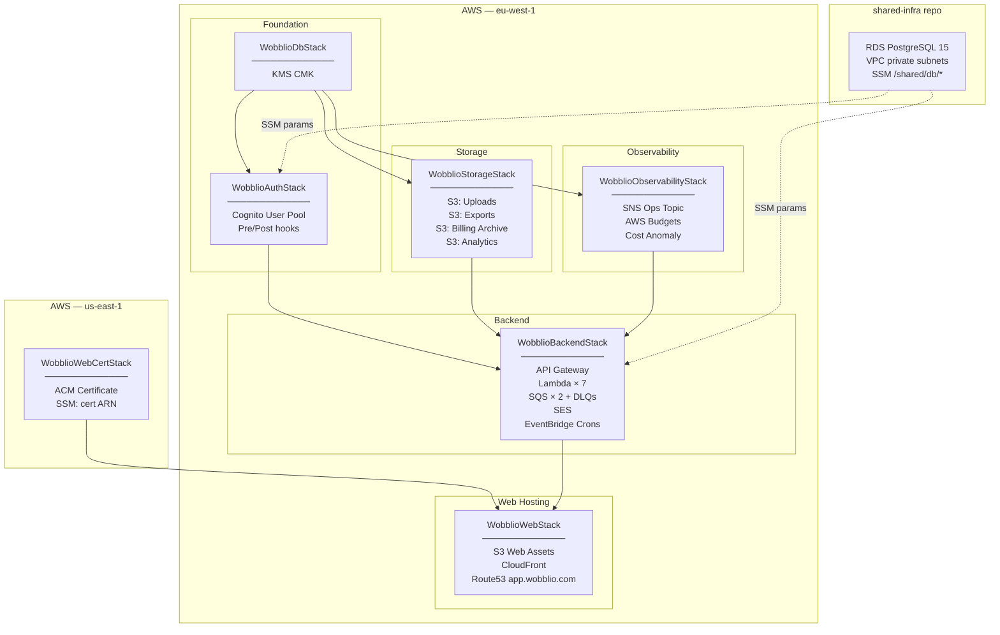
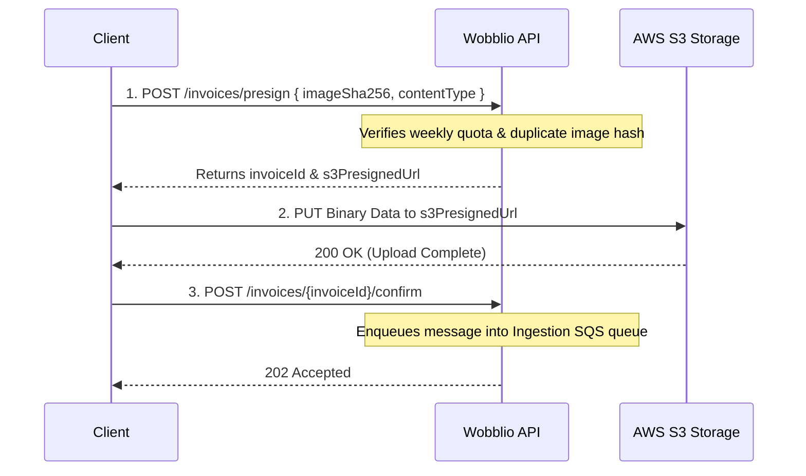
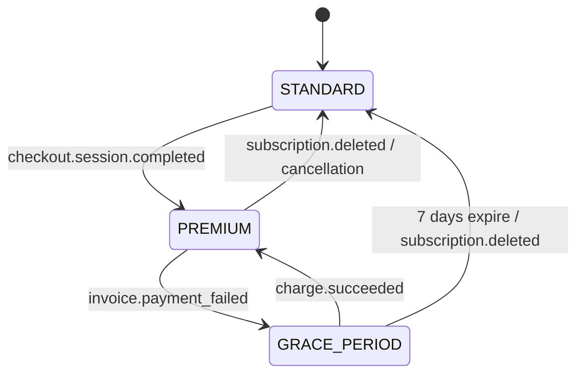
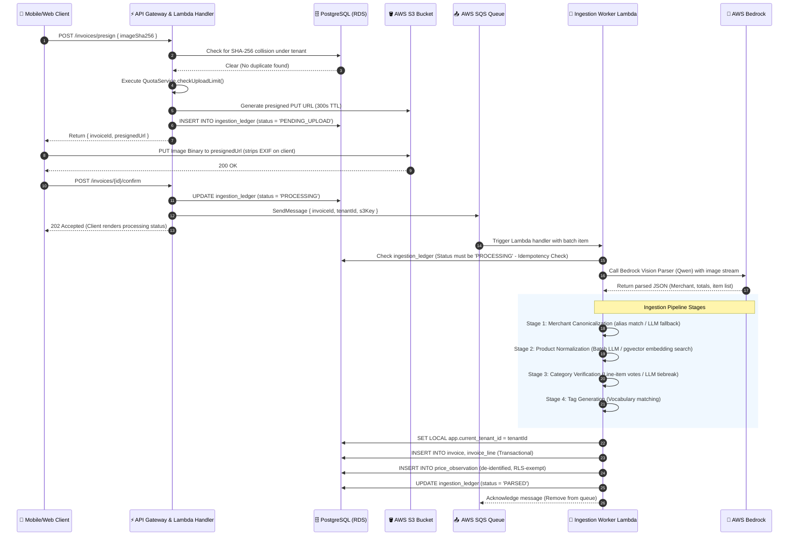
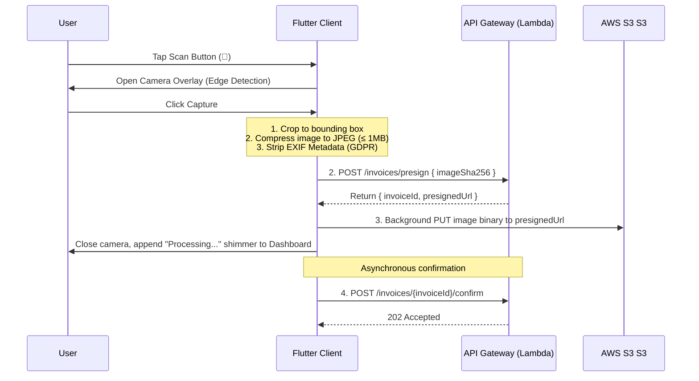
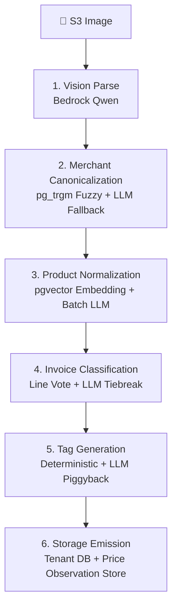
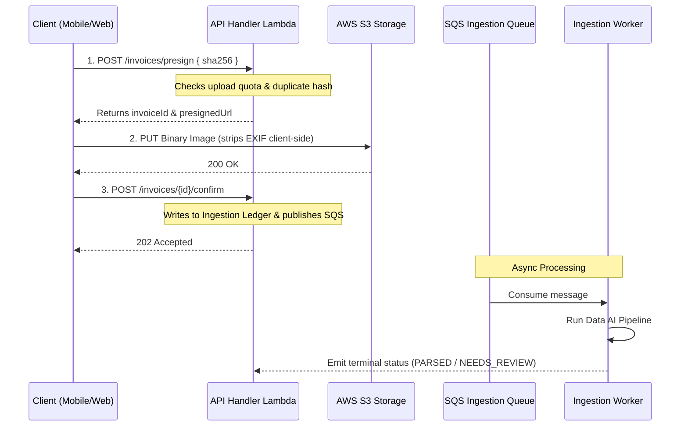
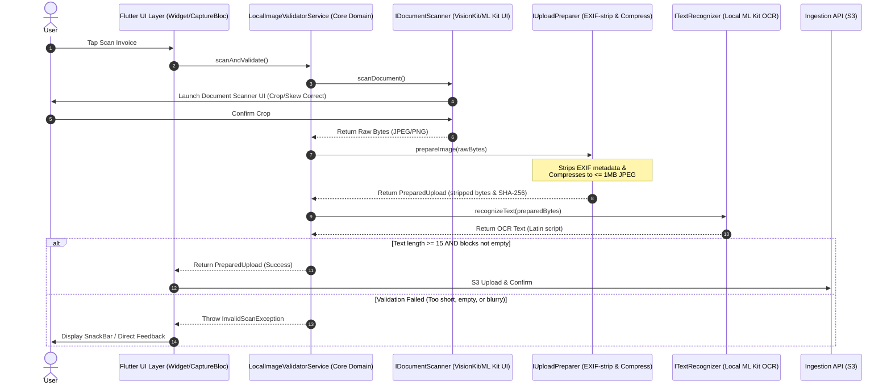
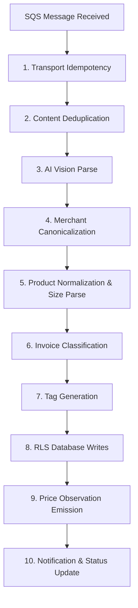

This file is a merged representation of a subset of the codebase, containing specifically included files and files not matching ignore patterns, combined into a single document by Repomix.
The content has been processed where empty lines have been removed, content has been compressed (code blocks are separated by ⋮---- delimiter).

# File Summary

## Purpose
This file contains a packed representation of a subset of the repository's contents that is considered the most important context.
It is designed to be easily consumable by AI systems for analysis, code review,
or other automated processes.

## File Format
The content is organized as follows:
1. This summary section
2. Repository information
3. Directory structure
4. Repository files (if enabled)
5. Multiple file entries, each consisting of:
  a. A header with the file path (## File: path/to/file)
  b. The full contents of the file in a code block

## Usage Guidelines
- This file should be treated as read-only. Any changes should be made to the
  original repository files, not this packed version.
- When processing this file, use the file path to distinguish
  between different files in the repository.
- Be aware that this file may contain sensitive information. Handle it with
  the same level of security as you would the original repository.

## Notes
- Some files may have been excluded based on .gitignore rules and Repomix's configuration
- Binary files are not included in this packed representation. Please refer to the Repository Structure section for a complete list of file paths, including binary files
- Only files matching these patterns are included: .okf/**/*.md, Source/**/*.*, specs/**/*.md, CLAUDE.md
- Files matching these patterns are excluded: **/node_modules/**, **/package-lock.json, **/yarn.lock, **/pnpm-lock.yaml, **/bun.lockb, repomix-output.*, repopack-output.*, **/.next/**, **/dist/**, **/build/**, **/out/**, **/.open-next/**, **/cdk.out/**, **/.serverless/**, **/.esbuild/**, **/.localstack/**, **/.playwright-cache/**, **/playwright-report/**, **/test-results/**, **/coverage/**, **/.nyc_output/**, **/.vscode/**, **/.idea/**, **/.DS_Store, **/local/**, **/.env*.local, **/.env.production, **/.env, **/*.pem, **/*.keystore, **/*.p12, **/*.png, **/*.jpg, **/*.jpeg, **/*.gif, **/*.svg, **/*.webp, **/*.ico, **/*.pdf, **/*.zip, **/*.tar.gz, **/*.mp4, **/*.mp3, **/*.wav
- Files matching patterns in .gitignore are excluded
- Files matching default ignore patterns are excluded
- Empty lines have been removed from all files
- Content has been compressed - code blocks are separated by ⋮---- delimiter
- Long base64 data strings (e.g., data:image/png;base64,...) have been truncated to reduce token count
- Files are sorted by Git change count (files with more changes are at the bottom)

# Directory Structure
```
.okf/
  architecture/
    api-integration.md
    billing-integration.md
    database-multi-tenancy.md
    database-schema.md
    deployment.md
    endpoints-components.md
    environments.md
    gdpr-compliance.md
    low-level-design.md
    mobile-client.md
    overview.md
    tech-stack.md
  features/
    price-engine.md
    quota-limits.md
    weekly-advisor.md
  pipelines/
    ingestion-pipeline.md
  runbooks/
    ops-manual.md
    testing-strategy.md
    troubleshooting.md
  index.md
  log.md
  project-explanation.md
  project-overview.md
Source/
  admin/
    src/
      app/
        (console)/
          ai-spend/
            page.tsx
          config/
            page.tsx
          curation/
            merchants/
              page.tsx
            merges/
              merge-audit.tsx
              page.tsx
            products/
              page.tsx
            curation-queue.tsx
            page.tsx
          dlq/
            page.tsx
          faults/
            faults-section.tsx
            page.tsx
          models/
            page.tsx
          pipeline-toggles/
            page.tsx
            pipeline-toggles-section.tsx
          platform/
            config-section.tsx
            models-section.tsx
            page.tsx
            quotas-section.tsx
            waitlist-section.tsx
          troubleshooting/
            agentic-pipeline-section.tsx
            dlq-section.tsx
            log-level-section.tsx
            logs-section.tsx
            page.tsx
            queue-health-section.tsx
            stat-tile.tsx
            types.ts
          users/
            page.tsx
            users-section.tsx
          waitlist/
            page.tsx
          layout.tsx
          page.tsx
          pipeline-comparison.tsx
        403/
          page.tsx
        api/
          admin/
            [...path]/
              route.ts
          auth/
            [...nextauth]/
              route.ts
        login/
          login-form.tsx
          page.tsx
        globals.css
        layout.tsx
      components/
        providers/
          theme-provider.tsx
        ui/
          admin-alias-curation-panel/
            admin-alias-curation-panel.tsx
            index.ts
          admin-dlq-panel/
            admin-dlq-panel.tsx
            index.ts
          badge/
            badge.tsx
            index.ts
          button/
            button.tsx
            index.ts
          card/
            card.tsx
            index.ts
          chart/
            chart.tsx
            index.ts
          confidence-badge/
            confidence-badge.test.tsx
            confidence-badge.tsx
            index.ts
          confirm-dialog/
            confirm-dialog.tsx
            index.ts
          console-section/
            console-section.tsx
            index.ts
          data-table/
            data-table.tsx
            index.ts
          empty-state/
            empty-state.test.tsx
            empty-state.tsx
            index.ts
          icon/
            icon.tsx
            index.ts
          input/
            index.ts
            input.tsx
          mini-bars/
            bar-list.tsx
            index.ts
            mini-bars.tsx
          money/
            index.ts
            money.tsx
          sign-out-button/
            index.ts
            sign-out-button.tsx
          sparkline/
            index.ts
            sparkline.tsx
          stat-card/
            index.ts
            stat-card.test.tsx
            stat-card.tsx
          theme-toggle/
            index.ts
            theme-toggle.tsx
          toast/
            index.ts
            toast.tsx
          logo.tsx
      design-tokens/
        tokens.ts
      lib/
        server/
          api-proxy.ts
        check-admin-role.test.ts
        check-admin-role.ts
        cn.ts
        currency.ts
        icons.ts
        verify-session-jwt.test.ts
        verify-session-jwt.ts
      test/
        setup.ts
      auth.ts
      middleware.ts
    .prettierrc.json
    eslint.config.mjs
    next-env.d.ts
    next.config.ts
    package.json
    postcss.config.mjs
    tsconfig.json
    vitest.config.ts
  backend/
    src/
      core/
        domain/
          access.ts
          adminTunables.ts
          agenticStage.ts
          aiSpend.ts
          bedrockUsageType.ts
          billing.ts
          billSplit.ts
          budget.ts
          businessKpis.ts
          catalogCuration.ts
          catalogMerge.ts
          categoryTaxonomy.ts
          classification.ts
          classificationTiebreakSchema.ts
          csv.ts
          errors.ts
          failureReasons.ts
          household.ts
          inflationSeries.ts
          ingestion.ts
          ingestionCharge.ts
          invoiceGlobalEligibility.ts
          jsonExtract.ts
          kpiRange.ts
          llmJson.ts
          merchantFallbackSchema.ts
          merchantNormalize.ts
          modelCatalog.ts
          pdf.ts
          personalInflation.ts
          priceObservation.ts
          productExpansionSchema.ts
          pushNotification.ts
          quotaConfig.ts
          receiptEscalation.ts
          receiptPostProcess.ts
          receiptSchema.ts
          region.ts
          reprocessKpi.ts
          routeOptimizer.ts
          shareToken.ts
          shoppingList.ts
          switchingSavings.ts
          tagTriggers.ts
          tagVocabulary.ts
          tokenMeter.ts
          tolerantFetch.ts
          unitSize.ts
          uploadFormat.ts
          week.ts
          weeklyAdvisor.ts
        ports/
          admin/
            IAdminAuditLog.ts
            ITunableParameterStore.ts
            IZipArchiver.ts
          ai/
            IBedrockConverse.ts
            IModelRegistry.ts
            IWeeklyAdvisorRepository.ts
          billing/
            IBillingArchive.ts
            IBillingGateway.ts
            IBillingWhitelist.ts
            IPaymentTransactionRepository.ts
          budgets/
            IBudgetRecyclerRepository.ts
            IBudgetRepository.ts
          data-intelligence/
            IBedrockEmbedder.ts
            ICatalogCurationRepository.ts
            IContributorContextRepository.ts
            IInflationSeriesQuery.ts
            IInvoiceClassifier.ts
            IMerchantCatalog.ts
            IMerchantResolver.ts
            IOwnPurchaseHistoryQuery.ts
            IPersonalInflationQuery.ts
            IPriceObservationStore.ts
            IPriceTrendQuery.ts
            IProductCatalog.ts
            IProductNormalizer.ts
            IProductSearch.ts
            IRegionInflationQuery.ts
            IRegionReference.ts
            IReverseGeocoder.ts
            ISwitchingSavingsQuery.ts
            ITagGenerator.ts
          fx/
            IEcbRateSource.ts
            IFxRateRepository.ts
          gdpr/
            IArchiveUploader.ts
            IDataRequestRepository.ts
            IExportDataSource.ts
            IExportQueue.ts
          households/
            IHouseholdInviteRepository.ts
            IHouseholdRepository.ts
          identity/
            IAppUserRepository.ts
            ITenantContext.ts
          ingestion/
            IDeadLetterQueue.ts
            IFaultAdminRepository.ts
            IIngestionLedger.ts
            IIngestionQueue.ts
            IInvoiceFeedbackRepository.ts
            IInvoiceIngestionQueuePort.ts
            IInvoiceRepository.ts
            IInvoiceShareRepository.ts
            IReceiptParser.ts
            IReleasableHeldInvoiceReader.ts
            IS3FileStorage.ts
          lists/
            IShoppingListRepository.ts
            IShoppingListShareRepository.ts
          maintenance/
            IDataRetentionRepository.ts
          notifications/
            IAnalyticsQueuePort.ts
            IDeviceTokenRepository.ts
            IEmailSender.ts
            INotificationRepository.ts
            IPushNotifier.ts
          observability/
            IAgenticStageHealthSource.ts
            IAgenticStageInstrumentation.ts
            IAiUsageSource.ts
            IBedrockCostSource.ts
            IBusinessKpiSource.ts
            IIngestionTimingSource.ts
            IKpiDailyReader.ts
            IKpiDailyWriter.ts
            IReprocessCrossWeekSource.ts
            ITelemetryRepository.ts
          optimizer/
            IPriceMatrix.ts
            IRoutingConfig.ts
          quota/
            IQuotaRepository.ts
            ISystemFaultLimitsProvider.ts
            IUploadLimitsProvider.ts
            IUploadQuotaProvider.ts
          security/
            IKmsEncryption.ts
            ISecureToken.ts
          splitting/
            IBillSplitRepository.ts
            IBillSplitShareRepository.ts
          troubleshooting/
            IIngestionLogReader.ts
            IQueueHealthSource.ts
            IWorkerMetricsSource.ts
            IWorkerRuntimeControl.ts
          waitlist/
            IFreeUserCounter.ts
            IWaitlistCapProvider.ts
            IWaitlistRepository.ts
            IWaitlistStatusPort.ts
        services/
          admin/
            AdminAiSpendService.ts
            AdminConfigService.ts
            AdminCurationService.ts
            AdminDebugSampleService.ts
            AdminFaultService.ts
            AdminKpiService.ts
            AdminModelService.ts
            AdminQuotaConfigService.ts
            AdminWaitlistService.ts
            AgenticPipelineHealthService.ts
            DlqAdminService.ts
            TroubleshootingService.ts
          ai/
            MeteringBedrockConverse.ts
            MeteringBedrockEmbedder.ts
            WeeklyAdvisorService.ts
          billing/
            BillingService.ts
          budgets/
            BudgetRecyclerService.ts
            BudgetService.ts
          data-intelligence/
            InvoiceClassifier.ts
            MerchantResolver.ts
            PriceTrendService.ts
            ProductNormalizer.ts
            ProductSearchService.ts
            TagGenerator.ts
          fx/
            CurrencyHarmonizationService.ts
            FetchDailyFxRatesService.ts
          gdpr/
            ExportWorkerService.ts
            RequestExportService.ts
            ResolveExportDownloadService.ts
          households/
            HouseholdCarryOverService.ts
            HouseholdInviteService.ts
            HouseholdService.ts
          identity/
            ProfileService.ts
            UserProvisioningService.ts
          ingestion/
            agentic/
              tools/
                InvoiceClassifierTool.ts
                MerchantResolverTool.ts
                OcrParserTool.ts
                ProductNormalizerTool.ts
                SearchTagGeneratorTool.ts
              InvoiceCoordinator.ts
            AgenticIngestionService.ts
            ConfirmService.ts
            CorrectInvoiceService.ts
            DeleteInvoiceService.ts
            EscalatingReceiptParser.ts
            ExtractionPreparer.ts
            HeldInvoiceReleaseService.ts
            InvoiceFinalizer.ts
            InvoiceLocationService.ts
            PresignService.ts
            RecordFeedbackService.ts
            ShareInvoiceService.ts
            VisionParseService.ts
          lists/
            ShoppingListService.ts
            ShoppingListShareService.ts
          maintenance/
            DataRetentionService.ts
          notifications/
            NotificationService.ts
          observability/
            AiSpendRollupService.ts
            BusinessKpiRollupService.ts
            IngestionMetricsRollupService.ts
            ReprocessCrossWeekRollupService.ts
          optimizer/
            OptimizerService.ts
          quota/
            QuotaService.ts
            UploadAllowanceResolver.ts
          splitting/
            BillSplitService.ts
            ShareBillSplitService.ts
          waitlist/
            WaitlistReleaseService.ts
      handlers/
        agentic-worker/
          index.ts
        analytics-events/
          index.ts
        api-handler/
          adminAnalyticsRoutes.ts
          adminConfigRoutes.ts
          adminCurationRoutes.ts
          adminDlqRoutes.ts
          adminFaultRoutes.ts
          adminModelRoutes.ts
          adminQuotaConfigRoutes.ts
          adminQuotaRoutes.ts
          adminRoutes.ts
          adminTroubleshootingRoutes.ts
          adminWaitlistRoutes.ts
          budgetRoutes.ts
          gdprRoutes.ts
          householdRoutes.ts
          index.ts
          listRoutes.ts
          notificationRoutes.ts
          priceTrendRoutes.ts
          productRoutes.ts
          shared.ts
          splitRoutes.ts
        cron-budget-reset/
          index.ts
        cron-data-retention/
          index.ts
        cron-fx-rate-fetch/
          index.ts
        cron-ingestion-metrics-rollup/
          index.ts
        cron-release-held-locations/
          index.ts
        cron-waitlist-release/
          index.ts
        cron-weekly-advisor/
          index.ts
        export-worker/
          index.ts
        post-confirmation-hook/
          index.ts
        pre-signup-hook/
          index.ts
        share-bill-split/
          index.ts
        share-invoice/
          index.ts
        share-shopping-list/
          index.ts
        shared/
          ingestionWorkerShell.ts
        waitlist-status/
          index.ts
      infrastructure/
        adapters/
          admin/
            AdminAuditLogAdapter.ts
            JsZipArchiverAdapter.ts
            SsmTunableParametersAdapter.ts
          ai/
            BedrockConverseAdapter.ts
            SsmModelRegistryAdapter.ts
            WeeklyAdvisorRepositoryAdapter.ts
          billing/
            MockBillingGatewayAdapter.ts
            PaymentTransactionRepositoryAdapter.ts
            S3BillingArchiveAdapter.ts
            SsmBillingWhitelistAdapter.ts
          budgets/
            BudgetRecyclerRepositoryAdapter.ts
            BudgetRepositoryAdapter.ts
          data-intelligence/
            AwsLocationReverseGeocoderAdapter.ts
            BedrockTitanEmbedderAdapter.ts
            CatalogCurationAdapter.ts
            ContributorContextRepositoryAdapter.ts
            iso3166Alpha3.ts
            MerchantCatalogAdapter.ts
            OwnPurchaseHistoryQueryAdapter.ts
            PersonalInflationQueryAdapter.ts
            PersonalInflationSeriesQueryAdapter.ts
            PriceObservationStoreAdapter.ts
            PriceTrendQueryAdapter.ts
            ProductCatalogAdapter.ts
            ProductSearchAdapter.ts
            RegionInflationQueryAdapter.ts
            RegionInflationSeriesQueryAdapter.ts
            RegionReferenceAdapter.ts
            SwitchingSavingsQueryAdapter.ts
          fx/
            EcbRateSourceAdapter.ts
            FxRateRepositoryAdapter.ts
          gdpr/
            DataRequestRepositoryAdapter.ts
            ExportDataSourceAdapter.ts
            SqsExportQueueAdapter.ts
          households/
            HouseholdInviteRepositoryAdapter.ts
            HouseholdRepositoryAdapter.ts
          identity/
            AppUserRepositoryAdapter.ts
            TenantContextAdapter.ts
          ingestion/
            FaultAdminRepositoryAdapter.ts
            IngestionLedgerAdapter.ts
            InvoiceFeedbackRepositoryAdapter.ts
            InvoiceRepositoryAdapter.ts
            InvoiceShareRepositoryAdapter.ts
            ReleasableHeldInvoiceReaderAdapter.ts
            S3FileStorageAdapter.ts
            SqsDeadLetterQueueAdapter.ts
            SqsIngestionQueueAdapter.ts
            SqsInvoiceIngestionQueueAdapter.ts
          lists/
            ShoppingListRepositoryAdapter.ts
            ShoppingListShareRepositoryAdapter.ts
          maintenance/
            DataRetentionRepositoryAdapter.ts
          notifications/
            DeviceTokenRepositoryAdapter.ts
            MockPushAdapter.ts
            NotificationRepositoryAdapter.ts
            pushNotifierFactory.ts
            SesEmailAdapter.ts
            SnsPushNotifierAdapter.ts
            SqsAnalyticsQueueAdapter.ts
          observability/
            BusinessKpiDbAdapter.ts
            CloudWatchLogsAgenticStageHealthAdapter.ts
            CloudWatchLogsAiUsageAdapter.ts
            cloudWatchLogsInsightsQuery.ts
            CloudWatchLogsReprocessAdapter.ts
            CloudWatchLogsTimingSourceAdapter.ts
            CostExplorerBedrockAdapter.ts
            KpiDailyReaderAdapter.ts
            KpiDailyRepositoryAdapter.ts
            MockAgenticStageInstrumentationAdapter.ts
            StructuredLogAgenticStageInstrumentation.ts
            TelemetryRepositoryAdapter.ts
          optimizer/
            MockPriceMatrixAdapter.ts
            PriceMatrixAdapter.ts
            priceMatrixFactory.ts
            SsmRoutingConfigAdapter.ts
          quota/
            QuotaRepositoryAdapter.ts
            SsmSystemFaultLimitsAdapter.ts
            SsmUploadQuotaAdapter.ts
          security/
            encryptionFactory.ts
            KmsEncryptionAdapter.ts
            LocalEncryptionAdapter.ts
            SecureTokenAdapter.ts
          splitting/
            BillSplitRepositoryAdapter.ts
            BillSplitShareRepositoryAdapter.ts
          troubleshooting/
            CloudWatchLogsIngestionReaderAdapter.ts
            CloudWatchWorkerMetricsAdapter.ts
            LambdaWorkerRuntimeControlAdapter.ts
            SqsQueueHealthAdapter.ts
          waitlist/
            FreeUserCounterAdapter.ts
            SsmWaitlistCapAdapter.ts
            WaitlistRepositoryAdapter.ts
            WaitlistStatusDbAdapter.ts
        config/
          bedrockClient.ts
          db.ts
          rdsCaBundle.ts
          stageConfig.ts
        logging/
          bedrockUsageLog.ts
          logger.ts
      prompts/
        classificationTiebreak.ts
        merchantFallback.ts
        productExpansion.ts
        visionParse.ts
        weeklyAdvisor.ts
      tests/
        integration/
          BillingService.local.test.ts
          BillSplit.local.test.ts
          BudgetCycleCalendarAnchor.local.test.ts
          BudgetSpendFreshness.local.test.ts
          BudgetSpendHousehold.local.test.ts
          DataIntelligence.local.test.ts
          FaultReprocess.local.test.ts
          FxRateRepository.local.test.ts
          HouseholdCreditCarryover.local.test.ts
          HouseholdMembership.local.test.ts
          InflationInsights.local.test.ts
          IngestionPipeline.local.test.ts
          loadLocalEnv.ts
          OwnPurchaseHistory.local.test.ts
          PriceTrendQuery.local.test.ts
          ProfileService.local.test.ts
          RegionReferenceAdapter.local.test.ts
        unit/
          core/
            domain/
              access.test.ts
              adminTunables.test.ts
              aiSpend.test.ts
              bedrockUsageType.test.ts
              billSplit.test.ts
              budget.test.ts
              businessKpis.test.ts
              catalogMerge.test.ts
              categoryTaxonomy.test.ts
              classification.test.ts
              classificationTiebreakSchema.test.ts
              csv.test.ts
              errors.test.ts
              failureReasons.test.ts
              inflationSeries.test.ts
              ingestion.test.ts
              ingestionCharge.test.ts
              invoiceGlobalEligibility.test.ts
              llmJson.test.ts
              merchantFallbackSchema.test.ts
              merchantNormalize.test.ts
              pdf.test.ts
              personalInflation.test.ts
              priceObservation.test.ts
              productExpansionSchema.test.ts
              pushNotification.test.ts
              quotaConfig.test.ts
              receiptEscalation.test.ts
              receiptPostProcess.test.ts
              receiptSchema.test.ts
              region.test.ts
              reprocessKpi.test.ts
              routeOptimizer.test.ts
              shareToken.test.ts
              shoppingList.test.ts
              switchingSavings.test.ts
              tagTriggers.test.ts
              tagVocabulary.test.ts
              tokenMeter.test.ts
              tolerantFetch.test.ts
              unitSize.test.ts
              uploadFormat.test.ts
              week.test.ts
              weeklyAdvisor.test.ts
            services/
              admin/
                AdminAnalyticsServices.test.ts
                AdminConfigService.test.ts
                AdminCurationService.test.ts
                AdminDebugSampleService.test.ts
                AdminFaultService.test.ts
                AdminModelService.test.ts
                AdminQuotaConfigService.test.ts
                AdminWaitlistService.test.ts
                AgenticPipelineHealthService.test.ts
                DlqAdminService.test.ts
                TroubleshootingService.test.ts
              ai/
                MeteringBedrock.test.ts
                WeeklyAdvisorService.test.ts
              billing/
                BillingService.test.ts
              budgets/
                BudgetRecyclerService.test.ts
                BudgetService.test.ts
              data-intelligence/
                InvoiceClassifier.test.ts
                MerchantResolver.test.ts
                PriceTrendService.test.ts
                ProductNormalizer.test.ts
                ProductSearchService.test.ts
                TagGenerator.test.ts
              fx/
                CurrencyHarmonizationService.test.ts
                FetchDailyFxRatesService.test.ts
              gdpr/
                ExportWorkerService.test.ts
                RequestExportService.test.ts
                ResolveExportDownloadService.test.ts
              households/
                HouseholdCarryOverService.test.ts
                HouseholdInviteService.test.ts
                HouseholdService.test.ts
              identity/
                ProfileService.test.ts
                UserProvisioningService.test.ts
              ingestion/
                agentic/
                  InvoiceCoordinator.test.ts
                  tools.test.ts
                AgenticIngestionService.test.ts
                ConfirmService.test.ts
                CorrectInvoiceService.test.ts
                DeleteInvoiceService.test.ts
                EscalatingReceiptParser.test.ts
                HeldInvoiceReleaseService.test.ts
                IngestionPipeline.test.ts
                InvoiceLocationService.test.ts
                PresignService.test.ts
                RecordFeedbackService.test.ts
                ShareInvoiceService.test.ts
                VisionParseService.test.ts
              lists/
                ShoppingListService.test.ts
                ShoppingListShareService.test.ts
              maintenance/
                DataRetentionService.test.ts
              notifications/
                NotificationService.test.ts
              observability/
                AiSpendRollupService.test.ts
                BusinessKpiRollupService.test.ts
                IngestionMetricsRollupService.test.ts
                ReprocessCrossWeekRollupService.test.ts
              optimizer/
                OptimizerService.test.ts
              quota/
                QuotaService.test.ts
                UploadAllowanceResolver.test.ts
              splitting/
                BillSplitService.test.ts
                ShareBillSplitService.test.ts
              waitlist/
                WaitlistReleaseService.test.ts
          handlers/
            adminRoute.guard.test.ts
            analytics-events.test.ts
            waitlist-status.test.ts
          infrastructure/
            adapters/
              billing/
                MockBillingGatewayAdapter.test.ts
                PaymentTransactionRepositoryAdapter.test.ts
                SsmBillingWhitelistAdapter.test.ts
              identity/
                AppUserRepositoryAdapter.test.ts
              ingestion/
                InvoiceRepositoryAdapter.topMerchant.test.ts
                SqsInvoiceIngestionQueueAdapter.test.ts
              notifications/
                DeviceTokenRepositoryAdapter.test.ts
                SnsPushNotifierAdapter.test.ts
              observability/
                CloudWatchLogsAgenticStageHealthAdapter.test.ts
                cloudWatchLogsInsightsQuery.test.ts
                TelemetryRepositoryAdapter.test.ts
              quota/
                QuotaRepositoryAdapter.test.ts
                SsmUploadQuotaAdapter.test.ts
              waitlist/
                FreeUserCounterAdapter.test.ts
                WaitlistStatusDbAdapter.test.ts
            config/
              db.test.ts
    .nvmrc
    api.yml
    CLAUDE.md
    package.json
    tsconfig.json
    vitest.config.ts
    vitest.integration.config.ts
  infra/
    bin/
      wobblio.ts
    docs/
      database-setup.md
    src/
      cdk/
        branding/
          web-login-branding.ts
        config/
          appConfig.ts
          environment.ts
        stacks/
          WobblioAdminCertStack.ts
          WobblioAdminStack.ts
          WobblioAuthStack.ts
          WobblioBackendStack.ts
          WobblioConfigStack.ts
          WobblioDataAiPipelineStack.ts
          WobblioDbStack.ts
          WobblioLocalBootstrapStack.ts
          WobblioObservabilityStack.ts
          WobblioStorageStack.ts
          WobblioWebCertStack.ts
          WobblioWebStack.ts
        utils/
          tagging.ts
      migrations/
        20260611152000_initial_schema.ts
        20260611170000_auth_rls_helpers.ts
        20260612120000_user_profile_fields.ts
        20260614180000_user_onboarding.ts
        20260615120000_profile_role_status.ts
        20260616090000_region_reference.ts
        20260616091000_onboarding_region_param.ts
        20260616092000_ingestion_perf_indexes.ts
        20260616093000_fix_provision_new_user_overload.ts
        20260616100000_seed_reference_data.ts
        20260616100500_households_invites_rls.ts
        20260616101000_budgets_notifications.ts
        20260616102000_shopping_list_items_updated_at.ts
        20260616103000_weekly_advisor.ts
        20260617110000_invoice_location_gate.ts
        20260617115000_uk_nations_resplit.ts
        20260617120000_release_held_invoices_fn.ts
        20260619120000_expand_grocery_categories.ts
        20260619130000_line_order_deposits_emission_block.ts
        20260619140000_invoice_share_tokens.ts
        20260619150000_invoice_feedback_unique.ts
        20260619160000_tiered_invoice_location.ts
        20260620120000_seed_merchants.ts
        20260620130000_budget_household_scope.ts
        20260620131000_budget_household_spend.ts
        20260620132000_budget_daily_period.ts
        20260620133000_active_budgets_for_invoice.ts
        20260621120000_budget_alert_target_label.ts
        20260621130000_invoice_search_city.ts
        20260621140000_merge_duplicate_seed_merchants.ts
        20260621150000_drop_merchant_branch.ts
        20260621150100_merchant_brand_unique.ts
        20260622120000_product_catalog_cleanup.ts
        20260622130000_drop_ai_spend_ledger.ts
        20260622140000_drop_tenant_signature.ts
        20260622150000_admin_audit_log.ts
        20260623120000_admin_curation_queue.ts
        20260623130000_business_kpi_rollup_fn.ts
        20260623140000_kpi_extended_metrics.ts
        20260623150000_kpi_user_breakdown.ts
        20260623160000_kpi_pending_region_score.ts
        20260623170000_kpi_feedback_breakdown.ts
        20260623180000_kpi_by_country.ts
        20260623190000_product_country.ts
        20260623200000_curation_queue_v2.ts
        20260624120000_data_retention_functions.ts
        20260624130000_budget_category_hierarchy.ts
        20260624140000_admin_quota_and_refund_counter.ts
        20260624150000_invoice_location_source_country_with_profile_region.ts
        20260624160000_budget_cycle_calendar_anchor.ts
        20260625113033_admin_set_user_role.ts
        20260625120000_fix_accept_invite_ambiguous_column.ts
        20260625130000_household_size_and_pool_gate.ts
        20260627120000_price_observation_nullable_unit_fields.ts
        20260627121000_container_deposit_rule.ts
        20260627140000_drop_container_deposit_rule.ts
        20260627150000_fail_stuck_invoices_fn.ts
        20260627160000_household_owner_role.ts
        20260628120000_add_credits_to_quota_counter.ts
        20260628120100_repoint_admin_quota_to_credits.ts
        20260628140000_invoice_fault_quarantine.ts
        20260628150000_household_credit_carryover.ts
        20260628160000_invoice_quota_pooled.ts
        20260628170000_admin_fault_reprocess.ts
        20260629100000_invoice_telemetry.ts
        20260630120000_pipeline_kpis_fn.ts
        20260630130000_invoice_user_correction.ts
        20260630140000_device_token.ts
        20260701090000_shopping_list_category_quantity_sharing.ts
        20260703090000_profile_price_optout_field.ts
        20260703160000_bill_split_quantity_allocations.ts
        20260703170000_bill_split_share_tokens.ts
        20260705120000_drop_pipeline_type.ts
      provisioning/
        provision-runtime-role.sql
        provisionRuntimeRole.ts
        README.md
    test/
      merge_duplicate_seed_merchants.test.ts
      reset_dev.test.ts
      seed_merchants.test.ts
      seed_reference_data.test.ts
      WobblioBackendStack.test.ts
      WobblioDataAiPipelineStack.test.ts
    .nvmrc
    cdk.json
    package.json
    README.md
    tsconfig.json
    vitest.config.ts
  mobile/
    lib/
      core/
        auth/
          auth_exception.dart
          auth_tokens.dart
          jwt_claims.dart
          user_profile.dart
        bloc/
          account/
            account_bloc.dart
            account_event.dart
            account_state.dart
          auth/
            auth_bloc.dart
            auth_event.dart
            auth_state.dart
          budgets/
            budget_bloc.dart
            budget_event.dart
            budget_state.dart
          capture/
            capture_bloc.dart
            capture_event.dart
            capture_state.dart
          dashboard/
            dashboard_bloc.dart
            dashboard_event.dart
            dashboard_state.dart
          history/
            history_bloc.dart
            history_event.dart
            history_state.dart
          invoice_detail/
            invoice_detail_bloc.dart
            invoice_detail_event.dart
            invoice_detail_state.dart
          notifications/
            notification_bloc.dart
            notification_event.dart
            notification_state.dart
          reports/
            price_report_bloc.dart
            price_report_event.dart
            price_report_state.dart
          review/
            review_bloc.dart
            review_event.dart
            review_state.dart
          shared_split/
            shared_split_bloc.dart
            shared_split_event.dart
            shared_split_state.dart
          shopping_list/
            shopping_list_bloc.dart
            shopping_list_event.dart
            shopping_list_state.dart
          split_bill/
            split_bill_bloc.dart
            split_bill_event.dart
            split_bill_state.dart
        budgets/
          budget.dart
        config/
          app_config.dart
        domain/
          shopping_list_categories.dart
        error/
          api_exception.dart
        ingestion/
          feedback_verdict.dart
          invoice_correction.dart
          invoice_detail.dart
          invoice_status.dart
          invoice_summary.dart
          prepared_upload.dart
          presign_ticket.dart
          product_match.dart
          upload_exception.dart
          usage_summary.dart
        lists/
          optimization_result.dart
          shopping_list_detail.dart
          shopping_list_summary.dart
        notifications/
          app_notification.dart
        ports/
          api_client.dart
          auth_token_provider.dart
          budget_repository.dart
          camera_capture.dart
          cognito_authenticator.dart
          deep_link_source.dart
          document_picker.dart
          gallery_picker.dart
          ingestion_repository.dart
          insights_repository.dart
          invoice_repository.dart
          notification_repository.dart
          product_search_repository.dart
          profile_repository.dart
          reference_repository.dart
          review_repository.dart
          s3_uploader.dart
          secure_token_store.dart
          share_presenter.dart
          shopping_list_repository.dart
          split_id_cache.dart
          split_repository.dart
          upload_preparer.dart
          usage_repository.dart
        reference/
          category.dart
        reports/
          inflation_insight.dart
          spend_metrics.dart
        splitting/
          shared_split.dart
          split_allocation.dart
          split_summary.dart
      infrastructure/
        adapters/
          app_auth_cognito_authenticator.dart
          app_links_deep_link_source.dart
          cognito_auth_token_provider.dart
          dio_api_client.dart
          dio_s3_uploader.dart
          file_picker_document_adapter.dart
          flutter_secure_token_store.dart
          http_budget_repository.dart
          http_ingestion_repository.dart
          http_insights_repository.dart
          http_invoice_repository.dart
          http_notification_repository.dart
          http_product_search_repository.dart
          http_profile_repository.dart
          http_reference_repository.dart
          http_review_repository.dart
          http_shopping_list_repository.dart
          http_split_repository.dart
          http_usage_repository.dart
          image_compress_upload_preparer.dart
          image_picker_camera_adapter.dart
          image_picker_gallery_adapter.dart
          invoice_detail_parser.dart
          share_plus_presenter.dart
          shared_prefs_split_id_cache.dart
      ui/
        account/
          account_screen.dart
        auth/
          auth_gate.dart
          login_screen.dart
        budgets/
          budgets_screen.dart
        capture/
          capture_screen.dart
        dashboard/
          dashboard_screen.dart
        deep_link/
          deep_link_listener.dart
        design_system/
          aurora_background.dart
          avatar.dart
          badge.dart
          button.dart
          checkbox.dart
          glass_container.dart
          inflation_sparkline.dart
          input.dart
          merchant_icon.dart
          metric_card.dart
          progress_bar.dart
          switch.dart
          tag.dart
          tokens.dart
          wobblio_header.dart
          wobblio_logo.dart
          wobblio_nav_bar.dart
        history/
          history_screen.dart
        invoice_detail/
          invoice_detail_screen.dart
        notifications/
          notifications_screen.dart
        onboarding/
          onboarding_required_screen.dart
        reports/
          reports_screen.dart
        review/
          review_screen.dart
        shared_split/
          shared_split_screen.dart
        shell/
          app_shell.dart
        shopping_list/
          shopping_list_screen.dart
        split_bill/
          split_bill_screen.dart
        theme/
          app_theme.dart
        format.dart
      app.dart
      main.dart
    test/
      bloc/
        account_bloc_test.dart
        auth_bloc_test.dart
        budget_bloc_test.dart
        capture_bloc_test.dart
        dashboard_bloc_test.dart
        history_bloc_test.dart
        invoice_detail_bloc_test.dart
        notification_bloc_test.dart
        price_report_bloc_test.dart
        review_bloc_test.dart
        shared_split_bloc_test.dart
        shopping_list_bloc_test.dart
        split_bill_bloc_test.dart
      jwt_claims_test.dart
      smoke_test.dart
      spend_metrics_test.dart
    .fvmrc
    .gitignore
    .metadata
    analysis_options.yaml
    mobile.config
    pubspec.lock
    pubspec.yaml
    README.md
  webapp/
    .storybook/
      main.ts
      preview.tsx
    messages/
      en.json
    src/
      app/
        (app)/
          admin/
            page.tsx
          budgets/
            page.tsx
          dashboard/
            page.tsx
          household/
            join/
              page.tsx
            page.tsx
          invoices/
            page.tsx
          lists/
            page.tsx
          reports/
            page.tsx
          review/
            page.tsx
          settings/
            page.test.tsx
            page.tsx
          layout.test.tsx
          layout.tsx
        (auth)/
          forgot-password/
            forgot-password-form.tsx
            page.tsx
          login/
            hosted-ui-redirect.tsx
            login-form.tsx
            page.tsx
          register/
            hosted-ui-signup-redirect.tsx
            page.test.tsx
            page.tsx
            register-form.test.tsx
            register-form.tsx
          actions.ts
          layout.tsx
        api/
          analytics/
            events/
              route.ts
          auth/
            [...nextauth]/
              route.ts
            cognito-logout/
              route.test.ts
              route.ts
          billing/
            portal-session/
              route.ts
          budgets/
            [id]/
              route.ts
            route.ts
          households/
            [id]/
              invite/
                route.ts
              invites/
                [inviteId]/
                  route.ts
              leave/
                route.ts
              members/
                [userId]/
                  route.ts
              route.ts
            accept-invite/
              [token]/
                route.ts
            mine/
              route.ts
            route.ts
          invoices/
            [id]/
              confirm/
                route.ts
              feedback/
                route.ts
              location/
                route.ts
              share/
                route.ts
              splits/
                [splitId]/
                  lines/
                    [lineId]/
                      allocations/
                        route.ts
                  share/
                    route.ts
                  summary/
                    route.ts
                  route.ts
                route.ts
              route.ts
            presign/
              route.ts
            route.ts
          lists/
            [id]/
              complete/
                route.ts
              items/
                [itemId]/
                  route.ts
                route.ts
              optimize/
                route.ts
              region/
                route.ts
              share/
                [shareId]/
                  route.ts
                route.ts
              route.ts
            route.ts
          me/
            export/
              [id]/
                download/
                  route.ts
              latest/
                route.ts
              route.ts
            price-contribution-optout/
              route.ts
            profile/
              route.ts
            stats/
              top-merchant/
                route.ts
            usage/
              route.ts
          notifications/
            [id]/
              read/
                route.ts
            route.ts
          onboarding/
            route.ts
          price-trends/
            comparison/
              route.ts
          products/
            search/
              route.ts
          reference/
            categories/
              route.ts
            regions/
              route.ts
          shared-lists/
            [token]/
              items/
                [itemId]/
                  route.ts
              route.ts
          waitlist/
            status/
              route.ts
        gdpr/
          page.tsx
        onboarding/
          onboarding-form.test.tsx
          onboarding-form.tsx
          page.tsx
        privacy/
          page.tsx
        r/
          [token]/
            page.tsx
            shared-invoice-view.tsx
        s/
          [token]/
            page.tsx
            shared-split-view.tsx
        shared-lists/
          [token]/
            page.tsx
            shared-list-view.tsx
        terms/
          page.tsx
        globals.css
        layout.tsx
        page.tsx
        sitemap.ts
      components/
        auth/
          force-sign-out.test.tsx
          force-sign-out.tsx
          session-timeout-dialog.tsx
          session-timeout-guard.test.tsx
          session-timeout-guard.tsx
        ds/
          AnimatedNumber.tsx
          AuroraBackground.tsx
          Avatar.tsx
          Badge.tsx
          Button.tsx
          Card.tsx
          CategoryIcon.tsx
          Checkbox.tsx
          index.ts
          Input.tsx
          MerchantIcon.tsx
          MetricCard.tsx
          Money.tsx
          ProgressBar.tsx
          Switch.tsx
          Tag.tsx
          ThemeToggle.tsx
          WobblioLogo.tsx
        marketing/
          landing-page-client.tsx
          landing-page-view.tsx
          legal-page.tsx
        providers/
          auth-session-provider.tsx
          sandbox-provider.tsx
          theme-provider.tsx
        ui/
          left-nav/
            index.ts
            left-nav.test.tsx
            left-nav.tsx
            nav-drawer-context.tsx
          money/
            index.ts
            money.tsx
          site-footer/
            index.ts
            site-footer.tsx
          site-header/
            index.ts
            site-header.tsx
          top-bar/
            index.ts
            notification-menu.test.tsx
            notification-menu.tsx
            rls-warning-banner.tsx
            sign-out-button.test.tsx
            sign-out-button.tsx
            sign-out-confirm-dialog.tsx
            top-bar.tsx
            topbar-search.tsx
            user-menu.test.tsx
            user-menu.tsx
        workspace/
          add-item-row.tsx
          bill-split-dialog.tsx
          budget-data.test.ts
          budget-data.ts
          budget-form-dialog.tsx
          budget-list.test.tsx
          budget-list.tsx
          coming-soon.tsx
          confirm-dialog.tsx
          create-household-dialog.tsx
          create-list-dialog.tsx
          filter-select.tsx
          household-data.test.ts
          household-data.ts
          household-roster.test.tsx
          household-roster.tsx
          index.ts
          invite-panel.tsx
          invoice-data.test.ts
          invoice-data.ts
          invoice-drawer.tsx
          invoice-location-gate.test.tsx
          invoice-location-gate.tsx
          invoice-table.tsx
          line-chart.tsx
          list-data.test.ts
          list-data.ts
          list-item-row.tsx
          list-optimizer-panel.tsx
          location-prompt-banner.test.tsx
          location-prompt-banner.tsx
          price-trends-help.tsx
          product-search.tsx
          receipt-viewer.tsx
          region-picker.tsx
          settings-data.test.ts
          settings-data.ts
          share-dialog.tsx
          share-link.tsx
          share-list-bar.tsx
          shopping-lists.tsx
          spend-over-time-chart.test.tsx
          spend-over-time-chart.tsx
          status-legend.tsx
          trend-data.ts
          use-bill-split.ts
          use-budget-reference.ts
          use-price-trends.ts
          workspace-provider.tsx
          workspace-toast.tsx
      hooks/
        use-analytics/
          use-analytics.ts
        use-count-up/
          use-count-up.ts
        use-idle-timer/
          use-idle-timer.test.ts
          use-idle-timer.ts
        use-notifications/
          use-notifications.test.ts
          use-notifications.ts
        use-waitlist-status/
          use-waitlist-status.test.ts
          use-waitlist-status.ts
      lib/
        auth/
          session-timeouts.ts
        server/
          api-proxy.ts
          onboarding-status.ts
        cn.ts
        currency.test.ts
        currency.ts
        db.ts
        federated-sign-out.ts
        icons.ts
        invoice-map.test.ts
        invoice-map.ts
        invoice-metrics.test.ts
        invoice-metrics.ts
        locale-options.ts
        provision-user.ts
        upload-receipt.test.ts
        upload-receipt.ts
        user-initials.ts
      styles/
        ds/
          tokens/
            colors.css
            effects.css
            spacing.css
            typography.css
          auth.css
          base.css
          landing.css
          workspace.css
      test/
        e2e/
          helpers/
            db.ts
            flows.ts
          auth-login.spec.ts
          bill-split.spec.ts
          household.spec.ts
          logout.spec.ts
          onboarding.spec.ts
          zombie-session.spec.ts
        setup.ts
      auth.ts
      middleware.ts
    .prettierrc.json
    CLAUDE.md
    eslint.config.mjs
    next-env.d.ts
    next.config.ts
    package.json
    playwright.config.ts
    postcss.config.mjs
    tsconfig.json
    vitest.config.ts
specs/
  fixes/
    00-audit-report.md
    00-project-knowledge.md
    01-invariant-amendments.md
    02-docs-truth-realignment.md
    03-admin-incident-workflows.md
    04-admin-safety-rails.md
    05-mobile-parity-roadmap.md
  mvp/
    05-billing-stripe/
      05a-real-stripe-gateway.md
    07-core-ingestion-pipeline/
      07a-spec-realignment.md
      07b-feedback-capture-completion.md
      07c-web-correction-parity.md
    10-budgets-shopping-lists-optimizer/
      10a-budgets.md
      10b-shopping-lists.md
      10c-split-route-optimizer.md
      10d-weekly-savings-advisor.md
    11-splitting-fx-reporting/
      11-00-handoff.md
      11a-fx-pipeline.md
      11b-bill-splitting-backend.md
      11c-bill-splitting-web-ui.md
      11d-reporting-endpoints.md
    12-admin-console/
      12a-admin-foundation.md
      12b-admin-waitlist.md
      12c-admin-config-models.md
      12d-admin-dlq.md
      12e-admin-curation.md
      12f-admin-analytics.md
      12g-admin-deployment.md
    13-security-controls/
      13a-posture-realignment-and-hardening.md
    14-gdpr-data-lifecycle/
      00-handoff.md
      14a-consent-price-optout.md
      14b-data-export.md
      14c-deletion-phase1.md
      14d-deletion-phase2.md
      14e-processor-inventory-privacy-policy.md
    16-mobile/
      16-00-handoff.md
      16a-mobile-foundation.md
      16b-mobile-auth.md
      16c-mobile-capture.md
      16d-mobile-dashboard-feedback.md
      16e-mobile-review.md
      16f-push-delivery-backend.md
      16g-push-client.md
      16h-merchant-tag-edits.md
    17-mobile-redesign/
      17-00-handoff.md
      17a-design-system-foundation.md
      17b-onboarding-auth-reskin.md
      17c-capture-reskin.md
      17d-dashboard-reskin.md
      17e-review-reskin.md
    18-mobile-navigation-and-lists/
      18-00-handoff.md
      18a-bottom-tab-shell.md
      18b-history-invoice-detail.md
      18c-shopping-list.md
      18d-budgets.md
      18e-reports.md
      18f-account.md
      18g-notifications.md
      18h-split-bill.md
    19-mobile-2a-full/
      19-00-handoff.md
      19-01-screen-review.md
    admin-console/
      00-access-control-routing-audit.md
      01-cdk-hosting-waf.md
      02-ssm-parameter-editor.md
      03-model-swap-matrix.md
      04-waitlist-panel.md
      05-dlq-panel.md
      06-alias-curation-queue.md
      07-ai-spend-dashboard.md
      08-kpi-dashboard.md
      09-admin-spec-consolidation.md
      README.md
    draft/
      abuse-handling-and-fair-warning.md
      multilingual-localization.md
    00-design-system-wireframes.md
    01-local-development-sandbox.md
    02-infrastructure-database-rls.md
    02b-deployment-hosting.md
    03-observability-foundation.md
    04-authentication-waitlist.md
    05-billing-stripe.md
    06-landing-page-marketing.md
    07-core-ingestion-pipeline.md
    08-data-intelligence-layer.md
    09-households.md
    10-budgets-shopping-lists-optimizer.md
    11-bill-splitting-fx-reporting.md
    12-admin-console.md
    13-security-controls.md
    14-gdpr-data-lifecycle.md
    15-observability-kpis-analytics.md
    16-mobile-capture-and-review.md
    17-mobile-redesign.md
    18-mobile-navigation-and-lists.md
    README.md
  non-functional/
    01-data-ai-pipeline/
      00-handoff.md
      01-ingestion-telemetry.md
      02-agentic-pipeline-stack.md
      03-strands-agent-worker.md
      04-dynamic-queue-routing.md
      05-admin-pipeline-toggle.md
      06-kpi-pipeline-comparison.md
      07-pipeline-evaluation-harness.md
      08-pdf-cost-truth.md
      README.md
    02-weekly-usage-limits/
      00-handoff.md
      01-credit-core.md
      02-ui-copy.md
      03-system-fault-quarantine.md
      04-household-carryover.md
      05-churn-detection.md
      06-presign-upload-validation.md
      07-operator-reprocess-on-behalf.md
      08-debug-sample-gdpr.md
      README.md
    00-implement-di.md
    01-data-ai-pipeline.md
    02-weekly-usage-limits.md
    03-mobile-local-image-validation.md
  price-trends-gaps/
    00-handoff.md
    01-six-month-window.md
    02-currency-honesty.md
    03-personal-history-messaging.md
    04-ux-accessibility.md
  price-trends-revamp/
    00-handoff.md
    01-revert-manual-size-editor.md
    02-remove-deposit-inference.md
    03-compare-mode-toggle.md
    04-search-merchant-signal.md
CLAUDE.md
```

# Files

## File: Source/admin/src/components/ui/admin-alias-curation-panel/index.ts
````typescript

````

## File: Source/admin/src/components/ui/admin-dlq-panel/index.ts
````typescript

````

## File: Source/admin/src/components/ui/badge/index.ts
````typescript

````

## File: Source/admin/src/components/ui/button/index.ts
````typescript

````

## File: Source/admin/src/components/ui/card/index.ts
````typescript

````

## File: Source/admin/src/components/ui/confidence-badge/index.ts
````typescript

````

## File: Source/admin/src/components/ui/data-table/index.ts
````typescript

````

## File: Source/admin/src/components/ui/empty-state/empty-state.test.tsx
````typescript
import { describe, it, expect, vi } from 'vitest'
import { render, screen, fireEvent } from '@testing-library/react'
import { EmptyState } from './empty-state'
import { ReceiptText } from 'lucide-react'
````

## File: Source/admin/src/components/ui/empty-state/index.ts
````typescript

````

## File: Source/admin/src/components/ui/icon/icon.tsx
````typescript
import type { LucideIcon } from 'lucide-react'
import { cn } from '@/lib/cn'
⋮----
interface IconProps {
  icon: LucideIcon
  size?: number
  className?: string
  'aria-hidden'?: boolean
  'aria-label'?: string
}
⋮----
export function Icon({
  icon: LucideIconComponent,
  size = 20,
  className,
  'aria-hidden': ariaHidden = true,
  'aria-label': ariaLabel,
}: IconProps)
⋮----
className=
````

## File: Source/admin/src/components/ui/icon/index.ts
````typescript

````

## File: Source/admin/src/components/ui/input/index.ts
````typescript

````

## File: Source/admin/src/components/ui/money/index.ts
````typescript

````

## File: Source/admin/src/components/ui/stat-card/index.ts
````typescript

````

## File: Source/admin/src/components/ui/stat-card/stat-card.test.tsx
````typescript
import { describe, it, expect } from 'vitest'
import { render, screen } from '@testing-library/react'
import { StatCard } from './stat-card'
````

## File: Source/admin/src/components/ui/toast/index.ts
````typescript

````

## File: Source/admin/src/design-tokens/tokens.ts
````typescript
export type ColorMode = 'light' | 'dark'
export type SemanticColor = 'success' | 'warning' | 'error'
````

## File: Source/admin/src/lib/check-admin-role.test.ts
````typescript
import { describe, it, expect } from 'vitest'
import { checkAdminRole } from './check-admin-role'
````

## File: Source/admin/src/lib/check-admin-role.ts
````typescript
export function checkAdminRole(role: string | undefined): boolean
````

## File: Source/admin/src/lib/cn.ts
````typescript
import { clsx, type ClassValue } from 'clsx'
import { twMerge } from 'tailwind-merge'
⋮----
export function cn(...inputs: ClassValue[])
````

## File: Source/admin/src/lib/currency.ts
````typescript
interface FormatMoneyOptions {
  currency?: string
  locale?: string
  showSign?: boolean
}
⋮----
export function formatMoney(
  amount: number,
  { currency = 'EUR', locale = 'nl-NL', showSign = false }: FormatMoneyOptions = {}
): string
⋮----
export function formatDelta(value: number, suffix = '%'): string
⋮----
export function formatCompact(amount: number, locale = 'nl-NL'): string
````

## File: Source/admin/src/lib/icons.ts
````typescript

````

## File: Source/admin/src/test/setup.ts
````typescript

````

## File: Source/admin/.prettierrc.json
````json
{
  "semi": false,
  "singleQuote": true,
  "trailingComma": "es5",
  "tabWidth": 2,
  "printWidth": 100
}
````

## File: Source/admin/eslint.config.mjs
````javascript

````

## File: Source/admin/next-env.d.ts
````typescript
/// <reference types="next" />
/// <reference types="next/image-types/global" />
/// <reference path="./.next/types/routes.d.ts" />
⋮----
// NOTE: This file should not be edited
// see https://nextjs.org/docs/app/api-reference/config/typescript for more information.
````

## File: Source/admin/next.config.ts
````typescript
import type { NextConfig } from 'next'
````

## File: Source/admin/postcss.config.mjs
````javascript

````

## File: Source/admin/tsconfig.json
````json
{
  "compilerOptions": {
    "target": "ES2017",
    "lib": ["dom", "dom.iterable", "esnext"],
    "allowJs": true,
    "skipLibCheck": true,
    "strict": true,
    "noEmit": true,
    "esModuleInterop": true,
    "module": "esnext",
    "moduleResolution": "bundler",
    "resolveJsonModule": true,
    "isolatedModules": true,
    "jsx": "preserve",
    "incremental": true,
    "plugins": [{ "name": "next" }],
    "paths": { "@/*": ["./src/*"] }
  },
  "include": ["next-env.d.ts", "**/*.ts", "**/*.tsx", ".next/types/**/*.ts"],
  "exclude": ["node_modules"]
}
````

## File: Source/admin/vitest.config.ts
````typescript
import { defineConfig } from 'vitest/config'
import react from '@vitejs/plugin-react'
import { resolve } from 'path'
````

## File: Source/backend/src/core/domain/access.ts
````typescript
import type { UserRole } from '../ports/identity/IAppUserRepository';
⋮----
// Premium-gated features are also open to the elevated operator roles (ADMIN,
// TESTER), mirroring the upload-quota adapter which grants them unlimited
// capacity and the active-list cap which treats every non-STANDARD role as
// premium. Only STANDARD stays gated.
export function hasPremiumAccess(role: UserRole): boolean
````

## File: Source/backend/src/core/domain/billing.ts
````typescript
export type BillingPlan = 'MONTHLY' | 'ANNUAL';
⋮----
export type WebhookEventType =
  | 'checkout.session.completed';
⋮----
export interface WebhookEvent {
  id: string;
  type: WebhookEventType;
  occurredAt: Date;
  userId: string;
  customerId: string;
  plan: BillingPlan;
  amount: number;
  currency: string;
  rawPayload: Record<string, unknown>;
}
⋮----
export type CheckoutStatus = 'PENDING' | 'CANCELED';
⋮----
export interface CheckoutResult {
  checkoutUrl: string;
  status: CheckoutStatus;
}
````

## File: Source/backend/src/core/domain/classificationTiebreakSchema.ts
````typescript
import { extractJsonObject } from './jsonExtract';
import { isValidCategoryId } from './categoryTaxonomy';
⋮----
// Validates the §6.4 classification-tiebreak LLM output: a single known category id.
⋮----
export interface ClassificationTiebreak {
  categoryId: string;
}
⋮----
export type ClassificationTiebreakResult =
  | { ok: true; value: ClassificationTiebreak }
  | { ok: false; issues: string };
⋮----
export function parseClassificationTiebreakJson(content: string): ClassificationTiebreakResult
````

## File: Source/backend/src/core/domain/jsonExtract.ts
````typescript
// LLM outputs often wrap JSON in ```json fences or surrounding prose. Extract the
// outermost JSON object. Shared by every structured-output validator (Appendix B).
export function extractJsonObject(raw: string): string
````

## File: Source/backend/src/core/domain/llmJson.ts
````typescript
import type { BedrockMessage, BedrockConverseRequest, BedrockConverseResult } from '../ports/ai/IBedrockConverse';
import { SchemaValidationError } from './errors';
⋮----
// Generalized "call → validate → retry-with-errors → throw" helper for structured
// Bedrock calls (Appendix B). On the first validation failure it retries once,
// echoing the validation errors back; a second failure throws SchemaValidationError
// so the caller routes to the DLQ. The spend-guarded call is injected so this stays
// free of any service/SDK dependency.
⋮----
export type JsonValidation<T> = { ok: true; value: T } | { ok: false; issues: string };
⋮----
export interface LlmJsonOptions<T> {
  call: (request: BedrockConverseRequest) => Promise<BedrockConverseResult>;
  buildRequest: (messages: BedrockMessage[]) => BedrockConverseRequest;
  messages: BedrockMessage[];
  validate: (content: string) => JsonValidation<T>;
}
⋮----
export async function callJsonWithRetry<T>(options: LlmJsonOptions<T>): Promise<T>
````

## File: Source/backend/src/core/domain/merchantFallbackSchema.ts
````typescript
import { extractJsonObject } from './jsonExtract';
import { isValidCategoryId, macroCategoryId } from './categoryTaxonomy';
⋮----
// Validates the §6.2 merchant-fallback LLM output: pick an existing candidate by id
// or declare a new merchant with a cleaned brand name. For a new merchant the model
// may also propose a macro default-category prior so the classifier has an anchor.
⋮----
export interface MerchantFallback {
  merchantId: string | null;
  brandName: string;
  isNew: boolean;
  defaultCategoryId: string | null;
}
⋮----
export type MerchantFallbackResult =
  | { ok: true; value: MerchantFallback }
  | { ok: false; issues: string };
⋮----
export function parseMerchantFallbackJson(content: string): MerchantFallbackResult
⋮----
// A proposed prior is advisory: an unknown id is dropped (null) rather than failing
// the parse, and a sub-category is rolled up to its macro (priors are macro-level).
function toMacroPrior(value: unknown): string | null
````

## File: Source/backend/src/core/domain/merchantNormalize.ts
````typescript
// Canonicalize a raw merchant string for alias matching: uppercase, fold accents,
// drop punctuation and common legal-entity suffixes, collapse whitespace. The same
// normalization is applied when writing new aliases (§6.2), so exact-alias lookups
// compare like with like.
⋮----
export function normalizeMerchantName(raw: string): string
````

## File: Source/backend/src/core/domain/tagVocabulary.ts
````typescript
// Bundled, in-process tag vocabulary (§6.10). Tag keys are language-neutral slugs;
// display names are localized. Deterministic trigger maps drive auto-tagging; the
// LLM may additionally suggest keys from this same closed set. NOT sourced from SSM
// at runtime — see Epic 08 decision #4 and the parked multilingual draft spec.
⋮----
export interface TagTrigger {
  categoryId?: string;
  merchantBrand?: string;
  minSpendShare?: number;
}
⋮----
export interface TagDefinition {
  key: string;
  displayNameEn: string;
  displayNameNl: string;
  triggers: TagTrigger[];
}
⋮----
// Invoice-level tags describe the *kind of invoice* — its macro spending category, the
// occasion, and the venue/merchant type — not individual product attributes. Macro
// triggers fire off the macro-rolled spend shares (see categoryShares / §6.4); brand
// triggers fire off the resolved merchant.
⋮----
// Macro spending category of the invoice.
⋮----
// Venue / merchant type.
⋮----
// Resolve a stored tag key to its display label for the UI. Unknown keys (e.g. tags
// stored before a vocabulary change) fall back to the raw key.
export function tagLabelFor(key: string): string
````

## File: Source/backend/src/core/domain/unitSize.ts
````typescript
// Parse free-text unit sizes off receipt lines into a canonical base unit + pack
// size, and compute the comparable normalized unit price. Unparseable sizes return
// null — the line then yields no price observation (§6.3).
⋮----
export type BaseUnit = 'KG' | 'L' | 'PIECE';
⋮----
export interface ParsedUnitSize {
  packQuantity: number; // pack size expressed in base units (e.g. 0.5 for 500g)
  baseUnit: BaseUnit;
}
⋮----
packQuantity: number; // pack size expressed in base units (e.g. 0.5 for 500g)
⋮----
interface UnitFactor {
  baseUnit: BaseUnit;
  toBase: number; // multiply the raw amount by this to get base units
}
⋮----
toBase: number; // multiply the raw amount by this to get base units
⋮----
function parseSingle(token: string): ParsedUnitSize | null
⋮----
export function parseUnitSize(raw: string | null | undefined): ParsedUnitSize | null
⋮----
// normalized_unit_price = line_total ÷ quantity ÷ pack_size_base_units (§6.3).
export function computeNormalizedUnitPrice(
  lineTotal: number,
  quantity: number,
  packQuantity: number | null,
): number | null
⋮----
export function roundTo(value: number, decimals: number): number
````

## File: Source/backend/src/core/domain/week.ts
````typescript
// Monday (UTC) of the week containing the given ISO date — the single source of
// week boundaries shared by quotas, budgets, and the weekly advisor. Matches the
// SQL date_trunc('week', …) convention (ISO-8601, Monday-based).
export function weekStart(dateISO: string): string
````

## File: Source/backend/src/core/domain/weeklyAdvisor.ts
````typescript
export interface BudgetFact {
  label: string;
  amount: number;
  remaining: number;
}
⋮----
export interface PriceFinding {
  product: string;
  yourPrice: number;
  cheapestPrice: number;
  merchant: string;
  observationCount: number;
}
⋮----
export interface SplitRouteEstimate {
  saving: number;
  storeCount: number;
}
⋮----
export interface AdvisorFacts {
  language: string;
  currency: string;
  spendThisWeek: number;
  spendLastWeek: number;
  budgets: BudgetFact[];
  priceFindings: PriceFinding[];
  splitRoute: SplitRouteEstimate | null;
}
⋮----
// Week-over-week spend delta as a percentage (1 decimal), or null when there is
// no prior-week baseline to compare against.
export function deltaPct(thisWeek: number, lastWeek: number): number | null
⋮----
export function clampWords(text: string, max: number): string
⋮----
const money = (n: number): string
const esc = (s: string): string
⋮----
// Pre-aggregated facts as an XML document for the B.5 prompt. Values are escaped
// so receipt-derived text can never break out of attributes into instructions.
export function buildFactsXml(facts: AdvisorFacts): string
````

## File: Source/backend/src/core/ports/ai/IWeeklyAdvisorRepository.ts
````typescript
import type { AdvisorFacts } from '@core/domain/weeklyAdvisor';
⋮----
export interface AdvisorTenant {
  tenantId: string;
  language: string;
  currency: string;
}
⋮----
// Facts gathered server-side, minus the per-tenant fields carried on AdvisorTenant.
export type AdvisorFactsData = Omit<AdvisorFacts, 'language' | 'currency'>;
⋮----
export interface AdvisorCard {
  weekStart: string;
  body: string;
  generatedAt: string;
}
⋮----
export interface IWeeklyAdvisorRepository {
  // Cron-side (cross-tenant via SECURITY DEFINER).
  listEligibleTenants(weekStart: string): Promise<AdvisorTenant[]>;
  gatherFacts(tenantId: string, weekStart: string): Promise<AdvisorFactsData>;
  save(tenantId: string, weekStart: string, body: string): Promise<void>;
  // API-side (RLS-scoped to the caller).
  getCurrent(): Promise<AdvisorCard | null>;
}
⋮----
// Cron-side (cross-tenant via SECURITY DEFINER).
listEligibleTenants(weekStart: string): Promise<AdvisorTenant[]>;
gatherFacts(tenantId: string, weekStart: string): Promise<AdvisorFactsData>;
save(tenantId: string, weekStart: string, body: string): Promise<void>;
// API-side (RLS-scoped to the caller).
getCurrent(): Promise<AdvisorCard | null>;
````

## File: Source/backend/src/core/ports/billing/IBillingArchive.ts
````typescript
export interface IBillingArchive {
  archiveEventPayload(eventId: string, json: string): Promise<{ s3Key: string }>;
}
⋮----
archiveEventPayload(eventId: string, json: string): Promise<
````

## File: Source/backend/src/core/ports/billing/IBillingGateway.ts
````typescript
import type { BillingPlan, WebhookEvent } from '@core/domain/billing';
⋮----
export interface CreateCheckoutSessionInput {
  userId: string;
  email: string;
  customerId: string;
  plan: BillingPlan;
  successUrl: string;
  cancelUrl: string;
}
⋮----
export interface CreateCheckoutSessionResult {
  sessionId: string;
  url: string;
  autoCompleteEvent?: WebhookEvent;
}
⋮----
export interface IBillingGateway {
  createOrGetCustomer(userId: string, email: string): Promise<{ customerId: string }>;
  createCheckoutSession(input: CreateCheckoutSessionInput): Promise<CreateCheckoutSessionResult>;
  verifyWebhookSignature(payload: string, signature: string): WebhookEvent;
}
⋮----
createOrGetCustomer(userId: string, email: string): Promise<
createCheckoutSession(input: CreateCheckoutSessionInput): Promise<CreateCheckoutSessionResult>;
verifyWebhookSignature(payload: string, signature: string): WebhookEvent;
````

## File: Source/backend/src/core/ports/billing/IBillingWhitelist.ts
````typescript
export interface IBillingWhitelist {
  isEmailAllowed(email: string): Promise<boolean>;
}
⋮----
isEmailAllowed(email: string): Promise<boolean>;
````

## File: Source/backend/src/core/ports/billing/IPaymentTransactionRepository.ts
````typescript
import type { BillingPlan } from '@core/domain/billing';
⋮----
export type PaymentTransactionType =
  | 'CHARGE'
  | 'REFUND'
  | 'DISPUTE'
  | 'SUBSCRIPTION_UPDATE';
⋮----
export interface PaymentTransactionRow {
  userId: string;
  stripeEventId: string;
  type: PaymentTransactionType;
  amount: number;
  currency: string;
  plan: BillingPlan | null;
  occurredAt: Date;
  rawPayloadS3Key: string | null;
}
⋮----
export interface IPaymentTransactionRepository {
  upsertByStripeEventId(row: PaymentTransactionRow): Promise<{ inserted: boolean }>;
}
⋮----
upsertByStripeEventId(row: PaymentTransactionRow): Promise<
````

## File: Source/backend/src/core/ports/budgets/IBudgetRecyclerRepository.ts
````typescript
import type { BudgetScope, BudgetPeriod } from '@core/domain/budget';
⋮----
// Cross-tenant view of one budget (the nightly recycler iterates every tenant).
export interface ActiveBudget {
  id: string;
  tenantId: string;
  scope: BudgetScope;
  categoryId: string | null;
  memberUserId: string | null;
  // Localized name of the budget's target (category or member); null for TOTAL
  // and category-less HOUSEHOLD budgets.
  targetLabel: string | null;
  amount: number;
  period: BudgetPeriod;
  accumulated: number;
  alert85Fired: boolean;
  alert100Fired: boolean;
  alert85At: string | null;
  alert100At: string | null;
  cycleStart: string;
  language: string;
  currency: string;
}
⋮----
// Localized name of the budget's target (category or member); null for TOTAL
// and category-less HOUSEHOLD budgets.
⋮----
export interface ComputeSpendInput {
  tenantId: string;
  scope: BudgetScope;
  categoryId: string | null;
  memberUserId: string | null;
  from: string; // inclusive ISO date
  to: string;   // exclusive ISO date
}
⋮----
from: string; // inclusive ISO date
to: string;   // exclusive ISO date
⋮----
export interface BudgetState {
  accumulated: number;
  cycleStart: string;
  alert85Fired: boolean;
  alert85At: string | null;
  alert100Fired: boolean;
  alert100At: string | null;
}
⋮----
export interface IBudgetRecyclerRepository {
  listAllActive(): Promise<ActiveBudget[]>;
  // Only the budgets a single invoice can affect: the uploader's own budgets plus
  // the owner's budgets for the invoice's household.
  listActiveForInvoice(invoiceId: string): Promise<ActiveBudget[]>;
  // One tenant's active budgets (used to alert right after a budget is created/edited).
  listActiveForTenant(tenantId: string): Promise<ActiveBudget[]>;
  computeSpend(input: ComputeSpendInput): Promise<number>;
  saveState(budgetId: string, state: BudgetState): Promise<void>;
}
⋮----
listAllActive(): Promise<ActiveBudget[]>;
// Only the budgets a single invoice can affect: the uploader's own budgets plus
// the owner's budgets for the invoice's household.
listActiveForInvoice(invoiceId: string): Promise<ActiveBudget[]>;
// One tenant's active budgets (used to alert right after a budget is created/edited).
listActiveForTenant(tenantId: string): Promise<ActiveBudget[]>;
computeSpend(input: ComputeSpendInput): Promise<number>;
saveState(budgetId: string, state: BudgetState): Promise<void>;
````

## File: Source/backend/src/core/ports/data-intelligence/IContributorContextRepository.ts
````typescript
import type { ContributorContext } from '@core/domain/priceObservation';
⋮----
// Reads the contributor's de-identification context for Stage 5: opt-out flag, ISO
// home region + country (app_user), and current trust score (tenant_trust).
export interface IContributorContextRepository {
  getContext(tenantId: string): Promise<ContributorContext>;
}
⋮----
getContext(tenantId: string): Promise<ContributorContext>;
````

## File: Source/backend/src/core/ports/data-intelligence/IPriceObservationStore.ts
````typescript
import type { PriceObservationInput } from '@core/domain/priceObservation';
⋮----
// §6.5 Price Observation Store (global, RLS-exempt by design). Rows carry NO
// tenant/user/household/invoice reference and NO tags — keep it that way.
export interface IPriceObservationStore {
  emit(rows: PriceObservationInput[]): Promise<void>;
}
⋮----
emit(rows: PriceObservationInput[]): Promise<void>;
````

## File: Source/backend/src/core/ports/data-intelligence/IRegionReference.ts
````typescript
// ISO 3166 reference data (global, no RLS): drives the onboarding country/region
// dropdowns and validates a submitted region code belongs to the chosen country.
⋮----
export interface ReferenceCountry {
  code: string;
  name: string;
}
⋮----
export interface ReferenceSubdivision {
  code: string;
  countryCode: string;
  name: string;
}
⋮----
// Raw store-address fragments transcribed from a receipt (tier 1) or returned by a
// reverse geocoder (tier 2), before they are mapped to canonical reference codes.
export interface RawLocation {
  countryCode?: string; // ISO 3166-1 alpha-2 as printed, may be unknown
  regionText?: string; // free-text province/state name, may be unknown
}
⋮----
countryCode?: string; // ISO 3166-1 alpha-2 as printed, may be unknown
regionText?: string; // free-text province/state name, may be unknown
⋮----
export interface ResolvedLocation {
  countryCode: string | null; // null when the country isn't in reference data
  regionCode: string | null; // ISO 3166-2 when the region maps, else null
}
⋮----
countryCode: string | null; // null when the country isn't in reference data
regionCode: string | null; // ISO 3166-2 when the region maps, else null
⋮----
export interface IRegionReference {
  listCountries(): Promise<ReferenceCountry[]>;
  listSubdivisions(countryCode: string): Promise<ReferenceSubdivision[]>;
  isValidRegion(countryCode: string, regionCode: string): Promise<boolean>;
  // Map a raw printed/geocoded address to canonical reference codes. The country is
  // validated against `country`; the region is resolved by exact ISO 3166-2 code then
  // pg_trgm name similarity against that country's subdivisions. Either part degrades
  // to null when it can't be mapped (the location gate then lets the user pick it).
  resolveReceiptLocation(input: RawLocation): Promise<ResolvedLocation>;
  // True when a location can anchor a shared price observation: the region is a
  // known subdivision of the country, or the country exists and has no subdivisions
  // at all (country-level is the finest mapped granularity). Drives the price
  // observation sharing gate (RESOLVED vs PENDING/HELD_UNMAPPED).
  isMappedLocation(countryCode: string, regionCode: string): Promise<boolean>;
}
⋮----
listCountries(): Promise<ReferenceCountry[]>;
listSubdivisions(countryCode: string): Promise<ReferenceSubdivision[]>;
isValidRegion(countryCode: string, regionCode: string): Promise<boolean>;
// Map a raw printed/geocoded address to canonical reference codes. The country is
// validated against `country`; the region is resolved by exact ISO 3166-2 code then
// pg_trgm name similarity against that country's subdivisions. Either part degrades
// to null when it can't be mapped (the location gate then lets the user pick it).
resolveReceiptLocation(input: RawLocation): Promise<ResolvedLocation>;
// True when a location can anchor a shared price observation: the region is a
// known subdivision of the country, or the country exists and has no subdivisions
// at all (country-level is the finest mapped granularity). Drives the price
// observation sharing gate (RESOLVED vs PENDING/HELD_UNMAPPED).
isMappedLocation(countryCode: string, regionCode: string): Promise<boolean>;
````

## File: Source/backend/src/core/ports/data-intelligence/IReverseGeocoder.ts
````typescript
// Tier-2 upload geolocation (§6.5). The browser sends coarse coordinates at presign;
// this port turns them into a coarse country + raw region name. Raw coordinates are
// never persisted — only the resolved coarse location is stored on the invoice row.
⋮----
export interface GeocodedLocation {
  countryCode: string; // ISO 3166-1 alpha-2
  regionText: string | null; // raw subdivision name, null when the provider can't give one
}
⋮----
countryCode: string; // ISO 3166-1 alpha-2
regionText: string | null; // raw subdivision name, null when the provider can't give one
⋮----
export interface IReverseGeocoder {
  // Best-effort: returns null on any failure (denied/unsupported/provider error), so
  // tier-2 geo is an optional prefill the worker can fall through, never a hard
  // dependency on the upload path.
  reverseGeocode(lat: number, lon: number): Promise<GeocodedLocation | null>;
}
⋮----
// Best-effort: returns null on any failure (denied/unsupported/provider error), so
// tier-2 geo is an optional prefill the worker can fall through, never a hard
// dependency on the upload path.
reverseGeocode(lat: number, lon: number): Promise<GeocodedLocation | null>;
````

## File: Source/backend/src/core/ports/data-intelligence/ITagGenerator.ts
````typescript
import type { ParsedLine } from '@core/domain/ingestion';
import type { NormalizedLine } from '@core/ports/data-intelligence/IProductNormalizer';
⋮----
export interface TagGenerationInput {
  merchantId: string | null;
  merchantBrand: string | null;
  categoryId: string | null;
  lines: ParsedLine[]; // parallel to `normalized`, for per-category spend shares
  normalized: NormalizedLine[];
  suggestedTags: string[]; // LLM suggestions from the §6.3 expansion call
}
⋮----
lines: ParsedLine[]; // parallel to `normalized`, for per-category spend shares
⋮----
suggestedTags: string[]; // LLM suggestions from the §6.3 expansion call
⋮----
// §6.10 search-tag generation, ≤3 tags from the fixed vocabulary.
export interface ITagGenerator {
  generate(input: TagGenerationInput): Promise<string[]>;
}
⋮----
generate(input: TagGenerationInput): Promise<string[]>;
````

## File: Source/backend/src/core/ports/households/IHouseholdInviteRepository.ts
````typescript
export type AcceptInviteCode = 'OK' | 'ALREADY_MEMBER' | 'INVALID' | 'FULL';
⋮----
export interface CreateInviteInput {
  householdId: string;
  createdByUserId: string;
  tokenHash: string;
  tokenEnc: string;
  expiresAt: string; // ISO 8601
}
⋮----
expiresAt: string; // ISO 8601
⋮----
export interface AcceptInviteResult {
  code: AcceptInviteCode;
  householdId: string | null;
}
⋮----
export interface IHouseholdInviteRepository {
  create(input: CreateInviteInput): Promise<string>;
  // Returns false when no open invite matches (already revoked or unknown).
  revoke(householdId: string, inviteId: string): Promise<boolean>;
  accept(tokenHash: string, userId: string): Promise<AcceptInviteResult>;
}
⋮----
create(input: CreateInviteInput): Promise<string>;
// Returns false when no open invite matches (already revoked or unknown).
revoke(householdId: string, inviteId: string): Promise<boolean>;
accept(tokenHash: string, userId: string): Promise<AcceptInviteResult>;
````

## File: Source/backend/src/core/ports/identity/ITenantContext.ts
````typescript
export interface ITenantContext {
  setTenantId(tenantId: string): Promise<void>;
}
⋮----
setTenantId(tenantId: string): Promise<void>;
````

## File: Source/backend/src/core/ports/ingestion/IIngestionLedger.ts
````typescript
export interface IIngestionLedger {
  // INSERT ... ON CONFLICT DO NOTHING — returns true only on the first delivery
  // for this s3_key (transport idempotency). false => duplicate delivery.
  claim(s3Key: string, tenantId: string): Promise<boolean>;
  setStatus(s3Key: string, status: string): Promise<void>;
  // Drops the ledger entry so the same content-addressed s3_key can be re-claimed
  // after the invoice is deleted (otherwise a re-upload short-circuits as a stale
  // duplicate delivery and never leaves PROCESSING). Idempotent.
  release(s3Key: string): Promise<void>;
}
⋮----
// INSERT ... ON CONFLICT DO NOTHING — returns true only on the first delivery
// for this s3_key (transport idempotency). false => duplicate delivery.
claim(s3Key: string, tenantId: string): Promise<boolean>;
setStatus(s3Key: string, status: string): Promise<void>;
// Drops the ledger entry so the same content-addressed s3_key can be re-claimed
// after the invoice is deleted (otherwise a re-upload short-circuits as a stale
// duplicate delivery and never leaves PROCESSING). Idempotent.
release(s3Key: string): Promise<void>;
````

## File: Source/backend/src/core/ports/ingestion/IInvoiceFeedbackRepository.ts
````typescript
import type { InvoiceVerdict } from '@core/domain/ingestion';
⋮----
export interface IInvoiceFeedbackRepository {
  // One verdict per (invoice, tenant): inserts or overwrites the existing rating.
  upsert(invoiceId: string, verdict: InvoiceVerdict): Promise<void>;
  // The tenant's current verdict for an invoice, or null if never rated.
  getVerdict(invoiceId: string): Promise<InvoiceVerdict | null>;
}
⋮----
// One verdict per (invoice, tenant): inserts or overwrites the existing rating.
upsert(invoiceId: string, verdict: InvoiceVerdict): Promise<void>;
// The tenant's current verdict for an invoice, or null if never rated.
getVerdict(invoiceId: string): Promise<InvoiceVerdict | null>;
````

## File: Source/backend/src/core/ports/ingestion/IInvoiceShareRepository.ts
````typescript
export interface CreateShareInput {
  invoiceId: string;
  createdByUserId: string;
  tokenHash: string;
  tokenEnc: string;
  expiresAt: string; // ISO 8601
}
⋮----
expiresAt: string; // ISO 8601
⋮----
export interface ResolvedShare {
  invoiceId: string;
  tenantId: string;
}
⋮----
export interface IInvoiceShareRepository {
  create(input: CreateShareInput): Promise<string>;
  // Resolves an open (not revoked, not expired) share by token hash. Crosses RLS
  // via a SECURITY DEFINER function — the public viewer has no tenant context.
  resolve(tokenHash: string): Promise<ResolvedShare | null>;
}
⋮----
create(input: CreateShareInput): Promise<string>;
// Resolves an open (not revoked, not expired) share by token hash. Crosses RLS
// via a SECURITY DEFINER function — the public viewer has no tenant context.
resolve(tokenHash: string): Promise<ResolvedShare | null>;
````

## File: Source/backend/src/core/ports/ingestion/IReleasableHeldInvoiceReader.ts
````typescript
// Cross-tenant discovery for the HELD_UNMAPPED release cron. Backed by the
// SECURITY DEFINER function list_releasable_held_invoices, which bypasses RLS to
// find held invoices whose stored location is now mapped to reference data.
export interface ReleasableHeldInvoice {
  invoiceId: string;
  tenantId: string;
  countryCode: string;
  regionCode: string;
}
⋮----
export interface IReleasableHeldInvoiceReader {
  listReleasable(limit: number): Promise<ReleasableHeldInvoice[]>;
}
⋮----
listReleasable(limit: number): Promise<ReleasableHeldInvoice[]>;
````

## File: Source/backend/src/core/ports/notifications/IAnalyticsQueuePort.ts
````typescript
export type FunnelEvent =
  | 'hero_cta_click'
  | 'pricing_view'
  | 'signup_start'
  | 'signup_complete'
  | 'waitlist_join';
⋮----
export interface IAnalyticsQueuePort {
  enqueue(event: FunnelEvent): Promise<void>;
}
⋮----
enqueue(event: FunnelEvent): Promise<void>;
````

## File: Source/backend/src/core/ports/notifications/INotificationRepository.ts
````typescript
export interface NotificationInput {
  tenantId: string;
  kind: string;
  title: string;
  body: string;
  budgetId: string | null;
  ttlDays: number;
}
⋮----
export interface NotificationView {
  id: string;
  kind: string;
  title: string;
  body: string;
  budgetId: string | null;
  readAt: string | null;
  createdAt: string;
}
⋮----
export interface INotificationRepository {
  // Cross-tenant safe (explicit tenantId) — used by the budget-recycler cron.
  create(input: NotificationInput): Promise<void>;
  // RLS-scoped to the caller — non-expired only.
  listActive(): Promise<NotificationView[]>;
  markRead(notificationId: string): Promise<boolean>;
  purgeExpired(): Promise<number>;
}
⋮----
// Cross-tenant safe (explicit tenantId) — used by the budget-recycler cron.
create(input: NotificationInput): Promise<void>;
// RLS-scoped to the caller — non-expired only.
listActive(): Promise<NotificationView[]>;
markRead(notificationId: string): Promise<boolean>;
purgeExpired(): Promise<number>;
````

## File: Source/backend/src/core/ports/optimizer/IPriceMatrix.ts
````typescript
import type { PriceMatrix } from '@core/domain/routeOptimizer';
⋮----
// Builds the product × candidate-merchant price matrix for the user's region.
// Only serving cells (k≥3 observations) are returned; userAverages fills gaps.
export interface IPriceMatrix {
  build(productIds: string[], regionCode: string): Promise<PriceMatrix>;
}
⋮----
build(productIds: string[], regionCode: string): Promise<PriceMatrix>;
````

## File: Source/backend/src/core/ports/optimizer/IRoutingConfig.ts
````typescript
import type { OptimizerConfig } from '@core/domain/routeOptimizer';
⋮----
// SSM-backed routing thresholds: min_split_saving_eur + max_stores (§6.5.3).
export interface IRoutingConfig {
  get(): Promise<OptimizerConfig>;
}
⋮----
get(): Promise<OptimizerConfig>;
````

## File: Source/backend/src/core/ports/security/IKmsEncryption.ts
````typescript
export interface IKmsEncryption {
  encrypt(plaintext: string): Promise<string>;
  decrypt(ciphertext: string): Promise<string>;
}
⋮----
encrypt(plaintext: string): Promise<string>;
decrypt(ciphertext: string): Promise<string>;
````

## File: Source/backend/src/core/ports/security/ISecureToken.ts
````typescript
export interface ISecureToken {
  // URL-safe, high-entropy random token handed to the invitee.
  generate(): string;
  // Deterministic hash of a token for at-rest lookup (never store the raw token).
  hash(token: string): string;
}
⋮----
// URL-safe, high-entropy random token handed to the invitee.
generate(): string;
// Deterministic hash of a token for at-rest lookup (never store the raw token).
hash(token: string): string;
````

## File: Source/backend/src/core/ports/waitlist/IFreeUserCounter.ts
````typescript
export interface IFreeUserCounter {
  tryClaimSlot(cap: number): Promise<boolean>;
  getCurrentCount(): Promise<number>;
}
⋮----
tryClaimSlot(cap: number): Promise<boolean>;
getCurrentCount(): Promise<number>;
````

## File: Source/backend/src/core/ports/waitlist/IWaitlistCapProvider.ts
````typescript
export interface IWaitlistCapProvider {
  getMaxFreeUsersCap(): Promise<number>;
}
⋮----
getMaxFreeUsersCap(): Promise<number>;
````

## File: Source/backend/src/core/ports/waitlist/IWaitlistRepository.ts
````typescript
export interface WaitlistUser {
  id: string;
  email: string;
}
⋮----
export interface IWaitlistRepository {
  getWaitlistedBatch(limit: number): Promise<WaitlistUser[]>;
  activateUsers(userIds: string[]): Promise<number>;
  getWaitlistCount(): Promise<number>;
}
⋮----
getWaitlistedBatch(limit: number): Promise<WaitlistUser[]>;
activateUsers(userIds: string[]): Promise<number>;
getWaitlistCount(): Promise<number>;
````

## File: Source/backend/src/core/ports/waitlist/IWaitlistStatusPort.ts
````typescript
export interface IWaitlistStatusPort {
  isWaitlistActive(): Promise<boolean>;
}
⋮----
isWaitlistActive(): Promise<boolean>;
````

## File: Source/backend/src/core/services/ai/WeeklyAdvisorService.ts
````typescript
import type { IBedrockConverse } from '../../ports/ai/IBedrockConverse';
import type { IWeeklyAdvisorRepository, AdvisorTenant } from '../../ports/ai/IWeeklyAdvisorRepository';
import { buildFactsXml, clampWords, type AdvisorFacts } from '../../domain/weeklyAdvisor';
import { weekStart } from '../../domain/week';
⋮----
// Bounded fan-out: cap concurrent Bedrock calls so the cron clears its window
// without overrunning the per-tenant connection/token budget (§10, §7.3.1).
⋮----
export interface AdvisorRunOutcome {
  eligible: number;
  generated: number;
}
⋮----
// Weekly EventBridge cron (§10). One auxiliary-model (Haiku-class) call per eligible
// Premium user, run through a bounded promise pool; the prompt + version are injected
// (handlers own prompt artifacts). A single tenant's failure is isolated so the rest
// of the cohort still runs. Batch Inference is deferred until the cohort reaches the
// ≥100-record floor — see docs/deferred/weekly-advisor-batch-inference.md.
export class WeeklyAdvisorService
⋮----
constructor(
⋮----
async run(today: string): Promise<AdvisorRunOutcome>
⋮----
private async generateFor(tenant: AdvisorTenant, week: string): Promise<boolean>
⋮----
// Worker-pool map: at most `limit` invocations of fn run at once. Results keep input
// order; fn is expected to never reject (generateFor isolates its own failures).
async function mapWithConcurrency<T, R>(items: T[], limit: number, fn: (item: T) => Promise<R>): Promise<R[]>
⋮----
const worker = async (): Promise<void> =>
````

## File: Source/backend/src/core/services/billing/BillingService.ts
````typescript
import type { IBillingGateway } from '../../ports/billing/IBillingGateway';
import type { IBillingWhitelist } from '../../ports/billing/IBillingWhitelist';
import type { IPaymentTransactionRepository } from '../../ports/billing/IPaymentTransactionRepository';
import type { IBillingArchive } from '../../ports/billing/IBillingArchive';
import type { IAppUserRepository } from '../../ports/identity/IAppUserRepository';
import type { BillingPlan, CheckoutResult, WebhookEvent } from '../../domain/billing';
import { InvalidBillingPlanError } from '../../domain/errors';
⋮----
export interface BillingServiceUrls {
  successUrl: string;
  cancelUrl: string;
}
⋮----
export interface CheckoutUser {
  id: string;
  email: string;
}
⋮----
export class BillingService
⋮----
constructor(
⋮----
async createCheckoutSession(user: CheckoutUser, plan: string): Promise<CheckoutResult>
⋮----
async processWebhookEvent(event: WebhookEvent): Promise<void>
````

## File: Source/backend/src/core/services/data-intelligence/TagGenerator.ts
````typescript
import type { ITagGenerator, TagGenerationInput } from '../../ports/data-intelligence/ITagGenerator';
import { categoryShares, type CategoryVoteLine } from '../../domain/classification';
import { generateTags } from '../../domain/tagTriggers';
⋮----
// §6.10 search-tag generation. Deterministic trigger maps + the LLM tag suggestions
// piggybacked on the §6.3 expansion call. No dedicated LLM call (no spend).
export class TagGenerator implements ITagGenerator
⋮----
async generate(input: TagGenerationInput): Promise<string[]>
````

## File: Source/backend/src/core/services/identity/ProfileService.ts
````typescript
import type {
  IAppUserRepository,
  OnboardingInput,
  OnboardingProfile,
} from '../../ports/identity/IAppUserRepository';
import type { IRegionReference } from '../../ports/data-intelligence/IRegionReference';
import { InvalidProfileError, UserNotFoundError } from '../../domain/errors';
⋮----
export class ProfileService
⋮----
constructor(
⋮----
async getProfile(cognitoSub: string): Promise<OnboardingProfile>
⋮----
async completeOnboarding(cognitoSub: string, input: OnboardingInput): Promise<void>
⋮----
// The database is the single store for profile/identity data — no Cognito
// attributes are written. The session reads name/role/status/onboarded from
// the DB via GET /me/profile at sign-in.
⋮----
// A blank region (or one equal to the country) stores the country code; otherwise
// it must be a valid ISO 3166-2 subdivision of the chosen country.
private async validateRegion(input: OnboardingInput): Promise<void>
⋮----
function validate(input: OnboardingInput): void
⋮----
function isPastDate(value: string): boolean
````

## File: Source/backend/src/core/services/identity/UserProvisioningService.ts
````typescript
import type { IAppUserRepository, UserStatus, UserProfile } from '../../ports/identity/IAppUserRepository';
import type { IFreeUserCounter } from '../../ports/waitlist/IFreeUserCounter';
import type { IWaitlistCapProvider } from '../../ports/waitlist/IWaitlistCapProvider';
⋮----
export class UserProvisioningService
⋮----
constructor(
⋮----
async provisionUser(
    cognitoSub: string,
    email: string,
    profile?: UserProfile,
): Promise<
````

## File: Source/backend/src/core/services/ingestion/RecordFeedbackService.ts
````typescript
import type { IInvoiceRepository } from '@core/ports/ingestion/IInvoiceRepository';
import type { IInvoiceFeedbackRepository } from '@core/ports/ingestion/IInvoiceFeedbackRepository';
import { InvalidFeedbackError, InvoiceNotFoundError } from '@core/domain/errors';
import { isInvoiceVerdict } from '@core/domain/ingestion';
⋮----
export class RecordFeedbackService
⋮----
constructor(
⋮----
// Records the tenant's accuracy verdict on a parsed receipt. getById relies on
// RLS, so a cross-tenant id resolves to null → not found.
async record(invoiceId: string, verdict: string): Promise<void>
````

## File: Source/backend/src/core/services/notifications/NotificationService.ts
````typescript
import type {
  INotificationRepository,
  NotificationView,
} from '../../ports/notifications/INotificationRepository';
⋮----
export class NotificationService
⋮----
constructor(private readonly notifications: INotificationRepository)
⋮----
list(): Promise<NotificationView[]>
⋮----
// Idempotent: marking an unknown or already-read notification is a no-op.
async markRead(notificationId: string): Promise<void>
````

## File: Source/backend/src/handlers/analytics-events/index.ts
````typescript
import type { APIGatewayProxyEvent, APIGatewayProxyResult, Context } from 'aws-lambda';
import { SqsAnalyticsQueueAdapter } from '@infrastructure/adapters/notifications/SqsAnalyticsQueueAdapter';
import type { IAnalyticsQueuePort, FunnelEvent } from '@core/ports/notifications/IAnalyticsQueuePort';
⋮----
const json = (statusCode: number, body: object): APIGatewayProxyResult => (
⋮----
export async function processAnalyticsEvent(
  port: IAnalyticsQueuePort,
  rawBody: unknown,
): Promise<APIGatewayProxyResult>
⋮----
export const handler = async (event: APIGatewayProxyEvent, _context: Context): Promise<APIGatewayProxyResult> =>
````

## File: Source/backend/src/handlers/api-handler/notificationRoutes.ts
````typescript
import type { APIGatewayProxyResult } from 'aws-lambda';
import type { PoolClient } from 'pg';
import type { AppUser } from '@core/ports/identity/IAppUserRepository';
import { NotificationRepositoryAdapter } from '@infrastructure/adapters/notifications/NotificationRepositoryAdapter';
import { NotificationService } from '@core/services/notifications/NotificationService';
import { json, withTenantTx } from './shared';
⋮----
export async function handleNotificationsRoute(
  db: PoolClient,
  user: AppUser,
  path: string,
  method: string,
): Promise<APIGatewayProxyResult>
⋮----
function notificationService(db: PoolClient): NotificationService
````

## File: Source/backend/src/handlers/cron-release-held-locations/index.ts
````typescript
import type { Context } from 'aws-lambda';
import { createLambdaLogger } from '@infrastructure/logging/logger';
import { buildPool } from '@infrastructure/config/db';
import { TenantContextAdapter } from '@infrastructure/adapters/identity/TenantContextAdapter';
import { InvoiceRepositoryAdapter } from '@infrastructure/adapters/ingestion/InvoiceRepositoryAdapter';
import { ReleasableHeldInvoiceReaderAdapter } from '@infrastructure/adapters/ingestion/ReleasableHeldInvoiceReaderAdapter';
import { ContributorContextRepositoryAdapter } from '@infrastructure/adapters/data-intelligence/ContributorContextRepositoryAdapter';
import { PriceObservationStoreAdapter } from '@infrastructure/adapters/data-intelligence/PriceObservationStoreAdapter';
import { HeldInvoiceReleaseService } from '@core/services/ingestion/HeldInvoiceReleaseService';
⋮----
// Re-emits price observations for HELD_UNMAPPED invoices whose region has since been
// mapped to reference data, then flips them to RESOLVED (§6.5 release path). Discovery
// is cross-tenant (SECURITY DEFINER); each invoice is then processed in its own
// tenant-scoped transaction so RLS reads/writes resolve to the owning tenant.
export const handler = async (_event: unknown, context: Context): Promise<void> =>
````

## File: Source/backend/src/handlers/cron-waitlist-release/index.ts
````typescript
import type { Context } from 'aws-lambda';
import { createLambdaLogger } from '@infrastructure/logging/logger';
import { buildPool } from '@infrastructure/config/db';
import { FreeUserCounterAdapter } from '@infrastructure/adapters/waitlist/FreeUserCounterAdapter';
import { SsmWaitlistCapAdapter } from '@infrastructure/adapters/waitlist/SsmWaitlistCapAdapter';
import { WaitlistRepositoryAdapter } from '@infrastructure/adapters/waitlist/WaitlistRepositoryAdapter';
import { SesEmailAdapter } from '@infrastructure/adapters/notifications/SesEmailAdapter';
import { WaitlistReleaseService } from '@core/services/waitlist/WaitlistReleaseService';
⋮----
export const handler = async (_event: unknown, context: Context): Promise<void> =>
````

## File: Source/backend/src/handlers/post-confirmation-hook/index.ts
````typescript
import type { PostConfirmationTriggerEvent, Context } from 'aws-lambda';
import { createLambdaLogger } from '@infrastructure/logging/logger';
import { buildPool } from '@infrastructure/config/db';
import { AppUserRepositoryAdapter } from '@infrastructure/adapters/identity/AppUserRepositoryAdapter';
import { FreeUserCounterAdapter } from '@infrastructure/adapters/waitlist/FreeUserCounterAdapter';
import { SsmWaitlistCapAdapter } from '@infrastructure/adapters/waitlist/SsmWaitlistCapAdapter';
import { UserProvisioningService } from '@core/services/identity/UserProvisioningService';
⋮----
export const handler = async (
  event: PostConfirmationTriggerEvent,
  context: Context,
): Promise<PostConfirmationTriggerEvent> =>
⋮----
// Seed the display name from the standard `name` attribute (set at sign-up
// or supplied by the federated IdP). The rest of the profile is captured in
// the onboarding step; onboarded_at stays null until then.
⋮----
// Log but never throw — throwing here prevents account confirmation
````

## File: Source/backend/src/handlers/pre-signup-hook/index.ts
````typescript
import type { PreSignUpTriggerEvent, Context } from 'aws-lambda';
import { createLambdaLogger } from '@infrastructure/logging/logger';
import { buildPool } from '@infrastructure/config/db';
import { FreeUserCounterAdapter } from '@infrastructure/adapters/waitlist/FreeUserCounterAdapter';
import { SsmWaitlistCapAdapter } from '@infrastructure/adapters/waitlist/SsmWaitlistCapAdapter';
⋮----
export const handler = async (
  event: PreSignUpTriggerEvent,
  context: Context,
): Promise<PreSignUpTriggerEvent> =>
⋮----
// Log but never throw — throwing here would block the Cognito signup
````

## File: Source/backend/src/handlers/share-invoice/index.ts
````typescript
import type { APIGatewayProxyEvent, APIGatewayProxyResult, Context } from 'aws-lambda';
import { createLambdaLogger } from '@infrastructure/logging/logger';
import { buildPool } from '@infrastructure/config/db';
import { InvoiceRepositoryAdapter } from '@infrastructure/adapters/ingestion/InvoiceRepositoryAdapter';
import { InvoiceShareRepositoryAdapter } from '@infrastructure/adapters/ingestion/InvoiceShareRepositoryAdapter';
import { S3FileStorageAdapter } from '@infrastructure/adapters/ingestion/S3FileStorageAdapter';
import { SecureTokenAdapter } from '@infrastructure/adapters/security/SecureTokenAdapter';
import { buildKmsEncryption } from '@infrastructure/adapters/security/encryptionFactory';
import { ShareInvoiceService } from '@core/services/ingestion/ShareInvoiceService';
import { InvalidShareError } from '@core/domain/errors';
import { REGION, json, withTenantTx } from '../api-handler/shared';
⋮----
// Public, unauthenticated resolver for a shared receipt. The {token} in the URL is
// the only credential (an unguessable 256-bit value); the invoice id is never
// exposed. resolve_invoice_share crosses RLS to find the target invoice + its tenant,
// then the detail read runs under that tenant's RLS scope — so a token only ever
// exposes its one invoice, nothing else.
export const handler = async (
  event: APIGatewayProxyEvent,
  context: Context,
): Promise<APIGatewayProxyResult> =>
````

## File: Source/backend/src/handlers/waitlist-status/index.ts
````typescript
import type { APIGatewayProxyEvent, APIGatewayProxyResult, Context } from 'aws-lambda';
import { buildPool } from '@infrastructure/config/db';
import { WaitlistStatusDbAdapter } from '@infrastructure/adapters/waitlist/WaitlistStatusDbAdapter';
import type { IWaitlistStatusPort } from '@core/ports/waitlist/IWaitlistStatusPort';
⋮----
const json = (statusCode: number, body: object, extra: Record<string, string> =
⋮----
export async function buildWaitlistStatusResponse(port: IWaitlistStatusPort): Promise<APIGatewayProxyResult>
⋮----
export const handler = async (_event: APIGatewayProxyEvent, _context: Context): Promise<APIGatewayProxyResult> =>
````

## File: Source/backend/src/infrastructure/adapters/ai/WeeklyAdvisorRepositoryAdapter.ts
````typescript
import type { Pool, PoolClient } from 'pg';
import type {
  IWeeklyAdvisorRepository,
  AdvisorTenant,
  AdvisorFactsData,
  AdvisorCard,
} from '@core/ports/ai/IWeeklyAdvisorRepository';
import type { BudgetFact, PriceFinding } from '@core/domain/weeklyAdvisor';
⋮----
const round2 = (n: number): number
⋮----
function addDays(iso: string, days: number): string
⋮----
// Cron methods (listEligibleTenants/gatherFacts/save) use SECURITY DEFINER
// functions and need no tenant context; getCurrent is RLS-scoped to the caller.
export class WeeklyAdvisorRepositoryAdapter implements IWeeklyAdvisorRepository
⋮----
constructor(private readonly pool: Pool | PoolClient)
⋮----
async listEligibleTenants(weekStart: string): Promise<AdvisorTenant[]>
⋮----
async gatherFacts(tenantId: string, weekStart: string): Promise<AdvisorFactsData>
⋮----
async save(tenantId: string, weekStart: string, body: string): Promise<void>
⋮----
async getCurrent(): Promise<AdvisorCard | null>
⋮----
private async spend(tenantId: string, from: string, to: string): Promise<number>
⋮----
private async budgets(tenantId: string): Promise<BudgetFact[]>
⋮----
private async priceFindings(tenantId: string, limit: number): Promise<PriceFinding[]>
````

## File: Source/backend/src/infrastructure/adapters/billing/MockBillingGatewayAdapter.ts
````typescript
import { randomUUID, createHash } from 'crypto';
import type {
  IBillingGateway,
  CreateCheckoutSessionInput,
  CreateCheckoutSessionResult,
} from '@core/ports/billing/IBillingGateway';
import type { WebhookEvent } from '@core/domain/billing';
import { WebhookVerificationError } from '@core/domain/errors';
⋮----
export class MockBillingGatewayAdapter implements IBillingGateway
⋮----
async createOrGetCustomer(userId: string, _email: string): Promise<
⋮----
async createCheckoutSession(input: CreateCheckoutSessionInput): Promise<CreateCheckoutSessionResult>
⋮----
verifyWebhookSignature(_payload: string, _signature: string): WebhookEvent
⋮----
function appendQueryParam(url: string, key: string, value: string): string
````

## File: Source/backend/src/infrastructure/adapters/billing/PaymentTransactionRepositoryAdapter.ts
````typescript
import type { Pool, PoolClient } from 'pg';
import type {
  IPaymentTransactionRepository,
  PaymentTransactionRow,
} from '@core/ports/billing/IPaymentTransactionRepository';
⋮----
export class PaymentTransactionRepositoryAdapter implements IPaymentTransactionRepository
⋮----
constructor(private readonly pool: Pool | PoolClient)
⋮----
async upsertByStripeEventId(row: PaymentTransactionRow): Promise<
````

## File: Source/backend/src/infrastructure/adapters/billing/S3BillingArchiveAdapter.ts
````typescript
import { S3Client, PutObjectCommand } from '@aws-sdk/client-s3';
import type { IBillingArchive } from '@core/ports/billing/IBillingArchive';
⋮----
export class S3BillingArchiveAdapter implements IBillingArchive
⋮----
constructor(
    region: string,
    private readonly bucket: string,
)
⋮----
async archiveEventPayload(eventId: string, json: string): Promise<
````

## File: Source/backend/src/infrastructure/adapters/budgets/BudgetRecyclerRepositoryAdapter.ts
````typescript
import type { Pool, PoolClient } from 'pg';
import type {
  IBudgetRecyclerRepository,
  ActiveBudget,
  ComputeSpendInput,
  BudgetState,
} from '@core/ports/budgets/IBudgetRecyclerRepository';
import type { BudgetScope, BudgetPeriod } from '@core/domain/budget';
⋮----
interface ActiveBudgetRow {
  id: string;
  tenant_id: string;
  scope: BudgetScope;
  category_id: string | null;
  member_user_id: string | null;
  target_label: string | null;
  amount: string;
  period: BudgetPeriod;
  accumulated: string;
  alert_85_fired: boolean;
  alert_100_fired: boolean;
  alert_85_at: string | null;
  alert_100_at: string | null;
  cycle_start: string;
  language: string;
  currency: string;
}
⋮----
// Localized name of a budget's target — category (CATEGORY/HOUSEHOLD) or member
// (MEMBER). Reused by the per-tenant query and the SECURITY DEFINER functions.
⋮----
const toActiveBudget = (row: ActiveBudgetRow): ActiveBudget => (
⋮----
// Cron-side adapter: cross-tenant reads/writes go through SECURITY DEFINER
// functions, so no RLS tenant context is required (and none is set).
export class BudgetRecyclerRepositoryAdapter implements IBudgetRecyclerRepository
⋮----
constructor(private readonly pool: Pool | PoolClient)
⋮----
async listAllActive(): Promise<ActiveBudget[]>
⋮----
async listActiveForInvoice(invoiceId: string): Promise<ActiveBudget[]>
⋮----
// One tenant's active budgets, joined to the owner for locale/currency. Scoped by
// the explicit tenant filter so it is correct with or without an RLS context.
async listActiveForTenant(tenantId: string): Promise<ActiveBudget[]>
⋮----
async computeSpend(input: ComputeSpendInput): Promise<number>
⋮----
async saveState(budgetId: string, state: BudgetState): Promise<void>
````

## File: Source/backend/src/infrastructure/adapters/data-intelligence/AwsLocationReverseGeocoderAdapter.ts
````typescript
import { LocationClient, SearchPlaceIndexForPositionCommand } from '@aws-sdk/client-location';
import type { IReverseGeocoder, GeocodedLocation } from '@core/ports/data-intelligence/IReverseGeocoder';
import { alpha3ToAlpha2 } from './iso3166Alpha3';
⋮----
// Reverse-geocodes upload coordinates via AWS Location (in-account, no third-party
// coordinate sharing). Coarse output only — the country (mapped alpha-3 → alpha-2)
// and the subdivision name; raw coordinates are discarded after the call. Tier-2 geo
// is best-effort, so every failure path resolves to null rather than throwing.
export class AwsLocationReverseGeocoderAdapter implements IReverseGeocoder
⋮----
constructor(region: string, private readonly placeIndexName: string)
⋮----
async reverseGeocode(lat: number, lon: number): Promise<GeocodedLocation | null>
⋮----
Position: [lon, lat], // AWS Location takes [longitude, latitude]
````

## File: Source/backend/src/infrastructure/adapters/data-intelligence/iso3166Alpha3.ts
````typescript
// ISO 3166-1 alpha-3 → alpha-2 lookup. AWS Location Service returns countries as
// alpha-3 codes; the reference `country` table and the rest of the system key on
// alpha-2, so the geocoder adapter maps here. Pure reference data — country-agnostic
// by design (the user operates across many countries), so the full table is bundled.
⋮----
export function alpha3ToAlpha2(alpha3: string): string | null
````

## File: Source/backend/src/infrastructure/adapters/data-intelligence/RegionReferenceAdapter.ts
````typescript
import type { Pool, PoolClient } from 'pg';
import type {
  IRegionReference,
  ReferenceCountry,
  ReferenceSubdivision,
  RawLocation,
  ResolvedLocation,
} from '@core/ports/data-intelligence/IRegionReference';
⋮----
// Below this pg_trgm similarity a region-name match is too weak to trust as an
// auto-resolution; the region degrades to null and the user confirms it.
⋮----
// ISO 3166 reference reads over the global country / country_subdivision tables.
export class RegionReferenceAdapter implements IRegionReference
⋮----
constructor(private readonly db: Pool | PoolClient)
⋮----
async listCountries(): Promise<ReferenceCountry[]>
⋮----
async listSubdivisions(countryCode: string): Promise<ReferenceSubdivision[]>
⋮----
async isValidRegion(countryCode: string, regionCode: string): Promise<boolean>
⋮----
// A location is mapped only when its exact subdivision exists in reference data.
// A country whose subdivisions aren't seeded yet is treated as UNMAPPED so its
// invoices stay HELD rather than emitting against an unmapped region (§6.5 gate).
async isMappedLocation(countryCode: string, regionCode: string): Promise<boolean>
⋮----
async resolveReceiptLocation(input: RawLocation): Promise<ResolvedLocation>
⋮----
// Returns the canonical alpha-2 only when it exists in `country`.
private async resolveCountry(raw: string | undefined): Promise<string | null>
⋮----
// Exact ISO 3166-2 code first, then the best pg_trgm name match above the floor.
private async resolveRegion(countryCode: string, regionText: string | undefined): Promise<string | null>
````

## File: Source/backend/src/infrastructure/adapters/households/HouseholdInviteRepositoryAdapter.ts
````typescript
import type { PoolClient } from 'pg';
import type {
  IHouseholdInviteRepository,
  CreateInviteInput,
  AcceptInviteResult,
  AcceptInviteCode,
} from '@core/ports/households/IHouseholdInviteRepository';
⋮----
export class HouseholdInviteRepositoryAdapter implements IHouseholdInviteRepository
⋮----
constructor(private readonly client: PoolClient)
⋮----
async create(input: CreateInviteInput): Promise<string>
⋮----
async revoke(householdId: string, inviteId: string): Promise<boolean>
⋮----
async accept(tokenHash: string, userId: string): Promise<AcceptInviteResult>
````

## File: Source/backend/src/infrastructure/adapters/identity/TenantContextAdapter.ts
````typescript
import type { PoolClient } from 'pg';
import type { ITenantContext } from '@core/ports/identity/ITenantContext';
⋮----
export class TenantContextAdapter implements ITenantContext
⋮----
constructor(private readonly client: PoolClient)
⋮----
async setTenantId(tenantId: string): Promise<void>
⋮----
// SET does not accept bind parameters; set_config(..., is_local=true) is the
// parameter-safe equivalent of SET LOCAL (scoped to the current transaction).
````

## File: Source/backend/src/infrastructure/adapters/ingestion/IngestionLedgerAdapter.ts
````typescript
import type { PoolClient } from 'pg';
import type { IIngestionLedger } from '@core/ports/ingestion/IIngestionLedger';
⋮----
export class IngestionLedgerAdapter implements IIngestionLedger
⋮----
constructor(private readonly client: PoolClient)
⋮----
async claim(s3Key: string, tenantId: string): Promise<boolean>
⋮----
async setStatus(s3Key: string, status: string): Promise<void>
⋮----
async release(s3Key: string): Promise<void>
````

## File: Source/backend/src/infrastructure/adapters/ingestion/InvoiceFeedbackRepositoryAdapter.ts
````typescript
import type { PoolClient } from 'pg';
import type { IInvoiceFeedbackRepository } from '@core/ports/ingestion/IInvoiceFeedbackRepository';
import type { InvoiceVerdict } from '@core/domain/ingestion';
⋮----
// Relies on RLS (app.current_tenant_id) set on this client's transaction; tenant_id
// is sourced from the same setting so the row always passes the tenant_isolation policy.
export class InvoiceFeedbackRepositoryAdapter implements IInvoiceFeedbackRepository
⋮----
constructor(private readonly client: PoolClient)
⋮----
async upsert(invoiceId: string, verdict: InvoiceVerdict): Promise<void>
⋮----
async getVerdict(invoiceId: string): Promise<InvoiceVerdict | null>
````

## File: Source/backend/src/infrastructure/adapters/ingestion/InvoiceShareRepositoryAdapter.ts
````typescript
import type { PoolClient } from 'pg';
import type {
  IInvoiceShareRepository,
  CreateShareInput,
  ResolvedShare,
} from '@core/ports/ingestion/IInvoiceShareRepository';
⋮----
export class InvoiceShareRepositoryAdapter implements IInvoiceShareRepository
⋮----
constructor(private readonly client: PoolClient)
⋮----
async create(input: CreateShareInput): Promise<string>
⋮----
async resolve(tokenHash: string): Promise<ResolvedShare | null>
````

## File: Source/backend/src/infrastructure/adapters/ingestion/ReleasableHeldInvoiceReaderAdapter.ts
````typescript
import type { PoolClient } from 'pg';
import type {
  IReleasableHeldInvoiceReader,
  ReleasableHeldInvoice,
} from '@core/ports/ingestion/IReleasableHeldInvoiceReader';
⋮----
interface ReleasableRow {
  invoice_id: string;
  tenant_id: string;
  country_code: string;
  region_code: string;
}
⋮----
// Reads via the SECURITY DEFINER helper, so it runs cross-tenant before any tenant
// context is set — RLS on invoice does not apply to the function's owner privileges.
export class ReleasableHeldInvoiceReaderAdapter implements IReleasableHeldInvoiceReader
⋮----
constructor(private readonly client: PoolClient)
⋮----
async listReleasable(limit: number): Promise<ReleasableHeldInvoice[]>
````

## File: Source/backend/src/infrastructure/adapters/ingestion/SqsIngestionQueueAdapter.ts
````typescript
import { SQSClient, SendMessageCommand } from '@aws-sdk/client-sqs';
import type { IIngestionQueue, IngestionMessage } from '@core/ports/ingestion/IIngestionQueue';
⋮----
export class SqsIngestionQueueAdapter implements IIngestionQueue
⋮----
constructor(region: string, private readonly queueUrl: string)
⋮----
async enqueue(message: IngestionMessage): Promise<void>
````

## File: Source/backend/src/infrastructure/adapters/notifications/NotificationRepositoryAdapter.ts
````typescript
import type { Pool, PoolClient } from 'pg';
import type {
  INotificationRepository,
  NotificationInput,
  NotificationView,
} from '@core/ports/notifications/INotificationRepository';
⋮----
interface NotificationRow {
  id: string;
  kind: string;
  title: string;
  body: string;
  budget_id: string | null;
  read_at: string | null;
  created_at: string;
}
⋮----
// listActive/markRead are RLS-scoped to the caller; create/purgeExpired use
// SECURITY DEFINER functions so the cron can write/clean across tenants.
export class NotificationRepositoryAdapter implements INotificationRepository
⋮----
constructor(private readonly pool: Pool | PoolClient)
⋮----
async create(input: NotificationInput): Promise<void>
⋮----
async listActive(): Promise<NotificationView[]>
⋮----
async markRead(notificationId: string): Promise<boolean>
⋮----
async purgeExpired(): Promise<number>
````

## File: Source/backend/src/infrastructure/adapters/notifications/SqsAnalyticsQueueAdapter.ts
````typescript
import { SQSClient, SendMessageCommand } from '@aws-sdk/client-sqs';
import type { IAnalyticsQueuePort, FunnelEvent } from '@core/ports/notifications/IAnalyticsQueuePort';
⋮----
export class SqsAnalyticsQueueAdapter implements IAnalyticsQueuePort
⋮----
constructor(region: string, private readonly queueUrl: string)
⋮----
async enqueue(event: FunnelEvent): Promise<void>
````

## File: Source/backend/src/infrastructure/adapters/optimizer/MockPriceMatrixAdapter.ts
````typescript
import type { IPriceMatrix } from '@core/ports/optimizer/IPriceMatrix';
import type { PriceMatrix, MerchantRef, PriceCell } from '@core/domain/routeOptimizer';
⋮----
// Local stand-in so the optimizer endpoint is exercisable without seeded price
// data. Each product's cheapest store rotates across merchants, so multi-product
// lists produce a genuine split. AWS uses PriceMatrixAdapter (see factory).
export class MockPriceMatrixAdapter implements IPriceMatrix
⋮----
async build(productIds: string[]): Promise<PriceMatrix>
````

## File: Source/backend/src/infrastructure/adapters/optimizer/PriceMatrixAdapter.ts
````typescript
import type { PoolClient } from 'pg';
import type { IPriceMatrix } from '@core/ports/optimizer/IPriceMatrix';
import type { PriceMatrix, PriceCell, MerchantRef } from '@core/domain/routeOptimizer';
⋮----
interface CellRow {
  product_id: string;
  merchant_id: string;
  merchant_name: string;
  price: string;
  observation_count: number;
  last_observed_on: string;
}
⋮----
interface AvgRow {
  product_id: string;
  avg_price: string;
}
⋮----
// price_observation is the global, RLS-exempt store; userAverages comes from the
// caller's RLS-scoped invoice lines, so set tenant context before calling.
export class PriceMatrixAdapter implements IPriceMatrix
⋮----
constructor(private readonly client: PoolClient)
⋮----
async build(productIds: string[], regionCode: string): Promise<PriceMatrix>
⋮----
function toCell(row: CellRow): PriceCell
⋮----
function toMerchants(rows: CellRow[]): MerchantRef[]
⋮----
function toAverages(rows: AvgRow[]): Record<string, number>
````

## File: Source/backend/src/infrastructure/adapters/optimizer/priceMatrixFactory.ts
````typescript
import type { PoolClient } from 'pg';
import type { IPriceMatrix } from '@core/ports/optimizer/IPriceMatrix';
import { PriceMatrixAdapter } from './PriceMatrixAdapter';
import { MockPriceMatrixAdapter } from './MockPriceMatrixAdapter';
⋮----
// Local dev returns a deterministic matrix (no seeded price observations needed);
// AWS queries the real price-observation store. Same IPriceMatrix port either way.
export function buildPriceMatrix(client: PoolClient): IPriceMatrix
````

## File: Source/backend/src/infrastructure/adapters/security/encryptionFactory.ts
````typescript
import type { IKmsEncryption } from '@core/ports/security/IKmsEncryption';
import { KmsEncryptionAdapter } from './KmsEncryptionAdapter';
import { LocalEncryptionAdapter } from './LocalEncryptionAdapter';
⋮----
// Local dev encrypts with a dev key (no AWS); AWS stages use KMS envelope
// encryption. Same IKmsEncryption port, so callers are identical everywhere.
export function buildKmsEncryption(region: string): IKmsEncryption
````

## File: Source/backend/src/infrastructure/adapters/security/KmsEncryptionAdapter.ts
````typescript
import {
  KMSClient,
  GenerateDataKeyCommand,
  DecryptCommand,
  KMSServiceException,
} from '@aws-sdk/client-kms';
import type { IKmsEncryption } from '@core/ports/security/IKmsEncryption';
import { EncryptionError } from '@core/domain/errors';
⋮----
interface EncryptionEnvelope {
  encryptedDataKey: string; // base64
  iv: string;               // base64
  ciphertext: string;       // base64
  authTag: string;          // base64
}
⋮----
encryptedDataKey: string; // base64
iv: string;               // base64
ciphertext: string;       // base64
authTag: string;          // base64
⋮----
export class KmsEncryptionAdapter implements IKmsEncryption
⋮----
constructor(
    private readonly keyId: string,
    region: string,
)
⋮----
async encrypt(plaintext: string): Promise<string>
⋮----
// Zero out plaintext data key from memory
⋮----
async decrypt(ciphertext: string): Promise<string>
````

## File: Source/backend/src/infrastructure/adapters/security/LocalEncryptionAdapter.ts
````typescript
import type { IKmsEncryption } from '@core/ports/security/IKmsEncryption';
import { EncryptionError } from '@core/domain/errors';
⋮----
interface LocalEnvelope {
  iv: string;
  ciphertext: string;
  authTag: string;
}
⋮----
// Local-only stand-in for the KMS envelope adapter: AES-256-GCM under a key
// derived from a dev secret. Same IKmsEncryption contract, no AWS dependency.
// AWS stages use KmsEncryptionAdapter (see encryptionFactory).
export class LocalEncryptionAdapter implements IKmsEncryption
⋮----
constructor(secret: string)
⋮----
async encrypt(plaintext: string): Promise<string>
⋮----
async decrypt(ciphertext: string): Promise<string>
````

## File: Source/backend/src/infrastructure/adapters/security/SecureTokenAdapter.ts
````typescript
import type { ISecureToken } from '@core/ports/security/ISecureToken';
⋮----
export class SecureTokenAdapter implements ISecureToken
⋮----
generate(): string
⋮----
hash(token: string): string
````

## File: Source/backend/src/infrastructure/adapters/waitlist/WaitlistRepositoryAdapter.ts
````typescript
import type { Pool, PoolClient } from 'pg';
import type { IWaitlistRepository, WaitlistUser } from '@core/ports/waitlist/IWaitlistRepository';
⋮----
export class WaitlistRepositoryAdapter implements IWaitlistRepository
⋮----
constructor(private readonly pool: Pool | PoolClient)
⋮----
async getWaitlistedBatch(limit: number): Promise<WaitlistUser[]>
⋮----
async activateUsers(userIds: string[]): Promise<number>
⋮----
async getWaitlistCount(): Promise<number>
````

## File: Source/backend/src/infrastructure/adapters/waitlist/WaitlistStatusDbAdapter.ts
````typescript
import type { Pool } from 'pg';
import type { IWaitlistStatusPort } from '@core/ports/waitlist/IWaitlistStatusPort';
⋮----
export class WaitlistStatusDbAdapter implements IWaitlistStatusPort
⋮----
constructor(
⋮----
async isWaitlistActive(): Promise<boolean>
````

## File: Source/backend/src/infrastructure/config/bedrockClient.ts
````typescript
import { BedrockRuntimeClient } from '@aws-sdk/client-bedrock-runtime';
import { fromIni } from '@aws-sdk/credential-providers';
⋮----
// Bedrock has no LocalStack equivalent, so even local dev calls real AWS. Two
// overrides make that work while the rest of the stack stays on LocalStack:
//   - pin the regional endpoint, so the client ignores the global AWS_ENDPOINT_URL
//     that routes every other SDK client to LocalStack;
//   - load real profile credentials, since the LocalStack clients run on fake creds.
// On a deployed stage neither override applies — the Lambda role and default
// endpoint resolution are correct.
export function buildBedrockRuntimeClient(region: string): BedrockRuntimeClient
````

## File: Source/backend/src/prompts/classificationTiebreak.ts
````typescript
// Versioned classification-tiebreak prompt (Appendix B.4). Runs only when the
// line-item vote is inconclusive (no category over 50% and no merchant prior). The
// service supplies the merchant, per-line categories, and valid <categories>.
````

## File: Source/backend/src/prompts/merchantFallback.ts
````typescript
// Versioned merchant-fallback prompt (Appendix B.2). Runs only when alias + fuzzy
// matching fail. The service supplies the raw merchant text and candidate list in
// the user message (XML-separated); this template defines the task and output schema.
//
// v2 adds an optional default_category_id prior for newly-declared merchants: a known
// retailer's typical macro category anchors the §6.4 classifier so a store whose lines
// don't normalize cleanly no longer falls through to "Other".
````

## File: Source/backend/src/prompts/weeklyAdvisor.ts
````typescript
// Weekly AI Savings Advisor prompt (Appendix B.5). One auxiliary-model (Haiku-class)
// call per Premium user per week. The service supplies pre-aggregated system facts
// inside <facts>; the model never sees raw invoices or other tenants' data.
````

## File: Source/backend/src/tests/integration/BillingService.local.test.ts
````typescript
import { describe, it, expect, beforeAll, afterAll } from 'vitest';
import { randomUUID } from 'crypto';
import { Pool } from 'pg';
import { S3Client, ListObjectsV2Command, CreateBucketCommand, DeleteObjectsCommand, DeleteBucketCommand } from '@aws-sdk/client-s3';
import { BillingService } from '@core/services/billing/BillingService';
import { MockBillingGatewayAdapter } from '@infrastructure/adapters/billing/MockBillingGatewayAdapter';
import { SsmBillingWhitelistAdapter } from '@infrastructure/adapters/billing/SsmBillingWhitelistAdapter';
import { PaymentTransactionRepositoryAdapter } from '@infrastructure/adapters/billing/PaymentTransactionRepositoryAdapter';
import { S3BillingArchiveAdapter } from '@infrastructure/adapters/billing/S3BillingArchiveAdapter';
import { AppUserRepositoryAdapter } from '@infrastructure/adapters/identity/AppUserRepositoryAdapter';
⋮----
const insertUser = async (email: string, status: 'ACTIVE' | 'WAITLIST'): Promise<string> =>
⋮----
const userRow = async (id: string) =>
⋮----
const ptCount = async (userId: string): Promise<number> =>
⋮----
const buildService = ()
````

## File: Source/backend/src/tests/integration/BudgetSpendFreshness.local.test.ts
````typescript
import { describe, it, expect, beforeAll, afterAll } from 'vitest';
import { randomUUID } from 'crypto';
import { Pool } from 'pg';
⋮----
// Locks in three behaviours behind live budget consumption:
//  - a quorum/location-held invoice (location_status PENDING) still counts;
//  - spend is windowed on the invoice issue date (transaction_date);
//  - list_active_budgets_for_invoice surfaces the uploader's + the household
//    owner's budgets so the ingestion worker can fire alerts cross-tenant.
⋮----
const personalSpend = async (pool: Pool, from: string, to: string): Promise<number> =>
⋮----
const seedInvoice = (
  pool: Pool,
  uploadedBy: string,
  householdRef: string | null,
  transactionDate: string,
  total: number,
  locationStatus: string,
): Promise<unknown>
⋮----
// Member's personal receipts, all PARSED + location PENDING ("waiting for quorum"):
//  - 40 on 2026-06-15 (inside June + inside the single day)
//  - 25 on 2026-06-10 (inside June, outside the single day)
⋮----
// A household-space receipt by the member (tenant_id = member, so it also lands in
// the member's personal TOTAL) — issue-dated in May so it stays out of the June and
// single-day windows below; used only for the per-invoice budget lookup.
⋮----
// A personal budget for the member and a HOUSEHOLD budget owned by the owner.
⋮----
// Whole of June: both personal receipts (40 + 25), both PENDING, are included.
⋮----
// Only the 2026-06-15 receipt falls inside the one-day window.
⋮----
// A day with no receipt issue-dated to it sees nothing.
````

## File: Source/backend/src/tests/integration/BudgetSpendHousehold.local.test.ts
````typescript
import { describe, it, expect, beforeAll, afterAll } from 'vitest';
import { randomUUID } from 'crypto';
import { Pool } from 'pg';
⋮----
// compute_budget_spend is SECURITY DEFINER and takes an explicit p_tenant_id, so it
// is exercised directly (no RLS role dance). HOUSEHOLD scope must sum EVERY member's
// household-space invoices for the owner's households, optionally filtered by category,
// while leaving the owner's personal (household_id NULL) spend out.
⋮----
const spend = async (
  pool: Pool,
  scope: 'TOTAL' | 'HOUSEHOLD',
  categoryId: string | null,
): Promise<number> =>
⋮----
const seedInvoice = (
  pool: Pool,
  uploadedBy: string,
  householdRef: string | null,
  categoryId: string,
  total: number,
): Promise<unknown>
⋮----
// Owner's household grocery receipt (30) + member's household other receipt (20):
// both must land in the household total. The owner's personal grocery receipt (100,
// household_id NULL) must NOT.
⋮----
// Owner's own invoices: household grocery (30) + personal grocery (100) = 130.
````

## File: Source/backend/src/tests/integration/HouseholdMembership.local.test.ts
````typescript
import { describe, it, expect, beforeAll, afterAll } from 'vitest';
import { randomUUID } from 'crypto';
import { Pool, type PoolClient } from 'pg';
import { HouseholdRepositoryAdapter } from '@infrastructure/adapters/households/HouseholdRepositoryAdapter';
⋮----
// Locally everything connects as the superuser/table-owner role, which bypasses RLS.
// To actually exercise the tenant-isolation policies, the read assertions run under a
// restricted NOLOGIN role (no superuser, no BYPASSRLS) via SET LOCAL ROLE.
⋮----
// Restricted role that does not bypass RLS, with just enough to run the query.
⋮----
// Seed as the superuser (RLS bypassed): an owner + one extra member, plus an
// unrelated outsider who belongs to no household.
⋮----
// Runs fn under the restricted role with the RLS tenant context set, then rolls back.
const asTenant = async <T>(tenantId: string, fn: (a: HouseholdRepositoryAdapter) => Promise<T>): Promise<T> =>
````

## File: Source/backend/src/tests/integration/loadLocalEnv.ts
````typescript
import path from 'path';
import dotenv from 'dotenv';
⋮----
// Integration tests run against the local Docker stack (LocalStack + Postgres),
// so the suite must be self-contained rather than depend on the developer's
// shell having exported AWS_ENDPOINT_URL et al. Load the same canonical env the
// local backend server uses (config/local.env). dotenv does not override
// variables already present, so direnv or an explicit override still wins.
````

## File: Source/backend/src/tests/integration/ProfileService.local.test.ts
````typescript
import { describe, it, expect, beforeAll, afterAll } from 'vitest';
import { randomUUID } from 'crypto';
import { Pool } from 'pg';
import { ProfileService } from '@core/services/identity/ProfileService';
import { AppUserRepositoryAdapter } from '@infrastructure/adapters/identity/AppUserRepositoryAdapter';
import { RegionReferenceAdapter } from '@infrastructure/adapters/data-intelligence/RegionReferenceAdapter';
import type { OnboardingInput } from '@core/ports/identity/IAppUserRepository';
⋮----
const provisionUser = async (): Promise<string> =>
````

## File: Source/backend/src/tests/integration/RegionReferenceAdapter.local.test.ts
````typescript
import { describe, it, expect, beforeAll, afterAll } from 'vitest';
import { Pool } from 'pg';
import { RegionReferenceAdapter } from '@infrastructure/adapters/data-intelligence/RegionReferenceAdapter';
⋮----
// Exercises resolveReceiptLocation against the seeded ISO 3166 reference tables
// (country / country_subdivision), including the pg_trgm name match.
````

## File: Source/backend/src/tests/unit/core/domain/access.test.ts
````typescript
import { describe, it, expect } from 'vitest';
import { hasPremiumAccess } from '@core/domain/access';
````

## File: Source/backend/src/tests/unit/core/domain/classificationTiebreakSchema.test.ts
````typescript
import { describe, it, expect } from 'vitest';
import { parseClassificationTiebreakJson } from '@core/domain/classificationTiebreakSchema';
````

## File: Source/backend/src/tests/unit/core/domain/llmJson.test.ts
````typescript
import { describe, it, expect, vi } from 'vitest';
import { callJsonWithRetry, type JsonValidation } from '@core/domain/llmJson';
import { SchemaValidationError } from '@core/domain/errors';
import type { BedrockConverseRequest, BedrockConverseResult, BedrockMessage } from '@core/ports/ai/IBedrockConverse';
⋮----
const result = (content: string): BedrockConverseResult => (
⋮----
const buildRequest = (messages: BedrockMessage[]): BedrockConverseRequest => (
⋮----
const okOnValue = (value: string)
````

## File: Source/backend/src/tests/unit/core/domain/merchantFallbackSchema.test.ts
````typescript
import { describe, it, expect } from 'vitest';
import { parseMerchantFallbackJson } from '@core/domain/merchantFallbackSchema';
````

## File: Source/backend/src/tests/unit/core/domain/merchantNormalize.test.ts
````typescript
import { describe, it, expect } from 'vitest';
import { normalizeMerchantName } from '@core/domain/merchantNormalize';
````

## File: Source/backend/src/tests/unit/core/domain/tagVocabulary.test.ts
````typescript
import { describe, it, expect } from 'vitest';
import { tagLabelFor } from '@core/domain/tagVocabulary';
````

## File: Source/backend/src/tests/unit/core/domain/unitSize.test.ts
````typescript
import { describe, it, expect } from 'vitest';
import { parseUnitSize, computeNormalizedUnitPrice, roundTo } from '@core/domain/unitSize';
````

## File: Source/backend/src/tests/unit/core/domain/week.test.ts
````typescript
import { describe, it, expect } from 'vitest';
import { weekStart } from '@core/domain/week';
````

## File: Source/backend/src/tests/unit/core/domain/weeklyAdvisor.test.ts
````typescript
import { describe, it, expect } from 'vitest';
import { deltaPct, clampWords, buildFactsXml, type AdvisorFacts } from '@core/domain/weeklyAdvisor';
````

## File: Source/backend/src/tests/unit/core/services/ai/WeeklyAdvisorService.test.ts
````typescript
import { describe, it, expect, beforeEach, vi } from 'vitest';
import type { MockedObject } from 'vitest';
import { WeeklyAdvisorService } from '@core/services/ai/WeeklyAdvisorService';
import type { IWeeklyAdvisorRepository, AdvisorFactsData } from '@core/ports/ai/IWeeklyAdvisorRepository';
import type { IBedrockConverse } from '@core/ports/ai/IBedrockConverse';
````

## File: Source/backend/src/tests/unit/core/services/data-intelligence/TagGenerator.test.ts
````typescript
import { describe, it, expect } from 'vitest';
import { TagGenerator } from '@core/services/data-intelligence/TagGenerator';
import type { TagGenerationInput } from '@core/ports/data-intelligence/ITagGenerator';
import type { NormalizedLine } from '@core/ports/data-intelligence/IProductNormalizer';
⋮----
const norm = (categoryId: string | null): NormalizedLine => (
⋮----
const input = (overrides: Partial<TagGenerationInput> =
````

## File: Source/backend/src/tests/unit/core/services/ingestion/IngestionPipeline.test.ts
````typescript
import { describe, it, expect, beforeEach, vi } from 'vitest';
import type { MockedObject } from 'vitest';
import { AgenticIngestionService } from '@core/services/ingestion/AgenticIngestionService';
import { ExtractionPreparer } from '@core/services/ingestion/ExtractionPreparer';
import { InvoiceFinalizer } from '@core/services/ingestion/InvoiceFinalizer';
import { InvoiceCoordinator } from '@core/services/ingestion/agentic/InvoiceCoordinator';
import { OcrParserTool } from '@core/services/ingestion/agentic/tools/OcrParserTool';
import { MerchantResolverTool } from '@core/services/ingestion/agentic/tools/MerchantResolverTool';
import { ProductNormalizerTool } from '@core/services/ingestion/agentic/tools/ProductNormalizerTool';
import { InvoiceClassifierTool } from '@core/services/ingestion/agentic/tools/InvoiceClassifierTool';
import { SearchTagGeneratorTool } from '@core/services/ingestion/agentic/tools/SearchTagGeneratorTool';
import { CurrencyHarmonizationService } from '@core/services/fx/CurrencyHarmonizationService';
import type { IReceiptParser } from '@core/ports/ingestion/IReceiptParser';
import type { ITenantContext } from '@core/ports/identity/ITenantContext';
import type { IIngestionLedger } from '@core/ports/ingestion/IIngestionLedger';
import type { IS3FileStorage } from '@core/ports/ingestion/IS3FileStorage';
import type { IMerchantResolver } from '@core/ports/data-intelligence/IMerchantResolver';
import type { IProductNormalizer, NormalizedLine } from '@core/ports/data-intelligence/IProductNormalizer';
import type { IInvoiceClassifier } from '@core/ports/data-intelligence/IInvoiceClassifier';
import type { ITagGenerator } from '@core/ports/data-intelligence/ITagGenerator';
import type { IInvoiceRepository } from '@core/ports/ingestion/IInvoiceRepository';
import type { IPriceObservationStore } from '@core/ports/data-intelligence/IPriceObservationStore';
import type { IContributorContextRepository } from '@core/ports/data-intelligence/IContributorContextRepository';
import type { IRegionReference } from '@core/ports/data-intelligence/IRegionReference';
import type { IUploadLimitsProvider } from '@core/ports/quota/IUploadLimitsProvider';
import type { ParsedReceipt } from '@core/domain/ingestion';
import { OversizeUploadError, TooManyPagesError, UnsupportedUploadTypeError } from '@core/domain/errors';
⋮----
// total 3.0 = 4.0 + (-1.0); line 2 is a discount with no unit_price.
const receipt = (parseConfidence = 0.9): ParsedReceipt => (
⋮----
const normalizedLine = (lowConfidence = false): NormalizedLine => (
⋮----
const arrangeHappyPath = (parseConfidence = 0.9, lowConfidence = false) =>
⋮----
// No upload-geo on the row by default; the receipt address resolves (tier 1).
⋮----
// Nothing downstream ran — no canonicalization, no persist, no emission — but the
// ledger is marked DONE so a redelivery short-circuits (and the run is still charged).
⋮----
// Negative line → discount; category is forced to the deterministic discount leaf.
⋮----
// Not flagged as a duplicate — the original was deleted, nothing to compare against.
⋮----
arrangeHappyPath(); // normalized lines have null productId
⋮----
arrangeHappyPath(0.5); // below visionMin → whole receipt indicted
⋮----
const pricedLine = (): NormalizedLine => (
⋮----
// A BR/Bahia contributor scanning a Dutch receipt — the printed address wins.
⋮----
// Emitted against the receipt region, never the contributor's BR/Bahia profile.
⋮----
// No receipt country and no upload-geo → the profile country (BR) is the invoice's
// country. The catalog must be stamped with it, proving location resolves BEFORE the
// merchant/product writes and that the old hardcoded launch country is gone.
⋮----
// §06 pre-AI validation: every breach throws a user-fault error BEFORE any model call.
⋮----
const arrangeBytes = (bytes: Uint8Array) =>
````

## File: Source/backend/src/tests/unit/core/services/ingestion/RecordFeedbackService.test.ts
````typescript
import { describe, it, expect, beforeEach, vi } from 'vitest';
import type { MockedObject } from 'vitest';
import { RecordFeedbackService } from '@core/services/ingestion/RecordFeedbackService';
import type { IInvoiceRepository, InvoiceRecord } from '@core/ports/ingestion/IInvoiceRepository';
import type { IInvoiceFeedbackRepository } from '@core/ports/ingestion/IInvoiceFeedbackRepository';
import { InvalidFeedbackError, InvoiceNotFoundError } from '@core/domain/errors';
````

## File: Source/backend/src/tests/unit/core/services/notifications/NotificationService.test.ts
````typescript
import { describe, it, expect, beforeEach, vi } from 'vitest';
import type { MockedObject } from 'vitest';
import { NotificationService } from '@core/services/notifications/NotificationService';
import type { INotificationRepository, NotificationView } from '@core/ports/notifications/INotificationRepository';
````

## File: Source/backend/src/tests/unit/handlers/analytics-events.test.ts
````typescript
import { describe, it, expect, vi, beforeEach } from 'vitest';
import type { MockedObject } from 'vitest';
import { processAnalyticsEvent } from '@handlers/analytics-events/index';
import type { IAnalyticsQueuePort } from '@core/ports/notifications/IAnalyticsQueuePort';
````

## File: Source/backend/src/tests/unit/handlers/waitlist-status.test.ts
````typescript
import { describe, it, expect, vi, beforeEach } from 'vitest';
import type { MockedObject } from 'vitest';
import { buildWaitlistStatusResponse } from '@handlers/waitlist-status/index';
import type { IWaitlistStatusPort } from '@core/ports/waitlist/IWaitlistStatusPort';
````

## File: Source/backend/src/tests/unit/infrastructure/adapters/billing/MockBillingGatewayAdapter.test.ts
````typescript
import { describe, it, expect, beforeEach } from 'vitest';
import { MockBillingGatewayAdapter } from '@infrastructure/adapters/billing/MockBillingGatewayAdapter';
import { WebhookVerificationError } from '@core/domain/errors';
````

## File: Source/backend/src/tests/unit/infrastructure/adapters/billing/PaymentTransactionRepositoryAdapter.test.ts
````typescript
import { describe, it, expect, beforeEach, vi } from 'vitest';
import type { Pool } from 'pg';
import { PaymentTransactionRepositoryAdapter } from '@infrastructure/adapters/billing/PaymentTransactionRepositoryAdapter';
````

## File: Source/backend/src/tests/unit/infrastructure/adapters/billing/SsmBillingWhitelistAdapter.test.ts
````typescript
import { describe, it, expect, beforeEach, vi } from 'vitest';
import { SsmBillingWhitelistAdapter } from '@infrastructure/adapters/billing/SsmBillingWhitelistAdapter';
import { SSMClient } from '@aws-sdk/client-ssm';
````

## File: Source/backend/src/tests/unit/infrastructure/adapters/waitlist/FreeUserCounterAdapter.test.ts
````typescript
import { describe, it, expect, beforeEach, vi } from 'vitest';
import { FreeUserCounterAdapter } from '@infrastructure/adapters/waitlist/FreeUserCounterAdapter';
import type { Pool } from 'pg';
````

## File: Source/backend/src/tests/unit/infrastructure/adapters/waitlist/WaitlistStatusDbAdapter.test.ts
````typescript
import { describe, it, expect, beforeEach, vi } from 'vitest';
import { WaitlistStatusDbAdapter } from '@infrastructure/adapters/waitlist/WaitlistStatusDbAdapter';
import type { Pool } from 'pg';
````

## File: Source/backend/.nvmrc
````
24
````

## File: Source/backend/api.yml
````yaml
openapi: 3.0.3
info:
  title: Wobblio API
  description: Public and authenticated REST API for the Wobblio application
  version: 1.0.0
servers:
  - url: https://api.wobblio.com
    description: Production
components:
  securitySchemes:
    CognitoAuth:
      type: http
      scheme: bearer
      bearerFormat: JWT
      description: Cognito User Pool JWT — include in Authorization header
  schemas:
    WaitlistStatusResponse:
      type: object
      required: [waitlistActive]
      properties:
        waitlistActive:
          type: boolean
          description: True when the free-user cap has been reached and new sign-ups enter the waitlist
    TrackEventRequest:
      type: object
      required: [event]
      properties:
        event:
          type: string
          enum:
            - hero_cta_click
            - pricing_view
            - signup_start
            - signup_complete
            - waitlist_join
          description: Funnel event name
    TrackEventResponse:
      type: object
      required: [ok]
      properties:
        ok:
          type: boolean
    ErrorResponse:
      type: object
      required: [error]
      properties:
        error:
          type: string
paths:
  /waitlist/status:
    get:
      summary: Check whether the waitlist is active
      operationId: getWaitlistStatus
      description: >
        Returns whether the free-user cap has been reached. Called by unauthenticated
        landing-page visitors to determine which CTA to show.
      security: []
      responses:
        '200':
          description: Waitlist status
          headers:
            Cache-Control:
              description: Public cache directive (s-maxage=300, stale-while-revalidate=60)
              schema:
                type: string
          content:
            application/json:
              schema:
                $ref: '#/components/schemas/WaitlistStatusResponse'
  /analytics/events:
    post:
      summary: Track a landing-page funnel event
      operationId: trackAnalyticsEvent
      description: >
        Accepts a funnel event emitted by the landing page and enqueues it to the
        analytics SQS queue for downstream KPI aggregation (Epic 15).
      security: []
      requestBody:
        required: true
        content:
          application/json:
            schema:
              $ref: '#/components/schemas/TrackEventRequest'
      responses:
        '200':
          description: Event accepted and enqueued
          content:
            application/json:
              schema:
                $ref: '#/components/schemas/TrackEventResponse'
        '400':
          description: Unknown event name or malformed body
          content:
            application/json:
              schema:
                $ref: '#/components/schemas/ErrorResponse'
  /{proxy+}:
    x-amazon-apigateway-any-method:
      summary: Protected API routes (Cognito JWT required)
      description: >
        All application API routes not listed above. Handled by the api-handler
        Lambda. Requires a valid Cognito JWT in the Authorization header.
      security:
        - CognitoAuth: []
      parameters:
        - name: proxy
          in: path
          required: true
          schema:
            type: string
          description: Proxied path segment
      responses:
        '200':
          description: Successful response from the api-handler Lambda
        '401':
          description: Missing or invalid Cognito JWT
````

## File: Source/backend/tsconfig.json
````json
{
  "compilerOptions": {
    "target": "ES2022",
    "module": "CommonJS",
    "lib": ["ES2022"],
    "outDir": "dist",
    "rootDir": "src",
    "strict": true,
    "baseUrl": ".",
    "esModuleInterop": true,
    "skipLibCheck": true,
    "resolveJsonModule": true,
    "declaration": true,
    "declarationMap": true,
    "sourceMap": true,
    "forceConsistentCasingInFileNames": true,
    "paths": {
      "@core/*": ["src/core/*"],
      "@infrastructure/*": ["src/infrastructure/*"],
      "@handlers/*": ["src/handlers/*"]
    }
  },
  "include": ["src/**/*"],
  "exclude": ["node_modules", "dist", "**/*.test.ts", "**/*.spec.ts"]
}
````

## File: Source/backend/vitest.integration.config.ts
````typescript
import { defineConfig } from 'vitest/config';
import path from 'path';
````

## File: Source/infra/docs/database-setup.md
````markdown
# Database Setup Guide

Wobblio uses a **shared PostgreSQL 15 instance** managed by the `shared-infra` CDK project.
This guide covers the one-time operator steps required before running Wobblio migrations,
plus the day-to-day migration commands for local and cloud environments.

## Architecture Overview

| Resource | Managed by | How Wobblio reads it |
|---|---|---|
| RDS PostgreSQL 15 (`shared-rds-pg15`) | `shared-infra` CDK | SSM `/shared/db/endpoint` |
| Default VPC + subnets | `shared-infra` CDK | SSM `/shared/vpc-id` |
| Per-app DB role + database | `onboard-app.sh` (below) | SSM `/shared/db/wobblio/secret-arn` |
| KMS CMK (field encryption) | Wobblio CDK (`WobblioDbStack`) | Lambda env `KMS_KEY_ARN` |

**Lambda connectivity (interim MVP):**
Lambda functions run **outside the VPC** and connect to the RDS public endpoint.
The DB security group permits this (`0.0.0.0/0:5432`). All connections use `sslmode=require`.
This is an accepted cost/complexity trade-off; the target posture is in-VPC Lambda + SG-based ingress.

---

## Prerequisites

- AWS CLI configured for `eu-west-1` with appropriate IAM permissions
- `psql` client installed (or access to a bastion/shell with `psql`)
- `shared-infra` project cloned at a known path and deployed (`cdk deploy`)
- `jq` installed for credential extraction scripts

---

## Step 1 — Onboard Wobblio in shared-infra (one-time per environment)

Run this from the `shared-infra` project root as an operator:

```bash
cd /path/to/shared-infra
./scripts/onboard-app.sh wobblio wobblio_prod
```

This script creates:
- PostgreSQL role `wobblio_app` with a random 32-character password
- Database `wobblio_prod` owned by `wobblio_app`
- Secrets Manager secret `shared/db/wobblio` with connection details:
  ```json
  {
    "username": "wobblio_app",
    "password": "<generated>",
    "host":     "<rds-endpoint>",
    "port":     "5432",
    "dbname":   "wobblio_prod"
  }
  ```
- SSM parameter `/shared/db/wobblio/secret-arn` pointing to the secret ARN

**Do not skip this step.** The `migrate:up` and all Lambda functions read credentials
from `shared/db/wobblio`. If the secret does not exist, they will fail at runtime.

---

## Step 2 — Install PostgreSQL Extensions (one-time, using master credentials)

The `wobblio_app` role lacks `rds_superuser` and cannot install extensions.
Run the automated environment bootstrap script to fetch credentials, install extensions (`uuid-ossp`, `pg_trgm`, `vector`), seed parameters, and initialize Secrets:

```bash
# Run for the default prod stage
./scripts/bootstrap-aws.sh

# Or run for a specific stage (e.g. dev)
./scripts/bootstrap-aws.sh --stage dev
```

**Required extensions:**

| Extension | Purpose |
|---|---|
| `uuid-ossp` | `uuid_generate_v4()` default for all primary keys |
| `pg_trgm` | Trigram fuzzy matching on `merchant_alias` and `product_alias` |
| `vector` (pgvector) | 512-dim product embeddings, HNSW cosine index |

pgvector is available on RDS PostgreSQL ≥ 15.2. Verify with:
```bash
psql "$DATABASE_URL" -c "SELECT extname, extversion FROM pg_extension WHERE extname = 'vector';"
```

---

## Step 3 — Set DATABASE_URL for Migrations

`node-pg-migrate` reads the `DATABASE_URL` environment variable.

```bash
# Retrieve Wobblio app credentials
SECRET_ARN=$(aws ssm get-parameter \
  --name /shared/db/wobblio/secret-arn \
  --query Parameter.Value --output text)

SECRET_JSON=$(aws secretsmanager get-secret-value \
  --secret-id "$SECRET_ARN" \
  --query SecretString --output text)

export DATABASE_URL="postgres://$(echo $SECRET_JSON | jq -r .username):$(echo $SECRET_JSON | jq -r .password)@$(echo $SECRET_JSON | jq -r .host):$(echo $SECRET_JSON | jq -r .port)/$(echo $SECRET_JSON | jq -r .dbname)?sslmode=require"
```

---

## Step 4 — Run Migrations

```bash
cd Source/infra

# Apply all pending migrations
npm run migrate:up

# Roll back the most recent migration
npm run migrate:down

# Check migration ledger
psql "$DATABASE_URL" -c "SELECT id, name, run_on FROM pgmigrations ORDER BY run_on;"
```

Expected on first run:
```
 id |              name                   |          run_on
----+-------------------------------------+----------------------------
  1 | 20260611152000_initial-schema       | 2026-xx-xx xx:xx:xx.xxx
```

---

## Local Development

Local development connects directly to the dev RDS instance. No Docker required.

```bash
# Fill in .env.local (see .env.local.template for the AWS CLI commands to retrieve each value)
cp .env.local.template .env.local

# Run migrations against dev RDS
make migrate
```

Verify the schema is correct:
```bash
source .env.local
psql "$DATABASE_URL" \
  -c "\dt" -c "SELECT tablename, rowsecurity FROM pg_tables WHERE schemaname = 'public' ORDER BY tablename;"
```

---

## Connection Details Reference

| Environment | Host | Database | Credentials |
|---|---|---|---|
| `dev` (local + dev AWS) | SSM `/shared/db/endpoint` | `wobblio_dev` | Secrets Manager `shared/db/wobblio` |
| `prod` | SSM `/shared/db/endpoint` | `wobblio_prod` | Secrets Manager `shared/db/wobblio` |

> **Note:** `dev` and `prod` use separate databases on the shared RDS instance.
> If the `wobblio_dev` database does not exist yet, create it from the `shared-infra` project:
> `./scripts/onboard-app.sh wobblio wobblio_dev`

---

## Schema Summary

- **14 tenant-scoped tables** — RLS enabled; every query requires `SET LOCAL app.current_tenant_id = '<uuid>'`
- **18 global tables** — no RLS; includes merchants, products, price observations, kpi_daily
- **Migration tool:** `node-pg-migrate` (ledger in `pgmigrations` table)
- **DDL:** `Source/infra/src/migrations/20260611152000_initial_schema.ts`

RLS pattern enforced in every API Lambda:
```sql
SET LOCAL app.current_tenant_id = '<cognito-sub-uuid>';
-- all subsequent queries within the transaction are automatically tenant-filtered
```

---

## Troubleshooting

**`CREATE EXTENSION` fails with "permission denied"**
→ Run Step 2 using master `postgres` credentials, not `wobblio_app`.

**`migrate:up` fails with "connection refused" or "ECONNREFUSED"**
→ Check `DATABASE_URL` is exported and includes `sslmode=require` for cloud environments.
→ For local: ensure `docker-compose up -d` is running (`docker ps` to verify postgres container).

**`vector` extension not found after install**
→ Confirm RDS engine version ≥ 15.2. Check: `psql "$DB_URL" -c "SHOW server_version;"`.

**Migration applied but tables missing**
→ Confirm `DATABASE_URL` points to `wobblio_prod` (not `postgres` master DB).

**`pgmigrations` table already exists, migration not applied**
→ `node-pg-migrate` tracks migrations by name. If the file was renamed, drop and re-add the row manually, or create a new migration for the diff.

**KMS encrypt/decrypt fails in Lambda**
→ Confirm the Lambda execution role has `kms:GenerateDataKey` and `kms:Decrypt` on the Wobblio CMK.
→ Check `KMS_KEY_ARN` env var is set (injected by `WobblioBackendStack`).
````

## File: Source/infra/src/cdk/branding/web-login-branding.ts
````typescript
// Wobblio-branded Cognito Managed Login (v2) style for the web app client.
// Maps the webapp's "Obsidian Aurora" design tokens onto the Managed Login
// settings schema so the hosted sign-in page matches the app while keeping
// credentials on the Cognito origin. Colors are 8-digit RGBA hex.
//
// Source of truth: Source/webapp/src/styles/ds/tokens/colors.css + spacing.css.
// NOTE: the brand/primary accent is Electric Indigo (--brand), NOT teal — teal
// (#0D9488) is --success. Indigo differs by theme: #4F46E5 light, #6366F1 dark.
⋮----
// ── Brand (indigo) ──
const BRAND_LIGHT = '4f46e5ff';        // --brand (light)  indigo-600
const BRAND_LIGHT_HOVER = '3730a3ff';  // --brand-hover (light)  indigo-700
const BRAND_DARK = '6366f1ff';         // --brand (dark)  indigo-500
const BRAND_DARK_HOVER = '4f46e5ff';   // --brand-hover (dark)  indigo-600
⋮----
// ── Surfaces ──
const PAGE_BG_LIGHT = 'eaeef5ff';      // --bg-color (light)
const PAGE_BG_DARK = '161a24ff';       // --bg-color (dark) Obsidian
const CARD_LIGHT = 'ffffffff';         // glass-bg (light) ≈ white
const CARD_DARK = '0d111eff';          // glass-bg (dark) base
const BORDER_LIGHT = 'e6e8ecff';       // glass-border (light) hairline
const BORDER_DARK = '2b2f38ff';        // glass-border (dark) subtle
⋮----
// ── Text ──
const TEXT_LIGHT = '0f172aff';         // --text-primary (light)
const SUBTEXT_LIGHT = '475569ff';      // --text-secondary (light)
const MUTED = '64748bff';              // --text-muted (both)
const TEXT_DARK = 'f8fafcff';          // --text-primary (dark)
const SUBTEXT_DARK = '94a3b8ff';       // --text-secondary (dark)
⋮----
// Partial settings document — only the values that differ from Cognito defaults.
// Stored with useCognitoProvidedValues=false and merged with defaults at serve.
⋮----
global: { colorSchemeMode: 'DYNAMIC' }, // follow the browser, like the webapp `dark:` variant
⋮----
borderRadius: 16, // --radius-xl (glass cards)
⋮----
// Plain background (no gradient) — design ethos: the UI recedes.
⋮----
buttons: { borderRadius: 12 }, // --radius-lg (buttons)
⋮----
borderRadius: 8, // --radius-md (inputs)
⋮----
// Standalone logo lockup (gradient wobble mark + wordmark) for the form logo.
// Gradient mark is indigo→teal (#6366F1→#0D9488), matching WobblioLogo.tsx.
// `wobblColor` = the non-brand wordmark; `ioColor` = the brand-accent "io".
function logoSvg(wobblColor: string, ioColor: string): string
⋮----
// viewBox kept at a ≤4:1 width:height ratio (Cognito Managed Login LOGO
// constraint); content is vertically centered in the taller box.
⋮----
function b64(svg: string): string
⋮----
// ── Favicon ───────────────────────────────────────────────────────────────────
// Without a custom favicon, Managed Login loads its DEFAULT favicon from an
// AWS-owned CDN (d3…cloudfront.net/default-assets/...) whose response carries no
// CORS header, so the browser logs a noisy `ERR_FAILED`/CORS console error on the
// hosted sign-in pages. Supplying our own favicon makes Cognito serve it from the
// branding store instead, eliminating that fetch. We generate a small brand
// gradient (indigo→teal) rounded square inline — no build-time deps, no binary
// asset checked in. We provide the .ico (the exact format the page requests) and
// an .svg for modern browsers.
const INDIGO: [number, number, number] = [0x63, 0x66, 0xf1]; // --brand (dark) #6366F1
const TEAL: [number, number, number] = [0x0d, 0x94, 0x88];   // --success #0D9488
⋮----
function crc32(buf: Buffer): number
⋮----
function pngChunk(type: string, data: Buffer): Buffer
⋮----
// 32×32 RGBA PNG: brand gradient (diagonal) clipped to a rounded square.
function faviconPng(size = 32): Buffer
⋮----
raw[p++] = 0; // filter type: none
⋮----
ihdr[8] = 8; // bit depth
ihdr[9] = 6; // colour type: RGBA
⋮----
// PNG-in-ICO container (browsers accept PNG-encoded icon entries).
function faviconIco(size = 32): string
⋮----
dir.writeUInt16LE(1, 2); // type: icon
dir.writeUInt16LE(1, 4); // image count
⋮----
entry[0] = size; // width  (0 ⇒ 256)
entry[1] = size; // height
entry.writeUInt16LE(1, 4);             // colour planes
entry.writeUInt16LE(32, 6);            // bits per pixel
entry.writeUInt32LE(png.length, 8);    // image byte size
entry.writeUInt32LE(6 + 16, 12);       // offset to image data
⋮----
// Light/dark form-logo assets. Cognito serves the matching one per color mode.
// Wordmark + brand-accent "io" follow the theme's --text-primary and --brand.
⋮----
// Brand favicon — overrides Cognito's default-assets favicon (which has no CORS
// header). Same gradient mark works on both color modes.
````

## File: Source/infra/src/cdk/stacks/WobblioDbStack.ts
````typescript
import { Stack, StackProps, RemovalPolicy, CfnOutput } from 'aws-cdk-lib';
⋮----
import { Construct } from 'constructs';
import { EnvironmentConfig } from '../config/environment';
import { applyWobblioTags } from '../utils/tagging';
⋮----
interface WobblioDbStackProps extends StackProps {
  config: EnvironmentConfig;
}
⋮----
export class WobblioDbStack extends Stack
⋮----
constructor(scope: Construct, id: string, props: WobblioDbStackProps)
⋮----
// KMS CMK for application-level AES-GCM envelope encryption.
// Scope: participant_name_enc, comment_enc, export_s3_key, personal notes.
// RDS storage encryption is AWS-managed in shared-infra — this key is app-layer only.
````

## File: Source/infra/src/cdk/stacks/WobblioWebCertStack.ts
````typescript
import { Stack, StackProps } from 'aws-cdk-lib';
⋮----
import { Construct } from 'constructs';
import { NagSuppressions } from 'cdk-nag';
import { EnvironmentConfig } from '../config/environment';
import { applyWobblioTags } from '../utils/tagging';
⋮----
interface WobblioWebCertStackProps extends StackProps {
  config: EnvironmentConfig;
}
⋮----
export class WobblioWebCertStack extends Stack
⋮----
constructor(scope: Construct, id: string, props: WobblioWebCertStackProps)
⋮----
// ACM certificates for CloudFront must be in us-east-1
⋮----
// ARN written to us-east-1 SSM (stage-scoped); read cross-region by WobblioWebStack via AwsCustomResource
````

## File: Source/infra/src/cdk/stacks/WobblioWebStack.ts
````typescript
import { Stack, StackProps, CfnOutput, Duration } from 'aws-cdk-lib';
⋮----
import { Nextjs } from 'cdk-nextjs-standalone';
import { Construct } from 'constructs';
import { NagSuppressions } from 'cdk-nag';
import { EnvironmentConfig } from '../config/environment';
import { WobblioAuthStack } from './WobblioAuthStack';
import { applyWobblioTags } from '../utils/tagging';
⋮----
// All EU/EEA member states + UK — launch market is NL, expanding as warranted
⋮----
interface WobblioWebStackProps extends StackProps {
  config: EnvironmentConfig;
  authStack: WobblioAuthStack;
}
⋮----
export class WobblioWebStack extends Stack
⋮----
constructor(scope: Construct, id: string, props: WobblioWebStackProps)
⋮----
// ── Cross-region SSM read: certificate ARN from us-east-1 ────────────────
⋮----
// ── Next.js deployment via OpenNext (SSR Lambda + S3 + CloudFront) ────────
⋮----
// ── Server-side auth env for the OpenNext SSR Lambda ──────────────────────
// The SSR app (Auth.js + Cognito Hosted UI) reads these at runtime. Omitting
// COGNITO_ENDPOINT keeps the app in hosted-UI mode (vs. the local credentials
// provider). NEXT_PUBLIC_* are baked at build time; these are server-only.
⋮----
// Server-only backend base URL for BFF route handlers. A runtime env var
// (not NEXT_PUBLIC_*) so it isn't build-time inlined — the OpenNext build
// otherwise picks up .env.local's localhost value over .env.production.
⋮----
// Server-only app origin for routes that must build absolute self-URLs
// (federated logout redirect, onboarding self-heal). Same reason as
// API_BASE_URL: NEXT_PUBLIC_SITE_URL is build-time inlined and the OpenNext
// build bakes .env.local's localhost over .env.production.
⋮----
// Uploads bucket origin for the CSP (middleware): receipt capture PUTs to a
// presigned S3 URL and the review drawer renders the photo from a presigned
// GET, both against this virtual-hosted bucket host — not our API origin.
⋮----
// domainProps wires up ACM cert, CloudFront aliases, and Route53 A+AAAA records
⋮----
// ── Add EU geo-restriction to the CloudFront distribution ─────────────────
// Access the inner CloudFront Distribution via nextjs.distribution.distribution
⋮----
// ── Outputs ───────────────────────────────────────────────────────────────
⋮----
// ── cdk-nag suppressions ──────────────────────────────────────────────────
// cdk-nextjs-standalone provisions CDK-managed Lambdas for SSR, image optimisation,
// revalidation, and a BucketDeployment custom resource — all use CDK-managed roles.
````

## File: Source/infra/src/cdk/utils/tagging.ts
````typescript
import { Tags } from 'aws-cdk-lib';
import type { Construct } from 'constructs';
import type { EnvironmentConfig } from '../config/environment';
⋮----
export function applyWobblioTags(scope: Construct, config: EnvironmentConfig): void
````

## File: Source/infra/src/migrations/20260611152000_initial_schema.ts
````typescript
import type { MigrationBuilder } from 'node-pg-migrate';
⋮----
export async function up(pgm: MigrationBuilder): Promise<void>
⋮----
export async function down(pgm: MigrationBuilder): Promise<void>
````

## File: Source/infra/src/migrations/20260611170000_auth_rls_helpers.ts
````typescript
import type { MigrationBuilder } from 'node-pg-migrate';
⋮----
export async function up(pgm: MigrationBuilder): Promise<void>
⋮----
export async function down(pgm: MigrationBuilder): Promise<void>
````

## File: Source/infra/src/migrations/20260612120000_user_profile_fields.ts
````typescript
import type { MigrationBuilder } from 'node-pg-migrate';
⋮----
export async function up(pgm: MigrationBuilder): Promise<void>
⋮----
export async function down(pgm: MigrationBuilder): Promise<void>
````

## File: Source/infra/src/migrations/20260614180000_user_onboarding.ts
````typescript
import type { MigrationBuilder } from 'node-pg-migrate';
⋮----
export async function up(pgm: MigrationBuilder): Promise<void>
⋮----
export async function down(pgm: MigrationBuilder): Promise<void>
````

## File: Source/infra/src/migrations/20260615120000_profile_role_status.ts
````typescript
import type { MigrationBuilder } from 'node-pg-migrate';
⋮----
export async function up(pgm: MigrationBuilder): Promise<void>
⋮----
export async function down(pgm: MigrationBuilder): Promise<void>
````

## File: Source/infra/src/migrations/20260616090000_region_reference.ts
````typescript
import type { MigrationBuilder } from 'node-pg-migrate';
⋮----
export async function up(pgm: MigrationBuilder): Promise<void>
⋮----
export async function down(pgm: MigrationBuilder): Promise<void>
````

## File: Source/infra/src/migrations/20260616091000_onboarding_region_param.ts
````typescript
import type { MigrationBuilder } from 'node-pg-migrate';
⋮----
// Onboarding now captures an explicit ISO 3166-2 region (country-driven
// state/province dropdown) instead of deriving a hardcoded NL province. Replace
// the 7-arg function with an 8-arg version that stores the passed region code.
export async function up(pgm: MigrationBuilder): Promise<void>
⋮----
export async function down(pgm: MigrationBuilder): Promise<void>
````

## File: Source/infra/src/migrations/20260616092000_ingestion_perf_indexes.ts
````typescript
import type { MigrationBuilder } from 'node-pg-migrate';
⋮----
// Hot-path indexes for the ingestion + read paths. Without these, invoice
// detail seq-scans the ~16M-row invoice_line table and the dashboard listing
// seq-scans invoice; on db.t3.micro that burns burst credits and evicts cache.
export async function up(pgm: MigrationBuilder): Promise<void>
⋮----
export async function down(pgm: MigrationBuilder): Promise<void>
````

## File: Source/infra/src/migrations/20260616093000_fix_provision_new_user_overload.ts
````typescript
import type { MigrationBuilder } from 'node-pg-migrate';
⋮----
// Migration 20260612120000 meant to REPLACE provision_new_user with a 7-arg version
// (profile params, all defaulted) but, because it changed the argument list,
// CREATE OR REPLACE added a second overload instead of replacing the original 3-arg
// one. Two overloads + defaults on the 7-arg version make a 3-arg call ambiguous
// ("function provision_new_user(...) is not unique"). Drop the stale 3-arg overload;
// 3-arg callers then resolve cleanly to the 7-arg version via its defaults.
export async function up(pgm: MigrationBuilder): Promise<void>
⋮----
export async function down(pgm: MigrationBuilder): Promise<void>
````

## File: Source/infra/src/migrations/20260616100000_seed_reference_data.ts
````typescript
import type { MigrationBuilder } from 'node-pg-migrate';
⋮----
// FK-critical reference data. `product_category` is referenced NOT NULL by `product`,
// `product_concept`, and `invoice_line`; `country`/`country_subdivision` back onboarding
// region selection. The tables are created by earlier migrations but were previously only
// populated by the local-only `seed:local` script, so deployed stages (which run
// `migrate:up` but never the seed) had empty tables and every ingestion product insert
// failed the `product_category` FK. Seeding here puts the data on the deploy path for
// every environment.
//
// The rows are an immutable point-in-time snapshot, mirroring src/local/seeds/
// (product-taxonomy.ts, country-subdivisions.ts). Migrations are self-contained and must
// not import mutable app code; later additions land in their own follow-up migration.
// Inserts are idempotent (ON CONFLICT DO NOTHING) so this overlaps harmlessly with
// seed:local and is safe to re-run.
⋮----
export interface CategoryRow { id: string; parentId: string | null; name: string; nameNl: string; level: number; }
export interface CountryRow { code: string; name: string; }
export interface SubdivisionRow { code: string; countryCode: string; name: string; }
⋮----
// Exported so the parity test can assert this snapshot stays in sync with src/local/seeds/*
// and covers the backend category validator (CATEGORY_TAXONOMY); see
// test/seed_reference_data.test.ts. Drift in any of the three copies fails the build.
//
// Macro categories precede their sub-categories so the self-referential parent_id FK is
// satisfied on insert.
⋮----
// The four UK nations are modelled as separate top-level countries (no ISO
// 3166-1 alpha-2 exists for them, so EN/SC/WA/NI are project-local codes that
// fit the CHAR(2) `country.code`). Their regions live under EN-/SC-/WA-/NI-.
⋮----
const sqlLiteral = (value: string | null): string
⋮----
export async function up(pgm: MigrationBuilder): Promise<void>
⋮----
// Intentionally a no-op. These rows are FK targets for product, product_concept,
// invoice_line, merchant.default_category_id, country_subdivision, and user regions, so a
// DELETE would throw on any populated stage and strand rollbacks of later migrations
// mid-way. Seeded reference data is harmless to retain; the tables themselves are dropped
// (CASCADE) by the migrations that created them when the schema is fully torn down, and
// up() is idempotent so re-applying is safe.
export async function down(): Promise<void>
````

## File: Source/infra/src/migrations/20260616100500_households_invites_rls.ts
````typescript
import type { MigrationBuilder } from 'node-pg-migrate';
⋮----
export async function up(pgm: MigrationBuilder): Promise<void>
⋮----
export async function down(pgm: MigrationBuilder): Promise<void>
````

## File: Source/infra/src/migrations/20260616101000_budgets_notifications.ts
````typescript
import type { MigrationBuilder } from 'node-pg-migrate';
⋮----
export async function up(pgm: MigrationBuilder): Promise<void>
⋮----
export async function down(pgm: MigrationBuilder): Promise<void>
````

## File: Source/infra/src/migrations/20260616102000_shopping_list_items_updated_at.ts
````typescript
import type { MigrationBuilder } from 'node-pg-migrate';
⋮----
export async function up(pgm: MigrationBuilder): Promise<void>
⋮----
export async function down(pgm: MigrationBuilder): Promise<void>
````

## File: Source/infra/src/migrations/20260616103000_weekly_advisor.ts
````typescript
import type { MigrationBuilder } from 'node-pg-migrate';
⋮----
export async function up(pgm: MigrationBuilder): Promise<void>
⋮----
export async function down(pgm: MigrationBuilder): Promise<void>
````

## File: Source/infra/src/migrations/20260617110000_invoice_location_gate.ts
````typescript
import type { MigrationBuilder } from 'node-pg-migrate';
⋮----
// Invoice location quality gate (§6.5). An invoice's price observations are only
// shared into the de-identified Price Observation Store once the invoice has a
// valid, reference-mapped location. The location is resolved from the contributor
// profile at ingestion; when it can't be mapped the invoice is held PENDING and the
// user confirms it once (write-once via location_confirmed_at). Because the store
// carries no invoice reference (rows can't be retracted), emission is DEFERRED until
// the location is valid — hence the provisional flags persisted here let a later
// confirmation rebuild observations faithfully (the quarantine flag depends on them).
export async function up(pgm: MigrationBuilder): Promise<void>
⋮----
export async function down(pgm: MigrationBuilder): Promise<void>
````

## File: Source/infra/src/migrations/20260617115000_uk_nations_resplit.ts
````typescript
import type { MigrationBuilder } from 'node-pg-migrate';
⋮----
// Re-model the United Kingdom: instead of one `GB` country with 4 nation
// subdivisions, the four nations become separate top-level countries
// (EN/SC/WA/NI — project-local CHAR(2) codes, as no ISO 3166-1 alpha-2 exists),
// each carrying its own regions. The matching snapshot in
// 20260616100000_seed_reference_data.ts already reflects this for fresh DBs;
// this follow-up exists because that seed migration is idempotent and was
// already applied (with GB) on deployed/dev stages, so editing it does not
// re-run there. This migration is self-contained (inlines its own UK data so
// its behaviour is frozen) and idempotent.
//
// No table foreign-keys `country` or `country_subdivision` (the `country_code`/
// `region_code` columns on app_user, merchant, etc. are plain CHAR(2)/TEXT, not
// FK-constrained), so deletion can't cascade or be blocked — but that also means
// nothing repairs rows pointing at GB. We therefore re-home those rows onto the new
// nation-countries *before* deleting GB. The only inbound FK is
// country_subdivision.country_code -> country.code, satisfied by deleting
// subdivisions before the country.
⋮----
interface CountryRow { code: string; name: string; }
interface SubdivisionRow { code: string; countryCode: string; name: string; }
⋮----
// Exported so test/seed_reference_data.test.ts can assert this inlined copy stays
// in sync with the UK subset of the seed snapshot. The two cannot share imports
// (a migration's behaviour must be frozen and self-contained), so the parity test
// is the only thing preventing silent drift between the two copies.
⋮----
const sqlLiteral = (value: string): string => `'$
⋮----
export async function up(pgm: MigrationBuilder): Promise<void>
⋮----
// Re-home rows that referenced the old GB modelling before deleting it, so no user,
// merchant, or invoice is stranded on a country/region that no longer exists. The old
// nation-level subdivisions (GB-ENG/SCT/WLS/NIR) map onto the new nation-countries; the
// new nations carry finer regions, so the user's specific region is cleared (they pick a
// real one on their next invoice). app_user.region_code is NOT NULL, so "cleared" means
// the country-code fallback (the same convention onboarding uses when no region is set).
⋮----
// Any GB rows whose nation can't be inferred (no/unknown region) default to England —
// the largest nation — and get re-prompted for a region. merchant/merchant_alias are
// the country-level catalog and carry no nation, so all GB entries fold into England.
⋮----
// Retire the old GB modelling. Subdivisions first (FK to country).
⋮----
// Irreversible by design: re-inserting GB would not restore which nation a user
// had picked, and the EN/SC/WA/NI rows are harmless to retain. Tearing the
// schema down drops the tables (CASCADE) via the migration that created them.
export async function down(): Promise<void>
````

## File: Source/infra/src/migrations/20260617120000_release_held_invoices_fn.ts
````typescript
import type { MigrationBuilder } from 'node-pg-migrate';
⋮----
// Release path for the invoice location gate (§6.5). Invoices held HELD_UNMAPPED
// (the user confirmed an area not yet in the reference tables) must not be stranded:
// once their region is mapped, a cron re-emits their deferred price observations.
//
// Discovery runs cross-tenant, so it is a SECURITY DEFINER helper that bypasses RLS
// on invoice (the same mechanism as the waitlist/onboarding helpers). It returns only
// the held invoices whose stored location is now mapped — matching isMappedLocation:
// a known subdivision, or a country that has no subdivisions at all. The cron then
// sets each invoice's tenant context and re-emits via the normal RLS-scoped path.
export async function up(pgm: MigrationBuilder): Promise<void>
⋮----
export async function down(pgm: MigrationBuilder): Promise<void>
````

## File: Source/infra/src/migrations/20260619120000_expand_grocery_categories.ts
````typescript
import type { MigrationBuilder } from 'node-pg-migrate';
⋮----
// Grocery taxonomy expansion. The base snapshot (20260616100000) is shipped and never
// edited, so already-migrated stages need this follow-up to (a) rename the awkward
// "Produce" leaf to "Fruits & Vegetables" — id kept stable so existing invoice_line /
// product / tag references survive — (b) add finer grocery leaves, and (c) retire the
// catch-all "Pantry" leaf, whose contents are now covered by the new leaves. Existing
// rows that still point at cat-pantry are remapped to cat-grains before the row is
// deleted, so the FK from product / product_concept / invoice / invoice_line / budget
// never breaks.
//
// Mirrors src/local/seeds/product-taxonomy.ts and backend CATEGORY_TAXONOMY; the delta
// below is exported so test/seed_reference_data.test.ts can fold it into the base
// snapshot and keep all three copies pinned in sync.
⋮----
export interface CategoryRow { id: string; parentId: string | null; name: string; nameNl: string; level: number; }
export interface CategoryRename { id: string; name: string; nameNl: string; }
⋮----
// Retired leaves and where their pre-existing rows are remapped before deletion.
⋮----
// Every top-level macro gets a Taxes / Bonus & Discounts / Other leaf. Generated so the
// pattern can never drift; the parity test still pins the result against the seed.
⋮----
const sqlLiteral = (value: string | null): string
⋮----
export async function up(pgm: MigrationBuilder): Promise<void>
⋮----
// Retire removed leaves: remap any surviving references onto the target (which the
// INSERT above guarantees exists), then delete the now-unreferenced rows.
⋮----
// No-op down, matching the reference-data convention: these rows become FK targets for
// product / product_concept / invoice_line as soon as ingestion runs, so a DELETE would
// throw on populated stages and strand later rollbacks. up() is idempotent.
export async function down(): Promise<void>
````

## File: Source/infra/src/migrations/20260619130000_line_order_deposits_emission_block.ts
````typescript
import type { MigrationBuilder } from 'node-pg-migrate';
⋮----
// Three independent ingestion fixes that all need DDL:
//   1. invoice_line.line_index — the PK is a random uuid_generate_v4(), so reads that
//      did ORDER BY id returned lines in random order; persist + order by the receipt
//      position instead so discounts sit next to the product they apply to.
//   2. invoice.price_emission_blocked — a receipt deleted then re-uploaded is now a
//      normal (PARSED) invoice, but its original already contributed non-retractable
//      price observations (§6.5). This flag permanently keeps the re-upload out of the
//      price index, including the deferred/PENDING-location re-emission path.
//   3. cat-<macro>-deposit "Deposits & Returns" leaves — deposits (statiegeld) used to
//      fall into "Other"; they now get a trackable per-macro bucket mirroring the
//      existing tax/discount/other pattern (20260619120000).
//
// DEPOSIT_CATEGORIES is exported so test/seed_reference_data.test.ts folds it into the
// effective snapshot and keeps the migration / local seed / backend taxonomy in sync.
⋮----
export interface CategoryRow { id: string; parentId: string | null; name: string; nameNl: string; level: number; }
⋮----
const sqlLiteral = (value: string | null): string
⋮----
export async function up(pgm: MigrationBuilder): Promise<void>
⋮----
// Best-effort backfill of existing rows: preserve current physical order so historical
// invoices keep whatever order they already displayed.
⋮----
export async function down(pgm: MigrationBuilder): Promise<void>
⋮----
// Deposit leaves become FK targets as soon as ingestion runs; only delete the ones
// still unreferenced so a populated-stage rollback never throws.
````

## File: Source/infra/src/migrations/20260619140000_invoice_share_tokens.ts
````typescript
import type { MigrationBuilder } from 'node-pg-migrate';
⋮----
export async function up(pgm: MigrationBuilder): Promise<void>
⋮----
export async function down(pgm: MigrationBuilder): Promise<void>
````

## File: Source/infra/src/migrations/20260619150000_invoice_feedback_unique.ts
````typescript
import type { MigrationBuilder } from 'node-pg-migrate';
⋮----
export async function up(pgm: MigrationBuilder): Promise<void>
⋮----
export async function down(pgm: MigrationBuilder): Promise<void>
````

## File: Source/infra/src/migrations/20260619160000_tiered_invoice_location.ts
````typescript
import type { MigrationBuilder } from 'node-pg-migrate';
⋮----
// Tiered invoice-location resolution (§6.5). The sharing location is resolved in three
// tiers at ingestion: the printed receipt address (RECEIPT — the only tier that
// auto-resolves), the browser upload geolocation (GEO), or the contributor profile
// (PROFILE). Tier 2 needs a place to stash the coarse upload geolocation reverse-
// geocoded at presign (raw coordinates are never persisted), and location_source must
// admit the two new provenances.
export async function up(pgm: MigrationBuilder): Promise<void>
⋮----
export async function down(pgm: MigrationBuilder): Promise<void>
````

## File: Source/infra/src/migrations/20260620120000_seed_merchants.ts
````typescript
import type { MigrationBuilder } from 'node-pg-migrate';
⋮----
// Well-known merchant priors (§6.2 / §6.4). Auto-created merchants land with no
// default_category_id, so an invoice whose line-item vote has no clear majority falls
// straight through to the LLM tiebreak with nothing to anchor it. Seeding the dominant
// chains gives the classifier a merchant prior (e.g. Gamma -> Hardware & DIY) for the
// common case at zero AI cost.
//
// Like 20260616100000_seed_reference_data, this is a self-contained, immutable snapshot
// mirroring src/local/seeds/merchant-aliases.ts. Migrations must not import mutable app
// code, so MERCHANT_SEEDS and normalizeAlias are re-declared here; seed_merchants.test.ts
// pins this snapshot to the local seed AND to the backend's normalizeMerchantName so the
// three copies can never drift. Inserts are idempotent (ON CONFLICT) and safe to re-run.
//
// One merchant row per (brand, country): a cross-border brand (Lidl, IKEA, ...) is modelled
// as one row per country, each with its own default_category_id and country-scoped aliases.
// Launch scope is NL only; other countries are added in follow-up migrations.
⋮----
export interface MerchantSeedRow {
  id: string;
  brand_name: string;
  country_code: string;
  default_category_id: string;
  website: string | null;
  aliases: string[];
}
⋮----
// Frozen copy of the backend's normalizeMerchantName (§6.2). Pinned to the runtime
// implementation by seed_merchants.test.ts.
⋮----
export function normalizeAlias(raw: string): string
⋮----
const sqlLiteral = (value: string | null): string
⋮----
export async function up(pgm: MigrationBuilder): Promise<void>
⋮----
// Heal pre-existing AUTO merchants: an alias collision above leaves an earlier
// auto-created merchant (e.g. an already-ingested Gamma) owning the alias, so the seed's
// category prior never reaches it. Backfill the prior onto those rows where it is still
// missing, without merging merchant identities (existing invoices keep their merchant_id).
⋮----
// No-op: seeded merchants/aliases are harmless to retain and may already back existing
// invoices via merchant_id; a DELETE would strand rollbacks of later migrations. up() is
// idempotent so re-applying is safe.
export async function down(): Promise<void>
````

## File: Source/infra/src/migrations/20260620130000_budget_household_scope.ts
````typescript
import type { MigrationBuilder } from 'node-pg-migrate';
⋮----
// HOUSEHOLD budget scope: a budget that sums every member's household-space
// invoices (optional category filter). A new enum value cannot be used in the
// same transaction it is added in, so this migration only adds the value and
// runs outside a transaction; the spend function that uses it lands next.
export async function up(pgm: MigrationBuilder): Promise<void>
⋮----
// Postgres cannot drop a single enum value without recreating the type and
// rewriting every dependent column/function. The unused value is harmless, so
// the down is a documented no-op.
export async function down(): Promise<void>
⋮----
// intentionally empty — see note above
````

## File: Source/infra/src/migrations/20260620131000_budget_household_spend.ts
````typescript
import type { MigrationBuilder } from 'node-pg-migrate';
⋮----
// Teach compute_budget_spend the HOUSEHOLD scope: sum every member's
// household-space invoices for households owned by the budget tenant, with an
// optional category filter (NULL = all spending). Mirrors how the MEMBER branch
// resolves households from p_tenant_id. TOTAL/CATEGORY stay personal.
export async function up(pgm: MigrationBuilder): Promise<void>
⋮----
// Restore the pre-HOUSEHOLD three-branch body.
export async function down(pgm: MigrationBuilder): Promise<void>
````

## File: Source/infra/src/migrations/20260620132000_budget_daily_period.ts
````typescript
import type { MigrationBuilder } from 'node-pg-migrate';
⋮----
// DAILY budget period. A new enum value cannot be used in the same transaction it
// is added in, so this runs outside a transaction. No SQL function compares
// budget_period literals (period math lives in TypeScript), so nothing else changes.
export async function up(pgm: MigrationBuilder): Promise<void>
⋮----
// Postgres cannot drop a single enum value without recreating the type and
// rewriting every dependent column/function. The unused value is harmless.
export async function down(): Promise<void>
⋮----
// intentionally empty — see note above
````

## File: Source/infra/src/migrations/20260620133000_active_budgets_for_invoice.ts
````typescript
import type { MigrationBuilder } from 'node-pg-migrate';
⋮----
// Event-driven budget alerting: after an invoice is parsed, the ingestion worker
// re-evaluates only the budgets that invoice can affect — the uploader's own
// budgets plus the owner's budgets for the invoice's household. SECURITY DEFINER
// so the worker (running as the uploader's tenant) can read cross-tenant household
// budgets, mirroring list_active_budgets().
export async function up(pgm: MigrationBuilder): Promise<void>
⋮----
export async function down(pgm: MigrationBuilder): Promise<void>
````

## File: Source/infra/src/migrations/20260621120000_budget_alert_target_label.ts
````typescript
import type { MigrationBuilder } from 'node-pg-migrate';
⋮----
// Budget alert copy must name the specific budget (e.g. "Groceries"), not just the
// scope ("category"). Add a localized target_label to the budget-listing functions:
// category name for CATEGORY/HOUSEHOLD, member name for MEMBER, NULL otherwise.
// Return-shape change → DROP + CREATE (CREATE OR REPLACE can't add a column).
⋮----
export async function up(pgm: MigrationBuilder): Promise<void>
⋮----
export async function down(pgm: MigrationBuilder): Promise<void>
````

## File: Source/infra/src/migrations/20260621130000_invoice_search_city.ts
````typescript
import type { MigrationBuilder } from 'node-pg-migrate';
⋮----
export async function up(pgm: MigrationBuilder): Promise<void>
⋮----
export async function down(pgm: MigrationBuilder): Promise<void>
````

## File: Source/infra/src/migrations/20260621140000_merge_duplicate_seed_merchants.ts
````typescript
import type { MigrationBuilder } from 'node-pg-migrate';
⋮----
// Merge AUTO duplicates into their SEED merchant (§6.2 / §6.8). When a receipt was
// ingested BEFORE 20260620120000_seed_merchants ran, the LLM fallback auto-created a
// merchant and grabbed a normalized alias (e.g. "GAMMA"). The later seed insert then
// hit ON CONFLICT DO NOTHING, so the SEED Gamma never owned that alias and a duplicate
// merchant kept the alias + the invoices. seed_merchants only healed the category prior
// onto the duplicate; it deliberately did not merge identities. This migration finishes
// the job: an AUTO merchant owning a seeded alias is folded into the SEED merchant so a
// brand resolves to a single id (invoices, price observations, aliases consolidate).
//
// Identity key: an AUTO merchant that owns a merchant_alias whose (alias_normalized,
// country_code) is one of the frozen seed aliases mapped to a different, existing SEED
// merchant. All five merchant FKs (price_observation, invoice, merchant_branch,
// product_alias, merchant_alias) are reassigned before the duplicate is deleted. Only
// merchant_alias carries a (alias_normalized, country_code) unique index, so colliding
// duplicate aliases are dropped before the rest are reassigned. Idempotent: re-running
// finds no remaining collisions.
//
// Migrations must not import mutable app code (node-pg-migrate loads each file in
// isolation and cannot resolve sibling imports), so the seed snapshot + normalizeAlias
// are re-declared here, mirroring 20260620120000_seed_merchants.
⋮----
export interface MergeMerchantSeedRow {
  id: string;
  country_code: string;
  aliases: string[];
}
⋮----
// Frozen copy of the backend's normalizeMerchantName (§6.2), matching the seed migration.
⋮----
export function normalizeAlias(raw: string): string
⋮----
const sqlLiteral = (value: string): string => `'$
⋮----
export async function up(pgm: MigrationBuilder): Promise<void>
⋮----
// No-op: a merge cannot be safely reversed (the duplicate identity is gone and its rows
// now belong to the seed merchant). up() is idempotent, so re-applying is harmless.
export async function down(): Promise<void>
````

## File: Source/infra/src/migrations/20260705120000_drop_pipeline_type.ts
````typescript
import type { MigrationBuilder } from 'node-pg-migrate';
⋮----
// Legacy ingestion pipeline decommissioned — only the agentic (STRANDS) pipeline remains, so the
// LEGACY-vs-STRANDS comparison is retired: drop the per-pipeline KPI function and the
// invoice_telemetry.pipeline_type dimension it grouped on. invoice_telemetry itself stays as the
// single-pipeline per-invoice telemetry store.
export async function up(pgm: MigrationBuilder): Promise<void>
⋮----
export async function down(pgm: MigrationBuilder): Promise<void>
⋮----
// Re-add the column (defaulting existing rows to STRANDS — legacy no longer exists) and recreate
// the per-pipeline aggregation function.
````

## File: Source/infra/test/merge_duplicate_seed_merchants.test.ts
````typescript
import { describe, it, expect } from 'vitest';
import { MERCHANT_SEEDS as MERGE_SEEDS, normalizeAlias as mergeNormalize } from '../src/migrations/20260621140000_merge_duplicate_seed_merchants';
import { MERCHANT_SEEDS as CANONICAL_SEEDS, normalizeAlias as canonicalNormalize } from '../src/migrations/20260620120000_seed_merchants';
⋮----
// The merge migration re-declares the seed snapshot (node-pg-migrate cannot resolve a
// sibling-migration import). These tests pin that copy to the canonical seed_merchants
// snapshot so a brand added there without updating the merge map can never silently stop
// being de-duplicated.
⋮----
const mergeKey = (m:
````

## File: Source/infra/test/seed_merchants.test.ts
````typescript
import { describe, it, expect } from 'vitest';
import { MERCHANT_SEEDS, normalizeAlias } from '../src/migrations/20260620120000_seed_merchants';
import { merchantSeeds, normalizeMerchantAlias } from '../src/local/seeds/merchant-aliases';
import { CATEGORY_TAXONOMY } from '../../backend/src/core/domain/categoryTaxonomy';
import { normalizeMerchantName } from '../../backend/src/core/domain/merchantNormalize';
⋮----
// Merchant seed data lives in three independently-edited places that the migration runner
// and the hexagonal boundary prevent from sharing imports:
//   1. the seed_merchants migration snapshot — what populates deployed DBs
//   2. src/local/seeds/merchant-aliases.ts   — what seed:local writes to local DBs
//   3. backend normalizeMerchantName          — how ingestion normalizes names before lookup
// These tests make any divergence a build failure, so a prior added in one place without
// the others can never reach prod as a missing category prior or a dead (never-matched) alias.
⋮----
const serialize = (m:
⋮----
// Intra-merchant collisions are fine (legal-suffix variants collapse and dedupe via
// ON CONFLICT). A cross-merchant collision would make the prior ambiguous — reject it.
````

## File: Source/infra/test/seed_reference_data.test.ts
````typescript
import { describe, it, expect } from 'vitest';
import {
  CATEGORIES,
  COUNTRIES,
  SUBDIVISIONS,
} from '../src/migrations/20260616100000_seed_reference_data';
import {
  UK_COUNTRIES,
  UK_SUBDIVISIONS,
} from '../src/migrations/20260617115000_uk_nations_resplit';
import {
  ADDED_CATEGORIES,
  RENAMED_CATEGORIES,
  REMOVED_CATEGORIES,
} from '../src/migrations/20260619120000_expand_grocery_categories';
import { DEPOSIT_CATEGORIES } from '../src/migrations/20260619130000_line_order_deposits_emission_block';
import { categorySeed } from '../src/local/seeds/product-taxonomy';
import { countrySeed, subdivisionSeed } from '../src/local/seeds/country-subdivisions';
import { CATEGORY_TAXONOMY } from '../../backend/src/core/domain/categoryTaxonomy';
⋮----
// Effective product_category state after all migrations: the base snapshot with the
// follow-up expansion migration's renames applied and its new leaves appended. The seed
// and backend taxonomy must match this post-migration state, not the frozen base.
⋮----
// Reference data lives in three independently-edited places that the migration runner and
// the hexagonal boundary prevent from sharing imports:
//   1. this migration snapshot  — what populates deployed DBs (FK target rows)
//   2. src/local/seeds/*        — what `seed:local` writes to local DBs
//   3. backend categoryTaxonomy — what the ingestion worker is allowed to emit
// These tests make any divergence a build failure, so a category/region added in one place
// without the others can never reach prod as a product_category FK violation or a
// local/deployed data drift.
⋮----
// The resplit migration re-inlines the four UK nations + their regions (it must
// be self-contained), so it is the one UK data copy the country/subdivision
// parity above does not reach. Pin it to the snapshot's UK subset here, so a
// future UK correction in the snapshot that forgets the resplit copy fails the
// build instead of leaving already-seeded stages with stale reference data.
````

## File: Source/infra/.nvmrc
````
24
````

## File: Source/infra/cdk.json
````json
{
  "app": "npx ts-node bin/wobblio.ts",
  "watch": {
    "include": ["**"],
    "exclude": [
      "README.md",
      "cdk*.json",
      "**/*.d.ts",
      "**/*.js",
      "tsconfig.json",
      "package*.json",
      "yarn.lock",
      "node_modules",
      "test"
    ]
  },
  "context": {
    "local": {
      "account": "000000000000",
      "region": "eu-west-1"
    },
    "@aws-cdk/aws-apigateway:usagePlanKeyOrderInsensitiveId": true,
    "@aws-cdk/aws-cloudwatch-actions:changeLambdaPermissionLogicalIdForLambdaAction": true,
    "@aws-cdk/aws-codepipeline-actions:useNewDefaultBranchForCodeCommitSource": true,
    "@aws-cdk/aws-rds:lowercaseDbIdentifier": true,
    "@aws-cdk/core:stackRelativeExports": true
  }
}
````

## File: Source/infra/README.md
````markdown
# Wobblio Infrastructure

CDK stacks, database migrations, and local development seeds for the Wobblio backend.

## Stack Overview

| Stack | Region | Key Resources |
|-------|--------|--------------|
| `WobblioDbStack` | eu-west-1 | KMS CMK (application-layer envelope encryption) |
| `WobblioAuthStack` | eu-west-1 | Cognito User Pool, mobile + web clients, pre/post-signup hooks |
| `WobblioStorageStack` | eu-west-1 | S3: uploads, exports, billing archive, analytics |
| `WobblioObservabilityStack` | eu-west-1 | SNS ops topic, AWS Budgets (€30/mo), Cost Anomaly Detection |
| `WobblioBackendStack` | eu-west-1 | API Gateway, 7 Lambda handlers, SQS queues, SES, EventBridge crons |
| `WobblioWebCertStack` | **us-east-1** | ACM certificate for `app.wobblio.com` (CloudFront requirement) |
| `WobblioWebStack` | eu-west-1 | S3 static assets, CloudFront distribution, Route53 `app.wobblio.com` |
| `WobblioLocalBootstrapStack` | local only | LocalStack mock: S3, SQS, SSM params, Secrets Manager |

## Deployment Diagram



## Deploy Order

Stacks must be deployed in dependency order. `cdk deploy --all` handles this automatically.

```
WobblioDbStack
  ├── WobblioAuthStack
  ├── WobblioStorageStack
  └── WobblioObservabilityStack
        ↓
  WobblioBackendStack
        ↓
  WobblioWebCertStack (parallel, us-east-1)
        ↓
  WobblioWebStack
```

## Commands

### Local development (→ dev AWS)

Local development connects directly to the dev AWS environment. No Docker required.

```bash
# First-time setup: fill .env.local with dev credentials (see .env.local.template)
make setup && make deploy

# Run migrations against dev RDS
make migrate
```

See `scripts/local-dev/local-development.md` for the full guide.

### Deploy to AWS

```bash
# Full deploy
npm run cdk:deploy:dev     # deploy all stacks to dev
npm run cdk:deploy:prod    # deploy all stacks to prod (requires broadening approval)

# Targeted single-stack deploys (STAGE env var defaults to dev)
npm run cdk:deploy:storage       # WobblioStorageStack
npm run cdk:deploy:observability # WobblioObservabilityStack
npm run cdk:deploy:backend       # WobblioBackendStack
npm run cdk:deploy:web           # WobblioWebStack

# Diff before deploy
STAGE=prod npm run cdk:diff
```

### Migrations

```bash
npm run migrate:up         # apply pending migrations
npm run migrate:down       # roll back last migration
npm run migrate:create -- --name my-migration   # scaffold new migration file
```

## Cross-Stack Resource Sharing

| Resource | Origin | Consumer | Mechanism |
|----------|--------|----------|-----------|
| KMS key | `WobblioDbStack` | StorageStack, AuthStack, BackendStack | CDK prop (direct ref) |
| Cognito User Pool | `WobblioAuthStack` | BackendStack | CDK prop (direct ref) |
| S3 bucket refs | `WobblioStorageStack` | BackendStack | CDK prop → auto CFN export/import |
| SNS ops topic ARN | `WobblioObservabilityStack` | Future alarm wiring | CFN export `wobblio-{stage}-ops-topic-arn` |
| ACM cert ARN | `WobblioWebCertStack` (us-east-1) | WebStack (eu-west-1) | SSM param + `AwsCustomResource` cross-region read |
| DB connection | `shared-infra` repo | AuthStack, BackendStack | SSM params `/shared/db/*` |

## Production Notes

- **S3 RETAIN buckets** (`uploads`, `billing-archive`, `analytics`): moving them to a new stack requires `cdk import` — do not delete and recreate.
- **Cron rules** (`BudgetResetCron`, `FxRateFetchCron`, `WaitlistReleaseCron`): disabled in `dev` stage; only active in `prod`.
- **SNS mobile push** (FCM, APNs): cannot be managed by CloudFormation — provision via AWS CLI and store ARNs in SSM (see comment in `WobblioBackendStack.ts`).
````

## File: Source/infra/tsconfig.json
````json
{
  "compilerOptions": {
    "target": "ES2022",
    "module": "CommonJS",
    "lib": ["ES2022"],
    "outDir": "dist",
    "rootDir": ".",
    "strict": true,
    "esModuleInterop": true,
    "skipLibCheck": true,
    "resolveJsonModule": true,
    "declaration": true,
    "declarationMap": true,
    "sourceMap": true,
    "forceConsistentCasingInFileNames": true
  },
  "include": ["src/**/*", "bin/**/*"],
  "exclude": ["node_modules", "dist", "**/*.test.ts", "**/*.spec.ts"]
}
````

## File: Source/infra/vitest.config.ts
````typescript
import { defineConfig } from 'vitest/config';
⋮----
// CDK synth + template assertions are heavier than pure-logic units.
````

## File: Source/webapp/.storybook/main.ts
````typescript
import type { StorybookConfig } from '@storybook/nextjs'
````

## File: Source/webapp/.storybook/preview.tsx
````typescript
import type { Preview } from '@storybook/react'
````

## File: Source/webapp/messages/en.json
````json
{
  "hero": {
    "headline": "Scan your receipts. Outsmart inflation.",
    "subline": "Wobblio reads any receipt with AI — automatic expense tracking, real local price comparison, and shopping lists that know the cheapest store. No bank access. Ever.",
    "ctaStart": "Start free",
    "ctaSignIn": "Sign in",
    "ctaWaitlist": "Join the priority waitlist",
    "waitlistSocialProof": "2,140 people ahead of you — or skip the line with Premium"
  },
  "nav": {
    "siteName": "Wobblio"
  }
}
````

## File: Source/webapp/src/app/(app)/admin/page.tsx
````typescript
import { ComingSoon } from '@/components/workspace'
⋮----
export default function AdminPage()
````

## File: Source/webapp/src/app/(app)/budgets/page.tsx
````typescript
import { useState } from 'react'
import { useSession } from 'next-auth/react'
import { Crown, Plus, Target } from 'lucide-react'
import { Button, Card } from '@/components/ds'
import {
  BudgetFormDialog,
  BudgetList,
  ConfirmDialog,
  MAX_BUDGETS,
  scopeLabel,
  useBudgetReference,
  useWorkspace,
  type Budget,
} from '@/components/workspace'
⋮----
// PREMIUM plus the elevated operator roles (ADMIN, TESTER) get full access.
⋮----
const deleteBudget = async () =>
⋮----
onClick=
⋮----
setCreating(false)
````

## File: Source/webapp/src/app/(app)/review/page.tsx
````typescript
import { ComingSoon } from '@/components/workspace'
⋮----
export default function ReviewPage()
````

## File: Source/webapp/src/app/(app)/layout.test.tsx
````typescript
import { describe, it, expect, vi, beforeEach } from 'vitest'
import { render, screen, cleanup } from '@testing-library/react'
import AppLayout from './layout'
⋮----
// The (app) layout is the server-side auth gate. These tests pin the three gate
// decisions — most importantly that a failed silent token refresh
// (RefreshAccessTokenError) triggers a federated sign-out (ForceSignOut) rather
// than a redirect to /login, which would auto-re-authenticate against the still
// valid Cognito SSO cookie and loop.
⋮----
// next/navigation redirect() throws to halt rendering; mimic that so callers
// below the gate never run.
⋮----
// Light stubs for the rest so the module graph stays focused on the gate.
⋮----
async function renderLayout()
````

## File: Source/webapp/src/app/(auth)/forgot-password/forgot-password-form.tsx
````typescript
import { useState } from 'react'
import { useRouter } from 'next/navigation'
import { ArrowRight, Lock, Mail, ShieldCheck } from 'lucide-react'
import { Button } from '@/components/ds/Button'
import { Input } from '@/components/ds/Input'
import { confirmPasswordReset, sendPasswordResetCode } from '../actions'
⋮----
type Step = 'email' | 'reset'
⋮----
async function handleEmailSubmit(e: React.FormEvent<HTMLFormElement>)
⋮----
async function handleResetSubmit(e: React.FormEvent<HTMLFormElement>)
````

## File: Source/webapp/src/app/(auth)/forgot-password/page.tsx
````typescript
import Link from 'next/link'
import { ShieldCheck } from 'lucide-react'
import { WobblioLogo } from '@/components/ds/WobblioLogo'
import { ForgotPasswordForm } from './forgot-password-form'
⋮----
export default function ForgotPasswordPage()
````

## File: Source/webapp/src/app/(auth)/login/hosted-ui-redirect.tsx
````typescript
import { useEffect } from 'react'
import { signIn } from 'next-auth/react'
import { LoaderCircle, ScanLine } from 'lucide-react'
import { Button } from '@/components/ds/Button'
⋮----
// Hosted-UI (dev/prod) sign-in. Auto-initiates the Cognito OAuth flow on mount
// — this runs client-side, so NextAuth sets its PKCE/state cookies via the
// /api/auth route handler (a server component render cannot set cookies). Shows a
// neutral "redirecting" interstitial (not the credentials "Welcome back" copy) so
// the brief moment before the redirect isn't confusing. The button is the manual
// fallback if the auto-redirect is blocked.
````

## File: Source/webapp/src/app/(auth)/login/login-form.tsx
````typescript
import { useState } from 'react'
import Link from 'next/link'
import { signIn } from 'next-auth/react'
import { useRouter } from 'next/navigation'
import { AlertCircle, Lock, LogIn, Mail, ScanLine } from 'lucide-react'
import { Button } from '@/components/ds/Button'
import { Checkbox } from '@/components/ds/Checkbox'
import { Input } from '@/components/ds/Input'
⋮----
async function handleSubmit(e: React.FormEvent<HTMLFormElement>)
````

## File: Source/webapp/src/app/(auth)/login/page.tsx
````typescript
import { redirect } from 'next/navigation'
import { ShieldCheck } from 'lucide-react'
import { auth } from '@/auth'
import { WobblioLogo } from '@/components/ds/WobblioLogo'
import { LoginForm } from './login-form'
import { HostedUiRedirect } from './hosted-ui-redirect'
⋮----
// Only redirect a genuinely valid session away from /login. A session whose
// silent refresh failed (RefreshAccessTokenError) is treated as logged-out by
// the app gate; redirecting it to /dashboard would bounce straight back here
// (ERR_TOO_MANY_REDIRECTS).
⋮----
// Local dev runs cognito-local with a credentials provider → render the
// email/password form. Dev/prod use Cognito Hosted UI (federation) → the
// client component auto-initiates the OAuth redirect. signIn must never be
// called during this server render: it sets cookies, which Next.js forbids
// outside a Server Action or Route Handler.
````

## File: Source/webapp/src/app/(auth)/register/hosted-ui-signup-redirect.tsx
````typescript
import { useEffect } from 'react'
import { signIn } from 'next-auth/react'
import { LoaderCircle, UserPlus } from 'lucide-react'
import { Button } from '@/components/ds/Button'
⋮----
// Hosted-UI (dev/prod) sign-up. Auto-initiates the Cognito OAuth flow on mount —
// this runs client-side, so NextAuth sets its PKCE/state cookies via the
// /api/auth route handler (a server component render cannot set cookies). The
// `cognito-signup` provider deep-links to the Hosted-UI `/signup` tab (see
// auth.ts); Cognito owns the email-verification-code step and its
// PostConfirmation Lambda provisions the app_user row, so on return the (app)
// layout gate routes the not-yet-onboarded user to /onboarding. The button is the
// manual fallback if the auto-redirect is blocked.
````

## File: Source/webapp/src/app/(auth)/register/page.test.tsx
````typescript
import { describe, it, expect, vi, beforeEach, afterEach } from 'vitest'
import { render, screen, cleanup } from '@testing-library/react'
import RegisterPage from './page'
⋮----
// The page branches on COGNITO_ENDPOINT: set → local credentials form,
// unset (AWS) → Hosted-UI signup redirect. Stub the leaf-component deps so we
// exercise the real branch wiring without hitting next-auth / server actions.
````

## File: Source/webapp/src/app/(auth)/register/page.tsx
````typescript
import Link from 'next/link'
import { ShieldCheck } from 'lucide-react'
import { WobblioLogo } from '@/components/ds/WobblioLogo'
import { RegisterForm } from './register-form'
import { HostedUiSignupRedirect } from './hosted-ui-signup-redirect'
⋮----
// Local dev runs cognito-local with a credentials provider → render the
// email/password form. Dev/prod use Cognito Hosted UI (federation) → the
// client component auto-initiates the OAuth sign-up redirect. signIn must never
// be called during this server render: it sets cookies, which Next.js forbids
// outside a Server Action or Route Handler. (Mirrors login/page.tsx.)
````

## File: Source/webapp/src/app/(auth)/register/register-form.test.tsx
````typescript
import { describe, it, expect, vi, beforeEach } from 'vitest'
import { render, screen, fireEvent, waitFor, cleanup } from '@testing-library/react'
import { RegisterForm } from './register-form'
⋮----
function fillCredentials(password: string, confirm: string)
````

## File: Source/webapp/src/app/(auth)/register/register-form.tsx
````typescript
import { useState } from 'react'
import { useRouter } from 'next/navigation'
import { signIn } from 'next-auth/react'
import { AlertCircle, Lock, Mail, UserPlus } from 'lucide-react'
import { Button } from '@/components/ds/Button'
import { Input } from '@/components/ds/Input'
import { registerUser } from '../actions'
⋮----
function scorePassword(pw: string): 0 | 1 | 2 | 3 | 4
⋮----
async function handleSubmit(e: React.FormEvent<HTMLFormElement>)
⋮----
// Mismatch is surfaced inline under the confirm field; don't duplicate it
// as a form-level banner — just block the submit.
⋮----
// Profile is captured next in the onboarding step (the app-layout gate
// redirects there until it is complete).
````

## File: Source/webapp/src/app/(auth)/actions.ts
````typescript
import { createHmac } from 'crypto'
import {
  CognitoIdentityProviderClient,
  SignUpCommand,
  AdminConfirmSignUpCommand,
  ForgotPasswordCommand,
  ConfirmForgotPasswordCommand,
} from '@aws-sdk/client-cognito-identity-provider'
import { provisionUser } from '@/lib/provision-user'
⋮----
function cognitoClient()
⋮----
const clientId = ()
const userPoolId = ()
const isLocal = ()
⋮----
// The AWS web client is created with a secret (generateSecret: true), so every
// non-admin Cognito API call must carry a SecretHash. cognito-local issues no
// secret, so we omit it there (returns undefined → field dropped from request).
function secretHash(username: string): string | undefined
⋮----
export async function registerUser(
  email: string,
  password: string,
): Promise<
⋮----
// Sign-up collects credentials only — identical to the Cognito Hosted UI on
// AWS (local↔dev parity). The full profile (name, consent, birthdate,
// country, language) is gathered in the onboarding step and stored in the DB.
⋮----
// cognito-local fires no Lambda triggers — auto-confirm and provision the
// (empty-profile, not-yet-onboarded) app_user row that the prod
// post-confirmation hook would create.
⋮----
export async function sendPasswordResetCode(email: string): Promise<
⋮----
// Return success anyway — don't reveal whether email exists
⋮----
export async function confirmPasswordReset(
  email: string,
  code: string,
  newPassword: string,
): Promise<
````

## File: Source/webapp/src/app/(auth)/layout.tsx
````typescript
import { SiteHeader } from '@/components/ui/site-header'
import { SiteFooter } from '@/components/ui/site-footer'
⋮----
export default function AuthLayout(
````

## File: Source/webapp/src/app/api/analytics/events/route.ts
````typescript
import { NextResponse, type NextRequest } from 'next/server'
⋮----
// BFF proxy: forwards landing-page funnel events to the backend
// /analytics/events route. Same path locally (:3001) and on AWS (API Gateway →
// apiHandler). Routed server-side so the backend base URL is resolved at
// runtime (API_BASE_URL) rather than build-time inlined — otherwise the
// OpenNext build bakes .env.local's localhost value into the client bundle.
export async function POST(req: NextRequest)
⋮----
// Prefer the runtime server-only var (set on AWS); fall back to the
// build-time public var for local dev (`next dev` reads .env.local).
````

## File: Source/webapp/src/app/api/auth/[...nextauth]/route.ts
````typescript

````

## File: Source/webapp/src/app/api/auth/cognito-logout/route.test.ts
````typescript
import { describe, it, expect, beforeEach, afterEach } from 'vitest'
import { NextRequest } from 'next/server'
import { GET } from './route'
⋮----
function makeReq()
⋮----
// The chunked secure session cookie (the access-granting one under OpenNext)
// must be cleared with an immediate expiry, not just left to signOut().
````

## File: Source/webapp/src/app/api/auth/cognito-logout/route.ts
````typescript
import { NextResponse, type NextRequest } from 'next/server'
⋮----
// Federated logout: after the local NextAuth session cookie is cleared (client
// side), this redirects to the Cognito Hosted-UI /logout endpoint so the IdP SSO
// cookie is cleared too. Without this, signOut() only drops the app session and
// the next signIn() silently re-authenticates against the surviving Cognito
// session — letting a "logged out" user straight back in.
//
// Belt-and-braces cookie clearing: under OpenNext/Lambda the client-side
// signOut() Set-Cookie does not reliably expire the (chunked) session cookie, so
// the user stays logged in after "Sign out". This route — the final hop of
// federatedSignOut — expires the NextAuth session cookies server-side on the
// redirect response, guaranteeing a forced re-login.
⋮----
// Auth.js session-token cookie base names (secure prefix in prod, plain locally).
// The value is chunked when large (Cognito tokens), so clear the base name and a
// generous range of chunk suffixes.
⋮----
function expireSessionCookies(res: NextResponse): void
⋮----
export async function GET(req: NextRequest)
⋮----
// Runtime server var on AWS (set by WobblioWebStack); falls back to the
// build-time public var for local dev, then the request origin. NEXT_PUBLIC_*
// is build-time inlined and the deploy bakes .env.local's localhost, so it must
// not be the primary source for the post-logout landing URL.
⋮----
// Local dev (cognito-local) has no Hosted-UI logout endpoint — just land on the
// marketing page; the session cookie is already cleared.
````

## File: Source/webapp/src/app/api/budgets/[id]/route.ts
````typescript
import { type NextRequest } from 'next/server'
import { proxyToBackend } from '@/lib/server/api-proxy'
⋮----
// PATCH /api/budgets/:id → backend PATCH /budgets/:id (update amount/period)
export async function PATCH(req: NextRequest,
⋮----
// DELETE /api/budgets/:id → backend DELETE /budgets/:id
export async function DELETE(req: NextRequest,
````

## File: Source/webapp/src/app/api/budgets/route.ts
````typescript
import { type NextRequest } from 'next/server'
import { proxyToBackend } from '@/lib/server/api-proxy'
⋮----
// GET /api/budgets → backend GET /budgets (tenant budgets with live accumulated + alert status)
export async function GET(req: NextRequest)
⋮----
// POST /api/budgets → backend POST /budgets (create; PREMIUM-only, ≤10 enforced upstream)
export async function POST(req: NextRequest)
````

## File: Source/webapp/src/app/api/households/mine/route.ts
````typescript
import { type NextRequest } from 'next/server'
import { proxyToBackend } from '@/lib/server/api-proxy'
⋮----
// GET /api/households/mine → backend GET /households/mine (own household + roster, or null)
export async function GET(req: NextRequest)
````

## File: Source/webapp/src/app/api/invoices/[id]/confirm/route.ts
````typescript
import { type NextRequest } from 'next/server'
import { proxyToBackend } from '@/lib/server/api-proxy'
⋮----
// POST /api/invoices/:id/confirm → backend POST /invoices/:id/confirm
export async function POST(req: NextRequest,
````

## File: Source/webapp/src/app/api/invoices/[id]/feedback/route.ts
````typescript
import { type NextRequest } from 'next/server'
import { proxyToBackend } from '@/lib/server/api-proxy'
⋮----
// POST /api/invoices/:id/feedback → backend POST /invoices/:id/feedback (verdict UP/DOWN)
export async function POST(req: NextRequest,
````

## File: Source/webapp/src/app/api/invoices/[id]/location/route.ts
````typescript
import { type NextRequest } from 'next/server'
import { proxyToBackend } from '@/lib/server/api-proxy'
⋮----
// PUT /api/invoices/:id/location → backend PUT /invoices/:id/location
export async function PUT(req: NextRequest,
````

## File: Source/webapp/src/app/api/invoices/[id]/share/route.ts
````typescript
import { type NextRequest } from 'next/server'
import { proxyToBackend } from '@/lib/server/api-proxy'
⋮----
// POST /api/invoices/:id/share → backend POST /invoices/:id/share
// (issues a public read-only /r/<token> link for the receipt).
export async function POST(req: NextRequest,
````

## File: Source/webapp/src/app/api/invoices/[id]/route.ts
````typescript
import { type NextRequest } from 'next/server'
import { proxyToBackend } from '@/lib/server/api-proxy'
⋮----
// GET /api/invoices/:id → backend GET /invoices/:id (detail + presigned image URL)
export async function GET(req: NextRequest,
⋮----
// DELETE /api/invoices/:id → backend DELETE /invoices/:id (soft-delete + S3 purge)
export async function DELETE(req: NextRequest,
````

## File: Source/webapp/src/app/api/invoices/presign/route.ts
````typescript
import { type NextRequest } from 'next/server'
import { proxyToBackend } from '@/lib/server/api-proxy'
⋮----
// POST /api/invoices/presign → backend POST /invoices/presign
export async function POST(req: NextRequest)
````

## File: Source/webapp/src/app/api/invoices/route.ts
````typescript
import { type NextRequest } from 'next/server'
import { proxyToBackend } from '@/lib/server/api-proxy'
⋮----
// GET /api/invoices → backend GET /invoices (tenant-scoped list)
export async function GET(req: NextRequest)
````

## File: Source/webapp/src/app/api/me/stats/top-merchant/route.ts
````typescript
import { type NextRequest } from 'next/server'
import { proxyToBackend } from '@/lib/server/api-proxy'
⋮----
// GET /api/me/stats/top-merchant → backend GET /me/stats/top-merchant
// (highest summed-spend merchant for the current month)
export async function GET(req: NextRequest)
````

## File: Source/webapp/src/app/api/notifications/[id]/read/route.ts
````typescript
import { type NextRequest } from 'next/server'
import { proxyToBackend } from '@/lib/server/api-proxy'
⋮----
// POST /api/notifications/:id/read → backend POST /notifications/:id/read (mark read)
export async function POST(req: NextRequest,
````

## File: Source/webapp/src/app/api/notifications/route.ts
````typescript
import { type NextRequest } from 'next/server'
import { proxyToBackend } from '@/lib/server/api-proxy'
⋮----
// GET /api/notifications → backend GET /notifications (active, non-expired, RLS-scoped)
export async function GET(req: NextRequest)
````

## File: Source/webapp/src/app/api/onboarding/route.ts
````typescript
import { NextResponse, type NextRequest } from 'next/server'
import { getToken } from 'next-auth/jwt'
⋮----
// BFF proxy: forwards the onboarding profile to the backend /me/profile route
// with the user's Cognito access token. Same path locally (:3001) and on AWS
// (API Gateway → apiHandler) — the access token never reaches the browser.
export async function POST(req: NextRequest)
⋮----
// The API Gateway Cognito authorizer (no scopes) validates ID tokens; the
// local harness accepts either. Forward the ID token, falling back to access.
⋮----
// Prefer the runtime server-only var (set on AWS); fall back to the
// build-time public var for local dev (`next dev` reads .env.local).
````

## File: Source/webapp/src/app/api/reference/categories/route.ts
````typescript
import { type NextRequest } from 'next/server'
import { proxyToBackend } from '@/lib/server/api-proxy'
⋮----
// GET /api/reference/categories → backend GET /reference/categories (spend taxonomy)
export async function GET(req: NextRequest)
````

## File: Source/webapp/src/app/api/reference/regions/route.ts
````typescript
import { NextResponse, type NextRequest } from 'next/server'
import { getToken } from 'next-auth/jwt'
⋮----
// BFF proxy: forwards the onboarding region lookup to the backend
// GET /reference/regions?country=XX with the user's Cognito token. Same path
// locally (:3001) and on AWS (API Gateway → apiHandler).
export async function GET(req: NextRequest)
````

## File: Source/webapp/src/app/api/waitlist/status/route.ts
````typescript
import { NextResponse } from 'next/server'
⋮----
// BFF proxy: forwards the public waitlist-status check to the backend
// /waitlist/status route. Same path locally (:3001) and on AWS (API Gateway →
// apiHandler). Routed server-side so the backend base URL is resolved at
// runtime (API_BASE_URL) rather than build-time inlined — otherwise the
// OpenNext build bakes .env.local's localhost value into the client bundle.
export async function GET()
⋮----
// Prefer the runtime server-only var (set on AWS); fall back to the
// build-time public var for local dev (`next dev` reads .env.local).
````

## File: Source/webapp/src/app/gdpr/page.tsx
````typescript
import type { Metadata } from 'next'
import { LegalPage } from '@/components/marketing/legal-page'
⋮----
export default function GdprPage()
````

## File: Source/webapp/src/app/onboarding/onboarding-form.test.tsx
````typescript
import { describe, it, expect, vi, beforeEach } from 'vitest'
import { render, screen, fireEvent, waitFor, cleanup } from '@testing-library/react'
import { OnboardingForm } from './onboarding-form'
⋮----
// Handles both BFF calls the form makes: the region lookup on mount and the
// onboarding submit.
function mockApi(opts:
⋮----
async function fillValidForm()
⋮----
await screen.findByTestId('onboarding-region') // options loaded
⋮----
await screen.findByTestId('onboarding-region') // flush the mount region fetch
⋮----
await screen.findByTestId('onboarding-region') // flush the mount region fetch
````

## File: Source/webapp/src/app/onboarding/onboarding-form.tsx
````typescript
import { useEffect, useState } from 'react'
import { useSession } from 'next-auth/react'
import { federatedSignOut } from '@/lib/federated-sign-out'
import { AlertCircle, Cake, Check, ChevronDown, Globe, Languages, MapPin, User, Wallet } from 'lucide-react'
import { Button } from '@/components/ds/Button'
import { Input } from '@/components/ds/Input'
import { Checkbox } from '@/components/ds/Checkbox'
import { COUNTRIES, LANGUAGES, DEFAULT_COUNTRY, type Country } from '@/lib/locale-options'
⋮----
// Region (state/province) options are driven by the selected country, from the
// ISO 3166-2 reference table. A failed/empty lookup degrades gracefully — the
// backend then stores the country code as the region.
⋮----
function handleCountryChange(code: string)
⋮----
async function handleSubmit(e: React.FormEvent<HTMLFormElement>)
⋮----
// A 401 means the session is no longer valid (expired/revoked, or from
// before an auth change). Prompt an explicit re-auth rather than a silent
// redirect — avoids login loops and doesn't mask backend errors.
⋮----
// Hard navigation (full document load), not a soft router push: the session
// token's onboarded flag cannot be refreshed mid-session (update() does not
// persist under OpenNext), so we rely on the server gate re-deriving onboarding
// from the DB on a fresh request. A soft navigation would replay the cached
// gate redirect and loop.
⋮----
onChange=
````

## File: Source/webapp/src/app/onboarding/page.tsx
````typescript
import { redirect } from 'next/navigation'
import { ShieldCheck } from 'lucide-react'
import { auth } from '@/auth'
import { fetchOnboardingState } from '@/lib/server/onboarding-status'
import { ForceSignOut } from '@/components/auth/force-sign-out'
import { WobblioLogo } from '@/components/ds/WobblioLogo'
import { AuthSessionProvider } from '@/components/providers/auth-session-provider'
import { OnboardingForm } from './onboarding-form'
⋮----
// Lives outside the (app) route group so the app-layout onboarding gate can
// redirect here without looping. Credentials/Hosted-UI sign-up only captures
// email + password; this step gathers the rest of the profile.
export default async function OnboardingPage()
⋮----
// Trust a true token fast-path; otherwise confirm against the DB (the token
// can lag — see (app)/layout) so an already-onboarded user is never shown the
// form again.
````

## File: Source/webapp/src/app/privacy/page.tsx
````typescript
import type { Metadata } from 'next'
import { LegalPage } from '@/components/marketing/legal-page'
⋮----
export default function PrivacyPage()
````

## File: Source/webapp/src/app/r/[token]/page.tsx
````typescript
import { SharedInvoiceView, type SharedInvoice } from './shared-invoice-view'
⋮----
// Public, unauthenticated page (allowlisted in middleware). Resolves the share
// token server-side against the backend's public /shared-invoices/{token} route;
// the presigned photo URL it returns is short-lived (≤300s), so never cache.
⋮----
async function fetchSharedInvoice(token: string): Promise<SharedInvoice | null>
⋮----
export default async function SharedInvoicePage(
````

## File: Source/webapp/src/app/r/[token]/shared-invoice-view.tsx
````typescript
import Link from 'next/link'
import { Calendar, ShieldCheck, AlertTriangle, FileText, ExternalLink } from 'lucide-react'
import { Card, Badge, WobblioLogo, ThemeToggle, MerchantIcon } from '@/components/ds'
import { ReceiptViewer } from '@/components/workspace/receipt-viewer'
⋮----
export interface SharedLine {
  rawText: string
  quantity: number
  unitPrice: number | null
  lineTotal: number
  categoryName: string | null
}
⋮----
export interface SharedInvoice {
  merchant: string | null
  date: string | null
  total: number | null
  currency: string | null
  lines: SharedLine[]
  imageUrl: string
}
⋮----
function formatMoney(amount: number | null, currency: string | null): string
⋮----
function formatDate(iso: string | null): string
⋮----
{/* Premium Navbar */}
⋮----
{/* Main Grid */}
⋮----
{/* Left Column: Digital Receipt Card */}
⋮----
{/* Receipt Visual Accent */}
⋮----
{/* Card Header: Merchant and Metadata */}
⋮----
{/* Dashed Line separator */}
⋮----
{/* Items Section */}
⋮----
{/* Right Column: Original Receipt Image & Viewer */}
⋮----
{/* Footer */}
````

## File: Source/webapp/src/app/terms/page.tsx
````typescript
import type { Metadata } from 'next'
import { LegalPage } from '@/components/marketing/legal-page'
⋮----
export default function TermsPage()
````

## File: Source/webapp/src/app/globals.css
````css
/* Light theme is the opt-in via data-theme="light"; dark is default. */
@variant light (&:where([data-theme='light'], [data-theme='light'] *));
⋮----
/* Bridge next/font CSS variables into the design system font tokens. */
⋮----
/* Expose DS tokens to Tailwind so utilities like bg-brand / text-primary resolve. */
@theme {
⋮----
/* Money & numeric utilities */
.numeric-cell {
⋮----
/* Touch targets for mobile accessibility */
⋮----
button,
````

## File: Source/webapp/src/app/layout.tsx
````typescript
import type { Metadata } from 'next'
import { Inter, Outfit } from 'next/font/google'
import { ThemeProvider } from '@/components/providers/theme-provider'
import { SandboxProvider } from '@/components/providers/sandbox-provider'
import { AuroraBackground } from '@/components/ds'
⋮----
// Force dynamic rendering app-wide. The middleware applies a per-request
// nonce CSP (script-src 'nonce-…' 'strict-dynamic'); a nonce makes the browser
// ignore 'unsafe-inline', so statically-prerendered pages (whose inline scripts
// carry no runtime nonce) fail to hydrate. Dynamic rendering lets Next.js stamp
// the request nonce onto its scripts. Required for nonce-based CSP to work.
````

## File: Source/webapp/src/app/page.tsx
````typescript
import type { Metadata } from 'next'
import { LandingPageView } from '@/components/marketing/landing-page-view'
import { SiteHeader } from '@/components/ui/site-header'
import { SiteFooter } from '@/components/ui/site-footer'
⋮----
export default function LandingPage()
````

## File: Source/webapp/src/app/sitemap.ts
````typescript
import type { MetadataRoute } from 'next';
⋮----
export default function sitemap(): MetadataRoute.Sitemap
````

## File: Source/webapp/src/components/auth/force-sign-out.test.tsx
````typescript
import { describe, it, expect, vi, beforeEach } from 'vitest'
import { render, screen, waitFor, cleanup } from '@testing-library/react'
import { ForceSignOut } from './force-sign-out'
````

## File: Source/webapp/src/components/auth/force-sign-out.tsx
````typescript
import { useEffect } from 'react'
import { federatedSignOut } from '@/lib/federated-sign-out'
⋮----
// Terminal state for a stale session whose user no longer exists (backend 401/403).
// A server redirect can't fix it — the JWT cookie would survive and bounce back —
// so we sign out client-side (which clears the cookie, plus the Cognito SSO cookie)
// and land on the marketing page.
export function ForceSignOut()
````

## File: Source/webapp/src/components/auth/session-timeout-dialog.tsx
````typescript
import { createPortal } from 'react-dom'
import { Clock } from 'lucide-react'
⋮----
interface SessionTimeoutDialogProps {
  secondsLeft: number
  onStay: () => void
  onLogout: () => void
}
⋮----
function formatCountdown(totalSeconds: number): string
⋮----
// Idle-warning modal. Mirrors SignOutConfirmDialog's portal/markup so it picks
// up the existing .modal-overlay / .confirm-card styling. No overlay-click or
// Escape dismissal here: ignoring the prompt must let the countdown run out.
````

## File: Source/webapp/src/components/auth/session-timeout-guard.test.tsx
````typescript
import { describe, it, expect, vi, beforeEach } from 'vitest'
import { render, screen, fireEvent, cleanup } from '@testing-library/react'
import { SessionTimeoutGuard } from './session-timeout-guard'
⋮----
// Control the idle lifecycle directly so we can drive each branch.
````

## File: Source/webapp/src/components/auth/session-timeout-guard.tsx
````typescript
import { useEffect } from 'react'
import { useSession } from 'next-auth/react'
import { useIdleTimer } from '@/hooks/use-idle-timer/use-idle-timer'
import { IDLE_TIMEOUT_MS, IDLE_WARNING_MS } from '@/lib/auth/session-timeouts'
import { federatedSignOut } from '@/lib/federated-sign-out'
import { SessionTimeoutDialog } from './session-timeout-dialog'
⋮----
// Enforces the idle-session policy inside the authenticated app:
//  - warns 2 min before a 30-min idle logout (configurable),
//  - "Stay logged in" silently refreshes the Cognito token via update(),
//  - timeout / "Log out now" / a failed token refresh all sign out (federated, so
//    the Cognito SSO cookie is cleared too) and return the user to the landing page.
export function SessionTimeoutGuard()
⋮----
const endSession = () =>
⋮----
// Silent refresh failed (refresh token expired after 30d or revoked):
// there is nothing the user can do, so sign them out immediately.
⋮----
// session.error is the meaningful trigger; endSession only calls signOut.
````

## File: Source/webapp/src/components/ds/AnimatedNumber.tsx
````typescript
import { useCountUp } from '@/hooks/use-count-up/use-count-up'
⋮----
export interface AnimatedNumberProps {
  value: number
  decimals?: number
  prefix?: string
  suffix?: string
  className?: string
}
⋮----
export function AnimatedNumber(
````

## File: Source/webapp/src/components/ds/AuroraBackground.tsx
````typescript
export function AuroraBackground()
````

## File: Source/webapp/src/components/ds/Badge.tsx
````typescript
import type { HTMLAttributes, ReactNode } from 'react'
⋮----
export type BadgeTone = 'primary' | 'success' | 'warning' | 'danger'
⋮----
export interface BadgeProps extends HTMLAttributes<HTMLSpanElement> {
  children?: ReactNode
  tone?: BadgeTone
}
⋮----
export function Badge(
````

## File: Source/webapp/src/components/ds/Button.tsx
````typescript
import type { ButtonHTMLAttributes, ReactNode } from 'react'
⋮----
type Variant = 'primary' | 'outline' | 'text'
type Size = 'md' | 'lg'
⋮----
export interface ButtonProps extends Omit<ButtonHTMLAttributes<HTMLButtonElement>, 'children'> {
  children?: ReactNode
  variant?: Variant
  size?: Size
  iconLeft?: ReactNode
  iconRight?: ReactNode
}
⋮----
export function Button({
  children,
  variant = 'primary',
  size = 'md',
  iconLeft,
  iconRight,
  className = '',
  type = 'button',
  ...rest
}: ButtonProps)
````

## File: Source/webapp/src/components/ds/Card.tsx
````typescript
import type { HTMLAttributes, ReactNode } from 'react'
⋮----
export interface CardProps extends HTMLAttributes<HTMLDivElement> {
  children?: ReactNode
  interactive?: boolean
}
⋮----
export function Card(
````

## File: Source/webapp/src/components/ds/Checkbox.tsx
````typescript
import type { InputHTMLAttributes } from 'react'
⋮----
export interface CheckboxProps extends Omit<InputHTMLAttributes<HTMLInputElement>, 'type'> {
  label?: string
}
````

## File: Source/webapp/src/components/ds/Input.tsx
````typescript
import { useId, useState, type InputHTMLAttributes, type ReactNode } from 'react'
⋮----
export interface InputProps extends Omit<InputHTMLAttributes<HTMLInputElement>, 'children'> {
  label?: string
  icon?: ReactNode
  flagged?: boolean
}
````

## File: Source/webapp/src/components/ds/MerchantIcon.tsx
````typescript
import type { CSSProperties } from 'react'
⋮----
interface MerchantConfig {
  color: string
  fg: string
  icon: keyof typeof ICONS
  initials: string
}
⋮----
export interface MerchantIconProps {
  merchant?: string
  size?: number
  style?: CSSProperties
  className?: string
}
⋮----
export function MerchantIcon(
````

## File: Source/webapp/src/components/ds/MetricCard.tsx
````typescript
import type { CSSProperties, ReactNode } from 'react'
⋮----
type Tone = 'neutral' | 'success' | 'warning' | 'danger'
⋮----
export interface MetricCardProps {
  label: ReactNode
  value: ReactNode
  delta?: ReactNode
  tone?: Tone
  style?: CSSProperties
  className?: string
}
⋮----
export function MetricCard(
````

## File: Source/webapp/src/components/ds/Money.tsx
````typescript
import { useCountUp } from '@/hooks/use-count-up/use-count-up'
⋮----
export interface MoneyProps {
  /** Amount in euros. */
  amount: number
  /** Count up from 0 on mount. */
  animate?: boolean
  className?: string
}
⋮----
/** Amount in euros. */
⋮----
/** Count up from 0 on mount. */
⋮----
/**
 * Currency display where the cents are visually de-emphasised — a small
 * financial-grade typographic detail. Always tabular-nums.
 */
export function Money(
````

## File: Source/webapp/src/components/ds/ProgressBar.tsx
````typescript
import { useEffect, useState, type CSSProperties } from 'react'
⋮----
type Tone = 'success' | 'warning' | 'danger'
⋮----
export interface ProgressBarProps {
  value?: number
  tone?: Tone
  showThreshold?: boolean
  style?: CSSProperties
  className?: string
  /** Grow the fill from 0 on mount (disabled automatically under reduced-motion via CSS). */
  animate?: boolean
  /** Accessible description announced by screen readers, e.g. "Bar & Restaurants 104%, over". */
  ariaLabel?: string
}
⋮----
/** Grow the fill from 0 on mount (disabled automatically under reduced-motion via CSS). */
⋮----
/** Accessible description announced by screen readers, e.g. "Bar & Restaurants 104%, over". */
⋮----
aria-valuenow=
````

## File: Source/webapp/src/components/ds/Tag.tsx
````typescript
import type { HTMLAttributes, ReactNode } from 'react'
⋮----
export interface TagProps extends HTMLAttributes<HTMLSpanElement> {
  children?: ReactNode
  removable?: boolean
  onRemove?: () => void
}
````

## File: Source/webapp/src/components/ds/ThemeToggle.tsx
````typescript
import { useEffect, useState } from 'react'
import { Moon, Sun } from 'lucide-react'
import { useTheme } from '@/components/providers/theme-provider'
⋮----
export interface ThemeToggleProps {
  className?: string
  testId?: string
}
⋮----
export function ThemeToggle(
⋮----
// Until mounted, the resolved theme isn't known on the client (it's read from
// localStorage in an effect), so render a stable icon to avoid a hydration
// mismatch, then swap to the real state once mounted.
⋮----
const toggle = () =>
⋮----
// Cross-fade the whole page when supported; the data-theme flip happens
// synchronously inside the transition so it's captured in the snapshot.
````

## File: Source/webapp/src/components/ds/WobblioLogo.tsx
````typescript
import { useId, type CSSProperties } from 'react'
⋮----
export interface WobblioLogoProps {
  size?: number
  withWordmark?: boolean
  style?: CSSProperties
  className?: string
}
````

## File: Source/webapp/src/components/marketing/landing-page-client.tsx
````typescript

````

## File: Source/webapp/src/components/marketing/legal-page.tsx
````typescript
import type { ReactNode } from 'react'
import { AlertTriangle } from 'lucide-react'
import { SiteHeader } from '@/components/ui/site-header'
import { SiteFooter } from '@/components/ui/site-footer'
⋮----
interface LegalPageProps {
  title: string
  lastUpdated: string
  children: ReactNode
}
⋮----
export function LegalPage(
````

## File: Source/webapp/src/components/providers/auth-session-provider.tsx
````typescript
import { SessionProvider } from 'next-auth/react'
import type { Session } from 'next-auth'
⋮----
// Wraps the authenticated app in NextAuth's client SessionProvider so
// useSession()/update() are available. refetchInterval lets a failed silent
// refresh surface session.error without any user action, so the timeout guard
// can sign the user out and return them to the landing page.
````

## File: Source/webapp/src/components/providers/sandbox-provider.tsx
````typescript
import React, { createContext, useContext, useState } from 'react'
⋮----
export interface ShoppingItem {
  id: string
  name: string
  quantity: number
  checked: boolean
}
⋮----
export interface InvoiceRow {
  id: string
  date: string
  merchant: string
  category: string
  categoryColor: string
  items: number
  total: number
  status: 'confirmed' | 'auto' | 'low'
}
⋮----
interface SandboxContextType {
  isRlsEnforced: boolean
  toggleRls: () => void
  showWarningBanner: boolean
  dismissWarningBanner: () => void
  listItems: ShoppingItem[]
  setListItems: React.Dispatch<React.SetStateAction<ShoppingItem[]>>
  invoices: InvoiceRow[]
  setInvoices: React.Dispatch<React.SetStateAction<InvoiceRow[]>>
  reloadSeedData: () => void
}
⋮----
export function SandboxProvider(
⋮----
const toggleRls = () =>
⋮----
const dismissWarningBanner = () =>
⋮----
const reloadSeedData = () =>
⋮----
// Clear custom uploads/simulated receipts from memory if any
⋮----
// Load/save from localStorage for persistence if desired, but defaults are fine
⋮----
export function useSandbox()
````

## File: Source/webapp/src/components/providers/theme-provider.tsx
````typescript
import { createContext, useContext, useEffect, useState } from 'react'
⋮----
type Theme = 'light' | 'dark' | 'system'
⋮----
interface ThemeContextValue {
  theme: Theme
  resolvedTheme: 'light' | 'dark'
  setTheme: (theme: Theme) => void
}
⋮----
export function ThemeProvider(
⋮----
function resolve(t: Theme): 'light' | 'dark'
⋮----
function apply(resolved: 'light' | 'dark')
⋮----
const listener = () =>
⋮----
function setTheme(t: Theme)
⋮----
export function useTheme()
````

## File: Source/webapp/src/components/ui/left-nav/index.ts
````typescript

````

## File: Source/webapp/src/components/ui/left-nav/left-nav.test.tsx
````typescript
import { describe, it, expect } from 'vitest'
import { render, screen } from '@testing-library/react'
import { LeftNav } from './left-nav'
````

## File: Source/webapp/src/components/ui/left-nav/left-nav.tsx
````typescript
import { useEffect } from 'react'
import Link from 'next/link'
import { usePathname } from 'next/navigation'
import {
  CheckSquare,
  LayoutDashboard,
  LineChart,
  ReceiptText,
  Settings,
  ShoppingCart,
  Terminal,
  Users,
  Wallet,
  X,
} from 'lucide-react'
import { WobblioLogo } from '@/components/ds'
import { useNavDrawer } from './nav-drawer-context'
⋮----
interface LeftNavProps {
  userRole?: string
}
⋮----
interface NavItem {
  href: string
  icon: typeof LayoutDashboard
  label: string
  ariaLabel?: string
}
⋮----
const onKey = (e: KeyboardEvent) =>
````

## File: Source/webapp/src/components/ui/left-nav/nav-drawer-context.tsx
````typescript
import { createContext, useCallback, useContext, useState } from 'react'
⋮----
interface NavDrawerState {
  open: boolean
  openDrawer: () => void
  closeDrawer: () => void
  toggleDrawer: () => void
}
⋮----
export function NavDrawerProvider(
⋮----
export function useNavDrawer(): NavDrawerState
````

## File: Source/webapp/src/components/ui/money/index.ts
````typescript

````

## File: Source/webapp/src/components/ui/money/money.tsx
````typescript
import { formatMoney, formatDelta } from '@/lib/currency'
import { cn } from '@/lib/cn'
⋮----
interface MoneyProps {
  amount: number
  currency?: string
  locale?: string
  className?: string
  size?: 'display' | 'body' | 'secondary'
}
⋮----
className=
⋮----
return (
````

## File: Source/webapp/src/components/ui/site-footer/index.ts
````typescript

````

## File: Source/webapp/src/components/ui/site-footer/site-footer.tsx
````typescript
import Link from 'next/link'
⋮----
export function SiteFooter()
````

## File: Source/webapp/src/components/ui/site-header/index.ts
````typescript

````

## File: Source/webapp/src/components/ui/site-header/site-header.tsx
````typescript
import Link from 'next/link'
import { ThemeToggle, WobblioLogo } from '@/components/ds'
⋮----
type Variant = 'landing' | 'auth' | 'app'
⋮----
interface SiteHeaderProps {
  variant: Variant
}
````

## File: Source/webapp/src/components/ui/top-bar/index.ts
````typescript

````

## File: Source/webapp/src/components/ui/top-bar/notification-menu.test.tsx
````typescript
import { describe, it, expect, vi, beforeEach } from 'vitest'
import { render, screen, cleanup, fireEvent } from '@testing-library/react'
import { NotificationMenu } from './notification-menu'
import type { AppNotification } from '@/hooks/use-notifications/use-notifications'
⋮----
const row = (over: Partial<AppNotification> =
````

## File: Source/webapp/src/components/ui/top-bar/notification-menu.tsx
````typescript
import { useEffect, useRef, useState } from 'react'
import { Bell } from 'lucide-react'
import { useNotifications, type AppNotification } from '@/hooks/use-notifications/use-notifications'
⋮----
// Compact relative time for the feed ("just now", "5m", "3h", "2d").
function relativeTime(iso: string): string
⋮----
// In-app notification bell: surfaces budget 85%/100% alerts the backend already
// persists. Mirrors UserMenu's trigger + dropdown + outside-click/Escape close.
⋮----
const onPointerDown = (e: MouseEvent) =>
const onKey = (e: KeyboardEvent) =>
⋮----
const onItemClick = (item: AppNotification) =>
````

## File: Source/webapp/src/components/ui/top-bar/rls-warning-banner.tsx
````typescript
import { AlertTriangle } from 'lucide-react'
import { useSandbox } from '@/components/providers/sandbox-provider'
⋮----
export function RlsWarningBanner()
````

## File: Source/webapp/src/components/ui/top-bar/sign-out-button.test.tsx
````typescript
import { describe, it, expect, vi, beforeEach } from 'vitest'
import { render, screen, fireEvent, cleanup } from '@testing-library/react'
import { SignOutButton } from './sign-out-button'
⋮----
// Logout must clear BOTH the NextAuth session cookie and the Cognito SSO cookie
// (federatedSignOut), not a plain signOut() — otherwise the surviving SSO cookie
// silently re-authenticates the user on the next /login visit, so they are never
// actually forced to sign in again.
````

## File: Source/webapp/src/components/ui/top-bar/sign-out-button.tsx
````typescript
import { useState } from 'react'
import { LogOut } from 'lucide-react'
import { federatedSignOut } from '@/lib/federated-sign-out'
import { SignOutConfirmDialog } from './sign-out-confirm-dialog'
⋮----
export function SignOutButton()
⋮----
onConfirm=
````

## File: Source/webapp/src/components/ui/top-bar/sign-out-confirm-dialog.tsx
````typescript
import { useEffect } from 'react'
import { createPortal } from 'react-dom'
import { LogOut } from 'lucide-react'
⋮----
interface SignOutConfirmDialogProps {
  onConfirm: () => void
  onCancel: () => void
}
⋮----
const onKey = (e: KeyboardEvent) =>
````

## File: Source/webapp/src/components/ui/top-bar/topbar-search.tsx
````typescript
import { useState } from 'react'
import { useRouter } from 'next/navigation'
import { Search } from 'lucide-react'
⋮----
export function TopBarSearch()
⋮----
function onSubmit(e: React.FormEvent)
````

## File: Source/webapp/src/components/ui/top-bar/user-menu.test.tsx
````typescript
import { describe, it, expect, vi, beforeEach } from 'vitest'
import { render, screen, cleanup } from '@testing-library/react'
import { UserMenu } from './user-menu'
````

## File: Source/webapp/src/components/ui/top-bar/user-menu.tsx
````typescript
import { useEffect, useRef, useState, type ComponentType } from 'react'
import { CircleUser, Crown, FlaskConical, LogOut, ShieldCheck } from 'lucide-react'
import { Avatar } from '@/components/ds'
import { federatedSignOut } from '@/lib/federated-sign-out'
import { SignOutConfirmDialog } from './sign-out-confirm-dialog'
⋮----
interface UserMenuProps {
  userInitials: string
  userRole: string
}
⋮----
interface RoleBadge {
  label: string
  Icon: ComponentType<{ size?: number }>
  variant: string
}
⋮----
// Role badge shown in the top bar. Icon + label always pair (never colour alone)
// per the design-system accessibility rule. Driven by the DB-sourced role.
⋮----
const onPointerDown = (e: MouseEvent) =>
const onKey = (e: KeyboardEvent) =>
⋮----
onConfirm=
````

## File: Source/webapp/src/components/workspace/budget-data.test.ts
````typescript
import { describe, it, expect } from 'vitest'
import { budgetPercent, periodLabel, scopeLabel, type Budget } from './budget-data'
⋮----
const budget = (overrides: Partial<Budget>): Budget => (
````

## File: Source/webapp/src/components/workspace/budget-data.ts
````typescript
// Budget domain types mirroring the backend BudgetView (camelCase) and the
// spend taxonomy used to scope CATEGORY budgets. Wired to /api/budgets and
// /api/reference/categories — no mock data.
⋮----
export type BudgetScope = 'TOTAL' | 'CATEGORY' | 'MEMBER' | 'HOUSEHOLD'
export type BudgetPeriod = 'DAY' | 'WEEK' | 'MONTH'
⋮----
export interface Budget {
  id: string
  scope: BudgetScope
  categoryId: string | null
  memberUserId: string | null
  amount: number
  period: BudgetPeriod
  accumulated: number
  alert85Fired: boolean
  alert100Fired: boolean
  alert85At: string | null
  alert100At: string | null
  cycleStart: string
}
⋮----
export interface Category {
  id: string
  name: string
  parentId: string | null
}
⋮----
export interface HouseholdMemberLite {
  userId: string
  fullName: string
  email: string
  isOwner: boolean
}
⋮----
export const budgetPercent = (b: Budget): number
⋮----
export const periodLabel = (p: BudgetPeriod): string
⋮----
// Human label for a budget's scope. CATEGORY/MEMBER resolve their target name
// from the supplied lookups, falling back to a neutral label when absent.
// HOUSEHOLD covers every member; an optional category narrows it.
export function scopeLabel(
  b: Budget,
  categories: Map<string, string>,
  members: Map<string, string>,
): string
````

## File: Source/webapp/src/components/workspace/budget-form-dialog.tsx
````typescript
import { useEffect, useState } from 'react'
import { createPortal } from 'react-dom'
import { Target } from 'lucide-react'
import { Button, Input } from '@/components/ds'
import { FilterSelect } from './filter-select'
import { useWorkspace } from './workspace-provider'
import {
  type Budget,
  type BudgetPeriod,
  type BudgetScope,
  type Category,
  type HouseholdMemberLite,
} from './budget-data'
⋮----
interface BudgetFormDialogProps {
  mode: 'create' | 'edit'
  initial?: Budget
  categories: Category[]
  members: HouseholdMemberLite[]
  isHouseholdOwner: boolean
  onClose: () => void
}
⋮----
// Create/edit modal for a budget definition. Create exposes the full scope set;
// edit is limited to amount + period to match the backend PATCH contract. Submit
// is self-contained (mirrors the delete flow): POST/PATCH, surface server errors
// via toast, refetch budgets, then close.
⋮----
const onKey = (e: KeyboardEvent) =>
⋮----
const submit = async () =>
⋮----
// CATEGORY pickers list top-level macro categories; MEMBER offered only to
// household owners with a roster (the backend rejects it otherwise).
⋮----
onChange=
````

## File: Source/webapp/src/components/workspace/budget-list.test.tsx
````typescript
import { describe, it, expect, vi } from 'vitest'
import { render, screen, fireEvent, within } from '@testing-library/react'
import { BudgetList } from './budget-list'
import { type Budget } from './budget-data'
⋮----
const budget = (overrides: Partial<Budget>): Budget => (
⋮----
onDelete=
````

## File: Source/webapp/src/components/workspace/budget-list.tsx
````typescript
import { Pencil, Trash2 } from 'lucide-react'
import { Money, ProgressBar } from '@/components/ds'
import { fmtDate } from './invoice-data'
import {
  type Budget,
  budgetPercent,
  periodLabel,
  scopeLabel,
} from './budget-data'
⋮----
interface BudgetListProps {
  budgets: Budget[]
  categories: Map<string, string>
  members: Map<string, string>
  onEdit: (b: Budget) => void
  onDelete: (b: Budget) => void
}
⋮----
onClick=
````

## File: Source/webapp/src/components/workspace/coming-soon.tsx
````typescript
import { Construction } from 'lucide-react'
⋮----
interface ComingSoonProps {
  page: string
}
````

## File: Source/webapp/src/components/workspace/confirm-dialog.tsx
````typescript
import { useEffect } from 'react'
import { createPortal } from 'react-dom'
import { AlertTriangle, Trash2 } from 'lucide-react'
import { MerchantIcon } from '@/components/ds'
import { eur, fmtDate, type Invoice } from './invoice-data'
⋮----
interface ConfirmDialogProps {
  title: string
  message: string
  confirmLabel: string
  invoice?: Invoice
  onConfirm: () => void
  onCancel: () => void
}
⋮----
const onKey = (e: KeyboardEvent) =>
⋮----
<span className="cp-sub">
````

## File: Source/webapp/src/components/workspace/filter-select.tsx
````typescript
import { ChevronDown } from 'lucide-react'
import type { ChangeEvent, ReactNode } from 'react'
⋮----
interface FilterSelectProps {
  label: string
  icon?: ReactNode
  value: string
  onChange: (e: ChangeEvent<HTMLSelectElement>) => void
  children: ReactNode
}
⋮----
export function FilterSelect(
````

## File: Source/webapp/src/components/workspace/invoice-location-gate.tsx
````typescript
import { useEffect, useState } from 'react'
import { MapPin, ShieldAlert, Clock } from 'lucide-react'
import { Button } from '@/components/ds/Button'
import { COUNTRIES, DEFAULT_COUNTRY } from '@/lib/locale-options'
import type { Invoice } from './invoice-data'
⋮----
interface Region {
  code: string
  name: string
}
⋮----
interface InvoiceLocationGateProps {
  invoice: Invoice
  onConfirmed: (status: 'RESOLVED' | 'HELD_UNMAPPED') => void
}
⋮----
// Location quality gate (§6.5). When a receipt's region can't be auto-resolved from
// its printed address, the invoice is held out of the regional price index until the
// user confirms where they shopped — once. Country/region are prefilled with the
// backend's best guess (upload location, else profile); the user corrects it if wrong.
⋮----
// The backend already stamps a best-guess country (upload geo, else profile) on the
// row, so fall back to the profile fetch only when the row truly has no country.
⋮----
// Region options follow the selected country (ISO 3166-2 reference list). Drop any
// pre-seeded region that isn't a real subdivision of the loaded country — a PENDING
// invoice carries the unmapped country-code fallback (e.g. 'NL'), and submitting that
// unchanged would force the invoice into HELD_UNMAPPED instead of resolving it.
⋮----
// A still-processing or duplicate invoice can be PENDING but isn't eligible — hide
// the prompt so the user can't submit a confirmation the backend will reject (409).
````

## File: Source/webapp/src/components/workspace/location-prompt-banner.tsx
````typescript
import { MapPin } from 'lucide-react'
⋮----
interface LocationPromptBannerProps {
  count: number
  onConfirm: () => void
}
⋮----
// Surfaces parsed receipts still held out of the regional price index because their
// location is unconfirmed (§6.5). Persistent (not dismissible) — it's a real
// outstanding task that clears itself once every pending receipt is confirmed.
// Confirm routes to the first pending invoice's drawer, where the location gate lives.
export function LocationPromptBanner(
````

## File: Source/webapp/src/components/workspace/status-legend.tsx
````typescript
import { useEffect, useState } from 'react'
import { createPortal } from 'react-dom'
import { Info } from 'lucide-react'
import { Badge } from '@/components/ds'
import { STATUS_LEGEND } from '@/lib/invoice-map'
⋮----
/**
 * Global, click-to-open explainer for the invoice status badges. Self-contained:
 * owns its own open state so it can be dropped into the table header or the
 * panel header without lifting state. Mirrors the confirm-dialog modal pattern.
 */
export function StatusHelpButton(
⋮----
onClick=
⋮----
function StatusLegendModal(
⋮----
const onKey = (e: KeyboardEvent) =>
````

## File: Source/webapp/src/components/workspace/use-budget-reference.ts
````typescript
import { useEffect, useMemo, useState } from 'react'
import { type Category, type HouseholdMemberLite } from './budget-data'
⋮----
interface HouseholdDetail {
  ownerUserId: string
  members: HouseholdMemberLite[]
}
⋮----
export interface BudgetReference {
  categories: Category[]
  members: HouseholdMemberLite[]
  isHouseholdOwner: boolean
  categoryNames: Map<string, string>
  memberNames: Map<string, string>
}
⋮----
// Reference data for rendering and configuring budgets: the spend taxonomy
// (CATEGORY scope) and the caller's household roster (MEMBER scope). Both are
// resolved into id→name maps for label lookup. Fetches only when `enabled`
// (Premium) — non-Premium users have no budgets to label.
export function useBudgetReference(enabled: boolean, userId?: string): BudgetReference
````

## File: Source/webapp/src/components/workspace/workspace-toast.tsx
````typescript
import { Check, RotateCw, Trash2 } from 'lucide-react'
⋮----
export type ToastTone = 'success' | 'danger' | 'processing'
export interface ToastState {
  msg: string
  tone: ToastTone
}
⋮----
interface WorkspaceToastProps {
  toast: ToastState | null
  onClose: () => void
}
⋮----
export function WorkspaceToast(
````

## File: Source/webapp/src/hooks/use-analytics/use-analytics.ts
````typescript
type FunnelEvent = 'hero_cta_click' | 'pricing_view' | 'signup_start' | 'signup_complete' | 'waitlist_join';
⋮----
export function useAnalytics()
⋮----
function track(event: FunnelEvent)
⋮----
// Same-origin BFF route — resolves the backend base URL server-side at
// runtime, so the localhost value never leaks into the client bundle.
````

## File: Source/webapp/src/hooks/use-count-up/use-count-up.ts
````typescript
import { useEffect, useRef, useState } from 'react'
⋮----
const prefersReducedMotion = ()
⋮----
const easeOutCubic = (t: number)
⋮----
/**
 * Animates a number from 0 up to `target` once on mount. SSR/first paint render
 * 0 (so hydration matches), then the value eases up on the client. Honours
 * `prefers-reduced-motion` by jumping straight to the target.
 */
export function useCountUp(target: number, durationMs = 650): number
⋮----
const tick = (now: number) =>
````

## File: Source/webapp/src/hooks/use-idle-timer/use-idle-timer.test.ts
````typescript
import { describe, it, expect, vi, beforeEach, afterEach } from 'vitest'
import { renderHook, act } from '@testing-library/react'
import { useIdleTimer } from './use-idle-timer'
⋮----
function setup(onTimeout = vi.fn())
⋮----
// Countdown was cancelled — no timeout fires after the original deadline.
````

## File: Source/webapp/src/hooks/use-idle-timer/use-idle-timer.ts
````typescript
import { useCallback, useEffect, useRef, useState } from 'react'
⋮----
interface UseIdleTimerOptions {
  idleMs: number
  warningMs: number
  onTimeout: () => void
}
⋮----
interface UseIdleTimerResult {
  warning: boolean
  secondsLeft: number
  stayActive: () => void
  reset: () => void
}
⋮----
// Tracks user activity and drives the idle-logout lifecycle:
//   active -> (idle for idleMs - warningMs) -> warning countdown -> (warningMs) -> timeout
// Any activity while not in the warning state resets the timers. Activity is
// synced across tabs so the warning does not pop in a background tab while the
// user works in another. onTimeout fires once when the countdown reaches zero.
export function useIdleTimer({
  idleMs,
  warningMs,
  onTimeout,
}: UseIdleTimerOptions): UseIdleTimerResult
⋮----
// Read inside event closures so the listener effect never re-subscribes
// (re-subscribing would clear an in-flight countdown).
⋮----
// "Stay logged in" — reset locally and tell other tabs to reset too.
⋮----
const onLocalActivity = () =>
⋮----
// Ignore activity once the warning is showing — only an explicit choice
// dismisses it, so we don't silently swallow an imminent logout.
⋮----
// reset/clearTimers are stable; warning state is read via warningRef.
````

## File: Source/webapp/src/hooks/use-notifications/use-notifications.test.ts
````typescript
import { describe, it, expect, vi, afterEach } from 'vitest'
import { renderHook, act, waitFor } from '@testing-library/react'
import { useNotifications, type AppNotification } from './use-notifications'
⋮----
const row = (over: Partial<AppNotification> =
⋮----
const okJson = (data: unknown): Response => (
````

## File: Source/webapp/src/hooks/use-notifications/use-notifications.ts
````typescript
import { useCallback, useEffect, useState } from 'react'
⋮----
export interface AppNotification {
  id: string
  kind: string
  title: string
  body: string
  budgetId: string | null
  readAt: string | null
  createdAt: string
}
⋮----
// Surfaces the in-app notification feed (budget 85%/100% alerts today). Polls the
// same-origin BFF route so the backend base URL stays server-side, refetches when
// the tab regains focus, and marks rows read optimistically.
export function useNotifications()
⋮----
const refresh = async () =>
⋮----
// Optimistic update stands; the next poll reconciles on failure.
````

## File: Source/webapp/src/hooks/use-waitlist-status/use-waitlist-status.test.ts
````typescript
import { describe, it, expect, vi, beforeEach, afterEach } from 'vitest'
import { renderHook, act } from '@testing-library/react'
import { useWaitlistStatus } from './use-waitlist-status'
````

## File: Source/webapp/src/hooks/use-waitlist-status/use-waitlist-status.ts
````typescript
import { useState, useEffect } from 'react'
⋮----
export function useWaitlistStatus()
⋮----
// Same-origin BFF route — resolves the backend base URL server-side at
// runtime, so the localhost value never leaks into the client bundle.
````

## File: Source/webapp/src/lib/auth/session-timeouts.ts
````typescript
// Idle-session policy. Defaults: sign out after 30 min of inactivity, with a
// 2-min "Still there?" warning. Overridable via env so E2E tests can use short
// windows without waiting 30 minutes.
function readMs(value: string | undefined, fallback: number): number
````

## File: Source/webapp/src/lib/server/onboarding-status.ts
````typescript
import { cookies } from 'next/headers'
⋮----
// 'onboarded'  — DB row exists and onboarding is complete
// 'pending'    — DB row exists, onboarding not yet complete (or a transient read error)
// 'invalid'    — backend rejected the token (401/403): the user no longer exists or
//                is locked. The session cookie is stale and must be cleared.
export type OnboardingState = 'onboarded' | 'pending' | 'invalid'
⋮----
// Server-side read of the DB onboarding state (the source of truth). The client
// session token can lag — `update()` does not reliably persist to the session
// cookie under OpenNext/Lambda — so route gates verify against the DB rather than
// trust a stale token. Reuses the BFF /api/me/profile route (which attaches the
// user's Cognito ID token) by calling it same-origin with the request cookies
// forwarded; the token never leaves the server.
export async function fetchOnboardingState(): Promise<OnboardingState>
⋮----
// Use a trusted origin — never the inbound Host header — to build the URL we
// forward the session cookies to (avoids credential-forwarding/SSRF if Host is
// spoofable). APP_ORIGIN is a server-only runtime var on AWS; NEXT_PUBLIC_SITE_URL
// is the local-dev fallback. NEXT_PUBLIC_* alone is unsafe here: the OpenNext
// build bakes .env.local's localhost over .env.production, which would point the
// self-heal at localhost and reintroduce the post-onboarding redirect loop.
⋮----
// The user was deleted/purged or locked but the JWT cookie is still present.
````

## File: Source/webapp/src/lib/cn.ts
````typescript
import { clsx, type ClassValue } from 'clsx'
import { twMerge } from 'tailwind-merge'
⋮----
export function cn(...inputs: ClassValue[])
````

## File: Source/webapp/src/lib/currency.test.ts
````typescript
import { describe, it, expect } from 'vitest'
import { formatMoney, formatDelta, formatCompact } from './currency'
````

## File: Source/webapp/src/lib/currency.ts
````typescript
interface FormatMoneyOptions {
  currency?: string
  locale?: string
  showSign?: boolean
}
⋮----
export function formatMoney(
  amount: number,
  { currency = 'EUR', locale = 'nl-NL', showSign = false }: FormatMoneyOptions = {}
): string
⋮----
export function formatDelta(value: number, suffix = '%'): string
⋮----
export function formatCompact(amount: number, locale = 'nl-NL'): string
````

## File: Source/webapp/src/lib/db.ts
````typescript
import { Pool } from 'pg'
⋮----
// Singleton pool — reused across requests in the same Lambda container / dev server process
⋮----
export function getPool(): Pool
````

## File: Source/webapp/src/lib/federated-sign-out.ts
````typescript
import { signOut } from 'next-auth/react'
⋮----
// Full sign-out: clears the local NextAuth session, then routes through
// /api/auth/cognito-logout which clears the Cognito Hosted-UI SSO cookie (in
// dev/prod) before landing on the marketing page. A plain signOut() leaves the
// IdP session alive, so the next sign-in skips the credential prompt.
export async function federatedSignOut(): Promise<void>
````

## File: Source/webapp/src/lib/icons.ts
````typescript

````

## File: Source/webapp/src/lib/invoice-map.test.ts
````typescript
import { describe, it, expect } from 'vitest'
import { STATUS_MAP, STATUS_LEGEND } from './invoice-map'
⋮----
// One legend row per distinct user-visible label. NEEDS_REVIEW and PARSED
// both render as "Ready", so they collapse into a single legend entry.
````

## File: Source/webapp/src/lib/locale-options.ts
````typescript
// Shared country/language options for registration + onboarding forms.
⋮----
export interface Country {
  code: string
  name: string
  currency: string
  symbol: string
  defaultLanguage: string
}
````

## File: Source/webapp/src/lib/provision-user.ts
````typescript
import { getPool } from './db'
⋮----
interface ProvisionParams {
  cognitoSub: string
  email: string
  fullName?: string
  country?: string
  language?: string
  currency?: string
}
⋮----
/**
 * Idempotent — wraps provision_new_user which uses ON CONFLICT DO NOTHING.
 * Call after Cognito signup/confirm and on first sign-in.
 * Server-only: never imported from client components.
 */
export async function provisionUser(params: ProvisionParams): Promise<void>
````

## File: Source/webapp/src/styles/ds/tokens/colors.css
````css
/* ==========================================================================
   Wobblio · Color Tokens — "Obsidian Aurora"
   Dark-first. The :root block is the default (dark) theme.
   [data-theme="light"] is the "Solar Light" toggle.
   ========================================================================== */
:root {
⋮----
/* ---- Raw palette ----------------------------------------------------- */
--indigo-500: #6366f1;   /* Electric Indigo — brand */
⋮----
--teal-600:   #0d9488;   /* Aurora Teal — success */
--amber-500:  #f59e0b;   /* Warm Amber — review/warn */
⋮----
--rose-500:   #f43f5e;   /* Sunset Coral — danger */
⋮----
--space-950:  #05060b;   /* Deep Space — app background */
⋮----
--ink-900:    #0f172a;   /* Deep Ink — light-mode text */
⋮----
--slate-400:  #94a3b8;   /* Slate Space — muted label */
⋮----
--white-50:   #f8fafc;   /* Star White */
--solar-100:  #f1f5f9;   /* Solar light background */
⋮----
/* ---- Merchant brand colors ------------------------------------------ */
⋮----
/* ---- Semantic surface tokens (DARK default) ------------------------- */
--bg-color:           #161a24;  /* lifted off pure black so the centered app's shadow reads */
⋮----
/* ---- Semantic text -------------------------------------------------- */
⋮----
/* ---- Semantic accents ----------------------------------------------- */
⋮----
[data-theme="light"] {
````

## File: Source/webapp/src/styles/ds/tokens/effects.css
````css
/* ==========================================================================
   Wobblio · Effects — glass, shadow, blur, aurora gradients, motion
   ========================================================================== */
:root {
⋮----
/* Elevation */
⋮----
/* Glass blur */
--blur-glass: blur(20px) saturate(160%); /* @kind other */
--blur-nav:   blur(16px); /* @kind other */
--blur-overlay: blur(8px); /* @kind other */
⋮----
/* Aurora background blobs (dark) */
--blob-gradient-1: radial-gradient(circle, rgba(99, 102, 241, 0.15) 0%, transparent 65%); /* @kind other */
--blob-gradient-2: radial-gradient(circle, rgba(13, 148, 136, 0.12) 0%, transparent 65%); /* @kind other */
--blob-gradient-3: radial-gradient(circle, rgba(244, 63, 94, 0.08) 0%, transparent 65%); /* @kind other */
⋮----
/* Brand gradients */
--gradient-brand: linear-gradient(90deg, #6366f1 0%, #0d9488 100%); /* @kind other */
--gradient-avatar: linear-gradient(135deg, var(--brand) 0%, var(--brand-hover) 100%); /* @kind other */
--gradient-heading: linear-gradient(135deg, var(--text-primary) 30%, var(--brand) 100%); /* @kind other */
⋮----
/* Motion */
--ease-out: cubic-bezier(0.25, 0.8, 0.25, 1); /* @kind other */
--transition-fast: 0.2s ease; /* @kind other */
--transition-glass: border-color 0.3s ease, box-shadow 0.3s ease, transform 0.3s var(--ease-out); /* @kind other */
⋮----
[data-theme="light"] {
⋮----
--blob-gradient-1: radial-gradient(circle, rgba(99, 102, 241, 0.18) 0%, transparent 65%); /* @kind other */
--blob-gradient-2: radial-gradient(circle, rgba(13, 148, 136, 0.16) 0%, transparent 65%); /* @kind other */
--blob-gradient-3: radial-gradient(circle, rgba(244, 63, 94, 0.12) 0%, transparent 65%); /* @kind other */
````

## File: Source/webapp/src/styles/ds/tokens/spacing.css
````css
/* ==========================================================================
   Wobblio · Spacing, Radius & Layout Tokens
   ========================================================================== */
:root {
⋮----
/* Spacing scale (4px base) */
⋮----
/* Corner radii */
--radius-sm:   6px;   /* tags, chips, small badges */
--radius-md:   8px;   /* inputs / list rows / merchant badge */
--radius-lg:   12px;  /* buttons, dropzones */
--radius-xl:   16px;  /* glass cards */
--radius-2xl:  20px;  /* app shell */
⋮----
/* Control sizing */
--control-height: 44px;     /* min touch target */
⋮----
/* Layout widths */
````

## File: Source/webapp/src/styles/ds/tokens/typography.css
````css
/* ==========================================================================
   Wobblio · Typography Tokens
   Outfit = display (titles, metrics, totals). Inter = body / dense UI.
   Financial figures always use tabular-nums.
   ========================================================================== */
:root {
⋮----
/* Type scale (px) */
--text-2xs: 11px;   /* badge / overline */
--text-xs:  12px;   /* metadata */
--text-sm:  13.5px; /* dense table / labels */
--text-md:  14px;   /* body default */
--text-lg:  17px;   /* lead paragraph */
--text-xl:  20px;   /* card title */
--text-2xl: 24px;   /* pane title */
--text-3xl: 32px;   /* metric value */
--text-4xl: 42px;   /* section title */
⋮----
/* Weights */
⋮----
/* Line height + tracking */
⋮----
--tracking-wide:  0.05em;  /* uppercase overlines */
````

## File: Source/webapp/src/styles/ds/auth.css
````css
/* ==========================================================================
   Wobblio · Auth screen styles (adapted from kit.css)
   ========================================================================== */
⋮----
.auth-screen {
⋮----
.auth-card {
⋮----
.auth-brand {
⋮----
.auth-title {
⋮----
.auth-sub {
⋮----
.auth-form {
⋮----
.auth-row {
⋮----
.auth-link {
.auth-link:hover { color: var(--brand); text-decoration: underline; }
.auth-link.strong { color: var(--brand); font-weight: 600; }
⋮----
.auth-divider {
.auth-divider::before,
⋮----
.sso-btn {
.sso-btn:hover {
.sso-btn svg { color: var(--brand); }
⋮----
.auth-foot {
⋮----
.auth-legal {
.auth-legal svg { color: var(--success); }
⋮----
/* Field-level helpers shared with the DS Input */
.auth-field {
.auth-field-label {
.auth-control-wrap {
.auth-control-wrap .lead-icon {
.auth-control-wrap .chevron {
.auth-select {
.auth-select:focus {
.auth-static {
.auto-tag {
.field-error { font-size: 12px; color: var(--danger); }
.field-hint { font-size: 12px; color: var(--text-muted); }
⋮----
/* Form-level alert banner (validation / submit errors) */
.auth-alert {
.auth-alert svg {
.auth-alert-body { display: flex; flex-direction: column; gap: 10px; min-width: 0; }
.auth-alert-msg { color: var(--danger); }
⋮----
.auth-grid-2 {
⋮----
.auth-grid-2 { grid-template-columns: 1fr; }
⋮----
/* Password strength meter */
.pw-field { display: flex; flex-direction: column; gap: 8px; }
.pw-meter { display: flex; align-items: center; gap: 10px; }
.pw-track {
.pw-seg {
.pw-seg.tone-success { background: var(--success); }
.pw-seg.tone-warning { background: var(--warning); }
.pw-seg.tone-danger { background: var(--danger); }
.pw-label {
⋮----
.auth-consent {
.auth-consent > :first-child { min-width: 0; }
⋮----
/* OTP / verify */
.verify-icon {
.otp-row { display: flex; gap: 10px; justify-content: center; }
.otp-input {
.otp-input.filled { border-color: var(--brand); }
.otp-input:focus { border-color: var(--brand); box-shadow: 0 0 0 3px var(--brand-glow); }
.otp-error .otp-input { border-color: var(--danger); }
.otp-error .otp-input:focus { box-shadow: 0 0 0 3px var(--danger-glow); }
````

## File: Source/webapp/src/styles/ds/landing.css
````css
/* ==========================================================================
   Wobblio · Landing page styles (adapted from kit.css)
   ========================================================================== */
⋮----
.hero-section {
.hero-content { display: flex; flex-direction: column; align-items: flex-start; }
.hero-title {
.hero-description {
.hero-actions {
⋮----
.landing-stats-grid {
.landing-stat-card { padding: 16px 20px; }
.landing-stat-label {
.landing-stat-value {
⋮----
.interactive-mockup {
⋮----
.interactive-mockup { animation: none; }
⋮----
.mockup-header {
.mockup-store-name {
.mockup-date { font-size: 12px; color: var(--text-muted); }
.upload-dropzone {
.upload-dropzone:hover {
.upload-icon {
.mockup-item-list {
.mockup-item {
.mockup-item-name { font-size: 13.5px; font-weight: 500; color: var(--text-primary); }
.mockup-item-price {
.mockup-footer {
.mockup-total-label {
.mockup-total-value {
⋮----
.trust-strip {
.trust-strip-inner {
.trust-item {
.trust-item svg { color: var(--brand); flex-shrink: 0; }
⋮----
.landing-section {
.section-header { text-align: center; margin-bottom: 48px; }
.section-title { font-size: clamp(28px, 4vw, 42px); margin: 12px 0 16px; }
.section-subtitle {
⋮----
/* How it works -------------------------------------------------------------- */
.how-it-works-grid {
.how-step-card { padding: 32px; position: relative; }
.how-step-number {
.how-step-icon {
.how-step-title {
.how-step-desc { font-size: 14px; color: var(--text-secondary); line-height: 1.6; }
.how-step-micro {
⋮----
.features-grid {
.feature-card { padding: 32px; }
.feature-icon {
.feature-title {
.feature-desc { font-size: 14px; color: var(--text-secondary); line-height: 1.6; }
⋮----
.use-cases-grid {
.use-case-card {
.use-case-icon {
.use-case-title {
.use-case-hook {
.use-case-desc {
⋮----
/* Price engine showcase ----------------------------------------------------- */
.price-engine {
.price-engine-copy { display: flex; flex-direction: column; align-items: flex-start; gap: 16px; }
.price-engine-title {
.price-engine-caption {
.price-engine-legend {
.pe-legend-item {
.pe-dot { width: 10px; height: 10px; border-radius: 50%; flex-shrink: 0; }
.price-engine-figure {
.price-engine-product {
.price-engine-chart { width: 100%; height: auto; display: block; }
.price-engine-chart .pe-grid { stroke: var(--glass-border); stroke-width: 1; }
.price-engine-chart .pe-axis {
⋮----
.pricing-toggle {
.pricing-toggle button {
.pricing-toggle button.on {
⋮----
.pricing-grid {
.pricing-card {
.pricing-card.premium {
.pricing-card.premium::before {
.pricing-title { font-size: 20px; margin-bottom: 8px; color: var(--text-primary); }
.pricing-desc { font-size: 13.5px; color: var(--text-secondary); margin-bottom: 20px; }
.pricing-price {
.pricing-amount { font-size: 48px; font-weight: 800; color: var(--text-primary); }
.pricing-currency { font-size: 20px; font-weight: 700; color: var(--text-primary); }
.pricing-period { font-size: 14px; color: var(--text-muted); font-family: var(--font-body); }
.pricing-features {
.pricing-features li {
.pricing-features svg { color: var(--brand); flex-shrink: 0; }
.pricing-card.premium .pricing-features svg { color: var(--success); }
.pricing-footnote {
⋮----
.faq-list {
.faq-item {
.faq-item[open] { border-color: var(--glass-hover-border); }
.faq-summary {
.faq-summary::-webkit-details-marker { display: none; }
.faq-summary svg {
.faq-item[open] .faq-summary svg { transform: rotate(180deg); color: var(--brand); }
.faq-body {
⋮----
.landing-footer {
⋮----
.hero-section,
.price-engine { padding: 28px; gap: 28px; }
.interactive-mockup { transform: none; animation: none; }
⋮----
/* ==========================================================================
   Legal pages (privacy / gdpr / terms)
   ========================================================================== */
.legal-page {
.legal-title {
.legal-meta {
.legal-draft {
.legal-draft > svg { flex-shrink: 0; margin-top: 1px; color: var(--amber, #d97706); }
.legal-body { color: var(--text-secondary); line-height: 1.65; }
.legal-body h2 {
.legal-body p { margin: 0 0 4px; }
````

## File: Source/webapp/src/test/e2e/helpers/flows.ts
````typescript
import { expect, type Page } from '@playwright/test'
⋮----
// Meets the register form's rule: >=12 chars, upper, lower, number, symbol.
⋮----
// Unique per test so runs don't collide (the local stack persists data).
export function uniqueEmail(): string
⋮----
// Register a brand-new user via the real register form. Locally this triggers
// SignUp + AdminConfirmSignUp + provisionUser (see (auth)/actions.ts), so the user
// lands on /onboarding as a confirmed, not-yet-onboarded account.
export async function register(page: Page, email: string, password = STRONG_PASSWORD): Promise<void>
⋮----
// Sign in through the local credentials form.
export async function login(page: Page, email: string, password = STRONG_PASSWORD): Promise<void>
⋮----
// Complete the onboarding form and assert it lands on the dashboard.
export async function completeOnboarding(page: Page): Promise<void>
⋮----
// The consent checkbox's native input is display:none; the clickable element is
// its wrapping <label> (the consent copy), so toggle via the label text.
````

## File: Source/webapp/src/test/e2e/auth-login.spec.ts
````typescript
import { test, expect } from '@playwright/test'
import { register, login, completeOnboarding, uniqueEmail } from './helpers/flows'
import { deleteUser, closeDb } from './helpers/db'
⋮----
await register(page, email) // lands on /onboarding with an active session
await page.context().clearCookies() // drop it so we exercise a fresh login
⋮----
await page.context().clearCookies() // drop the active session to log in fresh
````

## File: Source/webapp/src/test/e2e/logout.spec.ts
````typescript
import { test, expect } from '@playwright/test'
import { register, completeOnboarding, uniqueEmail } from './helpers/flows'
import { deleteUser, closeDb } from './helpers/db'
⋮----
// Note: the federated Cognito /logout (clearing the IdP SSO cookie) only runs in
// dev/prod; locally /api/auth/cognito-logout short-circuits to '/'. This test
// covers the local path — the app session is cleared and the app is gated again.
⋮----
// Lands on the marketing landing page, logged out.
⋮----
// The app is gated again: visiting /dashboard now redirects to /login.
````

## File: Source/webapp/src/test/e2e/onboarding.spec.ts
````typescript
import { test, expect } from '@playwright/test'
import { register, completeOnboarding, uniqueEmail } from './helpers/flows'
import { getOnboarded, deleteUser, closeDb } from './helpers/db'
⋮----
// The regression test for the bug that bit us repeatedly: completing onboarding
// the first time must land on /dashboard and STAY there (no /onboarding ↔
// /dashboard loop, even though the session token's onboarded flag can't be
// refreshed mid-session under SSR).
⋮----
// Fresh registration lands on onboarding (DB onboarded_at is null).
⋮----
// DB is the source of truth — confirm it was actually marked onboarded.
⋮----
// The gate must keep us on the dashboard. Poll briefly to catch a bounce
// back to /onboarding (the loop) rather than asserting once.
⋮----
// Role badge renders from the DB-sourced role.
````

## File: Source/webapp/src/test/e2e/zombie-session.spec.ts
````typescript
import { test, expect } from '@playwright/test'
import { register, uniqueEmail } from './helpers/flows'
import { deleteUser, closeDb } from './helpers/db'
⋮----
// A not-yet-onboarded user (token onboarded=false) whose app_user row is then
// deleted. The gate verifies against the DB, gets a 401, and must force a
// sign-out instead of stranding the "zombie" on /onboarding.
⋮----
// Forced sign-out → cleared cookie → lands logged out on the landing page.
⋮----
// The session is gone: the app is gated again.
````

## File: Source/webapp/src/test/setup.ts
````typescript

````

## File: Source/webapp/src/auth.ts
````typescript
import NextAuth from 'next-auth'
import CognitoProvider from 'next-auth/providers/cognito'
import CredentialsProvider from 'next-auth/providers/credentials'
import {
  CognitoIdentityProviderClient,
  InitiateAuthCommand,
} from '@aws-sdk/client-cognito-identity-provider'
⋮----
interface Session {
    user: {
      id: string
      email: string
      name: string
      role: string
      status: string
      onboarded: boolean
    }
    // Set to 'RefreshAccessTokenError' when silent Cognito refresh fails
    // (refresh token expired after 30d or revoked). The client guard reads
    // this to force a sign-out + redirect to the landing page.
    error?: string
  }
⋮----
// Set to 'RefreshAccessTokenError' when silent Cognito refresh fails
// (refresh token expired after 30d or revoked). The client guard reads
// this to force a sign-out + redirect to the landing page.
⋮----
interface JWT {
    sub: string
    email: string
    name: string
    role: string
    status: string
    onboarded: boolean
    accessToken?: string
    // Cognito ID token — forwarded to the API Gateway Cognito authorizer, which
    // expects an ID token (no OAuth scopes configured on the methods).
    idToken?: string
    refreshToken?: string
    accessTokenExpires?: number
    error?: string
  }
⋮----
// Cognito ID token — forwarded to the API Gateway Cognito authorizer, which
// expects an ID token (no OAuth scopes configured on the methods).
⋮----
// Local dev credentials provider — active only when COGNITO_ENDPOINT is set (cognito-local)
function buildLocalCredentialsProvider()
⋮----
async authorize(credentials)
⋮----
// name/role/status/onboarded are sourced from the database in the jwt
// callback — never from Cognito attributes (those go stale in tokens).
// Carry Cognito tokens so the jwt callback can persist them for
// silent refresh. ExpiresIn is seconds-from-now.
⋮----
// Renew the Cognito access token using the stored refresh token.
// Uses fetch (not @aws-sdk) so it stays Edge-runtime safe — auth.ts is
// imported by middleware.ts, which runs on the Edge. On any failure the
// token is flagged so the client guard signs the user out.
async function refreshCognitoTokens(token: Record<string, unknown>)
⋮----
// Local dev (cognito-local) has no Hosted-UI token endpoint — extend the
// access-token window locally so "Stay logged in" works against the emulator.
⋮----
// Cognito does not rotate the refresh token here; keep the existing one.
⋮----
interface SessionProfile {
  onboarded: boolean
  name: string
  role: string
  status: string
}
⋮----
// Read the user's profile from the backend — the single source of truth
// (app_user). name/role/status/onboarded all come from here, never from Cognito
// attributes. Uses fetch so it stays Edge-runtime safe. Runs only at
// sign-in/refresh, not per navigation. Defaults (not onboarded) on any error so a
// transient backend issue keeps the user in onboarding rather than past the gate.
async function fetchProfile(idToken: string | undefined): Promise<SessionProfile>
⋮----
// Cookie lifetime tracks the Cognito refresh token (30d). The 30-min idle
// logout is enforced client-side by the SessionTimeoutGuard, not here.
⋮----
// 'lax' (not 'strict') so the Hosted-UI OAuth return — a cross-site
// top-level redirect — carries the session cookie on the landing request.
// 'strict' drops it there, which bounces just-signed-in users to /login
// and makes local (same-origin credentials) diverge from dev/prod.
⋮----
// Hosted-UI sign-up. Cognito has no `screen_hint=signup`; its only sign-up
// entry point is the `/signup` Hosted-UI page, which accepts the same OAuth
// params as `/oauth2/authorize` and continues the authorization-code flow.
// Overriding just the authorization URL keeps NextAuth's state+PKCE checks
// intact (token/userinfo endpoints still come from issuer discovery). Only
// registered on AWS, where the Hosted-UI domain exists.
⋮----
async jwt(
⋮----
// Persist Cognito tokens for silent refresh. OIDC sign-ins expose them
// on `account`; local credentials sign-ins carry them on `user`.
⋮----
// app_user is provisioned out-of-band (local: actions.ts registerUser;
// production: post-confirmation-hook Lambda). provisionUser cannot run
// here — auth.ts is imported by Edge middleware (no Node built-ins/pg).
⋮----
// The database is the single source of truth for the profile. Read it once
// per sign-in and carry name/role/status/onboarded on the token; the route
// gates trust the token until the next sign-in/refresh. No Cognito claims.
⋮----
// Access token still valid — nothing to do.
⋮----
// Expired, or the client asked to extend the session ("Stay logged in").
// Refresh only when we actually hold a Cognito refresh token.
⋮----
session(
````

## File: Source/webapp/.prettierrc.json
````json
{
  "semi": false,
  "singleQuote": true,
  "trailingComma": "es5",
  "tabWidth": 2,
  "printWidth": 100
}
````

## File: Source/webapp/CLAUDE.md
````markdown
# Wobblio Webapp

Next.js + Tailwind web client: marketing landing, authenticated app (dashboard, invoices, reports, lists, budgets, household, settings), and the `/admin/*` console. Read the root `CLAUDE.md` first — invariants there apply here.

**Status:** scaffolding stage. Use this file as the convention reference as code lands.

## Personality (do not drift from this)

Calm, precise, financial-grade trust with consumer warmth — closer to a well-made banking app than a gamified coupon app. **Numbers are the protagonist; the UI recedes.** Marketing copy and product UX both serve that line.

Spec source: `docs/wobblio_v2.4_specification_final.md` §10 and §13.2; phase 0 wireframes in `specs/mvp/00-design-system-wireframes.md` are the binding brief.

## Design tokens (Tailwind theme)

| Token | Light | Dark |
|---|---|---|
| background | `#FFFFFF` | `#0B0F19` |
| surface | `#F8FAFC` | `#111827` |
| text | `#0F172A` | `#F1F5F9` |
| muted | `#64748B` | `#94A3B8` |

| Semantic | Use |
|---|---|
| brand `#0D9488` (teal/emerald) | primary actions, savings deltas |
| green `#16A34A` | under budget, saving |
| amber `#D97706` | 85% alert, low confidence |
| red `#DC2626` | breach, failed parse |

**Rules:**

- Never encode meaning in color alone — always pair with icon or label (accessibility).
- Currency uses **tabular-nums** everywhere (`font-variant-numeric: tabular-nums`). This single rule does more for perceived quality in a finance app than any illustration.
- Currency amounts are **right-aligned** in tables.
- Typography: Inter (or comparable). Scale 30/24/20 headings, 16 body, 14 secondary, 12 captions.
- 4px base grid; card radius 12; button radius 8.
- Light mode: 1px hairline borders. Dark mode: elevation-by-surface-tone, no heavy shadows on `#0B0F19`.
- Icons: Lucide-class minimalist line, 1.5px stroke.
- Native `dark:` variant per Tailwind, not a runtime theme provider.

## Layout

- **Sticky left vertical nav**, collapsible to icons at `<1280px`: Dashboard · Invoices · Reports · Shopping Lists · Budgets · Household · Settings · Admin (rendered only for `ADMIN` role).
- **Top bar:** global search (invoices by tag/merchant/product), quota indicator, theme toggle, avatar menu.
- **Main content:** max-width 1440, 12-column grid.
- **Collapsible right inspection drawer** opens on row click anywhere — invoice detail, line items, original photo — **without losing list context**. This pattern is mandatory; do not push users to a new route for row inspection.
- **Responsive floor:** must remain usable at 768px (tables collapse to card lists). WCAG AA contrast in both themes. Full keyboard navigation on tables and the review drawer. Every chart paired with a data-table toggle.

## Key pages and patterns

- **Dashboard:** stat-card row (MTD spend, Δ vs last month, budget health, scans remaining); 2/3 spend-over-time area chart + 1/3 category breakdown; full-width recent invoices table.
- **Invoices:** dense table (date, merchant, category, items, total, status). Saved filters. Tag filter chips (§6.10.6). `NEEDS_REVIEW` rows surfaced in a banner queue. Review opens in the right drawer mirroring mobile side-by-side: photo top, parsed fields below, low-confidence amber, tap-to-fix, tag chip row, single `Confirm`.
- **Reports (premium showcase):** 3-product / 6-month comparison chart — product multi-select (max 3), region label, one line per merchant per product with weekly-median points, discount markers, confidence/staleness greying per §6.5.2. Merchant drill-down with personal-price-trend sparklines.
- **Admin (`/admin/*`):** middleware-gated 403 for non-`ADMIN`. SSM parameter editor (caps, thresholds, routing minimum). Model-swap matrix with confirmation (vision/auxiliary/embedder/insight). Waitlist panel (count, cap, release button). DLQ panel (inspect + replay). Alias-curation queue (provisional merchants/products with approve/merge/reject). AI-spend dashboard fed by `ai_spend_ledger`.
- **Landing page** (`specs/mvp/06-landing-page-marketing.md` + spec §13.2): sections in order — hero · trust strip · how-it-works · persona feature grid · price-engine showcase · pricing table (annual visually preselected) · FAQ · final CTA + footer. Emits funnel events into the KPI pipeline.

## Hard rules specific to the webapp

1. **Subscriptions are sold here only.** Stripe Checkout monthly + annual. The customer portal is Stripe's, not ours. No checkout UI on mobile, ever. (Spec §2.2.)
2. **Annual is the promoted default** ("2 months free") because the €0.25 fixed payment fee per monthly charge is 10% of revenue.
3. **Waitlist state drives the hero CTA.** When `max_free_users_cap` is reached, primary CTA swaps to `Join the priority waitlist` with live position framing and a Premium-skip link. (Spec §13.2 §1.)
4. **Honest data freshness everywhere.** Stale price cells render greyed with their age; empty states always state *what action fills them*; comparison-not-yet-available copy is "every scan makes it smarter," never hidden.
5. **Inspection drawer never destroys context.** Row clicks open the drawer; back closes it; query state survives.
6. **Admin is middleware-gated.** Server-side role check; do not rely on client-side hiding alone.
7. **Receipt photos in review/inspection are zoomable, not embedded raw.** Use a tiled/zoom viewer.
8. **Capture/upload (when added):** strip EXIF, compress to ≤1MB JPEG, then PUT to the presigned URL. The presigned URL expires in ≤300s. (Spec §6.6, `.claude/rules/serverless-iac-architect.md`.)

## Component inventory (Stitch → React)

Build these as reusable components, not page-specific snowflakes: stat card · data table (sticky header, right-aligned numerics, row drill chevron) · category chip · confidence badge (dot + label: confirmed/auto/low) · budget progress bar with 85% tick · price-history sparkline · store-comparison bar group · list item with checkbox · photo-capture overlay (for the future PWA capture path) · review side-by-side panel · empty-state pattern.

## Testing

- Unit: Vitest, component-level, mock the API layer.
- E2E: Playwright per `.claude/rules/e2e-testing-coordinator.md` — `data-testid` selectors, polling loops with realistic backoff (never static sleeps), unique seeded tenant per run, mock backend or LocalStack-deployed backend.

## Commands (intended — populate as scripts land)

```
npm run dev               # next dev
npm run build             # next build
npm run lint              # eslint + typecheck
npm run test:unit         # Vitest
npm run test:e2e          # Playwright
```

## DoD checklist for any webapp change

- [ ] Dark mode parity verified (Tailwind `dark:` variants, not runtime CSS swaps)
- [ ] Tabular-nums on every monetary number; right-aligned in tables
- [ ] Responsive down to 768px (tables collapse to cards)
- [ ] WCAG AA contrast both themes; keyboard nav works on the affected surface
- [ ] If the change touches data: empty/loading/stale states all designed; freshness honesty preserved
- [ ] If the change touches admin: middleware role-gate in place
- [ ] If the change touches capture/upload: EXIF stripped, ≤1MB, presigned URL TTL ≤300s
````

## File: Source/webapp/eslint.config.mjs
````javascript

````

## File: Source/webapp/next-env.d.ts
````typescript
/// <reference types="next" />
/// <reference types="next/image-types/global" />
/// <reference path="./.next/types/routes.d.ts" />
⋮----
// NOTE: This file should not be edited
// see https://nextjs.org/docs/app/api-reference/config/typescript for more information.
````

## File: Source/webapp/next.config.ts
````typescript
import type { NextConfig } from 'next'
````

## File: Source/webapp/package.json
````json
{
  "name": "wobblio-webapp",
  "version": "0.1.0",
  "private": true,
  "scripts": {
    "dev": "next dev --turbopack",
    "build": "next build",
    "start": "next start",
    "lint": "next lint && tsc --noEmit",
    "test:unit": "vitest run --coverage",
    "test:unit:watch": "vitest",
    "test:e2e": "playwright test",
    "storybook": "storybook dev -p 6006",
    "build-storybook": "storybook build"
  },
  "dependencies": {
    "@aws-sdk/client-cognito-identity-provider": "^3.1068.0",
    "@types/pg": "^8.20.0",
    "class-variance-authority": "^0.7.1",
    "clsx": "^2.1.1",
    "lucide-react": "^0.469.0",
    "next": "^15.3.3",
    "next-auth": "^5.0.0-beta.31",
    "next-intl": "^4.13.0",
    "pg": "^8.21.0",
    "react": "^19.1.0",
    "react-dom": "^19.1.0",
    "tailwind-merge": "^2.6.0"
  },
  "devDependencies": {
    "@axe-core/playwright": "^4.10.1",
    "@playwright/test": "^1.52.0",
    "@storybook/addon-a11y": "^8.6.18",
    "@storybook/addon-essentials": "^8.6.14",
    "@storybook/nextjs": "^8.6.18",
    "@tailwindcss/postcss": "^4.1.8",
    "@testing-library/jest-dom": "^6.6.3",
    "@testing-library/react": "^16.3.0",
    "@testing-library/user-event": "^14.6.1",
    "@types/node": "^22",
    "@types/react": "^19",
    "@types/react-dom": "^19",
    "@vitejs/plugin-react": "^4.5.2",
    "@vitest/coverage-v8": "^3.2.6",
    "eslint": "^9",
    "eslint-config-next": "^15.3.3",
    "jsdom": "^26.1.0",
    "postcss": "^8.5.5",
    "storybook": "^8.6.18",
    "tailwindcss": "^4.1.8",
    "typescript": "^5",
    "vitest": "^3.2.3"
  },
  "overrides": {
    "webpack": "5.101.2"
  }
}
````

## File: Source/webapp/playwright.config.ts
````typescript
import { defineConfig, devices } from '@playwright/test'
⋮----
// Brings up both the webapp and the real local backend handlers. The Docker
// stack (Postgres + cognito-local on :9229) and a migrated/seeded DB must
// already be running — `make restart && make cognito-init && make migrate`.
````

## File: Source/webapp/postcss.config.mjs
````javascript

````

## File: Source/webapp/tsconfig.json
````json
{
  "compilerOptions": {
    "target": "ES2017",
    "lib": ["dom", "dom.iterable", "esnext"],
    "allowJs": true,
    "skipLibCheck": true,
    "strict": true,
    "noEmit": true,
    "esModuleInterop": true,
    "module": "esnext",
    "moduleResolution": "bundler",
    "resolveJsonModule": true,
    "isolatedModules": true,
    "jsx": "preserve",
    "incremental": true,
    "plugins": [
      {
        "name": "next"
      }
    ],
    "paths": {
      "@/*": ["./src/*"]
    }
  },
  "include": ["next-env.d.ts", "**/*.ts", "**/*.tsx", ".next/types/**/*.ts"],
  "exclude": ["node_modules"]
}
````

## File: Source/webapp/vitest.config.ts
````typescript
import { defineConfig } from 'vitest/config'
import react from '@vitejs/plugin-react'
import { resolve } from 'path'
````

## File: specs/mvp/draft/abuse-handling-and-fair-warning.md
````markdown
# Draft — Abuse Handling & Fair-Warning Escalation

**Status:** draft / parked. Not implemented in Epic 08. To be folded into the admin-console
epic (12). Captures the agreed escalation model for users who repeatedly submit faulty
invoices or attempt to poison the catalog / price index.

## Goal

Detect and stop catalog/price-index poisoning while being **fair and transparent** to the
user at every step. The user must always know their standing before any hard action.

## Detection (deterministic, continuous)

Ties into the deferred §6.8 anti-poisoning layers (statistical plausibility, nightly
trust-score cron, velocity limits, Sybil/collision flags). These deterministic signals do
the **continuous** gating — they run on every submission / nightly, with no LLM in the loop.
Signals: repeated faulty/low-confidence submissions, cross-tenant hash collisions, price
outliers vs. category bounds, abnormal submission velocity, Sybil-cluster correlation.

## Escalation ladder (fair, transparent)

1. **In-app warning each time** bad submissions are detected — explain what was wrong.
2. **Repeated warnings** → explicitly inform the user that continued bad practice will lead
   to a block. Never silent.
3. **Reversible enforcement:** IP block via **AWS WAF** (new infra). May be automated at
   high confidence in a later phase.
4. **Irreversible enforcement:** account deletion — **requires admin approval** (GDPR +
   irreversibility). Stays human-approved much longer than IP blocks.

## LLM-as-judge (advisory only, preselected cases)

The model does **not** process every event. Only when a user crosses the
**deletion-consideration threshold** does an evaluator run — **once, on that one case** — to
analyze it and produce a structured recommendation for the admin. This keeps cost trivial
(a handful of calls, not a stream) and places the model exactly where human judgment is
about to be applied.

- Reuse the existing **`auxiliary`** model role (SSM `/wobblio/config/models/auxiliary`,
  `IBedrockConverse` + `BedrockSpendGuardService`; Bedrock id `anthropic.claude-haiku-4-5`).
- Constrained JSON output `{ recommendation, confidence, summary, signals_cited }`,
  temperature 0, retry-once-on-schema-failure (reuse `callJsonWithRetry`).
- **Advisory only** — never the sole arbiter of a block or deletion.

## Admin console surface (Epic 12)

- Flagged/abusive users list with their warning history.
- The judge's recommendation + rationale + cited signals.
- Block (WAF) / delete (human-approved) actions, with audit trail.

## New infra implied

- AWS WAF IP-block rule set, wired to an admin action + (later) automated high-confidence path.
- A warning-history / standing store per tenant (extends `tenant_trust` / a new table).

## Dependencies

- §6.8 Layers 2–4 (deferred follow-up to Epic 08) must land first for the deterministic
  signals this builds on.
````

## File: specs/mvp/draft/multilingual-localization.md
````markdown
# Draft — Multilingual & Localization

**Status:** draft / parked. Not implemented in Epic 08. Captures the decision to keep
catalog identifiers language-neutral while deferring localized *display*.

## Problem

Wobblio targets multiple countries/languages (NL launch; roadmap incl. BR, US, DE, FR,
IT, PT, ES, CA, GB, AT, DK, CN). Several user-facing strings are currently English-only
or NL-only:

- **Tag display names** — `tagVocabulary.ts` carries `displayNameEn` / `displayNameNl`;
  there is no general per-locale resolution.
- **Category names** — `product_category` has `name` + `name_nl`; other locales absent.
- **Region/country names** — `country` / `country_subdivision` store a single English name.
- **General UI copy** — not externalized into a translation catalog.

## Non-negotiable already decided

**Identifiers stay language-neutral.** Tag keys are slugs (`weekly-groceries`), category
ids are slugs (`cat-groceries`), region codes are ISO 3166-2 (`NL-NB`). Only *display*
strings are localized. This keeps the price index, triggers, and joins locale-independent
and is the precedent set by the existing `name` / `name_nl` columns.

## Candidate approaches (to evaluate later)

1. **Per-locale columns** (extend `name_nl` → `name_de`, …). Simple reads, schema churn
   per language, doesn't scale to 13+ locales.
2. **Translation table** (`(entity_type, entity_id, locale, text)`) — one normalized table
   for categories/tags/regions. Scales, needs a join or a cached lookup at read time.
3. **In-process i18n catalog** (JSON bundles per locale, keyed by slug) for tags +
   categories + UI copy; DB stays slug-only. Mirrors the bundled `tagVocabulary` artifact;
   no DB read-path cost. Region/country display names could ship from the same bundles or
   stay in the reference tables.

Leaning toward (3) for tags/categories/UI (bundled, no read-path cost) + reference-table
English names as the fallback, but defer the decision.

## Out of scope here

- RTL languages, pluralization rules, number/currency formatting beyond `tabular-nums`
  (the webapp already formats currency per the design system).
- Translating user-generated content (free-text notes).

## When to pick this up

Alongside the first non-NL/EN market launch, or when the admin console needs to display
localized catalog labels.
````

## File: specs/mvp/00-design-system-wireframes.md
````markdown
# 00 — Design System & Wireframes

**Epic 1 | Phase 0 | Blocks all client work**

## Overview

Shared design system and screen wireframes produced with **Google Stitch** (AI-driven screen generation), used as the visual brief for both Flutter (mobile) and Next.js (web) implementation. Must be completed before any client feature work begins.

**Stitch workflow (not Figma):** design tokens are defined once as a Stitch design system (`create_design_system` / `create_design_system_from_design_md`); individual screens are generated from descriptive text prompts (`generate_screen_from_text`) rather than drawn by hand. The generated screens serve as the authoritative visual specification — implementation matches them, not the other way around.

## Dependencies

None — this is the root dependency.

## Design System Tokens

**Personality:** calm, precise, financial-grade trust with consumer warmth. Numbers are the protagonist; UI recedes.

**Colors (Tailwind theme):**
- Light: background `#FFFFFF`, surface `#F8FAFC`, text `#0F172A`, muted `#64748B`
- Dark: background `#0B0F19`, surface `#111827`, text `#F1F5F9`, muted `#94A3B8`
- Brand accent: `#0D9488` (teal/emerald — savings/positive signal)
- Semantic: green `#16A34A` (under budget/saving), amber `#D97706` (85% alert/low confidence), red `#DC2626` (breach/failed parse)
- Rule: never encode meaning in color alone — always pair with icon or label

**Typography:**
- One sans family: Inter (or comparable)
- Tight tracking on numerals; **tabular-nums everywhere money appears**
- Scale: 30/24/20 headings, 16 body, 14 secondary, 12 captions
- Currency amounts right-aligned in all tables

**Spacing & Shape:**
- 4px base grid; card radius 12; button radius 8
- 1px hairline borders (light mode); elevation-by-surface-tone (dark mode)
- Iconography: Lucide-class minimalist line icons, 1.5px stroke

## Mobile Layout (Flutter)

- Bottom tab bar: Home, Lists, Insights, Profile
- **Center-docked floating Scan button** raised above bar — capture is the core action
- Home: top bar with month selector + quota chip (`7/10 scans`), MTD stat card, budget bars (premium), recent invoices list
- Capture flow: full-screen camera → auto-crop preview → upload → return to Home with Processing row
- Review screen: vertically split (zoomable receipt photo top / parsed fields bottom); low-confidence fields highlighted amber; tap-to-fix bottom sheet; tag chip row; single `Confirm` button
- Lists: offline check-off support; `Optimize route` action (premium) with store-grouped sections
- Insights: category donut, budget status, weekly advisor card; hand-off CTA to web app
- Bill split: entry from any parsed restaurant bill; tap lines to assign to name chips; WhatsApp summary export

## Web Layout (Next.js)

- Sticky left nav (collapsible to icons at <1280px): Dashboard, Invoices, Reports, Shopping Lists, Budgets, Household, Settings, Admin (ADMIN only)
- Top bar: global search (invoices by tag/merchant/product), quota indicator, theme toggle, avatar menu
- Main content: max-width 1440, 12-column grid
- Collapsible right inspection drawer opens on row click (invoice detail, line items, photo) without losing list context
- Dashboard: stat-card row, spend-over-time area chart + category breakdown, recent invoices table
- Reports: 3-product/6-month comparison chart; merchant drill-down
- Invoices: dense table with saved filters, tag filter chips, `NEEDS_REVIEW` banner queue, bulk re-categorize
- Admin console: parameter editor (SSM), model-swap matrix, waitlist panel, DLQ panel, alias-curation queue, AI-spend dashboard

## Component Inventory (Stitch)

- Stat card (label, big number, delta chip)
- Data table (sticky header, right-aligned numerics, row drill chevron)
- Category chip
- Confidence badge (dot + label: confirmed / auto / low)
- Budget progress bar with 85% tick mark
- Price-history sparkline
- Store-comparison bar group
- List item row with checkbox
- Photo-capture frame overlay
- Review side-by-side panel
- Empty-state pattern (every data-driven view; always state what action fills them)
- Waitlist screen with position + "skip the line — go Premium" CTA
- Parse-review screen (mobile + web drawer version)
- Upgrade/checkout flow
- Admin DLQ + alias-curation panels
- Tag chip row + add-tag vocabulary picker

## Accessibility & Responsive Rules

- WCAG AA contrast in both themes
- Full keyboard navigation on tables and review drawer
- All charts accompanied by data-table toggles
- Web usable at 768px (tables collapse to card lists)

---

## Checklist

### Design Tokens & System
- [ ] Create Stitch design system: primary color `#0D9488`, Inter font, `ROUND_TWELVE`, light + dark modes, with full `designMd` capturing semantic colors and typographic rules
- [ ] Mirror tokens into Tailwind theme config (implementation artifact — must match the Stitch design system)
- [ ] Configure Inter with tabular-nums variant for currency display in Tailwind
- [ ] Document spacing scale (4px base grid) and border-radius tokens
- [ ] Define semantic color usage rules (color + icon/label pairs for accessibility)
- [ ] Create Lucide icon selection list for app use

### Mobile Wireframes (Flutter) — generate in Stitch with `deviceType: MOBILE`
- [ ] Home screen: month selector, quota chip, stat card, budget bars, recent invoices list
- [ ] Capture flow: camera view with edge-guide overlay, auto-crop preview, upload progress
- [ ] Review screen: split layout (photo top, fields bottom), low-confidence highlights, tag chip row, Confirm button
- [ ] Lists screen: active lists, list detail with offline check-off, route-optimize result view
- [ ] Insights screen: category donut, budget bars, weekly advisor card, web hand-off CTA
- [ ] Bill split screen: line-item assignment, fraction stepper, WhatsApp export sheet
- [ ] Profile/Settings screen: quota display, plan info, household membership
- [ ] Waitlist screen: position, skip-the-line CTA
- [ ] Push notification deep-link targets (invoice, review screen)

### Web Wireframes (Next.js) — generate in Stitch with `deviceType: DESKTOP`
- [ ] Frame: sticky left nav (collapsible), top bar with search/quota/theme/avatar, main content area, right inspection drawer
- [ ] Dashboard: stat-card row, spend-over-time area chart, category breakdown, recent invoices table
- [ ] Invoices page: dense table, saved filters, tag filter chips, NEEDS_REVIEW banner
- [ ] Review drawer: side-by-side photo + fields, tag chip row, corrections flow
- [ ] Reports page: comparison chart (3-product/6-month), merchant drill-down
- [ ] Shopping Lists page: list management, route-optimizer result
- [ ] Budgets page: budget definitions, progress bars, alert status
- [ ] Household page: member management, upload pool status
- [ ] Settings page: plan management, privacy controls (price contribution opt-out), data export/deletion
- [ ] Upgrade/checkout flow: pricing table (monthly vs annual), Stripe redirect
- [ ] Admin console: SSM param editor, model-swap matrix, waitlist panel, DLQ panel, alias-curation queue, AI-spend dashboard, KPI page

### Shared Component Specs
- [ ] Stat card component
- [ ] Data table component with sticky header and numeric alignment
- [ ] Confidence badge component (confirmed / auto / low)
- [ ] Budget progress bar with 85% threshold marker
- [ ] Empty-state pattern for all data-driven views
- [ ] Tag chip and vocabulary picker
- [ ] Category chip
````

## File: specs/mvp/01-local-development-sandbox.md
````markdown
# 01 — Local Development Sandbox

**Epic 2 | Phase 1 | Blocks all local development**

## Overview

A fully self-contained local development environment using LocalStack (AWS emulation) and a Dockerized PostgreSQL instance. Developers can run the full stack locally without AWS credentials or real infrastructure costs.

## Dependencies

- [00 — Design System & Wireframes](./00-design-system-wireframes.md) (loose — can start in parallel)

## Scope

- `docker-compose.yml` with LocalStack + PostgreSQL
- `deploy-local.sh` deployment script
- Local CDK synthesis targeting LocalStack endpoints
- Seeded test data for merchant aliases and product taxonomy
- Environment variable management for the `local` target

## Environment Strategy

Three environments, all sharing the same RDS node:
- `local` — LocalStack + dockerized PostgreSQL
- `dev` — logical DB/schema on shared RDS, `-dev` resource suffix
- `prod` — logical DB/schema on shared RDS, `-prod` resource suffix

Stripe webhook secret and price IDs live in Secrets Manager per environment.

## Services Emulated by LocalStack

- S3 (receipt image uploads, exports bucket, billing archive)
- SQS (ingestion queue + DLQ)
- Lambda
- API Gateway
- SNS (push notifications)
- SES (email)
- SSM Parameter Store (model IDs, caps, thresholds)
- Secrets Manager (DB secret, Stripe secrets)
- Bedrock (mock stubs for vision/auxiliary/embedder calls)
- EventBridge (cron triggers)
- KMS (encryption key for field-level encryption)

---

## Checklist

### Docker Compose Setup
- [ ] PostgreSQL service with health check and persistent volume
- [ ] LocalStack service with the required service list (`S3,SQS,LAMBDA,API_GW,SNS,SES,SSM,SECRETSMANAGER,EVENTS,KMS`)
- [ ] Network definition so Lambda containers can reach PostgreSQL
- [ ] `.env.local` template with all required variables

### Deployment Script (`deploy-local.sh`)
- [ ] Bootstrap CDK against LocalStack endpoint
- [ ] Synthesize and deploy all stacks targeting LocalStack
- [ ] Run database migrations against the local PostgreSQL instance
- [ ] Seed SSM parameters: model IDs, quota caps, routing thresholds, tag vocabulary
- [ ] Seed merchant aliases for NL launch chains (Albert Heijn, Jumbo, Lidl, Aldi, Plus, Dirk, Kruidvat, Etos, Trekpleister, HEMA, Action)
- [ ] Seed product taxonomy (two-level, ~14 top-level categories)
- [ ] Seed tag vocabulary (~60–80 tags with trigger maps) into SSM

### CDK Local Configuration
- [ ] Environment detection — `local` target routes all AWS SDK calls to LocalStack endpoints
- [ ] cdk-nag bypasses that are safe for local (not for dev/prod)
- [ ] Separate `cdk.context.json` entries for `local` vs `dev`/`prod`

### Bedrock Mock
- [ ] Vision parse mock returning a valid JSON schema response
- [ ] Auxiliary model mock returning merchant/product/tag expansion stubs
- [ ] Embedder mock returning a deterministic 512-dim vector
- [ ] Configurable error injection for testing DLQ paths

### Developer Experience
- [ ] `README` with one-command startup: `docker-compose up && ./deploy-local.sh`
- [ ] `make` targets (or equivalent) for: start, stop, reset, seed, logs
- [ ] Hot-reload for Lambda functions in local mode
- [ ] Local Cognito substitute (or Cognito local) for auth testing
````

## File: specs/mvp/03-observability-foundation.md
````markdown
# 03 — Observability Foundation (Minimal Slice)

**Epic 14 (Phase 1 slice) | Phase 1 | Must precede the first AI call**

## Overview

The minimal observability slice that must exist before any feature work begins. Observability is cheapest to wire up on an empty system, and the cost alarm must predate the first Bedrock call. The full observability platform (dashboard, alarm inventory, KPI system) ships in Phase 5 — this spec covers only the bootstrap.

## Dependencies

- [02 — Infrastructure, Database & RLS](./02-infrastructure-database-rls.md)

## What Ships in This Phase

1. Structured logging (JSON via Embedded Metric Format) on all Lambda functions
2. AWS Budgets alarm at €100/month threshold
3. Bedrock token metrics (input tokens, output tokens, model role, stage) emitted via EMF
4. SNS ops topic with email subscription

## What is Deferred to Phase 5

Full CloudWatch dashboard, all alarm definitions, business KPI aggregation, Athena analytics, payment analytics.

## Structured Logging Conventions

All Lambda logs emitted as JSON (Embedded Metric Format for metrics, plain JSON for logs):

```json
{
  "_aws": { "Timestamp": ..., "CloudWatchMetrics": [...] },
  "service": "ingestion-worker",
  "tenantId": "...",
  "stage": "PRODUCT_NORMALIZATION",
  "modelId": "...",
  "promptVersion": "v1",
  "inputTokens": 1024,
  "outputTokens": 256,
  "durationMs": 1234,
  "level": "INFO"
}
```

Required fields on every log line: `service`, `level`, `requestId` (from Lambda context).

## Bedrock Token Metric Dimensions

Every Bedrock call emits these CloudWatch custom metrics via EMF:
- `Stage` (VISION_PARSE, MERCHANT_FALLBACK, PRODUCT_EXPANSION, CLASSIFICATION_TIEBREAK, WEEKLY_ADVISOR, EMBEDDING)
- `ModelId` (opaque SSM value)
- `InputTokens`, `OutputTokens` (per-call)
- `EstimatedCost` (derived from token counts × per-token rate)

These feed the `ai_spend_ledger` table and the per-tenant daily spend cap enforcement.

## SNS Ops Topic

One SNS topic per environment: `wobblio-ops-{env}`. Email subscription on creation. Chat-webhook subscriber can be added later without architecture change. All alarms route to this topic.

## AWS Budgets

- Monthly budget: €100
- Alert thresholds: 50%, 80%, 100%
- Notification: email (can route to SNS ops topic via action)
- Cost Anomaly Detection (free): alert on anomaly >€10

---

## Checklist

### Structured Logging
- [ ] JSON logging library configured in Lambda runtime (Node.js: `pino` or equivalent)
- [ ] Lambda wrapper that adds `requestId`, `service`, `level` to every log line
- [ ] EMF metric emission helper for custom CloudWatch metrics
- [ ] Log retention set to 30 days hot on all log groups (S3 archive lifecycle thereafter)

### Bedrock Token Tracking
- [ ] `BedrockCallMetrics` helper: wraps every Converse API call, captures input/output tokens
- [ ] Emits EMF metric with dimensions: Stage, ModelId, InputTokens, OutputTokens
- [ ] Writes to `ai_spend_ledger` table: `(tenant_id, date, model_role, input_tokens, output_tokens, est_cost)`
- [ ] Per-tenant daily spend soft cap: read from SSM `/wobblio/config/ai/daily_spend_cap`; log warning + skip call if exceeded

### SNS Ops Topic
- [ ] Create `wobblio-ops-{env}` SNS topic in `WobblioAppStack`
- [ ] Email subscription: ops email address from SSM parameter
- [ ] Export topic ARN as CDK output for use by future alarm definitions

### AWS Budgets
- [ ] Monthly budget €100 in CDK (via `aws-budgets` L1 construct)
- [ ] Alert at 50%, 80%, 100% of forecasted spend
- [ ] Notification action: email to ops address
- [ ] Cost Anomaly Detection monitor targeting the Wobblio AWS account/tags
- [ ] Anomaly alert threshold: >€10

### SSM Parameter Bootstrap
- [ ] `/wobblio/config/models/vision_parser` — initial model ID
- [ ] `/wobblio/config/models/auxiliary` — initial model ID
- [ ] `/wobblio/config/models/embedder` — `amazon.titan-embed-text-v2:0`
- [ ] `/wobblio/config/models/insight` — initial model ID
- [ ] `/wobblio/config/ai/daily_spend_cap` — initial daily per-tenant cap (e.g., €0.10)
- [ ] `/wobblio/config/capacity/max_free_users_cap` — initial cap (e.g., 5000)
- [ ] `/wobblio/config/routing/min_split_saving` — `5.00`
- [ ] `/wobblio/config/routing/max_stores` — `3`
- [ ] `/wobblio/config/tags/vocabulary` — JSON array of tag definitions
- [ ] `/wobblio/config/tags/dedicated_call_enabled` — `false`
- [ ] All prompt version references (one per Appendix B operation)
````

## File: specs/mvp/06-landing-page-marketing.md
````markdown
# 06 — Landing Page & Marketing Site

**Epic 5 | Phase 3 | Required for public launch**

## Overview

Single-page Next.js marketing site with a dynamic waitlist-aware CTA, designed to convert visitors to signups. Content and personas are fully specified in Section 13 of the v2.4 spec.

## Dependencies

- [00 — Design System & Wireframes](./00-design-system-wireframes.md)
- [04 — Authentication & Waitlist](./04-authentication-waitlist.md) (for dynamic CTA state)
- [05 — Billing & Stripe](./05-billing-stripe.md) (for pricing table and checkout link)

## Page Sections (in order)

### 1. Hero
- Headline: **"Scan your receipts. Outsmart inflation."** (preferred) or "Your receipts already know where your money goes."
- Subline: "Wobblio reads any receipt with AI — automatic expense tracking, real local price comparison, and shopping lists that know the cheapest store. No bank access. Ever."
- Primary CTA: `Start free` / Secondary: `Sign in`
- Visual: phone mockup mid-scan with parsed line items animating out of receipt

**Dynamic waitlist state:** when `max_free_users_cap` is reached:
- Primary CTA → `Join the priority waitlist`
- Add social proof framing: "2,140 people ahead of you — or skip the line with Premium"
- API call to check waitlist state client-side (cached, 5-min TTL)

### 2. Trust Strip
Three claims with icons:
- "No bank connection required"
- "GDPR-compliant, EU-hosted, delete everything anytime"
- "Your data stays yours — only anonymous price points are shared."

### 3. How It Works (3 steps)
1. 📸 *Snap* — photograph any receipt, even crumpled thermal paper
2. ✨ *Done* — AI extracts every item, price, and store in seconds; you just confirm (microcopy: "Spot a mistake? One tap fixes it — and Wobblio learns.")
3. 📊 *Save* — budgets fill themselves, prices get compared, lists get smarter

### 4. Persona Feature Grid (4 cards — subset of 6 personas)
- **Families** — shared household + alerts ("One family, one picture of the money. Alerts before the budget breaks — not a post-mortem after.")
- **Smart shoppers** — price engine + route splitting ("Same basket, two streets apart, 22% cheaper. Your receipts knew — now you do.")
- **Friends** — bill splitting → WhatsApp ("One photo. Tap who had what. Fair split — including the tip — in your group chat in 30 seconds.")
- **Travelers** — multi-currency ("Three countries, one budget. Every receipt converted on the day you paid — not the day your bank felt like it.")

### 5. Price Engine Showcase
Full-width section showing the Anti-Inflation Price Engine differentiator:
- Static 6-month price chart of one relatable product across two named-look stores
- Caption: "Real prices from real receipts in your area — including the in-store promos no website lists."
- Honest badge: "Comparisons unlock as your area's data grows — every scan makes it smarter."

### 6. Pricing Table
Two columns: Free vs Premium:
- Annual (€25/yr) visually pre-selected; "2 months free" badge
- Monthly (€2.50/mo) shown as alternative
- Free column: honest (3 scans/week, 3 lists, basic reports)
- Premium column: households, budgets & alerts, bill splitting, price comparison & route optimizer, multi-currency, weekly AI savings advisor
- Footnote: "Cancel anytime. Subscriptions are handled on the web — no app-store markup baked into your price."

### 7. FAQ (6 questions)
1. Is my financial data safe? (RLS, encryption, EU hosting, no bank link)
2. What happens to my receipts? (images deleted after 18 months, parsed data until account deletion)
3. What's this "community price index"? (anonymous price points only — product, store, region, date; never who, never full basket)
4. Does it work with receipts from any store/country? (yes — AI reading, not store integrations)
5. Can I export or delete everything? (one-tap export, full deletion, GDPR Art. 17/20)
6. Why is there a waitlist? (capacity guardrail — Premium skips the line)

### 8. Final CTA + Footer
- Repeat hero CTA
- Footer: privacy policy, terms, imprint, contact, language switcher (NL/EN at launch)

## Funnel Tracking

The page emits events for KPI conversion funnel:
- Hero CTA click
- Pricing view
- Signup start
- Signup complete
- Waitlist join

Events wire into `kpi_daily` (conversion KPI top-of-funnel denominator, Epic 15).

---

## Checklist

### Page Structure
- [ ] Single-page Next.js marketing site (App Router or Pages — consistent with the web app)
- [ ] Mobile-responsive down to 375px
- [ ] Dark/light mode support per design system
- [ ] Language switcher: NL/EN (i18n setup with `next-intl` or equivalent)
- [ ] `next/head` with proper SEO meta tags (title, description, og:image)

### Hero Section
- [ ] Headline + subline copy
- [ ] Primary and secondary CTA buttons
- [ ] Phone mockup visual (static or CSS animation)
- [ ] Dynamic waitlist CTA: API call to `GET /waitlist/status` (public endpoint, no auth)
- [ ] Cache waitlist state client-side for 5 minutes to avoid per-pageload API calls
- [ ] Smooth transition between normal CTA and waitlist CTA states

### Trust Strip
- [ ] Three claim items with icons
- [ ] Positioned prominently below hero fold

### How It Works
- [ ] 3-step visual layout with icons
- [ ] Microcopy on step 2

### Persona Grid
- [ ] 4-card grid (responsive: 2×2 on desktop, 1-col on mobile)
- [ ] Each card: persona-voice headline, 2-line scenario, one feature screenshot/illustration

### Price Engine Showcase
- [ ] Full-width section with static chart illustration
- [ ] Honest data-freshness badge

### Pricing Table
- [ ] Two-column layout (Free vs Premium)
- [ ] Annual plan visually pre-selected with "2 months free" badge
- [ ] Feature rows with checkmarks
- [ ] CTAs linking to signup or Stripe checkout
- [ ] Footnote about web-only subscription

### FAQ
- [ ] 6 FAQ items with expand/collapse interaction
- [ ] Covers: security, receipt retention, price index privacy, coverage, export/delete, waitlist

### Footer
- [ ] Links: privacy policy, terms of service, imprint, contact
- [ ] Language switcher
- [ ] App store badges (deferred if apps not yet published)

### Performance & SEO
- [ ] Lighthouse score ≥90 on mobile
- [ ] Open Graph image generated (receipt-to-parsed-data visual)
- [ ] Schema.org structured data (SoftwareApplication)
- [ ] Sitemap.xml

### Analytics & Funnel Tracking
- [ ] `GET /waitlist/status` public Lambda endpoint (returns `{ waitlistActive: bool, position: null | number }`)
- [ ] Client-side event emission for: hero_cta_click, pricing_view, signup_start, signup_complete, waitlist_join
- [ ] Events sent to analytics endpoint that writes to `kpi_daily` via async SQS message (not blocking page interaction)
````

## File: specs/mvp/07-core-ingestion-pipeline.md
````markdown
# 07 — Core Ingestion Pipeline

**Epic 6 | Phase 3 | The product's core value delivery**

## Overview

The end-to-end receipt ingestion pipeline: presigned S3 upload → SQS → worker Lambda executing the full 5-stage data-intelligence pipeline → review screen on both clients. The quality flywheel (review screen + feedback) must ship with the worker — not later.

## Dependencies

- [02 — Infrastructure, Database & RLS](./02-infrastructure-database-rls.md)
- [03 — Observability Foundation](./03-observability-foundation.md)
- [04 — Authentication & Waitlist](./04-authentication-waitlist.md)
- [08 — Data Intelligence Layer](./08-data-intelligence-layer.md) (runs in the same worker)

## Pipeline Architecture

```
Client (web; mobile capture/review deferred — see 16-mobile-capture-and-review.md)
  → compress image client-side
  → POST /invoices/presign (check quota, return presigned URL + invoice_id)
  → PUT to S3 presigned URL
  → POST /invoices/{id}/confirm (verify S3 object via HEAD, then enqueue SQS message)
  → return to dashboard with PROCESSING row

confirm endpoint → SQS ingestion queue (payload: invoice_id, tenant_id, s3_key; maxConcurrency 5)
  → ingestion worker Lambda:
      1. Idempotency: INSERT ingestion_ledger ON CONFLICT DO NOTHING
      2. Deduplication (image hash + fuzzy fingerprint)
      3. Vision parse (Bedrock, B.1)
      4. Merchant canonicalization (§6.2)
      5. Product normalization & categorization (§6.3)
      6. Invoice classification (§6.4)
      7. Tag generation (§6.10)
      8. Write tenant tables (invoice, invoice_line) — RLS
      9. Emit price observations (anonymized, no RLS)
      10. Push notification on completion
```

## Invoice Status State Machine

```
PROCESSING → NEEDS_REVIEW (any stage below confidence threshold)
           → PARSED (all stages above threshold)
           → FAILED_PROCESSING → DLQ (after 3 SQS attempts)
           → SUSPECTED_DUPLICATE (fuzzy fingerprint match)
           → DISCARDED (user confirms duplicate or deletes)
```

## Presign URL Flow

`POST /invoices/presign`:
- Enforces personal upload quota (or household quota if `household_id` provided)
- Creates `invoice` row with `status=PROCESSING` (inside a transaction with `app.current_tenant_id` set — RLS)
- Returns presigned S3 PUT URL (**≤300s / 5-min expiry**, per hard invariant #10) + `invoice_id`
- Client compresses image to ≤1MB JPEG before upload
- Does **not** write `ingestion_ledger` — that row is written by the worker as its first action (transport idempotency). `ingestion_ledger` is keyed on the S3 object key; a presign-time insert would make every worker delivery short-circuit as a duplicate.

`POST /invoices/{id}/confirm`:
- Verifies S3 object exists (HEAD request); if missing or stale (>300s past presign, URL expired) → `410 Gone`, client re-initiates presign
- Enqueues message directly to the SQS ingest queue (`invoice_id`, `tenant_id`, `s3_key`) — there is **no** S3 `ObjectCreated` notification
- Returns `202 Accepted`

## Deduplication (Two Layers)

**Layer 1 — Exact hash:** SHA-256 of uploaded bytes, unique per tenant. Same photo uploaded twice → reject at confirm time, "already scanned" response, zero AI tokens.

Cross-tenant SHA-256 check: collision across unrelated accounts → invoice not rejected (printed duplicates can exist), but catalog corroboration voided + cluster flagged.

**Layer 2 — Fuzzy fingerprint:** after parsing, check `(merchant_id, transaction_date, total, line_count)` per tenant. Match → mark `SUSPECTED_DUPLICATE`, review screen prompts user to confirm or discard.

Confirmed duplicates: emit no price observations, do not consume quota.

## Worker Contract (SQS Consumer)

- First action: `INSERT ingestion_ledger ... ON CONFLICT DO NOTHING` (transport idempotency); `rowCount === 0` → duplicate delivery, short-circuit
- Set `app.current_tenant_id` (from the SQS message) before any tenant-scoped write — RLS
- All downstream writes inside one transaction keyed to ledger row
- Partial batch failure: `ReportBatchItemFailures` so one poisoned message doesn't recycle batch
- maxReceiveCount 3 → DLQ
- Per-stage CloudWatch metrics (duration, tokens, cost) via EMF
- Per-tenant daily AI spend cap enforced (SSM parameter, `ai_spend_ledger` write)

## Confidence Thresholds and NEEDS_REVIEW Triggers

Any of the following → invoice moves to `NEEDS_REVIEW`:
- Vision parse confidence < 0.7
- Arithmetic sanity check fails (Σ line_totals vs. receipt total >€0.05 or >1%)
- Merchant resolved with confidence < threshold (fuzzy match margin < 0.15, or LLM confidence < 0.7)
- Any product line in the 0.85–0.92 embedding similarity band (`LOW_CONFIDENCE`)
- Fuzzy duplicate fingerprint match (`SUSPECTED_DUPLICATE` — separate status)

## Review Screen Requirements

**Web (Next.js):**
- Right inspection drawer: side-by-side photo + fields
- `NEEDS_REVIEW` rows surfaced in a banner queue at top of Invoices page
- Correction capabilities: merchant/date/total tap-to-fix, line-item edit, tag chip row

> **Mobile (Flutter) review screen is deferred to `16-mobile-capture-and-review.md`.**

## Completion Status & Notifications

After the worker completes it writes the terminal status (`PARSED` / `NEEDS_REVIEW` / `FAILED_PROCESSING`) to the `invoice` row; web clients surface it via dashboard refresh.

> **Push notifications (SNS FCM/APNs, `POST /me/device-token`, device-token storage & pruning, deep-links) are deferred to `16-mobile-capture-and-review.md`** — they only matter once the mobile client exists.

## User Feedback (Thumbs Up/Down)

After invoice reaches `PARSED` (or after review confirmation):
- Web: thumbs-up/down on invoice row / drawer
- Thumbs-down: opens 3-chip reason picker (`Wrong items`, `Wrong merchant/total`, `Other`) + optional free-text + shortcut to correction screen
- Stored in `invoice_feedback` with `model_ids_snapshot` (model IDs + prompt versions)
- Feeds: KPI aggregation, trust scoring, DOWN-ratio alarm, evaluation set

> Mobile feedback affordance is deferred to `16-mobile-capture-and-review.md`.

---

## Checklist

### Presign & Upload
- [ ] `POST /invoices/presign` endpoint: quota check, `invoice` row creation (no ledger write), S3 presigned PUT URL (≤300s)
- [ ] `POST /invoices/{id}/confirm` endpoint: S3 HEAD check, enqueue SQS message directly (no S3 `ObjectCreated` notification)
- [ ] Client-side image compression (≤1MB JPEG) in Next.js (Flutter deferred — see 16)
- [ ] Multi-page receipt support: multiple images uploaded for one `invoice_id`

### Ingestion Worker Lambda
- [ ] SQS event source mapping: `maxConcurrency: 5`, `ReportBatchItemFailures: true`
- [ ] Transport idempotency: `INSERT ingestion_ledger ON CONFLICT DO NOTHING`
- [ ] Full pipeline execution in sequence (see pipeline order above)
- [ ] Single DB transaction per ingestion run wrapping all writes
- [ ] Partial batch failure response on exceptions
- [ ] DLQ routing after 3 failures (maxReceiveCount: 3)

### Deduplication
- [ ] SHA-256 image hash stored at presign time in `invoice.image_sha256`
- [ ] Cross-tenant SHA-256 collision check (hash only, no content crossing tenant boundary)
- [ ] Fuzzy fingerprint check: `(merchant_id, transaction_date, total, line_count)` per tenant scope
- [ ] `SUSPECTED_DUPLICATE` status + review screen prompt
- [ ] Confirmed duplicate: no price observation emitted, quota refunded

### Vision Parse (Stage 1 — see also Epic 08)
- [ ] Bedrock Converse API call with vision_parser model (SSM-configured)
- [ ] JSON schema validation (zod or ajv)
- [ ] Retry once with validation errors appended to prompt on failure
- [ ] Arithmetic sanity check: Σ line_totals reconciles with total within €0.05 or 1%
- [ ] Route to DLQ on second failure
- [ ] `parse_confidence` stored on invoice; <0.7 → `NEEDS_REVIEW`

### Invoice Status Updates
- [ ] Status transitions: PROCESSING → PARSED / NEEDS_REVIEW / FAILED_PROCESSING / SUSPECTED_DUPLICATE
- [ ] All status-update writes within the ingestion transaction
- [ ] Worker writes terminal status to the `invoice` row on completion

### Review Screen — Web (Next.js)
- [ ] Collapsible right inspection drawer on Invoices page
- [ ] Side-by-side photo + fields
- [ ] `NEEDS_REVIEW` banner queue at top of Invoices table
- [ ] Correction capabilities: merchant/date/total/line-item edits
- [ ] Tag chip row with removable chips and vocabulary picker (§6.10.4)

### User Feedback (Web)
- [ ] Thumbs up/down affordance on invoice row/drawer
- [ ] Thumbs-down: 3-chip reason picker + optional free-text
- [ ] Shortcut to correction screen from thumbs-down flow
- [ ] `invoice_feedback` write with `model_ids_snapshot` (model IDs + prompt versions)

### Invoice List / Dashboard (Web)
- [ ] Dashboard recent invoices list: merchant avatar, merchant name, date, total, status pill
- [ ] Status pill: `Processing...` shimmer, `Needs review` amber tap-target, `Parsed` green
- [ ] Capture flow returns to dashboard immediately with Processing row (don't wait for parse)

### Tag Filter — Web (see §6.10.6)
- [ ] Tag filter chips on Invoices page alongside saved filters
- [ ] Filter query: `search_tags && ARRAY[...]` (any-of) backed by GIN index
- [ ] Free-tier: filter within 2-month window; premium: full history

> **Deferred to `16-mobile-capture-and-review.md`:** push notifications (SNS FCM/APNs, `POST /me/device-token`, device-token storage & pruning), the Flutter review screen, mobile feedback, mobile dashboard/pull-to-refresh, and the mobile tag-filter chip row.
````

## File: specs/mvp/08-data-intelligence-layer.md
````markdown
# 08 — Data Intelligence Layer

**Epic 15 | Phase 3 | Runs inside the ingestion worker; required for flagship features**

## Overview

Five sequential pipelines running inside the SQS ingestion worker after vision parse. These pipelines are what make Wobblio more than a receipt scanner: they convert raw OCR strings into structured, canonical, comparable data that powers the price engine and route optimizer.

## Dependencies

- [02 — Infrastructure, Database & RLS](./02-infrastructure-database-rls.md) (pg_trgm, pgvector extensions, global tables)
- [03 — Observability Foundation](./03-observability-foundation.md) (Bedrock call metrics)
- [07 — Core Ingestion Pipeline](./07-core-ingestion-pipeline.md) (worker context)

## Pipeline Sequence (after vision parse)

```
Deduplication → Merchant Canonicalization → Product Normalization →
Invoice Classification → Tag Generation → Write tenant tables → Emit price observations
```

---

## Stage 1: Merchant Canonicalization (§6.2)

**Goal:** map raw receipt merchant strings to canonical `merchant_id` + `branch_id`.

**Resolution algorithm:**
1. Normalize raw string: uppercase, Unicode-fold, strip legal suffixes (B.V., GmbH, Ltd), collapse whitespace, extract store number and city into separate fields
2. Hard VAT/registration ID match → authoritative, short-circuits everything
3. Exact alias hit on `(alias_normalized, country_code)` → done (>95% of traffic at steady state)
4. Fuzzy match: `pg_trgm` similarity ≥ 0.65 AND margin ≥ 0.15 over runner-up → accept, write `AUTO_FUZZY` alias
5. LLM fallback (Haiku-class auxiliary): prompt with raw merchant block + top-10 fuzzy candidates + seed brand list; output: `{decision: candidate_id|NEW_MERCHANT, brand_name, confidence}`
6. `NEW_MERCHANT` → create `PROVISIONAL` merchant row; enters admin alias-curation queue

**User corrections** on review screen → write `USER_CONFIRMED` alias (outranks automatic sources on conflicts).

**Branch resolution:** best-effort; store number + postal code map to `merchant_branch`. Unmatched branches created provisionally. Branch-level data only feeds route optimization.

**Seed data required (NL launch):** Albert Heijn, Jumbo, Lidl, Aldi, Plus, Dirk, Kruidvat, Etos, Trekpleister, HEMA, Action + their common receipt abbreviations as `SEED` aliases.

---

## Stage 2: Product Normalization & Categorization (§6.3)

**Goal:** map each line item to a canonical `product_id` with `normalized_unit_price`.

**Resolution algorithm (per line item):**
1. Merchant-scoped exact alias hit on normalized raw string → done (steady-state dominant path)
2. Batch LLM expansion (Haiku-class auxiliary): one call per receipt covering all unresolved lines — expand abbreviations, emit `{brand, product_name, variant, pack_quantity, pack_unit, category_id, is_deposit_or_fee}`; prompt includes resolved merchant brand (house-brand disambiguation) + country language hint
3. Embedding match: embed `brand | product_name | variant | pack | category_id` → pgvector cosine search (same category filter); accept ≥0.92; create `PROVISIONAL` product below 0.85; flag `LOW_CONFIDENCE` in 0.85–0.92 band
4. Alias write-back: every resolution writes/updates `product_alias` (merchant-scoped) → next hit goes through step 1

**Unit-price normalization (mandatory for comparisons):**
Parse `unit_size_raw` → `(pack_quantity, base_unit)`:
- Multipack: `6X33CL` → 6 × 0.33 = 1.98 L
- Weight-priced: use printed weight
- Piece goods: `PIECE`

`normalized_unit_price = line_total ÷ quantity ÷ pack_size_base_units`

Lines where size cannot be parsed → no price observation (invoice line kept, observation excluded — clean data beats large data).

**Taxonomy (fixed, two-level, ~14 top-level categories):**
Groceries → (Dairy & Eggs, Produce, Meat & Fish, Bakery, Pantry, Frozen, Beverages, Alcohol, Snacks & Sweets), Household, Personal Care & Pharmacy, Baby & Kids, Pet, Dining Out, Transport & Fuel, Clothing, Electronics, Health, Home & Garden, Entertainment, Services, Other.

---

## Stage 3: Invoice Classification (§6.4)

**Goal:** assign one macro category to the invoice for free-tier reporting and budget mapping.

**Algorithm (cheapest first):**
1. Merchant prior: `merchant.default_category_id` (Kruidvat receipt → Personal Care unless evidence says otherwise)
2. Line-item vote: category with the largest spend share
3. LLM tiebreak (Haiku-class auxiliary): only when (1) and (2) disagree AND no category exceeds 50% of spend

`document_kind_hint=RESTAURANT_BILL` → always forces Dining Out.

User can override on review screen → stored as per-tenant merchant→category preference (no global impact).

---

## Stage 4: AI Search Tag Generation (§6.10)

**Goal:** assign ≤3 tags per invoice from a fixed SSM-managed vocabulary.

**Two paths (merged, max 3 tags):**
1. **Deterministic prior (always runs, zero cost):** evaluate vocabulary trigger maps against resolved invoice (category spend shares + canonical merchant). Example: ≥60% Groceries → `weekly-groceries`; fuel chain merchant → `fuel`; `RESTAURANT_BILL` → `dining-out`.
2. **LLM piggyback (only when batch expansion call already runs):** `suggested_tags` field added to the product expansion prompt output (Appendix B.3); model picks 0–3 tags from vocabulary enum. Out-of-vocabulary strings silently dropped.

Tags are tenant-scoped (RLS), never emitted to Price Observation Store. User can edit tags on review screen (removes/adds from vocabulary). User edits update nothing global.

Dedicated tag call (SSM flag `tags/dedicated_call_enabled`, default **false**) — off at launch.

---

## Stage 5: Price Observation Emission (§6.5)

**Goal:** write de-identified price points to the shared `price_observation` table.

**De-identification rules:**
- No tenant ID, user ID, household ID, or invoice reference
- Region coarsened to 2-digit postal prefix (~city-sized)
- Day-granular date only

**Written per line item** (only when unit-price normalization succeeds):
```sql
INSERT INTO price_observation
  (product_id, merchant_id, country_code, region_code, observed_on,
   pack_price, normalized_unit_price, base_unit, currency, was_discounted,
   quality, quarantined, contributor_trust_at_write)
VALUES (...)
```

`quality='AUTO'` on creation; upgraded to `USER_CONFIRMED` when user corrects via review screen.

**Catalog integrity (§6.8):** provisional merchants/products → observations written with `quarantined=true`. Read-time k-threshold (≥3 distinct non-quarantined observations per cell) enforced in comparison queries.

**Price contribution opt-out:** if `app_user.price_contribution_optout = true`, skip emission for this tenant.

---

## Catalog Integrity & Anti-Poisoning (§6.8)

**Four layers:**

**Layer 1 — Provisional visibility:** auto-created merchants/products are globally hidden but fully functional for their creator. Promotion to ACTIVE requires corroboration quorum (≥3 eligible distinct tenants, or ≥2 user-confirmed, or admin approval). See Appendix A state machine.

**Layer 1a — Sybil resistance:** eligible corroborator = account ≥7 days, ≥5 parsed receipts, trust ≥20, distinct device/IP signature from other corroborators. Cross-tenant SHA-256 collision or fingerprint collision → void corroboration, flag cluster.

**Layer 2 — Statistical price plausibility:** normalized unit price tested against 90-day median for (product, region): outside [median÷4, median×4] → quarantined. No history → category-level bounds. Quantity caps: line quantity ≤200, line total ≤€10k.

**Layer 3 — Tenant trust scoring:** `trust_score` (0–100, default 20), recomputed nightly. Below 10: quarantine-only contributions. Above 60: relaxed plausibility band. Internal only, never displayed.

**Layer 4 — Velocity limits (SSM):** 10 new provisional merchants / 60 new provisional products per tenant per day. Breach: lines stay `product_id NULL`, tenant flagged in admin console. Does not block user's invoice.

---

## Checklist

### Seed Data
- [ ] NL merchant seed: load Albert Heijn, Jumbo, Lidl, Aldi, Plus, Dirk, Kruidvat, Etos, Trekpleister, HEMA, Action + receipt abbreviations as `SEED` aliases
- [ ] Product taxonomy: load two-level taxonomy (~14 top-level categories) into `product_category`
- [ ] Tag vocabulary: load ~60–80 tags with trigger maps into SSM `/wobblio/config/tags/vocabulary`
- [ ] Category-level price plausibility bounds table (e.g., Dairy: 0.20–25 €/L)
- [ ] Quantity sanity caps (max line quantity, max line total per category class)

### Merchant Canonicalization
- [ ] String normalization function (uppercase, Unicode fold, strip legal suffixes, extract store number + city)
- [ ] VAT/registration ID lookup in `merchant_alias.vat_id`
- [ ] Exact alias lookup on `(alias_normalized, country_code)` with `match_count` increment
- [ ] Fuzzy match: `pg_trgm` similarity query (accept ≥0.65 AND margin ≥0.15 over runner-up)
- [ ] LLM fallback (B.2 prompt): fires only when all previous steps fail
- [ ] `NEW_MERCHANT` flow: create `PROVISIONAL` merchant, enqueue for alias-curation queue
- [ ] `AUTO_FUZZY` alias write-back on fuzzy match
- [ ] User correction → `USER_CONFIRMED` alias write (from review screen)
- [ ] Branch resolution: best-effort store number + postal code matching
- [ ] Cross-tenant SHA-256 collision → void corroboration + flag account cluster

### Product Normalization
- [ ] Merchant-scoped exact alias lookup + `match_count` increment
- [ ] Batch LLM expansion (B.3 prompt): all unresolved lines in one call, returns `suggested_tags` too
- [ ] `is_deposit_or_fee` flagging: exclude from product matching, keep on invoice
- [ ] Embedding generation: Titan Text Embeddings V2, 512-dim, input format from B.6
- [ ] pgvector cosine search with category filter; thresholds: ≥0.92 accept, 0.85–0.92 LOW_CONFIDENCE, <0.85 create PROVISIONAL product
- [ ] `product_alias` write-back on every resolution (merchant-scoped)
- [ ] Unit-price normalization: parse `unit_size_raw` → `(pack_quantity, base_unit)`, compute `normalized_unit_price`
- [ ] Skip price observation for lines where size parsing fails
- [ ] GTIN capture field on `product` for future barcode scan mode

### Invoice Classification
- [ ] Merchant prior lookup (`merchant.default_category_id`)
- [ ] Line-item vote: category with largest spend share
- [ ] LLM tiebreak (B.4 prompt): only when prior + vote disagree AND no category >50%
- [ ] `RESTAURANT_BILL` → force Dining Out
- [ ] User override: store as per-tenant merchant→category preference, no global update

### Search Tag Generation
- [ ] Deterministic trigger map evaluation (category spend shares + canonical merchant)
- [ ] LLM piggyback: extract `suggested_tags` from B.3 prompt output (already running)
- [ ] Vocabulary validation: drop out-of-vocabulary strings silently
- [ ] Merge deterministic + LLM tags, deduplicate, cap at 3 (deterministic wins ties)
- [ ] SSM flag check for dedicated tag call (off at launch)
- [ ] Tag write to `invoice.search_tags` within ingestion transaction

### Price Observation Emission
- [ ] De-identification: strip tenant/user/household/invoice references
- [ ] Region coarsening to 2-digit postal prefix
- [ ] Day-granular date only
- [ ] `price_contribution_optout` check before emission
- [ ] Quarantine flag for PROVISIONAL merchant/product observations
- [ ] Contributor trust score captured at write time
- [ ] User correction on review screen → repair observation, upgrade to `USER_CONFIRMED`

### Catalog Integrity
- [ ] Promotion quorum check: count eligible corroborators for PROVISIONAL entity
- [ ] Eligibility criteria enforcement (account age, history, trust score, device/IP distinctness)
- [ ] Cross-tenant image hash collision detection → void corroboration + flag cluster
- [ ] Cross-tenant fingerprint collision detection (household exemption)
- [ ] Statistical plausibility filter: median ×/÷ 4 band check, category fallback bounds
- [ ] Tenant trust score nightly recomputation job (EventBridge cron)
- [ ] Velocity limit enforcement per tenant per day (10 merchants, 60 products)
- [ ] k-threshold (k≥3) enforcement in all price observation read queries

### LLM Prompt Contracts (Appendix B)
- [ ] B.1 Vision parse prompt: versioned file `/prompts/vision-parse/v1.txt`
- [ ] B.2 Merchant fallback prompt: versioned file `/prompts/merchant-fallback/v1.txt`
- [ ] B.3 Product expansion + tags prompt: versioned file `/prompts/product-expansion/v1.txt`
- [ ] B.4 Classification tiebreak prompt: versioned file `/prompts/classification-tiebreak/v1.txt`
- [ ] All prompts: temperature 0, per-request max_tokens ceiling, "JSON only" closing instruction
- [ ] Retry-once with validation errors on JSON schema failure
- [ ] `prompt_version` recorded in `invoice_feedback.model_ids_snapshot`
````

## File: specs/mvp/11-bill-splitting-fx-reporting.md
````markdown
# 11 — Bill Splitting, FX & Reporting

**Epic 9 | Phase 4 | Premium reporting and social sharing features**

## Overview

Proportional bill splitting with WhatsApp export, multi-currency harmonization using ECB daily FX rates, and the full reporting suite including the 3-product/6-month price comparison chart.

## Dependencies

- [04 — Authentication & Waitlist](./04-authentication-waitlist.md)
- [07 — Core Ingestion Pipeline](./07-core-ingestion-pipeline.md)
- [08 — Data Intelligence Layer](./08-data-intelligence-layer.md) (price observations for comparison chart)
- [09 — Households](./09-households.md) (household reporting context)

---

## Bill Splitting (Premium)

### Splitting Rules

- Entry point: any parsed invoice (typically `document_kind_hint=RESTAURANT_BILL`, but works on any)
- Assign whole line items or fractional units to named participants
- Taxes, tips, and service fees: **allocated proportionally to subtotal shares** — never recomputed from rates
- The splitter operates on receipt-printed totals at all times (correct across jurisdictions with mixed-rate line items — e.g., NL 9%/21% BTW)
- WhatsApp-ready summary export

### Data Model

```sql
bill_split      (id, invoice_id, created_at)
bill_split_line (split_id, line_id, participant_name_enc, fraction NUMERIC)
```

`participant_name_enc` is KMS-encrypted (field-level encryption, §7.5).

### Proportional Fee Allocation Formula

For participant P:
```
P_subtotal = Σ (line_total × fraction) for all lines assigned to P
P_share = P_subtotal / total_items_subtotal
P_fees = (taxes + tips + service_fees_as_printed) × P_share
P_total = P_subtotal + P_fees
```

All inputs from the parsed invoice — never re-derived from rates.

### WhatsApp Export Format

```
🧾 [Merchant] — [Date]

[Name]: €12.50
  • [Item 1] ×1 — €9.00
  • [Item 2] ×0.5 — €3.50
  + fees: €0.80
  Total: €13.30

[Name 2]: €8.20
  ...

Total: €34.00
```

---

## FX Pipeline (Multi-Currency)

### ECB Daily Reference Rates

Source: ECB free API (no key required, stable). Fetched by `fx-rates-daily` EventBridge cron Lambda.

- Fetch previous day's rates at 00:00 UTC
- Store in `fx_rate(date, base='EUR', quote, rate)` table
- On failure: retry 3x, then log alarm + fall back to previous day's stored rate

### Invoice Currency Harmonization

At ingestion time:
- If `invoice.currency == user.home_currency`: no conversion needed
- Otherwise: look up `fx_rate` for `(transaction_date, invoice.currency → home_currency)`
- Store `invoice.total_home_currency` and `invoice.fx_rate_used`
- Fallback if no rate for exact date: use latest available rate before transaction date

All reports, budgets, and comparisons use `total_home_currency`. The transaction-date FX rate is preserved forever in `fx_rate_used` — historical comparisons remain honest as rates change.

---

## Reporting Suite

### Free Tier

- Totals by top-level category for the current and previous month only
- No drill-down, no history beyond 2 months
- Tag filtering within 2-month window

### Premium Reporting

All views use `total_home_currency` for cross-currency comparisons.

**Dashboard:**
- MTD spend vs. last month delta
- Spend-over-time area chart (30/90/365 days)
- Category breakdown (donut chart)
- Budget health summary

**Merchant Drill-Down:**
- Pick a merchant → all products purchased there
- Filterable by category
- Personal price-trend sparklines per product

**3-Product / 6-Month Comparison Chart (the flagship):**
- User selects up to 3 products (autocomplete, PREMIUM)
- Shows weekly median `normalized_unit_price` per merchant per region over trailing 26 weeks
- Current-merchant line emphasized
- Discounted observations rendered as distinct markers (promo prices are signal, not noise)
- Stale cells (no observation in 60 days) greyed with age label
- k≥3 threshold: cells with fewer than 3 distinct observations not rendered
- Data sourced exclusively from `price_observation` (never from other tenants' invoices)

**Personal Price History:**
- Available from day 1 for any product the user has scanned (even PROVISIONAL products)
- "You paid €1.39 — 8% more than last month"

---

## Checklist

### FX Pipeline
- [ ] `fx-rates-daily` EventBridge cron Lambda (runs daily at 00:00 UTC)
- [ ] Fetch ECB daily reference rates for all major currencies
- [ ] Upsert into `fx_rate(date, base, quote, rate)` table
- [ ] Fallback: if fetch fails, use previous day's stored rate + CloudWatch alarm
- [ ] Invoice ingestion: lookup FX rate, store `total_home_currency` and `fx_rate_used`
- [ ] Fallback in ingestion: use latest available rate before transaction date

### Bill Splitting Endpoints
- [ ] `POST /invoices/{id}/splits` — create split session for an invoice
- [ ] `GET /invoices/{id}/splits/{split_id}` — get current split state
- [ ] `PATCH /invoices/{id}/splits/{split_id}/lines/{line_id}` — assign line to participant + fraction
- [ ] `DELETE /invoices/{id}/splits/{split_id}/lines/{line_id}/assignment` — remove assignment
- [ ] `GET /invoices/{id}/splits/{split_id}/summary` — compute totals per participant

### Proportional Fee Calculation
- [ ] Server-side: compute `P_share` and `P_fees` for each participant from printed totals
- [ ] Handle tip, service fee, multiple tax lines as separate fee buckets (all proportional)
- [ ] Edge case: 100% assignment of a line to one participant (fraction = 1.0)
- [ ] Edge case: fractional split (e.g., starter shared by 3 people, fraction = 1/3 each)

### WhatsApp Export
- [ ] `GET /invoices/{id}/splits/{split_id}/whatsapp` — returns formatted text
- [ ] Format: emoji header, per-participant breakdown with line items + fees + total
- [ ] Mobile: native Share sheet with pre-populated WhatsApp message
- [ ] Web: copy-to-clipboard button

### Bill Split UI (Mobile)
- [ ] Entry from parsed invoice card
- [ ] Participant name chips (add/remove)
- [ ] Line-item list with assignment tap (tap line → assign to chip / fraction stepper)
- [ ] Fee breakdown shown proportionally
- [ ] WhatsApp export button with pre-filled summary

### Bill Split UI (Web)
- [ ] Right drawer or dedicated view from invoice
- [ ] Same participant chips + line assignment UX
- [ ] WhatsApp export button

### Reporting Endpoints
- [ ] `GET /reports/overview?period=MTD|30D|90D|YTD` — spend summary (top-level categories)
- [ ] `GET /reports/categories?period=...&category_id=...` — drill-down by category (PREMIUM)
- [ ] `GET /reports/merchants/{merchant_id}?period=...` — merchant drill-down with product list (PREMIUM)
- [ ] `GET /reports/comparison?product_ids=...&region=...` — 3-product/6-month chart data (PREMIUM, max 3 products)
- [ ] All reporting endpoints enforce tier gating (STANDARD: 2-month max, top-level categories only)

### Price Comparison Query
- [ ] Weekly median `normalized_unit_price` per merchant per region (trailing 26 weeks)
- [ ] k≥3 threshold enforced: suppress cells with <3 distinct non-quarantined observations
- [ ] Staleness: cells with no observation in 60 days → grey flag in response
- [ ] Discounted observations: separate field/flag (not blended into median)
- [ ] STANDARD users: endpoint returns 403 for comparison queries

### Personal Price History
- [ ] Available for all scanned products (including PROVISIONAL, from user's own invoices)
- [ ] "First purchase — we'll track this for you" message for single-observation products
- [ ] % change vs. last scan of same product

### Reporting UI (Web)
- [ ] Dashboard: stat-card row, spend-over-time area chart, category donut
- [ ] Reports page: product selector (max 3 autocomplete), comparison chart with merchant lines
- [ ] Discount markers on comparison chart
- [ ] Data-table toggle for every chart (accessibility)
- [ ] Stale cell greying with age label
- [ ] Merchant drill-down: product list with sparklines

### Reporting UI (Mobile)
- [ ] Insights tab: category donut, budget status, weekly advisor card
- [ ] Hand-off CTA to web app for deep analysis
- [ ] Merchant drill-down: basic view on mobile (full version on web)
````

## File: specs/mvp/13-security-controls.md
````markdown
# 13 — Security Controls

**Epic 11 | Phase 5 (continuous from Phase 1) | Day-0 security posture**

## Overview

Day-0 security controls verified by `cdk-nag` from Phase 1 onward. This epic is continuous — cdk-nag gates every deploy and security controls are wired into the CDK stacks from the beginning, not added at the end.

## Dependencies

- [02 — Infrastructure, Database & RLS](./02-infrastructure-database-rls.md) (all infrastructure)
- [04 — Authentication & Waitlist](./04-authentication-waitlist.md)

## Security Controls

### Network (Default VPC, Hardened SGs)

- Lambda functions in the default VPC (no custom VPC needed at launch cost)
- RDS security group: inbound port 5432 allowed **only from the Lambda security group**
- Lambda security group: outbound HTTPS (443) to AWS services + Bedrock; no inbound
- No public access to RDS (public accessibility: false)
- All traffic to Bedrock over VPC endpoint or AWS backbone (not public internet where possible)

### Database

- IAM token authentication only (no password-based connections)
- TLS enforced on all RDS connections (`sslmode=require`)
- Storage-level encryption: KMS-managed key (enabled at RDS creation)
- CPU Unlimited: OFF (runaway query protection)
- Automated backups: 7-day retention
- RLS enforced on all tenant tables via `SET LOCAL app.current_tenant_id`

### Lambda & API Gateway

- JWT authorizer on all non-public API Gateway routes
- WAF (basic managed rules) on API Gateway stage
- No Lambda function URLs exposed (only via API Gateway)
- API Gateway throttling: 1000 RPS burst, 500 RPS steady per stage (adjust via SSM)
- Lambda execution roles: least-privilege IAM policies (no `*` permissions)
- Lambda VPC configuration: in the same VPC as RDS, security group rules as above
- Lambda environment variables: no secrets in env vars; all secrets from Secrets Manager at runtime

### Secrets Management

- DB secret: Secrets Manager (auto-rotation every 30 days)
- Stripe webhook secret: Secrets Manager per environment
- Stripe API key: Secrets Manager per environment
- KMS CMK: managed by AWS KMS, key rotation enabled
- No hardcoded secrets in code or CDK constructs

### S3 Buckets

- All buckets: `BlockPublicAcls: true`, `BlockPublicPolicy: true`, `IgnorePublicAcls: true`, `RestrictPublicBuckets: true`
- Uploads bucket: presigned URL access only (no public read)
- Server-side encryption: SSE-S3 minimum; SSE-KMS for billing archive
- Access logging enabled on exports bucket (GDPR audit trail)
- Versioning enabled on billing archive bucket

### cdk-nag Configuration

Rules applied from synthesis gating:
- `AwsSolutions-IAM4`: no AWS managed policies with `*` actions
- `AwsSolutions-IAM5`: no wildcards in IAM resource ARNs
- `AwsSolutions-L1`: Lambda runtime must be current/maintained version
- `AwsSolutions-RDS2`: RDS storage encryption required
- `AwsSolutions-RDS6`: RDS IAM auth required
- `AwsSolutions-RDS10`: RDS deletion protection (prod only)
- `AwsSolutions-S1`: S3 server access logging (exports bucket)
- `AwsSolutions-APIG4`: API Gateway must have authorizer
- `AwsSolutions-COG1`: Cognito user pool must have password policy
- `AwsSolutions-COG2`: Cognito user pool MFA (required for ADMIN users)

### Application Security

- Input validation at all API boundaries (zod schema validation)
- SQL injection: parameterized queries only (never string interpolation in SQL)
- XSS: Next.js default CSP; sanitize any user-provided HTML
- CSRF: SameSite cookies; Stripe webhook signature verification
- Rate limiting: API Gateway throttling + per-user quota enforcement
- Cognito pre-signup Lambda protects against account enumeration

### KMS Field-Level Encryption (Narrow Scope)

Applied only to (§7.5):
- `bill_split_line.participant_name_enc`
- `invoice_feedback.comment_enc`
- `data_request.export_s3_key`
- Household invite tokens at rest
- Personal notes (if implemented)

NOT applied to: amounts, merchants, products, categories, dates (these are protected by RLS + storage encryption + IAM).

---

## Checklist

### Network & VPC
- [ ] Lambda security group: outbound HTTPS only; no inbound
- [ ] RDS security group: inbound port 5432 from Lambda SG only; no other inbound
- [ ] No public RDS access (`PubliclyAccessible: false` in CDK)
- [ ] Bedrock endpoint: use VPC endpoint if available in launch region, else AWS backbone

### RDS Security
- [ ] IAM token authentication enabled on RDS instance
- [ ] Lambda IAM role has `rds-db:connect` permission (specific DB user)
- [ ] TLS enforced: `sslmode=require` in all connection strings
- [ ] Storage encryption: KMS-managed key
- [ ] Automated backups: 7-day retention
- [ ] Deletion protection: enabled in prod stack
- [ ] CPU Unlimited: disabled

### Lambda Security
- [ ] Lambda execution roles: per-function-group, least-privilege
- [ ] API handler role: access to RDS (IAM token), SSM (reads), Secrets Manager (DB secret), SQS (send)
- [ ] Ingestion worker role: access to RDS, S3 (read uploads), SQS (consume + DLQ), Bedrock (invoke), SSM
- [ ] Cron roles: access to RDS, SSM, SNS (publish), SES (send), SQS (send)
- [ ] No `*` in any IAM resource ARN (cdk-nag AwsSolutions-IAM5)
- [ ] No AWS managed `*` policies (cdk-nag AwsSolutions-IAM4)

### API Gateway Security
- [ ] JWT authorizer on all routes except: `GET /waitlist/status`, Stripe webhook endpoint, public auth routes
- [ ] WAF WebACL attached to API Gateway stage: managed rules (AWSManagedRulesCommonRuleSet, AWSManagedRulesAmazonIpReputationList)
- [ ] API Gateway throttling: configure burst and steady-state limits
- [ ] No Lambda function URLs exposed publicly

### S3 Security
- [ ] All buckets: public access block enabled on all four settings
- [ ] Presigned URL expiry: 30 minutes for upload URLs
- [ ] Server-side encryption: SSE-KMS for billing archive; SSE-S3 minimum for others
- [ ] Access logging on exports bucket
- [ ] Versioning on billing archive bucket

### Secrets Management
- [ ] DB secret in Secrets Manager with auto-rotation
- [ ] Stripe secrets in Secrets Manager per environment
- [ ] No secrets in Lambda environment variables
- [ ] KMS CMK: key rotation enabled annually
- [ ] CDK: Secrets Manager references not inlined at synth time

### cdk-nag Integration
- [ ] `cdk-nag` added as a CDK aspect to all stacks from Phase 1
- [ ] CI pipeline: `cdk synth` must pass cdk-nag with zero errors before any `cdk deploy`
- [ ] Suppressions documented with justification in CDK code for any necessary nag rule suppressions
- [ ] Rules list above applied to all stacks

### Application-Level Security
- [ ] All API inputs validated with zod (or equivalent) — schema defined for every endpoint
- [ ] Parameterized queries only — no string interpolation in SQL
- [ ] Content Security Policy headers on Next.js web app
- [ ] Stripe webhook signature verification (every webhook request)
- [ ] Cognito: password policy configured (min 8 chars, complexity)
- [ ] MFA: optional for STANDARD/PREMIUM; required for ADMIN (cdk-nag COG2)
- [ ] CORS: API Gateway CORS configured for web app origin only (not `*`)

### KMS Encryption Implementation
- [ ] Envelope encryption helper: generate data key from CMK, encrypt field, store encrypted data key + ciphertext
- [ ] Decrypt helper: decrypt data key with CMK, decrypt field
- [ ] Applied to: `participant_name_enc`, `comment_enc`, `export_s3_key`, household invite tokens
- [ ] Key rotation: CMK annual rotation enabled; re-encryption of existing data on rotation (or use data key versioning)
````

## File: specs/price-trends-gaps/00-handoff.md
````markdown
# Price-Trends Gaps — Handoff / Context Carry-Over

> Living doc. Update the **Status** + **What changed last** + **Next** sections at the END of
> each sub-spec so a fresh context window can resume without losing state.

## Goal

The price-trends report (`/reports` on the webapp, `GET /price-trends/comparison` on the backend)
was reviewed against the spec (§6.5.x, §10.3, `specs/mvp/11-*`, `specs/mvp/18-*/18e-reports.md`).
The core engine is **sound and shipped** — k≥3 quorum gate, quarantine exclusion, weekly dual
medians (regular vs discount), staleness decoration, RLS-scoped own history, pack-price fallback
with per-unit honesty. This series closes the remaining gaps between that engine and the
spec-promised experience, in independently shippable slices.

This is a **follow-up to `specs/price-trends-revamp/`** (which reverted the P2 size features and
added the compare-mode toggle). That series is complete; this one is orthogonal.

## Locked decisions

- **Own history stays 26 weeks for ALL tiers** (not the spec's free-tier 2-month limit). Own
  purchase history is the day-1 value hook and the strongest scan motivator — clipping it punishes
  exactly the users we want contributing to the index. This **amends the spec**; see
  `docs/amendments/2026-07-05-own-history-window-all-tiers.md`.
- **Currency: honesty only, no FX conversion.** Each view is filtered to a single currency
  (derived from the picker country) and rendered with the correct symbol. Cross-border FX
  harmonization stays deferred per §11 — the report shows the price you actually paid at the
  shelf, not a converted figure.
- **Out of scope (owner decision):**
  - Merchant drill-down view (§10.3 "pick a merchant → products bought there"). That belongs to a
    **different report**, not the price-trends report. Do not build it here.
  - Mobile 18e reports screen — tracked in the mobile epic. Sub-spec 02 & 03 change the
    `GET /price-trends/comparison` contract; 18e must consume the corrected contract when built.
    Note the dependency, do not implement mobile here.
  - Full FX harmonization for travellers.

## Findings (verified in code, 2026-07-05)

| # | Finding | Evidence | Sub-spec |
|---|---------|----------|----------|
| G1 | **6-month window unviewable.** Backend serves 26 weeks (`TREND_WINDOW_WEEKS=26`) but UI presets are 30d / this-month / 90d and custom range is hard-capped at 92 days. The §6.5.1 flagship "6-month chart" can never be displayed; the filter hint even claims "max range 6 months". | `reports/page.tsx:100` (`rangeDays > 92`), `inRange()` :472–480; `trend-data.ts` has no PRESETS export (presets live inline in `page.tsx`) | 01 |
| G2 | **Currency hardcoded to €, never filtered.** Neither SQL adapter returns or filters `currency`; the legend renders `€${now.toFixed(2)}` and `€/kg` unconditionally. Own-history medians can blend a pending-location foreign-currency receipt (country NULL) into any picker view. Violates the country-agnostic standing rule (user operates across 13 countries). | `PriceTrendQueryAdapter.ts:37–88`, `OwnPurchaseHistoryQueryAdapter.ts:34–93`, `reports/page.tsx:46–51,368` | 02 |
| G3 | **Personal price-history messaging missing** (§6.5.5, 11d): no "% change vs last scan", no "First purchase — we'll track this for you". The legend delta is first-vs-last of the *visible range* — a different metric, misleading in own mode. | `reports/page.tsx:349–377` | 03 |
| G4 | **No chart↔data-table toggle** — mandatory per webapp brief ("Every chart paired with a data-table toggle"; WCAG/keyboard access). The chart is hover-only SVG. | `line-chart.tsx`, `Source/webapp/CLAUDE.md` (Layout → Responsive floor) | 04 |
| G5 | **Cold-start motivator lacks the live count.** Spec copy: "2 stores tracked in your area — scan more receipts to unlock comparisons". Implementation uses static copy without the count, though `ProductSearchAdapter` already computes `marketMerchantCount`. | `reports/page.tsx:321–323` | 04 |
| G6 | **Spec/impl divergence — free-tier own-history window.** Resolved as "keep 26 weeks for all + amend spec" (see Locked decisions). | `priceTrendRoutes.ts`, spec §6.5.5 | amendment |
| M1 | `inRange` "This month" mixes UTC (`d.getUTCMonth()`) with local (`today.getMonth()`) → wrong inclusion near month boundaries. | `reports/page.tsx:475–476` | 01 |
| M2 | Stale comment: own-history adapter claims "lines without a normalized unit price are excluded" — the SQL actually falls back to pack price. | `OwnPurchaseHistoryQueryAdapter.ts:27` | 02 |

## Status

- [ ] 01 — six-month window (G1 + M1) — frontend only
- [ ] 02 — currency honesty (G2 + M2) — backend + web, contract change
- [ ] 03 — personal-history messaging (G3) — backend + web, additive contract change
- [ ] 04 — UX & accessibility: data-table toggle + live cold-start count (G4 + G5) — frontend + small response addition
- [ ] amendment — own-history window all tiers (G6) — docs

Order: 01 → 02 → 03 → 04. Each is independently shippable. 03 and 04 both touch the trends
response, so if shipped out of order, re-verify the response type in `use-price-trends.ts`.

## Contract-change ledger (for mobile 18e)

`GET /price-trends/comparison` response evolves across this series:
- **02** adds `currency` (top-level, ISO-4217) — the whole view is single-currency.
- **03** adds `lastPrice`, `previousPrice`, `lastPurchasedOn` to each `ownHistory[]` entry.
- **04** may add a per-product `regionMerchantCount` (or reuse the product-search signal — see 04).

Mobile 18e must consume these when built. Do not break the field names once shipped.

## Validation gates (per sub-spec)

- `cd Source/backend && npm run skill:hexagonal-architecture-validator` (exit 0) — 02, 03
- `cd Source/backend && npm run test:unit` — 02, 03
- `cd Source/backend && npm run validate:security` — 02, 03 (adapter SQL changes; **no DDL** expected)
- `cd Source/webapp && npm run test:unit` — all
- No migration in this series (all changes are read-only SQL + presentation).

## Gotchas

- `price_observation` has NO tenant/line linkage (de-identified, §6.5) — cannot retro-correct rows,
  cannot join back to an invoice. Currency filtering (02) works on the `currency` column that is
  already stored on each observation.
- Own history is **one blended line per product** (locked in the revamp); market is per-merchant.
- `rg`/`grep` are wrapped by a hook and may return garbled output via Bash — use `command grep`.
- There is **no country→currency reference table** in the DB today. Sub-spec 02 introduces a small
  curated constant map in `core/domain` (data-minimal, covers the operating countries).
- Env cheat-sheet: dev DB `wobblio_dev` (secret `shared/db/wobblio_dev`, user `wobblio_dev_app`),
  `DATABASE_URL` needs `?uselibpqcompat=true&sslmode=require`. `wobblio` (no `_dev`) = PROD, never
  touch. Deploy dev: `cd Source/infra && STAGE=dev npm run cdk:deploy:backend|cdk:deploy:web`.
````

## File: specs/price-trends-gaps/01-six-month-window.md
````markdown
# 01 — Make the 6-month window viewable (G1 + M1)

## Problem

The backend serves a **26-week (6-month) trailing window** — `TREND_WINDOW_WEEKS = 26` in
`Source/backend/src/core/services/data-intelligence/PriceTrendService.ts:6`, passed to both the
market and own-history adapters. The webapp, however, can never display it:

- Date-range presets are only **30d / this-month / 90d (default) / custom**, defined inline in
  `Source/webapp/src/app/(app)/reports/page.tsx` (`PRESETS` is imported from `@/components/workspace`
  but the actual preset list lives in the page's `inRange()` + the header select). The longest
  standing preset is 90 days.
- Custom range is **hard-capped at 92 days**: `rangeInvalid = ... rangeDays > 92`
  (`reports/page.tsx:100`) with hint copy "Range can't exceed 3 months."
- Yet the filter footer claims **"max range 6 months"** (`reports/page.tsx:222`) — the UI promises
  6 months and refuses anything past 3.

Net effect: the §6.5.1 flagship "3-product / 6-month comparison chart" — the premium showcase —
is literally undisplayable. Half the data the backend computes and ships is discarded client-side.

Secondary (**M1**): the "This month" preset compares UTC and local time —
`d.getUTCMonth() === today.getMonth()` (`reports/page.tsx:475–476`). Near a month boundary in a
non-UTC timezone the two disagree, so a week can be wrongly included or dropped.

## Required behaviour

1. **Add a "Last 6 months" preset.** Value `6m`, label "Last 6 months". Filters weeks to
   `weekStart >= today − 183 days`. This is the preset that reveals the full served window.
2. **Default stays `90d`.** Recommendation: keep the current default so the first paint is the
   familiar 3-month view; 6 months is one click away. (If the owner prefers 6m as default, it's a
   one-line change — but do not change it silently.)
3. **Raise the custom-range cap to 183 days.** `rangeInvalid` triggers on `rangeDays > 183`
   (or `< 0`). Update the invalid-range copy to "Range can't exceed 6 months."
4. **Fix the footer hint** so "max range 6 months" is now true (it already reads 6 months — it
   simply becomes accurate once the cap is raised).
5. **Fix M1:** make the month preset consistently UTC — compare `d.getUTCMonth()`/`getUTCFullYear()`
   against `now`'s UTC month/year (`new Date()` → `.getUTCMonth()`, `.getUTCFullYear()`). The week
   axis is built from `new Date(\`${w}T00:00:00Z\`)` (UTC), so all range math must be UTC to match.

## Files to touch

- `Source/webapp/src/app/(app)/reports/page.tsx`
  - `Preset` union type → add `'6m'`.
  - `PRESETS` list (wherever it is canonically defined — confirm whether it lives in
    `trend-data.ts` or inline; `trend-data.ts` currently has **no** PRESETS export, so the list is
    inline in the page. Move it to `trend-data.ts` alongside the other presentation tokens **only
    if** that's where the `Preset` type is imported from; otherwise keep it inline and minimal).
  - `rangeInvalid` cap `92 → 183`; invalid copy → "…6 months".
  - `inRange()`: add the `6m` branch (`d >= daysBack(183)`); fix the `month` branch to UTC.
- `Source/webapp/src/components/workspace/trend-data.ts` — only if PRESETS/Preset are (or become)
  exported from here.

**Frontend only. No backend, API, or DDL change** — the backend already serves 26 weeks.

## Tests

- `Source/webapp` unit test for `inRange` (or `buildChart` range filtering): a week 150 days old is
  **excluded** under `90d`, **included** under `6m`; the `month` branch includes only current-UTC-month
  weeks and is stable across a simulated month boundary.
- If `PRESETS` moves to `trend-data.ts`, keep the existing import site green.

## Definition of Done

- [ ] "Last 6 months" preset present; selecting it charts weeks up to ~183 days old.
- [ ] Custom range accepts up to 183 days; rejects beyond with "…6 months" copy.
- [ ] Footer "max range 6 months" hint is now truthful.
- [ ] `month` preset is UTC-consistent (M1 fixed).
- [ ] Webapp unit tests cover the range filtering; `npm run test:unit` green.
- [ ] Dark-mode + 768px parity unaffected (no new layout).

## Handoff update

On completion, tick `01` in `00-handoff.md` → Status and record the default-preset decision made.
````

## File: specs/price-trends-gaps/02-currency-honesty.md
````markdown
# 02 — Currency honesty (G2 + M2)

## Problem

The report renders every price in euros regardless of the receipt's actual currency, and never
filters observations by currency:

- **Market SQL** (`PriceTrendQueryAdapter.ts:37–88`) selects `pack_price` / `normalized_unit_price`
  but never reads or filters `price_observation.currency` (a `CHAR(3) NOT NULL` column). If a
  region's observations span currencies, medians blend them.
- **Own SQL** (`OwnPurchaseHistoryQueryAdapter.ts:34–93`) never filters `invoice.currency`, and
  deliberately includes pending-location receipts whose `location_country_code IS NULL`. Such a
  receipt can be in a foreign currency yet gets blended into *any* picker view's medians.
- **Webapp** hardcodes the symbol: `€${now.toFixed(2)}` (`reports/page.tsx:368`) and `unitLabel()`
  returns `€/L`, `€/kg`, `€/pc` (`reports/page.tsx:46–51`); the chart axis/tooltip in
  `line-chart.tsx` render `€` too.

This violates the country-agnostic standing rule — the user operates across 13 countries — and
produces silently wrong numbers for any non-EUR receipt.

Scope is **honesty, not conversion**: each view is filtered to a single currency and rendered with
the right symbol. No FX harmonization (that stays deferred per §11 — the report shows the shelf
price the user actually paid).

## Required behaviour

### Expected currency for a view
The picker is country + region. Derive the **expected ISO-4217 currency from the country**:

- Add a small curated constant map in `Source/backend/src/core/domain/` (e.g.
  `currencyByCountry.ts`: `countryCurrency(iso2): string | null`). Data-minimal — cover the
  operating countries (NL/EUR launch market plus the others the user transacts in); return `null`
  for unknown countries. This is a domain constant, not a DB table (no DDL, no migration).
- Rationale for country-derived (not caller `home_currency`): the report is about *a region's*
  prices; the honest unit is the currency actually charged there, independent of who is viewing.

### Backend — market query
- Filter observations to the expected currency: `AND po.currency = $<n>` in the `obs` CTE.
- If the country has no mapping (`null`), fall back to **the modal currency of the matched
  observations** (most frequent `currency` among the region's rows) so the view stays single-currency
  and never blends. Surface which currency was used.

### Backend — own query
- Apply the same currency filter on the invoice: `AND i.currency = $<n>` (expected currency for the
  picker country). This closes the pending-location foreign-receipt leak while **keeping** the
  existing pending-location inclusion behaviour for same-currency receipts (the deliberate prior fix
  — a receipt still in location review but in the right currency should still chart).
- Note: `invoice.currency` is `NULL` until parsed; a `NULL` currency row must not match the filter
  (it won't, with `=`), which is correct — unparsed invoices have no trustworthy price yet.

### Ports / service / API
- Add `currency: string` to the response (`PriceTrendComparison` in `PriceTrendService.ts:16–22`
  and the mirrored `TrendComparison` in `use-price-trends.ts:36–42`). The whole view is
  single-currency, so **one top-level field** is sufficient — do not add per-line currency.
- The service resolves the expected/modal currency once and stamps it on the response. Keep role
  policy in the handler unchanged.

### Webapp
- Add a `currencySymbol(iso: string): string` helper (`€`, `£`, `$`, … with graceful fallback to the
  ISO code when unknown). Replace the hardcoded `€` in: legend "now" value, `unitLabel()`
  (`<sym>/kg`, `<sym>/L`, `<sym>/pc`), and `line-chart.tsx` axis + tooltip.
- Thread `comparison.currency` down to the legend and chart. When no comparison yet, no symbol shown.

### M2 — stale comment
Fix the comment in `OwnPurchaseHistoryQueryAdapter.ts:27`: it claims "lines without a normalized
unit price are excluded", but the SQL falls back to pack price (`CASE WHEN unit_known …`). Correct
the comment to describe the pack-price fallback.

## Files to touch

- `Source/backend/src/core/domain/currencyByCountry.ts` (new — constant map + `countryCurrency`)
- `Source/backend/src/core/services/data-intelligence/PriceTrendService.ts` (resolve + stamp currency)
- `Source/backend/src/core/ports/data-intelligence/IPriceTrendQuery.ts` &
  `IOwnPurchaseHistoryQuery.ts` (input gains `currency`; or service passes it into the query inputs)
- `Source/backend/src/infrastructure/adapters/data-intelligence/PriceTrendQueryAdapter.ts` (filter + modal fallback)
- `Source/backend/src/infrastructure/adapters/data-intelligence/OwnPurchaseHistoryQueryAdapter.ts` (filter + M2 comment)
- `Source/webapp/src/components/workspace/use-price-trends.ts` (`currency` on `TrendComparison`)
- `Source/webapp/src/app/(app)/reports/page.tsx` (`currencySymbol`, `unitLabel`, legend)
- `Source/webapp/src/components/workspace/line-chart.tsx` (axis + tooltip symbol)

**No DDL / migration** — `currency` already exists on both `price_observation` and `invoice`.

## Tests

- **Integration** (`PriceTrendQuery.local.test.ts` sibling): seed a product with observations in two
  currencies in the same region → only the expected-currency rows feed the medians; the other
  currency is excluded. Repeat for own-history with a foreign-currency pending-location invoice →
  excluded.
- **Unit**: `countryCurrency` returns the right ISO for operating countries and `null` for unknown;
  `PriceTrendService` stamps the resolved currency and passes it to both queries.
- **Webapp unit**: `currencySymbol` mapping + fallback; legend/`unitLabel` render the response
  currency, not a hardcoded `€`.

## Definition of Done

- [ ] A GBP region charts in `£`; a EUR region in `€`; unknown-country falls back to modal currency + ISO label.
- [ ] Mixed-currency observations no longer blend into one median (integration test proves exclusion).
- [ ] Pending-location foreign-currency own receipts excluded; same-currency pending receipts still included.
- [ ] `currency` present on the response; `use-price-trends.ts` type updated; noted in the 00-handoff contract ledger.
- [ ] M2 comment corrected.
- [ ] `skill:hexagonal-architecture-validator` exit 0; backend + webapp `test:unit` green; `validate:security` green (adapter SQL changed).

## Handoff update

Tick `02`; record which countries the constant map covers and the modal-fallback behaviour, and
confirm the `currency` field is in the contract ledger for mobile 18e.
````

## File: specs/price-trends-gaps/03-personal-history-messaging.md
````markdown
# 03 — Personal price-history messaging (G3)

## Problem

The spec's day-1 personal-history value proposition (§6.5.5, `specs/mvp/11-*/11d-reporting-endpoints.md`)
is explicit: **"% change vs last scan"** of the same product, and **"First purchase — we'll track
this for you"** for a single-observation product. The implementation delivers neither.

Today the legend (`reports/page.tsx:349–377`) computes a delta as
`(last − first) / first` over the **visible range's** weekly medians:

```
const delta = vals.length > 1 ? ((vals[last] - vals[0]) / vals[0]) * 100 : null
```

In market mode that's a reasonable "trend over the shown range". In **own mode** it's the wrong
metric and misleading — the user wants "you paid X, that's N% more/less than the previous time you
bought it", scan-to-scan, not week-bucket-to-week-bucket over an arbitrary window. And there is no
first-purchase affordance at all.

The blocker is data shape: `OwnPurchaseLine` only carries weekly medians (`points[]`) plus
`purchaseCount` / `lastPurchasedOn` — weekly buckets have already lost per-scan granularity, so the
"last two scans" cannot be recovered client-side.

## Required behaviour

### Backend — surface the last two purchase events
Extend `OwnPurchaseLine` (port `IOwnPurchaseHistoryQuery.ts` + adapter) with:
- `lastPrice: number | null` — unit-consistent price of the **most recent purchase event** (same
  `unit_known` decision already used for the medians: per-unit when size known, else pack price).
- `previousPrice: number | null` — the purchase event immediately before `lastPrice`; `null` when
  the product has only one purchase.
- `lastPurchasedOn` already exists — keep it.

Implementation note: add a window/ordering pass over the `lines` CTE (e.g. `row_number() OVER
(PARTITION BY product_id ORDER BY transaction_date DESC, invoice created_at DESC)`) taking rank 1
and 2. Tie-break same-day purchases deterministically (by invoice `created_at` then `id`). Exclude
discount lines from this "what did I pay" signal, or include them — **decide and document**;
recommendation: use the same regular-vs-discount split as the medians and report the regular-price
scan, falling back to the discounted one only if no regular scan exists (so "last paid" matches what
they'd expect to see next time). Keep it to one clearly-stated rule.

`currency` (from sub-spec 02) applies to these prices too — they're in the view currency.

### Webapp — own-mode legend
In **own mode** (`mode === 'own'`), replace the range delta with the spec messaging per product:
- **≥ 2 purchases:** `last paid <sym><lastPrice>` + `▲/▼ N% vs previous scan`, where
  `N = (lastPrice − previousPrice) / previousPrice × 100`. Colour: up = danger, down = success
  (matching the existing convention), always paired with the ▲/▼ glyph + text label (never colour
  alone — accessibility rule).
- **1 purchase:** show `First purchase — we'll track this for you` instead of a delta.
- Keep `lastPurchasedOn` visible as a subtle "last bought <date>" so staleness of *own* data is honest.

In **market mode**, keep the existing range delta but label it explicitly as **"over range"** (not
an unlabelled delta), so the two modes' numbers aren't silently different metrics.

## Files to touch

- `Source/backend/src/core/ports/data-intelligence/IOwnPurchaseHistoryQuery.ts` (`OwnPurchaseLine` fields)
- `Source/backend/src/infrastructure/adapters/data-intelligence/OwnPurchaseHistoryQueryAdapter.ts`
  (window function for last/previous purchase; map into the line)
- `Source/backend/src/core/services/data-intelligence/PriceTrendService.ts` (pass-through; no logic)
- `Source/webapp/src/components/workspace/use-price-trends.ts` (`OwnPurchaseLine` type: add fields)
- `Source/webapp/src/app/(app)/reports/page.tsx` (own-mode legend copy + market-mode "over range" label)

**No DDL / migration.** Additive contract change (new nullable fields).

## Tests

- **Integration** (own-history adapter): product with 3 purchases → `lastPrice`/`previousPrice` are
  the two most recent by date; single-purchase product → `previousPrice = null`; same-day tie-break
  deterministic; regular/discount rule behaves as documented.
- **Unit** (service): pass-through of the new fields.
- **Webapp unit**: own-mode legend renders "▲/▼ N% vs previous scan" for ≥2 purchases and
  "First purchase — we'll track this for you" for 1; market-mode delta labelled "over range".

## Definition of Done

- [ ] Own mode shows "last paid … · ▲/▼ N% vs previous scan" and the first-purchase message.
- [ ] Market-mode delta is explicitly labelled (no silent metric switch between modes).
- [ ] New `ownHistory[]` fields in the response; `use-price-trends.ts` updated; contract ledger updated.
- [ ] Regular-vs-discount rule for "last paid" documented in the adapter comment.
- [ ] `skill:hexagonal-architecture-validator` exit 0; backend + webapp `test:unit` green; `validate:security` green.

## Handoff update

Tick `03`; record the discount-vs-regular rule chosen for "last paid" and add the three fields to
the 00-handoff contract ledger.
````

## File: specs/price-trends-gaps/04-ux-accessibility.md
````markdown
# 04 — UX & accessibility: data-table toggle + live cold-start count (G4 + G5)

## Problem

**G4 — no chart↔table toggle.** The webapp design brief is unambiguous: *"Every chart paired with a
data-table toggle"* and *"Full keyboard navigation on tables"* (`Source/webapp/CLAUDE.md`, Layout →
Responsive floor). The price-trends chart (`line-chart.tsx`) is an SVG whose only affordance is a
mouse-hover crosshair — no keyboard access to the underlying numbers, no screen-reader path, no way
to read exact values on a touch device. This is the flagship premium report; it is the one that most
needs the table.

**G5 — cold-start motivator is static.** The spec's contribution motivator is a *live* count:
*"2 stores tracked in your area — scan more receipts to unlock comparisons"* (§6.5.5). The market
empty state (`reports/page.tsx:321–323`) uses fixed copy — "comparison needs at least 3 confirmed
scans nearby" — with no store count, so it can't show the "you're close" nudge that turns a locked
chart into a reason to scan. The count already exists elsewhere: `ProductSearchAdapter` computes
`marketMerchantCount` per product (see `specs/price-trends-revamp/04-*`).

## Required behaviour

### G4 — data-table toggle
- Add a `Chart | Table` segmented control to the chart panel header (mirror the existing
  `.trend-mode-toggle` pattern used for My prices / Local market — same component, same keyboard
  semantics, `role="group"`, `aria-pressed`).
- **Table view** renders the *same visible series* the chart shows:
  - Rows = weeks (the shared week axis / `labels`), most recent first or chronological — pick one and
    be consistent with the chart's x-axis direction.
  - Columns = one per visible series (`product · merchant` in market mode, `product · Your purchases`
    in own mode).
  - Cells = the weekly median, **right-aligned, `font-variant-numeric: tabular-nums`**, in the view
    currency symbol (from sub-spec 02). Empty weeks render `—` (never interpolated).
  - Discount values shown distinctly (e.g. a promo tag/second value in the cell), matching the
    chart's diamond markers — do not blend.
  - Stale series columns carry the same "stale · Nd" flag the legend uses.
  - Reuse the existing `ds` table primitives (sticky header, right-aligned numerics) — do not build a
    snowflake table.
- Full keyboard navigation + WCAG AA contrast in both themes. The toggle is keyboard-operable; the
  table is reachable and readable without a mouse.

### G5 — live cold-start count
- When market mode has **no cleared cells** but the region *does* have some tracked stores
  (`0 < stores < k`), the empty state reads:
  **"{N} store{s} tracked in your area — scan more receipts to unlock comparisons."**
  When zero stores are tracked, keep the plain "No local-store prices yet — every scan makes it
  smarter." variant.
- **Source of N (pick the simplest honest one):**
  - Preferred: extend the trends response with a per-product `regionMerchantCount` (distinct
    non-quarantined `price_observation.merchant_id` for the product in the picker region — the count
    *before* the k≥3 gate). This is honest and self-contained in the report. Small additive change to
    `PriceTrendQueryAdapter` (a pre-gate count) surfaced on the response, gated so it's still computed
    for the empty case even when no cell clears k≥3.
  - Alternative: reuse the `marketMerchantCount` already returned by product search
    (`ProductSearch` results) and thread it into the page state. Cheaper, but couples the empty state
    to the search widget's data. Choose the response-field approach unless it proves disproportionate.
- Keep the "every scan makes it smarter" honesty tone (webapp hard rule #4). Never hide the
  not-yet-available state.

## Files to touch

- `Source/webapp/src/app/(app)/reports/page.tsx` (Chart|Table toggle state; table render; dynamic empty copy)
- `Source/webapp/src/components/workspace/` — a new `trend-table.tsx` (or inline if small), reusing `ds` table
- `Source/webapp/src/components/workspace/use-price-trends.ts` (+ `regionMerchantCount` on the type, if chosen)
- `Source/webapp/src/styles/ds/workspace.css` (toggle + table styles, matching `.trend-mode-*`)
- If `regionMerchantCount` route chosen: `PriceTrendQueryAdapter.ts`, `IPriceTrendQuery.ts`,
  `PriceTrendService.ts` (pre-gate count, additive response field)

**No DDL / migration.** Frontend-heavy; the optional count is a read-only SQL addition.

## Tests

- **Webapp unit**: toggle switches chart↔table; table renders the same series/weeks the chart does,
  with `—` for gaps, tabular-nums, correct currency symbol, stale flag; keyboard operability of the toggle.
- If `regionMerchantCount` added: **integration** — a region with 2 tracked stores (below k) returns
  `regionMerchantCount = 2` and the empty state shows "2 stores tracked in your area…"; **unit** for
  the service pass-through.

## Definition of Done

- [ ] Chart|Table toggle present; table shows identical visible data, right-aligned tabular-nums, per-view currency, discount + stale honesty preserved.
- [ ] Table + toggle fully keyboard-navigable; WCAG AA both themes; usable at 768px.
- [ ] Cold-start empty state shows the live store count when `0 < stores < k`, plain copy at zero.
- [ ] Source of the count decided and documented; contract ledger updated if a response field was added.
- [ ] Webapp `test:unit` green (+ backend gates if the count route was chosen).

## Handoff update

Tick `04`; record the count-source decision and, if a response field was added, append it to the
00-handoff contract ledger.
````

## File: .okf/architecture/api-integration.md
````markdown
---
type: Integration Specification
title: API Integration Guide
description: Details on how external systems or other teams authenticate and interact with Wobblio API endpoints.
tags: [api, integration, openapi, endpoints, authorization]
timestamp: 2026-06-24T09:04:00Z
---

# API Integration Guide

This guide explains how other teams, modules, or external client applications integrate with the Wobblio backend services.

---

## 1. Authentication & Security

All API routes—with the exception of waitlist status and anonymous event tracking—are protected by Amazon Cognito User Pools.

### Authorization Header
To integrate, client applications must include the user's JWT identity token in the `Authorization` header of all requests:
```http
Authorization: Bearer <Cognito_JWT_ID_Token>
```
* **Authentication Scheme:** HTTP Bearer format.
* **Token Validation:** Token validity and signature checks are performed automatically at the API Gateway level before requests are proxied to the backend handlers.

---

## 2. Ingestion Flow (Uploading Receipts)

If another team is building a client (e.g. Mobile App or browser extension) that uploads receipts, they must follow a **3-step transaction-safe upload lifecycle**:



### Step 1: Pre-Register & Get Presigned URL
* **Endpoint:** `POST /invoices/presign`
* **JSON Payload:**
  ```json
  {
    "imageSha256": "4a5e3f...", // 64-char hex string
    "contentType": "image/jpeg",  // OR "application/pdf" (PDFs require Premium)
    "householdId": null,          // Optional household sharing id
    "lat": 52.3676,               // Optional latitude coordinate
    "lon": 4.9041                 // Optional longitude coordinate
  }
  ```
* **Response (201 Created):**
  ```json
  {
    "invoiceId": "d3b07384d...",
    "imageS3Key": "uploads/d3b07...",
    "presignedUrl": "https://wobblio-uploads-prod.s3.amazonaws.com/..."
  }
  ```
* **Fails on:** `429 Too Many Requests` (Quota exceeded) or `409 Conflict` (SHA-256 duplicate).

### Step 2: Upload Binary directly to S3
Perform a standard `PUT` request containing the binary image bytes directly to the `presignedUrl` returned in Step 1. Ensure `Content-Type` matches what was pre-registered.

### Step 3: Enqueue for Processing
* **Endpoint:** `POST /invoices/{invoiceId}/confirm`
* **Response (202 Accepted):**
  ```json
  { "status": "accepted", "invoiceId": "..." }
  ```
This enqueues the processing job in the SQS queue, starting the asynchronous AI vision parser.

---

## 3. Querying Price Intelligence

Other teams can fetch crowdsourced price metrics and comparison data:

### Fetching Price Comparisons
* **Endpoint:** `GET /price-trends/comparison?products=<id,id,...>&country=NL&region=NL-NB`
* **Query Parameters:**
  * `products`: A comma-separated list of product UUIDs.
  * `country`: 2-letter country code.
  * `region`: Region sub-code.
* **Access Rules:**
  * **Premium/Tester/Admin:** Receives two series: the global, de-identified price trends (aggregated across all region scans) and the tenant's personal history.
  * **Standard (Free):** Only receives their personal purchase history (no public trend overlay is provided).

---

## 4. Public Reference Lookups

Public endpoints used to prefill UI controls during onboarding or configuration:
* **Categories:** `GET /reference/categories` — Lists the static 2-level product categories taxonomy.
* **Regions:** `GET /reference/regions?country=NL` — Returns the list of active geographic subdivisions for the queried country.
````

## File: .okf/architecture/billing-integration.md
````markdown
---
type: Integration Specification
title: Stripe Billing & Subscription Integration
description: Explains the Stripe Checkout integration, webhook processing pipeline, raw event S3 archiving, role transition states, and payment grace periods.
tags: [billing, stripe, webhook, subscriptions, licensing]
timestamp: 2026-06-30T23:02:00Z
---

# Stripe Billing & Subscription Integration

Wobblio handles user monetization using Stripe Checkout and Stripe Billing Portal integrations. This document specifies the webhook processing rules, transactional role updates, and audit logging compliance.

---

## 1. Web-Only Billing Channel Routing

To avoid the 15–30% mobile app store fees, subscriptions are handled strictly through a **web-only channel**:
* **Mobile deep-linking:** The mobile Flutter client never hosts in-app purchase dialogs. Instead, it deep-links users directly to the Stripe Checkout page hosted on the web application.
* **Support links:** Plan management buttons on mobile redirect to the Stripe Customer Billing Portal URL generated by the backend API.

---

## 2. Webhook Ingestion & S3 Archiving Pipeline

Stripe webhooks drive subscription activations, updates, and cancellations. Since webhook delivery is asynchronous and at-least-once, ingestion is designed to be idempotent and audit-logged:

```
  Stripe Webhook Event ──► Verify Signature ──► Archive Raw JSON to S3
                                                     │
                                                     ▼
  Idempotent DB Upsert ◄── Set app.bypass_rls ◄── Fetch tenant_id by customer_id
  (payment_transaction)
```

1. **Verify Signature:** The webhook handler API Gateway endpoint validates the event's Stripe signature using the stage webhook secret.
2. **Archive Raw Event JSON:** Before modifying the database, the raw event JSON is saved to S3 at:
   `s3://wobblio-billing-archive-{stage}/{year}/{month}/{event_id}.json`
   - *Retention:* S3 lifecycle rules migrate these objects to **Glacier Instant Retrieval** after 90 days. These files serve as the immutable system audit trail.
3. **Idempotency Check:** The webhook handler fetches the user record via `stripe_customer_id` (using the session `app.bypass_rls` toggle to query across RLS boundaries).
4. **Write Transaction:** The handler upserts a row to `payment_transaction` containing:
   - `stripe_event_id` (VARCHAR UNIQUE) — Enforces database-level idempotency on event redeliveries.
   - `user_id_opaque` — User ID hash (which survives GDPR deletion).
   - `type` (ENUM: `SUBSCRIPTION_CREATED`, `RENEWAL`, `CANCELLATION`, `PAYMENT_SUCCEEDED`, `PAYMENT_FAILED`, `REFUND`).
   - `amount` & `currency`.
   - `occurred_at`.

---

## 3. Subscription Role States & Transitions

The database matches OIDC logins to four core roles: `STANDARD`, `PREMIUM`, `TESTER`, and `ADMIN`. Webhook events drive role transitions:



### 3.1 checkout.session.completed
* **Action:** Upgrades the user account to `PREMIUM`.
* **Waitlist Bypass:** If the user is currently waitlisted (`app_user.status = 'STATUS_WAITLIST'`), the upgrade clears the waitlist status, flips them to `ACTIVE` in both Cognito User attributes and the RDS database profile, and unlocks their API access.

### 3.2 customer.subscription.deleted
* **Action:** Downgrades the target user to `STANDARD`.
* **Cleanup:** Revokes indirect premium from any members associated with the user's household, and resets their weekly upload counters to the Standard caps on the next calendar boundary.

### 3.3 invoice.payment_failed (7-Day Grace Period)
* **Heuristic:** Payment failures do not trigger an immediate downgrade. Instead, the user profile enters a **7-day Grace Period**.
* **Behavior:** The user retains full Premium capabilities. The web and mobile apps display a warning banner: *"Payment failed. Please update your card details to prevent service interruption."*
* **Resolution:** If a subsequent retry succeeds (`charge.succeeded`), the grace state is cleared. If the 7-day window expires without a successful charge, the webhook handler downgrades the account to `STANDARD`.
````

## File: .okf/architecture/database-multi-tenancy.md
````markdown
---
type: Database Reference
title: Database Multi-Tenancy & Schema Structure
description: Row-Level Security isolation, connection pooling constraints, and schema changes.
tags: [database, postgres, rls, security]
timestamp: 2026-06-23T21:53:00Z
---

# Database Multi-Tenancy & Schema Structure

Wobblio shares a single PostgreSQL database instance (`db.t3.micro`) using Row-Level Security (RLS) policies to ensure strict tenant isolation, alongside RLS-exempt tables for global crowdsourced price data.

## 1. Row-Level Security (RLS) Isolation

Every tenant-scoped table is RLS-protected. The isolation policy filters rows using a PostgreSQL session variable:
```sql
ALTER TABLE invoice ENABLE ROW LEVEL SECURITY;
CREATE POLICY tenant_isolation ON invoice
  USING (tenant_id = current_setting('app.current_tenant_id', true)::uuid);
```

### Handler Rule
Every API Lambda handler must execute the tenant setting **before** performing any query inside the transaction:
```sql
SET LOCAL app.current_tenant_id = '<uuid>';
```
This is managed centrally through the `ITenantContext` port. Handlers set the context, and database adapters consume it. Raw, direct `pg` queries bypassing this port are prohibited.

## 2. Decoupled Catalog & RLS-Exempt Tables

To support crowdsourced local price comparisons and the split-route shopping optimizer, Wobblio maintains a global, RLS-exempt layer. The following tables **do not enable RLS** and are readable by all tenants:
* `merchant`, `merchant_alias`
* `product_category`, `product`, `product_alias`
* `price_observation` (The de-identified price registry)
* `fx_rate` (Exchange rates)
* `system_counter` (Atomic waitlist/user capacity registry)
* `migration_ledger`
* `limits` (Quota overrides for testing/admin roles)
* `tenant_trust` (Tenant reputation/trust weights)
* `payment_transaction` (Auditing Stripe events)
* `kpi_daily` (Daily aggregated analytics metrics)
* `admin_audit_log`

## 3. Verified Schema Drops (June 2026 Updates)

To keep the database lean and enforce YAGNI, several table schemas present in older specifications were deprecated and dropped via migrations:
1. **`merchant_branch`:** Dropped on 2026-06-21. Location-based routing was deferred. Prices and optimizations are aggregated at brand+region rather than branches.
2. **`product_concept`:** Dropped on 2026-06-22. General product concepts grouping brands (e.g. "organic semi-skimmed milk") were deferred to Phase 2.
3. **`ai_spend_ledger`:** Dropped on 2026-06-22. The daily AI-spend cap logic was removed; weekly upload quotas enforce cost boundaries instead.
4. **`tenant_signature`:** Dropped on 2026-06-22. Device and IP hashing constraints were consolidated.

## 4. Connection Management & db.t3.micro Limits

Wobblio operates on a restricted database connection budget. A standard `db.t3.micro` instance supports a ceiling of roughly 85-90 connections. Unbounded Lambda execution will exhaust this pool.

### Concurrency Rules
* **Reserved Concurrency Ceilings:**
  * API Handlers: `api-handlers` is capped at a maximum concurrency of **25**.
  * Ingestion Worker: SQS worker concurrency is limited to **5** (`maxConcurrency`).
  * Cron Lambdas: Trailing cron handlers are capped at **2**.
* **Pooling:** One database pool is created lazily per warm Lambda container and reused.
* **IAM Authentication:** IAM token authentication is used to connect, with tokens refreshed every 10 minutes to avoid the 15-minute expiration window.
* **Statement Timeouts:** Strict safety timeouts are set: `5s` statement timeout for API operations, and `30s` for background ingestion jobs.
* **Scaling Up:** Concurrency caps must not be raised without provisioning an RDS Proxy.
````

## File: .okf/architecture/deployment.md
````markdown
---
type: Infrastructure Reference
title: Cloud Infrastructure & Deployment
description: AWS architecture mapping, CDK stack divisions, lambda concurrency envelope, and CI/CD pipelines.
tags: [infrastructure, deployment, aws, cdk, cicd]
timestamp: 2026-06-30T22:53:00Z
---

# Cloud Infrastructure & Deployment

Wobblio is designed as a cloud-native, serverless architecture deployed on AWS. Infrastructure is provisioned via the AWS Cloud Development Kit (CDK) in TypeScript and strictly enforces boundary security and cost containment.

---

## 1. AWS Component Architecture

```
                             ┌───────────────┐
                             │ Next.js Web   │ (OpenNext SSR)
                             └───────┬───────┘
                                     │
                                     ▼
                       ┌───────────────────────────┐
                       │    AWS API Gateway (v2)   │
                       └─────────────┬─────────────┘
                                     │
                                     ▼
  ┌───────────────┐    ┌───────────────────────────┐    ┌───────────────┐
  │  AWS Cognito  │◄───┤    Lambda API Handlers    ├───►│  Stripe API   │
  │  User Pool    │    │ (api-handler concurrency) │    │  (Monetize)   │
  └───────────────┘    └─────────────┬─────────────┘    └───────────────┘
                                     ├────────────────────────┐
                                     ▼                        ▼
  ┌───────────────┐    ┌───────────────────────────┐    ┌───────────────┐
  │  AWS S3       │◄───┤    RDS PostgreSQL 15      │◄───┤  AWS KMS CMK  │
  │  Receipts     │    │  (RLS tenant isolation)   │    │  (Encryption) │
  └───────┬───────┘    └─────────────▲─────────────┘    └───────────────┘
          │ S3 Upload                │ Write
          ▼                          │
  ┌───────────────┐    ┌─────────────┴─────────────┐
  │  AWS SQS      │───►│ Ingestion Worker Lambda   │───► AWS Bedrock Converse
  │ Ingestion Q   │    │  (concurrency limited)    │    (Vision OCR / Models)
  └───────────────┘    └───────────────────────────┘
```

* **Next.js Web Frontend:** Managed via OpenNext and deployed as serverless edge functions.
* **AWS Cognito:** Handles OIDC identity federation (Google/Meta) and credentials. Pre-signup hooks handle capacity limits and waitlisting.
* **AWS API Gateway:** Proxies user traffic using a Cognito JWT authorizer, applying WAF-lite filtering and request rate throttling.
* **Lambda Fleet:** Modular API handlers execute business logic. Communication is strictly directed inward through hexagonal ports.
* **AWS SQS:** Decouples the image ingestion workers. Uploads are placed directly onto the SQS queue via API confirmation. If a processing error occurs 3 times, the message is routed to the Dead Letter Queue (DLQ).
* **AWS Bedrock Converse API:** Connects to model endpoints (`Qwen` for vision parsing, `Haiku` for auxiliary resolution, `Titan V2` for product embeddings).
* **RDS PostgreSQL:** Shared relational database running PostgreSQL 15 on a single instance (`db.t3.micro`). Uses `pgvector` for similarity queries and `pg_trgm` for trigram string matching.
* **AWS KMS:** Manages customer-controlled keys (CMK) for envelope AES-GCM encryption of personal data fields.

---

## 2. CDK Stack Separation

To prevent application updates from impacting critical persistence stores, the infrastructure is split into two independent CDK packages:
1. **Stateful Stack (`WobblioStatefulStack`):** Provisions persistent resources. This includes the VPC, RDS database instance, S3 upload/export buckets, Cognito User Pools, and KMS key rings. It is rarely updated, and has deletion protection enabled.
2. **Application Stack (`WobblioAppStack`):** Provisions stateless components. This includes the Lambda functions, SQS queues, EventBridge schedules, API Gateway configurations, CloudWatch alarms, and SNS topics. It is deployed frequently through CI/CD pipelines.

---

## 3. Concurrency Limits & Connection Budgeting

Because the database operates on a resource-constrained `db.t3.micro` instance, it supports a maximum connection ceiling of **90 connections**. Runaway concurrent Lambda containers would easily overwhelm the pool.

The system enforces strict concurrency envelopes:
* **API Fleet Handlers (`api-handlers`):** Capped at a maximum reserved concurrency of **25**.
* **Ingestion Worker Lambda:** SQS trigger concurrency is limited to **5** (`maxConcurrency`).
* **Cron Lambdas:** Scheduled EventBridge tasks are capped at a maximum of **2** concurrent invocations.
* **Database Pooling:** One pool client is initialized per Lambda container, reusing connection objects across invocations. Statement execution timeouts are set at `5s` for interactive API paths, and `30s` for background worker tasks.

### Concurrency Escalation Ladder
* **Step 1:** If p95 api concurrency sustains $>20$ for a week, provision an **RDS Proxy** (approx. €11/month) to handle connection pooling before raising any caps.
* **Step 2:** If CPU credits are exhausted, upgrade the RDS instance to a `db.t4g.small` (Graviton-based, approx. €26/month).

---

## 4. Environment Architecture

* **`local`:** Runs on LocalStack (emulating S3/SQS) and dockerized PostgreSQL (`docker-compose.yml`) for rapid desktop unit testing.
* **`dev`:** Suffixes resource names with `-dev` on AWS, leveraging logical database schemas on the shared RDS database node. Uses sandbox Stripe credentials.
* **`prod`:** The live application stack. Connects to the primary DB schema. Production Stripe webhooks trigger role updates, and CloudWatch alarms route alerts to the operations team.

---

## 5. CI/CD Pipeline Strategy

```
  [Developer Branch] ──► Create PR ──► [Gated PR Pipeline] (Validates codebase)
                                                 │
                                                 ▼ Merge to Main
                                       [Dev Deploy Pipeline] (Auto deploys to Dev)
                                                 │
                                                 ▼
                                        [Human Approval Gate]
                                                 │
                                                 ▼ Approved
                                       [Prod Deploy Pipeline] (Promotes to Prod)
```

### 5.1 Gated PR Pipeline (Pre-Merge)
Runs on every Pull Request targetting the `main` branch. All steps must succeed (exit code `0`) before a merge is permitted:
1. **Linter & Typecheck:** `npm run lint` and `npm run typecheck`.
2. **Hexagonal Boundaries Audit:** `npm run skill:hexagonal-architecture-validator` verifies that core domain services never import infrastructure or SDK dependencies.
3. **GDPR & Security Audit:** `npm run validate:security` scans SQL queries and S3 configs for RLS compliance and GDPR metadata leaks.
4. **Unit Tests:** Executes Vitest suite with mocked ports (`npm run test:unit`) targeting 100% core domain coverage.

### 5.2 Deploy & Promotion Pipeline
1. **Dev Deployment:** Triggered automatically upon merge to `main`. Builds resources and deploys the Application Stack to the `dev` environment.
2. **Integration Testing:** Runs tests against LocalStack and dev PostgreSQL schemas.
3. **Approval Gate:** The pipeline halts and requests explicit engineering/product sign-off.
4. **Prod Deployment:** Upon approval, CDK deploys the application code changes to the production AWS account, updating Lambda code in place without database downtime.
````

## File: .okf/architecture/endpoints-components.md
````markdown
---
type: Reference Manual
title: API Endpoints, Core Components, & Observability
description: Comprehensive specifications for API routing paths, Hexagonal modular families, and CloudWatch metrics/alarms telemetry.
tags: [openapi, architecture, components, observability, monitoring]
timestamp: 2026-06-24T09:05:00Z
---

# API Endpoints, Core Components, & Observability

This manual provides the technical specifications for Wobblio's API endpoints, the responsibilities of each Hexagonal module, and the observability design.

---

## 1. API Endpoints Catalog

Wobblio exposes public routes, protected user routes (requiring Cognito JWT in `Authorization`), and restricted administrative routes (requiring the `ADMIN` role).

### 1.1 Public Routes (No Auth Required)
* **`GET /waitlist/status`**
  * *Purpose:* Checks if the free-user cap has been reached. Used by the landing page to dynamically render either the "Sign Up" or "Join Waitlist" call to action.
  * *Cache:* Publicly cached via API Gateway headers (`s-maxage=300, stale-while-revalidate=60`).
* **`POST /analytics/events`**
  * *Purpose:* Receives anonymous marketing funnel events (e.g. `hero_cta_click`, `pricing_view`) and enqueues them into SQS for nightly rollup.

### 1.2 User Profile & Account Paths (`/me/*`)
* **`GET /me/profile`** / **`PUT /me/profile`**
  * *Purpose:* Fetches or updates user profile metadata (country, region, language, home currency, and GDPR consents).
  * *Gating:* Accessible to waitlisted users to allow onboarding completion.
* **`GET /me/usage`**
  * *Purpose:* Returns quota consumption (scans used, cap, remaining, or unlimited).
* **`GET /me/advisor`**
  * *Purpose:* Returns the active weekly advisor card text (null if none generated for the current week).
* **`GET /me/stats/top-merchant`**
  * *Purpose:* Fetches the merchant brand where the user spent the most money during the current calendar month.

### 1.3 Invoices & Capture Paths (`/invoices/*`)
* **`GET /invoices`**
  * *Purpose:* Lists the trailing 100 invoices uploaded by the tenant.
* **`GET /invoices/{invoiceId}`**
  * *Purpose:* Fetches detailed invoice data, including itemized lines, and returns a 5-minute S3 presigned image GET URL.
* **`DELETE /invoices/{invoiceId}`**
  * *Purpose:* Deletes the invoice and raw S3 file. Fails with `409` if the ingestion worker is still processing the file.
* **`POST /invoices/presign`**
  * *Purpose:* Pre-registers the scan and returns a presigned S3 PUT URL. Verifies weekly uploads quota and SHA-256 duplicate image hashes.
* **`POST /invoices/{invoiceId}/confirm`**
  * *Purpose:* Enqueues the processing job in the SQS queue to kick off the ingestion pipeline.
* **`PUT /invoices/{invoiceId}/location`**
  * *Purpose:* Confirms the purchase location. If mapped to active regions, it releases observations to the de-identified price store.
* **`POST /invoices/{invoiceId}/share`**
  * *Purpose:* Generates an unguessable 7-day magic URL (`/r/{token}`) to view the receipt.
* **`POST /invoices/{invoiceId}/feedback`**
  * *Purpose:* Submits a parse feedback rating (`verdict: 'UP' | 'DOWN'`).

### 1.4 Budgets Paths (`/budgets/*`)
* **`GET /budgets`** / **`POST /budgets`**
  * *Purpose:* Lists active budgets or creates a new budget (scoped to `TOTAL`, `CATEGORY`, or `MEMBER`). Evaluates and fires budget threshold alerts immediately upon creation/modification.
* **`PATCH /budgets/{id}`** / **`DELETE /budgets/{id}`**
  * *Purpose:* Updates the amount/period of a budget or deletes a budget.

### 1.5 Shopping Lists & Optimization Paths (`/lists/*`)
* **`GET /lists`** / **`POST /lists`**
  * *Purpose:* Lists active shopping lists or creates a new one.
* **`GET /lists/{id}`** / **`DELETE /lists/{id}`**
  * *Purpose:* Fetches list details or deletes the list.
* **`POST /lists/{id}/items`** / **`PUT /lists/{id}/items/{itemId}`**
  * *Purpose:* Adds items to the shopping list, or marks them checked/unchecked.
* **`POST /lists/{id}/optimize`**
  * *Purpose:* Runs the split-route shopping optimizer on the shopping list, outputting expected costs and store assignments.

### 1.6 Catalog & Price Indexes Paths
* **`GET /products`**
  * *Purpose:* Typeahead search (auto-complete) against the active product catalog.
* **`GET /price-trends/comparison`**
  * *Purpose:* Returns price trends for selected products. Emits both personal averages and regional market averages (market average restricted to premium accounts).
* **`GET /reference/categories`** / **`GET /reference/regions`**
  * *Purpose:* Returns the static categories taxonomy and country subdivisions.

### 1.7 Administration Paths (`/admin/*` — ADMIN Role Required)
* **`GET /admin/kpis`**
  * *Purpose:* Queries rolled-up business metrics from `kpi_daily` for dashboards.
* **`GET /admin/curation/provisional`**
  * *Purpose:* Returns lists of provisional products and merchants pending curation.
* **`POST /admin/curation/approve`** / **`POST /admin/curation/reject`** / **`POST /admin/curation/merge`**
  * *Purpose:* Manually curates catalogs (activates, deactivates, or merges duplicates).
* **`GET /admin/dlq`** / **`POST /admin/dlq/replay`**
  * *Purpose:* Lists and replays SQS Dead Letter Queue messages.

---

## 2. Core Application Components

Under Hexagonal architecture, Wobblio is modularized into **12 core families** that implement the business logic and port bindings:

```text
Source/backend/src/core/services/
├── identity/          # Manages user accounts, Cognito federations, and onboarding.
├── ingestion/         # Drives the S3 upload lifecycle, presign, confirmation, and SQS queue routing.
├── data-intelligence/ # Normalizes receipts: resolves merchants (trigram/LLM), expands products (LLM),
│                      # matches vector embeddings (pgvector), and writes to the price store.
├── budgets/           # Manages budgets and triggers push notifications at 85% / 100% caps.
├── households/        # Manages shared household pools, invites, and pooled quotas.
├── lists/             # Manages active shopping lists.
├── notifications/     # Dispatches email alerts (via SES) and push notification cards.
├── optimizer/         # Computes greedy split-route lists partitioning.
├── quota/             # Checks and increments standard and household weekly scan quotas.
├── waitlist/          # Enforces the waitlist gate and drives FIFO cohort releases.
├── observability/     # Generates daily rollups and KPI rollups from Log Insights.
└── billing/           # Connects to Stripe Checkout and handles webhooks.
```

---

## 3. Observability & Monitoring

Wobblio implements a decoupled, low-cost observability system designed for serverless environments.

### 3.1 Live Built-in AWS Metrics
The Operations Dashboard (`wobblio-{stage}-ops`) monitors active service state using AWS native namespaces:
* **Lambda:** Invocation counts, error rates, concurrent executions, and throttles.
* **API Gateway:** 5xx error rate, invocation count, and p99 integration latency.
* **RDS PostgreSQL:** DB connections, CPU utilization, and **CPU credit balance** (crucial for detecting t3 burst exhaustion).
* **SQS:** Ingestion SQS queue age of the oldest message and DLQ message count.

### 3.2 Log-Derived Metrics & Rolling Rollups
To avoid expensive custom CloudWatch metrics (e.g. EMF), Wobblio writes JSON-structured metadata logs. A nightly EventBridge cron Lambda (`cron-ingestion-metrics-rollup` at `02:00 UTC`) runs Logs Insights queries on these logs, saving the results to `kpi_daily`:
* **Telemetry logs:**
  * Ingestion Timing: `ingestion timing` logs `status`, `totalMs`, `workerMs`, and `queueWaitMs`.
  * AI Tokens & Costs: `event: bedrock_usage` logs model role, prompt version, input/output tokens, and cost.
  * Quota Blocks: `event: quota_block` logs whenever a user hits their weekly upload ceiling.

### 3.3 Active Alerts Inventory
All alarms route to the SNS topic `wobblio-ops-{stage}`, sending notifications to operator emails:
* **DLQ Alarm:** Triggers immediately if any message enters the DLQ for more than 5 minutes.
* **Down-Ratio Alarm:** Triggers if users submit $>20\%$ `DOWN` verdicts on parsed receipts daily (with a minimum of 10 votes, filtering out noise).
* **DB Connection Alarm:** Triggers if database connections exceed `60` (of $\approx 85$).
* **RDS Credit Alarm:** Triggers if CPU credit balance falls below `50` credits.
* **Cost Alarms:** Evaluated via AWS Budgets and Cost Anomaly Detection (alerts on deviations $> \text{€}10/\text{day}$).
````

## File: .okf/architecture/environments.md
````markdown
---
type: Infrastructure Reference
title: Target Environments (Local, Dev, Prod)
description: Tech stack configuration, authentication, billing integration, database access, and deployment differences across development stages.
tags: [infrastructure, environment, localstack, dev, prod, stripe, cognito]
timestamp: 2026-06-30T22:57:00Z
---

# Target Environments (Local, Dev, Prod)

Wobblio operates across three distinct execution environments: **Local**, **Development (dev)**, and **Production (prod)**. This document specifies the configuration, database isolation, billing credentials, authentication, and deployment rules for each environment.

---

## 1. Environment Comparison Matrix

| Attribute | Local (`local`) | Development (`dev`) | Production (`prod`) |
|---|---|---|---|
| **Hosting Model** | Developer local machine | AWS Serverless Stack (`-dev` suffix) | AWS Serverless Stack (`-prod` suffix) |
| **Database** | Docker PostgreSQL 15 + pgvector | Shared RDS `db.t3.micro` (`wobblio_dev` schema) | Shared RDS `db.t3.micro` (`wobblio_prod` schema) |
| **AWS Emulator** | LocalStack 3 (S3, SQS, SSM) | None (Real AWS Services) | None (Real AWS Services) |
| **Cognito User Pool** | Local mock or Cognito-local | AWS Cognito Dev User Pool | AWS Cognito Prod User Pool |
| **Stripe Billing** | Stripe CLI webhook forwarding | Stripe Test Mode | Stripe Live Mode |
| **Bedrock API** | Local Ollama (Gemma fallback) | Real Bedrock (Lower-cost models) | Real Bedrock (Production-grade models) |
| **SSL/DNS** | `localhost` | `dev.wobblio.com` (ACM certificate) | `wobblio.com` (ACM certificate) |
| **Observability** | Console stdout / local logs | Dev CloudWatch (Basic logs) | Production CloudWatch + SNS Alarms |

---

## 2. Environment Details

### 2.1 Local Sandbox Environment (`local`)
Designed to allow full desktop development without internet access or running up cloud-provider costs.

* **Tech Stack Containers:**
  - **Database:** Runs in a Docker container (`pgvector/pgvector:pg15`) on `localhost:5432`.
  - **AWS Emulator:** LocalStack 3 emulates S3 buckets, SQS queues, SSM, and Secrets Manager on `http://localhost:4566`.
  - **Auth:** Cognito-local container emulates Cognito JWT signatures, allowing local client tokens.
* **Billing Setup:**
  - Stripe CLI listens in webhook forwarding mode:
    ```bash
    stripe listen --forward-to localhost:3001/api/billing/webhook
    ```
  - Loaded with Stripe test price IDs and mock webhook secrets.
* **AI Model Fallback:**
  - Bedrock API calls are routed to a local Ollama service (`http://localhost:11434`) running the lightweight `gemma:2b` or `qwen2:7b` models, serving as free OCR and canonicalization mock fallbacks.
* **Configuration:** Environment variables are loaded from `.env.local` (populated from `.env.local.template` during `make setup`).

---

### 2.2 Development Environment (`dev`)
The logical preview staging area deployed to AWS. It is used to test CDK stack changes, run integration test cycles, and preview features.

* **CDK Suffixing:**
  - App resources are suffix-tagged as `WobblioAppStack-dev` and `WobblioStatefulStack-dev`.
* **Database Isolation:**
  - Shares the `db.t3.micro` PostgreSQL database node with the production environment to minimize monthly baseline costs.
  - Segmented strictly using a dedicated PostgreSQL logical schema named `wobblio_dev` with dev-specific RLS policies.
* **Auth & Federation:**
  - Deploys a dedicated Cognito Dev User Pool.
  - Linked to developer-restricted Google/Meta API credentials for test federation logins.
* **Stripe Test Integration:**
  - Operations use Stripe **Test Mode**. Stripe API test credentials and webhook keys are securely fetched from AWS Secrets Manager.
  - Test-tier prices are loaded into the database quota mapping.
* **Routing & SSL:**
  - DNS resolved to `dev.wobblio.com`. AWS Route53 points to the CloudFront distribution, and AWS ACM manages the SSL/HTTPS certificate.

---

### 2.3 Production Environment (`prod`)
The high-security, live environment serving actual customers.

* **CDK Suffixing:**
  - Resources are grouped under `WobblioAppStack-prod` and `WobblioStatefulStack-prod`.
* **Database Security:**
  - Uses the `wobblio_prod` schema on RDS PostgreSQL.
  - RDS storage-level encryption is enabled.
  - Security Groups are locked down: only Lambdas in the application security group can connect to the database.
* **Stripe Live Integration:**
  - Configured with Stripe **Live Mode** keys.
  - Emits real payment charges, utilizes live Stripe tax modules, and directs users to the real Stripe Customer Portal. Webhook verification checks signatures strictly.
* **OIDC Identity Federation:**
  - Production Cognito User Pool using verified Google and Meta production client secrets.
* **Bedrock & SSM Pointers:**
  - Routes prompts to Bedrock production endpoints.
  - SSM parameter matrices (`/wobblio/config/models/vision_parser`, `/wobblio/config/models/embedder`) track production model IDs, allowing live, zero-downtime model upgrades.
* **Observability & Budgets:**
  - Full operations dashboard (`wobblio-prod-ops`).
  - Active AWS Budgets alarms configured at €100/month limit.
  - Active SNS topic (`wobblio-ops-prod`) alerts operator emails on SQS DLQ, CPU credit exhaustion, or p95 latency breaches.
* **Routing & SSL:**
  - DNS resolves to the primary apex domain `wobblio.com` and `www.wobblio.com`.

---

## 3. Configuration Management

Environment settings must never be hard-coded.
- Secret tokens (DB passwords, Stripe secret keys, client secrets) live in **AWS Secrets Manager** under `{stage}/wobblio/secrets`.
- Non-secret system parameters (model IDs, quota limits, waitlist caps) live in **AWS SSM Parameter Store** under `/wobblio/{stage}/config/`.
- Handlers fetch settings at runtime using the `IConfigProvider` port, ensuring code packages remain identical and portable across environments.
````

## File: .okf/architecture/low-level-design.md
````markdown
---
type: Architecture Reference
title: Low Level Design (LLD)
description: Decoupled service-to-port mappings, step-by-step invoice processing flow, and domain error maps.
tags: [architecture, lld, domain, design, errors]
timestamp: 2026-06-30T22:54:00Z
---

# Low Level Design (LLD)

This document specifies the low-level design patterns of Wobblio, including service dependencies, the step-by-step invoice upload lifecycle, and structured error handling.

---

## 1. Service, Port, and Adapter Mappings

Wobblio strictly enforces the dependency inversion principle. Core services orchestrate business invariants using Ports (TypeScript interfaces). Infrastructure adapters implement these ports:

```
    ┌──────────────────────────┐
    │     API/SQS Handlers     │
    └─────────────┬────────────┘
                  │ calls
                  ▼
    ┌──────────────────────────┐
    │   Domain Services        │ (e.g. QuotaService, ConfirmService)
    └─────────────┬────────────┘
                  │ references
                  ▼
    ┌──────────────────────────┐
    │   Ports (Interfaces)     │ (e.g. IQuotaRepository, IS3FileStorage)
    └──────────────────────────┘
                  ▲
                  │ implements
    ┌──────────────────────────┐
    │  Infrastructure Adapters │ (e.g. PostgresQuotaRepositoryAdapter)
    └──────────────────────────┘
```

Below is a mapping of the primary services, their port requirements, and their concrete adapters:

| Domain Service | Required Ports (Interfaces) | Concrete Infrastructure Adapter |
|---|---|---|
| **`QuotaService`** | `IQuotaRepository` | `PostgresQuotaRepositoryAdapter` |
| **`ConfirmService`** | `IInvoiceRepository`, `IIngestionQueue` | `PostgresInvoiceRepositoryAdapter`, `SqsIngestionQueueAdapter` |
| **`PresignService`** | `IS3FileStorage`, `IInvoiceRepository` | `S3FileStorageAdapter`, `PostgresInvoiceRepositoryAdapter` |
| **`VisionParseService`** | `IBedrockConverse` | `BedrockConverseAdapter` |
| **`ProfileService`** | `IAppUserRepository` | `PostgresAppUserRepositoryAdapter` |
| **`BillingService`** | `IBillingGateway` | `StripeGatewayAdapter` |
| **`SplitRouteOptimizer`** | `IPriceObservationStore` | `PostgresPriceObservationStoreAdapter` |

---

## 2. Sequential Invoice Processing Workflow

The diagram below illustrates the exact low-level execution path for processing a receipt from initial client action to SQS queue worker ingestion and final price observation emission.



---

## 3. Domain Error Mapping & HTTP Status Codes

To prevent infrastructure details or raw SQL exceptions from leaking to client interfaces, adapters catch SDK errors and map them to explicit domain errors. These errors propagate through the service layers to the API Gateway Lambda handler, where they are mapped to standard HTTP status codes:

```
  AWS SDK/Postgres Exception ──► Caught by Adapter ──► Mapped to Domain Error
                                                               │
                                                               ▼ Propagated
  HTTP Status Code Response  ◄── Mapped by Handler  ◄── Caught by Lambda API
```

### Domain Error Catalog & Response Codes

| Domain Error | Trigger Scenario | HTTP Status Code | Response Payload |
|---|---|---|---|
| `DuplicateInvoiceError` | The upload's SHA-256 hash matches an invoice already uploaded by this tenant. | `409 Conflict` | `{ "error": "duplicate_invoice" }` |
| `QuotaExceededError` | Tenant has consumed their weekly scan allotment (e.g. 3/week for Free, 10/week for Premium). | `429 Too Many Requests` | `{ "error": "quota_exceeded" }` |
| `AiSpendCapExceededError` | The tenant's daily AI transaction cost exceeds the soft limits set in SSM parameters. | `429 Too Many Requests` | `{ "error": "ai_limit_reached" }` |
| `UserNotFoundError` | Cognito sub value is valid, but the user profile does not exist in the database. | `404 Not Found` | `{ "error": "user_not_found" }` |
| `UserDeletedError` | User account is present in the database but marked with `status = 'DELETED'`. | `410 Gone` | `{ "error": "account_deactivated" }` |
| `HouseholdNotFoundError` | The requested shared household pool is missing or has been dissolved. | `404 Not Found` | `{ "error": "household_not_found" }` |
| `InvalidBillingStateError` | User tries to access Premium actions (e.g., split-route optimizer) with a Standard plan. | `400 Bad Request` | `{ "error": "subscription_required" }` |
| `StaleUploadError` | Confirm is requested on an upload whose presigned URL has expired ($>300$ seconds). | `409 Conflict` | `{ "error": "upload_timeout" }` |
````

## File: .okf/architecture/mobile-client.md
````markdown
---
type: Client Reference
title: Mobile Client Architecture (Flutter)
description: Capture-first mobile app layouts, client-side image optimization, offline caching, and review workflows.
tags: [mobile, client, flutter, offline, camera]
timestamp: 2026-06-30T22:52:00Z
---

# Mobile Client Architecture (Flutter)

Wobblio's mobile client is built using Flutter (targeting iOS and Android) and acts as the primary capture tool. It prioritizes offline usability, rapid image preprocessing, and a seamless capture-to-dashboard workflow.

---

## 1. Directory & Navigation Structure

The mobile client is organized into a four-tab bottom navigation frame, with a dominant, raised central floating action button (FAB) for receipt scanning:

```
    ┌──────────────────────────────────────────────┐
    │                 App Header                   │
    ├──────────────────────────────────────────────┤
    │                                              │
    │                                              │
    │                 TAB CONTENT                  │
    │                                              │
    │                                              │
    ├───────────────────┬───────┬──────────────────┤
    │  [ ]     [ ]      │ ( 📸 )│   [ ]     [ ]    │
    │  Home   Lists     │  Scan │ Insights Profile │
    └───────────────────┴───────┴──────────────────┘
```

1. **Home (Dashboard):** Showcases the current month's spending card, remaining weekly scan quotas (e.g. `7/10 scans`), budget progress bars (Premium-only), and a scrolling list of recent uploads with status pills (`Processing`, `Needs Review`, `Parsed`).
2. **Lists (Shopping Lists):** Active shopping lists that support offline checklist management. Includes the Premium *Optimize Route* action.
3. **Insights (Analytics):** High-level donut charts of monthly spending and the Weekly AI Savings Advisor card. (Deep analytical charts redirect to the web console).
4. **Profile (Settings):** Plan settings, billing portal redirect links, and regional/currency selections.
5. **Scan (Central FAB):** Raises the full-screen camera modal instantly.

---

## 2. Ingestion Prep & Background Upload Flow

To ensure the user is never blocked by network latency or AI processing times, the mobile client executes a client-side optimization and background handshake flow:



### GDPR Metadata Stripping
Before uploading any image bytes, the Flutter client **must** decode and re-encode the image to strip EXIF data (GPS coordinates, camera IDs, timestamps). This ensures that no raw location or device footprints are transmitted, fulfilling GDPR minimization principles before data leaves the device.

---

## 3. Offline Mode & Local Synchronization

Shopping lists must remain operational in environments with poor cellular service (e.g. supermarket basement stores).
* **Storage:** Local state is persisted in an encrypted SQLite database on-device (via `drift` or `sqflite`).
* **Synchronization Resolver:**
  * Changes made offline are marked with an on-device `updated_at` timestamp.
  * When connectivity is restored, the client pushes local updates to `POST /lists/{id}/items` and pulls remote lists.
  * A **Last-Write-Wins (LWW)** resolution policy resolves conflicts on item checkboxes and quantities.
* **Optimized Routing Caching:** Optimized routes computed by the backend split-route engine are cached offline so they can be navigated during shopping even with no internet connection.

---

## 4. Mobile Key Workflows

### 4.1 The Split-Review Screen
If a receipt lands in `NEEDS_REVIEW` due to low-confidence OCR or category mismatches, the user is presented with a split layout:
* **Top Half:** A zoomable, pannable image viewer displaying the uploaded receipt.
* **Bottom Half:** A scrollable form containing the parsed fields.
* **Field Autocomplete:** When modifying a merchant or line-item product name, typing triggers a search-as-you-type query against `/products` or `/merchants`. Selecting a canonical product auto-completes the base unit and category.
* **Submission:** Saving updates the invoice on the server and pushes alias adjustments.

### 4.2 Proportional Bill Splitter
* **Line Selection:** User taps line items to allocate them to specific contacts.
* **Unit Stepper:** For shared dishes/drinks, a fraction stepper allows allocating halves or thirds (e.g., `0.33` to User A, `0.67` to User B).
* **Tax Allocation:** Taxes, tips, and service fees are calculated proportionally based on the sum of each user's specific items relative to the raw subtotal.
* **WhatsApp Share:** A copy button formats the split results into a formatted, WhatsApp-friendly text block:
  ```text
  🍽️ Bill Split Summary - [Merchant]
  ---------------------------------
  John: €14.50 (Burger + 0.5 Beer)
  Sarah: €18.20 (Salad + Dessert + 0.5 Beer)
  ---------------------------------
  Tax & Tip scaled proportionally.
  Settle up at: [Link]
  ```
````

## File: .okf/architecture/overview.md
````markdown
---
type: Architecture Reference
title: Hexagonal Architecture & Conventions
description: The ports & adapters structural design and clean code constraints of the Wobblio backend.
tags: [architecture, typescript, backend]
timestamp: 2026-06-23T21:52:00Z
---

# Hexagonal Architecture & Conventions

The Wobblio backend is structured using the Hexagonal Architecture (Ports and Adapters) pattern, implemented as a fleet of Node.js/TypeScript Lambdas managed via the AWS Cloud Development Kit (CDK).

## 1. Directory Structure

All source code resides in the `Source/backend/src/` directory, split into three decoupled layers:

```text
Source/backend/src/
├── core/
│   ├── domain/         # Entities, value objects, domain errors, and pure invariants
│   ├── ports/          # Typescript interfaces defining infrastructure requirements (ISP-compliant)
│   └── services/       # Core business logic services orchestrating domain & ports
├── infrastructure/
│   ├── adapters/       # Concrete adapters implementing the ports (DB, Cognito, Stripe, Bedrock, S3)
│   └── config/         # Environment variables and AWS SSM configuration loaders
├── handlers/           # Thin AWS Lambda entry points (translate API Gateway/SQS → core invocation)
└── prompts/            # Versioned LLM prompt XML templates (referencing Appendix B contracts)
```

## 2. Inward Dependency rule

* **The Golden Rule:** The domain and services layer (`src/core/`) must remain entirely isolated. It **must never** import from `src/infrastructure/`, or directly import third-party SDKs (`@aws-sdk/*`, `stripe`, `pg`, etc.).
* **Boundary Validation:** This rule is strictly enforced by the architecture validator on every build:
  ```bash
  npm run skill:hexagonal-architecture-validator
  ```
  An exit code of `0` is required for all CI/CD passes and PR merges.

## 3. Mirroring & Modularization

Directories inside `services/`, `ports/`, and `adapters/` are organized into **mirrored feature subfolders**:
* `identity/`
* `ingestion/`
* `data-intelligence/`
* `ai/`
* `billing/`
* `quota/`
* `waitlist/`
* `notifications/`
* `security/`

For example:
* Service: `core/services/ingestion/IngestionService.ts`
* Port: `core/ports/ingestion/IInvoiceRepository.ts`
* Adapter: `infrastructure/adapters/ingestion/InvoiceRepositoryAdapter.ts`

## 4. Clean Code constraints

* **Single Responsibility:** Functions must focus on one single task, keeping their length ideally under 20 lines of code.
* **Fail Fast:** Use guard clauses and return early to keep the happy path left-aligned. Avoid nesting blocks more than 2 levels deep.
* **Error Handling:** Infrastructure-specific exceptions are caught by the Adapters, mapped to specific Domain Errors (e.g. `UserNotFoundError`, `DuplicateInvoiceError`), and thrown to the core. Core services must never leak raw SDK errors.
````

## File: .okf/architecture/tech-stack.md
````markdown
---
type: Architecture Reference
title: Technology Stack & Rationales
description: Detailed catalog of technologies, versions, configuration roles, and architectural rationales for backend, frontend, database, mobile, and AI layers.
tags: [architecture, tech-stack, nodejs, postgres, bedrock, flutter, nextjs]
timestamp: 2026-06-30T22:59:00Z
---

# Technology Stack & Rationales

Wobblio uses a cloud-native, serverless stack designed for cost containment, scalability, and strict tenant isolation. This document explains the technologies, versions, and architectural decisions behind each layer of the application.

---

## 1. Web & Mobile Frontend Layers

### 1.1 Web App Command Center (Next.js 14+ & Tailwind CSS)
* **Role:** Serves as the primary user command center (dense reports, comparison charts, billing portal) and administrative console.
* **Architecture:** Deployed as serverless functions using **OpenNext** to wrap Next.js Server-Side Rendering (SSR) and assets for CloudFront and Lambda.
* **Styling:** Styled using **Tailwind CSS** with native dark mode toggling. It utilizes **tabular numerals** (`font-variant-numeric: tabular-nums`) across all financial tables to guarantee clean visual alignment of currency values.

### 1.2 Mobile Client (Flutter & Dart)
* **Role:** The primary "capture-first" client for scanning receipts, managing shopping lists offline, and splitting restaurant bills.
* **Architecture:** Uses a bottom-navigation model with a central, raised floating action button (FAB) triggering the camera.
* **Local Storage:** Leverages an encrypted local SQLite database (via **Drift/Sqflite**) to support offline shopping checklist updates and checkoffs with a Last-Write-Wins (LWW) conflict resolution algorithm.
* **GDPR Prep:** Performs on-device image cropping, compresses raw captures to JPEGs $\le 1$MB, and strips EXIF metadata (GPS location, camera footprints) on-device before uploading to S3.

---

## 2. Serverless Backend & IaC Layers

### 2.1 Backend Fleet (Node.js 24 & TypeScript 5.5)
* **Role:** Runs the API Gateway endpoints (Lambda fleet), SQS background workers, and scheduled crons.
* **TypeScript compilation:** Strict compiler mode enforces Clean Code boundaries. The codebase implements Hexagonal Ports & Adapters; the compiler and validator check that core business services have no direct dependencies on AWS SDKs, Postgres libraries, or external APIs.

### 2.2 Infrastructure as Code (AWS CDK & TypeScript)
* **Role:** Manages all cloud resources via programmatic stacks.
* **Stack Divisions:** Separated into `WobblioStatefulStack` (VPC, RDS Postgres, S3 buckets, Cognito User Pools, and KMS key rings) and `WobblioAppStack` (Lambda functions, API Gateway, SQS queues, EventBridge crons, and alarms).
* **Validation Gating:** The CDK compilation outputs are audited via **cdk-nag** to block deployment of open subnets, wildcards, or unencrypted storage.

---

## 3. Database Layer (PostgreSQL 15 on RDS db.t3.micro)

Wobblio avoids expensive dedicated database licenses and specialized vector storage by concentrating its data layer on PostgreSQL 15 with key extensions:

* **pgvector:** Used to store and query 512-dimensional titan product embeddings. Leverages HNSW indexing to support fast cosine similarity checks directly inside SQL queries without incurring the cost of a standalone vector database.
* **pg_trgm:** Enables trigram-based fuzzy string matching. This is used in merchant and product canonicalization to resolve OCR receipt text against catalog aliases.
* **Row-Level Security (RLS):** Isolates tenant-scoped rows using a session variable:
  ```sql
  CREATE POLICY tenant_isolation ON invoice
    USING (tenant_id = current_setting('app.current_tenant_id', true)::uuid);
  ```
  Every Lambda API handler executes `SET LOCAL app.current_tenant_id` before querying.

---

## 4. Artificial Intelligence & Vision (AWS Bedrock Converse API)

AI operations are handled via AWS Bedrock Converse APIs. Model selection is handled dynamically using pointers stored in AWS SSM Parameter Store:

* **Vision Parser (SSM `/wobblio/config/models/vision_parser`):** Typically mapped to **Qwen-class** multimodal models to extract JSON fields from compressed receipt images.
* **Auxiliary Resolver (SSM `/wobblio/config/models/auxiliary`):** Mapped to **Haiku-class** models to handle low-cost canonicalization fallbacks, category tiebreaks, and tag generation.
* **Embedding Model (SSM `/wobblio/config/models/embedder`):** Mapped to **Titan Text Embeddings V2** (configured to output 512 dimensions) to generate vector embeddings for catalog matching.
* **Insights Generator (SSM `/wobblio/config/models/insights`):** Mapped to **Sonnet-class** models for compiling the Weekly AI Savings Advisor aggregates.

---

## 5. Security, Identity, & Billing integrations

* **AWS Cognito:** Handles authentication, federation with Google and Meta, OIDC JWT generation, and token refresh operations. Custom pre-signup hooks enforce waitlists and free-tier caps before account creation.
* **AWS KMS:** Manages customer keys used for AES-GCM envelope encryption. This is applied strictly to high-PII text fields: free-text personal notes, household invite tokens, exported-report URLs, and split participant names.
* **Stripe Checkout & Customer Portal:** Handles B2C monetization. Subscriptions are billed on the web app only. Stripe webhooks (`checkout.session.completed`, etc.) handle plan transitions. Events are archived as raw JSON in S3 for auditing.

---

## 6. Observability, Logging, & Testing

* **Pino Logger:** Outputs structured JSON logging directly to stdout, which is aggregated by AWS CloudWatch.
* **Logs Insights:** Avoids expensive custom CloudWatch metrics by using a nightly EventBridge cron (`cron-ingestion-metrics-rollup`) to run Log Insights queries, rolling up daily tokens, costs, durations, and quota blocks into `kpi_daily`.
* **Vitest 2.0:** Runs the backend unit test suite, utilizing mock adapters to run tests with zero network dependencies.
* **LocalStack:** Serves as the local AWS environment emulator.
````

## File: .okf/features/price-engine.md
````markdown
---
type: Feature Specification
title: Anti-Inflation Price Engine & Split-Route Optimizer
description: The de-identified price observation store, unit-price normalization, and greedy split-route list optimization.
tags: [features, price-engine, optimizer, math]
timestamp: 2026-06-23T21:55:00Z
---

# Anti-Inflation Price Engine & Split-Route Optimizer

The core value proposition of Wobblio rests on turning unstructured receipt captures into a regional, crowdsourced price index. This index powers both historical price trends and the shopping route optimizer.

## 1. The Price Observation Store

To gather price data across tenants without compromising privacy or violating database Row-Level Security (RLS), Wobblio uses a completely separate, un-isolated table:

```sql
CREATE TABLE price_observation (
  id                        UUID              PRIMARY KEY,
  product_id                UUID              NOT NULL REFERENCES product(id),
  merchant_id               UUID              NOT NULL REFERENCES merchant(id),
  country_code              CHAR(2)           NOT NULL,
  region_code               TEXT              NOT NULL, -- First 2 digits of postal code (coarsened)
  observed_on               DATE              NOT NULL, -- Day-precision only
  pack_price                NUMERIC(10,4)     NOT NULL,
  normalized_unit_price     NUMERIC(10,4)     NOT NULL,
  base_unit                 product_base_unit NOT NULL, -- KG, L, PIECE
  currency                  CHAR(3)           NOT NULL,
  was_discounted            BOOLEAN           NOT NULL DEFAULT false,
  quality                   price_obs_quality NOT NULL DEFAULT 'AUTO',
  quarantined               BOOL              NOT NULL DEFAULT false,
  contributor_trust_at_write SMALLINT         NOT NULL  -- Copied from tenant reputation
);
```

### De-identification Rules
* **Coarsening:** Geography is reduced to regional postal prefixes; dates are daily-granular (removing timestamps).
* **Isolation:** The table contains no columns pointing to the user, household, or source invoice.
* **Privacy:** A $k$-threshold is applied at query time. The comparison charts only render a merchant/product/region data point if $\ge 3$ distinct observations exist in the window.

## 2. Unit-Price Normalization

Comparisons require that unit sizes normalize into a standard base metric (`KG`, `L`, or `PIECE`):
1. **Printed Size Parsing:** Multipacks are multiplied (e.g. `6X33CL` $\rightarrow$ `1.98 L`). Weight-priced items capture the raw weight (e.g., `0.482 KG`).
2. **Standardization:**
   $$\text{Normalized Unit Price} = \frac{\text{Line Total}}{\text{Quantity} \times \text{Pack Size Base Units}}$$
3. **Mismatches:** If sizes cannot be parsed, no price observation is emitted. Comparisons never cross different base units.

## 3. Split-Route Shopping Optimizer

The split-route optimizer partitions a shopping list among local stores to maximize savings:

1. **Price Matrix Construction:** Built by querying `price_observation` for the product IDs on the shopping list against candidate merchants in the user's region.
2. **Single-Store Baseline:** Computes the total cost of buying everything at a single store (using the user's historical average price to fill missing cells).
3. **Unconstrained Minimum:** The sum of the lowest price for each item across all candidate stores.
4. **Partition Heuristic:** If the unconstrained minimum saves more than a threshold set in SSM (`/wobblio/config/routing/min_split_saving`, default $\text{€}5.00$) over the baseline:
   * Greedily split the list into at most **3** stores.
   * If a sub-list's marginal saving falls below $\text{€}1.50$, merge it back into the primary store's list.
5. **Output:** Per-store sub-lists with line expected prices, expected total savings, and data confidence (observation count and age).

## 4. Catalog Curation & The Quorum Promotion System

To protect the shared product/merchant catalogs and the price index from malicious pollution or spam, Wobblio enforces a **quarantine-by-default** model. Provisional data is only promoted to the public global view after meeting strict verification criteria.

### 1. Provisional Visibility (Quarantine)
When a merchant or product is auto-created by the ingestion worker, it is assigned a `PROVISIONAL` status:
* **Quarantined Observations:** Any price observations written to `price_observation` for a provisional entity are marked `quarantined = true` and are excluded from the global comparison engine.
* **Pre-Quorum Serving:** Because raw receipt scans are saved in RLS-protected tenant tables, the contributing user can view, list, and budget with their own provisional items immediately. Their personal history page bypasses the quorum checks entirely, ensuring immediate utility.

### 2. Sybil-Gated Promotion Quorum
A provisional entity transitions to `ACTIVE` (making it visible globally and un-quarantining its observations) only through:
1. **Manual Admin Curation:** Approval via the Admin Console curation queue.
2. **Organic Quorum Promotion:** Gathering corroboration scans from $\ge 3$ distinct **eligible corroborators** (or $\ge 2$ user-confirmed aliases).

### 3. Eligible Corroborator Rules
To prevent Sybil attacks (where a malicious user creates multiple accounts to artificially promote items), a tenant is counted as an eligible corroborator only if they satisfy:
* **Account Age:** The account must be $\ge 7$ days old.
* **Activity:** The tenant must have $\ge 5$ successfully parsed invoices.
* **Reputational Trust:** The tenant's trust score (stored in `tenant_trust`) must be $\ge 30$ (default is 20; low-trust quarantine floor is 10).
* **Device/Network Signature:** The salted hash of the device identifier and IP prefix captured during receipt upload must be unique. Multiple accounts on a single phone or local network only count as one corroboration.

### 4. Coordinated Collusion Detectors
Two automated detectors run during ingestion to intercept coordinated attacks, voiding corroboration and flagging the account cluster for admin review:
* **Cross-Tenant Image-Hash Collision:** The same image SHA-256 uploaded by multiple distinct tenants (honest users never share raw photo bytes).
* **Cross-Tenant Fingerprint Collision:** The same parsed values `(merchant, date, total)` uploaded by multiple *new* accounts in a short time frame (receipt recycling). *Note: household members sharing receipts are exempt.*

### 5. Gate 2: Read-Time $k$-Threshold
Even after a product and merchant are promoted to `ACTIVE` (and their price observations are un-quarantined), a coarse region-cell must still satisfy **Gate 2**:
* The Anti-Inflation engine only displays a price in comparisons or splits if there are **$k \ge 3$** distinct observations within the regional postal prefix in the trailing window. This prevents individual shoppers in low-density areas from being re-identified by their public price footprint.
````

## File: .okf/features/weekly-advisor.md
````markdown
---
type: Feature Specification
title: Weekly AI Savings Advisor
description: Execution model, model tier mappings, database schema, and storage constraints of the advisor.
tags: [features, weekly-advisor, cron, bedrock]
timestamp: 2026-06-23T21:56:00Z
---

# Weekly AI Savings Advisor

The Weekly AI Savings Advisor runs as an EventBridge cron job that generates custom savings recommendations for premium users based on their spending and regional price anomalies.

## 1. Eligible Tenant Selection

To optimize costs and avoid executing prompts on inactive accounts, the advisor cron selects candidates using a dedicated DB function (`list_advisor_eligible_tenants`):
* Must be a `PREMIUM` subscriber with an `ACTIVE` status.
* Must have uploaded at least one invoice that successfully parsed (`PARSED` or `NEEDS_REVIEW`) during the current calendar week.

## 2. Model Assignment & Mappings

* **SSM Indirection:** The model identifier is loaded from SSM (`/wobblio/config/models/auxiliary`). It is hot-swappable and can be changed without code changes.
* **Tier Adjustment:** While older specifications assigned the advisor to the `insight` tier (Sonnet-class), the advisor now executes on the **`auxiliary`** tier (Haiku-class).
* **Rationale:** The prompt is heavily constrained (capped at 120 words / 300 output tokens, temperature 0.4) and consumes a pre-aggregated XML `<facts>` block rather than raw receipts. This is an extraction and summarization task suitable for the faster and cheaper auxiliary model.

## 3. Execution & Concurrency Shape

The advisor cron executes via a bounded concurrency model to ensure execution is fast and doesn't time out:

* **Bounded Concurrency:** The cron processes eligible tenants concurrently using a promise pool capped at **`MAX_CONCURRENCY = 8`**.
* **Safety Timeout:** The Lambda's timeout is configured at **300 seconds** to act as a fallback safety net.
* **Failure Isolation:** Bedrock invocation failures are isolated; an exception during one tenant's advisor generation does not abort the cohort run.
* **Deferred Batch Inference:** Bedrock Batch Inference (`CreateModelInvocationJob`) was evaluated but deferred. Bedrock batch jobs enforce a minimum threshold of 100 records per job. Given Wobblio's early capacity envelope (~4k MAU, with premium users as a subset), batch inference would fail to meet the minimum batch size floor and is deferred to Phase 2.

## 4. Database Schema & Storage Constraints

The advisor recommendations are saved to the `weekly_advisor` table:

```sql
CREATE TABLE weekly_advisor (
  tenant_id    UUID        PRIMARY KEY REFERENCES app_user(id),
  week_start   DATE        NOT NULL,
  body         TEXT        NOT NULL,
  generated_at TIMESTAMPTZ NOT NULL DEFAULT now()
);
```

### Key Storage Constraints
* **Latest Only:** The table uses `tenant_id` as the `PRIMARY KEY`. Handlers save recommendations via an `ON CONFLICT (tenant_id) DO UPDATE` query. This means **only the latest weekly recommendation is retained** per user.
* **Historical Retention Discrepancy:** While the backlog (`PENDENCIAS.md`) requests retaining the last 4 months of weekly advisor recommendations, the current database schema does not support historical tracking. Supporting history would require migrating `weekly_advisor` to a composite primary key of `(tenant_id, week_start)`.
````

## File: .okf/runbooks/ops-manual.md
````markdown
---
type: Operations Guide
title: Operations Manual & Administrative Runbook
description: Guidelines for local development sandbox setup, deployment workflows, admin console capabilities, and observability monitoring.
tags: [operations, runbooks, localstack, monitoring, admin-console]
timestamp: 2026-06-23T22:23:00Z
---

# Operations Manual & Administrative Runbook

This operations guide defines the procedures for local development, administrative tasks, deployment pipelines, and observability monitoring for Wobblio.

---

## 1. Local Development Sandbox

Local development operates entirely on-device, emulating AWS compute and storage services without incurring AWS costs.

### Tech Stack Emulators
* **LocalStack 3:** Emulates S3, SQS, SSM, and Secrets Manager on `http://localhost:4566`.
* **PostgreSQL 15 + pgvector:** Runs in Docker (`pgvector/pgvector:pg15`) on `localhost:5432`.
* **Webapp:** Next.js development server runs on `http://localhost:3000`.
* **Backend API:** Express/Local Node server runs on `http://localhost:3001`.

### Local Sandbox Lifecycle Commands
```bash
make setup      # Creates symlinks and copies config/local.env -> .env.local
make bootstrap  # Initializes Docker containers, applies migrations, seeds parameters & catalogs
make deploy     # Light rebuild: boots Docker, deploys bootstrap CDK to LocalStack, runs migrations
```

### Database Migrations (node-pg-migrate)
Database migrations live in `Source/infra/src/migrations/`.
* **Apply Migrations:** `npm run migrate:up` (runs within `Source/infra`).
* **Rollback Migration:** `npm run migrate:down` (reverts the last migration).
* **Create Migration:** `npm run migrate:create -- --name my-migration-name`.

---

## 2. Admin Console Capabilities

The Admin Console provides central control over waitlists, queues, and catalog curation.

### 2.1 Catalog Curation Queue
Auto-created products and merchants reside in `PROVISIONAL` status and must be moderated before global publication:
* **The Listing Criteria:** The curation screen fetches provisional lists via the database functions `admin_provisional_merchants()` and `admin_provisional_products()`. 
* **Prioritization:** The queue is sorted by `tenant_count DESC` (number of tenants waiting on the item) followed by `observation_count DESC` (corroborating scans).
* **Actions:**
  * **Approve:** Sets status to `ACTIVE`. Any quarantined observations in `price_observation` are immediately un-quarantined and enter the comparison index.
  * **Reject:** Sets status to `INACTIVE` (permanently hiding it).
  * **Merge:** Merges a provisional duplicate into a canonical seed. Retargets the associated `merchant_alias` / `product_alias` and `price_observation` rows to the target canonical ID, then marks the source entity `INACTIVE`.

### 2.2 Waitlist Release Mechanism
Waitlist limits are governed by the SSM parameter `max_free_users_cap`:
* A pre-signup Cognito hook compares active standard users against this cap.
* When the administrator increases the cap, the waitlist cron/operator job releases users in FIFO order:
  * Atomic counter claims: Slots are claimed atomically using `tryClaimSlot(cap)` to prevent race conditions.
  * Release command triggers: Promoted users are flipped from `STATUS_WAITLIST` to `ACTIVE` in Cognito/DB, and welcome emails are sent via Amazon SES.

### 2.3 DLQ Panel & Replay
The Dead Letter Queue (DLQ) panel in the Admin Console allows operators to inspect and replay messages that failed processing (e.g. vision parser failures or JSON validation retries).

---

## 3. Application Observability & Monitoring

Wobblio relies on a low-cost, log-derived telemetry model rather than continuous custom metric publishing.

### 3.1 Log-Derived Telemetry
Per-stage telemetry is outputted as plain structured logs in CloudWatch:
* **Inference Tracking:** `event: bedrock_usage` logs model role, prompt version, input/output tokens, and cost.
* **Ingestion Metrics:** `ingestion timing` logs `status`, `totalMs`, `workerMs`, and `queueWaitMs`.
* **Abuse Control:** `event: quota_block` logs tenant blocks.
* **Daily Aggregation Cron:** A nightly EventBridge cron Lambda (`cron-ingestion-metrics-rollup`) runs Logs Insights queries to aggregate the prior day's logs and writes the results into `kpi_daily`.

### 3.2 Alarm Inventory
All alerts route to the SNS ops topic (`wobblio-ops-{env}`). Key alarms include:

| Area | Metric/Condition | Threshold |
|---|---|---|
| Ingestion | DLQ queue depth | $>0$ messages for 5 mins |
| Ingestion | `FAILED_PROCESSING` rate | $>5\%$ of daily ingestions |
| Quality | Feedback `DOWN` ratio | $>20\%$ daily (min 10 votes) |
| Quality | Schema-validation retry rate | $>10\%$ daily |
| RDS | CPU credit balance (t3 credit metric) | $<50$ credits |
| RDS | Connection count | $>60$ of $\approx 85$ max |
| Cost | AWS Budgets | $50\% / 80\% / 100\%$ of €100/mo cap |
````

## File: .okf/runbooks/testing-strategy.md
````markdown
---
type: Operations Guide
title: Testing Strategy & Scenarios
description: Architectural test levels (Unit, Integration, E2E, Validation Stacks) and step-by-step verification scenarios for core business invariants.
tags: [operations, runbooks, testing, qa, vitest, playwright]
timestamp: 2026-06-30T23:30:00Z
---

# Testing Strategy & Scenarios

Wobblio employs a layered testing strategy to ensure that core business logic, database isolation boundaries, external API integrations, and user interfaces remain correct, reliable, and decoupled.

---

## 1. Test Levels & Tooling

```
  ┌────────────────────────────────────────────────────────┐
  │         E2E Tests (Playwright / Browser Automation)     │
  ├────────────────────────────────────────────────────────┤
  │    Integration Tests (LocalStack / Postgres Adapters)  │
  ├────────────────────────────────────────────────────────┤
  │      Unit Tests (Vitest 2.0 / Mock-Isolated Ports)     │
  └────────────────────────────────────────────────────────┘
```

### 1.1 Unit Tests (Vitest 2.0)
* **Scope:** 100% of the core domain layer (`src/core/services/` and `src/core/domain/`).
* **Isolation:** The domain layer is strictly isolated. All Ports (TypeScript interfaces) are stubbed or mocked entirely. Unit tests do not perform database connections, S3 uploads, or AWS Bedrock calls.
* **Command:** `npm run test:unit`

### 1.2 Integration Tests (Postgres + LocalStack)
* **Scope:** Concrete adapters (`src/infrastructure/adapters/`) and database repository implementations.
* **Sandbox:** Executes locally using Dockerized PostgreSQL and LocalStack (simulating S3, SQS, and SSM) to avoid AWS charges.
* **Focus:** Confirms database triggers, RLS policies, vector similarity queries, and SQS queue consumer transitions.
* **Command:** `npm run test:integration`

### 1.3 End-to-End (E2E) Tests (Playwright)
* **Scope:** Full-stack user workflows (Auth $\rightarrow$ Capture $\rightarrow$ Ingestion worker $\rightarrow$ Dashboard updates).
* **Execution:** Playwright automates standard browser actions. Tests run against the local staging stack, using test-tenant data seeded before each scenario and mocking external Stripe webhooks. Uses `data-testid` properties to target DOM elements.
* **Command:** `npm run test:e2e`

---

## 2. Main Test Case Scenarios

### Scenario A: Quota & Credit Soft-Cap Enforcement
Verifies that AI credits are monitored correctly without blocking the processing of the user's final weekly invoice.
* **Setup:**
  - Create a `STANDARD` tenant with a weekly cap of 30,000 credits.
  - Set parameter `/config/quotas/average_tokens_per_invoice` to 10,000.
* **Test Sequence:**
  1. **Upload 1 (Under Cap):** Set current usage to 0 credits. Request a presigned URL (`POST /invoices/presign`). Verify it returns a valid URL.
  2. **Upload 2 (Under Cap):** Simulate ingestion consumption of 25,000 credits. Current usage is now 25,000. Request a second presigned URL. Verify it is **approved** (since `25,000 < 30,000` is true, verifying the soft-cap allowance).
  3. **Ingest (Over Cap):** Ingestion worker processes the second receipt and consumes 10,000 credits. DB increments the usage to 35,000 credits.
  4. **Upload 3 (Over Cap Block):** Request a third presigned URL. Verify the API rejects the request immediately with a `429 QuotaExceededError`.
  5. **Failure Refund Check:** Set usage back to 25,000. Request upload (approved). Force ingestion worker to fail processing. Verify that **zero credits are charged** and the user's counter remains at 25,000.

---

### Scenario B: Household Quotas & Membership Transitions
Ensures credits are conserved and never generated/destroyed when users enter, leave, or dissolve households mid-week.
* **Setup:**
  - Create Owner (Premium, `50,000 / 100,000` credits used).
  - Create Member (Standard, `20,000 / 30,000` credits used).
* **Test Sequence:**
  1. **Member Joins:** Owner creates a household and Member joins.
     - *Assert:* `HOUSEHOLD_CREDITS` pool is initialized to `50,000` (Owner's usage). Cap is `150,000` (Household cap).
     - *Assert:* Member's personal usage counter is set aside (`20,000`), not merged. Member uploads now count against the household pool.
  2. **In-Household Upload:** Member uploads a receipt that consumes 15,000 credits.
     - *Assert:* `HOUSEHOLD_CREDITS` increments to `65,000`. Member's set-aside personal counter remains at `20,000`.
  3. **Member Leaves:** Member leaves the household.
     - *Assert:* Member's personal counter resumes at `20,000 / 30,000` (Standard cap restored).
     - *Assert:* Household pool remains at `65,000` (credits spent stay in the owner's pool).
  4. **Household Dissolution:** Owner dissolves the household.
     - *Assert:* Owner's personal counter becomes `65,000 / 100,000` (computed as `GREATEST(50,000 personal, 65,000 household)`).
  5. **Anti-Exploitation Churn Block:** Attempt to make a user join/leave a household 4 times within a single calendar week.
     - *Assert:* The 4th join attempt must throw a `HouseholdChurnLimitError` and emit a warning log.

---

### Scenario C: Ingestion Pipeline & Arithmetic Sanity
Verifies raw OCR conversion, deduplication, and quality fallback flags.
* **Test Sequence:**
  1. **Schema Failures:** Pass an unparseable, malformed JSON string from the mock Bedrock parser.
     - *Assert:* The ingestion worker retries the parsing call exactly once. If it fails again, the message is routed to the DLQ.
  2. **Arithmetic Mismatches:** Set line items sum to €10.00 and the invoice total to €15.00.
     - *Assert:* The mismatch ($>€0.05$) triggers status `NEEDS_REVIEW`.
  3. **Exact Duplicates:** Upload an image with a SHA-256 hash matching an existing invoice under the same tenant.
     - *Assert:* The upload is blocked at the presign step with a `409 Conflict`.
  4. **Fuzzy Duplicates:** Upload a receipt from a different angle (new SHA-256) but matching `(merchant_id, transaction_date, total, line_count)`.
     - *Assert:* Ingestion worker saves the record but flags status as `SUSPECTED_DUPLICATE` (requiring user confirmation). No price observations are emitted.

---

### Scenario D: Catalog Quarantine & Price Plausibility
Tests protection layers against catalog poisoning.
* **Test Sequence:**
  1. **Provisional Isolation:** Upload an invoice containing a new product.
     - *Assert:* Product is created with status `PROVISIONAL`.
     - *Assert:* The contributing tenant can see and query this product immediately (e.g. in lists).
     - *Assert:* Other tenants cannot search for or view this product in autocomplete.
  2. **Promotion Quorum:** Seed observations for the provisional product from 3 distinct *eligible* tenants.
     - *Assert:* Product status is promoted to `ACTIVE`, and it becomes globally visible.
  3. **Sybil Resistance:** Seed observations from 3 accounts sharing the same device/IP signature.
     - *Assert:* Quorum verification rejects the promotion.
  4. **Price Plausibility:** Attempt to emit a price observation of €50.00 for a product with a 90-day regional median of €2.00.
     - *Assert:* The €50.00 observation ($> \text{median} \times 4$) is flagged as `quarantined = true` and is excluded from aggregate indexes.

---

### Scenario E: GDPR Data Lifecycle
Verifies compliance with Article 17 (erasure) and Article 20 (portability).
* **Test Sequence:**
  1. **Data Export:** Trigger `POST /me/export`.
     - *Assert:* An SQS export event is generated.
     - *Assert:* A ZIP archive is generated containing CSV tables and raw receipt images, saved in the exports bucket with a 7-day TTL.
  2. **Two-Phase Deletion:** Trigger `DELETE /me/profile`.
     - *Assert:* Account status is flipped to `DELETED`, and Cognito access is revoked.
     - *Assert:* After 30 days, the purge worker hard-deletes all RDS tenant rows and S3 image objects.
     - *Assert:* Anonymized price observations are preserved in the shared store.
     - *Assert:* Payment transaction entries are retained for 7 years, but the `user_id` is replaced with an opaque token.

---

### Scenario F: Stripe Webhook Ingest
Verifies transactional payment hooks.
* **Test Sequence:**
  1. **Duplicate Webhooks:** Send two identical webhook event payloads (`checkout.session.completed`) with the same event ID.
     - *Assert:* The first event upgrades the user to `PREMIUM`. The second event is rejected silently by the database's unique event ID constraint (ensuring idempotency).
  2. **Payment Failure Grace Period:** Trigger `invoice.payment_failed` on a Premium account.
     - *Assert:* Account status transitions to a payment failure grace state.
     - *Assert:* User retains Premium access for 7 days, and a card update banner is displayed.
     - *Assert:* If unpaid after 7 days, the cron worker downgrades the role to `STANDARD`.

---

## 3. Code Quality Assurance & cdk-nag Compliance

Wobblio enforces automated quality gates and structural constraints during linting, compiling, and cloud resource synthesis to guarantee codebase hygiene and security.

### 3.1 Static Code Quality Gates
* **Hexagonal Architecture Validator:** A custom static analysis script (`npm run skill:hexagonal-architecture-validator`) scans TypeScript imports. It blocks dependency leaks pointing from `src/core/` services to outer infrastructure layers (adapters, handlers, or raw AWS SDKs). Violations cause local checks and GitHub Actions CI pipelines to fail.
* **Security & GDPR Leak Auditor:** Runs static check queries (`npm run validate:security`) verifying that database definitions enforce Row-Level Security (RLS) policies and that no high-PII data fields leak outside the KMS envelope encryption boundaries.
* **Strict Type Safety:** TypeScript compiler flags (`strict: true`, `noImplicitAny: true`) are enforced in the shared `tsconfig.json` to prevent runtime regressions and force explicit domain interfaces.

### 3.2 Infrastructure Security Audits via cdk-nag
To prevent cloud misconfigurations and check compliance against security frameworks, Wobblio integrates **cdk-nag** (using AWS Solutions rulesets) directly into the AWS CDK synthesis pipeline:
* **Synthesis Hook:** When running `npm run cdk:synth` (during local deployment or CI validation checks), the `cdk-nag` aspect runs automatically over all stacks.
* **Enforced Controls:**
  - Blocks deployment of S3 buckets without explicit Server-Side Encryption (SSE) or public access blocks.
  - Flags wildcard permissions (`*` action or `*` resource) on IAM policies.
  - Ensures Cognito user pools require strict password complexity settings.
  - Validates that Lambdas inside VPCs are not mapped to public subnets.
* **Violation Strategy:** Any warning or error thrown by `cdk-nag` immediately aborts the synthesis process and halts the deployment pipeline.
* **Suppression Rule Invariant:** If a warning represents an acceptable risk (e.g. an S3 bucket used for public assets that requires read permissions), the developer must write a targeted suppression block directly in the CDK stack with a detailed justification parameter:
  ```typescript
  NagSuppressions.addResourceSuppressions(myBucket, [
    {
      id: 'AwsSolutions-S2',
      reason: 'This bucket is explicitly designed to host public web application assets (images, logos) and thus public read access is required.'
    }
  ]);
  ```
````

## File: .okf/runbooks/troubleshooting.md
````markdown
---
type: Operations Guide
title: Troubleshooting & Validation Guide
description: Troubleshooting matrices for local development, AWS cloud deployment issues, SQS DLQ redrive, and pre-deployment validation checklists.
tags: [operations, runbooks, troubleshooting, debugging, localstack]
timestamp: 2026-06-30T22:57:00Z
---

# Troubleshooting & Validation Guide

This guide details the troubleshooting procedures for local and deployed Wobblio components, along with the automated checks that must pass before code is merged or shipped.

---

## 1. Local Sandbox Troubleshooting

The following checklist addresses common setup and runtime issues encountered while running the local emulated environment (`local` stage via Docker and LocalStack):

| Symptom / Error | Cause | Resolution |
|---|---|---|
| `Docker is not running` | Docker daemon is stopped. | Start Docker Desktop, verify it is responsive, and retry the build command. |
| LocalStack health check fails | Port `4566` is in use by another local service. | Identify the blocking process: `lsof -i :4566` or `netstat -vanp tcp | grep 4566`. Stop it and run `docker compose logs localstack`. |
| Postgres health check fails | Port `5432` is in use (e.g. by a native local PostgreSQL service). | Stop the local Postgres daemon or modify the mapping inside `docker-compose.yml` to a different host port. |
| `cdklocal: command not found` | The LocalStack CDK wrapper command is missing. | Run `npm install` inside the `Source/infra` directory to restore local node modules. |
| `migrate:up` connection errors | The PostgreSQL container is running, but the database port is not ready. | Verify Postgres status: `docker compose ps postgres`. Check logs via `docker compose logs postgres`. |
| SSM config parameters not found | The bootstrap CDK stacks were not deployed to LocalStack. | Re-run `make deploy` (which executes the `WobblioLocalBootstrapStack` target to seed parameters). |
| `.env.local` missing or out of sync | `make setup` was not run, or `config/local.env` was updated. | Re-run `make setup` to merge template environment variables into `.env.local`. |

---

## 2. AWS Cloud Deployment Troubleshooting

The following matrix identifies common infrastructure failures when deploying to the `dev` or `prod` stages on AWS:

| Symptom / Error | Cause | Resolution |
|---|---|---|
| `HostedZone not found` during CDK synth | The required `wobblio.com` Route53 hosted zone is missing from the AWS account. | Create the hosted zone manually: `aws route53 create-hosted-zone --name wobblio.com --caller-reference $(date +%s)` |
| ACM certificate stuck in `PENDING_VALIDATION` | DNS verification CNAME records generated by AWS Certificate Manager have not propagated. | Check the AWS Route53 console to ensure CNAME verification records exist. Propagation can take up to 30 minutes. |
| `Parameter /shared/db/wobblio/secret-arn not found` | The application has not been registered on the shared RDS database node. | Run the onboarding script from the shared infrastructure stack: `./scripts/onboard-app.sh wobblio wobblio_prod` |
| Lambda `ECONNREFUSED` or timeout to RDS | The Lambda's Security Group or subnet routing is misconfigured. | Verify the `/shared/db/wobblio` secret ARN. Confirm the shared RDS SG permits inbound traffic from the application Lambda Security Group on port `5432`. |
| CloudFront returns `403 Forbidden` on web app pages | The S3 Origin Access Control (OAC) policy has become stale. | Re-deploy the NextJS web stack: `cdk deploy WobblioWebStack-${STAGE}` (forces CDK to recreate bucket policy attachments). |
| `migrate:up` fails: `role wobblio_app does not exist` | Database onboarding scripts were not run on the database node. | Re-run `./scripts/onboard-app.sh wobblio wobblio_${STAGE}` to provision database users. |
| `CREATE EXTENSION "vector"` fails | PostgreSQL server is below version `15.2` or migrations are executing under the wrong user role. | Confirm RDS engine version: `SHOW server_version;`. Schema migrations must be run as the superuser (`postgres`) rather than the restricted `wobblio_app` user. |
| `AWS credentials not valid` | The local AWS profile is missing or session credentials have expired. | Re-authenticate or configure the default profile: `aws configure --profile reuterAdmin` |
| `cdk deploy` fails with `cdk-nag` errors | Infrastructure configuration violates the required security policies. | Inspect the cdk-nag logs in the build output. Fix the violation or add an explicit suppression rule inside the CDK stack if the risk is accepted. |
| Cognito federated login fails | Social identity secrets (Google/Meta) are missing or misconfigured in the user pool. | Access the Cognito Console for the target stage, verify federation credentials, and check callback URL mappings. |

---

## 3. Ingestion & SQS DLQ Troubleshooting

When receipt uploads stall or fail, check the SQS Dead Letter Queue (DLQ):
* **DLQ Alert:** Triggers immediately if any message is routed to the DLQ for more than 5 minutes.
* **Troubleshooting Steps:**
  1. Go to the Admin Console (`/admin/dlq`) or use AWS CloudWatch Log Groups for the Ingestion Worker.
  2. Inspect the failed payloads and stack traces. Common failures include:
     - **Bedrock schema failures:** Multimodal parser returned invalid JSON that failed the JSON schema check twice.
     - **Database write timeout:** Database connection limit was reached.
  3. Resolve the issue (e.g. adjust vision parser prompts in parameter store, or restart blocked DB connections).
  4. Use the Admin Console DLQ Panel to click **Replay** (or run the CDK redrive CLI command), pushing the messages back to the primary ingestion queue.

---

## 4. Pre-Deployment Validation Checklist

Before merging a PR or deploying code to the logical AWS environments, the developer **must** execute the following commands locally inside `Source/backend/` and `Source/infra/`:

```bash
# 1. Verify Hexagonal boundaries (must exit with 0)
cd Source/backend
npm run skill:hexagonal-architecture-validator

# 2. Run unit tests and maintain 100% core domain coverage
npm run test:unit

# 3. Audit RLS, S3 permissions, and GDPR leaks (run on schema changes)
npm run validate:security

# 4. Check for CDK-nag compliance (run in infra folder)
cd ../infra
STAGE=dev npm run cdk:synth
```
````

## File: .okf/project-explanation.md
````markdown
---
type: Reference Manual
title: Wobblio Master Project Explanation & Guide
description: Consolidated project manual covering features, entities, AI pipelines, use cases, marketing, operations, database, LLDD, architecture, and AWS deployment components.
tags: [product, architecture, pipeline, database, deployment, mobile, lldd, aws]
timestamp: 2026-06-30T22:53:00Z
---

# Wobblio Master Project Explanation & Guide

This master guide provides a comprehensive overview of the Wobblio platform, mapping directly to each core product and engineering domain.

---

## 1. Explain the Project

**Wobblio** is a cloud-native, personal fiscal management utility designed to make expense tracking and shopping optimization effortless and highly accurate. The application lets users photograph physical receipts, invoices, or bills and converts them into structured financial data.

Unlike competitors, Wobblio does not depend on bank feeds. Instead, it extracts exact line items, quantities, and unit sizes. Furthermore, every parsed receipt contributes anonymized price observations to a crowdsourced regional price database. As the community grows, Wobblio aggregates this data into an independent local market price index that powers anti-inflation shopping recommendations.

---

## 2. Main Features

* **Zero Manual Entry AI Capture:** Snap photos of receipts; the AI vision pipeline extracts merchant details, transaction dates, tax, totals, and itemized lines. An interactive review screen allows quick verification.
* **Anti-Inflation Price Engine:** Tracks real prices actually paid by users in specific regions over time (including in-store promotions) rather than scraped web prices.
* **Smart Route Shopping Lists:** When splitting a shopping list across multiple nearby stores (e.g. Albert Heijn and Jumbo) yields savings above a user-defined threshold, Wobblio partitions the list into store-specific sections.
* **Proportional Bill Splitting:** Users can assign receipt lines or fractions of items to contacts. Taxes, tips, and fees are automatically scaled proportionally, and the summary is formatted for WhatsApp.
* **Cross-Border Currency Harmonization:** Converts foreign transactions using historical exchange rates active on the invoice date.

---

## 3. Main Entities

Wobblio's relational data model is divided into tenant-scoped entities (isolated using PostgreSQL Row-Level Security) and global shared catalog entities:

* **Tenant-Scoped Entities:**
  * `AppUser`: Represents the user profile, home currency, language, active plan tier, and Stripe customer linkage.
  * `Household` & `HouseholdMember`: Manages shared household groups and pooled weekly upload quotas.
  * `Invoice` & `InvoiceLine`: The main receipt data, tax entries, totals, and itemized breakdown.
  * `ShoppingList` & `ShoppingListItem`: Check-off lists managed by the user or household.
  * `Budget`: Budget limits set on a total, category, or member basis with 85% and 100% notification triggers.
  * `BillSplit` & `BillSplitLine`: Stores how receipt lines are divided among contacts.
  * `QuotaCounter`: Tracks standard and household weekly upload limits.
  * `IngestionLedger`: An idempotency ledger preventing duplicate SQS processing.
* **Global Shared Entities (No RLS):**
  * `Merchant` & `MerchantAlias`: Canonical store brands and their common abbreviations.
  * `Product` & `ProductAlias`: Canonical items with metadata (unit size, category) and their merchant-specific abbreviations.
  * `PriceObservation`: The crowdsourced, de-identified registry of unit-prices.
  * `FxRate`: Historical exchange rates.
  * `PaymentTransaction`: 7-year audit record of Stripe checkout events.

---

## 4. Data AI Pipeline

The Ingestion Worker Lambda processes receipt images through a sequential multi-stage AI pipeline:



1. **Vision Parse (Bedrock Qwen):** Extracts raw text, totals, and line items. If output is invalid, retries once with validation errors.
2. **Merchant Canonicalization:** Matches the raw merchant header using VAT registrations, exact aliases, or trigram similarity (`pg_trgm`). Falls back to a Haiku auxiliary LLM, creating a `PROVISIONAL` merchant if new.
3. **Product Normalization:** Maps lines to canonical product IDs. Matches merchant-scoped aliases first, batches remaining lines in a single Haiku LLM call, and queries product embeddings (`pgvector`) using a $0.92$ similarity threshold.
4. **Invoice Classification:** Assigns a macro-category using a default merchant category, line-item spend votes, and an LLM tiebreak if votes conflict.
5. **Tag Generation:** Enriches the invoice with up to 3 filter tags (e.g. brand, seasonal) using deterministic name matching.
6. **Storage Emission:** Emits tenant-scoped invoice records and de-identified price facts.

---

## 5. How We Process an Invoice

Ingestion relies on a **3-step transaction-safe upload lifecycle**:



1. **Pre-Registration:** Client requests a presigned URL. The system validates the tenant's remaining weekly upload quota and checks for existing SHA-256 hashes under that tenant to prevent duplicates. It writes `PENDING_UPLOAD` to the ledger.
2. **Binary Upload:** Client uploads the JPEG (compressed to $\le 1$MB, EXIF data stripped) directly to S3.
3. **Confirmation & Enqueue:** Client confirms the upload. API Gateway writes `PROCESSING` to the ledger and pushes a job to SQS. The client dashboard immediately renders a "Processing" shimmer.
4. **Async Ingestion:** The SQS consumer worker picks up the job, performs an idempotency check, executes the Data AI Pipeline, updates the database, and sends a push notification.

---

## 6. Use Cases

* **Weekly Budget Tracking:** Users upload receipts; Wobblio automatically catalogs costs and deducts items from weekly categories.
* **Smart Shopping split:** A user compiles a shopping list of 15 items. Wobblio queries regional medians and partitions the list to recommend a route: buy 8 items at Albert Heijn and 7 items at Lidl to save €7.40.
* **Proportional Bill Splitting:** Friends share a receipt. They tap items to assign shares (e.g., half a pizza to User A, half to User B). The app scales taxes/tips proportionally and exports a summary direct to WhatsApp.
* **Regional Price Comparison:** A user searches for "organic eggs" to view personal historical purchase costs plotted against the regional market price trend.

---

## 7. Marketing

Wobblio employs a B2C freemium funnel:
* **Standard (Free) Tier:** Limited to 3 uploads/week and basic dashboard aggregates. Free users build the product's competitive moat by seeding the Price Observation Store with anonymized data.
* **Premium Tier (€2.50/mo or €25/yr):** Unlocks 10 personal uploads/week, household sharing (+20 pooled uploads/week), split-route optimization, and the Weekly AI Savings Advisor.
* **Waitlist Line-Jumping:** If free user slots are full, new users are waitlisted. Purchasing a Premium subscription instantly clears waitlist blocks, incentivizing conversion.
* **Stripe Routing Rule:** To bypass the 15–30% mobile app store commission, subscriptions are sold **only** via Stripe Checkout on the web app. Mobile apps deep-link to the web upgrade flow.

---

## 8. Operations

* **Local Sandbox:** Runs on a LocalStack configuration (S3, SQS) and Dockerized PostgreSQL.
* **Migrations:** Managed via `node-pg-migrate` and deployed via stateless CDK deployment pipelines.
* **Waitlist Management:** Cognito pre-signup Lambda compares live users against `max_free_users_cap` using atomic counters.
* **Observability:** Nightly Logs Insights rollups aggregate AI tokens, costs, durations, and quota blocks into the `kpi_daily` database table to track metrics cheaply.

---

## 9. Deployment

* **CDK Stacks:** Separated into `WobblioStatefulStack` (VPC, RDS PostgreSQL, S3, Cognito) and `WobblioAppStack` (Lambdas, API Gateway, SQS, Alarms).
* **Environments:** `local` (LocalStack), `dev` (logical suffix schemas on dev database), and `prod` (production database schema, real Stripe hooks).
* **CI/CD Pipelines:**
  * **PR Gate:** Runs compilation, linting, Vitest unit tests, Hexagonal Architecture validation, and security auditing scripts on every pull request.
  * **Promotion Gate:** Deploys automatically to `dev` upon merge to `main`. Halts for human smoke testing and verification, then promotes changes to `prod` upon approval.

---

## 10. Mobile

* **Framework:** Built with **Flutter** targeting iOS and Android.
* **Layout:** Bottom tab bar (Home, Lists, Insights, Profile) with a raised center floating action button (📸) for instant scanning.
* **Image prep:** Captures the image, detects edges, crops, compresses to a JPEG under 1MB, and strips EXIF tags client-side.
* **Offline Caching:** Active lists are stored locally in an encrypted SQLite database. Edits synchronize back using a Last-Write-Wins (LWW) resolution policy.

---

## 11. Database

* **Engine:** PostgreSQL 15 running on an RDS `db.t3.micro` instance.
* **Extensions:**
  * `pgvector`: Manages 512-dimensional Titan V2 product embeddings for similarity searches.
  * `pg_trgm`: Powers trigram-based fuzzy string matching for merchant and product canonicalization.
* **Tenancy:** Strictly enforced Row-Level Security (RLS) policies matching the session variable:
  `SET LOCAL app.current_tenant_id = '<uuid>';`
* **Exemptions:** The Price Observation Store is RLS-exempt and contains no user, household, or invoice identifiers.

---

## 12. Low Level Design (LLDD)

* **Architecture Pattern:** Clean Ports & Adapters (Hexagonal Architecture). Core services have no knowledge of external APIs or database drivers.
* **Directory Mirroring:** Features are mirrored across directories:
  * Service: `src/core/services/ingestion/ConfirmService.ts`
  * Port: `src/core/ports/ingestion/IIngestionQueue.ts`
  * Adapter: `src/infrastructure/adapters/ingestion/SqsIngestionQueueAdapter.ts`
* **Error Propagation:** Infrastructure errors are caught in the Adapters, mapped to specific Domain Errors (e.g. `QuotaExceededError`), and thrown inward to Core services. API Handlers map these to HTTP response codes.

---

## 13. Architecture

* **Golden Rule:** Dependencies must point inward (`src/core/` $\rightarrow$ `src/infrastructure/` imports are blocked). This boundary is validated by an automated checker on every PR.
* **Clean Code Metrics:** Functions must stay focused and under 20 lines of code. Happy paths are left-aligned using guard clauses (max 2 levels of nesting).
* **Separation of Concerns:** Orchestration logic (Domain Services) is decoupled from pure business invariants (Domain Entities).

---

## 14. Deployment Components

* **OpenNext:** Wraps and bundles the Next.js webapp and admin console into serverless Lambda and CloudFront edge paths.
* **API Gateway (v2):** Manages user routing and Cognito authentication.
* **Lambda Fleet:** Capped at **25 concurrent connections** to protect the database.
* **Ingestion SQS Queue:** Decouples ingestion. Worker concurrency is capped at **5**.
* **AWS S3:** Houses compressed receipt images and exported GDPR ZIP bundles.

---

## 15. AWS Integration

* **AWS Bedrock Converse:** Serves as the AI core, routing prompts to vision (Qwen), auxiliary (Haiku), and embedding (Titan V2) models.
* **AWS KMS:** Encrypts PII fields (notes, invite tokens, contact names) using AES-GCM envelope encryption.
* **SES & SNS:**SES handles waitlist notification emails; SNS dispatches push alerts and DLQ operations alarms.
* **EventBridge Schedules:** Invokes crons to reset weekly quotas, fetch daily FX exchange rates, and run the Weekly AI Advisor.

---

## 16. Observability & Security

* **Alarms Inventory:** Alerts on SQS DLQ messages, database connection spikes ($>60$), CPU credit exhaust, and Daily DOWN-verdict ratios ($>20\%$).
* **GDPR Compliance:** Implements a two-phase account deletion (30-day grace soft-lock to hard purge). Payment transactions are kept 7 years for tax compliance with user IDs replaced by anonymized audit tokens.
````

## File: .okf/project-overview.md
````markdown
---
type: Reference Manual
title: Project Overview, Features & Use Cases
description: Explains Wobblio's vision, core features, business model, and operational use cases.
tags: [product, features, business-model, use-cases]
timestamp: 2026-06-30T22:50:00Z
---

# Project Overview, Features & Use Cases

Wobblio is a cloud-native personal fiscal management utility designed to make receipt tracking, expense analysis, and shopping optimization effortless and highly accurate.

---

## 1. Project Vision

Wobblio converts photographed physical receipts, invoices, and restaurant bills into structured, classified, long-lived financial data. 

Unlike traditional expense tracking apps, Wobblio does not depend on fragile, permission-heavy bank feeds. Instead, it leverages advanced multimodal AI (AWS Bedrock) to parse images and reconstruct line items down to the exact unit size and cost.

Furthermore, every parsed receipt contributes anonymized price points to a regional price database. As users scan receipts, Wobblio aggregates this data into a crowdsourced local market price index. This independent index powers anti-inflation shopping list optimizations and budget forecasts that bank-feed competitors cannot reproduce.

---

## 2. Main Features

* **Zero Manual Entry AI Capture:** Photograph any receipt worldwide. The vision pipeline automatically extracts merchant, transaction date, line items, quantities, unit sizes, taxes, and totals into structured data. A simple, interactive review page lets users verify the details and provides feedback to keep the parsing models aligned.
* **Anti-Inflation Price Engine:** Wobblio tracks what users actually pay for products, per store, over time. It captures real shelf prices and in-store promotions in the local region rather than relying on scraped web prices (which often omit localized discounts).
* **Smart Route Shopping Lists:** When the price engine identifies that splitting a shopping list across multiple nearby stores (e.g., Albert Heijn and Lidl) saves more than a user-defined threshold, it splits the list into store-specific check-off lists and calculates the savings.
* **Proportional Bill Splitting:** Users can assign whole line items or fractions of items to different contacts (e.g., splitting a shared meal). Taxes, tips, and service fees scale proportionally to each person's subtotal. The split exports as a clean, copy-pasteable WhatsApp summary.
* **Cross-Border Currency Harmonization:** Receipts from foreign travel are automatically converted into the user’s home currency using the exchange rate active on the transaction date, ensuring historical comparisons remain accurate.

---

## 3. Core Use Cases

### 3.1 Personal Expense Tracking & Budgeting
* **Scenario:** A user wants to track their weekly grocery and household spending without typing line items.
* **Flow:** The user snaps photos of their weekly shopping receipts. The system categorizes the invoice, logs the items, and updates category-specific budget progress bars. The user receives alerts at 85% and 100% of their set budgets.

### 3.2 Crowdsourced Price Checks
* **Scenario:** A user is shopping for semi-skimmed milk and wants to know if they are paying a fair price.
* **Flow:** The user searches for the product concept. Wobblio displays a comparison chart containing the user's historical purchase prices plotted alongside the regional median price trend for that exact product over the last six months.

### 3.3 Shopping List Optimization (Split-Route)
* **Scenario:** A household has a shopping list of 15 items and wants to minimize cost.
* **Flow:** The user initiates "Optimize Route". The optimization service queries the Price Observation Store, maps the list items to nearby merchants, and partitions the list. It presents a route recommendation: *"Buy items 1-8 at Store A and items 9-15 at Store B to save €8.40."*

### 3.4 Proportional Bill Splitting
* **Scenario:** A group of friends finishes dinner and wants to split a long, complex bill.
* **Flow:** The user uploads the receipt. Once parsed, they assign specific lines (drinks, appetizers) to individual people and split the shared main dishes. The app applies the tax and tip fractions to each person’s subtotal and provides a copyable summary text for WhatsApp.

---

## 4. Marketing, Monetization & Billing

Wobblio employs a **Freemium B2C subscription** model. Standard (free) users are not dead weight; their receipt uploads provide the anonymized price data that seeds the regional market index, building the product’s competitive moat. Premium users pay for the advanced intelligence layers.

### 4.1 Plan Tiers
* **Standard (Free):** 3 invoice uploads/week, 3 active shopping lists, reporting limited to top-level totals for the current and previous month, single currency, no household sharing, and no route optimization.
* **Premium (€2.50/month or €25/year):** 10 uploads/week personal quota, 10 active lists, household sharing (up to 5 members, +20 uploads/week pooled quota), alerts, bill splitting, currency harmonization, split-route optimizer, and the Weekly AI Savings Advisor.

### 4.2 Web-Only Billing Routing Rule (Sales Channel)
Subscriptions are sold **only** via Stripe Checkout on the web application. The mobile apps do not offer in-app purchases. Instead, they deep-link users to the web upgrade flow or display a neutral plan-management notice. This ensures Wobblio bypasses the 15–30% mobile app store commission, preserving operating margins at this competitive price point.
````

## File: Source/admin/src/app/(console)/curation/merchants/page.tsx
````typescript
import { CurationQueue } from '../curation-queue'
⋮----
export default function MerchantCurationPage()
````

## File: Source/admin/src/app/(console)/curation/merges/page.tsx
````typescript
import { MergeAudit } from './merge-audit'
⋮----
export default function MergeAuditPage()
````

## File: Source/admin/src/app/(console)/curation/products/page.tsx
````typescript
import { CurationQueue } from '../curation-queue'
⋮----
export default function ProductCurationPage()
````

## File: Source/admin/src/app/(console)/faults/faults-section.tsx
````typescript
import { useCallback, useEffect, useState } from 'react'
import { RefreshCw, Wrench, Ban, AlertTriangle, ShieldCheck } from 'lucide-react'
import { Button } from '@/components/ui/button'
import { ConfirmDialog } from '@/components/ui/confirm-dialog'
import { ConsoleSection } from '@/components/ui/console-section'
⋮----
interface BlockedInvoice {
  invoiceId: string
  ownerId: string
  systemFaultReason: string
  blockedAt: string
}
⋮----
interface FaultsView {
  invoices: BlockedInvoice[]
  thisWeekCount: number
  threshold: number
  overThreshold: boolean
}
⋮----
const toggle = (id: string) =>
⋮----
async function reprocess()
⋮----
async function wontProcess(invoiceId: string)
⋮----
onChange=
⋮----
onCancel=
````

## File: Source/admin/src/app/(console)/faults/page.tsx
````typescript
import { FaultsSection } from './faults-section'
⋮----
export default function FaultsPage()
````

## File: Source/admin/src/app/(console)/pipeline-toggles/page.tsx
````typescript
import { PipelineTogglesSection } from './pipeline-toggles-section'
⋮----
export default function PipelineTogglesPage()
````

## File: Source/admin/src/app/(console)/pipeline-toggles/pipeline-toggles-section.tsx
````typescript
import { useCallback, useEffect, useState } from 'react'
import { Workflow, History, AlertTriangle } from 'lucide-react'
import { ConfirmDialog } from '@/components/ui/confirm-dialog'
import { ConsoleSection } from '@/components/ui/console-section'
⋮----
interface FeatureFlag {
  feature: string
  label: string
  enabled: boolean
}
⋮----
interface AuditRow {
  id: string
  actorEmail: string
  target: string
  before: unknown
  after: unknown
  createdAt: string
}
⋮----
interface PendingToggle {
  flag: FeatureFlag
  next: boolean
}
⋮----
const onOff = (v: unknown): string
⋮----
async function apply(toggle: PendingToggle)
⋮----
function request(flag: FeatureFlag)
⋮----
onCancel=
````

## File: Source/admin/src/app/(console)/platform/config-section.tsx
````typescript
import { useCallback, useEffect, useState } from 'react'
import { Save, SlidersHorizontal } from 'lucide-react'
import { Button } from '@/components/ui/button'
import { Input } from '@/components/ui/input'
import { ConfirmDialog } from '@/components/ui/confirm-dialog'
import { ConsoleSection } from '@/components/ui/console-section'
⋮----
interface Param {
  key: string
  label: string
  type: 'integer' | 'number' | 'boolean' | 'json'
  sensitive: boolean
  value: string | null
}
⋮----
function attemptSave(param: Param)
⋮----
async function save(param: Param)
⋮----
onCancel=
````

## File: Source/admin/src/app/(console)/platform/models-section.tsx
````typescript
import { useCallback, useEffect, useState } from 'react'
import { Save, Cpu } from 'lucide-react'
import { Button } from '@/components/ui/button'
import { Input } from '@/components/ui/input'
import { ConfirmDialog } from '@/components/ui/confirm-dialog'
import { ConsoleSection } from '@/components/ui/console-section'
⋮----
interface ModelOption {
  id: string
  label: string
}
⋮----
interface ModelEntry {
  role: string
  modelId: string | null
  options: ModelOption[]
}
⋮----
interface AuditRow {
  id: string
  actorEmail: string
  target: string
  before: unknown
  after: unknown
  createdAt: string
}
⋮----
async function swap(role: string)
⋮----
onChange=
⋮----
onCancel=
````

## File: Source/admin/src/app/(console)/platform/waitlist-section.tsx
````typescript
import { useCallback, useEffect, useState } from 'react'
import { Users, ArrowDownToLine } from 'lucide-react'
import { Button } from '@/components/ui/button'
import { Input } from '@/components/ui/input'
import { ConfirmDialog } from '@/components/ui/confirm-dialog'
import { ConsoleSection } from '@/components/ui/console-section'
⋮----
interface Overview {
  freeUsers: number
  cap: number
  queueSize: number
}
⋮----
// Utilization → semantic colour: green under 85%, amber approaching the cap, red
// once the free tier is full (waitlist actively shedding load, §2.5).
function utilizationTone(ratio: number):
⋮----
async function release()
⋮----
{/* Capacity gauge */}
⋮----
<div className="h-2.5 w-full overflow-hidden rounded-full bg-elevated" role="progressbar" aria-valuenow=
⋮----
{/* Release control */}
⋮----
onChange=
````

## File: Source/admin/src/app/(console)/troubleshooting/agentic-pipeline-section.tsx
````typescript
import { useCallback, useEffect, useRef, useState } from 'react'
import { Workflow, RefreshCw, Store, Package, FolderTree, Tag, ChevronRight, Copy, Check } from 'lucide-react'
import { Button } from '@/components/ui/button'
import { ConsoleSection } from '@/components/ui/console-section'
import { StatTile } from './stat-tile'
import type { QueueHealth } from './types'
⋮----
// Widened to `string`: this is fetched JSON, not authored data, so the frontend must render
// gracefully if the backend ever reports a stage this file doesn't know about yet (see
// KNOWN_STAGE_META fallback below) rather than silently dropping it.
type AgenticStage = string
⋮----
interface StageFailure {
  invoiceId: string
  message: string
  timestamp: string
}
⋮----
interface StageHealth {
  stage: AgenticStage
  invocations: number
  failures: number
  avgDurationMs: number
  lastFailure: StageFailure | null
}
⋮----
interface AgenticPipelineView {
  enabled: boolean
  queueHealth: QueueHealth | null
  stages: StageHealth[]
}
⋮----
interface StageMeta {
  stage: AgenticStage
  label: string
  icon: typeof Store
}
⋮----
// Fixed display order + icon for the 4 stages the coordinator runs today. A stage present in
// the API response but absent here (e.g. a future 5th stage) still renders — see
// stageMetaFor() — it just gets a generic icon/label instead of a curated one.
⋮----
function stageMetaFor(stage: AgenticStage): StageMeta
⋮----
type HealthTone = 'neutral' | 'ok' | 'warn' | 'danger'
⋮----
function toneFor(health: StageHealth | undefined): HealthTone
⋮----
async function handleCopy(text: string, copyId: string)
⋮----
Last failure · invoice
````

## File: Source/admin/src/app/(console)/troubleshooting/log-level-section.tsx
````typescript
import { useCallback, useEffect, useState } from 'react'
import { Gauge, AlertTriangle } from 'lucide-react'
import { Button } from '@/components/ui/button'
import { ConfirmDialog } from '@/components/ui/confirm-dialog'
import { ConsoleSection } from '@/components/ui/console-section'
⋮----
type LogLevel = 'error' | 'warn' | 'info' | 'debug'
⋮----
interface LogLevelState {
  configuredLevel: LogLevel
  effectiveLevel: LogLevel
  expiresAt: string | null
}
⋮----
// Live countdown to the auto-revert deadline.
⋮----
const tick = () =>
⋮----
async function apply()
⋮----
function attemptApply()
⋮----
onChange=
⋮----
onCancel=
````

## File: Source/admin/src/app/(console)/troubleshooting/stat-tile.tsx
````typescript
// Shared "label + big number" tile used by both Queue Health and Agentic Pipeline sections.
export function StatTile(
````

## File: Source/admin/src/app/(console)/troubleshooting/types.ts
````typescript
// Shared with the backend's IQueueHealthSource port (Source/backend/src/core/ports/troubleshooting/IQueueHealthSource.ts).
export interface QueueHealth {
  queueDepth: number
  inFlight: number
  dlqDepth: number
}
````

## File: Source/admin/src/app/403/page.tsx
````typescript
import { Shield } from 'lucide-react'
⋮----
export default function ForbiddenPage()
````

## File: Source/admin/src/app/api/admin/[...path]/route.ts
````typescript
import type { NextRequest } from 'next/server'
import { proxyToBackend } from '@/lib/server/api-proxy'
⋮----
// Catch-all BFF for the admin console: /api/admin/<x> → backend /admin/<x>, carrying
// the operator's Cognito token and the original query string. The backend re-checks
// the ADMIN role on every call (server gate).
async function forward(
  req: NextRequest,
  ctx: { params: Promise<{ path: string[] }> },
  method: 'GET' | 'POST' | 'PUT' | 'DELETE',
)
⋮----
export const GET = (req: NextRequest, ctx:
export const POST = (req: NextRequest, ctx:
export const PUT = (req: NextRequest, ctx:
export const DELETE = (req: NextRequest, ctx:
````

## File: Source/admin/src/app/api/auth/[...nextauth]/route.ts
````typescript

````

## File: Source/admin/src/app/globals.css
````css
/* ==========================================================================
   Wobblio Admin — themed tokens. Dark is the default; light is opt-in via
   data-theme="light" (mirrors the webapp design system). Brand is GREEN here,
   not the webapp's electric-indigo. Utilities (bg-card, text-fg, bg-brand …)
   resolve to these vars, so every surface themes automatically — no dark:
   variants needed.
   ========================================================================== */
:root,
⋮----
[data-theme='light'] {
⋮----
@theme {
⋮----
*, *::before, *::after { box-sizing: border-box; }
⋮----
html { font-family: var(--font-sans); -webkit-font-smoothing: antialiased; }
body { background-color: var(--bg); color: var(--fg); }
⋮----
.tabular { font-variant-numeric: tabular-nums; font-feature-settings: 'tnum'; }
⋮----
/* ── App shell — icon rail + tooltips + mobile drawer (mirrors the webapp) ── */
:root {
⋮----
@layer components {
⋮----
.app-topbar {
⋮----
.app-rail {
.rail-logo { margin-bottom: 12px; display: flex; }
.rail-menu { display: flex; flex-direction: column; gap: 8px; }
.rail-btn {
.rail-btn:hover { background: var(--elevated); color: var(--fg); border-color: var(--line); }
.rail-btn:active { transform: scale(0.92); }
.rail-btn[data-active='true'] {
⋮----
/* hover tooltip to the right of an icon button */
.has-tip { position: relative; }
.has-tip::after {
.has-tip:hover::after { opacity: 1; transform: translateY(-50%) scale(1); }
⋮----
/* mobile drawer */
.topbar-hamburger {
.topbar-hamburger:hover { background: var(--elevated); color: var(--fg); }
.app-rail-backdrop {
.app-rail-backdrop.open { opacity: 1; visibility: visible; }
.app-rail-drawer {
.app-rail-drawer.open { transform: none; }
.drawer-menu { display: flex; flex-direction: column; gap: 4px; overflow-y: auto; }
.drawer-nav-btn {
.drawer-nav-btn:hover { background: var(--elevated); color: var(--fg); }
.drawer-nav-btn[data-active='true'] { background: var(--brand-soft); color: var(--brand); }
````

## File: Source/admin/src/app/layout.tsx
````typescript
import type { Metadata } from 'next'
import { Inter } from 'next/font/google'
⋮----
import { ThemeProvider } from '@/components/providers/theme-provider'
⋮----
// Set data-theme before first paint (no flash). Dark is the default; a stored
// preference overrides it.
⋮----
export default function RootLayout(
````

## File: Source/admin/src/components/providers/theme-provider.tsx
````typescript
import { createContext, useContext, useEffect, useState } from 'react'
⋮----
type Theme = 'light' | 'dark' | 'system'
⋮----
interface ThemeContextValue {
  theme: Theme
  resolvedTheme: 'light' | 'dark'
  setTheme: (theme: Theme) => void
}
⋮----
// Dark-first, mirroring the webapp. The resolved theme is written to
// data-theme on <html>; all surfaces theme off that via CSS variables.
export function ThemeProvider(
⋮----
const resolve = (t: Theme): 'light' | 'dark'
const apply = (resolved: 'light' | 'dark') =>
⋮----
const listener = ()
⋮----
function setTheme(t: Theme)
⋮----
export function useTheme()
````

## File: Source/admin/src/components/ui/admin-alias-curation-panel/admin-alias-curation-panel.tsx
````typescript
import { Check, X, Merge } from 'lucide-react'
import { Button } from '@/components/ui/button'
import { Badge } from '@/components/ui/badge'
import { cn } from '@/lib/cn'
⋮----
interface ProvisionalEntity {
  id: string
  name: string
  type: 'merchant' | 'product'
  observationCount: number
  suggestedCanonical?: string
}
⋮----
interface AdminAliasCurationPanelProps {
  entities: ProvisionalEntity[]
  onApprove?: (id: string) => Promise<void>
  onMerge?: (id: string, canonical: string) => Promise<void>
  onReject?: (id: string) => Promise<void>
  className?: string
}
⋮----
<div className=
````

## File: Source/admin/src/components/ui/badge/badge.tsx
````typescript
import { cva, type VariantProps } from 'class-variance-authority'
import { cn } from '@/lib/cn'
⋮----
interface BadgeProps
  extends React.HTMLAttributes<HTMLSpanElement>,
    VariantProps<typeof badgeVariants> {}
⋮----
export function Badge(
⋮----
return <span className=
````

## File: Source/admin/src/components/ui/button/button.tsx
````typescript
import { cva, type VariantProps } from 'class-variance-authority'
import { cn } from '@/lib/cn'
⋮----
interface ButtonProps
  extends React.ButtonHTMLAttributes<HTMLButtonElement>,
    VariantProps<typeof buttonVariants> {}
⋮----
export function Button(
````

## File: Source/admin/src/components/ui/card/card.tsx
````typescript
import { cn } from '@/lib/cn'
⋮----
interface CardProps extends React.HTMLAttributes<HTMLDivElement> {
  padding?: 'sm' | 'md' | 'lg' | 'none'
}
⋮----
export function Card(
⋮----
className=
````

## File: Source/admin/src/components/ui/chart/chart.tsx
````typescript
import type { ReactNode } from 'react'
⋮----
export interface ChartSeries {
  label: string
  color: string
  values: number[]
}
⋮----
interface ChartProps {
  series: ChartSeries[]
  xLabels: string[]
  type?: 'bar' | 'line' | 'area' // bar/area with multiple series = stacked
  height?: number
  formatY?: (n: number) => string
  testid?: string
}
⋮----
type?: 'bar' | 'line' | 'area' // bar/area with multiple series = stacked
⋮----
// Dependency-free SVG chart with y-axis scale + horizontal gridlines, x-axis date
// labels, and a legend. Bars stack when there are multiple series; lines overlay.
// Text is rendered as crisp HTML outside the (non-uniformly scaled) SVG.
⋮----
// Area needs ≥2 points to draw a band; fall back to bars for a single point.
⋮----
for (let i = 0; i < n; i++)
````

## File: Source/admin/src/components/ui/chart/index.ts
````typescript

````

## File: Source/admin/src/components/ui/confidence-badge/confidence-badge.test.tsx
````typescript
import { describe, it, expect } from 'vitest'
import { render, screen } from '@testing-library/react'
import { ConfidenceBadge } from './confidence-badge'
````

## File: Source/admin/src/components/ui/confidence-badge/confidence-badge.tsx
````typescript
import { cn } from '@/lib/cn'
⋮----
type Confidence = 'confirmed' | 'auto' | 'low'
⋮----
interface ConfidenceBadgeProps {
  confidence: Confidence
  className?: string
}
⋮----
export function ConfidenceBadge(
⋮----
className=
````

## File: Source/admin/src/components/ui/confirm-dialog/index.ts
````typescript

````

## File: Source/admin/src/components/ui/console-section/console-section.tsx
````typescript
import type { LucideIcon } from 'lucide-react'
⋮----
interface ConsoleSectionProps {
  id: string
  icon: LucideIcon
  title: string
  description?: string
  headerAside?: React.ReactNode
  children: React.ReactNode
}
⋮----
// Shared frame for a console page section: an icon-badged header with an optional
// aside (status pill / counts) and the section body below. `scroll-mt` keeps the
// anchor target clear of the sticky topbar when jumped to.
export function ConsoleSection({
  id,
  icon: Icon,
  title,
  description,
  headerAside,
  children,
}: ConsoleSectionProps)
````

## File: Source/admin/src/components/ui/console-section/index.ts
````typescript

````

## File: Source/admin/src/components/ui/data-table/data-table.tsx
````typescript
import { useRef, useCallback } from 'react'
import { ChevronRight } from 'lucide-react'
import { cn } from '@/lib/cn'
⋮----
export interface Column<T> {
  key: keyof T | string
  header: string
  numeric?: boolean
  render?: (row: T) => React.ReactNode
  className?: string
}
⋮----
interface DataTableProps<T extends { id: string }> {
  columns: Column<T>[]
  rows: T[]
  onRowClick?: (row: T) => void
  emptyState?: React.ReactNode
  className?: string
  'data-testid'?: string
}
⋮----
function getCellValue<T>(row: T, key: keyof T | string): React.ReactNode
⋮----
className=
⋮----
{/* Desktop table */}
⋮----
key=
⋮----
onClick=
⋮----
{/* Mobile card list */}
````

## File: Source/admin/src/components/ui/empty-state/empty-state.tsx
````typescript
import type { LucideIcon } from 'lucide-react'
import { Icon } from '@/components/ui/icon'
import { Button } from '@/components/ui/button'
import { cn } from '@/lib/cn'
⋮----
interface EmptyStateProps {
  icon: LucideIcon
  heading: string
  body: string
  ctaLabel?: string
  onCta?: () => void
  className?: string
}
⋮----
className=
````

## File: Source/admin/src/components/ui/input/input.tsx
````typescript
import { cn } from '@/lib/cn'
⋮----
interface InputProps extends React.InputHTMLAttributes<HTMLInputElement> {
  label?: string
  helper?: string
  error?: string
}
⋮----
className=
````

## File: Source/admin/src/components/ui/mini-bars/bar-list.tsx
````typescript
interface BarRow {
  label: string
  value: number
}
⋮----
// Horizontal bar list for category breakdowns (e.g. by country / region).
````

## File: Source/admin/src/components/ui/mini-bars/index.ts
````typescript

````

## File: Source/admin/src/components/ui/mini-bars/mini-bars.tsx
````typescript
import { cn } from '@/lib/cn'
⋮----
interface MiniBarsProps {
  values: number[]
  height?: number
  className?: string
}
⋮----
// Dependency-free vertical bar chart for a short count series (themed green).
export function MiniBars(
⋮----
<div className=
````

## File: Source/admin/src/components/ui/money/money.tsx
````typescript
import { formatMoney, formatDelta } from '@/lib/currency'
import { cn } from '@/lib/cn'
⋮----
interface MoneyProps {
  amount: number
  currency?: string
  locale?: string
  className?: string
  size?: 'display' | 'body' | 'secondary'
}
⋮----
className=
⋮----
return (
````

## File: Source/admin/src/components/ui/sign-out-button/index.ts
````typescript

````

## File: Source/admin/src/components/ui/sign-out-button/sign-out-button.tsx
````typescript
import { LogOut } from 'lucide-react'
import { signOut } from 'next-auth/react'
import { Button } from '@/components/ui/button'
⋮----
export function SignOutButton()
⋮----
onClick=
````

## File: Source/admin/src/components/ui/sparkline/index.ts
````typescript

````

## File: Source/admin/src/components/ui/stat-card/stat-card.tsx
````typescript
import { Card } from '@/components/ui/card'
import { Money, DeltaChip } from '@/components/ui/money'
import { cn } from '@/lib/cn'
⋮----
interface StatCardProps {
  label: string
  amount?: number
  value?: string
  currency?: string
  delta?: number
  deltaLabel?: string
  className?: string
}
⋮----
<Card className=
````

## File: Source/admin/src/components/ui/theme-toggle/index.ts
````typescript

````

## File: Source/admin/src/components/ui/theme-toggle/theme-toggle.tsx
````typescript
import { useEffect, useState } from 'react'
import { Moon, Sun } from 'lucide-react'
import { useTheme } from '@/components/providers/theme-provider'
````

## File: Source/admin/src/components/ui/toast/toast.tsx
````typescript
import { useEffect } from 'react'
import { CheckCircle2, XCircle, AlertTriangle, Info, X } from 'lucide-react'
import { cn } from '@/lib/cn'
⋮----
type ToastVariant = 'success' | 'error' | 'warning' | 'info'
⋮----
interface ToastProps {
  id: string
  message: string
  variant?: ToastVariant
  duration?: number
  onDismiss: (id: string) => void
}
⋮----
className=
````

## File: Source/admin/src/components/ui/logo.tsx
````typescript
import React from 'react'
⋮----
export function WobblioLogo(
⋮----
{/* Top wave: rises to peak, drops, and goes horizontal */}
⋮----
{/* Bottom wave: flat, curves up to peak, drops, and goes horizontal */}
````

## File: Source/admin/src/lib/server/api-proxy.ts
````typescript
import { NextResponse, type NextRequest } from 'next/server'
import { getToken } from 'next-auth/jwt'
⋮----
// BFF proxy: forwards an admin request to the backend API with the operator's
// Cognito ID token (the API Gateway authorizer expects the ID token). The token
// never reaches the browser. Same path locally (:3001 → apiHandler) and on AWS.
export async function proxyToBackend(
  req: NextRequest,
  path: string,
  method: 'GET' | 'POST' | 'PUT' | 'PATCH' | 'DELETE',
): Promise<NextResponse>
⋮----
function errMessage(err: unknown): string
````

## File: Source/admin/src/lib/verify-session-jwt.test.ts
````typescript
import { describe, it, expect } from 'vitest'
import { verifySessionJwt } from './verify-session-jwt'
````

## File: Source/admin/src/lib/verify-session-jwt.ts
````typescript
// Extracts the verified admin identity from a NextAuth session. The session cookie
// is an AUTH_SECRET-signed JWT decoded upstream by NextAuth's `auth()` wrapper —
// here we validate the *claims* and pull { role, sub, email }, returning null on any
// problem so the middleware fails secure. role is DB-canonical (carried from
// /me/profile at sign-in), NOT a spoofable Cognito attribute.
export interface AdminSession {
  role: string
  sub: string
  email: string
}
⋮----
interface SessionLike {
  user?: { id?: string | null; email?: string | null; role?: string | null }
  expires?: string
  error?: string
}
⋮----
export function verifySessionJwt(session: SessionLike | null | undefined): AdminSession | null
⋮----
if (session.error) return null // refresh/decrypt failure → treat as unauthenticated
⋮----
if (!id || !email || !role) return null // missing claim
````

## File: Source/admin/package.json
````json
{
  "name": "wobblio-admin",
  "version": "0.1.0",
  "private": true,
  "scripts": {
    "dev": "next dev --turbopack --port 3001",
    "build": "next build",
    "start": "next start --port 3001",
    "lint": "next lint && tsc --noEmit",
    "test:unit": "vitest run --coverage",
    "test:unit:watch": "vitest"
  },
  "dependencies": {
    "@aws-sdk/client-cognito-identity-provider": "^3.1068.0",
    "class-variance-authority": "^0.7.1",
    "clsx": "^2.1.1",
    "lucide-react": "^0.469.0",
    "next": "^15.3.3",
    "next-auth": "^5.0.0-beta.31",
    "react": "^19.1.0",
    "react-dom": "^19.1.0",
    "tailwind-merge": "^2.6.0"
  },
  "devDependencies": {
    "@tailwindcss/postcss": "^4.1.8",
    "@testing-library/jest-dom": "^6.6.3",
    "@testing-library/react": "^16.3.0",
    "@types/node": "^22",
    "@types/react": "^19",
    "@types/react-dom": "^19",
    "@vitejs/plugin-react": "^4.5.2",
    "@vitest/coverage-v8": "^3.2.6",
    "eslint": "^9",
    "eslint-config-next": "^15.3.3",
    "jsdom": "^26.1.0",
    "postcss": "^8.5.5",
    "tailwindcss": "^4.1.8",
    "typescript": "^5",
    "vitest": "^3.2.3"
  }
}
````

## File: Source/backend/src/core/domain/adminTunables.ts
````typescript
import { InvalidAdminInputError, UnknownAdminTargetError } from '@core/domain/errors';
⋮----
// The allowlist of runtime-tunable SSM parameters the admin console may edit.
// Anything not here is rejected — no arbitrary SSM path writes (admin-console 02).
// `key` is the flat, URL-safe identifier used in PUT /admin/config/{key}; `ssmPath`
// is the real parameter store path read by the runtime adapters.
export type TunableType = 'integer' | 'number' | 'boolean' | 'json';
⋮----
export interface TunableParam {
  key: string;
  label: string;
  ssmPath: string;
  type: TunableType;
  min?: number;
  max?: number;
  sensitive?: boolean; // UI shows a confirmation modal for these
}
⋮----
sensitive?: boolean; // UI shows a confirmation modal for these
⋮----
function modelTokenCeilings(): TunableParam[]
⋮----
export function findTunable(key: string): TunableParam
⋮----
// Validates `raw` against the param's type/bounds and returns the canonical string
// to persist in SSM (booleans → 'true'/'false', JSON → compact stringified form).
export function normalizeTunableValue(param: TunableParam, raw: unknown): string
⋮----
function normalizeBoolean(raw: unknown): string
⋮----
function normalizeJson(raw: unknown): string
⋮----
function normalizeNumeric(param: TunableParam, raw: unknown): string
````

## File: Source/backend/src/core/domain/agenticStage.ts
````typescript
// The 4 STRANDS-specific canonicalization tools the InvoiceCoordinator runs in forced order
// (parent §3). Distinct from BedrockStage (ports/ai/IBedrockConverse) — a stage here fires
// whether or not it happens to call Bedrock, so it can answer "which component is failing"
// even for alias-hit-only runs that never touch a model.
export type AgenticStage =
  | 'MERCHANT_RESOLUTION'
  | 'PRODUCT_NORMALIZATION'
  | 'INVOICE_CLASSIFICATION'
  | 'TAG_GENERATION';
````

## File: Source/backend/src/core/domain/bedrockUsageType.ts
````typescript
// Parses a Cost Explorer Bedrock USAGE_TYPE string into a model display name.
// Examples:
//   EU-Qwen3-VL-235B-A22B-input-tokens                -> Qwen3-VL-235B-A22B
//   EU-TitanEmbeddingV2-Text-output-tokens            -> TitanEmbeddingV2-Text
//   EU-Nova2.0Lite-input-tokens-cross-region-global   -> Nova2.0Lite
//   EUW1-Claude-Haiku-output-tokens                   -> Claude-Haiku
// Region prefix (EU-, EUW1-, USE1- …) and the input/output-token + cross-region
// suffixes are stripped; both token directions collapse to one model.
export function parseBedrockModel(usageType: string): string
````

## File: Source/backend/src/core/domain/budget.ts
````typescript
export type BudgetScope = 'TOTAL' | 'CATEGORY' | 'MEMBER' | 'HOUSEHOLD';
export type BudgetPeriod = 'DAY' | 'WEEK' | 'MONTH';
⋮----
export type AlertKind = 'BUDGET_85' | 'BUDGET_100';
⋮----
// Exclusive end of the period that starts at cycleStart (ISO yyyy-mm-dd).
export function periodEnd(cycleStart: string, period: BudgetPeriod): string
⋮----
// Advance one calendar month without overflowing into the month after next
// (e.g. Jan-31 → Feb-28, not Mar-03). Clamp the day to the target month's length.
function addCalendarMonth(d: Date): void
⋮----
// Start of the natural calendar period containing `today` (ISO yyyy-mm-dd):
// DAY → today, WEEK → Monday of that week, MONTH → the 1st. Anchoring a new
// budget's cycle here (not its creation day) makes the live window span the whole
// current period, so receipts dated earlier in the period are still counted.
export function periodStart(today: string, period: BudgetPeriod): string
⋮----
const mondayOffset = (d.getUTCDay() + 6) % 7; // getUTCDay: 0=Sun → 6, 1=Mon → 0
⋮----
// Roll cycleStart forward to the period that currently contains `today`. A budget
// whose period has not yet ended is returned unchanged (no future roll).
export function advanceCycleStart(cycleStart: string, period: BudgetPeriod, today: string): string
⋮----
export interface AlertText {
  title: string;
  body: string;
}
⋮----
// Locale-aware currency formatting (13-country footprint). language is an ISO code
// from app_user; currency is the tenant's ISO-4217 home_currency.
function formatMoney(amount: number, currency: string, language: string): string
⋮----
// System-generated alert copy in the tenant's language (en fallback). Amounts are
// rendered in the tenant's home currency via Intl.NumberFormat.
export function buildBudgetAlert(
  kind: AlertKind,
  scope: BudgetScope,
  targetLabel: string | null,
  amount: number,
  accumulated: number,
  language: string,
  currency: string,
): AlertText
⋮----
// Name the specific budget (category/member) when known; fall back to the scope noun.
````

## File: Source/backend/src/core/domain/catalogCuration.ts
````typescript
import type { ProvisionalEntity } from '@core/ports/data-intelligence/ICatalogCurationRepository';
⋮----
// §6.8 / invariant #8: a serving cell needs k≥3 distinct observations at read time.
// The curation queue surfaces this as the corroboration status per entity.
⋮----
export interface CurationItem extends ProvisionalEntity {
  quorum: number;
  corroborationMet: boolean;
}
⋮----
export function toCurationItem(entity: ProvisionalEntity): CurationItem
````

## File: Source/backend/src/core/domain/catalogMerge.ts
````typescript
import { ConfidenceThresholds } from './ingestion';
⋮----
// Structural + semantic compatibility of a source→target product merge. A merge moves
// the source's aliases and observations onto the target, so an incompatible merge poisons
// a good product's future emissions — it must be refused, not just discouraged.
export interface MergeCompatibility {
  categoryMatch: boolean;
  unitMatch: boolean;
  similarity: number; // cosine 0..1; 0 when an embedding is missing (treated as unverified)
}
⋮----
similarity: number; // cosine 0..1; 0 when an embedding is missing (treated as unverified)
⋮----
export type MergeBlockReason = 'category_mismatch' | 'unit_mismatch' | 'low_similarity';
⋮----
// Null => the merge is allowed. Otherwise the first failing guard, for a skip reason or
// a refusal error. Category and unit must match exactly; similarity must clear the floor.
export function mergeBlockReason(c: MergeCompatibility): MergeBlockReason | null
````

## File: Source/backend/src/core/domain/categoryTaxonomy.ts
````typescript
// Bundled macro/sub category taxonomy (mirrors the product_category seed). Used to
// validate LLM-assigned category ids and to enumerate choices in the §6.3/§6.4
// prompts. Kept in-process so the worker has no extra DB round-trip per receipt.
⋮----
export interface CategoryDefinition {
  id: string;
  name: string;
  parentId: string | null;
}
⋮----
// Per-macro Taxes / Bonus & Discounts / Other leaves (apply to every top-level macro).
⋮----
// Hardware & DIY content sub-categories.
⋮----
// Per-macro Deposits & Returns leaves (statiegeld / container deposits).
⋮----
export function isValidCategoryId(id: string): boolean
⋮----
// Resolve a category id to its human-readable display name for the UI. Unknown or
// null ids return null so the caller can fall back.
export function categoryNameFor(id: string | null): string | null
⋮----
// Roll a (possibly sub-) category up to its top-level macro. The taxonomy is two
// levels deep, so a leaf's parent is always a macro; unknown ids pass through.
export function macroCategoryId(id: string): string
⋮----
// The macro id itself plus every leaf under it — the set a "products in this
// macro" filter (e.g. shopping-list category lock, §10b) must match against,
// since a product can be tagged with either the macro or one of its leaves.
export function categoryIdsUnderMacro(macroId: string): string[]
⋮----
// Deterministic structural buckets: a deposit/discount line's displayed category must
// not depend on the LLM's guess. Map to the matching per-macro leaf, falling back to
// the cat-other leaf when the line's macro can't be resolved to a real bucket.
export function depositCategoryFor(categoryId: string | null): string
⋮----
export function discountCategoryFor(categoryId: string | null): string
⋮----
function leafForMacro(categoryId: string | null, leaf: 'deposit' | 'discount'): string
````

## File: Source/backend/src/core/domain/classification.ts
````typescript
import { macroCategoryId } from './categoryTaxonomy';
⋮----
// Invoice classification by line-item spend share (§6.4). Line categories are rolled
// up to their macro so the invoice always gets a macro category; the dominant macro by
// share wins, and if none clears 50% the caller resolves the tie (merchant prior or an
// LLM tiebreak). Shares use absolute line totals so discounts don't skew them.
//
// `cat-other` is the absence-of-category bucket, not a category the line was classified
// into — it is *not* evidence that can override the merchant prior (§6.4: prior holds
// "unless evidence says otherwise"). A bouwmarkt receipt whose SKUs the normalizer can't
// place would otherwise vote `cat-other` and bury the merchant's hardware prior, so it is
// excluded from the vote; an all-unknown receipt yields no winner and falls to the prior.
⋮----
export interface CategoryVoteLine {
  categoryId: string | null;
  lineTotal: number;
}
⋮----
export interface CategoryVote {
  categoryId: string | null;
  topShare: number; // 0..1
  needsTiebreak: boolean;
}
⋮----
topShare: number; // 0..1
⋮----
export function voteCategory(lines: CategoryVoteLine[]): CategoryVote
⋮----
// Spend share per category (absolute totals), for §6.10 tag triggers. Each line's
// spend is counted under both its own (sub-)category and its parent macro, so a trigger
// keyed on a macro (e.g. weekly-groceries → cat-groceries) sees the rolled-up share.
export function categoryShares(lines: CategoryVoteLine[]): Record<string, number>
````

## File: Source/backend/src/core/domain/csv.ts
````typescript
// RFC4180 CSV serialization for the §14 data export. A field is quoted only when it contains a
// comma, quote, or newline; embedded quotes are doubled. null/undefined render as an empty field.
export function toCsv(headers: string[], rows: Record<string, unknown>[]): string
⋮----
function escapeField(value: unknown): string
````

## File: Source/backend/src/core/domain/failureReasons.ts
````typescript
// Non-Functional 02 · 03 §4 — friendly, internals-safe failure reasons.
// Maps a stable reason code to a pre-defined user-facing message. The raw root cause
// (system_fault_reason) never leaves the server; only these messages do.
⋮----
export type FailureReasonCode =
  | 'BLURRY'
  | 'NOT_A_RECEIPT'
  | 'UNSUPPORTED_FORMAT'
  | 'TOO_LARGE'
  | 'SYSTEM_FAULT'
  | 'UNPROCESSABLE';
⋮----
// The vision model's `unreadable` verdict (a user-fault, charged, deletable) — a strict
// subset of the failure codes a user can act on by re-uploading a better photo.
export type UnreadableReason = Extract<FailureReasonCode, 'BLURRY' | 'NOT_A_RECEIPT'>;
⋮----
export function friendlyFailureMessage(code: FailureReasonCode): string
````

## File: Source/backend/src/core/domain/household.ts
````typescript
// Household sizing rules (Epic 09). The member cap is also enforced in SQL
// (accept_household_invite) — keep the two in sync when changing it.
⋮----
// The shared upload pool only activates once the household has more than one
// member; a solo owner draws from their personal quota instead.
````

## File: Source/backend/src/core/domain/inflationSeries.ts
````typescript
import { MIN_INFLATION_BASKET, type MatchedBasketItem } from './personalInflation';
⋮----
// The sparkline behind the Home inflation card: a matched-basket price index over time, one point
// per calendar month, baselined to 100 at the earliest month. Each later month is the median of its
// per-product price ratios vs that SAME baseline month — matched-basket so the line tracks price
// change, not a change in what was bought. Personal (own invoices) and regional (price_observation)
// series are computed identically; only the source rows differ.
⋮----
/// A product's median comparable price in one month bucket (YYYY-MM), from either source.
export interface MonthlyProductMedian {
  period: string; // 'YYYY-MM', sortable
  productId: string;
  median: number;
}
⋮----
period: string; // 'YYYY-MM', sortable
⋮----
export interface InflationSeriesPoint {
  period: string; // 'YYYY-MM'
  /// 100-based index vs the baseline month; null when too few products match the baseline that
  /// month to be meaningful (honest gap — the line skips it rather than inventing a value).
  indexPct: number | null;
}
⋮----
period: string; // 'YYYY-MM'
/// 100-based index vs the baseline month; null when too few products match the baseline that
/// month to be meaningful (honest gap — the line skips it rather than inventing a value).
⋮----
/// One overlaid sparkline point: the caller's index and their region's index for the same month.
/// Either may be null (thin data that month) — the client draws each line across its own points.
export interface InflationTrendPoint {
  period: string;
  personalIndexPct: number | null;
  regionIndexPct: number | null;
}
⋮----
/// Overlay the personal and regional series onto a single, chronologically-ordered month axis
/// (the union of both series' months), so the client renders two lines against one x-axis.
export function mergeInflationSeries(
  personal: InflationSeriesPoint[],
  region: InflationSeriesPoint[],
): InflationTrendPoint[]
⋮----
export function computeInflationSeries(
  rows: MonthlyProductMedian[],
  minBasket: number = MIN_INFLATION_BASKET,
): InflationSeriesPoint[]
⋮----
function indexVsBaseline(
  baseline: Map<string, number>,
  current: Map<string, number>,
  minBasket: number,
): number | null
⋮----
return Math.round(median(ratios) * 1000) / 10; // 100-based, one decimal
⋮----
function groupByPeriod(rows: MonthlyProductMedian[]): Map<string, Map<string, number>>
⋮----
function median(sorted: number[]): number
````

## File: Source/backend/src/core/domain/ingestionCharge.ts
````typescript
// Charge-by-timing gate (Non-Functional 02 §6 / §03.1). A run is charged exactly when a
// model actually ran: the metered token total is the ground truth for that.
//
//   - Duplicate SQS delivery → handled:false, no model ran → no charge.
//   - Parsed / needs-review / fuzzy-duplicate / `unreadable` verdict → the vision model
//     ran → charge the actual tokens.
//   - Our-stack crash (system fault) → the transaction rolls back, so this gate is never
//     reached and the rolled-back meter is discarded → no charge (quarantine).
//
// Keying on the meter rather than a status allowlist removes the FAILED_PROCESSING
// ambiguity (an `unreadable` verdict and a quarantined crash share that status but only
// the former ran a model) and self-maintains as new terminal statuses are added.
export function shouldChargeIngestion(handled: boolean, modelTokens: number): boolean
````

## File: Source/backend/src/core/domain/invoiceGlobalEligibility.ts
````typescript
import { ConfidenceThresholds } from './ingestion';
⋮----
// Whether an invoice's parse is trustworthy enough to contribute ANY price observation
// to the global, de-identified store (§6.5). A failing parse indicts the *whole* receipt
// and emits nothing — distinct from a provisional (new) product, which only quarantines
// its own line until catalog promotion. Integrity is about parse quality, not novelty.
export interface InvoiceIntegrityInput {
  parseConfidence: number;
  arithmeticOk: boolean;
  isSuspectedDuplicate: boolean;
}
⋮----
export interface InvoiceIntegrity {
  integral: boolean;
  reasons: string[]; // failing checks, for emission-gate telemetry
}
⋮----
reasons: string[]; // failing checks, for emission-gate telemetry
⋮----
export function assessInvoiceIntegrity(input: InvoiceIntegrityInput): InvoiceIntegrity
⋮----
export function isInvoiceIntegral(input: InvoiceIntegrityInput): boolean
````

## File: Source/backend/src/core/domain/kpiRange.ts
````typescript
import { InvalidAdminInputError } from '@core/domain/errors';
⋮----
export interface DateRange {
  from: string;
  to: string;
}
⋮----
// Resolves an optional from/to window, defaulting `to` to today and `from` to
// `defaultDays` back. Explicitly-provided dates must be YYYY-MM-DD or it throws.
export function resolveRange(from: string | undefined, to: string | undefined, defaultDays: number): DateRange
⋮----
function normalize(value: string | undefined): string | undefined
⋮----
function isoDate(date: Date): string
````

## File: Source/backend/src/core/domain/pdf.ts
````typescript
// Bedrock Converse caps a document block at ~4.5 MB. The admin-editable max_pdf_bytes is
// hard-clamped to this so an operator can't raise it into the range where a PDF passes our
// pre-AI checks but Bedrock rejects it → system-fault quarantine (§06 review).
⋮----
// Best-effort PDF page count from raw bytes — no dependency (hexagonal: pure domain).
// Counts page objects (`/Type /Page`, excluding `/Pages` page-tree nodes). Compressed /
// object-stream PDFs (1.5+) can hide page objects inside streams, in which case this
// undercounts — the safe direction for a defence-in-depth cap, since it never falsely
// rejects a small PDF. Returns at least 1 for any non-empty input so a valid single-page
// document is never read as zero pages.
⋮----
export function countPdfPages(bytes: Uint8Array): number
````

## File: Source/backend/src/core/domain/productExpansionSchema.ts
````typescript
import { extractJsonObject } from './jsonExtract';
import { isValidCategoryId } from './categoryTaxonomy';
import type { BaseUnit } from './unitSize';
⋮----
// Validates the §6.3 product-expansion LLM output: one canonical item per input line
// (positional), plus piggybacked tag suggestions. base_unit must be a known unit and
// category_id a known category, so downstream FK inserts never fail on bad model output.
⋮----
export interface ExpandedItem {
  displayName: string;
  brand: string | null;
  categoryId: string;
  baseUnit: BaseUnit;
  packSizeBaseUnits: number | null;
  isDepositOrFee: boolean;
}
⋮----
export interface ProductExpansion {
  items: ExpandedItem[];
  suggestedTags: string[];
}
⋮----
export type ProductExpansionResult =
  | { ok: true; value: ProductExpansion }
  | { ok: false; issues: string };
⋮----
function isNum(v: unknown): v is number
⋮----
function validateItem(item: unknown, index: number, issues: string[]): ExpandedItem | null
⋮----
export function parseProductExpansionJson(content: string, expectedCount: number): ProductExpansionResult
⋮----
function isStringArray(value: unknown): value is string[]
````

## File: Source/backend/src/core/domain/pushNotification.ts
````typescript
import type { InvoiceStatus } from './ingestion';
import type { PushData } from '../ports/notifications/IPushNotifier';
⋮----
export interface IngestionPush {
  title: string;
  body: string;
  data: PushData;
}
⋮----
// In-app deep-link target for a specific invoice (the mobile detail/review screen, 16g).
function invoicePath(invoiceId: string): string
⋮----
// The device push for a freshly-processed receipt. Only terminal states the user can act
// on get a push; PROCESSING / duplicate / discarded are silent. PARSED and NEEDS_REVIEW
// share the same user-facing "ready" copy (NEEDS_REVIEW presents as Ready per the 16d
// dashboard contract) but carry distinct `type`s so the client can route precisely.
export function buildIngestionPush(status: InvoiceStatus, invoiceId: string): IngestionPush | null
````

## File: Source/backend/src/core/domain/receiptEscalation.ts
````typescript
import {
  ConfidenceThresholds,
  isArithmeticConsistent,
  isUnreadableVerdict,
  type ParsedReceipt,
  type UnreadableVerdict,
} from './ingestion';
⋮----
// Why a primary vision parse is re-run on the powerful fallback model. Recorded for telemetry.
export type EscalationReason = 'BLURRY' | 'LOW_CONFIDENCE' | 'ARITHMETIC' | 'SUSPECT_MULTIBUY';
⋮----
export interface EscalationDecision {
  escalate: boolean;
  reason?: EscalationReason;
}
⋮----
// A fabricated per-unit price betrays the vision model splitting a line_total by an invented
// quantity (e.g. qty 2 @ 0.625 from a 1.25 total): real receipt prices are whole cents, so a
// unit_price with sub-cent precision on a multi-unit line is the tell. A genuine "2 x 1.99"
// multi-buy passes (1.99 is whole-cent). Low false-positive by construction.
function hasFabricatedMultiBuy(receipt: ParsedReceipt): boolean
⋮----
// Decide whether the primary parse is unreliable enough to re-run on the powerful fallback model.
// Pure — runs on the post-processed parse (VisionParseService already dropped non-item/continuation
// lines), so the arithmetic and multi-buy checks see clean data.
export function shouldEscalate(parsed: ParsedReceipt | UnreadableVerdict): EscalationDecision
⋮----
// A powerful model may still read a blurry image; a not-a-receipt genuinely is not one.
````

## File: Source/backend/src/core/domain/receiptPostProcess.ts
````typescript
import type { ParsedReceipt, ParsedLine } from './ingestion';
⋮----
// Deterministic safety net after vision parse. The prompt's <exclusion_list> is the
// primary defense; this catches summary/loyalty/metadata rows that slip through so they
// never reach merchant/product normalization or the price observation store (§6).
// Dropping non-item rows never edits amounts. The one amount-editing step is the
// quantity-continuation collapse below, which folds an "N x price" breakdown into the
// product line it describes — a structural de-duplication, not an arithmetic invention.
⋮----
// Boundary/substring matches on the verbatim raw_text (any language on the NL sample set).
⋮----
// Totals / subtotals
⋮----
// Promo-savings grand total (sum of inline discounts) — TOTAL prefix required so
// per-item "KORTING ..." discount lines are NOT dropped.
⋮----
// Tax footer summaries
⋮----
// Loyalty / membership
⋮----
// Payment / card metadata
⋮----
// Operational metadata
⋮----
// Footer text
⋮----
function isNonItemRow(line: ParsedLine): boolean
⋮----
// Returns a receipt with non-item rows removed. Returns the receipt unchanged when
// nothing matches, so the common (clean) path allocates nothing extra.
export function dropNonItemLines(receipt: ParsedReceipt): ParsedReceipt
⋮----
// A standalone quantity-continuation line: raw_text is ONLY an "N x unit_price"
// breakdown (e.g. "2 X 2,51", "3 x 0.99", "2 ST x 1,39"). Jumbo/AH print these directly
// below the product they belong to. The prompt tells the model to fold them into that
// product, but on long receipts it sometimes emits them as their own item — double-
// counting the amount. Matches a whole-line breakdown only; never a product name that
// merely contains an "x" (e.g. "WIT PUNTJE X 6", "COCA COLA ZERO 12X33").
⋮----
function isContinuationLine(line: ParsedLine): boolean
⋮----
// Fold a continuation line into the product above it. Returns null (leave both lines) when
// the merge would be a guess: the product is a discount, or it already carries a different
// non-zero total than the breakdown. Two safe cases: the product had no price (lift the
// breakdown's total), or its total duplicates the breakdown (drop the duplicate, keep one).
function foldContinuation(product: ParsedLine, continuation: ParsedLine): ParsedLine | null
⋮----
// Collapses each standalone "N x price" breakdown into the product line printed above it.
// Returns the receipt unchanged when none fold, keeping the clean path allocation-free.
export function collapseContinuationLines(receipt: ParsedReceipt): ParsedReceipt
````

## File: Source/backend/src/core/domain/receiptSchema.ts
````typescript
import type { ParsedReceipt, ParsedLine, ParsedLocation, UnreadableVerdict } from './ingestion';
import type { UnreadableReason } from './failureReasons';
import { extractJsonObject } from './jsonExtract';
⋮----
// A valid model output is either a receipt or the `unreadable` verdict (§03.2). Both are
// "ok" (no retry): the verdict is a legitimate answer for a blurry/non-receipt image.
export type ReceiptParseResult =
  | { ok: true; value: ParsedReceipt | UnreadableVerdict }
  | { ok: false; issues: string };
⋮----
function parseUnreadableVerdict(raw: Record<string, unknown>): ReceiptParseResult
⋮----
function isNum(v: unknown): v is number
⋮----
function validateLine(line: unknown, index: number, issues: string[]): ParsedLine | null
⋮----
// Optional fields: the vision model emits explicit `null` (not absent) when a line
// has no value, so treat null the same as undefined rather than failing validation.
⋮----
// Optional printed store address. The model emits explicit `null` (not absent) for
// fields it can't read, so null is treated as undefined. A present country must be a
// 2-letter code; an invalid one fails validation rather than silently mis-resolving.
function validateLocation(raw: unknown, issues: string[]): ParsedLocation | undefined
⋮----
const str = (v: unknown): string | undefined
⋮----
// Drop an all-empty block so downstream sees `undefined`, not a hollow object.
⋮----
export function parseReceiptJson(content: string): ReceiptParseResult
````

## File: Source/backend/src/core/domain/region.ts
````typescript
// Region resolution for a price observation. Regions are ISO 3166-2 subnational
// codes (e.g. 'NL-NB', 'US-CA'), country-qualified by construction so they never
// collide across countries in the RLS-exempt price_observation store.
//
// Prefer the supplied region; fall back to the country code when none is set. Used by
// InvoiceLocationService.confirm (user-supplied region) and the observation builder
// for the contributor's home region. The worker now resolves a per-invoice region via
// resolveIngestionLocation below, so this is the country-fallback safety net.
export function resolveObservationRegion(
  contributorRegion: string | null | undefined,
  countryCode: string,
): string
⋮----
// Sharing gate for an invoice's price observations (§6.5). An invoice's prices
// reach the global index only once its location is RESOLVED (mapped to reference
// data). PENDING holds the prices and prompts the user; HELD_UNMAPPED holds them
// until the user-supplied area is added to the reference tables.
export type InvoiceLocationStatus = 'RESOLVED' | 'PENDING' | 'HELD_UNMAPPED';
⋮----
// Where the invoice location came from. Resolved at ingestion from the printed
// receipt address (RECEIPT — the only tier that auto-resolves), the browser upload
// geolocation (GEO), or the contributor profile (PROFILE); or set later by the user
// confirming the gate (USER). COUNTRY_WITH_PROFILE_REGION is an internal tag for
// invoices where receipt country matched the profile but the region came from profile.
export type LocationSource = 'PROFILE' | 'USER' | 'RECEIPT' | 'GEO' | 'COUNTRY_WITH_PROFILE_REGION';
⋮----
// A country-qualified location candidate. countryCode is always known (the profile
// always has one); regionCode is null until it maps to an ISO 3166-2 subdivision.
export interface LocationCandidate {
  countryCode: string;
  regionCode: string | null;
}
⋮----
export interface IngestionLocationInput {
  receipt: { countryCode: string | null; regionCode: string | null };
  uploadGeo: LocationCandidate | null;
  profile: LocationCandidate;
}
⋮----
export interface ResolvedIngestionLocation extends LocationCandidate {
  status: InvoiceLocationStatus;
  source: LocationSource;
}
⋮----
// Single decision point for an invoice's sharing location (§6.5). Three-step fallback:
// 1. Receipt with country + region → RESOLVED (RECEIPT source)
// 2. Receipt country only, matches profile country, profile has region → RESOLVED (COUNTRY_WITH_PROFILE_REGION source)
// 3. Else → PENDING (GEO or PROFILE source, user must confirm)
export function resolveIngestionLocation(input: IngestionLocationInput): ResolvedIngestionLocation
⋮----
// Step 1: Receipt with both country and region → auto-resolve
⋮----
// Step 2: Receipt country only, and it matches profile country, and profile has region
⋮----
// Step 3: Else → PENDING (prefer GEO over PROFILE)
````

## File: Source/backend/src/core/domain/reprocessKpi.ts
````typescript
import type { CrossWeekTotal } from '@core/ports/observability/IReprocessCrossWeekSource';
import type { KpiDailyRow } from '@core/ports/observability/IKpiDailyWriter';
⋮----
// Maps per-charged-week cross-week-reprocess totals (§07.5) into kpi_daily rows: a count and
// a token sum per charged week, dimensioned by that week.
export function toReprocessCrossWeekRows(metricDate: string, totals: CrossWeekTotal[]): KpiDailyRow[]
````

## File: Source/backend/src/core/domain/routeOptimizer.ts
````typescript
// §6.5.3 split-route optimizer (pure domain). Builds a single-best-store baseline,
// the unconstrained per-product minimum, and — when the gap clears the SSM split
// threshold — a greedy ≤max_stores partition with a €1.50 marginal-merge rule.
⋮----
export interface OptimizerConfig {
  minSplitSaving: number;
  maxStores: number;
}
⋮----
export interface MerchantRef {
  id: string;
  name: string;
}
⋮----
export interface PriceCell {
  productId: string;
  merchantId: string;
  price: number;
  observationCount: number;
  lastObservedOn: string;
}
⋮----
export interface PriceMatrix {
  merchants: MerchantRef[];
  cells: PriceCell[];
  userAverages: Record<string, number>;
}
⋮----
export interface OptimizerItem {
  productId: string;
  displayName: string;
  quantity: number;
}
⋮----
export interface OptimizeInput {
  items: OptimizerItem[];
  unresolved: string[];
  matrix: PriceMatrix;
  config: OptimizerConfig;
  today: string;
}
⋮----
export type Confidence = 'high' | 'medium' | 'low';
⋮----
export interface StoreLine {
  productId: string;
  displayName: string;
  expectedPrice: number;
  quantity: number;
  lineTotal: number;
  observationCount: number;
  lastObservedOn: string | null;
  confidence: Confidence;
}
⋮----
export interface StoreSubList {
  merchantId: string;
  name: string;
  isPrimary: boolean;
  subtotal: number;
  lines: StoreLine[];
}
⋮----
export interface OptimizationResult {
  optimized: boolean;
  baseline: { merchantId: string; name: string; total: number } | null;
  totalExpectedSaving: number;
  stores: StoreSubList[];
  unresolvedItems: string[];
  reason: string | null;
}
⋮----
interface Assignment {
  merchantId: string;
  price: number;
  cell: PriceCell | null;
}
⋮----
interface Ctx {
  cellMap: Map<string, PriceCell>;
  nameOf: Map<string, string>;
  priceAt: (productId: string, merchantId: string) => number;
  // Real observed price (no fallback) — undefined when the store has no cell for it.
  realPriceAt: (productId: string, merchantId: string) => number | undefined;
  today: string;
}
⋮----
// Real observed price (no fallback) — undefined when the store has no cell for it.
⋮----
const key = (productId: string, merchantId: string): string => `$
const sum = (xs: number[]): number
const round2 = (n: number): number
⋮----
export function optimizeRoute(input: OptimizeInput): OptimizationResult
⋮----
function buildCtx(matrix: PriceMatrix, today: string): Ctx
⋮----
const priceAt = (productId: string, merchantId: string): number
const realPriceAt = (productId: string, merchantId: string): number | undefined
⋮----
function isPriceable(productId: string, matrix: PriceMatrix): boolean
⋮----
// Missing cell → user's historical average, else the product's best-known price.
// Only called for priceable products, so a userAverage or ≥1 cell always exists.
function fallbackPrice(productId: string, matrix: PriceMatrix): number
⋮----
function bestStore(
  merchants: MerchantRef[],
  priceable: OptimizerItem[],
  priceAt: Ctx['priceAt'],
):
⋮----
// Cheapest store with a real observation for the product; userAverage-only
// products have no cheaper store, so they ride with the main basket.
function assignCheapest(
  item: OptimizerItem,
  matrix: PriceMatrix,
  cellMap: Map<string, PriceCell>,
  mainId: string,
): Assignment
⋮----
interface SecondaryGroup {
  merchantId: string;
  name: string;
  items: OptimizerItem[];
  saving: number;
  // True when at least one item has no cell at the main store, so it cannot fall
  // back there — the group must stay a separate stop (never merged into main).
  pinned: boolean;
}
⋮----
// True when at least one item has no cell at the main store, so it cannot fall
// back there — the group must stay a separate stop (never merged into main).
⋮----
function split(
  baseline: { merchantId: string; name: string; total: number },
  priceable: OptimizerItem[],
  assignments: Assignment[],
  config: OptimizerConfig,
  ctx: Ctx,
  unresolved: string[],
): OptimizationResult
⋮----
// Dropped groups are never pinned, so every one of their items has a real main
// cell — falling them back to main never lists a phantom price.
⋮----
function groupSecondaries(
  priceable: OptimizerItem[],
  assignments: Assignment[],
  mainId: string,
  ctx: Ctx,
): SecondaryGroup[]
⋮----
// a.merchantId is always a candidate merchant, so nameOf has it.
⋮----
// Credit the saving against main's real price; if main can't serve the item,
// pin the group instead of crediting a phantom (near-zero) saving.
⋮----
// Pinned groups are always kept (their items can't fall back to main). Remaining
// store slots go to the highest-saving groups that clear the marginal threshold.
function selectKept(secondaries: SecondaryGroup[], maxStores: number): SecondaryGroup[]
⋮----
function singleStore(
  baseline: { merchantId: string; name: string; total: number },
  priceable: OptimizerItem[],
  ctx: Ctx,
  unresolved: string[],
  reason: string,
): OptimizationResult
⋮----
function buildStore(
  merchantId: string,
  name: string,
  isPrimary: boolean,
  items: OptimizerItem[],
  ctx: Ctx,
): StoreSubList
⋮----
function buildLine(item: OptimizerItem, merchantId: string, ctx: Ctx): StoreLine
⋮----
function confidenceOf(cell: PriceCell | null, today: string): Confidence
⋮----
function emptyResult(unresolved: string[]): OptimizationResult
````

## File: Source/backend/src/core/domain/shareToken.ts
````typescript
import type { ISecureToken } from '../ports/security/ISecureToken';
import type { IKmsEncryption } from '../ports/security/IKmsEncryption';
⋮----
export interface MintedShareToken {
  token: string; // raw token — returned once, never stored in the clear
  tokenHash: string;
  tokenEnc: string;
  expiresAt: string; // ISO 8601
}
⋮----
token: string; // raw token — returned once, never stored in the clear
⋮----
expiresAt: string; // ISO 8601
⋮----
// Shared token-issuance math for every "public weblink" share/invite feature
// (household invites, invoice shares, shopping-list shares): generate a raw
// token, hash it for at-rest lookup, KMS-envelope-encrypt it for at-rest
// recovery, and compute its expiry. Each caller still owns its own
// entity-specific `repo.create(...)` call and error types.
export async function mintShareToken(
  token: ISecureToken,
  encryption: IKmsEncryption,
  ttlDays: number,
): Promise<MintedShareToken>
````

## File: Source/backend/src/core/domain/shoppingList.ts
````typescript
import type { UserRole } from '@core/ports/identity/IAppUserRepository';
⋮----
// Active-list cap by role (§10): STANDARD gets 3, everyone else 10.
export function activeListLimit(role: UserRole): number
⋮----
// A list is locked to exactly one of these two macro categories at creation
// (§10b) — item search only ever surfaces products under the chosen macro.
// 'cat-personal-care' is the taxonomy's "Personal Care & Pharmacy" macro; it
// doubles as the Drugstore bucket since there is no separate drugstore macro.
⋮----
export type ShoppingListCategoryId = (typeof SHOPPING_LIST_CATEGORY_IDS)[number];
⋮----
export function isShoppingListCategoryId(id: string): id is ShoppingListCategoryId
````

## File: Source/backend/src/core/domain/switchingSavings.ts
````typescript
// "€ saved by shopping smart" for the Home inflation card: for each of the caller's own purchases in
// the window, how much they paid BELOW their region's median price for that product, summed. Only
// under-median lines count (paying above the median isn't a saving); the region median is the
// honest counterfactual "typical" price. Null when nothing is comparable — never a fabricated 0.
⋮----
export interface SavingsLine {
  paidUnitPrice: number; // €/pack the caller actually paid on this line
  regionMedian: number; // regional median €/pack for the same product
  quantity: number;
}
⋮----
paidUnitPrice: number; // €/pack the caller actually paid on this line
regionMedian: number; // regional median €/pack for the same product
⋮----
export function computeSwitchingSavings(lines: SavingsLine[]): number | null
````

## File: Source/backend/src/core/domain/tagTriggers.ts
````typescript
import { TAG_VOCABULARY, TAG_KEYS, type TagDefinition, type TagTrigger } from './tagVocabulary';
import { macroCategoryId } from './categoryTaxonomy';
⋮----
// §6.10 tag generation: deterministic trigger maps first, then LLM-suggested keys
// (validated against the closed vocabulary), deduped and capped at 3. Deterministic
// tags win ties because they are listed first.
⋮----
// A merchant-identity tag (every trigger is a brand match) asserts WHICH store the receipt
// is from — e.g. supermarket-ah. That is resolved deterministically upstream, so the LLM
// must never assert it: a suggestion is either redundant (the brand matched, already added)
// or wrong (it didn't, mislabelling e.g. an Aldi receipt as supermarket-ah). These keys are
// accepted only from the deterministic trigger path, never from LLM suggestions.
⋮----
export interface TagGenerationContext {
  categoryId: string | null;
  merchantBrand: string | null;
  categoryShares: Record<string, number>; // category_id -> 0..1 spend share
  suggestedTags: string[];
}
⋮----
categoryShares: Record<string, number>; // category_id -> 0..1 spend share
⋮----
function triggerMatches(trigger: TagTrigger, ctx: TagGenerationContext): boolean
⋮----
const categoryId = trigger.categoryId as string; // vocab triggers always set one of the two
⋮----
// A bare macro tag describes the invoice's macro category — fire only when that is the
// invoice's resolved category, not when a single stray line merely touches the macro.
⋮----
function isTriggered(tag: TagDefinition, ctx: TagGenerationContext): boolean
⋮----
export function generateTags(ctx: TagGenerationContext): string[]
````

## File: Source/backend/src/core/domain/tokenMeter.ts
````typescript
import type { BedrockStage } from '@core/ports/ai/IBedrockConverse';
import type { StageTokenTotals } from '@core/ports/observability/IAiUsageSource';
⋮----
// Accumulates LLM token usage across every model call in one ingestion run. The worker
// charges the actual credits consumed off `total` (1 credit = 1 token) and derives the
// telemetry cost estimate off the per-stage breakdown — stages map to model roles, each
// with its own price (aiSpend.estimateCostUsd). One instance per message; the metering
// port decorators record into it.
export class TokenMeter
⋮----
record(stage: BedrockStage, inputTokens: number, outputTokens: number): void
⋮----
get total(): number
⋮----
get inputTotal(): number
⋮----
get outputTotal(): number
⋮----
stageBreakdown(): StageTokenTotals[]
````

## File: Source/backend/src/core/domain/tolerantFetch.ts
````typescript
export interface TolerantFetchResult<T> {
  ref: T;
  bytes: Uint8Array;
}
⋮----
// Fetches bytes for each ref via getBytes, tolerating individual failures (e.g. an object
// already past its S3 lifecycle expiry) so one missing item never fails the whole batch —
// shared by AdminDebugSampleService (capped, opaque naming) and ExportWorkerService
// (uncapped, invoiceId naming). Refs are processed in batches of `concurrency` at a time to
// bound peak in-flight fetches/memory; defaults to unbounded for small, pre-capped callers.
export async function fetchBytesTolerantly<T>(
  refs: T[],
  keyOf: (ref: T) => string,
  getBytes: (key: string) => Promise<Uint8Array>,
  concurrency: number = Infinity,
): Promise<TolerantFetchResult<T>[]>
````

## File: Source/backend/src/core/ports/admin/ITunableParameterStore.ts
````typescript
// Raw read/write of SSM parameter values. The allowlist + validation live in the
// domain (adminTunables) / AdminConfigService — this port only moves strings.
export interface ITunableParameterStore {
  // Returns a map of ssmPath → current value (null when the parameter is unset).
  getValues(ssmPaths: string[]): Promise<Record<string, string | null>>;
  setValue(ssmPath: string, value: string): Promise<void>;
}
⋮----
// Returns a map of ssmPath → current value (null when the parameter is unset).
getValues(ssmPaths: string[]): Promise<Record<string, string | null>>;
setValue(ssmPath: string, value: string): Promise<void>;
````

## File: Source/backend/src/core/ports/admin/IZipArchiver.ts
````typescript
// A single file to place in an archive under an opaque name (never a tenant-revealing key).
export interface ArchiveEntry {
  name: string;
  bytes: Uint8Array;
}
⋮----
// Bundles bytes into a zip in-memory. Used by the §08 debug-sample endpoint to deliver
// opaque image bytes only — the implementation must add nothing beyond name + bytes.
export interface IZipArchiver {
  archive(entries: ArchiveEntry[]): Promise<Uint8Array>;
}
⋮----
archive(entries: ArchiveEntry[]): Promise<Uint8Array>;
````

## File: Source/backend/src/core/ports/budgets/IBudgetRepository.ts
````typescript
import type { BudgetScope, BudgetPeriod } from '@core/domain/budget';
⋮----
export interface BudgetSpendQuery {
  tenantId: string;
  scope: BudgetScope;
  categoryId: string | null;
  memberUserId: string | null;
  from: string; // inclusive ISO date
  to: string;   // exclusive ISO date
}
⋮----
from: string; // inclusive ISO date
to: string;   // exclusive ISO date
⋮----
export interface CreateBudgetInput {
  tenantId: string;
  scope: BudgetScope;
  categoryId: string | null;
  memberUserId: string | null;
  amount: number;
  period: BudgetPeriod;
  cycleStart: string; // calendar period start; see domain periodStart
}
⋮----
cycleStart: string; // calendar period start; see domain periodStart
⋮----
export interface BudgetPatch {
  amount?: number;
  period?: BudgetPeriod;
}
⋮----
export interface BudgetView {
  id: string;
  scope: BudgetScope;
  categoryId: string | null;
  memberUserId: string | null;
  amount: number;
  period: BudgetPeriod;
  accumulated: number;
  alert85Fired: boolean;
  alert100Fired: boolean;
  alert85At: string | null;
  alert100At: string | null;
  cycleStart: string;
}
⋮----
export interface IBudgetRepository {
  create(input: CreateBudgetInput): Promise<string>;
  countForTenant(): Promise<number>;
  listForTenant(): Promise<BudgetView[]>;
  // Live spend over [from, to) for one budget's scope (RLS tenant tx; the SQL
  // function is SECURITY DEFINER and takes the tenant explicitly).
  computeSpend(query: BudgetSpendQuery): Promise<number>;
  get(budgetId: string): Promise<BudgetView | null>;
  // Returns false when no row matched (unknown id or cross-tenant via RLS).
  update(budgetId: string, patch: BudgetPatch): Promise<boolean>;
  remove(budgetId: string): Promise<boolean>;
}
⋮----
create(input: CreateBudgetInput): Promise<string>;
countForTenant(): Promise<number>;
listForTenant(): Promise<BudgetView[]>;
// Live spend over [from, to) for one budget's scope (RLS tenant tx; the SQL
// function is SECURITY DEFINER and takes the tenant explicitly).
computeSpend(query: BudgetSpendQuery): Promise<number>;
get(budgetId: string): Promise<BudgetView | null>;
// Returns false when no row matched (unknown id or cross-tenant via RLS).
update(budgetId: string, patch: BudgetPatch): Promise<boolean>;
remove(budgetId: string): Promise<boolean>;
````

## File: Source/backend/src/core/ports/data-intelligence/IBedrockEmbedder.ts
````typescript
// §6.3 product embedding. 512-dim vector for the product.embedding pgvector column.
// Implemented by the Bedrock Titan Text Embeddings V2 adapter.
export interface EmbeddingResult {
  embedding: number[];
  // Input tokens billed for the embedding call — accumulated into the per-invoice
  // credit charge (all-model token accounting, Non-Functional 02 locked-decision #2).
  inputTokens: number;
}
⋮----
// Input tokens billed for the embedding call — accumulated into the per-invoice
// credit charge (all-model token accounting, Non-Functional 02 locked-decision #2).
⋮----
export interface IBedrockEmbedder {
  embed(text: string): Promise<EmbeddingResult>;
}
⋮----
embed(text: string): Promise<EmbeddingResult>;
````

## File: Source/backend/src/core/ports/data-intelligence/IInflationSeriesQuery.ts
````typescript
import type { MonthlyProductMedian } from '../../domain/inflationSeries';
⋮----
// Per-month, per-product median comparable prices feeding the inflation sparkline. Two capabilities,
// same row shape, different sources: the caller's own RLS-scoped invoices, and the de-identified
// regional price_observation store. Split per ISP so each carries only the inputs it needs.
⋮----
export interface PersonalSeriesInput {
  months: number; // how many trailing calendar months to return, including the current one
}
⋮----
months: number; // how many trailing calendar months to return, including the current one
⋮----
export interface IPersonalInflationSeriesQuery {
  monthlyMedians(input: PersonalSeriesInput): Promise<MonthlyProductMedian[]>;
}
⋮----
monthlyMedians(input: PersonalSeriesInput): Promise<MonthlyProductMedian[]>;
⋮----
export interface RegionSeriesInput {
  regionCode: string;
  months: number;
  minObservations?: number; // §6.8 per-month serving gate k; defaults to 3
}
⋮----
minObservations?: number; // §6.8 per-month serving gate k; defaults to 3
⋮----
export interface IRegionInflationSeriesQuery {
  monthlyMedians(input: RegionSeriesInput): Promise<MonthlyProductMedian[]>;
}
⋮----
monthlyMedians(input: RegionSeriesInput): Promise<MonthlyProductMedian[]>;
````

## File: Source/backend/src/core/ports/data-intelligence/IInvoiceClassifier.ts
````typescript
import type { ParsedLine } from '@core/domain/ingestion';
import type { NormalizedLine } from '@core/ports/data-intelligence/IProductNormalizer';
⋮----
export interface ClassificationInput {
  merchantId: string | null;
  documentKindHint?: string;
  lines: ParsedLine[];
  normalized: NormalizedLine[];
}
⋮----
// §6.4 invoice classification → one macro category_id.
export interface IInvoiceClassifier {
  classify(input: ClassificationInput): Promise<string | null>;
}
⋮----
classify(input: ClassificationInput): Promise<string | null>;
````

## File: Source/backend/src/core/ports/data-intelligence/IMerchantCatalog.ts
````typescript
// §6.2 merchant catalog (global, no RLS). Writes go through the canonicalization /
// quarantine pipeline — never raw inserts from a handler.
⋮----
export type AliasSource = 'SEED' | 'AUTO_FUZZY' | 'AUTO_LLM' | 'USER_CONFIRMED' | 'ADMIN';
⋮----
export interface MerchantAliasMatch {
  merchantId: string;
  brandName: string;
  similarity: number; // 1 for an exact alias, pg_trgm score (0..1) for a fuzzy match
}
⋮----
similarity: number; // 1 for an exact alias, pg_trgm score (0..1) for a fuzzy match
⋮----
// Brand-level candidate offered to the LLM fallback so it can match an existing brand
// instead of declaring a new merchant when the alias search misses an over-captured header.
export interface MerchantBrandCandidate {
  merchantId: string;
  brandName: string;
}
⋮----
export interface WriteMerchantAliasInput {
  merchantId: string;
  aliasRaw: string;
  aliasNormalized: string;
  countryCode: string;
  source: AliasSource;
}
⋮----
export interface IMerchantCatalog {
  findExactAlias(normalized: string, countryCode: string): Promise<MerchantAliasMatch | null>;
  findFuzzyAliases(normalized: string, countryCode: string, limit: number): Promise<MerchantAliasMatch[]>;
  findBrandCandidates(normalized: string, countryCode: string, limit: number): Promise<MerchantBrandCandidate[]>;
  createProvisionalMerchant(brandName: string, countryCode: string, defaultCategoryId: string | null): Promise<string>;
  writeAlias(input: WriteMerchantAliasInput): Promise<void>;
  getDefaultCategory(merchantId: string): Promise<string | null>;
}
⋮----
findExactAlias(normalized: string, countryCode: string): Promise<MerchantAliasMatch | null>;
findFuzzyAliases(normalized: string, countryCode: string, limit: number): Promise<MerchantAliasMatch[]>;
findBrandCandidates(normalized: string, countryCode: string, limit: number): Promise<MerchantBrandCandidate[]>;
createProvisionalMerchant(brandName: string, countryCode: string, defaultCategoryId: string | null): Promise<string>;
writeAlias(input: WriteMerchantAliasInput): Promise<void>;
getDefaultCategory(merchantId: string): Promise<string | null>;
````

## File: Source/backend/src/core/ports/data-intelligence/IMerchantResolver.ts
````typescript
export interface MerchantResolution {
  merchantId: string | null;
  brandName: string | null; // resolved brand, for merchant-scoped tagging
  provisional: boolean; // true when a PROVISIONAL merchant was auto-created
  confidence: number; // 0..1
}
⋮----
brandName: string | null; // resolved brand, for merchant-scoped tagging
provisional: boolean; // true when a PROVISIONAL merchant was auto-created
confidence: number; // 0..1
⋮----
// §6.2 merchant canonicalization (alias → fuzzy → LLM fallback → provisional).
export interface IMerchantResolver {
  resolve(merchantRaw: string, countryCode: string): Promise<MerchantResolution>;
}
⋮----
resolve(merchantRaw: string, countryCode: string): Promise<MerchantResolution>;
````

## File: Source/backend/src/core/ports/data-intelligence/IPersonalInflationQuery.ts
````typescript
import type { MatchedBasketItem } from '../../domain/personalInflation';
⋮----
// The matched basket for the caller's personal inflation number, read from the RLS-scoped
// invoice_line store (NOT the de-identified price_observation store — this is the user's own price
// history). Tenant context MUST be set before the call or the RLS policies return zero rows. Only
// products bought in BOTH periods are returned; regular (non-discount, non-deposit) lines only, so
// the comparison is like-for-like shelf price.
⋮----
export interface PersonalInflationInput {
  /// Length in days of each compared period. Current = [today-windowDays, today];
  /// prior = [today-2·windowDays, today-windowDays].
  windowDays: number;
}
⋮----
/// Length in days of each compared period. Current = [today-windowDays, today];
/// prior = [today-2·windowDays, today-windowDays].
⋮----
export interface IPersonalInflationQuery {
  matchedBasket(input: PersonalInflationInput): Promise<MatchedBasketItem[]>;
}
⋮----
matchedBasket(input: PersonalInflationInput): Promise<MatchedBasketItem[]>;
````

## File: Source/backend/src/core/ports/data-intelligence/IRegionInflationQuery.ts
````typescript
import type { MatchedBasketItem } from '../../domain/personalInflation';
⋮----
// The matched basket for a REGION's inflation, read from the de-identified, RLS-exempt
// price_observation store (§6.5) — no tenant context, no user/invoice reference. Only products
// that clear the §6.8 serving quorum (≥ minObservations non-quarantined, non-discounted
// observations) in BOTH periods are returned, so a thin or unpromoted product never drives the
// regional headline. Price basis mirrors the personal query: €/unit when every observation for a
// product carries a per-unit price and one base unit, else €/item (pack price).
export interface RegionInflationInput {
  regionCode: string; // ISO 3166-2, country-qualified (e.g. 'NL-NB')
  // Current = [today-windowDays, today]; prior = the window immediately before it.
  windowDays: number;
  // §6.8 read-time serving gate k. Defaults to MIN_REGION_OBSERVATIONS.
  minObservations?: number;
}
⋮----
regionCode: string; // ISO 3166-2, country-qualified (e.g. 'NL-NB')
// Current = [today-windowDays, today]; prior = the window immediately before it.
⋮----
// §6.8 read-time serving gate k. Defaults to MIN_REGION_OBSERVATIONS.
⋮----
export interface IRegionInflationQuery {
  matchedBasket(input: RegionInflationInput): Promise<MatchedBasketItem[]>;
}
⋮----
matchedBasket(input: RegionInflationInput): Promise<MatchedBasketItem[]>;
````

## File: Source/backend/src/core/ports/data-intelligence/ISwitchingSavingsQuery.ts
````typescript
import type { SavingsLine } from '../../domain/switchingSavings';
⋮----
// The caller's own purchase lines paired with their region's median price for each product, over the
// savings window. Reads the RLS-scoped invoice_line joined to the de-identified price_observation
// store, so tenant context MUST be set (the join's regional side is RLS-exempt but the caller side
// is not). Only products meeting the §6.8 quorum contribute a regional median.
export interface SwitchingSavingsInput {
  regionCode: string;
  windowDays: number; // e.g. 365 for "this year"
  minObservations?: number; // §6.8 serving gate k; defaults to 3
}
⋮----
windowDays: number; // e.g. 365 for "this year"
minObservations?: number; // §6.8 serving gate k; defaults to 3
⋮----
export interface ISwitchingSavingsQuery {
  savingsLines(input: SwitchingSavingsInput): Promise<SavingsLine[]>;
}
⋮----
savingsLines(input: SwitchingSavingsInput): Promise<SavingsLine[]>;
````

## File: Source/backend/src/core/ports/fx/IEcbRateSource.ts
````typescript
// Fetches the ECB daily reference rates (EUR-base). Keeps HTTP + XML parsing out of core.
export interface EcbDailyRates {
  date: string; // ISO YYYY-MM-DD, the ECB publication date
  rows: { quote: string; rate: number }[];
}
⋮----
date: string; // ISO YYYY-MM-DD, the ECB publication date
⋮----
export interface IEcbRateSource {
  fetchDaily(): Promise<EcbDailyRates>;
}
⋮----
fetchDaily(): Promise<EcbDailyRates>;
````

## File: Source/backend/src/core/ports/fx/IFxRateRepository.ts
````typescript
// ECB reference rates are EUR-base only: a stored row means `1 EUR = rate × quote`.
// Cross-currency conversion is derived from two EUR legs by the harmonization service.
export interface IFxRateRepository {
  // Upsert a day's EUR-base rates. Returns the number of rows written.
  upsertDaily(date: string, base: string, rows: { quote: string; rate: number }[]): Promise<number>;
  // EUR→quote rate for the exact date, else the latest strictly-prior date (spec fallback).
  // `EUR` resolves to 1 without a query. Null when no rate exists on or before the date.
  latestOnOrBefore(quote: string, onDate: string): Promise<number | null>;
}
⋮----
// Upsert a day's EUR-base rates. Returns the number of rows written.
upsertDaily(date: string, base: string, rows:
// EUR→quote rate for the exact date, else the latest strictly-prior date (spec fallback).
// `EUR` resolves to 1 without a query. Null when no rate exists on or before the date.
latestOnOrBefore(quote: string, onDate: string): Promise<number | null>;
````

## File: Source/backend/src/core/ports/gdpr/IArchiveUploader.ts
````typescript
// Server-side write of a finished archive (§14 export worker: the built ZIP). Distinct from
// IS3FileStorage's presign-flow methods — this is a direct put with credentials the caller
// already holds, and is its own narrow capability rather than bolted onto the ingestion port.
export interface IArchiveUploader {
  putObject(key: string, bytes: Uint8Array, contentType: string): Promise<void>;
}
⋮----
putObject(key: string, bytes: Uint8Array, contentType: string): Promise<void>;
````

## File: Source/backend/src/core/ports/gdpr/IDataRequestRepository.ts
````typescript
export type DataRequestStatus = 'PENDING' | 'PROCESSING' | 'COMPLETED' | 'FAILED';
⋮----
export interface DataRequestRecord {
  id: string;
  tenantId: string;
  status: DataRequestStatus;
  exportS3Key: string | null;
  requestedAt: string;
  completedAt: string | null;
}
⋮----
export interface IDataRequestRepository {
  // Transaction-scoped advisory lock keyed on tenantId, held until COMMIT/ROLLBACK. Serializes
  // concurrent POST /me/export calls for the same tenant so the check-then-insert rate-limit
  // logic below can't race (two near-simultaneous requests both passing hasRecentExportRequest
  // before either commits its createExportRequest).
  acquireExportLock(tenantId: string): Promise<void>;
  // Only PENDING/PROCESSING/COMPLETED rows in the window count — a FAILED export must not
  // lock the tenant out of retrying the same day (§14 decision).
  hasRecentExportRequest(tenantId: string, sinceHours: number): Promise<boolean>;
  createExportRequest(tenantId: string): Promise<string>;
  // Atomically flips PENDING|FAILED -> PROCESSING, returning true only for the caller that wins
  // the claim. A redelivered SQS message arriving while the first invocation is already
  // PROCESSING (or the request is already COMPLETED) gets false and must no-op — this is what
  // makes ExportWorkerService.run() safe against concurrent/duplicate delivery. FAILED is a
  // claimable starting state too, so a retry after a crash (markFailed) can still succeed.
  claimForProcessing(id: string): Promise<boolean>;
  // RLS-scoped: a cross-tenant id resolves to null, never another tenant's row.
  getExportById(id: string): Promise<DataRequestRecord | null>;
  getLatestExport(tenantId: string): Promise<DataRequestRecord | null>;
  markCompleted(id: string, exportS3Key: string): Promise<void>;
  markFailed(id: string): Promise<void>;
}
⋮----
// Transaction-scoped advisory lock keyed on tenantId, held until COMMIT/ROLLBACK. Serializes
// concurrent POST /me/export calls for the same tenant so the check-then-insert rate-limit
// logic below can't race (two near-simultaneous requests both passing hasRecentExportRequest
// before either commits its createExportRequest).
acquireExportLock(tenantId: string): Promise<void>;
// Only PENDING/PROCESSING/COMPLETED rows in the window count — a FAILED export must not
// lock the tenant out of retrying the same day (§14 decision).
hasRecentExportRequest(tenantId: string, sinceHours: number): Promise<boolean>;
createExportRequest(tenantId: string): Promise<string>;
// Atomically flips PENDING|FAILED -> PROCESSING, returning true only for the caller that wins
// the claim. A redelivered SQS message arriving while the first invocation is already
// PROCESSING (or the request is already COMPLETED) gets false and must no-op — this is what
// makes ExportWorkerService.run() safe against concurrent/duplicate delivery. FAILED is a
// claimable starting state too, so a retry after a crash (markFailed) can still succeed.
claimForProcessing(id: string): Promise<boolean>;
// RLS-scoped: a cross-tenant id resolves to null, never another tenant's row.
getExportById(id: string): Promise<DataRequestRecord | null>;
getLatestExport(tenantId: string): Promise<DataRequestRecord | null>;
markCompleted(id: string, exportS3Key: string): Promise<void>;
markFailed(id: string): Promise<void>;
````

## File: Source/backend/src/core/ports/gdpr/IExportDataSource.ts
````typescript
export interface ExportAccount {
  fullName: string;
  email: string;
  country: string;
  language: string;
  currency: string;
  createdAt: string;
  priceContributionOptout: boolean;
}
⋮----
export interface ReceiptImageRef {
  invoiceId: string;
  imageS3Key: string;
}
⋮----
// Deliberately lean and read-only: explicit column lists only, never a reuse of the feature
// repositories (InvoiceRepositoryAdapter, etc.), which carry internal fields (system_fault_reason,
// alert_85_fired, ...) that must never leak into a GDPR export.
export interface IExportDataSource {
  getAccount(tenantId: string): Promise<ExportAccount>;
  listInvoices(tenantId: string): Promise<Record<string, unknown>[]>;
  listInvoiceLines(tenantId: string): Promise<Record<string, unknown>[]>;
  listShoppingLists(tenantId: string): Promise<Record<string, unknown>[]>;
  listBudgets(tenantId: string): Promise<Record<string, unknown>[]>;
  listReceiptImageKeys(tenantId: string): Promise<ReceiptImageRef[]>;
}
⋮----
getAccount(tenantId: string): Promise<ExportAccount>;
listInvoices(tenantId: string): Promise<Record<string, unknown>[]>;
listInvoiceLines(tenantId: string): Promise<Record<string, unknown>[]>;
listShoppingLists(tenantId: string): Promise<Record<string, unknown>[]>;
listBudgets(tenantId: string): Promise<Record<string, unknown>[]>;
listReceiptImageKeys(tenantId: string): Promise<ReceiptImageRef[]>;
````

## File: Source/backend/src/core/ports/gdpr/IExportQueue.ts
````typescript
export interface ExportMessage {
  requestId: string;
  tenantId: string;
}
⋮----
export interface IExportQueue {
  enqueue(message: ExportMessage): Promise<void>;
}
⋮----
enqueue(message: ExportMessage): Promise<void>;
````

## File: Source/backend/src/core/ports/ingestion/IDeadLetterQueue.ts
````typescript
// Operator triage of failed ingestions sitting in the dead-letter queue.
// receiptHandle is the SQS handle the panel echoes back for a single-message
// replay/delete (it expires, so the panel passes the one from its last list()).
export interface DlqMessage {
  messageId: string;
  receiptHandle: string;
  body: string;
  preview: string; // body truncated for the list row
  tenantId: string | null; // parsed from the ingestion message where present
  invoiceId: string | null;
  s3Key: string | null;
  approximateReceiveCount: number;
  firstFailedAt: string | null; // ISO; derived from the SentTimestamp attribute
}
⋮----
preview: string; // body truncated for the list row
tenantId: string | null; // parsed from the ingestion message where present
⋮----
firstFailedAt: string | null; // ISO; derived from the SentTimestamp attribute
⋮----
export interface IDeadLetterQueue {
  list(limit: number): Promise<DlqMessage[]>;
  get(messageId: string): Promise<DlqMessage | null>;
  // Send `body` back to the main ingestion queue, then delete the DLQ copy by handle.
  // The panel echoes messageId/receiptHandle/body from its last list(). Returns false
  // if the handle is stale / message no longer present.
  replay(messageId: string, receiptHandle: string, body: string): Promise<boolean>;
  remove(messageId: string, receiptHandle: string): Promise<boolean>;
  // Bulk variants receive-and-act in one shot (no cross-call handle expiry),
  // bounded by limit. Return the affected count.
  replayAll(limit: number): Promise<number>;
  deleteAll(limit: number): Promise<number>;
}
⋮----
list(limit: number): Promise<DlqMessage[]>;
get(messageId: string): Promise<DlqMessage | null>;
// Send `body` back to the main ingestion queue, then delete the DLQ copy by handle.
// The panel echoes messageId/receiptHandle/body from its last list(). Returns false
// if the handle is stale / message no longer present.
replay(messageId: string, receiptHandle: string, body: string): Promise<boolean>;
remove(messageId: string, receiptHandle: string): Promise<boolean>;
// Bulk variants receive-and-act in one shot (no cross-call handle expiry),
// bounded by limit. Return the affected count.
replayAll(limit: number): Promise<number>;
deleteAll(limit: number): Promise<number>;
````

## File: Source/backend/src/core/ports/ingestion/IFaultAdminRepository.ts
````typescript
import type { FailureReasonCode } from '../../domain/failureReasons';
⋮----
// Metadata-only view of a system-fault-quarantined invoice (§07.1) — never invoice content
// (Locked decision #1). system_fault_reason is our internal root cause, shown to operators.
export interface BlockedInvoice {
  invoiceId: string;
  ownerId: string;
  systemFaultReason: string;
  imageS3Key: string;
  blockedAt: string;
}
⋮----
// The tenant + stored key a reprocess returns so the caller can re-enqueue the file.
export interface ReprocessTarget {
  tenantId: string;
  s3Key: string;
}
⋮----
// Cross-tenant operator actions on quarantined invoices, backed by SECURITY DEFINER
// functions (the admin connection's RLS scope can't reach other tenants' invoices).
export interface IFaultAdminRepository {
  listBlocked(): Promise<BlockedInvoice[]>;
  // Releases the ledger claim + flips the invoice back to PROCESSING + clears the
  // quarantine, atomically. Null when the invoice is no longer quarantined (caller skips
  // the re-enqueue).
  reprocess(invoiceId: string): Promise<ReprocessTarget | null>;
  // Demotes a quarantined invoice to a deletable user-fault (keeps FAILED_PROCESSING +
  // sets the reason code). Returns the tenant id (for an optional notification), or null
  // when it wasn't quarantined.
  wontProcess(invoiceId: string, reasonCode: FailureReasonCode): Promise<{ tenantId: string } | null>;
}
⋮----
listBlocked(): Promise<BlockedInvoice[]>;
// Releases the ledger claim + flips the invoice back to PROCESSING + clears the
// quarantine, atomically. Null when the invoice is no longer quarantined (caller skips
// the re-enqueue).
reprocess(invoiceId: string): Promise<ReprocessTarget | null>;
// Demotes a quarantined invoice to a deletable user-fault (keeps FAILED_PROCESSING +
// sets the reason code). Returns the tenant id (for an optional notification), or null
// when it wasn't quarantined.
wontProcess(invoiceId: string, reasonCode: FailureReasonCode): Promise<
````

## File: Source/backend/src/core/ports/ingestion/IIngestionQueue.ts
````typescript
export interface IngestionMessage {
  invoiceId: string;
  tenantId: string;
  s3Key: string;
  // Set by an operator reprocess-on-behalf re-enqueue (§07). On success the worker fires an
  // `invoice_reprocessed` notification and, if the charge week differs from the invoice's
  // original week, emits the `reprocess cross week` KPI log. Absent for normal uploads.
  reprocess?: boolean;
}
⋮----
// Set by an operator reprocess-on-behalf re-enqueue (§07). On success the worker fires an
// `invoice_reprocessed` notification and, if the charge week differs from the invoice's
// original week, emits the `reprocess cross week` KPI log. Absent for normal uploads.
⋮----
export interface IIngestionQueue {
  enqueue(message: IngestionMessage): Promise<void>;
}
⋮----
enqueue(message: IngestionMessage): Promise<void>;
````

## File: Source/backend/src/core/ports/ingestion/IInvoiceIngestionQueuePort.ts
````typescript
// Confirm-time pipeline routing seam: the API enqueues an invoice without knowing whether it
// lands on the legacy or agentic queue (the adapter decides from the SSM feature flag). Kept
// separate from IIngestionQueue (which still carries the operator reprocess flag) per the
// epic's locked decision #1.
export interface IInvoiceIngestionQueuePort {
  enqueue(invoiceId: string, tenantId: string, s3Key: string): Promise<void>;
}
⋮----
enqueue(invoiceId: string, tenantId: string, s3Key: string): Promise<void>;
````

## File: Source/backend/src/core/ports/ingestion/IReceiptParser.ts
````typescript
import type { BedrockImage, BedrockDocument } from '../ai/IBedrockConverse';
import type { ParsedReceipt, UnreadableVerdict } from '../../domain/ingestion';
⋮----
export interface ReceiptContext {
  countryCode: string;
  processedDate: string; // ISO YYYY-MM-DD
}
⋮----
processedDate: string; // ISO YYYY-MM-DD
⋮----
// Parses one receipt attachment (image or PDF) into a structured receipt or an unreadable
// verdict. Implemented by the schema-validated VisionParseService and by the escalating
// wrapper that re-parses hard receipts on a more powerful model.
export interface IReceiptParser {
  parse(attachment: BedrockImage | BedrockDocument, ctx: ReceiptContext): Promise<ParsedReceipt | UnreadableVerdict>;
}
⋮----
parse(attachment: BedrockImage | BedrockDocument, ctx: ReceiptContext): Promise<ParsedReceipt | UnreadableVerdict>;
````

## File: Source/backend/src/core/ports/lists/IShoppingListRepository.ts
````typescript
export interface ListSummary {
  id: string;
  name: string;
  categoryId: string;
  itemCount: number;
  createdAt: string;
}
⋮----
export interface ListItem {
  id: string;
  freeText: string;
  productId: string | null;
  checked: boolean;
  quantity: number;
  position: number;
  updatedAt: string;
}
⋮----
export interface ListDetail {
  id: string;
  name: string;
  categoryId: string;
  regionCode: string | null;
  countryCode: string | null;
  isActive: boolean;
  createdAt: string;
  completedAt: string | null;
  items: ListItem[];
}
⋮----
export interface ItemPatch {
  checked?: boolean;
  freeText?: string;
  productId?: string | null;
  quantity?: number;
}
⋮----
export interface IShoppingListRepository {
  countActive(): Promise<number>;
  create(tenantId: string, name: string, categoryId: string): Promise<string>;
  listActive(): Promise<ListSummary[]>;
  getDetail(listId: string): Promise<ListDetail | null>;
  // Returns null when the list does not exist (or is not active) for the caller.
  addItem(listId: string, freeText: string, productId: string | null, quantity: number): Promise<string | null>;
  updateItem(listId: string, itemId: string, patch: ItemPatch): Promise<boolean>;
  removeItem(listId: string, itemId: string): Promise<boolean>;
  complete(listId: string): Promise<boolean>;
  // Premium per-list region override (§10b). Both null clears it (falls back to
  // the shopper's profile region). Returns false when the list doesn't exist.
  setRegion(listId: string, regionCode: string | null, countryCode: string | null): Promise<boolean>;
}
⋮----
countActive(): Promise<number>;
create(tenantId: string, name: string, categoryId: string): Promise<string>;
listActive(): Promise<ListSummary[]>;
getDetail(listId: string): Promise<ListDetail | null>;
// Returns null when the list does not exist (or is not active) for the caller.
addItem(listId: string, freeText: string, productId: string | null, quantity: number): Promise<string | null>;
updateItem(listId: string, itemId: string, patch: ItemPatch): Promise<boolean>;
removeItem(listId: string, itemId: string): Promise<boolean>;
complete(listId: string): Promise<boolean>;
// Premium per-list region override (§10b). Both null clears it (falls back to
// the shopper's profile region). Returns false when the list doesn't exist.
setRegion(listId: string, regionCode: string | null, countryCode: string | null): Promise<boolean>;
````

## File: Source/backend/src/core/ports/lists/IShoppingListShareRepository.ts
````typescript
export interface CreateListShareInput {
  listId: string;
  createdByUserId: string;
  tokenHash: string;
  tokenEnc: string;
  expiresAt: string; // ISO 8601
}
⋮----
expiresAt: string; // ISO 8601
⋮----
export interface ResolvedListShare {
  listId: string;
  tenantId: string;
}
⋮----
export interface IShoppingListShareRepository {
  create(input: CreateListShareInput): Promise<string>;
  // Resolves an open (not revoked, not expired) share by token hash. Crosses RLS
  // via a SECURITY DEFINER function — the public viewer has no tenant context.
  resolve(tokenHash: string): Promise<ResolvedListShare | null>;
  // Returns false when no open share matches (already revoked or unknown).
  revoke(listId: string, shareId: string): Promise<boolean>;
}
⋮----
create(input: CreateListShareInput): Promise<string>;
// Resolves an open (not revoked, not expired) share by token hash. Crosses RLS
// via a SECURITY DEFINER function — the public viewer has no tenant context.
resolve(tokenHash: string): Promise<ResolvedListShare | null>;
// Returns false when no open share matches (already revoked or unknown).
revoke(listId: string, shareId: string): Promise<boolean>;
````

## File: Source/backend/src/core/ports/notifications/IDeviceTokenRepository.ts
````typescript
export type PushPlatform = 'FCM' | 'APNS';
⋮----
export interface DeviceToken {
  id: string;
  platform: PushPlatform;
  token: string;
}
⋮----
export interface IDeviceTokenRepository {
  // Register (or refresh) a device's push token. Idempotent on (tenant, platform, token);
  // re-registering clears any prior delivery error. Returns the row id.
  upsert(tenantId: string, platform: PushPlatform, token: string): Promise<string>;
  // The current tenant's registered tokens (RLS-scoped — caller sets the tenant context).
  listForTenant(): Promise<DeviceToken[]>;
  // Drop a token SNS rejected as permanently dead so it isn't retried.
  markDead(id: string): Promise<void>;
}
⋮----
// Register (or refresh) a device's push token. Idempotent on (tenant, platform, token);
// re-registering clears any prior delivery error. Returns the row id.
upsert(tenantId: string, platform: PushPlatform, token: string): Promise<string>;
// The current tenant's registered tokens (RLS-scoped — caller sets the tenant context).
listForTenant(): Promise<DeviceToken[]>;
// Drop a token SNS rejected as permanently dead so it isn't retried.
markDead(id: string): Promise<void>;
````

## File: Source/backend/src/core/ports/notifications/IEmailSender.ts
````typescript
export interface IEmailSender {
  sendWaitlistRelease(toAddress: string): Promise<void>;
  // §14 export-ready notice. Deliberately carries no download link — the recipient opens
  // the app/website, which mints a fresh short-lived presigned URL per download click.
  sendExportReady(toAddress: string): Promise<void>;
}
⋮----
sendWaitlistRelease(toAddress: string): Promise<void>;
// §14 export-ready notice. Deliberately carries no download link — the recipient opens
// the app/website, which mints a fresh short-lived presigned URL per download click.
sendExportReady(toAddress: string): Promise<void>;
````

## File: Source/backend/src/core/ports/notifications/IPushNotifier.ts
````typescript
// Optional structured payload carried alongside the visible title/body so the mobile
// client (16g) can deep-link to the thing the push is about (e.g. a parsed invoice).
// `path` is the in-app route; `invoiceId` is present for ingestion-related pushes.
export interface PushData {
  type: string;
  path: string;
  invoiceId?: string;
}
⋮----
export interface IPushNotifier {
  // Best-effort device push. The in-app notification store is the source of truth;
  // a push failure must never fail the caller (cron/worker). `data` is optional — the
  // existing notification callers send title/body only; ingestion pushes add a payload.
  push(tenantId: string, title: string, body: string, data?: PushData): Promise<void>;
}
⋮----
// Best-effort device push. The in-app notification store is the source of truth;
// a push failure must never fail the caller (cron/worker). `data` is optional — the
// existing notification callers send title/body only; ingestion pushes add a payload.
push(tenantId: string, title: string, body: string, data?: PushData): Promise<void>;
````

## File: Source/backend/src/core/ports/observability/IAgenticStageHealthSource.ts
````typescript
import type { AgenticStage } from '../../domain/agenticStage';
⋮----
export interface AgenticStageFailure {
  invoiceId: string;
  message: string;
  timestamp: string;
}
⋮----
export interface AgenticStageHealth {
  stage: AgenticStage;
  invocations: number;
  failures: number;
  avgDurationMs: number;
  lastFailure: AgenticStageFailure | null;
}
⋮----
// Per-stage health for the agentic coordinator over a trailing window, derived from the
// `agentic_stage` structured logs (admin Troubleshooting page).
export interface IAgenticStageHealthSource {
  getStageHealth(minutes: number): Promise<AgenticStageHealth[]>;
}
⋮----
getStageHealth(minutes: number): Promise<AgenticStageHealth[]>;
````

## File: Source/backend/src/core/ports/observability/IAgenticStageInstrumentation.ts
````typescript
import type { AgenticStage } from '../../domain/agenticStage';
⋮----
// Per-stage outcome sink for the agentic coordinator (Non-Functional 01, admin troubleshooting).
// Fire-and-forget: the adapter must never throw, so a logging failure can't affect ingestion.
export interface IAgenticStageInstrumentation {
  recordStageOutcome(stage: AgenticStage, invoiceId: string, durationMs: number, error?: string): void;
}
⋮----
recordStageOutcome(stage: AgenticStage, invoiceId: string, durationMs: number, error?: string): void;
````

## File: Source/backend/src/core/ports/observability/IAiUsageSource.ts
````typescript
import type { BedrockStage } from '@core/ports/ai/IBedrockConverse';
⋮----
// Per-stage Bedrock token totals for one UTC day, from the bedrock_usage structured
// logs via a Logs Insights query (Epic 15 / admin-console 07). Stages map to model
// roles in the domain (aiSpend).
export interface StageTokenTotals {
  stage: BedrockStage | string;
  inputTokens: number;
  outputTokens: number;
}
⋮----
export interface IAiUsageSource {
  getDailyTokensByStage(metricDate: string): Promise<StageTokenTotals[]>;
}
⋮----
getDailyTokensByStage(metricDate: string): Promise<StageTokenTotals[]>;
````

## File: Source/backend/src/core/ports/observability/IBedrockCostSource.ts
````typescript
export type CostGranularity = 'DAILY' | 'MONTHLY';
⋮----
// One actual-billed cost point for a Bedrock model in a period (from AWS Cost
// Explorer). cost is UnblendedCost in USD; tokens is the approximate token count.
export interface ModelCostPoint {
  periodStart: string; // YYYY-MM-DD
  model: string;
  cost: number;
  tokens: number;
}
⋮----
periodStart: string; // YYYY-MM-DD
⋮----
export interface IBedrockCostSource {
  // `to` is exclusive (Cost Explorer convention).
  getByModel(granularity: CostGranularity, from: string, to: string): Promise<ModelCostPoint[]>;
}
⋮----
// `to` is exclusive (Cost Explorer convention).
getByModel(granularity: CostGranularity, from: string, to: string): Promise<ModelCostPoint[]>;
````

## File: Source/backend/src/core/ports/observability/IIngestionTimingSource.ts
````typescript
export interface TimingAggregate {
  status: string;
  avgTotalMs: number;
  avgWorkerMs: number;
  count: number;
}
⋮----
export interface IIngestionTimingSource {
  // Per-status average processing times for the given UTC day (YYYY-MM-DD).
  getDailyAverages(metricDate: string): Promise<TimingAggregate[]>;
}
⋮----
// Per-status average processing times for the given UTC day (YYYY-MM-DD).
getDailyAverages(metricDate: string): Promise<TimingAggregate[]>;
````

## File: Source/backend/src/core/ports/observability/IKpiDailyReader.ts
````typescript
// Read side of kpi_daily (global, no RLS) for the admin dashboards (admin-console
// 07/08). Returns a flat time series the UI groups/plots.
export interface KpiPoint {
  metricDate: string; // YYYY-MM-DD
  metricName: string;
  value: number;
  dimensions: Record<string, string> | null;
}
⋮----
metricDate: string; // YYYY-MM-DD
⋮----
export interface IKpiDailyReader {
  query(metricNames: string[], from: string, to: string): Promise<KpiPoint[]>;
}
⋮----
query(metricNames: string[], from: string, to: string): Promise<KpiPoint[]>;
````

## File: Source/backend/src/core/ports/observability/IKpiDailyWriter.ts
````typescript
export interface KpiDailyRow {
  metricDate: string; // YYYY-MM-DD
  metricName: string;
  value: number;
  dimensions: Record<string, string> | null;
}
⋮----
metricDate: string; // YYYY-MM-DD
⋮----
export interface IKpiDailyWriter {
  upsert(rows: KpiDailyRow[]): Promise<void>;
}
⋮----
upsert(rows: KpiDailyRow[]): Promise<void>;
````

## File: Source/backend/src/core/ports/observability/IReprocessCrossWeekSource.ts
````typescript
// One day's `reprocess cross week` worker logs, grouped by the week the reprocess charged
// (§07.5). Backs the kpi_daily rollup so cross-week reprocessing is trackable without EMF.
export interface CrossWeekTotal {
  chargedWeek: string; // YYYY-MM-DD (Monday-UTC week start)
  count: number;
  tokens: number;
}
⋮----
chargedWeek: string; // YYYY-MM-DD (Monday-UTC week start)
⋮----
export interface IReprocessCrossWeekSource {
  getDailyCrossWeekTotals(metricDate: string): Promise<CrossWeekTotal[]>;
}
⋮----
getDailyCrossWeekTotals(metricDate: string): Promise<CrossWeekTotal[]>;
````

## File: Source/backend/src/core/ports/observability/ITelemetryRepository.ts
````typescript
// Per-invoice ingestion telemetry write (non-functional 01). Written by the worker inside
// its unified tenant transaction so it commits atomically with the invoice rows and is
// covered by RLS.
export interface InvoiceTelemetryRecord {
  tenantId: string;
  invoiceId: string;
  processingMs: number;
  inputTokens: number;
  outputTokens: number;
  costUsd: number;
  status: string;
}
⋮----
export interface ITelemetryRepository {
  recordInvoiceTelemetry(record: InvoiceTelemetryRecord): Promise<void>;
}
⋮----
recordInvoiceTelemetry(record: InvoiceTelemetryRecord): Promise<void>;
````

## File: Source/backend/src/core/ports/quota/ISystemFaultLimitsProvider.ts
````typescript
// The per-week system-fault alert threshold (§07.4). Alert-only — the delete-lock already
// prevents farming, so there is no hard guard; this just drives the admin ops-view flag.
export interface ISystemFaultLimitsProvider {
  getMaxSystemFaultsPerWeek(): Promise<number>;
}
⋮----
getMaxSystemFaultsPerWeek(): Promise<number>;
````

## File: Source/backend/src/core/ports/quota/IUploadLimitsProvider.ts
````typescript
// Per-upload size/page limits (§06), admin-configurable in SSM. Kept separate from the
// weekly-credit IUploadQuotaProvider (ISP): the presign size check and the worker-start
// page check don't need the cap methods, and vice-versa. The SsmUploadQuotaAdapter
// implements both off one cached SSM batch.
export interface IUploadLimitsProvider {
  getMaxImageBytes(): Promise<number>;
  getMaxPdfBytes(): Promise<number>;
  getMaxPdfPages(): Promise<number>;
}
⋮----
getMaxImageBytes(): Promise<number>;
getMaxPdfBytes(): Promise<number>;
getMaxPdfPages(): Promise<number>;
````

## File: Source/backend/src/core/ports/quota/IUploadQuotaProvider.ts
````typescript
import type { UserRole } from '@core/ports/identity/IAppUserRepository';
⋮----
export interface IUploadQuotaProvider {
  // Weekly credit caps (1 credit = 1 LLM token): invoice limit × average tokens per
  // invoice. -1 invoice limits surface as Infinity (unlimited).
  getPersonalUploadsCap(role: UserRole): Promise<number>;
  getHouseholdUploadsCap(): Promise<number>;
  // Average tokens per invoice — the per-invoice credit weight. Backs both the cap
  // derivation and the presign burst projection (in-flight uploads × this).
  getAverageTokensPerInvoice(): Promise<number>;
}
⋮----
// Weekly credit caps (1 credit = 1 LLM token): invoice limit × average tokens per
// invoice. -1 invoice limits surface as Infinity (unlimited).
getPersonalUploadsCap(role: UserRole): Promise<number>;
getHouseholdUploadsCap(): Promise<number>;
// Average tokens per invoice — the per-invoice credit weight. Backs both the cap
// derivation and the presign burst projection (in-flight uploads × this).
getAverageTokensPerInvoice(): Promise<number>;
````

## File: Source/backend/src/core/ports/splitting/IBillSplitShareRepository.ts
````typescript
export interface CreateBillSplitShareInput {
  splitId: string;
  createdByUserId: string;
  tokenHash: string;
  tokenEnc: string;
  expiresAt: string; // ISO 8601
}
⋮----
expiresAt: string; // ISO 8601
⋮----
export interface ResolvedBillSplitShare {
  splitId: string;
  tenantId: string;
}
⋮----
export interface IBillSplitShareRepository {
  create(input: CreateBillSplitShareInput): Promise<string>;
  // Resolves an open (not revoked, not expired) share by token hash. Crosses RLS
  // via a SECURITY DEFINER function — the public viewer has no tenant context.
  resolve(tokenHash: string): Promise<ResolvedBillSplitShare | null>;
}
⋮----
create(input: CreateBillSplitShareInput): Promise<string>;
// Resolves an open (not revoked, not expired) share by token hash. Crosses RLS
// via a SECURITY DEFINER function — the public viewer has no tenant context.
resolve(tokenHash: string): Promise<ResolvedBillSplitShare | null>;
````

## File: Source/backend/src/core/ports/troubleshooting/IIngestionLogReader.ts
````typescript
// Read-only access to the ingestion worker's CloudWatch log stream for operator
// triage on the admin Troubleshooting page. Returns structured pino lines, newest
// first, already filtered by level/time/text so the core never sees raw SDK shapes.
export type LogLevel = 'error' | 'warn' | 'info' | 'debug';
⋮----
export interface IngestionLogEvent {
  timestamp: string; // ISO-8601
  level: LogLevel;
  message: string;
  requestId: string | null;
  raw: string; // full JSON @message, for the inspect/expand view
}
⋮----
timestamp: string; // ISO-8601
⋮----
raw: string; // full JSON @message, for the inspect/expand view
⋮----
export interface LogQueryOptions {
  minutes: number; // lookback window
  minLevel: LogLevel; // floor: 'error' shows only errors, 'info' shows info+warn+error, …
  search: string | null; // free-text / id substring match
  limit: number;
}
⋮----
minutes: number; // lookback window
minLevel: LogLevel; // floor: 'error' shows only errors, 'info' shows info+warn+error, …
search: string | null; // free-text / id substring match
⋮----
export interface IIngestionLogReader {
  query(options: LogQueryOptions): Promise<IngestionLogEvent[]>;
}
⋮----
query(options: LogQueryOptions): Promise<IngestionLogEvent[]>;
````

## File: Source/backend/src/core/ports/troubleshooting/IQueueHealthSource.ts
````typescript
// Point-in-time depth of the ingestion queue and its dead-letter queue, for the
// Troubleshooting page's health row. Approximate by nature (SQS attributes).
export interface QueueHealth {
  queueDepth: number; // visible messages on the main ingestion queue
  inFlight: number; // received-but-not-deleted (being processed)
  dlqDepth: number; // messages parked in the DLQ
}
⋮----
queueDepth: number; // visible messages on the main ingestion queue
inFlight: number; // received-but-not-deleted (being processed)
dlqDepth: number; // messages parked in the DLQ
⋮----
export interface IQueueHealthSource {
  getHealth(): Promise<QueueHealth>;
}
⋮----
getHealth(): Promise<QueueHealth>;
````

## File: Source/backend/src/core/ports/troubleshooting/IWorkerMetricsSource.ts
````typescript
// Hourly invocation/error counts for the ingestion worker over a recent window,
// powering the error-rate sparkline (the DOWN-ratio canary, §6 / model-swap watch).
export interface WorkerMetricPoint {
  timestamp: string; // ISO-8601, start of the hour bucket
  invocations: number;
  errors: number;
}
⋮----
timestamp: string; // ISO-8601, start of the hour bucket
⋮----
export interface IWorkerMetricsSource {
  getErrorSeries(hours: number): Promise<WorkerMetricPoint[]>;
}
⋮----
getErrorSeries(hours: number): Promise<WorkerMetricPoint[]>;
````

## File: Source/backend/src/core/ports/troubleshooting/IWorkerRuntimeControl.ts
````typescript
import type { LogLevel } from './IIngestionLogReader';
⋮----
// Live control of the ingestion worker's log level via its Lambda environment.
// `configuredLevel` is what the env var holds; `effectiveLevel` accounts for an
// elapsed auto-revert deadline (mirrors the worker's own resolveLogLevel).
export interface LogLevelState {
  configuredLevel: LogLevel;
  effectiveLevel: LogLevel;
  expiresAt: string | null; // ISO-8601 auto-revert deadline, null when permanent/default
}
⋮----
expiresAt: string | null; // ISO-8601 auto-revert deadline, null when permanent/default
⋮----
export interface IWorkerRuntimeControl {
  getLogLevel(): Promise<LogLevelState>;
  setLogLevel(level: LogLevel, expiresAt: Date | null): Promise<void>;
}
⋮----
getLogLevel(): Promise<LogLevelState>;
setLogLevel(level: LogLevel, expiresAt: Date | null): Promise<void>;
````

## File: Source/backend/src/core/services/admin/AdminConfigService.ts
````typescript
import type { ITunableParameterStore } from '@core/ports/admin/ITunableParameterStore';
import type { IAdminAuditLog, AdminActor } from '@core/ports/admin/IAdminAuditLog';
import {
  TUNABLE_PARAMS,
  findTunable,
  normalizeTunableValue,
  type TunableType,
} from '@core/domain/adminTunables';
⋮----
export interface TunableView {
  key: string;
  label: string;
  type: TunableType;
  sensitive: boolean;
  value: string | null;
}
⋮----
export class AdminConfigService
⋮----
constructor(
⋮----
async list(): Promise<TunableView[]>
⋮----
// Validates + writes one allowlisted parameter, auditing the before/after value.
// Throws UnknownAdminTargetError (unknown key) or InvalidAdminInputError (bad value).
async update(actor: AdminActor, key: string, rawValue: unknown): Promise<string>
````

## File: Source/backend/src/core/services/admin/AdminFaultService.ts
````typescript
import type { IFaultAdminRepository, BlockedInvoice } from '../../ports/ingestion/IFaultAdminRepository';
import type { IIngestionQueue } from '../../ports/ingestion/IIngestionQueue';
import type { INotificationRepository } from '../../ports/notifications/INotificationRepository';
import type { IPushNotifier } from '../../ports/notifications/IPushNotifier';
import type { IAdminAuditLog, AdminActor } from '../../ports/admin/IAdminAuditLog';
import type { ISystemFaultLimitsProvider } from '../../ports/quota/ISystemFaultLimitsProvider';
import { friendlyFailureMessage } from '../../domain/failureReasons';
import { weekStart } from '../../domain/week';
⋮----
// Client-safe view of a quarantined invoice: the tenant-encoding S3 key is dropped (it
// must stay server-side — §08 GDPR control). Only the debug-sample service, which fetches
// bytes server-side, reads the key (off the repo, never the HTTP response).
export type FaultListItem = Omit<BlockedInvoice, 'imageS3Key'>;
⋮----
// The faults list plus the §07.4 alert-only signal (no hard guard): how many invoices were
// quarantined this week vs the SSM threshold.
export interface BlockedFaultsView {
  invoices: FaultListItem[];
  thisWeekCount: number;
  threshold: number;
  overThreshold: boolean;
}
⋮----
// Operator reprocess-on-behalf (§07): list quarantined invoices, re-run them from the stored
// S3 file, or demote a hopeless one to a deletable user-fault. All cross-tenant work is in
// the SECURITY DEFINER repo; this service is the orchestration + audit + notify.
export class AdminFaultService
⋮----
constructor(
⋮----
// Read — never audited (Locked decision #1: reads are not audit events). The
// tenant-encoding S3 key is stripped before it leaves the server (§08 GDPR control).
async listBlocked(): Promise<BlockedFaultsView>
⋮----
// Re-run each selected invoice from its stored file: the SD call releases the ledger +
// resets to PROCESSING + clears the quarantine, then we re-enqueue with reprocess=true so
// the worker charges the run and notifies on success. Skips any that are no longer blocked.
async reprocess(actor: AdminActor, invoiceIds: string[]): Promise<
⋮----
// Per-invoice isolation: one failure (no longer blocked, or an enqueue error) must not
// abort the batch. A rare enqueue-after-reset failure strands the invoice in PROCESSING;
// the data-retention reaper (fail_stuck_invoices) recovers it to a deletable FAILED.
⋮----
// counted as skipped below; the operator retries from the (still-listed) faults view.
⋮----
// Demote a hopeless invoice to a deletable user-fault (UNPROCESSABLE) and tell the owner.
async wontProcess(actor: AdminActor, invoiceId: string): Promise<
⋮----
// Best-effort: the demotion already committed, so a notification failure must not fail the
// operator action (matches the IPushNotifier best-effort contract).
private async notifyUnprocessable(tenantId: string): Promise<void>
⋮----
// swallow — the user-fault demotion is the source of truth; the notify is advisory.
````

## File: Source/backend/src/core/services/admin/AdminQuotaConfigService.ts
````typescript
import type { ITunableParameterStore } from '@core/ports/admin/ITunableParameterStore';
import type { IAdminAuditLog, AdminActor } from '@core/ports/admin/IAdminAuditLog';
import {
  QUOTA_PARAMS,
  findQuotaParam,
  normalizeQuotaValue,
  type QuotaKind,
} from '@core/domain/quotaConfig';
import type { UserRole } from '@core/ports/identity/IAppUserRepository';
⋮----
export interface QuotaView {
  key: string;
  label: string;
  kind: QuotaKind;
  role: UserRole | null;
  value: string | null;
  allowUnlimited: boolean;
}
⋮----
// Lists + edits the global per-role quota caps held in SSM (backs the runtime
// SsmUploadQuotaAdapter). Mirrors AdminConfigService; reuses the tunable store.
export class AdminQuotaConfigService
⋮----
constructor(
⋮----
async list(): Promise<QuotaView[]>
⋮----
// Validates + writes one quota cap, auditing the before/after value.
// Throws UnknownAdminTargetError (unknown key) or InvalidAdminInputError (bad value).
async update(actor: AdminActor, key: string, rawValue: unknown): Promise<string>
````

## File: Source/backend/src/core/services/admin/AdminWaitlistService.ts
````typescript
import type { IFreeUserCounter } from '@core/ports/waitlist/IFreeUserCounter';
import type { IWaitlistCapProvider } from '@core/ports/waitlist/IWaitlistCapProvider';
import type { IWaitlistRepository } from '@core/ports/waitlist/IWaitlistRepository';
import type { WaitlistReleaseService } from '@core/services/waitlist/WaitlistReleaseService';
import type { IAdminAuditLog, AdminActor } from '@core/ports/admin/IAdminAuditLog';
import { InvalidAdminInputError } from '@core/domain/errors';
⋮----
export interface WaitlistOverview {
  freeUsers: number;
  cap: number;
  queueSize: number;
}
⋮----
// Upper bound on a single manual release — a guard against a fat-fingered operator
// flooding the active pool in one click. The cap headroom bounds it further down.
⋮----
export class AdminWaitlistService
⋮----
constructor(
⋮----
async getOverview(): Promise<WaitlistOverview>
⋮----
async release(actor: AdminActor, count: number): Promise<number>
````

## File: Source/backend/src/core/services/admin/AgenticPipelineHealthService.ts
````typescript
import type { IQueueHealthSource, QueueHealth } from '@core/ports/troubleshooting/IQueueHealthSource';
import type { AgenticStageHealth, IAgenticStageHealthSource } from '@core/ports/observability/IAgenticStageHealthSource';
⋮----
export interface AgenticPipelineHealth {
  queueHealth: QueueHealth;
  stages: AgenticStageHealth[];
}
⋮----
// Operator triage for the agentic (STRANDS) pipeline: queue depth alongside per-stage
// invocation/failure/latency, so "is it healthy, and which component is failing" is one call.
export class AgenticPipelineHealthService
⋮----
constructor(
⋮----
async getHealth(minutes: number): Promise<AgenticPipelineHealth>
````

## File: Source/backend/src/core/services/admin/DlqAdminService.ts
````typescript
import type { IDeadLetterQueue, DlqMessage } from '@core/ports/ingestion/IDeadLetterQueue';
import type { IAdminAuditLog, AdminActor } from '@core/ports/admin/IAdminAuditLog';
import { InvalidAdminInputError } from '@core/domain/errors';
⋮----
const MAX_BULK = 500; // safety bound on replay-all / delete-all
⋮----
export class DlqAdminService
⋮----
constructor(
⋮----
list(limit: number): Promise<DlqMessage[]>
⋮----
get(messageId: string): Promise<DlqMessage | null>
⋮----
async replay(actor: AdminActor, messageId: string, receiptHandle: string, body: string): Promise<boolean>
⋮----
async remove(actor: AdminActor, messageId: string, receiptHandle: string): Promise<boolean>
⋮----
async replayAll(actor: AdminActor, limit: number): Promise<number>
⋮----
async deleteAll(actor: AdminActor, limit: number): Promise<number>
⋮----
private record(actor: AdminActor, action: 'dlq.replay' | 'dlq.delete', target: string): Promise<void>
⋮----
function boundLimit(limit: number, max: number): number
````

## File: Source/backend/src/core/services/admin/TroubleshootingService.ts
````typescript
import type { IIngestionLogReader, IngestionLogEvent, LogLevel, LogQueryOptions } from '@core/ports/troubleshooting/IIngestionLogReader';
import type { IWorkerRuntimeControl, LogLevelState } from '@core/ports/troubleshooting/IWorkerRuntimeControl';
import type { IQueueHealthSource, QueueHealth } from '@core/ports/troubleshooting/IQueueHealthSource';
import type { IWorkerMetricsSource, WorkerMetricPoint } from '@core/ports/troubleshooting/IWorkerMetricsSource';
import type { IAdminAuditLog, AdminActor } from '@core/ports/admin/IAdminAuditLog';
import { InvalidAdminInputError } from '@core/domain/errors';
⋮----
// Operator triage for the ingestion path: live logs, log-level control (with an
// auto-revert deadline), queue depth, and the worker error-rate series. Pure
// orchestration over ports — every concrete AWS call lives in an adapter.
export class TroubleshootingService
⋮----
constructor(
⋮----
queryLogs(raw: Partial<LogQueryOptions>): Promise<IngestionLogEvent[]>
⋮----
getLogLevel(): Promise<LogLevelState>
⋮----
// Raise/lower the worker's log level. A debug level gets a bounded auto-revert
// deadline so it cannot be left on; any other level is permanent and clears it.
async setLogLevel(actor: AdminActor, level: string, ttlMinutes?: number): Promise<LogLevelState>
⋮----
getQueueHealth(): Promise<QueueHealth>
⋮----
getErrorSeries(hours: number): Promise<WorkerMetricPoint[]>
⋮----
function resolveExpiry(level: LogLevel, ttlMinutes?: number): Date | null
⋮----
function normalizeSearch(search: string | null | undefined): string | null
⋮----
function clamp(value: number, min: number, max: number): number
````

## File: Source/backend/src/core/services/ai/MeteringBedrockConverse.ts
````typescript
import type { BedrockConverseRequest, BedrockConverseResult, IBedrockConverse } from '../../ports/ai/IBedrockConverse';
import type { TokenMeter } from '../../domain/tokenMeter';
⋮----
// Pass-through decorator that records every Converse call's tokens into a shared meter
// without touching the call sites. This keeps token accounting a cross-cutting concern
// at the port boundary, so the vision/merchant/product/classifier services stay unaware
// of quota — they just call IBedrockConverse.
export class MeteringBedrockConverse implements IBedrockConverse
⋮----
constructor(
⋮----
async converse(request: BedrockConverseRequest): Promise<BedrockConverseResult>
````

## File: Source/backend/src/core/services/ai/MeteringBedrockEmbedder.ts
````typescript
import type { EmbeddingResult, IBedrockEmbedder } from '../../ports/data-intelligence/IBedrockEmbedder';
import type { TokenMeter } from '../../domain/tokenMeter';
⋮----
// Pass-through decorator recording embedding input tokens into the shared meter. Titan
// embeddings have no output tokens. ProductNormalizer stays unaware of token accounting.
export class MeteringBedrockEmbedder implements IBedrockEmbedder
⋮----
constructor(
⋮----
async embed(text: string): Promise<EmbeddingResult>
````

## File: Source/backend/src/core/services/budgets/BudgetRecyclerService.ts
````typescript
import type {
  IBudgetRecyclerRepository,
  ActiveBudget,
  BudgetState,
} from '../../ports/budgets/IBudgetRecyclerRepository';
import type { INotificationRepository } from '../../ports/notifications/INotificationRepository';
import type { IPushNotifier } from '../../ports/notifications/IPushNotifier';
import {
  advanceCycleStart,
  periodEnd,
  buildBudgetAlert,
  ALERT_85_RATIO,
  NOTIFICATION_TTL_DAYS,
  type AlertKind,
} from '../../domain/budget';
⋮----
export interface RecyclerOutcome {
  processed: number;
  alertsFired: number;
}
⋮----
// Nightly EventBridge cron (§10). Recomputes accumulation per active budget,
// fires 85%/100% alerts once each, and rolls periods over. Backdated invoices in
// a closed period never re-fire because each run only sums the current window.
// Notification purge is handled separately by the data-retention cron.
export class BudgetRecyclerService
⋮----
constructor(
⋮----
async run(today: string): Promise<RecyclerOutcome>
⋮----
// Event-driven path: recompute only the budgets a freshly-parsed invoice can affect
// and fire any newly-crossed 85%/100% alert at upload time. One-shot flags keep it
// from re-firing on redelivery or on the next nightly run.
async evaluateForInvoice(invoiceId: string, today: string): Promise<RecyclerOutcome>
⋮----
// Fire alerts right after a budget is created or edited, in case it is already over
// a threshold against existing spend. Same one-shot flags → at most 85% + 100% per
// period regardless of how many triggers (create, upload, nightly cron) fire.
async evaluateForTenant(tenantId: string, today: string): Promise<RecyclerOutcome>
⋮----
private async evaluateAll(budgets: ActiveBudget[], today: string): Promise<RecyclerOutcome>
⋮----
private async reconcile(budget: ActiveBudget, today: string): Promise<number>
⋮----
// Reset accumulation + alert flags when the period rolled into a new cycle.
private rollOver(budget: ActiveBudget, today: string): BudgetState
⋮----
// 85% and 100% are independent one-shot thresholds (no re-fire until rollover).
private async fireAlerts(budget: ActiveBudget, state: BudgetState): Promise<number>
⋮----
private async emit(budget: ActiveBudget, kind: AlertKind, accumulated: number): Promise<void>
````

## File: Source/backend/src/core/services/budgets/BudgetService.ts
````typescript
import type {
  IBudgetRepository,
  BudgetPatch,
  BudgetView,
} from '../../ports/budgets/IBudgetRepository';
import type { IHouseholdRepository } from '../../ports/households/IHouseholdRepository';
import type { UserRole } from '../../ports/identity/IAppUserRepository';
import {
  MAX_BUDGETS_PER_TENANT,
  advanceCycleStart,
  periodEnd,
  periodStart,
  type BudgetScope,
  type BudgetPeriod,
} from '../../domain/budget';
import { hasPremiumAccess } from '../../domain/access';
import {
  PremiumRequiredError,
  InvalidBudgetError,
  BudgetLimitError,
  BudgetNotFoundError,
  NotHouseholdOwnerError,
} from '../../domain/errors';
⋮----
export interface NewBudget {
  scope: BudgetScope;
  categoryId: string | null;
  memberUserId: string | null;
  amount: number;
  period: BudgetPeriod;
}
⋮----
export class BudgetService
⋮----
constructor(
⋮----
async create(userId: string, role: UserRole, input: NewBudget, today: string): Promise<BudgetView>
⋮----
// Budgets are owner-managed. A household member who is not the owner may create
// no budgets; a solo user may create TOTAL/CATEGORY but not MEMBER/HOUSEHOLD (no
// household to scope); an owner may create any scope, with MEMBER validated
// against the roster.
private async authorizeCreate(userId: string, input: NewBudget): Promise<void>
⋮----
// Budget consumption is shown live: each budget's accumulated spend is recomputed
// over the current period window on read, so an upload reflects immediately instead
// of waiting for the nightly recycler. The stored column is only the cron's snapshot.
async list(tenantId: string, today: string): Promise<BudgetView[]>
⋮----
private async withLiveSpend(tenantId: string, today: string, budget: BudgetView): Promise<BudgetView>
⋮----
async update(budgetId: string, patch: BudgetPatch): Promise<void>
⋮----
async remove(budgetId: string): Promise<void>
⋮----
function validateNewBudget(input: NewBudget): void
⋮----
function validatePatch(patch: BudgetPatch): void
````

## File: Source/backend/src/core/services/data-intelligence/MerchantResolver.ts
````typescript
import type { IMerchantResolver, MerchantResolution } from '../../ports/data-intelligence/IMerchantResolver';
import type { IMerchantCatalog, MerchantAliasMatch, MerchantBrandCandidate } from '../../ports/data-intelligence/IMerchantCatalog';
import type { BedrockConverseRequest, BedrockMessage, IBedrockConverse } from '../../ports/ai/IBedrockConverse';
import { normalizeMerchantName } from '../../domain/merchantNormalize';
import { ConfidenceThresholds } from '../../domain/ingestion';
import { callJsonWithRetry } from '../../domain/llmJson';
import { parseMerchantFallbackJson } from '../../domain/merchantFallbackSchema';
import { MERCHANT_FALLBACK_PROMPT, MERCHANT_FALLBACK_PROMPT_VERSION } from '../../../prompts/merchantFallback';
⋮----
// §6.2 merchant canonicalization: exact alias → pg_trgm fuzzy (margin-gated, with
// AUTO_FUZZY write-back) → LLM fallback (brand-level candidates) → NEW_MERCHANT provisional.
export class MerchantResolver implements IMerchantResolver
⋮----
constructor(
⋮----
async resolve(merchantRaw: string, countryCode: string): Promise<MerchantResolution>
⋮----
private async llmFallback(
    merchantRaw: string,
    countryCode: string,
    candidates: MerchantBrandCandidate[],
): Promise<MerchantResolution>
⋮----
// Persist the resolved brand (not the raw receipt header) so repeat receipts hard-hit the
// exact-alias path and merchant_alias stops bloating one row per store/city variant.
private async writeBrandAlias(merchantId: string, brandName: string, countryCode: string, source: 'AUTO_FUZZY' | 'AUTO_LLM'): Promise<void>
⋮----
private toResolution(match: MerchantAliasMatch, provisional: boolean): MerchantResolution
⋮----
private buildRequest(messages: BedrockMessage[]): BedrockConverseRequest
⋮----
function pickConfidentFuzzy(candidates: MerchantAliasMatch[]): MerchantAliasMatch | null
⋮----
function buildFallbackMessage(merchantRaw: string, candidates: MerchantBrandCandidate[]): string
````

## File: Source/backend/src/core/services/fx/CurrencyHarmonizationService.ts
````typescript
import type { IFxRateRepository } from '../../ports/fx/IFxRateRepository';
import { roundTo } from '../../domain/unitSize';
⋮----
export interface HarmonizedTotal {
  totalHomeCurrency: number | null;
  fxRateUsed: number | null;
}
⋮----
// Converts an invoice total into the user's home currency using the transaction-date ECB rate
// (§11 FX). ECB is EUR-base only, so a non-EUR→non-EUR pair is crossed via EUR. The effective
// from→home rate is preserved in fx_rate_used so historical figures stay honest as rates move.
export class CurrencyHarmonizationService
⋮----
constructor(private readonly fxRates: IFxRateRepository)
⋮----
async harmonize(
    amount: number,
    fromCurrency: string,
    homeCurrency: string,
    onDate: string,
): Promise<HarmonizedTotal>
⋮----
// Ingestion must never fail on a missing rate — leave the columns null and let reports
// fall back to the source amount rather than blocking the invoice.
⋮----
private async eurRate(currency: string, onDate: string): Promise<number | null>
````

## File: Source/backend/src/core/services/fx/FetchDailyFxRatesService.ts
````typescript
import type { IEcbRateSource } from '../../ports/fx/IEcbRateSource';
import type { IFxRateRepository } from '../../ports/fx/IFxRateRepository';
⋮----
export interface FxFetchResult {
  upserted: number;
  usedFallback: boolean; // true when every attempt failed — yesterday's stored rates stand in
}
⋮----
usedFallback: boolean; // true when every attempt failed — yesterday's stored rates stand in
⋮----
// Daily ECB reference-rate fetch (§11 FX). Retries the fetch up to 3× then gives up: no write,
// so the previously-stored rates remain the fallback and the caller raises the CloudWatch alarm.
export class FetchDailyFxRatesService
⋮----
constructor(
⋮----
async run(): Promise<FxFetchResult>
⋮----
// swallow and retry; the caller raises the alarm only after all attempts fail
````

## File: Source/backend/src/core/services/gdpr/ExportWorkerService.ts
````typescript
import type { IDataRequestRepository } from '../../ports/gdpr/IDataRequestRepository';
import type { IExportDataSource, ReceiptImageRef } from '../../ports/gdpr/IExportDataSource';
import type { IArchiveUploader } from '../../ports/gdpr/IArchiveUploader';
import type { IS3FileStorage } from '../../ports/ingestion/IS3FileStorage';
import type { IZipArchiver, ArchiveEntry } from '../../ports/admin/IZipArchiver';
import { DataRequestNotFoundError } from '../../domain/errors';
import { toCsv } from '../../domain/csv';
import { attachmentFormatFromKey } from '../../domain/uploadFormat';
import { fetchBytesTolerantly } from '../../domain/tolerantFetch';
⋮----
// Bounds peak concurrent S3 GetObject calls (and their in-flight buffers) for tenants with a
// large receipt history — a multi-year/household export can have thousands of images.
⋮----
export class ExportWorkerService
⋮----
constructor(
⋮----
// Idempotent: claimForProcessing atomically flips PENDING|FAILED -> PROCESSING, so a
// redelivered SQS message either for an already-COMPLETED request or one still mid-flight
// (already PROCESSING) loses the claim and no-ops instead of reprocessing/double-notifying.
// Returns the tenant's email alongside the key so the Lambda's post-commit notify step needs
// no extra query.
async run(requestId: string, tenantId: string): Promise<
⋮----
// Tolerates a receipt image already gone past the 18-month lifecycle rule — one missing
// image must never fail the whole export (mirrors AdminDebugSampleService.buildSample).
// Batched (not all-at-once) so a tenant with thousands of receipts doesn't hold thousands
// of concurrent S3 connections/buffers at once.
private async fetchImagesTolerantly(refs: ReceiptImageRef[]): Promise<ArchiveEntry[]>
⋮----
function tableEntries(name: string, rows: Record<string, unknown>[]): ArchiveEntry[]
⋮----
function toJsonBytes(value: unknown): Uint8Array
````

## File: Source/backend/src/core/services/gdpr/RequestExportService.ts
````typescript
import type { IDataRequestRepository } from '../../ports/gdpr/IDataRequestRepository';
import type { IExportQueue } from '../../ports/gdpr/IExportQueue';
import { ExportRateLimitedError } from '../../domain/errors';
⋮----
export class RequestExportService
⋮----
constructor(
⋮----
// FAILED requests don't count toward the window (§14 decision) — a crashed export worker
// must not lock the tenant out of retrying the same day.
async request(tenantId: string): Promise<
⋮----
// Serializes concurrent requests for the same tenant (e.g. a double-click or client retry)
// so the check-then-insert below can't race two callers both past hasRecentExportRequest
// before either commits its createExportRequest.
````

## File: Source/backend/src/core/services/gdpr/ResolveExportDownloadService.ts
````typescript
import type { IDataRequestRepository } from '../../ports/gdpr/IDataRequestRepository';
import type { IS3FileStorage } from '../../ports/ingestion/IS3FileStorage';
import { DataRequestNotFoundError } from '../../domain/errors';
⋮----
const DOWNLOAD_URL_TTL_SECONDS = 300; // invariant #10 — no long-TTL exception (§14 decision)
⋮----
export type ExportDownloadStatus = 'PENDING' | 'PROCESSING' | 'FAILED' | 'COMPLETED' | 'EXPIRED';
⋮----
export interface ExportDownload {
  status: ExportDownloadStatus;
  downloadUrl: string | null;
}
⋮----
export class ResolveExportDownloadService
⋮----
constructor(
⋮----
// A fresh presigned URL is minted on every call rather than emailing a single long-lived
// link — the download endpoint is the only place a URL is ever produced.
async resolve(requestId: string): Promise<ExportDownload>
⋮----
// EXPIRED is derived from the S3 7-day lifecycle rule at read time, never persisted —
// avoids a second cron whose only job would be flipping a status column.
````

## File: Source/backend/src/core/services/households/HouseholdCarryOverService.ts
````typescript
import type { IHouseholdRepository } from '../../ports/households/IHouseholdRepository';
import { MIN_MEMBERS_FOR_POOL } from '../../domain/household';
import { weekStart } from '../../domain/week';
⋮----
// Routes each §6.3 membership transition to its carry-over write for the current week.
// The arithmetic lives in the SECURITY DEFINER repo writes (copy on activate, GREATEST
// on settle) because both cross the owner↔household tenant boundary that RLS forbids the
// triggering user; this service only decides which one fires, from member counts.
export class HouseholdCarryOverService
⋮----
constructor(
⋮----
// Activate only on the 1→2 transition; a 3rd join leaves the pool untouched.
async onMemberJoined(householdId: string, memberCount: number): Promise<void>
⋮----
// Settle only when the drop crosses 2→1 (pass the count from before the removal).
async onMemberRemoved(householdId: string, memberCountBefore: number): Promise<void>
⋮----
// Settle whenever a pool was active (count before the disband at/above threshold).
async onDisband(householdId: string, memberCountBefore: number): Promise<void>
⋮----
private currentWeekStart(): string
````

## File: Source/backend/src/core/services/households/HouseholdService.ts
````typescript
import type {
  IHouseholdRepository,
  HouseholdSummary,
  HouseholdMember,
} from '../../ports/households/IHouseholdRepository';
import type { UserRole } from '../../ports/identity/IAppUserRepository';
import type { HouseholdCarryOverService } from './HouseholdCarryOverService';
import { hasPremiumAccess } from '../../domain/access';
import {
  PremiumRequiredError,
  AlreadyOwnsHouseholdError,
  InvalidHouseholdError,
  HouseholdNotFoundError,
  NotHouseholdOwnerError,
  OwnerCannotLeaveError,
} from '../../domain/errors';
⋮----
export interface HouseholdDetail extends HouseholdSummary {
  members: HouseholdMember[];
}
⋮----
export class HouseholdService
⋮----
constructor(
⋮----
// Create: PREMIUM only, max one owned household per user (Business Rules §09).
async create(userId: string, role: UserRole, name: string): Promise<HouseholdSummary>
⋮----
async getDetail(householdId: string): Promise<HouseholdDetail>
⋮----
// The caller's own household with its roster, or null when they are solo.
// Used to populate the MEMBER-scope budget picker without a known household id.
async getOwnHousehold(userId: string): Promise<HouseholdDetail | null>
⋮----
async disband(userId: string, householdId: string): Promise<void>
⋮----
// Ownership is checked up front (not just via the repo boolean) so the pool is
// only settled for the real owner, while the household still exists for the read.
⋮----
async removeMember(userId: string, householdId: string, memberId: string): Promise<void>
⋮----
// Non-members get a 404 (as in disband/leave), not a 403 from the repo boolean.
⋮----
async leave(userId: string, householdId: string): Promise<void>
⋮----
private async requireMembership(householdId: string): Promise<HouseholdSummary>
````

## File: Source/backend/src/core/services/ingestion/agentic/tools/InvoiceClassifierTool.ts
````typescript
import type { IInvoiceClassifier, ClassificationInput } from '../../../../ports/data-intelligence/IInvoiceClassifier';
⋮----
// Tool 4 (parent §3): resolve the overarching invoice category (merchant prior → line-item
// vote → LLM tiebreak). Thin wrapper over InvoiceClassifier.
export class InvoiceClassifierTool
⋮----
constructor(private readonly classifier: IInvoiceClassifier)
⋮----
run(input: ClassificationInput): Promise<string | null>
````

## File: Source/backend/src/core/services/ingestion/agentic/tools/MerchantResolverTool.ts
````typescript
import type { IMerchantResolver, MerchantResolution } from '../../../../ports/data-intelligence/IMerchantResolver';
⋮----
// Tool 2 (parent §3): canonical merchant resolution (alias → fuzzy → LLM fallback →
// provisional). Thin wrapper over the existing MerchantResolver — no logic of its own.
export class MerchantResolverTool
⋮----
constructor(private readonly resolver: IMerchantResolver)
⋮----
run(merchantRaw: string, countryCode: string): Promise<MerchantResolution>
````

## File: Source/backend/src/core/services/ingestion/agentic/tools/ProductNormalizerTool.ts
````typescript
import type { IProductNormalizer, NormalizationResult } from '../../../../ports/data-intelligence/IProductNormalizer';
import type { ParsedLine } from '../../../../domain/ingestion';
⋮----
// Tool 3 (parent §3): batch product normalization + categorization (abbreviation expansion,
// pgvector match, unit-price normalization). Thin wrapper over ProductNormalizer.
export class ProductNormalizerTool
⋮----
constructor(private readonly normalizer: IProductNormalizer)
⋮----
run(merchantId: string | null, lines: ParsedLine[], countryCode: string): Promise<NormalizationResult>
````

## File: Source/backend/src/core/services/ingestion/agentic/tools/SearchTagGeneratorTool.ts
````typescript
import type { ITagGenerator, TagGenerationInput } from '../../../../ports/data-intelligence/ITagGenerator';
⋮----
// Tool 5 (parent §3): pick ≤3 search tags from the SSM-managed vocabulary (deterministic
// triggers + piggybacked LLM suggestions). Thin wrapper over TagGenerator.
export class SearchTagGeneratorTool
⋮----
constructor(private readonly tagGenerator: ITagGenerator)
⋮----
run(input: TagGenerationInput): Promise<string[]>
````

## File: Source/backend/src/core/services/ingestion/CorrectInvoiceService.ts
````typescript
import type { CorrectInvoiceInput, IInvoiceRepository } from '../../ports/ingestion/IInvoiceRepository';
import { isCorrectable } from '../../domain/ingestion';
import {
  InvalidCorrectionError,
  InvoiceNotCorrectableError,
  InvoiceNotFoundError,
} from '../../domain/errors';
⋮----
// Mobile 16e — persists the review screen's corrections. Flips the invoice to PARSED
// and stamps it user-corrected so the (deferred) price-observation emission marks its
// rows USER_CONFIRMED (§6.5). getById relies on RLS, so a cross-tenant id resolves to
// null → not found.
export class CorrectInvoiceService
⋮----
constructor(private readonly invoiceRepo: IInvoiceRepository)
⋮----
async correct(input: CorrectInvoiceInput): Promise<void>
⋮----
private validate(input: CorrectInvoiceInput): void
````

## File: Source/backend/src/core/services/ingestion/DeleteInvoiceService.ts
````typescript
import type { IInvoiceRepository } from '../../ports/ingestion/IInvoiceRepository';
import type { IS3FileStorage } from '../../ports/ingestion/IS3FileStorage';
import type { IIngestionLedger } from '../../ports/ingestion/IIngestionLedger';
import { InvoiceBlockedError, InvoiceNotDeletableError, InvoiceNotFoundError } from '../../domain/errors';
import { isDeletable } from '../../domain/ingestion';
⋮----
export class DeleteInvoiceService
⋮----
constructor(
⋮----
// Removes the receipt photo from S3 (data minimization) before hiding the
// invoice, then releases the content-addressed ledger claim so a re-upload of the
// same image can be processed again. Anonymized price observations already emitted
// carry no invoice reference and are deliberately left untouched (invariants #2, #11).
// getById relies on RLS, so a cross-tenant id resolves to null → not found.
async delete(invoiceId: string): Promise<void>
⋮----
// A quarantined invoice is held for operator reprocessing; deleting it would also farm
// a free re-scan. Checked first so it surfaces its own 409 (§03.5); isDeletable below
// enforces the same hold for any other caller.
````

## File: Source/backend/src/core/services/ingestion/ExtractionPreparer.ts
````typescript
import type { IIngestionLedger } from '../../ports/ingestion/IIngestionLedger';
import type { ITenantContext } from '../../ports/identity/ITenantContext';
import type { IS3FileStorage } from '../../ports/ingestion/IS3FileStorage';
import type { IInvoiceRepository } from '../../ports/ingestion/IInvoiceRepository';
import type { IContributorContextRepository } from '../../ports/data-intelligence/IContributorContextRepository';
import type { IRegionReference } from '../../ports/data-intelligence/IRegionReference';
import type { IUploadLimitsProvider } from '../../ports/quota/IUploadLimitsProvider';
import type { IngestionMessage } from '../../ports/ingestion/IIngestionQueue';
import type { OcrParserTool } from './agentic/tools/OcrParserTool';
import type { IngestionOutcome } from './InvoiceFinalizer';
import { isUnreadableVerdict, type ParsedReceipt } from '../../domain/ingestion';
import { resolveIngestionLocation, type LocationCandidate, type ResolvedIngestionLocation } from '../../domain/region';
import { attachmentFormatFromKey, type UploadFormat } from '../../domain/uploadFormat';
import { countPdfPages } from '../../domain/pdf';
import { OversizeUploadError, TooManyPagesError } from '../../domain/errors';
import type { ContributorContext } from '../../domain/priceObservation';
⋮----
// The shared, pipeline-agnostic front of the §6 pipeline: idempotency claim, pre-AI upload
// validation, vision/PDF parse, the `unreadable` early-exit, and location resolution — the
// shared front the agentic coordinator runs before the canonicalization stages.
export type PrepareResult =
  | { kind: 'duplicate' } // duplicate SQS delivery (ledger already claimed)
  | { kind: 'unreadable'; outcome: IngestionOutcome } // model judged the image unreadable
  | { kind: 'ready'; receipt: ParsedReceipt; location: ResolvedIngestionLocation; context: ContributorContext };
⋮----
| { kind: 'duplicate' } // duplicate SQS delivery (ledger already claimed)
| { kind: 'unreadable'; outcome: IngestionOutcome } // model judged the image unreadable
⋮----
export class ExtractionPreparer
⋮----
constructor(
⋮----
async prepare(message: IngestionMessage): Promise<PrepareResult>
⋮----
// A model ran, so the run is charged, but there is nothing to canonicalize or emit: fail
// the invoice with the user-fault reason and stop. Not a system fault — stays deletable.
⋮----
private async assertUploadWithinLimits(invoiceId: string, format: UploadFormat, bytes: Uint8Array): Promise<void>
⋮----
private async resolveLocation(invoiceId: string, receipt: ParsedReceipt, context: ContributorContext): Promise<ResolvedIngestionLocation>
````

## File: Source/backend/src/core/services/ingestion/HeldInvoiceReleaseService.ts
````typescript
import type { IInvoiceRepository } from '../../ports/ingestion/IInvoiceRepository';
import type { IContributorContextRepository } from '../../ports/data-intelligence/IContributorContextRepository';
import type { IPriceObservationStore } from '../../ports/data-intelligence/IPriceObservationStore';
import type { ReleasableHeldInvoice } from '../../ports/ingestion/IReleasableHeldInvoiceReader';
import { buildPriceObservations } from '../../domain/priceObservation';
⋮----
// Releases a single HELD_UNMAPPED invoice whose region is now mapped (§6.5): rebuild
// the deferred observations from the persisted lines and the invoice's stored location,
// emit them, and flip the invoice to RESOLVED. The caller (cron handler) owns the
// per-invoice transaction and has already set this invoice's tenant context, so the
// RLS-scoped reads/writes below resolve to the right tenant.
export class HeldInvoiceReleaseService
⋮----
constructor(
⋮----
async releaseInvoice(candidate: ReleasableHeldInvoice): Promise<boolean>
````

## File: Source/backend/src/core/services/ingestion/InvoiceLocationService.ts
````typescript
import type { IInvoiceRepository } from '../../ports/ingestion/IInvoiceRepository';
import type { IRegionReference } from '../../ports/data-intelligence/IRegionReference';
import type { IContributorContextRepository } from '../../ports/data-intelligence/IContributorContextRepository';
import type { IPriceObservationStore } from '../../ports/data-intelligence/IPriceObservationStore';
import { buildPriceObservations } from '../../domain/priceObservation';
import { resolveObservationRegion, type InvoiceLocationStatus } from '../../domain/region';
import { isLocationConfirmable } from '../../domain/ingestion';
import {
  InvoiceNotFoundError,
  InvalidLocationError,
  LocationAlreadySetError,
  LocationNotConfirmableError,
} from '../../domain/errors';
⋮----
export interface ConfirmLocationCommand {
  countryCode: string;
  regionCode: string;
}
⋮----
// User-driven half of the location quality gate (§6.5). An invoice held PENDING at
// ingestion gets its location set exactly once here. When the supplied location maps
// to reference data, the deferred price observations are emitted now; an unmapped area
// is stored and HELD until the reference tables cover it.
export class InvoiceLocationService
⋮----
constructor(
⋮----
async confirm(
    invoiceId: string,
    tenantId: string,
    command: ConfirmLocationCommand,
): Promise<InvoiceLocationStatus>
⋮----
// A duplicate/in-flight/failed invoice can sit at location_status='PENDING' but its
// prices must never be shared — gate on the parse status before anything else so
// emission (and a worker-clobbered stuck state) can't happen.
⋮----
private async emitDeferredObservations(
    invoiceId: string,
    tenantId: string,
    countryCode: string,
    regionCode: string,
): Promise<void>
````

## File: Source/backend/src/core/services/ingestion/ShareInvoiceService.ts
````typescript
import type { IInvoiceRepository } from '../../ports/ingestion/IInvoiceRepository';
import type { IInvoiceShareRepository, ResolvedShare } from '../../ports/ingestion/IInvoiceShareRepository';
import type { ISecureToken } from '../../ports/security/ISecureToken';
import type { IKmsEncryption } from '../../ports/security/IKmsEncryption';
import { mintShareToken } from '../../domain/shareToken';
import { InvoiceNotFoundError, InvalidShareError } from '../../domain/errors';
⋮----
export interface IssuedShare {
  shareId: string;
  token: string; // raw token — returned once, lives only in the share URL
  expiresAt: string;
}
⋮----
token: string; // raw token — returned once, lives only in the share URL
⋮----
export class ShareInvoiceService
⋮----
constructor(
⋮----
async createShare(userId: string, invoiceId: string): Promise<IssuedShare>
⋮----
async resolveShare(rawToken: string): Promise<ResolvedShare>
````

## File: Source/backend/src/core/services/lists/ShoppingListService.ts
````typescript
import type {
  IShoppingListRepository,
  ListSummary,
  ListDetail,
  ItemPatch,
} from '../../ports/lists/IShoppingListRepository';
import type { UserRole } from '../../ports/identity/IAppUserRepository';
import { activeListLimit, isShoppingListCategoryId } from '../../domain/shoppingList';
import { hasPremiumAccess } from '../../domain/access';
import {
  InvalidListError,
  ListLimitError,
  ListNotFoundError,
  ListItemNotFoundError,
  PremiumRequiredError,
} from '../../domain/errors';
⋮----
export class ShoppingListService
⋮----
constructor(private readonly lists: IShoppingListRepository)
⋮----
async create(userId: string, role: UserRole, name: string, categoryId: string): Promise<string>
⋮----
list(): Promise<ListSummary[]>
⋮----
async getDetail(listId: string): Promise<ListDetail>
⋮----
async addItem(listId: string, freeText: string, productId: string | null, quantity = 1): Promise<string>
⋮----
async updateItem(listId: string, itemId: string, patch: ItemPatch): Promise<void>
⋮----
// Premium per-list region override (§10b/§10c). Standard users are rejected
// outright rather than silently ignored, so the client gets an unambiguous
// signal instead of a control that quietly does nothing.
async setRegion(role: UserRole, listId: string, regionCode: string | null, countryCode: string | null): Promise<void>
⋮----
// Both null (clear) or both set (override) — never partial. A list with only
// one of the two set would let the optimizer's regionCode-then-countryCode
// fallback chain (OptimizerService.optimize) pick a coarse, stale countryCode
// over the shopper's own more specific profile region.
⋮----
async removeItem(listId: string, itemId: string): Promise<void>
⋮----
async complete(listId: string): Promise<void>
````

## File: Source/backend/src/core/services/lists/ShoppingListShareService.ts
````typescript
import type { IShoppingListRepository } from '../../ports/lists/IShoppingListRepository';
import type { IShoppingListShareRepository, ResolvedListShare } from '../../ports/lists/IShoppingListShareRepository';
import type { ISecureToken } from '../../ports/security/ISecureToken';
import type { IKmsEncryption } from '../../ports/security/IKmsEncryption';
import { mintShareToken } from '../../domain/shareToken';
import { ListNotFoundError, InvalidListShareError } from '../../domain/errors';
⋮----
export interface IssuedListShare {
  shareId: string;
  token: string; // raw token — returned once, lives only in the share URL
  expiresAt: string;
}
⋮----
token: string; // raw token — returned once, lives only in the share URL
⋮----
// Public weblink sharing for a shopping list (§10b, Premium and Standard alike).
// Modeled directly on ShareInvoiceService — the token is the only credential.
export class ShoppingListShareService
⋮----
constructor(
⋮----
async createShare(userId: string, listId: string): Promise<IssuedListShare>
⋮----
async revokeShare(listId: string, shareId: string): Promise<void>
⋮----
async resolveShare(rawToken: string): Promise<ResolvedListShare>
````

## File: Source/backend/src/core/services/observability/AiSpendRollupService.ts
````typescript
import type { IAiUsageSource } from '@core/ports/observability/IAiUsageSource';
import type { IKpiDailyWriter } from '@core/ports/observability/IKpiDailyWriter';
import { toAiSpendRows } from '@core/domain/aiSpend';
⋮----
// Rolls one day's bedrock_usage logs into per-model-role token + estimated-cost rows
// in kpi_daily (Epic 15; read by the AI-spend dashboard, admin-console 07).
export class AiSpendRollupService
⋮----
constructor(
⋮----
async run(metricDate: string): Promise<
````

## File: Source/backend/src/core/services/observability/IngestionMetricsRollupService.ts
````typescript
import type { IIngestionTimingSource, TimingAggregate } from '../../ports/observability/IIngestionTimingSource';
import type { IKpiDailyWriter, KpiDailyRow } from '../../ports/observability/IKpiDailyWriter';
⋮----
// Rolls one day of ingestion-timing logs into per-status kpi_daily rows so the data
// survives log retention and is plottable straight from SQL.
export class IngestionMetricsRollupService
⋮----
constructor(
⋮----
async run(metricDate: string): Promise<
⋮----
function toKpiRows(metricDate: string, agg: TimingAggregate): KpiDailyRow[]
````

## File: Source/backend/src/core/services/observability/ReprocessCrossWeekRollupService.ts
````typescript
import type { IReprocessCrossWeekSource } from '@core/ports/observability/IReprocessCrossWeekSource';
import type { IKpiDailyWriter } from '@core/ports/observability/IKpiDailyWriter';
import { toReprocessCrossWeekRows } from '@core/domain/reprocessKpi';
⋮----
// Rolls one day's `reprocess cross week` logs into kpi_daily count + token rows per charged
// week (§07.5; read by the admin ops view). The fourth rollup in cron-ingestion-metrics-rollup.
export class ReprocessCrossWeekRollupService
⋮----
constructor(
⋮----
async run(metricDate: string): Promise<
````

## File: Source/backend/src/core/services/optimizer/OptimizerService.ts
````typescript
import type { IPriceMatrix } from '../../ports/optimizer/IPriceMatrix';
import type { IRoutingConfig } from '../../ports/optimizer/IRoutingConfig';
import type { IShoppingListRepository } from '../../ports/lists/IShoppingListRepository';
import type { IContributorContextRepository } from '../../ports/data-intelligence/IContributorContextRepository';
import type { UserRole } from '../../ports/identity/IAppUserRepository';
import { optimizeRoute, type OptimizationResult } from '../../domain/routeOptimizer';
import { hasPremiumAccess } from '../../domain/access';
import { PremiumRequiredError, ListNotFoundError } from '../../domain/errors';
⋮----
export class OptimizerService
⋮----
constructor(
⋮----
async optimize(
    userId: string,
    role: UserRole,
    listId: string,
    excludedMerchantIds: string[] = [],
): Promise<OptimizationResult>
⋮----
// List override (§10b Premium region override) wins; otherwise fall back to the
// contributor's own profile region, then country — never a fixed metro.
⋮----
// §10c store removal: excluded merchants are dropped from the candidate set
// before the algorithm runs, so the existing baseline/cheapest-store logic
// naturally reallocates every affected item to the next-best remaining store.
````

## File: Source/backend/src/core/services/quota/QuotaService.ts
````typescript
import type { IQuotaRepository, QuotaType } from '../../ports/quota/IQuotaRepository';
import { weekStart } from '../../domain/week';
⋮----
export class QuotaService
⋮----
constructor(private readonly quotaRepo: IQuotaRepository)
⋮----
getWeekStart(date: Date): string
⋮----
async getUsed(tenantId: string, type: QuotaType, date: Date): Promise<number>
⋮----
// Read-only Soft-Cap check (§2.1): the upload is permitted while used credits stay
// strictly under the cap. Presign passes a pessimistic `inFlightCredits` projection
// (in-flight uploads × avg tokens) so a burst can't all pass before any charge lands.
// No write — charging happens at worker success-time.
async checkAvailability(
    tenantId: string,
    type: QuotaType,
    cap: number,
    now: Date,
    inFlightCredits = 0,
): Promise<boolean>
⋮----
// Worker post-success charge: add the actual tokens consumed to the weekly counter
// (invariant #6, single write point). Runs inside the committed tenant transaction.
async charge(tenantId: string, type: QuotaType, weekStart: string, amount: number): Promise<void>
````

## File: Source/backend/src/core/services/splitting/ShareBillSplitService.ts
````typescript
import type { IBillSplitRepository } from '../../ports/splitting/IBillSplitRepository';
import type { IBillSplitShareRepository, ResolvedBillSplitShare } from '../../ports/splitting/IBillSplitShareRepository';
import type { ISecureToken } from '../../ports/security/ISecureToken';
import type { IKmsEncryption } from '../../ports/security/IKmsEncryption';
import { mintShareToken } from '../../domain/shareToken';
import { BillSplitNotFoundError, InvalidShareError } from '../../domain/errors';
⋮----
export interface IssuedShare {
  shareId: string;
  token: string; // raw token — returned once, lives only in the share URL
  expiresAt: string;
}
⋮----
token: string; // raw token — returned once, lives only in the share URL
⋮----
// Public read-only sharing of a bill split (§11). Mirrors ShareInvoiceService: an
// unguessable /s/<token> link, 7-day expiry, token hashed for lookup + KMS-encrypted
// at rest. The split id is never exposed.
export class ShareBillSplitService
⋮----
constructor(
⋮----
async createShare(userId: string, splitId: string): Promise<IssuedShare>
⋮----
async resolveShare(rawToken: string): Promise<ResolvedBillSplitShare>
````

## File: Source/backend/src/core/services/waitlist/WaitlistReleaseService.ts
````typescript
import type { IFreeUserCounter } from '../../ports/waitlist/IFreeUserCounter';
import type { IWaitlistCapProvider } from '../../ports/waitlist/IWaitlistCapProvider';
import type { IWaitlistRepository, WaitlistUser } from '../../ports/waitlist/IWaitlistRepository';
import type { IEmailSender } from '../../ports/notifications/IEmailSender';
⋮----
export interface ReleaseResult {
  released: number;
}
⋮----
export class WaitlistReleaseService
⋮----
constructor(
⋮----
// maxToRelease bounds a manual operator release (admin waitlist panel) to N users;
// the FIFO cron passes nothing and releases the full cap headroom as before.
async releaseEligibleUsers(maxToRelease?: number): Promise<ReleaseResult>
````

## File: Source/backend/src/handlers/api-handler/adminConfigRoutes.ts
````typescript
import type { APIGatewayProxyEvent, APIGatewayProxyResult } from 'aws-lambda';
import type { PoolClient } from 'pg';
import type { AppUser } from '@core/ports/identity/IAppUserRepository';
import type { LambdaLogger } from '@infrastructure/logging/logger';
import { SsmTunableParametersAdapter } from '@infrastructure/adapters/admin/SsmTunableParametersAdapter';
import { AdminAuditLogAdapter } from '@infrastructure/adapters/admin/AdminAuditLogAdapter';
import { AdminConfigService } from '@core/services/admin/AdminConfigService';
import { InvalidAdminInputError, UnknownAdminTargetError } from '@core/domain/errors';
import { REGION, json, parseJsonBody } from './shared';
⋮----
// Live editing of allowlisted runtime SSM parameters. Reads list all tunables;
// a write validates by type/bounds, persists to SSM, and audits before/after.
export async function handleAdminConfigRoute(
  db: PoolClient,
  user: AppUser,
  path: string,
  method: string,
  event: APIGatewayProxyEvent,
  log: LambdaLogger,
): Promise<APIGatewayProxyResult>
⋮----
async function updateParam(
  service: AdminConfigService,
  user: AppUser,
  key: string,
  event: APIGatewayProxyEvent,
  log: LambdaLogger,
): Promise<APIGatewayProxyResult>
````

## File: Source/backend/src/handlers/api-handler/adminDlqRoutes.ts
````typescript
import type { APIGatewayProxyEvent, APIGatewayProxyResult } from 'aws-lambda';
import type { PoolClient } from 'pg';
import type { AppUser } from '@core/ports/identity/IAppUserRepository';
import type { LambdaLogger } from '@infrastructure/logging/logger';
import type { DlqMessage } from '@core/ports/ingestion/IDeadLetterQueue';
import { SqsDeadLetterQueueAdapter } from '@infrastructure/adapters/ingestion/SqsDeadLetterQueueAdapter';
import { AdminAuditLogAdapter } from '@infrastructure/adapters/admin/AdminAuditLogAdapter';
import { DlqAdminService } from '@core/services/admin/DlqAdminService';
import { InvalidAdminInputError } from '@core/domain/errors';
import { REGION, json, parseJsonBody } from './shared';
⋮----
// Operator triage of the ingestion DLQ. The api-handler holds a least-privilege SQS
// grant (DLQ receive/delete + main-queue send) — see WobblioBackendStack.
export async function handleAdminDlqRoute(
  db: PoolClient,
  user: AppUser,
  path: string,
  method: string,
  event: APIGatewayProxyEvent,
  log: LambdaLogger,
): Promise<APIGatewayProxyResult>
⋮----
async function getMessage(service: DlqAdminService, messageId: string): Promise<APIGatewayProxyResult>
⋮----
async function replayMessage(
  service: DlqAdminService,
  actor: { id: string; email: string },
  messageId: string,
  event: APIGatewayProxyEvent,
  log: LambdaLogger,
): Promise<APIGatewayProxyResult>
⋮----
async function removeMessage(
  service: DlqAdminService,
  actor: { id: string; email: string },
  messageId: string,
  event: APIGatewayProxyEvent,
  log: LambdaLogger,
): Promise<APIGatewayProxyResult>
⋮----
async function bulk(
  run: () => Promise<number>,
  verb: 'replay' | 'delete',
  log: LambdaLogger,
  user: AppUser,
): Promise<APIGatewayProxyResult>
⋮----
function bodyLimit(event: APIGatewayProxyEvent): number
⋮----
// Best-effort deep link to the agentic-worker log group, filtered by the failed
// invoice id, so an operator can jump from a DLQ row to the failure logs. Null when
// the log-group env is unset or the body carried no invoice id.
function withLogLink(message: DlqMessage): DlqMessage &
⋮----
function buildService(db: PoolClient): DlqAdminService
````

## File: Source/backend/src/handlers/api-handler/adminFaultRoutes.ts
````typescript
import type { APIGatewayProxyEvent, APIGatewayProxyResult } from 'aws-lambda';
import type { PoolClient } from 'pg';
import type { AppUser } from '@core/ports/identity/IAppUserRepository';
import type { LambdaLogger } from '@infrastructure/logging/logger';
import { FaultAdminRepositoryAdapter } from '@infrastructure/adapters/ingestion/FaultAdminRepositoryAdapter';
import { SqsIngestionQueueAdapter } from '@infrastructure/adapters/ingestion/SqsIngestionQueueAdapter';
import { S3FileStorageAdapter } from '@infrastructure/adapters/ingestion/S3FileStorageAdapter';
import { NotificationRepositoryAdapter } from '@infrastructure/adapters/notifications/NotificationRepositoryAdapter';
import { MockPushAdapter } from '@infrastructure/adapters/notifications/MockPushAdapter';
import { AdminAuditLogAdapter } from '@infrastructure/adapters/admin/AdminAuditLogAdapter';
import { JsZipArchiverAdapter } from '@infrastructure/adapters/admin/JsZipArchiverAdapter';
import { SsmSystemFaultLimitsAdapter } from '@infrastructure/adapters/quota/SsmSystemFaultLimitsAdapter';
import { AdminFaultService } from '@core/services/admin/AdminFaultService';
import { AdminDebugSampleService } from '@core/services/admin/AdminDebugSampleService';
import { REGION, json, parseJsonBody } from './shared';
⋮----
// Operator reprocess-on-behalf for system-fault-quarantined invoices (§07). ADMIN-gated by
// handleAdminRoute; mutations are audited via AdminAuditLogAdapter inside the service.
export async function handleAdminFaultRoute(
  db: PoolClient,
  user: AppUser,
  path: string,
  method: string,
  event: APIGatewayProxyEvent,
  log: LambdaLogger,
): Promise<APIGatewayProxyResult>
⋮----
// §08 debug-sample — GDPR SHIP-BLOCKED (DPO/counsel sign-off + ToS clause required) and so
// OFF unless DEBUG_SAMPLE_ENABLED=true is set explicitly post-sign-off. Egresses opaque
// image bytes for one root cause; never enable without the documented legal review.
⋮----
function buildService(db: PoolClient): AdminFaultService
⋮----
function buildDebugSampleService(db: PoolClient): AdminDebugSampleService
````

## File: Source/backend/src/handlers/api-handler/adminModelRoutes.ts
````typescript
import type { APIGatewayProxyEvent, APIGatewayProxyResult } from 'aws-lambda';
import type { PoolClient } from 'pg';
import type { AppUser } from '@core/ports/identity/IAppUserRepository';
import type { LambdaLogger } from '@infrastructure/logging/logger';
import { SsmModelRegistryAdapter } from '@infrastructure/adapters/ai/SsmModelRegistryAdapter';
import { AdminAuditLogAdapter } from '@infrastructure/adapters/admin/AdminAuditLogAdapter';
import { AdminModelService } from '@core/services/admin/AdminModelService';
import { InvalidAdminInputError, UnknownAdminTargetError } from '@core/domain/errors';
import { REGION, json, parseJsonBody } from './shared';
⋮----
// Live swap of the four Bedrock model IDs by role (admin-console 03). Reads list
// current IDs + swap history (filtered audit log); a swap writes SSM + audits.
export async function handleAdminModelRoute(
  db: PoolClient,
  user: AppUser,
  path: string,
  method: string,
  event: APIGatewayProxyEvent,
  log: LambdaLogger,
): Promise<APIGatewayProxyResult>
⋮----
async function swap(
  service: AdminModelService,
  user: AppUser,
  role: string,
  event: APIGatewayProxyEvent,
  log: LambdaLogger,
): Promise<APIGatewayProxyResult>
````

## File: Source/backend/src/handlers/api-handler/adminQuotaConfigRoutes.ts
````typescript
import type { APIGatewayProxyEvent, APIGatewayProxyResult } from 'aws-lambda';
import type { PoolClient } from 'pg';
import type { AppUser } from '@core/ports/identity/IAppUserRepository';
import type { LambdaLogger } from '@infrastructure/logging/logger';
import { SsmTunableParametersAdapter } from '@infrastructure/adapters/admin/SsmTunableParametersAdapter';
import { AdminAuditLogAdapter } from '@infrastructure/adapters/admin/AdminAuditLogAdapter';
import { AdminQuotaConfigService } from '@core/services/admin/AdminQuotaConfigService';
import { InvalidAdminInputError, UnknownAdminTargetError } from '@core/domain/errors';
import { REGION, json, parseJsonBody } from './shared';
⋮----
// Live editing of the global per-role quota caps (admin-console: quotas page).
// Reads list every cap; a write validates by type/bounds, persists to SSM, audits.
export async function handleAdminQuotaConfigRoute(
  db: PoolClient,
  user: AppUser,
  path: string,
  method: string,
  event: APIGatewayProxyEvent,
  log: LambdaLogger,
): Promise<APIGatewayProxyResult>
⋮----
async function updateQuota(
  service: AdminQuotaConfigService,
  user: AppUser,
  key: string,
  event: APIGatewayProxyEvent,
  log: LambdaLogger,
): Promise<APIGatewayProxyResult>
````

## File: Source/backend/src/handlers/api-handler/adminWaitlistRoutes.ts
````typescript
import type { APIGatewayProxyEvent, APIGatewayProxyResult } from 'aws-lambda';
import type { PoolClient } from 'pg';
import type { AppUser } from '@core/ports/identity/IAppUserRepository';
import type { LambdaLogger } from '@infrastructure/logging/logger';
import { FreeUserCounterAdapter } from '@infrastructure/adapters/waitlist/FreeUserCounterAdapter';
import { SsmWaitlistCapAdapter } from '@infrastructure/adapters/waitlist/SsmWaitlistCapAdapter';
import { WaitlistRepositoryAdapter } from '@infrastructure/adapters/waitlist/WaitlistRepositoryAdapter';
import { SesEmailAdapter } from '@infrastructure/adapters/notifications/SesEmailAdapter';
import { AdminAuditLogAdapter } from '@infrastructure/adapters/admin/AdminAuditLogAdapter';
import { WaitlistReleaseService } from '@core/services/waitlist/WaitlistReleaseService';
import { AdminWaitlistService } from '@core/services/admin/AdminWaitlistService';
import { InvalidAdminInputError } from '@core/domain/errors';
import { REGION, json, parseJsonBody } from './shared';
⋮----
// Operator visibility into the free-user pool + manual FIFO release. system_counter
// and app_user releases are global / SECURITY DEFINER paths — no tenant context.
export async function handleAdminWaitlistRoute(
  db: PoolClient,
  user: AppUser,
  path: string,
  method: string,
  event: APIGatewayProxyEvent,
  log: LambdaLogger,
): Promise<APIGatewayProxyResult>
⋮----
async function releaseUsers(
  service: AdminWaitlistService,
  user: AppUser,
  event: APIGatewayProxyEvent,
  log: LambdaLogger,
): Promise<APIGatewayProxyResult>
⋮----
function buildService(db: PoolClient): AdminWaitlistService
````

## File: Source/backend/src/handlers/api-handler/budgetRoutes.ts
````typescript
import type { APIGatewayProxyEvent, APIGatewayProxyResult } from 'aws-lambda';
import type { PoolClient } from 'pg';
import type { AppUser } from '@core/ports/identity/IAppUserRepository';
import type { LambdaLogger } from '@infrastructure/logging/logger';
import { BudgetRepositoryAdapter } from '@infrastructure/adapters/budgets/BudgetRepositoryAdapter';
import { HouseholdRepositoryAdapter } from '@infrastructure/adapters/households/HouseholdRepositoryAdapter';
import { BudgetRecyclerRepositoryAdapter } from '@infrastructure/adapters/budgets/BudgetRecyclerRepositoryAdapter';
import { NotificationRepositoryAdapter } from '@infrastructure/adapters/notifications/NotificationRepositoryAdapter';
import { MockPushAdapter } from '@infrastructure/adapters/notifications/MockPushAdapter';
import { BudgetService, type NewBudget } from '@core/services/budgets/BudgetService';
import { BudgetRecyclerService } from '@core/services/budgets/BudgetRecyclerService';
import type { BudgetPatch } from '@core/ports/budgets/IBudgetRepository';
import type { BudgetScope, BudgetPeriod } from '@core/domain/budget';
import {
  PremiumRequiredError,
  InvalidBudgetError,
  BudgetLimitError,
  BudgetNotFoundError,
  NotHouseholdOwnerError,
} from '@core/domain/errors';
import { json, parseJsonBody, withTenantTx } from './shared';
⋮----
export async function handleBudgetsRoute(
  db: PoolClient,
  user: AppUser,
  path: string,
  method: string,
  event: APIGatewayProxyEvent,
  log: LambdaLogger,
): Promise<APIGatewayProxyResult>
⋮----
function service(db: PoolClient): BudgetService
⋮----
// Fire 85%/100% alerts right after a budget is created/edited so an already-breached
// budget notifies immediately (not only on the next upload or the nightly cron). The
// one-shot flags cap it at two notifications per budget per period. Best-effort: never
// fail the write because alerting hiccupped.
async function fireBudgetAlerts(db: PoolClient, userId: string, log: LambdaLogger): Promise<void>
⋮----
async function guard(fn: () => Promise<APIGatewayProxyResult>): Promise<APIGatewayProxyResult>
⋮----
function createBudget(
  db: PoolClient,
  user: AppUser,
  event: APIGatewayProxyEvent,
  log: LambdaLogger,
): Promise<APIGatewayProxyResult>
⋮----
function listBudgets(db: PoolClient, user: AppUser): Promise<APIGatewayProxyResult>
⋮----
function updateBudget(
  db: PoolClient,
  user: AppUser,
  budgetId: string,
  event: APIGatewayProxyEvent,
  log: LambdaLogger,
): Promise<APIGatewayProxyResult>
⋮----
function deleteBudget(
  db: PoolClient,
  user: AppUser,
  budgetId: string,
  log: LambdaLogger,
): Promise<APIGatewayProxyResult>
⋮----
function parseNewBudget(body: Record<string, unknown>): NewBudget
⋮----
function parsePatch(body: Record<string, unknown>): BudgetPatch
````

## File: Source/backend/src/handlers/api-handler/gdprRoutes.ts
````typescript
import type { APIGatewayProxyEvent, APIGatewayProxyResult } from 'aws-lambda';
import type { PoolClient } from 'pg';
import type { AppUser } from '@core/ports/identity/IAppUserRepository';
import { DataRequestRepositoryAdapter } from '@infrastructure/adapters/gdpr/DataRequestRepositoryAdapter';
import { SqsExportQueueAdapter } from '@infrastructure/adapters/gdpr/SqsExportQueueAdapter';
import { S3FileStorageAdapter } from '@infrastructure/adapters/ingestion/S3FileStorageAdapter';
import { RequestExportService } from '@core/services/gdpr/RequestExportService';
import { ResolveExportDownloadService } from '@core/services/gdpr/ResolveExportDownloadService';
import { ExportRateLimitedError, DataRequestNotFoundError } from '@core/domain/errors';
import { REGION, json, withTenantTx } from './shared';
⋮----
export async function handleGdprRoute(
  db: PoolClient,
  user: AppUser,
  path: string,
  method: string,
  event: APIGatewayProxyEvent,
): Promise<APIGatewayProxyResult>
⋮----
async function handleRequestExport(db: PoolClient, user: AppUser): Promise<APIGatewayProxyResult>
⋮----
async function handleLatestExport(db: PoolClient, user: AppUser): Promise<APIGatewayProxyResult>
⋮----
async function handleExportDownload(
  db: PoolClient,
  user: AppUser,
  requestId: string,
): Promise<APIGatewayProxyResult>
````

## File: Source/backend/src/handlers/api-handler/listRoutes.ts
````typescript
import type { APIGatewayProxyEvent, APIGatewayProxyResult } from 'aws-lambda';
import type { PoolClient } from 'pg';
import type { AppUser } from '@core/ports/identity/IAppUserRepository';
import type { LambdaLogger } from '@infrastructure/logging/logger';
import { ShoppingListRepositoryAdapter } from '@infrastructure/adapters/lists/ShoppingListRepositoryAdapter';
import { ShoppingListShareRepositoryAdapter } from '@infrastructure/adapters/lists/ShoppingListShareRepositoryAdapter';
import { ContributorContextRepositoryAdapter } from '@infrastructure/adapters/data-intelligence/ContributorContextRepositoryAdapter';
import { buildPriceMatrix } from '@infrastructure/adapters/optimizer/priceMatrixFactory';
import { SsmRoutingConfigAdapter } from '@infrastructure/adapters/optimizer/SsmRoutingConfigAdapter';
import { SecureTokenAdapter } from '@infrastructure/adapters/security/SecureTokenAdapter';
import { buildKmsEncryption } from '@infrastructure/adapters/security/encryptionFactory';
import { ShoppingListService } from '@core/services/lists/ShoppingListService';
import { ShoppingListShareService } from '@core/services/lists/ShoppingListShareService';
import { OptimizerService } from '@core/services/optimizer/OptimizerService';
import type { ItemPatch } from '@core/ports/lists/IShoppingListRepository';
import {
  PremiumRequiredError,
  InvalidListError,
  ListLimitError,
  ListNotFoundError,
  ListItemNotFoundError,
  InvalidListShareError,
} from '@core/domain/errors';
import { REGION, json, parseJsonBody, withTenantTx } from './shared';
⋮----
export async function handleListsRoute(
  db: PoolClient,
  user: AppUser,
  path: string,
  method: string,
  event: APIGatewayProxyEvent,
  log: LambdaLogger,
): Promise<APIGatewayProxyResult>
⋮----
function service(db: PoolClient): ShoppingListService
⋮----
function shareService(db: PoolClient): ShoppingListShareService
⋮----
async function guard(fn: () => Promise<APIGatewayProxyResult>): Promise<APIGatewayProxyResult>
⋮----
function optimizeList(
  db: PoolClient,
  user: AppUser,
  listId: string,
  event: APIGatewayProxyEvent,
  log: LambdaLogger,
): Promise<APIGatewayProxyResult>
⋮----
function createList(
  db: PoolClient,
  user: AppUser,
  event: APIGatewayProxyEvent,
  log: LambdaLogger,
): Promise<APIGatewayProxyResult>
⋮----
function setListRegion(
  db: PoolClient,
  user: AppUser,
  listId: string,
  event: APIGatewayProxyEvent,
): Promise<APIGatewayProxyResult>
⋮----
function createShare(
  db: PoolClient,
  user: AppUser,
  listId: string,
  log: LambdaLogger,
): Promise<APIGatewayProxyResult>
⋮----
function revokeShare(
  db: PoolClient,
  user: AppUser,
  listId: string,
  shareId: string,
  log: LambdaLogger,
): Promise<APIGatewayProxyResult>
⋮----
function listLists(db: PoolClient, user: AppUser): Promise<APIGatewayProxyResult>
⋮----
function listDetail(db: PoolClient, user: AppUser, listId: string): Promise<APIGatewayProxyResult>
⋮----
function addItem(
  db: PoolClient,
  user: AppUser,
  listId: string,
  event: APIGatewayProxyEvent,
): Promise<APIGatewayProxyResult>
⋮----
function updateItem(
  db: PoolClient,
  user: AppUser,
  listId: string,
  itemId: string,
  event: APIGatewayProxyEvent,
): Promise<APIGatewayProxyResult>
⋮----
function removeItem(db: PoolClient, user: AppUser, listId: string, itemId: string): Promise<APIGatewayProxyResult>
⋮----
function completeList(
  db: PoolClient,
  user: AppUser,
  listId: string,
  log: LambdaLogger,
): Promise<APIGatewayProxyResult>
⋮----
function parseItemPatch(body: Record<string, unknown>): ItemPatch
````

## File: Source/backend/src/handlers/api-handler/shared.ts
````typescript
import type { APIGatewayProxyResult } from 'aws-lambda';
import type { PoolClient } from 'pg';
import { TenantContextAdapter } from '@infrastructure/adapters/identity/TenantContextAdapter';
import { SsmUploadQuotaAdapter } from '@infrastructure/adapters/quota/SsmUploadQuotaAdapter';
⋮----
// One SsmUploadQuotaAdapter per warm container — its TTL'd SSM cache is then reused across
// requests instead of re-fetching the quota batch on every /me/usage, /presign, and
// household-detail call (the hot quota-reading paths). Stateless (region + cache only), so
// sharing is safe across the request-scoped PoolClients.
⋮----
export function uploadQuotaAdapter(): SsmUploadQuotaAdapter
⋮----
// 204/205/304 must carry no body per HTTP; everything else serializes JSON.
⋮----
export const json = (statusCode: number, body: object): APIGatewayProxyResult =>
⋮----
export function parseJsonBody(body: string | null): Record<string, unknown>
⋮----
// Runs fn inside a transaction with the RLS tenant context set first, so every
// query in fn shares one connection and one tenant scope (invariant #1).
export async function withTenantTx<T>(db: PoolClient, tenantId: string, fn: () => Promise<T>): Promise<T>
````

## File: Source/backend/src/handlers/cron-budget-reset/index.ts
````typescript
import type { Context } from 'aws-lambda';
import { createLambdaLogger } from '@infrastructure/logging/logger';
import { buildPool } from '@infrastructure/config/db';
import { BudgetRecyclerRepositoryAdapter } from '@infrastructure/adapters/budgets/BudgetRecyclerRepositoryAdapter';
import { NotificationRepositoryAdapter } from '@infrastructure/adapters/notifications/NotificationRepositoryAdapter';
import { MockPushAdapter } from '@infrastructure/adapters/notifications/MockPushAdapter';
import { BudgetRecyclerService } from '@core/services/budgets/BudgetRecyclerService';
⋮----
// Nightly EventBridge cron (§10): recompute budget accumulation, fire 85%/100%
// alerts, and roll periods over. Notification purge moved to cron-data-retention.
export const handler = async (_event: unknown, context: Context): Promise<void> =>
````

## File: Source/backend/src/handlers/cron-data-retention/index.ts
````typescript
import type { Context } from 'aws-lambda';
import { createLambdaLogger } from '@infrastructure/logging/logger';
import { buildPool } from '@infrastructure/config/db';
import { DataRetentionRepositoryAdapter } from '@infrastructure/adapters/maintenance/DataRetentionRepositoryAdapter';
import { DataRetentionService } from '@core/services/maintenance/DataRetentionService';
⋮----
export const handler = async (
  event: { resource: string },
  context: Context,
): Promise<void> =>
````

## File: Source/backend/src/handlers/cron-fx-rate-fetch/index.ts
````typescript
import type { Context } from 'aws-lambda';
import { createLambdaLogger } from '@infrastructure/logging/logger';
import { buildPool } from '@infrastructure/config/db';
import { EcbRateSourceAdapter } from '@infrastructure/adapters/fx/EcbRateSourceAdapter';
import { FxRateRepositoryAdapter } from '@infrastructure/adapters/fx/FxRateRepositoryAdapter';
import { FetchDailyFxRatesService } from '@core/services/fx/FetchDailyFxRatesService';
⋮----
// Daily ECB reference-rate fetch (§11 FX). fx_rate is a global RLS-exempt table, so no tenant
// context. On exhausted retries the service reports a fallback (yesterday's rates stand in); the
// error log line `fx_fetch_fallback` backs the CloudWatch alarm.
export const handler = async (_event: unknown, context: Context): Promise<void> =>
````

## File: Source/backend/src/handlers/export-worker/index.ts
````typescript
import type { SQSEvent, SQSBatchResponse, Context } from 'aws-lambda';
import type { PoolClient } from 'pg';
import { createLambdaLogger, type LambdaLogger } from '@infrastructure/logging/logger';
import { buildPool } from '@infrastructure/config/db';
import { withTenantTx } from '../api-handler/shared';
import { DataRequestRepositoryAdapter } from '@infrastructure/adapters/gdpr/DataRequestRepositoryAdapter';
import { ExportDataSourceAdapter } from '@infrastructure/adapters/gdpr/ExportDataSourceAdapter';
import { S3FileStorageAdapter } from '@infrastructure/adapters/ingestion/S3FileStorageAdapter';
import { JsZipArchiverAdapter } from '@infrastructure/adapters/admin/JsZipArchiverAdapter';
import { SesEmailAdapter } from '@infrastructure/adapters/notifications/SesEmailAdapter';
import { buildPushNotifier } from '@infrastructure/adapters/notifications/pushNotifierFactory';
import { ExportWorkerService } from '@core/services/gdpr/ExportWorkerService';
import type { ExportMessage } from '@core/ports/gdpr/IExportQueue';
⋮----
// New, dedicated SQS consumer — deliberately not reusing ingestionWorkerShell.ts, which is
// purpose-built for charging/telemetry/budget-alerts, all irrelevant to a data export.
export const handler = async (event: SQSEvent, context: Context): Promise<SQSBatchResponse> =>
⋮----
const buildService = (client: PoolClient): ExportWorkerService
⋮----
// Declared outside the try so the catch can mark the row FAILED even when the failure
// happens after parsing — a FAILED row is excluded from the 24h rate-limit window, so a
// crashed export must not leave the tenant permanently locked out of retrying (§14).
⋮----
// Best-effort: runs in its own transaction (the one from the failed attempt above was already
// rolled back by withTenantTx). A failure here must not mask the original error or block DLQ delivery.
async function markFailedBestEffort(client: PoolClient, message: ExportMessage, log: LambdaLogger): Promise<void>
⋮----
// Best-effort, post-commit: a notification failure must never fail or retry the message —
// the export itself already succeeded and is safely stored.
async function notifyExportReady(
  client: PoolClient,
  tenantId: string,
  email: string,
  log: LambdaLogger,
): Promise<void>
````

## File: Source/backend/src/handlers/share-bill-split/index.ts
````typescript
import type { APIGatewayProxyEvent, APIGatewayProxyResult, Context } from 'aws-lambda';
import { createLambdaLogger } from '@infrastructure/logging/logger';
import { buildPool } from '@infrastructure/config/db';
import { InvoiceRepositoryAdapter } from '@infrastructure/adapters/ingestion/InvoiceRepositoryAdapter';
import { BillSplitRepositoryAdapter } from '@infrastructure/adapters/splitting/BillSplitRepositoryAdapter';
import { BillSplitShareRepositoryAdapter } from '@infrastructure/adapters/splitting/BillSplitShareRepositoryAdapter';
import { SecureTokenAdapter } from '@infrastructure/adapters/security/SecureTokenAdapter';
import { buildKmsEncryption } from '@infrastructure/adapters/security/encryptionFactory';
import { BillSplitService } from '@core/services/splitting/BillSplitService';
import { ShareBillSplitService } from '@core/services/splitting/ShareBillSplitService';
import { InvalidShareError } from '@core/domain/errors';
import { REGION, json, withTenantTx } from '../api-handler/shared';
⋮----
// Public, unauthenticated resolver for a shared bill split. The {token} in the URL is
// the only credential (an unguessable 256-bit value); the split id is never exposed.
// resolve_bill_split_share crosses RLS to find the target split + its tenant, then the
// summary read runs under that tenant's RLS scope — so a token only ever exposes its
// one split's per-person breakdown, nothing else.
export const handler = async (
  event: APIGatewayProxyEvent,
  context: Context,
): Promise<APIGatewayProxyResult> =>
````

## File: Source/backend/src/handlers/share-shopping-list/index.ts
````typescript
import type { APIGatewayProxyEvent, APIGatewayProxyResult, Context } from 'aws-lambda';
import type { PoolClient } from 'pg';
import { createLambdaLogger, type LambdaLogger } from '@infrastructure/logging/logger';
import { buildPool } from '@infrastructure/config/db';
import { ShoppingListRepositoryAdapter } from '@infrastructure/adapters/lists/ShoppingListRepositoryAdapter';
import { ShoppingListShareRepositoryAdapter } from '@infrastructure/adapters/lists/ShoppingListShareRepositoryAdapter';
import { SecureTokenAdapter } from '@infrastructure/adapters/security/SecureTokenAdapter';
import { buildKmsEncryption } from '@infrastructure/adapters/security/encryptionFactory';
import { ShoppingListShareService } from '@core/services/lists/ShoppingListShareService';
import { InvalidListShareError } from '@core/domain/errors';
import { REGION, json, parseJsonBody, withTenantTx } from '../api-handler/shared';
⋮----
// Public, unauthenticated resolver + checkbox toggler for a shared shopping list.
// The {token} in the URL is the only credential (an unguessable 256-bit value); the
// list id is never exposed. resolve_shopping_list_share crosses RLS to find the
// target list + its tenant, then every subsequent read/write runs under that
// tenant's RLS scope — so a token only ever exposes/touches its one list, and only
// the checked flag on an item, nothing else (no pricing, no productId, no rename).
export const handler = async (
  event: APIGatewayProxyEvent,
  context: Context,
): Promise<APIGatewayProxyResult> =>
⋮----
async function readList(
  client: PoolClient,
  tenantId: string,
  listId: string,
  log: LambdaLogger,
): Promise<APIGatewayProxyResult>
⋮----
async function toggleItem(
  client: PoolClient,
  tenantId: string,
  listId: string,
  itemId: string,
  event: APIGatewayProxyEvent,
  log: LambdaLogger,
): Promise<APIGatewayProxyResult>
````

## File: Source/backend/src/infrastructure/adapters/admin/AdminAuditLogAdapter.ts
````typescript
import type { Pool, PoolClient } from 'pg';
import type {
  IAdminAuditLog,
  AdminAuditEntry,
  AdminAuditAction,
  AdminAuditRow,
} from '@core/ports/admin/IAdminAuditLog';
⋮----
interface AuditDbRow {
  id: string;
  actor_email: string;
  action: string;
  target: string;
  before: unknown;
  after: unknown;
  created_at: Date;
}
⋮----
// Writes to admin_audit_log (global, no RLS). JSONB before/after are passed as
// JSON strings so undefined collapses to SQL NULL rather than the string "null".
export class AdminAuditLogAdapter implements IAdminAuditLog
⋮----
constructor(private readonly pool: Pool | PoolClient)
⋮----
async record(entry: AdminAuditEntry): Promise<void>
⋮----
async list(action: AdminAuditAction | undefined, limit: number): Promise<AdminAuditRow[]>
````

## File: Source/backend/src/infrastructure/adapters/admin/JsZipArchiverAdapter.ts
````typescript
import JSZip from 'jszip';
import type { IZipArchiver, ArchiveEntry } from '@core/ports/admin/IZipArchiver';
⋮----
// In-memory zip via JSZip. Adds only the given opaque name + bytes per entry — no path,
// no original filename, no metadata (§08 GDPR: opaque bytes only).
export class JsZipArchiverAdapter implements IZipArchiver
⋮----
async archive(entries: ArchiveEntry[]): Promise<Uint8Array>
````

## File: Source/backend/src/infrastructure/adapters/billing/SsmBillingWhitelistAdapter.ts
````typescript
import { SSMClient, GetParameterCommand } from '@aws-sdk/client-ssm';
import type { IBillingWhitelist } from '@core/ports/billing/IBillingWhitelist';
import { stageScopeConfig } from '@infrastructure/config/stageConfig';
⋮----
export class SsmBillingWhitelistAdapter implements IBillingWhitelist
⋮----
constructor(region: string)
⋮----
async isEmailAllowed(email: string): Promise<boolean>
⋮----
private async loadEmails(): Promise<Set<string>>
````

## File: Source/backend/src/infrastructure/adapters/budgets/BudgetRepositoryAdapter.ts
````typescript
import type { PoolClient } from 'pg';
import type {
  IBudgetRepository,
  CreateBudgetInput,
  BudgetPatch,
  BudgetView,
  BudgetSpendQuery,
} from '@core/ports/budgets/IBudgetRepository';
import type { BudgetScope, BudgetPeriod } from '@core/domain/budget';
⋮----
interface BudgetRow {
  id: string;
  scope: BudgetScope;
  category_id: string | null;
  member_user_id: string | null;
  amount: string;
  period: BudgetPeriod;
  accumulated: string;
  alert_85_fired: boolean;
  alert_100_fired: boolean;
  alert_85_at: string | null;
  alert_100_at: string | null;
  cycle_start: string;
}
⋮----
const toView = (row: BudgetRow): BudgetView => (
⋮----
// RLS-scoped to app.current_tenant_id set on this client's transaction.
export class BudgetRepositoryAdapter implements IBudgetRepository
⋮----
constructor(private readonly client: PoolClient)
⋮----
async create(input: CreateBudgetInput): Promise<string>
⋮----
async countForTenant(): Promise<number>
⋮----
async listForTenant(): Promise<BudgetView[]>
⋮----
async computeSpend(query: BudgetSpendQuery): Promise<number>
⋮----
async get(budgetId: string): Promise<BudgetView | null>
⋮----
async update(budgetId: string, patch: BudgetPatch): Promise<boolean>
⋮----
async remove(budgetId: string): Promise<boolean>
````

## File: Source/backend/src/infrastructure/adapters/data-intelligence/BedrockTitanEmbedderAdapter.ts
````typescript
import { BedrockRuntimeClient, InvokeModelCommand } from '@aws-sdk/client-bedrock-runtime';
import type { EmbeddingResult, IBedrockEmbedder } from '@core/ports/data-intelligence/IBedrockEmbedder';
import { BedrockCallError } from '@core/domain/errors';
import { buildBedrockRuntimeClient } from '@infrastructure/config/bedrockClient';
import { logBedrockUsage } from '../../logging/bedrockUsageLog';
⋮----
const EMBED_DIMENSIONS = 512; // matches the product.embedding vector(512) column
⋮----
// Titan Text Embeddings V2 via InvokeModel. Titan V2 supports a native output
// dimension, so no client-side resize is needed.
export class BedrockTitanEmbedderAdapter implements IBedrockEmbedder
⋮----
constructor(region: string, private readonly modelId: string)
⋮----
async embed(text: string): Promise<EmbeddingResult>
⋮----
// Embeddings are an output-less stage; Titan bills only input tokens. Log it like
// every other model call so avg_tokens stays calibratable from bedrock_usage.
````

## File: Source/backend/src/infrastructure/adapters/data-intelligence/ContributorContextRepositoryAdapter.ts
````typescript
import type { PoolClient } from 'pg';
import type { IContributorContextRepository } from '@core/ports/data-intelligence/IContributorContextRepository';
import type { ContributorContext } from '@core/domain/priceObservation';
⋮----
const DEFAULT_TRUST_SCORE = 50; // neutral baseline until the nightly trust cron lands
⋮----
interface ContextRow {
  price_contribution_optout: boolean;
  region_code: string;
  country_code: string;
  trust_score: number;
  home_currency: string;
}
⋮----
// Reads the contributor's de-identification context. app_user is RLS-scoped
// (id = current_tenant_id), so the worker must set tenant context first; tenant_trust
// is global. Returns the opt-out default when the row is somehow absent.
export class ContributorContextRepositoryAdapter implements IContributorContextRepository
⋮----
constructor(private readonly client: PoolClient)
⋮----
async getContext(tenantId: string): Promise<ContributorContext>
````

## File: Source/backend/src/infrastructure/adapters/data-intelligence/MerchantCatalogAdapter.ts
````typescript
import type { Pool, PoolClient } from 'pg';
import type { IMerchantCatalog, MerchantAliasMatch, MerchantBrandCandidate, WriteMerchantAliasInput } from '@core/ports/data-intelligence/IMerchantCatalog';
⋮----
interface AliasRow {
  merchant_id: string;
  brand_name: string;
  sim: string;
}
⋮----
const toMatch = (row: AliasRow): MerchantAliasMatch => (
⋮----
// §6.2 merchant catalog over the global merchant/merchant_alias tables (no RLS).
export class MerchantCatalogAdapter implements IMerchantCatalog
⋮----
constructor(private readonly db: Pool | PoolClient)
⋮----
async findExactAlias(normalized: string, countryCode: string): Promise<MerchantAliasMatch | null>
⋮----
async findFuzzyAliases(normalized: string, countryCode: string, limit: number): Promise<MerchantAliasMatch[]>
⋮----
// Brand-level word-similarity match: lets the LLM fallback see existing brands even when
// the alias search missed an over-captured receipt header (e.g.
// "ALBERT HEIJN XL EINDHOVEN WINKELCENTRUM WOENSEL"). word_similarity (<%) compares the
// short brand against the best extent of the long blob, so a brand contained in the header
// scores high — unlike symmetric similarity, whose denominator the extra tokens inflate.
async findBrandCandidates(normalized: string, countryCode: string, limit: number): Promise<MerchantBrandCandidate[]>
⋮----
async createProvisionalMerchant(brandName: string, countryCode: string, defaultCategoryId: string | null): Promise<string>
⋮----
async writeAlias(input: WriteMerchantAliasInput): Promise<void>
⋮----
async getDefaultCategory(merchantId: string): Promise<string | null>
````

## File: Source/backend/src/infrastructure/adapters/data-intelligence/PersonalInflationQueryAdapter.ts
````typescript
import type { Pool, PoolClient } from 'pg';
import type {
  IPersonalInflationQuery,
  PersonalInflationInput,
} from '@core/ports/data-intelligence/IPersonalInflationQuery';
import type { MatchedBasketItem } from '@core/domain/personalInflation';
⋮----
interface BasketRow {
  product_id: string;
  current_median: string;
  prior_median: string;
}
⋮----
// Matched-basket median prices for the caller's own purchases, current period vs the one before it.
// The db MUST already carry the tenant context (invoice/invoice_line are RLS-scoped). Price basis
// mirrors OwnPurchaseHistoryQueryAdapter: €/unit when every own line for a product has a per-unit
// price and a single base unit, else €/item (pack price). Deposit/fee and discount lines excluded
// so the two periods compare like-for-like regular shelf price. Only products with a median in BOTH
// periods are returned — that's what makes it matched-basket (measuring price change, not basket
// change). Not integration-tested yet — verify against a seeded tenant before relying on the number.
export class PersonalInflationQueryAdapter implements IPersonalInflationQuery
⋮----
constructor(private readonly db: Pool | PoolClient)
⋮----
async matchedBasket(input: PersonalInflationInput): Promise<MatchedBasketItem[]>
````

## File: Source/backend/src/infrastructure/adapters/data-intelligence/PersonalInflationSeriesQueryAdapter.ts
````typescript
import type { Pool, PoolClient } from 'pg';
import type {
  IPersonalInflationSeriesQuery,
  PersonalSeriesInput,
} from '@core/ports/data-intelligence/IInflationSeriesQuery';
import type { MonthlyProductMedian } from '@core/domain/inflationSeries';
⋮----
interface MedianRow {
  period: string;
  product_id: string;
  median: string;
}
⋮----
// Per-month, per-product median prices from the caller's OWN invoices (RLS-scoped — tenant context
// MUST be set first). Same price basis and line filters as PersonalInflationQueryAdapter (regular,
// non-discount, non-deposit lines; €/unit when known for the product else €/item), grouped by the
// invoice month instead of a current/prior bucket. The domain turns these into the baselined index.
export class PersonalInflationSeriesQueryAdapter implements IPersonalInflationSeriesQuery
⋮----
constructor(private readonly db: Pool | PoolClient)
⋮----
async monthlyMedians(input: PersonalSeriesInput): Promise<MonthlyProductMedian[]>
````

## File: Source/backend/src/infrastructure/adapters/data-intelligence/PriceObservationStoreAdapter.ts
````typescript
import type { Pool, PoolClient } from 'pg';
import type { IPriceObservationStore } from '@core/ports/data-intelligence/IPriceObservationStore';
import type { PriceObservationInput } from '@core/domain/priceObservation';
⋮----
// §6.5 Price Observation Store. Global, RLS-exempt: NO SET LOCAL, NO tenant/user/
// household/invoice columns, NO tags. De-identification is the trade for cross-tenant
// aggregation.
export class PriceObservationStoreAdapter implements IPriceObservationStore
⋮----
constructor(private readonly db: Pool | PoolClient)
⋮----
async emit(rows: PriceObservationInput[]): Promise<void>
````

## File: Source/backend/src/infrastructure/adapters/data-intelligence/RegionInflationQueryAdapter.ts
````typescript
import type { Pool, PoolClient } from 'pg';
import type {
  IRegionInflationQuery,
  RegionInflationInput,
} from '@core/ports/data-intelligence/IRegionInflationQuery';
import type { MatchedBasketItem } from '@core/domain/personalInflation';
⋮----
interface BasketRow {
  product_id: string;
  current_median: string;
  prior_median: string;
}
⋮----
// §6.8 read-time serving gate: a product's price is only servable in a region once it has this
// many distinct observations. Applied per period so both medians rest on real density.
⋮----
// Region matched-basket median prices, current period vs the one before it, over the RLS-exempt
// price_observation store. No tenant context is set or needed — these rows are de-identified by
// design (§6.5). Quarantined (unpromoted catalog) and discounted rows are excluded so the index
// tracks promoted, regular shelf price. Only products meeting the k-observation quorum in BOTH
// periods survive. Not integration-tested yet — verify against seeded observations before relying
// on the number.
export class RegionInflationQueryAdapter implements IRegionInflationQuery
⋮----
constructor(private readonly db: Pool | PoolClient)
⋮----
async matchedBasket(input: RegionInflationInput): Promise<MatchedBasketItem[]>
````

## File: Source/backend/src/infrastructure/adapters/data-intelligence/RegionInflationSeriesQueryAdapter.ts
````typescript
import type { Pool, PoolClient } from 'pg';
import type {
  IRegionInflationSeriesQuery,
  RegionSeriesInput,
} from '@core/ports/data-intelligence/IInflationSeriesQuery';
import type { MonthlyProductMedian } from '@core/domain/inflationSeries';
import { MIN_REGION_OBSERVATIONS } from './RegionInflationQueryAdapter';
⋮----
interface MedianRow {
  period: string;
  product_id: string;
  median: string;
}
⋮----
// Per-month, per-product regional median prices from the RLS-exempt price_observation store (no
// tenant context). Mirrors RegionInflationQueryAdapter's filters (region, promoted, non-discounted)
// but buckets by observation month and keeps only (month, product) cells that clear the §6.8 serving
// quorum, so each plotted point rests on real density.
export class RegionInflationSeriesQueryAdapter implements IRegionInflationSeriesQuery
⋮----
constructor(private readonly db: Pool | PoolClient)
⋮----
async monthlyMedians(input: RegionSeriesInput): Promise<MonthlyProductMedian[]>
````

## File: Source/backend/src/infrastructure/adapters/data-intelligence/SwitchingSavingsQueryAdapter.ts
````typescript
import type { Pool, PoolClient } from 'pg';
import type {
  ISwitchingSavingsQuery,
  SwitchingSavingsInput,
} from '@core/ports/data-intelligence/ISwitchingSavingsQuery';
import type { SavingsLine } from '@core/domain/switchingSavings';
import { MIN_REGION_OBSERVATIONS } from './RegionInflationQueryAdapter';
⋮----
interface SavingsRow {
  paid: string;
  region_median: string;
  quantity: string;
}
⋮----
// Pairs each of the caller's own regular purchase lines in the window with the region's median pack
// price for that product (promoted, non-discounted observations meeting the §6.8 quorum). Tenant
// context MUST be set: the caller's lines are RLS-scoped; the regional median side is not. The domain
// sums the below-median gaps.
export class SwitchingSavingsQueryAdapter implements ISwitchingSavingsQuery
⋮----
constructor(private readonly db: Pool | PoolClient)
⋮----
async savingsLines(input: SwitchingSavingsInput): Promise<SavingsLine[]>
````

## File: Source/backend/src/infrastructure/adapters/fx/EcbRateSourceAdapter.ts
````typescript
import type { EcbDailyRates, IEcbRateSource } from '@core/ports/fx/IEcbRateSource';
⋮----
// Fetches the ECB daily reference rates (free, no key). The document is a small, stable XML with
// one <Cube time=...> and a flat list of <Cube currency=.. rate=../> — parsed by regex to avoid
// pulling in an XML dependency for a fixed format.
export class EcbRateSourceAdapter implements IEcbRateSource
⋮----
async fetchDaily(): Promise<EcbDailyRates>
````

## File: Source/backend/src/infrastructure/adapters/fx/FxRateRepositoryAdapter.ts
````typescript
import type { Pool, PoolClient } from 'pg';
import type { IFxRateRepository } from '@core/ports/fx/IFxRateRepository';
⋮----
// fx_rate is a global, RLS-exempt reference table (like price_observation) — no SET LOCAL,
// no tenant column. EUR-base rows only; cross-rates are derived in the harmonization service.
export class FxRateRepositoryAdapter implements IFxRateRepository
⋮----
constructor(private readonly db: Pool | PoolClient)
⋮----
async upsertDaily(date: string, base: string, rows:
⋮----
async latestOnOrBefore(quote: string, onDate: string): Promise<number | null>
````

## File: Source/backend/src/infrastructure/adapters/gdpr/DataRequestRepositoryAdapter.ts
````typescript
import type { Pool, PoolClient } from 'pg';
import type {
  IDataRequestRepository,
  DataRequestRecord,
  DataRequestStatus,
} from '@core/ports/gdpr/IDataRequestRepository';
⋮----
interface DbDataRequestRow {
  id: string;
  tenant_id: string;
  status: DataRequestStatus;
  export_s3_key: string | null;
  requested_at: string;
  completed_at: string | null;
}
⋮----
// FAILED rows never count toward the rate-limit window (§14 decision).
⋮----
export class DataRequestRepositoryAdapter implements IDataRequestRepository
⋮----
constructor(private readonly pool: Pool | PoolClient)
⋮----
async acquireExportLock(tenantId: string): Promise<void>
⋮----
// Transaction-scoped (xact) advisory lock: held until the caller's COMMIT/ROLLBACK, no
// manual unlock needed. hashtext() folds the UUID into the int4 key the function expects.
⋮----
async hasRecentExportRequest(tenantId: string, sinceHours: number): Promise<boolean>
⋮----
async createExportRequest(tenantId: string): Promise<string>
⋮----
async claimForProcessing(id: string): Promise<boolean>
⋮----
async getExportById(id: string): Promise<DataRequestRecord | null>
⋮----
async getLatestExport(tenantId: string): Promise<DataRequestRecord | null>
⋮----
async markCompleted(id: string, exportS3Key: string): Promise<void>
⋮----
async markFailed(id: string): Promise<void>
⋮----
function toRecord(row: DbDataRequestRow | undefined): DataRequestRecord | null
````

## File: Source/backend/src/infrastructure/adapters/gdpr/ExportDataSourceAdapter.ts
````typescript
import type { Pool, PoolClient } from 'pg';
import type {
  IExportDataSource,
  ExportAccount,
  ReceiptImageRef,
} from '@core/ports/gdpr/IExportDataSource';
import { UserNotFoundError } from '@core/domain/errors';
⋮----
// Explicit, human-readable column lists only — never a reuse of the feature repositories
// (InvoiceRepositoryAdapter, etc.), which carry internal fields that must never leak into a
// GDPR export (system_fault_reason, alert flags, quota-pool internals, ...).
export class ExportDataSourceAdapter implements IExportDataSource
⋮----
constructor(private readonly pool: Pool | PoolClient)
⋮----
async getAccount(tenantId: string): Promise<ExportAccount>
⋮----
async listInvoices(tenantId: string): Promise<Record<string, unknown>[]>
⋮----
async listInvoiceLines(tenantId: string): Promise<Record<string, unknown>[]>
⋮----
async listShoppingLists(tenantId: string): Promise<Record<string, unknown>[]>
⋮----
async listBudgets(tenantId: string): Promise<Record<string, unknown>[]>
⋮----
async listReceiptImageKeys(tenantId: string): Promise<ReceiptImageRef[]>
````

## File: Source/backend/src/infrastructure/adapters/gdpr/SqsExportQueueAdapter.ts
````typescript
import { SQSClient, SendMessageCommand } from '@aws-sdk/client-sqs';
import type { IExportQueue, ExportMessage } from '@core/ports/gdpr/IExportQueue';
⋮----
export class SqsExportQueueAdapter implements IExportQueue
⋮----
constructor(region: string, private readonly queueUrl: string)
⋮----
async enqueue(message: ExportMessage): Promise<void>
````

## File: Source/backend/src/infrastructure/adapters/ingestion/FaultAdminRepositoryAdapter.ts
````typescript
import type { Pool, PoolClient } from 'pg';
import type {
  IFaultAdminRepository,
  BlockedInvoice,
  ReprocessTarget,
} from '@core/ports/ingestion/IFaultAdminRepository';
import type { FailureReasonCode } from '@core/domain/failureReasons';
⋮----
interface BlockedRow {
  invoice_id: string;
  owner_id: string;
  system_fault_reason: string;
  image_s3_key: string;
  blocked_at: string;
}
⋮----
// Calls the §07 SECURITY DEFINER fault functions. They bypass RLS, so this works on the
// admin connection (whose tenant scope is the admin, not the invoice owners).
export class FaultAdminRepositoryAdapter implements IFaultAdminRepository
⋮----
constructor(private readonly client: Pool | PoolClient)
⋮----
async listBlocked(): Promise<BlockedInvoice[]>
⋮----
async reprocess(invoiceId: string): Promise<ReprocessTarget | null>
⋮----
async wontProcess(invoiceId: string, reasonCode: FailureReasonCode): Promise<
````

## File: Source/backend/src/infrastructure/adapters/ingestion/SqsDeadLetterQueueAdapter.ts
````typescript
import {
  SQSClient,
  ReceiveMessageCommand,
  DeleteMessageCommand,
  SendMessageCommand,
  type Message,
} from '@aws-sdk/client-sqs';
import type { IDeadLetterQueue, DlqMessage } from '@core/ports/ingestion/IDeadLetterQueue';
⋮----
const SQS_MAX_BATCH = 10; // hard SQS ReceiveMessage ceiling
// Inspection reads make messages briefly invisible so a concurrent operator action
// doesn't double-handle them; short so a follow-up replay/delete still lands.
⋮----
export class SqsDeadLetterQueueAdapter implements IDeadLetterQueue
⋮----
constructor(
    region: string,
    private readonly dlqUrl: string,
    private readonly mainQueueUrl: string,
)
⋮----
async list(limit: number): Promise<DlqMessage[]>
⋮----
async get(messageId: string): Promise<DlqMessage | null>
⋮----
async replay(_messageId: string, receiptHandle: string, body: string): Promise<boolean>
⋮----
async remove(_messageId: string, receiptHandle: string): Promise<boolean>
⋮----
async replayAll(limit: number): Promise<number>
⋮----
async deleteAll(limit: number): Promise<number>
⋮----
private async receive(limit: number): Promise<Message[]>
⋮----
// Receive-and-act in one pass so handles never go stale across calls; loops until
// the queue is empty or `limit` is reached.
private async drain(limit: number, act: (m: Message) => Promise<void>): Promise<number>
⋮----
private async deleteByHandle(receiptHandle: string): Promise<boolean>
⋮----
return false; // stale/expired handle — message already gone or re-hidden
⋮----
private toDlqMessage(message: Message): DlqMessage
⋮----
function parseIngestion(body: string):
````

## File: Source/backend/src/infrastructure/adapters/lists/ShoppingListRepositoryAdapter.ts
````typescript
import type { PoolClient } from 'pg';
import type {
  IShoppingListRepository,
  ListSummary,
  ListDetail,
  ListItem,
  ItemPatch,
} from '@core/ports/lists/IShoppingListRepository';
⋮----
interface SummaryRow {
  id: string;
  name: string;
  category_id: string;
  item_count: number;
  created_at: string;
}
⋮----
interface ItemRow {
  id: string;
  free_text: string;
  product_id: string | null;
  checked: boolean;
  quantity: number;
  position: number;
  updated_at: string;
}
⋮----
const toItem = (row: ItemRow): ListItem => (
⋮----
// RLS-scoped to app.current_tenant_id set on this client's transaction.
export class ShoppingListRepositoryAdapter implements IShoppingListRepository
⋮----
constructor(private readonly client: PoolClient)
⋮----
async countActive(): Promise<number>
⋮----
async create(tenantId: string, name: string, categoryId: string): Promise<string>
⋮----
async listActive(): Promise<ListSummary[]>
⋮----
async getDetail(listId: string): Promise<ListDetail | null>
⋮----
async addItem(listId: string, freeText: string, productId: string | null, quantity: number): Promise<string | null>
⋮----
async updateItem(listId: string, itemId: string, patch: ItemPatch): Promise<boolean>
⋮----
async removeItem(listId: string, itemId: string): Promise<boolean>
⋮----
async complete(listId: string): Promise<boolean>
⋮----
async setRegion(listId: string, regionCode: string | null, countryCode: string | null): Promise<boolean>
````

## File: Source/backend/src/infrastructure/adapters/lists/ShoppingListShareRepositoryAdapter.ts
````typescript
import type { PoolClient } from 'pg';
import type {
  IShoppingListShareRepository,
  CreateListShareInput,
  ResolvedListShare,
} from '@core/ports/lists/IShoppingListShareRepository';
⋮----
export class ShoppingListShareRepositoryAdapter implements IShoppingListShareRepository
⋮----
constructor(private readonly client: PoolClient)
⋮----
async create(input: CreateListShareInput): Promise<string>
⋮----
async resolve(tokenHash: string): Promise<ResolvedListShare | null>
⋮----
async revoke(listId: string, shareId: string): Promise<boolean>
````

## File: Source/backend/src/infrastructure/adapters/notifications/DeviceTokenRepositoryAdapter.ts
````typescript
import type { Pool, PoolClient } from 'pg';
import type {
  IDeviceTokenRepository,
  DeviceToken,
  PushPlatform,
} from '@core/ports/notifications/IDeviceTokenRepository';
⋮----
interface DeviceTokenRow {
  id: string;
  platform: PushPlatform;
  token: string;
}
⋮----
// All operations are RLS-scoped to the tenant context the caller set (the endpoint runs
// inside withTenantTx; the SNS pusher opens its own tenant-scoped transaction). On
// re-registration the unique conflict clears last_error_at so a recovered device resumes.
export class DeviceTokenRepositoryAdapter implements IDeviceTokenRepository
⋮----
constructor(private readonly db: Pool | PoolClient)
⋮----
async upsert(tenantId: string, platform: PushPlatform, token: string): Promise<string>
⋮----
async listForTenant(): Promise<DeviceToken[]>
⋮----
async markDead(id: string): Promise<void>
````

## File: Source/backend/src/infrastructure/adapters/notifications/MockPushAdapter.ts
````typescript
import type { IPushNotifier, PushData } from '@core/ports/notifications/IPushNotifier';
⋮----
// Stand-in for SNS mobile push: the in-app notification store is the source of truth for
// this MVP. Real platform push (FCM/APNs) is SnsPushNotifierAdapter (16f); this remains
// the default where no device delivery is wanted (tests, local).
export class MockPushAdapter implements IPushNotifier
⋮----
async push(tenantId: string, title: string, body: string, data?: PushData): Promise<void>
````

## File: Source/backend/src/infrastructure/adapters/notifications/pushNotifierFactory.ts
````typescript
import type { PoolClient } from 'pg';
import type { IPushNotifier } from '@core/ports/notifications/IPushNotifier';
import { MockPushAdapter } from './MockPushAdapter';
import { SnsPushNotifierAdapter } from './SnsPushNotifierAdapter';
⋮----
// Local has no SNS/SSM, so pushes stay logged mocks. Deployed stages deliver via SNS —
// best-effort: an unconfigured platform ARN simply means no delivery, never an error. The
// SNS adapter reuses the caller's (post-COMMIT idle) client rather than borrowing a second
// connection, since the deployed worker pool is max:1.
export function buildPushNotifier(client: PoolClient): IPushNotifier
````

## File: Source/backend/src/infrastructure/adapters/notifications/SesEmailAdapter.ts
````typescript
import { SESv2Client, SendEmailCommand } from '@aws-sdk/client-sesv2';
import type { IEmailSender } from '@core/ports/notifications/IEmailSender';
⋮----
export class SesEmailAdapter implements IEmailSender
⋮----
constructor(
    region: string,
    private readonly fromAddress: string,
)
⋮----
async sendWaitlistRelease(toAddress: string): Promise<void>
⋮----
// §14 export-ready notice — deliberately carries no download link (decision: the download
// endpoint always mints a fresh short-lived URL per click, never a static emailed one).
async sendExportReady(toAddress: string): Promise<void>
````

## File: Source/backend/src/infrastructure/adapters/notifications/SnsPushNotifierAdapter.ts
````typescript
import { SSMClient, GetParametersCommand } from '@aws-sdk/client-ssm';
import { SNSClient, CreatePlatformEndpointCommand, PublishCommand } from '@aws-sdk/client-sns';
import type { PoolClient } from 'pg';
import type { IPushNotifier, PushData } from '@core/ports/notifications/IPushNotifier';
import type { DeviceToken, PushPlatform } from '@core/ports/notifications/IDeviceTokenRepository';
import { DeviceTokenRepositoryAdapter } from './DeviceTokenRepositoryAdapter';
import { TenantContextAdapter } from '@infrastructure/adapters/identity/TenantContextAdapter';
import { stageScopeConfig } from '@infrastructure/config/stageConfig';
⋮----
// SNS error names that mean the endpoint is permanently dead → prune the token.
⋮----
type PlatformArns = Partial<Record<PushPlatform, string>>;
⋮----
// Real device push via SNS platform endpoints (16f). Best-effort by contract: every public
// failure mode is swallowed + logged so a push problem never fails the ingestion worker.
// Reads the per-platform application ARNs from stage-scoped SSM; a missing ARN means that
// platform is unconfigured and is skipped (e.g. before the platform-app runbook has run).
//
// Runs its device_token reads/prunes on the CALLER's PoolClient — the worker calls push()
// post-COMMIT with its (now idle) client, so the adapter must NOT borrow a second connection:
// the deployed worker pool is max:1, so a `pool.connect()` here would deadlock until timeout.
export class SnsPushNotifierAdapter implements IPushNotifier
⋮----
constructor(private readonly client: PoolClient, region: string, stage: string)
⋮----
// Dev devices register against the APNs sandbox; prod against production APNs.
⋮----
async push(tenantId: string, title: string, body: string, data?: PushData): Promise<void>
⋮----
// CreatePlatformEndpoint (idempotent per token) then Publish. Returns the ids of tokens
// SNS rejected as permanently dead so the caller can prune them.
private async deliver(
    tokens: DeviceToken[],
    arns: PlatformArns,
    title: string,
    body: string,
    data: PushData | undefined,
): Promise<string[]>
⋮----
private async publishOne(
    token: DeviceToken,
    platformArn: string,
    title: string,
    body: string,
    data: PushData | undefined,
): Promise<void>
⋮----
// SNS JSON message: a `default` fallback string plus the platform-native envelope.
private buildMessage(platform: PushPlatform, title: string, body: string, data?: PushData): string
⋮----
private async platformArns(): Promise<PlatformArns>
⋮----
// A short tenant-scoped transaction on the caller's client; RLS needs the tenant context
// set first. Kept off the slow SNS round-trips (list, then deliver, then prune) so no DB
// transaction is held open across the network calls.
private async withTenant<T>(
    tenantId: string,
    fn: (repo: DeviceTokenRepositoryAdapter) => Promise<T>,
): Promise<T>
⋮----
function isDeadEndpoint(err: unknown): boolean
⋮----
function logPushFailure(event: string, ref: string, err: unknown): void
````

## File: Source/backend/src/infrastructure/adapters/observability/CloudWatchLogsAiUsageAdapter.ts
````typescript
import {
  CloudWatchLogsClient,
  StartQueryCommand,
  GetQueryResultsCommand,
  QueryStatus,
} from '@aws-sdk/client-cloudwatch-logs';
import type { IAiUsageSource, StageTokenTotals } from '@core/ports/observability/IAiUsageSource';
⋮----
// Sums input/output tokens per pipeline stage from the bedrock_usage log lines.
⋮----
// Reads one UTC day of bedrock_usage logs via a Logs Insights query and returns
// per-stage token totals (mapped to model roles in the domain).
export class CloudWatchLogsAiUsageAdapter implements IAiUsageSource
⋮----
constructor(region: string, private readonly logGroupName: string)
⋮----
async getDailyTokensByStage(metricDate: string): Promise<StageTokenTotals[]>
⋮----
private async pollResults(queryId: string): Promise<Array<Record<string, string>>>
⋮----
function toRow(fields: Array<
⋮----
function sleep(ms: number): Promise<void>
````

## File: Source/backend/src/infrastructure/adapters/observability/CloudWatchLogsReprocessAdapter.ts
````typescript
import {
  CloudWatchLogsClient,
  StartQueryCommand,
  GetQueryResultsCommand,
  QueryStatus,
} from '@aws-sdk/client-cloudwatch-logs';
import type { IReprocessCrossWeekSource, CrossWeekTotal } from '@core/ports/observability/IReprocessCrossWeekSource';
⋮----
// Counts cross-week reprocess events + summed tokens per charged week from the worker's
// `reprocess cross week` log lines (§07.5).
⋮----
// Reads one UTC day of `reprocess cross week` logs via a Logs Insights query and returns
// per-charged-week totals. Mirrors CloudWatchLogsAiUsageAdapter.
export class CloudWatchLogsReprocessAdapter implements IReprocessCrossWeekSource
⋮----
constructor(region: string, private readonly logGroupName: string)
⋮----
async getDailyCrossWeekTotals(metricDate: string): Promise<CrossWeekTotal[]>
⋮----
private async pollResults(queryId: string): Promise<Array<Record<string, string>>>
⋮----
function toRow(fields: Array<
⋮----
function sleep(ms: number): Promise<void>
````

## File: Source/backend/src/infrastructure/adapters/observability/CloudWatchLogsTimingSourceAdapter.ts
````typescript
import {
  CloudWatchLogsClient,
  StartQueryCommand,
  GetQueryResultsCommand,
  QueryStatus,
} from '@aws-sdk/client-cloudwatch-logs';
import type { IIngestionTimingSource, TimingAggregate } from '@core/ports/observability/IIngestionTimingSource';
⋮----
// Reads one day of 'ingestion timing' log lines from the worker log group via a
// CloudWatch Logs Insights query and returns per-status averages.
export class CloudWatchLogsTimingSourceAdapter implements IIngestionTimingSource
⋮----
constructor(region: string, private readonly logGroupName: string)
⋮----
async getDailyAverages(metricDate: string): Promise<TimingAggregate[]>
⋮----
private async pollResults(queryId: string): Promise<Array<Record<string, string>>>
⋮----
function toRow(fields: Array<
⋮----
function toAggregate(row: Record<string, string>): TimingAggregate
⋮----
function sleep(ms: number): Promise<void>
````

## File: Source/backend/src/infrastructure/adapters/observability/CostExplorerBedrockAdapter.ts
````typescript
import { CostExplorerClient, GetCostAndUsageCommand } from '@aws-sdk/client-cost-explorer';
import type {
  IBedrockCostSource,
  CostGranularity,
  ModelCostPoint,
} from '@core/ports/observability/IBedrockCostSource';
import { parseBedrockModel } from '@core/domain/bedrockUsageType';
⋮----
// Actual billed Bedrock cost per model from AWS Cost Explorer, grouped by
// USAGE_TYPE (which encodes the model). CE is a global service — the client must
// target us-east-1. UsageQuantity for token usage types is in 1K-token units.
export class CostExplorerBedrockAdapter implements IBedrockCostSource
⋮----
constructor()
⋮----
async getByModel(granularity: CostGranularity, from: string, to: string): Promise<ModelCostPoint[]>
````

## File: Source/backend/src/infrastructure/adapters/observability/KpiDailyReaderAdapter.ts
````typescript
import type { Pool, PoolClient } from 'pg';
import type { IKpiDailyReader, KpiPoint } from '@core/ports/observability/IKpiDailyReader';
⋮----
interface KpiDbRow {
  metric_date: Date;
  metric_name: string;
  value: string;
  dimensions: Record<string, string> | null;
}
⋮----
// kpi_daily is global (no RLS) — no tenant context required.
export class KpiDailyReaderAdapter implements IKpiDailyReader
⋮----
constructor(private readonly pool: Pool | PoolClient)
⋮----
async query(metricNames: string[], from: string, to: string): Promise<KpiPoint[]>
````

## File: Source/backend/src/infrastructure/adapters/observability/KpiDailyRepositoryAdapter.ts
````typescript
import type { Pool } from 'pg';
import type { IKpiDailyWriter, KpiDailyRow } from '@core/ports/observability/IKpiDailyWriter';
⋮----
// kpi_daily is a global table (no RLS) — no tenant context needed. The ON CONFLICT
// target matches the expression unique index (metric_date, metric_name,
// COALESCE(dimensions::text,'')), so a re-run of the same day overwrites in place.
⋮----
export class KpiDailyRepositoryAdapter implements IKpiDailyWriter
⋮----
constructor(private readonly pool: Pool)
⋮----
async upsert(rows: KpiDailyRow[]): Promise<void>
````

## File: Source/backend/src/infrastructure/adapters/observability/MockAgenticStageInstrumentationAdapter.ts
````typescript
import type { AgenticStage } from '@core/domain/agenticStage';
import type { IAgenticStageInstrumentation } from '@core/ports/observability/IAgenticStageInstrumentation';
⋮----
// Stand-in for StructuredLogAgenticStageInstrumentation where no CloudWatch-bound structured
// log is wanted (local pipeline-evaluation harness). Mirrors MockPushAdapter's pattern of a
// plain console line instead of silent no-op, so a local eval run still shows stage timing.
export class MockAgenticStageInstrumentationAdapter implements IAgenticStageInstrumentation
⋮----
recordStageOutcome(stage: AgenticStage, invoiceId: string, durationMs: number, error?: string): void
````

## File: Source/backend/src/infrastructure/adapters/observability/StructuredLogAgenticStageInstrumentation.ts
````typescript
import pino from 'pino';
import type { AgenticStage } from '@core/domain/agenticStage';
import type { IAgenticStageInstrumentation } from '@core/ports/observability/IAgenticStageInstrumentation';
import { resolveLogLevel } from '@infrastructure/logging/logger';
⋮----
// Per-stage coordinator outcome as a plain structured log line (mirrors bedrockUsageLog.ts) —
// CloudWatch Logs Insights re-derives per-stage health for the admin Troubleshooting page
// (CloudWatchLogsAgenticStageHealthAdapter), no billable custom metric extracted.
⋮----
export class StructuredLogAgenticStageInstrumentation implements IAgenticStageInstrumentation
⋮----
recordStageOutcome(stage: AgenticStage, invoiceId: string, durationMs: number, error?: string): void
⋮----
// `outcome` as a string (not a boolean `success`) so the Logs Insights aggregate query
// (CloudWatchLogsAgenticStageHealthAdapter) can filter/sum on it without boolean-field quirks.
````

## File: Source/backend/src/infrastructure/adapters/observability/TelemetryRepositoryAdapter.ts
````typescript
import type { Pool, PoolClient } from 'pg';
import type {
  ITelemetryRepository,
  InvoiceTelemetryRecord,
} from '@core/ports/observability/ITelemetryRepository';
⋮----
export class TelemetryRepositoryAdapter implements ITelemetryRepository
⋮----
constructor(private readonly client: Pool | PoolClient)
⋮----
async recordInvoiceTelemetry(record: InvoiceTelemetryRecord): Promise<void>
````

## File: Source/backend/src/infrastructure/adapters/optimizer/SsmRoutingConfigAdapter.ts
````typescript
import { SSMClient, GetParametersCommand } from '@aws-sdk/client-ssm';
import type { IRoutingConfig } from '@core/ports/optimizer/IRoutingConfig';
import type { OptimizerConfig } from '@core/domain/routeOptimizer';
import { stageScopeConfig } from '@infrastructure/config/stageConfig';
⋮----
export class SsmRoutingConfigAdapter implements IRoutingConfig
⋮----
constructor(region: string)
⋮----
async get(): Promise<OptimizerConfig>
````

## File: Source/backend/src/infrastructure/adapters/quota/SsmSystemFaultLimitsAdapter.ts
````typescript
import { SSMClient, GetParameterCommand } from '@aws-sdk/client-ssm';
import type { ISystemFaultLimitsProvider } from '@core/ports/quota/ISystemFaultLimitsProvider';
import { stageScopeConfig } from '@infrastructure/config/stageConfig';
⋮----
// One small SSM read for the admin faults alert (§07.4). Kept separate from the hot-path
// SsmUploadQuotaAdapter so an admin-only param doesn't enter its fail-closed batch. Mirrors
// SsmWaitlistCapAdapter.
export class SsmSystemFaultLimitsAdapter implements ISystemFaultLimitsProvider
⋮----
constructor(region: string)
⋮----
async getMaxSystemFaultsPerWeek(): Promise<number>
````

## File: Source/backend/src/infrastructure/adapters/splitting/BillSplitShareRepositoryAdapter.ts
````typescript
import type { PoolClient } from 'pg';
import type {
  IBillSplitShareRepository,
  CreateBillSplitShareInput,
  ResolvedBillSplitShare,
} from '@core/ports/splitting/IBillSplitShareRepository';
⋮----
export class BillSplitShareRepositoryAdapter implements IBillSplitShareRepository
⋮----
constructor(private readonly client: PoolClient)
⋮----
async create(input: CreateBillSplitShareInput): Promise<string>
⋮----
async resolve(tokenHash: string): Promise<ResolvedBillSplitShare | null>
````

## File: Source/backend/src/infrastructure/adapters/troubleshooting/CloudWatchLogsIngestionReaderAdapter.ts
````typescript
import {
  CloudWatchLogsClient,
  StartQueryCommand,
  GetQueryResultsCommand,
  QueryStatus,
} from '@aws-sdk/client-cloudwatch-logs';
import type {
  IIngestionLogReader,
  IngestionLogEvent,
  LogLevel,
  LogQueryOptions,
} from '@core/ports/troubleshooting/IIngestionLogReader';
⋮----
// pino emits numeric levels; CloudWatch Logs Insights parses them out of the JSON
// @message. Floor → numeric so 'error' shows only ≥50, 'info' shows ≥30, etc.
⋮----
// Reads recent ingestion-worker log lines via a Logs Insights query for the admin
// Troubleshooting page. Filters by level/time/text in the query so the core only
// ever receives already-shaped events.
export class CloudWatchLogsIngestionReaderAdapter implements IIngestionLogReader
⋮----
constructor(region: string, private readonly logGroupName: string)
⋮----
async query(options: LogQueryOptions): Promise<IngestionLogEvent[]>
⋮----
private async pollResults(queryId: string): Promise<Array<Record<string, string>>>
⋮----
function buildQuery(options: LogQueryOptions): string
⋮----
// Logs Insights `like /regex/` — escape regex metacharacters so an id/text match
// is literal and injection-safe.
function quoteRegex(search: string): string
⋮----
function toRow(fields: Array<
⋮----
function toLogEvent(row: Record<string, string>): IngestionLogEvent
⋮----
function toLevelLabel(numeric: string | undefined): LogLevel
⋮----
function toIso(timestamp: string | undefined): string
⋮----
// Insights returns "yyyy-MM-dd HH:mm:ss.SSS" in UTC.
⋮----
function sleep(ms: number): Promise<void>
````

## File: Source/backend/src/infrastructure/adapters/troubleshooting/CloudWatchWorkerMetricsAdapter.ts
````typescript
import { CloudWatchClient, GetMetricDataCommand } from '@aws-sdk/client-cloudwatch';
import type { IWorkerMetricsSource, WorkerMetricPoint } from '@core/ports/troubleshooting/IWorkerMetricsSource';
⋮----
const PERIOD_SEC = 3600; // hourly buckets
⋮----
// Hourly Invocations/Errors for the ingestion worker from the AWS/Lambda namespace,
// aligned into a single series for the Troubleshooting error-rate sparkline.
export class CloudWatchWorkerMetricsAdapter implements IWorkerMetricsSource
⋮----
constructor(region: string, private readonly functionName: string)
⋮----
async getErrorSeries(hours: number): Promise<WorkerMetricPoint[]>
⋮----
private metricQuery(id: string, metricName: string)
⋮----
interface MetricResult {
  Id?: string;
  Timestamps?: Date[];
  Values?: number[];
}
⋮----
function alignSeries(results: MetricResult[]): WorkerMetricPoint[]
⋮----
function byTimestamp(result: MetricResult | undefined): Map<string, number>
````

## File: Source/backend/src/infrastructure/adapters/troubleshooting/LambdaWorkerRuntimeControlAdapter.ts
````typescript
import {
  LambdaClient,
  GetFunctionConfigurationCommand,
  UpdateFunctionConfigurationCommand,
} from '@aws-sdk/client-lambda';
import type { IWorkerRuntimeControl, LogLevelState } from '@core/ports/troubleshooting/IWorkerRuntimeControl';
import type { LogLevel } from '@core/ports/troubleshooting/IIngestionLogReader';
⋮----
// Reads/writes the ingestion worker's log level through its Lambda environment.
// The worker's logger re-reads these vars per request, so an update takes effect on
// the next cold/warm container without a redeploy. Read-merge-write preserves every
// other env var (UpdateFunctionConfiguration replaces the whole Environment block).
export class LambdaWorkerRuntimeControlAdapter implements IWorkerRuntimeControl
⋮----
constructor(region: string, private readonly functionName: string)
⋮----
async getLogLevel(): Promise<LogLevelState>
⋮----
async setLogLevel(level: LogLevel, expiresAt: Date | null): Promise<void>
⋮----
private async readEnv(): Promise<Record<string, string>>
⋮----
function toState(vars: Record<string, string>): LogLevelState
⋮----
function normalize(value: string | undefined): LogLevel | null
````

## File: Source/backend/src/infrastructure/adapters/troubleshooting/SqsQueueHealthAdapter.ts
````typescript
import { SQSClient, GetQueueAttributesCommand } from '@aws-sdk/client-sqs';
import type { IQueueHealthSource, QueueHealth } from '@core/ports/troubleshooting/IQueueHealthSource';
⋮----
// Snapshots SQS depth for the ingestion queue + its DLQ via GetQueueAttributes.
// Counts are SQS-approximate by definition; good enough for an at-a-glance row.
export class SqsQueueHealthAdapter implements IQueueHealthSource
⋮----
constructor(region: string, private readonly queueUrl: string, private readonly dlqUrl: string)
⋮----
async getHealth(): Promise<QueueHealth>
⋮----
private async attributes(queueUrl: string, names: string[]): Promise<Record<string, string>>
⋮----
function count(value: string | undefined): number
````

## File: Source/backend/src/infrastructure/adapters/waitlist/FreeUserCounterAdapter.ts
````typescript
import type { Pool, PoolClient } from 'pg';
import type { IFreeUserCounter } from '@core/ports/waitlist/IFreeUserCounter';
⋮----
export class FreeUserCounterAdapter implements IFreeUserCounter
⋮----
constructor(private readonly pool: Pool | PoolClient)
⋮----
async tryClaimSlot(cap: number): Promise<boolean>
⋮----
async getCurrentCount(): Promise<number>
````

## File: Source/backend/src/infrastructure/adapters/waitlist/SsmWaitlistCapAdapter.ts
````typescript
import { SSMClient, GetParameterCommand } from '@aws-sdk/client-ssm';
import type { IWaitlistCapProvider } from '@core/ports/waitlist/IWaitlistCapProvider';
import { stageScopeConfig } from '@infrastructure/config/stageConfig';
⋮----
export class SsmWaitlistCapAdapter implements IWaitlistCapProvider
⋮----
constructor(region: string)
⋮----
async getMaxFreeUsersCap(): Promise<number>
````

## File: Source/backend/src/infrastructure/config/db.ts
````typescript
import { Pool } from 'pg';
import { SecretsManagerClient, GetSecretValueCommand } from '@aws-sdk/client-secrets-manager';
import { RDS_CA_BUNDLE } from './rdsCaBundle';
⋮----
interface DbSecret {
  username: string;
  password: string;
  dbname?: string;
}
⋮----
// Fail-closed RLS guard. Tenant isolation is enforced by RLS + SET LOCAL on a
// non-owner role; a role that bypasses RLS (table owner without FORCE, superuser,
// or BYPASSRLS) silently returns cross-tenant rows. Refuse to serve on such a role
// so the misconfiguration is loud instead of a silent data leak (invariant #1).
export class RlsBypassError extends Error
⋮----
constructor(role: string, reason: string)
⋮----
export async function assertRuntimeRoleCannotBypassRls(runtimePool: Pick<Pool, 'query'>): Promise<void>
⋮----
export async function buildPool(
  secretArn: string,
  host: string,
  port: string,
  statementTimeoutMs = 5000,
): Promise<Pool>
⋮----
// Local dev (Docker Postgres) has no Secrets Manager and no TLS —
// connect via a DATABASE_URL with SSL disabled.
// The app runtime uses APP_DATABASE_URL (a non-owner, non-superuser role) so RLS
// is actually enforced — the owner/superuser DATABASE_URL bypasses RLS and is
// reserved for migrations/seeds. Falls back to DATABASE_URL when unset.
// Unlike AWS (one connection per isolated Lambda container), the local harness
// runs the API server and the ingestion poller in a single process sharing this
// pool. A long Bedrock-bound ingestion transaction would starve API requests off
// a max:1 pool and trip connectionTimeoutMillis, so allow a few connections here.
⋮----
// Verify the RDS server cert against the AWS CA bundle — never disable verification
// (rejectUnauthorized:false allows MITM). Local Postgres has no TLS.
````

## File: Source/backend/src/infrastructure/config/rdsCaBundle.ts
````typescript
// AWS RDS certificate authority bundle for eu-west-1, used to verify the TLS server
// certificate of the shared RDS instance (rejectUnauthorized must stay true). Inlined as
// a string so esbuild bundles it into the Lambda without an asset-copy step.
// Source: https://truststore.pki.rds.amazonaws.com/eu-west-1/eu-west-1-bundle.pem
````

## File: Source/backend/src/infrastructure/config/stageConfig.ts
````typescript
// Stage-scopes a /wobblio/config/<key> SSM path to /wobblio/config/<stage>/<key> when the
// CONFIG_STAGE env var is set (CDK sets it per Lambda). When unset — unit tests and any
// flat-path caller — the path is returned unchanged, so the legacy flat layout still works.
// This is the single point that maps the code's logical config paths to the per-stage
// parameters created by WobblioConfigStack; both the runtime readers and the admin SSM
// writer go through it so they always agree on the physical path.
⋮----
export function stageScopeConfig(path: string): string
````

## File: Source/backend/src/infrastructure/logging/logger.ts
````typescript
import pino from 'pino';
⋮----
export interface LambdaLogger {
  info(msg: string, data?: Record<string, unknown>): void;
  warn(msg: string, data?: Record<string, unknown>): void;
  error(msg: string, data?: Record<string, unknown>): void;
  debug(msg: string, data?: Record<string, unknown>): void;
}
⋮----
info(msg: string, data?: Record<string, unknown>): void;
warn(msg: string, data?: Record<string, unknown>): void;
error(msg: string, data?: Record<string, unknown>): void;
debug(msg: string, data?: Record<string, unknown>): void;
⋮----
// Resolve the active level from the environment, honouring an optional auto-revert
// stamp. The admin Troubleshooting page can raise the level live (Lambda env update)
// with a `LOG_LEVEL_EXPIRES_AT` deadline; once that passes we fall back to INFO so a
// forgotten debug level cannot keep inflating log volume/PII exposure. Re-evaluated
// per logger creation (per request), so the revert needs no scheduler.
export function resolveLogLevel(): string
⋮----
export function createLambdaLogger(service: string, requestId: string): LambdaLogger
⋮----
// pino's signature is (mergingObject, msg); our callers use (msg, data). Without
// this adapter pino treats `data` as a printf arg and silently drops it.
⋮----
// Serialize Error values under `err`/`cause` to full {type, message, stack} —
// logging only `.message` discards the stack and makes faults un-debuggable.
⋮----
const at = (level: 'info' | 'warn' | 'error' | 'debug')
````

## File: Source/backend/src/prompts/productExpansion.ts
````typescript
// Versioned product-expansion prompt (Appendix B.3). One batch call per receipt
// normalizes every line and piggybacks tag suggestions (§6.10). The service supplies
// the merchant brand, valid <categories>, valid <tags>, and raw <lines>.
````

## File: Source/backend/src/tests/integration/BudgetCycleCalendarAnchor.local.test.ts
````typescript
import { describe, it, expect, beforeAll, afterAll } from 'vitest';
import { randomUUID } from 'crypto';
import { Pool, type PoolClient } from 'pg';
import { BudgetRepositoryAdapter } from '@infrastructure/adapters/budgets/BudgetRepositoryAdapter';
import { periodStart, periodEnd } from '@core/domain/budget';
⋮----
// Regression lock for the recurring "uploaded invoices not computed in the budget"
// defect: a budget created mid-period used to anchor cycle_start to the creation day,
// so the live window [cycle_start, cycle_start + period) silently dropped every
// receipt issue-dated earlier in the same period. The fix anchors cycle_start to the
// calendar period start; this test proves the window now spans the whole period.
⋮----
const TODAY = '2026-06-24'; // a Wednesday in June
⋮----
const seedInvoice = (pool: Pool, transactionDate: string, total: number): Promise<unknown>
⋮----
const spendOver = async (pool: Pool, from: string, to: string): Promise<number> =>
⋮----
// Two receipts earlier in June (before TODAY) + one in May (previous period).
⋮----
const cycleStart = periodStart(TODAY, 'MONTH'); // 2026-06-01
const to = periodEnd(cycleStart, 'MONTH'); // 2026-07-01
// 50 (Jun 05) + 30 (Jun 20); the May 28 receipt is in the previous period.
⋮----
// Pre-fix anchor: cycle_start = creation day (TODAY) → [2026-06-24, 2026-07-24).
````

## File: Source/backend/src/tests/integration/DataIntelligence.local.test.ts
````typescript
import { describe, it, expect, beforeAll, afterAll } from 'vitest';
import { randomUUID } from 'crypto';
import { Pool } from 'pg';
import { MerchantCatalogAdapter } from '@infrastructure/adapters/data-intelligence/MerchantCatalogAdapter';
import { ProductCatalogAdapter } from '@infrastructure/adapters/data-intelligence/ProductCatalogAdapter';
import { PriceObservationStoreAdapter } from '@infrastructure/adapters/data-intelligence/PriceObservationStoreAdapter';
import { RegionReferenceAdapter } from '@infrastructure/adapters/data-intelligence/RegionReferenceAdapter';
⋮----
// A unique random vector per call. Cosine of an identical vector is 1, so a freshly
// created product is its own nearest neighbour even as earlier test runs accumulate.
const uniqueEmbedding = (): number[] => Array.from(
⋮----
// Unique brand per run: the (brand_name, country_code) uniqueness constraint makes a
// fixed name return a stale row on re-run instead of inserting the passed category.
⋮----
// The alias search misses the blob entirely; the brand candidate is the safety net.
````

## File: Source/backend/src/tests/integration/FaultReprocess.local.test.ts
````typescript
import { describe, it, expect, beforeAll, afterAll, beforeEach } from 'vitest';
import { randomUUID } from 'crypto';
import { Pool } from 'pg';
⋮----
// The §07 operator-reprocess primitives are SQL-level SECURITY DEFINER functions
// (admin_blocked_invoices / admin_reprocess_invoice / admin_wont_process_invoice). They run
// as the table owner, so this seeds/reads invoice + ingestion_ledger directly (RLS bypassed)
// and drives the functions through their public signatures.
//
// Requires the local stack migrated (`npm run migrate:up`) so the functions exist.
⋮----
const keyFor = (id: string) => `receipts/$
⋮----
const seedQuarantined = (id: string, reason: string)
⋮----
const seedLedger = (id: string)
⋮----
const invoice = async (id: string) =>
⋮----
const ledgerExists = async (id: string) =>
⋮----
// A healthy in-flight invoice that must never appear in the blocked list.
⋮----
expect(await ledgerExists(blockedA)).toBe(false); // claim released for re-claim
⋮----
expect(await ledgerExists(healthy)).toBe(false); // unchanged (was never seeded)
⋮----
expect(inv.system_fault_reason).toBeNull(); // no longer quarantined → deletable
````

## File: Source/backend/src/tests/integration/FxRateRepository.local.test.ts
````typescript
import { describe, it, expect, beforeAll, afterAll } from 'vitest';
import { Pool } from 'pg';
import { FxRateRepositoryAdapter } from '@infrastructure/adapters/fx/FxRateRepositoryAdapter';
⋮----
// fx_rate is a global, RLS-exempt reference table — no tenant context needed.
⋮----
// No row on the 25th → latest on-or-before returns the 22nd's rate.
⋮----
// EUR resolves to 1 without a query; an unknown currency returns null.
````

## File: Source/backend/src/tests/integration/HouseholdCreditCarryover.local.test.ts
````typescript
import { describe, it, expect, beforeAll, afterAll, beforeEach } from 'vitest';
import { randomUUID } from 'crypto';
import { Pool } from 'pg';
⋮----
// Credit conservation across §6.3 transitions is a SQL-level property of the two
// SECURITY DEFINER carry-over functions (copy on activate, GREATEST on settle). These
// run as the table owner, so the assertions seed/read quota_counter directly (RLS
// bypassed) and drive the functions through their public signatures.
//
// Requires the local stack migrated (`npm run migrate:up`) so the functions exist.
⋮----
const setUsed = (tenantId: string, counter: string, used: number)
⋮----
const getUsed = async (tenantId: string, counter: string): Promise<number | null> =>
⋮----
expect(await getUsed(owner, 'CREDITS')).toBe(50000); // copied, not moved
⋮----
// Pool activates and inherits the owner's 50k.
⋮----
// Pooled uploads spend another 30k against the shared counter.
⋮----
// Pool dissolves; the owner re-absorbs the full 80k of consumption.
⋮----
expect(await getUsed(owner, 'CREDITS')).toBe(80000); // 50k personal + 30k in-pool, none lost
````

## File: Source/backend/src/tests/integration/InflationInsights.local.test.ts
````typescript
import { describe, it, expect, beforeAll, afterAll } from 'vitest';
import { randomUUID } from 'crypto';
import { Pool, type PoolClient } from 'pg';
import { ProductCatalogAdapter } from '@infrastructure/adapters/data-intelligence/ProductCatalogAdapter';
import { MerchantCatalogAdapter } from '@infrastructure/adapters/data-intelligence/MerchantCatalogAdapter';
import { PersonalInflationQueryAdapter } from '@infrastructure/adapters/data-intelligence/PersonalInflationQueryAdapter';
import { PersonalInflationSeriesQueryAdapter } from '@infrastructure/adapters/data-intelligence/PersonalInflationSeriesQueryAdapter';
import { RegionInflationQueryAdapter } from '@infrastructure/adapters/data-intelligence/RegionInflationQueryAdapter';
import { RegionInflationSeriesQueryAdapter } from '@infrastructure/adapters/data-intelligence/RegionInflationSeriesQueryAdapter';
import { SwitchingSavingsQueryAdapter } from '@infrastructure/adapters/data-intelligence/SwitchingSavingsQueryAdapter';
import { computeMatchedBasketInflation } from '@core/domain/personalInflation';
import { computeInflationSeries, mergeInflationSeries } from '@core/domain/inflationSeries';
import { computeSwitchingSavings } from '@core/domain/switchingSavings';
⋮----
// Exercises the SQL behind `GET /me/insights/inflation` against real Postgres — the personal side
// (RLS-scoped invoice_line, under a restricted role) and the regional side (RLS-exempt
// price_observation), then composes the adapter outputs through the domain to assert the headline
// numbers the handler returns. Mirrors OwnPurchaseHistory/PriceTrendQuery harnesses: the personal
// reads run under a NOLOGIN role via SET LOCAL ROLE so the tenant policies are actually enforced.
⋮----
const uniqueEmbedding = (): number[] => Array.from(
⋮----
const isoDay = (offsetDays: number): string
const jsMedian = (xs: number[]): number =>
⋮----
const CURRENT_DAY = 15; // inside the current window
const PRIOR_DAY = 120; // inside the prior window (and within a month bucket ~4 months back)
⋮----
// Own purchases: pA/pB/pC bought in both windows (matched), pD current-only (unmatched → dropped).
⋮----
// Regional observations: pA/pB/pC clear k>=3 in both windows, pD is sparse (2 obs → gated out).
⋮----
const insertInvoice = async (tenantId: string, transactionDate: string): Promise<string> =>
⋮----
const insertLine = (
    invoiceId: string,
    productId: string | null,
    lineTotal: number,
    over: { quantity?: number; isDiscount?: boolean; isDepositOrFee?: boolean } = {},
): Promise<unknown>
⋮----
const insertObs = (
    productId: string,
    regionCode: string,
    observedOn: string,
    packPrice: number,
    over: { quarantined?: boolean; wasDiscounted?: boolean } = {},
): Promise<unknown>
⋮----
const mkProduct = ()
⋮----
personalData[pA] = { prior: [1.0], current: [1.05, 1.15] }; // median 1.10 vs 1.00 → 1.10
⋮----
personalData[pD] = { current: [9.0] }; // no prior → unmatched
⋮----
regionData[pA] = { prior: [1.2, 1.2, 1.2], current: [1.44, 1.44, 1.44] }; // 1.44/1.20 → 1.20
⋮----
regionData[pD] = { current: [5.0, 5.0] }; // only 2 obs → below k>=3
⋮----
// Personal side — tenantA current + prior invoices, plus excluded noise on the current one.
⋮----
await insertLine(aCurrent, pA, 0.5, { isDiscount: true }); // excluded (discount)
await insertLine(aCurrent, pA, 9.99, { isDepositOrFee: true }); // excluded (deposit/fee)
await insertLine(aCurrent, null, 5.0); // excluded (no product)
⋮----
// tenantB bought pA once in the current window — must never surface for tenantA (RLS).
⋮----
// Regional side — the target region.
⋮----
// Excluded regional noise: quarantined + discounted in-region, and a different region.
⋮----
// Runs `fn` as the restricted RLS role with the given tenant's context — the only way the
// invoice/invoice_line policies actually apply (the pool owner bypasses RLS).
const asTenant = async <T>(tenantId: string, fn: (db: PoolClient) => Promise<T>): Promise<T> =>
⋮----
expect(byId.has(pD)).toBe(false); // unmatched (current-only) product dropped
⋮----
expect(byId.get(pA)!.currentMedian).toBeCloseTo(1.1, 4); // median(1.05, 1.15)
expect(byId.get(pA)!.priorMedian).toBeCloseTo(1.0, 4); // discount/deposit lines excluded
⋮----
// Composed through the domain: three like ratios (1.10) → +10.0%.
⋮----
// tenantB has only a single current-window pA line and no prior → nothing matches.
⋮----
const cell = (period: string, pid: string)
⋮----
// pD is present in the caller's series (no matched-basket gate here) but only current month.
⋮----
expect(byId.has(pD)).toBe(false); // only 2 current obs → below quorum
⋮----
expect(byId.get(pA)!.currentMedian).toBeCloseTo(1.44, 4); // 99 (quarantined) + 88 (discount) excluded
⋮----
expect(result.inflationPct).toBeCloseTo(20, 5); // 1.44/1.20 etc.
⋮----
// otherRegion has only 1 obs per window for pA → below quorum → nothing served.
⋮----
expect(cell(currentPeriod, pD)).toBeUndefined(); // 2 obs that month → gated out
⋮----
// Every regular pA/pB/pC line pairs with its regional median; pD (sub-quorum region) and the
// discount/deposit/null lines contribute nothing.
⋮----
expect(pALines.length).toBe(3); // 2 current + 1 prior pA lines
⋮----
// No line references the region median of a sub-quorum product.
⋮----
// Two seeded months → the axis spans them; the earliest is the 100-baseline for each side.
⋮----
// The baseline month indexes to 100 on both lines (3 matched products each).
````

## File: Source/backend/src/tests/unit/core/domain/adminTunables.test.ts
````typescript
import { describe, it, expect } from 'vitest';
import { findTunable, normalizeTunableValue, TUNABLE_PARAMS } from '@core/domain/adminTunables';
import { InvalidAdminInputError, UnknownAdminTargetError } from '@core/domain/errors';
⋮----
const maxStores = findTunable('routing_max_stores'); // min 1, max 10
````

## File: Source/backend/src/tests/unit/core/domain/bedrockUsageType.test.ts
````typescript
import { describe, it, expect } from 'vitest';
import { parseBedrockModel } from '@core/domain/bedrockUsageType';
````

## File: Source/backend/src/tests/unit/core/domain/budget.test.ts
````typescript
import { describe, it, expect } from 'vitest';
import { periodEnd, periodStart, advanceCycleStart, buildBudgetAlert } from '@core/domain/budget';
⋮----
// 2026-06-24 is a Wednesday.
⋮----
// 2026-07-01 is a Wednesday → Monday is 2026-06-29.
````

## File: Source/backend/src/tests/unit/core/domain/catalogMerge.test.ts
````typescript
import { describe, it, expect } from 'vitest';
import { mergeBlockReason } from '@core/domain/catalogMerge';
````

## File: Source/backend/src/tests/unit/core/domain/categoryTaxonomy.test.ts
````typescript
import { describe, it, expect } from 'vitest';
import {
  categoryIdsUnderMacro,
  categoryNameFor,
  depositCategoryFor,
  discountCategoryFor,
  isValidCategoryId,
} from '@core/domain/categoryTaxonomy';
````

## File: Source/backend/src/tests/unit/core/domain/classification.test.ts
````typescript
import { describe, it, expect } from 'vitest';
import { voteCategory, categoryShares } from '@core/domain/classification';
⋮----
expect(result.categoryId).toBe('cat-groceries'); // first to reach the max
⋮----
// A bouwmarkt receipt whose SKUs the normalizer cannot place: every line is cat-other.
// cat-other is the unknown bucket, not evidence — it must not win and bury the prior.
⋮----
// cat-other is 60% of raw spend but is excluded; cat-hardware is the only real vote.
⋮----
// dairy + produce roll up to cat-groceries (8/10 = 0.8): a clear macro majority.
⋮----
// Leaf shares plus the rolled-up cat-groceries macro (all 10 of 10 are groceries).
````

## File: Source/backend/src/tests/unit/core/domain/csv.test.ts
````typescript
import { describe, it, expect } from 'vitest';
import { toCsv } from '@core/domain/csv';
````

## File: Source/backend/src/tests/unit/core/domain/errors.test.ts
````typescript
import { describe, it, expect } from 'vitest';
import {
  EncryptionError,
  BedrockCallError,
  UserNotFoundError,
  UserDeletedError,
  WaitlistLockedError,
  InvalidBillingPlanError,
  BillingCustomerError,
  WebhookVerificationError,
} from '@core/domain/errors';
````

## File: Source/backend/src/tests/unit/core/domain/failureReasons.test.ts
````typescript
import { describe, it, expect } from 'vitest';
import { friendlyFailureMessage, type FailureReasonCode } from '@core/domain/failureReasons';
⋮----
// The friendly copy must never leak internal jargon / raw causes.
````

## File: Source/backend/src/tests/unit/core/domain/inflationSeries.test.ts
````typescript
import { describe, it, expect } from 'vitest';
import {
  computeInflationSeries,
  mergeInflationSeries,
  type InflationSeriesPoint,
  type MonthlyProductMedian,
} from '@core/domain/inflationSeries';
⋮----
const row = (period: string, productId: string, median: number): MonthlyProductMedian => (
⋮----
// Feb: all three up 10% → median ratio 1.10 → index 110
⋮----
// Feb introduces a new cheap product 'z' that is NOT in the baseline → ignored
⋮----
row('2026-02', 'a', 110), // only 1 match < MIN(3)
⋮----
row('2026-02', 'c', 50), // one 5x spike
⋮----
// ratios 1,1,5 → median 1 → index 100
⋮----
const point = (period: string, indexPct: number | null): InflationSeriesPoint => (
````

## File: Source/backend/src/tests/unit/core/domain/ingestion.test.ts
````typescript
import { describe, it, expect } from 'vitest';
import { decideStatus, isArithmeticConsistent, isDeletable, isSystemFault, uploadFailureReasonCode } from '@core/domain/ingestion';
import type { ParsedReceipt } from '@core/domain/ingestion';
import { OversizeUploadError, TooManyPagesError, UnsupportedUploadTypeError } from '@core/domain/errors';
⋮----
const receipt = (total: number, lineTotals: number[]): ParsedReceipt => (
⋮----
expect(isArithmeticConsistent(receipt(1000, [995]))).toBe(true); // delta 5 <= 1% of 1000
⋮----
expect(isArithmeticConsistent(receipt(10, [4, 4]))).toBe(false); // delta 2
````

## File: Source/backend/src/tests/unit/core/domain/ingestionCharge.test.ts
````typescript
import { describe, it, expect } from 'vitest';
import { shouldChargeIngestion } from '@core/domain/ingestionCharge';
````

## File: Source/backend/src/tests/unit/core/domain/invoiceGlobalEligibility.test.ts
````typescript
import { describe, it, expect } from 'vitest';
import { assessInvoiceIntegrity, isInvoiceIntegral } from '@core/domain/invoiceGlobalEligibility';
````

## File: Source/backend/src/tests/unit/core/domain/pdf.test.ts
````typescript
import { describe, it, expect } from 'vitest';
import { countPdfPages } from '@core/domain/pdf';
⋮----
const bytes = (s: string): Uint8Array
⋮----
// Compressed/object-stream PDFs can hide page objects — undercount to 1 (never reject).
````

## File: Source/backend/src/tests/unit/core/domain/productExpansionSchema.test.ts
````typescript
import { describe, it, expect } from 'vitest';
import { parseProductExpansionJson } from '@core/domain/productExpansionSchema';
⋮----
const oneItem = (overrides: Record<string, unknown> =
````

## File: Source/backend/src/tests/unit/core/domain/pushNotification.test.ts
````typescript
import { describe, it, expect } from 'vitest';
import { buildIngestionPush } from '@core/domain/pushNotification';
````

## File: Source/backend/src/tests/unit/core/domain/receiptEscalation.test.ts
````typescript
import { describe, it, expect } from 'vitest';
import { shouldEscalate } from '@core/domain/receiptEscalation';
import type { ParsedReceipt, UnreadableVerdict } from '@core/domain/ingestion';
⋮----
// A clean, reconciled, high-confidence receipt with only whole-cent unit prices.
const cleanReceipt = (): ParsedReceipt => (
⋮----
r.total = 99.99; // lines sum to 5.23 — well outside tolerance
⋮----
// qty 2 @ 0.625 = 1.25 total: reconciles and is high-confidence, but 0.625 betrays a
// line_total ÷ quantity fabrication — the silent jumbo_2 failure.
⋮----
// qty 2 @ 1.99 = 3.98 — a real multi-buy; must not escalate.
````

## File: Source/backend/src/tests/unit/core/domain/receiptSchema.test.ts
````typescript
import { describe, it, expect } from 'vitest';
import { parseReceiptJson } from '@core/domain/receiptSchema';
⋮----
const validObject = () => (
⋮----
const expectIssue = (content: string, fragment: string) =>
⋮----
const withLocation = (location: unknown) => JSON.stringify(
````

## File: Source/backend/src/tests/unit/core/domain/region.test.ts
````typescript
import { describe, it, expect } from 'vitest';
import { resolveObservationRegion, resolveIngestionLocation } from '@core/domain/region';
````

## File: Source/backend/src/tests/unit/core/domain/reprocessKpi.test.ts
````typescript
import { describe, it, expect } from 'vitest';
import {
  toReprocessCrossWeekRows,
  REPROCESS_CROSS_WEEK_COUNT_METRIC,
  REPROCESS_CROSS_WEEK_TOKENS_METRIC,
} from '@core/domain/reprocessKpi';
````

## File: Source/backend/src/tests/unit/core/domain/routeOptimizer.test.ts
````typescript
import { describe, it, expect } from 'vitest';
import {
  optimizeRoute,
  type PriceCell,
  type PriceMatrix,
  type OptimizerConfig,
} from '@core/domain/routeOptimizer';
⋮----
const cell = (productId: string, merchantId: string, price: number, obs = 8, on = '2026-06-10'): PriceCell => (
⋮----
const cfg = (minSplitSaving: number, maxStores = 3): OptimizerConfig => (
const item = (productId: string, displayName = productId, quantity = 1) => (
⋮----
const run = (matrix: PriceMatrix, items:
⋮----
expect(result.stores).toHaveLength(2); // main (B) + 1 secondary, C dropped by the cap
⋮----
expect(result.stores).toHaveLength(2); // C (saving 1.0) merged into main A
⋮----
cell('p4', 'A', 2), cell('p4', 'B', 1), // drives a small saving at B
cell('p3', 'B', 1),                      // only B stocks p3
⋮----
expect(result.stores[0].subtotal).toBe(9); // p1 @5 (A) + p2 @4 (best-known, no A cell)
⋮----
const matrixWith = (obs: number, on: string): PriceMatrix => (
const conf = (obs: number, on: string)
⋮----
expect(conf(20, '2026-01-01')).toBe('low'); // stale (>90 days) despite many observations
````

## File: Source/backend/src/tests/unit/core/domain/shareToken.test.ts
````typescript
import { describe, it, expect, vi } from 'vitest';
import type { MockedObject } from 'vitest';
import { mintShareToken } from '@core/domain/shareToken';
import type { ISecureToken } from '@core/ports/security/ISecureToken';
import type { IKmsEncryption } from '@core/ports/security/IKmsEncryption';
````

## File: Source/backend/src/tests/unit/core/domain/shoppingList.test.ts
````typescript
import { describe, it, expect } from 'vitest';
import { activeListLimit, isShoppingListCategoryId } from '@core/domain/shoppingList';
````

## File: Source/backend/src/tests/unit/core/domain/switchingSavings.test.ts
````typescript
import { describe, it, expect } from 'vitest';
import { computeSwitchingSavings, type SavingsLine } from '@core/domain/switchingSavings';
⋮----
const line = (paidUnitPrice: number, regionMedian: number, quantity = 1): SavingsLine => (
⋮----
// (2.00-1.50)*2 + (3.00-2.50)*1 = 1.00 + 0.50 = 1.50
⋮----
// paid above median contributes 0, not a negative
````

## File: Source/backend/src/tests/unit/core/domain/tagTriggers.test.ts
````typescript
import { describe, it, expect } from 'vitest';
import { generateTags, type TagGenerationContext } from '@core/domain/tagTriggers';
⋮----
const ctx = (overrides: Partial<TagGenerationContext> =
⋮----
// A lone Gamma line mis-normalized to cat-baby must not tag the hardware invoice.
⋮----
// Aldi receipt, LLM guesses supermarket-ah — must not stick (the real bug).
````

## File: Source/backend/src/tests/unit/core/domain/tokenMeter.test.ts
````typescript
import { describe, it, expect } from 'vitest';
import { TokenMeter } from '@core/domain/tokenMeter';
````

## File: Source/backend/src/tests/unit/core/domain/tolerantFetch.test.ts
````typescript
import { describe, it, expect, vi } from 'vitest';
import { fetchBytesTolerantly } from '@core/domain/tolerantFetch';
````

## File: Source/backend/src/tests/unit/core/services/admin/AdminConfigService.test.ts
````typescript
import { describe, it, expect, beforeEach, vi } from 'vitest';
import type { MockedObject } from 'vitest';
import { AdminConfigService } from '@core/services/admin/AdminConfigService';
import type { ITunableParameterStore } from '@core/ports/admin/ITunableParameterStore';
import type { IAdminAuditLog } from '@core/ports/admin/IAdminAuditLog';
import { InvalidAdminInputError, UnknownAdminTargetError } from '@core/domain/errors';
````

## File: Source/backend/src/tests/unit/core/services/admin/AdminDebugSampleService.test.ts
````typescript
import { describe, it, expect, beforeEach, vi } from 'vitest';
import type { MockedObject } from 'vitest';
import { AdminDebugSampleService } from '@core/services/admin/AdminDebugSampleService';
import type { IFaultAdminRepository, BlockedInvoice } from '@core/ports/ingestion/IFaultAdminRepository';
import type { IS3FileStorage } from '@core/ports/ingestion/IS3FileStorage';
import type { IZipArchiver } from '@core/ports/admin/IZipArchiver';
import type { IAdminAuditLog } from '@core/ports/admin/IAdminAuditLog';
⋮----
const blocked = (invoiceId: string, reason: string, ext = 'jpg'): BlockedInvoice => (
⋮----
blocked('c', REASON), // third match — excluded by the cap
blocked('d', 'other reason'), // different reason — excluded
⋮----
// No entry name reveals the tenant-encoding key/path.
⋮----
expect(entries.map((e) => e.name)).toEqual(['sample-1.png']); // contiguous naming
````

## File: Source/backend/src/tests/unit/core/services/admin/AdminFaultService.test.ts
````typescript
import { describe, it, expect, beforeEach, vi } from 'vitest';
import type { MockedObject } from 'vitest';
import { AdminFaultService } from '@core/services/admin/AdminFaultService';
import type { IFaultAdminRepository, BlockedInvoice } from '@core/ports/ingestion/IFaultAdminRepository';
import type { IIngestionQueue } from '@core/ports/ingestion/IIngestionQueue';
import type { INotificationRepository } from '@core/ports/notifications/INotificationRepository';
import type { IPushNotifier } from '@core/ports/notifications/IPushNotifier';
import type { IAdminAuditLog } from '@core/ports/admin/IAdminAuditLog';
import type { ISystemFaultLimitsProvider } from '@core/ports/quota/ISystemFaultLimitsProvider';
⋮----
// Wednesday 2026-06-24 → week start Monday 2026-06-22.
const NOW = ()
⋮----
const blocked = (invoiceId: string, blockedAt: string): BlockedInvoice => (
⋮----
blocked('a', '2026-06-23 09:00:00+00'), // this week
blocked('b', '2026-06-22 00:00:00+00'), // this week (week start)
blocked('c', '2026-06-20 09:00:00+00'), // last week
⋮----
limits.getMaxSystemFaultsPerWeek.mockResolvedValue(2); // exactly the count → at threshold
⋮----
expect(view.overThreshold).toBe(true); // >= threshold fires AT the limit
// The tenant-encoding S3 key must never reach the client (§08 GDPR control).
⋮----
expect(audit.record).not.toHaveBeenCalled(); // reads are never audited
⋮----
// Enqueue throws for the first id only; the second must still go through.
⋮----
expect(audit.record).toHaveBeenCalledTimes(1); // only the successful one is audited
````

## File: Source/backend/src/tests/unit/core/services/admin/AdminWaitlistService.test.ts
````typescript
import { describe, it, expect, beforeEach, vi } from 'vitest';
import type { MockedObject } from 'vitest';
import { AdminWaitlistService } from '@core/services/admin/AdminWaitlistService';
import type { WaitlistReleaseService } from '@core/services/waitlist/WaitlistReleaseService';
import type { IFreeUserCounter } from '@core/ports/waitlist/IFreeUserCounter';
import type { IWaitlistCapProvider } from '@core/ports/waitlist/IWaitlistCapProvider';
import type { IWaitlistRepository } from '@core/ports/waitlist/IWaitlistRepository';
import type { IAdminAuditLog } from '@core/ports/admin/IAdminAuditLog';
import { InvalidAdminInputError } from '@core/domain/errors';
````

## File: Source/backend/src/tests/unit/core/services/admin/AgenticPipelineHealthService.test.ts
````typescript
import { describe, it, expect, vi } from 'vitest';
import { AgenticPipelineHealthService } from '@core/services/admin/AgenticPipelineHealthService';
import type { IQueueHealthSource } from '@core/ports/troubleshooting/IQueueHealthSource';
import type { IAgenticStageHealthSource, AgenticStageHealth } from '@core/ports/observability/IAgenticStageHealthSource';
````

## File: Source/backend/src/tests/unit/core/services/admin/DlqAdminService.test.ts
````typescript
import { describe, it, expect, beforeEach, vi } from 'vitest';
import type { MockedObject } from 'vitest';
import { DlqAdminService } from '@core/services/admin/DlqAdminService';
import type { IDeadLetterQueue } from '@core/ports/ingestion/IDeadLetterQueue';
import type { IAdminAuditLog } from '@core/ports/admin/IAdminAuditLog';
import { InvalidAdminInputError } from '@core/domain/errors';
````

## File: Source/backend/src/tests/unit/core/services/ai/MeteringBedrock.test.ts
````typescript
import { describe, it, expect, vi } from 'vitest';
import { MeteringBedrockConverse } from '@core/services/ai/MeteringBedrockConverse';
import { MeteringBedrockEmbedder } from '@core/services/ai/MeteringBedrockEmbedder';
import { TokenMeter } from '@core/domain/tokenMeter';
import type { BedrockConverseRequest, BedrockConverseResult, IBedrockConverse } from '@core/ports/ai/IBedrockConverse';
import type { IBedrockEmbedder } from '@core/ports/data-intelligence/IBedrockEmbedder';
````

## File: Source/backend/src/tests/unit/core/services/billing/BillingService.test.ts
````typescript
import { describe, it, expect, beforeEach, vi } from 'vitest';
import type { MockedObject } from 'vitest';
import { BillingService } from '@core/services/billing/BillingService';
import { InvalidBillingPlanError } from '@core/domain/errors';
import type { IBillingGateway } from '@core/ports/billing/IBillingGateway';
import type { IBillingWhitelist } from '@core/ports/billing/IBillingWhitelist';
import type { IPaymentTransactionRepository } from '@core/ports/billing/IPaymentTransactionRepository';
import type { IBillingArchive } from '@core/ports/billing/IBillingArchive';
import type { IAppUserRepository } from '@core/ports/identity/IAppUserRepository';
import type { WebhookEvent } from '@core/domain/billing';
⋮----
const buildSyntheticEvent = (overrides: Partial<WebhookEvent> =
````

## File: Source/backend/src/tests/unit/core/services/budgets/BudgetRecyclerService.test.ts
````typescript
import { describe, it, expect, beforeEach, vi } from 'vitest';
import type { MockedObject } from 'vitest';
import { BudgetRecyclerService } from '@core/services/budgets/BudgetRecyclerService';
import type { IBudgetRecyclerRepository, ActiveBudget } from '@core/ports/budgets/IBudgetRecyclerRepository';
import type { INotificationRepository } from '@core/ports/notifications/INotificationRepository';
import type { IPushNotifier } from '@core/ports/notifications/IPushNotifier';
⋮----
const budget = (over: Partial<ActiveBudget> =
⋮----
budgets.computeSpend.mockResolvedValue(90); // ≥85% but <100%
⋮----
// First upload crosses 85%.
⋮----
// Second upload crosses 100% (85 flag already set on the row).
⋮----
// Third upload, both already fired → silent.
⋮----
// First create/edit pushes past 100% → fires 85% and 100% (two).
⋮----
// A later edit in the same period (both flags already set) → fires nothing.
````

## File: Source/backend/src/tests/unit/core/services/data-intelligence/MerchantResolver.test.ts
````typescript
import { describe, it, expect, beforeEach, vi } from 'vitest';
import { MerchantResolver } from '@core/services/data-intelligence/MerchantResolver';
import type { IMerchantCatalog, MerchantAliasMatch } from '@core/ports/data-intelligence/IMerchantCatalog';
import type { IBedrockConverse } from '@core/ports/ai/IBedrockConverse';
import type { MockedObject } from 'vitest';
⋮----
const converseResult = (content: string) => (
⋮----
const match = (overrides: Partial<MerchantAliasMatch> =
⋮----
// The clean brand form is written, not the raw receipt string.
⋮----
// The over-captured header misses exact + fuzzy alias, but the brand candidate lets the
// LLM recognise the seeded merchant — no provisional merchant is created.
````

## File: Source/backend/src/tests/unit/core/services/fx/CurrencyHarmonizationService.test.ts
````typescript
import { describe, it, expect, beforeEach, vi } from 'vitest';
import type { MockedObject } from 'vitest';
import { CurrencyHarmonizationService } from '@core/services/fx/CurrencyHarmonizationService';
import type { IFxRateRepository } from '@core/ports/fx/IFxRateRepository';
⋮----
// 1 EUR = 1.0873 USD → 108.73 USD = 100.00 EUR
⋮----
// EUR→USD = 1.0873, EUR→GBP = 0.85 → USD→GBP = 0.85 / 1.0873
````

## File: Source/backend/src/tests/unit/core/services/fx/FetchDailyFxRatesService.test.ts
````typescript
import { describe, it, expect, beforeEach, vi } from 'vitest';
import type { MockedObject } from 'vitest';
import { FetchDailyFxRatesService } from '@core/services/fx/FetchDailyFxRatesService';
import type { IEcbRateSource } from '@core/ports/fx/IEcbRateSource';
import type { IFxRateRepository } from '@core/ports/fx/IFxRateRepository';
````

## File: Source/backend/src/tests/unit/core/services/gdpr/RequestExportService.test.ts
````typescript
import { describe, it, expect, beforeEach, vi } from 'vitest';
import type { MockedObject } from 'vitest';
import { RequestExportService } from '@core/services/gdpr/RequestExportService';
import type { IDataRequestRepository } from '@core/ports/gdpr/IDataRequestRepository';
import type { IExportQueue } from '@core/ports/gdpr/IExportQueue';
import { ExportRateLimitedError } from '@core/domain/errors';
````

## File: Source/backend/src/tests/unit/core/services/gdpr/ResolveExportDownloadService.test.ts
````typescript
import { describe, it, expect, beforeEach, vi } from 'vitest';
import type { MockedObject } from 'vitest';
import { ResolveExportDownloadService } from '@core/services/gdpr/ResolveExportDownloadService';
import type { IDataRequestRepository, DataRequestRecord } from '@core/ports/gdpr/IDataRequestRepository';
import type { IS3FileStorage } from '@core/ports/ingestion/IS3FileStorage';
import { DataRequestNotFoundError } from '@core/domain/errors';
⋮----
const record = (overrides: Partial<DataRequestRecord> =
````

## File: Source/backend/src/tests/unit/core/services/households/HouseholdCarryOverService.test.ts
````typescript
import { describe, it, expect, beforeEach, vi } from 'vitest';
import type { MockedObject } from 'vitest';
import { HouseholdCarryOverService } from '@core/services/households/HouseholdCarryOverService';
import type { IHouseholdRepository } from '@core/ports/households/IHouseholdRepository';
import { weekStart } from '@core/domain/week';
⋮----
// A Wednesday — its Monday-UTC week start is 2026-06-22.
````

## File: Source/backend/src/tests/unit/core/services/identity/UserProvisioningService.test.ts
````typescript
import { describe, it, expect, beforeEach, vi } from 'vitest';
import type { MockedObject } from 'vitest';
import { UserProvisioningService } from '@core/services/identity/UserProvisioningService';
import type { IAppUserRepository, UserProfile } from '@core/ports/identity/IAppUserRepository';
import type { IFreeUserCounter } from '@core/ports/waitlist/IFreeUserCounter';
import type { IWaitlistCapProvider } from '@core/ports/waitlist/IWaitlistCapProvider';
````

## File: Source/backend/src/tests/unit/core/services/ingestion/agentic/tools.test.ts
````typescript
import { describe, it, expect, vi } from 'vitest';
import { OcrParserTool } from '@core/services/ingestion/agentic/tools/OcrParserTool';
import { MerchantResolverTool } from '@core/services/ingestion/agentic/tools/MerchantResolverTool';
import { ProductNormalizerTool } from '@core/services/ingestion/agentic/tools/ProductNormalizerTool';
import { InvoiceClassifierTool } from '@core/services/ingestion/agentic/tools/InvoiceClassifierTool';
import { SearchTagGeneratorTool } from '@core/services/ingestion/agentic/tools/SearchTagGeneratorTool';
import type { VisionParseService } from '@core/services/ingestion/VisionParseService';
import { UnsupportedUploadTypeError } from '@core/domain/errors';
````

## File: Source/backend/src/tests/unit/core/services/ingestion/CorrectInvoiceService.test.ts
````typescript
import { describe, it, expect, beforeEach, vi } from 'vitest';
import type { MockedObject } from 'vitest';
import { CorrectInvoiceService } from '@core/services/ingestion/CorrectInvoiceService';
import type {
  CorrectInvoiceInput,
  IInvoiceRepository,
  InvoiceRecord,
} from '@core/ports/ingestion/IInvoiceRepository';
import {
  InvalidCorrectionError,
  InvoiceNotCorrectableError,
  InvoiceNotFoundError,
} from '@core/domain/errors';
⋮----
const input = (overrides: Partial<CorrectInvoiceInput> =
````

## File: Source/backend/src/tests/unit/core/services/ingestion/HeldInvoiceReleaseService.test.ts
````typescript
import { describe, it, expect, beforeEach, vi } from 'vitest';
import type { MockedObject } from 'vitest';
import { HeldInvoiceReleaseService } from '@core/services/ingestion/HeldInvoiceReleaseService';
import type { IInvoiceRepository, InvoiceReEmission } from '@core/ports/ingestion/IInvoiceRepository';
import type { ReleasableHeldInvoice } from '@core/ports/ingestion/IReleasableHeldInvoiceReader';
import type { IContributorContextRepository } from '@core/ports/data-intelligence/IContributorContextRepository';
import type { IPriceObservationStore } from '@core/ports/data-intelligence/IPriceObservationStore';
⋮----
const reEmission = (): InvoiceReEmission => (
````

## File: Source/backend/src/tests/unit/core/services/ingestion/ShareInvoiceService.test.ts
````typescript
import { describe, it, expect, beforeEach, vi } from 'vitest';
import type { MockedObject } from 'vitest';
import { ShareInvoiceService } from '@core/services/ingestion/ShareInvoiceService';
import type { IInvoiceRepository, InvoiceDetail } from '@core/ports/ingestion/IInvoiceRepository';
import type { IInvoiceShareRepository } from '@core/ports/ingestion/IInvoiceShareRepository';
import type { ISecureToken } from '@core/ports/security/ISecureToken';
import type { IKmsEncryption } from '@core/ports/security/IKmsEncryption';
import { InvoiceNotFoundError, InvalidShareError } from '@core/domain/errors';
````

## File: Source/backend/src/tests/unit/core/services/lists/ShoppingListService.test.ts
````typescript
import { describe, it, expect, beforeEach, vi } from 'vitest';
import type { MockedObject } from 'vitest';
import { ShoppingListService } from '@core/services/lists/ShoppingListService';
import type { IShoppingListRepository, ListDetail } from '@core/ports/lists/IShoppingListRepository';
import {
  InvalidListError,
  ListLimitError,
  ListNotFoundError,
  ListItemNotFoundError,
  PremiumRequiredError,
} from '@core/domain/errors';
````

## File: Source/backend/src/tests/unit/core/services/lists/ShoppingListShareService.test.ts
````typescript
import { describe, it, expect, beforeEach, vi } from 'vitest';
import type { MockedObject } from 'vitest';
import { ShoppingListShareService } from '@core/services/lists/ShoppingListShareService';
import type { IShoppingListRepository, ListDetail } from '@core/ports/lists/IShoppingListRepository';
import type { IShoppingListShareRepository } from '@core/ports/lists/IShoppingListShareRepository';
import type { ISecureToken } from '@core/ports/security/ISecureToken';
import type { IKmsEncryption } from '@core/ports/security/IKmsEncryption';
import { ListNotFoundError, InvalidListShareError } from '@core/domain/errors';
````

## File: Source/backend/src/tests/unit/core/services/observability/AiSpendRollupService.test.ts
````typescript
import { describe, it, expect, vi } from 'vitest';
import type { MockedObject } from 'vitest';
import { AiSpendRollupService } from '@core/services/observability/AiSpendRollupService';
import type { IAiUsageSource } from '@core/ports/observability/IAiUsageSource';
import type { IKpiDailyWriter } from '@core/ports/observability/IKpiDailyWriter';
````

## File: Source/backend/src/tests/unit/core/services/observability/IngestionMetricsRollupService.test.ts
````typescript
import { describe, it, expect, beforeEach, vi } from 'vitest';
import type { MockedObject } from 'vitest';
import { IngestionMetricsRollupService } from '@core/services/observability/IngestionMetricsRollupService';
import type { IIngestionTimingSource } from '@core/ports/observability/IIngestionTimingSource';
import type { IKpiDailyWriter } from '@core/ports/observability/IKpiDailyWriter';
````

## File: Source/backend/src/tests/unit/core/services/observability/ReprocessCrossWeekRollupService.test.ts
````typescript
import { describe, it, expect, vi } from 'vitest';
import type { MockedObject } from 'vitest';
import { ReprocessCrossWeekRollupService } from '@core/services/observability/ReprocessCrossWeekRollupService';
import type { IReprocessCrossWeekSource } from '@core/ports/observability/IReprocessCrossWeekSource';
import type { IKpiDailyWriter } from '@core/ports/observability/IKpiDailyWriter';
````

## File: Source/backend/src/tests/unit/core/services/optimizer/OptimizerService.test.ts
````typescript
import { describe, it, expect, beforeEach, vi } from 'vitest';
import type { MockedObject } from 'vitest';
import { OptimizerService } from '@core/services/optimizer/OptimizerService';
import type { IShoppingListRepository, ListDetail } from '@core/ports/lists/IShoppingListRepository';
import type { IPriceMatrix } from '@core/ports/optimizer/IPriceMatrix';
import type { IRoutingConfig } from '@core/ports/optimizer/IRoutingConfig';
import type { IContributorContextRepository } from '@core/ports/data-intelligence/IContributorContextRepository';
import { PremiumRequiredError, ListNotFoundError } from '@core/domain/errors';
⋮----
// B (the cheaper store) is excluded, so the item must land on A.
````

## File: Source/backend/src/tests/unit/core/services/quota/QuotaService.test.ts
````typescript
import { describe, it, expect, beforeEach, vi } from 'vitest';
import type { MockedObject } from 'vitest';
import { QuotaService } from '@core/services/quota/QuotaService';
import type { IQuotaRepository } from '@core/ports/quota/IQuotaRepository';
⋮----
function buildRepo(): MockedObject<IQuotaRepository>
⋮----
mockRepo.getUsed.mockResolvedValue(99_999); // a single token under the cap
⋮----
// 85k used + 2 in-flight × 10k = 105k ≥ 100k → blocked.
⋮----
// 85k + 1 × 10k = 95k < 100k → allowed.
````

## File: Source/backend/src/tests/unit/core/services/splitting/ShareBillSplitService.test.ts
````typescript
import { describe, it, expect, beforeEach, vi } from 'vitest';
import type { MockedObject } from 'vitest';
import { ShareBillSplitService } from '@core/services/splitting/ShareBillSplitService';
import type { IBillSplitRepository } from '@core/ports/splitting/IBillSplitRepository';
import type { IBillSplitShareRepository } from '@core/ports/splitting/IBillSplitShareRepository';
import type { ISecureToken } from '@core/ports/security/ISecureToken';
import type { IKmsEncryption } from '@core/ports/security/IKmsEncryption';
import { BillSplitNotFoundError, InvalidShareError } from '@core/domain/errors';
````

## File: Source/backend/src/tests/unit/handlers/adminRoute.guard.test.ts
````typescript
import { describe, it, expect, vi } from 'vitest';
import type { PoolClient } from 'pg';
import type { APIGatewayProxyEvent } from 'aws-lambda';
import { handleAdminRoute } from '@handlers/api-handler/adminRoutes';
import type { AppUser } from '@core/ports/identity/IAppUserRepository';
import type { LambdaLogger } from '@infrastructure/logging/logger';
⋮----
const userWithRole = (role: AppUser['role']): AppUser
````

## File: Source/backend/src/tests/unit/infrastructure/adapters/identity/AppUserRepositoryAdapter.test.ts
````typescript
import { describe, it, expect, beforeEach, vi } from 'vitest';
import { AppUserRepositoryAdapter } from '@infrastructure/adapters/identity/AppUserRepositoryAdapter';
import type { Pool } from 'pg';
````

## File: Source/backend/src/tests/unit/infrastructure/adapters/ingestion/InvoiceRepositoryAdapter.topMerchant.test.ts
````typescript
import { describe, it, expect, vi, beforeEach } from 'vitest';
import type { PoolClient } from 'pg';
import { InvoiceRepositoryAdapter } from '@infrastructure/adapters/ingestion/InvoiceRepositoryAdapter';
⋮----
// getTopMerchantsThisMonth aggregates globally and is tenant-scoped by RLS, so it
// cannot be isolated against the local owner-role DB (RLS bypassed). These mocked
// tests pin the SQL contract and row mapping deterministically instead.
````

## File: Source/backend/src/tests/unit/infrastructure/adapters/ingestion/SqsInvoiceIngestionQueueAdapter.test.ts
````typescript
import { describe, it, expect, beforeEach, vi } from 'vitest';
import { SqsInvoiceIngestionQueueAdapter } from '@infrastructure/adapters/ingestion/SqsInvoiceIngestionQueueAdapter';
import { SQSClient } from '@aws-sdk/client-sqs';
⋮----
const sentTo = (): string => (sqsSpy.mock.calls[0][0] as
const sentBody = (): string => (sqsSpy.mock.calls[0][0] as
````

## File: Source/backend/src/tests/unit/infrastructure/adapters/notifications/DeviceTokenRepositoryAdapter.test.ts
````typescript
import { describe, it, expect, beforeEach, vi } from 'vitest';
import type { PoolClient } from 'pg';
import { DeviceTokenRepositoryAdapter } from '@infrastructure/adapters/notifications/DeviceTokenRepositoryAdapter';
````

## File: Source/backend/src/tests/unit/infrastructure/adapters/notifications/SnsPushNotifierAdapter.test.ts
````typescript
import { describe, it, expect, beforeEach, afterEach, vi } from 'vitest';
import type { PoolClient } from 'pg';
import {
  SNSClient,
  CreatePlatformEndpointCommand,
  PublishCommand,
} from '@aws-sdk/client-sns';
import { SSMClient } from '@aws-sdk/client-ssm';
import { SnsPushNotifierAdapter } from '@infrastructure/adapters/notifications/SnsPushNotifierAdapter';
import type { DeviceToken } from '@core/ports/notifications/IDeviceTokenRepository';
⋮----
// A fake client that records its queries into the shared `queries` array and returns the
// seeded tokens for the device_token SELECT. The adapter reuses the caller's client — it
// must never open its own connection.
function clientReturning(tokens: DeviceToken[]): PoolClient
⋮----
const deletes = ()
const creates = ()
const publishes = ()
⋮----
function adapter(tokens: DeviceToken[]): SnsPushNotifierAdapter
````

## File: Source/backend/src/tests/unit/infrastructure/adapters/observability/CloudWatchLogsAgenticStageHealthAdapter.test.ts
````typescript
import { describe, it, expect, vi, afterEach } from 'vitest';
import { CloudWatchLogsClient, QueryStatus, StartQueryCommand } from '@aws-sdk/client-cloudwatch-logs';
import { CloudWatchLogsAgenticStageHealthAdapter } from '@infrastructure/adapters/observability/CloudWatchLogsAgenticStageHealthAdapter';
⋮----
type Row = Array<{ field: string; value: string }>;
⋮----
// The adapter builds its own CloudWatchLogsClient, so intercept send on the prototype. The
// last-failure query's aggregate outputs are aliased with `last*` prefixes so they don't collide
// with the `invoiceId`/`error` source fields (a collision makes Logs Insights reject the whole
// query as a dependency cycle). This test locks in that the reader consumes those alias names.
function stubSend(aggregate: Row[], failure: Row[])
````

## File: Source/backend/src/tests/unit/infrastructure/adapters/observability/cloudWatchLogsInsightsQuery.test.ts
````typescript
import { describe, it, expect, vi } from 'vitest';
import { CloudWatchLogsClient, QueryStatus } from '@aws-sdk/client-cloudwatch-logs';
import { runInsightsQuery } from '@infrastructure/adapters/observability/cloudWatchLogsInsightsQuery';
⋮----
function clientWith(send: ReturnType<typeof vi.fn>): CloudWatchLogsClient
⋮----
expect(send).toHaveBeenCalledTimes(1); // no polling after StartQuery fails
````

## File: Source/backend/src/tests/unit/infrastructure/adapters/observability/TelemetryRepositoryAdapter.test.ts
````typescript
import { describe, it, expect, beforeEach, vi } from 'vitest';
import type { PoolClient } from 'pg';
import { TelemetryRepositoryAdapter } from '@infrastructure/adapters/observability/TelemetryRepositoryAdapter';
````

## File: Source/backend/src/tests/unit/infrastructure/config/db.test.ts
````typescript
import { describe, it, expect, vi } from 'vitest';
import { assertRuntimeRoleCannotBypassRls, RlsBypassError } from '@infrastructure/config/db';
⋮----
const poolReturning = (row:
````

## File: Source/backend/vitest.config.ts
````typescript
import { defineConfig } from 'vitest/config';
import path from 'path';
````

## File: Source/infra/src/cdk/config/appConfig.ts
````typescript
import type { Stage } from './environment';
⋮----
// Repo-root config/ dir (Source/infra/src/cdk/config → up 5 → repo root).
⋮----
// The committed config/config.<stage>.json is the single source of truth for the runtime
// SSM application config the backend reads (model IDs, quota caps, routing, tags, billing).
// WobblioConfigStack (dev/prod) and the local bootstrap both seed Parameter Store from it,
// so there is no out-of-band CLI seeding.
export function loadAppConfig(stage: Stage): Record<string, string>
⋮----
// Physical Parameter Store name for a relative config key. dev/prod are stage-scoped
// (/wobblio/config/<stage>/<key>) so both can own their config in the shared account
// without colliding; local is flat (isolated LocalStack). This must stay in lock-step with
// the backend's stageConfig.stageScopeConfig (CONFIG_STAGE set for dev/prod, unset locally).
export function configParamName(stage: Stage, relativeKey: string): string
````

## File: Source/infra/src/cdk/config/environment.ts
````typescript
export type Stage = 'local' | 'dev' | 'prod';
⋮----
export interface EnvironmentConfig {
  stage: Stage;
  isLocal: boolean;
  region: string;
  account: string;
  localstackEndpoint: string | undefined;
  /** Root hosted zone — always wobblio.com */
  zoneDomain: string;
  /** CloudFront / webapp domain: app.wobblio.com (prod) | app.dev.wobblio.com (dev) */
  appDomain: string;
  /** Admin console domain: admin.wobblio.com (prod) | admin.dev.wobblio.com (dev) */
  adminDomain: string;
  /** API Gateway custom domain: api.wobblio.com (prod) | api.dev.wobblio.com (dev) */
  apiDomain: string;
  /** SSM path where WobblioWebCertStack writes the ACM cert ARN (stage-scoped) */
  webCertSsmPath: string;
  /** SSM path where WobblioAdminCertStack writes the admin ACM cert ARN (us-east-1) */
  adminCertSsmPath: string;
  /** SSM path where WobblioAdminCertStack writes the admin WAF web-ACL ARN (us-east-1) */
  adminWafAclSsmPath: string;
  /** Stage-isolated shared-DB secret ARN param: prod uses the canonical name,
   *  every other stage an underscore-suffixed alias (e.g. wobblio_dev). */
  dbSecretParam: string;
  /** Pino log level for Lambda env (LOG_LEVEL): debug surfaces troubleshooting logs.
   *  Override at synth via LOG_LEVEL env; defaults to debug off-prod, info in prod. */
  logLevel: string;
  resourceName(base: string): string;
  cdkEnv: { account: string; region: string };
}
⋮----
/** Root hosted zone — always wobblio.com */
⋮----
/** CloudFront / webapp domain: app.wobblio.com (prod) | app.dev.wobblio.com (dev) */
⋮----
/** Admin console domain: admin.wobblio.com (prod) | admin.dev.wobblio.com (dev) */
⋮----
/** API Gateway custom domain: api.wobblio.com (prod) | api.dev.wobblio.com (dev) */
⋮----
/** SSM path where WobblioWebCertStack writes the ACM cert ARN (stage-scoped) */
⋮----
/** SSM path where WobblioAdminCertStack writes the admin ACM cert ARN (us-east-1) */
⋮----
/** SSM path where WobblioAdminCertStack writes the admin WAF web-ACL ARN (us-east-1) */
⋮----
/** Stage-isolated shared-DB secret ARN param: prod uses the canonical name,
   *  every other stage an underscore-suffixed alias (e.g. wobblio_dev). */
⋮----
/** Pino log level for Lambda env (LOG_LEVEL): debug surfaces troubleshooting logs.
   *  Override at synth via LOG_LEVEL env; defaults to debug off-prod, info in prod. */
⋮----
resourceName(base: string): string;
⋮----
export function buildEnvironmentConfig(): EnvironmentConfig
⋮----
// prod: app.wobblio.com  |  dev: app.dev.wobblio.com
````

## File: Source/infra/src/cdk/stacks/WobblioAdminCertStack.ts
````typescript
import { Stack, StackProps } from 'aws-cdk-lib';
⋮----
import { Construct } from 'constructs';
import { NagSuppressions } from 'cdk-nag';
import { EnvironmentConfig } from '../config/environment';
import { applyWobblioTags } from '../utils/tagging';
⋮----
interface WobblioAdminCertStackProps extends StackProps {
  config: EnvironmentConfig;
}
⋮----
// Operator office / VPN egress ranges. Editable without a code change via CDK context
// (`-c adminWafAllowlist=1.2.3.0/24` / `-c adminWafAllowlistV6=2001:db8::/32`). Defaults
// are all-IPv4 + all-IPv6 so a fresh dev deploy is not bricked (CloudFront serves both
// families); narrow BOTH before any real admin.wobblio.com exposure.
// WAFv2 rejects the /0 default route, so "all addresses" is expressed as two /1
// halves (the documented workaround) for both families.
⋮----
// us-east-1: both the CloudFront ACM certificate AND the CLOUDFRONT-scoped WAFv2 web
// ACL must live here. ARNs are published to us-east-1 SSM and read cross-region by
// WobblioAdminStack (admin-console 01).
export class WobblioAdminCertStack extends Stack
⋮----
constructor(scope: Construct, id: string, props: WobblioAdminCertStackProps)
⋮----
// ── WAF: IP allowlist, default-block (defence-in-depth; the Cognito+ADMIN gate
//    from sub-spec 00 is still the primary control). ──────────────────────────
⋮----
const allowRule = (name: string, priority: number, arn: string): wafv2.CfnWebACL.RuleProperty => (
⋮----
private resolveAllowlist(contextKey: string, fallback: string[]): string[]
````

## File: Source/infra/src/cdk/stacks/WobblioConfigStack.ts
````typescript
import { Stack, StackProps } from 'aws-cdk-lib';
⋮----
import { Construct } from 'constructs';
import { EnvironmentConfig } from '../config/environment';
import { loadAppConfig, configParamName } from '../config/appConfig';
import { applyWobblioTags } from '../utils/tagging';
⋮----
interface WobblioConfigStackProps extends StackProps {
  config: EnvironmentConfig;
}
⋮----
// Owns the runtime application config in Parameter Store, seeded from the committed
// config/config.<stage>.json. This is the only place /wobblio/config/<stage>/* is created —
// out-of-band CLI seeding is gone. Stage-scoped so dev and prod coexist in the shared account;
// the backend reads the same physical paths via stageConfig (CONFIG_STAGE=<stage>).
export class WobblioConfigStack extends Stack
⋮----
constructor(scope: Construct, id: string, props: WobblioConfigStackProps)
⋮----
// CloudFormation logical id from a config key ("quotas/max_pdf_bytes" → "CfgQuotasMaxPdfBytes").
function logicalId(relativeKey: string): string
````

## File: Source/infra/src/cdk/stacks/WobblioStorageStack.ts
````typescript
import { Stack, StackProps, Duration, RemovalPolicy } from 'aws-cdk-lib';
⋮----
import { Construct } from 'constructs';
import { NagSuppressions } from 'cdk-nag';
import { EnvironmentConfig } from '../config/environment';
import { WobblioDbStack } from './WobblioDbStack';
import { applyWobblioTags } from '../utils/tagging';
⋮----
interface WobblioStorageStackProps extends StackProps {
  config: EnvironmentConfig;
  dbStack: WobblioDbStack;
}
⋮----
export class WobblioStorageStack extends Stack
⋮----
constructor(scope: Construct, id: string, props: WobblioStorageStackProps)
⋮----
// Uploads are presigned multipart POST with content-length-range (§06). The
// presigned-PUT path was removed, so POST is the only method clients use.
⋮----
// Analytics bucket: internal KPI Parquet data; access logging deferred to Epic 15
⋮----
// All buckets: no access log bucket — S3 server access logging deferred to Epic 15
````

## File: Source/infra/src/migrations/20260621150000_drop_merchant_branch.ts
````typescript
import type { MigrationBuilder } from 'node-pg-migrate';
⋮----
// Remove the merchant_branch subsystem (amendment 2026-06-21). The branch level of the
// §6.2 two-level identity is consumed by nothing: price_observation is keyed
// product × merchant × region (no branch_id), the §6.5.3 split-route optimizer is
// merchant+region granular, the resolver always returned branchId=null and no code ever
// inserted a branch row. invoice.branch_id and merchant_alias.branch_id were always null.
//
// Must run after 20260621140000_merge_duplicate_seed_merchants (which reassigned
// merchant_branch FKs during its run) — the timestamp ordering guarantees that.
⋮----
export async function up(pgm: MigrationBuilder): Promise<void>
⋮----
// Best-effort recreation of the structure; branch data itself is not restorable.
export async function down(pgm: MigrationBuilder): Promise<void>
````

## File: Source/infra/src/migrations/20260621150100_merchant_brand_unique.ts
````typescript
import type { MigrationBuilder } from 'node-pg-migrate';
⋮----
// Prevent duplicate merchants for the same brand (amendment 2026-06-21). Before this,
// merchant had no uniqueness on (brand_name, country_code), so an over-captured receipt
// header that missed the alias search drove the LLM fallback to declare is_new and create
// a second "Albert Heijn" alongside the ACTIVE seed. This (a) consolidates existing
// brand-name duplicates into a canonical merchant, then (b) adds the uniqueness constraint
// + a brand_name trigram index the resolver's brand-level candidate lookup uses.
//
// Canonical pick per (lower(brand_name), country_code) group: SEED first, then ACTIVE,
// then oldest id. All merchant FKs (price_observation, invoice, product_alias,
// merchant_alias) reassign to the canonical before the losers are deleted. merchant_branch
// is gone by now (dropped in 20260621150000), so it is not reassigned. Idempotent.
⋮----
export async function up(pgm: MigrationBuilder): Promise<void>
⋮----
// The merge cannot be safely reversed; only the indexes are dropped.
export async function down(pgm: MigrationBuilder): Promise<void>
````

## File: Source/infra/src/migrations/20260622120000_product_catalog_cleanup.ts
````typescript
import type { MigrationBuilder } from 'node-pg-migrate';
⋮----
// Product catalog cleanup (amendment 2026-06-22). Remove dead scaffolding:
//  - product_concept + product.concept_id: never written, never read; §12.1 R-5 deferred
//    them to phase 2 ("schema ships, UI does not"). Reintroduced as a forward migration when
//    the concept-level feature is built.
//  - product_alias.match_count + last_seen_at: writeAlias used WHERE NOT EXISTS (no
//    ON CONFLICT), so match_count was stuck at 1 and last_seen_at write-once; nothing reads
//    them.
// product.brand already exists in the initial schema and is now populated by the expansion
// pipeline — no schema change needed for it.
⋮----
export async function up(pgm: MigrationBuilder): Promise<void>
⋮----
export async function down(pgm: MigrationBuilder): Promise<void>
````

## File: Source/infra/src/migrations/20260622130000_drop_ai_spend_ledger.ts
````typescript
import type { MigrationBuilder } from 'node-pg-migrate';
⋮----
// Remove ai_spend_ledger (amendment 2026-06-22). The per-tenant daily AI-spend cap it backed
// is removed — the weekly invoice quota (§2.4) is the sole upload/cost control. The table
// only ever served today's running total for the cap check; all history was dead weight.
// Per-call token telemetry continues via the bedrock_usage structured log (BedrockConverseAdapter)
// and kpi_daily, so nothing is lost. ai_spend_ledger is a global (no-RLS) table — no policy to drop.
⋮----
export async function up(pgm: MigrationBuilder): Promise<void>
⋮----
export async function down(pgm: MigrationBuilder): Promise<void>
````

## File: Source/infra/src/migrations/20260622140000_drop_tenant_signature.ts
````typescript
import type { MigrationBuilder } from 'node-pg-migrate';
⋮----
export async function up(pgm: MigrationBuilder): Promise<void>
⋮----
export async function down(pgm: MigrationBuilder): Promise<void>
````

## File: Source/infra/src/migrations/20260622150000_admin_audit_log.ts
````typescript
import type { MigrationBuilder } from 'node-pg-migrate';
⋮----
// Append-only operator audit trail for the admin console (Epic 10 / admin-console 00).
// Every admin mutation — SSM edits, model swaps, DLQ deletes/replays, curation
// decisions, waitlist releases — records one row here. Reads never audit.
//
// Globally readable (no RLS): this is an operator table with no tenant/user data
// to isolate. actor_user_id is the ADMIN who performed the action; before/after
// capture the changed value where one exists (nullable for create/delete actions).
export async function up(pgm: MigrationBuilder): Promise<void>
⋮----
export async function down(pgm: MigrationBuilder): Promise<void>
````

## File: Source/infra/src/migrations/20260623120000_admin_curation_queue.ts
````typescript
import type { MigrationBuilder } from 'node-pg-migrate';
⋮----
// Admin alias-curation queue (admin-console 06). The sort key — "how many tenants
// are waiting on this provisional entity" — needs a cross-tenant count over the
// RLS-protected invoice / invoice_line tables, so it lives in SECURITY DEFINER
// helpers (same mechanism as the waitlist / held-invoice helpers). price_observation
// carries no tenant ref (de-identified, §6.5), so tenant_count comes from invoice;
// observation_count is the §6.8 corroboration signal (non-quarantined rows) compared
// to the k≥3 quorum in the app layer. Scalar subqueries avoid a join explosion.
//
// No REJECTED status exists (enum is PROVISIONAL/ACTIVE/INACTIVE); the admin "reject"
// action maps to INACTIVE — decided in admin-console/06. Promotion to ACTIVE / merge /
// reject are plain UPDATEs on the global catalog tables, done in the adapter.
export async function up(pgm: MigrationBuilder): Promise<void>
⋮----
export async function down(pgm: MigrationBuilder): Promise<void>
````

## File: Source/infra/src/migrations/20260623130000_business_kpi_rollup_fn.ts
````typescript
import type { MigrationBuilder } from 'node-pg-migrate';
⋮----
// Epic 15 business-KPI nightly rollup (prerequisite for admin-console 07/08). The
// headline numbers are cross-tenant aggregates over RLS-protected tables
// (app_user, invoice, invoice_feedback), so they are read via a SECURITY DEFINER
// helper that bypasses RLS — same mechanism as the waitlist/curation helpers. The
// cron normalizes the raw counts into kpi_daily rows (registrations, DAU/MAU,
// premium, conversion, MRR proxy, feedback score). Churn is intentionally absent —
// there is no subscription-cancellation signal in the schema (flagged as a gap for
// the KPI dashboard rather than fabricated here).
//
// DAU/MAU use invoice activity as the engagement proxy (no per-request activity
// table exists). MAU is the trailing 30 days ending on p_date.
export async function up(pgm: MigrationBuilder): Promise<void>
⋮----
export async function down(pgm: MigrationBuilder): Promise<void>
````

## File: Source/infra/src/migrations/20260623140000_kpi_extended_metrics.ts
````typescript
import type { MigrationBuilder } from 'node-pg-migrate';
⋮----
// Extends the Epic-15 business-KPI rollup with operational metrics the KPI dashboard
// needs: invoices processed / failed, feedback up / down counts, new products, and
// new merchants per country. merchant/product had no creation timestamp, so add one
// (existing rows default to the migration time — accurate only going forward).
export async function up(pgm: MigrationBuilder): Promise<void>
⋮----
export async function down(pgm: MigrationBuilder): Promise<void>
````

## File: Source/infra/src/migrations/20260623150000_kpi_user_breakdown.ts
````typescript
import type { MigrationBuilder } from 'node-pg-migrate';
⋮----
// Extends admin_business_kpis with the user-base breakdown: waitlist, deleted, total,
// and standard counts (premium + active already present). These are point-in-time
// totals (snapshot each day) — a trend of the user base, not per-day events.
⋮----
export async function up(pgm: MigrationBuilder): Promise<void>
⋮----
export async function down(pgm: MigrationBuilder): Promise<void>
````

## File: Source/infra/src/migrations/20260623160000_kpi_pending_region_score.ts
````typescript
import type { MigrationBuilder } from 'node-pg-migrate';
⋮----
// Adds invoices_pending (status PROCESSING, point-in-time) and users_low_score
// (tenant_trust.trust_score < 30) to admin_business_kpis, plus a per-country/region
// invoice breakdown helper. trust default is 50; < 30 flags genuinely low trust.
⋮----
export async function up(pgm: MigrationBuilder): Promise<void>
⋮----
export async function down(pgm: MigrationBuilder): Promise<void>
````

## File: Source/infra/src/migrations/20260623170000_kpi_feedback_breakdown.ts
````typescript
import type { MigrationBuilder } from 'node-pg-migrate';
⋮----
// Adds the invoice-feedback breakdown to admin_business_kpis: of the invoices
// uploaded that day that reached a processed status, how many have positive,
// negative, or no feedback. (These three sum to invoices_processed.) Feeds the
// dashboard's feedback stats and the composite Operational-Efficiency KPI.
⋮----
export async function up(pgm: MigrationBuilder): Promise<void>
⋮----
export async function down(pgm: MigrationBuilder): Promise<void>
````

## File: Source/infra/src/migrations/20260623180000_kpi_by_country.ts
````typescript
import type { MigrationBuilder } from 'node-pg-migrate';
⋮----
// Per-country breakdowns for the KPI dashboard's country filter (dimensioned rollup).
// User metrics group by the user's country (app_user.country_code); invoice metrics
// group by the invoice's confirmed location (location_country_code). The rollup writes
// these as {country}-dimensioned kpi_daily rows alongside the national totals.
export async function up(pgm: MigrationBuilder): Promise<void>
⋮----
export async function down(pgm: MigrationBuilder): Promise<void>
````

## File: Source/infra/src/migrations/20260623190000_product_country.ts
````typescript
import type { MigrationBuilder } from 'node-pg-migrate';
⋮----
// Products become country-scoped (like merchants already are). The catalog row for an
// item belongs to the country its invoice was located in; ingestion now matches and
// creates products within a country, and the admin curation queue filters by it.
// Backfill existing (previously global) rows from the country where they were most
// often observed (non-quarantined price_observation), falling back to the launch
// market when a product has no observations yet.
export async function up(pgm: MigrationBuilder): Promise<void>
⋮----
export async function down(pgm: MigrationBuilder): Promise<void>
````

## File: Source/infra/src/migrations/20260623200000_curation_queue_v2.ts
````typescript
import type { MigrationBuilder } from 'node-pg-migrate';
⋮----
// Curation queue v2 (admin-console): the provisional queues become server-side
// filtered (country + optional region + category), sorted, and paginated, plus facet
// helpers that drive the mandatory country selector and the per-category pie. Replaces
// the parameterless helpers from 20260623160000. Products are filtered on the new
// product.country_code (20260623170000); merchants on merchant.country_code. Region
// (optional) is matched through non-quarantined price_observation. A '__UNCAT__'
// category sentinel selects entities with no category. All SECURITY DEFINER (the
// counts span RLS-protected invoice rows), REVOKEd from PUBLIC.
export async function up(pgm: MigrationBuilder): Promise<void>
⋮----
export async function down(pgm: MigrationBuilder): Promise<void>
````

## File: Source/infra/src/migrations/20260624120000_data_retention_functions.ts
````typescript
import type { MigrationBuilder } from 'node-pg-migrate';
⋮----
export async function up(pgm: MigrationBuilder): Promise<void>
⋮----
export async function down(pgm: MigrationBuilder): Promise<void>
````

## File: Source/infra/src/migrations/20260624130000_budget_category_hierarchy.ts
````typescript
import type { MigrationBuilder } from 'node-pg-migrate';
⋮----
// Budget CATEGORY scope now matches both exact macro category IDs and any invoices
// tagged with sub-category IDs (which have a parent_id pointing to the macro).
// This prevents invoices from invisibly disappearing from budget tracking when
// they are tagged with sub-categories (e.g., cat-dairy instead of cat-groceries).
export async function up(pgm: MigrationBuilder): Promise<void>
⋮----
export async function down(pgm: MigrationBuilder): Promise<void>
````

## File: Source/infra/src/migrations/20260624140000_admin_quota_and_refund_counter.ts
````typescript
import type { MigrationBuilder } from 'node-pg-migrate';
⋮----
// Two concerns, both required for the failure-refund + admin-quota features to work:
//
// 1. UPLOAD_FAILURE_REFUNDS counter: the ingestion worker tracks how many failed
//    uploads it has already refunded this week so the refund stays capped. Without
//    the enum value, every refund write throws "invalid input value for enum" and
//    rolls back the whole markInvoiceFailed transaction (status flip included).
//
// 2. Admin quota management crosses tenant boundaries (an operator adjusts another
//    user's weekly counter), so quota_counter RLS would hide the target rows and
//    reject the writes. These SECURITY DEFINER helpers run as the function owner
//    (wobblio_app, the DB owner) and bypass RLS — the same mechanism used by
//    resolve_app_user_by_cognito_sub and compute_budget_spend.
export async function up(pgm: MigrationBuilder): Promise<void>
⋮----
// Not used inside this transaction, so ADD VALUE is safe on PG 15.
⋮----
// Enum values cannot be removed in PostgreSQL, so the down path only drops the
// admin helpers; the UPLOAD_FAILURE_REFUNDS value remains and is harmless.
export async function down(pgm: MigrationBuilder): Promise<void>
````

## File: Source/infra/src/migrations/20260624150000_invoice_location_source_country_with_profile_region.ts
````typescript
import type { MigrationBuilder } from 'node-pg-migrate';
⋮----
// COUNTRY_WITH_PROFILE_REGION was added to the domain's LocationSource type (region.ts)
// as the source for invoices where the receipt's country matched the profile country and
// the region came from the contributor profile. The DB constraint was never updated to
// include it, causing ingestion failures when this path fires (check constraint 23514).
export async function up(pgm: MigrationBuilder): Promise<void>
⋮----
export async function down(pgm: MigrationBuilder): Promise<void>
````

## File: Source/infra/src/migrations/20260624160000_budget_cycle_calendar_anchor.ts
````typescript
import type { MigrationBuilder } from 'node-pg-migrate';
⋮----
// Re-anchor existing budgets' cycle_start to the start of the calendar period that
// contains today. Until now cycle_start defaulted to the creation day (CURRENT_DATE),
// so a budget made mid-period had a window of [creation_day, creation_day + period)
// that silently excluded every receipt issue-dated earlier in the period — the
// recurring "uploaded invoices not computed in the budget" defect. The live window
// always rolls to today, so snapping to the current calendar period start fixes the
// active window and keeps future rollovers aligned. date_trunc('week') is Monday-based.
export async function up(pgm: MigrationBuilder): Promise<void>
⋮----
// The original creation-day anchors are not recoverable; restore the pre-fix default
// behaviour by collapsing every cycle_start back to today.
export async function down(pgm: MigrationBuilder): Promise<void>
````

## File: Source/infra/src/migrations/20260625113033_admin_set_user_role.ts
````typescript
import type { MigrationBuilder } from 'node-pg-migrate';
⋮----
// Operator role change for the admin console (invariant #5 deviation: the console
// is the sanctioned "operator" path). app_user RLS is id = current_tenant_id, so an
// admin cannot UPDATE another user's row by a plain statement — this SECURITY
// DEFINER helper runs as owner (wobblio_app) and bypasses RLS, mirroring the other
// admin_* helpers. The p_role::user_role cast raises on an invalid enum value.
export async function up(pgm: MigrationBuilder): Promise<void>
⋮----
export async function down(pgm: MigrationBuilder): Promise<void>
````

## File: Source/infra/src/migrations/20260625120000_fix_accept_invite_ambiguous_column.ts
````typescript
import type { MigrationBuilder } from 'node-pg-migrate';
⋮----
// accept_household_invite declares RETURNS TABLE (..., household_id UUID). That
// output column shadows the household_member.household_id table column, so the
// unqualified `WHERE household_id = v_household_id` references inside the function
// raise Postgres 42702 ("column reference is ambiguous") the moment a real accept
// runs (the unit tests mock the repo, so the SQL was never exercised). Qualify the
// table columns with an alias to disambiguate. Logic is otherwise unchanged.
export async function up(pgm: MigrationBuilder): Promise<void>
⋮----
export async function down(pgm: MigrationBuilder): Promise<void>
⋮----
// Restore the prior (ambiguous) definition so the migration is a true inverse.
````

## File: Source/infra/src/migrations/20260625130000_household_size_and_pool_gate.ts
````typescript
import type { MigrationBuilder } from 'node-pg-migrate';
⋮----
// Epic 09 sizing change: the household member cap drops from 5 to 3 (owner + 2),
// and the shared upload pool only activates once a household has more than one
// member. accept_household_invite now rejects the 3rd+ join, and a new
// household_member_count_for helper lets PresignService gate the pool: it returns
// the member count only when the caller is a member (0 otherwise), via SECURITY
// DEFINER so it is safe to call before quota reservation under the uploader's RLS.
export async function up(pgm: MigrationBuilder): Promise<void>
⋮----
export async function down(pgm: MigrationBuilder): Promise<void>
````

## File: Source/infra/src/migrations/20260627120000_price_observation_nullable_unit_fields.ts
````typescript
import type { MigrationBuilder } from 'node-pg-migrate';
⋮----
// §6.5 design inversion: pack_price (line_total/quantity) is the always-available price
// signal; per-unit price requires a pack size that NL/EU supermarket receipts usually omit
// on the line. normalized_unit_price and base_unit therefore become OPTIONAL enrichment —
// an observation now emits on pack_price alone, carrying the per-unit fields only when a
// real pack size was resolved (printed token, deposit signal, or user confirmation).
export async function up(pgm: MigrationBuilder): Promise<void>
⋮----
export async function down(pgm: MigrationBuilder): Promise<void>
⋮----
// Re-imposing NOT NULL requires removing the pack-price-only rows the new design emits.
````

## File: Source/infra/src/migrations/20260627121000_container_deposit_rule.ts
````typescript
import type { MigrationBuilder } from 'node-pg-migrate';
⋮----
// §6.3 pack-size enrichment: a regulated container deposit (statiegeld/pfand/…) is a
// high-confidence signal for a beverage's pack size when the receipt line omits it. The
// table is per-country reference data (no NL hardcoding in code); the ingestion worker
// reads it when a product line is immediately followed by a deposit line.
//
// Seeded here and kept across dev resets (added to reset-dev PRESERVE_TABLES) — it is
// migration-seeded config the catalog reseed does not restore. Only unambiguous bands are
// seeded; ambiguous deposits (e.g. NL €0.15 = 0.33L can or 0.5L bottle) are intentionally
// omitted so we never guess.
export async function up(pgm: MigrationBuilder): Promise<void>
⋮----
export async function down(pgm: MigrationBuilder): Promise<void>
````

## File: Source/infra/src/migrations/20260627140000_drop_container_deposit_rule.ts
````typescript
import type { MigrationBuilder } from 'node-pg-migrate';
⋮----
// Retire the deposit→size inference (reverted per product decision): a regulated deposit is
// still a guess at pack size, and we now infer size only from what is printed on the receipt
// line. Drop the reference table introduced in 20260627121000_container_deposit_rule.
export async function up(pgm: MigrationBuilder): Promise<void>
⋮----
export async function down(pgm: MigrationBuilder): Promise<void>
````

## File: Source/infra/src/migrations/20260627150000_fail_stuck_invoices_fn.ts
````typescript
import type { MigrationBuilder } from 'node-pg-migrate';
⋮----
// Reaper for invoices stuck in the non-terminal PROCESSING state. The ingestion worker
// flips an invoice to FAILED_PROCESSING on its final delivery before the DLQ, but that
// best-effort path is missed when the worker times out, crashes on init, or the message
// is lost — leaving the invoice in PROCESSING forever, which isDeletable() refuses to
// delete. This SECURITY DEFINER function (runs as the owner, so it spans tenants past
// RLS, like the other purge_* maintenance functions) flips any invoice that has been
// PROCESSING well beyond the worker's retry budget to the terminal FAILED_PROCESSING,
// making it deletable. EXECUTE defaults to PUBLIC so the non-owner runtime role can call it.
export async function up(pgm: MigrationBuilder): Promise<void>
⋮----
export async function down(pgm: MigrationBuilder): Promise<void>
````

## File: Source/infra/src/migrations/20260627160000_household_owner_role.ts
````typescript
import type { MigrationBuilder } from 'node-pg-migrate';
⋮----
// A household member cannot read the owner's app_user row under RLS (the app_user
// tenant_isolation policy restricts each tenant to its own row). The upload-quota
// matrix (§2.4) makes the household pool follow the OWNER's role — an operator-role
// owner (TESTER/ADMIN, unlimited personal cap) lifts the household to unlimited — so
// members need the owner's role to compute the pool cap. This SECURITY DEFINER helper
// returns it, but only when the caller is actually a member of the household (same
// guard style as household_member_count_for / list_household_members).
export async function up(pgm: MigrationBuilder): Promise<void>
⋮----
export async function down(pgm: MigrationBuilder): Promise<void>
````

## File: Source/infra/src/migrations/20260628120000_add_credits_to_quota_counter.ts
````typescript
import type { MigrationBuilder } from 'node-pg-migrate';
⋮----
// Credit-based quota (Non-Functional 02 §4): the weekly counter moves from invoice
// counts (UPLOADS/HOUSEHOLD_UPLOADS) to credits (1 credit = 1 LLM token). These two
// values back the personal and pooled credit counters.
//
// MUST be a standalone, NON-transactional migration. PostgreSQL forbids USING a new enum
// value in the same transaction that ADDed it, and node-pg-migrate runs the whole pending
// batch in ONE transaction by default — so a behind environment applying this together with
// the 'CREDITS'-using migration (120100) fails with 55P04. `noTransaction()` runs this one
// outside the batch tx, committing the new enum values before any later migration uses them.
// (It worked locally only because the two were applied in separate incremental runs.)
export async function up(pgm: MigrationBuilder): Promise<void>
⋮----
// Enum values cannot be removed in PostgreSQL; the legacy UPLOADS/HOUSEHOLD_UPLOADS/
// UPLOAD_FAILURE_REFUNDS values remain and are harmless.
export async function down(): Promise<void>
⋮----
// intentionally empty
````

## File: Source/infra/src/migrations/20260628120100_repoint_admin_quota_to_credits.ts
````typescript
import type { MigrationBuilder } from 'node-pg-migrate';
⋮----
// Repoint the admin quota helpers from the legacy UPLOADS counter to CREDITS
// (Non-Functional 02 §8). Once the ingestion worker charges the CREDITS counter, an
// admin console still reading UPLOADS would always show 0 used and grant against a
// dead counter. A separate file from the enum migration so it is safe to USE the
// 'CREDITS' value here (it was added in its own transaction).
//
// The bodies are otherwise unchanged: SECURITY DEFINER (runs as the owner to cross the
// quota_counter RLS boundary for cross-tenant admin reads/writes), REVOKE FROM PUBLIC.
export async function up(pgm: MigrationBuilder): Promise<void>
⋮----
// Restore the prior UPLOADS-based definitions.
export async function down(pgm: MigrationBuilder): Promise<void>
````

## File: Source/infra/src/migrations/20260628140000_invoice_fault_quarantine.ts
````typescript
import type { MigrationBuilder } from 'node-pg-migrate';
⋮----
// Non-Functional 02 · 03 — system-fault quarantine.
// failure_reason_code: any terminal failure's friendly reason code (BLURRY,
//   NOT_A_RECEIPT, UNSUPPORTED_FORMAT, TOO_LARGE, SYSTEM_FAULT). User-fault failures
//   (e.g. an unreadable photo) set only this and stay deletable.
// system_fault_reason: internal root cause, set ONLY for our-stack crashes. It is the
//   quarantine key — an invoice is quarantined iff this is NOT NULL — and gates deletion.
// blocked_at: when the quarantine was applied.
export async function up(pgm: MigrationBuilder): Promise<void>
⋮----
export async function down(pgm: MigrationBuilder): Promise<void>
````

## File: Source/infra/src/migrations/20260628150000_household_credit_carryover.ts
````typescript
import type { MigrationBuilder } from 'node-pg-migrate';
⋮----
// Household mid-week credit carry-over (Non-Functional 02 §6.3). Forming or dissolving
// a household mid-week must not reset already-consumed credits, so two transitions move
// `used` across the owner↔household tenant boundary:
//
//   • Pool activates (2nd member joins): the shared HOUSEHOLD_CREDITS counter inherits
//     the owner's personal CREDITS for the week. The joining member cannot read the
//     owner's counter under RLS, hence SECURITY DEFINER. Overwrite (not add) so a
//     re-activation after a prior settle starts from the owner's current spend.
//   • Pool deactivates (last member leaves / removed / disband): the owner re-absorbs
//     the pool's spend via GREATEST, so dissolving never wipes consumption (and keeps
//     the owner's own frozen personal spend when it is the larger of the two).
//
// Both are single atomic statements; the TypeScript carry-over service only decides
// which one fires (from member counts). week_start is passed in by the caller so the
// boundary always matches domain/week.ts (Monday-UTC), never the DB session timezone.
// EXECUTE is reconciled to the runtime role by deploy (GRANT EXECUTE ON ALL FUNCTIONS).
export async function up(pgm: MigrationBuilder): Promise<void>
⋮----
export async function down(pgm: MigrationBuilder): Promise<void>
````

## File: Source/infra/src/migrations/20260628160000_invoice_quota_pooled.ts
````typescript
import type { MigrationBuilder } from 'node-pg-migrate';
⋮----
// Non-Functional 02 · 01/04 — persist the presign quota decision on the invoice.
// quota_pooled records whether the upload was authorized against the shared household
// pool (HOUSEHOLD_CREDITS, keyed by household_id) or the uploader's personal counter
// (CREDITS). The worker charges THIS persisted decision rather than re-resolving live
// membership, so a join/leave in the presign→worker window can't redirect the charge to
// a different counter than the one presign checked (and than the invoice is attributed
// to). Defaults false: any invoice presigned before this migration charges personally
// (the accepted one-time cutover behaviour).
export async function up(pgm: MigrationBuilder): Promise<void>
⋮----
export async function down(pgm: MigrationBuilder): Promise<void>
````

## File: Source/infra/src/migrations/20260628170000_admin_fault_reprocess.ts
````typescript
import type { MigrationBuilder } from 'node-pg-migrate';
⋮----
// Non-Functional 02 · 07 — operator reprocess-on-behalf for system-fault-quarantined
// invoices (03 set system_fault_reason + blocked_at; this lets an operator fix the root
// cause and re-run from the retained S3 file). Three thin SECURITY DEFINER primitives so
// the admin path can cross the tenant RLS boundary it otherwise can't; no business logic
// lives here (decisions stay in TS). Each is a single statement, guarded to act only on a
// still-quarantined invoice (system_fault_reason IS NOT NULL) so re-invocation is a no-op.
// Source columns are qualified to avoid the LANGUAGE sql OUT-param/column ambiguity.
// Owned by the table-owner role; deploy.sh reconciles EXECUTE to the runtime role.
export async function up(pgm: MigrationBuilder): Promise<void>
⋮----
export async function down(pgm: MigrationBuilder): Promise<void>
````

## File: Source/infra/src/migrations/20260629100000_invoice_telemetry.ts
````typescript
import type { MigrationBuilder } from 'node-pg-migrate';
⋮----
// Non-Functional 01 · 01 — per-invoice ingestion telemetry (processing time, token
// consumption, estimated USD cost, terminal status). Written by BOTH pipelines: ships
// against the legacy worker (pipeline_type='LEGACY'); the Strands worker (03) reuses the
// same write path with 'STRANDS'. Foundation for the pipeline A/B comparison (06).
//
// Tenant-scoped (holds tenant_id) → RLS, same as every other personal-data table. The
// cross-tenant cost-deficit query cannot run under RLS, so it is a SECURITY DEFINER
// helper (the admin_business_kpis pattern; never FORCE RLS). Dual ON DELETE CASCADE
// satisfies the GDPR hard-purge — account deletion cascades these rows automatically.
//
// Table/function grants to the runtime role are reconciled by deploy (GRANT ON ALL
// TABLES / ALL FUNCTIONS), mirroring the other migrations — no explicit GRANT here.
export async function up(pgm: MigrationBuilder): Promise<void>
⋮----
export async function down(pgm: MigrationBuilder): Promise<void>
````

## File: Source/infra/src/migrations/20260630120000_pipeline_kpis_fn.ts
````typescript
import type { MigrationBuilder } from 'node-pg-migrate';
⋮----
// Non-Functional 01 · 06 — per-pipeline daily KPI aggregation for the legacy-vs-Strands
// comparison dashboard. invoice_telemetry is tenant-scoped (RLS), and the rollup cron runs
// with no tenant context, so the aggregation runs through a SECURITY DEFINER helper — the
// admin_business_kpis pattern (never FORCE RLS). Aggregate-only output (per pipeline_type,
// no tenant/invoice ref) so the rollup can land it in the globally-readable kpi_daily.
//
// Feedback is attributed via the latest verdict per invoice (LATERAL, no fan-out) so the
// telemetry averages/counts stay one-row-per-invoice. Function grant to the runtime role is
// reconciled by deploy (GRANT ON ALL FUNCTIONS), mirroring the other migrations.
export async function up(pgm: MigrationBuilder): Promise<void>
⋮----
export async function down(pgm: MigrationBuilder): Promise<void>
````

## File: Source/infra/src/migrations/20260630130000_invoice_user_correction.ts
````typescript
import type { MigrationBuilder } from 'node-pg-migrate';
⋮----
// Mobile 16e — user review & correction. corrected_at records that a human fixed the
// parsed fields/line items on this invoice. It drives the price-observation quality:
// observations built from a corrected invoice are emitted USER_CONFIRMED rather than
// AUTO (§6.5). Emission still happens at the existing location-confirm gate and reads
// the (now corrected) invoice_line rows — the de-identified Price Observation Store
// keeps no invoice reference (invariant #2), so this flag on the invoice is how the
// emission path learns the rows are user-trusted. NULL = never corrected (AUTO).
export async function up(pgm: MigrationBuilder): Promise<void>
⋮----
export async function down(pgm: MigrationBuilder): Promise<void>
````

## File: Source/infra/src/migrations/20260630140000_device_token.ts
````typescript
import type { MigrationBuilder } from 'node-pg-migrate';
⋮----
// Mobile 16f — device push registration. One row per (tenant, platform, token): the
// device tokens a tenant's installs registered for FCM/APNs push. The ingestion worker
// reads them post-COMMIT to deliver best-effort terminal-status pushes (PARSED /
// NEEDS_REVIEW / FAILED_PROCESSING) via SNS; the in-app notification store stays the
// source of truth, so a push (or this whole table being empty) never blocks ingestion.
//
// Tenant-scoped (holds tenant_id) → RLS, same as every other personal-data table; no
// FORCE RLS (memory rls-app-role). ON DELETE CASCADE satisfies the GDPR hard-purge.
// last_error_at flags a soft delivery error; it is cleared when the same device
// re-registers. A hard SNS rejection (EndpointDisabled/InvalidParameter) deletes the row.
//
// Table grants to the runtime role are reconciled by deploy (GRANT ON ALL TABLES),
// mirroring the other migrations — no explicit GRANT here.
export async function up(pgm: MigrationBuilder): Promise<void>
⋮----
export async function down(pgm: MigrationBuilder): Promise<void>
````

## File: Source/infra/src/migrations/20260701090000_shopping_list_category_quantity_sharing.ts
````typescript
import type { MigrationBuilder } from 'node-pg-migrate';
⋮----
export async function up(pgm: MigrationBuilder): Promise<void>
⋮----
export async function down(pgm: MigrationBuilder): Promise<void>
````

## File: Source/infra/src/migrations/20260703090000_profile_price_optout_field.ts
````typescript
import type { MigrationBuilder } from 'node-pg-migrate';
⋮----
export async function up(pgm: MigrationBuilder): Promise<void>
⋮----
export async function down(pgm: MigrationBuilder): Promise<void>
````

## File: Source/infra/src/migrations/20260703160000_bill_split_quantity_allocations.ts
````typescript
import type { MigrationBuilder } from 'node-pg-migrate';
⋮----
// §11 bill splitting — generalise a line assignment from "one participant + a
// fraction of the whole line" to per-unit allocations: multiple participants can
// each take a quantity of a line's units (e.g. 3 items → 2 to Alice, 1 to Bob),
// while fractional units still express a single shared item (½, ⅓). A surrogate
// id PK replaces the old (split_id, line_id) PK so a line can hold several rows.
// The remainder (line quantity − Σ allocated units) stays with the account holder.
export async function up(pgm: MigrationBuilder): Promise<void>
⋮----
export async function down(pgm: MigrationBuilder): Promise<void>
````

## File: Source/infra/src/migrations/20260703170000_bill_split_share_tokens.ts
````typescript
import type { MigrationBuilder } from 'node-pg-migrate';
⋮----
// §11 — public read-only bill-split share links, mirroring invoice_share
// (20260619140000). token_hash is sha256(raw token) for O(1) resolve; token_enc is
// the KMS-envelope ciphertext at rest (invariant #9 / §7.5). The raw token lives only
// in the /s/<token> URL; the split id is never exposed.
export async function up(pgm: MigrationBuilder): Promise<void>
⋮----
export async function down(pgm: MigrationBuilder): Promise<void>
````

## File: Source/infra/src/provisioning/provisionRuntimeRole.ts
````typescript
import { randomBytes } from 'crypto';
import { readFileSync } from 'fs';
import { join } from 'path';
import { Client } from 'pg';
import {
  SecretsManagerClient,
  GetSecretValueCommand,
  PutSecretValueCommand,
} from '@aws-sdk/client-secrets-manager';
⋮----
// Reproducible, idempotent provisioning of the non-owner application DB role + secret
// rotation — the automated equivalent of provision-runtime-role.sql / README.md, so a
// torn-down environment can be rebuilt with one command instead of a manual runbook.
//
//   STAGE=dev CONFIRM_PROVISION=wobblio_dev npm run provision:runtime-role
//
// WHY: the app must NOT connect as the table owner (owner is exempt from RLS unless
// FORCE — which we don't use). This creates a NOSUPERUSER/NOBYPASSRLS non-owner role,
// grants it least-privilege DML, and points the app secret at it. Uses the RDS master
// (shared/db/master) because the owner role lacks CREATEROLE.
⋮----
// Verify the RDS server cert against the AWS CA bundle — never disable verification.
⋮----
interface StagePlan {
  dbname: string;
  role: string;
  owner: string;
  appSecretId: string;
}
⋮----
// Stage → role/owner/db/secret. Mirrors config/environment.ts dbSecretParam naming.
⋮----
interface DbSecret { username: string; password: string; host: string; port: string | number; dbname?: string }
⋮----
async function getSecret(sm: SecretsManagerClient, id: string): Promise<DbSecret>
⋮----
// Identifiers come from the fixed PLANS map and the password is hex — both controlled,
// not user input — so interpolation here cannot be injected. DDL can't bind these.
function quoteIdent(name: string): string
⋮----
async function provision(): Promise<void>
⋮----
// Future owner-created objects (new migrations) auto-grant to the runtime role.
````

## File: Source/infra/src/provisioning/README.md
````markdown
# Runtime DB role provisioning (RLS enforcement)

The application must connect to Postgres as a **non-owner** role. A table's owner is
exempt from its RLS policies (we do **not** use `FORCE ROW LEVEL SECURITY` — SECURITY
DEFINER helpers depend on owner-bypass), so connecting as the owner silently returns
cross-tenant rows. `provision-runtime-role.sql` creates the safe runtime role; the app
secret is then pointed at it.

A fail-closed guard (`Source/backend/src/infrastructure/config/db.ts`,
`assertRuntimeRoleCannotBypassRls`) refuses to start if the app's role can bypass RLS —
so a stage that skips this provisioning fails loudly instead of leaking.

## Reproducible (preferred) — one command

`provisionRuntimeRole.ts` does the whole thing idempotently (create/rotate role, grants,
default privileges, rotate the app secret) using the RDS master from `shared/db/master`.
Re-run it after any environment teardown/rebuild, then redeploy the backend:

```bash
STAGE=dev  CONFIRM_PROVISION=wobblio_dev npm run provision:runtime-role
STAGE=prod CONFIRM_PROVISION=wobblio     npm run provision:runtime-role   # prod owner only
cd Source/infra && STAGE=<stage> npm run cdk:deploy:backend
```

The manual psql path below is the equivalent for ops without Node.

## Per-stage procedure (run as the RDS master)

Values per stage:

| stage | db          | runtime role          | owner          | app secret              |
|-------|-------------|-----------------------|----------------|-------------------------|
| dev   | wobblio_dev | wobblio_dev_runtime   | wobblio_dev_app| shared/db/wobblio_dev   |
| prod  | wobblio     | wobblio_runtime       | wobblio_app    | shared/db/wobblio       |

```bash
RPW=$(openssl rand -hex 24)
export PGPASSWORD=$(aws secretsmanager get-secret-value --secret-id shared/db/master \
  --region eu-west-1 --output json --query SecretString \
  | python3 -c "import sys,json;print(json.loads(json.load(sys.stdin))['password'])")

# 1. create/rotate the non-owner role + grants  (set <db>/<role>/<owner> per the table)
psql -h <endpoint> -U postgres -d <db> -v ON_ERROR_STOP=1 \
  -v role=<role> -v dbname=<db> -v owner=<owner> -v runtime_pw="$RPW" \
  -f Source/infra/src/provisioning/provision-runtime-role.sql

# 2. point the app secret at the runtime role (same ARN -> no CDK/IAM change)
aws secretsmanager put-secret-value --secret-id <app-secret> --region eu-west-1 \
  --secret-string "{\"username\":\"<role>\",\"password\":\"$RPW\",\"host\":\"<endpoint>\",\"port\":\"5432\",\"dbname\":\"<db>\"}"

# 3. redeploy the backend so Lambdas cold-start on the new creds (and ship the guard)
cd Source/infra && STAGE=<stage> npm run cdk:deploy:backend
```

The owner role stays in use for **migrations/seeds only** (run with owner creds passed
manually, never from the app secret).

## Verify

Connect as the runtime role, set a tenant, confirm isolation:

```sql
SELECT set_config('app.current_tenant_id','<tenant-A-uuid>', false);
SELECT count(*) FROM invoice;   -- only tenant A's rows; 0 with no tenant set
```
````

## File: Source/infra/test/reset_dev.test.ts
````typescript
import { describe, it, expect } from 'vitest';
import { isResettableDatabase, computeTruncateList, PRESERVE_TABLES } from '../src/local/reset-dev';
````

## File: Source/infra/test/WobblioBackendStack.test.ts
````typescript
import { describe, it, beforeAll, expect } from 'vitest';
import { App } from 'aws-cdk-lib';
import { Template } from 'aws-cdk-lib/assertions';
import { WobblioDbStack } from '../src/cdk/stacks/WobblioDbStack';
import { WobblioAuthStack } from '../src/cdk/stacks/WobblioAuthStack';
import { WobblioStorageStack } from '../src/cdk/stacks/WobblioStorageStack';
import { WobblioBackendStack } from '../src/cdk/stacks/WobblioBackendStack';
import type { EnvironmentConfig } from '../src/cdk/config/environment';
⋮----
// A concrete (non-agnostic) env so ARN-scoped IAM resources render with account/region.
⋮----
// isLocal=true skips the route53/ACM custom-domain block (which needs a hosted-zone
// lookup); the IAM grants under test are identical across stages.
⋮----
const asArray = <T>(v: T | T[]): T[]
⋮----
// Asserts some IAM policy attached to a role whose name contains `roleNeedle` has an
// Allow statement covering every action in `actions` on a resource matching `resourceNeedle`.
// Normalizes Action/Resource (CDK renders single entries as scalars) and substring-matches
// the resource's JSON so it works for both concrete ARN strings and CFN intrinsic objects.
function expectRolePolicyAllows(
  template: Template,
  roleNeedle: string,
  actions: string[],
  resourceNeedle: string,
): void
⋮----
// Disable NodejsFunction esbuild bundling — we only assert synthesized IAM,
// and bundling would couple this test to backend compilation + slow it down.
⋮----
// Regression: ingestion worker 502'd on AccessDeniedException for ssm:GetParameter
// against /wobblio/config/models/vision_parser. The worker resolves swappable model
// IDs (vision/auxiliary/embedder) and the AI spend cap from SSM at runtime.
⋮----
// Regression: models are invoked via cross-region inference profiles (eu.amazon.nova-lite,
// eu.anthropic.claude-haiku), which need bedrock:InvokeModel on BOTH the inference-profile
// ARN and the foundation models in every member region (all-region wildcard).
⋮----
// Regression: api-handler 502'd on confirm (s3:GetObject for HeadObject) and 500'd
// on delete (s3:DeleteObject). It also reads per-plan upload quotas via GetParameters.
````

## File: Source/infra/test/WobblioDataAiPipelineStack.test.ts
````typescript
import { describe, it, beforeAll, expect } from 'vitest';
import { App, Aspects } from 'aws-cdk-lib';
import { Template, Annotations, Match } from 'aws-cdk-lib/assertions';
import { AwsSolutionsChecks } from 'cdk-nag';
import { WobblioDbStack } from '../src/cdk/stacks/WobblioDbStack';
import { WobblioStorageStack } from '../src/cdk/stacks/WobblioStorageStack';
import { WobblioDataAiPipelineStack } from '../src/cdk/stacks/WobblioDataAiPipelineStack';
import type { EnvironmentConfig } from '../src/cdk/config/environment';
⋮----
// isLocal=true keeps parity with the backend-stack test: no custom-domain lookups exist
// in this stack, and the IAM grants under test are identical across stages.
⋮----
const asArray = <T>(v: T | T[]): T[]
⋮----
function expectRolePolicyAllows(
  template: Template,
  roleNeedle: string,
  actions: string[],
  resourceNeedle: string,
): void
⋮----
// Disable NodejsFunction esbuild bundling — we assert synthesized infra only.
⋮----
MessageRetentionPeriod: 1209600, // 14 days
````

## File: Source/mobile/lib/core/auth/auth_exception.dart
````dart
/// Domain-level auth errors. Adapters map flutter_appauth / platform failures
/// into these so the core never sees the auth SDK's exception types — mirroring
/// the "throw only domain errors from the core" rule.
sealed class AuthException implements Exception {
const AuthException(this.message);
⋮----
String toString() => '$runtimeType: $message';
⋮----
/// The user dismissed the Hosted-UI sign-in sheet before completing it.
class AuthCancelledException extends AuthException {
const AuthCancelledException([super.message = 'Sign-in was cancelled']);
⋮----
/// Sign-in failed for any non-cancellation reason (network, IdP error, …).
class AuthFailedException extends AuthException {
const AuthFailedException([super.message = 'Sign-in failed']);
⋮----
/// The refresh-token grant failed — the session can no longer be silently
/// renewed (refresh token expired after 30d or revoked). Forces re-login.
class SessionExpiredException extends AuthException {
const SessionExpiredException([super.message = 'Session expired']);
````

## File: Source/mobile/lib/core/auth/auth_tokens.dart
````dart
import 'package:equatable/equatable.dart';
⋮----
/// The Cognito token bundle held for the signed-in session.
///
/// The [idToken] is what authenticated API calls send as `Authorization:
/// Bearer` — the API Gateway authorizer expects the ID token, not the access
/// token (see memory `infra-gotchas`). [refreshToken] drives silent refresh;
/// [accessTokenExpiresAt] is when the access/ID token lapses.
class AuthTokens extends Equatable {
const AuthTokens({
    required this.idToken,
    required this.accessToken,
    required this.refreshToken,
    required this.accessTokenExpiresAt,
  });
⋮----
/// True when the access token has lapsed (or will within [skew]) — the cue to
/// refresh proactively before the next API call rather than waiting for a 401.
bool isExpired({Duration skew = const Duration(seconds: 60)}) =>
⋮----
AuthTokens copyWith({
⋮----
Map<String, dynamic> toJson() => {
⋮----
static AuthTokens fromJson(Map<String, dynamic> json) => AuthTokens(
⋮----
List<Object?> get props =>
````

## File: Source/mobile/lib/core/auth/jwt_claims.dart
````dart
import 'dart:convert';
⋮----
/// Decodes the claims (payload segment) of a Cognito-issued JWT for
/// **display only** — no signature verification is performed. The token has
/// already been through Cognito auth to reach this point (see
/// `ISecureTokenStore`); this is purely a convenience for reading claims like
/// `email` out of it, never a trust boundary.
///
/// A JWT is three base64url segments (`header.payload.signature`) joined by
/// `.`. JWT base64url segments routinely omit the `=` padding standard
/// base64 requires, so the payload is padded to a multiple of 4 before
/// decoding. Never throws — any malformed token (wrong segment count, bad
/// base64, non-JSON payload, or a payload that isn't a JSON object) yields an
/// empty map so callers can safely do `claims['email'] as String?`.
Map<String, dynamic> decodeIdTokenClaims(String idToken) {
⋮----
String _withBase64Padding(String base64UrlSegment) {
````

## File: Source/mobile/lib/core/bloc/account/account_bloc.dart
````dart
import 'package:bloc/bloc.dart';
import 'package:equatable/equatable.dart';
⋮----
import 'package:wobblio/core/auth/auth_tokens.dart';
import 'package:wobblio/core/auth/jwt_claims.dart';
import 'package:wobblio/core/auth/user_profile.dart';
import 'package:wobblio/core/ports/profile_repository.dart';
import 'package:wobblio/core/ports/secure_token_store.dart';
⋮----
/// Owns the Account screen (18f): loads the caller's profile
/// (`IProfileRepository.fetchProfile()`) and the persisted Cognito token
/// bundle (`ISecureTokenStore.read()`) concurrently, then decodes the
/// `email` claim out of the ID token — `GET /me/profile` has no email field.
/// Sign-out is deliberately **not** an event here: the screen dispatches the
/// app-wide `AuthBloc`'s existing `AuthLogoutRequested` event directly, since
/// that bloc (not this screen-scoped one) owns the session lifecycle that
/// `AuthGate` reacts to. Widgets stay logic-free
/// (`.claude/rules/flutter-architecture-guard.md`).
class AccountBloc extends Bloc<AccountEvent, AccountState> {
AccountBloc({
    required IProfileRepository profile,
    required ISecureTokenStore tokenStore,
  })  : _profile = profile,
⋮----
Future<void> _onStarted(
⋮----
// No stored session, or a token whose ID-token payload doesn't carry an
// `email` claim (or isn't a JWT at all) — both degrade to a null email
// rather than failing the whole screen load.
String? _emailFrom(AuthTokens? tokens) {
````

## File: Source/mobile/lib/core/bloc/account/account_event.dart
````dart
sealed class AccountEvent extends Equatable {
const AccountEvent();
⋮----
List<Object?> get props => [];
⋮----
/// First (and only) load: fetch the profile and the stored token bundle in
/// parallel, decode `email` out of the latter.
class AccountStarted extends AccountEvent {
const AccountStarted();
````

## File: Source/mobile/lib/core/bloc/account/account_state.dart
````dart
enum AccountStatus { loading, ready, failure }
⋮----
/// Single immutable Account state. [email] is nullable independent of
/// [status] — a session with no recoverable `email` claim still reaches
/// `ready`, it just renders without an email line.
class AccountState extends Equatable {
const AccountState({
    this.status = AccountStatus.loading,
    this.profile,
    this.email,
  });
⋮----
AccountState copyWith({
⋮----
// profile/email are nullable-with-clear, so use explicit sentinels.
⋮----
List<Object?> get props => [status, profile, email];
````

## File: Source/mobile/lib/core/bloc/auth/auth_event.dart
````dart
sealed class AuthEvent extends Equatable {
const AuthEvent();
⋮----
List<Object?> get props => [];
⋮----
/// Fired once at startup: restore a persisted session (if any) and gate.
class AuthBootstrapRequested extends AuthEvent {
const AuthBootstrapRequested();
⋮----
/// The user tapped "Sign in" — launch the Hosted-UI flow.
class AuthLoginRequested extends AuthEvent {
const AuthLoginRequested();
⋮----
/// The user signed out explicitly.
class AuthLogoutRequested extends AuthEvent {
const AuthLogoutRequested();
⋮----
/// Silent refresh failed downstream (emitted by the token provider) — the
/// session can no longer be renewed, so force re-login.
class AuthSessionExpired extends AuthEvent {
const AuthSessionExpired();
````

## File: Source/mobile/lib/core/bloc/auth/auth_state.dart
````dart
sealed class AuthState extends Equatable {
const AuthState();
⋮----
List<Object?> get props => [];
⋮----
/// Startup splash while the persisted session is being restored.
class AuthInitial extends AuthState {
const AuthInitial();
⋮----
/// A Hosted-UI sign-in is in flight.
class AuthAuthenticating extends AuthState {
const AuthAuthenticating();
⋮----
/// No valid session. [error] carries a one-line message when a just-attempted
/// sign-in failed (null after an ordinary sign-out / cold start).
class AuthSignedOut extends AuthState {
const AuthSignedOut({this.error});
⋮----
List<Object?> get props => [error];
⋮----
/// Signed in and onboarded — the app shell is shown.
class AuthAuthed extends AuthState {
const AuthAuthed(this.profile);
⋮----
List<Object?> get props => [profile];
⋮----
/// Signed in but `onboarded` is false — route to onboarding.
class AuthOnboardingRequired extends AuthState {
const AuthOnboardingRequired(this.profile);
````

## File: Source/mobile/lib/core/bloc/budgets/budget_bloc.dart
````dart
import 'package:bloc/bloc.dart';
import 'package:equatable/equatable.dart';
⋮----
import 'package:wobblio/core/budgets/budget.dart';
import 'package:wobblio/core/error/api_exception.dart';
import 'package:wobblio/core/ports/budget_repository.dart';
import 'package:wobblio/core/ports/profile_repository.dart';
import 'package:wobblio/core/ports/reference_repository.dart';
⋮----
/// Owns the Budgets screen (18d): Premium-only feature — a non-premium
/// account never calls `GET /budgets` (the backend doesn't gate that route,
/// so the "forbidden" screen state is decided client-side from the caller's
/// role, mirroring [ShoppingListBloc]'s `_safeIsPremium` fail-closed pattern)
/// and instead sees the upsell card. A 403 encountered mid-session on a
/// mutation (e.g. a household member who isn't the owner — see
/// `BudgetService.authorizeCreate`) surfaces as a notice rather than
/// collapsing the whole screen to `forbidden`, since existing budgets are
/// still valid to display. Widgets stay logic-free
/// (`.claude/rules/flutter-architecture-guard.md`).
class BudgetBloc extends Bloc<BudgetEvent, BudgetState> {
BudgetBloc({
    required IBudgetRepository budgets,
    required IReferenceRepository reference,
    required IProfileRepository profile,
  })  : _budgets = budgets,
⋮----
Future<void> _onStarted(
⋮----
Future<void> _onRefreshed(
⋮----
Future<void> _load(Emitter<BudgetState> emit) async {
⋮----
Future<void> _onCreate(
⋮----
Future<void> _onUpdate(
⋮----
Future<void> _onDelete(
⋮----
String _noticeFor(ApiException e, String action) => switch (e.statusCode) {
⋮----
Future<bool> _safeIsPremium() async {
⋮----
return false; // fail closed — the upsell card is always a safe fallback
⋮----
Future<Map<String, String>> _safeCategoryNames() async {
````

## File: Source/mobile/lib/core/bloc/budgets/budget_event.dart
````dart
sealed class BudgetEvent extends Equatable {
const BudgetEvent();
⋮----
List<Object?> get props => [];
⋮----
/// First load: resolve premium status client-side, then (Premium only) fetch
/// budgets + category names.
class BudgetsStarted extends BudgetEvent {
const BudgetsStarted();
⋮----
/// Pull-to-refresh: same as [BudgetsStarted] but doesn't reset to `loading`
/// first.
class BudgetsRefreshed extends BudgetEvent {
const BudgetsRefreshed();
⋮----
/// "New budget" dialog submitted. [categoryId] is required (and only
/// meaningful) for `scope == 'CATEGORY'`. v1's create form only ever sends
/// `TOTAL`/`CATEGORY` — `MEMBER`/`HOUSEHOLD` have no mobile household picker
/// yet.
class BudgetCreateRequested extends BudgetEvent {
const BudgetCreateRequested({
    required this.scope,
    this.categoryId,
    required this.amount,
    required this.period,
  });
⋮----
List<Object?> get props => [scope, categoryId, amount, period];
⋮----
/// Edit dialog submitted for an existing `TOTAL`/`CATEGORY` budget.
class BudgetUpdateRequested extends BudgetEvent {
const BudgetUpdateRequested(this.id, {this.amount, this.period});
⋮----
List<Object?> get props => [id, amount, period];
⋮----
/// Delete confirmed for an existing `TOTAL`/`CATEGORY` budget.
class BudgetDeleteRequested extends BudgetEvent {
const BudgetDeleteRequested(this.id);
⋮----
List<Object?> get props => [id];
````

## File: Source/mobile/lib/core/bloc/budgets/budget_state.dart
````dart
enum BudgetStatus { loading, ready, empty, forbidden, failure }
⋮----
/// One row on the Budgets screen — a [Budget] plus its computed display
/// fields, so the widget layer never derives percentages or labels itself.
class BudgetRowView extends Equatable {
const BudgetRowView({
    required this.budget,
    required this.categoryLabel,
    required this.progressPct,
    required this.overCap,
  });
⋮----
String get id => budget.id;
bool get isEditable => budget.isEditable;
⋮----
List<Object?> get props => [budget, categoryLabel, progressPct, overCap];
⋮----
/// Single immutable Budgets state. [status] `forbidden` means "non-premium —
/// show the upsell card instead of the list"; it is distinct from `failure`
/// (a load error, retryable). [categoryNames] backs [BudgetRowView
/// .categoryLabel] for `CATEGORY`-scope budgets.
class BudgetState extends Equatable {
const BudgetState({
    this.status = BudgetStatus.loading,
    this.budgets = const [],
    this.categoryNames = const {},
    this.isPremium = false,
    this.notice,
  });
⋮----
List<BudgetRowView> get rows => [for (final b in budgets) _rowFor(b)];
⋮----
bool get hasOverCapBudget => rows.any((r) => r.overCap);
⋮----
BudgetRowView _rowFor(Budget b) => BudgetRowView(
⋮----
// MEMBER/HOUSEHOLD have no mobile household port to resolve a real name
// from — generic fallback labels per the 18d scope decision.
String _labelFor(Budget b) => switch (b.scope) {
⋮----
BudgetState copyWith({
⋮----
// notice is nullable-with-clear, so use an explicit sentinel.
⋮----
List<Object?> get props =>
````

## File: Source/mobile/lib/core/bloc/capture/capture_event.dart
````dart
sealed class CaptureEvent extends Equatable {
const CaptureEvent();
⋮----
List<Object?> get props => [];
⋮----
/// Photograph a receipt with the camera (single-page image).
class CaptureFromCameraRequested extends CaptureEvent {
const CaptureFromCameraRequested();
⋮----
/// Pick an existing receipt image from the gallery (single-page image).
class CaptureFromGalleryRequested extends CaptureEvent {
const CaptureFromGalleryRequested();
⋮----
/// Pick a PDF document — the multipage path (one file, pages parsed server-side).
class CaptureDocumentRequested extends CaptureEvent {
const CaptureDocumentRequested();
⋮----
/// Return to idle (e.g. after a failure was shown, before retrying).
class CaptureReset extends CaptureEvent {
const CaptureReset();
````

## File: Source/mobile/lib/core/bloc/capture/capture_state.dart
````dart
/// Where the capture pipeline currently is, surfaced as progress copy.
enum CapturePhase { preparing, presigning, uploading, confirming }
⋮----
sealed class CaptureState extends Equatable {
const CaptureState();
⋮----
List<Object?> get props => [];
⋮----
/// Nothing in flight — the action sheet is the entry point.
class CaptureIdle extends CaptureState {
const CaptureIdle();
⋮----
/// A capture is running; [phase] drives the progress label.
class CaptureInProgress extends CaptureState {
const CaptureInProgress(this.phase);
⋮----
List<Object?> get props => [phase];
⋮----
/// The receipt was accepted and is now processing; the UI pops to the shell.
class CaptureSuccess extends CaptureState {
const CaptureSuccess(this.invoiceId);
⋮----
List<Object?> get props => [invoiceId];
⋮----
/// The capture failed; [code] selects the UX, [message] is the user-facing copy.
class CaptureFailure extends CaptureState {
const CaptureFailure(this.code, this.message);
⋮----
List<Object?> get props => [code, message];
````

## File: Source/mobile/lib/core/bloc/dashboard/dashboard_event.dart
````dart
sealed class DashboardEvent extends Equatable {
const DashboardEvent();
⋮----
List<Object?> get props => [];
⋮----
/// First load: fetch invoices + usage, then poll if anything is still processing.
class DashboardStarted extends DashboardEvent {
const DashboardStarted();
⋮----
/// Pull-to-refresh (or return-from-capture): refetch invoices + usage, re-poll.
class DashboardRefreshed extends DashboardEvent {
const DashboardRefreshed();
⋮----
/// Toggle the active tag filter (null / same tag again clears it).
class DashboardTagSelected extends DashboardEvent {
const DashboardTagSelected(this.tag);
⋮----
List<Object?> get props => [tag];
⋮----
/// Optimistically rate an invoice, then persist; revert on failure.
class DashboardFeedbackSubmitted extends DashboardEvent {
const DashboardFeedbackSubmitted(this.invoiceId, this.verdict);
⋮----
List<Object?> get props => [invoiceId, verdict];
⋮----
/// Internal: walk the backoff schedule, refetching until no row is processing.
class _DashboardPollRequested extends DashboardEvent {
const _DashboardPollRequested();
````

## File: Source/mobile/lib/core/bloc/history/history_bloc.dart
````dart
import 'package:bloc/bloc.dart';
import 'package:equatable/equatable.dart';
⋮----
import 'package:wobblio/core/ingestion/invoice_summary.dart';
import 'package:wobblio/core/ports/invoice_repository.dart';
⋮----
/// Owns the full receipts list (18b): reuses [IInvoiceRepository.list] (the
/// same `GET /invoices` call Dashboard makes — no pagination exists
/// server-side, see `specs/mvp/18-mobile-navigation-and-lists/18-00-handoff.md`)
/// and derives client-side search + month grouping. Widgets stay logic-free
/// (`.claude/rules/flutter-architecture-guard.md`).
class HistoryBloc extends Bloc<HistoryEvent, HistoryState> {
HistoryBloc({
    required IInvoiceRepository invoices,
    DateTime Function() now = DateTime.now,
  })  : _invoices = invoices,
⋮----
Future<void> _onStarted(
⋮----
Future<void> _onRefreshed(
⋮----
// Clear any previous notice before retrying — otherwise two consecutive
// identical-text failures produce an unchanged state and the screen's
// listener never fires for the second one.
⋮----
Future<void> _load(Emitter<HistoryState> emit,
⋮----
void _onSearchChanged(
````

## File: Source/mobile/lib/core/bloc/history/history_event.dart
````dart
sealed class HistoryEvent extends Equatable {
const HistoryEvent();
⋮----
List<Object?> get props => [];
⋮----
/// First load: fetch the full invoice list.
class HistoryStarted extends HistoryEvent {
const HistoryStarted();
⋮----
/// Pull-to-refresh: refetch the list.
class HistoryRefreshed extends HistoryEvent {
const HistoryRefreshed();
⋮----
/// Merchant/tag search box changed.
class HistorySearchChanged extends HistoryEvent {
const HistorySearchChanged(this.query);
⋮----
List<Object?> get props => [query];
````

## File: Source/mobile/lib/core/bloc/history/history_state.dart
````dart
enum HistoryStatus { loading, ready, failure }
⋮----
/// One month's worth of receipts, most-recent month first.
class HistoryMonthGroup extends Equatable {
const HistoryMonthGroup({required this.label, required this.invoices});
⋮----
List<Object?> get props => [label, invoices];
⋮----
/// Single immutable history state. [invoices] is the full unfiltered list;
/// [visibleInvoices]/[monthGroups] apply [searchQuery]. [now] is stamped at
/// load time (injectable via [HistoryBloc]'s `now` param) so "this month" is
/// deterministic under test.
class HistoryState extends Equatable {
const HistoryState({
    this.status = HistoryStatus.loading,
    this.invoices = const [],
    this.searchQuery = '',
    this.isRefreshing = false,
    this.notice,
    this.now,
  });
⋮----
List<InvoiceSummary> get visibleInvoices {
⋮----
/// [visibleInvoices] grouped by calendar month, most-recent month first.
List<HistoryMonthGroup> get monthGroups {
⋮----
int get scannedCount => invoices.length;
⋮----
/// Sum of [invoices] whose transaction date falls in the same calendar
/// month as [now]. Currency is taken from the first matching invoice
/// (mixed-currency history is not expected at current launch scope).
double get totalThisMonth {
⋮----
String get thisMonthCurrency {
⋮----
static String _monthKey(String dateIso) =>
⋮----
static String _monthLabel(String monthKey) {
⋮----
HistoryState copyWith({
⋮----
// notice is nullable-with-clear, so use an explicit sentinel.
⋮----
List<Object?> get props =>
````

## File: Source/mobile/lib/core/bloc/invoice_detail/invoice_detail_bloc.dart
````dart
import 'package:bloc/bloc.dart';
import 'package:equatable/equatable.dart';
⋮----
import 'package:wobblio/core/ingestion/feedback_verdict.dart';
import 'package:wobblio/core/ingestion/invoice_detail.dart';
import 'package:wobblio/core/ports/invoice_repository.dart';
import 'package:wobblio/core/ports/share_presenter.dart';
⋮----
/// Owns the read-only Invoice Detail screen (18b): loads one invoice, and
/// exposes delete/share/feedback actions. No Split-bill action here — see
/// `specs/mvp/18-mobile-navigation-and-lists/18b-history-invoice-detail.md`
/// for why that affordance is out of scope. Widgets stay logic-free
/// (`.claude/rules/flutter-architecture-guard.md`).
class InvoiceDetailBloc extends Bloc<InvoiceDetailEvent, InvoiceDetailState> {
InvoiceDetailBloc({
    required IInvoiceRepository invoices,
    required ISharePresenter share,
    required this.invoiceId,
  })  : _invoices = invoices,
⋮----
Future<void> _onStarted(
⋮----
static FeedbackVerdict? _parseVerdict(String? raw) => switch (raw) {
⋮----
Future<void> _onDelete(
⋮----
// Clear any previous notice before retrying — otherwise two consecutive
// identical-text failures produce an unchanged state and the screen's
// listener never fires for the second one.
⋮----
// The native share sheet is invoked here, not the widget — device/OS
// capabilities go through a Port (`ISharePresenter`), never called
// directly from UI code.
Future<void> _onShare(
⋮----
Future<void> _onFeedback(
⋮----
// A newer rating for the same invoice (rapid re-tap) supersedes this
// one — don't roll its optimistic value back or report this stale
// failure (mirrors DashboardBloc._onFeedback's same guard).
````

## File: Source/mobile/lib/core/bloc/invoice_detail/invoice_detail_event.dart
````dart
sealed class InvoiceDetailEvent extends Equatable {
const InvoiceDetailEvent();
⋮----
List<Object?> get props => [];
⋮----
/// First load: fetch the invoice detail.
class InvoiceDetailStarted extends InvoiceDetailEvent {
const InvoiceDetailStarted();
⋮----
/// "Delete invoice" tapped.
class InvoiceDetailDeleteRequested extends InvoiceDetailEvent {
const InvoiceDetailDeleteRequested();
⋮----
/// "Share" tapped.
class InvoiceDetailShareRequested extends InvoiceDetailEvent {
const InvoiceDetailShareRequested();
⋮----
/// Optimistically rate this invoice's accuracy, then persist; revert on failure.
class InvoiceDetailFeedbackSubmitted extends InvoiceDetailEvent {
const InvoiceDetailFeedbackSubmitted(this.verdict);
⋮----
List<Object?> get props => [verdict];
````

## File: Source/mobile/lib/core/bloc/invoice_detail/invoice_detail_state.dart
````dart
enum InvoiceDetailStatus { loading, ready, failure }
⋮----
/// Single immutable invoice-detail state. [deleted] is a one-shot signal the
/// screen awaits to pop and tell History to refresh (mirrors how
/// `ReviewScreen` already returns a value to `DashboardScreen`). Sharing has
/// no state of its own — the bloc invokes the native share sheet directly via
/// [ISharePresenter] once a link is created, rather than round-tripping a URL
/// through state for the widget to act on.
class InvoiceDetailState extends Equatable {
const InvoiceDetailState({
    this.status = InvoiceDetailStatus.loading,
    this.detail,
    this.feedbackVerdict,
    this.isDeleting = false,
    this.deleted = false,
    this.notice,
  });
⋮----
InvoiceDetailState copyWith({
⋮----
// feedbackVerdict/notice are nullable-with-clear, so use explicit sentinels.
⋮----
List<Object?> get props =>
````

## File: Source/mobile/lib/core/bloc/notifications/notification_bloc.dart
````dart
import 'package:bloc/bloc.dart';
import 'package:equatable/equatable.dart';
⋮----
import 'package:wobblio/core/notifications/app_notification.dart';
import 'package:wobblio/core/ports/notification_repository.dart';
⋮----
/// Owns the Notifications screen (18g): loads the caller's notifications and
/// supports optimistic mark-read/mark-all-read, reverting only the item(s)
/// that actually failed against fresh state at failure time — never a stale
/// snapshot captured at handler entry — mirroring
/// `ShoppingListBloc._onItemToggled`'s concurrency-safe revert (flutter_bloc
/// processes events concurrently by default, so a slow failure must not
/// clobber a different, already-succeeded mutation). Widgets stay logic-free
/// (`.claude/rules/flutter-architecture-guard.md`).
class NotificationBloc extends Bloc<NotificationEvent, NotificationState> {
NotificationBloc({required INotificationRepository notifications})
⋮----
Future<void> _onStarted(
⋮----
Future<void> _onRefreshed(
⋮----
Future<void> _load(Emitter<NotificationState> emit) async {
⋮----
Future<void> _onMarkedRead(
⋮----
Future<void> _onMarkAllRead(
⋮----
// Reverts only [ids] against the *current* `state.items` at failure time
// (not a snapshot captured at handler entry) — see the class doc.
void _revertToUnread(
⋮----
List<AppNotification> _withReadAt(
⋮----
AppNotification? _findById(List<AppNotification> items, String id) {
````

## File: Source/mobile/lib/core/bloc/notifications/notification_event.dart
````dart
sealed class NotificationEvent extends Equatable {
const NotificationEvent();
⋮----
List<Object?> get props => [];
⋮----
/// First load: fetch the caller's active notifications.
class NotificationsStarted extends NotificationEvent {
const NotificationsStarted();
⋮----
/// Pull-to-refresh: reload the list.
class NotificationsRefreshed extends NotificationEvent {
const NotificationsRefreshed();
⋮----
/// A card was tapped while unread — optimistically flips `readAt`, reverts
/// only this item on failure.
class NotificationMarkedRead extends NotificationEvent {
const NotificationMarkedRead(this.id);
⋮----
List<Object?> get props => [id];
⋮----
/// "Mark all read" tapped — optimistically flips every currently-unread
/// item, reverts only the ones whose `markRead` call actually failed.
class NotificationsMarkAllReadRequested extends NotificationEvent {
const NotificationsMarkAllReadRequested();
````

## File: Source/mobile/lib/core/bloc/notifications/notification_state.dart
````dart
enum NotificationStatus { loading, ready, empty, failure }
⋮----
/// Single immutable notifications state. [items] is the live source of
/// truth for read/unread; [hasUnread] drives whether the screen's "Mark all
/// read" affordance is shown at all.
class NotificationState extends Equatable {
const NotificationState({
    this.status = NotificationStatus.loading,
    this.items = const [],
    this.notice,
  });
⋮----
bool get hasUnread => items.any((n) => n.isUnread);
⋮----
NotificationState copyWith({
⋮----
// notice is nullable-with-clear, so use an explicit sentinel.
⋮----
List<Object?> get props => [status, items, notice];
````

## File: Source/mobile/lib/core/bloc/reports/price_report_bloc.dart
````dart
import 'package:bloc/bloc.dart';
import 'package:equatable/equatable.dart';
⋮----
import 'package:wobblio/core/ports/insights_repository.dart';
import 'package:wobblio/core/ports/profile_repository.dart';
import 'package:wobblio/core/reports/inflation_insight.dart';
⋮----
/// Owns the Reports "Price report" screen (19f, prototype 2a `data-screen="6"`):
/// the caller's personal-inflation index vs. their region, plus the €-saved-by-
/// switching headline. All figures come straight from `GET /me/insights/inflation`
/// via [IInsightsRepository] — the screen renders honest empty states for any that
/// are null (rule #4), never a fabricated number.
///
/// The insight fetch is required: a throw surfaces [PriceReportStatus.failure]
/// (with a retry). The profile fetch is only for the region subtitle, so it's
/// best-effort — a failure there just leaves [PriceReportState.regionLabel] empty,
/// mirroring the `DashboardBloc` best-effort-inflation pattern (19c). Widgets stay
/// logic-free (`.claude/rules/flutter-architecture-guard.md`).
class PriceReportBloc extends Bloc<PriceReportEvent, PriceReportState> {
PriceReportBloc({
    required IInsightsRepository insights,
    required IProfileRepository profile,
  })  : _insights = insights,
⋮----
Future<void> _onStarted(
⋮----
// Best-effort: the region name only labels the subtitle. `regionCode` (e.g.
// "NL-NB") is preferred, falling back to the country, then empty — the screen
// shows a plain "Last 90 days" when there's nothing to name.
Future<String> _resolveRegionLabel() async {
````

## File: Source/mobile/lib/core/bloc/reports/price_report_event.dart
````dart
sealed class PriceReportEvent extends Equatable {
const PriceReportEvent();
⋮----
List<Object?> get props => [];
⋮----
/// First load (and retry): fetch the inflation insight + resolve the region label.
class PriceReportStarted extends PriceReportEvent {
const PriceReportStarted();
````

## File: Source/mobile/lib/core/bloc/reports/price_report_state.dart
````dart
enum PriceReportStatus { loading, ready, failure }
⋮----
/// Immutable Reports "Price report" state. [insight] carries every figure the
/// screen renders (personal %, region %, savings, trend); any of them may be null,
/// which the screen turns into an honest building-state. [regionLabel] is the
/// best-effort subtitle name (may be empty).
class PriceReportState extends Equatable {
const PriceReportState({
    this.status = PriceReportStatus.loading,
    this.insight,
    this.regionLabel = '',
  });
⋮----
PriceReportState copyWith({
⋮----
List<Object?> get props => [status, insight, regionLabel];
````

## File: Source/mobile/lib/core/bloc/review/review_event.dart
````dart
sealed class ReviewEvent extends Equatable {
const ReviewEvent();
⋮----
List<Object?> get props => [];
⋮----
/// Load the invoice detail for [invoiceId] into the editable form.
class ReviewStarted extends ReviewEvent {
const ReviewStarted(this.invoiceId);
⋮----
List<Object?> get props => [invoiceId];
⋮----
/// Edit the receipt date (ISO yyyy-MM-dd, or null to clear).
class ReviewDateEdited extends ReviewEvent {
const ReviewDateEdited(this.dateIso);
⋮----
List<Object?> get props => [dateIso];
⋮----
/// Edit the receipt total (null to leave blank).
class ReviewTotalEdited extends ReviewEvent {
const ReviewTotalEdited(this.total);
⋮----
List<Object?> get props => [total];
⋮----
/// Replace one line with its edited values (matched by id).
class ReviewLineEdited extends ReviewEvent {
const ReviewLineEdited(this.line);
⋮----
List<Object?> get props => [line];
⋮----
/// Product autocomplete for the line bottom sheet.
class ReviewProductSearched extends ReviewEvent {
const ReviewProductSearched(this.query);
⋮----
List<Object?> get props => [query];
⋮----
/// Save corrections → flip the invoice to PARSED.
class ReviewConfirmed extends ReviewEvent {
const ReviewConfirmed();
⋮----
/// Discard the invoice (used for SUSPECTED_DUPLICATE).
class ReviewDiscarded extends ReviewEvent {
const ReviewDiscarded();
````

## File: Source/mobile/lib/core/bloc/shared_split/shared_split_bloc.dart
````dart
import 'package:bloc/bloc.dart';
import 'package:equatable/equatable.dart';
⋮----
import 'package:wobblio/core/error/api_exception.dart';
import 'package:wobblio/core/ports/split_repository.dart';
import 'package:wobblio/core/splitting/shared_split.dart';
⋮----
/// Drives the public read-only shared-split page (`/s/{token}` deep link →
/// `GET /shared-splits/{token}`). Unauthenticated — the token in the link is
/// the only credential — so this never touches the profile/premium gate. A 404
/// (invalid or expired link) is a distinct [SharedSplitStatus.notFound] state,
/// not a generic failure. Ports the webapp's `s/[token]/page.tsx` +
/// `shared-split-view.tsx`.
class SharedSplitBloc extends Bloc<SharedSplitEvent, SharedSplitState> {
SharedSplitBloc({required ISplitRepository splits, required this.token})
⋮----
Future<void> _onStarted(
````

## File: Source/mobile/lib/core/bloc/shared_split/shared_split_event.dart
````dart
sealed class SharedSplitEvent extends Equatable {
const SharedSplitEvent();
⋮----
List<Object?> get props => [];
⋮----
/// First (and only) load: resolve the token via `GET /shared-splits/{token}`.
class SharedSplitStarted extends SharedSplitEvent {
const SharedSplitStarted();
````

## File: Source/mobile/lib/core/bloc/shared_split/shared_split_state.dart
````dart
enum SharedSplitStatus { loading, ready, notFound, failure }
⋮----
/// Immutable state for the public shared-split page. [split] is populated only
/// in [SharedSplitStatus.ready]; [SharedSplitStatus.notFound] is the
/// invalid/expired-link case (a 404 from the resolver).
class SharedSplitState extends Equatable {
const SharedSplitState({
    this.status = SharedSplitStatus.loading,
    this.split,
  });
⋮----
SharedSplitState copyWith({
⋮----
List<Object?> get props => [status, split];
````

## File: Source/mobile/lib/core/bloc/shopping_list/shopping_list_bloc.dart
````dart
import 'package:bloc/bloc.dart';
import 'package:equatable/equatable.dart';
⋮----
import 'package:wobblio/core/lists/optimization_result.dart';
import 'package:wobblio/core/lists/shopping_list_detail.dart';
import 'package:wobblio/core/ports/profile_repository.dart';
import 'package:wobblio/core/ports/shopping_list_repository.dart';
⋮----
/// Owns the Shopping List screen (18c): loads the caller's first active list,
/// and — for Premium accounts only — the split-route optimizer's store
/// grouping, merged with the live item list by `productId` (the optimizer
/// has no item id — see [ShoppingListState.storeGroups]). Degrades
/// gracefully to a flat checklist for STANDARD accounts or when the
/// optimizer 403s/fails. Widgets stay logic-free
/// (`.claude/rules/flutter-architecture-guard.md`).
class ShoppingListBloc extends Bloc<ShoppingListEvent, ShoppingListState> {
ShoppingListBloc({
    required IShoppingListRepository lists,
    required IProfileRepository profile,
  })  : _lists = lists,
⋮----
Future<void> _onStarted(
⋮----
Future<void> _onRefreshed(
⋮----
Future<void> _load(Emitter<ShoppingListState> emit) async {
⋮----
Future<void> _loadDetail(
⋮----
Future<void> _onCreate(
⋮----
Future<void> _onItemAdded(
⋮----
// Reverts only [itemId]'s own field against the *current* `state.list` at
// failure time (not a snapshot captured at handler entry) — flutter_bloc
// processes events concurrently by default, so a slow failure here must not
// clobber a different item's already-applied, possibly-already-succeeded
// edit from a handler that ran (and completed) in between.
void _revertItem(Emitter<ShoppingListState> emit, ShoppingListItem original,
⋮----
revertedItems.add(original); // e.g. reverting a failed removal
⋮----
revertedItems[index] = original; // e.g. reverting a failed toggle
⋮----
Future<void> _onItemToggled(
⋮----
Future<void> _onItemRemoved(
⋮----
ShoppingListDetail _withItems(
⋮----
Future<bool> _safeIsPremium() async {
⋮----
return false; // fail closed — flat checklist is always a safe fallback
⋮----
/// Attempts the (Premium-only) split-route optimizer. A 403
/// ([ApiException.statusCode] == 403) or any other failure falls back to
/// `null` — the flat-checklist state — rather than failing the whole load.
Future<OptimizationResult?> _safeOptimize(String listId) async {
````

## File: Source/mobile/lib/core/bloc/shopping_list/shopping_list_event.dart
````dart
sealed class ShoppingListEvent extends Equatable {
const ShoppingListEvent();
⋮----
List<Object?> get props => [];
⋮----
/// First load: fetch lists, load the first active one's detail, and (Premium
/// only) attempt the split-route optimizer.
class ShoppingListStarted extends ShoppingListEvent {
const ShoppingListStarted();
⋮----
/// Pull-to-refresh: reload the active list + optimizer result.
class ShoppingListRefreshed extends ShoppingListEvent {
const ShoppingListRefreshed();
⋮----
/// "Create list" (empty state) — [categoryId] is 'cat-groceries' |
/// 'cat-personal-care', locked for the list's lifetime.
class ShoppingListCreateRequested extends ShoppingListEvent {
const ShoppingListCreateRequested(this.name, this.categoryId);
⋮----
List<Object?> get props => [name, categoryId];
⋮----
/// "Add item" submitted.
class ShoppingListItemAdded extends ShoppingListEvent {
const ShoppingListItemAdded(this.freeText);
⋮----
List<Object?> get props => [freeText];
⋮----
/// Row tapped — optimistically toggles checked, reverts on failure.
class ShoppingListItemToggled extends ShoppingListEvent {
const ShoppingListItemToggled(this.itemId);
⋮----
List<Object?> get props => [itemId];
⋮----
/// Item removed (swipe/long-press) — optimistic, reverts on failure.
class ShoppingListItemRemoved extends ShoppingListEvent {
const ShoppingListItemRemoved(this.itemId);
````

## File: Source/mobile/lib/core/bloc/shopping_list/shopping_list_state.dart
````dart
enum ShoppingListStatus { loading, ready, empty, failure }
⋮----
/// One row in the (grouped or flat) checklist — merges a live
/// [ShoppingListItem] with its optimizer price/store, when one exists.
class ShoppingListRowView extends Equatable {
const ShoppingListRowView({
    required this.itemId,
    required this.name,
    required this.quantity,
    required this.checked,
    this.price,
    this.storeName,
  });
⋮----
/// Null when the optimizer hasn't run (STANDARD account, or it failed) or
/// this item has no linked product to price.
⋮----
List<Object?> get props =>
⋮----
/// One store's recommended sub-basket, with live checked-state merged in.
class ShoppingListStoreGroup extends Equatable {
const ShoppingListStoreGroup({
    required this.merchantId,
    required this.name,
    required this.subtotal,
    required this.rows,
  });
⋮----
List<Object?> get props => [merchantId, name, subtotal, rows];
⋮----
/// Single immutable shopping-list state. [list] is the live source of truth
/// for checked/quantity/CRUD; [optimization] (Premium only, may be null on
/// STANDARD accounts or optimizer failure) supplies store grouping + pricing.
/// [storeGroups]/[ungroupedRows] merge the two by `productId` — see
/// `specs/mvp/18-mobile-navigation-and-lists/18c-shopping-list.md`.
class ShoppingListState extends Equatable {
const ShoppingListState({
    this.status = ShoppingListStatus.loading,
    this.list,
    this.optimization,
    this.isPremium = false,
    this.notice,
  });
⋮----
/// True once the optimizer ran and found a worthwhile split — the banner
/// only shows in this case.
bool get showsSplitRouteBanner => optimization?.optimized == true;
⋮----
/// Store-grouped rows, populated only when [optimization] ran and returned
/// a split. Each [StoreLine] is joined to its live [ShoppingListItem] by
/// `productId`; a line with no matching live item (e.g. removed since the
/// optimizer last ran) is skipped rather than shown with no checkbox to
/// drive. [ShoppingListStoreGroup.subtotal] is summed from the rows that
/// actually survived that filter — not copied from the optimizer's own
/// `store.subtotal` snapshot — so it stays correct after a removal instead
/// of counting a since-deleted item's price.
List<ShoppingListStoreGroup> get storeGroups {
⋮----
ShoppingListStoreGroup _storeGroup(
⋮----
/// Items not covered by [storeGroups]: either the optimizer didn't run
/// (flat checklist), or these specific items had no linked product /
/// weren't priced.
List<ShoppingListRowView> get ungroupedRows {
⋮----
double get estimatedTotal {
⋮----
ShoppingListRowView _flatRow(ShoppingListItem item) => ShoppingListRowView(
⋮----
static ShoppingListItem? _findItemByProduct(
⋮----
ShoppingListState copyWith({
⋮----
// list/optimization/notice are nullable-with-clear, so use explicit sentinels.
⋮----
List<Object?> get props => [status, list, optimization, isPremium, notice];
````

## File: Source/mobile/lib/core/budgets/budget.dart
````dart
import 'package:equatable/equatable.dart';
⋮----
/// Mirrors the backend's `BudgetView` (`GET/POST /budgets`) field-for-field —
/// see `specs/mvp/18-mobile-navigation-and-lists/18d-budgets.md`.
class Budget extends Equatable {
const Budget({
    required this.id,
    required this.scope,
    required this.categoryId,
    required this.memberUserId,
    required this.amount,
    required this.period,
    required this.accumulated,
    required this.alert85Fired,
    required this.alert100Fired,
    required this.alert85At,
    required this.alert100At,
    required this.cycleStart,
  });
⋮----
final String scope; // 'TOTAL' | 'CATEGORY' | 'MEMBER' | 'HOUSEHOLD'
⋮----
final String period; // 'DAY' | 'WEEK' | 'MONTH'
⋮----
/// `MEMBER`/`HOUSEHOLD` budgets need a household picker mobile doesn't have
/// yet — those rows render read-only (no edit/delete affordance) with a
/// generic label instead. See the 18d spec's scope decisions.
bool get isEditable => scope == 'TOTAL' || scope == 'CATEGORY';
⋮----
List<Object?> get props => [
````

## File: Source/mobile/lib/core/config/app_config.dart
````dart
/// Static, build-time application configuration.
///
/// Stage-specific values are injected at build time via `--dart-define`,
/// mirroring the webapp's `API_BASE_URL` env handling (see
/// `Source/webapp/src/lib/server/api-proxy.ts`) so dev/prod share one code path.
/// No secrets live here — the mobile Cognito client is public (PKCE, no secret),
/// only its public client ID + the public backend base URL.
class AppConfig {
const AppConfig._();
⋮----
/// Backend API base URL, e.g. `https://api.dev.wobblio.app`.
/// Supply per stage: `--dart-define=API_BASE_URL=https://...`.
⋮----
/// True when a base URL was supplied at build time.
static bool get hasApiBaseUrl => apiBaseUrl.isNotEmpty;
⋮----
/// Cognito **mobile** user-pool client ID (public client). Exported per stage
/// by `WobblioAuthStack` (`mobile-client-id`); supply via
/// `--dart-define=COGNITO_CLIENT_ID=...`.
⋮----
/// Cognito Hosted-UI host (no scheme), e.g.
/// `wobblio-dev.auth.eu-west-1.amazoncognito.com`. Exported per stage by
/// `WobblioAuthStack` (`cognito-domain`); supply via
/// `--dart-define=COGNITO_DOMAIN=...`.
⋮----
/// Deep-link the Hosted UI returns to after sign-in. Must match the mobile
/// client's allow-listed callback URL (`WobblioAuthStack.ts`).
⋮----
/// Deep-link the Hosted UI returns to after sign-out.
⋮----
/// OAuth scopes requested at sign-in (match the mobile client config).
⋮----
/// True when both Cognito values were supplied at build time.
static bool get hasCognitoConfig =>
````

## File: Source/mobile/lib/core/domain/shopping_list_categories.dart
````dart
/// The two shopping-list macro categories a list is locked to at creation
/// ("category lock") — mirrors the backend's `SHOPPING_LIST_CATEGORY_IDS`
/// (`Source/backend/src/core/domain/shoppingList.ts`).
class ShoppingListCategories {
const ShoppingListCategories._();
````

## File: Source/mobile/lib/core/error/api_exception.dart
````dart
/// Domain-level API error.
///
/// Adapters map transport/SDK failures (e.g. `DioException`, socket errors,
/// non-2xx responses) into this type so the core never sees infrastructure
/// error classes — mirroring the backend's "throw only domain errors from the
/// core" rule.
class ApiException implements Exception {
const ApiException(
    this.message, {
    this.statusCode,
    this.isNetworkError = false,
  });
⋮----
/// HTTP status when the failure carried one; null for transport errors.
⋮----
/// True when the request never received a response (timeout, no
/// connectivity).
⋮----
bool get isUnauthorized => statusCode == 401;
⋮----
String toString() => 'ApiException(${statusCode ?? 'network'}): $message';
````

## File: Source/mobile/lib/core/ingestion/feedback_verdict.dart
````dart
/// The accuracy verdict a user gives a parsed receipt. The backend
/// `POST /invoices/{id}/feedback` accepts `{ verdict: 'UP' | 'DOWN' }` and stores
/// only the verdict (no reason/free-text column yet — see 16d handoff gap).
enum FeedbackVerdict {
⋮----
String get wire => this == FeedbackVerdict.up ? 'UP' : 'DOWN';
````

## File: Source/mobile/lib/core/ingestion/invoice_correction.dart
````dart
/// The corrections payload posted to `PUT /invoices/{id}` (16e). Mirrors the
/// backend `CorrectInvoiceInput`: fixed header fields + per-line edits keyed by id.
class CorrectionLine {
const CorrectionLine({
    required this.id,
    required this.productId,
    required this.quantity,
    required this.unitPrice,
    required this.lineTotal,
  });
⋮----
Map<String, dynamic> toJson() => {
⋮----
class InvoiceCorrection {
const InvoiceCorrection({
    required this.transactionDate,
    required this.total,
    required this.lines,
  });
````

## File: Source/mobile/lib/core/ingestion/invoice_status.dart
````dart
/// Visual tone for an invoice status pill. Mirrors the webapp's `StatusTone`
/// (`invoice-data.ts`): processing = shimmer/indigo, success = green,
/// warning = amber, danger = red.
enum StatusTone { processing, success, warning, danger }
⋮----
/// A status as shown to the customer: a [tone] + a plain-language [label].
class InvoiceStatusView {
const InvoiceStatusView(this.tone, this.label);
⋮----
/// Backend status → customer-facing pill, mirroring the canonical webapp
/// `STATUS_MAP` (`Source/webapp/src/lib/invoice-map.ts`).
///
/// NB: `NEEDS_REVIEW` deliberately collapses into the green "Ready" pill (same
/// as the webapp) — there is no user action that flips it to PARSED, so an amber
/// "needs review" badge would imply an unfinishable task. The correction screen
/// (16e) is still reachable by tapping the row / thumbs-down.
⋮----
InvoiceStatusView statusViewFor(String raw) =>
⋮----
/// Only `PROCESSING` is non-terminal — every other status (including
/// `NEEDS_REVIEW`) is a resting state, so polling can stop. An unknown status is
/// treated as terminal so a backend addition never makes the client poll forever.
bool isTerminalStatus(String raw) => raw != 'PROCESSING';
````

## File: Source/mobile/lib/core/ingestion/invoice_summary.dart
````dart
import 'package:equatable/equatable.dart';
⋮----
import 'package:wobblio/core/ingestion/invoice_status.dart';
⋮----
/// A row in the recent-invoices list (`GET /invoices`). Only the fields the
/// dashboard renders are kept; the detail/review screen (16e) fetches the rest.
class InvoiceSummary extends Equatable {
const InvoiceSummary({
    required this.id,
    required this.merchant,
    required this.dateIso,
    required this.total,
    required this.currency,
    required this.status,
    required this.tags,
  });
⋮----
/// `transactionDate` when present, else the upload day (`createdAt[:10]`),
/// matching the webapp `mapInvoice` fallback.
⋮----
/// Raw backend status (e.g. `PROCESSING`); map for display via [statusView].
⋮----
InvoiceStatusView get statusView => statusViewFor(status);
bool get isProcessing => !isTerminalStatus(status);
⋮----
List<Object?> get props =>
````

## File: Source/mobile/lib/core/ingestion/prepared_upload.dart
````dart
import 'dart:typed_data';
⋮----
/// Picked receipt bytes turned into something ready for presign + S3 upload.
///
/// Mirrors the webapp's `PreparedImage`/`prepareUpload` (see
/// `Source/webapp/src/lib/upload-receipt.ts`): for images [bytes] are the
/// re-encoded, EXIF-stripped, ≤1MB JPEG; for PDFs they are the original file
/// bytes. [sha256] is the lowercase hex digest of [bytes] (the dedup key), and
/// [contentType] is `image/jpeg` or `application/pdf`.
class PreparedUpload {
const PreparedUpload({
    required this.bytes,
    required this.sha256,
    required this.contentType,
  });
⋮----
bool get isPdf => contentType == 'application/pdf';
⋮----
/// Filename the S3 multipart POST attaches to the `file` part — S3 requires a
/// filename to treat the part as an object upload.
String get filename => isPdf ? 'receipt.pdf' : 'receipt.jpg';
````

## File: Source/mobile/lib/core/ingestion/presign_ticket.dart
````dart
/// The backend's `POST /invoices/presign` 201 response: the new invoice id plus
/// the presigned **multipart POST** target and the signed form fields the client
/// must submit alongside the file (see `PresignService.ts` → `{ url, fields }`).
class PresignTicket {
const PresignTicket({
    required this.invoiceId,
    required this.url,
    required this.fields,
  });
````

## File: Source/mobile/lib/core/ingestion/upload_exception.dart
````dart
/// Why a capture/upload failed, mapped from the backend presign status codes
/// (mirrors the webapp's `UploadErrorCode`):
/// - [duplicate] — 409, this receipt (same SHA-256) was already scanned.
/// - [quota] — 429, the weekly usage-credit limit is reached.
/// - [premiumRequired] — 403, PDF uploads need a Premium plan.
/// - [failed] — anything else (bad request, S3 PUT failure, network, …).
enum UploadErrorCode { duplicate, quota, premiumRequired, failed }
⋮----
/// Domain error thrown by [IIngestionRepository]/[IS3Uploader] so the
/// [CaptureBloc] never sees HTTP status codes or SDK error types.
class UploadException implements Exception {
const UploadException(this.code, this.message);
⋮----
String toString() => 'UploadException($code): $message';
````

## File: Source/mobile/lib/core/ingestion/usage_summary.dart
````dart
import 'package:equatable/equatable.dart';
⋮----
/// Weekly upload-credit usage (`GET /me/usage`). TESTER/ADMIN and unlimited
/// household pools report [unlimited] with null numerics (Infinity isn't JSON).
class UsageSummary extends Equatable {
const UsageSummary({
    required this.used,
    required this.cap,
    required this.remaining,
    required this.unlimited,
  });
⋮----
List<Object?> get props => [used, cap, remaining, unlimited];
````

## File: Source/mobile/lib/core/lists/optimization_result.dart
````dart
import 'package:equatable/equatable.dart';
⋮----
/// One priced item within a store's sub-list (`OptimizationResult.stores[].lines`).
/// Keyed by [productId], not the list item's own id — merging this back onto
/// the live `ShoppingListItem` list must join on [productId] (see
/// `specs/mvp/18-mobile-navigation-and-lists/18c-shopping-list.md`).
class StoreLine extends Equatable {
const StoreLine({
    required this.productId,
    required this.displayName,
    required this.expectedPrice,
    required this.quantity,
    required this.lineTotal,
    required this.observationCount,
    required this.lastObservedOn,
    required this.confidence,
  });
⋮----
final String? lastObservedOn; // ISO date
final String confidence; // 'high' | 'medium' | 'low'
⋮----
List<Object?> get props => [
⋮----
/// One store's recommended sub-basket.
class StoreSubList extends Equatable {
const StoreSubList({
    required this.merchantId,
    required this.name,
    required this.isPrimary,
    required this.subtotal,
    required this.lines,
  });
⋮----
List<Object?> get props => [merchantId, name, isPrimary, subtotal, lines];
⋮----
/// The single-store baseline `OptimizationResult` compares against.
class OptimizerBaseline extends Equatable {
const OptimizerBaseline(
      {required this.merchantId, required this.name, required this.total,});
⋮----
List<Object?> get props => [merchantId, name, total];
⋮----
/// Result of `POST /lists/{id}/optimize` (Premium-gated — a 403 for STANDARD
/// users surfaces as an [ApiException], not this type; see [ShoppingListBloc]).
class OptimizationResult extends Equatable {
const OptimizationResult({
    required this.optimized,
    required this.baseline,
    required this.totalExpectedSaving,
    required this.stores,
    required this.unresolvedItems,
    required this.reason,
  });
⋮----
/// Free-text list items with no linked product — not priced or
/// store-grouped by the optimizer.
````

## File: Source/mobile/lib/core/lists/shopping_list_detail.dart
````dart
import 'package:equatable/equatable.dart';
⋮----
/// One shopping-list line (`GET /lists/{id}` → `items`). [productId] is null
/// for free-text items with no linked catalog product — the optimizer
/// (`OptimizationResult`) can't price or store-group those; they surface
/// under `unresolvedItems` instead.
class ShoppingListItem extends Equatable {
const ShoppingListItem({
    required this.id,
    required this.freeText,
    required this.productId,
    required this.checked,
    required this.quantity,
    required this.position,
    required this.updatedAt,
  });
⋮----
final String updatedAt; // ISO timestamp
⋮----
List<Object?> get props =>
⋮----
/// The full payload for one shopping list (`GET /lists/{id}`).
class ShoppingListDetail extends Equatable {
const ShoppingListDetail({
    required this.id,
    required this.name,
    required this.categoryId,
    required this.regionCode,
    required this.countryCode,
    required this.isActive,
    required this.createdAt,
    required this.completedAt,
    required this.items,
  });
⋮----
List<Object?> get props => [
````

## File: Source/mobile/lib/core/lists/shopping_list_summary.dart
````dart
import 'package:equatable/equatable.dart';
⋮----
/// A row in the caller's shopping-list list (`GET /lists`). Lists are
/// per-user, not household-scoped — see
/// `specs/mvp/18-mobile-navigation-and-lists/18c-shopping-list.md`.
class ShoppingListSummary extends Equatable {
const ShoppingListSummary({
    required this.id,
    required this.name,
    required this.categoryId,
    required this.itemCount,
    required this.createdAt,
  });
⋮----
/// 'cat-groceries' | 'cat-personal-care' — immutable after creation
/// ("category lock").
⋮----
final String createdAt; // ISO timestamp
⋮----
List<Object?> get props => [id, name, categoryId, itemCount, createdAt];
````

## File: Source/mobile/lib/core/notifications/app_notification.dart
````dart
import 'package:equatable/equatable.dart';
⋮----
/// One in-app notification (`GET /notifications` → `NotificationView`).
///
/// `kind` is a free-form string set by the backend — currently `BUDGET_85` /
/// `BUDGET_100` (see `AlertKind` in `Source/backend/src/core/domain/budget.ts`)
/// but more may land later. The UI maps known kinds to a tone/icon and falls
/// back to a generic one rather than switching exhaustively on it, so an
/// unrecognized future kind still renders sensibly instead of crashing.
class AppNotification extends Equatable {
const AppNotification({
    required this.id,
    required this.kind,
    required this.title,
    required this.body,
    required this.budgetId,
    required this.readAt,
    required this.createdAt,
  });
⋮----
final String? readAt; // ISO timestamp, null while unread
final String createdAt; // ISO timestamp
⋮----
bool get isUnread => readAt == null;
⋮----
List<Object?> get props =>
````

## File: Source/mobile/lib/core/ports/auth_token_provider.dart
````dart
/// Port: supplies the bearer token for authenticated API calls.
///
/// The API client depends on this abstraction only — it never reads secure
/// storage or talks to Cognito directly. 16b supplies the real adapter;
/// 16a ships a stub returning null (unauthenticated).
abstract class IAuthTokenProvider {
/// The current bearer token, or null when the user is not authenticated.
Future<String?> bearerToken();
````

## File: Source/mobile/lib/core/ports/budget_repository.dart
````dart
import 'package:wobblio/core/budgets/budget.dart';
⋮----
/// Fields for `POST /budgets`. `categoryId`/`memberUserId` are only meaningful
/// for their matching `scope` — see `BudgetService.validateNewBudget` on the
/// backend. Mobile's create form (18d) only ever sends `TOTAL`/`CATEGORY`.
class NewBudget {
const NewBudget({
    required this.scope,
    this.categoryId,
    this.memberUserId,
    required this.amount,
    required this.period,
  });
⋮----
/// A partial edit to one budget — mirrors the backend's `BudgetPatch`
/// (`PATCH /budgets/{id}`, only set fields are sent).
class BudgetPatch {
const BudgetPatch({this.amount, this.period});
⋮----
/// Port: the caller's budgets (18d). Budget creation/edit is Premium-gated
/// (or, for a household member who isn't the owner, always 403 regardless of
/// scope — see `BudgetService.authorizeCreate`) — a 403 surfaces as an
/// [ApiException] with `statusCode: 403`, which callers must catch explicitly.
/// Concrete adapter lives in `infrastructure/adapters/`.
abstract class IBudgetRepository {
Future<List<Budget>> list();
⋮----
Future<Budget> create(NewBudget budget);
⋮----
Future<void> update(String id, BudgetPatch patch);
⋮----
Future<void> remove(String id);
````

## File: Source/mobile/lib/core/ports/camera_capture.dart
````dart
import 'dart:typed_data';
⋮----
/// Port: take a photo with the device camera.
///
/// Concrete adapter (`image_picker`) lives in `infrastructure/adapters/`.
/// Returns the raw captured bytes, or `null` when the user cancels.
abstract class ICameraCapture {
Future<Uint8List?> capture();
````

## File: Source/mobile/lib/core/ports/cognito_authenticator.dart
````dart
import 'package:wobblio/core/auth/auth_tokens.dart';
⋮----
/// Port: the Cognito Hosted-UI auth-code (PKCE) handshake and token lifecycle.
///
/// The adapter (flutter_appauth) opens the system auth session, handles the
/// `wobblio://auth/callback` redirect, and exchanges the code for tokens — none
/// of which the domain needs to know about. Throws [AuthException] subtypes
/// (`core/auth/auth_exception.dart`) on cancellation / failure.
abstract class ICognitoAuthenticator {
/// Launches Hosted-UI sign-in and returns the freshly issued token bundle.
Future<AuthTokens> authenticate();
⋮----
/// Exchanges a refresh token for a new bundle. Throws
/// [SessionExpiredException] when the refresh token is no longer valid.
Future<AuthTokens> refresh(String refreshToken);
⋮----
/// Ends the Cognito session (clears the Hosted-UI SSO cookie) for [idToken].
Future<void> endSession(String idToken);
````

## File: Source/mobile/lib/core/ports/deep_link_source.dart
````dart
/// Port: the stream of inbound deep links the OS hands the app — a universal/
/// app link (`https://wobblio.app/s/{token}`) or the custom-scheme fallback
/// (`wobblio://s/{token}`).
///
/// Device/OS capability, so it sits behind a port with a concrete adapter (over
/// `app_links`) in `infrastructure/adapters/`, per
/// `.claude/rules/flutter-architecture-guard.md` — the router listens to this,
/// never to the plugin directly.
abstract class IDeepLinkSource {
/// The link that cold-started the app, if any (null when launched normally).
Future<Uri?> initialLink();
⋮----
/// Links delivered while the app is already running (warm).
Stream<Uri> get links;
````

## File: Source/mobile/lib/core/ports/document_picker.dart
````dart
import 'dart:typed_data';
⋮----
/// Port: pick a **PDF** receipt/invoice document.
///
/// PDFs are the multipage path — a single PDF file is one invoice whose pages
/// are parsed server-side (images stay strictly single-page). Concrete adapter
/// (`file_picker`) lives in `infrastructure/adapters/`. Returns the raw PDF
/// bytes, or `null` when the user cancels.
abstract class IDocumentPicker {
Future<Uint8List?> pickPdf();
````

## File: Source/mobile/lib/core/ports/gallery_picker.dart
````dart
import 'dart:typed_data';
⋮----
/// Port: pick an existing receipt **image** from the photo library.
///
/// Concrete adapter (`image_picker`) lives in `infrastructure/adapters/`.
/// Returns the raw image bytes, or `null` when the user cancels.
abstract class IGalleryPicker {
Future<Uint8List?> pickImage();
````

## File: Source/mobile/lib/core/ports/ingestion_repository.dart
````dart
import 'package:wobblio/core/ingestion/prepared_upload.dart';
import 'package:wobblio/core/ingestion/presign_ticket.dart';
⋮----
/// Port: the backend ingestion endpoints behind the authed API client.
///
/// [presign] calls `POST /invoices/presign` and maps the status codes to an
/// [UploadException] (409 duplicate, 429 quota, 403 premiumRequired, else
/// failed). [confirm] calls `POST /invoices/{invoiceId}/confirm` to enqueue
/// processing. Concrete adapter (over [IApiClient]) lives in
/// `infrastructure/adapters/`.
abstract class IIngestionRepository {
Future<PresignTicket> presign(PreparedUpload upload);
⋮----
Future<void> confirm(String invoiceId);
````

## File: Source/mobile/lib/core/ports/insights_repository.dart
````dart
import 'package:wobblio/core/reports/inflation_insight.dart';
⋮----
/// Port: the Home inflation-pulse insight (`GET /me/insights/inflation`).
/// Concrete adapter (over [IApiClient]) lives in `infrastructure/adapters/`.
abstract class IInsightsRepository {
Future<InflationInsight> fetchInflation();
````

## File: Source/mobile/lib/core/ports/notification_repository.dart
````dart
import 'package:wobblio/core/notifications/app_notification.dart';
⋮----
/// Port: the caller's own in-app notifications (18g).
///
/// [list] → `GET /notifications` (RLS-scoped, non-expired/active only —
/// already-read notifications past their TTL are pruned server-side).
/// [markRead] → `POST /notifications/{id}/read`. Concrete adapter lives in
/// `infrastructure/adapters/`.
abstract class INotificationRepository {
Future<List<AppNotification>> list();
⋮----
Future<void> markRead(String id);
````

## File: Source/mobile/lib/core/ports/product_search_repository.dart
````dart
import 'package:wobblio/core/ingestion/product_match.dart';
⋮----
/// Port: product autocomplete for the line bottom sheet (`GET /products/search`).
/// Concrete adapter (over [IApiClient]) lives in `infrastructure/adapters/`.
abstract class IProductSearchRepository {
Future<List<ProductMatch>> search(String query);
````

## File: Source/mobile/lib/core/ports/profile_repository.dart
````dart
import 'package:wobblio/core/auth/user_profile.dart';
⋮----
/// Port: reads the DB-canonical user profile (`GET /me/profile`). The adapter
/// goes through [IApiClient]; deserialization stays in infrastructure.
abstract class IProfileRepository {
Future<UserProfile> fetchProfile();
````

## File: Source/mobile/lib/core/ports/reference_repository.dart
````dart
import 'package:wobblio/core/reference/category.dart';
⋮----
/// Port: static reference data (`GET /reference/categories`, the bundled
/// macro/sub category taxonomy — already consumed by the webapp's
/// `useBudgetReference`). Concrete adapter lives in `infrastructure/adapters/`.
abstract class IReferenceRepository {
Future<List<Category>> fetchCategories();
````

## File: Source/mobile/lib/core/ports/review_repository.dart
````dart
import 'package:wobblio/core/ingestion/invoice_correction.dart';
import 'package:wobblio/core/ingestion/invoice_detail.dart';
⋮----
/// Port: the review screen's invoice operations (16e).
///
/// [getDetail] → `GET /invoices/{id}` (photo url + lines + confidence).
/// [correct] → `PUT /invoices/{id}` (saves edits, flips to PARSED).
/// [discard] → `DELETE /invoices/{id}` (used for SUSPECTED_DUPLICATE).
/// Concrete adapter (over [IApiClient]) lives in `infrastructure/adapters/`.
abstract class IReviewRepository {
Future<InvoiceDetail> getDetail(String invoiceId);
⋮----
Future<void> correct(String invoiceId, InvoiceCorrection correction);
⋮----
Future<void> discard(String invoiceId);
````

## File: Source/mobile/lib/core/ports/s3_uploader.dart
````dart
import 'package:wobblio/core/ingestion/prepared_upload.dart';
import 'package:wobblio/core/ingestion/presign_ticket.dart';
⋮----
/// Port: upload the prepared bytes to S3 via the presigned multipart POST.
///
/// The [PreparedUpload] bytes are always produced by [IUploadPreparer], so an
/// image is already EXIF/GPS-stripped + compressed before it reaches here — no
/// raw camera bytes (with metadata) are ever uploaded (GDPR, spec 16c).
/// Submits the signed [PresignTicket.fields] plus the file part last, to
/// [PresignTicket.url] — a different host that must receive **no** bearer token
/// (so the adapter uses its own client, not the authed [IApiClient]). Maps any
/// non-success to a [UploadException] (`failed`). Concrete adapter (`dio`) lives
/// in `infrastructure/adapters/`.
abstract class IS3Uploader {
Future<void> upload(PresignTicket ticket, PreparedUpload upload);
````

## File: Source/mobile/lib/core/ports/secure_token_store.dart
````dart
import 'package:wobblio/core/auth/auth_tokens.dart';
⋮----
/// Port: persistence for the Cognito token bundle, backed by the platform
/// keystore (iOS Keychain / Android Keystore) in the adapter layer. The domain
/// never touches the native secure store directly.
abstract class ISecureTokenStore {
/// The stored bundle, or null when no session is persisted.
Future<AuthTokens?> read();
⋮----
Future<void> write(AuthTokens tokens);
⋮----
Future<void> clear();
````

## File: Source/mobile/lib/core/ports/share_presenter.dart
````dart
/// Port: hands text (e.g. a share link) to the platform's native share sheet.
///
/// Concrete adapter (over `share_plus`) lives in `infrastructure/adapters/` —
/// device/OS capabilities must never be called directly from a widget or
/// bloc, per `.claude/rules/flutter-architecture-guard.md`.
abstract class ISharePresenter {
Future<void> share(String text);
Future<void> copyToClipboard(String text);
````

## File: Source/mobile/lib/core/ports/shopping_list_repository.dart
````dart
import 'package:wobblio/core/lists/optimization_result.dart';
import 'package:wobblio/core/lists/shopping_list_detail.dart';
import 'package:wobblio/core/lists/shopping_list_summary.dart';
⋮----
/// A partial edit to one shopping-list item — mirrors the backend's `ItemPatch`
/// (only set fields are sent in the `PATCH` body).
class ShoppingListItemPatch {
const ShoppingListItemPatch({this.checked, this.freeText, this.quantity});
⋮----
/// Port: the caller's own shopping lists (18c). Lists are per-user, not
/// household-scoped (see `specs/mvp/18-mobile-navigation-and-lists/18c-shopping-list.md`).
///
/// [list] → `GET /lists`. [getDetail] → `GET /lists/{id}`. [create] →
/// `POST /lists` (category-locked at creation — 'cat-groceries' |
/// 'cat-personal-care'). [addItem]/[updateItem]/[removeItem] → the
/// `/lists/{id}/items...` routes. [optimize] → `POST /lists/{id}/optimize`,
/// **Premium-gated** — a 403 surfaces as an [ApiException] with
/// `statusCode: 403`, which callers must catch explicitly rather than treat
/// as a generic failure. Concrete adapter lives in `infrastructure/adapters/`.
abstract class IShoppingListRepository {
Future<List<ShoppingListSummary>> list();
⋮----
Future<ShoppingListDetail> getDetail(String listId);
⋮----
Future<String> create(String name, String categoryId);
⋮----
Future<String> addItem(String listId, String freeText,
⋮----
Future<void> updateItem(
⋮----
Future<void> removeItem(String listId, String itemId);
⋮----
Future<OptimizationResult> optimize(String listId,
````

## File: Source/mobile/lib/core/ports/split_id_cache.dart
````dart
/// Port: caches the locally-resolved split id per invoice.
///
/// `POST /invoices/{id}/splits` has no idempotency — every call mints a new
/// split row — so [SplitBillBloc] resolves and caches the id it last used per
/// invoice, mirroring the webapp's `use-bill-split.ts` `localStorage`
/// workaround (`STORAGE_PREFIX = 'wobblio:split:'`). Concrete adapter (over
/// `shared_preferences`) lives in `infrastructure/adapters/`.
abstract class ISplitIdCache {
Future<String?> read(String invoiceId);
⋮----
Future<void> write(String invoiceId, String splitId);
````

## File: Source/mobile/lib/core/ports/upload_preparer.dart
````dart
import 'dart:typed_data';
⋮----
import 'package:wobblio/core/ingestion/prepared_upload.dart';
⋮----
/// Port: turn raw picked bytes into a [PreparedUpload] ready for presign + S3.
///
/// Fills the spec's "IImageProcessor (EXIF strip + compress + SHA-256)" role and
/// additionally covers the PDF branch — one cohesive "prepare for upload"
/// responsibility, mirroring the webapp's `prepareUpload`.
⋮----
/// [prepareImage] MUST strip EXIF/GPS and compress to a ≤1MB JPEG client-side
/// (GDPR — no geotags leave the device), then hash the final bytes.
/// [preparePdf] keeps the document bytes as-is (no EXIF, rasterizing would lose
/// the native text) and hashes them. Concrete adapter
/// (`flutter_image_compress` + `crypto`) lives in `infrastructure/adapters/`.
abstract class IUploadPreparer {
Future<PreparedUpload> prepareImage(Uint8List raw);
⋮----
Future<PreparedUpload> preparePdf(Uint8List raw);
````

## File: Source/mobile/lib/core/ports/usage_repository.dart
````dart
import 'package:wobblio/core/ingestion/usage_summary.dart';
⋮----
/// Port: the signed-in user's weekly upload-credit usage (`GET /me/usage`).
/// Concrete adapter (over [IApiClient]) lives in `infrastructure/adapters/`.
abstract class IUsageRepository {
Future<UsageSummary> fetch();
````

## File: Source/mobile/lib/core/reference/category.dart
````dart
import 'package:equatable/equatable.dart';
⋮----
/// One entry from `GET /reference/categories` (the bundled macro/sub category
/// taxonomy). Only `id`/`name` are modelled — mobile only needs these for the
/// budget category picker in this slice; `parentId` can be added later if a
/// screen needs the macro/sub hierarchy.
class Category extends Equatable {
const Category({required this.id, required this.name});
⋮----
List<Object?> get props => [id, name];
````

## File: Source/mobile/lib/core/splitting/shared_split.dart
````dart
import 'package:equatable/equatable.dart';
⋮----
import 'package:wobblio/core/splitting/split_summary.dart';
⋮----
/// The public, read-only projection of a shared bill split
/// (`GET /shared-splits/{token}`, unauthenticated). Reuses the per-person
/// [SplitParticipant]/[SplitItem] shape the authed `/summary` returns, plus the
/// receipt header the standalone page needs (merchant, date, currency).
class SharedSplit extends Equatable {
const SharedSplit({
    required this.merchant,
    required this.date,
    required this.currency,
    required this.participants,
    required this.grandTotal,
  });
⋮----
List<Object?> get props => [merchant, date, currency, participants, grandTotal];
````

## File: Source/mobile/lib/core/splitting/split_allocation.dart
````dart
import 'package:equatable/equatable.dart';
⋮----
/// One participant's slice of a receipt line, measured in that line's units
/// (`GET /invoices/{id}/splits/{splitId}` → `allocations[]`). Fractional units
/// express a shared single item (½ = 0.5); several allocations may target the
/// same [lineId] (e.g. 3 items → 2 to Alice, 1 to Bob, remainder → "You").
class SplitAllocation extends Equatable {
const SplitAllocation({
    required this.lineId,
    required this.participantName,
    required this.units,
  });
⋮----
List<Object?> get props => [lineId, participantName, units];
⋮----
/// One entry in the full allocation set a `PUT
/// /invoices/{id}/splits/{splitId}/lines/{lineId}/allocations` replaces —
/// mirrors the webapp's `LineAllocationInput`.
class LineAllocation extends Equatable {
const LineAllocation({required this.participantName, required this.units});
⋮----
List<Object?> get props => [participantName, units];
````

## File: Source/mobile/lib/core/splitting/split_summary.dart
````dart
import 'package:equatable/equatable.dart';
⋮----
/// One priced line inside a participant's itemized breakdown
/// (`GET /invoices/{id}/splits/{splitId}/summary`).
class SplitItem extends Equatable {
const SplitItem({
    required this.lineId,
    required this.label,
    required this.qty,
    required this.fraction,
    required this.amount,
  });
⋮----
List<Object?> get props => [lineId, label, qty, fraction, amount];
⋮----
/// One participant's per-person total: itemized lines, their proportional
/// share of fees/discounts, and the resulting grand total. The fee-pool
/// proportional-share math (`computeSplitSummary`) lives only on the
/// backend — this is a read-only projection, never recomputed client-side.
class SplitParticipant extends Equatable {
const SplitParticipant({
    required this.name,
    required this.subtotal,
    required this.fees,
    required this.total,
    required this.items,
  });
⋮----
List<Object?> get props => [name, subtotal, fees, total, items];
⋮----
/// The full per-person split (`GET /invoices/{id}/splits/{splitId}/summary`).
class SplitSummary extends Equatable {
const SplitSummary({required this.participants, required this.grandTotal});
⋮----
List<Object?> get props => [participants, grandTotal];
````

## File: Source/mobile/lib/infrastructure/adapters/app_links_deep_link_source.dart
````dart
import 'package:app_links/app_links.dart';
⋮----
import 'package:wobblio/core/ports/deep_link_source.dart';
⋮----
/// [IDeepLinkSource] over the `app_links` plugin. Wraps both the cold-start
/// link (`getInitialLink`) and the warm-delivery stream (`uriLinkStream`).
class AppLinksDeepLinkSource implements IDeepLinkSource {
AppLinksDeepLinkSource([AppLinks? appLinks])
⋮----
Future<Uri?> initialLink() => _appLinks.getInitialLink();
⋮----
Stream<Uri> get links => _appLinks.uriLinkStream;
````

## File: Source/mobile/lib/infrastructure/adapters/dio_s3_uploader.dart
````dart
import 'package:dio/dio.dart';
⋮----
import 'package:wobblio/core/ingestion/prepared_upload.dart';
import 'package:wobblio/core/ingestion/presign_ticket.dart';
import 'package:wobblio/core/ingestion/upload_exception.dart';
import 'package:wobblio/core/ports/s3_uploader.dart';
⋮----
/// [IS3Uploader] over `dio`, posting the presigned multipart form to S3.
///
/// The uploaded image bytes are already EXIF/GPS-stripped + compressed upstream
/// by [IUploadPreparer] (this adapter never re-encodes), so no metadata leaves
/// the device. Uses its **own** `Dio` (no auth interceptor) — the presigned URL
/// is a different host that must not receive the backend bearer token. The
/// signed fields go first, the file part last (S3 requirement). Any non-success
/// maps to an [UploadException] (`failed`).
class DioS3Uploader implements IS3Uploader {
DioS3Uploader([Dio? dio]) : _dio = dio ?? Dio();
⋮----
Future<void> upload(PresignTicket ticket, PreparedUpload upload) async {
````

## File: Source/mobile/lib/infrastructure/adapters/file_picker_document_adapter.dart
````dart
import 'dart:typed_data';
⋮----
import 'package:file_picker/file_picker.dart';
⋮----
import 'package:wobblio/core/ports/document_picker.dart';
⋮----
/// [IDocumentPicker] backed by `file_picker`, restricted to PDFs. Reads bytes
/// directly (`withData: true`) so the flow is byte-oriented like the image path;
/// `null` when the user cancels.
class FilePickerDocumentAdapter implements IDocumentPicker {
FilePickerDocumentAdapter([FilePicker? picker])
⋮----
Future<Uint8List?> pickPdf() async {
````

## File: Source/mobile/lib/infrastructure/adapters/flutter_secure_token_store.dart
````dart
import 'dart:convert';
⋮----
import 'package:flutter_secure_storage/flutter_secure_storage.dart';
⋮----
import 'package:wobblio/core/auth/auth_tokens.dart';
import 'package:wobblio/core/ports/secure_token_store.dart';
⋮----
/// [ISecureTokenStore] backed by the platform keystore (iOS Keychain / Android
/// Keystore) via `flutter_secure_storage`. The bundle is JSON-encoded under a
/// single key; `first_unlock_this_device` keeps it readable after reboot but
/// never leaves the device or syncs to iCloud.
class FlutterSecureTokenStore implements ISecureTokenStore {
FlutterSecureTokenStore({FlutterSecureStorage? storage})
⋮----
Future<AuthTokens?> read() async {
⋮----
Future<void> write(AuthTokens tokens) =>
⋮----
Future<void> clear() => _storage.delete(key: _key);
````

## File: Source/mobile/lib/infrastructure/adapters/http_budget_repository.dart
````dart
import 'package:wobblio/core/budgets/budget.dart';
import 'package:wobblio/core/error/api_exception.dart';
import 'package:wobblio/core/ports/api_client.dart';
import 'package:wobblio/core/ports/budget_repository.dart';
⋮----
/// [IBudgetRepository] over the authed [IApiClient]. Maps the `/budgets...`
/// responses field-for-field to the domain model — see
/// `specs/mvp/18-mobile-navigation-and-lists/18d-budgets.md` for the backend
/// contract this mirrors.
class HttpBudgetRepository implements IBudgetRepository {
HttpBudgetRepository(this._api);
⋮----
Future<List<Budget>> list() async {
⋮----
Future<Budget> create(NewBudget budget) async {
⋮----
Future<void> update(String id, BudgetPatch patch) async {
⋮----
Future<void> remove(String id) async {
⋮----
Budget _toBudget(Map<String, dynamic> row) => Budget(
````

## File: Source/mobile/lib/infrastructure/adapters/http_notification_repository.dart
````dart
import 'package:wobblio/core/error/api_exception.dart';
import 'package:wobblio/core/notifications/app_notification.dart';
import 'package:wobblio/core/ports/api_client.dart';
import 'package:wobblio/core/ports/notification_repository.dart';
⋮----
/// [INotificationRepository] over the authed [IApiClient]. Maps the
/// `/notifications...` responses field-for-field — see
/// `specs/mvp/18-mobile-navigation-and-lists/18g-notifications.md` for the
/// backend contract this mirrors.
class HttpNotificationRepository implements INotificationRepository {
HttpNotificationRepository(this._api);
⋮----
Future<List<AppNotification>> list() async {
⋮----
Future<void> markRead(String id) async {
⋮----
AppNotification _toNotification(Map<String, dynamic> row) => AppNotification(
````

## File: Source/mobile/lib/infrastructure/adapters/http_reference_repository.dart
````dart
import 'package:wobblio/core/error/api_exception.dart';
import 'package:wobblio/core/ports/api_client.dart';
import 'package:wobblio/core/ports/reference_repository.dart';
import 'package:wobblio/core/reference/category.dart';
⋮----
/// [IReferenceRepository] over the authed [IApiClient]. Maps
/// `GET /reference/categories`'s `{categories: [{id, name, parentId}]}` to the
/// domain model — see `Source/backend/src/core/domain/categoryTaxonomy.ts`.
class HttpReferenceRepository implements IReferenceRepository {
HttpReferenceRepository(this._api);
⋮----
Future<List<Category>> fetchCategories() async {
````

## File: Source/mobile/lib/infrastructure/adapters/http_shopping_list_repository.dart
````dart
import 'package:wobblio/core/error/api_exception.dart';
import 'package:wobblio/core/lists/optimization_result.dart';
import 'package:wobblio/core/lists/shopping_list_detail.dart';
import 'package:wobblio/core/lists/shopping_list_summary.dart';
import 'package:wobblio/core/ports/api_client.dart';
import 'package:wobblio/core/ports/shopping_list_repository.dart';
⋮----
/// [IShoppingListRepository] over the authed [IApiClient]. Maps the
/// `/lists...` responses field-for-field to the domain models — see
/// `specs/mvp/18-mobile-navigation-and-lists/18c-shopping-list.md` for the
/// backend contract this mirrors.
class HttpShoppingListRepository implements IShoppingListRepository {
HttpShoppingListRepository(this._api);
⋮----
Future<List<ShoppingListSummary>> list() async {
⋮----
Future<ShoppingListDetail> getDetail(String listId) async {
⋮----
Future<String> create(String name, String categoryId) async {
⋮----
Future<String> addItem(
⋮----
Future<void> updateItem(
⋮----
Future<void> removeItem(String listId, String itemId) async {
⋮----
Future<OptimizationResult> optimize(
⋮----
ShoppingListSummary _toSummary(Map<String, dynamic> row) =>
⋮----
ShoppingListDetail _toDetail(Map<String, dynamic> data) {
⋮----
ShoppingListItem _toItem(Map<String, dynamic> row) => ShoppingListItem(
⋮----
OptimizationResult _toOptimizationResult(Map<String, dynamic> data) {
⋮----
StoreSubList _toStoreSubList(Map<String, dynamic> row) {
⋮----
StoreLine _toStoreLine(Map<String, dynamic> row) => StoreLine(
````

## File: Source/mobile/lib/infrastructure/adapters/http_usage_repository.dart
````dart
import 'package:wobblio/core/error/api_exception.dart';
import 'package:wobblio/core/ingestion/usage_summary.dart';
import 'package:wobblio/core/ports/api_client.dart';
import 'package:wobblio/core/ports/usage_repository.dart';
⋮----
/// [IUsageRepository] over the authed [IApiClient] (`GET /me/usage`).
class HttpUsageRepository implements IUsageRepository {
HttpUsageRepository(this._api);
⋮----
Future<UsageSummary> fetch() async {
````

## File: Source/mobile/lib/infrastructure/adapters/image_picker_camera_adapter.dart
````dart
import 'dart:typed_data';
⋮----
import 'package:image_picker/image_picker.dart';
⋮----
import 'package:wobblio/core/ports/camera_capture.dart';
⋮----
/// [ICameraCapture] backed by `image_picker`'s camera source. Returns the raw
/// captured bytes (the EXIF strip + compression happens later in
/// [IUploadPreparer], never here); `null` when the user backs out.
class ImagePickerCameraAdapter implements ICameraCapture {
ImagePickerCameraAdapter([ImagePicker? picker])
⋮----
Future<Uint8List?> capture() async {
````

## File: Source/mobile/lib/infrastructure/adapters/image_picker_gallery_adapter.dart
````dart
import 'dart:typed_data';
⋮----
import 'package:image_picker/image_picker.dart';
⋮----
import 'package:wobblio/core/ports/gallery_picker.dart';
⋮----
/// [IGalleryPicker] backed by `image_picker`'s gallery source. Returns the raw
/// image bytes; `null` when the user cancels.
class ImagePickerGalleryAdapter implements IGalleryPicker {
ImagePickerGalleryAdapter([ImagePicker? picker])
⋮----
Future<Uint8List?> pickImage() async {
````

## File: Source/mobile/lib/infrastructure/adapters/invoice_detail_parser.dart
````dart
import 'package:wobblio/core/ingestion/invoice_detail.dart';
⋮----
/// Shared `GET /invoices/{id}` response parser — used by both
/// `HttpInvoiceRepository` and `HttpReviewRepository`, which independently
/// call the same endpoint for two different capabilities (post-confirm
/// read/lifecycle vs. pre-confirm correction; see
/// `IInvoiceRepository`'s doc comment). Two ports, one wire-parser: keeping
/// this in one place is what actually prevents the two adapters' field
/// coverage from drifting apart.
InvoiceDetail parseInvoiceDetail(Map<String, dynamic> data) {
⋮----
InvoiceLineDetail parseInvoiceLine(Map<String, dynamic> l) => InvoiceLineDetail(
````

## File: Source/mobile/lib/infrastructure/adapters/share_plus_presenter.dart
````dart
import 'package:flutter/services.dart';
import 'package:share_plus/share_plus.dart';
⋮----
import 'package:wobblio/core/ports/share_presenter.dart';
⋮----
/// [ISharePresenter] over `share_plus`'s native OS share sheet.
class SharePlusPresenter implements ISharePresenter {
⋮----
Future<void> share(String text) => Share.share(text);
⋮----
Future<void> copyToClipboard(String text) =>
````

## File: Source/mobile/lib/infrastructure/adapters/shared_prefs_split_id_cache.dart
````dart
import 'package:shared_preferences/shared_preferences.dart';
⋮----
import 'package:wobblio/core/ports/split_id_cache.dart';
⋮----
/// [ISplitIdCache] over `shared_preferences`. Key format mirrors the
/// webapp's `localStorage` cache (`STORAGE_PREFIX = 'wobblio:split:'`) so the
/// on-disk convention stays recognizable across platforms, even though the
/// two stores are entirely separate.
class SharedPrefsSplitIdCache implements ISplitIdCache {
const SharedPrefsSplitIdCache();
⋮----
Future<String?> read(String invoiceId) async {
⋮----
Future<void> write(String invoiceId, String splitId) async {
⋮----
String _key(String invoiceId) => 'wobblio:split:$invoiceId';
````

## File: Source/mobile/lib/ui/auth/auth_gate.dart
````dart
import 'package:flutter/material.dart';
import 'package:flutter_bloc/flutter_bloc.dart';
⋮----
import 'package:wobblio/core/bloc/auth/auth_bloc.dart';
import 'package:wobblio/ui/auth/login_screen.dart';
import 'package:wobblio/ui/onboarding/onboarding_required_screen.dart';
import 'package:wobblio/ui/shell/app_shell.dart';
⋮----
/// Routes the app from [AuthBloc] state. A lightweight `BlocBuilder` switch is
/// enough for the four session states; deeper navigation lands in 16c/16d, so
/// no router dependency is pulled in yet.
class AuthGate extends StatelessWidget {
const AuthGate({super.key});
⋮----
Widget build(BuildContext context) {
⋮----
/// Shown while a persisted session is being restored at startup.
class _SessionSplash extends StatelessWidget {
const _SessionSplash();
````

## File: Source/mobile/lib/ui/deep_link/deep_link_listener.dart
````dart
import 'dart:async';
⋮----
import 'package:flutter/material.dart';
⋮----
import 'package:wobblio/core/ports/deep_link_source.dart';
import 'package:wobblio/ui/shared_split/shared_split_screen.dart';
⋮----
/// Listens to [IDeepLinkSource] and, on a `/s/{token}` share link, pushes the
/// public [SharedSplitScreen] onto the root navigator — above whatever
/// [AuthGate] is showing, so it works even signed-out. Handles both the
/// cold-start link ([IDeepLinkSource.initialLink]) and warm deliveries
/// ([IDeepLinkSource.links]); de-dupes so the same token isn't double-pushed.
class DeepLinkListener extends StatefulWidget {
const DeepLinkListener({
    super.key,
    required this.source,
    required this.navigatorKey,
    required this.child,
  });
⋮----
State<DeepLinkListener> createState() => _DeepLinkListenerState();
⋮----
class _DeepLinkListenerState extends State<DeepLinkListener> {
⋮----
void initState() {
⋮----
void dispose() {
⋮----
void _handle(Uri uri) {
⋮----
// Defer to after the current frame so the navigator is mounted (matters for
// the cold-start link, which resolves before the first frame is drawn).
⋮----
// Accepts both the universal/app link `https://wobblio.app/s/{token}`
// (pathSegments `['s', token]`) and the custom-scheme fallback
// `wobblio://s/{token}` (host `s`, pathSegments `[token]`).
String? _shareToken(Uri uri) {
⋮----
Widget build(BuildContext context) => widget.child;
````

## File: Source/mobile/lib/ui/design_system/glass_container.dart
````dart
import 'dart:ui';
⋮----
import 'package:flutter/material.dart';
⋮----
import 'package:wobblio/ui/design_system/tokens.dart';
⋮----
/// Ports `Card.tsx`'s `.glass` surface: translucent fill, hairline border,
/// blurred backdrop, soft drop shadow, 16px radius. Flutter has no `:hover`,
/// so [interactive] only affects the tap ripple, not a resting-state style —
/// callers wrap this in `InkWell`/`GestureDetector` themselves when tappable.
class GlassContainer extends StatelessWidget {
const GlassContainer({
    super.key,
    required this.child,
    this.padding = const EdgeInsets.all(AppSpacing.s6),
    this.borderRadius = AppSpacing.radiusXl,
    this.borderColor = AppColors.glassBorder,
  });
⋮----
Widget build(BuildContext context) {
⋮----
// The drop shadow lives on this outer DecoratedBox, not inside the
// ClipRRect below — a BoxShadow paints beyond its box's own edges, and a
// shadow nested inside a ClipRRect of the same bounds gets clipped away
// entirely instead of softly extending past the card.
⋮----
// Approximates the web's inset highlight
// (`0 0 1px 1px rgba(255,255,255,.05) inset`) with this hairline
// border rather than a second inset-shadow layer — Flutter has
// no native inset box-shadow, and the visual difference at this
// alpha is imperceptible.
````

## File: Source/mobile/lib/ui/design_system/inflation_sparkline.dart
````dart
import 'dart:math' as math;
⋮----
import 'package:flutter/material.dart';
⋮----
import 'package:wobblio/core/reports/inflation_insight.dart';
import 'package:wobblio/ui/design_system/tokens.dart';
⋮----
/// Two-line price-index sparkline (personal = teal, region = amber), 100-based over the trailing
/// months. Hidden until at least one series has two real points — never a straight fake line.
/// Shared by the Home inflation-pulse card and the Reports "Price report" screen.
class InflationSparkline extends StatelessWidget {
const InflationSparkline({
    super.key,
    required this.trend,
    this.width = 116,
    this.height = 46,
  });
⋮----
Widget build(BuildContext context) {
⋮----
class _SparklinePainter extends CustomPainter {
_SparklinePainter({required this.personal, required this.region});
⋮----
void paint(Canvas canvas, Size size) {
⋮----
1; // flat data → give the axis a hair of range so the line sits mid-box
⋮----
double x(int i) => n <= 1 ? size.width / 2 : (i / (n - 1)) * size.width;
double y(double v) =>
⋮----
void _drawSeries(
⋮----
bool shouldRepaint(covariant _SparklinePainter old) =>
````

## File: Source/mobile/lib/ui/design_system/wobblio_header.dart
````dart
import 'package:flutter/material.dart';
import 'package:flutter_lucide/flutter_lucide.dart';
⋮----
import 'package:wobblio/ui/design_system/tokens.dart';
⋮----
/// Ports `OPTION 2A`'s screen header block: a small muted [greeting] line above
/// an Outfit [title], left-aligned, with an optional row of trailing [actions]
/// (avatar, icon buttons) and, on pushed screens, a leading back chevron
/// ([onBack]). Replaces the Material `AppBar` across 2a screens — pair it with
/// a `Scaffold(backgroundColor: Colors.transparent)` so the mounted
/// `AuroraBackground` shows through.
class Wobblio2aHeader extends StatelessWidget {
const Wobblio2aHeader({
    super.key,
    required this.title,
    this.greeting,
    this.actions = const [],
    this.onBack,
  });
⋮----
/// Optional muted line above the title (e.g. `"Good evening, Anna"`). Omitted
/// when there's no name/context to fill it, per `17d`'s "don't invent a
/// greeting with no name" note.
⋮----
/// When set, renders a leading back chevron (pushed screens). Typically
/// `() => Navigator.of(context).maybePop()`.
⋮----
Widget build(BuildContext context) {
⋮----
/// A [Wobblio2aHeader] wrapped as a `PreferredSizeWidget` so it can drop into a
/// `Scaffold(appBar:)` slot on pushed/tab screens without restructuring their
/// bodies. Handles the status-bar inset via `SafeArea`; pair with
/// `Scaffold(backgroundColor: Colors.transparent)` so the aurora shows behind
/// it. For a header that scrolls with content (e.g. Home), use
/// [Wobblio2aHeader] directly as a normal child instead.
class WobblioHeaderBar extends StatelessWidget implements PreferredSizeWidget {
const WobblioHeaderBar({
    super.key,
    required this.title,
    this.greeting,
    this.actions = const [],
    this.onBack,
  });
⋮----
Size get preferredSize => const Size.fromHeight(76);
⋮----
/// The 40×40 hairline-bordered square icon button used in `OPTION 2A`'s header
/// (notifications bell, etc.). An optional [showDot] paints the small danger
/// badge the prototype shows for unread notifications.
class HeaderIconButton extends StatelessWidget {
const HeaderIconButton({
    super.key,
    required this.icon,
    required this.onPressed,
    this.tooltip,
    this.showDot = false,
  });
````

## File: Source/mobile/lib/ui/design_system/wobblio_nav_bar.dart
````dart
import 'dart:ui';
⋮----
import 'package:flutter/material.dart';
import 'package:flutter_lucide/flutter_lucide.dart';
⋮----
import 'package:wobblio/ui/design_system/tokens.dart';
⋮----
/// One tab in the [WobblioNavBar] (the capture button is not a tab — it's the
/// raised centre FAB, wired separately via [WobblioNavBar.onCapture]).
class WobblioNavItem {
const WobblioNavItem({required this.icon, required this.label});
⋮----
/// Ports `OPTION 2A`'s floating bottom nav (`.bnav`/`.navbtn`/`.fab`): a glass
/// pill hovering above the content with a raised, gradient capture FAB spliced
/// into the middle. Active tabs show the brand dot + brand-tinted glyph/label.
///
/// [currentIndex] indexes [items]; the FAB sits after the first [captureIndex]
/// items and calls [onCapture] rather than selecting a tab.
class WobblioNavBar extends StatelessWidget {
const WobblioNavBar({
    super.key,
    required this.items,
    required this.currentIndex,
    required this.onSelect,
    required this.onCapture,
    this.captureIndex = 2,
  });
⋮----
Widget build(BuildContext context) {
⋮----
// Glass pill with the tab row (a fixed gap in the middle for the FAB).
⋮----
// Raised capture FAB, centred over the middle gap.
⋮----
Widget _tab(WobblioNavItem item, int index) {
⋮----
class _CaptureFab extends StatelessWidget {
const _CaptureFab({required this.onTap});
````

## File: Source/mobile/lib/ui/shared_split/shared_split_screen.dart
````dart
import 'package:flutter/material.dart';
import 'package:flutter_bloc/flutter_bloc.dart';
⋮----
import 'package:wobblio/core/bloc/shared_split/shared_split_bloc.dart';
import 'package:wobblio/core/splitting/shared_split.dart';
import 'package:wobblio/core/splitting/split_summary.dart';
import 'package:wobblio/main.dart';
import 'package:wobblio/ui/design_system/avatar.dart';
import 'package:wobblio/ui/design_system/glass_container.dart';
import 'package:wobblio/ui/design_system/tokens.dart';
import 'package:wobblio/ui/format.dart';
⋮----
/// Public, read-only shared bill split (`/s/{token}` deep link). A standalone
/// surface — no auth chrome, no bottom nav — reachable regardless of session
/// state (it only hits the unauthenticated `/shared-splits/{token}` resolver).
/// Ports the webapp's `shared-split-view.tsx`.
class SharedSplitScreen extends StatelessWidget {
const SharedSplitScreen({super.key, required this.token});
⋮----
Widget build(BuildContext context) {
⋮----
Color _participantColor(String name, List<String> names) {
⋮----
String _initialsFor(String name) {
⋮----
// A shared single item reads as its fraction glyph; everything else as a unit
// count. Ports `shared-split-view.tsx`'s `shareLabel`.
String _shareLabel(SplitItem item) {
⋮----
class _SharedSplitView extends StatelessWidget {
const _SharedSplitView();
⋮----
class _ReadyView extends StatelessWidget {
const _ReadyView({required this.split});
⋮----
class _ParticipantCard extends StatelessWidget {
const _ParticipantCard({
    required this.participant,
    required this.currency,
    required this.names,
  });
⋮----
class _InvalidLink extends StatelessWidget {
const _InvalidLink();
````

## File: Source/mobile/test/bloc/account_bloc_test.dart
````dart
import 'dart:convert';
⋮----
import 'package:bloc_test/bloc_test.dart';
import 'package:flutter_test/flutter_test.dart';
⋮----
import 'package:wobblio/core/auth/auth_tokens.dart';
import 'package:wobblio/core/auth/user_profile.dart';
import 'package:wobblio/core/bloc/account/account_bloc.dart';
import 'package:wobblio/core/ports/profile_repository.dart';
import 'package:wobblio/core/ports/secure_token_store.dart';
⋮----
// ── Fixtures ────────────────────────────────────────────────────────────────
String _base64UrlNoPad(Object value) =>
⋮----
String _jwt(Map<String, dynamic> claims) =>
⋮----
UserProfile _defaultProfile({String role = 'STANDARD'}) => UserProfile(
⋮----
AuthTokens _tokens(String idToken) => AuthTokens(
⋮----
// ── Hand-rolled fakes ─────────────────────────────────────────────────────────
class _FakeProfileRepository implements IProfileRepository {
_FakeProfileRepository({UserProfile? profile, this.fails = false})
⋮----
Future<UserProfile> fetchProfile() async {
⋮----
class _FakeTokenStore implements ISecureTokenStore {
_FakeTokenStore({AuthTokens? tokens, this.fails = false}) : _tokens = tokens;
⋮----
Future<AuthTokens?> read() async {
⋮----
Future<void> write(AuthTokens tokens) async {}
⋮----
Future<void> clear() async {}
⋮----
void main() {
````

## File: Source/mobile/test/bloc/auth_bloc_test.dart
````dart
import 'dart:async';
⋮----
import 'package:bloc_test/bloc_test.dart';
import 'package:flutter_test/flutter_test.dart';
⋮----
import 'package:wobblio/core/auth/auth_exception.dart';
import 'package:wobblio/core/auth/auth_tokens.dart';
import 'package:wobblio/core/auth/user_profile.dart';
import 'package:wobblio/core/bloc/auth/auth_bloc.dart';
import 'package:wobblio/core/error/api_exception.dart';
import 'package:wobblio/core/ports/cognito_authenticator.dart';
import 'package:wobblio/core/ports/profile_repository.dart';
import 'package:wobblio/core/ports/secure_token_store.dart';
⋮----
// ── Fixtures ────────────────────────────────────────────────────────────────
AuthTokens _tokens() => AuthTokens(
⋮----
// ── Hand-rolled fakes (no mockito — stay lean) ───────────────────────────────
class _FakeTokenStore implements ISecureTokenStore {
_FakeTokenStore([this._tokens]);
⋮----
Future<AuthTokens?> read() async => _tokens;
⋮----
Future<void> write(AuthTokens tokens) async {
⋮----
Future<void> clear() async {
⋮----
class _FakeAuthenticator implements ICognitoAuthenticator {
_FakeAuthenticator({this.authenticateImpl});
⋮----
Future<AuthTokens> authenticate() => authenticateImpl!();
⋮----
Future<AuthTokens> refresh(String refreshToken) async =>
⋮----
Future<void> endSession(String idToken) async => endSessionCount++;
⋮----
class _FakeProfiles implements IProfileRepository {
_FakeProfiles(this.impl);
⋮----
Future<UserProfile> fetchProfile() => impl();
⋮----
void main() {
````

## File: Source/mobile/test/bloc/budget_bloc_test.dart
````dart
import 'package:bloc_test/bloc_test.dart';
import 'package:flutter_test/flutter_test.dart';
⋮----
import 'package:wobblio/core/auth/user_profile.dart';
import 'package:wobblio/core/bloc/budgets/budget_bloc.dart';
import 'package:wobblio/core/budgets/budget.dart';
import 'package:wobblio/core/error/api_exception.dart';
import 'package:wobblio/core/ports/budget_repository.dart';
import 'package:wobblio/core/ports/profile_repository.dart';
import 'package:wobblio/core/ports/reference_repository.dart';
import 'package:wobblio/core/reference/category.dart';
⋮----
// ── Fixtures ────────────────────────────────────────────────────────────────
Budget _budget({
⋮----
UserProfile _profile(String role) =>
⋮----
// ── Hand-rolled fakes ─────────────────────────────────────────────────────────
class _FakeBudgets implements IBudgetRepository {
_FakeBudgets({
    List<Budget>? budgets,
    this.createThrows,
    this.updateThrows,
    this.removeThrows,
  }) : _budgets = List.of(budgets ?? [_budget()]);
⋮----
// Mutable — create()/remove() below mimic the backend's persisted state so
// a subsequent list() (as `_load` always issues after a mutation) reflects
// the change, the same way the real HTTP adapter would.
⋮----
Future<List<Budget>> list() async => _budgets;
⋮----
Future<Budget> create(NewBudget budget) async {
⋮----
Future<void> update(String id, BudgetPatch patch) async {
⋮----
Future<void> remove(String id) async {
⋮----
class _FakeReference implements IReferenceRepository {
_FakeReference({this.categories = const [Category(id: 'cat-groceries', name: 'Groceries')]});
⋮----
Future<List<Category>> fetchCategories() async => categories;
⋮----
class _FakeProfile implements IProfileRepository {
_FakeProfile(this.role, {this.fails = false});
⋮----
Future<UserProfile> fetchProfile() async {
⋮----
BudgetBloc _bloc({
⋮----
void main() {
⋮----
class _ThrowingList implements IBudgetRepository {
⋮----
Future<List<Budget>> list() async => throw Exception('boom');
⋮----
Future<Budget> create(NewBudget budget) async => throw UnimplementedError();
⋮----
Future<void> update(String id, BudgetPatch patch) async => throw UnimplementedError();
⋮----
Future<void> remove(String id) async => throw UnimplementedError();
````

## File: Source/mobile/test/bloc/capture_bloc_test.dart
````dart
import 'dart:typed_data';
⋮----
import 'package:bloc_test/bloc_test.dart';
import 'package:flutter_test/flutter_test.dart';
⋮----
import 'package:wobblio/core/bloc/capture/capture_bloc.dart';
import 'package:wobblio/core/ingestion/prepared_upload.dart';
import 'package:wobblio/core/ingestion/presign_ticket.dart';
import 'package:wobblio/core/ingestion/upload_exception.dart';
import 'package:wobblio/core/ports/camera_capture.dart';
import 'package:wobblio/core/ports/document_picker.dart';
import 'package:wobblio/core/ports/gallery_picker.dart';
import 'package:wobblio/core/ports/ingestion_repository.dart';
import 'package:wobblio/core/ports/s3_uploader.dart';
import 'package:wobblio/core/ports/upload_preparer.dart';
⋮----
// ── Fixtures ────────────────────────────────────────────────────────────────
⋮----
// ── Hand-rolled fakes (no mockito — stay lean, mirrors auth_bloc_test) ────────
class _FakeCamera implements ICameraCapture {
_FakeCamera({this.bytes, this.fail = false});
⋮----
Future<Uint8List?> capture() async {
⋮----
class _FakeGallery implements IGalleryPicker {
_FakeGallery({this.bytes});
⋮----
Future<Uint8List?> pickImage() async => bytes;
⋮----
class _FakeDocuments implements IDocumentPicker {
_FakeDocuments({this.bytes});
⋮----
Future<Uint8List?> pickPdf() async => bytes;
⋮----
class _FakePreparer implements IUploadPreparer {
⋮----
Future<PreparedUpload> prepareImage(Uint8List raw) async {
⋮----
Future<PreparedUpload> preparePdf(Uint8List raw) async {
⋮----
class _FakeUploader implements IS3Uploader {
_FakeUploader({this.error});
⋮----
Future<void> upload(PresignTicket ticket, PreparedUpload upload) async {
⋮----
class _FakeIngestion implements IIngestionRepository {
_FakeIngestion({this.presignError, this.confirmError});
⋮----
Future<PresignTicket> presign(PreparedUpload upload) async {
⋮----
Future<void> confirm(String invoiceId) async {
⋮----
CaptureBloc _build({
⋮----
void main() {
````

## File: Source/mobile/test/bloc/history_bloc_test.dart
````dart
import 'package:bloc_test/bloc_test.dart';
import 'package:flutter_test/flutter_test.dart';
⋮----
import 'package:wobblio/core/bloc/history/history_bloc.dart';
import 'package:wobblio/core/ingestion/feedback_verdict.dart';
import 'package:wobblio/core/ingestion/invoice_detail.dart';
import 'package:wobblio/core/ingestion/invoice_summary.dart';
import 'package:wobblio/core/ports/invoice_repository.dart';
⋮----
// ── Fixtures ────────────────────────────────────────────────────────────────
InvoiceSummary _inv(
⋮----
// ── Hand-rolled fakes ─────────────────────────────────────────────────────────
class _FakeInvoices implements IInvoiceRepository {
_FakeInvoices({List<InvoiceSummary>? invoices, this.listError = false})
⋮----
Future<List<InvoiceSummary>> list() async {
⋮----
Future<void> recordFeedback(String invoiceId, FeedbackVerdict verdict) => throw UnimplementedError();
⋮----
Future<InvoiceDetail> getDetail(String invoiceId) => throw UnimplementedError();
⋮----
Future<void> delete(String invoiceId) => throw UnimplementedError();
⋮----
Future<ShareLink> createShare(String invoiceId) => throw UnimplementedError();
⋮----
DateTime _fixedNow() => DateTime(2026, 6, 30);
⋮----
void main() {
````

## File: Source/mobile/test/bloc/invoice_detail_bloc_test.dart
````dart
import 'package:bloc_test/bloc_test.dart';
import 'package:flutter_test/flutter_test.dart';
⋮----
import 'package:wobblio/core/bloc/invoice_detail/invoice_detail_bloc.dart';
import 'package:wobblio/core/ingestion/feedback_verdict.dart';
import 'package:wobblio/core/ingestion/invoice_detail.dart';
import 'package:wobblio/core/ingestion/invoice_summary.dart';
import 'package:wobblio/core/ports/invoice_repository.dart';
import 'package:wobblio/core/ports/share_presenter.dart';
⋮----
// ── Fixtures ────────────────────────────────────────────────────────────────
InvoiceDetail _detailFixture({String? feedbackVerdict}) => InvoiceDetail(
⋮----
// ── Hand-rolled fakes ─────────────────────────────────────────────────────────
class _FakeInvoices implements IInvoiceRepository {
_FakeInvoices({
    InvoiceDetail? detail,
    this.loadError = false,
    this.deleteError = false,
    this.shareError = false,
    this.feedbackError = false,
    this.slowFailVerdict,
  }) : _detail = detail ?? _detailFixture();
⋮----
// Verdict whose recordFeedback resolves slowly and then fails — lets a test
// land a second (fast, succeeding) rating before this one's failure resolves.
⋮----
Future<InvoiceDetail> getDetail(String invoiceId) async {
⋮----
Future<void> delete(String invoiceId) async {
⋮----
Future<ShareLink> createShare(String invoiceId) async {
⋮----
Future<void> recordFeedback(String invoiceId, FeedbackVerdict verdict) async {
⋮----
Future<List<InvoiceSummary>> list() => throw UnimplementedError();
⋮----
class _FakeShare implements ISharePresenter {
⋮----
Future<void> share(String text) async {
⋮----
Future<void> copyToClipboard(String text) async {
⋮----
InvoiceDetailBloc _build({_FakeInvoices? invoices, _FakeShare? share}) => InvoiceDetailBloc(
⋮----
void main() {
⋮----
// The second attempt's isDeleting:true,notice:null emit + its failure
// emit — both distinguishable states, proving notice was cleared first.
⋮----
// Rapid re-tap: up (slow-fail) then down (fast-success).
⋮----
// Wait past the slow up-failure (20ms).
````

## File: Source/mobile/test/bloc/notification_bloc_test.dart
````dart
import 'package:bloc_test/bloc_test.dart';
import 'package:flutter_test/flutter_test.dart';
⋮----
import 'package:wobblio/core/bloc/notifications/notification_bloc.dart';
import 'package:wobblio/core/notifications/app_notification.dart';
import 'package:wobblio/core/ports/notification_repository.dart';
⋮----
// ── Fixtures ────────────────────────────────────────────────────────────────
AppNotification _n(
⋮----
// ── Hand-rolled fake ──────────────────────────────────────────────────────────
class _FakeNotifications implements INotificationRepository {
_FakeNotifications({
    List<AppNotification>? items,
    this.failList = false,
    this.failMarkReadForIds = const {},
    this.markReadDelayForId = const {},
  }) : _items = items ?? [_n('n1'), _n('n2')];
⋮----
Future<List<AppNotification>> list() async {
⋮----
Future<void> markRead(String id) async {
⋮----
void main() {
⋮----
// flutter_bloc processes events concurrently by default — n1's
// mark-read fails after n2's mark-read has already succeeded. The
// revert must not clobber n2.
⋮----
bloc.add(const NotificationMarkedRead('n1')); // slow, will fail
⋮----
bloc.add(const NotificationMarkedRead('n2')); // fast, succeeds
````

## File: Source/mobile/test/bloc/price_report_bloc_test.dart
````dart
import 'package:bloc_test/bloc_test.dart';
import 'package:flutter_test/flutter_test.dart';
⋮----
import 'package:wobblio/core/bloc/reports/price_report_bloc.dart';
import 'package:wobblio/core/auth/user_profile.dart';
import 'package:wobblio/core/ports/insights_repository.dart';
import 'package:wobblio/core/ports/profile_repository.dart';
import 'package:wobblio/core/reports/inflation_insight.dart';
⋮----
// ── Fixtures ────────────────────────────────────────────────────────────────
⋮----
UserProfile _defaultProfile({String country = 'NL', String regionCode = 'NL-NB'}) =>
⋮----
// ── Hand-rolled fakes ─────────────────────────────────────────────────────────
class _FakeInsights implements IInsightsRepository {
_FakeInsights({InflationInsight? insight, this.fail = false})
⋮----
Future<InflationInsight> fetchInflation() async {
⋮----
class _FakeProfile implements IProfileRepository {
_FakeProfile({UserProfile? profile, this.fail = false})
⋮----
Future<UserProfile> fetchProfile() async {
⋮----
PriceReportBloc _bloc({
⋮----
void main() {
````

## File: Source/mobile/test/bloc/review_bloc_test.dart
````dart
import 'package:bloc_test/bloc_test.dart';
import 'package:flutter_test/flutter_test.dart';
⋮----
import 'package:wobblio/core/bloc/review/review_bloc.dart';
import 'package:wobblio/core/ingestion/invoice_correction.dart';
import 'package:wobblio/core/ingestion/invoice_detail.dart';
import 'package:wobblio/core/ingestion/product_match.dart';
import 'package:wobblio/core/ports/product_search_repository.dart';
import 'package:wobblio/core/ports/review_repository.dart';
⋮----
// ── Fixtures ──────────────────────────────────────────────────────────────────
InvoiceLineDetail _line(String id, {String? productId, double confidence = 1}) =>
⋮----
InvoiceDetail _detailFixture({String status = 'NEEDS_REVIEW'}) => InvoiceDetail(
⋮----
// ── Hand-rolled fakes ─────────────────────────────────────────────────────────
class _FakeReview implements IReviewRepository {
_FakeReview({InvoiceDetail? detail, this.loadError = false, this.correctError = false, this.discardError = false})
⋮----
Future<InvoiceDetail> getDetail(String invoiceId) async {
⋮----
Future<void> correct(String invoiceId, InvoiceCorrection correction) async {
⋮----
Future<void> discard(String invoiceId) async {
⋮----
class _FakeProducts implements IProductSearchRepository {
_FakeProducts({this.results = const [], this.byQuery = false, this.slowFirstMs = 0});
⋮----
// Return a single match whose id == the query (lets a test tell responses apart).
⋮----
// Delay the first call so a later query can resolve before it (race test).
⋮----
Future<List<ProductMatch>> search(String query) async {
⋮----
ReviewBloc _build({_FakeReview? review, _FakeProducts? products}) => ReviewBloc(
⋮----
void main() {
⋮----
// Only the edited line (l1) is sent — the untouched l2 is omitted.
⋮----
bloc.add(const ReviewProductSearched('aa')); // slow → resolves last
⋮----
bloc.add(const ReviewProductSearched('bb')); // fast → resolves first
⋮----
bloc.add(const ReviewProductSearched('a')); // too short
````

## File: Source/mobile/test/bloc/shopping_list_bloc_test.dart
````dart
import 'package:bloc_test/bloc_test.dart';
import 'package:flutter_test/flutter_test.dart';
⋮----
import 'package:wobblio/core/auth/user_profile.dart';
import 'package:wobblio/core/bloc/shopping_list/shopping_list_bloc.dart';
import 'package:wobblio/core/error/api_exception.dart';
import 'package:wobblio/core/lists/optimization_result.dart';
import 'package:wobblio/core/lists/shopping_list_detail.dart';
import 'package:wobblio/core/lists/shopping_list_summary.dart';
import 'package:wobblio/core/ports/profile_repository.dart';
import 'package:wobblio/core/ports/shopping_list_repository.dart';
⋮----
// ── Fixtures ────────────────────────────────────────────────────────────────
ShoppingListItem _item(String id, {String? productId, bool checked = false, double quantity = 1}) =>
⋮----
ShoppingListDetail _detail({List<ShoppingListItem>? items}) => ShoppingListDetail(
⋮----
OptimizationResult _optimized() => const OptimizationResult(
⋮----
subtotal: 1.89, // must equal the sum of `lines` below — see 18-00-handoff post-review fixes
⋮----
UserProfile _profile(String role) =>
⋮----
// ── Hand-rolled fakes ─────────────────────────────────────────────────────────
class _FakeLists implements IShoppingListRepository {
_FakeLists({
    List<ShoppingListSummary>? summaries,
    ShoppingListDetail? detail,
    OptimizationResult? optimization,
    this.optimizeThrows403 = false,
    this.optimizeThrows = false,
    this.failUpdateForItemId,
    this.updateDelay = Duration.zero,
    this.addItemError = false,
  })  : _summaries = summaries ?? [const ShoppingListSummary(id: 'list-1', name: 'Groceries', categoryId: 'cat-groceries', itemCount: 2, createdAt: '2026-06-30T00:00:00Z')],
⋮----
// Item whose updateItem call fails (after `updateDelay`) — lets a test race
// it against a different item's fast, succeeding mutation.
⋮----
Future<List<ShoppingListSummary>> list() async => _summaries;
⋮----
Future<ShoppingListDetail> getDetail(String listId) async => _listDetail;
⋮----
Future<String> create(String name, String categoryId) async {
⋮----
Future<String> addItem(String listId, String freeText, {String? productId, double quantity = 1}) async {
⋮----
Future<void> updateItem(String listId, String itemId, ShoppingListItemPatch patch) async {
⋮----
Future<void> removeItem(String listId, String itemId) async {
⋮----
Future<OptimizationResult> optimize(String listId, {List<String> excludedMerchantIds = const []}) async {
⋮----
class _FakeProfile implements IProfileRepository {
_FakeProfile(this.role, {this.fails = false});
⋮----
Future<UserProfile> fetchProfile() async {
⋮----
void main() {
⋮----
// The unlinked item (no productId) stays ungrouped, not dropped.
⋮----
// flutter_bloc processes events concurrently by default — i1's
// toggle fails after i2's removal has already succeeded. The revert
// must not resurrect i2.
⋮----
bloc.add(const ShoppingListItemToggled('i1')); // slow, will fail
⋮----
bloc.add(const ShoppingListItemRemoved('i2')); // fast, succeeds
⋮----
// i1 (productId p1) is the only item priced by the optimizer fixture.
⋮----
// No rows left in the Jumbo group once its only priced item is gone.
⋮----
bloc.add(const ShoppingListItemAdded('Bananen')); // identical text, second failure
⋮----
// Two failures, each preceded by a notice:null reset, so both are
// individually observable — not deduped into a single emit.
````

## File: Source/mobile/test/jwt_claims_test.dart
````dart
import 'dart:convert';
⋮----
import 'package:flutter_test/flutter_test.dart';
⋮----
import 'package:wobblio/core/auth/jwt_claims.dart';
⋮----
// A real Cognito JWT's base64url segments never carry `=` padding — build
// fixtures the same way so the padding-restoration path is genuinely exercised.
String _segment(Object value) =>
⋮----
String _jwt(Map<String, dynamic> claims) =>
⋮----
void main() {
````

## File: Source/mobile/test/spend_metrics_test.dart
````dart
import 'package:flutter_test/flutter_test.dart';
import 'package:wobblio/core/ingestion/invoice_summary.dart';
import 'package:wobblio/core/reports/spend_metrics.dart';
⋮----
InvoiceSummary _inv(String dateIso, double total) => InvoiceSummary(
⋮----
void main() {
⋮----
_inv('2026-06-28', 60), // current month = 100
_inv('2026-05-10', 80), // prior month = 80
_inv('2026-04-01', 999), // ignored (two months back)
⋮----
// 2026-06-15 is a Monday → its week is 15..21 Jun; prior week is 8..14 Jun.
⋮----
_inv('2026-06-15', 20), // this week (Mon)
_inv('2026-06-21', 10), // this week (Sun)
_inv('2026-06-14', 70), // prior week (Sun)
_inv('2026-06-08', 5), // prior week (Mon)
````

## File: Source/mobile/.fvmrc
````
{
  "flutter": "3.44.4"
}
````

## File: Source/mobile/.gitignore
````
# Flutter / Dart
.dart_tool/
.packages
build/
.flutter-plugins
.flutter-plugins-dependencies
# pubspec.lock IS committed — apps pin exact package versions for reproducible
# builds (FVM pins only the SDK). It appears after the first `flutter pub get`.
*.iml
.idea/

# FVM (the pinned version is committed via .fvmrc; the SDK copy is not)
.fvm/

# Generated native folders are produced by `flutter create .` per README;
# they are intentionally NOT committed from this Dart-only scaffold slice.
/android/
/ios/
/linux/
/macos/
/windows/
/web/

# Codegen (added in 16c)
*.g.dart
*.freezed.dart

# Misc
.DS_Store
````

## File: Source/mobile/.metadata
````
# This file tracks properties of this Flutter project.
# Used by Flutter tool to assess capabilities and perform upgrades etc.
#
# This file should be version controlled and should not be manually edited.

version:
  revision: "ad70ec4617166f1c38e5d2bfd388af71fda14f06"
  channel: "stable"

project_type: app

# Tracks metadata for the flutter migrate command
migration:
  platforms:
    - platform: root
      create_revision: ad70ec4617166f1c38e5d2bfd388af71fda14f06
      base_revision: ad70ec4617166f1c38e5d2bfd388af71fda14f06
    - platform: android
      create_revision: ad70ec4617166f1c38e5d2bfd388af71fda14f06
      base_revision: ad70ec4617166f1c38e5d2bfd388af71fda14f06
    - platform: ios
      create_revision: ad70ec4617166f1c38e5d2bfd388af71fda14f06
      base_revision: ad70ec4617166f1c38e5d2bfd388af71fda14f06

  # User provided section

  # List of Local paths (relative to this file) that should be
  # ignored by the migrate tool.
  #
  # Files that are not part of the templates will be ignored by default.
  unmanaged_files:
    - 'lib/main.dart'
    - 'ios/Runner.xcodeproj/project.pbxproj'
````

## File: Source/mobile/analysis_options.yaml
````yaml
include: package:flutter_lints/flutter.yaml
# --- Hexagonal import boundary (.claude/rules/flutter-architecture-guard.md) ---
# Dart's analyzer has no built-in path-based import ban, so the boundary —
# "no file under lib/core/ may import lib/infrastructure/ or a concrete package
# (dio, get_it, flutter_bloc widgets, flutter_appauth, flutter_secure_storage, …)"
# — is enforced by the grep check documented in README.md and wired into CI.
# Note: the pure-Dart `bloc` package IS allowed in core (BLoCs live there); only
# the Flutter-coupled `flutter_bloc` widgets are UI-layer. Composition of
# adapters -> ports happens only in lib/main.dart.
linter:
  rules:
    # Reinforce intentful, framework-agnostic core code.
    avoid_print: true
    prefer_final_locals: true
    require_trailing_commas: true
analyzer:
  language:
    strict-casts: true
    strict-raw-types: true
````

## File: Source/mobile/mobile.config
````
# ── Wobblio mobile build config ──────────────────────────────────────────────
# Edit the values here, then drive everything through the Makefile (`make help`).
# These are all NON-SECRET dev defaults. Discover IDs with `make devices` /
# `make emulators`. This file is plain `make` syntax (VAR = value).

# Flutter CLI. This repo pins Flutter via fvm (.fvmrc → 3.44.4); leave as-is
# unless you don't use fvm, in which case set: FLUTTER = flutter
FLUTTER = fvm flutter

# ── Target devices (IDs come from `make devices`) ────────────────────────────
# Android emulator id (usually emulator-5554).
ANDROID_EMULATOR_ID = emulator-5554
# iOS simulator: `booted` targets the currently-booted sim, or use a UDID.
IOS_SIMULATOR_ID    = booted
# A real phone's device id (Android or iOS). Leave empty if you have none.
PHYSICAL_DEVICE_ID  =

# ── Names used to BOOT a sim/emulator that isn't running yet ──────────────────
# AVD name from `make emulators` (e.g. Pixel_7_API_34) — used by `make start-android`.
ANDROID_AVD         =
# iOS simulator device name — used by `make start-ios`.
IOS_SIMULATOR_NAME  = iPhone 15

# Build mode for build/install/device targets: debug | profile | release
BUILD_MODE = debug

# ── Runtime config injected as --dart-define (dev backend + Cognito) ─────────
API_BASE_URL      = https://bjtzi2e33b.execute-api.eu-west-1.amazonaws.com/dev
COGNITO_CLIENT_ID = e5l7l09d49bgc37nhmphdqle8
COGNITO_DOMAIN    = wobblio-dev.auth.eu-west-1.amazoncognito.com
````

## File: Source/webapp/src/app/(app)/household/join/page.tsx
````typescript
import { Suspense, useCallback, useEffect, useState } from 'react'
import Link from 'next/link'
import { useRouter, useSearchParams } from 'next/navigation'
import { CheckCircle2, Users, XCircle } from 'lucide-react'
import { Button, Card } from '@/components/ds'
⋮----
type JoinState =
  | { status: 'joining' }
  | { status: 'joined'; name: string }
  | { status: 'error'; message: string }
⋮----
<Button onClick=
````

## File: Source/webapp/src/app/(app)/invoices/page.tsx
````typescript
import { Suspense, useEffect, useMemo, useState } from 'react'
import { useSearchParams } from 'next/navigation'
import {
  Box,
  Calendar,
  ChevronDown,
  Clock,
  RotateCw,
  Search,
  Shield,
  ShieldCheck,
  ShoppingCart,
  Trash2,
} from 'lucide-react'
import { Button, Card } from '@/components/ds'
import {
  BLANK,
  FilterSelect,
  InvoiceTable,
  LocationPromptBanner,
  needsLocationConfirmation,
  PAGE_SIZE,
  PRESETS,
  StatusHelpButton,
  useWorkspace,
  type FilterDraft,
  type Invoice,
  type Preset,
} from '@/components/workspace'
⋮----
const daysAgo = (now: Date, n: number): Date =>
⋮----
function matchesPreset(iso: string, draft: FilterDraft, rangeInvalid: boolean, now: Date)
⋮----
// Free-text match from the top-bar search (?q=) across merchant, category, tags, and
// the receipt city — the city is searchable here but is never shown as a tag chip.
function matchesQuery(inv: Invoice, q: string): boolean
⋮----
function filterInvoices(invoices: Invoice[], draft: FilterDraft, rangeInvalid: boolean, now: Date, q: string)
⋮----
// Facets derived from the loaded invoices so the filters always match real data.
function deriveFacets(invoices: Invoice[])
⋮----
const sorted = (s: Set<string>)
⋮----
const set = (patch: Partial<FilterDraft>) => setDraft((d) => (
const toggleTag = (t: string)
⋮----
const loadMore = () =>
⋮----
onChange=
⋮----
onClick=
⋮----
// useSearchParams (?q= from the top-bar search) requires a Suspense boundary.
````

## File: Source/webapp/src/app/(app)/lists/page.tsx
````typescript
import { ShoppingLists } from '@/components/workspace'
⋮----
export default function ListsPage()
````

## File: Source/webapp/src/app/(app)/settings/page.test.tsx
````typescript
import { describe, it, expect, vi, afterEach } from 'vitest'
import { render, screen, fireEvent, waitFor, cleanup } from '@testing-library/react'
import SettingsPage from './page'
⋮----
interface FetchRoutes {
  profile?: unknown
  household?: unknown
  latestExport?: unknown
  regions?: { code: string; name: string }[]
}
⋮----
function stubFetch(
⋮----
expect(toggle).toBeChecked() // priceContributionOptout: false → still contributing
⋮----
fireEvent.change(countrySelect, { target: { value: 'DE' } }) // resets regionCode to ''
````

## File: Source/webapp/src/app/api/billing/portal-session/route.ts
````typescript
import { type NextRequest } from 'next/server'
import { proxyToBackend } from '@/lib/server/api-proxy'
⋮----
// POST /api/billing/portal-session → backend POST /billing/portal-session.
// PREMIUM-only; currently returns a mocked `mock://portal/{userId}` URL until
// Stripe is wired (§05-billing-stripe.md) — see the Settings "Manage billing" button.
export async function POST(req: NextRequest)
````

## File: Source/webapp/src/app/api/households/[id]/invite/route.ts
````typescript
import { type NextRequest } from 'next/server'
import { proxyToBackend } from '@/lib/server/api-proxy'
⋮----
// POST /api/households/:id/invite → backend POST /households/:id/invite (owner only)
export async function POST(req: NextRequest,
````

## File: Source/webapp/src/app/api/households/[id]/invites/[inviteId]/route.ts
````typescript
import { type NextRequest } from 'next/server'
import { proxyToBackend } from '@/lib/server/api-proxy'
⋮----
// DELETE /api/households/:id/invites/:inviteId → backend revoke invite (owner only)
export async function DELETE(
  req: NextRequest,
  { params }: { params: Promise<{ id: string; inviteId: string }> },
)
````

## File: Source/webapp/src/app/api/households/[id]/leave/route.ts
````typescript
import { type NextRequest } from 'next/server'
import { proxyToBackend } from '@/lib/server/api-proxy'
⋮----
// POST /api/households/:id/leave → backend POST /households/:id/leave (non-owner member)
export async function POST(req: NextRequest,
````

## File: Source/webapp/src/app/api/households/[id]/members/[userId]/route.ts
````typescript
import { type NextRequest } from 'next/server'
import { proxyToBackend } from '@/lib/server/api-proxy'
⋮----
// DELETE /api/households/:id/members/:userId → backend remove member (owner only)
export async function DELETE(
  req: NextRequest,
  { params }: { params: Promise<{ id: string; userId: string }> },
)
````

## File: Source/webapp/src/app/api/households/[id]/route.ts
````typescript
import { type NextRequest } from 'next/server'
import { proxyToBackend } from '@/lib/server/api-proxy'
⋮----
// GET /api/households/:id → backend GET /households/:id (detail + roster + pool)
export async function GET(req: NextRequest,
⋮----
// DELETE /api/households/:id → backend DELETE /households/:id (disband, owner only)
export async function DELETE(req: NextRequest,
````

## File: Source/webapp/src/app/api/households/accept-invite/[token]/route.ts
````typescript
import { type NextRequest } from 'next/server'
import { proxyToBackend } from '@/lib/server/api-proxy'
⋮----
// POST /api/households/accept-invite/:token → backend accept invite (joins household)
export async function POST(req: NextRequest,
````

## File: Source/webapp/src/app/api/households/route.ts
````typescript
import { type NextRequest } from 'next/server'
import { proxyToBackend } from '@/lib/server/api-proxy'
⋮----
// POST /api/households → backend POST /households (create household, PREMIUM only)
export async function POST(req: NextRequest)
````

## File: Source/webapp/src/app/api/invoices/[id]/splits/[splitId]/lines/[lineId]/allocations/route.ts
````typescript
import { type NextRequest } from 'next/server'
import { proxyToBackend } from '@/lib/server/api-proxy'
⋮----
// PUT /api/invoices/:id/splits/:splitId/lines/:lineId/allocations
// → backend PUT .../lines/:lineId/allocations — replaces the line's whole allocation
// set (several participants may each take a quantity of the line's units).
export async function PUT(
  req: NextRequest,
  { params }: { params: Promise<{ id: string; splitId: string; lineId: string }> },
)
````

## File: Source/webapp/src/app/api/invoices/[id]/splits/[splitId]/share/route.ts
````typescript
import { type NextRequest } from 'next/server'
import { proxyToBackend } from '@/lib/server/api-proxy'
⋮----
// POST /api/invoices/:id/splits/:splitId/share → backend POST .../splits/:splitId/share
// (issues a public read-only /s/<token> link for the split's per-person breakdown).
export async function POST(
  req: NextRequest,
  { params }: { params: Promise<{ id: string; splitId: string }> },
)
````

## File: Source/webapp/src/app/api/invoices/[id]/splits/[splitId]/summary/route.ts
````typescript
import { type NextRequest } from 'next/server'
import { proxyToBackend } from '@/lib/server/api-proxy'
⋮----
// GET /api/invoices/:id/splits/:splitId/summary → backend GET .../summary
// (per-participant totals, proportional fee breakdown)
export async function GET(
  req: NextRequest,
  { params }: { params: Promise<{ id: string; splitId: string }> },
)
````

## File: Source/webapp/src/app/api/invoices/[id]/splits/[splitId]/route.ts
````typescript
import { type NextRequest } from 'next/server'
import { proxyToBackend } from '@/lib/server/api-proxy'
⋮----
// GET /api/invoices/:id/splits/:splitId → backend GET /invoices/:id/splits/:splitId
// (split detail: current per-line assignments)
export async function GET(
  req: NextRequest,
  { params }: { params: Promise<{ id: string; splitId: string }> },
)
````

## File: Source/webapp/src/app/api/invoices/[id]/splits/route.ts
````typescript
import { type NextRequest } from 'next/server'
import { proxyToBackend } from '@/lib/server/api-proxy'
⋮----
// POST /api/invoices/:id/splits → backend POST /invoices/:id/splits (creates a bill split)
export async function POST(req: NextRequest,
````

## File: Source/webapp/src/app/api/lists/[id]/complete/route.ts
````typescript
import { type NextRequest } from 'next/server'
import { proxyToBackend } from '@/lib/server/api-proxy'
⋮----
// POST /api/lists/:id/complete → backend POST /lists/:id/complete (mark list completed/archived)
export async function POST(req: NextRequest,
````

## File: Source/webapp/src/app/api/lists/[id]/items/[itemId]/route.ts
````typescript
import { type NextRequest } from 'next/server'
import { proxyToBackend } from '@/lib/server/api-proxy'
⋮----
// PATCH /api/lists/:id/items/:itemId → backend PATCH (toggle checked, edit freeText/productId)
export async function PATCH(
  req: NextRequest,
  { params }: { params: Promise<{ id: string; itemId: string }> },
)
⋮----
// DELETE /api/lists/:id/items/:itemId → backend DELETE (remove item)
export async function DELETE(
  req: NextRequest,
  { params }: { params: Promise<{ id: string; itemId: string }> },
)
````

## File: Source/webapp/src/app/api/lists/[id]/items/route.ts
````typescript
import { type NextRequest } from 'next/server'
import { proxyToBackend } from '@/lib/server/api-proxy'
⋮----
// POST /api/lists/:id/items → backend POST /lists/:id/items (add item; freeText + optional productId)
export async function POST(req: NextRequest,
````

## File: Source/webapp/src/app/api/lists/[id]/optimize/route.ts
````typescript
import { type NextRequest } from 'next/server'
import { proxyToBackend } from '@/lib/server/api-proxy'
⋮----
// POST /api/lists/:id/optimize → backend POST /lists/:id/optimize (PREMIUM split-route optimizer)
export async function POST(req: NextRequest,
````

## File: Source/webapp/src/app/api/lists/[id]/region/route.ts
````typescript
import { type NextRequest } from 'next/server'
import { proxyToBackend } from '@/lib/server/api-proxy'
⋮----
// PATCH /api/lists/:id/region → backend PATCH /lists/:id/region (Premium per-list region override, §10b)
export async function PATCH(req: NextRequest,
````

## File: Source/webapp/src/app/api/lists/[id]/share/[shareId]/route.ts
````typescript
import { type NextRequest } from 'next/server'
import { proxyToBackend } from '@/lib/server/api-proxy'
⋮----
// DELETE /api/lists/:id/share/:shareId → backend revoke a list share link (§10b)
export async function DELETE(
  req: NextRequest,
  { params }: { params: Promise<{ id: string; shareId: string }> },
)
````

## File: Source/webapp/src/app/api/lists/[id]/share/route.ts
````typescript
import { type NextRequest } from 'next/server'
import { proxyToBackend } from '@/lib/server/api-proxy'
⋮----
// POST /api/lists/:id/share → backend POST /lists/:id/share (issue a weblink share, §10b)
export async function POST(req: NextRequest,
````

## File: Source/webapp/src/app/api/lists/[id]/route.ts
````typescript
import { type NextRequest } from 'next/server'
import { proxyToBackend } from '@/lib/server/api-proxy'
⋮----
// GET /api/lists/:id → backend GET /lists/:id (list detail with ordered items)
export async function GET(req: NextRequest,
````

## File: Source/webapp/src/app/api/lists/route.ts
````typescript
import { type NextRequest } from 'next/server'
import { proxyToBackend } from '@/lib/server/api-proxy'
⋮----
// GET /api/lists → backend GET /lists (caller's active lists with item counts)
export async function GET(req: NextRequest)
⋮----
// POST /api/lists → backend POST /lists (create; active-list cap enforced upstream)
export async function POST(req: NextRequest)
````

## File: Source/webapp/src/app/api/me/export/[id]/download/route.ts
````typescript
import { type NextRequest } from 'next/server'
import { proxyToBackend } from '@/lib/server/api-proxy'
⋮----
// GET /api/me/export/:id/download → backend GET /me/export/:id/download (§14b).
// Mints a fresh 300s presigned URL on every call — never cache the response.
export async function GET(req: NextRequest,
````

## File: Source/webapp/src/app/api/me/export/latest/route.ts
````typescript
import { type NextRequest } from 'next/server'
import { proxyToBackend } from '@/lib/server/api-proxy'
⋮----
// GET /api/me/export/latest → backend GET /me/export/latest (§14b) — the
// Settings page's export status poll: { request: null | DataRequest }.
export async function GET(req: NextRequest)
````

## File: Source/webapp/src/app/api/me/export/route.ts
````typescript
import { type NextRequest } from 'next/server'
import { proxyToBackend } from '@/lib/server/api-proxy'
⋮----
// POST /api/me/export → backend POST /me/export (§14b) — 202 { requestId },
// 429 when the 1-request-per-24h limit is hit.
export async function POST(req: NextRequest)
````

## File: Source/webapp/src/app/api/me/price-contribution-optout/route.ts
````typescript
import { type NextRequest } from 'next/server'
import { proxyToBackend } from '@/lib/server/api-proxy'
⋮----
// PUT /api/me/price-contribution-optout → backend PUT /me/price-contribution-optout
// (§14a) — body { optout: boolean }, 204 on success.
export async function PUT(req: NextRequest)
````

## File: Source/webapp/src/app/api/me/profile/route.ts
````typescript
import { type NextRequest } from 'next/server'
import { proxyToBackend } from '@/lib/server/api-proxy'
⋮----
// GET /api/me/profile → backend GET /me/profile (the DB source of truth).
// Used by the onboarding self-heal and the Settings page's profile form.
export async function GET(req: NextRequest)
⋮----
// PUT /api/me/profile → backend PUT /me/profile. Same completeOnboarding write
// path onboarding uses — re-runnable any time to edit name/country/region/
// language/currency (Settings carries the existing birthdate/consent through).
export async function PUT(req: NextRequest)
````

## File: Source/webapp/src/app/api/me/usage/route.ts
````typescript
import { type NextRequest } from 'next/server'
import { proxyToBackend } from '@/lib/server/api-proxy'
⋮----
// GET /api/me/usage → backend GET /me/usage (weekly credit quota)
export async function GET(req: NextRequest)
````

## File: Source/webapp/src/app/api/price-trends/comparison/route.ts
````typescript
import { type NextRequest } from 'next/server'
import { proxyToBackend } from '@/lib/server/api-proxy'
⋮----
// GET /api/price-trends/comparison → backend GET /price-trends/comparison
// (§6.5.1 premium comparison chart; query string — products, country, region — is
// forwarded verbatim to the backend, which gates the feature to Premium roles).
export async function GET(req: NextRequest)
````

## File: Source/webapp/src/app/api/products/search/route.ts
````typescript
import { type NextRequest } from 'next/server'
import { proxyToBackend } from '@/lib/server/api-proxy'
⋮----
// GET /api/products/search → backend GET /products/search
// (§10 autocomplete: ACTIVE global products ∪ the caller's own PROVISIONAL products).
export async function GET(req: NextRequest)
````

## File: Source/webapp/src/app/api/shared-lists/[token]/items/[itemId]/route.ts
````typescript
import { type NextRequest } from 'next/server'
import { proxyToBackendPublic } from '@/lib/server/api-proxy'
⋮----
// PATCH /api/shared-lists/:token/items/:itemId → backend checkbox toggle (public, no auth, §10b).
export async function PATCH(
  req: NextRequest,
  { params }: { params: Promise<{ token: string; itemId: string }> },
)
````

## File: Source/webapp/src/app/api/shared-lists/[token]/route.ts
````typescript
import { type NextRequest } from 'next/server'
import { proxyToBackendPublic } from '@/lib/server/api-proxy'
⋮----
// GET /api/shared-lists/:token → backend GET /shared-lists/:token (public, no auth, §10b).
// The unguessable token is the credential; no Cognito bearer is attached.
export async function GET(req: NextRequest,
````

## File: Source/webapp/src/app/s/[token]/page.tsx
````typescript
import { SharedSplitView, type SharedSplit } from './shared-split-view'
⋮----
// Public, unauthenticated page (allowlisted in middleware). Resolves the split share
// token server-side against the backend's public /shared-splits/{token} route.
⋮----
async function fetchSharedSplit(token: string): Promise<SharedSplit | null>
⋮----
export default async function SharedSplitPage(
````

## File: Source/webapp/src/app/s/[token]/shared-split-view.tsx
````typescript
import Link from 'next/link'
import { Calendar, AlertTriangle, Users, ShieldCheck } from 'lucide-react'
import { Card, Badge, WobblioLogo, ThemeToggle } from '@/components/ds'
⋮----
export interface SharedSplitItem {
  lineId: string
  label: string
  qty: number
  fraction: number
  amount: number
}
⋮----
export interface SharedSplitParticipant {
  name: string
  subtotal: number
  fees: number
  total: number
  items: SharedSplitItem[]
}
⋮----
export interface SharedSplit {
  merchant: string | null
  date: string | null
  currency: string | null
  participants: SharedSplitParticipant[]
  grandTotal: number
}
⋮----
function formatMoney(amount: number, currency: string | null): string
⋮----
function formatDate(iso: string | null): string
⋮----
// A shared single item reads as its fraction glyph; everything else as a unit count.
function shareLabel(item: SharedSplitItem): string
⋮----
function Shell(
````

## File: Source/webapp/src/app/shared-lists/[token]/page.tsx
````typescript
import { SharedListView, type SharedList } from './shared-list-view'
⋮----
// Public, unauthenticated page (allowlisted in middleware, §10b). Resolves the
// share token server-side against the backend's public /shared-lists/{token}
// route for the first paint; subsequent checkbox toggles happen client-side.
⋮----
async function fetchSharedList(token: string): Promise<SharedList | null>
⋮----
export default async function SharedListPage(
````

## File: Source/webapp/src/app/shared-lists/[token]/shared-list-view.tsx
````typescript
import { useState } from 'react'
import Link from 'next/link'
import { AlertTriangle, Check, ListChecks } from 'lucide-react'
import { Card, WobblioLogo, ThemeToggle } from '@/components/ds'
import { SHOPPING_LIST_CATEGORY_LABELS, type ShoppingListCategoryId } from '@/components/workspace/list-data'
⋮----
export interface SharedListItem {
  id: string
  freeText: string
  quantity: number
  checked: boolean
}
⋮----
export interface SharedList {
  name: string
  categoryId: string
  items: SharedListItem[]
}
⋮----
function categoryLabel(categoryId: string): string
⋮----
const toggle = async (itemId: string, checked: boolean) =>
⋮----
</div>
⋮----
onClick=
````

## File: Source/webapp/src/components/ds/Avatar.tsx
````typescript
import type { HTMLAttributes } from 'react'
⋮----
export interface AvatarProps extends HTMLAttributes<HTMLSpanElement> {
  initials?: string
  size?: number
  /** Flat CSS color override, e.g. for per-participant color coding. Falls back to the brand gradient. */
  background?: string
}
⋮----
/** Flat CSS color override, e.g. for per-participant color coding. Falls back to the brand gradient. */
⋮----
export function Avatar(
````

## File: Source/webapp/src/components/ds/Switch.tsx
````typescript
import type { InputHTMLAttributes } from 'react'
⋮----
export type SwitchProps = Omit<InputHTMLAttributes<HTMLInputElement>, 'type'>
⋮----
export function Switch(
````

## File: Source/webapp/src/components/marketing/landing-page-view.tsx
````typescript
import { useState } from 'react'
import Link from 'next/link'
import {
  ArrowRight,
  BarChart3,
  Calendar,
  Camera,
  Check,
  ChevronDown,
  Globe,
  Lock,
  Route,
  ScanLine,
  ShieldCheck,
  Split,
  Sparkles,
  TrendingUp,
  Upload,
  Users,
  Wallet,
} from 'lucide-react'
import { Badge, Button, Card } from '@/components/ds'
import { useAnalytics } from '@/hooks/use-analytics/use-analytics'
import { useWaitlistStatus } from '@/hooks/use-waitlist-status/use-waitlist-status'
⋮----
const run = () =>
⋮----
// Static 6-month price story for one relatable product across two named-look stores.
// Numbers are illustrative; the honest-data badge below the chart makes the cold-start
// limitation explicit per spec §13.2 (never overclaim observed prices).
⋮----
<line className="pe-grid" x1=
⋮----
<path d=
⋮----
<circle key=
⋮----
const handleHeroCta = () =>
````

## File: Source/webapp/src/components/ui/top-bar/top-bar.tsx
````typescript
import { usePathname } from 'next/navigation'
import { Menu, ReceiptText, Upload } from 'lucide-react'
import { ThemeToggle } from '@/components/ds'
import { useNavDrawer } from '@/components/ui/left-nav'
import { useWorkspace } from '@/components/workspace'
import { TopBarSearch } from './topbar-search'
import { NotificationMenu } from './notification-menu'
import { UserMenu } from './user-menu'
⋮----
interface TopBarProps {
  userInitials?: string
  userRole?: string
}
⋮----
function deriveTitle(pathname: string): string
⋮----
export function TopBar({
  userInitials = 'AR',
  userRole = 'STANDARD',
}: TopBarProps)
````

## File: Source/webapp/src/components/workspace/household-roster.test.tsx
````typescript
import { describe, it, expect, vi } from 'vitest'
import { render, screen, fireEvent, within } from '@testing-library/react'
import { HouseholdRoster } from './household-roster'
import { type HouseholdMember } from './household-data'
⋮----
const member = (overrides: Partial<HouseholdMember>): HouseholdMember => (
⋮----
// Owner row never removable.
````

## File: Source/webapp/src/components/workspace/household-roster.tsx
````typescript
import { UserMinus } from 'lucide-react'
import { Avatar, Badge } from '@/components/ds'
import { memberInitials, type HouseholdMember } from './household-data'
⋮----
interface HouseholdRosterProps {
  members: HouseholdMember[]
  // The signed-in user; their own row is never removable and shows a "You" hint.
  currentUserId?: string
  // Owner-only: remove a non-owner member. Omitted for non-owners.
  onRemove?: (member: HouseholdMember) => void
}
⋮----
// The signed-in user; their own row is never removable and shows a "You" hint.
⋮----
// Owner-only: remove a non-owner member. Omitted for non-owners.
⋮----
<Avatar initials=
⋮----
onClick=
````

## File: Source/webapp/src/components/workspace/invoice-data.test.ts
````typescript
import { describe, it, expect } from 'vitest'
import { fmtMoney } from './invoice-data'
````

## File: Source/webapp/src/components/workspace/invoice-location-gate.test.tsx
````typescript
import { describe, it, expect, beforeEach, vi, afterEach } from 'vitest'
import { render, screen, waitFor } from '@testing-library/react'
import { InvoiceLocationGate } from './invoice-location-gate'
import type { Invoice } from './invoice-data'
⋮----
const invoice = (overrides: Partial<Invoice>): Invoice => (
⋮----
// Region lookup follows the selected country; an empty list keeps the gate to its
// country dropdown, which is all these tests assert on.
````

## File: Source/webapp/src/components/workspace/location-prompt-banner.test.tsx
````typescript
import { describe, it, expect, vi } from 'vitest'
import { render, screen, fireEvent } from '@testing-library/react'
import { LocationPromptBanner } from './location-prompt-banner'
import { needsLocationConfirmation, type Invoice } from './invoice-data'
⋮----
const invoice = (overrides: Partial<Invoice>): Invoice => (
````

## File: Source/webapp/src/components/workspace/receipt-viewer.tsx
````typescript
import { useEffect, useRef, useState } from 'react'
import { Maximize2, ZoomIn, ZoomOut } from 'lucide-react'
⋮----
interface ReceiptViewerProps {
  imageUrl: string
}
⋮----
const clampScale = (value: number)
⋮----
// Presigned S3 URLs carry the object key (with its real extension) in the path; the
// query string holds the signature. A PDF can't render in an , so detect it and
// hand it to the browser's native PDF viewer in an <iframe>.
const isPdfUrl = (url: string): boolean =>
⋮----
export function ReceiptViewer(
⋮----
const applyScale = (next: number) =>
⋮----
const reset = () =>
⋮----
// Native non-passive listener: React's onWheel is passive, so preventDefault() is ignored.
⋮----
const onWheel = (e: WheelEvent) =>
⋮----
const onPointerDown = (e: React.PointerEvent) =>
⋮----
const onPointerMove = (e: React.PointerEvent) =>
⋮----
const onPointerUp = () =>
⋮----
{/* eslint-disable-next-line @next/next/no-img-element */}
````

## File: Source/webapp/src/components/workspace/region-picker.tsx
````typescript
import { useEffect, useState } from 'react'
import { MapPin, Pencil } from 'lucide-react'
import { Button } from '@/components/ds/Button'
import { COUNTRIES } from '@/lib/locale-options'
⋮----
interface Region {
  code: string
  name: string
}
⋮----
interface RegionPickerProps {
  countryCode: string
  regionCode: string
  onChange: (countryCode: string, regionCode: string) => void
}
⋮----
// §6.5 serves the caller's own region by default; the region stays collapsed behind a
// label + "Modify" until the user expands it to compare another region. Country/region
// options come from the same ISO 3166 reference lists as onboarding.
⋮----
const expand = () =>
const apply = () =>
````

## File: Source/webapp/src/components/workspace/settings-data.test.ts
````typescript
import { describe, it, expect, vi, afterEach } from 'vitest'
import {
  ExportRateLimitedError,
  fetchBillingPortalUrl,
  fetchExportDownload,
  fetchLatestExport,
  fetchProfile,
  requestExport,
  saveProfile,
  setPriceContributionOptout,
} from './settings-data'
````

## File: Source/webapp/src/components/workspace/settings-data.ts
````typescript
// Settings-page domain types mirroring the backend OnboardingProfile / DataRequestRecord /
// ExportDownload DTOs (camelCase). Wired to /api/me/* + /api/billing/* — no mock data.
⋮----
export interface Profile {
  fullName: string
  country: string
  regionCode: string | null
  language: string
  currency: string
  birthdate: string | null
  onboarded: boolean
  role: 'STANDARD' | 'PREMIUM' | 'TESTER' | 'ADMIN'
  status: 'ACTIVE' | 'WAITLIST' | 'DELETED'
  priceContributionOptout: boolean
}
⋮----
// PUT /me/profile reuses the completeOnboarding write path, so birthdate + consent
// must be carried through even though Settings doesn't let the user edit them.
export interface ProfileUpdateInput {
  fullName: string
  country: string
  regionCode: string
  language: string
  currency: string
  birthdate: string
  consent: boolean
}
⋮----
export async function fetchProfile(): Promise<Profile>
⋮----
export async function saveProfile(input: ProfileUpdateInput): Promise<void>
⋮----
export async function setPriceContributionOptout(optout: boolean): Promise<void>
⋮----
export type ExportStatus = 'PENDING' | 'PROCESSING' | 'COMPLETED' | 'FAILED'
⋮----
export interface ExportRequest {
  id: string
  status: ExportStatus
  requestedAt: string
  completedAt: string | null
}
⋮----
export class ExportRateLimitedError extends Error
⋮----
// 429 (one export per tenant per 24h) is a normal, expected outcome — surfaced as a
// typed error so the caller can show a friendly toast instead of a generic failure.
export async function requestExport(): Promise<
⋮----
export async function fetchLatestExport(): Promise<ExportRequest | null>
⋮----
export type ExportDownloadStatus = ExportStatus | 'EXPIRED'
⋮----
export async function fetchExportDownload(
  requestId: string,
): Promise<
⋮----
// PREMIUM-only. Currently resolves to a mocked `mock://portal/{userId}` URL until Stripe
// is wired — the button still round-trips the real endpoint per product decision.
export async function fetchBillingPortalUrl(): Promise<string>
````

## File: Source/webapp/src/components/workspace/share-dialog.tsx
````typescript
import { useEffect, useState } from 'react'
import { createPortal } from 'react-dom'
import { Share2 } from 'lucide-react'
import { eur, type Invoice } from './invoice-data'
import { ShareLink } from './share-link'
⋮----
interface ShareDialogProps {
  invoice: Invoice
  onClose: () => void
  onCopy: (link: string) => void
}
⋮----
type LinkState =
  | { status: 'loading' }
  | { status: 'ready'; link: string }
  | { status: 'error' }
⋮----
const onKey = (e: KeyboardEvent) =>
⋮----
// Mint a real public share link on open. The backend returns an unguessable
// /r/<token> URL (7-day expiry); the invoice id is never exposed.
````

## File: Source/webapp/src/components/workspace/share-link.tsx
````typescript
import { Copy, MessageCircle } from 'lucide-react'
⋮----
interface ShareLinkProps {
  // The minted share URL, or null while it is still being created.
  link: string | null
  // Plain (un-encoded) message body for the WhatsApp deep-link.
  waText: string
  onCopy: (link: string) => void
  copyTestId?: string
  containerTestId?: string
}
⋮----
// The minted share URL, or null while it is still being created.
⋮----
// Plain (un-encoded) message body for the WhatsApp deep-link.
⋮----
// The standard "read-only link + Copy + Share on WhatsApp" panel used wherever the app
// hands out a public share URL (invoices, bill splits). One visual identity, one component.
export function ShareLink(
⋮----
onFocus=
````

## File: Source/webapp/src/components/workspace/share-list-bar.tsx
````typescript
import { useState } from 'react'
import { Link2, MessageCircle } from 'lucide-react'
import { useWorkspace } from './workspace-provider'
import { createListShare } from './list-data'
⋮----
interface ShareListBarProps {
  listId: string
  listName: string
}
⋮----
// Sticky share bar on the list detail screen (§10b) — mirrors the bill-split
// bottom action bar: a WhatsApp deep link + a primary "copy link" action, both
// backed by the same weblink (no separate per-store text export). The share
// token is issued once and reused for subsequent taps in this session.
export function ShareListBar(
⋮----
const ensureShare = async (): Promise<string | null> =>
⋮----
const copyLink = async () =>
⋮----
const shareWhatsApp = async () =>
````

## File: Source/webapp/src/components/workspace/spend-over-time-chart.test.tsx
````typescript
import React from 'react'
import { describe, it, expect, vi } from 'vitest'
import { render, screen, fireEvent } from '@testing-library/react'
import { SpendOverTimeChart } from './spend-over-time-chart'
⋮----
// With n = 15 (>10), we only show Mondays and Saturdays.
// Mondays: Day 1 (Mon 1), Day 8 (Mon 8), Day 15 (Mon 15)
// Saturdays: Day 6 (SAT 6), Day 13 (SAT 13)
// Sunday (Day 7, 14) and other days should have empty text labels.
⋮----
expect(textElements[1].textContent).toBe('') // Tue 2
expect(textElements[4].textContent).toBe('') // Fri 5
expect(textElements[5].textContent).toBe('SAT 6') // Sat 6 (isWeekend is true, uppercase SAT)
expect(textElements[6].textContent).toBe('') // Sun 7 (weekend, but not Sat/Mon)
⋮----
// Drag from index 7 (Day 8: total = 80) to index 9 (Day 10: total = 100)
// clientX coordinate mapping:
// padL = 52, plotW = 690, n = 15.
// x(i) = 52 + (i / 14) * 690
// x(7) = 52 + 0.5 * 690 = 397
// x(9) = 52 + (9/14) * 690 = 495.4
⋮----
// Start dragging
⋮----
// Move dragging
⋮----
// Finish dragging
⋮----
// Sum should be 80 + 90 + 100 = 270
// Date range should be: Mon, Jun 8 – Wed, Jun 10
⋮----
// Clear selection
⋮----
// The selection summary badge should be removed
````

## File: Source/webapp/src/lib/server/api-proxy.ts
````typescript
import { NextResponse, type NextRequest } from 'next/server'
import { getToken } from 'next-auth/jwt'
⋮----
// Upstream calls are bounded so a hung backend returns a clean 504 rather than
// hanging the BFF request (and the caller's connection) indefinitely.
⋮----
// BFF proxy: forwards a request to the backend API with the user's Cognito token.
// Same path locally (:3001) and on AWS (API Gateway → apiHandler) — the token
// never reaches the browser. Mirrors the /api/me/profile + /api/onboarding routes.
export async function proxyToBackend(
  req: NextRequest,
  path: string,
  method: 'GET' | 'POST' | 'PUT' | 'PATCH' | 'DELETE',
): Promise<NextResponse>
⋮----
// A stale/corrupt session cookie (e.g. AUTH_SECRET rotation) makes getToken
// throw on decrypt — treat that as unauthenticated, not a server fault.
⋮----
// The upstream being unreachable/slow (restart, ECONNREFUSED, timeout) must not
// leak as an opaque 500 with no log — map it to a clear 504/502, like the
// backend's own catch-and-surface in api-handler.
⋮----
// 204/205/304 are null-body statuses — the Response constructor throws if given
// any body (even an empty string), so forward them with no body.
⋮----
// Public BFF proxy for token-gated, unauthenticated backend routes (e.g. shared
// shopping lists, §10b) — no Cognito bearer token attached; the caller's own
// share token in `path` is the credential. Mirrors proxyToBackend minus auth.
export async function proxyToBackendPublic(
  req: NextRequest,
  path: string,
  method: 'GET' | 'PATCH',
): Promise<NextResponse>
⋮----
function errMessage(err: unknown): string
````

## File: Source/webapp/src/lib/invoice-map.ts
````typescript
import type { Invoice, LocationStatus, Status, StatusTone } from '@/components/workspace/invoice-data'
⋮----
// Shape returned by the backend GET /invoices list (via the BFF proxy).
export interface BackendInvoice {
  id: string
  status: string
  merchantName: string | null
  categoryId: string | null
  categoryName?: string | null
  transactionDate: string | null
  total: number | null
  currency: string | null
  searchTags: string[]
  searchTagLabels?: string[]
  searchCity?: string | null
  createdAt: string
  locationStatus: LocationStatus
  locationCountryCode: string | null
  locationRegionCode: string | null
}
⋮----
// NEEDS_REVIEW stays an internal backend status for the §6.5 location gate and
// price-index data-quality logic, but the customer sees "Ready": there is no
// user action that flips it to PARSED, so a "Check details" badge would imply
// an unfinishable task and erode trust. It collapses into the PARSED row.
⋮----
// A single status explained for the customer-facing legend. Tone + label are
// derived from STATUS_MAP below so the legend can never drift from the badges
// shown in the table.
export interface StatusLegendEntry {
  tone: StatusTone
  label: string
  description: string
}
⋮----
// Plain-language meaning + next action for every status, in the order a
// customer is most likely to encounter them. The drift-guard unit test asserts
// this covers every key in STATUS_MAP.
⋮----
// NEEDS_REVIEW is intentionally absent — it shares the "Ready" badge with PARSED
// (see STATUS_MAP) and collapses into that single legend row.
⋮----
export function mapInvoice(b: BackendInvoice): Invoice
````

## File: Source/webapp/src/lib/upload-receipt.test.ts
````typescript
import { describe, it, expect, beforeEach, afterEach, vi } from 'vitest'
import { uploadReceipt } from './upload-receipt'
⋮----
// Stub the browser image pipeline (createImageBitmap + canvas + WebCrypto) so
// prepareImage runs headless; these tests target the geolocation → presign body wiring.
function stubImagePipeline()
⋮----
// jsdom's Blob has no arrayBuffer(); prepareImage hashes the blob bytes.
⋮----
function mockUploadFetch()
⋮----
const presignBody = (fetchMock: ReturnType<typeof vi.fn>) =>
````

## File: Source/webapp/src/lib/user-initials.ts
````typescript
export function deriveInitials(name: string, email: string): string
⋮----
// First letter of the first name + first letter of the last name.
// A single name yields just its first letter (e.g. "Antonio" → "A").
⋮----
// Fall back to the email local part when no name is available.
````

## File: Source/webapp/src/styles/ds/base.css
````css
/* ==========================================================================
   Wobblio · Base elements & core utility classes
   Reusable primitives shared by specimen cards, UI kits and prototypes.
   ========================================================================== */
⋮----
*, *::before, *::after {
⋮----
body {
⋮----
h1, h2, h3, h4 {
⋮----
p { margin: 0; color: var(--text-secondary); }
⋮----
a { color: var(--brand); text-decoration: none; }
⋮----
.tabular { font-variant-numeric: tabular-nums; }
⋮----
/* ---- Premium polish: selection, scrollbars, focus ---------------------- */
::selection { background: var(--brand-glow); color: var(--text-primary); }
* { scrollbar-width: thin; scrollbar-color: var(--glass-border) transparent; }
::-webkit-scrollbar { width: 10px; height: 10px; }
::-webkit-scrollbar-track { background: transparent; }
::-webkit-scrollbar-thumb { background: var(--glass-border); border-radius: 8px; border: 2px solid transparent; background-clip: padding-box; }
::-webkit-scrollbar-thumb:hover { background: var(--text-muted); background-clip: padding-box; }
:focus-visible { outline: 2px solid var(--brand); outline-offset: 2px; border-radius: 4px; }
button, a, input, select, [role="button"] { -webkit-tap-highlight-color: transparent; }
⋮----
/* ---- Aurora background ------------------------------------------------- */
.aurora-bg {
.aurora-bg .blob {
.aurora-bg .blob-1 {
.aurora-bg .blob-2 {
.aurora-bg .blob-3 {
⋮----
.aurora-bg .blob { animation: none; }
⋮----
/* ---- Glass surface ----------------------------------------------------- */
.glass {
.glass:hover { border-color: var(--glass-hover-border); }
.glass-interactive:hover {
⋮----
/* ---- Switch (toggle) --------------------------------------------------- */
/* iOS-style track + raised thumb so the control reads unmistakably as a
   toggle in both states (bordered pill off, filled + focus ring on). */
.ds-switch {
.ds-switch input {
.ds-switch input:disabled { cursor: not-allowed; }
.ds-switch-track {
.ds-switch-thumb {
.ds-switch input:checked ~ .ds-switch-track {
.ds-switch input:checked ~ .ds-switch-thumb { transform: translateX(20px); }
.ds-switch input:focus-visible ~ .ds-switch-track {
.ds-switch:has(input:disabled) { opacity: 0.5; }
⋮----
/* ---- Badge / pill ------------------------------------------------------ */
.badge {
.badge--primary { background: var(--brand-glow);   color: var(--brand);   border: 1px solid rgba(99,102,241,0.2); }
.badge--success { background: var(--success-glow); color: var(--success); border: 1px solid rgba(13,148,136,0.2); }
.badge--warning { background: var(--warning-glow); color: var(--warning); border: 1px solid rgba(245,158,11,0.2); }
.badge--danger  { background: var(--danger-glow);  color: var(--danger);  border: 1px solid rgba(244,63,94,0.2); }
⋮----
/* ---- Buttons ----------------------------------------------------------- */
.btn {
.btn--primary {
.btn--primary:hover {
.btn--brand {
.btn--brand:hover {
.btn--success {
.btn--success:hover {
.btn--outline {
.btn--outline:hover { background: var(--glass-highlight); border-color: var(--text-secondary); }
.btn--text { background: transparent; color: var(--text-secondary); padding: 8px 16px; }
.btn--text:hover { color: var(--text-primary); }
.btn--lg { padding: 14px 28px; font-size: var(--text-lg); }
.btn:disabled { opacity: 0.5; cursor: not-allowed; transform: none; }
⋮----
.btn-icon {
.btn-icon:hover { border-color: var(--brand); color: var(--brand); transform: scale(1.05); }
````

## File: Source/webapp/src/test/e2e/household.spec.ts
````typescript
import { test, expect, type Page } from '@playwright/test'
import { register, login, completeOnboarding, uniqueEmail } from './helpers/flows'
import { deleteUser, setRole, closeDb } from './helpers/db'
⋮----
// End-to-end household lifecycle against the local stack: a Premium owner creates
// a household, mints an invite, a second user joins via the link, and the owner
// removes them. Per the e2e rules: data-testid selectors, polling over sleeps,
// unique seeded users per run.
⋮----
async function signOut(page: Page): Promise<void>
⋮----
// --- Owner: register, onboard, promote to PREMIUM, re-login to refresh role.
⋮----
// --- Owner: create the household.
⋮----
// Roster appears with the owner and an empty weekly pool.
⋮----
// --- Owner: mint an invite and capture its token.
⋮----
// --- Member: register, onboard, then accept the invite via the join page.
⋮----
// The member now sees the two-person roster (read-only: no remove buttons).
⋮----
// --- Owner: log back in and remove the member.
````

## File: specs/fixes/00-audit-report.md
````markdown
# Wobblio Full-Project Audit — 2026-07-02

Source of truth for this audit: `specs/` (intent) + `Source/` (behavior); the v2.4 doc is
historical. Detail lives in the linked fix specs; this file is the index.

**Working-tree note:** the uncommitted changes are legitimate in-flight work, not drift — three
coherent efforts: Epic 14 GDPR (14a consent-optout + 14b export: worker, queue, SES notice, routes),
NF-01 agentic stage instrumentation + admin stage-health panel, and mobile 18a–18f. Caveat: the
unit suite passes (849/849) but the **99% branch-coverage gate currently fails** (98.35%,
`BillSplitService.ts:60`) — the tree is red on one validation gate.

## Hard-invariant verification (CLAUDE.md #1–#12)

Verified enforced: **#1** (`app.current_tenant_id` GUC, `TenantContextAdapter.ts:10`, fail-closed
guard `config/db.ts`, non-owner NOBYPASSRLS role) · **#2** (`price_observation` schema has no
tenant/user/invoice/household column) · **#3** (validator exit 0) · **#4** (zero purchase code in
mobile) · **#7** (`ingestion_ledger` ON CONFLICT DO NOTHING first write; same-tenant SHA-256 reject
at confirm) · **#8** (k≥3 `HAVING` + `quarantined = false` in `PriceTrendQueryAdapter.ts:49,63`) ·
**#9** (share/invite tokens + split participant names KMS-encrypted; caveat under 07b) · **#10**
(`MAX_TTL_SECONDS = 300` clamp, `S3FileStorageAdapter.ts:12`) · **#12** (XML-tagged prompts +
`callJsonWithRetry` one-retry-with-errors → DLQ).
Not holding as written: **#5, #6** (text stale → [Fix 01](./01-invariant-amendments.md)) · **#11**
(deletion 14c/14d not implemented — export/retention are; highest open compliance item).

## Findings by epic

- **Meta/docs** — [DRIFT] Both CLAUDE.md files claim pre-implementation status; README status
  table wrong on ~10 epics (07 "Next" though shipped; 17/18 absent); README+02b claim static-export
  hosting vs OpenNext SSR reality; GDPR rule names wrong GUC (`app.current_user_id`); NF-00 DI
  prompt never executed. → [Fix 02](./02-docs-truth-realignment.md)
- **05 Billing** — [DRIFT, P1] Marked ✅ Done but the only gateway is
  `MockBillingGatewayAdapter`: no Stripe SDK, no webhook endpoint/signature verification, **no
  downgrade path** (cancel keeps PREMIUM forever), undocumented SSM email whitelist gate.
  → [05a](../mvp/05-billing-stripe/05a-real-stripe-gateway.md)
- **07 Ingestion** — [DRIFT/CONTRADICTION] spec still mandates EMF metrics + `ai_spend_ledger`
  (both deliberately removed), invoice-count quotas (→ credits), duplicate-refund rule reversed by
  NF-02, status machine missing quarantine/reaper/correction states, phantom multi-page checklist
  item → [07a](../mvp/07-core-ingestion-pipeline/07a-spec-realignment.md). [GAP] feedback
  reasons/free-text/`model_ids_snapshot` never implemented (verdict only)
  → [07b](../mvp/07-core-ingestion-pipeline/07b-feedback-capture-completion.md). [GAP] web review
  has no correction UI though the backend (built by 16e) exists
  → [07c](../mvp/07-core-ingestion-pipeline/07c-web-correction-parity.md)
- **08 / NF-01 / NF-02** — mostly healthy (handoffs are the best-maintained docs in the repo).
  [GAP] PDF parses cost-priced at vision-model rates + orphan `admin_pipeline_cost_deficit`
  → [NF-01/08](../non-functional/01-data-ai-pipeline/08-pdf-cost-truth.md). NF-02 05 (churn) open;
  08 (debug-sample) correctly env-gated off pending DPO (`adminFaultRoutes.ts:38`).
- **10** — [DRIFT] "refactor in progress" markers stale (landed `9abb5bc1`); [GAP] 10b's offline
  list sync spec'd, never built (18c shipped online-only) → [Fix 05 §5](./05-mobile-parity-roadmap.md)
- **11** — 11a–11c ✅ (README says ⬜); 11d open; 11c's localStorage split-id workaround should be
  retired by a `GET /invoices/{id}/splits` endpoint when 18h lands → [Fix 05 §3–4](./05-mobile-parity-roadmap.md)
- **12 Admin** — [CONTRADICTION] three spec locations: `admin-console/00–08` = built truth;
  `12-admin-console/12a–12g` = superseded draft (archive); `12-admin-console.md` = stale index
  ("zero /admin routes", dead links) → [admin-console/09](../mvp/admin-console/09-admin-spec-consolidation.md)
- **13 Security** — [CONTRADICTION] spec says 30-min presign vs invariant #10's 300s (code is
  right); [DRIFT] in-VPC posture never adopted (deliberate off-VPC interim), throttle numbers;
  [GAP] no WAF on API Gateway, no admin MFA, no CSP → [13a](../mvp/13-security-controls/13a-posture-realignment-and-hardening.md)
- **14 GDPR** — in-flight, well-run (14a/14b ✅ uncommitted, decisions locked: fresh 300s URL per
  download, no links in email). 14c/14d = invariant #11 → prioritize after commit.
- **16/17/18 Mobile** — 16c–16e 🚧 (on-device acceptance pending); [GAP, P2] **16f pushes deliver
  to zero devices — 16g client not built, mobile never registers tokens**; 17b–17e reskins not
  started; 18e/18g/18h unspec'd → [Fix 05](./05-mobile-parity-roadmap.md)
- **price-trends-revamp** — complete; deploy note stale (Fix 02 §7).

## Fix-spec index (build order within priority)

| P | Spec | Kind |
|---|---|---|
| P1 | [01-invariant-amendments](./01-invariant-amendments.md) | invariant text |
| P1 | [05a-real-stripe-gateway](../mvp/05-billing-stripe/05a-real-stripe-gateway.md) | build |
| P1* | Epic 14c/14d (already spec'd in their epic dir) — invariant #11 | build |
| P2 | [13a-posture-realignment](../mvp/13-security-controls/13a-posture-realignment-and-hardening.md) | build+doc |
| P2 | [05-mobile-parity-roadmap §1 (16g)](./05-mobile-parity-roadmap.md) | build |
| P3 | [07a](../mvp/07-core-ingestion-pipeline/07a-spec-realignment.md) · [07b](../mvp/07-core-ingestion-pipeline/07b-feedback-capture-completion.md) · [07c](../mvp/07-core-ingestion-pipeline/07c-web-correction-parity.md) | doc / build |
| P3 | [NF-01/08 pdf-cost-truth](../non-functional/01-data-ai-pipeline/08-pdf-cost-truth.md) | build |
| P3 | [admin-console/09 consolidation](../mvp/admin-console/09-admin-spec-consolidation.md) | spec hygiene |
| P3 | [03-admin-incident-workflows](./03-admin-incident-workflows.md) [ADMIN] · [04-admin-safety-rails](./04-admin-safety-rails.md) [ADMIN] | build |
| P3 | [05-mobile-parity-roadmap §2–6](./05-mobile-parity-roadmap.md) | build |
| P4 | [02-docs-truth-realignment](./02-docs-truth-realignment.md) | doc |

## Phase 3 — Delight features (leveraging the price-observation moat)

1. **Price-drop watchlist + "buy now" push** — pin products; alert when a fresh k≥3 regional cell
   drops below your own historical average (own-purchase history × observation store × 16f push).
   Extends 08 + 16g. PII-clean: computed per-tenant against aggregate cells.
2. **Personal inflation shield report** — "your basket inflated 1.8% vs 4.1% market" — personal
   CPI from own invoices vs regional basket from the store. Extends 11d reporting; the flagship
   anti-inflation story made personal. Network effect: accuracy scales with contributor density.
3. **Basket time-machine / store scorecard** — re-price last month's actual basket at each nearby
   store: "switching to Jumbo saves €23/mo". Extends 10c optimizer from lists to realized baskets.
   Premium hook.
4. **In-store price confirm at check-off** — checking an item off a list offers a one-tap shelf-price
   confirm feeding `USER_CONFIRMED` observations. Turns every shopping trip into corroboration —
   the strongest flywheel idea here. ⚠ Tension: new emission path must stay de-identified
   (invariant #2) and respect the Sybil/trust gate (`contributor_trust_at_write`); needs its own
   quorum treatment so it can't poison cells cheaply. New sub-spec under 08.
5. **Deal-aware budget protection** — at 85% budget alert, auto-suggest the cheapest-store
   re-route for the remaining planned list (10a alerts × 10c optimizer × 10d advisor copy).
   Extends existing epics; no new data surface.
6. **Discount-truth detector** — `was_discounted` exists per observation; flag promos priced at or
   above the 30-day median ("fake deal") on trends + list pricing. Pure aggregate, very
   differentiating, near-zero infra.
7. **Coverage map / contribution gamification** — Eindhoven heat map of cell freshness (k-counts
   only); "your scans unlocked 3 products this week". Drives density where the engine needs it.
   ⚠ render aggregates only, never per-user pins.
8. **Replenishment lists** — infer purchase cadence from own history ("milk every 6 days"),
   one-tap generate a pre-priced list routed via 10c. Personal-data-only (RLS-scoped), extends 10b.

## Phase 4 — Admin console improvements (operator tooling)

Fully specified in [03-admin-incident-workflows](./03-admin-incident-workflows.md) and
[04-admin-safety-rails](./04-admin-safety-rails.md); headlines: single-invoice pipeline drill-down;
stuck-PROCESSING triage + manual reaper; **intraday** Bedrock-spend panel next to the kill-switch
(kpi_daily is nightly — a runaway burns unseen for 24h); stale-PROVISIONAL catalog-limbo queue;
GDPR ops view post-14; typed confirmations on DLQ bulk ops + IAM-validated model swaps;
revert-from-audit-log for SSM/model changes; audit-log browser; admin MFA; last-ADMIN lockout
guard. GDPR boundary re-verified: no admin view returns user invoice content; debug-sample stays
flag-gated off pending DPO.
````

## File: specs/fixes/00-project-knowledge.md
````markdown
# Wobblio — Project Knowledge Bootstrap (post-audit, 2026-07-02)

Standalone orientation for whoever picks this up next. Verified against code + git during the
2026-07-02 full audit ([00-audit-report.md](./00-audit-report.md)); trust this over the README
status table and both CLAUDE.md status lines until Fix 02 lands.

## What the product is

Receipt photos → multimodal-AI extraction → structured personal finance data. The anonymized price
points feed a crowdsourced regional price index (Netherlands, Eindhoven launch) powering the
differentiators: Anti-Inflation Price Engine, Split-Route Shopping Optimizer, proactive budget
protection. Capacity is deliberately small (10k users / ~3k ingestions/day on db.t3.micro) with the
waitlist as load-shedding.

## Stack (as actually deployed)

- **Backend:** Node 24 TypeScript Lambda fleet (`Source/backend/`), strict hexagonal
  (`core/{services,ports,domain}` ↔ `infrastructure/adapters`, enforced by
  `npm run skill:hexagonal-architecture-validator`), API Gateway + SQS + S3, RDS PostgreSQL 15
  (**lives in the separate `shared-infra` repo/project**; stage isolation via
  `shared/db/wobblio_<stage>`; `shared/db/wobblio` with no suffix = PROD — never touch).
- **IaC:** CDK in `Source/infra/` (NOT under backend): Db/Auth/Storage/Config/Observability/
  Backend/Web/AdminCert/**DataAiPipeline** (renamed from AgenticPipeline) stacks; cdk-nag gates.
  Migrations also in `Source/infra/src/migrations/` (~70, node-pg-migrate).
- **Web:** Next.js **OpenNext SSR on Lambda/CloudFront** (not static export, whatever docs say).
  **Admin:** separate Next.js app `Source/admin/` → `admin.wobblio.com`, NextAuth on the same
  Cognito pool with the role read from the **DB**.
- **Mobile:** Flutter (`Source/mobile/`), BLoC + ports/adapters, fvm, real and active (16a/b/f ✅,
  16c–e 🚧, 17a ✅, 18a–d,f ✅ in the working tree).
- **AI:** Bedrock Converse; model IDs are SSM params per role (vision/auxiliary/insight/embedder/
  **pdf_parser** — exclusive, no fallback). Anthropic in eu-west-1 requires `eu.` inference-profile
  ids. Two ingestion pipelines coexist: LEGACY worker and the agentic (Strands-style coordinator)
  worker behind a runtime SSM toggle + confirm-time dynamic queue routing (NF-01).

## The 12 invariants — where each is actually enforced

1. **RLS tenant isolation** — GUC `app.current_tenant_id` (NOT `current_user_id`):
   `TenantContextAdapter` `set_config(..., true)`; policies in `20260611152000_initial_schema.ts`;
   fail-closed guard in `infrastructure/config/db.ts`; runtime role is non-owner NOBYPASSRLS.
   **Never FORCE RLS** (breaks the single-statement SECURITY DEFINER helpers).
2. **Price store de-identified** — `price_observation` has no tenant/user/invoice/household column,
   no RLS, by schema. Emitted rows are immutable (no back-reference to repair them).
3. **Hexagonal** — validator script, exit 0 required; 849-test unit suite with 99% branch gate
   (currently failing at 98.35% on the working tree).
4. **Stripe web-only** — trivially true: there is **no real Stripe at all yet**, only
   `MockBillingGatewayAdapter` + SSM email whitelist (see 05a; biggest status-table lie).
5. **Role writes** — Stripe-webhook upgrade (mock) + audited admin endpoint
   (`admin_set_user_role` SECURITY DEFINER) + operator scripts. No downgrade path exists yet.
6. **Quotas** — **credit/token-based** (NF-02), not invoice counts: presign checks, worker charges
   actual all-model tokens whenever a model ran (incl. unreadable verdicts and SUSPECTED_DUPLICATE);
   refunds decommissioned. `QuotaService` + `UploadAllowanceResolver`; household pool follows the
   OWNER's role cap.
7. **Idempotent ingestion** — ledger `ON CONFLICT DO NOTHING` first write; SHA-256 same-tenant
   reject at confirm (spans household).
8. **Catalog quorum** — serving gates on `quarantined = false` + `HAVING COUNT(*) >= k` (3) at
   read time (`PriceTrendQueryAdapter`), NOT on product.status; approve releases quarantine.
9. **Narrow encryption** — KMS envelope via `IKmsEncryption` on share tokens, household invites,
   split participant names. `invoice_feedback.comment_enc` is schema-only (no comment capture yet).
10. **Presign ≤300s** — `MAX_TTL_SECONDS = 300` clamp in `S3FileStorageAdapter`.
11. **GDPR deletion** — NOT built (14c/d). Built: export (14b, uncommitted), price-optout write
    path (14a), 18-month image + 7-day export S3 lifecycles, retention crons.
12. **Prompt discipline** — XML-tag prompts in `src/prompts/` (versioned), `callJsonWithRetry`
    (one retry with echoed validation errors → DLQ).

## True build status (2026-07-02)

Shipped & live on dev: 00–04, 06–10, 12 (as `admin-console/00–08` + NF panels), 15, 16a/b/f, 17a,
NF-01 (01–07), NF-02 (01–04, 06–07), price-trends-revamp (A–D). **05 = mock billing only.**
In flight (uncommitted): 14a/14b, agentic stage instrumentation + admin stage-health, mobile
18a–d/f. Open: 05 real Stripe, 11d, 13 hardening items, 14c–e, 16c–e acceptance, 16g/16h, 17b–e,
18e/g/h, NF-02 05, NF-03. Two parked drafts in `specs/mvp/draft/` (abuse handling, multilingual).

## Landmines & operational gotchas (each cost someone time)

- **Deploy/migrate identity:** deploy.sh migrates as the RLS-bound runtime role; anything needing
  table ownership (SECURITY DEFINER fns) must run as `wobblio_dev_app`. `DATABASE_URL` needs
  `uselibpqcompat=true&sslmode=require`. Dev RDS IS reachable locally.
- **Stacks:** ConfigStack deploys before backend; DataAiPipeline stack deploys after Backend (its
  queue URLs are read from SSM at request time, not env). Old `WobblioAgenticPipelineStack` must be
  `cdk destroy`ed, not renamed in place. Legacy ingestion queue deliberately stays in BackendStack.
- **SSM fails closed:** `SsmUploadQuotaAdapter` 500s on ANY missing `/quotas/*` param — seed every
  role × counter. Config is stage-scoped `/wobblio/config/<stage>/*` in AWS but flat locally;
  `ops/email` + `ai/*` still flat.
- **Model roles drift in 3 places:** hardcoded api-handler IAM model list (miss → all-or-nothing
  403), manual SSM params per stage, `Record<ModelRole>` literals. `pdf_parser` unset = worker
  dies at init.
- **Manual (not CDK) resources:** SNS platform apps + `push/*_platform_arn` SSM params (runbook in
  WobblioBackendStack); Bedrock model-id params; Cognito managed-login branding per client.
- **Crons are disabled in non-prod by `makeCron`** — dev KPI dashboards go empty unless a cron is
  force-enabled (IngestionMetricsRollupCron already is).
- **PG class-23 errors fast-fail** the worker (mark FAILED, no retry) — new enum values need their
  CHECK-constraint migration shipped with the code.
- **README's API base for mobile is wrong** — use the execute-api URL (`api.dev.wobblio.app`
  doesn't resolve); Android emulator needs specific dart-defines (see memory/mobile runbook).
- **webapp session.user.id = Cognito sub, not app_user.id** — match by email.
- **Local dev:** LocalStack for AWS but **real Bedrock** (dev model ids); cdklocal needs
  AWS_ENVAR_ALLOWLIST for region; keep local and AWS on identical code paths (no webapp→DB
  shortcuts). rtk proxies dev CLI commands; `rtk proxy <cmd>` bypasses its filtering.

## Firm decisions — do not casually re-litigate

- **No `app.bypass_rls`, ever.** Cross-tenant admin ops = thin single-statement SECURITY DEFINER
  only, no logic in SQL. Admins never see other users' invoice content; the one exception
  (debug-sample zip) ships dark behind `DEBUG_SAMPLE_ENABLED` pending DPO/counsel sign-off.
- **DB is the only store for name/role/status/onboarded** — no Cognito custom/standard profile
  attributes, sessions DB-sourced at sign-in; `onboarded` canonical in `app_user.onboarded_at`.
- **No EMF custom metrics** — plain structured logs + nightly Logs Insights → `kpi_daily`.
- **Charge by timing** (NF-02): model ran ⇒ charge, even unreadable/duplicate; system-fault ⇒
  quarantine + reprocess-on-behalf, never charge. Refund SSM decommissioned.
- **Pack price is the primary price signal**; never gate emission/serving on per-unit price
  (size absent on ~96% of receipts). All size *inference* was reverted (price-trends-revamp).
- **Corrected invoices emit `USER_CONFIRMED` at emission; emitted AUTO rows are never repaired**
  (invariant #2 boundary, locked in 16e).
- **Country-agnostic always** — ISO 3166-2 + DB reference tables, no NL hardcoding (user operates
  in 13 countries). No per-brand venue tags; brand-identity tags are deterministic-only.
- **Shopping lists are per-user, not household-scoped.** Household uploads are auto-stamped
  server-side; pool only applies at ≥2 members.
- **Incremental sub-spec + living `00-handoff.md` workflow** — one slice at a time, update the
  tracker, clear context between slices. The handoffs (11, 14, 16, 18, NF-01, NF-02) are the most
  reliable documents in the repo; the README table and flat epic specs are the least.

## Admin-console spec locations — final state

`specs/mvp/admin-console/00–08` is **authoritative** (shipped with the implementation, commit
`119a26ef`), plus panels owned by NF-01/NF-02 specs (faults, users, pipeline-toggles,
troubleshooting). `specs/mvp/12-admin-console/12a–12g` is a never-built earlier draft →
archive per [admin-console/09](../mvp/admin-console/09-admin-spec-consolidation.md).
`specs/mvp/12-admin-console.md` is a stale index → rewrite as a pointer. Known deviation: admin
auth is NextAuth + DB role, not the `custom:role` claim sub-spec 00 described.
````

## File: specs/fixes/01-invariant-amendments.md
````markdown
# Fix 01 — Hard-Invariant Text Amendments (CLAUDE.md)

**Priority: P1 (invariant hygiene — the invariant list is the project's constitution; three of its
twelve entries no longer describe the enforced reality, which makes every future audit start from
false premises).**
**Tag:** [CONTRADICTION] · **DB migration:** none · **Code change:** none (policy text only)

## Findings

1. **Invariant #5 ("Role column is never writable by client APIs … only the Stripe webhook and
   operator scripts flip it")** is contradicted by shipped, deliberate code:
   `Source/backend/src/handlers/api-handler/adminQuotaRoutes.ts:44-46` implements
   `PUT /admin/users/{id}/role` via the single-statement SECURITY DEFINER `admin_set_user_role`
   (migration `20260625113033_admin_set_user_role.ts`), audited as `role.change` with before/after.
   The code comment explicitly calls itself an "invariant #5 deviation" — the deviation was decided
   and audited, but CLAUDE.md was never amended.
   Additionally, the "Stripe webhook" that flips STANDARD↔PREMIUM does not exist: the only billing
   gateway is `MockBillingGatewayAdapter` (see Fix `specs/mvp/05-billing-stripe/05a`), and only the
   *upgrade* path is implemented (`BillingService.ts:78-80`); there is no downgrade.

2. **Invariant #6 ("Quotas are enforced in one domain service with the matrix in §2.4")** references
   the superseded invoice-count matrix. The shipped model is **credit (token)–based** per
   `specs/non-functional/02-weekly-usage-limits/` (charge-by-timing: presign checks, worker charges
   actual all-model tokens on success; system-fault quarantine doesn't charge). Enforcement still
   lives in one family (`core/services/quota/QuotaService.ts` + `UploadAllowanceResolver.ts`) — the
   *shape* of the invariant holds, the *matrix reference* is dead.

3. **Invariant #11 (GDPR two-phase deletion)** is currently **not implemented** — 14c/14d are ⬜ in
   `specs/mvp/14-gdpr-data-lifecycle/00-handoff.md`. The invariant should stand (it is the target),
   but CLAUDE.md's overall status line ("spec-complete, implementation starting…") hides that this
   invariant is aspirational while most others are enforced. See Fix 02 for the status-line rewrite.

## Proposed fix (scoped)

Amend `CLAUDE.md` invariant text only — no behavior change:

- **#5** → "Role column is never writable by ordinary client APIs. It is flipped only by: the
  billing webhook (`STANDARD ↔ PREMIUM` — currently the mock gateway, see spec 05a), operator
  scripts, and the **audited admin console endpoint** `PUT /admin/users/{id}/role`
  (SECURITY DEFINER `admin_set_user_role`, audit action `role.change`). Any new role-write path
  requires a spec amendment."
- **#6** → replace "matrix in §2.4" with "the credit-based model in
  `specs/non-functional/02-weekly-usage-limits/` (charge-by-timing; household pool additive)".
- **#11** → append "(deletion phases 14c/14d not yet implemented — export (14b) and retention
  lifecycles are live; treat deletion as the highest-priority open compliance item)". Remove the
  parenthetical once 14d ships.

## Out of scope

- Building the missing downgrade path (owned by spec 05a).
- Building 14c/14d (already spec'd in their epic directory).
````

## File: specs/fixes/02-docs-truth-realignment.md
````markdown
# Fix 02 — Documentation Truth Realignment

**Priority: P4 (documentation drift — nothing here changes behavior, but every item below actively
misleads the next contributor/agent, and several were the seed findings of this audit).**
**Tag:** [DRIFT] · **DB migration:** none · **Code change:** none (docs only)

## Findings (each cited to the lying line)

1. **Root `CLAUDE.md`** — "Status: spec-complete (v2.4), implementation starting.
   `Source/backend/` and `Source/webapp/` are empty placeholders" and "(`Source/mobile/` will land
   later … the directory does not exist yet)". Reality: ~70 migrations, a full Lambda fleet, webapp,
   a separate admin app (`Source/admin/`, absent from the repository-layout block entirely), CDK in
   `Source/infra/`, and a Flutter app with 5+ shipped slices. The "Source of truth" section still
   crowns `docs/wobblio_v2.4_specification_final.md`; per this audit's charter, `specs/` +
   `Source/` are now canonical and the v2.4 doc is historical.
2. **`Source/backend/CLAUDE.md`** — "Status: scaffolding stage"; layout block claims `cdk/` and
   `migrations/` live under `backend/src` (both moved to `Source/infra/src/` — see memory/commit
   history and `feedback_infra_backend_separation`).
3. **`specs/mvp/README.md`** status table (lines 20–57): claims 07 is "⬜ Next" and 08–16 unstarted.
   Verified reality: 07/08/09 shipped; 10 shipped incl. the 10b/10c refactor (commit `9abb5bc1`);
   11a–11c shipped (`33a9c5ab`, `9702442e`; only 11d open); 12 shipped via `admin-console/00–08`
   (`119a26ef`); 15 shipped (same commit); 16a/16b/16f ✅ and 16c–16e 🚧 per `16-00-handoff.md`;
   **05 is marked ✅ Done but billing is a mock** (see 05a). Epics 17 and 18 are missing from the
   table entirely. The 12a–12g links point to `./12a-*.md` paths that moved to
   `./12-admin-console/` (every link dead). Hosting bullet (line 65) claims "Next.js static export
   (`output: 'export'`)" — the webapp is OpenNext SSR on Lambda (`Source/webapp/.open-next/`,
   deployment memory 2026-06-14).
4. **`specs/mvp/02b-deployment-hosting.md:9`** — "No server-side Next.js. The webapp is a pure
   static export." Same falsehood as above, in the spec that owns the subject.
5. **`.claude/rules/gdpr-privacy-officer.md`** — instructs initializing tenant context as
   `app.current_user_id`. The enforced GUC is `app.current_tenant_id`
   (`initial_schema.ts:358`, `TenantContextAdapter.ts:10`, root CLAUDE.md invariant #1). An agent
   following the rule literally would write policies that never match.
6. **`specs/mvp/10-budgets-shopping-lists-optimizer.md`** — index + README still say 10b/10c
   "refactor in progress"; the refactor scope (category lock, quantity, weblink sharing,
   store-exclusion) landed in `9abb5bc1` (2026-07-01). 10b's offline-support note still says
   "`Source/mobile/` does not exist yet".
7. **`specs/price-trends-revamp/00-handoff.md`** — "C+D NOT yet deployed" (2026-06-27); verify and
   update the deploy note.
8. **`specs/non-functional/00-implement-di.md`** — a raw prompt ("Act as a Principal TypeScript
   Engineer…") for a composition-root DI refactor that was never executed and contradicts the
   codebase's actual convention (positional constructor injection, wiring in handlers). Archive it
   to `specs/mvp/draft/` or delete; if manual DI is still wanted, it needs a real spec + decision.

## Proposed fix

One documentation pass, no code:
- Rewrite both CLAUDE.md status/layout sections to current reality; demote the v2.4 doc to
  "historical background" and name `specs/` + code as truth.
- Regenerate the README status table from `git log` + the handoff trackers (add 17, 18,
  non-functional, price-trends-revamp rows; fix 12a–12g link paths or drop them per
  `specs/mvp/admin-console/09-admin-spec-consolidation.md`); fix the hosting bullet and 02b.
- Fix the GUC name in the GDPR rule.
- Update 10-index/10b status markers; refresh price-trends deploy note; archive NF-00.

## Acceptance

A newcomer reading only CLAUDE.md + README reaches the same build-status conclusions this audit
did from git/code. No spec file claims static-export hosting or `app.current_user_id`.
````

## File: specs/fixes/03-admin-incident-workflows.md
````markdown
# Fix 03 — [ADMIN] Missing Operator Incident Workflows

**Priority: P3 (operator tooling; today these paths require psql/CloudWatch console access, which
the on-call may not have and which bypasses the audit log)** · **Tag:** [GAP] [ADMIN] ·
**DB migration:** none expected (read paths over existing tables; if any new SECURITY DEFINER
read primitive is needed, keep it single-statement per the no-RLS-bypass decision and re-run
`validate:security`).

Grounding: the console already has waitlist, DLQ (full list/inspect/replay/delete + bulk, audited),
alias curation, model matrix, SSM config editor (audited writes), AI-spend + KPI dashboards,
faults (quarantine list/reprocess/debug-sample), pipeline toggles, and troubleshooting (queue
health, log level, live logs; agentic stage-health in flight). The gaps below are what an on-call
still cannot do from the console.

## A. Single-invoice pipeline drill-down ("where is invoice X stuck?")

The #1 incident question has no view. Data exists: `invoice.status`, `ingestion_ledger`,
`invoice_telemetry` (per-stage timing/tokens/model), worker logs. Add
`GET /admin/troubleshooting/invoice/{id}` returning status + ledger claim + per-stage telemetry
timeline (**metadata only — never merchant/lines/image**, per the admins-never-see-content
decision; the id arrives from a user support ticket). UI: lookup box on the troubleshooting page.

## B. Stuck-PROCESSING triage view + manual reaper trigger

A reaper cron fails stuck invoices (`fail_stuck_invoices_fn`), but an operator can't see the
currently-stuck set or trigger the sweep during an incident (e.g. after an SQS outage). Add:
count + age histogram of `PROCESSING` older than threshold (aggregate, cross-tenant-safe — counts
only), and an audited "run reaper now" action invoking the existing function.

## C. Runaway-spend guard: intraday view + kill-switch proximity

AI-spend dashboard reads `kpi_daily` — **nightly** rollup, so a runaway loop burns money for up to
24h unseen. Add an intraday panel querying `bedrock_usage` logs via Logs Insights for the last N
hours (same mechanism the queue-health/stage-health panels already use), with the existing
pipeline toggle (agentic on/off) and model matrix linked from the same card ("see spike → flip
switch" in one screen). Wire `admin_pipeline_cost_deficit` here or drop it
(see `specs/non-functional/01-data-ai-pipeline/08-pdf-cost-truth.md`).

## D. Catalog-limbo view (Sybil-gate stuck entities)

Curation covers the queue of *submitted* decisions; nothing surfaces PROVISIONAL products/merchants
that have sat below the quorum for weeks (invisible to everyone, quietly rotting). Add a
"stale PROVISIONAL" list (age, observation count, distinct-contributor count — aggregates only)
with the existing approve/merge/reject actions attached. This is also the only lever when a
legitimate product is stuck because k<3 in a thin region.

## E. GDPR ops panel (once 14 lands)

14b's export queue/DLQ and 14c/d's deletion pipeline will need: pending/failed export requests
(request-id, age, status — no content), export DLQ depth, and upcoming purge count. Fold into
troubleshooting; spec it inside `specs/mvp/14-gdpr-data-lifecycle/` when 14c/d are built.

## Boundary (applies to all of the above)

Verified in Phase 1 and must stay true: no admin view returns another user's invoice content
(lines, merchant, image). The one deliberate exception, the debug-sample zip, stays behind
`DEBUG_SAMPLE_ENABLED` pending DPO sign-off (`adminFaultRoutes.ts:37-40`) — nothing in this spec
weakens that gate.
````

## File: specs/fixes/04-admin-safety-rails.md
````markdown
# Fix 04 — [ADMIN] Safety Rails on Mutating Admin Actions

**Priority: P3 (all mutating admin actions are audited — verified — but several high-blast-radius
ones are one click, none are undoable in-UI, and admin sessions have no MFA)** ·
**Tag:** [GAP] [ADMIN] · **DB migration:** none.

Verified baseline (good): every mutation writes `admin_audit_log` with before/after (role change,
SSM edit, model swap, DLQ replay/delete, curation decisions, waitlist release, fault reprocess,
debug-sample egress). Role changes go through a single-statement SECURITY DEFINER. The gaps are
confirmation, reversal, and visibility:

## A. Typed confirmation on the three highest-blast-radius actions

- `POST /admin/dlq/replay-all` and `DELETE /admin/dlq/delete-all` — bulk, irreversible
  (delete-all destroys the only copy of failed ingestions). Require typing the queue name.
- Model matrix swap — a wrong model id bricks the pipeline **all-or-nothing** (known landmine:
  the api-handler IAM list is hardcoded per role; an unlisted model 403s everything; `pdf_parser`
  has no fallback and the worker dies at init if unset). Confirmation must display the IAM-list
  check result *before* accepting the swap — i.e. validate the model id against the role's allowed
  list server-side and warn on mismatch, don't discover it in production.

## B. One-click revert where the audit log already holds the previous value

Model swaps and SSM config edits record before/after. Add "revert to previous" on the swap-history
and config-history rows (writes a normal audited change with `before`/`after` reversed). This is
the cheapest possible undo and covers the two most frequently fat-fingered surfaces.

## C. Audit-log browser panel

The log is written everywhere and readable nowhere (only the model-swap history filters it).
Add a read-only `(console)/audit` page: filter by actor, action, date; this is also the incident
post-mortem tool. No new backend beyond a paged `GET /admin/audit`.

## D. Admin session hardening

MFA is `OPTIONAL` pool-wide and the admin app never demands it — owned by
`specs/mvp/13-security-controls/13a-posture-realignment-and-hardening.md` §C2; listed here because
it is the safety rail *under* all the others (every rail above assumes the actor is the admin).

## E. Role-change friction

`PUT /admin/users/{id}/role` is audited but instant. Add: mandatory free-text reason persisted to
the audit row, and block self-demotion of the last remaining ADMIN (lockout guard — today an admin
can demote themselves to STANDARD and orphan the console).

## Explicit non-goals

No approval workflows / four-eyes (team of ~1 operator; friction must stay proportionate), no
change to the never-client-writable role invariant (Fix 01 amends its *text* to match the audited
console path).
````

## File: specs/fixes/05-mobile-parity-roadmap.md
````markdown
# Fix 05 — Mobile/Web/Backend Parity Roadmap

**Priority: P2 first item (a shipped backend feature currently delivers to zero users), P3 rest.**
**Tag:** [GAP] (surface parity) · **DB migration:** none here (each item's own spec decides).

Cross-surface gaps found in Phase 1. Each item names the owning epic; this file exists so the
parity picture is visible in one place — implementation detail belongs in the owning specs.

## 1. Push pipeline has a head and no tail — P2

Backend 16f is ✅ (device_token table, `POST /me/device-token`, SNS adapter, worker pushes on
PARSED/NEEDS_REVIEW + system-fault/reprocess). But **16g (push client) is ⬜ and
`Source/mobile/lib` contains zero references to `device-token`** — no device ever registers, so
every push is built, best-effort-attempted, and delivered to nobody. Ship 16g
(`specs/mvp/16-mobile/16g-push-client.md`, already written) next mobile slice; until then the SNS
platform-app runbook cost is pure overhead. Also open (recorded in 16-00): user-fault FAILED has
no push; budget-alert pushes still `MockPushAdapter`.

## 2. Web cannot correct invoices; mobile can — P3

Owned by `specs/mvp/07-core-ingestion-pipeline/07c-web-correction-parity.md` (written this audit).

## 3. Bill splitting: backend + web only — P3

11b/11c shipped; mobile entry (18h, reached from Invoice Detail) is "not started, not spec'd" in
`18-00-handoff.md`. A `sample-mobile-split-bill.png` mock already sits in the 11 spec dir — the
product intent exists. Write 18h against 11b's contract (note 11c's locked localStorage split-id
workaround; decide whether mobile persists split-id the same way or 11b grows
`GET /invoices/{id}/splits`, which would let web drop the workaround too — prefer the endpoint).

## 4. Reports/price-trends: web only — P3

The comparison chart + own-price history are web; mobile 18e is unspec'd. Also backend 11d
(`/reports/*` drill-down endpoints) is the only unshipped slice of epic 11 — spec 18e and 11d
together so mobile doesn't bind to view-model-shaped web BFF responses.

## 5. Shopping-list offline sync: spec'd, never built — P3

10b promises "locally encrypted cache, check-off offline, sync on reconnect, last-write-wins",
deferred to the Flutter build. 18c shipped the mobile list screen **online-only**
(`HttpShoppingListRepository`, no local store). The 10b note still says mobile doesn't exist.
Either build the offline layer (port + local adapter per flutter-architecture-guard) or amend 10b
to drop the promise; don't leave it dangling.

## 6. NF-03 local image validation: spec'd, no code — P3

`specs/non-functional/03-mobile-local-image-validation.md` (370 lines) has no corresponding
Flutter code (no blur/glare/quality gate before upload). Each rejected-at-capture photo saves a
full vision-parse credit + a user-fault round-trip — it's also the cheapest credit-model
protection. Schedule after 16g.
````

## File: specs/mvp/05-billing-stripe/05a-real-stripe-gateway.md
````markdown
# 05a — Real Stripe Gateway, Webhook & Downgrade Path

**Parent:** [05 — Billing & Stripe](../05-billing-stripe.md) · **Priority: P1 (blocks launch;
invariant #5's role-flip mechanism does not actually exist)** · **Tag:** [DRIFT]
**DB migration:** none expected (payment_transaction/plan enums exist) · **validate:security:** run
anyway if any adapter SQL changes.

## Drift being fixed

`specs/mvp/README.md` marks Epic 05 "✅ Done". What actually shipped:

- The **only** gateway implementation is
  `Source/backend/src/infrastructure/adapters/billing/MockBillingGatewayAdapter.ts`. There is no
  Stripe SDK dependency, no live checkout, no webhook endpoint, and no webhook signature
  verification anywhere in `Source/backend` or `Source/webapp`.
- `BillingService.processWebhookEvent` (`core/services/billing/BillingService.ts:59-81`) handles
  only `checkout.session.completed` → `promoteToPremium`. **There is no downgrade**: a canceled or
  payment-failed subscription keeps PREMIUM forever. Invariant #5 promises `STANDARD ↔ PREMIUM`,
  bidirectional.
- Checkout is gated by an **SSM email whitelist** (`SsmBillingWhitelistAdapter`) that appears in no
  spec — a sensible soft-launch valve, but an undocumented product decision.
- The "webhook" path is exercised only via the mock's `autoCompleteEvent` (synchronous fake
  completion inside the checkout call).

The port design is sound (`IBillingGateway`, `IPaymentTransactionRepository`, `IBillingArchive`,
idempotent `upsertByStripeEventId`, raw-payload S3 archive). This spec is a drop-in adapter +
missing-event work, not a redesign.

## Scope

1. **`StripeBillingGatewayAdapter`** implementing `IBillingGateway` with the real Stripe SDK.
   Secrets from Secrets Manager (per spec 13), never env vars. Checkout session for
   MONTHLY/ANNUAL, `client_reference_id = userId`.
2. **Webhook endpoint** (new unauthenticated API route, signature-verified with the endpoint
   secret; reject on mismatch). Events: `checkout.session.completed` (promote — exists),
   `customer.subscription.deleted` and terminal `invoice.payment_failed` dunning outcome
   (**demote to STANDARD** — new `IAppUserRepository.demoteToStandard`, mirroring
   `promoteToPremium`; must not touch TESTER/ADMIN roles).
3. **Demotion side-effects:** none beyond the role flip — quota resolution already derives caps
   from role at read time (`UploadAllowanceResolver`), so no data migration.
4. **Whitelist decision:** either document it in 05 as the launch gate (recommended: keep until
   waitlist opens) or remove it. Record whichever in this spec's checklist when done.
5. **Local/dev:** keep `MockBillingGatewayAdapter` behind the existing factory pattern (mirrors
   `encryptionFactory` / `buildPushNotifier`); dev stage may run mock until Stripe test keys are
   provisioned.

## Explicitly out of scope

In-app purchase of any kind (invariant #4), pricing changes, proration logic, customer portal.

## Acceptance

- Stripe test-mode checkout completes → role PREMIUM; cancel subscription in test clock → role
  STANDARD; TESTER/ADMIN unaffected; every webhook idempotent via `stripe_event_id` upsert.
- Webhook with bad signature → 400, nothing written, payload not archived.
- README table row for 05 says "✅ (mock gateway)" until this ships — see Fix 02.
````

## File: specs/mvp/07-core-ingestion-pipeline/07a-spec-realignment.md
````markdown
# 07a — Ingestion Spec Realignment (doc-only)

**Parent:** [07 — Core Ingestion Pipeline](../07-core-ingestion-pipeline.md) · **Priority: P3
(spec contradictions that will misdirect future work on the product's core path)** ·
**Tags:** [DRIFT] [CONTRADICTION] · **DB migration:** none · **Code change:** none

## Findings in the parent spec

1. **`07:81` "Per-stage CloudWatch metrics (duration, tokens, cost) via EMF"** — EMF was
   deliberately removed 2026-06-21 (cost, unused). Telemetry is structured logs
   (`bedrock_usage`, `ingestion timing`) + nightly Logs Insights rollup into `kpi_daily`
   (`cron-ingestion-metrics-rollup`). `Source/backend/CLAUDE.md` already states this; the epic spec
   contradicts it. Do **not** re-add EMF.
2. **`07:82` "Per-tenant daily AI spend cap enforced (SSM parameter, `ai_spend_ledger` write)"** —
   `ai_spend_ledger` was dropped (migration `20260622130000_drop_ai_spend_ledger.ts`); spend is
   bounded by the **credit quota** (`specs/non-functional/02-weekly-usage-limits/`), not a daily cap.
3. **`07:72`/`07:141` "Confirmed duplicates … do not consume quota / quota refunded"** —
   NF-02's locked charge-by-timing decision reverses this: the worker charges whenever the model
   ran, **including** `SUSPECTED_DUPLICATE` (fuzzy dupes are detected *after* parse). Refund
   machinery was decommissioned (refund SSM removed). Exact-hash dupes still cost zero (rejected at
   confirm, pre-AI).
4. **`07:42-48` status machine is incomplete** — missing states/transitions that shipped:
   system-fault **quarantine** (`invoice_fault_quarantine` migration, `InvoiceBlockedError` 409,
   reprocess-on-behalf), the stuck-`PROCESSING` **reaper** (`fail_stuck_invoices_fn`,
   `0669a8f8`), deleted-reupload → normal `PARSED` + `price_emission_blocked` (not
   SUSPECTED_DUPLICATE), and user **correction** (`PUT /invoices/{id}`, `corrected_at`, built in
   16e because 07/08 never had it).
5. **`07:126` multi-page receipt support** — checklist item with no implementation (presign issues
   exactly one object per invoice). Either delete the item or move it to a real backlog spec;
   silence is currently read as "shipped".
6. **Quota wording throughout** is invoice-count based; superseded by credits (NF-02).

## Proposed fix

Edit `07-core-ingestion-pipeline.md` in place: replace the EMF/ledger lines with the
logs→`kpi_daily` reality, restate dedup charging per NF-02, extend the state machine, tick the
checklist items that verifiably shipped, and strike or re-home multi-page support. Add a
"Superseded by" banner pointing to `specs/non-functional/01-data-ai-pipeline/` (agentic pipeline +
dynamic queue routing) and `02-weekly-usage-limits/` for the subsystems those now own.
````

## File: specs/mvp/07-core-ingestion-pipeline/07b-feedback-capture-completion.md
````markdown
# 07b — Complete the Feedback Loop (reasons, free-text, model snapshot)

**Parent:** [07 — Core Ingestion Pipeline](../07-core-ingestion-pipeline.md) · **Priority: P3
(the "quality flywheel" the spec calls a ship-blocker is half-built; model-swap comparison —
the stated purpose of the admin model matrix — has no per-verdict model provenance)** ·
**Tag:** [GAP] · **DB migration:** likely none (columns exist) → **but run `validate:security`**
because `invoice_feedback` adapter SQL changes.

## Gap

Spec `07:108-116` requires: thumbs up/down, a 3-chip reason picker, optional free-text, and
storage "in `invoice_feedback` with `model_ids_snapshot` (model IDs + prompt versions)".

What shipped: thumbs verdict only.
`InvoiceFeedbackRepositoryAdapter.upsert` (`Source/backend/src/infrastructure/adapters/ingestion/InvoiceFeedbackRepositoryAdapter.ts`)
writes `(invoice_id, tenant_id, verdict)` and nothing else. `model_ids_snapshot` and `comment_enc`
exist only as columns in `20260611152000_initial_schema.ts` — never written by any code path.
Consequences:

- The admin **model matrix** swap-comparison story (models 03 sub-spec, `Source/backend/CLAUDE.md`
  "Every model invocation records prompt_version into invoice_feedback.model_ids_snapshot") is
  unfulfillable — a DOWN verdict can't be attributed to the model/prompt version that produced it.
- The KPI feedback breakdown (`20260623170000_kpi_feedback_breakdown.ts`) segments by verdict only.
- **Invariant #9** lists `invoice_feedback.comment_enc` in the narrow encryption scope; today no
  comment is captured at all, so the invariant is vacuously satisfied — but the moment someone adds
  free-text without reading §7.5, it lands in plaintext.

## Proposed fix (tightly scoped)

1. Worker: at terminal-status write, persist the active model-role → model-id + `prompt_version`
   map onto the invoice's feedback-context (either stamp `invoice` or write-through at feedback
   time from `invoice_telemetry`, which already records per-stage model usage — prefer the
   telemetry join, zero new writes on the hot path).
2. Feedback endpoint: accept optional `reason` (enum: `WRONG_ITEMS | WRONG_MERCHANT_TOTAL | OTHER`)
   + optional free-text; free-text encrypts via the existing `IKmsEncryption` port into
   `comment_enc` (invariant #9 pattern: `ShareInvoiceService`).
3. Surface reason distribution in the existing admin KPI feedback panel.
4. Web + mobile affordance: web drawer chips; mobile is already wired for verdicts (16d) — extend.

## Out of scope

Trust scoring changes, the DOWN-ratio alarm (03-observability owns alarms), 16h merchant/tag edits.
````

## File: specs/mvp/07-core-ingestion-pipeline/07c-web-correction-parity.md
````markdown
# 07c — Web Review-Correction Parity

**Parent:** [07 — Core Ingestion Pipeline](../07-core-ingestion-pipeline.md) · **Priority: P3
(user-facing capability promised for web since Phase 3; mobile now leapfrogs web on web's own
launch surface)** · **Tag:** [GAP] (surface parity) · **DB migration:** none.

## Gap

Spec `07:93-99` + checklist `07:156-161` promise the web review drawer "correction capabilities:
merchant/date/total tap-to-fix, line-item edit". The correction backend **never existed in 07/08**;
it was built full-stack by mobile slice **16e** (2026-06-30): `PUT /invoices/{id}` →
`CorrectInvoiceService` + `IInvoiceRepository.applyCorrection` + `corrected_at`, with corrected
invoices emitting `USER_CONFIRMED` price observations at the location-confirm gate.

The webapp never caught up: `Source/webapp/src/app/api/invoices/` contains no correction BFF route
(only `[id]/location`), and the drawer has no edit affordances. So today: mobile users can fix a
misparsed date/total/line and upgrade observation quality; web users — the only users during the
web-first launch — cannot.

## Proposed fix

Web-only; the backend contract is done and proven by the Flutter client:

1. BFF route `PUT /api/invoices/[id]` proxying `PUT /invoices/{id}` (mirror the existing
   location route's pattern).
2. Drawer edit mode mirroring mobile 16e's scope decisions **exactly** (they're locked):
   date/total/line-item tap-to-fix, amber highlight for low-confidence lines (line-level only),
   product-search reassignment, Confirm/Discard. Discard = `DELETE`, **no credit refund**.
   Merchant tap-to-fix and tag-vocabulary editing stay deferred (16h owns them — endpoints absent).
3. `data-testid` per e2e rule; Playwright case: correct → status flips, `corrected_at` set.

## Tension to respect

Invariant #2: already-emitted `AUTO` observations are immutable (no invoice ref in the store);
correction affects only future emission quality. Do not attempt retroactive repair in the web flow
(16e's memory records this as a settled boundary).
````

## File: specs/mvp/10-budgets-shopping-lists-optimizer/10a-budgets.md
````markdown
# 10a — Budgets

**Epic 8 | Phase 4 | Premium feature core**

## Overview

Budget definitions with 85%/100% alerts, driven by a nightly EventBridge cron. Unchanged by the shopping-list refactor in [10b](./10b-shopping-lists.md)/[10c](./10c-split-route-optimizer.md) — extracted here purely to give budgets their own file.

## Dependencies

- [04 — Authentication & Waitlist](../04-authentication-waitlist.md)
- [07 — Core Ingestion Pipeline](../07-core-ingestion-pipeline.md) (transaction-date budget attribution)
- [09 — Households](../09-households.md) (member-scoped budgets)

## Budget Definition

Each budget:
- `scope`: TOTAL (all spend), CATEGORY (one category), or MEMBER (one household member)
- `period`: WEEK or MONTH
- `amount`: the limit
- `cycle_start`: start of the current period

**Budget accumulation rule:** spend attributed by `invoice.transaction_date`, falling back to `invoice.created_at` when `transaction_date` is unparseable. Backdated invoices landing in a **closed** period do not re-fire alerts.

## Alert Mechanism

EventBridge cron (`budget-recycler` Lambda runs nightly):
1. For each active budget: recompute `accumulated` from invoices in current period
2. Check 85% threshold: if `accumulated ≥ 0.85 × amount` AND `alert_85_fired = false` → fire SNS push notification, set flag
3. Check 100% threshold: if `accumulated ≥ amount` AND `alert_100_fired = false` → fire alert, set flag
4. Period rollover: when `cycle_start + period < today` → reset `accumulated = 0`, clear both alert flags, set new `cycle_start`

**Quota:** PREMIUM users can define up to 10 budget definitions (enforced on creation).

---

## Checklist

### Budget Management Endpoints
- [x] `POST /budgets` — create budget definition (PREMIUM, enforce ≤10 limit)
- [x] `GET /budgets` — list user's budgets with current accumulated + alert status
- [x] `PATCH /budgets/{id}` — update amount/period
- [x] `DELETE /budgets/{id}` — remove budget

### Budget Accumulation & Alerts
- [x] `budget-recycler` EventBridge cron Lambda (nightly) — `Source/backend/src/handlers/cron-budget-reset/index.ts`
- [x] Accumulation query: sum invoices by `transaction_date` (fallback `created_at`) within `[cycle_start, cycle_start + period)`
- [x] 85% alert: SNS push + web notification, set `alert_85_fired = true`, no re-fire
- [x] 100% alert: SNS push + web notification, set `alert_100_fired = true`, no re-fire
- [x] Period rollover: reset counters, clear flags, advance `cycle_start`
- [x] Backdated invoice check: invoices landing in a closed period do not re-fire alerts
- [x] Member-scoped budget: filter invoices by `uploaded_by_user_id` for `MEMBER` scope

### Budget UI (Mobile)
- [ ] Budget bars on Home screen (progress to limit, 85% amber tick, 100% red) — deferred to Epic 16 mobile build
- [ ] Budget management screen in Settings/Profile — deferred to Epic 16 mobile build

### Budget UI (Web)
- [x] Budgets page: list with progress bars, edit/delete, create new — `Source/webapp/src/app/(app)/budgets/page.tsx`
- [x] 85% tick mark visual on progress bars
- [x] Alert history: when 85%/100% was last triggered
````

## File: specs/mvp/10-budgets-shopping-lists-optimizer/10b-shopping-lists.md
````markdown
# 10b — Shopping Lists

**Epic 8 | Phase 4 | Premium feature core (list CRUD itself is free-tier; store-grouping in [10c](./10c-split-route-optimizer.md) is Premium)**

## Overview

Shopping list creation and item management. A list is scoped to one expense category — Groceries or Drugstores — chosen once at creation, which constrains product search to that category for the lifetime of the list. Lists support per-item quantity, offline mobile sync, and sharing via a public weblink (copy or WhatsApp) with buy-checkboxes the recipient can tick without an account. The list is the input to the [Split-Route Optimizer](./10c-split-route-optimizer.md).

## Dependencies

- [04 — Authentication & Waitlist](../04-authentication-waitlist.md)
- [08 — Data Intelligence Layer](../08-data-intelligence-layer.md) (product catalog + category taxonomy)
- [10c — Split-Route Optimizer](./10c-split-route-optimizer.md) (consumes list items)

## List Creation & Category Lock

- A list is created with a `name` and a required `category_id` — exactly one of `cat-groceries` (Groceries) or `cat-personal-care` (Drugstores — the taxonomy's "Personal Care & Pharmacy" macro is the Drugstore bucket; there is no separate `cat-drugstore` macro). Single-select, **immutable after creation** — start a new list to shop a different category.
- Item search (autocomplete) on a list only returns products whose category rolls up to the list's `category_id` macro (macro id itself, or any leaf under it — e.g. a Groceries list surfaces `cat-dairy`, `cat-produce`, `cat-groceries` items but never `cat-personal-care` or unrelated-macro items). Products outside both macros are never searchable from a list, regardless of which list is open.
- Free-text items (no resolved product) are exempt from the category filter — a shopper can always jot something the catalog doesn't have yet, matching the existing free-text behavior.

## Quota

- 3 active lists (STANDARD) / 10 active lists (PREMIUM) — enforced on creation. Unchanged from the pre-refactor spec.

## Item Fields

- `free_text` + optional resolved `product_id` (from category-scoped autocomplete against the product table)
- `quantity` — integer ≥ 1, default 1, editable after adding. Feeds the optimizer's per-line and per-store totals (see [10c](./10c-split-route-optimizer.md)).
- `checked` — boolean, toggleable both from the authenticated list view and from a public share link.

Autocomplete searches: `ACTIVE` global products ∪ tenant's own PROVISIONAL products (§6.8), filtered to the list's category as above.

## Premium Region Override

- By default, item search and (in [10c](./10c-split-route-optimizer.md)) store-grouping use the shopper's own profile region (`app_user.region_code`, falling back to `country_code`).
- **PREMIUM** users may override this per list — set once (or change later) so the whole list always prices/searches against a chosen region/country instead of their own. Persisted on the list (`shopping_list.region_code`, `shopping_list.country_code`), not a one-off toggle.
- **STANDARD** users cannot set an override — any attempt is rejected server-side (403), not silently ignored. Their lists always use their profile region.

## Sharing (Weblink + WhatsApp)

- Any list (any tier) can be shared via an unguessable weblink — no login required to open it.
- Share creation issues a token (hashed for lookup, KMS-encrypted at rest per invariant #9, 7-day TTL, revocable) and returns a URL: `{WEB_APP_URL}/shared-lists/{token}`.
- The public share view shows the list name and items (free text, quantity, checked state) — **no pricing, no optimizer data, no productId**. The only write the public view can perform is toggling an item's `checked` box, so someone shopping on your behalf can mark off what they bought.
- Share via "Copy link" (clipboard) or a WhatsApp button (`wa.me` deep link prefilled with the list name + URL) — no separate text-summary export; the link itself is the shared artifact, and it stays live/interactive (checkbox state) rather than a static snapshot.
- A list owner can revoke an active share link at any time.

## Offline Support (Mobile)

- Locally encrypted cache of list items; check-off persists offline; sync on reconnect; last-write-wins per item. Unchanged from the pre-refactor spec — deferred to the Epic 16 Flutter build (`Source/mobile/` does not exist yet).

## Completion

- Completed list: set `is_active = false`, `completed_at = now()`. Unchanged.

---

## Checklist

### Shopping List Endpoints
- [x] `POST /lists` — create list (enforce active limit by role) — extend body with required `categoryId`
- [x] `GET /lists` — list active lists with item counts — response gains `categoryId`, `regionCode`, `countryCode`
- [x] `GET /lists/{id}` — list detail with all items — items gain `quantity`
- [x] `POST /lists/{id}/items` — add item (free_text + optional product search) — extend body with optional `quantity` (default 1)
- [x] `PATCH /lists/{id}/items/{item_id}` — update item (check, uncheck, edit text/product) — extend with optional `quantity`
- [x] `DELETE /lists/{id}/items/{item_id}` — remove item
- [x] `POST /lists/{id}/complete` — mark list complete
- [ ] `PATCH /lists/{id}/region` — set/clear the Premium region override (403 for STANDARD)

### Product Autocomplete
- [x] `GET /products/search?q=...` — search ACTIVE products ∪ tenant's own PROVISIONAL products
- [x] Trgm-based fuzzy search for partial match (e.g., "melk" → "Halfvolle Melk")
- [x] Return: product_id, display_name, brand, category, pack size
- [ ] Optional `?category=cat-groceries|cat-personal-care` param — server-side macro rollup filter, sent only by the shopping-list add-item UI

### Sharing
- [ ] `POST /lists/{id}/share` — issue a share link (token, KMS-encrypted at rest, 7-day TTL)
- [ ] `DELETE /lists/{id}/share/{shareId}` — revoke
- [ ] `GET /shared-lists/{token}` — public, unauthenticated: list name + items (free text, quantity, checked), no pricing/productId
- [ ] `PATCH /shared-lists/{token}/items/{itemId}` — public, unauthenticated: `{checked}` only
- [ ] Public share Lambda resolves `{listId, tenantId}` via a `SECURITY DEFINER` SQL function (mirrors `resolve_invoice_share`) — RLS is never bypassed, the token determines whose tenant scope the read/write runs under
- [ ] Webapp: sticky "Copy link" + WhatsApp share bar on the list detail screen
- [ ] Webapp: public `/shared-lists/[token]` page (no auth, no app shell) with checkbox toggling

### Shopping List Offline Support (Flutter)
- [ ] Local encrypted cache (Hive or similar) for list items — deferred to Epic 16 mobile build
- [ ] Offline check-off with timestamp
- [ ] Background sync on reconnect: last-write-wins per item based on `updated_at`
- [ ] Conflict resolution: optimistic lock or timestamp-based merge
- [ ] Visual sync status indicator
````

## File: specs/mvp/10-budgets-shopping-lists-optimizer/10c-split-route-optimizer.md
````markdown
# 10c — Split-Route Optimizer

**Epic 8 | Phase 4 | Premium feature**

## Overview

Premium feature. Input: a [shopping list](./10b-shopping-lists.md) with product-resolved items. Evaluates the list and groups items into up to `max_stores` (default 3) supermarkets, showing which store to buy what and the expected saving. Users can remove a proposed store from the result; its items reallocate to the next-cheapest remaining candidate store (or fall back to the primary store if none has a real observation for that product).

## Dependencies

- [10b — Shopping Lists](./10b-shopping-lists.md) (source of items, category, region override)
- [08 — Data Intelligence Layer](../08-data-intelligence-layer.md) (`price_observation` matrix, §6.5.3)

## Algorithm

1. Build price matrix: `product × candidate_merchants` (merchants with sufficient regional data — k≥3 observations — in the list's effective region)
2. If the user has removed one or more stores from a previous result in this session, drop those merchants from the candidate set **before** the algorithm runs — the baseline and per-product cheapest-store computation below then naturally pick the next-best remaining store for every affected item. No separate reallocation step; it falls out of re-running the same algorithm over a smaller merchant set.
3. Compute single-best-store baseline: minimum over merchants of Σ (best-known unit price × quantity); missing cells filled with the user's historical average for that product
4. Compute unconstrained minimum: Σ per-product minima (unit price × quantity)
5. If `unconstrained_min` saves more than SSM threshold (`/wobblio/config/routing/min_split_saving`, default €5.00) vs. baseline:
   - Partition greedily into ≤`max_stores` (default 3) sub-lists
   - Merge any sub-list with marginal saving < €1.50 into the main store
6. Output: per-store sub-lists with expected unit price, quantity, line total, total expected saving, per-line confidence (observation count + age)

Free-text items that match no product → excluded from optimization, assigned to primary store.

## Effective Region

Resolved as `list.region_code ?? list.country_code ?? contributor.region_code ?? contributor.country_code` — the list's Premium override (if set, see [10b](./10b-shopping-lists.md)) wins; otherwise falls back to the shopper's own profile, same as before this refactor.

## Store Removal & Reallocation

- The optimizer result is re-run on demand (manual trigger), not continuously.
- Removing a proposed store from a result is a one-off, session-local action — it recomputes the result with that merchant excluded from the candidate set, but nothing is persisted server-side. Reopening the list (or re-running from scratch) starts fresh with every regional candidate store eligible again.
- Multiple removals in the same session accumulate (removing store A, then store B, both stay excluded until the session ends).
- If an item has no cell at any remaining candidate store, it falls back to the (recomputed) primary/baseline store — same honest-fallback behavior the algorithm already has for products with only a user-average price, no new failure mode introduced.

## Output UI

Mobile:
- `Optimize route` button (Premium) on list detail screen
- Results: store-grouped sections with savings headline ("Save €7.40 across 2 stores")
- Per-line: quantity × expected unit price = line total, plus confidence indicator
- Store chips with a remove (×) action per store, mirroring the bill-split "People" chip pattern

Web:
- Same on Shopping Lists page — store chip row above the grouped result, `PREMIUM` pill badge, "€X grouped across N stores" progress microcopy
- Optional: print/export sub-lists

---

## Checklist

### Split-Route Optimizer
- [x] `POST /lists/{id}/optimize` — trigger optimization (PREMIUM only)
- [x] Price matrix construction: query `price_observation` for product × merchant within the list's effective region
- [x] Single-best-store baseline computation
- [x] Unconstrained minimum computation
- [x] Greedy partition into ≤`max_stores` sub-lists (€1.50 marginal saving threshold)
- [x] Free-text (unresolved) items assigned to primary store
- [x] Response: per-store sub-lists, expected prices, total saving, per-line confidence
- [x] SSM threshold read: `min_split_saving`, `max_stores`
- [ ] Quantity-weighted baseline/assignment/saving math (all totals × `quantity`, not unit price alone)
- [ ] `excludedMerchantIds` request param — filters the candidate merchant set before the algorithm runs (reallocation)
- [ ] Effective-region resolution honors the list's Premium override before falling back to profile region

### Optimizer UI (Mobile)
- [ ] `Optimize route` button on list detail (premium-gated) — deferred to Epic 16 mobile build
- [ ] Store-grouped result view with savings headline
- [ ] Per-line confidence indicator (observation count + age)
- [ ] Store chip row with remove action

### Optimizer UI (Web)
- [x] `Optimize route` action on Shopping Lists page
- [x] Store-grouped result view (store-grouped, savings headline)
- [ ] `PREMIUM` pill badge + "€X grouped across N stores" progress microcopy
- [ ] Store chip row (avatar-style, × to remove) driving `excludedMerchantIds` re-optimize
- [ ] Per-line quantity × unit price = line total display
- [ ] Print/copy actions
````

## File: specs/mvp/10-budgets-shopping-lists-optimizer/10d-weekly-savings-advisor.md
````markdown
# 10d — Weekly AI Savings Advisor

**Epic 8 | Phase 4 | Premium feature core**

## Overview

One Bedrock call per Premium user per week (EventBridge cron), producing a short plain-text savings summary card. Unchanged by the [10b](./10b-shopping-lists.md)/[10c](./10c-split-route-optimizer.md) shopping-list refactor — extracted here purely to give it its own file. It consumes the split-route estimate from [10c](./10c-split-route-optimizer.md) as one of its inputs but has no other coupling to the list/optimizer redesign.

## Dependencies

- [08 — Data Intelligence Layer](../08-data-intelligence-layer.md) (price findings)
- [10a — Budgets](./10a-budgets.md) (budget status input)
- [10c — Split-Route Optimizer](./10c-split-route-optimizer.md) (split-route estimate input)

## Weekly AI Savings Advisor (Prompt B.5)

One Bedrock call per Premium user per week (EventBridge cron). Model role: `insight` (Sonnet-class).

Input: pre-aggregated system-computed facts only (never raw invoices, never other tenants' data):
- `spend_this_week` vs `last_week` (delta %)
- `budget_status` (per-budget remaining)
- `price_findings` (product, your price, cheapest regional price, merchant, observation count — k≥3 enforced before entering prompt)
- `split_route_estimate` (saving, store count) or null

Output: ≤120 words plain text, ≤3 findings, no emoji, no financial advice beyond grocery shopping, in user's language.

Stored in `invoice` or a weekly advisor table; surfaced as a card on Home (mobile) and Dashboard (web).

---

## Checklist

### Weekly AI Savings Advisor
- [x] `weekly-advisor` EventBridge cron Lambda (runs weekly) — `Source/backend/src/handlers/cron-weekly-advisor/index.ts`
- [x] Targets only Premium users with ≥1 invoice in the past week
- [x] Pre-aggregate all required facts server-side before Bedrock call
- [x] Enforce k≥3 on price findings before including in prompt (§6.5)
- [x] Bedrock call with B.5 prompt (Sonnet-class insight model, SSM-configured)
- [x] Result stored and surfaced as advisor card on Home/Dashboard
- [x] Old advisor card replaced each week (not accumulated)
````

## File: specs/mvp/11-splitting-fx-reporting/11a-fx-pipeline.md
````markdown
# 11a — FX Pipeline (Multi-Currency Harmonization)

Parent: [11](../11-bill-splitting-fx-reporting.md) · Handoff: [11-00](./11-00-handoff.md)

## Goal

Populate `fx_rate` daily from ECB, and at ingestion time harmonize every invoice into the user's
`home_currency` (`invoice.total_home_currency` + `invoice.fx_rate_used`). All reports/budgets read
`total_home_currency`; `fx_rate_used` preserves the transaction-date rate forever.

## What already exists

- `fx_rate(date, base, quote, rate)` table (no RLS — global).
- `invoice.total_home_currency` + `invoice.fx_rate_used` columns (never written today).
- `cron-fx-rate-fetch` Lambda (stub) + `FxRateFetchCron` EventBridge rule (prod-only) in
  `WobblioBackendStack.ts`.
- `app_user.home_currency` (default `'EUR'`), read today by `ContributorContextRepositoryAdapter`.

## Design

New hexagonal family `fx/`. ECB publishes **EUR-base** rates only (`1 EUR = rate × quote`).

**Ports** (`src/core/ports/fx/`):
- `IFxRateRepository`
  - `upsertDaily(date: string, base: string, rows: { quote: string; rate: number }[]): Promise<number>`
  - `latestOnOrBefore(quote: string, onDate: string): Promise<number | null>` — EUR→quote rate for the exact date, else the latest strictly prior (spec fallback). `EUR` returns 1 without a query.
- `IEcbRateSource`
  - `fetchDaily(): Promise<{ date: string; rows: { quote: string; rate: number }[] }>` — keeps HTTP/XML out of core.

**Services** (`src/core/services/fx/`):
- `CurrencyHarmonizationService(fxRates: IFxRateRepository)`
  - `harmonize(amount, fromCurrency, homeCurrency, onDate): Promise<{ totalHomeCurrency: number | null; fxRateUsed: number | null }>`
  - `from === home` → `{ amount, 1 }`. Otherwise cross via EUR:
    `fxRateUsed = rate(EUR→home) / rate(EUR→from)`; `totalHomeCurrency = round(amount × fxRateUsed, 2)`.
    Any missing rate → `{ null, null }` (ingestion must never fail on FX; reporting falls back to source amount).
- `FetchDailyFxRatesService(ecb: IEcbRateSource, fxRates: IFxRateRepository)`
  - `run(): Promise<{ upserted: number; usedFallback: boolean }>` — fetch with up to 3 attempts;
    on exhaustion return `{ 0, usedFallback: true }` (no write — yesterday's rows remain the fallback).

**Adapters** (`src/infrastructure/adapters/fx/`):
- `EcbRateSourceAdapter` — `fetch()` (global, Node 24) GET `https://www.ecb.europa.eu/stats/eurofxref/eurofxref-daily.xml`; parse the fixed `<Cube time=...>` / `<Cube currency=.. rate=..>` format by regex (no new dependency). No API key.
- `FxRateRepositoryAdapter(client)` — pg upsert `ON CONFLICT (date, base, quote) DO UPDATE SET rate = EXCLUDED.rate`; `latestOnOrBefore` = `SELECT rate FROM fx_rate WHERE base='EUR' AND quote=$1 AND date<=$2 ORDER BY date DESC LIMIT 1`.

**Cron** — rewrite `handlers/cron-fx-rate-fetch/index.ts`: build pool → wire adapters + service →
`run()`; on `usedFallback` log `event: fx_fetch_fallback` at error (backs the CloudWatch alarm).

**Ingestion harmonization** — in `InvoiceFinalizer.finalize` (shared path), before `persistParsed`:
- Add optional `homeCurrency?: string` to `ContributorContext`; `ContributorContextRepositoryAdapter`
  selects `u.home_currency` (already querying `app_user`).
- Inject `CurrencyHarmonizationService` into `InvoiceFinalizer` (4th ctor arg). Compute
  `{ totalHomeCurrency, fxRateUsed }` from `(receipt.total, receipt.currency, context.homeCurrency ?? 'EUR', receipt.transactionDate)`.
- Add `totalHomeCurrency` + `fxRateUsed` (both `number | null`) to `PersistParsedInvoice`; write them
  in `InvoiceRepositoryAdapter.persistParsed`.
- Thread the FX repo through the three finalizer construction sites: `IngestionService` ctor
  (new `fxRates: IFxRateRepository` param → builds the service), `handlers/agentic-worker/index.ts`,
  `src/local/evaluation/processors.ts`. Legacy worker `handlers/ingestion-worker/index.ts` passes
  `new FxRateRepositoryAdapter(client)` into `IngestionService`.

**CDK** (`WobblioBackendStack.ts`):
- Enable `FxRateFetchCron` in all stages (pass `true`, like `IngestionMetricsRollupCron`) so dev's
  `fx_rate` fills. Align schedule to `cron({ minute: '0', hour: '0' })` (00:00 UTC, spec).
- Add a log-based metric filter on the cron's log group for `fx_fetch_fallback` → CloudWatch alarm
  (no EMF; consistent with the project's log-based telemetry posture).

## Checklist

- [ ] `fx/` ports + services + adapters
- [ ] `cron-fx-rate-fetch` handler wired
- [ ] `ContributorContext.homeCurrency` + adapter select
- [ ] `InvoiceFinalizer` harmonize + persist; `PersistParsedInvoice` + adapter columns
- [ ] Three finalizer construction sites + legacy worker wiring updated
- [ ] CDK: FX cron all-stages + 00:00 UTC + fallback alarm
- [ ] Unit: `CurrencyHarmonizationService` (identity, EUR↔X, X↔Y cross, missing-rate → null), `FetchDailyFxRatesService` (retry, fallback signal)
- [ ] Integration: `FxRateRepositoryAdapter` upsert + `latestOnOrBefore` fallback; worker harmonization end-to-end

## Verify

- `npm run skill:hexagonal-architecture-validator` (exit 0), `npm run test:unit`, `npm run test:integration`, `npm run validate:security`.
- `cdk synth` passes cdk-nag.
- Manual: invoke cron locally → assert `fx_rate` rows; ingest a non-EUR receipt for a EUR-home user → assert `total_home_currency` + `fx_rate_used` populated.
````

## File: specs/mvp/11-splitting-fx-reporting/11b-bill-splitting-backend.md
````markdown
# 11b — Bill Splitting Backend (Premium)

Parent: [11](../11-bill-splitting-fx-reporting.md) · Handoff: [11-00](./11-00-handoff.md) · Depends: —

## Goal

Proportional bill splitting on any parsed invoice: assign whole/fractional line items to named
participants, allocate taxes/tips/service fees proportionally to subtotal shares, and export a
WhatsApp-ready summary. Premium-only.

## What already exists

- `bill_split(id, invoice_id, created_at)` + `bill_split_line(split_id, line_id, participant_name_enc, fraction)` **with RLS** (`20260611152000_initial_schema.ts`).
- `IKmsEncryption` (`encrypt`/`decrypt`) + `encryptionFactory` for `participant_name_enc` (invariant #9). Pattern: `ShareInvoiceService`.
- `IInvoiceRepository.getDetail` returns invoice head (total, currency, merchant, date) + lines (`id`, `lineTotal`, `quantity`, `rawText`). NOTE: `InvoiceDetailLine` lacks `is_discount`/`is_deposit_or_fee` — extend it (adapter already reads `invoice_line`).

## Design

New family `splitting/`. **Premium-gated** (`PREMIUM_ROLES` set in the route, per `priceTrendRoutes.ts`).

**Fee derivation** (locked decision): `assignableSubtotal = Σ line_total where NOT is_discount AND NOT is_deposit_or_fee`; `feePool = invoice.total − assignableSubtotal`.

**Domain** `src/core/domain/billSplit.ts` — pure:
```
computeSplitSummary(lines, assignments, invoiceTotal) → {
  participants: { name, subtotal, fees, total, items: {lineId, label, qty, fraction, amount}[] }[],
  grandTotal
}
```
- per participant P: `P_subtotal = Σ(line_total × fraction)`; `P_share = P_subtotal / assignableSubtotal`;
  `P_fees = feePool × P_share`; `P_total = P_subtotal + P_fees`. Guard `assignableSubtotal === 0` (no fee spread; return zeros). Round money to 2dp; reconcile rounding residual onto the largest share so Σ participant totals === grandTotal.

**Port** `src/core/ports/splitting/IBillSplitRepository.ts`:
- `create(invoiceId): Promise<string>`
- `getMeta(splitId): Promise<{ id, invoiceId } | null>`
- `listAssignments(splitId): Promise<{ lineId, participantNameEnc, fraction }[]>`
- `upsertAssignment(splitId, lineId, participantNameEnc, fraction): Promise<void>` (PK `(split_id,line_id)` → one participant per line; fractional split of a single line across people is a future extension, out of MVP scope — see note)
- `removeAssignment(splitId, lineId): Promise<void>`

> Note: `bill_split_line` PK is `(split_id, line_id)`, so a line maps to exactly one participant per split (with a fraction ≤ 1 for "I only had half of this shared line"). Sharing one line across multiple named people would need a PK change — deferred; the spec's "starter shared by 3" is modeled as three separate lines or fraction on distinct lines in MVP.

**Service** `src/core/services/splitting/BillSplitService.ts`:
- `createSplit(invoiceId)`, `getSplit(splitId)` (decrypts names), `assignLine(splitId, lineId, participantName, fraction)` (validates `0 < fraction ≤ 1`, encrypts name), `removeAssignment`, `summary(splitId)` (loads invoice detail, runs domain formula), `whatsAppExport(splitId)` (formats spec emoji template). Throws `InvoiceNotFoundError`, `BillSplitNotFoundError`, `InvalidSplitError`.

**Adapter** `src/infrastructure/adapters/splitting/BillSplitRepositoryAdapter.ts` — pg; existing RLS covers both tables.

**Routes** `src/handlers/api-handler/splitRoutes.ts`; delegate from `handleInvoicesRoute` on `/invoices/{id}/splits...`. Gate to `PREMIUM_ROLES`.
- `POST   /invoices/{id}/splits`
- `GET    /invoices/{id}/splits/{sid}`
- `PATCH  /invoices/{id}/splits/{sid}/lines/{lid}`  body `{ participantName, fraction }`
- `DELETE /invoices/{id}/splits/{sid}/lines/{lid}/assignment`
- `GET    /invoices/{id}/splits/{sid}/summary`
- `GET    /invoices/{id}/splits/{sid}/whatsapp`  → `{ text }`

## Checklist

- [ ] Domain formula + rounding reconciliation
- [ ] Port + adapter (RLS round-trip)
- [ ] Extend `InvoiceDetailLine` with `isDiscount`/`isDepositOrFee`
- [ ] Service with KMS encrypt/decrypt of participant names
- [ ] 6 endpoints wired + Premium gate
- [ ] WhatsApp formatter matches spec template
- [ ] Unit: formula (fraction 1.0, fraction 0.5, 3-way, mixed BTW lines, feePool=0, zero-subtotal guard) + service (mocked ports); integration: adapter + encryption round-trip
- [ ] `npm run validate:security` (RLS-table adapter)

## Verify

Hexagonal validator, unit, integration, validate:security all green.
````

## File: specs/mvp/11-splitting-fx-reporting/11d-reporting-endpoints.md
````markdown
# 11d — Reporting Endpoints + Personal Price History

Parent: [11](../11-bill-splitting-fx-reporting.md) · Handoff: [11-00](./11-00-handoff.md) · Depends: —

> Lowest priority. Partly redundant with the existing client-side dashboard + `/price-trends` +
> `/me/stats/top-merchant`. **Confirm need before building** — some of this may stay client-side.

## Goal

Server-side reporting endpoints (all in `total_home_currency`) with tier gating, plus a personal
price-history "% vs last scan" surface.

## What already exists

- Comparison chart flagship (`/price-trends/comparison`) — DONE.
- Dashboard stat cards (MTD, delta, budget health) computed client-side from workspace data.
- `/me/stats/top-merchant`, `OwnPurchaseHistoryQueryAdapter` (own weekly medians, no k-gate).

## Design

New `handlers/api-handler/reportRoutes.ts` (`path.startsWith('/reports')`) + `core/services/reporting/ReportingService.ts` + adapters. All amounts from `invoice.total_home_currency` (falls back to `total` when FX null).

- `GET /reports/overview?period=MTD|30D|90D|YTD` — top-level category totals + MTD-vs-last-month delta.
  STANDARD: clamp window to 2 months + top-level categories only (§ free tier).
- `GET /reports/categories?period=&category_id=` — sub-category / merchant drill-down (PREMIUM).
- `GET /reports/merchants/{merchant_id}?period=` — products bought there + per-product personal
  sparkline (PREMIUM; reuse own-purchase-history query).
- **Personal price history**: `% change vs last scan` of the same product; "First purchase — we'll
  track this for you" for single-observation products. Available for all scanned products incl.
  PROVISIONAL (own `invoice_line`, RLS-scoped).

## Checklist

- [ ] `/reports/overview` + STANDARD 2-month/top-level clamp
- [ ] `/reports/categories` drill-down (PREMIUM 403 gate)
- [ ] `/reports/merchants/{id}` product list + sparklines (PREMIUM)
- [ ] Personal price-history % change + first-purchase message
- [ ] Unit + integration tests; tier-gating tests
- [ ] Web wiring only if we decide to move dashboard off client-side aggregation

## Verify

Hexagonal validator, unit, integration green; confirm STANDARD vs PREMIUM gating with seeded tenants.
````

## File: specs/mvp/12-admin-console/12a-admin-foundation.md
````markdown
# 12a — Admin Foundation

**Epic 10 | Phase 5 | Parent: [12 — Admin Console](../12-admin-console.md)**

Blocking foundation for the admin console: real session auth + role gate on the admin app, a
backend `/admin/*` route family with per-endpoint ADMIN enforcement, and an audit log for every
admin mutation. **12b–12f depend on this.**

## Dependencies

- [12 — Admin Console](../12-admin-console.md) (shared access-control rules)
- [04 — Authentication & Waitlist](../04-authentication-waitlist.md) (Cognito, `/me/profile`)
- [02 — Infrastructure, Database & RLS](../02-infrastructure-database-rls.md)

## Decision — admin app auth

Reuse the proven webapp pattern (`Source/webapp/src/auth.ts`): **NextAuth + Cognito**, JWT
session strategy, role sourced from the database via `GET /me/profile` at sign-in (never from
Cognito attributes — see memory `no-cognito-profile-attrs`). The admin app gets its own NextAuth
config mirroring the webapp's, including the local credentials provider for `:3001` dev.

`verifySessionJwt(cookie, secret)` in the spec stub resolves to **reading the NextAuth session**
in middleware (`auth()` helper), not a hand-rolled JWKS verifier. The middleware then calls the
existing `checkAdminRole(session.user.role)`.

## Backend

New admin route family in the existing single `api-handler` Lambda.

- In `Source/backend/src/handlers/api-handler/index.ts`: add `isAdminRoute = path.startsWith('/admin/')`
  and dispatch to a new `handleAdminRoute(...)`.
- New file `Source/backend/src/handlers/api-handler/adminRoutes.ts` — the admin dispatcher.
  **First line of every admin handler:** `if (user.role !== 'ADMIN') return json(403, ...)`
  (mirrors the role gate in `priceTrendRoutes.ts`). The page-level middleware is defense in
  depth, not the authority.
- 12a itself ships only the dispatcher + a `GET /admin/ping` smoke endpoint returning
  `{ ok: true }` for an ADMIN; the feature endpoints land in 12b–12f.

### Audit log

Every **mutating** admin endpoint records one row. New migration (node-pg-migrate via the
`database-migrations` skill): `admin_audit_log` (id, actor_user_id, action, target_type,
target_id, before JSONB, after JSONB, created_at). Globally readable, no RLS (operator table).

- Port `core/ports/admin/IAdminAuditLog.ts` — `record(entry)`.
- Service `core/services/admin/AdminAuditService.ts` — builds the entry; called by mutating
  handlers in later sub-specs.
- Adapter `infrastructure/adapters/admin/AdminAuditLogAdapter.ts` (pg).

## Frontend (`Source/admin/`)

- Add NextAuth config + `auth.ts` mirroring `Source/webapp/src/auth.ts` (Cognito provider,
  local credentials provider when `COGNITO_ENDPOINT` set, DB-sourced role).
- Replace the fail-secure stub in `src/middleware.ts` with: read session → `checkAdminRole` →
  redirect `/403` on failure. Keep the matcher excluding `/403`, `_next/*`, `favicon.ico`.
- `/login` page for the admin app (reuse webapp login shape).
- Admin API client helper that attaches the Cognito **ID token** as `Authorization: Bearer`
  (API Gateway authorizer expects the ID token — see memory `infra-gotchas`).

## Reuse references

- `Source/backend/src/handlers/api-handler/{index.ts,priceTrendRoutes.ts,shared.ts}` — route +
  role pattern, `json`, `withTenantTx`.
- `AppUserRepositoryAdapter`, `TenantContextAdapter`.
- `Source/webapp/src/auth.ts`; `Source/admin/src/lib/check-admin-role.ts`.

## Open decisions

- WAF/IP allowlist scope is deferred to **12g**.
- Audit-log retention/PII: store actor `user_id` only (opaque); no free-text PII in before/after.

## Checklist

- [ ] NextAuth + Cognito config in `Source/admin/`; DB-sourced role; local credentials provider
- [ ] `src/middleware.ts` reads session, gates via `checkAdminRole`, redirects `/403` (stub replaced)
- [ ] `/login` page for admin app
- [ ] `handleAdminRoute` dispatcher wired in `api-handler/index.ts`; `adminRoutes.ts` created
- [ ] Per-endpoint `role !== 'ADMIN' → 403` guard pattern established
- [ ] `GET /admin/ping` smoke endpoint
- [ ] `admin_audit_log` migration + port + service + adapter (no RLS, no PII)
- [ ] ADMIN role un-writable by any API — documented in RBAC notes
- [ ] Hexagonal validator exit 0; unit tests for `AdminAuditService` + role guard
- [ ] `npm run validate:security` green (new migration)

## Verification

- Unauthenticated / non-ADMIN session → `/403` (middleware) AND 403 from `GET /admin/ping`
  (backend), proving defense-in-depth.
- ADMIN session → `GET /admin/ping` returns `{ ok: true }`.
- A mutating call writes exactly one `admin_audit_log` row with correct before/after.
````

## File: specs/mvp/12-admin-console/12b-admin-waitlist.md
````markdown
# 12b — Waitlist Panel

**Epic 10 | Phase 5 | Parent: [12 — Admin Console](../12-admin-console.md)**

Admin view of the waitlist guardrail (§2.5) and a manual FIFO release control. Smallest slice —
mostly an HTTP wrapper over logic that already exists as a cron.

## Dependencies

- [12a — Admin Foundation](./12a-admin-foundation.md) (route family, role gate, audit log)
- [04 — Authentication & Waitlist](../04-authentication-waitlist.md)

## Backend

Endpoints (in `adminRoutes.ts`, ADMIN-gated):

- `GET /admin/waitlist` → `{ freeUserCount, cap, waitlistQueueSize }`.
- `POST /admin/waitlist/release` `{ count: N }` → runs the FIFO release for N users; audit-logged.

### Reuse (do not reinvent)

- `WaitlistReleaseService` (`core/services/waitlist/`) — already reads cap from SSM, fetches the
  FIFO batch, flips status. The admin `POST` is a thin caller; the cron
  (`handlers/cron-waitlist-release/index.ts`) is the precedent.
- DB helpers `get_waitlisted_batch(limit)` / `release_waitlisted_users(uuid[])`,
  `system_counter.waitlist_count`.
- Adapters `SsmWaitlistCapAdapter`, `WaitlistRepositoryAdapter`, `FreeUserCounterAdapter`.

The `GET` composes: free-user count (`FreeUserCounterAdapter`), cap (`SsmWaitlistCapAdapter`),
queue size (`WaitlistRepositoryAdapter.getWaitlistCount()`).

## Frontend (`Source/admin/`)

`(console)/waitlist/page.tsx`:

- Stat cards (`stat-card`): free-user count vs cap, waitlist queue size.
- "Release N users" form → `POST /admin/waitlist/release`; success toast with released count.
- "Raise cap" link to the SSM param editor (12c) for `max_free_users_cap`.

## Open decisions

- Cap on `N` per release call (avoid an accidental mass release). Recommend a server-side
  `count ≤ 500` guard, surfaced as a 400 with the limit.

## Checklist

- [ ] `GET /admin/waitlist` (count, cap, queue size) via existing adapters
- [ ] `POST /admin/waitlist/release {count}` calling `WaitlistReleaseService`; audit-logged
- [ ] Server-side `count` bound (400 over limit)
- [ ] `waitlist/page.tsx` stat cards + release form + cap-editor link
- [ ] Unit test: release handler delegates to service, records audit row, enforces bound
- [ ] Hexagonal validator exit 0

## Verification

- Seed N waitlisted users; `GET` reflects queue size; `POST {count: k}` releases exactly k
  (FIFO order) and `GET` queue size drops by k; one audit row written.
- `count` over the bound → 400, no release, no audit row.
````

## File: specs/mvp/12-admin-console/12c-admin-config-models.md
````markdown
# 12c — Config Editor & Model-Swap Matrix

**Epic 10 | Phase 5 | Parent: [12 — Admin Console](../12-admin-console.md)**

Live editing of tunable SSM parameters and AI model IDs. Grouped because both are
get/put-against-SSM behind one shared config port.

## Dependencies

- [12a — Admin Foundation](./12a-admin-foundation.md)
- [08 — Data Intelligence Layer](../08-data-intelligence-layer.md) (model roles)

## Backend

Endpoints (ADMIN-gated, mutations audit-logged):

- `GET /admin/config` — list all editable params with current values.
- `PUT /admin/config/{param}` — update one param value.
- `GET /admin/models` — current model IDs for the 4 roles.
- `PUT /admin/models/{role}` — update one model ID (`vision_parser|auxiliary|insight|embedder`).

### New shared config port

`core/ports/admin/IAdminConfigStore.ts` — `getParameters(names)`, `putParameter(name, value)`.
Adapter `infrastructure/adapters/admin/SsmAdminConfigAdapter.ts` wraps `SSMClient`
Get/PutParameter. This generalizes the scattered read-only `Ssm*Adapter`s; **do not** add Put to
those — keep this the single write path so all SSM mutations funnel through one audited port.

### Editable-parameter whitelist (server-enforced)

Reject any `param` not on the list. Initial set (from §6.1 / spec §12):

- `max_free_users_cap`
- `ai/daily_spend_cap`
- `routing/min_split_saving`, `routing/max_stores`
- `tags/vocabulary` (JSON), `tags/dedicated_call_enabled` (bool)
- per-model token ceilings (vision_parser, auxiliary, insight, embedder)
- 4 model IDs: `/wobblio/config/models/{vision_parser,auxiliary,insight,embedder}`

Validate type per param (number / bool / JSON / string) before write; 400 on mismatch.

Changes take effect on the next Lambda warm start or SSM cache expiry — surface that latency
note in the UI.

## Frontend (`Source/admin/`)

- `(console)/config/page.tsx` — table: name / current value / edit input / save. Confirmation
  modal for high-impact params (cap changes).
- `(console)/models/page.tsx` — the swap matrix (4 rows). Confirmation modal copy: *"Changing
  vision_parser affects all new ingestions. The DOWN-ratio alarm is the canary for a bad swap —
  monitor it for 30 minutes after swapping."*

## Open decisions

- `tags/vocabulary` is large JSON — edit as raw JSON with client-side parse validation before
  `PUT`; reject invalid JSON server-side too.

## Checklist

- [ ] `IAdminConfigStore` port + `SsmAdminConfigAdapter` (Get/Put), single audited write path
- [ ] `GET /admin/config`, `PUT /admin/config/{param}` with whitelist + per-type validation
- [ ] `GET /admin/models`, `PUT /admin/models/{role}` (role enum guard)
- [ ] Every PUT audit-logged (before/after value)
- [ ] `config/page.tsx` + `models/page.tsx`, confirmation modals
- [ ] Unit tests: whitelist rejection, type validation, audit on success
- [ ] Hexagonal validator exit 0; `npm run validate:security` if IAM/SSM policy touched

## Verification

- `PUT /admin/config/max_free_users_cap` with a valid number updates SSM; `GET` reflects it;
  audit row has before/after.
- Non-whitelisted param or wrong type → 400, no SSM write.
- `PUT /admin/models/vision_parser` updates the SSM model ID; ingestion worker picks it up on
  next cold start.
````

## File: specs/mvp/12-admin-console/12d-admin-dlq.md
````markdown
# 12d — DLQ Inspection & Replay

**Epic 10 | Phase 5 | Parent: [12 — Admin Console](../12-admin-console.md)**

Inspect, replay, and discard messages in the ingestion DLQ. **Gap:** the codebase has no SQS
*read* path today — only `SqsIngestionQueueAdapter` (write). This sub-spec adds the reader.

## Dependencies

- [12a — Admin Foundation](./12a-admin-foundation.md)
- [07 — Core Ingestion Pipeline](../07-core-ingestion-pipeline.md) (DLQ, `maxReceiveCount=3`)

## Backend

Endpoints (ADMIN-gated; replay/delete audit-logged):

- `GET /admin/dlq/messages` — list (paginated; SQS `ReceiveMessage` with `MaxNumberOfMessages`).
- `GET /admin/dlq/messages/{messageId}` — full payload.
- `POST /admin/dlq/messages/{messageId}/replay` — re-send to main ingestion queue, delete from DLQ.
- `DELETE /admin/dlq/messages/{messageId}` — discard from DLQ.
- `POST /admin/dlq/replay-all`, `DELETE /admin/dlq/delete-all` — bulk, with a server-side count cap.

### New DLQ reader port

`core/ports/ingestion/IDlqInspector.ts` — `receive(max)`, `getById(id)`, `replay(id)`,
`discard(id)`. Adapter `infrastructure/adapters/ingestion/SqsDlqInspectorAdapter.ts`:
`ReceiveMessage` / `DeleteMessage`, and `replay` = `SendMessage` to the main queue (reuse
`SqsIngestionQueueAdapter`) then `DeleteMessage` from the DLQ. This is the **first read SQS
adapter** — keep it in the `ingestion` family.

Per-message fields surfaced: payload preview (truncated), tenant ID, S3 key, attempt count
(`ApproximateReceiveCount`), first-failure timestamp, and an error detail correlated from
CloudWatch logs by request id (best-effort link to the Lambda log stream).

> **Note on SQS semantics:** "list" via `ReceiveMessage` returns only currently-visible
> messages and starts a visibility timeout; the spec/impl must treat the list as a live sample,
> not a stable cursor. Document this in the UI ("snapshot — refresh to re-poll").

## Frontend (`Source/admin/`)

`(console)/dlq/page.tsx` using the **existing** `admin-dlq-panel` component (already has
inspect/replay/delete with loading states). Wire its `onReplay` / `onDeadLetter`/delete props to
the endpoints; add bulk replay/delete with confirmation modals.

## Open decisions

- Bulk cap (e.g. `≤ 50` per call) to bound cost/time; surface remaining count after a bulk op.
- CloudWatch correlation depth: MVP = deep-link to the log stream filtered by request id; full
  in-panel error text is a follow-up.

## Checklist

- [ ] `IDlqInspector` port + `SqsDlqInspectorAdapter` (receive/getById/replay/discard)
- [ ] 6 endpoints wired in `adminRoutes.ts`, ADMIN-gated
- [ ] replay = send-to-main + delete-from-DLQ; idempotency intact (invariant #7 — replay re-enters
      the ledger-keyed worker, duplicate delivery short-circuits)
- [ ] replay/delete (incl. bulk) audit-logged; bulk count cap enforced
- [ ] `dlq/page.tsx` wires `admin-dlq-panel`; bulk confirmation modals
- [ ] Unit tests with mocked `IDlqInspector` (replay calls send then delete; bulk bound)
- [ ] Hexagonal validator exit 0; IAM least-privilege for DLQ Receive/Delete (`validate:security`)

## Verification

- Force a message to the DLQ (parse-fail x3 in a local run); `GET /admin/dlq/messages` lists it;
  `replay` moves it back and the worker re-processes (ledger short-circuits the duplicate);
  `delete` removes it. Each mutation writes an audit row.
````

## File: specs/mvp/12-admin-console/12e-admin-curation.md
````markdown
# 12e — Alias-Curation Queue

**Epic 10 | Phase 5 | Parent: [12 — Admin Console](../12-admin-console.md)**

Operator review of PROVISIONAL merchants and products: approve, merge, or reject. **Gaps:** the
catalog adapters are create-only (no status flip / merge), and there is no "how many tenants are
waiting" ranking. Both are added here, honoring invariant #8 (catalog quorum) and Appendix A
(canonical for this subsystem).

## Dependencies

- [12a — Admin Foundation](./12a-admin-foundation.md)
- [08 — Data Intelligence Layer](../08-data-intelligence-layer.md) (canonicalization, quorum)
- Appendix A of the v2.4 spec — **canonical** for catalog promotion conflicts.

## Backend

Two queues (merchant, product), each sorted by pending-tenant count descending.

- `GET /admin/curation/merchants?status=PROVISIONAL` / `GET /admin/curation/products?...`
- `POST /admin/curation/merchants/{id}/approve` — `status=ACTIVE`.
- `POST /admin/curation/merchants/{id}/merge` `{ targetId }` — merge into an existing entity,
  retarget aliases.
- `POST /admin/curation/merchants/{id}/reject` — `status=REJECTED`, aliases retargeted/cleared.
- Same four for `products`.
- Batch approve/reject of selected ids.

### Gap 1 — pending-tenant ranking

No counter exists. Add a ranking source so provisional entities sort by **distinct waiting
tenants** (how many tenants have an invoice blocked on this entity's promotion). Options to
decide at build time:

- a counter column maintained on provisional create/corroborate, or
- a query joining provisional entities to blocked invoices via `ingestion_ledger`.

Prefer the query unless it is too slow at the read path (Rule of Three before caching). New
migration only if a counter/junction is chosen.

### Gap 2 — curation service

`core/services/data-intelligence/CurationService.ts` — `approve`, `merge`, `reject` for both
entity types. Extend `MerchantCatalogAdapter` / `ProductCatalogAdapter` (currently create-only)
with status-flip + alias-retarget methods behind their ports. Approve must still respect the
read-time serving rule (a cell needs k≥3 distinct observations — invariant #8); approval flips
status but does not bypass the serving quorum.

All mutations audit-logged (before/after status, retargeted alias ids).

## Frontend (`Source/admin/`)

`(console)/curation/page.tsx` using the **existing** `admin-alias-curation-panel` component
(approve / merge / reject with loading states). Show per item: entity name + raw aliases,
contributing-tenant count, corroboration status (eligible count / quorum). Merge needs a target
picker (search existing ACTIVE entities).

## Open decisions

- Merge target selection UX (typeahead over ACTIVE entities) — MVP can be a paste-the-id field.
- Whether reject clears aliases or retargets to a "rejected/unknown" sink — follow Appendix A.

## Checklist

- [ ] Pending-tenant ranking source (query or counter; migration only if counter/junction)
- [ ] `CurationService` (approve/merge/reject, merchant + product)
- [ ] Catalog adapters extended: status flip + alias retarget (behind ports)
- [ ] 6 endpoints + batch, ADMIN-gated, audit-logged
- [ ] Approval respects k≥3 serving quorum (invariant #8); Appendix A conflict rules honored
- [ ] `curation/page.tsx` wires `admin-alias-curation-panel`; merge target picker
- [ ] Unit tests: status transitions, alias retarget, ranking order
- [ ] Hexagonal validator exit 0; `npm run validate:security` (catalog DDL/adapter change)

## Verification

- Seed provisional merchants with differing blocked-tenant counts; `GET` returns them ranked
  desc. `approve` → ACTIVE; `merge {targetId}` retargets aliases and removes the source;
  `reject` → REJECTED per Appendix A. Each writes an audit row. A newly-approved entity with
  < 3 observations still does not serve a cell.
````

## File: specs/mvp/12-admin-console/12f-admin-analytics.md
````markdown
# 12f — Analytics Dashboards (AI-Spend + KPIs)

**Epic 10 | Phase 5 | Parent: [12 — Admin Console](../12-admin-console.md)**

Two read-only dashboards: AI token spend by model role, and product KPIs. Grouped because both
read from `kpi_daily` and ship no mutations.

## Dependencies

- [12a — Admin Foundation](./12a-admin-foundation.md)
- [15 — Observability, KPIs & Analytics](../15-observability-kpis-analytics.md)

## Resolution — AI-Spend data source (spec/impl conflict)

Spec §6 originally read AI-spend from `ai_spend_ledger`. That table was **dropped** (commit
`34941e6`, 2026-06-22) when the per-tenant daily AI-spend cap was removed (memory
`project_telemetry_no_emf_kpi_daily`). **Decision:** source AI-spend from `kpi_daily`, rolled
from `bedrock_usage` structured logs by `cron-ingestion-metrics-rollup` — do NOT restore the
ledger.

Consequence: the **per-tenant top-spenders table is dropped** from this dashboard (no per-tenant
spend without the ledger). The dashboard shows aggregate spend by model role + date. State this
trade in the UI. If per-tenant spend is ever needed again, that is a separate spec re-deciding
the ledger.

## Backend

Endpoints (ADMIN-gated, read-only):

- `GET /admin/ai-spend?from&to` — daily totals (tokens in+out, est. cost) segmented by model
  role, from `kpi_daily`.
- `GET /admin/kpis?metrics&from&to` — time series from `kpi_daily` for the requested metrics.

### Reuse + rollup extension

- `KpiDailyRepositoryAdapter`, `IKpiDailyWriter`, `IngestionMetricsRollupService`,
  `handlers/cron-ingestion-metrics-rollup/index.ts`.
- Extend the rollup to emit the metrics the dashboards need if not present yet:
  - spend-by-model-role (tokens + est. cost) from `bedrock_usage` logs
  - registrations, DAU, premium count, MRR, conversion rate, churn rate
  - feedback score (UP ÷ total votes) from invoice feedback
- est. cost = tokens × per-model price; keep the price table in config (SSM, editable via 12c)
  rather than hardcoded.

## Frontend (`Source/admin/`)

- `(console)/ai-spend/page.tsx` — daily bar chart (tokens + cost by model role), date-range
  picker (default last 30 days), per-day cap-breach indicator (vs `ai/daily_spend_cap` if set).
- `(console)/kpis/page.tsx` — stat cards (registrations today, DAU, premium, MRR, conversion,
  churn), 90-day sparklines, date-range picker, feedback-score trend. Use `stat-card`.

Every chart paired with a data-table toggle (webapp accessibility rule). Tabular-nums on all
numerics.

## Open decisions

- Whether missing rollup metrics land here or in Epic 15 — 12f owns only what the dashboards
  strictly need; broader KPI work stays in 15.

## Checklist

- [ ] `GET /admin/ai-spend` reads `kpi_daily` (by model role); no ledger dependency
- [ ] `GET /admin/kpis` time-series read; metric whitelist
- [ ] Rollup extended for any missing metrics (spend-by-role, registrations, DAU, MRR, churn, feedback)
- [ ] est. cost uses an SSM price table (editable via 12c), not hardcoded
- [ ] `ai-spend/page.tsx` + `kpis/page.tsx`; charts + data-table toggle; tabular-nums
- [ ] Unit tests: query shaping, date-range bounds, est. cost calc
- [ ] Hexagonal validator exit 0

## Verification

- Seed `kpi_daily` rows; `GET /admin/ai-spend?from&to` returns daily totals by model role;
  `GET /admin/kpis?metrics=dau,mrr&from&to` returns those series. Dashboards render charts with a
  working data-table toggle. No reference to `ai_spend_ledger` anywhere.
````

## File: specs/mvp/12-admin-console/12g-admin-deployment.md
````markdown
# 12g — Admin Deployment (CDK)

**Epic 10 | Phase 5 | Parent: [12 — Admin Console](../12-admin-console.md)**

Stand up `admin.wobblio.com` as a separate, locked-down distribution. Independent of 12b–12f —
those run locally (`:3001`) until this lands; deploy last.

## Dependencies

- [12a — Admin Foundation](./12a-admin-foundation.md) (the app being deployed)
- [02b — Deployment & Hosting](../02b-deployment-hosting.md) (webapp OpenNext SSR precedent)
- `.claude/rules/serverless-iac-architect.md`

## Infrastructure

New stack `WobblioAdminWebStack` (mirror the webapp's OpenNext SSR deploy from 02b):

- OpenNext SSR build of `Source/admin/` (SSR, not static export — admin uses NextAuth server
  session, same as the webapp).
- **Separate** CloudFront distribution + Route53 A record for `admin.wobblio.com` (distinct from
  `wobblio.com`).
- ACM cert for the admin subdomain.
- **WAF web ACL with IP allowlist** on the admin distribution (shared access-control rule).
- SSR Lambda env wired like the webapp: Cognito client/issuer, `AUTH_SECRET`, `API_BASE_URL`
  (memory `ssr-auth-env`, `infra-gotchas` — runtime `API_BASE_URL`, never baked at build).
- Stage isolation per existing convention (`config.dbSecretParam` etc., memory
  `deployment-architecture`).

cdk-nag must pass; no public S3; least-privilege IAM.

## Open decisions

- WAF allowlist source (operator office IPs / VPN egress) — provide as a stack parameter/SSM
  list, not hardcoded.
- Whether the admin SSR Lambda runs outside the VPC like the webapp (memory `shared-infra`) —
  default yes.

## Checklist

- [ ] `WobblioAdminWebStack` — OpenNext SSR for `Source/admin/`
- [ ] Separate CloudFront distribution + Route53 A record + ACM cert for `admin.wobblio.com`
- [ ] WAF web ACL IP allowlist (allowlist via parameter/SSM, not hardcoded)
- [ ] SSR Lambda env: Cognito + `AUTH_SECRET` + runtime `API_BASE_URL`; stage-isolated
- [ ] cdk-nag clean; no public S3; least-privilege IAM
- [ ] `npm run cdk:synth` passes

## Verification

- `cdk synth` passes cdk-nag. After deploy: `admin.wobblio.com` serves the admin app over the
  allowlisted distribution; a non-allowlisted IP is blocked by WAF; an ADMIN from an allowlisted
  IP authenticates and reaches the console; a non-ADMIN gets `/403`.
````

## File: specs/mvp/13-security-controls/13a-posture-realignment-and-hardening.md
````markdown
# 13a — Security Posture: Realignment + Three Real Hardening Items

**Parent:** [13 — Security Controls](../13-security-controls.md) · **Priority: P2 (one item
contradicts a hard invariant on paper; two are genuine unshipped controls on internet-facing
surfaces)** · **Tags:** [CONTRADICTION] [DRIFT] [GAP] · **DB migration:** none ·
**Gate:** `cdk synth` + cdk-nag on every stack touched.

## A. Spec-vs-invariant contradiction (fix the spec)

- **`13` S3 checklist: "Presigned URL expiry: 30 minutes for upload URLs."** This directly
  contradicts hard invariant #10 (≤300s) and the enforced code
  (`S3FileStorageAdapter.ts:12` — `MAX_TTL_SECONDS = 300`, clamped on both presign paths, comment
  literally says "hard invariant #10"). Fix the spec line to ≤300s. No code change.

## B. Posture drift (record the decision, don't silently revert it)

The spec's network section describes Lambdas in a VPC with RDS SG-to-SG rules. The deployed
posture — decided, not accidental — is: **Lambdas outside any VPC, no NAT gateway**, RDS in the
separate `shared-infra` project reached via TLS + IAM auth with a fail-closed RLS guard
(`WobblioBackendStack.ts` comment: "interim MVP posture… VPC placement is the target"). Also:
RDS/VPC live in `shared-infra`, not this repo's CDK, so half of 13's RDS checklist is not
verifiable here. Rewrite 13's network/database sections to state the interim posture, the trigger
for moving in-VPC (traffic), and which controls are owned by `shared-infra`.
Throttling shipped as burst 50 / rate 20 (`WobblioBackendStack.ts:690-691`), not the spec's
1000/500 — update the spec numbers to the deliberate (t3.micro-protective) values.

## C. Genuinely missing controls (build)

1. **WAF on API Gateway** — the only WebACL in the repo protects the admin CloudFront
   (`WobblioAdminCertStack.ts`). Spec 13 requires managed common-rules + IP-reputation on the API
   stage. Add a regional WebACL association to the API Gateway stage in `WobblioBackendStack`
   (cheapest managed rules only; capacity envelope is small).
2. **MFA for ADMIN** — Cognito pool is `mfa: OPTIONAL` (`WobblioAuthStack.ts:108`) and the admin
   console (NextAuth, same pool, DB-sourced role) never enforces MFA. cdk-nag COG2 expectation and
   spec 13 both require it for admins. Options (pick in implementation): Cognito conditional MFA
   is not per-role — enforce at the **admin app** layer: require a recent MFA-verified session
   (`amr` claim) in `Source/admin` middleware for mutating routes, and provision OTP for the
   handful of admin accounts. Keep OPTIONAL for regular users.
3. **CSP headers on the webapp** — spec'd, not configured (OpenNext SSR: set headers in
   `next.config`). Low effort, do with the same pass.

## Out of scope

Secrets-rotation automation (DB uses IAM tokens, not passwords — spec text should be corrected
under B), moving Lambdas into the VPC (pre-decided scaling ladder owns that), Stripe secrets
(05a owns).
````

## File: specs/mvp/14-gdpr-data-lifecycle/14c-deletion-phase1.md
````markdown
# 14c — Account Deletion, Phase 1 (Immediate Soft-Lock)

**Epic 14 | Parent: [14](../14-gdpr-data-lifecycle.md) · Tracker: [00-handoff](./00-handoff.md)**

Status: ⬜ not started

## Dependencies

- [09](../09-households.md) (household disband/detach — already fully built, reused as-is)
- Existing: `api-handler/index.ts`'s DELETED-status gate (`index.ts:106-109`) — this slice rewrites
  its behavior, so read it carefully before touching it; every route flows through this check.

## Key decision carried from the handoff (do not re-litigate)

Cognito `AdminDisableUser` is **deferred to Phase 2** ([14d](./14d-deletion-phase2.md)). The spec's
"sign in to cancel" is impossible if Cognito sign-in is disabled at Phase 1 — so Phase 1 stays
purely DB-level. See handoff decision #1 for the full rationale.

## Scope

### Migration
- `app_user.deletion_requested_at TIMESTAMPTZ NULL` — new column, needed to compute the 30-day grace
  window and to know when to auto-cancel vs. hard-403.

### `POST /me/delete` endpoint
- Sets `app_user.status = 'DELETED'`, `deletion_requested_at = now()`.
- Detaches the user from all households: if owner, `disband_household` (reuse as-is); if member,
  `remove_household_member` (reuse as-is).
- Sends the 30-day grace SES email ("scheduled for deletion in 30 days, sign in to cancel").
- Does **not** touch Cognito.

### Auto-cancel rewrite of the DELETED gate

Replace the current unconditional 403 (`api-handler/index.ts:106-109`) with:
- `status === 'DELETED'` AND `deletion_requested_at` within 30 days → flip `status` back to
  `'ACTIVE'`, clear `deletion_requested_at`, log the auto-cancel, then let the request proceed
  through normal dispatch.
- `status === 'DELETED'` AND `deletion_requested_at` more than 30 days ago (Phase-2 cron hasn't
  caught up yet) → still hard 403, account is locked pending purge.

This is the highest-blast-radius part of the epic — it sits before every route's dispatch. Needs its
own careful test pass (a request during the grace window must reactivate *and* complete normally;
one past the window must 403 with no side effects).

## Out of scope (belongs to 14d)

- Cognito `AdminDisableUser`/`AdminDeleteUser`.
- Hard-deleting tenant-scoped tables.
- Payment transaction anonymization, deletion audit stub.

## Checklist

- [ ] Migration: `app_user.deletion_requested_at`
- [ ] `POST /me/delete` — status flip, household detach/disband (reused), grace email
- [ ] Auto-cancel rewrite of the DELETED gate in `api-handler/index.ts`
- [ ] SES grace-window email content
- [ ] UI: Settings "Delete my account" button + confirmation modal + 30-day notice (webapp, separate
      from this backend slice)
- [ ] Unit tests: household-owner delete disbands; household-member delete detaches only; auto-cancel
      within window reactivates + request proceeds; hard-403 past window, no side effects
- [ ] `skill:hexagonal-architecture-validator` exit 0
- [ ] `npm run test:unit` green
- [ ] `npm run validate:security` green (new column)

## Verification

- `POST /me/delete` as a household owner → household disbanded, other members' invoices revert to
  their own tenant space (unchanged), grace email sent.
- Sign back in within 30 days → account reactivated, request completes normally, no visible error.
- Sign in after 30 days (before the Phase-2 cron runs) → 403, account stays locked.
````

## File: specs/mvp/14-gdpr-data-lifecycle/14d-deletion-phase2.md
````markdown
# 14d — Account Deletion, Phase 2 (30-Day Hard Purge)

**Epic 14 | Parent: [14](../14-gdpr-data-lifecycle.md) · Tracker: [00-handoff](./00-handoff.md)**

Status: ⬜ not started · **Depends on [14c](./14c-deletion-phase1.md) shipping first**

The purge query (`status='DELETED' AND deletion_requested_at < now() - 30d`) is meaningless until
14c populates `deletion_requested_at` and the auto-cancel semantics are proven correct — do not
start this slice before 14c is done and verified.

## Dependencies

- [14c](./14c-deletion-phase1.md) (`app_user.deletion_requested_at`, `status='DELETED'` semantics)
- Existing: `cron-data-retention` (`{resource: string}`-dispatched Lambda + `makeCron` CDK helper) —
  reference for cron wiring shape, though this slice likely wants its own dedicated Lambda given the
  amount of new logic (Cognito calls, purge function, audit stub) rather than folding into that
  generic dispatcher.
- `@aws-sdk/client-cognito-identity-provider` — already an installed, unused dependency.

## Key decision carried from the handoff (do not re-litigate)

No `ON DELETE CASCADE` added to existing tenant-scoped FKs. A new thin `purge_account_data(user_id)`
SECURITY DEFINER function does explicit child-to-parent deletes, matching the `disband_household`
convention (handoff decision #3).

## Scope

### New `ICognitoIdentityManager` port (greenfield — nothing like this exists yet)
- `core/ports/gdpr/ICognitoIdentityManager.ts` (or `identity/` if a broader need emerges):
  `disableUser(cognitoSub)`, `deleteUser(cognitoSub)`.
- `infrastructure/adapters/gdpr/CognitoIdentityManagerAdapter.ts` — wraps
  `AdminDisableUserCommand`/`AdminDeleteUserCommand` from the already-installed SDK.

### `purge_account_data(p_user_id UUID)` SQL function
- New migration, SECURITY DEFINER, thin, single-purpose (mirrors `disband_household`).
- Explicit child-to-parent `DELETE` order across all personal-data tables (§ Key Boundaries in the
  parent spec): `bill_split_line` → `bill_split` → `invoice_feedback` → `invoice_line` → `invoice` →
  `shopping_list_item` → `shopping_list` → `budget` → `quota_counter` → `ingestion_ledger` →
  `data_request` → `device_token`/`invoice_telemetry` (already CASCADE, but harmless to include
  explicitly for clarity) → `household`/`household_member` (should already be empty via 14c's
  detach/disband, but don't assume — verify and delete defensively) → `app_user`.
- `price_observation` and `payment_transaction`: **never touched** by this function.

### `deletion-purge` cron Lambda
- Dedicated Lambda (not folded into `cron-data-retention`'s generic dispatcher, given the amount of
  distinct logic here), daily schedule.
- Query: `app_user` where `status='DELETED' AND deletion_requested_at < now() - interval '30 days'`.
- Per matched user: `purge_account_data(user_id)` → delete S3 receipt images (if any remain within
  the 18-month window) → `AdminDisableUser` + `AdminDeleteUser` (both happen here, not in 14c) →
  anonymize `payment_transaction` (`user_id` → opaque audit token UUID) → write deletion audit stub.

### `deletion_audit` table (new)
- `hashed_user_id`, `cognito_sub_hash`, `requested_at`, `purged_at` — proves erasure was performed
  without retaining a reversible identifier. No RLS (nothing to scope — the account is gone).

### Payment transaction anonymization
- Single `UPDATE payment_transaction SET user_id = <new opaque UUID> WHERE user_id = $1` — the
  7-year tax retention already assumes `user_id` is nullable/replaceable (schema already supports
  this; no DDL change needed here beyond the new audit table).

## Checklist

- [ ] `ICognitoIdentityManager` port + adapter (new capability, no prior art in the codebase)
- [ ] `purge_account_data(user_id)` migration — explicit ordered deletes, SECURITY DEFINER
- [ ] `deletion_audit` table migration
- [ ] `deletion-purge` cron Lambda — daily, queries `app_user`, orchestrates the full purge sequence
- [ ] S3 receipt image deletion for any images still within the 18-month window
- [ ] `payment_transaction` anonymization (opaque audit token)
- [ ] Deletion audit stub write
- [ ] `skill:hexagonal-architecture-validator` exit 0
- [ ] `npm run test:unit` green (mocked Cognito port, mocked purge repo)
- [ ] `npm run validate:security` green (new table + new SQL function)
- [ ] `cdk synth` + cdk-nag clean (new Lambda, new IAM for Cognito admin actions — least privilege,
      scoped to the one user pool, not `cognito-idp:*`)

## Verification

- Seed a `DELETED` account with `deletion_requested_at` 31 days ago → cron picks it up → all
  personal-data tables empty for that tenant, S3 images gone, Cognito identity gone,
  `payment_transaction.user_id` replaced with an opaque token, `deletion_audit` row written.
- `price_observation` rows the deleted user contributed remain untouched (already had no tenant ref).
- A `DELETED` account still within the 30-day window is **not** touched by this cron.
````

## File: specs/mvp/16-mobile/16a-mobile-foundation.md
````markdown
# 16a — Flutter Foundation & App Shell

**Mobile epic | Parent: [16 — Mobile Capture & Review](../16-mobile-capture-and-review.md) · Tracker: [16-00](./16-00-handoff.md)**

The first mobile slice: scaffold `Source/mobile/`, establish the hexagonal/BLoC skeleton, the
design-system theme, and the authenticated API client plumbing — so every later slice plugs into a
consistent structure. Ships an app that boots to a placeholder shell with green analyzer + tests.

## Dependencies

- None (first slice). Backend is consumed only from 16c onward.
- **Toolchain:** Flutter SDK installed by the developer; this slice assumes an FVM-pinned version
  (`.fvmrc` / `fvm_config.json`) but does not script the install.

## Scope

### Project scaffold
- `flutter create` under `Source/mobile/` (org `com.wobblio`, iOS + Android, deep-link scheme
  `wobblio://` registered for later auth/push slices).
- `pubspec.yaml` with: `flutter_bloc`, `equatable`, `get_it` (or `injectable`) for DI, `dio` or
  `http` for the API client, `freezed`/`json_serializable` for models. Pin the Flutter version via
  FVM. Keep dependency list lean (YAGNI — add capture/auth packages in their own slices).

### Architecture skeleton (per `flutter-architecture-guard.md`)
```
lib/
  core/            domain models, BLoCs, ports (abstract classes) — no native/SDK imports
    ports/         IApiClient, IAuthTokenProvider, (camera/storage/upload added later)
  infrastructure/  adapters implementing ports (concrete packages live here only)
  ui/              widgets/screens (no business logic)
  app.dart         root widget + theme + router
  main.dart        composition root: wire adapters → ports → BLoCs
```
- Domain/BLoCs **never** import from `infrastructure/` or concrete packages. Establish this as the
  rule the analyzer/lints guard.

### Design system (Obsidian Aurora parity)
- Port the theme tokens from the webapp `Source/webapp/src/styles/ds/tokens/colors.css` into a
  Flutter `ThemeData` (dark default `#161a24`/text `#f8fafc`/muted `#94a3b8`; primary indigo
  `#6366f1`; success teal `#0d9488`; warning amber `#f59e0b`; danger coral `#f43f5e`). Tabular
  figures for money. Light theme optional this slice.

### API client plumbing
- `IApiClient` port (typed GET/POST/PUT/DELETE + multipart) in `core/ports/`.
- An **`IAuthTokenProvider` port** — the client asks for a bearer token; it never reads secure
  storage or Cognito directly (16b supplies the real adapter; 16a ships a stub returning null).
- `API_BASE_URL` resolved per stage from build-time config (`--dart-define`), mirroring the
  webapp's stage-scoped base URL.

### Quality baseline
- `analysis_options.yaml` with `flutter_lints` + a custom rule/CI note enforcing the import
  boundary. One smoke widget test (app boots, shell renders).

## Reuse references
- Theme tokens: `Source/webapp/src/styles/ds/tokens/colors.css`.
- Backend base-URL/stage pattern: webapp `API_BASE_URL` handling (see memory `infra-gotchas`).

## Out of scope
- Auth (16b), camera/upload (16c), any screen beyond a placeholder shell.

## Checklist
- [x] `Source/mobile/` scaffolded; iOS + Android native folders generated; `wobblio://` scheme
      registered in `AndroidManifest.xml` + `Info.plist` (native folders gitignored, regenerated
      locally per README)
- [x] FVM-pinned Flutter version committed (`.fvmrc` → 3.44.4, matching the installed SDK)
- [x] `core/` / `infrastructure/` / `ui/` layout with import boundary enforced
      _(grep gate in README; verified clean: no `core/` import of `infrastructure/`/concrete pkgs)_
- [x] `IApiClient` + `IAuthTokenProvider` ports; stub token provider returns null
- [x] Obsidian-Aurora `ThemeData` (dark) matching webapp tokens
- [x] `API_BASE_URL` via `--dart-define`, per stage (`AppConfig.apiBaseUrl`)
- [x] `analysis_options.yaml` + one smoke widget test
- [x] `flutter analyze` clean (0 issues); `flutter test` green

## Verification
- `fvm flutter analyze` → 0 issues; `fvm flutter test` → green.
- App launches on iOS simulator + Android emulator to a themed placeholder shell.
- Grep confirms no `core/` file imports `infrastructure/` or a concrete package.
````

## File: specs/mvp/16-mobile/16b-mobile-auth.md
````markdown
# 16b — Auth (Cognito on device)

**Mobile epic | Parent: [16](../16-mobile-capture-and-review.md) · Tracker: [16-00](./16-00-handoff.md)**

Authenticate the Flutter app against the existing Cognito mobile client, persist tokens securely,
refresh silently, and gate on the DB-canonical onboarding flag — so every later slice can make
authenticated backend calls.

## Dependencies
- [16a](./16a-mobile-foundation.md) (app shell, `IApiClient`, `IAuthTokenProvider` port)
- [04 — Authentication & Waitlist](../04-authentication-waitlist.md) (Cognito pool, `/me/profile`)
- Existing infra: `Source/infra/src/cdk/stacks/WobblioAuthStack.ts:170` — **mobile client already
  provisioned**: public (no secret), `userSrp: true` + auth-code grant, callbacks
  `wobblio://auth/callback` / `wobblio://auth/logout`. This slice is wiring, not new infra.

## Scope
- **Login** against the mobile client. Prefer the Hosted UI auth-code flow (PKCE) opened in a
  custom-tab/`ASWebAuthenticationSession`, returning via the `wobblio://auth/callback` deep link;
  SRP is available as a fallback. Federation (Google/Meta) is configured at the pool but not
  required on mobile for this slice.
- **Secure token storage as a port.** `ISecureTokenStore` in `core/ports/`; adapter backed by iOS
  Keychain / Android Keystore (`flutter_secure_storage`) in `infrastructure/`. Domain never touches
  the native store directly.
- **`IAuthTokenProvider` real adapter** (replacing the 16a stub): returns the current **ID token**
  for `Authorization: Bearer` (API Gateway authorizer expects the ID token — memory `infra-gotchas`).
- **Silent refresh**: refresh-token grant against the Cognito token endpoint before expiry; on
  refresh failure, force re-login (mirror the webapp's `ForceSignOut`/refresh-error handling).
- **Onboarding gate**: after sign-in, `GET /me/profile`; route to onboarding if `onboarded` is
  false. `onboarded` is **DB-canonical** (memory `onboarding-source-of-truth`) — never read from
  Cognito attributes (memory `no-cognito-profile-attrs`).
- **AuthBloc** owns session state (signed-out / authenticating / authed / onboarding-required) and
  drives the app router.

## Infra gap to close
- The **mobile client ID is not exported to SSM** (web client ID is, `WobblioAuthStack.ts:~214`).
  Add a stage-scoped SSM param/output for the mobile client ID + Hosted-UI domain so the app
  resolves them per stage via `--dart-define` or a bootstrap config call. Flag to the infra owner.

## Reuse references
- Token-refresh + profile-sync shape: `Source/webapp/src/auth.ts`.
- Onboarding gate semantics: memory `onboarding-source-of-truth`.

## Out of scope
- Capture/upload (16c); push-token registration (16g).

## Checklist
- [x] Hosted-UI auth-code (PKCE) login via `wobblio://auth/callback` (flutter_appauth behind
      `ICognitoAuthenticator`). SRP fallback **deferred** (Hosted-UI vs dev pool is the slice target).
- [x] `ISecureTokenStore` port + Keychain/Keystore adapter (`flutter_secure_storage`)
- [x] `IAuthTokenProvider` returns the ID token for Bearer auth (`CognitoAuthTokenProvider`)
- [x] Silent refresh (proactive, 60s skew) + force re-login on refresh failure
      (`onSessionExpired` → `AuthBloc` → signed out)
- [x] `GET /me/profile` onboarding gate; DB-canonical `onboarded` (`HttpProfileRepository`)
- [x] `AuthBloc` drives router (`AuthGate`: signed-out / authenticating / authed / onboarding-required)
- [x] Mobile client ID + Hosted-UI domain exported (CfnOutput + `--dart-define`, not SSM — see
      handoff). Code done; **infra owner deploys `WobblioAuthStack-<stage>`.**
- [x] Unit tests for AuthBloc transitions (mocked ports, `bloc_test`); `flutter analyze` clean
- [ ] **Manual dev-pool verification (device/simulator, infra owner)** — see Verification below

## Verification
- Login on the **dev** pool succeeds; ID token persisted and survives app restart (no re-login).
- An authed `GET /me/profile` returns the profile; expired access token triggers silent refresh.
- New user (no `onboarded_at`) is routed to onboarding; returning user lands on the dashboard.
````

## File: specs/mvp/16-mobile/16g-push-client.md
````markdown
# 16g — Push Client

**Mobile epic | Parent: [16](../16-mobile-capture-and-review.md) · Tracker: [16-00](./16-00-handoff.md)**

The device side of push: register the FCM/APNs token with the backend, and route incoming push
taps to the right screen via deep links.

## Dependencies
- [16b](./16b-mobile-auth.md) (authed session to register the token)
- [16f](./16f-push-delivery-backend.md) (`POST /me/device-token`, SNS delivery, payload shape)

## Scope
- **Token registration**: obtain the platform token (FCM on Android, APNs on iOS), `POST
  /me/device-token { platform, token }` after login and again whenever the OS rotates the token.
  Re-register on refresh/login. Request notification permission with clear rationale.
- **Push as a port**: `IPushTokenProvider` / `IPushReceiver` in `core/ports/`; concrete
  `firebase_messaging` / APNs adapters in `infrastructure/`. Domain/BLoC never import the plugin.
- **Deep-link routing** (matches 16f payloads):
  - `PARSED` → invoice card (dashboard detail).
  - `NEEDS_REVIEW` → review screen (16e) for that `invoiceId`.
  - `FAILED_PROCESSING` → retry / contact-support affordance.
- Handle foreground, background, and cold-start (terminated) launches from a notification.

## Reuse references
- 16f payload contract (`type`, `invoiceId`, deep-link path).
- The app router established in 16a/16b for deep-link resolution.

## Out of scope
- Backend delivery/table/adapter (16f).

## Checklist
- [ ] Notification permission prompt with rationale
- [ ] FCM/APNs token obtained; `POST /me/device-token` on login + on OS token rotation
- [ ] Push behind `IPushTokenProvider` / `IPushReceiver` ports; plugins only in adapters
- [ ] Deep-link routing: PARSED → card, NEEDS_REVIEW → review (16e), FAILED → retry/support
- [ ] Foreground / background / cold-start handling
- [ ] BLoC/router unit tests (mocked ports); `flutter analyze` clean

## Verification
- After login, a `device_token` row exists server-side for the device.
- A test push of each type deep-links to the correct screen from foreground, background, and a
  terminated cold start.
- Token rotation re-registers without a duplicate row (upsert on `(tenant_id,platform,token)`).
````

## File: specs/mvp/16-mobile/16h-merchant-tag-edits.md
````markdown
# 16h — Merchant Search + Tag Vocabulary (deferred backend + review edits)

**Mobile epic | Parent: [16](../16-mobile-capture-and-review.md) · Tracker: [16-00](./16-00-handoff.md)**

The slice that closes the two backend gaps the review screen depends on, then wires the mobile
edits that need them: **merchant tap-to-fix** and the **add-tag picker** (deferred from 16e).

## Dependencies
- [16e](./16e-mobile-review.md) (review screen this extends)
- [08](../08-data-intelligence-layer.md) (merchant table, alias model) · §6.10.4 (tag vocabulary)

## Backend (new endpoints)
- **`GET /merchants/search?q=`** — search-as-you-type over the merchant table using **pg_trgm**
  fuzzy match (the extension is already enabled). Tenant-scoped reads. Returns `{ merchants: [{ id,
  name, ... }] }`. Model on the existing `/products/search` handler/service shape.
- **Tag-vocabulary endpoint** (e.g. `GET /reference/tags` or `/tags/vocabulary`) — exposes the
  **fixed** tag vocabulary §6.10.4 so the picker can constrain choices. Static/reference data,
  cacheable. Respect the brand-identity tag guard (memory `brand-identity-tag-guard`) — the
  vocabulary excludes pure merchant-identity tags.

Both follow `code-quality-guard.md` (hexagonal): port + service + adapter, no SDK in core.

## Mobile (review-screen edits, from 16e)
- **Merchant tap-to-fix**: search-as-you-type against `/merchants/search`; selecting a merchant
  writes a `USER_CONFIRMED` alias via the correction/confirm path.
- **Add-tag picker**: pick from the tag-vocabulary endpoint; chips are removable. Constrained to the
  vocabulary (no free-text tags).

## Reuse references
- `Source/backend/.../products/search` (handler/service/adapter shape, pg_trgm usage).
- `Source/webapp/src/components/workspace/invoice-drawer.tsx` (merchant/tag editing reference, if
  present) — otherwise this is net-new UX on top of 16e.
- §6.10.4 tag vocabulary; memory `brand-identity-tag-guard`.

## Out of scope
- Anything already shipped in 16e (date/total/line-item edits, confirm/discard).

## Checklist
- [ ] `GET /merchants/search` (pg_trgm, tenant-scoped) — port + service + adapter
- [ ] Tag-vocabulary endpoint (fixed §6.10.4 vocabulary; brand-identity tags excluded)
- [ ] `skill:hexagonal-architecture-validator` exit 0; `test:unit` for both endpoints
- [ ] Mobile merchant tap-to-fix → search → `USER_CONFIRMED` alias
- [ ] Mobile add-tag picker over the vocabulary; removable chips; no free-text
- [ ] `flutter analyze` clean; review-screen widget/BLoC tests updated

## Verification
- `GET /merchants/search?q=alb` returns ranked fuzzy matches; tenant isolation holds.
- The vocabulary endpoint returns the fixed §6.10.4 set with no merchant-identity tags.
- Selecting a merchant in review writes a `USER_CONFIRMED` alias; adding a tag persists and is
  constrained to the vocabulary.
````

## File: specs/mvp/17-mobile-redesign/17-00-handoff.md
````markdown
# 17-00 — Mobile Redesign Handoff (living tracker)

**Mobile epic | Parent: [17 — Mobile Design-System Redesign](../17-mobile-redesign.md)**

The redesign is split into independently shippable slices. This file is the **living tracker**:
update the status column as each slice lands. The parent `17-*.md` remains the epic
overview/requirements; the sub-specs below are implementation-ready slices in build order.

> **Workflow:** implement **one slice at a time**, update this tracker + the slice's checklist,
> then **clear context between slices**. Don't carry one slice's working set into the next.

## Slices

| Slice | Title | Status | Depends on |
|---|---|---|---|
| [17a](./17a-design-system-foundation.md) | Design-system foundation (tokens + shared widgets) | ✅ | — |
| [17b](./17b-onboarding-auth-reskin.md) | Onboarding & login re-skin | ⬜ | 17a |
| [17c](./17c-capture-reskin.md) | Capture re-skin | ⬜ | 17a |
| [17d](./17d-dashboard-reskin.md) | Dashboard (Home) re-skin | ⬜ | 17a |
| [17e](./17e-review-reskin.md) | Review re-skin | ⬜ | 17a |

Status legend: ⬜ not started · 🚧 in progress · ✅ done

**Dependency DAG:** `17a → {17b, 17c, 17d, 17e}`. `17b`–`17e` touch disjoint screens and can be
built in any order (or in parallel across sessions) once `17a` lands — no reason to serialize them
beyond normal one-slice-at-a-time discipline.

## Deferred / known gaps

- **17a built & verified (✅).** `lib/ui/design_system/`: `tokens.dart` (`AppColors`/`AppSpacing`/
  `AppTypography`, ported verbatim from `Source/webapp/src/styles/ds/tokens/*.css`), `GlassContainer`,
  `WobblioButton` (primary/outline/text × md/lg, `foregroundColor` override for one-off tints),
  `WobblioBadge`, `WobblioTag` (+ a `selected` state `Tag.tsx` has no analog for, added for 17d's tag
  filter), `WobblioInput` (`flagged` state for review-screen low-confidence lines), `WobblioSwitch`,
  `WobblioCheckbox`, `MetricCard`, `ProgressBar` (reduced-motion aware via
  `MediaQuery`/`platformDispatcher.accessibilityFeatures.disableAnimations`), `Avatar`, `MerchantIcon`
  (Lucide glyphs via the `lucide_icons` pub package, not hand-ported SVG paths; preserved `MerchantIcon.tsx`'s
  prefix-match semantics and Jumbo's dark-ink-on-amber glyph color), `WobblioLogo` (bezier
  `CustomPainter`, direct port of the SVG path control points), `AuroraBackground` (three blurred
  `ImageFiltered` blobs, `AnimationController`-driven drift, static under reduced-motion). `app_theme.dart`
  re-sourced from the token file (kept `AppColors`/`AppTheme.money` as backward-compatible re-exports so
  `17b`–`17e`'s not-yet-touched screens keep compiling); `AuroraBackground` mounted once in `app.dart`
  behind `AuthGate` inside a `Stack`. `fvm flutter analyze` → 0 issues, `fvm flutter test` → 49 green
  (no behavior changed, only chrome/theme). **Landmine for the next slice:** mounting the aurora in
  `app.dart` only makes it visible once each screen's `Scaffold` sets
  `backgroundColor: Colors.transparent` — that's part of `17b`–`17e`'s work, not done yet, so screens
  still render on a flat `AppColors.background` today.
- **Post-review fixes (2026-07-01):** a `/code-review` pass caught two real bugs in `17a`, both fixed —
  (1) `ProgressBar` had no `didUpdateWidget`, so `_target` froze at its `initState` value on rebuild
  with a new `value` prop; added the override so a live value (e.g. a budget bar) keeps animating.
  (2) `GlassContainer`'s `BoxShadow` was nested inside its `ClipRRect`, which clipped the shadow away
  entirely instead of letting it extend past the card edges; restructured so the shadow sits on an
  outer `DecoratedBox` around the clip, and added the `-10`/`-2` spread-radius values both
  `GlassContainer` and `WobblioButton` were missing versus the web tokens. `flutter analyze`/`test`
  re-verified clean after both fixes.
- **No bottom-tab shell exists yet.** `app_shell.dart` is a 12-line passthrough to
  `DashboardScreen`. A real tab bar (Home / History / Budgets / ...) is out of scope for this epic —
  it only makes sense once a second top-level destination exists (tracked as a future epic alongside
  the 6 net-new `OPTION 2A` screens: Invoice Detail, History, Budgets, Reports, Account, Shopping
  List, Notifications, Split Bill).
- **Light "Solar" theme stays deferred.** The prototype and webapp both support a light toggle;
  `app_theme.dart` explicitly deferred it in 16a and this epic doesn't revisit that call.
- **Prototype vs. spec conflicts:** none identified yet at the epic-planning stage (only the Home/
  Capture/Review layouts were scoped, not deeply diffed against every backend field). Each slice
  file below must call out any conflict it finds between `OPTION 2A` markup and an existing backend
  contract or hard invariant, with the resolution taken.

## Conventions for every slice

- Flutter app lives in `Source/mobile/`. Follow `.claude/rules/flutter-architecture-guard.md`:
  widgets stay presentation-only; no business-logic changes in this epic (BLoCs/ports/adapters are
  untouched — this is a visual layer re-skin).
- Port component *behavior* from `Source/webapp/src/components/ds/*.tsx` where a direct analog
  exists; consult `Mobile UI design principles/Wobblio Mobile.html` (`OPTION 2A` section) for
  mobile-specific layout (spacing, viewfinder chrome, sheet sizing) the webapp has no analog for.
- `AuroraBackground` mounts once in `app.dart` (17a), behind every screen. Each screen's `Scaffold`
  must set `backgroundColor: Colors.transparent` for it to show through — that's part of every
  slice's re-skin, not a separate task.
- `fvm flutter analyze` (0 issues) + `fvm flutter test` (green) before marking a slice done.
- No new BLoC states, no new backend calls — if a slice seems to need one, stop and flag it; that's
  scope creep into a new-screen epic, not this redesign.
````

## File: specs/mvp/17-mobile-redesign/17a-design-system-foundation.md
````markdown
# 17a — Design-System Foundation (tokens + shared widgets)

**Mobile epic | Parent: [17 — Mobile Design-System Redesign](../17-mobile-redesign.md) · Tracker: [17-00](./17-00-handoff.md)**

Port the Obsidian Aurora design system from `Source/webapp/src/components/ds/` +
`Source/webapp/src/styles/ds/tokens/` into a reusable Flutter widget library under
`lib/ui/design_system/`. This is the only slice that touches shared chrome (`app.dart`,
`app_theme.dart`); `17b`–`17e` consume what lands here and touch nothing else.

## Dependencies

- None beyond what's already in `pubspec.yaml`. Adds two new dependencies (below).

## New dependencies

- **`google_fonts`** — loads Outfit (display) + Inter (body) at runtime, cached after first fetch,
  mirroring the webapp's Google Fonts CDN load. Confirmed with the user over bundling static `.ttf`
  assets (2026-07-01): keeps the repo free of font binaries.
- **`lucide_icons`** — the webapp's icon system is Lucide (`lucide-react`); this package exposes the
  same glyph set as `IconData` for use with a plain `Icon` widget. Use it for every icon **except**
  the Wobblio logo mark (bespoke artwork, ported as a `CustomPainter` below) and merchant glyphs
  (also custom paths, see `MerchantIcon`).

## Token port (`lib/ui/design_system/tokens.dart`)

Source: `Source/webapp/src/styles/ds/tokens/{colors,spacing,typography,effects}.css` (verified
byte-identical to the prototype's `_ds/*/tokens/*.css`, so no cross-checking needed against the
HTML prototype for values — only for layout).

```dart
class AppColors {
  // Raw palette
  static const indigo500 = Color(0xFF6366F1);
  static const indigo600 = Color(0xFF4F46E5);
  static const teal600   = Color(0xFF0D9488);
  static const amber500  = Color(0xFFF59E0B);
  static const rose500   = Color(0xFFF43F5E);
  static const slate500  = Color(0xFF64748B);
  static const slate400  = Color(0xFF94A3B8);
  static const white50    = Color(0xFFF8FAFC);

  // Merchant brand colors (MerchantIcon)
  static const merchantAh        = Color(0xFF00A1E2);
  static const merchantJumbo     = Color(0xFFF59E0B);
  static const merchantDirk      = Color(0xFFEF4444);
  static const merchantLidl      = Color(0xFF8B5CF6);
  static const merchantTokomania = Color(0xFF10B981);
  static const merchantCantinho  = Color(0xFFBE123C);

  // Semantic (dark theme only — light "Solar" stays deferred, see 17-00)
  static const bgColor    = Color(0xFF161A24);
  static const glassBg    = Color(0xB80D111E);  // rgba(13,17,30,0.72)
  static const glassBorder       = Color(0x12FFFFFF); // rgba(255,255,255,0.07)
  static const glassHoverBorder  = Color(0x406366F1); // rgba(99,102,241,0.25)
  static const glassHighlight    = Color(0x05FFFFFF); // rgba(255,255,255,0.02)

  static const textPrimary   = white50;
  static const textSecondary = slate400;
  static const textMuted     = slate500;

  static const brand      = indigo500;
  static const brandGlow  = Color(0x406366F1); // rgba(99,102,241,0.25)
  static const brandHover = indigo600;
  static const success      = teal600;
  static const successGlow  = Color(0x260D9488); // rgba(13,148,136,0.15)
  static const warning      = amber500;
  static const warningGlow  = Color(0x26F59E0B); // rgba(245,158,11,0.15)
  static const danger       = rose500;
  static const dangerGlow   = Color(0x26F43F5E); // rgba(244,63,94,0.15)
}

class AppSpacing {
  static const s1 = 4.0, s2 = 8.0, s3 = 12.0, s4 = 16.0, s5 = 20.0, s6 = 24.0, s8 = 32.0;
  static const radiusSm = 6.0, radiusMd = 8.0, radiusLg = 12.0, radiusXl = 16.0, radius2xl = 20.0;
  static const radiusPill = 9999.0;
  static const controlHeight = 44.0, controlHeightSm = 34.0, iconButton = 42.0;
}

class AppTypography {
  // font families resolved via GoogleFonts.outfit()/.inter() text styles, not raw strings
  static const text2xs = 11.0, textXs = 12.0, textSm = 13.5, textMd = 14.0, textLg = 17.0;
  static const textXl = 20.0, text2xl = 24.0, text3xl = 32.0, text4xl = 42.0;
  static const weightRegular = FontWeight.w400, weightMedium = FontWeight.w500;
  static const weightSemibold = FontWeight.w600, weightBold = FontWeight.w700, weightBlack = FontWeight.w800;
  static const trackingWide = 0.05; // letterSpacing is in logical px in Flutter, not em — compute
                                     // per font size at call site (0.05em * fontSize)
}
```

Alpha-channel hex above is `AA` prefix on `RRGGBBAA`→ double check with `Color.fromRGBO` instead if
easier to keep exact web alpha values; either is fine as long as the rendered value matches.

## Widget port map

Each row: web source → Flutter widget (new file under `lib/ui/design_system/`) → notable behavior
to preserve.

| Web source | Flutter widget | Notes |
|---|---|---|
| `Card.tsx` | `GlassContainer` | `.glass` = `glassBg` fill, 1px `glassBorder`, `radiusXl`, soft shadow (`BoxShadow(color: Colors.black.withOpacity(0.5), blurRadius: 40, offset: Offset(0,16))`), `BackdropFilter(ImageFilter.blur(sigmaX:20,sigmaY:20))`. `interactive: bool` param — Flutter has no `:hover`; treat interactive as "wrap in `InkWell`/`GestureDetector` with a pressed-state border color shift toward `glassHoverBorder`" instead of the web's hover lift. Default padding `space6` (24). |
| `Button.tsx` | `WobblioButton` | Variants `primary/outline/text`, sizes `md/lg`. Primary: `brand` fill, white text, glow shadow. Outline: transparent + `glassBorder`. Text: transparent, `textSecondary`. `iconLeft`/`iconRight` slots. Disabled → 50% opacity, no press feedback. |
| `Badge.tsx` | `WobblioBadge` | Tone enum `primary/success/warning/danger` → `{tone}Glow` background + `{tone}` text + 1px border at ~20% opacity of the tone color. Uppercase, `text2xs`, `weightSemibold`, pill radius, letter-spacing `trackingWide`. |
| `Tag.tsx` | `WobblioTag` | `glassHighlight` bg, `glassBorder` border, `radiusSm`, `text2xs`-ish (web uses 11px flat, not a token — keep 11.0 literal to match). Optional `removable` renders a trailing `×` tap target calling `onRemove`. |
| `Input.tsx` | `WobblioInput` | Wraps `TextField`. States: default (`glassBorder`), focused (`brand` border + `brandGlow` outer glow — approximate the web's `box-shadow` ring with a `Container` decoration, not a native `TextField` focus ring), `flagged` (amber border + a 4px amber inset-left bar — approximate with a `Border(left: BorderSide(width:4, color: warning))`). Optional leading `icon` and `label` (uppercase, `textXs`, `weightSemibold`, muted or warning color when flagged). This is the widget the review screen's tap-to-fix fields use — get the `flagged` state right, it's load-bearing for 17e. |
| `Switch.tsx` | `WobblioSwitch` | Track `success` when on / `textMuted` when off, white thumb, 46×24 pill. Flutter's native `Switch` uses Material tone logic — build a small custom widget instead so on/off colors match exactly rather than fighting `SwitchThemeData`. |
| `Checkbox.tsx` | `WobblioCheckbox` | 20×20 box, `radiusSm`, `brand` fill + white ✓ when checked, transparent + `glassBorder` when not. Optional trailing label. |
| `MetricCard.tsx` | `MetricCard` | `GlassContainer` + label (uppercase, `textXs`, `weightSemibold`, muted, `trackingWide`) + value (Outfit, `text3xl`, `weightBlack`, tabular-nums) + optional delta line colored by `tone` (`neutral/success/warning/danger`). |
| `ProgressBar.tsx` | `ProgressBar` | 8px height track (`glassBorder` color), pill radius, fill color auto-selected by `value` thresholds (≥85 danger, ≥75 warning, else success) unless `tone` is forced. Optional 85%-mark tick line. `animate` grows fill width from 0 — use an `AnimationController`/`TweenAnimationBuilder`, respect `MediaQuery.disableAnimations` (Flutter's reduced-motion signal) the way the web respects `prefers-reduced-motion`. |
| `Avatar.tsx` | `Avatar` | Circle, `gradient-avatar` (`brand`→`brandHover` diagonal `LinearGradient`) unless a flat `background` override is given, initials centered, Outfit `weightBold`, font size `= size * 0.36`. |
| `MerchantIcon.tsx` | `MerchantIcon` | Rounded-square badge (`radiusMd`), brand color per merchant (prefix-match on lowercase merchant name — port the `MERCHANTS` map verbatim, including the `startsWith` matching semantics, not exact-match), glyph inside. Glyphs: `shopping-bag`/`shopping-cart`/`tag`/`coins`/`coffee`/`flame`/`utensils-crossed`/`receipt` — use the matching `lucide_icons` `IconData` (`LucideIcons.shoppingBag`, etc.) rather than hand-porting the raw SVG path data; visually equivalent, far less error-prone. Fallback: `textMuted` bg + `receipt` glyph + `?` — actually check the web fallback again: it uses the `receipt` icon, not `?`, for unknown merchants (the `?` in `MERCHANTS`/`FALLBACK.initials` is unused by the render — `MerchantIcon` never renders initials, only the glyph; don't port a dead code path). |
| `WobblioLogo.tsx` | `WobblioLogo` | Two overlapping cubic-bezier strokes, indigo→teal linear gradient, `strokeWidth 3.5`, round caps/joins. Port as a `CustomPainter`: the two path definitions translate directly to `Path.moveTo` + `Path.cubicTo` + `Path.lineTo` calls at the same control points (viewBox `0 0 48 32`, scale to `size`). `withWordmark` appends "wobbl" (`textPrimary`) + "io" (`brand`) in Outfit `weightBold`. |
| `AuroraBackground.tsx` | `AuroraBackground` | Three blurred radial-gradient blobs (indigo/teal/coral, `blur(120px)`) behind the content, `IgnorePointer`. Mount once in `app.dart` behind `AuthGate`, not per-screen. Drifting animation (`15–18s ease-in-out alternate`) — use a slow repeating `AnimationController` per blob with the CSS keyframe's translateY+scale; skip entirely (static blobs) if `MediaQuery.disableAnimations` is set. |
| *(no direct analog)* | — | `MerchantIcon`'s `CategoryIcon.tsx` counterpart is **not needed by any of the 5 in-scope screens** — skip it (YAGNI; add if a later screen needs it). |

## Theme wiring (`app_theme.dart`, `app.dart`)

- Extend `AppTheme.dark` to source colors from the new `AppColors` token file (keep the class,
  replace its body) and set `textTheme`/`primaryTextTheme` fonts to `GoogleFonts.interTextTheme()`
  as the base, with `GoogleFonts.outfit(...)` applied explicitly wherever the design calls for
  display type (headings, metric values, money) — Flutter has no CSS-style "two font families with
  per-element override" shortcut, so display styles are set per-widget, not globally.
- `AppTheme.money` becomes a helper that returns an Outfit tabular-nums `TextStyle` at a given size,
  used by both the dashboard hero figure and anywhere else money renders.
- Mount `AuroraBackground` in `app.dart` behind `AuthGate` (a `Stack`), so every authenticated and
  pre-auth screen gets the same drifting background without each screen re-implementing it.

## Out of scope

- Screen-level layout changes (17b–17e).
- Light "Solar" theme (still deferred, see 17-00).
- `CategoryIcon` port (no consumer yet).

## Checklist

- [x] `google_fonts` + `lucide_icons` added to `pubspec.yaml`
- [x] `lib/ui/design_system/tokens.dart` — colors, spacing/radii, typography ports
- [x] `GlassContainer`, `WobblioButton`, `WobblioBadge`, `WobblioTag`, `WobblioInput`,
      `WobblioSwitch`, `WobblioCheckbox`, `MetricCard`, `ProgressBar`, `Avatar`, `MerchantIcon`,
      `WobblioLogo`, `AuroraBackground` implemented under `lib/ui/design_system/`
- [x] `AppTheme.dark` re-sourced from the new token file; Outfit/Inter wired via `google_fonts`
- [x] `AuroraBackground` mounted once in `app.dart`
- [x] No screen under `ui/{auth,capture,dashboard,review,onboarding}/` changed in this slice
- [x] `fvm flutter analyze` → 0 issues; `fvm flutter test` → green (49 passed)

## Verification

- [x] The existing smoke test (`test/smoke_test.dart`) renders the full app — including the new
      theme, `AppTheme.money`, and the mounted `AuroraBackground` — without exceptions.
- Visual spot-check against `Source/webapp`'s design-system page (if one exists) or the `.tsx`
  source directly — colors/radii/type should match, not just "look dark and glassy." **Not done
  yet**: no screen in this slice actually renders the new widgets on-screen (only `app.dart`/
  `app_theme.dart` changed); a real visual check happens in `17b`–`17e` once a screen uses them.
````

## File: specs/mvp/17-mobile-redesign/17b-onboarding-auth-reskin.md
````markdown
# 17b — Onboarding & Login Re-skin

**Mobile epic | Parent: [17 — Mobile Design-System Redesign](../17-mobile-redesign.md) · Tracker: [17-00](./17-00-handoff.md)**

Re-skin `ui/auth/login_screen.dart` and `ui/onboarding/onboarding_required_screen.dart` to the
prototype's Onboarding splash layout. Depends on `17a` (uses `WobblioLogo`, `WobblioButton`,
`GlassContainer`, `AppColors`/`AppTypography`).

## Reference

`Mobile UI design principles/Wobblio Mobile.html`, `OPTION 2A` → `<!-- 0 · ONBOARDING -->`: full-bleed
dark background (the shared `AuroraBackground` from `17a` — mounted once in `app.dart`, nothing to
add here), `WobblioLogo` mark top-left, `EINDHOVEN · BETA` overline (`brand` color, uppercase,
`trackingWide`), headline "Scan your receipts.\nOutsmart inflation." (Outfit, 38px, `weightBlack`), a
hairline divider, a sub-line, a full-width primary CTA, and trust copy below it
("No bank connection · GDPR-compliant · delete anytime").

## Scope

### `login_screen.dart`
- Layout: logo mark → overline → headline → hairline (`Divider` or 1px `Container` in
  `AppColors.glassBorder`) → body copy → CTA → trust line, vertically centered as today.
- CTA: `WobblioButton(variant: primary, size: lg)`. **Keep the existing "Sign in" label and
  `AuthLoginRequested` behavior** — the prototype's "Start scanning free" copy assumes a
  marketing/signup framing that doesn't match this screen's actual job (Cognito Hosted-UI sign-in
  for an existing or new user); don't relabel a button to promise something it doesn't do.
- Busy state: swap CTA for the loading state — either disable `WobblioButton` and show an inline
  spinner, or gate the whole CTA row behind `isBusy` as today. `error` renders below in
  `AppColors.danger`, unchanged.
- Trust line: static text under the CTA, `textMuted`, `textXs`, centered — matches the prototype's
  GDPR reassurance copy pattern (`.claude/rules/gdpr-privacy-officer.md` territory only in spirit —
  this is copy, not a compliance change).

### `onboarding_required_screen.dart`
- Same shell (logo, headline, body, single CTA) but content stays as-is: "Finish setting up" /
  redirect-to-web copy / sign-out `TextButton` → `WobblioButton(variant: text)`. No prototype screen
  covers this state (it's a Wobblio-mobile-specific gate, not in the 11-screen prototype) — reuse the
  same visual shell as login for consistency, don't invent new layout.

## Out of scope
- Any new copy/marketing content beyond matching visual chrome.
- `EINDHOVEN · BETA` overline is cosmetic flavor text from the prototype — include it only if it
  reads true for the current launch state (check `docs/wobblio_v2.4_specification_final.md` launch-market
  language before hard-coding a claim); otherwise drop it rather than ship an inaccurate badge.

## Checklist
- [ ] `login_screen.dart` re-skinned: logo, overline (if accurate), headline, divider, body, CTA, trust line
- [ ] `onboarding_required_screen.dart` re-skinned to the same shell, existing copy/behavior unchanged
- [ ] No `AuthBloc` event/state changes
- [ ] `fvm flutter analyze` → 0 issues; `fvm flutter test` → green
````

## File: specs/mvp/17-mobile-redesign/17c-capture-reskin.md
````markdown
# 17c — Capture Re-skin

**Mobile epic | Parent: [17 — Mobile Design-System Redesign](../17-mobile-redesign.md) · Tracker: [17-00](./17-00-handoff.md)**

Re-skin `ui/capture/capture_screen.dart`. Depends on `17a`.

## Resolved conflict: prototype assumes a custom in-app camera — this app doesn't have one

The prototype's `<!-- 2 · CAPTURE -->` (`OPTION 2A`) is a **live custom camera viewfinder**: corner
guides, a laser-scan animation over a mock receipt, a shutter button, back/gallery buttons overlaid
on a camera feed. Building that would mean swapping `image_picker`'s native-camera-launch model
(`ICameraCapture` port, shipped in 16c) for a live preview stream (e.g. the `camera` package) — a new
port, new permission-handling surface, and a re-plumb of the EXIF-strip/compress pipeline immediately
after a raw preview frame instead of after a returned image file. That's new capability, not a visual
re-skin, and it's out of scope for this epic (see `17-00`'s scope rule: no new ports/backend calls).

**Resolution:** keep the existing three-source picker model (camera via OS-native UI, gallery, PDF)
unchanged. Re-skin *this* screen — the picker — with Obsidian Aurora chrome. A custom in-app
viewfinder, if ever wanted, is a separate future epic (new port + new package), not part of 17c.

## Scope

### `_SourceActions` (the three-button screen)
- Replace `AppBar` with a minimal header matching the prototype's dark capture chrome: back button
  (glass circular icon button, `AppColors.glassHighlight` bg) + "Scan receipt" title (Outfit,
  `weightSemibold`) — no gallery-shortcut icon on the right (that action already exists as one of the
  three source buttons below; don't duplicate it as prototype's top-right icon does, since here it
  isn't a live camera view competing for the primary gesture).
- Three source buttons become `WobblioButton(variant: outline, size: lg)` stacked with `AppSpacing.s3`
  gaps, each keeping its existing icon (camera / gallery / PDF) via `iconLeft`. Keep the existing
  `Key`s (`capture-camera-button`, `capture-gallery-button`, `capture-pdf-button`) — tests depend on them.
- Background: solid `AppColors.background` (this screen sits over the shared `AuroraBackground` from
  `app.dart`; no per-screen background change needed).

### `_ProgressOverlay`
- Re-skin as a `GlassContainer` centered card (not a full-bleed `ColoredBox`) holding the spinner +
  phase label, matching the prototype's processing-card aesthetic (see `Wobblio Mobile.html`
  `OPTION 2A` `<!-- 11 · PROCESSING -->` for the general glass-card-with-spinner chrome — the full
  multi-step "upload → validate → parse" progress visualization in that screen is its own new-screen
  epic in the backlog; here only borrow the card's *look*, not its step-by-step content, since
  `CapturePhase` already has its own 4 phases (`preparing/presigning/uploading/confirming`) mapped to
  existing labels — don't invent new phases to match the prototype's step list).
- Keep `Key('capture-progress')` and the existing phase→label switch unchanged.

## Out of scope
- Live camera viewfinder / custom shutter UI (see resolved conflict above).
- The full "11 · PROCESSING" multi-stage screen (upload/validate/parse as distinct visualized steps)
  — this screen only has 4 short-lived phases behind one overlay, already sufficient.

## Checklist
- [ ] Header re-skinned (glass back button + title), no functional change
- [ ] Source buttons → `WobblioButton(variant: outline, size: lg)`, existing `Key`s preserved
- [ ] `_ProgressOverlay` re-skinned as a centered `GlassContainer`, `Key('capture-progress')` preserved
- [ ] No `CaptureBloc` event/state/port changes
- [ ] `fvm flutter analyze` → 0 issues; `fvm flutter test` → green
````

## File: specs/mvp/17-mobile-redesign/17d-dashboard-reskin.md
````markdown
# 17d — Dashboard (Home) Re-skin

**Mobile epic | Parent: [17 — Mobile Design-System Redesign](../17-mobile-redesign.md) · Tracker: [17-00](./17-00-handoff.md)**

Re-skin `ui/dashboard/dashboard_screen.dart`. Depends on `17a`.

## Resolved conflict: the prototype's Home shows data this app doesn't fetch

The prototype's `<!-- 1 · HOME (lean) -->` (`OPTION 2A`) is mostly **budgets/price-intelligence
widgets the mobile client has no data for**: a typographic hero spend figure with a month/week
toggle and projection-cap caption, a stacked progress bar, an "inflation pulse" card (your
price trend vs. the Eindhoven region + €-saved-by-switching-shops), a vs-last-month /
credits-remaining split row, and a category-budgets list with per-category progress bars.

`DashboardBloc`/`DashboardState` today only holds: the recent-invoices list, per-invoice feedback
verdicts, available tags, and `UsageSummary` (remaining credits). There is **no** budgets, inflation,
or spend-projection data wired into mobile at all — those come from the webapp's dashboard/reports
endpoints (Epics 09–11), which mobile has never called. Wiring them up is new integration work (new
repository ports, new BLoC fields), which is out of this epic's "no new backend calls / no new BLoC
state" boundary (`17-00`).

**Resolution:** re-skin only what the screen actually has data for — the header and the
recent-invoices list — using the prototype's *typographic and layout language* (ledger-row style,
colored status dot, tabular-nums money, glass surfaces) without fabricating the budgets/inflation
sections. Track "wire up budgets + inflation summary to mobile" as a follow-on epic once the new
Budgets/Reports screens (out of scope here, see `17-00`) are built — building the data plumbing
without a screen to show it in would be premature.

## Scope

### Header (replaces `AppBar`)
- `"Good evening, {name}"` (muted, small) / `"Your money"` (Outfit headline) stacked, left-aligned —
  swap in `"Receipts"` if no display name is available on `UsageSummary`/profile (check what's
  actually exposed before inventing a greeting with no name to fill it).
- Right side: avatar (`Avatar` widget, initials) — **no notification bell**. The prototype's bell
  deep-links to the Notifications screen, which doesn't exist in this epic's scope (`17-00`); a bell
  with a permanently-unreachable target is worse than no bell. Add it back when Notifications ships.
- Avatar tap: no-op for now (Account screen is out of scope) — render it as a static badge, not a
  button, so it doesn't imply a dead affordance.
- Usage pill (`_UsagePill`) moves from the `AppBar.actions` slot into this header row, re-styled as a
  small `WobblioBadge(tone: primary)` instead of plain `Text`.

### Recent-invoices list (`_InvoiceCard` → ledger row)
- Replace the Material `Card` + `CircleAvatar` layout with the prototype's ledger-row style: a small
  colored status dot (merchant-brand color when known via `MerchantIcon`'s color map, else a neutral
  dot) + merchant name (`weightSemibold`) + `"{date} · {status label}"` on one muted line + trailing
  tabular-nums amount, separated by hairline `AppColors.glassBorder` dividers instead of card margins
  (matches the prototype's dense list look more than boxed cards).
  - This changes the row's chrome only. **Keep everything else**: tap → `ReviewScreen`, tags row,
    thumbs up/down `_FeedbackRow`, and all existing `Key`s (`invoice-card-{id}`, `status-pill`,
    `feedback-up`, `feedback-down`) — tests depend on them.
- `_StatusPill` re-skinned as `WobblioBadge` with tone mapped from `StatusTone` (`processing→primary`,
  `success→success`, `warning→warning`, `danger→danger`); keep the processing spinner-in-place-of-icon
  behavior.
- Tag chips (`_TagFilterRow`, per-row tag `Chip`s): re-skin as `WobblioTag`. `ChoiceChip`'s
  selected-state semantics need an equivalent (e.g. a filled variant when selected) since `WobblioTag`
  as ported in `17a` has no built-in selected state — add one here if needed (`selected: bool` prop
  on `WobblioTag`, brand-tinted background) rather than back in `17a`, since it's this screen's own
  requirement.
- `_EmptyState` / `_RetryMessage`: re-skin text styles + swap the bare `Icon` for the same icon inside
  a soft brand-tinted circle (matches the prototype's "no card, icon speaks" restraint elsewhere),
  keep copy and retry button behavior unchanged.

### Capture FAB
- Keep `FloatingActionButton.extended` (no bottom-nav to relocate it into, per `17-00`) but re-skin its
  color to `AppColors.brand` with the `brandGlow` shadow the design system uses on primary actions,
  matching `WobblioButton(variant: primary)`'s look even though this stays a native `FAB` widget
  (swapping it for a custom widget isn't worth it just for shadow parity).

## Out of scope
- Hero spend card, inflation-pulse card, category-budgets list, month/week toggle — no data source
  (see resolved conflict above).
- Bottom-tab navigation.

## Checklist
- [ ] Header re-skinned: greeting/title, avatar (no bell), usage badge
- [ ] Recent-invoice rows re-skinned to ledger style; all existing `Key`s preserved
- [ ] `_StatusPill` → `WobblioBadge` with tone mapping; processing spinner preserved
- [ ] Tag chips → `WobblioTag` (add a `selected` variant if needed)
- [ ] Empty/retry states re-skinned, copy and behavior unchanged
- [ ] Capture FAB re-skinned to brand color + glow
- [ ] No `DashboardBloc` event/state changes; no new repository calls
- [ ] `fvm flutter analyze` → 0 issues; `fvm flutter test` → green
````

## File: specs/mvp/17-mobile-redesign/17e-review-reskin.md
````markdown
# 17e — Review Re-skin

**Mobile epic | Parent: [17 — Mobile Design-System Redesign](../17-mobile-redesign.md) · Tracker: [17-00](./17-00-handoff.md)**

Re-skin `ui/review/review_screen.dart`. Depends on `17a`.

## Reference

No single `OPTION 2A` screen maps 1:1 — that option merged the parse/correction step into
`<!-- 3 · INVOICE DETAIL (read-only) -->` plus generic tap-to-fix sheet conventions used across the
prototype (see `OPTION 1C`'s `<!-- 3 · PARSE (inline edit) -->` for the closest analog to this app's
actual tap-a-field-to-edit-inline model, since `1C` — unlike `2A` — still treats parse/correction as
its own screen). Use Invoice Detail's typographic/glass conventions for the read-only chrome (line
rows, amounts, dividers) and 1C's inline-edit affordances for what's actually editable here. This
screen's information architecture (photo top / fields bottom / single Confirm) already matches epic
16's requirements — this slice re-skins components, it doesn't restructure the layout.

## Scope

### Top: photo viewer
- Keep `InteractiveViewer` pinch-zoom behavior unchanged. Re-skin the surrounding chrome: swap the
  flat `ColoredBox` background for a subtle dark gradient (matches the prototype's photo-panel
  treatment) and the `AppBar` for a minimal glass header (back button + "Review receipt" title),
  consistent with `17c`'s header treatment.

### Bottom: fields
- `_FieldTile` (date, total) → `WobblioInput`-styled read-only-until-tapped tiles: use `GlassContainer`
  wrapping a label (uppercase, muted, `textXs`) + value (Outfit, tabular-nums for the total) + trailing
  edit affordance, replacing the Material `Card`+`ListTile`. Tapping still opens the existing date
  picker / number dialog — no interaction change.
- `_LineTile` → glass row using `MerchantIcon`-style leading badge swapped for a simple state icon
  (product matched vs. unmatched, keep `Icons.check_circle_outline`/`Icons.help_outline` semantics)
  and, critically, **the low-confidence background must become `WobblioInput`'s `flagged` treatment**
  (amber left-inset bar + tinted background) instead of the current flat
  `AppColors.warning.withValues(alpha: 0.12)` card fill — this is the one place `17a`'s `flagged`
  state has a real consumer; get the visual right here. Keep the `review-line-{id}` key and the
  "Low confidence — please check" copy.
- `_LineEditorSheet` (bottom sheet): re-skin its `TextField`s to `WobblioInput` (product search gets
  the `icon` slot for the search glyph), the save button to `WobblioButton(variant: primary)`. Keep
  the sheet's existing field set (product search, quantity, unit price, line total) and save behavior
  unchanged.
- `_ProductResults`: re-skin list rows (remove Material `ListTile` styling in favor of a plain glass
  row list inside the sheet), keep the checkmark-on-selected behavior.
- Discard button (`review-discard`) → `WobblioButton(variant: outline)` in `danger`-tinted colors
  (this is a destructive action — the design system doesn't define a dedicated "danger button"
  variant, so apply `AppColors.danger` as a one-off override on the outline variant here rather than
  adding a fourth button variant to `17a` for a single caller).
- Confirm button (`review-confirm`) → `WobblioButton(variant: primary, size: lg)`, spinner-while-busy
  behavior unchanged.
- `_numberDialog` (native `AlertDialog` for total editing): leave as a native dialog (re-skinning
  `AlertDialog` chrome app-wide is disproportionate for one call site) but restyle its `TextField` to
  match `WobblioInput`'s number-field look where practical within `AlertDialog`'s constraints.

## Out of scope
- Merchant tap-to-fix, add-tag picker — both already deferred to 16h (no endpoints yet); nothing to
  re-skin that doesn't exist.
- Any change to `ReviewBloc` events/states, `IReviewRepository`, or `IProductSearchRepository`.

## Checklist
- [ ] Photo header re-skinned; `InteractiveViewer` behavior unchanged
- [ ] Date/total tiles → glass tiles using the new tokens; tap behavior unchanged
- [ ] Line tiles: low-confidence uses `WobblioInput`'s `flagged` treatment; `Key`s preserved
- [ ] Line-editor sheet fields → `WobblioInput`; save behavior unchanged
- [ ] Discard/Confirm → `WobblioButton` (outline/danger and primary/lg respectively)
- [ ] No `ReviewBloc`/port changes
- [ ] `fvm flutter analyze` → 0 issues; `fvm flutter test` → green
````

## File: specs/mvp/18-mobile-navigation-and-lists/18a-bottom-tab-shell.md
````markdown
# 18a — Bottom-Tab Shell

**Mobile epic | Parent: [18](../18-mobile-navigation-and-lists.md) · Tracker: [18-00](./18-00-handoff.md)**

Rewrite `ui/shell/app_shell.dart`. Depends on `17a` (design-system tokens/widgets).

## Current state

`AppShell` is a 12-line passthrough straight to `DashboardScreen` — there has never been a second
destination to navigate to. `AuthGate` instantiates `AppShell()` unchanged; nothing above this layer
needs to change.

## Resolved conflict: 5-slot prototype nav vs. 3 built screens

`OPTION 2A`'s bottom nav (`Wobblio Mobile.dc.html`, `data-opt="d"`) has 5 slots: Dashboard · Receipts
· FAB (Capture) · Shopping · Reports. Reports has no screen yet in this epic. Per epic 17d's
precedent (dropping the notification bell rather than linking to a dead Notifications screen —
*"a bell with a permanently-unreachable target is worse than no bell"*), **this slice ships 4 slots**:
Home · Receipts · [Capture] · Shopping. Add the Reports slot back when `18e` builds that screen.

## Scope

- `AppShell` becomes a `StatefulWidget` owning:
  - A `Scaffold` with an `IndexedStack` body over `[DashboardScreen(), HistoryScreen(),
    ShoppingListScreen()]` (indices 0/1/2), each screen keeping its own inner `Scaffold`/`AppBar`/FAB
    exactly as `DashboardScreen` does today — only the bottom bar chrome lives in `AppShell`'s outer
    `Scaffold`.
  - A `BottomNavigationBar` (or `NavigationBar`) with 4 destinations: Home (index 0), Receipts
    (index 1), Capture (not an `IndexedStack` index — see below), Shopping (index 2).
  - `selectedIndex` as local `State` — no BLoC needed for this slice, it's pure navigation.
- **Capture button**: tapping it calls `Navigator.push(MaterialPageRoute(builder: (_) =>
  CaptureScreen()))` directly (matches the design's FAB-in-the-bar placement, and preserves
  `CaptureScreen`'s existing awaited-return-value navigation pattern — it's not a fourth
  `IndexedStack` tab).
- Re-skin the bar itself using design-system tokens (`AppColors.glassBorder` divider on top,
  brand-tinted selected state) rather than default Material styling, consistent with 17's chrome
  conventions — but this is presentational only; no new widget needs adding to
  `lib/ui/design_system/` for a standard bottom nav bar.

## Out of scope

- Reports tab/screen (`18e`, deferred).
- Any change to `DashboardScreen`, `CaptureScreen`, or their BLoCs.

## Checklist

- [ ] `AppShell` rewritten: `IndexedStack` over Home/Receipts/Shopping + bottom nav bar
- [ ] Capture button pushes `CaptureScreen` (not an `IndexedStack` tab)
- [ ] No Reports slot rendered
- [ ] `fvm flutter analyze` → 0 issues; `fvm flutter test` → green
````

## File: specs/mvp/18-mobile-navigation-and-lists/18b-history-invoice-detail.md
````markdown
# 18b — History + Invoice Detail

**Mobile epic | Parent: [18](../18-mobile-navigation-and-lists.md) · Tracker: [18-00](./18-00-handoff.md)**

New screens `ui/history/history_screen.dart` and `ui/invoice_detail/invoice_detail_screen.dart`.
Depends on `18a`.

## Backend contracts

- **`GET /invoices`** — already called by `IInvoiceRepository.list()` for Dashboard. No query
  params exist server-side (hardcoded `limit=100`, `ORDER BY created_at DESC`, excludes
  `DISCARDED`). History reuses this exact call; search and month-grouping are client-side.
- **`GET /invoices/{id}`**, **`DELETE /invoices/{id}`** — already implemented, but on
  `IReviewRepository`/`HttpReviewRepository` (used by the pre-confirm Review screen), returning the
  existing `InvoiceDetail` model (`lib/core/ingestion/invoice_detail.dart`). **Reuse that model.**
- **`POST /invoices/{id}/share`** — exists on the backend, unused by mobile today.

## Resolved conflict: which port owns `getDetail`/`delete` for a read-only screen?

The HTTP endpoints are identical to what `IReviewRepository` already calls, but that port exists for
the pre-confirm correction workflow (`ReviewScreen`/`ReviewBloc`) — a conceptually different
capability from post-confirm history browsing, even though today's backend happens to serve both from
the same URL. Injecting `IReviewRepository` into a new `InvoiceDetailBloc` would read wrong to future
maintainers (why does "review" own history's read?). **Resolution:** extend `IInvoiceRepository`
(the port `list()` already lives on) with its own `getDetail(id)`, `delete(id)`, and `createShare(id)`
methods. The two adapters' JSON-parsing will look similar — acceptable duplication under this
project's own Rule-of-Three/AHA convention; only extract a shared parser if a third caller appears.
**Do not** create a second `InvoiceDetail` domain model — both ports return the same existing one.

## Resolved conflict: no Split bill button

`OPTION 2A`'s Invoice Detail screen shows Split bill + Share side by side. No `hasSplit`/`canSplit`
field exists on the `InvoiceDetail` contract, and `POST /invoices/{id}/splits` mints a new,
non-idempotent split row on every call — the webapp works around this with a `localStorage`-cached
split id per invoice (`Source/webapp/src/components/workspace/use-bill-split.ts`). Replicating that
correctly is Split Bill screen (`18h`) work. **This screen omits the Split bill button entirely**
rather than shipping one with no correct destination or state.

## Scope

### History (`HistoryBloc` + `HistoryScreen`)
- Port: no new port method — reuse `IInvoiceRepository.list()`.
- `HistoryBloc` (`lib/core/bloc/history/`): loads the same invoice list Dashboard uses; derives
  client-side search-filtered (merchant name + tags) and month-grouped view state. All filter/group
  logic lives in the bloc, not the widget.
- `HistoryScreen`: "Receipts" title + "N scanned · €X this month" subheader (compute from the loaded
  list), `WobblioInput`-based search box, month section headers, ledger rows reusing the visual
  pattern 17d established for Dashboard's recent-invoices list (colored status dot via `MerchantIcon`'s
  brand-color map, merchant name, "date · status" muted line, trailing tabular-nums amount). Row tap
  → `Navigator.push` to `InvoiceDetailScreen(invoiceId: ...)`.

### Invoice Detail (`InvoiceDetailBloc` + `InvoiceDetailScreen`)
- Port: extend `IInvoiceRepository` with `Future<InvoiceDetail> getDetail(String id)`,
  `Future<void> delete(String id)`, `Future<ShareLink> createShare(String id)` (new small
  `ShareLink { url, expiresAt }` model).
- Adapter: add the three methods to `HttpInvoiceRepository`, mirroring `HttpReviewRepository`'s
  existing `_toDetail` parsing style for `getDetail`.
- `InvoiceDetailBloc` (`lib/core/bloc/invoice_detail/`): loads detail on start; exposes `delete()`
  (emits a typed "deleted" state the screen awaits to pop and signal History to refresh — mirrors how
  `ReviewScreen` already returns a value to `DashboardScreen`) and `share()` (returns the URL for the
  screen to hand to the platform share sheet).
- `InvoiceDetailScreen`: glass header card (merchant badge via `MerchantIcon`, name, `WobblioBadge`
  status, tabular-nums total), date/country/region info rows, "View original receipt" button
  (opens `imageUrl`), line-items list (name, category, qty, amount), feedback up/down row (reuse the
  existing feedback pattern/endpoint if screen-agnostic), **Share** + **Delete** buttons — no Split
  bill button (see above).

## Out of scope

- Split bill affordance (`18h`).
- Any change to `ReviewBloc`/`IReviewRepository`.
- True server-side pagination for `GET /invoices` (tracked as a backend follow-up in `18-00`).

## Checklist

- [ ] `IInvoiceRepository` extended with `getDetail`/`delete`/`createShare`; `InvoiceDetail` model
      reused, not duplicated
- [ ] `HistoryBloc`/`HistoryScreen`: search + month grouping, ledger rows, row tap → Invoice Detail
- [ ] `InvoiceDetailBloc`/`InvoiceDetailScreen`: header, info rows, line items, feedback, Share,
      Delete — no Split bill button
- [ ] Delete flow pops and refreshes History
- [ ] `fvm flutter analyze` → 0 issues; `fvm flutter test` → green (new `history_bloc_test.dart`,
      `invoice_detail_bloc_test.dart`)
````

## File: specs/mvp/18-mobile-navigation-and-lists/18c-shopping-list.md
````markdown
# 18c — Shopping List

**Mobile epic | Parent: [18](../18-mobile-navigation-and-lists.md) · Tracker: [18-00](./18-00-handoff.md)**

New screen `ui/shopping_list/shopping_list_screen.dart`. Depends on `18a`.

## Backend contracts (`Source/backend/src/handlers/api-handler/listRoutes.ts`)

| Method | Path | Notes |
|---|---|---|
| GET | `/lists` | `{ lists: ListSummary[] }`, `ListSummary { id, name, categoryId, itemCount, createdAt }` |
| GET | `/lists/{id}` | `ListDetail { id, name, categoryId, regionCode, countryCode, isActive, createdAt, completedAt, items: ListItem[] }`, `ListItem { id, freeText, productId, checked, quantity, position, updatedAt }` |
| POST | `/lists` | `{ name, categoryId }` → `{ id }`. `categoryId` is `'cat-groceries'` \| `'cat-personal-care'`, **immutable after creation** ("category lock"). Active-list cap: 3 (STANDARD) / 10 (PREMIUM+) |
| POST | `/lists/{id}/items` | `{ freeText, productId?, quantity? }` → `{ id }` |
| PATCH | `/lists/{id}/items/{itemId}` | partial `{ checked?, freeText?, productId?, quantity? }` |
| DELETE | `/lists/{id}/items/{itemId}` | |
| POST | `/lists/{id}/optimize` | **Premium-gated** (403 for STANDARD). `{ excludedMerchantIds?: string[] }` → `OptimizationResult` |
| POST | `/lists/{id}/share` | `{ shareId, url, expiresAt }` |

`OptimizationResult { optimized, baseline: {merchantId,name,total}|null, totalExpectedSaving, stores: StoreSubList[], unresolvedItems: string[], reason: string|null }`
`StoreSubList { merchantId, name, isPrimary, subtotal, lines: StoreLine[] }`
`StoreLine { productId, displayName, expectedPrice, quantity, lineTotal, observationCount, lastObservedOn, confidence }`

## Resolved conflict: shopping lists are per-user, not household-scoped

The design-folder read initially assumed household scoping (matching the shopping-list optimizer's
household framing elsewhere in the spec corpus). Verified otherwise: `shopping_list.tenant_id`
references `app_user(id)` directly (migration `20260611152000_initial_schema.ts`), the RLS policy is
scoped to `app.current_tenant_id` (the individual user), and `IShoppingListRepository` /
`ShoppingListRepositoryAdapter` / the webapp's `lists` page have zero `household` references. **No
household picker is built here.** `GET /lists` returns only the caller's own lists.

## Resolved conflict: `OptimizationResult` has no item id

`StoreLine` carries `productId`, not the list item's own `id`. Merging the optimizer's store-grouped
view with the live `ListItem[]` (source of truth for `checked`/`quantity`/CRUD) must join on
`productId`; items with `productId == null` (free-text, unresolved) render ungrouped per
`unresolvedItems`, not silently dropped.

## Scope

### Domain models (new `lib/core/lists/` family)
`ShoppingListSummary`, `ShoppingListDetail`, `ShoppingListItem`, `OptimizationResult`, `StoreSubList`,
`StoreLine` — mirror the backend shapes above field-for-field, plain immutable `Equatable` classes.

### Port (`lib/core/ports/shopping_list_repository.dart`, `IShoppingListRepository`)
`list()`, `getDetail(id)`, `create(name, categoryId)`, `addItem(listId, freeText, productId?,
quantity?)`, `updateItem(listId, itemId, {checked?, freeText?, productId?, quantity?})`,
`removeItem(listId, itemId)`, `optimize(listId, excludedMerchantIds)`.

### Adapter (`lib/infrastructure/adapters/http_shopping_list_repository.dart`)
Wraps the 7 endpoints above. `optimize()` must let a 403 (`ApiException` with `statusCode: 403`)
propagate distinctly so the bloc can catch it specifically rather than treating it as a generic
load failure.

### `ShoppingListBloc` (`lib/core/bloc/shopping_list/`)
- On start: `list()`. If no active list exists, expose a "create list" affordance (category choice:
  Groceries / Drugstores per `SHOPPING_LIST_CATEGORY_IDS`); otherwise load the first active list's
  detail.
- Holds `ListDetail.items` as the live source of truth for checked/quantity/CRUD.
- Separately attempts `optimize()` (Premium accounts only — if the app doesn't already expose role
  client-side, check `ProfileRepository`/`UsageRepository` first rather than guessing; if role isn't
  available, just attempt the call and catch the 403). On success, derives a merged "grouped by
  store" view (join `StoreLine.productId` against live items for the checked/quantity overlay). On
  403 or any optimize failure, falls back to a flat, ungrouped checklist — no split-route banner.
  **This merge/fallback logic is the core of this slice and must live entirely in the bloc.**
- Item CRUD events (add/toggle/remove) call the port directly and refresh state; no optimistic UI
  needed for v1 (matches the simplicity of existing screens — add if a follow-up needs it).

### `ShoppingListScreen`
- "Shopping list" title + "Add item" (`WobblioButton`, opens a simple text input), item-count/store-
  count subheader.
- Split-route savings banner (`GlassContainer`, success-tinted) — only when `optimized: true` and the
  optimize call succeeded.
- Per-store subtotal chips using `MerchantIcon`'s existing brand-color lookup + numbered badge.
- Checkable item rows: `WobblioCheckbox`-style tap target, strike-through + muted color when checked,
  store-color dot + qty/store line, trailing tabular-nums price.
- "Estimated total" footer row.
- Empty state: "create your first list" affordance when `list()` returns nothing.

## Out of scope

- Household picker (lists are per-user — see above).
- Region override UI (`PATCH /lists/{id}/region`, Premium-only) — not part of this screen's v1.
- Store-exclusion UI (`excludedMerchantIds` param exists on `optimize()`; v1 always calls with an
  empty list — add an exclusion UI as a follow-up once the base merge logic is proven).
- Share link UI (`POST /lists/{id}/share` exists; not wired in this slice).
- List switcher (v1 shows the single first active list, matching the mockup's single-list focus).

## Checklist

- [ ] Domain models + `IShoppingListRepository` + `HttpShoppingListRepository`
- [ ] `ShoppingListBloc`: list/create/item-CRUD + optimize-with-graceful-403-fallback merge logic
- [ ] `ShoppingListScreen`: add item, savings banner (Premium + optimized only), store chips,
      checkable rows, estimated total, empty state
- [ ] `fvm flutter analyze` → 0 issues; `fvm flutter test` → green (new `shopping_list_bloc_test.dart`
      covering both the Premium-optimized-merge path and the STANDARD/403-fallback path)
````

## File: specs/mvp/18-mobile-navigation-and-lists/18d-budgets.md
````markdown
# 18d — Budgets

**Mobile epic | Parent: [18](../18-mobile-navigation-and-lists.md) · Tracker: [18-00](./18-00-handoff.md)**

New screen `ui/budgets/budgets_screen.dart`. Depends on `18a`. Not wired into any nav in this
slice — the entry point (a row on the Account screen) lands in `18f`; until then the screen is
reachable only by pushing it directly (e.g. from a debug menu or a future caller).

## Backend contracts (`Source/backend/src/handlers/api-handler/budgetRoutes.ts`)

| Method | Path | Notes |
|---|---|---|
| GET | `/budgets` | `{ budgets: BudgetView[] }`. **Not premium-gated** — any authenticated caller can list (an empty list for a STANDARD account that has never had one, or a downgraded account's old rows). |
| POST | `/budgets` | `{ scope, categoryId, memberUserId, amount, period }` → 201 `BudgetView`. Premium-gated (`PremiumRequiredError` → 403); also 403 (`NotHouseholdOwnerError`) for a household member who isn't the owner, **regardless of scope**; 400 (`InvalidBudgetError`) for a bad scope/period/amount or a missing `categoryId`/`memberUserId` for `CATEGORY`/`MEMBER`; 409 (`BudgetLimitError`) at 10 budgets per tenant. |
| PATCH | `/budgets/{id}` | partial `{ amount?, period? }` → `{ updated: true }`. 400 invalid, 404 unknown id. |
| DELETE | `/budgets/{id}` | 204. 404 unknown id. |

`BudgetView { id, scope: 'TOTAL'|'CATEGORY'|'MEMBER'|'HOUSEHOLD', categoryId: string|null,
memberUserId: string|null, amount: number, period: 'DAY'|'WEEK'|'MONTH', accumulated: number,
alert85Fired: boolean, alert100Fired: boolean, alert85At: string|null, alert100At: string|null,
cycleStart: string }`. `accumulated` is live (recomputed on every `GET`, not the cron's stale
snapshot).

Also used: `GET /reference/categories` → `{ categories: [{ id, name, parentId }] }` (the bundled
macro/sub category taxonomy, already consumed by the webapp's `useBudgetReference`).

## Resolved conflict: the "forbidden" (non-premium) screen state is decided client-side, not from a 403

`GET /budgets` has no premium gate — only `POST` does. If the bloc simply called `list()` and waited
for a 403 to show the upsell card, a STANDARD account would instead see a (correctly) empty list with
no explanation of why they can't add one. Mirroring `ShoppingListBloc`'s `_safeIsPremium` fail-closed
pattern, `BudgetBloc` resolves premium status from `IProfileRepository.fetchProfile().role` **before**
deciding whether to call `list()` at all: non-premium always renders the upsell card (`forbidden`
status), regardless of whether the account happens to have old budget rows from before a downgrade.
A 403 encountered later, mid-session, on a *mutation* (most commonly `NotHouseholdOwnerError` for a
non-owner household member — see the table above, this fires for `TOTAL`/`CATEGORY` too, not just
`MEMBER`/`HOUSEHOLD`) surfaces as a toast notice instead, since the already-loaded budget list is
still valid to show.

## Resolved conflict: `MEMBER`/`HOUSEHOLD` budgets have no mobile-buildable create/edit UI

Creating a `MEMBER` budget needs a household roster picker; `HOUSEHOLD` needs household-owner
context. Neither port exists on mobile yet (see `18c`'s note that shopping lists are per-user, and
no household screen has landed in any mobile slice so far). Per the approved plan: **v1's create
form only offers `TOTAL`/`CATEGORY` scope.** Any pre-existing `MEMBER`/`HOUSEHOLD` budget (created via
the webapp) still lists on mobile, but read-only — `Budget.isEditable` is `false` for those two
scopes, the row shows a generic label ("Household member budget" / "Household budget", since mobile
has no roster to resolve a real name from) and no edit/delete affordance.

## Scope

### Domain model (`lib/core/budgets/budget.dart`)
`Budget` mirrors `BudgetView` field-for-field, plain immutable `Equatable` class. `isEditable` getter
(`scope == 'TOTAL' || scope == 'CATEGORY'`) is the single source of truth the bloc/screen both read
to decide whether to offer edit/delete.

### Reference domain model (`lib/core/reference/category.dart`)
`Category { id, name }` — only the two fields the budget category picker needs.

### Ports
- `lib/core/ports/budget_repository.dart` (`IBudgetRepository`): `list()`, `create(NewBudget)`,
  `update(id, BudgetPatch)`, `remove(id)`. `NewBudget`/`BudgetPatch` are plain request DTOs mirroring
  the backend's `NewBudget`/`BudgetPatch` shapes.
- `lib/core/ports/reference_repository.dart` (`IReferenceRepository`): `fetchCategories()`.

### Adapters
- `lib/infrastructure/adapters/http_budget_repository.dart` wraps the 4 `/budgets...` endpoints.
- `lib/infrastructure/adapters/http_reference_repository.dart` wraps `GET /reference/categories`.

### `BudgetBloc` (`lib/core/bloc/budgets/`)
- `BudgetStatus { loading, ready, empty, forbidden, failure }` — `forbidden` is the non-premium
  upsell state, distinct from `failure` (a retryable load error).
- Events: `BudgetsStarted`, `BudgetsRefreshed`, `BudgetCreateRequested`, `BudgetUpdateRequested`,
  `BudgetDeleteRequested`.
- On start/refresh: resolve premium status (see resolved conflict above); non-premium → `forbidden`
  immediately, no `list()` call. Premium → `list()` + `fetchCategories()` (best-effort — a category
  fetch failure degrades to an empty name map rather than failing the whole load, since category
  labels are cosmetic).
- `notice` is cleared at the start of every retryable mutation (create/update/delete), matching the
  idiom `18-00-handoff.md`'s post-review fixes describe for Shopping List/Invoice Detail, so two
  consecutive identical-text failures aren't silently deduped by `bloc`'s emit-equality check.
- Every mutation success reloads the full list (`_load`) rather than patching state locally —
  budgets are capped at 10 per tenant, so a full reload is cheap, and `accumulated`/`cycleStart` are
  server-computed values a client-side patch could never derive correctly anyway.
- `BudgetState` exposes computed `List<BudgetRowView> rows` (one per budget: `progressPct =
  (accumulated / amount * 100).clamp(0, 999)`, `overCap = accumulated > amount`, a resolved
  `categoryLabel` via the loaded category-name map for `CATEGORY` scope, or a fixed label for
  `TOTAL`/`MEMBER`/`HOUSEHOLD`) and `hasOverCapBudget` for the warning banner.

### `BudgetsScreen`
- Header ("Budgets" + count) + "New budget" button (`WobblioButton`, opens a dialog).
- Non-premium (`forbidden`): a `GlassContainer` upsell card instead of the list — no budgets fetch
  attempted, nothing to retry.
- Over-cap warning banner (`GlassContainer`, danger-tinted) when `hasOverCapBudget`.
- Rows: `GlassContainer` per budget, `ProgressBar` (danger tone auto-selects ≥85% per its own
  thresholds), amount/accumulated line, `WobblioBadge` for scope, edit/delete icon buttons only when
  `row.isEditable`.
- Create/edit dialog: scope selector (`SegmentedButton`, `TOTAL`/`CATEGORY` only, hidden entirely when
  editing — scope is immutable after creation, matching the backend's `BudgetPatch` having no `scope`
  field), category picker (`DropdownButton`, shown only when scope is `CATEGORY`, populated from
  `IReferenceRepository` via the bloc's loaded `categoryNames`), amount (`WobblioInput`, numeric),
  period selector (`SegmentedButton`, `DAY`/`WEEK`/`MONTH`).
- Delete: confirm dialog mirroring `InvoiceDetailScreen._confirmDelete`'s pattern.
- Empty state (premium, zero budgets): "Create a budget" affordance.

## Out of scope

- `MEMBER`/`HOUSEHOLD` budget creation/edit (see resolved conflict above) — read-only display only.
- Nav wiring (`18f` adds the Account-screen entry point).
- Notification bell / 85%/100% alert surfacing (`18g`).

## Checklist

- [x] Domain models (`Budget`, `Category`) + `IBudgetRepository`/`HttpBudgetRepository` +
      `IReferenceRepository`/`HttpReferenceRepository`
- [x] `BudgetBloc`: client-side premium gate, list/create/update/delete, computed
      progress/overCap/categoryLabel, notice-reset-before-retry
- [x] `BudgetsScreen`: upsell card, over-cap banner, rows with edit/delete gated by `isEditable`,
      create/edit dialog, empty state
- [x] DI wiring in `main.dart` (18d block)
- [x] `fvm flutter analyze` → 0 issues; `fvm flutter test test/bloc/` → green (new
      `budget_bloc_test.dart`)
````

## File: specs/mvp/18-mobile-navigation-and-lists/18e-reports.md
````markdown
# 18e — Reports

**Mobile epic | Parent: [18](../18-mobile-navigation-and-lists.md) · Tracker: [18-00](./18-00-handoff.md)**

New port/adapter/bloc/screen triad + the `AppShell` nav change that finally fills the 5th bottom-nav
slot `18a` reserved. Depends on `18a` (bottom-tab shell).

## Current state

`AppShell` ships 4 nav slots (Home/Receipts/Scan/Shopping) — `18a`'s doc comment explicitly notes
Reports was omitted because it had no screen yet. `UserProfile`/`HttpProfileRepository` only model
`onboarded`/`fullName`/`role`/`status`; a comment on `UserProfile` already flags `country`/`currency`/…
as reserved for a later slice. This is that slice.

## Resolved conflict: `OPTION 2A`'s 4-level drill-down vs. no backend support

`OPTION 2A`'s "Reports" screen shows a category → merchant → product-category → products spend
drill-down. The backend has **no endpoint for that** — the only relevant route is
`GET /price-trends/comparison`, which serves the webapp's actual Reports page (product picker +
line chart of the caller's own purchase price history vs. the de-identified regional market trend).
**This slice builds the price-trend comparison screen instead, scoped to match the real backend
contract** — the same call epic 17 made for prototype/spec conflicts elsewhere. The 4-level
drill-down stays out of scope until a matching backend aggregation endpoint exists (no `18-00`
follow-up filed for it — it would need new spend-aggregation queries, not just a UI change).

## Backend contract

`GET /price-trends/comparison?products=<id,id,id>&country=NL&region=NL-NB` →
`Source/backend/src/core/services/data-intelligence/PriceTrendService.ts`'s `PriceTrendComparison`:
`{ countryCode, regionCode, weeks: 26, lines: ServedPriceTrendLine[], ownHistory: OwnPurchaseLine[] }`.
`lines` (the public de-identified market trend) is Premium-only — the backend serves `[] `for
STANDARD/non-Premium callers rather than a 403, so there is no forbidden screen state to build.
`ownHistory` (the caller's own purchase-price history) is RLS-scoped and always served regardless of
role. `products` is capped at 3 (`TREND_MAX_PRODUCTS`); country/region default from the caller's
profile.

## Scope

- **`UserProfile`** (`lib/core/auth/user_profile.dart`) extended additively with `country`/
  `regionCode` (`String`, default `''`) — parsed in `HttpProfileRepository.fetchProfile()` from
  `GET /me/profile`'s already-live `country`/`regionCode` fields (backend's `OnboardingProfile`).
- **Domain models** `lib/core/reports/price_trend_comparison.dart`: `WeeklyMedianPoint`,
  `MarketTrendLine` (backend's `ServedPriceTrendLine`), `OwnPurchaseLine`, `PriceTrendComparison` —
  field-for-field mirrors, `equatable`-based.
- **`IPriceTrendRepository`**/`HttpPriceTrendRepository` — one method,
  `comparison(productIds, countryCode, regionCode)`, over `GET /price-trends/comparison`.
- **`lib/ui/design_system/line_chart.dart`**: `TrendLineChart` wrapping `fl_chart`'s
  `LineChart(LineChartData(...))`. Accepts a presentation-only view model
  (`TrendChartSeries { label, color, dashed, points }`, `TrendChartPoint { weekIndex, price,
  discountPrice }`) built by the screen — no `core/reports/` wire types imported here, keeping the
  hexagonal boundary intact. Gaps (`price == null`) render via `FlSpot.nullSpot`, never coerced to
  zero; discount weeks render as a second, zero-width "line" whose only visible output is its dots
  (`barWidth: 0` + `dotData`), rather than joining the price line.
- **`ReportBloc`** (`lib/core/bloc/reports/{report_bloc,_event,_state}.dart`): `ReportStatus
  { loading, ready, failure }`. Product search reuses `IProductSearchRepository` and mirrors
  `ReviewBloc`'s debounce shape (min 2 chars, a generation counter dropping stale responses) — no new
  search port. `selectedProducts` capped at 3; add/remove is the only trigger for a
  `/price-trends/comparison` refetch (typing in the search box never refetches the chart — the two
  are fully decoupled, since suggestion search and comparison fetch are different repositories).
  `mode: {own, market}` defaults to `own`; switching to `market` is guarded server-side-mirrored
  client-side (`!isPremium` → no-op) even though the backend already returns `lines: []` for
  non-Premium, so there's no client-side 403 to handle. Unlike `ShoppingListBloc`/`BudgetBloc`'s
  fail-closed-to-a-safe-default pattern, a failed profile fetch on `ReportsStarted` has **no** safe
  fallback (there's no sane default country/region to query with), so it surfaces a genuine
  `ReportStatus.failure` with a retry instead of degrading.
- **`ReportsScreen`** (`lib/ui/reports/reports_screen.dart`): product search input + suggestion
  dropdown, selected-product `WobblioTag` chips (removable), read-only country/region text sourced
  from the profile (no region override picker in v1 — documented follow-up below), "My prices /
  Local market" segmented toggle (market side opens an upsell dialog instead of switching, for
  non-Premium), `TrendLineChart` fed from `comparison.ownHistory` (dashed) or `comparison.lines`
  (solid), a small legend row per series. Empty state before any product is selected. The
  chart-series/week-label view-model assembly (mapping `PriceTrendComparison` → `TrendChartSeries`)
  lives in the screen file, not the bloc or the design-system widget — the bloc stays wire-shape-free
  of `lib/ui/` types, and the widget stays reports-domain-free.
- **DI** (`main.dart`): `registerLazySingleton<IPriceTrendRepository>`, `registerFactory<ReportBloc>`
  (depends on `IPriceTrendRepository`, `IProductSearchRepository`, `IProfileRepository`) — a fresh
  bloc per Reports tab mount, same as `ShoppingListBloc`/`HistoryBloc`.
- **Nav — the `AppShell` change**: `ReportsScreen` added as `AppShell`'s 4th `IndexedStack` tab; a
  5th `BottomNavigationBarItem` (`Icons.insights_outlined`/`Icons.insights`) added at nav position 4.
  The `_index >= 2 ? _index + 1 : _index` / `tapped > 2 ? tapped - 1 : tapped` index-shift formulas
  from `18a` are **unchanged** — they only depend on there being exactly one non-stack slot (the Scan
  FAB, fixed at nav position 2), not on how many tabs follow it, so adding a 4th stack tab / 5th nav
  slot needed no formula change. Traced by hand for all 5 tap values (0, 1, 2, 3, 4) — see `18-00`.

## Out of scope / follow-ups

- The `OPTION 2A` category/merchant/product-category drill-down (no backend aggregation endpoint —
  see "Resolved conflict" above).
- A region-override picker (webapp has one via `RegionPicker`; v1 mobile is read-only, defaulted from
  the profile). Flag as a follow-up once there's a mobile pattern for a country/region selector.
- Date-range presets (webapp's `PRESETS`/custom from/to) — mobile always charts the full
  `TREND_WINDOW_WEEKS` (26 weeks) the backend serves.

## Checklist

- [x] `UserProfile`/`HttpProfileRepository` extended with `country`/`regionCode`
- [x] `IPriceTrendRepository`/`HttpPriceTrendRepository` over `GET /price-trends/comparison`
- [x] `TrendLineChart` design-system widget (gaps via `FlSpot.nullSpot`, discount dot markers, dashed
      own-purchase lines vs. solid market lines)
- [x] `ReportBloc` + `ReportsScreen` (product picker capped at 3, mode toggle Premium-gated,
      profile-fetch failure surfaces `failure` with retry)
- [x] `AppShell` gains the Reports tab + 5th nav slot; index-shift math re-verified unchanged
- [x] `main.dart` DI wiring
- [x] `test/bloc/report_bloc_test.dart` (loading/ready/failure, search debounce, add/remove/cap,
      comparison refetch + stale-response guard, mode-toggle premium gate)
- [x] `fvm flutter analyze` → 0 issues; `fvm flutter test test/bloc/` → green; `fvm flutter test test/`
      → green (full suite, including `smoke_test.dart` — its previously-documented
      `lucide_icons`/SDK compile failure no longer reproduces, see `18-00`)
````

## File: specs/mvp/18-mobile-navigation-and-lists/18f-account.md
````markdown
# 18f — Account

**Mobile epic | Parent: [18](../18-mobile-navigation-and-lists.md) · Tracker: [18-00](./18-00-handoff.md)**

New screen `ui/account/account_screen.dart`. Depends on `18a`. Also lands the Budgets-screen entry
point deferred by `18d` (Budgets shipped with no nav wiring).

## Backend contract

Only `GET /me/profile` exists (the onboarding-shaped read `HttpProfileRepository` already calls —
see `18a`/`AuthBloc`). No general profile-edit endpoint. `UserProfile` (`lib/core/auth/user_profile.dart`)
currently models exactly `{ onboarded, fullName, role, status }` — the backend returns more (country,
currency, …) but nothing else is parsed yet (reserved for `18e`'s `country`/`regionCode` extension).
**Account stays read-only in this slice and only renders fields `UserProfile` actually has** — no
country/currency/region row, since inventing fields the model doesn't carry would silently break the
moment someone actually extends `UserProfile` for `18e`.

## Resolved: email has no profile field — decode it from the ID token instead

`GET /me/profile` has no `email` field (correct — `UserProfile`'s only source of truth is DB-canonical
onboarding state, not Cognito). The Cognito ID token already held by `ISecureTokenStore` carries
`email` as a standard claim, so the DB round-trip is unnecessary. New pure function
`lib/core/auth/jwt_claims.dart`'s `decodeIdTokenClaims(String idToken)` base64url-decodes the JWT's
middle (payload) segment and JSON-decodes it — **no signature verification**, this is display-only
and the token has already been through Cognito auth to reach the app. JWT base64url segments
routinely omit the `=` padding standard base64 requires, so the segment is padded to a multiple of 4
before decoding. Never throws: a malformed token (wrong segment count, bad base64, non-JSON payload,
or a payload that isn't a JSON object) yields `{}`, so `claims['email'] as String?` is always safe.
`AccountBloc` treats a null/unrecoverable email the same as any other supplementary-but-not-blocking
signal — the screen still reaches `ready`, it just renders without an email line.

## Resolved: Budgets entry point lives here, not as a 6th bottom-nav tab

Per `18-00-handoff.md`'s user-confirmed scope decision, `OPTION 2A`'s nav caps at 5 slots once
Reports (`18e`) fills the reserved slot — Budgets was never going to be a tab. It's a row on this
screen instead, pushing `18d`'s already-built, previously-unwired `BudgetsScreen` (`const
BudgetsScreen()`, no constructor args).

## Scope

### `lib/core/auth/jwt_claims.dart`
`Map<String, dynamic> decodeIdTokenClaims(String idToken)` — pure function, no port/adapter needed
(it's not an I/O boundary, just parsing already-in-memory data), but kept as a clearly-named
standalone utility per the Flutter architecture guard rather than inlined into the bloc.

### `AccountBloc` (`lib/core/bloc/account/`)
- `AccountStatus { loading, ready, failure }` — no `empty` state (a signed-in session always has a
  profile).
- Single event `AccountStarted`: `IProfileRepository.fetchProfile()` and `ISecureTokenStore.read()`
  run concurrently via `Future.wait`; `email` is decoded from the resulting token bundle's `idToken`
  (`null` tokens, or a token with no `email` claim, both degrade to `email: null`, not a failure).
  Either future throwing (profile fetch failure or a token-store read error) is the only path to
  `failure`.
- **No sign-out event on this bloc.** Sign-out is dispatched directly from the screen against the
  app-wide `AuthBloc` (`context.read<AuthBloc>().add(const AuthLogoutRequested())`) — that bloc is
  provided at the root (`WobblioApp` in `app.dart`) and already owns the session lifecycle `AuthGate`
  reacts to; duplicating logout logic into a screen-scoped bloc would fork that ownership.

### `AccountScreen` (`lib/ui/account/account_screen.dart`)
- Header `GlassContainer`: `Avatar` (initials derived from `profile.fullName` — first+last word
  initial, or the single available initial, or `'?'` for an empty name) + name + email (omitted when
  null).
- Details `GlassContainer`: Plan (`WobblioBadge`, `STANDARD` → primary tone, any other role → success
  tone) and Status rows — the only two additional fields `UserProfile` actually carries.
- Budgets row: tappable `GlassContainer` pushing `BudgetsScreen` via `Navigator.push`.
- Destructive "Sign out" button (`WobblioButton`, `text` variant, danger foreground, mirrors Invoice
  Detail's delete button styling) with a confirm dialog mirroring
  `InvoiceDetailScreen._confirmDelete`'s pattern; confirming dispatches `AuthLogoutRequested`.

### Nav (`lib/ui/dashboard/dashboard_screen.dart`)
`AppBar.actions` gains a net-new `_AccountButton` (profile icon) alongside the existing `_UsagePill`
— not a relocation, there was no existing icon to move. Pushes `AccountScreen` via
`Navigator.push(MaterialPageRoute(...))`.

### DI (`lib/main.dart`)
`registerFactory<AccountBloc>` in a new "Account (18f)" block, depending on the already-registered
`IProfileRepository` and `ISecureTokenStore` — no new port/adapter.

## Out of scope

- Editable settings/theme/plan-switch (no backend endpoint — `GET /me/profile` is read-only).
- Country/currency/region rows (not modeled on `UserProfile` yet — `18e` extends it).
- Notification bell (`18g` adds its own nav action next to this one).

## Checklist

- [x] `lib/core/auth/jwt_claims.dart`: pure, non-throwing `decodeIdTokenClaims`
- [x] `AccountBloc`: concurrent profile + token fetch, decoded email, `loading/ready/failure`
- [x] `AccountScreen`: header, plan/status rows, Budgets row, sign-out with confirm dialog
- [x] `dashboard_screen.dart`: net-new `_AccountButton` in `AppBar.actions`
- [x] DI wiring in `main.dart` (18f block)
- [x] `fvm flutter analyze` → 0 issues; `fvm flutter test test/bloc/` → green (new
      `account_bloc_test.dart`); `fvm flutter test test/jwt_claims_test.dart` → green
````

## File: specs/mvp/18-mobile-navigation-and-lists/18g-notifications.md
````markdown
# 18g — Notifications

**Mobile epic | Parent: [18](../18-mobile-navigation-and-lists.md) · Tracker: [18-00](./18-00-handoff.md)**

New screen `ui/notifications/notifications_screen.dart`, reached from a net-new bell icon on
`DashboardScreen`'s `AppBar`. Depends on `18a`.

## Backend contract (`Source/backend/src/handlers/api-handler/notificationRoutes.ts`)

| Method | Path | Notes |
|---|---|---|
| GET | `/notifications` | `{ notifications: NotificationView[] }`. RLS-scoped to the caller, non-expired/active only (already-read notifications past their TTL are pruned server-side, not filtered client-side). |
| POST | `/notifications/{id}/read` | 204. Idempotent — marking an already-read notification read again is a no-op on the backend. |

`NotificationView { id, kind, title, body, budgetId: string|null, readAt: string|null, createdAt:
string }`. `kind` is a free-form string; `AlertKind` in `Source/backend/src/core/domain/budget.ts`
currently only emits `'BUDGET_85' | 'BUDGET_100'`, but the UI must not switch exhaustively on it —
an unrecognized future kind still needs a sensible default icon/tone rather than crashing or
rendering nothing.

## Scope

### Domain model (`lib/core/notifications/app_notification.dart`)
`AppNotification` mirrors `NotificationView` field-for-field, plain immutable `Equatable` class.
`isUnread` getter (`readAt == null`) is the single source of truth the bloc/screen both read.

### Port (`lib/core/ports/notification_repository.dart`)
`INotificationRepository`: `list()`, `markRead(String id)`. Plain `Future<T>` methods, thrown
`ApiException` on failure — no bespoke error types needed, there's no premium gate or 403 path on
this feature.

### Adapter (`lib/infrastructure/adapters/http_notification_repository.dart`)
Wraps the two `/notifications...` endpoints, hand-parsed JSON, no codegen — same shape as
`HttpShoppingListRepository`.

### `NotificationBloc` (`lib/core/bloc/notifications/`)
- `NotificationStatus { loading, ready, empty, failure }`.
- Events: `NotificationsStarted`, `NotificationsRefreshed`, `NotificationMarkedRead(id)`,
  `NotificationsMarkAllReadRequested`.
- Mark-read is **optimistic**: the tapped item's `readAt` flips to `DateTime.now()` immediately, the
  `markRead` call fires in the background, and on failure only that item's `readAt` is reverted to
  `null` — looked up fresh against `state.items` at failure time, not a snapshot captured at handler
  entry. This mirrors `ShoppingListBloc._onItemToggled`'s revert (`18-00-handoff.md`'s post-review
  fix #1): `flutter_bloc` processes events concurrently by default, so a slow-failing mark-read for
  one card must not clobber a different card's already-succeeded mark-read that completed in
  between.
- Mark-all-read is the same idea generalized to a set: every currently-unread id is flipped
  optimistically in one emit, then `markRead` fires for all of them via `Future.wait` with
  per-call error collection (no `Future.wait`'s default fail-fast — one failing call must not abort
  the others). If any calls fail, **only the failed ids** are reverted to unread in a second emit
  (again looked up fresh against `state.items`, not the pre-mark-all snapshot); the ones that
  succeeded stay marked read. A partial failure surfaces a single toast notice covering the whole
  batch rather than one per failed item.
- `notice` is cleared in the same emit that applies the optimistic mutation for both mark-read
  events, matching the "clear notice at the start of every retryable action" idiom
  `18-00-handoff.md`'s post-review fixes describe for Shopping List/Invoice Detail/Budgets.
- `NotificationState.hasUnread` (computed) drives whether "Mark all read" renders at all.

### `formatRelativeTime` (`lib/ui/format.dart`)
New pure function alongside the existing `formatMoney`: `"Xm"`/`"Xh"` under a day old, `"1d"` for
exactly one day, a weekday abbreviation (`"Mon"`) from two days up to a week old, and a short
`"MMM d"` date beyond that. No `intl` dependency — this app doesn't use one anywhere else, so the
weekday/month abbreviation tables are hand-rolled 7/12-element const arrays rather than pulling in a
new package for two lookup tables. Falls back to `'?'` for an unparsable timestamp instead of
throwing (display-only, never blocks rendering a card).

### `NotificationsScreen` (`lib/ui/notifications/notifications_screen.dart`)
- `BlocConsumer` (not `BlocBuilder`) for the notice → `SnackBar` handling, per `18-00-handoff.md`'s
  post-review fix #4 — a refresh or mark-read failure must actually surface, not just update state
  silently.
- Header: title + "Mark all read" `TextButton`, rendered only when `state.hasUnread` (no
  disabled-but-visible state — an unread-free list has nothing useful for the button to do).
- Loading/failure/empty states mirror Shopping List's `_RetryMessage`/`_EmptyState` pattern exactly.
- Cards: `GlassContainer` per notification — a tone-tinted icon square (kind → icon/color: `BUDGET_100`
  → danger `error_outline`, `BUDGET_85` → warning `warning_amber_outlined`, anything else → brand
  `info_outline`, the required default for an unrecognized future kind), bold title, relative time
  (`formatRelativeTime(createdAt)`), body text, and a small unread dot. Tapping an **unread** card
  dispatches `NotificationMarkedRead`; a read card is inert (no re-tap, no re-fire).
- Uses plain Material `Icons.*`, matching every other 18a–18f screen's icon usage (`flutter_lucide`
  is only used inside `MerchantIcon` today — this screen doesn't introduce a second convention).

### Nav
`DashboardScreen`'s `AppBar.actions` gains a net-new `_NotificationsButton` (bell icon,
`Icons.notifications_none`) between the existing `_UsagePill` and `_AccountButton` (18f), pushing
`NotificationsScreen`. **No unread-count badge in this slice** — explicitly deferred per the
approved plan; the icon alone is the v1 entry point.

## Testing

`test/bloc/notification_bloc_test.dart`, hand-rolled `_FakeNotifications` fake: loading→ready,
empty, failure, mark-one optimistic success, a slow-failing mark-read that reverts only its own item
without clobbering a concurrent, already-succeeded mark-read of a different item (mirrors the
Shopping List regression test for the identical race), mark-all-read success, mark-all-read partial
failure (verifies the split — succeeded ids stay read, failed ids revert, notice is set), and
mark-all-read as a no-op when nothing is unread (no `markRead` calls at all).

## Verification

- `fvm flutter analyze` → 0 issues.
- `fvm flutter test test/bloc/` → all green (7 new tests in `notification_bloc_test.dart`).
````

## File: specs/mvp/19-mobile-2a-full/19-01-screen-review.md
````markdown
# 19-01 — Mobile screen review checklist (prototype 2a conformance)

Companion to `19-00-handoff.md`. Tracks, per screen, how close the Flutter app is to
**prototype 2a "Spotlight Lean"** and what still needs a deep-body rebuild.

- **Prototype source of truth:** `Mobile UI design principles/Wobblio Mobile.dc.html`
  (screens tagged `data-screen="N"`). Render it over HTTP (`file://` is blocked in the browser
  tool) to see any screen: `cd "Mobile UI design principles" && python3 -m http.server 8765`,
  then open `http://localhost:8765/Wobblio Mobile.html` and click a row / element with the
  matching `data-screen`.
- **Verify on device:** `emulator-5554`, run cmd + dart-defines in
  `~/.claude/.../memory/project_mobile_dev_run_setup.md`.

## Legend
- ✅ **Conformed** — body rebuilt to 2a, reviewed on device.
- 🟠 **Chrome only** — has the 2a header/background (19d/19e) but the body is still the pre-2a
  layout; needs a deep rebuild + review.
- 🔴 **Needs rebuild (reviewed)** — divergence confirmed on device, specifics captured below.

## Global (done)
- **Aurora background app-wide** — `AuroraBackground` moved from `MaterialApp.home` to
  `MaterialApp.builder` (`lib/app.dart`), so it now shows behind **every** route, including pushed
  ones. This was the main reason pushed screens looked "completely different" (flat black). Every
  screen `Scaffold` must stay `backgroundColor: Colors.transparent`.

## Screens

| # | Screen | File (`lib/ui/…`) | Prototype | Status | To review / fix |
|---|--------|-------------------|-----------|--------|-----------------|
| 1 | Home / Dashboard | `dashboard/dashboard_screen.dart` | `data-screen="1"` | ✅ | Recent capped to 3, single-line ledger, tag chips removed. Done. |
| 2 | Invoice Detail | `invoice_detail/invoice_detail_screen.dart` | `data-screen="3"` | ✅ | Rebuilt + polished (full-width "View original", mono date, share-nodes icon, ×qty, glass feedback card). Residual (data-limited): no merchant branch sub-line; badge "READY" vs proto "PROCESSED"; single `Location` vs proto Country/Region; date has no time. |
| 3 | History / Receipts | `history/history_screen.dart` | `data-screen="4"` | ✅ | Rebuilt to 2a lean ledger + reviewed on `emulator-5554`. Single-line rows `● merchant  "30 Jun"[· label]  €amt` (short dates via `formatShortDate`, mono-tabular date+amount, merchant-color dot / warning-tone for review), month-grouped (JULY/JUNE overline w700), mono subtitle `N scanned · €X this month`, outlined search field. |
| 4 | Capture / Scan | `capture/capture_screen.dart` | `data-screen="2"` | ✅ | Rebuilt to 2a scan viewfinder + reviewed on device: full-bleed dark scene, top bar (back + "Scan receipt"), brand corner brackets, animated indigo→teal laser sweep, beige receipt-preview card (mono mock), "Align the receipt · tap to scan", white-ring brand-gradient shutter FAB → OS camera, Gallery + PDF as secondary buttons. **Decision:** stylized viewfinder (no live in-app camera feed — capture stays `image_picker`/OS camera; the prototype viewfinder is itself a static mock). |
| 5 | Review / Parse (Confirm) | `review/review_screen.dart` | 2a confirm/review | 🟠 | 2a inline-edit rows + "confirm each line" gate. Body still pre-2a. |
| 6 | Onboarding | `onboarding/onboarding_required_screen.dart` | 2a hero | 🟠 | 2a hero/onboarding layout. Body still pre-2a. |
| 7 | Budgets | `budgets/budgets_screen.dart` | `data-screen="5"` | 🟠 | Cap header (`€642 of €890 cap · June 2026`), category rows with health bars, "New budget". Needs diff. |
| 8 | Reports / Insights | `reports/reports_screen.dart` | `data-screen="6"` | ✅ (device pending) | Rebuilt to the 2a "Price report" personal-inflation view: header "Price report" + "`<region>` · last 90 days", "Your inflation vs region" fixed-series bars (You=teal, Region=amber, honest `—`/hint on nulls), reused dual-line `InflationSparkline`, "€X saved this year by switching" glass card, and an honest all-null building state. **Replaced** the 18e product-picker/trend chart entirely (bloc/port/adapter/`TrendLineChart` deleted; new lean `PriceReportBloc` over the existing `/me/insights/inflation`). **Deferred:** the prototype's per-product "Tracked items" list (needs an endpoint field over the matched basket) and the derived "X% cheaper than region" line. analyze 0, tests green; on-device review still to do. |
| 9 | Account | `account/account_screen.dart` | `data-screen="7"` | 🟠 | Profile header, plan/credits, settings list. Needs diff. |
| 10 | Shopping list | `shopping_list/shopping_list_screen.dart` | `data-screen="8"` | 🟠 | Add item, `N items · M stops`, split-route saving banner. Needs diff. |
| 11 | Notifications | `notifications/notifications_screen.dart` | `data-screen="9"` | 🟠 | "Mark all read", grouped alerts (over budget, price drop…). Needs diff. |
| 12 | Split bill | `split_bill/split_bill_screen.dart` | `data-screen="10"` | 🟠 | Premium gate, people avatars, per-line assignment, per-person totals. Needs diff. |
| 13 | Login / Auth | `auth/login_screen.dart` | landing/auth | 🟠 | Needs diff vs prototype landing/auth. |

> **Note:** statuses 🟠 mean "chrome landed in 19d/19e but the body has **not** been diffed against
> the prototype yet" — they still need a proper review, not just a rebuild assumption.

## Recommended order
1. ~~**History**~~ ✅ done (2026-07-03) — lean ledger rebuilt + reviewed on device.
2. ~~**Capture**~~ ✅ done (2026-07-03) — 2a scan viewfinder rebuilt + reviewed on device. Review → Onboarding next (19d deep bodies; review is the product's core flow).
3. Budgets, Reports, Account, Shopping, Notifications, Split (19e bodies), each diffed on device first.

## Per-screen review workflow (repeat for each)
1. Render the prototype screen (HTTP server above) and screenshot it for the target.
2. Screenshot the current app screen on `emulator-5554`.
3. List concrete divergences here, rebuild the body, keep every existing widget `Key`.
4. Gate: `fvm flutter analyze` (0) + `fvm flutter test` (green); verify on device; update this file.
````

## File: specs/mvp/admin-console/00-access-control-routing-audit.md
````markdown
# 00 — Access Control, Routing & Audit

**Epic 10 | Phase 5 | Admin Console foundation — blocks all other admin sub-specs**

## Overview

Everything else in the admin console depends on three primitives delivered here:

1. **Edge auth** — `verifySessionJwt` wired into the admin app middleware so only `ADMIN` users reach
   any page.
2. **Server-side auth** — a reusable admin guard re-checked on every `/admin/*` backend endpoint
   (middleware alone is not trusted).
3. **Audit log** — one table + one writer that every admin mutation records to.

Parent: [12 — Admin Console](../12-admin-console.md). This sub-spec replaces the fail-secure middleware
stub (`Source/admin/src/middleware.ts`) with real verification and establishes the admin route module
in the backend.

## Dependencies

- [02 — Infrastructure, Database & RLS](../02-infrastructure-database-rls.md) (audit table migration)
- [04 — Authentication & Waitlist](../04-authentication-waitlist.md) (Cognito User Pool, `custom:role` claim)

## Edge auth — `verifySessionJwt`

Implement `Source/admin/src/lib/verify-session-jwt.ts`:

- Input: the session cookie value + the Cognito config (User Pool ID / JWKS URI / app client ID).
- Validate the JWT signature against the User Pool **JWKS endpoint**, check `exp`/`iss`/`aud`.
- Extract the `custom:role` claim; return `{ role, sub, email }` or `null` on any failure.
- **Never** read role from a plain cookie field — spoofable (critical finding 2026-06-11).

Wire it into `Source/admin/src/middleware.ts`, replacing the unconditional redirect:

```ts
const session = await verifySessionJwt(request.cookies.get('session')?.value, cognitoConfig)
if (!session || !checkAdminRole(session.role)) {
  return NextResponse.redirect(new URL('/403', request.url))
}
return NextResponse.next()
```

`checkAdminRole` already exists and is tested (`Source/admin/src/lib/check-admin-role.ts`). The
matcher already excludes `/403` and static assets — keep it.

## Server-side auth — admin guard + route module

The backend is a single `api-handler` Lambda with per-feature route modules
(`Source/backend/src/handlers/api-handler/*Routes.ts`) dispatched from `index.ts`. Add admin the same way:

- New module `adminRoutes.ts` exporting `handleAdminRoute(client, user, path, method, event, log)`.
- Register in `index.ts`: `const isAdminRoute = path.startsWith('/admin/')` → `handleAdminRoute(...)`.
- **First line of the admin handler is the guard:** if `user.role !== 'ADMIN'` return `json(403, …)`.
  This is independent of the edge middleware — both must pass.
- Reuse `json`, `parseJsonBody`, `withTenantTx` from `shared.ts`. Admin reads of global tables
  (catalog, kpi_daily, SSM) do not need a tenant context; per-tenant reads still set it.
- Sub-routes (`/admin/config`, `/admin/models`, `/admin/waitlist`, `/admin/dlq`, `/admin/curation`,
  `/admin/ai-spend`, `/admin/kpis`) are added by sub-specs `02`–`08`, each as a small dispatch branch
  in `adminRoutes.ts`.

`role` remains non-writable by any API (root invariant #5) — the admin handler must never expose a
mutation of `app_user.role`.

## Audit log

One append-only table, written on every admin mutation across all sub-specs.

- Table `admin_audit_log`: `id`, `actor_user_id`, `actor_email`, `action` (e.g. `ssm.update`,
  `model.swap`, `dlq.replay`, `curation.approve`, `waitlist.release`), `target` (param name / message id
  / entity id), `before` / `after` (JSONB, nullable), `created_at`.
- Globally readable (no RLS — it is an operator table), written only from the admin handler.
- Port `IAdminAuditLog.record(entry)` in `core/ports/identity/` (or a new `admin/` family), adapter in
  `infrastructure/adapters/`. Core services call the port; the handler never writes `pg` directly.
- The KPI/AI-spend read endpoints (`07`, `08`) do **not** audit (reads); all mutations do.

## API Gateway / WAF note

The admin endpoints sit behind the same Cognito authorizer as the rest of the API. Optional IP
allowlisting and the separate distribution are handled in [01 — CDK Hosting & WAF](./01-cdk-hosting-waf.md).

## Checklist

- [ ] `verify-session-jwt.ts` — validate Cognito JWT via JWKS, extract `custom:role`, return session or null
- [ ] Middleware wired to `verifySessionJwt` + `checkAdminRole`; fail-secure preserved on any error
- [ ] Unit tests for `verifySessionJwt` (valid, expired, bad signature, missing claim, wrong audience)
- [ ] `adminRoutes.ts` module + `isAdminRoute` dispatch in `api-handler/index.ts`
- [ ] Server-side `role === 'ADMIN'` guard as the first check in `handleAdminRoute`
- [ ] `role` not mutable via any admin endpoint (documented in RBAC)
- [ ] `admin_audit_log` migration (node-pg-migrate via `database-migrations` skill)
- [ ] `IAdminAuditLog` port + adapter; admin mutations record an entry
- [ ] `npm run validate:security` green (new DDL + adapter)
- [ ] `npm run skill:hexagonal-architecture-validator` exit 0
- [ ] Domain unit tests for the audit writer with a mocked port
````

## File: specs/mvp/admin-console/01-cdk-hosting-waf.md
````markdown
# 01 — CDK Hosting & WAF

**Epic 10 | Phase 5 | Isolated deployment for the admin console**

## Overview

The admin console is a separate Next.js app deployed to its own domain `admin.wobblio.com`, on its own
CloudFront distribution, isolated from the customer-facing `wobblio.com`. This sub-spec covers the
infrastructure: distribution, DNS, optional WAF/IP allowlist, and the deploy wiring. Rationale:
isolated attack surface, separate deploy cadence, no admin code reachable from the public app.

Parent: [12 — Admin Console](../12-admin-console.md).

## Dependencies

- [00 — Access Control, Routing & Audit](./00-access-control-routing-audit.md) (the app being deployed)
- [02b — Deployment & Hosting](../02b-deployment-hosting.md) (existing hosting pattern to mirror)

## Hosting

Mirror the existing webapp hosting approach (see `02b`), in its own CDK stack (e.g. `WobblioAdminStack`):

- Separate CloudFront distribution for `admin.wobblio.com`, with its own origin (Next.js build of
  `Source/admin/`). Match the SSR-vs-static decision used by the main webapp.
- ACM certificate for `admin.wobblio.com` (us-east-1 for CloudFront).
- Route53 A/AAAA alias record → the distribution.
- Stage isolation consistent with the rest of the project (dev/prod), per the deployment-architecture
  memory: stage-aware names, no shared distribution.

## WAF / IP allowlist

- Attach an AWS WAF web ACL to the admin distribution with an **IP allowlist** rule (operator office /
  VPN egress ranges). Default action: block.
- Keep the list in SSM or a CDK context value so it is editable without a code change.
- This is defense-in-depth — the Cognito + `ADMIN` role gate from `00` is still the primary control.

## Checklist

- [ ] `WobblioAdminStack` (CDK/TypeScript) — separate CloudFront distribution for `admin.wobblio.com`
- [ ] ACM cert (us-east-1) + Route53 alias record
- [ ] Origin wired to the `Source/admin/` build; stage-aware (dev/prod)
- [ ] WAF web ACL with IP-allowlist rule attached to the distribution (list editable via SSM/context)
- [ ] Deploy script entry for the admin app (mirrors existing webapp deploy)
- [ ] `cdk synth` passes `cdk-nag`
- [ ] No admin routes/components reachable from the main `wobblio.com` distribution (verified)
````

## File: specs/mvp/admin-console/02-ssm-parameter-editor.md
````markdown
# 02 — SSM Parameter Editor

**Epic 10 | Phase 5 | Live editing of tunable runtime parameters**

## Overview

A table UI to read and edit the tunable SSM parameters that govern runtime behaviour. Changes take
effect on the next Lambda warm start or SSM cache expiry. High-impact edits require a confirmation
modal and are audited.

Parent: [12 — Admin Console](../12-admin-console.md).

## Dependencies

- [00 — Access Control, Routing & Audit](./00-access-control-routing-audit.md) (admin route module + audit log)

## Parameters exposed

- `max_free_users_cap` — waitlist trigger
- `routing/min_split_saving` — route optimizer saving threshold (€)
- `routing/max_stores` — max stores in split route
- `tags/vocabulary` — JSON tag vocabulary with trigger maps
- `tags/dedicated_call_enabled` — boolean toggle
- Per-model token ceilings (vision_parser, auxiliary, insight, embedder)

Model **IDs** are edited in [03 — Model-Swap Matrix](./03-model-swap-matrix.md), not here. This editor
covers the tunables above (the model section covers `/wobblio/config/models/*` identifiers).

## Endpoints

- `GET /admin/config` — list the exposed parameters with current values (read via the SSM adapter).
- `PUT /admin/config/{param}` — update one parameter value. Validate type per parameter (number /
  boolean / JSON). Write to SSM, record `admin_audit_log` (`action=ssm.update`, before/after).

Reuse the existing SSM read infrastructure used for quotas/caps; add a write path in the adapter.
Restrict the writable set to the allowlist above — no arbitrary SSM path writes.

## UI

Table: parameter name / current value / edit input / save button. Confirmation modal for sensitive
changes (caps, spend caps). Show last-changed-by/at from the audit log where available.

## Checklist

- [ ] `GET /admin/config` — allowlisted params + current values
- [ ] `PUT /admin/config/{param}` — type-validated write to SSM, audited
- [ ] SSM write path added to the config adapter (read path reused); writes restricted to the allowlist
- [ ] Confirmation modal on high-impact params
- [ ] `data-testid` on rows/inputs/save for E2E
- [ ] Domain unit tests with mocked SSM + audit ports
- [ ] `npm run skill:hexagonal-architecture-validator` exit 0
````

## File: specs/mvp/admin-console/03-model-swap-matrix.md
````markdown
# 03 — Model-Swap Matrix

**Epic 10 | Phase 5 | Live swapping of Bedrock model IDs by role**

## Overview

Live swapping of the four AI model IDs by role. Each role's model ID is an opaque SSM value; changing
it lets a running fleet pick up a new model on the next cold start or SSM cache expiry. Swaps are
high-impact, so they are gated by a warning modal and audited.

**Folded-in prerequisite:** no adapter currently reads `/wobblio/config/models/*`. This sub-spec owns
that adapter — it is the canonical reader for both this matrix and the ingestion worker.

Parent: [12 — Admin Console](../12-admin-console.md).

## Dependencies

- [00 — Access Control, Routing & Audit](./00-access-control-routing-audit.md) (admin route module + audit log)
- [08 — Data Intelligence Layer](../08-data-intelligence-layer.md) (consumers of the model IDs)

## SSM model adapter (prerequisite — folded in)

Model IDs live at `/wobblio/config/models/{vision_parser,auxiliary,insight,embedder}` (per root
CLAUDE.md and `Source/backend/CLAUDE.md`). No code reads them yet.

- Port `IModelRegistry` in `core/ports/ai/` with `getModelId(role)` and `setModelId(role, id)`.
- Adapter `SsmModelRegistryAdapter` in `infrastructure/adapters/ai/` reading/writing the four SSM paths.
- The ingestion worker and any Bedrock caller resolve model IDs through this adapter — never hardcode.

## Endpoints

- `GET /admin/models` — current model IDs for all 4 roles (via `IModelRegistry`).
- `PUT /admin/models/{role}` — update one role's model ID. `role` restricted to the 4 known roles.
  Write to SSM, record `admin_audit_log` (`action=model.swap`, before/after = old/new id).

## UI

Matrix per parent §66-77: role / current ID / new-ID text input / confirm button. Confirmation modal
text: "Changing vision_parser will affect all new ingestions. The DOWN-ratio alarm is the canary for a
bad swap — monitor it for 30 minutes after swapping." Swap history is the filtered audit log
(`action=model.swap`).

## Checklist

- [ ] `IModelRegistry` port + `SsmModelRegistryAdapter` reading/writing `/wobblio/config/models/*`
- [ ] Ingestion worker / Bedrock callers resolve model IDs via the adapter (no hardcoded IDs)
- [ ] `GET /admin/models` — 4 role IDs
- [ ] `PUT /admin/models/{role}` — role-allowlisted write to SSM, audited
- [ ] Warning modal with DOWN-ratio monitoring guidance
- [ ] Swap-history view (filtered audit log)
- [ ] `data-testid` on matrix rows/inputs/confirm
- [ ] Domain unit tests with mocked registry + audit ports
- [ ] `npm run skill:hexagonal-architecture-validator` exit 0
````

## File: specs/mvp/admin-console/04-waitlist-panel.md
````markdown
# 04 — Waitlist Panel

**Epic 10 | Phase 5 | Live waitlist visibility + manual FIFO release**

## Overview

Operator view of the free-user count versus the cap, the waitlist queue size, and a button to release
N users via the existing FIFO release job. Cap changes link to the SSM editor.

Most of this is already built — `WaitlistReleaseService` and the `cron-waitlist-release` handler exist,
and `WaitlistRepositoryAdapter` already exposes `getWaitlistCount()`. This sub-spec adds the thin read
endpoint and a manual-trigger wrapper around the existing release service.

Parent: [12 — Admin Console](../12-admin-console.md).

## Dependencies

- [00 — Access Control, Routing & Audit](./00-access-control-routing-audit.md) (admin route module + audit log)
- [04 — Authentication & Waitlist](../04-authentication-waitlist.md) (`WaitlistReleaseService`, free-user counter, `max_free_users_cap`)

## Endpoints

- `GET /admin/waitlist` — current free-user count, `max_free_users_cap` (from SSM), and waitlist queue
  size (`STATUS_WAITLIST`). Reuse the existing free-user counter + waitlist count adapters.
- `POST /admin/waitlist/release` with `{ count: N }` — invoke the existing `WaitlistReleaseService`
  FIFO release for N users. Record `admin_audit_log` (`action=waitlist.release`, target = N released).
  Validate `N` is a positive integer within a sane bound.

## UI

- Live count vs cap, queue size.
- "Release N users" input + button (confirmation modal).
- "Raise cap" links to [02 — SSM Parameter Editor](./02-ssm-parameter-editor.md) (`max_free_users_cap`).

## Checklist

- [ ] `GET /admin/waitlist` — count, cap, queue size (reuse existing counter + waitlist adapters)
- [ ] `POST /admin/waitlist/release` — calls existing `WaitlistReleaseService`, validates N, audited
- [ ] UI: count/cap/queue display, release input + confirmation modal, cap link to SSM editor
- [ ] `data-testid` on count display, release input, release button
- [ ] Domain unit tests with mocked release service + audit ports
- [ ] `npm run skill:hexagonal-architecture-validator` exit 0
````

## File: specs/mvp/admin-console/05-dlq-panel.md
````markdown
# 05 — DLQ Inspection & Replay

**Epic 10 | Phase 5 | Operator triage of failed ingestions**

## Overview

Inspect, replay, and delete messages in the ingestion dead-letter queue. The DLQ already exists in CDK
(`IngestionDlq`, fed by the main queue at `maxReceiveCount=3`), but **no non-worker Lambda has SQS read
permission on it** — this sub-spec adds that grant plus the operator endpoints.

Parent: [12 — Admin Console](../12-admin-console.md).

## Dependencies

- [00 — Access Control, Routing & Audit](./00-access-control-routing-audit.md) (admin route module + audit log)
- [07 — Core Ingestion Pipeline](../07-core-ingestion-pipeline.md) (the DLQ + main ingestion queue)

## IAM (folded-in prerequisite)

Grant the `api-handler` Lambda least-privilege SQS permissions in CDK:
`ReceiveMessage` / `DeleteMessage` on the DLQ, and `SendMessage` on the main ingestion queue (for
replay). No wildcards. The DLQ URL + main queue URL are passed as env vars (the main queue URL env
already exists for confirm — `INGEST_QUEUE_URL`).

## Endpoints

- `GET /admin/dlq/messages` — list DLQ messages (SQS `ReceiveMessage`, `MaxNumberOfMessages`). Per
  message: truncated payload preview, tenant ID, S3 key, attempt count, first-failure timestamp, and
  error detail via CloudWatch log correlation where available.
- `GET /admin/dlq/messages/{messageId}` — full payload (modal).
- `POST /admin/dlq/messages/{messageId}/replay` — send back to the main ingestion queue, then delete
  from the DLQ. Audited (`action=dlq.replay`).
- `DELETE /admin/dlq/messages/{messageId}` — delete from DLQ permanently. Audited (`action=dlq.delete`).
- `POST /admin/dlq/replay-all` / `DELETE /admin/dlq/delete-all` — bulk variants with a count limit and
  required confirmation. Audited with the affected count.

Use an `IDeadLetterQueue` port in `core/ports/ingestion/` + an SQS adapter; the handler maps SQS errors
to domain errors and never calls the SDK directly.

## UI

List with per-row Inspect / Replay / Delete; bulk replay-all / delete-all behind confirmation modals.
CloudWatch log correlation: link each message to its Lambda log stream.

## Checklist

- [ ] CDK: least-privilege SQS grant to `api-handler` (DLQ receive/delete + main queue send); DLQ URL env var
- [ ] `IDeadLetterQueue` port + SQS adapter
- [ ] `GET /admin/dlq/messages` (paginated) + `GET /admin/dlq/messages/{id}`
- [ ] `POST .../replay`, `DELETE .../{id}`, `POST .../replay-all`, `DELETE .../delete-all` — all audited
- [ ] CloudWatch log-stream correlation link per message
- [ ] Confirmation modals on delete and all bulk actions
- [ ] `cdk synth` passes `cdk-nag`; `npm run skill:hexagonal-architecture-validator` exit 0
- [ ] Domain unit tests with mocked queue + audit ports
````

## File: specs/mvp/admin-console/06-alias-curation-queue.md
````markdown
# 06 — Alias-Curation Queue

**Epic 10 | Phase 5 | Operator promotion of provisional catalog entities**

## Overview

Two review queues — **provisional merchants** and **provisional products** — sorted by how many tenants
are waiting on each (pending-corroboration count, descending). Operators can approve, merge, or reject
entries. Catalog promotion follows §6.8 / Appendix A (canonical for this subsystem).

**Folded-in prerequisite:** the schema does not currently track "how many tenants are waiting on this
entity" or the eligible-corroborator count, which the sort and the corroboration-status column require.
This sub-spec owns that tracking.

**Schema drift to resolve:** the live enums are `merchant_status` and `catalog_status` =
`('PROVISIONAL','ACTIVE','INACTIVE')` — there is **no `REJECTED`**. The parent spec's "Reject →
REJECTED" must map to `INACTIVE`, or add a `REJECTED` enum value. Decide and record in the migration.

Parent: [12 — Admin Console](../12-admin-console.md).

## Dependencies

- [00 — Access Control, Routing & Audit](./00-access-control-routing-audit.md) (admin route module + audit log)
- [08 — Data Intelligence Layer](../08-data-intelligence-layer.md) (canonicalization, quorum, §6.8 promotion rules)
- [02 — Infrastructure, Database & RLS](../02-infrastructure-database-rls.md) (`merchant`, `merchant_alias`, `product`, `product_alias`)

## Pending-tenant / corroboration tracking (folded-in prerequisite)

Provide, per provisional entity, the distinct count of tenants contributing observations that resolved
to it, plus the eligible-corroborator count against the quorum (§6.8). Implement as a query/rollup over
existing observation→entity linkage (avoid a denormalized counter unless a query proves too slow —
Rule of Three). Expose via the repository port consumed by the endpoints below.

## Endpoints

- `GET /admin/curation/merchants?status=PROVISIONAL` — provisional merchants, sorted by pending-tenant
  count desc. Each item: entity name, raw aliases that resolved to it, contributing-tenant count,
  corroboration status (eligible count / quorum).
- `GET /admin/curation/products?status=PROVISIONAL` — same for products.
- `POST /admin/curation/merchants/{id}/approve` — set `status=ACTIVE`. Audited.
- `POST /admin/curation/merchants/{id}/merge` with `{ targetId }` — merge into an existing entity,
  retarget aliases. Audited.
- `POST /admin/curation/merchants/{id}/reject` — set rejected status (per drift decision). Aliases
  retargeted or cleared. Audited.
- Same four endpoints for products.
- Batch approve/reject of selected items.

Promotion must respect §6.8 / Appendix A (Sybil-gated quorum, k≥3 distinct observations at read time for
a serving cell). Admin approval is the explicit-override path.

## UI

Two tabbed queues, sorted by pending-tenant count. Per item: name, aliases, tenant count, corroboration
status, and Approve / Merge / Reject actions. Batch selection. Confirmation on merge/reject.

## Checklist

- [ ] Resolve status-enum drift: map "reject" to `INACTIVE` or add `REJECTED` (migration + decision note)
- [ ] Pending-tenant / corroboration-count surfaced per provisional entity (query or rollup)
- [ ] `GET /admin/curation/merchants` + `/products` — provisional, sorted by pending-tenant desc
- [ ] approve / merge / reject endpoints for merchants and products — all audited
- [ ] Batch approve/reject
- [ ] Promotion respects §6.8 / Appendix A (quorum, k≥3 at read time)
- [ ] `data-testid` on queue rows + action buttons
- [ ] `npm run validate:security` green (DDL/adapter changes)
- [ ] `npm run skill:hexagonal-architecture-validator` exit 0; domain unit tests with mocked ports
````

## File: specs/mvp/admin-console/07-ai-spend-dashboard.md
````markdown
# 07 — AI-Spend Dashboard

**Epic 10 | Phase 5 | Aggregate visibility into Bedrock token spend**

## Overview

Operator view of Bedrock token spend over time. After the 2026-06-22 amendment this is an
**aggregate-only** dashboard: total tokens (input + output) and estimated cost per day, segmented by
model role, read from `kpi_daily` (populated nightly by `cron-ingestion-metrics-rollup` from
`bedrock_usage` structured logs).

Parent: [12 — Admin Console](../12-admin-console.md).

## What changed (amendment 2026-06-22 — `remove-ai-spend-cap`)

- **`ai_spend_ledger` dropped.** The per-call, per-tenant ledger was removed (all historical rows were
  dead weight; only "today's total" was ever read, for the cap). Source is now the `kpi_daily` rollup of
  `bedrock_usage` logs.
- **Per-tenant daily AI-spend cap removed entirely**, no replacement. AI cost is bounded by the **weekly
  invoice quota** (`QuotaService`, invariant #6). Abuse is surfaced via `event: quota_block` logs.

Consequences for this dashboard:

- **Per-tenant top-spenders table — dropped.** There is no per-tenant spend store anymore.
- **Cap-breach indicator — dropped.** There is no per-tenant cap to breach.

To reinstate either, a **new per-tenant/per-model/per-day aggregate table** must be built (upsert on each
Bedrock call). That is out of scope here — propose it as its own amendment if the need is demonstrated;
do not restore `ai_spend_ledger`.

## Dependencies

- [00 — Access Control, Routing & Audit](./00-access-control-routing-audit.md) (admin route module)
- [15 — Observability, KPIs & Analytics](../15-observability-kpis-analytics.md) (`bedrock_usage` logs, `kpi_daily`, rollup cron)

## Endpoint

- `GET /admin/ai-spend?from=...&to=...` — daily aggregate totals (tokens + est. cost) by model role,
  read from `kpi_daily`. Read-only (no audit). `kpi_daily` is globally readable — no tenant context.

Confirm the rollup cron actually emits per-model-role token/cost rows into `kpi_daily`; if a role is
missing, flag it as a gap for [15](../15-observability-kpis-analytics.md) rather than computing ad hoc.

## UI

- Daily bar chart: tokens + estimated cost, segmented by model role.
- Date-range picker (default last 30 days).

## Checklist

- [ ] `GET /admin/ai-spend?from&to` — daily aggregate totals by model role (from `kpi_daily`)
- [ ] Verify per-model-role token/cost rows exist in the rollup; flag missing ones to Epic 15
- [ ] Bar chart + date-range picker UI, `data-testid` on controls
- [ ] No reference to `ai_spend_ledger` or a per-tenant cap (both removed)
- [ ] `npm run skill:hexagonal-architecture-validator` exit 0; domain unit tests with mocked repo port
````

## File: specs/mvp/admin-console/08-kpi-dashboard.md
````markdown
# 08 — KPI Dashboard

**Epic 10 | Phase 5 | Business-intelligence stat cards + trends**

## Overview

Read-only KPI dashboard for operators: stat cards for today's headline numbers, 90-day sparklines, and a
feedback-score trend (proxy for OCR quality). Data comes from the `kpi_daily` table.

> **Hard prerequisite — [15](../15-observability-kpis-analytics.md) must land first.** `kpi_daily` and
> the nightly cron exist, but the rollup (`cron-ingestion-metrics-rollup`) currently writes **only
> ingestion-timing rows** (`ingestion_processing_ms_avg`, `ingestion_worker_ms_avg`, `ingestion_count`).
> The headline metrics this page shows — registrations, DAU/MAU, premium count, MRR, conversion, churn,
> feedback score — are **not produced yet**. Epic 15's business-KPI nightly job must populate them before
> this dashboard has anything to render. The endpoint/UI below are otherwise thin.

Parent: [12 — Admin Console](../12-admin-console.md).

## Dependencies

- [00 — Access Control, Routing & Audit](./00-access-control-routing-audit.md) (admin route module)
- [15 — Observability, KPIs & Analytics](../15-observability-kpis-analytics.md) (`kpi_daily` schema + rollup cron)

## Endpoint

- `GET /admin/kpis?metrics=...&from=...&to=...` — time-series read over `kpi_daily`
  (`metric_date`, `metric_name`, `value`, `dimensions`). Read-only (no audit). `kpi_daily` is globally
  readable — no tenant context required.

Confirm each required metric is actually produced by the rollup cron; if a headline metric (e.g. MRR,
churn, conversion rate) is not yet rolled up, note it as a gap for [15](../15-observability-kpis-analytics.md)
rather than computing it ad hoc in the endpoint.

## UI

- Stat cards: registrations today, DAU, premium subscribers, MRR, conversion rate, churn rate.
- 90-day sparklines for key metrics (time-series query on `kpi_daily`).
- Date-range picker.
- Feedback score (UP ÷ total votes) trend.

## Checklist

- [ ] `GET /admin/kpis?metrics&from&to` — time-series read over `kpi_daily`
- [ ] Verify required metrics exist in the rollup; flag missing ones to Epic 15
- [ ] Stat cards (registrations, DAU, premium, MRR, conversion, churn)
- [ ] 90-day sparklines
- [ ] Feedback-score trend (UP ratio)
- [ ] Date-range picker; `data-testid` on cards + controls
- [ ] `npm run skill:hexagonal-architecture-validator` exit 0; domain unit tests with mocked repo port
````

## File: specs/mvp/admin-console/09-admin-spec-consolidation.md
````markdown
# 09 — Admin-Console Spec Consolidation (single source of truth)

**Priority: P3 (three overlapping spec locations for one subsystem; two of them contradict the
shipped code and each other — this blocks confident future admin work)** ·
**Tag:** [CONTRADICTION] · **DB migration:** none · **Code change:** none (spec hygiene)

## The three locations, adjudicated against git + code

| Location | Verdict | Evidence |
|---|---|---|
| `specs/mvp/admin-console/` (00–08 + README) | **AUTHORITATIVE — this is what was built** | Created in the same commit as the implementation (`119a26ef`, "implement full admin console + Epic 15 KPI rollup"). Panels match `Source/admin/src/app/(console)/` and `admin*Routes.ts`. |
| `specs/mvp/12-admin-console/` (12a–12g) | **Superseded draft — archive** | Earlier decomposition (`46b15a10`), never implemented; later merely tidied into a subfolder (`eca3c61a`) instead of retired. Its build plan (12a foundation "blocks 12b–12f") never happened. |
| `specs/mvp/12-admin-console.md` (index) | **Stale index — rewrite** | Still says "backend has zero `/admin/*` routes", all sub-specs ⬜, links to the pre-move `./12a-*.md` paths (all dead). Reality: 12 admin route modules ship in `api-handler/`. |

## Known deviations to record in the authoritative README (already true in code)

- **Auth:** built as NextAuth against the same Cognito pool with the role read from the **DB**
  (`app_user.role`), *not* the `custom:role` JWT claim that sub-spec 00 specified — deliberate
  (project decision: no Cognito profile attributes, DB is the only role store).
- Waitlist reject maps to `INACTIVE` (no `REJECTED` enum), churn KPI omitted (no signal).
- Panels that exist **beyond** 00–08, spec'd elsewhere: `faults/` + `users/` (quota/role) from
  `specs/non-functional/02-weekly-usage-limits/` (03/07/08), `pipeline-toggles/` +
  `troubleshooting/` agentic section from `specs/non-functional/01-data-ai-pipeline/` (05, and the
  in-flight stage-health work). The README's panel table should link out to those, so the console's
  surface is enumerable from one page.

## Proposed fix

1. Move `specs/mvp/12-admin-console/` → `specs/mvp/draft/superseded-12a-12g-admin-decomposition/`
   with a one-line tombstone README ("superseded by ../admin-console/, kept for history").
2. Rewrite `specs/mvp/12-admin-console.md` as a thin pointer: epic summary, link to
   `admin-console/README.md` as the implementation truth, deviations list above.
3. Update `specs/mvp/README.md` epic-12 rows accordingly (coordinates with Fix 02).
````

## File: specs/mvp/admin-console/README.md
````markdown
# Admin Console — Implementation-Ready Sub-Specs

Decomposition of the parent epic [12 — Admin Console](../12-admin-console.md) into smaller,
self-contained, build-ordered specs. The parent file remains the canonical epic summary; these
sub-specs are what you implement against.

The admin console is a **separate Next.js app** (`Source/admin/`) deployed to `admin.wobblio.com`
— never routes inside the main webapp. It is gated to the `ADMIN` role at the edge (middleware) and
again server-side on every backend endpoint.

## Build order

`00` is the foundation and blocks every other sub-spec (no admin page or endpoint works without
auth + the admin route module). `01` (hosting) can proceed in parallel with the feature specs once
`00`'s contracts are agreed. `02`–`06` are independent of each other and can be built in any order.
**`07` and `08` are gated by [Epic 15](../15-observability-kpis-analytics.md)** — both render from
`kpi_daily`, and the business-KPI + AI-spend aggregates they need are not rolled up yet (only ingestion
timing is). Build 15's nightly KPI job before, or as part of, those two pages.

| # | Sub-spec | Backend readiness | Notes |
|---|---|---|---|
| 00 | [Access Control, Routing & Audit](./00-access-control-routing-audit.md) | `checkAdminRole` done; `verifySessionJwt` missing | **Foundation — blocks all** |
| 01 | [CDK Hosting & WAF](./01-cdk-hosting-waf.md) | not implemented | separate CloudFront + Route53 + WAF |
| 02 | [SSM Parameter Editor](./02-ssm-parameter-editor.md) | SSM read infra exists | adds write + audit |
| 03 | [Model-Swap Matrix](./03-model-swap-matrix.md) | model SSM params not read by any adapter | **folds in** SSM model adapter |
| 04 | [Waitlist Panel](./04-waitlist-panel.md) | release cron exists | thin read + release wrapper |
| 05 | [DLQ Inspection & Replay](./05-dlq-panel.md) | DLQ in CDK; no read grant | adds SQS read grant + endpoints |
| 06 | [Alias-Curation Queue](./06-alias-curation-queue.md) | catalog tables ready; no corroboration count | **folds in** pending-tenant tracking |
| 07 | [AI-Spend Dashboard](./07-ai-spend-dashboard.md) | ledger + per-tenant cap removed 2026-06-22 | **needs Epic 15** AI-spend rollup into `kpi_daily`; aggregate-only |
| 08 | [KPI Dashboard](./08-kpi-dashboard.md) | `kpi_daily` exists; only timing rolled up | **needs Epic 15** business-KPI nightly job first |

## Implementation sequence

Dependency-driven order. **Critical path:** `00` → Epic 15 KPI job → `07`/`08` (longest pole, so start
the Epic 15 work in parallel with Phase 1).

**Phase 0 — foundation (blocks everything)**
1. `00` Access Control, Routing & Audit — `verifySessionJwt` + middleware wiring, `adminRoutes.ts` +
   server-side guard, `admin_audit_log` table + port/adapter. No feature can start before this.

**Phase 1 — ready features (only need `00`; parallelizable, ordered by value/cost)**
2. `04` Waitlist — cheapest; release service + count adapters already exist.
3. `05` DLQ — DLQ exists in CDK; add SQS read grant + endpoints. High ops value.
4. `02` SSM Parameter Editor — SSM read infra exists; add write + audit.

**Phase 2 — features with folded-in backend prerequisites**
5. `03` Model Matrix — build `SsmModelRegistryAdapter` first (also unblocks the ingestion worker's
   hardcoded-model cleanup).
6. `06` Alias Curation — needs corroboration/pending-tenant tracking + resolves the `REJECTED` enum
   drift; heaviest schema work.

**Phase 3 — gated by Epic 15**
7. Epic 15 business-KPI nightly job — extend `cron-ingestion-metrics-rollup` to roll
   registrations/DAU/MAU/MRR/churn/conversion/feedback + AI-spend aggregates into `kpi_daily`.
   **Prerequisite for the two dashboards.**
8. `08` KPI Dashboard — thin once 15 lands.
9. `07` AI-Spend Dashboard — thin once 15 rolls up `bedrock_usage` tokens/cost; aggregate-only.

**Parallel track — anytime after `00`**
- `01` CDK Hosting & WAF — independent of feature work; land before any real `admin.wobblio.com` deploy.

**Compact sequence:** `00` → (`04`, `05`, `02` ∥ `01` ∥ Epic 15 job) → `03` → `06` → `08` → `07`.

## Cross-cutting invariants (apply to every sub-spec)

- **Role is never client-writable.** `ADMIN` is set only by direct DB manipulation, never via any API
  (root invariant #5). Admin endpoints must reject any attempt to mutate `role`.
- **Edge gate + server gate.** Middleware enforces `ADMIN` at page entry; every `/admin/*` backend
  endpoint independently re-checks the role from the verified JWT. Middleware alone is not sufficient.
- **No plain-text role cookie.** Spoofable — flagged as a critical auth bypass (2026-06-11). Role is
  read only from a verified Cognito JWT (`custom:role` claim).
- **Audit every mutation.** SSM edits, model swaps, DLQ deletes/replays, curation decisions, and
  waitlist releases each write an audit-log row (see `00`).
- **Conventions.** Backend follows hexagonal ports/adapters (`Source/backend/CLAUDE.md`); admin API
  routes mirror the existing `*Routes.ts` module pattern in `Source/backend/src/handlers/api-handler/`.

## Open decisions / blockers surfaced by this breakdown

1. **AI-spend is aggregate-only** (`07`) — `ai_spend_ledger` and the per-tenant daily cap were removed
   2026-06-22 (cost bounded by the weekly invoice quota). Dashboard reads `kpi_daily`; per-tenant
   top-spenders and cap-breach are dropped. Reinstating them needs a new per-tenant aggregate table
   (separate amendment), not the ledger.
2. **Catalog status has no `REJECTED`** — the live enums are `merchant_status`/`catalog_status` =
   `('PROVISIONAL','ACTIVE','INACTIVE')`. The parent spec's "Reject → REJECTED" must map to `INACTIVE`
   or add an enum value. See `06`.
3. **Corroboration / pending-tenant count is not tracked** in the schema — required to sort the
   curation queue. Folded into `06` as a prerequisite.
4. **Model SSM params are not read by any adapter** yet — folded into `03` as a prerequisite.
5. **Epic 15 business-KPI rollup is a hard prerequisite for `07` + `08`** — `kpi_daily` only holds
   ingestion-timing rows today; registrations/DAU/MAU/MRR/churn/conversion/feedback and AI-spend
   aggregates must be produced by [15](../15-observability-kpis-analytics.md)'s nightly job first.
````

## File: specs/mvp/02-infrastructure-database-rls.md
````markdown
# 02 — Infrastructure, Database & RLS

**Epic 3 | Phase 1 | Blocks all backend features**

## Overview

CDK multi-stack infrastructure provisioning, PostgreSQL schema with Row-Level Security, and all extensions required by the data-intelligence layer. The DB lives in its own CDK stack (stateful, slow-changing) separate from the fast-moving app stacks.

## Dependencies

- [01 — Local Development Sandbox](./01-local-development-sandbox.md)

## CDK Stack Structure

- **`WobblioDbStack`** (stateful) — RDS PostgreSQL db.t3.micro, security groups, KMS CMK, VPC config
- **`WobblioAppStack`** (fast-moving) — Lambda fleet, API Gateway, SQS queues, S3 buckets, SNS, SES, EventBridge
- **`WobblioAuthStack`** — Cognito User Pool, federated identity providers
- **`WobblioAdminStack`** (optional at launch) — Admin-specific resources

CDK synthesis is gated by `cdk-nag` — synthesis must pass nag rules before any deploy.

## Database: db.t3.micro Capacity Envelope

- 2 burstable vCPU, 1 GiB RAM, ~85 usable connections, 20 GiB gp3
- Designed for: 10k registered users, ~4k MAU, ~3k invoice ingestions/day
- CPU Unlimited mode: **OFF** (runaway queries alarm, don't silently bill)
- Scaling ladder (pre-decided, no architecture change at each step):
  1. API concurrency >20 sustained → add RDS Proxy (~€11/mo)
  2. CPU >60% or chronic credit pressure → modify to db.t4g.small (~€26/mo)
  3. Read-heavy reporting → add read replica, point reporting adapter at it

## Connection Management

- Reserved concurrency caps: api-handlers ≤ 25, ingestion worker ≤ 5 (`maxConcurrency`), crons ≤ 2
- Worst-case connections: ~32 (safely under ~85 ceiling)
- One connection per warm Lambda container, created lazily
- IAM auth tokens regenerated when >10 minutes old (tokens expire at 15 min)
- Statement timeout: 5s on API paths, 30s on workers

## PostgreSQL Extensions

- `pg_trgm` — trigram fuzzy matching for merchant/product alias lookup
- `pgvector` — 512-dim product embeddings (HNSW index)

## RLS Tenancy Pattern

```sql
-- Every API Lambda sets this before any query:
SET LOCAL app.current_tenant_id = '<uuid>';

-- RLS policies on all tenant-scoped tables:
CREATE POLICY tenant_isolation ON invoice
  USING (tenant_id = current_setting('app.current_tenant_id')::uuid);
```

## Core Schema (Tenant-Scoped Tables, RLS-enforced)

```
app_user            (id, cognito_sub UNIQUE, email, role ENUM(STANDARD,PREMIUM,TESTER,ADMIN),
                     status ENUM(ACTIVE,STATUS_WAITLIST,DELETED), country_code, language,
                     home_currency, region_code, price_contribution_optout BOOL DEFAULT false,
                     stripe_customer_id NULL, created_at)
household           (id, owner_user_id, name, created_at)
household_member    (household_id, user_id, joined_at)
invoice             (id, tenant_id, household_id NULL, uploaded_by_user_id,
                     merchant_id NULL, branch_id NULL,
                     status ENUM(PROCESSING,NEEDS_REVIEW,PARSED,FAILED_PROCESSING,
                                 SUSPECTED_DUPLICATE,DISCARDED),
                     transaction_date, currency, total, total_home_currency,
                     fx_rate_used NULL, category_id, image_s3_key, image_sha256,
                     search_tags TEXT[],  -- GIN index
                     created_at)
invoice_line        (id, invoice_id, raw_text, product_id NULL, category_id,
                     quantity, pack_quantity NULL, base_unit NULL,
                     unit_price NULL, normalized_unit_price NULL, line_total,
                     is_discount BOOL, is_deposit_or_fee BOOL, confidence NUMERIC)
shopping_list       (id, tenant_id, name, is_active BOOL, created_at, completed_at NULL)
shopping_list_item  (id, list_id, free_text, product_id NULL, checked BOOL, position)
budget              (id, tenant_id, scope ENUM(TOTAL,CATEGORY,MEMBER),
                     category_id NULL, member_user_id NULL, amount,
                     period ENUM(WEEK,MONTH), accumulated,
                     alert_85_fired BOOL, alert_100_fired BOOL, cycle_start)
bill_split          (id, invoice_id, created_at)
bill_split_line     (split_id, line_id, participant_name_enc, fraction NUMERIC)
quota_counter       (tenant_id, counter ENUM(UPLOADS,HOUSEHOLD_UPLOADS), week_start, used)
ingestion_ledger    (s3_key PRIMARY KEY, tenant_id, status, attempt_count, created_at)
invoice_feedback    (id, invoice_id, tenant_id, verdict ENUM(UP,DOWN),
                     reason ENUM(ITEMS,MERCHANT_TOTAL,OTHER) NULL,
                     comment_enc TEXT NULL, model_ids_snapshot JSONB, created_at)
data_request        (id, tenant_id, kind ENUM(EXPORT,DELETION), status,
                     export_s3_key NULL, requested_at, completed_at NULL)
```

## Core Schema (Global Tables, No RLS)

```
merchant            (id, brand_name, country_code, default_category_id,
                     website, created_via ENUM(SEED,AUTO,ADMIN), status)
merchant_branch     (id, merchant_id, branch_label, address, city, postal_code,
                     geo_point NULL, external_store_number NULL)
merchant_alias      (id, merchant_id, branch_id NULL, alias_normalized TEXT,
                     vat_id NULL, match_count INT, last_seen_at,
                     source ENUM(SEED,AUTO_FUZZY,AUTO_LLM,USER_CONFIRMED,ADMIN))
product_category    (id, parent_id NULL, name, level SMALLINT)
product_concept     (id, name, category_id)
product             (id, concept_id NULL, category_id, brand TEXT NULL,
                     display_name, base_unit ENUM(KG,L,PIECE),
                     pack_size_base_units NUMERIC NULL,
                     embedding vector(512),
                     created_via, status)
product_alias       (id, product_id, alias_normalized, merchant_id NULL,
                     match_count, source, last_seen_at)
price_observation   (id, product_id, merchant_id, country_code, region_code,
                     observed_on DATE, pack_price NUMERIC,
                     normalized_unit_price NUMERIC, base_unit, currency,
                     was_discounted BOOLEAN, quality ENUM(AUTO,USER_CONFIRMED),
                     quarantined BOOL DEFAULT false,
                     contributor_trust_at_write SMALLINT)
fx_rate             (date, base, quote, rate)
system_counter      (name, value)  -- atomic free-user count
migration_ledger    ()
limits              (role_or_user_ref, quota_name, value)
ai_spend_ledger     (tenant_id, date, model_role, input_tokens, output_tokens, est_cost)
tenant_trust        (tenant_id, trust_score, recomputed_at)
payment_transaction (id, user_id, stripe_event_id UNIQUE, type ENUM(...),
                     amount, currency, plan ENUM(MONTHLY,ANNUAL),
                     occurred_at, raw_payload_s3_key)
kpi_daily           (metric_date, metric_name, value NUMERIC, dimensions JSONB NULL)
```

## KMS Encryption Scope (Narrow — Preserves Queryability)

Application-level AES-GCM-256 (envelope pattern, KMS CMK) applied **only** to:
- Free-text personal notes
- Household invite tokens at rest
- Exported-report S3 URLs
- User-entered contact names in bill splitting

**NOT encrypted at application level:** amounts, merchants, products, categories, dates (these are protected by RLS + storage-level RDS encryption + IAM auth + SG rules).

---

## Checklist

### CDK Stack Definitions
- [ ] `WobblioDbStack`: RDS db.t3.micro, multi-AZ disabled (cost), storage 20 GiB gp3, automated backup 7 days, KMS CMK for storage encryption, security group allowing only Lambda SG on port 5432, IAM authentication enabled, CPU Unlimited OFF
- [ ] `WobblioAppStack`: Lambda functions (stubs), API Gateway REST API with JWT authorizer, SQS ingest queue + DLQ (maxReceiveCount 3), S3 buckets (uploads, exports, billing-archive), SNS platform applications (FCM, APNs), SES domain/email identity, EventBridge rules for crons
- [ ] `WobblioAuthStack`: Cognito User Pool, Google + Meta federation, pre-signup Lambda hook, custom attributes (role, status, waitlist position)
- [ ] cdk-nag gating on all stacks (synthesis must pass)
- [ ] Resource tagging: environment, project, owner on all resources
- [ ] `-dev`/`-prod` resource naming suffixing

### PostgreSQL Setup
- [ ] Install and enable `pg_trgm` extension
- [ ] Install and enable `pgvector` extension
- [ ] Create `app.current_tenant_id` configuration parameter
- [ ] Create all tenant-scoped tables with RLS enabled
- [ ] Create RLS policies on all tenant tables using `current_setting('app.current_tenant_id')`
- [ ] Create all global (no-RLS) tables
- [ ] Create `system_counter` row for free-user atomic count

### Indexes
- [ ] `merchant_alias`: unique index on `(alias_normalized, country_code)`; GIN trgm index on `alias_normalized`
- [ ] `product_alias`: trgm index on `alias_normalized`
- [ ] `product`: HNSW pgvector index on `embedding` (512-dim, cosine)
- [ ] `price_observation`: composite index on `(product_id, merchant_id, region_code, observed_on)`
- [ ] `invoice`: GIN index on `search_tags`
- [ ] `payment_transaction`: unique index on `stripe_event_id`
- [ ] `kpi_daily`: primary key on `(metric_date, metric_name, dimensions)`

### Migration Framework
- [ ] Choose migration tool (e.g., Flyway, node-pg-migrate, or custom)
- [ ] Initial migration: schema creation, extensions, all tables
- [ ] Migration ledger table for tracking applied migrations
- [ ] CI step: run migrations against dev before any deploy

### S3 Buckets
- [ ] `wobblio-uploads-{env}`: presigned PUT uploads, object lifecycle (delete images after 18 months per GDPR)
- [ ] `wobblio-exports-{env}`: GDPR data exports, 7-day lifecycle delete, access-logged
- [ ] `wobblio-billing-archive-{env}`: Stripe webhook payloads, Standard → Glacier IR at 90 days, retain 7 years
- [ ] `wobblio-analytics-{env}`: KPI Parquet exports, Glue table definition

### Connection Management
- [ ] Reserved concurrency configured per function group in CDK
- [ ] SQS `maxConcurrency: 5` on ingestion worker event source
- [ ] Lambda connection-reuse pattern: one connection per warm container, lazy init
- [ ] IAM token refresh logic: regenerate if token age >10 min
- [ ] Statement timeout: 5s API, 30s workers (set via `SET LOCAL statement_timeout`)

### KMS Field Encryption
- [ ] KMS CMK created in `WobblioDbStack`
- [ ] Envelope encryption helper (encrypt/decrypt using CMK data key)
- [ ] Applied to: `bill_split_line.participant_name_enc`, `invoice_feedback.comment_enc`, `data_request.export_s3_key`, personal notes column
````

## File: specs/mvp/02b-deployment-hosting.md
````markdown
# 02b — Deployment & Hosting

**Phase 1 | Blocks Epic 06 (landing page) and all public API access**

## Overview

Static web hosting (S3 + CloudFront + Route53) for the Next.js webapp at `wobblio.com`, and a custom domain (`api.wobblio.com`) mapped to the API Gateway REST API via Route53. The admin console hosting (`admin.wobblio.com`) follows the same S3 + CloudFront pattern and is provisioned alongside Epic 12.

**No Amplify. No ECS. No server-side Next.js.** All compute runs on Lambda behind API Gateway. The webapp is a pure static export.

## Dependencies

- [02 — Infrastructure, Database & RLS](./02-infrastructure-database-rls.md) — `WobblioAppStack` (API Gateway) and hosted zone must exist

## Architecture

### Webapp — wobblio.com

```
Browser → CloudFront → S3 (private, OAC)
Route53 A (wobblio.com)     → CloudFront distribution
Route53 A (www.wobblio.com) → CloudFront distribution
```

- Next.js built with `output: 'export'` → static assets in `Source/webapp/out/`
- S3 bucket: private, block all public access, OAC (not OAI), enforceSSL, S3-managed encryption
- CloudFront Function rewrites clean URLs: `/about` → `/about.html`, `/` → `/index.html`
- 404 and 403 responses mapped to `/index.html` (200) so client-side routing works
- ACM certificate **must** be provisioned in `us-east-1` (CloudFront requirement); ARN is stored in SSM and read via Custom Resource in the WebStack deployed to `eu-west-1`
- Geo-restriction: EU + NL launch market (expand as warranted)
- `BucketDeployment` syncs `out/` to S3 and invalidates CloudFront cache on every `cdk deploy`

### Backend — api.wobblio.com

```
Browser / Mobile → api.wobblio.com → API Gateway REST API → Lambda
Route53 A (api.wobblio.com) → API Gateway custom domain
```

- API Gateway custom domain name: `api.wobblio.com`
- ACM certificate for `api.wobblio.com` in the same region as API Gateway (`eu-west-1`)
- Base path mapping: `/` → the `WobblioAppStack` REST API stage
- Route53 A record (alias): `api.wobblio.com` → API Gateway regional domain

### Admin Console — admin.wobblio.com *(provisioned in Epic 12)*

Same S3 + CloudFront pattern as the webapp, separate CDK stack (`WobblioAdminWebStack`). Deferred until Epic 12; placeholder checklist items are included below.

## CDK Stack Map

| Stack | Region | Contents |
|---|---|---|
| `WobblioWebCertStack` | `us-east-1` | ACM cert for `wobblio.com` + `www.wobblio.com`; ARN written to SSM |
| `WobblioWebStack` | `eu-west-1` | S3 bucket, CloudFront distribution, Route53 A records, BucketDeployment |
| `WobblioAppStack` *(existing)* | `eu-west-1` | API Gateway custom domain + Route53 A record added here |
| `WobblioAdminWebCertStack` *(Epic 12)* | `us-east-1` | ACM cert for `admin.wobblio.com`; ARN written to SSM |
| `WobblioAdminWebStack` *(Epic 12)* | `eu-west-1` | S3 bucket, CloudFront distribution, Route53 A record for admin |

## Next.js Constraint

`Source/webapp/next.config.ts` **must** set:

```ts
const nextConfig: NextConfig = {
  output: 'export',
};
```

Consequences that must be respected throughout all webapp epics:
- No SSR (`getServerSideProps` is forbidden)
- No Next.js API routes (`/app/api/` or `/pages/api/` handlers)
- No Server Components that fetch data — all data fetching is client-side via `api.wobblio.com`
- Dynamic routes require `generateStaticParams` if used

## Webapp Refactoring Required

The webapp currently contains two Next.js API routes and a direct PostgreSQL client that are **incompatible with `output: 'export'`** and violate the hexagonal architecture constraint. These must be removed before the first production build.

### Files to delete

| File | Reason |
|---|---|
| `Source/webapp/src/app/api/waitlist/status/route.ts` | Next.js API route — does not exist in static export |
| `Source/webapp/src/app/api/analytics/events/route.ts` | Next.js API route — does not exist in static export |
| `Source/webapp/src/lib/db.ts` | Direct `pg.Pool` connection from the webapp — hard architecture violation; DB is only accessible from Lambda inside the VPC |

### Lambda endpoints to create (Source/backend/)

These two endpoints replace the deleted routes. Both must be wired into API Gateway in `WobblioAppStack` and accessible at `api.wobblio.com`.

#### `GET /waitlist/status` (public, no auth)

- Reads `system_counter WHERE name = 'free_user_count'` via the DB port (compared against `max_free_users_cap`)
- Returns `{ waitlistActive: boolean }`
- Response header: `Cache-Control: public, s-maxage=300, stale-while-revalidate=60`
- No Cognito authorizer — this endpoint is called by unauthenticated landing page visitors
- Hexagonal: handler → `IWaitlistStatusPort` → `WaitlistStatusDbAdapter`

#### `POST /analytics/events` (public, no auth)

- Accepts `{ event: FunnelEvent }` where `FunnelEvent ∈ { hero_cta_click | pricing_view | signup_start | signup_complete | waitlist_join }`
- Validates event name against the allowed set; returns 400 on unknown event
- Enqueues a message to the analytics SQS queue (full `kpi_daily` write wired in Epic 15; stub SQS publish is sufficient here)
- No Cognito authorizer — called by unauthenticated landing page visitors
- Hexagonal: handler → `IAnalyticsQueuePort` → `SqsAnalyticsQueueAdapter`

### Webapp hooks to update

| File | Current call | Updated call |
|---|---|---|
| `src/hooks/use-waitlist-status/use-waitlist-status.ts:8` | `fetch('/api/waitlist/status')` | `fetch(\`${process.env.NEXT_PUBLIC_API_BASE_URL}/waitlist/status\`)` |
| `src/hooks/use-analytics/use-analytics.ts:7` | `fetch('/api/analytics/events', ...)` | `fetch(\`${process.env.NEXT_PUBLIC_API_BASE_URL}/analytics/events\`, ...)` |

### Environment variable

Add to `Source/webapp/.env.local` (dev) and as a build-time env var in the CDK `BucketDeployment` for production:

```
NEXT_PUBLIC_API_BASE_URL=https://api.wobblio.com
```

---

## SSM Parameter Conventions

| Parameter | Region | Set by | Read by |
|---|---|---|---|
| `/wobblio/web/certificate-arn` | `us-east-1` | `WobblioWebCertStack` | `WobblioWebStack` (Custom Resource) |
| `/wobblio/admin/certificate-arn` | `us-east-1` | `WobblioAdminWebCertStack` | `WobblioAdminWebStack` (Custom Resource) |
| `/wobblio/api/custom-domain` | `eu-west-1` | `WobblioAppStack` | operators / other stacks |

---

## Checklist

### WobblioWebCertStack (us-east-1)

- [ ] Deploy to `us-east-1` explicitly (`env: { region: 'us-east-1' }`)
- [ ] Look up Route53 hosted zone for `wobblio.com`
- [ ] Create ACM certificate: `wobblio.com` + SAN `www.wobblio.com`, DNS validation
- [ ] Write certificate ARN to SSM: `/wobblio/web/certificate-arn` in `us-east-1`
- [ ] cdk-nag passing on stack

### WobblioWebStack (eu-west-1)

- [ ] S3 bucket `wobblio-{stage}-web-assets-{account}`: block all public access, OAC, enforceSSL, S3-managed encryption, RETAIN on production
- [ ] Read certificate ARN from SSM `us-east-1` via `AwsCustomResource` (keyed physicalResourceId to domain so re-runs on domain change)
- [ ] CloudFront distribution:
  - [ ] `S3BucketOrigin.withOriginAccessControl` (OAC, not legacy OAI)
  - [ ] `ViewerProtocolPolicy.REDIRECT_TO_HTTPS`
  - [ ] `compress: true`
  - [ ] CloudFront Function (JS 2.0) for URL rewrite: `/` → `index.html`, `/foo` → `/foo.html`
  - [ ] Error responses: 404 and 403 → `/index.html` (HTTP 200, TTL 5 min)
  - [ ] Domain names: `wobblio.com`, `www.wobblio.com`
  - [ ] ACM certificate from SSM lookup
  - [ ] Geo-restriction: EU allowlist (NL + all EU/EEA/UK countries)
- [ ] Route53 A alias record: `wobblio.com` → CloudFront distribution
- [ ] Route53 A alias record: `www.wobblio.com` → CloudFront distribution
- [ ] `BucketDeployment`: source `Source/webapp/out/`, prune enabled, CloudFront invalidation `/*`
- [ ] Guard: if `out/` directory does not exist at synth time, create placeholder so `cdk synth` does not fail on clean checkout
- [ ] CfnOutputs: `WebUrl`, `CloudFrontDomainName`
- [ ] cdk-nag suppressions (S1 access logging, CFR2 WAF, CFR3 CF logging, CFR4 TLS, IAM5 BucketDeployment wildcard, IAM4 Lambda execution role, L1 runtime)
- [ ] cdk-nag passing on stack

### WobblioAppStack — API Custom Domain (eu-west-1)

- [ ] ACM certificate for `api.wobblio.com` in `eu-west-1` (regional endpoint, same region as API GW)
- [ ] API Gateway `DomainName` resource: `api.wobblio.com`, regional, above certificate
- [ ] `BasePathMapping`: `/` → REST API + deployed stage
- [ ] Route53 A alias record: `api.wobblio.com` → API Gateway regional domain name
- [ ] CfnOutput: `ApiUrl` = `https://api.wobblio.com`
- [ ] cdk-nag passing

### Webapp Refactoring

- [ ] Delete `Source/webapp/src/app/api/waitlist/status/route.ts`
- [ ] Delete `Source/webapp/src/app/api/analytics/events/route.ts`
- [ ] Delete `Source/webapp/src/lib/db.ts`
- [ ] Delete `Source/webapp/src/app/api/` directory entirely once empty
- [ ] Update `use-waitlist-status.ts`: replace `fetch('/api/waitlist/status')` with `fetch(\`${process.env.NEXT_PUBLIC_API_BASE_URL}/waitlist/status\`)`
- [ ] Update `use-analytics.ts`: replace `fetch('/api/analytics/events', ...)` with `fetch(\`${process.env.NEXT_PUBLIC_API_BASE_URL}/analytics/events\`, ...)`
- [ ] Add `NEXT_PUBLIC_API_BASE_URL=http://localhost:3001` to `Source/webapp/.env.local` (points to local Lambda emulator in dev)
- [ ] Update related unit tests (`route.test.ts` files) — delete them; Lambda handler tests live in `Source/backend/`

### Backend — New Lambda Endpoints

- [ ] `GET /waitlist/status` Lambda handler in `Source/backend/`
  - [ ] Port interface `IWaitlistStatusPort` in `src/core/ports/`
  - [ ] `WaitlistStatusDbAdapter` in `src/infrastructure/adapters/` querying `system_counter`
  - [ ] No Cognito authorizer on this route in API Gateway
  - [ ] Response includes `Cache-Control: public, s-maxage=300, stale-while-revalidate=60`
  - [ ] Unit test with mocked port (100% domain coverage)
- [ ] `POST /analytics/events` Lambda handler in `Source/backend/`
  - [ ] Port interface `IAnalyticsQueuePort` in `src/core/ports/`
  - [ ] `SqsAnalyticsQueueAdapter` in `src/infrastructure/adapters/`
  - [ ] Validates event name against allowlist; returns 400 on unknown
  - [ ] Publishes to analytics SQS queue (full `kpi_daily` consumer wired in Epic 15)
  - [ ] No Cognito authorizer on this route in API Gateway
  - [ ] Unit test with mocked port

### Next.js Webapp

- [ ] `Source/webapp/next.config.ts` has `output: 'export'`
- [ ] `npm run build` in `Source/webapp/` produces `out/` directory with no errors
- [ ] No `getServerSideProps` anywhere in the webapp
- [ ] No `/app/api/` or `/pages/api/` route handlers
- [ ] All API calls target `api.wobblio.com` via `NEXT_PUBLIC_API_BASE_URL`
- [ ] `npm run skill:hexagonal-architecture-validator` passes in `Source/backend/` after new Lambda handlers land

### Admin Console *(Epic 12 — placeholder)*

- [ ] `WobblioAdminWebCertStack` (us-east-1): cert for `admin.wobblio.com`, ARN → SSM `/wobblio/admin/certificate-arn`
- [ ] `WobblioAdminWebStack` (eu-west-1): same S3 + CloudFront pattern as `WobblioWebStack`
- [ ] Route53 A alias: `admin.wobblio.com` → admin CloudFront distribution
- [ ] Consider WAF IP allowlist on admin CloudFront distribution
````

## File: specs/mvp/04-authentication-waitlist.md
````markdown
# 04 — Authentication & Waitlist

**Epic 4 | Phase 2 | Blocks all user-facing features**

## Overview

Cognito-based authentication with Google and Meta (Facebook) social login federation. Four-role hierarchy enforced at the database level. Waitlist guardrail with atomic counter and paid bypass integration.

## Dependencies

- [02 — Infrastructure, Database & RLS](./02-infrastructure-database-rls.md)
- [05 — Billing & Stripe](./05-billing-stripe.md) (for waitlist bypass flow; can be implemented partially without billing)

## Role Hierarchy

| Role | Description | Escalation |
|---|---|---|
| `STANDARD` | Free users, core caps apply | Via Stripe webhook only |
| `PREMIUM` | Full feature suite, premium caps | Via Stripe webhook only |
| `TESTER` | Internal testing, caps from `limits` table | Via operator script only |
| `ADMIN` | Full access, admin console clearance | Via direct DB manipulation only |

**Critical:** The `role` column is **never writable by any application-exposed mutation**. Role changes happen only via the Stripe webhook handler (`STANDARD` ↔ `PREMIUM`) or operator scripts (`TESTER`, `ADMIN`).

## Quota Matrix

| Quota | STANDARD | PREMIUM | TESTER | ADMIN |
|---|---|---|---|---|
| Personal uploads/week | 3 | 10 | `limits` table | unlimited |
| Household membership | join only | create + join | `limits` table | unlimited |
| Household pooled uploads/week | — | 20 per household | `limits` table | unlimited |
| Active shopping lists | 3 | 10 | `limits` table | unlimited |
| Reporting depth | top-level categories, 2 months | full drill-down, full history | full | full |
| Products in comparison chart | — | 3 | `limits` table | unlimited |
| Budget definitions | — | 10 | `limits` table | unlimited |

**Pooling rule:** uploads to the household space draw from the 20/week household pool; uploads to personal space draw from personal quota. Neither borrows from the other.

## Waitlist Flow

1. Cognito pre-signup Lambda reads the atomic free-user counter row from `system_counter`
2. If count < `max_free_users_cap` (SSM): create account normally, increment counter atomically
3. If count ≥ cap: create Cognito account but set `STATUS_WAITLIST` in custom attributes and `app_user.status`
4. Waitlisted users: all functional endpoints return `423 Locked` with waitlist payload (position, CTA)
5. Client renders waitlist screen with "skip the line — go Premium" CTA
6. CTA → Stripe Checkout → `checkout.session.completed` webhook → flip to `PREMIUM`, clear `STATUS_WAITLIST`, unlock account (same transaction)
7. Admin raises cap → release job promotes waitlisted accounts FIFO, SES notification per release

**Atomic counter:** use a single `system_counter` row for free-user count — never a `COUNT(*)` scan. `UPDATE system_counter SET value = value + 1 WHERE name = 'free_user_count' RETURNING value` inside a transaction with `SERIALIZABLE` isolation (or advisory lock) to prevent race conditions.

## JWT Flow

- Cognito issues JWT on login
- API Gateway JWT authorizer validates tokens
- Lambda authorizer extracts `cognito_sub` → resolves `app_user` → sets `SET LOCAL app.current_tenant_id`

## Social Federation

- Google: standard OIDC federation via Cognito hosted UI
- Meta (Facebook): OAuth 2.0 federation via Cognito hosted UI
- Required scopes: email, profile
- Merging accounts with the same email: handled by Cognito's account linking

---

## Checklist

### Cognito Configuration
- [ ] User Pool with email as primary sign-in attribute
- [ ] Custom attributes: `custom:role`, `custom:status` (writable only by Lambda/backend)
- [ ] Google OIDC identity provider configured
- [ ] Meta (Facebook) OAuth 2.0 identity provider configured
- [ ] App client for Flutter mobile (no secret, PKCE flow)
- [ ] App client for Next.js web (with secret, authorization code flow)
- [ ] Hosted UI domain configured (for social login redirects)
- [ ] Token expiry: access token 1h, refresh token 30 days

### Pre-Signup Lambda
- [ ] Triggered on `PRE_SIGN_UP` Cognito event
- [ ] Reads atomic free-user count from `system_counter` (SELECT ... FOR UPDATE or advisory lock)
- [ ] If count < cap: approve, will increment counter in post-confirmation Lambda
- [ ] If count ≥ cap: approve (account still created), but flag for `STATUS_WAITLIST` in post-confirmation
- [ ] Does not block sign-up for paid (Premium bypass is handled in webhook flow)

### Post-Confirmation Lambda
- [ ] Creates `app_user` row: `role=STANDARD`, `status=ACTIVE` or `STATUS_WAITLIST`
- [ ] If `ACTIVE`: increments `system_counter` atomically
- [ ] If waitlisted: records waitlist position (order by `created_at`)

### API Gateway JWT Authorizer
- [ ] Validates Cognito JWT (JWK endpoint configured)
- [ ] Extracts `cognito_sub` from token
- [ ] Resolves `app_user` (cached per request, not per Lambda warm start)
- [ ] Sets `SET LOCAL app.current_tenant_id` before every query
- [ ] Returns `401` for expired/invalid token
- [ ] Returns `403` for valid token but `DELETED` account

### Waitlist Middleware
- [ ] All functional Lambda handlers check `app_user.status` at request start
- [ ] `STATUS_WAITLIST` → return `423 Locked` with payload: `{ position, total_waitlist, upgrade_url }`
- [ ] Waitlist position computed from `system_counter` total vs. cap (approximate, not exact rank query)

### Quota Enforcement
- [ ] `quota_counter` table read/write in a dedicated domain service
- [ ] Weekly bucket: `week_start` = Monday 00:00 UTC for `UPLOADS`, `HOUSEHOLD_UPLOADS`
- [ ] Enforce personal upload quota before presign URL generation
- [ ] Enforce household upload quota before presign URL for household-targeted uploads
- [ ] Enforce active shopping list limit before list creation
- [ ] Enforce budget definition limit before budget creation
- [ ] Tester/Admin quotas read from `limits` table, fallback to unlimited for ADMIN

### Waitlist Release Job
- [ ] EventBridge cron: run when admin raises `max_free_users_cap` (or nightly check)
- [ ] Promote waitlisted accounts in FIFO order (by `created_at`)
- [ ] Update `status = ACTIVE`, increment counter
- [ ] Send SES notification email to each released user

### Mobile Auth (Flutter)
- [ ] Cognito Amplify library integration
- [ ] Google Sign-In native flow (not hosted UI on mobile, for better UX)
- [ ] Meta login native SDK
- [ ] Secure token storage (Keychain iOS / Keystore Android)
- [ ] Token refresh on 401 response

### Web Auth (Next.js)
- [ ] NextAuth.js (or Amplify) with Cognito provider
- [ ] Server-side session management
- [ ] Middleware to protect authenticated routes
- [ ] Redirect to login on 401, to waitlist page on 423
````

## File: specs/mvp/05-billing-stripe.md
````markdown
# 05 — Billing & Stripe

**Epic 12 | Phase 2 | Required for revenue, waitlist bypass, and Premium features**

## Overview

Stripe Checkout for subscriptions (web-only, no in-app purchase), customer portal for self-service management, webhook-driven role transitions, EU VAT handling, and full payment transaction persistence for audit and analytics.

## Dependencies

- [02 — Infrastructure, Database & RLS](./02-infrastructure-database-rls.md)
- [04 — Authentication & Waitlist](./04-authentication-waitlist.md)

## Pricing

| Plan | Price | Notes |
|---|---|---|
| Monthly | €2.50/month | Available but not promoted |
| Annual | €25/year | **Promoted default** — "2 months free"; one fixed Stripe fee/year vs. 12 |

**Sales channel rule (binding):** subscriptions sold **only** via Stripe Checkout on web. Mobile apps deep-link to web upgrade page where store rules allow; otherwise show neutral "manage your plan on the web" screen. Never present in-app purchase — 15–30% store commission would consume the entire margin at this price point.

## Stripe Checkout Flow

1. Client calls `POST /billing/checkout-session` with `plan=MONTHLY|ANNUAL`
2. Lambda creates Stripe Checkout Session with pre-filled email, success/cancel URLs, `metadata.user_id`
3. Client redirects to Stripe-hosted checkout
4. `checkout.session.completed` webhook → Lambda verifies Stripe signature → transitions user to `PREMIUM`, creates/updates `stripe_customer_id`, clears `STATUS_WAITLIST` if applicable
5. Redirect to success page

## Webhook Events Handled

| Event | Action |
|---|---|
| `checkout.session.completed` | Set role `PREMIUM`, store `stripe_customer_id`, clear waitlist status |
| `customer.subscription.updated` | Sync plan (MONTHLY/ANNUAL), handle trial/active state |
| `customer.subscription.deleted` | Set role `STANDARD` (7-day grace state on cancellation — keep PREMIUM until period end) |
| `invoice.payment_failed` | Enter `PAYMENT_FAILED` grace state; 7-day window before downgrade |
| `invoice.payment_succeeded` | Clear grace state, confirm PREMIUM active |

## Payment Transaction Persistence (Idempotency)

Every webhook event:
1. Verify Stripe signature (reject invalid)
2. Archive raw JSON payload to `s3://wobblio-billing-archive-{env}/yyyy/mm/{event_id}.json`
3. Upsert normalized row into `payment_transaction` keyed on `stripe_event_id` (unique key makes redelivery idempotent)

`payment_transaction` schema:
```sql
(id, user_id, stripe_event_id UNIQUE, type ENUM(SUBSCRIPTION_CREATED, RENEWAL,
 CANCELLATION, PAYMENT_SUCCEEDED, PAYMENT_FAILED, REFUND),
 amount, currency, plan ENUM(MONTHLY,ANNUAL), occurred_at, raw_payload_s3_key)
```

Tax-relevant records retained 7 years irrespective of account deletion.

## Stripe Customer Portal

Self-service for: plan upgrade/downgrade, annual ↔ monthly switch, payment method update, subscription cancellation. Wobblio does not build a billing UI — Stripe's portal is the portal.

**Known gap (2026-07-03):** `POST /billing/portal-session` currently returns a hardcoded
`mock://portal/{userId}` — Stripe isn't wired yet (`handleBillingRoute` in
`Source/backend/src/handlers/api-handler/index.ts`). The webapp Settings page's "Manage billing"
button (PREMIUM only) calls this real endpoint and navigates to whatever URL it returns, but can't
land anywhere useful until Stripe integration replaces the mock.

## EU VAT

Handled via Stripe Tax (enabled on Checkout Session). Stripe collects and remits EU VAT. Financial model assumes 21% blended EU VAT out of gross revenue.

## Grace State on Payment Failure

1. `invoice.payment_failed` → set `status=PAYMENT_GRACE`, keep `role=PREMIUM`
2. Stripe retries payment per its configured schedule
3. If payment recovered: `invoice.payment_succeeded` → clear grace state
4. After 7 days without recovery: `customer.subscription.deleted` fires → set `role=STANDARD`

---

## Checklist

### Stripe Configuration
- [ ] Create Stripe products and prices: Monthly (€2.50/month, EUR) and Annual (€25/year, EUR)
- [ ] Configure Stripe Tax for EU VAT handling
- [ ] Configure Customer Portal (allowed operations: update card, cancel, change plan)
- [ ] Webhook endpoint registered in Stripe dashboard for each environment
- [ ] Stripe webhook secret stored in Secrets Manager per environment
- [ ] Stripe publishable key + secret key stored in Secrets Manager per environment

### Checkout Session Endpoint (`POST /billing/checkout-session`)
- [ ] Requires authenticated user (JWT middleware)
- [ ] Creates or retrieves Stripe Customer for `app_user.stripe_customer_id`
- [ ] Creates Checkout Session: mode=subscription, price ID from SSM, metadata `{user_id}`, success/cancel URLs
- [ ] Returns `{ checkoutUrl }` for client redirect
- [ ] Waitlisted users can access this endpoint (bypass flow)

### Customer Portal Endpoint (`POST /billing/portal-session`)
- [ ] Requires `PREMIUM` role
- [ ] Creates Stripe Billing Portal Session for the user's `stripe_customer_id`
- [ ] Returns `{ portalUrl }` for client redirect

### Webhook Handler Lambda
- [ ] Verifies Stripe-Signature header using webhook secret from Secrets Manager
- [ ] Archives raw event JSON to S3 billing archive bucket (key: `{yyyy}/{mm}/{event.id}.json`)
- [ ] Upserts `payment_transaction` row keyed on `stripe_event_id`
- [ ] Routes to event-specific handlers:
  - [ ] `checkout.session.completed`: set `role=PREMIUM`, update `stripe_customer_id`, clear `STATUS_WAITLIST`
  - [ ] `customer.subscription.updated`: sync plan type
  - [ ] `customer.subscription.deleted`: set `role=STANDARD` after period end
  - [ ] `invoice.payment_failed`: enter grace state
  - [ ] `invoice.payment_succeeded`: clear grace state
- [ ] All role changes within a single DB transaction
- [ ] Returns `200` immediately after signature verification; processing is synchronous but fast
- [ ] Webhook Lambda alarm (Epic 14): errors > 0 → ops SNS topic

### Mobile Deep-Link Flow
- [ ] Flutter: detect `STANDARD` role trying to access premium feature
- [ ] Render in-app upgrade screen with deep-link button to web upgrade page
- [ ] Where store rules allow: button opens `{web_app_url}/upgrade` in external browser
- [ ] Where store rules don't allow: show neutral "manage your plan at {web_app_url}" notice
- [ ] No `StoreKit` / `BillingClient` dependencies anywhere in mobile codebase

### Web Upgrade Flow
- [ ] Pricing page at `/upgrade` (accessible without login for landing page CTA)
- [ ] Pricing table: Annual visually pre-selected; show "2 months free" badge
- [ ] Upgrade button calls `POST /billing/checkout-session`
- [ ] Success page: confirms Premium activation, deep-links to dashboard
- [ ] Cancel page: returns to pricing with retry option
- [ ] Post-upgrade: session refresh to pick up new `PREMIUM` role

### Data Retention & Compliance
- [ ] `payment_transaction` rows: retained 7 years (bypass account deletion erasure)
- [ ] S3 billing archive lifecycle: Standard → Glacier IR at 90 days → 7-year retention
- [ ] On account deletion (Epic 13): replace `user_id` in `payment_transaction` with opaque audit token (not deleted)

### Analytics
- [ ] Glue table definition over `s3://wobblio-billing-archive-{env}` for Athena ad-hoc queries
- [ ] KPI feed: MRR, churn rate, conversion rate sourced from `payment_transaction` + `app_user.role` (Epic 15)
````

## File: specs/mvp/09-households.md
````markdown
# 09 — Households

**Epic 7 | Phase 4 | Premium feature; depends on auth and ingestion**

## Overview

Household creation and management for Premium users (≤5 members), shared upload quota, per-member purchase attribution, and household-space invoice targeting.

## Dependencies

- [04 — Authentication & Waitlist](./04-authentication-waitlist.md)
- [07 — Core Ingestion Pipeline](./07-core-ingestion-pipeline.md)

## Business Rules

- **Create household:** Premium only. One household per user as owner at a time.
- **Join household:** STANDARD users can join (but not create). Accept invite link.
- **Household size:** ≤3 members (owner + 2).
- **Household upload pool:** 15 uploads/week (additive, draws only from household-space uploads), **active only once the household has more than one member** (owner + ≥1). A solo owner cannot draw from the pool and uploads from personal quota.
- **Pooling rule (critical):** upload targeted at household draws from household pool (15/week); upload targeted at personal space draws from personal quota. Neither borrows from the other.
- A household of 3 Premium members: 3×10 personal + 15 pooled = 45 theoretical weekly uploads.
- **Household data:** invoices uploaded into the household space have `tenant_id = household_id` (RLS scoped to household members).

## Invite Flow

1. Household owner generates invite link (`POST /households/{id}/invite`)
2. Invite token stored in `household_invite` (encrypted at rest per §7.5)
3. Recipient opens link → accept endpoint validates token → joins `household_member`
4. Owner can revoke invite tokens
5. Owner can remove members

## Quota Mechanics

`quota_counter` rows:
- Personal: `(user_id, UPLOADS, week_start)` — used by personal-space uploads
- Household: `(household_id, HOUSEHOLD_UPLOADS, week_start)` — used by household-space uploads

Weekly bucket: resets on Monday 00:00 UTC.

## Household-Space Invoices

- `invoice.household_id` set when uploading to household space
- `invoice.uploaded_by_user_id` tracks which member uploaded
- RLS policy: household members can read household-space invoices
- Per-member attribution in household reports (sum of invoices by `uploaded_by_user_id`)

---

## Checklist

### Data Model
- [ ] `household` table with `owner_user_id` FK
- [ ] `household_member` table with `(household_id, user_id)` primary key
- [ ] Household invite token storage (encrypted, with expiry)
- [ ] RLS policy on `invoice` to include household members when `household_id` is set

### Household Management Endpoints
- [ ] `POST /households` — create household (PREMIUM only); enforce max 1 owned household
- [ ] `GET /households/{id}` — get household details + member list
- [ ] `DELETE /households/{id}` — disband household (owner only); detach members
- [ ] `POST /households/{id}/invite` — generate invite link (owner only); encrypt token, store with expiry
- [ ] `POST /households/accept-invite/{token}` — join household; validate token, enforce max 3 members
- [ ] `DELETE /households/{id}/members/{user_id}` — remove member (owner only)
- [ ] `POST /households/{id}/leave` — leave household (non-owner members)

### Upload Quota Integration
- [ ] `POST /invoices/presign` accepts optional `household_id` parameter
- [ ] When `household_id` provided: check household quota (`HOUSEHOLD_UPLOADS` counter) instead of personal
- [ ] Increment the correct counter atomically on presign
- [ ] Refund correct counter on confirmed duplicate

### Web UI (Household Page)
- [ ] Member list with avatar, name, upload count this week
- [ ] Invite link generator with copy button
- [ ] Revoke invite button
- [ ] Remove member button (owner)
- [ ] Leave household button (non-owner)
- [ ] Household upload pool: progress bar showing XX/15 used this week (pool active only with ≥2 members)
- [ ] Disbanding household: confirmation modal + warning about shared data

### Mobile UI
- [ ] Household section in Profile tab
- [ ] Member list + invite flow
- [ ] Upload target selector: personal or household (shown at capture time for Premium household members)

### Household Reporting
- [ ] Per-member spend breakdown in household context (which member uploaded how much spend)
- [ ] Household-space invoices visible to all members in their invoices list
- [ ] Budget definitions can scope to `MEMBER` (per `budget.member_user_id`)
````

## File: specs/mvp/10-budgets-shopping-lists-optimizer.md
````markdown
# 10 — Budgets, Shopping Lists & Route Optimizer

**Epic 8 | Phase 4 | Premium feature core**

> **This epic is split into vertical-slice sub-specs (`10a`–`10d`).** This file is the index
> and shared context. Each section's detail, endpoints, and checklist live in its sub-spec.

## Overview

Budget definitions with 85%/100% alerts (EventBridge cron-driven), shopping list management with offline mobile support and public-weblink sharing, the split-route optimizer that groups a list across the cheapest nearby stores, and a weekly AI savings advisor card.

**Current status:** all four sub-features have a full end-to-end implementation (domain/port/service/adapter/handler/CDK/migrations/webapp) in `Source/backend/` and `Source/webapp/`. [10a](./10-budgets-shopping-lists-optimizer/10a-budgets.md) and [10d](./10-budgets-shopping-lists-optimizer/10d-weekly-savings-advisor.md) are shipped as originally spec'd. [10b](./10-budgets-shopping-lists-optimizer/10b-shopping-lists.md) and [10c](./10-budgets-shopping-lists-optimizer/10c-split-route-optimizer.md) are mid-refactor: category-gated item search, per-item quantity, store-removal reallocation, Premium per-list region override, and public weblink/WhatsApp sharing with buy-checkboxes.

## Sub-spec map

| Spec | Scope | Blocking | Status |
|---|---|---|---|
| [10a — Budgets](./10-budgets-shopping-lists-optimizer/10a-budgets.md) | Budget definitions, nightly accumulation/alert cron | — | ✅ Done |
| [10b — Shopping Lists](./10-budgets-shopping-lists-optimizer/10b-shopping-lists.md) | List CRUD, category lock, quantity, quota, offline sync, weblink/WhatsApp sharing | — | 🔧 Refactor in progress |
| [10c — Split-Route Optimizer](./10-budgets-shopping-lists-optimizer/10c-split-route-optimizer.md) | Store-grouping algorithm, store-removal reallocation, Premium region override | 10b | 🔧 Refactor in progress |
| [10d — Weekly AI Savings Advisor](./10-budgets-shopping-lists-optimizer/10d-weekly-savings-advisor.md) | Weekly Bedrock savings-summary card | 10a, 10c | ✅ Done |

## Cross-epic dependencies

- [04 — Authentication & Waitlist](./04-authentication-waitlist.md)
- [07 — Core Ingestion Pipeline](./07-core-ingestion-pipeline.md) (transaction-date budget attribution)
- [08 — Data Intelligence Layer](./08-data-intelligence-layer.md) (price observations, product catalog)
- [09 — Households](./09-households.md) (member-scoped budgets)
````

## File: specs/mvp/15-observability-kpis-analytics.md
````markdown
# 15 — Observability, KPIs & Analytics

**Epic 14 (full) | Phase 5 | Operational excellence and business intelligence**

## Overview

Full CloudWatch dashboard and alarm inventory, business KPI aggregation into `kpi_daily`, payment analytics, and S3/Athena long-term analytics. The Phase 1 minimal slice (cost alarm + structured logging + SNS topic) is a prerequisite; this spec covers everything added in Phase 5.

## Dependencies

- [03 — Observability Foundation](./03-observability-foundation.md) (SNS ops topic, structured logging, budgets)
- [07 — Core Ingestion Pipeline](./07-core-ingestion-pipeline.md) (ingestion timing + `bedrock_usage` token/cost logs)
- [05 — Billing & Stripe](./05-billing-stripe.md) (payment_transaction table)

> **Gates the Admin Console.** The admin [KPI dashboard](./admin-console/08-kpi-dashboard.md) and
> [AI-spend dashboard](./admin-console/07-ai-spend-dashboard.md) read `kpi_daily` and compute nothing
> live. Today the nightly rollup (`cron-ingestion-metrics-rollup`) only writes **ingestion timing**
> rows (`ingestion_processing_ms_avg`, `ingestion_worker_ms_avg`, `ingestion_count` per status). The
> business KPIs and AI-spend aggregates those dashboards display **do not exist in `kpi_daily` yet** —
> the KPI job below must produce them before (or alongside) the admin console.

## CloudWatch Dashboard

One dashboard per environment: `wobblio-{env}-ops`.

**Telemetry method (amended):** no CloudWatch EMF / custom-metric publishing. Per-call and per-stage
telemetry are plain **structured logs** (`event: bedrock_usage`, `ingestion timing`); log-derived
metrics are produced by a nightly **Logs Insights → `kpi_daily`** rollup and plotted from SQL.
Operational widgets that need a live CloudWatch metric use the built-in AWS namespaces (Lambda, API
Gateway, SQS, RDS). X-Ray active tracing on API handlers + ingestion worker, sampled at 10%.

## Alarm Inventory

All alarms route to the SNS ops topic (`wobblio-ops-{env}`).

| Area | Metric / Condition | Threshold |
|---|---|---|
| Ingestion | DLQ depth | >0 for 5 min |
| Ingestion | Oldest SQS message age | >15 min |
| Ingestion | `FAILED_PROCESSING` rate | >5% of daily ingestions |
| OCR/parse quality | Schema-validation retry rate | >10% daily |
| OCR/parse quality | Feedback DOWN-ratio | >20% daily, min 10 votes |
| Lambda | Errors per function group | >1% over 15 min |
| Lambda | Throttles | >0 sustained 15 min |
| API Gateway | 5xx rate | >1% over 15 min |
| API Gateway | p99 latency | >2s over 15 min |
| RDS | CPU credit balance (t3-specific) | <50 credits |
| RDS | Connections | >60 of ~85 |
| RDS | Free storage | <4 GiB |
| RDS | CPU utilization | >60% sustained 1h (scaling trigger) |
| S3 / upload path | Presign-confirmed uploads with no ledger row after 30 min | >0 |
| Auth | Cognito sign-in failure spike | >5× 7-day baseline |
| Billing | Webhook handler errors | >0 |
| GDPR | Export/purge job failures | >0 |
| Cost | AWS Budgets | 50% / 80% / 100% of €100/mo |
| Cost | Cost Anomaly Detection | anomaly >€10 |

The RDS credit balance alarm is the single most important DB alarm on db.t3.micro — it is the early warning for the scaling-ladder decision (§7.3.1).

## Business KPI System

### Implementation

One nightly EventBridge cron Lambda computes all KPIs in a single pass and upserts into `kpi_daily(metric_date, metric_name, value, dimensions)`. KPIs read from `kpi_daily`, never computed live against production tables. Two sources feed the upsert: **DB-derived** KPIs (users, subscription, invoice counts) run as direct SQL against production tables; **log-derived** KPIs (ingestion timing, AI tokens/cost from `bedrock_usage`, schema-retry rate, feedback DOWN-ratio) come from a Logs Insights query over the prior day. The existing `cron-ingestion-metrics-rollup` already produces the ingestion-timing rows via this path; extend it (or add the business-KPI pass) to cover the rest of the catalog.

Monthly: previous month's `kpi_daily` rows + `payment_transaction` snapshot exported as Parquet to `s3://wobblio-analytics-{env}/kpi/yyyy/mm/` → Glue table + Athena.

`DAU/MAU`: sourced from `app_user.last_active_at`, updated at most once per hour per user by the API authorizer path (throttled write).

### KPI Catalog

| Group | KPIs | Source |
|---|---|---|
| Users | new registrations, total registered, DAU, MAU, waitlist size | `app_user`, `system_counter` |
| Subscription | new premium subs, total premium, conversion rate (premium ÷ registered), churn rate (cancellations ÷ active), MRR (active monthly × €2.50 + annual × €25/12) | `payment_transaction`, `app_user.role` |
| Invoices | total scanned (cumulative + per day), avg invoices/active user, parse success rate (PARSED ÷ ingested), schema-retry rate (OCR quality proxy), feedback score (UP ÷ votes), needs-review rate, duplicate-detection rate, tag-edit rate | `invoice`, `ingestion_ledger`, `invoice_feedback` |
| Operational | avg processing time (ledger created→completed), cost per processed invoice (day's AI cost ÷ ingestions), export requests, deletion requests, quarantined-observation rate | `ingestion_ledger`, `bedrock_usage` logs, `data_request`, `price_observation` |

## Payment Analytics (Audit & Reconciliation)

`payment_transaction` table: operational source of truth for revenue KPIs and support lookups.

S3 billing archive (`wobblio-billing-archive-{env}`): immutable audit trail, Glue + Athena queryable.

Monthly close procedure (manual, 10 min):
1. Compare Stripe payout report against `SELECT` totals from `payment_transaction` for the month
2. Mismatch → replay missing webhook from Stripe dashboard (idempotency makes this safe)

---

## Checklist

### CloudWatch Dashboard
- [ ] `wobblio-{env}-ops` dashboard created in CDK
- [ ] Widgets: ingestion metrics (queue depth, age, success/failure rates)
- [ ] Widgets: Lambda errors and throttles per function group
- [ ] Widgets: API Gateway 5xx rate and p99 latency
- [ ] Widgets: RDS CPU, connections, storage, credit balance
- [ ] Widgets: AI spend (tokens + cost by model role, daily bar chart)
- [ ] Widgets: business KPIs (registrations, premium count, conversion rate, feedback score)

### Alarm Definitions (all alarms route to SNS ops topic)
- [ ] Ingestion DLQ depth >0 for 5 min
- [ ] Ingestion queue oldest message age >15 min
- [ ] FAILED_PROCESSING rate >5% (log-derived via nightly rollup → `kpi_daily`)
- [ ] Schema-validation retry rate >10% (log-derived via nightly rollup → `kpi_daily`)
- [ ] Feedback DOWN-ratio >20% daily with min 10 votes (nightly KPI job → `kpi_daily`)
- [ ] Lambda errors >1% per function group (15-min period)
- [ ] Lambda throttles >0 sustained 15 min
- [ ] API Gateway 5xx >1% (15-min period)
- [ ] API Gateway p99 latency >2s (15-min period)
- [ ] RDS CPU credit balance <50 (t3 credit metric)
- [ ] RDS connections >60
- [ ] RDS free storage <4 GiB
- [ ] RDS CPU utilization >60% sustained 1h
- [ ] Upload path anomaly: presigned uploads without ledger entry after 30 min
- [ ] Auth spike: Cognito sign-in failures >5× 7-day baseline
- [ ] Billing webhook errors >0
- [ ] GDPR export/purge job failures >0

### X-Ray Tracing
- [ ] X-Ray active tracing enabled on API Gateway stage
- [ ] X-Ray active tracing enabled on ingestion worker Lambda
- [ ] Sampling rate: 10% on API handlers + worker
- [ ] X-Ray service map showing API→SQS→worker→Bedrock chain

### Nightly KPI Aggregation Lambda
- [ ] EventBridge cron rule: nightly at 02:00 UTC
- [ ] Compute all KPIs in single pass (see KPI catalog above)
- [ ] Upsert into `kpi_daily` (idempotent: `ON CONFLICT DO UPDATE`)
- [ ] Weekly + monthly roll-ups computed in the same job
- [ ] `last_active_at` update logic: throttled to once per hour per user in authorizer path
- [ ] Monthly Parquet export: on 1st of month, export previous month to S3 analytics bucket

### Feedback DOWN-Ratio Alarm
- [ ] Nightly KPI job computes daily DOWN-ratio and writes to `kpi_daily` as `feedback_down_ratio`
- [ ] Alarm sourced from the `kpi_daily` row (no EMF) — e.g. metric-filter/scheduled check on the rollup output
- [ ] Threshold: >20% with min 10 votes — filters out low-volume noise

### Payment Analytics
- [ ] Glue table over `s3://wobblio-billing-archive-{env}` (partition by yyyy/mm)
- [ ] Athena named query examples: monthly revenue, failed payments, refund analysis
- [ ] MRR metric in nightly KPI job: active monthly plans × €2.50 + annual × €25/12
- [ ] Churn rate metric: cancellations ÷ active subs (from `payment_transaction`)

### Admin Console KPI Page
- [ ] `GET /admin/kpis` endpoint reads `kpi_daily` (date range, metric names)
- [ ] Stat cards: key metrics with day-over-day delta
- [ ] 90-day sparklines (time-series query on `kpi_daily`)
- [ ] Feedback score trend (OCR quality proxy)
- [ ] Link to Athena for deep-dive (external URL to AWS console or embedded query)

### Log Retention
- [ ] All CloudWatch log groups: 30-day hot retention
- [ ] Log archive export to S3: configure CW log export for logs older than 30 days (optional, low priority)
````

## File: specs/mvp/16-mobile-capture-and-review.md
````markdown
# 16 — Mobile Capture & Review (Flutter)

**Mobile epic | Post-MVP | Depends on the backend ingestion pipeline (07)**

> **This is the epic overview.** The epic is split into independently shippable slices —
> see **[16-00 — Mobile Epic Handoff](./16-mobile/16-00-handoff.md)** (`16a`–`16h`) for the build order,
> dependency DAG, status tracker, and deferred-gap list. Implement one slice at a time.

## Overview

The Flutter iOS/Android client: capture-first receipt scanning, the on-device review screen, push notifications, and the mobile dashboard. The backend ingestion pipeline (`07-core-ingestion-pipeline.md`) and data-intelligence layer (`08-data-intelligence-layer.md`) are reused unchanged — this epic is the mobile front-end plus the push-delivery backend that only makes sense once a mobile client exists.

This content was extracted from spec 07 when the MVP backend slice shipped without a mobile client. `Source/mobile/` does not exist yet; create it for this epic. Follow `.claude/rules/flutter-architecture-guard.md` (BLoC, ports/adapters at native boundaries).

## Dependencies

- [07 — Core Ingestion Pipeline](./07-core-ingestion-pipeline.md) (presign/confirm endpoints, worker, status machine)
- [08 — Data Intelligence Layer](./08-data-intelligence-layer.md) (merchant/product/tag vocabulary surfaced in review)
- [04 — Authentication & Waitlist](./04-authentication-waitlist.md) (Cognito session on device)

## Capture Flow

```
Camera capture / gallery pick
  → strip EXIF metadata + compress to ≤1MB JPEG (client-side, before upload)
  → POST /invoices/presign (quota check → presigned URL + invoice_id)
  → PUT bytes to S3 presigned URL (≤300s validity)
  → POST /invoices/{id}/confirm
  → return to dashboard immediately with a PROCESSING row (don't block on parse)
```

- **EXIF strip + ≤1MB JPEG compression are mandatory and client-side** (GDPR — no geotags leave the device). Verified by the `exif-data-validator` skill.
- Camera, gallery, local key-value storage, and the S3 upload are **ports** (abstract classes) implemented in the adapters layer; BLoCs/domain never import native/concrete adapters.
- Multi-page receipt support: multiple images uploaded for one `invoice_id`.

## Review Screen

- Vertically split: zoomable (pinch-to-zoom) receipt photo (top), scrollable parsed fields (bottom)
- Low-confidence (`LOW_CONFIDENCE`) fields pre-highlighted amber
- Merchant tap-to-fix: search-as-you-type against the merchant table → writes `USER_CONFIRMED` alias
- Date tap-to-fix: date picker
- Total tap-to-fix: numeric input
- Line-item tap-to-fix bottom sheet: product search-as-you-type, size/unit edit, price edit
- Tag chip row: removable chips + add-tag picker over the fixed vocabulary (§6.10.4)
- Single sticky `Confirm` button: saves corrections, flips status to `PARSED`, triggers trust/alias updates and `quality=USER_CONFIRMED` price-observation repair
- `Discard` button for `SUSPECTED_DUPLICATE` (no price observation, quota refunded)
- Target: clean receipt confirmed in one tap, messy receipt in <30 seconds

## Push Notifications

After the worker writes terminal status:
- `PARSED`: push → deep-link to invoice card
- `NEEDS_REVIEW`: push → deep-link to review screen
- `FAILED_PROCESSING`: push with "tap to retry or contact support"

Backend delivery (new in this epic):
- SNS mobile push: FCM (Android) + APNs (iOS). **SNS platform applications cannot be created via CloudFormation** — create once via AWS CLI after credentials land in SSM (see the commented runbook in `WobblioBackendStack`), store the returned `PlatformApplicationArn` in SSM.
- `POST /me/device-token` endpoint to register a device token.
- Device-token storage: add a `device_token` table (`id`, `user_id`, `token`, `platform ENUM(FCM,APNS)`, `created_at`, `last_error_at NULL`) via migration — RLS tenant-scoped.
- Prune device tokens on SNS delivery failure (`EndpointDisabled`).
- Push payload: notification type, `invoice_id`, deep-link path.

## Dashboard & Feedback

- Recent-invoices list: merchant avatar, merchant name, date, total, status pill (`Processing...` shimmer, `Needs review` amber tap-target, `Parsed` green)
- Pull-to-refresh
- Thumbs up/down affordance on the invoice card; thumbs-down opens the 3-chip reason picker + optional free-text + shortcut to the correction screen (writes `invoice_feedback`)
- Tag filter: horizontally scrolling tag chip row above the recent-invoices list (`search_tags && ARRAY[...]`, GIN-backed; free-tier 2-month window, premium full history)

---

## Checklist

### Capture
- [ ] EXIF strip + ≤1MB JPEG compression client-side before S3 PUT (verified by `exif-data-validator`)
- [ ] Camera / gallery / storage / upload defined as ports, implemented in adapters layer
- [ ] presign → PUT → confirm flow against the 07 backend endpoints
- [ ] Multi-page receipt support (multiple images per `invoice_id`)
- [ ] Capture returns to dashboard immediately with a PROCESSING row

### Review Screen
- [ ] Split layout: pinch-to-zoom image (top), scrollable fields (bottom)
- [ ] Amber highlight on `LOW_CONFIDENCE` fields
- [ ] Merchant / date / total tap-to-fix
- [ ] Line-item tap-to-fix bottom sheet: product search, size/unit edit, price edit
- [ ] Tag chip row with removable chips + vocabulary picker (§6.10.4)
- [ ] Confirm button: saves corrections, flips to `PARSED`, triggers trust/alias updates
- [ ] Discard button for `SUSPECTED_DUPLICATE`

### Push Notifications
- [ ] SNS platform applications: FCM (Android) + APNs (iOS), created via CLI runbook, ARN in SSM
- [ ] `POST /me/device-token` registration endpoint
- [ ] `device_token` table migration (RLS tenant-scoped)
- [ ] Device-token pruning on `EndpointDisabled`
- [ ] Worker → push payload: notification type, `invoice_id`, deep-link path

### Dashboard & Feedback
- [ ] Recent-invoices list with status pill + pull-to-refresh
- [ ] Thumbs up/down + 3-chip reason picker → `invoice_feedback`
- [ ] Mobile tag-filter chip row

### Architecture
- [ ] BLoC state management; business logic in domain/BLoC, never in widgets
- [ ] Flutter analyzer + widget tests green before commit
````

## File: specs/mvp/17-mobile-redesign.md
````markdown
# 17 — Mobile Design-System Redesign (Flutter)

**Mobile epic | Post-MVP | Depends on [16 — Mobile Capture & Review](./16-mobile-capture-and-review.md)**

> **This is the epic overview.** The epic is split into independently shippable slices —
> see **[17-00 — Mobile Redesign Handoff](./17-mobile-redesign/17-00-handoff.md)** (`17a`–`17e`) for the
> build order, dependency DAG, status tracker, and deferred-gap list. Implement one slice at a time.

## Overview

Epic 16 shipped the Flutter client's first cut on a bare-bones port of the Obsidian Aurora tokens
(flat colors, no glass, no shared component library). This epic elevates it to parity with the
**live, shipping web design system** (`Source/webapp/src/components/ds/` + `Source/webapp/src/styles/ds/`)
and the mobile-specific layout language explored in `Mobile UI design principles/` (an
externally-produced Claude-canvas prototype — HTML/CSS, not code to ship, but the source of truth
for mobile-specific layout decisions the webapp doesn't need: bottom-anchored capture CTA, receipt
scan viewfinder, tap-to-fix sheets sized for touch).

**This is a redesign, not new capability.** No new screens, no new backend calls, no new BLoC
states. Every slice below re-skins an existing, already-functional screen or adds a shared widget
library underneath it.

## Sources of truth (in priority order)

1. **`Source/webapp/src/components/ds/*.tsx` + `Source/webapp/src/styles/ds/tokens/*.css`** — canonical
   token values and component *behavior* (variants, states, tone maps). Colors/spacing/typography/effects
   tokens are byte-identical to the prototype's `_ds/*/tokens/*.css` — verified 2026-07-01. When a
   Flutter widget has a direct web analog (Button, Badge, Card, Tag, Input, Switch, Checkbox,
   MetricCard, ProgressBar, Avatar, MerchantIcon, WobblioLogo, AuroraBackground), **port the `.tsx`
   file's logic**, don't reverse-engineer from screenshots.
2. **`Mobile UI design principles/Wobblio Mobile.html`** (+ `.dc.html` source, `screenshots/`) — the
   mobile layout prototype. It contains **four explored directions** (`OPTION 1A/1B/1C` — three early
   stylistic takes on Onboarding/Home/Capture/Parse/History/Insights — and **`OPTION 2A`, the final
   11-screen synthesis**: Onboarding, Home (lean), Capture, Invoice Detail (read-only), History (lean
   ledger), Budgets, Reports, Account, Shopping List, Notifications, Split Bill, Processing). **Treat
   `OPTION 2A` as canonical** for mobile-specific layout; 1A/1B/1C are background rationale only.
   The prototype is a design exploration artifact, not a spec — where it conflicts with an existing
   backend contract or a hard invariant in the root `CLAUDE.md`, the invariant wins (analyze case by
   case, don't silently follow the mockup). Flag conflicts in the relevant slice file when found.
3. **This epic's sub-specs** — the implementation-ready translation of the above two for Flutter.

## Scope of this epic

Only the **5 screens that already exist** in `Source/mobile/` get re-skinned:
login (`ui/auth/login_screen.dart`), onboarding-required (`ui/onboarding/onboarding_required_screen.dart`),
capture (`ui/capture/capture_screen.dart`), dashboard (`ui/dashboard/dashboard_screen.dart`), review
(`ui/review/review_screen.dart`) — plus the shared theme (`ui/theme/app_theme.dart`) and root
(`app.dart`).

**Out of scope (tracked as follow-on epics, not built here):** the 6 net-new `OPTION 2A` screens
with no existing Flutter counterpart — Invoice Detail (read-only), History, Budgets, Reports,
Account, Shopping List, Notifications, Split Bill. Bottom-tab navigation (`app_shell.dart` is
currently a 12-line passthrough to `DashboardScreen` — there's nothing to re-skin there yet) lands
whenever the first of those new screens does, since a nav bar only makes sense once there's more
than one destination.

## Dependencies

- [16 — Mobile Capture & Review](./16-mobile-capture-and-review.md) (the 5 screens this epic re-skins)
- `Source/webapp/src/components/ds/` and `Source/webapp/src/styles/ds/tokens/` (canonical token/behavior source)

## Checklist

- [x] Flutter design-system foundation: tokens (color/spacing/typography/effects), `GlassContainer`,
      `WobblioButton`, `WobblioBadge`, `WobblioTag`, `WobblioInput`, `WobblioSwitch`, `WobblioCheckbox`,
      `MetricCard`, `ProgressBar`, `Avatar`, `MerchantIcon`, `WobblioLogo`, `AuroraBackground`
- [x] Outfit + Inter loaded via `google_fonts`; tabular-nums money styling
- [ ] Login / onboarding-required screens re-skinned to the Onboarding splash layout
- [ ] Capture screen re-skinned (viewfinder chrome, shutter button, glass overlays)
- [ ] Dashboard re-skinned to the Home (lean) layout (hero spend card, inflation card, recent list)
- [ ] Review screen re-skinned (tap-to-fix inputs/sheets using the new component library)
- [ ] `fvm flutter analyze` clean + `fvm flutter test` green after every slice
- [ ] No `core/` file imports `infrastructure/` or a concrete package (unchanged boundary)
````

## File: specs/mvp/18-mobile-navigation-and-lists.md
````markdown
# 18 — Mobile Navigation & Net-New Screens (Flutter)

**Mobile epic | Post-MVP | Depends on [17 — Mobile Design-System Redesign](./17-mobile-redesign.md)**

> **This is the epic overview.** The epic is split into independently shippable slices — see
> **[18-00 — Handoff](./18-mobile-navigation-and-lists/18-00-handoff.md)** (`18a`–`18h`) for the build
> order, dependency DAG, status tracker, and deferred-gap list. Implement one slice at a time.

## Overview

Epic 17 ported the Obsidian Aurora design system into Flutter and re-skinned the app's 5 existing
screens (Login, Onboarding-required, Capture, Dashboard, Review). Its own charter explicitly excluded
new screens, new backend calls, and new BLoC state — and its living tracker named exactly what it
deferred: *"a future epic alongside the 6 net-new `OPTION 2A` screens: Invoice Detail, History,
Budgets, Reports, Account, Shopping List, Notifications, Split Bill."*

This epic is that follow-on. It gives the mobile app a real navigation shell (until now,
`app_shell.dart` has been a 12-line passthrough straight to Dashboard — there was nothing else to
navigate to) and starts building out the `OPTION 2A` screens one full-stack vertical slice at a time:
new ports, adapters, BLoCs, and UI wired to backend APIs that already exist and ship on web
(households, budgets, shopping lists + optimizer, splitting, notifications).

## Sources of truth (in priority order)

1. **`Mobile UI design principles/Wobblio Mobile.dc.html`** (+ `screenshots/`) — the mobile layout
   prototype. Contains four explored directions (`OPTION 1A/1B/1C` — early stylistic takes, background
   rationale only) and **`OPTION 2A`**, the 11-screen synthesis already treated as canonical by epic
   17: Onboarding, Home (lean), Capture, Invoice Detail (read-only), History (lean ledger), Budgets,
   Reports, Account, Shopping List, Notifications, Split Bill, Processing overlay. Verified against
   the live `claude.ai/design` project (`b671b48f-3f60-4d37-9b6c-d9e79b6e2ea0`) on 2026-07-02 — no
   drift from the local export. It's a design exploration artifact, not a spec — where it conflicts
   with an existing backend contract or a hard invariant in the root `CLAUDE.md`, the invariant wins.
   Flag conflicts in the relevant slice file when found (epic 17's slices set this precedent — e.g.
   17d dropped a notification-bell affordance that had no reachable destination in scope).
2. **The existing backend API surface** (`Source/backend/src/handlers/api-handler/`) — unlike epic 17,
   this epic *is* allowed to add mobile-side ports/adapters/BLoC state, and — if a slice genuinely
   needs it — small additive backend changes (e.g. list pagination). Prefer wiring to what already
   exists (`GET /invoices`, `listRoutes.ts`, `splitRoutes.ts`, `budgetRoutes.ts`,
   `notificationRoutes.ts`) over inventing new endpoints.
3. **This epic's sub-specs** — the implementation-ready translation of the above two for Flutter.
4. **`Source/mobile/lib/ui/design_system/`** (built in 17a) — the component library every new screen
   should build from (`GlassContainer`, `WobblioButton`, `WobblioBadge`, `WobblioTag`, `WobblioInput`,
   `MerchantIcon`, `Avatar`, `MetricCard`, `ProgressBar`, …).

## Scope of this epic (so far)

**In scope now (`18a`–`18c`):**
- **Bottom-tab navigation shell** — replaces the passthrough `app_shell.dart`. `OPTION 2A`'s bottom
  nav has 5 slots (Dashboard · Receipts · FAB-Capture · Shopping · Reports); this epic ships 4 —
  **Reports is omitted** until its own screen exists, following epic 17's "don't render a dead
  affordance" precedent.
- **History** — a full receipts list (search + month grouping) reusing the same `GET /invoices` call
  Dashboard already makes.
- **Invoice Detail** — read-only single-invoice view (photo, line items, feedback, share, delete).
  **Split bill is omitted** here too — no `hasSplit` field exists on the backend contract yet, and
  building that affordance correctly is Split Bill screen work (`18h`, deferred).
- **Shopping List** — a **per-user** list (see `18c` — this corrects an initial assumption from the
  design-folder read that lists were household-scoped; they are not), with a Premium-gated
  split-route optimizer banner and graceful degradation for STANDARD users.

**Deferred (tracked in `18-00`, not built here):** Budgets (`18d`), Reports (`18e`), Account (`18f`),
Notifications (`18g`), Split Bill (`18h`).

## Dependencies

- [17 — Mobile Design-System Redesign](./17-mobile-redesign.md) (design-system widgets, tokens, and
  the Dashboard screen this epic wraps into the new shell)
- Existing backend routes: `GET /invoices`, `GET/DELETE /invoices/{id}`, `POST /invoices/{id}/share`,
  all `/lists...` routes (`listRoutes.ts`), `POST /lists/{id}/optimize`

## Checklist

- [x] `18a` — Bottom-tab shell (`AppShell` rewrite, `IndexedStack` + `BottomNavigationBar`)
- [x] `18b` — History screen + Invoice Detail screen
- [x] `18c` — Shopping List screen
- [x] `fvm flutter analyze` clean + `fvm flutter test` green after every slice (except the
      pre-existing, unrelated `smoke_test.dart` compile issue — see `18-00`)
- [x] No `lib/core/` file imports `lib/infrastructure/` or a concrete package (unchanged boundary)
````

## File: specs/non-functional/01-data-ai-pipeline/01-ingestion-telemetry.md
````markdown
# 01 — Ingestion Telemetry (`invoice_telemetry`)

**Non-Functional 01 · Phase 3/5 · Per-invoice cost & performance telemetry**

Parent: [../01-data-ai-pipeline.md](../01-data-ai-pipeline.md) §5 · Index: [README](./README.md)

## Overview

A per-invoice telemetry record (processing time, token consumption, cost) written by **both**
pipelines, enabling cohort-level cost analysis (are users consuming more in LLM fees than their
subscription covers?) and the side-by-side pipeline comparison in [06](./06-kpi-pipeline-comparison.md).

Ships first against the **legacy** worker (`pipeline_type='LEGACY'`); the Strands worker
([03](./03-strands-agent-worker.md)) reuses the same write path with `'STRANDS'`. No agentic
dependency — this is the foundation.

## Dependencies

- None. Independent of the agentic stack.
- Reuses: `ingestion-worker/index.ts` transaction, `TenantContextAdapter`, existing
  `AiSpendRollupService` token→cost pricing source.

## Design

### 1. Table & migration (node-pg-migrate)

Per parent §5 — `invoice_telemetry(id, tenant_id, invoice_id, processed_on, pipeline_type,
processing_ms, input_tokens, output_tokens, cost_usd, status)` with the three indexes
(`tenant`, `invoice`, `date`). `pipeline_type` CHECK in (`'LEGACY'`,`'STRANDS'`).

`ON DELETE CASCADE` on both `tenant_id REFERENCES app_user(id)` and
`invoice_id REFERENCES invoice(id)`.

### 2. Visibility — RLS + SECURITY DEFINER (locked decision #2)

RLS for tenant self-reads:

```sql
ALTER TABLE invoice_telemetry ENABLE ROW LEVEL SECURITY;
CREATE POLICY tenant_isolation_policy ON invoice_telemetry
  USING (tenant_id = NULLIF(current_setting('app.current_tenant_id', true), '')::UUID);
```

The cross-tenant cost-deficit query (parent §5) cannot run under RLS, so it becomes a
`SECURITY DEFINER` function (the `admin_business_kpis` pattern; never `FORCE RLS`):

```sql
CREATE FUNCTION admin_pipeline_cost_deficit(p_month_start DATE, p_threshold NUMERIC)
RETURNS TABLE (tenant_id UUID, current_subscription_tier TEXT, total_invoices_processed BIGINT,
               total_monthly_api_cost NUMERIC, total_input_tokens BIGINT, total_output_tokens BIGINT)
SECURITY DEFINER SET search_path = public
LANGUAGE sql STABLE AS $$
  SELECT t.tenant_id, u.role, COUNT(t.invoice_id), SUM(t.cost_usd),
         SUM(t.input_tokens), SUM(t.output_tokens)
  FROM invoice_telemetry t JOIN app_user u ON t.tenant_id = u.id
  WHERE t.processed_on >= p_month_start
  GROUP BY t.tenant_id, u.role
  HAVING SUM(t.cost_usd) > p_threshold
  ORDER BY 4 DESC
$$;
REVOKE ALL ON FUNCTION admin_pipeline_cost_deficit(DATE, NUMERIC) FROM PUBLIC;
```

`invoice_telemetry` is **not** added to the globally-readable table list in `Source/backend/CLAUDE.md`.

### 3. Write path

Inside the worker's existing unified transaction (after tenant writes, before COMMIT), insert
one row. `pipeline_type` is a parameter (`'LEGACY'` here). `cost_usd` is derived from the
**existing** `AiSpendRollupService` per-model token pricing — do not introduce a second pricing
table. Emit the `invoice_processed` structured log (parent §5) alongside the DB write.

### 4. GDPR

Cascade-delete is enforced by the FK `ON DELETE CASCADE`. Add `invoice_telemetry` to the
GDPR hard-purge validation set in [../../mvp/14-gdpr-data-lifecycle.md](../../mvp/14-gdpr-data-lifecycle.md).

## Checklist

- [ ] Migration: `invoice_telemetry` + indexes + dual `ON DELETE CASCADE`
- [ ] RLS policy on `tenant_id` (`app.current_tenant_id`)
- [ ] `admin_pipeline_cost_deficit(...)` SECURITY DEFINER fn + `REVOKE ... FROM PUBLIC`
- [ ] Legacy worker writes telemetry inside the unified transaction; `cost_usd` via `AiSpendRollupService` pricing
- [ ] `invoice_processed` structured log emitted
- [ ] GDPR purge validation includes `invoice_telemetry`
- [ ] `npm run validate:security` green; mocked-port unit test for the write path
````

## File: specs/non-functional/01-data-ai-pipeline/02-agentic-pipeline-stack.md
````markdown
# 02 — Agentic Pipeline CDK Stack (`WobblioAgenticPipelineStack`)

**Non-Functional 01 · Phase 3/5 · Standalone agentic compute & queue**

Parent: [../01-data-ai-pipeline.md](../01-data-ai-pipeline.md) §2 · Index: [README](./README.md)

## Overview

A separate CDK stack isolating the agentic pipeline's compute and queue from
`WobblioBackendStack`, preventing dependency bloat. Defines the agentic SQS queue + DLQ and the
worker Lambda (skeleton here; agent logic lands in [03](./03-strands-agent-worker.md)).
Deployable independently — until routing ([04](./04-dynamic-queue-routing.md)) flips the flag,
the queue simply receives no traffic.

## Dependencies

- None functionally, but reads cross-stack resources via SSM (DB endpoint/secret, uploads
  bucket name, KMS key ARN) the way `WobblioBackendStack` already does.
- Reference patterns: `Source/infra/src/cdk/stacks/WobblioBackendStack.ts`,
  `Source/infra/bin/wobblio.ts`, `cdk/config/environment.ts`.

## Design

### 1. Stack class & wiring

New `WobblioAgenticPipelineStack` in `Source/infra/src/cdk/stacks/`, instantiated in
`bin/wobblio.ts` after backend/storage/db (for cross-stack lookups). Stage-aware resource
names via `resourceName()`.

### 2. Resources (parent §2)

- **`WobblioAgenticQueue`** — visibility timeout 300s (matches Lambda), KMS-encrypted with the
  shared `dbStack.kmsKey`, `enforceSSL`, DLQ redrive `maxReceiveCount: 3`.
- **`WobblioAgenticDLQ`** — KMS-encrypted, 14-day retention, **CloudWatch alarm** when
  `ApproximateNumberOfMessagesVisible > 0` for 5 minutes.
- **`WobblioAgenticWorkerLambda`** — Node.js 24, ARM64, private subnets with RDS SG ingress,
  timeout 300s, `commonLambdaEnv` (STAGE, DB_HOST/PORT/SECRET_ARN, KMS_KEY_ARN) + uploads
  bucket name + model/feature SSM paths. Event source on `WobblioAgenticQueue` with
  `batchSize: 1`, `maxConcurrency: 5`, `reportBatchItemFailures: true`.

### 3. IAM least-privilege (parent §2)

Reuse the backend stack's grant helpers — no wildcards:

- RDS SG ingress; Secrets Manager read on the DB secret; KMS decrypt.
- S3 `s3:GetObject` on the shared uploads bucket.
- `grantBedrockInference` (InvokeModel / InvokeModelWithResponseStream on
  `foundation-model/*` + `inference-profile/*`, with IAM5 suppression for runtime model IDs).
- SSM `GetParameter`/`GetParameters` scoped to
  `/wobblio/config/{models,tags,features}/*`.

### 4. Cross-stack export

Export `WobblioAgenticQueue` URL via SSM parameter (e.g. `/wobblio/config/queues/agentic_url`)
or CfnOutput so the routing adapter ([04](./04-dynamic-queue-routing.md)) consumes it without a
hard CDK dependency from the backend stack.

## Checklist

- [ ] `WobblioAgenticPipelineStack` class + `bin/wobblio.ts` wiring (stage-aware names)
- [ ] Queue (300s, KMS) + DLQ (`maxReceiveCount:3`) + DLQ>0 alarm
- [ ] Worker Lambda (Node 24, private subnets, RDS SG, `maxConcurrency:5`, `reportBatchItemFailures`)
- [ ] IAM: RDS/Secrets/KMS, S3 GetObject, Bedrock invoke, scoped SSM — no wildcards
- [ ] Agentic queue URL exported for routing
- [ ] `cdk synth` + `cdk-nag` pass
````

## File: specs/non-functional/01-data-ai-pipeline/03-strands-agent-worker.md
````markdown
# 03 — Strands Agent Worker

**Non-Functional 01 · Phase 3/5 · Agentic ingestion worker**

Parent: [../01-data-ai-pipeline.md](../01-data-ai-pipeline.md) §3 · Index: [README](./README.md)

## Overview

The `WobblioAgenticWorkerLambda` handler: a `@strands-agents/sdk` coordinator agent that
transforms raw receipt images into structured financial data by invoking specialized tools.
Each tool wraps an **existing** domain service — the agent orchestrates, it does not
reimplement business logic. The worker preserves every cross-cutting guarantee of the legacy
worker (idempotency, RLS, transaction, DLQ, refund, price emission) and writes telemetry with
`pipeline_type='STRANDS'`.

## Dependencies

- [01 — Ingestion Telemetry](./01-ingestion-telemetry.md) (telemetry write path)
- [02 — Agentic Pipeline Stack](./02-agentic-pipeline-stack.md) (queue + Lambda)
- Reuses (do not duplicate): `VisionParseService`, `MerchantResolver`, `ProductNormalizer`,
  `InvoiceClassifier`, `TagGenerator`, `IInvoiceRepository`, `IPriceObservationStore`,
  `IModelRegistry`/`SsmModelRegistryAdapter`, `IngestionLedgerAdapter`, `TenantContextAdapter`.

## Design

### 1. Worker shell (mirror the legacy worker)

Per-record: `BEGIN` → ledger `claim()` (idempotency, invariant #7) → `SET LOCAL
app.current_tenant_id` before first query → run agent → tenant writes → price emission (tags
**never** emitted) → telemetry insert → `COMMIT`. On failure: `ROLLBACK`,
`reportBatchItemFailures`; on `ApproximateReceiveCount >= 3` flip to `FAILED_PROCESSING` +
guarded refund (reuse the legacy `markInvoiceFailed`/`refundFailedUpload` logic — extract to a
shared module rather than copy-paste).

### 2. Coordinator agent

```typescript
import { Agent } from "@strands-agents/sdk";
const invoiceAgent = new Agent({
  model: await modelRegistry.getModelId('vision_parser'),
  systemPrompt: /* Master Invoice Ingestion Coordinator — parent §3 */,
  outputSchema: ProcessedInvoiceSchema, // Zod
});
```

- `ProcessedInvoiceSchema` (Zod) for structured output; one retry-with-errors before DLQ
  (consistent with the legacy schema-validation contract).
- **Constrained / forced tool order** (OCR → merchant → product → classify → tag) to prevent
  runaway reasoning loops and token blow-up. The agent must not free-choose stage order.
- Arithmetic-balance check (sum of lines vs total) before returning.

### 3. Tools (parent §3) — thin wrappers over domain services

1. **`OCRParserTool`** — file-type detection: PDF → `IModelRegistry.getModelId('pdf_parser')`
   (exclusive, no fallback; the vision model rejects document blocks); image →
   `getModelId('vision_parser')`. Invokes `VisionParseService`.
2. **`MerchantResolverTool`** → `MerchantResolver.resolve`.
3. **`ProductNormalizerTool`** → `ProductNormalizer.normalize` (batch).
4. **`InvoiceClassifierTool`** → `InvoiceClassifier.classify`.
5. **`SearchTagGeneratorTool`** → `TagGenerator.generate` (≤3 tags from SSM vocabulary).

### 4. Telemetry

Write `invoice_telemetry` with `pipeline_type:'STRANDS'`, aggregating token usage across all
tool model calls; emit the `invoice_processed` log. `cost_usd` via the shared
`AiSpendRollupService` pricing source ([01](./01-ingestion-telemetry.md)).

### 5. Strands SDK risk (locked decision #3)

**Verification task first:** confirm `@strands-agents/sdk` runs on Node 24 / Lambda ARM64 with
Bedrock Converse and Zod output schemas. **Fallback:** if the TS SDK is immature, implement a
thin in-house tool-loop orchestrator (deterministic forced-order tool dispatch + schema
validation) behind the same agent interface, so tools/worker shell are unchanged.

## Checklist

- [ ] Worker shell reuses idempotency ledger, RLS tenant context, transaction, DLQ + refund (shared module)
- [ ] Coordinator agent with Zod `ProcessedInvoiceSchema`, forced tool order, arithmetic balance, 1 retry
- [ ] 5 tools wrapping existing domain services (no reimplementation)
- [ ] PDF→`pdf_parser` exclusive, image→`vision_parser` (no fallback)
- [ ] Price emission with no tag parameter
- [ ] Telemetry `pipeline_type='STRANDS'` + `invoice_processed` log
- [ ] Strands SDK verified OR fallback orchestrator behind the agent interface
- [ ] `npm run skill:hexagonal-architecture-validator` exit 0; mocked-port unit tests per tool
````

## File: specs/non-functional/01-data-ai-pipeline/08-pdf-cost-truth.md
````markdown
# NF-01/08 — PDF Ingestion Cost Truth + Deficit Function Wiring

**Parent:** [`01-data-ai-pipeline.md`](../01-data-ai-pipeline.md) · **Priority: P3 (capacity/cost
risk: the credit model's fairness and the cost KPIs both under-count the most expensive input
class)** · **Tag:** [GAP] · **DB migration:** none · **validate:security:** n/a.

## Findings

1. **PDF parses are cost-priced as if they ran the vision model.** `estimateCostUsd` prices the
   `VISION_PARSE` stage with a hardcoded vision-class rate, but PDF documents route to the
   dedicated `pdf_parser` model role (exclusive, no fallback — dev: `eu.anthropic.claude-sonnet-4-6`),
   which is materially more expensive per token. Recorded as a LANDMINE in the NF-01 handoff
   (`00-handoff.md`) when telemetry shipped (2026-06-29) and never fixed. Effects: pipeline-cost
   KPIs under-report, and the credit calibration (`avg_tokens` from real `bedrock_usage`) treats
   PDF and photo uploads as equally priced when they are not. PDF upload is Premium-gated, so this
   silently subsidizes the paid tier's heaviest usage.
2. **`admin_pipeline_cost_deficit` has no caller.** The SQL function shipped with NF-01 telemetry;
   the KPI comparison page (NF-01/06) went a different way and nothing invokes it. Dead surface —
   either wire it into the AI-spend dashboard (a "cost vs credit revenue deficit" card is exactly
   the runaway-spend signal an operator wants) or drop it in a migration.

## Proposed fix

1. Make stage-cost pricing **model-aware**: price each `bedrock_usage` record by the model id it
   actually recorded (the telemetry already stores per-stage model usage), with the rate table as
   an SSM/config map instead of per-stage constants. Recalibrate `avg_tokens`/credit-cost for the
   PDF path once true numbers exist.
2. Decide the deficit function's fate; if kept, surface it on the admin AI-spend page (see
   [ADMIN] fix `specs/fixes/03-admin-incident-workflows.md` §C).

## Acceptance

A PDF ingestion's `invoice_telemetry` cost row within ±10% of the Bedrock console's billed cost
for the same invocation; KPI pipeline-cost chart re-baselined; no orphan SQL functions.
````

## File: specs/non-functional/02-weekly-usage-limits/00-handoff.md
````markdown
# 00 — Living Handoff (Non-Functional 02 · Weekly Usage & Credit Limits)

Resume point across context resets. Implement one sub-spec at a time, update this file + the
[README](./README.md) Build Status table as each lands. Parent intent: [`../02-weekly-usage-limits.md`](../02-weekly-usage-limits.md);
this folder is authoritative where it overrides the parent (see README "Locked decisions").

## Build status

| # | Sub-spec | Status | Notes |
|---|----------|--------|-------|
| 01 | [Credit Core](./01-credit-core.md) | **Done** (2026-06-28) | See below |
| 02 | [UI Copy](./02-ui-copy.md) | **Done** (2026-06-28) | Credits-first copy + `.toLocaleString()`; fixed "5 members"→3 (incl. 2 spots beyond spec); dashboard warn threshold `10000` not spec's `30000` (collided with STANDARD cap → always amber) |
| 03 | [System-Fault Quarantine](./03-system-fault-quarantine.md) | **Done — core** (2026-06-28) | Charge-by-timing + `unreadable` + quarantine + delete-guard + refund decommission. See below |
| 04 | [Household Carry-Over](./04-household-carryover.md) | **Done** (2026-06-28) | Carry-over + `/me/usage` pool-only flip. See below |
| 05 | [Churn Detection](./05-churn-detection.md) | Deferred | |
| 06 | [Presign Upload Validation](./06-presign-upload-validation.md) | **Done** (2026-06-28) | Allow-list +HEIC/WebP, presigned POST (PUT→POST), 3 size/page SSM params, worker-start validation, `isSystemFault` user-fault branch. See below |
| 07 | [Operator Reprocess-on-Behalf](./07-operator-reprocess-on-behalf.md) | **Done** (2026-06-28) | 3 SD fns, reprocess/won't-process, cross-week KPI rollup, alert metric, `/admin/faults` route + page. See below |
| 08 | [Debug-Sample Endpoint (GDPR)](./08-debug-sample-gdpr.md) | **Built — ship-blocked (legal)** (2026-06-28) | Endpoint built **default-OFF** (`DEBUG_SAMPLE_ENABLED`); DPO/counsel sign-off + ToS clause + gdpr-officer review still required before enabling. See below |

Recommended sequence: **01 → 02 → 03 (core) → 06 → 07 → 08 (default-off)**. **Epic code-complete except 05
(churn, deferred by product) and 08's legal sign-off** (08 is built but ships OFF until DPO/counsel/ToS land).

## What 01 shipped

Quota moved from invoice-count to **credits (1 credit = 1 LLM token)**. Presign is read-only; the
ingestion worker charges **actual** tokens on success only.

- **Migrations** (`Source/infra/src/migrations/`): `…120000_add_credits_to_quota_counter.ts` (standalone
  enum add — `CREDITS`, `HOUSEHOLD_CREDITS`) and `…120100_repoint_admin_quota_to_credits.ts` (admin
  `SECURITY DEFINER` fns now read/write `counter='CREDITS'`). Separate files because PG forbids using a
  new enum value in the tx that added it. Apply as the **object-owner** role (`wobblio_dev_app`).
- **Caps → credits**: `SsmUploadQuotaAdapter` returns `invoice_limit × average_tokens_per_invoice`
  (`-1 → Infinity` applied **before** multiplying). New provider method `getAverageTokensPerInvoice()`.
  New SSM param `/wobblio/config/quotas/average_tokens_per_invoice`.
- **Quota core**: `QuotaType = 'CREDITS' | 'HOUSEHOLD_CREDITS'`; `increment/decrement(…, amount)`;
  `reserveUpload` split into `checkAvailability(…, inFlightCredits)` (read-only) + `charge(…)`.
  `UploadAllowanceResolver` returns credit counters — one matrix for presign, `/me/usage`, worker.
- **Presign burst guard**: projects in-flight `PROCESSING` uploads × avg tokens onto used before the
  cap check (`IInvoiceRepository.countInFlightUploads`). Closes the check-only burst window.
- **Token metering**: `TokenMeter` + `MeteringBedrockConverse`/`MeteringBedrockEmbedder` decorators
  accumulate every model call's tokens (incl. Titan embedder — port now returns `{embedding,
  inputTokens}` from `inputTextTokenCount`, and emits an `EMBEDDING` `bedrock_usage` log). The
  data-intelligence services stay unaware of quota. **Deviation from the spec text:** tokens are read
  from the meter in the worker rather than threaded through `IngestionOutcome` — same result, less churn.
- **Worker charge**: `chargeIngestion` runs **before** the existing `COMMIT` (atomic with the ledger
  claim + invoice rows), gated by `shouldChargeIngestion(handled, status)` where
  `CHARGED_STATUSES = {PARSED, NEEDS_REVIEW}`. `refundFailedUpload` deleted; `markInvoiceFailed` keeps
  only the status flip.
- **`/me/usage`** reads `CREDITS` + `HOUSEHOLD_CREDITS`, **keeps the personal + pool sum** (pool-only
  flip is 04's job). `householdRoutes.getHousehold` pool `used` also reads `HOUSEHOLD_CREDITS`.
- **IAM**: `average_tokens_per_invoice` added to `quotaCapPaths`; the quota-cap `GetParameters` grant is
  now applied to the **ingestion-worker** too (it loads the batch in `chargeIngestion` — a missing grant
  would roll the ingestion back, not silently swallow like the old refund did).

## What 03 (core) shipped

The pre-AI **validation** half, the **operator reprocess** workflow, and the **GDPR debug-sample** endpoint
were carved out to 06/07/08 (the first changes the upload contract; the last is blocked on legal). The
core charge-by-timing + quarantine landed:

- **Charge-by-timing — model-ran gate, NOT a status allowlist (deviation from spec text).** Spec §03 said
  "extend `CHARGED_STATUSES`". Instead `shouldChargeIngestion(handled, modelTokens)` charges iff a model
  ran (`meter.total > 0`). This resolves the `FAILED_PROCESSING` collision (an `unreadable` verdict and a
  quarantined crash share that status, but only the former ran a model) and self-maintains. **Behaviour
  change:** `SUSPECTED_DUPLICATE` now charges (it ran the vision model); previously it didn't.
- **Vision `unreadable` verdict** (`prompts/visionParse.ts` → **v8**, `receiptSchema.ts`): the model may
  return `{ unreadable: true, reason: 'BLURRY'|'NOT_A_RECEIPT' }`. It flows through the normal outcome
  path (not an exception), so it's **charged**, and `IngestionService` fails the invoice
  `FAILED_PROCESSING` + `failure_reason_code` via `markUnreadable`, **deletable** (user-fault).
- **Migration** `…140000_invoice_fault_quarantine.ts`: `failure_reason_code`, `system_fault_reason`
  (quarantine key — quarantined iff NOT NULL), `blocked_at`. Plain `ALTER TABLE … ADD COLUMN IF NOT
  EXISTS` (TEXT codes, no enum → single transaction). Apply as object-owner `wobblio_*_app`.
- **Worker quarantine** (`ingestion-worker/index.ts`): every our-stack crash (class-23 fast-fail or
  final-delivery) now `quarantineInvoice` → `repo.quarantine` (FAILED_PROCESSING + SYSTEM_FAULT +
  internal root cause + `blocked_at`, idempotent guard) + best-effort `invoice_system_fault` notification
  (friendly `failureReasons.SYSTEM_FAULT` copy, ttl 7d). No charge (rolled-back run). `quarantine` returns
  a **transition flag** (`rowCount > 0`); the notification fires **only on the transition** so an SQS
  redelivery/DLQ redrive of an already-quarantined invoice never re-notifies (code-review fix).
- **Delete-guard**: `isDeletable(status, systemFaultReason)` is the **single source of truth** — false for
  PROCESSING and for any quarantined invoice (`!= null`). `DeleteInvoiceService` checks the fault first to
  surface a distinct `InvoiceBlockedError` (→ **409**), then defers to `isDeletable`, so any future delete
  path (admin/bulk) inherits the hold. User-fault FAILED_PROCESSING (unreadable) stays deletable.
- **Quarantine clears on success**: `persistParsed` (and `markUnreadable`) null out
  `failure_reason_code`/`system_fault_reason`/`blocked_at`, so a 07 reprocess that succeeds (or comes back
  unreadable) is never left permanently un-deletable (code-review fix).
- **`failureReasons.ts`** (new domain): code→friendly-message map (BLURRY, NOT_A_RECEIPT,
  UNSUPPORTED_FORMAT, TOO_LARGE, SYSTEM_FAULT). `InvoiceDetail.failureReasonCode` now exposed for the
  webapp "why?" surface (UI itself is a follow-up, with 06).
- **Refund decommission** (Locked decision #4 / spec §10): `SsmUploadQuotaAdapter` no longer loads
  `*_failure_refunds_per_week`; `quotaConfig.QUOTA_PARAMS` drops them (`QuotaKind` = `uploads|household`,
  9→5 params); `WobblioBackendStack.quotaCapPaths` drops the 4 refund grants. SSM values left in place.
- **Deferred to 06** (to avoid dead code): `isSystemFault` + the worker **user-fault** branch land with
  06's worker-start checks (the only worker-thrown user-fault errors come from there).

## What 04 shipped

§6.3 mid-week credit carry-over so forming/dissolving a household can't reset weekly spend, plus the
`/me/usage` pool-only flip that 01 deliberately left for here.

- **Two SECURITY DEFINER carry-over fns** (`…150000_household_credit_carryover.ts`), both **atomic single
  statements** (the "math in TS" the spec mentions is trivial — a copy and a `GREATEST` — and both cross the
  owner↔household RLS boundary the triggering user can't, so SD is mandatory):
  `carry_over_household_pool_on_activate` (pool `HOUSEHOLD_CREDITS.used := owner CREDITS.used`, **overwrite**
  so a re-activation after a settle restarts from the owner's current spend) and
  `settle_household_pool_to_owner` (owner `CREDITS.used := GREATEST(owner, pool)`). `week_start` is **passed
  in from TS** (domain `weekStart`, Monday-UTC) so it never drifts on the DB session timezone. EXECUTE is
  auto-reconciled to the runtime role by `deploy.sh` (`GRANT EXECUTE ON ALL FUNCTIONS`).
- **`HouseholdCarryOverService`** (new core service) holds only the *decision* of which transition fires from
  member counts: `onMemberJoined` (activate iff count **==** `MIN_MEMBERS_FOR_POOL`), `onMemberRemoved`
  (settle iff count-before **==** `MIN_MEMBERS_FOR_POOL`, i.e. 2→1), `onDisband` (settle iff count-before
  **≥** `MIN_MEMBERS_FOR_POOL`). `settlePoolOnLeave`/`settlePoolOnDissolve` from the spec are **one**
  `settlePoolToOwner` repo method (byte-identical logic — Rule-of-Three).
- **Wired into 4 transition points** (not 5 — `create` is always a solo owner, so wiring it would be dead
  code): `HouseholdInviteService.acceptInvite` (only on a fresh `OK` join, **never** `ALREADY_MEMBER`, else a
  re-accept would reset the pool mid-week) → activate; `HouseholdService.leave`/`removeMember` → settle;
  `disband` now **pre-checks ownership** (so the pool is settled only for the real owner, before the
  household row is torn down). **Behaviour change:** a true non-member on disband/leave/**removeMember** now
  gets **404** (not a member) instead of 403 — consistent across the three, better info-hiding (code-review).
- **`/me/usage` pool-only flip**: when pooled, `used` is the `HOUSEHOLD_CREDITS` counter alone (was
  `personal + pool`). Carry-over already copied the owner's pre-pool spend into the pool, so summing would
  double-count. Solo users are unchanged (personal counter).
- **Out of scope (consciously):** "PREMIUM-via-household revoked" in the spec prose — no such grant exists
  (`hasPremiumAccess` is role-only); it's a separate access feature, not a credit-conservation concern, and
  not in the 04 checklist.
- **Tests:** `HouseholdCarryOverService` unit (decision matrix + default-clock), updated Household/Invite
  service unit (wiring + ALREADY_MEMBER skip + disband ownership), and a real-Postgres integration test
  (`HouseholdCreditCarryover.local.test.ts`) proving conservation across activate → pool spend → settle.

## What 06 shipped

Pre-AI upload validation (free rejects before any Bedrock call) + the presigned-POST contract change.

- **Format allow-list +HEIC/WebP** (`domain/uploadFormat.ts`): `UploadFormat` gains `webp`/`heic`;
  `extensionFor`/`attachmentFormatFromKey` extended; new `isModelReadableFormat()` (HEIC = false).
  `BedrockImage.format` gains `'webp'` (Converse accepts it natively — no adapter change). HEIC is accepted
  at presign (forgiving contract) but a raw HEIC reaching the worker is a **user-fault** reject.
- **Presigned POST (PUT→POST contract change)**: new dep `@aws-sdk/s3-presigned-post`; `IS3FileStorage`
  swaps `presignPut` → `presignPost(key, contentType, maxBytes, ttl) → {url, fields}` with a
  `content-length-range` condition so **S3 rejects oversize before the bytes land** (TTL still ≤300s).
  `PresignService` returns `{invoiceId, url, fields, s3Key}`; **webapp `upload-receipt.ts` flipped to a
  multipart POST** (fields then `file` last) + client PDF guard. The redundant
  `ConfirmService` byte guard (and its `handleConfirm` 413 mapping) is **removed**.
- **Three admin-editable size/page SSM params** (`max_image_bytes`=5MB, `max_pdf_bytes`=4.5MB —
  lowered from 10MB in the post-06 review fix below, `max_pdf_pages`=10): new
  **`IUploadLimitsProvider`** (ISP-separate from `IUploadQuotaProvider`),
  implemented by the same `SsmUploadQuotaAdapter` off one cached batch; added to `quotaConfig.QUOTA_PARAMS`
  (new `kind:'upload_limit'`, surfaced in the admin quotas section) + `WobblioBackendStack.quotaCapPaths`
  (api **and** worker) + local seeds.
- **Worker-start validation** (`IngestionService.process` → `assertUploadWithinLimits`, before any model
  call): byte size vs per-format cap → `OversizeUploadError`; non-model-readable format (HEIC) →
  `UnsupportedUploadTypeError`; PDF page count (dep-free `domain/pdf.ts countPdfPages`, undercounts on
  object-stream PDFs — safe direction) > cap → new `TooManyPagesError`.
- **`isSystemFault` + worker user-fault branch** (deferred from 03): `domain/ingestion.ts` adds
  `isSystemFault(err)` (false only for `{Oversize, TooManyPages, UnsupportedUploadType}`) +
  `uploadFailureReasonCode(err)` (→ `TOO_LARGE`/`UNSUPPORTED_FORMAT`). New worker catch **first branch**:
  `if (!isSystemFault(err)) { failUserFault → markFailed; continue; }` — plain `FAILED_PROCESSING` + reason
  code, **deletable**, no quarantine/charge/retry/DLQ. New `IInvoiceRepository.markFailed` (sibling of
  `markUnreadable`, nulls system-fault columns).
- **S3 bucket CORS** (`WobblioStorageStack` + local bootstrap) is now **`POST`-only** — the presigned-PUT path
  was removed, so PUT was dropped (least-privilege). The webapp `file` part carries a filename (S3 requires it
  to treat the part as an object).

## Code-review fixes (post-06, 2026-06-28)

A high-effort review of the 06 delta surfaced these; all fixed in this batch:

- **`max_pdf_bytes` lowered 10 MB → 4.5 MB (regression).** 10 MB exceeded Bedrock Converse's ~4.5 MB
  document limit (the reason the removed `ConfirmService` guard was 4.5 MB), so a 4.5–10 MB PDF passed the
  presign + worker-start checks, crashed Bedrock, and quarantined as a **system fault** (undeletable, "our
  fault" notify, 3 retries) instead of a clean user-fault reject. PDF cap is now Bedrock-safe in both seeds +
  the webapp client guard (4.5 MB). `max_image_bytes` stays 5 MB (webapp compresses to ≤1 MB). **Spec said
  10 MB — this deliberately deviates.**
- **0-byte upload guard:** `presignPost` `content-length-range` min is now **1** (was 0) — an empty body would
  otherwise pass the worker size check and crash Bedrock into a wrong system-fault quarantine.
- **Allow-list format check (was a 1-item denylist):** `isModelReadableFormat` (`!== heic`) → type-predicate
  `isImageBlockFormat` (jpeg/png/webp); `IngestionService.parseUpload` routes by format with **no cast** and
  rejects any non-image/non-pdf as a user-fault — a future accepted-but-unreadable format now defaults to
  "reject" instead of being mislabeled to Bedrock.
- **`UNSUPPORTED_FORMAT` copy** no longer lists HEIC as supported (it's the rejected format); now says "convert
  HEIC photos to JPEG first."
- **`bootstrap.sh`** now provisions every `SsmUploadQuotaAdapter`-required quota param (tester/admin caps,
  `average_tokens_per_invoice`, the 3 §06 size/page limits) with safe inline defaults — the adapter fails closed
  on any missing param, and the script was missing these (a deploy landmine).
- **Cleanup:** collapsed the 4 duplicate SSM getters into a private `value(param)`; removed the stale "PUT"
  comments (webapp header).

**Second review pass (post-fix) added:**
- **Error-priority regression fixed:** moving the format check into `parseUpload` (runs after the size check)
  meant an oversize HEIC reported `TOO_LARGE` instead of `UNSUPPORTED_FORMAT`. Restored the format check to
  the **front** of `assertUploadWithinLimits`; `parseUpload`'s reject is now the (type-safe, unreachable) fallback.
- **`SsmUploadQuotaAdapter.load()` now fails closed on a non-integer value too** (not just missing) — a NaN
  would otherwise disable the size/page guards (`bytes.length > NaN` is false).
- Dropped the now-unused `requestChecksumCalculation: 'WHEN_REQUIRED'` S3 client setting (it existed only for
  the removed presigned-PUT path); dropped the dead `'refunds'` member from the admin `Quota.kind` union;
  aligned the 10 MB→4.5 MB PDF-cap test fixtures.
**Third review pass (standing findings actioned):**
- **`max_pdf_bytes` footgun closed (was the operator-footgun note).** New domain constant
  `BEDROCK_MAX_PDF_BYTES = 4_500_000`: `SsmUploadQuotaAdapter.getMaxPdfBytes` **hard-clamps** to it at read
  time (so a stale/manually-set 10 MB SSM value can't push a PDF into the Bedrock-quarantine range), and
  `quotaConfig` adds a per-param `max` that `normalizeQuotaValue` enforces (the admin edit is rejected with
  "value must be ≤ 4500000"). This also makes the **webapp's hardcoded 4.5 MB client guard correct** (4.5 MB
  is now the true ceiling) and neutralizes the **bootstrap.sh stale-value** concern (read clamp wins regardless).
- **`SsmUploadQuotaAdapter` is now a per-container singleton** (`shared.ts uploadQuotaAdapter()`) with a **5-min
  TTL'd cache** — the api-handler no longer re-fetches the SSM batch on every `/me/usage`, `/presign`, and
  household-detail call; the TTL bounds how stale an admin edit can be. (worker keeps its own per-container instance.)
- **`QuotaExceededError` now reports the real projected `used`** (stored used + in-flight projection) instead of
  `cap, cap`, so the CloudWatch quota-block log is informative. One extra `getUsed` only on the rare reject path.

### Still deferred (need a call — not quick/safe fixes)
- **Class-23 → system-fault quarantine** is **by design**: most class-23 in this pipeline are our-stack CHECK
  drift (fixed by shipping a migration + operator reprocess). A genuinely user-data class-23 is handled by **07's
  won't-process escape** (operator demotes it to a deletable user-fault). No code change.
- **Charge (persisted `quota_pooled`) vs `/me/usage`/presign (live resolve) divergence** after a mid-week
  membership change: on analysis this is a **minor one-scan leak in a narrow race** (a pooled in-flight upload
  charged after the dissolve-settle lands in `HOUSEHOLD_CREDITS` and isn't re-settled to the owner), not
  systemic under-enforcement. A proper fix needs a settle-after-charge mechanism; kept deferred as low-severity.

### Reviewed, deferred (not fixed — need a product/architecture call)
- **PDF page cap is best-effort:** `countPdfPages` undercounts compressed/object-stream PDFs (returns 1). Now
  lower-risk since the 4.5 MB byte cap is the hard Bedrock-enforced bound; kept as defense-in-depth.
- **Charge vs display divergence:** the worker charges persisted `quota_pooled`, but `/me/usage` + presign still
  re-derive pool membership live, so a member who uploads pooled then leaves has the charge land in
  `HOUSEHOLD_CREDITS` while their `/me/usage` reads personal `CREDITS`. Part of the deferred display-consistency
  item; a proper fix threads the persisted attribution into the read seam.
- **api-handler builds `SsmUploadQuotaAdapter` per request** (cold SSM cache); hoist to a module singleton like
  the worker. Pre-existing efficiency nit.
- **Out of scope (consciously):** the webapp "why?" failure-reason UI (03 §4 / 06 notes) — `failureReasonCode`
  is already projected on `InvoiceDetail`; the surface itself is a small UI follow-up.
- **Tests (+14):** `pdf.test`, `isSystemFault`/`uploadFailureReasonCode` in `ingestion.test`,
  worker-start guards in `IngestionService.test`, HEIC/WebP + `isModelReadableFormat` in `uploadFormat.test`,
  3 size params in `SsmUploadQuotaAdapter.test`/`quotaConfig.test`/`AdminQuotaConfigService.test`; updated
  `PresignService.test` (POST shape) + `ConfirmService.test` (dropped byte guard).

## What 07 shipped

Operator reprocess-on-behalf for system-fault-quarantined invoices (03 quarantines; 07 lets an operator
fix the root cause and re-run from the retained S3 file — the user never re-uploads).

- **3 thin SECURITY DEFINER fns** (`…170000_admin_fault_reprocess.ts`, owner-role, EXECUTE reconciled by
  `deploy.sh`): `admin_blocked_invoices()` (metadata-only list), `admin_reprocess_invoice(id)` (single CTE:
  release ledger + reset to PROCESSING + clear quarantine, `RETURNING tenant_id, s3_key`), and
  `admin_wont_process_invoice(id, reason_code)` (clear quarantine, keep FAILED_PROCESSING, set reason code).
  Each guarded `system_fault_reason IS NOT NULL` so re-invocation is a no-op; columns qualified to dodge the
  LANGUAGE-sql OUT-param ambiguity.
- **`IFaultAdminRepository` + adapter** wrap the 3 fns; **`AdminFaultService`** orchestrates: `listBlocked`
  (+ `thisWeekCount`/`threshold`/`overThreshold` from a new **`SsmSystemFaultLimitsAdapter`** reading
  `max_system_faults_per_week` — §07.4 **alert-only**), `reprocess(actor, ids[])` (SD reset → re-enqueue
  `{…, reprocess:true}` → audit `fault.reprocess`, skips unblocked), `wontProcess` (SD → `invoice_unprocessable`
  notify → audit `fault.wont_process`). New `UNPROCESSABLE` failure reason.
- **`/admin/faults` route** (`adminFaultRoutes.ts`, registered in `adminRoutes.ts`, ADMIN-gated + audited):
  GET list, POST `/reprocess` (batch), POST `/{id}/wont-process`. **Admin console page** `(console)/faults` +
  nav item ("System Faults"): blocked-invoice list (metadata only), batch reprocess, per-row won't-process,
  over-threshold alert banner.
- **Worker:** `IngestionMessage` gains optional `reprocess?: boolean`; `findChargeTarget` also returns
  `createdAt`. On a successful reprocess (PARSED/NEEDS_REVIEW) the worker fires `invoice_reprocessed` (notify +
  push, best-effort post-COMMIT); when the charged week ≠ the invoice's original week it emits
  `log.info('reprocess cross week', { invoiceId, tokens, originalWeek, chargedWeek })`.
- **Cross-week KPI rollup (§07.5, no EMF):** `IReprocessCrossWeekSource` + `CloudWatchLogsReprocessAdapter`
  (`filter msg="reprocess cross week" | stats count(*), sum(tokens) by chargedWeek`) +
  `reprocessKpi.toReprocessCrossWeekRows` + `ReprocessCrossWeekRollupService`, registered as the **4th rollup**
  in `cron-ingestion-metrics-rollup` (`reprocess_cross_week_count`/`_tokens` → `kpi_daily`).
- **Known edge (logged):** if `queue.enqueue` fails *after* the SD reset, the invoice is PROCESSING but unsent
  and off the blocked list → caught by the existing stuck-invoice cron. SQS enqueue failure is rare.

## What 08 shipped (built default-OFF — NOT cleared to ship)

⚠️ **Legal ship-blocker stands.** The endpoint is built but **inert** until **DPO/counsel sign-off + a
gdpr-privacy-officer review + a signup-ToS debugging clause** exist. It is gated behind
`DEBUG_SAMPLE_ENABLED` (env), which is **absent from the CDK** — so it cannot be enabled without a deliberate,
post-sign-off env change. The 08 spec's three legal checklist items remain **unchecked**.

- **`GET /admin/faults/sample.zip?reason=<root-cause>`** (ADMIN-gated, audited). Returns 403 unless
  `DEBUG_SAMPLE_ENABLED=true`. Response is `{ filename, count, zipBase64 }` (avoids API-GW binary config).
- **`AdminDebugSampleService`**: ≤2 quarantined images per exact root cause, fetched **server-side**
  (`getObjectBytes` — no presigned URL or key leaves the server, stricter than the spec's presigned-GET),
  zipped under **opaque names** (`sample-N.<ext>`) via a new `IZipArchiver`/`JsZipArchiverAdapter` (jszip).
  Audited as `fault.debug_sample` = actor + reason + **count, never the tenant**. Nothing persisted
  server-side → no retained copy to purge (the spec's purge obligation is satisfied by non-retention; any
  operator-downloaded zip is outside our system, which is exactly what the ToS/legal gate governs).
- **De-identification:** opaque filenames, no S3 key/path/owner/metadata in the zip; `Promise.allSettled` so a
  since-purged object is skipped, not fatal.
- **No new IAM** — the api-handler already has `grantRead` + KMS-decrypt on the uploads bucket.

## Operator debug → promote loop (how 03/07/08 + the replay tool fit together)

When a real receipt fails in prod, the full loop is: **quarantine (03)** → engineer pulls the failing image via
**08 `GET /admin/faults/sample.zip`** (only after the legal flag is enabled) → reproduce locally with
**`cd Source/backend && npm run replay -- <image>`** (`src/local/replay-receipt.ts` — runs the real worker against
the local stack and prints PARSED / NEEDS_REVIEW / QUARANTINED) → fix + re-run replay until ✅ → ship → **07
reprocess-on-behalf** re-runs the user's stored invoice (charges the run, notifies them; the user never re-uploads).
The replay tool is dev-only test-data tooling (no GDPR surface) and is the standing way to reproduce any parse/
ingestion fault locally — it does NOT depend on 08 (08 just supplies the bytes when the failure is a prod user's).

## Code-review fixes (post-07/08, 2026-06-28)

A focused high-effort review of the 07+08 surface (3 finder angles incl. a GDPR/SQL angle) surfaced these; all fixed:

- **GDPR leak (HIGH): `GET /admin/faults` returned the tenant-encoding `imageS3Key`** (`receipts/{tenantId}/{sha}…`)
  to the admin client. `AdminFaultService.listBlocked` now maps to a `FaultListItem` that **drops `imageS3Key`**
  (the SD fn + repo keep it only for the server-side debug-sample fetch); the admin page no longer renders it.
- **Reprocess batch isolation (HIGH):** `reprocess` now wraps each invoice in try/catch — one failure (no-longer-
  blocked, or an SQS enqueue error) no longer aborts the batch. The rare enqueue-after-reset strand (invoice in
  PROCESSING, off the list) is recovered by the existing `fail_stuck_invoices` data-retention reaper → deletable
  FAILED. Documented.
- **Debug-sample resilience:** `Promise.all` → `Promise.allSettled` so one missing S3 object doesn't fail the
  whole sample (names stay contiguous).
- **Alert at the threshold:** `overThreshold` is now `thisWeekCount >= threshold` (fires *at* the limit, not one
  fault late).

### Reviewed, not changed (by design)
- Reprocess landing as `SUSPECTED_DUPLICATE`/unreadable doesn't fire `invoice_reprocessed` — only PARSED/
  NEEDS_REVIEW (a usable result) does; a duplicate/unreadable outcome is surfaced in the user's list / "why?".
- `max_system_faults_per_week` not runtime-editable from the console (mirrors `SsmWaitlistCapAdapter`; SSM-set).
- `thisWeekCount` uses `blocked_at::text` session-TZ date — same TZ class as the pre-existing deferred item; RDS is UTC.

## Code-review fixes (post-04, 2026-06-28)

A high-effort review of the whole 02 diff surfaced three issues fixed in this batch (the rest are
logged under "Deferred / carried debt — review findings not yet actioned"):

- **Charge by the persisted presign decision, not a live re-resolve (the accounting bug).** The worker's
  `chargeIngestion` re-resolved pool-vs-personal from **current** membership, so a join/leave in the
  presign→worker window charged the wrong counter (e.g. a leaver's household receipt billed to personal).
  Keying off the stamped `household_id` alone is **unsafe** — a solo (1-member) household stamps
  `household_id` but charges personally, so that shortcut would let a solo owner spend into an unchecked
  `HOUSEHOLD_CREDITS`. Fix: persist the decision. New migration **`…160000_invoice_quota_pooled.ts`**
  (`invoice.quota_pooled BOOLEAN NOT NULL DEFAULT false`); `PresignService` stamps `quotaPooled:
  allowance.isPool`; new `IInvoiceRepository.findChargeTarget` → `{quotaPooled, householdId}`;
  `chargeIngestion` charges `pooled ? HOUSEHOLD_CREDITS@householdId : CREDITS@tenantId` from that row.
- **Raw `pg` in the worker handler removed (fixed for free by the above).** The rewritten charge no longer
  needs the role/membership re-resolve, so the `SELECT role FROM app_user …` query and the worker's
  `UploadAllowanceResolver`/`SsmUploadQuotaAdapter`/`HouseholdRepositoryAdapter` wiring are gone (was a
  `Source/backend/CLAUDE.md` "direct pg calls from handlers" reject; also drops the discarded-`cap` waste).
- **`getHousehold` no longer duplicates the §2.4 cap matrix.** Extracted
  `UploadAllowanceResolver.householdPoolCap(householdId, callerUserId, callerRole)`; `resolve()` and the
  household-detail route share it, so the displayed pool cap can't drift from the enforced one.

## ⚠️ Manual ops before this is live on dev/prod (SSM is provisioned by hand)

1. **Add** `/wobblio/config/quotas/average_tokens_per_invoice = 10000` to **dev and prod** SSM.
2. **Set** `/wobblio/config/quotas/household_uploads_per_week` **20 → 15** in **prod** (dev/local already 15).
3. **Calibrate `average_tokens_per_invoice` from real `bedrock_usage` before launch** (per-stage summed
   per `invoiceId`, p50/p75). The legacy 10k was never derived; embedder tokens now appear in
   `bedrock_usage` (stage `EMBEDDING`) so the all-model sum is finally measurable. This de-risks pricing.
4. Confirm migrations run as `wobblio_*_app` (owner) so the repointed `SECURITY DEFINER` fns work.
5. **03 — apply `…140000_invoice_fault_quarantine.ts`** to dev/prod (object-owner role). No new SSM here
   (06 adds the size/page params). The `*_failure_refunds_per_week` SSM values can stay (now unread).
6. **04 — apply `…150000_household_credit_carryover.ts`** to dev/prod (object-owner role). No new SSM.
   `deploy.sh` already reconciles EXECUTE on the two new SD fns to the runtime role.
7. **Review fix — apply `…160000_invoice_quota_pooled.ts`** to dev/prod (object-owner role). No new SSM.
   Adds `invoice.quota_pooled`; the worker reads it to charge the counter presign authorized.
8. **06 — add 3 SSM params** to **dev and prod**: `/wobblio/config/quotas/max_image_bytes=5000000`,
   `max_pdf_bytes=4500000` (Bedrock-safe; **not** 10000000), `max_pdf_pages=10` (local seeds already updated;
   `bootstrap.sh` now provisions these + tester/admin caps + `average_tokens_per_invoice` with defaults).
   `SsmUploadQuotaAdapter` fails closed on a missing param, so seed before deploy. No migration.
   **Coordinate the webapp PUT→POST
   deploy** with the backend (the upload contract flips atomically; mobile doesn't exist yet).
9. **07 — apply `…170000_admin_fault_reprocess.ts`** to dev/prod (object-owner role); `deploy.sh` reconciles
   EXECUTE on the 3 new SD fns. **Add SSM** `/wobblio/config/quotas/max_system_faults_per_week=25` (api-handler
   reads it for the faults alert; `bootstrap.sh` + local seeds already set it). No new IAM beyond the stack
   change (already in `WobblioBackendStack`). Local DB migrated through `…170000`.
10. **08 — DO NOT ENABLE until legal sign-off.** The endpoint ships **OFF** (`DEBUG_SAMPLE_ENABLED` unset; it is
    intentionally **not** in the CDK). Before enabling: ① DPO/counsel sign-off, ② `gdpr-privacy-officer` rule
    review, ③ signup-ToS debugging clause live. Only then set `DEBUG_SAMPLE_ENABLED=true` on the api-handler.
    `jszip` is a new backend dependency. No migration, no SSM, no IAM change for 08.

## Deferred / carried debt

- Failure-refund SSM params (`*_failure_refunds_per_week`) + the `UPLOAD_FAILURE_REFUNDS` enum value still
  exist (harmless). 03 stopped the adapter **loading** them and dropped them from the admin surface + IAM;
  the SSM values + enum are left in place (no destructive migration). Drop in a later cleanup if desired.
- `CHARGED_STATUSES` was **replaced** in 03 by the model-ran gate (`shouldChargeIngestion(handled,
  modelTokens)`); see "What 03 (core) shipped". No status allowlist remains to extend.
- Cutover: accept the one-time counter reset (no backfill of legacy `UPLOADS` → `CREDITS`).
- **Code-review findings consciously NOT changed** (don't re-flag): (a) `notifySystemFault` repeats the
  `create + best-effort push` pattern from `BudgetRecyclerService` — only **2** occurrences, so Rule-of-Three
  says don't abstract yet; promote to a `NotificationService.notify()` seam on the **3rd** consumer.
  (b) The charge gate keys on `meter.total > 0` rather than an explicit "model ran" signal — correct by
  design (a real parse always spends input tokens); a metering-decorator bug is a separate concern.
- **Review findings not yet actioned** (raised 2026-06-28, deferred — decide before launch):
  (#2) a charge-write failure inside the tenant tx rolls back an otherwise-good parse and, on final
  delivery, quarantines it as `SYSTEM_FAULT` (undeletable) — atomicity by design, but a failed credit
  write shouldn't strand a correct parse. (#3) two truly-concurrent presigns each miss the other's
  uncommitted in-flight row, so a burst can overshoot the cap by one invoice (`countInFlightUploads`
  only sees committed `PROCESSING` rows). (#4) `getHousehold` shows an active pool (`used/cap`) even for
  a solo <2-member household, where uploads actually charge personal. (#5) `isNonRetryable` blanket-
  quarantines **all** PG class-23 errors as `SYSTEM_FAULT`, so a user/data-caused constraint becomes an
  undeletable "our fault". (#6) `countInFlightUploads` `created_at >= $2::date` casts the Monday-UTC
  weekStart in the **session** timezone — wrong window near the boundary if the session isn't UTC.
  Lower-sev cleanups also logged: `QuotaExceededError(counter, cap, cap)` fabricates `used`;
  `IQuotaRepository.decrement` is now dead; `*_failure_refunds_per_week` still seeded in
  `ssm-parameters.ts`/`WobblioLocalBootstrapStack.ts`; Infinity→`null` quota serialization duplicated
  across `householdRoutes` + `handleUsage`.

## Validation (all green on 2026-06-28, after 07 + 08 + review fixes)

`cd Source/backend`: `npm run test:unit` (**703**), `npm run skill:hexagonal-architecture-validator` (0),
`npm run validate:security` (0), `npx tsc --noEmit` (0). `cd Source/webapp` + `cd Source/admin`:
`npx tsc --noEmit` (0). Integration: `HouseholdCreditCarryover.local.test.ts` (6) green against local
Postgres (conservation verified). `cd Source/infra`: `npx tsc --noEmit` (0). Migration
`…160000_invoice_quota_pooled.ts` still needs to be applied to local/dev/prod (object-owner role) before the
worker charge path is exercised end-to-end. Re-run `cd Source/infra`: `npm test` + `STAGE=dev … npx cdk synth
WobblioBackendStack-dev` (cdk-nag) after applying. Local DB previously migrated through `…150000`; apply
`…160000` next. **06 adds no migration** but needs the 3 size SSM params seeded (manual op #8). Webapp
`upload-receipt.test.ts` (3) updated for the POST contract; `STAGE=dev cdk synth WobblioStorageStack-dev`
+ `WobblioBackendStack-dev` pass cdk-nag (exit 0) after the CORS-POST + IAM path additions. No integration
test for the presigned POST against LocalStack yet (verify the webapp POST flow on first deploy).
**07/08 (final):** backend `npm run test:unit` (**703**), hexagonal (0), `validate:security` (0),
`npx tsc --noEmit` (0); admin `tsc` (0); `WobblioBackendStack-dev` synth (cdk-nag) clean. **Local DB migrated
through `…170000`**; the new 07 integration test `FaultReprocess.local.test.ts` (4) passes against local
Postgres (exercises `admin_blocked_invoices` / reprocess / won't-process). Migrations `…160000`+`…170000` still
need applying to **dev/prod** (object-owner). 08 ships OFF (`DEBUG_SAMPLE_ENABLED` unset).
````

## File: specs/non-functional/02-weekly-usage-limits/01-credit-core.md
````markdown
# 01 — Credit Core

**Non-Functional 02 · Phase 4/5 · Quota in credits (LLM tokens)**

Parent: [../02-weekly-usage-limits.md](../02-weekly-usage-limits.md) · Index: [README](./README.md)

## Overview

Migrate the weekly quota from **invoice-count** (`UPLOADS`/`HOUSEHOLD_UPLOADS`) to **credits**
(1 credit = 1 LLM token). Cap = `invoice_limit × avg_tokens_per_invoice`. Charging moves from presign-time
(reserve 1) to worker-time (actual tokens, only when the model ran). Soft-Cap-with-Hard-Block preserved.

## Dependencies

- None new. Reuses `quota_counter`, `QuotaService`, `UploadAllowanceResolver`, `SsmUploadQuotaAdapter`,
  `quotaConfig.ts`, `IngestionService`, `ingestion-worker`, `/me/usage`.

## Design

### 1. Enum migration (its OWN file)

`ALTER TYPE quota_counter_type ADD VALUE IF NOT EXISTS 'CREDITS'` + `'HOUSEHOLD_CREDITS'`. Leave the old
values in place (PG can't drop enum values; harmless). **Must be a standalone migration** — PG forbids using
a new enum value in the same tx that added it, and node-pg-migrate wraps each file in a tx.

### 2. Cap derivation (`SsmUploadQuotaAdapter` + `quotaConfig.ts`)

- New SSM `/wobblio/config/quotas/average_tokens_per_invoice`.
- `getPersonalUploadsCap`/`getHouseholdUploadsCap` return `invoice_limit × avg_tokens` — map `-1 → Infinity`
  **before** multiplying. Keep `*_uploads_per_week` as invoice limits; update `household_uploads_per_week`
  seed 20→15 (manual SSM). `effectiveHouseholdCap` unchanged.
- `avg_tokens` is **all-model** (vision + merchant + product + classifier + Titan embedder). The legacy 10k
  was never derived — **calibrate** from real `bedrock_usage` (per-stage, summed per `invoiceId`, p50/p75).
  1 token = 1 credit is a *usage* proxy, not a *cost* proxy.

### 3. Port + adapter (`IQuotaRepository`, `QuotaRepositoryAdapter`)

`QuotaType = 'CREDITS' | 'HOUSEHOLD_CREDITS'`. `increment`/`decrement` take `amount: number` (today +1).
Adapter SQL uses `used = used + $amount` (keep atomic, server-side).

### 4. `QuotaService` — split the conflated `reserveUpload`

- `checkAvailability(owner, type, cap, now): Promise<boolean>` — read-only `used < cap`, **no write**.
- `charge(owner, type, weekStart, amount)` — worker post-success.

### 5. `PresignService` — check only

Replace `reserveUpload(...)` with the read-only assert (throw `QuotaExceededError`). No increment at
presign. **Burst guard:** count in-flight `PROCESSING × avg_tokens` toward the check (pessimistic
projection; reconciled at charge). [Open decision #2 — recommended.]

### 6. Token accumulation → worker charge

- `llmJson.ts` `callJsonWithRetry`: return `BedrockConverseResult` tokens (currently discarded).
- `IngestionService`: accumulate `inputTokens + outputTokens` across **all** stages incl. the Titan
  embedder (`BedrockTitanEmbedderAdapter` — confirm it surfaces an input-token count; small adapter change
  if not). Add `tokens` to `IngestionOutcome`.
- `ingestion-worker`: charge **only** when `outcome.handled === true` (ledger ON-CONFLICT short-circuit =
  double-charge guard) **and** `outcome.status ∈ CHARGED_STATUSES = { PARSED, NEEDS_REVIEW }` (+ the
  `unreadable` verdict from 03; `DISCARDED` charges, post-parse fuzzy duplicate charges). Resolve allowance
  like presign; `quotaService.charge(quotaOwnerId, creditType, weekStart, input+output)`;
  `creditType = householdId ? 'HOUSEHOLD_CREDITS' : 'CREDITS'`. Inside the committed tenant tx.

### 7. `/me/usage`

Read `CREDITS`/`HOUSEHOLD_CREDITS`; **keep today's `personalUsed + poolUsed` sum** (just credit counters).
The pool-only display flip is **04's** job (coupled with carry-over) — do NOT flip here, or a member's
pre-pool usage is hidden and grants free headroom.

### 8. Admin quota repoint (keep SECURITY DEFINER)

Separate migration (after the enum file): `admin_personal_upload_used`/`admin_grant_personal_uploads` read/
write `counter = 'CREDITS'`. UI delta ±10000 (lands in 02). `adminQuotaRoutes.ts` cap = credit cap. Surface
stays email/role/credit-usage — no invoice access.

### 9. Failure-refund neutralization (HERE, not 03 — sequencing)

Delete the `refundFailedUpload` call from `markInvoiceFailed`. Once charging is success-only, refunding a
counter the failure never incremented drives `used` toward 0 wrongly. SSM `*_failure_refunds_per_week`
decommission can ride with 03.

## Checklist

- [ ] Enum migration (standalone) adds `CREDITS`/`HOUSEHOLD_CREDITS`
- [ ] SSM `average_tokens_per_invoice`; provider returns `invoice_limit × avg_tokens`; household seed 20→15
- [ ] `IQuotaRepository.QuotaType` = credits; `increment/decrement(amount)`; adapter atomic `+ amount`
- [ ] `QuotaService.checkAvailability` (read-only) + `charge`; `PresignService` no longer increments
- [ ] Burst projection at the check (in-flight `PROCESSING × avg_tokens`) — per open decision #2
- [ ] `llmJson` returns tokens; `IngestionService` accumulates all-stage tokens incl. embedder
- [ ] Worker charges actual tokens gated on `handled && status ∈ CHARGED_STATUSES`
- [ ] `/me/usage` reads credit counters, KEEPS sum logic (pool-only deferred to 04)
- [ ] Admin repoint migration (separate, later) → `CREDITS`
- [ ] `refundFailedUpload` call removed from `markInvoiceFailed`
- [ ] `validate:security` green; mocked-port unit tests (boundary, "one last over cap", calibration, charge gating)
````

## File: specs/non-functional/02-weekly-usage-limits/02-ui-copy.md
````markdown
# 02 — UI Copy

**Non-Functional 02 · Phase 4/5 · "invoices/scans" → "credits"**

Parent: [../02-weekly-usage-limits.md](../02-weekly-usage-limits.md) §7 · Index: [README](./README.md)

## Overview

Mechanical text/format edits unifying terminology on **credits** with thousands separators. No logic
beyond the dashboard warning threshold. Depends on 01 (counters/`/me/usage` already credit-shaped).

## Files & changes

- `Source/webapp/src/components/ui/top-bar/top-bar.tsx` — label "Credits this week"; tooltip "Usage credits
  consumed this week"; `usageUsed.toLocaleString()` / `usageLimit.toLocaleString()`.
- `Source/webapp/src/app/(app)/dashboard/page.tsx` — `label="Credits Remaining"`; suffix " credits left";
  delta `${used.toLocaleString()} of ${cap.toLocaleString()} credits used this week`; warning tone at
  `(remaining ?? 0) <= 30000`.
- `Source/webapp/src/lib/upload-receipt.ts` — 429 → "You've reached your weekly usage credit limit."
- `Source/webapp/src/components/marketing/landing-page-view.tsx` — Standard "30,000 weekly credits
  (~3 receipt scans)", Premium "100,000 weekly credits (~10 scans)", Household "150,000 weekly credits
  pooled (~15 scans)". **Fix stale "up to 5 members" → 3** (`MAX_HOUSEHOLD_MEMBERS`).
- `Source/admin/src/app/(console)/users/users-section.tsx` — ±10000 deltas; tooltips "Add/Remove 10,000
  credits"; dialog "Adjust weekly credits?"; quota display `.toLocaleString()`; update comment.

`Usage` interface (`workspace-provider.tsx`) already credit-agnostic (`used/cap/remaining/unlimited`).

> Consider [open decision #5] scans-first display ("≈7 of 10 scans left" primary, credits secondary)
> before finalizing the dashboard/top-bar copy — a product call.

## Checklist

- [x] top-bar label/tooltip/format
- [x] dashboard label/suffix/delta/threshold (30000)
- [x] upload-receipt 429 message
- [x] landing-page Standard/Premium/Household copy + members 5→3
- [x] admin users-section deltas/tooltips/dialog/format/comment

**Done (2026-06-28).** Beyond the spec's file list, also fixed stale quota copy that no later sub-spec
owns (04 covers pool logic + `/me/usage` flip, not copy): "up to 5 members"→3 in
`create-household-dialog.tsx` + `invite-panel.tsx`, and `household/page.tsx:114` "15 extra uploads … personal
scans" → "150,000 extra weekly credits (~15 scans) … personal credits". Left the conceptual "upload pool"
naming alone (branding, not a unit claim). Display stays credits-first (open decision #5 deferred per user).
Dashboard `usage.cap` guarded with `?? 0` before `.toLocaleString()` (`cap: number | null`).
**Deviation from spec:** dashboard warning threshold is `<= 10000` (~1 scan left), **not** the spec's
`30000` — `30000` equals the STANDARD cap (`3 × 10000`) so `remaining <= 30000` was always true, pinning
the free-tier card permanently amber. `10000` warns at ~1 scan remaining across tiers. Unlimited-branch
delta also gained the word "credits" for consistency.
Validation: webapp `tsc` clean + 107 unit tests pass; admin `tsc` clean + 21 pass.
````

## File: specs/non-functional/02-weekly-usage-limits/03-system-fault-quarantine.md
````markdown
# 03 — System-Fault Quarantine & Reprocess

**Non-Functional 02 · Phase 4-5/5 · Fault handling, validation, reprocess-on-behalf**

Parent: [../02-weekly-usage-limits.md](../02-weekly-usage-limits.md) §3 · Index: [README](./README.md)

> **Status (2026-06-28): core shipped; rest carved out.** Implemented here: charge-by-timing (model-ran
> gate, §1 — note the deviation from "extend `CHARGED_STATUSES`", see [00-handoff](./00-handoff.md)),
> `unreadable` verdict (§2), block state + delete-guard (§5), worker quarantine + friendly reasons +
> notify (§4/§6), SSM decommission (§10). **Carved out** (own sub-specs, none block the core):
> presign/worker-start **validation** (§3) → [06](./06-presign-upload-validation.md) — also lands
> `isSystemFault` + the worker user-fault branch; **reprocess-on-behalf** (§7, §8 ops) →
> [07](./07-operator-reprocess-on-behalf.md); **debug-sample + GDPR** (§8 `sample.zip`, §9) →
> [08](./08-debug-sample-gdpr.md), **blocked on DPO/counsel sign-off**.

## Overview

Replace the (now-removed) failure-refund machinery with a fault model where **who pays is decided by WHEN
the failure happens** relative to AI spend, plus a system-fault quarantine + operator reprocess-on-behalf
workflow. Depends on 01 (charging is success-only).

## Design

### 1. Charge-by-timing taxonomy

| When | Examples | Charge |
|------|----------|--------|
| Before the model (validation, presign/worker-start) | unsupported format, oversize, too many pages, same-tenant dup | **Nothing** |
| Model ran (any verdict) | `PARSED`, `NEEDS_REVIEW`, `unreadable` verdict | **Actual tokens** |
| Our crash after model start | constraint drift, Bedrock 5xx/throttle, unanticipated edge, DLQ-final | **Nothing** (quarantine) |

`isSystemFault(err)` in `core/domain/ingestion.ts` = **our-stack-exception only** (reuse
`isNonRetryable`/class-23). A model verdict is never a system-fault.

### 2. Model `unreadable` verdict

Extend `src/prompts/visionParse.ts` + schema: model may return `{ unreadable: true, reason }` for
non-receipt/too-blurry. → `FAILED_PROCESSING`, **deletable**, **charged vision tokens**, reason code
`BLURRY`/`NOT_A_RECEIPT`. Not a system-fault, not quarantined.

### 3. Presign validation (free reject before AI)

`PresignService` / `core/domain/uploadFormat.ts`:
- Allowed: **PDF + images** (JPEG/PNG/HEIC/WebP) only → else 415.
- Per-format size (admin-configurable SSM): images `uploads/max_image_bytes` **5 MB**, PDF
  `uploads/max_pdf_bytes` **10 MB**. Enforced at presign via presigned-POST `content-length-range`.
- PDF pages `uploads/max_pdf_pages` **10** — checked at **worker start** (bytes must exist), before any
  Bedrock call.
- **Promotion loop:** every newly-discovered crash that's detectable up front becomes a new presign rule.

### 4. Friendly, internals-safe reasons

`core/domain/failureReasons.ts`: reason code (`BLURRY`, `NOT_A_RECEIPT`, `UNSUPPORTED_FORMAT`, `TOO_LARGE`,
`SYSTEM_FAULT`) → pre-defined user message. UI shows the message + a "why?" link (sanitized root cause).
Notification carries the same reason. Raw internals never leave the server.

### 5. Block state & delete-guard

`invoice` gains `failure_reason_code TEXT` (any failure), `system_fault_reason TEXT` (internal; quarantine
key — quarantined iff NOT NULL), `blocked_at TIMESTAMPTZ`. `isDeletable()` false when `system_fault_reason`
set → `DeleteInvoiceService` throws `InvoiceBlockedError` → 409. User-fault stays deletable.

### 6. Worker failure path

Delete `refundFailedUpload` + all `UPLOAD_FAILURE_REFUNDS`. Always set `failure_reason_code`. User-fault →
plain `FAILED_PROCESSING`. System-fault → also set `system_fault_reason` + `blocked_at`, notify
(`kind: 'invoice_system_fault'`, friendly reason), log root cause. Idempotent via guarded
`UPDATE ... WHERE status <> 'FAILED_PROCESSING'`.

### 7. Reprocess on the user's behalf (operator-driven)

Original image retained in S3. Operator batch re-enqueues stored file (release ledger claim first — reuse
`DeleteInvoiceService`'s release — then set `PROCESSING`). Success → unblock + `PARSED` + **charge the user
the run's tokens** + notify (`invoice_reprocessed`). **Cross-week:** charge the current week, emit
`reprocess_cross_week` log → `kpi_daily`. "Won't-process" escape demotes to deletable user-fault. Per-week
system-fault threshold (`max_system_faults_per_week`) = **alert-only** (the lock already prevents farming).

### 8. Operator actions (admin, metadata-only except audited debug-sample)

Thin SECURITY DEFINER, admin-route gated, audited:
- `admin_blocked_invoices()` → `(invoice_id, owner_id, system_fault_reason, image_s3_key, blocked_at)` only.
- reprocess / won't-process (above).
- `GET /admin/faults/sample.zip?reason=...` → ≤2 quarantined images per distinct root-cause, ≤300s
  presigned GETs, **opaque image bytes only** (never the tenant-revealing S3 key/path).

### 9. GDPR (debug-sample is pseudonymised personal data — NOT anonymised)

We retain the invoice→owner link and the S3 key encodes the tenant. Lawful basis = legitimate interest +
ToS clause (build a signup-ToS debugging-use clause); minimise (≤2/root-cause); purge samples after debug +
on account deletion (Epic 13). **DPO/counsel sign-off + `gdpr-privacy-officer` review before ship.**

### 10. Decommission SSM

Stop reading `*_failure_refunds_per_week` (remove from `SsmUploadQuotaAdapter` `ALL_PARAMS`/
`getFailureRefundCap` + `quotaConfig.ts` `roleParams('refunds')` + admin param list). Leave SSM values
in place so `load()` won't fail closed.

## Checklist

- [ ] `isSystemFault` taxonomy; vision `unreadable` verdict (prompt + schema)
- [ ] Presign format allow-list + per-format size (presign) + PDF page cap (worker start)
- [ ] `failureReasons.ts` map; "why?" UI; notification carries reason
- [ ] Migration: `failure_reason_code`/`system_fault_reason`/`blocked_at`; `isDeletable` guard → 409
- [ ] Worker routes user-fault vs system-fault; refund path deleted
- [ ] Reprocess (ledger release + re-enqueue), won't-process, cross-week KPI
- [ ] SD fns `admin_blocked_invoices` (incl. `image_s3_key`), reprocess, won't-process; `sample.zip` route
- [ ] ToS clause + GDPR sign-off; samples opaque-bytes-only, audited, ≤300s
- [ ] `validate:security` green; unit + integration tests per parent §8
````

## File: specs/non-functional/02-weekly-usage-limits/04-household-carryover.md
````markdown
# 04 — Household Mid-Week Carry-Over

**Non-Functional 02 · Phase 4/5 · §6.3 credit carry-over on membership transitions**

Parent: [../02-weekly-usage-limits.md](../02-weekly-usage-limits.md) §6.3 · Index: [README](./README.md)

> **Recommended: DEFER** until real mid-week pool-reset gaming is observed. Hardest/riskiest code; guards
> a rare actively-engineered exploit. Ship 01–03 first.

## Base (already built)

User in ≤1 household; `MAX_HOUSEHOLD_MEMBERS = 3`, `MIN_MEMBERS_FOR_POOL = 2`; create = Premium-only. Pool
activates at 2+ members; `quota_counter` pool row keyed by `household_id`, counter `HOUSEHOLD_CREDITS`; RLS
widened (`current_tenant_household_ids()`). `UploadAllowanceResolver` reads the pool cap from the **owner's
role** via `household_owner_role()` SD fn (guarded single read).

## Design — §6.3 transitions

Math in **TypeScript** (new carry-over domain service); SQL = **thin SD writes** applying pre-computed
amounts across the owner↔household tenant boundary. Worked example (`avg`≈10k):

- **Pool activates (2nd member joins):** `HOUSEHOLD_CREDITS := owner personal CREDITS` (e.g. 50k), cap
  `15×avg`. Owner personal frozen **by routing** (no flag — charges go to the pool). Member personal (20k)
  **set aside, not moved**. Both see `50k / 150k`.
- **Uploads pooled:** worker debits `HOUSEHOLD_CREDITS`.
- **Member leaves:** member personal resumes (`20k / 30k`), PREMIUM-via-household revoked; in-household
  spend stays on the pool.
- **Dissolve / last member leaves:** `owner CREDITS := GREATEST(owner CREDITS, HOUSEHOLD_CREDITS)`; cap back
  to owner tier. (Owner personal is retained — hence `GREATEST`, hence pool-only display.)

## `/me/usage` pool-only flip lands HERE

Once carry-over copies owner usage into the pool, `personal + pool` double-counts → when **pooled**,
`used = poolUsed` only. Correct only alongside carry-over (that's why it's not in 01).

## Surfaces

New `IHouseholdRepository`: `carryOverOnPoolActivate`, `settlePoolOnLeave`, `settlePoolOnDissolve` + thin SD
migrations; wire into `HouseholdService.create`/invite-accept/`leave`/`removeMember`/`disband`.

**Invariant:** credits consumed conserved across any join/leave/dissolve; a transition never grants more
remaining credits than legitimately held.

## Checklist

- [ ] Carry-over domain service (TS math) + thin SD write fns
- [ ] Wire into all 5 transition points
- [ ] `/me/usage` → pool-only when pooled
- [ ] Unit tests: conservation across join/leave/dissolve; no free headroom
````

## File: specs/non-functional/02-weekly-usage-limits/05-churn-detection.md
````markdown
# 05 — Household Churn Detection

**Non-Functional 02 · Phase 5/5 · Anti-exploitation membership-churn detection**

Parent: [../02-weekly-usage-limits.md](../02-weekly-usage-limits.md) §6.4 · Index: [README](./README.md)

> **Recommended: DEFER** alongside 04. Depends on 04 (carry-over) landing first.

## Design

- **Audit log:** emit `household_membership_event` per create/invite-accept/leave/dissolve with `action`,
  `householdId`, `ownerId`, `userId`, `week`, `personalUsedAtTransition`, `householdUsedAtTransition`. Reuse
  `admin_audit_log` (global, no RLS) with a new action, or a dedicated table if richer querying is needed.
- **Per-week threshold:** SSM `/wobblio/config/quotas/max_household_transitions_per_week` (default 3);
  `countMembershipTransitions(userId, week)` (SD fn or audit-log count).
- **Hard guard:** reject create/invite-accept once `transitions >= max` → `HouseholdChurnLimitError`.
- **Escalation:** notify the flagged user (in-app + push); surface flag + event trail in the admin console
  for operator review. Suspension/revocation is an operator action, never automatic.

## Checklist

- [ ] `household_membership_event` emitted on every transition with the usage snapshot
- [ ] `countMembershipTransitions` + SSM threshold
- [ ] Hard guard on create/invite-accept → `HouseholdChurnLimitError`
- [ ] User notification + admin surfacing of flagged accounts
- [ ] Unit tests: guard throws past threshold; event logged per transition
````

## File: specs/non-functional/02-weekly-usage-limits/06-presign-upload-validation.md
````markdown
# 06 — Presign Upload Validation (free reject before AI)

**Non-Functional 02 · carved out of [03](./03-system-fault-quarantine.md) §3 · deferred from the 2026-06-28 core pass**

Parent: [../02-weekly-usage-limits.md](../02-weekly-usage-limits.md) §3 · Index: [README](./README.md)

## Why this is its own sub-spec

03's core pass shipped the charge-by-timing taxonomy, the `unreadable` verdict, system-fault
quarantine, the delete-guard, and the refund decommission. The **pre-AI validation** half was deferred
because it changes the client upload contract (presigned PUT → POST) and so wants its own review +
webapp/mobile coordination. None of the core pass depends on it.

## Locked decisions (from the 2026-06-28 scoping)

- **Format allow-list = the full spec list incl. HEIC:** PDF + JPEG/PNG/HEIC/WebP. The model can't read
  HEIC directly, so we **rely on client-side conversion to JPEG before the S3 PUT/POST** (the Flutter
  capture rule already exif-strips + compresses to JPEG). Accepting HEIC at presign keeps the contract
  forgiving for clients that hand us the original; the converted bytes are what actually land.
- **Size enforcement = combine both mechanisms:**
  1. **At presign (primary):** presigned **POST** with `content-length-range` so S3 rejects an oversize
     upload *before the bytes land* — saves bandwidth and storage, truly free.
  2. **At worker start (defense-in-depth + page cap):** re-check byte size, and check the PDF page count
     (which needs the bytes), **before any Bedrock call**. Still zero AI tokens.

## Design

### 1. Format allow-list — `core/domain/uploadFormat.ts`
- Add `image/heic` and `image/webp` to `isAllowedUploadType`; extend `extensionFor` /
  `attachmentFormatFromKey`. Disallowed type → `UnsupportedUploadTypeError` → **415** (already wired).
- Confirm the Bedrock image-block path only ever receives a model-supported format (JPEG/PNG/WebP); HEIC
  must have been converted client-side. If a HEIC ever reaches the worker, it is a **user-fault** reject
  (`UNSUPPORTED_FORMAT`), never a quarantine.

### 2. Per-format size — admin-configurable SSM
- New params: `uploads/max_image_bytes` (**5 MB**), `uploads/max_pdf_bytes` (**10 MB**),
  `uploads/max_pdf_pages` (**10**).
- `IUploadQuotaProvider` (or a new `IUploadLimitsProvider` if it reads cleaner) gains
  `getMaxImageBytes()`, `getMaxPdfBytes()`, `getMaxPdfPages()`; `SsmUploadQuotaAdapter` adds them to
  `ALL_PARAMS`. Add to `quotaConfig.QUOTA_PARAMS` so the admin console can edit them.
- **IAM:** add the three paths to `quotaCapPaths` in `WobblioBackendStack` — **both** `apiHandlerFn`
  (presign) **and** `ingestionWorkerFn` (page cap at worker start) need read. Seed them in
  `Source/infra/src/local/seeds/ssm-parameters.ts` and provision dev/prod by hand.

### 3. Presigned POST (the contract change)
- `IS3FileStorage` gains `presignPost(key, contentType, maxBytes, ttlSeconds): Promise<{ url; fields }>`,
  implemented with `createPresignedPost` (`@aws-sdk/s3-presigned-post`, new dep) +
  `Conditions: [['content-length-range', 0, maxBytes]]`. TTL stays ≤ 300s (invariant #10).
- `PresignService.presign` returns `{ invoiceId, url, fields, s3Key }`; `maxBytes` is the per-format cap.
- **Client rewrite (webapp now, mobile when it lands):** switch the upload from `PUT <url>` to a
  multipart `POST <url>` with the returned `fields`. Coordinate so the deploy flips both at once.
- Once live, the post-upload `ConfirmService` PDF byte guard (`MAX_PDF_BYTES = 4_500_000`) is redundant —
  remove it.

### 4. Worker-start checks + the user-fault branch
- In `IngestionService.process` (or a thin guard before the parser), after `getObjectBytes`:
  re-check byte size against the per-format cap; for PDFs, count pages and check `max_pdf_pages`.
  Both run **before** any Bedrock call.
- A breach throws a **user-fault** domain error — `OversizeUploadError` (exists) for size, a new
  `TooManyPagesError` for the page cap. These must **not** quarantine.
- **This is where `isSystemFault` + the worker user-fault branch land** (deferred from 03's core to avoid
  dead code): add `isSystemFault(err)` to `core/domain/ingestion.ts` (our-stack-exception only; returns
  `false` for the user-fault error set `{OversizeUploadError, TooManyPagesError}`). In the worker catch:
  `if (!isSystemFault(err)) { markFailed(invoiceId, reasonCodeFor(err)); continue; }` — plain
  `FAILED_PROCESSING` + `failure_reason_code` (`TOO_LARGE` / `UNSUPPORTED_FORMAT`), no quarantine, no
  charge, no retry/DLQ. Everything else stays the existing `quarantineInvoice` path.
- Add `IInvoiceRepository.markFailed(invoiceId, reasonCode)` (sibling of `markUnreadable`; no
  `system_fault_reason`, stays deletable).

### 5. Promotion loop
Every newly-discovered crash that's detectable up front becomes a new presign/worker-start rule (and,
where possible, moves a fault out of the system-fault bucket into a free pre-AI user-fault reject).

## Notes for the implementer
- `friendlyFailureMessage` already covers `UNSUPPORTED_FORMAT` and `TOO_LARGE` (defined in 03's core).
- The `failure_reason_code` column + `InvoiceDetail.failureReasonCode` projection already exist.
- A user-fault reject should surface the reason in the invoice list/detail so the webapp "why?" link
  (03 §4) can show it — wire the webapp UI here or in a small UI follow-up.

## Checklist
- [ ] HEIC/WebP in the allow-list; HEIC→model never reaches Bedrock (client converts; else `UNSUPPORTED_FORMAT`)
- [ ] Three size/page SSM params + provider getters + admin editability + IAM (api-handler **and** worker) + local seed
- [ ] `presignPost` (content-length-range) + `PresignResult.fields`; webapp PUT→POST; remove redundant ConfirmService byte guard
- [ ] Worker-start byte + PDF-page checks before any Bedrock call
- [ ] `isSystemFault` + worker user-fault branch + `markFailed`; user-fault → plain FAILED_PROCESSING (no quarantine/charge/retry)
- [ ] `validate:security` green; unit + integration tests per parent §8
````

## File: specs/non-functional/02-weekly-usage-limits/07-operator-reprocess-on-behalf.md
````markdown
# 07 — Operator Reprocess-on-Behalf

**Non-Functional 02 · carved out of [03](./03-system-fault-quarantine.md) §7–§8 · deferred from the 2026-06-28 core pass**

Parent: [../02-weekly-usage-limits.md](../02-weekly-usage-limits.md) §3 · Index: [README](./README.md)

## Why this is its own sub-spec

03's core pass quarantines a system-fault invoice (`system_fault_reason` + `blocked_at`), holds it from
deletion (409), and notifies the owner. What it does **not** yet do is let an operator fix the root cause
and re-run the invoice **on the user's behalf** from the retained S3 file. That's this sub-spec. It
depends only on 03's core (the quarantine columns + delete-guard already exist).

## Design

### 1. Surface the quarantine (admin, metadata-only)
Thin `SECURITY DEFINER`, admin-route gated, audited (mirror the 03/01 SD-fn pattern; owned by the
table-owner role so it can read cross-tenant):
- `admin_blocked_invoices()` → `(invoice_id, owner_id, system_fault_reason, image_s3_key, blocked_at)`.
  Metadata only — never invoice **content** (Locked decision #1).

### 2. Reprocess
Operator batch action over selected blocked invoices:
1. **Release the ledger claim** (reuse `IIngestionLedger.release(s3Key)` — the same release
   `DeleteInvoiceService` uses) so the content-addressed key can be re-claimed.
2. Set the invoice back to `PROCESSING` and clear `system_fault_reason` / `blocked_at` (it's no longer
   quarantined while in flight).
3. **Re-enqueue the stored S3 file** to the ingestion queue (`{invoiceId, tenantId, s3Key}`). The user
   never re-uploads — this closes the delete/re-upload farming loop.
- **Success** → the normal worker path unblocks it to `PARSED`/`NEEDS_REVIEW`, **charges the user the
  run's tokens** (charge-by-timing already does this), and notifies (`kind: 'invoice_reprocessed'`,
  friendly copy).
- **Cross-week:** charge the **current** week (the worker already charges the current week), and emit a
  `reprocess_cross_week` structured log → rolled into `kpi_daily` (see §4).
- **Re-failure:** if it faults again, it re-quarantines (idempotent `quarantine` guard) — back in the list.

### 3. "Won't-process" escape
Operator action that demotes a blocked invoice to a **deletable user-fault**: clear `system_fault_reason`
(and `blocked_at`), keep `FAILED_PROCESSING` + a `failure_reason_code`, optionally notify. Used when the
image genuinely can't be processed and shouldn't be reprocessed.

### 4. Per-week threshold = alert-only
`max_system_faults_per_week` (SSM) drives an **alert only** — the delete-lock already prevents farming, so
no hard guard. Emit a count metric; surface on the admin ops view.

### 5. Cross-week KPI rollup
Follow the existing `kpi_daily` pattern (`CloudWatchLogsTimingSourceAdapter` + a rollup service):
- Worker (or reprocess handler) emits `log.info('reprocess cross week', { invoiceId, tokens, originalWeek, chargedWeek })`.
- New source adapter runs a Logs Insights query (`filter msg = "reprocess cross week" | stats count(*), sum(tokens) by chargedWeek`).
- New rollup service writes `kpi_daily` rows (`metric_name: 'reprocess_cross_week_count'`, `dimensions: { week }`).
- Register it as a fourth rollup in `cron-ingestion-metrics-rollup` (alongside timing/business/ai_spend).
- **No EMF** (Locked decision #5).

### 6. Admin route
`/admin/faults` under `handleAdminRoute` (role-gated `ADMIN`, audited via `AdminAuditLogAdapter`):
list (calls `admin_blocked_invoices`), reprocess (batch), won't-process. Action strings e.g.
`fault.reprocess`, `fault.wont_process`.

## Checklist
- [ ] `admin_blocked_invoices()` SD fn (incl. `image_s3_key`), owner-role applied
- [ ] Reprocess: ledger release + status→PROCESSING + clear quarantine + SQS re-enqueue of stored file
- [ ] Success → unblock + charge current week + `invoice_reprocessed` notify; cross-week → `reprocess_cross_week` log
- [ ] Won't-process demotion to deletable user-fault
- [ ] `max_system_faults_per_week` alert-only metric
- [ ] `reprocess_cross_week` source adapter + rollup service + cron registration → `kpi_daily`
- [ ] `/admin/faults` route: list / reprocess / won't-process, role-gated + audited
- [ ] `validate:security` green; unit + integration tests per parent §8
````

## File: specs/non-functional/02-weekly-usage-limits/08-debug-sample-gdpr.md
````markdown
# 08 — Debug-Sample Endpoint (GDPR-gated)

**Non-Functional 02 · carved out of [03](./03-system-fault-quarantine.md) §8–§9 · deferred from the 2026-06-28 core pass**

Parent: [../02-weekly-usage-limits.md](../02-weekly-usage-limits.md) §3 · Index: [README](./README.md)

## ⚠️ SHIP BLOCKER

This endpoint exposes **pseudonymised personal data** (a quarantined receipt image whose S3 key encodes
the tenant). It **must not ship** until:
- **DPO / counsel sign-off**, and
- a **`gdpr-privacy-officer` rule review**, and
- a **signup-ToS debugging-use clause** exists (legitimate-interest lawful basis).

Carved out of 03 so the rest of 03 (core + 06 + 07) can ship without waiting on legal. Build only after
sign-off.

## Design

### Endpoint
`GET /admin/faults/sample.zip?reason=<root-cause>` (admin-route gated, audited):
- Returns **≤ 2 quarantined images per distinct root cause** — minimisation.
- Images delivered as **opaque bytes only** inside the zip — **never** the tenant-revealing S3 key/path,
  filename, or any metadata. Generate via **≤ 300s presigned GETs** (invariant #10) fetched server-side
  and streamed into the zip under opaque names (e.g. `sample-1.jpg`).
- Audited like every admin mutation (`AdminAuditLogAdapter`, e.g. action `fault.debug_sample`), capturing
  actor + reason + count (never the tenant).

### GDPR controls (§03.9)
- **Lawful basis:** legitimate interest + the new ToS debugging clause.
- **Minimise:** ≤ 2 per root cause; only quarantined (system-fault) invoices; no content beyond the image
  bytes needed to reproduce the parse failure.
- **Purge:** delete pulled samples after debugging, and on account deletion (Epic 13 cascade must reach
  any retained debug copies).
- **No tenant linkage leaves the server:** the invoice→owner link and the tenant-encoding S3 key stay
  server-side; the operator receives only opaque image bytes.

## Checklist
- [ ] **DPO/counsel sign-off + `gdpr-privacy-officer` review + ToS clause — all present before ship**
- [ ] `sample.zip` route: ≤2/root-cause, opaque bytes only (no key/path/filename leak), ≤300s presigned GETs
- [ ] Audited (actor + reason + count, never tenant)
- [ ] Purge after debug + on account deletion (Epic 13)
- [ ] `validate:security` green
````

## File: specs/non-functional/02-weekly-usage-limits/README.md
````markdown
# 02 — Weekly Usage & Credit Limits — Decomposition & Handoff

**Non-Functional | Phase 4-5/5 | Credit-based weekly usage enforcement**

Decomposition of the parent spec [`../02-weekly-usage-limits.md`](../02-weekly-usage-limits.md) into
incrementally shippable sub-specs. The parent states the original intent; **this folder is authoritative
for implementation** where it deliberately overrides the parent (see Locked decisions). Each sub-spec is
ordered by dependency. Mirrors the `01-data-ai-pipeline/` convention (parent + numbered children).

The **living handoff** is [`00-handoff.md`](./00-handoff.md) — update its Build Status table (and the
one below) as each sub-spec lands so work can resume across context resets. Implement one at a time,
clear context between.

## Locked decisions (binding — override the parent spec where they conflict)

1. **Security first — NO `app.bypass_rls`.** The parent §4/§5/§11 "no stored procedures + RLS bypass flag"
   is **rejected**. Isolation stays: RLS on every tenant table + non-owner `NOBYPASSRLS` runtime role +
   narrow **single-statement** `SECURITY DEFINER` primitives for the few cross-tenant ops. SQL functions
   carry **no business logic** (no `IF`/arithmetic/decisions) — that lives in TS (hexagonal invariant #3).
   Admins never read other users' invoice **content** (surface = email/role/credit-usage only).
2. **Charge by timing.** Presign only *checks* (`used < cap`, no write). The worker charges **actual tokens
   whenever the model ran** — incl. the model's own `unreadable` verdict (self-limits bad-photo spam).
   Free only for pre-AI validation rejects and system-faults. `avg_tokens` is **all-model** (vision +
   merchant + product + classifier + Titan embedder) and must be **calibrated from real `bedrock_usage`**.
3. **System-fault = quarantine + reprocess-on-behalf.** Our-crash → don't charge, **lock from deletion**,
   store reason, notify user (friendly, internals-safe). Operator **re-enqueues the stored S3 file** after
   the fix — the user never re-uploads (closes the delete/re-upload farming loop). Successful reprocess
   unblocks + charges the user that run; cross-week reprocess charges the **current** week + emits a
   `reprocess_cross_week` KPI. "Won't-process" escape demotes to a deletable user-fault.
4. **Failure-refund subsystem is deleted** (`UPLOAD_FAILURE_REFUNDS`, `*_failure_refunds_per_week`,
   `getFailureRefundCap`, `refundFailedUpload`) — dead once charging is success-only.
5. **No EMF.** New telemetry (`reprocess_cross_week`, system-fault counts) = plain structured logs +
   `kpi_daily` rollup, consistent with the existing pipeline.

## Sub-specs

| # | Spec | Summary |
|---|------|---------|
| 01 | [Credit Core](./01-credit-core.md) | `CREDITS`/`HOUSEHOLD_CREDITS` enum, cap = `invoice_limit × avg_tokens`, presign check-only, worker token charging, `/me/usage`, admin repoint, refund removal |
| 02 | [UI Copy](./02-ui-copy.md) | webapp + admin-console text/format → credits |
| 03 | [System-Fault Quarantine](./03-system-fault-quarantine.md) | **core only:** charge-by-timing (model-ran gate), model `unreadable` verdict, quarantine columns + worker routing, delete-guard (409), friendly reasons + `invoice_system_fault` notify, refund SSM decommission |
| 04 | [Household Carry-Over](./04-household-carryover.md) | §6.3 mid-week credit carry-over; owns the `/me/usage` pool-only display flip |
| 05 | [Churn Detection](./05-churn-detection.md) | membership-event audit, per-week threshold, hard guard, admin surfacing |
| 06 | [Presign Upload Validation](./06-presign-upload-validation.md) | *carved from 03 §3:* format allow-list (incl. HEIC), per-format size via presigned-POST `content-length-range` **+** worker-start byte/page checks, `isSystemFault` + worker user-fault branch |
| 07 | [Operator Reprocess-on-Behalf](./07-operator-reprocess-on-behalf.md) | *carved from 03 §7–8:* `admin_blocked_invoices`, re-enqueue stored file, charge current week, `reprocess_cross_week` KPI, won't-process escape |
| 08 | [Debug-Sample Endpoint (GDPR)](./08-debug-sample-gdpr.md) | *carved from 03 §8–9:* `sample.zip` opaque-bytes-only debug pull. **SHIP BLOCKER:** DPO/counsel sign-off + ToS clause |

## Build-order dependency graph

```
01 credit core ──┬──> 02 UI copy
                 ├──> 03 system-fault quarantine (core) ──┬──> 06 presign validation
                 │                                         ├──> 07 reprocess-on-behalf
                 │                                         └──> 08 debug-sample (GDPR-blocked)
                 └──> 04 household carry-over ──> 05 churn detection
```

Recommended sequence: **01 → 02 → 03 (core)**, then **06 → 07** (presign validation, then reprocess);
**defer 04 → 05** (churn-gaming) and **08** (needs legal sign-off). 03's core shipped 2026-06-28.

## Build Status (handoff)

| # | Sub-spec | Status | Notes |
|---|----------|--------|-------|
| 01 | Credit Core | Done (2026-06-28) | Credits live; presign check-only + burst guard; worker charges actual tokens. Manual SSM ops pending — see [00-handoff](./00-handoff.md) |
| 02 | UI Copy | Done (2026-06-28) | Credits-first copy + thousands separators; "5 members"→3 (incl. 2 spots beyond spec) |
| 03 | System-Fault Quarantine (core) | Done (2026-06-28) | Charge-by-timing model-ran gate, `unreadable` verdict, quarantine + worker routing, delete-guard 409, `invoice_system_fault` notify, refund SSM decommission. Validation + presign + reprocess + debug-sample carved to 06/07/08 |
| 04 | Household Carry-Over | Done (2026-06-28) | Atomic SD carry-over (copy on activate / GREATEST on settle) wired into accept-invite + leave/removeMember/disband; `/me/usage` flipped to pool-only when pooled. Built ahead of the defer note (full-epic-before-deploy) |
| 05 | Churn Detection | Deferred (recommended) | |
| 06 | Presign Upload Validation | Done (2026-06-28) | +HEIC/WebP allow-list, presigned POST (PUT→POST, webapp flipped), 3 size/page SSM params, worker-start validation, `isSystemFault` user-fault branch + `markFailed`. Coordinate the PUT→POST deploy |
| 07 | Operator Reprocess-on-Behalf | Done (2026-06-28) | 3 SD fns (list/reprocess/won't-process), `AdminFaultService`, `/admin/faults` route + console page, `invoice_reprocessed` notify, cross-week KPI rollup (4th in the metrics cron), `max_system_faults_per_week` alert |
| 08 | Debug-Sample Endpoint (GDPR) | Built — ship-blocked (legal) (2026-06-28) | `sample.zip` built **default-OFF** (`DEBUG_SAMPLE_ENABLED`): ≤2/root-cause, opaque bytes only (server-side fetch, no key/path/owner leak), audited (actor+reason+count, never tenant), nothing persisted. **DPO/counsel sign-off + gdpr-officer review + ToS clause still required before enabling.** |

## Open product decisions (carried from the plan — not blocking 01's structure)

1. **Calibrate `avg_tokens` from real data before launch** (highest value; de-risks €3 pricing).
2. Burst-overrun strictness — recommend in-flight `PROCESSING × avg_tokens` projection at the check.
3. Cutover backfill — recommend accept the one-time reset (no backfill).
4. `used` UX lag — folds into #2 if the projection is adopted.
5. Scans-first display ("≈7 of 10 scans left" primary, credits secondary).
6. Standard (free-tier) cap = biggest cost line — size deliberately.

## House DoD (applies to every backend sub-spec)

- `cd Source/backend && npm run skill:hexagonal-architecture-validator` — exit 0.
- `cd Source/backend && npm run test:unit` — mocked ports, 100% domain coverage.
- `cd Source/backend && npm run validate:security` — on any DDL/adapter change.
- `cdk synth` passes `cdk-nag`.
- Worker changes: per-stage telemetry still emitted; idempotency + RLS intact.
- Tenant-isolation precondition (before launch): confirm **prod** runtime role is `NOBYPASSRLS` + not owner.
````

## File: specs/non-functional/00-implement-di.md
````markdown
Act as a Principal TypeScript Engineer. I want to implement a pure, Manual Dependency Injection (DI) architecture in this project without using any external IoC libraries, decorators, or 'reflect-metadata'. 

Please write/refactor the core services using a strict "Composition Root" pattern. Here is the specification you must follow:

### 1. The Container Contract (Types)
Create a `dependencies.ts` (or `types.ts`) file that explicitly defines the application's dependency graph using TypeScript interfaces or types.
- Define interfaces for all core services (e.g., ILogger, IDatabase, IUserService).
- Create a central `AppContext` (or `AppDependencies`) type that maps tokens/keys to these interfaces.

### 2. Dependency Injection Pattern
- Every class or service must accept its dependencies via an object in its constructor (Property/Dependency Object pattern). 
- Do not use positional constructor arguments; use a typed `deps` object to ensure scalability.
- Example pattern: 
  class UserService {
    constructor(private deps: Pick<AppContext, 'logger' | 'userRepo'>) {}
  }

### 3. The Composition Root
Create a `compositionRoot.ts` file. This file is the ONLY place where instantiation happens.
- It must export a `createContainer()` function that instantiates the concrete classes in the correct topological order (e.g., Logger -> Database -> Repository -> Service).
- It must return an object satisfying the `AppContext` type.

### 4. Entry Point
In the main application entry point (e.g., `index.ts` or `server.ts`), call `createContainer()`, extract the top-level services or controllers, and start the application.

Please generate a minimal, clean boilerplate implementing this for a mock scenario: a Logger, a UserRepository (hitting a mock DB), and a UserService. Keep the files modular and strictly typed.
````

## File: specs/non-functional/01-data-ai-pipeline.md
````markdown
# 01 — Agentic Ingestion Pipeline (Strands Agents Integration)

**Non-Functional Specification | Phase 3/5 | Parallel Agentic Invoice Ingest Workflow**

## Overview

This specification details the introduction of an alternative, agentic invoice processing pipeline built on the open-source AWS model-driven SDK, **Strands Agents** (`@strands-agents/sdk`). 

Rather than running the agentic workflow in the same execution context as the legacy 5-stage sequential pipeline (detailed in [07 — Core Ingestion Pipeline](../mvp/07-core-ingestion-pipeline.md) and [08 — Data Intelligence Layer](../mvp/08-data-intelligence-layer.md)), the agentic pipeline is deployed as a **completely standalone component** in its own CloudFormation/CDK Stack. 

Traffic is routed at the backend API confirmation layer: confirming an invoice enqueues a message to either the legacy SQS queue or the new dedicated Agentic SQS queue, triggering the respective isolated worker Lambda.

---

## 1. Architectural Integration & Port Isolation

To preserve Wobblio's strict dependency directionality (per [code-quality-guard.md](../../.claude/rules/code-quality-guard.md)), the backend API remains unaware of the internal workings of either pipeline. Instead, routing is handled dynamically during invoice confirmation by abstracting SQS enqueuing behind a domain port.

### Ingestion Queue Port

A new port `IInvoiceIngestionQueuePort` is defined in the core business layer:

```typescript
// Source/backend/src/core/ports/ingestion/IInvoiceIngestionQueuePort.ts
export interface IInvoiceIngestionQueuePort {
  /**
   * Enqueues a message to the processing queue.
   */
  enqueue(
    invoiceId: string,
    tenantId: string,
    s3Key: string
  ): Promise<void>;
}
```

### Ingestion Queue Adapter & Dynamic Routing

We implement the `SqsInvoiceIngestionQueueAdapter` in the infrastructure layer:
- The adapter reads the feature toggle parameter `/wobblio/config/features/agentic_pipeline_enabled` from AWS SSM Parameter Store (cached locally).
- If `agentic_pipeline_enabled` is `true`, it enqueues the message (`invoiceId`, `tenantId`, `s3Key`) to the new **Agentic SQS Queue**.
- If `agentic_pipeline_enabled` is `false`, it enqueues the message to the legacy **Legacy Ingestion SQS Queue**.

```
                           POST /invoices/{id}/confirm
                                      │
                                      ▼
                      SqsInvoiceIngestionQueueAdapter
                                      │
                Check SSM: /features/agentic_pipeline_enabled
                                      │
                     ┌────────────────┴────────────────┐
                     │ TRUE                            │ FALSE
                     ▼                                 ▼
           WobblioAgenticQueue                 WobblioLegacyQueue
             (Agentic Stack)                    (Backend Stack)
                     │                                 │
                     ▼                                 ▼
         Agentic Ingestion Worker            Legacy Ingestion Worker
          (Strands Agents SDK)               (5-Stage Serial Pipeline)
```

Both workers process the messages independently, update the same tenant database tables, and emit anonymized observations.

---

## 2. Infrastructure & CDK Deployment Stack

The agentic pipeline is defined in a new standalone CDK Stack class, `WobblioAgenticPipelineStack`. This stack is deployed separately from the main `WobblioBackendStack` to prevent dependency bloat and isolate compute resources.

### Stack Topology & Resources

The new stack defines the following resources:
1. **`WobblioAgenticQueue`** (AWS::SQS::Queue):
   - Message visibility timeout: 300 seconds (matching the Lambda timeout).
   - Dead-letter queue (DLQ) association.
2. **`WobblioAgenticDLQ`** (AWS::SQS::Queue):
   - Holds failed messages; triggers an alarm if messages exceed `0` for 5 minutes.
   - `maxReceiveCount`: 3.
3. **`WobblioAgenticWorkerLambda`** (AWS::Lambda::Function):
   - Node.js 24 runtime.
   - Subnet: Private subnets with RDS Security Group ingress.
   - Environment variables: DB secrets, SSM parameter paths, model registry configs.
   - SQS Event Source Mapping: Bounded to `WobblioAgenticQueue` with `maxConcurrency: 5` and `ReportBatchItemFailures: true`.

### IAM Least-Privilege Permissions

The `WobblioAgenticWorkerLambda` requires permissions to access shared resources across stacks:
- **RDS Database**: Ingress via RDS security groups to execute writes on tenant tables (`invoice`, `invoice_line`, `invoice_telemetry`) and the priceobservation table.
- **S3 Bucket**: Read access (`s3:GetObject`) to the shared invoices bucket in the backend stack.
- **AWS Bedrock**: Permission to invoke foundation models (`bedrock:InvokeModel` and `bedrock:Converse`) for vision parsing and agent reasoning.
- **AWS SSM**: Read access (`ssm:GetParameter`, `ssm:GetParametersByPath`) for `/wobblio/config/models/*` and `/wobblio/config/tags/*`.
- **KMS**: Decrypt permissions (`kms:Decrypt`) for database secrets and S3 bucket encryption keys (if customer-managed keys are configured).

---

## 3. Strands Agent Architecture

Inside the isolated `WobblioAgenticWorkerLambda`, processing is orchestrated using `@strands-agents/sdk` in a model-driven coordination pattern. The coordinator agent is configured with a system prompt detailing the target outcomes and provided with specialized tools.

### Coordinator Agent Configuration

The agent is instantiated dynamically, obtaining the active Bedrock Model ID from the SSM-managed `IModelRegistry`:

```typescript
import { Agent } from "@strands-agents/sdk";
import { z } from "zod";

const modelId = await modelRegistry.getModelId('vision_parser'); // e.g. Claude or Qwen

const invoiceAgent = new Agent({
  model: modelId,
  systemPrompt: `
    You are the Master Invoice Ingestion Coordinator. Your objective is to transform raw receipt images into structured, high-accuracy financial data.
    To do this, you must run the OCRParserTool to extract raw text and line items.
    Then, for the merchant and each product line item, you must invoke the resolution and normalization tools to canonicalize the entities.
    Finally, classify the overall receipt and generate search tags from the allowed vocabulary.
    
    Ensure all arithmetic balances (sum of lines matches total) before returning the final JSON schema-compliant result.
  `,
  outputSchema: ProcessedInvoiceSchema, // Structured output Zod validation
});
```

### Agent Tools

The agentic pipeline encapsulates existing domain service steps as specialized Tools using Strands' schema-driven tool structure:

1. **`OCRParserTool`**:
   - **Input**: S3 object key or image base64, plus file extension or MIME type (e.g. `.pdf` vs `.jpg`/`.png`).
   - **Execute**: 
     - Evaluates the input file type based on the file extension or S3 object metadata.
     - If the file is a PDF (extension `.pdf` or MIME type `application/pdf`), the tool queries `IModelRegistry.getModelId('pdf_parser')` (which maps to the SSM parameter `/wobblio/config/models/pdf_parser`) to resolve the Bedrock model ID for PDF processing (defaulting to Claude Sonnet 4.6).
     - If the file is a standard image (JPEG, PNG, etc.), the tool queries `IModelRegistry.getModelId('vision_parser')` (which maps to the SSM parameter `/wobblio/config/models/vision_parser`) to resolve the default vision model ID (defaulting to Qwen).
     - Invokes the resolved model in AWS Bedrock to parse the invoice, returning the raw JSON representation of the receipt (raw merchant string, date, tax, total, raw lines with totals, weights, and quantities).
2. **`MerchantResolverTool`**:
   - **Input**: Raw merchant string and country code.
   - **Execute**: Runs the canonical merchant resolution algorithm (VAT lookup, exact match, fuzzy similarity, or LLM fallback) and returns a canonical `merchant_id` + branch details.
3. **`ProductNormalizerTool`**:
   - **Input**: Array of raw product line items (name, category, price, quantity, size).
   - **Execute**: Processes the lines in batch, expanding abbreviations, performing `pgvector` embedding search for active product candidates, normalizes unit prices, and returns canonical `product_ids` and normalized prices.
4. **`InvoiceClassifierTool`**:
   - **Input**: Resolved merchant ID and resolved product line item categories.
   - **Execute**: Resolves the overarching invoice category using merchant default priors or spend votes.
5. **`SearchTagGeneratorTool`**:
   - **Input**: Canonical merchant, invoice category, and line item spend shares.
   - **Execute**: Evaluates deterministic trigger maps and picks up to 3 tags from the SSM-managed tag vocabulary.

---

## 4. Admin Console & Dynamic Control

To manage the transition between the two deployment stacks, we introduce controls and history tracking in the Admin Console.

### Admin Endpoint

- `POST /admin/features/toggle` — Update a feature flag (requires role `ADMIN` or `OPERATOR`).
  - Request body: `{ feature: 'agentic_pipeline_enabled', value: boolean }`
  - Action: Writes the new value to `/wobblio/config/features/agentic_pipeline_enabled` in SSM.
  - Audit log: Creates an entry in `admin_audit_log` with `action='feature.toggle'`, `details={ feature: 'agentic_pipeline_enabled', before: oldVal, after: newVal }`.

### UI Panel (`/admin/pipeline-toggles`)

A dedicated dashboard panel displays:
1. **Global Toggle**: A toggle switch to turn the agentic pipeline ON or OFF.
2. **Auditing History**: A list of recent toggle changes showing who changed it, the previous state, the new state, and the timestamp.
3. **Canary Guidance Alert**: A caution notice prompting operators to monitor the DOWN-ratio and latency KPIs for 30 minutes following any toggle event.

---

## 5. Telemetry & Cost Analysis

To compare performance and measure the ongoing infrastructure cost of processing invoices, both pipelines log structured telemetry and record run data in a dedicated database table. This enables cohort-level cost analysis to verify that users are not consuming more in LLM token fees than what they are paying for in subscriptions.

### Ingestion Telemetry Schema

A new table `invoice_telemetry` is created in the database to store execution-level performance and token consumption data:

```sql
CREATE TABLE invoice_telemetry (
  id UUID PRIMARY KEY DEFAULT gen_random_uuid(),
  tenant_id UUID NOT NULL REFERENCES app_user(id) ON DELETE CASCADE,
  invoice_id UUID NOT NULL REFERENCES invoice(id) ON DELETE CASCADE,
  processed_on TIMESTAMP WITH TIME ZONE DEFAULT CURRENT_TIMESTAMP,
  pipeline_type VARCHAR(20) NOT NULL CHECK (pipeline_type IN ('LEGACY', 'STRANDS')),
  processing_ms INTEGER NOT NULL,
  input_tokens INTEGER NOT NULL,
  output_tokens INTEGER NOT NULL,
  cost_usd NUMERIC(10, 4) NOT NULL,
  status VARCHAR(30) NOT NULL
);

-- Indexes for cohort and trend queries
CREATE INDEX idx_invoice_telemetry_tenant ON invoice_telemetry(tenant_id);
CREATE INDEX idx_invoice_telemetry_invoice ON invoice_telemetry(invoice_id);
CREATE INDEX idx_invoice_telemetry_date ON invoice_telemetry(processed_on);
```

### Row-Level Security (RLS)

Because `invoice_telemetry` holds user-specific transactional data (`tenant_id`), RLS is enabled on the table to preserve strict tenant isolation (per hard invariant #1):

```sql
ALTER TABLE invoice_telemetry ENABLE ROW LEVEL SECURITY;

CREATE POLICY tenant_isolation_policy ON invoice_telemetry
  USING (tenant_id = NULLIF(current_setting('app.current_tenant_id', true), '')::UUID);
```

### GDPR Cascade Purge Compliance

In compliance with Wobblio's 30-day GDPR delete hard purge policy (detailed in [14 — GDPR & Data Lifecycle](../mvp/14-gdpr-data-lifecycle.md)), any deletion of a tenant's account must cascade-delete all associated rows in the `invoice_telemetry` table. This is handled at the database level by the `ON DELETE CASCADE` foreign key constraint on the `tenant_id` field.

### Telemetry Write Path

During the final phase of processing, inside the worker's unified database transaction, the worker writes the runtime statistics to the `invoice_telemetry` table:

```typescript
// Transactional write wrapper inside ingestion worker
await dbClient.query(`
  INSERT INTO invoice_telemetry 
    (tenant_id, invoice_id, pipeline_type, processing_ms, input_tokens, output_tokens, cost_usd, status)
  VALUES ($1, $2, $3, $4, $5, $6, $7, $8)
`, [
  context.tenantId,
  invoiceId,
  'STRANDS', // or 'LEGACY'
  metrics.processingMs,
  metrics.tokensConsumed.input,
  metrics.tokensConsumed.output,
  metrics.costUsd,
  metrics.status
]);
```

In addition to the database write, a structured JSON telemetry log event is output to CloudWatch:

```json
{
  "event": "invoice_processed",
  "invoice_id": "inv_12345",
  "pipeline_type": "STRANDS",
  "processing_ms": 4250,
  "tokens_consumed": { "input": 1200, "output": 400 },
  "cost_usd": 0.015,
  "status": "PARSED"
}
```

### Cost Deficit Analysis (SQL Query)

Operators can execute the following query to identify "heavy-spender" cohorts whose LLM ingestion cost exceeds standard subscription tiers (e.g. €2.50 per month):

```sql
-- Identifies users whose total monthly API ingestion cost exceeds standard subscription tier limits
SELECT 
  t.tenant_id,
  u.role as current_subscription_tier,
  COUNT(t.invoice_id) as total_invoices_processed,
  SUM(t.cost_usd) as total_monthly_api_cost,
  SUM(t.input_tokens) as total_input_tokens,
  SUM(t.output_tokens) as total_output_tokens
FROM invoice_telemetry t
JOIN app_user u ON t.tenant_id = u.id
WHERE t.processed_on >= DATE_TRUNC('month', CURRENT_DATE)
GROUP BY t.tenant_id, u.role
HAVING SUM(t.cost_usd) > 2.50 -- Monthly standard tier subscription cost limit
ORDER BY total_monthly_api_cost DESC;
```

---

## 6. Nightly Rollup (`kpi_daily`) & UI Comparison

The EventBridge nightly rollup cron Lambda is updated to group ingestion telemetry by the `pipeline_type` dimension. The table `kpi_daily` will store metrics with this dimension:

```sql
-- Query example for side-by-side dashboard rendering
SELECT 
  metric_date,
  metric_name,
  dimensions->>'pipeline_type' as pipeline,
  value
FROM kpi_daily
WHERE metric_name IN ('avg_processing_time_ms', 'cost_per_invoice', 'needs_review_rate', 'feedback_down_ratio')
  AND metric_date >= CURRENT_DATE - INTERVAL '30 days'
ORDER BY metric_date DESC, pipeline;
```

### Admin KPI Visuals

The KPI dashboard (per [08 — KPI Dashboard](../mvp/admin-console/08-kpi-dashboard.md)) is extended with a "Pipeline Performance Comparison" tab:
- **Comparison Cards**: Side-by-side cards showing:
  - Average Latency (Legacy vs. Strands)
  - Average Cost per Ingest (Legacy vs. Strands)
  - Review Rate (percentage of invoices routed to `NEEDS_REVIEW`)
  - Feedback Score (UP / DOWN ratio comparison)
- **Time-Series Charts**: Multi-line graphs showing the 90-day trend of latency and cost per invoice for both pipelines.

---

## 7. Exploratory Testing & LLM-as-a-Judge

Prior to enabling the agentic pipeline in production, we run local evaluation simulations comparing both approaches against ground truth data.

### CLI Evaluation Runner

A new test runner script is introduced: `scripts/evaluate-pipelines.ts` (runnable locally via `npm run compare:pipelines`).
- **Input**: A test dataset containing receipt images and corresponding manually curated "ground truth" JSON outputs (located in `invoices/fixtures/evaluation-set/`).
- **Execution**:
  - Runs each invoice through the `LegacyInvoiceProcessorAdapter` (in dry-run mode, bypassing database writes and price observations).
  - Runs each invoice through the `StrandsAgentInvoiceProcessorAdapter` (in dry-run mode).
  - Collects execution metrics (processing time, tokens, API cost, output JSON).

### Model-as-a-Judge Evaluation

The outputs from both pipelines are compared by a more capable model (e.g. Claude 3.5 Sonnet acting under the `insight` role) to grade the results.

#### Evaluator Prompt Structure:

```xml
You are an expert financial data auditor. Compare the two extracted invoice JSON structures against the provided Ground Truth JSON.

<ground_truth>
{{GROUND_TRUTH_JSON}}
</ground_truth>

<legacy_output>
{{LEGACY_JSON}}
</legacy_output>

<agentic_output>
{{AGENTIC_JSON}}
</agentic_output>

Grade both outputs on a scale from 0.0 to 1.0 on the following criteria:
1. Extraction Accuracy: Are amounts, dates, VAT IDs, and merchant details correct?
2. Line-Item Completeness: Were all products, pack sizes, and prices parsed correctly?
3. Classification Alignment: Is the invoice mapped to the correct category?
4. Tag Relevance: Are the selected tags appropriate based on the vocabulary?

Provide your output strictly in JSON conforming to the following structure:
{
  "legacy_scores": { "extraction": 0.9, "completeness": 0.8, "classification": 1.0, "tags": 0.7, "overall": 0.85 },
  "agentic_scores": { "extraction": 1.0, "completeness": 0.95, "classification": 1.0, "tags": 1.0, "overall": 0.98 },
  "analysis": "Brief description of discrepancies..."
}
```

The runner aggregates these scores and prints a comparative summary table including average scores, average latency, and average cost per invoice.

---

## 8. Next Steps: Model Tuning & Swapping

If the agentic workflow outperforms the legacy sequential approach:
1. **Dynamic Model Swapping**: Use the Admin Console's Model Matrix page to replace the Bedrock model configuration `/wobblio/config/models/vision_parser` or `/wobblio/config/models/pdf_parser`. We can experiment with faster/cheaper alternatives (e.g., swapping Qwen for Claude Haiku or Llama 3 Vision) to reduce pipeline costs while maintaining extraction quality.
2. **Fine-Tuning/Prompts Optimization**: Optimize Strands Agent prompts using the evaluation set to reduce input tokens and prevent unnecessary reasoning loops.

---

## 9. Specification & Deployment Checklist

### CDK Stack Infrastructure (`WobblioAgenticPipelineStack`)
- [ ] Define the separate `WobblioAgenticPipelineStack` CDK class
- [ ] Create SQS queue `WobblioAgenticQueue` with DLQ `WobblioAgenticDLQ` and `maxReceiveCount: 3`
- [ ] Create `WobblioAgenticWorkerLambda` running Node.js 24 in private subnets
- [ ] Bind SQS event source mapping with `maxConcurrency: 5` and `ReportBatchItemFailures: true`
- [ ] Grant S3 read access to shared invoice bucket
- [ ] Grant Bedrock runtime invoke model permissions
- [ ] Grant SSM Parameter Store read access to `/wobblio/config/*` parameters
- [ ] Configure PostgreSQL RDS database connection permissions and security groups

### Database & GDPR Config
- [ ] Create database migration script for `invoice_telemetry` table with `ON DELETE CASCADE` constraints
- [ ] Enable Row-Level Security (RLS) on `invoice_telemetry` table using `app.current_tenant_id`
- [ ] Verify `invoice_telemetry` rows are fully deleted on tenant hard-purge (GDPR validation)

### API Routing
- [ ] Define `IInvoiceIngestionQueuePort` interface in core domain
- [ ] Implement `SqsInvoiceIngestionQueueAdapter` supporting dynamic queue destination selection
- [ ] Update `POST /invoices/{id}/confirm` backend route to invoke `IInvoiceIngestionQueuePort.enqueue`
- [ ] Implement the dynamic toggle check (`/wobblio/config/features/agentic_pipeline_enabled`) at SQS enqueuing time

### Ingestion Worker Code
- [ ] Create standalone entry point for `WobblioAgenticWorkerLambda` using `@strands-agents/sdk`
- [ ] Implement the Strands Coordinator Agent with Zod schemas for structured outputs
- [ ] Build Agent Tools wrapping existing Stage 1 to Stage 5 domain services (OCR, Merchant, Product, Category, Tagging)
- [ ] Implement file type detection (PDF vs Image) inside the `OCRParserTool`
- [ ] Integrate `IModelRegistry` inside `OCRParserTool` to load `pdf_parser` (Sonnet 4.6) for PDFs and `vision_parser` (Qwen) for images
- [ ] Save telemetry run data directly to the `invoice_telemetry` table inside the ingestion transaction
- [ ] Ensure DB writes for tenant tables are executed inside a unified transaction with active RLS tenant context
- [ ] Log telemetry JSON containing the `pipeline_type: 'STRANDS'` parameter on completion
````

## File: specs/non-functional/03-mobile-local-image-validation.md
````markdown
# 03 — Mobile Local Image Quality & OCR Validation

**Non-Functional Specification | Phase 4/5 | Mobile Local Image Quality & OCR Validation**

## Overview

This specification outlines the integration of on-device image validation and OCR analysis for the Wobblio Flutter app (iOS & Android). The system performs low-latency pre-upload quality checks locally before uploading images to S3, reducing backend vision LLM processing costs (Qwen/Claude) and preventing user frustration due to blurry uploads.

To achieve compliance with GDPR (data minimization) and Wobblio's architecture:
1. **No direct SDK dependencies in Core**: Native document scanning and ML Kit OCR are abstracted as clean ports in the domain layer.
2. **GDPR Exif Stripping & Compression**: Every scanned image is compressed to $\le 1\text{MB}$ and stripped of EXIF/GPS metadata *client-side* using the `IUploadPreparer` port before it is validated or uploaded.
3. **Graceful Degradation**: On-device OCR has fallback paths if native machine learning modules (e.g. Google Play Services dependencies) are missing or failing to download.

---

## 1. Architectural Strategy & Image Lifecycle

Instead of custom camera engines, the mobile client invokes native document scanners (VisionKit on iOS, Google ML Kit Document Scanner on Android) via the `flutter_doc_scanner` plugin. The image is then processed for GDPR compliance (compressed, stripped of EXIF metadata), verified locally for readable text, and finally uploaded.



---

## 2. Dependencies (`pubspec.yaml`)

We use `flutter_doc_scanner` to invoke the operating system's built-in scanning engines, alongside the local text recognition module of ML Kit.

```yaml
dependencies:
  flutter:
    sdk: flutter
  # Native hardware document capture wrapper
  flutter_doc_scanner: ^0.0.20 
  # Lightweight on-device text presence validator
  google_mlkit_text_recognition: ^0.15.1
  # Existing client-side compression/EXIF stripper
  flutter_image_compress: ^2.3.0
```

---

## 3. Platform Configuration & Optimization

### Android Setup (`android/app/build.gradle` & `AndroidManifest.xml`)

MinSdkVersion must be at least `21`.

```groovy
// android/app/build.gradle
defaultConfig {
    minSdkVersion 21
}
```

#### Install-Time OCR Model Pre-download (CRITICAL)
By default, ML Kit downloads its OCR model dynamically on first use, causing potential latency spikes or failure on the first scan. Configure the application to download the OCR model automatically at install time from the Google Play Store:

```xml
<!-- android/app/src/main/AndroidManifest.xml -->
<manifest ...>
    <application ...>
        <!-- Pre-downloads ML Kit OCR model at install time -->
        <meta-data
            android:name="com.google.mlkit.vision.DEPENDENCIES"
            android:value="ocr" />
    </application>
</manifest>
```

### iOS Setup (`ios/Runner/Info.plist`)

Ensure the minimum deployment target in your `Podfile` is at least `iOS 15.5`.

```xml
<!-- ios/Runner/Info.plist -->
<key>NSCameraUsageDescription</key>
<string>Wobblio needs camera access to scan your invoices for quality validation.</string>
```

---

## 4. Core Domain Architecture (Ports & Services)

Following the strict import directionality rules (per [flutter-architecture-guard.md](../../.claude/rules/flutter-architecture-guard.md)), all third-party package dependencies are hidden behind abstract ports.

### 4.1 Document Scanner Port (`lib/core/ports/document_scanner.dart`)

```dart
import 'dart:typed_data';

abstract class IDocumentScanner {
  /// Launches native OS scanner overlay (VisionKit / Google Play Services ML Kit).
  ///
  /// Returns raw image bytes, or `null` if the user cancels.
  Future<Uint8List?> scanDocument();
}
```

### 4.2 Text Recognizer Port (`lib/core/ports/text_recognizer.dart`)

```dart
import 'dart:typed_data';

abstract class ITextRecognizer {
  /// Performs on-device text recognition on [imageBytes].
  ///
  /// Throws [MlKitException] if the OCR library or engine fails.
  Future<String> recognizeText(Uint8List imageBytes);
}
```

### 4.3 Validation Domain Service (`lib/core/ingestion/local_image_validator_service.dart`)

This orchestrator lives in the core domain and binds the ports together.

```dart
import 'dart:typed_data';
import 'package:wobblio/core/ingestion/prepared_upload.dart';
import 'package:wobblio/core/ports/document_scanner.dart';
import 'package:wobblio/core/ports/text_recognizer.dart';
import 'package:wobblio/core/ports/upload_preparer.dart';
import 'package:wobblio/core/error/exceptions.dart';

class InvalidScanException implements Exception {
  final String message;
  InvalidScanException(this.message);
  @override
  String toString() => message;
}

class LocalImageValidatorService {
  LocalImageValidatorService({
    required IDocumentScanner scanner,
    required IUploadPreparer uploadPreparer,
    required ITextRecognizer textRecognizer,
  })  : _scanner = scanner,
        _uploadPreparer = uploadPreparer,
        _textRecognizer = textRecognizer;

  final IDocumentScanner _scanner;
  final IUploadPreparer _uploadPreparer;
  final ITextRecognizer _textRecognizer;

  /// Runs the full on-device capture, EXIF stripping, and OCR quality gate.
  Future<PreparedUpload?> captureAndValidateInvoice() async {
    // 1. Capture Image via Native scanner
    final Uint8List? rawBytes = await _scanner.scanDocument();
    if (rawBytes == null) {
      return null; // User cancelled
    }

    // 2. GDPR EXIF stripping + Compression via existing IUploadPreparer
    // Enforces keepExif: false and <=1MB JPEG size limit
    final PreparedUpload preparedUpload = await _uploadPreparer.prepareImage(rawBytes);

    // 3. Local Heuristic (OCR Verification) on the clean, prepared bytes
    try {
      final String text = await _textRecognizer.recognizeText(preparedUpload.bytes);

      // Validation Gate: Ensure there's a baseline quantity of readable data blocks
      // An empty image, a blurry shot, or a non-document object will fail this check.
      if (text.trim().length < 15) {
        throw InvalidScanException(
          "Validation Failed: Document text is unreadable or blurry. Please try again."
        );
      }

      return preparedUpload;
    } on Exception catch (e) {
      // Graceful degradation: If ML Kit fails (e.g. Play Services download failure), 
      // log and fallback to upload without OCR validation to prevent hard blocking the user.
      if (e.toString().contains('MlKitException') || e.toString().contains('GooglePlayServices')) {
        // Fallback option: allow upload because EXIF is already stripped and compressed.
        return preparedUpload;
      }
      rethrow;
    }
  }
}
```

---

## 5. Infrastructure Adapters

Adapters live strictly in `lib/infrastructure/adapters/` and handle the concrete SDK packages.

### 5.1 Document Scanner Adapter (`lib/infrastructure/adapters/flutter_doc_scanner_adapter.dart`)

```dart
import 'dart:io';
import 'dart:typed_data';
import 'package:flutter_doc_scanner/flutter_doc_scanner.dart';
import 'package:wobblio/core/ports/document_scanner.dart';

class FlutterDocScannerAdapter implements IDocumentScanner {
  @override
  Future<Uint8List?> scanDocument() async {
    final dynamic scanData = await FlutterDocScanner().getScannedDocumentAsImages();
    
    if (scanData == null || scanData['images'] == null) {
      return null;
    }
    
    final List imagesList = scanData['images'] as List;
    if (imagesList.isEmpty) {
      return null;
    }

    final String imagePath = imagesList.first.toString();
    return File(imagePath).readAsBytes();
  }
}
```

### 5.2 Text Recognizer Adapter (`lib/infrastructure/adapters/ml_kit_text_recognizer_adapter.dart`)

```dart
import 'dart:typed_data';
import 'dart:io';
import 'package:google_mlkit_text_recognition/google_mlkit_text_recognition.dart';
import 'package:wobblio/core/ports/text_recognizer.dart';

class MlKitException implements Exception {
  final String message;
  MlKitException(this.message);
  @override
  String toString() => "MlKitException: $message";
}

class MlKitTextRecognizerAdapter implements ITextRecognizer {
  final TextRecognizer _textRecognizer = TextRecognizer(script: TextRecognitionScript.latin);

  @override
  Future<String> recognizeText(Uint8List imageBytes) async {
    try {
      // ML Kit requires a File path or metadata structures for InputImage.
      // We write to a temporary file in the cache directory to construct InputImage.
      final tempDir = Directory.systemTemp;
      final tempFile = File('${tempDir.path}/ocr_temp_${DateTime.now().millisecondsSinceEpoch}.jpg');
      await tempFile.writeAsBytes(imageBytes);

      final InputImage inputImage = InputImage.fromFile(tempFile);
      final RecognizedText recognizedText = await _textRecognizer.processImage(inputImage);

      // Clean up the temporary file
      if (await tempFile.exists()) {
        await tempFile.delete();
      }

      return recognizedText.text;
    } catch (e) {
      throw MlKitException(e.toString());
    }
  }

  // Called when app/service is disposed
  void close() {
    _textRecognizer.close();
  }
}
```

### 5.3 Composition Root Registration (`lib/main.dart`)

```dart
import 'package:get_it/get_it.dart';
import 'package:wobblio/core/ports/document_scanner.dart';
import 'package:wobblio/core/ports/text_recognizer.dart';
import 'package:wobblio/core/ports/upload_preparer.dart';
import 'package:wobblio/core/ingestion/local_image_validator_service.dart';
import 'package:wobblio/infrastructure/adapters/flutter_doc_scanner_adapter.dart';
import 'package:wobblio/infrastructure/adapters/ml_kit_text_recognizer_adapter.dart';

final getIt = GetIt.instance;

void setupDependencyInjection() {
  // Register adapters satisfying the ports
  getIt.registerLazySingleton<IDocumentScanner>(() => FlutterDocScannerAdapter());
  getIt.registerLazySingleton<ITextRecognizer>(() => MlKitTextRecognizerAdapter());
  
  // LocalImageValidatorService is registered as a Core Domain Service
  getIt.registerLazySingleton<LocalImageValidatorService>(() => LocalImageValidatorService(
        scanner: getIt<IDocumentScanner>(),
        uploadPreparer: getIt<IUploadPreparer>(), // Registered elsewhere in Composition Root
        textRecognizer: getIt<ITextRecognizer>(),
      ));
}
```

---

## 6. UI Integration & BLoC Pattern

The capture process is orchestrated within the BLoC. If validation fails, `CaptureBloc` transitions to an error state.

```dart
// lib/ui/capture/capture_bloc.dart
void _onCaptureStarted(CaptureStarted event, Emitter<CaptureState> emit) async {
  emit(CaptureInProgress());
  try {
    final validatorService = getIt<LocalImageValidatorService>();
    final preparedUpload = await validatorService.captureAndValidateInvoice();

    if (preparedUpload == null) {
      emit(CaptureInitial()); // User cancelled
      return;
    }

    emit(CaptureSuccess(preparedUpload: preparedUpload));
  } on InvalidScanException catch (e) {
    emit(CaptureFailure(errorMessage: e.message));
  } catch (e) {
    emit(CaptureFailure(errorMessage: "An unexpected error occurred during capture."));
  }
}
```

In the UI Widget Layer:
```dart
BlocListener<CaptureBloc, CaptureState>(
  listener: (context, state) {
    if (state is CaptureFailure) {
      ScaffoldMessenger.of(context).showSnackBar(
        SnackBar(
          content: Text(state.errorMessage),
          backgroundColor: Colors.redAccent,
        ),
      );
    }
  },
);
```

---

## 7. Verification & Threshold Guidelines

* **The "Zero Download" Benefit**: Apple's native *VisionKit* document selector is built into the iOS framework. ML Kit Document Scanner is part of Google Play Services on Android.
* **Why this passes the quality check**: Low-resolution or extremely blurry text makes the local OCR pass return fewer than 15 parsed characters. This reliably catches photos of desk surfaces, human hands, or empty receipts.
* **Fallback Safety (GDPR Hard Lock)**: In all scenarios—whether OCR validation succeeds, fails, or fails to initialize due to a library crash—**EXIF stripping must run first**. This guarantees that no geotags or device serial numbers ever leave the local sandbox.
````

## File: specs/price-trends-revamp/00-handoff.md
````markdown
# Price-Trends Revamp — Handoff / Context Carry-Over

> Living doc. Update the **Status** + **What changed last** + **Next** sections at the END of
> each sub-spec so a fresh context window can resume without losing state.

## Goal
Revert the P2 size features that proved problematic, then improve the trends page. Keep the
P0 pack-price design and the P1 "size not detected" caveat (the unit disclaimer).

## Locked decisions
- **Remove ALL size inference**: the manual "Set size" editor (P2c) AND the deposit→size table
  (P2a). Keep only the pre-existing printed-line + LLM/catalog size in `ProductNormalizer`.
- Own purchase history stays **one blended line per product** (not per merchant).
- Product-search badge: merchant **name** when exactly 1 store carries it; **count** ("3 stores")
  when several.
- Trends **compare-mode toggle** `My prices | Local market`. Market is **Premium-only** — STANDARD
  users see only their own prices (+ the existing upsell). Default mode = `My prices` (own).
- Search merchant count **follows the active compare mode** (API returns both own + market counts).

## Status
- [x] A — revert manual size editor (P2c) — done 2026-06-27, deployed dev (backend+web)
- [x] B — remove deposit inference (P2a) — done 2026-06-27, deployed dev (table dropped, backend+web)
- [x] C — compare-mode toggle — done 2026-06-27 (frontend only; C+D NOT yet deployed)
- [x] D — search merchant signal — done 2026-06-27 (backend SQL + web; NOT yet deployed)

**REVAMP COMPLETE** (A–D). C+D awaiting `cdk:deploy:backend` + `cdk:deploy:web` to dev.

Order: A → B → C → D. Each is independently shippable; D's frontend badge uses the `mode` from C.

## What changed last (D — merchant signal in product search)
- `ProductSearchAdapter.ts`: two `LEFT JOIN LATERAL` aggregates — `own` (DISTINCT
  `invoice.merchant_id` via RLS-scoped invoice_line/invoice/merchant) and `mkt` (DISTINCT
  `price_observation.merchant_id` where `quarantined = false`, RLS-exempt). Each returns
  `merchant_count` + `brand_name` (the latter surfaced only when count = 1). Existing
  ACTIVE ∪ own-PROVISIONAL filter + ordering unchanged.
- `IProductSearch.ProductSearchResult`: +`ownMerchantCount/ownMerchantName/marketMerchantCount/
  marketMerchantName`. Service + handler are pure pass-through (no logic change).
- Webapp `product-search.tsx`: `ApiProduct` gains the four fields; new `mode` prop; `storeSignal()`
  picks count/name by mode (1 → name; >1 → "N stores"; 0 → brand fallback). `reports/page.tsx`
  passes `mode` into `<ProductSearch>`.
- Tests: `ProductSearchService.test.ts` literal updated + pass-through assertion. No adapter test
  (SQL — covered at integration tier; none existed).
- Gates: backend tsc ✓, hexagonal ✓, 613 unit ✓, validate:security ✓; webapp tsc ✓, 107 ✓.
- No DB migration (read-only SQL). NOT deployed yet.

## What changed last (C — compare-mode toggle)
- `reports/page.tsx`: added `CompareMode = 'own' | 'market'` + `mode` state (default `'own'`).
  Segmented control `[ My prices | Local market ]` in the chart panel-header (`.trend-mode-toggle`);
  `Local market` disabled w/ Lock icon for STANDARD (stays on `own`, upsell card already shown),
  PREMIUM/TESTER/ADMIN switch freely. testids `trends-mode-own` / `trends-mode-market`.
- `buildChart` now takes `mode`: emits ONLY the active source (own → `ownHistory`; market →
  `comparison.lines`), week axis built from that source only. `unitWarning`/caveat preserved.
- `TrendChartBody` takes `mode`: empty copy is mode-aware (market → "needs 3 confirmed scans
  nearby"; own → "once you've scanned…"; range-hides-all → "widen the range").
- CSS `.trend-mode-row` / `.trend-mode-toggle` / `.trend-mode-btn` in `styles/ds/workspace.css`.
- `mode` is in `ReportsPage` scope where `<ProductSearch>` is rendered → ready to pass as a prop in D.
- Gates: webapp tsc ✓, 107 tests ✓. No API/DDL change (frontend only). NOT deployed yet.

## What changed last (A + B, the revert pair)
- Deleted `ConfirmLineSizeService.ts` (+ test); removed `PUT /invoices/:id/lines/:lineId/size`
  route/handler + imports from `api-handler/index.ts`.
- Reverted `InvoiceDetailLine`/`getDetail` to original columns; removed `getLineSizeContext`/
  `updateLineSize` from `IInvoiceRepository` + adapter; removed `setProvisionalPackSize` from
  `IProductCatalog`/`ProductCatalogAdapter`; removed `InvoiceLineNotFoundError`/`InvalidLineSizeError`.
- Webapp `invoice-drawer.tsx`: removed `LineSizeControl`/`applyLineSize`/`Ruler`/render block;
  reverted `DetailLine`; removed `.line-size-*` CSS.
- Deleted `containerDeposit.ts`, `IContainerDepositReference.ts`, `ContainerDepositReferenceAdapter.ts`,
  `containerDeposit.test.ts`; reverted `ProductNormalizer.ts` (no deposit arg; printed→catalog
  precedence) + its test + worker wiring.
- Migration `20260627140000_drop_container_deposit_rule` applied to dev; removed from reset PRESERVE.
- Gates green: hexagonal ✓, backend 612 tests / branches 99.12% ✓, validate:security ✓, cdk synth ✓,
  webapp tsc + 107 tests ✓. Deployed `WobblioBackendStack-dev` + `WobblioWebStack-dev`.

## Next
All sub-specs (A–D) implemented. **Remaining: deploy C+D to dev** —
`cd Source/infra && STAGE=dev npm run cdk:deploy:backend && STAGE=dev npm run cdk:deploy:web`.
Then manual QA: mode toggle filters series + premium gating (C); search badge shows name (1
store) / "N stores" (many) tracking the active mode (D). No DB migration needed.

## Environment cheat-sheet
- Dev DB: host `shared-rds-pg15.cz2iqizs0pdr.eu-west-1.rds.amazonaws.com:5432`, db `wobblio_dev`,
  secret `shared/db/wobblio_dev` (user `wobblio_dev_app`). `DATABASE_URL` needs
  `?uselibpqcompat=true&sslmode=require`. psql via `PGPASSWORD=… psql -h … -U wobblio_dev_app -d wobblio_dev`.
- `wobblio` (no `_dev`) = **PROD — never touch** (NON-NEGOTIABLE).
- Migrate: `cd Source/infra && DATABASE_URL=… npm run migrate:up`.
- Deploy dev: `cd Source/infra && STAGE=dev npm run cdk:deploy:backend` / `cdk:deploy:web`.
- **DB reset (truncate+reseed) is USER-RUN ONLY** — the auto-mode classifier blocks the agent.
  Command: `DATABASE_URL=… STAGE=dev CONFIRM_RESET=wobblio_dev npm run reset:dev` (Source/infra).

## Gotchas
- `rg` and `grep` are wrapped by a hook and return garbled output via Bash — use `command grep`
  or a small `python3` script for code search.
- `price_observation` has NO line/tenant linkage (de-identified) — can't retro-correct rows.
- Own-history is blended by product (one line/product); per-merchant is the market trend only.
- Validation gates per sub-spec: `npm run skill:hexagonal-architecture-validator`, `npm run
  test:unit` (backend + webapp), `npm run validate:security` (DDL/adapter changes), `cdk synth`.
````

## File: specs/price-trends-revamp/01-revert-manual-size-editor.md
````markdown
# Sub-spec A — Revert the manual size editor (P2c)

## Why
The review-drawer "Set size" control lets a user mutate line data after the pipeline (a
data-poisoning vector) and adds capture effort, breaking the brainless-capture premise. Remove
the whole slice. The P1 amber "size not detected" caveat stays as the unit disclaimer.

## Changes

### Backend
- Delete `Source/backend/src/core/services/ingestion/ConfirmLineSizeService.ts`.
- Delete `Source/backend/src/tests/unit/core/services/ingestion/ConfirmLineSizeService.test.ts`.
- `handlers/api-handler/index.ts`: remove the `PUT /invoices/:id/lines/:lineId/size` route match,
  `handleConfirmLineSize`, and the imports added for it: `ConfirmLineSizeService`,
  `ProductCatalogAdapter`, and the `InvoiceLineNotFoundError`/`InvalidLineSizeError` error imports.
- `core/ports/ingestion/IInvoiceRepository.ts`: remove `LineSizeContext`, `UpdateLineSizeInput`,
  and the `getLineSizeContext`/`updateLineSize` methods. Revert `InvoiceDetailLine` to its
  original 5 fields: `rawText, quantity, unitPrice, lineTotal, categoryName`.
- `infrastructure/adapters/ingestion/InvoiceRepositoryAdapter.ts`: revert `getDetail`'s line
  SELECT + mapping to the original columns; delete `getLineSizeContext`/`updateLineSize` and the
  now-unused `LineSizeContext`/`UpdateLineSizeInput` imports.
- `core/ports/data-intelligence/IProductCatalog.ts` + `ProductCatalogAdapter.ts`: remove
  `setProvisionalPackSize`.
- `core/domain/errors.ts`: remove `InvoiceLineNotFoundError` and `InvalidLineSizeError`.

### Webapp
- `components/workspace/invoice-drawer.tsx`: remove `LineSizeControl`, `applyLineSize`, the
  `Ruler` import, the `UNIT_OPTIONS` const, the eligible-line render block, and revert `DetailLine`
  to its original fields. Restore the original `detail?.lines.map` row rendering.
- `styles/ds/workspace.css`: remove the `.line-size-trigger/.line-size-editor/.line-size-input/
  .line-size-unit/.line-size-save/.line-size-error` rules.

## Keep (do NOT touch)
- P0: `price_observation` nullable columns, `isEmittable` pack-price gate, pack-price serving.
- P1: the `trend-unit-caveat` banner + per-line unit label in `reports/page.tsx`.
- P2a (deposit inference) — that is removed in Sub-spec B, not here.

## Validation
- `cd Source/backend && npm run skill:hexagonal-architecture-validator`
- `cd Source/backend && npm run test:unit` (+ `npx tsc --noEmit`)
- `cd Source/backend && npm run validate:security` (getDetail SQL changed)
- `cd Source/webapp && npx tsc --noEmit && npm run test:unit`

## Done-when
No size-edit control in the invoice drawer; backend has no line-size route/service/ports; all
gates green. Update `00-handoff.md` (Status A = done, What-changed-last, Next = B).
````

## File: specs/price-trends-revamp/02-remove-deposit-inference.md
````markdown
# Sub-spec B — Remove the deposit→size inference (P2a)

## Why
Even automatic, the deposit→size signal is a guess that can write a wrong pack size into the
catalog and the price index. The user wants no inference beyond what is literally printed on the
receipt line. Revert P2a entirely; `ProductNormalizer` returns to printed-line → LLM/catalog size.

## Changes

### Database
- New migration (do NOT edit the shipped `..._container_deposit_rule.ts` create migration):
  `DROP TABLE IF EXISTS container_deposit_rule;` (up). Down recreates it + the NL seed if a clean
  reverse is wanted, or leave a no-op note — table is being retired.
- `Source/infra/src/local/reset-dev.ts`: remove `'container_deposit_rule'` from `PRESERVE_TABLES`.

### Backend deletes
- `core/domain/containerDeposit.ts`
- `core/ports/data-intelligence/IContainerDepositReference.ts`
- `infrastructure/adapters/data-intelligence/ContainerDepositReferenceAdapter.ts`
- `tests/unit/core/domain/containerDeposit.test.ts`

### ProductNormalizer revert (`core/services/data-intelligence/ProductNormalizer.ts`)
- Remove the `depositReference` ctor param + its import.
- Remove the deposit-rules load and `resolveDepositSizes` call in `normalize`; revert
  `lines.map((line, i) => toNormalizedLine(line, resolved[i]))`.
- `toNormalizedLine` + `resolvePackQuantity`: drop the `depositPackSize` argument. Precedence back
  to: printed line size (`parseUnitSize`) → `resolved.packSizeBaseUnits`.
- Delete the `resolveDepositSizes` helper + `depositImpliedPackSize`/`DepositSizeRule` imports.

### Wiring + tests
- `handlers/ingestion-worker/index.ts`: remove the `ContainerDepositReferenceAdapter` import and
  the 5th ctor arg to `new ProductNormalizer(...)`.
- `tests/unit/core/services/data-intelligence/ProductNormalizer.test.ts`: remove the `depositRef`
  mock + the ctor arg, the `setProvisionalPackSize` entry in the catalog mock, and the two deposit
  tests ("uses an adjacent deposit line…", "does not query deposit rules…").

## Validation
- `cd Source/backend && npm run skill:hexagonal-architecture-validator`
- `cd Source/backend && npm run test:unit` (+ `npx tsc --noEmit`)
- `cd Source/backend && npm run validate:security` (DDL drop)
- `cd Source/infra && STAGE=dev npx cdk synth`

## Deploy (dev only)
`migrate:up` on dev (drops the table), then `cdk:deploy:backend` (new ingestion-worker code).

## Done-when
`container_deposit_rule` gone; ingestion still normalizes printed-size products and leaves the
rest per-item with the caveat; gates green. Update `00-handoff.md` (Status B = done, Next = C).
````

## File: specs/price-trends-revamp/03-compare-mode-toggle.md
````markdown
# Sub-spec C — Compare-mode toggle (trends page)

## Why
Let the user choose the comparison basis: their own prices vs the local-market (crowd) prices.
Market is the Premium overlay; STANDARD users only ever see their own prices. The comparison
endpoint already returns both series, so this is a client-side view filter (no API change).

## Changes — `Source/webapp/src/app/(app)/reports/page.tsx` (+ small CSS)
- Add state `mode: 'own' | 'market'`, default `'own'`.
- Render a segmented control `[ My prices | Local market ]` (reuse `FilterSelect` or a small
  two-button toggle; match the filter-card styling). For STANDARD (`!isPremium`), the
  `Local market` option is locked/disabled and selecting it surfaces the existing
  `trends-upsell` Card; never set `mode='market'` for them.
- `buildChart`: filter series by mode — `own` emits only the `ownHistory`-derived series,
  `market` emits only the `comparison.lines`-derived series. (Both arrays are already fetched by
  `usePriceTrends`.) Keep the existing per-line unit label + `trend-unit-caveat` banner.
- Empty-state copy: when `mode='market'` and no market lines, keep the "needs 3 confirmed scans
  nearby" message; when `mode='own'` and no own lines, the "once you've scanned…" message.

## Notes
- Default `own` means free users get a working chart immediately; market is the upsell.
- The `mode` value is also consumed by Sub-spec D (search badge) — expose it where `ProductSearch`
  is rendered so it can be passed as a prop in D.

## Validation
- `cd Source/webapp && npx tsc --noEmit && npm run test:unit`
- Manual: toggle switches series; STANDARD can't reach market (upsell shows); PREMIUM/TESTER/ADMIN
  can switch freely.

## Done-when
Toggle works with correct premium gating; caveat preserved; gates green. Update `00-handoff.md`
(Status C = done, Next = D; note that `mode` is now available to pass into `ProductSearch`).
````

## File: specs/price-trends-revamp/04-search-merchant-signal.md
````markdown
# Sub-spec D — Merchant signal in product search

## Why
When typing a product name in the trends search, show whether one or many stores carry it, so the
user understands the comparison they'll get. Badge = merchant **name** when exactly one store,
**count** ("3 stores") when several — scoped to the active compare mode (own vs market).

## Changes

### Backend — `infrastructure/adapters/data-intelligence/ProductSearchAdapter.ts`
Add four correlated aggregates per product `p`:
- `own_merchant_count` = `count(DISTINCT i.merchant_id)` over `invoice_line l JOIN invoice i ON
  i.id = l.invoice_id WHERE l.product_id = p.id` (RLS-scoped to the caller — tenant context is
  already set on the search transaction).
- `own_merchant_name` = the merchant `brand_name` only when that count = 1, else null.
- `market_merchant_count` = `count(DISTINCT po.merchant_id)` over `price_observation po WHERE
  po.product_id = p.id AND po.quarantined = false` (RLS-exempt global table).
- `market_merchant_name` = the single merchant's `brand_name` when that count = 1, else null.
Keep the existing ACTIVE ∪ own-PROVISIONAL filter and ordering.

### Backend — port/service
- `core/ports/data-intelligence/IProductSearch.ts`: extend `ProductSearchResult` with
  `ownMerchantCount: number`, `ownMerchantName: string | null`, `marketMerchantCount: number`,
  `marketMerchantName: string | null`.
- `ProductSearchService` + `handleProductsRoute`: pass through (no logic change).

### Webapp — `components/workspace/product-search.tsx`
- Extend `ApiProduct` with the four fields; add a `mode: 'own' | 'market'` prop.
- Render `.ta-stores`: pick count/name by mode — count = 1 → show the merchant name; > 1 →
  `"{count} stores"`; 0 → fall back to `brand` (or nothing).
- `app/(app)/reports/page.tsx`: pass the active `mode` (from Sub-spec C) into `<ProductSearch>`.

## Validation
- `cd Source/backend && npm run test:unit` (+ a `ProductSearchAdapter`/service assertion for the
  new fields) + `npx tsc --noEmit`
- `cd Source/backend && npm run validate:security`
- `cd Source/webapp && npx tsc --noEmit && npm run test:unit`

## Deploy (dev only)
`cdk:deploy:backend` (search SQL) + `cdk:deploy:web` (dropdown). DB reset is the user's call.

## Done-when
Search badge shows merchant name (1) / "N stores" (many), tracking the active mode; gates green.
Update `00-handoff.md` (Status D = done — revamp complete).
````

## File: CLAUDE.md
````markdown
# Wobblio

Cloud-native personal fiscal management utility. Photographs of receipts become structured financial data via multimodal AI; anonymized price points feed a crowdsourced regional price index that powers the differentiating features (Anti-Inflation Price Engine, Split-Route Shopping Optimizer, proactive budget protection).

**Status:** spec-complete (v2.4), implementation starting. `Source/backend/` and `Source/webapp/` are empty placeholders.

## NON NEGOTIABLE
- Under any circumstance connect to the Production environments in AWS neither execute scripts in this environment. The same is also valid for the database in prod or any db schema related to production environment. 

## Source of truth (read these before non-trivial work)

- `docs/wobblio_v2.4_specification_final.md` — the authoritative spec. Section numbers below reference it.
- `specs/mvp/` — implementation-ready spec per epic, numbered by build order (00 → 15). Start at `specs/mvp/README.md`.
- **MCP RAG Server (`projects-rag`):** You have access to the `projects-rag` MCP server, which runs a RAG solution indexing all specifications and documentation. For semantic searches, cross-document queries, or quick lookups across `docs/` and `specs/`, you can use `search_project_knowledge` or `ask_project_knowledge` as an alternative to reading files directly.

When the spec and any other doc disagree, the spec wins. When two spec sections appear to disagree, Appendix A (catalog promotion) is canonical for that subsystem.

## Stack

- **Mobile:** Flutter (iOS + Android) — capture-first, offline shopping lists, review screen
- **Web:** Next.js + Tailwind — command center, admin console, billing/checkout
- **Backend:** AWS Lambda (Node/TypeScript, SDK v3), API Gateway, SQS, S3, RDS PostgreSQL db.t3.micro
- **AI:** AWS Bedrock Converse — vision (Qwen-class), auxiliary (Haiku-class), insight (Sonnet-class), embedder (Titan V2, 512-dim). Model IDs are opaque SSM values (`/wobblio/config/models/*`), swappable live.
- **IaC:** CDK/TypeScript, multi-stack (`WobblioDbStack` separate from app stacks), gated by `cdk-nag`
- **Auth/Billing:** Cognito (Google/Meta federation) · Stripe Checkout + webhooks (web-only, never in-app)
- **DB extensions:** `pg_trgm` (alias fuzzy match) + `pgvector` (product embeddings)
- **Launch market:** Netherlands, Eindhoven region (single metro for price-data density)

## Hard invariants (do not violate without spec amendment)

1. **Tenant isolation via RLS + `SET LOCAL app.current_tenant_id`** on every API path. Tenant = user, or household for household-space rows. (§7 / §8)
2. **The Price Observation Store is exempt from RLS by design** and stores no tenant/user/invoice/household reference. De-identification is the trade for cross-tenant aggregation. (§6.5)
3. **Hexagonal architecture is non-negotiable.** `src/core/` never imports from `src/infrastructure/` or any SDK. Ports live in `src/core/ports/`; adapters in `src/infrastructure/adapters/`. See `.claude/rules/code-quality-guard.md`.
4. **Subscriptions sell through Stripe web checkout only** — no in-app purchase, ever. Mobile deep-links to web. (§2.2)
5. **Role column is never writable by client APIs.** Only the Stripe webhook (`STANDARD ↔ PREMIUM`) and operator scripts (`TESTER`, `ADMIN`) flip it. (§2.3)
6. **Quotas are enforced in one domain service** with the matrix in §2.4. Household pool is additive on household-space uploads; it does not borrow from personal.
7. **Idempotency-first ingestion:** SQS consumer's first write is `INSERT ingestion_ledger ON CONFLICT DO NOTHING`. Same-tenant SHA-256 duplicates are rejected at presign-confirm (zero AI tokens). Cross-tenant hash collisions void corroboration per §6.8 Layer 1a.
8. **Catalog entities are PROVISIONAL on auto-creation** and only globally visible after the Sybil-gated quorum or admin approval. A serving cell still needs k≥3 distinct observations at read time. (§6.8, Appendix A)
9. **Encryption scope is narrow:** AES-GCM (KMS envelope) only on free-text notes, household invite tokens, exported-report URLs, invoice/shopping-list share tokens, contact names for splitting. Never amounts, merchants, products, categories, dates. (§7.5)
10. **Presigned S3 URLs expire in ≤300s.** Bucket blocks all public access. (`.claude/rules/serverless-iac-architect.md`)
11. **GDPR boundary:** account deletion is a two-phase soft-lock + 30-day hard purge. Anonymized price observations survive (never personal data after de-identification). `payment_transaction` rows kept 7 years with the user ref replaced by an opaque audit token. (§6.5.4, Epic 13)
12. **Bedrock prompts use XML tag separators** and must conform to a JSON schema validator with one retry-with-errors before DLQ. (Appendix B, `.claude/rules/ai-prompt-extraction-engineer.md`)

## Project rules already authored (apply automatically)

`.claude/rules/` carries the durable policy:

- `code-quality-guard.md` — hexagonal architecture, SOLID, Clean Code, Rule-of-Three, DoD checklist
- `gdpr-privacy-officer.md` — RLS coverage, tenant context init, GDPR delete cascade, presign TTL, `npm run validate:security`
- `serverless-iac-architect.md` — RDS in private subnets, IAM least privilege, S3 lockdown, Cognito authorizer + rate limits
- `flutter-architecture-guard.md` — BLoC, ports/adapters at native boundaries, exif strip before upload
- `ai-prompt-extraction-engineer.md` — XML separators, schema-conformant outputs, normalization via Levenshtein + embeddings
- `e2e-testing-coordinator.md` — Playwright `data-testid`, polling over sleeps, per-test tenant seeding, mock server

Read the relevant rule before touching the matching area.

## Repository layout

```
Source/
  backend/          Node/TypeScript Lambda fleet, CDK stacks, ingestion worker, migrations
  webapp/           Next.js app + admin console
docs/               Authoritative specs (can be read directly or queried via projects-rag MCP server)
specs/mvp/          Epic-level implementation specs (can be read directly or queried via projects-rag MCP server)
invoices/           Sample receipt fixtures for parsing tests
.claude/
  rules/            Durable policy applied to every relevant change
  skills/           Project-specific skills (qa, dev, po, validators, generators)
  agents/           Sub-agent definitions
```

(`Source/mobile/` will land later — Flutter app is in the backlog but the directory does not exist yet.)

## Phase map (specs/mvp)

| Phase | Files | Blocking |
|---|---|---|
| 0 | `00` | design system → everything client-side |
| 1 | `01`–`03` | sandbox, DB+RLS, observability foundation |
| 2 | `04`–`05` | Cognito + waitlist, Stripe billing |
| 3 | `06`–`08` | landing, ingestion pipeline, data-intelligence layer |
| 4 | `09`–`11` | households, budgets + lists + optimizer, splitting + FX + reporting |
| 5 | `12`–`15` | admin console, security controls, GDPR, full observability + KPIs |
| Mobile | `16` | Flutter capture/review client + push delivery (post-MVP; `Source/mobile/` lands here) |

Capacity envelope is enforced, not aspirational: ~10k registered users, ~4k MAU, ~3k ingestions/day on db.t3.micro. The waitlist guardrail (§2.5) is the load-shedding mechanism.

## Validation gates (run before claiming done)

Backend changes:
- `cd Source/backend && npm run skill:hexagonal-architecture-validator` (exit 0 required)
- `cd Source/backend && npm run test:unit` (mocked ports, 100% domain coverage target)
- `cd Source/backend && npm run validate:security` whenever DDL migrations or DB adapters change
- `cdk synth` must pass `cdk-nag` rules

Client changes touching capture/upload: confirm exif-strip and ≤1MB JPEG compression happen client-side before S3 PUT.

## Technology stack

- Backend: Node.js 24, AWS Lambda, S3, RDS PostgreSQL (t3.micro)
- Frontend: Next.js, Tailwind CSS
- Mobile: Flutter (in backlog)
- AI: AWS Bedrock Converse (Qwen-class), Haiku-class, Sonnet-class, Titan V2 embeddings
- Database: PostgreSQL with pg_trgm and pgvector extensions
- Authentication: AWS Cognito
- Payments: Stripe Checkout
- Infrastructure: AWS CDK/TypeScript, CDK-nag

## When in doubt

Read the spec section, then the matching `specs/mvp/` file, then the matching `.claude/rules/` policy, then write code. If still ambiguous, ask — do not invent.
````

## File: .okf/architecture/database-schema.md
````markdown
---
type: Database Reference
title: Database Schema & Entities
description: Detailed entity schemas, relations, field encryption scopes, and de-identification boundaries.
tags: [database, postgres, schema, entities, encryption]
timestamp: 2026-06-30T22:51:00Z
---

# Database Schema & Entities

Wobblio organizes its database layer into **Tenant-Scoped Tables** isolated using PostgreSQL Row-Level Security (RLS) and **Global (RLS-Exempt) Tables** containing shared catalog details and crowdsourced market indices.

---

## 1. Entity Relationship Diagram


---

## 2. Tenant-Scoped Entities (RLS Enforced)

All tables below enable Row-Level Security and filter on the session parameter `app.current_tenant_id`. For personal tables, the tenant is the `user_id`. For household-pooled features, the tenant maps to the `household_id`.

### 2.1 app_user
Represents the individual user account and billing tier status.
```sql
CREATE TYPE user_role AS ENUM ('STANDARD', 'PREMIUM', 'TESTER', 'ADMIN');
CREATE TYPE user_status AS ENUM ('ACTIVE', 'STATUS_WAITLIST', 'DELETED');

CREATE TABLE app_user (
    id UUID PRIMARY KEY DEFAULT gen_random_uuid(),
    cognito_sub VARCHAR(255) UNIQUE NOT NULL,
    email VARCHAR(255) NOT NULL,
    role user_role NOT NULL DEFAULT 'STANDARD',
    status user_status NOT NULL DEFAULT 'STATUS_WAITLIST',
    country_code VARCHAR(2) NOT NULL DEFAULT 'NL',
    language VARCHAR(5) NOT NULL DEFAULT 'nl',
    home_currency VARCHAR(3) NOT NULL DEFAULT 'EUR',
    region_code VARCHAR(10) NOT NULL, -- First 2 characters of postal code (e.g. '52')
    price_contribution_optout BOOLEAN NOT NULL DEFAULT false,
    stripe_customer_id VARCHAR(255) NULL,
    created_at TIMESTAMPTZ NOT NULL DEFAULT clock_timestamp()
);

-- RLS Policy: Users can only see their own profile, unless app.bypass_rls = 'true'
ALTER TABLE app_user ENABLE ROW LEVEL SECURITY;
CREATE POLICY user_tenant_isolation ON app_user
  USING (
    id = current_setting('app.current_tenant_id', true)::uuid
    OR current_setting('app.bypass_rls', true) = 'true'
  );
```

### 2.2 household & household_member
Defines shared household groupings and member associations.
```sql
CREATE TABLE household (
    id UUID PRIMARY KEY DEFAULT gen_random_uuid(),
    owner_user_id UUID NOT NULL REFERENCES app_user(id) ON DELETE CASCADE,
    name VARCHAR(255) NOT NULL, -- AES-GCM Encrypted household name
    created_at TIMESTAMPTZ NOT NULL DEFAULT clock_timestamp()
);

CREATE TABLE household_member (
    household_id UUID NOT NULL REFERENCES household(id) ON DELETE CASCADE,
    user_id UUID NOT NULL REFERENCES app_user(id) ON DELETE CASCADE,
    joined_at TIMESTAMPTZ NOT NULL DEFAULT clock_timestamp(),
    PRIMARY KEY (household_id, user_id)
);

-- RLS Policies: Isolated to members of the household
ALTER TABLE household ENABLE ROW LEVEL SECURITY;
CREATE POLICY household_isolation ON household
  USING (
    id IN (SELECT household_id FROM household_member WHERE user_id = current_setting('app.current_tenant_id', true)::uuid)
    OR current_setting('app.bypass_rls', true) = 'true'
  );

ALTER TABLE household_member ENABLE ROW LEVEL SECURITY;
CREATE POLICY member_isolation ON household_member
  USING (
    household_id IN (SELECT household_id FROM household_member WHERE user_id = current_setting('app.current_tenant_id', true)::uuid)
    OR current_setting('app.bypass_rls', true) = 'true'
  );
```

### 2.3 invoice & invoice_line
Stores structured receipt metrics extracted from S3 images.
```sql
CREATE TYPE invoice_status AS ENUM ('PROCESSING', 'NEEDS_REVIEW', 'PARSED', 'FAILED_PROCESSING', 'SUSPECTED_DUPLICATE', 'DISCARDED');

CREATE TABLE invoice (
    id UUID PRIMARY KEY DEFAULT gen_random_uuid(),
    tenant_id UUID NOT NULL, -- Either user_id or household_id depending on the scope
    household_id UUID NULL REFERENCES household(id) ON DELETE SET NULL,
    uploaded_by_user_id UUID NOT NULL REFERENCES app_user(id),
    merchant_id UUID NULL, -- References global merchant (nullable if provisional)
    status invoice_status NOT NULL DEFAULT 'PROCESSING',
    transaction_date DATE NOT NULL,
    currency VARCHAR(3) NOT NULL DEFAULT 'EUR',
    total NUMERIC(12, 4) NOT NULL,
    total_home_currency NUMERIC(12, 4) NOT NULL,
    fx_rate_used NUMERIC(12, 6) NOT NULL DEFAULT 1.000000,
    category_id UUID NOT NULL, -- References global category
    image_s3_key VARCHAR(512) NOT NULL,
    image_sha256 VARCHAR(64) NOT NULL, -- SHA-256 hash of receipt image
    search_tags VARCHAR(100)[] NOT NULL DEFAULT '{}',
    created_at TIMESTAMPTZ NOT NULL DEFAULT clock_timestamp()
);

CREATE TABLE invoice_line (
    id UUID PRIMARY KEY DEFAULT gen_random_uuid(),
    invoice_id UUID NOT NULL REFERENCES invoice(id) ON DELETE CASCADE,
    raw_text VARCHAR(512) NOT NULL,
    product_id UUID NULL, -- References global product (nullable if provisional/unresolved)
    category_id UUID NOT NULL, -- References global category
    quantity NUMERIC(10, 3) NOT NULL DEFAULT 1.000,
    pack_quantity NUMERIC(10, 3) NULL,
    base_unit VARCHAR(10) NULL, -- 'KG', 'L', 'PIECE'
    unit_price NUMERIC(12, 4) NOT NULL,
    normalized_unit_price NUMERIC(12, 4) NOT NULL,
    line_total NUMERIC(12, 4) NOT NULL,
    is_discount BOOLEAN NOT NULL DEFAULT false,
    is_deposit_or_fee BOOLEAN NOT NULL DEFAULT false,
    confidence NUMERIC(5, 2) NOT NULL DEFAULT 1.00
);

-- Indexes for performance
CREATE INDEX idx_invoice_tenant ON invoice(tenant_id);
CREATE INDEX idx_invoice_tags ON invoice USING GIN(search_tags);
CREATE INDEX idx_invoice_sha256 ON invoice(image_sha256);
CREATE INDEX idx_line_invoice ON invoice_line(invoice_id);

-- RLS Isolation
ALTER TABLE invoice ENABLE ROW LEVEL SECURITY;
CREATE POLICY invoice_tenant_isolation ON invoice
  USING (
    tenant_id = current_setting('app.current_tenant_id', true)::uuid
    OR current_setting('app.bypass_rls', true) = 'true'
  );

ALTER TABLE invoice_line ENABLE ROW LEVEL SECURITY;
CREATE POLICY line_tenant_isolation ON invoice_line
  USING (
    invoice_id IN (SELECT id FROM invoice WHERE tenant_id = current_setting('app.current_tenant_id', true)::uuid)
    OR current_setting('app.bypass_rls', true) = 'true'
  );
```

### 2.4 quota_counter
Tracks tenant credits consumed during the current week start.
```sql
CREATE TYPE quota_counter_type AS ENUM ('CREDITS', 'HOUSEHOLD_CREDITS');

CREATE TABLE quota_counter (
    tenant_id UUID NOT NULL,
    counter quota_counter_type NOT NULL DEFAULT 'CREDITS',
    week_start DATE NOT NULL,
    used INT NOT NULL DEFAULT 0,
    PRIMARY KEY (tenant_id, counter, week_start),
    CONSTRAINT used_non_negative CHECK (used >= 0)
);

ALTER TABLE quota_counter ENABLE ROW LEVEL SECURITY;
CREATE POLICY quota_tenant_isolation ON quota_counter
  USING (
    tenant_id = current_setting('app.current_tenant_id', true)::uuid
    OR current_setting('app.bypass_rls', true) = 'true'
  );
```

---

## 3. Global Entities (RLS Exempt)

These tables contain shared catalog details, trigram search configurations, and regional markets indexes.

### 3.1 merchant & merchant_alias
Stores canonical merchant definitions and alias mappings.
```sql
CREATE TYPE entity_status AS ENUM ('PROVISIONAL', 'ACTIVE');

CREATE TABLE merchant (
    id UUID PRIMARY KEY DEFAULT gen_random_uuid(),
    name VARCHAR(255) NOT NULL,
    default_category_id UUID NOT NULL,
    status entity_status NOT NULL DEFAULT 'PROVISIONAL',
    created_at TIMESTAMPTZ NOT NULL DEFAULT clock_timestamp()
);

CREATE TABLE merchant_alias (
    id UUID PRIMARY KEY DEFAULT gen_random_uuid(),
    merchant_id UUID NOT NULL REFERENCES merchant(id) ON DELETE CASCADE,
    alias_normalized VARCHAR(255) UNIQUE NOT NULL,
    vat_id VARCHAR(50) NULL
);

-- Trigram index for fuzzy alias searching
CREATE INDEX idx_merchant_alias_trgm ON merchant_alias USING GIST (alias_normalized gist_trgm_ops);
```

### 3.2 product & product_alias
Contains products and vectors to enable catalog lookups.
```sql
CREATE TABLE product (
    id UUID PRIMARY KEY DEFAULT gen_random_uuid(),
    category_id UUID NOT NULL,
    brand VARCHAR(255) NOT NULL,
    display_name VARCHAR(255) NOT NULL,
    embedding VECTOR(512) NOT NULL, -- 512-dimensional Titan Text Embeddings V2
    status entity_status NOT NULL DEFAULT 'PROVISIONAL',
    created_at TIMESTAMPTZ NOT NULL DEFAULT clock_timestamp()
);

CREATE TABLE product_alias (
    id UUID PRIMARY KEY DEFAULT gen_random_uuid(),
    product_id UUID NOT NULL REFERENCES product(id) ON DELETE CASCADE,
    merchant_id UUID NOT NULL REFERENCES merchant(id) ON DELETE CASCADE,
    raw_name_normalized VARCHAR(512) NOT NULL,
    UNIQUE (merchant_id, raw_name_normalized)
);

-- pgvector HNSW index for cosine distance similarity
CREATE INDEX idx_product_embedding_hnsw ON product USING HNSW (embedding vector_cosine_ops)
  WITH (m = 16, ef_construction = 64);

-- Trigram index for product text fallback matching
CREATE INDEX idx_product_name_trgm ON product USING GIST ((brand || ' ' || display_name) gist_trgm_ops);
```

### 3.3 price_observation
Tracks crowdsourced price entries without any user pointers.
```sql
CREATE TABLE price_observation (
    id UUID PRIMARY KEY DEFAULT gen_random_uuid(),
    product_id UUID NOT NULL REFERENCES product(id) ON DELETE CASCADE,
    merchant_id UUID NOT NULL REFERENCES merchant(id) ON DELETE CASCADE,
    observation_date DATE NOT NULL,
    unit_price NUMERIC(12, 4) NOT NULL,
    quantity NUMERIC(10, 3) NOT NULL DEFAULT 1.000,
    normalized_unit_price NUMERIC(12, 4) NOT NULL,
    region_postal_prefix VARCHAR(2) NOT NULL, -- E.g. '52' or '10' (first 2 chars of zip)
    quarantined BOOLEAN NOT NULL DEFAULT false,
    contributor_trust_at_write SMALLINT NOT NULL DEFAULT 50, -- Truncated trust score 0-100
    CONSTRAINT check_trust_bounds CHECK (contributor_trust_at_write BETWEEN 0 AND 100)
);

-- Index observations to speed up regional price comparisons
CREATE INDEX idx_price_lookup ON price_observation(product_id, region_postal_prefix, observation_date)
  WHERE (quarantined = false);
```

### 3.4 payment_transaction
Audited Stripe subscription billing records.
```sql
CREATE TYPE transaction_type AS ENUM ('SUBSCRIPTION_CREATED', 'RENEWAL', 'CANCELLATION', 'PAYMENT_SUCCEEDED', 'PAYMENT_FAILED', 'REFUND');

CREATE TABLE payment_transaction (
    id UUID PRIMARY KEY DEFAULT gen_random_uuid(),
    stripe_event_id VARCHAR(255) UNIQUE NOT NULL, -- Webhook idempotency key
    user_id_opaque VARCHAR(64) NOT NULL, -- SHA-256 hashed user reference (retained after user delete)
    type transaction_type NOT NULL,
    amount INT NOT NULL, -- Value in cents
    currency VARCHAR(3) NOT NULL DEFAULT 'EUR',
    occurred_at TIMESTAMPTZ NOT NULL
);
```

---

## 4. Encryption & GDPR Boundaries

### 4.1 Application-Level Encryption (KMS Envelope)
To protect personal identifiable information (PII) while ensuring database indexes and aggregations remain fast and queryable, field-level encryption is strictly isolated. 

We use **AES-GCM-256** (with AWS KMS Customer Managed Keys) on a narrow, explicit list of text columns. The database never sees the plaintext for:
1. **`household.name`**: User-defined name of the household space.
2. **`bill_split_line.participant_name_enc`**: Names of friends/family added for splits.
3. **`data_request.export_s3_key`**: S3 location of exported GDPR zip packages.
4. **`invoice_feedback.comment_enc`**: Direct comments submitted by tenants.
5. **Invite Tokens**: Tokens used to join households at rest.

Financial metrics (totals, unit prices), dates, and canonical catalog names are **never** encrypted. This permits fuzzy searches, category spend aggregation, and region-based pricing indexes without decrypting data server-side.

### 4.2 De-identification Boundary (Price Observations)
By design, the crowdsourced `price_observation` layer contains **no connection** to the contributing user, household, or specific invoice transaction. 
* Personal invoice rows link to products and merchants.
* The `price_observation` store receives a copy of these rows, but strips the `invoice_id`, `tenant_id`, `uploaded_by_user_id`, and `created_at` fields.
* Dates are truncated to calendar-day precision, and locations are truncated to the first 2 characters of the postal code subdivision (e.g. `52` instead of `5231 BA`).
* This isolation prevents re-identification, meaning the crowdsourced database remains GDPR-compliant even if a contributing user deletes their account (as the price data contains zero personal information).
````

## File: .okf/architecture/gdpr-compliance.md
````markdown
---
type: Security Reference
title: GDPR Compliance & Data Lifecycle
description: Specifications for user consent, retention schedules, asynchronous ZIP export pipelines, and two-phase account deletion rules.
tags: [security, gdpr, compliance, deletion, data-export]
timestamp: 2026-06-30T23:01:00Z
---

# GDPR Compliance & Data Lifecycle

Wobblio strictly adheres to GDPR principles (minimization, portability, and erasure) using automated S3 data lifecycles, RLS cascade purges, and de-identified index boundaries.

---

## 1. Consent Capture & Data Retention

* **Consent Capture:** During onboarding or profile updates (`PUT /me/profile`), explicit consent checkboxes capture the user's agreement to the Privacy Policy and price contribution options. Consent states are saved in `app_user` fields.
* **Retention Schedule:**
  - **Raw Receipt Images:** Deleted automatically from the S3 uploads bucket after **18 months** via an S3 lifecycle configuration rule. This limits the exposure of raw image data while allowing historical lookups.
  - **Structured Transactions:** Parsed invoice and line-item rows are retained indefinitely in RDS to power user dashboards and reports, until account deletion is requested.

### S3 Lifecycle Rules for Raw Receipts (Infrastructure Configuration)
The `WobblioStatefulStack` configures the S3 lifecycle policy as follows:
```json
{
  "Rules": [
    {
      "ID": "PurgeRawReceiptsAfter18Months",
      "Status": "Enabled",
      "Filter": {
        "Prefix": "receipts/"
      },
      "Expiration": {
        "Days": 548
      },
      "NoncurrentVersionExpiration": {
        "NoncurrentDays": 30
      }
    }
  ]
}
```

---

## 2. Asynchronous Data Export (Art. 20)

Users have the right to download all personal records. Since compiling invoice images and database rows is resource-intensive, exports run asynchronously:

```
  POST /me/export ──► Insert data_request ──► Enqueue SQS Job
                                                     │
                                                     ▼
  User Notification ◄── Presigned URL (7d TTL) ◄── Zip Upload to S3 ◄── Export Worker
```

1. **Request:** User calls `POST /me/export`. The API handler inserts a `data_request` row (status: `PENDING`) and publishes a job to the export SQS queue. Only one export request is allowed per tenant per 24-hour window.
2. **Worker Processing:** A dedicated export worker Lambda consumes the message:
   - Queries the database for all rows matching the tenant's ID across RLS tables.
   - Converts the rows into CSV and JSON files.
   - Downloads all active receipt images owned by the tenant from S3.
   - Packs the files and images into a single ZIP archive.

### SQS Job Message Contract
```json
{
  "version": "1.0",
  "action": "EXPORTER_RUN",
  "payload": {
    "tenantId": "f7b7b1e4-90b9-4a34-a28a-36b1d161d9a2",
    "userId": "93a1e2f3-1811-4cb5-b461-182390a19e2f",
    "requestId": "data_req_01j1xyzabc1234567890",
    "countryCode": "NL",
    "format": "ZIP_ALL"
  }
}
```

### Exported ZIP File Structure
The generated ZIP file uploaded to the exports bucket includes:
```
/
├── manifest.json             # Request timestamp, record counts, and schema versions
├── profile.json              # app_user table row values (excluding credentials)
├── invoices.csv              # List of invoices (total, dates, categories, currencies)
├── invoice_lines.csv         # Detailed line items (raw text, quantities, prices)
├── budgets.csv               # User budget limits and periods
├── bill_splits.csv           # Invoice split ratios and decrypted participant names
└── images/                   # Folder containing raw receipt captures
    ├── receipt_a123f.jpg
    └── receipt_b456f.jpg
```

3. **S3 Storage & Notification:**
   - The worker uploads the ZIP to `s3://wobblio-exports-{env}/{tenant_id}/{request_id}.zip`.
   - The export S3 bucket is access-logged and blocks all public read permissions.
   - Once uploaded, the worker marks the `data_request` as `COMPLETE` and triggers an SNS push notification/SES email.
4. **Download:** The user requests the download URL, and the API returns an S3 presigned GET URL valid for **7 days**. An S3 lifecycle policy automatically deletes the ZIP object after 7 days.

---

## 3. Two-Phase Account Deletion (Art. 17)

To prevent accidental data loss or subscription recovery issues, account deletion executes in two phases:

```
  User Deletion Request ──► Phase 1: Soft-Lock (30 Days)
                                   │
                                   ▼ Grace Window Expires
                            Phase 2: Hard Purge (Permanent)
```

### Phase 1: Soft-Lock (Grace Window)
* Triggered immediately upon user request (`DELETE /me/profile`).
* **Actions:**
  - The `app_user.status` is set to `DELETED`.
  - Cognito access tokens are revoked, and logins are disabled.
  - The account data is hidden from all application-facing endpoints.
  - Any active household memberships are detached.
* **Grace Window:** The user has a **30-day grace window** to cancel the deletion by support intervention (re-enabling their account).

### Phase 2: Hard Purge
* A daily cron Lambda (`cron-purge-deleted-accounts`) queries for accounts whose deletion requests are older than 30 days.
* **Actions:**
  - Cascades delete operations across all tenant-scoped database rows (`invoice`, `invoice_line`, `shopping_list`, `budget`, `household`).
  - Deletes all associated receipt image objects from S3.
  - Purges the user identity from AWS Cognito User Pools.
  - Deletes the account profile row, leaving only a single hashed stub (user hash + timestamp) to prove the erasure occurred for compliance audits.

### Tenant Cascade Deletion Flow (Database Script Execution)
When Phase 2 executes, the cron runs the following transaction:
```sql
BEGIN;
  -- Bypasses RLS to purge records
  SET LOCAL app.bypass_rls = 'true';

  -- Cascade delete deletes child invoice_line automatically
  DELETE FROM invoice WHERE tenant_id = :target_tenant_id;
  DELETE FROM budget WHERE tenant_id = :target_tenant_id;
  DELETE FROM shopping_list WHERE tenant_id = :target_tenant_id;
  DELETE FROM quota_counter WHERE tenant_id = :target_tenant_id;
  DELETE FROM household_member WHERE user_id = :target_user_id;
  
  -- Delete household (deletes household_member entries and sets household_id on invoices)
  DELETE FROM household WHERE owner_user_id = :target_user_id;

  -- Delete Cognito profile via AWS SDK (handled in application layer)
  -- Finally, delete target user
  DELETE FROM app_user WHERE id = :target_user_id;
COMMIT;
```

---

## 4. Preservation of Non-PII Assets

Certain records must survive account deletion for system integrity:
1. **Price Observations:** Anonymized price observations are RLS-exempt and contain no link to the user, household, or invoice (§6.5). These rows persist in the `price_observation` store to preserve the regional price index. Users can toggle off price contributions to stop new emissions, but old anonymized observations cannot be deleted as they are not linkable.
2. **Payment Transactions:** To comply with tax audit regulations, payment history in `payment_transaction` must be retained for **7 years**. During Phase 2, the user references (`user_id`) in these rows are overwritten with an opaque, randomized audit token. This strips the PII connection while keeping financial audit trails intact.
3. **Presigned URL Safety:** As a defense-in-depth policy, S3 presigned URLs generated for receipt images have a hard limit of **300 seconds (5 minutes)**, reducing the lifespan of exposed links. EXIF metadata is stripped client-side before any upload occurs.
````

## File: .okf/features/quota-limits.md
````markdown
---
type: Feature Specification
title: Quotas, Credits, & Household Limits
description: Details the credit-based soft-cap upload limits, database RLS bypass configuration, household membership caps, pool transitions, and churn exploitation guards.
tags: [product, limits, quotas, RLS, household, security]
timestamp: 2026-06-30T22:59:00Z
---

# Quotas, Credits, & Household Limits

Wobblio enforces strict limits on AI processing and resource consumption to prevent abuse, protect operating margins, and handle household membership transitions deterministically.

---

## 1. Credit-Based Limit Model (Soft-Cap-with-Hard-Block)

To account for varying costs of different receipt layouts and language-specific OCR scans, Wobblio measures weekly quotas in **Usage Credits** instead of raw receipt counts:
* **1 Credit = 1 LLM Token** consumed (input + output).
* **Weekly credit caps** are computed dynamically:
  $$\text{Weekly Credit Cap} = \text{Weekly Invoice Quota} \times \text{SSM Average Tokens Per Invoice (Default: 10,000)}$$

### Soft-Cap-with-Hard-Block Heuristic
* **Check at Presign:** The quota availability check is evaluated during Step 1 of the upload pipeline (`POST /invoices/presign`).
* **The Rule:** If a tenant’s usage is **strictly less than their weekly cap** (`used_credits < credit_cap`), the upload request is **always approved**, even if processing that receipt subsequently pushes the tenant's usage over the cap.
* **The Block:** Once `used_credits >= credit_cap`, all subsequent presign requests are immediately rejected.
* **Credit Accrual:** Credits are only debited *after* successful processing in the ingestion worker. If an upload fails, **zero credits are charged**, avoiding the need for complex database refund states. Credits do not roll over.

---

## 2. Plan Caps Configuration

SSM parameter configurations define the quota ceilings:

| Parameter | Plan Tier | Invoice Equivalence | Weekly Credit Cap |
|---|---|---|---|
| `/config/quotas/standard_invoices_limit` | `STANDARD` (Free) | 3 invoices | 30,000 credits |
| `/config/quotas/premium_invoices_limit` | `PREMIUM` (Paid) | 10 invoices | 100,000 credits |
| `/config/quotas/household_invoices_limit` | `HOUSEHOLD` (Pooled) | 15 invoices | 150,000 credits |
| `/config/quotas/tester_invoices_limit` | `TESTER` | Custom | Defined in `limits` overrides |
| `/config/quotas/admin_invoices_limit` | `ADMIN` | Unlimited | Infinity |

---

## 3. Database RLS Bypass for Administrative Tasks

To keep the database schema clean and maintainable, **Wobblio strictly avoids stored procedures or functions**. All administrative access and quota adjustments are handled in the TypeScript application layer by temporarily bypassing RLS via session config flags:

```sql
-- Policies supporting RLS bypass settings
CREATE POLICY tenant_isolation ON app_user
  USING (
    id = current_setting('app.current_tenant_id', true)::uuid
    OR current_setting('app.bypass_rls', true) = 'true'
  );
```

### Admin Search & Quota Adjustments Flow
1. API handler receives a requests to search users or adjust quotas.
2. Handler opens a transaction and elevates session privileges:
   ```sql
   SELECT set_config('app.bypass_rls', 'true', true);
   ```
3. Performs administrative queries (e.g. searching users across tenants or executing upsert adjustments on `quota_counter.used` delta values).
4. Commits the transaction, naturally resetting the session setting.

---

## 4. Household Quotas & Membership Transitions

To prevent users from gaming their weekly limits by repeatedly joining and leaving households mid-week, the system implements strict carry-over rules:

* **Maximum Membership Constraint:** A household can contain a maximum of **3 members total** (1 Owner + up to 2 Invited Members). Inviting a 4th member is blocked in the app layer.
* **Owner-Anchored Pool:** The household pooled quota is anchored on the household owner. The `HOUSEHOLD_CREDITS` counter is simply the owner's weekly usage relabeled and expanded to 150,000 credits.
* **Transition Logic:**
  1. **Member Joins:** The member’s personal `CREDITS` counter is **set aside and frozen** for the week. The member begins drawing from the owner's `HOUSEHOLD_CREDITS` pool.
  2. **Member Uploads:** All uploads targeted at the household space debit the shared `HOUSEHOLD_CREDITS` pool, regardless of which member uploaded them.
  3. **Member Leaves:** The member's set-aside personal `CREDITS` counter resumes its previous value. Any credits spent by the member while in the household **stay in the owner's pool** (they are not returned to the leaver).
  4. **Household Dissolves:** The owner’s personal `CREDITS` is set to:
     $$\text{CREDITS} := \text{GREATEST}(\text{CREDITS}, \text{HOUSEHOLD-CREDITS})$$
     The cap reverts to the owner's personal tier (100,000). If this pushes the owner over their personal limit, further uploads are blocked until the weekly reset.

---

## 5. Churn Exploitation Guards

To prevent rapid household cycling, the application enforces:
* **Transition Logging:** An audit event (`household_membership_event`) is logged on every create, invite-accept, leave, and dissolution.
* **Transitions Ceiling:** Users are capped at a maximum of **3 transitions per week** (configured in SSM `/config/quotas/max_household_transitions_per_week`).
* **Hard Guard Check:**
  ```typescript
  const transitions = await householdRepo.countMembershipTransitions(userId, week);
  if (transitions >= maxTransitionsPerWeek) {
    throw new HouseholdChurnLimitError('Too many household changes this week.');
  }
  ```
* **Escalation Path:** Flagged accounts trigger push notifications/emails, and continued abuse is queued in the Admin Console for operator suspension.
````

## File: Source/admin/src/app/(console)/curation/merges/merge-audit.tsx
````typescript
import { useCallback, useEffect, useState } from 'react'
import { GitMerge, ChevronDown, ChevronRight, Trash2 } from 'lucide-react'
import { Button } from '@/components/ui/button'
⋮----
interface MergeAfter {
  targetId?: string
  movedAliasIds?: string[]
  movedObservationCount?: number
  similarity?: number
}
interface MergeRow {
  id: string
  actorEmail: string
  target: string // "product:<sourceId>"
  after: MergeAfter | null
  createdAt: string
}
⋮----
target: string // "product:<sourceId>"
⋮----
interface AliasInfo {
  id: string
  aliasNormalized: string
  merchantId: string | null
  source: string
  matchCount: number
  lastSeenAt: string
}
⋮----
const sourceOf = (target: string)
⋮----
// Alias hygiene is product-only; merchant merges share the curation.merge action
// but their targetId is a merchant id, so exclude them from this product view.
⋮----
async function deactivate(targetId: string, aliasId: string)
⋮----
<Button size="sm" variant="ghost" onClick=
````

## File: Source/admin/src/app/(console)/platform/page.tsx
````typescript
import { WaitlistSection } from './waitlist-section'
import { ConfigSection } from './config-section'
import { ModelsSection } from './models-section'
import { QuotasSection } from './quotas-section'
````

## File: Source/admin/src/app/(console)/platform/quotas-section.tsx
````typescript
import { useCallback, useEffect, useState } from 'react'
import { Save, Gauge } from 'lucide-react'
import { Button } from '@/components/ui/button'
import { Input } from '@/components/ui/input'
import { ConfirmDialog } from '@/components/ui/confirm-dialog'
import { ConsoleSection } from '@/components/ui/console-section'
⋮----
interface Quota {
  key: string
  label: string
  kind: 'uploads' | 'household' | 'upload_limit'
  role: string | null
  value: string | null
  allowUnlimited: boolean
}
⋮----
// -1 is the "unlimited" sentinel persisted in SSM; surface it as ∞ to operators.
function display(value: string | null): string
⋮----
async function save(quota: Quota)
⋮----
onCancel=
````

## File: Source/admin/src/app/(console)/troubleshooting/dlq-section.tsx
````typescript
import { useCallback, useEffect, useState } from 'react'
import { RefreshCw, Trash2, Eye, ExternalLink, Inbox, Copy, Check } from 'lucide-react'
import { Button } from '@/components/ui/button'
import { ConfirmDialog } from '@/components/ui/confirm-dialog'
import { ConsoleSection } from '@/components/ui/console-section'
⋮----
interface DlqMessage {
  messageId: string
  receiptHandle: string
  body: string
  preview: string
  tenantId: string | null
  invoiceId: string | null
  s3Key: string | null
  approximateReceiveCount: number
  firstFailedAt: string | null
  logsUrl: string | null
}
⋮----
type Bulk = 'replay-all' | 'delete-all' | null
⋮----
async function replay(m: DlqMessage)
⋮----
async function remove(m: DlqMessage)
⋮----
async function runBulk()
⋮----
async function handleCopy(text: string, copyId: string)
⋮----
function formatJson(text: string): string
⋮----
onCancel=
````

## File: Source/admin/src/app/(console)/troubleshooting/logs-section.tsx
````typescript
import { useCallback, useEffect, useState } from 'react'
import { ScrollText, RefreshCw, Search, Copy, Check } from 'lucide-react'
import { Button } from '@/components/ui/button'
import { Input } from '@/components/ui/input'
import { ConsoleSection } from '@/components/ui/console-section'
⋮----
type LogLevel = 'error' | 'warn' | 'info' | 'debug'
⋮----
interface LogEvent {
  timestamp: string
  level: LogLevel
  message: string
  requestId: string | null
  raw: string
}
⋮----
async function handleCopy(text: string, copyId: string)
````

## File: Source/admin/src/app/(console)/troubleshooting/page.tsx
````typescript
import { AgenticPipelineSection } from './agentic-pipeline-section'
import { QueueHealthSection } from './queue-health-section'
import { LogLevelSection } from './log-level-section'
import { LogsSection } from './logs-section'
import { DlqSection } from './dlq-section'
````

## File: Source/admin/src/app/(console)/troubleshooting/queue-health-section.tsx
````typescript
import { useCallback, useEffect, useState } from 'react'
import { Activity, RefreshCw } from 'lucide-react'
import { ConsoleSection } from '@/components/ui/console-section'
import { Sparkline } from '@/components/ui/sparkline'
import { StatTile } from './stat-tile'
import type { QueueHealth } from './types'
⋮----
interface MetricPoint {
  timestamp: string
  invocations: number
  errors: number
}
````

## File: Source/admin/src/app/(console)/users/page.tsx
````typescript
import { Users } from 'lucide-react'
import { ConsoleSection } from '@/components/ui/console-section/console-section'
import { UsersSection } from './users-section'
⋮----
export default function UsersPage()
````

## File: Source/admin/src/app/(console)/pipeline-comparison.tsx
````typescript
import { useEffect, useMemo, useState } from 'react'
import { Chart, type ChartSeries } from '@/components/ui/chart'
⋮----
interface KpiPoint {
  metricDate: string
  metricName: string
  value: number
  dimensions: Record<string, string> | null
}
⋮----
type Pipeline = (typeof PIPELINES)[number]
⋮----
const fmtMs = (v: number): string => (v >= 1000 ? `$
const fmtCost = (v: number): string => `$$
const fmtPct = (v: number): string => `$
⋮----
const scale = (
  chart: { xLabels: string[]; series: ChartSeries[] },
  factor: number,
):
⋮----
// Self-contained 90-day legacy-vs-Strands comparison: its own kpi fetch (fixed window,
// independent of the dashboard's week selector) over the four pipeline_type-dimensioned
// metrics produced by the 06 rollup.
⋮----
const latest = (metric: string, pipeline: Pipeline): number | undefined
⋮----
// Aligned multi-line series (one line per pipeline) over the union of dates present.
const chart = (metric: string):
⋮----
// Cost per invoice is sub-dollar; the chart rounds y-axis ticks to integers, so plot it in
// cents (×100) to keep the axis labels meaningful (a dollar axis collapses to $0.000).
````

## File: Source/admin/src/app/login/login-form.tsx
````typescript
import { useState } from 'react'
import { signIn } from 'next-auth/react'
import { useRouter } from 'next/navigation'
import { AlertCircle, LogIn } from 'lucide-react'
import { Button } from '@/components/ui/button'
import { Input } from '@/components/ui/input'
⋮----
// Cognito sign-in. On AWS the OAuth (Hosted UI) provider is used; against
// cognito-local the email/password credentials provider is active. Non-ADMIN users
// authenticate fine but the middleware then bounces them to /403.
⋮----
async function handleCredentials(e: React.FormEvent<HTMLFormElement>)
````

## File: Source/admin/src/app/login/page.tsx
````typescript
import { Shield } from 'lucide-react'
import { LoginForm } from './login-form'
⋮----
// Standalone sign-in (no console chrome). Reached when the middleware bounces an
// unauthenticated visitor; a successful ADMIN sign-in lands on the hub.
export default function LoginPage()
````

## File: Source/admin/src/components/ui/admin-dlq-panel/admin-dlq-panel.tsx
````typescript
import { useState } from 'react'
import { RefreshCw, X, Eye, Copy, Check } from 'lucide-react'
import { Button } from '@/components/ui/button'
import { ConfidenceBadge } from '@/components/ui/confidence-badge'
import { cn } from '@/lib/cn'
⋮----
interface DlqMessage {
  id: string
  timestamp: string
  error: string
  payload: Record<string, unknown>
  retryCount: number
}
⋮----
interface AdminDlqPanelProps {
  messages: DlqMessage[]
  onReplay?: (id: string) => Promise<void>
  onDeadLetter?: (id: string) => Promise<void>
  className?: string
}
⋮----
async function handleAction(id: string, action: (id: string) => Promise<void>)
⋮----
async function handleCopy(text: string, copyType: string)
⋮----
function formatJson(obj: Record<string, unknown>): string
⋮----
<div className=
````

## File: Source/admin/src/components/ui/confirm-dialog/confirm-dialog.tsx
````typescript
import { Button } from '@/components/ui/button'
⋮----
interface ConfirmDialogProps {
  open: boolean
  title: string
  body: string
  confirmLabel?: string
  destructive?: boolean
  onConfirm: () => void
  onCancel: () => void
}
⋮----
// Minimal accessible confirmation modal for high-impact admin actions (release,
// delete, bulk). Used wherever a spec requires a confirmation step.
export function ConfirmDialog({
  open,
  title,
  body,
  confirmLabel = 'Confirm',
  destructive,
  onConfirm,
  onCancel,
}: ConfirmDialogProps)
````

## File: Source/admin/src/components/ui/sparkline/sparkline.tsx
````typescript
interface SparklineProps {
  values: number[]
  width?: number
  height?: number
  className?: string
}
⋮----
// Minimal dependency-free SVG sparkline. Flat line when all values are equal.
export function Sparkline(
````

## File: Source/admin/src/auth.ts
````typescript
import NextAuth from 'next-auth'
import CognitoProvider from 'next-auth/providers/cognito'
import CredentialsProvider from 'next-auth/providers/credentials'
import {
  CognitoIdentityProviderClient,
  InitiateAuthCommand,
} from '@aws-sdk/client-cognito-identity-provider'
⋮----
// Admin console auth — the SAME Cognito user pool as the customer webapp. Only the
// ADMIN role passes the middleware gate; role is DB-canonical (app_user.role), read
// once per sign-in via /me/profile — never from a Cognito attribute (no custom:role).
⋮----
interface Session {
    user: { id: string; email: string; name: string; role: string; status: string }
    error?: string
  }
interface JWT {
    sub: string
    email: string
    name: string
    role: string
    status: string
    accessToken?: string
    idToken?: string
    refreshToken?: string
    accessTokenExpires?: number
    error?: string
  }
⋮----
// Local dev credentials provider — active only against cognito-local.
function buildLocalCredentialsProvider()
⋮----
async authorize(credentials)
⋮----
interface SessionProfile {
  name: string
  role: string
  status: string
}
⋮----
// The DB is the single source of truth for role/status. Read once per sign-in via
// the backend (Edge-safe fetch). Defaults to a non-admin role on any error so a
// transient backend issue fails closed (operator hits /403, never a false ADMIN).
async function fetchProfile(idToken: string | undefined): Promise<SessionProfile>
⋮----
// Renew the Cognito access/ID token via the Hosted-UI token endpoint using the
// stored refresh token. Edge-safe (fetch only). On failure, flag the token so the
// session carries an error. Local (cognito-local) has no token endpoint — just
// extend the window. Mirrors the webapp's refresh.
async function refreshCognitoTokens(token: Record<string, unknown>): Promise<Record<string, unknown>>
⋮----
async jwt(
⋮----
// Cognito access/ID tokens expire in ~1h. Without renewal, every /admin/*
// call 401s at the API Gateway authorizer once the idToken goes stale. Renew
// via the stored refresh token before expiry (or when the client extends the
// session), mirroring the webapp.
⋮----
session(
````

## File: Source/admin/src/middleware.ts
````typescript
import { NextResponse } from 'next/server'
import { auth } from '@/auth'
import { verifySessionJwt } from '@/lib/verify-session-jwt'
import { checkAdminRole } from '@/lib/check-admin-role'
⋮----
// Edge gate: only an authenticated ADMIN reaches any console page. Role comes from
// the verified NextAuth session (DB-canonical), never a plain cookie field —
// spoofable role cookies are a critical auth bypass (finding 2026-06-11). This is
// defence-in-depth; every /admin/* backend endpoint re-checks the role server-side.
⋮----
// No (valid) session → send the operator to sign in, not the dead-end /403.
⋮----
// Authenticated but not an ADMIN → access denied.
⋮----
// /login + /api/auth must stay reachable for an unauthenticated operator to sign
// in; /403 and static assets are excluded too.
````

## File: Source/backend/src/core/domain/personalInflation.ts
````typescript
// Personal inflation = a matched-basket price index over the caller's OWN purchases: for each
// product they bought in BOTH the current period and the prior one, the ratio of its median price
// now vs then, aggregated by the median of those ratios. Median-of-ratios (not mean) so one product
// doubling in price doesn't swing the headline, and matched-basket so it measures price change, not
// a change in WHAT was bought. This is the §6 "Anti-Inflation Price Engine" surfaced as one number.
⋮----
/// One product present in both compared periods, with its median comparable price in each. Prices
/// are €/unit when the pack size is known for every line, else €/item — the query guarantees both
/// medians for a product use the same basis, so their ratio is dimensionless either way.
export interface MatchedBasketItem {
  productId: string;
  currentMedian: number;
  priorMedian: number;
}
⋮----
export interface MatchedBasketInflationResult {
  /// Signed % change of the matched basket; null when the basket is too small to be
  /// meaningful (honest empty state — never a fabricated 0%).
  inflationPct: number | null;
  /// How many products actually matched both periods (drives the empty-state copy).
  basketSize: number;
}
⋮----
/// Signed % change of the matched basket; null when the basket is too small to be
/// meaningful (honest empty state — never a fabricated 0%).
⋮----
/// How many products actually matched both periods (drives the empty-state copy).
⋮----
/// Smallest matched basket we'll publish a number for — below this, one product dominates and the
/// index is noise.
⋮----
// Generic over whose basket it is: the caller's own purchases (personal inflation) or a region's
// price observations (regional inflation) — both are matched-basket median-of-ratios.
export function computeMatchedBasketInflation(
  basket: MatchedBasketItem[],
  minBasket: number = MIN_INFLATION_BASKET,
): MatchedBasketInflationResult
⋮----
// One decimal, matching the prototype's "+0.2%" and avoiding false precision.
⋮----
function median(values: number[]): number
````

## File: Source/backend/src/core/domain/uploadFormat.ts
````typescript
// Single source of truth for accepted receipt/invoice upload formats. Images are
// open to every tier; PDF is premium-gated at presign (see PresignService). The S3
// key carries the extension so the ingestion worker can pick the Bedrock attachment
// type (image vs document block) without a DB column.
⋮----
export type UploadFormat = 'jpeg' | 'png' | 'webp' | 'pdf' | 'heic';
⋮----
// HEIC is accepted at presign so the contract stays forgiving for clients that hand us
// the original (iOS capture). The model can't read it, so a well-behaved client converts
// to JPEG before the upload; a raw HEIC that reaches the worker is a user-fault reject.
⋮----
export function isAllowedUploadType(contentType: string): boolean
⋮----
export function isPdf(contentType: string): boolean
⋮----
export function extensionFor(contentType: string): string | null
⋮----
// Map an S3 key's extension back to the Bedrock attachment format. Defaults to jpeg
// for legacy/unknown keys (the historical image-only path wrote `.jpg`).
export function attachmentFormatFromKey(s3Key: string): UploadFormat
⋮----
// Image-block formats Bedrock accepts (jpeg/png/webp). PDFs ride a document block; every
// other format (HEIC, or any future accepted-but-unreadable type) is rejected pre-AI as a
// user-fault (UNSUPPORTED_FORMAT), never quarantined. A type predicate so the caller
// narrows without a cast — a new format added to the allow-list defaults to "reject" until
// it is explicitly handled here.
export function isImageBlockFormat(format: UploadFormat): format is 'jpeg' | 'png' | 'webp'
````

## File: Source/backend/src/core/ports/data-intelligence/IOwnPurchaseHistoryQuery.ts
````typescript
import type { WeeklyMedianPoint } from './IPriceTrendQuery';
import type { BaseUnit } from '../../domain/unitSize';
⋮----
// The caller's OWN purchase history for the comparison chart — read from the RLS-scoped
// invoice_line store, NOT the de-identified price_observation store. No quorum gate: a
// product the user alone bought (still pre-quorum / provisional in the global catalog) is
// exactly what this exists to surface. Tenant context MUST be set before any call (the
// invoice/invoice_line RLS policies silently return zero rows otherwise). Keyed by product
// only (one line per product). Lines with product_id IS NULL (unmatched by the pipeline)
// cannot be tied to a selected product and are excluded.
⋮----
export interface OwnPurchaseQueryInput {
  productIds: string[]; // 1..3 selected products
  countryCode: string; // ISO 3166-1 alpha-2 — matches the selected region's country
  regionCode: string; // ISO 3166-2 — same picker that drives the public trend
  weeks: number; // trailing window length, in weeks
}
⋮----
productIds: string[]; // 1..3 selected products
countryCode: string; // ISO 3166-1 alpha-2 — matches the selected region's country
regionCode: string; // ISO 3166-2 — same picker that drives the public trend
weeks: number; // trailing window length, in weeks
⋮----
// One line per product, on the same weekly-median shape as the public trend so the webapp
// overlays both on a single week axis.
export interface OwnPurchaseLine {
  productId: string;
  points: WeeklyMedianPoint[];
  purchaseCount: number; // total own purchase lines in the window
  lastPurchasedOn: string; // ISO date of the most recent own purchase
  // Comparable unit when every own line for this product shares a known pack size (median is
  // €/unit); null when size is unknown (median is €/item).
  unit: BaseUnit | null;
}
⋮----
purchaseCount: number; // total own purchase lines in the window
lastPurchasedOn: string; // ISO date of the most recent own purchase
// Comparable unit when every own line for this product shares a known pack size (median is
// €/unit); null when size is unknown (median is €/item).
⋮----
export interface IOwnPurchaseHistoryQuery {
  history(input: OwnPurchaseQueryInput): Promise<OwnPurchaseLine[]>;
}
⋮----
history(input: OwnPurchaseQueryInput): Promise<OwnPurchaseLine[]>;
````

## File: Source/backend/src/core/ports/data-intelligence/IPriceTrendQuery.ts
````typescript
// §6.5.1 comparison read model (Premium reporting, the 3-product / 26-week chart).
// Reads the global, RLS-exempt price_observation store. Separate from the write-only
// IPriceObservationStore (ISP): emission and serving are distinct capabilities.
⋮----
import type { BaseUnit } from '../../domain/unitSize';
⋮----
export interface PriceTrendQueryInput {
  productIds: string[]; // 1..3 selected products
  countryCode: string; // ISO 3166-1 alpha-2
  regionCode: string; // ISO 3166-2 (coarse postal-prefix region)
  weeks: number; // trailing window length, in weeks
  kMin: number; // §6.5 Gate 2: suppress a cell below this many distinct observations
}
⋮----
productIds: string[]; // 1..3 selected products
countryCode: string; // ISO 3166-1 alpha-2
regionCode: string; // ISO 3166-2 (coarse postal-prefix region)
weeks: number; // trailing window length, in weeks
kMin: number; // §6.5 Gate 2: suppress a cell below this many distinct observations
⋮----
export interface WeeklyMedianPoint {
  weekStart: string; // ISO date, Monday of the bucket
  // Weekly median price. Its meaning follows the line's `unit`: €/unit when the cell's pack
  // size is known, otherwise €/item (pack price). null if the week had only discounts.
  median: number | null;
  discountMedian: number | null; // weekly median of discounted observations, rendered as distinct markers
}
⋮----
weekStart: string; // ISO date, Monday of the bucket
// Weekly median price. Its meaning follows the line's `unit`: €/unit when the cell's pack
// size is known, otherwise €/item (pack price). null if the week had only discounts.
⋮----
discountMedian: number | null; // weekly median of discounted observations, rendered as distinct markers
⋮----
// One served line per (product, merchant) cell that clears the k≥3 gate in the SQL.
export interface PriceTrendLine {
  productId: string;
  merchantId: string;
  merchantName: string;
  points: WeeklyMedianPoint[];
  observationCount: number; // distinct non-quarantined observations in the window (≥ kMin)
  lastObservedOn: string; // ISO date — drives staleness greying upstream
  // The comparable unit when every observation in the cell carries the same known pack size
  // (median is €/unit); null when pack size is unknown (median is €/item — not cross-comparable).
  unit: BaseUnit | null;
}
⋮----
observationCount: number; // distinct non-quarantined observations in the window (≥ kMin)
lastObservedOn: string; // ISO date — drives staleness greying upstream
// The comparable unit when every observation in the cell carries the same known pack size
// (median is €/unit); null when pack size is unknown (median is €/item — not cross-comparable).
⋮----
export interface IPriceTrendQuery {
  comparison(input: PriceTrendQueryInput): Promise<PriceTrendLine[]>;
}
⋮----
comparison(input: PriceTrendQueryInput): Promise<PriceTrendLine[]>;
````

## File: Source/backend/src/core/ports/data-intelligence/IProductCatalog.ts
````typescript
import type { BaseUnit } from '@core/domain/unitSize';
import type { AliasSource } from '@core/ports/data-intelligence/IMerchantCatalog';
⋮----
// §6.3 product catalog (global, no RLS). Exact merchant-scoped alias → pgvector
// cosine match → provisional creation, with alias write-back.
⋮----
export interface ProductMatch {
  productId: string;
  categoryId: string;
  baseUnit: BaseUnit;
  packSizeBaseUnits: number | null;
  similarity: number; // cosine 0..1 for an embedding match; 1 for an exact alias
}
⋮----
similarity: number; // cosine 0..1 for an embedding match; 1 for an exact alias
⋮----
export interface CreateProvisionalProductInput {
  displayName: string;
  brand: string | null;
  categoryId: string;
  countryCode: string; // catalog is country-scoped (§ingestion); stamped from the resolved invoice location
  baseUnit: BaseUnit;
  packSizeBaseUnits: number | null;
  embedding: number[];
}
⋮----
countryCode: string; // catalog is country-scoped (§ingestion); stamped from the resolved invoice location
⋮----
export interface WriteProductAliasInput {
  productId: string;
  aliasNormalized: string;
  merchantId: string | null;
  source: AliasSource;
}
⋮----
export interface IProductCatalog {
  findExactAlias(merchantId: string | null, normalized: string, countryCode: string): Promise<ProductMatch | null>;
  searchByEmbedding(embedding: number[], categoryId: string | null, countryCode: string, limit: number): Promise<ProductMatch[]>;
  createProvisionalProduct(input: CreateProvisionalProductInput): Promise<string>;
  writeAlias(input: WriteProductAliasInput): Promise<void>;
}
⋮----
findExactAlias(merchantId: string | null, normalized: string, countryCode: string): Promise<ProductMatch | null>;
searchByEmbedding(embedding: number[], categoryId: string | null, countryCode: string, limit: number): Promise<ProductMatch[]>;
createProvisionalProduct(input: CreateProvisionalProductInput): Promise<string>;
writeAlias(input: WriteProductAliasInput): Promise<void>;
````

## File: Source/backend/src/core/ports/data-intelligence/IProductNormalizer.ts
````typescript
import type { ParsedLine } from '@core/domain/ingestion';
⋮----
// Enrichment overlay for one parsed line; returned parallel to the input lines.
export interface NormalizedLine {
  productId: string | null;
  categoryId: string | null;
  baseUnit: 'KG' | 'L' | 'PIECE' | null;
  packQuantity: number | null;
  normalizedUnitPrice: number | null;
  isDepositOrFee: boolean;
  productProvisional: boolean; // true when a PROVISIONAL product was auto-created
  confidence: number; // 0..1
  lowConfidence: boolean; // embedding 0.85–0.92 band
}
⋮----
productProvisional: boolean; // true when a PROVISIONAL product was auto-created
confidence: number; // 0..1
lowConfidence: boolean; // embedding 0.85–0.92 band
⋮----
export interface NormalizationResult {
  lines: NormalizedLine[];
  suggestedTags: string[]; // LLM tag suggestions piggybacked on the §6.3 expansion call
}
⋮----
suggestedTags: string[]; // LLM tag suggestions piggybacked on the §6.3 expansion call
⋮----
// §6.3 product normalization + categorization. countryCode scopes the catalog: a
// product belongs to the country its invoice was located in, and matches only within
// that country (so the same item in two countries is two distinct catalog rows).
export interface IProductNormalizer {
  normalize(merchantId: string | null, lines: ParsedLine[], countryCode: string): Promise<NormalizationResult>;
}
⋮----
normalize(merchantId: string | null, lines: ParsedLine[], countryCode: string): Promise<NormalizationResult>;
````

## File: Source/backend/src/core/ports/data-intelligence/IProductSearch.ts
````typescript
import type { BaseUnit } from '@core/domain/unitSize';
⋮----
export interface ProductSearchResult {
  productId: string;
  displayName: string;
  brand: string | null;
  categoryId: string;
  baseUnit: BaseUnit;
  packSizeBaseUnits: number | null;
  // Merchant signal per compare mode: name when exactly one store carries it, else a count.
  ownMerchantCount: number;
  ownMerchantName: string | null;
  marketMerchantCount: number;
  marketMerchantName: string | null;
}
⋮----
// Merchant signal per compare mode: name when exactly one store carries it, else a count.
⋮----
// §10 autocomplete: ACTIVE global products ∪ the tenant's own PROVISIONAL products
// (the latter scoped via the caller's RLS-visible invoice lines). `countryCode`/`regionCode`
// scope the market merchant signal to the same region the trends chart serves; pass '' to
// count market merchants globally. `categoryIds` (§10b), when supplied, restricts results to
// products whose category_id is in that set — used by the shopping-list add-item flow to
// lock search to the list's category macro; omitted by every other caller (e.g. Reports).
export interface IProductSearch {
  search(
    query: string,
    limit: number,
    countryCode: string,
    regionCode: string,
    categoryIds?: string[],
  ): Promise<ProductSearchResult[]>;
}
⋮----
search(
    query: string,
    limit: number,
    countryCode: string,
    regionCode: string,
    categoryIds?: string[],
  ): Promise<ProductSearchResult[]>;
````

## File: Source/backend/src/core/ports/identity/IAppUserRepository.ts
````typescript
export type UserRole   = 'STANDARD' | 'PREMIUM' | 'TESTER' | 'ADMIN';
export type UserStatus = 'ACTIVE' | 'WAITLIST' | 'DELETED';
⋮----
export interface AppUser {
  id: string;
  cognitoSub: string;
  email: string;
  role: UserRole;
  status: UserStatus;
}
⋮----
export interface UserProfile {
  fullName: string;
  country: string;
  language: string;
  currency: string;
}
⋮----
// Profile captured during post-sign-in onboarding (superset of UserProfile).
export interface OnboardingInput extends UserProfile {
  regionCode: string; // ISO 3166-2 (e.g. 'NL-NB'); '' falls back to the country code
  birthdate: string;  // ISO yyyy-mm-dd
  consent: boolean;
}
⋮----
regionCode: string; // ISO 3166-2 (e.g. 'NL-NB'); '' falls back to the country code
birthdate: string;  // ISO yyyy-mm-dd
⋮----
export interface OnboardingProfile extends UserProfile {
  regionCode: string | null; // ISO 3166-2 home region; prefilled into the invoice-location prompt
  birthdate: string | null;
  onboarded: boolean;
  role: UserRole;
  status: UserStatus;
  priceContributionOptout: boolean;
}
⋮----
regionCode: string | null; // ISO 3166-2 home region; prefilled into the invoice-location prompt
⋮----
export interface IAppUserRepository {
  findByCognitoSub(cognitoSub: string): Promise<AppUser | null>;
  insertUser(cognitoSub: string, email: string, status: UserStatus, profile?: UserProfile): Promise<string>;
  promoteToPremium(userId: string, stripeCustomerId: string): Promise<void>;
  setPriceContributionOptout(userId: string, optout: boolean): Promise<void>;
  getProfile(cognitoSub: string): Promise<OnboardingProfile | null>;
  completeOnboarding(cognitoSub: string, input: OnboardingInput): Promise<void>;
}
⋮----
findByCognitoSub(cognitoSub: string): Promise<AppUser | null>;
insertUser(cognitoSub: string, email: string, status: UserStatus, profile?: UserProfile): Promise<string>;
promoteToPremium(userId: string, stripeCustomerId: string): Promise<void>;
setPriceContributionOptout(userId: string, optout: boolean): Promise<void>;
getProfile(cognitoSub: string): Promise<OnboardingProfile | null>;
completeOnboarding(cognitoSub: string, input: OnboardingInput): Promise<void>;
````

## File: Source/backend/src/core/ports/ingestion/IS3FileStorage.ts
````typescript
export interface PresignedPost {
  url: string;
  // Form fields (policy, signature, key, Content-Type, …) the client must submit with
  // the multipart POST, in addition to the file part.
  fields: Record<string, string>;
}
⋮----
// Form fields (policy, signature, key, Content-Type, …) the client must submit with
// the multipart POST, in addition to the file part.
⋮----
export interface IS3FileStorage {
  // Presigned multipart POST with a `content-length-range` condition so S3 rejects an
  // oversize upload before the bytes land (§06). ttlSeconds must be <= 300 (invariant #10).
  presignPost(key: string, contentType: string, maxBytes: number, ttlSeconds: number): Promise<PresignedPost>;
  presignGet(key: string, ttlSeconds: number): Promise<string>;
  // size is 0 when the object does not exist.
  headObject(key: string): Promise<{ exists: boolean; size: number }>;
  getObjectBytes(key: string): Promise<Uint8Array>;
  // Idempotent: succeeds whether or not the object exists.
  deleteObject(key: string): Promise<void>;
}
⋮----
// Presigned multipart POST with a `content-length-range` condition so S3 rejects an
// oversize upload before the bytes land (§06). ttlSeconds must be <= 300 (invariant #10).
presignPost(key: string, contentType: string, maxBytes: number, ttlSeconds: number): Promise<PresignedPost>;
presignGet(key: string, ttlSeconds: number): Promise<string>;
// size is 0 when the object does not exist.
headObject(key: string): Promise<
getObjectBytes(key: string): Promise<Uint8Array>;
// Idempotent: succeeds whether or not the object exists.
deleteObject(key: string): Promise<void>;
````

## File: Source/backend/src/core/ports/maintenance/IDataRetentionRepository.ts
````typescript
export interface IDataRetentionRepository {
  purgeExpiredNotifications(): Promise<number>;
  purgeExpiredInvoiceShares(): Promise<number>;
  purgeExpiredHouseholdInvites(): Promise<number>;
  purgeOldIngestionLedger(): Promise<number>;
  purgeOldQuotaCounters(): Promise<number>;
  purgeStaleWeeklyAdvisors(): Promise<number>;
  // Flip invoices stuck in PROCESSING past the worker's retry budget to the terminal
  // FAILED_PROCESSING so they surface as failed and become deletable.
  failStuckInvoices(): Promise<number>;
}
⋮----
purgeExpiredNotifications(): Promise<number>;
purgeExpiredInvoiceShares(): Promise<number>;
purgeExpiredHouseholdInvites(): Promise<number>;
purgeOldIngestionLedger(): Promise<number>;
purgeOldQuotaCounters(): Promise<number>;
purgeStaleWeeklyAdvisors(): Promise<number>;
// Flip invoices stuck in PROCESSING past the worker's retry budget to the terminal
// FAILED_PROCESSING so they surface as failed and become deletable.
failStuckInvoices(): Promise<number>;
````

## File: Source/backend/src/core/ports/quota/IQuotaRepository.ts
````typescript
export type QuotaType = 'CREDITS' | 'HOUSEHOLD_CREDITS';
⋮----
export interface IQuotaRepository {
  getUsed(tenantId: string, type: QuotaType, weekStart: string): Promise<number>;
  increment(tenantId: string, type: QuotaType, weekStart: string, amount: number): Promise<void>;
  decrement(tenantId: string, type: QuotaType, weekStart: string, amount: number): Promise<void>;
}
⋮----
getUsed(tenantId: string, type: QuotaType, weekStart: string): Promise<number>;
increment(tenantId: string, type: QuotaType, weekStart: string, amount: number): Promise<void>;
decrement(tenantId: string, type: QuotaType, weekStart: string, amount: number): Promise<void>;
````

## File: Source/backend/src/core/ports/splitting/IBillSplitRepository.ts
````typescript
export interface BillSplitMeta {
  id: string;
  invoiceId: string;
}
⋮----
export interface StoredAllocation {
  lineId: string;
  participantNameEnc: string;
  units: number;
}
⋮----
export interface LineAllocationInput {
  participantNameEnc: string;
  units: number;
}
⋮----
export interface IBillSplitRepository {
  create(invoiceId: string): Promise<string>;
  getMeta(splitId: string): Promise<BillSplitMeta | null>;
  listAllocations(splitId: string): Promise<StoredAllocation[]>;
  // Replaces all allocations for a single line atomically (delete + insert).
  setLineAllocations(splitId: string, lineId: string, allocations: LineAllocationInput[]): Promise<void>;
}
⋮----
create(invoiceId: string): Promise<string>;
getMeta(splitId: string): Promise<BillSplitMeta | null>;
listAllocations(splitId: string): Promise<StoredAllocation[]>;
// Replaces all allocations for a single line atomically (delete + insert).
setLineAllocations(splitId: string, lineId: string, allocations: LineAllocationInput[]): Promise<void>;
````

## File: Source/backend/src/core/services/admin/AdminAiSpendService.ts
````typescript
import type { IKpiDailyReader, KpiPoint } from '@core/ports/observability/IKpiDailyReader';
import type {
  IBedrockCostSource,
  CostGranularity,
  ModelCostPoint,
} from '@core/ports/observability/IBedrockCostSource';
import { resolveRange } from '@core/domain/kpiRange';
import { AI_TOKENS_METRIC, AI_COST_METRIC } from '@core/domain/aiSpend';
import { InvalidAdminInputError } from '@core/domain/errors';
⋮----
export interface AiSpendResult {
  from: string;
  to: string;
  points: KpiPoint[]; // ai_tokens / ai_cost rows, each carrying { model_role } in dimensions
}
⋮----
points: KpiPoint[]; // ai_tokens / ai_cost rows, each carrying { model_role } in dimensions
⋮----
export interface ActualSpendResult {
  from: string;
  to: string;
  granularity: CostGranularity;
  points: ModelCostPoint[];
}
⋮----
// AI-spend (admin-console 07). Two sources:
//  - estimated: near-real-time per-model-role tokens + estimated cost from kpi_daily
//    (rolled up nightly from bedrock_usage logs).
//  - actual: billed per-model cost from AWS Cost Explorer (lags ~24-48h).
export class AdminAiSpendService
⋮----
constructor(
⋮----
async query(from: string | undefined, to: string | undefined): Promise<AiSpendResult>
⋮----
async actual(
    granularityRaw: string | undefined,
    from: string | undefined,
    to: string | undefined,
): Promise<ActualSpendResult>
⋮----
// Cost Explorer treats the period End as exclusive; include the `to` day.
⋮----
function parseGranularity(value: string | undefined): CostGranularity
⋮----
function nextDay(isoDate: string): string
````

## File: Source/backend/src/core/services/admin/AdminDebugSampleService.ts
````typescript
import type { IFaultAdminRepository } from '../../ports/ingestion/IFaultAdminRepository';
import type { IS3FileStorage } from '../../ports/ingestion/IS3FileStorage';
import type { IZipArchiver } from '../../ports/admin/IZipArchiver';
import type { IAdminAuditLog, AdminActor } from '../../ports/admin/IAdminAuditLog';
import { attachmentFormatFromKey } from '../../domain/uploadFormat';
import { fetchBytesTolerantly } from '../../domain/tolerantFetch';
⋮----
// At most this many sample images per distinct root cause (§08 GDPR minimisation).
⋮----
export interface DebugSample {
  zip: Uint8Array;
  count: number;
}
⋮----
// §08 debug-sample (GDPR-gated, SHIP-BLOCKED on DPO/counsel/ToS — see the spec). Returns a
// zip of OPAQUE image bytes for the quarantined invoices matching one root cause, so an
// operator can reproduce a parse failure. Hard minimisation + de-identification:
//  • only quarantined (system-fault) invoices, exact-matched to the given reason
//  • ≤2 images, named opaquely (sample-1.<ext>) — never the tenant-revealing S3 key/path
//  • bytes fetched SERVER-SIDE (getObjectBytes); no presigned URL or key leaves the server
//  • nothing persisted (the zip is ephemeral in the response → nothing to purge later)
//  • audited as actor + reason + count, never the tenant
export class AdminDebugSampleService
⋮----
constructor(
⋮----
async buildSample(actor: AdminActor, reason: string): Promise<DebugSample>
⋮----
// Fetch server-side; tolerate a missing object (e.g. already purged) so one gone image
// doesn't fail the whole sample. Names are assigned after, so they stay contiguous.
⋮----
// Opaque name — index + the file's format extension only, no key/path/tenant.
⋮----
// Audit the egress: who, which root cause, how many — but never the tenant/owner.
````

## File: Source/backend/src/core/services/data-intelligence/InvoiceClassifier.ts
````typescript
import type { IInvoiceClassifier, ClassificationInput } from '../../ports/data-intelligence/IInvoiceClassifier';
import type { IMerchantCatalog } from '../../ports/data-intelligence/IMerchantCatalog';
import type { BedrockConverseRequest, BedrockMessage, IBedrockConverse } from '../../ports/ai/IBedrockConverse';
import { voteCategory, type CategoryVoteLine } from '../../domain/classification';
import { CATEGORY_TAXONOMY, DINING_OUT_CATEGORY_ID, macroCategoryId } from '../../domain/categoryTaxonomy';
import { callJsonWithRetry } from '../../domain/llmJson';
import { parseClassificationTiebreakJson } from '../../domain/classificationTiebreakSchema';
import { CLASSIFICATION_TIEBREAK_PROMPT, CLASSIFICATION_TIEBREAK_PROMPT_VERSION } from '../../../prompts/classificationTiebreak';
⋮----
// §6.4 invoice classification: merchant DB prior is authoritative; line-item vote
// and LLM tiebreak are fallbacks for merchants not yet in the catalog.
export class InvoiceClassifier implements IInvoiceClassifier
⋮----
constructor(
⋮----
async classify(input: ClassificationInput): Promise<string | null>
⋮----
// Merchant prior is authoritative — a DB-classified merchant is never overridden
// by line-item votes or LLM; the fallback path only runs for unknown merchants.
⋮----
// No merchant prior: line-item majority vote, then LLM tiebreak.
⋮----
private async tiebreak(input: ClassificationInput): Promise<string>
⋮----
// The invoice category is always a macro, even if the model returns a sub-category.
⋮----
private buildRequest(messages: BedrockMessage[]): BedrockConverseRequest
⋮----
function toVoteLines(input: ClassificationInput): CategoryVoteLine[]
⋮----
function buildTiebreakMessage(input: ClassificationInput): string
````

## File: Source/backend/src/core/services/data-intelligence/PriceTrendService.ts
````typescript
import type { IPriceTrendQuery, PriceTrendLine } from '../../ports/data-intelligence/IPriceTrendQuery';
import type { IOwnPurchaseHistoryQuery, OwnPurchaseLine } from '../../ports/data-intelligence/IOwnPurchaseHistoryQuery';
import { InvalidTrendQueryError } from '../../domain/errors';
⋮----
// §6.5.1 / §6.5.2 serving constants. k and staleness mirror the §6.8 Gate-2 tunables.
⋮----
export interface ServedPriceTrendLine extends PriceTrendLine {
  stale: boolean; // no observation in the last TREND_STALE_DAYS
  staleDays: number; // age of the most recent observation, in days
}
⋮----
stale: boolean; // no observation in the last TREND_STALE_DAYS
staleDays: number; // age of the most recent observation, in days
⋮----
export interface PriceTrendComparison {
  countryCode: string;
  regionCode: string;
  weeks: number;
  lines: ServedPriceTrendLine[]; // public market trend — Premium only; [] otherwise
  ownHistory: OwnPurchaseLine[]; // the caller's own purchases — always served, no quorum gate
}
⋮----
lines: ServedPriceTrendLine[]; // public market trend — Premium only; [] otherwise
ownHistory: OwnPurchaseLine[]; // the caller's own purchases — always served, no quorum gate
⋮----
// Serves the comparison chart for the caller's region. Two series: the de-identified public
// market trend (k≥3 gate in the SQL adapter, Premium-only via includeMarketTrend) and the
// caller's own purchase history (RLS-scoped, no quorum gate). This service guards the request
// shape and decorates each public line with staleness; role policy stays in the handler.
export class PriceTrendService
⋮----
constructor(
⋮----
async comparison(
    productIds: string[],
    countryCode: string,
    regionCode: string,
    includeMarketTrend: boolean,
): Promise<PriceTrendComparison>
⋮----
private decorate(line: PriceTrendLine): ServedPriceTrendLine
⋮----
function daysSince(isoDate: string, now: Date): number
````

## File: Source/backend/src/core/services/data-intelligence/ProductSearchService.ts
````typescript
import type { IProductSearch, ProductSearchResult } from '../../ports/data-intelligence/IProductSearch';
⋮----
export class ProductSearchService
⋮----
constructor(private readonly products: IProductSearch)
⋮----
// Short queries return nothing (trigram noise); the limit is clamped to MAX_LIMIT.
// country/region scope the market merchant signal to the served region ('' = global).
// categoryIds (§10b) restricts results to a shopping list's locked category macro.
async search(
    query: string,
    limit = DEFAULT_LIMIT,
    countryCode = '',
    regionCode = '',
    categoryIds?: string[],
): Promise<ProductSearchResult[]>
````

## File: Source/backend/src/core/services/households/HouseholdInviteService.ts
````typescript
import type { IHouseholdRepository, HouseholdSummary } from '../../ports/households/IHouseholdRepository';
import type { IHouseholdInviteRepository } from '../../ports/households/IHouseholdInviteRepository';
import type { ISecureToken } from '../../ports/security/ISecureToken';
import type { IKmsEncryption } from '../../ports/security/IKmsEncryption';
import type { HouseholdCarryOverService } from './HouseholdCarryOverService';
import { mintShareToken } from '../../domain/shareToken';
import {
  HouseholdNotFoundError,
  NotHouseholdOwnerError,
  HouseholdFullError,
  InvalidInviteError,
} from '../../domain/errors';
⋮----
export interface IssuedInvite {
  inviteId: string;
  token: string; // raw token — returned once, never stored in the clear
  expiresAt: string;
}
⋮----
token: string; // raw token — returned once, never stored in the clear
⋮----
export class HouseholdInviteService
⋮----
constructor(
⋮----
async createInvite(userId: string, householdId: string): Promise<IssuedInvite>
⋮----
async revokeInvite(userId: string, householdId: string, inviteId: string): Promise<void>
⋮----
async acceptInvite(userId: string, rawToken: string): Promise<HouseholdSummary>
⋮----
// Only a fresh join can activate the pool — a re-accept (ALREADY_MEMBER) must not
// re-seed and reset the pool mid-week.
⋮----
private async requireOwner(userId: string, householdId: string): Promise<void>
````

## File: Source/backend/src/core/services/ingestion/agentic/tools/OcrParserTool.ts
````typescript
import type { IReceiptParser, ReceiptContext } from '../../../../ports/ingestion/IReceiptParser';
import type { ParsedReceipt, UnreadableVerdict } from '../../../../domain/ingestion';
import { isImageBlockFormat, type UploadFormat } from '../../../../domain/uploadFormat';
import { UnsupportedUploadTypeError } from '../../../../domain/errors';
⋮----
// Tool 1 (parent §3): file-type detection + OCR. PDFs route to the document-capable
// pdf_parser model (the vision model rejects document blocks); images route to the vision
// parser (which may itself escalate hard receipts to a powerful fallback model). Both run
// the same receipt prompt + schema-validated parse. A thin wrapper — no business logic.
export class OcrParserTool
⋮----
constructor(
⋮----
parse(format: UploadFormat, bytes: Uint8Array, ctx: ReceiptContext): Promise<ParsedReceipt | UnreadableVerdict>
````

## File: Source/backend/src/core/services/ingestion/agentic/InvoiceCoordinator.ts
````typescript
import type { ParsedReceipt } from '../../../domain/ingestion';
import type { ResolvedIngestionLocation } from '../../../domain/region';
import type { AgenticStage } from '../../../domain/agenticStage';
import type { IAgenticStageInstrumentation } from '../../../ports/observability/IAgenticStageInstrumentation';
import type { ExtractionResult } from '../InvoiceFinalizer';
import type { MerchantResolverTool } from './tools/MerchantResolverTool';
import type { ProductNormalizerTool } from './tools/ProductNormalizerTool';
import type { InvoiceClassifierTool } from './tools/InvoiceClassifierTool';
import type { SearchTagGeneratorTool } from './tools/SearchTagGeneratorTool';
⋮----
// The STRANDS coordinator (parent §3). It dispatches the canonicalization tools in a FIXED
// order — merchant → product → classify → tag — after OCR + location (handled by
// ExtractionPreparer). Per the spec the agent must NOT free-choose stage order, so this is a
// deterministic workflow over a tool seam, not model-driven reasoning: an LLM coordinator
// would add cost and non-determinism for an order we are required to fix anyway. A real
// @strands-agents/sdk agent can later implement this same `extract` contract unchanged.
//
// The guarantees the spec attaches to the coordinator already live where they belong, so they
// are not re-implemented here: schema validation + one retry-with-errors are enforced at the
// only untrusted-JSON boundary (VisionParseService → DLQ on a second failure); the
// arithmetic-balance + integrity gate runs once, downstream, in InvoiceFinalizer — shared with
// the legacy pipeline so STRANDS and LEGACY treat a mis-summing receipt identically.
export class InvoiceCoordinator
⋮----
constructor(
⋮----
async extract(receipt: ParsedReceipt, location: ResolvedIngestionLocation, invoiceId: string): Promise<ExtractionResult>
⋮----
// Times and reports one stage to the instrumentation port, then rethrows the ORIGINAL error
// unchanged — ingestionWorkerShell's isSystemFault/isNonRetryable classification inspects the
// thrown error's type/code directly, so wrapping it here would silently break fault routing.
private async runStage<T>(stage: AgenticStage, invoiceId: string, fn: () => Promise<T>): Promise<T>
⋮----
// The port contract says the adapter must never throw, but nothing outside this call site
// enforces it — guard anyway so a broken/future adapter can't itself become the thrown error
// (mislabeling a successful stage as failed) or swallow the tool's real result.
private recordStageOutcomeSafely(stage: AgenticStage, invoiceId: string, durationMs: number, error?: string): void
⋮----
// Instrumentation failures must never affect ingestion outcome.
````

## File: Source/backend/src/core/services/ingestion/EscalatingReceiptParser.ts
````typescript
import type { BedrockImage, BedrockDocument } from '../../ports/ai/IBedrockConverse';
import type { IReceiptParser, ReceiptContext } from '../../ports/ingestion/IReceiptParser';
import { isUnreadableVerdict, type ParsedReceipt, type UnreadableVerdict } from '../../domain/ingestion';
import { shouldEscalate, type EscalationDecision, type EscalationReason } from '../../domain/receiptEscalation';
⋮----
// What happened once a parse tripped escalation — reported to the optional sink so operators
// can see how often the fallback runs, why, and whether it actually got used.
export interface EscalationOutcome {
  reason: EscalationReason;
  usedFallback: boolean; // the fallback result was taken
  fallbackErrored: boolean; // the fallback call threw (degraded to primary)
}
⋮----
usedFallback: boolean; // the fallback result was taken
fallbackErrored: boolean; // the fallback call threw (degraded to primary)
⋮----
// Fire-and-forget escalation reporter. Injected as a closure from the handler so the parser
// stays free of any logger/SDK (hexagonal); a throw here must never affect the parse outcome.
export type EscalationSink = (outcome: EscalationOutcome) => void;
⋮----
// Generalizes the PDF→doc-model routing to hard image receipts: parses with the primary
// (cheap) model, and when the parse looks unreliable (shouldEscalate) re-parses the SAME
// attachment with a more powerful fallback model, taking the better result. One re-parse
// max — the fallback result is never itself escalated.
export class EscalatingReceiptParser implements IReceiptParser
⋮----
constructor(
⋮----
async parse(attachment: BedrockImage | BedrockDocument, ctx: ReceiptContext): Promise<ParsedReceipt | UnreadableVerdict>
⋮----
// Best-effort: the fallback only ever tries to improve a parse the primary already produced,
// so a fallback-model outage/throttle must degrade to the primary result — never fail an
// invoice the primary already parsed. (The primary tripped escalation, so it still flows to
// review downstream.) A throw here would otherwise retry/DLQ the whole ingestion.
⋮----
// Never regress: if the fallback can't read an image the primary did read, keep the primary.
⋮----
// The sink is best-effort telemetry — a broken sink must not change the parse outcome.
private report(outcome: EscalationOutcome): void
⋮----
// Ignore — escalation reporting must never affect ingestion.
````

## File: Source/backend/src/core/services/maintenance/DataRetentionService.ts
````typescript
import type { IDataRetentionRepository } from '../../ports/maintenance/IDataRetentionRepository';
⋮----
export class UnknownRetentionResourceError extends Error
⋮----
constructor(resource: string)
⋮----
export interface RetentionOutcome {
  resource: string;
  deleted: number;
}
⋮----
export class DataRetentionService
⋮----
constructor(private readonly repo: IDataRetentionRepository)
⋮----
async purge(resource: string): Promise<RetentionOutcome>
⋮----
private async dispatchPurge(resource: string): Promise<number>
````

## File: Source/backend/src/core/services/quota/UploadAllowanceResolver.ts
````typescript
import type { IHouseholdRepository } from '../../ports/households/IHouseholdRepository';
import type { IUploadQuotaProvider } from '../../ports/quota/IUploadQuotaProvider';
import type { QuotaType } from '../../ports/quota/IQuotaRepository';
import type { UserRole } from '../../ports/identity/IAppUserRepository';
import { MIN_MEMBERS_FOR_POOL } from '../../domain/household';
import { effectiveHouseholdCap } from '../../domain/quotaConfig';
⋮----
export interface UploadAllowance {
  // The user's household (member or owner), or null when solo — used to stamp the
  // invoice regardless of whether the shared pool is active.
  householdId: string | null;
  // True when the household pool (not the personal counter) backs this upload.
  isPool: boolean;
  counter: QuotaType;
  // The quota-counter key: household_id when pooled, else the user's tenant id.
  quotaOwnerId: string;
  // Weekly cap; Number.POSITIVE_INFINITY means unlimited.
  cap: number;
}
⋮----
// The user's household (member or owner), or null when solo — used to stamp the
// invoice regardless of whether the shared pool is active.
⋮----
// True when the household pool (not the personal counter) backs this upload.
⋮----
// The quota-counter key: household_id when pooled, else the user's tenant id.
⋮----
// Weekly cap; Number.POSITIVE_INFINITY means unlimited.
⋮----
export interface AllowanceRequest {
  userId: string;
  role: UserRole;
}
⋮----
// Single source of truth for "which upload quota applies to this user right now"
// (§2.4). Shared by the upload path (PresignService), the usage read (/me/usage),
// so enforcement and display can never drift apart. Must run inside the caller's
// tenant transaction — the household lookups are RLS-scoped to that user.
export class UploadAllowanceResolver
⋮----
constructor(
⋮----
async resolve(
⋮----
// The §2.4 household pool cap: follows the OWNER's role — an operator-role owner with an
// unlimited personal cap lifts the whole pool to unlimited. Falls back to the caller's
// role when the owner role can't be read (treated as a normal, capped owner). Shared by
// resolve() and the household-detail read so the displayed cap can never drift from the
// enforced one.
async householdPoolCap(householdId: string, callerUserId: string, callerRole: UserRole): Promise<number>
````

## File: Source/backend/src/handlers/api-handler/adminAnalyticsRoutes.ts
````typescript
import type { APIGatewayProxyEvent, APIGatewayProxyResult } from 'aws-lambda';
import type { PoolClient } from 'pg';
import { KpiDailyReaderAdapter } from '@infrastructure/adapters/observability/KpiDailyReaderAdapter';
import { CostExplorerBedrockAdapter } from '@infrastructure/adapters/observability/CostExplorerBedrockAdapter';
import { AdminKpiService } from '@core/services/admin/AdminKpiService';
import { AdminAiSpendService } from '@core/services/admin/AdminAiSpendService';
import { InvalidAdminInputError } from '@core/domain/errors';
import { json } from './shared';
⋮----
// Read-only dashboards over kpi_daily — KPI dashboard (08) + AI-spend (07). No audit
// (reads), no tenant context (kpi_daily is global).
export async function handleAdminAnalyticsRoute(
  db: PoolClient,
  path: string,
  method: string,
  event: APIGatewayProxyEvent,
): Promise<APIGatewayProxyResult>
````

## File: Source/backend/src/handlers/api-handler/adminTroubleshootingRoutes.ts
````typescript
import type { APIGatewayProxyEvent, APIGatewayProxyResult } from 'aws-lambda';
import type { PoolClient } from 'pg';
import type { AppUser } from '@core/ports/identity/IAppUserRepository';
import type { LambdaLogger } from '@infrastructure/logging/logger';
import type { LogLevel } from '@core/ports/troubleshooting/IIngestionLogReader';
import { CloudWatchLogsIngestionReaderAdapter } from '@infrastructure/adapters/troubleshooting/CloudWatchLogsIngestionReaderAdapter';
import { LambdaWorkerRuntimeControlAdapter } from '@infrastructure/adapters/troubleshooting/LambdaWorkerRuntimeControlAdapter';
import { SqsQueueHealthAdapter } from '@infrastructure/adapters/troubleshooting/SqsQueueHealthAdapter';
import { CloudWatchWorkerMetricsAdapter } from '@infrastructure/adapters/troubleshooting/CloudWatchWorkerMetricsAdapter';
import { CloudWatchLogsAgenticStageHealthAdapter } from '@infrastructure/adapters/observability/CloudWatchLogsAgenticStageHealthAdapter';
import { AdminAuditLogAdapter } from '@infrastructure/adapters/admin/AdminAuditLogAdapter';
import { TroubleshootingService } from '@core/services/admin/TroubleshootingService';
import { AgenticPipelineHealthService } from '@core/services/admin/AgenticPipelineHealthService';
import { InvalidAdminInputError } from '@core/domain/errors';
import { REGION, json, parseJsonBody } from './shared';
⋮----
// Just under the frontend's 15s auto-refresh cadence, so a warm container reuses one snapshot
// across every poll (and across concurrent admin tabs) instead of re-scanning the full
// 60-minute Logs Insights window on every request.
⋮----
// Operator triage of the ingestion path: live worker logs, log-level control,
// queue depth, and the error-rate series. All reads come from CloudWatch/SQS/Lambda
// (least-privilege grants on the api-handler role — see WobblioBackendStack).
export async function handleAdminTroubleshootingRoute(
  db: PoolClient,
  user: AppUser,
  path: string,
  method: string,
  event: APIGatewayProxyEvent,
  log: LambdaLogger,
): Promise<APIGatewayProxyResult>
⋮----
// Agentic-pipeline stage health (per-stage instrumentation over the Logs Insights window) plus
// queue depth. The agentic worker's queue/DLQ URLs and log group are injected as Lambda env vars
// by WobblioBackendStack (read from the agentic stack's SSM exports at deploy time).
async function getAgenticPipelineHealth(): Promise<APIGatewayProxyResult>
⋮----
async function fetchAgenticPipelineHealth(): Promise<Record<string, unknown>>
⋮----
async function setLogLevel(
  service: TroubleshootingService,
  user: AppUser,
  event: APIGatewayProxyEvent,
  log: LambdaLogger,
): Promise<APIGatewayProxyResult>
⋮----
function buildService(db: PoolClient): TroubleshootingService
⋮----
function numberOr(value: string | undefined, fallback: number): number
````

## File: Source/backend/src/handlers/api-handler/householdRoutes.ts
````typescript
import type { APIGatewayProxyEvent, APIGatewayProxyResult } from 'aws-lambda';
import type { PoolClient } from 'pg';
import type { AppUser } from '@core/ports/identity/IAppUserRepository';
import type { LambdaLogger } from '@infrastructure/logging/logger';
import { HouseholdRepositoryAdapter } from '@infrastructure/adapters/households/HouseholdRepositoryAdapter';
import { HouseholdInviteRepositoryAdapter } from '@infrastructure/adapters/households/HouseholdInviteRepositoryAdapter';
import { SecureTokenAdapter } from '@infrastructure/adapters/security/SecureTokenAdapter';
import { buildKmsEncryption } from '@infrastructure/adapters/security/encryptionFactory';
import { QuotaRepositoryAdapter } from '@infrastructure/adapters/quota/QuotaRepositoryAdapter';
import { HouseholdService } from '@core/services/households/HouseholdService';
import { HouseholdInviteService } from '@core/services/households/HouseholdInviteService';
import { HouseholdCarryOverService } from '@core/services/households/HouseholdCarryOverService';
import { QuotaService } from '@core/services/quota/QuotaService';
import { UploadAllowanceResolver } from '@core/services/quota/UploadAllowanceResolver';
import {
  PremiumRequiredError,
  AlreadyOwnsHouseholdError,
  InvalidHouseholdError,
  HouseholdNotFoundError,
  NotHouseholdOwnerError,
  OwnerCannotLeaveError,
  HouseholdFullError,
  InvalidInviteError,
} from '@core/domain/errors';
import { REGION, json, parseJsonBody, withTenantTx, uploadQuotaAdapter } from './shared';
⋮----
export async function handleHouseholdsRoute(
  db: PoolClient,
  user: AppUser,
  path: string,
  method: string,
  event: APIGatewayProxyEvent,
  log: LambdaLogger,
): Promise<APIGatewayProxyResult>
⋮----
function householdService(db: PoolClient): HouseholdService
⋮----
function inviteService(db: PoolClient): HouseholdInviteService
⋮----
async function guard(fn: () => Promise<APIGatewayProxyResult>): Promise<APIGatewayProxyResult>
⋮----
function createHousehold(
  db: PoolClient,
  user: AppUser,
  event: APIGatewayProxyEvent,
  log: LambdaLogger,
): Promise<APIGatewayProxyResult>
⋮----
function getHousehold(db: PoolClient, user: AppUser, householdId: string): Promise<APIGatewayProxyResult>
⋮----
// Pool cap via the single §2.4 resolver so detail, /me/usage, and enforcement
// share one owner-role matrix and can never drift apart.
⋮----
// The caller's own household (roster included) or null when solo — feeds the
// MEMBER-scope budget picker, which has no household id to address.
function getOwnHousehold(db: PoolClient, user: AppUser): Promise<APIGatewayProxyResult>
⋮----
function disbandHousehold(
  db: PoolClient,
  user: AppUser,
  householdId: string,
  log: LambdaLogger,
): Promise<APIGatewayProxyResult>
⋮----
function createInvite(
  db: PoolClient,
  user: AppUser,
  householdId: string,
  log: LambdaLogger,
): Promise<APIGatewayProxyResult>
⋮----
function revokeInvite(
  db: PoolClient,
  user: AppUser,
  householdId: string,
  inviteId: string,
  log: LambdaLogger,
): Promise<APIGatewayProxyResult>
⋮----
function acceptInvite(
  db: PoolClient,
  user: AppUser,
  token: string,
  log: LambdaLogger,
): Promise<APIGatewayProxyResult>
⋮----
function removeMember(
  db: PoolClient,
  user: AppUser,
  householdId: string,
  memberId: string,
  log: LambdaLogger,
): Promise<APIGatewayProxyResult>
⋮----
function leaveHousehold(
  db: PoolClient,
  user: AppUser,
  householdId: string,
  log: LambdaLogger,
): Promise<APIGatewayProxyResult>
````

## File: Source/backend/src/handlers/api-handler/priceTrendRoutes.ts
````typescript
import type { APIGatewayProxyEvent, APIGatewayProxyResult } from 'aws-lambda';
import type { PoolClient } from 'pg';
import type { AppUser } from '@core/ports/identity/IAppUserRepository';
import { PriceTrendQueryAdapter } from '@infrastructure/adapters/data-intelligence/PriceTrendQueryAdapter';
import { OwnPurchaseHistoryQueryAdapter } from '@infrastructure/adapters/data-intelligence/OwnPurchaseHistoryQueryAdapter';
import { PriceTrendService } from '@core/services/data-intelligence/PriceTrendService';
import { InvalidTrendQueryError } from '@core/domain/errors';
import { json, withTenantTx } from './shared';
⋮----
// §13.2 premium showcase: the de-identified market trend is Premium-only. TESTER and ADMIN
// see it too (operator/QA access). STANDARD still gets their OWN purchase history (their own
// data, no quorum gate) — the webapp renders an inline upgrade prompt for the market overlay.
⋮----
// GET /price-trends/comparison?products=<id,id,id>&country=NL&region=NL-NB
// Two series: the global price_observation market trend (RLS-exempt, Premium-only) and the
// caller's own invoice_line history (RLS-scoped — hence withTenantTx). country/region come
// from the caller (defaulted client-side to their profile region, overridable via the picker).
export async function handlePriceTrendsRoute(
  db: PoolClient,
  user: AppUser,
  path: string,
  method: string,
  event: APIGatewayProxyEvent,
): Promise<APIGatewayProxyResult>
````

## File: Source/backend/src/handlers/api-handler/productRoutes.ts
````typescript
import type { APIGatewayProxyEvent, APIGatewayProxyResult } from 'aws-lambda';
import type { PoolClient } from 'pg';
import type { AppUser } from '@core/ports/identity/IAppUserRepository';
import { ProductSearchAdapter } from '@infrastructure/adapters/data-intelligence/ProductSearchAdapter';
import { ProductSearchService } from '@core/services/data-intelligence/ProductSearchService';
import { categoryIdsUnderMacro } from '@core/domain/categoryTaxonomy';
import { isShoppingListCategoryId } from '@core/domain/shoppingList';
import { json, withTenantTx } from './shared';
⋮----
export async function handleProductsRoute(
  db: PoolClient,
  user: AppUser,
  path: string,
  method: string,
  event: APIGatewayProxyEvent,
): Promise<APIGatewayProxyResult>
⋮----
// Market merchant count is scoped to the region the trends chart serves (defaults to global).
⋮----
// §10b: only the shopping-list add-item UI sends this, to lock search to the
// list's category macro. Unknown/missing values leave the filter off.
⋮----
// PROVISIONAL matches are scoped to the caller's invoice lines via RLS.
````

## File: Source/backend/src/handlers/api-handler/splitRoutes.ts
````typescript
import type { APIGatewayProxyEvent, APIGatewayProxyResult } from 'aws-lambda';
import type { PoolClient } from 'pg';
import type { AppUser } from '@core/ports/identity/IAppUserRepository';
import type { LambdaLogger } from '@infrastructure/logging/logger';
import { InvoiceRepositoryAdapter } from '@infrastructure/adapters/ingestion/InvoiceRepositoryAdapter';
import { BillSplitRepositoryAdapter } from '@infrastructure/adapters/splitting/BillSplitRepositoryAdapter';
import { BillSplitShareRepositoryAdapter } from '@infrastructure/adapters/splitting/BillSplitShareRepositoryAdapter';
import { SecureTokenAdapter } from '@infrastructure/adapters/security/SecureTokenAdapter';
import { buildKmsEncryption } from '@infrastructure/adapters/security/encryptionFactory';
import { BillSplitService } from '@core/services/splitting/BillSplitService';
import { ShareBillSplitService } from '@core/services/splitting/ShareBillSplitService';
import { InvoiceNotFoundError, BillSplitNotFoundError, InvalidSplitError } from '@core/domain/errors';
import { REGION, json, parseJsonBody, withTenantTx } from './shared';
⋮----
// §13.2: bill splitting is a Premium feature. TESTER/ADMIN included for operator/QA access.
⋮----
export async function handleSplitsRoute(
  db: PoolClient,
  user: AppUser,
  path: string,
  method: string,
  event: APIGatewayProxyEvent,
  log: LambdaLogger,
): Promise<APIGatewayProxyResult>
⋮----
function splitService(db: PoolClient): BillSplitService
⋮----
function shareService(db: PoolClient): ShareBillSplitService
⋮----
// Issues a public read-only /s/<token> link for a split the tenant owns (7-day expiry).
// The token is the unguessable "magic id"; the split id is never exposed.
function createShareLink(
  db: PoolClient,
  user: AppUser,
  splitId: string,
  log: LambdaLogger,
): Promise<APIGatewayProxyResult>
⋮----
async function guard(fn: () => Promise<APIGatewayProxyResult>): Promise<APIGatewayProxyResult>
⋮----
function createSplit(
  db: PoolClient,
  user: AppUser,
  invoiceId: string,
  log: LambdaLogger,
): Promise<APIGatewayProxyResult>
⋮----
function getSplit(db: PoolClient, user: AppUser, splitId: string): Promise<APIGatewayProxyResult>
⋮----
function getSummary(db: PoolClient, user: AppUser, splitId: string): Promise<APIGatewayProxyResult>
⋮----
function getWhatsApp(db: PoolClient, user: AppUser, splitId: string): Promise<APIGatewayProxyResult>
⋮----
interface AllocationBody {
  participantName?: unknown;
  units?: unknown;
}
⋮----
function setLineAllocations(
  db: PoolClient,
  user: AppUser,
  splitId: string,
  lineId: string,
  event: APIGatewayProxyEvent,
  log: LambdaLogger,
): Promise<APIGatewayProxyResult>
````

## File: Source/backend/src/handlers/cron-weekly-advisor/index.ts
````typescript
import type { Context } from 'aws-lambda';
import { createLambdaLogger } from '@infrastructure/logging/logger';
import { buildPool } from '@infrastructure/config/db';
import { BedrockConverseAdapter } from '@infrastructure/adapters/ai/BedrockConverseAdapter';
import { SsmModelRegistryAdapter } from '@infrastructure/adapters/ai/SsmModelRegistryAdapter';
import { WeeklyAdvisorRepositoryAdapter } from '@infrastructure/adapters/ai/WeeklyAdvisorRepositoryAdapter';
import { WeeklyAdvisorService } from '@core/services/ai/WeeklyAdvisorService';
import { WEEKLY_ADVISOR_PROMPT, WEEKLY_ADVISOR_PROMPT_VERSION } from '../../prompts/weeklyAdvisor';
⋮----
export const handler = async (_event: unknown, context: Context): Promise<void> =>
⋮----
// Insight tier (Sonnet): the weekly advisor generates the user-facing savings
// narrative, so it runs on the highest-quality insight model — same tier as PDF
// parsing. Resolved via the canonical model registry (admin-console 03) — no
// hardcoded id. (Supersedes the 2026-06-17 cost-tier amendment that used auxiliary.)
````

## File: Source/backend/src/handlers/shared/ingestionWorkerShell.ts
````typescript
import type { SQSRecord } from 'aws-lambda';
import type { Pool, PoolClient } from 'pg';
import type { LambdaLogger } from '@infrastructure/logging/logger';
import { TenantContextAdapter } from '@infrastructure/adapters/identity/TenantContextAdapter';
import { InvoiceRepositoryAdapter } from '@infrastructure/adapters/ingestion/InvoiceRepositoryAdapter';
import { QuotaRepositoryAdapter } from '@infrastructure/adapters/quota/QuotaRepositoryAdapter';
import { NotificationRepositoryAdapter } from '@infrastructure/adapters/notifications/NotificationRepositoryAdapter';
import { MockPushAdapter } from '@infrastructure/adapters/notifications/MockPushAdapter';
import { buildPushNotifier } from '@infrastructure/adapters/notifications/pushNotifierFactory';
import { TelemetryRepositoryAdapter } from '@infrastructure/adapters/observability/TelemetryRepositoryAdapter';
import { BudgetRecyclerRepositoryAdapter } from '@infrastructure/adapters/budgets/BudgetRecyclerRepositoryAdapter';
import { BudgetRecyclerService } from '@core/services/budgets/BudgetRecyclerService';
import { QuotaService } from '@core/services/quota/QuotaService';
import { TokenMeter } from '@core/domain/tokenMeter';
import { estimateCostUsd } from '@core/domain/aiSpend';
import { shouldChargeIngestion } from '@core/domain/ingestionCharge';
import { isSystemFault, uploadFailureReasonCode } from '@core/domain/ingestion';
import type { InvoiceStatus } from '@core/domain/ingestion';
import { buildIngestionPush } from '@core/domain/pushNotification';
import { friendlyFailureMessage } from '@core/domain/failureReasons';
import { weekStart } from '@core/domain/week';
import type { IngestionOutcome } from '@core/services/ingestion/InvoiceFinalizer';
import type { InvoiceTelemetryRecord } from '@core/ports/observability/ITelemetryRepository';
import type { QuotaType } from '@core/ports/quota/IQuotaRepository';
import type { IngestionMessage } from '@core/ports/ingestion/IIngestionQueue';
⋮----
// The ingestion worker transaction shell (Non-Functional 01 §1): unified transaction
// (process → charge → telemetry → COMMIT), post-COMMIT side effects, and the failure path
// (rollback → user-fault / quarantine / DLQ).
⋮----
// Anything a pipeline service can be driven as — AgenticIngestionService satisfies this.
export interface IngestionPipeline {
  process(message: IngestionMessage): Promise<IngestionOutcome>;
}
⋮----
process(message: IngestionMessage): Promise<IngestionOutcome>;
⋮----
// Budgets a freshly-parsed invoice can move; only PARSED/NEEDS_REVIEW invoices count.
⋮----
// Mirrors the SQS redrive policy (maxReceiveCount). On the final delivery the message goes to
// the DLQ, so this is the last chance to flip the invoice out of PROCESSING.
⋮----
// PostgreSQL SQLSTATE class 23 = integrity_constraint_violation. Deterministic: the same row
// fails every redelivery, so retrying only burns the redrive budget and DLQs an unfixable msg.
⋮----
function isNonRetryable(err: unknown): boolean
⋮----
export interface RecordContext {
  record: SQSRecord;
  client: PoolClient;
  pool: Pool;
  workerStart: number;
  log: LambdaLogger;
}
⋮----
// Runs one SQS record through the given pipeline. Returns true when the record should be
// reported as a batch-item failure (SQS retry). `buildService` receives the per-record meter so
// the worker can both wire the metering decorators and read the consumed tokens for charging.
export async function runIngestionRecord(
  ctx: RecordContext,
  buildService: (client: PoolClient, meter: TokenMeter) => IngestionPipeline,
): Promise<boolean>
⋮----
// Meter every model call this run so the worker can charge the actual tokens consumed; the
// decorators (wired inside buildService) keep the pipeline services unaware of quota.
⋮----
// Charge the actual tokens consumed, only when a model actually ran (charge-by-timing,
// §6/§03.1). Inside the still-open tenant transaction, so it commits atomically with the
// ledger claim + invoice rows — a redelivery short-circuits on the ledger, never double-charges.
⋮----
// Per-invoice cost & performance telemetry (Non-Functional 01), in the same transaction so
// it is atomic + RLS-scoped. Only for handled runs (a duplicate delivery did no real work).
⋮----
function buildTelemetry(
  message: IngestionMessage,
  meter: TokenMeter,
  workerStart: number,
  outcome: IngestionOutcome,
): InvoiceTelemetryRecord | undefined
⋮----
// Post-COMMIT logs + best-effort side effects. A failure here must never roll back or retry the
// already-committed ingestion.
async function runPostCommit(
  ctx: RecordContext,
  message: IngestionMessage,
  outcome: IngestionOutcome,
  telemetry: InvoiceTelemetryRecord | undefined,
): Promise<void>
⋮----
// End-to-end processing time, rolled up daily into kpi_daily. Skip duplicate deliveries.
⋮----
// Per-invoice telemetry log (Non-Functional 01 §5), mirroring the committed row.
⋮----
// Fire 85%/100% budget alerts at upload time. Best-effort.
⋮----
// Terminal-status device push (16f): tell the device a receipt is ready. Best-effort,
// post-COMMIT on the now-idle client (the worker pool is max:1, so don't borrow another
// connection) — the SNS adapter swallows its own failures, but guard anyway so a push
// problem never rolls back or retries the already-committed ingestion.
⋮----
// Operator reprocess-on-behalf succeeded (§07): tell the owner. Best-effort, post-COMMIT.
⋮----
// Push the "receipt ready" notification for a freshly-parsed invoice (PARSED/NEEDS_REVIEW).
// Non-terminal/duplicate statuses build no payload and are silently skipped.
async function pushTerminalStatus(
  client: PoolClient,
  tenantId: string,
  invoiceId: string,
  status: InvoiceStatus,
  log: LambdaLogger,
): Promise<void>
⋮----
// The rollback failure path. Returns true when the record should be retried (batch-item failure).
// Awaits the recovery writes — they run BEGIN/COMMIT on the same client the caller releases.
async function handleRecordError(ctx: RecordContext, err: unknown): Promise<boolean>
⋮----
// Pre-AI user-fault reject (§06): fail the invoice plain (deletable, no quarantine, no charge)
// and drop the message — a replay fails identically.
⋮----
// Deterministic constraint violations can't be fixed by replay: quarantine + drop the message.
⋮----
// Final delivery before the DLQ: quarantine so the invoice leaves PROCESSING and is held for
// operator reprocess-on-behalf (§03.6). Best-effort and isolated — never throws.
⋮----
// Quarantine an invoice after an our-stack crash, in its own committed transaction (RLS needs
// the tenant context first). Charges nothing (success-time charging only). The owner is notified
// with a friendly, internals-safe reason. Swallows its own errors.
async function quarantineInvoice(
  client: PoolClient,
  pool: Pool,
  record: SQSRecord,
  err: unknown,
  log: LambdaLogger,
): Promise<void>
⋮----
// Notify only on the transition INTO quarantine — a redelivery matches 0 rows. The client
// is idle post-COMMIT; reuse it (the worker pool is max:1) instead of borrowing from pool.
⋮----
// Fail an invoice on a pre-AI user-fault reject (§06) in its own committed transaction. Plain
// FAILED_PROCESSING + reason code — no quarantine, so the user can delete and retry; no charge.
async function failUserFault(client: PoolClient, record: SQSRecord, err: unknown, log: LambdaLogger): Promise<void>
⋮----
// The internal root cause stored in system_fault_reason — never sent to the user. Capped so a
// giant SDK stack string doesn't bloat the row.
function systemFaultReason(err: unknown): string
⋮----
async function notifySystemFault(client: PoolClient, tenantId: string, invoiceId: string, log: LambdaLogger): Promise<void>
⋮----
// Charge the credits a successful run consumed against the counter PRESIGN committed to the
// invoice (quota_pooled), not a fresh membership resolve. Runs inside the caller's committed tx.
async function chargeIngestion(client: PoolClient, message: IngestionMessage, tokens: number, log: LambdaLogger): Promise<void>
⋮----
// §07.5: an operator reprocess that lands in a later week than the original upload charges the
// CURRENT week. Emit a KPI log so cross-week reprocessing is visible; only when weeks differ.
⋮----
async function notifyReprocessed(client: PoolClient, tenantId: string, invoiceId: string, log: LambdaLogger): Promise<void>
````

## File: Source/backend/src/infrastructure/adapters/admin/SsmTunableParametersAdapter.ts
````typescript
import {
  SSMClient,
  GetParametersCommand,
  PutParameterCommand,
} from '@aws-sdk/client-ssm';
import type { ITunableParameterStore } from '@core/ports/admin/ITunableParameterStore';
import { stageScopeConfig } from '@infrastructure/config/stageConfig';
⋮----
const SSM_GET_BATCH = 10; // GetParameters hard ceiling
⋮----
// Read (batched) + write path for admin-editable SSM parameters. The caller passes
// only allowlisted logical paths (AdminConfigService); this adapter stage-scopes them
// to the physical Parameter Store name and maps the response back to the logical key
// the caller asked for, so callers stay unaware of the per-stage layout.
export class SsmTunableParametersAdapter implements ITunableParameterStore
⋮----
constructor(region: string)
⋮----
async getValues(ssmPaths: string[]): Promise<Record<string, string | null>>
⋮----
async setValue(ssmPath: string, value: string): Promise<void>
````

## File: Source/backend/src/infrastructure/adapters/data-intelligence/PriceTrendQueryAdapter.ts
````typescript
import type { Pool, PoolClient } from 'pg';
import type {
  IPriceTrendQuery,
  PriceTrendLine,
  PriceTrendQueryInput,
} from '@core/ports/data-intelligence/IPriceTrendQuery';
⋮----
import type { BaseUnit } from '@core/domain/unitSize';
⋮----
interface WeeklyRow {
  product_id: string;
  merchant_id: string;
  brand_name: string;
  week_start: string;
  median: string | null;
  discount_median: string | null;
  observation_count: string;
  last_observed_on: string;
  unit: BaseUnit | null;
}
⋮----
// §6.5.1 comparison over the global, RLS-exempt price_observation store (no tenant
// context). The k≥3 cell gate is the HAVING in `cell`: a (product, merchant) pair
// below the threshold is dropped here and never reaches the service. Weekly medians
// split discounted from regular observations — promo prices are a distinct signal,
// not blended into the median (§6.5.1).
//
// Price unit follows the cell: when every observation shares one known pack size the median
// is the comparable €/unit (normalized_unit_price); otherwise it falls back to €/item
// (pack_price), which is honest within a SKU over time but NOT cross-comparable. The chosen
// unit is surfaced so the UI can gate cross-store comparisons.
export class PriceTrendQueryAdapter implements IPriceTrendQuery
⋮----
constructor(private readonly db: Pool | PoolClient)
⋮----
async comparison(input: PriceTrendQueryInput): Promise<PriceTrendLine[]>
⋮----
// Rows arrive ordered by (product, merchant, week), so each cell's points are already
// chronological — accumulate them into one line per (product, merchant) pair.
function groupIntoLines(rows: WeeklyRow[]): PriceTrendLine[]
````

## File: Source/backend/src/infrastructure/adapters/data-intelligence/ProductCatalogAdapter.ts
````typescript
import type { Pool, PoolClient } from 'pg';
import type { IProductCatalog, ProductMatch, CreateProvisionalProductInput, WriteProductAliasInput } from '@core/ports/data-intelligence/IProductCatalog';
import type { BaseUnit } from '@core/domain/unitSize';
⋮----
interface ProductRow {
  id: string;
  category_id: string;
  base_unit: BaseUnit;
  pack_size_base_units: string | null;
  sim: string;
}
⋮----
const toMatch = (row: ProductRow): ProductMatch => (
⋮----
const toVectorLiteral = (embedding: number[]): string => `[$
⋮----
// §6.3 product catalog over the global product/product_alias tables (no RLS).
export class ProductCatalogAdapter implements IProductCatalog
⋮----
constructor(private readonly db: Pool | PoolClient)
⋮----
async findExactAlias(merchantId: string | null, normalized: string, countryCode: string): Promise<ProductMatch | null>
⋮----
async searchByEmbedding(embedding: number[], categoryId: string | null, countryCode: string, limit: number): Promise<ProductMatch[]>
⋮----
async createProvisionalProduct(input: CreateProvisionalProductInput): Promise<string>
⋮----
async writeAlias(input: WriteProductAliasInput): Promise<void>
````

## File: Source/backend/src/infrastructure/adapters/data-intelligence/ProductSearchAdapter.ts
````typescript
import type { PoolClient } from 'pg';
import type { IProductSearch, ProductSearchResult } from '@core/ports/data-intelligence/IProductSearch';
import type { BaseUnit } from '@core/domain/unitSize';
⋮----
interface ProductRow {
  id: string;
  display_name: string;
  brand: string | null;
  category_id: string;
  base_unit: BaseUnit;
  pack_size_base_units: string | null;
  own_merchant_count: string;
  own_merchant_name: string | null;
  market_merchant_count: string;
  market_merchant_name: string | null;
}
⋮----
// product is a global (RLS-exempt) table; the PROVISIONAL branch is scoped to the
// caller via the RLS-visible invoice_line/invoice join, so tenant context must be
// set on this client's transaction before calling.
export class ProductSearchAdapter implements IProductSearch
⋮----
constructor(private readonly client: PoolClient)
⋮----
async search(
    query: string,
    limit: number,
    countryCode: string,
    regionCode: string,
    categoryIds?: string[],
): Promise<ProductSearchResult[]>
````

## File: Source/backend/src/infrastructure/adapters/identity/AppUserRepositoryAdapter.ts
````typescript
import type { Pool, PoolClient } from 'pg';
import type {
  IAppUserRepository,
  AppUser,
  UserStatus,
  UserProfile,
  OnboardingInput,
  OnboardingProfile,
} from '@core/ports/identity/IAppUserRepository';
import { UserNotFoundError } from '@core/domain/errors';
⋮----
interface DbUserRow {
  id: string;
  cognito_sub: string;
  email: string;
  role: string;
  status: string;
}
⋮----
interface DbProfileRow {
  full_name: string;
  country_code: string;
  region_code: string | null;
  language: string;
  home_currency: string;
  birthdate: string | null;
  onboarded: boolean;
  role: string;
  status: string;
  price_contribution_optout: boolean;
}
⋮----
export class AppUserRepositoryAdapter implements IAppUserRepository
⋮----
// Accepts a pooled client so a request can run every query on the single
// acquired connection (shared RLS tenant context; avoids exhausting max:1).
constructor(private readonly pool: Pool | PoolClient)
⋮----
async findByCognitoSub(cognitoSub: string): Promise<AppUser | null>
⋮----
async insertUser(
    cognitoSub: string,
    email: string,
    status: UserStatus,
    profile?: UserProfile,
): Promise<string>
⋮----
async getProfile(cognitoSub: string): Promise<OnboardingProfile | null>
⋮----
async completeOnboarding(cognitoSub: string, input: OnboardingInput): Promise<void>
⋮----
async promoteToPremium(userId: string, stripeCustomerId: string): Promise<void>
⋮----
async setPriceContributionOptout(userId: string, optout: boolean): Promise<void>
````

## File: Source/backend/src/infrastructure/adapters/ingestion/SqsInvoiceIngestionQueueAdapter.ts
````typescript
import { SQSClient, SendMessageCommand } from '@aws-sdk/client-sqs';
import type { IInvoiceIngestionQueuePort } from '@core/ports/ingestion/IInvoiceIngestionQueuePort';
import type { IngestionMessage } from '@core/ports/ingestion/IIngestionQueue';
⋮----
// Enqueues a confirmed invoice onto the ingestion queue (the agentic worker's queue — the sole
// ingestion pipeline). The queue URL is injected by the api-handler wiring (AGENTIC_QUEUE_URL).
export class SqsInvoiceIngestionQueueAdapter implements IInvoiceIngestionQueuePort
⋮----
constructor(region: string, private readonly queueUrl: string)
⋮----
async enqueue(invoiceId: string, tenantId: string, s3Key: string): Promise<void>
````

## File: Source/backend/src/infrastructure/adapters/maintenance/DataRetentionRepositoryAdapter.ts
````typescript
import type { Pool, PoolClient } from 'pg';
import type { IDataRetentionRepository } from '@core/ports/maintenance/IDataRetentionRepository';
⋮----
export class DataRetentionRepositoryAdapter implements IDataRetentionRepository
⋮----
constructor(private readonly pool: Pool | PoolClient)
⋮----
async purgeExpiredNotifications(): Promise<number>
⋮----
async purgeExpiredInvoiceShares(): Promise<number>
⋮----
async purgeExpiredHouseholdInvites(): Promise<number>
⋮----
async purgeOldIngestionLedger(): Promise<number>
⋮----
async purgeOldQuotaCounters(): Promise<number>
⋮----
async purgeStaleWeeklyAdvisors(): Promise<number>
⋮----
async failStuckInvoices(): Promise<number>
````

## File: Source/backend/src/infrastructure/adapters/observability/CloudWatchLogsAgenticStageHealthAdapter.ts
````typescript
import { CloudWatchLogsClient } from '@aws-sdk/client-cloudwatch-logs';
import type { AgenticStage } from '@core/domain/agenticStage';
import type { AgenticStageHealth, IAgenticStageHealthSource } from '@core/ports/observability/IAgenticStageHealthSource';
import { runInsightsQuery } from './cloudWatchLogsInsightsQuery';
⋮----
// `latest(...)` picks the field from the max-@timestamp row per group, so this returns exactly
// one row per stage with no `limit` — a global row cap here would risk one noisy stage's
// failures crowding out a quieter stage's only failure in the window.
// Aliases must NOT reuse a source field name (invoiceId, error): Logs Insights treats
// `latest(invoiceId) as invoiceId` as a self-reference and rejects the whole query with
// "Cycle found in operation dependency graph", so the panel 500s. Keep the `last*` prefixes.
⋮----
// Two queries run in parallel (Promise.all below); each must individually stay well under the
// api-handler Lambda's 30s timeout (no override) or a slow CloudWatch response gets the whole
// invocation hard-killed with no response at all. 20 x 1s leaves ~10s headroom for the SSM
// reads and SQS calls in the same request.
⋮----
// Reads the `agentic_stage` structured logs (StructuredLogAgenticStageInstrumentation) via two
// Logs Insights queries — per-stage counts/latency, and the most recent failure per stage — for
// the admin Troubleshooting page's "which component is failing" view.
export class CloudWatchLogsAgenticStageHealthAdapter implements IAgenticStageHealthSource
⋮----
constructor(region: string, private readonly logGroupName: string)
⋮----
async getStageHealth(minutes: number): Promise<AgenticStageHealth[]>
⋮----
private query(queryString: string, startTime: number, endTime: number): Promise<Array<Record<string, string>>>
⋮----
function toFailure(row: Record<string, string>)
⋮----
function toStageHealth(row: Record<string, string>, lastFailureByStage: Map<string, ReturnType<typeof toFailure>>): AgenticStageHealth
⋮----
function toIso(timestamp: string | undefined): string
````

## File: Source/backend/src/infrastructure/adapters/observability/cloudWatchLogsInsightsQuery.ts
````typescript
import {
  CloudWatchLogsClient,
  StartQueryCommand,
  GetQueryResultsCommand,
  QueryStatus,
} from '@aws-sdk/client-cloudwatch-logs';
⋮----
// Shared StartQuery→poll→row-flatten harness for Logs Insights adapters. `maxPolls` /
// `pollIntervalMs` are caller-supplied so each adapter can budget its own worst-case wait
// against the Lambda timeout of whatever handler invokes it.
export async function runInsightsQuery(
  client: CloudWatchLogsClient,
  logGroupName: string,
  queryString: string,
  startTime: number,
  endTime: number,
  maxPolls: number,
  pollIntervalMs: number,
): Promise<Array<Record<string, string>>>
⋮----
// A log group that has never been written to does not exist yet (e.g. a worker that
// has not run since deploy). That is "no data", not a failure — return empty rows so
// health panels render zeros instead of erroring the whole request.
⋮----
function toRow(fields: Array<
⋮----
function sleep(ms: number): Promise<void>
````

## File: Source/backend/src/infrastructure/adapters/quota/QuotaRepositoryAdapter.ts
````typescript
import type { Pool, PoolClient } from 'pg';
import type { IQuotaRepository, QuotaType } from '@core/ports/quota/IQuotaRepository';
⋮----
export class QuotaRepositoryAdapter implements IQuotaRepository
⋮----
constructor(private readonly pool: Pool | PoolClient)
⋮----
async getUsed(tenantId: string, type: QuotaType, weekStart: string): Promise<number>
⋮----
async increment(tenantId: string, type: QuotaType, weekStart: string, amount: number): Promise<void>
⋮----
async decrement(tenantId: string, type: QuotaType, weekStart: string, amount: number): Promise<void>
````

## File: Source/backend/src/infrastructure/adapters/splitting/BillSplitRepositoryAdapter.ts
````typescript
import type { PoolClient } from 'pg';
import type {
  IBillSplitRepository,
  BillSplitMeta,
  StoredAllocation,
  LineAllocationInput,
} from '@core/ports/splitting/IBillSplitRepository';
⋮----
// RLS on bill_split / bill_split_line scopes every row to the caller's invoices (tenant_isolation
// policies keyed through invoice.tenant_id), so no explicit tenant filtering is needed here.
export class BillSplitRepositoryAdapter implements IBillSplitRepository
⋮----
constructor(private readonly client: PoolClient)
⋮----
async create(invoiceId: string): Promise<string>
⋮----
async getMeta(splitId: string): Promise<BillSplitMeta | null>
⋮----
async listAllocations(splitId: string): Promise<StoredAllocation[]>
⋮----
// A line's allocation set is replaced wholesale so multi-participant edits stay atomic.
// The caller already runs inside a tenant transaction (withTenantTx).
async setLineAllocations(splitId: string, lineId: string, allocations: LineAllocationInput[]): Promise<void>
````

## File: Source/backend/src/infrastructure/logging/bedrockUsageLog.ts
````typescript
import pino from 'pino';
import type { BedrockStage } from '@core/ports/ai/IBedrockConverse';
import { resolveLogLevel } from './logger';
⋮----
// Per-call Bedrock token/latency telemetry as a plain structured log line (no EMF
// envelope) — CloudWatch Logs keeps it, but no billable custom metric is extracted.
// A metric filter or the daily kpi_daily roll-up can re-derive numbers on demand.
⋮----
export function logBedrockUsage(
  stage: BedrockStage,
  modelId: string,
  inputTokens: number,
  outputTokens: number,
  durationMs: number,
): void
````

## File: Source/backend/src/tests/integration/BillSplit.local.test.ts
````typescript
import { describe, it, expect, beforeAll, afterAll } from 'vitest';
import { randomUUID, createHash } from 'crypto';
import { Pool } from 'pg';
import type { PoolClient } from 'pg';
import { AppUserRepositoryAdapter } from '@infrastructure/adapters/identity/AppUserRepositoryAdapter';
import { TenantContextAdapter } from '@infrastructure/adapters/identity/TenantContextAdapter';
import { InvoiceRepositoryAdapter } from '@infrastructure/adapters/ingestion/InvoiceRepositoryAdapter';
import { BillSplitRepositoryAdapter } from '@infrastructure/adapters/splitting/BillSplitRepositoryAdapter';
import { LocalEncryptionAdapter } from '@infrastructure/adapters/security/LocalEncryptionAdapter';
⋮----
const hashOf = (s: string)
⋮----
const provisionTenant = async (): Promise<string> =>
⋮----
const withTenant = async <T>(tenantId: string, fn: (db: PoolClient) => Promise<T>): Promise<T> =>
⋮----
const seedInvoiceLine = async (db: PoolClient, tenantId: string): Promise<
⋮----
const { invoiceId, lineId } = await seedInvoiceLine(db, tenantId); // line quantity 2
⋮----
// Two people on one line: 1 unit each.
⋮----
// Replacing the set wholesale swaps both rows atomically.
````

## File: Source/backend/src/tests/unit/core/domain/aiSpend.test.ts
````typescript
import { describe, it, expect } from 'vitest';
import { toAiSpendRows, estimateCostUsd, AI_TOKENS_METRIC, AI_COST_METRIC } from '@core/domain/aiSpend';
⋮----
expect(aux?.value).toBe(700); // both auxiliary stages summed
⋮----
expect(cost).toBeGreaterThanOrEqual(0); // embedder output rate is 0
⋮----
// vision_parser 0.0008/1k (in+out), auxiliary 0.0008 in / 0.004 out, embedder 0.00002 in / 0 out
⋮----
{ stage: 'VISION_PARSE', inputTokens: 1000, outputTokens: 1000 }, // 0.0008 + 0.0008
{ stage: 'MERCHANT_FALLBACK', inputTokens: 1000, outputTokens: 1000 }, // 0.0008 + 0.004
{ stage: 'EMBEDDING', inputTokens: 1000, outputTokens: 0 }, // 0.00002
````

## File: Source/backend/src/tests/unit/core/domain/personalInflation.test.ts
````typescript
import { describe, it, expect } from 'vitest';
import {
  computeMatchedBasketInflation,
  MIN_INFLATION_BASKET,
  type MatchedBasketItem,
} from '@core/domain/personalInflation';
⋮----
const item = (productId: string, priorMedian: number, currentMedian: number): MatchedBasketItem => (
⋮----
// ratios: 1.10, 1.00, 1.20 → median 1.10 → +10.0%
⋮----
// ratios: 1.00, 1.00, 1.00, 5.00 → median 1.00 → 0.0%, not the mean (+150%)
⋮----
const basket = [item('a', 100, 110), item('b', 100, 120)]; // only 2 < MIN
⋮----
// 'bad' has a zero prior median (division would be Infinity) → excluded, leaving only 2 valid → null
⋮----
// ratios: 1.00, 1.10, 1.20, 1.30 → median (1.10+1.20)/2 = 1.15 → +15.0%
⋮----
// ratios: 1.0, 1.0, 1.077 → median 1.0? no — sorted [1.0,1.0,1.077] median 1.0 → 0
// use three distinct so median is the middle: 1.033,1.077,1.121 → median 1.077 → +7.7%
````

## File: Source/backend/src/tests/unit/core/domain/priceObservation.test.ts
````typescript
import { describe, it, expect } from 'vitest';
import {
  buildPriceObservations,
  type ObservationBuildInput,
  type ObservationLine,
  type ContributorContext,
} from '@core/domain/priceObservation';
⋮----
const context = (overrides: Partial<ContributorContext> =
⋮----
const line = (overrides: Partial<ObservationLine> =
⋮----
const input = (overrides: Partial<ObservationBuildInput> =
⋮----
// packPrice = lineTotal / quantity = 4 / 2 = 2.0, below the listed 2.5.
````

## File: Source/backend/src/tests/unit/core/domain/quotaConfig.test.ts
````typescript
import { describe, it, expect } from 'vitest';
import { findQuotaParam, normalizeQuotaValue, QUOTA_PARAMS } from '@core/domain/quotaConfig';
import { InvalidAdminInputError, UnknownAdminTargetError } from '@core/domain/errors';
⋮----
// 4 roles × uploads + household + 3 upload limits
⋮----
// Raising it past the ceiling would re-introduce the Bedrock-crash → quarantine bug.
````

## File: Source/backend/src/tests/unit/core/domain/receiptPostProcess.test.ts
````typescript
import { describe, it, expect } from 'vitest';
import { dropNonItemLines, collapseContinuationLines } from '@core/domain/receiptPostProcess';
import type { ParsedReceipt } from '@core/domain/ingestion';
⋮----
const base = (lines: ParsedReceipt['lines']): ParsedReceipt => (
⋮----
// JUMBO ACHTERHAM FLIN 5.02 followed by "2 X 2,51" 5.02 — both 5.02, double-counted.
⋮----
// product total 4.00 conflicts with breakdown 2.50 — ambiguous, leave both untouched.
⋮----
{ rawText: '2 X 2,51', quantity: 2, lineTotal: 5.02 }, // no unitPrice on the breakdown itself
````

## File: Source/backend/src/tests/unit/core/domain/uploadFormat.test.ts
````typescript
import { describe, it, expect } from 'vitest';
import {
  attachmentFormatFromKey,
  extensionFor,
  isAllowedUploadType,
  isImageBlockFormat,
  isPdf,
} from '@core/domain/uploadFormat';
⋮----
// Legacy/unknown keys fall back to jpeg.
````

## File: Source/backend/src/tests/unit/core/services/admin/AdminAnalyticsServices.test.ts
````typescript
import { describe, it, expect, beforeEach, vi } from 'vitest';
import type { MockedObject } from 'vitest';
import { AdminKpiService } from '@core/services/admin/AdminKpiService';
import { AdminAiSpendService } from '@core/services/admin/AdminAiSpendService';
import type { IKpiDailyReader } from '@core/ports/observability/IKpiDailyReader';
import type { IBedrockCostSource } from '@core/ports/observability/IBedrockCostSource';
import { InvalidAdminInputError } from '@core/domain/errors';
⋮----
expect(from).toBe('2026-03-25'); // 90 days inclusive
⋮----
expect(from).toBe('2026-06-01'); // 30 days inclusive
````

## File: Source/backend/src/tests/unit/core/services/admin/AdminQuotaConfigService.test.ts
````typescript
import { describe, it, expect, beforeEach, vi } from 'vitest';
import type { MockedObject } from 'vitest';
import { AdminQuotaConfigService } from '@core/services/admin/AdminQuotaConfigService';
import type { ITunableParameterStore } from '@core/ports/admin/ITunableParameterStore';
import type { IAdminAuditLog } from '@core/ports/admin/IAdminAuditLog';
import { InvalidAdminInputError, UnknownAdminTargetError } from '@core/domain/errors';
⋮----
// 4 per-role upload caps + household pool + 3 §06 upload-size/page limits.
````

## File: Source/backend/src/tests/unit/core/services/admin/TroubleshootingService.test.ts
````typescript
import { describe, it, expect, beforeEach, vi } from 'vitest';
import type { MockedObject } from 'vitest';
import { TroubleshootingService } from '@core/services/admin/TroubleshootingService';
import type { IIngestionLogReader } from '@core/ports/troubleshooting/IIngestionLogReader';
import type { IWorkerRuntimeControl, LogLevelState } from '@core/ports/troubleshooting/IWorkerRuntimeControl';
import type { IQueueHealthSource } from '@core/ports/troubleshooting/IQueueHealthSource';
import type { IWorkerMetricsSource } from '@core/ports/troubleshooting/IWorkerMetricsSource';
import type { IAdminAuditLog } from '@core/ports/admin/IAdminAuditLog';
import { InvalidAdminInputError } from '@core/domain/errors';
⋮----
const state = (over: Partial<LogLevelState> =
````

## File: Source/backend/src/tests/unit/core/services/budgets/BudgetService.test.ts
````typescript
import { describe, it, expect, beforeEach, vi } from 'vitest';
import type { MockedObject } from 'vitest';
import { BudgetService } from '@core/services/budgets/BudgetService';
import type { IBudgetRepository, BudgetView } from '@core/ports/budgets/IBudgetRepository';
import type { IHouseholdRepository, HouseholdMember } from '@core/ports/households/IHouseholdRepository';
import {
  PremiumRequiredError,
  InvalidBudgetError,
  BudgetLimitError,
  BudgetNotFoundError,
  NotHouseholdOwnerError,
} from '@core/domain/errors';
⋮----
// Mid-month creation date: periodStart anchors a MONTH budget to 2026-06-01, a
// WEEK budget to Monday 2026-06-22, a DAY budget to 2026-06-24.
⋮----
const member = (userId: string): HouseholdMember => (
⋮----
// The recurring "uploaded invoices not computed" defect: a mid-period budget must
// anchor to the calendar period start, not the creation day, so the live window
// spans the whole current period.
⋮----
// 2026-06-24 is a Wednesday → Monday is 2026-06-22.
⋮----
// MONTH budget cycleStart 2026-06-01 contains 2026-06-20 → window unchanged.
⋮----
// 2026-06-01 + weeks → the window containing 2026-06-20 starts 2026-06-15.
````

## File: Source/backend/src/tests/unit/core/services/data-intelligence/InvoiceClassifier.test.ts
````typescript
import { describe, it, expect, beforeEach, vi } from 'vitest';
import type { MockedObject } from 'vitest';
import { InvoiceClassifier } from '@core/services/data-intelligence/InvoiceClassifier';
import type { IMerchantCatalog } from '@core/ports/data-intelligence/IMerchantCatalog';
import type { ClassificationInput } from '@core/ports/data-intelligence/IInvoiceClassifier';
import type { NormalizedLine } from '@core/ports/data-intelligence/IProductNormalizer';
import type { IBedrockConverse } from '@core/ports/ai/IBedrockConverse';
⋮----
const converseResult = (content: string) => (
⋮----
const norm = (categoryId: string | null): NormalizedLine => (
⋮----
const input = (overrides: Partial<ClassificationInput> =
⋮----
const result = await sut.classify(input()); // 8 vs 2 => groceries > 50%
⋮----
// Even with a clear personal-care majority, the DB prior wins.
⋮----
expect(result).toBe('cat-groceries'); // cat-snacks rolls up to its macro
⋮----
catalog.getDefaultCategory.mockResolvedValue('cat-dairy'); // sub-category of cat-groceries
````

## File: Source/backend/src/tests/unit/core/services/data-intelligence/PriceTrendService.test.ts
````typescript
import { describe, it, expect, beforeEach, vi } from 'vitest';
import type { MockedObject } from 'vitest';
import {
  PriceTrendService,
  TREND_K_MIN,
  TREND_WINDOW_WEEKS,
} from '@core/services/data-intelligence/PriceTrendService';
import type { IPriceTrendQuery, PriceTrendLine } from '@core/ports/data-intelligence/IPriceTrendQuery';
import type {
  IOwnPurchaseHistoryQuery,
  OwnPurchaseLine,
} from '@core/ports/data-intelligence/IOwnPurchaseHistoryQuery';
import { InvalidTrendQueryError } from '@core/domain/errors';
⋮----
const line = (over: Partial<PriceTrendLine> =
⋮----
const ownLine = (over: Partial<OwnPurchaseLine> =
````

## File: Source/backend/src/tests/unit/core/services/data-intelligence/ProductSearchService.test.ts
````typescript
import { describe, it, expect, beforeEach, vi } from 'vitest';
import type { MockedObject } from 'vitest';
import { ProductSearchService } from '@core/services/data-intelligence/ProductSearchService';
import type { IProductSearch, ProductSearchResult } from '@core/ports/data-intelligence/IProductSearch';
````

## File: Source/backend/src/tests/unit/core/services/gdpr/ExportWorkerService.test.ts
````typescript
import { describe, it, expect, beforeEach, vi } from 'vitest';
import type { MockedObject } from 'vitest';
import { ExportWorkerService } from '@core/services/gdpr/ExportWorkerService';
import type { IDataRequestRepository, DataRequestRecord } from '@core/ports/gdpr/IDataRequestRepository';
import type { IExportDataSource, ExportAccount } from '@core/ports/gdpr/IExportDataSource';
import type { IS3FileStorage } from '@core/ports/ingestion/IS3FileStorage';
import type { IArchiveUploader } from '@core/ports/gdpr/IArchiveUploader';
import type { IZipArchiver, ArchiveEntry } from '@core/ports/admin/IZipArchiver';
import { DataRequestNotFoundError } from '@core/domain/errors';
⋮----
function makeStorage(): MockedObject<IS3FileStorage>
⋮----
// getExportById still shows PENDING (read before the other invocation's claim commits its
// own view) but claimForProcessing loses the atomic race — must still no-op, not reprocess.
````

## File: Source/backend/src/tests/unit/core/services/households/HouseholdInviteService.test.ts
````typescript
import { describe, it, expect, beforeEach, vi } from 'vitest';
import type { MockedObject } from 'vitest';
import { HouseholdInviteService } from '@core/services/households/HouseholdInviteService';
import { HouseholdCarryOverService } from '@core/services/households/HouseholdCarryOverService';
import type { IHouseholdRepository, HouseholdSummary } from '@core/ports/households/IHouseholdRepository';
import type { IHouseholdInviteRepository } from '@core/ports/households/IHouseholdInviteRepository';
import type { ISecureToken } from '@core/ports/security/ISecureToken';
import type { IKmsEncryption } from '@core/ports/security/IKmsEncryption';
import {
  HouseholdNotFoundError,
  NotHouseholdOwnerError,
  HouseholdFullError,
  InvalidInviteError,
} from '@core/domain/errors';
````

## File: Source/backend/src/tests/unit/core/services/identity/ProfileService.test.ts
````typescript
import { describe, it, expect, beforeEach, vi } from 'vitest';
import type { MockedObject } from 'vitest';
import { ProfileService } from '@core/services/identity/ProfileService';
import type { IAppUserRepository, OnboardingInput, OnboardingProfile } from '@core/ports/identity/IAppUserRepository';
import type { IRegionReference } from '@core/ports/data-intelligence/IRegionReference';
import { InvalidProfileError, UserNotFoundError } from '@core/domain/errors';
````

## File: Source/backend/src/tests/unit/core/services/ingestion/agentic/InvoiceCoordinator.test.ts
````typescript
import { describe, it, expect, beforeEach, vi } from 'vitest';
import { InvoiceCoordinator } from '@core/services/ingestion/agentic/InvoiceCoordinator';
import type { MerchantResolverTool } from '@core/services/ingestion/agentic/tools/MerchantResolverTool';
import type { ProductNormalizerTool } from '@core/services/ingestion/agentic/tools/ProductNormalizerTool';
import type { InvoiceClassifierTool } from '@core/services/ingestion/agentic/tools/InvoiceClassifierTool';
import type { SearchTagGeneratorTool } from '@core/services/ingestion/agentic/tools/SearchTagGeneratorTool';
import type { IAgenticStageInstrumentation } from '@core/ports/observability/IAgenticStageInstrumentation';
import type { ParsedReceipt } from '@core/domain/ingestion';
import type { ResolvedIngestionLocation } from '@core/domain/region';
import type { NormalizedLine } from '@core/ports/data-intelligence/IProductNormalizer';
⋮----
expect(call[3]).toBeUndefined(); // no error on success
````

## File: Source/backend/src/tests/unit/core/services/ingestion/AgenticIngestionService.test.ts
````typescript
import { describe, it, expect, beforeEach, vi } from 'vitest';
import { AgenticIngestionService } from '@core/services/ingestion/AgenticIngestionService';
import type { ExtractionPreparer } from '@core/services/ingestion/ExtractionPreparer';
import type { InvoiceCoordinator } from '@core/services/ingestion/agentic/InvoiceCoordinator';
import type { InvoiceFinalizer } from '@core/services/ingestion/InvoiceFinalizer';
````

## File: Source/backend/src/tests/unit/core/services/ingestion/DeleteInvoiceService.test.ts
````typescript
import { describe, it, expect, beforeEach, vi } from 'vitest';
import type { MockedObject } from 'vitest';
import { DeleteInvoiceService } from '@core/services/ingestion/DeleteInvoiceService';
import type { IInvoiceRepository, InvoiceRecord } from '@core/ports/ingestion/IInvoiceRepository';
import type { IS3FileStorage } from '@core/ports/ingestion/IS3FileStorage';
import type { IIngestionLedger } from '@core/ports/ingestion/IIngestionLedger';
import { InvoiceBlockedError, InvoiceNotDeletableError, InvoiceNotFoundError } from '@core/domain/errors';
````

## File: Source/backend/src/tests/unit/core/services/ingestion/EscalatingReceiptParser.test.ts
````typescript
import { describe, it, expect, vi } from 'vitest';
import { EscalatingReceiptParser } from '@core/services/ingestion/EscalatingReceiptParser';
import type { IReceiptParser } from '@core/ports/ingestion/IReceiptParser';
import type { BedrockImage } from '@core/ports/ai/IBedrockConverse';
import type { ParsedReceipt, UnreadableVerdict } from '@core/domain/ingestion';
⋮----
const receipt = (over: Partial<ParsedReceipt> =
⋮----
const parserReturning = (value: ParsedReceipt | UnreadableVerdict): IReceiptParser => (
⋮----
// Primary parse arithmetically inconsistent → escalate.
⋮----
const primary = parserReturning(receipt({ total: 99.0 })); // triggers escalation
⋮----
const primary = parserReturning(receipt({ total: 99.0 })); // triggers escalation
⋮----
// No escalation → sink not called.
⋮----
// Escalate (arithmetic) + fallback ok → used the fallback.
⋮----
// Escalate + fallback throws → degraded, flagged as errored.
````

## File: Source/backend/src/tests/unit/core/services/ingestion/InvoiceLocationService.test.ts
````typescript
import { describe, it, expect, beforeEach, vi } from 'vitest';
import type { MockedObject } from 'vitest';
import { InvoiceLocationService } from '@core/services/ingestion/InvoiceLocationService';
import type { IInvoiceRepository, InvoiceRecord, InvoiceReEmission } from '@core/ports/ingestion/IInvoiceRepository';
import type { IRegionReference } from '@core/ports/data-intelligence/IRegionReference';
import type { IContributorContextRepository } from '@core/ports/data-intelligence/IContributorContextRepository';
import type { IPriceObservationStore } from '@core/ports/data-intelligence/IPriceObservationStore';
import {
  InvoiceNotFoundError,
  InvalidLocationError,
  LocationAlreadySetError,
  LocationNotConfirmableError,
} from '@core/domain/errors';
import type { InvoiceStatus } from '@core/domain/ingestion';
⋮----
const pendingInvoice = (status: InvoiceStatus = 'PARSED'): InvoiceRecord => (
⋮----
const reEmission = (): InvoiceReEmission => (
````

## File: Source/backend/src/tests/unit/core/services/maintenance/DataRetentionService.test.ts
````typescript
import { describe, it, expect, beforeEach, vi } from 'vitest';
import type { MockedObject } from 'vitest';
import { DataRetentionService, UnknownRetentionResourceError } from '@core/services/maintenance/DataRetentionService';
import type { IDataRetentionRepository } from '@core/ports/maintenance/IDataRetentionRepository';
````

## File: Source/backend/src/tests/unit/core/services/quota/UploadAllowanceResolver.test.ts
````typescript
import { describe, it, expect, beforeEach, vi } from 'vitest';
import type { MockedObject } from 'vitest';
import { UploadAllowanceResolver } from '@core/services/quota/UploadAllowanceResolver';
import type { IHouseholdRepository } from '@core/ports/households/IHouseholdRepository';
import type { IUploadQuotaProvider } from '@core/ports/quota/IUploadQuotaProvider';
⋮----
// Owner role unknown → treat the caller's (capped) role → flat household cap.
````

## File: Source/backend/src/tests/unit/core/services/waitlist/WaitlistReleaseService.test.ts
````typescript
import { describe, it, expect, beforeEach, vi } from 'vitest';
import type { MockedObject } from 'vitest';
import { WaitlistReleaseService } from '@core/services/waitlist/WaitlistReleaseService';
import type { IFreeUserCounter } from '@core/ports/waitlist/IFreeUserCounter';
import type { IWaitlistCapProvider } from '@core/ports/waitlist/IWaitlistCapProvider';
import type { IWaitlistRepository } from '@core/ports/waitlist/IWaitlistRepository';
import type { IEmailSender } from '@core/ports/notifications/IEmailSender';
⋮----
const makeUsers = (count: number)
⋮----
mockCounter.getCurrentCount.mockResolvedValue(90); // 10 headroom
⋮----
mockCounter.getCurrentCount.mockResolvedValue(98); // 2 headroom
````

## File: Source/backend/src/tests/unit/infrastructure/adapters/quota/QuotaRepositoryAdapter.test.ts
````typescript
import { describe, it, expect, beforeEach, vi } from 'vitest';
import type { PoolClient } from 'pg';
import { QuotaRepositoryAdapter } from '@infrastructure/adapters/quota/QuotaRepositoryAdapter';
````

## File: Source/backend/src/tests/unit/infrastructure/adapters/quota/SsmUploadQuotaAdapter.test.ts
````typescript
import { describe, it, expect, beforeEach, vi } from 'vitest';
import { SsmUploadQuotaAdapter } from '@infrastructure/adapters/quota/SsmUploadQuotaAdapter';
import { SSMClient } from '@aws-sdk/client-ssm';
⋮----
// One GetParameters response covering every param the adapter loads in a single call.
// Caps are stored as invoice limits; the adapter returns them in credits (× avg tokens).
// Failure-refund params were decommissioned in 03 — the adapter no longer loads them.
````

## File: Source/infra/bin/wobblio.ts
````typescript
import { App, Aspects } from 'aws-cdk-lib';
import { AwsSolutionsChecks } from 'cdk-nag';
import { buildEnvironmentConfig } from '../src/cdk/config/environment';
import { WobblioLocalBootstrapStack } from '../src/cdk/stacks/WobblioLocalBootstrapStack';
import { WobblioConfigStack } from '../src/cdk/stacks/WobblioConfigStack';
import { WobblioDbStack } from '../src/cdk/stacks/WobblioDbStack';
import { WobblioAuthStack } from '../src/cdk/stacks/WobblioAuthStack';
import { WobblioStorageStack } from '../src/cdk/stacks/WobblioStorageStack';
import { WobblioObservabilityStack } from '../src/cdk/stacks/WobblioObservabilityStack';
import { WobblioBackendStack } from '../src/cdk/stacks/WobblioBackendStack';
import { WobblioDataAiPipelineStack } from '../src/cdk/stacks/WobblioDataAiPipelineStack';
import { WobblioWebCertStack } from '../src/cdk/stacks/WobblioWebCertStack';
import { WobblioWebStack } from '../src/cdk/stacks/WobblioWebStack';
import { WobblioAdminCertStack } from '../src/cdk/stacks/WobblioAdminCertStack';
import { WobblioAdminStack } from '../src/cdk/stacks/WobblioAdminStack';
⋮----
// ── Config (Parameter Store, seeded from config/config.<stage>.json) ─────────
⋮----
// ── Foundation ──────────────────────────────────────────────────────────────
⋮----
// ConfigStack is the first stack to deploy: every other stack roots on the DB stack,
// so making the DB stack wait on config puts config ahead of the whole graph (cdk
// deploy --all). The backend's explicit dependency below stays for clarity.
⋮----
// ── Storage ─────────────────────────────────────────────────────────────────
⋮----
// ── Observability ────────────────────────────────────────────────────────────
⋮----
// ── Backend ──────────────────────────────────────────────────────────────────
⋮----
// Config params must exist before the backend resolves them at deploy (waitlist cap env)
// and reads them at runtime.
⋮----
// ── Data-AI pipeline (Non-Functional 01) ─────────────────────────────────────
// Dedicated stack for the agentic ingestion compute + queue. Independent of the
// backend stack; the queue receives no traffic until dynamic routing (04) flips the
// feature flag, so it can be (re)deployed without touching the live legacy path.
⋮----
// Writes into the stage-scoped config namespace seeded by ConfigStack.
⋮----
// ── Web ──────────────────────────────────────────────────────────────────────
// WobblioWebCertStack deploys to us-east-1 (CloudFront ACM requirement)
⋮----
// WobblioWebStack deploys to eu-west-1; depends on cert stack and backend stack (hosted zone + API GW)
⋮----
// ── Admin console (isolated hosting) ──────────────────────────────────────────
// Cert + WAF in us-east-1; the SSR distribution in the app region reads both ARNs
// cross-region (admin-console 01).
⋮----
// Suppress unused variable warnings — stacks are side-effect constructs
````

## File: Source/infra/src/cdk/stacks/WobblioAdminStack.ts
````typescript
import { Stack, StackProps, CfnOutput } from 'aws-cdk-lib';
⋮----
import { Nextjs } from 'cdk-nextjs-standalone';
import { Construct } from 'constructs';
import { NagSuppressions } from 'cdk-nag';
import { EnvironmentConfig } from '../config/environment';
import { WobblioAuthStack } from './WobblioAuthStack';
import { applyWobblioTags } from '../utils/tagging';
⋮----
interface WobblioAdminStackProps extends StackProps {
  config: EnvironmentConfig;
  authStack: WobblioAuthStack;
}
⋮----
// Isolated admin-console hosting (admin-console 01): its own CloudFront distribution,
// ACM cert, Route53 record, and WAF — separate from the customer app. Mirrors
// WobblioWebStack (OpenNext SSR), pointed at Source/admin. The Cognito + ADMIN gate
// (sub-spec 00) is the primary control; the WAF IP allowlist is defence-in-depth.
export class WobblioAdminStack extends Stack
⋮----
constructor(scope: Construct, id: string, props: WobblioAdminStackProps)
⋮----
// ── Cross-region SSM reads (us-east-1): cert ARN + WAF web-ACL ARN ─────────
⋮----
// Server-side env for the OpenNext SSR Lambda. Same Cognito pool as the webapp;
// reuses the web app client (its callback list must include the admin domain's
// /api/auth/callback/cognito before a real deploy). Role is read from the DB at
// sign-in (no custom:role) — middleware then gates ADMIN.
⋮----
// Pin the public URL so NextAuth builds the OAuth redirect_uri from the admin
// domain (not the CloudFront/Lambda host) when running behind CloudFront.
⋮----
// Attach the WAF web ACL. NO geo restriction: unlike the customer webapp, the
// admin console is an operator-only tool reached by a roaming team across many
// countries — fencing it to the EU would lock out a travelling operator. Access
// is controlled by the WAF + the Cognito/ADMIN gate, not by source country.
⋮----
private readUsEast1Ssm(id: string, parameterName: string): string
````

## File: Source/infra/src/cdk/stacks/WobblioAuthStack.ts
````typescript
import { Stack, StackProps, RemovalPolicy, Duration, CfnOutput, SecretValue } from 'aws-cdk-lib';
⋮----
import { NodejsFunction } from 'aws-cdk-lib/aws-lambda-nodejs';
⋮----
import { Construct } from 'constructs';
import { NagSuppressions } from 'cdk-nag';
import { EnvironmentConfig } from '../config/environment';
import { configParamName } from '../config/appConfig';
import { WobblioDbStack } from './WobblioDbStack';
import { WOBBLIO_LOGIN_SETTINGS, WOBBLIO_LOGIN_ASSETS } from '../branding/web-login-branding';
import { applyWobblioTags } from '../utils/tagging';
⋮----
interface WobblioAuthStackProps extends StackProps {
  config: EnvironmentConfig;
  dbStack: WobblioDbStack;
}
⋮----
export class WobblioAuthStack extends Stack
⋮----
/** NextAuth session-signing key, consumed by the SSR webapp Lambda as AUTH_SECRET. */
⋮----
/** Cognito Hosted-UI host (no scheme), e.g. wobblio-dev.auth.eu-west-1.amazoncognito.com. */
⋮----
/** Generated web-client secret, consumed by the SSR webapp as COGNITO_CLIENT_SECRET. */
⋮----
constructor(scope: Construct, id: string, props: WobblioAuthStackProps)
⋮----
// Pre-signup Lambda — runs outside VPC (shared-infra DB SG allows off-VPC access).
// Stub only at this stage; business logic added in Epic 04.
⋮----
// Stage-scopes the pre-signup hook's waitlist-cap SSM read to
// /wobblio/config/<stage>/* (same as the backend Lambdas) so each stage reads its
// own cap and not a shared flat param.
⋮----
const makeCognitoHook = (id: string, handlerDir: string): NodejsFunction
⋮----
// Hosted UI domain — allows social sign-in redirect. Managed Login (v2)
// enables the branding designer so the hosted sign-in page can be themed to
// match the Wobblio webapp design (passwords stay on the Cognito origin).
⋮----
// Full Hosted-UI host the SSR webapp uses for the OAuth token endpoint.
⋮----
// NextAuth (Auth.js) session-signing key for the SSR webapp. Generated once
// per stage and consumed as the AUTH_SECRET env var on the web Lambda.
⋮----
// One per NextAuth provider id. `cognito` = login; `cognito-signup` deep-links
// to the Hosted-UI /signup tab (separate provider → separate callback path).
// Both must be allowlisted or Cognito rejects the redirect (redirect_mismatch).
// The admin console (admin-console 00/01) shares this web client + the same
// Cognito pool; its sign-in OAuth redirect comes back to the admin origin, so
// that callback must be allowlisted too (only the `cognito` login provider —
// the admin app has no sign-up flow).
⋮----
// Post-logout destinations for the Cognito Hosted-UI /logout endpoint (used by
// the federated sign-out so the IdP SSO cookie is cleared, not just the local
// session). Each must exactly match the logout_uri the app sends.
⋮----
// Force creation of the DescribeCognitoUserPoolClient lookup here (in this
// stack) so the SSR webapp can read the generated client secret and the
// cdk-nag suppression below resolves against an existing resource.
⋮----
// Managed Login branding for the web client — Wobblio palette + logo themed
// onto the hosted sign-in page (passwords stay on the Cognito origin).
⋮----
// ── IAM grants for Cognito hook Lambdas ──────────────────────────────────
⋮----
// Reading the generated web-client secret (for the SSR webapp) provisions a
// CDK-managed AwsCustomResource singleton (DescribeCognitoUserPoolClient).
// Its provider Lambda + role are CDK-owned, like certArnReader in the web stack.
⋮----
// ── CI/CD outputs — consumed by Next.js build env vars ───────────────────
⋮----
// Mobile (Flutter) build inputs — the device app resolves these per stage at
// build time via --dart-define (COGNITO_CLIENT_ID / COGNITO_DOMAIN), mirroring
// how the web client ID is consumed. The mobile client is public (no secret).
````

## File: Source/infra/src/cdk/stacks/WobblioObservabilityStack.ts
````typescript
import { Stack, StackProps, CfnOutput } from 'aws-cdk-lib';
⋮----
import { Construct } from 'constructs';
import { NagSuppressions } from 'cdk-nag';
import { EnvironmentConfig } from '../config/environment';
import { configParamName } from '../config/appConfig';
import { WobblioDbStack } from './WobblioDbStack';
import { applyWobblioTags } from '../utils/tagging';
⋮----
interface WobblioObservabilityStackProps extends StackProps {
  config: EnvironmentConfig;
  dbStack: WobblioDbStack;
}
⋮----
export class WobblioObservabilityStack extends Stack
⋮----
constructor(scope: Construct, id: string, props: WobblioObservabilityStackProps)
⋮----
// ── SNS Ops Topic ─────────────────────────────────────────────────────────
⋮----
// ── AWS Budgets (€30/month, alert at 50%/80%/100%) ───────────────────────
const buildBudgetNotification = (
      threshold: number,
): budgets.CfnBudget.NotificationWithSubscribersProperty => (
⋮----
// ── Cost Anomaly Detection (alert >€10/day) ───────────────────────────────
// TEMPORARILY REMOVED (2026-07-02): the monitor CFN believed existed
// (arn:aws:ce::837511507441:anomalymonitor/3578d128-acda-4e61-a8ec-cb547e7c0b96)
// was gone from AWS (deleted out-of-band), so GetAtt MonitorArn failed on every
// deploy. Deploying once with this removed clears the phantom CFN resource
// record; restore this block and deploy again to recreate it fresh.
// const anomalyMonitor = new ce.CfnAnomalyMonitor(this, 'CostAnomalyMonitor', {
//   monitorName: `wobblio-anomaly-${config.stage}`,
//   monitorType: 'DIMENSIONAL',
//   monitorDimension: 'SERVICE',
// });
//
// new ce.CfnAnomalySubscription(this, 'CostAnomalySubscription', {
//   subscriptionName: `wobblio-anomaly-sub-${config.stage}`,
//   monitorArnList: [anomalyMonitor.attrMonitorArn],
//   subscribers: [{ address: opsEmail, type: 'EMAIL' }],
//   threshold: 10,
//   frequency: 'DAILY',
// });
⋮----
// ── cdk-nag suppressions ──────────────────────────────────────────────────
````

## File: Source/infra/src/provisioning/provision-runtime-role.sql
````sql
-- Canonical, stage-agnostic provisioning of the non-owner application DB role.
-- =====================================================================================
-- WHY: the app must NOT connect as the table owner. Postgres exempts a table's owner
-- from its RLS policies unless FORCE ROW LEVEL SECURITY is set (which we must NOT use —
-- SECURITY DEFINER helpers rely on owner-bypass). So the runtime role is a non-owner,
-- NOSUPERUSER, NOBYPASSRLS login: RLS + `SET LOCAL app.current_tenant_id` then actually
-- isolate every request. Connecting as the owner = silent cross-tenant data leak.
--
-- RUN ONCE PER STAGE, as the RDS master, against that stage's database, e.g.:
--   dev : -d wobblio_dev -v role=wobblio_dev_runtime -v dbname=wobblio_dev -v owner=wobblio_dev_app
--   prod: -d wobblio     -v role=wobblio_runtime     -v dbname=wobblio     -v owner=wobblio_app
-- The password is supplied out-of-band and ALSO stored in that stage's app secret
-- (shared/db/wobblio_dev | shared/db/wobblio). Never commit it:
--   RPW=$(openssl rand -hex 24)
--   psql ... -v role=<r> -v dbname=<db> -v owner=<o> -v runtime_pw="$RPW" -f provision-runtime-role.sql
--
-- This is provisioning, NOT a node-pg-migrate migration: migrations run as the owner
-- (no CREATEROLE) and must stay secret-free and stage-deterministic.
-- =====================================================================================
\if :{?role}
\else
  \echo '>>> ERROR: pass -v role / -v dbname / -v owner / -v runtime_pw'
  \quit 1
\endif
-- CREATE/ALTER at top level so psql binds :'runtime_pw' as a quoted literal
-- (substitution does not happen inside DO $$ ... $$ blocks).
SELECT NOT EXISTS (SELECT 1 FROM pg_roles WHERE rolname = :'role') AS need_create \gset
\if :need_create
  CREATE ROLE :"role" LOGIN PASSWORD :'runtime_pw' NOSUPERUSER NOCREATEDB NOCREATEROLE NOBYPASSRLS;
\else
  ALTER ROLE :"role" LOGIN PASSWORD :'runtime_pw' NOSUPERUSER NOCREATEDB NOCREATEROLE NOBYPASSRLS;
\endif
GRANT CONNECT ON DATABASE :"dbname" TO :"role";
GRANT USAGE ON SCHEMA public TO :"role";
GRANT SELECT, INSERT, UPDATE, DELETE ON ALL TABLES IN SCHEMA public TO :"role";
GRANT USAGE, SELECT ON ALL SEQUENCES IN SCHEMA public TO :"role";
GRANT EXECUTE ON ALL FUNCTIONS IN SCHEMA public TO :"role";
-- Future objects created by the owner (new migrations) must auto-grant to the runtime
-- role, else a later migration silently leaves the app without access on new tables.
-- ALTER DEFAULT PRIVILEGES FOR ROLE <owner> requires membership in <owner>; the master
-- (rds_superuser) grants itself that membership first.
GRANT :"owner" TO CURRENT_USER;
ALTER DEFAULT PRIVILEGES FOR ROLE :"owner" IN SCHEMA public
  GRANT SELECT, INSERT, UPDATE, DELETE ON TABLES TO :"role";
ALTER DEFAULT PRIVILEGES FOR ROLE :"owner" IN SCHEMA public
  GRANT USAGE, SELECT ON SEQUENCES TO :"role";
-- Functions too: SECURITY DEFINER helpers added by later migrations are called by the
-- runtime role (e.g. household_owner_role, household_member_count_for). Without this a
-- new fn migration leaves the app with "permission denied for function" until a manual
-- GRANT EXECUTE re-run. Default privileges fix it for every future owner-created fn.
ALTER DEFAULT PRIVILEGES FOR ROLE :"owner" IN SCHEMA public
  GRANT EXECUTE ON FUNCTIONS TO :"role";
-- Verify: must be f | f | f (not superuser, not bypassrls, not createrole = safe runtime role)
SELECT rolname, rolsuper, rolbypassrls, rolcreaterole FROM pg_roles WHERE rolname = :'role';
````

## File: Source/mobile/lib/core/auth/user_profile.dart
````dart
import 'package:equatable/equatable.dart';
⋮----
/// The DB-canonical user profile read from `GET /me/profile`.
///
/// [onboarded] is the single source of truth for the onboarding gate — never
/// read from Cognito attributes (memories `onboarding-source-of-truth`,
/// `no-cognito-profile-attrs`). [country]/[regionCode] (added 18e) default the
/// Reports screen's region — backend's `OnboardingProfile` always returns
/// `country`, and `regionCode` when the caller completed onboarding with one;
/// both default to `''` here rather than being nullable, matching how
/// `fullName`/`role`/`status` already default an absent field. The backend
/// also returns currency/… for later slices, not modelled here yet.
class UserProfile extends Equatable {
const UserProfile({
    required this.onboarded,
    required this.fullName,
    required this.role,
    required this.status,
    this.country = '',
    this.regionCode = '',
  });
⋮----
List<Object?> get props =>
````

## File: Source/mobile/lib/core/bloc/auth/auth_bloc.dart
````dart
import 'dart:async';
⋮----
import 'package:bloc/bloc.dart';
import 'package:equatable/equatable.dart';
⋮----
import 'package:wobblio/core/auth/auth_exception.dart';
import 'package:wobblio/core/auth/user_profile.dart';
import 'package:wobblio/core/error/api_exception.dart';
import 'package:wobblio/core/ports/cognito_authenticator.dart';
import 'package:wobblio/core/ports/profile_repository.dart';
import 'package:wobblio/core/ports/secure_token_store.dart';
⋮----
/// Owns session state and drives the app router (signed-out / authenticating /
/// authed / onboarding-required). It depends on ports only — the Hosted-UI
/// handshake, secure storage, and profile HTTP all live behind abstractions.
///
/// Silent refresh is handled lower down by the token provider on each API call;
/// when refresh can no longer succeed it signals [onSessionExpired], which this
/// bloc turns into a forced re-login (mirrors the webapp's `ForceSignOut`).
class AuthBloc extends Bloc<AuthEvent, AuthState> {
AuthBloc({
    required ICognitoAuthenticator authenticator,
    required ISecureTokenStore tokenStore,
    required IProfileRepository profileRepository,
    required Stream<void> onSessionExpired,
  })  : _authenticator = authenticator,
⋮----
Future<void> _onBootstrap(
⋮----
// A session is persisted — let the profile fetch (which silently refreshes
// through the token provider) decide whether it is still usable.
⋮----
// Transient (network) errors keep the persisted tokens so the next launch
// can recover, but we still land on the sign-in screen this run.
⋮----
Future<void> _onLogin(
⋮----
// Signed in at Cognito but the profile read failed — surface it and let
// the user retry; the written tokens let the next attempt bootstrap.
⋮----
Future<void> _onLogout(
⋮----
// Best-effort SSO sign-out; clearing local tokens is what matters.
⋮----
Future<void> _onSessionExpired(
⋮----
// The token provider has already cleared the store on refresh failure.
⋮----
AuthState _gate(UserProfile profile) =>
⋮----
Future<void> close() {
````

## File: Source/mobile/lib/core/bloc/capture/capture_bloc.dart
````dart
import 'dart:typed_data';
⋮----
import 'package:bloc/bloc.dart';
import 'package:equatable/equatable.dart';
⋮----
import 'package:wobblio/core/ingestion/prepared_upload.dart';
import 'package:wobblio/core/ingestion/upload_exception.dart';
import 'package:wobblio/core/ports/camera_capture.dart';
import 'package:wobblio/core/ports/document_picker.dart';
import 'package:wobblio/core/ports/gallery_picker.dart';
import 'package:wobblio/core/ports/ingestion_repository.dart';
import 'package:wobblio/core/ports/s3_uploader.dart';
import 'package:wobblio/core/ports/upload_preparer.dart';
⋮----
/// Orchestrates the capture-first vertical slice (spec 16c): pick bytes →
/// prepare (EXIF strip + ≤1MB JPEG for images, hash for PDFs) → presign →
/// S3 upload → confirm → [CaptureSuccess]. Depends on ports only; the camera,
/// file pickers, image pipeline, S3 client, and HTTP all live behind
/// abstractions (`.claude/rules/flutter-architecture-guard.md`).
class CaptureBloc extends Bloc<CaptureEvent, CaptureState> {
CaptureBloc({
    required ICameraCapture camera,
    required IGalleryPicker gallery,
    required IDocumentPicker documents,
    required IUploadPreparer preparer,
    required IS3Uploader uploader,
    required IIngestionRepository ingestion,
  })  : _camera = camera,
⋮----
Future<void> _onCamera(
⋮----
Future<void> _onGallery(
⋮----
Future<void> _onDocument(
⋮----
Future<void> _run(
⋮----
emit(const CaptureIdle()); // cancelled — never reaches presign
⋮----
// Picker/native failures (denied permission, decode error) never reach the
// user as a crash — surface a retryable generic failure.
````

## File: Source/mobile/lib/core/bloc/dashboard/dashboard_bloc.dart
````dart
import 'package:bloc/bloc.dart';
import 'package:equatable/equatable.dart';
⋮----
import 'package:wobblio/core/ingestion/feedback_verdict.dart';
import 'package:wobblio/core/ingestion/invoice_summary.dart';
import 'package:wobblio/core/ingestion/usage_summary.dart';
import 'package:wobblio/core/ports/insights_repository.dart';
import 'package:wobblio/core/ports/invoice_repository.dart';
import 'package:wobblio/core/ports/usage_repository.dart';
import 'package:wobblio/core/reports/inflation_insight.dart';
⋮----
/// Owns the mobile home: the recent-invoices list, the tag filter, weekly usage,
/// optimistic accuracy feedback, and terminal-status polling. Depends on ports
/// only; widgets stay logic-free (`.claude/rules/flutter-architecture-guard.md`).
class DashboardBloc extends Bloc<DashboardEvent, DashboardState> {
DashboardBloc({
    required IInvoiceRepository invoices,
    required IUsageRepository usage,
    required IInsightsRepository insights,
    List<Duration> pollSchedule = _defaultSchedule,
    int maxPollAttempts = _defaultMaxPollAttempts,
  })  : _invoices = invoices,
⋮----
// Bumped on each poll run so a newer refresh supersedes an in-flight backoff loop.
⋮----
// Webapp cadence (workspace-provider.tsx): 2.5s / 5s / 9s ramp, then hold at the
// last interval. The spec wants polling "until terminal", so we keep going past
// the ramp at the final interval rather than giving up after three ticks.
⋮----
// Hard ceiling so a stuck PROCESSING row can't poll forever (battery/quota).
// ~3 ramp ticks + 37 × 9s ≈ 5.5 min, after which the user pulls to refresh.
⋮----
Future<void> _onStarted(
⋮----
Future<void> _onRefreshed(
⋮----
void _onTagSelected(
⋮----
Future<void> _onFeedback(
⋮----
// A newer rating for the same invoice (rapid re-tap) supersedes this one —
// don't roll its optimistic value back or report this stale failure.
⋮----
// Walks the backoff schedule, refetching until every row is terminal (or the
// run is superseded by a newer refresh). Runs in the bloc, never in widgets.
Future<void> _onPoll(
⋮----
// Ramp through the backoff, then hold at the last interval until terminal.
⋮----
continue; // keep the last good list; try again next tick
⋮----
// Re-check after every await: a newer refresh must win the last write.
⋮----
void _schedulePollIfNeeded(List<InvoiceSummary> invoices) {
⋮----
Future<UsageSummary?> _safeUsage() async {
⋮----
return null; // usage is supplementary — never fail the list load over it
⋮----
Future<InflationInsight?> _safeInflation() async {
⋮----
return null; // the inflation card is supplementary — never fail the load over it
⋮----
static Map<String, FeedbackVerdict> _withVerdict(
````

## File: Source/mobile/lib/core/bloc/dashboard/dashboard_state.dart
````dart
enum DashboardStatus { loading, ready, failure }
⋮----
/// Single immutable dashboard state. [invoices] is the full list; [visibleInvoices]
/// applies the [selectedTag] filter; [feedback] holds the optimistic per-invoice
/// verdicts; [notice] is a transient one-shot message for a snackbar.
class DashboardState extends Equatable {
const DashboardState({
    this.status = DashboardStatus.loading,
    this.invoices = const [],
    this.usage,
    this.inflation,
    this.selectedTag,
    this.isRefreshing = false,
    this.feedback = const {},
    this.notice,
  });
⋮----
/// Tags present on the loaded invoices, de-duplicated and sorted — the chip row
/// (read side only; no tag-vocabulary endpoint, that's 16h).
List<String> get availableTags {
⋮----
List<InvoiceSummary> get visibleInvoices {
⋮----
DashboardState copyWith({
⋮----
// selectedTag/notice/inflation are nullable-with-clear, so use explicit sentinels.
⋮----
List<Object?> get props => [
````

## File: Source/mobile/lib/core/bloc/review/review_bloc.dart
````dart
import 'package:bloc/bloc.dart';
import 'package:equatable/equatable.dart';
⋮----
import 'package:wobblio/core/ingestion/invoice_correction.dart';
import 'package:wobblio/core/ingestion/invoice_detail.dart';
import 'package:wobblio/core/ingestion/product_match.dart';
import 'package:wobblio/core/ports/product_search_repository.dart';
import 'package:wobblio/core/ports/review_repository.dart';
⋮----
/// Drives the on-device review & correction screen (16e): load the parsed invoice,
/// edit date/total/line items, search products for a line, then Confirm (→ PARSED)
/// or Discard. Depends on ports only; widgets stay logic-free.
class ReviewBloc extends Bloc<ReviewEvent, ReviewState> {
ReviewBloc({
    required IReviewRepository review,
    required IProductSearchRepository products,
  })  : _review = review,
⋮----
// Bumped per search so a slower earlier response can't overwrite newer results.
⋮----
Future<void> _onStarted(
⋮----
void _onLineEdited(ReviewLineEdited event, Emitter<ReviewState> emit) {
⋮----
Future<void> _onProductSearched(
⋮----
// A newer keystroke superseded this search — drop the stale response.
⋮----
Future<void> _onConfirmed(
⋮----
Future<void> _onDiscarded(
⋮----
InvoiceCorrection _correction() => InvoiceCorrection(
⋮----
// Only the edited lines — untouched lines keep their parsed values + amber.
````

## File: Source/mobile/lib/core/bloc/review/review_state.dart
````dart
enum ReviewStatus { loading, ready, submitting, success, discarded, failure }
⋮----
/// Editable review form state. Lines/date/total start as the parsed values and are
/// mutated in place by edits; [searchResults] feeds the line bottom sheet.
class ReviewState extends Equatable {
const ReviewState({
    this.status = ReviewStatus.loading,
    this.invoiceId = '',
    this.merchant = '',
    this.currency = 'EUR',
    this.imageUrl,
    this.rawStatus = '',
    this.transactionDate,
    this.total,
    this.lines = const [],
    this.dirtyLineIds = const {},
    this.searchResults = const [],
    this.searching = false,
    this.notice,
  });
⋮----
// Ids of lines the user actually edited — only these are sent on Confirm, so an
// untouched line keeps its parsed values and low-confidence amber.
⋮----
bool get isSuspectedDuplicate => rawStatus == 'SUSPECTED_DUPLICATE';
⋮----
ReviewState copyWith({
⋮----
List<Object?> get props => [
````

## File: Source/mobile/lib/core/bloc/split_bill/split_bill_bloc.dart
````dart
import 'package:bloc/bloc.dart';
import 'package:equatable/equatable.dart';
⋮----
import 'package:wobblio/core/ingestion/invoice_detail.dart';
import 'package:wobblio/core/ports/invoice_repository.dart';
import 'package:wobblio/core/ports/profile_repository.dart';
import 'package:wobblio/core/ports/share_presenter.dart';
import 'package:wobblio/core/ports/split_id_cache.dart';
import 'package:wobblio/core/ports/split_repository.dart';
import 'package:wobblio/core/splitting/split_allocation.dart';
import 'package:wobblio/core/splitting/split_summary.dart';
⋮----
/// Owns the Split Bill screen (18h) — the most stateful of the mobile 18d–18h
/// slices. Ports `Source/webapp/src/components/workspace/use-bill-split.ts` +
/// `bill-split-dialog.tsx`'s interaction logic faithfully to bloc idioms:
/// fail-closed premium gate (mirrors `ShoppingListBloc`/`BudgetBloc`), the
/// split-id resolve-with-cache-fallback dance (`_resolveSplitId`, working
/// around `POST /invoices/{id}/splits`' lack of idempotency), and the
/// units-based assignment state machine — multi-unit lines step with `+/−`
/// (`_stepUnits`), single-unit lines tap-cycle `[1, ½, ⅓]` (`_cycleShare`).
/// Every mutation replaces a line's whole allocation set then refetches
/// `allocations`+`summary` — the fee-pool-proportional-share math is
/// server-only. Widgets stay logic-free
/// (`.claude/rules/flutter-architecture-guard.md`).
class SplitBillBloc extends Bloc<SplitBillEvent, SplitBillState> {
SplitBillBloc({
    required ISplitRepository splits,
    required IInvoiceRepository invoices,
    required ISplitIdCache splitIdCache,
    required IProfileRepository profile,
    required ISharePresenter share,
    required this.invoiceId,
  })  : _splits = splits,
⋮----
/// The synthetic implicit-remainder participant — never appears in
/// [SplitBillState.participants], never allocatable as a real assignment
/// (the backend rejects it with a 400).
⋮----
// bill_split_line.units is NUMERIC(9,4) — 1/3 round-trips through the backend
// as 0.3333, not Dart's 0.3333333333333333 (diff ≈ 3.33e-5). The tolerance
// must comfortably clear that DB-rounding gap while staying tight enough that
// the three cycle values (1, 0.5, 1/3) never collide with each other. Ported
// verbatim from `bill-split-dialog.tsx`'s `EPSILON`.
⋮----
Future<void> _onStarted(
⋮----
// `Future.wait` subscribes to all three immediately, so they run
// concurrently — an `await` on the first inline would block the others
// from even starting, and holding a not-yet-awaited Future in a local
// variable risks the zone flagging it as an unhandled rejection before
// a later `await` gets to it.
⋮----
List<InvoiceLineDetail> _assignableLines(InvoiceDetail detail) => [
⋮----
// There is no "list splits for invoice" endpoint — POST always mints a new
// split row. A cached id is validated with a GET; a 404 (or any other
// failure) falls back to minting and caching a fresh one. Ports
// `use-bill-split.ts`'s `resolveSplitId` exactly.
Future<String> _resolveSplitId() async {
⋮----
Future<bool> _isValidSplitId(String splitId) async {
⋮----
List<String> _distinctNames(List<SplitAllocation> allocations) {
⋮----
void _onParticipantAdded(
⋮----
void _onParticipantSelected(
⋮----
// Optimistically drops the chip + reassigns the active participant back to
// "You" if it was active, then strips the removed person from every line they
// held by re-committing that line's remaining allocations. Always refreshes
// afterward (mirrors `removeParticipant`'s Promise.all-then-refresh-then-throw
// shape); a notice + full local-list revert only fires if one or more of the
// re-commit calls actually failed.
Future<void> _onParticipantRemoved(
⋮----
// "You" is the synthetic implicit remainder owner, not an allocatable
// participant — while active, a single-unit tap can only give the line back
// to you (clear its allocations). Ports `bill-split-dialog.tsx`'s
// `cycleShare`/`resetLine` split for single-unit lines.
Future<void> _onLineTapped(
⋮----
Future<void> _onLineStepped(
⋮----
Future<void> _onLineReset(
⋮----
// Multi-unit lines: nudge the active participant's unit count, capped by
// what's left after the other owners. Ports `stepUnits`.
Future<void> _stepUnits(
⋮----
// Single-unit lines keep the tap-to-cycle share: assign in full, then ½, ⅓,
// then release. One owner at a time (remainder → You), so this replaces the
// set. Ports `cycleShare`.
Future<void> _cycleShare(
⋮----
Future<void> _resetLine(
⋮----
List<LineAllocation> _othersOf(String lineId, String name) => [
⋮----
InvoiceLineDetail? _lineById(String lineId) {
⋮----
// Replace a line's whole allocation set, then refetch — every split gesture
// reduces to "here is the new set for this line".
Future<void> _commit(
⋮----
Future<bool> _tryCommit(
⋮----
Future<void> _onShareLinkRequested(
⋮----
Future<void> _onWhatsAppRequested(
⋮----
Future<void> _onCopyRequested(
⋮----
// Refetches allocations + summary from the backend and grows (never
// shrinks) [SplitBillState.participants] with any newly-observed names —
// the fee-pool math and the allocation set of record both live server-side.
Future<void> _refreshSplitState(Emitter<SplitBillState> emit) async {
⋮----
List<String> _growParticipants(
⋮----
Future<bool> _safeIsPremium() async {
⋮----
return false; // fail closed — the upsell card is always a safe fallback
````

## File: Source/mobile/lib/core/bloc/split_bill/split_bill_event.dart
````dart
sealed class SplitBillEvent extends Equatable {
const SplitBillEvent();
⋮----
List<Object?> get props => [];
⋮----
/// First load: check premium, resolve the split id (cache-validate, or
/// create a fresh one), then load the invoice's assignable lines and the
/// split's allocations/summary.
class SplitBillStarted extends SplitBillEvent {
const SplitBillStarted();
⋮----
/// "Add" submitted on the participant name field.
class SplitBillParticipantAdded extends SplitBillEvent {
const SplitBillParticipantAdded(this.name);
⋮----
List<Object?> get props => [name];
⋮----
/// A people chip tapped — sets the active line-assignment target.
class SplitBillParticipantSelected extends SplitBillEvent {
const SplitBillParticipantSelected(this.name);
⋮----
/// A people chip's remove (×) button tapped — strips them from every line they
/// held (recomputing each line's remaining allocation set).
class SplitBillParticipantRemoved extends SplitBillEvent {
const SplitBillParticipantRemoved(this.name);
⋮----
/// A single-unit line row tapped — drives the assign / fraction-cycle / clear
/// state machine (see `SplitBillBloc._onLineTapped`).
class SplitBillLineTapped extends SplitBillEvent {
const SplitBillLineTapped(this.lineId);
⋮----
List<Object?> get props => [lineId];
⋮----
/// A multi-unit line's +/− stepper — nudges the active participant's unit
/// count by [delta] (capped by what's unassigned on the line).
class SplitBillLineStepped extends SplitBillEvent {
const SplitBillLineStepped(this.lineId, this.delta);
⋮----
List<Object?> get props => [lineId, delta];
⋮----
/// A multi-unit line's "Reset" button — clears every allocation on the line
/// (all units fall back to the implicit "You").
class SplitBillLineReset extends SplitBillEvent {
const SplitBillLineReset(this.lineId);
⋮----
/// "Create share link" tapped — mints a public `/s/{token}` link and hands it
/// to the native share sheet.
class SplitBillShareLinkRequested extends SplitBillEvent {
const SplitBillShareLinkRequested();
⋮----
/// "Share via WhatsApp" tapped.
class SplitBillWhatsAppRequested extends SplitBillEvent {
const SplitBillWhatsAppRequested();
⋮----
/// "Copy summary" tapped.
class SplitBillCopyRequested extends SplitBillEvent {
const SplitBillCopyRequested();
````

## File: Source/mobile/lib/core/bloc/split_bill/split_bill_state.dart
````dart
enum SplitBillStatus { loading, ready, forbidden, failure }
⋮----
/// Single immutable split-bill state. [participants] is a local-only growing
/// set (seeded from the backend's distinct allocation names, grown after
/// every refresh, never shrunk except an explicit
/// [SplitBillParticipantRemoved]) — `"You"` (see [SplitBillBloc.you]) is a
/// fixed sentinel and never appears in it. [lines] already excludes
/// discount/deposit-or-fee lines. [allocations] may carry several entries per
/// line (multiple participants sharing its units). [summary] is refetched from
/// the backend after every mutation — the fee-pool-proportional-share math is
/// never recomputed client-side. [shareUrl] is set once a `/s/{token}` link has
/// been minted.
class SplitBillState extends Equatable {
const SplitBillState({
    this.status = SplitBillStatus.loading,
    this.splitId,
    this.merchant = '',
    this.total,
    this.currency = 'EUR',
    this.transactionDate,
    this.lines = const [],
    this.participants = const [],
    this.activeParticipant = SplitBillBloc.you,
    this.allocations = const [],
    this.summary,
    this.shareUrl,
    this.notice,
  });
⋮----
/// Every allocation on [lineId] (may be empty, or several participants).
List<SplitAllocation> allocationsFor(String lineId) =>
⋮----
/// The units [name] holds on [lineId] (0 if none).
double unitsFor(String lineId, String name) {
⋮----
/// The total units already allocated across all participants on [lineId].
double assignedUnits(String lineId) {
⋮----
SplitBillState copyWith({
⋮----
// splitId/summary/shareUrl/notice are nullable-with-clear, so use sentinels.
⋮----
List<Object?> get props => [
````

## File: Source/mobile/lib/core/ingestion/invoice_detail.dart
````dart
import 'package:equatable/equatable.dart';
⋮----
/// A single parsed line on the review screen (`GET /invoices/{id}`). [confidence]
/// (0..1) drives the amber low-confidence highlight; [productId] is the canonical
/// product the line maps to, editable via product search (16e).
class InvoiceLineDetail extends Equatable {
const InvoiceLineDetail({
    required this.id,
    required this.rawText,
    required this.productId,
    required this.quantity,
    required this.unitPrice,
    required this.lineTotal,
    required this.categoryName,
    required this.confidence,
    this.isDiscount = false,
    this.isDepositOrFee = false,
  });
⋮----
// Additive (18h — Split Bill excludes these lines from assignment; the
// pre-confirm Review screen that originally defined this model doesn't
// read them, so they default to false rather than becoming required
// everywhere).
⋮----
InvoiceLineDetail copyWith({
⋮----
List<Object?> get props => [
⋮----
/// The full review payload for one invoice: zoomable photo + editable fields.
///
/// [locationLabel] and [feedbackVerdict] are additive (18b — read-only Invoice
/// Detail screen needs them for its info rows/feedback row; the pre-confirm
/// Review screen that originally defined this model doesn't read them, so
/// they default to null rather than becoming required everywhere).
class InvoiceDetail extends Equatable {
const InvoiceDetail({
    required this.id,
    required this.merchant,
    required this.status,
    required this.transactionDate,
    required this.total,
    required this.currency,
    required this.imageUrl,
    required this.lines,
    this.locationLabel,
    this.feedbackVerdict,
  });
⋮----
status; // raw backend status (PARSED / NEEDS_REVIEW / SUSPECTED_DUPLICATE / …)
final String? transactionDate; // ISO yyyy-MM-dd
⋮----
final String? imageUrl; // presigned GET (≤300s)
⋮----
final String? locationLabel; // e.g. "North Brabant, Netherlands"
final String? feedbackVerdict; // 'UP' | 'DOWN' | null, raw backend value
⋮----
bool get isSuspectedDuplicate => status == 'SUSPECTED_DUPLICATE';
⋮----
/// A time-limited public link to share an invoice (`POST /invoices/{id}/share`).
class ShareLink extends Equatable {
const ShareLink({required this.url, required this.expiresAt});
⋮----
final String expiresAt; // ISO timestamp
⋮----
List<Object?> get props => [url, expiresAt];
````

## File: Source/mobile/lib/core/ingestion/product_match.dart
````dart
import 'package:equatable/equatable.dart';
⋮----
/// A product autocomplete hit from `GET /products/search` — the canonical product
/// a line can be re-pointed to in the review screen's line bottom sheet (16e).
class ProductMatch extends Equatable {
const ProductMatch(
      {required this.productId,
      required this.displayName,
      required this.brand,});
⋮----
String get label =>
⋮----
List<Object?> get props => [productId, displayName, brand];
````

## File: Source/mobile/lib/core/ports/api_client.dart
````dart
import 'dart:typed_data';
⋮----
/// A successful API response: HTTP status plus the decoded JSON body
/// (typically `Map<String, dynamic>` or `List<dynamic>`).
class ApiResponse {
const ApiResponse({required this.statusCode, required this.data});
⋮----
/// A single file part for a multipart upload, described without leaking the
/// HTTP SDK into the core. Used by the capture/upload slice (16c).
class MultipartFilePart {
const MultipartFilePart({
    required this.field,
    required this.filename,
    required this.bytes,
    this.contentType,
  });
⋮----
/// e.g. `image/jpeg`. Null lets the adapter infer a default.
⋮----
/// Port: typed HTTP access to the Wobblio backend.
///
/// Implementations live in `infrastructure/adapters/` and attach the bearer
/// token from [IAuthTokenProvider]. The core depends on this interface only —
/// never on `dio` or any other concrete client. Adapters map transport
/// failures to [ApiException] (`core/error/api_exception.dart`).
abstract class IApiClient {
Future<ApiResponse> get(String path, {Map<String, dynamic>? query});
⋮----
Future<ApiResponse> post(String path, {Object? body});
⋮----
Future<ApiResponse> put(String path, {Object? body});
⋮----
/// Added for the shopping-list item/region routes (18c), which the backend
/// only matches on `PATCH` (partial updates) — `PUT` would 404.
Future<ApiResponse> patch(String path, {Object? body});
⋮----
Future<ApiResponse> delete(String path, {Object? body});
⋮----
Future<ApiResponse> postMultipart(
````

## File: Source/mobile/lib/core/ports/invoice_repository.dart
````dart
import 'package:wobblio/core/ingestion/feedback_verdict.dart';
import 'package:wobblio/core/ingestion/invoice_detail.dart';
import 'package:wobblio/core/ingestion/invoice_summary.dart';
⋮----
/// Port: the tenant's invoice list, accuracy feedback, and post-confirm
/// read/lifecycle operations (18b — History + Invoice Detail).
///
/// [list] calls `GET /invoices` (newest first, DISCARDED excluded server-side,
/// no pagination — see `specs/mvp/18-mobile-navigation-and-lists/18-00-handoff.md`).
/// [recordFeedback] calls `POST /invoices/{id}/feedback` `{ verdict }`.
/// [getDetail]/[delete]/[createShare] call the same `GET`/`DELETE`/`POST
/// /invoices/{id}(/share)` endpoints [IReviewRepository] already uses for the
/// pre-confirm correction flow — deliberately a separate port method set here
/// (post-confirm read/lifecycle is a different capability from correction,
/// even though today's backend serves both from the same URL; see 18b's
/// resolved-conflict note for why this isn't reused as one port). The two
/// adapters share one wire-parser (`parseInvoiceDetail` in
/// `infrastructure/adapters/invoice_detail_parser.dart`) so this port split
/// can't drift the response-field coverage the way duplicated parsing did.
/// Concrete adapter (over [IApiClient]) lives in `infrastructure/adapters/`;
/// transport failures surface as [ApiException].
abstract class IInvoiceRepository {
Future<List<InvoiceSummary>> list();
⋮----
Future<void> recordFeedback(String invoiceId, FeedbackVerdict verdict);
⋮----
Future<InvoiceDetail> getDetail(String invoiceId);
⋮----
Future<void> delete(String invoiceId);
⋮----
Future<ShareLink> createShare(String invoiceId);
````

## File: Source/mobile/lib/core/ports/split_repository.dart
````dart
import 'package:wobblio/core/splitting/shared_split.dart';
import 'package:wobblio/core/splitting/split_allocation.dart';
import 'package:wobblio/core/splitting/split_summary.dart';
⋮----
/// Port: the `/invoices/{id}/splits...` bill-splitting routes plus the public
/// `/shared-splits/{token}` resolver (all split routes Premium-gated — every
/// one 403s for a non-PREMIUM/TESTER/ADMIN caller; the shared resolver is
/// public/unauthenticated).
///
/// Deliberately a thin 1:1 wire mapping — split-id resolution/caching (the
/// non-idempotent `POST` workaround) lives on [SplitBillBloc], not here; see
/// `lib/core/ports/split_id_cache.dart`. Concrete adapter (over
/// [IApiClient]) lives in `infrastructure/adapters/`; transport/4xx failures
/// surface as [ApiException].
abstract class ISplitRepository {
/// `POST /invoices/{id}/splits` → the new split's id. Mints a fresh row on
/// every call — never idempotent.
Future<String> createSplit(String invoiceId);
⋮----
/// `GET /invoices/{id}/splits/{splitId}` → that split's line allocations
/// (several may share a `lineId`). A 404 here (unknown/stale split id) is how
/// the bloc detects a cached id needs replacing.
Future<List<SplitAllocation>> getSplit(String invoiceId, String splitId);
⋮----
/// `PUT /invoices/{id}/splits/{splitId}/lines/{lineId}/allocations` —
/// atomically replaces the whole allocation set for one line. Passing an
/// empty list clears the line (remainder falls back to the implicit "You").
/// The backend rejects `"You"` as a participant name and any total exceeding
/// the line quantity with a 400.
Future<void> setLineAllocations(
⋮----
/// `GET /invoices/{id}/splits/{splitId}/summary` → the per-person total
/// projection. The fee-pool-proportional-share math lives only on the
/// backend — callers must refetch this after every mutation rather than
/// recompute it.
Future<SplitSummary> getSummary(String invoiceId, String splitId);
⋮----
/// `GET /invoices/{id}/splits/{splitId}/whatsapp` → the backend's
/// pre-formatted export text.
Future<String> getWhatsAppText(String invoiceId, String splitId);
⋮----
/// `POST /invoices/{id}/splits/{splitId}/share` → a public read-only
/// `/s/{token}` share URL (7-day expiry). The split id is never exposed; the
/// unguessable token in the URL is the only credential.
Future<String> createShareLink(String invoiceId, String splitId);
⋮----
/// `GET /shared-splits/{token}` → the public read-only breakdown behind a
/// share link. Unauthenticated; a 404 means the link is invalid or expired.
Future<SharedSplit> getSharedSplit(String token);
````

## File: Source/mobile/lib/core/reports/inflation_insight.dart
````dart
import 'package:equatable/equatable.dart';
⋮----
/// The Home "inflation pulse" payload (`GET /me/insights/inflation`). Mirrors the
/// backend DTO. [personalInflationPct] is the caller's matched-basket price change
/// over the trailing quarter; it is null (honest empty, never a fabricated 0) when
/// the basket is too small. [regionInflationPct]/[savedBySwitching] are not computed
/// yet server-side — null until those analytics ship, rendered as a "building" state.
class InflationInsight extends Equatable {
const InflationInsight({
    required this.basketSize,
    this.personalInflationPct,
    this.regionInflationPct,
    this.savedBySwitching,
    this.trend = const [],
  });
⋮----
/// 100-based personal-vs-region price index by month, oldest first — the card's sparkline.
⋮----
/// True when there's a real personal number to show — the card is hidden otherwise.
bool get hasPersonal => personalInflationPct != null;
⋮----
List<Object?> get props => [
⋮----
/// One month on the inflation sparkline: the caller's index and their region's index (either may be
/// null when that month is too thin), both 100-based against the earliest month in the window.
class InflationTrendPoint extends Equatable {
const InflationTrendPoint({
    required this.period,
    this.personalIndexPct,
    this.regionIndexPct,
  });
⋮----
final String period; // 'YYYY-MM'
⋮----
List<Object?> get props => [period, personalIndexPct, regionIndexPct];
````

## File: Source/mobile/lib/core/reports/spend_metrics.dart
````dart
import 'package:wobblio/core/ingestion/invoice_summary.dart';
⋮----
/// Which period the Home hero aggregates over (the prototype's Month/Week toggle).
enum SpendPeriod { month, week }
⋮----
/// Grocery-spend totals for the current period and the one before it, plus the
/// signed percentage change — the data behind `OPTION 2A`'s Home hero and its
/// "Vs last month" metric. Ported from the webapp's client-side
/// `computeSpendMetrics` (`Source/webapp/src/lib/invoice-metrics.ts`): the
/// backend has no spend-aggregate endpoint, this is derived from the invoice
/// list the client already holds.
class SpendMetrics {
const SpendMetrics({
    required this.current,
    required this.previous,
    required this.deltaPct,
  });
⋮----
/// Total spend in the current period (this month / this week).
⋮----
/// Total spend in the immediately prior period.
⋮----
/// Signed % change vs [previous]; `null` when there was no prior-period spend
/// (division by zero — never coerced to 0, mirroring the webapp).
⋮----
/// Signed absolute change (negative = spending less).
double get diff => current - previous;
⋮----
/// True when the current period spent less than the prior one (a "good"
/// delta, rendered in the success color).
bool get spendingDown => deltaPct != null && deltaPct! < 0;
⋮----
/// One merchant's share of the current period's spend — the segments behind the
/// Home hero's composition bar. There is no category-breakdown endpoint, so the
/// honest axis is the merchant total the client already holds; the slices sum to
/// [SpendMetrics.current] (same-currency invoices only, filtered by the caller).
class SpendSlice {
const SpendSlice({required this.merchant, required this.amount});
⋮----
/// Per-merchant spend for the current [period] as of [now], largest first.
/// Empty when nothing was spent — the caller hides the bar rather than faking it.
List<SpendSlice> computeMerchantComposition(
⋮----
/// Computes [SpendMetrics] for [period] as of [now]. Uses plain calendar-date
/// arithmetic (no UTC conversion) so a date-only `dateIso` like `"2026-06-12"`
/// can't drift a day across timezones the way `DateTime.parse(...).toUtc()`
/// would for a NL-local user.
SpendMetrics computeSpendMetrics(
⋮----
? currentKey - 1 // adjacent month ordinal
: currentKey - 7; // the Monday 7 days earlier
⋮----
/// For MONTH: a month ordinal (`year*12 + (month-1)`) so adjacent months differ
/// by 1. For WEEK: the epoch-day number of that date's Monday, so adjacent
/// weeks differ by 7.
int _periodKey(int year, int month, int day, SpendPeriod period) {
⋮----
// UTC has no DST, so every day is exactly 24h — the epoch-day of this date's
// Monday is a stable week ordinal. Using local time here could truncate a
// day across a DST transition and misbucket a boundary date.
⋮----
/// Extracts `(year, month, day)` from the leading `YYYY-MM-DD` of [dateIso].
/// Returns null when the prefix isn't a parseable date (row skipped, never
/// counted as spend).
(int, int, int)? _calendarDate(String dateIso) {
````

## File: Source/mobile/lib/infrastructure/adapters/app_auth_cognito_authenticator.dart
````dart
import 'package:flutter/services.dart' show PlatformException;
import 'package:flutter_appauth/flutter_appauth.dart';
⋮----
import 'package:wobblio/core/auth/auth_exception.dart';
import 'package:wobblio/core/auth/auth_tokens.dart';
import 'package:wobblio/core/config/app_config.dart';
import 'package:wobblio/core/ports/cognito_authenticator.dart';
⋮----
/// [ICognitoAuthenticator] backed by `flutter_appauth` (AppAuth). It runs the
/// Cognito Hosted-UI auth-code + PKCE flow in an `ASWebAuthenticationSession`
/// (iOS) / Chrome Custom Tab (Android), returning via `wobblio://auth/callback`,
/// and exchanges/refreshes tokens at the Hosted-UI `/oauth2/token` endpoint.
///
/// The mobile client is public (no secret), so only `client_id` is sent — PKCE
/// is the protection. Endpoints are built explicitly from the Hosted-UI domain
/// (no OIDC discovery round-trip needed).
class AppAuthCognitoAuthenticator implements ICognitoAuthenticator {
AppAuthCognitoAuthenticator({FlutterAppAuth? appAuth})
⋮----
AuthorizationServiceConfiguration get _config =>
⋮----
Future<AuthTokens> authenticate() async {
⋮----
Future<AuthTokens> refresh(String refreshToken) async {
⋮----
// Cognito does not rotate the refresh token on this grant.
⋮----
Future<void> endSession(String idToken) async {
⋮----
if (_isUserCancelled(error)) return; // closing the sheet is fine
⋮----
AuthTokens _toTokens({
⋮----
bool _isUserCancelled(PlatformException error) {
````

## File: Source/mobile/lib/infrastructure/adapters/cognito_auth_token_provider.dart
````dart
import 'dart:async';
⋮----
import 'package:wobblio/core/auth/auth_exception.dart';
import 'package:wobblio/core/auth/auth_tokens.dart';
import 'package:wobblio/core/ports/auth_token_provider.dart';
import 'package:wobblio/core/ports/cognito_authenticator.dart';
import 'package:wobblio/core/ports/secure_token_store.dart';
⋮----
/// Real [IAuthTokenProvider] (replaces the 16a stub). Supplies the **ID token**
/// for `Authorization: Bearer`, refreshing it silently before expiry so the
/// `DioApiClient` interceptor — which calls [bearerToken] per request — gets a
/// valid token without any change to the HTTP adapter.
///
/// When the refresh token can no longer be exchanged, the persisted session is
/// cleared and [onSessionExpired] fires; the [AuthBloc] listens and forces
/// re-login (mirrors the webapp's `RefreshAccessTokenError` → `ForceSignOut`).
class CognitoAuthTokenProvider implements IAuthTokenProvider {
CognitoAuthTokenProvider({
    required ISecureTokenStore tokenStore,
    required ICognitoAuthenticator authenticator,
  })  : _store = tokenStore,
⋮----
/// Emits once each time silent refresh fails irrecoverably.
Stream<void> get onSessionExpired => _sessionExpired.stream;
⋮----
Future<String?> bearerToken() async {
⋮----
/// Dedupes concurrent refreshes: parallel in-flight requests share one grant.
Future<AuthTokens> _refreshOnce(String refreshToken) {
⋮----
Future<void> dispose() => _sessionExpired.close();
````

## File: Source/mobile/lib/infrastructure/adapters/dio_api_client.dart
````dart
import 'package:dio/dio.dart';
⋮----
import 'package:wobblio/core/error/api_exception.dart';
import 'package:wobblio/core/ports/api_client.dart';
import 'package:wobblio/core/ports/auth_token_provider.dart';
⋮----
/// dio-backed [IApiClient].
///
/// An interceptor attaches the bearer token from the injected
/// [IAuthTokenProvider] on every request, and all `DioException`s are mapped to
/// [ApiException] so the domain never sees the HTTP SDK's error types.
class DioApiClient implements IApiClient {
DioApiClient({
    required String baseUrl,
    required IAuthTokenProvider tokenProvider,
    Dio? dio,
  }) : _dio = (dio ?? Dio())
⋮----
Future<ApiResponse> get(String path, {Map<String, dynamic>? query}) =>
⋮----
Future<ApiResponse> post(String path, {Object? body}) =>
⋮----
Future<ApiResponse> put(String path, {Object? body}) =>
⋮----
Future<ApiResponse> patch(String path, {Object? body}) =>
⋮----
Future<ApiResponse> delete(String path, {Object? body}) =>
⋮----
Future<ApiResponse> postMultipart(
⋮----
Future<ApiResponse> _send(
⋮----
ApiException _mapError(DioException error) {
````

## File: Source/mobile/lib/infrastructure/adapters/http_ingestion_repository.dart
````dart
import 'package:wobblio/core/error/api_exception.dart';
import 'package:wobblio/core/ingestion/prepared_upload.dart';
import 'package:wobblio/core/ingestion/presign_ticket.dart';
import 'package:wobblio/core/ingestion/upload_exception.dart';
import 'package:wobblio/core/ports/api_client.dart';
import 'package:wobblio/core/ports/ingestion_repository.dart';
⋮----
/// [IIngestionRepository] over the authed [IApiClient]. Translates the presign
/// status codes into a typed [UploadException] (mirrors the webapp's
/// `uploadReceipt` 409/429/403 handling) so the bloc stays transport-agnostic.
class HttpIngestionRepository implements IIngestionRepository {
HttpIngestionRepository(this._api);
⋮----
Future<PresignTicket> presign(PreparedUpload upload) async {
⋮----
Future<void> confirm(String invoiceId) async {
⋮----
UploadException _mapPresignError(ApiException error) {
⋮----
PresignTicket _parseTicket(Object? data) {
````

## File: Source/mobile/lib/infrastructure/adapters/http_insights_repository.dart
````dart
import 'package:wobblio/core/error/api_exception.dart';
import 'package:wobblio/core/ports/api_client.dart';
import 'package:wobblio/core/ports/insights_repository.dart';
import 'package:wobblio/core/reports/inflation_insight.dart';
⋮----
/// [IInsightsRepository] over the authed [IApiClient] (`GET /me/insights/inflation`).
class HttpInsightsRepository implements IInsightsRepository {
HttpInsightsRepository(this._api);
⋮----
Future<InflationInsight> fetchInflation() async {
⋮----
List<InflationTrendPoint> _parseTrend(Object? raw) {
````

## File: Source/mobile/lib/infrastructure/adapters/http_invoice_repository.dart
````dart
import 'package:wobblio/core/error/api_exception.dart';
import 'package:wobblio/core/ingestion/feedback_verdict.dart';
import 'package:wobblio/core/ingestion/invoice_detail.dart';
import 'package:wobblio/core/ingestion/invoice_summary.dart';
import 'package:wobblio/core/ports/api_client.dart';
import 'package:wobblio/core/ports/invoice_repository.dart';
import 'package:wobblio/infrastructure/adapters/invoice_detail_parser.dart';
⋮----
/// [IInvoiceRepository] over the authed [IApiClient]. Maps the `GET /invoices`
/// rows to [InvoiceSummary] (mirrors the webapp `mapInvoice` field fallbacks).
/// [getDetail]'s response shape is shared with `HttpReviewRepository` via
/// `parseInvoiceDetail` (`invoice_detail_parser.dart`) — the two ports stay
/// separate (different capability, ISP), but the wire parser doesn't.
class HttpInvoiceRepository implements IInvoiceRepository {
HttpInvoiceRepository(this._api);
⋮----
Future<List<InvoiceSummary>> list() async {
⋮----
Future<void> recordFeedback(String invoiceId, FeedbackVerdict verdict) async {
⋮----
Future<InvoiceDetail> getDetail(String invoiceId) async {
⋮----
Future<void> delete(String invoiceId) async {
⋮----
Future<ShareLink> createShare(String invoiceId) async {
⋮----
InvoiceSummary _toSummary(Map<String, dynamic> row) {
````

## File: Source/mobile/lib/infrastructure/adapters/http_product_search_repository.dart
````dart
import 'package:wobblio/core/ingestion/product_match.dart';
import 'package:wobblio/core/ports/api_client.dart';
import 'package:wobblio/core/ports/product_search_repository.dart';
⋮----
/// [IProductSearchRepository] over the authed [IApiClient] (`GET /products/search?q=`).
class HttpProductSearchRepository implements IProductSearchRepository {
HttpProductSearchRepository(this._api);
⋮----
Future<List<ProductMatch>> search(String query) async {
````

## File: Source/mobile/lib/infrastructure/adapters/http_profile_repository.dart
````dart
import 'package:wobblio/core/auth/user_profile.dart';
import 'package:wobblio/core/error/api_exception.dart';
import 'package:wobblio/core/ports/api_client.dart';
import 'package:wobblio/core/ports/profile_repository.dart';
⋮----
/// [IProfileRepository] over the backend `GET /me/profile`. Maps the JSON body
/// to [UserProfile] — including `country`/`regionCode`, used to default the
/// Reports screen's region (18e); the backend also returns currency/… for
/// later slices, not read here yet. `onboarded` is taken strictly — anything
/// but `true` keeps the user in onboarding.
class HttpProfileRepository implements IProfileRepository {
HttpProfileRepository(this._api);
⋮----
Future<UserProfile> fetchProfile() async {
````

## File: Source/mobile/lib/infrastructure/adapters/http_review_repository.dart
````dart
import 'package:wobblio/core/error/api_exception.dart';
import 'package:wobblio/core/ingestion/invoice_correction.dart';
import 'package:wobblio/core/ingestion/invoice_detail.dart';
import 'package:wobblio/core/ports/api_client.dart';
import 'package:wobblio/core/ports/review_repository.dart';
import 'package:wobblio/infrastructure/adapters/invoice_detail_parser.dart';
⋮----
/// [IReviewRepository] over the authed [IApiClient]. [getDetail]'s response
/// shape is shared with `HttpInvoiceRepository` via `parseInvoiceDetail`
/// (`invoice_detail_parser.dart`).
class HttpReviewRepository implements IReviewRepository {
HttpReviewRepository(this._api);
⋮----
Future<InvoiceDetail> getDetail(String invoiceId) async {
⋮----
Future<void> correct(String invoiceId, InvoiceCorrection correction) async {
⋮----
Future<void> discard(String invoiceId) async {
````

## File: Source/mobile/lib/infrastructure/adapters/http_split_repository.dart
````dart
import 'package:wobblio/core/error/api_exception.dart';
import 'package:wobblio/core/ports/api_client.dart';
import 'package:wobblio/core/ports/split_repository.dart';
import 'package:wobblio/core/splitting/shared_split.dart';
import 'package:wobblio/core/splitting/split_allocation.dart';
import 'package:wobblio/core/splitting/split_summary.dart';
⋮----
/// [ISplitRepository] over the authed [IApiClient]. Maps the
/// `/invoices/{id}/splits...` (and public `/shared-splits/{token}`) responses
/// field-for-field to the domain models — see
/// `specs/mvp/18-mobile-navigation-and-lists/18h-split-bill.md` for the backend
/// contract this mirrors.
class HttpSplitRepository implements ISplitRepository {
HttpSplitRepository(this._api);
⋮----
Future<String> createSplit(String invoiceId) async {
⋮----
Future<List<SplitAllocation>> getSplit(
⋮----
Future<void> setLineAllocations(
⋮----
Future<SplitSummary> getSummary(String invoiceId, String splitId) async {
⋮----
Future<String> getWhatsAppText(String invoiceId, String splitId) async {
⋮----
Future<String> createShareLink(String invoiceId, String splitId) async {
⋮----
Future<SharedSplit> getSharedSplit(String token) async {
⋮----
SplitAllocation _toAllocation(Map<String, dynamic> row) => SplitAllocation(
⋮----
SplitSummary _toSummary(Map<String, dynamic> data) {
⋮----
SplitParticipant _toParticipant(Map<String, dynamic> row) {
⋮----
SplitItem _toItem(Map<String, dynamic> row) => SplitItem(
````

## File: Source/mobile/lib/infrastructure/adapters/image_compress_upload_preparer.dart
````dart
import 'dart:typed_data';
⋮----
import 'package:crypto/crypto.dart';
import 'package:flutter_image_compress/flutter_image_compress.dart';
⋮----
import 'package:wobblio/core/ingestion/prepared_upload.dart';
import 'package:wobblio/core/ingestion/upload_exception.dart';
import 'package:wobblio/core/ports/upload_preparer.dart';
⋮----
/// [IUploadPreparer] using `flutter_image_compress` (EXIF strip + JPEG re-encode)
/// and `crypto` (SHA-256). Mirrors the webapp's `prepareUpload`
/// (`Source/webapp/src/lib/upload-receipt.ts`).
class ImageCompressUploadPreparer implements IUploadPreparer {
const ImageCompressUploadPreparer();
⋮----
// Mirror the webapp constants.
⋮----
4500000; // mirrors backend /quotas/max_pdf_bytes
⋮----
Future<PreparedUpload> prepareImage(Uint8List raw) async {
// Re-encoding to JPEG drops all EXIF/GPS (keepExif defaults to false; set it
// explicitly so the GDPR guarantee survives a library default change).
⋮----
Future<PreparedUpload> preparePdf(Uint8List raw) async {
⋮----
// A PDF is uploaded as-is — no EXIF to strip and rasterizing would lose the
// native text the backend parses.
⋮----
Future<Uint8List> _compress(Uint8List raw, int quality) async {
⋮----
String _digest(Uint8List bytes) => sha256.convert(bytes).toString();
````

## File: Source/mobile/lib/ui/account/account_screen.dart
````dart
import 'package:flutter/material.dart';
import 'package:flutter_bloc/flutter_bloc.dart';
⋮----
import 'package:wobblio/core/auth/user_profile.dart';
import 'package:wobblio/core/bloc/account/account_bloc.dart';
import 'package:wobblio/core/bloc/auth/auth_bloc.dart';
import 'package:wobblio/main.dart';
import 'package:wobblio/ui/budgets/budgets_screen.dart';
import 'package:wobblio/ui/design_system/avatar.dart';
import 'package:wobblio/ui/design_system/badge.dart';
import 'package:wobblio/ui/design_system/button.dart';
import 'package:wobblio/ui/design_system/glass_container.dart';
import 'package:wobblio/ui/design_system/wobblio_header.dart';
import 'package:wobblio/ui/design_system/tokens.dart';
⋮----
/// Account screen (18f): read-only name/email/plan/status (`GET /me/profile`
/// has no editable-settings endpoint, so this stays display-only), a
/// Budgets entry point, and sign-out. See
/// `specs/mvp/18-mobile-navigation-and-lists/18f-account.md`.
class AccountScreen extends StatelessWidget {
const AccountScreen({super.key});
⋮----
Widget build(BuildContext context) {
⋮----
class _AccountView extends StatelessWidget {
const _AccountView();
⋮----
class _HeaderCard extends StatelessWidget {
const _HeaderCard({required this.profile, required this.email});
⋮----
static String _initialsFor(String fullName) {
⋮----
class _DetailsCard extends StatelessWidget {
const _DetailsCard({required this.profile});
⋮----
static WobblioBadgeTone _roleTone(String role) =>
⋮----
class _DetailRow extends StatelessWidget {
const _DetailRow(
      {required this.label, required this.trailing, this.isLast = false,});
⋮----
class _BudgetsRow extends StatelessWidget {
const _BudgetsRow();
⋮----
class _SignOutButton extends StatelessWidget {
const _SignOutButton();
⋮----
Future<void> _confirmSignOut(BuildContext context) async {
⋮----
class _RetryMessage extends StatelessWidget {
const _RetryMessage({required this.onRetry});
````

## File: Source/mobile/lib/ui/budgets/budgets_screen.dart
````dart
import 'package:flutter/material.dart';
import 'package:flutter_bloc/flutter_bloc.dart';
⋮----
import 'package:wobblio/core/bloc/budgets/budget_bloc.dart';
import 'package:wobblio/core/budgets/budget.dart';
import 'package:wobblio/main.dart';
import 'package:wobblio/ui/design_system/badge.dart';
import 'package:wobblio/ui/design_system/button.dart';
import 'package:wobblio/ui/design_system/glass_container.dart';
import 'package:wobblio/ui/design_system/input.dart';
import 'package:wobblio/ui/design_system/progress_bar.dart';
import 'package:wobblio/ui/design_system/tokens.dart';
import 'package:wobblio/ui/design_system/wobblio_header.dart';
import 'package:wobblio/ui/format.dart';
⋮----
/// Budgets screen (18d): non-premium accounts see an upsell card instead of
/// the list; `TOTAL`/`CATEGORY` budgets are creatable/editable/deletable;
/// `MEMBER`/`HOUSEHOLD` budgets (no mobile household picker yet) render
/// read-only. See `specs/mvp/18-mobile-navigation-and-lists/18d-budgets.md`.
/// Not wired into any nav yet — pushed via `Navigator` from a later slice.
class BudgetsScreen extends StatelessWidget {
const BudgetsScreen({super.key});
⋮----
Widget build(BuildContext context) {
⋮----
class _BudgetsView extends StatelessWidget {
const _BudgetsView();
⋮----
Widget _buildBody(BuildContext context, BudgetState state) {
⋮----
class _Header extends StatelessWidget {
const _Header({required this.count});
⋮----
class _OverCapBanner extends StatelessWidget {
const _OverCapBanner();
⋮----
class _BudgetRow extends StatelessWidget {
const _BudgetRow({required this.row, required this.categoryNames});
⋮----
class _EmptyState extends StatelessWidget {
const _EmptyState();
⋮----
class _UpsellCard extends StatelessWidget {
const _UpsellCard();
⋮----
class _RetryMessage extends StatelessWidget {
const _RetryMessage({required this.onRetry});
⋮----
String _periodLabel(String period) => switch (period) {
⋮----
Future<void> _openCreateDialog(BuildContext context) async {
⋮----
Future<void> _openEditDialog(BuildContext context, BudgetRowView row,
⋮----
Future<void> _confirmDelete(BuildContext context, String id) async {
⋮----
/// The create/edit dialog's submitted values. Kept file-private — nothing
/// outside this screen needs the shape.
class _BudgetFormResult {
const _BudgetFormResult(
      {required this.scope,
      this.categoryId,
      required this.amount,
      required this.period,});
⋮----
/// Create/edit dialog. Scope is only choosable for a new budget (`TOTAL`/
/// `CATEGORY` — `MEMBER`/`HOUSEHOLD` never reach this dialog, they have no
/// edit affordance on their row). Editing an existing budget keeps its scope
/// and category fixed, only amount/period are mutable (mirrors the backend's
/// `BudgetPatch`, which has no `scope`/`categoryId`).
class _BudgetDialog extends StatefulWidget {
const _BudgetDialog({this.existing, required this.categoryNames});
⋮----
State<_BudgetDialog> createState() => _BudgetDialogState();
⋮----
class _BudgetDialogState extends State<_BudgetDialog> {
⋮----
bool get _isEdit => widget.existing != null;
⋮----
void initState() {
⋮----
void dispose() {
⋮----
Widget _fieldLabel(String label) => Text(label.toUpperCase(),
⋮----
Widget _categoryPicker() {
⋮----
void _submit() {
````

## File: Source/mobile/lib/ui/design_system/aurora_background.dart
````dart
import 'dart:ui';
⋮----
import 'package:flutter/material.dart';
⋮----
/// Ports `AuroraBackground.tsx`: three blurred radial-gradient blobs drifting
/// slowly behind the content. Mounted once in `app.dart` behind `AuthGate`,
/// not per-screen. Skips the drift animation under `MediaQuery.disableAnimations`
/// (this app's equivalent of the web's `prefers-reduced-motion`), matching
/// static blobs instead.
class AuroraBackground extends StatefulWidget {
const AuroraBackground({super.key});
⋮----
State<AuroraBackground> createState() => _AuroraBackgroundState();
⋮----
class _AuroraBackgroundState extends State<AuroraBackground>
⋮----
void initState() {
⋮----
void dispose() {
⋮----
Widget build(BuildContext context) {
⋮----
Widget _blob({
````

## File: Source/mobile/lib/ui/design_system/avatar.dart
````dart
import 'package:flutter/material.dart';
⋮----
import 'package:wobblio/ui/design_system/tokens.dart';
⋮----
/// Ports `Avatar.tsx`: a circle with initials, brand gradient by default or a
/// flat [background] override.
class Avatar extends StatelessWidget {
const Avatar(
      {super.key, required this.initials, this.size = 36, this.background,});
⋮----
Widget build(BuildContext context) {
````

## File: Source/mobile/lib/ui/design_system/badge.dart
````dart
import 'package:flutter/material.dart';
⋮----
import 'package:wobblio/ui/design_system/tokens.dart';
⋮----
enum WobblioBadgeTone { primary, success, warning, danger }
⋮----
/// Ports `Badge.tsx`: a small uppercase pill, tone-tinted glow background +
/// matching text + a faint tone-colored border.
class WobblioBadge extends StatelessWidget {
const WobblioBadge(
      {super.key,
      required this.label,
      this.tone = WobblioBadgeTone.primary,
      this.icon,});
⋮----
/// Optional leading icon (e.g. a processing spinner takes this slot's place
/// instead — callers building that state skip this widget entirely).
⋮----
Widget build(BuildContext context) {
⋮----
(Color, Color, Color) _colors() => switch (tone) {
````

## File: Source/mobile/lib/ui/design_system/button.dart
````dart
import 'package:flutter/material.dart';
⋮----
import 'package:wobblio/ui/design_system/tokens.dart';
⋮----
enum WobblioButtonVariant { primary, outline, text }
⋮----
enum WobblioButtonSize { md, lg }
⋮----
/// Ports `Button.tsx`. Primary is a filled brand button with a glow shadow;
/// outline is a hairline-bordered transparent button; text is a bare label.
/// [foregroundColor] lets a single caller (the review screen's destructive
/// Discard action) tint an outline button danger-red without adding a fourth
/// variant to the design system for one call site.
class WobblioButton extends StatelessWidget {
const WobblioButton({
    super.key,
    required this.label,
    required this.onPressed,
    this.variant = WobblioButtonVariant.primary,
    this.size = WobblioButtonSize.md,
    this.iconLeft,
    this.iconRight,
    this.foregroundColor,
    this.busy = false,
  });
⋮----
Widget build(BuildContext context) {
⋮----
Color _defaultForeground() => switch (variant) {
````

## File: Source/mobile/lib/ui/design_system/checkbox.dart
````dart
import 'package:flutter/material.dart';
⋮----
import 'package:wobblio/ui/design_system/tokens.dart';
⋮----
/// Ports `Checkbox.tsx`: a 20×20 box, brand fill + white check when checked,
/// transparent + hairline border when not, with an optional trailing label.
class WobblioCheckbox extends StatelessWidget {
const WobblioCheckbox(
      {super.key, required this.value, required this.onChanged, this.label,});
⋮----
Widget build(BuildContext context) {
````

## File: Source/mobile/lib/ui/design_system/input.dart
````dart
import 'package:flutter/material.dart';
⋮----
import 'package:wobblio/ui/design_system/tokens.dart';
⋮----
/// Ports `Input.tsx`. [flagged] is the low-confidence state used by the
/// review screen's line items: an amber left-inset bar, tinted background,
/// and an amber label — this is the state's only consumer, so get it right.
class WobblioInput extends StatefulWidget {
const WobblioInput({
    super.key,
    this.controller,
    this.label,
    this.icon,
    this.flagged = false,
    this.readOnly = false,
    this.onTap,
    this.keyboardType,
    this.onChanged,
    this.onSubmitted,
    this.autofocus = false,
  });
⋮----
/// Fires on the keyboard's submit action (e.g. Enter) — lets a caller like
/// Split Bill's "Add a person" field submit without a separate button tap.
⋮----
State<WobblioInput> createState() => _WobblioInputState();
⋮----
class _WobblioInputState extends State<WobblioInput> {
⋮----
Widget build(BuildContext context) {
````

## File: Source/mobile/lib/ui/design_system/merchant_icon.dart
````dart
import 'package:flutter/material.dart';
import 'package:flutter_lucide/flutter_lucide.dart';
⋮----
import 'package:wobblio/ui/design_system/tokens.dart';
⋮----
class _MerchantConfig {
const _MerchantConfig(this.color, this.icon, {this.fg = Colors.white});
⋮----
/// Merchant → (brand color, glyph, glyph color) map, ported verbatim from
/// `MerchantIcon.tsx`'s `MERCHANTS` table (including its prefix-match
/// semantics — `startsWith`, not exact match, and Jumbo's dark-ink glyph on
/// its amber badge). Unknown merchants fall back to a muted `receipt` badge.
⋮----
/// The same brand-color lookup [MerchantIcon] uses, exposed standalone for
/// callers that just need a color swatch (e.g. History's ledger-row status
/// dot) rather than the full icon badge.
Color merchantColor(String merchant) {
⋮----
/// Ports `MerchantIcon.tsx`: a rounded-square badge in the merchant's brand
/// color holding a representative Lucide glyph.
class MerchantIcon extends StatelessWidget {
const MerchantIcon({super.key, required this.merchant, this.size = 28});
⋮----
Widget build(BuildContext context) {
````

## File: Source/mobile/lib/ui/design_system/metric_card.dart
````dart
import 'package:flutter/material.dart';
⋮----
import 'package:wobblio/ui/design_system/glass_container.dart';
import 'package:wobblio/ui/design_system/tokens.dart';
⋮----
enum MetricTone { neutral, success, warning, danger }
⋮----
/// Ports `MetricCard.tsx`: a glass card with a muted uppercase label, a large
/// tabular-nums Outfit value, and an optional tone-colored delta line.
class MetricCard extends StatelessWidget {
const MetricCard(
      {super.key,
      required this.label,
      required this.value,
      this.delta,
      this.tone = MetricTone.neutral,});
⋮----
Widget build(BuildContext context) {
⋮----
Color _toneColor() => switch (tone) {
````

## File: Source/mobile/lib/ui/design_system/switch.dart
````dart
import 'package:flutter/material.dart';
⋮----
import 'package:wobblio/ui/design_system/tokens.dart';
⋮----
/// Ports `Switch.tsx`: a 46×24 pill, `success` track when on / `textMuted`
/// when off, white thumb. Built as a plain widget rather than themed via
/// `SwitchThemeData` so the on/off colors match the web tokens exactly.
class WobblioSwitch extends StatelessWidget {
const WobblioSwitch(
      {super.key, required this.value, required this.onChanged,});
⋮----
Widget build(BuildContext context) {
````

## File: Source/mobile/lib/ui/design_system/tag.dart
````dart
import 'package:flutter/material.dart';
⋮----
import 'package:wobblio/ui/design_system/tokens.dart';
⋮----
/// Ports `Tag.tsx`: a small glass-highlight chip. [removable] adds a trailing
/// `×` tap target. [selected] (a 17d addition for the dashboard's tag filter
/// row, which `Tag.tsx` has no analog for — the webapp filters differently)
/// swaps the fill/border/text to brand-tinted when this tag is the active filter.
class WobblioTag extends StatelessWidget {
const WobblioTag({
    super.key,
    required this.label,
    this.removable = false,
    this.onRemove,
    this.selected = false,
    this.onTap,
  });
⋮----
Widget build(BuildContext context) {
````

## File: Source/mobile/lib/ui/design_system/wobblio_logo.dart
````dart
import 'package:flutter/material.dart';
⋮----
import 'package:wobblio/ui/design_system/tokens.dart';
⋮----
/// Ports `WobblioLogo.tsx`'s mark: two overlapping cubic-bezier strokes on an
/// indigo→teal gradient, viewBox `0 0 48 32`. [withWordmark] appends
/// "wobbl"+"io" (io in brand color) in Outfit bold.
class WobblioLogo extends StatelessWidget {
const WobblioLogo({super.key, this.size = 32, this.withWordmark = false});
⋮----
Widget build(BuildContext context) {
⋮----
class _LogoPainter extends CustomPainter {
⋮----
void paint(Canvas canvas, Size size) {
⋮----
// M 6 22 C 10 22, 14 6, 20 6 C 24 6, 26 18, 32 14 L 42 14
⋮----
// M 6 22 C 10 22, 15 26, 20 20 C 23 16, 26 12, 30 16 C 33 19, 36 24, 42 24
⋮----
bool shouldRepaint(covariant CustomPainter oldDelegate) => false;
````

## File: Source/mobile/lib/ui/notifications/notifications_screen.dart
````dart
import 'package:flutter/material.dart';
import 'package:flutter_bloc/flutter_bloc.dart';
⋮----
import 'package:wobblio/core/bloc/notifications/notification_bloc.dart';
import 'package:wobblio/core/notifications/app_notification.dart';
import 'package:wobblio/main.dart';
import 'package:wobblio/ui/design_system/glass_container.dart';
import 'package:wobblio/ui/design_system/tokens.dart';
import 'package:wobblio/ui/design_system/wobblio_header.dart';
import 'package:wobblio/ui/format.dart';
⋮----
/// Notifications screen (18g): "Mark all read" (hidden once nothing is
/// unread) and a list of budget-alert cards — tapping an unread card marks
/// it read. See `specs/mvp/18-mobile-navigation-and-lists/18g-notifications.md`.
class NotificationsScreen extends StatelessWidget {
const NotificationsScreen({super.key});
⋮----
Widget build(BuildContext context) {
⋮----
class _NotificationsView extends StatelessWidget {
const _NotificationsView();
⋮----
class _Header extends StatelessWidget {
const _Header({required this.hasUnread});
⋮----
class _NotificationCard extends StatelessWidget {
const _NotificationCard({required this.notification});
⋮----
static IconData _iconFor(String kind) => switch (kind) {
⋮----
static Color _toneFor(String kind) => switch (kind) {
⋮----
class _EmptyState extends StatelessWidget {
const _EmptyState();
⋮----
class _RetryMessage extends StatelessWidget {
const _RetryMessage({required this.onRetry});
````

## File: Source/mobile/lib/ui/onboarding/onboarding_required_screen.dart
````dart
import 'package:flutter/material.dart';
import 'package:flutter_bloc/flutter_bloc.dart';
⋮----
import 'package:wobblio/core/bloc/auth/auth_bloc.dart';
import 'package:wobblio/ui/theme/app_theme.dart';
⋮----
/// Placeholder onboarding gate: a signed-in user whose `onboarded` flag is false
/// lands here. The full mobile onboarding flow is a later slice — for now we
/// point them to the web to finish setup and offer a sign-out.
class OnboardingRequiredScreen extends StatelessWidget {
const OnboardingRequiredScreen({super.key});
⋮----
Widget build(BuildContext context) {
````

## File: Source/mobile/lib/ui/shopping_list/shopping_list_screen.dart
````dart
import 'package:flutter/material.dart';
import 'package:flutter_bloc/flutter_bloc.dart';
⋮----
import 'package:wobblio/core/bloc/shopping_list/shopping_list_bloc.dart';
import 'package:wobblio/core/domain/shopping_list_categories.dart';
import 'package:wobblio/core/lists/optimization_result.dart';
import 'package:wobblio/main.dart';
import 'package:wobblio/ui/design_system/button.dart';
import 'package:wobblio/ui/design_system/checkbox.dart';
import 'package:wobblio/ui/design_system/glass_container.dart';
import 'package:wobblio/ui/design_system/merchant_icon.dart';
import 'package:wobblio/ui/design_system/tokens.dart';
import 'package:wobblio/ui/format.dart';
⋮----
/// Shopping List screen (18c): "Add item", split-route savings banner
/// (Premium + optimized only), per-store subtotal chips, checkable rows,
/// estimated total. See
/// `specs/mvp/18-mobile-navigation-and-lists/18c-shopping-list.md`.
class ShoppingListScreen extends StatelessWidget {
const ShoppingListScreen({super.key});
⋮----
Widget build(BuildContext context) {
⋮----
class _ShoppingListView extends StatelessWidget {
const _ShoppingListView();
⋮----
class _Header extends StatelessWidget {
const _Header({required this.state});
⋮----
Future<void> _promptAddItem(BuildContext context) async {
⋮----
class _SavingsBanner extends StatelessWidget {
const _SavingsBanner({required this.optimization});
⋮----
class _StoreChipsRow extends StatelessWidget {
const _StoreChipsRow({required this.groups});
⋮----
class _ItemRow extends StatelessWidget {
const _ItemRow({required this.row});
⋮----
class _TotalFooter extends StatelessWidget {
const _TotalFooter({required this.total});
⋮----
class _EmptyState extends StatelessWidget {
const _EmptyState();
⋮----
void _createList(BuildContext context) {
⋮----
class _RetryMessage extends StatelessWidget {
const _RetryMessage({required this.onRetry});
````

## File: Source/mobile/test/bloc/shared_split_bloc_test.dart
````dart
import 'package:bloc_test/bloc_test.dart';
import 'package:flutter_test/flutter_test.dart';
⋮----
import 'package:wobblio/core/bloc/shared_split/shared_split_bloc.dart';
import 'package:wobblio/core/error/api_exception.dart';
import 'package:wobblio/core/ports/split_repository.dart';
import 'package:wobblio/core/splitting/shared_split.dart';
import 'package:wobblio/core/splitting/split_allocation.dart';
import 'package:wobblio/core/splitting/split_summary.dart';
⋮----
// Only getSharedSplit is exercised here; the rest throw to catch any stray call.
class _FakeSplits implements ISplitRepository {
_FakeSplits({this.result, this.error});
⋮----
Future<SharedSplit> getSharedSplit(String token) async {
⋮----
Future<String> createSplit(String invoiceId) => throw UnimplementedError();
⋮----
Future<List<SplitAllocation>> getSplit(String invoiceId, String splitId) =>
⋮----
Future<void> setLineAllocations(String invoiceId, String splitId,
⋮----
Future<SplitSummary> getSummary(String invoiceId, String splitId) =>
⋮----
Future<String> getWhatsAppText(String invoiceId, String splitId) =>
⋮----
Future<String> createShareLink(String invoiceId, String splitId) =>
⋮----
SharedSplitBloc _build(_FakeSplits splits) =>
⋮----
void main() {
````

## File: Source/mobile/test/smoke_test.dart
````dart
import 'dart:async';
⋮----
import 'package:flutter/material.dart';
import 'package:flutter_test/flutter_test.dart';
⋮----
import 'package:wobblio/app.dart';
import 'package:wobblio/core/auth/auth_tokens.dart';
import 'package:wobblio/core/auth/user_profile.dart';
import 'package:wobblio/core/bloc/auth/auth_bloc.dart';
import 'package:wobblio/core/ports/cognito_authenticator.dart';
import 'package:wobblio/core/ports/deep_link_source.dart';
import 'package:wobblio/core/ports/profile_repository.dart';
import 'package:wobblio/core/ports/secure_token_store.dart';
⋮----
class _EmptyStore implements ISecureTokenStore {
⋮----
Future<void> clear() async {}
⋮----
Future<AuthTokens?> read() async => null;
⋮----
Future<void> write(AuthTokens tokens) async {}
⋮----
class _UnusedAuthenticator implements ICognitoAuthenticator {
⋮----
Future<AuthTokens> authenticate() => throw UnimplementedError();
⋮----
Future<void> endSession(String idToken) async {}
⋮----
Future<AuthTokens> refresh(String refreshToken) => throw UnimplementedError();
⋮----
class _UnusedProfiles implements IProfileRepository {
⋮----
Future<UserProfile> fetchProfile() => throw UnimplementedError();
⋮----
class _NoDeepLinks implements IDeepLinkSource {
⋮----
Future<Uri?> initialLink() async => null;
⋮----
Stream<Uri> get links => const Stream<Uri>.empty();
⋮----
void main() {
⋮----
// Flush the async bootstrap (store read -> AuthSignedOut), then rebuild.
⋮----
// Lands on the sign-in screen, themed.
````

## File: Source/mobile/README.md
````markdown
# Wobblio Mobile (Flutter)

Capture-first iOS + Android client. This directory is the **16a foundation slice**: the
hexagonal/BLoC Dart skeleton, the Obsidian-Aurora dark theme, and the authenticated API-client
plumbing. It boots to a themed placeholder shell — auth (16b), capture/upload (16c), and screens
land in later slices (see `specs/mvp/16-mobile/16-00-handoff.md`).

> **Why no `android/`/`ios/` folders here?** Those native folders are generated by
> `flutter create` and are environment-specific, so this slice commits only the reviewable Dart
> layer + config. Generate the native shells locally with the steps below — it's a one-time,
> mechanical step.

## Toolchain

This project is **FVM-pinned** (`.fvmrc` → Flutter `3.44.4`). Install FVM, then install +
activate the pinned SDK:

```bash
brew tap leoafarias/fvm && brew install fvm   # or: dart pub global activate fvm
cd Source/mobile
fvm install            # downloads Flutter 3.44.4 into ~/fvm/versions
fvm use                # links .fvm/ in this project (gitignored)
```

The commands below are prefixed with `fvm` so they use the pinned SDK. A system Flutter on the
**same** version (e.g. `brew install --cask flutter`, currently 3.44.4) works too — just drop the
`fvm` prefix; mismatched versions are why the pin exists, so bump `.fvmrc` if you upgrade.

## First-time setup: generate native folders

Run `flutter create` **in place** — it fills in `android/`, `ios/`, and the platform plumbing
*around* the committed `lib/`, `test/`, `pubspec.yaml` without overwriting them:

```bash
cd Source/mobile
fvm flutter create . --org com.wobblio --platforms=ios,android
fvm flutter pub get
# flutter create drops a default test/widget_test.dart (counter template) that
# does not match this app — delete it; the real test is test/smoke_test.dart.
rm -f test/widget_test.dart
```

Then register the `wobblio://` deep-link scheme (used by auth/push in 16b/16g):

**Android** — `android/app/src/main/AndroidManifest.xml`, inside the main `<activity>`:

```xml
<intent-filter>
    <action android:name="android.intent.action.VIEW" />
    <category android:name="android.intent.category.DEFAULT" />
    <category android:name="android.intent.category.BROWSABLE" />
    <data android:scheme="wobblio" />
</intent-filter>
```

**iOS** — `ios/Runner/Info.plist`, inside the top-level `<dict>`:

```xml
<key>CFBundleURLTypes</key>
<array>
    <dict>
        <key>CFBundleURLName</key>
        <string>com.wobblio</string>
        <key>CFBundleURLSchemes</key>
        <array>
            <string>wobblio</string>
        </array>
    </dict>
</array>
```

### Auth redirect (flutter_appauth, 16b)

`flutter_appauth` runs the Cognito Hosted-UI auth-code (PKCE) flow and captures the
`wobblio://auth/callback` redirect. The iOS `CFBundleURLSchemes` above already covers iOS;
**Android** additionally needs the redirect scheme declared so AppAuth's `RedirectUriReceiverActivity`
is registered — in `android/app/build.gradle`, inside `android { defaultConfig { … } }`:

```groovy
manifestPlaceholders += [appAuthRedirectScheme: 'wobblio']
```

(No extra `<intent-filter>` is needed for AppAuth beyond this placeholder; the `wobblio://` filter
above stays for the app's own deep links.)

### Capture permissions (16c)

The capture slice reads the camera and photo library (`image_picker`) and re-encodes images to
strip EXIF/GPS before upload (`flutter_image_compress`). Declare the usage strings when the native
folders are generated:

**iOS** — `ios/Runner/Info.plist`, inside the top-level `<dict>`:

```xml
<key>NSCameraUsageDescription</key>
<string>Wobblio uses the camera to photograph your receipts.</string>
<key>NSPhotoLibraryUsageDescription</key>
<string>Wobblio lets you pick a receipt photo or PDF from your library.</string>
```

**Android** — `image_picker` and `file_picker` declare their own needs; modern Android uses the
system photo/document pickers, so no extra `<uses-permission>` is required for gallery/PDF picking.
The plugins handle the camera intent. No `CAMERA` permission is needed unless a custom capture UI is
added later.

## Run

Stage values are resolved at build time via `--dart-define` (mirrors the webapp's stage-scoped
config). Auth needs the Cognito **mobile** client ID + Hosted-UI domain — both exported per stage
by `WobblioAuthStack` (`mobile-client-id`, `cognito-domain` CloudFormation outputs):

```bash
# dev
fvm flutter run \
  --dart-define=API_BASE_URL=https://api.dev.wobblio.app \
  --dart-define=COGNITO_CLIENT_ID=<dev mobile-client-id> \
  --dart-define=COGNITO_DOMAIN=wobblio-dev.auth.eu-west-1.amazoncognito.com
# prod
fvm flutter run --release \
  --dart-define=API_BASE_URL=https://api.wobblio.app \
  --dart-define=COGNITO_CLIENT_ID=<prod mobile-client-id> \
  --dart-define=COGNITO_DOMAIN=wobblio-prod.auth.eu-west-1.amazoncognito.com
```

## Verify (acceptance for 16a)

```bash
fvm flutter analyze        # → 0 issues
fvm flutter test           # → green (smoke test: app boots, shell renders, dark theme applied)

# Hexagonal import boundary: core must not import infrastructure or concrete packages.
# Matches import lines only (so doc-comment mentions don't false-positive). Expect "boundary clean".
# NB: pure-Dart `package:bloc` is allowed in core (BLoCs live there); the Flutter-coupled
# `flutter_bloc` widgets are UI-only and stay on the ban list.
grep -rnE "^import .*(infrastructure/|package:dio|package:get_it|package:flutter_bloc|package:flutter_appauth|package:flutter_secure_storage)" lib/core && \
  echo "BOUNDARY VIOLATION" || echo "boundary clean"
```

## Architecture

Dependencies point inward only (`.claude/rules/flutter-architecture-guard.md`):

```
lib/
  core/                 domain — no native/SDK imports (pure-Dart `bloc` ok)
    config/             AppConfig (build-time --dart-define)
    auth/               AuthTokens, UserProfile, AuthException  (domain models)
    bloc/auth/          AuthBloc (+ events/states) — drives the router
    ports/              IApiClient, IAuthTokenProvider, ISecureTokenStore,
                        ICognitoAuthenticator, IProfileRepository  (abstract)
    error/              ApiException  (domain error)
  infrastructure/
    adapters/           DioApiClient, CognitoAuthTokenProvider, FlutterSecureTokenStore,
                        AppAuthCognitoAuthenticator, HttpProfileRepository
  ui/
    theme/              AppTheme + AppColors (Obsidian-Aurora, dark)
    auth/               AuthGate (router) + LoginScreen
    onboarding/         OnboardingRequiredScreen (placeholder)
    shell/              AppShell (placeholder)
  app.dart              root MaterialApp + theme + AuthBloc provider
  main.dart             composition root: get_it wires adapters -> ports -> AuthBloc
```

- **`core/` never imports `infrastructure/` or a concrete package.** The wiring lives only in
  `main.dart`. The grep above is the enforcement gate (Dart has no built-in path-import lint).
- **Native boundaries are ports.** `IAuthTokenProvider` supplies the bearer token,
  `ISecureTokenStore` the keystore, `ICognitoAuthenticator` the Hosted-UI handshake — the API
  client and BLoC depend on the abstractions only.
- **BLoC** for state; business logic stays out of widgets. Core BLoCs use the pure-Dart `bloc`
  package; the Flutter `flutter_bloc` widgets (`BlocProvider`/`BlocBuilder`) live in `ui/`.

## What's intentionally deferred (YAGNI)

- SRP / cognito-local device login → later (Hosted-UI against the dev pool is the 16b path)
- Camera, EXIF strip, ≤1MB JPEG compression, presigned-URL upload → **done (16c)**
- Dashboard, status pills / parse polling UI → **16d** (16c only inserts a PROCESSING receipt and returns)
- Light "Solar" theme → later slice
````

## File: Source/webapp/src/app/(app)/settings/page.tsx
````typescript
import { useCallback, useEffect, useState, type FormEvent } from 'react'
import Link from 'next/link'
import { useSession } from 'next-auth/react'
import {
  Check,
  ChevronDown,
  CreditCard,
  Download,
  Globe,
  Languages,
  MapPin,
  User,
  Users,
  Wallet,
} from 'lucide-react'
import { Badge, Button, Card, Input, ProgressBar, Switch } from '@/components/ds'
import {
  ExportRateLimitedError,
  fetchBillingPortalUrl,
  fetchExportDownload,
  fetchLatestExport,
  fetchMine,
  fetchProfile,
  requestExport,
  saveProfile,
  setPriceContributionOptout,
  useWorkspace,
  type ExportDownloadStatus,
  type ExportRequest,
  type HouseholdDetail,
  type Profile,
} from '@/components/workspace'
import { COUNTRIES, DEFAULT_COUNTRY, LANGUAGES, type Country } from '@/lib/locale-options'
⋮----
// Region options follow the selected country, mirroring the onboarding form.
⋮----
// Poll while an export is in flight; stops once it reaches a terminal status.
⋮----
// transient — the next poll tick will retry
⋮----
function handleCountryChange(code: string)
⋮----
async function handleSaveProfile(e: FormEvent<HTMLFormElement>)
⋮----
async function handleToggleOptout(next: boolean)
⋮----
async function handleRequestExport()
⋮----
// Never reuses a previously-fetched URL: a fresh 300s presigned link is minted
// per click, and the object may have aged past its 7-day lifecycle rule (EXPIRED).
async function handleDownloadExport()
⋮----
async function handleManageBilling()
⋮----
onChange=
````

## File: Source/webapp/src/app/(app)/layout.tsx
````typescript
import { redirect } from 'next/navigation'
import { auth } from '@/auth'
import { fetchOnboardingState } from '@/lib/server/onboarding-status'
import { ForceSignOut } from '@/components/auth/force-sign-out'
import { AuthSessionProvider } from '@/components/providers/auth-session-provider'
import { SessionTimeoutGuard } from '@/components/auth/session-timeout-guard'
import { LeftNav, LeftNavDrawer, NavDrawerProvider } from '@/components/ui/left-nav'
import { TopBar } from '@/components/ui/top-bar'
import { RlsWarningBanner } from '@/components/ui/top-bar/rls-warning-banner'
import { WorkspaceProvider } from '@/components/workspace'
import { deriveInitials } from '@/lib/user-initials'
⋮----
export default async function AppLayout(
⋮----
// Server-side authorization gate. Route protection must not depend on the
// Edge middleware alone, which is not a reliable boundary in every deploy
// target; every page below renders without requiring a session, so a
// missing/expired session would otherwise leave the authenticated app fully
// open. Redirect to /login when there is no session at all.
⋮----
// A failed silent token refresh (Cognito refresh token expired/revoked) cannot
// be fixed by bouncing to /login: that auto-re-initiates Hosted-UI sign-in,
// which the still-valid Cognito SSO cookie satisfies without a credential
// prompt — re-issuing the same unusable session and looping. Force a federated
// sign-out instead (clears the NextAuth cookie AND the Cognito SSO cookie) so
// re-entry requires a genuine fresh sign-in. Mirrors the zombie-session path
// below and the SessionTimeoutGuard's RefreshAccessTokenError handling.
⋮----
// Hosted-UI / email-password sign-up only collects credentials; the profile
// (full name, country, language, birthdate, consent) is captured in a
// post-sign-in onboarding step. Block the app until that is done.
//
// The DB is the source of truth. The session token's `onboarded` flag is set
// at sign-in and cannot be reliably refreshed within a session (update() does
// not persist the cookie under OpenNext), so when it is false we verify against
// the DB before bouncing — otherwise a just-onboarded user loops here forever.
⋮----
// Stale cookie for a deleted/locked user → clear it and re-auth, rather than
// showing onboarding to a "zombie" session.
````

## File: Source/webapp/src/components/ds/CategoryIcon.tsx
````typescript
import { ShoppingCart, Home, Smile, Heart, PawPrint, UtensilsCrossed, Car, Shirt, Laptop, Stethoscope, Leaf, Film, Wrench, Building2, Wine, Hammer, Tag, type LucideIcon } from 'lucide-react'
⋮----
// Resolve sub-categories to macro category ID
⋮----
function getMacroCategoryId(categoryId: string): string
⋮----
export interface CategoryIconProps {
  categoryId: string | null | undefined
  size?: number
  className?: string
}
⋮----
export function CategoryIcon(
````

## File: Source/webapp/src/components/ds/index.ts
````typescript

````

## File: Source/webapp/src/components/workspace/add-item-row.tsx
````typescript
import { useEffect, useRef, useState } from 'react'
import { Minus, Plus } from 'lucide-react'
⋮----
interface ApiProduct {
  productId: string
  displayName: string
  brand: string | null
}
⋮----
interface AddItemRowProps {
  // freeText is always sent; productId resolves the item to a catalog product
  // (and lets the optimizer price it). null = a plain free-text item.
  onAdd: (freeText: string, productId: string | null, quantity: number) => Promise<void>
  disabled: boolean
  // §10b: locks search to the list's category macro (cat-groceries | cat-personal-care).
  categoryId: string
}
⋮----
// freeText is always sent; productId resolves the item to a catalog product
// (and lets the optimizer price it). null = a plain free-text item.
⋮----
// §10b: locks search to the list's category macro (cat-groceries | cat-personal-care).
⋮----
// Add-item field for a shopping list. Mirrors ProductSearch's typeahead against
// /api/products/search (ACTIVE ∪ own-PROVISIONAL, filtered to the list's category),
// but Enter adds the typed text as a free-text item — shoppers often jot things the
// catalog doesn't have yet. Picking a suggestion resolves the item to that product.
⋮----
const commit = async (freeText: string, productId: string | null) =>
⋮----
onChange=
onFocus=
⋮----
onMouseDown=
````

## File: Source/webapp/src/components/workspace/create-household-dialog.tsx
````typescript
import { useEffect, useState } from 'react'
import { createPortal } from 'react-dom'
import { Users } from 'lucide-react'
import { Button, Input } from '@/components/ds'
import { useWorkspace } from './workspace-provider'
⋮----
interface CreateHouseholdDialogProps {
  onClose: () => void
  // Called after a successful create so the page can reload its household state.
  onCreated: () => void
}
⋮----
// Called after a successful create so the page can reload its household state.
⋮----
// Create modal for a household. PREMIUM gating is enforced server-side; this only
// collects a name. Mirrors BudgetFormDialog: self-contained POST, surface server
// errors via toast, then notify the page and close.
export function CreateHouseholdDialog(
⋮----
const onKey = (e: KeyboardEvent) =>
⋮----
const submit = async () =>
⋮----
onChange=
````

## File: Source/webapp/src/components/workspace/create-list-dialog.tsx
````typescript
import { useEffect, useState } from 'react'
import { createPortal } from 'react-dom'
import { ListChecks } from 'lucide-react'
import { Button, Checkbox, Input } from '@/components/ds'
import { useWorkspace } from './workspace-provider'
import { RegionPicker } from './region-picker'
import { createList, setListRegion, SHOPPING_LIST_CATEGORY_IDS, SHOPPING_LIST_CATEGORY_LABELS } from './list-data'
⋮----
interface CreateListDialogProps {
  onClose: () => void
  // Called with the new list id after a successful create so the page can select it.
  onCreated: (id: string) => void
  isPremium: boolean
}
⋮----
// Called with the new list id after a successful create so the page can select it.
⋮----
// Create modal for a shopping list. The active-list cap is enforced server-side
// (409). Category is required and locked for the life of the list (§10b) — item
// search only ever surfaces products under the chosen macro. Premium users can
// additionally pin the list to a region other than their own profile region.
⋮----
// Defaults to the launch market so the collapsed RegionPicker label isn't blank
// on first show; "Modify" lets the user pick a specific region from there.
⋮----
const onKey = (e: KeyboardEvent) =>
⋮----
const submit = async () =>
⋮----
// The list already exists past this point — a region-override failure is a
// degraded success, not a full failure, so it must not report "couldn't
// create" or skip onCreated/onClose (that would orphan an invisible list).
⋮----
onChange=
````

## File: Source/webapp/src/components/workspace/household-data.test.ts
````typescript
import { describe, it, expect, vi, afterEach } from 'vitest'
import {
  memberInitials,
  poolPercent,
  fetchMine,
  fetchDetail,
  type HouseholdPool,
} from './household-data'
````

## File: Source/webapp/src/components/workspace/household-data.ts
````typescript
// Household domain types mirroring the backend HouseholdDetail/HouseholdMember
// DTOs (camelCase). Wired to /api/households/* — no mock data.
⋮----
export interface HouseholdMember {
  userId: string
  email: string
  fullName: string
  isOwner: boolean
  uploadsThisWeek: number
}
⋮----
export interface HouseholdPool {
  used: number
  // null + unlimited:true when the owner's role is uncapped (TESTER/ADMIN).
  cap: number | null
  remaining: number | null
  unlimited: boolean
}
⋮----
// null + unlimited:true when the owner's role is uncapped (TESTER/ADMIN).
⋮----
export interface HouseholdDetail {
  id: string
  name: string
  ownerUserId: string
  members: HouseholdMember[]
  pool?: HouseholdPool
}
⋮----
// The single invite a page session has generated. There is no list-invites
// endpoint, so revoke targets only the invite minted in this session.
export interface GeneratedInvite {
  inviteId: string
  token: string
  inviteUrl: string
  expiresAt: string
}
⋮----
export const poolPercent = (pool: HouseholdPool | undefined): number
⋮----
// Two-letter initials for the avatar, preferring the display name and falling
// back to the email local part.
export function memberInitials(member: Pick<HouseholdMember, 'fullName' | 'email'>): string
⋮----
// GET /api/households/mine → { household: HouseholdDetail | null } (no pool).
export async function fetchMine(): Promise<HouseholdDetail | null>
⋮----
// GET /api/households/:id → HouseholdDetail & { pool } (roster + weekly pool).
export async function fetchDetail(householdId: string): Promise<HouseholdDetail>
````

## File: Source/webapp/src/components/workspace/invite-panel.tsx
````typescript
import { useState } from 'react'
import { Check, Copy, Link2, X } from 'lucide-react'
import { Button } from '@/components/ds'
import { useWorkspace } from './workspace-provider'
import { fmtDate } from './invoice-data'
import type { GeneratedInvite } from './household-data'
⋮----
interface InvitePanelProps {
  householdId: string
  // True when the roster is already full (3 members) — minting is disabled.
  atCapacity: boolean
}
⋮----
// True when the roster is already full (3 members) — minting is disabled.
⋮----
// Owner-only invite generator. There is no list-invites endpoint, so the panel
// tracks only the invite it minted this session: generate → copy → revoke.
⋮----
const generate = async () =>
⋮----
const copy = async () =>
⋮----
const revoke = async () =>
````

## File: Source/webapp/src/components/workspace/invoice-data.ts
````typescript
// Deterministic mock data lifted from Wobblio Design System / kit-workspace.jsx.
// Replace with real backend wiring once ingestion API lands.
⋮----
export type StatusTone = 'success' | 'warning' | 'primary' | 'danger'
export type Status = [StatusTone, string]
⋮----
export type LocationStatus = 'RESOLVED' | 'PENDING' | 'HELD_UNMAPPED'
⋮----
export interface Invoice {
  id: string
  merchant: string
  category: string
  categoryId: string | null
  dateISO: string
  status: Status
  tags: string[]
  // Free-text receipt city, searchable but never rendered as a tag chip.
  searchCity: string | null
  total: number
  locationStatus: LocationStatus
  locationCountryCode: string | null
  locationRegionCode: string | null
  // Whether the receipt is parsed enough to confirm a location (PARSED/NEEDS_REVIEW).
  // Duplicates and in-flight invoices can be PENDING but must not show the prompt.
  locationConfirmable: boolean
}
⋮----
// Free-text receipt city, searchable but never rendered as a tag chip.
⋮----
// Whether the receipt is parsed enough to confirm a location (PARSED/NEEDS_REVIEW).
// Duplicates and in-flight invoices can be PENDING but must not show the prompt.
⋮----
// A parsed receipt whose prices are held out of the regional index until the user
// confirms where they shopped (§6.5). Mirrors InvoiceLocationGate's render gate:
// HELD_UNMAPPED has nothing for the user to do, so only PENDING + confirmable counts.
export const needsLocationConfirmation = (inv: Invoice): boolean
⋮----
export type Preset = '30d' | 'month' | '90d' | 'custom'
⋮----
export interface FilterDraft {
  category: string
  merchant: string
  preset: Preset
  status: string
  from: string
  to: string
  tags: string[]
}
⋮----
export const fmtDate = (iso: string): string =>
export const eur = (n: number): string
⋮----
// Mirrors the backend's WhatsApp-export money() helper (BillSplitService) so a
// split panel showing a non-EUR invoice doesn't lie with a hardcoded € sign.
// NOT a duplicate to consolidate with `@/lib/currency`'s formatMoney: that one is
// Intl/locale-based (nl-NL comma-decimal, e.g. "€ 12,50") for the dashboard/reports
// surfaces; this one intentionally matches eur()'s plain period-decimal style
// ("€12.50") so amounts stay visually consistent within the invoice drawer, where
// eur()/ds/Money.tsx already render that way. Pick based on which surface you're on.
⋮----
export const fmtMoney = (amount: number, currency: string | null): string =>
export const daysAgo = (n: number): Date =>
⋮----
function buildInvoices(): Invoice[]
⋮----
// Trailing 6 months of total spend; the final point (June) is the current MTD
// figure (€642.30) and May matches the "vs €728.42 last month" delta.
````

## File: Source/webapp/src/components/workspace/invoice-drawer.tsx
````typescript
import { useEffect, useState } from 'react'
import { createPortal } from 'react-dom'
import { Box, Calendar, ImageIcon, MapPin, Share2, Shield, ShieldCheck, Tag as TagIcon, ThumbsDown, ThumbsUp, Trash2, Users } from 'lucide-react'
import { Badge, MerchantIcon, Tag } from '@/components/ds'
import { eur, fmtDate, type Invoice } from './invoice-data'
import { InvoiceLocationGate } from './invoice-location-gate'
import { ReceiptViewer } from './receipt-viewer'
⋮----
interface InvoiceDrawerProps {
  invoice: Invoice
  onClose: () => void
  onRequestDelete: (inv: Invoice) => void
  onShare: (inv: Invoice) => void
  onSplit: (inv: Invoice) => void
  onLocationConfirmed: (status: 'RESOLVED' | 'HELD_UNMAPPED') => void
}
⋮----
interface DetailLine {
  rawText: string
  quantity: number
  unitPrice: number | null
  lineTotal: number
  categoryName: string | null
}
⋮----
interface InvoiceDetail {
  imageUrl?: string
  locationLabel?: string | null
  lines: DetailLine[]
  feedbackVerdict?: 'UP' | 'DOWN' | null
}
⋮----
const onKey = (e: KeyboardEvent) =>
⋮----
// Optimistic: light the thumb immediately, persist, revert on failure.
const giveFeedback = (v: 'up' | 'down') =>
⋮----
onClick=
````

## File: Source/webapp/src/components/workspace/invoice-table.tsx
````typescript
import type { CSSProperties } from 'react'
import { MapPin, ReceiptText, Share2, Trash2 } from 'lucide-react'
import { Badge, Tag, CategoryIcon } from '@/components/ds'
import { eur, fmtDate, needsLocationConfirmation, type Invoice } from './invoice-data'
import { StatusHelpButton } from './status-legend'
⋮----
interface InvoiceTableProps {
  invoices: Invoice[]
  loading?: boolean
  skeletonRows?: number
  /** Cascade rows in on mount; only newly-rendered rows animate. */
  animateRows?: boolean
  /** Index where the latest batch begins, so each page cascades from 0 with no leading pause. */
  staggerStart?: number
  onOpen?: (inv: Invoice) => void
  onRequestDelete?: (inv: Invoice) => void
  onShare?: (inv: Invoice) => void
}
⋮----
/** Cascade rows in on mount; only newly-rendered rows animate. */
⋮----
/** Index where the latest batch begins, so each page cascades from 0 with no leading pause. */
⋮----
style=
⋮----
onClick=
````

## File: Source/webapp/src/components/workspace/line-chart.tsx
````typescript
import { useState, type MouseEvent } from 'react'
⋮----
interface Series {
  id: string
  name: string
  color: string
  data: (number | null)[] // weekly median (null = no data that week → line breaks)
  discounts: (number | null)[] // weekly discounted median, drawn as distinct markers
  stale: boolean // no observation in 60 days → greyed/dashed
  own?: boolean // the caller's own purchases — drawn dashed to distinguish from market lines
}
⋮----
data: (number | null)[] // weekly median (null = no data that week → line breaks)
discounts: (number | null)[] // weekly discounted median, drawn as distinct markers
stale: boolean // no observation in 60 days → greyed/dashed
own?: boolean // the caller's own purchases — drawn dashed to distinguish from market lines
⋮----
interface LineChartProps {
  series: Series[]
  months: string[]
}
⋮----
// Splits a sparse series into contiguous drawable runs so missing weeks leave a gap
// rather than interpolating a price that was never observed.
function segments(data: (number | null)[]): Array<Array<[number, number]>>
⋮----
const x = (i: number)
const y = (v: number)
⋮----
const onMove = (e: MouseEvent<SVGRectElement>) =>
⋮----
<circle key=
⋮----
{/* §6.5.1 discount markers — promo prices as a distinct signal, not blended */}
⋮----
d=
⋮----
<line x1=
⋮----
cy=
````

## File: Source/webapp/src/components/workspace/list-data.test.ts
````typescript
import { describe, it, expect, vi, afterEach } from 'vitest'
import {
  activeListLimit,
  canOptimize,
  PREMIUM_ACTIVE_LISTS,
  STANDARD_ACTIVE_LISTS,
  addItem,
  completeList,
  createList,
  fetchLists,
  optimizeList,
  patchItem,
} from './list-data'
⋮----
const ok = (body: unknown): Response
const fail = (status: number): Response
````

## File: Source/webapp/src/components/workspace/list-data.ts
````typescript
// Shopping-list domain types mirroring the backend (camelCase) and the thin
// fetch helpers wired to /api/lists/*. No mock data — every call hits the BFF
// proxy which forwards to the real backend with the caller's token.
⋮----
export interface ListSummary {
  id: string
  name: string
  categoryId: string
  itemCount: number
  createdAt: string
}
⋮----
export interface ListItem {
  id: string
  freeText: string
  productId: string | null
  checked: boolean
  quantity: number
  position: number
  updatedAt: string
}
⋮----
export interface ListDetail {
  id: string
  name: string
  categoryId: string
  regionCode: string | null
  countryCode: string | null
  isActive: boolean
  createdAt: string
  completedAt: string | null
  items: ListItem[]
}
⋮----
export interface ItemPatch {
  checked?: boolean
  freeText?: string
  productId?: string | null
  quantity?: number
}
⋮----
// A list is locked to exactly one of these macro categories at creation (§10b) —
// item search only ever surfaces products under the chosen macro. Mirrors
// core/domain/shoppingList.ts.
⋮----
export type ShoppingListCategoryId = (typeof SHOPPING_LIST_CATEGORY_IDS)[number]
⋮----
// --- Optimizer (§6.5.3 split-route) result, mirrors core/domain/routeOptimizer ---
⋮----
export type Confidence = 'high' | 'medium' | 'low'
⋮----
export interface StoreLine {
  productId: string
  displayName: string
  expectedPrice: number
  quantity: number
  lineTotal: number
  observationCount: number
  lastObservedOn: string | null
  confidence: Confidence
}
⋮----
export interface StoreSubList {
  merchantId: string
  name: string
  isPrimary: boolean
  subtotal: number
  lines: StoreLine[]
}
⋮----
export interface OptimizationResult {
  optimized: boolean
  baseline: { merchantId: string; name: string; total: number } | null
  totalExpectedSaving: number
  stores: StoreSubList[]
  unresolvedItems: string[]
  reason: string | null
}
⋮----
// Active-list cap by role (§10): STANDARD gets 3, everyone else 10. Mirrors the
// backend core/domain/shoppingList.ts so the UI can disable "New list" early.
⋮----
export const activeListLimit = (role: string | undefined): number
⋮----
// Optimizer + region override are Premium features; the elevated operator roles get them too.
export const canOptimize = (role: string | undefined): boolean
⋮----
// A price observation older than this renders greyed with its age (§6.5.2).
⋮----
async function jsonOrThrow(res: Response): Promise<unknown>
⋮----
export async function fetchLists(): Promise<ListSummary[]>
⋮----
export async function fetchListDetail(id: string): Promise<ListDetail>
⋮----
export async function createList(name: string, categoryId: string): Promise<string>
⋮----
export async function addItem(
  listId: string,
  freeText: string,
  productId: string | null,
  quantity = 1,
): Promise<string>
⋮----
export async function patchItem(listId: string, itemId: string, patch: ItemPatch): Promise<void>
⋮----
export async function removeItem(listId: string, itemId: string): Promise<void>
⋮----
export async function completeList(listId: string): Promise<void>
⋮----
export async function optimizeList(listId: string, excludedMerchantIds: string[] = []): Promise<OptimizationResult>
⋮----
// Premium per-list region override (§10b/§10c). Both null clears it.
export async function setListRegion(listId: string, regionCode: string | null, countryCode: string | null): Promise<void>
⋮----
export interface IssuedListShare {
  shareId: string
  url: string
  expiresAt: string
}
⋮----
export async function createListShare(listId: string): Promise<IssuedListShare>
⋮----
export async function revokeListShare(listId: string, shareId: string): Promise<void>
````

## File: Source/webapp/src/components/workspace/list-item-row.tsx
````typescript
import { useState } from 'react'
import { Check, Minus, Plus, Tag, Trash2 } from 'lucide-react'
import type { ListItem } from './list-data'
⋮----
interface ListItemRowProps {
  item: ListItem
  onToggle: (checked: boolean) => void
  onEdit: (freeText: string) => void
  onRemove: () => void
  onQuantityChange: (quantity: number) => void
}
⋮----
// One shopping-list line: a checkbox (optimistic toggle handled by the parent),
// the item text (click to rename), a catalog badge when resolved to a product,
// and a remove action.
export function ListItemRow(
⋮----
const save = () =>
⋮----
onClick=
````

## File: Source/webapp/src/components/workspace/list-optimizer-panel.tsx
````typescript
import { useState } from 'react'
import { Crown, Route, Store, X } from 'lucide-react'
import { Avatar, Badge, Button, Card, Money } from '@/components/ds'
import { useWorkspace } from './workspace-provider'
import {
  canOptimize,
  optimizeList,
  STALE_OBSERVATION_DAYS,
  type Confidence,
  type OptimizationResult,
  type StoreLine,
  type StoreSubList,
} from './list-data'
⋮----
interface ListOptimizerPanelProps {
  listId: string
  role: string | undefined
  itemCount: number
}
⋮----
const daysOld = (iso: string | null): number | null =>
⋮----
const storeInitials = (name: string): string
⋮----
// §6.5.3 split-route optimizer surface. Premium-gated (mirrors the budgets upsell).
// Renders the store-grouped result with honest per-line confidence and staleness,
// a removable store-chip row (mirrors the bill-split "People" chips), and lists
// items the optimizer couldn't price.
⋮----
// Session-local, one-off exclusions (§10c) — reset when the panel remounts
// (i.e. the shopper reopens the list), never persisted server-side.
⋮----
onClick=
⋮----
<Avatar initials=
````

## File: Source/webapp/src/components/workspace/price-trends-help.tsx
````typescript
import { useEffect, useState } from 'react'
import { createPortal } from 'react-dom'
import { Info } from 'lucide-react'
⋮----
/**
 * Click-to-open explainer for how Price Trends are built. Self-contained (owns its open
 * state) so it can sit in the page header without lifting state. Mirrors the
 * StatusHelpButton / confirm-dialog modal pattern.
 */
export function PriceTrendsHelpButton(
⋮----
onClick=
⋮----
function PriceTrendsHelpModal(
⋮----
const onKey = (e: KeyboardEvent) =>
````

## File: Source/webapp/src/components/workspace/product-search.tsx
````typescript
import { useEffect, useState } from 'react'
import { Search } from 'lucide-react'
import { MAX_PRODUCTS } from './trend-data'
⋮----
export interface TrendProduct {
  id: string
  name: string
  brand: string | null
}
⋮----
interface ApiProduct {
  productId: string
  displayName: string
  brand: string | null
  ownMerchantCount: number
  ownMerchantName: string | null
  marketMerchantCount: number
  marketMerchantName: string | null
}
⋮----
interface ProductSearchProps {
  onAdd: (product: TrendProduct) => void
  disabled: boolean
  exclude: string[]
  mode: 'own' | 'market'
  // Scope the market merchant signal to the region the trends chart serves.
  countryCode: string
  regionCode: string
}
⋮----
// Scope the market merchant signal to the region the trends chart serves.
⋮----
// Store badge tracks the active compare mode: one store → its name; many → "N stores".
function storeSignal(p: ApiProduct, mode: 'own' | 'market'): string | null
⋮----
// §10 product autocomplete against the real catalog (/api/products/search). Results
// are the caller's RLS-visible ACTIVE ∪ own-PROVISIONAL products; selecting one hands
// the parent {id, name} so the chip can show the product without a second lookup.
export function ProductSearch(
⋮----
const pick = (p: ApiProduct) =>
⋮----
onChange=
onFocus=
onBlur=
onKeyDown=
⋮----
````

## File: Source/webapp/src/components/workspace/shopping-lists.tsx
````typescript
import { useCallback, useEffect, useRef, useState } from 'react'
import { useSession } from 'next-auth/react'
import { ListChecks, Plus } from 'lucide-react'
import { Button, Card } from '@/components/ds'
import { useWorkspace } from './workspace-provider'
import { CreateListDialog } from './create-list-dialog'
import { ConfirmDialog } from './confirm-dialog'
import { AddItemRow } from './add-item-row'
import { ListItemRow } from './list-item-row'
import { ListOptimizerPanel } from './list-optimizer-panel'
import { ShareListBar } from './share-list-bar'
import {
  activeListLimit,
  addItem,
  canOptimize,
  completeList,
  fetchListDetail,
  fetchLists,
  patchItem,
  removeItem,
  type ItemPatch,
  type ListDetail,
  type ListItem,
  type ListSummary,
} from './list-data'
⋮----
// Tracks the most recently requested list so a slow in-flight detail fetch
// can't overwrite a newer selection (last-click-wins).
⋮----
if (requestedListRef.current !== id) return // a newer selection won
⋮----
const bumpCount = (id: string, delta: number)
⋮----
const onAddItem = async (freeText: string, productId: string | null, quantity: number) =>
⋮----
// The item is created; a refresh failure must not look like an add failure
// (which would prompt a duplicate re-add).
⋮----
// Shared shape for every single-field item edit: snapshot, optimistic mutate,
// patch, roll back + toast on failure. `mutate` applies the same field the
// patch carries, so the optimistic UI and the server write can never disagree.
const patchItemOptimistically = async (
    itemId: string,
    patch: ItemPatch,
    mutate: (item: ListItem) => ListItem,
    errorMessage: string,
) =>
⋮----
const onToggle = (itemId: string, checked: boolean)
⋮----
const onEditItem = (itemId: string, freeText: string)
⋮----
const onChangeQuantity = (itemId: string, quantity: number)
⋮----
const onRemoveItem = async (itemId: string) =>
⋮----
const onComplete = async () =>
⋮----
onClick=
⋮----
onRemove=
onQuantityChange=
⋮----
onClose=
````

## File: Source/webapp/src/components/workspace/trend-data.ts
````typescript
// §6.5.1 comparison chart constants. The series themselves come from the live price
// observation store via use-price-trends; this module only holds presentation tokens.
⋮----
// Index-based rotation through the palette (3rd occurrence of this pattern —
// reports/page.tsx has two inline uses — so it's pulled out per Rule of Three).
export const seriesColor = (index: number): string
````

## File: Source/webapp/src/lib/invoice-metrics.test.ts
````typescript
import { describe, it, expect } from 'vitest'
import { computeDailySeriesForMonth, computeSpendMetrics } from './invoice-metrics'
import { type Invoice } from '@/components/workspace/invoice-data'
⋮----
const createMockInvoice = (dateISO: string, total: number): Invoice => (
⋮----
// 2026-06-13 is a Saturday (weekend)
// 2026-06-14 is a Sunday (weekend)
// 2026-06-15 is a Monday (weekday)
⋮----
createMockInvoice('2026-06-13', 10.00), // Multiple invoices on same day
⋮----
createMockInvoice('2026-05-15', 100.00), // Other month, should be ignored
⋮----
// Result should have 15 elements (days 1 to 15)
⋮----
// Verify June 13 (Day 13) - Saturday
⋮----
// Verify June 14 (Day 14) - Sunday
⋮----
// Verify June 15 (Day 15) - Monday
⋮----
// Verify June 1 (Day 1) - Monday (June 1st, 2026 was a Monday)
⋮----
createMockInvoice('2026-06-10', 50.00), // This month
createMockInvoice('2026-05-10', 40.00), // Last month
⋮----
expect(result.deltaPct).toBeCloseTo(25) // 25% increase
````

## File: Source/webapp/src/lib/upload-receipt.ts
````typescript
// Client-side receipt upload: compress to ≤1MB JPEG (re-encoding via canvas also
// strips EXIF/geotags), hash, then presign → multipart POST to S3 → confirm. Runs in
// the browser only. See webapp CLAUDE.md hard rule #8 + spec §6.6.
⋮----
export type UploadErrorCode = 'duplicate' | 'quota' | 'failed'
⋮----
export class UploadError extends Error
⋮----
constructor(readonly code: UploadErrorCode, message: string)
⋮----
export interface PreparedImage {
  blob: Blob
  sha256: string
}
⋮----
function encodeJpeg(canvas: HTMLCanvasElement, quality: number): Promise<Blob>
⋮----
async function sha256Hex(buffer: ArrayBuffer): Promise<string>
⋮----
export async function prepareImage(file: File): Promise<PreparedImage>
⋮----
// Tier-2 upload location (§6.5): ask the browser where we are so the backend can
// prefill the location gate when the receipt itself carries no address. Best-effort —
// a denied/unsupported/slow permission just skips it (resolves undefined), and the raw
// coordinates are reverse-geocoded server-side at presign, never persisted.
function getUploadCoordinates(): Promise<
⋮----
const MAX_PDF_BYTES = 4_500_000 // mirrors the backend /quotas/max_pdf_bytes (§06, Bedrock doc limit); S3 also enforces it
⋮----
// A PDF is uploaded as-is (no canvas re-encode): there is no EXIF/geotag to strip and
// rasterizing would lose the native text. Images still go through prepareImage.
async function prepareUpload(file: File): Promise<
⋮----
export async function uploadReceipt(file: File): Promise<
⋮----
// Presigned multipart POST: submit the signed fields (policy, signature, key, Content-Type,
// content-length-range) and the file last. S3 rejects an oversize body before it lands (§06).
// No explicit Content-Type header — the browser sets the multipart boundary itself.
⋮----
// A filename is required for S3 to treat the `file` part as an object upload.
````

## File: Source/webapp/src/test/e2e/helpers/db.ts
````typescript
import { Pool } from 'pg'
⋮----
// Direct Postgres access for E2E state setup/teardown against the local stack
// (scripts/local/docker-compose.yml). Used to inspect/reset onboarding and to
// delete a user to simulate a purged account (zombie session).
⋮----
export async function getOnboarded(email: string): Promise<boolean>
⋮----
// Put a user back into the "registered but not onboarded" state.
export async function resetOnboarding(email: string): Promise<void>
⋮----
// Simulate a purged account: the Cognito (cognito-local) user may still exist but
// the app_user row is gone → backend /me/profile returns 401 (zombie session).
// Households the user owns (and any membership/invite rows) are cleared first so
// the app_user delete doesn't trip the household_owner_user_id_fkey.
export async function deleteUser(email: string): Promise<void>
⋮----
// invoice.tenant_id has no ON DELETE CASCADE — any invoice seeded for this user
// (e.g. seedParsedInvoice) must be torn down first or the app_user delete below
// trips a FK violation. bill_split_line → bill_split → invoice_line/feedback →
// invoice is the dependency order (invoice_share/invoice_telemetry cascade).
⋮----
// Seeds a PARSED invoice directly (skips upload + real Bedrock parsing) so E2E
// specs can exercise post-parse features like bill splitting deterministically.
// location_status is forced RESOLVED so InvoiceLocationGate never intercepts.
export async function seedParsedInvoice(
  email: string,
  lines: { rawText: string; lineTotal: number }[],
): Promise<
⋮----
// Flip a user's role directly (the role column is never client-writable). Used to
// promote an E2E user to PREMIUM so they can own a household. The session reads
// role from the DB at sign-in, so callers must re-login for it to take effect.
export async function setRole(email: string, role: string): Promise<void>
⋮----
export async function closeDb(): Promise<void>
````

## File: specs/mvp/11-splitting-fx-reporting/11-00-handoff.md
````markdown
# 11 — Bill Splitting, FX & Reporting — Living Handoff

Tracks the incremental implementation of `specs/mvp/11-bill-splitting-fx-reporting.md`, decomposed
into sub-specs. Update this file as each sub-spec lands; clear context between sub-specs.

## Why decomposed

The flagship **3-product/6-month comparison chart is already built** end-to-end
(`GET /price-trends/comparison`, `PriceTrendQueryAdapter` with k≥3 + quarantine + discount-split +
staleness, `OwnPurchaseHistoryQueryAdapter`, reports page UI). Dashboard stat cards are computed
client-side from workspace data. So spec 11's genuinely-missing work is **FX harmonization**, **bill
splitting** (greenfield), and a few **reporting drill-down endpoints** — split below.

## Decisions (locked)

- **Fee pool derivation (splitting):** no dedicated tax/tip/service field exists on `invoice`.
  `feePool = invoice.total − Σ(line_total of product lines, excluding is_discount / is_deposit_or_fee)`,
  allocated proportionally to each participant's subtotal share. Spec-faithful ("printed totals at
  all times, never re-derived from rates").
- **Mobile UI deferred to epic 16** (Flutter). This epic ships backend + web only.
- **FX cross-rate:** ECB publishes EUR-base only. Convert X→Y via EUR:
  `rate(X→Y) = rate(EUR→Y) / rate(EUR→X)`; EUR legs = 1. `fx_rate_used` stores the effective X→Y
  rate for permanent historical honesty.

## Sub-specs & status

| Sub-spec | Scope | Depends | Status |
|---|---|---|---|
| [11a](./11a-fx-pipeline.md) | ECB daily FX cron + ingestion currency harmonization | — | ✅ code complete (2026-07-01) — integration run pending local stack |
| [11b](./11b-bill-splitting-backend.md) | Bill-split domain + endpoints + WhatsApp export (Premium) | — | ✅ code complete (2026-07-01) |
| [11c](./11c-bill-splitting-web-ui.md) | Web bill-split panel + WhatsApp copy | 11b | ✅ code complete (2026-07-01) |
| [11d](./11d-reporting-endpoints.md) | `/reports/*` overview + drill-down + personal price history | — | ⬜ not started |

DAG: **11a · 11b → 11c · 11d** independent. Recommended order: 11a → 11b → 11c → 11d.

## Already built — do NOT rebuild

- `bill_split` + `bill_split_line` tables **with RLS** (`Source/infra/src/migrations/20260611152000_initial_schema.ts:289-301, 393-404`).
- `invoice.total_home_currency` + `invoice.fx_rate_used` columns + `fx_rate(date,base,quote,rate)` table (same migration). Columns currently never written.
- `FxRateFetchCron` EventBridge rule + `cron-fx-rate-fetch` Lambda already declared in `WobblioBackendStack.ts` (currently prod-only, stub handler).
- `IKmsEncryption` + `KmsEncryptionAdapter`/`LocalEncryptionAdapter` + `encryptionFactory` (pattern: `ShareInvoiceService`, `HouseholdInviteService`).
- Comparison chart + own-purchase history (`PriceTrendService`, adapters, reports page).

## 11a — done (2026-07-01)

- New `fx/` family: ports `IFxRateRepository`, `IEcbRateSource`; services `CurrencyHarmonizationService`, `FetchDailyFxRatesService`; adapters `FxRateRepositoryAdapter`, `EcbRateSourceAdapter` (regex-parses ECB XML, no new dep, uses Node 24 global `fetch`).
- `cron-fx-rate-fetch` handler wired; logs `fx_fetch_fallback` (error) after 3 failed ECB attempts.
- Harmonization threaded through `InvoiceFinalizer` (4th ctor arg = `CurrencyHarmonizationService`); `PersistParsedInvoice` + `InvoiceRepositoryAdapter.persistParsed` now write `total_home_currency` + `fx_rate_used`. `ContributorContext` gained optional `homeCurrency` (adapter selects `app_user.home_currency`). Three construction sites updated: `IngestionService` ctor (new `fxRates` param), `handlers/agentic-worker`, `src/local/evaluation/processors.ts`; legacy worker passes `FxRateRepositoryAdapter`.
- CDK: `FxRateFetchCron` now all-stages + 00:00 UTC; new `FxRateFallbackMetricFilter` + `FxRateFetchFallbackAlarm` → ops SNS topic (backend stack now takes `observabilityStack` prop, wired in `bin/wobblio.ts`).
- Gates green: `npm run build`, hexagonal validator (exit 0), `test:unit` (782 pass, coverage OK), `validate:security`, `cdk synth WobblioBackendStack-dev` (cdk-nag clean).
- **Pending:** integration tests (`FxRateRepository.local.test.ts` + the two `IngestionPipeline.local.test.ts` persist edits) need the local Postgres/LocalStack stack up (`deploy-local.sh` / `local-aws-simulator`) — not run yet (localhost:5432 was down).
- **Verify manually on deploy:** invoke `cron-fx-rate-fetch` → assert `fx_rate` rows; ingest a non-EUR receipt for a EUR-home user → assert `total_home_currency` + `fx_rate_used` populated.
- Integration since verified: `FxRateRepository.local.test.ts` + `IngestionPipeline.local.test.ts` (incl. a new cross-currency harmonize→persist case) pass against local Postgres.

## 11b — done (2026-07-01)

- New `splitting/` family: domain `core/domain/billSplit.ts` (`computeSplitSummary`, pure); port `IBillSplitRepository`; service `BillSplitService` (KMS encrypt/decrypt of participant names); adapter `BillSplitRepositoryAdapter` (pg, `ON CONFLICT (split_id,line_id) DO UPDATE`). Errors `BillSplitNotFoundError` (404) + `InvalidSplitError` (400) added to `core/domain/errors.ts`.
- **Implicit-owner rule (locked):** unassigned product-line remainder → the account holder ("You" bucket), so `Σ participant totals === printed invoice total` always, even mid-assignment. `assignableSubtotal = Σ non-discount/non-deposit line_total`; `feePool = invoiceTotal − assignableSubtotal` spread by subtotal share; rounding residual reconciled onto the largest share.
- 6 endpoints in `handlers/api-handler/splitRoutes.ts`, delegated from `handleInvoicesRoute` on `^/invoices/{id}/splits`. **Premium hard-gate** (403 for STANDARD; PREMIUM/TESTER/ADMIN allowed). `assignLine` rejects non-product (discount/deposit) lines and fraction ∉ (0,1]; missing fraction defaults 1.0.
- `InvoiceDetailLine` extended with `isDiscount`/`isDepositOrFee`; `InvoiceRepositoryAdapter.getDetail` now selects both (needed by the splitter to exclude fee-pool lines).
- WhatsApp export uses the **invoice's own currency symbol** (EUR€/GBP£/USD$, else code prefix) — country-agnostic, not hardcoded €.
- Gates green: hexagonal validator (exit 0), `test:unit` (800 pass, +18 new domain/service), `BillSplit.local.test.ts` integration (adapter CRUD + encryption round-trip under RLS), `validate:security`, `tsc --noEmit`. (Pre-existing local-stack integration failures in BillingService/DataIntelligence are unrelated env/schema drift — need full `deploy-local`.)
- **Next:** 11c (web bill-split panel, depends on 11b) · 11d (`/reports/*` endpoints, independent).

## 11c — done (2026-07-01)

- Zero backend changes — 11b's contract already covered everything. New files: `bill-split-dialog.tsx`
  (modal, mirrors `ShareDialog`; premium-gates internally with the `Crown`/`budget-upsell` pattern so
  the entry button stays visible for STANDARD users), `use-bill-split.ts` (resolves/creates the split id,
  refetches assignments+summary after every mutation rather than re-deriving `computeSplitSummary`'s
  fee-pool/rounding math client-side), 5 BFF routes under `api/invoices/[id]/splits/...`.
- **Split-id persistence (locked):** no `GET /invoices/{id}/splits` list endpoint exists in 11b, so the
  hook caches `splitId` in `localStorage` (`wobblio:split:{invoiceId}`) and validates it on reopen before
  falling back to POSTing a new one — avoids orphaning a fresh split every time the drawer reopens.
  Cheapest fix that didn't require reopening 11b.
  Entry button: `invoice-drawer.tsx` footer, gated on `invoice.status[1] === 'Ready'` (covers both
  PARSED and NEEDS_REVIEW without needing the raw backend status on the frontend `Invoice` type).
- **Currency:** added `fmtMoney(amount, currency)` to `invoice-data.ts` (symbol-prefix, period-decimal —
  mirrors backend `BillSplitService`'s `money()` helper) — deliberately *not* the pre-existing
  `formatMoney` in `src/lib/currency.ts` (Intl/locale-based, nl-NL comma-decimal), which would have
  looked visually inconsistent against `eur()`/`ds/Money.tsx` elsewhere in the same drawer. Two
  differently-shaped `formatMoney`-named exports already coexist in this codebase (`lib/currency.ts` and
  the unused `ui/money/money.tsx` component) — worth consolidating some day, out of scope here.
  `InvoiceDetail.currency` and `InvoiceDetailLine.{id,isDiscount,isDepositOrFee}` were already returned
  by `GET /invoices/{id}` (pass-through `{...rest}` in the handler) — just untyped on the frontend
  before now; `use-bill-split.ts` has its own local type for them rather than touching the drawer's.
- Gates green: `tsc --noEmit`, `eslint` (new/changed files), full webapp `vitest run` (27 files / 110
  tests), `next build`. New Playwright spec `bill-split.spec.ts` (seeds a PARSED invoice directly via a
  new `seedParsedInvoice` DB helper — skips real Bedrock parsing, which isn't this feature's concern) run
  green against the real local stack (Postgres + cognito-local + backend :3001 + webapp :3000). Also
  manually clicked through the flow in a real browser against the local stack.
- **Landmine fixed in passing:** `helpers/db.ts`'s `deleteUser` had no invoice cleanup — any E2E test
  seeding an invoice for a user would fail teardown on the `invoice.tenant_id` FK. Extended it to cascade
  `bill_split_line → bill_split → invoice_feedback → invoice_line → invoice` before the `app_user`
  delete (general fix, not bill-split-specific — benefits any future E2E spec touching invoices).
- **Next:** 11d (`/reports/*` endpoints, independent, can start any time).

## Notes / landmines

- `makeCron` in `WobblioBackendStack.ts` disables crons in non-prod. FX cron must be force-enabled
  in all stages (like `IngestionMetricsRollupCron`) or `fx_rate` stays empty in dev.
- Ingestion persist/emit lives in `InvoiceFinalizer.finalize` (shared by legacy + agentic + eval
  pipelines) — three construction sites to update when threading the harmonizer.
````

## File: specs/mvp/11-splitting-fx-reporting/11c-bill-splitting-web-ui.md
````markdown
# 11c — Bill Splitting Web UI

Parent: [11](../11-bill-splitting-fx-reporting.md) · Handoff: [11-00](./11-00-handoff.md) · Depends: 11b

## Goal

Web bill-split UX inside the invoice drawer: participant chips, per-line assignment, proportional
fee breakdown, per-participant totals, and a WhatsApp copy-to-clipboard export.

## What already exists

- `invoice-drawer.tsx` (right-slide panel, photo + line items + location gate + share/delete).
- BFF proxy `src/lib/server/api-proxy.ts` (`proxyToBackend`) + client hooks `use-*.ts`.
- DS components: `Button`, `Card/panel`, `Tag`, `Badge`, `Money`, Lucide icons; `data-testid` convention.
- Premium gating pattern (reports page upsell + lock icon).

## Design

- `src/components/workspace/bill-split-dialog.tsx` — entry from the invoice drawer (footer button
  "Split bill", visible only when `invoice.status[1] === 'Ready'`, i.e. PARSED/NEEDS_REVIEW). Built as
  a modal (mirrors `ShareDialog`), not an inline drawer panel — the drawer already scrolls a lot
  (details, location gate, receipt toggle, line items, feedback) and the split UI needs its own room.
  Participant name chips (add/remove); line list with tap-to-assign to a chip + fraction stepper
  (1, ½, ⅓); live proportional fee breakdown + per-participant summary card; **WhatsApp** button =
  copy-to-clipboard of the `/whatsapp` text (web variant of native share). No `GET /invoices/{id}/splits`
  list endpoint exists (11b), so the split id is cached in `localStorage` per invoice to avoid minting a
  fresh orphan split on every drawer reopen.
- `src/components/workspace/use-bill-split.ts` — create/load split, assign/remove, fetch summary + whatsapp.
- BFF routes under `src/app/api/invoices/[id]/splits/...` forwarding to backend via `proxyToBackend`.
- Premium gate: for STANDARD show lock + upsell (mirror reports). `data-testid`s: `split-open`,
  `split-add-participant`, `split-assign-{lineId}`, `split-summary`, `split-copy-whatsapp`.

## Checklist

- [x] `bill-split-dialog.tsx` (modal, not inline panel — see handoff) + entry point in `invoice-drawer.tsx`
- [x] `use-bill-split.ts` hook
- [x] BFF routes `/api/invoices/[id]/splits/*`
- [x] Premium gate + upsell
- [x] Copy-to-clipboard WhatsApp export
- [x] Playwright happy path: create split → add participants → assign lines → summary reconciles → copy export

## Verify

Webapp `npm run build`; Playwright acceptance against the local stack (seed a Premium tenant + one parsed invoice).
````

## File: specs/mvp/14-gdpr-data-lifecycle/00-handoff.md
````markdown
# 14-00 — GDPR & Data Lifecycle Epic Handoff (living tracker)

**Epic 13 | Phase 5 | Parent: [14 — GDPR & Data Lifecycle](../14-gdpr-data-lifecycle.md)**

The flat parent spec covers consent, export, two-phase deletion, retention, and processor
disclosure in one file. It's split into independently shippable slices below. This file is the
**living tracker**: update the status column as each slice lands. The parent `14-*.md` remains the
requirements source of truth; the lettered sub-specs are implementation-ready slices in build order.

> **Workflow:** implement **one slice at a time**, update this tracker + the slice's checklist,
> then clear context between slices where practical.

## Slices

| Slice | Title | Status | Depends on |
|---|---|---|---|
| [14a](./14a-consent-price-optout.md) | Consent capture & price-contribution opt-out | ✅ | — |
| [14b](./14b-data-export.md) | Data export (Art. 20) | ✅ | — |
| [14c](./14c-deletion-phase1.md) | Account deletion — Phase 1 (soft-lock + grace) | ⬜ | — |
| [14d](./14d-deletion-phase2.md) | Account deletion — Phase 2 (30-day hard purge) | ⬜ | 14c |
| [14e](./14e-processor-inventory-privacy-policy.md) | Processor inventory & privacy policy page | ⬜ | 14a–14d (content-complete once those ship) |

Status legend: ⬜ not started · 🚧 in progress · ✅ done

**Dependency DAG:** `14a` and `14b` are independent of each other and of deletion. `14c → 14d`
(Phase 2's purge query needs Phase 1's `deletion_requested_at` column and proven auto-cancel
semantics). `14e` is mostly webapp copy, cheapest done last once every other slice's behavior is
final and truthfully describable.

## Already-shipped groundwork found during exploration (not reflected in the parent spec's checklist)

- **Receipt image 18-month lifecycle rule**: already live on the uploads bucket
  (`gdpr-18-month-delete`, `Duration.days(548)`, `Source/infra/src/cdk/stacks/WobblioStorageStack.ts`).
- **Export ZIP 7-day lifecycle rule**: already live on the exports bucket (`gdpr-export-7-day-delete`,
  `Duration.days(7)`, same file), bucket already KMS-encrypted and already granted `grantReadWrite`
  to the api-handler — before this epic touched any code.
- **`data_request` table**: already exists verbatim (id, tenant_id, kind EXPORT|DELETION, status
  PENDING|PROCESSING|COMPLETED|FAILED, export_s3_key, requested_at, completed_at), RLS-enabled, in
  the initial schema migration. No backend code referenced it before 14b.
- **`app_user.gdpr_consent_at`** and **`app_user.price_contribution_optout`**: both already exist and
  are already wired — consent is stamped by `complete_user_onboarding`; the opt-out flag is already
  read at the price-observation emission gate (`core/domain/priceObservation.ts`). 14a only had to
  add the *write* path for the toggle.
- **Household disband/detach**: fully built (`disband_household`, `remove_household_member` SQL
  functions + `HouseholdService`) — 14c's Phase 1 will reuse this as-is, not rebuild it.
- **`payment_transaction.user_id` is already nullable**, `price_observation` already has no tenant
  reference — both already shaped for the deletion/anonymization story 14d needs.

## Key decisions (apply across the whole epic, don't re-litigate per slice)

1. **Cancel-deletion flow (14c):** Cognito `AdminDisableUser` is deferred to Phase 2 (14d), not
   called in Phase 1 — the spec's "sign in to cancel" is impossible if sign-in is disabled at
   Phase 1. Phase 1 only sets `app_user.status='DELETED'` + a new `deletion_requested_at`. The
   existing hard 403 for DELETED users at the top of `api-handler/index.ts` gains an auto-cancel
   branch: within the 30-day window, the next successful authenticated request flips status back to
   `ACTIVE` and clears `deletion_requested_at`, then proceeds; past the window it stays 403'd
   (awaiting the Phase 2 purge cron).
2. **Export URL TTL (14b):** No new long-TTL presign method, no invariant #10 exception. Every
   `GET /me/export/{id}/download` call mints a fresh 300s presigned URL via the existing
   `S3FileStorageAdapter.presignGet` (unchanged). The completion email/push never carries a raw URL.
3. **Purge FK strategy (14d):** No `ON DELETE CASCADE` added to existing FKs on tenant-scoped tables.
   A new thin `purge_account_data(user_id)` SECURITY DEFINER SQL function does explicit
   child-to-parent deletes, matching the `disband_household` convention. `price_observation` and
   `payment_transaction` are never touched by it (payment anonymization is a separate statement).
4. **Export key encryption (14b):** `data_request.export_s3_key` is stored plaintext — bucket-level
   SSE-KMS on the exports bucket is sufficient (matches the `invoice.image_s3_key` precedent); the
   key alone isn't a bearer credential given decision #2 already killed static long-lived links.
5. **Rate-limit on failure (14b):** Only `PENDING`/`PROCESSING`/`COMPLETED` rows in the last 24h
   count toward the 1-export/24h limit; a `FAILED` row doesn't block same-day retry.
6. **New `gdpr` family**: `core/services/gdpr/`, `core/ports/gdpr/`, `infrastructure/adapters/gdpr/`
   is the home for export + deletion service logic (a genuinely new capability area per
   `Source/backend/CLAUDE.md`'s mirrored-family convention). The Cognito admin port (14d) also lives
   under this family unless a broader identity need for it emerges later.

## 14a — done

Consent capture and the opt-out flag already existed; the only gap was a write path. Added
`IAppUserRepository.setPriceContributionOptout` + `AppUserRepositoryAdapter` raw-SQL implementation
(mirrors `promoteToPremium`'s narrow single-purpose convention) + `PUT /me/price-contribution-optout`
route in `handleMeRoute`. No migration, no new service class (single UPDATE, Rule of Three/YAGNI).

## 14b — done

Full async export flow: `POST /me/export` → SQS → `export-worker` Lambda builds a ZIP (JSON+CSV per
table + `receipts/`) → uploads to the exports bucket → `GET /me/export/latest` for status polling →
`GET /me/export/{id}/download` mints a fresh 300s URL per call. New `gdpr` family end to end. See
[14b-data-export.md](./14b-data-export.md) for the full checklist and file list.

## Settings-page UI (webapp) — done 2026-07-03

14a and 14b were backend-only until this pass. The webapp Settings page
(`Source/webapp/src/app/(app)/settings/page.tsx`, previously a `ComingSoon` stub) now ships:

- The 14a opt-out toggle ("Contribute anonymous price points…"), wired to
  `PUT /me/price-contribution-optout`. Required one small additive backend fix alongside it:
  `GET /me/profile` didn't return `price_contribution_optout`, so the toggle had no current state to
  render — added via a new migration extending `get_user_profile()`, plus the matching
  `OnboardingProfile`/`AppUserRepositoryAdapter` change.
- The 14b export flow ("Request my data" → status polling → "Download your data"), wired to
  `POST /me/export`, `GET /me/export/latest`, `GET /me/export/{id}/download`.

**14c/14d (account deletion) remain fully unbuilt** — no `POST /me/delete` endpoint, no soft-lock,
no purge cron. The Settings page only ships a visibly disabled "Delete my account" placeholder card
with no backend call behind it. Don't treat the Settings page's existence as evidence deletion is
implemented.

## 14c / 14d / 14e — not started

Sub-spec files below carry the relevant checklist items forward from the parent spec, decomposed by
phase, with the key decisions above already folded in. Pick up 14c next; 14d cannot start
meaningfully before it. 14e's remaining scope is narrower than originally scoped — see its file.
````

## File: specs/mvp/14-gdpr-data-lifecycle/14a-consent-price-optout.md
````markdown
# 14a — Consent Capture & Price-Contribution Opt-Out

**Epic 14 | Parent: [14](../14-gdpr-data-lifecycle.md) · Tracker: [00-handoff](./00-handoff.md)**

Status: ✅ done

## Scope

Consent capture and the price-contribution opt-out *flag* already existed before this slice:

- `app_user.gdpr_consent_at` (this is the spec's `consented_at`, named differently) is stamped by
  `complete_user_onboarding` (`Source/infra/src/migrations/20260614180000_user_onboarding.ts`) at
  signup onboarding, gated on the mandatory consent checkbox already enforced client-side +
  server-side (`ProfileService`'s `validate()` throws `InvalidProfileError` if `!input.consent`).
- `app_user.price_contribution_optout` (default `false`) already exists in the initial schema and is
  already read at the price-observation emission gate (`core/domain/priceObservation.ts:84` —
  `if (input.context.optedOut || ...) return []`), threaded through `InvoiceLocationService`,
  `InvoiceFinalizer`, `HeldInvoiceReleaseService`.

The only real gap: no endpoint let a signed-up user flip the opt-out **after** onboarding.

## What was built

- `IAppUserRepository.setPriceContributionOptout(userId, optout): Promise<void>` — new port method.
- `AppUserRepositoryAdapter`: raw `UPDATE app_user SET price_contribution_optout = $2 WHERE id = $1`
  — mirrors `promoteToPremium`'s narrow, single-purpose raw-SQL convention (no generic "update user").
- `PUT /me/price-contribution-optout` in `handleMeRoute` (`api-handler/index.ts`), body
  `{ optout: boolean }`, wrapped in `withTenantTx`, `204` on success, `400` on a non-boolean body.
- No migration (both DB fields pre-existed). No new service class — a single UPDATE doesn't warrant
  one (Rule of Three / YAGNI); the route calls the adapter directly, same shape as
  `handleRegisterDeviceToken`'s directness.

## Out of scope (belongs to 14e)

- `/privacy` page copy, processor inventory disclosure text.

**Update 2026-07-03:** the settings-page toggle UI was originally deferred to 14e, but shipped ahead
of it as part of a webapp Settings-page build (`Source/webapp/src/app/(app)/settings/page.tsx`) —
see [00-handoff.md](./00-handoff.md#settings-page-ui-webapp--done-2026-07-03). It required one
additive backend fix: `GET /me/profile` now also returns `price_contribution_optout` (it didn't
before, even though the column and the `PUT` write path already existed) so the toggle can render
its current state.

## Checklist

- [x] `IAppUserRepository.setPriceContributionOptout` port method
- [x] `AppUserRepositoryAdapter` raw-SQL implementation
- [x] `PUT /me/price-contribution-optout` route, `withTenantTx`-wrapped
- [x] `skill:hexagonal-architecture-validator` exit 0
- [x] `npm run test:unit` green

## Verification

- `PUT /me/price-contribution-optout { optout: true }` → `204`, `app_user.price_contribution_optout`
  flips to `true` for that tenant only (RLS-scoped).
- A subsequent invoice's price-observation emission is suppressed (existing `optedOut` gate, already
  covered by prior tests — this slice adds no new emission-path test, only the write path).
````

## File: specs/mvp/14-gdpr-data-lifecycle/14b-data-export.md
````markdown
# 14b — Data Export (GDPR Art. 20)

**Epic 14 | Parent: [14](../14-gdpr-data-lifecycle.md) · Tracker: [00-handoff](./00-handoff.md)**

Status: ✅ done

## Dependencies

- [02](../02-infrastructure-database-rls.md) (RLS, `data_request` table — already existed)
- Existing: `IZipArchiver`/`JsZipArchiverAdapter` (admin family), `IS3FileStorage` (ingestion family),
  `IEmailSender`/`SesEmailAdapter`, `IPushNotifier`/`SnsPushNotifierAdapter`.

## Scope

### Migration

**None.** `data_request` (id, tenant_id, kind, status, export_s3_key, requested_at, completed_at) +
its `tenant_isolation` RLS policy already exist verbatim in the initial schema migration
(`20260611152000_initial_schema.ts`).

### New family: `gdpr`

`core/services/gdpr/`, `core/ports/gdpr/`, `infrastructure/adapters/gdpr/` — new capability area per
`Source/backend/CLAUDE.md`'s mirrored-family convention.

### Domain
- `core/domain/csv.ts` — `toCsv(headers, rows)`, RFC4180 quoting, no new dependency.
- `core/domain/errors.ts` — `ExportRateLimitedError`, `DataRequestNotFoundError(requestId)`.

### Ports (`core/ports/gdpr/`)
- `IDataRequestRepository`: `hasRecentExportRequest`, `createExportRequest`, `getExportById`
  (RLS-scoped, cross-tenant → null), `markCompleted`, `markFailed`.
- `IExportQueue`: `enqueue({ requestId, tenantId })`.
- `IExportDataSource`: dedicated lean read contract (`getAccount`, `listInvoices`,
  `listInvoiceLines`, `listShoppingLists`, `listBudgets`, `listReceiptImageKeys`) — deliberately not
  reusing the feature repositories, which carry internal fields that must never leak into an export.
- `core/ports/ingestion/IS3FileStorage` extended additively: `putObject(key, bytes, contentType)`.
- `core/ports/notifications/IEmailSender` extended additively: `sendExportReady(toAddress)` — no raw
  download URL in the copy (decision #2 in the handoff).

### Services (`core/services/gdpr/`)
- `RequestExportService.request(tenantId)` — rate-limit guard (excludes `FAILED` rows per decision
  #5) → `createExportRequest` → `queue.enqueue`.
- `ExportWorkerService.run(requestId, tenantId)` — idempotent short-circuit if already `COMPLETED`;
  fetches all 5 data sources in parallel; tolerant image fetch via `Promise.allSettled` (mirrors
  `AdminDebugSampleService`); builds ZIP entries (JSON+CSV per table + `receipts/`); `putObject` to
  `{tenantId}/{requestId}.zip`; `markCompleted`.
- `ResolveExportDownloadService.resolve(requestId)` — 404 if unknown; non-`COMPLETED` status returns
  no URL; `COMPLETED` + object gone (past the 7-day lifecycle rule) → derived `EXPIRED` (never
  persisted); `COMPLETED` + object present → fresh 300s `presignGet` URL minted every call.
- `GetLatestExportService.getLatest(tenantId)` — most recent EXPORT `data_request` row or null,
  backs `GET /me/export/latest` (not explicitly named in the parent spec, added to give the settings
  page a way to discover request state without client-side persistence of a `request_id`).

### Adapters (`infrastructure/adapters/gdpr/`)
- `DataRequestRepositoryAdapter` — RLS-scoped `pg` queries, `Pool | PoolClient` constructor
  (mirrors `AppUserRepositoryAdapter`).
- `SqsExportQueueAdapter` — mirrors `SqsInvoiceIngestionQueueAdapter`.
- `ExportDataSourceAdapter` — explicit SELECTs per table, joins global catalog tables for
  human-readable names.
- `S3FileStorageAdapter.putObject` — new `PutObjectCommand` implementation.
- `SesEmailAdapter.sendExportReady` — inline subject/body, no link.

### Handler routes

`Source/backend/src/handlers/api-handler/gdprRoutes.ts`, dispatched from `handleMeRoute`:
- `POST /me/export` → `202 { requestId }`, `429` on `ExportRateLimitedError`.
- `GET /me/export/latest` → `200 { request: null | {...} }`.
- `GET /me/export/{id}/download` → `200 { status, downloadUrl }`, `404` on unknown id.

### New worker Lambda

`Source/backend/src/handlers/export-worker/index.ts` — dedicated SQS consumer (not reusing
`ingestionWorkerShell.ts`, which is purpose-built for charging/telemetry/budget-alerts). Per-record:
tenant tx → `ExportWorkerService.run` → best-effort post-commit `sendExportReady` email + push.
`ReportBatchItemFailures` on error, `maxReceiveCount=3` → DLQ.

### CDK

New `exportDlq` + `exportQueue` (KMS, mirrors `ingestionQueue`), `exportWorkerFn` (concurrency 2,
90s timeout), SQS event source, grants (`uploadsBucket.grantRead`, `exportsBucket.grantReadWrite`,
queue send/consume, KMS, DB secret), `EXPORT_QUEUE_URL` env on the api-handler.

**Update 2026-07-03:** the Settings-page request/poll/download UI now exists in the webapp
(`Source/webapp/src/app/(app)/settings/page.tsx`) — previously this slice was backend-only. See
[00-handoff.md](./00-handoff.md#settings-page-ui-webapp--done-2026-07-03).

## Out of scope (belongs to later slices / not this pass)

- Any change to account deletion (14c/14d).
- App-level KMS envelope encryption of `export_s3_key` (decision #4: plaintext + bucket SSE-KMS).
- A hard per-tenant export size cap (documented assumption, not enforced).

## Checklist

- [x] `data_request` confirmed pre-existing, no migration needed
- [x] `core/domain/csv.ts` + RFC4180 escaping
- [x] `IDataRequestRepository` / `IExportQueue` / `IExportDataSource` ports
- [x] `IS3FileStorage.putObject` additive extension
- [x] `IEmailSender.sendExportReady` additive extension, no raw link
- [x] `RequestExportService` (24h rate limit, FAILED excluded)
- [x] `ExportWorkerService` (idempotent, tolerant image fetch, ZIP build, upload)
- [x] `ResolveExportDownloadService` (fresh 300s URL per call, derived EXPIRED)
- [x] `GetLatestExportService`
- [x] `gdprRoutes.ts` — `POST /me/export`, `GET /me/export/latest`, `GET /me/export/{id}/download`
- [x] `export-worker` Lambda + SQS queue/DLQ + CDK grants
- [x] Unit tests: csv, RequestExportService, ExportWorkerService, ResolveExportDownloadService
- [x] `skill:hexagonal-architecture-validator` exit 0
- [x] `npm run test:unit` green
- [x] `npm run validate:security` green
- [x] `cdk synth` + cdk-nag clean

## Verification

- `POST /me/export` for a seeded tenant with invoices → `202`; `export-worker` picks up the SQS
  message; `data_request.status` flips `PENDING`→`COMPLETED`.
- `GET /me/export/latest` reflects the request; `GET /me/export/{id}/download` returns a working
  presigned URL that downloads a ZIP containing `invoices.json/csv`, `invoice_lines.json/csv`,
  `shopping_lists.json/csv`, `budgets.json/csv`, `account.json`, `receipts/*`.
- Second `POST /me/export` within 24h → `429`; a `FAILED` row doesn't block a same-day retry.
````

## File: specs/mvp/14-gdpr-data-lifecycle/14e-processor-inventory-privacy-policy.md
````markdown
# 14e — Processor Inventory & Privacy Policy Page

**Epic 14 | Parent: [14](../14-gdpr-data-lifecycle.md) · Tracker: [00-handoff](./00-handoff.md)**

Status: ⬜ not started · content-complete only once 14a–14d ship (the copy must describe real behavior)

**Update 2026-07-03:** scope narrowed — the settings-page opt-out toggle (14a) and the export
request/status/download UI (14b) both shipped already in the webapp Settings page, ahead of this
slice. See [00-handoff.md](./00-handoff.md#settings-page-ui-webapp--done-2026-07-03). 14e is left
with the `/privacy` page copy and processor inventory disclosure only; it still can't ship truthfully
until 14c/14d (account deletion) land, since the retention-schedule table describes erasure behavior
that doesn't exist yet.

## Scope

Almost entirely webapp/docs content — no new backend capability once the other slices land.

- `/privacy` page (Next.js webapp): data categories, retention schedule table (receipt images 18mo,
  parsed data until deletion, export ZIPs 7 days, payment transactions 7 years, price observations
  indefinite/never deleted), de-identification explanation for the price index, price-contribution
  opt-out explanation (linking to the already-shipped settings toggle from 14a).
- Processor inventory disclosure: AWS (Lambda compute, S3/RDS storage, SES email, SNS push, Bedrock
  AI inference), Stripe (payments), Bedrock model providers (AI inference, opaque model IDs "subject
  to change via admin").
- Signup flow: mandatory checkbox linking to `/privacy` + terms of service (checkbox itself likely
  already exists per onboarding's `consent` requirement — verify and only add the link/copy if
  missing).

## Checklist

- [ ] `/privacy` page: all data categories, retention schedule, de-identification explanation,
      opt-out explanation
- [ ] Processor inventory section (AWS breakdown, Stripe, Bedrock model providers)
- [ ] Signup checkbox links to `/privacy` + ToS (verify existing checkbox, add link if missing)

## Verification

- `/privacy` renders and every retention-schedule row matches the actual shipped behavior (not
  aspirational text) — cross-check against 14a/14b/14c/14d's actual implementation before publishing.
````

## File: specs/mvp/16-mobile/16c-mobile-capture.md
````markdown
# 16c — Capture & Upload Vertical Slice

**Mobile epic | Parent: [16](../16-mobile-capture-and-review.md) · Tracker: [16-00](./16-00-handoff.md)**

The capture-first core: photograph or pick a receipt, strip EXIF + compress client-side, run the
`presign → PUT → confirm` flow against the existing backend, and return to a dashboard PROCESSING
row without blocking on parse. This is the thinnest end-to-end value slice.

## Dependencies
- [16b](./16b-mobile-auth.md) (authed `IApiClient`)
- [07 — Core Ingestion Pipeline](../07-core-ingestion-pipeline.md) (presign/confirm endpoints, status machine)

## Capture flow (mirrors the spec + webapp `upload-receipt.ts`)
```
camera capture / gallery pick
  → strip EXIF + compress to ≤1MB JPEG   (client-side, MANDATORY, before any upload)
  → SHA-256 of the final bytes           (dedup key)
  → POST /invoices/presign  { imageSha256, contentType }  → { invoiceId, uploadUrl, ... }
  → PUT bytes to S3 presigned URL (≤300s validity)
  → POST /invoices/{invoiceId}/confirm
  → pop to dashboard immediately with a PROCESSING row
```
- **EXIF strip + ≤1MB JPEG compression are mandatory and client-side** (GDPR — no geotags leave the
  device). Verified by the `exif-data-validator` skill.
- Presign is **idempotent on `imageSha256`** (same tenant) — re-upload of identical bytes returns
  the same `invoiceId` and does not burn quota. Handle the 409 (same-tenant duplicate) and 429
  (quota exceeded) responses with clear UX.
- **Multi-page receipts:** multiple images PUT for one `invoiceId` (repeat presign-per-page or the
  multi-image contract per spec 07 — confirm the exact shape against `PresignService`).

## Native boundaries as ports (per `flutter-architecture-guard.md`)
- `ICameraCapture`, `IGalleryPicker`, `IImageProcessor` (EXIF strip + compress + SHA-256),
  `IS3Uploader` — all abstract in `core/ports/`; concrete adapters
  (`image_picker`, `image`/`flutter_image_compress`, `crypto`, `dio`) in `infrastructure/`.
- `CaptureBloc` orchestrates the flow; widgets stay logic-free.

## Quota pre-check (optional UX)
- `GET /me/usage` to surface remaining uploads before capture; the presign 429 remains the
  authority (memory `household-pool-owner-role-cap` / pool semantics handled server-side).

## Reuse references
- `Source/webapp/src/lib/upload-receipt.ts` (compress → SHA-256 → presign → PUT → confirm, 409/429
  handling) — replicate behavior, not code.
- `Source/backend/src/core/services/ingestion/PresignService.ts` (request/response contract,
  multi-page).

## Out of scope
- Review/correction screen (16e); status pills/polling UI lives in 16d (this slice just inserts the
  PROCESSING row and returns).

## Checklist
- [x] EXIF strip + ≤1MB JPEG compression client-side before S3 PUT (verified by `exif-data-validator`)
      — `ImageCompressUploadPreparer` (`flutter_image_compress`, `keepExif: false`, JPEG re-encode,
      quality 90→40 until ≤1MB), behind `IUploadPreparer`.
- [x] Camera / gallery / image-processing / upload defined as ports, adapters in infrastructure
      — `ICameraCapture`, `IGalleryPicker`, `IDocumentPicker`, `IUploadPreparer`, `IS3Uploader`,
      `IIngestionRepository`; adapters in `infrastructure/adapters/`.
- [x] `presign → PUT → confirm` against the 07 endpoints; ID token auth
      — S3 step is the presigned **multipart POST** (matches `PresignService`/webapp, not a raw PUT);
      `IApiClient` attaches the ID token, `DioS3Uploader` sends no token to S3.
- [x] SHA-256 dedup key; 409 (duplicate) + 429 (quota) handled with clear UX
      — `crypto` SHA-256 over final bytes; `HttpIngestionRepository` maps 409/429/403 → typed
      `UploadException`; `CaptureScreen` surfaces clear copy per code.
- [x] Multi-page support — **images are single-page (one image = one invoice); multipage is the PDF
      path** (one PDF file = one invoice, pages parsed server-side). Backend has no
      multi-image-per-`invoiceId` contract, so PDF is the multipage mechanism. PDF is premium-gated
      (403 handled).
- [x] Capture pops to dashboard immediately with a PROCESSING row
      — pops to `AppShell` with a "Receipt added — processing…" snackbar; the real dashboard row +
      status pills are 16d.
- [x] `CaptureBloc` unit tests (mocked ports); `flutter analyze` clean
      — `test/bloc/capture_bloc_test.dart` (hand-rolled fakes, full pipeline + cancel + 409/429/403 +
      S3/confirm/picker-crash paths); `fvm flutter analyze` → 0 issues, `fvm flutter test` → green.

## Verification
- [x] `exif-data-validator` passes; EXIF strip is centralized in `ImageCompressUploadPreparer`
      (`keepExif: false`) — the only producer of upload bytes, so no raw camera bytes reach S3.
- [ ] **Pending on-device:** a real capture uploads to the **dev** backend; the invoice appears and
      the worker processes it; inspecting the uploaded object shows **no GPS/EXIF** metadata;
      re-uploading identical bytes returns the same `invoiceId` and does not decrement usage.
      (Requires a device/emulator + dev `--dart-define` build; automated gates above are green.)
````

## File: specs/mvp/16-mobile/16d-mobile-dashboard-feedback.md
````markdown
# 16d — Dashboard & Feedback

**Mobile epic | Parent: [16](../16-mobile-capture-and-review.md) · Tracker: [16-00](./16-00-handoff.md)**

The mobile home: the recent-invoices list with live status pills, pull-to-refresh, terminal-status
polling, the thumbs up/down accuracy affordance, and a tag-filter chip row.

## Dependencies
- [16c](./16c-mobile-capture.md) (PROCESSING rows are inserted here)
- [07](../07-core-ingestion-pipeline.md) / [08](../08-data-intelligence-layer.md) (`GET /invoices`, feedback, tags)

## Scope
- **Recent-invoices list** from `GET /invoices`: merchant avatar + name, date, total (tabular
  figures), and a **status pill** — `Processing…` shimmer, `Needs review` amber tap-target,
  `Parsed` green. Mirror the webapp `invoice-table.tsx` status mapping.
- **Pull-to-refresh** (`RefreshIndicator`) refetching invoices + `/me/usage`.
- **Terminal-status polling**: after capture, poll `GET /invoices/{id}` (or the list) on a backoff
  (webapp uses 2.5s / 5s / 9s) until the row reaches a terminal status, then stop. Done in a BLoC,
  not in widgets.
- **Thumbs up/down** on the invoice card: optimistic state update → `POST /invoices/{id}/feedback`
  `{ verdict: 'UP' | 'DOWN' }`; on `DOWN`, open a **3-chip reason picker** + optional free-text and
  a shortcut into the correction screen (16e). Persists to `invoice_feedback`.
- **Tag filter**: horizontally scrolling chip row above the list, filtering by tags already present
  on the user's invoices (`search_tags && ARRAY[...]`, GIN-backed; free tier 2-month window). This
  is the **read** side — it needs **no** tag-vocabulary endpoint (that's 16h's add-tag picker).
- `DashboardBloc` owns list/filter/poll state.

## Reuse references
- `Source/webapp/src/components/workspace/invoice-table.tsx` (columns, status badge colors).
- `Source/webapp/src/components/workspace/workspace-provider.tsx` (poll cadence, optimistic
  feedback/delete patterns).
- `Source/webapp/src/lib/invoice-map.ts` (backend → client status mapping).

## Out of scope
- The correction screen itself (16e) — the thumbs-down shortcut just navigates to it.
- Add-tag picker / merchant edit (16h).

## Checklist
- [x] Recent-invoices list with merchant avatar/name/date/total + status pill (shimmer/amber/green)
      — `DashboardScreen` cards: `CircleAvatar` initial, merchant, date, total (tabular via
      `AppTheme.money`), `_StatusPill` with a spinner for PROCESSING.
- [x] Pull-to-refresh refetches invoices + usage — `RefreshIndicator` → `DashboardRefreshed`
      (refetches `GET /invoices` + `GET /me/usage`); usage shown as an app-bar "N left" pill.
- [x] Terminal-status polling in a BLoC (backoff, stops at terminal) — `_DashboardPollRequested`
      ramps the webapp cadence (2.5s/5s/9s) then **holds at the last interval until terminal** (spec
      says "until the row reaches a terminal status", stronger than the webapp's fixed 3 shots),
      bounded by `maxPollAttempts` (~5.5 min) so a stuck row can't poll forever. Stops when no row is
      `PROCESSING`; a newer refresh supersedes an in-flight loop (generation guard, re-checked after
      every await). Schedule + cap are injectable for tests.
- [x] Thumbs up/down optimistic → `POST /invoices/{id}/feedback` — `DashboardFeedbackSubmitted`
      sets the verdict immediately, persists, reverts + notices on failure.
- [~] Thumbs-down reason picker — **verdict-only shipped; reason picker deferred to a backend change.**
      The backend `/feedback` + `invoice_feedback` store only `{ verdict }` (no reason/notes column),
      so a 3-chip picker would silently drop data. Thumbs-down instead offers a **"Fix details"
      shortcut to the 16e correction screen** (placeholder until 16e). See handoff gap.
- [x] Tag-filter chip row (reads existing tags; no vocabulary endpoint) — horizontal `ChoiceChip`
      row from the tags present on loaded invoices; **client-side** filter (the list endpoint takes
      no tag query param). Reselect clears.
- [x] `DashboardBloc` unit tests (mocked ports); `flutter analyze` clean — `dashboard_bloc_test.dart`
      (load/usage-failure/poll-to-terminal/no-poll/tag-filter/optimistic-feedback+revert/refresh);
      `fvm flutter analyze` → 0, `fvm flutter test` → green (35).

> **Status-pill note:** `NEEDS_REVIEW` collapses into the green **"Ready"** pill, matching the
> canonical webapp `invoice-map.ts` (no user action flips it → an amber "needs review" badge would
> imply an unfinishable task). The 16e correction screen is still reachable via row tap / thumbs-down.

## Verification
- [x] List renders from `GET /invoices`; a freshly captured row polls Processing → Parsed and stops
      (unit-tested with an injected zero-delay schedule).
- [ ] **Pending on-device:** thumbs-down writes an `invoice_feedback` row (verdict) and rolls back on
      error against the **dev** backend; selecting a tag chip filters the visible list; pull-to-refresh
      updates list + usage. (Automated gates above are green.)
````

## File: specs/mvp/16-mobile/16e-mobile-review.md
````markdown
# 16e — Review & Correction (non-deferred edits)

**Mobile epic | Parent: [16](../16-mobile-capture-and-review.md) · Tracker: [16-00](./16-00-handoff.md)**

The on-device review screen: a split zoomable-photo / scrollable-fields layout where the user fixes
date, total, and line items, then confirms — flipping the invoice to `PARSED` and triggering the
trust/alias + price-observation repair downstream. **Merchant tap-to-fix and the add-tag picker are
deferred to 16h** (they need backend endpoints that don't exist yet).

## Dependencies
- [16d](./16d-mobile-dashboard-feedback.md) (entered from a `Needs review` pill or thumbs-down shortcut)
- [07](../07-core-ingestion-pipeline.md) (status machine, confirm/correct) · [08](../08-data-intelligence-layer.md) (`/products/search`)

## Layout
- Vertically split: **pinch-to-zoom receipt photo (top)**, **scrollable parsed fields (bottom)**.
  Mirror the webapp `receipt-viewer.tsx` zoom/pan and `invoice-drawer.tsx` field layout.
- Low-confidence (`LOW_CONFIDENCE`) fields pre-highlighted **amber**.

## Tap-to-fix (this slice)
- **Date** → date picker.
- **Total** → numeric input.
- **Line item** → bottom sheet: **product search-as-you-type via existing `/products/search`**,
  size/unit edit, price edit.
- **Confirm** (single sticky button): saves corrections, flips status to `PARSED`, triggers
  trust/alias updates and `quality=USER_CONFIRMED` price-observation repair (server-side).
- **Discard** for `SUSPECTED_DUPLICATE`: no price observation, quota refunded.

## Explicitly deferred to 16h
- **Merchant tap-to-fix** (needs `/merchants/search` → writes `USER_CONFIRMED` alias).
- **Add-tag picker** over the fixed vocabulary §6.10.4 (needs the tag-vocabulary endpoint). Existing
  tags render as **read-only chips** in this slice; removal of existing chips MAY ship here if the
  confirm/correct payload already supports tag removal — otherwise defer with the picker.

## Reuse references
- `Source/webapp/src/components/workspace/{invoice-drawer.tsx,receipt-viewer.tsx}` (layout, zoom,
  field editing, confirm/discard semantics).
- `Source/backend/.../products/search` contract for the line-item product search.
- Verify the exact correction/confirm endpoint + payload against `api-handler/index.ts` and the
  `ConfirmService` before wiring (the webapp drawer is the behavioral reference).

## Backend built for this slice (none existed before)
- **`PUT /invoices/{id}`** (`CorrectInvoiceService` + `IInvoiceRepository.applyCorrection`): persists
  edited date/total + per-line `productId`/quantity/unitPrice/lineTotal, flips `NEEDS_REVIEW|PARSED →
  PARSED`, stamps `invoice.corrected_at` (new migration), resets corrected lines' `confidence` to 1.
  409 if not correctable, 400 on invalid payload, 404 cross-tenant (RLS).
- **`GET /invoices/{id}`** now returns per-line `id`, `productId`, and `confidence` (for amber + edit).
- **USER_CONFIRMED price repair:** `corrected_at` flows through `getForReEmission → userCorrected →
  buildPriceObservations` so a corrected invoice's observations emit `quality='USER_CONFIRMED'` at the
  **existing location-confirm gate** (`InvoiceLocationService`/`HeldInvoiceReleaseService`).
  **Invariant #2 boundary:** the Price Observation Store keeps no invoice reference, so already-emitted
  `AUTO` rows cannot be retroactively rewritten — "repair" means corrected lines emit `USER_CONFIRMED`
  at emission time, not a post-hoc row update. See memory `mobile-16e-correction-pipeline`.

## Checklist
- [x] Split layout: pinch-to-zoom image (top, `InteractiveViewer`), scrollable fields (bottom)
- [x] Amber highlight on low-confidence lines (`confidence < 0.7`). *Date/total have no per-field
      confidence in the backend (only `invoice_line.confidence`), so amber is line-level.*
- [x] Date tap-to-fix (`showDatePicker`) + Total tap-to-fix (numeric dialog)
- [x] Line-item bottom sheet: `/products/search` as-you-type, quantity/unit-price/line-total edit
- [x] Confirm: saves corrections, flips to `PARSED`, drives `USER_CONFIRMED` price emission (above)
- [x] Discard for `SUSPECTED_DUPLICATE` via existing `DELETE`. *No quota refund: the credit model
      charges on successful processing and the refund path was decommissioned (memory
      `system-fault-quarantine-03-core`); discard removes the receipt + S3 object + ledger claim.*
- [x] Merchant tap-to-fix + add-tag picker **deferred to 16h** (no `/merchants/search` or tag-vocab
      endpoint). Existing tags are not edited here.
- [x] `ReviewBloc` unit tests (mocked ports); `flutter analyze` clean — `review_bloc_test.dart`
      (load/fail, edit+confirm payload, confirm/discard success+failure, product-search min-length).
      Backend: `CorrectInvoiceService.test.ts` + `buildPriceObservations` quality test; `test:unit`
      760 green (99.01% branch), hexagonal + `tsc` + `validate:security` clean.

## Verification
- [x] Unit: editing date/total/a line then Confirm posts the merged payload; a corrected invoice
      builds `USER_CONFIRMED` observations.
- [ ] **Pending on-device:** Confirm flips the dev invoice to `PARSED`; `/products/search` returns
      matches in the sheet; discarding a `SUSPECTED_DUPLICATE` removes it. A clean receipt confirms in
      one tap.
````

## File: specs/mvp/16-mobile/16f-push-delivery-backend.md
````markdown
# 16f — Push Delivery Backend

**Mobile epic | Parent: [16](../16-mobile-capture-and-review.md) · Tracker: [16-00](./16-00-handoff.md)**

The push-delivery backend that only makes sense once a mobile client exists: a device-token table,
a registration endpoint, an SNS adapter implementing the **already-abstracted** push port, and the
ingestion-worker hook that fires on terminal status. **This slice needs no Flutter SDK** — it is the
recommended first slice to ship while the toolchain is set up.

## Dependencies
- [07](../07-core-ingestion-pipeline.md) (ingestion worker, terminal status)
- [02](../02-infrastructure-database-rls.md) (RLS migration patterns)
- Existing: `core/ports/notifications/IPushNotifier.ts` + `MockPushAdapter` (already injected into
  the worker/budget paths — the SNS adapter is a drop-in).

## Scope

### `device_token` table (RLS tenant-scoped)
Migration via the `database-migrations` skill (node-pg-migrate):
- Columns: `id`, `tenant_id UUID → app_user(id) ON DELETE CASCADE`, `platform TEXT CHECK (platform
  IN ('FCM','APNS'))`, `token TEXT`, `last_error_at TIMESTAMPTZ NULL`, `created_at TIMESTAMPTZ`.
- Unique `(tenant_id, platform, token)`; index on `tenant_id`.
- **RLS enabled**, tenant-isolation policy `tenant_id = current_setting('app.current_tenant_id',
  true)::uuid` (same pattern as other user-owned tables; no `FORCE RLS` — memory `rls-app-role`).

### `POST /me/device-token` endpoint
- In `api-handler/index.ts` (or a `notificationRoutes.ts`): accept `{ platform, token }`, upsert
  under tenant context (`withTenantTx`), respond `{ deviceTokenId }`. Role-agnostic (any authed user).

### `SnsPushNotifierAdapter implements IPushNotifier`
- `infrastructure/adapters/notifications/SnsPushNotifierAdapter.ts`. Reads platform-application ARNs
  from **stage-scoped SSM** (`stageScopeConfig`, memory `stage-scoped-ssm-config`):
  `/wobblio/config/<stage>/push/fcm_platform_arn`, `.../apns_platform_arn`.
- For each of the tenant's device tokens: `CreatePlatformEndpoint` → `Publish` (platform-specific
  payload). **Best-effort**: never throw into the caller (worker/cron) — catch + log.
- Push payload: notification type, `invoiceId`, deep-link path.
- **Prune on `EndpointDisabled` / `InvalidParameter`**: set `last_error_at` and delete the dead
  token so it isn't retried.

### SNS platform-application runbook (manual)
- SNS platform apps **cannot** be created via CloudFormation. Document a CLI runbook (FCM = GCM;
  APNs = `APNS_SANDBOX` for dev, `APNS` for prod) run once after FCM/APNs credentials land in SSM;
  store the returned `PlatformApplicationArn` in the SSM params above. Mirror the commented runbook
  in `WobblioBackendStack`. Grant the relevant Lambda role least-privilege `sns:CreatePlatformEndpoint`
  + `sns:Publish` on those ARNs only.

### Worker hook
- After the ingestion worker writes terminal status, call `IPushNotifier.push(...)` with the
  per-status payload (PARSED / NEEDS_REVIEW / FAILED_PROCESSING → deep-link path), wrapped in
  try/catch so push failure never fails or retries the message.

## Reuse references
- `core/ports/notifications/IPushNotifier.ts`, `MockPushAdapter` (contract + structure).
- `core/services/budgets/BudgetRecyclerService.ts` (existing best-effort push usage).
- `infrastructure/config/stageConfig.ts` (`stageScopeConfig`).
- A prior RLS migration (e.g. households/invites) as the table-policy template.

## Out of scope
- Flutter token registration + deep-link routing (16g).

## Checklist
- [x] `device_token` migration: columns, unique `(tenant_id,platform,token)`, RLS policy (no FORCE RLS)
- [x] `POST /me/device-token` upsert under tenant context
- [x] `SnsPushNotifierAdapter` reads ARNs from stage-scoped SSM; best-effort; never throws
- [x] Prune dead tokens on `EndpointDisabled`
- [x] SNS platform-app CLI runbook documented; ARNs in SSM (manual); least-privilege IAM (IAM5-suppressed)
- [x] Worker terminal-status push hook (PARSED / NEEDS_REVIEW / FAILED) in try/catch
- [x] `skill:hexagonal-architecture-validator` exit 0
- [x] `npm run test:unit` (mocked SNS/SSM + repo) + `npm run validate:security` (new RLS table) green

## Verification
- Migration up/down clean on the local sandbox; `validate:security` confirms RLS on `device_token`.
- Unit tests: worker fires `push(...)` exactly once per terminal status with the right payload; a
  thrown SNS error does **not** fail the message.
- A registered token receives a test push; an `EndpointDisabled` response prunes the row.
````

## File: specs/mvp/18-mobile-navigation-and-lists/18-00-handoff.md
````markdown
# 18-00 — Mobile Navigation & Net-New Screens Handoff (living tracker)

**Mobile epic | Parent: [18 — Mobile Navigation & Net-New Screens](../18-mobile-navigation-and-lists.md)**

> **Workflow:** implement **one slice at a time**, update this tracker + the slice's checklist, then
> **clear context between slices**. Don't carry one slice's working set into the next.

## Slices

| Slice | Title | Status | Depends on |
|---|---|---|---|
| [18a](./18a-bottom-tab-shell.md) | Bottom-tab shell | ✅ | 17a |
| [18b](./18b-history-invoice-detail.md) | History + Invoice Detail | ✅ | 18a |
| [18c](./18c-shopping-list.md) | Shopping List | ✅ | 18a |
| [18d](./18d-budgets.md) | Budgets | ✅ | 18a |
| [18e](./18e-reports.md) | Reports | ✅ | 18a |
| [18f](./18f-account.md) | Account | ✅ | 18a |
| [18g](./18g-notifications.md) | Notifications | ✅ | 18a |
| [18h](./18h-split-bill.md) | Split Bill | ✅ | 18a, 18b |

Status legend: ⬜ not started · 🚧 in progress · ✅ done

**Dependency DAG:** `18a → {18b, 18c, 18d, 18e, 18f, 18g}`. `18b`/`18c` touch disjoint screens and can
build in either order once `18a` lands. `18h` (Split Bill) additionally depends on `18b` since it's
reached from Invoice Detail.

## Deferred / known gaps

- **18h re-synced (✅) 2026-07-05 — units model + steppers + share link + public page + deep link.**
  The original 18h (below) shipped against the *old* single-participant `fraction` split contract.
  The backend has since moved to a **units-based, multi-participant-per-line model plus public share
  magic-links**, which broke the mobile screen against the live backend (it read `assignments`/
  `fraction`; the API now returns `allocations`/`units`, replaced `PATCH .../lines/{lineId}` +
  `DELETE .../assignment` with `PUT .../lines/{lineId}/allocations`, and added `POST .../share`). This
  slice brings mobile to full webapp (`bill-split-dialog.tsx`) parity:
  - Domain: `split_assignment.dart` → **`split_allocation.dart`** (`SplitAllocation {lineId,
    participantName, units}` + `LineAllocation` input); new `shared_split.dart` (`SharedSplit`).
  - `ISplitRepository`/`HttpSplitRepository`: `getSplit` reads `allocations`; **`setLineAllocations`**
    (`PUT`, whole-line replace) replaces `assignLine`/`unassignLine`; new **`createShareLink`**
    (`POST .../share`) and **`getSharedSplit`** (public `GET /shared-splits/{token}`).
  - `SplitBillBloc`: multi-unit lines step with `+/−` (`_stepUnits`, capped by remainder), single-unit
    lines keep the tap-cycle `[1, ½, ⅓]` (`_cycleShare`); participant-remove now re-commits each held
    line's kept allocation set (no per-line DELETE); new share-link event surfaces the URL to the
    native share sheet.
  - **Public page + deep link (net-new):** `SharedSplitBloc` + `ui/shared_split/shared_split_screen.dart`
    (read-only, ports `shared-split-view.tsx`; `notFound` on a 404). Reached via a full universal/app
    link — new `IDeepLinkSource`/`AppLinksDeepLinkSource` (`app_links`), a root-navigator listener
    (`ui/deep_link/deep_link_listener.dart`) that pushes `SharedSplitScreen` on `/s/{token}` **above
    `AuthGate` (works signed-out)**, Android App-Links + host-scoped `wobblio://s` fallback filters,
    and an iOS `Runner.entitlements` (`applinks:wobblio.app`).
  - **External follow-ups (universal-link auto-verification only — custom scheme works now):** host
    `assetlinks.json` (Android, needs release-cert SHA-256) + `apple-app-site-association` (iOS, Team+
    bundle ID) under `wobblio.app/.well-known/` (webapp/CloudFront), and reference `Runner.entitlements`
    from the Xcode Runner target's `CODE_SIGN_ENTITLEMENTS` build setting.
  - Tests reworked (`split_bill_bloc_test.dart`) + added (`shared_split_bloc_test.dart`); `flutter
    analyze` clean, full `flutter test` green.

- **18h built (✅) 2026-07-02 — last of the 18d–18h block, all five slices now ✅.** This closes the
  "No Split-bill button" gap `18b`'s entry below flagged. New `lib/core/splitting/` domain models
  (`SplitAssignment`, `SplitItem`, `SplitParticipant`, `SplitSummary`, field-for-field mirrors of the
  backend's `splitRoutes.ts` contract); `ISplitRepository`/`HttpSplitRepository` (the six
  `/invoices/{id}/splits...` routes, a thin 1:1 wire mapping with no caching logic of its own) +
  `ISplitIdCache`/`SharedPrefsSplitIdCache` (key `'wobblio:split:$invoiceId'`, `shared_preferences`-backed).
  **Split-id resolution is the interesting part:** `POST /invoices/{id}/splits` has no idempotency —
  no "list splits for invoice" endpoint exists, so a naive reopen would mint an orphaned split row
  every time. `SplitBillBloc._resolveSplitId` ports the webapp's `use-bill-split.ts` `resolveSplitId`
  exactly: a cached id is validated with a `GET`, and *any* failure of that validation call (not just a
  404) falls back to minting + caching a fresh split — the cache lives on the bloc, not the repository
  port, keeping the port a thin wire mapping. `SplitBillBloc` (`SplitBillStatus { loading, ready,
  forbidden, failure }`) is the most stateful of the five 18d–18h slices: fail-closed premium gate
  (mirrors `BudgetBloc`/`ShoppingListBloc` — non-premium never attempts a single split API call);
  `SplitBillLineTapped` ports `bill-split-dialog.tsx`'s `handleLineTap` state machine verbatim — `"You"`
  active only ever unassigns (never a PATCH, it's the implicit remainder owner), an unassigned or
  differently-owned line assigns at fraction 1, a line already owned by the active participant cycles
  `[1, 0.5, 1/3]` with `FRACTION_EPSILON = 1e-3` ported together with the webapp's own comment
  explaining why (`bill_split_line.fraction` is `NUMERIC(5,4)`, so `1/3` round-trips through the
  backend as `0.3333`, not Dart's repeating-binary literal); `participants` is a local-only growing set
  (seeded from assignments' distinct names, grown after every refresh, never shrunk except an explicit
  `SplitBillParticipantRemoved`, which unassigns every line the removed person held via `Future.wait`
  and reverts the local list + shows a notice only if one or more of those unassigns actually failed).
  Every mutation refetches `assignments`+`summary` from the backend rather than recomputing the
  fee-pool-proportional-share math client-side. **Landmine hit and fixed during this slice:** the first
  `_onStarted` implementation started three futures (invoice detail, split assignments, split summary)
  as unawaited local variables and awaited them out of order to get concurrency — a classic Dart
  footgun, since a rejected `Future` sitting in a local variable between its creation and a later,
  out-of-order `await` can get flagged as an unhandled zone error before the `await` ever reaches it
  (reproduced concretely by a test whose fake made `getSplit` always throw). Fixed by switching to
  `Future.wait([...])`, which subscribes to all three immediately and still runs them concurrently.
  `SplitBillScreen` — non-premium sees an in-place `GlassContainer` upsell (mirrors the webapp's
  `budget-upsell` card; the entry point on `InvoiceDetailScreen` stays visible for everyone, matching
  the webapp's own pattern of not hiding the launcher) — people chips (fixed `"You"` + growing
  participant chips, `Avatar` initials, a small local 9-color palette mirroring the webapp's
  `seriesColor`), assignable line rows with an owner-avatar + fraction badge, per-person summary cards,
  WhatsApp share/copy buttons dispatching to `ISharePresenter` via the bloc (never called directly from
  the widget). Small additive change: `WobblioInput` gained an optional `onSubmitted` param (Enter-to-submit
  on the "Add a person" field) — backward compatible, no other caller passes it. `InvoiceDetailScreen`
  gained a "Split bill" outline button next to Share, always enabled, pushing
  `SplitBillScreen(invoiceId: detail.id)`. `fvm flutter analyze` → 0 issues; `fvm flutter test test/` →
  153 green (26 new in `split_bill_bloc_test.dart`, covering the premium gate, all three split-id
  resolution paths, a full fraction-cycle walk plus a `NUMERIC(5,4)`-round-trip epsilon-boundary
  fixture, "You"-active-never-PATCHes, participant add/remove edge cases, post-mutation refetch, and
  WhatsApp share vs. copy routing). Full details: [18h-split-bill.md](./18h-split-bill.md).
- **18e built (✅) 2026-07-02.** This is the slice that finally fills the bottom-nav 5th slot gap
  `18a`/`18d`/`18f`/`18g`'s entries below reference — `AppShell` now has all 5 `OPTION 2A` nav
  slots wired (Home/Receipts/Scan/Shopping/Reports). New `lib/core/reports/price_trend_comparison.dart`
  (`WeeklyMedianPoint`, `MarketTrendLine` — named to avoid confusion with the backend's
  `PriceTrendLine`/`ServedPriceTrendLine`, `OwnPurchaseLine`, `PriceTrendComparison`, all
  `equatable`-based, field-for-field mirrors of `PriceTrendService.ts`'s shapes);
  `IPriceTrendRepository`/`HttpPriceTrendRepository` (`GET /price-trends/comparison`); new
  design-system widget `lib/ui/design_system/line_chart.dart`'s `TrendLineChart` wrapping
  `fl_chart`'s `LineChart` — takes a presentation-only `TrendChartSeries`/`TrendChartPoint` view
  model (no `core/reports/` types imported), gaps render via `FlSpot.nullSpot` (not coerced to
  zero), discount-week markers render as a zero-width second `LineChartBarData` whose only visible
  output is its dots. `ReportBloc` (`ReportStatus { loading, ready, failure }`) + `ReportsScreen`:
  product search reuses `IProductSearchRepository` and mirrors `ReviewBloc`'s debounce shape (min 2
  chars, generation-counter guard against stale responses) rather than inventing a new search
  pattern; `selectedProducts` capped at 3, add/remove is the only trigger for a comparison refetch
  (typing never refetches — search and comparison are different repositories, so this decoupling is
  automatic, not a bolted-on guard); `mode: {own, market}` defaults to `own`, switching to `market`
  is a no-op for non-Premium (the screen shows an upsell dialog instead) even though the backend
  already returns `lines: []` for non-Premium rather than a 403. **Design call:** unlike
  `ShoppingListBloc`/`BudgetBloc`'s fail-closed-to-a-safe-default pattern, a failed profile fetch on
  `ReportsStarted` surfaces a genuine `ReportStatus.failure` (with retry) instead of degrading —
  there's no sane default country/region to query `/price-trends/comparison` with, unlike a flat
  shopping checklist or a budgets upsell card. `UserProfile`/`HttpProfileRepository` extended
  additively with `country`/`regionCode` (both default `''`), finally filling the "reserved for
  later slices" fields flagged since `18f`. **Conflict resolved:** `OPTION 2A`'s Reports screen is a
  4-level category→merchant→product-category→products spend drill-down with no matching backend
  endpoint (`GET /price-trends/comparison` is the only relevant route, and it's what the webapp's
  actual Reports page already uses) — this slice builds the price-trend comparison screen instead;
  see [18e-reports.md](./18e-reports.md) for the full write-up. **AppShell index-shift math verified
  unchanged:** the `_index >= 2 ? _index + 1 : _index` / `tapped > 2 ? tapped - 1 : tapped` formulas
  from `18a` only depend on there being exactly one non-stack slot (Scan, fixed at nav position 2),
  not on how many tabs follow it — traced by hand for all 5 tap values (0→Home, 1→Receipts,
  2→Capture, 3→Shopping, 4→Reports) and confirmed correct with no code change to the formulas
  themselves. **Also discovered while running the full suite for this slice:** `test/smoke_test.dart`
  — documented below as pre-existing-broken (a `lucide_icons`/pinned-SDK `IconData` incompatibility)
  — now compiles and passes cleanly; a prior slice's `flutter_lucide` swap (see the mobile-18
  navigation memory) fixed it as a side effect without this doc being updated. `fvm flutter analyze`
  → 0 issues; `fvm flutter test test/bloc/` → 121 green (15 new in `report_bloc_test.dart`);
  `fvm flutter test test/` → 128 green, full suite, no known failures left. **Side effect:** running
  `dart fix --apply` + `dart format` repo-wide to clear `require_trailing_commas` lint noise this
  slice's new files exposed also reformatted a number of already-shipped files (design-system
  widgets, several screens) — cosmetic only (trailing commas / line-wrapping, verified no semantic
  diff), but worth knowing if a reviewer sees a wider diff than this slice's own file list. Full
  details: [18e-reports.md](./18e-reports.md).
- **18g built (✅) 2026-07-02.** New `lib/core/notifications/app_notification.dart` (`AppNotification`,
  mirrors `NotificationView` field-for-field, `isUnread` getter for `readAt == null`);
  `INotificationRepository`/`HttpNotificationRepository` (`/notifications...`); `NotificationBloc`
  (`NotificationStatus { loading, ready, empty, failure }`) + `NotificationsScreen`, reached via a
  net-new bell `IconButton` (`Icons.notifications_none`) on `DashboardScreen`'s `AppBar`, between the
  existing `_UsagePill` and `_AccountButton` (18f) — no unread-count badge in this slice, deferred per
  the approved plan. New `formatRelativeTime` helper added alongside `formatMoney` in
  `lib/ui/format.dart` (`"Xm"`/`"Xh"` under a day, `"1d"` at exactly one day, a weekday abbreviation
  from two days to a week, then a short `"MMM d"` date) — hand-rolled 7/12-element lookup tables
  rather than pulling in `intl`, which nothing else in this app uses. **Mark-read/mark-all-read follow
  the same concurrency-safe optimistic-revert shape `18-00-handoff.md`'s post-review fixes established
  for Shopping List:** a single mark-read reverts only its own item, looked up fresh against
  `state.items` at failure time (not a snapshot from handler entry); mark-all-read flips every
  currently-unread id optimistically in one emit, fires `markRead` for all of them via `Future.wait`
  with per-call error collection (not fail-fast), and on partial failure reverts only the ids that
  actually failed — the ids that succeeded stay marked read, and a single toast notice covers the
  whole batch. `kind` is a free-form backend string (`AlertKind` currently only emits `BUDGET_85`/
  `BUDGET_100`) — the icon/tone mapping is a `switch` with a required default case (brand `info_outline`)
  rather than an exhaustive enum-shaped mapping, so an unrecognized future kind still renders sensibly.
  Icons are plain Material `Icons.*`, matching every other 18a–18f screen (`flutter_lucide` stays
  scoped to `MerchantIcon` only). `fvm flutter analyze` → 0 issues; `fvm flutter test test/bloc/` →
  106 green (7 new in `notification_bloc_test.dart`). Full details:
  [18g-notifications.md](./18g-notifications.md).
- **18f built (✅) 2026-07-02.** New pure function `lib/core/auth/jwt_claims.dart`'s
  `decodeIdTokenClaims(String idToken)` base64url-decodes a JWT's payload segment and JSON-decodes it
  — display-only, no signature verification (the token already passed Cognito auth to get this far),
  manually pads the segment to a multiple of 4 since JWT base64url omits `=` padding, and never throws
  (malformed input of any kind — wrong segment count, bad base64, non-JSON payload, non-object JSON —
  yields `{}`). Used because `GET /me/profile` has no `email` field; the Cognito ID token already held
  by `ISecureTokenStore` does, as a standard claim, so decoding it client-side avoids an unnecessary
  backend round-trip/endpoint. New `AccountBloc` (`AccountStatus { loading, ready, failure }`) fetches
  `IProfileRepository.fetchProfile()` and `ISecureTokenStore.read()` concurrently via `Future.wait`;
  a null/unrecoverable email (no session, or a token whose payload has no `email` claim) still reaches
  `ready` rather than `failure` — only a thrown profile-fetch or token-store-read failure does that.
  Sign-out is deliberately not an event on this screen-scoped bloc — `AccountScreen` dispatches
  `AuthLogoutRequested` straight at the app-wide `AuthBloc` (provided at the root in `app.dart`, so
  `context.read<AuthBloc>()` resolves from any screen), since that bloc already owns the session
  lifecycle `AuthGate` reacts to. **Budgets entry-point decision:** `18d` shipped `BudgetsScreen` with
  no nav wiring; this slice adds the entry point as a tappable row on `AccountScreen` (`Navigator.push`
  to `const BudgetsScreen()`, no constructor args) rather than a 6th bottom-nav tab, matching the
  already-user-confirmed scope decision recorded at the top of this doc. **Nav:** `DashboardScreen`'s
  `AppBar.actions` gains a net-new `_AccountButton` (profile icon) next to the existing `_UsagePill` —
  not a relocation, there was no prior icon to move. **Scope call:** `AccountScreen` only renders the
  fields `UserProfile` actually models (`fullName`, `role`, `status`) — no country/currency/region row,
  since those aren't parsed onto `UserProfile` yet (reserved for `18e`'s extension) and inventing them
  here would silently break the moment `18e` actually adds them under a different shape. `fvm flutter
  analyze` → 0 issues; `fvm flutter test test/bloc/` → 98 green (6 new in `account_bloc_test.dart`);
  `fvm flutter test test/jwt_claims_test.dart` → 6 green (new file — pure-function unit tests colocated
  at `test/` top level since no `test/unit/` convention exists in this repo). Full details:
  [18f-account.md](./18f-account.md).
- **18d built (✅) 2026-07-02.** New `lib/core/budgets/budget.dart` (`Budget`, mirrors `BudgetView`
  field-for-field, `isEditable` getter for `scope == 'TOTAL' || scope == 'CATEGORY'`) and
  `lib/core/reference/category.dart` (`Category { id, name }`); `IBudgetRepository`/
  `HttpBudgetRepository` (`/budgets...`) and `IReferenceRepository`/`HttpReferenceRepository`
  (`GET /reference/categories`); `BudgetBloc` (`BudgetStatus { loading, ready, empty, forbidden,
  failure }`) + `BudgetsScreen` (not wired into any nav yet — `18f` adds the Account-screen entry
  point). **Conflict resolved:** `GET /budgets` has no premium gate (only `POST` does), so the
  `forbidden` upsell state is decided client-side from `IProfileRepository.fetchProfile().role`
  before ever calling `list()` — mirrors `ShoppingListBloc._safeIsPremium`'s fail-closed pattern
  (a profile-fetch failure also renders the upsell, the safe default). A 403 hit later on a mutation
  (most commonly `NotHouseholdOwnerError`, which fires for `TOTAL`/`CATEGORY` too when the caller is
  a non-owner household member, not just `MEMBER`/`HOUSEHOLD`) surfaces as a toast notice instead of
  collapsing the whole screen, since the already-loaded list is still valid. **MEMBER/HOUSEHOLD
  decision:** v1's create/edit dialog only offers `TOTAL`/`CATEGORY` scope — no mobile household
  roster port exists to build a member picker. Pre-existing `MEMBER`/`HOUSEHOLD` budgets (e.g.
  created via the webapp) still list on mobile but render read-only (`Budget.isEditable == false`)
  with a generic label ("Household member budget" / "Household budget"), no edit/delete affordance.
  `fvm flutter analyze` → 0 issues; `fvm flutter test test/bloc/` → 92 green (17 new in
  `budget_bloc_test.dart`). Full details: [18d-budgets.md](./18d-budgets.md).
- **18a/18b/18c built (✅) 2026-07-02.** `fvm flutter analyze` → 0 issues; `fvm flutter test test/bloc/`
  → 70 green (22 new: `history_bloc_test.dart`, `invoice_detail_bloc_test.dart`,
  `shopping_list_bloc_test.dart`). New port methods: `IInvoiceRepository.getDetail/delete/createShare`
  (backed by `HttpInvoiceRepository`, reusing the existing `InvoiceDetail` model with two additive
  fields — `locationLabel`, `feedbackVerdict`); `IApiClient.patch` (new — the shopping-list item/region
  routes only match on `PATCH`, `PUT` 404s); `IShoppingListRepository` (new, `HttpShoppingListRepository`).
  New dependency: `share_plus: ^10.1.4` (native OS share sheet for Invoice Detail's Share button).
- **Post-review fixes (2026-07-02):** a `/code-review` pass (8 finder angles + verification) found 10
  confirmed bugs across 18a/18b/18c, all fixed: (1) `ShoppingListBloc` toggle/remove reverts now patch
  only the touched item against fresh `state.list` at failure time instead of a stale captured
  snapshot, since flutter_bloc processes events concurrently and a slow failure could otherwise clobber
  a different, already-succeeded edit; (2) `InvoiceDetailBloc._onFeedback` gained the same
  stale-failure-supersede guard `DashboardBloc._onFeedback` already had; (3) `ShoppingListStoreGroup
  .subtotal` is now summed from the rows that actually survive the productId merge, not copied from
  the optimizer's snapshot, so it stays correct after a removal; (4) `HistoryScreen` switched from
  `BlocBuilder` to `BlocConsumer` so refresh failures actually show a SnackBar; (5/6) `InvoiceDetailBloc`
  and `ShoppingListBloc` now clear `notice` at the start of every retryable action, so two consecutive
  identical-text failures don't get silently deduped away by `listenWhen`/`bloc`'s own emit equality
  check; (7) Invoice Detail's status badge now uses the canonical `statusViewFor` (`invoice_status.dart`)
  instead of a private mapping that had drifted to a different label ("Processed" vs. "Ready") for the
  same status; (8) `share_plus` moved behind a new `ISharePresenter` port/`SharePlusPresenter` adapter —
  `InvoiceDetailBloc` now calls it directly and `shareUrl` was removed from state entirely, rather than
  the widget importing `share_plus` and round-tripping a URL through state; (9) `HttpInvoiceRepository`
  and `HttpReviewRepository` now share one `parseInvoiceDetail`/`parseInvoiceLine` wire-parser
  (`invoice_detail_parser.dart`) instead of two independently-maintained copies that had already drifted
  (`locationLabel`/`feedbackVerdict` were only parsed in one of the two); (10) see the Capture-refresh
  entry above. `fvm flutter analyze` → 0 issues, `fvm flutter test test/bloc/` → 75 green (5 new
  regression tests: concurrent toggle/remove race, subtotal recompute after removal, delete-twice /
  add-twice notice-reset, share-link handoff, feedback supersede-guard). One pre-existing fixture bug
  surfaced by the subtotal fix: `shopping_list_bloc_test.dart`'s `_optimized()` fixture had
  `subtotal: 11.65` that never matched its own single `1.89` line — the old (buggy) code trusted the
  backend snapshot blindly so the mismatch went unnoticed; corrected the fixture to be internally
  consistent.
- **No longer reproduces (confirmed 2026-07-02 while building `18e`): `test/smoke_test.dart`**
  was documented here as failing to *compile* (`flutter test`, not `flutter analyze`) with
  `lucide_icons-0.257.0`'s `LucideIconData extends IconData` against the pinned SDK's `final class
  IconData`. Running the full `fvm flutter test test/` suite for `18e` shows it compiling and
  passing cleanly — a prior slice's `flutter_lucide` swap (memory: "lucide_icons landmine actually
  blocked whole app build — FIXED via flutter_lucide swap") resolved this as a side effect without
  this doc being updated at the time. Leaving the original note below for history; treat it as
  stale, not current.
  - ~~Pre-existing, unrelated: `test/smoke_test.dart` fails to *compile*~~ (`flutter test`, not
    `flutter analyze`) with `lucide_icons-0.257.0`'s `LucideIconData extends IconData` — the pinned
    SDK (`.fvmrc` → Flutter 3.44.4) declares `IconData` as a `final class`, which
    `lucide_icons ^0.257.0` predates. Verified via `git diff pubspec.lock` that this epic's
    `flutter pub get` didn't touch `lucide_icons`'s resolved version — the incompatibility is
    between the already-pinned SDK and the already-pinned package, exposed the first time
    `flutter test` tries to compile the full widget tree (only `smoke_test.dart` does this; every
    `bloc_test` file compiles pure Dart and is unaffected).

- **Fixed (`18e`, 2026-07-02): Reports tab was omitted from the bottom nav** in `18a`. `OPTION 2A`'s
  bottom nav has 5 slots (Dashboard/Receipts/FAB/Shopping/Reports); Reports had no screen yet, so —
  per epic 17d's own precedent of dropping the notification bell rather than linking to a dead
  screen — `18a` shipped 4 slots. `18e` adds the Reports screen and the 5th nav slot back.
- **Fixed (2026-07-02, post-review):** capturing via the bottom-nav Scan button now remounts Dashboard
  and History (a key-salt bump forces fresh `BlocProvider`s, i.e. a fresh fetch) and jumps to Home, so
  a newly captured receipt is visible immediately — `AppShell._openCapture` now awaits the pushed
  route's result instead of firing-and-forgetting it. `AppShell` still holds no reference to either
  screen's screen-scoped bloc (each tab owns its own, per 18a); remounting rather than lifting bloc
  ownership into the shell was the right-sized fix.
- **`GET /invoices` has no server-side pagination** — hardcoded `limit=100`, no query params. `18b`'s
  History screen reuses this as-is (client-side search/grouping over ≤100 results). Flag true
  pagination as a backend follow-up once usage data shows it's needed; not a blocker at current scale.
- **Fixed (`18h`, 2026-07-02): Invoice Detail had no Split bill button** (`18b`). No `hasSplit`/
  `canSplit` field exists on the `InvoiceDetail` backend contract, and `POST /invoices/{id}/splits`
  mints a new row on every call with no idempotency — `18h` replicated the webapp's
  `localStorage`-cached split-id workaround (`Source/webapp/src/components/workspace/use-bill-split.ts`)
  via a new `ISplitIdCache`/`SharedPrefsSplitIdCache`, and `InvoiceDetailScreen` now has a working
  "Split bill" button. See the `18h built` entry above.
- **Shopping lists are per-user, not household-scoped.** This corrects an assumption carried over
  from the initial design-folder read. Verified in the migration
  (`shopping_list.tenant_id → app_user(id)`), RLS policy, `IShoppingListRepository`, and the webapp's
  `lists` page — zero `household` references anywhere in that stack. `18c` does not build a household
  picker.
- **Split-route optimizer (`POST /lists/{id}/optimize`) and region override (`PATCH /lists/{id}/region`)
  are Premium-gated** (`403 PremiumRequiredError` for STANDARD). `18c` must degrade gracefully — flat
  checklist, no store-grouping banner — for STANDARD users rather than surfacing the 403.
- **Prototype vs. spec conflicts:** none identified beyond the two affordance-omission calls above.
  Each future slice file must call out any conflict it finds between `OPTION 2A` markup and an
  existing backend contract or hard invariant, with the resolution taken — same convention as epic 17.

## Conventions for every slice

- Flutter app lives in `Source/mobile/`. Follow `.claude/rules/flutter-architecture-guard.md`: ports
  in `lib/core/ports/`, adapters in `lib/infrastructure/adapters/`, BLoCs hold all business/merge
  logic, widgets stay presentation-only.
- Match the existing Dashboard vertical slice's conventions exactly (traced in full during planning):
  plain `Future<T>` ports with thrown `ApiException`, hand-parsed JSON in thin adapters (no
  codegen/DTOs), `flutter_bloc` with `part`-file event/state and a `status` enum + `copyWith`
  sentinel pattern, screen-level `BlocProvider` pulling a `registerFactory` bloc from `get_it`,
  `Navigator.push(MaterialPageRoute(...))` (no router package).
- Prefer `lib/ui/design_system/` widgets (`GlassContainer`, `WobblioButton`, `WobblioBadge`,
  `WobblioTag`, `WobblioInput`, `MerchantIcon`, `Avatar`, `MetricCard`, `ProgressBar`) over ad-hoc
  Material widgets — `DashboardScreen` under-uses them today; don't copy that part.
- `fvm flutter analyze` (0 issues) + `fvm flutter test` (green) before marking a slice done.
- Reuse existing ports/models where the underlying HTTP contract is already implemented (e.g.
  `InvoiceDetail` from `lib/core/ingestion/invoice_detail.dart`, already used by
  `IReviewRepository`) rather than duplicating a domain model — see `18b` for the specific reuse
  decision and why the new methods still land on a different port.
````

## File: specs/mvp/18-mobile-navigation-and-lists/18h-split-bill.md
````markdown
# 18h — Split Bill

**Mobile epic | Parent: [18](../18-mobile-navigation-and-lists.md) · Tracker: [18-00](./18-00-handoff.md)**

New screen `ui/split_bill/split_bill_screen.dart`. Depends on `18a`, `18b` (reached from Invoice
Detail). Last of the `18d`–`18h` slices — closes the "No Split-bill button" gap `18b` flagged.

> **Re-synced 2026-07-05.** This spec now documents the **units-based, multi-participant** split
> contract + **public share magic-links** the backend moved to (2026-07-03). It supersedes the
> original single-participant `fraction`/`PATCH`/`DELETE` contract (mobile was re-synced to match — see
> the `18-00` handoff). Reference: `Source/webapp/src/components/workspace/{use-bill-split.ts,
> bill-split-dialog.tsx}` + `s/[token]/shared-split-view.tsx`.

## Backend contracts (`Source/backend/src/handlers/api-handler/splitRoutes.ts`)

Split routes Premium-gated (`PREMIUM_ROLES = {PREMIUM, TESTER, ADMIN}` — 403 for everyone else). The
shared-split resolver is **public/unauthenticated** (the token is the only credential).

| Method | Path | Notes |
|---|---|---|
| POST | `/invoices/{id}/splits` | 201 `{ splitId }`. **No idempotency** — mints a new split row on every call. |
| GET | `/invoices/{id}/splits/{splitId}` | 200 `{ id, invoiceId, allocations: SplitAllocation[] }` (several allocations may share a `lineId`). 404 unknown split. |
| PUT | `/invoices/{id}/splits/{splitId}/lines/{lineId}/allocations` | `{ allocations: [{ participantName, units }] }` → 204. **Atomically replaces** the whole allocation set for one line (empty array clears it; remainder → "You"). Rejects `"You"`, non-positive units, and a total exceeding the line quantity with 400. |
| GET | `/invoices/{id}/splits/{splitId}/summary` | 200 `SplitSummary`. |
| GET | `/invoices/{id}/splits/{splitId}/whatsapp` | 200 `{ text }` — pre-formatted export string. |
| POST | `/invoices/{id}/splits/{splitId}/share` | 201 `{ shareUrl, expiresAt }` — a public read-only `/s/{token}` link, 7-day expiry. The split id is never exposed. |
| GET | `/shared-splits/{token}` *(public)* | 200 `{ merchant, date, currency, participants: SplitParticipant[], grandTotal }`. 404 invalid/expired. |

```ts
interface SplitAllocation { lineId: string; participantName: string; units: number }
interface SplitItem { lineId: string; label: string; qty: number; fraction: number; amount: number }
interface SplitParticipant { name: string; subtotal: number; fees: number; total: number; items: SplitItem[] }
interface SplitSummary { participants: SplitParticipant[]; grandTotal: number }
```

The fee-pool-proportional-share math (`computeSplitSummary`) lives only on the backend — every
client mutation replaces a line's allocation set then refetches `allocations` + `summary` rather than
recomputing totals locally.

## Resolved conflict: `POST` has no idempotency — the split id must be cached client-side

There is no "list splits for this invoice" endpoint. Reopening the screen and calling `POST` again
would mint an orphaned second split row every time. The webapp already solved this
(`Source/webapp/src/components/workspace/use-bill-split.ts`'s `resolveSplitId`, backed by
`localStorage`) — this slice ports that exact resolve-with-cache-fallback algorithm to mobile via a
new `ISplitIdCache` port (`shared_preferences`-backed), owned by `SplitBillBloc`, not the repository
port (`ISplitRepository` stays a thin 1:1 wire mapping with no caching logic of its own).

## Resolved conflict: the non-premium state is an in-place upsell, not a hidden entry point

`InvoiceDetailScreen`'s Split bill button is always visible to every account, mirroring the webapp's
`bill-split-dialog.tsx` (which opens for anyone and shows an upsell card inside the dialog rather than
disabling the launcher). `SplitBillScreen` itself decides forbidden-vs-ready from
`IProfileRepository.fetchProfile().role`, fail-closed like `BudgetBloc`/`ShoppingListBloc` — no split
API calls are attempted for a non-premium account.

## Scope

### Domain models (`lib/core/splitting/`)
- `split_allocation.dart`: `SplitAllocation { lineId, participantName, units }` (several may share a
  `lineId`) + `LineAllocation { participantName, units }` (the `PUT` input).
- `split_summary.dart`: `SplitItem { lineId, label, qty, fraction, amount }`, `SplitParticipant
  { name, subtotal, fees, total, items }`, `SplitSummary { participants, grandTotal }`.
- `shared_split.dart`: `SharedSplit { merchant?, date?, currency?, participants: SplitParticipant[],
  grandTotal }` (the public `/shared-splits/{token}` projection; reuses `SplitParticipant`/`SplitItem`).

All plain immutable `Equatable` classes, field-for-field mirrors of the backend contract above.

### Ports
- `lib/core/ports/split_id_cache.dart` (`ISplitIdCache`): `read(invoiceId)` / `write(invoiceId,
  splitId)`. Key format `'wobblio:split:$invoiceId'`, mirroring the webapp's `STORAGE_PREFIX`.
- `lib/core/ports/split_repository.dart` (`ISplitRepository`): `createSplit`, `getSplit` (→
  `List<SplitAllocation>`), `setLineAllocations` (whole-line replace), `getSummary`, `getWhatsAppText`,
  `createShareLink` (→ share URL), `getSharedSplit` (public) — a thin 1:1 wire mapping. No split-id
  caching here by design (see resolved conflict above).
- `lib/core/ports/deep_link_source.dart` (`IDeepLinkSource`): `initialLink()` (cold-start) + `links`
  stream (warm) of inbound deep-link `Uri`s.

### Adapters
- `lib/infrastructure/adapters/shared_prefs_split_id_cache.dart` (`SharedPrefsSplitIdCache`) over the
  `shared_preferences` package.
- `lib/infrastructure/adapters/http_split_repository.dart` (`HttpSplitRepository`) over `IApiClient`.
  `getSharedSplit` reuses the same client — its Dio auth interceptor no-ops when no token is present,
  so the public call works signed-out.
- `lib/infrastructure/adapters/app_links_deep_link_source.dart` (`AppLinksDeepLinkSource`) over the
  `app_links` package.

### `SplitBillBloc` (`lib/core/bloc/split_bill/`), `registerFactoryParam`-shaped (constructed with an
`invoiceId`, mirrors `InvoiceDetailBloc`)

- `SplitBillStatus { loading, ready, forbidden, failure }`.
- `SplitBillStarted`: resolve premium (fail-closed) → `forbidden` immediately if not, no split calls
  attempted at all. Otherwise: resolve the split id (`_resolveSplitId`, ports `resolveSplitId`'s exact
  cached-and-valid / cached-but-404-falls-back-to-create / no-cache-creates logic — a cache hit is
  validated with a `GET`, and *any* failure of that validation call, not just a 404, falls back to
  minting + caching a fresh split), then load the invoice detail (lines filtered to
  `!isDiscount && !isDepositOrFee`) and the split's assignments + summary via `Future.wait` (true
  concurrency — building three not-yet-awaited local `Future` variables and awaiting them out of
  order was tried first and is a Dart footgun: a rejected Future sitting in a local variable between
  its creation and a later, out-of-order `await` gets flagged as an unhandled zone error before the
  `await` ever reaches it; `Future.wait` subscribes to all three immediately and sidesteps this).
- State: `invoiceId` (constructor field, not in `SplitBillState`), `splitId`, `merchant`, `total`,
  `currency`, `transactionDate`, `lines: List<InvoiceLineDetail>`, `participants: List<String>`
  (local-only growing set seeded from assignments' distinct names, grown after every refresh via
  `_growParticipants`, never shrunk except an explicit remove), `activeParticipant` (default
  `SplitBillBloc.you = 'You'`), `assignments: List<SplitAssignment>`, `summary: SplitSummary?`,
  `notice`.
- `SplitBillParticipantAdded(name)`: trim, cap at 40 chars, reject empty or case-insensitive `"you"`,
  dedupe case-insensitively (but still sets the newly-typed casing as active even on a dedupe hit —
  ported verbatim from `addParticipant`'s exact behavior, including that quirk).
- `SplitBillParticipantSelected(name)`: sets `activeParticipant`.
- `SplitBillParticipantRemoved(name)`: optimistically drops the chip and reassigns
  `activeParticipant` back to `"You"` if it was active, then strips them from every line they held by
  re-committing that line's *kept* allocations (`Future.wait` over per-line
  `setLineAllocations(...kept)`, each individually caught), always refreshes afterward, then reverts
  the local participant list + shows a notice only if one or more of the re-commits failed — ports
  `removeParticipant` + `removeParticipantChip`'s combined shape.
- `SplitBillLineTapped(lineId)` *(single-unit lines)*: the `cycleShare`/`resetLine` machine — `"You"`
  active → clear the line's allocations (never allocatable, it's the implicit remainder owner);
  unassigned or owned by someone else → assign `units: 1` (single owner, replaces the set); owned by
  the active participant → cycle `[1, 0.5, 1/3]` with `EPSILON = 1e-3` (ported verbatim, including the
  `NUMERIC(9,4)` rounding-gap reasoning — 1/3 round-trips as `0.3333`, not Dart's
  `0.3333333333333333`, and the epsilon must clear that gap without letting the three cycle values
  collide), past the end → clear.
- `SplitBillLineStepped(lineId, delta)` *(multi-unit lines)*: ports `stepUnits` — nudges the active
  participant's unit count by ±1, capped at `line.quantity − Σ(other owners' units)`, keeping the
  other owners' allocations. `delta` at zero drops the participant off the line.
- `SplitBillLineReset(lineId)` *(multi-unit lines)*: ports `resetLine` — clears every allocation on
  the line (all units fall back to `"You"`).
- `SplitBillShareLinkRequested()`: ports `shareLink` — `createShareLink` mints a public `/s/{token}`
  URL, stored on state (`shareUrl`) and handed to `ISharePresenter.share` (the native share sheet is
  the mobile analog of the webapp's clipboard-copy + inline link).
- Every successful line mutation replaces the line's allocation set then refetches `allocations` +
  `summary` (`_refreshSplitState`) — the client never recomputes fee-pool math.
- `SplitBillWhatsAppRequested` / `SplitBillCopyRequested`: fetch the backend's pre-formatted
  `.../whatsapp` text, hand it to `ISharePresenter.share` / `.copyToClipboard` respectively — the
  widget only dispatches events, it never calls the port directly.
- `notice` is cleared at the start of every retryable action (line tap/step/reset, share link,
  WhatsApp/copy, participant remove), matching the established notice-reset-before-retry idiom.

### `SplitBillScreen`
- Non-premium (`forbidden`): a `GlassContainer` upsell card ("Bill splitting is a Premium feature…"),
  mirroring the webapp's `budget-upsell` copy.
- Header: merchant · total · date (`GlassContainer`).
- People section: fixed `"You"` chip (brand-colored) + participant chips (`Avatar` w/ initials, tap to
  select, small × remove button), "Add a person…" `WobblioInput` (Enter-to-submit — see the small
  additive `WobblioInput.onSubmitted` param added this slice) + Add button.
- Assign items section: hint `to **{activeParticipant}**`. Each non-discount/fee line shows an owner
  avatar stack (every allocation + the unallocated remainder → "You", each with a `×N` unit / `½`/`⅓`
  fraction badge). **Single-unit lines** are a tappable row (`SplitBillLineTapped`) — tap to cycle
  `1 → ½ → ⅓ → clear`. **Multi-unit lines** (`quantity > 1`) are static, with a `+/−` stepper
  (`SplitBillLineStepped`, disabled at bounds) when the active participant ≠ "You", or a "Reset"
  affordance (`SplitBillLineReset`) when "You" is active and the line has allocations.
- Progress line: "{sum of every non-You participant's total} of {grandTotal} assigned · use +/− for
  quantities, tap a single item for ½ or ⅓".
- Summary section: `GlassContainer` per `summary.participants` entry (avatar/name, itemized lines,
  "Fees & charges" row, per-person total), grand total row.
- Share section: "Create share link" (`SplitBillShareLinkRequested`); once minted, the read-only URL
  is shown with a re-share action + a "expires in 7 days" hint.
- Footer: "Share via WhatsApp" (primary) + "Copy summary" (outline) buttons — both dispatch bloc
  events; the port call happens in the bloc.
- Participant color palette: a local 9-color rotation (`_kSplitPalette`, indigo/teal/amber/rose/
  violet/sky/green/pink/yellow) mirroring the webapp's `SERIES_COLORS`/`seriesColor` — "You" is always
  index 0; named participants rotate through the rest by their index in `state.participants`.
- Wrapped in its own `BlocProvider` pulling `locator<SplitBillBloc>(param1: invoiceId)`, same
  retrieval syntax as `InvoiceDetailScreen`.

### Public shared-split page + deep link
- `SharedSplitBloc` (`lib/core/bloc/shared_split/`, `registerFactoryParam` by token) →
  `getSharedSplit`; `SharedSplitStatus { loading, ready, notFound, failure }` (404 → `notFound`).
- `ui/shared_split/shared_split_screen.dart`: standalone read-only page (no auth chrome, no bottom
  nav) porting `shared-split-view.tsx` — header (merchant · date · people badge · grand total),
  per-participant cards, an invalid-link empty state.
- **Reachable via a full universal/app link.** `WobblioApp` gets a `GlobalKey<NavigatorState>`;
  `ui/deep_link/deep_link_listener.dart` (wrapping `AuthGate`) subscribes to `IDeepLinkSource`
  (initial + stream) and, on a `^/s/([^/]+)$` path (`https://wobblio.app/s/{token}` **or** the
  `wobblio://s/{token}` fallback), pushes `SharedSplitScreen(token)` onto the root navigator — **above
  `AuthGate`, so it renders signed-out** (the page only hits the public endpoint).
- **Native config:** Android App-Links `intent-filter` (`autoVerify`, `https://wobblio.app` /s/) + a
  **host-scoped** `wobblio://s` fallback filter (a *broad* `wobblio` scheme filter must never be added —
  it steals flutter_appauth's `wobblio://auth/callback`); iOS `Runner.entitlements`
  (`applinks:wobblio.app`; the `wobblio` custom scheme is already registered in `Info.plist`).

### Nav
`InvoiceDetailScreen`'s action row gains a "Split bill" outline button (`Icons.groups_outlined`,
`key: invoice-detail-split-bill`) next to Share, always enabled, pushing
`SplitBillScreen(invoiceId: detail.id)`. This resolves the doc comment `18b` left in place ("No
Split-bill button — see 18b-history-invoice-detail.md").

## Out of scope

- A "list splits for invoice" backend endpoint (the client-side cache is the accepted workaround, per
  the resolved conflict above).
- Household-aware participant suggestions (household roster port doesn't exist on mobile yet, same gap
  `18d`/`18f` already flagged).
- **Universal-link auto-verification prerequisites (external follow-up):** hosting
  `wobblio.app/.well-known/assetlinks.json` (Android; release-cert SHA-256) +
  `apple-app-site-association` (iOS; Team+bundle ID), and referencing `Runner.entitlements` from the
  Xcode Runner target's `CODE_SIGN_ENTITLEMENTS`. Until done, the `wobblio://s/{token}` custom scheme
  is the working fallback.

## Checklist

- [x] Domain models (`SplitAllocation`/`LineAllocation`, `SplitItem`, `SplitParticipant`,
      `SplitSummary`, `SharedSplit`)
- [x] `ISplitIdCache`/`SharedPrefsSplitIdCache` + `ISplitRepository`/`HttpSplitRepository`
      (units `setLineAllocations`, `createShareLink`, public `getSharedSplit`)
- [x] `SplitBillBloc`: fail-closed premium gate, split-id resolve-with-cache-fallback, single-unit
      tap-cycle + multi-unit `+/−` stepper/reset, share link, optimistic participant remove w/ revert,
      refetch-after-every-mutation
- [x] `SplitBillScreen`: upsell card, people chips + add/remove, single/multi line rows + owner stack,
      per-person summary, share link + WhatsApp share/copy
- [x] Public page: `SharedSplitBloc` + `SharedSplitScreen`; deep link via
      `IDeepLinkSource`/`AppLinksDeepLinkSource` + root-navigator listener + Android/iOS native config
- [x] `InvoiceDetailScreen` Split bill button wired to `SplitBillScreen`
- [x] DI wiring in `main.dart` (18h block: `IDeepLinkSource`, `SharedSplitBloc`)
- [x] `fvm flutter analyze` → 0 issues; `fvm flutter test test/` → green
      (`split_bill_bloc_test.dart` reworked + new `shared_split_bloc_test.dart`)
````

## File: specs/mvp/19-mobile-2a-full/19-00-handoff.md
````markdown
# 19-00 — Mobile "Prototype 2a" full-app conformance (living tracker)

**Mobile epic.** Bring the Flutter app (`Source/mobile/`) fully in line with **prototype 2a
("Spotlight Lean")** from `Mobile UI design principles/Wobblio Mobile.dc.html` — dark-theme,
numbers-first, glass chrome across all 12 screens. Extends epic 17 (design-system foundation, done)
and epic 18 (nav shell + net-new screens). Approved plan:
`~/.claude/plans/use-the-claude-design-mcp-iterative-sloth.md`.

> **Workflow:** implement one slice at a time, update this tracker + run gates, clear context between
> slices. Reuse the 17a design system verbatim — do **not** re-port tokens.

## Why this epic exists

Despite the "epic 17 + 18" commit, the actual screen **re-skins were never done**: the Dashboard is
still old Material chrome, net-new screens use Material `AppBar`, and the bottom nav was stock
`BottomNavigationBar`. This epic finishes the conformance and adds the one genuinely-new analytic
prototype 2a's Home needs (the inflation pulse — a personal price index that exists nowhere in the
product yet).

## Data reality for 2a's Home (decided: wire real integration)

- **Client-derivable (no new backend):** hero *Total grocery spend* + Month/Week + projection, and
  *Vs last month* — port `Source/webapp/src/lib/invoice-metrics.ts` (`computeSpendMetrics`) to Dart.
  *Credits* = `UsageSummary`; *Category budgets* = `BudgetBloc` (18d); *Recent* = `DashboardBloc`.
- **New backend analytic:** *Your inflation % / Eindhoven region % / sparkline* + *€ saved by
  switching shops* — new backend service + `GET /me/insights/inflation`, respecting invariant #2
  (Price Observation Store de-identified/RLS-exempt) and #8 (k≥3). This is the heavy/risky slice.

## Slices

| Slice | Title | Status |
|---|---|---|
| 19a | 2a nav shell + shared header (`WobblioNavBar`, `Wobblio2aHeader`) | ✅ |
| 19b | Home/Dashboard to full 2a (client-derived sections) | ✅ |
| 19c | Inflation-pulse backend + Home card | ✅ personal number (region/savings deferred) |
| 19d | Existing-screen re-skins: Onboarding, Capture, Review/Parse | 🚧 Capture deep body ✅; Onboarding + Review deep bodies pending |
| 19e | Net-new-screen re-chrome: Invoice Detail, History, Budgets, Reports, Account, Shopping, Notifications, Split, Processing | ✅ chrome |
| 19f | Deep-body prototype conformance, one screen at a time (started) | 🚧 Dashboard-Recent ✅, Invoice Detail ✅ |

Legend: ⬜ not started · 🚧 in progress · ✅ done

> **Per-screen review checklist:** [`19-01-screen-review.md`](19-01-screen-review.md) — status +
> concrete prototype divergences for all 13 screens, and the review workflow.

### 19f — deep-body conformance (incremental, 2026-07-03)
User re-flagged that most screens are chrome-only vs prototype 2a; agreed to conform bodies one screen
at a time (verified live on `emulator-5554`). Prototype = `Mobile UI design principles/Wobblio Mobile.dc.html`
(screens tagged `data-screen="N"`).
- **Dashboard Recent** ✅ — capped to 3, dropped tag chips, single-line ledger rows (see the 19b follow-up
  note below).
- **Invoice Detail** ✅ (`data-screen="3"`) — merchant glass card (name 16/700, mono-tabular €26 total),
  hairline info rows with `formatMediumDate` ("30 Jun 2026") + Location (single `locationLabel` — model has
  no country/region split, so not fabricated), "View original receipt" outline, **line items now show the
  `×qty` column** + right-aligned min-width-52 tabular amounts, feedback moved into a **glass card** with a
  question + hint (hint hides + question → "Thanks — that trains the scanner." once rated), Split/Share/Delete
  actions unchanged. New `formatMediumDate`/`formatQuantity` in `ui/format.dart`. All keys preserved
  (`invoice-detail-screen`, `-line-{id}`, `-feedback-up/down`, `-split-bill`, `-share`, `-delete`, `-photo`).
  Gates: analyze 0, 162 tests.
- **App-wide aurora fix (2026-07-03):** the `AuroraBackground` was mounted in `MaterialApp.home`, so it sat
  BELOW pushed routes — every pushed screen (Invoice Detail, Account, Budgets, Split, …) painted flat black
  and looked "completely different" from the prototype's atmospheric dark. Moved it to `MaterialApp.builder`
  (behind the whole Navigator) in `lib/app.dart`, so the aurora + glass now show on every route. This is the
  single biggest conformance win and fixes all pushed screens at once. analyze 0, 162 tests.
- **Invoice-Detail polish (2026-07-03):** "View original receipt" wrapped in `SizedBox(width: infinity)` so
  it's full-width with centered content (WobblioButton's `Center(widthFactor:1)` centers under tight
  constraints); Date value now uses the mono-tabular `display` face (`AppTypography.display(..., tabularNumbers)`)
  vs body; Share icon `Icons.ios_share` → `Icons.share` (share-nodes, matches proto). Date still has no time
  ("· 14:32") — model `transactionDate` is date-only; would need a backend timestamp.
- **Remaining Invoice-Detail deltas vs prototype (data-limited / deliberate, lower priority):** no merchant
  sub-line/branch ("Eindhoven Centrum" — model has no branch field); badge "READY" vs proto "PROCESSED"
  (deliberate canonical webapp label); info rows Date+Location vs proto Date(+time)/Country/Region (model has
  one combined `locationLabel`, date w/o time); merchant icon glyph differs.
- **History** ✅ (`data-screen="4"`, 2026-07-03) — rebuilt to the 2a lean ledger + reviewed on
  `emulator-5554`. `_LedgerRow` went from a two-line Column with **ISO dates** (`2026-07-02`) to a
  **single-line** `● merchant  "30 Jun"[· label]  €amt` row: `formatShortDate` for the date, the date +
  amount on the mono-tabular `display` face, merchant-color dot (warning tone + `· label` suffix only for
  warning-status rows). Header subtitle (`N scanned · €X this month`) switched to the mono-tabular face and
  the month-group label to overline **w700** to match the prototype. Search field + month grouping were
  already present (18b). All keys preserved (`history-screen`, `history-search`, `history-row-{id}`).
  Gates: analyze 0, 162 tests.
- **Capture** ✅ (`data-screen="2"`, 2026-07-03) — full rewrite of `capture/capture_screen.dart` from three
  stacked FilledButtons to the 2a scan viewfinder + reviewed on `emulator-5554`. Full-bleed dark scene
  (`#06070C` + radial wash), `Positioned` top bar (back chevron + centered "Scan receipt"), a 230×340 beige
  **receipt-preview mock** (platform `monospace`, no new font dep) framed by 4 brand `_Corner` brackets and an
  `AnimationController`-driven indigo→teal **laser sweep**, "Align the receipt · tap to scan" caption, a 74×74
  **shutter** (white 5px ring + `AppColors.gradientBrand` core) wired to `CaptureFromCameraRequested`, and
  **Gallery + PDF** as `OutlinedButton` secondaries. **Decision (asked user, both recommended options):**
  stylized viewfinder — NO live in-app camera feed (capture still routes through `image_picker`/OS camera; the
  prototype viewfinder is itself a static mock); Gallery/PDF kept as secondary buttons below the shutter.
  `CaptureBloc`/ports unchanged; keys preserved (`capture-screen`, `capture-camera-button`,
  `capture-gallery-button`, `capture-pdf-button`, `capture-progress`, `capture-error-snackbar`) + new
  `capture-back-button`. **LANDMINE (fixed during review):** the body `Stack` needed `fit: StackFit.expand`
  (else it collapsed to the top bar's height and everything bunched at the top / the receipt overflowed); and
  with `StackFit.expand` the top bar must be `Positioned` (a bare non-positioned child gets tight full-height
  constraints and vertically-centers). Gates: analyze 0, 162 tests.
- **Reports / "Price report"** ✅ code (`data-screen="6"`, 2026-07-04) — rebuilt `reports/reports_screen.dart`
  from the 18e product-picker + "My prices vs Local market" trend chart to the 2a **personal-inflation
  CPI** view. Sections: header "Price report" + "`<region>` · last 90 days" (region from profile,
  best-effort); "Your inflation vs region" **fixed-series proportional bars** (You=`success`/teal,
  Region=`warning`/amber, matching the sparkline's series identity — bar fill ∝ |pct| scaled to the larger
  of the two, honest `—`+hint on nulls); the reused dual-line **`InflationSparkline`** (extracted from the
  dashboard `_InflationPulse` into `design_system/inflation_sparkline.dart` — one copy, two call sites);
  and a "€X saved this year by switching" **glass card** (shown only for a real positive figure). All
  figures come from the existing `GET /me/insights/inflation` via a new **lean `PriceReportBloc`**
  (`core/bloc/reports/price_report_bloc.dart`, insight required → failure+retry, profile best-effort for
  the label). **Decisions (user):** *replace the 18e chart entirely* — deleted `price_trend_comparison.dart`,
  `IPriceTrendRepository`/`HttpPriceTrendRepository`, `line_chart.dart` (`TrendLineChart`), the old
  `report_bloc` trio + test, and their `main.dart` DI (kept `IProductSearchRepository` — Review still uses
  it; webapp keeps its trend chart). *Defer* the prototype's per-product **"Tracked items"** list (needs an
  endpoint field surfacing the matched-basket breakdown — the data already exists in
  `PersonalInflationQueryAdapter`) and the derived "X% cheaper than region" line. New
  `test/bloc/price_report_bloc_test.dart` (5 cases). Gates: analyze 0, tests green. **Backend now covered:**
  `src/tests/integration/InflationInsights.local.test.ts` (8 tests, green on the local Postgres stack)
  exercises all five inflation adapters against real SQL — personal matched basket + monthly series under a
  restricted RLS role (tenant isolation proven: tenantB never sees tenantA's rows), the regional matched
  basket + series over `price_observation` (k≥3 quorum, quarantine/discount/region filters), switching
  savings (sub-quorum products dropped), and the full personal-vs-region trend composed through the domain
  the way `handleInflationInsight` does (+10% personal / +20% region on the seeded basket). The prior
  "adapter SQL not integration-tested" landmine is retired; **on-device review of the mobile screen is still
  pending.**
- **Next candidate:** Review/Parse (`data-screen` confirm/review) — 2a inline-edit rows + "confirm each line"
  gate (19d deep body).

## Gates for every slice
- `cd Source/mobile && fvm flutter analyze` (0 issues) + `fvm flutter test` (green).
- Backend slices (19c): `npm run test:unit`, `npm run validate:security`,
  `npm run skill:hexagonal-architecture-validator` (exit 0), `cdk synth` clean.
- Preserve every existing widget `Key` — tests depend on them.

## Slice notes

### 19a — ✅ (2026-07-03)
- Added `AppColors.navBg` (`--nav-bg` rgba(9,12,21,0.85)) — the one token gap vs the canonical
  `_ds/tokens/*.css` (rest of `tokens.dart` reconciled clean against the design MCP source).
- New `lib/ui/design_system/wobblio_nav_bar.dart` — floating glass pill (`.bnav`) with brand active
  dot + raised gradient capture FAB (`.fab`, Lucide `camera`) spliced at `captureIndex`. Nav glyphs:
  `layout_dashboard`/`receipt`/`shopping_cart`/`chart_pie`.
- New `lib/ui/design_system/wobblio_header.dart` — `Wobblio2aHeader` (greeting + Outfit title +
  trailing actions) and `HeaderIconButton` (40×40 hairline square, optional unread dot).
- `app_shell.dart`: dropped the Material `BottomNavigationBar` + index-shift math; now
  `Scaffold(backgroundColor: transparent, extendBody: true)` with the nav overlaid via `Stack` +
  `Positioned`, and a `MediaQuery` bottom-padding injection (+96) so tab scroll content clears the
  floating pill. `Key('app-shell')`/`Key('app-shell-nav')` preserved.
- Gates: analyze 0 issues, 153 tests green.
- **Landmine for later slices:** the aurora only shows once each tab's own `Scaffold` sets
  `backgroundColor: Colors.transparent` — that's part of each screen's re-skin (19b/19d/19e).

### 19b — ✅ (2026-07-03)
- Rebuilt `lib/ui/dashboard/dashboard_screen.dart` to the 2a Home. Sections: `Wobblio2aHeader`
  (time-of-day greeting from `AuthBloc`'s `UserProfile.fullName`, "Your money", bell→Notifications,
  avatar→Account); typographic hero (grocery spend + Month/Week toggle + signed delta + vs-last-period
  caption); hairline Vs-last-period / Credits split row; category-budgets preview (top 3 from
  `BudgetBloc`); recent-invoices **ledger rows** (status-tone/merchant-color dot, hairline dividers).
- New core `lib/core/reports/spend_metrics.dart` (`computeSpendMetrics`) ported from the webapp's
  `invoice-metrics.ts`, extended with a WEEK bucket for the toggle; calendar-date arithmetic to dodge
  tz drift. Unit-tested in `test/spend_metrics_test.dart` (7 cases).
- Screen is now a `MultiBlocProvider` (`DashboardBloc` + `BudgetBloc`); `Scaffold` is transparent so
  the aurora shows. Dashboard's own capture FAB removed — capture lives in the nav (19a). All existing
  `Key`s preserved (`dashboard-screen`, `invoice-card-{id}`, `status-pill`, `feedback-up/down`,
  `tag-filter-row`, `usage-pill`, `dashboard-notifications-button`, `dashboard-account-button`).
- **Resolved deviations:** (1) category-budget bars use the DS `ProgressBar`'s semantic health tones
  (teal/amber/rose), not the prototype's decorative brand fill — matches the webapp's budget bars and
  is more honest. (2) hero has no cap/stacked-bar (mobile has no total-spend budget wired); shows the
  vs-last-period delta caption instead of a fabricated projection cap. (3) budgets section hides
  entirely for non-premium/empty (no fabrication).
- Gates: analyze 0 issues, 160 tests green (153 + 7 new).

#### 19b follow-up — Recent-list prototype conformance (2026-07-03)
The 19b ledger still diverged from prototype 2a's Home "Recent" block (it rendered the *full* filtered
ledger with a tag-filter chip row and a per-row tags+thumbs second block). Brought it to the prototype:
- **Cap to the 3 most recent** invoices (`state.invoices.take(3)`); full list stays one tap away via
  "See all" → History.
- **Removed the tag-filter chip row** (`_TagFilterRow`) — not in the prototype. `DashboardBloc`'s
  `DashboardTagSelected`/`visibleInvoices`/`availableTags` are **left intact** (still unit-tested); only
  the widget was dropped. Keys `tag-filter-row`, `feedback-up`, `feedback-down` are **gone** (no widget/
  acceptance test referenced them — dashboard tests are bloc-level only).
- **Single-line ledger rows** to match the prototype: `● merchant · "12 Jun · status" · €amount`. Dropped
  the per-row tags `Wrap` + `_FeedbackRow` thumbs. The accuracy-feedback thumbs still exist on the
  **Invoice Detail** screen, so the feature is not lost. New `formatShortDate()` in `ui/format.dart`
  renders the `"12 Jun"` date.
- **Kept** our canonical status labels ("Ready" for PARSED/NEEDS_REVIEW, etc. — the documented webapp
  `STATUS_MAP` decision) rather than the prototype's literal "Processed"/"Needs review" text.
- Gates: analyze 0 issues, 162 tests green. Keys preserved: `dashboard-screen`, `invoice-card-{id}`,
  `status-pill`, `usage-pill`, `dashboard-notifications-button`, `dashboard-account-button`.

### 19d/19e — chrome ✅ (2026-07-03)
- New `WobblioHeaderBar` (a `PreferredSizeWidget` wrapping `Wobblio2aHeader` in `SafeArea`) added to
  `wobblio_header.dart` + a `onBack` chevron on `Wobblio2aHeader` (`Key('header-back')`), so pushed
  screens get the 2a glass header in the `appBar:` slot without body surgery.
- **Every screen `Scaffold` is now `backgroundColor: Colors.transparent`** so the mounted aurora shows
  app-wide (the 19a landmine is cleared for: dashboard, history, shopping, reports, account, budgets,
  notifications, split, invoice-detail, capture, review, login, onboarding).
- Material `AppBar(title:)` → `WobblioHeaderBar(title:, onBack: maybePop)` on the pushed screens:
  account, budgets, notifications, split, invoice-detail, capture, review. Tabs (history/shopping/
  reports) kept their existing custom headers; only their background went transparent.
- Gates: analyze 0 issues, 160 tests green. All existing screen `Key`s preserved.
- **Remaining (deep body rebuilds, not just chrome):** the internal layouts of Capture (2a radial-
  shutter viewfinder), Review/Parse (2a inline-edit), and Onboarding (2a hero) still use their
  pre-2a DS-based bodies under the new header — faithful-2a internals are follow-up work. Also verify
  the shell's floating nav doesn't occlude the Shopping/Reports Scaffold FABs (the shell injects +96
  bottom padding, which Scaffold FABs should honor — confirm on device).

## Remaining after this session
- **19c — inflation-pulse backend + Home card (NOT STARTED):** the signature 2a Home card (personal
  inflation % vs Eindhoven region %, sparkline, "€ saved by switching shops"). This is a genuinely new
  analytic that exists nowhere in the product. Building block: `OwnPurchaseHistoryQueryAdapter`
  (RLS-scoped weekly medians over the caller's `invoice_line`) is the basis for a matched-basket
  personal price index. Scope decision from the plan: build the personal-inflation number for real;
  regional index + savings-counterfactual may defer to honest empty states (webapp rule #4). New
  backend port/adapter/service + `GET /me/insights/inflation`, then mobile port/adapter/BLoC field +
  the card. Gate with `test:unit`, `validate:security`, `skill:hexagonal-architecture-validator`.
- **19d deep bodies:** Capture/Review/Onboarding internal 2a layouts.

### Code-review fixes (2026-07-03, applied to 19b)
A high-effort `/code-review` pass on the 19a/19b/19d/19e diff surfaced 4 findings, all fixed:
1. **Home header under the status bar** — Home had no `AppBar`/`SafeArea`, so "Your money" overlapped
   the status bar. Wrapped `_Body`'s `CustomScrollView` in `SafeArea`.
2. **Single-currency assumption** — hero summed `inv.total` across all invoices under
   `invoices.first.currency`. Now filters to same-currency invoices (`spendInvoices`) so total + symbol
   agree (mobile has no home-currency field to convert into).
3. **DST week-bucketing edge** — `spend_metrics._periodKey` week branch now uses `DateTime.utc` (no DST)
   for the week ordinal instead of local time.
4. **Double bottom padding** — removed the manual `bottomInset + s6` trailing sliver; the new `SafeArea`
   consumes the shell's injected bottom padding for nav clearance (was double-counted).
Re-gated: analyze 0 issues, 160 tests green.

### 19c — ✅ personal inflation (2026-07-03)
Built the signature Home inflation-pulse card, backed by a real analytic (region index + savings
deferred to honest nulls, per the plan).
- **Backend:** `core/domain/personalInflation.ts` (`computePersonalInflation` — median-of-ratios over a
  matched basket, `MIN_INFLATION_BASKET=3`, returns null below that — never a fake 0%), port
  `IPersonalInflationQuery`, adapter `PersonalInflationQueryAdapter` (RLS-scoped matched-basket SQL
  over `invoice_line`, current 90d vs prior 90d, modeled on the proven `OwnPurchaseHistoryQueryAdapter`
  — regular non-deposit/non-discount lines, €/unit when size known else €/item), route
  `GET /me/insights/inflation` returning `{personalInflationPct, basketSize, regionInflationPct:null,
  savedBySwitching:null}`. Gates: 7 domain unit tests green, hexagonal validator exit 0, `tsc` clean,
  `validate:security` pass. **LANDMINE:** the adapter SQL is NOT integration-tested yet — verify against
  a seeded tenant before trusting the number in prod.
- **Mobile:** domain `inflation_insight.dart`, port `IInsightsRepository` + `HttpInsightsRepository`,
  `DashboardBloc` gained a best-effort `inflation` field (never fails the load, like usage), DI wired in
  `main.dart`, and the `_InflationPulse` `GlassContainer` card on Home (shown only when a real personal
  number exists; region line renders a "building" state). 2 new bloc tests. Gates: analyze 0, 162 tests.
- **Deferred (honest nulls today):** regional inflation index + "€ saved by switching shops" (optimizer
  counterfactual) + the dual sparkline (backend returns no series yet).
````

## File: specs/mvp/14-gdpr-data-lifecycle.md
````markdown
# 14 — GDPR & Data Lifecycle

**Epic 13 | Phase 5 | Must complete before public launch**

## Overview

GDPR compliance: consent capture at signup, data export (Art. 20), account erasure (Art. 17), retention schedules, and processor inventory. The export and deletion workflows are asynchronous and scalable.

## Dependencies

- [02 — Infrastructure, Database & RLS](./02-infrastructure-database-rls.md)
- [04 — Authentication & Waitlist](./04-authentication-waitlist.md)
- [05 — Billing & Stripe](./05-billing-stripe.md) (payment records retention)
- [08 — Data Intelligence Layer](./08-data-intelligence-layer.md) (de-identification boundary for price store)

## Key Boundaries

- **Personal data** (under RLS, deletable): invoice, invoice_line, invoice_telemetry, shopping_list, shopping_list_item, budget, bill_split, quota_counter, ingestion_ledger, invoice_feedback, data_request, household, household_member
- **De-identified data** (price_observation — not personal, not deletable): no tenant/user/invoice reference; region coarsened; day-granular date only; k≥3 read threshold. This is documented in the privacy policy.
- **Legally required retention**: `payment_transaction` rows retained 7 years under tax law even after account deletion; `user_id` replaced with opaque audit token on deletion.
- **Price contribution opt-out**: `app_user.price_contribution_optout` toggle (default false). Suppresses future observation emission; retroactive deletion is technically meaningless (rows have no user reference) and is not offered — stated in privacy policy.

## Consent

- Captured at signup: checkbox acknowledging privacy policy + terms of service
- Privacy policy text explicitly states:
  - Receipt images deleted after 18 months
  - Parsed data retained until account deletion
  - Anonymous price points (product, store, region, date only) contributed to the community index and not deleted on account erasure
  - Price contribution opt-out available in settings
- Processor inventory disclosed: AWS (compute, storage, email), Stripe (payments), Bedrock model providers (AI inference)

## Data Retention Schedule

| Data | Retention | Mechanism |
|---|---|---|
| Receipt images (S3) | 18 months from upload | S3 lifecycle rule on uploads bucket |
| Parsed invoice data | Until account deletion | Deleted in account purge job |
| Price observations | Indefinite (not personal data) | Never deleted; de-identified at creation |
| Export ZIPs | 7 days from generation | S3 lifecycle rule on exports bucket |
| Payment transactions | 7 years (tax law) | `user_id` replaced with opaque token on deletion |
| Cognito identity | Deleted at account purge | Cognito `AdminDeleteUser` call |

## Data Export (GDPR Art. 20 — Right to Data Portability)

### Flow

1. User requests export: `POST /me/export`
2. Creates `data_request(kind=EXPORT, status=PENDING)` row
3. Enqueues SQS message to export worker
4. Returns `202 Accepted` with `request_id`
5. Export worker:
   - Streams all tenant-scoped tables to JSON + CSV
   - Includes original receipt images still within 18-month retention
   - Bundles into ZIP: `{tenant_id}/{request_id}.zip`
   - Uploads to `s3://wobblio-exports-{env}/` (access-logged bucket)
   - Sets `data_request.status=COMPLETED`, records `export_s3_key` (KMS-encrypted)
   - Sends push notification (SNS) + email (SES) with download link
6. Download: `GET /me/export/{request_id}/download` returns presigned URL valid 7 days
7. S3 lifecycle rule deletes the ZIP after 7 days
8. Rate limit: one export request per tenant per 24 hours

### Export Contents

- `invoices.json` + `invoices.csv`
- `invoice_lines.json` + `invoice_lines.csv`
- `shopping_lists.json` + `shopping_lists.csv`
- `budgets.json` + `budgets.csv`
- `receipts/` folder with original images (within 18-month window)
- `account.json` (user profile, no role/status internals)

## Account Deletion (GDPR Art. 17 — Right to Erasure)

### Two-Phase Flow

**Phase 1 (immediate on request):**
- `POST /me/delete` — user requests deletion
- `app_user.status = DELETED`
- Cognito tokens revoked; sign-in disabled (`AdminDisableUser`)
- Account invisible in all queries
- Household memberships detached (member removed from households; if owner: household disbanded, members detached)
- Grace window: 30 days — user can cancel by signing in once during this period
- SES email: "Your account is scheduled for deletion in 30 days. Sign in to cancel."

**Phase 2 (after 30-day grace window):**
- Scheduled purge worker (EventBridge + SQS):
  - Hard-delete all tenant-scoped rows in RDS
  - Delete receipt images from S3 uploads bucket (if not already expired)
  - Delete Cognito identity (`AdminDeleteUser`)
  - Replace `user_id` in `payment_transaction` with opaque audit token (UUID, no reverse lookup)
  - Write deletion audit stub: `(hashed_identifier, deletion_requested_at, purged_at)` — proves erasure was performed

**What survives (by design, stated in privacy policy):**
- Anonymized price observations (never personal data)
- `payment_transaction` rows with `user_id` replaced by opaque audit token (7-year tax retention)
- Deletion audit stub (hashed identifier + timestamps)

---

## Checklist

### Consent Capture
- [ ] Signup flow: mandatory checkbox linking to privacy policy + terms of service
- [ ] `app_user.consented_at` timestamp stored on account creation
- [ ] Privacy policy page at `/privacy` — covers all data categories, retention schedules, processor inventory, de-identification explanation, price contribution opt-out explanation

### Price Contribution Opt-Out
- [x] `app_user.price_contribution_optout` field (default false)
- [x] Settings page: toggle "Contribute anonymous price points to the community index"
- [ ] Ingestion worker: check opt-out flag before emitting price observations
- [ ] On toggle-off: future observations suppressed (no retroactive deletion)

### Data Export
- [ ] `POST /me/export` endpoint (one request per 24h, enforced by `data_request` table)
- [ ] Export SQS queue + export worker Lambda
- [ ] Export worker: stream all tenant tables, bundle ZIP with images within 18-month window
- [ ] ZIP upload to `wobblio-exports-{env}/{tenant_id}/{request_id}.zip`
- [ ] `data_request.status = COMPLETED`, `export_s3_key` stored (KMS-encrypted)
- [ ] SNS push notification on completion
- [ ] SES email on completion with download instructions
- [ ] `GET /me/export/{request_id}/download` → presigned URL (7-day expiry)
- [ ] S3 lifecycle rule on exports bucket: delete ZIPs after 7 days
- [x] UI: Settings page "Request my data" button + status indicator (pending/ready/expired)

### Account Deletion — Phase 1 (Immediate)

**Status (2026-07-03): still fully unbuilt, backend and UI.** The webapp Settings page ships a
visibly disabled "Delete my account" placeholder card (no confirmation modal, no backend call) so
the page isn't silently missing the feature — see 14c's spec file. None of the boxes below are done.

- [ ] `POST /me/delete` endpoint (authenticated)
- [ ] Set `app_user.status = DELETED`
- [ ] Cognito: `AdminDisableUser` (tokens remain valid for remaining TTL, then invalid)
- [ ] Detach from all households (remove from `household_member`)
- [ ] If owner: disband household (`household.status = DISBANDED`), remove all members
- [ ] Send SES email: 30-day grace notice + cancel-by-signing-in instruction
- [ ] UI: Settings page "Delete my account" button with confirmation modal + 30-day notice

### Account Deletion — Phase 2 (30-Day Purge)
- [ ] `deletion-purge` cron Lambda (runs daily, checks for `DELETED` accounts >30 days old)
- [ ] Hard-delete: all rows in tenant-scoped tables where `tenant_id = user_id`
- [ ] Delete S3 receipt images (if any remain within 18-month window)
- [ ] Cognito: `AdminDeleteUser`
- [ ] `payment_transaction`: replace `user_id` with opaque audit token (UUID, stored in deletion audit)
- [ ] Write deletion audit stub: `(hashed_user_id, cognito_sub_hash, requested_at, purged_at)`
- [ ] Cancel-window: if user signs in during 30-day window → clear `DELETED` status, cancel scheduled deletion

### Receipt Image Lifecycle
- [ ] S3 lifecycle rule on uploads bucket: expire objects after 18 months (548 days)
- [ ] Lifecycle rule documented and tested in staging

### Payment Transaction Retention
- [ ] `payment_transaction` rows excluded from tenant deletion purge
- [ ] On purge: `user_id` replaced with `deletion_audit.audit_token` (opaque UUID)
- [ ] 7-year retention: no lifecycle rule deletes `payment_transaction` rows (manual purge after 7 years)

### Processor Inventory (Privacy Policy)
- [ ] AWS: compute (Lambda), storage (S3, RDS), email (SES), push (SNS), AI (Bedrock)
- [ ] Stripe: payment processing
- [ ] Bedrock model providers: AI inference for receipt parsing (models listed by role, opaque IDs noted as subject to change via admin)
````

## File: specs/non-functional/01-data-ai-pipeline/04-dynamic-queue-routing.md
````markdown
# 04 — Dynamic Queue Routing

**Non-Functional 01 · Phase 3/5 · Confirm-time pipeline selection**

Parent: [../01-data-ai-pipeline.md](../01-data-ai-pipeline.md) §1 · Index: [README](./README.md)

## Overview

Route a confirmed invoice to either the legacy or the agentic queue based on the SSM feature
flag `/wobblio/config/features/agentic_pipeline_enabled`, abstracted behind a new domain port so
the API stays unaware of pipeline internals. Ships safely before the agentic worker is live:
the flag defaults to `false` (→ legacy).

## Dependencies

- [02 — Agentic Pipeline Stack](./02-agentic-pipeline-stack.md) (agentic queue URL to route to)
- Reuses: `ConfirmService.ts`, `handleConfirm` (api-handler/index.ts:590), warm-container SSM
  caching pattern from `SsmModelRegistryAdapter`.

## Design

### 1. New port (locked decision #1 — as written in the parent spec)

```typescript
// Source/backend/src/core/ports/ingestion/IInvoiceIngestionQueuePort.ts
export interface IInvoiceIngestionQueuePort {
  enqueue(invoiceId: string, tenantId: string, s3Key: string): Promise<void>;
}
```

Created alongside the existing `IIngestionQueue` (not merged).

### 2. Adapter — `SqsInvoiceIngestionQueueAdapter`

- Reads `agentic_pipeline_enabled` from SSM with a **warm-container TTL cache** — confirm is the
  hot api-handler path (5s statement timeout, ≤25 concurrency); a per-request SSM call risks
  latency/throttling. Match the `SsmModelRegistryAdapter` caching approach.
- `true` → enqueue to the agentic queue URL; `false` → legacy queue URL.
- **Fail-safe:** on SSM read error / missing param, route to **legacy** (never drop the message).

### 3. Confirm rewire

`ConfirmService` / `handleConfirm` depend on `IInvoiceIngestionQueuePort`. Both queue URLs are
provided via env (`INGEST_QUEUE_URL` legacy + agentic URL from [02](./02-agentic-pipeline-stack.md)).
Confirm-time validation (invoice exists, S3 object present, PDF ≤4.5MB) is unchanged.

## Checklist

- [x] `IInvoiceIngestionQueuePort` port created (parallel to `IIngestionQueue`)
- [x] `SqsInvoiceIngestionQueueAdapter` with TTL-cached SSM flag read + dual-queue routing
- [x] Fail-safe to legacy on SSM miss/error
- [x] `handleConfirm`/`ConfirmService` rewired; legacy URL in env + agentic URL from SSM (see handoff note)
- [x] Unit tests: flag on → agentic, flag off → legacy, SSM error → legacy (spy on SSM/SQS clients)
- [x] `npm run skill:hexagonal-architecture-validator` exit 0
````

## File: specs/non-functional/01-data-ai-pipeline/05-admin-pipeline-toggle.md
````markdown
# 05 — Admin Pipeline Toggle

**Non-Functional 01 · Phase 3/5 · Operator control of the agentic flag**

Parent: [../01-data-ai-pipeline.md](../01-data-ai-pipeline.md) §4 · Index: [README](./README.md)

## Overview

Admin control to flip `agentic_pipeline_enabled` at runtime, with an audit trail and canary
guidance, so operators can switch pipelines and roll back without a deploy.

## Dependencies

- [04 — Dynamic Queue Routing](./04-dynamic-queue-routing.md) (the flag this toggles)
- [00 — Access Control, Routing & Audit](../../mvp/admin-console/00-access-control-routing-audit.md)
  (admin route module + `admin_audit_log`)
- Reuses: `adminRoutes.ts`, `AdminConfigService`, `AdminAuditLogAdapter`, admin app patterns.

## Design

### 1. Endpoint

`POST /admin/features/toggle` (role `ADMIN` or `OPERATOR`; server-side role guard independent of
middleware).

- Body: `{ feature: 'agentic_pipeline_enabled', value: boolean }` — validate `feature` against
  an allowlist.
- Writes the value to `/wobblio/config/features/agentic_pipeline_enabled` via the SSM tunable
  adapter.
- Audit: `admin_audit_log` row `action='feature.toggle'`,
  `details={ feature, before, after }` (before/after JSONB, the existing pattern).

### 2. UI — `/admin/pipeline-toggles`

- **Global toggle** switch (agentic ON/OFF), reflecting current SSM value.
- **Audit history** list: who, before→after, timestamp.
- **Canary guidance alert**: caution to watch DOWN-ratio and latency KPIs for 30 minutes after
  any toggle (links to the comparison dashboard, [06](./06-kpi-pipeline-comparison.md)).
- `data-testid` on the toggle, history rows, and alert.

> Routing reads the flag from a TTL cache ([04](./04-dynamic-queue-routing.md)), so a toggle
> takes effect within the cache TTL — surface this expectation in the canary alert copy.

## Checklist

- [x] `POST /admin/features/toggle` with ADMIN guard + feature allowlist (no OPERATOR role exists — see handoff)
- [x] SSM write + `admin_audit_log` row (before/after, `action='feature.toggle'`)
- [x] `/admin/pipeline-toggles`: toggle + audit history + canary alert (`data-testid`)
- [x] Unit tests: role-denied path (admin-gate guard), audit row written; `npm run skill:hexagonal-architecture-validator` exit 0
````

## File: specs/non-functional/01-data-ai-pipeline/06-kpi-pipeline-comparison.md
````markdown
# 06 — KPI Pipeline Comparison

**Non-Functional 01 · Phase 3/5 · Side-by-side pipeline performance**

Parent: [../01-data-ai-pipeline.md](../01-data-ai-pipeline.md) §6 · Index: [README](./README.md)

## Overview

Roll up `invoice_telemetry` into `kpi_daily` with a `pipeline_type` dimension and render a
"Pipeline Performance Comparison" tab in the admin KPI dashboard so operators can compare
legacy vs Strands on latency, cost, review rate, and feedback.

## Dependencies

- [01 — Ingestion Telemetry](./01-ingestion-telemetry.md) (`invoice_telemetry` + `pipeline_type`)
- [08 — KPI Dashboard](../../mvp/admin-console/08-kpi-dashboard.md) (`/admin/kpis` + dashboard)
- Reuses: `cron-ingestion-metrics-rollup`, `KpiDailyRepositoryAdapter` (UPSERT with
  `dimensions jsonb`), admin `(console)/page.tsx` card/chart patterns.

## Design

### 1. Rollup extension

Extend `cron-ingestion-metrics-rollup` to group ingestion telemetry by `pipeline_type` and
UPSERT into `kpi_daily` with `dimensions->>'pipeline_type'`:

- `avg_processing_time_ms`, `cost_per_invoice`, `needs_review_rate`, `feedback_down_ratio`.

`kpi_daily` is globally readable (no tenant context) — keep these rows aggregate-only, no
per-tenant data. (Per-tenant cost stays in `invoice_telemetry` behind RLS /
`admin_pipeline_cost_deficit`.)

### 2. Dashboard tab

Extend the existing `GET /admin/kpis?metrics&from&to` read (no new endpoint shape; query the
new metric names + filter by the `pipeline_type` dimension).

- **Comparison cards** (Legacy vs Strands): average latency, average cost per ingest, review
  rate, feedback UP/DOWN ratio.
- **Time-series charts**: 90-day multi-line latency + cost-per-invoice for both pipelines.
- `data-testid` on cards + charts.

## Checklist

- [x] Rollup writes `kpi_daily` rows with `pipeline_type` dimension for the four metrics (via `admin_pipeline_kpis` SECURITY DEFINER fn)
- [x] Comparison cards (latency, cost, review rate, feedback) — Legacy vs Strands
- [x] 90-day multi-line time-series (latency, cost per invoice)
- [x] `data-testid` on cards/charts; mocked-repo unit test (domain math + rollup service)
- [x] `npm run skill:hexagonal-architecture-validator` exit 0
````

## File: specs/non-functional/01-data-ai-pipeline/07-pipeline-evaluation-harness.md
````markdown
# 07 — Pipeline Evaluation Harness (LLM-as-a-Judge)

**Non-Functional 01 · Phase 3/5 · Offline pre-launch comparison**

Parent: [../01-data-ai-pipeline.md](../01-data-ai-pipeline.md) §7 · Index: [README](./README.md)

## Overview

A local CLI that runs both pipelines against a ground-truth fixture set in dry-run mode and
grades the outputs with a more capable model (LLM-as-a-judge), producing a comparative summary
(accuracy, latency, cost) to decide whether to enable the agentic pipeline.

## Dependencies

- [03 — Strands Agent Worker](./03-strands-agent-worker.md) — needs the worker pipeline
  extracted into a **reusable processor** callable in dry-run (no DB writes, no price emission).
  Flag this extraction in 03; consume it here.
- Reuses: `IngestionService` (legacy path), the Strands agent + tools, the `insight` model role.

## Design

### 1. Runner — `scripts/evaluate-pipelines.ts` (`npm run compare:pipelines`)

- Input: `invoices/fixtures/evaluation-set/` (receipt images + curated ground-truth JSON).
- Runs each fixture through `LegacyInvoiceProcessorAdapter` and
  `StrandsAgentInvoiceProcessorAdapter` in **dry-run** (bypass DB + price observations).
- Collects per-pipeline processing time, tokens, API cost, and output JSON.

### 2. LLM-as-a-judge

- Model: `insight` role (e.g. Sonnet-class) via `IModelRegistry`.
- XML-separated evaluator prompt (parent §7): grades both outputs vs ground truth on extraction
  accuracy, line-item completeness, classification alignment, tag relevance → strict JSON
  (`legacy_scores`, `agentic_scores`, `analysis`). Schema-validate the judge output.

### 3. Output

Aggregate into a comparative summary table: average scores per criterion, average latency,
average cost per invoice — for both pipelines.

## Checklist

- [x] Reusable dry-run processor extracted — `extract()` seam on both `IngestionService` + `AgenticIngestionService`
- [x] `src/local/evaluate-pipelines.ts` runs fixtures through both pipelines (dry-run, rolled-back tx), collects metrics
- [x] `insight`-role judge with XML prompt; judge output schema-validated (`parsePipelineJudgeJson`, one retry)
- [x] Comparative summary table (scores, latency, cost) — `pipelineEvalSummary.renderSummaryTable`
- [x] `npm run compare:pipelines` documented; fixtures present under `invoices/fixtures/evaluation-set/`
````

## File: specs/non-functional/02-weekly-usage-limits.md
````markdown
# 02 — Weekly Usage and Credit Limits

**Non-Functional Specification | Phase 4/5 | Weekly Usage and Credit Enforcement**

## Overview

This specification details the architecture for enforcing weekly usage limits on invoice uploads. Since invoice processing utilizes expensive vision LLMs (e.g., Claude or Qwen), we must prevent resource abuse while maintaining a high-quality user experience. 

To achieve this, the system is unified under a single **Credit-Based Limit model** (where 1 Credit = 1 LLM Token consumed). The weekly credit caps are dynamically derived from the number of allowed invoices multiplied by the average token count per invoice. Enforcing this follows a **Soft-Cap-with-Hard-Block** strategy.

To comply with clean architectural standards, **we strictly avoid database stored procedures or functions**. All administrative access and quota adjustments are handled in the application layer via safe session-level context-switching and Row-Level Security (RLS) bypass flags.

---

## 1. Core Premise: Soft-Cap-with-Hard-Block

Under the **Soft-Cap-with-Hard-Block** (threshold-based block) strategy:
- Quota checks are performed at the initiation of the upload request (when generating the S3 presigned URL).
- If the tenant's current usage is **strictly less than their weekly credit cap** (`used_credits < credit_cap`) when requesting a new upload, the upload is **always permitted**, even if processing that invoice will cause the total usage to exceed the cap.
- Once the tenant's usage meets or exceeds the cap (`used_credits >= credit_cap`), any subsequent upload requests are rejected immediately.
- This allows a user to fully process their "last invoice" of the week without getting interrupted mid-workflow.
- **No Rollover**: Credits are tied to a specific week and do not transfer from one week to another. Because quota tables partition usage by a `week_start` date, limits naturally reset every week.

### Scenario Example:
- **Expected Average Invoice Cost**: 10,000 tokens (credits) per invoice.
- **Premium Limit**: 10 invoices/week = 100,000 credits/week.
- **Current Used**: 95,000 credits.
- **Action**: User requests a new invoice upload.
- **Check**: `95,000 < 100,000` is `true`. The request is accepted.
- **Result**: The invoice is processed. Due to OCR and complexity, it consumes 8,500 credits. `used_credits` becomes `103,500`.
- **Next Action**: User requests another upload.
- **Check**: `103,500 < 100,000` is `false`. The request is rejected with `QuotaExceededError`.

---

## 2. Quota Definition & Configurations

The system measures quota usage strictly in **Usage Credits** (1 credit = 1 LLM token consumed).

### Weekly Credit Cap Calculation

The weekly credit cap for a tenant is computed dynamically:

$$\text{Weekly Credit Cap} = \text{Weekly Invoice Quota} \times \text{Average Tokens Per Invoice}$$

These variables are configured in the SSM Parameter Store:
- `/wobblio/config/quotas/average_tokens_per_invoice` (Default: `10000`)
- `/wobblio/config/quotas/standard_invoices_limit` (Default: `3` -> `30,000` credits)
- `/wobblio/config/quotas/premium_invoices_limit` (Default: `10` -> `100,000` credits)
- `/wobblio/config/quotas/household_invoices_limit` (Default: `15` -> `150,000` credits)
- `/wobblio/config/quotas/tester_invoices_limit` (Default: `-1` / Infinity)
- `/wobblio/config/quotas/admin_invoices_limit` (Default: `-1` / Infinity)
- `/wobblio/config/quotas/max_household_transitions_per_week` (Default: `3` — anti-exploitation churn cap, see §6.4)

---

## 3. Architectural Integration & Invariant Checks

Following the strict import directionality rules (per [code-quality-guard.md](../../.claude/rules/code-quality-guard.md)), quota operations are managed in the core layer.

```
                           POST /invoices/upload-url
                                       │
                                       ▼
                       PresignService (Core Domain)
                                       │
                        Resolves Credit Cap from SSM
                                       │
                       QuotaService.checkAvailability()
                                       │
                                       ▼
                       Is used_credits < credit_cap ?
                                       │
                   ┌───────────────────┴───────────────────┐
                   ▼                                       ▼
             If authorized:                          If unauthorized:
          Return presigned URL                        Throw QuotaExceededError
          (No charge at this stage)
                   │
                   ▼
       Ingestion Worker (Worker Stack)
       Processes Ingest -> Calls Bedrock -> Parsed
       Retrieves tokens consumed (input + output)
       Increments used_credits by actual tokens consumed
```

### Core Interface Port

The `IQuotaRepository` handles quota state persistence:

```typescript
// Source/backend/src/core/ports/quota/IQuotaRepository.ts
export type QuotaType = 'CREDITS' | 'HOUSEHOLD_CREDITS';

export interface IQuotaRepository {
  getUsed(tenantId: string, type: QuotaType, weekStart: string): Promise<number>;
  increment(tenantId: string, type: QuotaType, weekStart: string, amount: number): Promise<void>;
  decrement(tenantId: string, type: QuotaType, weekStart: string, amount: number): Promise<void>;
}
```

### Domain Enforcement Flow

The `QuotaService` handles the limit validation:

```typescript
// Source/backend/src/core/services/quota/QuotaService.ts
export class QuotaService {
  constructor(private readonly quotaRepo: IQuotaRepository) {}

  getWeekStart(date: Date): string {
    return weekStart(date.toISOString().slice(0, 10));
  }

  async checkAvailability(tenantId: string, type: QuotaType, cap: number, now: Date): Promise<boolean> {
    if (cap === Number.POSITIVE_INFINITY) return true;
    const week = this.getWeekStart(now);
    const used = await this.quotaRepo.getUsed(tenantId, type, week);
    return used < cap;
  }
}
```

### Ingestion Worker Credit Consumption

Credits are consumed only **after** the LLM parsing is complete:
- **Success Case**: The worker retrieves the token metadata, maps it directly to credits (1 token = 1 credit), and adds it to the user's weekly counter.
- **Failure Case**: Since credits are only written *after* successful processing, if an ingestion run fails, **zero credits** are charged. This eliminates the need for database refund code and failure caps.

```typescript
// Source/backend/src/handlers/ingestion-worker/index.ts
const actualTokens = telemetry.inputTokens + telemetry.outputTokens;
const creditType = householdId ? 'HOUSEHOLD_CREDITS' : 'CREDITS';
const quotaOwnerId = householdId ?? tenantId;

await quotaRepo.increment(quotaOwnerId, creditType, weekStart, actualTokens);
```

---

## 4. Row-Level Security (RLS) & Database Schema

The `quota_counter_type` enum is updated to track credits.

### Schema Migration (`xxxxxx_add_credits_to_quota_counter.ts`)

```sql
-- Up Migration
ALTER TYPE quota_counter_type ADD VALUE IF NOT EXISTS 'CREDITS';
ALTER TYPE quota_counter_type ADD VALUE IF NOT EXISTS 'HOUSEHOLD_CREDITS';
```

### Clean RLS Bypass Design

To avoid database stored procedures, Row-Level Security (RLS) policies on administrative tables (`app_user` and `quota_counter`) allow session-level bypass checks. This lets the application layer toggle an RLS bypass using a local PostgreSQL session setting (`app.bypass_rls`).

```sql
-- Recreate policies to support the RLS bypass session setting
DROP POLICY IF EXISTS tenant_isolation ON app_user;
CREATE POLICY tenant_isolation ON app_user
  USING (
    id = current_setting('app.current_tenant_id', true)::uuid
    OR current_setting('app.bypass_rls', true) = 'true'
  );

DROP POLICY IF EXISTS tenant_isolation ON quota_counter;
CREATE POLICY tenant_isolation ON quota_counter
  USING (
    tenant_id = current_setting('app.current_tenant_id', true)::uuid
    OR current_setting('app.bypass_rls', true) = 'true'
  );
```

---

## 5. Application-Layer Administrative Operations

All queries cross-cutting tenant boundaries are executed directly from the TypeScript codebase inside a transaction. The application temporarily elevates privileges by setting the `app.bypass_rls` config.

### User Search and Admin Views

Instead of stored database functions like `admin_search_users_by_email`, the admin console endpoints execute SQL queries directly from TS:

```typescript
// Source/backend/src/handlers/api-handler/adminQuotaRoutes.ts
async function searchUsers(db: PoolClient, emailQuery: string, week: string): Promise<UserSearchResult[]> {
  await db.query("BEGIN");
  try {
    // Elevate privileges for this transaction only
    await db.query("SELECT set_config('app.bypass_rls', 'true', true)");

    const usersRes = await db.query<{ id: string; email: string; role: string }>(
      `SELECT id, email, role FROM app_user 
       WHERE email ILIKE $1 
       ORDER BY email LIMIT 20`,
      [`%${emailQuery}%`]
    );

    const ids = usersRes.rows.map(u => u.id);
    const quotasRes = await db.query<{ tenant_id: string; used: number }>(
      `SELECT tenant_id, used FROM quota_counter 
       WHERE week_start = $1 AND tenant_id = ANY($2) AND counter = 'CREDITS'`,
      [week, ids]
    );

    // Map and build response object in TS...
    await db.query("COMMIT");
    return results;
  } catch (err) {
    await db.query("ROLLBACK");
    throw err;
  }
}
```

### Current-Week Quota Adjustments

Admins can adjust the user's weekly credits. Positive values grant extra credits (decrements `used`), negative values consume credits (increments `used`). TypeScript performs the upsert directly:

```typescript
// Source/backend/src/handlers/api-handler/adminQuotaRoutes.ts
async function adjustQuota(
  db: PoolClient,
  targetUserId: string,
  week: string,
  delta: number
): Promise<number> {
  await db.query("BEGIN");
  try {
    await db.query("SELECT set_config('app.bypass_rls', 'true', true)");

    const result = await db.query<{ used: number }>(
      `INSERT INTO quota_counter (tenant_id, counter, week_start, used)
       VALUES ($1, 'CREDITS', $3, GREATEST(0, -$4))
       ON CONFLICT (tenant_id, counter, week_start)
       DO UPDATE SET used = GREATEST(0, quota_counter.used - $4)
       RETURNING used`,
      [targetUserId, week, delta]
    );

    await db.query("COMMIT");
    return result.rows[0].used;
  } catch (err) {
    await db.query("ROLLBACK");
    throw err;
  }
}
```

---

## 6. Household Limitations

The household system enforces strict boundaries on sharing to avoid premium subscription bypass:

1. **Max Membership Constraint**:
   - A household can only contain up to **3 members total** (1 Owner + up to 2 Invited Members).
   - The validation check occurs during invitation creation and acceptance:
     ```typescript
     const memberCount = await householdRepo.getMemberCount(householdId);
     if (memberCount >= 3) {
       throw new HouseholdLimitExceededError("Households are limited to a maximum of 3 members.");
     }
     ```
2. **Weekly Upload Limits Adaptation**:
   - Operating with a household changes the weekly uploads cap to a maximum of **15 invoices** (down from the legacy 20 invoices).
   - Using the formula-derived cap (15 invoices $\times$ 10,000 average tokens), the weekly household credit cap is set to **150,000 credits/week**.
   - This value is managed in the SSM parameter `/wobblio/config/quotas/household_invoices_limit` which will be updated from `20` to `15`.
   - The additive pooling rule applies: personal uploads use the personal credit quota (e.g., 100,000 credits/week for Premium), while household-space uploads draw from the pooled household credit quota (150,000 credits/week).

3. **Mid-Week Membership Transitions (Pool Carry-Over Rules)**:

   A household can be created, joined, left, or dissolved at any point within a week, while
   personal and household credit counters already hold usage. Because the household cap
   (150,000) is larger than the personal caps, and an invited member gains PREMIUM
   *indirectly* through the household, membership changes must move credits between counters
   deterministically — otherwise a user can reset or inflate their effective allowance mid-week.

   The pool is **anchored on the household owner**: the `HOUSEHOLD_CREDITS` counter is the
   owner's weekly usage relabeled and expanded. Invited members operate on the shared pool
   while their personal `CREDITS` counter is set aside (not migrated).

   The following rules assume the example state below (1 invoice ≈ 10,000 credits):
   - **Owner** (Premium): `50,000 / 100,000` used (≈ 5/10).
   - **Invited member** (Standard): `20,000 / 30,000` used (≈ 2/3).

   | Event | Effect on counters | Resulting standing |
   |---|---|---|
   | **Household created + member added** | Owner's personal usage carries into the pool: `HOUSEHOLD_CREDITS := 50,000`, cap `150,000`. Owner's personal `CREDITS` counter is frozen for the week (the pool now represents the owner). The member's personal `CREDITS` (`20,000`) is **set aside, not moved**; the member now uploads against the shared pool. | Owner & member both see the pool: `50,000 / 150,000` (≈ 5/15). Member has PREMIUM via the household. |
   | **Uploads while in household** | All household-space ingests debit `HOUSEHOLD_CREDITS`, regardless of which member uploaded. | Pool reflects combined household usage. |
   | **Member leaves (same week)** | The member's set-aside personal `CREDITS` resumes (`20,000 / 30,000`, ≈ 2/3). PREMIUM is revoked immediately (cap reverts to the Standard personal cap). Credits the member spent while in the household **stay in `HOUSEHOLD_CREDITS`** (they roll up to the owner, not back to the leaver). | Member back to `20,000 / 30,000`; pool unchanged for remaining members. |
   | **Household dissolves (owner alone / last member leaves)** | `HOUSEHOLD_CREDITS` rolls back into the owner's personal `CREDITS` (`CREDITS := GREATEST(CREDITS, HOUSEHOLD_CREDITS)`); cap reverts to the owner's personal tier (`100,000`, ≈ 10). | If **no** household uploads occurred beyond the carried-over owner usage, the owner is `50,000 / 100,000` (≈ 5/10). If uploads occurred, they are retained on the owner's counter (the owner may now be over the personal cap and is blocked from further personal uploads until the week resets — normal Soft-Cap behavior). |

   Net invariant: **credits consumed are never destroyed by a membership transition, and a
   transition never grants a user more remaining credits than they legitimately held.** A
   member's pre-household personal usage is preserved across join/leave; household-consumed
   credits always settle on the owner.

4. **Anti-Exploitation: Membership Churn Detection**:

   The transition rules above are exploitable by *cycling* membership within a week — e.g. a
   member near their personal cap repeatedly joining households to operate on pooled headroom
   and leaving to keep their personal counter intact, or an owner repeatedly adding/removing
   members to game the effective cap. We need a mechanism to detect and deter this.

   - **Audit log on every transition** — emit a structured event for create / invite-accept /
     leave / dissolve so abusive patterns are detectable:
     ```typescript
     log.info('household_membership_event', {
       action,            // 'create' | 'invite_accept' | 'leave' | 'dissolve'
       householdId,
       ownerId,
       userId,            // the user whose membership changed
       week,              // week_start
       personalUsedAtTransition,
       householdUsedAtTransition,
     });
     ```
   - **Per-week churn threshold** — count quota-affecting membership transitions per user per
     week. Beyond `/wobblio/config/quotas/max_household_transitions_per_week` (default `3`),
     flag the user. A daily/rollup check (or an inline counter on transition) raises the flag.
   - **Escalation path**:
     1. **Notify** the flagged user (in-app + push) to stop the behavior — surface it as a
        warning, not a silent block.
     2. On continued churn, the account is subject to **suspension or revocation** by an
        operator. The flag and the underlying `household_membership_event` trail are surfaced
        in the Admin console for review before any account action.
   - **Hard guard (defense-in-depth)** — reject a household *create* or *invite-accept* once a
     user has exceeded the weekly transition threshold, so detection is not purely
     after-the-fact:
     ```typescript
     const transitions = await householdRepo.countMembershipTransitions(userId, week);
     if (transitions >= maxTransitionsPerWeek) {
       throw new HouseholdChurnLimitError('Too many household changes this week.');
     }
     ```

---

## 7. User Interface and Copy Updates

To unify the terminology, all references to "invoices" or "scans" in quota views must be changed to "Credits" or "Usage Credits". Numbers are formatted cleanly with thousands separators.

### A. Web Application UI Updates

1. **Top Bar Quota Indicator (`top-bar.tsx`)**:
   - Label: Change `"Invoices this week"` to `"Credits this week"`.
   - Tooltip: Change `"Invoices processed this week"` to `"Usage credits consumed this week"`.
   - Format: Render both numerator and denominator with thousands formatting:
     ```typescript
     {usage ? <><strong>{usageUsed.toLocaleString()}</strong> / {unlimited ? '∞' : usageLimit.toLocaleString()}</> : '—'}
     ```
   - Progress bar calculation: Remains `Math.max(0, Math.min(100, (usageUsed / Math.max(1, usageLimit)) * 100))`.

2. **Dashboard Usage Card (`dashboard/page.tsx`)**:
   - Change `label="Scans Remaining"` to `label="Credits Remaining"`.
   - Update value suffix to credits: `<AnimatedNumber value={usage.remaining ?? 0} /> credits left`.
   - Change delta text to: `${usage.used.toLocaleString()} of ${usage.cap.toLocaleString()} credits used this week`.
   - Update warning threshold: Trigger warning tone when remaining credits are low (under 3 average invoices worth of credits):
     ```typescript
     // Low quota warning triggers at <= 30,000 credits remaining
     tone={usage && !usage.unlimited && (usage.remaining ?? 0) <= 30000 ? 'warning' : 'neutral'}
     ```

3. **Upload Error Popup (`upload-receipt.ts`)**:
   - Change 429 quota exhaustion message to:
     `"You’ve reached your weekly usage credit limit."`

4. **Pricing and Marketing Views (`landing-page-view.tsx` & Household explanations)**:
   - Standard: `"30,000 weekly credits (~3 receipt scans)"` instead of `"3 scans per week"`.
   - Premium: `"100,000 weekly credits (~10 scans)"` instead of `"10 scans per week"`.
   - Household: `"150,000 weekly credits pooled (~15 scans)"` instead of `"pooled scans"`.

### B. Admin Console UI Updates (`users-section.tsx`)

1. **Adjust Quota Increments**:
   - Adjusting by a single unit is meaningless for credits (1 credit = 1 token). Therefore, the adjustment buttons are configured to add/subtract **10,000 credits** (equivalent to 1 average invoice scan).
   - Plus button: `setPendingAdjust({ user, delta: 10000 })`
   - Minus button: `setPendingAdjust({ user, delta: -10000 })`

2. **UI Texts and Dialogs**:
   - Quota display: `{user.quotaUsed.toLocaleString()} / {user.quotaCap === null ? '∞' : user.quotaCap.toLocaleString()}`
   - Action Tooltips:
     - `title="Add 1 scan"` -> `title="Add 10,000 credits"`
     - `title="Remove 1 scan"` -> `title="Remove 10,000 credits"`
   - Confirmation Dialog:
     - Title: `Adjust weekly credits?`
     - Body: `${pendingAdjust.delta > 0 ? 'Grant' : 'Consume'} ${Math.abs(pendingAdjust.delta).toLocaleString()} credits for ${pendingAdjust.user.email}.`

---

## 8. Verification & Testing Plan

### Automated Tests

- **Unit Tests (`QuotaService.test.ts`)**:
  - Test that `checkAvailability` returns `true` if `used_credits < credit_cap`.
  - Test that `checkAvailability` returns `false` if `used_credits >= credit_cap`.
  - Verify that the presign check allows one last invoice to process even if it consumes credits that push the user over the limit.
- **Integration Tests (`InvoiceUploadLimits.test.ts`)**:
  - Verify that RLS bypass is correctly set session-wide and allows cross-tenant updates inside TypeScript.
  - Test parallel upload requests: Ensure concurrent requests verify limits independently and succeed if initiated below the threshold, but subsequently block out the tenant.
  - Test household membership limits: Verifying that inviting a 4th member is blocked.
- **Household Transition Tests (`HouseholdQuotaTransitions.test.ts`)** (§6.3 / §6.4):
  - Create household + add member: owner usage carries into the pool (`50,000 / 150,000`); member's personal counter is set aside, not migrated.
  - Member leaves same week: personal counter resumes (`20,000 / 30,000`), PREMIUM revoked; credits spent in-household stay on the pool.
  - Household dissolves: `HOUSEHOLD_CREDITS` rolls into the owner (`GREATEST`); with no extra uploads the owner is `50,000 / 100,000`.
  - Invariant: total credits consumed is conserved across any join/leave/dissolve sequence.
  - Churn guard: a user exceeding `max_household_transitions_per_week` is flagged, notified, and blocked from further create/invite-accept (`HouseholdChurnLimitError`); a `household_membership_event` is logged for each transition.

### Manual Verification Checklist

- **Admin Action Test**:
  - Search for a user in the Admin console, adjust their credit quota delta, and verify that the DB matches.
- **Ingestion Failure Test**:
  - Simulate a parsing failure for an invoice and verify that the user's weekly credits are not incremented.
````

## File: .okf/pipelines/ingestion-pipeline.md
````markdown
---
type: Pipeline Reference
title: Receipt Ingestion Pipeline, Heuristics, & Edge Cases
description: Deep-dive into Wobblio's 10-stage invoice processing pipeline, parsing heuristics, data validation, deduplication layers, and catalog anti-poisoning constraints.
tags: [pipelines, ingestion, heuristics, data-validation, ai, deduplication]
timestamp: 2026-06-30T22:55:00Z
---

# Receipt Ingestion Pipeline, Heuristics, & Edge Cases

The receipt ingestion pipeline is the data processing core of Wobblio. It converts unstructured physical receipt images into clean, structured, and comparable financial records while building a crowdsourced, de-identified regional market price index.

---

## 1. Pipeline Overview

The pipeline executes as an asynchronous AWS SQS consumer. The worker processes messages in the following exact order:



---

## 2. Ingestion Steps, Heuristics, & Code Logic

### Stage 1: Transport Idempotency
* **Heuristic:** To prevent processing the same receipt multiple times due to SQS at-least-once delivery, the worker immediately logs the S3 file key.
* **SQL Logic:**
  ```sql
  INSERT INTO ingestion_ledger (s3_key, tenant_id, status, attempt_count)
  VALUES ($1, $2, 'PROCESSING', 1)
  ON CONFLICT (s3_key) DO NOTHING;
  ```
* **Edge Case:** If the write returns a conflict (meaning the key was already registered), the container short-circuits. All subsequent pipeline writes are grouped in a single PostgreSQL transaction tied to this ledger record, enabling clean rollbacks on mid-run crashes.

### Stage 2: Content Deduplication
Wobblio runs two independent deduplication checks to save LLM token costs and protect index integrity:
1. **Exact Duplicate (SHA-256):** The SHA-256 hash of the uploaded image bytes is checked against the tenant's existing invoices. If a match is found, the upload is rejected immediately at the API boundary, incurring zero AI costs.
   - *Cross-Tenant Collision Edge Case:* If the same hash matches across *different* tenants, the upload is accepted (as identical printed receipts can exist). However, it flags the associated accounts as a cluster for trust auditing and voids catalog promotion quorums (§6.2).
2. **Fuzzy Duplicate (Fingerprint Match):** After AI parsing, the worker generates a fingerprint tuple: `(merchant_id, transaction_date, total, line_count)`. It queries the tenant's historical records. If a matching tuple is found, the invoice status is marked as `SUSPECTED_DUPLICATE`.
   - *Edge Case:* The receipt is shown on the review screen, and the user must manually confirm or discard it. Confirmed duplicates are saved but do not emit price observations and do not consume weekly quotas.

### Stage 3: AI Vision Parse (Bedrock Qwen)
* **Heuristic:** The worker sends the compressed image to a multimodal Bedrock model (SSM `/wobblio/config/models/vision_parser`). The prompt requires a strict JSON payload conforming to the receipt schema (raw merchant, totals, tax arrays, and itemized lines with quantities and unit prices).
* **Edge Case (Schema Failures):** If the model's response fails JSON schema validation, the worker catches the error and retries once, echoing the validation errors back to the model. If the second attempt fails, the message is routed to the Dead Letter Queue (DLQ).
* **Edge Case (Arithmetic Sanity Checks):** The worker calculates:
  $$\sum(\text{Line Total}) - \text{Discounts} \approx \text{Invoice Total}$$
  If the sum differs from the printed total by more than **€0.05** or **1%**, the invoice is flagged as `NEEDS_REVIEW` rather than rejected. This is because receipts legitimately contain deposit refunds (`STATIEGELD` in NL), merchant loyalty discounts, or roundings.

### Stage 4: Merchant Canonicalization
* **Heuristic:** Wobblio maps raw receipt text to a single canonical `merchant_id` (brand-level) and `branch_id` (branch-specific store details).
* **Resolution Ladder (Cheapest first):**
  1. *Normalization:* uppercase raw string, Unicode-fold, strip legal abbreviations (`B.V.`, `GmbH`, `LTD`), collapse whitespaces, and extract store numbers or city names (e.g. `AH 1325 EINDHOVEN` $\rightarrow$ brand alias: `AH`, store number: `1325`, city: `EINDHOVEN`).
  2. *VAT ID Match:* If a VAT registration number was parsed, Wobblio queries `merchant_alias.vat_id`. Matches here are authoritative and short-circuit further matching.
  3. *Exact Alias Match:* Queries the normalized brand name against the `merchant_alias` table for the user's country code.
  4. *Fuzzy Match (pg_trgm):* Performs a trigram similarity search. A match is accepted if similarity is $\ge 0.65$ **and** there is a margin of $\ge 0.15$ over the runner-up. The matched variant is added as an `AUTO_FUZZY` alias to accelerate future matches.
  5. *LLM Fallback:* Prompts a Haiku auxiliary model with the raw merchant details and 10 nearest fuzzy candidates. If still unresolved, it inserts a new merchant marked `status = 'PROVISIONAL'`.
  6. *User Override:* User corrections on the review screen write a `USER_CONFIRMED` alias which outranks automatic matching on future receipts.

### Stage 5: Product Normalization & Size Parse
* **Heuristic:** Standardizes truncated receipt strings (e.g., `AH BIO HALFV MELK 1L` $\rightarrow$ `Albert Heijn Biologisch Halfvolle Melk 1L`).
* **Resolution Steps:**
  1. *Merchant-Scoped Alias Match:* Looks up the exact normalized raw line text within the merchant's alias map. Since supermarket item strings are highly stable, this resolves the vast majority of steady-state items.
  2. *Batch LLM Expansion (Haiku):* All unresolved lines are passed to Haiku in **one single batch call** (saving token overhead vs. per-line calls). The model extracts the brand, clean name, variant details, pack sizes, base units, and tags deposit fees. The prompt includes the resolved merchant brand to resolve store brands (e.g., `AH` prefix is resolved as Albert Heijn's private label).
  3. *Embedding Vector Search (Titan V2):* Embeds the expanded string and runs a `pgvector` cosine similarity search over products in the same category.
     - Similarity $\ge 0.92$: Auto-assigns the canonical `product_id`.
     - Similarity $0.85\text{–}0.92$: Assigns the candidate but flags the line as `LOW_CONFIDENCE` (surfaced in amber on the review screen).
     - Similarity $< 0.85$: Creates a `PROVISIONAL` product.
* **Unit-Price Normalization (Heuristic):**
  The parser extracts the printed unit size and normalizes quantities to a comparable base unit (`KG`, `L`, or `PIECE`):
  - *Multipacks:* `6X33CL` is parsed as $6 \times 0.33\text{ L} = 1.98\text{ L}$.
  - *By-Weight:* Scales using the raw decimal weight printed on the receipt.
  - *Normal Calculation:*
    $$\text{Normalized Unit Price} = \frac{\text{Line Total}}{\text{Quantity} \times \text{Pack Size Base Units}}$$
  - *Edge Case (Unparseable Sizes):* If the size cannot be parsed, the line item is kept on the user's invoice, but the worker **skips emitting a price observation**. A smaller, clean price index is favored over a large, noisy one.

### Stage 6: Invoice Classification
* **Heuristic:** The invoice is assigned one macro-category for budgeting.
* **Priority order:**
  1. *Merchant Prior:* Defaults to the merchant's standard category (e.g. a Kruidvat receipt defaults to "Personal Care & Pharmacy").
  2. *Line-Item Vote:* The category carrying the highest overall spend share on the receipt.
  3. *LLM Tiebreak:* Triggered only if the prior and the line vote conflict, and no single category represents $>50\%$ of the spend.

### Stage 7: Tag Generation
* **Heuristic:** Assigns up to 3 filter tags (e.g. `weekly-groceries`, `bbq`, `dining-out`) from a fixed vocabulary stored in SSM.
* **Cost Minimization Rule:** Tagging runs deterministically based on spend categories and merchant matches (e.g., $\ge 60\%$ spend in Groceries implies `weekly-groceries`). If the batch LLM expansion in Stage 5 runs, the prompt piggybacks on that call to request tag recommendations, avoiding a dedicated model call.

### Stage 8: RLS Database Writes
* **Logic:** The worker sets the PostgreSQL tenant transaction context:
  ```sql
  SET LOCAL app.current_tenant_id = '<uuid>';
  ```
  It then writes the `invoice` and `invoice_line` records inside the transaction. RLS guarantees that other users cannot access these rows.

### Stage 9: Price Observation Emission
* **Heuristic:** Emits de-identified pricing facts to the shared, RLS-exempt `price_observation` table.
* **PII Stripping (GDPR Edge Case):**
  To prevent re-identification, the database:
  - Strips `invoice_id`, `tenant_id`, and `uploaded_by_user_id`.
  - Truncates postal codes to the first 2 characters (e.g. `52` instead of `5231 BA`).
  - Truncates times to date-only precision.

---

## 3. Catalog Integrity & Anti-Poisoning Constraints

Because the price index is crowdsourced, Wobblio implements four layers of defensive heuristics to prevent malicious database pollution:

| Defense Layer | Heuristic / Constraint | Purpose / Action |
|---|---|---|
| **Layer 1: Provisional Quarantine** | Automatically created merchants and products are marked as `PROVISIONAL` and are globally quarantined. | **Creators:** Can search and see these items immediately in their budgets and shopping lists.<br>**Other Users:** These items are invisible in their autocomplete searches or charts. |
| **Layer 1a: Sybil-Resistant Quorum** | Provisional items are promoted to `ACTIVE` only after independent corroboration. | **Quorum Rules:** Must be confirmed by $\ge 3$ distinct eligible tenants, $\ge 2$ user review overrides, or manual admin approval.<br>**Eligibility:** Tenant account must be $\ge 7$ days old, have $\ge 5$ parsed receipts, and have unique device/IP hashes. Collisions void quorums. |
| **Layer 2: Price Plausibility Bands** | Before saving a price observation, it is statistically verified. | **Action:** Prices must fall within $[\text{median} / 4, \text{median} \times 4]$ of the 90-day regional median for that product. Outliers are quarantined. Quantity caps (e.g. line quantity $\le 200$) filter out OCR scanner glitches. |
| **Layer 3: Tenant Trust Scores** | A hidden trust score ($0\text{–}100$) is calculated nightly for every tenant. | **Action:** Scores increase with account age and review confirmations. Score decreases with quarantine violations. Users with scores $<10$ contribute quarantined observations only. |
| **Layer 4: Velocity Limits** | Caps provisional creations per tenant per day. | **Action:** Limits tenants to $\le 10$ new merchants and $\le 60$ new products daily, bounding the blast radius of spam accounts. |
````

## File: Source/admin/src/app/(console)/config/page.tsx
````typescript
import { redirect } from 'next/navigation'
⋮----
// Merged into the unified Platform Controls page (#config section).
export default function ConfigRedirect()
````

## File: Source/admin/src/app/(console)/curation/curation-queue.tsx
````typescript
import { useCallback, useEffect, useRef, useState } from 'react'
import { Check, X, GitMerge, Info } from 'lucide-react'
import { Button } from '@/components/ui/button'
import { ConfirmDialog } from '@/components/ui/confirm-dialog'
⋮----
interface CurationItem {
  id: string
  name: string
  subtitle: string | null
  category: string | null
  aliases: string[]
  tenantCount: number
  observationCount: number
  quorum: number
  corroborationMet: boolean
  lastSeenOn: string | null
}
⋮----
type Kind = 'merchants' | 'products'
type Sort = 'waiting' | 'name' | 'date'
interface CountryCount { countryCode: string; count: number }
interface RegionCount { regionCode: string; count: number }
interface CategoryCount { categoryId: string; categoryName: string; count: number }
⋮----
interface Compatibility { categoryMatch: boolean; unitMatch: boolean; similarity: number }
interface PreviewRow { sourceId: string; compatibility: Compatibility | null; blockReason: string | null }
⋮----
export function CurationQueue(
⋮----
// Product-only merge-group review: pick a canonical from the selection, drop faulty
// members, then commit (the server skips any source the guard still refuses).
⋮----
// Mandatory country selector — only countries that have provisional items.
⋮----
// On country change: load the pie (per-category counts) and the region options.
⋮----
// Reset + load the first page whenever the filter set changes.
⋮----
// eslint-disable-next-line react-hooks/exhaustive-deps
⋮----
// Infinite scroll: load the next page when the sentinel enters the viewport.
⋮----
async function act(id: string, action: 'approve' | 'reject' | 'merge', body?: object)
⋮----
// A guarded merge can be refused (409 — different category/unit or too dissimilar);
// keep the row in place and surface why instead of optimistically dropping it.
⋮----
async function batch(action: 'approve' | 'reject')
⋮----
function toggle(id: string)
⋮----
function openMergeGroup()
⋮----
function closeMergeGroup()
⋮----
// Removing the canonical must hand the role to another member, otherwise groupTarget
// would point at a product no longer shown and the merge would silently target it.
function removeSource(id: string)
⋮----
// Per-source compatibility against the chosen canonical, refreshed when the target or
// the member set changes; the target itself is never a source of the merge.
⋮----
// eslint-disable-next-line react-hooks/exhaustive-deps
⋮----
async function commitGroup()
⋮----
function togglePage()
⋮----
<Button size="sm" variant="outline" onClick=
⋮----
{/* Filters: country (mandatory) + region (optional) + sort + page size */}
⋮----
onChange=
⋮----
checked=
````

## File: Source/admin/src/app/(console)/curation/page.tsx
````typescript
import { redirect } from 'next/navigation'
⋮----
// Curation split into Product and Merchant queues; default to products.
export default function CurationRedirect()
````

## File: Source/admin/src/app/(console)/dlq/page.tsx
````typescript
import { redirect } from 'next/navigation'
⋮----
// The DLQ panel is now the Dead Letter Queue section of the Troubleshooting page.
export default function DlqRedirect()
````

## File: Source/admin/src/app/(console)/waitlist/page.tsx
````typescript
import { redirect } from 'next/navigation'
⋮----
// Merged into the unified Platform Controls page (#waitlist section).
export default function WaitlistRedirect()
````

## File: Source/admin/src/app/(console)/page.tsx
````typescript
import { useCallback, useEffect, useState, type ReactNode } from 'react'
import { Chart, type ChartSeries } from '@/components/ui/chart'
import { BarList } from '@/components/ui/mini-bars'
import { PipelineComparison } from './pipeline-comparison'
⋮----
interface KpiPoint {
  metricDate: string
  metricName: string
  value: number
  dimensions: Record<string, string> | null
}
⋮----
type Bucket = 'day' | 'week'
⋮----
// Overview headline cards (de-duplicated: registrations lives in Growth, premium in
// User base). Each carries a one-line description.
⋮----
const inCountry = (p: KpiPoint)
⋮----
// Country-aware national/per-country series; falls back to national for metrics
// without per-country rows (products, ingestion timing).
const series = (metric: string): KpiPoint[] =>
const latest = (m: string)
const total = (m: string)
⋮----
// Build aligned chart series across several metrics for the current bucket.
const chartData = (metrics:
⋮----
<Field label="From"><input type="date" value=
<Field label="To"><input type="date" value=
⋮----
{/* Overview */}
⋮----
{/* Invoice pipeline */}
⋮----
// ── presentational helpers ──────────────────────────────────────────────────
````

## File: Source/backend/src/core/domain/billSplit.ts
````typescript
import { roundTo } from './unitSize';
⋮----
// A parsed invoice line as the splitter sees it. Discount and deposit/fee lines are never
// assignable — they form the proportionally-allocated fee pool (§11 splitting).
export interface SplitLine {
  id: string;
  label: string;
  quantity: number;
  lineTotal: number;
  isDiscount: boolean;
  isDepositOrFee: boolean;
}
⋮----
// One participant's slice of a line, measured in that line's units (fractional units
// express a shared single item: ½ = 0.5). Several allocations may target the same line.
// `participantName` is already decrypted by the service before it reaches this pure domain.
export interface SplitAllocation {
  lineId: string;
  participantName: string;
  units: number;
}
⋮----
export interface SplitItem {
  lineId: string;
  label: string;
  qty: number;
  fraction: number;
  amount: number;
}
⋮----
export interface SplitParticipant {
  name: string;
  subtotal: number;
  fees: number;
  total: number;
  items: SplitItem[];
}
⋮----
export interface SplitSummary {
  participants: SplitParticipant[];
  grandTotal: number;
}
⋮----
// A line's units, never zero (guards a divide-by-zero for lines parsed without a quantity).
function lineUnits(line: SplitLine): number
⋮----
// Proportional split of a printed invoice. Named participants take the units allocated to them;
// every unallocated remainder of a product line falls to the account holder (`ownerLabel`), so the
// split is always complete and Σ participant totals === grandTotal (= printed invoice total). Fees
// (taxes, tips, service = invoiceTotal − Σ product lines) are spread by each participant's subtotal share.
export function computeSplitSummary(
  lines: SplitLine[],
  allocations: SplitAllocation[],
  invoiceTotal: number,
  ownerLabel = 'You',
): SplitSummary
⋮----
// Named participants (grouped by decrypted name, first-seen order) plus the owner bucket, which
// collects every line's unallocated remainder. Allocations to non-product lines are ignored here.
function buildParticipants(
  productLines: SplitLine[],
  allocations: SplitAllocation[],
  ownerLabel: string,
):
⋮----
function ownerBucket(
  productLines: SplitLine[],
  allocatedUnits: Map<string, number>,
  ownerLabel: string,
):
⋮----
function toItem(line: SplitLine, units: number): SplitItem
⋮----
function applyFees(
  p: { name: string; subtotal: number; items: SplitItem[] },
  assignableSubtotal: number,
  feePool: number,
): SplitParticipant
⋮----
// Nudge any 2dp rounding residual onto the largest participant so the parts sum to the printed
// total. Never called with an empty array: computeSplitSummary already returns early whenever
// assignableSubtotal <= EPSILON, and any positive assignableSubtotal guarantees buildParticipants
// yields at least the owner bucket (it absorbs every line's unallocated remainder).
function reconcile(participants: SplitParticipant[], grandTotal: number): SplitParticipant[]
````

## File: Source/backend/src/core/domain/businessKpis.ts
````typescript
import type {
  BusinessKpiSnapshot,
  MerchantCountryCount,
  InvoiceRegionCount,
  UserKpiByCountry,
  InvoiceKpiByCountry,
} from '@core/ports/observability/IBusinessKpiSource';
import type { KpiDailyRow } from '@core/ports/observability/IKpiDailyWriter';
⋮----
// Premium monthly-equivalent price used for the MRR proxy. The schema has no
// per-subscription billing state to sum exactly, so MRR is approximated as
// premium accounts × this rate (an estimate the dashboard labels as such).
⋮----
// Headline metric names persisted to kpi_daily (no dimensions — single series each).
⋮----
// Dimensioned metrics.
export const NEW_MERCHANTS_METRIC = 'new_merchants'; // dimensions { country }
export const INVOICES_BY_REGION_METRIC = 'invoices_by_region'; // dimensions { country, region }
⋮----
// Composite operational-efficiency score (0–100): pipeline success rate (processed ÷
// processed+failed) weighted 0.6 + OCR quality rate (positive ÷ positive+negative
// feedback) weighted 0.4. Null when there is no activity to score.
⋮----
// Ingestion-timing metrics produced by the timing rollup (dimensioned by status).
⋮----
interface EfficiencyInput {
  invoicesProcessed: number;
  invoicesFailed: number;
  invoicesFeedbackPositive: number;
  invoicesFeedbackNegative: number;
}
⋮----
export function operationalEfficiency(s: EfficiencyInput): number | null
⋮----
// Maps a day's raw counts into kpi_daily rows. Ratios are emitted only when their
// denominator is non-zero (no row rather than a misleading 0/0).
export function toBusinessKpiRows(metricDate: string, s: BusinessKpiSnapshot): KpiDailyRow[]
⋮----
// One kpi_daily row per country with new merchants that day.
export function toNewMerchantRows(metricDate: string, counts: MerchantCountryCount[]): KpiDailyRow[]
⋮----
// One kpi_daily row per country/region with invoices uploaded that day.
export function toInvoicesByRegionRows(metricDate: string, counts: InvoiceRegionCount[]): KpiDailyRow[]
⋮----
// {country}-dimensioned user-metric rows (same metric names as the national totals;
// the dashboard country filter selects national vs per-country by the dimension).
export function toUserCountryRows(metricDate: string, byCountry: UserKpiByCountry[]): KpiDailyRow[]
⋮----
// {country}-dimensioned invoice-metric rows + per-country operational efficiency.
export function toInvoiceCountryRows(metricDate: string, byCountry: InvoiceKpiByCountry[]): KpiDailyRow[]
⋮----
function cRow(metricDate: string, metricName: string, value: number, dimensions: Record<string, string>): KpiDailyRow
⋮----
function row(metricDate: string, metricName: string, value: number): KpiDailyRow
⋮----
function round(n: number): number
````

## File: Source/backend/src/core/domain/modelCatalog.ts
````typescript
import type { ModelRole } from '@core/ports/ai/IModelRegistry';
⋮----
// Curated model options offered in the admin model-swap matrix (preselects). IDs are
// Bedrock model / cross-region inference-profile identifiers known to be enabled in
// the account (Qwen vision, Nova, Claude, Titan — all seen in Cost Explorer usage).
// The UI also allows a free-text "Custom…" entry, so this list is convenience, not a
// hard allowlist; an unavailable pick surfaces via the DOWN-ratio canary.
export interface ModelOption {
  id: string;
  label: string;
}
⋮----
// Powerful vision models hard image receipts escalate to (§ agentic fallback). Must accept
// image blocks. Swap to Sonnet 5 once its Bedrock agreement is accepted for the account.
⋮----
// Document-capable models only — PDF invoices ride as a native document block.
````

## File: Source/backend/src/core/domain/priceObservation.ts
````typescript
import { resolveObservationRegion } from './region';
import { roundTo, type BaseUnit } from './unitSize';
⋮----
// Stage 5: build de-identified price observations from enriched lines (§6.5). The
// rows carry NO tenant/user/household/invoice reference and NO tags — only product,
// merchant, coarse region, day-precision date, and price. Provisional catalog
// entries are emitted quarantined until promoted (Layer 1 write-side).
⋮----
export interface ContributorContext {
  optedOut: boolean;
  regionCode: string | null; // ISO 3166-2, contributor home region
  countryCode: string; // ISO 3166-1 alpha-2
  trustScore: number;
  // The tenant's home currency (app_user.home_currency), used only for FX harmonization at
  // finalization (§11) — never emitted to the de-identified store. Optional so the emit-side
  // context literal need not carry it. Defaults to EUR when absent.
  homeCurrency?: string;
}
⋮----
regionCode: string | null; // ISO 3166-2, contributor home region
countryCode: string; // ISO 3166-1 alpha-2
⋮----
// The tenant's home currency (app_user.home_currency), used only for FX harmonization at
// finalization (§11) — never emitted to the de-identified store. Optional so the emit-side
// context literal need not carry it. Defaults to EUR when absent.
⋮----
export interface ObservationLine {
  productId: string | null;
  productProvisional: boolean;
  baseUnit: BaseUnit | null;
  normalizedUnitPrice: number | null;
  isDepositOrFee: boolean;
  quantity: number;
  lineTotal: number;
  listUnitPrice: number | null; // receipt's listed per-unit price, for discount detection
}
⋮----
listUnitPrice: number | null; // receipt's listed per-unit price, for discount detection
⋮----
export type PriceObsQuality = 'AUTO' | 'USER_CONFIRMED';
⋮----
export interface ObservationBuildInput {
  merchantId: string | null;
  merchantProvisional: boolean;
  transactionDate: string; // ISO YYYY-MM-DD
  currency: string;
  lines: ObservationLine[];
  context: ContributorContext;
  // A human fixed this invoice's fields/lines before emission (§6.5, 16e). Its rows
  // are emitted USER_CONFIRMED instead of AUTO. Defaults to AUTO when omitted.
  userCorrected?: boolean;
}
⋮----
transactionDate: string; // ISO YYYY-MM-DD
⋮----
// A human fixed this invoice's fields/lines before emission (§6.5, 16e). Its rows
// are emitted USER_CONFIRMED instead of AUTO. Defaults to AUTO when omitted.
⋮----
export interface PriceObservationInput {
  productId: string;
  merchantId: string;
  countryCode: string;
  regionCode: string;
  observedOn: string;
  packPrice: number;
  // Per-unit fields are optional enrichment: present only when a real pack size was
  // resolved. pack_price is the always-available primary signal (§6.5).
  normalizedUnitPrice: number | null;
  baseUnit: BaseUnit | null;
  currency: string;
  wasDiscounted: boolean;
  quality: PriceObsQuality;
  quarantined: boolean;
  contributorTrustAtWrite: number;
}
⋮----
// Per-unit fields are optional enrichment: present only when a real pack size was
// resolved. pack_price is the always-available primary signal (§6.5).
⋮----
// A line was discounted when the per-pack price actually paid is below the receipt's
// listed unit price. With no listed price we cannot tell, so it stays false.
function isDiscounted(line: ObservationLine, packPrice: number): boolean
⋮----
// A line is emittable on its pack price alone: line_total/quantity is always available
// from the receipt. The per-unit price is no longer a gate — receipts routinely omit pack
// size, and blocking on it starved the index (§6.5). Size, when known, only enriches.
function isEmittable(line: ObservationLine): boolean
⋮----
export function buildPriceObservations(input: ObservationBuildInput): PriceObservationInput[]
````

## File: Source/backend/src/core/domain/quotaConfig.ts
````typescript
import { InvalidAdminInputError, UnknownAdminTargetError } from '@core/domain/errors';
import { BEDROCK_MAX_PDF_BYTES } from '@core/domain/pdf';
import type { UserRole } from '@core/ports/identity/IAppUserRepository';
⋮----
// Global per-role quota caps the admin console may edit. These back the runtime
// SsmUploadQuotaAdapter; `key` is the URL-safe id used in PUT /admin/quotas/{key},
// `ssmPath` is the real Parameter Store path. A cap of -1 means "unlimited"
// (the adapter maps it to Infinity) — only roles flagged allowUnlimited accept it.
export type QuotaKind = 'uploads' | 'household' | 'upload_limit';
⋮----
export interface QuotaParam {
  key: string;
  label: string;
  ssmPath: string;
  kind: QuotaKind;
  role?: UserRole; // absent for the shared household pool
  allowUnlimited: boolean;
  max?: number; // hard upper bound the admin cannot exceed (e.g. a Bedrock platform limit)
}
⋮----
role?: UserRole; // absent for the shared household pool
⋮----
max?: number; // hard upper bound the admin cannot exceed (e.g. a Bedrock platform limit)
⋮----
// Per-role weekly upload caps. Failure-refund params were removed in 03 (success-only
// charging leaves nothing to refund), so this is the only per-role family left.
function uploadRoleParams(): QuotaParam[]
⋮----
// Per-upload size/page limits (§06). Raw byte/page integers (not credits, never
// unlimited): the presign content-length-range and the worker-start page cap read these.
⋮----
// Bedrock rejects a larger document block, which would quarantine as a system fault.
⋮----
// The shared household pool follows the owner's role (§2.4): an owner whose personal
// cap is unlimited (TESTER/ADMIN) lifts the whole household to unlimited; every other
// owner keeps the flat household cap. Cap inputs are already mapped (-1 → Infinity).
export function effectiveHouseholdCap(ownerPersonalCap: number, flatHouseholdCap: number): number
⋮----
export function findQuotaParam(key: string): QuotaParam
⋮----
// Validates `raw` as an integer cap and returns the canonical string to persist.
// allowUnlimited params accept -1 (unlimited); everything else floors at 0.
export function normalizeQuotaValue(param: QuotaParam, raw: unknown): string
````

## File: Source/backend/src/core/ports/ai/IModelRegistry.ts
````typescript
// Canonical reader/writer for the Bedrock model IDs (opaque SSM values at
// /wobblio/config/models/{role}). The ingestion worker and every Bedrock caller
// resolve IDs through this port — never hardcode — so an admin swap (admin-console
// 03) takes effect fleet-wide on the next cold start / cache expiry.
// `pdf_parser` parses PDF invoices (the vision model rejects document blocks); it is
// its own swappable role so PDF routing is independent of the `insight` model.
// `vision_fallback` is the powerful model hard image receipts escalate to (§ agentic fallback).
⋮----
export type ModelRole = (typeof MODEL_ROLES)[number];
⋮----
export function isModelRole(value: string): value is ModelRole
⋮----
export interface IModelRegistry {
  getModelId(role: ModelRole): Promise<string>;
  // Like getModelId but returns null instead of throwing when the param is unset — lets an
  // optional role (e.g. vision_fallback) wire fail-open: unprovisioned means feature-off.
  getModelIdOptional(role: ModelRole): Promise<string | null>;
  // All roles, for the admin matrix — value is null when the param is unset.
  getAll(): Promise<Record<ModelRole, string | null>>;
  setModelId(role: ModelRole, id: string): Promise<void>;
}
⋮----
getModelId(role: ModelRole): Promise<string>;
// Like getModelId but returns null instead of throwing when the param is unset — lets an
// optional role (e.g. vision_fallback) wire fail-open: unprovisioned means feature-off.
getModelIdOptional(role: ModelRole): Promise<string | null>;
// All roles, for the admin matrix — value is null when the param is unset.
getAll(): Promise<Record<ModelRole, string | null>>;
setModelId(role: ModelRole, id: string): Promise<void>;
````

## File: Source/backend/src/core/ports/data-intelligence/ICatalogCurationRepository.ts
````typescript
import type { MergeCompatibility } from '../../domain/catalogMerge';
⋮----
// Provisional-catalog curation over the global merchant/product tables (no RLS).
// The provisional queues are read through SECURITY DEFINER helpers that count
// distinct contributing tenants cross-tenant (admin-console 06).
export type CatalogStatus = 'ACTIVE' | 'INACTIVE';
⋮----
// Captured when a product merge applies, so a future un-merge / audit can see exactly
// what moved (de-identified observations are otherwise indistinguishable afterward).
export interface MergeProvenance {
  movedAliasIds: string[];
  movedObservationCount: number;
}
⋮----
// A target product's aliases, for the operator to spot a poisoned one left by a bad
// merge (no stored alias embedding, so this is metadata for human review, not a score).
export interface ProductAliasInfo {
  id: string;
  aliasNormalized: string;
  merchantId: string | null;
  source: string;
  matchCount: number;
  lastSeenAt: string;
}
⋮----
export interface ProvisionalEntity {
  id: string;
  name: string;
  subtitle: string | null; // merchant: country code · product: brand
  category: string | null; // product_category.name (merchant default / product category)
  aliases: string[]; // raw aliases that resolved to this entity
  tenantCount: number; // distinct tenants whose invoices reference it (sort key)
  observationCount: number; // non-quarantined price observations (§6.8 corroboration)
  lastSeenOn: string | null; // most recent non-quarantined observation date (ISO), for date sort
}
⋮----
subtitle: string | null; // merchant: country code · product: brand
category: string | null; // product_category.name (merchant default / product category)
aliases: string[]; // raw aliases that resolved to this entity
tenantCount: number; // distinct tenants whose invoices reference it (sort key)
observationCount: number; // non-quarantined price observations (§6.8 corroboration)
lastSeenOn: string | null; // most recent non-quarantined observation date (ISO), for date sort
⋮----
export type CurationSort = 'waiting' | 'name' | 'date';
⋮----
// Server-side filtering for the curation queues: country is mandatory, region and
// category optional (the '__UNCAT__' sentinel selects entities with no category).
export interface QueueFilters {
  country: string;
  region: string | null;
  category: string | null;
  sort: CurationSort;
  limit: number;
  offset: number;
}
⋮----
export interface CategoryCount { categoryId: string; categoryName: string; count: number; }
export interface CountryCount { countryCode: string; count: number; }
export interface RegionCount { regionCode: string; count: number; }
⋮----
export interface ICatalogCurationRepository {
  listProvisionalMerchants(filters: QueueFilters): Promise<ProvisionalEntity[]>;
  listProvisionalProducts(filters: QueueFilters): Promise<ProvisionalEntity[]>;
  // Facets that drive the mandatory country selector, the per-category pie, and the
  // optional region selector — each counting only entities with provisional items.
  merchantCountries(): Promise<CountryCount[]>;
  productCountries(): Promise<CountryCount[]>;
  merchantCategories(country: string, region: string | null): Promise<CategoryCount[]>;
  productCategories(country: string, region: string | null): Promise<CategoryCount[]>;
  merchantRegions(country: string): Promise<RegionCount[]>;
  productRegions(country: string): Promise<RegionCount[]>;
  // Return false when the id does not exist (so the handler can 404).
  setMerchantStatus(id: string, status: CatalogStatus): Promise<boolean>;
  setProductStatus(id: string, status: CatalogStatus): Promise<boolean>;
  // Release born-quarantined observations once BOTH the entity and its counterpart are
  // ACTIVE (catalog promotion, §6.8). Status-aware: a product row still pending its
  // merchant (or vice-versa) stays quarantined.
  releaseProductObservations(productId: string): Promise<void>;
  releaseMerchantObservations(merchantId: string): Promise<void>;
  // Pull a rejected entity's observations out of serving. Reject → INACTIVE alone does
  // not affect the price index (which gates only on `quarantined`), so this is required
  // for reject to mean anything and to clean already-emitted bad data.
  quarantineProductObservations(productId: string): Promise<void>;
  quarantineMerchantObservations(merchantId: string): Promise<void>;
  // Retarget aliases + observations onto targetId and mark the source INACTIVE.
  // mergeMerchant returns false when either id is missing. mergeProduct returns the
  // moved-id provenance (B2), or null when either id is missing.
  mergeMerchant(sourceId: string, targetId: string): Promise<boolean>;
  mergeProduct(sourceId: string, targetId: string): Promise<MergeProvenance | null>;
  // Structural + semantic compatibility for a guarded product merge; null if either id
  // is missing. Drives both the server-side guard and the UI preview.
  getMergeCompatibility(sourceId: string, targetId: string): Promise<MergeCompatibility | null>;
  // Alias hygiene for remediating a poisoned product: list its aliases, deactivate
  // (delete) the one that does not belong so receipts stop resolving onto it.
  listProductAliases(productId: string): Promise<ProductAliasInfo[]>;
  deactivateAlias(aliasId: string): Promise<boolean>;
}
⋮----
listProvisionalMerchants(filters: QueueFilters): Promise<ProvisionalEntity[]>;
listProvisionalProducts(filters: QueueFilters): Promise<ProvisionalEntity[]>;
// Facets that drive the mandatory country selector, the per-category pie, and the
// optional region selector — each counting only entities with provisional items.
merchantCountries(): Promise<CountryCount[]>;
productCountries(): Promise<CountryCount[]>;
merchantCategories(country: string, region: string | null): Promise<CategoryCount[]>;
productCategories(country: string, region: string | null): Promise<CategoryCount[]>;
merchantRegions(country: string): Promise<RegionCount[]>;
productRegions(country: string): Promise<RegionCount[]>;
// Return false when the id does not exist (so the handler can 404).
setMerchantStatus(id: string, status: CatalogStatus): Promise<boolean>;
setProductStatus(id: string, status: CatalogStatus): Promise<boolean>;
// Release born-quarantined observations once BOTH the entity and its counterpart are
// ACTIVE (catalog promotion, §6.8). Status-aware: a product row still pending its
// merchant (or vice-versa) stays quarantined.
releaseProductObservations(productId: string): Promise<void>;
releaseMerchantObservations(merchantId: string): Promise<void>;
// Pull a rejected entity's observations out of serving. Reject → INACTIVE alone does
// not affect the price index (which gates only on `quarantined`), so this is required
// for reject to mean anything and to clean already-emitted bad data.
quarantineProductObservations(productId: string): Promise<void>;
quarantineMerchantObservations(merchantId: string): Promise<void>;
// Retarget aliases + observations onto targetId and mark the source INACTIVE.
// mergeMerchant returns false when either id is missing. mergeProduct returns the
// moved-id provenance (B2), or null when either id is missing.
mergeMerchant(sourceId: string, targetId: string): Promise<boolean>;
mergeProduct(sourceId: string, targetId: string): Promise<MergeProvenance | null>;
// Structural + semantic compatibility for a guarded product merge; null if either id
// is missing. Drives both the server-side guard and the UI preview.
getMergeCompatibility(sourceId: string, targetId: string): Promise<MergeCompatibility | null>;
// Alias hygiene for remediating a poisoned product: list its aliases, deactivate
// (delete) the one that does not belong so receipts stop resolving onto it.
listProductAliases(productId: string): Promise<ProductAliasInfo[]>;
deactivateAlias(aliasId: string): Promise<boolean>;
````

## File: Source/backend/src/core/ports/households/IHouseholdRepository.ts
````typescript
import type { UserRole } from '../identity/IAppUserRepository';
⋮----
export interface HouseholdSummary {
  id: string;
  name: string;
  ownerUserId: string;
}
⋮----
export interface HouseholdMember {
  userId: string;
  email: string;
  fullName: string;
  isOwner: boolean;
  uploadsThisWeek: number;
}
⋮----
export interface HouseholdMembership {
  householdId: string;
  ownerUserId: string;
}
⋮----
export interface IHouseholdRepository {
  countOwnedByUser(userId: string): Promise<number>;
  create(ownerUserId: string, name: string): Promise<string>;
  // The household the user belongs to (member or owner), or null when solo. RLS-scoped.
  findMembershipForUser(userId: string): Promise<HouseholdMembership | null>;
  // The owner's role for a household the caller belongs to (SECURITY DEFINER — a member
  // cannot read the owner's app_user row under RLS). Null when the caller is not a
  // member. Drives the owner-role-aware household pool cap (§2.4).
  getOwnerRole(householdId: string, userId: string): Promise<UserRole | null>;
  // Member count of the household, but only when `userId` is a member of it;
  // returns 0 for a non-member (the caller treats that as "no access"). Backed by
  // a SECURITY DEFINER function so it is safe to call before quota reservation.
  memberCountForUser(householdId: string, userId: string): Promise<number>;
  // Relies on RLS: returns the household only when the caller is a member or owner.
  findForMember(householdId: string): Promise<HouseholdSummary | null>;
  listMembers(householdId: string): Promise<HouseholdMember[]>;
  // Returns false when the caller is not the owner (or the target is the owner).
  removeMember(householdId: string, memberId: string, ownerId: string): Promise<boolean>;
  // Returns false when the caller is not the owner.
  disband(householdId: string, ownerId: string): Promise<boolean>;
  leave(householdId: string, userId: string): Promise<void>;
  // Pool activates (2nd member joins): seed the household HOUSEHOLD_CREDITS counter
  // from the owner's personal CREDITS for the week (§6.3 carry-over). SECURITY DEFINER
  // — the joining member cannot read the owner's counter under RLS. Idempotent overwrite.
  carryOverPoolOnActivate(householdId: string, weekStart: string): Promise<void>;
  // Pool deactivates (last member leaves / removed / disband): the owner re-absorbs the
  // pool's spend via GREATEST, so dissolving never wipes consumption. SECURITY DEFINER.
  settlePoolToOwner(householdId: string, weekStart: string): Promise<void>;
}
⋮----
countOwnedByUser(userId: string): Promise<number>;
create(ownerUserId: string, name: string): Promise<string>;
// The household the user belongs to (member or owner), or null when solo. RLS-scoped.
findMembershipForUser(userId: string): Promise<HouseholdMembership | null>;
// The owner's role for a household the caller belongs to (SECURITY DEFINER — a member
// cannot read the owner's app_user row under RLS). Null when the caller is not a
// member. Drives the owner-role-aware household pool cap (§2.4).
getOwnerRole(householdId: string, userId: string): Promise<UserRole | null>;
// Member count of the household, but only when `userId` is a member of it;
// returns 0 for a non-member (the caller treats that as "no access"). Backed by
// a SECURITY DEFINER function so it is safe to call before quota reservation.
memberCountForUser(householdId: string, userId: string): Promise<number>;
// Relies on RLS: returns the household only when the caller is a member or owner.
findForMember(householdId: string): Promise<HouseholdSummary | null>;
listMembers(householdId: string): Promise<HouseholdMember[]>;
// Returns false when the caller is not the owner (or the target is the owner).
removeMember(householdId: string, memberId: string, ownerId: string): Promise<boolean>;
// Returns false when the caller is not the owner.
disband(householdId: string, ownerId: string): Promise<boolean>;
leave(householdId: string, userId: string): Promise<void>;
// Pool activates (2nd member joins): seed the household HOUSEHOLD_CREDITS counter
// from the owner's personal CREDITS for the week (§6.3 carry-over). SECURITY DEFINER
// — the joining member cannot read the owner's counter under RLS. Idempotent overwrite.
carryOverPoolOnActivate(householdId: string, weekStart: string): Promise<void>;
// Pool deactivates (last member leaves / removed / disband): the owner re-absorbs the
// pool's spend via GREATEST, so dissolving never wipes consumption. SECURITY DEFINER.
settlePoolToOwner(householdId: string, weekStart: string): Promise<void>;
````

## File: Source/backend/src/core/ports/observability/IBusinessKpiSource.ts
````typescript
// Raw cross-tenant counts for a single UTC day, read via the admin_business_kpis
// SECURITY DEFINER helper (Epic 15). Ratios/derived metrics are computed in the
// domain (businessKpis) — this port only returns the primitives.
export interface BusinessKpiSnapshot {
  registrations: number;
  dau: number;
  mau: number;
  premiumCount: number;
  activeUsers: number;
  feedbackUp: number;
  feedbackTotal: number;
  feedbackDown: number;
  invoicesProcessed: number;
  invoicesFailed: number;
  newProducts: number;
  waitlistUsers: number;
  deletedUsers: number;
  totalUsers: number;
  standardUsers: number;
  invoicesPending: number;
  usersLowScore: number;
  // Of the invoices uploaded that day that reached a processed status:
  invoicesFeedbackPositive: number;
  invoicesFeedbackNegative: number;
  invoicesFeedbackNone: number;
}
⋮----
// Of the invoices uploaded that day that reached a processed status:
⋮----
export interface MerchantCountryCount {
  country: string;
  count: number;
}
⋮----
export interface InvoiceRegionCount {
  country: string;
  region: string | null;
  count: number;
}
⋮----
// Per-country user metrics (grouped by the user's country).
export interface UserKpiByCountry {
  country: string;
  registrations: number;
  totalUsers: number;
  premiumCount: number;
  standardUsers: number;
  waitlistUsers: number;
  deletedUsers: number;
  activeUsers: number;
  usersLowScore: number;
}
⋮----
// Per-country invoice metrics (grouped by the invoice's confirmed location).
export interface InvoiceKpiByCountry {
  country: string;
  invoicesProcessed: number;
  invoicesFailed: number;
  invoicesPending: number;
  feedbackPositive: number;
  feedbackNegative: number;
  feedbackNone: number;
}
⋮----
export interface IBusinessKpiSource {
  getSnapshot(metricDate: string): Promise<BusinessKpiSnapshot>;
  // New merchants created on the day, grouped by country.
  getNewMerchantsByCountry(metricDate: string): Promise<MerchantCountryCount[]>;
  // Invoices uploaded that day, grouped by confirmed country/region.
  getInvoicesByRegion(metricDate: string): Promise<InvoiceRegionCount[]>;
  // Per-country breakdowns for the dashboard country filter.
  getUserKpisByCountry(metricDate: string): Promise<UserKpiByCountry[]>;
  getInvoiceKpisByCountry(metricDate: string): Promise<InvoiceKpiByCountry[]>;
}
⋮----
getSnapshot(metricDate: string): Promise<BusinessKpiSnapshot>;
// New merchants created on the day, grouped by country.
getNewMerchantsByCountry(metricDate: string): Promise<MerchantCountryCount[]>;
// Invoices uploaded that day, grouped by confirmed country/region.
getInvoicesByRegion(metricDate: string): Promise<InvoiceRegionCount[]>;
// Per-country breakdowns for the dashboard country filter.
getUserKpisByCountry(metricDate: string): Promise<UserKpiByCountry[]>;
getInvoiceKpisByCountry(metricDate: string): Promise<InvoiceKpiByCountry[]>;
````

## File: Source/backend/src/core/services/admin/AdminModelService.ts
````typescript
import {
  type IModelRegistry,
  type ModelRole,
  MODEL_ROLES,
  isModelRole,
} from '@core/ports/ai/IModelRegistry';
import type { IAdminAuditLog, AdminActor, AdminAuditRow } from '@core/ports/admin/IAdminAuditLog';
import { InvalidAdminInputError, UnknownAdminTargetError } from '@core/domain/errors';
import { MODEL_OPTIONS, type ModelOption } from '@core/domain/modelCatalog';
⋮----
export interface ModelEntry {
  role: ModelRole;
  modelId: string | null;
  options: ModelOption[];
}
⋮----
export class AdminModelService
⋮----
constructor(
⋮----
async list(): Promise<ModelEntry[]>
⋮----
// Swaps one role's model ID. Validates the role against the MODEL_ROLES allowlist
// and requires a non-empty ID; audits model.swap with the old → new id.
async swap(actor: AdminActor, role: string, newId: unknown): Promise<string>
⋮----
history(): Promise<AdminAuditRow[]>
````

## File: Source/backend/src/core/services/ingestion/AgenticIngestionService.ts
````typescript
import type { IngestionMessage } from '../../ports/ingestion/IIngestionQueue';
import type { ExtractionPreparer } from './ExtractionPreparer';
import type { InvoiceCoordinator } from './agentic/InvoiceCoordinator';
import type { InvoiceFinalizer, ExtractOutcome, IngestionOutcome } from './InvoiceFinalizer';
⋮----
// The ingestion pipeline (§6). Three phases: shared front (ExtractionPreparer:
// idempotency/parse/location), tool-based canonicalization (InvoiceCoordinator), shared tail
// (InvoiceFinalizer: persist/emit). Telemetry + charging are the worker's job.
export class AgenticIngestionService
⋮----
constructor(
⋮----
async process(message: IngestionMessage): Promise<IngestionOutcome>
⋮----
// Shared front + tool-based coordinator, stopping before finalization — the dry-run seam the
// evaluation harness (07) grades. process() is extract() + finalize().
async extract(message: IngestionMessage): Promise<ExtractOutcome>
````

## File: Source/backend/src/core/services/ingestion/ConfirmService.ts
````typescript
import type { IInvoiceRepository } from '../../ports/ingestion/IInvoiceRepository';
import type { IS3FileStorage } from '../../ports/ingestion/IS3FileStorage';
import type { IInvoiceIngestionQueuePort } from '../../ports/ingestion/IInvoiceIngestionQueuePort';
import { InvoiceNotFoundError, StaleUploadError } from '../../domain/errors';
⋮----
export class ConfirmService
⋮----
constructor(
⋮----
async confirm(invoiceId: string, tenantId: string): Promise<void>
⋮----
// Size is now enforced at presign (S3 content-length-range) and re-checked at worker
// start (§06), so no byte guard here — just confirm the object actually landed.
````

## File: Source/backend/src/core/services/ingestion/InvoiceFinalizer.ts
````typescript
import type { IIngestionLedger } from '../../ports/ingestion/IIngestionLedger';
import type { IInvoiceRepository, PersistedLine } from '../../ports/ingestion/IInvoiceRepository';
import type { IPriceObservationStore } from '../../ports/data-intelligence/IPriceObservationStore';
import type { CurrencyHarmonizationService } from '../fx/CurrencyHarmonizationService';
import type { MerchantResolution } from '../../ports/data-intelligence/IMerchantResolver';
import type { NormalizedLine } from '../../ports/data-intelligence/IProductNormalizer';
import type { IngestionMessage } from '../../ports/ingestion/IIngestionQueue';
import { decideStatus, isArithmeticConsistent, type InvoiceStatus, type ParsedLine, type ParsedReceipt } from '../../domain/ingestion';
import { assessInvoiceIntegrity } from '../../domain/invoiceGlobalEligibility';
import { depositCategoryFor, discountCategoryFor } from '../../domain/categoryTaxonomy';
import { buildPriceObservations, type ContributorContext, type ObservationLine } from '../../domain/priceObservation';
import type { ResolvedIngestionLocation } from '../../domain/region';
import type { FailureReasonCode } from '../../domain/failureReasons';
⋮----
// The outcome of running one receipt through the pipeline (process() = extract() + finalize()).
// Consumed by the ingestion worker shell for charging, telemetry, and post-commit side effects.
export interface IngestionOutcome {
  handled: boolean; // false => duplicate SQS delivery, skipped
  status?: InvoiceStatus;
  // Set when the model returned an `unreadable` verdict (§03.2): the user-fault reason the
  // invoice was failed with. The model still ran, so the run is charged.
  failureReasonCode?: FailureReasonCode;
  receipt?: ParsedReceipt; // the vision-parse result, for debug logging at the handler
  // Emission-gate decision (§6.5), for plain structured logging at the handler.
  emissionGate?: { suppressed: boolean; integral: boolean; reasons: string[] };
}
⋮----
handled: boolean; // false => duplicate SQS delivery, skipped
⋮----
// Set when the model returned an `unreadable` verdict (§03.2): the user-fault reason the
// invoice was failed with. The model still ran, so the run is charged.
⋮----
receipt?: ParsedReceipt; // the vision-parse result, for debug logging at the handler
// Emission-gate decision (§6.5), for plain structured logging at the handler.
⋮----
// The canonicalized output of the extraction stages (vision parse → merchant → product →
// classify → tag), the single input the coordinator hands to the finalizer.
export interface ExtractionResult {
  receipt: ParsedReceipt;
  location: ResolvedIngestionLocation;
  merchant: MerchantResolution;
  normalized: NormalizedLine[];
  categoryId: string | null;
  tags: string[];
}
⋮----
export interface FinalizeInput extends ExtractionResult {
  message: IngestionMessage;
  context: ContributorContext;
}
⋮----
// Result of the extraction phase (shared front + canonicalization), before finalization.
// Both pipelines expose `extract()` returning this so the evaluation harness (07) can grade
// the canonicalized output in dry-run, without persisting an invoice or emitting observations.
export type ExtractOutcome =
  | { kind: 'duplicate' }
  | { kind: 'unreadable'; outcome: IngestionOutcome }
  | { kind: 'ready'; extraction: ExtractionResult; context: ContributorContext };
⋮----
// Stage 6 of §6: duplicate/integrity gates, status decision, tenant persistence, de-identified
// price emission, and ledger completion. The shared downstream path after canonicalization.
// Runs inside the caller's open tenant transaction.
export class InvoiceFinalizer
⋮----
constructor(
⋮----
async finalize(input: FinalizeInput): Promise<IngestionOutcome>
⋮----
// An exact re-upload of a receipt this tenant already contributed must not emit a second,
// non-retractable observation set (§6.5). Presign rejects live same-hash uploads, so this
// can only match a previously-DELETED invoice — kept permanently out of the index.
⋮----
// A non-integral parse (bad arithmetic / low confidence / suspected duplicate) indicts the
// whole receipt and contributes nothing to the global store (§6.5). A provisional product is
// NOT an integrity fail — it emits born-quarantined per line.
⋮----
// §11 FX: harmonize the printed total into the tenant's home currency at the transaction-date
// rate. Never fails ingestion — a missing rate persists null and reports fall back to `total`.
⋮----
private async emitPriceObservations(
    merchant: MerchantResolution,
    receipt: ParsedReceipt,
    normalized: NormalizedLine[],
    context: ContributorContext,
    location: ResolvedIngestionLocation,
): Promise<void>
⋮----
function toObservationLine(line: ParsedLine, norm: NormalizedLine): ObservationLine
⋮----
function toPersistedLine(line: ParsedLine, norm: NormalizedLine, index: number): PersistedLine
⋮----
// Deposits and discounts are structural — a negative total or a deposit flag is a far more
// reliable signal than the LLM's per-line category, so override it deterministically to the
// matching per-macro bucket (keeps the LLM's macro, just fixes the leaf).
function resolveLineCategory(norm: NormalizedLine, isDiscount: boolean): string | null
````

## File: Source/backend/src/core/services/observability/BusinessKpiRollupService.ts
````typescript
import type { IBusinessKpiSource } from '@core/ports/observability/IBusinessKpiSource';
import type { IKpiDailyWriter } from '@core/ports/observability/IKpiDailyWriter';
import {
  toBusinessKpiRows,
  toNewMerchantRows,
  toInvoicesByRegionRows,
  toUserCountryRows,
  toInvoiceCountryRows,
} from '@core/domain/businessKpis';
⋮----
// Rolls one day's cross-tenant business + operational KPIs into kpi_daily (Epic 15):
// registrations, DAU/MAU, premium, conversion, MRR proxy, feedback (score + up/down
// counts), invoices processed/failed, new products, and new merchants per country.
export class BusinessKpiRollupService
⋮----
constructor(
⋮----
async run(metricDate: string): Promise<
````

## File: Source/backend/src/core/services/splitting/BillSplitService.ts
````typescript
import type { IInvoiceRepository, InvoiceDetail } from '../../ports/ingestion/IInvoiceRepository';
import type { IBillSplitRepository, BillSplitMeta, LineAllocationInput } from '../../ports/splitting/IBillSplitRepository';
import type { IKmsEncryption } from '../../ports/security/IKmsEncryption';
import {
  computeSplitSummary,
  type SplitAllocation,
  type SplitLine,
  type SplitSummary,
} from '../../domain/billSplit';
import { InvoiceNotFoundError, BillSplitNotFoundError, InvalidSplitError } from '../../domain/errors';
⋮----
export interface SplitView {
  id: string;
  invoiceId: string;
  allocations: { lineId: string; participantName: string; units: number }[];
}
⋮----
export interface LineAllocation {
  participantName: string;
  units: number;
}
⋮----
// Bill splitting on a parsed invoice (§11, Premium). Participant names are field-level encrypted
// (invariant #9) — encrypted on assign, decrypted only in memory for read/summary/export.
export class BillSplitService
⋮----
constructor(
⋮----
async createSplit(invoiceId: string): Promise<
⋮----
async getSplit(splitId: string): Promise<SplitView>
⋮----
// Replace the whole allocation set for one line: several participants may each take a quantity of
// the line's units (e.g. 3 items → 2 to Alice, 1 to Bob); the unallocated remainder stays with "You".
async setLineAllocations(splitId: string, lineId: string, allocations: LineAllocation[]): Promise<void>
⋮----
// Merge same-named allocations, reject "You"/blank names and non-positive units, and cap the
// total at the line's printed quantity so the remainder-to-owner arithmetic can never go negative.
private validateAllocations(allocations: LineAllocation[], lineQuantity: number): LineAllocation[]
⋮----
async summary(splitId: string): Promise<SplitSummary>
⋮----
async whatsAppExport(splitId: string): Promise<
⋮----
// Read model for the public /s/<token> share page — the per-person breakdown plus
// the invoice header the page needs (merchant, date, currency).
async sharedSummary(splitId: string): Promise<
⋮----
private async buildSummary(splitId: string): Promise<
⋮----
private async decryptedAllocations(splitId: string): Promise<SplitAllocation[]>
⋮----
private async requireMeta(splitId: string): Promise<BillSplitMeta>
⋮----
private async requireInvoice(invoiceId: string): Promise<InvoiceDetail>
⋮----
function money(amount: number, currency: string | null): string
⋮----
function formatWhatsApp(invoice: InvoiceDetail, summary: SplitSummary): string
````

## File: Source/backend/src/infrastructure/adapters/ai/BedrockConverseAdapter.ts
````typescript
import { BedrockRuntimeClient, ConverseCommand, type ContentBlock } from '@aws-sdk/client-bedrock-runtime';
import type { IBedrockConverse, BedrockConverseRequest, BedrockConverseResult, BedrockMessage } from '@core/ports/ai/IBedrockConverse';
import { BedrockCallError } from '@core/domain/errors';
import { buildBedrockRuntimeClient } from '@infrastructure/config/bedrockClient';
import { logBedrockUsage } from '../../logging/bedrockUsageLog';
⋮----
export class BedrockConverseAdapter implements IBedrockConverse
⋮----
constructor(region: string)
⋮----
async converse(request: BedrockConverseRequest): Promise<BedrockConverseResult>
⋮----
// Default a generous output ceiling so large receipts don't truncate mid-JSON
// (a truncated response fails schema validation). Callers may still override.
⋮----
// A PDF rides as a native document block; an image as an image block; otherwise
// text-only. Document/image are mutually exclusive on a message (see the port).
function toContentBlocks(m: BedrockMessage): ContentBlock[]
⋮----
function extractText(content: Array<
````

## File: Source/backend/src/infrastructure/adapters/ai/SsmModelRegistryAdapter.ts
````typescript
import {
  SSMClient,
  GetParameterCommand,
  GetParametersCommand,
  PutParameterCommand,
} from '@aws-sdk/client-ssm';
import {
  type IModelRegistry,
  type ModelRole,
  MODEL_ROLES,
} from '@core/ports/ai/IModelRegistry';
import { stageScopeConfig } from '@infrastructure/config/stageConfig';
⋮----
const paramFor = (role: ModelRole): string => stageScopeConfig(`/wobblio/config/models/$
⋮----
// Reads cache per warm container (model IDs change rarely; a swap is picked up on
// the next cold start, matching the existing worker behaviour). Writes update the
// local cache so a read-after-write in the same invocation is consistent.
export class SsmModelRegistryAdapter implements IModelRegistry
⋮----
constructor(region: string)
⋮----
async getModelId(role: ModelRole): Promise<string>
⋮----
// Fail-open: a missing/empty param yields null instead of throwing, so an optional role
// (vision_fallback) stays feature-off on stages that never provisioned it.
async getModelIdOptional(role: ModelRole): Promise<string | null>
⋮----
async getAll(): Promise<Record<ModelRole, string | null>>
⋮----
async setModelId(role: ModelRole, id: string): Promise<void>
````

## File: Source/backend/src/infrastructure/adapters/data-intelligence/CatalogCurationAdapter.ts
````typescript
import type { PoolClient } from 'pg';
import type {
  ICatalogCurationRepository,
  ProvisionalEntity,
  CatalogStatus,
  QueueFilters,
  CategoryCount,
  CountryCount,
  RegionCount,
  MergeProvenance,
  ProductAliasInfo,
} from '@core/ports/data-intelligence/ICatalogCurationRepository';
import type { MergeCompatibility } from '@core/domain/catalogMerge';
⋮----
interface QueueRow {
  id: string;
  name: string;
  subtitle: string | null;
  category: string | null;
  aliases: string[];
  tenant_count: string;
  observation_count: string;
  last_seen_on: string | null;
}
⋮----
// Global merchant/product catalog (no RLS). Provisional queues come from the
// SECURITY DEFINER helpers (cross-tenant counts); status/merge are plain UPDATEs.
export class CatalogCurationAdapter implements ICatalogCurationRepository
⋮----
constructor(private readonly db: PoolClient)
⋮----
async listProvisionalMerchants(filters: QueueFilters): Promise<ProvisionalEntity[]>
⋮----
async listProvisionalProducts(filters: QueueFilters): Promise<ProvisionalEntity[]>
⋮----
private async listProvisional(fn: string, f: QueueFilters): Promise<ProvisionalEntity[]>
⋮----
merchantCountries(): Promise<CountryCount[]>
⋮----
productCountries(): Promise<CountryCount[]>
⋮----
private async countries(fn: string): Promise<CountryCount[]>
⋮----
merchantCategories(country: string, region: string | null): Promise<CategoryCount[]>
⋮----
productCategories(country: string, region: string | null): Promise<CategoryCount[]>
⋮----
private async categories(fn: string, country: string, region: string | null): Promise<CategoryCount[]>
⋮----
merchantRegions(country: string): Promise<RegionCount[]>
⋮----
productRegions(country: string): Promise<RegionCount[]>
⋮----
private async regions(fn: string, country: string): Promise<RegionCount[]>
⋮----
setMerchantStatus(id: string, status: CatalogStatus): Promise<boolean>
⋮----
setProductStatus(id: string, status: CatalogStatus): Promise<boolean>
⋮----
mergeMerchant(sourceId: string, targetId: string): Promise<boolean>
⋮----
// Product merge with B2 provenance: capture which alias rows and how many observations
// moved onto the target, so a later un-merge / audit can see what changed.
async mergeProduct(sourceId: string, targetId: string): Promise<MergeProvenance | null>
⋮----
// pgvector cosine distance (<=>) → similarity = 1 - distance; 0 when an embedding is
// missing (treated as unverified so the guard refuses). null when either id is missing.
async getMergeCompatibility(sourceId: string, targetId: string): Promise<MergeCompatibility | null>
⋮----
async listProductAliases(productId: string): Promise<ProductAliasInfo[]>
⋮----
async deactivateAlias(aliasId: string): Promise<boolean>
⋮----
private async updateStatus(table: 'merchant' | 'product', id: string, status: CatalogStatus): Promise<boolean>
⋮----
releaseProductObservations(productId: string): Promise<void>
⋮----
releaseMerchantObservations(merchantId: string): Promise<void>
⋮----
// Clear quarantine only for rows whose product AND merchant are both ACTIVE now —
// checking both current statuses means a row still pending its counterpart stays held.
private async releaseObservations(keyColumn: 'po.product_id' | 'po.merchant_id', id: string): Promise<void>
⋮----
async quarantineProductObservations(productId: string): Promise<void>
⋮----
async quarantineMerchantObservations(merchantId: string): Promise<void>
⋮----
// Retarget alias + observation references from source to target (global tables),
// then deactivate the source. Atomic; invoice/invoice_line refs (RLS) are left
// pointing at the now-INACTIVE source — only aliases/observations move (spec 06).
private async merge(
    table: 'merchant' | 'product',
    fkColumn: 'merchant_id' | 'product_id',
    sourceId: string,
    targetId: string,
): Promise<boolean>
⋮----
function toEntity(row: QueueRow): ProvisionalEntity
````

## File: Source/backend/src/infrastructure/adapters/data-intelligence/OwnPurchaseHistoryQueryAdapter.ts
````typescript
import type { Pool, PoolClient } from 'pg';
import type {
  IOwnPurchaseHistoryQuery,
  OwnPurchaseLine,
  OwnPurchaseQueryInput,
} from '@core/ports/data-intelligence/IOwnPurchaseHistoryQuery';
⋮----
import type { BaseUnit } from '@core/domain/unitSize';
⋮----
interface WeeklyRow {
  product_id: string;
  week_start: string;
  median: string | null;
  discount_median: string | null;
  purchase_count: string;
  last_purchased_on: string;
  unit: BaseUnit | null;
}
⋮----
// The caller's OWN purchase history over the RLS-scoped invoice_line store — the db
// MUST already carry the tenant context (see withTenantTx). No k≥3 gate: own data is
// served regardless of public quorum, which is the whole point. Location match: a
// RESOLVED receipt must match the picker country+region (same as the public store would
// emit to); a receipt still pending location review (location_status <> 'RESOLVED', region
// NULL) is also served when its country is unknown or matches the picker — full access to
// your own uploads regardless of review state, without dumping a foreign receipt into an
// unrelated country's view. Deposit/fee lines and lines without a normalized unit price are
// excluded. Weekly medians split discounted from regular purchases, mirroring the public trend.
export class OwnPurchaseHistoryQueryAdapter implements IOwnPurchaseHistoryQuery
⋮----
constructor(private readonly db: Pool | PoolClient)
⋮----
async history(input: OwnPurchaseQueryInput): Promise<OwnPurchaseLine[]>
⋮----
// Rows arrive ordered by (product, week), so each product's points are chronological —
// accumulate them into one line per product.
function groupIntoLines(rows: WeeklyRow[]): OwnPurchaseLine[]
````

## File: Source/backend/src/infrastructure/adapters/households/HouseholdRepositoryAdapter.ts
````typescript
import type { PoolClient } from 'pg';
import type {
  IHouseholdRepository,
  HouseholdSummary,
  HouseholdMember,
  HouseholdMembership,
} from '@core/ports/households/IHouseholdRepository';
import type { UserRole } from '@core/ports/identity/IAppUserRepository';
⋮----
interface HouseholdRow {
  id: string;
  name: string;
  owner_user_id: string;
}
⋮----
interface MemberRow {
  user_id: string;
  email: string;
  full_name: string;
  is_owner: boolean;
  uploads_this_week: number;
}
⋮----
// All methods rely on RLS (app.current_tenant_id) set on this client's transaction.
// Cross-tenant operations (roster, owner-privileged writes) go through SECURITY
// DEFINER functions defined in the households/invites migration.
export class HouseholdRepositoryAdapter implements IHouseholdRepository
⋮----
constructor(private readonly client: PoolClient)
⋮----
async countOwnedByUser(userId: string): Promise<number>
⋮----
async create(ownerUserId: string, name: string): Promise<string>
⋮----
async findMembershipForUser(userId: string): Promise<HouseholdMembership | null>
⋮----
async getOwnerRole(householdId: string, userId: string): Promise<UserRole | null>
⋮----
async memberCountForUser(householdId: string, userId: string): Promise<number>
⋮----
async findForMember(householdId: string): Promise<HouseholdSummary | null>
⋮----
async listMembers(householdId: string): Promise<HouseholdMember[]>
⋮----
async removeMember(householdId: string, memberId: string, ownerId: string): Promise<boolean>
⋮----
async disband(householdId: string, ownerId: string): Promise<boolean>
⋮----
async leave(householdId: string, userId: string): Promise<void>
⋮----
async carryOverPoolOnActivate(householdId: string, weekStart: string): Promise<void>
⋮----
async settlePoolToOwner(householdId: string, weekStart: string): Promise<void>
````

## File: Source/backend/src/infrastructure/adapters/ingestion/S3FileStorageAdapter.ts
````typescript
import {
  S3Client,
  HeadObjectCommand,
  GetObjectCommand,
  DeleteObjectCommand,
  PutObjectCommand,
} from '@aws-sdk/client-s3';
import { getSignedUrl } from '@aws-sdk/s3-request-presigner';
import { createPresignedPost } from '@aws-sdk/s3-presigned-post';
import type { IS3FileStorage, PresignedPost } from '@core/ports/ingestion/IS3FileStorage';
import type { IArchiveUploader } from '@core/ports/gdpr/IArchiveUploader';
⋮----
const MAX_TTL_SECONDS = 300; // hard invariant #10
⋮----
// Also implements IArchiveUploader (putObject) — the §14 export worker depends on that narrow
// port, not the full ingestion-flow IS3FileStorage, even though this one class backs both.
export class S3FileStorageAdapter implements IS3FileStorage, IArchiveUploader
⋮----
constructor(region: string, private readonly bucket: string)
⋮----
// Locally (AWS_ENDPOINT_URL → LocalStack) use path-style addressing so
// presigned URLs resolve at http://localhost:4566/<bucket>/… instead of a
// virtual-hosted <bucket>.localhost subdomain (DNS-fragile across browsers
// and an extra CSP origin). On AWS the endpoint is unset and addressing
// stays virtual-hosted. Mirrors S3BillingArchiveAdapter.
⋮----
async presignPost(
    key: string,
    contentType: string,
    maxBytes: number,
    ttlSeconds: number,
): Promise<PresignedPost>
⋮----
// content-length-range makes S3 reject an over/undersize body before it lands (§06
// primary size guard). Min is 1: a 0-byte upload would otherwise pass the worker size
// check and crash Bedrock into a (wrong) system-fault quarantine. Content-Type is
// pinned so the stored object keeps the declared type.
⋮----
async presignGet(key: string, ttlSeconds: number): Promise<string>
⋮----
async headObject(key: string): Promise<
⋮----
async getObjectBytes(key: string): Promise<Uint8Array>
⋮----
async deleteObject(key: string): Promise<void>
⋮----
async putObject(key: string, bytes: Uint8Array, contentType: string): Promise<void>
⋮----
function isNotFound(err: unknown): boolean
````

## File: Source/backend/src/infrastructure/adapters/observability/BusinessKpiDbAdapter.ts
````typescript
import type { Pool, PoolClient } from 'pg';
import type {
  IBusinessKpiSource,
  BusinessKpiSnapshot,
  MerchantCountryCount,
  InvoiceRegionCount,
  UserKpiByCountry,
  InvoiceKpiByCountry,
} from '@core/ports/observability/IBusinessKpiSource';
⋮----
interface KpiDbRow {
  registrations: string;
  dau: string;
  mau: string;
  premium_count: string;
  active_users: string;
  feedback_up: string;
  feedback_total: string;
  feedback_down: string;
  invoices_processed: string;
  invoices_failed: string;
  new_products: string;
  waitlist_users: string;
  deleted_users: string;
  total_users: string;
  standard_users: string;
  invoices_pending: string;
  users_low_score: string;
  invoices_feedback_positive: string;
  invoices_feedback_negative: string;
  invoices_feedback_none: string;
}
⋮----
interface MerchantCountryRow {
  country_code: string;
  cnt: string;
}
⋮----
interface InvoiceRegionRow {
  country_code: string;
  region_code: string | null;
  cnt: string;
}
⋮----
// Reads the day's cross-tenant counts through the admin_business_kpis +
// admin_new_merchants_by_country SECURITY DEFINER helpers (bypass RLS on
// app_user/invoice/invoice_feedback/merchant/product).
export class BusinessKpiDbAdapter implements IBusinessKpiSource
⋮----
constructor(private readonly pool: Pool | PoolClient)
⋮----
async getSnapshot(metricDate: string): Promise<BusinessKpiSnapshot>
⋮----
async getNewMerchantsByCountry(metricDate: string): Promise<MerchantCountryCount[]>
⋮----
async getInvoicesByRegion(metricDate: string): Promise<InvoiceRegionCount[]>
⋮----
async getUserKpisByCountry(metricDate: string): Promise<UserKpiByCountry[]>
⋮----
async getInvoiceKpisByCountry(metricDate: string): Promise<InvoiceKpiByCountry[]>
⋮----
function num(value: string | undefined): number
````

## File: Source/backend/src/infrastructure/adapters/quota/SsmUploadQuotaAdapter.ts
````typescript
import { SSMClient, GetParametersCommand } from '@aws-sdk/client-ssm';
import type { IUploadQuotaProvider } from '@core/ports/quota/IUploadQuotaProvider';
import type { IUploadLimitsProvider } from '@core/ports/quota/IUploadLimitsProvider';
import type { UserRole } from '@core/ports/identity/IAppUserRepository';
import { BEDROCK_MAX_PDF_BYTES } from '@core/domain/pdf';
import { stageScopeConfig } from '@infrastructure/config/stageConfig';
⋮----
// Cache TTL: caps change only on rare admin edits, so a warm container reuses the SSM
// batch this long instead of re-fetching per request, while bounding how stale an
// operator edit can be before it takes effect.
⋮----
// Per-role weekly caps live in SSM as invoice limits; the cap returned here is in
// credits (invoice limit × average tokens per invoice). A stored limit of -1 means
// "unlimited" and is surfaced as Infinity (QuotaService never blocks an infinite cap),
// so TESTER/ADMIN stay effectively uncapped while remaining operator-editable.
⋮----
// Per-upload size/page limits (§06). Raw byte/page integers — no credit conversion.
⋮----
function uploadsParam(role: UserRole): string
⋮----
// Failure-refund params were decommissioned in 03 (charging is success-only — there is
// nothing to refund). They are no longer loaded; the SSM values are left in place so a
// stale deploy can't fail closed on a now-irrelevant parameter.
⋮----
// Map an invoice limit to its credit cap. -1 → Infinity is applied BEFORE multiplying
// (Infinity × avg stays Infinity), so an unlimited tier never collapses to a number.
function toCreditCap(invoiceLimit: number, avgTokens: number): number
⋮----
export class SsmUploadQuotaAdapter implements IUploadQuotaProvider, IUploadLimitsProvider
⋮----
constructor(region: string)
⋮----
async getPersonalUploadsCap(role: UserRole): Promise<number>
⋮----
async getHouseholdUploadsCap(): Promise<number>
⋮----
async getAverageTokensPerInvoice(): Promise<number>
⋮----
async getMaxImageBytes(): Promise<number>
⋮----
async getMaxPdfBytes(): Promise<number>
⋮----
// Hard-clamp to Bedrock's document limit so a stale/over-set SSM value can't push an
// oversize PDF past the worker check into a system-fault quarantine (§06 review).
⋮----
async getMaxPdfPages(): Promise<number>
⋮----
// Raw cached value for a single param (the limits are plain integers, no credit
// conversion). The cap getters keep their own toCreditCap math.
private async value(param: string): Promise<number>
⋮----
private async load(): Promise<Record<string, number>>
⋮----
// Fail closed on a missing OR non-integer value: a NaN here would otherwise sail
// through the size/page guards (`bytes.length > NaN` is false → guard disabled).
````

## File: Source/backend/src/prompts/visionParse.ts
````typescript
// Versioned vision-parse prompt artifact (Appendix B.1). Bump the version string
// whenever the template changes; prompt_version is recorded for swap-comparison.
// Stored as a TS module (not .txt) so it bundles into the Lambda without a loader.
//
// Scope note: this stage does faithful raw extraction only. Merchant
// canonicalization, product normalization, category taxonomy and invoice-kind
// classification are downstream pipeline stages (§6) — do NOT fold them in here.
//
// v3 ports the proof-of-concept's winning techniques (exclusion list, slant
// correction, self-reconciliation, two worked examples) which lifted extraction
// quality from ~0.69 to ~0.96 on the NL sample set, while keeping the raw-only schema.
````

## File: Source/backend/src/tests/integration/IngestionPipeline.local.test.ts
````typescript
import { describe, it, expect, beforeAll, afterAll, beforeEach } from 'vitest';
import { randomUUID, createHash } from 'crypto';
import { Pool } from 'pg';
import { AppUserRepositoryAdapter } from '@infrastructure/adapters/identity/AppUserRepositoryAdapter';
import { TenantContextAdapter } from '@infrastructure/adapters/identity/TenantContextAdapter';
import { InvoiceRepositoryAdapter } from '@infrastructure/adapters/ingestion/InvoiceRepositoryAdapter';
import { IngestionLedgerAdapter } from '@infrastructure/adapters/ingestion/IngestionLedgerAdapter';
import { FxRateRepositoryAdapter } from '@infrastructure/adapters/fx/FxRateRepositoryAdapter';
import { CurrencyHarmonizationService } from '@core/services/fx/CurrencyHarmonizationService';
import type { PoolClient } from 'pg';
⋮----
const hashOf = (s: string)
⋮----
// A user is its own tenant; RLS is set per transaction on a single client.
const provisionTenant = async (): Promise<string> =>
⋮----
const withTenant = async <T>(tenantId: string, fn: (db: PoolClient) => Promise<T>): Promise<T> =>
⋮----
// NOTE: cross-tenant RLS *enforcement* cannot be verified here — the local dev
// role owns the tables and Postgres bypasses RLS for owners (no FORCE RLS / no
// dedicated app role locally). On AWS the Lambda connects as a non-owner app
// role, so the `tenant_isolation` policies apply. This test instead asserts the
// tenant-context plumbing runs without error against a freshly seeded tenant.
⋮----
// §11 FX end-to-end: a non-EUR receipt for a EUR-home user must persist a harmonized
// total_home_currency + fx_rate_used, crossed via the transaction-date ECB rate. This
// exercises the real FxRateRepositoryAdapter + CurrencyHarmonizationService that both
// pipelines run inside InvoiceFinalizer, then reads the columns straight from Postgres.
⋮----
// 1 EUR = 1.08 USD, 1 EUR = 0.85 GBP on the transaction date.
⋮----
// USD receipt, EUR home: fxRateUsed = rate(EUR→EUR) / rate(EUR→USD) = 1 / 1.08.
⋮----
// USD receipt, GBP home crosses via EUR: rate(EUR→GBP) / rate(EUR→USD) = 0.85 / 1.08.
````

## File: Source/backend/src/tests/integration/OwnPurchaseHistory.local.test.ts
````typescript
import { describe, it, expect, beforeAll, afterAll } from 'vitest';
import { randomUUID } from 'crypto';
import { Pool, type PoolClient } from 'pg';
import { ProductCatalogAdapter } from '@infrastructure/adapters/data-intelligence/ProductCatalogAdapter';
import { OwnPurchaseHistoryQueryAdapter } from '@infrastructure/adapters/data-intelligence/OwnPurchaseHistoryQueryAdapter';
⋮----
// The own-purchase history feeds a tenant's pre-quorum comparison view, so it MUST be
// RLS-scoped to the caller. Locally everything connects as the table-owner (RLS bypassed),
// so the read assertions run under a restricted NOLOGIN role via SET LOCAL ROLE — the only
// way to actually exercise the invoice/invoice_line tenant policies.
⋮----
const uniqueEmbedding = (): number[] => Array.from(
⋮----
const isoDay = (offsetDays: number): string
⋮----
let milkId: string; // bought several times across two weeks
let nicheId: string; // bought once — below public quorum, must still be served
let pendingId: string; // bought only on receipts still pending location review
⋮----
const insertInvoice = async (
    tenantId: string,
    transactionDate: string,
    regionCode: string | null,
    loc: { countryCode?: string | null; status?: string } = {},
): Promise<string> =>
⋮----
const insertLine = (
    invoiceId: string,
    productId: string | null,
    normalizedUnitPrice: number | null,
    over: { isDiscount?: boolean; isDepositOrFee?: boolean } = {},
): Promise<unknown>
⋮----
// tenantA, week W1 (today), region R: milk 1.00 + 1.40 (median 1.20), one promo at 0.80,
// a deposit line (excluded) and an unmatched product_id=NULL line (excluded). Plus a
// single niche purchase at 3.00 (below quorum — must still be served).
⋮----
// tenantA, week W2 (a week earlier), region R: milk 1.50, no promo.
⋮----
// tenantA, different region — excluded by the region filter.
⋮----
// tenantB, same region + product — must be invisible to tenantA (RLS).
⋮----
// tenantA, location still PENDING review (region NULL, country known NL): served regardless
// of the picker region — it's the user's own upload. 2.00 in week W1.
⋮----
// tenantA, PENDING with a DIFFERENT known country (BE): excluded from an NL view.
⋮----
const asTenant = async <T>(tenantId: string, fn: (a: OwnPurchaseHistoryQueryAdapter) => Promise<T>): Promise<T> =>
⋮----
expect(milk.purchaseCount).toBe(4); // 1.00 + 1.40 + 0.80 + 1.50; deposit/null/other-region excluded
⋮----
expect(w1.discountMedian).toBeCloseTo(0.8, 4); // promo is a distinct signal
⋮----
// A single-purchase product is served despite never reaching public quorum — the fix.
⋮----
// The NL-pending receipt (region NULL) is served despite the picker region; the BE-pending
// receipt is excluded as a different known country.
⋮----
// tenantB only bought milk once at 7.77 in this region; tenantA's rows are invisible.
````

## File: Source/backend/src/tests/integration/PriceTrendQuery.local.test.ts
````typescript
import { describe, it, expect, beforeAll, afterAll } from 'vitest';
import { randomUUID } from 'crypto';
import { Pool } from 'pg';
import { MerchantCatalogAdapter } from '@infrastructure/adapters/data-intelligence/MerchantCatalogAdapter';
import { ProductCatalogAdapter } from '@infrastructure/adapters/data-intelligence/ProductCatalogAdapter';
import { PriceObservationStoreAdapter } from '@infrastructure/adapters/data-intelligence/PriceObservationStoreAdapter';
import { PriceTrendQueryAdapter } from '@infrastructure/adapters/data-intelligence/PriceTrendQueryAdapter';
import { OwnPurchaseHistoryQueryAdapter } from '@infrastructure/adapters/data-intelligence/OwnPurchaseHistoryQueryAdapter';
import { PriceTrendService } from '@core/services/data-intelligence/PriceTrendService';
import type { PriceObservationInput } from '@core/domain/priceObservation';
⋮----
const uniqueEmbedding = (): number[] => Array.from(
⋮----
const isoDay = (offsetDays: number): string
⋮----
// The store accumulates across runs, so every assertion is scoped to a region code
// minted per run — no seeding of shared/global cells, no cross-run interference.
⋮----
let freshMerchantId: string; // clears k≥3, recent — served & fresh
let sparseMerchantId: string; // only 2 observations — suppressed by the gate
let staleMerchantId: string; // clears k≥3 but last seen 90 days ago — served & stale
⋮----
const emit = (rows: PriceObservationInput[])
const obs = (
    merchantId: string,
    observedOn: string,
    normalizedUnitPrice: number,
    over: Partial<PriceObservationInput> = {},
): PriceObservationInput => (
⋮----
// Fresh cell, week W1 (today): median of 1.00/1.20/1.40 = 1.20; one promo at 0.80.
⋮----
// Fresh cell, week W2 (a week earlier): single point 1.50, no promo.
⋮----
// Excluded from the fresh cell: quarantined, and a different region. If either
// leaked, observationCount would exceed 5.
⋮----
// Sparse cell: 2 observations — below the k≥3 gate, must not be served.
⋮----
// Stale cell: 3 observations, all ~90 days old — served but flagged stale.
⋮----
// Fresh + stale cells served; the 2-observation sparse cell is suppressed.
⋮----
expect(fresh.observationCount).toBe(5); // quarantined + other-region rows excluded
⋮----
expect(w1.discountMedian).toBeCloseTo(0.8, 4); // promo is a distinct signal, not blended
````

## File: Source/backend/src/tests/unit/core/domain/billSplit.test.ts
````typescript
import { describe, it, expect } from 'vitest';
import { computeSplitSummary, type SplitLine, type SplitAllocation } from '@core/domain/billSplit';
⋮----
const product = (id: string, lineTotal: number, quantity = 1): SplitLine => (
const deposit = (id: string, lineTotal: number): SplitLine => (
const discount = (id: string, lineTotal: number): SplitLine => (
const find = (s: ReturnType<typeof computeSplitSummary>, name: string)
⋮----
const s = computeSplitSummary(lines, allocations, 20); // feePool 4
⋮----
const lines = [product('L1', 12, 3)]; // 3 units @ 4 each
⋮----
{ lineId: 'BOGUS', participantName: 'Ghost', units: 1 }, // no matching product line
// L2 has no allocation at all — owner must absorb it via the "no entry" (?? 0) default.
⋮----
const s = computeSplitSummary(lines, allocations, 15); // no fees
⋮----
31.01, // feePool 0.01 rounds to 0.00 for every share; the 0.01 residual lands on C (largest)
⋮----
30.01, // feePool 0.01 → 0.0033 each rounds to 0.00; residual lands on the largest
````

## File: Source/backend/src/tests/unit/core/domain/businessKpis.test.ts
````typescript
import { describe, it, expect } from 'vitest';
import {
  toBusinessKpiRows,
  toNewMerchantRows,
  toInvoicesByRegionRows,
  toUserCountryRows,
  toInvoiceCountryRows,
  operationalEfficiency,
  MONTHLY_PRICE_EUR,
  NEW_MERCHANTS_METRIC,
  INVOICES_BY_REGION_METRIC,
} from '@core/domain/businessKpis';
⋮----
// efficiency: 0.6 * (25/27) + 0.4 * (8/10) = 0.5556 + 0.32 = 0.8756 -> 88
⋮----
expect(nl).toContain('conversion_rate'); // NL active>0
// PT active=0 → no conversion row
⋮----
expect(byName.operational_efficiency).toBe(94); // 0.6*0.9 + 0.4*1.0 = 0.94
````

## File: Source/backend/src/tests/unit/core/services/households/HouseholdService.test.ts
````typescript
import { describe, it, expect, beforeEach, vi } from 'vitest';
import type { MockedObject } from 'vitest';
import { HouseholdService } from '@core/services/households/HouseholdService';
import { HouseholdCarryOverService } from '@core/services/households/HouseholdCarryOverService';
import type {
  IHouseholdRepository,
  HouseholdSummary,
  HouseholdMember,
} from '@core/ports/households/IHouseholdRepository';
import {
  PremiumRequiredError,
  AlreadyOwnsHouseholdError,
  InvalidHouseholdError,
  HouseholdNotFoundError,
  NotHouseholdOwnerError,
  OwnerCannotLeaveError,
} from '@core/domain/errors';
````

## File: Source/backend/src/tests/unit/core/services/ingestion/ConfirmService.test.ts
````typescript
import { describe, it, expect, beforeEach, vi } from 'vitest';
import type { MockedObject } from 'vitest';
import { ConfirmService } from '@core/services/ingestion/ConfirmService';
import type { IInvoiceRepository, InvoiceRecord } from '@core/ports/ingestion/IInvoiceRepository';
import type { IS3FileStorage } from '@core/ports/ingestion/IS3FileStorage';
import type { IInvoiceIngestionQueuePort } from '@core/ports/ingestion/IInvoiceIngestionQueuePort';
import { InvoiceNotFoundError, StaleUploadError } from '@core/domain/errors';
⋮----
// Size is now enforced at presign (S3 content-length-range) + worker start (§06), so
// ConfirmService no longer guards bytes — a PDF that exists is simply enqueued.
````

## File: Source/backend/src/tests/unit/core/services/observability/BusinessKpiRollupService.test.ts
````typescript
import { describe, it, expect, vi } from 'vitest';
import type { MockedObject } from 'vitest';
import { BusinessKpiRollupService } from '@core/services/observability/BusinessKpiRollupService';
import type { IBusinessKpiSource } from '@core/ports/observability/IBusinessKpiSource';
import type { IKpiDailyWriter } from '@core/ports/observability/IKpiDailyWriter';
````

## File: Source/backend/CLAUDE.md
````markdown
# Wobblio Backend

Node/TypeScript Lambda fleet + CDK infrastructure for the Wobblio ingestion, API, billing, and admin paths. Read the root `CLAUDE.md` first — invariants there apply here unconditionally.

**Status:** scaffolding stage. Use this file as the convention reference as code lands; do not stray from it without an explicit decision recorded in `docs/`.

## Required architecture: hexagonal (ports & adapters)

```
src/
  core/
    services/      # business logic, grouped by feature subfolder (see below)
    ports/         # interfaces, grouped by feature subfolder (see below)
    domain/        # entities, value objects, domain errors
  infrastructure/
    adapters/      # concrete implementations of ports, grouped by feature subfolder (see below)
    config/        # SSM loaders, environment wiring
  handlers/        # Lambda entry points — thin, only translate event → core invocation → response
  cdk/             # CDK stacks (WobblioDbStack, WobblioAuthStack, WobblioStorageStack, WobblioObservabilityStack, WobblioBackendStack)
  prompts/         # versioned LLM prompt artifacts (Appendix B contracts). prompt_version is mandatory.
  migrations/      # node-pg-migrate files; managed via the database-migrations skill
  tests/
    unit/          # Vitest, mocked ports, fast
    integration/   # real Postgres + LocalStack adapters
    acceptance/    # Playwright E2E against the deployed local stack
```

**The golden rule:** `src/core/` MUST NOT import from `src/infrastructure/`, `@aws-sdk/*`, `aws-jwt-verify`, `stripe`, `pg`, or any other SDK. Use ports. The validator (`npm run skill:hexagonal-architecture-validator`) enforces this — exit 0 is non-negotiable before commit.

Ports are split by capability (ISP): `IBedrockChatClient`, `IBedrockEmbedder`, `IS3FileStorage`, `ICognitoIdentityManager`, `IStripeBillingClient`, `ITenantRepository`, `IInvoiceRepository`, `IPriceObservationStore`, `IIngestionLedger`, …  Never create a monolithic `IInfrastructurePort`.

`services/`, `ports/`, and `adapters/` are each split into **mirrored feature subfolders**: `identity/`, `ingestion/`, `data-intelligence/`, `ai/`, `billing/`, `quota/`, `waitlist/`, `notifications/`, `security/` (`services/` only carries the families it has). A service, its ports, and their adapters share a family — e.g. `core/services/ingestion/IngestionService.ts`, `core/ports/ingestion/IInvoiceRepository.ts`, `infrastructure/adapters/ingestion/InvoiceRepositoryAdapter.ts`. New code lands in the matching family (add a folder only for a genuinely new capability area). Imports carry the family segment: `@core/services/<family>/FooService`, `@core/ports/<family>/IFoo`, `@infrastructure/adapters/<family>/FooAdapter`.

Adapters map SDK/infra errors to domain errors (`UserNotFoundError`, `QuotaExceededError`, `DuplicateInvoiceError`, …). Core throws only domain errors.

## Clean Code constraints (enforced in review)

- Functions do one thing; target < 20 lines.
- Guard clauses, fail fast. Happy path left-aligned, ≤ 2 levels of nesting.
- Intent-revealing names. No `data`, `handle`, `process`, `manager` without a qualifier.
- AHA / YAGNI / Rule-of-Three. Don't abstract before the third occurrence.
- Default to no comments. One short line max when the *why* is non-obvious.
- No backwards-compat shims, dead-code re-exports, or `// removed:` markers.

## Database & RLS (the part that breaks loudly when ignored)

Tenant-scoped tables are **all** RLS-protected via:

```sql
SET LOCAL app.current_tenant_id = '<uuid>';
```

Every API Lambda must set this **before** the first query in the transaction. The `ITenantContext` port owns this — handlers call it, adapters consume it. Direct `pg` calls from handlers are a review reject.

Globally readable tables (no RLS): `merchant`, `merchant_alias`, `product_category`, `product`, `product_alias`, `price_observation`, `fx_rate`, `system_counter`, `migration_ledger`, `limits`, `tenant_trust`, `payment_transaction`, `kpi_daily`, `admin_audit_log`. (`merchant_branch`, `product_concept`, `ai_spend_ledger` were dropped — see `docs/amendments/`.) Treat these with care: writes to catalog tables go through the canonicalization/quarantine pipeline (§6.8), never raw inserts from a handler.

Migrations: use the `database-migrations` skill. Never edit a migration that has shipped — write a new one.

## Connection management (db.t3.micro budget)

- Reserved concurrency: `api-handlers ≤ 25`, `ingestion-worker ≤ 5` (SQS `maxConcurrency`), `crons ≤ 2`. Worst case ~32 connections, safe under t3.micro's ~85 ceiling.
- One pg connection per warm Lambda container, created lazily.
- IAM auth tokens regenerated when older than 10 minutes (they expire at 15).
- Statement timeout: 5s on API, 30s on workers.
- Scaling ladder is pre-decided in §7.3.1 — do not raise concurrency caps before adding RDS Proxy.

## Ingestion worker (the product's core path)

Single SQS consumer Lambda implementing the §6 pipeline in this exact order:

1. Idempotency: `INSERT ingestion_ledger ON CONFLICT DO NOTHING` — short-circuit on duplicate delivery.
2. Deduplication: SHA-256 same-tenant reject; cross-tenant hash collision voids corroboration and flags the cluster (§6.8 Layer 1a). Fuzzy fingerprint after parse marks `SUSPECTED_DUPLICATE`.
3. Vision parse (Bedrock vision, schema-validated, one retry-with-errors, then DLQ).
4. Merchant canonicalization (alias hard hit → exact → pg_trgm fuzzy → LLM fallback).
5. Product normalization + categorization (per-line alias → batch LLM expansion → pgvector match → write-back).
6. Invoice classification (merchant prior → line-item vote → LLM tiebreak only on disagreement).
7. Tag generation (§6.10): deterministic first; LLM piggybacks only when the §6.3 expansion call runs.
8. Tenant writes (`invoice`, `invoice_line`) inside the ledger-keyed transaction.
9. Price observation emission — **anonymized, no RLS, no tenant ref, day-precision date, postal-prefix region.**
10. Push notification + `PARSED | NEEDS_REVIEW` status flip.

Partial-batch failures via `ReportBatchItemFailures`. `maxReceiveCount=3` → DLQ. Per-stage timing/token telemetry is plain structured logs (`event: bedrock_usage`) and end-to-end processing time is logged as `ingestion timing` (`status`, `totalMs`, `workerMs`, `queueWaitMs`) — no CloudWatch EMF custom metrics. A daily cron (`cron-ingestion-metrics-rollup`) rolls those logs into `kpi_daily` via Logs Insights. Per-tenant daily AI-spend soft cap read from SSM.

Tags **must never** be written to the Price Observation Store. The emission code path has no tag parameter — keep it that way.

## Bedrock prompts

- Prompts are versioned artifacts in `src/prompts/` (per Appendix B).
- Use XML tag separators (`<receipt>…</receipt>`, `<candidates>…</candidates>`) — see `.claude/rules/ai-prompt-extraction-engineer.md`.
- Every model invocation records `prompt_version` into `invoice_feedback.model_ids_snapshot` for the swap-comparison flow.
- Schema-validate every output. On validation failure, retry once with the validation errors echoed back; on second failure, route to DLQ.
- Model IDs come from SSM (`/wobblio/config/models/{vision_parser,auxiliary,embedder,insight}`) — never hardcode.

## Testing tiers

| Tier | Tool | Scope | Skill |
|---|---|---|---|
| Unit | Vitest | Core services with mocked ports | `write-unit-test` |
| Integration | Vitest | Real Postgres + LocalStack adapters | `write-integration-test` |
| Acceptance (E2E) | Playwright | Deployed local stack, `data-testid` selectors, polling loops over sleeps | `write-acceptance-test`, `.claude/rules/e2e-testing-coordinator.md` |

Seed a unique tenant per E2E run. Domain coverage target on `src/core/`: 100% via mocked ports.

## Commands (intended — populate as scripts land)

```
npm run dev                                # local Lambda hot-reload against LocalStack
npm run test:unit                          # Vitest unit suite
npm run test:integration                   # Vitest integration suite
npm run test:e2e                           # Playwright acceptance suite
npm run skill:hexagonal-architecture-validator
npm run validate:security                  # GDPR/security auditor (run on DDL/adapter changes)
npm run migrate:up | migrate:down          # node-pg-migrate
npm run cdk:synth                          # cdk synth, must pass cdk-nag
./deploy-local.sh                          # bootstrap + deploy to LocalStack + seed
```

## DoD checklist for any backend change

- [ ] Zero infrastructure leakage in `src/core/` (validator exit 0)
- [ ] Guard clauses, ≤ 2 nesting levels
- [ ] No premature abstraction (Rule of Three)
- [ ] Domain coverage via mocked unit tests
- [ ] Security/GDPR validator green on DDL/adapter changes
- [ ] CDK synth + cdk-nag pass
- [ ] If the change touches the ingestion worker: per-stage metrics still emitted; idempotency intact
- [ ] If the change touches RLS-scoped tables: `SET LOCAL` happens before the first query and the test seeded a tenant
````

## File: Source/infra/src/cdk/stacks/WobblioDataAiPipelineStack.ts
````typescript
import { Stack, StackProps, Duration } from 'aws-cdk-lib';
⋮----
import { NodejsFunction } from 'aws-cdk-lib/aws-lambda-nodejs';
import { SqsEventSource } from 'aws-cdk-lib/aws-lambda-event-sources';
⋮----
import { Construct } from 'constructs';
import { NagSuppressions } from 'cdk-nag';
import { EnvironmentConfig } from '../config/environment';
import { configParamName } from '../config/appConfig';
import { WobblioDbStack } from './WobblioDbStack';
import { WobblioStorageStack } from './WobblioStorageStack';
import { applyWobblioTags } from '../utils/tagging';
⋮----
interface WobblioDataAiPipelineStackProps extends StackProps {
  config: EnvironmentConfig;
  dbStack: WobblioDbStack;
  storageStack: WobblioStorageStack;
}
⋮----
// Dedicated data-AI-pipeline stack (Non-Functional 01): isolates the agentic ingestion
// compute + queue from WobblioBackendStack so the pipeline owns its own CloudFormation
// stack and dependency surface. The agentic queue receives no traffic until dynamic
// routing (04) flips the feature flag — so this stack can be (re)deployed independently
// without affecting the live legacy ingestion path in WobblioBackendStack.
export class WobblioDataAiPipelineStack extends Stack
⋮----
constructor(scope: Construct, id: string, props: WobblioDataAiPipelineStackProps)
⋮----
// ── Shared DB connection env (resolved from SSM at deploy time, same as backend) ──
⋮----
// ARN of a stage-scoped config param (or a wildcard suffix like 'models/*'), kept in
// lock-step with the backend's stageConfig so every IAM grant matches the path read.
const configParamArn = (relativeKeyOrGlob: string): string
⋮----
// ── Queue + DLQ ─────────────────────────────────────────────────────────────
⋮----
// Headroom over the worker Lambda timeout (300s): an equal value lets a message
// become visible at the same instant a full-300s agent run is committing, racing a
// redelivery. 360s keeps the in-flight run exclusive (mirrors the ingestion queue's
// 180s-over-120s margin).
⋮----
// Any message landing in the DLQ is a stuck agent run worth a look. Alarm on the
// first visible message sustained for 5 minutes (1 × 5-min period).
⋮----
// ── Worker Lambda (skeleton; agent logic in 03) ──────────────────────────────
// Runs outside VPC — the shared-infra DB SG allows off-VPC access (interim MVP
// posture, matching the backend stack). VPC placement is the target posture.
⋮----
// ── IAM least-privilege (mirrors the ingestion worker) ───────────────────────
⋮----
// SSM: shared DB connection params.
⋮----
// SSM: swappable model IDs, tag vocabulary, pipeline feature flags, and upload quotas
// the agent reads at runtime — scoped to the four config sub-trees per spec §3
// (stage-scoped). quotas/* was missing: assertUploadWithinLimits reads
// quotas/household_uploads_per_week, which AccessDenied'd every agentic-routed message.
⋮----
// Bedrock InvokeModel via cross-region inference profiles needs the profile ARN AND the
// underlying foundation models in every member region; model IDs are runtime SSM values.
// None can be enumerated at synth time, so both are wildcards with a matching suppression.
⋮----
// SSM: device push platform ARNs (16f) — the worker reads the FCM/APNs platform-app ARNs to
// publish terminal-status pushes. Enumerated (no wildcard) so cdk-nag IAM5 stays clean; a
// missing param means that platform is unconfigured and is skipped (best-effort, no delivery).
⋮----
// SNS: device push (16f). Platform apps are created out-of-band (their ARNs aren't known at
// synth), so scope to this account+region's app/* + endpoint/* with a matching suppression.
⋮----
// ── Cross-stack export: agentic queue/DLQ URLs ───────────────────────────────
// Written into the stage-scoped config namespace so the backend (routing adapter, 04, and
// the admin Troubleshooting page) reads them without a hard CDK dependency from
// WobblioBackendStack onto this stack (WobblioBackendStack is instantiated first).
⋮----
// ── Log retention ─────────────────────────────────────────────────────────────
⋮----
// ── cdk-nag suppressions ──────────────────────────────────────────────────────
````

## File: Source/infra/package.json
````json
{
  "name": "wobblio-infra",
  "version": "0.1.0",
  "private": true,
  "description": "Wobblio CDK stacks, database migrations, and local seeds",
  "engines": {
    "node": ">=24"
  },
  "scripts": {
    "build": "tsc",
    "test": "vitest run",
    "test:watch": "vitest",
    "cdk:synth": "cdk synth",
    "cdk:diff": "cdk diff",
    "cdk:deploy:local": "AWS_ENDPOINT_URL=http://localhost:4566 cdklocal deploy --require-approval never",
    "cdk:deploy:dev": "STAGE=dev cdk deploy --all --require-approval never",
    "cdk:deploy:prod": "STAGE=prod cdk deploy --all --require-approval broadening",
    "cdk:deploy:config": "cdk deploy WobblioConfigStack-${STAGE:-dev}",
    "cdk:deploy:storage": "cdk deploy WobblioStorageStack-${STAGE:-dev}",
    "cdk:deploy:observability": "cdk deploy WobblioObservabilityStack-${STAGE:-dev}",
    "cdk:deploy:backend": "cdk deploy WobblioBackendStack-${STAGE:-dev}",
    "cdk:deploy:web": "cdk deploy WobblioWebStack-${STAGE:-dev}",
    "cdk:deploy:admin": "cdk deploy WobblioAdminCertStack-${STAGE:-dev} WobblioAdminStack-${STAGE:-dev}",
    "migrate:up": "node-pg-migrate up -m src/migrations --ts-node",
    "migrate:down": "node-pg-migrate down -m src/migrations --ts-node",
    "migrate:create": "node-pg-migrate create -m src/migrations --ts",
    "seed:local": "ts-node src/local/seed.ts",
    "reset:dev": "ts-node src/local/reset-dev.ts"
  },
  "dependencies": {
    "@aws-sdk/client-s3": "^3.600.0",
    "@aws-sdk/client-secrets-manager": "^3.600.0",
    "@aws-sdk/client-sqs": "^3.600.0",
    "@aws-sdk/client-ssm": "^3.600.0",
    "@opennextjs/aws": "^4.0.3",
    "aws-cdk-lib": "^2.150.0",
    "aws-cdk-local": "^3.0.4",
    "cdk-nag": "^2.28.0",
    "cdk-nextjs-standalone": "^4.3.3",
    "constructs": "^10.3.0",
    "node-pg-migrate": "^7.7.0",
    "pg": "^8.12.0"
  },
  "devDependencies": {
    "@types/node": "^22.0.0",
    "@types/pg": "^8.11.0",
    "aws-cdk": "^2.150.0",
    "esbuild": "^0.23.0",
    "ts-node": "^10.9.2",
    "typescript": "^5.5.0",
    "vitest": "^2.0.0"
  }
}
````

## File: Source/mobile/lib/ui/auth/login_screen.dart
````dart
import 'package:flutter/material.dart';
import 'package:flutter_bloc/flutter_bloc.dart';
⋮----
import 'package:wobblio/core/bloc/auth/auth_bloc.dart';
import 'package:wobblio/ui/theme/app_theme.dart';
⋮----
/// Sign-in screen. A single CTA launches the Cognito Hosted-UI flow; [isBusy]
/// swaps it for a spinner while authentication is in flight, and [error]
/// surfaces a failed attempt.
class LoginScreen extends StatelessWidget {
const LoginScreen({super.key, this.isBusy = false, this.error});
⋮----
Widget build(BuildContext context) {
````

## File: Source/mobile/lib/ui/capture/capture_screen.dart
````dart
import 'package:flutter/material.dart';
import 'package:flutter_bloc/flutter_bloc.dart';
⋮----
import 'package:wobblio/core/bloc/capture/capture_bloc.dart';
import 'package:wobblio/main.dart';
import 'package:wobblio/ui/design_system/tokens.dart';
⋮----
/// Capture entry point (spec 16c / 19d). Presents the prototype-2a "Scan receipt"
/// viewfinder — a dark full-bleed scene with corner brackets, a sweeping laser
/// line and a receipt-preview card — with the big shutter driving the OS camera
/// and Gallery / PDF as secondary sources. Everything runs through [CaptureBloc]
/// (screen-scoped `get_it` factory); on success it pops back to the shell with
/// the new invoice id so the shell can confirm "processing".
class CaptureScreen extends StatelessWidget {
const CaptureScreen({super.key});
⋮----
Widget build(BuildContext context) {
⋮----
class _CaptureView extends StatelessWidget {
const _CaptureView();
⋮----
/// The `radial-gradient(120% 60% at 50% 40%, #11131c, #04050a)` scene wash.
class _SceneGradient extends StatelessWidget {
const _SceneGradient();
⋮----
class _TopBar extends StatelessWidget {
const _TopBar({required this.onBack});
⋮----
class _CircleButton extends StatelessWidget {
const _CircleButton({
    super.key,
    required this.icon,
    required this.onPressed,
  });
⋮----
/// The receipt-preview card framed by brand corner brackets and a sweeping
/// laser line. The preview is a static mock (the OS camera provides the real
/// frame) — its job is to make the viewfinder read as alive.
class _Viewfinder extends StatefulWidget {
const _Viewfinder();
⋮----
State<_Viewfinder> createState() => _ViewfinderState();
⋮----
class _ViewfinderState extends State<_Viewfinder>
⋮----
void dispose() {
⋮----
// Sweeping laser line.
⋮----
// Corner brackets.
⋮----
/// An L-shaped brand corner guide. The two solid edges are chosen by which of
/// [top]/[bottom] and [left]/[right] is supplied.
class _Corner extends StatelessWidget {
const _Corner({this.top, this.bottom, this.left, this.right});
⋮----
class _ReceiptPreview extends StatelessWidget {
const _ReceiptPreview();
⋮----
static Widget _line(String name, String amount, {bool bold = false}) {
⋮----
class _BottomControls extends StatelessWidget {
const _BottomControls({required this.enabled});
⋮----
/// The 74×74 shutter: a white ring around a brand-gradient core.
class _ShutterButton extends StatelessWidget {
const _ShutterButton({required this.onPressed});
⋮----
class _SecondarySource extends StatelessWidget {
const _SecondarySource({
    super.key,
    required this.icon,
    required this.label,
    required this.onPressed,
  });
⋮----
class _ProgressOverlay extends StatelessWidget {
const _ProgressOverlay({required this.phase});
⋮----
static String _label(CapturePhase phase) => switch (phase) {
````

## File: Source/mobile/lib/ui/design_system/progress_bar.dart
````dart
import 'package:flutter/material.dart';
⋮----
import 'package:wobblio/ui/design_system/tokens.dart';
⋮----
enum ProgressTone { brand, success, warning, danger }
⋮----
/// Ports `ProgressBar.tsx`: an 8px pill track, fill color auto-selected by
/// [value] thresholds (>=85 danger, >=75 warning, else success) unless [tone]
/// forces one, with an optional 85%-mark tick. Animates from 0 on mount when
/// [animate] is set, skipped under `MediaQuery.disableAnimations` (this app's
/// equivalent of the web's `prefers-reduced-motion`).
class ProgressBar extends StatefulWidget {
const ProgressBar({
    super.key,
    required this.value,
    this.tone,
    this.showThreshold = true,
    this.animate = false,
  });
⋮----
State<ProgressBar> createState() => _ProgressBarState();
⋮----
class _ProgressBarState extends State<ProgressBar> {
⋮----
void initState() {
⋮----
// The animate-from-0 flourish above only applies on mount — once mounted, a
// live value (e.g. a budget bar refreshing after a new invoice posts) must
// keep tracking widget.value on every rebuild, not just the value seen in
// initState.
⋮----
void didUpdateWidget(covariant ProgressBar oldWidget) {
⋮----
Widget build(BuildContext context) {
⋮----
Color _colorFor(ProgressTone tone) => switch (tone) {
````

## File: Source/mobile/lib/ui/history/history_screen.dart
````dart
import 'package:flutter/material.dart';
import 'package:flutter_bloc/flutter_bloc.dart';
⋮----
import 'package:wobblio/core/bloc/history/history_bloc.dart';
import 'package:wobblio/core/ingestion/invoice_status.dart';
import 'package:wobblio/core/ingestion/invoice_summary.dart';
import 'package:wobblio/main.dart';
import 'package:wobblio/ui/design_system/merchant_icon.dart';
import 'package:wobblio/ui/design_system/tokens.dart';
import 'package:wobblio/ui/format.dart';
import 'package:wobblio/ui/invoice_detail/invoice_detail_screen.dart';
import 'package:wobblio/ui/theme/app_theme.dart';
⋮----
/// Full receipts list (18b): search + month-grouped ledger rows over the same
/// invoice list Dashboard already loads. Row tap opens [InvoiceDetailScreen].
class HistoryScreen extends StatelessWidget {
const HistoryScreen({super.key});
⋮----
Widget build(BuildContext context) {
⋮----
class _HistoryView extends StatelessWidget {
const _HistoryView();
⋮----
class _Header extends StatelessWidget {
const _Header({required this.state});
⋮----
class _LedgerRow extends StatelessWidget {
const _LedgerRow({required this.invoice});
⋮----
static Color _toneColor(StatusTone tone) => switch (tone) {
⋮----
class _EmptyState extends StatelessWidget {
const _EmptyState();
⋮----
class _RetryMessage extends StatelessWidget {
const _RetryMessage({required this.onRetry});
````

## File: Source/mobile/lib/ui/invoice_detail/invoice_detail_screen.dart
````dart
import 'package:flutter/material.dart';
import 'package:flutter_bloc/flutter_bloc.dart';
⋮----
import 'package:wobblio/core/bloc/invoice_detail/invoice_detail_bloc.dart';
import 'package:wobblio/core/ingestion/feedback_verdict.dart';
import 'package:wobblio/core/ingestion/invoice_detail.dart';
import 'package:wobblio/core/ingestion/invoice_status.dart';
import 'package:wobblio/main.dart';
import 'package:wobblio/ui/design_system/badge.dart';
import 'package:wobblio/ui/design_system/button.dart';
import 'package:wobblio/ui/design_system/glass_container.dart';
import 'package:wobblio/ui/design_system/merchant_icon.dart';
import 'package:wobblio/ui/design_system/wobblio_header.dart';
import 'package:wobblio/ui/design_system/tokens.dart';
import 'package:wobblio/ui/format.dart';
import 'package:wobblio/ui/split_bill/split_bill_screen.dart';
⋮----
/// Read-only single-invoice view (18b): header, info rows, line items,
/// feedback, Share, Split bill + Delete. The Split bill button is always
/// visible and always navigates to [SplitBillScreen] — that screen owns the
/// Premium upsell in place, rather than this one hiding/disabling the entry
/// point (18h; see `specs/mvp/18-mobile-navigation-and-lists/18h-split-bill.md`).
class InvoiceDetailScreen extends StatelessWidget {
const InvoiceDetailScreen({super.key, required this.invoiceId});
⋮----
Widget build(BuildContext context) {
⋮----
class _InvoiceDetailView extends StatelessWidget {
const _InvoiceDetailView();
⋮----
Future<void> _confirmDelete(BuildContext context) async {
⋮----
class _HeaderCard extends StatelessWidget {
const _HeaderCard({required this.detail});
⋮----
static WobblioBadgeTone _badgeTone(StatusTone tone) => switch (tone) {
⋮----
class _InfoRows extends StatelessWidget {
const _InfoRows({required this.detail});
⋮----
// The Date value uses the mono-tabular display face (matching the
// prototype's monospaced date); text values keep the body face.
⋮----
class _LineItems extends StatelessWidget {
const _LineItems({required this.detail});
⋮----
class _FeedbackRow extends StatelessWidget {
const _FeedbackRow({required this.verdict, required this.onRate});
⋮----
class _PhotoViewer extends StatelessWidget {
const _PhotoViewer({required this.imageUrl});
⋮----
// Frame the receipt against the whole screen, including behind the
// translucent app bar, so tall/large invoices are fully visible.
⋮----
// BoxFit.contain scales the whole invoice down to fit the viewport;
// pinch-zoom then magnifies for reading detail.
⋮----
class _RetryMessage extends StatelessWidget {
const _RetryMessage({required this.onRetry});
````

## File: Source/mobile/lib/ui/reports/reports_screen.dart
````dart
import 'package:flutter/material.dart';
import 'package:flutter_bloc/flutter_bloc.dart';
⋮----
import 'package:wobblio/core/bloc/reports/price_report_bloc.dart';
import 'package:wobblio/core/reports/inflation_insight.dart';
import 'package:wobblio/main.dart';
import 'package:wobblio/ui/design_system/glass_container.dart';
import 'package:wobblio/ui/design_system/inflation_sparkline.dart';
import 'package:wobblio/ui/design_system/tokens.dart';
⋮----
/// Reports "Price report" screen (19f, prototype 2a `data-screen="6"`): a
/// personal-inflation CPI view — the caller's own price index vs. their region
/// (proportional bars + a dual-line sparkline) and the €-saved-by-switching
/// headline. Every figure is real or an honest building-state; nothing is
/// fabricated (rule #4). The per-product "Tracked items" list from the
/// prototype is deferred — it needs a new endpoint field surfacing the caller's
/// matched-basket breakdown (the data already lives in `PersonalInflationQueryAdapter`).
class ReportsScreen extends StatelessWidget {
const ReportsScreen({super.key});
⋮----
Widget build(BuildContext context) {
⋮----
class _ReportsView extends StatelessWidget {
const _ReportsView();
⋮----
class _Header extends StatelessWidget {
const _Header({required this.regionLabel});
⋮----
class _Body extends StatelessWidget {
const _Body({required this.insight});
⋮----
// Nothing real to show yet: one honest building-state, never fabricated bars.
⋮----
bool _isEmpty(InflationInsight d) =>
⋮----
/// "Your inflation vs region": two fixed-series proportional bars — You (teal)
/// and Region (amber), matching the sparkline's series identity.
class _InflationVsRegion extends StatelessWidget {
const _InflationVsRegion({required this.insight});
⋮----
// Largest magnitude across both bars sets the axis (a hair of headroom); the
// fill can't exceed the track. Falls back to 1 so a lone value still shows.
double _scale(double? a, double? b) {
⋮----
class _InflationBar extends StatelessWidget {
const _InflationBar({
    super.key,
    required this.label,
    required this.pct,
    required this.color,
    required this.scale,
  });
⋮----
String _signed(double v) =>
⋮----
/// "€X saved this year by switching" — shown only when there's a real,
/// positive figure (the sum of buying below the region median).
class _SavingsCard extends StatelessWidget {
const _SavingsCard({required this.saved});
⋮----
class _Hint extends StatelessWidget {
const _Hint(this.text);
⋮----
class _EmptyState extends StatelessWidget {
const _EmptyState();
⋮----
class _RetryMessage extends StatelessWidget {
const _RetryMessage({required this.onRetry});
````

## File: Source/mobile/lib/ui/review/review_screen.dart
````dart
import 'package:flutter/material.dart';
import 'package:flutter_bloc/flutter_bloc.dart';
⋮----
import 'package:wobblio/core/bloc/review/review_bloc.dart';
import 'package:wobblio/core/ingestion/invoice_detail.dart';
import 'package:wobblio/core/ingestion/product_match.dart';
import 'package:wobblio/main.dart';
import 'package:wobblio/ui/design_system/wobblio_header.dart';
import 'package:wobblio/ui/format.dart';
import 'package:wobblio/ui/theme/app_theme.dart';
⋮----
/// Review & correction screen (16e): pinch-zoom photo on top, editable parsed
/// fields below, single Confirm (→ PARSED) plus Discard for a suspected duplicate.
/// Pops `true` when the invoice changed so the dashboard refreshes.
class ReviewScreen extends StatelessWidget {
const ReviewScreen({super.key, required this.invoiceId});
⋮----
Widget build(BuildContext context) {
⋮----
class _ReviewView extends StatelessWidget {
const _ReviewView();
⋮----
class _ReviewBody extends StatelessWidget {
const _ReviewBody({required this.state});
⋮----
// Top: pinch-to-zoom receipt photo.
⋮----
// A failed/expired presigned URL shows a fallback, not a crash.
⋮----
// Bottom: scrollable editable fields.
⋮----
Future<void> _pickDate(BuildContext context, ReviewState state) async {
⋮----
Future<void> _editTotal(BuildContext context, ReviewState state) async {
⋮----
Future<void> _editLine(BuildContext context, InvoiceLineDetail line) async {
⋮----
class _FieldTile extends StatelessWidget {
const _FieldTile(
      {super.key,
      required this.label,
      required this.value,
      required this.onTap,});
⋮----
class _LineTile extends StatelessWidget {
const _LineTile(
      {required this.line, required this.currency, required this.onTap,});
⋮----
/// Bottom sheet to fix a single line: product search-as-you-type, quantity,
/// unit price, and line total.
class _LineEditorSheet extends StatefulWidget {
const _LineEditorSheet({required this.line});
⋮----
State<_LineEditorSheet> createState() => _LineEditorSheetState();
⋮----
class _LineEditorSheetState extends State<_LineEditorSheet> {
⋮----
void initState() {
⋮----
void dispose() {
⋮----
void _save() {
⋮----
Widget _num(TextEditingController c, String label) => TextField(
⋮----
static String _fmt(double v) =>
⋮----
class _ProductResults extends StatelessWidget {
const _ProductResults({required this.onPick, required this.selectedId});
⋮----
Future<double?> _numberDialog(
````

## File: Source/mobile/lib/ui/split_bill/split_bill_screen.dart
````dart
import 'package:flutter/material.dart';
import 'package:flutter_bloc/flutter_bloc.dart';
⋮----
import 'package:wobblio/core/bloc/split_bill/split_bill_bloc.dart';
import 'package:wobblio/core/ingestion/invoice_detail.dart';
import 'package:wobblio/core/splitting/split_summary.dart';
import 'package:wobblio/main.dart';
import 'package:wobblio/ui/design_system/avatar.dart';
import 'package:wobblio/ui/design_system/button.dart';
import 'package:wobblio/ui/design_system/wobblio_header.dart';
import 'package:wobblio/ui/design_system/glass_container.dart';
import 'package:wobblio/ui/design_system/input.dart';
import 'package:wobblio/ui/design_system/tokens.dart';
import 'package:wobblio/ui/format.dart';
⋮----
/// Split Bill screen (18h): non-premium accounts see an in-place upsell card
/// (the entry point on `InvoiceDetailScreen` is always visible — the upsell
/// lives here, not as a hidden affordance, mirroring the webapp's
/// `bill-split-dialog.tsx`). Premium accounts get the full assignment flow:
/// people chips, assignable line rows (multi-unit +/− steppers, single-unit
/// tap-to-cycle), a per-person summary, a public share link, and a WhatsApp
/// export. See `specs/mvp/18-mobile-navigation-and-lists/18h-split-bill.md`.
class SplitBillScreen extends StatelessWidget {
const SplitBillScreen({super.key, required this.invoiceId});
⋮----
Widget build(BuildContext context) {
⋮----
// ── Palette ──────────────────────────────────────────────────────────────
// Mirrors the webapp's `SERIES_COLORS`/`seriesColor` (trend-data.ts): "You"
// always gets a fixed color (index 0); named participants rotate through the
// rest by their index in `state.participants`.
⋮----
Color(0xFF6366F1), // indigo — You
Color(0xFF0D9488), // teal
Color(0xFFF59E0B), // amber
Color(0xFFF43F5E), // rose
Color(0xFF8B5CF6), // violet
Color(0xFF0EA5E9), // sky
Color(0xFF22C55E), // green
Color(0xFFEC4899), // pink
Color(0xFFEAB308), // yellow
⋮----
Color _participantColor(String name, List<String> namedParticipants) {
⋮----
String _initialsFor(String name) {
⋮----
String _fractionLabel(double fraction) {
⋮----
// How a participant's share of a line reads on their avatar badge: a unit count
// for multi-unit lines (×2), a fraction glyph for a shared single item (½),
// else nothing. Ports the webapp's `shareLabel`.
String _shareLabel(double units, double lineQuantity) {
⋮----
class _SplitBillView extends StatelessWidget {
const _SplitBillView();
⋮----
Widget _buildBody(BuildContext context, SplitBillState state) {
⋮----
class _HeaderCard extends StatelessWidget {
const _HeaderCard({required this.state});
⋮----
class _PeopleSection extends StatelessWidget {
const _PeopleSection({required this.state});
⋮----
class _PersonChip extends StatelessWidget {
const _PersonChip({
    required this.name,
    required this.selected,
    required this.color,
    required this.onTap,
    this.onRemove,
  });
⋮----
class _AddParticipantRow extends StatefulWidget {
const _AddParticipantRow();
⋮----
State<_AddParticipantRow> createState() => _AddParticipantRowState();
⋮----
class _AddParticipantRowState extends State<_AddParticipantRow> {
⋮----
void dispose() {
⋮----
void _submit(BuildContext context) {
⋮----
class _AssignItemsSection extends StatelessWidget {
const _AssignItemsSection({required this.state});
⋮----
class _LineRow extends StatelessWidget {
const _LineRow({required this.line, required this.state});
⋮----
bool get _isMulti => line.quantity > 1 + 1e-3;
⋮----
// Single-unit lines are tap-to-cycle; multi-unit lines drive from the
// stepper/reset controls instead, so their row body is static.
⋮----
// The set of owners on a line: every allocation, plus the unallocated remainder
// attributed to "You". Mirrors the webapp's `owners` derivation.
class _OwnerStack extends StatelessWidget {
const _OwnerStack({required this.line, required this.state});
⋮----
class _OwnerAvatar extends StatelessWidget {
const _OwnerAvatar({
    required this.name,
    required this.badge,
    required this.color,
  });
⋮----
class _Stepper extends StatelessWidget {
const _Stepper({required this.line, required this.state});
⋮----
class _StepButton extends StatelessWidget {
const _StepButton({
    required this.icon,
    required this.buttonKey,
    required this.enabled,
    required this.onPressed,
  });
⋮----
class _ResetButton extends StatelessWidget {
const _ResetButton({required this.lineId});
⋮----
String _qtyLabel(double value) {
⋮----
class _ProgressLine extends StatelessWidget {
const _ProgressLine({required this.state});
⋮----
class _SummarySection extends StatelessWidget {
const _SummarySection({required this.state});
⋮----
class _ParticipantCard extends StatelessWidget {
const _ParticipantCard({required this.participant, required this.state});
⋮----
class _ItemLine extends StatelessWidget {
const _ItemLine({required this.item, required this.state});
⋮----
// "Share this split" — mints a public read-only /s/<token> link (7-day expiry)
// and, once created, surfaces it for copy/re-share. Mirrors the webapp's
// share-link section; the native share sheet is triggered in the bloc.
class _ShareSection extends StatelessWidget {
const _ShareSection({required this.state});
⋮----
class _ActionButtons extends StatelessWidget {
const _ActionButtons();
⋮----
class _UpsellCard extends StatelessWidget {
const _UpsellCard();
⋮----
class _RetryMessage extends StatelessWidget {
const _RetryMessage({required this.onRetry});
````

## File: Source/mobile/lib/ui/theme/app_theme.dart
````dart
import 'package:flutter/material.dart';
import 'package:google_fonts/google_fonts.dart';
⋮----
import 'package:wobblio/ui/design_system/tokens.dart';
⋮----
/// Re-exports the design-system color tokens under the name existing screens
/// already import (`AppColors`), so `17a` can land without touching every
/// screen at once — `17b`–`17e` migrate call sites to the richer widget set.
export 'package:wobblio/ui/design_system/tokens.dart' show AppColors;
⋮----
/// Builds the dark [ThemeData] used app-wide, sourced from the Obsidian Aurora
/// tokens ported in `ui/design_system/tokens.dart`. Outfit (display) + Inter
/// (body) load via `google_fonts`, matching the webapp's Google Fonts CDN load.
class AppTheme {
const AppTheme._();
⋮----
static ThemeData get dark {
⋮----
/// Text style for monetary amounts: Outfit display face, tabular figures so
/// columns of currency align (a hard webapp rule). Existing screens
/// (pre-`17b`–`17e`) use this as a plain style; call [AppTypography.display]
/// directly wherever a custom size/color is needed.
static TextStyle get money => AppTypography.display(
````

## File: Source/mobile/lib/ui/format.dart
````dart
/// Shared display formatting helpers for the UI layer.
⋮----
/// Formats a monetary amount with its currency symbol (2 decimals). Falls back to
/// the ISO code prefix for currencies without a hardcoded symbol.
String formatMoney(String currency, double amount) {
⋮----
/// Formats a `YYYY-MM-DD` date (or any ISO timestamp) as a short `"d MMM"`
/// label (e.g. `"12 Jun"`) for the recent-invoices ledger rows. Falls back to
/// the raw input if it can't be parsed (display-only, never throws).
String formatShortDate(String isoDate) {
⋮----
/// Formats a `YYYY-MM-DD` date as a medium `"d MMM yyyy"` label (e.g.
/// `"11 Jun 2026"`) for the Invoice Detail info rows. Falls back to the raw
/// input if unparsable (display-only, never throws).
String formatMediumDate(String isoDate) {
⋮----
/// Formats a line-item quantity for the `"×N"` column: a whole number drops the
/// decimal (`2.0 → "2"`), a fractional weight keeps it (`0.5 → "0.5"`).
String formatQuantity(double quantity) {
⋮----
/// Formats an ISO timestamp as a short relative label for notification rows:
/// `"Xm"`/`"Xh"` under a day old, `"1d"` for exactly one day, a weekday
/// abbreviation (`"Mon"`) from two days up to a week old, and a short
/// `"MMM d"` date beyond that. No `intl` dependency — this app doesn't use
/// one elsewhere, so the lookup tables above stay hand-rolled. Falls back to
/// `'?'` for an unparsable input rather than throwing (display-only).
String formatRelativeTime(String isoDate) {
````

## File: Source/mobile/test/bloc/dashboard_bloc_test.dart
````dart
import 'package:bloc_test/bloc_test.dart';
import 'package:flutter_test/flutter_test.dart';
⋮----
import 'package:wobblio/core/bloc/dashboard/dashboard_bloc.dart';
import 'package:wobblio/core/ingestion/feedback_verdict.dart';
import 'package:wobblio/core/ingestion/invoice_detail.dart';
import 'package:wobblio/core/ingestion/invoice_summary.dart';
import 'package:wobblio/core/ingestion/usage_summary.dart';
import 'package:wobblio/core/ports/insights_repository.dart';
import 'package:wobblio/core/ports/invoice_repository.dart';
import 'package:wobblio/core/ports/usage_repository.dart';
import 'package:wobblio/core/reports/inflation_insight.dart';
⋮----
// ── Fixtures ────────────────────────────────────────────────────────────────
InvoiceSummary _inv(
⋮----
// ── Hand-rolled fakes ─────────────────────────────────────────────────────────
class _FakeInvoices implements IInvoiceRepository {
_FakeInvoices({
    List<List<InvoiceSummary>>? pages,
    this.listError = false,
    this.feedbackError = false,
    this.slowFailVerdict,
  }) : _pages = pages ?? [];
⋮----
// Verdict whose recordFeedback resolves slowly and then fails — lets a test
// land a second (fast, succeeding) rating before this one's failure resolves.
⋮----
Future<List<InvoiceSummary>> list() async {
⋮----
Future<void> recordFeedback(String invoiceId, FeedbackVerdict verdict) async {
⋮----
// Not exercised by DashboardBloc tests (18b territory) — unimplemented stubs
// are enough to satisfy the interface here.
⋮----
Future<InvoiceDetail> getDetail(String invoiceId) => throw UnimplementedError();
⋮----
Future<void> delete(String invoiceId) => throw UnimplementedError();
⋮----
Future<ShareLink> createShare(String invoiceId) => throw UnimplementedError();
⋮----
class _FakeUsage implements IUsageRepository {
_FakeUsage({this.fail = false}) : usage = _usage;
⋮----
Future<UsageSummary> fetch() async {
⋮----
class _FakeInsights implements IInsightsRepository {
_FakeInsights({this.fail = false});
⋮----
Future<InflationInsight> fetchInflation() async {
⋮----
// Zero-delay schedule so polling tests run instantly.
⋮----
DashboardBloc _build({
⋮----
void main() {
⋮----
[_inv('a', status: 'PROCESSING')], // initial load
[_inv('a', status: 'PROCESSING')], // tick 1: still processing
[_inv('a', status: 'PARSED')], // tick 2: terminal → stop
⋮----
// Only the initial load fetched — no poll ticks.
⋮----
// One-entry ramp; ticks beyond it reuse the last interval.
⋮----
[_inv('a', status: 'PROCESSING')], // initial
[_inv('a', status: 'PROCESSING')], // tick 1 (ramp)
[_inv('a', status: 'PROCESSING')], // tick 2 (past ramp)
[_inv('a', status: 'PROCESSING')], // tick 3 (past ramp)
[_inv('a', status: 'PARSED')], // tick 4: terminal → stop
⋮----
[_inv('a', status: 'PROCESSING')], // always processing (reused)
⋮----
// Stops (no hang); the row is still processing after the cap.
⋮----
slowFailVerdict: FeedbackVerdict.up, // first (up) resolves slowly, fails
⋮----
// Rapid re-tap: up (slow-fail) then down (fast-success).
⋮----
// Wait past the slow up-failure (20ms).
⋮----
bloc.add(const DashboardTagSelected('groceries')); // toggle off
⋮----
[_inv('a')], // initial
[_inv('a'), _inv('b')], // after refresh
````

## File: Source/mobile/test/bloc/split_bill_bloc_test.dart
````dart
import 'package:bloc_test/bloc_test.dart';
import 'package:flutter_test/flutter_test.dart';
⋮----
import 'package:wobblio/core/auth/user_profile.dart';
import 'package:wobblio/core/bloc/split_bill/split_bill_bloc.dart';
import 'package:wobblio/core/error/api_exception.dart';
import 'package:wobblio/core/ingestion/feedback_verdict.dart';
import 'package:wobblio/core/ingestion/invoice_detail.dart';
import 'package:wobblio/core/ingestion/invoice_summary.dart';
import 'package:wobblio/core/ports/invoice_repository.dart';
import 'package:wobblio/core/ports/profile_repository.dart';
import 'package:wobblio/core/ports/share_presenter.dart';
import 'package:wobblio/core/ports/split_id_cache.dart';
import 'package:wobblio/core/ports/split_repository.dart';
import 'package:wobblio/core/splitting/shared_split.dart';
import 'package:wobblio/core/splitting/split_allocation.dart';
import 'package:wobblio/core/splitting/split_summary.dart';
⋮----
// ── Fixtures ────────────────────────────────────────────────────────────────
InvoiceLineDetail _line(
⋮----
InvoiceDetail _detailFixture({List<InvoiceLineDetail>? lines}) => InvoiceDetail(
⋮----
// A single multi-quantity product line (qty 3) for the +/− stepper tests.
InvoiceDetail _multiDetailFixture() =>
⋮----
UserProfile _profile(String role) =>
⋮----
SplitSummary _summaryFixture({List<SplitParticipant>? participants, double grandTotal = 10}) =>
⋮----
// ── Hand-rolled fakes ─────────────────────────────────────────────────────────
class _FakeInvoices implements IInvoiceRepository {
_FakeInvoices({InvoiceDetail? detail, this.loadError = false})
⋮----
Future<InvoiceDetail> getDetail(String invoiceId) async {
⋮----
Future<void> delete(String invoiceId) => throw UnimplementedError();
⋮----
Future<ShareLink> createShare(String invoiceId) => throw UnimplementedError();
⋮----
Future<void> recordFeedback(String invoiceId, FeedbackVerdict verdict) =>
⋮----
Future<List<InvoiceSummary>> list() => throw UnimplementedError();
⋮----
class _FakeProfile implements IProfileRepository {
_FakeProfile(this.role, {this.fails = false});
⋮----
Future<UserProfile> fetchProfile() async {
⋮----
class _FakeSplitIdCache implements ISplitIdCache {
_FakeSplitIdCache({String? seeded}) : _stored = seeded;
⋮----
Future<String?> read(String invoiceId) async => _stored;
⋮----
Future<void> write(String invoiceId, String splitId) async {
⋮----
class _FakeShare implements ISharePresenter {
⋮----
Future<void> share(String text) async => shared.add(text);
⋮----
Future<void> copyToClipboard(String text) async => copied.add(text);
⋮----
class _FakeSplits implements ISplitRepository {
_FakeSplits({
    Set<String>? validSplitIds,
    this.createdId = 'split-created',
    this.summary,
    this.setError = false,
    this.getSplitError = false,
    this.shareUrl = 'https://wobblio.app/s/tok123',
    this.shareError = false,
    Map<String, List<SplitAllocation>>? seedAllocations,
  })  : // A fresh, mutable copy — `createSplit` below grows this set, and a
⋮----
})  : // A fresh, mutable copy — `createSplit` below grows this set, and a
// `const` default (or a caller-passed literal) would throw on `.add`.
⋮----
/// Mutable in-memory allocation set (lineId → its allocations) so getSplit
/// reflects prior setLineAllocations calls, letting the cycle/stepper tests
/// read back what the previous mutation wrote. May carry several allocations
/// per line (multiple participants sharing a multi-unit line).
⋮----
Future<String> createSplit(String invoiceId) async {
⋮----
Future<List<SplitAllocation>> getSplit(String invoiceId, String splitId) async {
⋮----
Future<void> setLineAllocations(
⋮----
Future<SplitSummary> getSummary(String invoiceId, String splitId) async =>
⋮----
Future<String> getWhatsAppText(String invoiceId, String splitId) async =>
⋮----
Future<String> createShareLink(String invoiceId, String splitId) async {
⋮----
Future<SharedSplit> getSharedSplit(String token) => throw UnimplementedError();
⋮----
SplitBillBloc _build({
⋮----
void main() {
⋮----
bloc.add(const SplitBillLineTapped('l1')); // → 1
⋮----
bloc.add(const SplitBillLineTapped('l1')); // → ½
⋮----
bloc.add(const SplitBillLineTapped('l1')); // → ⅓
⋮----
bloc.add(const SplitBillLineTapped('l1')); // → clear
⋮----
bloc.add(const SplitBillLineTapped('l1')); // ⅓ → past the end → clear
⋮----
bloc.add(const SplitBillLineTapped('l1')); // Sam takes it
⋮----
bloc.add(const SplitBillLineTapped('l1')); // You active → clear
⋮----
bloc.add(const SplitBillLineTapped('l1')); // Sam takes it at 1
⋮----
bloc.add(const SplitBillLineTapped('l1')); // Zoe steals it at 1
⋮----
bloc.add(const SplitBillLineStepped('l1', 1)); // Zoe +1
⋮----
bloc.add(const SplitBillLineStepped('l1', 1)); // Zoe +1 → 1 (cap 3-2)
⋮----
bloc.add(const SplitBillLineStepped('l1', 1)); // capped, stays 1
⋮----
bloc.add(const SplitBillLineStepped('l1', -1)); // Zoe 1 → 0
⋮----
// Sam was the sole owner of l1 → the line is re-committed empty.
⋮----
// Sam is seeded owning l1 (so participants seeds to [Sam] on load), and
// every setLineAllocations fails — so the remove's re-commit throws and
// the optimistic chip drop is reverted with a notice.
⋮----
// A variant whose setLineAllocations always fails — used to exercise the
// participant-remove revert path (the initial state seeds Sam owning l1 so the
// remove has a line to re-commit).
class _FailingOnSetSplits extends _FakeSplits {
_FailingOnSetSplits()
````

## File: Source/webapp/src/app/(app)/household/page.tsx
````typescript
import { useCallback, useEffect, useState } from 'react'
import { useSession } from 'next-auth/react'
import { Crown, LogOut, Plus, Trash2, Users } from 'lucide-react'
import { Button, Card, ProgressBar } from '@/components/ds'
import {
  ConfirmDialog,
  CreateHouseholdDialog,
  HouseholdRoster,
  InvitePanel,
  MAX_HOUSEHOLD_MEMBERS,
  fetchDetail,
  fetchMine,
  poolPercent,
  useWorkspace,
  type HouseholdDetail,
  type HouseholdMember,
} from '@/components/workspace'
⋮----
type DialogState =
  | { kind: 'create' }
  | { kind: 'disband' }
  | { kind: 'leave' }
  | { kind: 'remove'; member: HouseholdMember }
  | null
⋮----
// session.user.id is the Cognito sub, but household rows key on the DB app_user.id,
// so the caller is matched to their roster member by email (carried in the session).
⋮----
// PREMIUM plus the elevated operator roles (ADMIN, TESTER) can create households.
⋮----
// Resolve membership via /mine, then load the detail+pool for that id (only
// the by-id endpoint carries the weekly pool).
⋮----
const disband = async () =>
⋮----
const leave = async () =>
⋮----
const removeMember = async (member: HouseholdMember) =>
⋮----
<CreateHouseholdDialog onClose=
⋮----
onCancel=
⋮----
onConfirm=
````

## File: Source/webapp/src/app/(app)/reports/page.tsx
````typescript
import { useEffect, useMemo, useState } from 'react'
import { useSession } from 'next-auth/react'
import { Calendar, Clock, Crown, Lock, Trash2, TrendingUp } from 'lucide-react'
import { Card } from '@/components/ds'
import {
  FilterSelect,
  LineChart,
  MAX_PRODUCTS,
  MONTHS,
  PRESETS,
  PriceTrendsHelpButton,
  ProductSearch,
  RegionPicker,
  SERIES_COLORS,
  usePriceTrends,
  type Preset,
  type TrendComparison,
  type TrendProduct,
  type TrendUnit,
} from '@/components/workspace'
⋮----
interface ChartSeries {
  id: string
  name: string
  product: string
  merchant: string
  color: string
  data: (number | null)[]
  discounts: (number | null)[]
  stale: boolean
  staleDays: number
  own: boolean // the caller's own purchases — dashed line, "Your purchases" legend
  unit: TrendUnit // null = per item (size unknown); else €/unit and cross-comparable
}
⋮----
own: boolean // the caller's own purchases — dashed line, "Your purchases" legend
unit: TrendUnit // null = per item (size unknown); else €/unit and cross-comparable
⋮----
// Comparison basis: the caller's own paid prices vs the crowdsourced local-market trend.
// Market is Premium-only — STANDARD is pinned to 'own'.
type CompareMode = 'own' | 'market'
⋮----
// Honest price-unit label. A known pack size makes the value a comparable €/unit; an unknown
// size means the value is per item (per pack) and must not be compared across stores.
function unitLabel(unit: TrendUnit): string
⋮----
// PREMIUM plus the elevated operator roles (ADMIN, TESTER); STANDARD sees the upsell.
⋮----
// Default the region to the caller's profile (§6.5 serves their own region first);
// the RegionPicker lets them switch it from there. Runs for every tier — the own-purchase
// series is region-filtered too, so STANDARD needs the region resolved as well.
⋮----
// Every tier fetches: the backend serves the caller's own purchases to all, and gates the
// public market trend to Premium (returns empty `lines` otherwise).
⋮----
const add = (p: TrendProduct) =>
const removeProduct = (id: string)
const clear = () =>
⋮----
onChange=
⋮----
onClick=
⋮----
// Market is Premium-only; STANDARD stays on 'own' and the locked option
// points back at the always-visible upsell card above.
⋮----
// No series at all (no own purchases here yet and no market cell cleared k≥3), or the
// chosen range hides every point.
⋮----
// The active mode has no source rows at all (vs. a range that hides all points).
⋮----
// Aligns every served line onto a shared week axis (union of observed weeks, filtered
// by the active preset) so the chart breaks on missing weeks instead of interpolating.
⋮----
// Only the active mode's source feeds the chart — own purchases or the market trend, never both.
⋮----
// Own vs market are never blended, so the comparison stays honest (§6.5.2). Market emits
// one solid line per store; own emits one dashed line per product.
⋮----
// A line with no points in the visible range adds only noise to the legend.
⋮----
// Honesty guard: warn when any visible line has an unknown size (per-item) or the visible
// lines mix units — those lines are NOT directly comparable across stores.
````

## File: Source/webapp/src/components/workspace/use-bill-split.ts
````typescript
import { useCallback, useEffect, useState } from 'react'
⋮----
export interface AssignableLine {
  id: string
  rawText: string
  quantity: number
  lineTotal: number
  isDiscount: boolean
  isDepositOrFee: boolean
}
⋮----
// One participant's slice of a line, measured in that line's units (fractional units
// express a shared single item: 0.5 = ½). A line may carry several allocations.
export interface SplitAllocation {
  lineId: string
  participantName: string
  units: number
}
⋮----
export interface LineAllocationInput {
  participantName: string
  units: number
}
⋮----
export interface SplitItem {
  lineId: string
  label: string
  qty: number
  fraction: number
  amount: number
}
⋮----
export interface SplitParticipant {
  name: string
  subtotal: number
  fees: number
  total: number
  items: SplitItem[]
}
⋮----
export interface SplitSummary {
  participants: SplitParticipant[]
  grandTotal: number
}
⋮----
interface ReadyState {
  status: 'ready'
  splitId: string
  currency: string | null
  lines: AssignableLine[]
  allocations: SplitAllocation[]
  summary: SplitSummary
}
⋮----
export type BillSplitState = { status: 'loading' } | { status: 'error' } | ReadyState
⋮----
async function jsonOrThrow(res: Response): Promise<unknown>
⋮----
// There is no "list splits for invoice" endpoint (§11b) — POST always mints a new
// split row. Cache the id locally so reopening the drawer resumes the same split
// instead of orphaning a fresh one every time.
async function resolveSplitId(invoiceId: string): Promise<string>
⋮----
// The fee-pool-proportional-share + rounding-residual math (computeSplitSummary)
// lives only on the backend — every mutation refetches summary + allocations
// rather than re-deriving totals client-side.
async function fetchSplitState(invoiceId: string, splitId: string): Promise<Omit<ReadyState, 'status' | 'splitId' | 'currency' | 'lines'>>
⋮----
export function useBillSplit(invoiceId: string)
⋮----
// Both requests must be in flight before either is awaited — an `await` inside
// the first array element would block the second from even starting.
⋮----
// Replace a line's whole allocation set. Every split gesture (assign a unit, change a
// count, share ½/⅓, unassign) reduces to "here is the new set for this line".
⋮----
// A participant is only the implicit set of names across allocations, so removal means
// stripping them from every line they hold — recompute each affected line without them.
⋮----
// Mints a public read-only /s/<token> link for this split (7-day expiry). Same
// pattern as invoice sharing — the backend returns the full unguessable URL.
````

## File: Source/webapp/src/components/workspace/use-price-trends.ts
````typescript
import { useEffect, useState } from 'react'
⋮----
// null = pack size unknown, so the price is per item (€/pack) and not cross-comparable.
export type TrendUnit = 'KG' | 'L' | 'PIECE' | null
⋮----
export interface TrendPoint {
  weekStart: string // ISO date (Monday)
  median: number | null
  discountMedian: number | null
}
⋮----
weekStart: string // ISO date (Monday)
⋮----
export interface TrendLine {
  productId: string
  merchantId: string
  merchantName: string
  points: TrendPoint[]
  observationCount: number
  lastObservedOn: string
  stale: boolean
  staleDays: number
  unit: TrendUnit
}
⋮----
// The caller's own purchase history for a product — RLS-scoped, no quorum gate, so it
// shows even when the public (market) line is still below k≥3. Keyed by product only.
export interface OwnPurchaseLine {
  productId: string
  points: TrendPoint[]
  purchaseCount: number
  lastPurchasedOn: string
  unit: TrendUnit
}
⋮----
export interface TrendComparison {
  countryCode: string
  regionCode: string
  weeks: number
  lines: TrendLine[] // public market trend — empty for non-Premium callers
  ownHistory: OwnPurchaseLine[] // the caller's own purchases — always present
}
⋮----
lines: TrendLine[] // public market trend — empty for non-Premium callers
ownHistory: OwnPurchaseLine[] // the caller's own purchases — always present
⋮----
export interface PriceTrends {
  comparison: TrendComparison | null
  loading: boolean
  forbidden: boolean // backend 403 — non-Premium (the page also gates client-side)
}
⋮----
forbidden: boolean // backend 403 — non-Premium (the page also gates client-side)
⋮----
// Fetches the §6.5.1 comparison for the selected products in a given region. The
// backend already applies the k≥3 suppression and staleness flags; this hook only
// transports them. No products → no request, empty result.
export function usePriceTrends(
  productIds: string[],
  countryCode: string,
  regionCode: string,
  enabled: boolean,
): PriceTrends
⋮----
// eslint-disable-next-line react-hooks/exhaustive-deps
````

## File: Source/webapp/src/lib/invoice-metrics.ts
````typescript
import { MONTHS, type Invoice } from '@/components/workspace/invoice-data'
⋮----
export interface SpendMetrics {
  thisMonth: number
  lastMonth: number
  deltaPct: number | null // % change vs last month; null when there is no prior-month spend
  series: { month: string; total: number }[] // trailing 6 months including the current one
}
⋮----
deltaPct: number | null // % change vs last month; null when there is no prior-month spend
series: { month: string; total: number }[] // trailing 6 months including the current one
⋮----
const monthKey = (d: Date): number
⋮----
export function computeSpendMetrics(invoices: Invoice[], now: Date): SpendMetrics
⋮----
// Daily spend series for the current month (day by day up to today)
export function computeDailySeriesForMonth(
  invoices: Invoice[],
  now: Date
):
⋮----
// Return series for each day from 1 to today (or last day if today is past month-end)
````

## File: Source/webapp/src/test/e2e/bill-split.spec.ts
````typescript
import { test, expect, type Page } from '@playwright/test'
import { register, login, completeOnboarding, uniqueEmail } from './helpers/flows'
import { deleteUser, setRole, seedParsedInvoice, closeDb } from './helpers/db'
⋮----
// Bill-split happy path against the local stack: a Premium tenant with a PARSED
// invoice (seeded directly — no need to exercise real Bedrock parsing for this
// feature) creates a split, adds a participant, assigns a line, and the summary
// reconciles. Per the e2e rules: data-testid selectors, polling over sleeps,
// unique seeded tenant per run.
⋮----
async function signOut(page: Page): Promise<void>
⋮----
// Re-login so the session picks up the PREMIUM role set above.
⋮----
// Add a participant — auto-activates them as the tap target. The "on" active
// state lives on the wrapping chip <div> (the select/remove controls are
// sibling <button>s inside it, not nested), so locate via that wrapper.
⋮----
// Tapping the "Bread" line shares it with the active participant (Alex). The
// first tap gives Alex the whole item; "You" covers the rest.
⋮----
// The tapped line shows a distinct selected/edited highlight so it's obvious
// which item is being associated to which people.
⋮----
// Summary reconciles: Alex owes for Bread, "You" covers the rest, and the
// total always equals the invoice total (computeSplitSummary's invariant).
⋮----
// Share the SAME single-quantity item across a second person: add Bob (which
// auto-activates him) and tap Bread — it now splits ½ Alex + ½ Bob (€1.75 each).
⋮----
// Pull "You" into the share too → three-way even split (⅓ each ≈ €1.17).
⋮----
// Toggle Bob back out (Bob active) — Bread re-splits evenly between the rest.
⋮----
// Remove "You" from the share (You active) → the whole item falls back to Alex.
⋮----
// Share the split: one action mints a public read-only link, shown in the standard
// share panel (the same ShareLink component as invoice sharing) with a Copy button.
⋮----
// Removing the participant chip unassigns their lines and the chip disappears
// (also exercises the remove control's DOM structure — a sibling button next
// to the select button, not nested inside it).
````

## File: Source/webapp/src/middleware.ts
````typescript
import { NextResponse, type NextRequest } from 'next/server'
import { auth } from '@/auth'
⋮----
function isPublic(pathname: string): boolean
⋮----
function generateNonce(): string
⋮----
function buildCsp(nonce: string): string
⋮----
// Runtime server-only var on AWS; falls back to the build-time public var for
// local dev. Avoids inlining .env.local's localhost origin into the deployed
// CSP. Client calls go same-origin via /api/* BFF routes, covered by 'self'.
⋮----
// Receipt capture PUTs directly to a presigned S3 URL and the review/inspection
// drawer renders the photo from a presigned S3 GET — both hit the uploads bucket
// origin, not our API. Allow it in connect-src (upload) and img-src (display).
⋮----
// nonce + strict-dynamic: modern browsers trust nonce and ignore 'unsafe-inline';
// 'unsafe-inline' is the fallback for legacy browsers only.
⋮----
"style-src 'self' 'unsafe-inline'",        // Tailwind requires inline styles
⋮----
// PDF invoices render in an <iframe> from the same presigned S3 GET (images use ).
⋮----
// Force HTTPS only in production. Local `next dev` serves http, and this
// directive would upgrade same-origin redirects (e.g. /login) to https →
// ERR_SSL_PROTOCOL_ERROR. Deployed stages run NODE_ENV=production behind TLS.
⋮----
// Redirect unauthenticated users away from protected routes
⋮----
// Forward nonce to server components via request header so layouts can
// pass it to any <Script nonce={nonce}> they render. The CSP must also be on
// the REQUEST headers: that's how Next.js reads the nonce and applies it to
// its own framework inline scripts (hydration bootstrap). Without it, those
// scripts are blocked because a nonce in script-src makes the browser ignore
// 'unsafe-inline'.
⋮----
// Exclude /api/auth/* — these are NextAuth's own routes plus the federated
// logout route, which manage their own cookies. Running the auth() wrapper here
// rolls (re-issues) the session cookie on the response, which would overwrite
// the logout route's cookie-clearing and leave the user signed in.
````

## File: specs/mvp/16-mobile/16-00-handoff.md
````markdown
# 16-00 — Mobile Epic Handoff (living tracker)

**Mobile epic | Parent: [16 — Mobile Capture & Review](../16-mobile-capture-and-review.md)**

The mobile epic is too large for one pass, so it is split into independently shippable slices.
This file is the **living tracker**: update the status column as each slice lands. The parent
`16-*.md` remains the epic overview/requirements; the sub-specs below are implementation-ready
slices in build order.

> **Workflow:** implement **one slice at a time**, update this tracker + the slice's checklist,
> then **clear context between slices**. Don't carry one slice's working set into the next.

## Slices

| Slice | Title | Status | Depends on | Flutter SDK? |
|---|---|---|---|---|
| [16a](./16a-mobile-foundation.md) | Flutter foundation & app shell | ✅ | — | yes |
| [16b](./16b-mobile-auth.md) | Auth (Cognito on device) | ✅ | 16a | yes |
| [16c](./16c-mobile-capture.md) | Capture & upload vertical slice | 🚧 | 16b | yes |
| [16d](./16d-mobile-dashboard-feedback.md) | Dashboard & feedback | 🚧 | 16c | yes |
| [16e](./16e-mobile-review.md) | Review & correction (non-deferred edits) | 🚧 | 16d | yes |
| [16f](./16f-push-delivery-backend.md) | Push delivery backend | ✅ | backend only | **no** |
| [16g](./16g-push-client.md) | Push client | ⬜ | 16b + 16f | yes |
| [16h](./16h-merchant-tag-edits.md) | Merchant search + tag vocabulary (deferred) | ⬜ | 16e | both |

Status legend: ⬜ not started · 🚧 in progress · ✅ done

**Dependency DAG:** `16a → 16b → 16c → 16d → 16e → 16h`; `16f` is independent (backend only);
`16g` needs `16b` + `16f`. **16f is the only slice buildable without the Flutter SDK** — a good
first slice to ship while the toolchain is set up.

## Deferred / known gaps

- **16f built & verified (✅).** Push-delivery backend full-stack and headless-verifiable.
  Migration `device_token` (RLS `tenant_isolation`, no FORCE RLS; unique `(tenant_id,platform,token)`);
  `IDeviceTokenRepository` + `DeviceTokenRepositoryAdapter`; `POST /me/device-token` (upsert under
  `withTenantTx`, returns `{ deviceTokenId }`). `IPushNotifier.push` **extended additively** with an
  optional `PushData { type, path, invoiceId? }` (the 3 existing callers compile unchanged);
  `buildIngestionPush(status, invoiceId)` (core/domain) builds per-status copy/deep-link;
  `SnsPushNotifierAdapter` reads stage-scoped SSM ARNs, `CreatePlatformEndpoint`→`Publish` per token
  under a tenant-scoped tx, **best-effort (never throws)**, prunes on `EndpointDisabled`/`InvalidParameter`;
  `buildPushNotifier(pool)` factory (Mock on local). Worker hook fires the **PARSED/NEEDS_REVIEW**
  push post-COMMIT, and the existing **system-fault (FAILED)** + reprocessed notifications now deliver
  via the real SNS adapter with deep-link payloads. CDK: least-privilege `sns:CreatePlatformEndpoint`+
  `Publish` (IAM5-suppressed: platform-app ARNs created out-of-band), SSM read for `push/*_platform_arn`,
  commented platform-app CLI runbook. Gates: hexagonal + backend `tsc` + `validate:security` clean,
  `test:unit` 773 green (+13), infra `tsc` + `cdk synth`/cdk-nag clean.
  **Decisions:** PARSED & NEEDS_REVIEW share "ready" copy (distinct `type` for routing) per the 16d
  Ready contract; NEEDS_REVIEW is not flagged as needing review in the push. **Out of scope (noted):**
  the user-fault FAILED path (`failUserFault`, e.g. blurry/not-a-receipt) still has no in-app
  notification/push — unchanged; budget-alert pushes stay on `MockPushAdapter` (a different feature).
  **DEPLOY LANDMINE:** ① run `migrate:up` for `device_token` before the worker pushes; ② SNS platform
  apps + the two SSM ARN params are **manual** (runbook in `WobblioBackendStack`) — until they exist,
  push degrades to no-delivery (no error). Next: **16g** (token registration + deep-link routing) or **16h**.
- **16e code-complete, FULL-STACK (🚧, on-device acceptance pending).** The 07/08 correction backend
  did **not** exist — built here: migration `invoice.corrected_at`; `PUT /invoices/{id}`
  (`CorrectInvoiceService` + `IInvoiceRepository.applyCorrection`); detail now returns line
  `id`/`productId`/`confidence`; `PriceObservationInput.quality` threaded through
  `buildPriceObservations(userCorrected)` so a corrected invoice emits `USER_CONFIRMED` at the
  existing location-confirm gate. **Invariant #2 boundary** (price store has no invoice ref →
  already-emitted `AUTO` rows can't be retroactively rewritten; "repair" = corrected lines emit
  `USER_CONFIRMED` at emission, not a post-hoc update) — see memory `mobile-16e-correction-pipeline`.
  Flutter: `ReviewBloc` + `IReviewRepository`/`IProductSearchRepository` + adapters; `ReviewScreen`
  (pinch-zoom photo, amber low-confidence lines, date/total/line tap-to-fix, product-search sheet,
  Confirm/Discard); dashboard now navigates to it and refreshes on change. Backend `test:unit` 760
  green (99.01% branch), hexagonal + `tsc` + `validate:security` clean; mobile `analyze` + 47 tests +
  boundary clean. **Decisions:** discard = `DELETE`, **no quota refund** (credit model charges on
  success; refund decommissioned); amber is **line-level** (no per-field date/total confidence in the
  schema); **merchant tap-to-fix + add-tag picker deferred to 16h** (endpoints absent). Remaining:
  on-device acceptance against the **dev** backend (correct→PARSED, product search, discard).
- **16d code-complete (🚧, on-device acceptance pending).** Dashboard (`DashboardScreen` replaces the
  AppShell body): recent-invoices list with status pills, pull-to-refresh, backoff terminal polling
  (2.5/5/9s, generation-guarded), optimistic thumbs feedback, client-side tag-filter chips, weekly
  usage pill. Behind ports `IInvoiceRepository` (list + recordFeedback) + `IUsageRepository`, with
  `DashboardBloc`. `fvm flutter analyze` → 0, `fvm flutter test` → green (35). **Two contract
  decisions** (confirmed with product): (1) `NEEDS_REVIEW` shows the **green "Ready"** pill, mirroring
  the canonical webapp `invoice-map.ts` (no amber "needs review"); (2) **thumbs-down reason picker
  deferred** — the backend `/feedback` + `invoice_feedback` store only `{ verdict }`, so the
  3-chip reason + free-text would need a DDL + endpoint change; shipped verdict-only with a "Fix
  details" shortcut to 16e. **Tag filter is client-side** (the list endpoint has no tag query param).
  Row tap / thumbs-down navigate to a **16e placeholder** (`ReviewScreenPlaceholder`) that 16e
  replaces. Remaining: on-device acceptance against the **dev** backend (feedback round-trip + revert,
  tag filtering, pull-to-refresh updating list+usage, a captured row polling to terminal).
- **16c code-complete (🚧, on-device acceptance pending).** Capture flow (camera/gallery/PDF →
  EXIF-strip+compress → presign → S3 multipart POST → confirm → pop with PROCESSING snackbar) is
  implemented behind ports (`ICameraCapture`/`IGalleryPicker`/`IDocumentPicker`/`IUploadPreparer`/
  `IS3Uploader`/`IIngestionRepository`) with `CaptureBloc`. `fvm flutter analyze` → 0,
  `fvm flutter test` → green (25), hexagonal boundary clean, EXIF validator passes. **Key contract
  facts:** the S3 step is a presigned **multipart POST** (not a raw PUT), one invoice per presign
  keyed by SHA-256, **images single-page / PDF = the multipage path** (no multi-image-per-invoice
  endpoint exists). Remaining: real device/emulator capture against the **dev** backend (build with
  `--dart-define` API/Cognito values) — invoice appears + worker processes + no GPS/EXIF on the
  object + identical re-upload returns same `invoiceId` without burning quota. Native permission
  strings (iOS `NSCameraUsageDescription`/`NSPhotoLibraryUsageDescription`) are documented in
  `Source/mobile/README.md` and must be added when the native folders are (re)generated.
- **16a built & verified on Flutter 3.44.4 (FVM-pinned)** — `flutter create .` generated
  `android/`+`ios/`, `wobblio://` is registered in both native manifests, `fvm flutter analyze`
  → 0 issues, and `fvm flutter test` (smoke) → green. Toolchain: FVM 4.1.2 manages the pinned SDK
  (`.fvmrc` → 3.44.4, re-pinned from the initial 3.27.1 to match the installed stable); `.fvm/` is
  gitignored. Native folders are also gitignored (regenerated locally per `Source/mobile/README.md`).
- **`/merchants/search`** — no merchant search-as-you-type endpoint exists today (only
  `/products/search`). Required by the review screen's merchant tap-to-fix. Built in **16h**.
- **Tag-vocabulary endpoint** — the fixed tag vocabulary (§6.10.4) is not exposed over HTTP.
  Required by the review screen's add-tag picker. Built in **16h**. The dashboard tag **filter**
  (16d) reads tags already on invoices and needs no vocabulary endpoint.
- **Mobile Cognito client ID export — DONE (16b).** `WobblioAuthStack.ts` now adds `MobileClientId`
  + `CognitoDomain` `CfnOutput`s (export names `wobblio-mobile-client-id-<stage>` /
  `wobblio-cognito-domain-<stage>`), mirroring the web client ID. The device app consumes them at
  build via `--dart-define=COGNITO_CLIENT_ID/COGNITO_DOMAIN` (chose CfnOutput + dart-define over an
  SSM param + runtime bootstrap, consistent with how the web client ID is wired). **Infra owner must
  deploy `WobblioAuthStack-<stage>`** for the new exports to materialize.
- **SNS platform applications** — FCM/APNs platform apps **cannot** be created via CloudFormation;
  created once via CLI runbook, ARNs stored in SSM (see **16f**).

## Conventions for every slice

- Flutter app lives in `Source/mobile/` (created by 16a). Follow
  `.claude/rules/flutter-architecture-guard.md`: BLoC, business logic out of widgets, native
  boundaries (camera/gallery/storage/upload/push/secure-token) as **ports** with adapters.
- Backend slices follow `.claude/rules/code-quality-guard.md` (hexagonal) and must pass
  `skill:hexagonal-architecture-validator`, `test:unit`, and `validate:security` when DDL changes.
- Auth: API Gateway authorizer expects the Cognito **ID token** as `Authorization: Bearer`.
  Tenant = Cognito `sub`. Profile/role/onboarded are DB-canonical (never Cognito attributes).
````

## File: specs/mvp/12-admin-console.md
````markdown
# 12 — Admin Console

**Epic 10 | Phase 5 | Operational tooling for ADMIN role**

> **This epic is split into vertical-slice sub-specs (`12a`–`12g`).** This file is the index
> and shared context. Each section's detail, endpoints, and checklist live in its sub-spec.

## Overview

Web-only admin console, gated to `ADMIN` role. Provides live SSM parameter editing, model-swap
matrix, waitlist management, DLQ inspection/replay, merchant/product alias-curation queue, and
AI-spend + KPI dashboards.

**Architecture decision (2026-06-11):** The admin console is a **separate Next.js application**
(`Source/admin/`) deployed to its own domain `admin.wobblio.com`. It is NOT part of the main
webapp (`wobblio.com`). Rationale: isolated attack surface, separate deployment, strict
server-side role enforcement with no admin routes or components leaking into the customer-facing
app.

Current status: scaffold exists at `Source/admin/` — fail-secure middleware stub (denies all),
8 route stubs under `(console)/`, and two ready domain components (`admin-dlq-panel`,
`admin-alias-curation-panel`). The **backend has zero `/admin/*` routes** today; all admin
endpoints are new work.

## Sub-spec map (build order)

| Spec | Scope | Blocking | Status |
|---|---|---|---|
| [12a — Admin Foundation](./12-admin-console/12a-admin-foundation.md) | Auth (`verifySessionJwt` + middleware role gate), `/admin/*` backend route family + per-endpoint ADMIN check, audit log | **Blocks 12b–12f** | ⬜ |
| [12b — Waitlist Panel](./12-admin-console/12b-admin-waitlist.md) | GET count/cap/queue + POST release | 12a | ⬜ |
| [12c — Config & Model Matrix](./12-admin-console/12c-admin-config-models.md) | SSM param editor + model-swap matrix (shared config port) | 12a | ⬜ |
| [12d — DLQ Inspection & Replay](./12-admin-console/12d-admin-dlq.md) | list/inspect/replay/delete + bulk (new DLQ reader port) | 12a, 07 | ⬜ |
| [12e — Alias-Curation Queue](./12-admin-console/12e-admin-curation.md) | approve/merge/reject merchant+product (new ranking) | 12a, 08 | ⬜ |
| [12f — Analytics Dashboards](./12-admin-console/12f-admin-analytics.md) | AI-Spend + KPI dashboards (read `kpi_daily`) | 12a, 15 | ⬜ |
| [12g — Admin Deployment (CDK)](./12-admin-console/12g-admin-deployment.md) | CloudFront + Route53 + WAF for `admin.wobblio.com` | 12a | ⬜ |

## Cross-epic dependencies

- [02 — Infrastructure, Database & RLS](./02-infrastructure-database-rls.md)
- [04 — Authentication & Waitlist](./04-authentication-waitlist.md)
- [07 — Core Ingestion Pipeline](./07-core-ingestion-pipeline.md) (DLQ access)
- [08 — Data Intelligence Layer](./08-data-intelligence-layer.md) (alias curation, model matrix)
- [15 — Observability, KPIs & Analytics](./15-observability-kpis-analytics.md) (KPI dashboard)

## Shared access-control rules (apply to every sub-spec)

- **Separate domain:** `admin.wobblio.com` — not a route group within the main webapp.
- **Next.js middleware** (`Source/admin/src/middleware.ts`) runs on every request before any
  route handler; redirects to `/403` if role is not `ADMIN`. Defined in **12a**.
- **Do NOT use a plain-text cookie for role** — spoofable (critical finding 2026-06-11).
  Validate the session and read role from the trusted source (see 12a auth decision).
- ADMIN role is set **only via direct DB manipulation** — never via any API mutation.
- **Server-side role check on every admin API endpoint**, not just the page-level middleware.
- Consider a WAF rule / IP allowlist on the `admin.wobblio.com` CloudFront distribution (12g).

`checkAdminRole(role: string | undefined): boolean` is already implemented and tested at
`Source/admin/src/lib/check-admin-role.ts` (returns true only for exact `'ADMIN'`).

## Known gaps surfaced during decomposition (resolved in owning sub-spec)

- **Backend has no `/admin/*` routes** — all endpoints are new (12a sets up the dispatcher).
- **DLQ has no read path** — only `SqsIngestionQueueAdapter` (write). 12d adds a reader.
- **Alias curation has no approve/merge/reject and no pending-tenant ranking** — 12e adds the
  service + a ranking source.
- **`ai_spend_ledger` was dropped** (commit `34941e6`, 2026-06-22; per-tenant daily cap
  removed). Spec §6 originally read from it. 12f re-sources AI-spend from `kpi_daily`.
````

## File: specs/mvp/README.md
````markdown
# Wobblio MVP Specifications

Based on the v2.4 engineering & product specification. Files are numbered by build order — each phase depends on the previous.

## Build Phases

| Phase | Files | Description |
|---|---|---|
| **Phase 0** | `00-*` | Design system & wireframes — blocking everything else |
| **Phase 1** | `01-*`, `02-*`, `02b-*`, `03-*` | Infrastructure foundation: sandbox, DB/RLS, deployment/hosting, observability bootstrap |
| **Phase 2** | `04-*`, `05-*` | Auth, waitlist, billing — users can't exist without this |
| **Phase 3** | `06-*`, `07-*`, `08-*` | Core product: landing page, ingestion pipeline, data-intelligence layer |
| **Phase 4** | `09-*`, `10-*`, `11-*` | Premium features: households, budgets/shopping, bill splitting/FX/reporting |
| **Phase 5** | `12-*`, `13-*`, `14-*`, `15-*` | Operations & compliance: admin console, security, GDPR, full observability |

## Spec Index

| Status | Spec |
|---|---|
| ✅ Done | [00 — Design System & Wireframes](./00-design-system-wireframes.md) |
| ✅ Done | [01 — Local Development Sandbox](./01-local-development-sandbox.md) |
| ✅ Done | [02 — Infrastructure, Database & RLS](./02-infrastructure-database-rls.md) |
| ✅ Done | [02b — Deployment & Hosting](./02b-deployment-hosting.md) |
| ✅ Done | [03 — Observability Foundation](./03-observability-foundation.md) |
| ✅ Done | [04 — Authentication & Waitlist](./04-authentication-waitlist.md) |
| ✅ Done | [05 — Billing & Stripe](./05-billing-stripe.md) |
| ✅ Done | [06 — Landing Page & Marketing Site](./06-landing-page-marketing.md) |
| ⬜ Next | [07 — Core Ingestion Pipeline](./07-core-ingestion-pipeline.md) |
| ⬜ | [08 — Data Intelligence Layer](./08-data-intelligence-layer.md) |
| ⬜ | [09 — Households](./09-households.md) |
| ⬜ | [10 — Budgets, Shopping Lists & Route Optimizer](./10-budgets-shopping-lists-optimizer.md) *(index — split into 10a–10d)* |
| ✅ | &nbsp;&nbsp;↳ [10a — Budgets](./10-budgets-shopping-lists-optimizer/10a-budgets.md) |
| 🔧 | &nbsp;&nbsp;↳ [10b — Shopping Lists](./10-budgets-shopping-lists-optimizer/10b-shopping-lists.md) *(refactor in progress)* |
| 🔧 | &nbsp;&nbsp;↳ [10c — Split-Route Optimizer](./10-budgets-shopping-lists-optimizer/10c-split-route-optimizer.md) *(refactor in progress)* |
| ✅ | &nbsp;&nbsp;↳ [10d — Weekly AI Savings Advisor](./10-budgets-shopping-lists-optimizer/10d-weekly-savings-advisor.md) |
| ⬜ | [11 — Bill Splitting, FX & Reporting](./11-bill-splitting-fx-reporting.md) |
| ⬜ | [12 — Admin Console](./12-admin-console.md) *(index — split into 12a–12g)* |
| ⬜ | &nbsp;&nbsp;↳ [12a — Admin Foundation](./12a-admin-foundation.md) *(blocks 12b–12f)* |
| ⬜ | &nbsp;&nbsp;↳ [12b — Waitlist Panel](./12b-admin-waitlist.md) |
| ⬜ | &nbsp;&nbsp;↳ [12c — Config & Model Matrix](./12c-admin-config-models.md) |
| ⬜ | &nbsp;&nbsp;↳ [12d — DLQ Inspection & Replay](./12d-admin-dlq.md) |
| ⬜ | &nbsp;&nbsp;↳ [12e — Alias-Curation Queue](./12e-admin-curation.md) |
| ⬜ | &nbsp;&nbsp;↳ [12f — Analytics Dashboards](./12f-admin-analytics.md) |
| ⬜ | &nbsp;&nbsp;↳ [12g — Admin Deployment (CDK)](./12g-admin-deployment.md) |
| ⬜ | [13 — Security Controls](./13-security-controls.md) |
| ⬜ | [14 — GDPR & Data Lifecycle](./14-gdpr-data-lifecycle.md) |
| ⬜ | [15 — Observability, KPIs & Analytics](./15-observability-kpis-analytics.md) |
| ⬜ | [16 — Mobile Capture & Review](./16-mobile-capture-and-review.md) *(Flutter epic — split into 16a–16h)* |
| ⬜ | &nbsp;&nbsp;↳ [16-00 — Mobile Epic Handoff](./16-mobile/16-00-handoff.md) *(living tracker + DAG)* |
| ⬜ | &nbsp;&nbsp;↳ [16a — Flutter Foundation & App Shell](./16-mobile/16a-mobile-foundation.md) |
| ⬜ | &nbsp;&nbsp;↳ [16b — Auth (Cognito on device)](./16-mobile/16b-mobile-auth.md) |
| ⬜ | &nbsp;&nbsp;↳ [16c — Capture & Upload](./16-mobile/16c-mobile-capture.md) |
| ⬜ | &nbsp;&nbsp;↳ [16d — Dashboard & Feedback](./16-mobile/16d-mobile-dashboard-feedback.md) |
| ⬜ | &nbsp;&nbsp;↳ [16e — Review & Correction](./16-mobile/16e-mobile-review.md) |
| ⬜ | &nbsp;&nbsp;↳ [16f — Push Delivery Backend](./16-mobile/16f-push-delivery-backend.md) *(no Flutter SDK)* |
| ⬜ | &nbsp;&nbsp;↳ [16g — Push Client](./16-mobile/16g-push-client.md) |
| ⬜ | &nbsp;&nbsp;↳ [16h — Merchant Search + Tag Vocabulary](./16-mobile/16h-merchant-tag-edits.md) *(deferred)* |

## Key Architectural Decisions

- **Stack:** Flutter (mobile) + Next.js (web), AWS serverless (Lambda, API Gateway, SQS, S3, RDS PostgreSQL db.t3.micro), CDK/TypeScript IaC
- **AI:** AWS Bedrock Converse API; vision model (Qwen-class), auxiliary (Haiku-class), insight (Sonnet-class), embedder (Titan Text V2 512-dim)
- **DB extensions:** `pg_trgm` (fuzzy merchant/product matching) + `pgvector` (product embeddings)
- **Tenancy:** PostgreSQL Row-Level Security via `SET LOCAL app.current_tenant_id`
- **Hosting:** Next.js static export (`output: 'export'`) → S3 + CloudFront (`wobblio.com`); backend via Lambda + API Gateway with custom domain `api.wobblio.com`; no Amplify
- **Billing:** Stripe Checkout + webhooks, web-only (no in-app purchase)
- **Capacity envelope:** 10k registered users, ~4k MAU, ~3k invoice ingestions/day on db.t3.micro
- **Launch market:** Netherlands, Eindhoven region
````

## File: .okf/index.md
````markdown
# Wobblio Knowledge Catalog

Welcome to the Wobblio project knowledge base, organized according to the Open Knowledge Format (OKF). This catalog acts as the entry point to help developers and AI agents navigate the architecture, pipelines, and core features of Wobblio.

## Project Overview

- [Project Overview & Use Cases](./project-overview.md) - High-level project vision, core capabilities, use cases, and marketing/monetization strategy.
- [Master Project Explanation & Guide](./project-explanation.md) - Comprehensive, single-source manual mapping features, AI pipelines, use cases, database schemas, operations, architecture, and AWS components.
- [Technology Stack & Rationales](./architecture/tech-stack.md) - Complete catalog of software technologies, versions, extensions (pgvector, pg_trgm), AI models, and infrastructure.

## Architecture

- [Hexagonal Architecture & Conventions](./architecture/overview.md) - Codebase boundaries, Clean Code constraints, and directory layout.
- [Database & Multi-Tenancy](./architecture/database-multi-tenancy.md) - Postgres schema structure, Row-Level Security (RLS) enforcement, and connection management.
- [Database Schema & Entities](./architecture/database-schema.md) - Detailed entity definitions, table relationships, field-level encryption, and de-identification boundaries.
- [GDPR Compliance & Data Lifecycle](./architecture/gdpr-compliance.md) - User consent scopes, data retention limits, asynchronous ZIP exports, and two-phase deletion rules.
- [API Integration Guide](./architecture/api-integration.md) - Authorization rules, 3-step upload flows, and public endpoints contracts.
- [API Endpoints, Core Components, & Observability](./architecture/endpoints-components.md) - Public vs. restricted route definitions, 12 Hexagonal module responsibilities, and CloudWatch metrics.
- [Mobile Client Architecture](./architecture/mobile-client.md) - Flutter mobile app design, edge detection capture flow, image optimization, and offline checklist caching.
- [Cloud Infrastructure & Deployment](./architecture/deployment.md) - AWS service stack, CDK stack division, Lambda connection limits, and CI/CD promotion pipelines.
- [Target Environments (Local, Dev, Prod)](./architecture/environments.md) - Configuration matrices, AWS LocalStack sandbox emulators, Cognito settings, and Stripe test/live splits.
- [Stripe Billing & Subscription Integration](./architecture/billing-integration.md) - Web-only deep links, Stripe webhooks, raw JSON archiving in S3, and role transitions.
- [Low Level Design (LLD)](./architecture/low-level-design.md) - Service-to-adapter maps, detailed invoice processing sequence, and domain-to-HTTP error codes.

## Ingestion & Pipelines

- [Ingestion Pipeline](./pipelines/ingestion-pipeline.md) - End-to-end receipt ingestion: vision parsing, deduplication, merchant canonicalization, product normalization, classification, and tag generation.

## Feature Specifications

- [Anti-Inflation Price Engine](./features/price-engine.md) - Price matrix resolution, regional comparison indices, unit-price normalization, and the split-route optimizer.
- [Weekly AI Savings Advisor](./features/weekly-advisor.md) - Bounded multi-tenant advisor crons, model assignments, and data aggregation formats.
- [Quotas, Credits, & Household Limits](./features/quota-limits.md) - Credit-based soft-caps, admin RLS bypass configurations, household quotas, and membership churn guards.

## Operations & Administration

- [Operations & Runbook](./runbooks/ops-manual.md) - Local sandbox setup, database migrations, waitlist controls, and CloudWatch metrics.
- [Troubleshooting & Validation Guide](./runbooks/troubleshooting.md) - Step-by-step local and cloud issue resolution checklists, DLQ redrive, and verification gates.
- [Testing Strategy & Scenarios](./runbooks/testing-strategy.md) - Architectural test levels (Unit, Integration, E2E) and step-by-step verification flows for business invariants.
````

## File: .okf/log.md
````markdown
# Changelog

All updates to the Wobblio OKF knowledge bundle are recorded here chronologically, with newest changes first.

## 2026-06-30

- Created `project-overview.md` to document the product vision, core features, target use cases, and business freemium model.
- Created `project-explanation.md` consolidating all product and engineering domains (features, AI pipelines, database schemas, deployment, mobile app layouts, and LLDD).
- Created `architecture/tech-stack.md` explaining software choices, version specs, database extensions (pgvector/pg_trgm), AI endpoints, and operations rationales.
- Created `architecture/environments.md` detailing tech configuration, AWS LocalStack sandbox emulators, Cognito, and Stripe test/live splits for local, dev, and prod environments.
- Created `architecture/database-schema.md` detailing the RLS-protected vs global tables schema models, field-level encryption, and GDPR de-identification boundaries.
- Created `runbooks/testing-strategy.md` detailing test layers (Unit, Integration, E2E) and verification sequences for quota limits, household transitions, and GDPR.
- Created `architecture/gdpr-compliance.md` detailing user consent, retention limits, asynchronous ZIP exports, and two-phase deletion rules.
- Created `architecture/billing-integration.md` explaining Stripe web checkout, webhook ingestion, raw JSON archiving, and grace period role states.
- Created `features/quota-limits.md` documenting the credit-based soft-cap model, RLS bypass session flags, household quotas, and membership churn guards.
- Created `runbooks/troubleshooting.md` detailing setup resolution steps, cloud deployment issues, and the validation gates checklist.
- Created `architecture/mobile-client.md` defining the Flutter application layout, capture pipeline, client-side EXIF metadata stripping, and offline list LWW synchronization.
- Created `architecture/deployment.md` documenting the stateful/stateless AWS resource mapping, Lambda reserved concurrency limits, environments, and CI/CD promotion stages.
- Created `architecture/low-level-design.md` detailing low-level service mappings, invoice processing sequence flows, and domain error to HTTP code mappings.
- Updated `index.md` catalog structure to expose the new documentation nodes.

## 2026-06-24

- Created `architecture/api-integration.md` detailing Cognito auth headers, public vs. protected endpoints, and the transaction-safe 3-step invoice upload flow.
- Created `architecture/endpoints-components.md` specifying route parameters/behaviors, 12 core Hexagonal module directories, and CloudWatch metrics/alarms telemetry namespaces.


## 2026-06-23


- Initialized standard `okf/` bundle directory structure.
- Created `index.md` catalog for progressive disclosure.
- Extracted and verified core architecture specs (Hexagonal structure, database schema, multi-tenancy, and RLS rules).
- Documented data intelligence ingestion pipelines (idempotency, duplicate detection, vision parse, merchant and product canonicalization, tags).
- Documented core price engine (Price Observation Store, unit-price normalization, split-route optimizer, and Sybil-gated promotion quorum).
- Documented Weekly AI Advisor execution model and database mappings.
- Created `runbooks/ops-manual.md` to document local sandbox setups, waitlist mechanisms, curation queue functions, and low-cost CloudWatch monitoring.
````

## File: Source/admin/src/app/(console)/ai-spend/page.tsx
````typescript
import { useCallback, useEffect, useState } from 'react'
⋮----
interface KpiPoint {
  metricDate: string
  metricName: string
  value: number
  dimensions: Record<string, string> | null
}
⋮----
interface ModelCostPoint {
  periodStart: string
  model: string
  cost: number
  tokens: number
}
⋮----
type Source = 'estimated' | 'actual'
type Granularity = 'DAILY' | 'MONTHLY'
⋮----
// Distinct, non-purple chart hues that read on both themes.
⋮----
// Actual (billed) view groups by raw Bedrock model id, not role — cycle a palette.
⋮----
export default function AiSpendPage()
⋮----
// Horizontal spend-per-model bars: $-formatted value + share-of-total, coloured per
// model so they line up with the rest of the page's role legend.
````

## File: Source/admin/src/app/(console)/models/page.tsx
````typescript
import { redirect } from 'next/navigation'
⋮----
// Merged into the unified Platform Controls page (#models section).
export default function ModelsRedirect()
````

## File: Source/admin/src/app/(console)/users/users-section.tsx
````typescript
import { useState } from 'react'
import { Plus, Minus, Search } from 'lucide-react'
import { Card } from '@/components/ui/card/card'
import { EmptyState } from '@/components/ui/empty-state/empty-state'
import { ConfirmDialog } from '@/components/ui/confirm-dialog'
⋮----
interface User {
  id: string
  email: string
  role: string
  quotaUsed: number
  quotaCap: number | null // null = unlimited (TESTER/ADMIN)
}
⋮----
quotaCap: number | null // null = unlimited (TESTER/ADMIN)
⋮----
// Every mutation confirms first; these hold the action awaiting confirmation.
⋮----
const search = async () =>
⋮----
const adjust = async (userId: string, delta: number) =>
⋮----
const changeRole = async (userId: string, role: string) =>
⋮----
onChange=
⋮----
{/* delta is credits GRANTED: +10,000 frees credits (lowers used), -10,000 consumes them. */}
⋮----
onClick=
⋮----
onCancel=
````

## File: Source/backend/src/core/domain/aiSpend.ts
````typescript
import type { ModelRole } from '@core/ports/ai/IModelRegistry';
import type { StageTokenTotals } from '@core/ports/observability/IAiUsageSource';
import type { KpiDailyRow } from '@core/ports/observability/IKpiDailyWriter';
⋮----
// Each Bedrock pipeline stage invokes one model role. (insight/Sonnet has no live
// stage today — it will simply produce no rows until a stage uses it.)
⋮----
// Estimated USD per 1k tokens by role (input, output). Rough class-based estimates —
// the dashboard presents the result as an estimate, not a billed figure.
⋮----
interface RoleTotals {
  tokens: number;
  cost: number;
}
⋮----
function costForStage(stage: StageTokenTotals): number
⋮----
if (!role) return 0; // unknown stage — skip rather than misattribute
⋮----
// Estimated USD cost of one ingestion run from its per-stage token totals, priced per
// model role. Single pricing source (RATE_PER_1K) — the per-invoice telemetry write path
// (non-functional 01) and the daily rollup both go through here.
export function estimateCostUsd(stages: StageTokenTotals[]): number
⋮----
// Aggregates per-stage token totals into per-model-role kpi_daily rows (tokens +
// estimated cost), the shape the AI-spend dashboard reads (admin-console 07).
export function toAiSpendRows(metricDate: string, stages: StageTokenTotals[]): KpiDailyRow[]
⋮----
if (!role) continue; // unknown stage — skip rather than misattribute
⋮----
function round(n: number): number
````

## File: Source/backend/src/core/domain/ingestion.ts
````typescript
import type { FailureReasonCode, UnreadableReason } from './failureReasons';
import { OversizeUploadError, TooManyPagesError, UnsupportedUploadTypeError } from './errors';
⋮----
export type InvoiceStatus =
  | 'PROCESSING'
  | 'NEEDS_REVIEW'
  | 'PARSED'
  | 'FAILED_PROCESSING'
  | 'SUSPECTED_DUPLICATE'
  | 'DISCARDED';
⋮----
// The vision model's escape hatch (§ 03.2): instead of fabricating a receipt from a
// blurry/non-receipt image it returns this verdict. It is a model OUTPUT, never an
// exception — so it flows through the normal outcome path, is charged the tokens the
// model spent, and is a deletable user-fault (never quarantined).
export interface UnreadableVerdict {
  unreadable: true;
  reason: UnreadableReason;
}
⋮----
export function isUnreadableVerdict(value: ParsedReceipt | UnreadableVerdict): value is UnreadableVerdict
⋮----
// Only a successfully-parsed receipt is eligible for the §6.5 location gate. A
// duplicate must contribute zero observations (§6.8), and PROCESSING/FAILED/DISCARDED
// invoices have no shareable data — confirming a location for any of these must never
// emit (nor flip an in-flight invoice the worker is about to overwrite).
export function isLocationConfirmable(status: InvoiceStatus): boolean
⋮----
// Only a successfully-parsed invoice (PARSED/NEEDS_REVIEW) accepts review-screen
// corrections (16e); a PROCESSING/duplicate/failed/discarded one does not.
export function isCorrectable(status: InvoiceStatus): boolean
⋮----
// Canonical deletion-eligibility rule — the single source of truth for every delete path
// (user delete, future admin/GDPR purges). Two holds: PROCESSING is non-terminal, so
// deleting it would leave the worker writing to a discarded row and strand its
// content-addressed ledger claim; a system-fault-quarantined invoice (systemFaultReason
// set, §03.5) is held for operator reprocess and must not be farmed via delete+re-upload.
// Every other terminal status is deletable. `== null` also treats undefined as not-set.
export function isDeletable(status: InvoiceStatus, systemFaultReason: string | null): boolean
⋮----
// Pre-AI user-fault upload rejects (§06): detectable without a model call, they fail the
// invoice plain (FAILED_PROCESSING + reason code, deletable) — never quarantine, charge,
// or retry. Every OTHER thrown error is an our-stack fault → the quarantine path.
⋮----
export function isSystemFault(err: unknown): boolean
⋮----
// The friendly reason code for a user-fault upload reject — drives the invoice "why?"
// surface (§03.4). Unsupported format vs everything-else (oversize / too many pages).
export function uploadFailureReasonCode(err: unknown): FailureReasonCode
⋮----
// User's accuracy rating on a parsed receipt (§ invoice_feedback). One verdict per
// invoice; re-rating overwrites the prior one.
export type InvoiceVerdict = 'UP' | 'DOWN';
⋮----
export function isInvoiceVerdict(value: unknown): value is InvoiceVerdict
⋮----
export interface ParsedLine {
  rawText: string;
  quantity: number;
  lineTotal: number;
  unitPrice?: number;
  unitSizeRaw?: string;
}
⋮----
// The store address as printed on the receipt — raw OCR only, never geo-inferred.
// Drives tier-1 location resolution (§6.5): only the printed address can auto-resolve
// an invoice's sharing region, because a franchise/brand spans countries.
export interface ParsedLocation {
  countryCode?: string; // ISO 3166-1 alpha-2, only when printed/unambiguous
  regionText?: string; // province/state as printed, raw (resolved to ISO 3166-2 downstream)
  city?: string;
  postalCode?: string;
}
⋮----
countryCode?: string; // ISO 3166-1 alpha-2, only when printed/unambiguous
regionText?: string; // province/state as printed, raw (resolved to ISO 3166-2 downstream)
⋮----
export interface ParsedReceipt {
  merchantRaw: string;
  transactionDate: string; // ISO YYYY-MM-DD
  currency: string;
  total: number;
  documentKindHint?: string;
  location?: ParsedLocation;
  lines: ParsedLine[];
  parseConfidence: number; // 0..1
}
⋮----
transactionDate: string; // ISO YYYY-MM-DD
⋮----
parseConfidence: number; // 0..1
⋮----
// Thresholds from spec 07 "Confidence Thresholds" + 08 §6.2/§6.3.
⋮----
// Below this the primary vision parse is escalated to the powerful fallback model. Set
// above visionMin (0.7) so borderline parses are re-checked before they merely NEEDS_REVIEW.
⋮----
// Floor for an admin product merge (source folds into target). Starts at the embedding
// "low" band — below this the two products are too far apart to be the same item.
⋮----
// Σ line_totals reconciles with the receipt total within €0.05 or 1%.
export function isArithmeticConsistent(receipt: ParsedReceipt): boolean
⋮----
export interface StatusDecisionInput {
  parseConfidence: number;
  arithmeticOk: boolean;
  hasLowConfidenceLine: boolean;
  lowConfidenceMerchant: boolean; // §6.2 resolved below threshold (e.g. provisional)
  isSuspectedDuplicate: boolean;
}
⋮----
lowConfidenceMerchant: boolean; // §6.2 resolved below threshold (e.g. provisional)
⋮----
// Terminal status for a successfully-processed ingestion run.
export function decideStatus(input: StatusDecisionInput): InvoiceStatus
````

## File: Source/backend/src/core/ports/ai/IBedrockConverse.ts
````typescript
export type BedrockStage =
  | 'VISION_PARSE'
  | 'VISION_PARSE_FALLBACK'
  | 'MERCHANT_FALLBACK'
  | 'PRODUCT_EXPANSION'
  | 'CLASSIFICATION_TIEBREAK'
  | 'WEEKLY_ADVISOR'
  | 'EMBEDDING';
⋮----
export interface BedrockImage {
  format: 'jpeg' | 'png' | 'webp';
  bytes: Uint8Array;
}
⋮----
export interface BedrockDocument {
  format: 'pdf';
  bytes: Uint8Array;
  // Converse requires a document name (alphanumeric/space/hyphen).
  name: string;
}
⋮----
// Converse requires a document name (alphanumeric/space/hyphen).
⋮----
export interface BedrockMessage {
  role: 'user' | 'assistant';
  content: string;
  // Optional attachment for vision-capable stages (e.g. VISION_PARSE). An image is
  // sent as a Converse image block; a PDF as a native document block. Mutually exclusive.
  image?: BedrockImage;
  document?: BedrockDocument;
}
⋮----
// Optional attachment for vision-capable stages (e.g. VISION_PARSE). An image is
// sent as a Converse image block; a PDF as a native document block. Mutually exclusive.
⋮----
export interface BedrockConverseRequest {
  modelId: string;
  stage: BedrockStage;
  messages: BedrockMessage[];
  systemPrompt?: string;
  promptVersion: string;
  maxTokens?: number; // output ceiling; defaults applied by the adapter
  temperature?: number; // defaults to 0 (deterministic) when omitted
}
⋮----
maxTokens?: number; // output ceiling; defaults applied by the adapter
temperature?: number; // defaults to 0 (deterministic) when omitted
⋮----
export interface BedrockConverseResult {
  content: string;
  inputTokens: number;
  outputTokens: number;
  modelId: string;
  durationMs: number;
}
⋮----
export interface IBedrockConverse {
  converse(request: BedrockConverseRequest): Promise<BedrockConverseResult>;
}
⋮----
converse(request: BedrockConverseRequest): Promise<BedrockConverseResult>;
````

## File: Source/backend/src/core/services/admin/AdminCurationService.ts
````typescript
import type {
  ICatalogCurationRepository,
  QueueFilters,
  CurationSort,
  CategoryCount,
  CountryCount,
  RegionCount,
} from '@core/ports/data-intelligence/ICatalogCurationRepository';
import type { IAdminAuditLog, AdminActor } from '@core/ports/admin/IAdminAuditLog';
import { toCurationItem, type CurationItem } from '@core/domain/catalogCuration';
import { mergeBlockReason } from '@core/domain/catalogMerge';
import { InvalidAdminInputError, UnknownAdminTargetError, MergeNotAllowedError } from '@core/domain/errors';
⋮----
export interface MergeBatchResult {
  applied: string[];
  skipped: { id: string; reason: string }[];
}
⋮----
export type CatalogKind = 'merchant' | 'product';
⋮----
// Raw query params from the route, pre-validation.
export interface RawQueueQuery {
  country?: string;
  region?: string;
  category?: string;
  sort?: string;
  limit?: number;
  offset?: number;
}
⋮----
export class AdminCurationService
⋮----
constructor(
⋮----
async list(kind: CatalogKind, raw: RawQueueQuery): Promise<CurationItem[]>
⋮----
// The mandatory country selector — only countries that have provisional items.
countries(kind: CatalogKind): Promise<CountryCount[]>
⋮----
// Per-category counts for the pie (and category picker), scoped to a country [+region].
async categories(kind: CatalogKind, country: string, region: string | null): Promise<CategoryCount[]>
⋮----
async regions(kind: CatalogKind, country: string): Promise<RegionCount[]>
⋮----
// Country is always required. Category is an optional filter (null = all
// categories) for both kinds.
private buildFilters(_kind: CatalogKind, raw: RawQueueQuery): QueueFilters
⋮----
approve(actor: AdminActor, kind: CatalogKind, id: string): Promise<void>
⋮----
reject(actor: AdminActor, kind: CatalogKind, id: string): Promise<void>
⋮----
// No REJECTED status — reject maps to INACTIVE (admin-console 06 decision).
⋮----
async merge(actor: AdminActor, kind: CatalogKind, id: string, targetId: string): Promise<void>
⋮----
// Merge-group commit (B3): pick the canonical target, fold compatible sources in,
// skip incompatible ones (best-effort) with a reason so the operator can act on them.
async mergeBatch(actor: AdminActor, targetId: string, sourceIds: string[]): Promise<MergeBatchResult>
⋮----
// Guarded single product merge: refuse a pair that isn't the same item (category/unit
// mismatch or low similarity), else apply and audit the moved-id provenance.
private async mergeOneProduct(actor: AdminActor, sourceId: string, targetId: string): Promise<void>
⋮----
// Operator preview for a candidate merge group: per-source compatibility against the
// chosen target, so the UI can flag/disable incompatible rows before commit.
mergeCompatibility(sourceId: string, targetId: string): ReturnType<ICatalogCurationRepository['getMergeCompatibility']>
⋮----
listProductAliases(productId: string): ReturnType<ICatalogCurationRepository['listProductAliases']>
⋮----
// Past-merge audit history (B4): the remediation entry point for already-made merges.
listMerges(limit: number): ReturnType<IAdminAuditLog['list']>
⋮----
async deactivateAlias(actor: AdminActor, productId: string, aliasId: string): Promise<void>
⋮----
// Batch approve/reject of selected ids; returns how many were applied.
async batch(actor: AdminActor, kind: CatalogKind, action: 'approve' | 'reject', ids: string[]): Promise<number>
⋮----
private async setStatus(
    actor: AdminActor,
    kind: CatalogKind,
    id: string,
    status: 'ACTIVE' | 'INACTIVE',
    action: 'curation.approve' | 'curation.reject',
): Promise<void>
⋮----
// Status alone doesn't move the price index — it gates on `quarantined`. Promotion
// releases born-quarantined rows (when product+merchant are both ACTIVE); rejection
// quarantines them. (§6.5 / §6.8)
private applyObservationEffect(kind: CatalogKind, id: string, status: 'ACTIVE' | 'INACTIVE'): Promise<void>
⋮----
private record(
    actor: AdminActor,
    action: 'curation.approve' | 'curation.reject' | 'curation.merge' | 'curation.alias_deactivate',
    kind: CatalogKind,
    id: string,
    after: unknown,
): Promise<void>
⋮----
function requireCountry(country: string): void
⋮----
function clamp(value: number, min: number, max: number): number
````

## File: Source/backend/src/core/services/admin/AdminKpiService.ts
````typescript
import type { IKpiDailyReader, KpiPoint } from '@core/ports/observability/IKpiDailyReader';
import { resolveRange } from '@core/domain/kpiRange';
import {
  BUSINESS_METRICS,
  NEW_MERCHANTS_METRIC,
  INVOICES_BY_REGION_METRIC,
  OPERATIONAL_EFFICIENCY_METRIC,
  INGESTION_PROCESSING_METRIC,
  INGESTION_COUNT_METRIC,
} from '@core/domain/businessKpis';
⋮----
export interface KpiQueryResult {
  from: string;
  to: string;
  metrics: string[];
  points: KpiPoint[];
}
⋮----
// Read-only time-series over kpi_daily for the KPI dashboard (admin-console 08).
export class AdminKpiService
⋮----
constructor(private readonly reader: IKpiDailyReader)
⋮----
async query(metricsCsv: string | undefined, from: string | undefined, to: string | undefined): Promise<KpiQueryResult>
⋮----
function parseMetrics(csv: string | undefined): string[]
````

## File: Source/backend/src/core/services/data-intelligence/ProductNormalizer.ts
````typescript
import type { IProductNormalizer, NormalizationResult, NormalizedLine } from '../../ports/data-intelligence/IProductNormalizer';
import type { IProductCatalog, ProductMatch } from '../../ports/data-intelligence/IProductCatalog';
import type { IBedrockEmbedder } from '../../ports/data-intelligence/IBedrockEmbedder';
import type { BedrockConverseRequest, BedrockMessage, IBedrockConverse } from '../../ports/ai/IBedrockConverse';
import type { ParsedLine } from '../../domain/ingestion';
import { ConfidenceThresholds } from '../../domain/ingestion';
import { computeNormalizedUnitPrice, parseUnitSize, type BaseUnit } from '../../domain/unitSize';
import { callJsonWithRetry } from '../../domain/llmJson';
import { parseProductExpansionJson, type ExpandedItem, type ProductExpansion } from '../../domain/productExpansionSchema';
import { CATEGORY_TAXONOMY } from '../../domain/categoryTaxonomy';
import { TAG_VOCABULARY } from '../../domain/tagVocabulary';
import { PRODUCT_EXPANSION_PROMPT, PRODUCT_EXPANSION_PROMPT_VERSION } from '../../../prompts/productExpansion';
⋮----
// Large receipts produce expansion JSON that overran the model's output ceiling and
// truncated mid-JSON (invalid JSON → DLQ). Chunk the unmatched lines so each call's
// output stays well under the cap; positional alignment is preserved by processing
// chunks in order.
⋮----
interface ResolvedProduct {
  productId: string | null;
  categoryId: string | null;
  baseUnit: BaseUnit | null;
  packSizeBaseUnits: number | null;
  isDepositOrFee: boolean;
  provisional: boolean;
  confidence: number;
  lowConfidence: boolean;
}
⋮----
// §6.3 product normalization: per-line merchant-scoped exact alias → one batch LLM
// expansion (also yields tag suggestions) → embed + pgvector match (accept / low-conf
// / provisional) → alias write-back.
export class ProductNormalizer implements IProductNormalizer
⋮----
constructor(
⋮----
async normalize(merchantId: string | null, lines: ParsedLine[], countryCode: string): Promise<NormalizationResult>
⋮----
// Sequential, not Promise.all: every stage shares one pg connection, which
// cannot run queries concurrently.
⋮----
private async resolveProduct(merchantId: string | null, normalizedText: string, countryCode: string, item: ExpandedItem): Promise<ResolvedProduct>
⋮----
private async acceptMatch(merchantId: string | null, normalizedText: string, match: ProductMatch, lowConfidence: boolean): Promise<ResolvedProduct>
⋮----
private async createProvisional(merchantId: string | null, normalizedText: string, countryCode: string, item: ExpandedItem, embedding: number[]): Promise<ResolvedProduct>
⋮----
// Chunk so each expansion call's JSON output stays under the model's token cap; items
// concatenate in order (positional), tags union across batches.
private async expandBatched(rawTexts: string[]): Promise<ProductExpansion>
⋮----
private async expand(rawTexts: string[]): Promise<ProductExpansion>
⋮----
private buildRequest(messages: BedrockMessage[]): BedrockConverseRequest
⋮----
function fromExactMatch(match: ProductMatch): ResolvedProduct
⋮----
function toNormalizedLine(line: ParsedLine, resolved: ResolvedProduct): NormalizedLine
⋮----
// Prefer the unit size printed on this receipt line over the catalog/LLM pack size, but
// only when its unit matches the canonical base unit, so a stray parse can't flip the
// product's comparison unit (§6.3 — clean data beats large data).
function resolvePackQuantity(line: ParsedLine, resolved: ResolvedProduct, baseUnit: BaseUnit | null): number | null
⋮----
function normalizeProductText(raw: string): string
⋮----
function buildExpansionMessage(rawTexts: string[]): string
````

## File: Source/backend/src/core/services/ingestion/PresignService.ts
````typescript
import type { IInvoiceRepository } from '../../ports/ingestion/IInvoiceRepository';
import type { IS3FileStorage } from '../../ports/ingestion/IS3FileStorage';
import type { UserRole } from '../../ports/identity/IAppUserRepository';
import type { IReverseGeocoder } from '../../ports/data-intelligence/IReverseGeocoder';
import type { IRegionReference } from '../../ports/data-intelligence/IRegionReference';
import type { IUploadQuotaProvider } from '../../ports/quota/IUploadQuotaProvider';
import type { IUploadLimitsProvider } from '../../ports/quota/IUploadLimitsProvider';
import type { QuotaService } from '../quota/QuotaService';
import type { UploadAllowance, UploadAllowanceResolver } from '../quota/UploadAllowanceResolver';
import {
  DuplicateInvoiceError,
  PremiumRequiredError,
  QuotaExceededError,
  UnsupportedUploadTypeError,
} from '../../domain/errors';
import { extensionFor, isAllowedUploadType, isPdf } from '../../domain/uploadFormat';
import { hasPremiumAccess } from '../../domain/access';
⋮----
const PRESIGN_TTL_SECONDS = 300; // hard invariant #10
⋮----
export interface UploadCoordinates {
  lat: number;
  lon: number;
}
⋮----
export interface PresignInput {
  tenantId: string;
  uploadedByUserId: string;
  role: UserRole;
  imageSha256: string;
  contentType: string;
  // Browser geolocation (tier 2), when the user granted it. Reverse-geocoded to a
  // coarse country/region here; the raw coordinates are discarded after this call.
  coordinates?: UploadCoordinates;
}
⋮----
// Browser geolocation (tier 2), when the user granted it. Reverse-geocoded to a
// coarse country/region here; the raw coordinates are discarded after this call.
⋮----
interface UploadGeo {
  uploadCountryCode: string | null;
  uploadRegionCode: string | null;
}
⋮----
export interface PresignResult {
  invoiceId: string;
  // Presigned multipart POST target + the form fields the client submits with the file.
  url: string;
  fields: Record<string, string>;
  s3Key: string;
}
⋮----
// Presigned multipart POST target + the form fields the client submits with the file.
⋮----
export class PresignService
⋮----
constructor(
⋮----
async presign(input: PresignInput): Promise<PresignResult>
⋮----
// PDF invoices are a paid-tier feature (premium + the elevated operator roles).
⋮----
// A user belongs to at most one household; every upload is stamped with it so
// members share each other's receipts (RLS household_member_read). The resolver
// owns the §2.4 matrix: pool counter at 2+ members (cap from the owner's role),
// else the uploader's personal counter.
⋮----
// Persist the pool-vs-personal decision so the worker charges the same counter.
⋮----
// Per-format size ceiling enforced by S3 at upload time (content-length-range), so an
// oversize file is rejected before the bytes land — truly free (§06 primary guard).
⋮----
// Soft-Cap check only — no counter write (the worker charges actual tokens on
// success). A pessimistic projection (in-flight PROCESSING uploads × avg tokens)
// is added to current usage so a burst of concurrent presigns can't all clear the
// cap before any of them is charged.
private async assertCreditsAvailable(allowance: UploadAllowance): Promise<void>
⋮----
// Report the real projected usage that tripped the cap (stored used + in-flight
// projection), not the cap itself — so the CloudWatch quota-block log is informative.
⋮----
// Reverse-geocode the upload coordinates to a coarse country/region for tier 2.
// Both geocode and region mapping degrade to null independently, so a known country
// with an unmapped region still prefills the country (the user picks the region).
private async resolveUploadGeo(coordinates: UploadCoordinates | undefined): Promise<UploadGeo>
````

## File: Source/backend/src/handlers/api-handler/adminCurationRoutes.ts
````typescript
import type { APIGatewayProxyEvent, APIGatewayProxyResult } from 'aws-lambda';
import type { PoolClient } from 'pg';
import type { AppUser } from '@core/ports/identity/IAppUserRepository';
import type { LambdaLogger } from '@infrastructure/logging/logger';
import { CatalogCurationAdapter } from '@infrastructure/adapters/data-intelligence/CatalogCurationAdapter';
import { AdminAuditLogAdapter } from '@infrastructure/adapters/admin/AdminAuditLogAdapter';
import { AdminCurationService, type CatalogKind, type RawQueueQuery } from '@core/services/admin/AdminCurationService';
import { mergeBlockReason } from '@core/domain/catalogMerge';
import { InvalidAdminInputError, UnknownAdminTargetError, MergeNotAllowedError } from '@core/domain/errors';
import { json, parseJsonBody } from './shared';
⋮----
// Two provisional-catalog queues (merchants, products) with approve / merge / reject
// + batch, all audited. Promotion respects §6.8 / Appendix A; admin approval is the
// explicit-override path. reject → INACTIVE (no REJECTED status).
export async function handleAdminCurationRoute(
  db: PoolClient,
  user: AppUser,
  path: string,
  method: string,
  event: APIGatewayProxyEvent,
  log: LambdaLogger,
): Promise<APIGatewayProxyResult>
⋮----
// Global: past-merge audit history (B4 remediation entry point).
⋮----
// Product-only merge-group + alias-hygiene routes (B3 / B4).
⋮----
// Per-source compatibility against the chosen canonical target, so the UI can flag and
// disable incompatible rows before the operator commits the group.
async function runMergePreview(service: AdminCurationService, event: APIGatewayProxyEvent): Promise<APIGatewayProxyResult>
⋮----
// Sequential, not Promise.all: every call shares one pg connection, which cannot run
// queries concurrently.
⋮----
async function runMergeBatch(
  service: AdminCurationService,
  actor: { id: string; email: string },
  event: APIGatewayProxyEvent,
  log: LambdaLogger,
): Promise<APIGatewayProxyResult>
⋮----
async function runDeactivateAlias(
  service: AdminCurationService,
  actor: { id: string; email: string },
  productId: string,
  aliasId: string,
  log: LambdaLogger,
): Promise<APIGatewayProxyResult>
⋮----
// Read endpoints: the filtered/paginated queue + the facets that drive the country
// selector, the per-category pie, and the optional region selector.
async function runQuery(
  service: AdminCurationService,
  kind: CatalogKind,
  base: string,
  path: string,
  event: APIGatewayProxyEvent,
): Promise<APIGatewayProxyResult>
⋮----
function parseQuery(q: Record<string, string | undefined>): RawQueueQuery
⋮----
function matchKind(path: string): CatalogKind | null
⋮----
async function runAction(
  service: AdminCurationService,
  actor: { id: string; email: string },
  kind: CatalogKind,
  id: string,
  action: string,
  event: APIGatewayProxyEvent,
  log: LambdaLogger,
): Promise<APIGatewayProxyResult>
⋮----
async function runBatch(
  service: AdminCurationService,
  actor: { id: string; email: string },
  kind: CatalogKind,
  event: APIGatewayProxyEvent,
  log: LambdaLogger,
): Promise<APIGatewayProxyResult>
````

## File: Source/backend/src/handlers/api-handler/adminQuotaRoutes.ts
````typescript
import type { APIGatewayProxyEvent, APIGatewayProxyResult } from 'aws-lambda';
import type { PoolClient } from 'pg';
import type { AppUser, UserRole } from '@core/ports/identity/IAppUserRepository';
import type { LambdaLogger } from '@infrastructure/logging/logger';
import { AdminAuditLogAdapter } from '@infrastructure/adapters/admin/AdminAuditLogAdapter';
import { weekStart } from '@core/domain/week';
import { json, parseJsonBody, uploadQuotaAdapter } from './shared';
⋮----
interface UserSearchResult {
  id: string;
  email: string;
  role: string;
  quotaUsed: number;
  quotaCap: number | null; // null = unlimited (TESTER/ADMIN); JSON cannot carry Infinity
}
⋮----
quotaCap: number | null; // null = unlimited (TESTER/ADMIN); JSON cannot carry Infinity
⋮----
export async function handleAdminQuotaRoute(
  db: PoolClient,
  user: AppUser,
  path: string,
  method: string,
  event: APIGatewayProxyEvent,
  log: LambdaLogger,
): Promise<APIGatewayProxyResult>
⋮----
// Operator role change (invariant #5 deviation, see adminRoutes.ts). app_user RLS
// blocks a cross-tenant UPDATE, so admin_set_user_role runs as owner; the action
// is audited role.change with the old → new role.
async function changeRole(
  db: PoolClient,
  adminUser: AppUser,
  targetUserId: string,
  event: APIGatewayProxyEvent,
  log: LambdaLogger,
): Promise<APIGatewayProxyResult>
⋮----
// Caps may be Infinity for TESTER/ADMIN; JSON.stringify turns Infinity into null,
// so normalise to an explicit null the client renders as "∞".
function toJsonCap(cap: number): number | null
⋮----
async function searchUsers(db: PoolClient, event: APIGatewayProxyEvent): Promise<APIGatewayProxyResult>
⋮----
// SECURITY DEFINER helper — app_user RLS would otherwise scope this to the admin.
⋮----
// One cross-tenant read for the whole page (the SECURITY DEFINER helper bypasses
// quota_counter RLS — the connection's tenant context is the admin, not the targets).
⋮----
async function adjustQuota(
  db: PoolClient,
  adminUser: AppUser,
  targetUserId: string,
  event: APIGatewayProxyEvent,
  log: LambdaLogger,
): Promise<APIGatewayProxyResult>
⋮----
// delta = scans GRANTED to the user: positive frees scans (lowers used), negative consumes.
⋮----
// SECURITY DEFINER helper applies the clamped grant and returns the new used count,
// bypassing quota_counter RLS for this cross-tenant write.
````

## File: Source/backend/src/tests/unit/core/services/admin/AdminModelService.test.ts
````typescript
import { describe, it, expect, beforeEach, vi } from 'vitest';
import type { MockedObject } from 'vitest';
import { AdminModelService } from '@core/services/admin/AdminModelService';
import type { IModelRegistry } from '@core/ports/ai/IModelRegistry';
import type { IAdminAuditLog } from '@core/ports/admin/IAdminAuditLog';
import { InvalidAdminInputError, UnknownAdminTargetError } from '@core/domain/errors';
⋮----
// each role carries curated options for the dropdown
⋮----
// PDFs have a dedicated, document-capable swap entry
````

## File: Source/backend/src/tests/unit/core/services/data-intelligence/ProductNormalizer.test.ts
````typescript
import { describe, it, expect, beforeEach, vi } from 'vitest';
import type { MockedObject } from 'vitest';
import { ProductNormalizer } from '@core/services/data-intelligence/ProductNormalizer';
import type { IProductCatalog, ProductMatch } from '@core/ports/data-intelligence/IProductCatalog';
import type { IBedrockEmbedder } from '@core/ports/data-intelligence/IBedrockEmbedder';
import type { IBedrockConverse } from '@core/ports/ai/IBedrockConverse';
import type { ParsedLine } from '@core/domain/ingestion';
⋮----
const converseResult = (content: string) => (
⋮----
const expansion = (items: unknown[], suggestedTags: string[] = [])
⋮----
const item = (overrides: Record<string, unknown> =
⋮----
const productMatch = (overrides: Partial<ProductMatch> =
⋮----
const line = (rawText: string, quantity = 1, lineTotal = 2): ParsedLine => (
⋮----
// Catalog matching is country-scoped — the country is threaded into the lookup.
⋮----
// Embedding search is country-scoped too (3rd positional arg).
⋮----
// The LLM returns a promo-free identity; the normalizer persists brand alongside it.
⋮----
converse.mockResolvedValue(expansion([item({ pack_size_base_units: 1 })])); // LLM says 1 L
⋮----
// 500ML parses to 0.5 L → normalized unit price 2 / 1 / 0.5 = 4 (not 2 from the LLM's 1 L).
⋮----
const mismatched: ParsedLine = { rawText: 'X', quantity: 1, lineTotal: 2, unitSizeRaw: '3ST' }; // PIECE, not L
⋮----
expect(result.lines[0].packQuantity).toBe(1); // falls back to the LLM/catalog pack size
````

## File: Source/backend/src/tests/unit/core/services/ingestion/PresignService.test.ts
````typescript
import { describe, it, expect, beforeEach, vi } from 'vitest';
import type { MockedObject } from 'vitest';
import { PresignService } from '@core/services/ingestion/PresignService';
import { QuotaService } from '@core/services/quota/QuotaService';
import { UploadAllowanceResolver, type UploadAllowance } from '@core/services/quota/UploadAllowanceResolver';
import type { IInvoiceRepository, InvoiceRecord } from '@core/ports/ingestion/IInvoiceRepository';
import type { IQuotaRepository } from '@core/ports/quota/IQuotaRepository';
import type { IUploadQuotaProvider } from '@core/ports/quota/IUploadQuotaProvider';
import type { IUploadLimitsProvider } from '@core/ports/quota/IUploadLimitsProvider';
import type { IS3FileStorage } from '@core/ports/ingestion/IS3FileStorage';
import type { IReverseGeocoder } from '@core/ports/data-intelligence/IReverseGeocoder';
import type { IRegionReference } from '@core/ports/data-intelligence/IRegionReference';
import {
  DuplicateInvoiceError,
  PremiumRequiredError,
  QuotaExceededError,
  UnsupportedUploadTypeError,
} from '@core/domain/errors';
⋮----
cap: 30_000, // 3 invoices × 10k avg tokens
⋮----
// Presign is read-only — the worker charges actual tokens at success-time.
⋮----
// Presigned POST with the per-format image byte cap as the content-length-range ceiling.
⋮----
// PDF gets the larger per-format byte cap on the presigned POST.
⋮----
// The shared pool counter is keyed by household_id, not the uploader; in-flight
// projection counts the household's PROCESSING uploads.
⋮----
// The pool decision is persisted so the worker charges HOUSEHOLD_CREDITS regardless of
// a membership change before processing.
⋮----
// Stamped to the household for sharing, but charged personally — quotaPooled false.
⋮----
quotaRepo.getUsed.mockResolvedValue(30_000); // cap is 30k (personal allowance)
⋮----
quotaRepo.getUsed.mockResolvedValue(25_000); // under the 30k cap on its own
invoiceRepo.countInFlightUploads.mockResolvedValue(1); // +1 × 10k avg = 35k projected
````

## File: Source/backend/src/tests/unit/core/services/ingestion/VisionParseService.test.ts
````typescript
import { describe, it, expect, beforeEach, vi } from 'vitest';
import { VisionParseService } from '@core/services/ingestion/VisionParseService';
import type { BedrockDocument, BedrockImage, IBedrockConverse } from '@core/ports/ai/IBedrockConverse';
import { SchemaValidationError } from '@core/domain/errors';
⋮----
const converseResult = (content: string) => (
````

## File: Source/backend/src/tests/unit/core/services/splitting/BillSplitService.test.ts
````typescript
import { describe, it, expect, beforeEach, vi, type MockedObject } from 'vitest';
import { BillSplitService } from '@core/services/splitting/BillSplitService';
import type { IInvoiceRepository, InvoiceDetail } from '@core/ports/ingestion/IInvoiceRepository';
import type { IBillSplitRepository } from '@core/ports/splitting/IBillSplitRepository';
import type { IKmsEncryption } from '@core/ports/security/IKmsEncryption';
import { InvoiceNotFoundError, BillSplitNotFoundError, InvalidSplitError } from '@core/domain/errors';
⋮----
const detail = (
  lines: Partial<InvoiceDetail['lines'][number]>[],
  overrides: Partial<Pick<InvoiceDetail, 'merchantName' | 'transactionDate' | 'total' | 'currency'>> = {},
): InvoiceDetail
````

## File: Source/infra/src/cdk/stacks/WobblioLocalBootstrapStack.ts
````typescript
import { Stack, StackProps, CfnOutput, Duration, RemovalPolicy, SecretValue, BootstraplessSynthesizer } from 'aws-cdk-lib';
⋮----
import { Construct } from 'constructs';
import { NagSuppressions } from 'cdk-nag';
import { EnvironmentConfig } from '../config/environment';
import { loadAppConfig, configParamName } from '../config/appConfig';
⋮----
interface WobblioLocalBootstrapStackProps extends StackProps {
  config: EnvironmentConfig;
}
⋮----
export class WobblioLocalBootstrapStack extends Stack
⋮----
constructor(scope: Construct, id: string, props: WobblioLocalBootstrapStackProps)
⋮----
// BootstraplessSynthesizer skips the CDK bootstrap version check and
// avoids uploading Lambda assets to S3 — required for LocalStack.
⋮----
// ── S3 Buckets ────────────────────────────────────────────────────────────
⋮----
// Uploads are presigned multipart POST (§06); presigned PUT was removed.
⋮----
// ── SQS Queues ────────────────────────────────────────────────────────────
⋮----
// ── SSM Parameters ────────────────────────────────────────────────────────
// Runtime app-config comes from the committed config/config.local.json — the same
// source the dev/prod WobblioConfigStack uses. Local is flat (/wobblio/config/*,
// isolated LocalStack), matching the backend's CONFIG_STAGE-unset reads. Real Bedrock
// IDs live in the JSON: local AI hits real Bedrock, so the worker resolves invokable
// model IDs (Qwen vision on-demand; Claude via eu.* inference profiles).
⋮----
// ── Secrets Manager ───────────────────────────────────────────────────────
⋮----
// ── CfnOutputs ────────────────────────────────────────────────────────────
⋮----
// ── cdk-nag suppressions (local only — not applicable to LocalStack mock) ─
````

## File: Source/mobile/lib/ui/dashboard/dashboard_screen.dart
````dart
import 'package:flutter/material.dart';
import 'package:flutter_bloc/flutter_bloc.dart';
import 'package:flutter_lucide/flutter_lucide.dart';
⋮----
import 'package:wobblio/core/bloc/auth/auth_bloc.dart';
import 'package:wobblio/core/bloc/budgets/budget_bloc.dart';
import 'package:wobblio/core/bloc/dashboard/dashboard_bloc.dart';
import 'package:wobblio/core/ingestion/invoice_status.dart';
import 'package:wobblio/core/ingestion/invoice_summary.dart';
import 'package:wobblio/core/ingestion/usage_summary.dart';
import 'package:wobblio/core/reports/inflation_insight.dart';
import 'package:wobblio/core/reports/spend_metrics.dart';
import 'package:wobblio/main.dart';
import 'package:wobblio/ui/account/account_screen.dart';
import 'package:wobblio/ui/budgets/budgets_screen.dart';
import 'package:wobblio/ui/design_system/avatar.dart';
import 'package:wobblio/ui/design_system/inflation_sparkline.dart';
import 'package:wobblio/ui/design_system/merchant_icon.dart';
import 'package:wobblio/ui/design_system/progress_bar.dart';
import 'package:wobblio/ui/design_system/tokens.dart';
import 'package:wobblio/ui/design_system/wobblio_header.dart';
import 'package:wobblio/ui/format.dart';
import 'package:wobblio/ui/history/history_screen.dart';
import 'package:wobblio/ui/notifications/notifications_screen.dart';
import 'package:wobblio/ui/reports/reports_screen.dart';
import 'package:wobblio/ui/review/review_screen.dart';
⋮----
/// Mobile home, re-skinned to `OPTION 2A` ("Spotlight Lean") in 19b: a
/// typographic "Your money" hero (grocery-spend total with a Month/Week
/// toggle), a Vs-last-period / Credits split row, a category-budgets preview,
/// and the recent-invoices ledger. The hero + Vs-last-period figures are
/// derived client-side from the invoice list ([computeSpendMetrics]); budgets
/// come from [BudgetBloc]; credits from [UsageSummary]. Capture now lives in
/// the shell's nav FAB, so this screen no longer owns a capture button.
class DashboardScreen extends StatelessWidget {
const DashboardScreen({super.key});
⋮----
Widget build(BuildContext context) {
⋮----
class _DashboardView extends StatefulWidget {
const _DashboardView();
⋮----
State<_DashboardView> createState() => _DashboardViewState();
⋮----
class _DashboardViewState extends State<_DashboardView> {
⋮----
class _Body extends StatelessWidget {
const _Body({
    required this.state,
    required this.period,
    required this.onPeriod,
  });
⋮----
// Prototype 2a Home shows a short "Recent" preview, not the full ledger —
// the 3 most recent (newest-first from the backend). Full list is one tap
// away via "See all".
⋮----
// Sum only same-currency invoices so the hero total and its symbol agree —
// mobile has no home-currency field to convert into, and summing mixed
// currencies would render a meaningless total under one symbol.
⋮----
// SafeArea gives the top inset (no AppBar to do it) and, via the bottom
// padding the shell injects for the floating nav, the bottom clearance —
// so no manual top/bottom spacer is needed.
⋮----
// ---------------------------------------------------------------------------
// Header
⋮----
class _Header extends StatelessWidget {
const _Header();
⋮----
static String _fullName(AuthBloc b) {
⋮----
static String? _firstName(String fullName) {
⋮----
static String _initials(String fullName) {
⋮----
static String _partOfDay() {
⋮----
// Hero spend
⋮----
class _HeroSpend extends StatelessWidget {
const _HeroSpend({
    required this.metrics,
    required this.currency,
    required this.period,
    required this.onPeriod,
    required this.composition,
  });
⋮----
String _caption() {
⋮----
class _PeriodToggle extends StatelessWidget {
const _PeriodToggle({required this.period, required this.onPeriod});
⋮----
Widget _seg(String label, SpendPeriod value) {
⋮----
/// Segmented spend-composition bar under the hero total (prototype 2a). Each
/// segment is one merchant's share of the period spend, colored by its brand;
/// widths sum to the hero total. Hidden when there's no spend — never faked.
class _SpendCompositionBar extends StatelessWidget {
const _SpendCompositionBar({required this.slices});
⋮----
// Stretch so each segment fills the 6px height — a childless
// ColoredBox under a Row's default (loose) constraints collapses to
// zero height and the bar vanishes.
⋮----
// Inflation pulse (the signature 2a card): the caller's personal price index
⋮----
class _InflationPulse extends StatelessWidget {
const _InflationPulse({required this.insight});
⋮----
// No personal number yet: show an honest building-state card (rule #4 —
// always state what fills the empty state), never a fabricated percentage.
⋮----
/// "● Region +6.8%" line under the personal number: a sign-toned dot + the region's index.
class _RegionRow extends StatelessWidget {
const _RegionRow({required this.pct});
⋮----
/// Footer line: the savings headline when there's a real number, else the honest "keep scanning"
/// state — never a fabricated €0.
class _InflationFooterText extends StatelessWidget {
const _InflationFooterText({required this.insight});
⋮----
class _PriceReportLink extends StatelessWidget {
const _PriceReportLink();
⋮----
/// Glow-card shell shared by the real inflation card and its building state:
/// glass-highlight tile, 18px radius, and the brand-glow corner bloom.
class _InflationCardShell extends StatelessWidget {
const _InflationCardShell({required this.child});
⋮----
// Vs-last-period / Credits split row
⋮----
class _MetricsSplitRow extends StatelessWidget {
const _MetricsSplitRow({
    required this.metrics,
    required this.currency,
    required this.period,
    required this.usage,
  });
⋮----
Widget _vsLastPeriod() {
⋮----
Widget _credits() {
⋮----
Widget _metric(
⋮----
// Category budgets preview (from BudgetBloc)
⋮----
class _CategoryBudgets extends StatelessWidget {
const _CategoryBudgets();
⋮----
class _BudgetRow extends StatelessWidget {
const _BudgetRow({required this.row});
⋮----
// Prototype budget bars are brand (indigo) under cap, amber over — not
// the success/warning/danger threshold scheme; match the `%` label.
⋮----
// Recent invoices (ledger rows) — behavior unchanged from 16d/16e
⋮----
class _RecentHeader extends StatelessWidget {
⋮----
class _SectionHeader extends StatelessWidget {
const _SectionHeader({
    required this.title,
    required this.action,
    required this.onAction,
  });
⋮----
class _InvoiceRow extends StatelessWidget {
const _InvoiceRow({required this.invoice});
⋮----
Future<void> _pushReview(NavigatorState navigator, DashboardBloc bloc) async {
⋮----
static Color _subColor(StatusTone tone) => switch (tone) {
⋮----
/// The ledger row's leading dot: status tone when it demands attention
/// (processing/warning/danger), else the merchant's brand color (17d).
class _StatusDot extends StatelessWidget {
const _StatusDot({required this.merchant, required this.tone});
⋮----
class _EmptyState extends StatelessWidget {
const _EmptyState();
⋮----
class _RetryMessage extends StatelessWidget {
const _RetryMessage({required this.onRetry});
````

## File: Source/mobile/lib/ui/design_system/tokens.dart
````dart
import 'package:flutter/material.dart';
import 'package:google_fonts/google_fonts.dart';
⋮----
/// Obsidian Aurora color tokens, ported verbatim from
/// `Source/webapp/src/styles/ds/tokens/colors.css` (dark theme only — the
/// light "Solar" theme stays deferred, see `specs/mvp/17-mobile-redesign/17-00-handoff.md`).
class AppColors {
const AppColors._();
⋮----
// ---- Raw palette --------------------------------------------------------
⋮----
// ---- Merchant brand colors (MerchantIcon) --------------------------------
⋮----
// ---- Semantic surface tokens (dark) --------------------------------------
static const background = Color(0xFF161A24); // --bg-color
static const surface = Color(0xFF0F121B); // opaque glass fallback
static const glassBg = Color(0xB80D111E); // rgba(13,17,30,0.72)
static const glassBorder = Color(0x12FFFFFF); // rgba(255,255,255,0.07)
static const glassHoverBorder = Color(0x406366F1); // rgba(99,102,241,0.25)
static const glassHighlight = Color(0x05FFFFFF); // rgba(255,255,255,0.02)
static const navBg = Color(0xD9090C15); // --nav-bg rgba(9,12,21,0.85)
⋮----
// ---- Semantic text --------------------------------------------------------
⋮----
// ---- Semantic accents -------------------------------------------------
⋮----
static const brandGlow = Color(0x406366F1); // rgba(99,102,241,0.25)
⋮----
Color(0x336366F1); // rgba(99,102,241,0.2) — badge/tag border
⋮----
static const successGlow = Color(0x260D9488); // rgba(13,148,136,0.15)
static const successBorder = Color(0x330D9488); // rgba(13,148,136,0.2)
⋮----
static const warningGlow = Color(0x26F59E0B); // rgba(245,158,11,0.15)
static const warningBorder = Color(0x33F59E0B); // rgba(245,158,11,0.2)
⋮----
static const dangerGlow = Color(0x26F43F5E); // rgba(244,63,94,0.15)
static const dangerBorder = Color(0x33F43F5E); // rgba(244,63,94,0.2)
⋮----
/// `brand`→`teal600` diagonal gradient used by [Avatar]'s default background.
⋮----
/// `indigo500`→`teal600` gradient used by [WobblioLogo]'s stroke and the
/// capture screen's shutter fill.
⋮----
/// Spacing, radius and control-sizing tokens, ported from
/// `Source/webapp/src/styles/ds/tokens/spacing.css`.
class AppSpacing {
const AppSpacing._();
⋮----
static const radiusSm = 6.0; // tags, chips, small badges
static const radiusMd = 8.0; // inputs / list rows / merchant badge
static const radiusLg = 12.0; // buttons, dropzones
static const radiusXl = 16.0; // glass cards
static const radius2xl = 20.0; // app shell
⋮----
static const controlHeight = 44.0; // min touch target
⋮----
/// Typography tokens, ported from `Source/webapp/src/styles/ds/tokens/typography.css`.
/// Outfit is the display face (titles, metrics, totals); Inter is body/dense UI.
/// Financial figures always use tabular figures.
class AppTypography {
const AppTypography._();
⋮----
static const text2xs = 11.0; // badge / overline
static const textXs = 12.0; // metadata
static const textSm = 13.5; // dense table / labels
static const textMd = 14.0; // body default
static const textLg = 17.0; // lead paragraph
static const textXl = 20.0; // card title
static const text2xl = 24.0; // pane title
static const text3xl = 32.0; // metric value
static const text4xl = 42.0; // section title
⋮----
0.05; // em — multiply by font size for letterSpacing
⋮----
/// Display face at [size]/[weight]/[color]. Titles use Outfit; when
/// [tabularNumbers] is set the figure is a financial value, so it renders in
/// the monospace face — matching the prototype's `.money { font: --font-mono }`
/// so digits align in fixed-width columns ("numbers are the protagonist").
static TextStyle display({
⋮----
/// Body face (Inter) at [size]/[weight]/[color].
static TextStyle body({
⋮----
/// Uppercase, letter-spaced overline/label style (badges, section headers).
static TextStyle overline({
````

## File: Source/mobile/lib/app.dart
````dart
import 'package:flutter/material.dart';
import 'package:flutter_bloc/flutter_bloc.dart';
⋮----
import 'package:wobblio/core/bloc/auth/auth_bloc.dart';
import 'package:wobblio/core/ports/deep_link_source.dart';
import 'package:wobblio/ui/auth/auth_gate.dart';
import 'package:wobblio/ui/deep_link/deep_link_listener.dart';
import 'package:wobblio/ui/design_system/aurora_background.dart';
import 'package:wobblio/ui/theme/app_theme.dart';
⋮----
/// Root widget: applies the Obsidian-Aurora dark theme and hosts the [AuthBloc]
/// that drives the [AuthGate] router. The bloc is created and bootstrapped at
/// the composition root (`main.dart`) and provided here for the widget tree.
/// [AuroraBackground] mounts once here (behind every pre-auth and
/// authenticated screen) rather than per-screen. A [DeepLinkListener] wraps the
/// router so `/s/{token}` share links open the public shared-split page over
/// whatever [AuthGate] is showing (works signed-out).
class WobblioApp extends StatelessWidget {
WobblioApp({super.key, required this.authBloc, required this.deepLinks});
⋮----
Widget build(BuildContext context) {
⋮----
// Mount the aurora behind the Navigator (not just the first route) so it
// shows through on EVERY screen — pushed routes like Invoice Detail and
// Account included. As `home` it sat below pushed routes, which paint
// flat black over it; via `builder` it's behind the whole route stack.
````

## File: Source/webapp/src/app/(app)/dashboard/page.tsx
````typescript
import { useMemo } from 'react'
import Link from 'next/link'
import { useSession } from 'next-auth/react'
import { ArrowRight, RotateCw } from 'lucide-react'
import { AnimatedNumber, Card, MerchantIcon, MetricCard, Money, ProgressBar } from '@/components/ds'
import {
  budgetPercent,
  InvoiceTable,
  LocationPromptBanner,
  needsLocationConfirmation,
  scopeLabel,
  SpendOverTimeChart,
  useBudgetReference,
  useWorkspace,
} from '@/components/workspace'
import { computeSpendMetrics, computeDailySeriesForMonth } from '@/lib/invoice-metrics'
⋮----
// Top budgets by utilisation lead the dashboard card; the health metric
// summarises how many are still under their 85% alert line.
⋮----
: <AnimatedNumber value=
````

## File: Source/webapp/src/components/workspace/bill-split-dialog.tsx
````typescript
import { useEffect, useState } from 'react'
import { createPortal } from 'react-dom'
import { useSession } from 'next-auth/react'
import { Crown, Link2, Minus, Plus, RotateCcw, Users, X } from 'lucide-react'
import { Avatar, Card } from '@/components/ds'
import { ShareLink } from './share-link'
import { useWorkspace } from './workspace-provider'
import { fmtDate, fmtMoney, type Invoice } from './invoice-data'
import { useBillSplit, type AssignableLine, type LineAllocationInput } from './use-bill-split'
import { deriveInitials } from '@/lib/user-initials'
import { memberInitials } from './household-data'
import { seriesColor } from './trend-data'
⋮----
// bill_split_line.units is NUMERIC(9,4) — 1/3 round-trips as 0.3333, so tolerances
// must clear that DB-rounding gap while staying tight enough to tell 1, ½, ⅓ apart.
⋮----
// Unicode vulgar fractions for the even-split shares a line can carry (1/N). Beyond ⅒
// the badge falls back to a plain "1/N" string.
⋮----
const canSplitBill = (role: string | undefined): boolean
⋮----
function participantColor(name: string, namedParticipants: string[]): string
⋮----
// A unit-fraction (1/N) reads as its glyph; anything else (a whole share, a 2-of-3 slice)
// returns '' so callers fall back to their ×qty label.
function fractionLabel(fraction: number): string
⋮----
// How a participant's share of a line reads on their avatar badge: a unit count for
// multi-unit lines (×2), a fraction glyph for a shared single item (½), else nothing.
function shareLabel(units: number, lineQuantity: number): string
⋮----
interface BillSplitDialogProps {
  invoice: Invoice
  role: string | undefined
  onClose: () => void
}
⋮----
// Lines where the account holder ("You") is an explicit equal sharer. You never persists as an
// allocation (it absorbs the remainder), so membership is tracked here instead of inferred from
// the remainder — inference conflates "leftover" with "equal share" and skews the split denominator.
⋮----
const onKey = (e: KeyboardEvent) =>
⋮----
const addParticipant = () =>
⋮----
const removeParticipantChip = async (name: string) =>
⋮----
// Everything a participant holds on a line, and the running totals the gestures need.
const allocationsFor = (lineId: string)
const unitsFor = (lineId: string, name: string)
const othersOf = (lineId: string, name: string): LineAllocationInput[]
⋮----
const commit = async (lineId: string, allocations: LineAllocationInput[]) =>
⋮----
// Multi-unit lines: nudge the active participant's unit count, capped by what's left.
const stepUnits = async (line: AssignableLine, delta: number) =>
⋮----
// The people currently sharing a single-unit line: its named holders (which the DB persists),
// plus You when You has been explicitly toggled in for this line.
const sharersOf = (line: AssignableLine): string[] =>
⋮----
const setYouSharing = (lineId: string, sharing: boolean)
⋮----
// Single-unit lines: tapping toggles the active participant (named or You) in the line's sharer
// set, then splits the item evenly (1/N) so it can be shared across two or more people. Only
// named shares persist; You's slice is the reconciled remainder. The denominator is always
// exactly the number of people sharing, because membership is explicit, never inferred.
const toggleShare = async (line: AssignableLine) =>
⋮----
const resetLine = async (line: AssignableLine) =>
⋮----
const shareLink = async () =>
⋮----
const copyShareUrl = async (url: string) =>
⋮----
const money = (amount: number)
⋮----
// A summary item carries only its own units, not the line's quantity, so its label needs
// the parent line to tell a shared single item (½) from one unit of a multi-unit line (×1).
const lineQuantityById = (lineId: string): number
⋮----
onClick=
⋮----
<Avatar initials=
⋮----
⋮----
background=
````

## File: Source/webapp/src/components/workspace/spend-over-time-chart.tsx
````typescript
import { useState, useMemo, type MouseEvent } from 'react'
import { Table2, Calendar, BarChart3, X } from 'lucide-react'
import { Card } from '@/components/ds'
import { SPEND_OVER_TIME } from './invoice-data'
⋮----
const eur = (v: number) => `€$
⋮----
const getX = (i: number, n: number)
⋮----
interface SpendOverTimeChartProps {
  data?: Array<{ month: string; total: number }>
  dailyData?: Array<{ day: string; total: number; isWeekend?: boolean; weekday?: string; dateLabel?: string }>
}
⋮----
// Quarter view shows the trailing 3 months; month view shows the daily series.
⋮----
const getDetailedLabel = (item: typeof startItem) =>
⋮----
const getIndexFromX = (clientX: number, currentTarget: SVGRectElement) =>
⋮----
const handleMouseDown = (e: MouseEvent<SVGRectElement>) =>
⋮----
const handleMouseMove = (e: MouseEvent<SVGRectElement>) =>
⋮----
const handleMouseUp = () =>
⋮----
const x = (i: number)
const y = (v: number)
⋮----
const getLabel = (d:
⋮----
<tr key=
<td>
⋮----
key=
⋮----
<line x1=
⋮----
{/* MTD emphasis dot with a soft pulsing halo */}
<circle className="mtd-halo" cx=
<circle cx=
⋮----
cx=
⋮----
{/* Summary Badge for selection */}
````

## File: Source/backend/src/core/ports/ingestion/IInvoiceRepository.ts
````typescript
import type { InvoiceStatus, InvoiceVerdict } from '@core/domain/ingestion';
import type { FailureReasonCode, UnreadableReason } from '@core/domain/failureReasons';
import type { InvoiceLocationStatus, LocationSource } from '@core/domain/region';
import type { ObservationLine } from '@core/domain/priceObservation';
⋮----
export interface CreatePendingInvoice {
  tenantId: string;
  uploadedByUserId: string;
  householdId: string | null;
  // The presign charge decision (§2.4): true when this upload draws the shared household
  // pool, false when it draws the uploader's personal counter. Persisted so the worker
  // charges the same counter presign authorized, immune to membership changes in-window.
  quotaPooled: boolean;
  imageS3Key: string;
  imageSha256: string;
  // Coarse upload geolocation (tier 2), reverse-geocoded at presign. Null when the
  // browser denied/lacked geolocation. Raw coordinates are never persisted.
  uploadCountryCode: string | null;
  uploadRegionCode: string | null;
}
⋮----
// The presign charge decision (§2.4): true when this upload draws the shared household
// pool, false when it draws the uploader's personal counter. Persisted so the worker
// charges the same counter presign authorized, immune to membership changes in-window.
⋮----
// Coarse upload geolocation (tier 2), reverse-geocoded at presign. Null when the
// browser denied/lacked geolocation. Raw coordinates are never persisted.
⋮----
export interface InvoiceRecord {
  id: string;
  tenantId: string;
  status: InvoiceStatus;
  imageS3Key: string;
  imageSha256: string;
  householdId: string | null;
  // Internal root cause, set only for a system-fault-quarantined invoice. Non-null is the
  // quarantine key: a blocked invoice cannot be deleted (§03.5). Never sent to the client.
  systemFaultReason: string | null;
  locationStatus: InvoiceLocationStatus;
  locationConfirmedAt: string | null;
  // The tier-2 upload-geo candidate the worker reads to decide the sharing location.
  uploadCountryCode: string | null;
  uploadRegionCode: string | null;
}
⋮----
// Internal root cause, set only for a system-fault-quarantined invoice. Non-null is the
// quarantine key: a blocked invoice cannot be deleted (§03.5). Never sent to the client.
⋮----
// The tier-2 upload-geo candidate the worker reads to decide the sharing location.
⋮----
export interface PersistedLine {
  rawText: string;
  lineIndex: number; // 0-based position on the receipt, preserves discount↔product order
  productId: string | null;
  productProvisional: boolean;
  categoryId: string | null;
  quantity: number;
  packQuantity: number | null;
  baseUnit: 'KG' | 'L' | 'PIECE' | null;
  unitPrice: number | null;
  normalizedUnitPrice: number | null;
  lineTotal: number;
  isDiscount: boolean;
  isDepositOrFee: boolean;
  confidence: number;
}
⋮----
lineIndex: number; // 0-based position on the receipt, preserves discount↔product order
⋮----
export interface InvoiceLocation {
  countryCode: string | null;
  regionCode: string | null;
  status: InvoiceLocationStatus;
  source: LocationSource | null;
}
⋮----
export interface PersistParsedInvoice {
  invoiceId: string;
  merchantId: string | null;
  merchantProvisional: boolean;
  transactionDate: string;
  currency: string;
  total: number;
  // The invoice total converted to the tenant's home currency at the transaction-date ECB rate
  // (§11 FX), plus the effective from→home rate preserved forever for historical honesty. Both
  // null when no rate was available (ingestion never fails on FX — reports fall back to `total`).
  totalHomeCurrency: number | null;
  fxRateUsed: number | null;
  categoryId: string | null;
  searchTags: string[];
  // Free-text receipt city for invoice search — never a vocabulary tag, never a price
  // observation field. Tenant-scoped, like region. Null when no city was printed.
  searchCity: string | null;
  status: InvoiceStatus;
  // True when this invoice must never reach the price index (e.g. an exact re-upload of
  // a previously-deleted invoice whose observations were already emitted, §6.5).
  priceEmissionBlocked: boolean;
  location: InvoiceLocation;
  lines: PersistedLine[];
}
⋮----
// The invoice total converted to the tenant's home currency at the transaction-date ECB rate
// (§11 FX), plus the effective from→home rate preserved forever for historical honesty. Both
// null when no rate was available (ingestion never fails on FX — reports fall back to `total`).
⋮----
// Free-text receipt city for invoice search — never a vocabulary tag, never a price
// observation field. Tenant-scoped, like region. Null when no city was printed.
⋮----
// True when this invoice must never reach the price index (e.g. an exact re-upload of
// a previously-deleted invoice whose observations were already emitted, §6.5).
⋮----
export interface ConfirmLocationInput {
  invoiceId: string;
  countryCode: string;
  regionCode: string;
  status: InvoiceLocationStatus;
  source: LocationSource;
}
⋮----
// Everything needed to rebuild de-identified observations for a held invoice at
// confirmation time, read back from the persisted invoice + invoice_line rows.
export interface InvoiceReEmission {
  merchantId: string | null;
  merchantProvisional: boolean;
  transactionDate: string;
  currency: string;
  lines: ObservationLine[];
  // A human corrected this invoice (16e) → its observations emit USER_CONFIRMED.
  userCorrected: boolean;
}
⋮----
// A human corrected this invoice (16e) → its observations emit USER_CONFIRMED.
⋮----
// A single line edit from the review screen (16e). Identified by its row id so the
// client can patch the exact line it rendered from getDetail.
export interface CorrectInvoiceLine {
  id: string;
  productId: string | null;
  quantity: number;
  unitPrice: number | null;
  lineTotal: number;
}
⋮----
// User corrections from the review screen: fixed header fields + per-line edits.
// Applying it flips the invoice to PARSED and stamps corrected_at.
export interface CorrectInvoiceInput {
  invoiceId: string;
  transactionDate: string | null;
  total: number | null;
  lines: CorrectInvoiceLine[];
}
⋮----
export interface FuzzyFingerprint {
  merchantId: string | null;
  transactionDate: string;
  total: number;
  lineCount: number;
}
⋮----
export interface InvoiceListItem {
  id: string;
  status: InvoiceStatus;
  merchantName: string | null;
  categoryId: string | null;
  categoryName: string | null;
  transactionDate: string | null;
  total: number | null;
  currency: string | null;
  searchTags: string[];
  searchTagLabels: string[];
  searchCity: string | null;
  createdAt: string;
  locationStatus: InvoiceLocationStatus;
  locationCountryCode: string | null;
  locationRegionCode: string | null;
}
⋮----
export interface InvoiceDetailLine {
  id: string;
  rawText: string;
  productId: string | null;
  quantity: number;
  unitPrice: number | null;
  lineTotal: number;
  categoryName: string | null;
  // 0..1 parse confidence; the review screen ambers a low-confidence line (16e).
  confidence: number;
  // Structural flags (§11 splitting): discount / deposit-fee lines are never assignable — they
  // form the proportionally-allocated fee pool rather than a splittable item.
  isDiscount: boolean;
  isDepositOrFee: boolean;
}
⋮----
// 0..1 parse confidence; the review screen ambers a low-confidence line (16e).
⋮----
// Structural flags (§11 splitting): discount / deposit-fee lines are never assignable — they
// form the proportionally-allocated fee pool rather than a splittable item.
⋮----
export interface InvoiceDetail extends InvoiceListItem {
  imageS3Key: string;
  lines: InvoiceDetailLine[];
  // The tenant's accuracy verdict on this receipt, or null if never rated.
  feedbackVerdict: InvoiceVerdict | null;
  // Friendly failure reason for a FAILED_PROCESSING invoice (§03.4), powering the "why?"
  // surface. Null for any non-failed invoice. The internal root cause is never exposed.
  failureReasonCode: FailureReasonCode | null;
}
⋮----
// The tenant's accuracy verdict on this receipt, or null if never rated.
⋮----
// Friendly failure reason for a FAILED_PROCESSING invoice (§03.4), powering the "why?"
// surface. Null for any non-failed invoice. The internal root cause is never exposed.
⋮----
// Highest summed-spend merchant for the current calendar month.
export interface TopMerchant {
  name: string;
  total: number;
}
⋮----
// The presign charge decision read back at success-time: which counter this upload draws.
// quotaPooled true → HOUSEHOLD_CREDITS keyed by householdId; false → CREDITS keyed by the
// uploader. The worker charges this, not a fresh membership resolve. createdAt (the presign
// week) lets the worker detect a cross-week operator reprocess (§07).
export interface InvoiceChargeTarget {
  quotaPooled: boolean;
  householdId: string | null;
  createdAt: string;
}
⋮----
export interface IInvoiceRepository {
  createPending(input: CreatePendingInvoice): Promise<string>;
  // In-flight (PROCESSING) uploads this week for the quota owner — the uploader for a
  // personal counter, the household for the shared pool. Backs the presign burst
  // projection so concurrent uploads can't all clear the cap before any charge lands.
  countInFlightUploads(ownerId: string, isPool: boolean, weekStart: string): Promise<number>;
  getById(invoiceId: string): Promise<InvoiceRecord | null>;
  // The persisted presign charge decision for this invoice (quota_pooled + household_id),
  // read by the worker to charge the counter presign authorized. Null if the invoice is gone.
  findChargeTarget(invoiceId: string): Promise<InvoiceChargeTarget | null>;
  findSameTenantByHash(imageSha256: string): Promise<InvoiceRecord | null>;
  findFuzzyDuplicate(invoiceId: string, fingerprint: FuzzyFingerprint): Promise<boolean>;
  // True when another same-tenant invoice with this one's image hash already reached
  // a RESOLVED location (i.e. already emitted observations) — the exact re-upload guard.
  hasEmittedDuplicateByHash(invoiceId: string): Promise<boolean>;
  persistParsed(input: PersistParsedInvoice): Promise<void>;
  // Fail an invoice the model judged unreadable (§03.2): FAILED_PROCESSING + a user-fault
  // reason code, leaving system_fault_reason null so it stays deletable.
  markUnreadable(invoiceId: string, reason: UnreadableReason): Promise<void>;
  // Fail an invoice on a pre-AI user-fault reject (§06: oversize / too many pages /
  // unsupported format): FAILED_PROCESSING + reason code, no system_fault_reason — stays
  // deletable, never quarantined. Sibling of markUnreadable for non-model rejects.
  markFailed(invoiceId: string, reasonCode: FailureReasonCode): Promise<void>;
  // Quarantine an invoice after an our-stack crash (§03.5/§03.6): FAILED_PROCESSING +
  // SYSTEM_FAULT code + the internal root cause + blocked_at. Idempotent across SQS
  // redeliveries — returns true only on the transition into quarantine (0 rows → false),
  // so the caller fires the owner notification exactly once.
  quarantine(invoiceId: string, systemFaultReason: string): Promise<boolean>;
  // Write-once location confirmation; rebuild inputs for deferred emission.
  confirmLocation(input: ConfirmLocationInput): Promise<void>;
  getForReEmission(invoiceId: string): Promise<InvoiceReEmission | null>;
  // Flips a held invoice to RESOLVED after its region is mapped and re-emitted.
  markLocationResolved(invoiceId: string): Promise<void>;
  updateStatus(invoiceId: string, status: InvoiceStatus): Promise<void>;
  // Persist review-screen corrections: update header fields + the given lines, flip to
  // PARSED, and stamp corrected_at (so later emission marks observations USER_CONFIRMED).
  applyCorrection(input: CorrectInvoiceInput): Promise<void>;
  // Hides the invoice from the tenant's list by flipping its status to DISCARDED.
  softDelete(invoiceId: string): Promise<void>;
  listForTenant(limit: number): Promise<InvoiceListItem[]>;
  getDetail(invoiceId: string): Promise<InvoiceDetail | null>;
  // Top merchants by summed spend for the current month; returns up to limit results.
  getTopMerchantsThisMonth(limit: number): Promise<TopMerchant[]>;
}
⋮----
createPending(input: CreatePendingInvoice): Promise<string>;
// In-flight (PROCESSING) uploads this week for the quota owner — the uploader for a
// personal counter, the household for the shared pool. Backs the presign burst
// projection so concurrent uploads can't all clear the cap before any charge lands.
countInFlightUploads(ownerId: string, isPool: boolean, weekStart: string): Promise<number>;
getById(invoiceId: string): Promise<InvoiceRecord | null>;
// The persisted presign charge decision for this invoice (quota_pooled + household_id),
// read by the worker to charge the counter presign authorized. Null if the invoice is gone.
findChargeTarget(invoiceId: string): Promise<InvoiceChargeTarget | null>;
findSameTenantByHash(imageSha256: string): Promise<InvoiceRecord | null>;
findFuzzyDuplicate(invoiceId: string, fingerprint: FuzzyFingerprint): Promise<boolean>;
// True when another same-tenant invoice with this one's image hash already reached
// a RESOLVED location (i.e. already emitted observations) — the exact re-upload guard.
hasEmittedDuplicateByHash(invoiceId: string): Promise<boolean>;
persistParsed(input: PersistParsedInvoice): Promise<void>;
// Fail an invoice the model judged unreadable (§03.2): FAILED_PROCESSING + a user-fault
// reason code, leaving system_fault_reason null so it stays deletable.
markUnreadable(invoiceId: string, reason: UnreadableReason): Promise<void>;
// Fail an invoice on a pre-AI user-fault reject (§06: oversize / too many pages /
// unsupported format): FAILED_PROCESSING + reason code, no system_fault_reason — stays
// deletable, never quarantined. Sibling of markUnreadable for non-model rejects.
markFailed(invoiceId: string, reasonCode: FailureReasonCode): Promise<void>;
// Quarantine an invoice after an our-stack crash (§03.5/§03.6): FAILED_PROCESSING +
// SYSTEM_FAULT code + the internal root cause + blocked_at. Idempotent across SQS
// redeliveries — returns true only on the transition into quarantine (0 rows → false),
// so the caller fires the owner notification exactly once.
quarantine(invoiceId: string, systemFaultReason: string): Promise<boolean>;
// Write-once location confirmation; rebuild inputs for deferred emission.
confirmLocation(input: ConfirmLocationInput): Promise<void>;
getForReEmission(invoiceId: string): Promise<InvoiceReEmission | null>;
// Flips a held invoice to RESOLVED after its region is mapped and re-emitted.
markLocationResolved(invoiceId: string): Promise<void>;
updateStatus(invoiceId: string, status: InvoiceStatus): Promise<void>;
// Persist review-screen corrections: update header fields + the given lines, flip to
// PARSED, and stamp corrected_at (so later emission marks observations USER_CONFIRMED).
applyCorrection(input: CorrectInvoiceInput): Promise<void>;
// Hides the invoice from the tenant's list by flipping its status to DISCARDED.
softDelete(invoiceId: string): Promise<void>;
listForTenant(limit: number): Promise<InvoiceListItem[]>;
getDetail(invoiceId: string): Promise<InvoiceDetail | null>;
// Top merchants by summed spend for the current month; returns up to limit results.
getTopMerchantsThisMonth(limit: number): Promise<TopMerchant[]>;
````

## File: Source/backend/src/core/services/ingestion/VisionParseService.ts
````typescript
import type { BedrockConverseRequest, BedrockDocument, BedrockImage, BedrockMessage, BedrockStage, IBedrockConverse } from '../../ports/ai/IBedrockConverse';
import type { IReceiptParser, ReceiptContext } from '../../ports/ingestion/IReceiptParser';
import { parseReceiptJson } from '../../domain/receiptSchema';
import { callJsonWithRetry } from '../../domain/llmJson';
import { dropNonItemLines, collapseContinuationLines } from '../../domain/receiptPostProcess';
import { isUnreadableVerdict, type ParsedReceipt, type UnreadableVerdict } from '../../domain/ingestion';
⋮----
function buildUserInstruction(ctx: ReceiptContext): string
⋮----
export class VisionParseService implements IReceiptParser
⋮----
constructor(
⋮----
// Telemetry stage: the fallback instance passes VISION_PARSE_FALLBACK so its (pricier)
// tokens are metered and costed under the vision_fallback role, not the primary parser.
⋮----
// The receipt arrives as an image (JPEG/PNG → image block) or a PDF (→ native
// document block); the adapter picks the Converse content shape from which field is set.
async parse(attachment: BedrockImage | BedrockDocument, ctx: ReceiptContext): Promise<ParsedReceipt | UnreadableVerdict>
⋮----
// The model declared the image unreadable — pass the verdict through untouched.
⋮----
// Deterministic safety net: strip summary/loyalty/metadata rows the model may have
// emitted despite the prompt's <exclusion_list>, then fold any standalone "N x price"
// breakdown into its product line (the model double-counts these on long receipts).
⋮----
private buildRequest(messages: BedrockMessage[]): BedrockConverseRequest
````

## File: Source/backend/src/handlers/cron-ingestion-metrics-rollup/index.ts
````typescript
import type { Context } from 'aws-lambda';
import type { Pool } from 'pg';
import { createLambdaLogger, type LambdaLogger } from '@infrastructure/logging/logger';
import { buildPool } from '@infrastructure/config/db';
import { CloudWatchLogsTimingSourceAdapter } from '@infrastructure/adapters/observability/CloudWatchLogsTimingSourceAdapter';
import { CloudWatchLogsAiUsageAdapter } from '@infrastructure/adapters/observability/CloudWatchLogsAiUsageAdapter';
import { CloudWatchLogsReprocessAdapter } from '@infrastructure/adapters/observability/CloudWatchLogsReprocessAdapter';
import { BusinessKpiDbAdapter } from '@infrastructure/adapters/observability/BusinessKpiDbAdapter';
import { KpiDailyRepositoryAdapter } from '@infrastructure/adapters/observability/KpiDailyRepositoryAdapter';
import { IngestionMetricsRollupService } from '@core/services/observability/IngestionMetricsRollupService';
import { BusinessKpiRollupService } from '@core/services/observability/BusinessKpiRollupService';
import { AiSpendRollupService } from '@core/services/observability/AiSpendRollupService';
import { ReprocessCrossWeekRollupService } from '@core/services/observability/ReprocessCrossWeekRollupService';
⋮----
// Daily EventBridge cron: roll days into kpi_daily — ingestion timing (per status),
// business KPIs (registrations/DAU/MAU/premium/users/invoices/feedback/products), and
// AI spend (tokens + estimated cost). The dashboards (admin-console 07/08) read straight
// from kpi_daily. Each roll-up is independent; one failing does not block the others.
//
// By default it rolls BOTH yesterday (now finalized) AND today (in-progress) so the
// dashboard reflects same-day uploads; kpi_daily upserts, so the next run overwrites
// today's partial counts with the complete figure. An event { metricDate } overrides
// to a single explicit date (manual backfill).
export const handler = async (event: unknown, context: Context): Promise<void> =>
⋮----
function datesToRoll(event: unknown): string[]
⋮----
async function runForDate(pool: Pool, metricDate: string, log: LambdaLogger): Promise<void>
⋮----
function daysAgoUtc(days: number): string
````

## File: Source/backend/src/tests/unit/core/services/admin/AdminCurationService.test.ts
````typescript
import { describe, it, expect, beforeEach, vi } from 'vitest';
import type { MockedObject } from 'vitest';
import { AdminCurationService } from '@core/services/admin/AdminCurationService';
import type { ICatalogCurationRepository } from '@core/ports/data-intelligence/ICatalogCurationRepository';
import type { IAdminAuditLog } from '@core/ports/admin/IAdminAuditLog';
import { InvalidAdminInputError, UnknownAdminTargetError, MergeNotAllowedError } from '@core/domain/errors';
⋮----
const entity = (id: string, observationCount: number) => (
⋮----
await expect(sut.list('product', NL)).resolves.toEqual([]); // no category → all
⋮----
.mockResolvedValueOnce(COMPATIBLE) // s1 ok
.mockResolvedValueOnce({ categoryMatch: true, unitMatch: false, similarity: 0.9 }) // s2 unit mismatch
.mockResolvedValueOnce(null); // s3 missing
````

## File: Source/mobile/lib/ui/shell/app_shell.dart
````dart
import 'package:flutter/material.dart';
import 'package:flutter_lucide/flutter_lucide.dart';
⋮----
import 'package:wobblio/ui/capture/capture_screen.dart';
import 'package:wobblio/ui/dashboard/dashboard_screen.dart';
import 'package:wobblio/ui/design_system/wobblio_nav_bar.dart';
import 'package:wobblio/ui/history/history_screen.dart';
import 'package:wobblio/ui/reports/reports_screen.dart';
import 'package:wobblio/ui/shopping_list/shopping_list_screen.dart';
⋮----
/// Authenticated home (18a, re-skinned to `OPTION 2A` in 19a): a bottom-tab
/// shell over Home / Receipts / Shopping / Reports, plus a Capture entry that
/// pushes [CaptureScreen] directly rather than living in the [IndexedStack].
/// The chrome is now the prototype's floating glass [WobblioNavBar] (a raised
/// gradient capture FAB spliced into the middle) overlaid on `extendBody`
/// content so the mounted `AuroraBackground` shows through. Each tab keeps
/// owning its own inner `Scaffold` exactly as [DashboardScreen] already does.
class AppShell extends StatefulWidget {
const AppShell({super.key});
⋮----
State<AppShell> createState() => _AppShellState();
⋮----
class _AppShellState extends State<AppShell> {
⋮----
// Bumped after a capture completes via the nav-bar Scan button, to force
// Dashboard/History to remount (fresh BLoC, fresh fetch) — DashboardScreen's
// own FAB refreshes its bloc directly via a DashboardRefreshed event, but
// AppShell holds no reference to either screen's screen-scoped bloc (each
// tab owns its own, per 18a), so a full remount is the mechanism available
// here without lifting bloc ownership up into the shell.
⋮----
List<Widget> get _tabs => [
⋮----
Future<void> _openCapture() async {
⋮----
_index = 0; // jump to Home so the freshly captured receipt is visible
⋮----
// The four tab destinations, in stack order. The capture FAB is spliced
// into the middle by [WobblioNavBar] (captureIndex 2) and is not a tab.
⋮----
Widget build(BuildContext context) {
// The floating nav overlays the content, so reserve bottom space in the
// tabs' scroll area for the pill (70px) + its 14px inset + a little air.
````

## File: Source/mobile/pubspec.lock
````
# Generated by pub
# See https://dart.dev/tools/pub/glossary#lockfile
packages:
  _fe_analyzer_shared:
    dependency: transitive
    description:
      name: _fe_analyzer_shared
      sha256: a49d6cf99e8d8e7a8e93668d09ced0bbdb954d0b4fccc2f5f9241c6b87fad95c
      url: "https://pub.dev"
    source: hosted
    version: "99.0.0"
  analyzer:
    dependency: transitive
    description:
      name: analyzer
      sha256: "663efa951fb8a45e06f491223a604c93820598f20e6a99c25617a1576065e8b7"
      url: "https://pub.dev"
    source: hosted
    version: "12.1.0"
  app_links:
    dependency: "direct main"
    description:
      name: app_links
      sha256: "5f88447519add627fe1cbcab4fd1da3d4fed15b9baf29f28b22535c95ecee3e8"
      url: "https://pub.dev"
    source: hosted
    version: "6.4.1"
  app_links_linux:
    dependency: transitive
    description:
      name: app_links_linux
      sha256: f5f7173a78609f3dfd4c2ff2c95bd559ab43c80a87dc6a095921d96c05688c81
      url: "https://pub.dev"
    source: hosted
    version: "1.0.3"
  app_links_platform_interface:
    dependency: transitive
    description:
      name: app_links_platform_interface
      sha256: "78a18580eecac98108d1eef52a7db668bc317714f5205e616973363326efe333"
      url: "https://pub.dev"
    source: hosted
    version: "2.0.3"
  app_links_web:
    dependency: transitive
    description:
      name: app_links_web
      sha256: af060ed76183f9e2b87510a9480e56a5352b6c249778d07bd2c95fc35632a555
      url: "https://pub.dev"
    source: hosted
    version: "1.0.4"
  args:
    dependency: transitive
    description:
      name: args
      sha256: d0481093c50b1da8910eb0bb301626d4d8eb7284aa739614d2b394ee09e3ea04
      url: "https://pub.dev"
    source: hosted
    version: "2.7.0"
  async:
    dependency: transitive
    description:
      name: async
      sha256: e2eb0491ba5ddb6177742d2da23904574082139b07c1e33b8503b9f46f3e1a37
      url: "https://pub.dev"
    source: hosted
    version: "2.13.1"
  bloc:
    dependency: "direct main"
    description:
      name: bloc
      sha256: "106842ad6569f0b60297619e9e0b1885c2fb9bf84812935490e6c5275777804e"
      url: "https://pub.dev"
    source: hosted
    version: "8.1.4"
  bloc_test:
    dependency: "direct dev"
    description:
      name: bloc_test
      sha256: "165a6ec950d9252ebe36dc5335f2e6eb13055f33d56db0eeb7642768849b43d2"
      url: "https://pub.dev"
    source: hosted
    version: "9.1.7"
  boolean_selector:
    dependency: transitive
    description:
      name: boolean_selector
      sha256: "8aab1771e1243a5063b8b0ff68042d67334e3feab9e95b9490f9a6ebf73b42ea"
      url: "https://pub.dev"
    source: hosted
    version: "2.1.2"
  characters:
    dependency: transitive
    description:
      name: characters
      sha256: faf38497bda5ead2a8c7615f4f7939df04333478bf32e4173fcb06d428b5716b
      url: "https://pub.dev"
    source: hosted
    version: "1.4.1"
  cli_config:
    dependency: transitive
    description:
      name: cli_config
      sha256: ac20a183a07002b700f0c25e61b7ee46b23c309d76ab7b7640a028f18e4d99ec
      url: "https://pub.dev"
    source: hosted
    version: "0.2.0"
  clock:
    dependency: transitive
    description:
      name: clock
      sha256: fddb70d9b5277016c77a80201021d40a2247104d9f4aa7bab7157b7e3f05b84b
      url: "https://pub.dev"
    source: hosted
    version: "1.1.2"
  code_assets:
    dependency: transitive
    description:
      name: code_assets
      sha256: bf394f466ba9205f1812a0433b392d6af280f155f56651eda7c18cc32ed493b8
      url: "https://pub.dev"
    source: hosted
    version: "1.2.1"
  collection:
    dependency: transitive
    description:
      name: collection
      sha256: "2f5709ae4d3d59dd8f7cd309b4e023046b57d8a6c82130785d2b0e5868084e76"
      url: "https://pub.dev"
    source: hosted
    version: "1.19.1"
  convert:
    dependency: transitive
    description:
      name: convert
      sha256: b30acd5944035672bc15c6b7a8b47d773e41e2f17de064350988c5d02adb1c68
      url: "https://pub.dev"
    source: hosted
    version: "3.1.2"
  coverage:
    dependency: transitive
    description:
      name: coverage
      sha256: "956a3de0725ca232ad353565a8290d3357592bf4250f6f298a185e2d949c5d3d"
      url: "https://pub.dev"
    source: hosted
    version: "1.15.1"
  cross_file:
    dependency: transitive
    description:
      name: cross_file
      sha256: "28bb3ae56f117b5aec029d702a90f57d285cd975c3c5c281eaca38dbc47c5937"
      url: "https://pub.dev"
    source: hosted
    version: "0.3.5+2"
  crypto:
    dependency: "direct main"
    description:
      name: crypto
      sha256: c8ea0233063ba03258fbcf2ca4d6dadfefe14f02fab57702265467a19f27fadf
      url: "https://pub.dev"
    source: hosted
    version: "3.0.7"
  diff_match_patch:
    dependency: transitive
    description:
      name: diff_match_patch
      sha256: "2efc9e6e8f449d0abe15be240e2c2a3bcd977c8d126cfd70598aee60af35c0a4"
      url: "https://pub.dev"
    source: hosted
    version: "0.4.1"
  dio:
    dependency: "direct main"
    description:
      name: dio
      sha256: ea2bad3c89a27635ce2d85cce4d6b199da49a5a48ec77b03e45b65a3b90922b0
      url: "https://pub.dev"
    source: hosted
    version: "5.10.0"
  dio_web_adapter:
    dependency: transitive
    description:
      name: dio_web_adapter
      sha256: dd58dc3861eb36edb13b217efc006a1c21e5bbc341de8c229b85634fa5e362e4
      url: "https://pub.dev"
    source: hosted
    version: "2.2.0"
  equatable:
    dependency: "direct main"
    description:
      name: equatable
      sha256: "3e0141505477fd8ad55d6eb4e7776d3fe8430be8e497ccb1521370c3f21a3e2b"
      url: "https://pub.dev"
    source: hosted
    version: "2.0.8"
  fake_async:
    dependency: transitive
    description:
      name: fake_async
      sha256: "5368f224a74523e8d2e7399ea1638b37aecfca824a3cc4dfdf77bf1fa905ac44"
      url: "https://pub.dev"
    source: hosted
    version: "1.3.3"
  ffi:
    dependency: transitive
    description:
      name: ffi
      sha256: "6d7fd89431262d8f3125e81b50d3847a091d846eafcd4fdb88dd06f36d705a45"
      url: "https://pub.dev"
    source: hosted
    version: "2.2.0"
  file:
    dependency: transitive
    description:
      name: file
      sha256: a3b4f84adafef897088c160faf7dfffb7696046cb13ae90b508c2cbc95d3b8d4
      url: "https://pub.dev"
    source: hosted
    version: "7.0.1"
  file_picker:
    dependency: "direct main"
    description:
      name: file_picker
      sha256: ab13ae8ef5580a411c458d6207b6774a6c237d77ac37011b13994879f68a8810
      url: "https://pub.dev"
    source: hosted
    version: "8.3.7"
  file_selector_linux:
    dependency: transitive
    description:
      name: file_selector_linux
      sha256: "2567f398e06ac72dcf2e98a0c95df2a9edd03c2c2e0cacd4780f20cdf56263a0"
      url: "https://pub.dev"
    source: hosted
    version: "0.9.4"
  file_selector_macos:
    dependency: transitive
    description:
      name: file_selector_macos
      sha256: "5e0bbe9c312416f1787a68259ea1505b52f258c587f12920422671807c4d618a"
      url: "https://pub.dev"
    source: hosted
    version: "0.9.5"
  file_selector_platform_interface:
    dependency: transitive
    description:
      name: file_selector_platform_interface
      sha256: "35e0bd61ebcdb91a3505813b055b09b79dfdc7d0aee9c09a7ba59ae4bb13dc85"
      url: "https://pub.dev"
    source: hosted
    version: "2.7.0"
  file_selector_windows:
    dependency: transitive
    description:
      name: file_selector_windows
      sha256: "62197474ae75893a62df75939c777763d39c2bc5f73ce5b88497208bc269abfd"
      url: "https://pub.dev"
    source: hosted
    version: "0.9.3+5"
  fixnum:
    dependency: transitive
    description:
      name: fixnum
      sha256: b6dc7065e46c974bc7c5f143080a6764ec7a4be6da1285ececdc37be96de53be
      url: "https://pub.dev"
    source: hosted
    version: "1.1.1"
  fl_chart:
    dependency: "direct main"
    description:
      name: fl_chart
      sha256: "74959b99b92b9eebeed1a4049426fd67c4abc3c5a0f4d12e2877097d6a11ae08"
      url: "https://pub.dev"
    source: hosted
    version: "0.69.2"
  flutter:
    dependency: "direct main"
    description: flutter
    source: sdk
    version: "0.0.0"
  flutter_appauth:
    dependency: "direct main"
    description:
      name: flutter_appauth
      sha256: "84e8753fe20864da241892823ff7dbd252baa34f1649d6feb48118e8ae829ed1"
      url: "https://pub.dev"
    source: hosted
    version: "7.0.1"
  flutter_appauth_platform_interface:
    dependency: transitive
    description:
      name: flutter_appauth_platform_interface
      sha256: "0959824b401f3ee209c869734252bd5d4d4aab804b019c03815c56e3b9a4bc34"
      url: "https://pub.dev"
    source: hosted
    version: "7.0.1"
  flutter_bloc:
    dependency: "direct main"
    description:
      name: flutter_bloc
      sha256: b594505eac31a0518bdcb4b5b79573b8d9117b193cc80cc12e17d639b10aa27a
      url: "https://pub.dev"
    source: hosted
    version: "8.1.6"
  flutter_image_compress:
    dependency: "direct main"
    description:
      name: flutter_image_compress
      sha256: "51d23be39efc2185e72e290042a0da41aed70b14ef97db362a6b5368d0523b27"
      url: "https://pub.dev"
    source: hosted
    version: "2.4.0"
  flutter_image_compress_common:
    dependency: transitive
    description:
      name: flutter_image_compress_common
      sha256: c5c5d50c15e97dd7dc72ff96bd7077b9f791932f2076c5c5b6c43f2c88607bfb
      url: "https://pub.dev"
    source: hosted
    version: "1.0.6"
  flutter_image_compress_macos:
    dependency: transitive
    description:
      name: flutter_image_compress_macos
      sha256: "20019719b71b743aba0ef874ed29c50747461e5e8438980dfa5c2031898f7337"
      url: "https://pub.dev"
    source: hosted
    version: "1.0.3"
  flutter_image_compress_ohos:
    dependency: transitive
    description:
      name: flutter_image_compress_ohos
      sha256: e76b92bbc830ee08f5b05962fc78a532011fcd2041f620b5400a593e96da3f51
      url: "https://pub.dev"
    source: hosted
    version: "0.0.3"
  flutter_image_compress_platform_interface:
    dependency: transitive
    description:
      name: flutter_image_compress_platform_interface
      sha256: "579cb3947fd4309103afe6442a01ca01e1e6f93dc53bb4cbd090e8ce34a41889"
      url: "https://pub.dev"
    source: hosted
    version: "1.0.5"
  flutter_image_compress_web:
    dependency: transitive
    description:
      name: flutter_image_compress_web
      sha256: b9b141ac7c686a2ce7bb9a98176321e1182c9074650e47bb140741a44b6f5a96
      url: "https://pub.dev"
    source: hosted
    version: "0.1.5"
  flutter_lints:
    dependency: "direct dev"
    description:
      name: flutter_lints
      sha256: "3f41d009ba7172d5ff9be5f6e6e6abb4300e263aab8866d2a0842ed2a70f8f0c"
      url: "https://pub.dev"
    source: hosted
    version: "4.0.0"
  flutter_lucide:
    dependency: "direct main"
    description:
      name: flutter_lucide
      sha256: d2866c9ba75b2300e73a888489f0d7ef1d225e1c352d7e7f5c7fdff7d04e294c
      url: "https://pub.dev"
    source: hosted
    version: "1.11.0"
  flutter_plugin_android_lifecycle:
    dependency: transitive
    description:
      name: flutter_plugin_android_lifecycle
      sha256: "3854fe5e3bff0b113c658f260b90c95dea17c92db0f2addeac2e343dd9969785"
      url: "https://pub.dev"
    source: hosted
    version: "2.0.35"
  flutter_secure_storage:
    dependency: "direct main"
    description:
      name: flutter_secure_storage
      sha256: "9cad52d75ebc511adfae3d447d5d13da15a55a92c9410e50f67335b6d21d16ea"
      url: "https://pub.dev"
    source: hosted
    version: "9.2.4"
  flutter_secure_storage_linux:
    dependency: transitive
    description:
      name: flutter_secure_storage_linux
      sha256: be76c1d24a97d0b98f8b54bce6b481a380a6590df992d0098f868ad54dc8f688
      url: "https://pub.dev"
    source: hosted
    version: "1.2.3"
  flutter_secure_storage_macos:
    dependency: transitive
    description:
      name: flutter_secure_storage_macos
      sha256: "6c0a2795a2d1de26ae202a0d78527d163f4acbb11cde4c75c670f3a0fc064247"
      url: "https://pub.dev"
    source: hosted
    version: "3.1.3"
  flutter_secure_storage_platform_interface:
    dependency: transitive
    description:
      name: flutter_secure_storage_platform_interface
      sha256: cf91ad32ce5adef6fba4d736a542baca9daf3beac4db2d04be350b87f69ac4a8
      url: "https://pub.dev"
    source: hosted
    version: "1.1.2"
  flutter_secure_storage_web:
    dependency: transitive
    description:
      name: flutter_secure_storage_web
      sha256: f4ebff989b4f07b2656fb16b47852c0aab9fed9b4ec1c70103368337bc1886a9
      url: "https://pub.dev"
    source: hosted
    version: "1.2.1"
  flutter_secure_storage_windows:
    dependency: transitive
    description:
      name: flutter_secure_storage_windows
      sha256: b20b07cb5ed4ed74fc567b78a72936203f587eba460af1df11281c9326cd3709
      url: "https://pub.dev"
    source: hosted
    version: "3.1.2"
  flutter_test:
    dependency: "direct dev"
    description: flutter
    source: sdk
    version: "0.0.0"
  flutter_web_plugins:
    dependency: transitive
    description: flutter
    source: sdk
    version: "0.0.0"
  frontend_server_client:
    dependency: transitive
    description:
      name: frontend_server_client
      sha256: f64a0333a82f30b0cca061bc3d143813a486dc086b574bfb233b7c1372427694
      url: "https://pub.dev"
    source: hosted
    version: "4.0.0"
  get_it:
    dependency: "direct main"
    description:
      name: get_it
      sha256: d85128a5dae4ea777324730dc65edd9c9f43155c109d5cc0a69cab74139fbac1
      url: "https://pub.dev"
    source: hosted
    version: "7.7.0"
  glob:
    dependency: transitive
    description:
      name: glob
      sha256: c3f1ee72c96f8f78935e18aa8cecced9ab132419e8625dc187e1c2408efc20de
      url: "https://pub.dev"
    source: hosted
    version: "2.1.3"
  google_fonts:
    dependency: "direct main"
    description:
      name: google_fonts
      sha256: "4e9391085e524954a51e3625b7c9c7e9851dc3f376603208bb45c24b9a66255d"
      url: "https://pub.dev"
    source: hosted
    version: "8.1.0"
  gtk:
    dependency: transitive
    description:
      name: gtk
      sha256: "4ff85b2a16724029dd9e5bbb5a94b6918f9973f74ba571c949d2002801879cf5"
      url: "https://pub.dev"
    source: hosted
    version: "2.2.0"
  hooks:
    dependency: transitive
    description:
      name: hooks
      sha256: "9a62a50b50b769a737bc0a8ff381f333529df3ab746b2f6b02e83760231455ba"
      url: "https://pub.dev"
    source: hosted
    version: "2.0.2"
  http:
    dependency: transitive
    description:
      name: http
      sha256: "87721a4a50b19c7f1d49001e51409bddc46303966ce89a65af4f4e6004896412"
      url: "https://pub.dev"
    source: hosted
    version: "1.6.0"
  http_multi_server:
    dependency: transitive
    description:
      name: http_multi_server
      sha256: aa6199f908078bb1c5efb8d8638d4ae191aac11b311132c3ef48ce352fb52ef8
      url: "https://pub.dev"
    source: hosted
    version: "3.2.2"
  http_parser:
    dependency: transitive
    description:
      name: http_parser
      sha256: "178d74305e7866013777bab2c3d8726205dc5a4dd935297175b19a23a2e66571"
      url: "https://pub.dev"
    source: hosted
    version: "4.1.2"
  image_picker:
    dependency: "direct main"
    description:
      name: image_picker
      sha256: "91c025426c2881c551100bce834e201c835a170151545f58d17da5180ca7d9ac"
      url: "https://pub.dev"
    source: hosted
    version: "1.2.2"
  image_picker_android:
    dependency: transitive
    description:
      name: image_picker_android
      sha256: "6f3a1995eafb000333174fae92202622033b0ee7fd917a6cd3730295264df84a"
      url: "https://pub.dev"
    source: hosted
    version: "0.8.13+19"
  image_picker_for_web:
    dependency: transitive
    description:
      name: image_picker_for_web
      sha256: "66257a3191ab360d23a55c8241c91a6e329d31e94efa7be9cf7a212e65850214"
      url: "https://pub.dev"
    source: hosted
    version: "3.1.1"
  image_picker_ios:
    dependency: transitive
    description:
      name: image_picker_ios
      sha256: b9c4a438a9ff4f60808c9cf0039b93a42bb6c2211ef6ebb647394b2b3fa84588
      url: "https://pub.dev"
    source: hosted
    version: "0.8.13+6"
  image_picker_linux:
    dependency: transitive
    description:
      name: image_picker_linux
      sha256: "1f81c5f2046b9ab724f85523e4af65be1d47b038160a8c8deed909762c308ed4"
      url: "https://pub.dev"
    source: hosted
    version: "0.2.2"
  image_picker_macos:
    dependency: transitive
    description:
      name: image_picker_macos
      sha256: "86f0f15a309de7e1a552c12df9ce5b59fe927e71385329355aec4776c6a8ec91"
      url: "https://pub.dev"
    source: hosted
    version: "0.2.2+1"
  image_picker_platform_interface:
    dependency: transitive
    description:
      name: image_picker_platform_interface
      sha256: "567e056716333a1647c64bb6bd873cff7622233a5c3f694be28a583d4715690c"
      url: "https://pub.dev"
    source: hosted
    version: "2.11.1"
  image_picker_windows:
    dependency: transitive
    description:
      name: image_picker_windows
      sha256: d248c86554a72b5495a31c56f060cf73a41c7ff541689327b1a7dbccc33adfae
      url: "https://pub.dev"
    source: hosted
    version: "0.2.2"
  io:
    dependency: transitive
    description:
      name: io
      sha256: dfd5a80599cf0165756e3181807ed3e77daf6dd4137caaad72d0b7931597650b
      url: "https://pub.dev"
    source: hosted
    version: "1.0.5"
  jni:
    dependency: transitive
    description:
      name: jni
      sha256: c2230682d5bc2362c1c9e8d3c7f406d9cbba23ab3f2e203a025dd47e0fb2e68f
      url: "https://pub.dev"
    source: hosted
    version: "1.0.0"
  jni_flutter:
    dependency: transitive
    description:
      name: jni_flutter
      sha256: "8b59e590786050b1cd866677dddaf76b1ade5e7bc751abe04b86e84d379d3ba6"
      url: "https://pub.dev"
    source: hosted
    version: "1.0.1"
  js:
    dependency: transitive
    description:
      name: js
      sha256: f2c445dce49627136094980615a031419f7f3eb393237e4ecd97ac15dea343f3
      url: "https://pub.dev"
    source: hosted
    version: "0.6.7"
  leak_tracker:
    dependency: transitive
    description:
      name: leak_tracker
      sha256: "33e2e26bdd85a0112ec15400c8cbffea70d0f9c3407491f672a2fad47915e2de"
      url: "https://pub.dev"
    source: hosted
    version: "11.0.2"
  leak_tracker_flutter_testing:
    dependency: transitive
    description:
      name: leak_tracker_flutter_testing
      sha256: "1dbc140bb5a23c75ea9c4811222756104fbcd1a27173f0c34ca01e16bea473c1"
      url: "https://pub.dev"
    source: hosted
    version: "3.0.10"
  leak_tracker_testing:
    dependency: transitive
    description:
      name: leak_tracker_testing
      sha256: "8d5a2d49f4a66b49744b23b018848400d23e54caf9463f4eb20df3eb8acb2eb1"
      url: "https://pub.dev"
    source: hosted
    version: "3.0.2"
  lints:
    dependency: transitive
    description:
      name: lints
      sha256: "976c774dd944a42e83e2467f4cc670daef7eed6295b10b36ae8c85bcbf828235"
      url: "https://pub.dev"
    source: hosted
    version: "4.0.0"
  logging:
    dependency: transitive
    description:
      name: logging
      sha256: c8245ada5f1717ed44271ed1c26b8ce85ca3228fd2ffdb75468ab01979309d61
      url: "https://pub.dev"
    source: hosted
    version: "1.3.0"
  matcher:
    dependency: transitive
    description:
      name: matcher
      sha256: dc0b7dc7651697ea4ff3e69ef44b0407ea32c487a39fff6a4004fa585e901861
      url: "https://pub.dev"
    source: hosted
    version: "0.12.19"
  material_color_utilities:
    dependency: transitive
    description:
      name: material_color_utilities
      sha256: "9c337007e82b1889149c82ed242ed1cb24a66044e30979c44912381e9be4c48b"
      url: "https://pub.dev"
    source: hosted
    version: "0.13.0"
  meta:
    dependency: transitive
    description:
      name: meta
      sha256: "1741988757a65eb6b36abe716829688cf01910bbf91c34354ff7ec1c3de2b349"
      url: "https://pub.dev"
    source: hosted
    version: "1.18.0"
  mime:
    dependency: transitive
    description:
      name: mime
      sha256: "41a20518f0cb1256669420fdba0cd90d21561e560ac240f26ef8322e45bb7ed6"
      url: "https://pub.dev"
    source: hosted
    version: "2.0.0"
  mocktail:
    dependency: transitive
    description:
      name: mocktail
      sha256: "5e1bf53cc7baa8062a33b84424deb61513858ea05c601b8509e683815b5914aa"
      url: "https://pub.dev"
    source: hosted
    version: "1.0.5"
  nested:
    dependency: transitive
    description:
      name: nested
      sha256: "03bac4c528c64c95c722ec99280375a6f2fc708eec17c7b3f07253b626cd2a20"
      url: "https://pub.dev"
    source: hosted
    version: "1.0.0"
  node_preamble:
    dependency: transitive
    description:
      name: node_preamble
      sha256: "6e7eac89047ab8a8d26cf16127b5ed26de65209847630400f9aefd7cd5c730db"
      url: "https://pub.dev"
    source: hosted
    version: "2.0.2"
  objective_c:
    dependency: transitive
    description:
      name: objective_c
      sha256: "6cb691c686fa2838c6deb34980d426145c2a5d537491cb83d463c33cdbc726ed"
      url: "https://pub.dev"
    source: hosted
    version: "9.4.1"
  package_config:
    dependency: transitive
    description:
      name: package_config
      sha256: f096c55ebb7deb7e384101542bfba8c52696c1b56fca2eb62827989ef2353bbc
      url: "https://pub.dev"
    source: hosted
    version: "2.2.0"
  path:
    dependency: transitive
    description:
      name: path
      sha256: "75cca69d1490965be98c73ceaea117e8a04dd21217b37b292c9ddbec0d955bc5"
      url: "https://pub.dev"
    source: hosted
    version: "1.9.1"
  path_provider:
    dependency: transitive
    description:
      name: path_provider
      sha256: a7f4874f987173da295a61c181b8ee71dab59b332a486b391babf26a1b884825
      url: "https://pub.dev"
    source: hosted
    version: "2.1.6"
  path_provider_android:
    dependency: transitive
    description:
      name: path_provider_android
      sha256: "69cbd515a62b94d32a7944f086b2f82b4ac40a1d45bebfc00813a430ab2dabcd"
      url: "https://pub.dev"
    source: hosted
    version: "2.3.1"
  path_provider_foundation:
    dependency: transitive
    description:
      name: path_provider_foundation
      sha256: "2a376b7d6392d80cd3705782d2caa734ca4727776db0b6ec36ef3f1855197699"
      url: "https://pub.dev"
    source: hosted
    version: "2.6.0"
  path_provider_linux:
    dependency: transitive
    description:
      name: path_provider_linux
      sha256: "58c2005f147315b11e9b4a7bc889cd5203e250cba8e3f012dae259b4972b5c16"
      url: "https://pub.dev"
    source: hosted
    version: "2.2.2"
  path_provider_platform_interface:
    dependency: transitive
    description:
      name: path_provider_platform_interface
      sha256: "484838772624c3a4b94f1e44a3e19897fee738f2d5c4ce448443b0417f7c9dda"
      url: "https://pub.dev"
    source: hosted
    version: "2.1.3"
  path_provider_windows:
    dependency: transitive
    description:
      name: path_provider_windows
      sha256: bd6f00dbd873bfb70d0761682da2b3a2c2fccc2b9e84c495821639601d81afe7
      url: "https://pub.dev"
    source: hosted
    version: "2.3.0"
  platform:
    dependency: transitive
    description:
      name: platform
      sha256: "5d6b1b0036a5f331ebc77c850ebc8506cbc1e9416c27e59b439f917a902a4984"
      url: "https://pub.dev"
    source: hosted
    version: "3.1.6"
  plugin_platform_interface:
    dependency: transitive
    description:
      name: plugin_platform_interface
      sha256: "4820fbfdb9478b1ebae27888254d445073732dae3d6ea81f0b7e06d5dedc3f02"
      url: "https://pub.dev"
    source: hosted
    version: "2.1.8"
  pool:
    dependency: transitive
    description:
      name: pool
      sha256: "978783255c543aa3586a1b3c21f6e9d720eb315376a915872c61ef8b5c20177d"
      url: "https://pub.dev"
    source: hosted
    version: "1.5.2"
  provider:
    dependency: transitive
    description:
      name: provider
      sha256: "4e82183fa20e5ca25703ead7e05de9e4cceed1fbd1eadc1ac3cb6f565a09f272"
      url: "https://pub.dev"
    source: hosted
    version: "6.1.5+1"
  pub_semver:
    dependency: transitive
    description:
      name: pub_semver
      sha256: "5bfcf68ca79ef689f8990d1160781b4bad40a3bd5e5218ad4076ddb7f4081585"
      url: "https://pub.dev"
    source: hosted
    version: "2.2.0"
  record_use:
    dependency: transitive
    description:
      name: record_use
      sha256: "2551bd8eecfe95d14ae75f6021ad0248be5c27f138c2ec12fcb52b500b3ba1ed"
      url: "https://pub.dev"
    source: hosted
    version: "0.6.0"
  share_plus:
    dependency: "direct main"
    description:
      name: share_plus
      sha256: fce43200aa03ea87b91ce4c3ac79f0cecd52e2a7a56c7a4185023c271fbfa6da
      url: "https://pub.dev"
    source: hosted
    version: "10.1.4"
  share_plus_platform_interface:
    dependency: transitive
    description:
      name: share_plus_platform_interface
      sha256: cc012a23fc2d479854e6c80150696c4a5f5bb62cb89af4de1c505cf78d0a5d0b
      url: "https://pub.dev"
    source: hosted
    version: "5.0.2"
  shared_preferences:
    dependency: "direct main"
    description:
      name: shared_preferences
      sha256: c3025c5534b01739267eb7d76959bbc25a6d10f6988e1c2a3036940133dd10bf
      url: "https://pub.dev"
    source: hosted
    version: "2.5.5"
  shared_preferences_android:
    dependency: transitive
    description:
      name: shared_preferences_android
      sha256: "93ae5884a9df5d3bb696825bceb3a17590754548b5d740eba51500afc8d088f5"
      url: "https://pub.dev"
    source: hosted
    version: "2.4.26"
  shared_preferences_foundation:
    dependency: transitive
    description:
      name: shared_preferences_foundation
      sha256: "4e7eaffc2b17ba398759f1151415869a34771ba11ebbccd1b0145472a619a64f"
      url: "https://pub.dev"
    source: hosted
    version: "2.5.6"
  shared_preferences_linux:
    dependency: transitive
    description:
      name: shared_preferences_linux
      sha256: "580abfd40f415611503cae30adf626e6656dfb2f0cee8f465ece7b6defb40f2f"
      url: "https://pub.dev"
    source: hosted
    version: "2.4.1"
  shared_preferences_platform_interface:
    dependency: transitive
    description:
      name: shared_preferences_platform_interface
      sha256: "649dc798a33931919ea356c4305c2d1f81619ea6e92244070b520187b5140ef9"
      url: "https://pub.dev"
    source: hosted
    version: "2.4.2"
  shared_preferences_web:
    dependency: transitive
    description:
      name: shared_preferences_web
      sha256: c49bd060261c9a3f0ff445892695d6212ff603ef3115edbb448509d407600019
      url: "https://pub.dev"
    source: hosted
    version: "2.4.3"
  shared_preferences_windows:
    dependency: transitive
    description:
      name: shared_preferences_windows
      sha256: "94ef0f72b2d71bc3e700e025db3710911bd51a71cefb65cc609dd0d9a982e3c1"
      url: "https://pub.dev"
    source: hosted
    version: "2.4.1"
  shelf:
    dependency: transitive
    description:
      name: shelf
      sha256: e7dd780a7ffb623c57850b33f43309312fc863fb6aa3d276a754bb299839ef12
      url: "https://pub.dev"
    source: hosted
    version: "1.4.2"
  shelf_packages_handler:
    dependency: transitive
    description:
      name: shelf_packages_handler
      sha256: "89f967eca29607c933ba9571d838be31d67f53f6e4ee15147d5dc2934fee1b1e"
      url: "https://pub.dev"
    source: hosted
    version: "3.0.2"
  shelf_static:
    dependency: transitive
    description:
      name: shelf_static
      sha256: c87c3875f91262785dade62d135760c2c69cb217ac759485334c5857ad89f6e3
      url: "https://pub.dev"
    source: hosted
    version: "1.1.3"
  shelf_web_socket:
    dependency: transitive
    description:
      name: shelf_web_socket
      sha256: "3632775c8e90d6c9712f883e633716432a27758216dfb61bd86a8321c0580925"
      url: "https://pub.dev"
    source: hosted
    version: "3.0.0"
  sky_engine:
    dependency: transitive
    description: flutter
    source: sdk
    version: "0.0.0"
  source_map_stack_trace:
    dependency: transitive
    description:
      name: source_map_stack_trace
      sha256: c0713a43e323c3302c2abe2a1cc89aa057a387101ebd280371d6a6c9fa68516b
      url: "https://pub.dev"
    source: hosted
    version: "2.1.2"
  source_maps:
    dependency: transitive
    description:
      name: source_maps
      sha256: "190222579a448b03896e0ca6eca5998fa810fda630c1d65e2f78b3f638f54812"
      url: "https://pub.dev"
    source: hosted
    version: "0.10.13"
  source_span:
    dependency: transitive
    description:
      name: source_span
      sha256: "56a02f1f4cd1a2d96303c0144c93bd6d909eea6bee6bf5a0e0b685edbd4c47ab"
      url: "https://pub.dev"
    source: hosted
    version: "1.10.2"
  stack_trace:
    dependency: transitive
    description:
      name: stack_trace
      sha256: "8b27215b45d22309b5cddda1aa2b19bdfec9df0e765f2de506401c071d38d1b1"
      url: "https://pub.dev"
    source: hosted
    version: "1.12.1"
  stream_channel:
    dependency: transitive
    description:
      name: stream_channel
      sha256: "969e04c80b8bcdf826f8f16579c7b14d780458bd97f56d107d3950fdbeef059d"
      url: "https://pub.dev"
    source: hosted
    version: "2.1.4"
  string_scanner:
    dependency: transitive
    description:
      name: string_scanner
      sha256: "921cd31725b72fe181906c6a94d987c78e3b98c2e205b397ea399d4054872b43"
      url: "https://pub.dev"
    source: hosted
    version: "1.4.1"
  term_glyph:
    dependency: transitive
    description:
      name: term_glyph
      sha256: "7f554798625ea768a7518313e58f83891c7f5024f88e46e7182a4558850a4b8e"
      url: "https://pub.dev"
    source: hosted
    version: "1.2.2"
  test:
    dependency: transitive
    description:
      name: test
      sha256: "8d9ceddbab833f180fbefed08afa76d7c03513dfdba87ffcec2718b02bbcbf20"
      url: "https://pub.dev"
    source: hosted
    version: "1.31.0"
  test_api:
    dependency: transitive
    description:
      name: test_api
      sha256: "949a932224383300f01be9221c39180316445ecb8e7547f70a41a35bf421fb9e"
      url: "https://pub.dev"
    source: hosted
    version: "0.7.11"
  test_core:
    dependency: transitive
    description:
      name: test_core
      sha256: "1991d4cfe85d5043241acac92962c3977c8d2f2add1ee73130c7b286417d1d34"
      url: "https://pub.dev"
    source: hosted
    version: "0.6.17"
  typed_data:
    dependency: transitive
    description:
      name: typed_data
      sha256: f9049c039ebfeb4cf7a7104a675823cd72dba8297f264b6637062516699fa006
      url: "https://pub.dev"
    source: hosted
    version: "1.4.0"
  url_launcher_linux:
    dependency: transitive
    description:
      name: url_launcher_linux
      sha256: d5e14138b3bc193a0f63c10a53c94b91d399df0512b1f29b94a043db7482384a
      url: "https://pub.dev"
    source: hosted
    version: "3.2.2"
  url_launcher_platform_interface:
    dependency: transitive
    description:
      name: url_launcher_platform_interface
      sha256: "552f8a1e663569be95a8190206a38187b531910283c3e982193e4f2733f01029"
      url: "https://pub.dev"
    source: hosted
    version: "2.3.2"
  url_launcher_web:
    dependency: transitive
    description:
      name: url_launcher_web
      sha256: "85c81589622fbc87c1c683aaea164d3604a7777495a79d91e39ffcdec39ddb34"
      url: "https://pub.dev"
    source: hosted
    version: "2.4.3"
  url_launcher_windows:
    dependency: transitive
    description:
      name: url_launcher_windows
      sha256: "712c70ab1b99744ff066053cbe3e80c73332b38d46e5e945c98689b2e66fc15f"
      url: "https://pub.dev"
    source: hosted
    version: "3.1.5"
  uuid:
    dependency: transitive
    description:
      name: uuid
      sha256: "1fef9e8e11e2991bb773070d4656b7bd5d850967a2456cfc83cf47925ba79489"
      url: "https://pub.dev"
    source: hosted
    version: "4.5.3"
  vector_math:
    dependency: transitive
    description:
      name: vector_math
      sha256: d530bd74fea330e6e364cda7a85019c434070188383e1cd8d9777ee586914c5b
      url: "https://pub.dev"
    source: hosted
    version: "2.2.0"
  vm_service:
    dependency: transitive
    description:
      name: vm_service
      sha256: "0016aef94fc66495ac78af5859181e3f3bf2026bd8eecc72b9565601e19ab360"
      url: "https://pub.dev"
    source: hosted
    version: "15.2.0"
  watcher:
    dependency: transitive
    description:
      name: watcher
      sha256: "1398c9f081a753f9226febe8900fce8f7d0a67163334e1c94a2438339d79d635"
      url: "https://pub.dev"
    source: hosted
    version: "1.2.1"
  web:
    dependency: transitive
    description:
      name: web
      sha256: "868d88a33d8a87b18ffc05f9f030ba328ffefba92d6c127917a2ba740f9cfe4a"
      url: "https://pub.dev"
    source: hosted
    version: "1.1.1"
  web_socket:
    dependency: transitive
    description:
      name: web_socket
      sha256: "34d64019aa8e36bf9842ac014bb5d2f5586ca73df5e4d9bf5c936975cae6982c"
      url: "https://pub.dev"
    source: hosted
    version: "1.0.1"
  web_socket_channel:
    dependency: transitive
    description:
      name: web_socket_channel
      sha256: d645757fb0f4773d602444000a8131ff5d48c9e47adfe9772652dd1a4f2d45c8
      url: "https://pub.dev"
    source: hosted
    version: "3.0.3"
  webkit_inspection_protocol:
    dependency: transitive
    description:
      name: webkit_inspection_protocol
      sha256: "87d3f2333bb240704cd3f1c6b5b7acd8a10e7f0bc28c28dcf14e782014f4a572"
      url: "https://pub.dev"
    source: hosted
    version: "1.2.1"
  win32:
    dependency: transitive
    description:
      name: win32
      sha256: d7cb55e04cd34096cd3a79b3330245f54cb96a370a1c27adb3c84b917de8b08e
      url: "https://pub.dev"
    source: hosted
    version: "5.15.0"
  xdg_directories:
    dependency: transitive
    description:
      name: xdg_directories
      sha256: "7a3f37b05d989967cdddcbb571f1ea834867ae2faa29725fd085180e0883aa15"
      url: "https://pub.dev"
    source: hosted
    version: "1.1.0"
  yaml:
    dependency: transitive
    description:
      name: yaml
      sha256: b9da305ac7c39faa3f030eccd175340f968459dae4af175130b3fc47e40d76ce
      url: "https://pub.dev"
    source: hosted
    version: "3.1.3"
sdks:
  dart: ">=3.12.0 <4.0.0"
  flutter: ">=3.44.0"
````

## File: Source/mobile/pubspec.yaml
````yaml
name: wobblio
description: Wobblio mobile capture & review client (Flutter).
publish_to: 'none'
version: 0.1.0+1
environment:
  sdk: '>=3.5.0 <4.0.0'
# Kept deliberately lean (YAGNI). Capture/codegen packages land in their own
# slices: camera + image pipeline in 16c, freezed/json_serializable alongside
# the first real models in 16c.
dependencies:
  flutter:
    sdk: flutter
  bloc: ^8.1.4           # pure-Dart BLoC core — core/ blocs (flutter_bloc widgets stay in ui/)
  flutter_bloc: ^8.1.6   # BLoC widgets (BlocProvider/BlocBuilder) — ui/ only
  equatable: ^2.0.5      # value equality for states/events
  get_it: ^7.7.0         # service locator — composition root only (main.dart)
  dio: ^5.7.0            # HTTP client behind the IApiClient port
  flutter_appauth: ^7.0.0          # Cognito Hosted-UI auth-code + PKCE (16b)
  flutter_secure_storage: ^9.2.2   # Keychain / Keystore token store (16b)
  image_picker: ^1.1.2             # camera capture + gallery pick (16c, behind ports)
  flutter_image_compress: ^2.3.0   # EXIF-strip + ≤1MB JPEG re-encode (keepExif:false) (16c)
  file_picker: ^8.1.4              # PDF document pick — multipage path (16c)
  crypto: ^3.0.5                   # SHA-256 dedup key over the final upload bytes (16c)
  google_fonts: ^8.1.0              # Outfit + Inter, matching the webapp's Google Fonts CDN load (17a)
  flutter_lucide: ^1.11.0            # Lucide glyph set, matching the webapp's icon language (17a) — lucide_icons is abandoned and incompatible with Flutter's final IconData
  share_plus: ^10.1.4               # native OS share sheet for a receipt's share link (18b)
  shared_preferences: ^2.3.3        # split-id cache for the non-idempotent POST /invoices/{id}/splits (18h)
  app_links: ^6.3.2                  # universal/app-link + custom-scheme deep links → public /s/{token} shared-split page (18h)
  fl_chart: ^0.69.2                 # price-trend line chart on the Reports screen (18e)
dev_dependencies:
  flutter_test:
    sdk: flutter
  flutter_lints: ^4.0.0
  bloc_test: ^9.1.7
flutter:
  uses-material-design: true
````

## File: Source/backend/src/handlers/agentic-worker/index.ts
````typescript
import type { SQSEvent, SQSBatchResponse, Context } from 'aws-lambda';
import type { PoolClient } from 'pg';
import { createLambdaLogger } from '@infrastructure/logging/logger';
import { SsmModelRegistryAdapter } from '@infrastructure/adapters/ai/SsmModelRegistryAdapter';
import { buildPool } from '@infrastructure/config/db';
import { TenantContextAdapter } from '@infrastructure/adapters/identity/TenantContextAdapter';
import { IngestionLedgerAdapter } from '@infrastructure/adapters/ingestion/IngestionLedgerAdapter';
import { InvoiceRepositoryAdapter } from '@infrastructure/adapters/ingestion/InvoiceRepositoryAdapter';
import { S3FileStorageAdapter } from '@infrastructure/adapters/ingestion/S3FileStorageAdapter';
import { BedrockConverseAdapter } from '@infrastructure/adapters/ai/BedrockConverseAdapter';
import { BedrockTitanEmbedderAdapter } from '@infrastructure/adapters/data-intelligence/BedrockTitanEmbedderAdapter';
import { MerchantCatalogAdapter } from '@infrastructure/adapters/data-intelligence/MerchantCatalogAdapter';
import { ProductCatalogAdapter } from '@infrastructure/adapters/data-intelligence/ProductCatalogAdapter';
import { PriceObservationStoreAdapter } from '@infrastructure/adapters/data-intelligence/PriceObservationStoreAdapter';
import { ContributorContextRepositoryAdapter } from '@infrastructure/adapters/data-intelligence/ContributorContextRepositoryAdapter';
import { RegionReferenceAdapter } from '@infrastructure/adapters/data-intelligence/RegionReferenceAdapter';
import { FxRateRepositoryAdapter } from '@infrastructure/adapters/fx/FxRateRepositoryAdapter';
import { CurrencyHarmonizationService } from '@core/services/fx/CurrencyHarmonizationService';
import { VisionParseService } from '@core/services/ingestion/VisionParseService';
import { EscalatingReceiptParser } from '@core/services/ingestion/EscalatingReceiptParser';
import { MerchantResolver } from '@core/services/data-intelligence/MerchantResolver';
import { ProductNormalizer } from '@core/services/data-intelligence/ProductNormalizer';
import { InvoiceClassifier } from '@core/services/data-intelligence/InvoiceClassifier';
import { TagGenerator } from '@core/services/data-intelligence/TagGenerator';
import { ExtractionPreparer } from '@core/services/ingestion/ExtractionPreparer';
import { InvoiceFinalizer } from '@core/services/ingestion/InvoiceFinalizer';
import { AgenticIngestionService } from '@core/services/ingestion/AgenticIngestionService';
import { InvoiceCoordinator } from '@core/services/ingestion/agentic/InvoiceCoordinator';
import { StructuredLogAgenticStageInstrumentation } from '@infrastructure/adapters/observability/StructuredLogAgenticStageInstrumentation';
import { OcrParserTool } from '@core/services/ingestion/agentic/tools/OcrParserTool';
import { MerchantResolverTool } from '@core/services/ingestion/agentic/tools/MerchantResolverTool';
import { ProductNormalizerTool } from '@core/services/ingestion/agentic/tools/ProductNormalizerTool';
import { InvoiceClassifierTool } from '@core/services/ingestion/agentic/tools/InvoiceClassifierTool';
import { SearchTagGeneratorTool } from '@core/services/ingestion/agentic/tools/SearchTagGeneratorTool';
import { SsmUploadQuotaAdapter } from '@infrastructure/adapters/quota/SsmUploadQuotaAdapter';
import { MeteringBedrockConverse } from '@core/services/ai/MeteringBedrockConverse';
import { MeteringBedrockEmbedder } from '@core/services/ai/MeteringBedrockEmbedder';
import type { TokenMeter } from '@core/domain/tokenMeter';
import { runIngestionRecord } from '../shared/ingestionWorkerShell';
import { VISION_PARSE_PROMPT, VISION_PARSE_PROMPT_VERSION } from '../../prompts/visionParse';
⋮----
// The ingestion worker (Non-Functional 01 §3). runIngestionRecord owns the transaction shell,
// charging, telemetry, and failure handling; this handler wires the service — a tool-based
// coordinator (deterministic forced order) over the domain services, between the shared
// ExtractionPreparer and InvoiceFinalizer.
export const handler = async (event: SQSEvent, context: Context): Promise<SQSBatchResponse> =>
⋮----
// Optional: hard image receipts escalate to this powerful model. Fail-open — unset means off.
⋮----
const buildService = (client: PoolClient, meter: TokenMeter): AgenticIngestionService =>
⋮----
// Wrap the primary parser so hard image receipts re-parse on the powerful fallback model;
// if no fallback is provisioned, use the primary directly (identical to today's behaviour).
````

## File: Source/backend/src/infrastructure/adapters/ingestion/InvoiceRepositoryAdapter.ts
````typescript
import type { PoolClient } from 'pg';
import type {
  IInvoiceRepository,
  CreatePendingInvoice,
  InvoiceRecord,
  InvoiceChargeTarget,
  FuzzyFingerprint,
  PersistParsedInvoice,
  ConfirmLocationInput,
  InvoiceReEmission,
  InvoiceListItem,
  InvoiceDetail,
  InvoiceDetailLine,
  CorrectInvoiceInput,
  TopMerchant,
} from '@core/ports/ingestion/IInvoiceRepository';
import type { InvoiceStatus, InvoiceVerdict } from '@core/domain/ingestion';
import type { FailureReasonCode, UnreadableReason } from '@core/domain/failureReasons';
import type { InvoiceLocationStatus } from '@core/domain/region';
import type { ObservationLine } from '@core/domain/priceObservation';
import { categoryNameFor } from '@core/domain/categoryTaxonomy';
import { InvalidCorrectionError } from '@core/domain/errors';
import { tagLabelFor } from '@core/domain/tagVocabulary';
⋮----
interface InvoiceListRow {
  id: string;
  status: InvoiceStatus;
  merchant_name: string | null;
  category_id: string | null;
  transaction_date: string | null;
  total: string | null;
  currency: string | null;
  search_tags: string[];
  search_city: string | null;
  created_at: string;
  location_status: InvoiceLocationStatus;
  location_country_code: string | null;
  location_region_code: string | null;
}
⋮----
const num = (v: string | null): number | null
⋮----
const toListItem = (row: InvoiceListRow): InvoiceListItem => (
⋮----
interface InvoiceRow {
  id: string;
  tenant_id: string;
  status: InvoiceStatus;
  image_s3_key: string;
  image_sha256: string;
  household_id: string | null;
  system_fault_reason: string | null;
  location_status: InvoiceLocationStatus;
  location_confirmed_at: string | null;
  upload_country_code: string | null;
  upload_region_code: string | null;
}
⋮----
// All methods rely on RLS (app.current_tenant_id) set on this client's transaction.
export class InvoiceRepositoryAdapter implements IInvoiceRepository
⋮----
constructor(private readonly client: PoolClient)
⋮----
async createPending(input: CreatePendingInvoice): Promise<string>
⋮----
async getById(invoiceId: string): Promise<InvoiceRecord | null>
⋮----
async findChargeTarget(invoiceId: string): Promise<InvoiceChargeTarget | null>
⋮----
// Pool counter is keyed by household_id; the personal counter by the uploader. Both
// run inside the presign tenant transaction, so RLS scopes the count to the caller.
async countInFlightUploads(ownerId: string, isPool: boolean, weekStart: string): Promise<number>
⋮----
async findSameTenantByHash(imageSha256: string): Promise<InvoiceRecord | null>
⋮----
// Another invoice (this tenant, via RLS) sharing this one's image hash that already
// RESOLVED its location has emitted its observations; the re-upload must not emit again.
async hasEmittedDuplicateByHash(invoiceId: string): Promise<boolean>
⋮----
async findFuzzyDuplicate(invoiceId: string, fp: FuzzyFingerprint): Promise<boolean>
⋮----
async persistParsed(input: PersistParsedInvoice): Promise<void>
⋮----
// Clear any prior failure/quarantine state: this is the success write, so a
// reprocessed invoice (§03.7 reprocess-on-behalf) must not stay blocked from deletion.
⋮----
// Write-once: the guard rejects a second confirmation so a location can't be
// changed once set (the user gets one chance, per the data-quality gate).
async confirmLocation(input: ConfirmLocationInput): Promise<void>
⋮----
// Only an emit-eligible invoice (PARSED/NEEDS_REVIEW) yields re-emission rows; a
// SUSPECTED_DUPLICATE or DISCARDED invoice returns null so deferred confirmation and
// the release cron never emit observations for it (§6.8, invariant #7).
async getForReEmission(invoiceId: string): Promise<InvoiceReEmission | null>
⋮----
// §03.2 — user-fault failure: the model ran but judged the image unreadable. Sets the
// user-fault reason and clears any prior quarantine (a reprocess that comes back
// unreadable must end deletable), so system_fault_reason is null → the invoice is deletable.
async markUnreadable(invoiceId: string, reason: UnreadableReason): Promise<void>
⋮----
// §03.6 — quarantine after an our-stack crash. Charges nothing (the run rolled back).
// The status guard makes redelivery a no-op (0 rows) so blocked_at/root cause aren't
// overwritten; the rowCount tells the caller whether this was the transition into
// quarantine, so the owner is notified exactly once.
async markFailed(invoiceId: string, reasonCode: FailureReasonCode): Promise<void>
⋮----
async quarantine(invoiceId: string, systemFaultReason: string): Promise<boolean>
⋮----
async markLocationResolved(invoiceId: string): Promise<void>
⋮----
async updateStatus(invoiceId: string, status: InvoiceStatus): Promise<void>
⋮----
// Apply review-screen corrections (16e). RLS scopes both writes to the tenant, so a
// cross-tenant id touches no rows. corrected_at stamps the invoice user-trusted, and
// an edited line resets confidence to 1 (the user vouched for it → no longer amber).
// Only the lines the user actually changed are sent, so untouched lines keep their state.
async applyCorrection(input: CorrectInvoiceInput): Promise<void>
⋮----
// A line pointed at a non-existent product (deleted/merged since search) → FK
// violation; surface it as a client error rather than an opaque 500.
⋮----
async softDelete(invoiceId: string): Promise<void>
⋮----
async listForTenant(limit: number): Promise<InvoiceListItem[]>
⋮----
async getTopMerchantsThisMonth(limit: number): Promise<TopMerchant[]>
⋮----
async getDetail(invoiceId: string): Promise<InvoiceDetail | null>
⋮----
function toRecord(row: InvoiceRow): InvoiceRecord
````

## File: Source/backend/package.json
````json
{
  "name": "wobblio-backend",
  "version": "0.1.0",
  "private": true,
  "description": "Wobblio Lambda fleet — handlers, core business logic, and infrastructure adapters",
  "engines": {
    "node": ">=24"
  },
  "scripts": {
    "build": "tsc",
    "dev": "STAGE=local ts-node -r tsconfig-paths/register src/local/server.ts",
    "test:unit": "vitest run --coverage",
    "test:unit:watch": "vitest",
    "test:integration": "STAGE=local vitest run -c vitest.integration.config.ts",
    "test:e2e": "playwright test",
    "skill:hexagonal-architecture-validator": "ts-node --skip-project --compiler-options '{\"module\":\"CommonJS\",\"esModuleInterop\":true}' ../../.claude/skills/hexagonal-architecture-validator/scripts/validate-hexagonal.ts",
    "validate:security": "ts-node --skip-project --compiler-options '{\"module\":\"CommonJS\",\"esModuleInterop\":true}' ../../.claude/skills/gdpr-security-auditor/scripts/audit-security.ts",
    "replay": "STAGE=local ts-node -r tsconfig-paths/register src/local/replay-receipt.ts"
  },
  "dependencies": {
    "@aws-sdk/client-bedrock-runtime": "^3.600.0",
    "@aws-sdk/client-cloudwatch": "^3.600.0",
    "@aws-sdk/client-cloudwatch-logs": "^3.600.0",
    "@aws-sdk/client-cognito-identity-provider": "^3.600.0",
    "@aws-sdk/client-cost-explorer": "^3.600.0",
    "@aws-sdk/client-kms": "^3.600.0",
    "@aws-sdk/client-lambda": "^3.600.0",
    "@aws-sdk/client-location": "^3.1073.0",
    "@aws-sdk/client-s3": "^3.600.0",
    "@aws-sdk/client-secrets-manager": "^3.600.0",
    "@aws-sdk/client-sesv2": "^3.1066.0",
    "@aws-sdk/client-sns": "^3.600.0",
    "@aws-sdk/client-sqs": "^3.600.0",
    "@aws-sdk/client-ssm": "^3.600.0",
    "@aws-sdk/credential-providers": "^3.1071.0",
    "@aws-sdk/s3-presigned-post": "^3.1075.0",
    "@aws-sdk/s3-request-presigner": "^3.600.0",
    "dotenv": "^16.4.5",
    "jszip": "^3.10.1",
    "pg": "^8.12.0",
    "pino": "^9.14.0"
  },
  "devDependencies": {
    "@types/aws-lambda": "^8.10.0",
    "@types/node": "^22.0.0",
    "@types/pg": "^8.11.0",
    "@vitest/coverage-v8": "^2.0.0",
    "ts-node": "^10.9.2",
    "tsconfig-paths": "^4.2.0",
    "typescript": "^5.5.0",
    "vitest": "^2.0.0"
  }
}
````

## File: Source/mobile/lib/main.dart
````dart
import 'package:flutter/material.dart';
import 'package:get_it/get_it.dart';
⋮----
import 'package:wobblio/app.dart';
import 'package:wobblio/core/bloc/account/account_bloc.dart';
import 'package:wobblio/core/bloc/auth/auth_bloc.dart';
import 'package:wobblio/core/bloc/budgets/budget_bloc.dart';
import 'package:wobblio/core/bloc/capture/capture_bloc.dart';
import 'package:wobblio/core/bloc/dashboard/dashboard_bloc.dart';
import 'package:wobblio/core/bloc/history/history_bloc.dart';
import 'package:wobblio/core/bloc/invoice_detail/invoice_detail_bloc.dart';
import 'package:wobblio/core/bloc/notifications/notification_bloc.dart';
import 'package:wobblio/core/bloc/reports/price_report_bloc.dart';
import 'package:wobblio/core/bloc/review/review_bloc.dart';
import 'package:wobblio/core/bloc/shared_split/shared_split_bloc.dart';
import 'package:wobblio/core/bloc/shopping_list/shopping_list_bloc.dart';
import 'package:wobblio/core/bloc/split_bill/split_bill_bloc.dart';
import 'package:wobblio/core/config/app_config.dart';
import 'package:wobblio/core/ports/api_client.dart';
import 'package:wobblio/core/ports/auth_token_provider.dart';
import 'package:wobblio/core/ports/budget_repository.dart';
import 'package:wobblio/core/ports/camera_capture.dart';
import 'package:wobblio/core/ports/cognito_authenticator.dart';
import 'package:wobblio/core/ports/deep_link_source.dart';
import 'package:wobblio/core/ports/document_picker.dart';
import 'package:wobblio/core/ports/gallery_picker.dart';
import 'package:wobblio/core/ports/ingestion_repository.dart';
import 'package:wobblio/core/ports/invoice_repository.dart';
import 'package:wobblio/core/ports/notification_repository.dart';
import 'package:wobblio/core/ports/product_search_repository.dart';
import 'package:wobblio/core/ports/profile_repository.dart';
import 'package:wobblio/core/ports/reference_repository.dart';
import 'package:wobblio/core/ports/review_repository.dart';
import 'package:wobblio/core/ports/s3_uploader.dart';
import 'package:wobblio/core/ports/secure_token_store.dart';
import 'package:wobblio/core/ports/share_presenter.dart';
import 'package:wobblio/core/ports/shopping_list_repository.dart';
import 'package:wobblio/core/ports/split_id_cache.dart';
import 'package:wobblio/core/ports/split_repository.dart';
import 'package:wobblio/core/ports/upload_preparer.dart';
import 'package:wobblio/core/ports/insights_repository.dart';
import 'package:wobblio/core/ports/usage_repository.dart';
import 'package:wobblio/infrastructure/adapters/app_auth_cognito_authenticator.dart';
import 'package:wobblio/infrastructure/adapters/app_links_deep_link_source.dart';
import 'package:wobblio/infrastructure/adapters/cognito_auth_token_provider.dart';
import 'package:wobblio/infrastructure/adapters/dio_api_client.dart';
import 'package:wobblio/infrastructure/adapters/dio_s3_uploader.dart';
import 'package:wobblio/infrastructure/adapters/file_picker_document_adapter.dart';
import 'package:wobblio/infrastructure/adapters/flutter_secure_token_store.dart';
import 'package:wobblio/infrastructure/adapters/http_budget_repository.dart';
import 'package:wobblio/infrastructure/adapters/http_ingestion_repository.dart';
import 'package:wobblio/infrastructure/adapters/http_invoice_repository.dart';
import 'package:wobblio/infrastructure/adapters/http_notification_repository.dart';
import 'package:wobblio/infrastructure/adapters/http_product_search_repository.dart';
import 'package:wobblio/infrastructure/adapters/http_profile_repository.dart';
import 'package:wobblio/infrastructure/adapters/http_reference_repository.dart';
import 'package:wobblio/infrastructure/adapters/http_review_repository.dart';
import 'package:wobblio/infrastructure/adapters/http_shopping_list_repository.dart';
import 'package:wobblio/infrastructure/adapters/http_split_repository.dart';
import 'package:wobblio/infrastructure/adapters/http_insights_repository.dart';
import 'package:wobblio/infrastructure/adapters/http_usage_repository.dart';
import 'package:wobblio/infrastructure/adapters/image_compress_upload_preparer.dart';
import 'package:wobblio/infrastructure/adapters/image_picker_camera_adapter.dart';
import 'package:wobblio/infrastructure/adapters/image_picker_gallery_adapter.dart';
import 'package:wobblio/infrastructure/adapters/share_plus_presenter.dart';
import 'package:wobblio/infrastructure/adapters/shared_prefs_split_id_cache.dart';
⋮----
/// Service locator. The composition root is the ONLY place that knows about
/// both ports and their concrete adapters — keeping the hexagonal boundary
/// intact (see `.claude/rules/flutter-architecture-guard.md`).
⋮----
/// Wires adapters -> ports. Call once at startup. Tests that need the locator
/// should `locator.reset()` first, since re-registering throws.
void configureDependencies() {
⋮----
// One instance, exposed both as the IAuthTokenProvider the API client uses
// and as the concrete type whose onSessionExpired stream the AuthBloc reads.
⋮----
// Capture/upload (16c). Native boundaries are ports; the S3 uploader uses its
// own client (no bearer token to the presigned host).
⋮----
// Dashboard (16d): invoice list + feedback + usage.
⋮----
// Review & correction (16e): invoice detail/correct/discard + product search.
⋮----
// Shopping List (18c): per-user lists + split-route optimizer.
⋮----
// Invoice Detail (18b): native OS share sheet, behind a Port.
⋮----
// Budgets (18d): caller's budgets + the category taxonomy reference data.
⋮----
// Notifications (18g): caller's budget-alert notifications.
⋮----
// Split Bill (18h): the 6 /invoices/{id}/splits... routes, plus the
// locally-cached split id that works around POST's lack of idempotency.
⋮----
// Deep links (18h): inbound /s/{token} share links → the public read-only
// shared-split page, routed above AuthGate (works signed-out).
⋮----
// Screen-scoped: a fresh bloc per capture screen (unlike the singleton AuthBloc).
⋮----
// Screen-scoped: a fresh dashboard bloc per shell mount.
⋮----
// Screen-scoped: a fresh review bloc per review screen.
⋮----
// History (18b): a fresh bloc per History tab mount.
⋮----
// Invoice Detail (18b): parameterized by invoiceId, a fresh bloc per screen push.
⋮----
// Shopping List (18c): a fresh bloc per Shopping tab mount.
⋮----
// Budgets (18d): a fresh bloc per Budgets screen push.
⋮----
// Account (18f): a fresh bloc per Account screen push.
⋮----
// Notifications (18g): a fresh bloc per Notifications screen push.
⋮----
// Reports (19f): a fresh "Price report" bloc per Reports tab mount.
⋮----
// Split Bill (18h): parameterized by invoiceId, a fresh bloc per screen push.
⋮----
// Shared Split (18h): public read-only page, parameterized by share token.
⋮----
void main() {
````

## File: Source/webapp/src/components/workspace/index.ts
````typescript

````

## File: Source/webapp/src/components/workspace/workspace-provider.tsx
````typescript
import {
  createContext,
  useCallback,
  useContext,
  useEffect,
  useRef,
  useState,
  type ReactNode,
} from 'react'
import { createPortal } from 'react-dom'
import { type Invoice } from './invoice-data'
import { type Budget } from './budget-data'
import { InvoiceDrawer } from './invoice-drawer'
import { ConfirmDialog } from './confirm-dialog'
import { ShareDialog } from './share-dialog'
import { BillSplitDialog } from './bill-split-dialog'
import { WorkspaceToast, type ToastState, type ToastTone } from './workspace-toast'
import { mapInvoice, type BackendInvoice } from '@/lib/invoice-map'
import { uploadReceipt, UploadError } from '@/lib/upload-receipt'
⋮----
async function fetchInvoices(): Promise<Invoice[]>
⋮----
/** Weekly credit quota for the current tenant (§2.4). */
export interface Usage {
  used: number
  /** null when unlimited (TESTER/ADMIN). */
  cap: number | null
  /** null when unlimited (TESTER/ADMIN). */
  remaining: number | null
  unlimited: boolean
}
⋮----
/** null when unlimited (TESTER/ADMIN). */
⋮----
/** null when unlimited (TESTER/ADMIN). */
⋮----
async function fetchUsage(): Promise<Usage | null>
⋮----
/** Highest summed-spend merchant for the current month (§dashboard). */
export interface TopMerchant {
  name: string
  total: number
}
⋮----
async function fetchTopMerchants(): Promise<TopMerchant[]>
⋮----
async function fetchBudgets(): Promise<Budget[]>
⋮----
interface WorkspaceContextValue {
  invoices: Invoice[]
  usage: Usage | null
  topMerchants: TopMerchant[]
  budgets: Budget[]
  loading: boolean
  refreshing: boolean
  refresh: () => void
  refreshBudgets: () => Promise<void>
  removeInvoice: (id: string) => void
  openInvoice: Invoice | null
  setOpenInvoice: (inv: Invoice | null) => void
  setConfirmDelete: (inv: Invoice | null) => void
  setShareTarget: (inv: Invoice | null) => void
  setSplitTarget: (inv: Invoice | null) => void
  showToast: (msg: string, tone?: ToastTone) => void
  scanReceipt: () => void
}
⋮----
export function useWorkspace(): WorkspaceContextValue
⋮----
// Some OS/browser file dialogs match by extension rather than MIME, so list both.
⋮----
export function WorkspaceProvider({
  children,
  pdfUploadEnabled = false,
  userRole,
}: {
  children: ReactNode
  pdfUploadEnabled?: boolean
  userRole?: string
})
⋮----
// Optimistic: drop the row and close the drawer/dialog right away, then
// confirm with the backend and roll back from the server on failure.
⋮----
// Spend is computed live from non-DISCARDED invoices, so refetch budgets to
// reflect the drop without a manual reload.
⋮----
// ignore — toast still gives feedback
⋮----
// Offer PDF to everyone so non-premium users discover the feature; gate the actual
// upload below with a clear upsell instead of silently hiding the option.
⋮----
// Show the PROCESSING row immediately, then poll as the worker parses it.
// The weekly counter increments once the upload is accepted, so refresh
// usage alongside each invoice poll.
⋮----
onClose=
````

## File: Source/backend/src/core/ports/admin/IAdminAuditLog.ts
````typescript
// Append-only operator audit trail. Every admin mutation records one entry;
// reads never audit. `before`/`after` hold the changed value where one exists
// (null for pure create/delete actions like dlq.delete).
export type AdminAuditAction =
  | 'ssm.update'
  | 'model.swap'
  | 'dlq.replay'
  | 'dlq.delete'
  | 'curation.approve'
  | 'curation.merge'
  | 'curation.reject'
  | 'curation.alias_deactivate'
  | 'waitlist.release'
  | 'loglevel.change'
  | 'quota.adjust'
  | 'quota.config'
  | 'role.change'
  | 'feature.toggle'
  | 'fault.reprocess'
  | 'fault.wont_process'
  | 'fault.debug_sample';
⋮----
export interface AdminAuditEntry {
  actorUserId: string;
  actorEmail: string;
  action: AdminAuditAction;
  target: string; // param name / message id / entity id / count released
  before?: unknown;
  after?: unknown;
}
⋮----
target: string; // param name / message id / entity id / count released
⋮----
// One persisted audit row, newest-first, for operator history views (e.g. the
// model-swap history filtered to action='model.swap').
export interface AdminAuditRow {
  id: string;
  actorEmail: string;
  action: string;
  target: string;
  before: unknown;
  after: unknown;
  createdAt: string;
}
⋮----
export interface IAdminAuditLog {
  record(entry: AdminAuditEntry): Promise<void>;
  // Reads (never audited). Filters by action when provided; newest first.
  list(action: AdminAuditAction | undefined, limit: number): Promise<AdminAuditRow[]>;
}
⋮----
record(entry: AdminAuditEntry): Promise<void>;
// Reads (never audited). Filters by action when provided; newest first.
list(action: AdminAuditAction | undefined, limit: number): Promise<AdminAuditRow[]>;
⋮----
// The authenticated ADMIN performing a mutation; carried into every audit entry.
export interface AdminActor {
  id: string;
  email: string;
}
````

## File: Source/backend/src/handlers/api-handler/adminRoutes.ts
````typescript
import type { APIGatewayProxyEvent, APIGatewayProxyResult } from 'aws-lambda';
import type { PoolClient } from 'pg';
import type { AppUser } from '@core/ports/identity/IAppUserRepository';
import type { LambdaLogger } from '@infrastructure/logging/logger';
import { json } from './shared';
import { handleAdminWaitlistRoute } from './adminWaitlistRoutes';
import { handleAdminDlqRoute } from './adminDlqRoutes';
import { handleAdminConfigRoute } from './adminConfigRoutes';
import { handleAdminModelRoute } from './adminModelRoutes';
import { handleAdminCurationRoute } from './adminCurationRoutes';
import { handleAdminAnalyticsRoute } from './adminAnalyticsRoutes';
import { handleAdminTroubleshootingRoute } from './adminTroubleshootingRoutes';
import { handleAdminQuotaRoute } from './adminQuotaRoutes';
import { handleAdminQuotaConfigRoute } from './adminQuotaConfigRoutes';
import { handleAdminFaultRoute } from './adminFaultRoutes';
⋮----
// Admin-console backend entry. The FIRST line is the server-side ADMIN guard —
// independent of the edge middleware in Source/admin, both must pass (admin-console
// 00). role is read from the DB-resolved app_user and is never *client*-writable
// (root invariant #5). The one exception is the operator role-change endpoint below
// (PUT /admin/users/{id}/role): the admin console is the "operator" path invariant
// #5 reserves, so flipping role here is the sanctioned deviation — ADMIN-gated and
// audited (role.change).
export async function handleAdminRoute(
  db: PoolClient,
  user: AppUser,
  path: string,
  method: string,
  event: APIGatewayProxyEvent,
  log: LambdaLogger,
): Promise<APIGatewayProxyResult>
````

## File: specs/non-functional/01-data-ai-pipeline/README.md
````markdown
# 01 — Agentic Ingestion Pipeline — Decomposition & Handoff

**Non-Functional | Phase 3/5 | Parallel Agentic Invoice Ingest Workflow**

Decomposition of the parent spec [`../01-data-ai-pipeline.md`](../01-data-ai-pipeline.md) into
incrementally shippable sub-specs. The parent remains authoritative for intent; this folder is
the implementation-ready breakdown. Each sub-spec is independently deployable and ordered by
dependency. Mirrors the `specs/mvp/admin-console/` convention (parent + numbered children).

This file doubles as the **living handoff**: update the Build Status table as each sub-spec
lands so work can resume across context resets. Implement one at a time.

## Locked decisions (binding for all sub-specs)

1. **Routing port:** create the new `IInvoiceIngestionQueuePort` *as written in the parent
   spec*. Do **not** collapse it into the existing `IIngestionQueue`.
2. **`invoice_telemetry` visibility:** RLS for tenant self-reads (invariant #1) **plus** a
   `SECURITY DEFINER` function for cross-tenant operator cost analysis — the
   `admin_business_kpis` pattern. The raw cross-tenant `SELECT` in the parent §5 is replaced by
   that function.
3. **Strands SDK:** mandate `@strands-agents/sdk`, but include a verification task and a
   documented fallback (thin in-house tool-loop orchestrator behind the same agent interface)
   if the TypeScript SDK is not Node-24/Lambda-ready.
4. **No EMF:** telemetry is plain structured logs + `kpi_daily` rollup, consistent with the
   existing pipeline. Do not add CloudWatch EMF custom metrics.

## Sub-specs

| # | Spec | Summary |
|---|------|---------|
| 01 | [Ingestion Telemetry](./01-ingestion-telemetry.md) | `invoice_telemetry` table, RLS + SECURITY DEFINER cost fn, GDPR cascade, write path, `cost_usd` |
| 02 | [Agentic Pipeline Stack](./02-agentic-pipeline-stack.md) | `WobblioAgenticPipelineStack`: SQS+DLQ, worker Lambda, IAM, cross-stack wiring |
| 03 | [Strands Agent Worker](./03-strands-agent-worker.md) | Coordinator agent + 5 tools wrapping domain services; Zod schemas; idempotency/RLS reuse |
| 04 | [Dynamic Queue Routing](./04-dynamic-queue-routing.md) | `IInvoiceIngestionQueuePort` + dual-queue adapter; SSM feature flag (cached); confirm rewire |
| 05 | [Admin Pipeline Toggle](./05-admin-pipeline-toggle.md) | `POST /admin/features/toggle`, audit log, `/admin/pipeline-toggles` UI |
| 06 | [KPI Pipeline Comparison](./06-kpi-pipeline-comparison.md) | `pipeline_type` rollup dimension + admin comparison dashboard tab |
| 07 | [Pipeline Evaluation Harness](./07-pipeline-evaluation-harness.md) | `scripts/evaluate-pipelines.ts` + LLM-as-a-judge offline comparison |

## Build-order dependency graph

```
01 telemetry ─────────────┐
                          ├──> 06 KPI comparison
02 agentic stack ──┐      │
                   ├──> 03 strands worker ──> 07 eval harness
                   └──> 04 routing ──> 05 admin toggle
```

Recommended sequence: **01 → 02 → 03 → 04 → 05 → 06 → 07**. 01 and 02 are parallelizable;
04 ships safely before 03 lands because the feature flag defaults to `false` (routes to legacy).

## Build Status (handoff)

| # | Sub-spec | Status | Notes |
|---|----------|--------|-------|
| 01 | Ingestion Telemetry | **Done (2026-06-29)** | Legacy producer shipped. See [00-handoff.md](./00-handoff.md) |
| 02 | Agentic Pipeline Stack | **Done (2026-06-29)** | Stack + skeleton worker shipped (synth/nag green). See [00-handoff.md](./00-handoff.md) |
| 03 | Strands Agent Worker | **Done (2026-06-29)** | Deterministic workflow + tool seam (SDK deferred). See [00-handoff.md](./00-handoff.md) |
| 04 | Dynamic Queue Routing | **Done (2026-06-29)** | New port + dual-queue adapter (flag+url from SSM, TTL-cached, fail-safe→legacy). Flag defaults false. See [00-handoff.md](./00-handoff.md) |
| 05 | Admin Pipeline Toggle | **Done (2026-06-29)** | `POST /admin/features/toggle` + audit + `/admin/pipeline-toggles` UI (ADMIN-only; no OPERATOR role). See [00-handoff.md](./00-handoff.md) |
| 06 | KPI Pipeline Comparison | **Done (2026-06-30)** | `admin_pipeline_kpis` SECURITY DEFINER rollup → kpi_daily `{pipeline_type}` + dashboard comparison (cards + 90d charts). See [00-handoff.md](./00-handoff.md) |
| 07 | Pipeline Evaluation Harness | **Done (2026-06-30)** | `extract()` dry-run seam on both pipelines + `npm run compare:pipelines` (LLM-as-a-judge over `invoices/fixtures/evaluation-set/`). See [00-handoff.md](./00-handoff.md) |

## House DoD (applies to every backend sub-spec)

- `cd Source/backend && npm run skill:hexagonal-architecture-validator` — exit 0.
- `cd Source/backend && npm run test:unit` — mocked ports, domain coverage.
- `cd Source/backend && npm run validate:security` — on any DDL/adapter change.
- `cdk synth` passes `cdk-nag`.
- Worker changes: per-stage telemetry still emitted; idempotency + RLS intact.
````

## File: Source/admin/src/app/(console)/layout.tsx
````typescript
import { useState } from 'react'
import Link from 'next/link'
import { usePathname } from 'next/navigation'
import {
  LayoutDashboard,
  SlidersHorizontal,
  Stethoscope,
  Package,
  Store,
  GitMerge,
  Coins,
  Users,
  Wrench,
  Workflow,
  Menu,
  X,
  type LucideIcon,
} from 'lucide-react'
import { WobblioLogo } from '@/components/ui/logo'
import { SignOutButton } from '@/components/ui/sign-out-button'
import { ThemeToggle } from '@/components/ui/theme-toggle'
⋮----
interface NavItem {
  href: string
  label: string
  icon: LucideIcon
}
⋮----
const isActive = (pathname: string, href: string): boolean
⋮----
function pageTitle(pathname: string): string
⋮----
{/* Desktop icon rail (mirrors the webapp) */}
⋮----
{/* Mobile drawer + backdrop */}
⋮----
data-active=
⋮----
{/* Main column */}
````

## File: specs/non-functional/01-data-ai-pipeline/00-handoff.md
````markdown
# 00 — Living Handoff · Non-Functional 01 (Agentic Ingestion Pipeline)

Running status of the epic so work resumes cleanly across context resets. Update this file as
each sub-spec lands. The [README](./README.md) Build Status table is the one-line index; this is
the detail.

| Sub-spec | Status | Landed |
|---|---|---|
| 01 Ingestion Telemetry | ✅ Done | 2026-06-29 |
| 02 Agentic Pipeline Stack | ✅ Done | 2026-06-29 |
| 03 Strands Agent Worker | ✅ Done | 2026-06-29 |
| 04 Dynamic Queue Routing | ✅ Done | 2026-06-29 |
| 05 Admin Pipeline Toggle | ✅ Done | 2026-06-29 |
| 06 KPI Pipeline Comparison | ✅ Done | 2026-06-30 |
| 07 Pipeline Evaluation Harness | ✅ Done | 2026-06-30 |

**Epic complete (07/07).**

---

## 01 — Ingestion Telemetry ✅ (2026-06-29)

Per-invoice cost & performance telemetry written by the **legacy** worker as
`pipeline_type='LEGACY'`. Foundation for the 06 pipeline comparison; the future Strands worker
(03) reuses the same port/adapter with `'STRANDS'`.

### What shipped

**Migration** — `Source/infra/src/migrations/20260629100000_invoice_telemetry.ts`
- `invoice_telemetry` table per parent §5 (10 cols), 3 indexes, dual `ON DELETE CASCADE`
  (`tenant_id → app_user`, `invoice_id → invoice`).
- RLS `tenant_isolation_policy` on `tenant_id` via `app.current_tenant_id`.
- `admin_pipeline_cost_deficit(DATE, NUMERIC)` SECURITY DEFINER fn + `REVOKE … FROM PUBLIC`
  (mirrors `admin_business_kpis`). **Defined but not yet called** — 06 surfaces it.
- Applied + verified on **local** Postgres (RLS on, 3 indexes, PUBLIC has no EXECUTE).
  **Not yet applied to dev/prod** — runs via the normal deploy `migrate:up`.

**Per-stage metering** (so `cost_usd` is priced per model role, not a blended total)
- `core/domain/tokenMeter.ts`: `record(stage, in, out)`; added `inputTotal`, `outputTotal`,
  `stageBreakdown()`. `total` unchanged → the credit-charge path is untouched.
- `MeteringBedrockConverse` passes `request.stage`; `MeteringBedrockEmbedder` passes `'EMBEDDING'`.
- `core/domain/aiSpend.ts`: extracted `estimateCostUsd(stages)` (exported) + private
  `costForStage`; `toAiSpendRows` reuses it. **One pricing source** (`RATE_PER_1K`), no second table.

**Port + adapter**
- `core/ports/observability/ITelemetryRepository.ts` (`InvoiceTelemetryRecord`).
- `infrastructure/adapters/observability/TelemetryRepositoryAdapter.ts` — single parameterised
  INSERT on a `Pool | PoolClient`.

**Worker** — `handlers/ingestion-worker/index.ts`
- After `chargeIngestion`, before `COMMIT`, on `outcome.handled`: writes one telemetry row
  (in-transaction, RLS-scoped, atomic with the invoice rows). `processing_ms = workerMs`.
- Emits the `invoice_processed` structured log after COMMIT, beside `ingestion timing`.
- Duplicate deliveries (`handled:false`) and rolled-back failed/quarantined runs write no row.

**GDPR** — cascade FK handles the hard purge; `invoice_telemetry` added to the personal-data
list in `specs/mvp/14-gdpr-data-lifecycle.md`.

**Tests** — `tokenMeter.test.ts` (rewritten), `aiSpend.test.ts` (+`estimateCostUsd`),
`TelemetryRepositoryAdapter.test.ts` (new, mocked client).

### Validation (all green, 2026-06-29)
- hexagonal-architecture-validator → exit 0
- `test:unit` → 94 files / 711 tests pass (incl. the 3 new/updated suites)
- `validate:security` → pass
- `tsc --noEmit` (backend + infra) → clean
- local `migrate:up` applied + schema verified

### Decisions baked in
- Migrations live in **`Source/infra/src/migrations/`** (backend `CLAUDE.md` says `src/migrations/`
  but that dir does not exist — infra is canonical).
- `processing_ms` = worker compute time, not end-to-end incl. queue wait.
- Telemetry write is in the unified transaction by spec (atomic with the comparison). It is
  practically unfailable (all NOT-NULL fields supplied, FKs satisfied, CHECK always `'LEGACY'`).

### Known gaps / follow-ups (not blockers for 01)
- **PDF cost under-estimated:** PDF parses run through `VisionParseService` with a hardcoded
  `VISION_PARSE` stage, so they price at the `vision_parser` rate, never `pdf_parser`. `STAGE_ROLE`
  has no entry mapping to `pdf_parser`. **Pre-existing** — `toAiSpendRows`/the daily rollup behave
  identically. Fix once (add a PDF stage + `STAGE_ROLE` entry) to correct both the rollup and this
  telemetry together; out of scope here.
- `admin_pipeline_cost_deficit` has no caller yet — wire it in **06**.
- No integration test exercising the live INSERT under RLS (cross-tenant read denial). The
  mocked-port unit test covers the contract; add an integration test when the agentic stack lands.

---

## 02 — Agentic Pipeline Stack ✅ (2026-06-29)

> **Renamed (2026-06-30): `WobblioAgenticPipelineStack` → `WobblioDataAiPipelineStack`** — the
> dedicated data-AI-pipeline CloudFormation stack. File/class/test/`bin` updated; resources +
> SSM export param name unchanged. **Deploy note (order matters):** the CFN stack name changes
> (`WobblioAgenticPipelineStack-<stage>` → `WobblioDataAiPipelineStack-<stage>`), but the **physical
> resource names are unchanged** (`wobblio-agentic-<stage>` queue/DLQ, `wobblio-agentic-worker-<stage>`
> Lambda). SQS queue + Lambda function names are unique per account/region, so if the old stack was
> already deployed you must **`cdk destroy` the old stack FIRST, then deploy the new** — deploying the
> new one first collides on those names and fails. Destroy-first is safe because the agentic queue
> carries **no traffic** (routing flag still off), so nothing is lost. The live legacy
> ingestion queue/worker stay in `WobblioBackendStack` (moving them would be a destructive,
> drain-required migration — left as a deliberate non-goal).

Standalone `WobblioDataAiPipelineStack` (orig. `WobblioAgenticPipelineStack`) isolating the agentic
worker's compute + queue from `WobblioBackendStack`. Deployable alone; the queue gets no traffic
until routing (04) flips the flag.

### What shipped
- **Stack** `Source/infra/src/cdk/stacks/WobblioAgenticPipelineStack.ts`:
  - `WobblioAgenticQueue` (visibility 300s, KMS via `dbStack.kmsKey`, enforceSSL, redrive
    `maxReceiveCount:3`) + `WobblioAgenticDLQ` (14-day, KMS).
  - `WobblioAgenticDLQNotEmptyAlarm` — CloudWatch alarm on `ApproximateNumberOfMessagesVisible > 0`
    (Maximum, 5-min period, 1 eval). No SNS action wired (spec specifies none).
  - `WobblioAgenticWorkerLambda` — Node 24, ARM64, 512MB, 300s, reserved concurrency 5; SQS event
    source `batchSize:1`, `maxConcurrency:5`, `reportBatchItemFailures`.
  - IAM (mirrors ingestion worker, no wildcards beyond suppressed bedrock/SSM/grant patterns):
    queue consume, uploads bucket read, KMS, DB secret read, SSM `/shared/db/*` +
    stage-scoped `models/*`,`tags/*`,`features/*`, bedrock invoke (foundation-model + inference-profile).
  - Cross-stack export: queue URL → SSM `/wobblio/config/<stage>/queues/agentic_url` (routing 04 reads it).
- **Skeleton worker** `Source/backend/src/handlers/agentic-worker/index.ts` — no-op SQS handler
  (empty `batchItemFailures`); agent logic lands in 03. Exists so the stack bundles + deploys now.
- **Wiring** `bin/wobblio.ts` — instantiated after db/storage (deps on db, storage, config); non-local only.
- **Test** `Source/infra/test/WobblioAgenticPipelineStack.test.ts` — queue/DLQ/alarm/worker/event-source
  props, IAM grant assertions, SSM export, **and a cdk-nag `AwsSolutionsChecks` no-error assertion**.

### Validation (2026-06-29)
- infra vitest: 32 pass (incl. 7 new + the cdk-nag no-un-suppressed-error gate).
- `tsc --noEmit` infra + backend → clean.
- Note: a full `cdk synth` of the whole app needs AWS creds/context (backend's `HostedZone.fromLookup`),
  so cdk-nag is gated locally via the per-stack `AwsSolutionsChecks` aspect in the vitest, not `cdk synth`.

### Decisions / notes
- Export param is **stage-scoped** (`configParamName`) rather than the spec's flat
  `/wobblio/config/queues/agentic_url`, to match the rest of the config namespace + backend `stageConfig`.
- SSM grant is exactly `models/tags/features` per spec §3. **If 03's agent charges credits**, it will
  also need the `quotas/*` grant (as the ingestion worker has) — add then, not now (YAGNI).
- `grantBedrockInference` / `configParamArn` / `commonLambdaEnv` are replicated inline (now in 2 stacks;
  extract to a shared helper on the 3rd per Rule-of-Three).

---

## 03 — Strands Agent Worker ✅ (2026-06-29)

The agentic worker now runs a real pipeline (`pipeline_type='STRANDS'`), reusing every domain
service + cross-cutting guarantee of the legacy worker.

### Key decision: deterministic workflow + tool seam, NO `@strands-agents/sdk`
The spec mandates a **forced** tool order, which removes all model-driven control flow — so an LLM
agent would add a heavy, unverified dep (ARM64/Lambda/esbuild) on the critical path for an order we
must fix anyway. `@strands-agents/sdk@1.7.0` exists (`engines.node >=20`) and can later implement the
same `InvoiceCoordinator.extract` contract unchanged, but is **deferred**. Also: the codebase has no
Zod — schema validation uses the hand-rolled `receiptSchema.ts` `{ok,issues}` idiom, which already
runs (with 1 retry → DLQ) inside `VisionParseService` (the only untrusted-JSON boundary). The
arithmetic-balance + integrity gate runs once, downstream, in the shared `InvoiceFinalizer`. So the
coordinator carries **no** redundant schema/retry/arithmetic — it is pure forced-order dispatch.

### Structure (parallel service + shared front/tail)
- **Shared front** `core/services/ingestion/ExtractionPreparer.ts` — idempotency claim, pre-AI
  validation, OCR (via `OcrParserTool`), unreadable early-exit, location resolution. Both pipelines.
- **Shared tail** `core/services/ingestion/InvoiceFinalizer.ts` — fuzzy-dup, integrity, status,
  persist, price emission, ledger DONE. Both pipelines → guarantees A/B parity.
- **Legacy `IngestionService`** refactored to `preparer → direct 5-stage calls → finalizer`
  (ctor unchanged; its 26 unit tests pass unmodified = the refactor's safety net).
- **Tools** `core/services/ingestion/agentic/tools/` — 5 thin wrappers (Ocr/Merchant/Product/
  Classifier/SearchTag). `OcrParserTool` owns file-type→model routing and is used by the preparer
  (so all 5 tools are real + wired, no double-parse).
- **`InvoiceCoordinator`** — forced-order dispatch of the 4 canonicalization tools → `ExtractionResult`.
- **`AgenticIngestionService`** — `preparer → coordinator → finalizer`.
- **Shared worker shell** `handlers/shared/ingestionWorkerShell.ts` — `runIngestionRecord(ctx,
  buildService, pipelineType)` owns the unified tx (process → charge → telemetry → COMMIT),
  post-COMMIT side effects, and the rollback/DLQ/quarantine path. Both `ingestion-worker` (LEGACY)
  and `agentic-worker` (STRANDS) handlers are now thin: cold-start setup + `buildService` + loop.

### Validation (2026-06-29)
- hexagonal-architecture-validator → exit 0 (all core, no SDK imports).
- `test:unit` → 97 files / 724 pass (legacy 26 unchanged + 13 new: coordinator, agentic service, tools).
- `tsc --noEmit` → clean.
- Caught in self-review: the shared error path must **await** quarantine/failUserFault (they run
  BEGIN/COMMIT on the client the loop releases) — fixed before tests.

### Functional note (honest)
STRANDS is functionally **equivalent** to LEGACY (same services, same order) — by design, since the
order is forced. Its value is structural: the tool seam (07 eval harness), the separate worker/queue
(02, for 04/05 routing+toggle), and `pipeline_type='STRANDS'` telemetry (06 comparison). A real
model-driven coordinator can later slot into `InvoiceCoordinator` without touching tools/finalizer/shell.

### Not done / deferred
Real `@strands-agents/sdk` agent (documented future swap). No new migration/infra (telemetry table +
adapter shipped in 01). Local end-to-end A/B smoke against the agentic queue not yet run (needs a
LocalStack message on the agentic queue) — recommended before 04 routing flips real traffic.

---

## 04 — Dynamic Queue Routing ✅ (2026-06-29)

Confirm-time pipeline selection: a confirmed invoice routes to the legacy **or** agentic queue
behind a new domain port. Ships dark — the flag defaults `false` → legacy, so no traffic reaches
the agentic queue until 05's admin toggle flips it.

### What shipped
- **Port** `core/ports/ingestion/IInvoiceIngestionQueuePort.ts` — `enqueue(invoiceId, tenantId,
  s3Key)`, verbatim from spec. Created **alongside** `IIngestionQueue` (locked decision #1, not
  merged) — the latter still carries the operator `reprocess` flag.
- **Adapter** `infrastructure/adapters/ingestion/SqsInvoiceIngestionQueueAdapter.ts` — holds an
  `SSMClient` + `SQSClient`. One TTL-cached (`5 min`, `SsmUploadQuotaAdapter` pattern)
  `GetParameters` batch over `features/agentic_pipeline_enabled` + `queues/agentic_url`
  (stage-scoped). Flag `'true'`/`'1'` AND URL present → agentic; else legacy. Same
  `{invoiceId,tenantId,s3Key}` body + `SendMessage` as the legacy adapter.
- **Fail-safe (inverse of the quota adapter's fail-closed):** any SSM error / missing flag /
  missing URL → legacy. `fetchRouting` try/catch returns legacy routing; a confirm never throws
  on SSM and never drops the message.
- **Rewire** `ConfirmService` ctor dep `IIngestionQueue → IInvoiceIngestionQueuePort` + positional
  enqueue; `handleConfirm` (api-handler) instantiates the new adapter. `INGEST_QUEUE_URL` env
  unchanged (legacy URL); agentic URL resolved in-adapter from SSM.
- **IAM** `WobblioBackendStack` — one enumerated (no-wildcard) `ssm:GetParameter(s)` grant on
  `apiHandlerFn` for `features/agentic_pipeline_enabled` + `queues/agentic_url`. No new env, **no
  cross-stack CDK dependency** on the agentic stack.
- **Config** seeded `features/agentic_pipeline_enabled: "false"` in `config/config.{local,dev,prod}.json`.
  `queues/agentic_url` is written by the agentic stack at deploy (not seeded here).

### Decisions / notes
- **Agentic URL via SSM, not env** (spec §3 said env): stack 02 deliberately exported it to SSM to
  avoid coupling `WobblioBackendStack` to the agentic stack. Reading both params in-adapter honours
  that and keeps the stacks independently deployable. User-confirmed.
- **Confirm path only.** The admin reprocess-on-behalf path (`adminFaultRoutes.ts`) still uses the
  legacy queue + `IIngestionQueue` (it needs `reprocess:true`, which the 3-arg port can't carry).
  Follow-up if reprocess should ever honour the flag.
- Local has no agentic stack → `queues/agentic_url` absent locally → adapter routes to legacy (the
  intended dark default).

### Validation (2026-06-29)
- hexagonal-architecture-validator → exit 0.
- `test:unit` → 98 files / 730 pass (6-case new adapter suite + updated ConfirmService positional asserts).
- infra vitest → 32 pass (IAM grant enumerated → cdk-nag aspect still no-error).
- `tsc --noEmit` backend + infra → clean. `validate:security` → pass.

---

## 05 — Admin Pipeline Toggle ✅ (2026-06-29)

Operator runtime control of the `agentic_pipeline_enabled` flag (the one 04 routes on), with an
audit trail and canary guidance — switch pipelines and roll back without a deploy.

### What shipped (backend)
- **Domain allowlist** `core/domain/featureFlags.ts` — `FEATURE_FLAGS` (single entry:
  `agentic_pipeline_enabled` → `/wobblio/config/features/agentic_pipeline_enabled`), `findFeatureFlag`
  (throws `UnknownAdminTargetError`), `isFlagEnabled` (`'true'`/`'1'` → on, matches the 04 routing read).
- **Service** `core/services/admin/AdminFeatureToggleService.ts` — `list()` (current enabled state),
  `toggle(actor, feature, value)` (validate allowlist + boolean → write `'true'`/`'false'` via the
  existing `ITunableParameterStore` → audit `feature.toggle` with before/after enabled), `history(limit)`
  (delegates to `IAdminAuditLog.list('feature.toggle', …)`). **Reuses** the SSM tunable store +
  audit log adapters unchanged (parallel to `AdminConfigService`, not merged — distinct contract).
- **Audit action** `'feature.toggle'` added to the `AdminAuditAction` union.
- **Route** `handlers/api-handler/adminFeatureRoutes.ts` — `GET /admin/features`,
  `GET /admin/features/audit`, `POST /admin/features/toggle` (`{feature, value}`); wired into
  `adminRoutes.ts` (`/admin/features` prefix). ADMIN-gated by the existing `handleAdminRoute` guard.
- **IAM** `WobblioBackendStack` — enumerated `ssm:PutParameter` on `features/agentic_pipeline_enabled`
  (read was already granted in 04). No wildcard → cdk-nag IAM5 clean.

### What shipped (admin app)
- `Source/admin/src/app/(console)/pipeline-toggles/` — `page.tsx` + `pipeline-toggles-section.tsx`:
  per-flag switch (Legacy/Agentic), `ConfirmDialog` before flipping live traffic, **canary alert**
  (watch DOWN-ratio + latency ~30 min; flip takes effect within the ~5-min routing cache TTL), and
  a toggle-history list. `data-testid`: `canary-alert`, `feature-toggle-<feature>`, `feature-row`,
  `feature-audit-log`, `feature-audit-row`, `toggle-notice`. Nav link registered in `(console)/layout.tsx`
  (`Workflow` icon → `nav-pipeline-toggles`). BFF proxy `/api/admin/features* → /admin/features*`.

### Decisions / notes
- **ADMIN only, no OPERATOR.** Spec §1 says "ADMIN or OPERATOR", but this system has no OPERATOR role
  (roles = STANDARD/PREMIUM/TESTER/ADMIN). The whole admin surface is ADMIN-gated; kept that.
- **Separate service**, not folded into `AdminConfigService` — boolean-only, feature allowlist,
  distinct `feature.toggle` action + endpoint contract per spec (2nd occurrence → no shared abstraction).
- SSM writes `'true'`/`'false'`; the 04 adapter already treats `'true'`/`'1'` as on, so they interoperate.

### Validation (2026-06-29)
- hex validator → exit 0. `test:unit` → 100 files / 738 pass (7-case service suite + 1 admin-gate
  guard test — the gate had no prior coverage). `validate:security` → pass.
- `tsc --noEmit` backend + infra → clean. infra vitest → 32 pass (IAM addition enumerated, nag clean).
- admin app `npm run lint` (next lint + tsc) → clean.

---

## 06 — KPI Pipeline Comparison ✅ (2026-06-30)

Daily per-pipeline rollup of `invoice_telemetry` into `kpi_daily` (dimension `{pipeline_type}`)
+ a legacy-vs-Strands comparison section on the admin dashboard.

### What shipped (backend)
- **Migration** `Source/infra/src/migrations/20260630120000_pipeline_kpis_fn.ts` —
  `admin_pipeline_kpis(DATE)` SECURITY DEFINER fn (`admin_business_kpis` pattern; the cron has no
  tenant context so it can't read RLS-scoped `invoice_telemetry` directly). Returns per
  `pipeline_type`: count, avg processing_ms, avg cost_usd, needs-review count, feedback DOWN +
  rated counts. Feedback joined via **LATERAL latest-verdict** (no fan-out → telemetry
  counts/averages stay one-row-per-invoice). `REVOKE … FROM PUBLIC`. **Not yet applied to
  dev/prod/local** — runs via deploy `migrate:up` (fn grant reconciled by the deploy GRANT-ON-ALL).
- **Domain** `core/domain/pipelineKpis.ts` — `PIPELINE_METRICS` (4 names) + `toPipelineKpiRows`
  (derives needs-review-rate + feedback-down-ratio with zero-denominator guards → 0, not NaN).
- **Port/adapter** `IPipelineKpiSource` + `PipelineKpiDbAdapter` (`SELECT * FROM admin_pipeline_kpis($1)`).
- **Service** `PipelineKpiRollupService` (empty day → 0 rows). Wired into
  `cron-ingestion-metrics-rollup` as a 5th independent rollup (`pipeline_comparison`).
- **Read** `AdminKpiService` DEFAULT_METRICS now includes the 4 pipeline metrics, so the existing
  `GET /admin/kpis` returns them with no endpoint-shape change (filter by `dimensions.pipeline_type`).

### What shipped (admin app)
- `Source/admin/src/app/(console)/pipeline-comparison.tsx` — self-contained `<PipelineComparison>`
  with its **own fixed 90-day** kpi fetch (independent of the dashboard's week selector, per the
  spec's "90-day" requirement). 4 comparison cards (latency, cost/invoice, needs-review rate,
  feedback DOWN ratio — Legacy vs Strands, winner highlighted, lower-is-better) + 2 multi-line
  90-day charts (latency, cost). Rendered on `(console)/page.tsx` above Growth. `data-testid`:
  `pipeline-performance-cards`, `pipeline-performance-latency`, `pipeline-performance-cost`.

### Decisions / notes
- **SQL rollup over `invoice_telemetry`** (not the CloudWatch-Logs timing source) — feedback +
  cost + status all live in the table/feedback join, and the table is the spec's "ingestion telemetry".
- The spec mentioned wiring `admin_pipeline_cost_deficit` (shipped in 01); that fn is per-tenant
  cost-deficit (different shape). 06 needs day×pipeline aggregates, so it gets its **own** thin
  aggregate-only fn `admin_pipeline_kpis` — kept the per-tenant one untouched.
- Both pipelines populate only once 04's flag routes real traffic to STRANDS; until then only
  LEGACY rows exist and the Strands column reads `—`.

### Validation (2026-06-30)
- hex validator → exit 0. `test:unit` → 102 files / 743 pass (+5: domain math + rollup service).
- `validate:security` → pass (new SECURITY DEFINER fn + REVOKE scanned). infra + backend `tsc` → clean.
- admin `npm run lint` (next lint + tsc) → clean.
- **Not run:** live `migrate:up` (applies on deploy) and a real end-to-end with STRANDS traffic.

---

## 07 — Pipeline Evaluation Harness ✅ (2026-06-30)

Offline CLI that runs both pipelines over a ground-truth fixture set in dry-run and grades the
outputs with the `insight` model (LLM-as-a-judge), printing a legacy-vs-Strands summary.

### What shipped
- **Dry-run seam (the 03 extraction 07 depended on):** added a symmetric `extract()` to
  `IngestionService` **and** `AgenticIngestionService` returning a shared `ExtractOutcome`
  (`InvoiceFinalizer.ts`). `process()` is now `extract()` + `finalize()` — behaviour unchanged,
  so all 88 existing ingestion unit tests pass untouched. `extract()` stops before persistence +
  price emission.
- **Judge (testable core):** `core/domain/pipelineJudgeSchema.ts` (`parsePipelineJudgeJson`,
  {ok,issues}, 4 criteria 0..1 + analysis) and `core/domain/pipelineEvalSummary.ts` (per-pipeline
  averaging + plain-text table). Prompt artifact `prompts/pipelineJudge.ts` (XML separators,
  versioned `pipeline-judge/v1`).
- **Harness** `src/local/evaluation/` — `processors.ts` (builds both services with real metered
  Bedrock + local adapters, runs `extract()`, captures latency + cost via `estimateCostUsd`) and
  `judge.ts` (insight model via `WEEKLY_ADVISOR` stage + `callJsonWithRetry`). Script
  `src/local/evaluate-pipelines.ts` (`npm run compare:pipelines`): uploads each fixture to S3,
  dry-runs both pipelines **inside a rolled-back transaction** (ledger claim + provisional catalog
  writes discarded → pure dry-run), judges, prints the summary.
- **Fixtures** `invoices/fixtures/evaluation-set/` — `jumbo_1` (clean, full lines) + `ah_1`
  (crumpled, curated subset) with `<name>.truth.json` ground truth + README/schema.

### Decisions / notes
- **extract() refactor over capture-stub** (user-chosen): clean, symmetric with the agentic
  coordinator, behaviour-preserving.
- **Local-DB harness, not fully DB-free:** mirrors `replay-receipt.ts` (LocalStack S3 + local
  Postgres + dev Bedrock). The BEGIN/ROLLBACK wrapper means nothing persists, but catalog/region
  reads use the real local DB (stubbing every catalog port was a worse trade). Spec's "bypass DB"
  is honoured at the meaningful level: no invoice rows, no price observations.
- Judge reuses the `WEEKLY_ADVISOR` (insight) Bedrock stage rather than adding an enum value.
- **Not run live** (needs the local stack + dev Bedrock creds, costs tokens). Core logic is
  unit-tested (judge schema 6, summary 3); the script/harness wiring is tsc + hex-validator clean.
- Since 03 makes the pipelines functionally identical, the expected real-run result is parity —
  the harness's value is the repeatable scaffold + judge for when a model-driven coordinator lands.

### Validation (2026-06-30)
- hex validator → exit 0. `tsc --noEmit` → clean. My suites green: ingestion 88 (unchanged),
  agentic, judge schema, eval summary. (`npm run test:unit` shows one **unrelated** failure in
  `priceObservation.test.ts` from a concurrent in-tree 16e "user-correction" WIP — not part of
  this change and not committed here.)
````

## File: Source/webapp/src/styles/ds/workspace.css
````css
/* ==========================================================================
   Wobblio · Workspace (app shell + dashboard + invoices) styles
   Extracted from Wobblio Design System / ui_kits/web/kit.css
   ========================================================================== */
⋮----
:root {
⋮----
.workspace {
⋮----
.app-shell {
⋮----
.app-rail {
[data-theme="light"] .app-rail {
.rail-logo { margin-bottom: 16px; display: flex; }
.rail-menu { display: flex; flex-direction: column; gap: 10px; }
.rail-btn {
.rail-btn:hover { background: var(--glass-bg); color: var(--text-primary); border-color: var(--glass-border); }
.rail-btn.active {
.rail-btn:active { transform: scale(0.92); }
⋮----
.app-body { display: flex; flex-direction: column; min-width: 0; position: relative; }
⋮----
.app-topbar {
[data-theme="light"] .app-topbar { background: #f6f8fb; }
.topbar-left {
.topbar-title {
.topbar-right { display: flex; align-items: center; gap: 14px; }
⋮----
.search-wrap { position: relative; display: flex; align-items: center; flex: 1; max-width: 420px; }
.search-wrap > svg { position: absolute; left: 12px; color: var(--text-muted); pointer-events: none; }
.app-search {
.app-search:focus { border-color: var(--brand); box-shadow: 0 0 0 3px var(--brand-glow); }
⋮----
.quota {
.dev-btn {
.dev-btn.rls-on { border-color: rgba(13, 148, 136, 0.3); background: var(--success-glow); color: var(--success); }
.dev-btn.rls-off { border-color: rgba(244, 63, 94, 0.3); background: var(--danger-glow); color: var(--danger); }
.icon-toggle {
.icon-toggle:hover { color: var(--text-primary); }
⋮----
.rls-banner {
.rls-banner svg { color: var(--danger); flex-shrink: 0; }
.rls-banner .msg { font-size: 13px; color: var(--text-primary); flex-grow: 1; }
.rls-banner code { font-family: var(--font-mono); font-size: 12px; }
.rls-banner button {
⋮----
.pane { padding: 24px; }
.pane-title {
.pane-subtitle { font-size: 13.5px; color: var(--text-secondary); margin-bottom: 24px; }
.metrics-row {
.dash-row {
.stack { display: flex; flex-direction: column; gap: 20px; }
/* Settings: primary form column + secondary card rail, collapses to one column. */
.settings-grid {
⋮----
.settings-grid { grid-template-columns: 1fr; }
⋮----
/* Shared settings-card chrome: a title (+ optional description) on the left,
   an optional action/badge on the right, then the card body. */
.settings-card-head {
.settings-card-head > .settings-card-heading {
.settings-section-desc {
⋮----
/* Plan & usage — the number is the protagonist. */
.plan-figure { display: flex; align-items: baseline; gap: 8px; flex-wrap: wrap; margin: 2px 0 14px; }
.plan-figure-value {
.plan-figure-label { font-size: 13px; color: var(--text-secondary); }
.settings-hint { font-size: 12.5px; line-height: 1.5; color: var(--text-muted); margin: 12px 0 0; }
⋮----
/* Privacy — switch vertically centred against its description. */
.settings-toggle-row { display: flex; align-items: center; justify-content: space-between; gap: 24px; }
.settings-toggle-status {
.settings-toggle-status.is-on { color: var(--success); }
.settings-toggle-status.is-off { color: var(--text-muted); }
.settings-toggle-status .dot { width: 7px; height: 7px; border-radius: 50%; background: currentColor; }
⋮----
/* Danger zone — left-aligned, danger-tinted, never the centred upsell card. */
.settings-danger { border-color: rgba(244, 63, 94, 0.28); }
[data-theme="light"] .settings-danger { border-color: rgba(225, 29, 72, 0.28); }
.settings-danger .panel-title { color: var(--danger); }
.settings-soon-pill {
.panel { padding: 24px; }
.panel-header { display: flex; align-items: center; justify-content: space-between; margin-bottom: 18px; }
.panel-title { font-size: 16px; font-weight: 700; color: var(--text-primary); }
.panel-actions { display: flex; align-items: center; gap: 8px; }
.panel-footer-link {
.panel-footer-link:hover { text-decoration: underline; }
.chart-data-table { margin-top: 6px; }
⋮----
.app-table { width: 100%; border-collapse: collapse; text-align: left; }
.app-table th {
.app-table td {
.app-table tbody tr { cursor: pointer; transition: background 0.18s ease; }
.app-table tbody tr:hover { background: var(--glass-highlight); }
.app-table .num {
.merchant-cell {
.tag-row { display: flex; gap: 6px; flex-wrap: wrap; }
.table-scroll { width: 100%; overflow-x: auto; container-type: inline-size; }
.table-scroll .app-table td,
@container (max-width: 860px) { .app-table .col-tags { display: none; } }
@container (max-width: 720px) {
⋮----
.app-table .col-cat { display: none; }
.merchant-cell .m-icon { display: none; }
.app-table th, .app-table td { padding-left: 10px; padding-right: 10px; }
⋮----
/* ---- Table collapses to card list on narrow containers ---- */
@container (max-width: 640px) {
⋮----
.table-scroll { overflow-x: visible; }
.app-table,
.app-table thead { display: none; }
.table-scroll .app-table td { white-space: normal; }
⋮----
.app-table tbody tr {
.app-table tbody tr:last-child { margin-bottom: 0; }
⋮----
.app-table td { padding: 0; border-bottom: 0; }
⋮----
.app-table .cell-merchant { grid-area: merchant; }
.merchant-cell { white-space: normal; }
.app-table .cell-merchant .m-icon { display: inline-flex; }
⋮----
.app-table .cell-total {
⋮----
/* Meta row: category · date · status on one line */
.app-table .col-cat.cell-cat { display: block; }
.app-table .col-tags.cell-tags { display: block; }
.app-table .cell-cat { grid-area: cat; color: var(--text-muted); }
.app-table .cell-date { grid-area: date; color: var(--text-muted); }
.app-table .cell-status { grid-area: status; justify-self: start; }
.app-table .cell-cat::after,
⋮----
.app-table .cell-tags { grid-area: tags; }
.app-table .cell-tags .tag-row { flex-wrap: wrap; }
⋮----
.app-table .cell-actions { grid-area: actions; justify-self: end; }
⋮----
/* ---- Row actions ---- */
.row-actions { display: flex; align-items: center; justify-content: flex-end; gap: 6px; }
.row-action {
.row-action:hover { background: var(--glass-highlight); border-color: var(--glass-border); color: var(--text-primary); }
.row-action.danger:hover { color: var(--danger); border-color: rgba(244, 63, 94, 0.3); background: var(--danger-glow); }
⋮----
/* ---- Spending-by-category bar chart ---- */
.spend-chart {
.spend-chart::before {
[data-theme="light"] .spend-chart::before {
.spend-col {
.spend-val {
.spend-bar {
.spend-bar:hover { background: linear-gradient(180deg, var(--brand-hover) 0%, rgba(99, 102, 241, 0.28) 100%); }
[data-theme="light"] .spend-bar { background: var(--brand); }
[data-theme="light"] .spend-bar:hover { background: var(--brand-hover); }
.spend-label {
⋮----
/* ---- Budgets ---- */
.budget-item { display: flex; flex-direction: column; gap: 6px; margin-bottom: 16px; }
.budget-item:last-child { margin-bottom: 0; }
.budget-meta {
.budget-meta .name {
.budget-meta .pct {
⋮----
/* ---- Budgets page ---- */
.pane-head-row {
.pane-head-row .pane-subtitle { margin-bottom: 18px; }
⋮----
.budget-list { display: flex; flex-direction: column; }
.budget-row {
.budget-row:first-child { padding-top: 4px; }
.budget-row:last-child { border-bottom: none; padding-bottom: 4px; }
.budget-row-head {
.budget-row-id { display: flex; align-items: baseline; gap: 10px; min-width: 0; }
.budget-row-name {
.budget-row-period {
.budget-row-actions { display: flex; gap: 6px; flex-shrink: 0; }
.budget-row-foot {
.budget-row-amount { color: var(--text-secondary); }
.budget-row-of { color: var(--text-muted); }
.budget-row-pct {
.budget-row-pct--success { color: var(--success); }
.budget-row-pct--warning { color: var(--warning); }
.budget-row-pct--danger { color: var(--danger); }
.budget-row-alerts {
⋮----
.budget-form {
⋮----
.budget-empty {
.budget-empty-icon { color: var(--brand); opacity: 0.85; }
.budget-empty-title { color: var(--text-primary); font-weight: 600; font-size: 14px; margin: 0; }
.budget-empty-body { color: var(--text-muted); font-size: 13px; margin: 0; max-width: 320px; }
⋮----
.budget-upsell {
.budget-upsell-icon { color: var(--brand); }
.budget-upsell-title { color: var(--text-primary); font-weight: 600; font-size: 16px; margin: 0; }
.budget-upsell-body { color: var(--text-secondary); font-size: 13.5px; margin: 0; max-width: 420px; line-height: 1.55; }
⋮----
/* ---- Household page ---- */
.hh-empty,
.hh-empty-icon { color: var(--brand); }
.hh-upsell-icon { color: var(--brand); }
.hh-empty-title,
.hh-empty-body,
.hh-join-ok { color: var(--success); }
.hh-join-err { color: var(--danger); }
⋮----
.hh-pool { margin-bottom: 20px; }
.hh-pool-head {
.hh-pool-title { color: var(--text-primary); font-weight: 600; font-size: 14px; }
.hh-pool-count { color: var(--text-secondary); font-size: 13px; }
.hh-pool-unit { color: var(--text-muted); }
⋮----
.hh-roster { display: flex; flex-direction: column; }
.hh-member {
.hh-member:first-child { padding-top: 4px; }
.hh-member:last-child { border-bottom: none; padding-bottom: 4px; }
.hh-member-id { display: flex; flex-direction: column; gap: 2px; min-width: 0; flex: 1; }
.hh-member-name {
.hh-member-you { color: var(--text-muted); font-weight: 500; }
.hh-member-email {
.hh-member-uploads { color: var(--text-secondary); font-size: 13px; flex-shrink: 0; }
.hh-member-uploads-unit { color: var(--text-muted); font-size: 11.5px; }
⋮----
.hh-invite {
.hh-invite-head {
.hh-invite-id { display: flex; flex-direction: column; gap: 3px; min-width: 0; }
.hh-invite-title { color: var(--text-primary); font-weight: 600; font-size: 14px; }
.hh-invite-sub { color: var(--text-muted); font-size: 12.5px; }
.hh-invite-link { display: flex; align-items: center; gap: 8px; margin-top: 16px; }
.hh-invite-url {
.hh-invite-expiry { color: var(--text-muted); font-size: 12px; margin: 10px 0 0; }
⋮----
.hh-member { flex-wrap: wrap; }
.hh-member-uploads { width: 100%; padding-left: 54px; }
.hh-invite-head { flex-direction: column; align-items: flex-start; gap: 12px; }
⋮----
/* ---- Empty table / footer ---- */
.table-empty {
.table-empty svg { color: var(--text-muted); opacity: 0.7; }
.table-foot {
.table-foot svg { color: var(--brand); }
⋮----
/* ---- Spin (refresh icon) ---- */
.spin { animation: kitSpin 0.8s linear infinite; }
⋮----
/* ==========================================================================
   Site chrome — global header + footer wrapping every screen.
   Lifted from Wobblio Design System / ui_kits/web/kit.css.
   ========================================================================== */
⋮----
.kit { position: relative; z-index: 1; }
⋮----
.site-header {
.site-header-inner {
.site-brand {
.site-brand-wordmark {
.site-brand-wordmark > span { color: var(--brand); }
.site-nav-group {
.auth-cta { display: flex; align-items: center; gap: 8px; }
⋮----
.open-ws-btn {
.open-ws-btn:hover {
⋮----
.site-footer {
.site-footer-inner {
.footer-copy { font-size: 13px; color: var(--text-muted); }
.footer-links { display: flex; gap: 24px; }
.footer-links a { color: var(--text-secondary); font-size: 13px; }
.footer-links a:hover { color: var(--brand); }
⋮----
/* ---- Topbar usage chip (credits this week) ---- */
.usage-chip {
[data-theme="light"] .usage-chip { background: rgba(15, 23, 42, 0.04); }
.usage-icon { display: flex; color: var(--brand); flex-shrink: 0; }
.usage-meta { display: flex; flex-direction: column; gap: 5px; min-width: 132px; }
.usage-top {
.usage-label { font-size: 11px; font-weight: 600; color: var(--text-secondary); white-space: nowrap; }
.usage-count {
.usage-count strong { font-weight: 800; color: var(--text-primary); font-size: 13px; }
.usage-bar {
.usage-fill {
⋮----
/* ---- Topbar user chip (avatar + name + plan) ---- */
.user-chip { display: flex; align-items: center; gap: 10px; }
.user-meta { display: flex; flex-direction: column; gap: 2px; line-height: 1.1; }
.user-name { font-size: 13px; font-weight: 600; color: var(--text-primary); }
.user-plan {
⋮----
/* ---- Topbar sign-out button ---- */
.signout-btn {
.signout-btn:hover {
.signout-btn:active { transform: scale(0.92); }
⋮----
/* ---- Hover tooltips ---- */
.has-tip { position: relative; }
.has-tip::after {
.has-tip:hover::after { opacity: 1; transform: translateY(-50%) scale(1); }
.has-tip--top::after {
.has-tip--top:hover::after { transform: translateX(-50%) translateY(0); }
.has-tip--bottom::after {
.has-tip--bottom:hover::after { transform: translateX(-50%) translateY(0); }
⋮----
.site-header-inner { padding: 0 16px; height: 64px; }
.site-brand-wordmark { font-size: 20px; }
.user-meta { display: none; }
⋮----
/* ==========================================================================
   Filter card — used by Invoices + Price Trends panes.
   ========================================================================== */
.filter-card { margin-bottom: 20px; }
⋮----
/* Trends compare-mode segmented control — My prices | Local market */
.trend-mode-row { display: flex; align-items: center; gap: 12px; }
.trend-mode-toggle {
.trend-mode-btn {
.trend-mode-btn:hover:not(:disabled):not(.is-active) { color: var(--text-primary); }
.trend-mode-btn.is-active {
.trend-mode-btn:disabled { cursor: not-allowed; opacity: 0.55; }
.filter-head {
.filter-grid { display: grid; grid-template-columns: repeat(4, 1fr); gap: 16px; }
.filter-dates { grid-template-columns: 1fr 1fr; margin-top: 16px; }
.filter-field { display: flex; flex-direction: column; gap: 6px; min-width: 0; }
.filter-label {
.filter-wrap { position: relative; display: flex; align-items: center; }
.filter-wrap .lead-icon {
.filter-wrap .chevron {
.filter-select {
.filter-select:focus { border-color: var(--brand); box-shadow: 0 0 0 3px var(--brand-glow); }
.filter-tags { display: flex; gap: 8px; flex-wrap: wrap; }
.filter-chip {
.filter-chip:hover { border-color: var(--text-secondary); color: var(--text-primary); }
.filter-chip.on { background: var(--brand-glow); border-color: var(--brand); color: var(--brand); }
.filter-foot {
.filter-hint {
.filter-hint.invalid { color: var(--danger); font-weight: 600; }
.filter-actions { display: flex; align-items: center; gap: 8px; margin-left: auto; }
.filter-sep { height: 1px; background: var(--glass-border); margin: 20px 0 18px; }
.span-2 { grid-column: span 2; }
⋮----
@media (max-width: 1100px) { .filter-grid { grid-template-columns: repeat(2, 1fr); } }
@media (max-width: 560px) { .filter-grid { grid-template-columns: 1fr; } .span-2 { grid-column: span 1; } }
⋮----
/* ==========================================================================
   Price Trends — typeahead + chips
   ========================================================================== */
.trend-picker { display: flex; flex-wrap: wrap; gap: 10px; align-items: center; }
.trend-chip {
.trend-chip .trend-stores { font-size: 11px; color: var(--text-muted); font-weight: 500; }
.trend-x {
.trend-x:hover { color: var(--danger); }
.trend-empty-hint { font-size: 12.5px; color: var(--text-muted); font-style: italic; }
⋮----
.typeahead-field { position: relative; }
.ta-input { cursor: text; }
.typeahead {
.typeahead-opt {
.typeahead-opt:hover { background: var(--brand-glow); color: var(--brand); }
.typeahead-opt .ta-stores { font-size: 11px; color: var(--text-muted); white-space: nowrap; }
.typeahead-opt:hover .ta-stores { color: var(--brand); }
.typeahead-empty { padding: 12px; font-size: 12.5px; color: var(--text-muted); text-align: center; }
⋮----
/* ==========================================================================
   Line chart (Price Trends)
   ========================================================================== */
.chart-wrap { position: relative; margin-top: 6px; }
.chart-svg { width: 100%; height: auto; display: block; overflow: visible; }
.chart-grid { stroke: var(--glass-border); stroke-width: 1; }
.chart-cross { stroke: var(--text-muted); stroke-width: 1; stroke-dasharray: 4 4; }
.chart-ylabel {
.chart-xlabel {
.chart-weekend {
[data-theme="light"] .chart-weekend {
.chart-xlabel.is-weekend {
.chart-selection-highlight {
[data-theme="light"] .chart-selection-highlight {
.chart-selection-badge {
.chart-selection-badge .badge-meta {
.chart-selection-badge .lbl {
.chart-selection-badge .val {
.chart-selection-badge .badge-close {
.chart-selection-badge .badge-close:hover {
.chart-tip {
.chart-tip-head {
.chart-tip-row { display: flex; align-items: center; gap: 8px; font-size: 12.5px; margin-bottom: 5px; }
.chart-tip-row:last-child { margin-bottom: 0; }
.chart-tip-row .dot { width: 8px; height: 8px; border-radius: 50%; flex-shrink: 0; }
.chart-tip-row .nm { color: var(--text-secondary); white-space: nowrap; }
.chart-tip-row .vl {
⋮----
.trend-legend {
.legend-item { display: flex; align-items: flex-start; gap: 10px; }
.legend-item .dot { width: 10px; height: 10px; border-radius: 50%; margin-top: 5px; flex-shrink: 0; }
.legend-meta { display: flex; flex-direction: column; gap: 2px; min-width: 0; }
.legend-name { font-size: 12.5px; color: var(--text-secondary); }
.legend-now {
.legend-delta { font-family: var(--font-body); font-size: 12px; font-weight: 600; }
.legend-stale {
.legend-unit {
.trend-unit-caveat {
.trend-unit-caveat svg { margin-top: 2px; color: var(--amber, #d97706); flex-shrink: 0; }
.tip-promo { color: var(--text-muted); font-weight: 600; }
⋮----
/* ==========================================================================
   Price-trends region picker
   ========================================================================== */
.region-label {
.region-label .region-modify { padding: 4px 8px; font-size: 12px; gap: 4px; }
.region-editor {
.region-editor .filter-field { min-width: 160px; }
.region-editor-actions { display: flex; align-items: center; gap: 8px; margin-left: auto; }
⋮----
/* ==========================================================================
   Invoice drawer
   ========================================================================== */
.drawer-overlay {
⋮----
.invoice-drawer {
[data-theme="light"] .invoice-drawer { background: #ffffff; }
⋮----
.drawer-head {
.drawer-merchant { display: flex; align-items: center; gap: 12px; }
.drawer-title { font-family: var(--font-display); font-size: 17px; font-weight: 700; color: var(--text-primary); }
.drawer-location {
.drawer-head-right { display: flex; align-items: center; gap: 10px; }
.drawer-total {
.drawer-sub { font-size: 12.5px; color: var(--text-muted); margin-top: 2px; }
.drawer-close {
.drawer-close:hover { color: var(--text-primary); background: var(--glass-highlight); }
.drawer-body { flex: 1; overflow-y: auto; padding: 20px 22px; }
.drawer-details {
.dd-row {
.dd-row:last-child { border-bottom: 0; }
.dd-label {
.dd-label svg { color: var(--brand); }
.dd-val { font-size: 13.5px; font-weight: 500; color: var(--text-primary); }
⋮----
.drawer-receipt {
.receipt-head {
.receipt-row {
.receipt-row .ri-name { color: var(--text-primary); display: flex; flex-direction: column; gap: 1px; }
.receipt-row .ri-cat { font-size: 11.5px; color: var(--text-muted); }
.receipt-row .ri-qty { color: var(--text-muted); font-variant-numeric: tabular-nums; }
.receipt-row .ri-amt {
.receipt-totals {
.receipt-totals > div {
.receipt-grand {
.receipt-grand span:last-child { color: var(--brand); }
⋮----
.drawer-note {
.drawer-note svg { color: var(--brand); flex-shrink: 0; }
.drawer-feedback {
.fb-copy { display: flex; flex-direction: column; gap: 3px; }
.fb-q { font-size: 13px; font-weight: 600; color: var(--text-primary); }
.fb-hint { font-size: 11.5px; color: var(--text-muted); }
.fb-btns { display: flex; gap: 8px; }
.fb-btn {
.fb-btn:hover { color: var(--text-primary); border-color: var(--text-secondary); transform: translateY(-1px); }
.fb-btn.up.on { color: #34c759; border-color: #34c759; background: rgba(52, 199, 89, 0.12); }
.fb-btn.down.on { color: #e5484d; border-color: #e5484d; background: rgba(229, 72, 77, 0.12); }
.fb-btn.pop { animation: fbPop 0.42s var(--ease-out); }
⋮----
.drawer-foot {
.drawer-foot .btn { font-size: 13px; padding: 10px 16px; gap: 7px; }
.drawer-del { color: var(--danger) !important; }
.drawer-del:hover {
⋮----
/* ==========================================================================
   Confirm + share dialogs
   ========================================================================== */
.modal-overlay {
.confirm-card {
[data-theme="light"] .confirm-card { background: #fff; }
⋮----
/* ── Receipt viewer (zoomable lightbox) ───────────────────────── */
⋮----
.receipt-view-wrapper {
⋮----
.receipt-view-btn {
⋮----
.receipt-view-btn:hover {
⋮----
/* Receipt image panel — opens to the LEFT of the invoice drawer (side-by-side) */
.invoice-image-panel {
[data-theme="light"] .invoice-image-panel { background: #ffffff; }
.image-panel-head {
.image-panel-title {
.image-panel-title svg { color: var(--brand); flex-shrink: 0; }
⋮----
.receipt-stage {
.receipt-stage-img {
/* PDF invoices use the browser's native viewer (its own zoom), so the stage just
   sizes the iframe to fill — no pan/zoom overlay. */
.receipt-stage--pdf { flex-direction: column; gap: 12px; touch-action: auto; }
.receipt-stage-pdf {
.receipt-pdf-open { flex: 0 0 auto; align-self: center; }
.receipt-zoom-bar {
[data-theme="light"] .receipt-zoom-bar { background: #fff; }
.receipt-zoom-bar button {
.receipt-zoom-bar button:hover:not(:disabled) { background: var(--glass-highlight); }
.receipt-zoom-bar button:disabled { opacity: 0.4; cursor: not-allowed; }
.receipt-zoom-reset {
.receipt-zoom-sep { width: 1px; height: 22px; background: var(--glass-border); margin: 0 2px; }
⋮----
/* Below desktop the 440 + 560 pair won't fit: image panel overlays the drawer */
⋮----
.confirm-top { display: flex; align-items: flex-start; gap: 14px; }
.confirm-icon {
.confirm-icon--neutral { background: var(--brand-glow, var(--glass-highlight)); color: var(--brand); }
.confirm-head { min-width: 0; }
.confirm-title {
.confirm-msg { font-size: 13px; color: var(--text-secondary); line-height: 1.55; }
.confirm-preview {
.confirm-preview .cp-meta { display: flex; flex-direction: column; gap: 2px; min-width: 0; }
.confirm-preview .cp-name {
.confirm-preview .cp-sub { font-size: 11.5px; color: var(--text-muted); }
.confirm-preview .cp-amt {
.confirm-actions { display: flex; gap: 10px; margin-top: 22px; }
.confirm-actions .btn { flex: 1; justify-content: center; }
.dialog-close {
.dialog-close:hover { color: var(--text-primary); background: var(--glass-highlight); }
.confirm-danger { background: var(--danger); color: #fff; gap: 7px; }
.confirm-danger:hover { background: #c93b40; }
⋮----
/* ── Status help (i) trigger + legend modal ─────────────────── */
.status-help-btn {
.status-help-btn:hover { color: var(--text-primary); background: var(--glass-highlight); }
.th-help { display: inline-flex; align-items: center; gap: 6px; }
.pane-subtitle--with-help { display: inline-flex; align-items: center; gap: 7px; }
⋮----
/* The primary trigger lives in the table header. Once the table collapses to
   the card layout (the thead is hidden), surface this compact one in the
   always-visible panel header instead. The @media floor approximates the
   .table-scroll @container 640px breakpoint that hides the header. */
.status-help--compact { display: none; margin-left: 8px; }
⋮----
.status-help--compact { display: inline-flex; }
⋮----
.status-legend { display: grid; gap: 14px; margin: 18px 0 0; }
.status-legend-row {
.status-legend-row dt { margin: 0; }
.status-legend-row dd {
⋮----
.share-card { width: min(420px, 100%); }
.share-icon {
.share-link { display: flex; gap: 8px; margin: 20px 0 12px; }
.share-input {
.share-input:focus { border-color: var(--brand); box-shadow: 0 0 0 3px var(--brand-glow); }
.share-copy { flex-shrink: 0; gap: 6px; }
.whatsapp-btn {
.whatsapp-btn:hover {
⋮----
/* ── Bill split dialog ─────────────────────────────────────── */
.split-card { width: min(480px, 100%); max-height: 86vh; overflow-y: auto; }
.split-participants { display: flex; flex-wrap: wrap; align-items: center; gap: 8px; margin: 18px 0 4px; }
.split-add-participant { display: flex; gap: 6px; }
.split-add-participant .share-input { width: 160px; font-family: var(--font-body); font-size: 13px; }
⋮----
/* Shared pill shell — used on the standalone "You" <button> AND as the wrapper
   <div> around a named participant's select/remove <button> pair. Kept as two
   sibling buttons (not remove-nested-inside-select) so no element ever nests
   interactive content inside another interactive element. */
.split-chip {
.split-chip:hover { border-color: var(--text-secondary); }
.split-chip.on { border-color: var(--brand); color: var(--brand); background: var(--brand-glow); }
button.split-chip { gap: 6px; padding: 4px 10px 4px 4px; cursor: pointer; }
.split-chip-select {
.split-chip-remove {
.split-chip-remove:hover { opacity: 1; }
⋮----
.split-section-head { display: flex; align-items: baseline; justify-content: space-between; margin: 18px 0 8px; }
.split-section-title { font-size: 11px; font-weight: 700; letter-spacing: var(--tracking-wide); text-transform: uppercase; color: var(--text-muted); }
.split-hint { font-size: 12px; color: var(--text-muted); }
.split-hint strong { color: var(--brand); font-weight: 600; }
.split-progress { font-size: 12px; color: var(--text-muted); margin: 4px 0 0; }
⋮----
.split-lines { display: flex; flex-direction: column; gap: 8px; margin: 8px 0 16px; }
.split-line { border: 1px solid var(--glass-border); border-radius: var(--radius-md); overflow: hidden; transition: border-color 0.15s, box-shadow 0.15s; }
.split-line.is-selected { border-color: var(--brand); box-shadow: 0 0 0 1px var(--brand); }
.split-line.is-selected .split-line-row { background: var(--brand-glow); }
.split-line-row {
.split-line-row:hover { background: var(--glass-highlight); }
.split-line-name { min-width: 0; overflow: hidden; text-overflow: ellipsis; white-space: nowrap; }
.split-line-qty { color: var(--text-muted); font-weight: 600; font-variant-numeric: tabular-nums; }
.split-line-amt { font-weight: 600; text-align: right; font-variant-numeric: tabular-nums; }
⋮----
/* Per-line allocation strip: who holds what (left) + the active-person control (right). */
.split-alloc {
.split-owners { display: flex; flex-wrap: wrap; align-items: center; gap: 8px; min-width: 0; }
.split-owner { position: relative; display: inline-flex; }
.split-owner-badge {
.split-stepper { display: inline-flex; align-items: center; gap: 4px; flex-shrink: 0; }
.split-stepper button {
.split-stepper button:hover:not(:disabled) { border-color: var(--brand); color: var(--brand); }
.split-stepper button:disabled { opacity: 0.4; cursor: not-allowed; }
.split-stepper-val { min-width: 24px; text-align: center; font-weight: 700; font-size: 14px; }
.split-reset {
.split-reset:hover { color: var(--text-primary); }
.split-line-fraction {
.split-summary { display: flex; flex-direction: column; gap: 12px; margin: 8px 0 18px; }
.split-item-row { display: flex; justify-content: space-between; gap: 10px; padding: 5px 0; border-top: 1px solid var(--glass-border); font-size: 13px; }
.split-item-name { color: var(--text-secondary); min-width: 0; overflow: hidden; text-overflow: ellipsis; white-space: nowrap; }
.split-item-amt { color: var(--text-primary); font-weight: 600; font-variant-numeric: tabular-nums; }
⋮----
/* ==========================================================================
   Toast
   ========================================================================== */
.toast {
[data-theme="light"] .toast {
.toast-icon { display: flex; flex-shrink: 0; }
.toast--success .toast-icon { color: var(--success); }
.toast--danger .toast-icon { color: var(--danger); }
.toast--processing .toast-icon { color: var(--brand); }
.toast-msg { flex: 1; color: inherit; }
.toast-close {
.toast-close:hover { color: var(--text-primary); background: var(--glass-highlight); }
⋮----
/* ==========================================================================
   Skeleton + pagination
   ========================================================================== */
.sk {
[data-theme="light"] .sk {
.sk-line { height: 12px; }
.sk-avatar { width: 28px; height: 28px; border-radius: var(--radius-md); flex-shrink: 0; }
.sk-pill { width: 88px; height: 22px; border-radius: var(--radius-pill); }
⋮----
.load-more { display: flex; justify-content: center; padding: 18px 24px 14px; }
.load-more-btn {
.load-more-btn:hover {
.load-more-btn:disabled { opacity: 0.6; cursor: default; }
⋮----
.refresh-btn { transition: all var(--transition-fast); }
.refresh-btn:hover {
.refresh-ico { transition: transform 0.4s var(--ease-out); }
.refresh-btn:hover .refresh-ico { transform: rotate(180deg); }
⋮----
.count-pill {
⋮----
/* ---- Location confirmation prompt (§6.5 sharing gate) ---- */
.loc-chip {
.loc-chip:hover { border-color: var(--warning); }
⋮----
.loc-prompt {
.loc-prompt-icon { display: flex; color: var(--warning); flex-shrink: 0; }
.loc-prompt-text {
.loc-prompt-text strong { font-variant-numeric: tabular-nums; }
.loc-prompt-btn {
.loc-prompt-btn:hover { opacity: 0.9; }
⋮----
/* ==========================================================================
   Calm surface — reversible scoped variant
   ========================================================================== */
.app-shell[data-surface="calm"] {
.app-shell[data-surface="calm"] .app-rail {
.app-shell[data-surface="calm"] .app-topbar {
.app-shell[data-surface="calm"] .glass,
.app-shell[data-surface="calm"] .upload-dropzone {
.app-shell[data-surface="calm"] .upload-dropzone:hover {
.app-shell[data-surface="calm"] .app-table tbody tr:hover { background: rgba(255, 255, 255, 0.03); }
.app-shell[data-surface="calm"] .app-table th { border-bottom-color: rgba(255, 255, 255, 0.1); }
.app-shell[data-surface="calm"] .app-table td { border-bottom-color: rgba(255, 255, 255, 0.05); }
⋮----
[data-theme="light"] .app-shell[data-surface="calm"] {
[data-theme="light"] .app-shell[data-surface="calm"] .app-rail {
[data-theme="light"] .app-shell[data-surface="calm"] .app-topbar {
[data-theme="light"] .app-shell[data-surface="calm"] .glass,
⋮----
/* ==========================================================================
   Budget traffic-light tones (scoped)
   ========================================================================== */
.budget-tones { --success: #34c759; --warning: #f0b429; --danger: #e5484d; }
⋮----
/* ==========================================================================
   MerchantIcon — neutralised inside dense table/drawer/confirm contexts.
   The prototype strips the brand-color square so dense rows read calmly;
   brand colors only show when MerchantIcon is used standalone elsewhere.
   ========================================================================== */
.merchant-cell .m-icon > span,
⋮----
/* ---- Topbar upload action ---- */
.topbar-upload {
⋮----
/* ---- Topbar hamburger (mobile drawer trigger) ---- */
.topbar-hamburger {
.topbar-hamburger:hover { background: var(--glass-highlight); }
⋮----
/* ---- Mobile slide-over nav drawer ---- */
.app-rail-backdrop {
.app-rail-backdrop.open { opacity: 1; visibility: visible; }
.app-rail-drawer {
[data-theme="light"] .app-rail-drawer { background: rgba(248, 250, 252, 0.99); }
.app-rail-drawer.open { transform: none; }
.drawer-head { display: flex; align-items: center; justify-content: space-between; padding: 4px 6px; }
⋮----
.drawer-close:hover { background: var(--glass-bg); color: var(--text-primary); }
.drawer-menu { display: flex; flex-direction: column; gap: 4px; overflow-y: auto; }
.drawer-nav-btn {
.drawer-nav-btn:hover { background: var(--glass-bg); color: var(--text-primary); }
.drawer-nav-btn.active {
⋮----
/* ---- Topbar avatar menu (account popover) ---- */
.user-menu { position: relative; display: flex; align-items: center; gap: 10px; }
.plan-chip {
/* Role badge variants — colour pairs with the icon + label, never alone. */
.plan-chip--standard { color: var(--text-muted); background: var(--surface-2, rgba(100,116,139,0.10)); }
.plan-chip--premium  { color: var(--brand);   background: var(--brand-glow); }
.plan-chip--tester   { color: var(--warning); background: var(--warning-glow); }
.plan-chip--admin    { color: var(--danger);  background: var(--danger-glow); }
.user-menu-trigger {
.user-menu-trigger:focus-visible { outline: 2px solid var(--brand); outline-offset: 2px; }
.user-menu-pop {
⋮----
/* Elevated surface that reads clearly against the app bg (#161a24 dark /
     #eaeef5 light) — lifted lighter in dark, bright white in light. */
⋮----
[data-theme="light"] .user-menu-pop {
.user-menu-pop .user-plan { padding: 6px 8px; }
.user-menu-item {
.user-menu-item:hover { background: var(--glass-highlight); }
⋮----
/* ---- Notification bell ---- */
.notification-menu { position: relative; display: flex; align-items: center; }
.notification-bell { position: relative; }
.notification-unread-badge {
.notification-menu-pop {
[data-theme="light"] .notification-menu-pop {
.notification-menu-head {
.notification-empty { padding: 12px 8px; color: var(--text-muted); font-size: 13px; }
.notification-item {
.notification-item:hover { background: var(--glass-highlight); }
.notification-item--unread { background: var(--glass-highlight); }
.notification-unread-dot {
.notification-item-body { display: flex; flex-direction: column; gap: 2px; flex: 1; min-width: 0; }
.notification-item-title { font-size: 13.5px; font-weight: 600; }
.notification-item-text { font-size: 12.5px; color: var(--text-muted); }
.notification-item-time { flex: none; font-size: 11px; color: var(--text-muted); font-variant-numeric: tabular-nums; }
⋮----
/* Narrow screens: drop the anchored box for a centered, near-full-width sheet
   under the top bar so it never clips off the right edge. */
⋮----
/* ---- Premium polish ---- */
/* Currency with de-emphasised cents */
.money { font-variant-numeric: tabular-nums; letter-spacing: -0.01em; }
.money-cents { font-size: 0.62em; font-weight: 600; color: var(--text-muted); margin-left: 0.5px; }
⋮----
/* Budget bar fill grows from 0 on mount; no motion for reduced-motion users */
.pb-fill { transition: width 0.8s var(--ease-out); }
⋮----
/* Subtle hover lift on the stat cards */
.metrics-row > .glass { transition: var(--transition-glass); will-change: transform; }
.metrics-row > .glass:hover {
[data-theme="light"] .metrics-row > .glass:hover { box-shadow: 0 14px 30px rgba(15, 23, 42, 0.1); }
⋮----
/* Smooth theme cross-fade (View Transitions API) */
::view-transition-old(root),
⋮----
.pb-fill { transition: none; }
⋮----
/* Staggered entrance for dashboard modules */
.metrics-row > *,
.metrics-row > *:nth-child(1) { animation-delay: 0.04s; }
.metrics-row > *:nth-child(2) { animation-delay: 0.10s; }
.metrics-row > *:nth-child(3) { animation-delay: 0.16s; }
.metrics-row > *:nth-child(4) { animation-delay: 0.22s; }
.metrics-row > *:nth-child(5) { animation-delay: 0.28s; }
.dash-row > *:nth-child(1) { animation-delay: 0.30s; }
.dash-row > *:nth-child(2) { animation-delay: 0.36s; }
.pane > .panel { animation-delay: 0.42s; }
⋮----
/* Invoice rows cascade in; only newly-mounted rows animate */
.app-table tbody tr.inv-row-in {
⋮----
/* Spend chart draws itself in */
.spend-line { stroke-dasharray: 1; stroke-dashoffset: 1; animation: drawLine 1.1s var(--ease-out) 0.15s forwards; }
.spend-area { opacity: 0; animation: fadeUp 0.7s ease 0.55s forwards; }
.mtd-halo {
⋮----
/* ---- Ultrawide containment + density tiers ---- */
.app-canvas {
/* Fifth stat card only earns its keep once there's room for it. */
.metric-ultrawide { display: none; }
/* Keep the area chart from going sparse/stretched on wide panels. */
.chart-wrap { max-width: 960px; }
⋮----
.app-canvas { max-width: 1600px; }
.metric-ultrawide { display: block; }
⋮----
/* ---- Responsive ---- */
⋮----
.dash-row { grid-template-columns: 1fr; }
⋮----
.workspace { padding: 16px; }
.app-shell { grid-template-columns: 64px 1fr; }
.app-rail { padding: 16px 8px; }
.rail-btn { width: 40px; height: 40px; }
.metrics-row { grid-template-columns: 1fr; }
.app-topbar { padding: 12px 16px; gap: 12px; flex-wrap: wrap; }
.search-wrap { order: 3; flex: 1 0 100%; max-width: none; }
⋮----
.workspace { padding: 0; }
.app-shell { grid-template-columns: 1fr; }
.app-rail { display: none; }
.topbar-hamburger { display: inline-flex; }
.app-topbar { flex-wrap: nowrap; padding: 10px 14px; gap: 10px; }
.topbar-left { flex-shrink: 0; }
.search-wrap { display: none; }
⋮----
.topbar-title { display: none; }
.usage-chip { padding: 6px 10px; gap: 8px; }
.usage-meta { min-width: 0; }
.usage-label,
.usage-count { font-size: 13px; }
.topbar-upload-label { display: none; }
.topbar-upload { width: 44px; height: 44px; padding: 0; justify-content: center; }
.topbar-theme { display: none; }
⋮----
/* ── Shopping lists ───────────────────────────────────────────── */
.list-layout {
.list-detail { display: flex; flex-direction: column; gap: 16px; }
.list-detail-empty { display: flex; align-items: center; justify-content: center; min-height: 160px; }
⋮----
.list-cards { display: flex; flex-direction: column; gap: 8px; }
.list-card {
.list-card:hover { border-color: var(--brand); }
.list-card--active { border-color: var(--brand); background: var(--brand-glow); }
.list-card-name {
.list-card-count { font-size: 12px; color: var(--text-muted); flex-shrink: 0; }
⋮----
.list-add { margin: 6px 0 14px; }
.list-items { display: flex; flex-direction: column; }
.list-items-empty { font-size: 13px; color: var(--text-muted); margin: 6px 0 0; }
⋮----
.list-item {
.list-item:last-child { border-bottom: none; }
.list-check {
.list-check--on { background: var(--brand); border-color: var(--brand); }
.list-item-text {
.list-item-edit {
.list-item--done .list-item-text { color: var(--text-muted); text-decoration: line-through; }
.list-item-tag {
.list-item-remove { flex-shrink: 0; }
⋮----
/* Optimizer */
.optimizer-hint { font-size: 13px; color: var(--text-muted); margin: 0; }
.optimizer-result { display: flex; flex-direction: column; gap: 16px; }
.optimizer-headline { font-size: 15px; color: var(--text-primary); margin: 0; font-weight: 600; }
.optimizer-headline--flat { color: var(--text-secondary); font-weight: 500; }
.optimizer-save { color: var(--brand); font-weight: 700; }
⋮----
.store-block {
.store-head {
.store-name {
.store-primary {
.store-subtotal { color: var(--text-primary); font-weight: 600; }
.store-lines { display: flex; flex-direction: column; }
.store-line {
.store-line-name { color: var(--text-secondary); min-width: 0; overflow: hidden; text-overflow: ellipsis; white-space: nowrap; }
.store-line-meta { display: inline-flex; align-items: center; gap: 8px; }
.store-line-age { font-size: 11px; color: var(--text-muted); }
.store-line-price { color: var(--text-primary); font-weight: 600; text-align: right; }
.store-line--stale { opacity: 0.55; }
.store-line--stale .store-line-age { color: var(--warning); }
⋮----
.optimizer-unresolved-title {
.optimizer-unresolved-list {
⋮----
.premium-pill { margin-left: 8px; font-size: 10px; vertical-align: middle; }
⋮----
/* Store chip row — mirrors the bill-split "People" chips: avatar + name + remove */
.store-chip-row { display: flex; flex-wrap: wrap; gap: 8px; }
.store-chip {
.store-chip-name { font-size: 13px; font-weight: 600; color: var(--text-primary); }
.store-chip-remove {
.store-chip-remove:hover { background: var(--danger-glow); color: var(--danger); }
⋮----
.optimizer-progress { font-size: 12.5px; color: var(--text-muted); margin: -6px 0 0; }
.store-line-qty { color: var(--text-muted); font-weight: 500; }
⋮----
/* Quantity stepper — shopping-list add row and per-item row */
.qty-stepper {
.qty-stepper-btn {
.qty-stepper-btn:hover:not(:disabled) { background: var(--brand-glow); color: var(--brand); }
.qty-stepper-btn:disabled { opacity: 0.4; cursor: not-allowed; }
.qty-stepper-value { min-width: 16px; text-align: center; font-size: 13px; font-weight: 600; color: var(--text-primary); }
.qty-stepper--sm { flex-shrink: 0; }
.qty-stepper--sm .qty-stepper-btn { width: 20px; height: 20px; }
⋮----
.list-add-row { display: flex; align-items: center; gap: 10px; margin: 6px 0 14px; }
.list-add-row .list-add { margin: 0; flex: 1; }
⋮----
/* Sticky share bar — WhatsApp deep link + copy-link, mirrors the bill-split bottom bar */
.share-bar {
.share-bar-whatsapp {
.share-bar-whatsapp:hover { filter: brightness(1.05); transform: scale(1.03); }
.share-bar-whatsapp:disabled { opacity: 0.5; cursor: not-allowed; }
.share-bar-copy { flex: 1; display: inline-flex; align-items: center; justify-content: center; gap: 8px; }
⋮----
.list-layout { grid-template-columns: 1fr; }
````

## File: Source/backend/src/core/domain/errors.ts
````typescript
import { MAX_HOUSEHOLD_MEMBERS } from './household';
⋮----
export class EncryptionError extends Error
⋮----
constructor(message: string, readonly cause?: unknown)
⋮----
export class BedrockCallError extends Error
⋮----
export class UserNotFoundError extends Error
⋮----
constructor(readonly cognitoSub: string)
⋮----
export class UserDeletedError extends Error
⋮----
export class InvalidProfileError extends Error
⋮----
constructor(readonly reason: string)
⋮----
export class WaitlistLockedError extends Error
⋮----
constructor(
    readonly position: number,
    readonly total: number,
)
⋮----
export class InvalidBillingPlanError extends Error
⋮----
constructor(readonly plan: string)
⋮----
export class BillingCustomerError extends Error
⋮----
export class WebhookVerificationError extends Error
⋮----
constructor(message: string)
⋮----
export class DuplicateInvoiceError extends Error
⋮----
constructor(readonly imageSha256: string)
⋮----
export class QuotaExceededError extends Error
⋮----
constructor(
    readonly counter: string,
    readonly used: number,
    readonly cap: number,
)
⋮----
export class InvoiceNotFoundError extends Error
⋮----
constructor(readonly invoiceId: string)
⋮----
export class BillSplitNotFoundError extends Error
⋮----
constructor(readonly splitId: string)
⋮----
export class InvalidSplitError extends Error
⋮----
constructor(reason: string)
⋮----
export class InvoiceNotDeletableError extends Error
⋮----
constructor(readonly invoiceId: string, readonly status: string)
⋮----
// Only a parsed/needs-review invoice can be user-corrected (16e). A PROCESSING,
// duplicate, failed, or discarded invoice rejects the correction. Surfaces as 409.
export class InvoiceNotCorrectableError extends Error
⋮----
// A review-screen correction payload that fails validation (e.g. empty lines, a
// negative amount). Surfaces as 400.
export class InvalidCorrectionError extends Error
⋮----
// A system-fault-quarantined invoice (system_fault_reason set, §03.5). It is held for
// operator reprocess-on-behalf, so the user cannot delete it (which would also let them
// farm a free re-scan). Surfaces as 409.
export class InvoiceBlockedError extends Error
⋮----
export class InvalidFeedbackError extends Error
⋮----
constructor(readonly verdict: string)
⋮----
export class LocationAlreadySetError extends Error
⋮----
export class LocationNotConfirmableError extends Error
⋮----
export class InvalidLocationError extends Error
⋮----
export class SchemaValidationError extends Error
⋮----
constructor(readonly issues: string)
⋮----
export class StaleUploadError extends Error
⋮----
export class UnsupportedUploadTypeError extends Error
⋮----
constructor(readonly contentType: string)
⋮----
export class OversizeUploadError extends Error
⋮----
constructor(readonly invoiceId: string, readonly size: number, readonly limit: number)
⋮----
export class TooManyPagesError extends Error
⋮----
constructor(readonly invoiceId: string, readonly pages: number, readonly limit: number)
⋮----
export class PremiumRequiredError extends Error
⋮----
constructor(readonly feature: string)
⋮----
export class InvalidTrendQueryError extends Error
⋮----
export class InvalidHouseholdError extends Error
⋮----
export class AlreadyOwnsHouseholdError extends Error
⋮----
constructor(readonly userId: string)
⋮----
export class HouseholdNotFoundError extends Error
⋮----
constructor(readonly householdId: string)
⋮----
export class NotHouseholdOwnerError extends Error
⋮----
// householdId is omitted when the caller belongs to no household at all (e.g. a
// solo user attempting a household-scoped action that requires ownership).
constructor(readonly householdId?: string)
⋮----
export class OwnerCannotLeaveError extends Error
⋮----
export class HouseholdFullError extends Error
⋮----
export class InvalidInviteError extends Error
⋮----
export class InvalidShareError extends Error
⋮----
export class InvalidListShareError extends Error
⋮----
export class InvalidBudgetError extends Error
⋮----
export class BudgetLimitError extends Error
⋮----
constructor(readonly limit: number)
⋮----
export class BudgetNotFoundError extends Error
⋮----
constructor(readonly budgetId: string)
⋮----
export class InvalidListError extends Error
⋮----
export class ListLimitError extends Error
⋮----
export class ListNotFoundError extends Error
⋮----
constructor(readonly listId: string)
⋮----
export class ListItemNotFoundError extends Error
⋮----
constructor(readonly itemId: string)
⋮----
// Admin console — invalid operator input (e.g. a release count or SSM value that
// fails validation). Carries a human-readable reason surfaced as a 400/422.
export class InvalidAdminInputError extends Error
⋮----
// Admin console — an unknown/non-allowlisted target (SSM param key or model role).
export class UnknownAdminTargetError extends Error
⋮----
constructor(readonly target: string)
⋮----
// Admin console — a product merge refused because the source and target are not the
// same item (category/unit mismatch or too-low embedding similarity). Carries the
// failing guard so the operator sees why.
export class MergeNotAllowedError extends Error
⋮----
// §14 GDPR export — a tenant already has a pending/processing/completed export request within
// the 24h window (FAILED requests don't count, so a crashed export doesn't lock out retry).
export class ExportRateLimitedError extends Error
⋮----
constructor()
⋮----
export class DataRequestNotFoundError extends Error
⋮----
constructor(readonly requestId: string)
````

## File: Source/backend/src/handlers/api-handler/index.ts
````typescript
import type { APIGatewayProxyEvent, APIGatewayProxyResult, Context } from 'aws-lambda';
import { createLambdaLogger, type LambdaLogger } from '@infrastructure/logging/logger';
import { buildPool } from '@infrastructure/config/db';
import { AppUserRepositoryAdapter } from '@infrastructure/adapters/identity/AppUserRepositoryAdapter';
import { TenantContextAdapter } from '@infrastructure/adapters/identity/TenantContextAdapter';
import { WaitlistRepositoryAdapter } from '@infrastructure/adapters/waitlist/WaitlistRepositoryAdapter';
import { MockBillingGatewayAdapter } from '@infrastructure/adapters/billing/MockBillingGatewayAdapter';
import { SsmBillingWhitelistAdapter } from '@infrastructure/adapters/billing/SsmBillingWhitelistAdapter';
import { PaymentTransactionRepositoryAdapter } from '@infrastructure/adapters/billing/PaymentTransactionRepositoryAdapter';
import { S3BillingArchiveAdapter } from '@infrastructure/adapters/billing/S3BillingArchiveAdapter';
import { InvoiceRepositoryAdapter } from '@infrastructure/adapters/ingestion/InvoiceRepositoryAdapter';
import { HouseholdRepositoryAdapter } from '@infrastructure/adapters/households/HouseholdRepositoryAdapter';
import { InvoiceShareRepositoryAdapter } from '@infrastructure/adapters/ingestion/InvoiceShareRepositoryAdapter';
import { InvoiceFeedbackRepositoryAdapter } from '@infrastructure/adapters/ingestion/InvoiceFeedbackRepositoryAdapter';
import { SecureTokenAdapter } from '@infrastructure/adapters/security/SecureTokenAdapter';
import { buildKmsEncryption } from '@infrastructure/adapters/security/encryptionFactory';
import { RegionReferenceAdapter } from '@infrastructure/adapters/data-intelligence/RegionReferenceAdapter';
import { AwsLocationReverseGeocoderAdapter } from '@infrastructure/adapters/data-intelligence/AwsLocationReverseGeocoderAdapter';
import { ContributorContextRepositoryAdapter } from '@infrastructure/adapters/data-intelligence/ContributorContextRepositoryAdapter';
import { PriceObservationStoreAdapter } from '@infrastructure/adapters/data-intelligence/PriceObservationStoreAdapter';
import { QuotaRepositoryAdapter } from '@infrastructure/adapters/quota/QuotaRepositoryAdapter';
import { WeeklyAdvisorRepositoryAdapter } from '@infrastructure/adapters/ai/WeeklyAdvisorRepositoryAdapter';
import { PersonalInflationQueryAdapter } from '@infrastructure/adapters/data-intelligence/PersonalInflationQueryAdapter';
import { RegionInflationQueryAdapter } from '@infrastructure/adapters/data-intelligence/RegionInflationQueryAdapter';
import { PersonalInflationSeriesQueryAdapter } from '@infrastructure/adapters/data-intelligence/PersonalInflationSeriesQueryAdapter';
import { RegionInflationSeriesQueryAdapter } from '@infrastructure/adapters/data-intelligence/RegionInflationSeriesQueryAdapter';
import { SwitchingSavingsQueryAdapter } from '@infrastructure/adapters/data-intelligence/SwitchingSavingsQueryAdapter';
import { computeMatchedBasketInflation } from '@core/domain/personalInflation';
import { computeInflationSeries, mergeInflationSeries } from '@core/domain/inflationSeries';
import { computeSwitchingSavings } from '@core/domain/switchingSavings';
import { resolveObservationRegion } from '@core/domain/region';
import { S3FileStorageAdapter } from '@infrastructure/adapters/ingestion/S3FileStorageAdapter';
import { SqsInvoiceIngestionQueueAdapter } from '@infrastructure/adapters/ingestion/SqsInvoiceIngestionQueueAdapter';
import { IngestionLedgerAdapter } from '@infrastructure/adapters/ingestion/IngestionLedgerAdapter';
import { BillingService } from '@core/services/billing/BillingService';
import { ProfileService } from '@core/services/identity/ProfileService';
import { QuotaService } from '@core/services/quota/QuotaService';
import { UploadAllowanceResolver } from '@core/services/quota/UploadAllowanceResolver';
import { PresignService } from '@core/services/ingestion/PresignService';
import { ConfirmService } from '@core/services/ingestion/ConfirmService';
import { DeleteInvoiceService } from '@core/services/ingestion/DeleteInvoiceService';
import { ShareInvoiceService } from '@core/services/ingestion/ShareInvoiceService';
import { InvoiceLocationService } from '@core/services/ingestion/InvoiceLocationService';
import { RecordFeedbackService } from '@core/services/ingestion/RecordFeedbackService';
import { CorrectInvoiceService } from '@core/services/ingestion/CorrectInvoiceService';
import type { CorrectInvoiceInput, CorrectInvoiceLine } from '@core/ports/ingestion/IInvoiceRepository';
import {
  InvalidBillingPlanError,
  InvalidProfileError,
  DuplicateInvoiceError,
  QuotaExceededError,
  InvoiceNotFoundError,
  InvoiceNotDeletableError,
  InvoiceNotCorrectableError,
  InvalidCorrectionError,
  InvoiceBlockedError,
  StaleUploadError,
  LocationAlreadySetError,
  LocationNotConfirmableError,
  InvalidLocationError,
  InvalidFeedbackError,
  PremiumRequiredError,
  UnsupportedUploadTypeError,
} from '@core/domain/errors';
import type { AppUser } from '@core/ports/identity/IAppUserRepository';
import type { PushPlatform } from '@core/ports/notifications/IDeviceTokenRepository';
import { DeviceTokenRepositoryAdapter } from '@infrastructure/adapters/notifications/DeviceTokenRepositoryAdapter';
import { CATEGORY_TAXONOMY } from '@core/domain/categoryTaxonomy';
import type { PoolClient } from 'pg';
import { REGION, json, parseJsonBody, withTenantTx, uploadQuotaAdapter } from './shared';
import { handleHouseholdsRoute } from './householdRoutes';
import { handleBudgetsRoute } from './budgetRoutes';
import { handleNotificationsRoute } from './notificationRoutes';
import { handleListsRoute } from './listRoutes';
import { handleProductsRoute } from './productRoutes';
import { handlePriceTrendsRoute } from './priceTrendRoutes';
import { handleSplitsRoute } from './splitRoutes';
import { handleAdminRoute } from './adminRoutes';
import { handleGdprRoute } from './gdprRoutes';
⋮----
export const handler = async (
  event: APIGatewayProxyEvent,
  context: Context,
): Promise<APIGatewayProxyResult> =>
⋮----
// Every query runs on the single acquired `client` so the request uses one
// connection (max:1) and shares the RLS tenant context set below.
⋮----
// A missing user, or one that resolved without a tenant id, must never reach a
// route: an empty id would set an empty RLS tenant context and surface as an
// opaque uuid cast error (22P02) on the first query of any route.
⋮----
// Billing (upgrade), own-profile onboarding, and reference lookups stay
// reachable while waitlisted; everything else is gated until a slot is released.
⋮----
// Sub-handlers map their own domain errors; anything reaching here is an
// unexpected fault (missing SSM config, DB blip, …). Without this catch it
// leaks as an opaque 500 with no log — surface it as a structured error.
⋮----
async function handleMeRoute(
  db: PoolClient,
  user: AppUser,
  path: string,
  method: string,
  event: APIGatewayProxyEvent,
  log: LambdaLogger,
): Promise<APIGatewayProxyResult>
⋮----
// Register (or refresh) a device's FCM/APNs push token (16f). Idempotent on
// (tenant, platform, token); the ingestion worker delivers terminal-status pushes to it.
async function handleRegisterDeviceToken(
  db: PoolClient,
  user: AppUser,
  event: APIGatewayProxyEvent,
  log: LambdaLogger,
): Promise<APIGatewayProxyResult>
⋮----
// Post-onboarding toggle for the §6.5/§14 price-contribution opt-out (default false, set at
// onboarding). Suppresses future observation emission only — no retroactive deletion (§14).
async function handlePriceContributionOptout(
  db: PoolClient,
  user: AppUser,
  event: APIGatewayProxyEvent,
  log: LambdaLogger,
): Promise<APIGatewayProxyResult>
⋮----
// Reference data for onboarding and budget configuration. Regions are the
// ISO 3166-2 list for a query-string country; categories are the static spend
// taxonomy used to scope CATEGORY budgets.
async function handleReferenceRoute(
  db: PoolClient,
  path: string,
  method: string,
  event: APIGatewayProxyEvent,
): Promise<APIGatewayProxyResult>
⋮----
// Current weekly advisor card for the dashboard (null until the cron generates one).
async function handleAdvisorCard(db: PoolClient, user: AppUser): Promise<APIGatewayProxyResult>
⋮----
// Highest summed-spend merchant for the current month, for the dashboard card.
async function handleTopMerchant(db: PoolClient, user: AppUser): Promise<APIGatewayProxyResult>
⋮----
// Inflation pulse for the Home card: the caller's own matched-basket price change over the trailing
// quarter, their region's index over the same window, a 6-month personal-vs-region trend sparkline,
// and how much they saved buying below the region median this year. Every figure is real or null —
// nulls render the honest "building"/"as more shops are mapped" states, never fabricated numbers.
async function handleInflationInsight(db: PoolClient, user: AppUser): Promise<APIGatewayProxyResult>
⋮----
// Personal side is RLS-scoped → one tenant transaction. The savings join reaches the RLS-exempt
// regional side but is anchored on the caller's own lines, so it belongs here too.
⋮----
// Regional matched basket + monthly series from the de-identified price_observation store (no tenant
// context — those rows carry none). Empty when the region is unknown; the domain then yields nulls.
async function resolveRegionSeries(db: PoolClient, regionCode: string | null)
⋮----
async function handleUsage(db: PoolClient, user: AppUser): Promise<APIGatewayProxyResult>
⋮----
// Both cap and "used" follow whatever quota backs new uploads. When pooled, report the
// pool counter alone: §6.3 carry-over already copied the owner's pre-pool spend into
// the pool on activation, so adding the personal counter would double-count it. Outside
// a pool, report the personal counter.
⋮----
// TESTER/ADMIN (and unlimited household pools) have an infinite cap; Infinity is not
// representable in JSON (serializes to null), so signal it explicitly and null the numerics.
⋮----
async function handleInvoicesRoute(
  db: PoolClient,
  user: AppUser,
  path: string,
  method: string,
  event: APIGatewayProxyEvent,
  log: LambdaLogger,
): Promise<APIGatewayProxyResult>
⋮----
async function handleListInvoices(db: PoolClient, user: AppUser): Promise<APIGatewayProxyResult>
⋮----
async function handleInvoiceDetail(
  db: PoolClient,
  user: AppUser,
  invoiceId: string,
): Promise<APIGatewayProxyResult>
⋮----
// Human-readable "Region, Country" for the invoice header, resolved from the global
// ISO 3166 reference tables (no RLS). Returns null when no country is set.
async function resolveLocationLabel(
  db: PoolClient,
  countryCode: string | null,
  regionCode: string | null,
): Promise<string | null>
⋮----
// Issues a public read-only share link for an invoice the tenant can see. Returns
// the /r/<token> URL (the token is the unguessable "magic id"; the invoice id is
// never exposed). 7-day expiry, owner-revocable — mirrors the household-invite flow.
async function handleCreateShare(
  db: PoolClient,
  user: AppUser,
  invoiceId: string,
  log: LambdaLogger,
): Promise<APIGatewayProxyResult>
⋮----
// Persists the tenant's accuracy verdict (UP/DOWN) on a parsed receipt; upserts so a
// re-rating overwrites the prior one. getById relies on RLS, so a cross-tenant id 404s.
async function handleRecordFeedback(
  db: PoolClient,
  user: AppUser,
  invoiceId: string,
  event: APIGatewayProxyEvent,
  log: LambdaLogger,
): Promise<APIGatewayProxyResult>
⋮----
// Parses one review-screen line edit. A line is dropped (returns null) when its id
// is missing or its numerics are malformed, so a garbage entry can't corrupt the write.
function parseCorrectionLine(raw: unknown): CorrectInvoiceLine | null
⋮----
// Saves the review screen's corrections (16e): fixed date/total + per-line edits, then
// flips the invoice to PARSED. The downstream USER_CONFIRMED price-observation quality is
// driven by the stamped corrected_at at the existing location-confirm emission gate.
async function handleCorrectInvoice(
  db: PoolClient,
  user: AppUser,
  invoiceId: string,
  event: APIGatewayProxyEvent,
  log: LambdaLogger,
): Promise<APIGatewayProxyResult>
⋮----
async function handleDeleteInvoice(
  db: PoolClient,
  user: AppUser,
  invoiceId: string,
  log: LambdaLogger,
): Promise<APIGatewayProxyResult>
⋮----
// Optional browser geolocation (tier 2). Only a well-formed coordinate pair within
// valid bounds is forwarded; anything else is dropped so presign falls through to the
// profile tier rather than reverse-geocoding garbage.
function parseCoordinates(body: Record<string, unknown>):
⋮----
async function handlePresign(
  db: PoolClient,
  user: AppUser,
  event: APIGatewayProxyEvent,
  log: LambdaLogger,
): Promise<APIGatewayProxyResult>
⋮----
// Quota is the sole AI-cost/abuse control; surface blocks so repeat offenders are
// visible in CloudWatch (no per-tenant cap to tune — see 2026-06-22 amendment).
⋮----
// Write-once location confirmation that releases (or holds) the invoice's price
// observations — the second half of the §6.5 data-quality gate. The deferred
// price_observation INSERT runs here under the same DB credentials the ingestion
// worker uses (both Lambdas read the one shared dbSecret — see WobblioBackendStack),
// so no extra grant is required. If a read-only api-handler DB role is ever
// introduced, it must keep INSERT on the (RLS-exempt) price_observation table.
async function handleConfirmLocation(
  db: PoolClient,
  user: AppUser,
  invoiceId: string,
  event: APIGatewayProxyEvent,
  log: LambdaLogger,
): Promise<APIGatewayProxyResult>
⋮----
async function handleConfirm(
  db: PoolClient,
  user: AppUser,
  invoiceId: string,
  log: LambdaLogger,
): Promise<APIGatewayProxyResult>
⋮----
async function handleBillingRoute(
  db: PoolClient,
  user: AppUser,
  path: string,
  method: string,
  event: APIGatewayProxyEvent,
  log: LambdaLogger,
): Promise<APIGatewayProxyResult>
⋮----
async function handleCheckoutSession(
  db: PoolClient,
  user: AppUser,
  event: APIGatewayProxyEvent,
  log: LambdaLogger,
): Promise<APIGatewayProxyResult>
````

## File: Source/infra/src/cdk/stacks/WobblioBackendStack.ts
````typescript
import { Stack, StackProps, Duration, RemovalPolicy } from 'aws-cdk-lib';
⋮----
import { NodejsFunction } from 'aws-cdk-lib/aws-lambda-nodejs';
import { SqsEventSource } from 'aws-cdk-lib/aws-lambda-event-sources';
⋮----
import { Construct } from 'constructs';
import { NagSuppressions } from 'cdk-nag';
import { EnvironmentConfig } from '../config/environment';
import { configParamName } from '../config/appConfig';
import { WobblioDbStack } from './WobblioDbStack';
import { WobblioAuthStack } from './WobblioAuthStack';
import { WobblioStorageStack } from './WobblioStorageStack';
import { WobblioObservabilityStack } from './WobblioObservabilityStack';
import { applyWobblioTags } from '../utils/tagging';
⋮----
interface WobblioBackendStackProps extends StackProps {
  config: EnvironmentConfig;
  dbStack: WobblioDbStack;
  authStack: WobblioAuthStack;
  storageStack: WobblioStorageStack;
  observabilityStack: WobblioObservabilityStack;
}
⋮----
export class WobblioBackendStack extends Stack
⋮----
constructor(scope: Construct, id: string, props: WobblioBackendStackProps)
⋮----
// ── Shared DB connection env vars (resolved from SSM at deploy time) ─────
⋮----
// Stage-scopes /wobblio/config/* reads to /wobblio/config/<stage>/* (stageConfig).
// dev and prod share the account, so each reads its own scoped config namespace.
⋮----
// ARN of a stage-scoped config param (or a wildcard suffix like 'models/*'), kept in
// lock-step with the backend's stageConfig so every IAM grant matches the path read.
const configParamArn = (relativeKeyOrGlob: string): string
⋮----
// ── SQS Queues ────────────────────────────────────────────────────────────
// The ingestion queue + worker live in WobblioDataAiPipelineStack (the agentic pipeline).
// Its queue/DLQ names are deterministic (config.resourceName), so this stack references them
// by name for the api-handler's confirm/enqueue, admin DLQ, and troubleshooting grants.
⋮----
// §14 GDPR data export (Art. 20): user-triggered, not scheduled — a dedicated queue/worker
// rather than folding into cron-data-retention's dispatcher.
⋮----
// Must stay >= the export-worker Lambda timeout (90s) so a message isn't redelivered
// while still being processed.
⋮----
// ── Lambda functions ──────────────────────────────────────────────────────
// Lambdas run outside VPC — shared-infra DB SG allows off-VPC access (interim MVP posture).
// VPC placement + custom SG is the target posture and will be added when traffic warrants it.
⋮----
const makeLambda = (
      handlerDir: string,
      concurrency: number,
      extraEnv: Record<string, string> = {},
      timeoutSeconds = 30,
): NodejsFunction
⋮----
// Stage-correct webapp origin (app.wobblio.com | app.dev.wobblio.com), used to
// build public share links (/r/<token>). Derived from config so it can't drift
// from a hand-managed SSM param. BackendStack never deploys for local, so the
// appDomain is always a real https host here.
⋮----
// Reverse-geocodes upload coordinates for tier-2 invoice location (§6.5). Skipped
// locally — LocalStack has no Location service, and the geocoder adapter degrades
// to null (location falls back to the profile tier) when LOCATION_PLACE_INDEX is unset.
⋮----
// Onboarding writes custom:onboarded + profile attributes back to Cognito.
⋮----
// Tier-2 reverse geocode: a single scoped action on this stack's place index only.
⋮----
// §14 GDPR data export worker: builds the ZIP (JSON+CSV per table + receipts/) and
// uploads it to the exports bucket. 90s covers a heavy multi-year household export.
⋮----
// 300s safety-net: the advisor fans out one Bedrock call per eligible tenant
// under a bounded promise pool; well above the 30s API budget but async (§10).
⋮----
// 120s: a single Logs Insights query (StartQuery + poll) over the prior day's
// agentic-worker logs, rolling per-status averages into kpi_daily (§ observability).
⋮----
// Data retention (cron-data-retention): purge old rows from notification, invoice_share,
// household_invite, ingestion_ledger, quota_counter, weekly_advisor via SECURITY DEFINER
// functions per retention policy. Dispatched by resource key in EventBridge input.
⋮----
// Public endpoints — no Cognito auth, called by unauthenticated landing-page visitors
⋮----
// Public read-only resolver for shared receipt links (/r/<token>). No Cognito
// auth — the unguessable token is the only credential; resolves under the
// invoice owner's RLS scope so a token exposes only its one invoice.
⋮----
// Public read + checkbox-toggle resolver for shared shopping-list links
// (§10b, /shared-lists/<token>). No Cognito auth — the unguessable token is
// the only credential; resolves under the list owner's RLS scope so a token
// exposes/touches only its one list (name + items; no pricing, no productId).
⋮----
// Public read-only resolver for shared bill-split links (§11, /s/<token>). No
// Cognito — the unguessable token is the only credential; resolves under the split
// owner's RLS scope so a token exposes only its one split's per-person breakdown.
⋮----
// ── SQS event source on export worker (§14) ──────────────────────────────
⋮----
// ── IAM grants (least-privilege) ──────────────────────────────────────────
// api-handler PUTs (presign), reads (HeadObject on confirm + presignGet on
// detail view), and deletes (delete invoice) uploaded receipts.
⋮----
// §14 GDPR export worker: reads receipt images from uploads, writes the ZIP to exports.
⋮----
// Ingestion admin grants — the pipeline (queue/DLQ/worker) lives in
// WobblioDataAiPipelineStack (deployed first); its resource names are deterministic, so
// they're referenced by ARN here. Env URLs/names are set on api-handler above.
//   • Confirm/enqueue + fault reprocess + DLQ replay → SendMessage on the queue.
//   • Admin DLQ panel (admin-console 05) → Receive/Delete on the DLQ.
//   • Admin Troubleshooting → queue depth (GetQueueAttributes), worker logs (Logs Insights),
//     live log-level flip (Lambda env read-merge-write), error-rate metrics.
⋮----
// Decrypts the field-level-encrypted participant names to render the shared breakdown.
⋮----
// Secrets Manager: read app DB credentials
⋮----
// Logs Insights: StartQuery is scoped to the worker log group; GetQueryResults and
// StopQuery operate on an ephemeral queryId and do not support resource-level IAM,
// so they require "*" (suppressed below).
⋮----
// SSM: read shared DB connection parameters
⋮----
// SSM: waitlist cap — cron-waitlist-release and api-handler need this
⋮----
// SSM: system-fault alert threshold (§07.4) — api-handler reads it for the admin faults
// view. Separate single GetParameter (not in the quota-cap batch) so it stays admin-only.
⋮----
// SSM: per-role quota caps — api-handler reads these (batched GetParameters)
// for the scan-quota check on /me/usage and presign. Must include GetParameters
// (plural) since SsmUploadQuotaAdapter loads every cap in one call (so a missing
// grant 403s the whole batch). Mirrors QUOTA_PARAMS in core/domain/quotaConfig.ts.
⋮----
// Credit cap = invoice limit × this (Non-Functional 02). The worker also reads it
// to charge actual tokens; the api-handler for the presign burst projection.
⋮----
// Per-upload size/page limits (§06): api-handler reads bytes caps at presign; the
// worker reads all three for the worker-start size + PDF-page validation.
⋮----
// Failure-refund caps were decommissioned in 03 (success-only charging), so only the
// per-role upload caps remain. Mirrors QUOTA_PARAMS in core/domain/quotaConfig.ts.
⋮----
// api-handler reads the quota caps for /me/usage and admin views. The agentic worker
// resolves the same allowance to charge credits, granted in WobblioDataAiPipelineStack.
⋮----
// ── SNS platform-application runbook (manual, 16f) ──────────────────────────────────
// SNS platform apps CANNOT be created via CloudFormation. Once FCM/APNs credentials land,
// create them once via CLI and store the returned PlatformApplicationArn in stage-scoped
// SSM (the two params granted above):
//
//   # Android (FCM) registers via the SNS "GCM" platform:
//   aws sns create-platform-application --name wobblio-<stage>-fcm \
//     --platform GCM --attributes PlatformCredential=<FCM_SERVER_KEY>
//   # iOS (APNs): APNS_SANDBOX for dev, APNS for prod:
//   aws sns create-platform-application --name wobblio-<stage>-apns \
//     --platform APNS_SANDBOX --attributes PlatformCredential=<APNS_AUTH_KEY>,PlatformPrincipal=<APNS_KEY_ID>
//
//   aws ssm put-parameter --type String --name /wobblio/config/<stage>/push/fcm_platform_arn  --value <FCM_APP_ARN>
//   aws ssm put-parameter --type String --name /wobblio/config/<stage>/push/apns_platform_arn --value <APNS_APP_ARN>
⋮----
// SSM: dynamic queue routing (Non-Functional 01/04) — api-handler reads the agentic
// pipeline feature flag and the agentic queue/DLQ URLs (exported by
// WobblioDataAiPipelineStack) at confirm time (routing) and on-demand (admin Troubleshooting
// page's Agentic Pipeline section). Single batched GetParameters; all enumerated (no
// wildcard) so cdk-nag IAM5 stays clean. Missing params fail-safe to legacy/empty.
⋮----
// SSM: admin pipeline toggle (Non-Functional 01/05) — the admin console writes the
// agentic feature flag at runtime. Enumerated single-param PutParameter (the read is
// already granted above) so cdk-nag IAM5 stays clean.
⋮----
// SSM: mock premium whitelist — api-handler reads at checkout time
⋮----
// SSM: split-route thresholds — api-handler reads these for the optimizer (batched)
⋮----
// SSM: admin parameter editor (admin-console 02) — read + write the allowlisted
// tunables. Keys enumerated (no wildcard) to mirror the allowlist in
// core/domain/adminTunables.ts and keep cdk-nag IAM5 clean. The admin adapter
// stage-scopes these at runtime, so the grants are stage-scoped too.
⋮----
// Per-role quota caps — editable on the admin quotas page (mirrors
// QUOTA_PARAMS in core/domain/quotaConfig.ts).
⋮----
// SSM: admin model-swap matrix (admin-console 03) — read + write the model IDs.
// Enumerated (no wildcard) to keep cdk-nag IAM5 clean. Mirror MODEL_ROLES in
// core/ports/ai/IModelRegistry.ts — getAll() reads every role in one GetParameters
// call, which is all-or-nothing on authorization, so a missing role 403s the matrix.
⋮----
// Cost Explorer: admin AI-spend "actual" view (admin-console 07) reads billed
// Bedrock cost per model. ce:GetCostAndUsage has no resource-level permissions —
// it only supports a "*" resource — so a matching IAM5 suppression is required.
⋮----
// Bedrock InvokeModel via cross-region inference profiles needs the profile ARN AND
// the underlying foundation models in every member region; model IDs are runtime SSM
// values. None can be enumerated at synth time, so both are wildcards with a matching
// IAM5 suppression — extracted here so the policy and its suppression never drift.
const grantBedrockInference = (fn: lambda.Function): void =>
⋮----
// Weekly-advisor cron calls the Haiku-class auxiliary model (id from SSM); see
// docs/amendments/2026-06-17-weekly-advisor-tier-and-concurrency.md.
⋮----
// SES: cron-waitlist-release sends waitlist release notification emails
⋮----
// SES + SNS: export-worker sends the export-ready email + push (§14). Account-scoped
// identity wildcard + push platform-app pattern (apps created out-of-band, see runbook).
⋮----
// ── API Gateway ───────────────────────────────────────────────────────────
⋮----
// Public routes — no Cognito auth (called by unauthenticated landing-page visitors)
⋮----
// Public shared-receipt resolver — token-gated, no Cognito (see shareInvoiceFn).
⋮----
// Public shared bill-split resolver — token-gated, no Cognito (see shareBillSplitFn, §11).
⋮----
// Public shared-shopping-list resolver + checkbox toggle — token-gated, no
// Cognito (see shareShoppingListFn, §10b).
⋮----
// Catch-all proxy for authenticated API routes — real routes added in later epics
⋮----
// ── API Custom Domain (api.wobblio.com) — skipped for local stage ────────
⋮----
// recordName is the part before .wobblio.com: 'api' (prod) | 'api.dev' (dev)
⋮----
// ── SNS Platform Applications ─────────────────────────────────────────────
// SNS mobile push platform applications (FCM, APNs) cannot be created via
// CloudFormation. Create them once via AWS CLI after credentials are in SSM:
//
// FCM:
//   aws sns create-platform-application \
//     --name wobblio-fcm-{stage} --platform GCM \
//     --attributes PlatformCredential=$(aws ssm get-parameter \
//       --name /wobblio/config/fcm/server_key --query Parameter.Value --output text)
//
// APNs (sandbox for dev, APNS for prod):
//   aws sns create-platform-application \
//     --name wobblio-apns-{stage} --platform APNS_SANDBOX \
//     --attributes PlatformCredential=<pem>,PlatformPrincipal=<cert>
//
// Store the returned PlatformApplicationArn in SSM for Lambda use.
⋮----
// ── SES Domain Identity ───────────────────────────────────────────────────
⋮----
// ── EventBridge Cron Rules ────────────────────────────────────────────────
// Disabled in non-prod to avoid accidental runs against shared DB
const makeCron = (
      id: string,
      schedule: events.Schedule,
      fn: lambda.Function,
      // Defaults to prod-only; pass true to run in every stage (e.g. the KPI roll-up,
      // which the dev admin dashboard needs to have any data to show).
      enabled: boolean = config.stage === 'prod',
)
⋮----
// Defaults to prod-only; pass true to run in every stage (e.g. the KPI roll-up,
// which the dev admin dashboard needs to have any data to show).
⋮----
// Nightly: recompute budget accumulation, fire 85%/100% alerts, roll periods
// over, and purge expired notifications (§10 budget-recycler).
⋮----
// Daily at 00:00 UTC (§11): fetch the previous day's ECB reference rates. Enabled in every
// stage — dev needs fx_rate populated or currency harmonization at ingestion resolves to null.
⋮----
// §11 fallback alarm: the cron logs `fx_fetch_fallback` (error) when every ECB retry fails and
// yesterday's stored rates stand in. A log-metric filter (no EMF — consistent with the
// project's log-based telemetry) drives an alarm to the ops SNS topic.
⋮----
// Weekly, after reference-data updates land: release HELD_UNMAPPED invoices whose
// region is now mapped so their deferred price observations aren't stranded (§6.5).
⋮----
// Weekly (Sunday night): one insight-model savings summary per active Premium
// user with recent activity (§10 weekly AI savings advisor).
⋮----
// Hourly (at :30): roll yesterday + today into kpi_daily so the admin dashboard
// stays near-current (the handler upserts, so each run finalizes the figures).
⋮----
true, // always on: the admin KPI dashboard reads kpi_daily in every stage
⋮----
// Data retention cleanup: staggered daily starting at 03:00 UTC.
// Each rule passes a { resource: string } input to dispatch by table.
⋮----
// Stuck-invoice reaper: flip invoices wedged in PROCESSING (worker timeout/crash/lost
// message) to terminal FAILED_PROCESSING so they surface as failed and become deletable.
// Hourly and enabled in every stage — unlike the daily retention sweeps, a stuck invoice
// blocks the user's own delete, so it must clear quickly regardless of environment.
⋮----
// ── Lambda log retention ──────────────────────────────────────────────────
// All api-side Lambdas keep 3 days. (The agentic ingestion worker sets its own 7-day
// retention in WobblioDataAiPipelineStack, giving the daily kpi_daily roll-up a debug window.)
⋮----
// ── cdk-nag suppressions ──────────────────────────────────────────────────
⋮----
// SSM path wildcard needed to read multiple /shared/db/* parameters
⋮----
// Suppress unused variable warning — proxyResource is a side-effect construct
````
