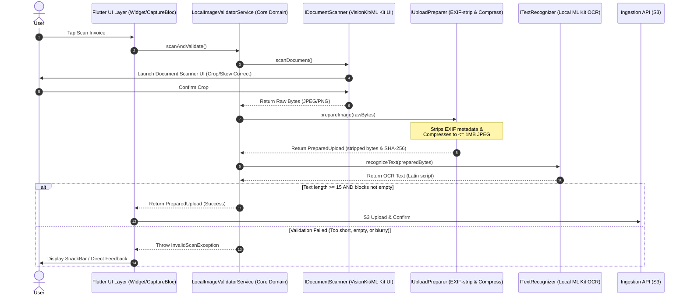

# 03 — Mobile Local Image Quality & OCR Validation

**Non-Functional Specification | Phase 4/5 | Mobile Local Image Quality & OCR Validation**

## Overview

This specification outlines the integration of on-device image validation and OCR analysis for the Wobblio Flutter app (iOS & Android). The system performs low-latency pre-upload quality checks locally before uploading images to S3, reducing backend vision LLM processing costs (Qwen/Claude) and preventing user frustration due to blurry uploads.

To achieve compliance with GDPR (data minimization) and Wobblio's architecture:
1. **No direct SDK dependencies in Core**: Native document scanning and ML Kit OCR are abstracted as clean ports in the domain layer.
2. **GDPR Exif Stripping & Compression**: Every scanned image is compressed to $\le 1\text{MB}$ and stripped of EXIF/GPS metadata *client-side* using the `IUploadPreparer` port before it is validated or uploaded.
3. **Graceful Degradation**: On-device OCR has fallback paths if native machine learning modules (e.g. Google Play Services dependencies) are missing or failing to download.

---

## 1. Architectural Strategy & Image Lifecycle

Instead of custom camera engines, the mobile client invokes native document scanners (VisionKit on iOS, Google ML Kit Document Scanner on Android) via the `flutter_doc_scanner` plugin. The image is then processed for GDPR compliance (compressed, stripped of EXIF metadata), verified locally for readable text, and finally uploaded.



---

## 2. Dependencies (`pubspec.yaml`)

We use `flutter_doc_scanner` to invoke the operating system's built-in scanning engines, alongside the local text recognition module of ML Kit.

```yaml
dependencies:
  flutter:
    sdk: flutter
  # Native hardware document capture wrapper
  flutter_doc_scanner: ^0.0.20 
  # Lightweight on-device text presence validator
  google_mlkit_text_recognition: ^0.15.1
  # Existing client-side compression/EXIF stripper
  flutter_image_compress: ^2.3.0
```

---

## 3. Platform Configuration & Optimization

### Android Setup (`android/app/build.gradle` & `AndroidManifest.xml`)

MinSdkVersion must be at least `21`.

```groovy
// android/app/build.gradle
defaultConfig {
    minSdkVersion 21
}
```

#### Install-Time OCR Model Pre-download (CRITICAL)
By default, ML Kit downloads its OCR model dynamically on first use, causing potential latency spikes or failure on the first scan. Configure the application to download the OCR model automatically at install time from the Google Play Store:

```xml
<!-- android/app/src/main/AndroidManifest.xml -->
<manifest ...>
    <application ...>
        <!-- Pre-downloads ML Kit OCR model at install time -->
        <meta-data
            android:name="com.google.mlkit.vision.DEPENDENCIES"
            android:value="ocr" />
    </application>
</manifest>
```

### iOS Setup (`ios/Runner/Info.plist`)

Ensure the minimum deployment target in your `Podfile` is at least `iOS 15.5`.

```xml
<!-- ios/Runner/Info.plist -->
<key>NSCameraUsageDescription</key>
<string>Wobblio needs camera access to scan your invoices for quality validation.</string>
```

---

## 4. Core Domain Architecture (Ports & Services)

Following the strict import directionality rules (per [flutter-architecture-guard.md](../../.claude/rules/flutter-architecture-guard.md)), all third-party package dependencies are hidden behind abstract ports.

### 4.1 Document Scanner Port (`lib/core/ports/document_scanner.dart`)

```dart
import 'dart:typed_data';

abstract class IDocumentScanner {
  /// Launches native OS scanner overlay (VisionKit / Google Play Services ML Kit).
  ///
  /// Returns raw image bytes, or `null` if the user cancels.
  Future<Uint8List?> scanDocument();
}
```

### 4.2 Text Recognizer Port (`lib/core/ports/text_recognizer.dart`)

```dart
import 'dart:typed_data';

abstract class ITextRecognizer {
  /// Performs on-device text recognition on [imageBytes].
  ///
  /// Throws [MlKitException] if the OCR library or engine fails.
  Future<String> recognizeText(Uint8List imageBytes);
}
```

### 4.3 Validation Domain Service (`lib/core/ingestion/local_image_validator_service.dart`)

This orchestrator lives in the core domain and binds the ports together.

```dart
import 'dart:typed_data';
import 'package:wobblio/core/ingestion/prepared_upload.dart';
import 'package:wobblio/core/ports/document_scanner.dart';
import 'package:wobblio/core/ports/text_recognizer.dart';
import 'package:wobblio/core/ports/upload_preparer.dart';
import 'package:wobblio/core/error/exceptions.dart';

class InvalidScanException implements Exception {
  final String message;
  InvalidScanException(this.message);
  @override
  String toString() => message;
}

class LocalImageValidatorService {
  LocalImageValidatorService({
    required IDocumentScanner scanner,
    required IUploadPreparer uploadPreparer,
    required ITextRecognizer textRecognizer,
  })  : _scanner = scanner,
        _uploadPreparer = uploadPreparer,
        _textRecognizer = textRecognizer;

  final IDocumentScanner _scanner;
  final IUploadPreparer _uploadPreparer;
  final ITextRecognizer _textRecognizer;

  /// Runs the full on-device capture, EXIF stripping, and OCR quality gate.
  Future<PreparedUpload?> captureAndValidateInvoice() async {
    // 1. Capture Image via Native scanner
    final Uint8List? rawBytes = await _scanner.scanDocument();
    if (rawBytes == null) {
      return null; // User cancelled
    }

    // 2. GDPR EXIF stripping + Compression via existing IUploadPreparer
    // Enforces keepExif: false and <=1MB JPEG size limit
    final PreparedUpload preparedUpload = await _uploadPreparer.prepareImage(rawBytes);

    // 3. Local Heuristic (OCR Verification) on the clean, prepared bytes
    try {
      final String text = await _textRecognizer.recognizeText(preparedUpload.bytes);

      // Validation Gate: Ensure there's a baseline quantity of readable data blocks
      // An empty image, a blurry shot, or a non-document object will fail this check.
      if (text.trim().length < 15) {
        throw InvalidScanException(
          "Validation Failed: Document text is unreadable or blurry. Please try again."
        );
      }

      return preparedUpload;
    } on Exception catch (e) {
      // Graceful degradation: If ML Kit fails (e.g. Play Services download failure), 
      // log and fallback to upload without OCR validation to prevent hard blocking the user.
      if (e.toString().contains('MlKitException') || e.toString().contains('GooglePlayServices')) {
        // Fallback option: allow upload because EXIF is already stripped and compressed.
        return preparedUpload;
      }
      rethrow;
    }
  }
}
```

---

## 5. Infrastructure Adapters

Adapters live strictly in `lib/infrastructure/adapters/` and handle the concrete SDK packages.

### 5.1 Document Scanner Adapter (`lib/infrastructure/adapters/flutter_doc_scanner_adapter.dart`)

```dart
import 'dart:io';
import 'dart:typed_data';
import 'package:flutter_doc_scanner/flutter_doc_scanner.dart';
import 'package:wobblio/core/ports/document_scanner.dart';

class FlutterDocScannerAdapter implements IDocumentScanner {
  @override
  Future<Uint8List?> scanDocument() async {
    final dynamic scanData = await FlutterDocScanner().getScannedDocumentAsImages();
    
    if (scanData == null || scanData['images'] == null) {
      return null;
    }
    
    final List imagesList = scanData['images'] as List;
    if (imagesList.isEmpty) {
      return null;
    }

    final String imagePath = imagesList.first.toString();
    return File(imagePath).readAsBytes();
  }
}
```

### 5.2 Text Recognizer Adapter (`lib/infrastructure/adapters/ml_kit_text_recognizer_adapter.dart`)

```dart
import 'dart:typed_data';
import 'dart:io';
import 'package:google_mlkit_text_recognition/google_mlkit_text_recognition.dart';
import 'package:wobblio/core/ports/text_recognizer.dart';

class MlKitException implements Exception {
  final String message;
  MlKitException(this.message);
  @override
  String toString() => "MlKitException: $message";
}

class MlKitTextRecognizerAdapter implements ITextRecognizer {
  final TextRecognizer _textRecognizer = TextRecognizer(script: TextRecognitionScript.latin);

  @override
  Future<String> recognizeText(Uint8List imageBytes) async {
    try {
      // ML Kit requires a File path or metadata structures for InputImage.
      // We write to a temporary file in the cache directory to construct InputImage.
      final tempDir = Directory.systemTemp;
      final tempFile = File('${tempDir.path}/ocr_temp_${DateTime.now().millisecondsSinceEpoch}.jpg');
      await tempFile.writeAsBytes(imageBytes);

      final InputImage inputImage = InputImage.fromFile(tempFile);
      final RecognizedText recognizedText = await _textRecognizer.processImage(inputImage);

      // Clean up the temporary file
      if (await tempFile.exists()) {
        await tempFile.delete();
      }

      return recognizedText.text;
    } catch (e) {
      throw MlKitException(e.toString());
    }
  }

  // Called when app/service is disposed
  void close() {
    _textRecognizer.close();
  }
}
```

### 5.3 Composition Root Registration (`lib/main.dart`)

```dart
import 'package:get_it/get_it.dart';
import 'package:wobblio/core/ports/document_scanner.dart';
import 'package:wobblio/core/ports/text_recognizer.dart';
import 'package:wobblio/core/ports/upload_preparer.dart';
import 'package:wobblio/core/ingestion/local_image_validator_service.dart';
import 'package:wobblio/infrastructure/adapters/flutter_doc_scanner_adapter.dart';
import 'package:wobblio/infrastructure/adapters/ml_kit_text_recognizer_adapter.dart';

final getIt = GetIt.instance;

void setupDependencyInjection() {
  // Register adapters satisfying the ports
  getIt.registerLazySingleton<IDocumentScanner>(() => FlutterDocScannerAdapter());
  getIt.registerLazySingleton<ITextRecognizer>(() => MlKitTextRecognizerAdapter());
  
  // LocalImageValidatorService is registered as a Core Domain Service
  getIt.registerLazySingleton<LocalImageValidatorService>(() => LocalImageValidatorService(
        scanner: getIt<IDocumentScanner>(),
        uploadPreparer: getIt<IUploadPreparer>(), // Registered elsewhere in Composition Root
        textRecognizer: getIt<ITextRecognizer>(),
      ));
}
```

---

## 6. UI Integration & BLoC Pattern

The capture process is orchestrated within the BLoC. If validation fails, `CaptureBloc` transitions to an error state.

```dart
// lib/ui/capture/capture_bloc.dart
void _onCaptureStarted(CaptureStarted event, Emitter<CaptureState> emit) async {
  emit(CaptureInProgress());
  try {
    final validatorService = getIt<LocalImageValidatorService>();
    final preparedUpload = await validatorService.captureAndValidateInvoice();

    if (preparedUpload == null) {
      emit(CaptureInitial()); // User cancelled
      return;
    }

    emit(CaptureSuccess(preparedUpload: preparedUpload));
  } on InvalidScanException catch (e) {
    emit(CaptureFailure(errorMessage: e.message));
  } catch (e) {
    emit(CaptureFailure(errorMessage: "An unexpected error occurred during capture."));
  }
}
```

In the UI Widget Layer:
```dart
BlocListener<CaptureBloc, CaptureState>(
  listener: (context, state) {
    if (state is CaptureFailure) {
      ScaffoldMessenger.of(context).showSnackBar(
        SnackBar(
          content: Text(state.errorMessage),
          backgroundColor: Colors.redAccent,
        ),
      );
    }
  },
);
```

---

## 7. Verification & Threshold Guidelines

* **The "Zero Download" Benefit**: Apple's native *VisionKit* document selector is built into the iOS framework. ML Kit Document Scanner is part of Google Play Services on Android.
* **Why this passes the quality check**: Low-resolution or extremely blurry text makes the local OCR pass return fewer than 15 parsed characters. This reliably catches photos of desk surfaces, human hands, or empty receipts.
* **Fallback Safety (GDPR Hard Lock)**: In all scenarios—whether OCR validation succeeds, fails, or fails to initialize due to a library crash—**EXIF stripping must run first**. This guarantees that no geotags or device serial numbers ever leave the local sandbox.